NIFI深入学习

1. NIFI集群的部署与使用
2. FlowFile生成案例
3. NIFI模板案例
4. Flowfile的深入学习和实践
5. NIFI表达式语言实践
6. NIFI监控功能的深入学习和实践
7. NIFI连接与关系的深入学习和实践


## 1. 术语

**DataFlow Manager**: DataFlow Manager(DFM)是NiFi用户,具有添加,删除和修改NiFi数据流组件的权限。

**FlowFile** : FlowFile代表NiFi中的单个数据。FlowFile由两个组件组成:FlowFile属性(.attribute)和FlowFile内容(content)。内容是FlowFile表示的数据。属性是提供有关数据的信息或上下义的特征,它们由键值对组成。所有FlowFiles都具有以下标准属性;

- uuid:一个通用唯一标识符,用于区分FlowFile与系统中的其他FlowFiles

- filename:在将数把存储到磁盘或外部服务时可以使用的可读文件名

- path:在将数据存储到磁盘或外部服务时可以使用的分层结构值,以便数据不存储在单个日录中

**Processor** :处理器是NiFi组件,用于监听传入数据、从外部来源提取数据、将数据发布到外部来源、路由.转换或提取FlowFiles。

**Relationship** :每个处理器都为其定义了零个或多个关系。命名这些关系以指示处理FlowFile的结果含义。处理器处理完FlowFile后,它会将FlowFile路由(传输)到其中一个关系。DFM能够将每一个关系连接到其他组件,以指定FlowFile应该在哪甲进行下一步处理。

**Connection**: DFM通过将组件从NiFi工具栏的Components部分拖动到画布,然后通过Connections将组件连接在一起来创建自动的数据处理流程。每个连接由一个或多个关系组成。对于每个connection,DFM都可以为其确定使用哪些关系。这样我们可以基于其处理结果的不同来以不同的方式路由数据。每个连接都包含一个FlowFile队列。将FlowFile传输到特定关系时,会将其添加到属于当前Connection的队列中。

**Controller Service**: 控制器服务是扩展点,在用户界面中由DFM添加和配置后,将在NiFi启动时启动,并提供给其他组件(如处理器或其他控制器服务)需要的信息。常见Controller Service比如standardssLContextService,它提供了—次配置密钥库和/或信任库属性的能力,并在整个应用程序中重用该配置。我们的想法是,控制器服务不是在每心能需要它的处理器中配置这些信息,而是根据需要为任何处理器提供。

**Funnel**:漏斗是一个NiFi组什,用于将来自多个Connections的数据合并到一个Connection中。

**Process Group**: 当数掘流变得复杂时,在更高,更抽象的层面上推断数据流是很有用的。NiFi允许将多个组件(如处理器)组合到一个过程组中。然后,DFM可以在NiFi用户界面轻松地将多个流程组连接到逻辑数据处理流程中,DFM还可以进入流程组查看和操f作流程组中的组件。

**Port**: 使用一个或多个进程组构建的数据流需要一种方法将进程组连接到其他数据流组件。这是通过使用Ports实现的。DFM可以向进程组添加任意数量的输入端口和输出端口,并相应地命名这些端口。

**Remote Process Group** :正如数据传输进出进程组一样,有时需要将数据从一个NiFi实例传输到另一个NIFI实例。虽然NiFi提供了许多不同的机制来将数据从一个系统传输到另一个系统;但是如果将数据传输到另一个NiFi实 例,远程进程组通常是实现此目的的最简单方法。

**Bulletin**: NiFi用户界面提供了大量有关应用程序当前状态的监视和反馈。除了滚动统计信息和为每个组件提供的当前状态之外,组件还能够报告公告。每当组件报告公告时,该组件上都会显示公告图标(处理器右上角红色的图标)。系统级公告显示在页面顶部附近的状态栏上。使用鼠标悬停在该图标上将提供一个工具提示,显示公告的时间和严重性(Debug.Info.Warning.Error以及公告的消点。也可以在全局菜单中的公告版页面中查看和过滤所有组件公告

**Template** : 通常DataFlow由许多可以重用的组件组成。NiFi允许DFM选择DataFlow的一部分(或整个DataFlow)并创建模板。此模板具有名称,然后可以像其他组件一样拖动到画布上。最终,可以将若干组件组合在一起以形成更大的构建块;然后从该构建块创建数据流处理流程。这些模板也可以导出为XML并导入到另一个NiFi实例中，从而可以共享这些构建块。

**flow.xml.gz** :DFM放入NiFi用户界面画布的所有内容都实时写入一个名为flow.xml.gz的文件。该文件默认位于conf目录中。在画布上进行的任何更改都会自动保存到此文件中,而无需用户点击保存按钮。此外,NiFi在更新时会自动在归档目录中创建此文件的备份副本。您可以使用这些归档文件来回滚配置,如果想要回滚,先停止NiFi,将flow.xml.gz替换为所需的备份副本,然后重新启动NiFi。在集群环境中,停止整个NiFi集群,替换其中一个节点的flow.xml.gz,删除自其他节点的flow.xml.gz,然后重新启动该节点。确认此节点启动为单节点集群后,然后启动其它节点。替换的流配置将在集群中同步。flow.xml.gz的名称和位置以及自动存档行为是可配置的。


## 2. Linux 配置优化

如果您在Linux上运行，请考虑这些最佳实践。典型的Linux默认设置不一定能够满足像NiFi这样的IO密集型应用程序的需求。对于这些最佳实践，NIFI所在的Linux发行版的实际情况可能会有所不同，可以参考下面的介绍，但是请参考特定发行版的文档。

**最大文件句柄(Maximum File Handles)**
NiFi在任何时候都可能会打开非常大量的文件句柄。通过编辑/etc/security/limits.conf 来增加限制，添加类似的内容

```sh
hard nofile 5o000
soft nofile 5o000
```

**最大派生进程数(Maximum Forked Processes)**

NiFi可以配置生成大量的线程。要增加Linux允许的数量，请编辑/etc/security/limits.conf

```sh
hard nproc 10000
soft nproc10000
```


你的发行版Linux可能需要通过添加来编辑/etc/security/limits.d/20-nproc.conf
```sh
soft nproe 10000
```

**增加可用的TCP套接字端口数(Increase the number of TCP socket ports available)**

如果你的流程会在很短的时间内设置并拆除大量socket，这一点尤为重要。

```sh
sudo sysctl -w net.ipv4.ip_loca1_port_range ="10000 65000"
```


**设置套接字在关闭时保持TIMED_WAIT状态的时间(Set how long sockets stay in a TIMED_WAIT state when closed)**

考虑到你希望能够快速设置和拆卸新套接字，你不希望您的套接字停留太长时间。最好多阅读一下并调整类似的东西

```sh
sudo sysctl -w net.ipv4.netfilter.ip_conntrack_tcp_timeout_time_wait ="1”
```

**告诉Linux你永远不希望NiFi交换(Tell Linux you never want NiFi to swap)**

对于某些应用程序来说， swapping非常棒。对于像NiFi一样想要运行的程序并不好。要告诉Linux你想关掉swapping，你可以编辑/etc/sysctl.conf来添加以下行

```sh
vm . swappiness = o
```


对于处理各种NiFi repos的分区，请关闭诸如atime之类的选项。这样做会导致吞吐量的惊人提高。编辑/etc/fstab文件，对于感兴趣的分区，添加noatime选项。
比如我要在根文件系统使用noatime，可以编辑/etc/fstab文件，如下:

```sh
/ dev / mapper/centos-root xfs   defau1ts.noatime  0 0
UUID=47f23406-2cda-4601-93b6-09030b30e2dd /boot xfs defaults 0 0
/dev/mapper/centos-swap swap  swap  defaults  0 0
```


## 3. NIFI集群

### 3.1 为什么集群?
​	DFM可能会发现在单个服务器上使用一个NiFi实例不足以处理他们拥有的数据量，因此，一种解决方案是在多个NiFi服务器上运行相同的数据流。但是，这会产生管理问题，因为每次DFM想要更改或更新数据流时，他们必须在每个服务器上进行这些更改，然后逐个监视每个服务器。而集群NiFi服务器，可以增加处理能力同时，支持单接口控制，通过该接口可以更改整个集群数据流并监控数据流。集群允许DFM只进行一次更改，然后将更改的内容复制到集群的所有节点。通过单一接口，DFM还可以监视所有节点的健康状况和状态。

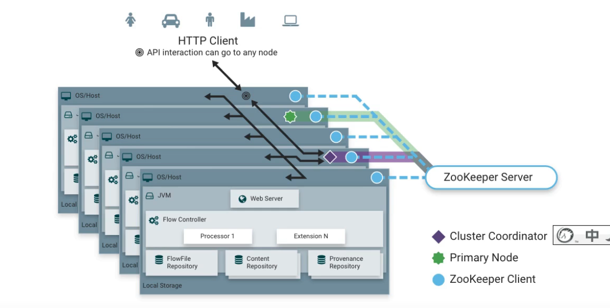


### 3.2 零主集群

​	NiFi来用Zero-Master Clustering范例。集群中的每个节点都对数据执行相同的任务，但每个节点都在不同的数据集上运行。其中一个节点白动被选择(通过Apache zooKeeper)作为集群协调器。然后，集群中的所有节点都会向此节点发送心跳/状态信息，并且此节点负责断开在一段时间内未报告任何心跳状态的节点。此外，当新节点选择加入集群时，新节点必须首先连接到当前选定的集群协调器，以获取最新的流。如果集群协调器确定允许该节点加入(基于其配置的防火墙文件)，则将当前流提供给该节点，并且该节点能够加入集群，假设节点的流副本与集群协调器提供的副本匹配。如果节点的流配置版本与集群协调器的版本不同，则该节点将不会加入集群。

###  3.3 术语
NiFi Clustering是独一无二的，有自己的术语。在设置集群之前了解以下术语非常重要:

**NiFi集群协调器(NiFi clusterCoordinator)** : NiFi集群协调器是NiFi集群中的节点，负责管理集群中允许执行任务的节点，并为新加入的节点提供最新的数据流晕。当DataFlow Manager管理集群中的数据流时，可以通过集群中任何节点的用户界面执行此操作。然后，所做的任何更改都将复制到集群中的所有节点。

**节点(Nodes)** :每个集群由一个或多个书点组成。书点执行实际的数据处理。

**主节点(Primary Node)** :每个集群都有一个主节点。在此节点上，可以运行"隔离处理器"(见下文)。ZooKeeper用于自动选择主节点。如果该节点由于任何原因断开与集群的连接，将自动选择新的主节点。用户可以通过查看用户界面的“集群管理”页面来确定当前选择哪个节点作为主节点。

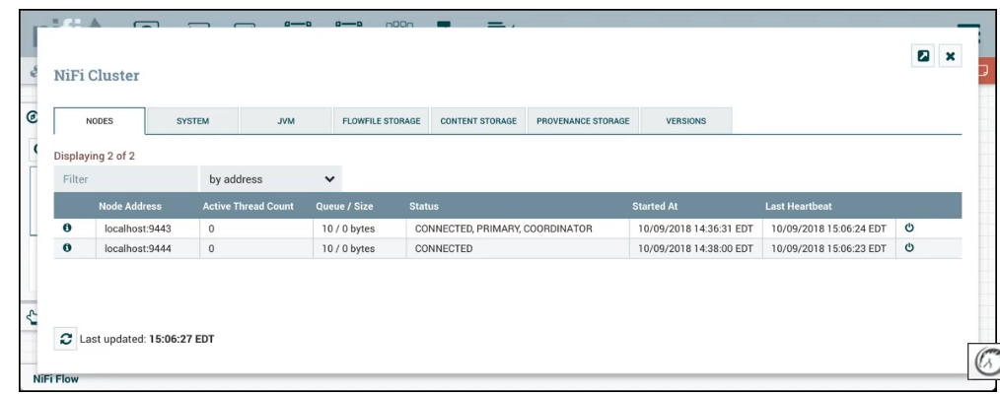

**孤立的Processor**: 在NiFi集群中，相同的数据流会在所有节点上运行。但是，可能存在DFM不希望每个处理器在每个节点上运行的情况。最常见的情况是使用的处理器存在与外部服务进行通信得的情况。例如，GetSFTP处理器从远程目录中提取。如果GetSFTP处理器在集群中的每个节点上运行并同时尝试从同一个远程目录中提取，则可能存在重复读取。因此，DFM可以将主节点上的GetSFTP配置为独立运行，这意味着它仅在该节点上运行。通过适当的数据流配置，它可以提取数据并在集群中的其余节点之间对其进行负载平衡。注意，虽然存在此功能，但仅使用独立的NiFi实例来提取数据并将其输出内容分发给集群也很常见。它仅取决于可用资源以及管理员配置集群的方式。

**心跳**:节点通过"心跳""将其健康状况和状态传达给当前选定的集群协调器，这使协调器知道它们仍然处于连接状态并正常工作。默认情况下，节点每`5秒`发出一次心跳，如果集群协调器在`40秒`内没有从节点收到心跳，则由于"缺乏心跳"而断开节点。5秒设置可在`nif.properties`文件中配置。集群协调器断开节点的原因是协调器需要确保集中的每个节点都处于存活同步状态，并且如果没有定期收听到节点，协调器无法确定它是否仍与其余节点同步。如果在40秒后节点发送新的心跳，协调器将自动把请求节点重新加入集群。一旦接收到心跳，由于心跳不足导致的断开连接和重新连接信息都会报告给用户界面中的DFM。

### 3.4 . 使用nifi集成zookeeper


**修改配置文件，将该文件复制两个**

```sh
cd /opt/nifi-1.12.1/conf
#配置zk配置文件
dataDir=./state/zookeeper

server.1=localhost:12888:13888;12181
server.2=localhost:14888:15888;12182
server.3=localhost:16888:17888;12183

# 配置zk的myid
[root@cdh01 conf]# cd ../
[root@cdh01 nifi-1.12.1]# ls
bin   content_repository   docs        flowfile_repository  LICENSE  NOTICE                 README  state
conf  database_repository  extensions  lib                  logs     provenance_repository  run     work
[root@cdh01 nifi-1.12.1]# mkdir -p ./state/zookeeper
[root@cdh01 nifi-1.12.1]# cd state/zookeeper/
[root@cdh01 zookeeper]# ls
[root@cdh01 zookeeper]# echo 1 > myid
[root@cdh01 zookeeper]# cat myid 
1

# 配置nifi.properties
#开启内嵌zk
nifi.state.management.embedded.zookeeper.start=true

# web properties #
nifi.web.http.host=
nifi.web.http.port=18001

# cluster node properties (only configure for cluster nodes) #
nifi.cluster.is.node=true
nifi.cluster.node.address=localhost
nifi.cluster.node.protocol.port=28001
nifi.cluster.flow.election.max.candidates=1


nifi.cluster.load.balance.port=16342
nifi.zookeeper.connect.string=localhost:12181,localhost:12182,localhost:12183

# vim state-management.xml
    <cluster-provider>
        <id>zk-provider</id>
        <class>org.apache.nifi.controller.state.providers.zookeeper.ZooKeeperStateProvider</class>
        <property name="Connect String">localhost:12181,localhost:12182,localhost:12183</property>
        <property name="Root Node">/nifi</property>
        <property name="Session Timeout">10 seconds</property>
        <property name="Access Control">Open</property>
    </cluster-provider>
   
   ## 复制到其他两个节点
[root@cdh01 opt]# cp -r nifi-18001/ nifi-18002
[root@cdh01 opt]# cp -r nifi-18001/ nifi-18003

## 修改其他节点配置
[root@cdh01 opt]# vim nifi-18002/state/zookeeper/myid 
[root@cdh01 opt]# vim nifi-18003/state/zookeeper/myid 

## vim nifi-18002/conf/nifi.properties
nifi.web.http.port=18002
nifi.cluster.node.protocol.port=28002
nifi.cluster.load.balance.port=16343
## 启动三台服务
./nifi-18003/bin/nifi.sh start
## 查看日志
tail -f  nifi-18001/logs/nifi-app.log 
```

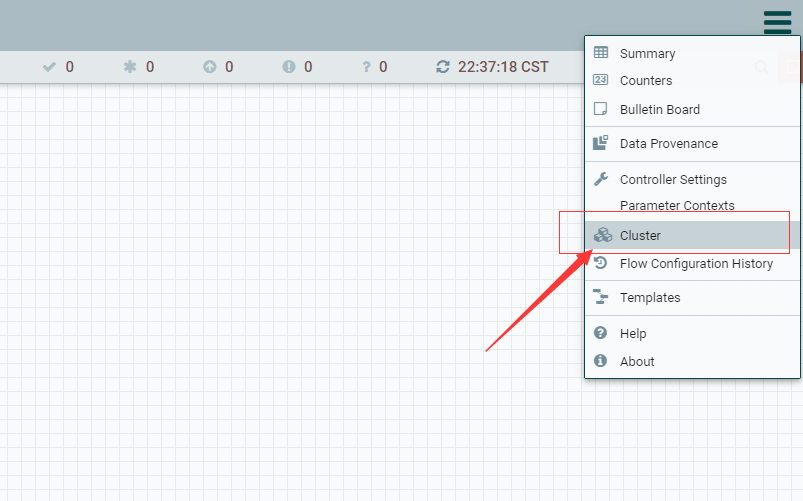

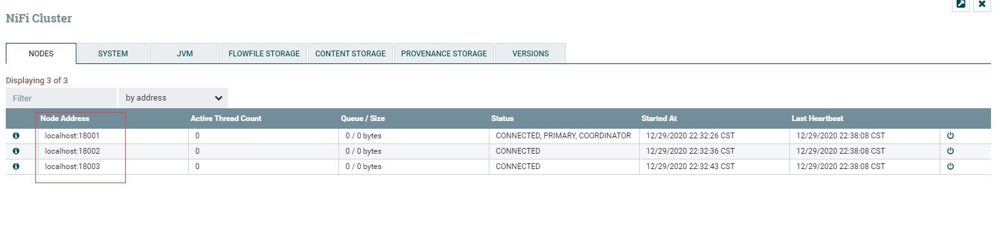

### 3.5. 使用外部的zk

1、安装启动集群Zookeeper

2、准备三个单机NIFI实例

3、实例中，conf/zookeeper.properties文件，可以不用编辑

4、编辑节点conf/nifi.properties文件

```properties
#开启内嵌zk
nifi.state.management.embedded.zookeeper.start=false

# web properties #
nifi.web.http.host=
nifi.web.http.port=18001

# cluster node properties (only configure for cluster nodes) #
nifi.cluster.is.node=true
nifi.cluster.node.address=localhost
nifi.cluster.node.protocol.port=28001
nifi.cluster.flow.election.max.candidates=1


nifi.cluster.load.balance.port=16342
## 改成外部的zk地址
nifi.zookeeper.connect.string=localhost:12181,localhost:12182,localhost:12183

# vim state-management.xml
    <cluster-provider>
        <id>zk-provider</id>
        <class>org.apache.nifi.controller.state.providers.zookeeper.ZooKeeperStateProvider</class>
        <property name="Connect String">localhost:12181,localhost:12182,localhost:12183</property>
        <property name="Root Node">/nifi</property>
        <property name="Session Timeout">10 seconds</property>
        <property name="Access Control">Open</property>
    </cluster-provider>
```

### 3.6 故障排除

如果遇到问题并且您的集群无法按照描述运行，请调查节点上的nifi-app.log和nifi-user.log文件。如果需要，可以通过编辑conf/logback.xml文件将日志记录级别更改为DEBUG。具体来说，设置level="DEBUG"以下行(而不是"INFO" ):

```xml
<logger name="org.apache.nifi.web.api.config" level="INFO" additivity="false">
        <appender-ref ref="USER_FILE"/>
    </logger>
```


### 3.7 State管理

NiFi为处理器，报告任务，控制器服务和框架本身提供了一种机制来保持状态。例如，允许处理器在重新启动NiFi后从其停止的位置恢复。处理器可以从集群中的所有不同节点访问它的状态信息。

**配置状态提供程序**

当组件决定存储或检索状态时，有两种实现:节点本地或集群范围。在nifi.properties文件包含有关配置项。

| 属性                                     | 描述                                                         |
| ---------------------------------------- | ------------------------------------------------------------ |
| nifi.state.management.configuration.file | 第一个是指定外部XML文件的属性，该文件用于配置本地和/或集群范围的状态提供程序。此XML文件可能包含多个提供程序的配置 |
| nifi.state.management.provider.local     | 提供此XML文件中配置的本地State Provider标识符的属性          |
| nifi.state.management.provider.cluster   | 同样，该属性提供在此XML文件中配置的集群范围的State Provider的标识符。 |

此XML文件由顶级state-management元素组成，该元素具有local-provider和cluster-provider元素。然后，这些元素中的每一个都包含一个id元素，用于指定可在nifi.properties文件中引用的标识符，以及一个class元素，该元素指定要用于实例化State Provider的完全限定类名。最后，这些元素中的每一个可以具有零个或多个property元素。每个property元素都有一个属性，name即 propertyState Provider支持的名称。property元素的文本内容是属性的值。

```xml
  <local-provider>
        <id>local-provider</id>
        <class>org.apache.nifi.controller.state.providers.local.WriteAheadLocalStateProvider</class>
        <property name="Directory">./state/local</property>
        <property name="Always Sync">false</property>
        <property name="Partitions">16</property>
        <property name="Checkpoint Interval">2 mins</property>
    </local-provider>
```

在state-management.xml文件(或配置的任何文件)中配置了这些状态提供程序后，这些提供程序可通过标识符被引用。
	   默认情况下，本地状态提供程序配置为将writeAheadLocalstateProvider数据持久保存到
$NIFI_HOME/state/local目录。默认的集群状态提供程序配置为zooKeeperstateProvider 。默认的基于ZooKeeper的提供程序必须先connect string填充其属性，然后才能使用它。Connect string采用逗号分隔，IP和端口号使用:分割，例如my-zk-server1:2181,my-zk-server2:2181,my-zk-server3:2181。如果没有为任何主机指定端口,2181则假定为ZooKeeper默认值。

```xml
 <cluster-provider>
        <id>zk-provider</id>
        <class>org.apache.nifi.controller.state.providers.zookeeper.ZooKeeperStateProvider</class>
        <property name="Connect String">localhost:12181,localhost:12182,localhost:12183</property>
        <property name="Root Node">/nifi</property>
        <property name="Session Timeout">10 seconds</property>
        <property name="Access Control">Open</property>
    </cluster-provider>

```

向ZooKeeper添加数据时，Access Control有两个选项:open和creatoronly。如果该Access control属性设置为open，则允许任何人登录ZooKeeper并拥有查看，更改，删除或管理数据的完全权限。如果指定creatoronly，则仅允许创建数据的用户读取，更改，删除或管理数据。为了使用该creatoronly选项，NiFi必须提供某种形式的身份验证。建议使用Open。
	如果NiFi配置为在独立模式下运行，则cluster-provider无需在state-management.xml文件中填充该元素，如果填充它们，实际上将忽略该元素。但是，local-provider元素必须始终存在并填充。
	此外，如果NiFi在集群中运行，则每个节点还必须配置引用nifi.state.management.provider .cluster元素。否则,NiFi将无法启动。
这些都是通过外部的state-management.xml文件，而不是通过nifi.properties 文件进行配置。

应注意，如果处理器和其他组件使用集群作用域保存状态，则如果实例是独立实例(不在集群中)或与集群断开连接，则将使用本地状态提供程序。这也意味着如果将独立实例迁移到集群中，则本地的状态将不再可用，因为该组件将开始使用集群状态提供程序而不是本地状态提供程序。

### 3.8 管理节点

**断开节点**

DFM可以手动断开节点与集群的连接。节点也可能由于其他原因而断开连接，例如由于缺乏心跳。当节点断开连接时，集群协调器将在用户界面上显示公告。在解决断开连接节点的问题之前，DFM将无法对数据流进行任何更改。DFM或管理员需要对节点的问题进行故障排除，并在对数据流进行任何新的更改之前解决该问题。但是，值得注意的是，仅仅因为节点断开连接并不意味着它不起作用。这可能由于某些原因而发生，例如，当节点由于网络问题而无法与集群协调器通信时。
要手动断开节点，请从节点的行中选择"断开连接"图标。


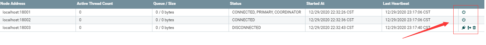


**卸载节点**

保留在断开连接的节点上的流文件可以通过卸载重新平衡到集群中的其他活动节点。在Cluster Management对话框中，为Disconnected节点选择"Offload"图标。这将停止所有处理器，终止所有处理器，停止在所有远程进程组上传输，并将流文件重新平衡到集群中的其他连接节点。


由于遇到错误(内存不足，没有网络连接等)而保持"卸载"状态的节点可以通过重新启动节点上的NiFi重新连接到集群。卸载的节点可以重新连接到集群(通过选择连接或重新启动节点上的NiFi)或从集群中删除。


**删除节点**

在某些情况下，DFM可能希望继续对流进行更改，即使节点未连接到集群也是如此。在这种情况下，DFM可以选择完全从集群中删除节点。在Cluster Management对话框中，为Disconnected或Offloaded节点选择"Delete"图标。删除后，在重新启动节点之前，节点无法重新加入集群。


**退役节点**

停用节点并将其从集群中删除的步骤如下:

1.断开节点。

2.断开连接完成后，卸载节点。

3.卸载完成后，删除该节点。

4.删除请求完成后，停止/删除主机上的NiFi服务。

NiFi CLI节点命令作为uI的替代方案，以下NiFi CLl命令可用于检索单个节点，检索节点列表以及连接/断开/卸载/删除(connecting/disconnecting/offloading/deleting)节点:

- nifi get-node
-  nifi get-nodes
- nifi connect-node
- nifi disconnect-node
- nifi offload-node
- nifi delete-nede


### 3.9 流动选举

cluster启动的时候，NiFi必须确定哪个节点具有流的"正确"版本信息。这是通过对每个节点具有的流进行投票来完成的。当节点尝试连接到集群时，它会将其本地流的副本`flow.xml.gz`提供给集群协调器。如果尚未选择流"正确"流，则将节点的流与每个其他节点的流进行比较。然后每台对和自己一样的flow进行投票。如果还没有其他节点报告相同的流，则此流将以一票投票的方式添加到可能选择的流池中。如果投票时间(nifi.cluster.flow.election.max.wait.time)到了或者某一个flow.xml.gz已经达到票数
(nifi.cluster.flow.election.max.candidates)，则选出一个正确的flow.xml.gz。然后，不一致的node自动挂掉，除非它自己没有flow.xml.gz;而具有兼容流的节点将继承集群的流。选举是根据""民众投票"进行的，但需要注意的是，除非所有流量都是空的，否则获胜者永远不会是"空流"。对于加入集群失败的节点，可以通过删除flow.xml.gz文件来加入集群。


## 4. FlowFile生成器

FlowFile生成器:GenerateFlowFile和ReplaceText处理器，用于生成数据，对调试流程很有用。

### 4.1 GenerateFlowFile解析
**描述**
该处理器使用随机数据或自定义内容创建流文件。GenerateFlowFile用于负载测试、配置和仿真。

**属性配置**
在下面的列表中，必需属性的名称以粗体显示。任何其他属性(不是粗体)都被认为是可选的，并且指出属性默认值(如果有默认值)，以及属性是否支持表达式语言。

| 属性名称         | 默认值 | 可选值      | 描述                                                         |
| ---------------- | ------ | ----------- | ------------------------------------------------------------ |
| File size        | 0B     |             | 将使用的文件流的大小                                         |
| Batch size       | 1      |             | 每次调用时要传输出去的流文件的数量                           |
| Data Format      | Text   | Binary/Text | 指定数据应该是文本还是二进制                                 |
| Unique FlowFiles | false  | true/false  | 如果选择true，则生成的每个流文件都是惟一的。如果选择false, 处理器将生成一个随机值，所有的流文件都是相同的内容，模仿更高的吞吐量时可以这样使用 |
| custom Text      |        |             | 如果Data Format选择Text。且Unique FlowFiles选择为false，那么这个自定义文本将用作生成的流文件的内容，文件人小将被忽略。如果custom Text中使用了表达式语言，则每批生成的流文件只执行一次表达式语言的计算支持表达式语言:true(只使用变量注册表进行计算) |
| character set    | UTF-8  |             | 指定将白定义文本的字节写入流文件时要使用的编码               |

**应用场景**

该处理器多用于`测试`，配置生成设计人员所需要的特定数据，模拟数据来源或者压力测试、负载测试;
某些场景中可以作为配置灵活使用，比如设计人员想设计一个流程`查询多个表`，表名就可以做出json数组配置到Custom Text，之后再使用其他相关处理器生成含有不同表名属性的多个流文件，就可以实现一个流程查询多表。(额外延伸，也可以在变量注册表、缓存保存配置，通过不同的配置读取不同的表)

### 4.2 ReplaceText解析

**描述**
使用其他值替换匹配正则表达式的流文件部分内容，从而更新流文件的内容。

**属性配置**
在下面的列表中，必需属性的名称以粗体显示。任何其他属性(不是粗体)都被认为是可选的，并且指出属性默认值(如果有默认值)，以及属性是否支持表达式语言。

| 属性名称              | 默认值        | 可选值                                                       | 描述                                                         |
| --------------------- | ------------- | ------------------------------------------------------------ | ------------------------------------------------------------ |
| search Value          | (?s) (^.*$)   |                                                              | 正则表达式，仅用于“Literal Replace"和"Regex Replace"配策略支持表达式语言:true |
| Replacement   Value   | $1            |                                                              | 使用"Replacement Strategy"策略时插入的值。支持表达           |
| character set         | UTF-8         |                                                              | 字符集                                                       |
| Maximum Buffer size   | 1MB           |                                                              | 指定要缓冲的最大数据量(每个文件或每行，取决于计算模式)，以便应用替换。如果选择了“Entire Text"，并且流文件大于这个值，那么流文件将被路由到"failure"。在“Line-by-Line"模式下，如果一行文本比这个值大，那么FlowFile将被路由到"failure"。默认值为1 MB，主要用于“Entire Text"模式。在“Line-by-Line"模式中，建议使用8 KB或16 KB这栏的值。如果将<Replacement strategy>属性设置为其中之一:Append、Prepend、Always Replace，则忽略该值 |
| Replacement  strategy | Regex Replace | Prepend、 Append 、Regex Replace、 Literal Replace 、Always Replace | 在流文件的文本内容中如何替换以及替换什么内容的策略。         |
| Evaluation Mode       | Entire text   | Line-by-Line/Entire text                                     | 对每一行单独进行"替换策略"(Line-by-Line);或将整个文件缓冲到内存中(Entire text)，然后对其进行"替换策略"。 |

**应用场景**

使用正则表达式，来逐行或者全文本替换文件流内容，往往用于业务逻辑处理。

**示例**

1、**创建GenerateFlowFile并设置大小**

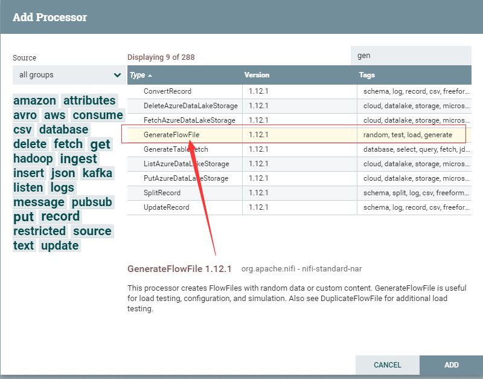

2、**配置FlowFile**

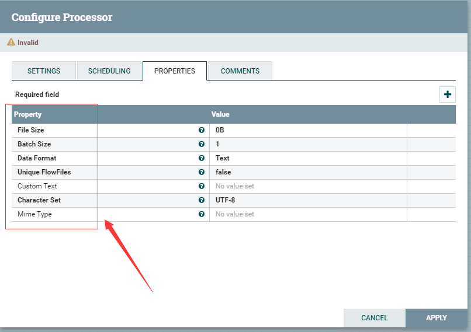

3、**创建ReplaceText并连接**


4、**启动GenerateFile**

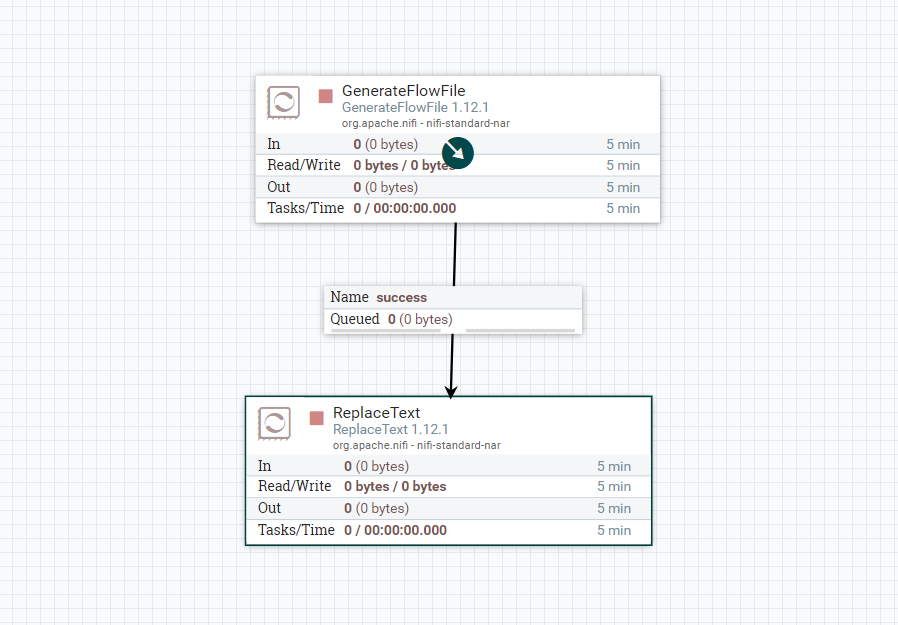

5、**配置ReplaceText**

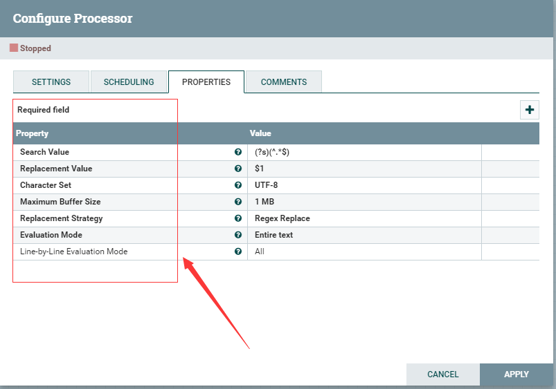

6、**创建PutFile**

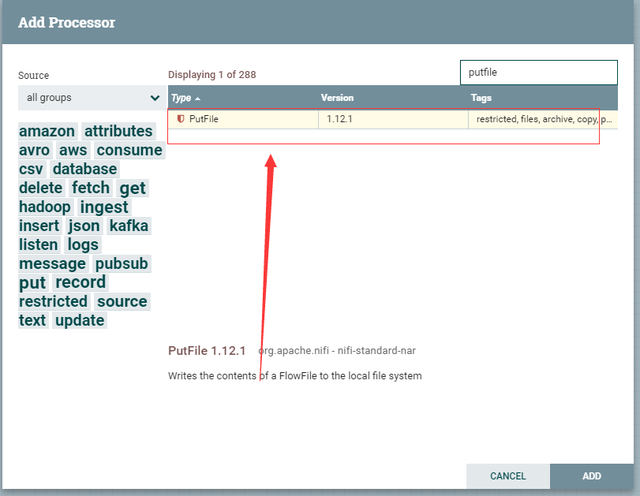


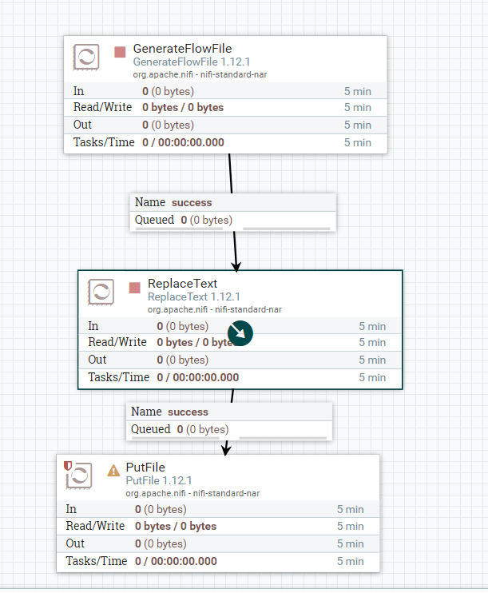

7、**停止，查看结果**

```sh
cd /tmp/data
```

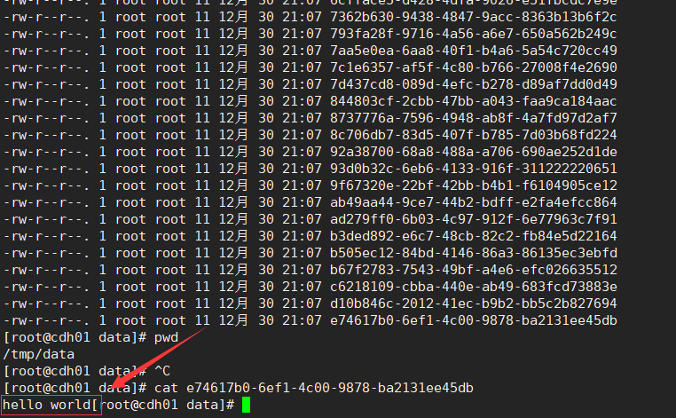


## 5.NIFi模板

### 5.1 导入模板

1. **导入test.xml模板文件**

   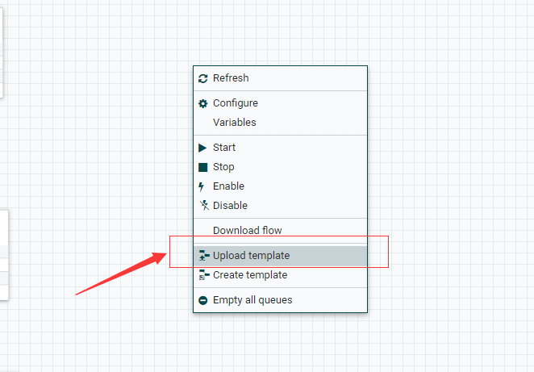

   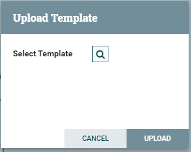

2. **查看模板列表**

   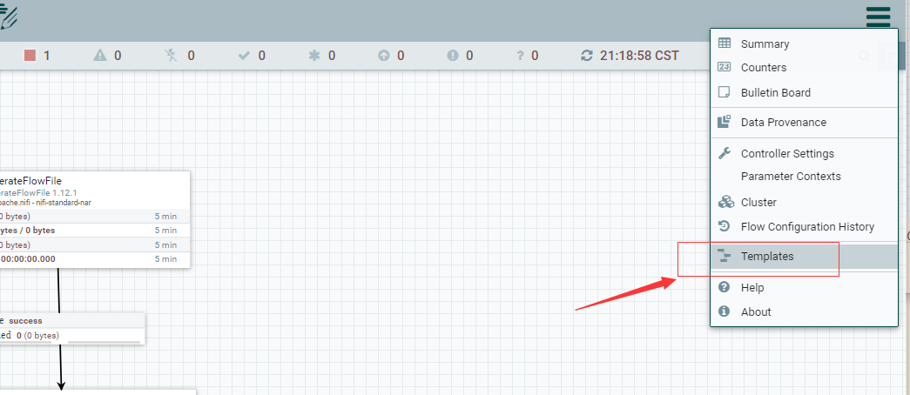

   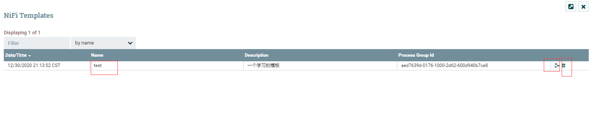

3. **创建模板引用**

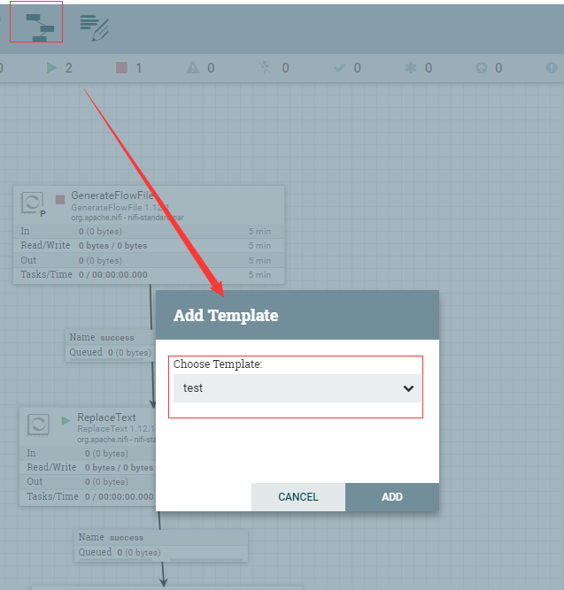

### 5.2 创建模板

1. **创建组**

   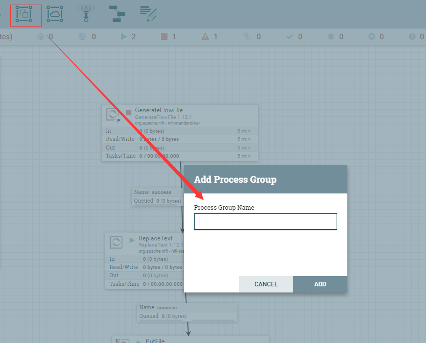

   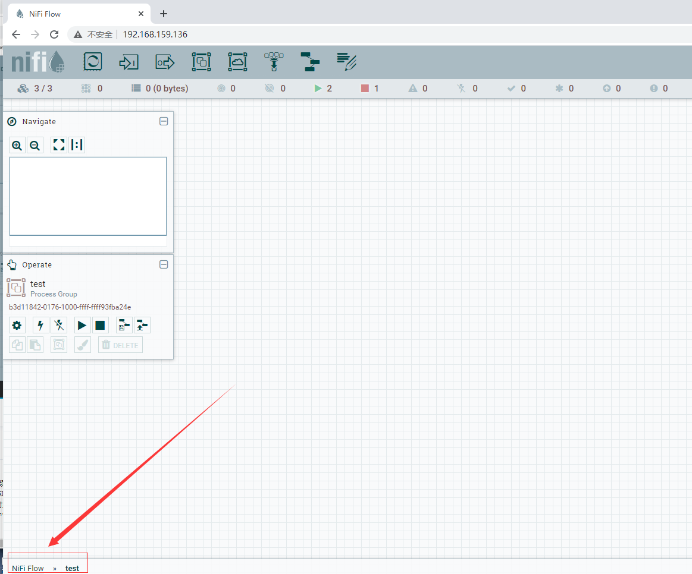

   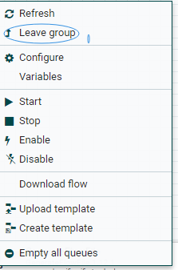

   shift + 左键 拖入组件组内

2. **创建模板**

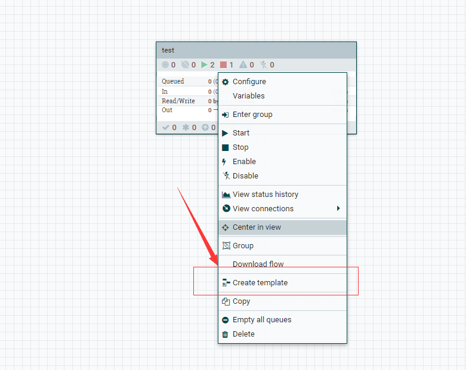

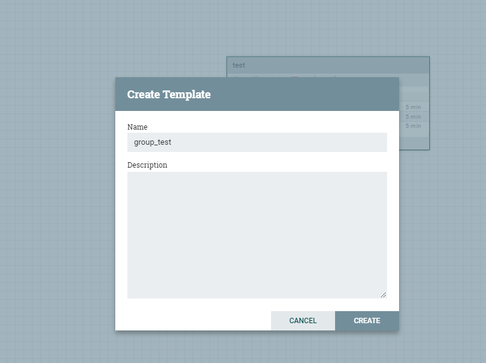

## 6. 监控nifi

NiFi提供有关DataFlow的大量信息，以便监控其健康状况。状态栏提供有关整体系统运行状况的信息。处理器，进程组和远程进程组提供有关其操作的细粒度详细信息。连接和进程组提供有关其队列中数据量的信息。摘要页面以表格格式提供有关画布上所有组件的信息，还提供包括磁盘使用情况，CPU利用率以及Java堆和垃圾收集信息的系统诊断。在集群环境中，此信息可以按节点使用，也可以作为整个集群中的聚合使用。我们将在下面探讨每个监控工件。|

**操作启动：test**

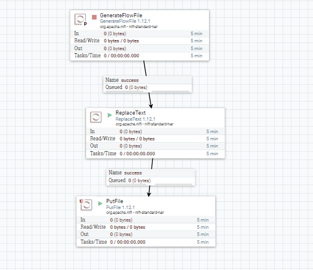


**状态栏**


**处理器面板**

NiFi提供有关画布上每个处理器的大量信息。

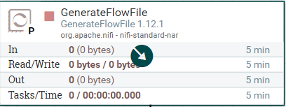

概述了以下元素:

- **处理器类型**:NiFi提供多种不同类型的处理器,以便执行各种任务。每种类型的处理器都旨在执行一项特定任务。处理器类型(在此示例中为PutFile)描述了此处理器执行的任务。在这种情况下,处理器将FlowFile写入磁盘-或者将FlowFile放入文件。
- **公告指示器**:当处理器记录某个事件已发生时,它会生成一个公告,以通过用户界面通知正在监控NiFi的人RDFM能够通过更新处理器配置对话框的设置选项卡中的公告级别字段来配置应在用户界面中显示的公告。默认值为WARN,这意味着UI中仅显示警告和错误。除非此处理器存在公告,否则此图标不存在。当它出现时,用鼠标悬停在图标上将提供一个工具提示,说明处理器和公告级别提供的消息。如果NiFi的实例是集群的,它还将显示发布公告的节点。
- **状态指示灯**:显示处理器的当前状态。以下指标是可能的:

  - 正在运行:处理器当前正在运行。
  - 已停止:处理器有效并已启用但未运行。
  - 无效:处理器已启用但当前无效且无法启动。将鼠标悬停在此图标上将提供工具提示,指示处理器无效的原因。
  - 已禁用:处理器未运行,在启用之前无法启动。此状态不表示处理器是否有效。

- **处理器名称**:这是处理器的用户定义名称。默认情况下,Processor的名称与Processor Type相同。在示例中,此值为"Copy to /review"。
- **活动任务**:此处理器当前正在执行的任务数。此数字受处理器配置对话框的计划选项卡中的并发任务设置的约束。在这里,我们可以看到处理器当前正在执行一项任务。如果NiFi实例是集群的,则此值表示当前正在集群中的所有节点上执行的任务数。
- **5分钟统计**:处理器以表格形式显示几种不同的统计数据。这些统计数据中的每一个都代表过去五分钟内完成的工作量。如果NiFi实例是集群的,则这些值表示在过去五分钟内所有节点组合完成了多少工作。这些指标是：
  -  In:处理器从其传入Connections的队列中提取的数据量。此值表示为count size,其中count是从队列中提取的FlowFiles的数量,size是这些FlowFiles内容的总大小。在此示例中,处理器已从输入队列中提取了29个FlowFiles,总计14.16兆字节(MB)。
  - Read/Write:处理器从磁盘读取并写入磁盘的FlowFile内容的总大小。这提供了有关此处理器所需的I/O性能的有用信息。某些处理器可能只读取数据而不写入任何内容,而某些处理器不会读取数据但只会写入数据。其他可能既不会读取也不会写入数据,而某些处理器会读取和写入数据。在这个例子中,我们看到在过去的五分钟内,这个处理器读取了4.88 MB的FlowFile内容,并且写了4.88 MB。这是我们所期望的,因为这个处理器只是将FlowFile的内容复制到磁盘。但请注意,这与从输入队列中提取的数据量不同。这是因为它从输入队列中提取的某些文件已经存在于输出目录中,并且处理器配置为在发生这种情况时将FlowFiles路由到失败。因此,对于那些已经存在于输出目录中的文件,数据既不会被读取也不会被写入磁盘。
  - **out**:处理器已传输到其出站连接的数据量。这不包括处理器自行删除的FlowFiles,也不包括路由到自动终止的连接的FlowFiles。与上面的""In"指标一样,此值表示为count size,其中count是已转移到出站
    Connections的FlowFiles的数量,size是这些FlowFiles内容的总大小。在此示例中,所有关系都配置为自动终止,因此不会报告任何FlowFiles已被转出。
  - **Tasks/Time**:此处理器在过去5分钟内被触发运行的次数以及执行这些任务所花费的时间。时间格式为hour: minute: second。请注意,所花费的时间可能超过五分钟,因为许多任务可以并行执行。例如,如果处理器计划运行60个并发任务,并且每个任务都需要一秒钟才能完成,则所有60个任务可能会在一秒钟内完成。但是,在这种情况下,我们会看到时间指标显示它需要60秒,而不是1秒。或换句话说，这个时间可以被认为是"系统时间"。

**进程组面板**

进程组提供了一种机制,用于将组件组合到一个逻辑构造中,以便以更高级别更容易理解的方式组织DataFlow。下图突出显示了构成Process Group解剖结构的不同元素:

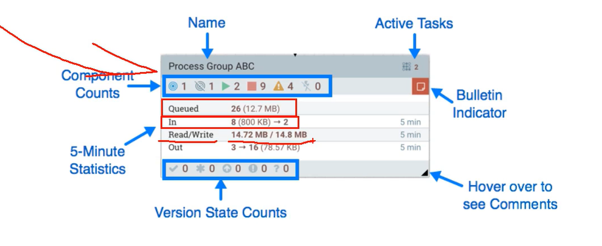


**NiFi Summary(摘要)**
	虽然NiFi画布对于了解如何布置配置的DataFlow非常有用,但在尝试辨别系统状态时,此视图并不总是最佳的。为了帮助用户了解DataFlow在更高级别的运行方式,NiFi提供了摘要页面。此页面位于用户界面右上角的"全局菜
单"中。
通过从全局菜单中选择摘要来打开摘要页面。这将打开摘要表对话框:

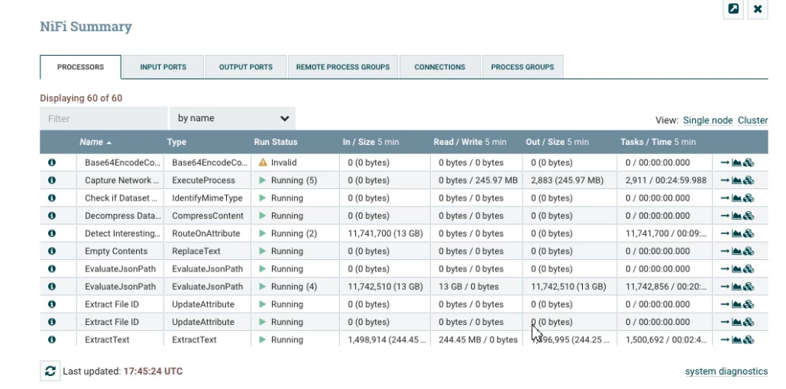

此对话框提供有关画布上每个组件的大量信息。下面|我们在对话框中注释了不同的元素,以便更容易地讨论对话框。

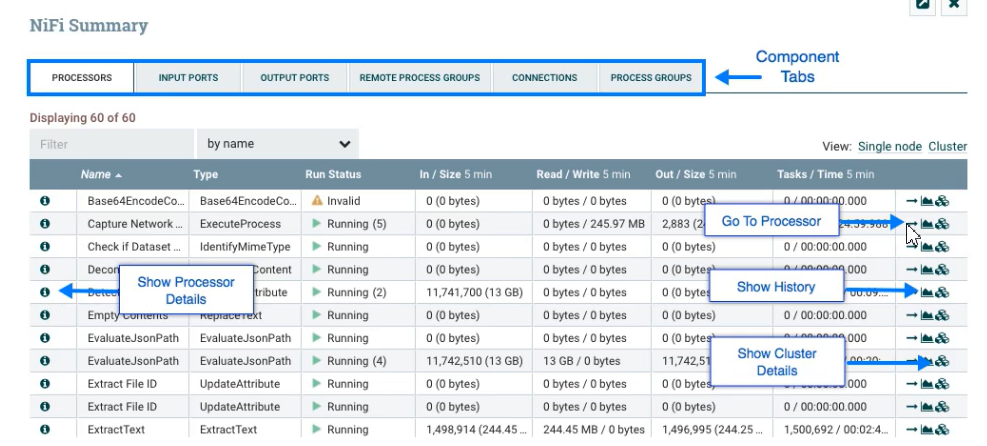

摘要页面主要由一个表组成,该表提供有关画布上每个组件的信息。此表上方是一组五个选项卡,可用于查看不同类型的组件。表中提供的信息与为画布上的每个组件提供的信息相同。可以通过单击列的标题对表中的每个列进行接序。
摘要页面还包含以下元素:

- Bulletin Ilndicator:与整个用户界面中的其他位置一样,当此图标存在时;将鼠标悬停在图标上将提供有关生成的公告的信息,包括消息,严重性级别,公告生成的时间以及(在集群环境中)生成公告的节点。与"摘要"表中的所有列一样,可以通过单击标题对显示公告的列进行排序,以便所有当前存在的公告显示在列表顶部。
- Details:单击详细信息图标将为用户提供组件的详细信息。此对话框与用户右键单击组件并选择查看配置菜单项时提供的对话框相同。
- Go To:单击此按钮将关闭摘要页面,并将用户直接带到NiFi画布上的组件。这可能会更改用户当前所在的进释组。如果已在新的浏览器选项卡或窗口中打开摘要页面(通过单击"Pop out"按钮,如下所述).则此图标不可用。. status History:单击状态历史记录图标将打开一个新对话框,其中显示为此组件呈现的统计信息的历史视图。
- Refresh:该Refresh按钮允许用户刷新显示的信息,而无需关闭对话框并再次打开它。上次刷新信息的时间显示在Refresh按钮右侧。页面上的信息不云目动新。r
- Filter: Filter元素允许用户通过键入全部或部分条件(例如处理器类型或处理器名称)来过滤摘要表的内容。可用的过滤器类型根据所选选项卡而不同。例如,如果查看处理器选项卡,则用户可以按名称或类型进行过滤。查看连接选项卡时,用户可以按源,名称或目标名称进行筛选。更改文本框的内容时,将自动应用过滤器。文本框下方是表中表中有多少条目与过滤器匹配以及表中存在多少条目的指示符。
- Pop-out:监视流时,能够在单独的浏览器选项卡或窗口中打开摘要表是有帮助的。按钮旁边的Pop-outClose将导致在新的浏览器选项卡或窗口中打开整个摘要对话框(具体取决于浏览器的配置)。页面弹出后;对话框将在原始浏览器选项卡/窗口中关闭。在新选项卡/窗口中,"Pop-Out"按钮和"Go To"按钮将不再可用。
-  System Diagnostics:系统诊断窗口提供有关系统在系统资源利用率方面的执行情况的信息。虽然这主要适用于管理员,但在此视图中提供了它,因为它确实提供了系统摘要。此对话框显示CPU利用率,磁盘空闲程度以及特定于Java的度量标准(如内存大小和利用率)以及垃圾收集信息等信息。

**Status History**
虽然摘要表和画布显示了与过去五分钟内组件性能相关的数字统计信息,但查看历史统计信息通常也很有用。通过右键单击组件并选择状态历史记录菜单选项或单击摘要页面中的状态历史记录(有关详细信息,请参阅摘要页面).可以获得此信息。
存储的历史信息量可在NiFi属性中配置,但默认为24 hours。打开状态历史记录对话框时,它会提供历史统计信息的图表:

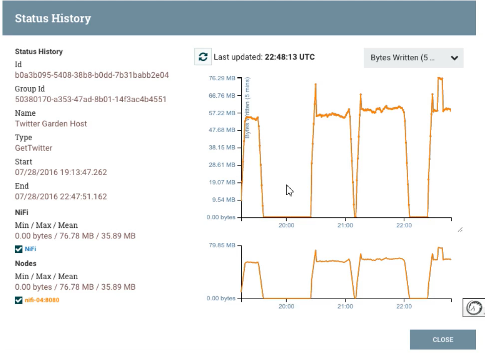

**Data Provenance(数据来源)**
	在监视数据流时,用户通常需要一种方法来确定特定数据对象(FlowFile)的发生情况。NiFi的Data Provenance页面提供了该信息。由于NiFi在对象流经系统时记录和索引数据来源详细信息,因此用户可以执行搜索,进行故障排除并实时评估数据流合规性和优化等内容。默认情况下,NiFi每五分钟更新一次此信息,但这是可配置的。
	要访问Data Provenance页面,请从Global Menu中选择""Data Provenance"。这将打开一个对话框窗口,允许用户查看可用的最新数据源文件信息,搜索特定项目的信息,并过滤搜索结果。还可以打开其他对话框窗口以查看事件详细信息,在数据流中的任何位置重放数据,以及查看数据的沿袭或流程路径的图形表示。(这些功能将在下面详细介绍。)
	启用授权后,访问Data Provenance信息需要"查询出处"全局策略以及生成事件的组件的"查看出处"组件策略。此外,访问包含FlowFile属性和内容的事件详细信息需要为生成事件的组件""查看数据""组件策略。

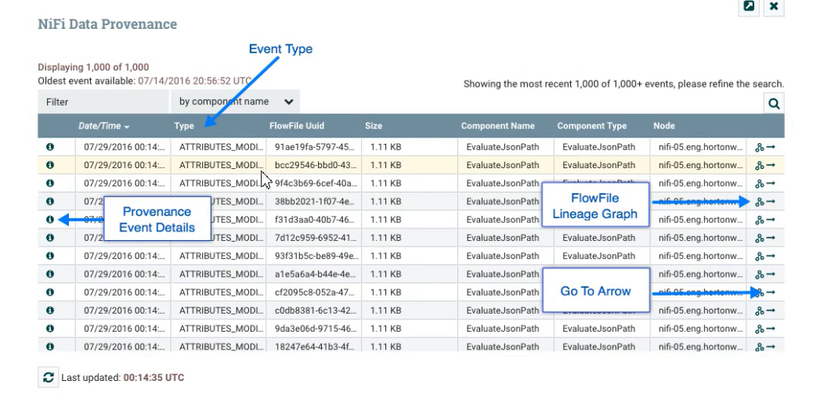

**种源事件**
以某种方式处理FlowFile的数据流中的每个点都被视为"起源事件"。根据数据流设计,会发生各种类型的起源事件。例如,当数据进入流程时,会发生RECEIVE事件,并且当数据从流程中发出时,会发生SEND事件。可能会发生其他类型的处理事件,例如克隆数据(CLONE事件),路由(ROUTE事件),修改(CONTENT_MODIFIED或ATTRIBUTES_MODIFIED事件),拆分(FORK事件),与其他数据对象(JOIN事件)相结合,并最终从流程中删除(DROP事件)。
起源事件类型是:

| 种源事件            | 描述                                                         |
| ------------------- | ------------------------------------------------------------ |
| ADDINFO             | 当添加其他信息(例如新链接到新URI或UUID)时,表示源项事件       |
| ATTRIBUTES_MODIFIED | 表示以某种方式修改了FlowFile的属性                           |
| CLONE               | 表示FlowFile与其父FlowFile完全相同                           |
| CONTENT_MODIFED     | 表示以某种方式修改了FlowFile的内容                           |
| CREATE              | 表示FlowFile是从未从远程系统或外部进程接收的数据生成的       |
| DOWNLOAD            | 表示用户或外部实体下载了FlowFile的内容                       |
| DROP                | 表示由于对象到期之外的某些原因导致对象生命结束的起源事件     |
| EXPIRE              | 表示由于未及时处理对象而导致对象生命结束的起源事件           |
| FETCH               | 指示使用某些外部资源的内容覆盖FlowFile的内容                 |
| FORK                | 表示一个或多个FlowFiles是从父FlowFile派生的                  |
| JOIN                | 表示单个FlowFile是通过将多个父FlowFiles连接在一起而派生的    |
| RECEIVE             | 表示从外部进程接收数据的来源事件                             |
| REPLAY              | 表示重放FlowFile的originance事件                             |
| ROUTE               | 表示FlowFile已路由到指定的关系,并提供有关FlowFile路由到此关系的原因的信息 |
| SEND                | 表示将数据发送到外部进程的originance事件                     |
| UNKNOWN             | 表示原产地事件的类型未知,因为尝试访问该事件的用户无权知道该类型 |


**搜索Events**

在Data Provenance页面中执行的最常见任务之一是搜索给定的FlowFile以确定它发生了什么。为此,请单击数据源页面右上角的Search按钮。这将打开一个对话框窗口,其中包含用户可以为搜索定义的参数。参数包括感兴趣的处理事件,区分FlowFile或产生事件的组件的特征,搜索的时间范围以及FlowFile的大小。|

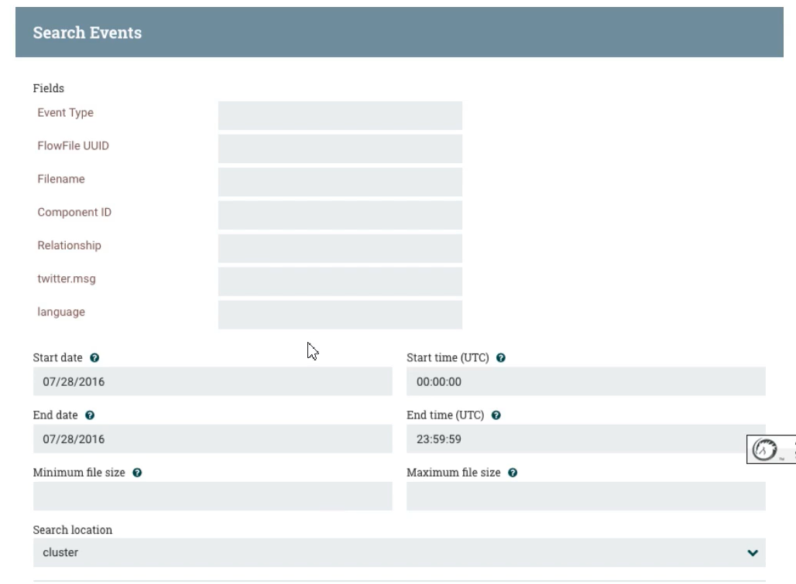


**Event详情**
	在Data Provenance页面的最左侧列中View Details,每个事件都有一个图标( O )。单击此按钮将打开一个对话框窗口,其中包含三个选项卡:详细信息,属性和内容。|

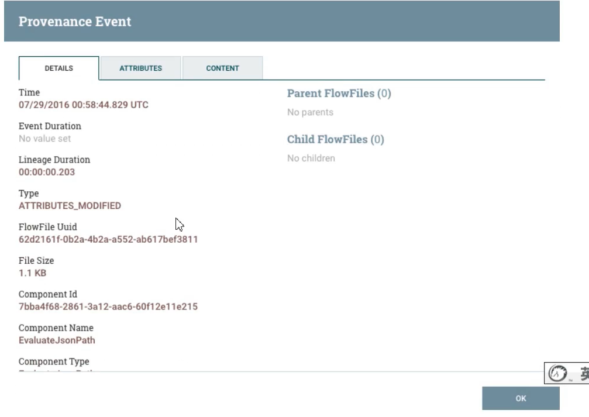

详细信息选项卞显示自天事件的各种评细信息,例刘事任友生的时同,事件的突型以及生成事件的组件。显示的作息将根据事件类型而有所不同。此选项卡还显示有关已处理的FlowFile的信息。除了显示在详细信息选项卡左侧的FlowFile的UUID之外,与详细信息选项卡右侧显示的与该FlowFile相关的任何父文件或子级FlowFile的UUID也显示在该详细信息选项卡的右侧。
	属性选项卡显示流程中该点上FlowFile中存在的属性。为了仅查看由于处理事件而修改的属性,用户可以选择属性选项卡右上角仅显示已修改旁边的复选框。


**重播FlowFile**
	DFM可能需要在数据流中的某个点检查FlowFile的内容,以确保按预期处理它。如果没有正确处理,DFM可能需要调整数据流并再次重放FlowFile。查看详细信息对话框窗口的内容选项卡是DFM可以执行这些操作的位置。"内容"选项卡显示有关FlowFile内容的信息,例如其在内容存储库中的位置及其大小。此外,用户可以在此处单击Download.钮以下载流程中此时存在的FlowFile内容的副本。用户还可以单击该Replay按钮以在流程中的此时重放FlowFile。点击后Replay,FlowFile被发送到为生成此处理事件的组件提供的连接。|

**查看FlowFile Lineage**
查看FlowFile在数据流中采用的谱系或路径的图形表示通常很有用。要查看FlowFile的谱系,请单击 Data
Provenance表的最右侧列中的"Show Lineage"图标。这将打开一个图形,显示FlowFile(()和已发生的各种处理事件。所选事件将以红色突出显示。它可以右键单击或任何事件双击看到事件的详细信息(参见事件的详细信息)。要查看谱系如何随时间演变,请单击窗口左下角的滑块并将其向左移动以查看数据流中较早阶段的谱系状态。


## 7. 连接与关系

将处理器和其他组件添加到画布并进行配置后,下一步是将它们彼此连接以便让NiFi知道在处理完每个FlowFile后如何传输数据。这是通过在每个组件之间创建连接来实现的。当用户将鼠标悬停在组件的中心上时,会出现一个新的连接图标。

用户将连接图标从一个组件拖动到另一个组件当用户释放鼠标时,会出现创建连接对话框。该对话框包含两个选项卡:详细信息和设置。它们将在下面详细讨论。请注意,可以绘制在同一处理器上循环的连接。如果DFM希望处理器在失败关系时尝试重新处理FlowFiles,这将非常有用。要创建这种类型的循环连接,只需将连接图标拖离,然后再返回到同一处理器,然后释放鼠标,出现相同的创建连接对话框。
**细节**
创建连接对话框的详细信息选项卡提供有关上下游组件的信息,包括组件名称,组件类型和组件所在的进程组:

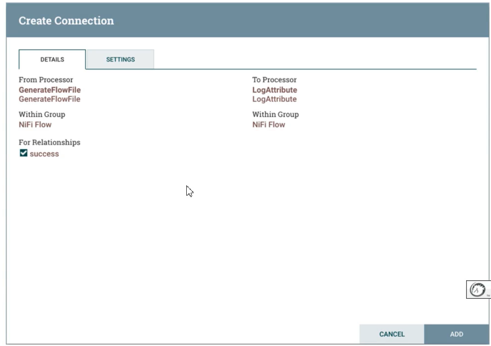

**设置**
设置选项卡提供配置连接名称,FlowFile到期,背压阈值,负载平衡策略和优先级的功能:

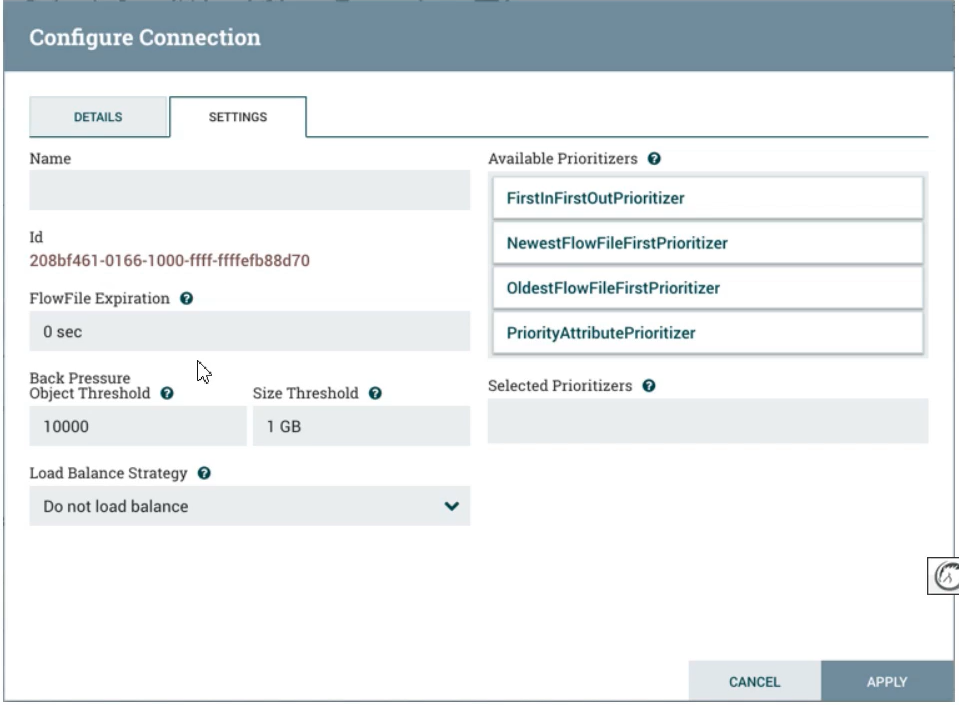

启用背压时,连接标签上会出现小进度条,因此在查看画布上的流时,DFM可以一目了然地看到它。进度条根据队列百分比更改颜色:绿色(O-60%),黄色(61-85%)和红色(86-100%)。

**负载均衡**

**负载平衡策略**
	为了在集群中的节点之间分配流中的数据,NiFi提供以下负载平衡策略:

- 不负载平衡:不在集群中的节点之间平衡FlIowFile。这是默认值。

- 按属性划分︰根据用户指定的FlowFile属性的值确定将给定FlowFile发送到哪个节点。具有相同Attribute值的所有FlowFile将发送到集群中的同一节点。如果目标节点与集群断开连接或无法通信,则数据不会故障转移到另一个节点。数据将排队,等待节点再次可用。此外,如果节点加入或离开集群需要重新平衡数据,则应用一致性散列以避免必须重新分发所有数据。|

- 循环:FlowFiles将以循环方式分发到集群中的节点。如果节点与集群断开连接或无法与节点通信,则排队等待该节点的数据将自动重新分发到另一个节点。

- 单个节点:所有FlowFiles将发送到集群中的单个节点。它们被发送到哪个节点是不可配置的。如果节点与集群断开连接或无法与节点通信,则排队等待该节点的数据将保持排队,直到该节点再次可用。

  注意： NiFi会在重新启动时持久保存集群中的节点。这可以防止在所有节点都已连接之前重新分配数据。如果集群已关闭且不打算重新启动节点,则用户有责任通过UI中的集群对话框从集群中删除该节点。
  **负载平衡压缩**
  选择负载平衡策略后,用户可以配置在集群中的节点之间传输时是否应压缩数据。


**优先级**
选项卡的右侧提供了对队列中数据进行优先级排序的功能，以便首先处理更高优先级的数据。优先级可以从顶部(可用的优先级排序器)拖动到底部(选择的优先级排序器)。可以选择多个优先级排序器。位于所选优先级列表顶部的优先级排序是最高优先级。如果两个FlowFiles根据此优先级排序器具有相同的值，则第二个优先级排序器将确定首先处理哪个FlowFile,依此类推。如果不再需要优先级排序器，则可以将其从选定的优先级排序器列表拖动到可用的优先级排序器列表。
可以使用以下优先顺序:

- FirstInFirstOutPrioritizer:给定两个FlowFiles,首先处理首先到达连接的FlowFiles

- NewestFlowFileFirstPrioritizer:给定两个FlowFiles,将首先处理数据流中最新的FlowFiles

- OldestFlowFileFirstPrioritizer:给定两个FlowFiles,将首先处理数据流中最旧的FlowFiles。这是在没有选择优先级的情况下使用的默认方案。

- PriorityAttributePrioritizer:给定两个FlowFiles,将提取名为priority的属性。将首先处理具有最低优先级值的那个。
  中

  - 请注意，应使用UpdateAttribute处理器在FlowFiles到达具有此优先级设置的连接之前将priority属性添加到FlowFiles。

  - 如果只有一个具有该属性，它将首先出现。

  -  priority属性的值可以是字母数字，其中"a"将出现在"z"之前，"1"出现在"9"之前。

  - 如果priority属性无法解析为long型数字，则将使用unicode字符串排序。例如:"99""和"100""将被排序,因此带有"99""的流文件首先出现，但""A-99""和"A-100""将排序，因此带有"A-100"的流文件首先出现。

    **注意**：配置了负载平衡策略后，连接除了本地队列外，每个集群节点都有一个队列。优先排序器将独立地对每个队列中数据进行排序。


**更改配置和上下文菜单选项**

在两个组件之间建立连接之后，可以更改连接的配置，并且可以将连接移动到新目的地;但是，必须先停止连接任—侧的处理器，然后才能进行配置或目标更改。


**弯曲连接**
要向现有连接添加弯曲点(或弯头).只需双击要弯曲点所在位置的连接即可。然后,您可以使用鼠标抓住弯曲点并拖动它,以便以所需的方式弯曲连接。您可以根据需要添加任意数量的弯曲点。您还可以使用鼠标将连接上的标签拖动并移动到任何现有折弯点。要删除折弯点,只需再次双击即可。

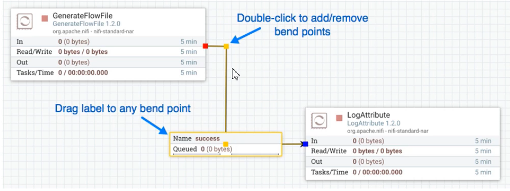


## 8. 离线同步Mysql数据到HDFS

### 8.1处理器流程

QueryDatabaseTable  →  ConvertAvroToJSON →   SplitJson →   PutHDFS
QueryDatabaseTable读取Mysql数据，ConvertAvroToJSON将数据转换为可阅读的Json格式，再通过Split]son进行切割获得单独的对象，PutHDFS将所有对象写入HDFS中。

### **8.2处理器说明**

**QueryDatabaseTable**

**描述**
	生成SQL选择查询，或使用提供的语句，并执行该语句以获取其指定的“最大值"列中的值大于先前看到的最大值的所有行。查询结果将转换为**Avro**格式。几种属性都支持表达式语言，但不允许传入连接。变量注册表可用于为包含表达式语言的任何属性提供值。如果需要利用流文件属性来执行这些查询，则可以将GenerateTableFetch和/或ExecuteSQL处理器用于此目的。使用流技术，因此支持任意大的结果集。使用标准调度方法，可以将该处理器调度为在计时器或cron表达式上运行。该处理器只能在主节点上运行。

**属性配置**
在下面的列表中，必需属性的名称以粗体显示。其他任何属性(非粗体）均视为可选。该表还指示所有默认值，以及属性是否支持NiFi表达式语言。

| 名称                                | 默认值 | 描述                                                         |
| ----------------------------------- | ------ | ------------------------------------------------------------ |
| Database connection Pooling service |        | 用于获得与数据库的连接的Controller Service 、DBCPConnectionPoolLookup 、DBCPConnectionPoo、HiveconnectionPool |
| Database Type                       | 泛型   | 数据库的类型/风格，用于生成特定于数据库的代码。在许多情况下，通用类型就足够了，但是某些数据库（例如Oracle）需要自定义SQL子句。<br/>Generic<br/>Oracle<br />Oracle 12+<br />Ms sQL 2012+<br />Ms sQL 2008<br/>MysQL |
| Table Name                          |        | 要查询的数据库表的名称。使用自定义查询时，此属性用于别名查询，并在FlowFile上显示为属性。支持表达式语言: true (仅使用变量注册表进行评估) |
| Columns to Return                   |        | 查询中要使用的列名的逗号分隔列表。如果您的数据库需要对名称进行特殊处理(例如，引号)，则每个名称都应包括这种处理。如果未提供任何列名，则将返回指定表中的所有列。注意:对于给定的表使用一致的列名很重要，这样增量提取才能正常工作。支持表达式语言: true(仅使用变量注册表进行评估) |
| Additional WHERE clause             |        | 构建SQL查询时要在WHERE条件中添加的自定义子句。支持表达式语言: true(仅使用变量注册表进行评估) |
| Custom Query                        |        | 用于检索数据的自定义SQL查询。代替从其他属性构建SQL查询，此查询将包装为子查询。查询必须没有ORDER BY语句。支持表达式语言: true(仅使用变量注册表进行评估) |
| Maximum-value Columns               |        | 列名的逗号分隔列表。自处理器开始运行以来，处理器将跟踪返回的每一列的最大值。使用多列意味着列列表的顺序，并且期望每列的值比前一列的值增长得更慢。因此，使用多个列意味着列的层次结构，通常用于分区表。该处理器只能用于检索自上次检索以来已添加/更新的那些行。请注意，某些JDBC类型（例如位/布尔值)不利于保持最大值，因此这些类型的列不应在此属性中列出，并且会在处理期间导致错误。如果未提供任何列，则将考虑表中的所有行，这可能会对性能产生影响。注意:对于给定的表使用一致的最大值列名称很重要，这样增量提取才能正常工作。支持表达式语言:true (仅使用变量注册表进行评估) |
| Max Wait Time                       |        | 正在运行的SQL选择查询所允许的最长时间，零表示没有限制。少于1秒的最长时间秒将等于零。支持表达式语言:true(仅使用变量注册表进行评估) |
| Use Avro Logical Types              | 假     | 是否对DECIMAL /NUMBER，DATE，TIME和TIMESTAMP列使用Avro逻辑类型。如果禁用，则写为字符串。如果启用，则使用逻辑类型并将其写为其基础类型，特别是DECIMAL /NUMBER为逻辑"十进制":以具有附加精度和小数位元数据的字节形式写入，DATE为逻辑" date-millis": 以int表示天自Unix时代(1970-01-01)起，TIME为逻辑'time-millis':写为int，表示自unix纪元以来的毫秒数;TIMESTAMP为假Ⅰ逻辑'timestamp-millis':写为长时，表示自Unix纪元以来的毫秒数。如果书面Avro记录的阅读者也知道这些逻辑类型，则可以根据阅读器的实现在更多上下文中反序列化这些值。<br/><br/>真正<br /> |

**ConvertAvroToJSON**

**描述**
	将Binary Avro记录转换为JSON对象。该处理器提供了Avro字段到)SON字段的直接映射，因此，生成的)SON将具有与Avro文档相同的层次结构。请注意，Avro模式信息将丢失，因为这不是从二进制Avro到SON格式的Avro的转换。输出)SON编码为UTF-8编码。如果传入的FlowFile包含多个Avro记录的流，则生成的FlowFile将包含一个JSON Array，其中包含所有Avro记录或JSON对象序列。如果传入的FlowFile不包含任何记录，则输出为空JSON对象。空/单个Avro记录FlowFile输入可以根据"包装单个记录"的要求选择包装在容器中。
**属性配置**
在下面的列表中，必需属性的名称以粗体显示。其他任何属性（非粗体）均视为可选。该表还指示任何默认值。

| 名称         | 默认值 | 允许值   | 描述                                                         |
| ------------ | ------ | -------- | ------------------------------------------------------------ |
| JSON容器选项 | 数组   | 没有数组 | 确定如何显示记录流:作为单个Object序列(无)(即，将每个object写入新行)，或者作为Objects数组（array). |
| 包装单条记录 | 假     | 真 、假  | 确定是否将空记录或单个记录的结果输出包装在” JSON容器选项"指定的容器数组中 |
| Avro模式     |        |          | 如果Avro记录不包含架构(仅基准)，则必须在此处指定。           |


**SplitJson**

**描述**
	该处理器使用JsonPath表达式指定需要的数组元素，将JSON数组分割为多个单独的流文件。每个生成的流文件都由指定数组的一个元素组成，并传输到关系"split"，原始文件传输到关系"original"。如果没有找到指定的
JsonPath，或者没有对数组元素求值，则将原始文件路由到"failure"，不会生成任何文件。
该处理器需要使用人员掌握JsonPath表达式语言。

**属性配置**
在下面的列表中，必需属性的名称以粗体显示。任何其他属性(不是粗体)都被认为是可选的，并且指出属性默认值(如果有默认值)，以及属性是否支持表达式语言。

| 属性名称                  | 默认值 | 可选值                             | 描述                                           |
| ------------------------- | ------ | ---------------------------------- | ---------------------------------------------- |
| jsonPath Expression       |        |                                    | 一个JsonPath表达式，它指定用以分割的数组元素。 |
| Null Value Representation |        | empty string<br/>the string 'null' | 指定结果为空值时的表示形式。                   |

**PutHDFS**

**描述**
	将FlowFile数据写入Hadoop分布式文件系统(HDFS)属性配置
在下面的列表中，必需属性的名称以粗体显示。其他任何属性（非粗体）均视为可选。该表还指示所有默认值，以及属性是否支持NiFi表达式语言。


### 8.3 实战操作

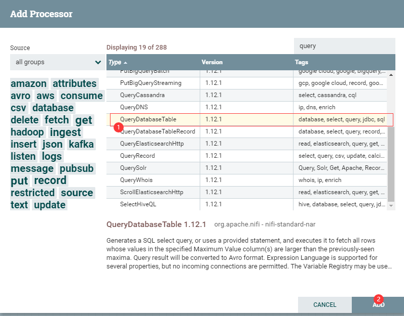

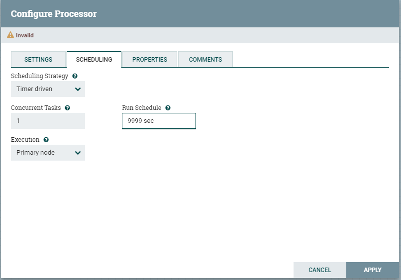

**数据库连接池配置**

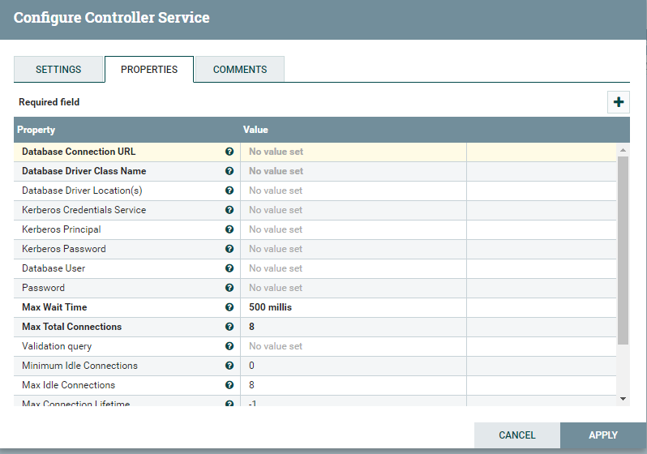


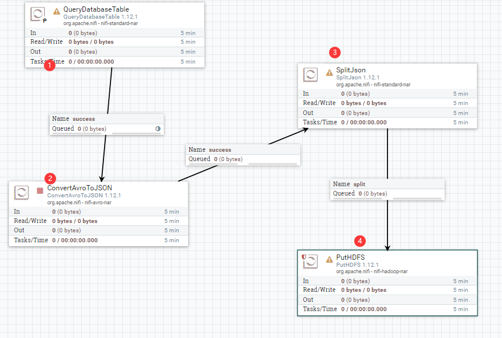


## 9. JSON内容转换成hive支持的文本格式


### 9.1 处理器流程

QueryDatabaseTable → ConvertAvroTo]SON  →  Splitjson  → **EvaluateJsonPath** →  **ReplaceText** →  PutHDFS
	这里的重点是，增加了Evaluate]sonPath和ReplaceText处理器，EvaluateJsonPath用来提取json中的属性,ReplaceText用来替换掉FlowFile中的内容，以使内容符合Hive外部表所支持的文本格式。

1.将son数据中的属性值提取出来;

2.转换为\t分割字段; \n分割行数据的格式。

### 9.2处理器说明
**EvaluateJsonPath**

**描述**
	该处理器根据流文件的内容计算一个或多个JsonPath表达式。这些表达式的结果被写入到FlowFile属性，或者写入到FlowFile本身的内容中，这取决于处理器的配置。通过添加用户自定义的属性来输入jsonpath，添加的属性称映射到输出流中的属性名称(如果目标是flowfile-attribute;否则，属性名将被忽略)。属性的值必须是有效的JsonPath表达式。“auto-detect"的返回类型将根据配置的目标进行确定。当"Destination"被设置为"flowfile-attribute"时，将使用"scalar""的返回类型。当""Destination"被设置为"flowfile-content"时，将使用"SON"返回类型。如果JsonPath计算为SON数组或JSON对象，并且返回类型设置为"scalar"，则流文件将不进行修改，并将路由到失败。如果所提供的]sonPath计算为指定的值，JSON的返回类型可以返回"scalar"。如果目标是“flowfile-content"，并且JsonPath没有计算到一个已定义的路径，那么流文件将被路由到unmatched"，无需修改其内容。如果目标是"flowfile-attribute"，而表达式不匹配任何内容，那么将使用空字符串创建属性作为值，并且FlowFile将始终被路由到"matched”。
**属性配置**
在下面的列表中，必需属性的名称以粗体显示。任何其他属性(不是粗体)都被认为是可选的，并且指出属性默认值(如果有默认值)，以及属性是否支持表达式语言。

| 属性名称                  | 默认值           | 可选值                             | 描述                                                         |
| ------------------------- | ---------------- | ---------------------------------- | ------------------------------------------------------------ |
| Destination               | flowfile-content | flowfile- contentflowfile- content | 指示是否将JsonPath计算结果写入流文件内容或流文件属性;如果使用flowfile-attribute，则必须指定属性名称属性。如果设置为flowfile-content，则只能指定一个JsonPath，并且忽略属性名。 |
| Return Type               | auto-<br/>detect | auto-detectjsonscalar              | 指示SON路径表达式的期望返回类型。选择“auto-detect”，"flowfile-content"的返回类型自动设置为"json"，“flowfile-attribute""的返回类型自动设置为"scalar"。 |
| Path Not Found Behavior   | ignore           | warn ignore                        | 指示在将Destination设置为"flowfile-attribute”时如何处理丢失的JSON路径表达式。当没有找到JSON路径表达式时，选择warn"将生成一个警告。 |
| Null Value Representation | empty string     | empty stringempty string           | 指示产生空值的JSON路径表达式的所需表示形式。                 |

**动态属性:**
该处理器允许用户指定属性的名称和值。

| 属性名称               | 默认值               | 描述                                                         |
| ---------------------- | -------------------- | ------------------------------------------------------------ |
| 用户自由定义的属性名称 | 用户自由定义的属性值 | 在该处理器生成的文件流上添加用户自定义的属性。如果使用表达式语言，则每<br/>批生成的流文件只执行一次计算.支持表达式语言:true(只使用变量注册表进行计<br/>算) |

**应用场景**
通常当需要从流文件json中提取某些数据作为流属性时，使用此处理器;或者从流文件json内容中提取一部分内容作为下一个流文件内容，使用此处理器。

**ReplaceText**

**描述**
使用其他值替换匹配正则表达式的流文件部分内容，从而更新流文件的内容。

**属性配置**
在下面的列表中，必需属性的名称以粗体显示。任何其他属性(不是粗体)都被认为是可选的，并且指出属性默认值(如果有默认值)，以及属性是否支持表达式语言。

| 属性名称            | 默认值      | 可选值 | 描述                                                         |
| ------------------- | ----------- | ------ | ------------------------------------------------------------ |
| search Value        | (?s) (^.*$) |        | 正则表达式，仅用于"Literal Replace"和"RegexReplace"匹配策略支持表达式语言:true |
| Replacement value   | $1          |        | 使用"Replacement Strategy"策略时插入的值。支持表达式语言:true |
| character set       | UTF-8       |        | 字符集                                                       |
| Maximum Buffer size | 1 MB        |        | 指定要缓冲的最大数据量(每个文件或每行，取决于计算模式)，以便应用替换。如果选择了“EntireText”，并且流文件大于这个值,那么流文件将被路由到"failure"”。在"Line-by-Line"模式下，如果一行文本比这个值大，那么FlowFile将被路由到"failure”。默认值为1 MB，主要用于“EntireText"模式。在”Line-by-Line"模式中，建议使用8KB或16 KB这样的值。如果将<Replacementstrategy>属性设置为一下其中之一:Append、Prepend、Always Replace，则忽略该值 |


### 9.3 实际操作


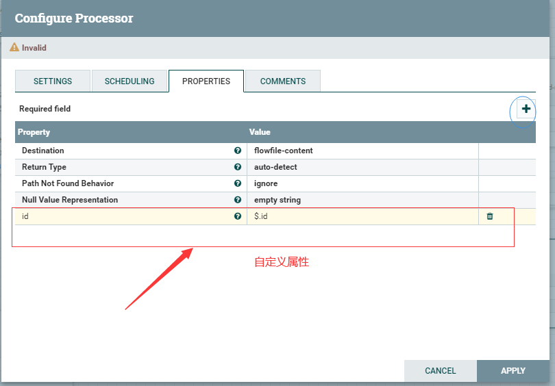


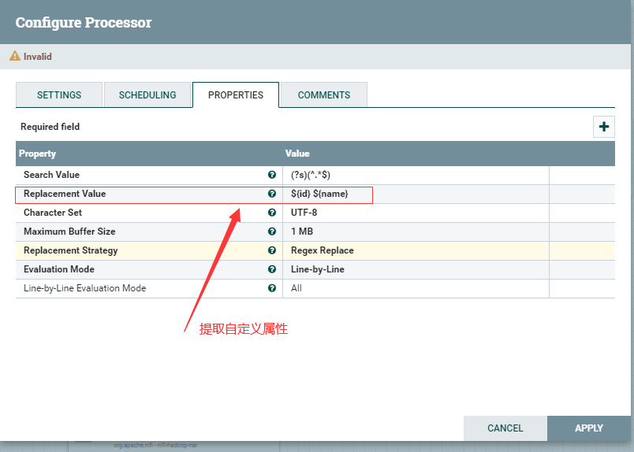


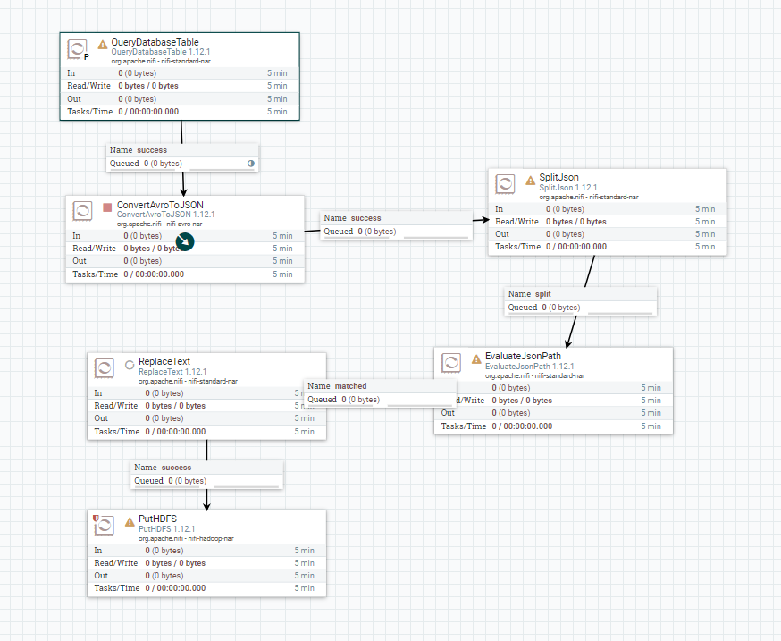


## 10. 实时同步Mysql到hive


### 10.1处理器流程

NiFi监控MySQL **binlog**处理调用流程如下: CaptureChangeMysQL→ RouteOnAttribute →  EvaluatejsonPath→   ReplaceText → PutHiveQL

替换Hive支持nar包:
	上传文件NiFi\资料\nifi安装包\nifi-hive-nar-1.9.2.nar，将其替换到NiFi服务的lib目录下，并重启NiFi集群。

### 10.2处理器说明

**CapturechangeMysQL**

**描述**
从MySQL数据库检索更改数据捕获(CDC)事件。CDC事件包括INSERT，UPDATE，DELETE操作。事件将作为单独的流文件输出，并按操作发生的时间排序。

**属性配置**

在下面的列表中，必需属性的名称以粗体显示。其他任何属性（非粗体)均视为可选。该表还指示任何默认值，属性是否支持NiFi表达式语言以及属性是否被视为“敏感"”，这意味着将加密其值。在敏感属性中输入值之前，请确保nifi.properties文件具有属性nifi.sensitive.props.key的条目。

| Name                            | Default Value         | Allowable Values | Description                                                  |
| :------------------------------ | --------------------- | ---------------- | :----------------------------------------------------------- |
| **MySQL Hosts**                 |                       |                  | 与MySQL群集中的节点相对应的主机名/端口条目的列表。条目应使用冒号（例如host1 : port,host2: port等)以逗号分隔。例如mysql.myhost.com:3306。该处理器将尝试按顺序连接到列表中的主机。如果一个节点发生故障并为集群启用了故障转移，则处理器将连接到活动节点(假定在此属性中指定了其主机条目。MySQL连接的默认端口为<br/>3306。支持表达式语言:true(将为仅使用变量注册表进行评估) |
| **MySQL Driver Class Name**     | com.mysql.jdbc.Driver |                  | MySQL数据库驱动程序类的类名称支持表达式语言:true(仅使用变量注册表进行评估) |
| MySQL Driver Location(s)        |                       |                  | 包含MySQL驱动程序JAR及其依赖项(如果有）的文件/文件夹和/或URL的逗号分隔列表。例如，“/ var / tmp / mysql-connector-java-5.1.38-bin.jar”支持表达式语言:true (仅使用变量注册表进行评估) |
| Username                        |                       |                  | 访问MySQL集群的用户名支持表达式语言:true(仅使用变量注册表进行评估) |
| Password                        |                       |                  | 访问MySQL集群的密码敏感属性: true支持表达式语言:true(仅使用变量注册表进行评估) |
| Server ID                       |                       |                  | 连接到MySQL复制组的客户端实际上是一个简化的从禹服务器(服务器)，并且服务器ID值在整个复制组中必须是唯一的(即不同于任何主服务器或从属服务器使用的任何其他服务器ID)。因此,每个CaptureChangeMySQL实例在复制组中必须具有唯一的服务器ID。如果未指定服务器ID，则默认值为65535。支持表达式语言:true(仅使用变量注册表进行评估) |
| Database/Schema Name Pattern    |                       |                  |                                                              |
| Table Name Pattern              |                       |                  | .                                                            |
| **Max Wait Time**               | 30 seconds            |                  |                                                              |
| Distributed Map Cache Client    |                       |                  | 标识用于保留有关处理器所需的各种表，列等的信息的分布式映射缓存客户端控制器服务。如果未指定客户端,则生成的事件将不包括列类型或名称信息。 |
| **Retrieve All Records**        | true                  | true、false      |                                                              |
| **Include Begin/Commit Events** | false                 | true、false      |                                                              |
| **Include DDL Events**          | false                 | true、false      |                                                              |
| **State Update Interval**       | 0 seconds             |                  |                                                              |
| Initial Sequence ID             |                       |                  |                                                              |
| Initial Binlog Filename         |                       |                  |                                                              |
| Initial Binlog Position         |                       |                  |                                                              |
| **Use Binlog GTID**             | false                 | truefalse        |                                                              |
| Initial Binlog GTID             |                       |                  |                                                              |

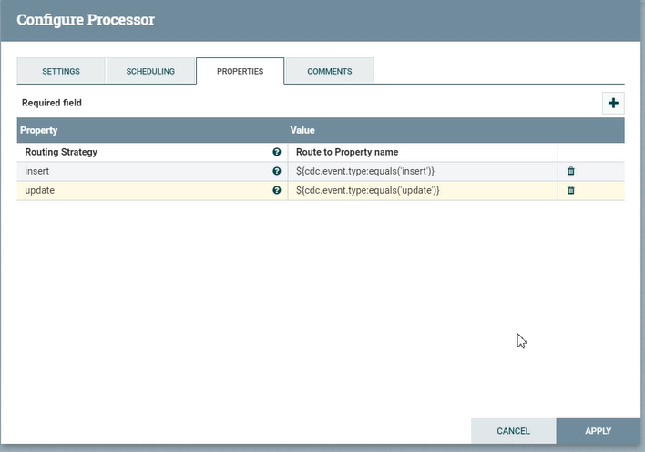


## 11 . kafka在nifi中使用


Kafka是一个由scala和java编写的高吞吐量的分布式发布订阅消息。它拥有很高的吞吐量、稳定性和扩容能力，在OLTP和OLAP中都会经常使用。使用NiFi可以简单快速的建立起kafka的生产者和消费者，而不需要编写繁杂的代码。

### **11.1处理器说明**

**PublishKafka_0_11**

**描述**
	使用Kafka 0.11.x Producer API将FlowFile的内容作为消息发送到Apache Kafka。要发送的消息可以是单独的FlowFiles，也可以使用用户指定的定界符（例如换行符）进行定界。用于获取消息的辅助NiFi处理器是ConsumeKafka_0_11。
**属性配置**

| Name                                  | Default Value                                                | Allowable Values                                             | Description                                                  |
| :------------------------------------ | ------------------------------------------------------------ | ------------------------------------------------------------ | :----------------------------------------------------------- |
| **Kafka Brokers**                     | localhost:9092                                               |                                                              | A comma-separated list of known Kafka Brokers in the format <host>:<port> **Supports Expression Language: true (will be evaluated using variable registry only)** |
| **Security Protocol**                 | PLAINTEXT                                                    | PLAINTEXT SSL SASL_PLAINTEXT SASL_SSL  | Protocol used to communicate with brokers. Corresponds to Kafka's 'security.protocol' property. |
| Kerberos Credentials Service          |                                                              | **Controller Service API:** KerberosCredentialsService **Implementation:** [KeytabCredentialsService](http://192.168.159.139:18001/nifi-docs/components/org.apache.nifi/nifi-kerberos-credentials-service-nar/1.12.1/org.apache.nifi.kerberos.KeytabCredentialsService/index.html) | Specifies the Kerberos Credentials Controller Service that should be used for authenticating with Kerberos |
| Kerberos Service Name                 |                                                              |                                                              | The service name that matches the primary name of the Kafka server configured in the broker JAAS file.This can be defined either in Kafka's JAAS config or in Kafka's config. Corresponds to Kafka's 'security.protocol' property.It is ignored unless one of the SASL options of the <Security Protocol> are selected. **Supports Expression Language: true (will be evaluated using variable registry only)** |
| Kerberos Principal                    |                                                              |                                                              | The Kerberos principal that will be used to connect to brokers. If not set, it is expected to set a JAAS configuration file in the JVM properties defined in the bootstrap.conf file. This principal will be set into 'sasl.jaas.config' Kafka's property. **Supports Expression Language: true (will be evaluated using variable registry only)** |
| Kerberos Keytab                       |                                                              |                                                              | The Kerberos keytab that will be used to connect to brokers. If not set, it is expected to set a JAAS configuration file in the JVM properties defined in the bootstrap.conf file. This principal will be set into 'sasl.jaas.config' Kafka's property. **Supports Expression Language: true (will be evaluated using variable registry only)** |
| SSL Context Service                   |                                                              | **Controller Service API:** SSLContextService **Implementations:** [StandardSSLContextService](http://192.168.159.139:18001/nifi-docs/components/org.apache.nifi/nifi-ssl-context-service-nar/1.12.1/org.apache.nifi.ssl.StandardSSLContextService/index.html) [StandardRestrictedSSLContextService](http://192.168.159.139:18001/nifi-docs/components/org.apache.nifi/nifi-ssl-context-service-nar/1.12.1/org.apache.nifi.ssl.StandardRestrictedSSLContextService/index.html) | Specifies the SSL Context Service to use for communicating with Kafka. |
| **Topic Name**                        |                                                              |                                                              | The name of the Kafka Topic to publish to. **Supports Expression Language: true (will be evaluated using flow file attributes and variable registry)** |
| **Delivery Guarantee**                | 0                                                            | Best Effort Guarantee Single Node Delivery Guarantee Replicated Delivery  | Specifies the requirement for guaranteeing that a message is sent to Kafka. Corresponds to Kafka's 'acks' property. |
| **Use Transactions**                  | true                                                         | truefalse                                                    | Specifies whether or not NiFi should provide Transactional guarantees when communicating with Kafka. If there is a problem sending data to Kafka, and this property is set to false, then the messages that have already been sent to Kafka will continue on and be delivered to consumers. If this is set to true, then the Kafka transaction will be rolled back so that those messages are not available to consumers. Setting this to true requires that the <Delivery Guarantee> property be set to "Guarantee Replicated Delivery." |
| Transactional Id Prefix               |                                                              |                                                              | When Use Transaction is set to true, KafkaProducer config 'transactional.id' will be a generated UUID and will be prefixed with this string. **Supports Expression Language: true (will be evaluated using variable registry only)** |
| Attributes to Send as Headers (Regex) |                                                              |                                                              | A Regular Expression that is matched against all FlowFile attribute names. Any attribute whose name matches the regex will be added to the Kafka messages as a Header. If not specified, no FlowFile attributes will be added as headers. |
| Message Header Encoding               | UTF-8                                                        |                                                              | For any attribute that is added as a message header, as configured via the <Attributes to Send as Headers> property, this property indicates the Character Encoding to use for serializing the headers. |
| Kafka Key                             |                                                              |                                                              | The Key to use for the Message. If not specified, the flow file attribute 'kafka.key' is used as the message key, if it is present.Beware that setting Kafka key and demarcating at the same time may potentially lead to many Kafka messages with the same key.Normally this is not a problem as Kafka does not enforce or assume message and key uniqueness. Still, setting the demarcator and Kafka key at the same time poses a risk of data loss on Kafka. During a topic compaction on Kafka, messages will be deduplicated based on this key. **Supports Expression Language: true (will be evaluated using flow file attributes and variable registry)** |
| **Key Attribute Encoding**            | utf-8                                                        | UTF-8 Encoded Hex Encoded  | FlowFiles that are emitted have an attribute named 'kafka.key'. This property dictates how the value of the attribute should be encoded. |
| Message Demarcator                    |                                                              |                                                              | Specifies the string (interpreted as UTF-8) to use for demarcating multiple messages within a single FlowFile. If not specified, the entire content of the FlowFile will be used as a single message. If specified, the contents of the FlowFile will be split on this delimiter and each section sent as a separate Kafka message. To enter special character such as 'new line' use CTRL+Enter or Shift+Enter, depending on your OS. **Supports Expression Language: true (will be evaluated using flow file attributes and variable registry)** |
| **Max Request Size**                  | 1 MB                                                         |                                                              | The maximum size of a request in bytes. Corresponds to Kafka's 'max.request.size' property and defaults to 1 MB (1048576). |
| **Acknowledgment Wait Time**          | 5 secs                                                       |                                                              | After sending a message to Kafka, this indicates the amount of time that we are willing to wait for a response from Kafka. If Kafka does not acknowledge the message within this time period, the FlowFile will be routed to 'failure'. |
| **Max Metadata Wait Time**            | 5 sec                                                        |                                                              | The amount of time publisher will wait to obtain metadata or wait for the buffer to flush during the 'send' call before failing the entire 'send' call. Corresponds to Kafka's 'max.block.ms' property **Supports Expression Language: true (will be evaluated using variable registry only)** |
| Partitioner class                     | org.apache.kafka.clients.producer.internals.DefaultPartitioner | RoundRobinPartitioner DefaultPartitioner  | Specifies which class to use to compute a partition id for a message. Corresponds to Kafka's 'partitioner.class' property. |
| **Compression Type**                  | none                                                         | nonegzipsnappylz4                                            | This parameter allows you to specify the compression codec for all data generated by this producer. |


 **Consumekafka_0_11**

**描述**
	消耗来自专门针对Kafka 0.10.xConsumer API构建的Apache Kafka的消息。用于发送消息的辅助NiFi处理器是PublishKafka_0_10。
属性配置
在下面的列表中，必需属性的名称以粗体显示。其他任何属性（非粗体）均视为可选。该表还指示所有默认值，以及属性是否支持NiFi表达式语言。

| Name                                 | Default Value  | Allowable Values                                             | Description                                                  |
| :----------------------------------- | -------------- | ------------------------------------------------------------ | :----------------------------------------------------------- |
| **Kafka Brokers**                    | localhost:9092 |                                                              | A comma-separated list of known Kafka Brokers in the format <host>:<port> **Supports Expression Language: true (will be evaluated using variable registry only)** |
| **Topic Name(s)**                    |                |                                                              | The name of the Kafka Topic(s) to pull from. More than one can be supplied if comma separated. **Supports Expression Language: true (will be evaluated using variable registry only)** |
| **Topic Name Format**                | names          | names pattern  | Specifies whether the Topic(s) provided are a comma separated list of names or a single regular expression |
| **Record Reader**                    |                | **Controller Service API:** RecordReaderFactory **Implementations:** [JsonPathReader](http://192.168.159.139:18001/nifi-docs/components/org.apache.nifi/nifi-record-serialization-services-nar/1.12.1/org.apache.nifi.json.JsonPathReader/index.html) [GrokReader](http://192.168.159.139:18001/nifi-docs/components/org.apache.nifi/nifi-record-serialization-services-nar/1.12.1/org.apache.nifi.grok.GrokReader/index.html) [Syslog5424Reader](http://192.168.159.139:18001/nifi-docs/components/org.apache.nifi/nifi-record-serialization-services-nar/1.12.1/org.apache.nifi.syslog.Syslog5424Reader/index.html) [ScriptedReader](http://192.168.159.139:18001/nifi-docs/components/org.apache.nifi/nifi-scripting-nar/1.12.1/org.apache.nifi.record.script.ScriptedReader/index.html) [AvroReader](http://192.168.159.139:18001/nifi-docs/components/org.apache.nifi/nifi-record-serialization-services-nar/1.12.1/org.apache.nifi.avro.AvroReader/index.html) [CSVReader](http://192.168.159.139:18001/nifi-docs/components/org.apache.nifi/nifi-record-serialization-services-nar/1.12.1/org.apache.nifi.csv.CSVReader/index.html) [JsonTreeReader](http://192.168.159.139:18001/nifi-docs/components/org.apache.nifi/nifi-record-serialization-services-nar/1.12.1/org.apache.nifi.json.JsonTreeReader/index.html) [ParquetReader](http://192.168.159.139:18001/nifi-docs/components/org.apache.nifi/nifi-parquet-nar/1.12.1/org.apache.nifi.parquet.ParquetReader/index.html) [XMLReader](http://192.168.159.139:18001/nifi-docs/components/org.apache.nifi/nifi-record-serialization-services-nar/1.12.1/org.apache.nifi.xml.XMLReader/index.html) [SyslogReader](http://192.168.159.139:18001/nifi-docs/components/org.apache.nifi/nifi-record-serialization-services-nar/1.12.1/org.apache.nifi.syslog.SyslogReader/index.html) | The Record Reader to use for incoming FlowFiles              |
| **Record Writer**                    |                | **Controller Service API:** RecordSetWriterFactory **Implementations:** [ParquetRecordSetWriter](http://192.168.159.139:18001/nifi-docs/components/org.apache.nifi/nifi-parquet-nar/1.12.1/org.apache.nifi.parquet.ParquetRecordSetWriter/index.html) [AvroRecordSetWriter](http://192.168.159.139:18001/nifi-docs/components/org.apache.nifi/nifi-record-serialization-services-nar/1.12.1/org.apache.nifi.avro.AvroRecordSetWriter/index.html) [ScriptedRecordSetWriter](http://192.168.159.139:18001/nifi-docs/components/org.apache.nifi/nifi-scripting-nar/1.12.1/org.apache.nifi.record.script.ScriptedRecordSetWriter/index.html) [XMLRecordSetWriter](http://192.168.159.139:18001/nifi-docs/components/org.apache.nifi/nifi-record-serialization-services-nar/1.12.1/org.apache.nifi.xml.XMLRecordSetWriter/index.html) [CSVRecordSetWriter](http://192.168.159.139:18001/nifi-docs/components/org.apache.nifi/nifi-record-serialization-services-nar/1.12.1/org.apache.nifi.csv.CSVRecordSetWriter/index.html) [JsonRecordSetWriter](http://192.168.159.139:18001/nifi-docs/components/org.apache.nifi/nifi-record-serialization-services-nar/1.12.1/org.apache.nifi.json.JsonRecordSetWriter/index.html) [FreeFormTextRecordSetWriter](http://192.168.159.139:18001/nifi-docs/components/org.apache.nifi/nifi-record-serialization-services-nar/1.12.1/org.apache.nifi.text.FreeFormTextRecordSetWriter/index.html) | The Record Writer to use in order to serialize the data before sending to Kafka |
| **Honor Transactions**               | true           | truefalse                                                    | Specifies whether or not NiFi should honor transactional guarantees when communicating with Kafka. If false, the Processor will use an "isolation level" of read_uncomitted. This means that messages will be received as soon as they are written to Kafka but will be pulled, even if the producer cancels the transactions. If this value is true, NiFi will not receive any messages for which the producer's transaction was canceled, but this can result in some latency since the consumer must wait for the producer to finish its entire transaction instead of pulling as the messages become available. |
| **Security Protocol**                | PLAINTEXT      | PLAINTEXT SSL SASL_PLAINTEXT SASL_SSL  | Protocol used to communicate with brokers. Corresponds to Kafka's 'security.protocol' property. |
| Kerberos Credentials Service         |                | **Controller Service API:** KerberosCredentialsService **Implementation:** [KeytabCredentialsService](http://192.168.159.139:18001/nifi-docs/components/org.apache.nifi/nifi-kerberos-credentials-service-nar/1.12.1/org.apache.nifi.kerberos.KeytabCredentialsService/index.html) | Specifies the Kerberos Credentials Controller Service that should be used for authenticating with Kerberos |
| Kerberos Service Name                |                |                                                              | The service name that matches the primary name of the Kafka server configured in the broker JAAS file.This can be defined either in Kafka's JAAS config or in Kafka's config. Corresponds to Kafka's 'security.protocol' property.It is ignored unless one of the SASL options of the <Security Protocol> are selected. **Supports Expression Language: true (will be evaluated using variable registry only)** |
| Kerberos Principal                   |                |                                                              | The Kerberos principal that will be used to connect to brokers. If not set, it is expected to set a JAAS configuration file in the JVM properties defined in the bootstrap.conf file. This principal will be set into 'sasl.jaas.config' Kafka's property. **Supports Expression Language: true (will be evaluated using variable registry only)** |
| Kerberos Keytab                      |                |                                                              | The Kerberos keytab that will be used to connect to brokers. If not set, it is expected to set a JAAS configuration file in the JVM properties defined in the bootstrap.conf file. This principal will be set into 'sasl.jaas.config' Kafka's property. **Supports Expression Language: true (will be evaluated using variable registry only)** |
| SSL Context Service                  |                | **Controller Service API:** SSLContextService **Implementations:** [StandardSSLContextService](http://192.168.159.139:18001/nifi-docs/components/org.apache.nifi/nifi-ssl-context-service-nar/1.12.1/org.apache.nifi.ssl.StandardSSLContextService/index.html) [StandardRestrictedSSLContextService](http://192.168.159.139:18001/nifi-docs/components/org.apache.nifi/nifi-ssl-context-service-nar/1.12.1/org.apache.nifi.ssl.StandardRestrictedSSLContextService/index.html) | Specifies the SSL Context Service to use for communicating with Kafka. |
| **Group ID**                         |                |                                                              | A Group ID is used to identify consumers that are within the same consumer group. Corresponds to Kafka's 'group.id' property. **Supports Expression Language: true (will be evaluated using variable registry only)** |
| **Offset Reset**                     | latest         | earliest latest none  | Allows you to manage the condition when there is no initial offset in Kafka or if the current offset does not exist any more on the server (e.g. because that data has been deleted). Corresponds to Kafka's 'auto.offset.reset' property. |
| Message Header Encoding              | UTF-8          |                                                              | Any message header that is found on a Kafka message will be added to the outbound FlowFile as an attribute. This property indicates the Character Encoding to use for deserializing the headers. |
| Headers to Add as Attributes (Regex) |                |                                                              | A Regular Expression that is matched against all message headers. Any message header whose name matches the regex will be added to the FlowFile as an Attribute. If not specified, no Header values will be added as FlowFile attributes. If two messages have a different value for the same header and that header is selected by the provided regex, then those two messages must be added to different FlowFiles. As a result, users should be cautious about using a regex like ".*" if messages are expected to have header values that are unique per message, such as an identifier or timestamp, because it will prevent NiFi from bundling the messages together efficiently. |
| Max Poll Records                     | 10000          |                                                              | Specifies the maximum number of records Kafka should return in a single poll. |
| Max Uncommitted Time                 | 1 secs         |                                                              | Specifies the maximum amount of time allowed to pass before offsets must be committed. This value impacts how often offsets will be committed. Committing offsets less often increases throughput but also increases the window of potential data duplication in the event of a rebalance or JVM restart between commits. This value is also related to maximum poll records and the use of a message demarcator. When using a message demarcator we can have far more uncommitted messages than when we're not as there is much less for us to keep track of in memory. |

### 11.2 Producer生产

**创建处理器**

创建处理器组kafka，进入组后分别创建GenerateFlowFile和PublishKafka_0_11处理器。
		**负载均衡生产消息**
		**连接GenerateFlowFile和PublishKafka_0_11**

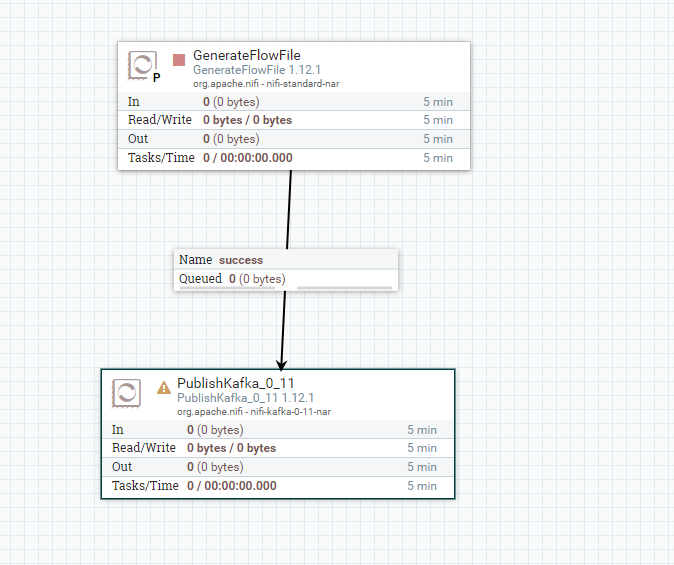


### 11.3 Consumer消费

**创建处理器并连接**
**创建ConsumeKafka_0_11和LogAttribute处理器,并连接。**


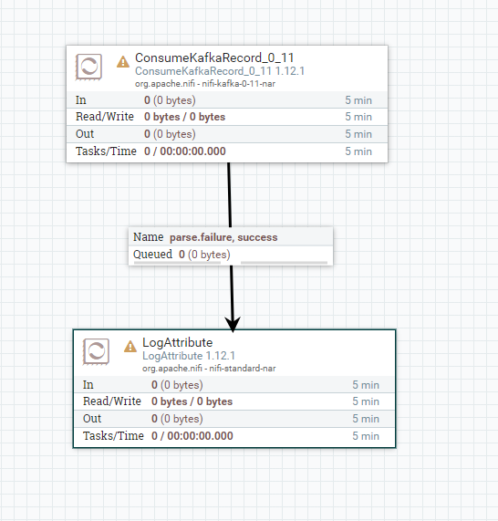


