## 1、NIFI概念

### 1.1. NIFI是什么

 Apache NIFI是一个易于使用，功能强大且可靠的系统，用于处理和分发数据。可以自动化管理系统间的`数据流`。它使用高度可配置的指示图来管理数据路由、转换和系统中介逻辑，支持从多种数据源动态拉取数据。NIFI原来是NSA的一个项目，目前已经代码开源，是Apache基金会的顶级项目之一。

NIFI是基于java的，使用Maven支持包的构建管理。NIFI基于Web方式工作，后台在服务器上进行调度。用户可以将数据处理定义为一个流程，然后进行处理，NIFI后台具有数据处理引擎、任务调度等组件。简单来说，NIFI就是为了解决不同系统间数据自动流通问题而建立的。

虽然dataflow这个术语在各种各样的场景被使用，但我们在这里使用它来表示不同的系统间的自动化的可管理的信息流。自企业拥有多个系统开始，一些系统会有数据生成，一些系统要消费数据，而不同系统间的数据的流通问题出现了。这些问题的出现的相应的解决方案已经被广泛的研究和讨论，其中企业集成EIP就是一个全面且易于使用的方案。


**dataflow要面临的一些挑战包括：**

- Systems fall

  系统调用失败，网络故障，磁盘故障，软件崩溃，人为事故

- Data access exceeds capacity to consume

  数据访问超出了消耗能力。有时，给定的数据源可能会超过处理链或交付链的某些部分的处理能力，而只需要一个环节出现问题，整个流程都会受到影响。

- Boundary conditions are mere suggestions

  超出边界问题，总是会得到太大，太小，太快，太慢，损坏，错误或者格式错误的数据

- what is noise one day becomes signal the next

  现实业务或需求变更快，设计新的数据处理流程或修改已有的流程必须迅速。

- Systems evolve at different rates

  给定的系统所使用的协议或数据格式可能随时改变，而且常常跟周围其他系统无关。dataflow的存在就是为了连接这种大规模分布式的，松散的，甚至根本不是设计来一起工作的组件系统。

- Compliance and security

  法律，法规和政策变化。企业对企业协议发生变化。系统到系统和系统到用户的交互必须是安全的，可信的，负责任的。

- Continuous improvement occurs in production

  通常不可能在测试环境中完全模拟生产环境。


多年来，数据流一直是架构中不可避免的问题之一。现在有许多活跃的、快速发展的技术，使得dataflow对想要成功的企业更加重要，比如soa，API,IOT,BIGDATA。此外，合规性，隐私性和安全性所需的严格程度也不断的提高。尽管不停的出现这些新概念技术，但dataflow面临的困难和挑战依旧存在，其中主要的区别还是负杂的范围，需要适应需求变化的速度以及大规模边缘化情况的普遍化。NIFI旨在帮助解决这些现代数据流挑战。

> 小结：NIFI用来处理数据集成场景数据分发，BS结构的图形化。
>
> 1.高可用
>
> 2.高性能高并发
>
> 3.错误纠察
>
> 4.快速响应
>
> 5.兼容各种数据格式
>
> 6.安全性
>
> 7.方便迁移

### 1.2.NIFI核心概念

NIFI的基本设计概念与基于流的编程fbp（Flow Based Programing）的主要思想密切相关。一下是一些主要的NIFI概念以及与fbp的关系：


| NIFI术语               | FBP Term                  | 描述                                                         |
| ---------------------- | ------------------------- | ------------------------------------------------------------ |
| FlowFile               | 信息包 information packet | FlowFile表示在系统中移动的每个对象，对于每个FlowFile,NIFI都会记录它一个属性键值对和0个或多个字节内容（Flowfile 有 attribute和content）。 |
| FlowFile     Processor | 黑盒 Black Box            | 实际上是处理器起主要作用。在EIP术语中，处理器就是不同系统间数据路由，数据转换或者数据中介的组合。处理器可以访问给定FlowFile的属性及其内容。处理器可以对给定工作单元中的零个或多个流文件进行操作，并提交该工作或回滚该工作。 |
| Connection             | 缓冲区 Bounded Buffer     | Connections用来连接处理器。它们可以充当队列允许各种进程以不同的速率进行交互。这些队列可以动态的进行优先级排序，并且可以在负载上设置上限，从而启用背压。 |
| Flow Controller        | 调度器 scheduler          | 流控制器维护流程如何连接，并管理和分配所有流程使用的线程。流控制器充当代理，促进处理器之间文件的交互。 |
| Process Group          | 分支网络 subnet           | 进程组是一组特定的流程和连接，可以通过输入端口接收数据并通过输出端口发生数据，这样我们在进程组里简单的组合组件，就可以得到一个全新功能的组件（process group） |

此设计模型也类似seda（分阶段），带来的好处，有助于NIFI成为非常有效的、构建功能强大且可扩展的数据流平台。其中的好处包括：

- 有助于处理有向图的可视化创建和管理。
- 本质上是异步的，允许非常高的吞吐量和足够大的自然缓冲
- 提供高并发模型，开发人员不必担心并发的复杂度
- 促进内聚和松散耦合组件的开发，然后可以在其他环境中重复使用并方便单元测试
- 资源受限的连接（流程中可配置connections）使得背压和压力释放等关键功能非常自然和直观
- 错误处理变得像基本逻辑一样自然，而不是粗粒度的全部捕获（catch-all）
- 数据进入和退出系统的点，以及它是如何流动的都是容易理解和跟踪的

### 1.3. NIFI架构

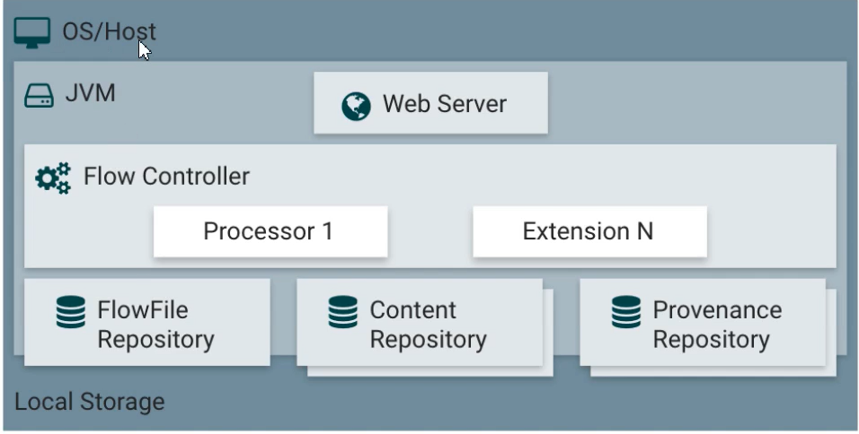

- **Web Server(网络服务器)**

  web服务器的目的是承载NIFI基于http的命令和控制API。

- **Flow Controller(流控制器)**

  是整个操作的核心，为将要运行的组件提供线程，管理调度。

- **Extensions(扩展)**

  有各种类型的NIFI扩展，这些扩展在其他文档中进行了描述。这里的关键点是NIFI扩展在jvm中操作和执行。

- **FlowFile Repository(流文件存储库)**

  对于给定的一个流中正在活动的flowfile。flowfile repository 就是NIFI保持跟踪这个Flow File状态的地方。FlowFile Repository 的实现是可插拔式的（多种选择，可配置，甚至可以自己实现），默认实现是使用Write-Ahead Log技术（简单普及下，WAL的核心思想是：在数据写入库之前，先写入到日志，再将日志记录变更到存储器中）写入到指定磁盘目录。

- **Content Repository （内容存储库）**

  Content Repository 是给定的FlowFile的实际内容存储的地方。Content Repository 的实现是可插拔的。默认方法是一种相当简单的机制，它的数据块存储在文件系统中。可以指定多个文件系统存储位置，以便获得不同的物理分区以减少任何单个卷上的争用（所以环境最佳实践可以配置多个目录，挂载不同的磁盘，提高IO）

- **Provenance Repository**

  provenance repository 是存储所有事件数据的地方。provenance repository的实现是可插拔的，默认实现是使用一个或者多个物理磁盘卷。在每个位置内的事件数据都是被索引并可搜索的

NIFI也能够在集群上运行。

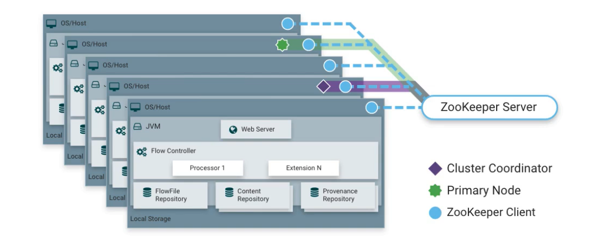

Cluster Coordinate：集群协调器，用来进行管理节点添加和删除的操作逻辑。

Primary Node：主节点，用来运行一些不合适在集群中运行的组件

Zookeeper Client：zk节点

从NIFI1.0版本开始，NIFI集群采用Zero-Master Clustering模式。NIFI集群中的每个节点对数据执行相同的任务，但每个节点都在不同的数据集上运行。Apache Zookeeper选择单个节点作为集群协调器，zk自动处理故障转移。所有集群节点都会想集群协调器发送心跳报告和状态信息。集群协调器负责断开和连接节点。此外，每一个集群都有一个主节点。主节点也是由zk选举产生。我们可以通过任何节点的用户界面（UI）与NIFI集群进行交互，并且我们所做的任何更改都将复制到集群所有节点上。

> 小结：NIFI架构
>
> 1.web服务器 -- 承载http请求和controller api 接口服务
>
> 2.流控制器 --管理调度，提供服务
>
> 3.extension --jvm扩展
>
> 4.Flowfile Repositort 状态数据
>
> 5.content repository -- 内容数据
>
> 6.provenance repository --事件数据
>
> NIFI集群
>
> 零主模式集群
>
> 集群协调器
>
> 主节点
>
> zk节点

### 1.4. NIFI性能

NIFI的设计目的是充分利用其运行的底层主机系统的能力，这种资源最大化在CPU和磁盘方面尤其明显、

- For IO

  不同系统不同配置可以预期的吞吐量或延迟会有很大的差异，具体取决于系统的配置方式。鉴于大多数NIFI子系统都可以插拔的实现方式，所以性能取决于实现。但是，对于一些具体和广泛的地方，请考虑使用现成的默认实现。这些实现都是持久的有保证的让数据流传递，并且是使用本地磁盘实现。因此，保守点说，假设在典型服务器中的普通的磁盘或RAID卷上的每秒的读写速率大约50MB，那么，对于大型的数据流，NIFI应该能够达到每秒100MB或者更多的吞吐量，这是因为预期添加到NIFI的每个物理分区和Content repository都会出现线性增长。

- For CPU

  Flow Controller充当引擎的角色，指示特定处理器何时可以被分配线程执行。编译处理器在执行任务后立即释放线程。可以为Flow Controller提供一个配置值，该值指示它维护的各种线程池的可用线程。理想的线程数据取决于主机系统的内核数量，系统中是否在运行其他服务，以及流程中处理的流的性质。对于典型的IO大流量，合理的做法是让多线程可用。

- For RAM

  NIFI在jvm中运行因此受限于JVM提供的内存，jvm垃圾回收（GC）成为限制实际堆大小以及优化应用程序运行的一个非常重要的因素。NIFI作业在定期读取相同内容时可能会占用大量IO，可配置足够大的内存和磁盘以优化性能。


### 1.5. NIFI关键特性

**流管理**

- **保证交付**

  NIFI核心理念是即使在非常高的规模下，也必须保证交付。这是通过有效的使用专门构建的write-ahead log 和 content repository来实现的。他们一起被设计成具备允许非常高的事务速率、有效的负载分布、写时复制和能发挥传统磁盘读写的优势。

- **数据缓冲背压和压力释放**

  NIFI支持缓冲所有队列的数据，以及在这些队列到达指定限制时提供背压（背压对象阈值和背压数据大小阈值），或在数据达到指定期限（其值已失效）时老化丢弃数据能力。

- **队列优先级**

  ​	NIFI允许设置一个或多个优先级方案，用于如何从队列中检索数据。默认情况是先进先出，但有时应该首先提取最新的数据（先进后出），最大数据先出或其他定制方案。

- **特殊流质量（延迟和吞吐量）**

  可能在数据流的某些节点上数据至关重要，不容丢失，并且在某些时刻这些数据需要在几秒钟就处理完传向下一个节点才会有意义。对于这些方面NIFI也可以做细粒度的配置。

**易用性**

- **可视化流程**

  Nifi可以实现数据可视化建立，而且是实时的。

- **流模板**

  Flowfile往往是高度模式化的。可以自己设计和发布流程设计。

- **数据起源跟踪**

  NIFI自动记录、索引并提供可用的源数据。便于故障排除和优化流程。

- **可以记录和重放的细粒度历史记录缓存区**

  ​	Nifi的content repository旨在充当历史数据的滚动缓冲区。数据仅在content repository老化或需要空间时才会被删除。content repository与data provenance能力结合，为在对象的生命周期中特定点（甚至可以跨越几代）实现可以查看内容，内容下载和重放等功能提供了非常有用的基础。


**灵活的缩放模型**

- **水平扩展（clustering）**

  Nifi设计是可集群，可横向扩展的，如果配置单个节点并将其配置为每秒处理数百MB数据，那么可以相应的将集群配置为每秒处理GB数据，但是这也给nifi带来了其获取数据系统之间的负载和故障转移的挑战。采用基于异步的排队的协议（如消息服务，kafka等）可以提供帮助解决这些问题。

- **扩展和缩小**

  nifi可以非常灵活的扩展和缩小。从nifi框架的角度来看，在增加吞吐量方面，可以在配置时增加“调度”选项卡下处理器上的并发任务数。这允许更多线程同时执行，从而提供更高的吞吐量。另一个方面，也可以将nifi缩小到合适在边缘设备上运行，因为资源有限，所需的占用的空间很小，这种情况可以使用minifi。


## 2、NIFI入门


**常用术语**

Flowfile：每条“用户数据”（即nifi需要处理和分发数据）称为Flowfile。Filefile由两部分组成：Attributes 和 Content。Content是数据本身，Attributes是数据关联的键值对。

Processor：处理器是nifi组件，负责创建，发送接收转换路由拆分和处理FlowFile。它是nifi用户可用于构建其数据的最重要的构建块。

**运行环境准备**

Apache nifi既可运行在windows平台，也可以运行在linux平台，需要jdk（nifi 1.x以上需要jdk8以上，0.x需要jdk7以上）和maven（至少3.1.0以上版本）

### 2.1 NIFI安装

**下载**

[nifi下载地址](http://nifi.apache.org/download.html)

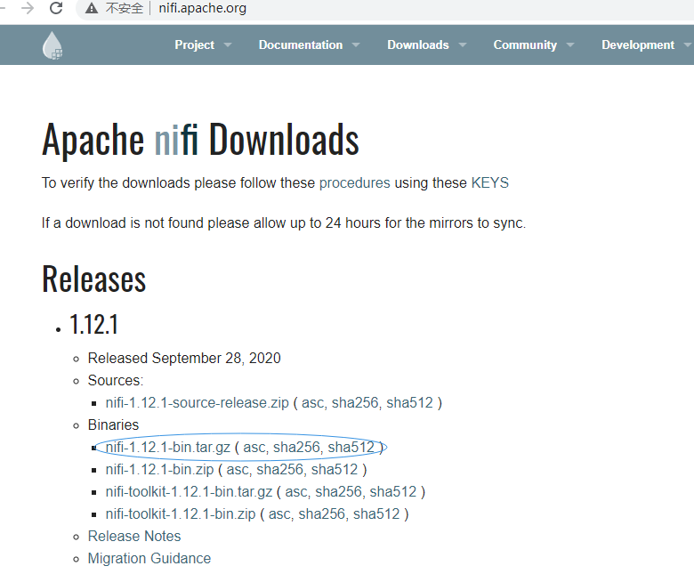

**修改默认端口**

在同一个系统启动多个服务时，避免端口冲突，建议修改默认端口

vim nifi.properties

```properties
# web properties #
nifi.web.http.host=
nifi.web.http.port=58080
nifi.web.http.network.interface.default=
nifi.web.https.host=
nifi.web.https.port=
nifi.web.https.network.interface.default=
nifi.web.jetty.working.directory=./work/jetty
nifi.web.jetty.threads=200
nifi.web.max.header.size=16 KB

```


**启动**

**Windows用户**

对于Windows用户，进入安装nifi目录bin目录，双击run-nifi.bat文件。这将启动nifi并让它运行在前台。要关闭nifi时请选择已经启动的窗口，按住Ctrl + C,


**Linux用户**

./bin nifi.sh run 前台运行 ，Ctrl +C停止

./bin nifi.sh satrt 后台运行

./bin/nifi.sh status 查看nifi状态

./bin/nifi.sh stop 关闭nifi

**作为一个服务进行安装**

目前，仅支持LINUX和mac os用户作为服务进行nifi的安装，要将应用程序作为服务去安装，首先进入安装目录，然后执行命令bin/nifi.sh install这样就可以默认名称nifi安装服务了。要为服务指定自定义名称，请使用可选的第二个参数（该服务的名称）执行命令。例如，要将nifi作为具有dataflow名称的服务安装，使用命令：bin/nifi.sh install dataflow。

安装后，可以使用适当的命令启动和停止服务，例如：sudo service nifi start和sudo service nifi stop 。此外，可以通过执行sudo service nifi status命令检查运行状态。

```properties
./bin/nifi.sh start

#查看日志
tail -f logs/nifi-app.log
2020-12-19 17:43:05,927 INFO [main] org.apache.nifi.nar.NarAutoLoader Starting NAR Auto-Loader for directory ./extensions ...
2020-12-19 17:43:05,928 INFO [main] org.apache.nifi.nar.NarAutoLoader NAR Auto-Loader started
2020-12-19 17:43:05,928 INFO [main] org.apache.nifi.web.server.JettyServer NiFi has started. The UI is available at the following URLs:
2020-12-19 17:43:05,928 INFO [main] org.apache.nifi.web.server.JettyServer http://192.168.159.130:58080/nifi
2020-12-19 17:43:05,928 INFO [main] org.apache.nifi.web.server.JettyServer http://192.168.122.1:58080/nifi
2020-12-19 17:43:05,928 INFO [main] org.apache.nifi.web.server.JettyServer http://127.0.0.1:58080/nifi
2020-12-19 17:43:05,933 INFO [main] org.apache.nifi.BootstrapListener Successfully initiated communication with Bootstrap
```


### 2.2 NIFI处理器

1. 选择nifi处理器

   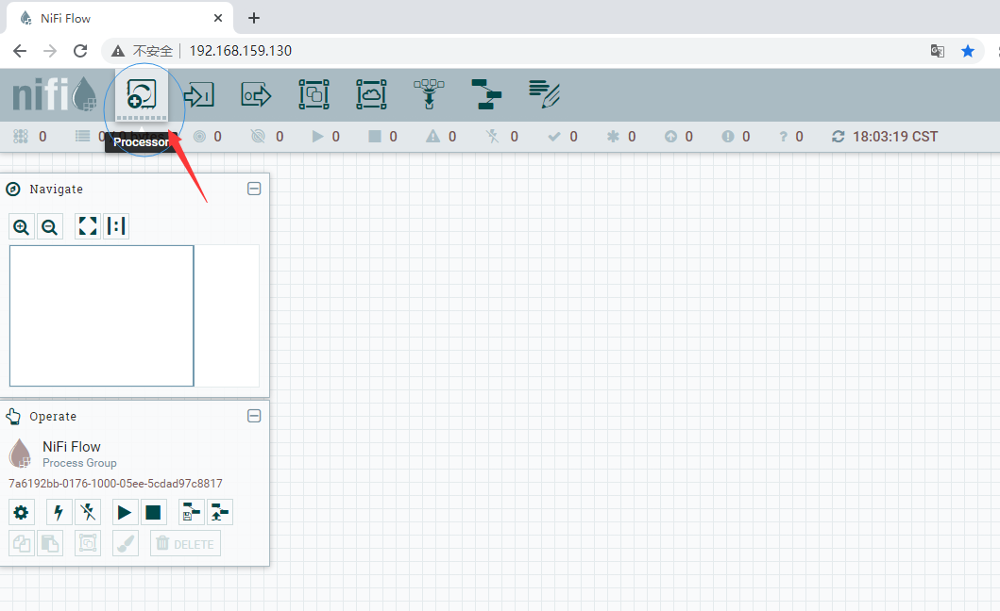

2. 弹出窗口显示的就是所有处理器（官方提供288个处理器整合了大部分常用技术）

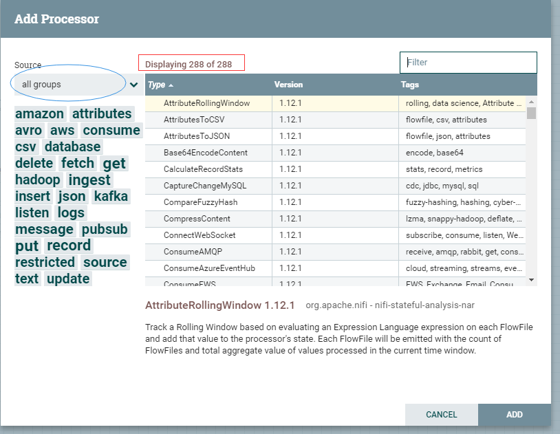


**3.常用处理器**

> **ExecuteScript**:执行脚本处理器，支持：clone，ecmascript,groovy,lua,python,ruby
>
> **QueryDatabaseTable**:数据库查询处理器，支持mysql
>
> **ConverAvroToJSON**: avro数据格式转换为json
>
> **SplitJson**:将json文件拆分成多个单独的Flowfile,用于jsonPath表达式指定的数组元素。
>
> **EvaluatejsonPath**: 根据Flowfile的内容评估一个或多个jsonpath表达式。这些表达式的结果分配给FlowFile属性，或者写入FlowFile本身的内容，具体取决于处理器配置。
>
> **RepalceText**: 文本组装与替换，支持正则表达式
>
> **PutHDFS**:将Flowfile数据写入Hadoop分布式文件系统（HDFS）
>
> **PutHiveQL**： 执行Hive ddl/dml命令，如insert ，update
>
> **PublishKafka_2.0**：根据配置将消息发送到kafka topic
>
> **SelectHiveQL**：执行hive select 语句并获得结果
>
> **PutSQL**:执行SQL的insert或update命令
>
> **GetFile**:从目录中的文件创建FlowFile
>
> **PutFile**:将FlowFile写入到文件
>
> **GetHDFS**:从HDFS获取文件
>
> **CaptureChangeMySQL**：从MySQL数据库中检索更改数据捕获（CDC）事件。CDC事件包括INSERT,UPDATE,DELETE操作。事件作为单个流文件输出，这些文件按操作发生的时间排序。
>
> **ExecuteStreamCommand**:一般用于执行sh脚本

**4. 配置处理器**

**添加处理器**

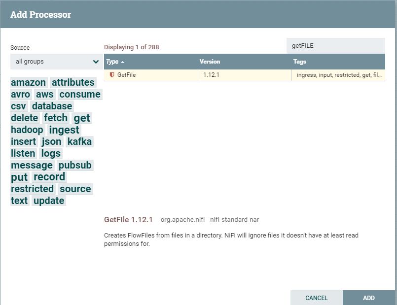

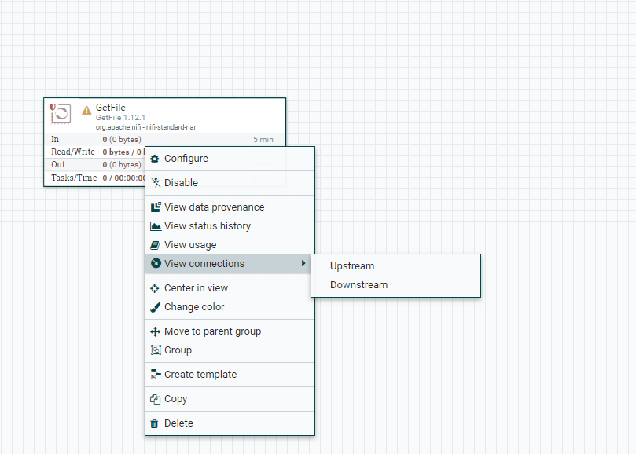

**选项说明**

- **Configure**(配置)：用户建立或更改处理器配置。
- **Start**（启动或停止）：启动或停止处理器
- **Disable** （启用或禁用）：启用或禁用处理器
- **View data provenance**（查看数据来源）：显示数据来源表，其中包含有关通过该处理器路由到FlowFile的数据来源事件信息。
- **View status history**（查看状态历史数据）：此选项打开处理器统计信息随时间的图形表示。
- **View usage**（查看用法）：此选项可将用户带到处理器的使用文档。
- **View connection → Upstream**（查看连接 → 上游）：此选项允许用户查看和跳转入处理器的上游连接。当处理器连接进出其他进程时，这尤其有用。
- **View connection →Downstream**（查看连接 → 下游）：此选项允许用户查看和跳转入处理器的下游连接。当处理器连接进出其他进程时，这尤其有用。
- **Center in view**（视图中心）：此选项将画布的视图置于给定的处理器上。
- **Change color**（更改颜色）：此选项允许用户更改颜色，这样以使得大流量的可视化管理更容易。
- **Move to parent group**（移动到上一级组里）：
- **Group** (添加到组里)：把当前处理器添加到组里
- **Create template**（创建模板）：
- **Copy**（复制）：
- **Delete**（删除）：

**配置处理器**

以GetFile为例：

方式1：右键选择→Configure

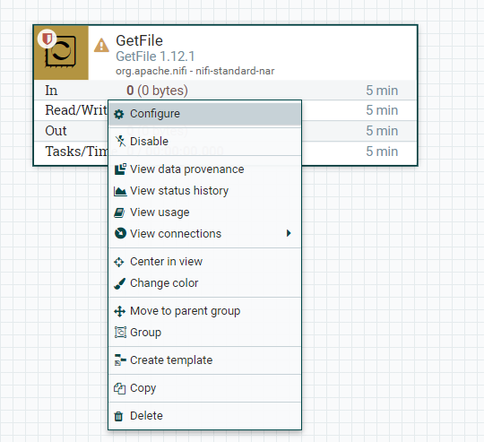

方式2：鼠标左键双击处理器

配置窗口如下图：

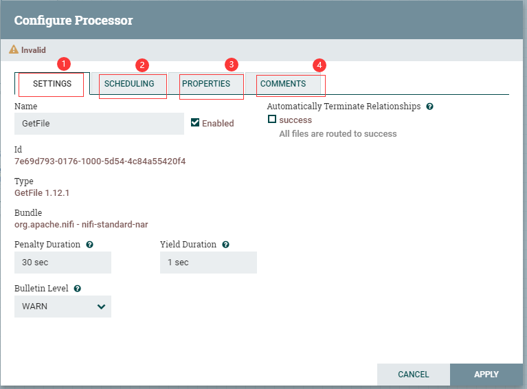

配置分为4部分：SETTING,SCHEDULING,PROPERTIES,COMMENT接下来一一介绍：

**SETTING（设置）**

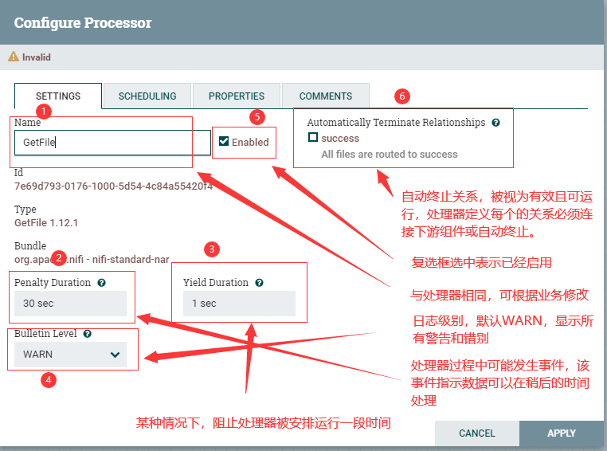

**SCHEDULING（任务调度）**


**PS:不同的处理器，可能略有不同**

**PROPERTIES(属性)**

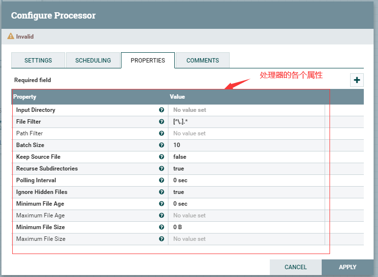

**PS:不同处理属性不同**

**COMMENTS（注释）**

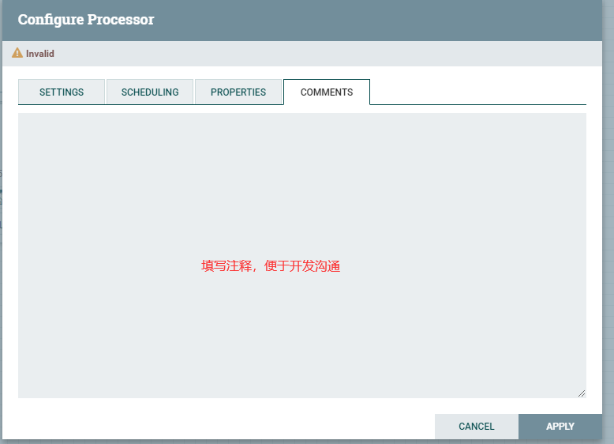

修改完成后，点击保存修改，点击右下角的APPLY保存修改。

### 2.3 其他组件

**数据流传入点（input-port）**


虽说是数据流输入点，但并不是整体数据流起点。它是作为组与组之间的数据流连接的传入点和输出点。

**数据流输出点（output-port）**

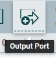

同理上面的输入点。它是作为组与组之间的数据连接的传入点和输出点。

**组（process-group）**


组相当于系统中的文件夹，作用就是使得数据流的各个部分看起来更工整，思路更清晰，不至于从头到尾一条线阅读起来十分不方便。

**远程组（remote process-group）**


添加远程组。

**聚合（funnel）**


用于将来自多个Connections的数据合并到一个Connection中。

**模板（template）**


可以将若干组件组合在一起形成更大的组，从该组创建数据流模板。这些模板也可以导出成为XML并导入另一个NIFI实例中，从而共享这些组。

**便签（label）**


可以放置在画布的空白处，写上备注信息。

**导航（Navigate）**

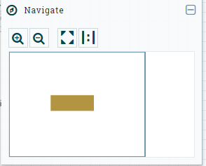

Navigate是对工作区进行预览，点击放大缩小可调整视野，蓝框区就是工作区当前的界面，可以鼠标在这部分区域进行移动从而调整视野。

**操作区（operate）**

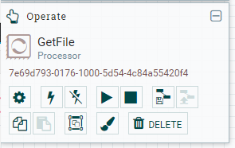

**PS:右键工作区空白处也可以弹出操作菜单**

**配置（Configuration）**

 根据当前工作区选中的组件，进行属性配置，可配置所有组件或组

**启用（enable）**

 启用组件，不能操作组

**禁用（disable）**

 禁用组件，不能操作组

**开始（start）**

 启动选择的组件或者组，不选择启动所有

**停止（stop）**

 停止选择的组件或者组，不选停止所有

**创建模板（create template）**

 根据选择的组件和组，创建模板

**上传模板（upload template）**

 上传已经保存的模板


## 3、应用场景：

### 3.1 添加GetFile处理器

**getfile属性说明**

| Name                                     | Default Value | Allowable Values | Description                                                  |
| ---------------------------------------- | ------------- | ---------------- | ------------------------------------------------------------ |
| **Input Directory(输入目录)**            |               |                  | 要从中提取文件的输入目录。支持表达式语言：true（使用变量注册表进行评估） |
| **File Filter（文件过滤器）**            | [^\.].*       |                  | 选择名称与给定正则表达式匹配的文件                           |
| Path Filter(路径过滤器)                  |               |                  | 如果递归子目录为true，则仅扫描其路径与给定正则表达式匹配的子目录 |
| **Batch Size（批量大小）**               | 10            |                  | 每次迭代中提取的最大文件数                                   |
| **Keep Source File（保留源文件）**       | false         |                  | 如果为true，则将文件复制到内容存储库后不会删除该文件，这会导致文件不断被拾取，对于测试目的很有用。如果没有保留原始的NIFI，则需要从其提取目录中具有写权限，否则它将忽略该文件。 |
| **Recurse Subdirectories（递归子目录）** | true          |                  | 指示是否从子目录中提取文件                                   |
| **Polling Interval（轮询时间）**         | 0 sec         |                  | 指示执行目录列表之前要等待多长时间                           |
| **Ignore Hidden Files（忽略隐蔽文件）**  | true          |                  | 指示是否应该忽略隐藏文件                                     |
| **Minimum File Age（最小档案年龄）**     | 0sec          |                  | 档案必须被拉出的最小年龄；小于此时间（根据上次修改的日期）的任何文件将被忽略 |
| Maximum File Age（最大档案年龄）         |               |                  | 档案必须被拉出的最大年龄；超过此时间（根据上次修改的日期）的任何文件将被忽略 |
| **Minimum File Size（最小档案大小）**    | 0B            |                  | 档案必须达到的最小大小                                       |
| Maximum File Size（最大档案大小）        |               |                  | 档案可以拉出文件的最大大小                                   |


 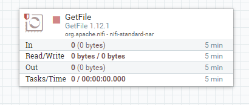


### 3.2 putfile处理器

**putfile属性说明**

| Name                                           | Default Value | Allowable Values       | Description                                                  |
| ---------------------------------------------- | ------------- | ---------------------- | ------------------------------------------------------------ |
| **Directory(目录)**                            |               |                        | 文件写入目录                                                 |
| **Conflict Resolution Strategy(解决冲突策略)** | fail          | replace 、ignore、fail | 指示当输出目录中已经存在同名文件时该怎么办                   |
| **Create Missing Directories（创建缺失目录）** | true          | true、false            | 如果为true，则创建缺少目录。如果为false，则流文件将受到处罚并发送失败 |
| Maximum File Count（最大文件数）               |               |                        | 指定输出目录中可以存在的最大文件数                           |
| Last Modified Time（上次修改时间）             |               |                        | 设置最近一次修改的时间 格式"yyyy-MM-dd 'T'HH:mm:ssZ"         |
| Permissions(权限)                              |               |                        | 文件权限(rwxrwxrwx)                                          |
| Owner（拥有者，所有者）                        |               |                        | 文件所有者                                                   |
| Group （拥有者组）                             |               |                        | 文件所属的组                                                 |


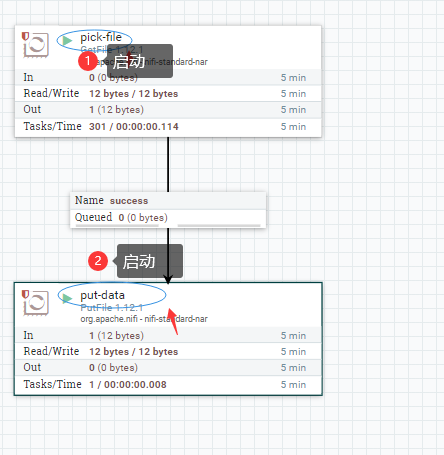

#### 3.3 常见错误

```properties
1.重复文件导入报错，设置 Conflict Resolution Strategy 改为true 文件内容会覆盖写入
2.目录自动创建，设置 Create Missing Directories 改为 true
```


## 4.处理器类别

​	为了创建有效的数据流处理流程，用户必须了解可用的处理器类型。NIFI包含许多不同的处理器，这些处理器提供了可从众多不同系统中提取数据，路由，转换，处理，拆分和聚合数据以及将数据分发到多个系统的功能。

### **4.1 数据转换**

- CompressContent：压缩或解压
- ConvertCharacterSet：将用于编码内容的字符集从一个字符集转向另外一个字符集
- EncryptContent：加密或解密
- ReplaceText：使用正则表达式修改文本内容
- TransformXml：应用XSLT转换XML内容
- JoltTransformJSON：应用JOLT规范来转换JSON内容

### **4.2 路由和调解**

- ControlRate：限制流程中数据流经某部分的速率
- DetectDuplicate：根据一些用户的标准去监视发现重复的FlowFiles。通常与HashContent一起使用
- DistributeLoad：通过只将一部分数据分发给每个用户定义的关系来实现负载均衡或数据抽样
- MonitorActivity：当用户定义的时间段过去而没有任何数据流经此节点时发送通知。（可选）在数据流恢复时发送通知
- RouteOnAttribute：根据FlowFile包含的属性路由FlowFile
- ScanAttribute：扫描FlowFile上用户定义的属性集，检查是否有任何属性与用户定义的字典匹配
- RouteOnContent：根据FlowFile的内容是否与用户自定义的内容的正则表达式匹配。如果匹配则flowfile路由到属性匹配的关系中去
- ScanContent：在流文件的内容中搜索用户定义在字典中的术语，并根据术语存不存在来决定路由，字典可以由文本条目或二进制条目组成。
- ValidateXml：以XML模式验证XML内容，根据用户定义的XML Schema,判断FlowFile的内容是否有效，进而路由FlowFile

### **4.3 数据库访问**

- ConvertJSONToSQL：将JSON文档转换为SQL INSERT或UPDATE命令，然后将其传递给PutSQL Processor
- ExecuteSQL：执行用户定义的SQL SELECT 命令，结果为Arvo格式的Flowfile
- PutSQL：通过执行flowfile的内容定义的sql ddm语句来更新数据库
- SelectHiveQL:对Apache Hive数据库执行用户定义的HiveQL SELECT命令，结果为Avro或CSV格式的Flowfile
- PutHiveQL:通过执行flowfile内容定义的HiveQL  DDM语句来更新Hive数据库

### **4.4 属性提取**

- EvaluatejsonPath:用户提供JSONPath表达式（类似XPath，用于XML解析/提取），然后根据json内容评估这些表达式，用结果值替换Flowfile内容或将结果值提取到用户自己命名的Attribute中。
- EvaluteXPath:用户提供XPath表达式，然后根据XML内容评估这些表达式，用结果值替换Flowfile内容或将结果值提取到用户自己命名的Attribute中。
- EvaluteXQuery:用户提供XQuery查询，然后根据XML内容评估这些表达式，用结果值替换Flowfile内容或将结果值提取到用户自己命名的Attribute中。
- ExtractText:用户提供一个或多个正则表达式，然后根据flowfile的文本内容对其进行评估，将结果值提取到用户自己命名的Attribute中。
- HashAttribute:对用户定义的现有属性列表的串联进行hash
- HashContent：对flowfile的内容进行hash，并将得到的hash值添加到Attribute中。
- IdentifyMimeType:评估flowfile的内容，来确定flowfile封装的文件类型。此处理器能够检测许多不同的MIME类型，例如图像，文字处理器文档，文本和压缩格式。
- UpdateAttribute：向flowfile添加或更新任意数量的用户定义的属性，这对于添加静态的属性值以及使用表达式语言动态计算出来的属性非常有用。该处理器还提供了“高级用户界面（Advanced User Interface ）”,允许用户根据用户提供的规则有条件的去更新属性。

### **4.5 系统交互**

- ExecuteProcess:运行用户自定义的操作系统的命令，进程的stdout被重定向，以便stdout的内容输出为Flowfile的内容。此处理器是源处理器（不接受数据流入，没有上游组件），其输出预计会生成新的flowfile，并且系统调用不会接收任何输入。如果要为进程提供输入，请使用ExecuteStreamCommand Processor
- ExecuteStreamCommand:运行用户定义的操作系统的命令，flowfile的内容可选的流式输入到进程的stdin。stdout的内容输出为flowfile的内容，此处理器不能用作源处理器，必须传入flowfile才能执行

### **4.6 数据提取**

- GetFile:将文件内容从本地磁盘（或网络连接的磁盘）流式传输到NIFI，然后删除原始文件。此处理器应是将一个文件移动到另一个位置，而不是复制。
- GetFTP:通过FTP将远程文件的内容下载到NIFI中，然后删除原始文件。此处理器应是将一个文件移动到另一个位置，而不是复制。
- GetSFTP:通过SFTP将远程文件的内容下载到NIFI中，然后删除原始文件。此处理器应是将一个文件移动到另一个位置，而不是复制。
- GetJMSQueue:从JMS队列下载消息，并根据JMS消息的内容创建FlowFile。可选的JMS属性也可以作为属性复制
- GetJMSTopic:从JMS主题下载消息，并根据JMS消息的内容创建FlowFile。可选的JMS属性也可以作为属性复制
- GetHTTP:将基于HTTP或HTTPS的远程URL的请求内容下载到NIFI中。处理器会记住Etag和Last-Modified Date,以确保不会持续摄取数据。
- ListenHTTP:启动HTTP(或HTTPS)服务器并侦听传入连接。对于任何传入的POST请求，请求的内容作为flowfile写出，并返回200响应。
- ListenUDP:侦听传入UDP数据包，并为每个数据包创建一个FlowFile（取决于配置），并将Flowfile发送到“success”
- GetHDFS:监听HDFS中用户指定的目录。每当新文件进入HDFS时，他将复制到NIFI并删除。此处理器应是将一个文件移动到另一个位置，而不是复制。如果在集群中运行需仅在主节点上运行。如果要从HDFS复制数据并保存原始数据，或者从集群中多个节点流式传输数据，请参阅ListHDFS处理器
- ListHDFS/FetchHDFS:ListHDFS监听HDFS中用户指定目录，并发出一个FlowFile，其中包含它遇到的每个文件的文件名。然后，它通过分布式缓存在整个NIFI集群中保持此状态。然后可以在集群中，将其发送到FetchHDFS处理器，后者获取这些文件内容并发出包含从HDFS获取的Flowfile内容
- GetKafka：从kafka中获取消息，消息可以作为每个消息的flowfile发出，也可以使用用户指定的分隔符一起批处理
- GetMongo：对MongDB执行用户指定的查询，并将内容写入新的Flowfile。

### **4.7 数据出口、发送数据**

- PutEmail：向配置的收件人发送电子邮件。flowfile的内容可选择作为附件发送。
- PutFile：将flowfile写入本地（或网络连接）文件系统上目录
- PutFTP：将flowfile内容复制到远程FTP服务器
- PutSFTP:将flowfile内容复制到远程SFTP服务器
- PutJMS:将flowfile的内容作为JMS消息发送到JMS代理，可选择将Attributes添加JMS属性
- PutSQL:将FlowFile的内容作为SQL DDL语句（INSERT、UPDATE或DELETE）执行。FlowFile的内容必须是有效的SQL语句。属性可以用作参数，FlowFile的内容可以是参数化的SQL语句，以避免SQL注入攻击。
- PutKafka：将flowfile内容作为消息发送到kafka，flowfile作为单个消息或分隔符发送，例如可以指定换行符，以便作为单个flowfile发送许多消息。
- PutMongo:将flowfile的内容作为insert或update发送到MongoDB

### **4.8 分裂和聚合**

- SplitText:将文本拆分
- SplitJson:允许用户将数组或许多子对象的JSON对象拆分成为每个json元素的flowfile
- splitxml：允许用户将xml消息拆分成多个flowfile，每个flowfile包含原始的段，这通常在多个XML元素与“wrapper”元素连接在一起时使用。然后，此处理器允许将这些元素拆分成单独的xml元素
- UnpackContent；解压缩不同类型的存档格式，例如zip和tar。然后，归档中每个文件作为单个的flowfile传输。
- SegmentContent：根据某些已配置的`数据大小`将flowfile划分为可能的许多较小的flowfile。不对任何类型的分界符执行拆分，而是仅基于字节偏移自执行拆分。这是在传输flowfile之前使用的，以便通过并行发送许多不同的部分来提供更低的延迟，而另一方面，MergeContent处理器可以使用碎片整理模式重新组装这些flowfile。
- MergeContent:此处理器负责将许多FlowFiles合并到一个FlowFile中。可以通过将其内容与可选的页眉,页脚和分界符连接在一起,或者通过指定存档格式(如ZIP或TAR）来合并FlowFiles。FlowFiles可以根据公共属性进行分箱(binned),或者如果这些流是被其他组件拆分的,则可以进行"碎片整理(defragmented)"。根据元素的数量或FlowFiles内容的总大小(每个bin的最小和最大大小是用户指定的)并且还可以配置可选的Timeout属性)英）'，FlowFiles等待其bin变为配置的上限值最大时间。
- SplitContent:将单个FlowFile拆分为可能的许多FlowFile,类似于SegmentContent。但是,对于SplitContent,不会在任意字节边界上执行拆分,而是指定要`拆分内容`的字节序列。

### 4.9 HTTP

- GetHTTP:将基于HTTP或HTTPS的远程URL的内容下载到NiFi中。处理器将记住ETag和Last-Modified Date,以确保不会持续摄取数据
- ListenHTTP:启动HTTP(或HTTPS）服务器并侦听传入连接。对于任何传入的POST请求,请求的内容将作为FlowFile写出,并返回200响应。
- InvokeHTTP:执行用户配置的HTTP请求。此处理器比GetHTTP和PostHTTP更通用,但需要更多配置。此处理器不能用作源处理器,并且需要具有传入的FlowFiles才能被触发以执行其任务。
-  PostHTTP:执行HTTP POST请求,将FlowFile的内容作为消息正文发送。这通常与ListenHTTP结合使用,以便在无法使用s2s的情况下在两个不同的NiFi实例之间传输数据（例如,节点无法直接访问并且能够通过HTTP进行通信时代理)。注意:除了现有的RAW套接字传输之外,HTTP还可用作s2s传输协议。它还支持HTTP代理。建议使用HTTP s2s,因为它更具可扩展性,并且可以使用具有更好用户身份验证和授权的输入/输出端口的方式来提供双向数据传输。
-  HandleHttpRequest / HandleHttpResponse: HandleHttpRequest Processor是一个源处理器,与ListenHTTP类似,启动嵌入式HTTP(S）服务器。但是,它不会向客户端发送响应(比如200响应)。相反,流文件是以HTTP请求的主体作为其内容发送的,所有典型servlet参数、头文件等的属性作为属性。然后,HandleHttpResponse能够在FlowFile完成处理后将响应发送回客户端。这些处理器总是彼此结合使用,并允许用户在NiFi中可视化地创建Web服务。这对于将前端添加到非基于Web的协议或围绕已经由NiFi执行的某些功能（例如数据格式转换)添加简单的Web服务特别有用。


## 5. flowfile属性使用

每个FlowFile都拥有多个属性,这些属性将在FlowFile的生命周期中发生变化。FlowFile的概念非常强大,并提供三个主要优点。

- 首先,它允许用户在流中做出路由决策,以便满足某些条件的FlowFiles可以与其他FlowFiles进行不同地处理。这可以由RouteOnAttribute和其他类似的处理器完成的。
- 其次,利用属性配置处理器:处理器的配置依赖于数据本身。例如,PutFile能够使用Attributes来知道每个FlowFile的存储位置,而每个FlowFile的目录和文件名属性可能不同(结合表达式语言,比如每个流都有filename属性;组件中就可以这样配置文件名:`${filename}`,就可以获取到当前FlowFlle中filename的属性值)。
- 最后,属性提供了有关数据的极有价值的上下文。在查看FlowFile的Provenance数据时非常有用,它允许用户搜索符合特定条件的Provenance数据;并且还允许用户在检查Provenance事件的详细信息时查看此上下文。通过简单地浏览该上下文,用户能够知道为什么以这样或那样的方式处理数据

### 5.1 共同属性

每个FlowFile都有一组属性:

- filename:可用于将数据存储到本地或远程文件系统的文件名。
- path:可用于将数据存储到本地或远程文件系统的目录的名称。
- uuid:一个通用唯一标识符,用于区分FlowFile与系统中的其他FlowFiles。
- entryDate: FlowFile进入系统的日期和时间(即已创建)。此属性的值是一个数字,表示自1970年1月1日午夜(UTC)以来的毫秒数。
- lineageStartDate:任何时候克隆,合并或拆分FlowFile,都会导致创建子FlowFile。该值表示当前FlowFile最早的祖先进入系统的日期和时间。该值是一个数字,表示自1970年1月1日午夜(UTC)以来的毫秒数。
-  filesize:此属性表示FlowFile内容占用的字节数。

需要注意的是uuid,entryDate,lineageStartDate,和fileSize属性是系统生成的,不能改变。

### 5.2 提取属性

NiFi提供了几种不同的处理器,用于从FlowFiles中提取属性。我们在之前的处理器分类中已经提到过。这是构建自定义处理器的一个非常常见的用例,其实编写处理器是为了理解特定的数据格式,并从FlowFile的内容中提取相关信息,创建属性来保存该信息,以便可以决定如何路由或处理数据。


### 5.3 添加用户自定义的属性

```properties
	NIFI除了提供能够将特定信息从FlowFile内容提取到属性中的处理器之外,NIFI还允许用户将自定义属性添加到每个FlowFile中的特定位置。UpdateAttribute就是专为此目的而设计。用户可以通过单击属性选项卡右上角的+按钮,在配置对话框中向处理器添加新属性。然后UI会提示用户输入属性的名称然后输入值。对于此UpdateAttribute处理的每个FlowFile,都会添加用户自定义属性。Attribute的名称将与添加的属性的名称相同。
	属性的值也可以包含表达式语言。这样就允许基于其他属性修改或添加属性。例如,如果我们想要将处理文件的主机名和日期添加到文件名之前,我们可以通过添加$(hostname()-$(now():format(lyy-dd-MM')-$(filename}来实现来实现。刚开始大家可能不太理解这是什么意思，在后续的课程中我们会进行讲解。
	除了添加一组自定义的属性外,UpdateAttribute还具有一个高级UI,允许用户配置一组规则,以便在何时添加属性。要访问此功能,请在配置对话框的属性选项卡中,单击Advanced对话框底部的按钮。将弹出此处理器特定的UI界面。在此UI中,用户可以配置规则引擎,实质上是指定必须匹配的规则,以便将已配置的属性添加到FlowFile。
```
### 5.4 属性路由

NiFi最强大的功能之一是能够根据属性路由FlowFiles。执行此操作的主要机制是RouteOnAttribute。此处理器与UpdateAttribute一样,通过添加用户自定义的属性进行配置。通过单击处理器的配置对话框中属性选项卡右上角的+按钮,可以添加任意数量的属性。
	每个FlowFile的属性将与配置的属性进行比较,以确定FlowFile是否满足指定的条件。每个属性的值应该是一个表达式语言并返回一个布尔值。下面的【表达式语言/在Property值中使用attribute】会对表达式语言进行补充。
	在评估针对FlowFile的属性提供的表达式语言之后,处理器根据所选的路由策略确定如何路由FlowFile。最常见的策略是"Route to Property name"策略。选择此策略后,处理器将为配置的每个属性公开关系(可拖拽出去指向下一个处理器)。如果FlowFile的属性满足给定的表达式,则FlowFile的副本将路由到相应的Relationship。例如,如果我们有一个名为"begin-with-r"的新属性和值"$ {filename: startsWith ('r')"的表达式,那么任何文件名以字母'r'开头的FlowFile将是路由到那个关系。所有其他FlowFiles将被路由到"unmatched"关系。


### 5.5 表达式语言/在Property值中使用attribute

​	当我们从FlowFiles的内容中提取属性并添加用户定义的属性时,除非我们有一些可以使用它们的机制,否则它们不会作为运算符进行计算。NiFi表达式语言允许我们在配置流时访问和操作FlowFile属性值。并非所有处理器属性都允许使用表达式语言,但很多处理器都可以。为了确定属性是否支持表达式语言,用户可以将鼠标悬停在处理器配置对话框的属性选项卡中的 ？图标上,然后会有一个提示.显示属性的描述,默认值(如果有)以及属性是否支持表达式语言。
​	对于支持表达式语言的属性,可以通过在开始标记$(和结束标记}中添加表达式来使用它。表达式可以像属性名一样简单。例如,要引用uuid Attribute,悲们可以简单地使用$(uuid)。如果属性名称以字母以外的任何字钓开头,或者包含除数字字母,句号(.〕或下划线(_）以外的字符,则需要加引号。例如,${My Attribute Name}将无效;但${'MyAttribute Name"}将引用属性My Attribute Name.
​	除了引用属性值之外,我们还可以对这些属性执行许多功能和比较。例如,如果我们想检查filename属性是否不分大小写(大写或小写)地包含字母'r,我们可以使用表达式来完成{filename:toLowerO):contains('W'")。请注意,函数由冒号分隔。我们可以将任意数量的函数链接在一起以构建更复杂的表达式。重要的是要明白,即使我们正在调用filename:toLower(),这也不会改变filename属性的伯,而只是返回给我们一个新的值。
​	我们也可以在一个表达式中嵌入另一个表达式。例如,如果我们想要将attr1 Attribute的值与attr2 Attribute的值进行比较,我们可以使用以下表达式来执行此操作:${attr1:equals( ${attr2}).
​	表达式语言包含许多不同的函数,官方文档Expression Language Guide。
​	此外,此表达式语言指南内置于应用程序中,以便用户可以轻松查看哪些功能可用,并在输入时查看其文档。设置支持
表达式语言的属性的值时,如果光标位于表达式语言的开始和结束标记内则在关键字上按CLtrl + Space将弹出所有可用的函数(快捷键冲突被占用会无法使用此功能),并将提供自动填充的功能。中击或使用键盘上下键指向弹出窗口中列出的某个功能会有提示,提示解释了该功能的作用,它所期望的参数以及函数的返回类型。

### 5.6 表达式语言中自定义属性

除了使用FlowFile属性外,还可以定义表达式语言使用的自定义属性。定义自定义属性为处理和配置数据流提供了额外的灵活性。


## 6. NIFI模板

​	当我们使用处理器在NiFi中设计复杂的数据流处理流程时,我们经常会发现我们将相同的处理器序列串在一起以执行某些任务。这种情况下,NiFi提供了模板概念。模板可以被认为是可重用的子流。要创建模板,请按照下列步骤操作:

- 选择要包含在模板中的组件。我们可以通过单击第一个组件,然后按住Shift键同时选择其他组件（以包括这些组件之间的连接) ,或者在画布上拖动所需组件周围的框时按住Shift键选择多个组件。

- 从操作面板中选择图标。

- 提供模板的名称和描述。

- 单击Create按钮。

  ​	一旦我们创建了一个模板,我们就可以将它用作流程中的构建块,就像处理器一样。单击并将模板图标从组件工具栏拖动到我们的画布上。然后,我们可以选择要添加到画布的模板,然后单击Add按钮。
  ​	最后,我们可以使用模板管理(Template Management )对话框来管理模板。要访问此对话框,请从全局菜单( GlobalMenu)中选择模板。在这里,我们可以看到存在哪些模板并设置过滤条件以找到感兴趣的模板。在表的右侧是一个图标,用于将模板导出或下载为XML文件。然后可以将其提供给其他人,以便他们可以复用模板。要将模板导入NiFi实例,请上传模板从操作选项板中选择上载模板[全,单击搜索图标并选择本地计算机上的文件。然后单击Upload按钮。模板将显示在您的表格中,您可以将其拖动到画布上,就像您创建的任何其他模板一样。
  使用模板时需要记住一些重要注意事项:

  - 任何标记为敏感属性的属性（例如在处理器中配置的密码）都不会添加到模板中。每次将模板添加到画布.英），口都必须填充这些敏感属性。
  - 如果模板中包含的组件引用Controller Service,则Controller Service也将添加到模板中。这意味着每次将模板添加到图表时,它都会创建Controller Service的副本。


## 7. 监控NIFI

当数据在NiFi中流经您的数据流处理流程时,了解您的系统执行情况以评估您是否需要更多资源以及评估当前资源的运行状况非常重要。NiFi提供了—些监控系统的机制。

### 7.1 状态栏

在组件工具栏下的NiFi屏幕顶部附近有一个条形,称为状态栏。它包含一些关于NiFi当前健康状况的重要统计数据。活动线程的数量可以指示NiFi当前的工作状态,排队统计数据表示当前在整个流程中排队的FlowFile数量以及这些FlowFiles的总大小。|
	如果NiFi实例位于群集中,我们还会在此处看到一个指示器,告诉我们群集中有多少节点以及当前连接的节点数。在这种情况下,活动线程的数量和队列大小指示当前连接的所有节点的所有总和

​	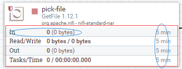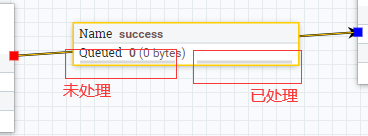

### 7.2 组件统计

画布上的每个处理器,进程组(Group)和远程进程组都提供了有关组件处理了多少数据的若干统计信息。这些统计信息提供有关在过去五分钟内处理了多少数据的信息。这是一个滚动窗口,允许我们查看处理器消耗的FlowFiles数量,以及处理器发出的FlowFiles数量。处理器之间的连接还会显示当前排队的项目数。
	查看这些指标的历史值以及(如果是群集的)不同节点相互比较也可能很有价值。我们可以右键单击组件并选择Stats菜单项查看此信息,nifi会向我们展示一个图表,该图表涵盖自NiFi启动以来的时间,或最多24小时,以较少者为准(通过更改属性文件中的配置,可以扩展或减少此处显示的时间量)
	在此对话框的右上角有一个下拉列表,允许用户选择他们正在查看的指标。底部的图表允许用户选择图表的较小部分进行放大。

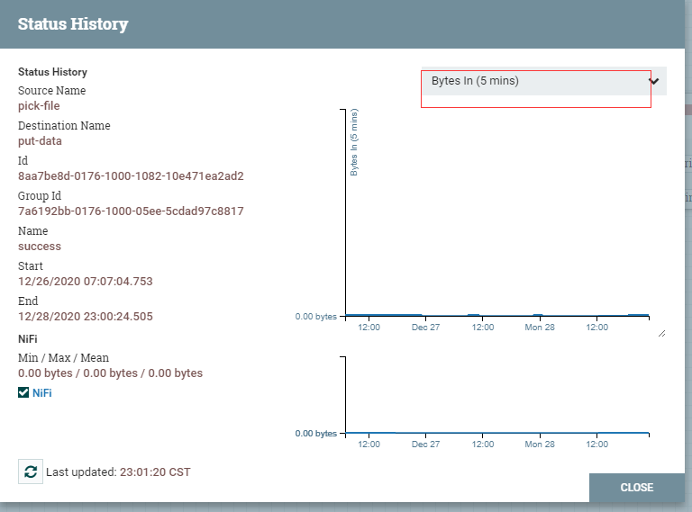


### 7.3 公告

除了为每个组件提供的统计信息之外,用户还想知道流程是否出现问题。虽然我们可以监视日志中的任何内容,但在屏幕上弹出通知会更方便。如果处理器将日志级别设置为WARNING或ERROR,我们将在处理器的右上角看到""Bulletin Indicator"。此指示器看起来像一个粘滞便笺,将在事件发生后持续显示五分钟。将鼠标悬停在公告上可提供有关所发生情况的信息,以便用户无需筛选日志消息即可查找。如果是在集群中,公告还会指示是集群中的哪个节点发布了公告。我们还可以在处理器的"配置"对话框的"设置"选项卡中更改公告的日志级别。
	如果框架发布了公告,我们还会在屏幕右上方突出显示公告指示符。在全局菜单中是公告板选项(Bulletin Board)。单击此选项我们将看到公告板,在那里我们可以看到NiFi实例中出现的所有公告,并可以根据组件,消息等进行过滤

## 8. 数据来源

### 8.1 事件详情 

NiFi对其摄取的每个数据保持非常精细的细节。当数据通过系统处理并被转换,路由,拆分,聚合和分发到其他端点时,这些信息都存储在NiFi的Provenance Repository中。为了搜索和查看此信息,我们可以从全局菜单中选择数据源(Data Provenance)。会弹出一个表格,列出我们搜索过的Provenance事件:

 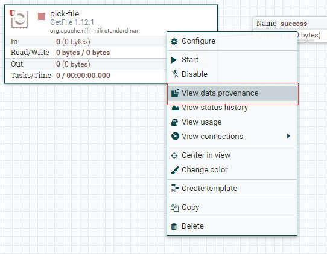

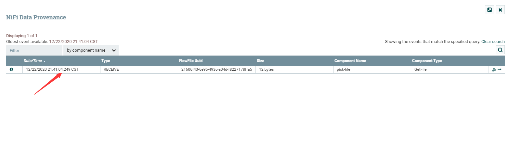

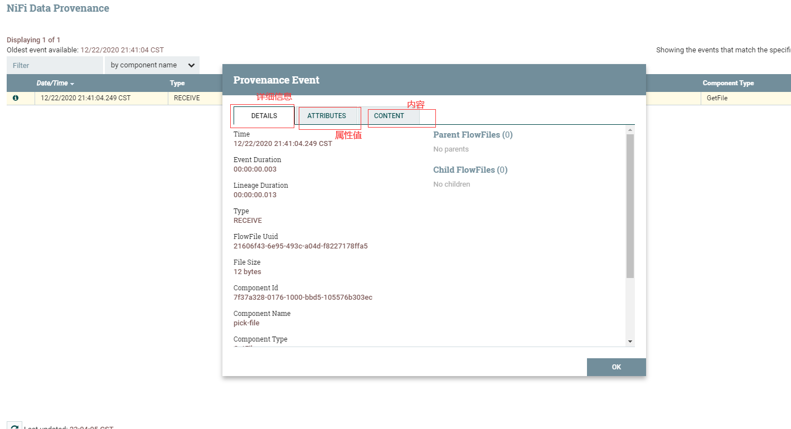

此选项卡向我们提供有关存储FlowFile content的内容存储库位置的信息。如果事件修改了FlowFile的内容,我们将看到'input claim和outputclaim'。如果数据格式是NiFi了可以识别的可以呈现的数据格式,我们可以选择下载或查看NiFi内部的内容。
I
此外,在选项卡的重播部分,有一个Replay按钮,允许用户将FlowFile重新插入到流中,并从事件发生的时间点重新处理它。这提供了一种非常强大的机制,因为我们能够实时修改流程,重新处理FlowFile,然后查看结果。如果它们不符合预期,我们可以再次修改流程,并再次重新处理FlowFile。我们能够执行流程的迭代开发,直到它完全按照预期处理数据。

### 8.2 谱系图

除了查看Provenance事件的详细信息之外,我们还可以通过单击视图中的Lineage图标整查看所涉及的FlowFile的血缘关系。
这为我们提供了一个图形表示,说明了在遍历系统时该数据发生了什么:

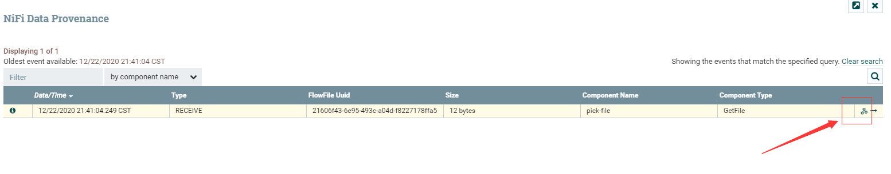

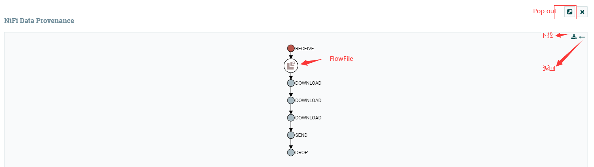

## 9. 常见问题

### Q1 是不是组件每种连接关系（success和failure等）都要有所对应

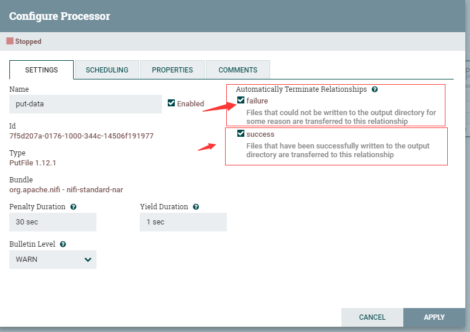

>  不一定，可以通过勾选上图选项框，来保证数据的流转


### Q2 组件已经正常运行了，右上角怎么还在报错

> 组件右上角的报错信息是默认存在一段时间的，报错信息都是有时间戳的，可以根据时间戳来判断报错信息是否是正在发生的。

### Q3 为什么用Select组件查询出来的数据都是重复的

每个组件都有几种调度触发方式，常见的有：

- ·每隔一段时间执行一次
- 特定时间执行一次·
- 上游有数据就立刻执行
  那么新手遇到的这种问题应该就是调度问题了，想做的是一次性查询，但是默认的调度执行了很多次


## 参考

[1.nifi使用者文档](https://nifi.apache.org/docs.html)


