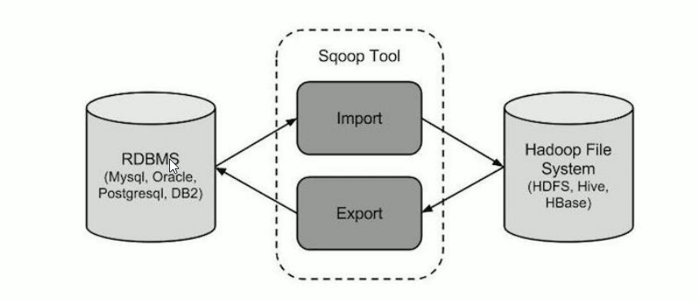
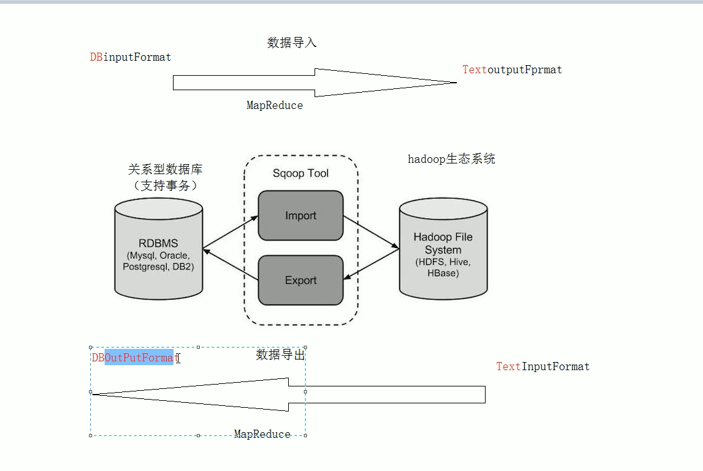

## 一、Apache Sqoop

### 1.sqoop介绍

`Apache Sqoop是在Hadoop生态体系和RDBMS体系之间传送数据的一种工具。来自于Apache软件基金会提供。`
	Sqoop工作机制是将导入或导出命令翻译成mapreduce程序来实现。在翻译出的`mapreduce `中主要是对inputformat 和 outputformat进行定制。
		Hadoop生态系统包括:HDFS、Hive、Hbase等
		RDBMS体系包括: Mysql、Oracle、DB2等
		Sqoop可以理解为:“SQL到 Hadoop和 Hadoop到SQL”。



站在Apache立场看待数据流转问题，可以分为数据的导入导出:

lmport:数据导入。RDBMS----->Hadoop

Export:数据导出。Hadoop---->RDBMS




### 2. sqoop 安装

安装sqoop的前提是已经具备java和 hadoop的环境。

最新稳定版:1.4.6

配置文件修改:

```sh
cd  $SQOOP_HOME/conf
mv sqoop-env-template.sh sqoop-env.sh
vi sqoop-env.sh

export HADOOP_COMMON_HOME=/export/servers/hadoop-2.7.5
export HADOOP_MAPRED_HOME=/export/servers/hadoop-2.7.5
export HIVE_HOME=/export/servers/hive

#加入mysql的 jdbc驱动包
cp /hive/lib/mysql-connector-java-5.1.32.jar $SQOOP_HOME/lib/
#验证启动
bin/sqoop list-databases \
--connect jdbe:mysql://localhost:3306/ \
--username root --password hadoop
# 本命令会列出所有mysql 的数据库。到这里，整个Sqoop安装工作完成。
```


## 二、sqoop 导入

“导入工具”导入单个表从RDBMS 到 HDFS。表中的每一行被视为HDFS的记录。所有记录都存储为文本文件的文本数据
下面的语法用于将数据导入HDFS。

```sh
$ sqoop import (generic-args)(import-args)
```

Sqoop测试表数据
在mysql 中创建数据库userdb，然后执行参考资料中的sql脚本:
创建三张表: emp 雇员表、emp_add雇员地址表、emp_conn雇员联系表。

### 1.全量导入mysql表数据到HDFS

下面的命令用于从 MySQL 数据库服务器中的emp表导入 HDFS。

```sh
bin/sqoop import \
--connect jdbc:mysql://node-1:3306/userdb \
--username root \
--password hadoop \
--delete-target-dir \
--target-dir /sqoopresult \
--table emp --m 1
```

其中**--target-dir可以用来指定导出数据存放至 HDFS的目录**;

**mysql jdbc url 请使用ip 地址。**

为了验证在 HDFS 导入的数据，请使用以下命令查看导入的数据:

```sh
hdfs dfs -cat / sqoopresult/part-m-00000
```

可以看出它会在 HDFS上`默认用逗号`,分隔emp表的数据和字段。可以通过

--fields-terminated-by '\t'来指定分隔符。

```sh
bin/sqoop import \
--connect jdbc:mysql://node-1:3306/userdb \
--username root \
--password hadoop \
--delete-target-dir \
--target-dir /sqoopresult \
--fields-terminated-by '\t' \
--table emp --m 1
```

**指定并行度**

```sh
bin/sqoop import \
--connect jdbc:mysql://node-1:3306/userdb \
--username root \
--password hadoop \
--delete-target-dir \
--target-dir /sqoopresult \
--fields-terminated-by '\t' \
--split-by id \
--table emp --m 2
```


### 2.全量导入mysql表数据到HIVE

#### 2.1.方式一:先复制表结构到hive中再导入数据

将关系型数据的表结构复制到 hive 中

```sh
bin/sqoop create-hive-table \
--connect jdbc:mysql://node-1:3306/sqoopdb \
--table emp_add \
--username root \
--password hadoop \
--hive-table test.emp_add_sp
其中:
--table emp_add 为 mysql中的数据库sqoopdb中的表。
--hive-table emp_add_sp为hive中新建的表名称。
```

从关系数据库导入文件到hive中

```sh
bin/sqoop import \
--connect jdbc:mysql://node-1:3306/sqoopdb \
--username root \
--password hadoop \
--table emp_add \
--hive-table test.emp_add_sp \
--hive-import \
--m 1
```


#### 2.2．方式二:直接复制表结构数据到hive 中

```sh
bin/sqoop import \
--connect jdbc:mysql://node-1:3306/userdb \
--username root \
--password hadoop \
--table emp_conn \
--hive-import \
--m 1 \
--hive-database test;
```

### 3．导入表数据子集(where过滤)

**--where**可以指定从关系数据库导入数据时的查询条件。

它执行在数据库服务器相应的SQL.查询，并将结果存储在 HFS的目标目录。

```sh
bin/sqoop import \
--connect jdbc:mysq1://node-1:3306/sqoopdb \
--username root \
--password hadoop \
--where "city ="sec-bad"" \
--target-dir /wherequery \
--table emp_add --m 1
```


### 4.导入表数据子集(query查询)

**注意事项:**

**使用query sql语句来进行查找不能加参数--table :**

**并且必须要添加where条件:**

**并且 where条件后面必须带一个$CONDITIONS这个字符串;**

**并且这个sql语句必须用单引号，不能用双引号;**

```sh
bin/sqoop import \
--connect jdbc:mysq1://node-1:3306/userdb \
--username root \
--password hadoop \
--target-dir fwherequery12 \
--query 'select id,name,deg from emp WHERE id>1203 and $CONDITIONS' \ 
--split-by id \
--fields-terminated-by '\it' \
--m 2
```


sqoop命令中，--split-by id 通常配合 --m 10参数使用。用于指定根据哪个字段进行划分并启动多少个maptask。


### 5．增量导入

在实际工作当中，数据的导入，很多时候都是只需要导入增量数据即可，并不需要将表中的数据每次都全部导入到hive或者hdfs当中去,这样会造成数据重复的问题。因此一般都是选用一些字段进行增量的导入，sqoop支持增量的导入数据。
	增量导入是仅导入新添加的表中的行的技术。


```properties
--check-column (col)
用来指定一些列，这些列在增量导入时用来检查这些数据是否作为增量数据进行导入，和关系型数据库中的自增字段及时间戳类似。
注意:这些被指定的列的类型不能使任意字符类型，如 char、varchar等类型都是不可以的，同时-- check-column可以去指定多个列。
```


```properties
--incremental (mode)
append:追加，比如对大于 last-value指定的值之后的记录进行追加导入。lastmodified:最后的修改时间，追加last-value指定的日期之后的记录
```

```properties
--last-value (value)
指定自从上次导入后列的最大值(大于该指定的值)，也可以自己设定某一值
```


#### 5.1. Append模式增量导入

执行以下指令先将我们之前的数据导入:

```sh
bin/sqoop import \
--connect jdbc:mysql://node-1:3306/userdb \
--username root \
--password hadoop \
--target-dir /appendresult \
--table emp --m 1
```


使用hadoop fs -cat查看生成的数据文件，发现数据已经导入到hdfs 中。然后在mysql 的emp中插入2条增量数据:

```sql
insert into 'uscrdb . " ecmp’(id , "name', "deg , "salary ' , ‘dept ) values (' 1206', "allon',' udmin', " 30000', " tp'):
insert into' userdb . " emp’(id ', 'name',"deg ', "salary '， "dept ') values (' 1207', " woon',' admin', " 40000', " tp”):
```

执行如下的指令，实现增量的导入:

```sh
bin/sqoop import \
--connect jdbc:mysql://node-1:3306/userdb \
--username root \
--password hadoop \
--table emp --m 1 \
--target-dir /appendresult \
--incremental append \
--check-column id \
--last-value 1205
```


#### 5.2.Lastmodified模式增量导入

首先创建一个customer表，指定一个时间截字段:

```sql
create table customertest(id int, name varchar(20), last_mod timestamp default current_timestamp on update current_timestamp);
```

此处的时间戳设置为在数据的产生和更新时都会发生改变.

分别插入如下记录:

```sql
insert into customertest(id, name) values(1, ' neil') ;
insert into customertest(id, name) values(2,'jack’) ;
insert into customertest(id, name) values(3, ' martin') ;
insert into customertest(id,name)values(4, 'tony') ;
insert into customertest(id, name) values(5, ' eric') ;
```

执行sqoop指令将数据全部导入hdfs :

```sh
bin/sqoop import \
--connect jdbc:mysql://node-1:3306/userdb \
--username root \
--password hadoop \
--target-dir /lastmodifiedresult \
--table customertest --m l
```

再次插入一条数据进入customertest表

```sql
insert into customertest (id, name) values (6, 'james ')
```

使用incremental的方式进行增量的导入:

```sh
bin/ sqoop import \
--connect jdbc:mysql://node-1:3306/userdb \
--username root \
--password hadoop \
--table customertest \
--target-dir /lastmodifiedresult \
--check-column last_mod  \
--incremental lastmodified \
--last-value "2019-05-28 18:42:06" \
--m 1 \
--append
```

此处已经会导入我们最后插入的一条记录,但是我们却发现此处插入了2条数据，这是为什么呢?

这是因为采用lastmodified模式去处理增量时，会将`大于等于`last-value值的数据当做增量插入。

#### 5.3. Lastmodified模式:append、merge-key

使用lastmodified模式进行增量处理要指定增量数据是以 append模式(附加)还是merge-key(合并)模式添加

下面演示使用merge-by的模式进行增量更新,我们去更新id为1的name字段。

```sql
update customertest set name = 'Neil’ where id = l;
```

更新之后，这条数据的时间截会更新为更新数据时的系统时间.执行如下指令，把id字段作为merge-key :

```sh
bin/sqoop import \
--connect jdbc:mysql://node-1:3306/userdb \
--username root \
--password hadoop \
--table customertest \
--target-dir /lastmodifiedresult \
--check-column last_mod \
--incremental lastmodified \
--last-value "2019-05-28 18:42:06" \
--m 1 \
--merge-key id
```

由于merge-key模式是进行了一次完整的mapreduce操作，

因此最终我们在 lastmodifiedresult文件夹下可以看到生成的为part-r-00000这样的文件，会发现id=1的 name 已经得到修改，同时新增了id=6的数据。


## 三、sqoop 导出

将数据从Hadoop 生态体系导出到RDBMS 数据库导出前，`目标表必须存在于目标数据库中`。

export有三种模式:

- 默认操作是从将文件中的数据使用INSERT语句插入到表中

- 更新模式:Sqoop将生成 UPDATE替换数据库中现有记录的语句。

- 调用模式:Sqoop将为每条记录创建一个存储过程调用。

  以下是export 命令语法:

  ```sh
  $ sqoop export (generic-args)(export-args)
  ```

  

#### 1.默认模式导出HDFS 数据到mysql

默认情况下，sqoop export将每行输入记录转换成一条INSERT 语句，添加到目标数据库表中。

如果数据库中的表具有约束条件（例如，其值必须唯一的主键列)并且已有数据存在，则必须注意避免插入违反这些约束条件的记录。

如果INSERT 语句失败，导出过程将失败。此模式主要用于将记录导出到可以接收这些结果的空表中。通常用于全表数据导出。
导出时可以是将Hive表中的全部记录或者HDFS 数据(可以是全部字段也可以部分字段）导出到Mysql目标表。

##### 1.1．准备HDFS数据

在 HDFS文件系统中“/emp/”目录的下创建一个文件emp_data.txt:

```latex
1201,gopal,manager,5o000,TP
1202,manisha,preader,50000,TP
1203,kalil,php dev,30000,AC
1204,prasanth,php dev,300Oo,AC
1205,kranthi,admin,20000,TP
1206,satishp,grpdes,20000,GR
```


##### 1.2.手动创建mysql中的目标表

```sql
mysql> USE userdb;
mysql> CREATE TABLE employee (
id INT NOT NULL PRIMARY KEY,name VARCHAR(20),
deg VARCHAR(20),salary INT);
```

##### 1.3 然后执行导出命令

```sh
bin/ sqoop export \
--connect jdbc:mysgl://node-1:3306/userdb \
--username root \
--password hadoop \
--table employee \
--export-dir /emp_data/
```

##### 1.4．相关配置参数

```properties
--input-fields-terminated-by "\t"  指定文件中的分隔符

--columns 选择列并控制它们的排序。当导出数据文件和目标表字段列顺序完全一致的时候可以不写。否则以逗号为间隔选择和排列各个列。没有被包含在–columns后面列名或字段要么具备默认值，要么就允许插入空值。否则数据库会拒绝接受sqoop导出的数据，导致Sqoop 作业失败

--export-dir 导出目录，在执行导出的时候，必须指定这个参数，同时需要具备--table 或--call参数两者之一，--table是指的导出数据库当中对应的表，--call是指的某个存储过程。

--input-null-string --input-null-non-string
如果没有指定第一个参数，对于字符串类型的列来说，“NULL”这个字符串就回被翻译成空值，如果没有使用第二个参数，无论是“NULL”字符串还是说空字符串也好，对于非字符串类型的字段来说，这两个类型的空串都会被翻译成空值。比如:
--input-null-string "\\N" --input-null-non-string "\\N"
```


#### 2．更新导出（updateonly模式)

##### 2.1.参数说明

> -- update-key，更新标识，即根据某个字段进行更新，例如l id，可以指定多个更新标识的字段，多个字段之间用逗号分隔。
>
> -- updatemod，指定updateonly（默认模式)，仅仅更新已存在的数据记录，不会插入新纪录。


##### 2.2．准备HDFS 数据

在HDFS “/updateonly_1/"目录的下创建一个文件 updateonly_1.txt :

```properties
1201,gopal,manager,50000
1202,manisha,preader,5000
1203,kalil,php dev,30000
```


##### 2.3.手动创建mysql中的目标表

```sql
mysql> USE userdb;
mysql> CREATE TABLE updateonly (
id INT NOT NULL PRIMARY KEY,name VARCHAR(20),
deg VARCHAR(20),salary INT);
```


##### 2.4．先执行全部导出操作

```sh
bin/sqoop export \
--connect jdbc:mysql://node-1:3306/userdb \
--username root \
--password hadoop \
--table updateonly \
--export-dir /updateonly_1/
```


#### 3.更新导出(allowinsert模式)

##### 3.1.参数说明

```properties
-- update-key。更新标识。即根据某个字段进行更新，例如 id，可以指定多个更新标识的字段。多个字段之间用逗号分隔。

-- updatemod。指定allowinsert。更新已存在的数据记录，同时插入新纪录。实质上是一个insert & update的操作。
```


##### 3.2．准备HDFS数据

在 HDFS " fallowinsert_1产目录的下创建一个文件allowinsert_1.txt

```properties
1201,gopall,manager,50000
1202,manisha,preader,50000
1203,kalil,php dev,30000
```


##### 3.3．手动创建mysql中的目标表

```sql
mysql> USE userdb;
mysql> CREATE TABLE allowinsert (
id INT NOT NULL PRNMARY KEY ,name VARCHAR(20).
deg vARCHAR(20))
```

##### 执行操作

先执行全部导出操作

```sh
bin/sqoop export \
--connect jdbc:mysql://node-1:3306/userdb \
--username root \
--password hadoop \
--table allowinsert \
--export-dir /allowinsert_1/
```

allowinsert_2.txt。修改了前三条数据并且新增了一条记录。上传至/ allowinsert_2/目录下:

```properties
1201,gopal, manager,1212
1202, manisha,preader ,1313
1203,kalil,php dev ,1414
1204, allen,java,1515
```

执行更新导出

```sh
bin/sqoop export \
--connect jdbc:mysql://node-1:3306/userdb \
--username root --password hadoop \
--table allowinsert \
--export-dir /allowinsert_2/ \
--update-key id \
--update-mode allowinsert
```


## 四、Sqoop job 作业

### 1. job语法

```sh
$  sqoop job (generic-args)(job-args)
	[--[subtool-name] (subtool-args)]
	
$ sqoop-job (generic-args)(job-args)
	[--[subtool-name](subtool-args)]
```


### 2．创建job

在这里，我们创建一个名为itcastjob，这可以从RDBMS表的数据导入到HDFS作业。

下面的命令用于创建一个从DB数据库的emp表导入到HDFS文件的作业。

```sh
bin/sqoop job --create itcastjob -- import --connect jdbc:mysql://node-1:3306/userdb \
--username root \
--password hadoop \
--target-dir /sqoopresult333 \
--table emp --m 1

# 注意import 前要有空格
```

### 3. 验证作业(--list)
'--list'参数是用来验证保存的作业。下面的命令用来验证保存Sqoop作业的列表。

```
bin/sqoop job --list
```

它显示了保存作业列表。

```properties
Avai1ab1e jobs:
myjob
```


### 4.检查作业(--show)

'.--show'参数用于检查或验证特定的工作，及其详细信息。以下命令和样本输出用来验证一个名为myjob的作业。

```sh
bin/sqoop job --show myjob
```

它显示了工具和它们的选择，这是使用在myjob中作业情况。

```properties
job: myjob
Too1: import options :
-----------------
direct.import = true
codegen.input.delimiters.record = 0
hdfs.append.dir = fa1se
db.tab1e = employee
...
incremental.1ast.value = 1206
...
```

### 5.执行作业(--exec)

'--exec选项用于执行保存的作业。下面的命令用于执行保存的作业称为myjob.

```sh
bin/sqoop job --exec myjob
# sqoop需要输入mysql密码
```

它会显示下面的输出。

```properties
10/08/19 13:08:45 INFO too1.codeGenToo1: Beginning code generation
...
```


### 6. job的免密输入

sqoop在创建job时，使用--password-file参数，可以避免输入mysql密码，如果使用--password将出现警告，并且每次都要手动输入密码才能执行job , **sqoop规定密码文件必须存放在HDFS上，并且权限必须是400。**

```properties
echo -n "123456 > itcastmysq1.pwd
hadoop fs -mkdir -p /input/sqoop/pwd/
hadoop fs -put itcastmysq1.pwd /input/sqoop/pwd/
hadoop fs -chmod 400 /input/sqoop/pwd/itcastmysq1.pwd
```

**检查sqoop的sqoop-site.xml是否存在如下配置∶**

```xml
<property>
    <name>sqoop.metastore.client.record.password</name>
    <value>true</value>
    <description>lf true, allow saved passwords in the metastore.</description>
</property>
```

**执行命令**

```SH
bin/sqoop job --create itcastjob \ 
-- import --connect jdbc:mysql://cdh-1:3306/userdb \
--username root \
--password-file /input/sqoop/pwd/itcastmysql.pwd \
--target-dir /sqoopresult333 \
--table emp --m 1
```


