#  一、 KAFKA 基础

# 第1 章 Kafka 概述

## 1.1 定义

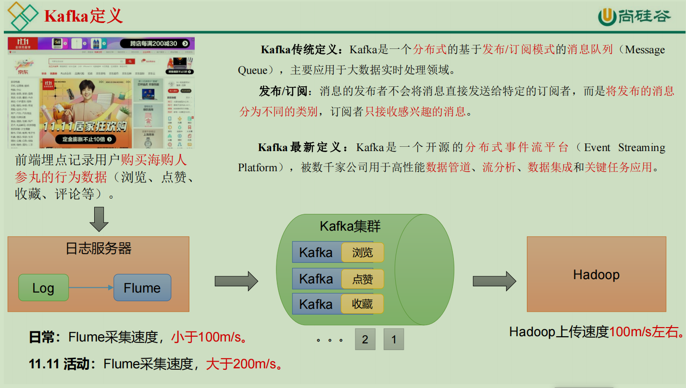

## 1.2 消息队列

> 目前企业中比较常见的消息队列产品主要有 Kafka、ActiveMQ 、RabbitMQ 、RocketMQ 等。
>
> 在大数据场景主要采用 Kafka 作为消息队列。在 JavaEE 开发中主要采用 ActiveMQ、RabbitMQ、RocketMQ。

### 1.2.1 传统消息队列的应用场景

传统的消息队列的主要应用场景包括：缓存/消峰、解耦和异步通信。

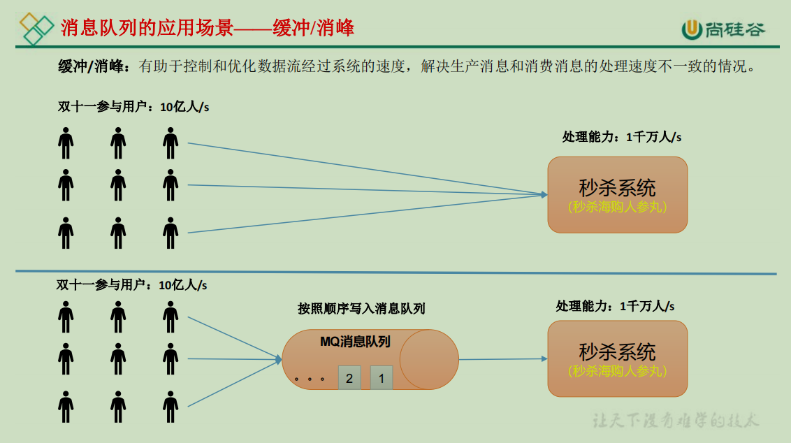

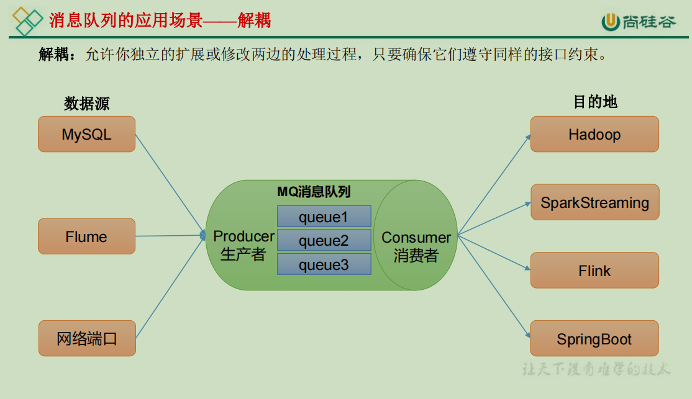

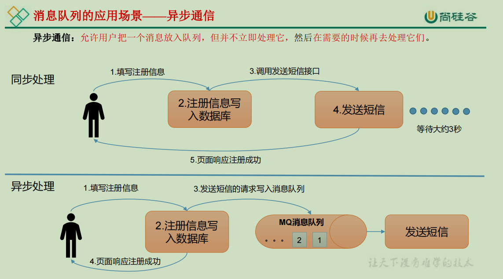


### 1.2.2 消息队列的两种模式

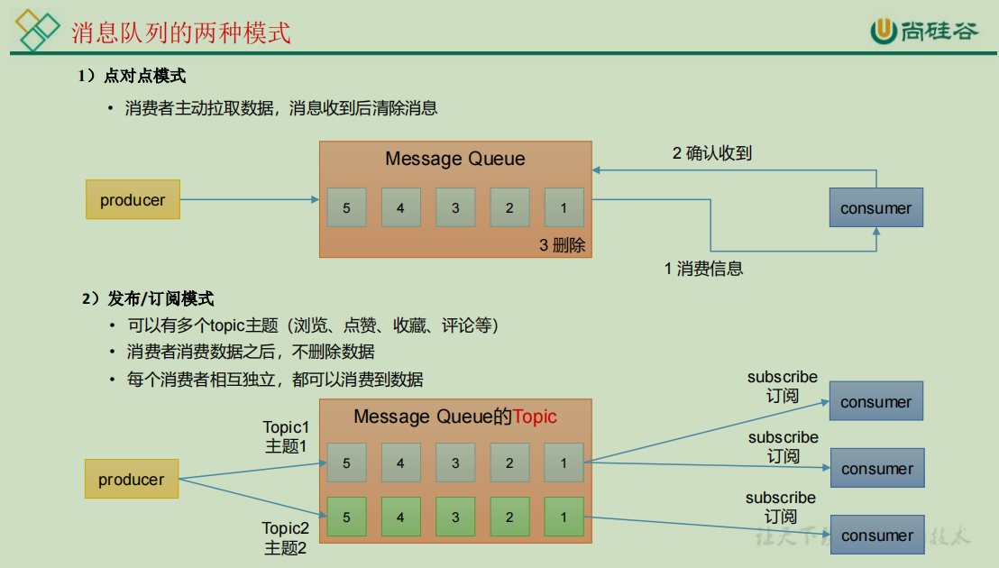


## 1.3 Kafka 基础架构

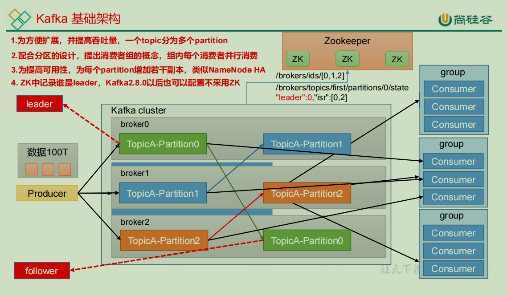


> （1）**Producer**：消息生产者，就是向 Kafka broker 发消息的客户端。
>
> （2）**Consumer**：消息消费者，向 Kafka broker 取消息的客户端。
>
> （3）**Consumer Group（CG）**：消费者组，由多个 consumer 组成。消费者组内每个消费者负责消费不同分区的数据，一个分区只能由一个组内消费者消费；消费者组之间互不影响。所有的消费者都属于某个消费者组，即消费者组是逻辑上的一个订阅者。
>
> （4）**Broker**：一台 Kafka 服务器就是一个 broker。一个集群由多个 broker 组成。一个broker 可以容纳多个 topic。
>
> （5）**Topic**：可以理解为一个队列，生产者和消费者面向的都是一个 topic。
>
> （6）**Partition**：为了实现扩展性，一个非常大的 topic 可以分布到多个 broker（即服务器）上，一个 topic 可以分为多个 partition，每个 partition 是一个有序的队列。
>
> （7）**Replica**：副本。一个 topic 的每个分区都有若干个副本，一个 Leader 和若干个Follower。
>
> （8）**Leader**：每个分区多个副本的“主”，生产者发送数据的对象，以及消费者消费数据的对象都是 Leader。
>
> （9）**Follower**：每个分区多个副本中的“从”，实时从 Leader 中同步数据，保持和Leader 数据的同步。Leader 发生故障时，某个 Follower 会成为新的 Leader。

# 第2 章 Kafka 快速入门

## 2.1 安装部署

### 2.1.1 集群规划

| hadoop102 | hadoop103 | hadoop104 |
| --------- | --------- | --------- |
| zk        | zk        | zk        |
| kafka     | kafka     | kafka     |

### 2.1.2 集群部署

0）官方下载地址：http://kafka.apache.org/downloads.html

1）解压安装包

```sh
[atguigu@hadoop102 software]$ tar -zxvf kafka_2.12-3.0.0.tgz -C /opt/module/
```

2）修改解压后的文件名称

```sh
[atguigu@hadoop102 module]$ mv kafka_2.12-3.0.0/ kafka
```

3）进入到/opt/module/kafka 目录，修改配置文件

```sh
[atguigu@hadoop102 kafka]$ cd config/

[atguigu@hadoop102 config]$ vim server.properties

输入以下内容：

#broker 的全局唯一编号，不能重复，只能是数字。

broker.id=0

#处理网络请求的线程数量

num.network.threads=3

#用来处理磁盘 IO 的线程数量

num.io.threads=8

#发送套接字的缓冲区大小

socket.send.buffer.bytes=102400

#接收套接字的缓冲区大小

socket.receive.buffer.bytes=102400

#请求套接字的缓冲区大小

socket.request.max.bytes=104857600

#kafka 运行日志(数据)存放的路径，路径不需要提前创建，kafka 自动帮你创建，可以配置多个磁盘路径，路径与路径之间可以用"，"分隔

log.dirs=/opt/module/kafka/datas

#topic 在当前 broker 上的分区个数

num.partitions=1

#用来恢复和清理 data 下数据的线程数量

num.recovery.threads.per.data.dir=1

#每个 topic 创建时的副本数，默认时1 个副本

offsets.topic.replication.factor=1

#segment 文件保留的最长时间，超时将被删除

log.retention.hours=168

#每个 segment 文件的大小，默认最大1G

log.segment.bytes=1073741824
#检查过期数据的时间，默认5 分钟检查一次是否数据过期

log.retention.check.interval.ms=300000

#配置连接 Zookeeper 集群地址（在 zk 根目录下创建/kafka，方便管理）

zookeeper.connect=hadoop102:2181,hadoop103:2181,hadoop104:2181/kafka
```

4）分发安装包

```sh
[atguigu@hadoop102 module]$ xsync kafka/
```

5）分别在 hadoop103 和 hadoop104 上修改配置文件/opt/module/kafka/config/server.properties中的 broker.id=1、broker.id=2

注：broker.id 不得重复，整个集群中唯一。

```sh
[atguigu@hadoop103 module]$ vim kafka/config/server.properties

修改:

# The id of the broker. This must be set to a unique integer for each broker.

broker.id=1

[atguigu@hadoop104 module]$ vim kafka/config/server.properties

修改:

# The id of the broker. This must be set to a unique integer for each broker.

broker.id=2
```

6）配置环境变量

（1）在/etc/profile.d/my_env.sh 文件中增加 kafka 环境变量配置

```sh
[atguigu@hadoop102 module]$ sudo vim /etc/profile.d/my_env.sh
```

增加如下内容：

```properties
#KAFKA_HOME
export KAFKA_HOME=/opt/module/kafka
export PATH=$PATH:$KAFKA_HOME/bin
```

（2）刷新一下环境变量。

```sh
[atguigu@hadoop102 module]$ source /etc/profile
```

（3）分发环境变量文件到其他节点，并 source。

```sh
[atguigu@hadoop102 module]$ sudo /home/atguigu/bin/xsync  /etc/profile.d/my_env.sh
[atguigu@hadoop103 module]$ source /etc/profile
[atguigu@hadoop104 module]$ source /etc/profile
```

7）启动集群

（1）先启动 Zookeeper 集群，然后启动 Kafka。

```sh
[atguigu@hadoop102 kafka]$ zk.sh start 
```

（2）依次在 hadoop102、hadoop103、hadoop104 节点上启动 Kafka。

```sh
[atguigu@hadoop102 kafka]$ bin/kafka-server-start.sh  -daemon config/server.properties

[atguigu@hadoop103 kafka]$ bin/kafka-server-start.sh  -daemon config/server.properties

[atguigu@hadoop104 kafka]$ bin/kafka-server-start.sh  -daemon config/server.properties  
```

注意：配置文件的路径要能够到 server.properties。

8）关闭集群

```sh
[atguigu@hadoop102 kafka]$ bin/kafka-server-stop.sh 

[atguigu@hadoop103 kafka]$ bin/kafka-server-stop.sh 

[atguigu@hadoop104 kafka]$ bin/kafka-server-stop.sh 
```

### 2.1.3 集群启停脚本

1）在/home/atguigu/bin 目录下创建文件 kf.sh 脚本文件

```sh
[atguigu@hadoop102 bin]$ vim kf.sh
```

脚本如下：

```sh
#!/bin/bash
case $1 in
"start"){
	for i in hadoop102 hadoop103 hadoop104
	do
		echo "--------启动$i Kafka-------"
		ssh $i "/opt/module/kafka/bin/kafka-server-start.sh -daemon /opt/module/kafka/config/server.properties"
	done
};;
"stop"){
	for i in hadoop102 hadoop103 hadoop104
	do
		echo "--------停止$i Kafka-------"
		ssh $i "/opt/module/kafka/bin/kafka-server-stop.sh "
	done
};;
esac
```

2）添加执行权限

```sh
[atguigu@hadoop102 bin]$ chmod +x kf.sh
```

3）启动集群命令

```sh
[atguigu@hadoop102 ~]$ kf.sh start
```

4）停止集群命令

```sh
[atguigu@hadoop102 ~]$ kf.sh stop
```

注意：停止 Kafka 集群时，一定要等 Kafka 所有节点进程全部停止后再停止 Zookeeper集群。因为 Zookeeper 集群当中记录着 Kafka 集群相关信息，Zookeeper 集群一旦先停止，Kafka 集群就没有办法再获取停止进程的信息，只能手动杀死 Kafka 进程了。 

## 2.2 Kafka 命令行操作

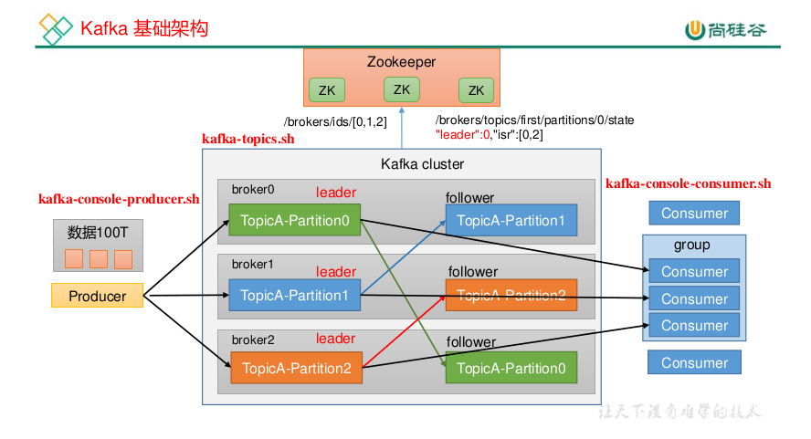

### 2.2.1 主题命令行操作

1）查看操作主题命令参数

```sh
[atguigu@hadoop102 kafka]$ bin/kafka-topics.sh
```

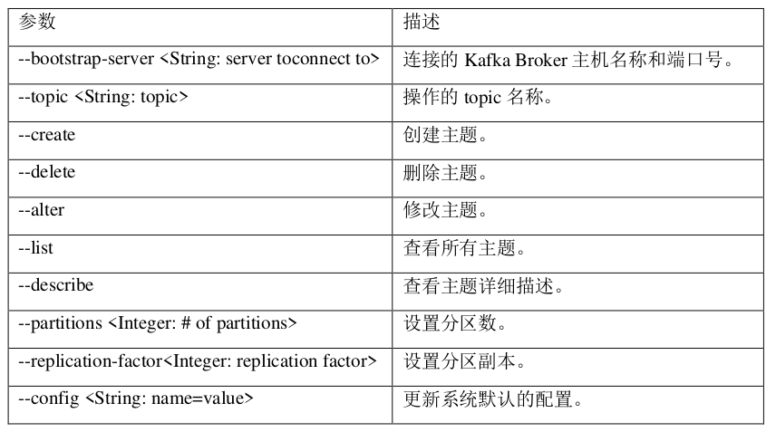

2）查看当前服务器中的所有 topic

```sh
[atguigu@hadoop102 kafka]$ bin/kafka-topics.sh --bootstrap-server hadoop102:9092 --list
```

3）创建 first topic

```sh
[atguigu@hadoop102 kafka]$ bin/kafka-topics.sh --bootstrap-server hadoop102:9092 --create --partitions 1 --replication-factor 3 --topic first
```

选项说明：

--topic 定义 topic 名

--replication-factor 定义副本数

--partitions 定义分区数

4）查看 first 主题的详情

```sh
[atguigu@hadoop102 kafka]$ bin/kafka-topics.sh --bootstrap-server hadoop102:9092 --describe --topic first
```

5）修改分区数（注意：分区数只能增加，不能减少）

```sh
[atguigu@hadoop102 kafka]$ bin/kafka-topics.sh --bootstrap-server hadoop102:9092 --alter --topic first --partitions 3
```

6）再次查看 first 主题的详情

```sh
[atguigu@hadoop102 kafka]$ bin/kafka-topics.sh --bootstrap-server hadoop102:9092 --describe --topic first
```

7）删除 topic（学生自己演示）

```sh
[atguigu@hadoop102 kafka]$ bin/kafka-topics.sh --bootstrap-server hadoop102:9092 --delete --topic first
```

### 2.2.2 生产者命令行操作

1）查看操作生产者命令参数

```sh
[atguigu@hadoop102 kafka]$ bin/kafka-console-producer.sh
```

| 参数                                             | 描述                                   |
| ------------------------------------------------ | -------------------------------------- |
| --bootstrap-server <String: server toconnect to> | 连接的 Kafka Broker 主机名称和端口号。 |
| --topic <String: topic>                          | 操作的 topic 名称。                    |

2）发送消息

```sh
[atguigu@hadoop102 kafka]$ bin/kafka-console-producer.sh --bootstrap-server hadoop102:9092 --topic first
>hello world
>atguigu atguigu
```

### 2.2.3 消费者命令行操作

1）查看操作消费者命令参数

```sh
[atguigu@hadoop102 kafka]$ bin/kafka-console-consumer.sh
```

| 参数                                             | 描述                                   |
| ------------------------------------------------ | -------------------------------------- |
| --bootstrap-server <String: server toconnect to> | 连接的 Kafka Broker 主机名称和端口号。 |
| --topic <String: topic>                          | 操作的 topic 名称。                    |
| --from-beginning                                 | 从头开始消费。                         |
| --group <String: consumer group id>              | 指定消费者组名称。                     |

2）消费消息

（1）消费 first 主题中的数据。

```sh
[atguigu@hadoop102 kafka]$ bin/kafka-console-consumer.sh --bootstrap-server hadoop102:9092 --topic first
```

（2）把主题中所有的数据都读取出来（包括历史数据）。

```sh
[atguigu@hadoop102 kafka]$ bin/kafka-console-consumer.sh --bootstrap-server hadoop102:9092 --from-beginning --topic first
```

# 第3 章 Kafka 生产者

## 3.1 生产者消息发送流程

### 3.1.1 发送原理

在消息发送的过程中，涉及到了两个线程——main 线程和 Sender 线程。在 main 线程中创建了一个双端队列 RecordAccumulator。main 线程将消息发送给 RecordAccumulator，Sender 线程不断从 RecordAccumulator 中拉取消息发送到 Kafka Broker。

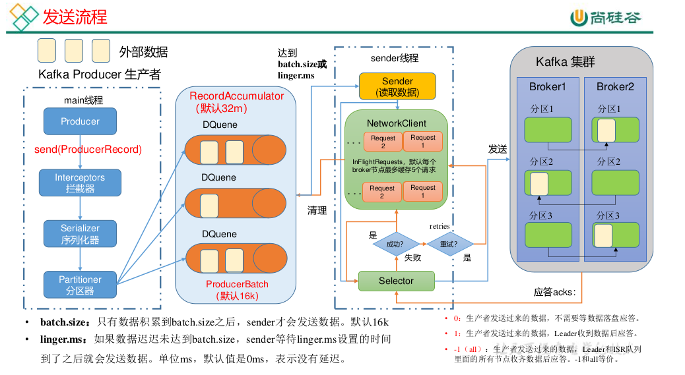

### 3.1.2 生产者重要参数列表

| 参数名称                              | 描述                                                         |
| ------------------------------------- | ------------------------------------------------------------ |
| bootstrap.servers                     | 生产者连接集群所需的 broker 地址清单。例如hadoop102:9092,hadoop103:9092,hadoop104:9092，可以设置1 个或者多个，中间用逗号隔开。注意这里并非 需要所有的 broker 地址，因为生产者从给定的 broker里查找到其他 broker 信息。 |
| key.serializer 和 value.serializer    | 指定发送消息的 key 和 value 的序列化类型。一定要写全类名。   |
| buffer.memory                         | RecordAccumulator 缓冲区总大小，默认32m。                    |
| batch.size                            | 缓冲区一批数据最大值，默认16k。适当增加该值，可以提高吞吐量，但是如果该值设置太大，会导致数据传输延迟增加。 |
| linger.ms                             | 如果数据迟迟未达到 batch.size，sender 等待 linger.time之后就会发送数据。单位 ms，默认值是0ms，表示没有延迟。生产环境建议该值大小为5-100ms 之间。 |
| acks                                  | 0：生产者发送过来的数据，不需要等数据落盘应答。<br>1：生产者发送过来的数据，Leader 收到数据后应答。<br>-1（all）：生产者发送过来的数据，Leader+和 isr 队列里面的所有节点收齐数据后应答。默认值是-1，-1 和all 是等价的。 |
| max.in.flight.requests.per.connection | 允许最多没有返回 ack 的次数，默认为5，开启幂等性要保证该值是1-5 的数字。 |
| retries                               | 当消息发送出现错误的时候，系统会重发消息。retries表示重试次数。默认是 int 最大值，2147483647。如果设置了重试，还想保证消息的有序性，需要设置MAX_IN_FLIGHT_REQUESTS_PER_CONNECTION=1否则在重试此失败消息的时候，其他的消息可能发送成功了。 |
| retry.backoff.ms                      | 两次重试之间的时间间隔，默认是100ms。                        |
| enable.idempotence                    | 是否开启幂等性，默认 true，开启幂等性。                      |
| compression.type                      | 生产者发送的所有数据的压缩方式。默认是 none，也就是不压缩。支持压缩类型：none、gzip、snappy、lz4 和 zstd。 |

##  3.2 异步发送 API

### 3.2.1 普通异步发送

1）需求：创建 Kafka 生产者，采用异步的方式发送到 Kafka Broker  

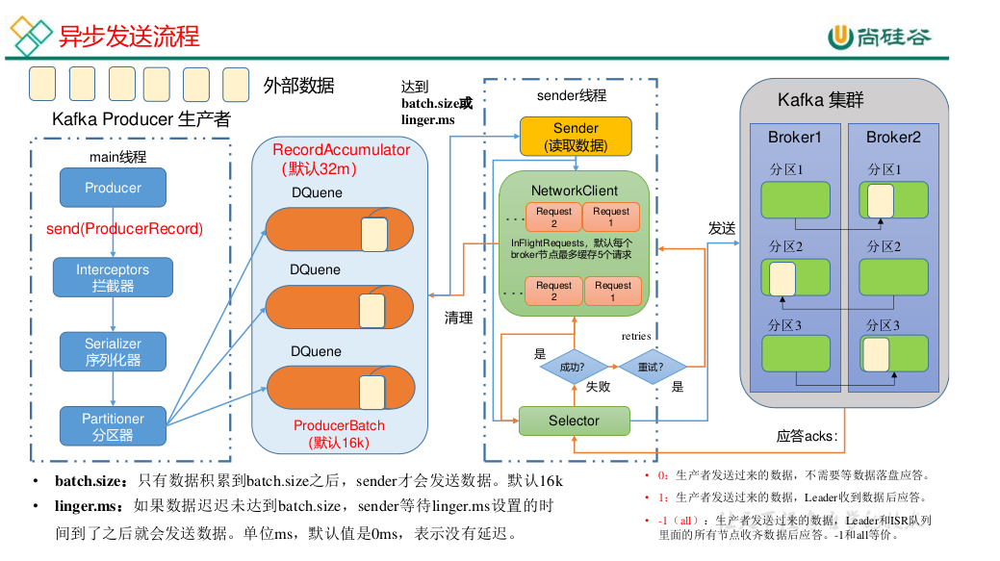

2）代码编写

（1）创建工程 kafka

（2）导入依赖

```xml
<dependencies>
    <dependency>
        <groupId>org.apache.kafka</groupId>
        <artifactId>kafka-clients</artifactId>
        <version>3.0.0</version>
    </dependency>
</dependencies>
```

（3）创建包名：com.atguigu.kafka.producer

（4）编写不带回调函数的 API 代码

```java
package com.atguigu.kafka.producer;
import org.apache.kafka.clients.producer.KafkaProducer;
import org.apache.kafka.clients.producer.ProducerRecord;
import java.util.Properties;
public class CustomProducer {
    public static void main(String[] args) throws InterruptedException {
        //1.创建 kafka 生产者的配置对象
        Properties properties = new Properties();
        //2.给 kafka 配置对象添加配置信息：bootstrap.servers
        properties.put(ProducerConfig.BOOTSTRAP_SERVERS_CONFIG,"hadoop102:9092");
        // key,value 序列化（必须）：key.serializer，value.serializer  
     properties.put(ProducerConfig.KEY_SERIALIZER_CLASS_CONFIG,"org.apache.kafka.common.serialization.StringSerializer");
        properties.put(ProducerConfig.VALUE_SERIALIZER_CLASS_CONFIG,"org.apache.kafka.common.serialization.StringSerializer");
        //3.创建 kafka 生产者对象
        KafkaProducer<String, String> kafkaProducer = new KafkaProducer<String, String>(properties);
        //4.调用 send 方法,发送消息
        for (int i = 0; i < 5; i++){
            kafkaProducer.send(new ProducerRecord<>("first","atguigu "+ i));
        }
        //5.关闭资源
        kafkaProducer.close();
    }
}
```

测试：

①在 hadoop102 上开启 Kafka 消费者。

```sh
[atguigu@hadoop103 kafka]$ bin/kafka-console-consumer.sh --bootstrap-server hadoop102:9092 --topic first
```

②在 IDEA 中执行代码，观察 hadoop102 控制台中是否接收到消息。

```sh
[atguigu@hadoop102 kafka]$ bin/kafka-console-consumer.sh --bootstrap-server hadoop102:9092 --topic first
atguigu 0
atguigu 1
atguigu 2
atguigu 3
atguigu 4 
```

### 3.2.2 带回调函数的异步发送

回调函数会在 producer 收到 ack 时调用，为异步调用，该方法有两个参数，分别是元数据信息（RecordMetadata）和异常信息（Exception），如果 Exception 为 null，说明消息发送成功，如果 Exception 不为 null，说明消息发送失败。 

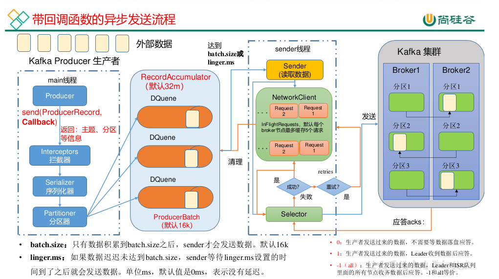

注意：消息发送失败会自动重试，不需要我们在回调函数中手动重试。

```java
package com.atguigu.kafka.producer;
import org.apache.kafka.clients.producer.;
import java.util.Properties;
public class CustomProducerCallback {
    public static void main(String[] args) throws InterruptedException {
        //1.创建 kafka 生产者的配置对象
        Properties properties = new Properties();
        //2.给 kafka 配置对象添加配置信息
        properties.put(ProducerConfig.BOOTSTRAP_SERVERS_CONFIG,"hadoop102:9092");
        // key,value 序列化（必须）：key.serializer，value.serializer
        properties.put(ProducerConfig.KEY_SERIALIZER_CLASS_CONFIG,StringSerializer.class.getName());
        properties.put(ProducerConfig.VALUE_SERIALIZER_CLASS_CONFIG,StringSerializer.class.getName());
        //3.创建 kafka 生产者对象
        KafkaProducer<String, String> kafkaProducer = new KafkaProducer<String, String>(properties);
        //4.调用 send 方法,发送消息
        for (int i = 0; i < 5; i++){
            //添加回调
            kafkaProducer.send(new ProducerRecord<>("first","atguigu "+ i), new Callback(){ 
                //该方法在 Producer 收到 ack 时调用，为异步调用
                @Override
                public void onCompletion(RecordMetadata metadata,Exception exception){
                    if (exception == null){
                        //没有异常,输出信息到控制台
                        System.out.println("主题："+ metadata.topic()+"->"+"分区："+ metadata.partition());
                    } else {
                        //出现异常打印
                        exception.printStackTrace();
                    }
                }
            });
            
            //延迟一会会看到数据发往不同分区
            Thread.sleep(2);
        }
        //5.关闭资源
        kafkaProducer.close();
    }
}
```

测试：

①在 hadoop102 上开启 Kafka 消费者。

```sh
[atguigu@hadoop103 kafka]$ bin/kafka-console-consumer.sh  --bootstrap-server hadoop102:9092 --topic first
```

②在 IDEA 中执行代码，观察 hadoop102 控制台中是否接收到消息。

```sh
[atguigu@hadoop102 kafka]$ bin/kafka-console-consumer.sh --bootstrap-server hadoop102:9092 --topic first
```

```sh
atguigu 0
atguigu 1
atguigu 2
atguigu 3
atguigu 4
```

③在 IDEA 控制台观察回调信息。

```sh
主题：first->分区：0
主题：first->分区：0
主题：first->分区：1
主题：first->分区：1
主题：first->分区：1  
```

## 3.3 同步发送 API

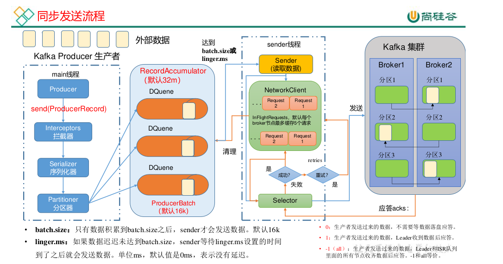

只需在异步发送的基础上，再调用一下 get()方法即可。

```java
package com.atguigu.kafka.producer;
import org.apache.kafka.clients.producer.KafkaProducer;
import org.apache.kafka.clients.producer.ProducerConfig;
import org.apache.kafka.clients.producer.ProducerRecord;
import java.util.Properties;
import java.util.concurrent.ExecutionException;
public class CustomProducerSync {
    public static void main(String[] args) throws InterruptedException, ExecutionException {
        //1.创建 kafka 生产者的配置对象
        Properties properties = new Properties();
        //2.给 kafka 配置对象添加配置信息
        properties.put(ProducerConfig.BOOTSTRAP_SERVERS_CONFIG,"hadoop102:9092");
        // key,value 序列化（必须）：key.serializer，value.serializer
        properties.put(ProducerConfig.KEY_SERIALIZER_CLASS_CONFIG,StringSerializer.class.getName());
        properties.put(ProducerConfig.VALUE_SERIALIZER_CLASS_CONFIG,StringSerializer.class.getName());
        //3.创建 kafka 生产者对象
        KafkaProducer<String, String> kafkaProducer = new KafkaProducer<String, String>(properties);  
        //4.调用 send 方法,发送消息
        for (int i = 0; i < 10; i++){
            //异步发送默认
            // kafkaProducer.send(new ProducerRecord<>("first","kafka"+ i));
            //同步发送
            kafkaProducer.send(new ProducerRecord<>("first","kafka"+ i)).get();
        }
        //5.关闭资源
        kafkaProducer.close();
    }
}
```

测试：

①在 hadoop102 上开启 Kafka 消费者。

```sh
[atguigu@hadoop103 kafka]$ bin/kafka-console-consumer.sh --bootstrap-server hadoop102:9092 --topic first
```

②在 IDEA 中执行代码，观察 hadoop102 控制台中是否接收到消息。

```sh
[atguigu@hadoop102 kafka]$ bin/kafka-console-consumer.sh --bootstrap-server hadoop102:9092 --topic first
atguigu 0
atguigu 1
atguigu 2
atguigu 3
atguigu 4 
```

## 3.4 生产者分区

### 3.4.1 分区好处

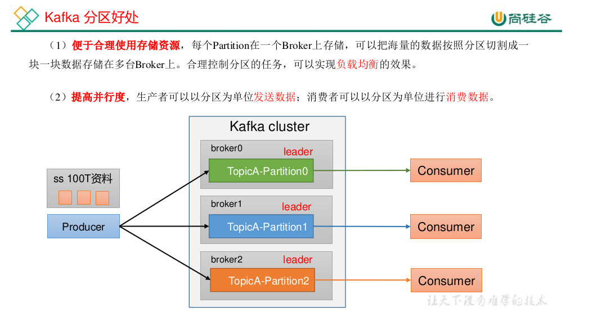


### 3.4.2 生产者发送消息的分区策略

1）默认的分区器 DefaultPartitioner

在 IDEA 中 ctrl +n，全局查找 DefaultPartitioner。

```java
/** The default partitioning strategy:
* <ul>
* <li>If a partition is specified in the record, use it
* <li>If no partition is specified but a key is present choose a partition based on a hash of the key
* <li>If no partition or key is present choose the sticky partition that changes when the batch is full.
* See KIP-480 for details about sticky partitioning.
*/

public class DefaultPartitioner implements Partitioner {

……

}
```

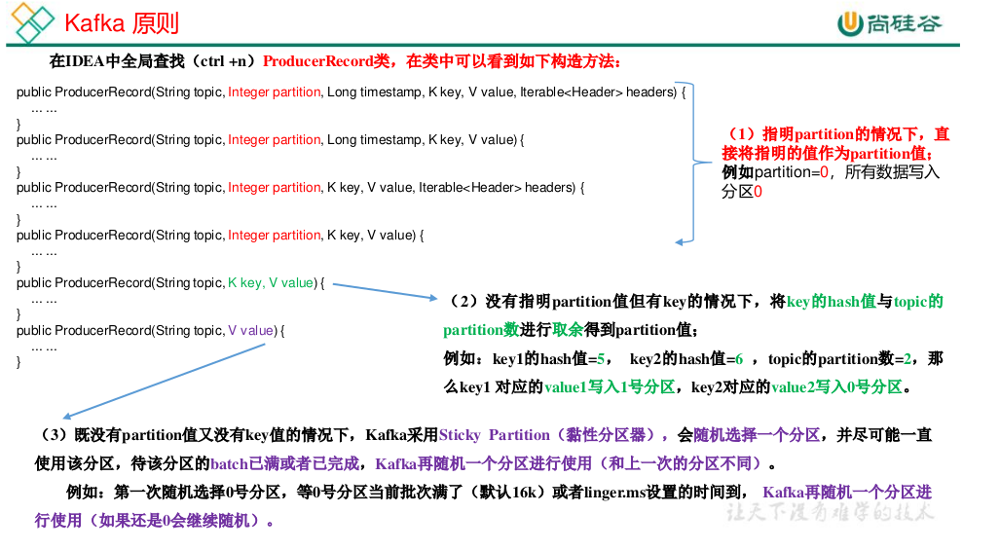

2）案例一

将数据发往指定 partition 的情况下，例如，将所有数据发往分区1 中。

```java
package com.atguigu.kafka.producer;
import org.apache.kafka.clients.producer.;
import java.util.Properties;
public class CustomProducerCallbackPartitions {
    public static void main(String[] args){
        //1.创建 kafka 生产者的配置对象
        Properties properties = new Properties();  
        //2.给 kafka 配置对象添加配置信息
        properties.put(ProducerConfig.BOOTSTRAP_SERVERS_CONFIG,"hadoop102:9092");
        // key,value 序列化（必须）：key.serializer，value.serializer
        properties.put(ProducerConfig.KEY_SERIALIZER_CLASS_CONFIG,StringSerializer.class.getName());
        properties.put(ProducerConfig.VALUE_SERIALIZER_CLASS_CONFIG,StringSerializer.class.getName());
        KafkaProducer<String, String> kafkaProducer = new KafkaProducer<>(properties);
        for (int i = 0; i < 5; i++){
            //指定数据发送到1 号分区，key 为空（IDEA 中 ctrl + p 查看参数）
            kafkaProducer.send(new ProducerRecord<>("first",1,"","atguigu "+ i), new Callback(){
                @Override
                public void onCompletion(RecordMetadata metadata,Exception e){
                    if (e == null){
                        System.out.println("主题："+metadata.topic()+"->"+"分区："+ metadata.partition());
                    }else {
                        e.printStackTrace();
                    }
                }
            });
        }
        kafkaProducer.close();
    }
}
```

测试：

①在 hadoop102 上开启 Kafka 消费者。

```sh
[atguigu@hadoop103 kafka]$ bin/kafka-console-consumer.sh --bootstrap-server hadoop102:9092 --topic first
```

②在 IDEA 中执行代码，观察 hadoop102 控制台中是否接收到消息。

```sh
[atguigu@hadoop102 kafka]$ bin/kafka-console-consumer.sh --bootstrap-server hadoop102:9092 --topic first
atguigu 0
atguigu 1
atguigu 2
atguigu 3
atguigu 4
```

③在 IDEA 控制台观察回调信息。

```sh
主题：first->分区：1  
主题：first->分区：1
主题：first->分区：1
主题：first->分区：1
主题：first->分区：1 
```

3）案例二

没有指明 partition 值但有 key 的情况下，将 key 的 hash 值与 topic 的 partition 数进行取余得到 partition 值。

```java
package com.atguigu.kafka.producer;
import org.apache.kafka.clients.producer.;
import java.util.Properties;
public class CustomProducerCallback {
    public static void main(String[] args){
        Properties properties = new Properties();
        properties.put(ProducerConfig.BOOTSTRAP_SERVERS_CONFIG,"hadoop102:9092");
        properties.put(ProducerConfig.KEY_SERIALIZER_CLASS_CONFIG,StringSerializer.class.getName());
        properties.put(ProducerConfig.VALUE_SERIALIZER_CLASS_CONFIG,StringSerializer.class.getName());
        KafkaProducer<String,String> kafkaProducer = new KafkaProducer<>(properties);
        for (int i = 0; i < 5; i++){
            //依次指定 key 值为 a,b,f ，数据 key 的 hash 值与3 个分区求余，分别发往1、2、0
            kafkaProducer.send(new ProducerRecord<>("first","a","atguigu "+ i), new Callback(){
                @Override
                public void onCompletion(RecordMetadata metadata,Exception e){
                    if (e == null){
                        System.out.println("主题："+ metadata.topic()+"->"+"分区："+ metadata.partition());
                    }else {
                        e.printStackTrace();
                    }
                }
            });
        }
        kafkaProducer.close();
    }
} 
```

测试：

①key="a"时，在控制台查看结果。

```sh
主题：first->分区：1
主题：first->分区：1
主题：first->分区：1
主题：first->分区：1
主题：first->分区：1 
```

②key="b"时，在控制台查看结果。

```sh
主题：first->分区：2
主题：first->分区：2
主题：first->分区：2
主题：first->分区：2
主题：first->分区：2 
```

③key="f"时，在控制台查看结果。

```sh
主题：first->分区：0
主题：first->分区：0
主题：first->分区：0
主题：first->分区：0
主题：first->分区：0 
```

### 3.4.3 自定义分区器

如果研发人员可以根据企业需求，自己重新实现分区器。

1）需求

例如我们实现一个分区器实现，发送过来的数据中如果包含 atguigu，就发往0 号分区，不包含 atguigu，就发往1 号分区。

2）实现步骤

（1）定义类实现 Partitioner 接口。

（2）重写 partition()方法。

```java
package com.atguigu.kafka.producer;
import org.apache.kafka.clients.producer.Partitioner;
import org.apache.kafka.common.Cluster;
import java.util.Map;

/**
*1.实现接口 Partitioner
*2.实现3 个方法:partition,close,configure
*3.编写 partition 方法,返回分区号
*/

public class MyPartitioner implements Partitioner {

/**返回信息对应的分区
* @param topic 主题
* @param key 消息的 key
* @param keyBytes 消息的 key 序列化后的字节数组
* @param value 消息的 value
* @param valueBytes 消息的 value 序列化后的字节数组
* @param cluster 集群元数据可以查看分区信息
* @return
*/
    @Override
    public int partition(String topic, Object key, byte[] keyBytes, Object value, byte[] valueBytes, Cluster cluster){
        //获取消息
        String msgValue = value.toString();
        //创建 partition
        int partition;
        //判断消息是否包含 atguigu
        if (msgValue.contains("atguigu")){
            partition = 0;
        }else {
            partition = 1;
        }
        //返回分区号
        return partition;
    }
    //关闭资源
    @Override
    public void close(){}
    
    //配置方法
    @Override
    public void configure(Map<String,?> configs){}
}
```

（3）使用分区器的方法，在生产者的配置中添加分区器参数。

```java
package com.atguigu.kafka.producer;
import org.apache.kafka.clients.producer.;
import java.util.Properties;
public class CustomProducerCallbackPartitions {
    public static void main(String[] args) throws InterruptedException {
        Properties properties = new Properties();
        properties.put(ProducerConfig.BOOTSTRAP_SERVERS_CONFIG,"hadoop102:9092");
        properties.put(ProducerConfig.KEY_SERIALIZER_CLASS_CONFIG,StringSerializer.class.getName());
        properties.put(ProducerConfig.VALUE_SERIALIZER_CLASS_CONFIG,StringSerializer.class.getName());
        //添加自定义分区器
        properties.put(ProducerConfig.PARTITIONER_CLASS_CONFIG,"com.atguigu.kafka.producer.MyPartitioner");
        KafkaProducer<String, String> kafkaProducer = new KafkaProducer<>(properties);
        for (int i = 0; i < 5; i++){
            kafkaProducer.send(new ProducerRecord<>("first","atguigu "+ i), new Callback(){
                @Override
                public void onCompletion(RecordMetadata metadata,Exception e){
                    if (e == null){
                        System.out.println("主题："+metadata.topic()+"->"+"分区："+ metadata.partition());
                    }else {
                        e.printStackTrace();
                    }
                }});
        }
        kafkaProducer.close();
    }
}
```

（4）测试

①在 hadoop102 上开启 Kafka 消费者。

```sh
[atguigu@hadoop103 kafka]$ bin/kafka-console-consumer.sh --bootstrap-server hadoop102:9092 --topic first
```

②在 IDEA 控制台观察回调信息。

```sh
主题：first->分区：0
主题：first->分区：0
主题：first->分区：0
主题：first->分区：0
主题：first->分区：0  
```

## 3.5 生产经验——生产者如何提高吞吐量

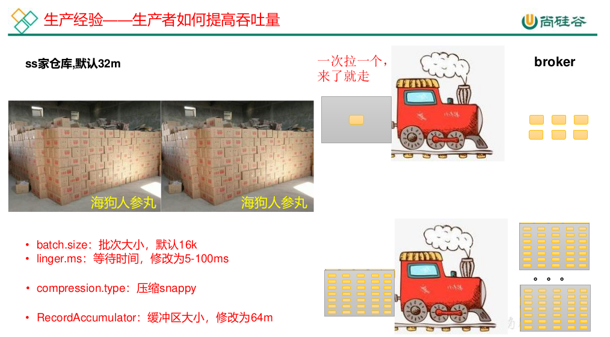

```java
package com.atguigu.kafka.producer;
import org.apache.kafka.clients.producer.KafkaProducer;
import org.apache.kafka.clients.producer.ProducerRecord;
import java.util.Properties;
public class CustomProducerParameters {
    public static void main(String[] args) throws InterruptedException {
        //1.创建 kafka 生产者的配置对象
        Properties properties = new Properties();
        //2.给 kafka 配置对象添加配置信息：bootstrap.servers
        properties.put(ProducerConfig.BOOTSTRAP_SERVERS_CONFIG,"hadoop102:9092");
        // key,value 序列化（必须）：key.serializer，value.serializer
        properties.put(ProducerConfig.KEY_SERIALIZER_CLASS_CONFIG,"org.apache.kafka.common.serialization.StringSerializer");
        properties.put(ProducerConfig.VALUE_SERIALIZER_CLASS_CONFIG,"org.apache.kafka.common.serialization.StringSerializer");
        // batch.size：批次大小，默认16K
        properties.put(ProducerConfig.BATCH_SIZE_CONFIG,16384);
        // linger.ms：等待时间，默认0
        properties.put(ProducerConfig.LINGER_MS_CONFIG,1);
        // RecordAccumulator：缓冲区大小，默认32M：buffer.memory
        properties.put(ProducerConfig.BUFFER_MEMORY_CONFIG, 33554432);
        // compression.type：压缩，默认 none，可配置值 gzip、snappy、lz4 和 zstd
        properties.put(ProducerConfig.COMPRESSION_TYPE_CONFIG,"snappy");
        //3.创建 kafka 生产者对象
        KafkaProducer<String, String> kafkaProducer = new KafkaProducer<String, String>(properties);
        //4.调用 send 方法,发送消息
        for (int i = 0; i < 5; i++){
            kafkaProducer.send(new ProducerRecord<>("first","atguigu "+ i));
        }
        //5.关闭资源
        kafkaProducer.close();
    }
}
```

测试：

①在 hadoop102 上开启 Kafka 消费者。

```sh
[atguigu@hadoop103 kafka]$ bin/kafka-console-consumer.sh --bootstrap-server hadoop102:9092 --topic first
```

②在 IDEA 中执行代码，观察 hadoop102 控制台中是否接收到消息。

```sh
[atguigu@hadoop102 kafka]$ bin/kafka-console-consumer.sh --bootstrap-server hadoop102:9092 --topic first

atguigu 0
atguigu 1
atguigu 2
atguigu 3
atguigu 4 
```

## 3.6 生产经验——数据可靠性

0）回顾发送流程 

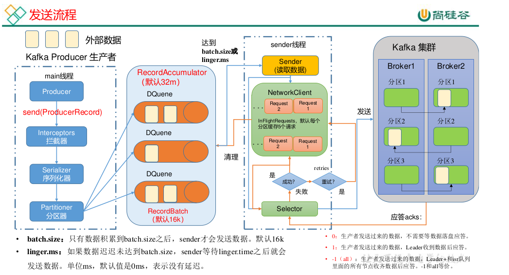

1）ack 应答原理

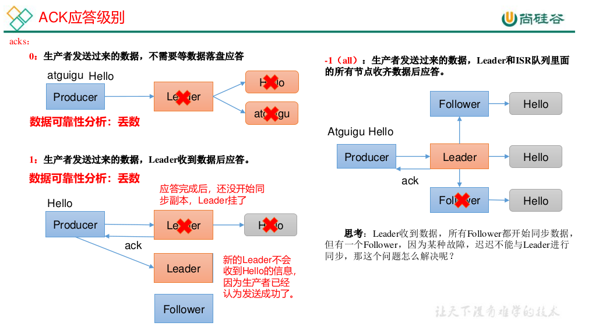

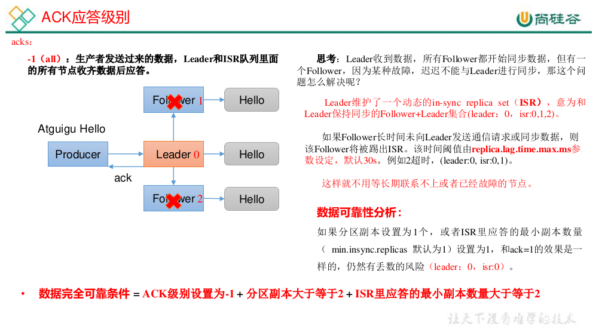

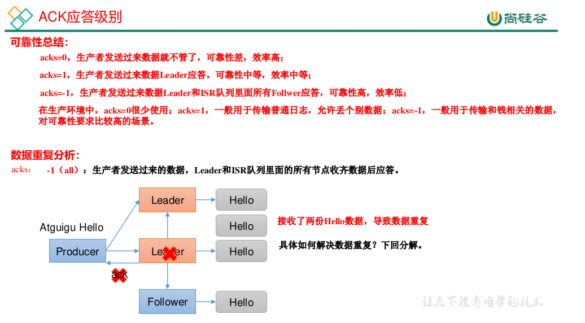

2）代码配置

```java
package com.atguigu.kafka.producer;
import org.apache.kafka.clients.producer.KafkaProducer;
import org.apache.kafka.clients.producer.ProducerRecord;
import java.util.Properties;
public class CustomProducerAck {
    public static void main(String[] args) throws InterruptedException {
        //1.创建 kafka 生产者的配置对象
        Properties properties = new Properties();
        //2.给 kafka 配置对象添加配置信息：bootstrap.servers  
        properties.put(ProducerConfig.BOOTSTRAP_SERVERS_CONFIG,"hadoop102:9092");
        // key,value 序列化（必须）：key.serializer，value.serializer
        properties.put(ProducerConfig.KEY_SERIALIZER_CLASS_CONFIG,StringSerializer.class.getName());
        properties.put(ProducerConfig.VALUE_SERIALIZER_CLASS_CONFIG,StringSerializer.class.getName());
        //设置 acks
        properties.put(ProducerConfig.ACKS_CONFIG,"all");
        //重试次数 retries，默认是 int 最大值，2147483647
        properties.put(ProducerConfig.RETRIES_CONFIG,3);
        //3.创建 kafka 生产者对象
        KafkaProducer<String, String> kafkaProducer = new KafkaProducer<String, String>(properties);
        //4.调用 send 方法,发送消息
        for (int i = 0; i < 5; i++){
            kafkaProducer.send(new ProducerRecord<>("first","atguigu "+ i));
        }
        //5.关闭资源
        kafkaProducer.close();
    }
} 
```

## 3.7 生产经验——数据去重

### 3.7.1 数据传递语义

数据传递语义

•至少一次（At Least Once）= ACK级别设置为-1 +分区副本大于等于2 + ISR里应答的最小副本数量大于等于2 

•最多一次（At Most Once）= ACK级别设置为0 

•总结：

At Least Once可以保证数据不丢失，但是不能保证数据不重复；

At Most Once可以保证数据不重复，但是不能保证数据不丢失。

•精确一次（**Exactly Once**）：对于一些非常重要的信息，比如和钱相关的数据，要求数据既不能重复也不丢失。

Kafka 0.11版本以后，引入了一项重大特性：**幂等性和事务**。

### 3.7.2 幂等性

1）幂等性原理

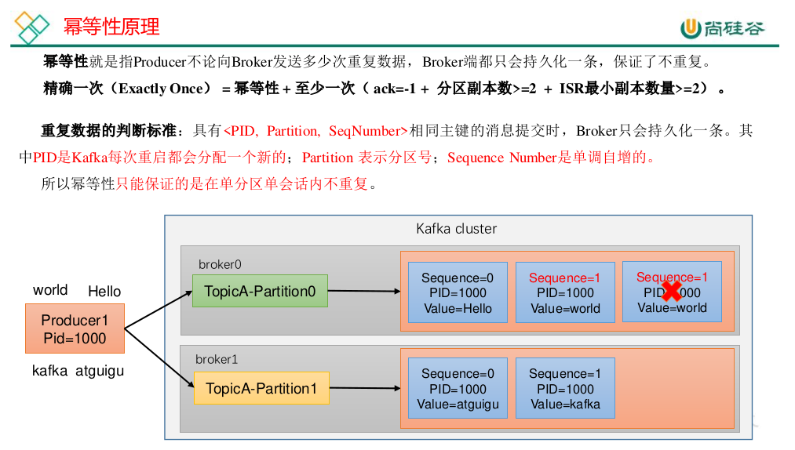

2）如何使用幂等性

开启参数 enable.idempotence 默认为 true，false 关闭。

### 3.7.3 生产者事务

1）Kafka 事务原理 

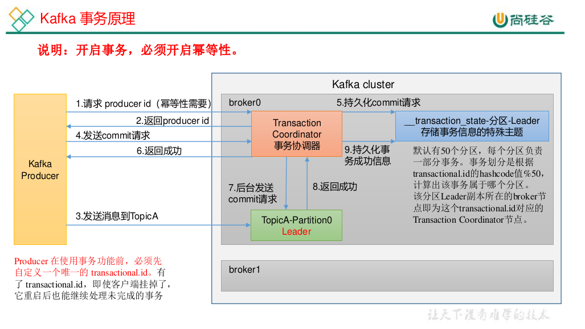

2）Kafka 的事务一共有如下5 个 API

```java
//1 初始化事务
void initTransactions();

//2 开启事务
void beginTransaction() throws ProducerFencedException;

//3 在事务内提交已经消费的偏移量（主要用于消费者）
void sendOffsetsToTransaction(Map<TopicPartition, OffsetAndMetadata> offsets,String consumerGroupId) throws ProducerFencedException;

//4 提交事务
void commitTransaction() throws ProducerFencedException;

//5 放弃事务（类似于回滚事务的操作）
void abortTransaction() throws ProducerFencedException;
```

3）单个 Producer，使用事务保证消息的仅一次发送

```java
package com.atguigu.kafka.producer;
import org.apache.kafka.clients.producer.KafkaProducer;
import org.apache.kafka.clients.producer.ProducerRecord;
import java.util.Properties;
public class CustomProducerTransactions {
    public static void main(String[] args) throws InterruptedException {
        //1.创建 kafka 生产者的配置对象
        Properties properties = new Properties();
        //2.给 kafka 配置对象添加配置信息
        properties.put(ProducerConfig.BOOTSTRAP_SERVERS_CONFIG, "hadoop102:9092");
        // key,value 序列化
        properties.put(ProducerConfig.KEY_SERIALIZER_CLASS_CONFIG,StringSerializer.class.getName());
        properties.put(ProducerConfig.VALUE_SERIALIZER_CLASS_CONFIG,StringSerializer.class.getName());
        //设置事务 id（必须），事务 id 任意起名
        properties.put(ProducerConfig.TRANSACTIONAL_ID_CONFIG,"transaction_id_0");
        //3.创建 kafka 生产者对象
        KafkaProducer<String, String> kafkaProducer = new KafkaProducer<String, String>(properties);
        //初始化事务
        kafkaProducer.initTransactions();
        //开启事务
        kafkaProducer.beginTransaction();
        try {
            //4.调用 send 方法,发送消息
            for (int i = 0; i < 5; i++){
                //发送消息
                kafkaProducer.send(new ProducerRecord<>("first","atguigu "+ i));
            }
            // int i = 1 /0;
            //提交事务
            kafkaProducer.commitTransaction();
        } catch (Exception e){
            //终止事务
            kafkaProducer.abortTransaction();
        } finally {
            //5.关闭资源
            kafkaProducer.close();
        }
    }
}
```

## 3.8 生产经验——数据有序

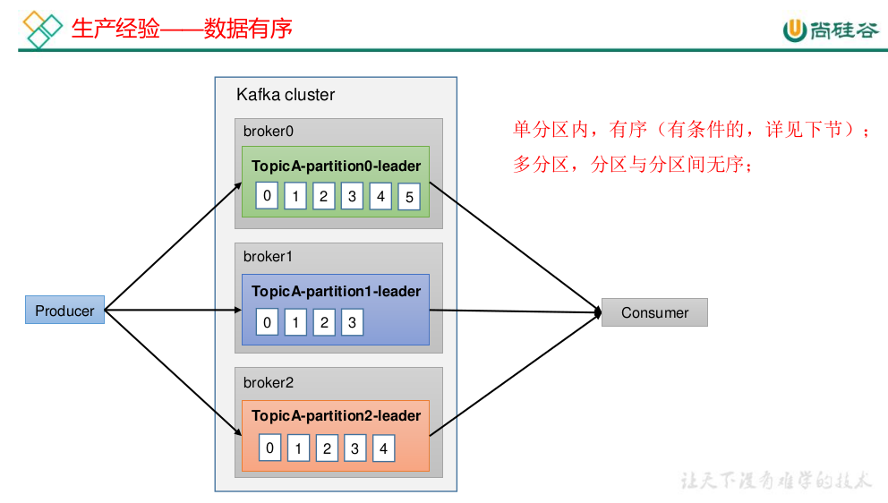


## 3.9 生产经验——数据乱序

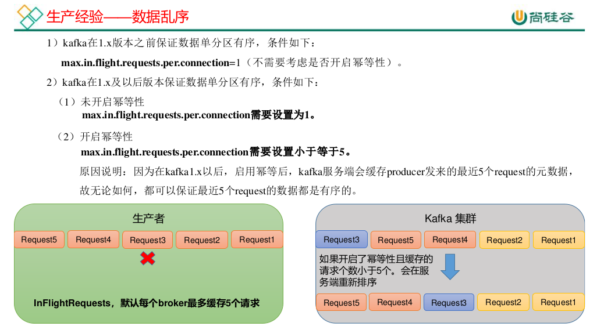


# 第4 章 Kafka Broker

## 4.1 Kafka Broker 工作流程

### 4.1.1 Zookeeper 存储的 Kafka 信息

（1）启动 Zookeeper 客户端。

```sh
[atguigu@hadoop102 zookeeper-3.5.7]$ bin/zkCli.sh
```

（2）通过 ls 命令可以查看 kafka 相关信息。 

```sh
[zk: localhost:2181(CONNECTED)2] ls /kafka
```

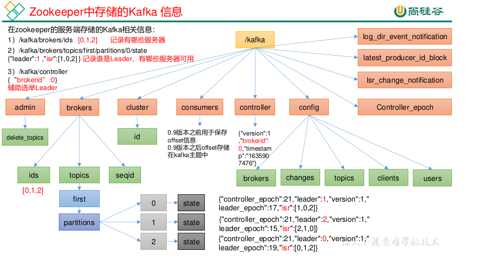


### 4.1.2 Kafka Broker 总体工作流程

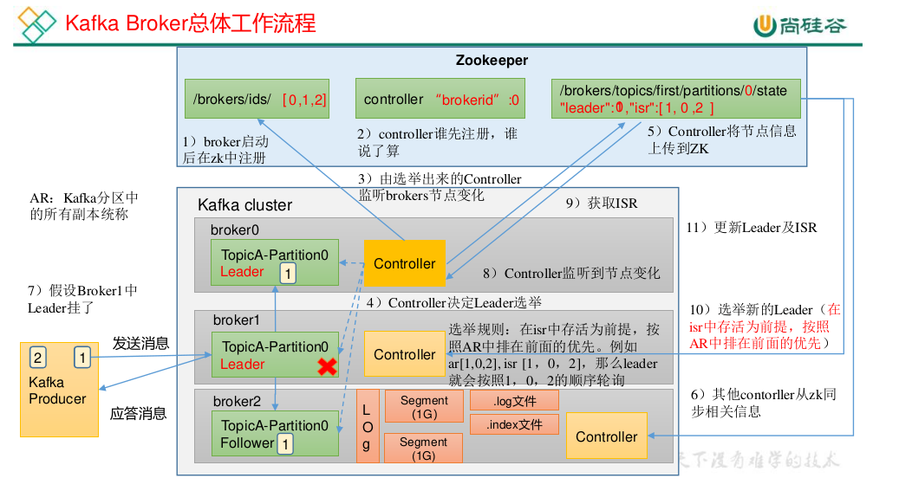

1）模拟 Kafka 上下线，Zookeeper 中数据变化

（1）查看/kafka/brokers/ids 路径上的节点。

```sh
[zk: localhost:2181(CONNECTED)2] ls /kafka/brokers/ids
[0,1,2]
```

（2）查看/kafka/controller 路径上的数据。

```sh
[zk: localhost:2181(CONNECTED)15] get /kafka/controller
{"version":1,"brokerid":0,"timestamp":"1637292471777"}
```

（3）查看/kafka/brokers/topics/first/partitions/0/state 路径上的数据。 

```sh
[zk: localhost:2181(CONNECTED)16] get /kafka/brokers/topics/first/partitions/0/state
{"controller_epoch":24,"leader":0,"version":1,"leader_epoch":18,"isr":[0,1,2]}
```

（4）停止 hadoop104 上的 kafka。

```sh
[atguigu@hadoop104 kafka]$ bin/kafka-server-stop.sh
```

（5）再次查看/kafka/brokers/ids 路径上的节点。

```sh
[zk: localhost:2181(CONNECTED)3] ls /kafka/brokers/ids
[0,1]
```

（6）再次查看/kafka/controller 路径上的数据。

```sh
[zk: localhost:2181(CONNECTED)15] get /kafka/controller

{"version":1,"brokerid":0,"timestamp":"1637292471777"}
```

（7）再次查看/kafka/brokers/topics/first/partitions/0/state 路径上的数据。

```sh
[zk: localhost:2181(CONNECTED)16] get /kafka/brokers/topics/first/partitions/0/state

{"controller_epoch":24,"leader":0,"version":1,"leader_epoch":18,"isr":[0,1]}
```

（8）启动 hadoop104 上的 kafka。

```sh
[atguigu@hadoop104 kafka]$ bin/kafka-server-start.sh -daemon ./config/server.properties
```

（9）再次观察（1）、（2）、（3）步骤中的内容。

### 4.1.3 Broker 重要参数

| 参数名称                                | 描述                                                         |
| --------------------------------------- | ------------------------------------------------------------ |
| replica.lag.time.max.ms                 | ISR 中，如果 Follower 长时间未向 Leader 发送通信请求或同步数据，则该 Follower 将被踢出 ISR。该时间阈值，默认30s。 |
| auto.leader.rebalance.enable            | 默认是 true。自动 Leader Partition 平衡。                    |
| leader.imbalance.per.broker.percentage  | 默认是10%。每个 broker 允许的不平衡的 leader的比率。如果每个 broker 超过了这个值，控制器会触发 leader 的平衡。 |
| leader.imbalance.check.interval.seconds | 默认值300 秒。检查 leader 负载是否平衡的间隔时间。           |
| log.segment.bytes                       | Kafka 中 log 日志是分成一块块存储的，此配置是指 log 日志划分成块的大小，默认值1G。 |
| log.index.interval.bytes                | 默认4kb，kafka 里面每当写入了4kb 大小的日志（.log），然后就往 index 文件里面记录一个索引。 |
| log.retention.hours                     | Kafka 中数据保存的时间，默认7 天。                           |
| log.retention.minutes                   | Kafka 中数据保存的时间，分钟级别，默认关闭。                 |
| log.retention.ms                        | Kafka 中数据保存的时间，毫秒级别，默认关闭。                 |
| log.retention.check.interval.ms         | 检查数据是否保存超时的间隔，默认是5 分钟。                   |
| log.retention.bytes                     | 默认等于-1，表示无穷大。超过设置的所有日志总大小，删除最早的 segment。 |
| log.cleanup.policy                      | 默认是 delete，表示所有数据启用删除策略；如果设置值为 compact，表示所有数据启用压缩策略。 |
| num.io.threads                          | 默认是8。负责写磁盘的线程数。整个参数值要占总核数的50%。     |
| num.replica.fetchers                    | 副本拉取线程数，这个参数占总核数的50%的1/3                   |
| num.network.threads                     | 默认是3。数据传输线程数，这个参数占总核数的50%的2/3 。       |
| log.flush.interval.messages             | 强制页缓存刷写到磁盘的条数，默认是 long 的最大值，9223372036854775807。一般不建议修改，交给系统自己管理。 |
| log.flush.interval.ms                   | 每隔多久，刷数据到磁盘，默认是 null。一般不建议修改，交给系统自己管理。 |

## 4.2 生产经验——节点服役和退役

### 4.2.1 服役新节点

1）新节点准备

（1）关闭 hadoop104，并右键执行克隆操作。

（2）开启 hadoop105，并修改 IP 地址。

```sh
[root@hadoop104 ~]# vim /etc/sysconfig/network-scripts/ifcfg-ens33

DEVICE=ens33
TYPE=Ethernet
ONBOOT=yes
BOOTPROTO=static
NAME="ens33"
IPADDR=192.168.10.105
PREFIX=24
GATEWAY=192.168.10.2
DNS1=192.168.10.2 
```

 （3）在 hadoop105 上，修改主机名称为 hadoop105。

```sh
[root@hadoop104 ~]# vim /etc/hostname
hadoop105
```

（4）重新启动 hadoop104、hadoop105。

（5）修改 haodoop105 中 kafka 的 broker.id 为3。

（6）删除 hadoop105 中 kafka 下的 datas 和 logs。

```sh
[atguigu@hadoop105 kafka]$ rm -rf datas/ logs/
```

（7）启动 hadoop102、hadoop103、hadoop104 上的 kafka 集群。

```sh
[atguigu@hadoop102 ~]$ zk.sh start

[atguigu@hadoop102 ~]$ kf.sh start 
```

（8）单独启动 hadoop105 中的 kafka。

```sh
[atguigu@hadoop105 kafka]$ bin/kafka-server-start.sh -daemon ./config/server.properties
```

2）执行负载均衡操作

（1）创建一个要均衡的主题。

```sh
[atguigu@hadoop102 kafka]$ vim topics-to-move.json
```

```json
{
    "topics": [
        {"topic": "first"}
    ],
    "version": 1
}
```

（2）生成一个负载均衡的计划。

```sh
[atguigu@hadoop102 kafka]$ bin/kafka-reassign-partitions.sh --bootstrap-server hadoop102:9092 --topics-to-move-json-file topics-to-move.json --broker-list "0,1,2,3"--generate
```

```sh
Current partition replica assignment

{"version":1,"partitions":[{"topic":"first","partition":0,"replicas":[0,2,1],"log_dirs":["any","any","any"]},{"topic":"first","partition":1,"replicas":[2,1,0],"log_dirs":["any","any","any"]},{"topic":"first","partition":2,"replicas":[1,0,2],"log_dirs":["any","any","any"]}]}

Proposed partition reassignment configuration

{"version":1,"partitions":[{"topic":"first","partition":0,"replicas":[2,3,0],"log_dirs":["any","any","any"]},{"topic":"first","partition":1,"replicas":[3,0,1],"log_dirs":["any","any","any"]},{"topic":"first","partition":2,"replicas":[0,1,2],"log_dirs":["any","any","any"]}]}
```

（3）创建副本存储计划（所有副本存储在 broker0、broker1、broker2、broker3 中）。

```sh
[atguigu@hadoop102 kafka]$ vim increase-replication-factor.json
```

输入如下内容： 

```sh
{"version":1,"partitions":[{"topic":"first","partition":0,"replicas":[2,3,0],"log_dirs":["any","any","any"]},{"topic":"first","partition":1,"replicas":[3,0,1],"log_dirs":["any","any","any"]},{"topic":"first","partition":2,"replicas":[0,1,2],"log_dirs":["any","any","any"]}]}
```

（4）执行副本存储计划。

```sh
[atguigu@hadoop102 kafka]$ bin/kafka-reassign-partitions.sh --bootstrap-server hadoop102:9092 
--reassignment-json-file increase-replication-factor.json --execute
```

（5）验证副本存储计划。

```sh
[atguigu@hadoop102 kafka]$ bin/kafka-reassign-partitions.sh --bootstrap-server hadoop102:9092 

--reassignment-json-file increase-replication-factor.json --verify
```

```sh

Status of partition reassignment:

Reassignment of partition first-0 is complete.
Reassignment of partition first-1 is complete.
Reassignment of partition first-2 is complete.

Clearing broker-level throttles on brokers 0,1,2,3
Clearing topic-level throttles on topic first
```


### 4.2.2 退役旧节点

1）执行负载均衡操作

先按照退役一台节点，生成执行计划，然后按照服役时操作流程执行负载均衡。

（1）创建一个要均衡的主题。

```sh
[atguigu@hadoop102 kafka]$ vim topics-to-move.json
```

```json
{
    "topics": [
        {"topic": "first"}
    ],
    "version": 1
}
```

（2）创建执行计划。

```sh
[atguigu@hadoop102 kafka]$ bin/kafka-reassign-partitions.sh --bootstrap-server hadoop102:9092 --topics-to-move-json-file topics-to-move.json --broker-list "0,1,2"--generate
```

```sh
Current partition replica assignment

{"version":1,"partitions":[{"topic":"first","partition":0,"replicas":[2,0,1],"log_dirs":["any","any","any"]},{"topic":"first","partition":1,"replicas":[3,1,2],"log_dirs":["any","any","any"]},{"topic":"first","partition":2,"replicas":[0,2,3],"log_dirs":["any","any","any"]}]}

Proposed partition reassignment configuration

{"version":1,"partitions":[{"topic":"first","partition":0,"replicas":[2,0,1],"log_dirs":["any","any","any"]},{"topic":"first","partition":1,"replicas":[0,1,2],"log_dirs":["any","any","any"]},{"topic":"first","partition":2,"replicas":[1,2,0],"log_dirs":["any","any","any"]}]}
```

（3）创建副本存储计划（所有副本存储在 broker0、broker1、broker2 中）。

```sh
[atguigu@hadoop102 kafka]$ vim increase-replication-factor.json

{"version":1,"partitions":[{"topic":"first","partition":0,"replicas":[2,0,1],"log_dirs":["any","any","any"]},{"topic":"first","partition":1,"replicas":[0,1,2],"log_dirs":["any","any","any"]},{"topic":"first","partition":2,"replicas":[1,2,0],"log_dirs":["any","any","any"]}]}
```

（4）执行副本存储计划。

```sh
[atguigu@hadoop102 kafka]$ bin/kafka-reassign-partitions.sh --bootstrap-server hadoop102:9092 --reassignment-json-file increase-replication-factor.json --execute
```

（5）验证副本存储计划。

```sh
[atguigu@hadoop102 kafka]$ bin/kafka-reassign-partitions.sh --bootstrap-server hadoop102:9092 --reassignment-json-file increase-replication-factor.json --verify

Status of partition reassignment:

Reassignment of partition first-0 is complete.
Reassignment of partition first-1 is complete.
Reassignment of partition first-2 is complete.

Clearing broker-level throttles on brokers 0,1,2,3
Clearing topic-level throttles on topic first
```

2）执行停止命令

在 hadoop105 上执行停止命令即可。

```sh
[atguigu@hadoop105 kafka]$ bin/kafka-server-stop.sh 
```

## 4.3 Kafka 副本

### 4.3.1 副本基本信息

（1）Kafka 副本作用：提高数据可靠性。

（2）Kafka 默认副本1 个，生产环境一般配置为2 个，保证数据可靠性；太多副本会增加磁盘存储空间，增加网络上数据传输，降低效率。

（3）Kafka 中副本分为：Leader 和 Follower。Kafka 生产者只会把数据发往 Leader，然后 Follower 找 Leader 进行同步数据。

（4）Kafka 分区中的所有副本统称为 AR（Assigned Repllicas）。

> AR = ISR + OSR
>
> **ISR**，表示和 Leader 保持同步的 Follower 集合。如果 Follower 长时间未向 Leader 发送通信请求或同步数据，则该 Follower 将被踢出 ISR。该时间阈值由 replica.lag.time.max.ms参数设定，默认30s。Leader 发生故障之后，就会从 ISR 中选举新的 Leader。
>
> **OSR**，表示 Follower 与 Leader 副本同步时，延迟过多的副本。

### 4.3.2 Leader 选举流程

Kafka 集群中有一个 broker 的 Controller 会被选举为 Controller Leader，负责管理集群broker 的上下线，所有 topic 的分区副本分配和 Leader 选举等工作。Controller 的信息同步工作是依赖于 Zookeeper 的。

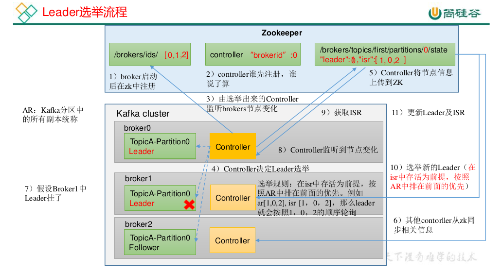

（1）创建一个新的 topic，4 个分区，4 个副本

```sh
[atguigu@hadoop102 kafka]$ bin/kafka-topics.sh --bootstrap-server hadoop102:9092 --create --topic atguigu1 --partitions 4 --replication-factor 4 

Created topic atguigu1.
```

（2）查看 Leader 分布情况

```sh
[atguigu@hadoop102 kafka]$ bin/kafka-topics.sh --bootstrap-server hadoop102:9092 --describe --topic atguigu1

Topic: atguigu1 

TopicId: awpgX_7WR-OX3Vl6HE8sVg PartitionCount: 4 ReplicationFactor: 4

Configs: segment.bytes=1073741824

Topic: atguigu1 Partition: 0 Leader: 3 Replicas: 3,0,2,1 Isr: 3,0,2,1

Topic: atguigu1 Partition: 1 Leader: 1 Replicas: 1,2,3,0 Isr: 1,2,3,0

Topic: atguigu1 Partition: 2 Leader: 0 Replicas: 0,3,1,2 Isr: 0,3,1,2

Topic: atguigu1 Partition: 3 Leader: 2 Replicas: 2,1,0,3 Isr: 2,1,0,3
```

（3）停止掉 hadoop105 的 kafka 进程，并查看 Leader 分区情况

```sh
[atguigu@hadoop105 kafka]$ bin/kafka-server-stop.sh

[atguigu@hadoop102 kafka]$ bin/kafka-topics.sh --bootstrap-server hadoop102:9092 --describe --topic atguigu1

Topic: atguigu1 

TopicId: awpgX_7WR-OX3Vl6HE8sVg PartitionCount: 4 ReplicationFactor: 4

Configs: segment.bytes=1073741824

Topic: atguigu1 Partition: 0 Leader: 0 Replicas: 3,0,2,1 Isr: 0,2,1  

Topic: atguigu1 Partition: 1 Leader: 1 Replicas: 1,2,3,0 Isr: 1,2,0

Topic: atguigu1 Partition: 2 Leader: 0 Replicas: 0,3,1,2 Isr: 0,1,2

Topic: atguigu1 Partition: 3 Leader: 2 Replicas: 2,1,0,3 Isr: 2,1,0
```

（4）停止掉 hadoop104 的 kafka 进程，并查看 Leader 分区情况

```sh
[atguigu@hadoop104 kafka]$ bin/kafka-server-stop.sh

[atguigu@hadoop102 kafka]$ bin/kafka-topics.sh --bootstrap-server hadoop102:9092 --describe --topic atguigu1

Topic: atguigu1 

TopicId: awpgX_7WR-OX3Vl6HE8sVg PartitionCount: 4 ReplicationFactor: 4

Configs: segment.bytes=1073741824

Topic: atguigu1 Partition: 0 Leader: 0 Replicas: 3,0,2,1 Isr: 0,1

Topic: atguigu1 Partition: 1 Leader: 1 Replicas: 1,2,3,0 Isr: 1,0

Topic: atguigu1 Partition: 2 Leader: 0 Replicas: 0,3,1,2 Isr: 0,1

Topic: atguigu1 Partition: 3 Leader: 1 Replicas: 2,1,0,3 Isr: 1,0
```

（5）启动 hadoop105 的 kafka 进程，并查看 Leader 分区情况

```sh
[atguigu@hadoop105 kafka]$ bin/kafka-server-start.sh -daemon config/server.properties

[atguigu@hadoop102 kafka]$ bin/kafka-topics.sh --bootstrap-server hadoop102:9092 --describe --topic atguigu1

Topic: atguigu1 

TopicId: awpgX_7WR-OX3Vl6HE8sVg PartitionCount: 4 ReplicationFactor: 4

Configs: segment.bytes=1073741824

Topic: atguigu1 Partition: 0 Leader: 0 Replicas: 3,0,2,1 Isr: 0,1,3

Topic: atguigu1 Partition: 1 Leader: 1 Replicas: 1,2,3,0 Isr: 1,0,3

Topic: atguigu1 Partition: 2 Leader: 0 Replicas: 0,3,1,2 Isr: 0,1,3

Topic: atguigu1 Partition: 3 Leader: 1 Replicas: 2,1,0,3 Isr: 1,0,3
```

（6）启动 hadoop104 的 kafka 进程，并查看 Leader 分区情况

```sh
[atguigu@hadoop104 kafka]$ bin/kafka-server-start.sh -daemon config/server.properties

[atguigu@hadoop102 kafka]$ bin/kafka-topics.sh --bootstrap-server hadoop102:9092 --describe --topic atguigu1

Topic: atguigu1 

TopicId: awpgX_7WR-OX3Vl6HE8sVg PartitionCount: 4 ReplicationFactor: 4

Configs: segment.bytes=1073741824

Topic: atguigu1 Partition: 0 Leader: 0 Replicas: 3,0,2,1 Isr: 0,1,3,2
Topic: atguigu1 Partition: 1 Leader: 1 Replicas: 1,2,3,0 Isr: 1,0,3,2
Topic: atguigu1 Partition: 2 Leader: 0 Replicas: 0,3,1,2 Isr: 0,1,3,2
Topic: atguigu1 Partition: 3 Leader: 1 Replicas: 2,1,0,3 Isr: 1,0,3,2
```

（7）停止掉 hadoop103 的 kafka 进程，并查看 Leader 分区情况

```sh
[atguigu@hadoop103 kafka]$ bin/kafka-server-stop.sh

[atguigu@hadoop102 kafka]$ bin/kafka-topics.sh --bootstrap-server hadoop102:9092 --describe --topic atguigu1

Topic: atguigu1 
TopicId: awpgX_7WR-OX3Vl6HE8sVg PartitionCount: 4 ReplicationFactor: 4
Configs: segment.bytes=1073741824
Topic: atguigu1 Partition: 0 Leader: 0 Replicas: 3,0,2,1 Isr: 0,3,2
Topic: atguigu1 Partition: 1 Leader: 2 Replicas: 1,2,3,0 Isr: 0,3,2
Topic: atguigu1 Partition: 2 Leader: 0 Replicas: 0,3,1,2 Isr: 0,3,2
Topic: atguigu1 Partition: 3 Leader: 2 Replicas: 2,1,0,3 Isr: 0,3,2  
```

### 4.3.3 Leader 和 Follower 故障处理细节

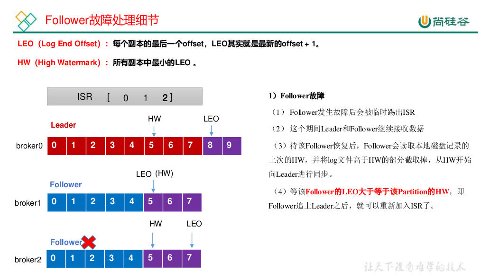


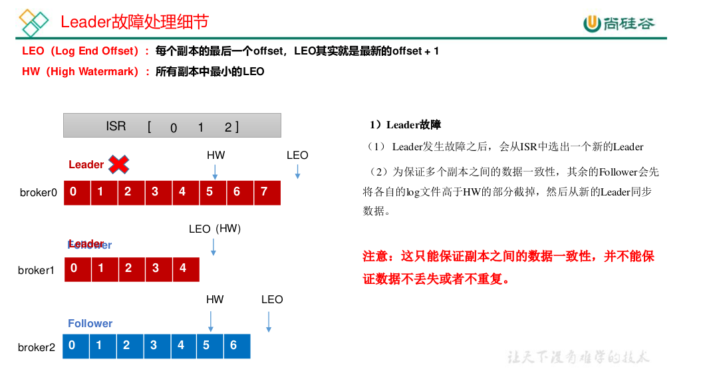

### 4.3.4 分区副本分配

如果 kafka 服务器只有4 个节点，那么设置 kafka 的分区数大于服务器台数，在 kafka底层如何分配存储副本呢？

1）创建16 分区，3 个副本

（1）创建一个新的 topic，名称为 second。

```sh
[atguigu@hadoop102 kafka]$ bin/kafka-topics.sh --bootstrap-server hadoop102:9092 --create --partitions 16 --replication-factor 3 --topic second  
```

（2）查看分区和副本情况。

```sh
[atguigu@hadoop102 kafka]$ bin/kafka-topics.sh --bootstrap-server hadoop102:9092 --describe --topic second

Topic: second4 Partition: 0 Leader: 0 Replicas: 0,1,2 Isr: 0,1,2

Topic: second4 Partition: 1 Leader: 1 Replicas: 1,2,3 Isr: 1,2,3

Topic: second4 Partition: 2 Leader: 2 Replicas: 2,3,0 Isr: 2,3,0

Topic: second4 Partition: 3 Leader: 3 Replicas: 3,0,1 Isr: 3,0,1

Topic: second4 Partition: 4 Leader: 0 Replicas: 0,2,3 Isr: 0,2,3

Topic: second4 Partition: 5 Leader: 1 Replicas: 1,3,0 Isr: 1,3,0

Topic: second4 Partition: 6 Leader: 2 Replicas: 2,0,1 Isr: 2,0,1

Topic: second4 Partition: 7 Leader: 3 Replicas: 3,1,2 Isr: 3,1,2

Topic: second4 Partition: 8 Leader: 0 Replicas: 0,3,1 Isr: 0,3,1

Topic: second4 Partition: 9 Leader: 1 Replicas: 1,0,2 Isr: 1,0,2

Topic: second4 Partition: 10 Leader: 2 Replicas: 2,1,3 Isr: 2,1,3

Topic: second4 Partition: 11 Leader: 3 Replicas: 3,2,0 Isr: 3,2,0

Topic: second4 Partition: 12 Leader: 0 Replicas: 0,1,2 Isr: 0,1,2

Topic: second4 Partition: 13 Leader: 1 Replicas: 1,2,3 Isr: 1,2,3

Topic: second4 Partition: 14 Leader: 2 Replicas: 2,3,0 Isr: 2,3,0

Topic: second4 Partition: 15 Leader: 3 Replicas: 3,0,1 Isr: 3,0,1
```

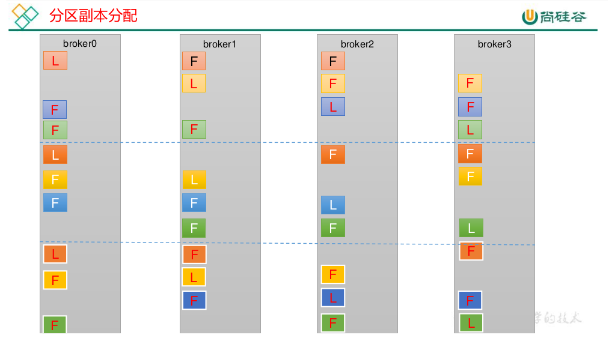

### 4.3.5 生产经验——手动调整分区副本存储

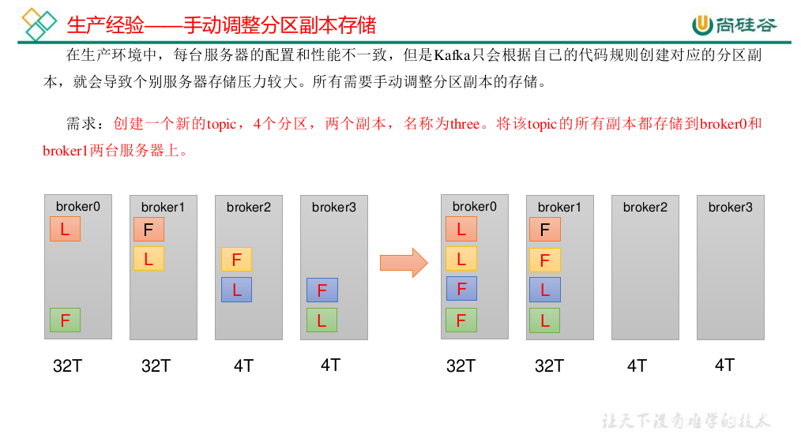

手动调整分区副本存储的步骤如下：

（1）创建一个新的 topic，名称为 three。

```sh
[atguigu@hadoop102 kafka]$ bin/kafka-topics.sh --bootstrap-server hadoop102:9092 --create --partitions 4 --replication-factor 2 --topic three
```

（2）查看分区副本存储情况。

```sh
[atguigu@hadoop102 kafka]$ bin/kafka-topics.sh --bootstrap-server hadoop102:9092 --describe --topic three
```

（3）创建副本存储计划（所有副本都指定存储在 broker0、broker1 中）。

```sh
[atguigu@hadoop102 kafka]$ vim increase-replication-factor.json
```

输入如下内容：

```json
{
"version":1,
"partitions":[{"topic":"three","partition":0,"replicas":[0,1]},
{"topic":"three","partition":1,"replicas":[0,1]},
{"topic":"three","partition":2,"replicas":[1,0]},
{"topic":"three","partition":3,"replicas":[1,0]}]
}
```

（4）执行副本存储计划。

```sh
[atguigu@hadoop102 kafka]$ bin/kafka-reassign-partitions.sh --bootstrap-server hadoop102:9092 --reassignment-json-file increase-replication-factor.json --execute
```

（5）验证副本存储计划。

```sh
[atguigu@hadoop102 kafka]$ bin/kafka-reassign-partitions.sh --bootstrap-server hadoop102:9092 --reassignment-json-file increase-replication-factor.json --verify
```

（6）查看分区副本存储情况。 

```sh
[atguigu@hadoop102 kafka]$ bin/kafka-topics.sh --bootstrap-server hadoop102:9092 --describe --topic three
```

### 4.3.6 生产经验——Leader Partition 负载平衡

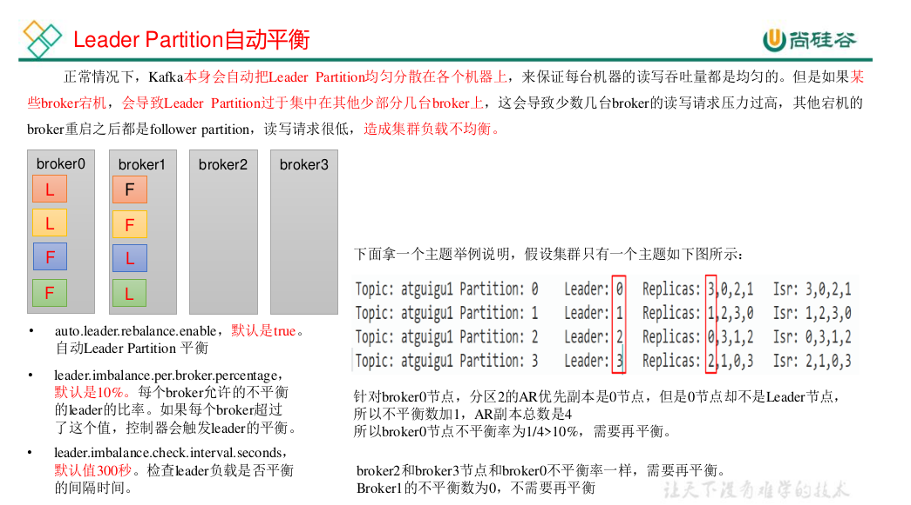

| 参数名称                                | 描述                                                         |
| --------------------------------------- | ------------------------------------------------------------ |
| auto.leader.rebalance.enable            | 默认是 true。自动 Leader Partition 平衡。生产环境中，leader 重选举的代价比较大，可能会带来性能影响，建议设置为 false 关闭。 |
| leader.imbalance.per.broker.percentage  | 默认是10%。每个 broker 允许的不平衡的 leader的比率。如果每个 broker 超过了这个值，控制器会触发 leader 的平衡。 |
| leader.imbalance.check.interval.seconds | 默认值300 秒。检查 leader 负载是否平衡的间隔时间。           |

### 4.3.7 生产经验——增加副本因子

>  在生产环境当中，由于某个主题的重要等级需要提升，我们考虑增加副本。副本数的增加需要先制定计划，然后根据计划执行。

1）创建 topic

```sh
[atguigu@hadoop102 kafka]$ bin/kafka-topics.sh --bootstrap-server hadoop102:9092 --create --partitions 3 --replication-factor 1 --topic four
```

2）手动增加副本存储

（1）创建副本存储计划（所有副本都指定存储在 broker0、broker1、broker2 中）。 

```sh
[atguigu@hadoop102 kafka]$ vim increase-replication-factor.json
```

输入如下内容：

```json
{"version":1,"partitions":[{"topic":"four","partition":0,"replicas":[0,1,2]},{"topic":"four","partition":1,"replicas":[0,1,2]},{"topic":"four","partition":2,"replicas":[0,1,2]}]}
```

（2）执行副本存储计划。

```sh
[atguigu@hadoop102 kafka]$ bin/kafka-reassign-partitions.sh --bootstrap-server hadoop102:9092 --reassignment-json-file increase-replication-factor.json --execute
```

## 4.4 文件存储

### 4.4.1 文件存储机制

1）Topic 数据的存储机制

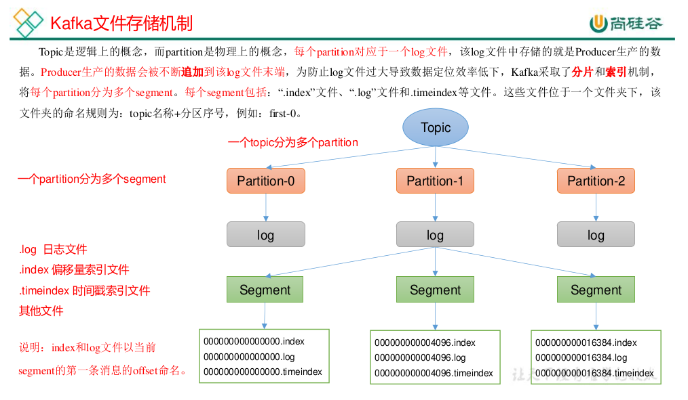


2）思考：Topic 数据到底存储在什么位置？

（1）启动生产者，并发送消息。

```sh
[atguigu@hadoop102 kafka]$ bin/kafka-console-producer.sh --bootstrap-server hadoop102:9092 --topic first

>hello world
```

（2）查看 hadoop102（或者 hadoop103、hadoop104）的/opt/module/kafka/datas/first-1 （first-0、first-2）路径上的文件。

```sh
[atguigu@hadoop104 first-1]$ ls

00000000000000000092.index
00000000000000000092.log
00000000000000000092.snapshot
00000000000000000092.timeindex

leader-epoch-checkpoint
partition.metadata  
```

（3）直接查看 log 日志，发现是乱码。

```sh
[atguigu@hadoop104 first-1]$ cat 00000000000000000092.log 

CYnF|©|©ÿÿÿÿÿÿÿÿÿÿÿÿÿÿ"hello world
```

（4）通过工具查看 index 和 log 信息。

```sh
[atguigu@hadoop104 first-1]$ kafka-run-class.sh kafka.tools.DumpLogSegments --files ./00000000000000000000.index 

Dumping ./00000000000000000000.index
offset: 3 position: 152

[atguigu@hadoop104 first-1]$ kafka-run-class.sh kafka.tools.DumpLogSegments --files ./00000000000000000000.log

Dumping datas/first-0/00000000000000000000.log
Starting offset: 0

baseOffset: 0 lastOffset: 1 count: 2 baseSequence: -1 lastSequence: -1 producerId: -1 producerEpoch: -1 partitionLeaderEpoch: 0 isTransactional: false isControl: false position: 0 CreateTime: 1636338440962 size: 75 magic: 2 compresscodec: none crc: 2745337109 isvalid: true

baseOffset: 2 lastOffset: 2 count: 1 baseSequence: -1 lastSequence: -1 producerId: -1 producerEpoch: -1 partitionLeaderEpoch: 0 isTransactional: false isControl: false position: 75 CreateTime: 1636351749089 size: 77 magic: 2 compresscodec: none crc: 273943004 isvalid: true

baseOffset: 3 lastOffset: 3 count: 1 baseSequence: -1 lastSequence: -1 producerId: -1 producerEpoch: -1 partitionLeaderEpoch: 0 isTransactional: false isControl: false position: 152 CreateTime: 1636351749119 size: 77 magic: 2 compresscodec: none crc: 106207379 isvalid: true

baseOffset: 4 lastOffset: 8 count: 5 baseSequence: -1 lastSequence: -1 producerId: -1 producerEpoch: -1 partitionLeaderEpoch: 0 isTransactional: false isControl: false position: 229 CreateTime: 1636353061435 size: 141 magic: 2 compresscodec: none crc: 157376877 isvalid: true

baseOffset: 9 lastOffset: 13 count: 5 baseSequence: -1 lastSequence: -1 producerId: -1 producerEpoch: -1 partitionLeaderEpoch: 0 isTransactional: false isControl: false position: 370 CreateTime: 1636353204051 size: 146 magic: 2 compresscodec: none crc: 4058582827 isvalid: true
```


3）index 文件和 log 文件详解

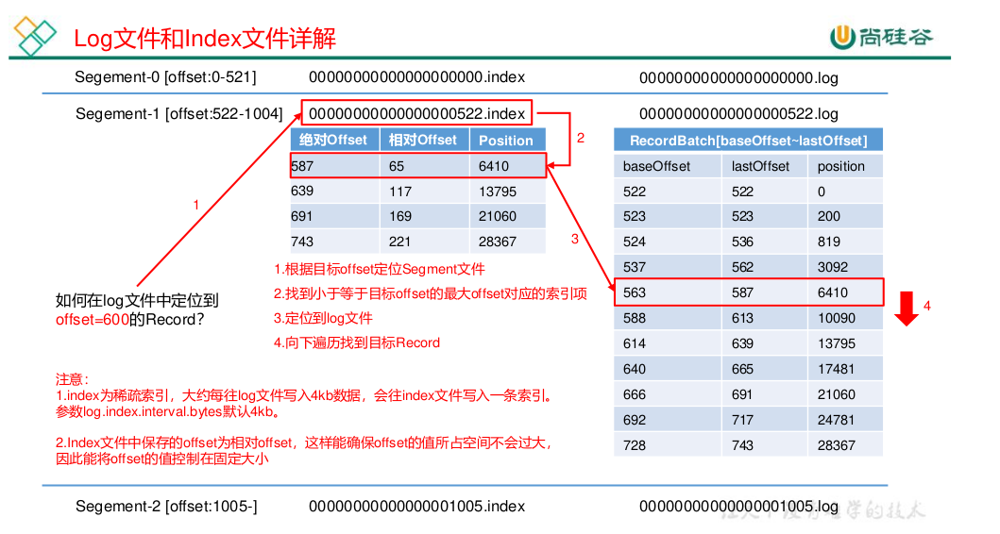


说明：日志存储参数配置

| 参数                     | 描述                                                         |
| ------------------------ | ------------------------------------------------------------ |
| log.segment.bytes        | Kafka 中 log 日志是分成一块块存储的，此配置是指 log 日志划分成块的大小，默认值1G。 |
| log.index.interval.bytes | 默认4kb，kafka 里面每当写入了4kb 大小的日志（.log），然后就往 index 文件里面记录一个索引。稀疏索引。 |

### 4.4.2 文件清理策略

Kafka 中默认的日志保存时间为7 天，可以通过调整如下参数修改保存时间。

> ⚫ log.retention.hours，最低优先级小时，默认7 天。
>
> ⚫ log.retention.minutes，分钟。
>
> ⚫ log.retention.ms，最高优先级毫秒。
>
> ⚫ log.retention.check.interval.ms，负责设置检查周期，默认5 分钟。

那么日志一旦超过了设置的时间，怎么处理呢？Kafka 中提供的日志清理策略有 delete 和 compact 两种。

1）delete 日志删除：将过期数据删除

⚫ log.cleanup.policy = delete 所有数据启用删除策略

（1）基于时间：默认打开。以 segment 中所有记录中的最大时间戳作为该文件时间戳。

（2）基于大小：默认关闭。超过设置的所有日志总大小，删除最早的 segment。

log.retention.bytes，默认等于-1，表示无穷大。

思考：如果一个 segment 中有一部分数据过期，一部分没有过期，怎么处理？

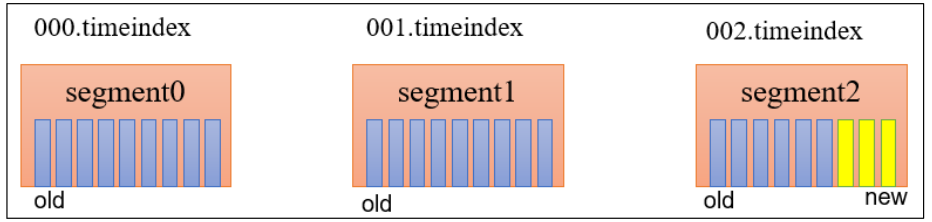

2）compact 日志压缩 

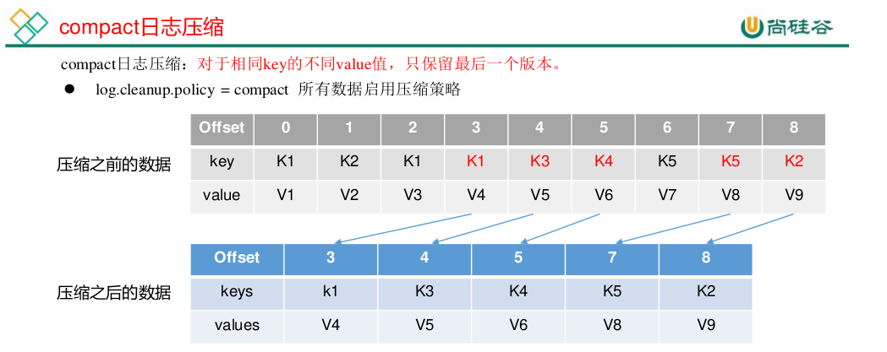

  压缩后的offset可能是不连续的，比如上图中没有6，当从这些offset消费消息时，将会拿到比这个offset大的offset对应的消息，实际上会拿到offset为7的消息，并从这个位置开始消费。

这种策略只适合特殊场景，比如消息的key是用户ID，value是用户的资料，通过这种压缩策略，整个消息集里就保存了所有用户最新的资料。

## 4.5 高效读写数据

1）Kafka 本身是分布式集群，可以采用分区技术，并行度高

2）读数据采用稀疏索引，可以快速定位要消费的数据

3）顺序写磁盘

Kafka 的 producer 生产数据，要写入到 log 文件中，写的过程是一直追加到文件末端，为顺序写。官网有数据表明，同样的磁盘，顺序写能到600M/s，而随机写只有100K/s。这与磁盘的机械机构有关，顺序写之所以快，是因为其省去了大量磁头寻址的时间。

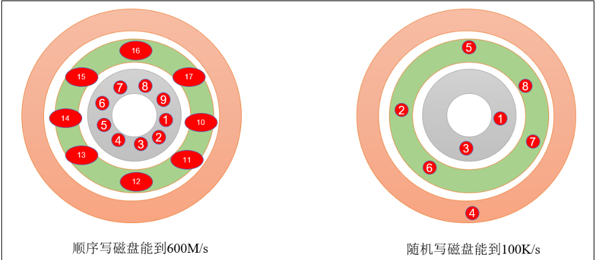

4）页缓存+零拷贝技术 

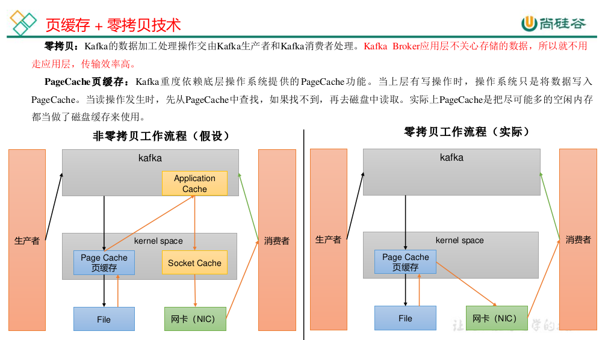

| 参数                        | 描述                                                         |
| --------------------------- | ------------------------------------------------------------ |
| log.flush.interval.messages | 强制页缓存刷写到磁盘的条数，默认是 long 的最大值，9223372036854775807。一般不建议修改，交给系统自己管理。 |
| log.flush.interval.ms       | 每隔多久，刷数据到磁盘，默认是 null。一般不建议修改，交给系统自己管理。 |

# 第5 章 Kafka 消费者

## 5.1 Kafka 消费方式

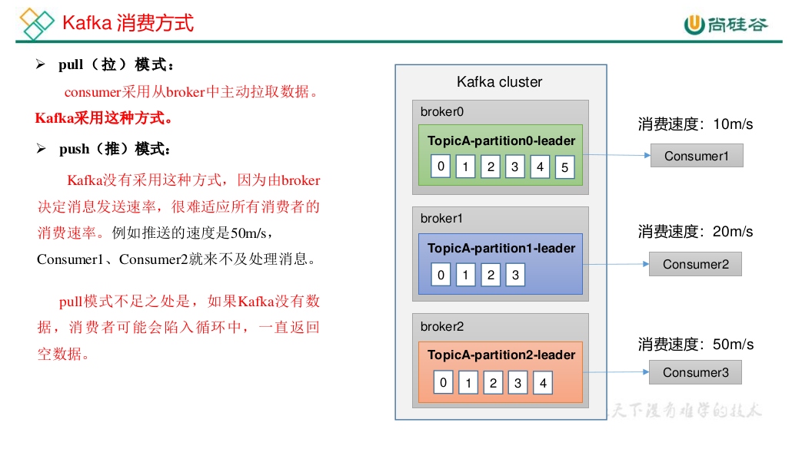

## 5.2 Kafka 消费者工作流程

### 5.2.1 消费者总体工作流程

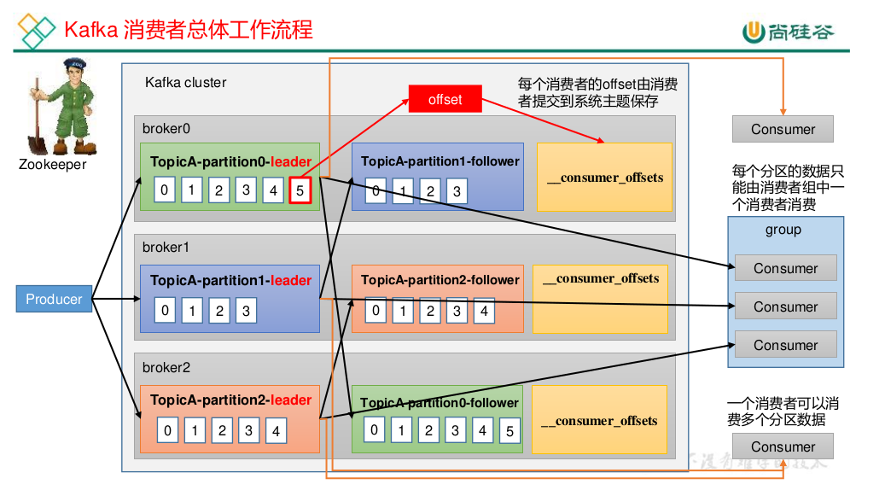

### 5.2.2 消费者组原理

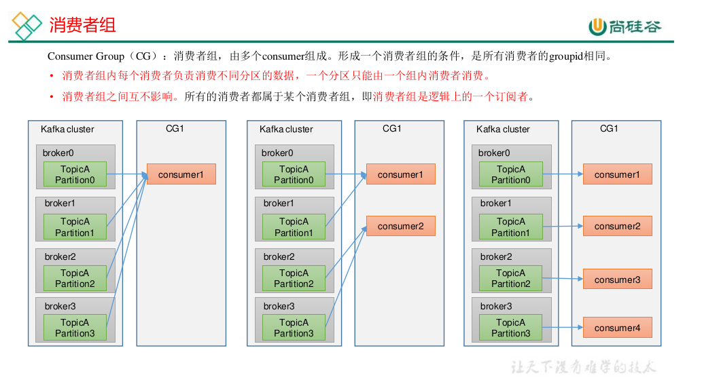

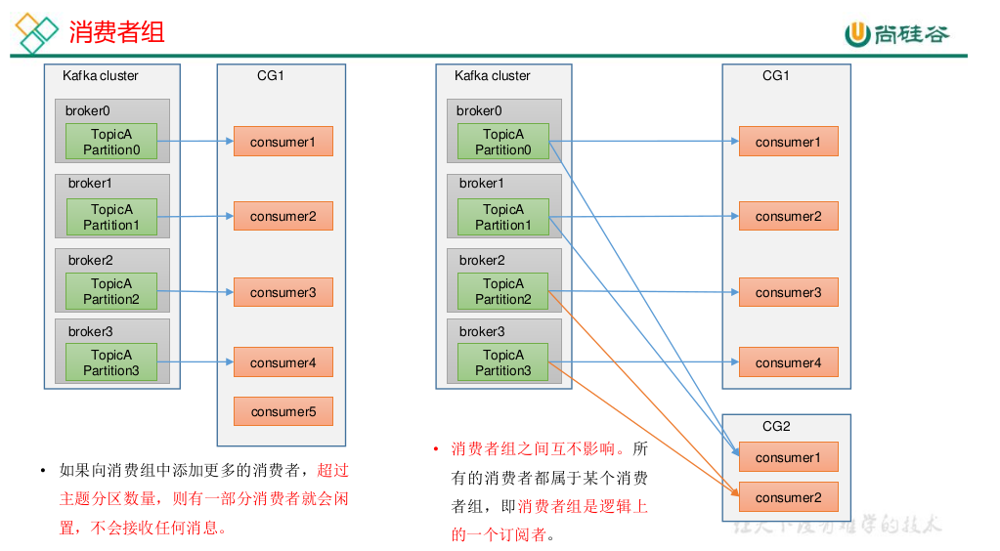

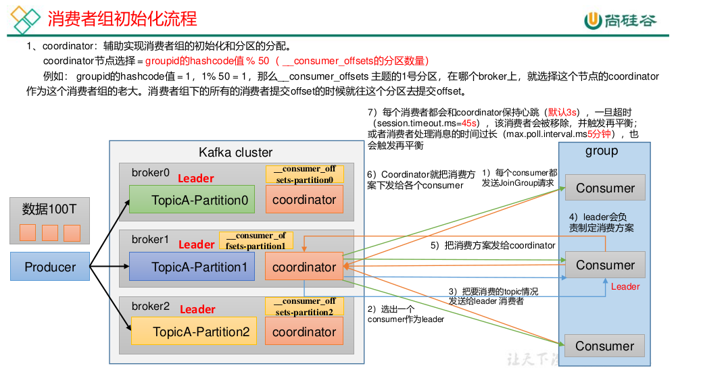

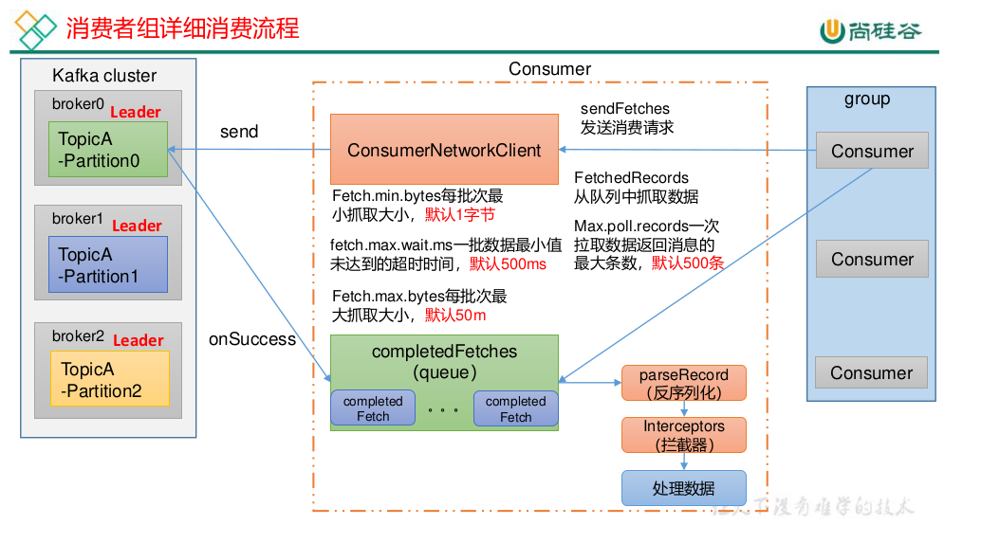


### 5.2.3 消费者重要参数

| 参数名称                             | 描述                                                         |
| ------------------------------------ | ------------------------------------------------------------ |
| bootstrap.servers                    | 向 Kafka 集群建立初始连接用到的 host/port 列表。             |
| key.deserializer和value.deserializer | 指定接收消息的 key 和 value 的反序列化类型。一定要写全类名。 |
| group.id                             | 标记消费者所属的消费者组。                                   |
| enable.auto.commit                   | 默认值为 true，消费者会自动周期性地向服务器提交偏移量。      |
| auto.commit.interval.ms              | 如果设置了 enable.auto.commit 的值为 true，则该值定义了消费者偏移量向 Kafka 提交的频率，默认5s。 |
| auto.offset.reset                    | 当 Kafka 中没有初始偏移量或当前偏移量在服务器中不存在（如，数据被删除了），该如何处理？ earliest：自动重置偏移量到最早的偏移量。 latest：默认，自动重置偏移量为最新的偏移量。 none：如果消费组原来的（previous）偏移量不存在，则向消费者抛异常。 anything：向消费者抛异常。 |
| offsets.topic.num.partitions         | __consumer_offsets 的分区数，默认是50 个分区。               |
| heartbeat.interval.ms                | Kafka 消费者和 coordinator 之间的心跳时间，默认3s。该条目的值必须小于 session.timeout.ms ，也不应该高于session.timeout.ms 的1/3。 |
| session.timeout.ms                   | Kafka 消费者和 coordinator 之间连接超时时间，默认45s。超过该值，该消费者被移除，消费者组执行再平衡。 |
| max.poll.interval.ms                 | 消费者处理消息的最大时长，默认是5 分钟。超过该值，该消费者被移除，消费者组执行再平衡。 |
| fetch.min.bytes                      | 默认1 个字节。消费者获取服务器端一批消息最小的字节数。       |
| fetch.max.wait.ms                    | 默认500ms。如果没有从服务器端获取到一批数据的最小字节数。该时间到，仍然会返回数据。 |
| fetch.max.bytes                      | 默认 Default: 52428800（50 m）。消费者获取服务器端一批消息最大的字节数。如果服务器端一批次的数据大于该值（50m）仍然可以拉取回来这批数据，因此，这不是一个绝对最大值。一批次的大小受 message.max.bytes （broker config）or max.message.bytes （topic config）影响。 |
| max.poll.records                     | 一次 poll 拉取数据返回消息的最大条数，默认是500 条。         |

## 5.3 消费者 API

### 5.3.1 独立消费者案例（订阅主题）

1）需求：

创建一个独立消费者，消费 first 主题中数据。

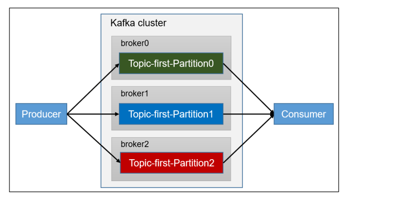

注意：在消费者 API 代码中必须配置消费者组 id。命令行启动消费者不填写消费者组id 会被自动填写随机的消费者组 id。

2）实现步骤

（1）创建包名：com.atguigu.kafka.consumer

（2）编写代码

```java
package com.atguigu.kafka.consumer;
import org.apache.kafka.clients.consumer.ConsumerConfig;  
import org.apache.kafka.clients.consumer.ConsumerRecord;
import org.apache.kafka.clients.consumer.ConsumerRecords;
import org.apache.kafka.clients.consumer.KafkaConsumer;
import java.time.Duration;
import java.util.ArrayList;
import java.util.Properties;
public class CustomConsumer {
    public static void main(String[] args){
        //1.创建消费者的配置对象
        Properties properties = new Properties();
        //2.给消费者配置对象添加参数
        properties.put(ConsumerConfig.BOOTSTRAP_SERVERS_CONFIG,"hadoop102:9092");
        //配置序列化必须
        properties.put(ConsumerConfig.KEY_DESERIALIZER_CLASS_CONFIG,StringDeserializer.class.getName());
        properties.put(ConsumerConfig.VALUE_DESERIALIZER_CLASS_CONFIG,StringDeserializer.class.getName());
        //配置消费者组（组名任意起名）必须
        properties.put(ConsumerConfig.GROUP_ID_CONFIG,"test");
        //创建消费者对象
        KafkaConsumer<String, String> kafkaConsumer = new KafkaConsumer<String, String>(properties);
        //注册要消费的主题（可以消费多个主题）
        ArrayList<String> topics = new ArrayList<>();
        topics.add("first");
        kafkaConsumer.subscribe(topics);
        //拉取数据打印
        while (true){
            //设置1s 中消费一批数据
            ConsumerRecords<String, String> consumerRecords = kafkaConsumer.poll(Duration.ofSeconds(1));
            //打印消费到的数据
            for (ConsumerRecord<String, String> consumerRecord : consumerRecords){
                System.out.println(consumerRecord);
            }
        }
    }
}
```

3）测试

（1）在 IDEA 中执行消费者程序。 

（2）在 Kafka 集群控制台，创建 Kafka 生产者，并输入数据。

```sh
[atguigu@hadoop102 kafka]$ bin/kafka-console-producer.sh --bootstrap-server hadoop102:9092 --topic first
>hello
```

（3）在 IDEA 控制台观察接收到的数据。

```sh
ConsumerRecord(topic = first, partition = 1, leaderEpoch = 3,

offset = 0, CreateTime = 1629160841112, serialized key size = -1,

serialized value size = 5, headers = RecordHeaders(headers = [],

isReadOnly = false), key = null, value = hello)
```

### 5.3.2 独立消费者案例（订阅分区）

1）需求：创建一个独立消费者，消费 first 主题0 号分区的数据。

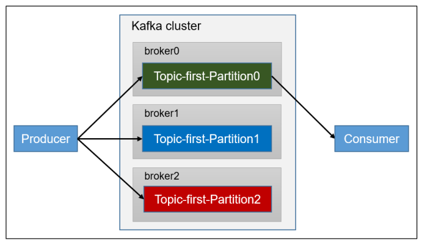

2）实现步骤

 （1）代码编写。

```java
package com.atguigu.kafka.consumer;
import org.apache.kafka.clients.consumer.ConsumerConfig;
import org.apache.kafka.clients.consumer.ConsumerRecord;
import org.apache.kafka.clients.consumer.ConsumerRecords;
import org.apache.kafka.clients.consumer.KafkaConsumer;
import org.apache.kafka.common.TopicPartition;
import java.time.Duration;
import java.util.ArrayList;
import java.util.Arrays;
import java.util.Properties;
public class CustomConsumerPartition {
    public static void main(String[] args){
        Properties properties = new Properties();
        properties.put(ConsumerConfig.BOOTSTRAP_SERVERS_CONFIG,"hadoop102:9092");  
        //配置序列化必须
        properties.put(ConsumerConfig.KEY_DESERIALIZER_CLASS_CONFIG,StringDeserializer.class.getName());
        properties.put(ConsumerConfig.VALUE_DESERIALIZER_CLASS_CONFIG,StringDeserializer.class.getName());
        //配置消费者组（必须），名字可以任意起
        properties.put(ConsumerConfig.GROUP_ID_CONFIG,"test");
        KafkaConsumer<String, String> kafkaConsumer = new KafkaConsumer<>(properties);
        //消费某个主题的某个分区数据
        ArrayList<TopicPartition> topicPartitions = new ArrayList<>();
        topicPartitions.add(new TopicPartition("first",0));
        kafkaConsumer.assign(topicPartitions);
        while (true){
            ConsumerRecords<String, String> consumerRecords = kafkaConsumer.poll(Duration.ofSeconds(1));
            for (ConsumerRecord<String, String> consumerRecord : consumerRecords){
                System.out.println(consumerRecord);
            }
        }
    }
}
```

3）测试

（1）在 IDEA 中执行消费者程序。

（2）在 IDEA 中执行生产者程序 CustomProducerCallback()在控制台观察生成几个0 号分区的数据。

```sh
first 0 381
first 0 382
first 2 168
first 1 165
first 1 166
```

（3）在 IDEA 控制台，观察接收到的数据，只能消费到0 号分区数据表示正确。

```sh
ConsumerRecord(topic = first, partition = 0, leaderEpoch = 14,offset = 381, CreateTime = 1636791331386, serialized key size = -1, serialized value size = 9, headers = RecordHeaders(headers = [], isReadOnly = false), key = null, value = atguigu 0)

ConsumerRecord(topic = first, partition = 0, leaderEpoch = 14,offset = 382, CreateTime = 1636791331397, serialized key size = -1, serialized value size = 9, headers = RecordHeaders(headers = [], isReadOnly = false), key = null, value = atguigu 1) 
```

### 5.3.3 消费者组案例

1）需求：测试同一个主题的分区数据，只能由一个消费者组中的一个消费。

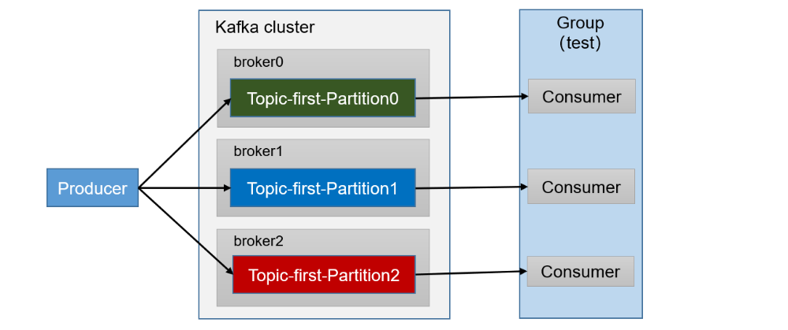

2）案例实操

（1）复制一份基础消费者的代码，在 IDEA 中同时启动，即可启动同一个消费者组中的两个消费者。

```java
package com.atguigu.kafka.consumer;
import org.apache.kafka.clients.consumer.ConsumerConfig;
import org.apache.kafka.clients.consumer.ConsumerRecord;
import org.apache.kafka.clients.consumer.ConsumerRecords;
import org.apache.kafka.clients.consumer.KafkaConsumer;
import java.time.Duration;
import java.util.ArrayList;
import java.util.Properties;
public class CustomConsumer1 {
    public static void main(String[] args){
        //1.创建消费者的配置对象
        Properties properties = new Properties();
        //2.给消费者配置对象添加参数
        properties.put(ConsumerConfig.BOOTSTRAP_SERVERS_CONFIG,"hadoop102:9092");
        //配置序列化必须
        properties.put(ConsumerConfig.KEY_DESERIALIZER_CLASS_CONFIG,StringDeserializer.class.getName());
        properties.put(ConsumerConfig.VALUE_DESERIALIZER_CLASS_CONFIG,StringDeserializer.class.getName());
        //配置消费者组必须
        properties.put(ConsumerConfig.GROUP_ID_CONFIG,"test");  
        //创建消费者对象
        KafkaConsumer<String, String> kafkaConsumer = new KafkaConsumer<String, String>(properties);
        //注册主题
        ArrayList<String> topics = new ArrayList<>();
        topics.add("first");
        kafkaConsumer.subscribe(topics);
        //拉取数据打印
        while (true){
            //设置1s 中消费一批数据
            ConsumerRecords<String, String> consumerRecords = kafkaConsumer.poll(Duration.ofSeconds(1));
            //打印消费到的数据
            for (ConsumerRecord<String, String> consumerRecord : consumerRecords){
                System.out.println(consumerRecord);
            }
        }
    }
}
```

（2）启动代码中的生产者发送消息，在 IDEA 控制台即可看到两个消费者在消费不同分区的数据（如果只发生到一个分区，可以在发送时增加延迟代码 Thread.sleep(2);）。

```sh
ConsumerRecord(topic = first, partition = 0, leaderEpoch = 2,offset = 3, CreateTime = 1629169606820, serialized key size = -1,serialized value size = 8, headers = RecordHeaders(headers = [],isReadOnly = false), key = null, value = hello1)

ConsumerRecord(topic = first, partition = 1, leaderEpoch = 3,offset = 2, CreateTime = 1629169609524, serialized key size = -1,serialized value size = 6, headers = RecordHeaders(headers = [],isReadOnly = false), key = null, value = hello2)

ConsumerRecord(topic = first, partition = 2, leaderEpoch = 3,offset = 21, CreateTime = 1629169611884, serialized key size = -1,serialized value size = 6, headers = RecordHeaders(headers = [],isReadOnly = false), key = null, value = hello3)
```

（3）重新发送到一个全新的主题中，由于默认创建的主题分区数为1，可以看到只能有一个消费者消费到数据。 

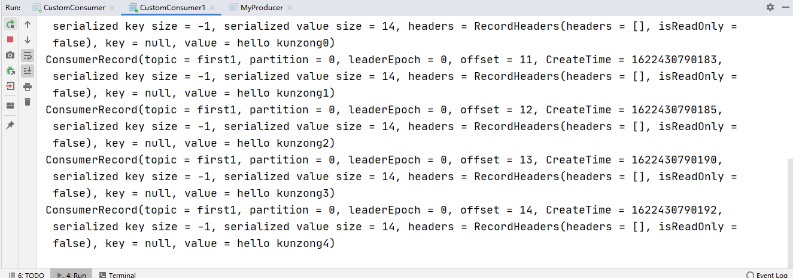


## 5.4 生产经验——分区的分配以及再平衡

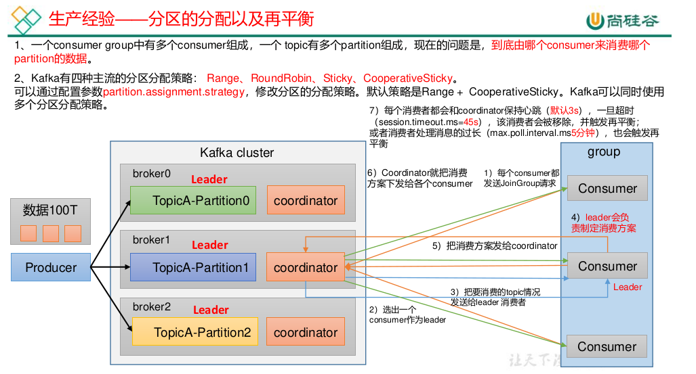

| 参数名称                      | 描述                                                         |
| ----------------------------- | ------------------------------------------------------------ |
| heartbeat.interval.ms         | Kafka 消费者和 coordinator 之间的心跳时间，默认3s。该条目的值必须小于 session.timeout.ms，也不应该高于session.timeout.ms 的1/3。 |
| session.timeout.ms            | Kafka 消费者和 coordinator 之间连接超时时间，默认45s。超过该值，该消费者被移除，消费者组执行再平衡。 |
| max.poll.interval.ms          | 消费者处理消息的最大时长，默认是5 分钟。超过该值，该消费者被移除，消费者组执行再平衡。 |
| partition.assignment.strategy | 消费者分区分配策略，默认策略是 Range + CooperativeSticky。Kafka 可以同时使用多个分区分配策略。可以选择的策略包括： Range 、 RoundRobin 、 Sticky 、CooperativeSticky |

### 5.4.1 Range 以及再平衡

1）Range 分区策略原理

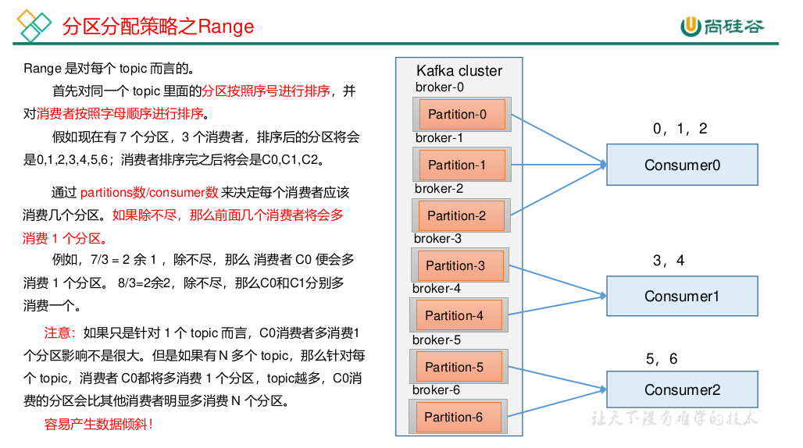

2）Range 分区分配策略案例

（1）修改主题 first 为7 个分区。

```sh
[atguigu@hadoop102 kafka]$ bin/kafka-topics.sh --bootstrap-server hadoop102:9092 --alter --topic first --partitions 7
```

**注意：分区数可以增加，但是不能减少。**

（2）复制 CustomConsumer 类，创建 CustomConsumer2。这样可以由三个消费者CustomConsumer、CustomConsumer1、CustomConsumer2 组成消费者组，组名都为“test”，同时启动3 个消费者。

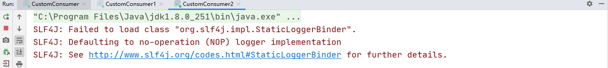

（3）启动 CustomProducer 生产者，发送500 条消息，随机发送到不同的分区。

```java
package com.atguigu.kafka.producer;
import org.apache.kafka.clients.producer.KafkaProducer;
import org.apache.kafka.clients.producer.ProducerConfig;
import org.apache.kafka.clients.producer.ProducerRecord;
import java.util.Properties;  
public class CustomProducer {
    public static void main(String[] args) throws InterruptedException {
        Properties properties = new Properties();
        properties.put(ProducerConfig.BOOTSTRAP_SERVERS_CONFIG,"hadoop102:9092");
        properties.put(ProducerConfig.KEY_SERIALIZER_CLASS_CONFIG,StringDeserializer.class.getName());
        properties.put(ProducerConfig.VALUE_SERIALIZER_CLASS_CONFIG,StringDeserializer.class.getName());
        KafkaProducer<String, String> kafkaProducer = new KafkaProducer<>(properties);
        for (int i = 0; i < 7; i++){
            kafkaProducer.send(new ProducerRecord<>("first", i,"test","atguigu"));
        }
        kafkaProducer.close();
    }
}
```

说明：Kafka 默认的分区分配策略就是 Range + CooperativeSticky，所以不需要修改策略。

（4）观看3 个消费者分别消费哪些分区的数据。 

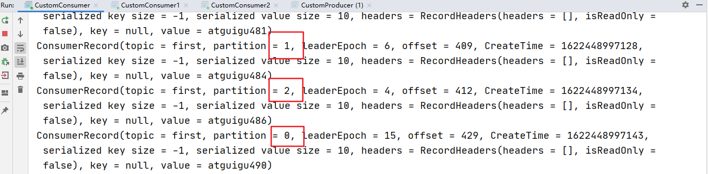

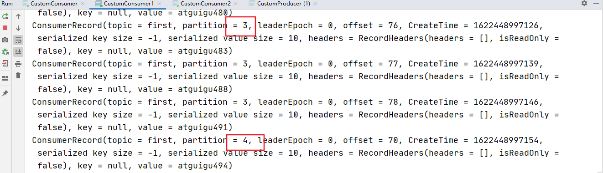

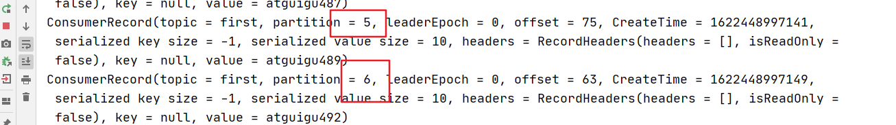

3）Range 分区分配再平衡案例

（1）停止掉0 号消费者，快速重新发送消息观看结果（45s 以内，越快越好）。

> 1 号消费者：消费到3、4 号分区数据。
>
> 2 号消费者：消费到5、6 号分区数据。
>
> 0 号消费者的任务会整体被分配到1 号消费者或者2 号消费者。

说明：0 号消费者挂掉后，消费者组需要按照超时时间45s 来判断它是否退出，所以需要等待，时间到了45s 后，判断它真的退出就会把任务分配给其他 broker 执行。

（2）再次重新发送消息观看结果（45s 以后）。

> 1 号消费者：消费到0、1、2、3 号分区数据。
>
> 2 号消费者：消费到4、5、6 号分区数据。

说明：消费者0 已经被踢出消费者组，所以重新按照 range 方式分配。

### 5.4.2 RoundRobin 以及再平衡

1）RoundRobin 分区策略原理

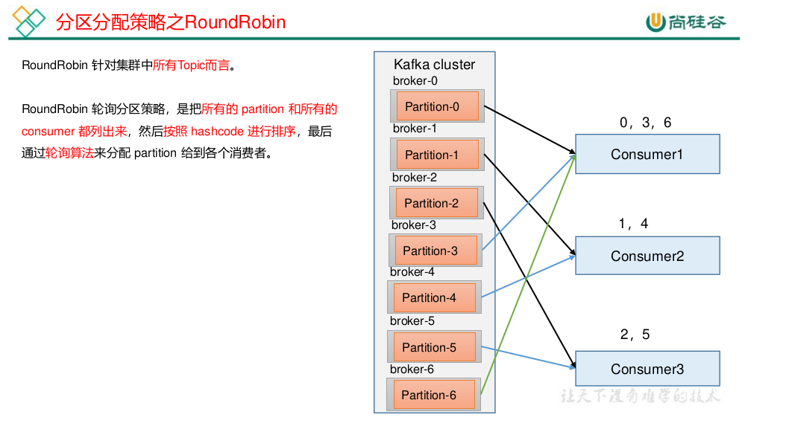

2）RoundRobin 分区分配策略案例

（1）依次在 CustomConsumer、CustomConsumer1、CustomConsumer2 三个消费者代码中修改分区分配策略为 RoundRobin。 

```java
//修改分区分配策略
properties.put(ConsumerConfig.PARTITION_ASSIGNMENT_STRATEGY_CONFIG,"org.apache.kafka.clients.consumer.RoundRobinAssignor");
```

（2）重启3 个消费者，重复发送消息的步骤，观看分区结果。

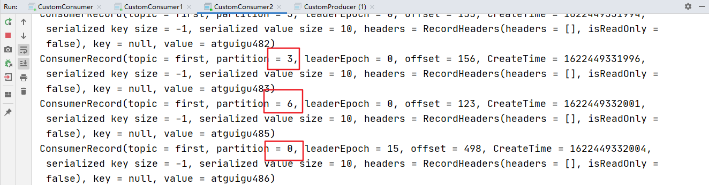

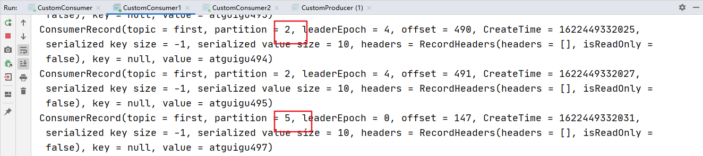

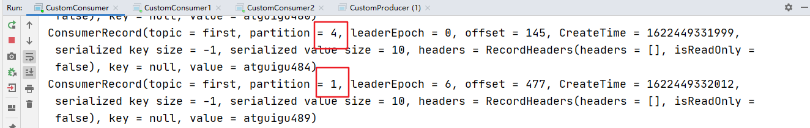

3）RoundRobin 分区分配再平衡案例

（1）停止掉0 号消费者，快速重新发送消息观看结果（45s 以内，越快越好）。

1 号消费者：消费到2、5 号分区数据

2 号消费者：消费到4、1 号分区数据

0 号消费者的任务会按照 RoundRobin 的方式，把数据轮询分成0 、6 和3 号分区数据，分别由1 号消费者或者2 号消费者消费。

说明：0 号消费者挂掉后，消费者组需要按照超时时间45s 来判断它是否退出，所以需要等待，时间到了45s 后，判断它真的退出就会把任务分配给其他 broker 执行。

（2）再次重新发送消息观看结果（45s 以后）。

1 号消费者：消费到0、2、4、6 号分区数据

2 号消费者：消费到1、3、5 号分区数据

说明：消费者0 已经被踢出消费者组，所以重新按照 RoundRobin 方式分配。 

### 5.4.3 Sticky 以及再平衡

**粘性分区定义**：可以理解为分配的结果带有“粘性的”。即在执行一次新的分配之前，考虑上一次分配的结果，尽量少的调整分配的变动，可以节省大量的开销。

粘性分区是 Kafka 从0.11.x 版本开始引入这种分配策略，首先会尽量均衡的放置分区到消费者上面，在出现同一消费者组内消费者出现问题的时候，会尽量保持原有分配的分区不变化。

1）需求

设置主题为 first，7 个分区；准备3 个消费者，采用粘性分区策略，并进行消费，观察消费分配情况。然后再停止其中一个消费者，再次观察消费分配情况。

2）步骤

（1）修改分区分配策略为粘性。

注意：3 个消费者都应该注释掉，之后重启3 个消费者，如果出现报错，全部停止等会再重启，或者修改为全新的消费者组。

```java
//修改分区分配策略
ArrayList<String> startegys = new ArrayList<>();
startegys.add("org.apache.kafka.clients.consumer.StickyAssignor");
properties.put(ConsumerConfig.PARTITION_ASSIGNMENT_STRATEGY_CONFIG,startegys);
```

（2）使用同样的生产者发送500 条消息。

可以看到会尽量保持分区的个数近似划分分区。 

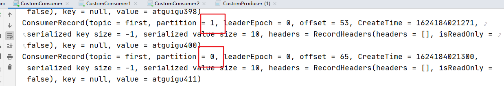

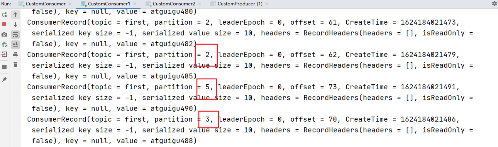

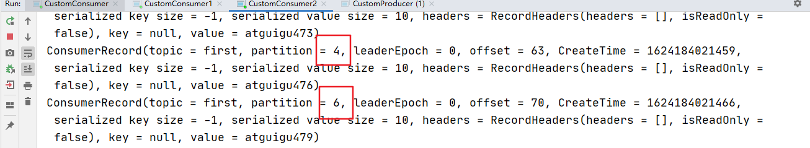

3）Sticky 分区分配再平衡案例

（1）停止掉0 号消费者，快速重新发送消息观看结果（45s 以内，越快越好）。

1 号消费者：消费到2、5、3 号分区数据。

2 号消费者：消费到4、6 号分区数据。

0 号消费者的任务会按照粘性规则，尽可能均衡的随机分成0 和1 号分区数据，分别由1 号消费者或者2 号消费者消费。

说明：0 号消费者挂掉后，消费者组需要按照超时时间45s 来判断它是否退出，所以需要等待，时间到了45s 后，判断它真的退出就会把任务分配给其他 broker 执行。

（2）再次重新发送消息观看结果（45s 以后）。

1 号消费者：消费到2、3、5 号分区数据。

2 号消费者：消费到0、1、4、6 号分区数据。

说明：消费者0 已经被踢出消费者组，所以重新按照粘性方式分配。

## 5.5 offset 位移

### 5.5.1 offset 的默认维护位置

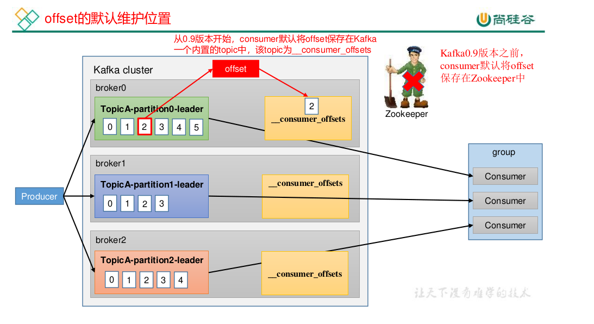

> __consumer_offsets 主题里面采用 key 和 value 的方式存储数据。key 是 group.id+topic+分区号，value 就是当前 offset 的值。每隔一段时间，kafka 内部会对这个 topic 进行compact，也就是每个 group.id+topic+分区号就保留最新数据。

1）消费 offset 案例

（0）思想：__consumer_offsets 为 Kafka 中的 topic，那就可以通过消费者进行消费。

（1）在配置文件 config/consumer.properties 中添加配置 exclude.internal.topics=false，默认是 true，表示不能消费系统主题。为了查看该系统主题数据，所以该参数修改为 false。

（2）采用命令行方式，创建一个新的 topic。

```sh
[atguigu@hadoop102 kafka]$ bin/kafka-topics.sh --bootstrap-server hadoop102:9092 --create --topic atguigu --partitions 2 --replication-factor 2
```

（3）启动生产者往 atguigu 生产数据。

```sh
[atguigu@hadoop102 kafka]$ bin/kafka-console-producer.sh --topic atguigu --bootstrap-server hadoop102:9092
```

（4）启动消费者消费 atguigu 数据。

```sh
[atguigu@hadoop104 kafka]$ bin/kafka-console-consumer.sh --bootstrap-server hadoop102:9092 --topic atguigu --group test
```

注意：指定消费者组名称，更好观察数据存储位置（key 是 group.id+topic+分区号）。

（5）查看消费者消费主题__consumer_offsets。

```sh
[atguigu@hadoop102 kafka]$ bin/kafka-console-consumer.sh --topic __consumer_offsets --bootstrap-server hadoop102:9092 --consumer.config config/consumer.properties --formatter "kafka.coordinator.group.GroupMetadataManager\$OffsetsMessageFormatter"--from-beginning

[offset,atguigu,1]: :OffsetAndMetadata(offset=7,leaderEpoch=Optional[0], metadata=, commitTimestamp=1622442520203,expireTimestamp=None)
[offset,atguigu,0]: :OffsetAndMetadata(offset=8,leaderEpoch=Optional[0], metadata=,commitTimestamp=1622442520203,expireTimestamp=None) 
```

### 5.5.2 自动提交 offset

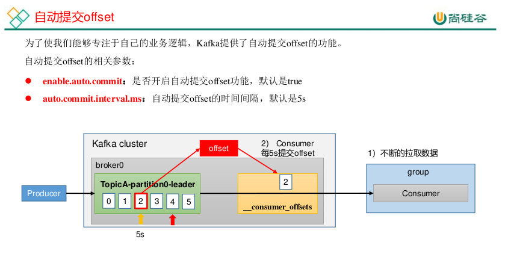

| 参数名称                | 描述                                                         |
| ----------------------- | ------------------------------------------------------------ |
| enable.auto.commit      | 默认值为 true，消费者会自动周期性地向服务器提交偏移量。      |
| auto.commit.interval.ms | 如果设置了 enable.auto.commit 的值为 true，则该值定义了消费者偏移量向 Kafka 提交的频率，默认5s。 |

1）消费者自动提交 offset

```java
package com.atguigu.kafka.consumer;
import org.apache.kafka.clients.consumer.ConsumerConfig;
import org.apache.kafka.clients.consumer.ConsumerRecord;
import org.apache.kafka.clients.consumer.ConsumerRecords;
import org.apache.kafka.clients.consumer.KafkaConsumer;
import java.util.Arrays;
import java.util.Properties;
public class CustomConsumerAutoOffset {
    public static void main(String[] args){
        //1.创建 kafka 消费者配置类
        Properties properties = new Properties();
        //2.添加配置参数
        //添加连接
        properties.put(ConsumerConfig.BOOTSTRAP_SERVERS_CONFIG,"hadoop102:9092");
        //配置序列化必须
        properties.put(ConsumerConfig.KEY_DESERIALIZER_CLASS_CONFIG,"org.apache.kafka.common.serialization.StringDeserializer");  
        properties.put(ConsumerConfig.VALUE_DESERIALIZER_CLASS_CONFIG,"org.apache.kafka.common.serialization.StringDeserializer");
        //配置消费者组
        properties.put(ConsumerConfig.GROUP_ID_CONFIG,"test");
        //是否自动提交 offset
        properties.put(ConsumerConfig.ENABLE_AUTO_COMMIT_CONFIG,true);
        //提交 offset 的时间周期1000ms，默认5s
        properties.put(ConsumerConfig.AUTO_COMMIT_INTERVAL_MS_CONFIG,1000);
        //3.创建 kafka 消费者
        KafkaConsumer<String, String> consumer = new KafkaConsumer<>(properties);
        //4.设置消费主题形参是列表
        consumer.subscribe(Arrays.asList("first"));
        //5.消费数据
        while (true){
            //读取消息
            ConsumerRecords<String, String> consumerRecords = consumer.poll(Duration.ofSeconds(1));
            //输出消息
            for (ConsumerRecord<String, String> consumerRecord : consumerRecords){
                System.out.println(consumerRecord.value());
            }
        }
    }
}
```

### 5.5.3 手动提交 offset

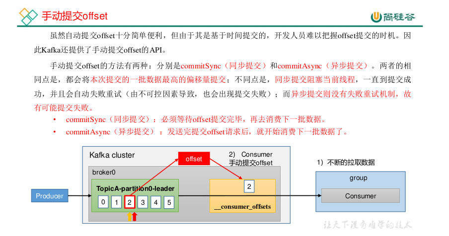

1）同步提交 offset

由于同步提交 offset 有失败重试机制，故更加可靠，但是由于一直等待提交结果，提交的效率比较低。以下为同步提交 offset 的示例。

```java
package com.atguigu.kafka.consumer;
import org.apache.kafka.clients.consumer.ConsumerConfig;
import org.apache.kafka.clients.consumer.ConsumerRecord;
import org.apache.kafka.clients.consumer.ConsumerRecords;
import org.apache.kafka.clients.consumer.KafkaConsumer;
import java.util.Arrays;
import java.util.Properties;
public class CustomConsumerByHandSync {
    public static void main(String[] args){
        //1.创建 kafka 消费者配置类
        Properties properties = new Properties();
        //2.添加配置参数
        //添加连接
        properties.put(ConsumerConfig.BOOTSTRAP_SERVERS_CONFIG,"hadoop102:9092");
        //配置序列化必须
        properties.put(ConsumerConfig.KEY_DESERIALIZER_CLASS_CONFIG,"org.apache.kafka.common.serialization.StringDeserializer");
        properties.put(ConsumerConfig.VALUE_DESERIALIZER_CLASS_CONFIG,"org.apache.kafka.common.serialization.StringDeserializer");
        //配置消费者组 
        properties.put(ConsumerConfig.GROUP_ID_CONFIG,"test");
        //是否自动提交 offset
        properties.put(ConsumerConfig.ENABLE_AUTO_COMMIT_CONFIG,false);
        //3.创建 kafka 消费者
        KafkaConsumer<String, String> consumer = new KafkaConsumer<>(properties);
        //4.设置消费主题形参是列表
        consumer.subscribe(Arrays.asList("first"));
        //5.消费数据
        while (true){
            //读取消息
            ConsumerRecords<String, String> consumerRecords = consumer.poll(Duration.ofSeconds(1));
            //输出消息
            for (ConsumerRecord<String, String> consumerRecord : consumerRecords){
                System.out.println(consumerRecord.value());
            }
            //同步提交 offset
            consumer.commitSync();
        }
    }
}
```

2）异步提交 offset

虽然同步提交 offset 更可靠一些，但是由于其会阻塞当前线程，直到提交成功。因此吞吐量会受到很大的影响。因此更多的情况下，会选用异步提交 offset 的方式。以下为异步提交 offset 的示例：

```java
package com.atguigu.kafka.consumer;
import org.apache.kafka.clients.consumer.;
import org.apache.kafka.common.TopicPartition;
import java.util.Arrays;
import java.util.Map;
import java.util.Properties;
public class CustomConsumerByHandAsync {
    public static void main(String[] args){
        //1.创建 kafka 消费者配置类
        Properties properties = new Properties();
        //2.添加配置参数
        //添加连接
        properties.put(ConsumerConfig.BOOTSTRAP_SERVERS_CONFIG,"hadoop102:9092");
        //配置序列化必须
        properties.put(ConsumerConfig.KEY_DESERIALIZER_CLASS_CONFIG,"org.apache.kafka.common.serialization.StringDeserializer");
        properties.put(ConsumerConfig.VALUE_DESERIALIZER_CLASS_CONFIG,"org.apache.kafka.common.serialization.StringDeserializer");
        //配置消费者组
        properties.put(ConsumerConfig.GROUP_ID_CONFIG,"test");
        //是否自动提交 offset
        properties.put(ConsumerConfig.ENABLE_AUTO_COMMIT_CONFIG,"false");
        //3.创建 Kafka 消费者
        KafkaConsumer<String, String> consumer = new KafkaConsumer<>(properties);
        //4.设置消费主题形参是列表
        consumer.subscribe(Arrays.asList("first"));
        //5.消费数据
        while (true){
            //读取消息
            ConsumerRecords<String, String> consumerRecords = consumer.poll(Duration.ofSeconds(1));
            //输出消息
            for (ConsumerRecord<String, String> consumerRecord : consumerRecords){
                System.out.println(consumerRecord.value());
            }
            //异步提交 offset
            consumer.commitAsync();
        }
    }
}
```

### 5.5.4 指定 Offset 消费

auto.offset.reset = earliest | latest | none 默认是 latest。

当 Kafka 中没有初始偏移量（消费者组第一次消费）或服务器上不再存在当前偏移量时（例如该数据已被删除），该怎么办？

（1）**earliest**：自动将偏移量重置为最早的偏移量，--from-beginning。

（2）**latest**（默认值）：自动将偏移量重置为最新偏移量。

 （3）**none**：如果未找到消费者组的先前偏移量，则向消费者抛出异常。

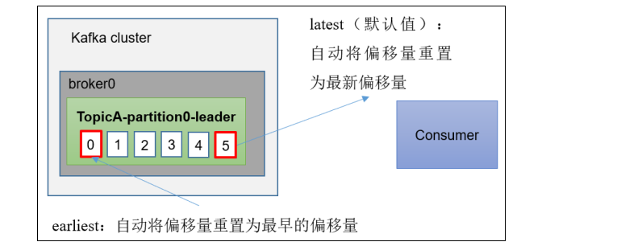

（4）任意指定 offset 位移开始消费

```java
package com.atguigu.kafka.consumer;
import org.apache.kafka.clients.consumer.ConsumerConfig;
import org.apache.kafka.clients.consumer.ConsumerRecord;
import org.apache.kafka.clients.consumer.ConsumerRecords;
import org.apache.kafka.clients.consumer.KafkaConsumer;
import org.apache.kafka.common.TopicPartition;
import org.apache.kafka.common.serialization.StringDeserializer;
import java.time.Duration;
import java.util.ArrayList;
import java.util.HashSet;
import java.util.Properties;
import java.util.Set;
public class CustomConsumerSeek {
    public static void main(String[] args){
        //0 配置信息
        Properties properties = new Properties();
        //连接
        properties.put(ConsumerConfig.BOOTSTRAP_SERVERS_CONFIG,"hadoop102:9092");
        // key value 反序列化
        properties.put(ConsumerConfig.KEY_DESERIALIZER_CLASS_CONFIG,StringDeserializer.class.getName());
        properties.put(ConsumerConfig.VALUE_DESERIALIZER_CLASS_CONFIG,StringDeserializer.class.getName());
        properties.put(ConsumerConfig.GROUP_ID_CONFIG,"test2");
        //1 创建一个消费者
        KafkaConsumer<String, String> kafkaConsumer = new KafkaConsumer<>(properties);
        //2 订阅一个主题
        ArrayList<String> topics = new ArrayList<>();
        topics.add("first");
        kafkaConsumer.subscribe(topics);
        Set<TopicPartition> assignment= new HashSet<>();
        while (assignment.size()== 0){
            kafkaConsumer.poll(Duration.ofSeconds(1));
            //获取消费者分区分配信息（有了分区分配信息才能开始消费）
            assignment = kafkaConsumer.assignment();
        }
        //遍历所有分区，并指定 offset 从1700 的位置开始消费
        for (TopicPartition tp: assignment){
            kafkaConsumer.seek(tp,1700);
        }
        //3 消费该主题数据
        while (true){
            ConsumerRecords<String, String> consumerRecords = kafkaConsumer.poll(Duration.ofSeconds(1));
            for (ConsumerRecord<String, String> consumerRecord : consumerRecords){
                System.out.println(consumerRecord);
            }
        }
    }
}
```

注意：每次执行完，需要修改消费者组名；

### 5.5.5 指定时间消费

需求：在生产环境中，会遇到最近消费的几个小时数据异常，想重新按照时间消费。例如要求按照时间消费前一天的数据，怎么处理？操作步骤：

```java
package com.atguigu.kafka.consumer;
import org.apache.kafka.clients.consumer.;
import org.apache.kafka.common.TopicPartition;
import org.apache.kafka.common.serialization.StringDeserializer;
import java.time.Duration;
import java.util.;
public class CustomConsumerForTime {
    public static void main(String[] args){
        //0 配置信息
        Properties properties = new Properties();
        //连接
        properties.put(ConsumerConfig.BOOTSTRAP_SERVERS_CONFIG,"hadoop102:9092");
        // key value 反序列化
        properties.put(ConsumerConfig.KEY_DESERIALIZER_CLASS_CONFIG,StringDeserializer.class.getName());
        properties.put(ConsumerConfig.VALUE_DESERIALIZER_CLASS_CONFIG,StringDeserializer.class.getName());
        properties.put(ConsumerConfig.GROUP_ID_CONFIG,"test2");
        //1 创建一个消费者
        KafkaConsumer<String, String> kafkaConsumer = new KafkaConsumer<>(properties);
        //2 订阅一个主题
        ArrayList<String> topics = new ArrayList<>();
        topics.add("first");
        kafkaConsumer.subscribe(topics);
        Set<TopicPartition> assignment = new HashSet<>();
        while (assignment.size()== 0){
            kafkaConsumer.poll(Duration.ofSeconds(1));
            //获取消费者分区分配信息（有了分区分配信息才能开始消费）
            assignment = kafkaConsumer.assignment();
        }
        HashMap<TopicPartition, Long> timestampToSearch = new HashMap<>();
        //封装集合存储，每个分区对应一天前的数据
        for (TopicPartition topicPartition : assignment){
            timestampToSearch.put(topicPartition,System.currentTimeMillis()-1 24 3600 1000);
        }
        //获取从1 天前开始消费的每个分区的 offset
        Map<TopicPartition, OffsetAndTimestamp> offsets = kafkaConsumer.offsetsForTimes(timestampToSearch);
        //遍历每个分区，对每个分区设置消费时间。
        for (TopicPartition topicPartition : assignment){
            OffsetAndTimestamp offsetAndTimestamp = offsets.get(topicPartition);
            //根据时间指定开始消费的位置
            if (offsetAndTimestamp != null){
                kafkaConsumer.seek(topicPartition,offsetAndTimestamp.offset());
            }
        }
        //3 消费该主题数据
        while (true){
            ConsumerRecords<String, String> consumerRecords = kafkaConsumer.poll(Duration.ofSeconds(1));
            for (ConsumerRecord<String, String> consumerRecord : consumerRecords){
                System.out.println(consumerRecord);
            }
        }
    }
}
```

### 5.5.6 漏消费和重复消费

重复消费：已经消费了数据，但是 offset 没提交。

漏消费：先提交 offset 后消费，有可能会造成数据的漏消费。

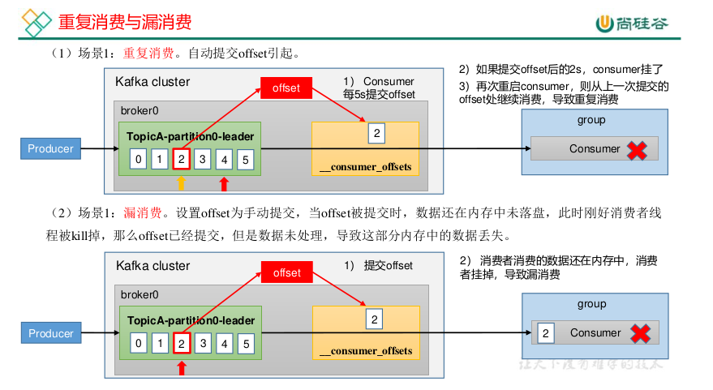

思考：怎么能做到既不漏消费也不重复消费呢？详看消费者事务。 

## 5.6 生产经验——消费者事务

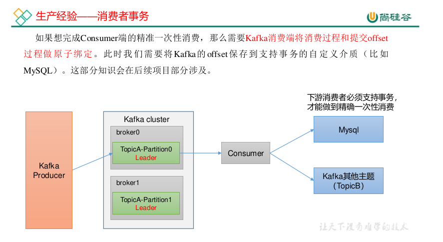


## 5.7 生产经验——数据积压（消费者如何提高吞吐量）


| 参数名称         | 描述                                                         |
| ---------------- | ------------------------------------------------------------ |
| fetch.max.bytes  | 默认 Default: 52428800（50 m）。消费者获取服务器端一批消息最大的字节数。如果服务器端一批次的数据大于该值（50m）仍然可以拉取回来这批数据，因此，这不是一个绝对最大值。一批次的大小受 message.max.bytes （broker config）or max.message.bytes （topic config）影响。 |
| max.poll.records | 一次 poll 拉取数据返回消息的最大条数，默认是 500 条          |

# 第6 章 Kafka-Eagle 监控

Kafka-Eagle 框架可以监控 Kafka 集群的整体运行情况，在生产环境中经常使用。

## 6.1 MySQL 环境准备

Kafka-Eagle 的安装依赖于 MySQL，MySQL 主要用来存储可视化展示的数据。如果集群中之前安装过 MySQL 可以跨过该步。

## 6.2 Kafka 环境准备

1）关闭 Kafka 集群

```sh
[atguigu@hadoop102 kafka]$ kf.sh stop
```

2）修改/opt/module/kafka/bin/kafka-server-start.sh 命令中

```sh
[atguigu@hadoop102 kafka]$ vim bin/kafka-server-start.sh
```

修改如下参数值：

```properties
if [ "x$KAFKA_HEAP_OPTS"= "x"]; then

 export KAFKA_HEAP_OPTS="-Xmx1G -Xms1G"

fi
```

为

```properties
if [ "x$KAFKA_HEAP_OPTS"= "x"]; then
export KAFKA_HEAP_OPTS="-server -Xms2G -Xmx2G -XX:PermSize=128m -XX:+UseG1GC -XX:MaxGCPauseMillis=200 -XX:ParallelGCThreads=8 -XX:ConcGCThreads=5 -XX:InitiatingHeapOccupancyPercent=70"
export JMX_PORT="9999"
#export KAFKA_HEAP_OPTS="-Xmx1G -Xms1G"
fi
```

注意：修改之后在启动 Kafka 之前要分发之其他节点

```sh
[atguigu@hadoop102 bin]$ xsync kafka-server-start.sh
```

## 6.3 Kafka-Eagle 安装

0）官网：https://www.kafka-eagle.org/

1）上传压缩包 kafka-eagle-bin-2.0.8.tar.gz 到集群/opt/software 目录

2）解压到本地

```sh
[atguigu@hadoop102 software]$ tar -zxvf kafka-eagle-bin-2.0.8.tar.gz 
```

3）进入刚才解压的目录

```sh
[atguigu@hadoop102 kafka-eagle-bin-2.0.8]$ ll  

总用量79164

-rw-rw-r--.1 atguigu atguigu 81062577 10 月13 00:00 efak-web-2.0.8-bin.tar.gz
```

4）将 efak-web-2.0.8-bin.tar.gz 解压至/opt/module

```sh
[atguigu@hadoop102 kafka-eagle-bin-2.0.8]$ tar -zxvf efak-web-2.0.8-bin.tar.gz -C /opt/module/
```

5）修改名称

```sh
[atguigu@hadoop102 module]$ mv efak-web-2.0.8/ efak
```

6）修改配置文件/opt/module/efak/conf/system-config.properties

```properties
[atguigu@hadoop102 conf]$ vim system-config.properties

######################################
# multi zookeeper & kafka cluster list
# Settings prefixed with 'kafka.eagle.' will be deprecated, use 'efak.'instead

######################################
efak.zk.cluster.alias=cluster1
cluster1.zk.list=hadoop102:2181,hadoop103:2181,hadoop104:2181/kafka

######################################
# zookeeper enable acl
######################################

cluster1.zk.acl.enable=false
cluster1.zk.acl.schema=digest
cluster1.zk.acl.username=test
cluster1.zk.acl.password=test123

######################################
# broker size online list
######################################
cluster1.efak.broker.size=20
######################################

# zk client thread limit
######################################
kafka.zk.limit.size=32
######################################

# EFAK webui port
######################################
efak.webui.port=8048
######################################

# kafka jmx acl and ssl authenticate

######################################

cluster1.efak.jmx.acl=false
cluster1.efak.jmx.user=keadmin
cluster1.efak.jmx.password=keadmin123
cluster1.efak.jmx.ssl=false
cluster1.efak.jmx.truststore.location=/data/ssl/certificates/kafka.truststore
cluster1.efak.jmx.truststore.password=ke123456

######################################
# kafka offset storage
######################################
# offset 保存在 kafka
cluster1.efak.offset.storage=kafka
######################################
# kafka jmx uri
######################################

cluster1.efak.jmx.uri=service:jmx:rmi:///jndi/rmi://%s/jmxrmi

######################################
# kafka metrics,15 days by default
######################################
efak.metrics.charts=true
efak.metrics.retain=15
######################################
# kafka sql topic records max
######################################
efak.sql.topic.records.max=5000
efak.sql.topic.preview.records.max=10
######################################
# delete kafka topic token
######################################

efak.topic.token=keadmin

######################################

# kafka sasl authenticate

######################################
cluster1.efak.sasl.enable=false
cluster1.efak.sasl.protocol=SASL_PLAINTEXT
cluster1.efak.sasl.mechanism=SCRAM-SHA-256
cluster1.efak.sasl.jaas.config=org.apache.kafka.common.security.scram.ScramL
oginModule required username="kafka" password="kafka-eagle";
cluster1.efak.sasl.client.id=
cluster1.efak.blacklist.topics=
cluster1.efak.sasl.cgroup.enable=false
cluster1.efak.sasl.cgroup.topics=
cluster2.efak.sasl.enable=false
cluster2.efak.sasl.protocol=SASL_PLAINTEXT
cluster2.efak.sasl.mechanism=PLAIN
cluster2.efak.sasl.jaas.config=org.apache.kafka.common.security.plain.PlainL
oginModule required username="kafka" password="kafka-eagle";
cluster2.efak.sasl.client.id=
cluster2.efak.blacklist.topics=
cluster2.efak.sasl.cgroup.enable=false
cluster2.efak.sasl.cgroup.topics=

######################################

# kafka ssl authenticate

######################################

cluster3.efak.ssl.enable=false
cluster3.efak.ssl.protocol=SSL
cluster3.efak.ssl.truststore.location=
cluster3.efak.ssl.truststore.password=
cluster3.efak.ssl.keystore.location=
cluster3.efak.ssl.keystore.password=
cluster3.efak.ssl.key.password=
cluster3.efak.ssl.endpoint.identification.algorithm=https
cluster3.efak.blacklist.topics=
cluster3.efak.ssl.cgroup.enable=false
cluster3.efak.ssl.cgroup.topics=

######################################
# kafka sqlite jdbc driver address
######################################

#配置 mysql 连接

efak.driver=com.mysql.jdbc.Driver
efak.url=jdbc:mysql://hadoop102:3306/ke?useUnicode=true&characterEncoding=UTF-8&zeroDateTimeBehavior=convertToNull
efak.username=root
efak.password=000000

######################################
# kafka mysql jdbc driver address
######################################

#efak.driver=com.mysql.cj.jdbc.Driver

#efak.url=jdbc:mysql://127.0.0.1:3306/ke?useUnicode=true&characterEncoding=UTF-8&zeroDateTimeBehavior=convertToNull
#efak.username=root
#efak.password=123456
```

7）添加环境变量

```sh
[atguigu@hadoop102 conf]$ sudo vim /etc/profile.d/my_env.sh
# kafkaEFAK
export KE_HOME=/opt/module/efak
export PATH=$PATH:$KE_HOME/bin
```

注意：source /etc/profile

```sh
[atguigu@hadoop102 conf]$ source /etc/profile
```

8）启动

（1）注意：启动之前需要先启动 ZK 以及 KAFKA。

```sh
[atguigu@hadoop102 kafka]$ kf.sh start
```

（2）启动 efak

```sh
[atguigu@hadoop102 efak]$ bin/ke.sh start

Version 2.0.8 -- Copyright 2016-2021
EFAK Service has started success.
Welcome, Now you can visit 'http://192.168.10.102:8048'
Account:admin ,Password:123456
<Usage> ke.sh [start|status|stop|restart|stats]</Usage>
 <Usage> https://www.kafka-eagle.org/</Usage>
```

说明：如果停止 efak，执行命令。

```sh
[atguigu@hadoop102 efak]$ bin/ke.sh stop
```

## 6.4 Kafka-Eagle 页面操作

1）登录页面查看监控数据

http://192.168.10.102:8048/

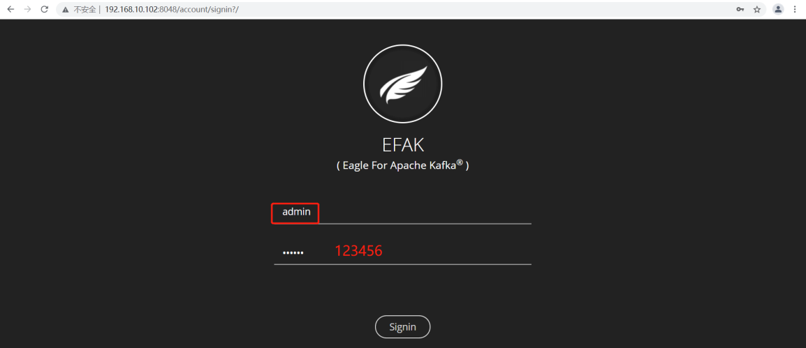

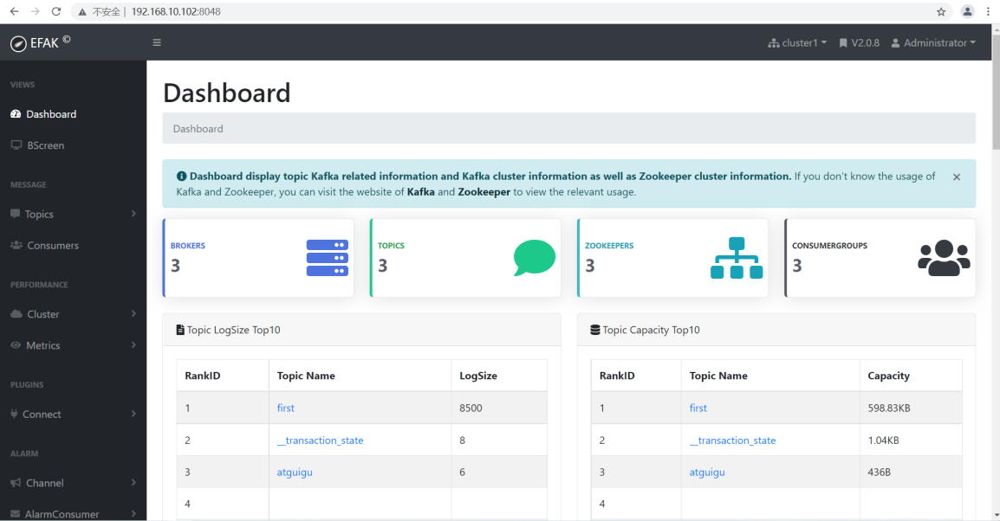

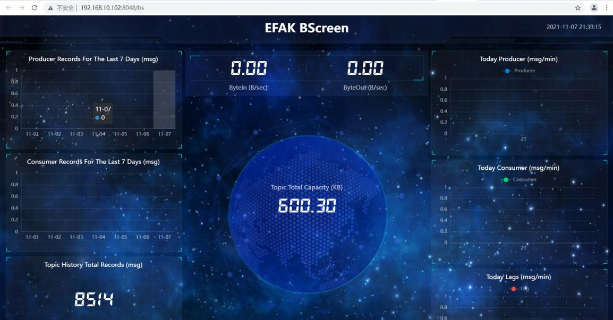

#  第7 章 Kafka-Kraft 模式

## 7.1 Kafka-Kraft 架构

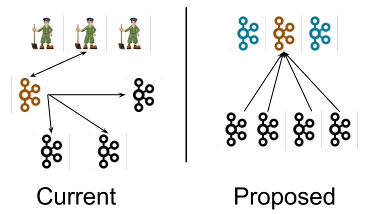

左图为 Kafka 现有架构，元数据在 zookeeper 中，运行时动态选举 controller，由controller 进行 Kafka 集群管理。右图为 kraft 模式架构（实验性），不再依赖 zookeeper 集群，而是用三台 controller 节点代替 zookeeper，元数据保存在 controller 中，由 controller 直接进行 Kafka 集群管理。

这样做的好处有以下几个：

⚫ Kafka 不再依赖外部框架，而是能够独立运行；

⚫ controller 管理集群时，不再需要从 zookeeper 中先读取数据，集群性能上升；

⚫由于不依赖 zookeeper，集群扩展时不再受到 zookeeper 读写能力限制；

⚫ controller 不再动态选举，而是由配置文件规定。这样我们可以有针对性的加强controller 节点的配置，而不是像以前一样对随机 controller 节点的高负载束手无策。

## 7.2 Kafka-Kraft 集群部署

1）再次解压一份 kafka 安装包

```sh
[atguigu@hadoop102 software]$ tar -zxvf kafka_2.12-3.0.0.tgz -C /opt/module/
```

2）重命名为 kafka2

```sh
[atguigu@hadoop102 module]$ mv kafka_2.12-3.0.0/ kafka2 
```

3）在 hadoop102 上修改/opt/module/kafka2/config/kraft/server.properties 配置文件

```sh
[atguigu@hadoop102 kraft]$ vim server.properties
```

```properties
#kafka 的角色（controller 相当于主机、broker 节点相当于从机，主机类似 zk 功能）
process.roles=broker, controller
#节点 ID
node.id=2  

#controller 服务协议别名
controller.listener.names=CONTROLLER

#全 Controller 列表
controller.quorum.voters=2@hadoop102:9093,3@hadoop103:9093,4@hadoop104:9093

#不同服务器绑定的端口
listeners=PLAINTEXT://:9092,CONTROLLER://:9093

#broker 服务协议别名
inter.broker.listener.name=PLAINTEXT

#broker 对外暴露的地址
advertised.Listeners=PLAINTEXT://hadoop102:9092

#协议别名到安全协议的映射
listener.security.protocol.map=CONTROLLER:PLAINTEXT,PLAINTEXT:PLAINTEXT,SSL:SSL,SASL_PLAINTEXT:SASL_PLAINTEXT,SASL_SSL:SASL_SSL

#kafka 数据存储目录
log.dirs=/opt/module/kafka2/data
```

4）分发 kafka2

```sh
[atguigu@hadoop102 module]$ xsync kafka2/
```

⚫在 hadoop103 和 hadoop104 上需要对 node.id 相应改变，值需要和controller.quorum.voters 对应。

⚫在 hadoop103 和 hadoop104 上需要根据各自的主机名称，修改相应的advertised.Listeners 地址。

5）初始化集群数据目录

（1）首先生成存储目录唯一 ID。

```sh
[atguigu@hadoop102 kafka2]$ bin/kafka-storage.sh random-uuid

J7s9e8PPTKOO47PxzI39VA
```

（2）用该 ID 格式化 kafka 存储目录（三台节点）。

```sh
[atguigu@hadoop102 kafka2]$ bin/kafka-storage.sh format -t J7s9e8PPTKOO47PxzI39VA -c /opt/module/kafka2/config/kraft/server.properties

[atguigu@hadoop103 kafka2]$ bin/kafka-storage.sh format -t J7s9e8PPTKOO47PxzI39VA -c /opt/module/kafka2/config/kraft/server.properties

[atguigu@hadoop104 kafka2]$ bin/kafka-storage.sh format -t J7s9e8PPTKOO47PxzI39VA -c /opt/module/kafka2/config/kraft/server.properties
```

6）启动 kafka 集群

```sh
[atguigu@hadoop102 kafka2]$ bin/kafka-server-start.sh -daemon config/kraft/server.properties
[atguigu@hadoop103 kafka2]$ bin/kafka-server-start.sh -daemon config/kraft/server.properties
[atguigu@hadoop104 kafka2]$ bin/kafka-server-start.sh -daemon config/kraft/server.properties
```

7）停止 kafka 集群

```sh
[atguigu@hadoop102 kafka2]$ bin/kafka-server-stop.sh
[atguigu@hadoop103 kafka2]$ bin/kafka-server-stop.sh
[atguigu@hadoop104 kafka2]$ bin/kafka-server-stop.sh
```

## 7.3 Kafka-Kraft 集群启动停止脚本

1）在/home/atguigu/bin 目录下创建文件 kf2.sh 脚本文件

```sh
[atguigu@hadoop102 bin]$ vim kf2.sh
```

脚本如下：

```sh
#!/bin/bash
case $1 in
"start"){
	for i in hadoop102 hadoop103 hadoop104
	do
		echo "--------启动$i Kafka2-------"
		ssh $i "/opt/module/kafka2/bin/kafka-server-start.sh -daemon /opt/module/kafka2/config/kraft/server.properties"
	done
};;

"stop"){
	for i in hadoop102 hadoop103 hadoop104
	do
		echo "--------停止$i Kafka2-------"
		ssh $i "/opt/module/kafka2/bin/kafka-server-stop.sh "
	done
};;
esac
```

2）添加执行权限

```sh
[atguigu@hadoop102 bin]$ chmod +x kf2.sh
```

3）启动集群命令

```sh
[atguigu@hadoop102 ~]$ kf2.sh start
```

4）停止集群命令

```sh
[atguigu@hadoop102 ~]$ kf2.sh stop
```


# 二、KAFKA 集成外部系统

# 第 1 章 集成 Flume

Flume 是一个在大数据开发中非常常用的组件。可以用于 Kafka 的生产者，也可以用于Flume 的消费者。


## 1.1 Flume 生产者

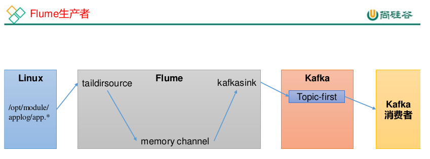

（1）启动 kafka 集群

```sh
[atguigu@hadoop102 ~]$ zk.sh start
[atguigu@hadoop102 ~]$ kf.sh start
```

（2）启动 kafka 消费者

```sh
[atguigu@hadoop103 kafka]$ bin/kafka-console-consumer.sh --bootstrap-server hadoop102:9092 --topic first
```

（3）Flume 安装步骤

在 hadoop102 主机上安装 Flume。详见：尚硅谷大数据技术之 Flume

（4）配置 Flume

在 hadoop102 节点的 Flume 的 job 目录下创建 file_to_kafka.conf

```sh
[atguigu@hadoop102 flume]$ mkdir jobs
[atguigu@hadoop102 flume]$ vim jobs/file_to_kafka.conf
```

配置文件内容如下

```properties
# 1 组件定义
a1.sources = r1
a1.sinks = k1
a1.channels = c1

# 2 配置 source
a1.sources.r1.type = TAILDIR
a1.sources.r1.filegroups = f1
a1.sources.r1.filegroups.f1 = /opt/module/applog/app.*
a1.sources.r1.positionFile =/opt/module/flume/taildir_position.json


# 3 配置 channel
a1.channels.c1.type = memory
a1.channels.c1.capacity = 1000
a1.channels.c1.transactionCapacity = 100

# 4 配置 sink
a1.sinks.k1.type = org.apache.flume.sink.kafka.KafkaSink
a1.sinks.k1.kafka.bootstrap.servers =hadoop102:9092,hadoop103:9092,hadoop104:9092
a1.sinks.k1.kafka.topic = first
a1.sinks.k1.kafka.flumeBatchSize = 20
a1.sinks.k1.kafka.producer.acks = 1
a1.sinks.k1.kafka.producer.linger.ms = 1

# 5 拼接组件
a1.sources.r1.channels = c1
a1.sinks.k1.channel = c1
```

（5）启动 Flume

```sh
[atguigu@hadoop102 flume]$ bin/flume-ng agent -c conf/ -n a1 -f jobs/file_to_kafka.conf &
```

（6）向/opt/module/applog/app.log 里追加数据，查看 kafka 消费者消费情况

```sh
[atguigu@hadoop102 module]$ mkdir applog
[atguigu@hadoop102 applog]$ echo hello >> /opt/module/applog/app.log
```

（7）观察 kafka 消费者，能够看到消费的 hello 数据

## 1.2 Flume 消费者

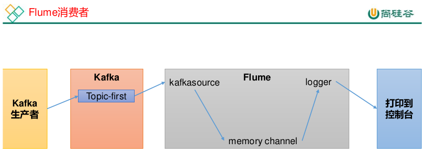

（1）配置 Flume

在 hadoop102 节点的 Flume 的/opt/module/flume/jobs 目录下创建 kafka_to_file.conf

```sh
[atguigu@hadoop102 jobs]$ vim kafka_to_file.conf
```

配置文件内容如下

```properties
# 1 组件定义
a1.sources = r1
a1.sinks = k1
a1.channels = c1

# 2 配置 source
a1.sources.r1.type = org.apache.flume.source.kafka.KafkaSource
a1.sources.r1.batchSize = 50
a1.sources.r1.batchDurationMillis = 200
a1.sources.r1.kafka.bootstrap.servers = hadoop102:9092
a1.sources.r1.kafka.topics = first
a1.sources.r1.kafka.consumer.group.id = custom.g.id

# 3 配置 channel
a1.channels.c1.type = memory
a1.channels.c1.capacity = 1000
a1.channels.c1.transactionCapacity = 100

# 4 配置 sink
a1.sinks.k1.type = logger

# 5 拼接组件
a1.sources.r1.channels = c1
a1.sinks.k1.channel = c1
```

（2）启动 Flume

```sh
[atguigu@hadoop102 flume]$ bin/flume-ng agent -c conf/ -n a1 -f jobs/kafka_to_file.conf -Dflume.root.logger=INFO,console
```

（3）启动 kafka 生产者

```sh
[atguigu@hadoop103 kafka]$ bin/kafka-console-producer.sh --bootstrap-server hadoop102:9092 --topic first
```

并输入数据，例如：hello world

（4）观察控制台输出的日志

# 第 2 章 集成 Flink

Flink 是一个在大数据开发中非常常用的组件。可以用于 Kafka 的生产者，也可以用于Flink 的消费者。

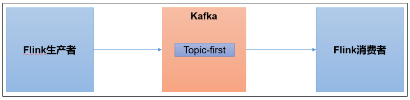

1）Flink 环境准备

（1）创建一个 maven 项目 flink-kafka

（2）添加配置文件

```xml
<dependencies>
    <dependency>
        <groupId>org.apache.flink</groupId>
        <artifactId>flink-java</artifactId>
        <version>1.13.0</version>
    </dependency>
    <dependency>
        <groupId>org.apache.flink</groupId>
        <artifactId>flink-streaming-java_2.12</artifactId>
        <version>1.13.0</version>
    </dependency>
    <dependency>
        <groupId>org.apache.flink</groupId>
        <artifactId>flink-clients_2.12</artifactId>
        <version>1.13.0</version>
    </dependency>
    <dependency>
        <groupId>org.apache.flink</groupId>
        <artifactId>flink-connector-kafka_2.12</artifactId>
        <version>1.13.0</version>
    </dependency>
</dependencies>
```

（3）将 log4j.properties 文件添加到 resources 里面，就能更改打印日志的级别为 error

```properties
log4j.rootLogger=error, stdout,R
log4j.appender.stdout=org.apache.log4j.ConsoleAppender
log4j.appender.stdout.layout=org.apache.log4j.PatternLayout
log4j.appender.stdout.layout.ConversionPattern=%d{yyyy-MM-dd HH:mm:ss,SSS} %5p --- [%50t] %-80c(line:%5L) : %m%n
log4j.appender.R=org.apache.log4j.RollingFileAppender
log4j.appender.R.File=../log/agent.log
log4j.appender.R.MaxFileSize=1024KB
log4j.appender.R.MaxBackupIndex=1
log4j.appender.R.layout=org.apache.log4j.PatternLayout
log4j.appender.R.layout.ConversionPattern=%d{yyyy-MM-dd HH:mm:ss,SSS} %5p --- [%50t] %-80c(line:%6L) : %m%n
```

（4）在 java 文件夹下创建包名为 com.atguigu.flink

## 2.1 Flink 生产者

（1）在 com.atguigu.flink 包下创建 java 类：FlinkKafkaProducer1

```java
package com.atguigu.flink;
import org.apache.flink.api.common.serialization.SimpleStringSchema;
import org.apache.flink.streaming.api.datastream.DataStream;
import org.apache.flink.streaming.api.environment.StreamExecutionEnvironment;
import org.apache.flink.streaming.connectors.kafka.FlinkKafkaProducer;
import org.apache.kafka.clients.producer.ProducerConfig;
import java.util.ArrayList;
import java.util.Properties;
public class FlinkKafkaProducer1 {
    public static void main(String[] args) throws Exception {
        // 0 初始化 flink 环境
        StreamExecutionEnvironment env = StreamExecutionEnvironment.getExecutionEnvironment();
        env.setParallelism(3);
        // 1 读取集合中数据
        ArrayList<String> wordsList = new ArrayList<>();
        wordsList.add("hello");
        wordsList.add("world");
        DataStream<String> stream = env.fromCollection(wordsList);
        // 2 kafka 生产者配置信息
        Properties properties = new Properties();
        properties.put(ProducerConfig.BOOTSTRAP_SERVERS_CONFIG, "hadoop102:9092");
        // 3 创建 kafka 生产者
        FlinkKafkaProducer<String> kafkaProducer = new FlinkKafkaProducer<>("first",new SimpleStringSchema(),properties);
        // 4 生产者和 flink 流关联
        stream.addSink(kafkaProducer);
        // 5 执行
        env.execute();
    }
}
```

（2）启动 Kafka 消费者

```sh
[atguigu@hadoop104 kafka]$ bin/kafka-console-consumer.sh --bootstrap-server hadoop102:9092 --topic first
```

（3）执行 FlinkKafkaProducer1 程序，观察 kafka 消费者控制台情况

## 2.2 Flink 消费者

（1）在 com.atguigu.flink 包下创建 java 类：FlinkKafkaConsumer1

```java
package com.atguigu.flink;
import org.apache.flink.api.common.serialization.SimpleStringSchema;
import org.apache.flink.streaming.api.environment.StreamExecutionEnvironment;
import org.apache.flink.streaming.connectors.kafka.FlinkKafkaConsumer;
import org.apache.kafka.clients.consumer.ConsumerConfig;
import org.apache.kafka.common.serialization.StringDeserializer;
import java.util.Properties;
public class FlinkKafkaConsumer1 {
    public static void main(String[] args) throws Exception {
        // 0 初始化 flink 环境
        StreamExecutionEnvironment env = StreamExecutionEnvironment.getExecutionEnvironment();
        env.setParallelism(3);
        // 1 kafka 消费者配置信息
        Properties properties = new Properties();
        properties.setProperty(ConsumerConfig.BOOTSTRAP_SERVERS_CONFIG,"hadoop102:9092");
        // 2 创建 kafka 消费者
        FlinkKafkaConsumer<String> kafkaConsumer = new FlinkKafkaConsumer<>("first",new SimpleStringSchema(),properties);
        // 3 消费者和 flink 流关联
        env.addSource(kafkaConsumer).print();
        // 4 执行
        env.execute();
    }
}
```

（2）启动 FlinkKafkaConsumer1 消费者

（3）启动 kafka 生产者

```sh
[atguigu@hadoop103 kafka]$ bin/kafka-console-producer.sh --bootstrap-server hadoop102:9092 -
-topic first
```

（4）观察 IDEA 控制台数据打印

# 第 3 章 集成 SpringBoot

SpringBoot 是一个在 JavaEE 开发中非常常用的组件。可以用于 Kafka 的生产者，也可以用于 SpringBoot 的消费者。

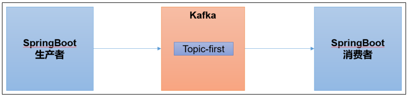

1）在 IDEA 中安装 lombok 插件

在 Plugins 下搜索 lombok 然后在线安装即可，安装后注意重启

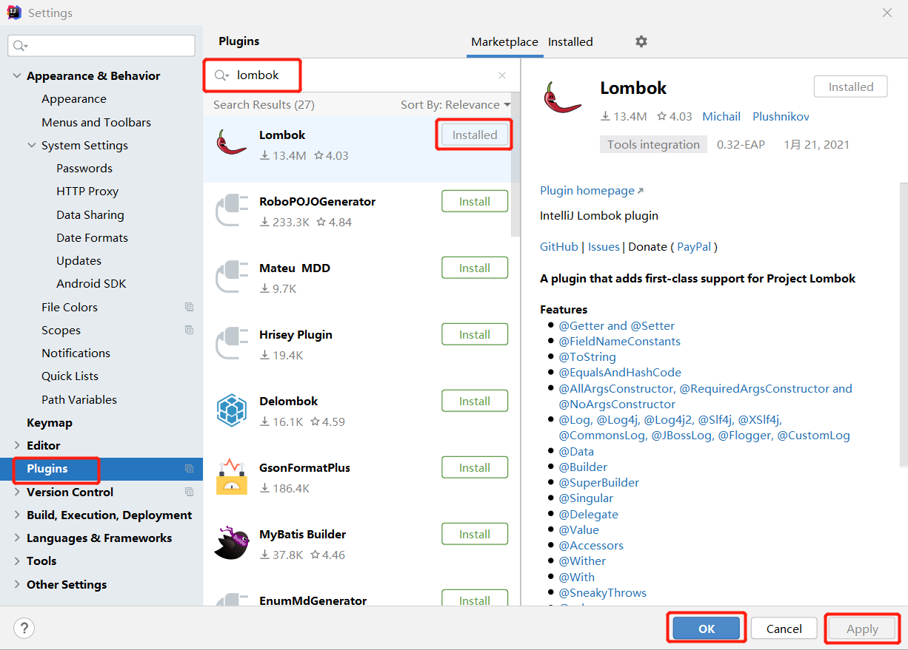

2）SpringBoot 环境准备

（1）创建一个 Spring Initializr

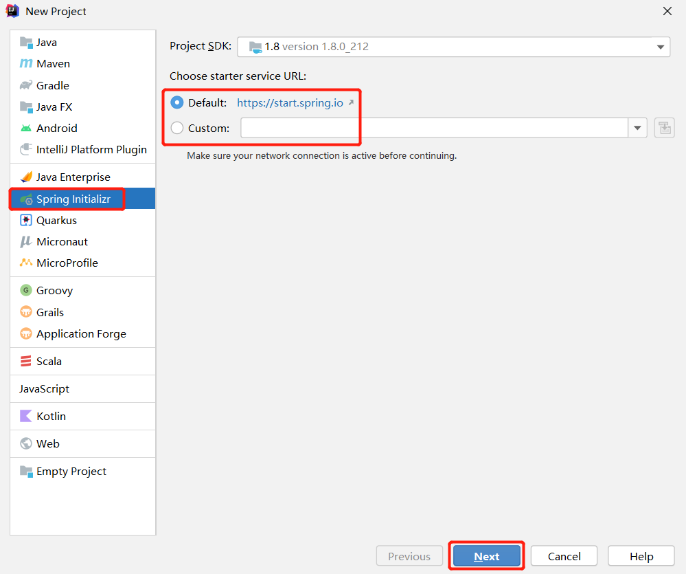

注意：有时候 SpringBoot 官方脚手架不稳定，我们切换国内地址 https://start.aliyun.com

（2）项目名称 springboot

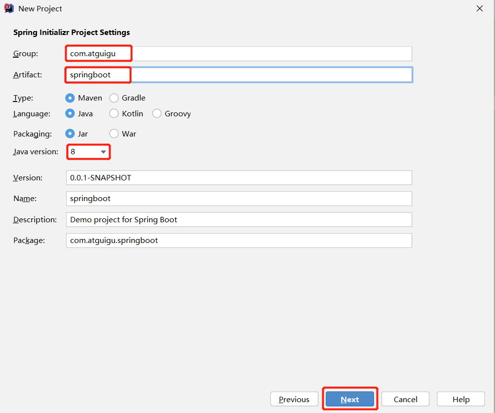


（3）添加项目依赖

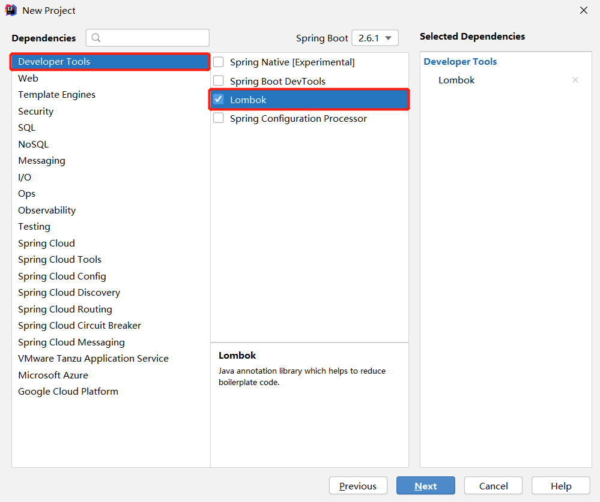

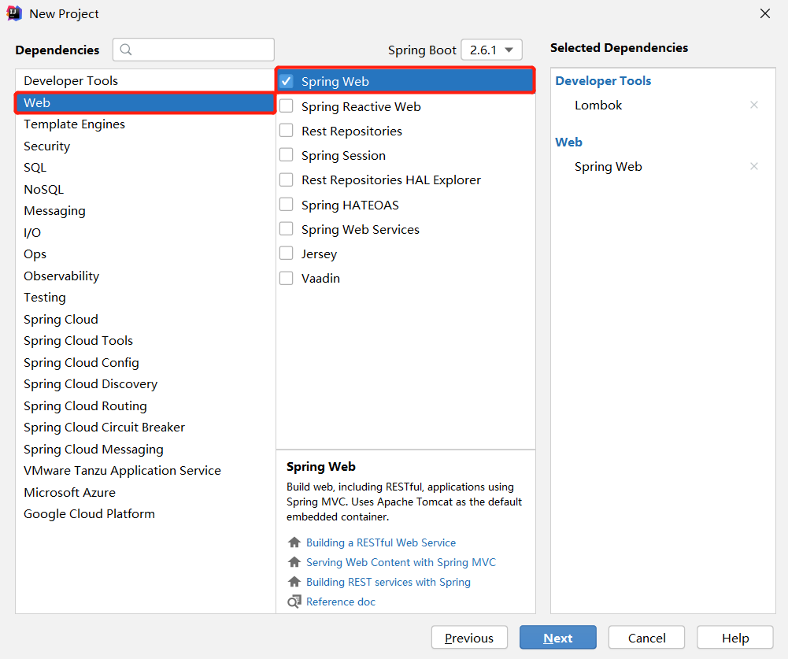

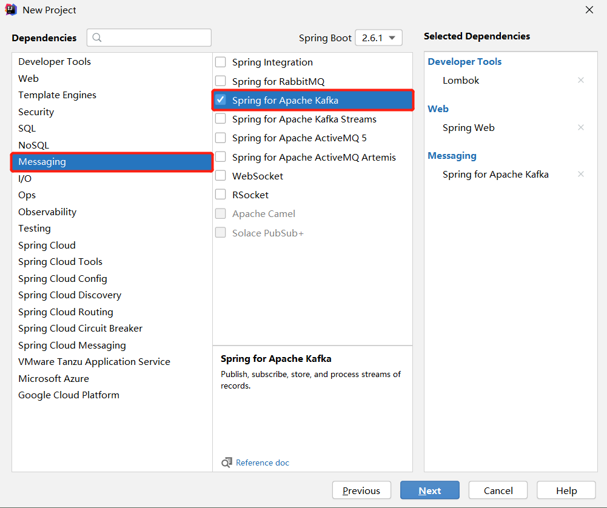

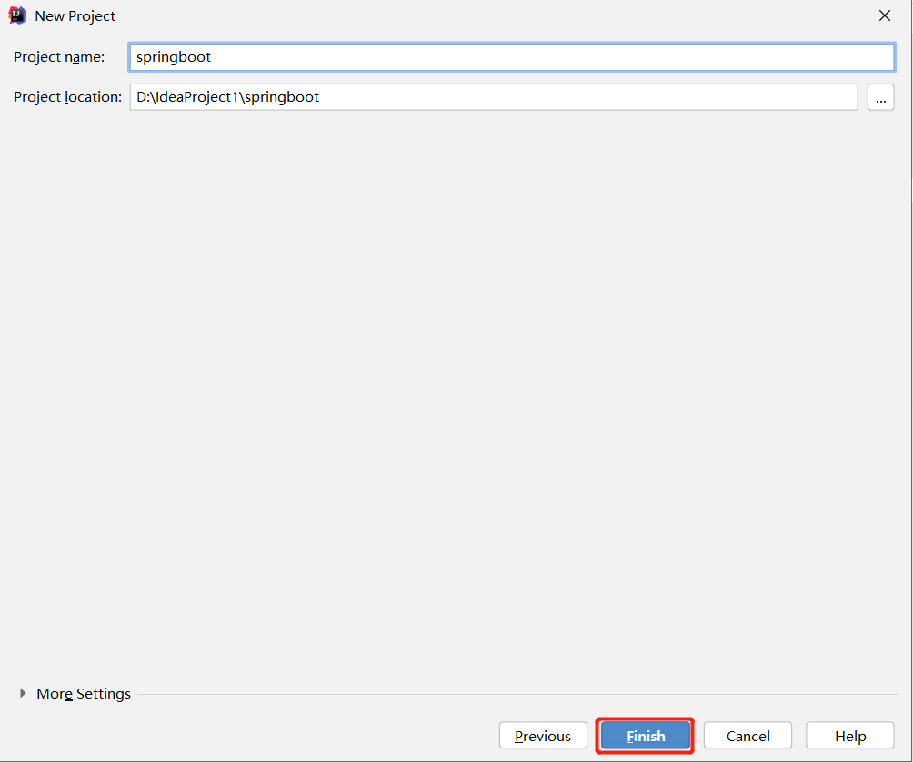

（4）检查自动生成的配置文件

```xml
<?xml version="1.0" encoding="UTF-8"?>
<project xmlns="http://maven.apache.org/POM/4.0.0"
xmlns:xsi="http://www.w3.org/2001/XMLSchema-instance"
xsi:schemaLocation="http://maven.apache.org/POM/4.0.0
https://maven.apache.org/xsd/maven-4.0.0.xsd">
    <modelVersion>4.0.0</modelVersion>
    <parent>
        <groupId>org.springframework.boot</groupId>
        <artifactId>spring-boot-starter-parent</artifactId>
        <version>2.6.1</version>
        <relativePath/> <!-- lookup parent from repository -->
    </parent>
    
    <groupId>com.atguigu</groupId>
    <artifactId>springboot</artifactId>
    <version>0.0.1-SNAPSHOT</version>
    <name>springboot</name>
    <description>Demo project for Spring Boot</description>
    <properties>
        <java.version>1.8</java.version>
    </properties>
    
    <dependencies>
        <dependency>
            <groupId>org.springframework.boot</groupId>
            <artifactId>spring-boot-starter-web</artifactId>
        </dependency>
        <dependency>
            <groupId>org.springframework.kafka</groupId>
            <artifactId>spring-kafka</artifactId>
        </dependency>
        <dependency>
            <groupId>org.projectlombok</groupId>
            <artifactId>lombok</artifactId>
            <optional>true</optional>
        </dependency>
        <dependency>
           <groupId>org.springframework.boot</groupId>
            <artifactId>spring-boot-starter-test</artifactId>
            <scope>test</scope>
        </dependency>
        <dependency>
            <groupId>org.springframework.kafka</groupId>
            <artifactId>spring-kafka-test</artifactId>
            <scope>test</scope>
        </dependency>
    </dependencies>

    <build>
        <plugins>
            <plugin>
                <groupId>org.springframework.boot</groupId>
                <artifactId>spring-boot-maven-plugin</artifactId>
                <configuration>
                    <excludes>
                        <exclude>
                            <groupId>org.projectlombok</groupId>
                            <artifactId>lombok</artifactId>
                        </exclude>
                    </excludes>
                </configuration>
            </plugin>
        </plugins>
    </build>
</project>
```

## 3.1 SpringBoot 生产者

（1）修改 SpringBoot 核心配置文件 application.propeties, 添加生产者相关信息

```properties
# 应用名称
spring.application.name=atguigu_springboot_kafka
# 指定 kafka 的地址
spring.kafka.bootstrap-servers=hadoop102:9092,hadoop103:9092,hadoop104:9092
#指定 key 和 value 的序列化器
spring.kafka.producer.key-serializer=org.apache.kafka.common.serialization.StringSerializer
spring.kafka.producer.value-serializer=org.apache.kafka.common.serialization.StringSerializer
```

（2）创建 controller 从浏览器接收数据, 并写入指定的 topic

```java
package com.atguigu.springboot;
import org.springframework.beans.factory.annotation.Autowired;
import org.springframework.kafka.core.KafkaTemplate;
import org.springframework.web.bind.annotation.RequestMapping;
import org.springframework.web.bind.annotation.RestController;

@RestController
public class ProducerController {
    // Kafka 模板用来向 kafka 发送数据
    @Autowired
    KafkaTemplate<String, String> kafka;

    @RequestMapping("/atguigu")
    public String data(String msg) {
        kafka.send("first", msg);
        return "ok";
    }
}
```

（3）在浏览器中给/atguigu 接口发送数据

http://localhost:8080/atguigu?msg=hello

## 3.2 SpringBoot 消费者

（1）修改 SpringBoot 核心配置文件 application.propeties

```properties
# =========消费者配置开始=========

# 指定 kafka 的地址
spring.kafka.bootstrap-servers=hadoop102:9092,hadoop103:9092,hadoop104:9092

# 指定 key 和 value 的反序列化器
spring.kafka.consumer.key-deserializer=org.apache.kafka.common.serialization.StringDeserializer
spring.kafka.consumer.value-deserializer=org.apache.kafka.common.serialization.StringDeserializer
#指定消费者组的 group_id
spring.kafka.consumer.group-id=atguigu
# =========消费者配置结束=========
```

（2）创建类消费 Kafka 中指定 topic 的数据

```java
package com.atguigu.springboot;
import org.springframework.context.annotation.Configuration;
import org.springframework.kafka.annotation.KafkaListener;

@Configuration
public class KafkaConsumer {
    // 指定要监听的 topic
    @KafkaListener(topics = "first")
    public void consumeTopic(String msg) {
        // 参数 : 收到的 value
        System.out.println("收到的信息: " + msg);
    }
}
```

（3）向 first 主题发送数据

```sh
[atguigu@hadoop102 kafka]$ bin/kafka-console-producer.sh --bootstrap-server hadoop102:9092 --topic first
>
```

# 第 4 章 集成 Spark

Spark 是一个在大数据开发中非常常用的组件。可以用于 Kafka 的生产者，也可以用于Spark 的消费者。

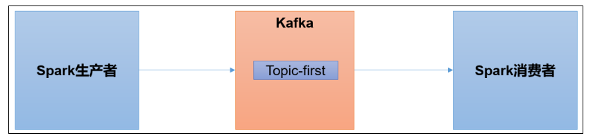

1）Scala 环境准备

2）Spark 环境准备

（1）创建一个 maven 项目 spark-kafka

（2）在项目 spark-kafka 上点击右键，Add Framework Support=》勾选 scala

（3）在 main 下创建 scala 文件夹，并右键 Mark Directory as Sources Root=>在 scala 下创建包名为 com.atguigu.spark

（4）添加配置文件

```xml
<dependencies>
    <dependency>
        <groupId>org.apache.spark</groupId>
        <artifactId>spark-streaming-kafka-0-10_2.12</artifactId>
        <version>3.0.0</version>
    </dependency>
</dependencies>
```

（5）将 log4j.properties 文件添加到 resources 里面，就能更改打印日志的级别为 error

```properties
log4j.rootLogger=error, stdout,R
log4j.appender.stdout=org.apache.log4j.ConsoleAppender
log4j.appender.stdout.layout=org.apache.log4j.PatternLayout
log4j.appender.stdout.layout.ConversionPattern=%d{yyyy-MM-dd HH:mm:ss,SSS} %5p --- [%50t] %-80c(line:%5L) : %m%n
log4j.appender.R=org.apache.log4j.RollingFileAppender
log4j.appender.R.File=../log/agent.log
log4j.appender.R.MaxFileSize=1024KB
log4j.appender.R.MaxBackupIndex=1
log4j.appender.R.layout=org.apache.log4j.PatternLayout
log4j.appender.R.layout.ConversionPattern=%d{yyyy-MM-dd HH:mm:ss,SSS} %5p --- [%50t] %-80c(line:%6L) : %m%n
```

## 4.1 Spark 生产者

（1）在 com.atguigu.spark 包下创建 scala Object：SparkKafkaProducer

```scala
package com.atguigu.spark
import java.util.Properties
import org.apache.kafka.clients.producer.{KafkaProducer,ProducerRecord}

object SparkKafkaProducer {
    def main(args: Array[String]): Unit = {
        // 0 kafka 配置信息
        val properties = new Properties()
        properties.put(ProducerConfig.BOOTSTRAP_SERVERS_CONFIG,"hadoop102:9092,hadoop103:9092,hadoop104:9092")
        properties.put(ProducerConfig.KEY_SERIALIZER_CLASS_CONFIG,classOf[StringSerializer])
        properties.put(ProducerConfig.VALUE_SERIALIZER_CLASS_CONFIG,classOf[StringSerializer])
        // 1 创建 kafka 生产者
        var producer = new KafkaProducer[String, String](properties)
        // 2 发送数据
        for (i <- 1 to 5){
            producer.send(new ProducerRecord[String,String]("first","atguigu" + i))
        }
        // 3 关闭资源
        producer.close()
    }
}
```

（2）启动 Kafka 消费者

```sh
[atguigu@hadoop104 kafka]$ bin/kafka-console-consumer.sh --bootstrap-server hadoop102:9092 --topic first
```

（3）执行 SparkKafkaProducer 程序，观察 kafka 消费者控制台情况

## 4.2 Spark 消费者

（1）添加配置文件

```xml
<dependencies>
    <dependency>
        <groupId>org.apache.spark</groupId>
        <artifactId>spark-streaming-kafka-0-10_2.12</artifactId>
        <version>3.0.0</version>
    </dependency>
    <dependency>
        <groupId>org.apache.spark</groupId>
        <artifactId>spark-core_2.12</artifactId>
        <version>3.0.0</version>
    </dependency>
    <dependency>
        <groupId>org.apache.spark</groupId>
        <artifactId>spark-streaming_2.12</artifactId>
        <version>3.0.0</version>
    </dependency>
</dependencies>
```

（2）在 com.atguigu.spark 包下创建 scala Object：SparkKafkaConsumer

```scala
package com.atguigu.spark
import org.apache.kafka.clients.consumer.{ConsumerConfig, ConsumerRecord}
import org.apache.kafka.common.serialization.StringDeserializer
import org.apache.spark.SparkConf
import org.apache.spark.streaming.dstream.{DStream, InputDStream}
import org.apache.spark.streaming.{Seconds, StreamingContext}
import org.apache.spark.streaming.kafka010.{ConsumerStrategies, KafkaUtils, LocationStrategies}

object SparkKafkaConsumer {
    def main(args: Array[String]): Unit = {
        //1.创建 SparkConf
        val sparkConf:SparkConf = new SparkConf().setAppName("sparkstreaming").setMaster("local[*]")
        
        //2.创建 StreamingContext
        val ssc = new StreamingContext(sparkConf, Seconds(3))
        //3.定义 Kafka 参数：kafka 集群地址、消费者组名称、key 序列化、value 序列化
        val kafkaPara: Map[String, Object] = Map[String, Object](
            ConsumerConfig.BOOTSTRAP_SERVERS_CONFIG-> "hadoop102:9092,hadoop103:9092,hadoop104:9092",
            ConsumerConfig.GROUP_ID_CONFIG -> "atguiguGroup",
            ConsumerConfig.KEY_DESERIALIZER_CLASS_CONFIG -> classOf[StringDeserializer],
ConsumerConfig.VALUE_DESERIALIZER_CLASS_CONFIG -> classOf[StringDeserializer]
)
        ///4.读取 Kafka 数据创建 DStream

        val kafkaDStream:InputDStream[ConsumerRecord[String,String]]=KafkaUtils.createDirectStream[String, String](ssc,LocationStrategies.PreferConsistent, //优先位置
ConsumerStrategies.Subscribe[String, String](Set("first"), kafkaPara)// 消费策略：（订阅多个主题，配置参数）
)
        //5.将每条消息的 KV 取出
        val valueDStream: DStream[String] = kafkaDStream.map(record => record.value())
        //6.计算 WordCount
        valueDStream.print()
        //7.开启任务
        ssc.start()
        ssc.awaitTermination()
    }
}
```

（3）启动 SparkKafkaConsumer 消费者

（4）启动 kafka 生产者

```sh
[atguigu@hadoop103 kafka]$ bin/kafka-console-producer.sh --bootstrap-server hadoop102:9092 --topic first
```

（5）观察 IDEA 控制台数据打印


# 三、KAFKA生产调优手册

# 第 1 章 Kafka 硬件配置选择

## 1.1 场景说明

> 100 万日活，每人每天 100 条日志，每天总共的日志条数是 100 万 * 100 条 = 1 亿条。
>
> 1 亿/24 小时/60 分/60 秒 = 1150 条/每秒钟。
>
> 每条日志大小：0.5k - 2k（取 1k）。
>
> 1150 条/每秒钟 * 1k ≈ 1m/s 。
>
> 高峰期每秒钟：1150 条 * 20 倍 = 23000 条。
>
> 每秒多少数据量：20MB/s。

## 1.2 服务器台数选择

> 服务器台数 = 2 * （生产者峰值生产速率 * 副本 / 100） + 1
>
> ​				  = 2 * （20m/s * 2 / 100） + 1
>
> ​                  = 3 台
>
> 建议 3 台服务器。

## 1.3 磁盘选择

> kafka 底层主要是**顺序写**，固态硬盘和机械硬盘的顺序写速度差不多。
>
> **建议选择普通的机械硬盘。**
>
> 每天总数据量：1 亿条 * 1k ≈ 100g
>
> 100g * 副本 2 * 保存时间 3 天 / 0.7 ≈ 1T
>
> 建议三台服务器硬盘总大小，大于等于 1T。

## 1.4 内存选择

Kafka 内存组成：堆内存 + 页缓存


1）Kafka 堆内存建议每个节点：10g ~ 15g

在 kafka-server-start.sh 中修改

```sh
if [ "x$KAFKA_HEAP_OPTS" = "x" ]; then
export KAFKA_HEAP_OPTS="-Xmx10G -Xms10G"
fi
```

（1）查看 Kafka 进程号

```sh
[atguigu@hadoop102 kafka]$ jps
2321 Kafka
5255 Jps
1931 QuorumPeerMain
```

（2）根据 Kafka 进程号，查看 Kafka 的 GC 情况

```sh
[atguigu@hadoop102 kafka]$ jstat -gc 2321 1s 10
```


参数说明：

> S0C：第一个幸存区的大小；S1C：第二个幸存区的大小
>
> S0U：第一个幸存区的使用大小； S1U：第二个幸存区的使用大小
>
> EC：伊甸园区的大小； EU：伊甸园区的使用大小
>
> OC：老年代大小； OU：老年代使用大小
>
> MC：方法区大小； MU：方法区使用大小
>
> CCSC:压缩类空间大小； CCSU:压缩类空间使用大小
>
> **YGC：年轻代垃圾回收次数**； YGCT：年轻代垃圾回收消耗时间
>
> FGC：老年代垃圾回收次数； FGCT：老年代垃圾回收消耗时间
>
> GCT：垃圾回收消耗总时间；

（3）根据 Kafka 进程号，查看 Kafka 的堆内存

```sh
[atguigu@hadoop102 kafka]$ jmap -heap 2321
Attaching to process ID 2321, please wait...
Debugger attached successfully.
Server compiler detected.
JVM version is 25.212-b10
using thread-local object allocation.
Garbage-First (G1) GC with 8 thread(s)
Heap Configuration:

	MinHeapFreeRatio = 40
	MaxHeapFreeRatio = 70
	MaxHeapSize = 2147483648 (2048.0MB)
	NewSize = 1363144 (1.2999954223632812MB)
	MaxNewSize = 1287651328 (1228.0MB)
	OldSize = 5452592 (5.1999969482421875MB)
	NewRatio = 2
	SurvivorRatio = 8
	MetaspaceSize = 21807104 (20.796875MB)
	CompressedClassSpaceSize = 1073741824 (1024.0MB)
	MaxMetaspaceSize = 17592186044415 MB
	G1HeapRegionSize = 1048576 (1.0MB)

Heap Usage:
G1 Heap:
	regions = 2048
	capacity = 2147483648 (2048.0MB)
	used = 246367744 (234.95458984375MB)
	free = 1901115904 (1813.04541015625MB)
	11.472392082214355% used

G1 Young Generation:
Eden Space:
	regions = 83
	capacity = 105906176 (101.0MB)
	used = 87031808 (83.0MB)
	free = 18874368 (18.0MB)
	82.17821782178218% used

Survivor Space:
	regions = 7
	capacity = 7340032 (7.0MB)
	used = 7340032 (7.0MB)
	free = 0 (0.0MB)
	100.0% used

G1 Old Generation:
	regions = 147
	capacity = 2034237440 (1940.0MB)
	used = 151995904 (144.95458984375MB)
	free = 1882241536 (1795.04541015625MB)
	7.471886074420103% used

13364 interned Strings occupying 1449608 bytes.
```

2）页缓存：页缓存是 Linux 系统服务器的内存。我们只需要保证 1 个 segment（1g）中25%的数据在内存中就好。

每个节点页缓存大小 =（分区数 * 1g * 25%）/ 节点数。例如 10 个分区，页缓存大小 =（10 * 1g * 25%）/ 3 ≈ 1g

建议服务器内存大于等于 11G。

## 1.5 CPU 选择

> num.io.threads = 8 负责写磁盘的线程数，整个参数值要占总核数的 50%。
>
> num.replica.fetchers = 1 副本拉取线程数，这个参数占总核数的 50%的 1/3。
>
> num.network.threads = 3 数据传输线程数，这个参数占总核数的 50%的 2/3。
>
> 建议 32 个 cpu core。

## 1.6 网络选择

网络带宽 = 峰值吞吐量 ≈ 20MB/s 选择千兆网卡即可。

100Mbps 单位是 bit；

10M/s 单位是 byte ; 

1byte = 8bit，

100Mbps/8 = 12.5M/s。

一般百兆的网卡（100Mbps ）、千兆的网卡（1000Mbps）、万兆的网卡（10000Mbps）。

# 第 2 章 Kafka 生产者

> 3.1.1 Updating Broker Configs
>
> From Kafka version 1.1 onwards, some of the broker configs can be updated without restarting the broker. See the Dynamic Update Mode column in Broker Configs for the update mode of each broker config.
>
> read-only: Requires a broker restart for update
>
> per-broker: May be updated dynamically for each broker
>
> cluster-wide: May be updated dynamically as a cluster-wide default.
>
> May also be updated as a per-broker value for testing.

## 2.1 Kafka 生产者核心参数配置

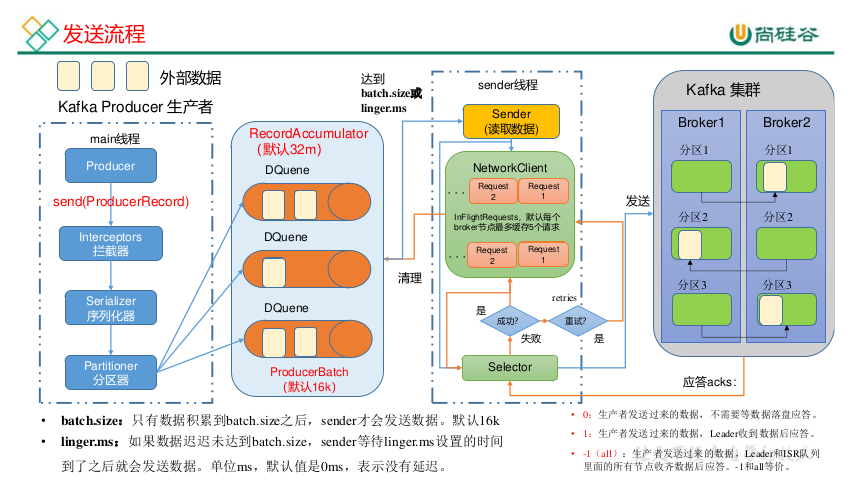

| 参数名称                              | 描述                                                         |
| ------------------------------------- | ------------------------------------------------------------ |
| bootstrap.servers                     | 生产者连接集群所需的 broker 地址清单。例如hadoop102:9092,hadoop103:9092,hadoop104:9092，可以设置1 个或者多个，中间用逗号隔开。注意这里并非 需要所有的 broker 地址，因为生产者从给定的 broker里查找到其他 broker 信息。 |
| key.serializer 和 value.serializer    | 指定发送消息的 key 和 value 的序列化类型。一定要写全类名。   |
| buffer.memory                         | RecordAccumulator 缓冲区总大小，默认32m。                    |
| batch.size                            | 缓冲区一批数据最大值，默认16k。适当增加该值，可以提高吞吐量，但是如果该值设置太大，会导致数据传输延迟增加。 |
| linger.ms                             | 如果数据迟迟未达到 batch.size，sender 等待 linger.time之后就会发送数据。单位 ms，默认值是0ms，表示没有延迟。生产环境建议该值大小为5-100ms 之间。 |
| acks                                  | 0：生产者发送过来的数据，不需要等数据落盘应答。<br>1：生产者发送过来的数据，Leader 收到数据后应答。<br>-1（all）：生产者发送过来的数据，Leader+和 isr 队列里面的所有节点收齐数据后应答。默认值是-1，-1 和all 是等价的。 |
| max.in.flight.requests.per.connection | 允许最多没有返回 ack 的次数，默认为5，开启幂等性要保证该值是1-5 的数字。 |
| retries                               | 当消息发送出现错误的时候，系统会重发消息。retries表示重试次数。默认是 int 最大值，2147483647。如果设置了重试，还想保证消息的有序性，需要设置MAX_IN_FLIGHT_REQUESTS_PER_CONNECTION=1否则在重试此失败消息的时候，其他的消息可能发送成功了。 |
| retry.backoff.ms                      | 两次重试之间的时间间隔，默认是100ms。                        |
| enable.idempotence                    | 是否开启幂等性，默认 true，开启幂等性。                      |
| compression.type                      | 生产者发送的所有数据的压缩方式。默认是 none，也就是不压缩。支持压缩类型：none、gzip、snappy、lz4 和 zstd。 |

## 2.2 生产者如何提高吞吐量

详见，尚硅谷大数据技术之 Kafka3.0.0

| 参数名称                        | 描述                                                         |
| ------------------------------- | ------------------------------------------------------------ |
| buffer.memory RecordAccumulator | 缓冲区总大小，默认 32m。                                     |
| batch.size                      | 缓冲区一批数据最大值，默认 16k。适当增加该值，可以提高吞吐量，但是如果该值设置太大，会导致数据传输延迟增加。 |
| linger.ms                       | 如果数据迟迟未达到 batch.size，sender 等待 linger.time之后就会发送数据。单位 ms，默认值是 0ms，表示没有延迟。生产环境建议该值大小为 5-100ms 之间。 |
| compression.type                | 生产者发送的所有数据的压缩方式。默认是 none，也就是不压缩。支持压缩类型：none、gzip、snappy、lz4 和 zstd。 |


## 2.3 数据可靠性

详见，尚硅谷大数据技术之 Kafka3.0.0

| 参数名称 | 描述                                                         |
| -------- | ------------------------------------------------------------ |
| acks     | 0：生产者发送过来的数据，不需要等数据落盘应答。<br/>1：生产者发送过来的数据，Leader 收到数据后应答。<br/>-1（all）：生产者发送过来的数据，Leader+和 isr 队列里面的所有节点收齐数据后应答。默认值是-1， -1 和 all是等价的。 |

⚫ 至少一次（At Least Once）= ACK 级别设置为-1 + 分区副本大于等于 2 + ISR 里应答的最小副本数量大于等于 2

## 2.4 数据去重

详见，尚硅谷大数据技术之 Kafka3.0.0

1）配置参数

| 参数名称           | 描述                                        |
| ------------------ | ------------------------------------------- |
| enable.idempotence | 是否开启幂等性，默认 true，表示开启幂等性。 |

2）Kafka 的事务一共有如下 5 个 API

```java
// 1 初始化事务
void initTransactions();
// 2 开启事务
void beginTransaction() throws ProducerFencedException;
// 3 在事务内提交已经消费的偏移量（主要用于消费者）
void sendOffsetsToTransaction(Map<TopicPartition, OffsetAndMetadata> offsets,String consumerGroupId) throws ProducerFencedException;
// 4 提交事务
void commitTransaction() throws ProducerFencedException;
// 5 放弃事务（类似于回滚事务的操作）
void abortTransaction() throws ProducerFencedException;
```

## 2.5 数据有序

> 详见，尚硅谷大数据技术之 Kafka3.0.0
>
> 单分区内，有序（有条件的，不能乱序）；多分区，分区与分区间无序；

## 2.6 数据乱序

详见，尚硅谷大数据技术之 Kafka3.0.0

| 参数名称                              | 描述                                                         |
| ------------------------------------- | ------------------------------------------------------------ |
| enable.idempotence                    | 是否开启幂等性，默认 true，表示开启幂等性。                  |
| max.in.flight.requests.per.connection | 允许最多没有返回 ack 的次数，默认为 5，开启幂等性要保证该值是 1-5 的数字。 |

# 第 3 章 Kafka Broker

## 3.1 Broker 核心参数配置

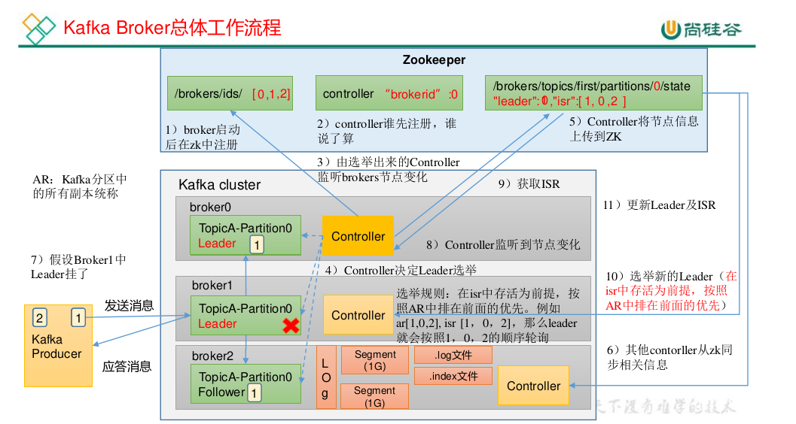

| 参数名称                                | 描述                                                         |
| --------------------------------------- | ------------------------------------------------------------ |
| replica.lag.time.max.ms                 | ISR 中，如果 Follower 长时间未向 Leader 发送通信请求或同步数据，则该 Follower 将被踢出 ISR。该时间阈值，默认30s。 |
| auto.leader.rebalance.enable            | 默认是 true。自动 Leader Partition 平衡。                    |
| leader.imbalance.per.broker.percentage  | 默认是10%。每个 broker 允许的不平衡的 leader的比率。如果每个 broker 超过了这个值，控制器会触发 leader 的平衡。 |
| leader.imbalance.check.interval.seconds | 默认值300 秒。检查 leader 负载是否平衡的间隔时间。           |
| log.segment.bytes                       | Kafka 中 log 日志是分成一块块存储的，此配置是指 log 日志划分成块的大小，默认值1G。 |
| log.index.interval.bytes                | 默认4kb，kafka 里面每当写入了4kb 大小的日志（.log），然后就往 index 文件里面记录一个索引。 |
| log.retention.hours                     | Kafka 中数据保存的时间，默认7 天。                           |
| log.retention.minutes                   | Kafka 中数据保存的时间，分钟级别，默认关闭。                 |
| log.retention.ms                        | Kafka 中数据保存的时间，毫秒级别，默认关闭。                 |
| log.retention.check.interval.ms         | 检查数据是否保存超时的间隔，默认是5 分钟。                   |
| log.retention.bytes                     | 默认等于-1，表示无穷大。超过设置的所有日志总大小，删除最早的 segment。 |
| log.cleanup.policy                      | 默认是 delete，表示所有数据启用删除策略；如果设置值为 compact，表示所有数据启用压缩策略。 |
| num.io.threads                          | 默认是8。负责写磁盘的线程数。整个参数值要占总核数的50%。     |
| num.replica.fetchers                    | 副本拉取线程数，这个参数占总核数的50%的1/3                   |
| num.network.threads                     | 默认是3。数据传输线程数，这个参数占总核数的50%的2/3 。       |
| log.flush.interval.messages             | 强制页缓存刷写到磁盘的条数，默认是 long 的最大值，9223372036854775807。一般不建议修改，交给系统自己管理。 |
| log.flush.interval.ms                   | 每隔多久，刷数据到磁盘，默认是 null。一般不建议修改，交给系统自己管理。 |

## 3.2 服役新节点/退役旧节点

详见，尚硅谷大数据技术之 Kafka3.0.0

（1）创建一个要均衡的主题。

```sh
[atguigu@hadoop102 kafka]$ vim topics-to-move.json
```

```json
{
    "topics": [
        {"topic": "first"}
    ],
    "version": 1
}
```

（2）生成一个负载均衡的计划。

```sh
[atguigu@hadoop102 kafka]$ bin/kafka-reassign-partitions.sh --bootstrap-server hadoop102:9092
--topics-to-move-json-file topics-to-move.json --broker-list "0,1,2,3" --generate
```

（3）创建副本存储计划（所有副本存储在 broker0、broker1、broker2、broker3 中）。

```sh
[atguigu@hadoop102 kafka]$ vim increase-replication-factor.json
```

（4）执行副本存储计划。

```sh
[atguigu@hadoop102 kafka]$ bin/kafka-reassign-partitions.sh --bootstrap-server hadoop102:9092 --reassignment-json-file increase-replication-factor.json --execute
```

（5）验证副本存储计划。

```sh
[atguigu@hadoop102 kafka]$ bin/kafka-reassign-partitions.sh --bootstrap-server hadoop102:9092 --reassignment-json-file increase-replication-factor.json --verify
```

## 3.3 增加分区

详见，尚硅谷大数据技术之 Kafka3.0.0

1）修改分区数（注意：分区数只能增加，不能减少）

```sh
[atguigu@hadoop102 kafka]$ bin/kafka-topics.sh --bootstrap-server hadoop102:9092 --alter --topic first --partitions 3
```

## 3.4 增加副本因子

详见，尚硅谷大数据技术之 Kafka3.0.0

1）创建 topic

```sh
[atguigu@hadoop102 kafka]$ bin/kafka-topics.sh --bootstrap-server hadoop102:9092 --create --partitions 3 --replication-factor 1 --topic four
```

2）手动增加副本存储

（1）创建副本存储计划（所有副本都指定存储在 broker0、broker1、broker2 中）。

```sh
[atguigu@hadoop102 kafka]$ vim increase-replication-factor.json
```

输入如下内容：

```json
{"version":1,"partitions":[{"topic":"four","partition":0,"replicas":[0,1,2]},{"topic":"four","partition":1,"replicas":[0,1,2]},{"topic":"four","partition":2,"replicas":[0,1,2]}]}
```

（2）执行副本存储计划。

```sh
[atguigu@hadoop102 kafka]$ bin/kafka-reassign-partitions.sh --bootstrap-server hadoop102:9092 --reassignment-json-file increase-replication-factor.json --execute
```

## 3.5 手动调整分区副本存储

详见，尚硅谷大数据技术之 Kafka3.0.0

（1）创建副本存储计划（所有副本都指定存储在 broker0、broker1 中）。

```sh
[atguigu@hadoop102 kafka]$ vim increase-replication-factor.json
```

输入如下内容：

```json
{
"version":1,
"partitions":[{"topic":"three","partition":0,"replicas":[0,1]},
{"topic":"three","partition":1,"replicas":[0,1]},
{"topic":"three","partition":2,"replicas":[1,0]},
{"topic":"three","partition":3,"replicas":[1,0]}]
}
```

（2）执行副本存储计划。

```sh
[atguigu@hadoop102 kafka]$ bin/kafka-reassign-partitions.sh --bootstrap-server hadoop102:9092 --reassignment-json-file increase-replication-factor.json --execute
```

（3）验证副本存储计划。

```sh
[atguigu@hadoop102 kafka]$ bin/kafka-reassign-partitions.sh --bootstrap-server hadoop102:9092 --reassignment-json-file increase-replication-factor.json --verify
```

## 3.6 Leader Partition 负载平衡

详见，尚硅谷大数据技术之 Kafka3.0.0

| 参数名称                                | 描述                                                         |
| --------------------------------------- | ------------------------------------------------------------ |
| auto.leader.rebalance.enable            | 默认是 true。自动 Leader Partition 平衡。生产环境中，leader 重选举的代价比较大，可能会带来性能影响，建议设置为 false 关闭。 |
| leader.imbalance.per.broker.percentage  | 默认是10%。每个 broker 允许的不平衡的 leader的比率。如果每个 broker 超过了这个值，控制器会触发 leader 的平衡。 |
| leader.imbalance.check.interval.seconds | 默认值300 秒。检查 leader 负载是否平衡的间隔时间。           |

## 3.7 自动创建主题

如果 broker 端配置参数 auto.create.topics.enable 设置为 true（默认值是 true），那么当生产者向一个未创建的主题发送消息时，会自动创建一个分区数为 num.partitions（默认值为1）、副本因子为 default.replication.factor（默认值为1）的主题。除此之外，当一个消费者开始从未知主题中读取消息时，或者当任意一个客户端向未知主题发送元数据请求时，都会自动创建一个相应主题。这种创建主题的方式是非预期的，增加了主题管理和维护的难度。生产环境建议将该参数设置为 false。

1）向一个没有提前创建 five 主题发送数据

```sh
[atguigu@hadoop102 kafka]$ bin/kafka-console-producer.s --bootstrap-server hadoop102:9092 --topic five
>hello world
```

2）查看 five 主题的详情

```sh
[atguigu@hadoop102 kafka]$ bin/kafka-topics.sh --bootstrap-server hadoop102:9092 --describe --topic five
```

# 第 4 章 Kafka 消费者

## 4.1 Kafka 消费者核心参数配置

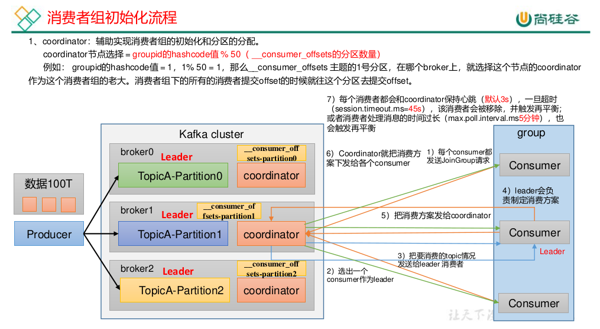

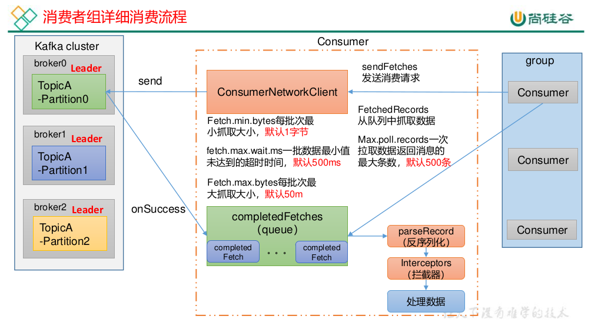

| 参数名称                             | 描述                                                         |
| ------------------------------------ | ------------------------------------------------------------ |
| bootstrap.servers                    | 向 Kafka 集群建立初始连接用到的 host/port 列表。             |
| key.deserializer和value.deserializer | 指定接收消息的 key 和 value 的反序列化类型。一定要写全类名。 |
| group.id                             | 标记消费者所属的消费者组。                                   |
| enable.auto.commit                   | 默认值为 true，消费者会自动周期性地向服务器提交偏移量。      |
| auto.commit.interval.ms              | 如果设置了 enable.auto.commit 的值为 true，则该值定义了消费者偏移量向 Kafka 提交的频率，默认5s。 |
| auto.offset.reset                    | 当 Kafka 中没有初始偏移量或当前偏移量在服务器中不存在（如，数据被删除了），该如何处理？ earliest：自动重置偏移量到最早的偏移量。 latest：默认，自动重置偏移量为最新的偏移量。 none：如果消费组原来的（previous）偏移量不存在，则向消费者抛异常。 anything：向消费者抛异常。 |
| offsets.topic.num.partitions         | __consumer_offsets 的分区数，默认是50 个分区。               |
| heartbeat.interval.ms                | Kafka 消费者和 coordinator 之间的心跳时间，默认3s。该条目的值必须小于 session.timeout.ms ，也不应该高于session.timeout.ms 的1/3。 |
| session.timeout.ms                   | Kafka 消费者和 coordinator 之间连接超时时间，默认45s。超过该值，该消费者被移除，消费者组执行再平衡。 |
| max.poll.interval.ms                 | 消费者处理消息的最大时长，默认是5 分钟。超过该值，该消费者被移除，消费者组执行再平衡。 |
| fetch.min.bytes                      | 默认1 个字节。消费者获取服务器端一批消息最小的字节数。       |
| fetch.max.wait.ms                    | 默认500ms。如果没有从服务器端获取到一批数据的最小字节数。该时间到，仍然会返回数据。 |
| fetch.max.bytes                      | 默认 Default: 52428800（50 m）。消费者获取服务器端一批消息最大的字节数。如果服务器端一批次的数据大于该值（50m）仍然可以拉取回来这批数据，因此，这不是一个绝对最大值。一批次的大小受 message.max.bytes （broker config）or max.message.bytes （topic config）影响。 |
| max.poll.records                     | 一次 poll 拉取数据返回消息的最大条数，默认是500 条。         |


## 4.2 消费者再平衡

详见，尚硅谷大数据技术之 Kafka3.0.0

| 参数名称                      | 描述                                                         |
| ----------------------------- | ------------------------------------------------------------ |
| heartbeat.interval.ms         | Kafka 消费者和 coordinator 之间的心跳时间，默认3s。该条目的值必须小于 session.timeout.ms，也不应该高于session.timeout.ms 的1/3。 |
| session.timeout.ms            | Kafka 消费者和 coordinator 之间连接超时时间，默认45s。超过该值，该消费者被移除，消费者组执行再平衡。 |
| max.poll.interval.ms          | 消费者处理消息的最大时长，默认是5 分钟。超过该值，该消费者被移除，消费者组执行再平衡。 |
| partition.assignment.strategy | 消费者分区分配策略，默认策略是 Range + CooperativeSticky。Kafka 可以同时使用多个分区分配策略。可以选择的策略包括： Range 、 RoundRobin 、 Sticky 、CooperativeSticky |


## 4.3 指定 Offset 消费

详见，尚硅谷大数据技术之 Kafka3.0.0

```java
kafkaConsumer.seek(topic, 1000);
```

## 4.4 指定时间消费

详见，尚硅谷大数据技术之 Kafka3.0.0

```java
HashMap<TopicPartition, Long> timestampToSearch = new HashMap<>();
timestampToSearch.put(topicPartition, System.currentTimeMillis() -1 * 24 * 3600 * 1000);
kafkaConsumer.offsetsForTimes(timestampToSearch);
```

## 4.5 消费者事务

详见，尚硅谷大数据技术之 Kafka3.0.0

## 4.6 消费者如何提高吞吐量

详见，尚硅谷大数据技术之 Kafka3.0.0

增加分区数；

```sh
[atguigu@hadoop102 kafka]$ bin/kafka-topics.sh --bootstrap-server hadoop102:9092 --alter --topic first --partitions 3
```

| 参数名称         | 描述                                                         |
| ---------------- | ------------------------------------------------------------ |
| fetch.max.bytes  | 默认 Default: 52428800（50 m）。消费者获取服务器端一批消息最大的字节数。如果服务器端一批次的数据大于该值（50m）仍然可以拉取回来这批数据，因此，这不是一个绝对最大值。一批次的大小受 message.max.bytes （broker config）or max.message.bytes （topic config）影响。 |
| max.poll.records | 一次 poll 拉取数据返回消息的最大条数，默认是 500 条          |

# 第 5 章 Kafka 总体

## 5.1 如何提升吞吐量

如何提升吞吐量？

1）提升生产吞吐量

> （1）buffer.memory：发送消息的缓冲区大小，默认值是 32m，可以增加到 64m。
>
> （2） batch.size：默认是 16k。如果 batch 设置太小，会导致频繁网络请求，吞吐量下降；如果 batch 太大，会导致一条消息需要等待很久才能被发送出去，增加网络延时。
>
> （3）linger.ms，这个值默认是 0，意思就是消息必须立即被发送。一般设置一个 5-100毫秒。如果 linger.ms 设置的太小，会导致频繁网络请求，吞吐量下降；如果 linger.ms 太长，会导致一条消息需要等待很久才能被发送出去，增加网络延时。
>
> （4）compression.type：默认是 none，不压缩，但是也可以使用 lz4 压缩，效率还是不错的，压缩之后可以减小数据量，提升吞吐量，但是会加大 producer 端的 CPU 开销。

2）增加分区

3）消费者提高吞吐量

> （1）调整 fetch.max.bytes 大小，默认是 50m。
>
> （2）调整 max.poll.records 大小，默认是 500 条。

4）增加下游消费者处理能力

## 5.2 数据精准一次

1）生产者角度

> ⚫acks 设置为-1 （acks=-1）。
>
> ⚫幂等性（enable.idempotence = true） + 事务 。

2）broker 服务端角度

> ⚫ 分区副本大于等于 2 （--replication-factor 2）。
>
> ⚫ ISR 里应答的最小副本数量大于等于 2 （min.insync.replicas = 2）。

3）消费者

> ⚫ 事务 + 手动提交 offset （enable.auto.commit = false）。
>
> ⚫ 消费者输出的目的地必须支持事务（MySQL、Kafka）。

## 5.3 合理设置分区数

> （1）创建一个只有 1 个分区的 topic。
>
> （2）测试这个 topic 的 producer 吞吐量和 consumer 吞吐量。
>
> （3）假设他们的值分别是 Tp 和 Tc，单位可以是 MB/s。
>
> （4）然后假设总的目标吞吐量是 Tt，那么分区数 = Tt / min（Tp，Tc）。

> 例如：producer 吞吐量 = 20m/s；consumer 吞吐量 = 50m/s，期望吞吐量 100m/s；
>
> 分区数 = 100 / 20 = 5 分区
>
> 分区数一般设置为：3-10 个
>
> 分区数不是越多越好，也不是越少越好，需要搭建完集群，进行压测，再灵活调整分区个数。

> KAFKA集群吞吐量测试
>
> ```sh
> # 选择主题
> bin/kafka-topics.sh --zookeeper master:2181 --list
> 
> #执行生产者测试脚本
> bin/kafka-producer-perf-test.sh --topic test --num-records 500000 --record-size 200 --througthput -1 --producer-props bootstrap.servers=slave1=9092,slave3=9092 acks=1
> 
> # 执行消费者测试脚本 
> bin/kafka-consumer-perfs-test.sh --broker-list bd-master:9092,bd-slave1=9092,bd-slave3=9092 --message-size 200 --messages 500000 --topic test
> ```
>

## 5.4 单条日志大于 1m

| 参数名称                | 描述                                                         |
| ----------------------- | ------------------------------------------------------------ |
| message.max.bytes       | 默认 1m，broker 端接收每个批次消息最大值。                   |
| max.request.size        | 默认 1m，生产者发往 broker 每个请求消息最大值。针对 topic级别设置消息体的大小。 |
| replica.fetch.max.bytes | 默认 1m，副本同步数据，每个批次消息最大值。                  |
| fetch.max.bytes         | 默认 Default: 52428800（50 m）。消费者获取服务器端一批消息最大的字节数。如果服务器端一批次的数据大于该值（50m）仍然可以拉取回来这批数据，因此，这不是一个绝对最大值。一批次的大小受 message.max.bytes （broker config）or max.message.bytes （topic config）影响。 |

## 5.5 服务器挂了

在生产环境中，如果某个 Kafka 节点挂掉。

正常处理办法：

> （1）先尝试重新启动一下，如果能启动正常，那直接解决。
>
> （2）如果重启不行，考虑增加内存、增加 CPU、网络带宽。
>
> （3）如果将 kafka 整个节点误删除，如果副本数大于等于 2，可以按照服役新节点的方式重新服役一个新节点，并执行负载均衡。

## 5.6 集群压力测试

1）Kafka 压测

用 Kafka 官方自带的脚本，对 Kafka 进行压测。

> ⚫ 生产者压测：kafka-producer-perf-test.sh
>
> ⚫ 消费者压测：kafka-consumer-perf-test.sh

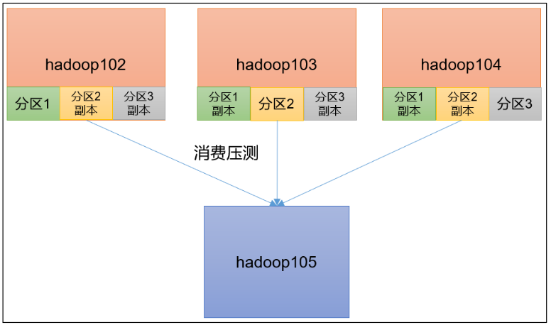

2）Kafka Producer 压力测试

（1）创建一个 test topic，设置为 3 个分区 3 个副本

```sh
[atguigu@hadoop102 kafka]$ bin/kafka-topics.sh --bootstrap-server hadoop102:9092 --create --replication-factor 3 --partitions 3 --topic test
```

（2）在/opt/module/kafka/bin 目录下面有这两个文件。我们来测试一下

```sh
[atguigu@hadoop105 kafka]$ bin/kafka-producer-perf-test.sh --topic test --record-size 1024 --num-records 1000000 --throughput 10000 --producer-props bootstrap.servers=hadoop102:9092,hadoop103:9092,hadoop104:9092 batch.size=16384 linger.ms=0
```

参数说明：

> ⚫ record-size 是一条信息有多大，单位是字节，本次测试设置为 1k。
>
> ⚫ num-records 是总共发送多少条信息，本次测试设置为 100 万条。
>
> ⚫ throughput 是每秒多少条信息，设成-1，表示不限流，尽可能快的生产数据，可测出生产者最大吞吐量。本次实验设置为每秒钟 1 万条。
>
> ⚫producer-props 后面可以配置生产者相关参数，batch.size 配置为 16k。

输出结果：

```sh
ap.servers=hadoop102:9092,hadoop103:9092,hadoop104:9092 batch.size=16384
linger.ms=0
37021 records sent, 7401.2 records/sec (7.23 MB/sec), 1136.0 ms avg latency,
1453.0 ms max latency.
50535 records sent, 10107.0 records/sec (9.87 MB/sec), 1199.5 ms avg
latency, 1404.0 ms max latency.
47835 records sent, 9567.0 records/sec (9.34 MB/sec), 1350.8 ms avg latency,
1570.0 ms max latency.
。。。 。。。
42390 records sent, 8444.2 records/sec (8.25 MB/sec), 3372.6 ms avg latency,
4008.0 ms max latency.
37800 records sent, 7558.5 records/sec (7.38 MB/sec), 4079.7 ms avg latency,
4758.0 ms max latency.
33570 records sent, 6714.0 records/sec (6.56 MB/sec), 4549.0 ms avg latency,
5049.0 ms max latency.
1000000 records sent, 9180.713158 records/sec (8.97 MB/sec), 1894.78 ms
avg latency, 5049.00 ms max latency, 1335 ms 50th, 4128 ms 95th, 4719 ms
99th, 5030 ms 99.9th.
```

（3）调整 batch.size 大小

①batch.size 默认值是 16k。本次实验 batch.size 设置为 32k。

```sh
[atguigu@hadoop105 kafka]$ bin/kafka-producer-perf-test.sh --topic test --record-size 1024 --num-records 1000000 --throughput 10000 --producer-props bootstrap.servers=hadoop102:9092,hadoop103:9092,hadoop104:9092
batch.size=32768 linger.ms=0
```

输出结果：

```sh
49922 records sent, 9978.4 records/sec (9.74 MB/sec), 64.2 ms avg latency,
340.0 ms max latency.
49940 records sent, 9988.0 records/sec (9.75 MB/sec), 15.3 ms avg latency,
31.0 ms max latency.
50018 records sent, 10003.6 records/sec (9.77 MB/sec), 16.4 ms avg latency,
52.0 ms max latency.
。。。 。。。
49960 records sent, 9992.0 records/sec (9.76 MB/sec), 17.2 ms avg latency,
40.0 ms max latency.
50090 records sent, 10016.0 records/sec (9.78 MB/sec), 16.9 ms avg latency,
47.0 ms max latency.
1000000 records sent, 9997.600576 records/sec (9.76 MB/sec), 20.20 ms avg
latency, 340.00 ms max latency, 16 ms 50th, 30 ms 95th, 168 ms 99th, 249
ms 99.9th.
```

②batch.size 默认值是 16k。本次实验 batch.size 设置为 4k。

```sh
[atguigu@hadoop105 kafka]$ bin/kafka-producer-perf-test.sh --topic test --record-size 1024 --num-records 1000000 --throughput 10000 --producer-props bootstrap.servers=hadoop102:9092,hadoop103:9092,hadoop104:9092 batch.size=4096 linger.ms=0
```

输出结果：

```sh
15598 records sent, 3117.1 records/sec (3.04 MB/sec), 1878.3 ms avg latency,
3458.0 ms max latency.
17748 records sent, 3549.6 records/sec (3.47 MB/sec), 5072.5 ms avg latency,
6705.0 ms max latency.
18675 records sent, 3733.5 records/sec (3.65 MB/sec), 6800.9 ms avg latency,
7052.0 ms max latency.
。。。 。。。
19125 records sent, 3825.0 records/sec (3.74 MB/sec), 6416.5 ms avg latency,
7023.0 ms max latency.
1000000 records sent, 3660.201531 records/sec (3.57 MB/sec), 6576.68 ms
avg latency, 7677.00 ms max latency, 6745 ms 50th, 7298 ms 95th, 7507 ms
99th, 7633 ms 99.9th.
```

（4）调整 linger.ms 时间

linger.ms 默认是 0ms。本次实验 linger.ms 设置为 50ms。

```sh
[atguigu@hadoop105 kafka]$ bin/kafka-producer-perf-test.sh --topic test --record-size 1024 --num-records 1000000 --throughput 10000 --producer-props bootstrap.servers=hadoop102:9092,hadoop103:9092,hadoop104:9092
batch.size=4096 linger.ms=50
```

输出结果：

```sh
16804 records sent, 3360.1 records/sec (3.28 MB/sec), 1841.6 ms avg latency,
3338.0 ms max latency.
18972 records sent, 3793.6 records/sec (3.70 MB/sec), 4877.7 ms avg latency,
6453.0 ms max latency.
19269 records sent, 3852.3 records/sec (3.76 MB/sec), 6477.9 ms avg latency,
6686.0 ms max latency.
。。。 。。。
17073 records sent, 3414.6 records/sec (3.33 MB/sec), 6987.7 ms avg latency,
7353.0 ms max latency.
19326 records sent, 3865.2 records/sec (3.77 MB/sec), 6756.5 ms avg latency,
7357.0 ms max latency.
1000000 records sent, 3842.754486 records/sec (3.75 MB/sec), 6272.49 ms
avg latency, 7437.00 ms max latency, 6308 ms 50th, 6880 ms 95th, 7289 ms
99th, 7387 ms 99.9th.
```

（5）调整压缩方式

①默认的压缩方式是 none。本次实验 compression.type 设置为 snappy。

```sh
[atguigu@hadoop105 kafka]$ bin/kafka-producer-perf-test.sh --topic test --record-size 1024 --num-records 1000000 --throughput 10000 --producer-props bootstrap.servers=hadoop102:9092,hadoop103:9092,hadoop104:9092
batch.size=4096 linger.ms=50 compression.type=snappy
```

输出结果：

```sh
17244 records sent, 3446.0 records/sec (3.37 MB/sec), 5207.0 ms avg latency,
6861.0 ms max latency.
18873 records sent, 3774.6 records/sec (3.69 MB/sec), 6865.0 ms avg latency,
7094.0 ms max latency.
18378 records sent, 3674.1 records/sec (3.59 MB/sec), 6579.2 ms avg latency,
6738.0 ms max latency.

。。。 。。。

17631 records sent, 3526.2 records/sec (3.44 MB/sec), 6671.3 ms avg latency,
7566.0 ms max latency.
19116 records sent, 3823.2 records/sec (3.73 MB/sec), 6739.4 ms avg latency,
7630.0 ms max latency.
1000000 records sent, 3722.925028 records/sec (3.64 MB/sec), 6467.75 ms
avg latency, 7727.00 ms max latency, 6440 ms 50th, 7308 ms 95th, 7553 ms
99th, 7665 ms 99.9th.
```

②默认的压缩方式是 none。本次实验 compression.type 设置为 zstd。

```sh
[atguigu@hadoop105 kafka]$ bin/kafka-producer-perf-test.sh --topic test --record-size 1024 --num-records 1000000 --throughput 10000 --producer-props bootstrap.servers=hadoop102:9092,hadoop103:9092,hadoop104:9092
batch.size=4096 linger.ms=50 compression.type=zstd
```

输出结果：

```sh
23820 records sent, 4763.0 records/sec (4.65 MB/sec), 1580.2 ms avg latency,
2651.0 ms max latency.
29340 records sent, 5868.0 records/sec (5.73 MB/sec), 3666.0 ms avg latency,
4752.0 ms max latency.
28950 records sent, 5788.8 records/sec (5.65 MB/sec), 5785.2 ms avg latency,
6865.0 ms max latency.
。。。 。。。
29580 records sent, 5916.0 records/sec (5.78 MB/sec), 6907.6 ms avg latency,
7432.0 ms max latency.
29925 records sent, 5981.4 records/sec (5.84 MB/sec), 6948.9 ms avg latency,
7541.0 ms max latency.
1000000 records sent, 5733.583318 records/sec (5.60 MB/sec), 6824.75 ms
avg latency, 7595.00 ms max latency, 7067 ms 50th, 7400 ms 95th, 7500 ms
99th, 7552 ms 99.9th.
```

③默认的压缩方式是 none。本次实验 compression.type 设置为 gzip。

```sh
[atguigu@hadoop105 kafka]$ bin/kafka-producer-perf-test.sh --topic test --record-size 1024 --num-records 1000000 --throughput  10000 --producer-props  bootstrap.servers=hadoop102:9092,hadoop103:9092,hadoop104:9092
batch.size=4096 linger.ms=50 compression.type=gzip
```

输出结果：

```sh
27170 records sent, 5428.6 records/sec (5.30 MB/sec), 1374.0 ms avg latency,
2311.0 ms max latency.
31050 records sent, 6210.0 records/sec (6.06 MB/sec), 3183.8 ms avg latency,
4228.0 ms max latency.
32145 records sent, 6427.7 records/sec (6.28 MB/sec), 5028.1 ms avg latency,
6042.0 ms max latency.

。。。 。。。
31710 records sent, 6342.0 records/sec (6.19 MB/sec), 6457.1 ms avg latency,
6777.0 ms max latency.
31755 records sent, 6348.5 records/sec (6.20 MB/sec), 6498.7 ms avg latency,
6780.0 ms max latency.
32760 records sent, 6548.1 records/sec (6.39 MB/sec), 6375.7 ms avg latency,
6822.0 ms max latency.
1000000 records sent, 6320.153706 records/sec (6.17 MB/sec), 6155.42 ms
avg latency, 6943.00 ms max latency, 6437 ms 50th, 6774 ms 95th, 6863 ms
99th, 6912 ms 99.9th.
```

④默认的压缩方式是 none。本次实验 compression.type 设置为 lz4。

```sh
[atguigu@hadoop105 kafka]$ bin/kafka-producer-perf-test.sh --topic test --record-size 1024 --num-records 1000000 --throughput 10000
--producer-props bootstrap.servers=hadoop102:9092,hadoop103:9092,hadoop104:9092
batch.size=4096 linger.ms=50 compression.type=lz4
```

输出结果：

```sh
16696 records sent, 3339.2 records/sec (3.26 MB/sec), 1924.5 ms avg latency,
3355.0 ms max latency.
19647 records sent, 3928.6 records/sec (3.84 MB/sec), 4841.5 ms avg latency,
6320.0 ms max latency.
20142 records sent, 4028.4 records/sec (3.93 MB/sec), 6203.2 ms avg latency,
6378.0 ms max latency.
。。。 。。。
20130 records sent, 4024.4 records/sec (3.93 MB/sec), 6073.6 ms avg latency,
6396.0 ms max latency.
19449 records sent, 3889.8 records/sec (3.80 MB/sec), 6195.6 ms avg latency,
6500.0 ms max latency.
19872 records sent, 3972.8 records/sec (3.88 MB/sec), 6274.5 ms avg latency,
6565.0 ms max latency.
1000000 records sent, 3956.087430 records/sec (3.86 MB/sec), 6085.62 ms
avg latency, 6745.00 ms max latency, 6212 ms 50th, 6524 ms 95th, 6610 ms
99th, 6695 ms 99.9th.
```

（6）调整缓存大小

默认生产者端缓存大小 32m。本次实验 buffer.memory 设置为 64m。

```sh
[atguigu@hadoop105 kafka]$ bin/kafka-producer-perf-test.sh --topic test --record-size 1024 --num-records 1000000 --throughput 10000 --producer-props bootstrap.servers=hadoop102:9092,hadoop103:9092,hadoop104:9092
batch.size=4096 linger.ms=50 buffer.memory=67108864
```

输出结果：

```sh
20170 records sent, 4034.0 records/sec (3.94 MB/sec), 1669.5 ms avg latency,
3040.0 ms max latency.
21996 records sent, 4399.2 records/sec (4.30 MB/sec), 4407.9 ms avg latency,
5806.0 ms max latency.
22113 records sent, 4422.6 records/sec (4.32 MB/sec), 7189.0 ms avg latency,
8623.0 ms max latency.
。。。 。。。
19818 records sent, 3963.6 records/sec (3.87 MB/sec), 12416.0 ms avg
latency, 12847.0 ms max latency.
20331 records sent, 4062.9 records/sec (3.97 MB/sec), 12400.4 ms avg
latency, 12874.0 ms max latency.
19665 records sent, 3933.0 records/sec (3.84 MB/sec), 12303.9 ms avg
latency, 12838.0 ms max latency.
1000000 records sent, 4020.100503 records/sec (3.93 MB/sec), 11692.17 ms
avg latency, 13796.00 ms max latency, 12238 ms 50th, 12949 ms 95th, 13691
ms 99th, 13766 ms 99.9th.
```


3）Kafka Consumer 压力测试

（1）修改/opt/module/kafka/config/consumer.properties 文件中的一次拉取条数为 500

```properties
max.poll.records=500
```

（2）消费 100 万条日志进行压测

```sh
[atguigu@hadoop105 kafka]$ bin/kafka-consumer-perf-test.sh --bootstrap-server hadoop102:9092,hadoop103:9092,hadoop104:9092 --topic test --messages 1000000 --consumer.config config/consumer.properties
```

参数说明：

> ⚫ --bootstrap-server 指定 Kafka 集群地址
>
> ⚫ --topic 指定 topic 的名称
>
> ⚫ --messages 总共要消费的消息个数。本次实验 100 万条。

输出结果：

```sh
start.time, end.time, data.consumed.in.MB, MB.sec, data.consumed.in.nMsg,
nMsg.sec, rebalance.time.ms, fetch.time.ms, fetch.MB.sec, fetch.nMsg.sec
2022-01-20 09:58:26:171, 2022-01-20 09:58:33:321, 977.0166, 136.6457,
1000465, 139925.1748, 415, 6735, 145.0656, 148547.1418
```

（3）一次拉取条数为 2000

①修改/opt/module/kafka/config/consumer.properties 文件中的一次拉取条数为 2000

```properties
max.poll.records=2000
```

②再次执行

```sh
[atguigu@hadoop105 kafka]$ bin/kafka-consumer-perf-test.sh --broker-list hadoop102:9092,hadoop103:9092,hadoop104:9092 --topic test  --messages 1000000 --consumer.config config/consumer.properties
```

输出结果：

```sh
start.time, end.time, data.consumed.in.MB, MB.sec, data.consumed.in.nMsg,nMsg.sec, rebalance.time.ms, fetch.time.ms, fetch.MB.sec, fetch.nMsg.sec
2022-01-20 10:18:06:268, 2022-01-20 10:18:12:863, 977.5146, 148.2206,1000975, 151777.8620, 358, 6237, 156.7283, 160489.8188
```


（4）调整 fetch.max.bytes 大小为 100m

①修改/opt/module/kafka/config/consumer.properties 文件中的拉取一批数据大小 100m

```properties
fetch.max.bytes=104857600
```

②再次执行

```sh
[atguigu@hadoop105 kafka]$ bin/kafka-consumer-perf-test.sh --broker-list hadoop102:9092,hadoop103:9092,hadoop104:9092 --topic test --messages 1000000 --consumer.config
config/consumer.properties
```

输出结果：

```sh
start.time,end.time,data.consumed.in.MB,MB.sec,data.consumed.in.nMsg,nMsg.sec,rebalance.time.ms,fetch.time.ms, fetch.MB.sec, fetch.nMsg.sec
2022-01-20 10:26:13:203, 2022-01-20 10:26:19:662, 977.5146,151.3415, 1000975, 154973.6801, 362, 6097, 160.3272, 164175.0041
```


# 四、Kafka源码分析

# 第 1 章 源码环境准备

## 1.1 源码下载地址

http://kafka.apache.org/downloads


## 1.2 安装 JDK&Scala

需要在 Windows 本地安装 JDK 8 或者 JDK8 以上版本。

需要在 Windows 本地安装 Scala2.12。

## 1.3 加载源码

将 kafka-3.0.0-src.tgz 源码包，解压到非中文目录。例如：D:\01_software\kafka-3.0.0-src。打开 IDEA，点击 File->Open…->源码包解压的位置。

```sh
tar -xvf kafka-3.1.0-src.tgz -C /home/gree/workSpace/
```


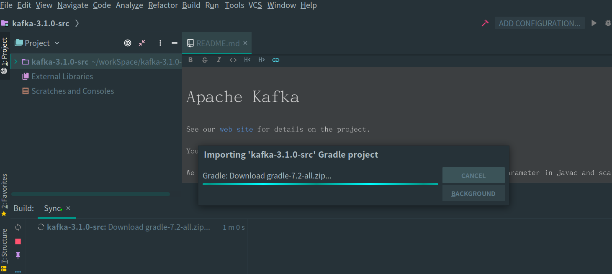

## 1.4 安装 gradle

Gradle 是类似于 maven 的代码管理工具。安卓程序管理通常采用 Gradle。IDEA 自动帮你下载安装，下载的时间比较长（网络慢，需要 1 天时间，有 VPN 需要几分钟）。

# 第 2 章 生产者源码

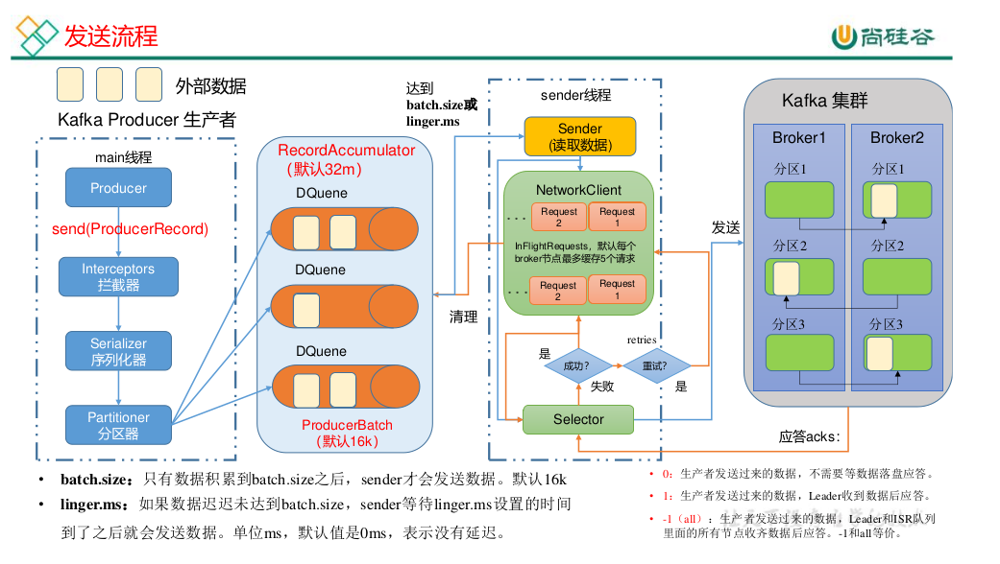


## 2.1 初始化

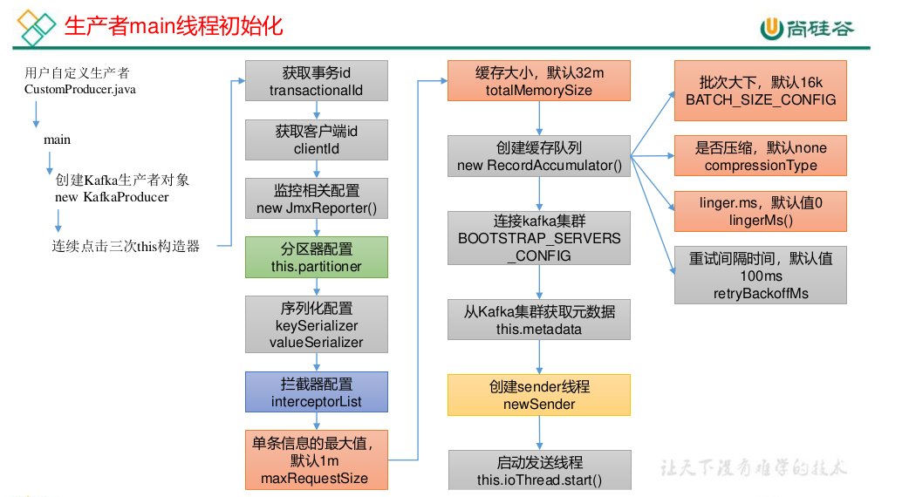


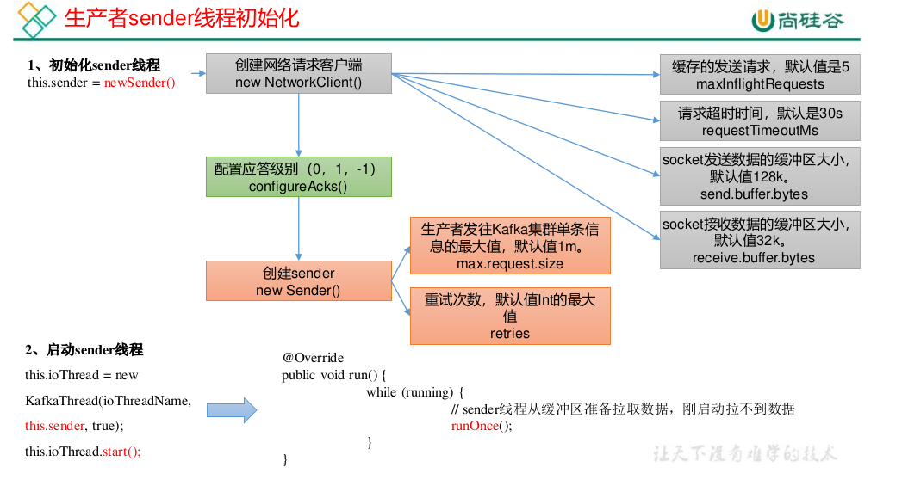

### 2.1.1 程序入口

1）从用户自己编写的 main 方法开始阅读

```java
package com.atguigu.kafka.producer;
import org.apache.kafka.clients.producer.KafkaProducer;
import org.apache.kafka.clients.producer.ProducerConfig;
import org.apache.kafka.clients.producer.ProducerRecord;
import org.apache.kafka.common.serialization.StringSerializer;
import java.util.Properties;
public class CustomProducer {
    public static void main(String[] args) {
        // 0 配置
        Properties properties = new Properties();
        // 连接集群 bootstrap.servers
        properties.put(ProducerConfig.BOOTSTRAP_SERVERS_CONFIG,"hadoop102:9092,hadoop103:9092");
        // 指定对应的 key 和 value 的序列化类型 key.serializer
        properties.put(ProducerConfig.KEY_SERIALIZER_CLASS_CONFIG,StringSerializer.class.getName());
        properties.put(ProducerConfig.VALUE_SERIALIZER_CLASS_CONFIG,StringSerializer.class.getName());
        // 1 创建 kafka 生产者对象
        // "" hello
        KafkaProducer<String,String>  kafkaProducer = new KafkaProducer<>(properties);
        // 2 发送数据
        for (int i = 0; i < 5; i++) {
            kafkaProducer.send(new ProducerRecord<>("first","atguigu"+i));
        }
        // 3 关闭资源
        kafkaProducer.close();
    }
}
```

### 2.1.2 生产者 main 线程初始化

点击 main()方法中的 KafkaProducer()。KafkaProducer.java

```java
public KafkaProducer(Properties properties) {
    this(properties, null, null);
}

public KafkaProducer(Properties properties, Serializer<K> keySerializer,Serializer<V> valueSerializer) {
    this(Utils.propsToMap(properties),keySerializer,valueSerializer);
}

public KafkaProducer(Map<String, Object> configs, Serializer<K> keySerializer, Serializer<V> valueSerializer) {
    this(new ProducerConfig(ProducerConfig.appendSerializerToConfig(configs,keySerializer,valueSerializer)),keySerializer,valueSerializer,null,null,null,Time.SYSTEM);
}
```

跳转到 KafkaProducer 构造方法。

```java
KafkaProducer(ProducerConfig config,
              Serializer<K> keySerializer,
              Serializer<V> valueSerializer,
              ProducerMetadata metadata,
              KafkaClient kafkaClient,
              ProducerInterceptors<K, V> interceptors,
              Time time) {
    try {
        this.producerConfig = config;
        this.time = time;
        // 获取事务 id
        String transactionalId = config.getString(ProducerConfig.TRANSACTIONAL_ID_CONFIG);
        // 获取客户端 id
        this.clientId = config.getString(ProducerConfig.CLIENT_ID_CONFIG);
        LogContext logContext;
        if (transactionalId == null)
            logContext = new LogContext(String.format("[Producer clientId=%s] ", clientId));
        else
            logContext = new LogContext(String.format("[Producer clientId=%s, transactionalId=%s] ", clientId,
                                                      transactionalId));
        log = logContext.logger(KafkaProducer.class);
        log.trace("Starting the Kafka producer");
        Map<String,String> metricTags = Collections.singletonMap("client-id", clientId);
        MetricConfig metricConfig = new MetricConfig().samples(config.getInt(ProducerConfig.METRICS_NUM_S
AMPLES_CONFIG))
            .timeWindow(config.getLong(ProducerConfig.METRICS_SAMPLE_WINDOW_MS_CONFIG),TimeUnit.MILLISECONDS)
            .recordLevel(Sensor.RecordingLevel.forName(config.getString(ProducerConfig.METRICS_RECORDING_LEVEL_CONFIG)))
            .tags(metricTags);
        List<MetricsReporter> reporters = config.getConfiguredInstances(ProducerConfig.METRIC_REPORTER_CLASSES_CONFIG,MetricsReporter.class,Collections.singletonMap(ProducerConfig.CLIENT_ID_CONFIG,clientId));
        
        // 监控相关配置
        JmxReporter jmxReporter = new JmxReporter();
        jmxReporter.configure(config.originals(Collections.singletonMap(ProducerConfig.CLIENT_ID_CONFIG, clientId)));
        reporters.add(jmxReporter);
        MetricsContext metricsContext = new KafkaMetricsContext(JMX_PREFIX,config.originalsWithPrefix(CommonClientConfigs.METRICS_CONTEXT
_PREFIX));
        this.metrics = new Metrics(metricConfig, reporters, time,metricsContext);
        
        // 分区器配置
        this.partitioner = config.getConfiguredInstance(ProducerConfig.PARTITIONER_CLASS_CONFIG,
Partitioner.class,Collections.singletonMap(ProducerConfig.CLIENT_ID_CONFIG,clientId));
        
        // 重试时间间隔参数配置，默认值 100ms
        long retryBackoffMs = config.getLong(ProducerConfig.RETRY_BACKOFF_MS_CONFIG);
        
        // 序列化配置
        if (keySerializer == null) {
            this.keySerializer = config.getConfiguredInstance(ProducerConfig.KEY_SERIALIZER_CLASS_CONFIG,Serializer.class);
            this.keySerializer.configure(config.originals(Collections.singletonMap(ProducerConfig.CLIENT_ID_CONFIG, clientId)), true);
        } else {
            config.ignore(ProducerConfig.KEY_SERIALIZER_CLASS_CONFIG);
            this.keySerializer = keySerializer;
        }

        if (valueSerializer == null) {
            this.valueSerializer = config.getConfiguredInstance(ProducerConfig.VALUE_SERIALIZER_CLASS_CONFIG,Serializer.class);
            this.valueSerializer.configure(config.originals(Collections.singletonMap(ProducerConfig.CLIENT_ID_CONFIG, clientId)), false);
        } else {
            config.ignore(ProducerConfig.VALUE_SERIALIZER_CLASS_CONFIG);
            this.valueSerializer = valueSerializer;
        }
        
        // 拦截器配置
        List<ProducerInterceptor<K, V>> interceptorList = (List) config.getConfiguredInstances(
            ProducerConfig.INTERCEPTOR_CLASSES_CONFIG,
            ProducerInterceptor.class,
            Collections.singletonMap(ProducerConfig.CLIENT_ID_CONFIG,clientId));
        if (interceptors != null)
            this.interceptors = interceptors;
        else
            this.interceptors = new ProducerInterceptors<>(interceptorList);
        ClusterResourceListeners clusterResourceListeners = configureClusterResourceListeners(keySerializer,valueSerializer,interceptorList, reporters);

// 生产者发往 Kafka 集群单条信息的最大值，默认 1m
this.maxRequestSize = config.getInt(ProducerConfig.MAX_REQUEST_SIZE_CONFIG);

// 缓存大小，默认 32m
this.totalMemorySize = config.getLong(ProducerConfig.BUFFER_MEMORY_CONFIG);

// 压缩配置，默认 none
this.compressionType = CompressionType.forName(config.getString(ProducerConfig.COMPRESSION_TYPE_CONFIG));

this.maxBlockTimeMs = config.getLong(ProducerConfig.MAX_BLOCK_MS_CONFIG);

int deliveryTimeoutMs = configureDeliveryTimeout(config,log);
this.apiVersions = new ApiVersions();
this.transactionManager = configureTransactionState(config,logContext);
// 上下文环境
// 批次大下，默认 16k
// 是否压缩，默认 none
// linger.ms，默认值 0。
// 重试间隔时间，默认值 100ms。
// delivery.timeout.ms 默认值 2 分钟。
// request.timeout.ms 默认值 30s。
this.accumulator = new RecordAccumulator(logContext,config.getInt(ProducerConfig.BATCH_SIZE_CONFIG),

this.compressionType,lingerMs(config),retryBackoffMs,deliveryTimeoutMs,metrics,PRODUCER_METRIC_GROUP_NAME,time,apiVersions,transactionManager,
new BufferPool(this.totalMemorySize,
config.getInt(ProducerConfig.BATCH_SIZE_CONFIG), metrics, time,
PRODUCER_METRIC_GROUP_NAME));

// Kafka 集群地址
List<InetSocketAddress> addresses = ClientUtils.parseAndValidateAddresses(config.getList(ProducerConfig.BOOTSTRAP_SERVERS_CONFIG),config.getString(ProducerConfig.CLIENT_DNS_LOOKUP_CONFIG));
// 从 Kafka 集群获取元数据
if (metadata != null) {
    this.metadata = metadata;
} else {
    // metadata.max.age.ms 默认值 5 分钟。生产者每隔多久需要更新一下自己的元数据
    // metadata.max.idle.ms 默认值 5 分钟。网络最多空闲时间设置，超过该阈值，就关闭该网络
    this.metadata = new ProducerMetadata(retryBackoffMs,config.getLong(ProducerConfig.METADATA_MAX_AGE_CONFIG),
                                 config.getLong(ProducerConfig.METADATA_MAX_IDLE_CONFIG),
logContext,
clusterResourceListeners,
Time.SYSTEM);
this.metadata.bootstrap(addresses);
}
this.errors = this.metrics.sensor("errors");
// 初始化 sender 线程
this.sender
=
newSender(logContext,
kafkaClient,
this.metadata);
String ioThreadName = NETWORK_THREAD_PREFIX + " | " +
clientId;
// 启动发送线程
this.ioThread = new KafkaThread(ioThreadName, this.sender,
true);
this.ioThread.start();
config.logUnused();
AppInfoParser.registerAppInfo(JMX_PREFIX, clientId, metrics,
time.milliseconds());
log.debug("Kafka producer started");
} catch (Throwable t) {
... ...
}
}
```


### 2.1.3 生产者 sender 线程初始化

点击 newSender()方法，查看发送线程初始化。

**KafkaProducer.java**

```java
Sender newSender(LogContext logContext, KafkaClient kafkaClient,
ProducerMetadata metadata) {
// 缓存的发送请求，默认值是 5。
int
maxInflightRequests
=
configureInflightRequests(producerConfig);
// request.timeout.ms 默认值 30s。
int
requestTimeoutMs
=
producerConfig.getInt(ProducerConfig.REQUEST_TIMEOUT_MS_CONFIG);
ChannelBuilder
channelBuilder
=
ClientUtils.createChannelBuilder(producerConfig,
time,
logContext);
ProducerMetrics
metricsRegistry
=
new
ProducerMetrics(this.metrics);
Sensor
throttleTimeSensor
=
Sender.throttleTimeSensor(metricsRegistry.senderMetrics);
// maxInflightRequests 缓存的发送请求，默认值是 5。
// reconnect.backoff.ms 默认值 50ms。重试时间间隔
// reconnect.backoff.max.ms 默认值 1000ms。重试的总时间。每次重试失败


时，呈指数增加重试时间，直至达到此最大值
// send.buffer.bytes 默认值 128k。 socket 发送数据的缓冲区大小
// receive.buffer.bytes 默认值 32k。socket 接收数据的缓冲区大小
// request.timeout.ms 默认值 30s。
// socket.connection.setup.timeout.ms 默认值 10s。生产者和服务器通
信连接建立的时间。如果在超时之前没有建立连接，将关闭通信。
// socket.connection.setup.timeout.max.ms 默认值 30s。生产者和服务
器通信，每次连续连接失败时，连接建立超时将呈指数增加，直至达到此最大值。
KafkaClient client = kafkaClient != null ? kafkaClient : new
NetworkClient(
new
Selector(producerConfig.getLong(ProducerConfig.CONNECTIONS_MAX_ID
LE_MS_CONFIG),
this.metrics, time, "producer", channelBuilder,
logContext),
metadata,
clientId,
maxInflightRequests,
producerConfig.getLong(ProducerConfig.RECONNECT_BACKOFF_MS_CON
FIG),
producerConfig.getLong(ProducerConfig.RECONNECT_BACKOFF_MAX_MS
_CONFIG),
producerConfig.getInt(ProducerConfig.SEND_BUFFER_CONFIG),
producerConfig.getInt(ProducerConfig.RECEIVE_BUFFER_CONFIG),
requestTimeoutMs,
producerConfig.getLong(ProducerConfig.SOCKET_CONNECTION_SETUP_
TIMEOUT_MS_CONFIG),
producerConfig.getLong(ProducerConfig.SOCKET_CONNECTION_SETUP_
TIMEOUT_MAX_MS_CONFIG),
time,
true,
apiVersions,
throttleTimeSensor,
logContext);
// acks 默认值是-1。
// acks=0, 生产者发送给 Kafka 服务器后，不需要应答
// acks=1，生产者发送给 Kafka 服务器后，Leader 接收后应答
// acks=-1（all）
，生产者发送给 Kafka 服务器后，Leader 和在 ISR 队列的所
有 Follower 共同应答
short acks = configureAcks(producerConfig, log);
// max.request.size 默认值 1m。 生产者发往 Kafka 集群单条信息的最大值
// retries 重试次数，默认值 Int 的最大值
// retry.backoff.ms 默认值 100ms。重试时间间隔
return new Sender(logContext,
client,
metadata,
this.accumulator,

maxInflightRequests == 1,
producerConfig.getInt(ProducerConfig.MAX_REQUEST_SIZE_CONFIG),
acks,
producerConfig.getInt(ProducerConfig.RETRIES_CONFIG),
metricsRegistry.senderMetrics,
time,
requestTimeoutMs,
producerConfig.getLong(ProducerConfig.RETRY_BACKOFF_MS_CONFIG),
this.transactionManager,
apiVersions);
}
```


Sender 对象被放到了一个线程中启动，所有需要点击 **newSender()方法中的 Sender，并找到 sender 对象中的 run()方法**。

**Sender.java**

```java
@Override
public void run() {
log.debug("Starting Kafka producer I/O thread.");
// main loop, runs until close is called
while (running) {
try {
// sender 线程从缓冲区准备拉取数据，刚启动拉不到数据
runOnce();
} catch (Exception e) {
log.error("Uncaught error in kafka producer I/O thread:
", e);
}
}
... ...
}
```


## 2.2 发送数据到缓冲区

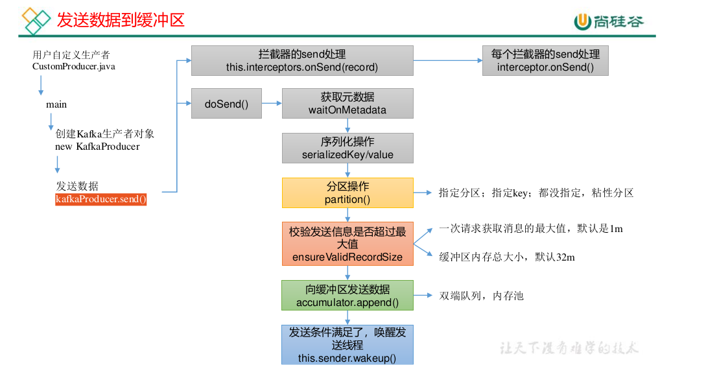


### 2.2.1 发送总体流程

点击自己编写的 CustomProducer.java 中的 send()方法。

```java
// 2 发送数据
for (int i = 0; i < 5; i++) {
kafkaProducer.send(new ProducerRecord<>("first","atguigu"+i));
}
```

**KafkaProducer.java**

```java
@Override
public Future<RecordMetadata> send(ProducerRecord<K, V> record) {
return send(record, null);
}
@Override
public Future<RecordMetadata> send(ProducerRecord<K, V> record,
Callback callback) {
// intercept the record, which can be potentially modified;
this method does not throw exceptions
// 拦截器处理发送的数据
ProducerRecord<K,
V>
interceptedRecord
=
this.interceptors.onSend(record);
return doSend(interceptedRecord, callback);
}
```

点击 onSend()方法，进行拦截器相关处理。

**ProducerInterceptors.java**

```java
public ProducerRecord<K, V> onSend(ProducerRecord<K, V> record) {
ProducerRecord<K, V> interceptRecord = record;
for (ProducerInterceptor<K, V> interceptor : this.interceptors)
{
try {
// 拦截器处理
interceptRecord = interceptor.onSend(interceptRecord);
} catch (Exception e) {
// do not propagate interceptor exception, log and
continue calling other interceptors
// be careful not to throw exception from here
if (record != null)
log.warn("Error
executing
interceptor
onSend
callback
for
topic:
{},
partition:
{}",
record.topic(),
record.partition(), e);
else
log.warn("Error
executing
interceptor
onSend
callback", e);
}
}
return interceptRecord;
}
```

从拦截器处理中返回，点击 doSend()方法。

**KafkaProducer.java**

```java
private Future<RecordMetadata> doSend(ProducerRecord<K, V> record,

Callback callback) {
TopicPartition tp = null;
try {
throwIfProducerClosed();
// first make sure the metadata for the topic is available
long nowMs = time.milliseconds();
ClusterAndWaitTime clusterAndWaitTime;
try {
// 从 Kafka 拉取元数据。maxBlockTimeMs 表示最多能等待多长时间。
clusterAndWaitTime
=
waitOnMetadata(record.topic(),
record.partition(), nowMs, maxBlockTimeMs);
} catch (KafkaException e) {
if (metadata.isClosed())
throw new KafkaException("Producer closed while send
in progress", e);
throw e;
}
nowMs += clusterAndWaitTime.waitedOnMetadataMs;
// 剩余时间 = 最多能等待时间 - 用了多少时间；
long
remainingWaitMs
=
Math.max(0,
maxBlockTimeMs
-
clusterAndWaitTime.waitedOnMetadataMs);
// 更新集群元数据
Cluster cluster = clusterAndWaitTime.cluster;
// 序列化操作
byte[] serializedKey;
try {
serializedKey = keySerializer.serialize(record.topic(),
record.headers(), record.key());
} catch (ClassCastException cce) {
throw new SerializationException("Can't convert key of
class " + record.key().getClass().getName() +
"
to
class
"
+
producerConfig.getClass(ProducerConfig.KEY_SERIALIZER_CLASS_CONFI
G).getName() +
" specified in key.serializer", cce);
}
byte[] serializedValue;
try {
serializedValue
=
valueSerializer.serialize(record.topic(),
record.headers(),
record.value());
} catch (ClassCastException cce) {
throw new SerializationException("Can't convert value
of class " + record.value().getClass().getName() +
"
to
class
"
+
producerConfig.getClass(ProducerConfig.VALUE_SERIALIZER_CLASS_CON
FIG).getName() +
" specified in value.serializer", cce);
}
// 分区操作（根据元数据信息）
int
partition
=
partition(record,
serializedKey,
serializedValue, cluster);
tp = new TopicPartition(record.topic(), partition);
setReadOnly(record.headers());


Header[] headers = record.headers().toArray();
int
serializedSize
=
AbstractRecords.estimateSizeInBytesUpperBound(apiVersions.maxUsab
leProduceMagic(),
compressionType,
serializedKey,
serializedValue,
headers);
// 校验发送消息的大小是否超过最大值，默认是 1m
ensureValidRecordSize(serializedSize);
long timestamp = record.timestamp() == null ? nowMs :
record.timestamp();
if (log.isTraceEnabled()) {
log.trace("Attempting to append record {} with callback
{} to topic {} partition {}", record, callback, record.topic(),
partition);
}
// 消息发送的回调函数
// producer callback will make sure to call both 'callback'
and interceptor callback
Callback
interceptCallback
=
new
InterceptorCallback<>(callback, this.interceptors, tp);
if
(transactionManager
!=
null
transactionManager.isTransactional()) {
transactionManager.failIfNotReadyForSend();
}
&&
// 内存，默认 32m，里面是默认 16k 一个批次
RecordAccumulator.RecordAppendResult
result
=
accumulator.append(tp, timestamp, serializedKey,
serializedValue,
headers,
interceptCallback,
remainingWaitMs, true, nowMs);
if (result.abortForNewBatch) {
int prevPartition = partition;
partitioner.onNewBatch(record.topic(),
cluster,
prevPartition);
partition
=
partition(record,
serializedKey,
serializedValue, cluster);
tp = new TopicPartition(record.topic(), partition);
if (log.isTraceEnabled()) {
log.trace("Retrying append due to new batch creation
for topic {} partition {}. The old partition was {}",
record.topic(), partition, prevPartition);
}
// producer callback will make sure to call both
'callback' and interceptor callback
interceptCallback = new InterceptorCallback<>(callback,
this.interceptors, tp);
result
=
accumulator.append(tp,
timestamp,
serializedKey,
serializedValue,
headers,
interceptCallback,
remainingWaitMs, false, nowMs);

}
if
(transactionManager
!=
null
&&
transactionManager.isTransactional())
transactionManager.maybeAddPartitionToTransaction(tp);
// 批次满了 或者 创建了一个新的批次，唤醒 sender 发送线程
if (result.batchIsFull || result.newBatchCreated) {
log.trace("Waking
up
the
sender
since
topic
{}
partition
{}
is
either
full
or
getting
a
new
batch",
record.topic(), partition);
this.sender.wakeup();
}
return result.future;
} catch (ApiException e) {
... ...
}
}
```


### 2.2.2 分区选择

**KafkaProducer.java**

详解默认分区规则。

```java
int partition = partition(record, serializedKey, serializedValue,
cluster);
tp = new TopicPartition(record.topic(), partition);
private
int
partition(ProducerRecord<K,
V>
record,
byte[]
serializedKey, byte[] serializedValue, Cluster cluster) {
// 指定了分区，那就直接用该分区号
Integer partition = record.partition();
return partition != null ?
partition :
// 分区器选择分区
partitioner.partition(
record.topic(),
record.key(),
serializedKey,
record.value(), serializedValue, cluster);
}
```

点击 partition，跳转到 Partitioner 接口。选中 partition，点击 ctrl+ h，查找接口实现类

```java
int partition(String topic, Object key, byte[] keyBytes, Object
value, byte[] valueBytes, Cluster cluster);
```

选择默认的分区器 DefaultPartitioner

```java
public int partition(String topic, Object key, byte[] keyBytes,
Object value, byte[] valueBytes, Cluster cluster,
int numPartitions) {
// 没有指定 key：
if (keyBytes == null) {
return stickyPartitionCache.partition(topic, cluster);
}
// 指定 key:按照 key 的 hash 值对分区取模
// hash the keyBytes to choose a partition
return
Utils.toPositive(Utils.murmur2(keyBytes))
%
numPartitions;

}
// 没有指定 key 和分区的处理方式
public int partition(String topic, Cluster cluster) {
Integer part = indexCache.get(topic);
if (part == null) {
return nextPartition(topic, cluster, -1);
}
return part;
}
public int nextPartition(String topic, Cluster cluster, int
prevPartition) {
List<PartitionInfo>
partitions
=
cluster.partitionsForTopic(topic);
Integer oldPart = indexCache.get(topic);
Integer newPart = oldPart;
// Check that the current sticky partition for the topic is
either not set or that the partition that
// triggered the new batch matches the sticky partition that
needs to be changed.
if (oldPart == null || oldPart == prevPartition) {
List<PartitionInfo>
availablePartitions
=
cluster.availablePartitionsForTopic(topic);
if (availablePartitions.size() < 1) {
Integer
random
=
Utils.toPositive(ThreadLocalRandom.current().nextInt());
newPart = random % partitions.size();
} else if (availablePartitions.size() == 1) {
newPart = availablePartitions.get(0).partition();
} else {
while (newPart == null || newPart.equals(oldPart)) {
int
random
=
Utils.toPositive(ThreadLocalRandom.current().nextInt());
newPart
=
availablePartitions.get(random
%
availablePartitions.size()).partition();
}
}
// Only change the sticky partition if it is null or
prevPartition matches the current sticky partition.
if (oldPart == null) {
indexCache.putIfAbsent(topic, newPart);
} else {
indexCache.replace(topic, prevPartition, newPart);
}
return indexCache.get(topic);
}
return indexCache.get(topic);
}
```


### 2.2.3 发送消息大小校验

**KafkaProducer.java**

详解缓冲区大小

```java
ensureValidRecordSize(serializedSize);

private void ensureValidRecordSize(int size) {
// 一次请求获取消息的最大值，默认是 1m
if (size > maxRequestSize)
throw new RecordTooLargeException("The message is " + size
+
" bytes when serialized which is larger than " +
maxRequestSize + ", which is the value of the " +
ProducerConfig.MAX_REQUEST_SIZE_CONFIG
+
"
configuration.");
// 缓冲区内存总大小，默认 32m
if (size > totalMemorySize)
throw new RecordTooLargeException("The message is " + size
+
" bytes when serialized which is larger than the
total memory buffer you have configured with the " +
ProducerConfig.BUFFER_MEMORY_CONFIG +
" configuration.");
}
```


### 2.2.4 内存池

**KafkaProducer.java**

详解内存池。

```java
RecordAccumulator.RecordAppendResult
accumulator.append(tp,
timestamp,
serializedValue,
headers,
remainingWaitMs, true, nowMs);
result
=
serializedKey,
interceptCallback,
public RecordAppendResult append(TopicPartition tp,
long timestamp,
byte[] key,
byte[] value,
Header[] headers,
Callback callback,
long maxTimeToBlock,
boolean abortOnNewBatch,
long
nowMs)
throws
InterruptedException {
// We keep track of the number of appending thread to make
sure we do not miss batches in
// abortIncompleteBatches().
appendsInProgress.incrementAndGet();
ByteBuffer buffer = null;
if (headers == null) headers = Record.EMPTY_HEADERS;
try {
// 每个分区，创建或者获取一个队列
// check if we have an in-progress batch
Deque<ProducerBatch> dq = getOrCreateDeque(tp);
synchronized (dq) {
if (closed)
throw new KafkaException("Producer closed while send
in progress");
// 尝试向队列里面添加数据（没有分配内存、批次对象，所以失败）
RecordAppendResult appendResult = tryAppend(timestamp,
key, value, headers, callback, dq, nowMs);


if (appendResult != null)
return appendResult;
}
// we don't have an in-progress record batch try to
allocate a new batch
if (abortOnNewBatch) {
// Return a result that will cause another call to
append.
return new RecordAppendResult(null, false, false, true);
}
byte maxUsableMagic = apiVersions.maxUsableProduceMagic();
// 取批次大小（默认 16k）和消息大小的最大值（上限默认 1m）。这样设计的
主要原因是有可能一条消息的大小大于批次大小。
int
size
=
Math.max(this.batchSize,
AbstractRecords.estimateSizeInBytesUpperBound(maxUsableMagic,
compression, key, value, headers));
log.trace("Allocating a new {} byte message buffer for
topic {} partition {} with remaining timeout {}ms", size,
tp.topic(), tp.partition(), maxTimeToBlock);
// 根据批次大小（默认 16k）和消息大小中最大值，分配内存
buffer = free.allocate(size, maxTimeToBlock);
// Update the current time in case the buffer allocation
blocked above.
nowMs = time.milliseconds();
synchronized (dq) {
// Need to check if producer is closed again after
grabbing the dequeue lock.
if (closed)
throw new KafkaException("Producer closed while send
in progress");
// 尝试向队列里面添加数据（有内存，但是没有批次对象）
RecordAppendResult appendResult = tryAppend(timestamp,
key, value, headers, callback, dq, nowMs);
if (appendResult != null) {
// Somebody else found us a batch, return the one we
waited for! Hopefully this doesn't happen often...
return appendResult;
}
MemoryRecordsBuilder
recordsBuilder
=
recordsBuilder(buffer, maxUsableMagic);
// 根据内存大小封装批次（有内存、有批次对象）
ProducerBatch
batch
=
new
ProducerBatch(tp,
recordsBuilder, nowMs);
// 尝试向队列里面添加数据
FutureRecordMetadata
future
=
Objects.requireNonNull(batch.tryAppend(timestamp,
key,
value,
headers,callback, nowMs));
// 把新创建的批次放到队列末尾
dq.addLast(batch);
incomplete.add(batch);


// Don't deallocate this buffer in the finally block as
it's being used in the record batch
buffer = null;
return new RecordAppendResult(future, dq.size() > 1 ||
batch.isFull(), true, false);
}
} finally {
// 如果发生异常，释放内存
if (buffer != null)
free.deallocate(buffer);
appendsInProgress.decrementAndGet();
}
}
```

## 2.3 sender 线程发送数据

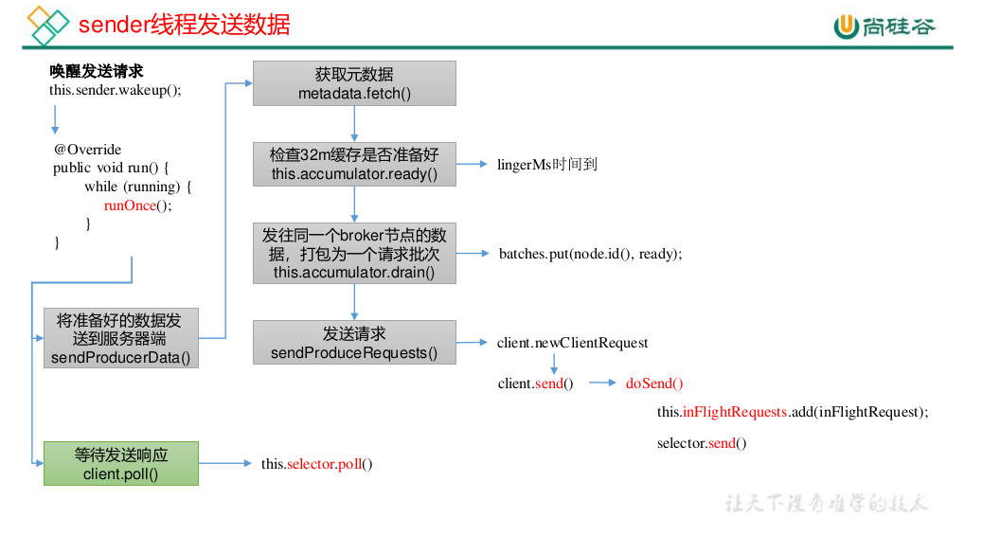


**KafkaProducer.java**

详解发送线程。

```java
if
(result.batchIsFull
||
result.newBatchCreated)
{
log.trace("Waking up the sender since topic {} partition {}
is either full or getting a new batch", record.topic(),
partition);
this.sender.wakeup();
}
```

进入 sender 发送线程的 run()方法。

```java
@Override
public void run() {
log.debug("Starting Kafka producer I/O thread.");
// main loop, runs until close is called
while (running) {
try {
runOnce();
} catch (Exception e) {


log.error("Uncaught error in kafka producer I/O thread:
", e);
}
}
... ...
}
void runOnce() {
// 如果是事务操作，按照如下处理
if (transactionManager != null) {
try {
transactionManager.maybeResolveSequences();
// do not continue sending if the transaction manager
is in a failed state
if (transactionManager.hasFatalError()) {
RuntimeException
lastError
=
transactionManager.lastError();
if (lastError != null)
maybeAbortBatches(lastError);
client.poll(retryBackoffMs, time.milliseconds());
return;
}
// Check whether we need a new producerId. If so, we
will enqueue an InitProducerId
// request which will be sent below
transactionManager.bumpIdempotentEpochAndResetIdIfNeeded();
if (maybeSendAndPollTransactionalRequest()) {
return;
}
} catch (AuthenticationException e) {
// This is already logged as error, but propagated here
to perform any clean ups.
log.trace("Authentication exception while processing
transactional request", e);
transactionManager.authenticationFailed(e);
}
}
long currentTimeMs = time.milliseconds();
// 将准备好的数据发送到服务器端
long pollTimeout = sendProducerData(currentTimeMs);
// 等待发送响应
client.poll(pollTimeout, currentTimeMs);
}
// 获取要发送数据的细节
private long sendProducerData(long now) {
// 获取元数据
Cluster cluster = metadata.fetch();
// get the list of partitions with data ready to send
// 1、检查 32m 缓存是否准备好（linger.ms）
RecordAccumulator.ReadyCheckResult
result
this.accumulator.ready(cluster, now);

=

// 如果 Leader 信息不知道，是不能发送数据的
// if there are any partitions whose leaders are not known yet,
force metadata update
if (!result.unknownLeaderTopics.isEmpty()) {
// The set of topics with unknown leader contains topics
with leader election pending as well as
// topics which may have expired. Add the topic again to
metadata to ensure it is included
// and request metadata update, since there are messages to
send to the topic.
for (String topic : result.unknownLeaderTopics)
this.metadata.add(topic, now);
log.debug("Requesting metadata update due to unknown leader
topics from the batched records: {}",
result.unknownLeaderTopics);
this.metadata.requestUpdate();
}
// remove any nodes we aren't ready to send to
// 删除掉没有准备好发送的数据
Iterator<Node> iter = result.readyNodes.iterator();
long notReadyTimeout = Long.MAX_VALUE;
while (iter.hasNext()) {
Node node = iter.next();
if (!this.client.ready(node, now)) {
iter.remove();
notReadyTimeout
=
Math.min(notReadyTimeout,
this.client.pollDelayMs(node, now));
}
}
// create produce requests
// 2、发往同一个 broker 节点的数据，打包为一个请求批次
Map<Integer,
List<ProducerBatch>>
batches
=
this.accumulator.drain(cluster,
result.readyNodes,
this.maxRequestSize, now);
addToInflightBatches(batches);
if (guaranteeMessageOrder) {
// Mute all the partitions drained
for (List<ProducerBatch> batchList : batches.values()) {
for (ProducerBatch batch : batchList)
this.accumulator.mutePartition(batch.topicPartition);
}
}
accumulator.resetNextBatchExpiryTime();
List<ProducerBatch>
expiredInflightBatches
getExpiredInflightBatches(now);
List<ProducerBatch>
expiredBatches
this.accumulator.expiredBatches(now);
expiredBatches.addAll(expiredInflightBatches);
=
=
// Reset the producer id if an expired batch has previously
been sent to the broker. Also update the metrics
//
for
expired
batches.
see
the
documentation
of


@TransactionState.resetIdempotentProducerId to understand why
// we need to reset the producer id here.
if (!expiredBatches.isEmpty())
log.trace("Expired
{}
batches
in
accumulator",
expiredBatches.size());
for (ProducerBatch expiredBatch : expiredBatches) {
String
errorMessage
=
"Expiring
"
+
expiredBatch.recordCount
+
"
record(s)
for
"
+
expiredBatch.topicPartition

+ ":" + (now - expiredBatch.createdMs) + " ms has
  passed since batch creation";
  failBatch(expiredBatch, new TimeoutException(errorMessage),
  false);
  if (transactionManager != null && expiredBatch.inRetry()) {
  // This ensures that no new batches are drained until
  the current in flight batches are fully resolved.
  transactionManager.markSequenceUnresolved(expiredBatch);
  }
  }
  sensors.updateProduceRequestMetrics(batches);
  // If we have any nodes that are ready to send + have sendable
  data, poll with 0 timeout so this can immediately
  // loop and try sending more data. Otherwise, the timeout will
  be the smaller value between next batch expiry
  // time, and the delay time for checking data availability.
  Note that the nodes may have data that isn't yet
  // sendable due to lingering, backing off, etc. This
  specifically does not include nodes with sendable data
  // that aren't ready to send since they would cause busy
  looping.
  long
  pollTimeout
  =
  Math.min(result.nextReadyCheckDelayMs,
  notReadyTimeout);
  pollTimeout
  =
  Math.min(pollTimeout,
  this.accumulator.nextExpiryTimeMs() - now);
  pollTimeout = Math.max(pollTimeout, 0);
  if (!result.readyNodes.isEmpty()) {
  log.trace("Nodes
  with
  data
  ready
  to
  send:
  {}",
  result.readyNodes);
  // if some partitions are already ready to be sent, the
  select time would be 0;
  // otherwise if some partition already has some data
  accumulated but not ready yet,
  // the select time will be the time difference between now
  and its linger expiry time;
  // otherwise the select time will be the time difference
  between now and the metadata expiry time;
  pollTimeout = 0;
  }
  // 3、发送请求
  sendProduceRequests(batches, now);
  return pollTimeout;
  }
  // 1、检查 32m 缓存是否准备好（linger.ms）
  public ReadyCheckResult ready(Cluster cluster, long nowMs) {
  Set<Node> readyNodes = new HashSet<>();


long nextReadyCheckDelayMs = Long.MAX_VALUE;
Set<String> unknownLeaderTopics = new HashSet<>();
boolean exhausted = this.free.queued() > 0;
for (Map.Entry<TopicPartition, Deque<ProducerBatch>> entry :
this.batches.entrySet()) {
Deque<ProducerBatch> deque = entry.getValue();
synchronized (deque) {
// When producing to a large number of partitions, this
path is hot and deques are often empty.
// We check whether a batch exists first to avoid the
more expensive checks whenever possible.
ProducerBatch batch = deque.peekFirst();
if (batch != null) {
TopicPartition part = entry.getKey();
Node leader = cluster.leaderFor(part);
if (leader == null) {
// This is a partition for which leader is not
known, but messages are available to send.
// Note that entries are currently not removed
from batches when deque is empty.
unknownLeaderTopics.add(part.topic());
}
else
if
(!readyNodes.contains(leader)
&& !isMuted(part)) {
long waitedTimeMs = batch.waitedTimeMs(nowMs);
// 如果不是第一次拉取该批次数据，且等待时间没有超过重试时
间，backingOff=true
boolean backingOff = batch.attempts() > 0 &&
waitedTimeMs < retryBackoffMs;
// 如果 backingOff=true，返回重试时间，如果不是重试，选
择 lingerMs
long timeToWaitMs = backingOff ? retryBackoffMs :
lingerMs;
boolean full = deque.size() > 1 || batch.isFull();
// 如果等待的时间超过了 timeToWaitMs，expired=true，表
示可以发送数据
boolean expired = waitedTimeMs >= timeToWaitMs;
boolean
transactionCompleting
=
transactionManager != null && transactionManager.isCompleting();
boolean sendable = full
|| expired
|| exhausted
|| closed
|| flushInProgress()
|| transactionCompleting;
if (sendable && !backingOff) {
readyNodes.add(leader);
} else {
long timeLeftMs = Math.max(timeToWaitMs -
waitedTimeMs, 0);
// Note that this results in a conservative
estimate since an un-sendable partition may have
// a leader that will later be found to have
sendable data. However, this is good enough
// since we'll just wake up and then sleep
again for the remaining time.
nextReadyCheckDelayMs = Math.min(timeLeftMs,


nextReadyCheckDelayMs);
}
}
}
}
}
return new ReadyCheckResult(readyNodes, nextReadyCheckDelayMs,
unknownLeaderTopics);
}
// 2、发往同一个 broker 节点的数据，打包为一个请求批次。
public Map<Integer, List<ProducerBatch>> drain(Cluster
Set<Node> nodes, int maxSize, long now) {
if (nodes.isEmpty())
return Collections.emptyMap();
cluster,
Map<Integer, List<ProducerBatch>> batches = new HashMap<>();
for (Node node : nodes) {
List<ProducerBatch> ready = drainBatchesForOneNode(cluster,
node, maxSize, now);
batches.put(node.id(), ready);
}
return batches;
}
// 3、发送请求
private void sendProduceRequest(long now, int destination, short
acks, int timeout, List<ProducerBatch> batches) {
if (batches.isEmpty())
return;
final Map<TopicPartition, ProducerBatch> recordsByPartition =
new HashMap<>(batches.size());
// find the minimum magic version used when creating
record sets
byte minUsedMagic = apiVersions.maxUsableProduceMagic();
for (ProducerBatch batch : batches) {
if (batch.magic() < minUsedMagic)
minUsedMagic = batch.magic();
}
ProduceRequestData.TopicProduceDataCollection
tpd
=
ProduceRequestData.TopicProduceDataCollection();
for (ProducerBatch batch : batches) {
TopicPartition tp = batch.topicPartition;
MemoryRecords records = batch.records();
the
new
// down convert if necessary to the minimum magic used. In
general, there can be a delay between the time
// that the producer starts building the batch and the time
that we send the request, and we may have
// chosen the message format based on out-dated metadata.
In the worst case, we optimistically chose to use
// the new message format, but found that the broker didn't
support it, so we need to down-convert on the
// client before sending. This is intended to handle edge


cases around cluster upgrades where brokers may
// not all support the same message format version. For
example, if a partition migrates from a broker
// which is supporting the new magic version to one which
doesn't, then we will need to convert.
if (!records.hasMatchingMagic(minUsedMagic))
records = batch.records().downConvert(minUsedMagic, 0,
time).records();
ProduceRequestData.TopicProduceData
tpData
=
tpd.find(tp.topic());
if (tpData == null) {
tpData
=
new
ProduceRequestData.TopicProduceData().setName(tp.topic());
tpd.add(tpData);
}
tpData.partitionData().add(new
ProduceRequestData.PartitionProduceData()
.setIndex(tp.partition())
.setRecords(records));
recordsByPartition.put(tp, batch);
}
String transactionalId = null;
if
(transactionManager
!=
null
transactionManager.isTransactional()) {
transactionalId = transactionManager.transactionalId();
}
&&
ProduceRequest.Builder
requestBuilder
=
ProduceRequest.forMagic(minUsedMagic,
new ProduceRequestData()
.setAcks(acks)
.setTimeoutMs(timeout)
.setTransactionalId(transactionalId)
.setTopicData(tpd));
RequestCompletionHandler
callback
=
response
->
handleProduceResponse(response,
recordsByPartition,
time.milliseconds());
String nodeId = Integer.toString(destination);
// 创建发送请求对象
ClientRequest clientRequest = client.newClientRequest(nodeId,
requestBuilder, now, acks != 0,
requestTimeoutMs, callback);
// 发送请求
client.send(clientRequest, now);
log.trace("Sent
produce
request
to
{}:
{}",
nodeId,
requestBuilder);
}
// 选中 send，点击 ctrl + alt + b
@Override
public void send(ClientRequest request, long now) {
doSend(request, false, now);
}
private
void
doSend(ClientRequest
isInternalRequest, long now) {
clientRequest,

boolean

ensureActive();
String nodeId = clientRequest.destination();
if (!isInternalRequest) {
// If this request came from outside the NetworkClient,
validate
// that we can send data. If the request is internal, we
trust
// that internal code has done this validation. Validation
// will be slightly different for some internal requests
(for
// example, ApiVersionsRequests can be sent prior to being
in
// READY state.)
if (!canSendRequest(nodeId, now))
throw new IllegalStateException("Attempt to send a
request to node " + nodeId + " which is not ready.");
}
AbstractRequest.Builder<?>
builder
=
clientRequest.requestBuilder();
try {
NodeApiVersions versionInfo = apiVersions.get(nodeId);
short version;
// Note: if versionInfo is null, we have no server version
information. This would be
// the case when sending the initial ApiVersionRequest
which fetches the version
// information itself.
It is also the case when
discoverBrokerVersions is set to false.
if (versionInfo == null) {
version = builder.latestAllowedVersion();
if (discoverBrokerVersions && log.isTraceEnabled())
log.trace("No version information found when sending
{} with correlation id {} to node {}. " +
"Assuming
version
{}.",
clientRequest.apiKey(),
clientRequest.correlationId(),
nodeId,
version);
} else {
version
=
versionInfo.latestUsableVersion(clientRequest.apiKey(),
builder.oldestAllowedVersion(),
builder.latestAllowedVersion());
}
//
The
call
to
build
may
also
throw
UnsupportedVersionException, if there are essential
// fields that cannot be represented in the chosen version.
// 发送请求
doSend(clientRequest,
isInternalRequest,
now,
builder.build(version));
}
catch
(UnsupportedVersionException
unsupportedVersionException) {
// If the version is not supported, skip sending the
request over the wire.
// Instead, simply add it to the local queue of aborted
requests.
log.debug("Version mismatch when attempting to send {} with
correlation id {} to {}", builder,
clientRequest.correlationId(),


clientRequest.destination(), unsupportedVersionException);
ClientResponse
clientResponse
=
new
ClientResponse(clientRequest.makeHeader(builder.latestAllowedVers
ion()),
clientRequest.callback(),
clientRequest.destination(), now, now,
false, unsupportedVersionException, null, null);
if (!isInternalRequest)
abortedSends.add(clientResponse);
else if (clientRequest.apiKey() == ApiKeys.METADATA)
metadataUpdater.handleFailedRequest(now,
Optional.of(unsupportedVersionException));
}
}
private
void
doSend(ClientRequest
clientRequest,
boolean
isInternalRequest, long now, AbstractRequest request) {
String destination = clientRequest.destination();
RequestHeader
header
=
clientRequest.makeHeader(request.version());
if (log.isDebugEnabled()) {
log.debug("Sending {} request with header {} and timeout {}
to node {}: {}",
clientRequest.apiKey(),
header,
clientRequest.requestTimeoutMs(), destination, request);
}
Send send = request.toSend(header);
InFlightRequest inFlightRequest = new InFlightRequest(
clientRequest,
header,
isInternalRequest,
request,
send,
now);
// 添加请求到 inflint
this.inFlightRequests.add(inFlightRequest);
// 发送数据
selector.send(new
NetworkSend(clientRequest.destination(),
send));
}
// 获取服务器端响应
client.poll(pollTimeout, currentTimeMs);
@Override
public List<ClientResponse> poll(long timeout, long now) {
ensureActive();
if (!abortedSends.isEmpty()) {
// If there are aborted sends because of unsupported
version exceptions or disconnects,
//
handle
them
immediately
without
waiting
for
Selector#poll.
List<ClientResponse> responses = new ArrayList<>();
handleAbortedSends(responses);


completeResponses(responses);
return responses;
}
long metadataTimeout = metadataUpdater.maybeUpdate(now);
try {
this.selector.poll(Utils.min(timeout,
metadataTimeout,
defaultRequestTimeoutMs));
} catch (IOException e) {
log.error("Unexpected error during I/O", e);
}
// process completed actions
// 获取发送后的响应
long updatedNow = this.time.milliseconds();
List<ClientResponse> responses = new ArrayList<>();
handleCompletedSends(responses, updatedNow);
handleCompletedReceives(responses, updatedNow);
handleDisconnections(responses, updatedNow);
handleConnections();
handleInitiateApiVersionRequests(updatedNow);
handleTimedOutConnections(responses, updatedNow);
handleTimedOutRequests(responses, updatedNow);
completeResponses(responses);
return responses;
}
```


# 第 3 章 消费者源码

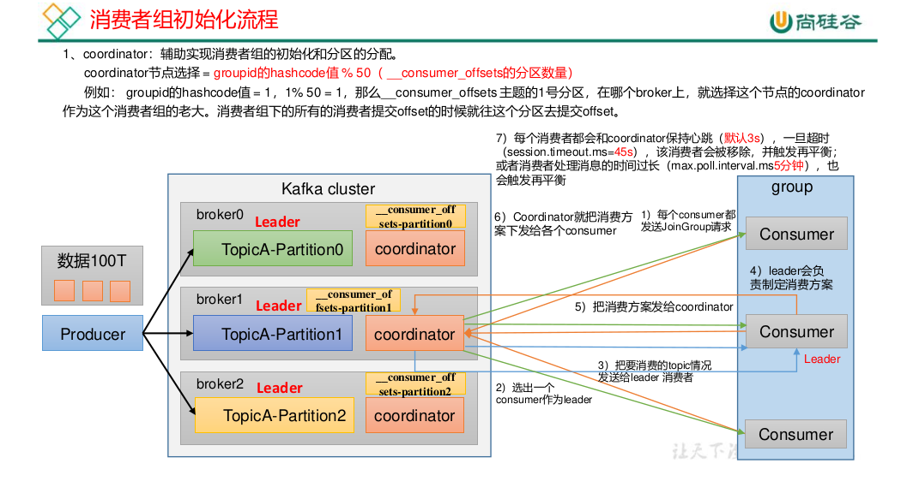

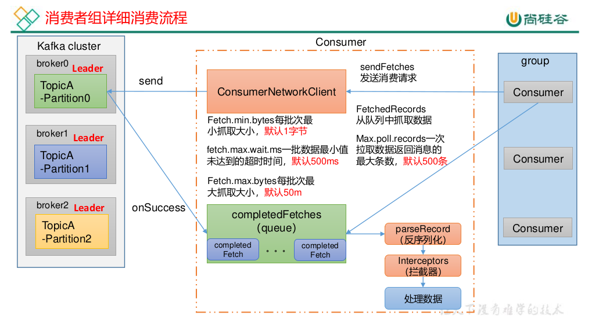


## 3.1 初始化

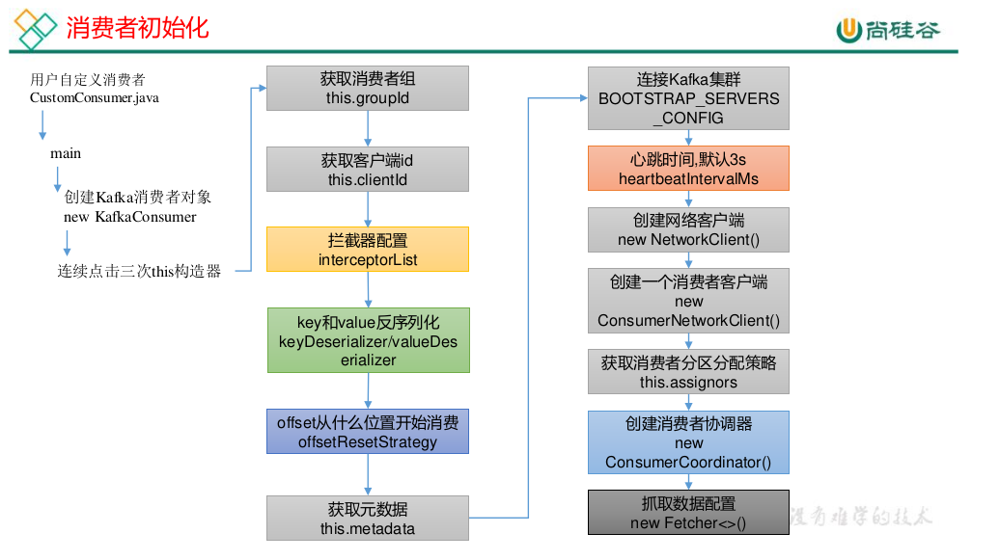


### 3.1.1 程序入口

1）从用户自己编写的 main 方法开始阅读

```java
package com.atguigu.kafka.consumer;
import
import
import
import
import
org.apache.kafka.clients.consumer.ConsumerConfig;
org.apache.kafka.clients.consumer.ConsumerRecord;
org.apache.kafka.clients.consumer.ConsumerRecords;
org.apache.kafka.clients.consumer.KafkaConsumer;
org.apache.kafka.common.serialization.StringDeserializer;
import java.time.Duration;
import java.util.ArrayList;
import java.util.Properties;


public class CustomConsumer {
public static void main(String[] args) {
// 0 配置
Properties properties = new Properties();
// 连接 bootstrap.servers
properties.put(ConsumerConfig.BOOTSTRAP_SERVERS_CONFIG,"hadoop102
:9092,hadoop103:9092");
// 反序列化
properties.put(ConsumerConfig.KEY_DESERIALIZER_CLASS_CONFIG,
StringDeserializer.class.getName());
properties.put(ConsumerConfig.VALUE_DESERIALIZER_CLASS_CONFIG,
StringDeserializer.class.getName());
// 配置消费者组 id
properties.put(ConsumerConfig.GROUP_ID_CONFIG,"test");
// 手动提交
properties.put(ConsumerConfig.ENABLE_AUTO_COMMIT_CONFIG,false);
// 1 创建一个消费者 "", "hello"
KafkaConsumer<String,
String>
KafkaConsumer<>(properties);
kafkaConsumer
=
new
// 2 订阅主题 first
ArrayList<String> topics = new ArrayList<>();
topics.add("first");
kafkaConsumer.subscribe(topics);
// 3 消费数据
while (true){
ConsumerRecords<String,
String>
kafkaConsumer.poll(Duration.ofSeconds(1));
consumerRecords
=
for (ConsumerRecord<String, String> consumerRecord :
consumerRecords) {
System.out.println(consumerRecord);
}
// 手动提交 offset
kafkaConsumer.commitSync();
kafkaConsumer.commitAsync();
//
}
}
}
```


### 3.1.2 消费者初始化

点击 main()方法中的 KafkaConsumer ()。

**KafkaConsumer.java**

```java
public KafkaConsumer(Properties properties) {
this(properties, null, null);
}
public KafkaConsumer(Properties properties,
Deserializer<K> keyDeserializer,
Deserializer<V> valueDeserializer) {
this(Utils.propsToMap(properties),
keyDeserializer,
valueDeserializer);
}
public KafkaConsumer(Map<String, Object> configs,
Deserializer<K> keyDeserializer,
Deserializer<V> valueDeserializer) {
this(new
ConsumerConfig(ConsumerConfig.appendDeserializerToConfig(configs,
keyDeserializer, valueDeserializer)),
keyDeserializer, valueDeserializer);
}
```

跳转到 KafkaConsumer 构造方法。

```java
KafkaConsumer(ConsumerConfig
config,
Deserializer<K>
keyDeserializer, Deserializer<V> valueDeserializer) {
try {
GroupRebalanceConfig
groupRebalanceConfig
=
new
GroupRebalanceConfig(config,
GroupRebalanceConfig.ProtocolType.CONSUMER);
// 获取消费者组 id 和客户端 id
this.groupId
=
Optional.ofNullable(groupRebalanceConfig.groupId);
this.clientId
=
config.getString(CommonClientConfigs.CLIENT_ID_CONFIG);
LogContext logContext;
// If group.instance.id is set, we will append it to the
log context.
if (groupRebalanceConfig.groupInstanceId.isPresent()) {
logContext = new LogContext("[Consumer instanceId=" +
groupRebalanceConfig.groupInstanceId.get() +
", clientId=" + clientId + ", groupId=" +
groupId.orElse("null") + "] ");
} else {
logContext = new LogContext("[Consumer clientId=" +
clientId + ", groupId=" + groupId.orElse("null") + "] ");
}
this.log = logContext.logger(getClass());
boolean
enableAutoCommit
config.maybeOverrideEnableAutoCommit();
groupId.ifPresent(groupIdStr -> {

=

if (groupIdStr.isEmpty()) {
log.warn("Support for using the empty group id by
consumers is deprecated and will be removed in the next major
release.");
}
});
log.debug("Initializing the Kafka consumer");
// 等待服务端响应的最大等待时间，默认是 30s
this.requestTimeoutMs
config.getInt(ConsumerConfig.REQUEST_TIMEOUT_MS_CONFIG);
this.defaultApiTimeoutMs
config.getInt(ConsumerConfig.DEFAULT_API_TIMEOUT_MS_CONFIG);
this.time = Time.SYSTEM;
this.metrics = buildMetrics(config, time, clientId);
// 重试时间间隔
this.retryBackoffMs
config.getLong(ConsumerConfig.RETRY_BACKOFF_MS_CONFIG);
// 拦截器配置
List<ConsumerInterceptor<K, V>> interceptorList
config.getConfiguredInstances(
ConsumerConfig.INTERCEPTOR_CLASSES_CONFIG,
ConsumerInterceptor.class,
=
=
=
=
(List)
Collections.singletonMap(ConsumerConfig.CLIENT_ID_CONFIG,
clientId));
this.interceptors
=
ConsumerInterceptors<>(interceptorList);
new
// key 和 value 反序列化配置
if (keyDeserializer == null) {
this.keyDeserializer
=
config.getConfiguredInstance(ConsumerConfig.KEY_DESERIALIZER_CLAS
S_CONFIG, Deserializer.class);
this.keyDeserializer.configure(config.originals(Collections.si
ngletonMap(ConsumerConfig.CLIENT_ID_CONFIG, clientId)), true);
} else {
config.ignore(ConsumerConfig.KEY_DESERIALIZER_CLASS_CONFIG);
this.keyDeserializer = keyDeserializer;
}
if (valueDeserializer == null) {
this.valueDeserializer
=
config.getConfiguredInstance(ConsumerConfig.VALUE_DESERIALIZER_CL
ASS_CONFIG, Deserializer.class);
this.valueDeserializer.configure(config.originals(Collections.
singletonMap(ConsumerConfig.CLIENT_ID_CONFIG, clientId)), false);
} else {
config.ignore(ConsumerConfig.VALUE_DESERIALIZER_CLASS_CONFIG);
this.valueDeserializer = valueDeserializer;
}
// offset 从什么位置开始消费，默认是 latest
OffsetResetStrategy
offsetResetStrategy
=


OffsetResetStrategy.valueOf(config.getString(ConsumerConfig.AUTO_
OFFSET_RESET_CONFIG).toUpperCase(Locale.ROOT));
this.subscriptions
=
new
SubscriptionState(logContext,
offsetResetStrategy);
ClusterResourceListeners
clusterResourceListeners
=
configureClusterResourceListeners(keyDeserializer,
valueDeserializer,
metrics.reporters(),
interceptorList);
// 获取元数据
// 配置是否可以消费系统主题数据
// 配置是否允许自动创建主题
this.metadata = new ConsumerMetadata(retryBackoffMs,
config.getLong(ConsumerConfig.METADATA_MAX_AGE_CONFIG),
!config.getBoolean(ConsumerConfig.EXCLUDE_INTERNAL_TOPICS_CONF
IG),
config.getBoolean(ConsumerConfig.ALLOW_AUTO_CREATE_TOPICS_CONF
IG),
subscriptions, logContext, clusterResourceListeners);
// 配置连接 Kafka 集群
List<InetSocketAddress>
addresses
=
ClientUtils.parseAndValidateAddresses(
config.getList(ConsumerConfig.BOOTSTRAP_SERVERS_CONFIG),
config.getString(ConsumerConfig.CLIENT_DNS_LOOKUP_CONFIG));
this.metadata.bootstrap(addresses);
String metricGrpPrefix = "consumer";
FetcherMetricsRegistry
metricsRegistry
=
new
FetcherMetricsRegistry(Collections.singleton(CLIENT_ID_METRIC_TAG
), metricGrpPrefix);
ChannelBuilder
channelBuilder
=
ClientUtils.createChannelBuilder(config, time, logContext);
this.isolationLevel = IsolationLevel.valueOf(
config.getString(ConsumerConfig.ISOLATION_LEVEL_CONFIG).toUppe
rCase(Locale.ROOT));
Sensor
throttleTimeSensor
=
Fetcher.throttleTimeSensor(metrics, metricsRegistry);
// 心跳时间,默认 3s
int
heartbeatIntervalMs
=
config.getInt(ConsumerConfig.HEARTBEAT_INTERVAL_MS_CONFIG);
ApiVersions apiVersions = new ApiVersions();
// 创建网络客户端
NetworkClient netClient = new NetworkClient(
new
Selector(config.getLong(ConsumerConfig.CONNECTIONS_MAX_IDLE_MS_CO
NFIG),
metrics,
time,
metricGrpPrefix,
channelBuilder,
logContext),
this.metadata,
clientId,
100, // a fixed large enough value will suffice for
max in-flight requests


config.getLong(ConsumerConfig.RECONNECT_BACKOFF_MS_CONFIG),
config.getLong(ConsumerConfig.RECONNECT_BACKOFF_MAX_MS_CONFIG),
config.getInt(ConsumerConfig.SEND_BUFFER_CONFIG),
config.getInt(ConsumerConfig.RECEIVE_BUFFER_CONFIG),
config.getInt(ConsumerConfig.REQUEST_TIMEOUT_MS_CONFIG),
config.getLong(ConsumerConfig.SOCKET_CONNECTION_SETUP_TIMEOUT_
MS_CONFIG),
config.getLong(ConsumerConfig.SOCKET_CONNECTION_SETUP_TIMEOUT_
MAX_MS_CONFIG),
time,
true,
apiVersions,
throttleTimeSensor,
logContext);
// 创建一个消费者客户端
this.client = new ConsumerNetworkClient(
logContext,
netClient,
metadata,
time,
retryBackoffMs,
config.getInt(ConsumerConfig.REQUEST_TIMEOUT_MS_CONFIG),
heartbeatIntervalMs);
//Will
avoid
blocking
extended period of time to prevent heartbeat thread starvation
// 获取消费者分区分配策略
this.assignors
ConsumerPartitionAssignor.getAssignorInstances(
an
=
config.getList(ConsumerConfig.PARTITION_ASSIGNMENT_STRATEGY_CO
NFIG),
config.originals(Collections.singletonMap(ConsumerConfig.CLIEN
T_ID_CONFIG, clientId))
);
// 创建消费者协调器
// 自动提交 Offset 时间间隔，默认 5s
// no coordinator will be constructed for the default (null)
group id
this.coordinator = !groupId.isPresent() ? null :
new ConsumerCoordinator(groupRebalanceConfig,
logContext,
this.client,
assignors,
this.metadata,
this.subscriptions,
metrics,
metricGrpPrefix,
this.time,
enableAutoCommit,
config.getInt(ConsumerConfig.AUTO_COMMIT_INTERVAL_MS_CONFIG),


this.interceptors,
config.getBoolean(ConsumerConfig.THROW_ON_FETCH_STABLE_OFFSET_
UNSUPPORTED));
// 抓取数据配置
// 一次抓取最小值，默认 1 个字节
// 一次抓取最大值，默认 50m
// 一次抓取最大等待时间，默认 500ms
// 每个分区抓取的最大字节数，默认 1m
// 一次 poll 拉取数据返回消息的最大条数，默认是 500 条。
// key 和 value 的反序列化
this.fetcher = new Fetcher<>(
logContext,
this.client,
config.getInt(ConsumerConfig.FETCH_MIN_BYTES_CONFIG),
config.getInt(ConsumerConfig.FETCH_MAX_BYTES_CONFIG),
config.getInt(ConsumerConfig.FETCH_MAX_WAIT_MS_CONFIG),
config.getInt(ConsumerConfig.MAX_PARTITION_FETCH_BYTES_CONFIG),
config.getInt(ConsumerConfig.MAX_POLL_RECORDS_CONFIG),
config.getBoolean(ConsumerConfig.CHECK_CRCS_CONFIG),
config.getString(ConsumerConfig.CLIENT_RACK_CONFIG),
this.keyDeserializer,
this.valueDeserializer,
this.metadata,
this.subscriptions,
metrics,
metricsRegistry,
this.time,
this.retryBackoffMs,
this.requestTimeoutMs,
isolationLevel,
apiVersions);
this.kafkaConsumerMetrics
=
KafkaConsumerMetrics(metrics, metricGrpPrefix);
new
config.logUnused();
AppInfoParser.registerAppInfo(JMX_PREFIX, clientId, metrics,
time.milliseconds());
log.debug("Kafka consumer initialized");
} catch (Throwable t) {
... ...
}
}
```


## 3.2 消费者订阅主题

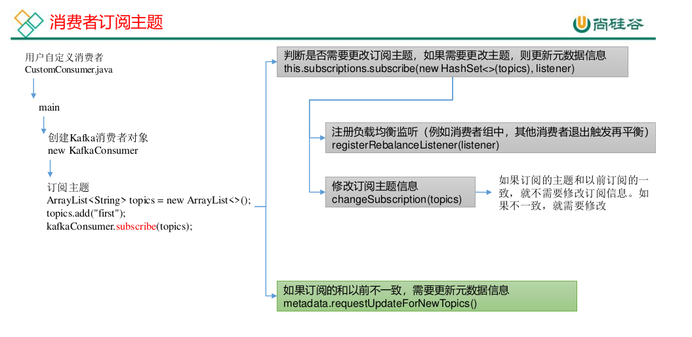

点击自己编写的 CustomConsumer.java 中的 subscribe ()方法。

**CustomConsumer.java**

```java
// 2 订阅主题 first
ArrayList<String> topics = new ArrayList<>();
topics.add("first");
kafkaConsumer.subscribe(topics);
```

**KafkaConsumer.java**

```java
@Override
public void subscribe(Collection<String> topics) {
subscribe(topics, new NoOpConsumerRebalanceListener());
}
@Override
public
void
subscribe(Collection<String>
topics,
ConsumerRebalanceListener listener) {
acquireAndEnsureOpen();
try {
maybeThrowInvalidGroupIdException();
// 异常情况处理
if (topics == null)
throw new IllegalArgumentException("Topic collection to
subscribe to cannot be null");
if (topics.isEmpty()) {
// treat subscribing to empty topic list as the same as
unsubscribing
this.unsubscribe();
} else {
for (String topic : topics) {
if (Utils.isBlank(topic))
throw
new
IllegalArgumentException("Topic
collection to subscribe to cannot contain null or empty topic");


}
throwIfNoAssignorsConfigured();
// 清空订阅异常主题的缓存数据
fetcher.clearBufferedDataForUnassignedTopics(topics);
log.info("Subscribed
to
topic(s):
{}",
Utils.join(topics, ", "));
// 判断是否需要更改订阅主题，如果需要更改主题，则更新元数据信息
if (this.subscriptions.subscribe(new HashSet<>(topics),
listener))
metadata.requestUpdateForNewTopics();
}
} finally {
release();
}
}
public
synchronized
boolean
subscribe(Set<String>
ConsumerRebalanceListener listener) {
// 注册负载均衡监听（例如消费者组中，其他消费者退出触发再平衡）
registerRebalanceListener(listener);
// 按照设置的主题开始订阅，自动分配分区
setSubscriptionType(SubscriptionType.AUTO_TOPICS);
// 修改订阅主题信息
return changeSubscription(topics);
}
topics,
private boolean changeSubscription(Set<String> topicsToSubscribe)
{
// 如果订阅的主题和以前订阅的一致，就不需要修改订阅信息。如果不一致，就需
要修改。
if (subscription.equals(topicsToSubscribe))
return false;
subscription = topicsToSubscribe;
return true;
}
// 如果订阅的和以前不一致，需要更新元数据信息
public synchronized int requestUpdateForNewTopics() {
// Override the timestamp of last refresh to let immediate
update.
this.lastRefreshMs = 0;
this.needPartialUpdate = true;
this.requestVersion++;
return this.updateVersion;
}
```


## 3.3 消费者拉取和处理数据

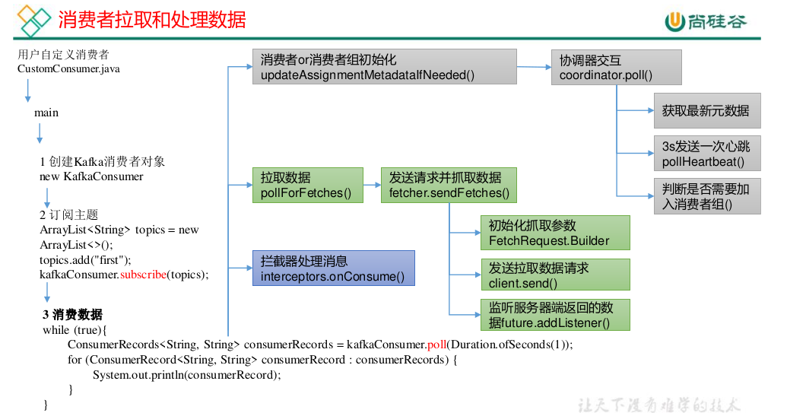


### 3.3.1 消费总体流程

点击自己编写的 CustomConsumer.java 中的 poll ()方法。

**CustomConsumer.java**

```java
// 3 消费数据
while (true){
ConsumerRecords<String,
String>
kafkaConsumer.poll(Duration.ofSeconds(1));
for
(ConsumerRecord<String,
String>
consumerRecords) {
System.out.println(consumerRecord);
}
}
consumerRecords
=
consumerRecord
:
```

**KafkaConsumer.java**

```java
@Override
public ConsumerRecords<K, V> poll(final Duration timeout) {
return poll(time.timer(timeout), true);
}
private ConsumerRecords<K, V> poll(final
boolean includeMetadataInTimeout) {
acquireAndEnsureOpen();
try {
// 记录开始拉取消息时间
Timer
timer,
final
this.kafkaConsumerMetrics.recordPollStart(timer.currentTimeMs(
));
if (this.subscriptions.hasNoSubscriptionOrUserAssignment())


{
throw
new
IllegalStateException("Consumer
is
not
subscribed to any topics or assigned any partitions");
}
do {
client.maybeTriggerWakeup();
if (includeMetadataInTimeout) {
// try to update assignment metadata BUT do not need
to block on the timer for join group
// 1、消费者 or 消费者组初始化
updateAssignmentMetadataIfNeeded(timer, false);
} else {
while
(!updateAssignmentMetadataIfNeeded(time.timer(Long.MAX_VALUE),
true)) {
log.warn("Still waiting for metadata");
}
}
// 2、开始拉取数据
final Map<TopicPartition, List<ConsumerRecord<K, V>>>
records = pollForFetches(timer);
if (!records.isEmpty()) {
// before returning the fetched records, we can send
off the next round of fetches
// and avoid block waiting for their responses to
enable pipelining while the user
// is handling the fetched records.
//
// NOTE: since the consumed position has already
been updated, we must not allow
// wakeups or any other errors to be triggered prior
to returning the fetched records.
if
(fetcher.sendFetches()

>0
>||
>client.hasPendingRequests()) {
>client.transmitSends();
>}
>// 3、拦截器处理消息
>return
>this.interceptors.onConsume(new
>ConsumerRecords<>(records));
>}
>} while (timer.notExpired());
>return ConsumerRecords.empty();
>} finally {
>release();
>this.kafkaConsumerMetrics.recordPollEnd(timer.currentTimeMs());
>}
>}
```


### 3.3.2 消费者/消费者组初始化

```java
// 1、消费者 or 消费者组初始化

>boolean updateAssignmentMetadataIfNeeded(final Timer timer, final
>boolean waitForJoinGroup) {
>if
>(coordinator
>!=
>null
>&&
>!coordinator.poll(timer,
>waitForJoinGroup)) {
>return false;
>}
>return updateFetchPositions(timer);
>}
>public boolean poll(Timer timer, boolean waitForJoinGroup) {
>// 获取最新元数据
>maybeUpdateSubscriptionMetadata();
>invokeCompletedOffsetCommitCallbacks();
>if (subscriptions.hasAutoAssignedPartitions()) {
>if (protocol == null) {
>throw new IllegalStateException("User configured " +
>ConsumerConfig.PARTITION_ASSIGNMENT_STRATEGY_CONFIG +
>" to empty while trying to subscribe for group
>protocol to auto assign partitions");
>}
>// Always update the heartbeat last poll time so that the
>heartbeat thread does not leave the
>// group proactively due to application inactivity even if
>(say) the coordinator cannot be found.
>// 3s 发送一次心跳
>pollHeartbeat(timer.currentTimeMs());
>// 保证和 Coordinator 正常通信（寻找服务器端的 coordinator）
>if (coordinatorUnknown() && !ensureCoordinatorReady(timer))
>{
>return false;
>}
>// 判断是否需要加入消费者组
>if (rejoinNeededOrPending()) {
>// due to a race condition between the initial metadata
>fetch and the initial rebalance,
>// we need to ensure that the metadata is fresh before
>joining initially. This ensures
>// that we have matched the pattern against the
>cluster's topics at least once before joining.
>if (subscriptions.hasPatternSubscription()) {
>… …
>if
>(this.metadata.timeToAllowUpdate(timer.currentTimeMs()) == 0) {
>this.metadata.requestUpdate();
>}
>if (!client.ensureFreshMetadata(timer)) {
>return false;
>}
>maybeUpdateSubscriptionMetadata();
>}
>
>
>// if not wait for join group, we would just use a
>timer of 0
>if
>(!ensureActiveGroup(waitForJoinGroup
>?
>timer
>:
>time.timer(0L))) {
>// since we may use a different timer in the callee,
>we'd still need
>// to update the original timer's current time after
>the call
>timer.update(time.milliseconds());
>return false;
>}
>}
>} else {
>… …
>if
>(metadata.updateRequested()
>&& !client.hasReadyNodes(timer.currentTimeMs())) {
>client.awaitMetadataUpdate(timer);
>}
>}
>// 是否自动提交 offset
>maybeAutoCommitOffsetsAsync(timer.currentTimeMs());
>return true;
>}
>protected synchronized boolean ensureCoordinatorReady(final Timer
>timer) {
>// 如果找到 coordinator，直接返回
>if (!coordinatorUnknown())
>return true;
>// 如果没有找到，循环给服务器端发送请求，直到找到 coordinator
>do {
>if (fatalFindCoordinatorException != null) {
>final
>RuntimeException
>fatalException
>fatalFindCoordinatorException;
>fatalFindCoordinatorException = null;
>throw fatalException;
>}
>// 创建寻找 coordinator 的请求
>final RequestFuture<Void> future = lookupCoordinator();
>// 发送寻找 coordinator 的请求给服务器端
>client.poll(future, timer);
>=
>if (!future.isDone()) {
>// ran out of time
>break;
>}
>RuntimeException fatalException = null;
>if (future.failed()) {
>if (future.isRetriable()) {
>log.debug("Coordinator discovery failed, refreshing
>metadata", future.exception());
>client.awaitMetadataUpdate(timer);
>
>
>} else {
>fatalException = future.exception();
>log.info("FindCoordinator
>request
>hit
>fatal
>exception", fatalException);
>}
>}
>else
>if
>(coordinator
>!=
>null
>&&
>client.isUnavailable(coordinator)) {
>// we found the coordinator, but the connection has
>failed, so mark
>// it dead and backoff before retrying discovery
>markCoordinatorUnknown("coordinator unavailable");
>timer.sleep(rebalanceConfig.retryBackoffMs);
>}
>clearFindCoordinatorFuture();
>if (fatalException != null)
>throw fatalException;
>} while (coordinatorUnknown() && timer.notExpired());
>return !coordinatorUnknown();
>}
>protected synchronized RequestFuture<Void> lookupCoordinator() {
>if (findCoordinatorFuture == null) {
>// find a node to ask about the coordinator
>Node node = this.client.leastLoadedNode();
>if (node == null) {
>log.debug("No broker available to send FindCoordinator
>request");
>return RequestFuture.noBrokersAvailable();
>} else {
>// 向服务器端发送，查找 Coordinator 请求
>findCoordinatorFuture
>=
>sendFindCoordinatorRequest(node);
>}
>}
>return findCoordinatorFuture;
>}
>private RequestFuture<Void> sendFindCoordinatorRequest(Node node)
>{
>// initiate the group metadata request
>log.debug("Sending FindCoordinator request to broker {}",
>node);
>// 封装发送请求
>FindCoordinatorRequestData
>data
>=
>new
>FindCoordinatorRequestData()
>.setKeyType(CoordinatorType.GROUP.id())
>.setKey(this.rebalanceConfig.groupId);
>FindCoordinatorRequest.Builder
>requestBuilder
>=
>new
>FindCoordinatorRequest.Builder(data);
>// 消费者向服务器端发送请求
>return client.send(node, requestBuilder)
>.compose(new FindCoordinatorResponseHandler());
>}
```


### 3.3.3 拉取数据

```java
// 2、开始拉取数据
private
Map<TopicPartition,
List<ConsumerRecord<K,
V>>>
pollForFetches(Timer timer) {
long pollTimeout = coordinator == null ? timer.remainingMs() :
Math.min(coordinator.timeToNextPoll(timer.currentTimeMs()),
timer.remainingMs());
// if data is available already, return it immediately
final Map<TopicPartition, List<ConsumerRecord<K, V>>> records
= fetcher.fetchedRecords();
if (!records.isEmpty()) {
return records;
}
// send any new fetches (won't resend pending fetches)
// 2.1 发送请求并抓取数据
fetcher.sendFetches();
// We do not want to be stuck blocking in poll if we are
missing some positions
// since the offset lookup may be backing off after a failure
// NOTE: the use of cachedSubscriptionHashAllFetchPositions
means we MUST call
// updateAssignmentMetadataIfNeeded before this method.
if (!cachedSubscriptionHashAllFetchPositions && pollTimeout >
retryBackoffMs) {
pollTimeout = retryBackoffMs;
}
log.trace("Polling for fetches with timeout {}", pollTimeout);
Timer pollTimer = time.timer(pollTimeout);
client.poll(pollTimer, () -> {
// since a fetch might be completed by the background
thread, we need this poll condition
// to ensure that we do not block unnecessarily in poll()
return !fetcher.hasAvailableFetches();
});
timer.update(pollTimer.currentTimeMs());
// 2.2 把数据按照分区封装好后，一次处理默认 500 条数据
return fetcher.fetchedRecords();
}
2.1 发送请求并抓取数据
Fetcher.java
public synchronized int sendFetches() {
// Update metrics in case there was an assignment change
sensors.maybeUpdateAssignment(subscriptions);

>Map<Node,
>FetchSessionHandler.FetchRequestData>
>fetchRequestMap = prepareFetchRequests();
>for
>(Map.Entry<Node,
>FetchSessionHandler.FetchRequestData>
>entry : fetchRequestMap.entrySet()) {
>final Node fetchTarget = entry.getKey();
>final
>FetchSessionHandler.FetchRequestData
>data
>=
>entry.getValue();
>// 初始化抓取数据的参数：
>// 最大等待时间默认 500ms
>// 最小抓取一个字节
>// 最大抓取 50m 数据，
>final FetchRequest.Builder request = FetchRequest.Builder
>.forConsumer(this.maxWaitMs,
>this.minBytes,
>data.toSend())
>.isolationLevel(isolationLevel)
>.setMaxBytes(this.maxBytes)
>.metadata(data.metadata())
>.toForget(data.toForget())
>.rackId(clientRackId);
>if (log.isDebugEnabled()) {
>log.debug("Sending {} {} to broker {}", isolationLevel,
>data.toString(), fetchTarget);
>}
>// 发送拉取数据请求
>RequestFuture<ClientResponse>
>future
>=
>client.send(fetchTarget, request);
>// We add the node to the set of nodes with pending fetch
>requests before adding the
>// listener because the future may have been fulfilled on
>another thread (e.g. during a
>// disconnection being handled by the heartbeat thread)
>which will mean the listener
>// will be invoked synchronously.
>this.nodesWithPendingFetchRequests.add(entry.getKey().id());
>// 监听服务器端返回的数据
>future.addListener(new
>RequestFutureListener<ClientResponse>() {
>@Override
>public void onSuccess(ClientResponse resp) {
>// 成功接收服务器端数据
>synchronized (Fetcher.this) {
>try {
>// 获取服务器端响应数据
>FetchResponse
>response
>=
>(FetchResponse)
>resp.responseBody();
>FetchSessionHandler
>handler
>=
>sessionHandler(fetchTarget.id());
>if (handler == null) {
>log.error("Unable
>to
>find
>FetchSessionHandler for node {}. Ignoring fetch response.",
>fetchTarget.id());
>return;
>}
>if (!handler.handleResponse(response)) {
>return;
>
>
>}
>Set<TopicPartition>
>partitions
>=
>new
>HashSet<>(response.responseData().keySet());
>FetchResponseMetricAggregator
>metricAggregator
>=
>new
>FetchResponseMetricAggregator(sensors,
>partitions);
>for
>(Map.Entry<TopicPartition,
>FetchResponseData.PartitionData>
>entry
>:
>response.responseData().entrySet()) {
>TopicPartition partition = entry.getKey();
>FetchRequest.PartitionData requestData =
>data.sessionPartitions().get(partition);
>if (requestData == null) {
>String message;
>if (data.metadata().isFull()) {
>message
>=
>MessageFormatter.arrayFormat(
>"Response for missing full
>request partition: partition={}; metadata={}",
>new
>Object[]{partition,
>data.metadata()}).getMessage();
>} else {
>message
>=
>MessageFormatter.arrayFormat(
>"Response for missing session
>request
>partition:
>partition={};
>metadata={};
>toSend={};
>toForget={}",
>new
>Object[]{partition,
>data.metadata(), data.toSend(), data.toForget()}).getMessage();
>}
>// Received fetch response for missing
>session partition
>throw
>IllegalStateException(message);
>} else {
>long
>fetchOffset
>requestData.fetchOffset;
>FetchResponseData.PartitionData
>partitionData = entry.getValue();
>new
>=
>log.debug("Fetch {} at offset {} for
>partition {} returned fetch data {}",
>isolationLevel,
>fetchOffset,
>partition, partitionData);
>Iterator<? extends RecordBatch> batches
>FetchResponse.recordsOrFail(partitionData).batches().iterator();
>short
>responseVersion
>=
>resp.requestHeader().apiVersion();
>// 把数据按照分区，添加到消息队列里面
>//
>private
>final
>ConcurrentLinkedQueue<CompletedFetch> completedFetches;
>completedFetches.add(new
>CompletedFetch(partition, partitionData,
>=
>
>
>metricAggregator,
>batches,
>fetchOffset, responseVersion));
>}
>}
>sensors.fetchLatency.record(resp.requestLatencyMs());
>} finally {
>nodesWithPendingFetchRequests.remove(fetchTarget.id());
>}
>}
>}
>@Override
>public void onFailure(RuntimeException e) {
>synchronized (Fetcher.this) {
>try {
>FetchSessionHandler
>handler
>sessionHandler(fetchTarget.id());
>if (handler != null) {
>handler.handleError(e);
>}
>} finally {
>=
>nodesWithPendingFetchRequests.remove(fetchTarget.id());
>}
>}
>}
>});
>}
>return fetchRequestMap.size();
>}
>2.2 把数据按照分区封装好后，一次处理最大条数默认 500 条数据
>public
>Map<TopicPartition,
>List<ConsumerRecord<K,
>V>>>
>fetchedRecords() {
>Map<TopicPartition, List<ConsumerRecord<K, V>>> fetched = new
>HashMap<>();
>Queue<CompletedFetch>
>pausedCompletedFetches
>=
>new
>ArrayDeque<>();
>// 一次处理的最大条数，默认 500 条
>int recordsRemaining = maxPollRecords;
>try {
>// 循环处理
>while (recordsRemaining > 0) {
>if
>
>(nextInLineFetch
>==
>
>null
>||
>nextInLineFetch.isConsumed) {
>// 从缓存中获取数据
>CompletedFetch records = completedFetches.peek();
>// 缓存中数据为 null,直接跳出循环
>if (records == null) break;
>if (records.notInitialized()) {
>try {
>
>nextInLineFetch
>=
>initializeCompletedFetch(records);
>} catch (Exception e) {
>// Remove a completedFetch upon a parse with
>exception if (1) it contains no records, and
>// (2) there are no fetched records with
>actual content preceding this exception.
>// The first condition ensures that the
>completedFetches is not stuck with the same completedFetch
>//
>in
>cases
>such
>as
>the
>TopicAuthorizationException, and the second condition ensures
>that no
>// potential data loss due to an exception in
>a following record.
>FetchResponseData.PartitionData partition =
>records.partitionData;
>if
>(fetched.isEmpty()
>&&
>FetchResponse.recordsOrFail(partition).sizeInBytes() == 0) {
>completedFetches.poll();
>}
>throw e;
>}
>} else {
>nextInLineFetch = records;
>}
>// 从缓存中拉取数据
>completedFetches.poll();
>}
>else
>if
>(subscriptions.isPaused(nextInLineFetch.partition)) {
>// when the partition is paused we add the records
>back to the completedFetches queue instead of draining
>// them so that they can be returned on a subsequent
>poll if the partition is resumed at that time
>log.debug("Skipping fetching records for assigned
>partition {} because it is paused", nextInLineFetch.partition);
>pausedCompletedFetches.add(nextInLineFetch);
>nextInLineFetch = null;
>} else {
>List<ConsumerRecord<K,
>V>>
>records
>=
>fetchRecords(nextInLineFetch, recordsRemaining);
>if (!records.isEmpty()) {
>TopicPartition
>partition
>=
>nextInLineFetch.partition;
>List<ConsumerRecord<K,
>V>>
>currentRecords
>=
>fetched.get(partition);
>if (currentRecords == null) {
>fetched.put(partition, records);
>} else {
>// this case shouldn't usually happen because
>we only send one fetch at a time per partition,
>// but it might conceivably happen in some
>rare cases (such as partition leader changes).
>// we have to copy to a new list because the
>old one may be immutable
>List<ConsumerRecord<K, V>> newRecords = new
>ArrayList<>(records.size() + currentRecords.size());
>
>newRecords.addAll(currentRecords);
>newRecords.addAll(records);
>fetched.put(partition, newRecords);
>}
>recordsRemaining -= records.size();
>}
>}
>}
>} catch (KafkaException e) {
>if (fetched.isEmpty())
>throw e;
>} finally {
>// add any polled completed fetches for paused partitions
>back to the completed fetches queue to be
>// re-evaluated in the next poll
>completedFetches.addAll(pausedCompletedFetches);
>}
>return fetched;
>}
```

### 3.3.4 拦截器处理数据

```java
在 poll()方法中点击 onConsume()方法。
// 3、拦截器处理消息
// 数据从服务器端，返回后，放入集合中缓存
final Map<TopicPartition, List<ConsumerRecord<K, V>>> records =
pollForFetches(timer);
… …
// 从集合中拉取数据处理，首先经过的是拦截器
return
this.interceptors.onConsume(new
ConsumerRecords<>(records));
public ConsumerRecords<K, V> onConsume(ConsumerRecords<K, V>
records) {
ConsumerRecords<K, V> interceptRecords = records;
for (ConsumerInterceptor<K, V> interceptor : this.interceptors)
{
try {
interceptRecords
=
interceptor.onConsume(interceptRecords);
} catch (Exception e) {
// do not propagate interceptor exception, log and
continue calling other interceptors
log.warn("Error
executing
interceptor
onConsume
callback", e);
}
}
return interceptRecords;
}
```


## 3.4 消费者 Offset 提交

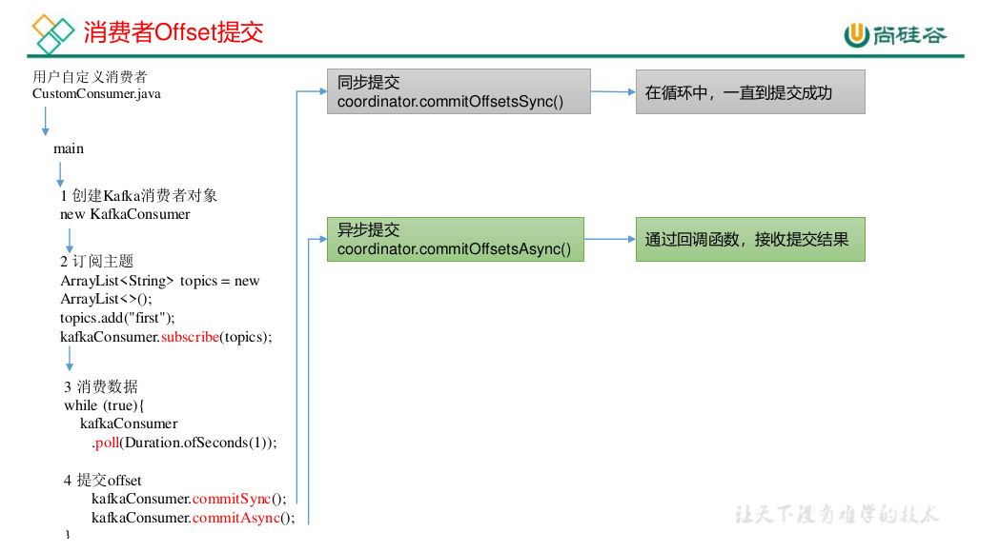


### 3.4.1 手动同步提交 Offset

手动同步提交 Offset

**CustomConsumer.java**

```java
// 手动提交
properties.put(ConsumerConfig.ENABLE_AUTO_COMMIT_CONFIG,false);
// 1 创建一个消费者 "", "hello"
KafkaConsumer<String,
String>
KafkaConsumer<>(properties);
kafkaConsumer
=
new
// 2 订阅主题 first
ArrayList<String> topics = new ArrayList<>();
topics.add("first");
kafkaConsumer.subscribe(topics);
// 3 消费数据
while (true){
ConsumerRecords<String,
String>
kafkaConsumer.poll(Duration.ofSeconds(1));
for
(ConsumerRecord<String,
String>
consumerRecords) {
System.out.println(consumerRecord);
}
consumerRecords
consumerRecord
// 手动提交 offset
kafkaConsumer.commitSync();
}
```

KafkaConsumer.java

```java
@Override
public void commitSync() {

=
:

commitSync(Duration.ofMillis(defaultApiTimeoutMs));
}
@Override
public void commitSync(Duration timeout) {
commitSync(subscriptions.allConsumed(), timeout);
}
@Override
public
void
commitSync(final
Map<TopicPartition,
OffsetAndMetadata> offsets, final Duration timeout) {
acquireAndEnsureOpen();
try {
maybeThrowInvalidGroupIdException();
offsets.forEach(this::updateLastSeenEpochIfNewer);
// 同步提交
if (!coordinator.commitOffsetsSync(new HashMap<>(offsets),
time.timer(timeout))) {
throw
new
TimeoutException("Timeout
of
"
+
timeout.toMillis() + "ms expired before successfully " +
"committing offsets " + offsets);
}
} finally {
release();
}
}
public
boolean
commitOffsetsSync(Map<TopicPartition,
OffsetAndMetadata> offsets, Timer timer) {
invokeCompletedOffsetCommitCallbacks();
if (offsets.isEmpty())
return true;
do {
if (coordinatorUnknown() && !ensureCoordinatorReady(timer))
{
return false;
}
// 发送提交请求
RequestFuture<Void>
sendOffsetCommitRequest(offsets);
client.poll(future, timer);
future
=
// We may have had in-flight offset commits when the
synchronous commit began. If so, ensure that
// the corresponding callbacks are invoked prior to
returning in order to preserve the order that
// the offset commits were applied.
invokeCompletedOffsetCommitCallbacks();
// 提交成功
if (future.succeeded()) {
if (interceptors != null)
interceptors.onCommit(offsets);

return true;
}
if (future.failed() && !future.isRetriable())
throw future.exception();
timer.sleep(rebalanceConfig.retryBackoffMs);
} while (timer.notExpired());
return false;
}
```


### 3.4.2 手动异步提交 Offset

手动异步提交 Offset

**CustomConsumer.java**

```java
// 手动提交
properties.put(ConsumerConfig.ENABLE_AUTO_COMMIT_CONFIG,false);
// 1 创建一个消费者 "", "hello"
KafkaConsumer<String,
String>
KafkaConsumer<>(properties);
kafkaConsumer
=
new
// 2 订阅主题 first
ArrayList<String> topics = new ArrayList<>();
topics.add("first");
kafkaConsumer.subscribe(topics);
// 3 消费数据
while (true){
ConsumerRecords<String,
String>
kafkaConsumer.poll(Duration.ofSeconds(1));
for
(ConsumerRecord<String,
String>
consumerRecords) {
System.out.println(consumerRecord);
}
consumerRecords
consumerRecord
// 手动提交 offset
// kafkaConsumer.commitSync();
kafkaConsumer.commitAsync();
}
```

**KafkaConsumer.java**

```java
@Override
public void commitAsync() {
commitAsync(null);
}
@Override
public void commitAsync(OffsetCommitCallback callback) {
commitAsync(subscriptions.allConsumed(), callback);
}
@Override

=
:

public
void
commitAsync(final
Map<TopicPartition,
OffsetAndMetadata> offsets, OffsetCommitCallback callback) {
acquireAndEnsureOpen();
try {
maybeThrowInvalidGroupIdException();
log.debug("Committing offsets: {}", offsets);
offsets.forEach(this::updateLastSeenEpochIfNewer);
// 提交 offset
coordinator.commitOffsetsAsync(new
HashMap<>(offsets),
callback);
} finally {
release();
}
}
public
void
commitOffsetsAsync(final
Map<TopicPartition,
OffsetAndMetadata> offsets, final OffsetCommitCallback callback)
{
invokeCompletedOffsetCommitCallbacks();
if (!coordinatorUnknown()) {
doCommitOffsetsAsync(offsets, callback);
} else {
// we don't know the current coordinator, so try to find it
and then send the commit
// or fail (we don't want recursive retries which can cause
offset commits to arrive
// out of order). Note that there may be multiple offset
commits chained to the same
// coordinator lookup request. This is fine because the
listeners will be invoked in
// the same order that they were added. Note also that
AbstractCoordinator prevents
// multiple concurrent coordinator lookup requests.
pendingAsyncCommits.incrementAndGet();
// 监听提交 offset 的结果
lookupCoordinator().addListener(new
RequestFutureListener<Void>() {
@Override
public void onSuccess(Void value) {
pendingAsyncCommits.decrementAndGet();
doCommitOffsetsAsync(offsets, callback);
client.pollNoWakeup();
}
@Override
public void onFailure(RuntimeException e) {
pendingAsyncCommits.decrementAndGet();
completedOffsetCommits.add(new
OffsetCommitCompletion(callback, offsets,
new RetriableCommitFailedException(e)));
}
});
}
// ensure the commit has a chance to be transmitted (without
blocking on its completion).

// Note that commits are treated as heartbeats by the
coordinator, so there is no need to
// explicitly allow heartbeats through delayed task execution.
client.pollNoWakeup();
}
```


# 第 4 章 服务器源码

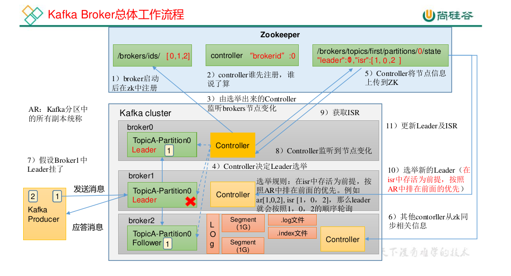

## 4.1 程序入口

 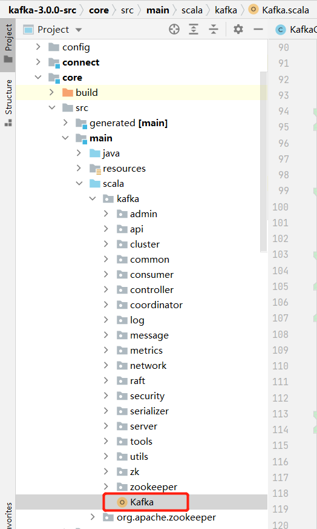


**Kafka.scala**

程序的入口

```scala
def main(args: Array[String]): Unit = {
    try {
        // 获取参数相关信息
        val serverProps = getPropsFromArgs(args)
        // 配置服务

       val server = buildServer(serverProps)
        try {
            if (!OperatingSystem.IS_WINDOWS && !Java.isIbmJdk)
            new LoggingSignalHandler().register()
        } catch {
            case e: ReflectiveOperationException =>warn("Failed to register optional signal handler that logs a
message when the process is terminated " +s"by a signal. Reason for registration failure is: $e", e)
        }
        // attach shutdown handler to catch terminating signals as well as normal termination 
        Exit.addShutdownHook("kafka-shutdown-hook", {
            try server.shutdown()
            catch {
                case _: Throwable => fatal("Halting Kafka.")
                // Calling exit() can lead to deadlock as exit() can be called multiple times. Force exit.
                Exit.halt(1)
            }
        })
        // 启动服务

        try server.startup()
        catch {
            case _: Throwable =>

           // KafkaServer.startup() calls shutdown() in exceptions, so we invoke `exit` to set the status code

            fatal("Exiting Kafka.")
            Exit.exit(1)
        }
        server.awaitShutdown()
}catch {
        case e: Throwable =>fatal("Exiting Kafka due to fatal exception", e)
        Exit.exit(1)
    }Exit.exit(0)
```


