#  第 1 章 Kafka 概述

## 1.1 定义

Kafka 是一个分布式的基于发布/订阅模式的消息队列(Message Queue),主要应用于大数据实时处理领域。

## 1.2 消息队列

### 1.2.1 传统消息队列的应用场景

**MQ传统应用场景之异步处理**

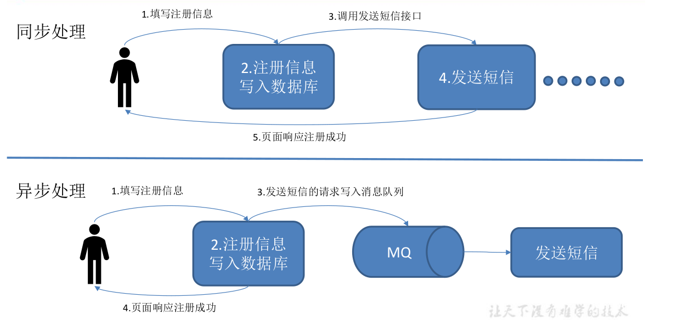

> 2)可恢复性
>
> 系统的一部分组件失效时,不会影响到整个系统。消息队列降低了进程间的耦合度,所以即使一个处理消息的进程挂掉,加入队列中的消息仍然可以在系统恢复后被处理。
>
> 3)缓冲
>
> 有助于控制和优化数据流经过系统的速度,解决生产消息和消费消息的处理速度不一致的情况。
>
> 4)灵活性 & 峰值处理能力
>
> 在访问量剧增的情况下,应用仍然需要继续发挥作用,但是这样的突发流量并不常见。如果为以能处理这类峰值访问为标准来投入资源随时待命无疑是巨大的浪费。使用消息队列能够使关键组件顶住突发的访问压力,而不会因为突发的超负荷的请求而完全崩溃。
>
> 5)异步通信
>
> 很多时候,用户不想也不需要立即处理消息。消息队列提供了异步处理机制,允许用户把一个消息放入队列,但并不立即处理它。想向队列中放入多少消息就放多少,然后在需要的时候再去处理它们。

### 1.2.2 消息队列的两种模式

(1)点对点模式(一对一,消费者主动拉取数据,消息收到后消息清除)

消息生产者生产消息发送到 Queue 中,然后消息消费者从 Queue 中取出并且消费消息。消息被消费以后,queue 中不再有存储,所以消息消费者不可能消费到已经被消费的消息。Queue 支持存 在多个消费 者, 但是对 一个消息而 言, 只会有一个消 费者可以 消费。

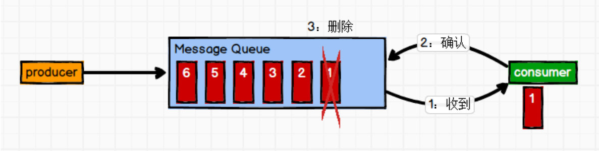

(2)发布/订阅模式(一对多,消费者消费数据之后不会清除消息)

消息生产者(发布)将消息发布到 topic 中,同时有多个消息消费者(订阅)消费该消息。和点对点方式不同,发布到 topic 的消息会被所有订阅者消费。

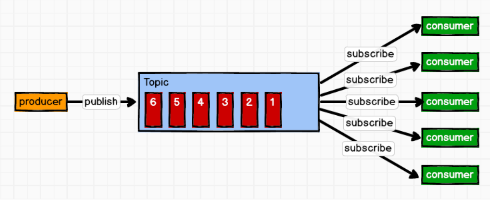

## 1.3 Kafka 基础架构

`Kafka架构`

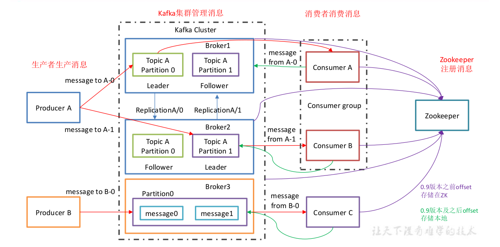

> 1)`Producer` :消息生产者,就是向 kafka broker 发消息的客户端;
>
> 2)`Consumer` :消息消费者,向 kafka broker 取消息的客户端;
>
> 3)`Consumer Group (CG)`:消费者组,由多个 consumer 组成。消费者组内每个消费者负责消费不同分区的数据,一个分区只能由一个组内消费者消费;消费者组之间互不影响。所有的消费者都属于某个消费者组,即消费者组是逻辑上的一个订阅者。
>
> 4)`Broker` :一台 kafka 服务器就是一个 broker。一个集群由多个 broker 组成。一个 broker可以容纳多个 topic。
>
> 5)`Topic` :可以理解为一个队列,生产者和消费者面向的都是一个 topic;
>
> 6)`Partition`:为了实现扩展性,一个非常大的 topic 可以分布到多个 broker (即服务器)上,一个 topic 可以分为多个partition,每个 partition 是一个有序的队列;
>
> 7）`Replica`:副本,为保证集群中的某个节点发生故障时,该节点上的 partition 数据不丢失,且 kafka 仍然能够继续工作, kafka 提供了副本机制,一个 topic 的每个分区都有若干个副本,一个 leader 和若干个 follower。
>
> 8)`leader`:每个分区多个副本的“主”,生产者发送数据的对象,以及消费者消费数据的对象都是 leader。
>
> 9)`follower`:每个分区多个副本中的“从”,实时从 leader 中同步数据,保持和 leader 数据的同步。leader 发生故障时,某个 follower 会成为新的 follower。

# 第 2 章 Kafka 快速入门

## 2.1 安装部署

### 2.1.1 集群规划

| hadoop102 | hadoop103 | hadoop104 |
| --------- | --------- | --------- |
| zk        | zk        | zk        |
| kafka     | kafka     | kafka     |

### 2.1.2 jar 包下载

http://kafka.apache.org/downloads.html

### 2.1.3 集群部署

1)解压安装包

```sh
[atguigu@hadoop102 software]$ tar -zxvf kafka_2.11-0.11.0.0.tgz -C /opt/module/
```

2)修改解压后的文件名称

```sh
[atguigu@hadoop102 module]$ mv kafka_2.11-0.11.0.0/ kafka
```

3)在/opt/module/kafka 目录下创建 logs 文件夹

```sh
[atguigu@hadoop102 kafka]$ mkdir logs
```

4)修改配置文件

```sh
[atguigu@hadoop102 kafka]$ cd config/
[atguigu@hadoop102 config]$ vi server.properties
输入以下内容:
#broker 的全局唯一编号,不能重复
broker.id=0
#删除 topic 功能使能
delete.topic.enable=true
#处理网络请求的线程数量
num.network.threads=3
#用来处理磁盘 IO 的现成数量
num.io.threads=8
#发送套接字的缓冲区大小
socket.send.buffer.bytes=102400
#接收套接字的缓冲区大小
socket.receive.buffer.bytes=102400
#请求套接字的缓冲区大小
socket.request.max.bytes=104857600
#kafka 运行日志存放的路径
log.dirs=/opt/module/kafka/logs
#topic 在当前 broker 上的分区个数
num.partitions=1
#用来恢复和清理 data 下数据的线程数量
num.recovery.threads.per.data.dir=1
#segment 文件保留的最长时间,超时将被删除
log.retention.hours=168
#配置连接 Zookeeper 集群地址
zookeeper.connect=hadoop102:2181,hadoop103:2181,hadoop104:2181
```


5)配置环境变量

```sh
[atguigu@hadoop102 module]$ sudo vi /etc/profile
#KAFKA_HOME
export KAFKA_HOME=/opt/module/kafka
export PATH=$PATH:$KAFKA_HOME/bin
[atguigu@hadoop102 module]$ source /etc/profile
```

6)分发安装包

```sh
[atguigu@hadoop102 module]$ xsync kafka/
```

注意:分发之后记得配置其他机器的环境变量

7)分别在 hadoop103 和 hadoop104 上修改配置文件/opt/module/kafka/config/server.properties中的 broker.id=1、broker.id=2
注:broker.id 不得重复

8)启动集群
依次在 hadoop102、hadoop103、hadoop104 节点上启动 kafka

```sh
[atguigu@hadoop102 kafka]$ config/server.properties bin/kafka-server-start.sh -daemon
[atguigu@hadoop103 kafka]$ config/server.properties bin/kafka-server-start.sh -daemon
[atguigu@hadoop104 kafka]$ config/server.properties bin/kafka-server-start.sh -daemon
```

9)关闭集群

```sh
[atguigu@hadoop102 kafka]$ bin/kafka-server-stop.sh stop
[atguigu@hadoop103 kafka]$ bin/kafka-server-stop.sh stop
[atguigu@hadoop104 kafka]$ bin/kafka-server-stop.sh stop
```

10)kafka 群起脚本

```sh
for i in hadoop102 hadoop103 hadoop104
do
echo "========== $i =========="
ssh $i '/opt/module/kafka/bin/kafka-server-start.sh -daemon /opt/module/kafka/config/server.properties'
done
```


## 2.2 Kafka 命令行操作

1)查看当前服务器中的所有 topic

```sh
[atguigu@hadoop102 kafka]$bin/kafka-topics.sh --zookeeper hadoop102:2181 --list
```

2)创建 topic

```sh
[atguigu@hadoop102 kafka]$ bin/kafka-topics.sh --zookeeper hadoop102:2181 --create --replication-factor 3 --partitions 1 --topic first

选项说明:
--topic 定义topic名
--replication-factor 定义副本数
--partitions 定义分区数
```

3)删除 topic

```sh
[atguigu@hadoop102 kafka]$ bin/kafka-topics.sh --zookeeper hadoop102:2181 --delete --topic first
# 需要 server.properties 中设置 delete.topic.enable=true 否则只是标记删除。
```

4)发送消息

```sh
[atguigu@hadoop102 kafka]$ bin/kafka-console-producer.sh --broker-list hadoop102:9092 --topic first
> hello world
> atguigu atguigu
```

5)消费消息

```sh
[atguigu@hadoop102 kafka]$ bin/kafka-console-consumer.sh \
--zookeeper hadoop102:2181 --topic first

[atguigu@hadoop102 kafka]$ bin/kafka-console-consumer.sh \
--bootstrap-server hadoop102:9092 --topic first

[atguigu@hadoop102 kafka]$ bin/kafka-console-consumer.sh \
--bootstrap-server hadoop102:9092 --from-beginning --topic first

--from-beginning:会把主题中以往所有的数据都读取出来。
```

6)查看某个 Topic 的详情

```sh
[atguigu@hadoop102 kafka]$ bin/kafka-topics.sh --zookeeper
hadoop102:2181 --describe --topic first
```

7)修改分区数

```sh
[atguigu@hadoop102 kafka]$ bin/kafka-topics.sh --zookeeper
hadoop102:2181 --alter --topic first --partitions 6
```


# 第 3 章 Kafka 架构深入

## 3.1 Kafka 工作流程及文件存储机制

### 3.1.1 Kafka 工作流程

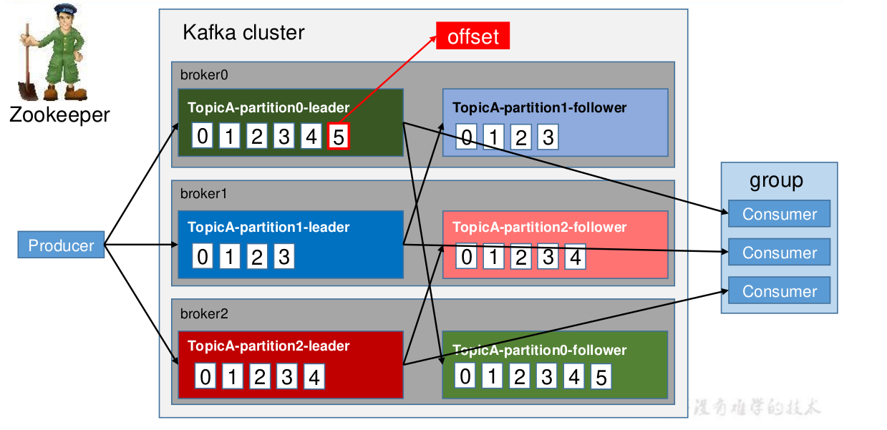


Kafka 中消息是以 `topic` 进行分类的,生产者生产消息,消费者消费消息,都是面向 topic的。

topic 是逻辑上的概念,而 partition 是物理上的概念,每个 partition 对应于一个 log 文件,该 log 文件中存储的就是 producer 生产的数据。Producer 生产的数据会被不断追加到该log 文件末端,且每条数据都有自己的 offset。消费者组中的每个消费者,都会实时记录自己消费到了哪个 offset,以便出错恢复时,从上次的位置继续消费。

### 3.1.2 Kafka文件存储机制

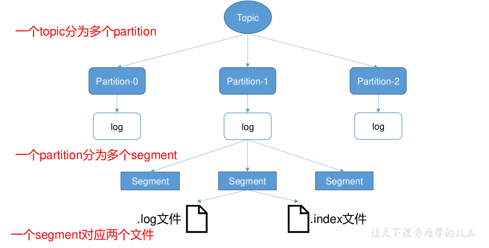

​	由于生产者生产的消息会不断追加到 log 文件末尾,为防止 log 文件过大导致数据定位效率低下,Kafka 采取了分片和索引机制,将每个 partition 分为多个 segment。每个 segment对应两个文件——“.index”文件和“.log”文件。这些文件位于一个文件夹下,该文件夹的命名规则为: topic 名称+分区序号。例如, first 这个 topic 有三个分区,则其对应的文件夹为 first-0,first-1,first-2。

```txt
00000000000000000000.index
00000000000000000000.log
00000000000000170410.index
00000000000000170410.log
00000000000000239430.index
00000000000000239430.log
```

index 和 log 文件以当前 segment 的第一条消息的 offset 命名。下图为 index 文件和 log
文件的结构示意图。
<font color=red>index文件和log文件详解</font>

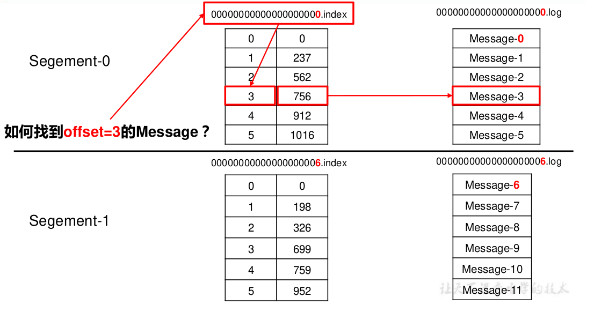

“.index”文件存储大量的索引信息,“.log”文件存储大量的数据,索引文件中的元数据指向对应数据文件中 message 的物理偏移地址。

## 3.2 Kafka 生产者

### 3.2.1 分区策略

#### 1)分区的原因

> (1)方便在集群中扩展,每个 Partition 可以通过调整以适应它所在的机器,而一个 topic又可以有多个 Partition 组成,因此整个集群就可以适应任意大小的数据了;
>
> (2)可以提高并发,因为可以以 Partition 为单位读写了。

#### 2)分区的原则

> 我们需要将 producer 发送的数据封装成一个 ProducerRecord 对象。
>
> (1)指明 partition 的情况下,直接将指明的值直接作为 partiton 值;
>
> (2)没有指明 partition 值但有 key 的情况下,将 key 的 hash 值与 topic 的 partition数进行取余得到 partition 值;
>
> (3)既没有 partition 值又没有 key 值的情况下,第一次调用时随机生成一个整数(后面每次调用在这个整数上自增),将这个值与 topic 可用的 partition 总数取余得到 partition值,也就是常说的 round-robin 算法。

### 3.2.2 数据可靠性保证

​	为保证 producer 发送的数据,能可靠的发送到指定的 topic,topic 的每个 partition 收到producer 发送的数据后,都需要向 producer 发送 ack(acknowledgement 确认收到),如果producer 收到 ack,就会进行下一轮的发送,否则重新发送数据。
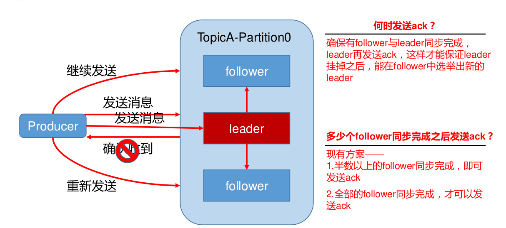

#### 1)副本数据同步策略

| 方案                   | 优点   | 缺点                                                         |
| ---------------------- | ------ | ------------------------------------------------------------ |
| 半数以上完成同步,就发  | 延迟低 | 选举新的 leader 时,容忍 n 台节点的故障,需要 2n+1 个副<br/>本 |
| 全部完成同步,才发送ack | 延迟高 | 选举新的 leader 时,容忍 n 台 ack 节点的故障,需要 n+1 个副    |

> Kafka 选择了第二种方案,原因如下:
>
> 1.同样为了容忍 n 台节点的故障,第一种方案需要 2n+1 个副本,而第二种方案只需要 n+1个副本,而 Kafka 的每个分区都有大量的数据,第一种方案会造成大量数据的冗余。
>
> 2.虽然第二种方案的网络延迟会比较高,但网络延迟对 Kafka 的影响较小。


#### 2)ISR

> 采用第二种方案之后,设想以下情景: 
>
> ​	leader 收到数据,所有 follower 都开始同步数据,但有一个 follower,因为某种故障,迟迟不能与 leader 进行同步,那 leader 就要一直等下去,直到它完成同步,才能发送 ack。这个问题怎么解决呢?
>
> ​	Leader 维护了一个动态的 **in-sync replica set** (ISR),意为和 leader 保持同步的 follower 集合。当 ISR 中的 follower 完成数据的同步之后, leader 就会给 follower 发送 ack。如果 follower长 时 间 未 向 leader 同 步 数 据 , 则 该 follower 将 被 踢 出 ISR , 该 时 间 阈 值 由replica.lag.time.max.ms 参数设定。Leader 发生故障之后,就会从 ISR 中选举新的 leader。


#### 3)ack 应答机制

> 对于某些不太重要的数据,对数据的可靠性要求不是很高,能够容忍数据的少量丢失,所以没必要等 ISR 中的 follower 全部接收成功。所以 Kafka 为用户提供了三种可靠性级别,用户根据对可靠性和延迟的要求进行权衡,选择以下的配置。
> acks 参数配置:
> acks:
>
> 0:producer 不等待 broker 的 ack,这一操作提供了一个最低的延迟,broker 一接收到还没有写入磁盘就已经返回,当 broker 故障时有可能丢失数据;
>
> 1:producer 等待 broker 的 ack,partition 的 leader 落盘成功后返回 ack,如果在 follower同步成功之前 leader 故障,那么将会丢失数据;
>
> -1(all):producer 等待 broker 的 ack,partition 的 leader 和 follower 全部落盘成功后才返回 ack。但是如果在 follower 同步完成后,broker 发送 ack 之前,leader 发生故障,那么会造成数据重复。

<font color = red>acks = 1 数据丢失案例</font>
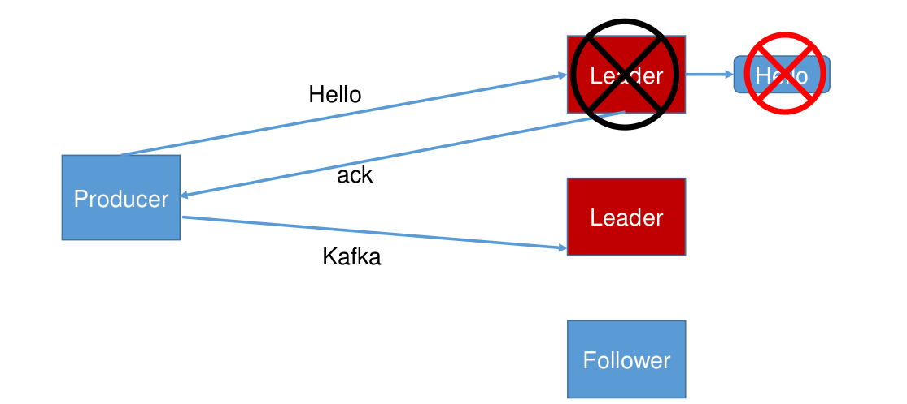

<font color = red>acks = -1 数据重复案例</font>

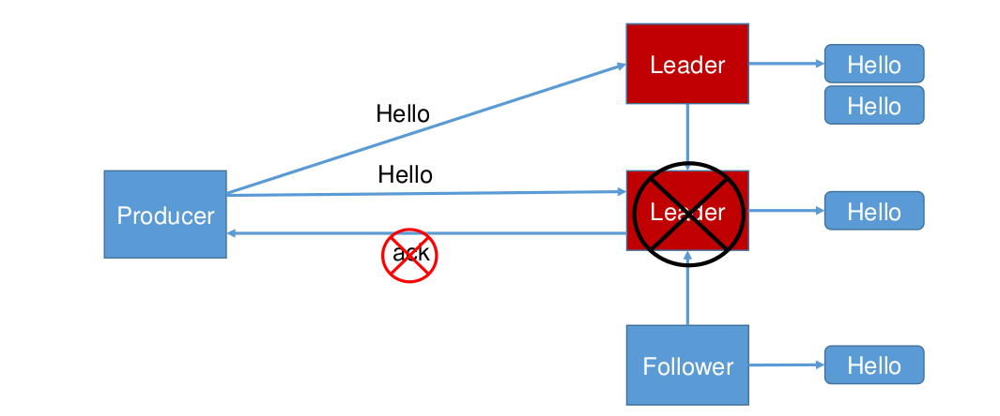

#### 4)故障处理细节

<font color = orange>Log文件中的HW和LEO</font>

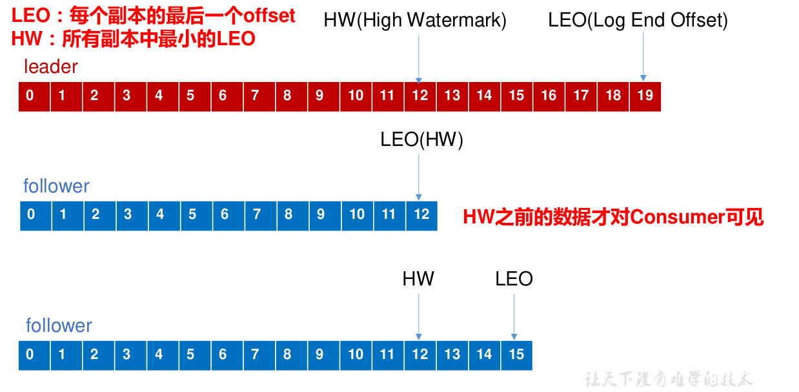

> LEO:指的是每个副本最大的 offset;
>
> HW:指的是消费者能见到的最大的 offset,ISR 队列中最小的 LEO。
>
> (1)follower 故障
> follower 发生故障后会被临时踢出 ISR,待该 follower 恢复后, follower 会读取本地磁盘记录的上次的 HW,并将 log 文件高于 HW 的部分截取掉,从 HW 开始向 leader 进行同步。等该 follower 的 LEO 大于等于该 Partition 的 HW,即 follower 追上 leader 之后,就可以重新加入 ISR 了。
>
> (2)leader 故障
> leader 发生故障之后,会从 ISR 中选出一个新的 leader,之后,为保证多个副本之间的数据一致性,其余的 follower 会先将各自的 log 文件高于 HW 的部分截掉,然后从新的 leader同步数据。
>
> 注意:这只能保证副本之间的数据一致性,并不能保证数据不丢失或者不重复。

### 3.2.3 Exactly Once 语义

> ​	将服务器的 ACK 级别设置为-1,可以保证 Producer 到 Server 之间不会丢失数据,即 At Least Once 语义。相对的,将服务器 ACK 级别设置为 0,可以保证生产者每条消息只会被发送一次,即 At Most Once 语义。At Least Once 可以保证数据不丢失,但是不能保证数据不重复;相对的,At Least Once可以保证数据不重复,但是不能保证数据不丢失。但是,对于一些非常重要的信息,比如说交易数据,下游数据消费者要求数据既不重复也不丢失,即 Exactly Once 语义。在 0.11 版本以前的 Kafka,对此是无能为力的,只能保证数据不丢失,再在下游消费者对数据做全局去重。对于多个下游应用的情况,每个都需要单独做全局去重,这就对性能造成了很大影响。0.11 版本的 Kafka,引入了一项重大特性:**幂等性**。所谓的幂等性就是指 Producer 不论向 Server 发送多少次重复数据,Server 端都只会持久化一条。幂等性结合 At Least Once 语义,就构成了 Kafka 的 Exactly Once 语义。**即:At Least Once + 幂等性 = Exactly Once**要启用幂等性,只需要将 Producer 的参数中 enable.idompotence 设置为 true 即可。 Kafka的幂等性实现其实就是将原来下游需要做的去重放在了数据上游。开启幂等性的 Producer 在初始化的时候会被分配一个 PID,发往同一 Partition 的消息会附带 Sequence Number。而Broker 端会对<PID, Partition, SeqNumber>做缓存,当具有相同主键的消息提交时,Broker 只会持久化一条。但是 PID 重启就会变化,同时不同的 Partition 也具有不同主键,所以幂等性无法保证跨分区跨会话的 Exactly Once。

## 3.3 Kafka 消费者

### 3.3.1 消费方式

> ​	consumer 采用 pull(拉)模式从 broker 中读取数据。push (推)模式很难适应消费速率不同的消费者,因为消息发送速率是由 broker 决定的。它的目标是尽可能以最快速度传递消息,但是这样很容易造成 consumer 来不及处理消息,典型的表现就是拒绝服务以及网络拥塞。而 pull 模式则可以根据 consumer 的消费能力以适当的速率消费消息。pull 模式不足之处是,如果 kafka 没有数据,消费者可能会陷入循环中,一直返回空数据。针对这一点,Kafka 的消费者在消费数据时会传入一个时长参数 timeout,如果当前没有数据可供消费,consumer 会等待一段时间之后再返回,这段时长即为 timeout。

### 3.3.2 分区分配策略

​	一个 consumer group 中有多个 consumer,一个 topic 有多个 partition,所以必然会涉及到 partition 的分配问题,即确定那个 partition 由哪个 consumer 来消费。Kafka 有两种分配策略,一是 **RoundRobin**,一是 **Range**。

1)RoundRobin

分区分配策略之RoundRobin

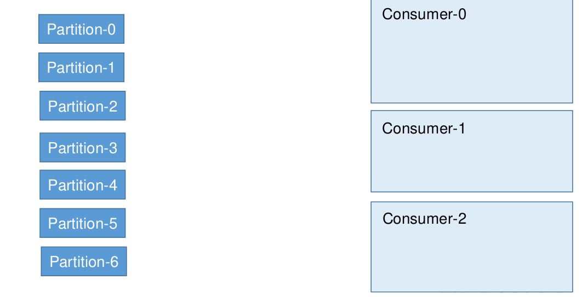

2)Range

分区分配策略之Range

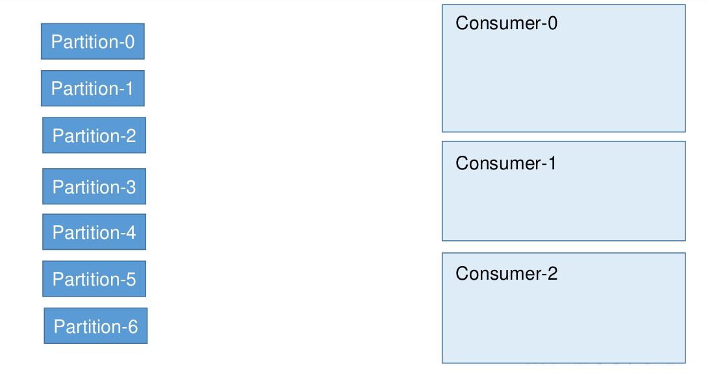

### 3.3.3 offset 的维护

​	由于 consumer 在消费过程中可能会出现断电宕机等故障,consumer 恢复后,需要从故障前的位置的继续消费,所以 consumer 需要实时记录自己消费到了哪个 offset,以便故障恢复后继续消费。

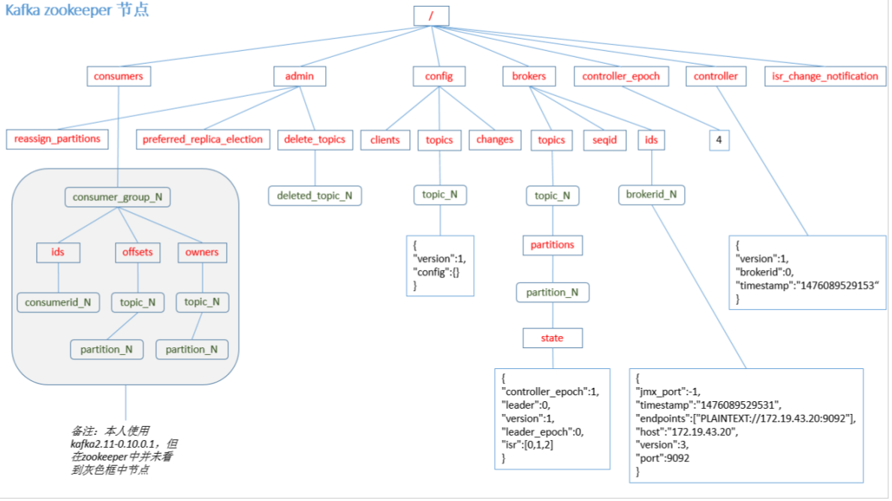

Kafka 0.9 版本之前,consumer 默认将 offset 保存在 Zookeeper 中,从 0.9 版本开始,consumer 默认将 offset 保存在 Kafka 一个内置的 topic 中,该 topic 为__consumer_offsets。

1)修改配置文件 consumer.properties

```sh
exclude.internal.topics=false
```

2)读取 offset

0.11.0.0 之前版本:

```sh
bin/kafka-console-consumer.sh --topic __consumer_offsets --zookeeper hadoop102:2181 --formatter "kafka.coordinator.GroupMetadataManager\$OffsetsMessageFormatter" --consumer.config config/consumer.properties --from-beginning
```

0.11.0.0 之后版本(含):

```sh
bin/kafka-console-consumer.sh --topic __consumer_offsets --zookeeper hadoop102:2181 --formatter "kafka.coordinator.group.GroupMetadataManager\$OffsetsMessageFormatter" --consumer.config config/consumer.properties --from-beginning
```


### 3.3.4 消费者组案例

1)需求:测试同一个消费者组中的消费者,同一时刻只能有一个消费者消费。

2)案例实操

(1)在 hadoop102、hadoop103 上修改/opt/module/kafka/config/consumer.properties 配置文件中的 group.id 属性为任意组名。

```sh
[atguigu@hadoop103 config]$ vi consumer.properties
group.id=atguigu
```

(2)在 hadoop102、hadoop103 上分别启动消费者

```sh
[atguigu@hadoop102 kafka]$ bin/kafka-console-consumer.sh \
--zookeeper hadoop102:2181 --topic first --consumer.config config/consumer.properties
[atguigu@hadoop103 kafka]$ bin/kafka-console-consumer.sh bootstrap-server hadoop102:9092 --topic first --consumer.config config/consumer.properties
```

(3)在 hadoop104 上启动生产者

```sh
[atguigu@hadoop104 kafka]$ bin/kafka-console-producer.sh \
--broker-list hadoop102:9092 --topic first
> hello world
```

(4)查看 hadoop102 和 hadoop103 的接收者。同一时刻只有一个消费者接收到消息。

## 3.4 Kafka 高效读写数据

### 1)顺序写磁盘

Kafka 的 producer 生产数据,要写入到 log 文件中,写的过程是一直追加到文件末端,为**顺序写**。官网有数据表明,同样的磁盘,顺序写能到 600M/s,而随机写只有 100K/s。这与磁盘的机械机构有关,顺序写之所以快,是因为其省去了大量磁头寻址的时间。

### 2)零复制技术

**零拷贝**

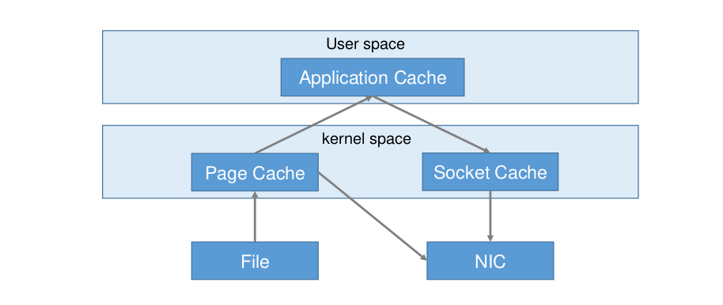


## 3.5 Zookeeper 在 Kafka 中的作用

Kafka 集群中有一个 broker 会被选举为 Controller,负责管理集群 broker 的上下线,所有 topic 的分区副本分配和 leader 选举等工作。Controller 的管理工作都是依赖于 Zookeeper 的。
以下为 partition 的 leader 选举过程:

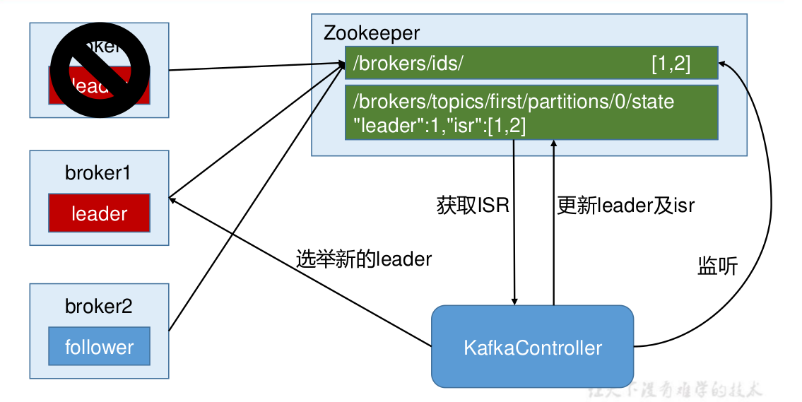

## 3.6 Kafka 事务

​	Kafka 从 0.11 版本开始引入了事务支持。事务可以保证 Kafka 在 Exactly Once 语义的基础上,生产和消费可以跨分区和会话,要么全部成功,要么全部失败。


### 3.6.1 Producer 事务

​	为了实现跨分区跨会话的事务,需要引入一个全局唯一的 Transaction ID,并将 Producer获得的PID 和Transaction ID 绑定。这样当 Producer 重启后就可以通过正在进行的 TransactionID 获得原来的 PID。

​	为了管理 Transaction,Kafka 引入了一个新的组件 Transaction Coordinator。Producer 就是通过和 Transaction Coordinator 交互获得 Transaction ID 对应的任务状态。TransactionCoordinator 还负责将事务所有写入 Kafka 的一个内部 Topic,这样即使整个服务重启,由于事务状态得到保存,进行中的事务状态可以得到恢复,从而继续进行。

### 3.6.2 Consumer 事务

​	上述事务机制主要是从 Producer 方面考虑,对于 Consumer 而言,事务的保证就会相对较弱,尤其时无法保证 Commit 的信息被精确消费。这是由于 Consumer 可以通过 offset 访问任意信息,而且不同的 Segment File 生命周期不同,同一事务的消息可能会出现重启后被删除的情况。

# 第 4 章 Kafka API

## 4.1 Producer API

### 4.1.1 消息发送流程

​	Kafka 的 Producer 发送消息采用的是异步发送的方式。在消息发送的过程中,涉及到了两个线程——main 线程和 Sender 线程,以及一个线程共享变量——RecordAccumulator。
​	main 线程将消息发送给 RecordAccumulator,Sender 线程不断从 RecordAccumulator 中拉取消息发送到 Kafka broker。

KafkaProducer 发送消息流程

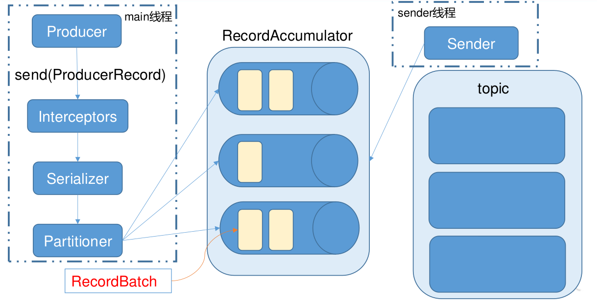


相关参数:
batch.size:只有数据积累到 batch.size 之后,sender 才会发送数据。
linger.ms:如果数据迟迟未达到 batch.size,sender 等待 linger.time 之后就会发送数据。

### 4.1.2 异步发送 API

#### 1)导入依赖

```xml
<dependency>
    <groupId>org.apache.kafka</groupId>
    <artifactId>kafka-clients</artifactId>
    <version>0.11.0.0</version>
</dependency>
```


#### 2)编写代码

> 需要用到的类:
>
> KafkaProducer:需要创建一个生产者对象,用来发送数据
>
> ProducerConfig:获取所需的一系列配置参数
>
> ProducerRecord:每条数据都要封装成一个 ProducerRecord 对象

1.不带回调函数的 API

```java
package com.atguigu.kafka;
import org.apache.kafka.clients.producer.*;
import java.util.Properties;
import java.util.concurrent.ExecutionException;
public class CustomProducer {
public static void main(String[] args) throws ExecutionException,InterruptedException {
    Properties props = new Properties();
    //kafka 集群,broker-list
    props.put("bootstrap.servers", "hadoop102:9092");
    props.put("acks", "all");
    //重试次数
    props.put("retries", 1);
    //批次大小
    props.put("batch.size", 16384);
    //等待时间
    props.put("linger.ms", 1);
    //RecordAccumulator 缓冲区大小
    props.put("buffer.memory", 33554432);
    props.put("key.serializer","org.apache.kafka.common.serialization.StringSerializer");
    props.put("value.serializer","org.apache.kafka.common.serialization.StringSerializer");
    Producer<String,String> producer = new KafkaProducer<>(props);
    for (int i = 0; i < 100; i++) {
        producer.send(new ProducerRecord<String, String ("first",Integer.toString(i),Integer.toString(i)));
    }
    producer.close();
	}
}
```

2.带回调函数的 API

> 回调函数会在 producer 收到 ack 时调用,为异步调用,该方法有两个参数,分别是RecordMetadata 和 Exception,如果 Exception 为 null,说明消息发送成功,如果Exception 不为 null,说明消息发送失败。
>
> 注意:消息发送失败会自动重试,不需要我们在回调函数中手动重试。

```java
package com.atguigu.kafka;
import org.apache.kafka.clients.producer.*;
import java.util.Properties;
import java.util.concurrent.ExecutionException;
public class CustomProducer {
public static void main(String[] args) throws ExecutionException,InterruptedException {
    Properties props = new Properties();
    props.put("bootstrap.servers", "hadoop102:9092");
    //kafka 集群,broker-list
    props.put("acks", "all");
    //重试次数
    props.put("retries", 1);
    //批次大小
    props.put("batch.size", 16384);
    //等待时间
    props.put("linger.ms", 1);
    //RecordAccumulator 缓冲区大小
    props.put("buffer.memory", 33554432);
    props.put("key.serializer","org.apache.kafka.common.serialization.StringSerializer");
    props.put("value.serializer","org.apache.kafka.common.serialization.StringSerializer");
    Producer<String,String> producer = new KafkaProducer<>(props);
    for (int i = 0; i < 100; i++) {
        producer.send(new ProducerRecord<String, String>("first",Integer.toString(i),Integer.toString(i)), new Callback() {
            //回调函数,该方法会在 Producer 收到 ack 时调用,为异步调用
            @Override
            public void onCompletion(RecordMetadata metadata,Exception exception) {
                if (exception == null) {
                    System.out.println("success->" +
                                       metadata.offset());
                } else {
                    exception.printStackTrace();
                }
            }
        });
    }
    producer.close();
}
}
```


### 4.1.3 同步发送 API

​	同步发送的意思就是,一条消息发送之后,会阻塞当前线程,直至返回 ack。由于 send 方法返回的是一个 Future 对象,根据 Futrue 对象的特点,我们也可以实现同步发送的效果,只需在调用 Future 对象的 get 方法即可。

```java
package com.atguigu.kafka;
import org.apache.kafka.clients.producer.KafkaProducer;
import org.apache.kafka.clients.producer.Producer;
import org.apache.kafka.clients.producer.ProducerRecord;
import java.util.Properties;
import java.util.concurrent.ExecutionException;
public class CustomProducer {
public static void main(String[] args) throws ExecutionException,InterruptedException {
    Properties props = new Properties();
    //kafka 集群,broker-list
    props.put("bootstrap.servers", "hadoop102:9092");
    props.put("acks", "all");
    //重试次数
    props.put("retries", 1);
    //批次大小
    props.put("batch.size", 16384);
    //等待时间
    props.put("linger.ms", 1);
    //RecordAccumulator 缓冲区大小
    props.put("buffer.memory", 33554432);
    props.put("key.serializer","org.apache.kafka.common.serialization.StringSerializer");
    props.put("value.serializer","org.apache.kafka.common.serialization.StringSerializer");
    Producer<String,String> producer = new KafkaProducer<>(props); 
    for (int i = 0; i < 100; i++) {
        producer.send(new ProducerRecord<String, String>("first",Integer.toString(i),Integer.toString(i))).get();
    }
    producer.close();
}
}
```


## 4.2 Consumer API

> ​	Consumer 消费数据时的可靠性是很容易保证的,因为数据在 Kafka 中是持久化的,故不用担心数据丢失问题。
> ​	由于 consumer 在消费过程中可能会出现断电宕机等故障,consumer 恢复后,需要从故障前的位置的继续消费,所以 consumer 需要实时记录自己消费到了哪个 offset,以便故障恢复后继续消费。所以 offset 的维护是 Consumer 消费数据是必须考虑的问题。


### 4.2.1 自动提交 offset

#### 1)导入依赖

```xml
<dependency>
    <groupId>org.apache.kafka</groupId>
    <artifactId>kafka-clients</artifactId>
    <version>0.11.0.0</version>
</dependency>
```


#### 2)编写代码

> 需要用到的类:
>
> KafkaConsumer:需要创建一个消费者对象,用来消费数据
>
> ConsumerConfig:获取所需的一系列配置参数
>
> ConsuemrRecord:每条数据都要封装成一个 ConsumerRecord 对象
>
> 为了使我们能够专注于自己的业务逻辑,Kafka 提供了自动提交 offset 的功能。
> 

```sh
#自动提交 offset 的相关参数:
enable.auto.commit:是否开启自动提交 offset 功能
auto.commit.interval.ms:自动提交 offset 的时间间隔
```

以下为自动提交 offset 的代码:

```java
package com.atguigu.kafka;
import org.apache.kafka.clients.consumer.ConsumerRecord;
import org.apache.kafka.clients.consumer.ConsumerRecords;
import org.apache.kafka.clients.consumer.KafkaConsumer;
import java.util.Arrays;
import java.util.Properties;
public class CustomConsumer {
    public static void main(String[] args) {
        Properties props = new Properties();
        props.put("bootstrap.servers", "hadoop102:9092");
        props.put("group.id", "test");
        props.put("enable.auto.commit", "true");
        props.put("auto.commit.interval.ms", "1000");
        props.put("key.deserializer","org.apache.kafka.common.serialization.StringDeserializer");
        props.put("value.deserializer","org.apache.kafka.common.serialization.StringDeserializer");
        KafkaConsumer<String,String> consumer = new KafkaConsumer<>(props);
        consumer.subscribe(Arrays.asList("first"));
        while (true) {
            ConsumerRecords<String,String> records = consumer.poll(100);
            for (ConsumerRecord<String, String> record : records){
                System.out.printf("offset = %d, key = %s,= %s%n", record.offset(), record.key(), record.value());
            }
        }
    }
}
```


### 4.2.2 手动提交 offset

> ​	虽然自动提交 offset 十分简介便利,但由于其是基于时间提交的,开发人员难以把握offset 提交的时机。因此 Kafka 还提供了手动提交 offset 的 API。手动提交 offset 的方法有两种:分别是 commitSync(同步提交)和 commitAsync(异步提交)。
>
> ​	两者的相同点是,都会将本次 poll 的一批数据最高的偏移量提交;
>
> ​	不同点是,
> ​	commitSync 阻塞当前线程,一直到提交成功,并且会自动失败重试(由不可控因素导致,也会出现提交失败);而 commitAsync 则没有失败重试机制,故有可能提交失败。

#### 1)同步提交 offset

由于同步提交 offset 有失败重试机制,故更加可靠,以下为同步提交 offset 的示例。

```java
package com.atguigu.kafka.consumer;
import org.apache.kafka.clients.consumer.ConsumerRecord;
import org.apache.kafka.clients.consumer.ConsumerRecords;
import org.apache.kafka.clients.consumer.KafkaConsumer;
import java.util.Arrays;
import java.util.Properties;
public class CustomComsumer {
    public static void main(String[] args) {
        Properties props = new Properties();
        //Kafka 集群
        props.put("bootstrap.servers", "hadoop102:9092");
        //消费者组,只要 group.id 相同,就属于同一个消费者组
        props.put("group.id", "test");
        //关闭自动提交 offset
        props.put("enable.auto.commit", "false");
       props.put("key.deserializer","org.apache.kafka.common.serialization.StringDeserializer");
     props.put("value.deserializer","org.apache.kafka.common.serialization.StringDeserializer");
        KafkaConsumer<String,String> consumer = new KafkaConsumer<>(props);
        //消费者订阅主题
        consumer.subscribe(Arrays.asList("first"));
        while (true) {
            //消费者拉取数据
            ConsumerRecords<String,String> records = consumer.poll(100);
            for (ConsumerRecord<String, String> record : records) {
                System.out.printf("offset = %d, key = %s,= %s%n", record.offset(), record.key(),record.value());
            }
            //同步提交,当前线程会阻塞直到 offset 提交成功
            consumer.commitSync();
        }
    }
}
```


#### 2)异步提交 offset

虽然同步提交 offset 更可靠一些,但是由于其会阻塞当前线程,直到提交成功。因此吞吐量会收到很大的影响。因此更多的情况下,会选用异步提交 offset 的方式。
以下为异步提交 offset 的示例:

```java
package com.atguigu.kafka.consumer;
import org.apache.kafka.clients.consumer.*;
import org.apache.kafka.common.TopicPartition;
import java.util.Arrays;
import java.util.Map;
import java.util.Properties;
public class CustomConsumer {
public static void main(String[] args) {
    Properties props = new Properties();
    //Kafka 集群
    props.put("bootstrap.servers", "hadoop102:9092");
    //消费者组,只要 group.id 相同,就属于同一个消费者组
    props.put("group.id", "test");
    //关闭自动提交 offset
    props.put("enable.auto.commit", "false");
    props.put("key.deserializer","org.apache.kafka.common.serialization.StringDeserializer");
    props.put("value.deserializer","org.apache.kafka.common.serialization.StringDeserializer");
    KafkaConsumer<String,String> consumer = new KafkaConsumer<(props);
    //消费者订阅主题
    consumer.subscribe(Arrays.asList("first"));
    while (true) {
        //消费者拉取数据
        ConsumerRecords<String,String> records = consumer.poll(100);
        for (ConsumerRecord<String, String> record : records) {
            System.out.printf("offset = %d, key = %s, value = %s%n", record.offset(),record.key(), record.value());
        }
        //异步提交
        consumer.commitAsync(new OffsetCommitCallback() {
            @Override
            public void onComplete(Map<TopicPartition,OffsetAndMetadata> offsets, Exception exception) { 
                if (exception != null) {
                    System.err.println("Commit failed for" + offsets);
                }
            }
        });
    }
}
}
```


#### 3) 数据漏消费和重复消费分析

> ​	无论是同步提交还是异步提交 offset,都有可能会造成数据的漏消费或者重复消费。先提交 offset 后消费,有可能造成数据的漏消费;而先消费后提交 offset,有可能会造成数据的重复消费。

### 4.2.3 自定义存储 offset

> ​	Kafka 0.9 版本之前, offset 存储在 zookeeper, 0.9 版本及之后,默认将 offset 存储在 Kafka的一个内置的 topic 中。除此之外,Kafka 还可以选择自定义存储 offset。offset 的维护是相当繁琐的,因为需要考虑到消费者的 Rebalace。当有新的消费者加入消费者组、已有的消费者推出消费者组或者所订阅的主题的分区发生变化,就会触发到分区的重新分配,重新分配的过程叫做 Rebalance。消费者发生 Rebalance 之后,每个消费者消费的分区就会发生变化。因此消费者要首先获取到自己被重新分配到的分区,并且定位到每个分区最近提交的 offset 位置继续消费。要实现自定义存储 offset,需要借助 ConsumerRebalanceListener,以下为示例代码,其中提交和获取 offset 的方法,需要根据所选的 offset 存储系统自行实现。

```java
package com.atguigu.kafka.consumer;
import org.apache.kafka.clients.consumer.*;
import org.apache.kafka.common.TopicPartition;
import java.util.*;
public class CustomConsumer {
    private static Map<TopicPartition, Long> currentOffset = new HashMap<>();
    public static void main(String[] args) {
        //创建配置信息
        Properties props = new Properties();
        //Kafka 集群
        props.put("bootstrap.servers", "hadoop102:9092");
        //消费者组,只要 group.id 相同,就属于同一个消费者组
        props.put("group.id", "test");
        //关闭自动提交 offset
        props.put("enable.auto.commit", "false");
        //Key 和 Value 的反序列化类
        props.put("key.deserializer","org.apache.kafka.common.serialization.StringDeserializer");
        props.put("value.deserializer","org.apache.kafka.common.serialization.StringDeserializer");
        //创建一个消费者
        KafkaConsumer<String,String> consumer = new  KafkaConsumer<>(props);
        //消费者订阅主题
        consumer.subscribe(Arrays.asList("first"),new  ConsumerRebalanceListener() {
            //该方法会在 Rebalance 之前调用
            @Override
            public void onPartitionsRevoked(Collection<TopicPartition> partitions) {
                commitOffset(currentOffset);
            }     
            //该方法会在 Rebalance 之后调用
            @Override
            public void onPartitionsAssigned(Collection<TopicPartition> partitions) {
                currentOffset.clear();
                for (TopicPartition partition : partitions) {
                    //定位到最近提交的 offset 位置继续消费
                    consumer.seek(partition, getOffset(partition));
                }
            }
        });
        while (true) {
            //消费者拉取数据
            ConsumerRecords<String,String> records = consumer.poll(100);
            for (ConsumerRecord<String, String> record : records) {
                System.out.printf("offset = %d, key = %s, value = %s%n", record.offset(),record.key(), record.value());
                currentOffset.put(new TopicPartition(record.topic(),record.partition()), record.offset());
            }
            //异步提交
            commitOffset(currentOffset);
        }
}
    //获取某分区的最新 offset
    private static long getOffset(TopicPartition partition) {
        return 0;
    }
    //提交该消费者所有分区的 offset
    private static void commitOffset(Map<TopicPartition,Long> currentOffset) {        
    }
}
```


## 4.3 自定义 Interceptor

### 4.3.1 拦截器原理

> ​	Producer 拦截器(interceptor)是在 Kafka 0.10 版本被引入的,主要用于实现 clients 端的定制化控制逻辑。对于 producer 而言,interceptor 使得用户在消息发送前以及 producer 回调逻辑前有机会对消息做一些定制化需求,比如修改消息等。同时,producer 允许用户指定多个 interceptor按序作用于同一条消息从而形成一个拦截链(interceptor chain)。Intercetpor 的实现接口是org.apache.kafka.clients.producer.ProducerInterceptor,其定义的方法包括:
>
> **(1)configure(configs)**
> 获取配置信息和初始化数据时调用。
>
> **(2)onSend(ProducerRecord):**
> 该方法封装进 KafkaProducer.send 方法中,即它运行在用户主线程中。Producer 确保在消息被序列化以及计算分区前调用该方法。用户可以在该方法中对消息做任何操作,但最好保证不要修改消息所属的 topic 和分区,否则会影响目标分区的计算。
>
> **(3)onAcknowledgement(RecordMetadata, Exception):**
> 该方法会在消息从 RecordAccumulator 成功发送到 Kafka Broker 之后,或者在发送过程中失败时调用。并且通常都是在 producer 回调逻辑触发之前。onAcknowledgement 运行在producer 的 IO 线程中,因此不要在该方法中放入很重的逻辑,否则会拖慢 producer 的消息发送效率。
>
> **(4)close:**
> 关闭 interceptor,主要用于执行一些资源清理工作如前所述,interceptor 可能被运行在多个线程中,因此在具体实现时用户需要自行确保线程安全。另外倘若指定了多个 interceptor,则 producer 将按照指定顺序调用它们,并仅仅是捕获每个 interceptor 可能抛出的异常记录到错误日志中而非在向上传递。这在使用过程中要特别留意。

### 4.3.2 拦截器案例

#### 1)需求:

> ​	实现一个简单的双 interceptor 组成的拦截链。第一个 interceptor 会在消息发送前将时间戳信息加到消息 value 的最前部;第二个 interceptor 会在消息发送后更新成功发送消息数或失败发送消息数。

**Kafka拦截器**
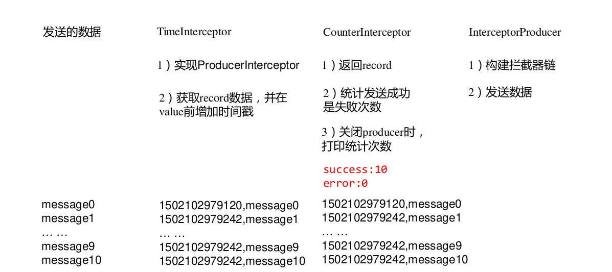


#### 2)案例实操

(1)增加时间戳拦截器

```java
package com.atguigu.kafka.interceptor;
import java.util.Map;
import org.apache.kafka.clients.producer.ProducerInterceptor;
import org.apache.kafka.clients.producer.ProducerRecord;
import org.apache.kafka.clients.producer.RecordMetadata;
public class TimeInterceptor implements ProducerInterceptor<String, String> {
    @Override
    public void configure(Map<String, ?> configs) {
    }
    @Override
    public ProducerRecord<String,String> onSend(ProducerRecord<String, String> record) {
        //创建一个新的 record,把时间戳写入消息体的最前部
        return new ProducerRecord(record.topic(),record.partition(), record.timestamp(),record.key(),System.currentTimeMillis()+","+record.value().toString());
    }
    @Override
    public void onAcknowledgement(RecordMetadata metadata, Exception exception) {
        
    }
    @Override
    public void close() {
        
    }
}
```


(2)统计发送消息成功和发送失败消息数,并在 producer 关闭时打印这两个计数器

```java
package com.atguigu.kafka.interceptor;
import java.util.Map;
import org.apache.kafka.clients.producer.ProducerInterceptor;
import org.apache.kafka.clients.producer.ProducerRecord;
import org.apache.kafka.clients.producer.RecordMetadata;
public class CounterInterceptor implements ProducerInterceptor<String, String>{ 
    private int errorCounter = 0;
    private int successCounter = 0;
    @Override
    public void configure(Map<String, ?> configs) {
}
    @Override
    public ProducerRecord<String,String> onSend(ProducerRecord<String, String> record) {
        return record;
    }
@Override
public void onAcknowledgement(RecordMetadata metadata, Exception exception) {
    // 统计成功和失败的次数
    if (exception == null) {
        successCounter++;
    } else {
        errorCounter++;
    }
}
    @Override
    public void close() {
        // 保存结果
        System.out.println("Successful sent: " + successCounter);
        System.out.println("Failed sent: " + errorCounter);
    }
}
```


(3)producer 主程序

```java
package com.atguigu.kafka.interceptor;
import java.util.ArrayList;
import java.util.List;
import java.util.Properties;
import org.apache.kafka.clients.producer.KafkaProducer;
import org.apache.kafka.clients.producer.Producer;
import org.apache.kafka.clients.producer.ProducerConfig;
import org.apache.kafka.clients.producer.ProducerRecord;
public class InterceptorProducer {
    public static void main(String[] args) throws Exception {
        //1 设置配置信息
        Properties props = new Properties();
        props.put("bootstrap.servers", "hadoop102:9092");
        props.put("acks", "all");
        props.put("retries", 3);
        props.put("batch.size", 16384);
        props.put("linger.ms", 1);
        props.put("buffer.memory", 33554432);
        props.put("key.serializer","org.apache.kafka.common.serialization.StringSerializer");
        props.put("value.serializer","org.apache.kafka.common.serialization.StringSerializer");
        // 2 构建拦截链
        List<String> interceptors = new ArrayList<>();
        interceptors.add("com.atguigu.kafka.interceptor.TimeInterceptor");
        interceptors.add("com.atguigu.kafka.interceptor.CounterInterceptor");
        props.put(ProducerConfig.INTERCEPTOR_CLASSES_CONFIG,interceptors);
        String topic = "first";
        Producer<String,String> produce = new KafkaProducer<>(props);
        // 3 发送消息
        for (int i = 0; i < 10; i++) {
            ProducerRecord<String,String>
            ProducerRecord<>(topic, "message" + i);
            producer.send(record);
        }
        // 4 一定要关闭 producer,这样才会调用 interceptor 的 close 方法
        producer.close();
    }
}
```

3)测试
(1)在 kafka 上启动消费者,然后运行客户端 java 程序。

```sh
[atguigu@hadoop102 kafka]$ bin/kafka-console-consumer.sh \
--bootstrap-server hadoop102:9092 --from-beginning --topic first
```

```txt
1501904047034,message0
1501904047225,message1
1501904047230,message2
1501904047234,message3
1501904047236,message4
1501904047240,message5
1501904047243,message6
1501904047246,message7
1501904047249,message8
1501904047252,message9
```


# 第 5 章 Kafka 监控

## 5.1 Kafka Eagle

1.修改 kafka 启动命令
修改 kafka-server-start.sh 命令中

```shell
if [ "x$KAFKA_HEAP_OPTS" = "x" ]; then
export KAFKA_HEAP_OPTS="-Xmx1G -Xms1G"
fi
```

为

```shell
if [ "x$KAFKA_HEAP_OPTS" = "x" ]; then
export KAFKA_HEAP_OPTS="-server -Xms2G -Xmx2G -XX:PermSize=128m
-XX:+UseG1GC -XX:MaxGCPauseMillis=200 -XX:ParallelGCThreads=8 -
XX:ConcGCThreads=5 -XX:InitiatingHeapOccupancyPercent=70"
export JMX_PORT="9999"
#export KAFKA_HEAP_OPTS="-Xmx1G -Xms1G"
fi
```

注意:修改之后在启动 Kafka 之前要分发之其他节点
2.上传压缩包 kafka-eagle-bin-1.3.7.tar.gz 到集群/opt/software 目录
3.解压到本地

```sh
[atguigu@hadoop102 software]$ tar -zxvf kafka-eagle-bin-1.3.7.tar.gz
```

4.进入刚才解压的目录

```sh
[atguigu@hadoop102 kafka-eagle-bin-1.3.7]$ ll
总用量 82932
-rw-rw-r--. 1 atguigu atguigu 84920710 8 月 13 23:00 kafka-eagle-
web-1.3.7-bin.tar.gz
```

5.将 kafka-eagle-web-1.3.7-bin.tar.gz 解压至/opt/module

```sh
[atguigu@hadoop102 kafka-eagle-bin-1.3.7]$ tar -zxvf kafka-eagle-
web-1.3.7-bin.tar.gz -C /opt/module/
```

6.修改名称

```sh
[atguigu@hadoop102 module]$ mv kafka-eagle-web-1.3.7/ eagle
```

7.给启动文件执行权限

```sh
[atguigu@hadoop102 eagle]$ cd bin/
[atguigu@hadoop102 bin]$ ll
总用量 12
-rw-r--r--. 1 atguigu atguigu 1848 8 月 22 2017 ke.bat
-rw-r--r--. 1 atguigu atguigu 7190 7 月 30 20:12 ke.sh
[atguigu@hadoop102 bin]$ chmod 777 ke.sh
```

8.修改配置文件

```shell
######################################

# multi zookeeper&kafka cluster list

######################################
kafka.eagle.zk.cluster.alias=cluster1
cluster1.zk.list=hadoop102:2181,hadoop103:2181,hadoop104:2181
######################################

# kafka offset storage

######################################
cluster1.kafka.eagle.offset.storage=kafka
######################################

# enable kafka metrics

######################################
kafka.eagle.metrics.charts=true
kafka.eagle.sql.fix.error=false
######################################

# kafka jdbc driver address

######################################
kafka.eagle.driver=com.mysql.jdbc.Driver
kafka.eagle.url=jdbc:mysql://hadoop102:3306/ke?useUnicode=true&ch
aracterEncoding=UTF-8&zeroDateTimeBehavior=convertToNull
kafka.eagle.username=root
kafka.eagle.password=000000
```

9.添加环境变量

```properties
export KE_HOME=/opt/module/eagle
export PATH=$PATH:$KE_HOME/bin
```

注意:source /etc/profile

10.启动

```shell
[atguigu@hadoop102 eagle]$ bin/ke.sh start
... ...
... ...
------
**
- Kafka Eagle Service has started success.
- Welcome, Now you can visit 'http://192.168.9.102:8048/ke'
- Account:admin ,Password:123456
------
**
- <Usage> ke.sh [start|status|stop|restart|stats] </Usage>
- <Usage> https://www.kafka-eagle.org/ </Usage>
------
**
[atguigu@hadoop102 eagle]$
```

注意:启动之前需要先启动 ZK 以及 KAFKA

11.登录页面查看监控数据
http://192.168.9.102:8048/ke

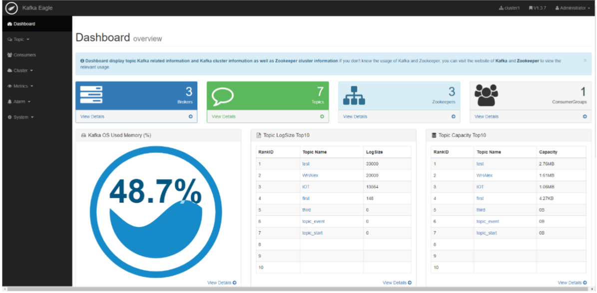

# 第 6 章 Flume 对接 Kafka

1)配置 flume(flume-kafka.conf)

```properties
# define
a1.sources = r1
a1.sinks = k1
a1.channels = c1

# source
a1.sources.r1.type = exec
a1.sources.r1.command = tail -F -c +0 /opt/module/data/flume.log
a1.sources.r1.shell = /bin/bash -c

# sink
a1.sinks.k1.type = org.apache.flume.sink.kafka.KafkaSink
a1.sinks.k1.kafka.bootstrap.servers
hadoop102:9092,hadoop103:9092,hadoop104:9092
a1.sinks.k1.kafka.topic = first
a1.sinks.k1.kafka.flumeBatchSize = 20
a1.sinks.k1.kafka.producer.acks = 1
a1.sinks.k1.kafka.producer.linger.ms = 1


# channel
a1.channels.c1.type = memory
a1.channels.c1.capacity = 1000
a1.channels.c1.transactionCapacity = 100

# bind
a1.sources.r1.channels = c1
a1.sinks.k1.channel = c1
```

2) 启动 kafkaIDEA 消费者
3) 进入 flume 根目录下,启动 flume

```sh
$ bin/flume-ng agent -c conf/ -n a1 -f jobs/flume-kafka.conf
```

4) 向 /opt/module/data/flume.log 里追加数据,查看 kafka 消费者消费情况

```sh
$ echo hello >> /opt/module/data/flume.log
```


# 第 7 章 Kafka常见 问题

## 7.1 问题

> 1.Kafka 中的 ISR(InSyncRepli)、OSR(OutSyncRepli)、AR(AllRepli)代表什么?
>
> 2.Kafka 中的 HW、LEO 等分别代表什么?
>
> 3.Kafka 中是怎么体现消息顺序性的?
>
> 4.Kafka 中的分区器、序列化器、拦截器是否了解?它们之间的处理顺序是什么?
>
> 5.Kafka 生产者客户端的整体结构是什么样子的?使用了几个线程来处理?分别是什么?
>
> 6.“消费组中的消费者个数如果超过 topic 的分区,那么就会有消费者消费不到数据”这句话是否正确?
>
> 7.消费者提交消费位移时提交的是当前消费到的最新消息的 offset 还是 offset+1?
>
> 8.有哪些情形会造成重复消费?
>
> 9.那些情景会造成消息漏消费?
>
> 10.当你使用 kafka-topics.sh 创建(删除)了一个 topic 之后,Kafka 背后会执行什么逻辑?
>
> 1 ) 会 在 zookeeper 中 的 /brokers/topics 节 点 下 创 建 一 个 新 的 topic 节 点 , 如 :/brokers/topics/first
>
> 2)触发 Controller 的监听程序
>
> 3)kafka Controller 负责 topic 的创建工作,并更新 metadata cache
>
> 11.topic 的分区数可不可以增加?如果可以怎么增加?如果不可以,那又是为什么?
>
> 12.topic 的分区数可不可以减少?如果可以怎么减少?如果不可以,那又是为什么?
>
> 13.Kafka 有内部的 topic 吗?如果有是什么?有什么所用?
>
> 14.Kafka 分区分配的概念?
>
> 15.简述 Kafka 的日志目录结构?
>
> 16.如果我指定了一个 offset,Kafka Controller 怎么查找到对应的消息?
>
> 17.聊一聊 Kafka Controller 的作用?
>
> 18.Kafka 中有那些地方需要选举?这些地方的选举策略又有哪些?
>
> 19.失效副本是指什么?有那些应对措施?
>
> 20.Kafka 的哪些设计让它有如此高的性能?

## 7.2 参考答案

> 1.Leader 维护了一个动态的 **in-sync replica set** (ISR),意为和 leader 保持同步的 follower 集合。当 ISR 中的 follower 完成数据的同步之后, leader 就会给 follower 发送 ack。如果 follower长 时 间 未 向 leader 同 步 数 据 , 则 该 follower 将 被 踢 出 ISR , 该 时 间 阈 值 由replica.lag.time.max.ms 参数设定。Leader 发生故障之后,就会从 ISR 中选举新的 leader。
>
> 2.LEO:指的是每个副本最大的 offset;
>
> HW:指的是消费者能见到的最大的 offset,ISR 队列中最小的 LEO。
>
> 3.生产者：通过分区的leader副本负责数据顺序写入，来保证消息顺序性
> 消费者：同一个分区内的消息只能被一个group里的一个消费者消费，保证分区内消费有序