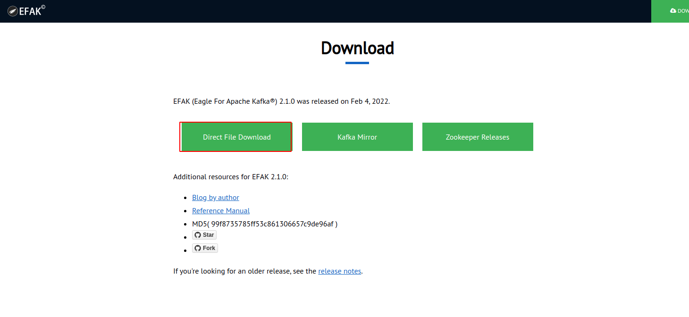
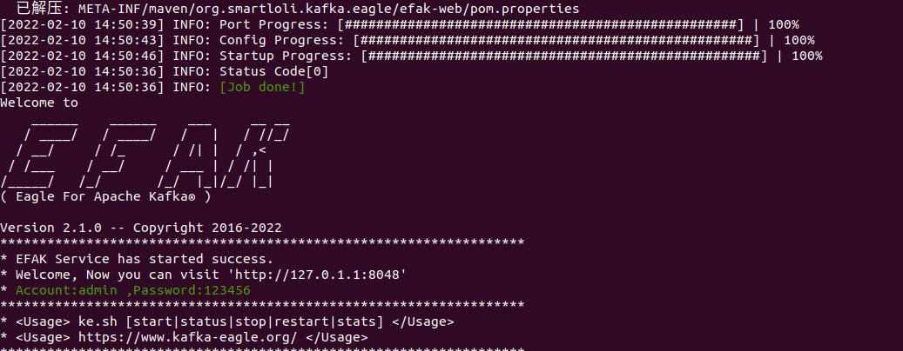
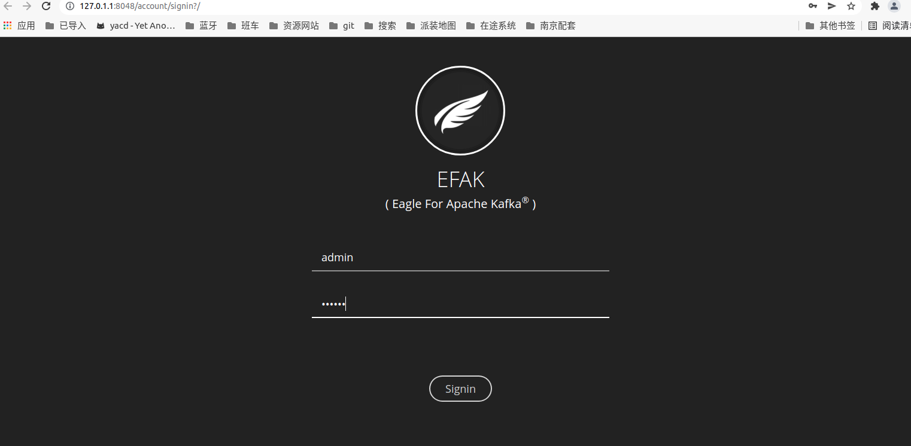
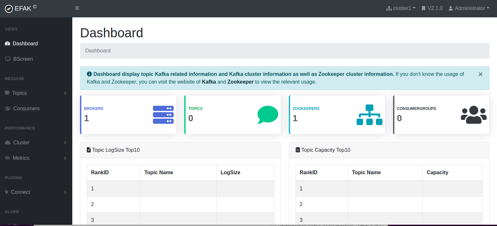

#  kafka监控安装


## 1. 启动kafak

```sh
root@W26-260164:/home/gree/software# cd kafka_2.11-2.3.0/
root@W26-260164:/home/gree/software/kafka_2.11-2.3.0# nohup bin/zookeeper-server-start.sh config/zookeeper.properties &
[1] 426160
nohup: 忽略输入并把输出追加到'nohup.out'
root@W26-260164:/home/gree/software/kafka_2.11-2.3.0# 
root@W26-260164:/home/gree/software/kafka_2.11-2.3.0# 
root@W26-260164:/home/gree/software/kafka_2.11-2.3.0# nohup bin/kafka-server-start.sh  config/server.properties &
[2] 427282
nohup: 忽略输入并把输出追加到'nohup.out'
```


## 2. 下载kafka-egale

http://download.kafka-eagle.org/




```sh
tar -zxvf /home/gree/下载/kafka-eagle-bin-2.1.0.tar.gz -C /home/gree/software/
cd kafka-eagle-bin-2.1.0/
tar -zxvf efak-web-2.1.0-bin.tar.gz
mv efak-web-2.1.0 /home/gree/software/
cd efak-web-2.1.0
```


## 3. 安装mysql

```sh
apt-get update
apt-get install mysql-server
mysql_secure_installation
systemctl status mysql.service
mysql -uroot -p
SELECT user,authentication_string,plugin,host FROM mysql.user;
ALTER USER 'root'@'localhost' IDENTIFIED WITH mysql_native_password BY 'sfzsjx12';
```

参考：https://stackoverflow.com/questions/41645309/mysql-error-access-denied-for-user-rootlocalhost


## 4. 修改配置文件并启动

```sh
vim efak-web-2.1.0/conf/system-config.properties
 ke.sh start
```

```sh
######################################
# multi zookeeper & kafka cluster list
# Settings prefixed with 'kafka.eagle.' will be deprecated, use 'efak.' instead
######################################
efak.zk.cluster.alias=cluster1
cluster1.zk.list=localhost:2181
# cluster2.zk.list=xdn10:2181,xdn11:2181,xdn12:2181

######################################
# zookeeper enable acl
######################################
cluster1.zk.acl.enable=false
cluster1.zk.acl.schema=digest
cluster1.zk.acl.username=test
cluster1.zk.acl.password=test123

######################################
# broker size online list
######################################
cluster1.efak.broker.size=20

######################################
# zk client thread limit
######################################
kafka.zk.limit.size=16

######################################
# EFAK webui port
######################################
efak.webui.port=8048

######################################
# EFAK enable distributed
######################################
efak.distributed.enable=false
efak.cluster.mode.status=master
efak.worknode.master.host=localhost
efak.worknode.port=8085

######################################
# kafka jmx acl and ssl authenticate
######################################
cluster1.efak.jmx.acl=false
cluster1.efak.jmx.user=keadmin
cluster1.efak.jmx.password=keadmin123
cluster1.efak.jmx.ssl=false
cluster1.efak.jmx.truststore.location=/data/ssl/certificates/kafka.truststore
cluster1.efak.jmx.truststore.password=ke123456

######################################
# kafka offset storage
######################################
cluster1.efak.offset.storage=kafka
cluster2.efak.offset.storage=zk

######################################
# kafka jmx uri
######################################
cluster1.efak.jmx.uri=service:jmx:rmi:///jndi/rmi://%s/jmxrmi

######################################
# kafka metrics, 15 days by default
######################################
efak.metrics.charts=true
efak.metrics.retain=15

######################################
# kafka sql topic records max
######################################
efak.sql.topic.records.max=5000
efak.sql.topic.preview.records.max=10

######################################
# delete kafka topic token
######################################
efak.topic.token=keadmin

######################################
# kafka sasl authenticate
######################################
cluster1.efak.sasl.enable=false
cluster1.efak.sasl.protocol=SASL_PLAINTEXT
cluster1.efak.sasl.mechanism=SCRAM-SHA-256
cluster1.efak.sasl.jaas.config=org.apache.kafka.common.security.scram.ScramLoginModule required username="kafka" password="kafka-eagle";
cluster1.efak.sasl.client.id=
cluster1.efak.blacklist.topics=
cluster1.efak.sasl.cgroup.enable=false
cluster1.efak.sasl.cgroup.topics=
cluster2.efak.sasl.enable=false
cluster2.efak.sasl.protocol=SASL_PLAINTEXT
cluster2.efak.sasl.mechanism=PLAIN
cluster2.efak.sasl.jaas.config=org.apache.kafka.common.security.plain.PlainLoginModule required username="kafka" password="kafka-eagle";
cluster2.efak.sasl.client.id=
cluster2.efak.blacklist.topics=
cluster2.efak.sasl.cgroup.enable=false
cluster2.efak.sasl.cgroup.topics=

######################################
# kafka ssl authenticate
######################################
cluster3.efak.ssl.enable=false
cluster3.efak.ssl.protocol=SSL
cluster3.efak.ssl.truststore.location=
cluster3.efak.ssl.truststore.password=
cluster3.efak.ssl.keystore.location=
cluster3.efak.ssl.keystore.password=
cluster3.efak.ssl.key.password=
cluster3.efak.ssl.endpoint.identification.algorithm=https
cluster3.efak.blacklist.topics=
cluster3.efak.ssl.cgroup.enable=false
cluster3.efak.ssl.cgroup.topics=

######################################
# kafka sqlite jdbc driver address
######################################
#efak.driver=org.sqlite.JDBC
#efak.url=jdbc:sqlite:/hadoop/kafka-eagle/db/ke.db
#efak.username=root
#efak.password=www.kafka-eagle.org

######################################
# kafka mysql jdbc driver address
######################################
efak.driver=com.mysql.cj.jdbc.Driver
efak.url=jdbc:mysql://127.0.0.1:3306/ke?useUnicode=true&characterEncoding=UTF-8&zeroDateTimeBehavior=convertToNull
efak.username=root
efak.password=sfzsjx12
```







