# 一、基础篇

## 1 、 Java语言有哪些特点

> 1、简单易学、有丰富的类库
>
> 2、面向对象（Java最重要的特性，让程序耦合度更低，内聚性更高）
>
> 3、与平台无关性（JVM是Java跨平台使用的根本）
>
> 4、可靠安全
>
> 5、支持多线程

## 2、面向对象和面向过程的区别

> **面向过程**：是分析解决问题的步骤，然后用函数把这些步骤一步一步地实现，然后在使用的时候一一调用则可。性能较高，所以单片机、嵌入式开发等一般采用面向过程开发
>
> **面向对象**：是把构成问题的事务分解成各个对象，而建立对象的目的也不是为了完成一个个步骤，而是为了描述某个事物在解决整个问题的过程中所发生的行为。面向对象有**封装、继承、多态**的特性，所以易维护、易复用、易扩展。可以设计出低耦合的系统。但是性能上来说，比面向过程要低。

## 3 、八种基本数据类型的大小，以及他们的封装类

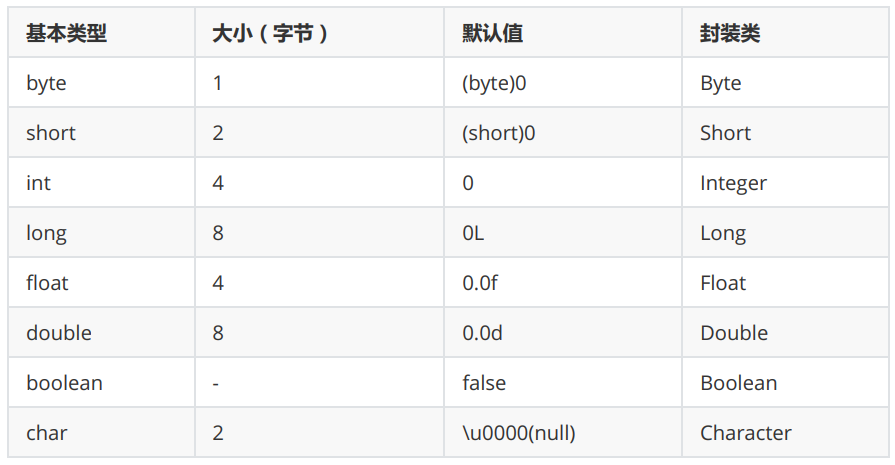

> 注：
>
> 1）int是基本数据类型，Integer是int的封装类，是引用类型。int默认值是0，而Integer默认值是null，所以Integer能区分出0和null的情况。一旦java看到null，就知道这个引用还没有指向某个对象，再任何引用使用前，必须为其指定一个对象，否则会报错。
>
> 2）基本数据类型在声明时系统会自动给它分配空间，而引用类型声明时只是分配了引用空间，必须通过实例化开辟数据空间之后才可以赋值。数组对象也是一个引用对象，将一个数组赋值给另一个数组时只是复制了一个引用，所以通过某一个数组所做的修改在另一个数组中也看的见。
>
> 虽然定义了boolean这种数据类型，但是只对它提供了非常有限的支持。在Java虚拟机中没有任何供boolean值专用的字节码指令，Java语言表达式所操作的boolean值，在编译之后都使用Java虚拟机中的int数据类型来代替，而boolean数组将会被编码成Java虚拟机的byte数组，每个元素boolean元素占8位。这样我们可以得出boolean类型占了单独使用是4个字节，在数组中又是1个字节。使用int的原因是，对于当下32位的处理器（CPU）来说，一次处理数据是32位（这里不是指的是32/64位系统，而是指CPU硬件层面），具有高效存取的特点。
>

## 4、标识符的命名规则。

> **标识符的含义：**是指在程序中，我们自己定义的内容，譬如，类的名字，方法名称以及变量名称等等，都是标识符。
>
> **命名规则：（硬性要求）**标识符可以包含英文字母，0-9的数字，\$以及\_ 标识符不能以数字开头标识符不是关键字
>
> **命名规范：（非硬性要求）**类名规范：首字符大写，后面每个单词首字母大写（大驼峰式）。变量名规范：首字母小写，后面每个单词首字母大写（小驼峰式）。方法名规范：同变量名。

## 5、instanceof 关键字的作用

> instanceof 严格来说是Java中的一个双目运算符，用来测试一个对象是否为一个类的实例，用法为：
>
> ```java
> boolean result = obj instanceof Class
> ```
>
> 其中 obj 为一个对象，Class 表示一个类或者一个接口，当 obj 为 Class 的对象，或者是其直接或间接子类，或者是其接口的实现类，结果result 都返回 true，否则返回false。
>
> 注意：编译器会检查 obj 是否能转换成右边的class类型，如果不能转换则直接报错，如果不能确定类型，则通过编译，具体看运行时定。
>
> ```java
> int i = 0;
> System.out.println(i instanceof Integer);//编译不通过 i必须是引用类型，不能是基本类型
> System.out.println(i instanceof Object);//编译不通过
> Integer integer = new Integer(1);
> System.out.println(integer instanceof Integer);//true
> //false ,在 JavaSE规范中对 instanceof 运算符的规定就是：如果 obj 为 null，那么将返回 false。
> System.out.println(null instanceof Object);
> ```

## 6、Java自动装箱与拆箱

> 装箱就是自动将基本数据类型转换为包装器类型（int\--\>Integer）；调用方法：Integer的valueOf(int)方法
>
> 拆箱就是自动将包装器类型转换为基本数据类型（Integer\--\>int）。调用方法：Integer的intValue方法
>
> 在Java SE5之前，如果要生成一个数值为10的Integer对象，必须这样进行：
>
> ```java
> Integer i = new Integer(10);
> ```
>
> 而在从Java SE5开始就提供了自动装箱的特性，如果要生成一个数值为10的Integer对象，只需要这样就可以了：
>
> ```java
> Integer i = 10;
> ```

### 面试题1：以下代码会输出什么？

```java
public class Main {
 public static void main(String[] args){
 Integer i1 = 100;
 Integer i2 = 100;
 Integer i3 = 200;
 Integer i4 = 200;
 System.out.println(i1==i2);
 System.out.println(i3==i4);
}
}
```

> 运行结果：
>
> ```txt
> true
> false
> ```
>
> 为什么会出现这样的结果？输出结果表明i1和i2指向的是同一个对象，而i3和i4指向的是不同的对象。此时只需一看源码便知究竟，下面这段代码是Integer的valueOf方法的具体实现：
>
> ```java
> public static Integer valueOf(int i){
>     if(i >= -128 && i <= IntegerCache.high)
>     return IntegerCache.cache[i +128];
>     else
>     return new Integer(i);
> }
> ```
>
> 其中IntegerCache类的实现为：
>
> ```java
> private static class IntegerCache {
>     static final int high;
>     static final Integer cache[];
>     static {
>     final int low = -128;
>    // high value may be configured by property
>     int h = 127;
>     if (integerCacheHighPropValue != null){
>    // Use Long.decode here to avoid invoking methods that
>    // require Integer's autoboxing cache to be initialized
>     int i = Long.decode(integerCacheHighPropValue).intValue();
>     i = Math.max(i,127);
>    // Maximum array size is Integer.MAX_VALUE
>     h = Math.min(i, Integer.MAX_VALUE --low);
>    }
>     high = h;
>     cache = new Integer[(high - low)+1];
>     int j = low;
>     for(int k = 0; k < cache.length; k++)
>     cache[k]= new Integer(j++);
>    }
>     private IntegerCache(){
>         
>    }
> }
> ```
>
> 从这2段代码可以看出，在通过valueOf方法创建Integer对象的时候，如果数值在\[-128,127\]之间，便返回指向IntegerCache.cache中已经存在的对象的引用；否则创建一个新的Integer对象。
>
> 上面的代码中i1和i2的数值为100，因此会直接从cache中取已经存在的对象，所以i1和i2指向的是同一个对象，而i3和i4则是分别指向不同的对象。

### 面试题2：以下代码输出什么

```java
public class Main {
 public static void main(String[] args){
 Double i1 = 100.0;
 Double i2 = 100.0;
 Double i3 = 200.0;
 Double i4 = 200.0;
 System.out.println(i1==i2);
 System.out.println(i3==i4);
}
}
```

> 运行结果：
>
> ```txt
> false
> false
> ```
>
> 原因：在某个范围内的整型数值的个数是有限的，而浮点数却不是。

## 7、重载和重写的区别

### 重写(Override)

> 从字面上看，重写就是重新写一遍的意思。其实就是在子类中把父类本身有的方法重新写一遍。子类继承了父类原有的方法，但有时子类并不想原封不动的继承父类中的某个方法，所以在方法名，参数列表，返回类型(除过子类中方法的返回值是父类中方法返回值的子类时)都相同的情况下，对方法体进行修改或重写，这就是重写。但要注意子类函数的访问修饰权限不能少于父类的。
>
> ```java
> public class Father {
>     public static void main(String[] args){
>    // TODO Auto-generated method stub Son s = new Son();
>     s.sayHello();
>    }
> 
>     public void sayHello(){
>     System.out.println("Hello");
>    }
> }
> 
> class Son extends Father{
>    @Override
>     public void sayHello(){
>    // TODO Auto-generated method stub
>     System.out.println("hello by ");
>    }
> }
> ```
>
> **重写总结：**
>
>  1.发生在父类与子类之间
>
>  2.方法名，参数列表，返回类型（除过子类中方法的返回类型是父类中返回类型的子类）必须相同
>
>  3.访问修饰符的限制一定要大于被重写方法的访问修饰符（public\>protected\>default\>private)
>
> 4.重写方法一定不能抛出新的检查异常或者比被重写方法申明更加宽泛的检查型异常

### 重载（Overload）

> 在一个类中，同名的方法如果有不同的参数列表（**参数类型不同、参数个数不同甚至是参数顺序不同**）则视为重载。同时，重载对返回类型没有要求，可以相同也可以不同，但**不能通过返回类型是否相同来判断重载**。
>
> ```java
> public class Father {
>     public static void main(String[] args){
>    // TODO Auto-generated method stub
>     Father s = new Father();
>     s.sayHello();
>     s.sayHello("wintershii");
>    }
>     public void sayHello(){
>     System.out.println("Hello");
>    }
> 
>     public void sayHello(String name){
>     System.out.println("Hello"+""+ name);
>    }
> }
> ```
>
> **重载总结：**
>
>  1.重载Overload是一个类中多态性的一种表现
>
> 2.重载要求同名方法的参数列表不同(参数类型，参数个数甚至是参数顺序)
>
> 3.重载的时候，返回值类型可以相同也可以不相同。无法以返回型别作为重载函数的区分标准

## 8、 equals与==的区别

### == ：

> == 比较的是变量(栈)内存中存放的对象的(堆)内存地址，用来判断两个对象的地址是否相同，即是否是指相同一个对象。比较的是真正意义上的指针操作。
>
> 1、比较的是操作符两端的操作数是否是同一个对象。
>
>  2、两边的操作数必须是同一类型的（可以是父子类之间）才能编译通过。
>
> 3、比较的是地址，如果是具体的阿拉伯数字的比较，值相等则为 true，如： int a=10 与 long b=10L 与 double c=10.0都是相同的（为true），因为他们都指向地址为10的堆。

### equals：

> equals用来比较的是两个对象的内容是否相等，由于所有的类都是继承自java.lang.Object类的，所以适用于所有对象，如果没有对该方法进行覆盖的话，调用的仍然是Object类中的方法，而Object中的equals方法返回的却是==的判断。
>
> 总结：
>
> 所有比较是否相等时，都是用equals 并且在对常量相比较时，把常量写在前面，因为使用object的equals object可能为null 则空指针
>
> 在阿里的代码规范中只使用equals ，阿里插件默认会识别，并可以快速修改，推荐安装阿里插件来排查老代码使用"=="，替换成equals

## 9、 Hashcode的作用

> java的集合有两类，一类是List，还有一类是Set。前者有序可重复，后者无序不重复。当我们在set中插入的时候怎么判断是否已经存在该元素呢，可以通过equals方法。但是如果元素太多，用这样的方法就会比较满。
>
> 于是有人发明了哈希算法来提高集合中查找元素的效率。这种方式将集合分成若干个存储区域，每个对象可以计算出一个哈希码，可以将哈希码分组，每组分别对应某个存储区域，根据一个对象的哈希码就可以确定该对象应该存储的那个区域。
>
> hashCode方法可以这样理解：它返回的就是根据对象的内存地址换算出的一个值。这样一来，当集合要添加新的元素时，先调用这个元素的hashCode方法，就一下子能定位到它应该放置的物理位置上。如果这个位置上没有元素，它就可以直接存储在这个位置上，不用再进行任何比较了；如果这个位置上已经有元素了，就调用它的equals方法与新元素进行比较，相同的话就不存了，不相同就散列其它的地址。这样一来实际调用equals方法的次数就大大降低了，几乎只需要一两次。

## 10、String、String StringBuffer 和 StringBuilder 的区别是什么?

> String是只读字符串，它并不是基本数据类型，而是一个对象。从底层源码来看是一个final类型的字符数组，所引用的字符串不能被改变，一经定义，无法再增删改。每次对String的操作都会生成新的String对象。
>
> ```java
> private final char value[];
> ```
>
> 每次+操作：隐式在堆上new了一个跟原字符串相同的StringBuilder对象，再调用append方法拼接+后面的字符。
>
> StringBuffer和StringBuilder他们两都继承了AbstractStringBuilder抽象类，从AbstractStringBuilder抽象类中我们可以看到
>
> ```java
> /**
> * The value is used for character storage.
> */
> char[] value;
> ```
>
> 他们的底层都是可变的字符数组，所以在进行频繁的字符串操作时，建议使用StringBuffer和StringBuilder来进行操作。另外StringBuffer 对方法加了同步锁或者对调用的方法加了同步锁，所以是线程安全的。StringBuilder 并没有对方法进行加同步锁，所以是非线程安全的。
>

## 11、ArrayList和linkedList的区别

> Array（数组）是基于索引(index)的数据结构，它使用索引在数组中搜索和读取数据是很快的。
>
> Array获取数据的时间复杂度是O(1),但是要删除数据却是开销很大，因为这需要重排数组中的所有数据,(因为删除数据以后,需要把后面所有的数据前移)
>
> **缺点:**数组初始化必须指定初始化的长度,否则报错
>
> 例如:
>
> ```java
> int[] a = new int[4];//推介使用int[]这种方式初始化
> int c[]= {23,43,56,78};//长度：4，索引范围：[0,3]
> ```

> List---是一个有序的集合，可以包含重复的元素，提供了按索引访问的方式，它继承Collection。
>
> **List有两个重要的实现类：ArrayList和LinkedList**
>
> **ArrayList: 可以看作是能够自动增长容量的数组**
>
> **ArrayList的toArray方法返回一个数组**
>
> **ArrayList的asList方法返回一个列表**
>
> ArrayList底层的实现是Array,数组扩容实现
>
> LinkList是一个双链表,在添加和删除元素时具有比ArrayList更好的性能.但在get与set方面弱于ArrayList.当然,这些对比都是指数据量很大或者操作很频繁。

## 12、 HashMap和HashTable的区别

### 1、两者父类不同

> HashMap是继承自AbstractMap类，而Hashtable是继承自Dictionary类。不过它们都实现了同时实现了map、Cloneable（可复制）、Serializable（可序列化）这三个接口。

### 2、对外提供的接口不同

> Hashtable比HashMap多提供了elments()和contains()两个方法。 elments()方法继承自
>
> Hashtable的父类Dictionnary。elements()方法用于返回此Hashtable中的value的枚举。
>
> contains()方法判断该Hashtable是否包含传入的value。它的作用与containsValue()一致。事实上，contansValue()就只是调用了一下contains()方法。

### 3、对null的支持不同

> Hashtable：key和value都不能为null。
>
> HashMap：key可以为null，但是这样的key只能有一个，因为必须保证key的唯一性；可以有多个
>
> key值对应的value为null。

### 4、安全性不同

> HashMap是线程不安全的，在多线程并发的环境下，可能会产生死锁等问题，因此需要开发人员自己处理多线程的安全问题。
>
> Hashtable是线程安全的，它的每个方法上都有synchronized 关键字，因此可直接用于多线程中。
>
> 虽然HashMap是线程不安全的，但是它的效率远远高于Hashtable，这样设计是合理的，因为大部分的使用场景都是单线程。当需要多线程操作的时候可以使用线程安全的ConcurrentHashMap。
>
> ConcurrentHashMap虽然也是线程安全的，但是它的效率比Hashtable要高好多倍。因为ConcurrentHashMap使用了分段锁，并不对整个数据进行锁定。
>

### 5、初始容量大小和每次扩充容量大小不同

### 6、计算hash值的方法不同

## 13、 Collection包结构，与Collections的区别

> Collection是集合类的上级接口，子接口有 Set、List、LinkedList、ArrayList、Vector、Stack、 Set；
>
> Collections是集合类的一个帮助类，它包含有各种有关集合操作的静态多态方法，用于实现对各种集合的搜索、排序、线程安全化等操作。此类不能实例化，就像一个工具类，服务于Java的Collection框架。
>

## 14、 Java的四种引用，强弱软虚

> - 强引用
>
> 强引用是平常中使用最多的引用，强引用在程序内存不足（OOM）的时候也不会被回收，使用方式：
>
> ```java
> String str = new String("str");
> System.out.println(str);
> ```
>
> - 软引用
>
> 软引用在程序内存不足时，会被回收，使用方式：
>
> ```java
> //注意：wrf这个引用也是强引用，它是指向SoftReference这个对象的，
> //这里的软引用指的是指向new String("str")的引用，也就是SoftReference类中T
> SoftReference<String> wrf = new SoftReference<String>(new String("str"));
> ```
>
> 可用场景：创建缓存的时候，创建的对象放进缓存中，当内存不足时，JVM就会回收早先创建的对象。
>
> - 弱引用
>
> 弱引用就是只要JVM垃圾回收器发现了它，就会将之回收，使用方式：
>
> **可用场景：** Java源码中的<span class="underline">java.util.WeakHashMap</span> 中的 key 就是使用弱引用，我的理解就是，一旦我不需要某个引用，JVM会自动帮我处理它，这样我就不需要做其它操作。
>
> ```java
> WeakReference<String> wrf = new WeakReference<String>(str);
> ```
>
> - 虚引用
>
> 虚引用的回收机制跟弱引用差不多，但是它被回收之前，会被放入 ReferenceQueue 中。注意哦，其它引用是被JVM回收后才被传入 ReferenceQueue 中的。由于这个机制，所以虚引用大多被用于引用销毁前的处理工作。还有就是，虚引用创建的时候，必须带有 ReferenceQueue ，使用例子：
>
> ```java
> PhantomReference<String> prf = new PhantomReference<String>(new String("str"),
> new ReferenceQueue<>());
> ```
>
> 可用场景：对象销毁前的一些操作，比如说资源释放等。 Object.finalize()虽然也可以做这类动作，但是这个方式即不安全又低效
>
> 上诉所说的几类引用，都是指对象本身的引用，而不是指Reference的四个子类的引用(SoftReference等)。
>

## 15、泛型常用特点

> 泛型是Java SE 1.5之后的特性，《Java 核心技术》中对泛型的定义是：
>
> "泛型"意味着编写的代码可以被不同类型的对象所重用。
>
> "泛型"，顾名思义，"泛指的类型"。我们提供了泛指的概念，但具体执行的时候却可以有具体的规则来约束，比如我们用的非常多的ArrayList就是个泛型类，ArrayList作为集合可以存放各种元素，如 Integer, String，自定义的各种类型等，但在我们使用的时候通过具体的规则来约束，如我们可以约束集合中只存放Integer类型的元素，如
>
> ```java
> List<Integer> iniData = new ArrayList<>()
> ```
>
> 使用泛型的好处？
>
> 以集合来举例，使用泛型的好处是我们不必因为添加元素类型的不同而定义不同类型的集合，如整型集合类，浮点型集合类，字符串集合类，我们可以定义一个集合来存放整型、浮点型，字符串型数据，而这并不是最重要的，因为我们只要把底层存储设置了Object即可，添加的数据全部都可向上转型为Object。更重要的是我们可以通过规则按照自己的想法控制存储的数据类型。

## 16、Java创建对象有几种方式？

> java中提供了以下四种创建对象的方式:
>
> - new创建新对象
> - 通过反射机制
> - 采用clone机制
> - 通过序列化机制

## 17、有没有可能两个不相等的对象有相同的hashcode

> 有可能.在产生hash冲突时,两个不相等的对象就会有相同的 hashcode 值.当hash冲突产生时,一般有以下几种方式来处理:
>
> - 拉链法:每个哈希表节点都有一个next指针,多个哈希表节点可以用next指针构成一个单向链表，被分配到同一个索引上的多个节点可以用这个单向链表进行存储.
>
> - 开放定址法:一旦发生了冲突,就去寻找下一个空的散列地址,只要散列表足够大,空的散列地址总能找到,并将记录存入
>
> - 再哈希:又叫双哈希法,有多个不同的Hash函数.当发生冲突时,使用第二个,第三个....等哈希函数计算地址,直到无冲突.

## 18、深拷贝和浅拷贝的区别是什么?

> - 浅拷贝:被复制对象的所有变量都含有与原来的对象相同的值,而所有的对其他对象的引用仍然指向原来的对象.换言之,浅拷贝仅仅复制所考虑的对象,而不复制它所引用的对象.
>
> - 深拷贝:被复制对象的所有变量都含有与原来的对象相同的值.而那些引用其他对象的变量将指向被复制过的新对象.而不再是原有的那些被引用的对象.换言之.深拷贝把要复制的对象所引用的对象都复制了一遍.

## 19、final有哪些用法?

> final也是很多面试喜欢问的地方,但我觉得这个问题很无聊,通常能回答下以下5点就不错了:
>
> - 被final修饰的类不可以被继承
> - 被final修饰的方法不可以被重写
> - 被final修饰的变量不可以被改变.如果修饰引用,那么表示引用不可变,引用指向的内容可变.
> - 被final修饰的方法,JVM会尝试将其内联,以提高运行效率
> - 被final修饰的常量,在编译阶段会存入常量池中.
>
> 除此之外,编译器对final域要遵守的两个重排序规则更好:
>
> 在构造函数内对一个final域的写入,与随后把这个被构造对象的引用赋值给一个引用变量,这两个操作之间不能重排序初次读一个包含final域的对象的引用,与随后初次读这个final域,这两个操作之间不能重排序.

## 20、static都有哪些用法?

> 所有的人都知道static关键字这两个基本的用法:静态变量和静态方法.也就是被static所修饰的变量/方法都属于类的静态资源,类实例所共享.
>
> 除了静态变量和静态方法之外,static也用于静态块,多用于初始化操作:
>
> ```java
> public calss PreCache{
>     static{
>    //执行相关操作
>    }
> }
> ```
>
> 此外static也多用于修饰内部类,此时称之为静态内部类.
>
> 最后一种用法就是静态导包,即 import static .import static是在JDK 1.5之后引入的新特性,可以用来指定导入某个类中的静态资源,并且不需要使用类名,可以直接使用资源名,比如:
>
> ```java
> import static java.lang.Math.*;
> public class Test{
>     public static void main(String[] args){
>    //System.out.println(Math.sin(20));传统做法
>     System.out.println(sin(20));
>    }
> }
> ```

## 21、3\*0.1 == 0.3返回值是什么

> false,因为有些浮点数不能完全精确的表示出来.

## 22、a=a+b与a+=b有什么区别吗?

> += 操作符会进行隐式自动类型转换,此处a+=b隐式的将加操作的结果类型强制转换为持有结果的类型,而a=a+b则不会自动进行类型转换.如：
>
> ```java
> byte a = 127;
> byte b = 127;
> b = a + b; //报编译错误:cannot convert from int to byte
> b += a;
> ```
>
> 以下代码是否有错,有的话怎么改？
>
> ```java
> short s1= 1;
> s1 = s1 +1;
> ```
>
> 有错误.short类型在进行运算时会自动提升为int类型,也就是说 s1+1 的运算结果是int类型,而s1是short类型,此时编译器会报错.
>
> 正确写法：
>
> ```java
> short s1= 1;
> s1 += 1;
> ```
>
> +=操作符会对右边的表达式结果强转匹配左边的数据类型,所以没错.

## 23、try catch finally，try里有return，finally还执行么？

> 执行，并且finally的执行早于try里面的return
>
> 结论：
>
> 1、不管有木有出现异常，finally块中代码都会执行；
>
> 2、当try和catch中有return时，finally仍然会执行；
>
> 3、finally是在return后面的表达式运算后执行的（此时并没有返回运算后的值，而是先把要返回的值保存起来，管finally中的代码怎么样，返回的值都不会改变，任然是之前保存的值），所以函数返回值是在finally执行前确定的；
>
> 4、finally中最好不要包含return，否则程序会提前退出，返回值不是try或catch中保存的返回值。

## 24、 Excption与Error包结构

> Java可抛出(Throwable)的结构分为三种类型：被检查的异常(CheckedException)，运行时异常(RuntimeException)，错误(Error)。
>

### 1、运行时异常

> 定义:RuntimeException及其子类都被称为运行时异常。
>
> 特点:Java编译器不会检查它。也就是说，当程序中可能出现这类异常时，倘若既\"没有通过throws声明抛出它\"，也\"没有用try-catch语句捕获它\"，还是会编译通过。例如，除数为零时产生的ArithmeticException异常，数组越界时产生的IndexOutOfBoundsException异常，fail-fast机制产生的ConcurrentModificationException异常（java.util包下面的所有的集合类都是快速失败的，"快速失败"也就是fail-fast，它是Java集合的一种错误检测机制。当多个线程对集合进行结构上的改变的操作时，有可能会产生fail-fast机制。记住是有可能，而不是一定。例如：假设存在两个线程（线程1、线程2），线程1通过Iterator在遍历集合A中的元素，在某个时候线程2修改了集合A的结构（是结构上面的修改，而不是简单的修改集合元素的内容），那么这个时候程序就会抛出**ConcurrentModificationException**异常，从而产生fail-fast机制，这个错叫**并发修改异常**。Fail-safe，java.util.concurrent包下面的所有的类都是安全失败的，在遍历过程中，如果已经遍历的数组上的内容变化了，迭代器不会抛出ConcurrentModificationException异常。如果未遍历的数组上的内容发生了变化，则有可能反映到迭代过程中。这就是ConcurrentHashMap迭代器弱一致的表现。ConcurrentHashMap的弱一致性主要是为了提升效率，是一致性与效率之间的一种权衡。要成为强一致性，就得到处使用锁，甚至是全局锁，这就与Hashtable和同步的HashMap一样了。）等，都属于运行时异常。
>
> 常见的五种运行时异常：
>
>  ClassCastException（类转换异常）
>
> IndexOutOfBoundsException（数组越界）
>
>  NullPointerException（空指针异常）
>
> ArrayStoreException（数据存储异常，操作数组是类型不一致）
>
> BufferOverflowException

### 2、被检查异常

> 定义:Exception类本身，以及Exception的子类中除了\"运行时异常\"之外的其它子类都属于被检查异常。
>
> 特点: Java编译器会检查它。此类异常，要么通过throws进行声明抛出，要么通过try-catch进行捕获处理，否则不能通过编译。例如，CloneNotSupportedException就属于被检查异常。当通过
>
> clone()接口去克隆一个对象，而该对象对应的类没有实现Cloneable接口，就会抛出CloneNotSupportedException异常。被检查异常通常都是可以恢复的。如：
>
> IOException
>
>  FileNotFoundException
>
>  SQLException
>
> 被检查的异常适用于那些不是因程序引起的错误情况，比如：读取文件时文件不存在引发的FileNotFoundException。然而，不被检查的异常通常都是由于糟糕的编程引起的，比如：在对象引用时没有确保对象非空而引起的<span class="underline">NullPointerException</span> 。
>

### 3、错误

> 定义: Error类及其子类。
>
> 特点: 和运行时异常一样，编译器也不会对错误进行检查。
>
> 当资源不足、约束失败、或是其它程序无法继续运行的条件发生时，就产生错误。程序本身无法修复这些错误的。例如，VirtualMachineError就属于错误。出现这种错误会导致程序终止运行。
>
> OutOfMemoryError、ThreadDeath。
>
> Java虚拟机规范规定JVM的内存分为了好几块，比如堆，栈，程序计数器，方法区等

## 25、OOM你遇到过哪些情况，SOF你遇到过哪些情况

> **OOM**：
>
> 1，OutOfMemoryError异常
>
> 除了程序计数器外，虚拟机内存的其他几个运行时区域都有发生OutOfMemoryError(OOM)异常的可能。
>
> Java Heap 溢出：
>
> 一般的异常信息：java.lang.OutOfMemoryError:Java heap spacess。
>
> java堆用于存储对象实例，我们只要不断的创建对象，并且保证GC Roots到对象之间有可达路径来避免垃圾回收机制清除这些对象，就会在对象数量达到最大堆容量限制后产生内存溢出异常。
>
> 出现这种异常，一般手段是先通过内存映像分析工具(如Eclipse Memory Analyzer)对dump出来的堆转存快照进行分析，重点是确认内存中的对象是否是必要的，先分清是因为内存泄漏(Memory Leak)还是内存溢出(Memory Overflow)。
>
> 如果是内存泄漏，可进一步通过工具查看泄漏对象到GCRoots的引用链。于是就能找到泄漏对象是通过怎样的路径与GC Roots相关联并导致垃圾收集器无法自动回收。
>
> 如果不存在泄漏，那就应该检查虚拟机的参数(-Xmx与-Xms)的设置是否适当。
>
> 2，虚拟机栈和本地方法栈溢出
>
> 如果线程请求的栈深度大于虚拟机所允许的最大深度，将抛出StackOverflowError异常。如果虚拟机在扩展栈时无法申请到足够的内存空间，则抛出OutOfMemoryError异常
>
> 这里需要注意当栈的大小越大可分配的线程数就越少。
>
> 3，运行时常量池溢出
>
> 异常信息：java.lang.OutOfMemoryError:PermGenspace
>
> 如果要向运行时常量池中添加内容，最简单的做法就是使用String.intern()这个Native方法。该方法的作用是：如果池中已经包含一个等于此String的字符串，则返回代表池中这个字符串的String对象；否则，将此String对象包含的字符串添加到常量池中，并且返回此String对象的引用。由于常量池分配在方法区内，我们可以通过-XX:PermSize和-XX:MaxPermSize限制方法区的大小，从而间接限制其中常量池的容量。
>
> 4，方法区溢出
>
> 方法区用于存放Class的相关信息，如类名、访问修饰符、常量池、字段描述、方法描述等。也有可能是方法区中保存的class对象没有被及时回收掉或者class信息占用的内存超过了我们配置。
>
> 异常信息：java.lang.OutOfMemoryError:PermGenspace
>
> 方法区溢出也是一种常见的内存溢出异常，一个类如果要被垃圾收集器回收，判定条件是很苛刻的。在经常动态生成大量Class的应用中，要特别注意这点。

### SOF（堆栈溢出StackOverflow）：

> StackOverflowError 的定义：当应用程序递归太深而发生堆栈溢出时，抛出该错误。
>
> 因为栈一般默认为1-2m，一旦出现死循环或者是大量的递归调用，在不断的压栈过程中，造成栈容量超过1m而导致溢出。
>
> 栈溢出的原因：递归调用，大量循环或死循环，全局变量是否过多，数组、List、map数据过大。

## 26、简述线程、程序、进程的基本概念。以及他们之间关系是什么?

> **线程**与进程相似，但线程是一个比进程更小的执行单位。一个进程在其执行的过程中可以产生多个线程。与进程不同的是同类的多个线程共享同一块内存空间和一组系统资源，所以系统在产生一个线程，或是在各个线程之间作切换工作时，负担要比进程小得多，也正因为如此，线程也被称为轻量级进程。
>
> **程序**是含有指令和数据的文件，被存储在磁盘或其他的数据存储设备中，也就是说程序是静态的代码。
>
> **进程**是程序的一次执行过程，是系统运行程序的基本单位，因此进程是动态的。系统运行一个程序即是一个进程从创建，运行到消亡的过程。简单来说，一个进程就是一个执行中的程序，它在计算机中一个指令接着一个指令地执行着，同时，每个进程还占有某些系统资源如 CPU 时间，内存空间，文件，输入输出设备的使用权等等。换句话说，当程序在执行时，将会被操作系统载入内存中。线程是进程划分成的更小的运行单位。线程和进程最大的不同在于基本上各进程是独立的，而各线程则不一定，因为同一进程中的线程极有可能会相互影响。从另一角度来说，进程属于操作系统的范畴，主要是同一段时间内，可以同时执行一个以上的程序，而线程则是在同一程序内几乎同时执行一个以上的程序段。

## 27、Java 序列化中如果有些字段不想进行序列化，怎么办？

> 对于不想进行序列化的变量，使用 transient 关键字修饰。
>
> transient 关键字的作用是：阻止实例中那些用此关键字修饰的的变量序列化；当对象被反序列化时，被 transient 修饰的变量值不会被持久化和恢复。transient 只能修饰变量，不能修饰类和方法。

## 28、说说Java 中 IO 流

### Java 中 IO 流分为几种?

> - 按照流的流向分，可以分为输入流和输出流；
>
> - 按照操作单元划分，可以划分为字节流和字符流；
> - 按照流的角色划分为节点流和处理流。
>
> Java Io 流共涉及40 多个类，这些类看上去很杂乱，但实际上很有规则，而且彼此之间存在非常紧密的联系， Java I0 流的40 多个类都是从如下4 个抽象类基类中派生出来的。
>
> - InputStream/Reader: 所有的输入流的基类，前者是字节输入流，后者是字符输入流。
>
> - OutputStream/Writer: 所有输出流的基类，前者是字节输出流，后者是字符输出流。按操作方式分类结构图：
>
> 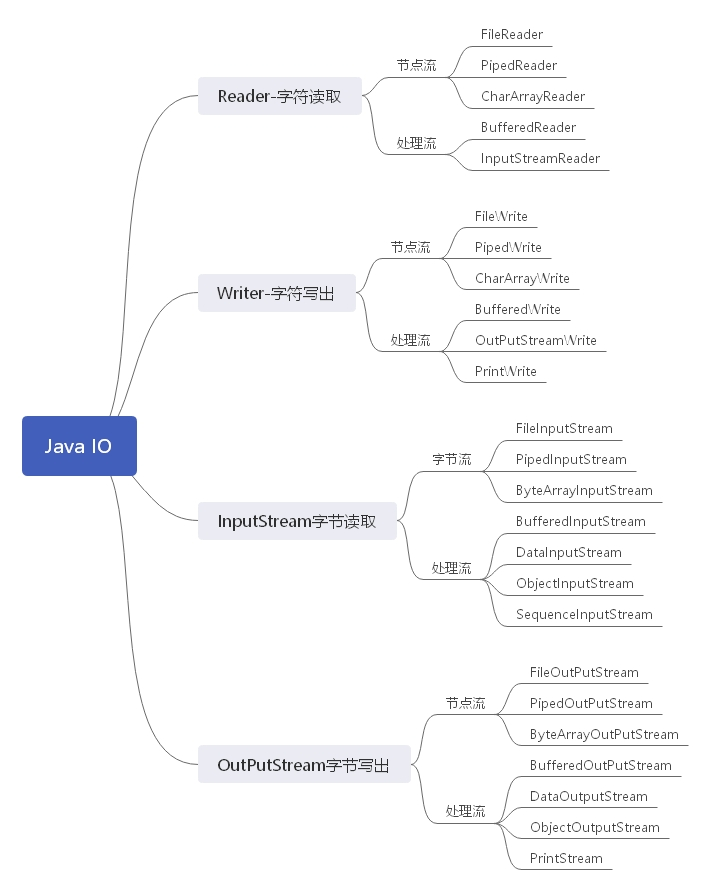
>
> 按操作对象分类结构图：
>
> 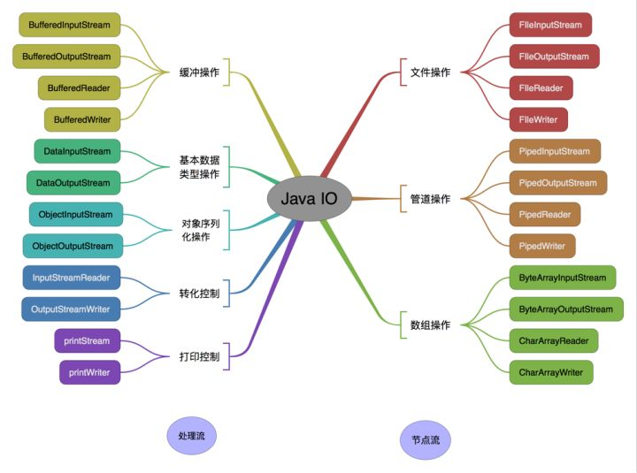
>
> 

## 29、 Java IO与 NIO的区别（补充）

> NIO即New IO，这个库是在JDK1.4中才引入的。NIO和IO有相同的作用和目的，但实现方式不同，
>
> NIO主要用到的是块，所以NIO的效率要比IO高很多。在Java API中提供了两套NIO，一套是针对标准输入输出NIO，另一套就是网络编程NIO。

## 30、java反射的作用于原理

### 1、定义：

> 反射机制是在运行时，对于任意一个类，都能够知道这个类的所有属性和方法；对于任意个对象，都能够调用它的任意一个方法。在java中，只要给定类的名字，就可以通过反射机制来获得类的所有信息。
>
> 这种动态获取的信息以及动态调用对象的方法的功能称为Java语言的反射机制。

### 2、哪里会用到反射机制？

> jdbc就是典型的反射
>
> ```JAVA
> Class.forName('com.mysql.jdbc.Driver.class');//加载MySQL的驱动类
> ```
>
> 这就是反射。如hibernate，struts等框架使用反射实现的。

### 3、反射的实现方式：

> 第一步：获取Class对象，有4中方法：
>
> 1）Class.forName("类的路径")；
>
> 2）类名.class 
>
> 3）对象名.getClass()
>
>  4）基本类型的包装类，可以调用包装类的Type属性来获得该包装类的Class对象

#### 4、实现Java反射的类：

> 1）Class：表示正在运行的Java应用程序中的类和接口注意：所有获取对象的信息都需要Class类来实现。
>
>  2）Field：提供有关类和接口的属性信息，以及对它的动态访问权限。
>
>  3）Constructor：提供关于类的单个构造方法的信息以及它的访问权限
>
>  4）Method：提供类或接口中某个方法的信息

### 5、反射机制的优缺点：

> **优点：**
>
>  1）能够运行时动态获取类的实例，提高灵活性；
>
>  2）与动态编译结合
>
>  **缺点：**
>
>  1）使用反射性能较低，需要解析字节码，将内存中的对象进行解析。
>
> ​	解决方案：
>
> ​	1、通过setAccessible(true)关闭JDK的安全检查来提升反射速度；
>
> ​	2、多次创建一个类的实例时，有缓存会快很多
>
> ​	3、ReflectASM工具类，通过字节码生成的方式加快反射速度
>
>  2）相对不安全，破坏了封装性（因为通过反射可以获得私有方法和属性）

## 31、说说List,Set,Map三者的区别？

> - **List(对付顺序的好帮手)：** List接口存储一组不唯一（可以有多个元素引用相同的对象），有序的对象
>
> - **Set(注重独一无二的性质):**不允许重复的集合。不会有多个元素引用相同的对象。
>
> - **Map(用Key来搜索的专家):**使用键值对存储。Map会维护与Key有关联的值。两个Key可以引用相同的对象，但Key不能重复，典型的Key是String类型，但也可以是任何对象。

## 32.、Object 有哪些常用方法？大致说一下每个方法的含义

> java.lang.Object
>
> 
>
> 下面是对应方法的含义。

### clone 方法

> 保护方法，实现对象的浅复制，只有实现了 Cloneable 接口才可以调用该方法，否则抛出
>
> CloneNotSupportedException 异常，深拷贝也需要实现 Cloneable，同时其成员变量为引用类型的也需要实现 Cloneable，然后重写 clone 方法。

### finalize 方法

> 该方法和垃圾收集器有关系，判断一个对象是否可以被回收的最后一步就是判断是否重写了此方法。

### equals 方法

> 该方法使用频率非常高。一般 equals 和== 是不一样的，但是在 Object 中两者是一样的。子类一般都要重写这个方法。

### hashCode 方法

> 该方法用于哈希查找，重写了 equals 方法一般都要重写 hashCode 方法，这个方法在一些具有哈希功能的 Collection 中用到。
>
> 一般必须满足<span class="underline">obj1.equals(obj2)==true</span> 。可以推出obj1.hashCode()==obj2.hashCode()，但是hashCode 相等不一定就满足 equals。不过为了提高效率，应该尽量使上面两个条件接近等价。
>
> - JDK 1.6、1.7 默认是返回随机数；
>
> - JDK 1.8 默认是通过和当前线程有关的一个随机数+三个确定值，运用 Marsaglia's xorshift scheme 随机数算法得到的一个随机数。

### wait 方法

> 配合 synchronized 使用，wait 方法就是使当前线程等待该对象的锁，当前线程必须是该对象的拥有者，也就是具有该对象的锁。wait()方法一直等待，直到获得锁或者被中断。wait(long timeout)设定一个超时间隔，如果在规定时间内没有获得锁就返回。
>
> 调用该方法后当前线程进入睡眠状态，直到以下事件发生。
>
> 1.  其他线程调用了该对象的 notify 方法；
> 2.  其他线程调用了该对象的 notifyAll 方法；
> 3.  其他线程调用了 interrupt 中断该线程；
> 4.  时间间隔到了。
>
> 此时该线程就可以被调度了，如果是被中断的话就抛出一个 InterruptedException 异常。

#### notify 方法

> 配合 synchronized 使用，该方法唤醒在该对象上**等待队列**中的某个线程（同步队列中的线程是给抢占 CPU 的线程，等待队列中的线程指的是等待唤醒的线程）。

#### notifyAll 方法

> 配合 synchronized 使用，该方法唤醒在该对象上等待队列中的所有线程。**总结**
>
> 只要把上面几个方法熟悉就可以了，toString 和 getClass 方法可以不用去讨论它们。该题目考察的是对 Object 的熟悉程度，平时用的很多方法并没看其定义但是也在用，比如说：wait()方法，equals()方法等。
>
> ```sh
> Class Object is the root of the class hierarchy.Every class has Object as a
> superclass. All objects, including arrays, implement the methods of this class.
> ```
>
> 大致意思：Object 是所有类的根，是所有类的父类，所有对象包括数组都实现了 Object 的方法。

## 33、Java 创建对象有几种方式？

> 这题目看似简单，要好好回答起来还是有点小复杂的，我们来看看，到底有哪些方式可以创建对象？
>
> **使用 new 关键字**，这也是我们平时使用的最多的创建对象的方式，示例：
>
> ```java
> User user=new User();
> ```
>
> **使用反射方式创建对象**，使用 newInstance()，但是得处理两个异常 InstantiationException、 IllegalAccessException：
>
> ```java
> User user=User.class.newInstance();
> Object object=(Object)Class.forName("java.lang.Object").newInstance()
> ```
>
> **使用 clone 方法**，前面题目中 clone 是 Object 的方法，所以所有对象都有这个方法。**使用反序列化创建对象**，调用 ObjectInputStream 类的 readObject()方法。
>
> 我们反序列化一个对象，JVM 会给我们创建一个单独的对象。JVM 创建对象并不会调用任何构造函数。一个对象实现了 Serializable 接口，就可以把对象写入到文件中，并通过读取文件来创建对象。

### 总结

> 创建对象的方式关键字：new、反射、clone 拷贝、反序列化。

## 34、获取一个类Class对象的方式有哪些？

> 搞清楚类对象和实例对象，但都是对象。
>
> 第一种：通过类对象的 getClass()方法获取，细心点的都知道，这个 getClass 是 Object 类里面的方法。
>
> ```java
> User user=new User();
> //clazz就是一个User的类对象
> Class<?> clazz=user.getClass();
> ```
>
> 第二种：通过类的静态成员表示，每个类都有隐含的静态成员 class。
>
> ```java
> //clazz就是一个User的类对象
> Class<?> clazz=User.class;
> ```
>
> 第三种：通过 Class 类的静态方法 forName()方法获取。
>
> ```java
> Class<?> clazz = Class.forName("com.tian.User");
> ```

## 35、ArrayList 和 LinkedList 的区别有哪些？

### ArrayList

> **优点**：ArrayList 是实现了基于动态数组的数据结构，因为地址连续，一旦数据存储好了，查询操作效率会比较高（在内存里是连着放的）。
>
> **缺点**：因为地址连续，ArrayList 要移动数据，所以插入和删除操作效率比较低。

### LinkedList

> **优点**：LinkedList 基于链表的数据结构，地址是任意的，所以在开辟内存空间的时候不需要等一个连续的地址。对于新增和删除操作，LinkedList 比较占优势。LinkedList 适用于要头尾操作或插入指定位置的场景。
>
> **缺点**：因为 LinkedList 要移动指针，所以查询操作性能比较低。

### 适用场景分析

> 当需要对数据进行对随机访问的时候，选用 ArrayList。
>
> 当需要对数据进行多次增加删除修改时，采用 LinkedList。
>
> 如果容量固定，并且只会添加到尾部，不会引起扩容，优先采用 ArrayList。
>
> 当然，绝大数业务的场景下，使用 ArrayList 就够了，但需要注意避免 ArrayList 的扩容，以及非顺序的插入。

## 36、用过 ArrayList 吗？说一下它有什么特点？

> 只要是搞 Java 的肯定都会回答"用过"。所以，回答题目的后半部分------ArrayList 的特点。可以从这几个方面去回答：
>
> Java 集合框架中的一种存放相同类型的元素数据，是一种变长的集合类，基于定长数组实现，当加入数据达到一定程度后，会实行自动扩容，即扩大数组大小。
>
> 底层是使用数组实现，添加元素。
>
> - 如果 add(o)，添加到的是数组的尾部，如果要增加的数据量很大，应该使用 ensureCapacity()方法，该方法的作用是预先设置 ArrayList 的大小，这样可以大大提高初始化速度。
>
> - 如果使用 add(int,o)，添加到某个位置，那么可能会挪动大量的数组元素，并且可能会触发扩容机制。
>
> 高并发的情况下，线程不安全。多个线程同时操作 ArrayList，会引发不可预知的异常或错误。
>
> ArrayList 实现了 Cloneable 接口，标识着它可以被复制。注意：ArrayList 里面的 clone()复制其实是浅复制。

## 37、有数组了为什么还要搞个 ArrayList 呢？

> 通常我们在使用的时候，如果在不明确要插入多少数据的情况下，普通数组就很尴尬了，因为你不知道需要初始化数组大小为多少，而 ArrayList 可以使用默认的大小，当元素个数到达一定程度后，会自动扩容。
>
> 可以这么来理解：我们常说的数组是定死的数组，ArrayList 却是动态数组。

## 38、说说什么是 fail-fast？

> fail-fast 机制是 Java 集合（Collection）中的一种错误机制。当多个线程对同一个集合的内容进行操作时，就可能会产生 fail-fast 事件。
>
> 例如：当某一个线程 A 通过 iterator 去遍历某集合的过程中，若该集合的内容被其他线程所改变了，那么线程 A 访问集合时，就会抛出 ConcurrentModificationException 异常，产生 fail-fast 事件。这里的操作主要是指 add、remove 和 clear，对集合元素个数进行修改。
>
> 解决办法：建议使用"java.util.concurrent 包下的类"去取代"java.util 包下的类"。
>
> 可以这么理解：在遍历之前，把 modCount 记下来 expectModCount，后面 expectModCount 去和 modCount 进行比较，如果不相等了，证明已并发了，被修改了，于是抛出ConcurrentModificationException 异常。
>

## 39、说说Hashtable 与 HashMap 的区别

> 本来不想这么写标题的，但是无奈，面试官都喜欢这么问 HashMap。
>
> 1. 出生的版本不一样，Hashtable 出生于 Java 发布的第一版本 JDK 1.0，HashMap 出生于 JDK1.2。
>
> 2.  都实现了 Map、Cloneable、Serializable（当前 JDK 版本1.8）。
>
> 3.  HashMap 继承的是 AbstractMap，并且 AbstractMap 也实现了 Map 接口。Hashtable 继承Dictionary。
>
> 4.  Hashtable 中大部分 public 修饰普通方法都是 synchronized 字段修饰的，是线程安全的，HashMap 是非线程安全的。
>
> 5.  Hashtable 的 key 不能为 null，value 也不能为 null，这个可以从 Hashtable 源码中的 put 方法看到，判断如果 value 为 null 就直接抛出空指针异常，在 put 方法中计算 key 的 hash 值之前并没有判断 key 为 null 的情况，那说明，这时候如果 key 为空，照样会抛出空指针异常。
>
> 6.  HashMap 的 key 和 value 都可以为 null。在计算 hash 值的时候，有判断，如果key==null，则其 hash=0 ；至于 value 是否为 null，根本没有判断过。
>
> 7.  Hashtable 直接使用对象的 hash 值。hash 值是 JDK 根据对象的地址或者字符串或者数字算出来的 int 类型的数值。然后再使用除留余数法来获得最终的位置。然而除法运算是非常耗费时间的，效率很低。HashMap 为了提高计算效率，将哈希表的大小固定为了2 的幂，这样在取模预算时，不需要做除法，只需要做位运算。位运算比除法的效率要高很多。
>
> 8.  Hashtable、HashMap 都使用了 Iterator。而由于历史原因，Hashtable 还使用了Enumeration 的方式。
>
> 9.  默认情况下，初始容量不同，Hashtable 的初始长度是11，之后每次扩充容量变为之前的2n+1（n 为上一次的长度）而 HashMap 的初始长度为16，之后每次扩充变为原来的两倍。
>
> 另外在 Hashtable 源码注释中有这么一句话：
>
> ```txt
> Hashtable is synchronized. If a thread-safe implementation is not needed, it is recommended to use HashMap in place of Hashtable . If a thread-safe highlyconcurrent implementation is desired, then it is recommended to use ConcurrentHashMap in place of Hashtable.
> ```
>
> 大致意思：Hashtable 是线程安全，推荐使用 HashMap 代替 Hashtable；如果需要线程安全高并发的话，推荐使用 ConcurrentHashMap 代替 Hashtable。
>
> 这个回答完了，面试官可能会继续问：HashMap 是线程不安全的，那么在需要线程安全的情况下还要考虑性能，有什么解决方式？
>
> 这里最好的选择就是 ConcurrentHashMap 了，但面试官肯定会叫你继续说一下ConcurrentHashMap 数据结构以及底层原理等。
>

## 40、HashMap 中的 key 我们可以使用任何类作为 key 吗？

> 平时可能大家使用的最多的就是使用 String 作为 HashMap 的 key，但是现在我们想使用某个自定义类作为 HashMap 的 key，那就需要注意以下几点：
>
> 如果类重写了 equals 方法，它也应该重写 hashCode 方法。类的所有实例需要遵循与 equals 和 hashCode 相关的规则。
>
> 如果一个类没有使用 equals，你不应该在 hashCode 中使用它。
>
> 咱们自定义 key 类的最佳实践是使之为不可变的，这样，hashCode 值可以被缓存起来，拥有更好的性能。不可变的类也可以确保 hashCode 和 equals 在未来不会改变，这样就会解决与可变相关的问题了。

## 41、HashMap 的长度为什么是2 的 N 次方呢？

> 为了能让 HashMap 存数据和取数据的效率高，尽可能地减少 hash 值的碰撞，也就是说尽量把数据能均匀的分配，每个链表或者红黑树长度尽量相等。
>
> 我们首先可能会想到%取模的操作来实现。下面是回答的重点哟：
>
> ```txt
> 取余（%）操作中如果除数是2 的幂次，则等价于与其除数减一的与（&）操作（也就是说 hash % length == hash &(length -1)的前提是 length 是2 的 n 次方）。并且，采用二进制位操作&，相对于%能够提高运算效率。
> ```
>
> 这就是为什么 HashMap 的长度需要2 的 N 次方了。

## 42、HashMap 与 ConcurrentHashMap 的异同

> 1.  都是 key-value 形式的存储数据；
>
> 2.  HashMap 是线程不安全的，ConcurrentHashMap 是 JUC 下的线程安全的；
>
> 3.  HashMap 底层数据结构是数组+链表（JDK 1.8 之前）。JDK 1.8 之后是数组+链表+红黑树。当链表中元素个数达到8 的时候，链表的查询速度不如红黑树快，链表会转为红黑树，红黑树查询速度快；
>
> 4.  HashMap 初始数组大小为16（默认），当出现扩容的时候，以0.75 \*数组大小的方式进行扩容；
>
> 5.  ConcurrentHashMap 在 JDK 1.8 之前是采用分段锁来现实的 Segment + HashEntry，Segment 数组大小默认是16，2 的 n 次方；JDK 1.8 之后，采用 Node + CAS + Synchronized来保证并发安全进行实现。

## 43、红黑树有哪几个特征？

> 紧接上个问题，面试官很有可能会问红黑树，下面把红黑树的几个特征列出来：
>
> 

## 44、说说你平时是怎么处理 Java 异常的

> try-catch-finally
>
> - try 块负责监控可能出现异常的代码
>
> - catch 块负责捕获可能出现的异常，并进行处理
>
> - finally 块负责清理各种资源，不管是否出现异常都会执行
>
> - 其中 try 块是必须的，catch 和finally 至少存在一个标准异常处理流程
>
> 
>
> 抛出异常→捕获异常→捕获成功（当 catch 的异常类型与抛出的异常类型匹配时，捕获成功）→异常被处理，程序继续运行抛出异常→捕获异常→捕获失败（当 catch 的异常类型与抛出异常类型不匹配时，捕获失败）→异常未被处理，程序中断运行
>
> 在开发过程中会使用到自定义异常，在通常情况下，程序很少会自己抛出异常，因为异常的类名通常也包含了该异常的有用信息，所以在选择抛出异常的时候，应该选择合适的异常类，从而可以明确地描述该异常情况，所以这时候往往都是自定义异常。
>
> 自定义异常通常是通过继承 java.lang.Exception 类，如果想自定义 Runtime 异常的话，可以继承
>
> java.lang.RuntimeException 类，实现一个无参构造和一个带字符串参数的有参构造方法。
>
> 在业务代码里，可以针对性的使用自定义异常。比如说：该用户不具备某某权限、余额不足等。

## 45、说说深拷贝和浅拷贝？

> 浅拷贝（shallowCopy）只是增加了一个指针指向已存在的内存地址，
>
> 深拷贝（deepCopy）是增加了一个指针并且申请了一个新的内存，使这个增加的指针指向这个新的内存，
>
> 使用深拷贝的情况下，释放内存的时候不会因为出现浅拷贝时释放同一个内存的错误。最好是结合克隆已经原型模式联系在一起哈，记得复习的时候，把这几个联系起来的。
>

# 二、JVM篇

## 1、知识点汇总

> JVM是Java运行基础,面试时一定会遇到JVM的有关问题,内容相对集中,但对只是深度要求较高.
>
> 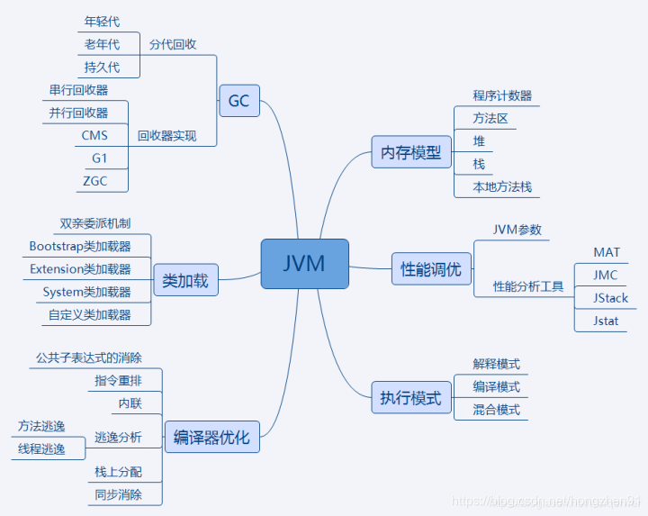
>
> 其中内存模型,类加载机制,GC是重点方面.性能调优部分更偏向应用,重点突出实践能力.编译器优化和执行模式部分偏向于理论基础,重点掌握知识点.
>
> 需了解**内存模型**各部分作用,保存哪些数据.
>
> **类加载**双亲委派加载机制,常用加载器分别加载哪种类型的类.
>
> **GC**分代回收的思想和依据以及不同垃圾回收算法的回收思路和适合场景.
>
> **性能调优**常有JVM优化参数作用,参数调优的依据,常用的JVM分析工具能分析哪些问题以及使用方法.**执行模式**解释/编译/混合模式的优缺点,Java7提供的分层编译技术,JIT即时编译技术,OSR栈上替换,C1/C2编译器针对的场景,C2针对的是server模式,优化更激进.新技术方面Java10的graal编译器
>
> **编译器优化j**avac的编译过程,ast抽象语法树,编译器优化和运行器优化.

## 2、知识点详解：

### 1、JVM内存模型：

> 线程独占:栈,本地方法栈,程序计数器线程共享:堆,方法区

### 2、栈：

> 又称方法栈,线程私有的,线程执行方法是都会创建一个栈阵,用来存储局部变量表,操作栈,动态链接,方法出口等信息.调用方法时执行入栈,方法返回式执行出栈.

### 3、本地方法栈

> 与栈类似,也是用来保存执行方法的信息.执行Java方法是使用栈,执行Native方法时使用本地方法栈.

### 4、程序计数器

> 保存着当前线程执行的字节码位置,每个线程工作时都有独立的计数器,只为执行Java方法服务,执行Native方法时,程序计数器为空.
>

### 5、堆

> JVM内存管理最大的一块,对被线程共享,目的是存放对象的实例,几乎所欲的对象实例都会放在这里,当堆没有可用空间时,会抛出OOM异常.根据对象的存活周期不同,JVM把对象进行分代管理,由垃圾回收器进行垃圾的回收管理

### 6、方法区：

> 又称非堆区,用于存储已被虚拟机加载的类信息,常量,静态变量,即时编译器优化后的代码等数据.1.7的永久代和1.8的元空间都是方法区的一种实现

### 7、JVM 内存可见性

> 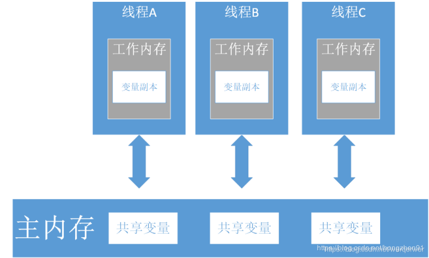
>
> JMM是定义程序中变量的访问规则,线程对于变量的操作只能在自己的工作内存中进行,而不能直接对主内存操作.由于指令重排序,读写的顺序会被打乱,因此JMM需要提供原子性,可见性,有序性保证.
>
> 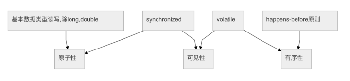

## 3、说说类加载与卸载

#### 加载过程

> 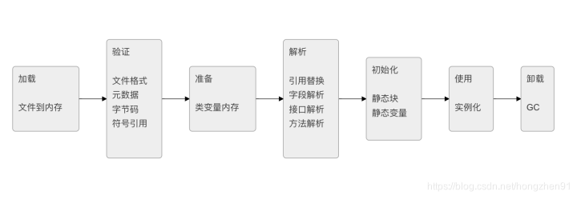
>
> 其中**验证,准备,解析**合称链接
>
> **加载**通过类的完全限定名,查找此类字节码文件,利用字节码文件创建Class对象.**验证**确保Class文件符合当前虚拟机的要求,不会危害到虚拟机自身安全.
>
> **准备**进行内存分配,为static修饰的类变量分配内存,并设置初始值(0或null).不包含final修饰的静态变量,因为final变量在编译时分配.
>
> **解析**将常量池中的符号引用替换为直接引用的过程.直接引用为直接指向目标的指针或者相对偏移量等.
>
> **初始化**主要完成静态块执行以及静态变量的赋值.先初始化父类,再初始化当前类.只有对类主动使用时才会初始化.
>
> 触发条件包括,创建类的实例时,访问类的静态方法或静态变量的时候,使用Class.forName反射类的时候,或者某个子类初始化的时候.
>
> Java自带的加载器加载的类,在虚拟机的生命周期中是不会被卸载的,只有用户自定义的加载器加载的类才可以被卸.

### 1、加载机制-双亲委派模式

> 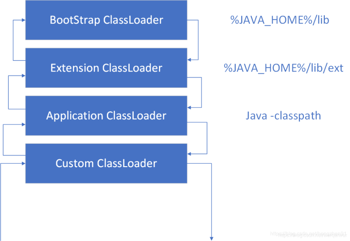
>
> 双亲委派模式,即加载器加载类时先把请求委托给自己的父类加载器执行,直到顶层的启动类加载器.父类加载器能够完成加载则成功返回,不能则子类加载器才自己尝试加载.\*

### 优点:

> 1.  避免类的重复加载
>
> 2.  避免Java的核心API被篡改

### 2、分代回收

> 分代回收基于两个事实:大部分对象很快就不使用了,还有一部分不会立即无用,但也不会持续很长时间.
>
> 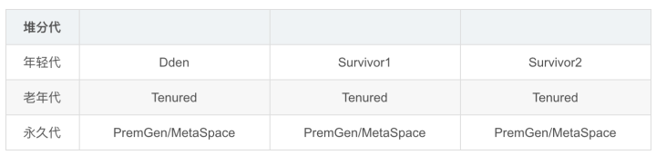
>
> 年轻代-\>标记-复制老年代-\>标记-清除

### 3、回收算法

> a. G1 算法
>
> 1.9后默认的垃圾回收算法,特点保持高回收率的同时减少停顿.采用每次只清理一部分,而不是清理全部的增量式清理,以保证停顿时间不会过长
>
> 其取消了年轻代与老年代的物理划分,但仍属于分代收集器,算法将堆分为若干个逻辑区域(region),一部分用作年轻代,一部分用作老年代,还有用来存储巨型对象的分区.
>
> 同CMS相同,会遍历所有对象,标记引用情况,清除对象后会对区域进行复制移动,以整合碎片空间.年轻代回收: 并行复制采用复制算法,并行收集,会StopTheWorld.
>
> 老年代回收: 会对年轻代一并回收
>
> 初始标记完成堆root对象的标记,会StopTheWorld.并发标记 GC线程和应用线程并发执行.最终标记完成三色标记周期,会StopTheWorld.复制/清楚会优先对可回收空间加大的区域进行回收
>
> b. ZGC 算法
>
> 前面提供的高效垃圾回收算法,针对大堆内存设计,可以处理TB级别的堆,可以做到10ms以下的回收停顿时间.
>
> 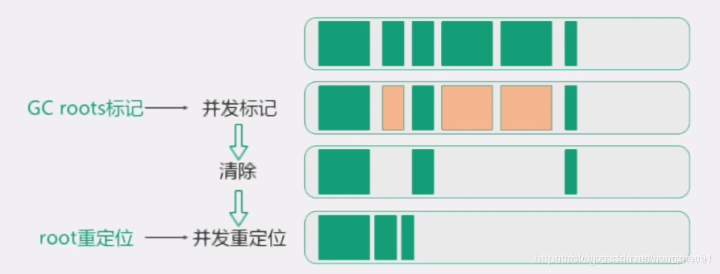
>
> - 着色指针
> - 读屏障
> - 并发处理
> - 基于region
> - 内存压缩(整理)
>
> roots标记：标记root对象,会StopTheWorld.并发标记：利用读屏障与应用线程一起运行标记,可能会发生StopTheWorld.清除会清理标记为不可用的对象. roots重定位：是对存活的对象进行移动,以腾出大块内存空间,减少碎片产生.重定位最开始会StopTheWorld,却决于重定位集与对象总活动集的比例.并发重定位与并发标记类似.

## 4、简述一下JVM的内存模型

### JVM内存模型简介

> JVM定义了不同运行时数据区，他们是用来执行应用程序的。某些区域随着JVM启动及销毁，另外一些区域的数据是线程性独立的，随着线程创建和销毁。jvm内存模型总体架构图如下：（摘自oracle官方网站）
>
> 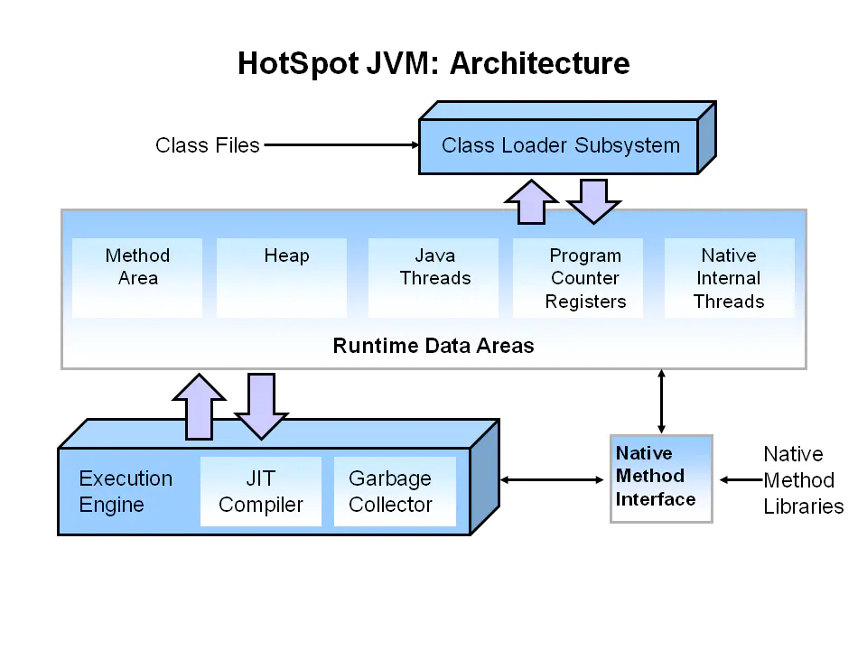
>
> JVM在执行Java程序时，会把它管理的内存划分为若干个的区域，每个区域都有自己的用途和创建销毁时间。如下图所示，可以分为两大部分，线程私有区和共享区。下图是根据自己理解画的一个
>
> JVM内存模型架构图：
>
> 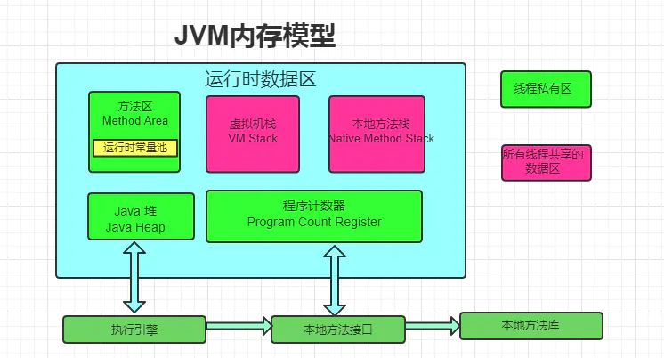
>
> JVM内存分为线程私有区和线程共享区
>
> 

### 线程私有区

#### 1、程序计数器

> 当同时进行的线程数超过CPU数或其内核数时，就要通过时间片轮询分派CPU的时间资源，不免发生线程切换。这时，每个线程就需要一个属于自己的计数器来记录下一条要运行的指令。如果执行的是JAVA方法，计数器记录正在执行的java字节码地址，如果执行的是native方法，则计数器为空。

#### 2、虚拟机栈

> 线程私有的，与线程在同一时间创建。管理JAVA方法执行的内存模型。每个方法执行时都会创建一个桢栈来存储方法的的变量表、操作数栈、动态链接方法、返回值、返回地址等信息。栈的大小决定了方法调用的可达深度（递归多少层次，或嵌套调用多少层其他方法，-Xss参数可以设置虚拟机栈大小）。栈的大小可以是固定的，或者是动态扩展的。如果请求的栈深度大于最大可用深度，则抛出stackOverflowError；如果栈是可动态扩展的，但没有内存空间支持扩展，则抛出
>
> OutofMemoryError。使用jclasslib工具可以查看class类文件的结构。下图为栈帧结构图：
>
> 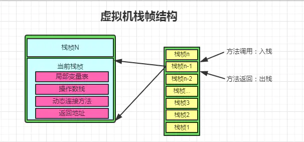

#### 3、本地方法栈

> 与虚拟机栈作用相似。但它不是为Java方法服务的，而是本地方法（C语言）。由于规范对这块没有强制要求，不同虚拟机实现方法不同。

### 线程共享区

#### 1、方法区

> 线程共享的，用于存放被虚拟机加载的类的元数据信息，如常量、静态变量和即时编译器编译后的代码。若要分代，算是永久代（老年代），以前类大多"static"的，很少被卸载或收集，现回收废弃常量和无用的类。其中运行时常量池存放编译生成的各种常量。（如果hotspot虚拟机确定一个类的定义信息不会被使用，也会将其回收。回收的基本条件至少有：所有该类的实例被回收，而且装载该类的ClassLoader被回收）

#### 2、堆

> 存放对象实例和数组，是垃圾回收的主要区域，分为新生代和老年代。刚创建的对象在新生代的
>
> Eden区中，经过GC后进入新生代的S0区中，再经过GC进入新生代的S1区中，15次GC后仍存在就进入老年代。这是按照一种回收机制进行划分的，不是固定的。若堆的空间不够实例分配，则OutOfMemoryError。
>
> 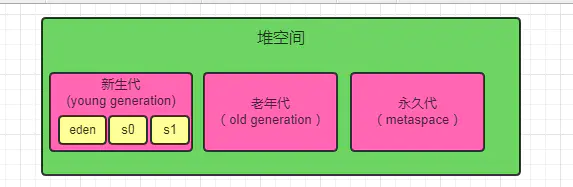
>
> ```txt
> Young Generation 即图中的Eden + From Space（s0）+ To Space(s1)
> Eden 存放新生的对象
> Survivor Space 有两个，存放每次垃圾回收后存活的对象(s0+s1)
> Old Generation Tenured Generation 即图中的Old Space
> 主要存放应用程序中生命周期长的存活对象
> ```

## 5、说说堆和栈的区别

> 栈是运行时单位，代表着逻辑，内含基本数据类型和堆中对象引用，所在区域连续，没有碎片；堆是存储单位，代表着数据，可被多个栈共享（包括成员中基本数据类型、引用和引用对象），所在区域不连续，会有碎片。

### 1、功能不同

> 栈内存用来存储局部变量和方法调用，而堆内存用来存储Java中的对象。无论是成员变量，局部变量，还是类变量，它们指向的对象都存储在堆内存中。

### 2、共享性不同

> 栈内存是线程私有的。堆内存是所有线程共有的。

### 3、异常错误不同

> 如果栈内存或者堆内存不足都会抛出异常。栈空间不足：java.lang.StackOverFlowError。堆空间不足：java.lang.OutOfMemoryError。

### 4、空间大小

> 栈的空间大小远远小于堆的。

## 6、什么时候会触发FullGC

> 除直接调用System.gc外，触发Full GC执行的情况有如下四种。
>
> **1.旧生代空间不足**旧生代空间只有在新生代对象转入及创建为大对象、大数组时才会出现不足的现象，当执行Full GC后空间仍然不足，则抛出如下错误： java.lang.OutOfMemoryError: Java heap space 为避免以上两种状况引起的FullGC，调优时应尽量做到让对象在Minor GC阶段被回收、让对象在新生代多存活一段时间及不要创建过大的对象及数组。
>
> **2.Permanet Generation空间满** PermanetGeneration中存放的为一些class的信息等，当系统中要加载的类、反射的类和调用的方法较多时，Permanet Generation可能会被占满，在未配置为采用CMS GC的情况下会执行Full GC。如果经过Full GC仍然回收不了，那么JVM会抛出如下错误信息： java.lang.OutOfMemoryError: PermGen space 为避免Perm Gen占满造成Full GC现象，可采用的方法为增大Perm Gen空间或转为使用CMS GC。
>
> **3.CMS GC时出现promotion failed和concurrent mode failure**对于采用CMS进行旧生代GC的程序而言，尤其要注意GC日志中是否有promotion failed和concurrent mode failure两种状况，当这两种状况出现时可能会触发Full GC。 promotionfailed是在进行Minor GC时，survivor space放不下、对象只能放入旧生代，而此时旧生代也放不下造成的；concurrent mode failure是在执行 CMS GC的过程中同时有对象要放入旧生代，而此时旧生代空间不足造成的。应对措施为：增大survivorspace、旧生代空间或调低触发并发GC的比率，但在JDK 5.0+、6.0+的版本中有可能会由于JDK的bug29导致CMS在remark完毕后很久才触发sweeping动作。对于这种状况，可通过设置- XX:CMSMaxAbortablePrecleanTime=5（单位为ms）来避免。
>
> **4.统计得到的Minor GC晋升到旧生代的平均大小大于旧生代的剩余空间**这是一个较为复杂的触发情况，Hotspot为了避免由于新生代对象晋升到旧生代导致旧生代空间不足的现象，在进行Minor GC时，做了一个判断，如果之前统计所得到的Minor GC晋升到旧生代的平均大小大于旧生代的剩余空间，那么就直接触发Full GC。例如程序第一次触发MinorGC后，有6MB的对象晋升到旧生代，那么当下一次Minor GC发生时，首先检查旧生代的剩余空间是否大于6MB，如果小于6MB，则执行Full GC。当新生代采用PSGC时，方式稍有不同，PS GC是在Minor GC后也会检查，例如上面的例子中第一次Minor GC后，PS GC会检查此时旧生代的剩余空间是否大于6MB，如小于，则触发对旧生代的回收。除了以上4种状况外，对于使用RMI来进行RPC或管理的Sun JDK应用而言，默认情况下会一小时执行一次Full GC。可通过在启动时通过- java-Dsun.rmi.dgc.client.gcInterval=3600000来设置Full GC执行的间隔时间或通过-XX:+DisableExplicitGC来禁止RMI调用System.gc。

## 7、什么是Java虚拟机？为什么Java被称作是"平台无关的编程语言"？

> Java虚拟机是一个可以执行Java字节码的虚拟机进程。Java源文件被编译成能被Java虚拟机执行的字节码文件。 Java被设计成允许应用程序可以运行在任意的平台，而不需要程序员为每一个平台单独重写或者是重新编译。Java虚拟机让这个变为可能，因为它知道底层硬件平台的指令长度和其他特性。

## 8、Java内存结构

> 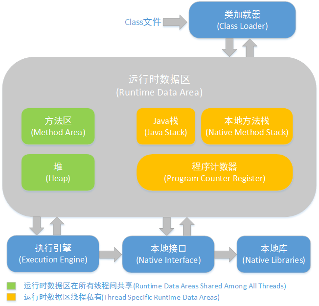
>
> 方法区和对是所有线程共享的内存区域；而java栈、本地方法栈和程序员计数器是运行是线程私有的内存区域。
>
> - Java堆（Heap）,是Java虚拟机所管理的内存中最大的一块。Java堆是被所有线程共享的一块内存区域，在虚拟机启动时创建。此内存区域的唯一目的就是存放对象实例，几乎所有的对象实例都在这里分配内存。
>
> - 方法区（Method Area）,方法区（Method Area）与Java堆一样，是各个线程共享的内存区域，它用于存储已被虚拟机加载的类信息、常量、静态变量、即时编译器编译后的代码等数据。
>
> - 程序计数器（Program Counter Register）,程序计数器（Program Counter Register）是一块较小的内存空间，它的作用可以看做是当前线程所执行的字节码的行号指示器。
>
> - JVM栈（JVM Stacks）,与程序计数器一样，Java虚拟机栈（Java Virtual Machine Stacks）也是线程私有的，它的生命周期与线程相同。虚拟机栈描述的是Java方法执行的内存模型：每个方法被执行的时候都会同时创建一个栈帧（Stack Frame）用于存储局部变量表、操作栈、动态链接、方法出口等信息。每一个方法被调用直至执行完成的过程，就对应着一个栈帧在虚拟机栈中从入栈到出栈的过程。
>
> - 本地方法栈（Native Method Stacks）,本地方法栈（Native Method Stacks）与虚拟机栈所发挥的作用是非常相似的，其区别不过是虚拟机栈为虚拟机执行Java方法（也就是字节码）服务，而本地方法栈则是为虚拟机使用到的Native方法服务。

## 9、说说对象分配规则

> - 对象优先分配在Eden区，如果Eden区没有足够的空间时，虚拟机执行一次Minor GC。
>
> - 大对象直接进入老年代（大对象是指需要大量连续内存空间的对象）。这样做的目的是避免在Eden区和两个Survivor区之间发生大量的内存拷贝（新生代采用复制算法收集内存）。
>
> - 长期存活的对象进入老年代。虚拟机为每个对象定义了一个年龄计数器，如果对象经过了1次 Minor GC那么对象会进入Survivor区，之后每经过一次Minor GC那么对象的年龄加1，知道达到阀值对象进入老年区。
>
> - 动态判断对象的年龄。如果Survivor区中相同年龄的所有对象大小的总和大于Survivor空间的一半，年龄大于或等于该年龄的对象可以直接进入老年代。
>
> - 空间分配担保。每次进行Minor GC时，JVM会计算Survivor区移至老年区的对象的平均大小，如果这个值大于老年区的剩余值大小则进行一次Full GC，如果小于检查HandlePromotionFailure设置，如果true则只进行Monitor GC,如果false则进行Full GC。

## 10、描述一下JVM加载class文件的原理机制？

> JVM中类的装载是由类加载器（ClassLoader）和它的子类来实现的，Java中的类加载器是一个重要的Java运行时系统组件，它负责在运行时查找和装入类文件中的类。由于Java的跨平台性，经过编译的Java源程序并不是一个可执行程序，而是一个或多个类文件。当Java程序需要使用某个类时，
>
> JVM会确保这个类已经被加载、连接（验证、准备和解析）和初始化。类的加载是指把类的.class文件中的数据读入到内存中，通常是创建一个字节数组读入.class文件，然后产生与所加载类对应的Class对象。加载完成后，Class对象还不完整，所以此时的类还不可用。当类被加载后就进入连接阶段，这一阶段包括验证、准备（为静态变量分配内存并设置默认的初始值）和解析（将符号引用替换为直接引用）三个步骤。最后JVM对类进行初始化，包括：1)如果类存在直接的父类并且这个类还没有被初始化，那么就先初始化父类；2)如果类中存在初始化语句，就依次执行这些初始化语句。类的加载是由类加载器完成的，类加载器包括：根加载器（BootStrap）、扩展加载器（Extension）、系统加载器（System）和用户自定义类加载器（java.lang.ClassLoader的子类）。从Java 2（JDK 1.2）开始，类加载过程采取了父亲委托机制（PDM）。PDM更好的保证了
>
> Java平台的安全性，在该机制中，JVM自带的Bootstrap是根加载器，其他的加载器都有且仅有一个父类加载器。类的加载首先请求父类加载器加载，父类加载器无能为力时才由其子类加载器自行加载。JVM不会向Java程序提供对Bootstrap的引用。下面是关于几个类加载器的说明：
>
> - Bootstrap：一般用本地代码实现，负责加载JVM基础核心类库（rt.jar）；
>
> - Extension：从java.ext.dirs系统属性所指定的目录中加载类库，它的父加载器是Bootstrap；
>- System：又叫应用类加载器，其父类是Extension。它是应用最广泛的类加载器。它从环境变量classpath或者系统属性java.class.path所指定的目录中记载类，是用户自定义加载器的默认父加载器。

## 11、说说Java对象创建过程

> 1.JVM遇到一条新建对象的指令时首先去检查这个指令的参数是否能在常量池中定义到一个类的符号引用。然后加载这个类（类加载过程在后边讲）
>
> 2.为对象分配内存。一种办法"指针碰撞"、一种办法"空闲列表"，最终常用的办法"本地线程缓冲分配(TLAB)"
>
> 3.将除对象头外的对象内存空间初始化为0
>
> 4.对对象头进行必要设置

## 12、知道类的生命周期吗？

> 类的生命周期包括这几个部分，加载、连接、初始化、使用和卸载，其中前三部是类的加载的过程,如下图；
>
> 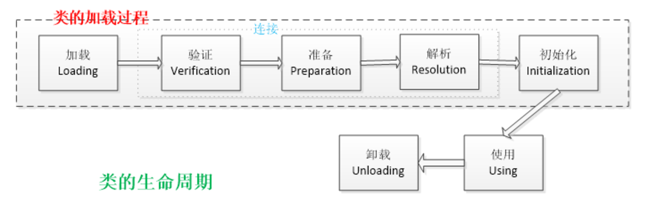
>
> - 加载，查找并加载类的二进制数据，在Java堆中也创建一个java.lang.Class类的对象
>
> - 连接，连接又包含三块内容：验证、准备、初始化。1）验证，文件格式、元数据、字节码、符号引用验证；2）准备，为类的静态变量分配内存，并将其初始化为默认值；3）解析，把类中的符号引用转换为直接引用
>
> - 初始化，为类的静态变量赋予正确的初始值
> - 使用，new出对象程序中使用
>
> - 卸载，执行垃圾回收

## 13、简述Java的对象结构

> Java对象由三个部分组成：对象头、实例数据、对齐填充。
>
> 对象头由两部分组成，第一部分存储对象自身的运行时数据：哈希码、GC分代年龄、锁标识状态、线程持有的锁、偏向线程ID（一般占32/64 bit）。第二部分是指针类型，指向对象的类元数据类型
>
> （即对象代表哪个类）。如果是数组对象，则对象头中还有一部分用来记录数组长度。
>
> 实例数据用来存储对象真正的有效信息（包括父类继承下来的和自己定义的）对齐填充：JVM要求对象起始地址必须是8字节的整数倍（8字节对齐）

## 14、如何判断对象可以被回收？

> 判断对象是否存活一般有两种方式：
>
> - 引用计数：每个对象有一个引用计数属性，新增一个引用时计数加1，引用释放时计数减1，计数为0时可以回收。此方法简单，无法解决对象相互循环引用的问题。
>
> - 可达性分析（Reachability Analysis）：从GC Roots开始向下搜索，搜索所走过的路径称为引用链。当一个对象到GC Roots没有任何引用链相连时，则证明此对象是不可用的，不可达对象。

## 15、JVM的永久代中会发生垃圾回收么？

> 垃圾回收不会发生在永久代，如果永久代满了或者是超过了临界值，会触发完全垃圾回收(Full GC)。如果你仔细查看垃圾收集器的输出信息，就会发现永久代也是被回收的。这就是为什么正确的永久代大小对避免Full GC是非常重要的原因。请参考下Java8：从永久代到元数据区(注：Java8中已经移除了永久代，新加了一个叫做元数据区的native内存区)
>

## 16、你知道哪些垃圾收集算法

> GC最基础的算法有三种：标记-清除算法、复制算法、标记-压缩算法，我们常用的垃圾回收器一般都采用分代收集算法。
>
> - 标记-清除算法，"标记-清除"（Mark-Sweep）算法，如它的名字一样，算法分为"标记"和"清除"两个阶段：首先标记出所有需要回收的对象，在标记完成后统一回收掉所有被标记的对象。复制算法，"复制"（Copying）的收集算法，它将可用内存按容量划分为大小相等的两块，每次只使用其中的一块。当这一块的内存用完了，就将还存活着的对象复制到另外一块上面，然后再把已使用过的内存空间一次清理掉。
>
> - 标记-压缩算法，标记过程仍然与"标记-清除"算法一样，但后续步骤不是直接对可回收对象进行清理，而是让所有存活的对象都向一端移动，然后直接清理掉端边界以外的内存
>
> - 分代收集算法，"分代收集"（Generational Collection）算法，把Java堆分为新生代和老年代，这样就可以根据各个年代的特点采用最适当的收集算法。

## 17、调优命令有哪些？

> Sun JDK监控和故障处理命令有jps jstat jmap jhat jstack jinfo
>
> - jps，JVM Process Status Tool,显示指定系统内所有的HotSpot虚拟机进程。
>
> - jstat，JVM statistics Monitoring是用于监视虚拟机运行时状态信息的命令，它可以显示出虚拟机进程中的类装载、内存、垃圾收集、JIT编译等运行数据。
>
> - jmap，JVM Memory Map命令用于生成heap dump文件
>
> - jhat，JVM Heap Analysis Tool命令是与jmap搭配使用，用来分析jmap生成的dump，jhat内置了一个微型的HTTP/HTML服务器，生成dump的分析结果后，可以在浏览器中查看
>
> - jstack，用于生成java虚拟机当前时刻的线程快照。
>
> - jinfo，JVM Configuration info 这个命令作用是实时查看和调整虚拟机运行参数。

## 18、常见调优工具有哪些

> 常用调优工具分为两类,jdk自带监控工具：jconsole和jvisualvm，第三方有：MAT(Memory Analyzer Tool)、GChisto。
>
> - jconsole，Java Monitoring and Management Console是从java5开始，在JDK中自带的java监控和管理控制台，用于对JVM中内存，线程和类等的监控
>
> - jvisualvm，jdk自带全能工具，可以分析内存快照、线程快照；监控内存变化、GC变化等。
> -  MAT，Memory Analyzer Tool，一个基于Eclipse的内存分析工具，是一个快速、功能丰富的 Java heap分析工具，它可以帮助我们查找内存泄漏和减少内存消耗
>
> - GChisto，一款专业分析gc日志的工具

## 19、Minor GC与Full GC分别在什么时候发生？

> 新生代内存不够用时候发生MGC也叫YGC，JVM内存不够的时候发生FGC

## 20、你知道哪些JVM性能调优参数？（简单版回答）

> - 设定堆内存大小
>
> -Xmx：堆内存最大限制。
>
> - 设定新生代大小。新生代不宜太小，否则会有大量对象涌入老年代
>
> -XX:NewSize：新生代大小
>
> -XX:NewRatio 新生代和老生代占比
>
> -XX:SurvivorRatio：伊甸园空间和幸存者空间的占比
>
> - 设定垃圾回收器年轻代用-XX:+UseParNewGC 年老代用-XX:+UseConcMarkSweepGC

## 21、对象一定分配在堆中吗？有没有了解逃逸分析技术？

> **「对象一定分配在堆中吗？」**不一定的，JVM通过**「逃逸分析」**，那些逃不出方法的对象会在栈上分配。

### 「什么是逃逸分析？」

> 逃逸分析(Escape Analysis)，是一种可以有效减少Java 程序中同步负载和内存堆分配压力的跨函数全局数据流分析算法。通过逃逸分析，Java Hotspot编译器能够分析出一个新的对象的引用的使用范围，从而决定是否要将这个对象分配到堆上。
>
> **逃逸分析**是指分析指针动态范围的方法，它同编译器优化原理的指针分析和外形分析相关联。当变量（或者对象）在方法中分配后，其指针有可能被返回或者被全局引用，这样就会被其他方法或者线程所引用，这种现象称作指针（或者引用）的逃逸(Escape)。通俗点讲，如果一个对象的指针被多个方法或者线程引用时，那么我们就称这个对象的指针发生了逃逸。

### 「逃逸分析的好处」

> 栈上分配，可以降低垃圾收集器运行的频率。
>
> - 同步消除，如果发现某个对象只能从一个线程可访问，那么在这个对象上的操作可以不需要同步。
>
> - 标量替换，把对象分解成一个个基本类型，并且内存分配不再是分配在堆上，而是分配在栈上。这样的好处有，一、减少内存使用，因为不用生成对象头。二、程序内存回收效率高，并且GC频率也会减少。

## 22、虚拟机为什么使用元空间替换了永久代？

> **「什么是元空间？什么是永久代？为什么用元空间代替永久代？」**我们先回顾一下**「方法区」**吧,看看虚拟机运行时数据内存图，如下:
>
> 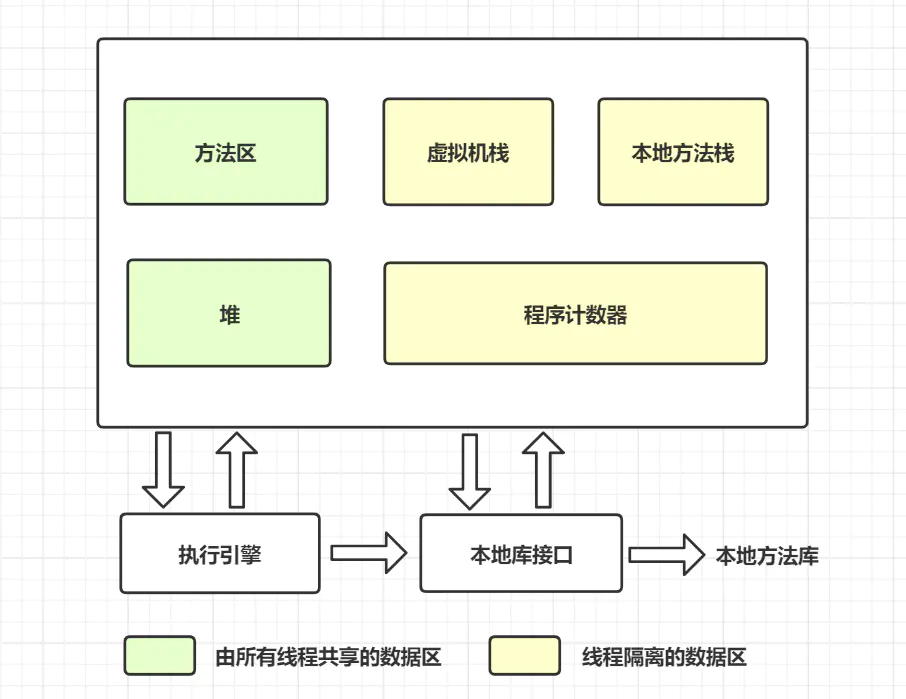
>
> 方法区和堆一样，是各个线程共享的内存区域，它用于存储已被虚拟机加载的类信息、常量、静态变量、即时编译后的代码等数据。

### 「什么是永久代？它和方法区有什么关系呢？」

> 如果在HotSpot虚拟机上开发、部署，很多程序员都把方法区称作永久代。可以说方法区是规范，永久代是Hotspot针对该规范进行的实现。在Java7及以前的版本，方法区都是永久代实现的。

### 「什么是元空间？它和方法区有什么关系呢？」

> 对于Java8，HotSpots取消了永久代，取而代之的是元空间(Metaspace)。换句话说，就是方法区还是在的，只是实现变了，从永久代变为元空间了。

### 「为什么使用元空间替换了永久代？」

> 永久代的方法区，和堆使用的物理内存是连续的。
>
> 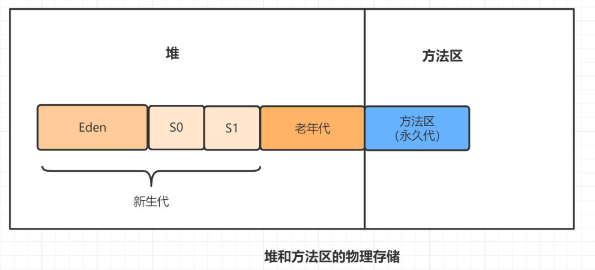
>
> **「永久代」**是通过以下这两个参数配置大小的\~
>
> -XX:PremSize：设置永久代的初始大小
>
> -XX:MaxPermSize: 设置永久代的最大值，默认是64M
>
> 对于**「永久代」**，如果动态生成很多class的话，就很可能出现**「java.lang.OutOfMemoryError: PermGen space错误」**，因为永久代空间配置有限嘛。最典型的场景是，在web开发比较多jsp页面的时候。
>
> - JDK8之后，方法区存在于元空间(Metaspace)。物理内存不再与堆连续，而是直接存在于本地内存中，理论上机器**「内存有多大，元空间就有多大」**。
>
> 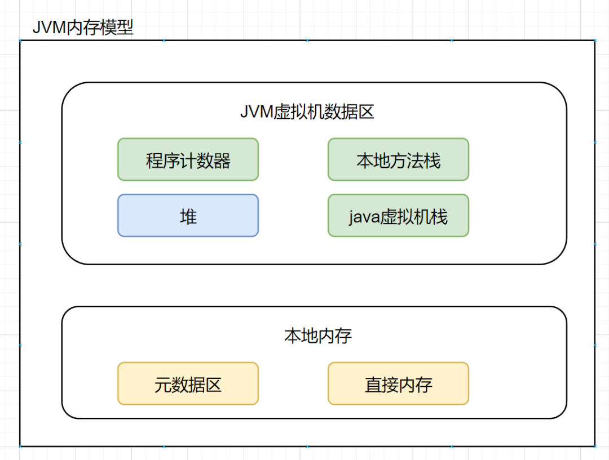

> 可以通过以下的参数来设置元空间的大小：
>
> - -XX:MetaspaceSize，初始空间大小，达到该值就会触发垃圾收集进行类型卸载，同时GC会对该值进行调整：如果释放了大量的空间，就适当降低该值；如果释放了很少的空间，那么在不超过MaxMetaspaceSize时，适当提高该值。
>
> - -XX:MaxMetaspaceSize，最大空间，默认是没有限制的。
>
> - -XX:MinMetaspaceFreeRatio，在GC之后，最小的Metaspace剩余空间容量的百分比，减少为分配空间所导致的垃圾收集
>
> - -XX:MaxMetaspaceFreeRatio，在GC之后，最大的Metaspace剩余空间容量的百分比，减少为释放空间所导致的垃圾收集

### 「所以，为什么使用元空间替换永久代？」

> 表面上看是为了避免OOM异常。因为通常使用PermSize和MaxPermSize设置永久代的大小就决定了永久代的上限，但是不是总能知道应该设置为多大合适,如果使用默认值很容易遇到
>
> OOM错误。当使用元空间时，可以加载多少类的元数据就不再由MaxPermSize控制,而由系统的实际可用空间来控制啦。

## 23、什么是Stop The World ? 什么是OopMap？什么是安全点？

> 进行垃圾回收的过程中，会涉及对象的移动。为了保证对象引用更新的正确性，必须暂停所有的用户线程，像这样的停顿，虚拟机设计者形象描述为**「Stop The World」**。也简称为STW。
>
> 在HotSpot中，有个数据结构（映射表）称为**「OopMap」**。一旦类加载动作完成的时候，
>
> HotSpot就会把对象内什么偏移量上是什么类型的数据计算出来，记录到OopMap。在即时编译过程中，也会在**「特定的位置」**生成 OopMap，记录下栈上和寄存器里哪些位置是引用。
>
> 这些特定的位置主要在：
>
> 1.循环的末尾（非 counted 循环）
>
> 2.方法临返回前/调用方法的call指令后
>
> 3.可能抛异常的位置
>
> 这些位置就叫作**「安全点(safepoint)。」**用户程序执行时并非在代码指令流的任意位置都能够在停顿下来开始垃圾收集，而是必须是执行到安全点才能够暂停。

## 24、说一下JVM 的主要组成部分及其作用？

> 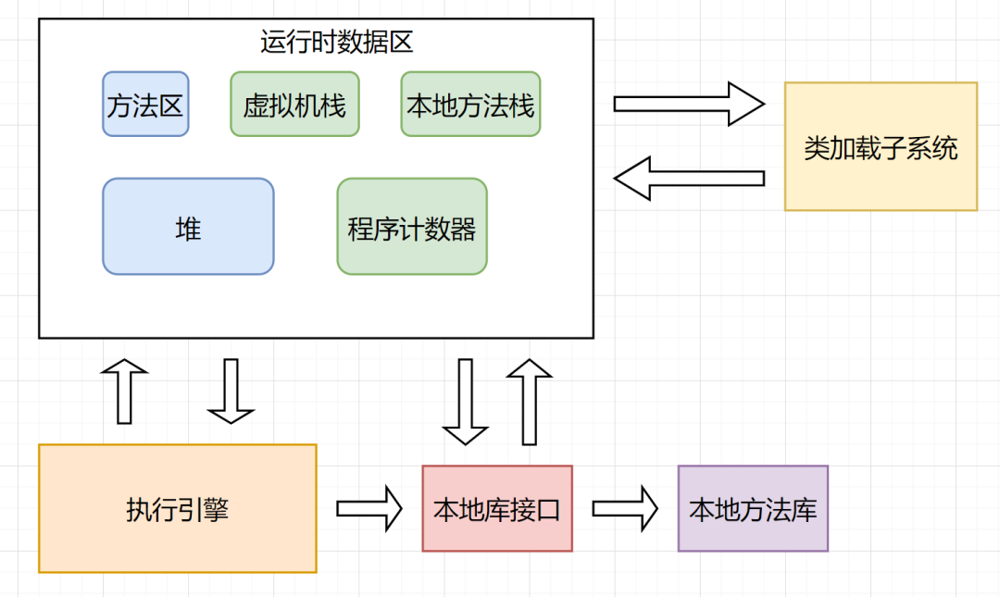
>
> JVM包含两个子系统和两个组件，分别为
>
> - Class loader(类装载子系统)
> - Execution engine(执行引擎子系统)；
>
> - Runtime data area(运行时数据区组件)
> -  Native Interface(本地接口组件)。
>
> - **「Class loader(类装载)：」**根据给定的全限定名类名(如：java.lang.Object)来装载class文件到运行时数据区的方法区中。
> - **「Execution engine（执行引擎）」**：执行class的指令。
> - **「Native Interface(本地接口)：」**与native lib交互，是其它编程语言交互的接口。
> - **「Runtime data area(运行时数据区域)」**：即我们常说的JVM的内存。
>
> 首先通过编译器把 Java源代码转换成字节码，Class loader(类装载)再把字节码加载到内存中，将其放在运行时数据区的方法区内，而字节码文件只是 JVM 的一套指令集规范，并不能直接交给底层操作系统去执行，因此需要特定的命令解析器执行引擎（Execution Engine），将字节码翻译成底层系统指令，再交由 CPU 去执行，而这个过程中需要调用其他语言的本地库接口（Native Interface）来实现整个程序的功能。

## 25、什么是指针碰撞？

> 一般情况下，JVM的对象都放在堆内存中（发生逃逸分析除外）。当类加载检查通过后，Java虚拟机开始为新生对象分配内存。如果Java堆中内存是绝对规整的，所有被使用过的的内存都被放到一边，空闲的内存放到另外一边，中间放着一个指针作为分界点的指示器，所分配内存仅仅是把那个指针向空闲空间方向挪动一段与对象大小相等的实例，这种分配方式就是指针碰撞。
>
> 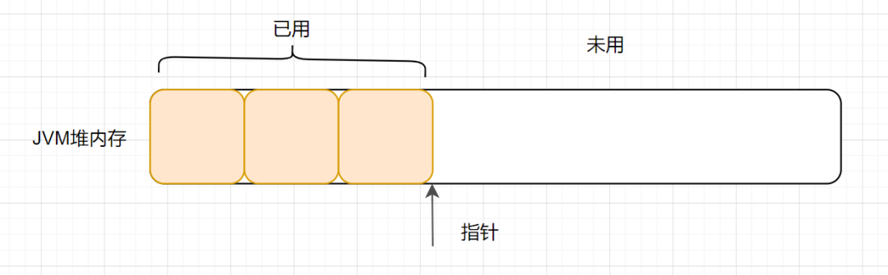

## 26，什么是空闲列表？

> 如果Java堆内存中的内存并不是规整的，已被使用的内存和空闲的内存相互交错在一起，不可以进行指针碰撞啦，虚拟机必须维护一个列表，记录哪些内存是可用的，在分配的时候从列表找到一块大的空间分配给对象实例，并更新列表上的记录，这种分配方式就是空闲列表。

## 27，什么是TLAB？

> 可以把内存分配的动作按照线程划分在不同的空间之中进行，每个线程在Java堆中预先分配一小块内存,这就是TLAB（Thread Local Allocation Buffer，本地线程分配缓存）。虚拟机通过-XX:UseTLAB 设定它的。
>

## 28、对象头具体都包含哪些内容？

> 在我们常用的Hotspot虚拟机中，对象在内存中布局实际包含3个部分：
>
> 1.  对象头
>
> 2.  实例数据
> 3.  对齐填充
>
> 而对象头包含两部分内容，Mark Word中的内容会随着锁标志位而发生变化，所以只说存储结构就好了。
>
> 1.  对象自身运行时所需的数据，也被称为Mark Word，也就是用于轻量级锁和偏向锁的关键点。具体的内容包含对象的hashcode、分代年龄、轻量级锁指针、重量级锁指针、GC标记、偏向锁线程ID、偏向锁时间戳。
> 2.  存储类型指针，也就是指向类的元数据的指针，通过这个指针才能确定对象是属于哪个类的实例。
>
> 如果是数组的话，则还包含了数组的长度。
>
> 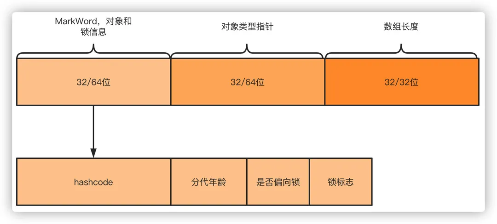

## 29、你知道哪些JVM调优参数？

### 「堆栈内存相关」

> -Xms 设置初始堆的大小
>
> -Xmx 设置最大堆的大小
>
> -Xmn 设置年轻代大小，相当于同时配置-XX:NewSize和-XX:MaxNewSize为一样的值
>
> -Xss 每个线程的堆栈大小
>
> -XX:NewSize 设置年轻代大小(for 1.3/1.4)
>
> -XX:MaxNewSize 年轻代最大值(for 1.3/1.4)
>
> -XX:NewRatio 年轻代与年老代的比值(除去持久代)
>
> -XX:SurvivorRatio Eden区与Survivor区的的比值
>
> -XX:PretenureSizeThreshold 当创建的对象超过指定大小时，直接把对象分配在老年代。
>
> -XX:MaxTenuringThreshold设定对象在Survivor复制的最大年龄阈值，超过阈值转移到老年代

### 「垃圾收集器相关」

> -XX:+UseParallelGC：选择垃圾收集器为并行收集器。
>
> -XX:ParallelGCThreads=20：配置并行收集器的线程数
>
> -XX:+UseConcMarkSweepGC：设置年老代为并发收集。
>
> -XX:CMSFullGCsBeforeCompaction=5 由于并发收集器不对内存空间进行压缩、整理，所以运行一段时间以后会产生"碎片"，使得运行效率降低。此值设置运行5次GC以后对内存空间进行压缩、整理。
>
> -XX:+UseCMSCompactAtFullCollection：打开对年老代的压缩。可能会影响性能，但是可以消除碎片

### 「辅助信息相关」

> -XX:+PrintGCDetails 打印GC详细信息
>
> -XX:+HeapDumpOnOutOfMemoryError让JVM在发生内存溢出的时候自动生成内存快照,排查问题用
>
> -XX:+DisableExplicitGC禁止系统System.gc()，防止手动误触发FGC造成问题.
>
> -XX:+PrintTLAB 查看TLAB空间的使用情况

## 30、说一下 JVM 有哪些垃圾回收器？

> 如果说垃圾收集算法是内存回收的方法论，那么垃圾收集器就是内存回收的具体实现。下图展示了
>
> 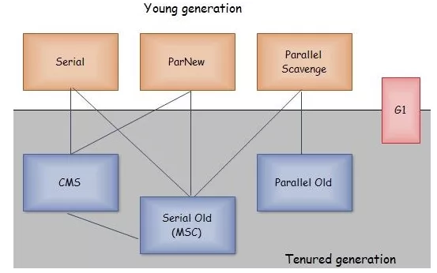
>
> 7种作用于不同分代的收集器，其中用于回收新生代的收集器包括Serial、PraNew、Parallel Scavenge，回收老年代的收集器包括Serial Old、Parallel Old、CMS，还有用于回收整个Java堆的G1收集器。不同收集器之间的连线表示它们可以搭配使用。
>
> - Serial收集器（复制算法): 新生代单线程收集器，标记和清理都是单线程，优点是简单高效；
>
> - ParNew收集器(复制算法): 新生代收并行集器，实际上是Serial收集器的多线程版本，在多核CPU环境下有着比Serial更好的表现；
>
> - Parallel Scavenge收集器(复制算法): 新生代并行收集器，追求高吞吐量，高效利用 CPU。吞吐量= 用户线程时间/(用户线程时间+GC线程时间)，高吞吐量可以高效率的利用CPU时间，尽快完成程序的运算任务，适合后台应用等对交互相应要求不高的场景；
>
> - Serial Old收集器(标记-整理算法): 老年代单线程收集器，Serial收集器的老年代版本；
>
> - Parallel Old收集器(标记-整理算法)：老年代并行收集器，吞吐量优先，Parallel Scavenge收集器的老年代版本；
>
> - CMS(Concurrent Mark Sweep)收集器（标记-清除算法）：老年代并行收集器，以获取最短回收停顿时间为目标的收集器，具有高并发、低停顿的特点，追求最短GC回收停顿时间。
>
> - G1(Garbage First)收集器(标记-整理算法)： Java堆并行收集器，G1收集器是JDK1.7提供的一个新收集器，G1收集器基于"标记-整理"算法实现，也就是说不会产生内存碎片。此外，G1收集器不同于之前的收集器的一个重要特点是：G1回收的范围是整个Java堆(包括新生代，老年代)，而前六种收集器回收的范围仅限于新生代或老年代。
>
> - ZGC （Z Garbage Collector）是一款由Oracle公司研发的，以低延迟为首要目标的一款垃圾收集器。它是基于动态Region内存布局，（暂时）不设年龄分代，使用了读屏障、染色指针和内存多重映射等技术来实现可并发的标记-整理算法的收集器。在 JDK 11 新加入，还在实验阶段，主要特点是：回收TB级内存（最大4T），停顿时间不超过10ms。
>
>   **优点**：低停顿，高吞吐量， ZGC 收集过程中额外耗费的内存小。
>
>   **缺点**：浮动垃圾
>
> 目前使用的非常少，真正普及还是需要写时间的。
>
> **新生代收集器**：Serial、 ParNew 、 Parallel Scavenge
>
> **老年代收集器**： CMS 、Serial Old、Parallel Old
>
> **整堆收集器**： G1 ， ZGC (因为不涉年代不在图中)。

## 31、如何选择垃圾收集器？

> 1. 如果你的堆大小不是很大（比如100MB ），选择串行收集器一般是效率最高的。参数：-XX:+UseSerialGC 。
>
> 2. 如果你的应用运行在单核的机器上，或者你的虚拟机核数只有单核，选择串行收集器依然是合适的，这时候启用一些并行收集器没有任何收益。参数：-XX:+UseSerialGC 。
>
> 3. 如果你的应用是"吞吐量"优先的，并且对较长时间的停顿没有什么特别的要求。选择并行收集器是比较好的。参数：-XX:+UseParallelGC 。
>
> 4. 如果你的应用对响应时间要求较高，想要较少的停顿。甚至1 秒的停顿都会引起大量的请求失败，那么选择 G1 、 ZGC 、 CMS 都是合理的。虽然这些收集器的 GC 停顿通常都比较短，但它需要一些额外的资源去处理这些工作，通常吞吐量会低一些。
>
>    参数：
>
>    <span class="underline">-XX:+UseConcMarkSweepGC</span> 、
>
>    <span class="underline">-XX:+UseG1GC</span> 、
>
>    <span class="underline">-XX:+UseZGC</span> 等。
>
>    从上面这些出发点来看，我们平常的 Web 服务器，都是对响应性要求非常高的。选择性其实就集中在 CMS 、 G1 、 ZGC 上。而对于某些定时任务，使用并行收集器，是一个比较好的选择。

## 32、什么是类加载器？

> 类加载器是一个用来加载类文件的类。Java 源代码通过 javac 编译器编译成类文件。然后 JVM 来执行类文件中的字节码来执行程序。类加载器负责加载文件系统、网络或其他来源的类文件。

## 33、什么是 tomcat 类加载机制？

> 在 tomcat 中类的加载稍有不同，如下图：
>
> 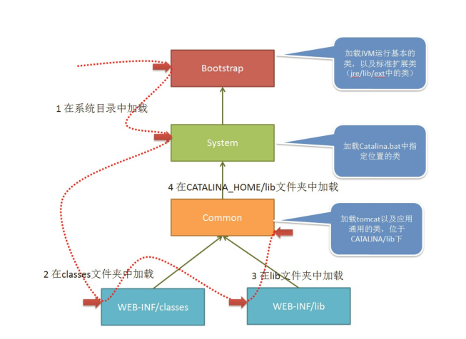

> 当 tomcat启动时，会创建几种类加载器：**Bootstrap 引导类加载器**加载 JVM启动所需的类，以及标准扩展类（位于<span class="underline">jre/lib/ext</span> 下）**System 系统类加载器**加载 tomcat 启动的类，比如 bootstrap.jar，通常在 catalina.bat 或者<span class="underline">catalina.sh</span> 中指定。位于 CATALINA_HOME/bin 下。
>
> 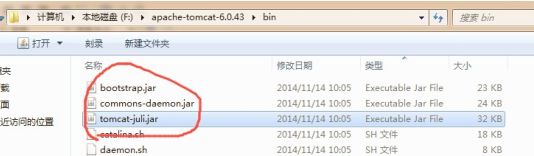

### Common 通用类加载器


# 三、多线程&并发篇

## 1、说说Java中实现多线程有几种方法

> 创建线程的常用三种方式：
>
> 1.  继承Thread类
> 2.  实现Runnable接口
> 3.  实现Callable接口（<span class="underline">JDK1.5\>=</span> ）
> 4.  线程池方式创建
>
> 通过继承Thread类或者实现Runnable接口、Callable接口都可以实现多线程，不过实现Runnable接口与实现Callable接口的方式基本相同，只是Callable接口里定义的方法返回值，可以声明抛出异常而已。因此将实现Runnable接口和实现Callable接口归为一种方式。这种方式与继承Thread方式之间的主要差别如下。

> **采用实现Runnable、Callable接口的方式创建线程的优缺点**
>
> **优点**：线程类只是实现了Runnable或者Callable接口，还可以继承其他类。这种方式下，多个线程可以共享一个target对象，所以非常适合多个相同线程来处理同一份资源的情况，从而可以将CPU、代码和数据分开，形成清晰的模型，较好的体现了面向对象的思想。
>
> **缺点**：编程稍微复杂一些，如果需要访问当前线程，则必须使用<span class="underline">Thread.currentThread()</span> 方法
>
> 
>
> **采用继承Thread类的方式创建线程的优缺点**
>
> **优点**：编写简单，如果需要访问当前线程，则无需使用<span class="underline">Thread.currentThread()</span> 方法，直接使用this即可获取当前线程
>
> **缺点**：因为线程类已经继承了Thread类，Java语言是单继承的，所以就不能再继承其他父类了。

## 2、如何停止一个正在运行的线程

> 1、使用退出标志，使线程正常退出，也就是当run方法完成后线程终止。
>
> 2、使用stop方法强行终止，但是不推荐这个方法，因为stop和suspend及resume一样都是过期作废的方法。
>
> 3、使用interrupt方法中断线程。
>
> ```java
> class MyThread extends Thread {
>     volatile boolean stop = false;
>     public void run(){
>     while (!stop){
>     System.out.println(getName()+" is running");
>     try {
>     sleep(1000);
>    } catch (InterruptedException e){
>     System.out.println("week up from blcok...");
>     stop = true; //在异常处理代码中修改共享变量的状态
>    }
>    }
>     System.out.println(getName()+" is exiting...");
>    }
> }
> 
> class InterruptThreadDemo3 {
>     public static void main(String[] args) throws InterruptedException {
>     MyThread m1 = new MyThread();
>     System.out.println("Starting thread...");
>     m1.start();
>     Thread.sleep(3000);
>     System.out.println("Interrupt thread...: "+ m1.getName());
>     m1.stop = true; //设置共享变量为true
>     m1.interrupt(); //阻塞时退出阻塞状态
>     Thread.sleep(3000); //主线程休眠3秒以便观察线程m1的中断情况
>     System.out.println("Stopping application...");
>    }
> }
> ```

## 3、notify()和notifyAll()有什么区别？

> notify可能会导致死锁，而notifyAll则不会
>
> 任何时候只有一个线程可以获得锁，也就是说只有一个线程可以运行synchronized 中的代码
>
> 使用notifyall,可以唤醒所有处于wait状态的线程，使其重新进入锁的争夺队列中，而notify只能唤醒一个。
>
> wait()应配合while循环使用，不应使用if，务必在wait()调用前后都检查条件，如果不满足，必须调用notify()唤醒另外的线程来处理，自己继续wait()直至条件满足再往下执行。
>
> notify()是对notifyAll()的一个优化，但它有很精确的应用场景，并且要求正确使用。不然可能导致死锁。正确的场景应该是 WaitSet中等待的是相同的条件，唤醒任一个都能正确处理接下来的事项，如果唤醒的线程无法正确处理，务必确保继续notify()下一个线程，并且自身需要重新回到WaitSet中.
>

## 4、sleep()和wait()有什么区别？

> 对于sleep()方法，我们首先要知道该方法是属于Thread类中的。而wait()方法，则是属于Object类中的。
>
> sleep()方法导致了程序暂停执行指定的时间，让出cpu该其他线程，但是他的监控状态依然保持者，当指定的时间到了又会自动恢复运行状态。在调用sleep()方法的过程中，线程不会释放对象锁。
>
> 当调用wait()方法的时候，线程会放弃对象锁，进入等待此对象的等待锁定池，只有针对此对象调用notify()方法后本线程才进入对象锁定池准备，获取对象锁进入运行状态。
>

## 5、volatile 是什么?可以保证有序性吗?

> 一旦一个共享变量（类的成员变量、类的静态成员变量）被volatile修饰之后，那么就具备了两层语义：
>
> 1）保证了不同线程对这个变量进行操作时的可见性，即一个线程修改了某个变量的值，这新值对其他线程来说是立即可见的,volatile关键字会强制将修改的值立即写入主存。
>
> 2）禁止进行指令重排序。
>
> volatile 不是原子性操作
>
> 
>
> 什么叫保证部分有序性?
>
> 当程序执行到volatile变量的读操作或者写操作时，在其前面的操作的更改肯定全部已经进行，且结果已经对后面的操作可见；在其后面的操作肯定还没有进行；
>
> ```java
> x = 2; //语句1
> y = 0; //语句2
> flag = true; //语句3
> x = 4; //语句4
> y = -1; //语句5
> ```
>
> 由于flag变量为volatile变量，那么在进行指令重排序的过程的时候，不会将语句3放到语句1、语句2前面，也不会讲语句3放到语句4、语句5后面。但是要注意语句1和语句2的顺序、语句4和语句5的顺序是不作任何保证的。
>
> 使用volatile 一般用于状态标记量和单例模式的双检锁。

## 6、Thread 类中的start()和 run()方法有什么区别？

> start()方法被用来启动新创建的线程，而且start()内部调用了run()方法，这和直接调用run()方法的效果不一样。当你调用run()方法的时候，只会是在原来的线程中调用，没有新的线程启动，start()方法才会启动新线程。

## 7、为什么wait, notify 和 notifyAll这些方法不在thread类里面？

> 明显的原因是JAVA提供的锁是对象级的而不是线程级的，每个对象都有锁，通过线程获得。如果线程需要等待某些锁那么调用对象中的wait()方法就有意义了。如果wait()方法定义在Thread类中，线程正在等待的是哪个锁就不明显了。简单的说，由于wait，notify和notifyAll都是锁级别的操作，所以把他们定义在Object类中因为锁属于对象。

## 8、为什么wait和notify方法要在同步块中调用？

> 1.  只有在调用线程拥有某个对象的独占锁时，才能够调用该对象的wait(),notify()和notifyAll()方法。
>
> 2.  如果你不这么做，你的代码会抛出IllegalMonitorStateException异常。
>
> 3.  还有一个原因是为了避免wait和notify之间产生竞态条件。
>
> wait()方法强制当前线程释放对象锁。这意味着在调用某对象的wait()方法之前，当前线程必须已经获得该对象的锁。因此，线程必须在某个对象的同步方法或同步代码块中才能调用该对象的wait()方法。
>
> 在调用对象的notify()和notifyAll()方法之前，调用线程必须已经得到该对象的锁。因此，必须在某个对象的同步方法或同步代码块中才能调用该对象的notify()或notifyAll()方法。
>
> 调用wait()方法的原因通常是，调用线程希望某个特殊的状态(或变量)被设置之后再继续执行。调用notify()或notifyAll()方法的原因通常是，调用线程希望告诉其他等待中的线程:\"特殊状态已经被设置\"。这个状态作为线程间通信的通道，它必须是一个可变的共享状态(或变量)。
>

## 9、Java中interrupted 和 isInterruptedd方法的区别？

> interrupted()和 isInterrupted()的主要区别是前者会将中断状态清除而后者不会。Java多线程的中断机制是用内部标识来实现的，调用Thread.interrupt()来中断一个线程就会设置中断标识为true。当中断线程调用静态方法Thread.interrupted()来检查中断状态时，中断状态会被清零。而非静态方法isInterrupted()用来查询其它线程的中断状态且不会改变中断状态标识。简单的说就是任何抛出
>
> InterruptedException异常的方法都会将中断状态清零。无论如何，一个线程的中断状态有有可能被其它线程调用中断来改变。

## 10、Java中synchronized 和 ReentrantLock 有什么不同？

> **相似点：**
>
> 这两种同步方式有很多相似之处，它们都是加锁方式同步，而且都是阻塞式的同步，也就是说当如果一个线程获得了对象锁，进入了同步块，其他访问该同步块的线程都必须阻塞在同步块外面等待，而进行线程阻塞和唤醒的代价是比较高的.
>
> **区别：**
>
> 这两种方式最大区别就是对于Synchronized来说，它是java语言的关键字，是原生语法层面的互斥，需要jvm实现。而ReentrantLock它是JDK 1.5之后提供的API层面的互斥锁，需要lock()和unlock()方法配合try/finally语句块来完成。
>
> Synchronized进过编译，会在同步块的前后分别形成monitorenter和monitorexit这个两个字节码指令。在执行monitorenter指令时，首先要尝试获取对象锁。如果这个对象没被锁定，或者当前线程已经拥有了那个对象锁，把锁的计算器加1，相应的，在执行monitorexit指令时会将锁计算器就减1，当计算器为0时，锁就被释放了。如果获取对象锁失败，那当前线程就要阻塞，直到对象锁被另一个线程释放为止。
>
> 由于ReentrantLock是java.util.concurrent包下提供的一套互斥锁，相比Synchronized，ReentrantLock类提供了一些高级功能，主要有以下3项：
>
> 1.等待可中断，持有锁的线程长期不释放的时候，正在等待的线程可以选择放弃等待，这相当于Synchronized来说可以避免出现死锁的情况。
>
> 2.公平锁，多个线程等待同一个锁时，必须按照申请锁的时间顺序获得锁，Synchronized锁非公平锁，ReentrantLock默认的构造函数是创建的非公平锁，可以通过参数true设为公平锁，但公平锁表现的性能不是很好。
>
> 3.锁绑定多个条件，一个ReentrantLock对象可以同时绑定对个对象。

## 11、有三个线程T1,T2,T3,如何保证顺序执行？

> 在多线程中有多种方法让线程按特定顺序执行，你可以用线程类的join()方法在一个线程中启动另一个线程，另外一个线程完成该线程继续执行。为了确保三个线程的顺序你应该先启动最后一个(T3调用T2，T2调用T1)，这样T1就会先完成而T3最后完成。
>
> 实际上先启动三个线程中哪一个都行，因为在每个线程的run方法中用join方法限定了三个线程的执行顺序。
>
> ```java
> public class JoinTest2 {
>    //1.现在有T1、T2、T3三个线程，你怎样保证T2在T1执行完后执行，T3在T2执行完后执行
>     public static void main(String[] args){
>     final Thread t1 = new Thread(new Runnable(){
>    @Override
>     public void run(){
>     System.out.println("t1");
>    }
>    });
> 
>     final Thread t2 = new Thread(new Runnable(){
>    @Override
>     public void run(){
>     try {
>    //引用t1线程，等待t1线程执行完
>     t1.join();
>    } catch (InterruptedException e){
>     e.printStackTrace();
>    }
>     System.out.println("t2");
>    }
>    });
>     Thread t3 = new Thread(new Runnable(){
>    @Override
>     public void run(){
>     try {
>    //引用t2线程，等待t2线程执行完
>     t2.join();
>    } catch (InterruptedException e){
>     e.printStackTrace();
>    }
>     System.out.println("t3");
>    }});
> 
>     t3.start();//这里三个线程的启动顺序可以任意，大家可以试下！
>     t2.start();
>     t1.start();
>    }
> }
> ```

## 12、SynchronizedMap和ConcurrentHashMap有什么区别？

> SynchronizedMap()和Hashtable一样，实现上在调用map所有方法时，都对整个map进行同步。而ConcurrentHashMap的实现却更加精细，它对map中的所有桶加了锁。所以，只要有一个线程访问map，其他线程就无法进入map，而如果一个线程在访问ConcurrentHashMap某个桶时，其他线程，仍然可以对map执行某些操作。
>
> 所以，ConcurrentHashMap在性能以及安全性方面，明显比Collections.synchronizedMap()更加有优势。同时，同步操作精确控制到桶，这样，即使在遍历map时，如果其他线程试图对map进行数据修改，也不会抛出ConcurrentModificationException。

## 13、什么是线程安全

> 线程安全就是说多线程访问同一段代码，不会产生不确定的结果。
>
> 又是一个理论的问题，各式各样的答案有很多，我给出一个个人认为解释地最好的：**如果你的代码在多线程下执行和在单线程下执行永远都能获得一样的结果，那么你的代码就是线程安全的**。
>
> 这个问题有值得一提的地方，就是线程安全也是有几个级别的：
>
> （1）不可变
>
> 像String、Integer、Long这些，都是final类型的类，任何一个线程都改变不了它们的值，要改变除非新创建一个，因此这些不可变对象不需要任何同步手段就可以直接在多线程环境下使用
>
> （2）绝对线程安全
>
> 不管运行时环境如何，调用者都不需要额外的同步措施。要做到这一点通常需要付出许多额外的代价，Java中标注自己是线程安全的类，实际上绝大多数都不是线程安全的，不过绝对线程安全的类，Java中也有，比方说CopyOnWriteArrayList、CopyOnWriteArraySet
>
> （3）相对线程安全
>
> 相对线程安全也就是我们通常意义上所说的线程安全，像Vector这种，add、remove方法都是原子操作，不会被打断，但也仅限于此，如果有个线程在遍历某个Vector、有个线程同时在add这个Vector，99%的情况下都会出现ConcurrentModificationException，也就是**fail-fast机制**。
>
> （4）线程非安全
>
> 这个就没什么好说的了，ArrayList、LinkedList、HashMap等都是线程非安全的类

## 14、Thread类中的yield方法有什么作用？

> Yield方法可以暂停当前正在执行的线程对象，让其它有相同优先级的线程执行。它是一个静态方法而且只保证当前线程放弃CPU占用而不能保证使其它线程一定能占用CPU，执行yield()的线程有可能在进入到暂停状态后马上又被执行。

## 15、Java线程池中submit()和 execute()方法有什么区别？

> 两个方法都可以向线程池提交任务，execute()方法的返回类型是void，它定义在Executor接口中,而submit()方法可以返回持有计算结果的Future对象，它定义在ExecutorService接口中，它扩展了Executor接口，其它线程池类像ThreadPoolExecutor和ScheduledThreadPoolExecutor都有这些方法。
>

## 16、说一说自己对于 synchronized 关键字的了解

> synchronized关键字解决的是多个线程之间访问资源的同步性，synchronized关键字可以保证被它修饰的方法或者代码块在任意时刻只能有一个线程执行。另外，在 Java 早期版本中，
>
> synchronized属于重量级锁，效率低下，因为监视器锁（monitor）是依赖于底层的操作系统的 Mutex Lock 来实现的，Java 的线程是映射到操作系统的原生线程之上的。如果要挂起或者唤醒一个线程，都需要操作系统帮忙完成，而操作系统实现线程之间的切换时需要从用户态转换到内核态，这个状态之间的转换需要相对比较长的时间，时间成本相对较高，这也是为什么早期的synchronized 效率低的原因。庆幸的是在 Java 6 之后 Java 官方对从 JVM 层面对synchronized 较大优化，所以现在的 synchronized 锁效率也优化得很不错了。JDK1.6对锁的实现引入了大量的优化，如自旋锁、适应性自旋锁、锁消除、锁粗化、偏向锁、轻量级锁等技术来减少锁操作的开销。
>

## 17、说说自己是怎么使用 synchronized 关键字？

> **修饰实例方法**: 作用于当前对象实例加锁，进入同步代码前要获得当前对象实例的锁**修饰静态方法**:也就是给当前类加锁，会作用于类的所有对象实例，因为静态成员不属于任何一个实例对象，是类成员（ static 表明这是该类的一个静态资源，不管new了多少个对象，只有一份）。所以如果一个线程A调用一个实例对象的非静态 synchronized 方法，而线程B需要调用这个实例对象所属类的静态 synchronized 方法，是允许的，不会发生互斥现象，**因为访问静态 synchronized 方法占用的锁是当前类的锁，而访问非静态 synchronized 方法占用的锁是当前实例对象锁。修饰代码块**: 指定加锁对象，对给定对象加锁，进入同步代码库前要获得给定对象的锁。**总结**： synchronized 关键字加到 static 静态方法和 synchronized(class)代码块上都是是给 Class 类上锁。synchronized关键字加到实例方法上是给对象实例上锁。尽量不要使用 synchronized(String a)因为JVM中，字符串常量池具有缓存功能！

## 18、什么是线程安全？Vector是一个线程安全类吗？

> 如果你的代码所在的进程中有多个线程在同时运行，而这些线程可能会同时运行这段代码。如果每次运行结果和单线程运行的结果是一样的，而且其他的变量的值也和预期的是一样的，就是线程安全的。一个线程安全的计数器类的同一个实例对象在被多个线程使用的情况下也不会出现计算失误。很显然你可以将集合类分成两组，线程安全和非线程安全的。Vector 是用同步方法来实现线程安全的,而和它相似的ArrayList不是线程安全的。
>

## 19、 volatile关键字的作用？

> 一旦一个共享变量（类的成员变量、类的静态成员变量）被volatile修饰之后，那么就具备了两层语义：
>
> - 保证了不同线程对这个变量进行操作时的可见性，即一个线程修改了某个变量的值，这新值对其他线程来说是立即可见的。
>
> - 禁止进行指令重排序。
>
> - volatile本质是在告诉jvm当前变量在寄存器（工作内存）中的值是不确定的，需要从主存中读取；synchronized则是锁定当前变量，只有当前线程可以访问该变量，其他线程被阻塞住。
>
> - volatile仅能使用在变量级别；synchronized则可以使用在变量、方法、和类级别的。
>
> - volatile仅能实现变量的修改可见性，并不能保证原子性；synchronized则可以保证变量的修改可见性和原子性。
>
> - volatile不会造成线程的阻塞；synchronized可能会造成线程的阻塞。
>
> volatile标记的变量不会被编译器优化；synchronized标记的变量可以被编译器优化。

## 20、常用的线程池有哪些？

> - newSingleThreadExecutor：创建一个单线程的线程池，此线程池保证所有任务的执行顺序按照任务的提交顺序执行。
>
> -  newFixedThreadPool：创建固定大小的线程池，每次提交一个任务就创建一个线程，直到线程达到线程池的最大大小。
>
> - newCachedThreadPool：创建一个可缓存的线程池，此线程池不会对线程池大小做限制，线程池大小完全依赖于操作系统（或者说JVM）能够创建的最大线程大小。
>
> -  newScheduledThreadPool：创建一个大小无限的线程池，此线程池支持定时以及周期性执行任务的需求。
>
> - newSingleThreadExecutor：创建一个单线程的线程池。此线程池支持定时以及周期性执行任务的需求。

## 21、简述一下你对线程池的理解

> （如果问到了这样的问题，可以展开的说一下线程池如何用、线程池的好处、线程池的启动策略）合理利用线程池能够带来三个好处。
>
> 第一：降低资源消耗。通过重复利用已创建的线程降低线程创建和销毁造成的消耗。
>
> 第二：提高响应速度。当任务到达时，任务可以不需要等到线程创建就能立即执行。
>
> 第三：提高线程的可管理性。线程是稀缺资源，如果无限制的创建，不仅会消耗系统资源，还会降低系统的稳定性，使用线程池可以进行统一的分配，调优和监控。

## 22、Java程序是如何执行的

> 我们日常的工作中都使用开发工具（IntelliJ IDEA 或 Eclipse 等）可以很方便的调试程序，或者是通过打包工具把项目打包成 jar 包或者 war 包，放入 Tomcat 等 Web 容器中就可以正常运行了，但你有没有想过 Java 程序内部是如何执行的？其实不论是在开发工具中运行还是在 Tomcat 中运行，Java 程序的执行流程基本都是相同的，它的执行流程如下：
>
> - 先把 Java 代码编译成字节码，也就是把.java 类型的文件编译成.class 类型的文件。这个过程的大致执行流程：Java 源代码-\> 词法分析器-\> 语法分析器-\> 语义分析器-\> 字符码生成器-\>最终生成字节码，其中任何一个节点执行失败就会造成编译失败；
>
> - 把 class 文件放置到 Java 虚拟机，这个虚拟机通常指的是 Oracle 官方自带的 Hotspot JVM；
>
> - Java 虚拟机使用类加载器（Class Loader）装载 class 文件；
>
> - 类加载完成之后，会进行字节码效验，字节码效验通过之后 JVM 解释器会把字节码翻译成机器码交由操作系统执行。但不是所有代码都是解释执行的，JVM 对此做了优化，比如，以Hotspot 虚拟机来说，它本身提供了 JIT（Just In Time）也就是我们通常所说的动态编译器，它能够在运行时将热点代码编译为机器码，这个时候字节码就变成了编译执行。Java 程序执行流程图如下：
>
> 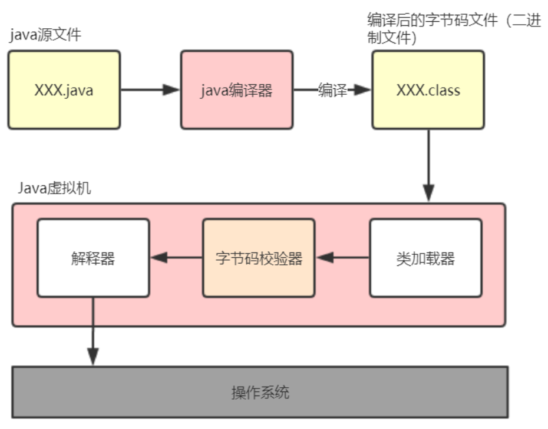

## 23、锁的优化机制了解吗？

> 从JDK1.6版本之后，synchronized本身也在不断优化锁的机制，有些情况下他并不会是一个很重量级的锁了。优化机制包括自适应锁、自旋锁、锁消除、锁粗化、轻量级锁和偏向锁。
>
> 锁的状态从低到高依次为**无锁-\>偏向锁-\>轻量级锁-\>重量级锁**，升级的过程就是从低到高，降级在一定条件也是有可能发生的。
>
> **自旋锁**：由于大部分时候，锁被占用的时间很短，共享变量的锁定时间也很短，所有没有必要挂起线程，用户态和内核态的来回上下文切换严重影响性能。自旋的概念就是让线程执行一个忙循环，可以理解为就是啥也不干，防止从用户态转入内核态，自旋锁可以通过设置-XX:+UseSpining来开启，自旋的默认次数是10次，可以使用-XX:PreBlockSpin设置。
>
> **自适应锁**：自适应锁就是自适应的自旋锁，自旋的时间不是固定时间，而是由前一次在同一个锁上的自旋时间和锁的持有者状态来决定。
>
> **锁消除**：锁消除指的是JVM检测到一些同步的代码块，完全不存在数据竞争的场景，也就是不需要加锁，就会进行锁消除。
>
> **锁粗化**：锁粗化指的是有很多操作都是对同一个对象进行加锁，就会把锁的同步范围扩展到整个操作序列之外。
>
> **偏向锁**：当线程访问同步块获取锁时，会在对象头和栈帧中的锁记录里存储偏向锁的线程ID，之后这个线程再次进入同步块时都不需要CAS来加锁和解锁了，偏向锁会永远偏向第一个获得锁的线程，如果后续没有其他线程获得过这个锁，持有锁的线程就永远不需要进行同步，反之，当有其他线程竞争偏向锁时，持有偏向锁的线程就会释放偏向锁。可以用过设置-XX:+UseBiasedLocking开启偏向锁。
>
> **轻量级锁**：JVM的对象的对象头中包含有一些锁的标志位，代码进入同步块的时候，JVM将会使用CAS方式来尝试获取锁，如果更新成功则会把对象头中的状态位标记为轻量级锁，如果更新失败，当前线程就尝试自旋来获得锁。
>
> 整个锁升级的过程非常复杂，我尽力去除一些无用的环节，简单来描述整个升级的机制。
>
> 简单点说，偏向锁就是通过对象头的偏向线程ID来对比，甚至都不需要CAS了，而轻量级锁主要就是通过CAS修改对象头锁记录和自旋来实现，重量级锁则是除了拥有锁的线程其他全部阻塞。
>
> 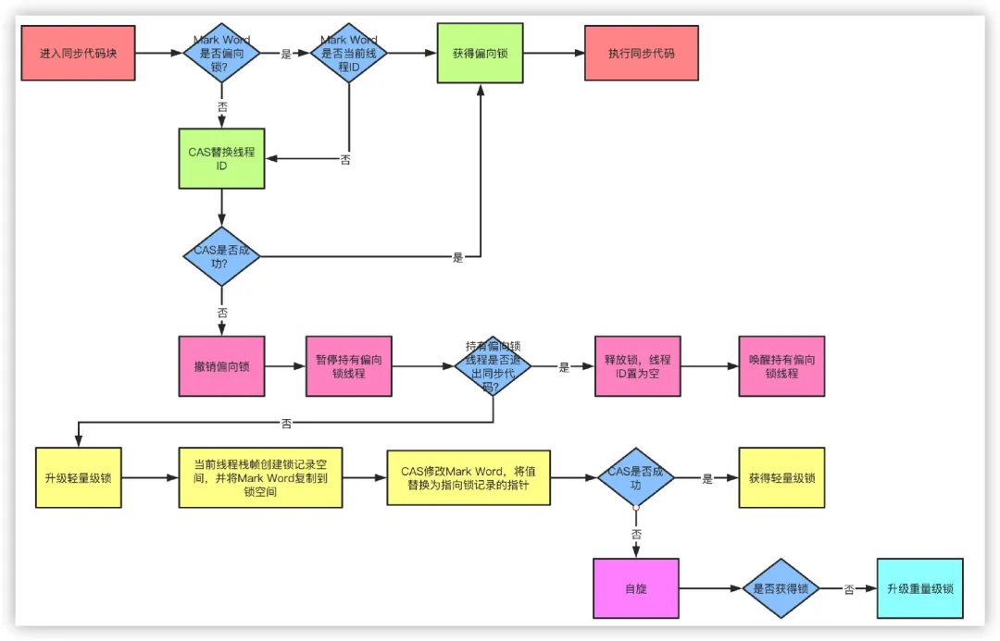

## 24、说说进程和线程的区别？

> 1.  进程是一个"执行中的程序"，是系统进行资源分配和调度的一个独立单位。
>
> 2.  线程是进程的一个实体，一个进程中拥有多个线程，线程之间共享地址空间和其它资源（所以通信和同步等操作线程比进程更加容易）
>
> 3.  线程上下文的切换比进程上下文切换要快很多。
>
> （1）进程切换时，涉及到当前进程的CPU环境的保存和新被调度运行进程的CPU环境的设置。
>
> （2）线程切换仅需要保存和设置少量的寄存器内容，不涉及存储管理方面的操作。

## 25，产生死锁的四个必要条件？

> 1.  互斥条件：一个资源每次只能被一个线程使用
>
> 2.  请求与保持条件：一个线程因请求资源而阻塞时，对已获得的资源保持不放
>
> 3.  不剥夺条件：进程已经获得的资源，在未使用完之前，不能强行剥夺
>
> 4.  循环等待条件：若干线程之间形成一种头尾相接的循环等待资源关系

## 26、如何避免死锁？

> 指定获取锁的顺序，举例如下：
>
> 1.  比如某个线程只有获得A锁和B锁才能对某资源进行操作，在多线程条件下，如何避免死锁？
>
> 2.  获得锁的顺序是一定的，比如规定，只有获得A锁的线程才有资格获取B锁，按顺序获取锁就可以避免死锁！！！

## 27，线程池核心线程数怎么设置呢？

> 分为CPU密集型和IO密集型

### CPU

> 这种任务消耗的主要是 CPU 资源，可以将线程数设置为 N（CPU 核心数）+1，比 CPU 核心数多出来的一个线程是为了防止线程偶发的缺页中断，或者其它原因导致的任务暂停而带来的影响。一旦任务暂停，CPU 就会处于空闲状态，而在这种情况下多出来的一个线程就可以充分利用 CPU 的空闲时间。

### IO密集型

> 这种任务应用起来，系统会用大部分的时间来处理 I/O 交互，而线程在处理 I/O 的时间段内不会占用 CPU 来处理，这时就可以将 CPU 交出给其它线程使用。因此在 I/O 密集型任务的应用中，我们可以多配置一些线程，具体的计算方法是：核心线程数=CPU核心数量\*2。

## 28，Java线程池中队列常用类型有哪些？

> - ArrayBlockingQueue 是一个基于数组结构的**有界阻塞队列**，此队列按 FIFO（先进先出）原则对元素进行排序。
>
> - LinkedBlockingQueue 一个基于链表结构的**阻塞队列**，此队列按FIFO （先进先出）排序元素，吞吐量通常要高于 ArrayBlockingQueue 。
>
> - SynchronousQueue 一个不存储元素的**阻塞队列**。
>
> - PriorityBlockingQueue 一个具有优先级的**无限阻塞队列**。<span class="underline">PriorityBlockingQueue</span> 也是**基于最小二叉堆实现**
>
> - DelayQueue
>  - 只有当其指定的延迟时间到了，才能够从队列中获取到该元素。
>   - DelayQueue 是一个没有大小限制的队列，
>  - 因此往队列中插入数据的操作（生产者）永远不会被阻塞，而只有获取数据的操作（消费者）才会被阻塞。
> 
>这里能说出前三种也就差不多了，如果能说全那是最好。

## 29，线程安全需要保证几个基本特征？

> **原子性**，简单说就是相关操作不会中途被其他线程干扰，一般通过同步机制实现。
>
> **可见性**，是一个线程修改了某个共享变量，其状态能够立即被其他线程知晓，通常被解释为将线程本地状态反映到主内存上，volatile 就是负责保证可见性的。
>
> **有序性**，是保证线程内串行语义，避免指令重排等。

## 30，说一下线程之间是如何通信的？

> 线程之间的通信有两种方式：共享内存和消息传递。
>
> **共享内存**
>
> 在共享内存的并发模型里，线程之间共享程序的公共状态，线程之间通过写-读内存中的公共状态来隐式进行通信。典型的共享内存通信方式，就是通过共享对象进行通信。
>
> 例如上图线程 A 与线程 B 之间如果要通信的话，那么就必须经历下面两个步骤：
>
> 1.  线程 A 把本地内存 A 更新过得共享变量刷新到主内存中去。
> 2.  线程 B 到主内存中去读取线程 A 之前更新过的共享变量。
>
> **消息传递**
>
> 在消息传递的并发模型里，线程之间没有公共状态，线程之间必须通过明确的发送消息来显式进行通信。在 Java 中典型的消息传递方式，就是 wait()和<span class="underline">notify()</span> ，或者 BlockingQueue 。

## 31、CAS的原理呢？

> CAS叫做CompareAndSwap，比较并交换，主要是通过处理器的指令来保证操作的原子性，它包含三个操作数：
>
> 1.  变量内存地址，V表示
> 2.  旧的预期值，A表示
> 3.  准备设置的新值，B表示
>
> 当执行CAS指令时，只有当V等于A时，才会用B去更新V的值，否则就不会执行更新操作。

## 32、CAS有什么缺点吗？

> CAS的缺点主要有3点：
>
> **ABA问题**：ABA的问题指的是在CAS更新的过程中，当读取到的值是A，然后准备赋值的时候仍然是A，但是实际上有可能A的值被改成了B，然后又被改回了A，这个CAS更新的漏洞就叫做ABA。只是ABA的问题大部分场景下都不影响并发的最终效果。
>
> Java中有AtomicStampedReference来解决这个问题，他加入了预期标志和更新后标志两个字段，更新时不光检查值，还要检查当前的标志是否等于预期标志，全部相等的话才会更新。
>
> **循环时间长开销大**：自旋CAS的方式如果长时间不成功，会给CPU带来很大的开销。
>
> **只能保证一个共享变量的原子操作**：只对一个共享变量操作可以保证原子性，但是多个则不行，多个可以通过AtomicReference来处理或者使用锁synchronized实现。

## 33、引用类型有哪些？有什么区别？

> 引用类型主要分为强软弱虚四种：
>
> 1.  强引用指的就是代码中普遍存在的赋值方式，比如A a = new A()这种。强引用关联的对象，永远不会被GC回收。
>
> 2.  软引用可以用SoftReference来描述，指的是那些有用但是不是必须要的对象。系统在发生内存溢出前会对这类引用的对象进行回收。
>
> 3.  弱引用可以用WeakReference来描述，他的强度比软引用更低一点，弱引用的对象下一次GC的时候一定会被回收，而不管内存是否足够。
>
> 4.  虚引用也被称作幻影引用，是最弱的引用关系，可以用PhantomReference来描述，他必须和ReferenceQueue一起使用，同样的当发生GC的时候，虚引用也会被回收。可以用虚引用来管理堆外内存。

## 34、说说ThreadLocal原理？

> hreadLocal可以理解为线程本地变量，他会在每个线程都创建一个副本，那么在线程之间访问内部副本变量就行了，做到了线程之间互相隔离，相比于synchronized的做法是用空间来换时间。
>
> ThreadLocal有一个静态内部类ThreadLocalMap，ThreadLocalMap又包含了一个Entry数组，
>
> Entry本身是一个弱引用，他的key是指向ThreadLocal的弱引用，Entry具备了保存key value键值对的能力。
>
> 弱引用的目的是为了防止内存泄露，如果是强引用那么ThreadLocal对象除非线程结束否则始终无法被回收，弱引用则会在下一次GC的时候被回收。
>
> 但是这样还是会存在内存泄露的问题，假如key和ThreadLocal对象被回收之后，entry中就存在key为null，但是value有值的entry对象，但是永远没办法被访问到，同样除非线程结束运行。
>
> 但是只要ThreadLocal使用恰当，在使用完之后调用remove方法删除Entry对象，实际上是不会出现这个问题的。
>
> 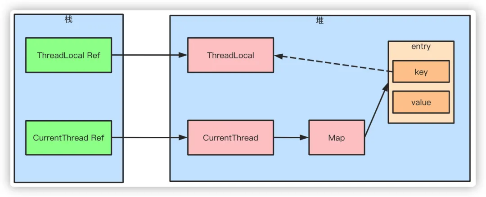

## 35、线程池原理知道吗？以及核心参数

> 首先线程池有几个核心的参数概念：
>
> 1.  最大线程数maximumPoolSize
> 2.  核心线程数corePoolSize
> 3.  活跃时间keepAliveTime
> 4.  阻塞队列workQueue
> 5.  拒绝策略RejectedExecutionHandler
>
> 当提交一个新任务到线程池时，具体的执行流程如下：
>
> 1.  当我们提交任务，线程池会根据corePoolSize大小创建若干任务数量线程执行任务
> 2.  当任务的数量超过corePoolSize数量，后续的任务将会进入阻塞队列阻塞排队
> 3.  当阻塞队列也满了之后，那么将会继续创建(maximumPoolSize-corePoolSize)个数量的线程来执行任务，如果任务处理完成，maximumPoolSize-corePoolSize额外创建的线程等待keepAliveTime之后被自动销毁
> 4.  如果达到maximumPoolSize，阻塞队列还是满的状态，那么将根据不同的拒绝策略对应处理
>
> 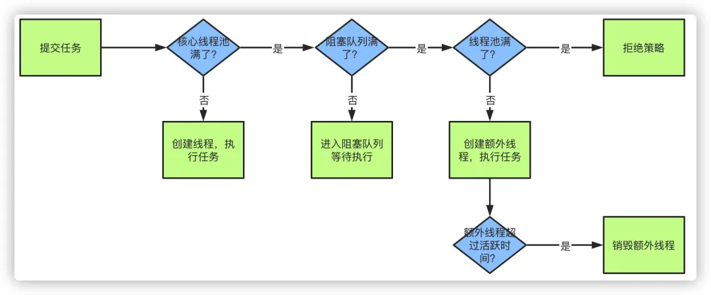

## 36、线程池的拒绝策略有哪些？

> 主要有4种拒绝策略：
>
> 1.  AbortPolicy：直接丢弃任务，抛出异常，这是默认策略
>
> 2.  CallerRunsPolicy：只用调用者所在的线程来处理任务
>
> 3.  DiscardOldestPolicy：丢弃等待队列中最旧的任务，并执行当前任务
>
> 4.  DiscardPolicy：直接丢弃任务，也不抛出异常

## 37、说说你对JMM内存模型的理解？为什么需要JMM？

> 随着CPU和内存的发展速度差异的问题，导致CPU的速度远快于内存，所以现在的CPU加入了高速缓存，高速缓存一般可以分为L1、L2、L3三级缓存。基于上面的例子我们知道了这导致了缓存一致性的问题，所以加入了缓存一致性协议，同时导致了内存可见性的问题，而编译器和CPU的重排序导致了原子性和有序性的问题，JMM内存模型正是对多线程操作下的一系列规范约束，因为不可能让陈雇员的代码去兼容所有的CPU，通过JMM我们才屏蔽了不同硬件和操作系统内存的访问差异，这样保证了Java程序在不同的平台下达到一致的内存访问效果，同时也是保证在高效并发的时候程序能够正确执行。
>
> 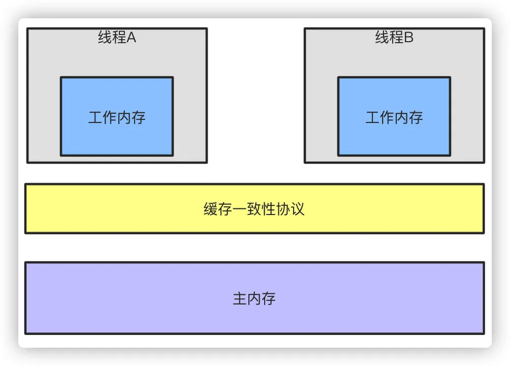
>
> **原子性**：Java内存模型通过read、load、assign、use、store、write来保证原子性操作，此外还有lock和unlock，直接对应着synchronized关键字的monitorenter和monitorexit字节码指令。
>
> **可见性**：可见性的问题在上面的回答已经说过，Java保证可见性可以认为通过volatile、synchronized、final来实现。
>
> **有序性**：由于处理器和编译器的重排序导致的有序性问题，Java通过volatile、synchronized来保证。

### happen-before规则

> 虽然指令重排提高了并发的性能，但是Java虚拟机会对指令重排做出一些规则限制，并不能让所有的指令都随意的改变执行位置，主要有以下几点：
>
> 1.  单线程每个操作，happen-before于该线程中任意后续操作
> 2.  volatile写happen-before与后续对这个变量的读
> 3.  synchronized解锁happen-before后续对这个锁的加锁
> 4.  final变量的写happen-before于final域对象的读，happen-before后续对final变量的读
> 5.  传递性规则，A先于B，B先于C，那么A一定先于C发生
>
> **说了半天，到底工作内存和主内存是什么？**
>
> 主内存可以认为就是物理内存，Java内存模型中实际就是虚拟机内存的一部分。而工作内存就是CPU缓存，他有可能是寄存器也有可能是L1\\L2\\L3缓存，都是有可能的。

## 38、多线程有什么用？

> 一个可能在很多人看来很扯淡的一个问题：我会用多线程就好了，还管它有什么用？在我看来，这个回答更扯淡。所谓\"知其然知其所以然\"，\"会用\"只是\"知其然\"，\"为什么用\"才是\"知其所以然\"，只有达到\"知其然知其所以然\"的程度才可以说是把一个知识点运用自如。OK，下面说说我对这个问题的看法：
>
> （1）发挥多核CPU的优势
>
> 随着工业的进步，现在的笔记本、台式机乃至商用的应用服务器至少也都是双核的，4核、8核甚至16核的也都不少见，如果是单线程的程序，那么在双核CPU上就浪费了50%，在4核CPU上就浪费了75%。**单核CPU上所谓的\"多线程\"那是假的多线程，同一时间处理器只会处理一段逻辑，只不过线程之间切换得比较快，看着像多个线程\"同时\"运行罢了**。多核CPU上的多线程才是真正的多线程，它能让你的多段逻辑同时工作，多线程，可以真正发挥出多核CPU的优势来，达到充分利用CPU的目的。
>
> （2）防止阻塞
>
> 从程序运行效率的角度来看，单核CPU不但不会发挥出多线程的优势，反而会因为在单核CPU上运行多线程导致线程上下文的切换，而降低程序整体的效率。但是单核CPU我们还是要应用多线程，就是为了防止阻塞。试想，如果单核CPU使用单线程，那么只要这个线程阻塞了，比方说远程读取某个数据吧，对端迟迟未返回又没有设置超时时间，那么你的整个程序在数据返回回来之前就停止运行了。多线程可以防止这个问题，多条线程同时运行，哪怕一条线程的代码执行读取数据阻塞，也不会影响其它任务的执行。
>
> （3）便于建模
>
> 这是另外一个没有这么明显的优点了。假设有一个大的任务A，单线程编程，那么就要考虑很多，建立整个程序模型比较麻烦。但是如果把这个大的任务A分解成几个小任务，任务B、任务C、任务 D，分别建立程序模型，并通过多线程分别运行这几个任务，那就简单很多了。

## 39、说说CyclicBarrier和CountDownLatch的区别？

> 两个看上去有点像的类，都在java.util.concurrent下，都可以用来表示代码运行到某个点上，二者的区别在于：
>
> 1.  CyclicBarrier的某个线程运行到某个点上之后，该线程即停止运行，直到所有的线程都到达了这个点，所有线程才重新运行；CountDownLatch则不是，某线程运行到某个点上之后，只是给某个数值-1而已，该线程继续运行
>
> 2.  CyclicBarrier只能唤起一个任务，CountDownLatch可以唤起多个任务
>
> 3.  CyclicBarrier可重用，CountDownLatch不可重用，计数值为0该CountDownLatch就不可再用了

## 40、什么是AQS？

> 简单说一下AQS，AQS全称为AbstractQueuedSychronizer，翻译过来应该是抽象队列同步器。如果说java.util.concurrent的基础是CAS的话，那么AQS就是整个Java并发包的核心了，ReentrantLock、CountDownLatch、Semaphore等等都用到了它。AQS实际上以双向队列的形式连接所有的Entry，比方说ReentrantLock，所有等待的线程都被放在一个Entry中并连成双向队列，前面一个线程使用ReentrantLock好了，则双向队列实际上的第一个Entry开始运行。
>
> AQS定义了对双向队列所有的操作，而只开放了tryLock和tryRelease方法给开发者使用，开发者可以根据自己的实现重写tryLock和tryRelease方法，以实现自己的并发功能。

## 41、了解Semaphore吗？

> emaphore就是一个信号量，它的作用是**限制某段代码块的并发数**。Semaphore有一个构造函数，可以传入一个int型整数n，表示某段代码最多只有n个线程可以访问，如果超出了n，那么请等待，等到某个线程执行完毕这段代码块，下一个线程再进入。由此可以看出如果Semaphore构造函数中传入的int型整数n=1，相当于变成了一个synchronized了。

## 42、什么是Callable和Future?

> Callable接口类似于Runnable，从名字就可以看出来了，但是Runnable不会返回结果，并且无法抛出返回结果的异常，而Callable功能更强大一些，被线程执行后，可以返回值，这个返回值可以被
>
> Future拿到，也就是说，Future可以拿到异步执行任务的返回值。可以认为是带有回调的Runnable。
>
> Future接口表示异步任务，是还没有完成的任务给出的未来结果。所以说Callable用于产生结果，
>
> Future用于获取结果。

## 43、什么是阻塞队列？阻塞队列的实现原理是什么？如何使用阻塞队列来实现生产者-消费者模型？

> 阻塞队列（BlockingQueue）是一个支持两个附加操作的队列。
>
> 这两个附加的操作是：在队列为空时，获取元素的线程会等待队列变为非空。当队列满时，存储元素的线程会等待队列可用。
>
> 阻塞队列常用于生产者和消费者的场景，生产者是往队列里添加元素的线程，消费者是从队列里拿元素的线程。阻塞队列就是生产者存放元素的容器，而消费者也只从容器里拿元素。
>
> JDK7提供了7个阻塞队列。分别是：
>
> - ArrayBlockingQueue ：一个由数组结构组成的有界阻塞队列。
>
> -  LinkedBlockingQueue ：一个由链表结构组成的有界阻塞队列。
>
> -  PriorityBlockingQueue ：一个支持优先级排序的无界阻塞队列。
>
> -  DelayQueue：一个使用优先级队列实现的无界阻塞队列。
>
> - SynchronousQueue：一个不存储元素的阻塞队列。
>
> - LinkedTransferQueue：一个由链表结构组成的无界阻塞队列。
>
> -  LinkedBlockingDeque：一个由链表结构组成的双向阻塞队列。
>
> Java 5之前实现同步存取时，可以使用普通的一个集合，然后在使用线程的协作和线程同步可以实现生产者，消费者模式，主要的技术就是用好，wait ,notify,notifyAll,sychronized这些关键字。而在java 5之后，可以使用阻塞队列来实现，此方式大大简少了代码量，使得多线程编程更加容易，安全方面也有保障。
>
> BlockingQueue接口是Queue的子接口，它的主要用途并不是作为容器，而是作为线程同步的的工具，因此他具有一个很明显的特性，当生产者线程试图向BlockingQueue放入元素时，如果队列已满，则线程被阻塞，当消费者线程试图从中取出一个元素时，如果队列为空，则该线程会被阻塞，正是因为它所具有这个特性，所以在程序中多个线程交替向BlockingQueue中放入元素，取出元素，它可以很好的控制线程之间的通信。
>
> 阻塞队列使用最经典的场景就是socket客户端数据的读取和解析，读取数据的线程不断将数据放入队列，然后解析线程不断从队列取数据解析。

## 44、什么是多线程中的上下文切换？

> 在上下文切换过程中，CPU会停止处理当前运行的程序，并保存当前程序运行的具体位置以便之后继续运行。从这个角度来看，上下文切换有点像我们同时阅读几本书，在来回切换书本的同时我们需要记住每本书当前读到的页码。
>
> 在程序中，上下文切换过程中的"页码"信息是保存在进程控制块（PCB）中的。PCB还经常被称作"切换桢"（switchframe）。"页码"信息会一直保存到CPU的内存中，直到他们被再次使用。
>
> 上下文切换是存储和恢复CPU状态的过程，它使得线程执行能够从中断点恢复执行。上下文切换是多任务操作系统和多线程环境的基本特征。

## 45、什么是Daemon线程？它有什么意义？

> 所谓后台(daemon)线程，也叫守护线程，是指在程序运行的时候在后台提供一种通用服务的线程，并且这个线程并不属于程序中不可或缺的部分。
>
> 因此，当所有的非后台线程结束时，程序也就终止了，同时会杀死进程中的所有后台线程。反过来说，只要有任何非后台线程还在运行，程序就不会终止。
>
> 必须在线程启动之前调用setDaemon()方法，才能把它设置为后台线程。注意：后台进程在不执行finally子句的情况下就会终止其run()方法。
>
> 比如：JVM的垃圾回收线程就是Daemon线程，Finalizer也是守护线程。

## 46、乐观锁和悲观锁的理解及如何实现，有哪些实现方式？

> 悲观锁：总是假设最坏的情况，每次去拿数据的时候都认为别人会修改，所以每次在拿数据的时候都会上锁，这样别人想拿这个数据就会阻塞直到它拿到锁。
>
> 传统的关系型数据库里边就用到了很多这种锁机制，比如行锁，表锁等，读锁，写锁等，都是在做操作之前先上锁。再比如Java里面的同步原语synchronized关键字的实现也是悲观锁。
>
> 乐观锁：顾名思义，就是很乐观，每次去拿数据的时候都认为别人不会修改，所以不会上锁，但是在更新的时候会判断一下在此期间别人有没有去更新这个数据，可以使用版本号等机制。
>
> 乐观锁适用于多读的应用类型，这样可以提高吞吐量，像数据库提供的类似于write_condition机制，其实都是提供的乐观锁。
>
> 在Java中java.util.concurrent.atomic包下面的原子变量类就是使用了乐观锁的一种实现方式CAS实现的。

### 乐观锁的实现方式：

> 1、使用版本标识来确定读到的数据与提交时的数据是否一致。提交后修改版本标识，不一致时可以采取丢弃和再次尝试的策略。
>
> 2、java中的Compare and Swap即CAS ，当多个线程尝试使用CAS同时更新同一个变量时，只有其中一个线程能更新变量的值，而其它线程都失败，失败的线程并不会被挂起，而是被告知这次竞争中失败，并可以再次尝试。 CAS 操作中包含三个操作数------需要读写的内存位置（V）、进行比较的预期原值（A）和拟写入的新值(B)。如果内存位置V的值与预期原值A相匹配，那么处理器会自动将该位置值更新为新值B。否则处理器不做任何操作。

### CAS缺点：

> 1. **ABA问题：**比如说一个线程one从内存位置V中取出A，这时候另一个线程two也从内存中取出A，并且two进行了一些操作变成了B，然后two又将V位置的数据变成A，这时候线程one进行CAS操作发现内存中仍然是A，然后one操作成功。尽管线程one的CAS操作成功，但可能存在潜藏的问题。从Java1.5开始JDK的atomic包里提供了一个类AtomicStampedReference来解决ABA问题。
> 2. **循环时间长开销大：**对于资源竞争严重（线程冲突严重）的情况，CAS自旋的概率会比较大，从而浪费更多的CPU资源，效率低于synchronized。
> 3. **只能保证一个共享变量的原子操作：**当对一个共享变量执行操作时，我们可以使用循环CAS的方式来保证原子操作，但是对多个共享变量操作时，循环CAS就无法保证操作的原子性，这个时候就可以用锁。

# 四、Spring篇

## 1、什么是spring?

> Spring 是个java企业级应用的开源开发框架。Spring主要用来开发Java应用，但是有些扩展是针对构建J2EE平台的web应用。Spring 框架目标是简化Java企业级应用开发，并通过POJO为基础的编程模型促进良好的编程习惯。

## 2、你们项目中为什么使用Spring框架？

> 这么问的话，就直接说Spring框架的好处就可以了。比如说Spring有以下特点：
>
> - **轻量：**Spring 是轻量的，基本的版本大约2MB。
>- **控制反转：**Spring通过控制反转实现了松散耦合，对象们给出它们的依赖，而不是创建或查找依赖的对象们。
> - **面向切面的编程(AOP)：**Spring支持面向切面的编程，并且把应用业务逻辑和系统服务分开。**容器：**Spring 包含并管理应用中对象的生命周期和配置。
>- **MVC框架**：Spring的WEB框架是个精心设计的框架，是Web框架的一个很好的替代品。
> - **事务管理：**Spring 提供一个持续的事务管理接口，可以扩展到上至本地事务下至全局事务（JTA）。
>- **异常处理：**Spring 提供方便的API把具体技术相关的异常（比如由JDBC，Hibernate or JDO抛出的）转化为一致的unchecked 异常。

## 3、 Autowired和Resource关键字的区别？

> @Resource和@Autowired都是做bean的注入时使用，其实@Resource并不是Spring的注解，它的包是javax.annotation.Resource，需要导入，但是Spring支持该注解的注入。
>
> 1、共同点
>
> 两者都可以写在字段和setter方法上。两者如果都写在字段上，那么就不需要再写setter方法。
>
> 2、不同点
>
> （1）@Autowired
>
> @Autowired为Spring提供的注解，需要导入包org.springframework.beans.factory.annotation.Autowired;只按照byType注入。
>
> ```java
> public class TestServiceImpl {
>        //下面两种@Autowired只要使用一种即可
>        @Autowired
>        private UserDao userDao; //用于字段上
>     
>        @Autowired
>        public void setUserDao(UserDao userDao){//用于属性的方法上
>            this.userDao = userDao;
>        }
> }
> ```
>
> @Autowired注解是按照类型（byType）装配依赖对象，默认情况下它要求依赖对象必须存在，如果允许null值，可以设置它的required属性为false。如果我们想使用按照名称（byName）来装配，可以结合@Qualifier注解一起使用。如下：
>
> ```java
> public class TestServiceImpl {
>        @Autowired
>        @Qualifier("userDao")
>        private UserDao userDao;
> }
> ```
>
> （2）@Resource
>
> @Resource默认按照ByName自动注入，由J2EE提供，需要导入包javax.annotation.Resource。
>
> @Resource有两个重要的属性：name和type，而Spring将@Resource注解的name属性解析为bean的名字，而type属性则解析为bean的类型。所以，如果使用name属性，则使用byName的自动注入策略，而使用type属性时则使用byType自动注入策略。如果既不制定name也不制定type属性，这时将通过反射机制使用byName自动注入策略。
>
> ```java
>public class TestServiceImpl {
>     //下面两种@Resource只要使用一种即可
>     @Resource(name="userDao")
>        private UserDao userDao; //用于字段上
>      
>        @Resource(name="userDao")
>        public void setUserDao(UserDao userDao){//用于属性的setter方法上
>            this.userDao = userDao;
>        }
>    }
> ```
> 
>注：最好是将@Resource放在setter方法上，因为这样更符合面向对象的思想，通过set、get去操作属性，而不是直接去操作属性。
> 
>@Resource装配顺序：
> 
>①如果同时指定了name和type，则从Spring上下文中找到唯一匹配的bean进行装配，找不到则抛出异常。
> 
>②如果指定了name，则从上下文中查找名称（id）匹配的bean进行装配，找不到则抛出异常。
> 
>③如果指定了type，则从上下文中找到类似匹配的唯一bean进行装配，找不到或是找到多个，都会抛出异常。
> 
>④如果既没有指定name，又没有指定type，则自动按照byName方式进行装配；如果没有匹配，则回退为一个原始类型进行匹配，如果匹配则自动装配。
> 
>@Resource的作用相当于@Autowired，只不过@Autowired按照byType自动注入。

## 4、依赖注入的方式有几种，各是什么?

> **一、构造器注入**将被依赖对象通过构造函数的参数注入给依赖对象，并且在初始化对象的时候注入。
>
> 优点：对象初始化完成后便可获得可使用的对象。
>
> 缺点：当需要注入的对象很多时，构造器参数列表将会很长；不够灵活。若有多种注入方式，每种方式只需注入指定几个依赖，那么就需要提供多个重载的构造函数，麻烦。
>
> **二、setter方法注入** IoC Service Provider通过调用成员变量提供的setter函数将被依赖对象注入给依赖类。
>
> 优点：灵活。可以选择性地注入需要的对象。
>
> 缺点：依赖对象初始化完成后由于尚未注入被依赖对象，因此还不能使用。
>
> **三、接口注入**依赖类必须要实现指定的接口，然后实现该接口中的一个函数，该函数就是用于依赖注入。该函数的参数就是要注入的对象。
>
> 优点接口注入中，接口的名字、函数的名字都不重要，只要保证函数的参数是要注入的对象类型即可。
>
> 缺点：侵入行太强，不建议使用。
>
> PS：什么是侵入行？如果类A要使用别人提供的一个功能，若为了使用这功能，需要在自己的类中增加额外的代码，这就是侵入性。

## 5、讲一下什么是Spring

> Spring是一个轻量级的IoC和AOP容器框架。是为Java应用程序提供基础性服务的一套框架，目的是用于简化企业应用程序的开发，它使得开发者只需要关心业务需求。常见的配置方式有三种：基于
>
> XML的配置、基于注解的配置、基于Java的配置。
>
> 主要由以下几个模块组成：
>
> - Spring Core：核心类库，提供IOC服务；
>
> - Spring Context：提供框架式的Bean访问方式，以及企业级功能（JNDI、定时任务等）；
> -  Spring AOP：AOP服务；
>
> - Spring DAO：对JDBC的抽象，简化了数据访问异常的处理；
> -  Spring ORM：对现有的ORM框架的支持；
>
> - Spring Web：提供了基本的面向Web的综合特性，例如多方文件上传；
> -  Spring MVC：提供面向Web应用的Model-View-Controller实现。

## 6、说说你对Spring MVC的理解

### 什么是MVC模式

> MVC：MVC是一种设计模式
>
> MVC的原理图：
>
> 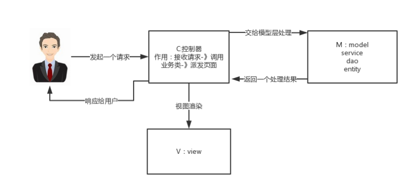

### 分析：

> M-Model 模型（完成业务逻辑：有javaBean构成，service+dao+entity）
>
> V-View 视图（做界面的展示 jsp，html......）
>
> C-Controller 控制器（接收请求---\>调用模型---\>根据结果派发页面）
>
> springMVC是一个MVC的开源框架，springMVC=struts2+spring，springMVC就相当于是Struts2加上sring的整合，但是这里有一个疑惑就是，springMVC和spring是什么样的关系呢？这个在百度百科上有一个很好的解释：意思是说，springMVC是spring的一个后续产品，其实就是spring在原有基础上，又提供了web应用的MVC模块，可以简单的把springMVC理解为是spring的一个模块（类似AOP，IOC这样的模块），网络上经常会说springMVC和spring无缝集成，其实springMVC就是spring的一个子模块，所以根本不需要同spring进行整合。
>
> 工作原理：
>
> 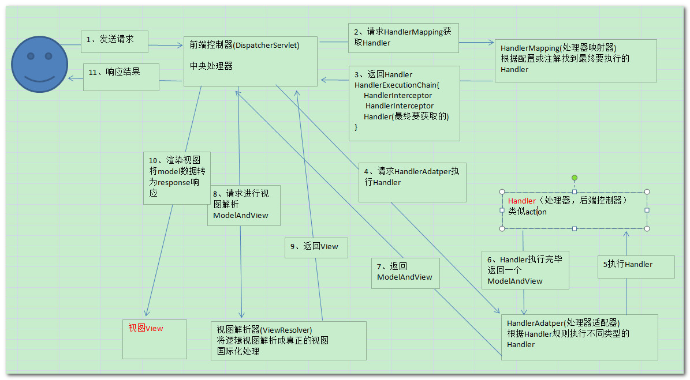
>
> 1、用户发送请求至前端控制器DispatcherServlet。
>
> 2、 DispatcherServlet收到请求调用HandlerMapping处理器映射器。
>
> 3、处理器映射器找到具体的处理器(可以根据xml配置、注解进行查找)，生成处理器对象及处理器拦截器(如果有则生成)一并返回给DispatcherServlet。
>
> 4、 DispatcherServlet调用HandlerAdapter处理器适配器。
>
> 5、 HandlerAdapter经过适配调用具体的处理器(Controller，也叫后端控制器)。
>
> 6、 Controller执行完成返回ModelAndView。
>
> 7、 HandlerAdapter将controller执行结果ModelAndView返回给DispatcherServlet。
>
> 8、 DispatcherServlet将ModelAndView传给ViewReslover视图解析器。
>
> 9、 ViewReslover解析后返回具体View。
>
> 10、DispatcherServlet根据View进行渲染视图（即将模型数据填充至视图中）。
>
> 11、 DispatcherServlet响应用户。
>
> 
>
> **组件说明：**
>
> 以下组件通常使用框架提供实现：
>
> DispatcherServlet：作为前端控制器，整个流程控制的中心，控制其它组件执行，统一调度，降低组件之间的耦合性，提高每个组件的扩展性。
>
> HandlerMapping：通过扩展处理器映射器实现不同的映射方式，例如：配置文件方式，实现接口方式，注解方式等。
>
> HandlAdapter：通过扩展处理器适配器，支持更多类型的处理器。
>
> ViewResolver：通过扩展视图解析器，支持更多类型的视图解析，例如：jsp、freemarker、pdf、excel等。
>
> 
>
> **组件：1、前端控制器DispatcherServlet（不需要工程师开发）,由框架提供**
>
> 作用：接收请求，响应结果，相当于转发器，中央处理器。有了dispatcherServlet减少了其它组件之间的耦合度。用户请求到达前端控制器，它就相当于mvc模式中的c，dispatcherServlet是整个流程控制的中心，由它调用其它组件处理用户的请求，dispatcherServlet的存在降低了组件之间的耦合性。
>
> **2、处理器映射器HandlerMapping(不需要工程师开发),由框架提供**
>
>  作用：根据请求的url查找 Handler HandlerMapping负责根据用户请求找到Handler即处理器，springmvc提供了不同的映射器实现不同的映射方式，例如：配置文件方式，实现接口方式，注解方式等。
>
> **3、处理器适配器HandlerAdapter**
>
> 作用：按照特定规则（HandlerAdapter要求的规则）去执行Handler 通过HandlerAdapter对处理器进行执行，这是适配器模式的应用，通过扩展适配器可以对更多类型的处理器进行执行。
>
> **4、处理器Handler(需要工程师开发)**
>
> **注意：编写Handler时按照HandlerAdapter的要求去做，这样适配器才可以去正确执行Handler**
>
> Handler 是继DispatcherServlet前端控制器的后端控制器，在DispatcherServlet的控制下Handler对具体的用户请求进行处理。由于Handler涉及到具体的用户业务请求，所以一般情况需要工程师根据业务需求开发Handler。
>
> **5、视图解析器View resolver(不需要工程师开发),由框架提供**
>
> 作用：进行视图解析，根据逻辑视图名解析成真正的视图（view） View Resolver负责将处理结果生成View视图，View Resolver首先根据逻辑视图名解析成物理视图名即具体的页面地址，再生成View视图对象，最后对View进行渲染将处理结果通过页面展示给用户。 springmvc框架提供了很多的View视图类型，包括：jstlView、freemarkerView、pdfView等。一般情况下需要通过页面标签或页面模版技术将模型数据通过页面展示给用户，需要由工程师根据业务需求开发具体的页面。
>
> **6、视图View(需要工程师开发jsp\...)** View是一个接口，实现类支持不同的View类型（jsp、freemarker、pdf\...）
>
> **核心架构的具体流程步骤如下：**
>
> 1、首先用户发送请求------\>DispatcherServlet，前端控制器收到请求后自己不进行处理，而是委托给其他的解析器进行处理，作为统一访问点，进行全局的流程控制；
>
>  2、DispatcherServlet------\>HandlerMapping， HandlerMapping 将会把请求映射为HandlerExecutionChain 对象（包含一个Handler 处理器（页面控制器）对象、多个HandlerInterceptor 拦截器）对象，通过这种策略模式，很容易添加新的映射策略；
>
>  3、DispatcherServlet------\>HandlerAdapter，HandlerAdapter 将会把处理器包装为适配器，从而支持多种类型的处理器，即适配器设计模式的应用，从而很容易支持很多类型的处理器；
>
> 4、HandlerAdapter------\>处理器功能处理方法的调用，HandlerAdapter 将会根据适配的结果调用真正的处理器的功能处理方法，完成功能处理；并返回一个ModelAndView 对象（包含模型数据、逻辑视图名）；
>
>  5、ModelAndView的逻辑视图名------\> ViewResolver， ViewResolver 将把逻辑视图名解析为具体的View，通过这种策略模式，很容易更换其他视图技术；
>
> 6、View------\>渲染，View会根据传进来的Model模型数据进行渲染，此处的Model实际是一个Map数据结构，因此很容易支持其他视图技术；
>
> 7、返回控制权给DispatcherServlet，由DispatcherServlet返回响应给用户，到此一个流程结束。
>
> 
>
> 看到这些步骤我相信大家很感觉非常的乱，这是正常的，但是这里主要是要大家理解springMVC中的几个组件：
>
> 前端控制器（DispatcherServlet）：接收请求，响应结果，相当于电脑的CPU。
>
> 处理器映射器（HandlerMapping）：根据URL去查找处理器。
>
> 处理器（Handler）：需要程序员去写代码处理逻辑的。
>
> 处理器适配器（HandlerAdapter）：会把处理器包装成适配器，这样就可以支持多种类型的处理器，类比笔记本的适配器（适配器模式的应用）。
>
> 视图解析器（ViewResovler）：进行视图解析，多返回的字符串，进行处理，可以解析成对应的页面。

## 7、 SpringMVC常用的注解有哪些？

> @RequestMapping：用于处理请求 url 映射的注解，可用于类或方法上。用于类上，则表示类中的所有响应请求的方法都是以该地址作为父路径。
>
> @RequestBody：注解实现接收http请求的json数据，将json转换为java对象。
>
> @ResponseBody：注解实现将conreoller方法返回对象转化为json对象响应给客户。

## 8、谈谈你对Spring的AOP理解

> AOP（Aspect-Oriented Programming，面向切面编程）能够将那些与业务无关，却为业务模块所共同调用的逻辑或责任（例如事务处理、日志管理、权限控制等）封装起来，便于减少系统的重复代码，降低模块间的耦合度，并有利于未来的可扩展性和可维护性。
>
> Spring AOP是基于动态代理的，如果要代理的对象实现了某个接口，那么Spring AOP就会使用JDK动态代理去创建代理对象；而对于没有实现接口的对象，就无法使用JDK动态代理，转而使用CGlib动态代理生成一个被代理对象的子类来作为代理。
>
> 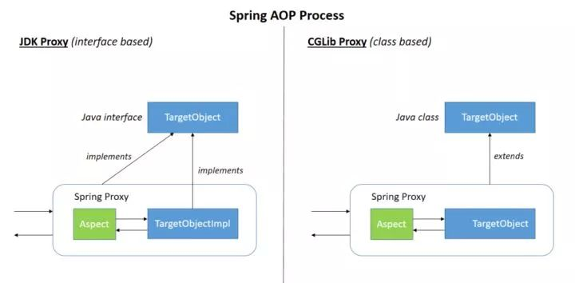
>
> 注意：图中的implements和extend。即一个是接口，一个是实现类。
>
> 当然也可以使用AspectJ，Spring AOP中已经集成了AspectJ，AspectJ应该算得上是Java生态系统中最完整的AOP框架了。使用AOP之后我们可以把一些通用功能抽象出来，在需要用到的地方直接使用即可，这样可以大大简化代码量。我们需要增加新功能也方便，提高了系统的扩展性。日志功能、事务管理和权限管理等场景都用到了AOP。
>
> 这里只要你提到了AspectJ，那么面试官很有可能会继续问：

## 9、Spring AOP和AspectJ AOP有什么区别？

> Spring AOP是属于运行时增强，而AspectJ是编译时增强。Spring AOP基于代理（Proxying），而AspectJ基于字节码操作（Bytecode Manipulation）。
>
> Spring AOP已经集成了AspectJ，AspectJ应该算得上是Java生态系统中最完整的AOP框架了。
>
> AspectJ相比于Spring AOP功能更加强大，但是Spring AOP相对来说更简单。
>
> 如果我们的切面比较少，那么两者性能差异不大。但是，当切面太多的话，最好选择AspectJ，它比SpringAOP快很多。可能还会继续问：
>

### 在Spring AOP 中，关注点和横切关注的区别是什么？

> 关注点是应用中一个模块的行为，一个关注点可能会被定义成一个我们想实现的一个功能。横切关注点是一个关注点，此关注点是整个应用都会使用的功能，并影响整个应用，比如日志，安全和数据传输，几乎应用的每个模块都需要的功能。因此这些都属于横切关注点。
>
> 那什么是连接点呢？连接点代表一个应用程序的某个位置，在这个位置我们可以插入一个AOP切面，它实际上是个应用程序执行Spring AOP的位置。
>
> 切入点是什么？切入点是一个或一组连接点，通知将在这些位置执行。可以通过表达式或匹配的方式指明切入点。

### 什么是通知呢？有哪些类型呢？

> 通知是个在方法执行前或执行后要做的动作，实际上是程序执行时要通过SpringAOP框架触发的代码段。
>
> Spring切面可以应用五种类型的通知：
>
>  **before**：前置通知，在一个方法执行前被调用。
>
> **after:**在方法执行之后调用的通知，无论方法执行是否成功。
>
> **after-returning:**仅当方法成功完成后执行的通知。
>
> **after-throwing:**在方法抛出异常退出时执行的通知。
>
> **around:**在方法执行之前和之后调用的通知。

## 10、说说你对Spring的IOC是怎么理解的？

> （1）IOC就是控制反转，是指创建对象的控制权的转移。以前创建对象的主动权和时机是由自己把控的，而现在这种权力转移到Spring容器中，并由容器根据配置文件去创建实例和管理各个实例之间的依赖关系。对象与对象之间松散耦合，也利于功能的复用。DI依赖注入，和控制反转是同一个概念的不同角度的描述，即应用程序在运行时依赖IoC容器来动态注入对象需要的外部资源。
>
> （2）最直观的表达就是，IOC让对象的创建不用去new了，可以由spring自动生产，使用java的反射机制，根据配置文件在运行时动态的去创建对象以及管理对象，并调用对象的方法的。
>
> （3）Spring的IOC有三种注入方式：构造器注入、setter方法注入、根据注解注入。
>
> IoC让相互协作的组件保持松散的耦合，而AOP编程允许你把遍布于应用各层的功能分离出来形成可重用的功能组件。

## 11、解释一下spring bean的生命周期

> 首先说一下Servlet的生命周期：实例化，初始init，接收请求service，销毁destroy；
>
> Spring上下文中的Bean生命周期也类似，如下：
>
> （1）实例化Bean：
>
> 对于BeanFactory容器，当客户向容器请求一个尚未初始化的bean时，或初始化bean的时候需要注入另一个尚未初始化的依赖时，容器就会调用createBean进行实例化。对于ApplicationContext容器，当容器启动结束后，通过获取BeanDefinition对象中的信息，实例化所有的bean。
>
> （2）设置对象属性（依赖注入）：
>
> 实例化后的对象被封装在BeanWrapper对象中，紧接着，Spring根据BeanDefinition中的信息以及通过BeanWrapper提供的设置属性的接口完成依赖注入。
>
> （3）处理Aware接口：
>
> 接着，Spring会检测该对象是否实现了xxxAware接口，并将相关的xxxAware实例注入给Bean：
>
> ①如果这个Bean已经实现了BeanNameAware接口，会调用它实现的setBeanName(String beanId)方法，此处传递的就是Spring配置文件中Bean的id值；
>
> ②如果这个Bean已经实现了BeanFactoryAware接口，会调用它实现的setBeanFactory()方法，传递的是Spring工厂自身。
>
> ③如果这个Bean已经实现了ApplicationContextAware接口，会调用setApplicationContext(ApplicationContext)方法，传入Spring上下文；
>
> 
>
> （4）BeanPostProcessor：
>
> 如果想对Bean进行一些自定义的处理，那么可以让Bean实现了BeanPostProcessor接口，那将会调用postProcessBeforeInitialization(Object obj, String s)方法。
>
> （5）InitializingBean 与 init-method：
>
> 如果Bean在Spring配置文件中配置了 init-method 属性，则会自动调用其配置的初始化方法。
>
> （6）如果这个Bean实现了BeanPostProcessor接口，将会调用 postProcessAfterInitialization(Object obj, String s)方法；由于这个方法是在Bean初始化结束时调用的，所以可以被应用于内存或缓存技术；
>
> 以上几个步骤完成后，Bean就已经被正确创建了，之后就可以使用这个Bean了。
>
> （7）DisposableBean：
>
> 当Bean不再需要时，会经过清理阶段，如果Bean实现了DisposableBean这个接口，会调用其实现的destroy()方法；
>
> （8）destroy-method：
>
> 最后，如果这个Bean的Spring配置中配置了destroy-method属性，会自动调用其配置的销毁方法。
>
> 

## 12、解释Spring支持的几种bean的作用域？

> Spring容器中的bean可以分为5个范围：
>
> 1.  singleton：默认，每个容器中只有一个bean的实例，单例的模式由BeanFactory自身来维护。
>
> 2.  prototype：为每一个bean请求提供一个实例。
>
> 3.  request：为每一个网络请求创建一个实例，在请求完成以后，bean会失效并被垃圾回收器回收。
>
> 4.  session：与request范围类似，确保每个session中有一个bean的实例，在session过期后，bean会随之失效。
>
> 5.  global-session：全局作用域，global-session和Portlet应用相关。当你的应用部署在Portlet容器中工作时，它包含很多portlet。如果你想要声明让所有的portlet共用全局的存储变量的话，那么这全局变量需要存储在global-session中。全局作用域与Servlet中的session作用域效果相同。

## 13、 Spring基于xml注入bean的几种方式?

> （1）Set方法注入；
>
> （2）构造器注入：①通过index设置参数的位置；②通过type设置参数类型；
>
> （3）静态工厂注入；
>
> （4）实例工厂；
>
> 通常回答前面两种即可，因为后面两种很多人都不太会，不会的就不要说出来，不然问到你不会就尴尬了。

## 14、Spring框架中都用到了哪些设计模式？

> 这是一道相对有难度的题目，你不仅要回设计模式，还要知道每个设计模式在Spring中是如何使用的。
>
> **简单工厂模式**：Spring 中的 BeanFactory 就是简单工厂模式的体现。根据传入一个唯一的标识来获得 Bean 对象，但是在传入参数后创建还是传入参数前创建，要根据具体情况来定。
>
> **工厂模式**：Spring 中的 FactoryBean 就是典型的工厂方法模式，实现了 FactoryBean 接口的 bean是一类叫做 factory 的 bean。其特点是，spring 在使用 getBean()调用获得该 bean 时，会自动调用该 bean 的 getObject()方法，所以返回的不是 factory 这个 bean，而是这个 bean.getOjbect()方法的返回值。
>
> **单例模式**：在 spring 中用到的单例模式有： scope=\"singleton\"，注册式单例模式，bean 存放于
>
> Map 中。bean name 当做 key，bean 当做 value。
>
> **原型模式**：在 spring 中用到的原型模式有： scope=\"prototype\"，每次获取的是通过克隆生成的新实例，对其进行修改时对原有实例对象不造成任何影响。
>
> **迭代器模式**：在 Spring 中有个 CompositeIterator 实现了 Iterator，Iterable 接口和 Iterator 接口，这两个都是迭代相关的接口。可以这么认为，实现了 Iterable 接口，则表示某个对象是可被迭代的。Iterator 接口相当于是一个迭代器，实现了 Iterator 接口，等于具体定义了这个可被迭代的对象时如何进行迭代的。
>
> **代理模式**：Spring 中经典的 AOP，就是使用动态代理实现的，分 JDK 和 CGlib 动态代理。**适配器模式**：Spring 中的 AOP 中 AdvisorAdapter 类，它有三个实现：
>
> MethodBeforAdviceAdapter、AfterReturnningAdviceAdapter、ThrowsAdviceAdapter。Spring会根据不同的 AOP 配置来使用对应的 Advice，与策略模式不同的是，一个方法可以同时拥有多个Advice。Spring 存在很多以 Adapter 结尾的，大多数都是适配器模式。
>
> **观察者模式**：Spring 中的 Event 和 Listener。spring 事件：ApplicationEvent，该抽象类继承了EventObject 类，JDK 建议所有的事件都应该继承自 EventObject。spring 事件监听器：ApplicationListener，该接口继承了 EventListener 接口，JDK 建议所有的事件监听器都应该继承EventListener。
>
> **模板模式**：Spring 中的 org.springframework.jdbc.core.JdbcTemplate 就是非常经典的模板模式的应用，里面的 execute 方法，把整个算法步骤都定义好了。
>
> **责任链模式**：DispatcherServlet 中的 doDispatch()方法中获取与请求匹配的处理器HandlerExecutionChain，this.getHandler()方法的处理使用到了责任链模式。
>
> **注意**：这里只是列举了部分设计模式，其实里面用到了还有享元模式、建造者模式等。可选择性的回答，主要是怕你回答了迭代器模式，然后继续问你，结果你一问三不知，那就尴了尬了。

## 15、说说Spring 中 ApplicationContext 和 BeanFactory 的区别

### 类图


### 包目录不同

> - spring-beans.jar 中 org.springframework.beans.factory.BeanFactory 
>
> - spring-context.jar 中 org.springframework.context.ApplicationContext

### 国际化

> BeanFactory 是不支持国际化功能的，因为 BeanFactory 没有扩展 Spring 中 MessageResource接口。相反，由于 ApplicationContext 扩展了 MessageResource 接口，因而具有消息处理的能力（i18N）。
>

### 强大的事件机制（Event）

> 基本上牵涉到事件（Event）方面的设计，就离不开观察者模式，ApplicationContext 的事件机制主要通过 ApplicationEvent 和 ApplicationListener 这两个接口来提供的，和 Java swing 中的事件机制一样。即当 ApplicationContext 中发布一个事件时，所有扩展了 ApplicationListener 的 Bean都将接受到这个事件，并进行相应的处理。

### 底层资源的访问

> ApplicationContext 扩展了 ResourceLoader（资源加载器）接口，从而可以用来加载多个 Resource，而 BeanFactory 是没有扩展 ResourceLoader。

### 对 Web 应用的支持

> 与 BeanFactory 通常以编程的方式被创建，ApplicationContext 能以声明的方式创建，如使用ContextLoader。
>
> 当然你也可以使用 ApplicationContext 的实现方式之一，以编程的方式创建 ApplicationContext实例。

### 延迟加载

> 1.  BeanFactroy 采用的是延迟加载形式来注入 Bean 的，即只有在使用到某个 Bean 时(调用 getBean())，才对该 Bean 进行加载实例化。这样，我们就不能发现一些存在的 spring 的配置问题。而 ApplicationContext 则相反，它是在容器启动时，一次性创建了所有的 Bean。这样，在容器启动时，我们就可以发现 Spring 中存在的配置错误。
>
> 2.  BeanFactory 和 ApplicationContext 都支持 BeanPostProcessor、BeanFactoryPostProcessor 的使用。两者之间的区别是：BeanFactory 需要手动注册，而ApplicationContext 则是自动注册。
>
> 可以看到，ApplicationContext 继承了 BeanFactory，BeanFactory 是 Spring 中比较原始的 Factory，它不支持 AOP、Web 等 Spring 插件。而 ApplicationContext 不仅包含了 BeanFactory的所有功能，还支持 Spring 的各种插件，还以一种面向框架的方式工作以及对上下文进行分层和实现继承。
>
> BeanFactory 是 Spring 框架的基础设施，面向 Spring 本身；而 ApplicationContext 面向使用Spring 的开发者，相比 BeanFactory 提供了更多面向实际应用的功能，几乎所有场合都可以直接使用 ApplicationContext，而不是底层的 BeanFactory。
>

### 常用容器

> BeanFactory 类型的有 XmlBeanFactory，它可以根据 XML 文件中定义的内容，创建相应的Bean。
>
> ApplicationContext 类型的常用容器有：
>
> 1.  ClassPathXmlApplicationContext：从 ClassPath 的 XML 配置文件中读取上下文，并生成上下文定义。应用程序上下文从程序环境变量中取得。
>
> 2.  FileSystemXmlApplicationContext：由文件系统中的 XML 配置文件读取上下文。
>
> 3.  XmlWebApplicationContext：由 Web 应用的 XML 文件读取上下文。例如我们在 Spring MVC使用的情况。

## 16、Spring 框架中的单例 Bean 是线程安全的么？

> Spring 框架并没有对单例 Bean 进行任何多线程的封装处理。
>
> 关于单例 Bean 的线程安全和并发问题，需要开发者自行去搞定。
>
> 单例的线程安全问题，并不是 Spring 应该去关心的。Spring 应该做的是，提供根据配置，创建单例 Bean 或多例 Bean 的功能。
>
> 当然，但实际上，大部分的 Spring Bean 并没有可变的状态，所以在某种程度上说 Spring 的单例
>
> Bean 是线程安全的。如果你的 Bean 有多种状态的话，就需要自行保证线程安全。最浅显的解决办法，就是将多态 Bean 的作用域（Scope）由 Singleton 变更为 Prototype。

## 17、Spring 是怎么解决循环依赖的？


> 整个流程大致如下：
>
> 1.  首先 A 完成初始化第一步并将自己**提前曝光**出来（通过 ObjectFactory 将自己提前曝光），在初始化的时候，发现自己依赖对象 B，此时就会去尝试 get(B)，这个时候发现 B 还没有被创建出来；
>
> 2.  然后 B 就走创建流程，在 B 初始化的时候，同样发现自己依赖 C，C 也没有被创建出来；
>
> 3.  这个时候 C 又开始初始化进程，但是在初始化的过程中发现自己依赖 A，于是尝试 get(A)。这个时候由于 A 已经添加至缓存中（一般都是添加至三级缓存 singletonFactories），通过ObjectFactory 提前曝光，所以可以通过 ObjectFactory\#getObject()方法来拿到 A 对象。C 拿到 A 对象后顺利完成初始化，然后将自己添加到一级缓存中；
>
> 4.  回到 B，B 也可以拿到 C 对象，完成初始化，A 可以顺利拿到 B 完成初始化。到这里整个链路就已经完成了初始化过程了。
>
> 关键字：三级缓存，提前曝光。

## 18、说说事务的隔离级别

> 未提交读(Read Uncommitted)：允许脏读，也就是可能读取到其他会话中未提交事务修改的数据
>
> 提交读(Read Committed)：只能读取到已经提交的数据。Oracle等多数数据库默认都是该级别(不重复读)
>
> 可重复读(Repeated Read)：在同一个事务内的查询都是事务开始时刻一致的，Mysql的InnoDB默认级别。在SQL标准中，该隔离级别消除了不可重复读，但是还存在幻读（多个事务同时修改同一条记录，事务之间不知道彼此存在，当事务提交之后，后面的事务修改的数据将会覆盖前事务，前一个事务就像发生幻觉一样）
>
> 可串行化(Serializable)：完全串行化的读，每次读都需要获得表级共享锁，读写相互都会阻塞。
>
> 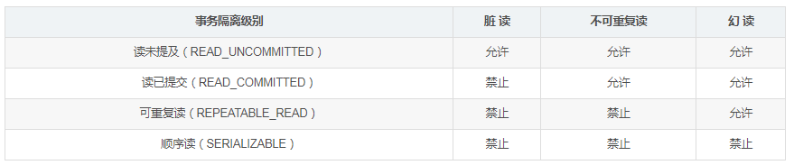
>
> 不可重复读和幻读的区别主要是：解决不可重复读需要锁定了当前满足条件的记录，而解决幻读需要锁定当前满足条件的记录及相近的记录。比如查询某个商品的信息，可重复读事务隔离级别可以保证当前商品信息被锁定，解决不可重复读；但是如果统计商品个数，中途有记录插入，可重复读事务隔离级别就不能保证两个事务统计的个数相同。

## 19、说说事务的传播级别

> Spring事务定义了7种传播机制：
>
> 1.  PROPAGATION_REQUIRED:默认的Spring事物传播级别，若当前存在事务，则加入该事务，若不存在事务，则新建一个事务。
> 2.  PAOPAGATION_REQUIRE_NEW:若当前没有事务，则新建一个事务。若当前存在事务，则新建一个事务，新老事务相互独立。外部事务抛出异常回滚不会影响内部事务的正常提交。
> 3.  PROPAGATION_NESTED:如果当前存在事务，则嵌套在当前事务中执行。如果当前没有事务，则新建一个事务，类似于REQUIRE_NEW。
> 4.  PROPAGATION_SUPPORTS:支持当前事务，若当前不存在事务，以非事务的方式执行。
> 5.  PROPAGATION_NOT_SUPPORTED:以非事务的方式执行，若当前存在事务，则把当前事务挂起。
> 6.  PROPAGATION_MANDATORY:强制事务执行，若当前不存在事务，则抛出异常.
> 7.  PROPAGATION_NEVER:以非事务的方式执行，如果当前存在事务，则抛出异常。
>
> Spring事务传播级别一般不需要定义，默认就是PROPAGATION_REQUIRED，除非在嵌套事务的情况下需要重点了解。

## 20、Spring 事务实现方式

> 编程式事务管理：这意味着你可以通过编程的方式管理事务，这种方式带来了很大的灵活性，但很难维护。
>
> 声明式事务管理：这种方式意味着你可以将事务管理和业务代码分离。你只需要通过注解或者XML配置管理事务。

## 21、 Spring框架的事务管理有哪些优点

> 它为不同的事务API(如JTA, JDBC, Hibernate, JPA,和JDO)提供了统一的编程模型。它为编程式事务管理提供了一个简单的API而非一系列复杂的事务API(如JTA).它支持声明式事务管理。它可以和
>
> Spring 的多种数据访问技术很好的融合。
>
> 它为不同的事务API(如JTA, JDBC, Hibernate, JPA,和JDO)提供了统一的编程模型。它为编程式事务管理提供了一个简单的API而非一系列复杂的事务API(如JTA).它支持声明式事务管理。它可以和
>
> Spring 的多种数据访问技术很好的融合。
>
> 它为不同的事务API(如JTA, JDBC, Hibernate, JPA,和JDO)提供了统一的编程模型。它为编程式事务管理提供了一个简单的API而非一系列复杂的事务API(如JTA).它支持声明式事务管理。它可以和
>
> Spring 的多种数据访问技术很好的融合。

## 22、事务三要素是什么？

> **数据源**：表示具体的事务性资源，是事务的真正处理者，如MySQL等。
>
> **事务管理器**：像一个大管家，从整体上管理事务的处理过程，如打开、提交、回滚等。
>
> **事务应用和属性配置**：像一个标识符，表明哪些方法要参与事务，如何参与事务，以及一些相关属性如隔离级别、超时时间等。

## 23、事务注解的本质是什么？

> @Transactional 这个注解仅仅是一些（和事务相关的）元数据，在运行时被事务基础设施读取消费，并**使用这些元数据来配置bean的事务行为**。大致来说具有两方面功能，**一是表明该方法要参与事务，二是配置相关属性来定制事务的参与方式和运行行为**
>
> 声明式事务主要是得益于Spring AOP。使用一个事务拦截器，在方法调用的前后/周围进行事务性增强（advice），来驱动事务完成。
>
> @Transactional注解既可以标注在类上，也可以标注在方法上。当在类上时，默认应用到类里的所有方法。如果此时方法上也标注了，则方法上的优先级高。另外注意方法一定要是public的。

# 五、MyBatis篇

## 1、什么是MyBatis

> （1）Mybatis是一个半ORM（对象关系映射）框架，它内部封装了JDBC，开发时只需要关注SQL语句本身，不需要花费精力去处理加载驱动、创建连接、创建statement等繁杂的过程。程序员直接编写原生态sql，可以严格控制sql执行性能，灵活度高。
>
> （2）MyBatis 可以使用 XML 或注解来配置和映射原生信息，将 POJO映射成数据库中的记录，避免了几乎所有的 JDBC 代码和手动设置参数以及获取结果集。
>
> （3）通过xml 文件或注解的方式将要执行的各种 statement 配置起来，并通过java对象和statement中sql的动态参数进行映射生成最终执行的sql语句，最后由mybatis框架执行sql并将结果映射为java对象并返回。（从执行sql到返回result的过程）。

## 2、说说MyBatis的优点和缺点

### 优点：

> （1）基于SQL语句编程，相当灵活，不会对应用程序或者数据库的现有设计造成任何影响，SQL写在XML里，解除sql与程序代码的耦合，便于统一管理；提供XML标签，支持编写动态SQL语句，并可重用。
>
> （2）与JDBC相比，减少了50%以上的代码量，消除了JDBC大量冗余的代码，不需要手动开关连接；
>
> （3）很好的与各种数据库兼容（因为MyBatis使用JDBC来连接数据库，所以只要JDBC支持的数据库MyBatis都支持）。
>
> （4）能够与Spring很好的集成；
>
> （5）提供映射标签，支持对象与数据库的ORM字段关系映射；提供对象关系映射标签，支持对象关系组件维护。

### 缺点

> 1.  SQL语句的编写工作量较大，尤其当字段多、关联表多时，对开发人员编写SQL语句的功底有一定要求。
>
> 2.  SQL语句依赖于数据库，导致数据库移植性差，不能随意更换数据库。

## 3、#{}和${}的区别是什么？

> \#{}是预编译处理，\${}是字符串替换。
>
> Mybatis在处理\#{}时，会将sql中的\#{}替换为?号，调用PreparedStatement的set方法来赋值；
>
> Mybatis在处理\${}时，就是把\${}替换成变量的值。使用\#{}可以有效的防止SQL注入，提高系统安全性。

## 4、当实体类中的属性名和表中的字段名不一样，怎么办？

> 第1种：通过在查询的sql语句中定义字段名的别名，让字段名的别名和实体类的属性名一致。
>
> ```xml
> <select id=”selectorder” parametertype=”int” resultetype=”me.gacl.domain.order”>
> select order_id id, order_no orderno ,order_price price form orders where
> order_id=#{id};
> </select>
> ```
>
> 第2种：通过来映射字段名和实体类属性名的一一对应的关系。
>
> ```xml
> <select id="getOrder" parameterType="int" resultMap="orderresultmap">
> select * from orders where order_id=#{id}
> </select>
> <resultMap type=”me.gacl.domain.order” id=”orderresultmap”>
> <!–用id属性来映射主键字段–>
> <id property=”id” column=”order_id”>
> <!–用result属性来映射非主键字段，property为实体类属性名，column为数据表中的属性–>
> <result property = “orderno” column =”order_no”/>
> <result property=”price” column=”order_price”/>
> </reslutMap>
> ```

## 5、Mybatis是如何进行分页的？分页插件的原理是什么？

> Mybatis使用RowBounds对象进行分页，它是针对ResultSet结果集执行的内存分页，而非物理分页。可以在sql内直接拼写带有物理分页的参数来完成物理分页功能，也可以使用分页插件来完成物理分页，比如：MySQL数据的时候，在原有SQL后面拼写limit。
>
> 分页插件的基本原理是使用Mybatis提供的插件接口，实现自定义插件，在插件的拦截方法内拦截待执行的sql，然后重写sql，根据dialect方言，添加对应的物理分页语句和物理分页参数。

## 6、Mybatis是如何将sql执行结果封装为目标对象并返回的？都有哪些映射形式？

> 第一种是使用标签，逐一定义数据库列名和对象属性名之间的映射关系。第二种是使用sql列的别名功能，将列的别名书写为对象属性名。
>
> 有了列名与属性名的映射关系后，Mybatis通过反射创建对象，同时使用反射给对象的属性逐一赋值并返回，那些找不到映射关系的属性，是无法完成赋值的。

## 7、如何执行批量插入？

> 首先,创建一个简单的insert语句:
>
> ```xml
> <insert id=”insertname”>
> insert into names (name) values (#{value})
> </insert>
> ```
>
> 
>
> 然后在java代码中像下面这样执行批处理插入:
>
> ```java
> list<string> names = new arraylist();
> names.add(“fred”);
> names.add(“barney”);
> names.add(“betty”);
> names.add(“wilma”);
> //注意这里 executortype.batch
> sqlsession sqlsession = sqlsessionfactory.opensession(executortype.batch);
> try {
>     namemapper mapper = sqlsession.getmapper(namemapper.class);
>     for (string name : names){
>     mapper.insertname(name);
>    }
>     sqlsession.commit();
> }catch(Exception e){
>     e.printStackTrace();
>     sqlSession.rollback();
>     throw e;
> }
> finally {
>     sqlsession.close();
> }
> ```
>
> 

## 8、Xml映射文件中，除了常见的select|insert|updae|delete标签之外，还有哪些标签？

> 加上动态sql的9个标签，其中为sql片段标签，通过标签引入sql片段，为不支持自增的主键生成策略标签。

## 9、MyBatis实现一对一有几种方式?具体怎么操作的？

> 有联合查询和嵌套查询,联合查询是几个表联合查询,只查询一次,通过在resultMap里面配置association节点配置一对一的类就可以完成；
>
> 嵌套查询是先查一个表，根据这个表里面的结果的外键id，去再另外一个表里面查询数据,也是通过association配置，但另外一个表的查询通过select属性配置。
>

## 10、Mybatis是否支持延迟加载？如果支持，它的实现原理是什么？

> Mybatis仅支持association关联对象和collection关联集合对象的延迟加载，association指的就是一对一，collection指的就是一对多查询。在Mybatis配置文件中，可以配置是否启用延迟加载lazyLoadingEnabled=true\|false。
>
> 它的原理是，使用CGLIB创建目标对象的代理对象，当调用目标方法时，进入拦截器方法，比如调用a.getB().getName()，拦截器invoke()方法发现a.getB()是null值，那么就会单独发送事先保存好的查询关联B对象的sql，把B查询上来，然后调用a.setB(b)，于是a的对象b属性就有值了，接着完成g. etB().getName()方法的调用。这就是延迟加载的基本原理。当然了，不光是Mybatis，几乎所有的包括Hibernate，支持延迟加载的原理都是一样的。

## 11、说说Mybatis的缓存机制:

> Mybatis整体：
>
> 

#### 一级缓存localCache

> 在应用运行过程中，我们有可能在一次数据库会话中，执行多次查询条件完全相同的 SQL，
>
> MyBatis 提供了一级缓存的方案优化这部分场景，如果是相同的 SQL 语句，会优先命中一级缓存，避免直接对数据库进行查询，提高性能。
>
> 每个 SqlSession 中持有了 Executor，每个 Executor 中有一个 LocalCache。当用户发起查询时，
>
> MyBatis 根据当前执行的语句生成 MappedStatement，在 Local Cache 进行查询，如果缓存命中的话，直接返回结果给用户，如果缓存没有命中的话，查询数据库，结果写入 Local Cache，最后返回结果给用户。具体实现类的类关系图如下图所示：
>
> 
>
> 1.  MyBatis 一级缓存的生命周期和 SqlSession 一致。
>
> 2.  MyBatis 一级缓存内部设计简单，只是一个没有容量限定的 HashMap，在缓存的功能性上有所欠缺。
>
> 3.  MyBatis 的一级缓存最大范围是 SqlSession 内部，有多个 SqlSession 或者分布式的环境下，数据库写操作会引起脏数据，建议设定缓存级别为 Statement。

### 二级缓存

> 在上文中提到的一级缓存中，其最大的共享范围就是一个 SqlSession 内部，如果多个 SqlSession之间需要共享缓存，则需要使用到二级缓存。开启二级缓存后，会使用 CachingExecutor 装饰 Executor，进入一级缓存的查询流程前，先在 CachingExecutor 进行二级缓存的查询，具体的工作流程如下所示。
>
> 
>
> 二级缓存开启后，同一个 namespace 下的所有操作语句，都影响着同一个 Cache，即二级缓存被多个 SqlSession 共享，是一个全局的变量。
>
> 当开启缓存后，数据的查询执行的流程为：二级缓存-\> 一级缓存-\> 数据库
>
> 1.  MyBatis 的二级缓存相对于一级缓存来说，实现了 SqlSession 之间缓存数据的共享，同时粒度更加细，能够到 namespace 级别，通过 Cache 接口实现类不同的组合，对 Cache 的可控性也更强。
>
> 2.  MyBatis 在多表查询时，极大可能会出现脏数据，有设计上的缺陷，安全使用二级缓存的条件比较苛刻。
>
> 3.  在分布式环境下，由于默认的 MyBatis Cache 实现都是基于本地的，分布式环境下必然会出现读取到脏数据，需要使用集中式缓存将 MyBatis 的 Cache 接口实现，有一定的开发成本，直接使用 Redis、Memcached 等分布式缓存可能成本更低，安全性也更高。

## 12、JDBC 编程有哪些步骤？

> 1.装载相应的数据库的 JDBC 驱动并进行初始化：
>
> ```java
> Class.forName("com.mysql.jdbc.Driver");
> ```
>
> 2.建立 JDBC 和数据库之间的 Connection 连接：
>
> ```java
> Connection c = DriverManager.getConnection("jdbc:mysql://127.0.0.1:3306/test?
> characterEncoding=UTF-8","root","123456");
> ```
>
> 3.创建 Statement 或者 PreparedStatement 接口，执行 SQL 语句。
>
> 4.处理和显示结果。
>
> 5.释放资源。

## 13、MyBatis 中见过什么设计模式？


## 14、MyBatis 中比如 UserMapper.java 是接口，为什么没有实现类还能调用？

> 使用JDK动态代理+MapperProxy。本质上调用的是MapperProxy的invoke方法。
>

# 六、SpringBoot篇

## 1、为什么要用SpringBoot

> Spring Boot 优点非常多，如：
>
> **一、独立运行**
>
> Spring Boot而且内嵌了各种servlet容器，Tomcat、Jetty等，现在不再需要打成war包部署到容器中，Spring Boot只要打成一个可执行的jar包就能独立运行，所有的依赖包都在一个jar包内。
>
> **二、简化配置**
>
> spring-boot-starter-web启动器自动依赖其他组件，简少了maven的配置。
>
> **三、自动配置**
>
> Spring Boot能根据当前类路径下的类、jar包来自动配置bean，如添加一个spring-boot-starter-web启动器就能拥有web的功能，无需其他配置。
>
> **四、无代码生成和XML配置**
>
> Spring Boot配置过程中无代码生成，也无需XML配置文件就能完成所有配置工作，这一切都是借助于条件注解完成的，这也是Spring4.x的核心功能之一。
>
> **五、应用监控**
>
> Spring Boot提供一系列端点可以监控服务及应用，做健康检测。

## 2、Spring Boot 的核心注解是哪个？它主要由哪几个注解组成的？

> 启动类上面的注解是@SpringBootApplication，它也是 Spring Boot 的核心注解，主要组合包含了以下3 个注解：
>
> @SpringBootConfiguration：组合了@Configuration 注解，实现配置文件的功能。
>
> @EnableAutoConfiguration：打开自动配置的功能，也可以关闭某个自动配置的选项，如关闭数据源自动配置功能：@SpringBootApplication(exclude = { DataSourceAutoConfiguration.class})。
>
> @ComponentScan：Spring组件扫描。

## 3、运行Spring Boot有哪几种方式？

> 1）打包用命令或者放到容器中运行
>
> 2）用 Maven/Gradle 插件运行
>
> 3）直接执行 main 方法运行

## 4、如何理解 Spring Boot 中的 Starters？

> Starters是什么：
>
> Starters可以理解为启动器，它包含了一系列可以集成到应用里面的依赖包，你可以一站式集成Spring及其他技术，而不需要到处找示例代码和依赖包。如你想使用Spring JPA访问数据库，只要加入spring-boot-starter-data-jpa启动器依赖就能使用了。Starters包含了许多项目中需要用到的依赖，它们能快速持续的运行，都是一系列得到支持的管理传递性依赖。
>
> Starters命名：
>
> Spring Boot官方的启动器都是以spring-boot-starter-命名的，代表了一个特定的应用类型。第三方的启动器不能以spring-boot开头命名，它们都被Spring Boot官方保留。一般一个第三方的应该这样命名，像mybatis的mybatis-spring-boot-starter。
>
> Starters分类：
>
> 1\. Spring Boot应用类启动器
>
> 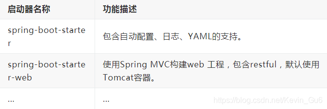
>
> 1\. Spring Boot生产启动器
>
> 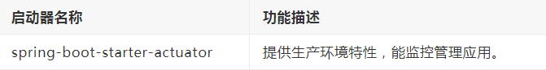
>
> 1\. Spring Boot技术类启动器
>
> 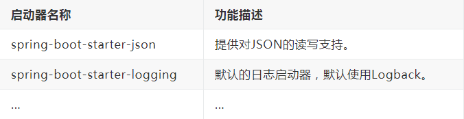
>
> 1\.其他第三方启动器

## 5、如何在Spring Boot启动的时候运行一些特定的代码？

> 如果你想在Spring Boot启动的时候运行一些特定的代码，你可以实现接口**ApplicationRunner**或者**CommandLineRunner**，这两个接口实现方式一样，它们都只提供了一个run方法。
>
> **CommandLineRunner**：启动获取命令行参数

## 6、 Spring Boot 需要独立的容器运行吗？

> 可以不需要，内置了 Tomcat/ Jetty 等容器。

## 7、 Spring Boot中的监视器是什么？

> Spring boot actuator是spring启动框架中的重要功能之一。Spring boot监视器可帮助您访问生产环境中正在运行的应用程序的当前状态。有几个指标必须在生产环境中进行检查和监控。即使一些外部应用程序可能正在使用这些服务来向相关人员触发警报消息。监视器模块公开了一组可直接作为HTTP URL访问的REST端点来检查状态。

## 8、如何使用Spring Boot实现异常处理？

> Spring提供了一种使用ControllerAdvice处理异常的非常有用的方法。我们通过实现一个ControlerAdvice类，来处理控制器类抛出的所有异常。
>

## 9、你如何理解 Spring Boot 中的 Starters？

> Starters可以理解为启动器，它包含了一系列可以集成到应用里面的依赖包，你可以一站式集成Spring 及其他技术，而不需要到处找示例代码和依赖包。如你想使用 Spring JPA 访问数据库，只要加入 spring-boot-starter-data-jpa 启动器依赖就能使用了。
>

## 10、 springboot常用的starter有哪些

> spring-boot-starter-web 嵌入tomcat和web开发需要servlet与jsp支持
>
> spring-boot-starter-data-jpa 数据库支持
>
> spring-boot-starter-data-redis redis数据库支持
>
>  spring-boot-starter-data-solr solr支持
>
> mybatis-spring-boot-starter 第三方的mybatis集成starter

## 11、 SpringBoot 实现热部署有哪几种方式？

> 主要有两种方式：
>
> - Spring Loaded
>
> -  Spring-boot-devtools

## 12、如何理解 Spring Boot 配置加载顺序？

> 在 Spring Boot 里面，可以使用以下几种方式来加载配置。
>
> 1）properties文件；
>
> 2）YAML文件；
>
> 3）系统环境变量；
>
> 4）命令行参数；
>
> 等等......

## 13、 Spring Boot 的核心配置文件有哪几个？它们的区别是什么？

> spring Boot 的核心配置文件是 application 和 bootstrap 配置文件。
>
> application 配置文件这个容易理解，主要用于 Spring Boot 项目的自动化配置。
>
> bootstrap 配置文件有以下几个应用场景。
>
> - 使用 Spring Cloud Config 配置中心时，这时需要在 bootstrap 配置文件中添加连接到配置中心的配置属性来加载外部配置中心的配置信息；
>- 一些固定的不能被覆盖的属性；
> - 一些加密/解密的场景；

## 14、如何集成 Spring Boot 和 ActiveMQ？

> 对于集成 Spring Boot 和 ActiveMQ，我们使用 spring-boot-starter-activemq 依赖关系。它只需要很少的配置，并且不需要样板代码。

# 七、MySQL篇

## 1、数据库的三范式是什么

> 第一范式：列不可再分第二范式：行可以唯一区分，主键约束第三范式：表的非主属性不能依赖与其他表的非主属性外键约束且三大范式是一级一级依赖的，第二范式建立在第一范式上，第三范式建立第一第二范式上。

## 2、MySQL数据库引擎有哪些

> 如何查看mysql提供的所有存储引擎
>
> ```sql
> mysql> show engines;
> ```
>
> 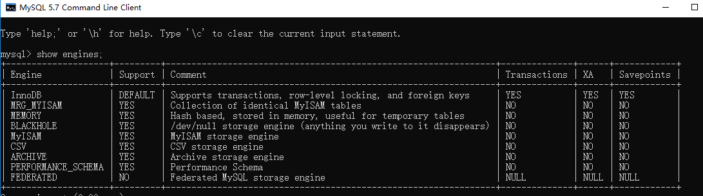
>
> 
>
> mysql常用引擎包括：MYISAM、Innodb、Memory、MERGE
>
> - MYISAM：全表锁，拥有较高的执行速度，不支持事务，不支持外键，并发性能差，占用空间相对较小，对事务完整性没有要求，以select、insert为主的应用基本上可以使用这引擎
>
> - Innodb:行级锁，提供了具有提交、回滚和崩溃回复能力的事务安全，支持自动增长列，支持外键约束，并发能力强，占用空间是MYISAM的2.5倍，处理效率相对会差一些
>
> - Memory:全表锁，存储在内容中，速度快，但会占用和数据量成正比的内存空间且数据在mysql重启时会丢失，默认使用HASH索引，检索效率非常高，但不适用于精确查找，主要用于那些内容变化不频繁的代码表
>
> - MERGE：是一组MYISAM表的组合

## 3、说说InnoDB与MyISAM的区别

> 1.  InnoDB支持事务，MyISAM不支持，对于InnoDB每一条SQL语言都默认封装成事务，自动提交，这样会影响速度，所以最好把多条SQL语言放在begin和commit之间，组成一个事务；
>
> 2.  InnoDB支持外键，而MyISAM不支持。对一个包含外键的InnoDB表转为MYISAM会失败；
>
> 3.  InnoDB是聚集索引，数据文件是和索引绑在一起的，必须要有主键，通过主键索引效率很高。但是辅助索引需要两次查询，先查询到主键，然后再通过主键查询到数据。因此，主键不应该过大，因为主键太大，其他索引也都会很大。而MyISAM是非聚集索引，数据文件是分离的，索引保存的是数据文件的指针。主键索引和辅助索引是独立的。
>
> 4.  InnoDB不保存表的具体行数，执行select count(\*) from table时需要全表扫描。而MyISAM用一个变量保存了整个表的行数，执行上述语句时只需要读出该变量即可，速度很快；
>
> 5.  Innodb不支持全文索引，而MyISAM支持全文索引，查询效率上MyISAM要高；

## 4、数据库的事务

> **什么是事务？：**多条sql语句，要么全部成功，要么全部失败。

### 事务的特性：

> **数据库事务特性：原子性(Atomic)、一致性(Consistency)、隔离性(Isolation)、持久性(Durabiliy)。简称ACID。**
>
> 原子性：组成一个事务的多个数据库操作是一个不可分割的原子单元，只有所有操作都成功，整个事务才会提交。任何一个操作失败，已经执行的任何操作都必须撤销，让数据库返回初始状态。
>
> 一致性：事务操作成功后，数据库所处的状态和它的业务规则是一致的。即数据不会被破坏。如A转账100元给B，不管操作是否成功，A和B的账户总额是不变的。
>
> 隔离性：在并发数据操作时，不同的事务拥有各自的数据空间，它们的操作不会对彼此产生干扰
>
> 持久性：一旦事务提交成功，事务中的所有操作都必须持久化到数据库中。

## 5、索引是什么

> 官方介绍索引是帮助MySQL**高效获取数据**的**数据结构**。更通俗的说，数据库索引好比是一本书前面的目录，能**加快数据库的查询速度**。
>
> 一般来说索引本身也很大，不可能全部存储在内存中，因此**索引往往是存储在磁盘上的文件中的**（可能存储在单独的索引文件中，也可能和数据一起存储在数据文件中）。
>
> 我们通常所说的索引，包括聚集索引、覆盖索引、组合索引、前缀索引、唯一索引等，没有特别说明，默认都是使用B+树结构组织（多路搜索树，并不一定是二叉的）的索引。

## 6、SQL优化手段有哪些

> 1、查询语句中不要使用select \*
>
> 2、尽量减少子查询，使用关联查询（left join,right join,inner join）替代
>
> 3、减少使用IN或者NOT IN ,使用exists，not exists或者关联查询语句替代
>
> 4、or 的查询尽量用 union或者union all 代替(在确认没有重复数据或者不用剔除重复数据时，union all会更好)
>
> 5、应尽量避免在 where 子句中使用!=或\<\>操作符，否则将引擎放弃使用索引而进行全表扫描。
>
> 6、应尽量避免在 where 子句中对字段进行 null 值判断，否则将导致引擎放弃使用索引而进行全表扫描，如： select id from t where num is null 可以在num上设置默认值0，确保表中num列没有null值，然后这样查询： select id from t where num=0

## 7、简单说一说drop、delete与truncate的区别

> SQL中的drop、delete、truncate都表示删除，但是三者有一些差别
>
> delete和truncate只删除表的数据不删除表的结构速度,一般来说: drop\> truncate \>delete delete语句是dml,这个操作会放到rollback segement中,事务提交之后才生效; 如果有相应的trigger,执行的时候将被触发. truncate,drop是ddl,操作立即生效,原数据不放到rollback segment中,不能回滚.操作不触发trigger.

## 8、什么是视图

> 视图是一种虚拟的表，具有和物理表相同的功能。可以对视图进行增，改，查，操作，试图通常是有一个表或者多个表的行或列的子集。对视图的修改不影响基本表。它使得我们获取数据更容易，相比多表查询。

## 9、什么是内联接、左外联接、右外联接？

> 内联接（Inner Join）：匹配2张表中相关联的记录。
>
> 左外联接（Left Outer Join）：除了匹配2张表中相关联的记录外，还会匹配左表中剩余的记录，右表中未匹配到的字段用NULL表示。
>
> 右外联接（Right Outer Join）：除了匹配2张表中相关联的记录外，还会匹配右表中剩余的记录，左表中未匹配到的字段用NULL表示。在判定左表和右表时，要根据表名出现在Outer Join的左右位置关系。

## 10、并发事务带来哪些问题?

> 在典型的应用程序中，多个事务并发运行，经常会操作相同的数据来完成各自的任务（多个用户对同一数据进行操作）。并发虽然是必须的，但可能会导致以下的问题。
>
> **脏读（Dirty read）:**当一个事务正在访问数据并且对数据进行了修改，而这种修改还没有提交到数据库中，这时另外一个事务也访问了这个数据，然后使用了这个数据。因为这个数据是还没有提交的数据，那么另外一个事务读到的这个数据是"脏数据"，依据"脏数据"所做的操作可能是不正确的。
>
> **丢失修改（Lost to modify）:**指在一个事务读取一个数据时，另外一个事务也访问了该数据，那么在第一个事务中修改了这个数据后，第二个事务也修改了这个数据。这样第一个事务内的修改结果就被丢失，因此称为丢失修改。例如：事务1读取某表中的数据A=20，事务2也读取A=20，事务1修改A=A-1，事务2也修改A=A-1，最终结果A=19，事务1的修改被丢失。
>
> **不可重复读（Unrepeatableread）:**指在一个事务内多次读同一数据。在这个事务还没有结束时，另一个事务也访问该数据。那么，在第一个事务中的两次读数据之间，由于第二个事务的修改导致第一个事务两次读取的数据可能不太一样。这就发生了在一个事务内两次读到的数据是不一样的情况，因此称为不可重复读。
>
> **幻读（Phantom read）:**幻读与不可重复读类似。它发生在一个事务（T1）读取了几行数据，接着另一个并发事务（T2）插入了一些数据时。在随后的查询中，第一个事务（T1）就会发现多了一些原本不存在的记录，就好像发生了幻觉一样，所以称为幻读。

### 不可重复读和幻读区别：

> 不可重复读的重点是修改比如多次读取一条记录发现其中某些列的值被修改，幻读的重点在于新增或者删除比如多次读取一条记录发现记录增多或减少了。

## 11，事务隔离级别有哪些?MySQL的默认隔离级别是?

#### SQL 标准定义了四个隔离级别：

> **READ-UNCOMMITTED(读取未提交)：**最低的隔离级别，允许读取尚未提交的数据变更，**可能会导致脏读、幻读或不可重复读**。
>
> **READ-COMMITTED(读取已提交)：**允许读取并发事务已经提交的数据，**可以阻止脏读，但是幻读或不可重复读仍有可能发生**。
>
> **REPEATABLE-READ(可重复读)：**对同一字段的多次读取结果都是一致的，除非数据是被本身事务自己所修改，**可以阻止脏读和不可重复读，但幻读仍有可能发生**。
>
> **SERIALIZABLE(可串行化)：**最高的隔离级别，完全服从ACID的隔离级别。所有的事务依次逐个执行，这样事务之间就完全不可能产生干扰，也就是说，**该级别可以防止脏读、不可重复读以及幻读**。
>
> 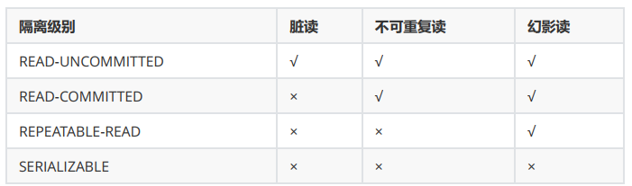
>
> MySQL InnoDB 存储引擎的默认支持的隔离级别是**REPEATABLE-READ（可重读)**。我们可以通过 SELECT @@tx_isolation; 命令来查看
>
> ```sh
> mysql\> SELECT @@tx_isolation;
> 
> +---------------------------------+
> 
> |@@tx_isolation |
> 
> +-----------------------------------+
> 
> | REPEATABLE-READ |
> 
> +------------------------------------+
> ```
>
> 这里需要注意的是：与 SQL 标准不同的地方在于 InnoDB 存储引擎在**REPEATABLE-READ（可重读）**事务隔离级别下使用的是Next-Key Lock 锁算法，因此可以避免幻读的产生，这与其他数据库系统(如 SQL Server)是不同的。所以说InnoDB 存储引擎的默认支持的隔离级别是**REPEATABLE-READ（可重读）**已经可以完全保证事务的隔离性要求，即达到了 SQL标准的**SERIALIZABLE(可串行化)**隔离级别。因为隔离级别越低，事务请求的锁越少，所以大部分数据库系统的隔离级别都是**READ-COMMITTED(读取提交内容)**，但是你要知道的是InnoDB 存储引擎默认使用**REPEAaTABLE-READ（可重读）**并不会有任何性能损失。
>
> InnoDB 存储引擎在**分布式事务**的情况下一般会用到**SERIALIZABLE(可串行化)**隔离级别。

## 12，大表如何优化？

> 当MySQL单表记录数过大时，数据库的CRUD性能会明显下降，一些常见的优化措施如下：

### 1.限定数据的范围

> 务必禁止不带任何限制数据范围条件的查询语句。比如：我们当用户在查询订单历史的时候，我们可以控制在一个月的范围内；

### 2.读/写分离

> 经典的数据库拆分方案，主库负责写，从库负责读；

### 3.垂直分区

> **根据数据库里面数据表的相关性进行拆分。**例如，用户表中既有用户的登录信息又有用户的基本信息，可以将用户表拆分成两个单独的表，甚至放到单独的库做分库。
>
> **简单来说垂直拆分是指数据表列的拆分，把一张列比较多的表拆分为多张表。**如下图所示，这样来说大家应该就更容易理解了。
>
> [1583307481617](https://github.com/gsjqwyl/JavaInterview)
>
> **垂直拆分的优点：**可以使得列数据变小，在查询时减少读取的Block数，减少I/O次数。此外，垂直分区可以简化表的结构，易于维护。
>
> **垂直拆分的缺点：**主键会出现冗余，需要管理冗余列，并会引起Join操作，可以通过在应用层进行Join来解决。此外，垂直分区会让事务变得更加复杂；

### 4.水平分区

#### 保持数据表结构不变，通过某种策略存储数据分片。这样每一片数据分散到不同的表或者库中，达到了分布式的目的。水平拆分可以支撑非常大的数据量。

> 水平拆分是指数据表行的拆分，表的行数超过200万行时，就会变慢，这时可以把一张的表的数据拆成多张表来存放。举个例子：我们可以将用户信息表拆分成多个用户信息表，这样就可以避免单一表数据量过大对性能造成影响。
>
> [1583308353521](https://github.com/gsjqwyl/JavaInterview)
>
> 水平拆分可以支持非常大的数据量。需要注意的一点是：分表仅仅是解决了单一表数据过大的问
>
> 题，但由于表的数据还是在同一台机器上，其实对于提升MySQL并发能力没有什么意义，所以**水平拆分最好分库**。
>
> 水平拆分能够**支持非常大的数据量存储，应用端改造也少**，但**分片事务难以解决**，跨节点Join性能较差，逻辑复杂。《Java工程师修炼之道》的作者推荐**尽量不要对数据进行分片，因为拆分会带来逻辑、部署、运维的各种复杂度**，一般的数据表在优化得当的情况下支撑千万以下的数据量是没有太大问题的。如果实在要分片，尽量选择客户端分片架构，这样可以减少一次和中间件的网络I/O。

#### 下面补充一下数据库分片的两种常见方案：

> **客户端代理：分片逻辑在应用端，封装在jar包中，通过修改或者封装JDBC层来实现。**当当网的**Sharding-JDBC**、阿里的TDDL是两种比较常用的实现。
>
> **中间件代理：在应用和数据中间加了一个代理层。分片逻辑统一维护在中间件服务中。**我们现在谈的**Mycat**、360的Atlas、网易的DDB等等都是这种架构的实现。
>
> 详细内容可以参考： MySQL大表优化方案: [<span class="underline">https://segmentfault.com/a/1190000006158186</span>](https://segmentfault.com/a/1190000006158186)

## 13、分库分表之后,id 主键如何处理？

> 因为要是分成多个表之后，每个表都是从1 开始累加，这样是不对的，我们需要一个全局唯一的 id
>
> 来支持。
>
> 生成全局 id 有下面这几种方式：
>
> **UUID**：不适合作为主键，因为太长了，并且无序不可读，查询效率低。比较适合用于生成唯一的名字的标示比如文件的名字。
>
> **数据库自增 id**: 两台数据库分别设置不同步长，生成不重复ID的策略来实现高可用。这种方式生成的 id 有序，但是需要独立部署数据库实例，成本高，还会有性能瓶颈。
>
> **利用 redis 生成 id :**性能比较好，灵活方便，不依赖于数据库。但是，引入了新的组件造成系统更加复杂，可用性降低，编码更加复杂，增加了系统成本。
>
> **Twitter的snowflake算法**：Github 地址：[<span class="underline">https://github.com/twitter-archive/snowflake。</span>](https://github.com/twitter-archive/snowflake%E3%80%82)**美团的Leaf分布式ID生成系统**：Leaf 是美团开源的分布式ID生成器，能保证全局唯一性、趋势递增、单调递增、信息安全，里面也提到了几种分布式方案的对比，但也需要依赖关系数据[库、Zookeeper等中间件。感觉还不错。美团技术团队的一篇文章：<span class="underline">https://tech.meituan.co</span> <span class="underline">m/2017/04/21/mt-leaf.html</span> 。](https://tech.meituan.com/2017/04/21/mt-leaf.html)

## 14、说说在 MySQL 中一条查询 SQL 是如何执行的？

> 比如下面这条SQL语句：
>
> ```sql
> select name from t_user where id=1
> ```
>
> 1.  **取得链接**，使用使用到 MySQL 中的连接器。
>
> 2.  **查询缓存**，key 为 SQL 语句，value 为查询结果，如果查到就直接返回。不建议使用次缓存，在 MySQL 8.0 版本已经将查询缓存删除，也就是说 MySQL 8.0 版本后不存在此功能。
>
> 3.  **分析器**，分为词法分析和语法分析。此阶段只是做一些 SQL 解析，语法校验。所以一般语法错误在此阶段。
>
> 4.  **优化器**，是在表里有多个索引的时候，决定使用哪个索引；或者一个语句中存在多表关联的时候（join），决定各个表的连接顺序。
>
> 5.  **执行器**，通过分析器让 SQL 知道你要干啥，通过优化器知道该怎么做，于是开始执行语句。执行语句的时候还要判断是否具备此权限，没有权限就直接返回提示没有权限的错误；有权限则打开表，根据表的引擎定义，去使用这个引擎提供的接口，获取这个表的第一行，判断 id 是都等于1。如果是，直接返回；如果不是继续调用引擎接口去下一行，重复相同的判断，直到取到这个表的最后一行，最后返回。

## 15、索引有什么优缺点？


## 16、 MySQL 中 varchar 与 char 的区别？varchar(30)中的30代表的涵义？

> varchar 与 char 的区别，char 是一种固定长度的类型，varchar 则是一种可变长度的类型。
>
> varchar(30)中30 的涵义最多存放30 个字符。varchar(30)和(130)存储 hello 所占空间一样，但后者在排序时会消耗更多内存，因为 ORDER BY col 采用fixed_length 计算 col 长度（memory 引擎也一样）。
>
> 对效率要求高用 char，对空间使用要求高用 varchar。

## 17、 int(11)中的11 代表什么涵义？

> int(11)中的11，不影响字段存储的范围，只影响展示效果。

## 18、为什么 SELECT COUNT(\*) FROM table 在 InnoDB 比MyISAM 慢？

> 对于 SELECT COUNT(\*) FROM table 语句，在没有 WHERE 条件的情况下，InnoDB 比 MyISAM 可能会慢很多，尤其在大表的情况下。因为，InnoDB 是去实时统计结果，会**全表扫描**；而 MyISAM内部维持了一个计数器，预存了结果，所以直接返回即可。

## 说说 InnoDB 与 MyISAM 有什么区别？

> 在 MySQL 5.1 及之前的版本中，MyISAM 是默认的存储引擎，而在 MySQL 5.5 版本以后，默认使用 InnoDB 存储引擎。
>
> MyISAM 不支持行级锁，换句话说，MyISAM 会对整张表加锁，而不是针对行。同时，
>
> MyISAM 不支持事务和外键。MyISAM 可被压缩，存储空间较小，而且 MyISAM 在筛选大量数据时非常快。
>
> InnoDB 是事务型引擎，当事务异常提交时，会被回滚。同时，InnoDB 支持行锁。此外，
>
> InnoDB 需要更多存储空间，会在内存中建立其专用的缓冲池用于高速缓冲数据和索引。
>
> InnoDB 支持自动奔溃恢复特性。
>
> 建议：一般情况下，个人建议优先选择 InnoDB 存储引擎，并且尽量不要将 InnoDB 与 MyISAM 混合使用。

## 20、MySQL 索引类型有哪些？

### 主键索引

> 索引列中的值必须是唯一的，不允许有空值。**普通索引**
>
> MySQL中基本索引类型，没有什么限制，允许在定义索引的列中插入重复值和空值。**唯一索引**
>
> 索引列中的值必须是唯一的，但是允许为空值。**全文索引**
>
> 只能在文本类型CHAR,VARCHAR,TEXT类型字段上创建全文索引。字段长度比较大时，如果创建普通索引，在进行like模糊查询时效率比较低，这时可以创建全文索引。MyISAM和InnoDB中都可以使用全文索引。

### 空间索引

> MySQL在5.7之后的版本支持了空间索引，而且支持OpenGIS几何数据模型。MySQL在空间索引这方面遵循OpenGIS几何数据模型规则。

### 前缀索引

> 在文本类型如CHAR,VARCHAR,TEXT类列上创建索引时，可以指定索引列的长度，但是数值类型不能指定。
>
> 其他（按照索引列数量分类）
>
> 1.  单列索引
> 2.  组合索引
>
> 组合索引的使用，需要遵循**最左前缀匹配原则（最左匹配原则）**。一般情况下在条件允许的情况下使用组合索引替代多个单列索引使用。

## 21、什么时候不要使用索引？

> 1.  经常增删改的列不要建立索引；
>
> 2.  有大量重复的列不建立索引；
>
> 3.  表记录太少不要建立索引。

## 22、说说什么是 MVCC？

> 多版本并发控制（MVCC=Multi-Version Concurrency Control），是一种用来解决读-写冲突的无锁并发控制。也就是为事务分配单向增长的时间戳，为每个修改保存一个版本。版本与事务时间戳关联，读操作只读该事务开始前的数据库的快照（复制了一份数据）。这样在读操作不用阻塞写操作，写操作不用阻塞读操作的同时，避免了脏读和不可重复读。

## 23、MVCC 可以为数据库解决什么问题？

> 在并发读写数据库时，可以做到在读操作时不用阻塞写操作，写操作也不用阻塞读操作，提高了数据库并发读写的性能。同时还可以解决脏读、幻读、不可重复读等事务隔离问题，但不能解决更新丢失问题。

## 24、说说 MVCC 的实现原理

> MVCC 的目的就是多版本并发控制，在数据库中的实现，就是为了解决读写冲突，它的实现原理主要是依赖记录中的3 个隐式字段、undo 日志、Read View 来实现的。

## 25、MySQL 事务隔离级别？

> READ UNCOMMITTED（未提交读）：事务中的修改，即使没有提交，对其他事务也都是可见的。会导致脏读。
>
> READ COMMITTED（提交读）：事务从开始直到提交之前，所做的任何修改对其他事务都是不可见的。会导致不可重复读。这个隔离级别，也可以叫做"不可重复读"。
>
> REPEATABLE READ（可重复读）：一个事务按相同的查询条件读取以前检索过的数据，其他事务插入了满足其查询条件的新数据。产生幻行，会导致幻读。（MySQL 默认隔离级别） SERIALIZABLE（可串行化）：强制事务串行执行。

## 26、请说说 MySQL 数据库的锁？

> 关于 MySQL 的锁机制，可能会问很多问题，不过这也得看面试官在这方面的知识储备。
>
> MySQL 中有共享锁和排它锁，也就是读锁和写锁。
>
> 1.  共享锁：不堵塞，多个用户可以同一时刻读取同一个资源，相互之间没有影响。
>
> 2.  排它锁：一个写操作阻塞其他的读锁和写锁，这样可以只允许一个用户进行写入，防止其他用户读取正在写入的资源。
>
> 3.  表锁：系统开销最小，会锁定整张表，MyISAM 使用表锁。
>
> 4.  行锁：容易出现死锁，发生冲突概率低，并发高，InnoDB 支持行锁（必须有索引才能实现，否则会自动锁全表，那么就不是行锁了）。

## 27、说说什么是锁升级？

> MySQL 行锁只能加在索引上，如果操作不走索引，就会升级为表锁。因为 InnoDB 的行锁是加在索引上的，如果不走索引，自然就没法使用行锁了，原因是 InnoDB 是将 primary key index和相关的行数据共同放在 B+树的叶节点。InnoDB 一定会有一个 primary key，secondary
>
> index 查找的时候，也是通过找到对应的 primary，再找对应的数据行。
>
> 当非唯一索引上记录数超过一定数量时，行锁也会升级为表锁。测试发现当非唯一索引相同的内容不少于整个表记录的二分之一时会升级为表锁。因为当非唯一索引相同的内容达到整个记录的二分之一时，索引需要的性能比全文检索还要大，查询语句优化时会选择不走索引，造成索引失效，行锁自然就会升级为表锁。

## 28、说说悲观锁和乐观锁

#### 悲观锁

> 说的是数据库被外界（包括本系统当前的其他事物以及来自外部系统的事务处理）修改保持着保守态度，因此在整个数据修改过程中，将数据处于锁状态。悲观的实现往往是依靠数据库提供的锁机制，也只有数据库层面提供的锁机制才能真正保证数据访问的排他性，否则，即使在本系统汇总实现了加锁机制，也是没有办法保证系统不会修改数据。
>
> 在悲观锁的情况下，为了保证事务的隔离性，就需要一致性锁定读。读取数据时给加锁，其它事务无法修改这些数据。修改删除数据时也要加锁，其它事务无法读取这些数据。

#### 乐观锁

> 相对悲观锁而言，乐观锁机制采取了更加宽松的加锁机制。悲观锁大多数情况下依靠数据库的锁机制实现，以保证操作最大程度的独占性。但随之而来的就是数据库性能的大量开销，特别是对长事务而言，这样的开销往往无法承受。
>
> 而乐观锁机制在一定程度上解决了这个问题。乐观锁，大多是基于数据版本（Version）记录机制实现。何谓数据版本？即为数据增加一个版本标识，在基于数据库表的版本解决方案中，一般是通过为数据库表增加一个"version"字段来实现。读取出数据时，将此版本号一同读出，之后更新时，对此版本号加一。此时，将提交数据的版本数据与数据库表对应记录的当前版本信息进行比对，如果提交的数据版本号大于数据库表当前版本号，则予以更新，否则认为是过期数据。

## 29、怎样尽量避免死锁的出现？

> 1.  设置获取锁的超时时间，至少能保证最差情况下，可以退出程序，不至于一直等待导致死锁；
>
> 2.  设置按照同一顺序访问资源，类似于串行执行；
>
> 3.  避免事务中的用户交叉；
>
> 4.  保持事务简短并在一个批处理中；
>
> 5.  使用低隔离级别；
>
> 6.  使用绑定链接。

## 30、使用 MySQL 的索引应该注意些什么？


## 31、CHAR 和 VARCHAR 的区别？

> CHAR 和VARCHAR 类型在存储和检索方面有所不同
>
> CHAR 列长度固定为创建表时声明的长度，长度值范围是1 到255当 CHAR 值被存储时，它们被用空格填充到特定长度，检索CHAR 值时需删除尾随空格。

## 32、主键和候选键有什么区别？

> 表格的每一行都由主键唯一标识,一个表只有一个主键。主键也是候选键。按照惯例，候选键可以被指定为主键，并且可以用于任何外键引用。

## 33、主键与索引有什么区别？

> 主键一**定会创建一个唯一索引，但是有唯一索引的列不一定是主键；**主键不允许为空值，唯一索引列允许空值；
>
> 一个表只能有一个主键，但是可以有多个唯一索引；主键可以被**其他表引用为外键，唯一索引列不可以；**
>
> 主键是一种约束，而唯一索引是一种索引，是表的冗余数据结构，两者有本

## 34、 MySQL 如何做到高可用方案？

> MySQL 高可用，意味着不能一台 MySQL 出了问题，就不能访问了。
>
> 1.  MySQL 高可用：分库分表，通过 MyCat 连接多个 MySQL
>
> 2.  MyCat 也得高可用：Haproxy，连接多个 MyCat
>
> 3.  Haproxy 也得高可用：通过 keepalived 辅助 Haproxy

# 八、SpringCloud篇

## 1、什么是SpringCloud

> Spring cloud 流应用程序启动器是基于 Spring Boot 的 Spring 集成应用程序，提供与外部系统的集成。Spring cloud Task，一个生命周期短暂的微服务框架，用于快速构建执行有限数据处理的应用程序。

## 2、什么是微服务

> 微服务架构是一种架构模式或者说是一种架构风格，它提倡将单一应用程序划分为一组小的服务，每个服务运行在其独立的自己的进程中，服务之间相互协调、互相配合，为用户提供最终价值。服务之间采用轻量级的通信机制互相沟通（通常是基于HTTP的RESTful API）,每个服务都围绕着具体的业务进行构建，并且能够被独立的构建在生产环境、类生产环境等。另外，应避免统一的、集中
>
> 式的服务管理机制，对具体的一个服务而言，应根据业务上下文，选择合适的语言、工具对其进行构建，可以有一个非常轻量级的集中式管理来协调这些服务，可以使用不同的语言来编写服务，也可以使用不同的数据存储。

## 3、SpringCloud有什么优势

> 使用 Spring Boot 开发分布式微服务时，我们面临以下问题
>
> （1）与分布式系统相关的复杂性-这种开销包括网络问题，延迟开销，带宽问题，安全问题。
>
> （2）服务发现-服务发现工具管理群集中的流程和服务如何查找和互相交谈。它涉及一个服务目录，在该目录中注册服务，然后能够查找并连接到该目录中的服务。
>
> （3）冗余-分布式系统中的冗余问题。
>
> （4）负载平衡\--负载平衡改善跨多个计算资源的工作负荷，诸如计算机，计算机集群，网络链路，中央处理单元，或磁盘驱动器的分布。
>
> （5）性能-问题由于各种运营开销导致的性能问题。
>
> （6）部署复杂性-Devops 技能的要求。

## 4、什么是服务熔断？什么是服务降级？

> 熔断机制是应对雪崩效应的一种微服务链路保护机制。当某个微服务不可用或者响应时间太长时，会进行服务降级，进而熔断该节点微服务的调用，快速返回"错误"的响应信息。当检测到该节点微服务调用响应正常后恢复调用链路。在SpringCloud框架里熔断机制通过Hystrix实现，Hystrix会监控微服务间调用的状况，当失败的调用到一定阈值，缺省是5秒内调用20次，如果失败，就会启动熔断机制。
>
> 服务降级，一般是从整体负荷考虑。就是当某个服务熔断之后，服务器将不再被调用，此时客户端可以自己准备一个本地的fallback回调，返回一个缺省值。这样做，虽然水平下降，但好歹可用，比直接挂掉强。
>
> **Hystrix相关注解**@EnableHystrix：开启熔断@HystrixCommand(fallbackMethod="XXX")：声明一个失败回滚处理函数XXX，当被注解的方法执行超时（默认是1000毫秒），就会执行fallback函数，返回错误提示。

## 5、 Eureka和zookeeper都可以提供服务注册与发现的功能，请说说两个的区别？

> Zookeeper保证了CP（C：一致性，P：分区容错性），Eureka保证了AP（A：高可用）
>
>  1.当向注册中心查询服务列表时，我们可以容忍注册中心返回的是几分钟以前的信息，但不能容忍直接
>
> down掉不可用。也就是说，服务注册功能对高可用性要求比较高，但zk会出现这样一种情况，当
>
> master节点因为网络故障与其他节点失去联系时，剩余节点会重新选leader。问题在于，选取
>
> leader时间过长，30 \~120s，且选取期间zk集群都不可用，这样就会导致选取期间注册服务瘫痪。在云部署的环境下，因网络问题使得zk集群失去master节点是较大概率会发生的事，虽然服务能够恢复，但是漫长的选取时间导致的注册长期不可用是不能容忍的。
>
> 2.Eureka保证了可用性，Eureka各个节点是平等的，几个节点挂掉不会影响正常节点的工作，剩余的节点仍然可以提供注册和查询服务。而Eureka的客户端向某个Eureka注册或发现时发生连接失败，则会自动切换到其他节点，只要有一台Eureka还在，就能保证注册服务可用，只是查到的信息可能不是最新的。除此之外，Eureka还有自我保护机制，如果在15分钟内超过85%的节点没有正常的心跳，那么Eureka就认为客户端与注册中心发生了网络故障，此时会出现以下几种情况：
>
> ①、Eureka不在从注册列表中移除因为长时间没有收到心跳而应该过期的服务。
>
>  ②、Eureka仍然能够接受新服务的注册和查询请求，但是不会被同步到其他节点上（即保证当前节点仍然可用）
>
>  ③、当网络稳定时，当前实例新的注册信息会被同步到其他节点。
>
> 因此，Eureka可以很好的应对因网络故障导致部分节点失去联系的情况，而不会像Zookeeper那样使整个微服务瘫痪

## 6、SpringBoot和SpringCloud的区别？

> SpringBoot专注于快速方便的开发单个个体微服务。
>
> SpringCloud是关注全局的微服务协调整理治理框架，它将SpringBoot开发的一个个单体微服务整合并管理起来，
>
> 为各个微服务之间提供，配置管理、服务发现、断路器、路由、微代理、事件总线、全局锁、决策竞选、分布式会话等等集成服务
>
> SpringBoot可以离开SpringCloud独立使用开发项目，但是SpringCloud离不开SpringBoot ，属于依赖的关系.
>
> SpringBoot专注于快速、方便的开发单个微服务个体，SpringCloud关注全局的服务治理框架。

## 7、负载平衡的意义什么？

> 在计算中，负载平衡可以改善跨计算机，计算机集群，网络链接，中央处理单元或磁盘驱动器等多种计算资源的工作负载分布。负载平衡旨在优化资源使用，最大化吞吐量，最小化响应时间并避免任何单一资源的过载。使用多个组件进行负载平衡而不是单个组件可能会通过冗余来提高可靠性和可用性。负载平衡通常涉及专用软件或硬件，例如多层交换机或域名系统服务器进程。

## 8、什么是Hystrix？它如何实现容错？

> Hystrix是一个延迟和容错库，旨在隔离远程系统，服务和第三方库的访问点，当出现故障是不可避免的故障时，停止级联故障并在复杂的分布式系统中实现弹性。
>
> 通常对于使用微服务架构开发的系统，涉及到许多微服务。这些微服务彼此协作。
>
> 思考以下微服务
>
> 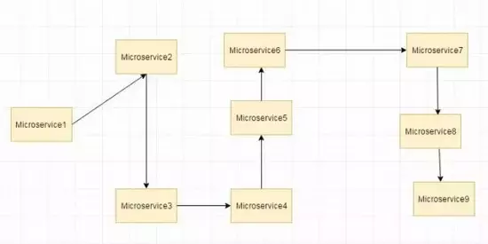
>
> 假设如果上图中的微服务9失败了，那么使用传统方法我们将传播一个异常。但这仍然会导致整个系统崩溃。
>
> 随着微服务数量的增加，这个问题变得更加复杂。微服务的数量可以高达1000.这是hystrix出现的地方我们将使用Hystrix在这种情况下的Fallback方法功能。我们有两个服务employee-consumer使用由employee-consumer公开的服务。
>
> 简化图如下所示
>
> 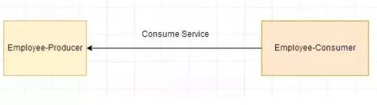
>
> 现在假设由于某种原因，employee-producer公开的服务会抛出异常。我们在这种情况下使用
>
> Hystrix定义了一个回退方法。这种后备方法应该具有与公开服务相同的返回类型。如果暴露服务中出现异常，则回退方法将返回一些值。

## 9、什么是Hystrix断路器？我们需要它吗？

> 由于某些原因，employee-consumer公开服务会引发异常。在这种情况下使用Hystrix我们定义了一个回退方法。如果在公开服务中发生异常，则回退方法返回一些默认值。
>
> 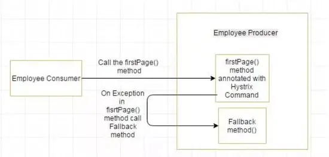
>
> 如果firstPage method()中的异常继续发生，则Hystrix电路将中断，并且员工使用者将一起跳过
>
> firtsPage方法，并直接调用回退方法。断路器的目的是给第一页方法或第一页方法可能调用的其他方法留出时间，并导致异常恢复。可能发生的情况是，在负载较小的情况下，导致异常的问题有更好的恢复机会。
>
> 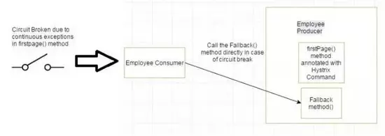

## 10、说说 RPC 的实现原理

> 首先需要有处理网络连接通讯的模块，负责连接建立、管理和消息的传输。其次需要有编解码的模块，因为网络通讯都是传输的字节码，需要将我们使用的对象序列化和反序列化。剩下的就是客户端和服务器端的部分，服务器端暴露要开放的服务接口，客户调用服务接口的一个代理实现，这个代理实现负责收集数据、编码并传输给服务器然后等待结果返回。

## 11，eureka自我保护机制是什么?

> 当Eureka Server 节点在短时间内丢失了过多实例的连接时（比如网络故障或频繁启动关闭客户端）节点会进入自我保护模式，保护注册信息，不再删除注册数据，故障恢复时，自动退出自我保护模式。

## 12，什么是Ribbon？

> ribbon是一个负载均衡客户端，可以很好的控制htt和tcp的一些行为。feign默认集成了ribbon。

## 13，什么是feigin ？它的优点是什么？

> 1.feign采用的是基于接口的注解2.feign整合了ribbon，具有负载均衡的能力3.整合了Hystrix，具有熔断的能力
>
> 使用:
>
>  1.添加pom依赖。
>
>  2.启动类添加@EnableFeignClients 
>
> 3.定义一个接口@FeignClient(name="xxx")指定调用哪个服务

## 14， Ribbon和Feign的区别？

> 1.Ribbon都是调用其他服务的，但方式不同。
>
>  2.启动类注解不同，Ribbon是@RibbonClient feign的是@EnableFeignClients 
>
> 3.服务指定的位置不同，Ribbon是在@RibbonClient注解上声明，Feign则是在定义抽象方法的接口中使用@FeignClient声明。
>
>  4.调用方式不同，Ribbon需要自己构建http请求，模拟http请求

# 九、Dubbo篇

> 其实关于 Dubbo 的面试题，我觉得最好的文档应该还是官网，因为官网有中文版，照顾了很多阅读英文文档吃力的小伙伴。但是官网内容挺多的，于是这里就结合官网和平时面试被问的相对较多的题目整理了一下。

## 1、说说一次 Dubbo 服务请求流程？

> 基本工作流程：
>
> 
>
> 上图中角色说明：
>
> 

## 2、说说 Dubbo 工作原理

> 工作原理分10 层：
>
> 第一层：service 层，接口层，给服务提供者和消费者来实现的（留给开发人员来实现）；第二层：config 层，配置层，主要是对 Dubbo 进行各种配置的，Dubbo 相关配置；
>
> 第三层：proxy 层，服务代理层，透明生成客户端的 stub 和服务单的 skeleton，调用的是接口，实现类没有，所以得生成代理，代理之间再进行网络通讯、负责均衡等；
>
> 第四层：registry 层，服务注册层，负责服务的注册与发现；
>
> 第五层：cluster 层，集群层，封装多个服务提供者的路由以及负载均衡，将多个实例组合成一个服务；
>
> 第六层：monitor 层，监控层，对 rpc 接口的调用次数和调用时间进行监控；第七层：protocol 层，远程调用层，封装 rpc 调用；
>
> 第八层：exchange 层，信息交换层，封装请求响应模式，同步转异步；
>
> 第九层：transport 层，网络传输层，抽象 mina 和 netty 为统一接口；
>
> 第十层：serialize 层，数据序列化层。
>
> 这是个很坑爹的面试题，但是很多面试官又喜欢问，你真的要背么？你能背那还是不错的，我建议不要背，你就想想 Dubbo 服务调用过程中应该会涉及到哪些技术，把这些技术串起来就 OK 了。

#### 面试扩散

> 如果让你设计一个 RPC 框架，你会怎么做？其实你就把上面这个工作原理中涉及的到技术点总结一下就行了。

## 3、Dubbo 支持哪些协议？

> 
>
> 还有三种，混个眼熟就行：Memcached 协议、Redis 协议、Rest 协议。上图基本上把序列化的方式也罗列出来了。
>
> 详细请参考：Dubbo 官网：http://dubbo.apache.org/zh-cn/docs/user/references/protocol/dubbo.html。

## 4、注册中心挂了，consumer 还能不能调用 provider？

> 可以。因为刚开始初始化的时候，consumer 会将需要的所有提供者的地址等信息拉取到本地缓存，所以注册中心挂了可以继续通信。但是 provider 挂了，那就没法调用了。
>
> 
>
> 关键字：consumer 本地缓存服务列表。

## 5、怎么实现动态感知服务下线的呢？

> 
>
> 服务订阅通常有 pull 和 push 两种方式：
>
> pull 模式需要客户端定时向注册中心拉取配置；
>
> push 模式采用注册中心主动推送数据给客户端。
>
> Dubbo ZooKeeper 注册中心采用是事件通知与客户端拉取方式。服务第一次订阅的时候将会拉取对应目录下全量数据，然后在订阅的节点注册一个 watcher。一旦目录节点下发生任何数据变化，
>
> ZooKeeper 将会通过 watcher 通知客户端。客户端接到通知，将会重新拉取该目录下全量数据，并重新注册 watcher。利用这个模式，Dubbo 服务就可以做到服务的动态发现。
>
> 注意：ZooKeeper 提供了"心跳检测"功能，它会定时向各个服务提供者发送一个请求（实际上建立的是一个 socket 长连接），如果长期没有响应，服务中心就认为该服务提供者已经"挂了"，并将其剔除。

## 6、Dubbo 负载均衡策略？

> 随机（默认）：随机来轮训：一个一个来
>
> 活跃度：机器活跃度来负载
>
> 一致性 hash：落到同一台机器上

## 7、 Dubbo 容错策略

#### failover cluster 模式

> provider 宕机重试以后，请求会分到其他的 provider 上，默认两次，可以手动设置重试次数，建议把写操作重试次数设置成0。

#### failback 模式

> 失败自动恢复会在调用失败后，返回一个空结果给服务消费者。并通过定时任务对失败的调用进行重试，适合执行消息通知等操作。

#### failfast cluster 模式

> 快速失败只会进行一次调用，失败后立即抛出异常。适用于幂等操作、写操作，类似于 failover
>
> cluster 模式中重试次数设置为0 的情况。

#### failsafe cluster 模式

> 失败安全是指，当调用过程中出现异常时，仅会打印异常，而不会抛出异常。适用于写入审计日志等操作。

#### forking cluster 模式

> 并行调用多个服务器，只要一个成功即返回。通常用于实时性要求较高的读操作，但需要浪费更多服务资源。可通过<span class="underline">forks=\"2\"</span> 来设置最大并行数。

#### broadcacst cluster 模式

> 广播调用所有提供者，逐个调用，任意一台报错则报错。通常用于通知所有提供者更新缓存或日志等本地资源信息。

## 8、Dubbo 动态代理策略有哪些？

> 默认使用 javassist 动态字节码生成，创建代理类，但是可以通过 SPI 扩展机制配置自己的动态代理策略。

## 9、说说 Dubbo 与 Spring Cloud 的区别？

> 这是很多面试官喜欢问的问题，本人认为其实他们没什么关联之处，但是硬是要问区别，那就说说吧。
>
> 回答的时候主要围绕着四个关键点来说：通信方式、注册中心、监控、断路器，其余像 Spring 分布式配置、服务网关肯定得知道。

#### 通信方式

> Dubbo 使用的是 RPC 通信；Spring Cloud 使用的是 HTTP RestFul 方式。**注册中心**
>
> Dubbo 使用 ZooKeeper（官方推荐），还有 Redis、Multicast、Simple 注册中心，但不推荐。；
>
> Spring Cloud 使用的是 Spring Cloud Netflix Eureka。**监控**
>
> Dubbo 使用的是 Dubbo-monitor；Spring Cloud 使用的是 Spring Boot admin。**断路器**
>
> Dubbo 在断路器这方面还不完善，Spring Cloud 使用的是 Spring Cloud Netflix Hystrix。分布式配置、网关服务、服务跟踪、消息总线、批量任务等。
>
> Dubbo 目前可以说还是空白，而 Spring Cloud 都有相应的组件来支撑。

## 10、Zookeeper 和 Dubbo 的关系？

#### Zookeeper的作用

> zookeeper用来注册服务和进行负载均衡，哪一个服务由哪一个机器来提供必需让调用者知道，简单来说就是ip地址和服务名称的对应关系。当然也可以通过硬编码的方式把这种对应关系在调用方业务代码中实现，但是如果提供服务的机器挂掉调用者无法知晓，如果不更改代码会继续请求挂掉的机器提供服务。zookeeper通过心跳机制可以检测挂掉的机器并将挂掉机器的ip和服务对应关系从列表中删除。至于支持高并发，简单来说就是横向扩展，在不更改代码的情况通过添加机器来提高运算能力。通过添加新的机器向zookeeper注册服务，服务的提供者多了能服务的客户就多了。

#### dubbo

> 是管理中间层的工具，在业务层到数据仓库间有非常多服务的接入和服务提供者需要调度，dubbo提供一个框架解决这个问题。注意这里的dubbo只是一个框架，至于你架子上放什么是完全取决于你的，就像一个汽车骨架，你需要配你的轮子引擎。这个框架中要完成调度必须要有一个分布式的注册中心，储存所有服务的元数据，你可以用zk，也可以用别的，只是大家都用zk。

#### zookeeper和dubbo的关系

> Dubbo 的将注册中心进行抽象，它可以外接不同的存储媒介给注册中心提供服务，有
>
> ZooKeeper，Memcached，Redis 等。
>
> 引入了 ZooKeeper 作为存储媒介，也就把 ZooKeeper 的特性引进来。首先是负载均衡，单注册中心的承载能力是有限的，在流量达到一定程度的时候就需要分流，负载均衡就是为了分流而存在的，一个 ZooKeeper 群配合相应的 Web 应用就可以很容易达到负载均衡；资源同步，单单有负载均衡还不够，节点之间的数据和资源需要同步，ZooKeeper 集群就天然具备有这样的功能；命名服务，将树状结构用于维护全局的服务地址列表，服务提供者在启动的时候，向 ZooKeeper 上的指定节点<span class="underline">/dubbo/\${serviceName}/providers</span> 目录下写入自己的 URL 地址，这个操作就完成了服务的发布。其他特性还有 Mast 选举，分布式锁等。
>
> 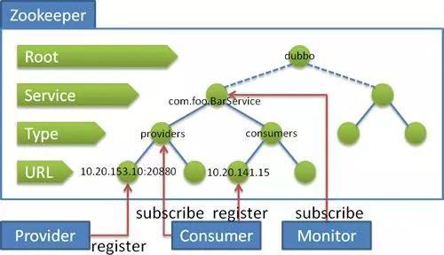

# 十、Nginx篇

## 1、简述一下什么是Nginx，它有什么优势和功能？

> Nginx是一个web服务器和方向代理服务器，用于HTTP、HTTPS、SMTP、POP3和IMAP协议。因它的稳定性、丰富的功能集、示例配置文件和低系统资源的消耗而闻名。
>
> Nginx\-\--Ngine X，是一款免费的、自由的、开源的、高性能HTTP服务器和反向代理服务器；也是一个IMAP、POP3、SMTP代理服务器；Nginx以其高性能、稳定性、丰富的功能、简单的配置和低资源消耗而闻名。
>
> 也就是说Nginx本身就可以托管网站（类似于Tomcat一样），进行Http服务处理，也可以作为反向代理服务器、负载均衡器和HTTP缓存。
>
> Nginx 解决了服务器的C10K（就是在一秒之内连接客户端的数目为10k即1万）问题。它的设计不像传统的服务器那样使用线程处理请求，而是一个更加高级的机制---事件驱动机制，是一种异步事件驱动结构。
>
> 优点：
>
> **（1）更快**这表现在两个方面：一方面，在正常情况下，单次请求会得到更快的响应；另一方面，在高峰期（如有数以万计的并发请求），Nginx可以比其他Web服务器更快地响应请求。
>
> **（2）高扩展性，跨平台** Nginx的设计极具扩展性，它完全是由多个不同功能、不同层次、不同类型且耦合度极低的模块组成。因此，当对某一个模块修复Bug或进行升级时，可以专注于模块自身，无须在意其他。而且在HTTP模块中，还设计了HTTP过滤器模块：一个正常的HTTP模块在处理完请求后，会有一串HTTP过滤器模块对请求的结果进行再处理。这样，当我们开发一个新的HTTP模块时，不但可以使用诸如HTTP核心模块、events模块、log模块等不同层次或者不同类型的模块，还可以原封不动地复用大量已有的HTTP过滤器模块。这种低耦合度的优秀设计，造就了Nginx庞大的第三方模块，当然，公开的第三方模块也如官方发布的模块一样容易使用。 Nginx的模块都是嵌入到二进制文件中执行的，无论官方发布的模块还是第三方模块都是如此。这使得第三方模块一样具备极其优秀的性能，充分利用Nginx的高并发特性，因此，许多高流量的网站都倾向于开发符合自己业务特性的定制模块。
>
> **（3）高可靠性：用于反向代理，宕机的概率微乎其微**高可靠性是我们选择Nginx的最基本条件，因为Nginx的可靠性是大家有目共睹的，很多家高流量网站都在核心服务器上大规模使用Nginx。
>
> Nginx的高可靠性来自于其核心框架代码的优秀设计、模块设计的简单性；另外，官方提供的常用模块都非常稳定，每个worker进程相对独立，master进程在1个worker进程出错时可以快速"拉起"新的worker子进程提供服务。
>
> **（4）低内存消耗**一般情况下，10 000个非活跃的HTTP Keep-Alive连接在Nginx中仅消耗2.5MB的内存，这是Nginx支持高并发连接的基础。
>
> **（5）单机支持10万以上的并发连接**这是一个非常重要的特性！随着互联网的迅猛发展和互联网用户数量的成倍增长，各大公司、网站都需要应付海量并发请求，一个能够在峰值期顶住10万以上并发请求的Server，无疑会得到大家的青睐。理论上，Nginx支持的并发连接上限取决于内存，10万远未封顶。当然，能够及时地处理更多的并发请求，是与业务特点紧密相关的。
>
> **（6）热部署** master管理进程与worker工作进程的分离设计，使得Nginx能够提供热部署功能，即可以在7×24小时不间断服务的前提下，升级Nginx的可执行文件。当然，它也支持不停止服务就更新配置项、更换日志文件等功能。
>
> **（7）最自由的BSD许可协议**这是Nginx可以快速发展的强大动力。BSD许可协议不只是允许用户免费使用Nginx，它还允许用户在自己的项目中直接使用或修改Nginx源码，然后发布。这吸引了无数开发者继续为Nginx贡献自己的智慧。以上7个特点当然不是Nginx的全部，拥有无数个官方功能模块、第三方功能模块使得Nginx能够满足绝大部分应用场景，这些功能模块间可以叠加以实现更加强大、复杂的功能，有些模块还支持Nginx与Perl、Lua等脚本语言集成工作，大大提高了开发效率。这些特点促使用户在寻找一个Web服务器时更多考虑Nginx。选择Nginx的核心理由还是它能在支持高并发请求的同时保持高效的服务。

## 2、Nginx是如何处理一个HTTP请求的呢？

> Nginx 是一个高性能的 Web 服务器，能够同时处理大量的并发请求。它结合多进程机制和异步机制
>
> ，异步机制使用的是异步非阻塞方式，接下来就给大家介绍一下 Nginx 的多线程机制和异步非阻塞机制。

#### 1、多进程机制

> 服务器每当收到一个客户端时，就有服务器主进程（ master process ）生成一个子进程（
>
> worker process ）出来和客户端建立连接进行交互，直到连接断开，该子进程就结束了。
>
> 使用进程的好处是各个进程之间相互独立，不需要加锁，减少了使用锁对性能造成影响，同时降低编程的复杂度，降低开发成本。其次，采用独立的进程，可以让进程互相之间不会影响，如果一个进程发生异常退出时，其它进程正常工作， master 进程则很快启动新的 worker 进程，确保服务不会中断，从而将风险降到最低。
>
> 缺点是操作系统生成一个子进程需要进行内存复制等操作，在资源和时间上会产生一定的开销。当有大量请求时，会导致系统性能下降。

#### 2、异步非阻塞机制

> 每个工作进程使用异步非阻塞方式，可以处理多个客户端请求。
>
> 当某个工作进程接收到客户端的请求以后，调用 IO 进行处理，如果不能立即得到结果，就去处理其他请求（即为非阻塞）；而客户端在此期间也无需等待响应，可以去处理其他事情（即为异步）。
>
> 当 IO 返回时，就会通知此工作进程；该进程得到通知，暂时挂起当前处理的事务去响应客户端请求。

## 3、列举一些Nginx的特性

> 1.  Nginx服务器的特性包括：
>
> 2.  反向代理/L7负载均衡器
>
> 3.  嵌入式Perl解释器
>
> 4.  动态二进制升级
>
> 5.  可用于重新编写URL，具有非常好的PCRE支持

## 4、请列举Nginx和Apache 之间的不同点

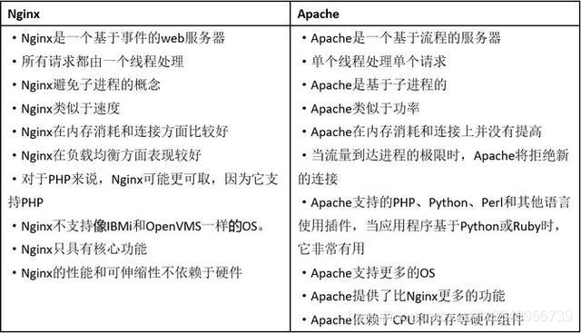

5、在Nginx中，如何使用未定义的服务器名称来阻止处理请求？

> 只需将请求删除的服务器就可以定义为：
>
> ```sh
> Server{
> listen 80;
> server_name "";
> return 444;
> }
> ```
>
> 这里，服务器名被保留为一个空字符串，它将在没有"主机"头字段的情况下匹配请求，而一个特殊的Nginx的非标准代码444被返回，从而终止连接。
>
> 一般推荐 worker 进程数与CPU内核数一致，这样一来不存在大量的子进程生成和管理任务，避免了进程之间竞争CPU 资源和进程切换的开销。而且 Nginx 为了更好的利用多核特性，提供了 CPU亲缘性的绑定选项，我们可以将某一个进程绑定在某一个核上，这样就不会因为进程的切换带来Cache 的失效。
>
> 对于每个请求，有且只有一个工作进程对其处理。首先，每个 worker 进程都是从 master进程fork 过来。在 master 进程里面，先建立好需要 listen 的 socket（listenfd）之后，然后再 fork 出多个 worker 进程。
>
> 所有 worker 进程的 listenfd 会在新连接到来时变得可读，为保证只有一个进程处理该连接，所有
>
> worker 进程在注册 listenfd 读事件前抢占 accept_mutex ，抢到互斥锁的那个进程注册 listenfd 读事件，在读事件里调用 accept 接受该连接。
>
> 当一个 worker 进程在 accept 这个连接之后，就开始读取请求、解析请求、处理请求，产生数据后，再返回给客户端，最后才断开连接。这样一个完整的请求就是这样的了。我们可以看到，一个请求，完全由 worker 进程来处理，而且只在一个 worker 进程中处理。
>
> 在 Nginx 服务器的运行过程中，主进程和工作进程需要进程交互。交互依赖于 Socket 实现的管道来实现。

## 6、请解释Nginx服务器上的Master和Worker进程分别是什么?

> 主程序 Master process 启动后，通过一个 for 循环来接收和处理外部信号；
>
> 主进程通过 fork()函数产生 worker 子进程，每个子进程执行一个 for循环来实现Nginx服务器对事件的接收和处理。

## 7、请解释代理中的正向代理和反向代理

> 首先，代理服务器一般指局域网内部的机器通过代理服务器发送请求到互联网上的服务器，代理服务器一般作用在客户端。例如：GoAgent翻墙软件。我们的客户端在进行翻墙操作的时候，我们使用的正是正向代理，通过正向代理的方式，在我们的客户端运行一个软件，将我们的HTTP请求转发到其他不同的服务器端，实现请求的分发。
>
> 反向代理服务器作用在服务器端，它在服务器端接收客户端的请求，然后将请求分发给具体的服务器进行处理，然后再将服务器的相应结果反馈给客户端。Nginx就是一个反向代理服务器软件。
>
> 从上图可以看出：客户端必须设置正向代理服务器，当然前提是要知道正向代理服务器的IP地址，还有代理程序的端口。反向代理正好与正向代理相反，对于客户端而言代理服务器就像是原始服务器，并且客户端不需要进行任何特别的设置。客户端向反向代理的命名空间（name-space）中的内容发送普通请求，接着反向代理将判断向何处（原始服务器）转交请求，并将获得的内容返回给客户端。

## 8、解释Nginx用途

> Nginx服务器的最佳用法是在网络上部署动态HTTP内容，使用SCGI、WSGI应用程序服务器、用于脚本的FastCGI处理程序。它还可以作为负载均衡器。

# 十一、MQ篇

## 1、为什么要使用MQ

#### 核心：解耦,异步,削峰

> **1）解耦：**A 系统发送数据到 BCD 三个系统，通过接口调用发送。如果 E 系统也要这个数据呢？那如果 C 系统现在不需要了呢？A 系统负责人几乎崩溃\...\...A 系统跟其它各种乱七八糟的系统严重耦合，A 系统产生一条比较关键的数据，很多系统都需要 A 系统将这个数据发送过来。如果使用
>
> MQ，A 系统产生一条数据，发送到 MQ 里面去，哪个系统需要数据自己去 MQ 里面消费。如果新系统需要数据，直接从 MQ 里消费即可；如果某个系统不需要这条数据了，就取消对 MQ 消息的消费即可。这样下来，A 系统压根儿不需要去考虑要给谁发送数据，不需要维护这个代码，也不需要考虑人家是否调用成功、失败超时等情况。
>
> 就是一个系统或者一个模块，调用了多个系统或者模块，互相之间的调用很复杂，维护起来很麻烦。但是其实这个调用是不需要直接同步调用接口的，如果用 MQ 给它异步化解耦。
>
> **（2）异步：**A 系统接收一个请求，需要在自己本地写库，还需要在 BCD 三个系统写库，自己本地写库要3ms，BCD 三个系统分别写库要300ms、450ms、200ms。最终请求总延时是3 +300 +450 +200 = 953ms，接近1s，用户感觉搞个什么东西，慢死了慢死了。用户通过浏览器发起请求。如果使用 MQ，那么 A 系统连续发送3 条消息到 MQ 队列中，假如耗时5ms，A 系统从接受一个请求到返回响应给用户，总时长是3 +5 = 8ms。
>
> **（3）削峰：**减少高峰时期对服务器压力。欢迎关注微信公众号：Java后端技术全栈

## 2、MQ有什么优缺点

> 优点上面已经说了，就是在特殊场景下有其对应的好处，解耦、异步、削峰。**缺点有以下几个：**
>
> **系统可用性降低**系统引入的外部依赖越多，越容易挂掉。万一 MQ 挂了，MQ 一挂，整套系统崩溃，你不就完了？
>
> **系统复杂度提高**硬生生加个 MQ 进来，你怎么保证消息没有重复消费？怎么处理消息丢失的情况？怎么保证消息传递的顺序性？问题一大堆。
>
> **一致性问题** A 系统处理完了直接返回成功了，人都以为你这个请求就成功了；但是问题是，要是
>
> BCD 三个系统那里，BD 两个系统写库成功了，结果 C 系统写库失败了，咋整？你这数据就不一致了。

## 3、Kafka、ActiveMQ、RabbitMQ、RocketMQ 都有什么区别？

> 对于吞吐量来说kafka和RocketMQ支撑高吞吐，ActiveMQ和RabbitMQ比他们低一个数量级。对于延迟量来说RabbitMQ是最低的。

#### 1.从社区活跃度

> 按照目前网络上的资料，RabbitMQ 、activeM 、ZeroMQ 三者中，综合来看，RabbitMQ 是首选。

#### 2.持久化消息比较

> ActiveMq 和RabbitMq 都支持。持久化消息主要是指我们机器在不可抗力因素等情况下挂掉了，消息不会丢失的机制。

#### 3.综合技术实现

> 可靠性、灵活的路由、集群、事务、高可用的队列、消息排序、问题追踪、可视化管理工具、插件系统等等。
>
> RabbitMq / Kafka 最好，ActiveMq 次之，ZeroMq 最差。当然ZeroMq 也可以做到，不过自己必须手动写代码实现，代码量不小。尤其是可靠性中的：持久性、投递确认、发布者证实和高可用性。

#### 4.高并发

> 毋庸置疑，RabbitMQ 最高，原因是它的实现语言是天生具备高并发高可用的erlang 语言。

#### 5.比较关注的比较， RabbitMQ 和 Kafka

> RabbitMq 比Kafka 成熟，在可用性上，稳定性上，可靠性上， RabbitMq 胜于 Kafka （理论上）。
>
> 另外，Kafka 的定位主要在日志等方面，因为Kafka 设计的初衷就是处理日志的，可以看做是一个日志（消息）系统一个重要组件，针对性很强，所以如果业务方面还是建议选择 RabbitMq 。
>
> 还有就是，Kafka 的性能（吞吐量、TPS ）比RabbitMq 要高出来很多。

## 4、如何保证高可用的？

> RabbitMQ 是比较有代表性的，因为是**基于主从**（非分布式）做高可用性的，我们就以 RabbitMQ为例子讲解第一种 MQ 的高可用性怎么实现。RabbitMQ 有三种模式：单机模式、普通集群模式、镜像集群模式。
>
> 单机模式，就是 Demo 级别的，一般就是你本地启动了玩玩儿的?，没人生产用单机模式
>
> 普通集群模式，意思就是在多台机器上启动多个 RabbitMQ 实例，每个机器启动一个。你**创建的 queue，只会放在一个 RabbitMQ 实例上**，但是每个实例都同步 queue 的元数据（元数据可以认为是 queue 的一些配置信息，通过元数据，可以找到 queue 所在实例）。你消费的时候，实际上如果连接到了另外一个实例，那么那个实例会从 queue 所在实例上拉取数据过来。**这方案主要是提高吞吐量的**，就是说让集群中多个节点来服务某个 queue 的读写操作。
>
> 镜像集群模式：这种模式，才是所谓的 RabbitMQ 的高可用模式。跟普通集群模式不一样的是，在镜像集群模式下，你创建的 queue，无论元数据还是 queue 里的消息都会**存在于多个实例上**，就是说，每个 RabbitMQ 节点都有这个 queue 的一个完整镜像，包含 queue 的全部数据的意思。然后每次你写消息到 queue 的时候，都会自动把消息同步到多个实例的 queue 上。RabbitMQ 有很好的管理控制台，就是在后台新增一个策略，这个策略是镜像集群模式的策略，指定的时候是可以要求数据同步到所有节点的，也可以要求同步到指定数量的节点，再次创建 queue 的时候，应用这个策略，就会自动将数据同步到其他的节点上去了。这样的话，好处在于，你任何一个机器宕机
>
> 了，没事儿，其它机器（节点）还包含了这个 queue 的完整数据，别的 consumer 都可以到其它节点上去消费数据。坏处在于，第一，这个性能开销也太大了吧，消息需要同步到所有机器上，导致网络带宽压力和消耗很重！RabbitMQ 一个 queue 的数据都是放在一个节点里的，镜像集群下，也是每个节点都放这个 queue 的完整数据。
>
> Kafka 一个最基本的架构认识：由多个 broker 组成，每个 broker 是一个节点；你创建一个
>
> topic，这个 topic 可以划分为多个 partition，每个 partition 可以存在于不同的 broker 上，每个
>
> partition 就放一部分数据。这就是天然的分布式消息队列，就是说一个 topic 的数据，是**分散放在多个机器上的，每个机器就放一部分数据**。Kafka 0.8 以后，提供了 HA 机制，就是 replica（复制品）副本机制。每个 partition 的数据都会同步到其它机器上，形成自己的多个 replica 副本。所有
>
> replica 会选举一个 leader 出来，那么生产和消费都跟这个 leader 打交道，然后其他 replica 就是
>
> follower。写的时候，leader 会负责把数据同步到所有 follower 上去，读的时候就直接读 leader上的数据即可。只能读写 leader？很简单，要是你可以随意读写每个 follower，那么就要 care 数据一致性的问题，系统复杂度太高，很容易出问题。Kafka 会均匀地将一个 partition 的所有
>
> replica 分布在不同的机器上，这样才可以提高容错性。因为如果某个 broker 宕机了，没事儿，那个 broker上面的 partition 在其他机器上都有副本的，如果这上面有某个 partition 的 leader，那么此时会从 follower 中重新选举一个新的 leader 出来，大家继续读写那个新的 leader 即可。这就有所谓的高可用性了。写数据的时候，生产者就写 leader，然后 leader 将数据落地写本地磁盘，接着其他 follower 自己主动从 leader 来 pull 数据。一旦所有 follower 同步好数据了，就会发送
>
> ack 给 leader，leader 收到所有 follower 的 ack 之后，就会返回写成功的消息给生产者。（当
>
> 然，这只是其中一种模式，还可以适当调整这个行为）消费的时候，只会从 leader 去读，但是只有当一个消息已经被所有 follower 都同步成功返回 ack 的时候，这个消息才会被消费者读到。

## 5、如何保证消息的可靠传输？如果消息丢了怎么办

> 数据的丢失问题，可能出现在生产者、MQ、消费者中
>
> 生产者丢失：生产者将数据发送到 RabbitMQ 的时候，可能数据就在半路给搞丢了，因为网络问题啥的，都有可能。此时可以选择用 RabbitMQ 提供的事务功能，就是生产者发送数据之前开启
>
> RabbitMQ 事务channel.txSelect，然后发送消息，如果消息没有成功被 RabbitMQ 接收到，那么生产者会收到异常报错，此时就可以回滚事务channel.txRollback，然后重试发送消息；如果收到了消息，那么可以提交事务channel.txCommit。吞吐量会下来，因为太耗性能。所以一般来说，如果你要确保说写 RabbitMQ 的消息别丢，可以开启confirm模式，在生产者那里设置开启confirm模式之后，你每次写的消息都会分配一个唯一的 id，然后如果写入了 RabbitMQ 中，RabbitMQ 会给你回传一个ack消息，告诉你说这个消息 ok 了。如果 RabbitMQ 没能处理这个消息，会回调你一个
>
> nack接口，告诉你这个消息接收失败，你可以重试。而且你可以结合这个机制自己在内存里维护每个消息 id 的状态，如果超过一定时间还没接收到这个消息的回调，那么你可以重发。事务机制和
>
> cnofirm机制最大的不同在于，事务机制是同步的，你提交一个事务之后会阻塞在那儿，但是
>
> confirm机制是异步的，你发送个消息之后就可以发送下一个消息，然后那个消息RabbitMQ 接收了之后会异步回调你一个接口通知你这个消息接收到了。所以一般在生产者这块避免数据丢失，都是用confirm机制的。
>
> MQ中丢失：就是 RabbitMQ 自己弄丢了数据，这个你必须开启 RabbitMQ 的持久化，就是消息写入之后会持久化到磁盘，哪怕是 RabbitMQ 自己挂了，恢复之后会自动读取之前存储的数据，一般数据不会丢。设置持久化有两个步骤：创建 queue 的时候将其设置为持久化，这样就可以保证
>
> RabbitMQ 持久化 queue 的元数据，但是不会持久化 queue 里的数据。第二个是发送消息的时候将消息的 deliveryMode 设置为2，就是将消息设置为持久化的，此时 RabbitMQ 就会将消息持久化到磁盘上去。必须要同时设置这两个持久化才行，RabbitMQ 哪怕是挂了，再次重启，也会从磁盘上重启恢复 queue，恢复这个 queue 里的数据。持久化可以跟生产者那边的confirm机制配合起来，只有消息被持久化到磁盘之后，才会通知生产者ack了，所以哪怕是在持久化到磁盘之前，
>
> RabbitMQ 挂了，数据丢了，生产者收不到ack，你也是可以自己重发的。注意，哪怕是你给
>
> RabbitMQ 开启了持久化机制，也有一种可能，就是这个消息写到了 RabbitMQ 中，但是还没来得及持久化到磁盘上，结果不巧，此时 RabbitMQ 挂了，就会导致内存里的一点点数据丢失。
>
> 消费端丢失：你消费的时候，刚消费到，还没处理，结果进程挂了，比如重启了，那么就尴尬了，
>
> RabbitMQ 认为你都消费了，这数据就丢了。这个时候得用 RabbitMQ 提供的ack机制，简单来说，就是你关闭 RabbitMQ 的自动ack，可以通过一个 api 来调用就行，然后每次你自己代码里确保处理完的时候，再在程序里ack一把。这样的话，如果你还没处理完，不就没有ack？那
>
> RabbitMQ 就认为你还没处理完，这个时候 RabbitMQ 会把这个消费分配给别的 consumer 去处理，消息是不会丢的。

## 6、如何保证消息的顺序性

> 先看看顺序会错乱的场景：RabbitMQ：一个 queue，多个 consumer，这不明显乱了；
>
> 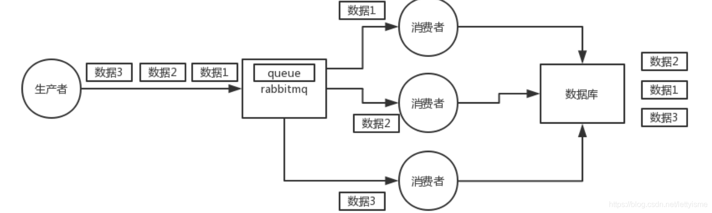
>
> 解决：
>
> 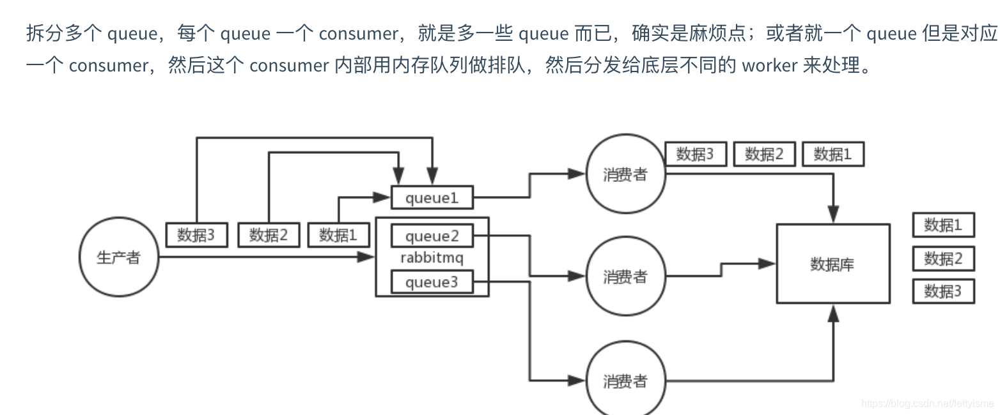

## 7、如何解决消息队列的延时以及过期失效问题？消息队列满了以后该怎么处理？有几百万消息持续积压几小时，说说怎么解决？

> 消息积压处理办法：临时紧急扩容：
>
> 先修复 consumer 的问题，确保其恢复消费速度，然后将现有 cnosumer 都停掉。新建一个
>
> topic，partition 是原来的10 倍，临时建立好原先10 倍的 queue 数量。然后写一个临时的分发数据的 consumer 程序，这个程序部署上去消费积压的数据，消费之后不做耗时的处理，直接均匀轮询写入临时建立好的10 倍数量的 queue。接着临时征用10 倍的机器来部署 consumer，每一批 consumer 消费一个临时 queue 的数据。这种做法相当于是临时将 queue 资源和 consumer 资源扩大10 倍，以正常的10 倍速度来消费数据。等快速消费完积压数据之后，得恢复原先部署的架构，重新用原先的 consumer 机器来消费消息。 MQ中消息失效：假设你用的是 RabbitMQ，
>
> RabbtiMQ 是可以设置过期时间的，也就是 TTL。如果消息在 queue 中积压超过一定的时间就会被
>
> RabbitMQ 给清理掉，这个数据就没了。那这就是第二个坑了。这就不是说数据会大量积压在 mq里，而是大量的数据会直接搞丢。我们可以采取一个方案，就是批量重导，这个我们之前线上也有类似的场景干过。就是大量积压的时候，我们当时就直接丢弃数据了，然后等过了高峰期以后，比如大家一起喝咖啡熬夜到晚上12点以后，用户都睡觉了。这个时候我们就开始写程序，将丢失的那批数据，写个临时程序，一点一点的查出来，然后重新灌入 mq 里面去，把白天丢的数据给他补回
>
> 来。也只能是这样了。假设1 万个订单积压在 mq 里面，没有处理，其中1000 个订单都丢了，你只能手动写程序把那1000 个订单给查出来，手动发到 mq 里去再补一次。
>
> mq消息队列块满了：如果消息积压在 mq 里，你很长时间都没有处理掉，此时导致 mq 都快写满了，咋办？这个还有别的办法吗？没有，谁让你第一个方案执行的太慢了，你临时写程序，接入数据来消费，消费一个丢弃一个，都不要了，快速消费掉所有的消息。然后走第二个方案，到了晚上再补数据吧。

## 8、让你来设计一个消息队列，你会怎么设计

> 比如说这个消息队列系统，我们从以下几个角度来考虑一下：
>
> 首先这个 mq 得支持可伸缩性吧，就是需要的时候快速扩容，就可以增加吞吐量和容量，那怎么搞？设计个分布式的系统呗，参照一下 kafka 的设计理念，broker -\> topic -\> partition，每个
>
> partition 放一个机器，就存一部分数据。如果现在资源不够了，简单啊，给 topic 增加 partition，然后做数据迁移，增加机器，不就可以存放更多数据，提供更高的吞吐量了？
>
> 其次你得考虑一下这个 mq 的数据要不要落地磁盘吧？那肯定要了，落磁盘才能保证别进程挂了数据就丢了。那落磁盘的时候怎么落啊？顺序写，这样就没有磁盘随机读写的寻址开销，磁盘顺序读写的性能是很高的，这就是 kafka 的思路。
>
> 其次你考虑一下你的 mq 的可用性啊？这个事儿，具体参考之前可用性那个环节讲解的 kafka 的高可用保障机制。多副本-\> leader & follower -\> broker 挂了重新选举 leader 即可对外服务。
>
> 能不能支持数据0 丢失啊？可以的，参考我们之前说的那个 kafka 数据零丢失方案。

# 数据结构与算法篇

> 在另外两本小册子里。

# 十二、Linux篇

## 1、绝对路径用什么符号表示？当前目录、上层目录用什么表示？主目录用什么表示? 切换目录用什么命令？

> 绝对路径：如/etc/init.d
>
> 当前目录和上层目录：./../
>
> 主目录：\~/
>
> 切换目录： cd

## 2、怎么查看当前进程？怎么执行退出？怎么查看当前路径？

> 查看当前进程： ps
>
> ps -l 列出与本次登录有关的进程信息； ps -aux 查询内存中进程信息； ps -aux \| grep **\*查询**
>
> **\***进程的详细信息； top 查看内存中进程的动态信息； kill -9 pid 杀死进程。执行退出： exit
>
> 查看当前路径： pwd

## 3、查看文件有哪些命令

> vi 文件名\#编辑方式查看，可修改
>
> cat 文件名\#显示全部文件内容
>
> more 文件名\#分页显示文件内容
>
> less 文件名\#与 more 相似，更好的是可以往前翻页
>
> tail 文件名\#仅查看尾部，还可以指定行数
>
> head 文件名\#仅查看头部,还可以指定行数

## 4、列举几个常用的Linux命令

> 列出文件列表：ls【参数-a -l】
>
> 创建目录和移除目录：mkdir rmdir
>
> 用于显示文件后几行内容：tail，例如： tail -n 1000：显示最后1000行打包：tar -xvf
>
> 打包并压缩：tar -zcvf
>
> 查找字符串：grep
>
> 显示当前所在目录：pwd创建空文件：touch编辑器：vim vi

## 5、你平时是怎么查看日志的？

> Linux查看日志的命令有多种: tail、cat、tac、head、echo等，本文只介绍几种常用的方法。

#### 1、tail

> 最常用的一种查看方式

#### 命令格式: tail\[必要参数\]\[选择参数\]\[文件\]

> -f 循环读取-q 不显示处理信息-v 显示详细的处理信息-c\<数目\> 显示的字节数-n\<行数\> 显示行数- q,\--quiet,\--silent 从不输出给出文件名的首部-s,\--sleep-interval=S 与-f合用,表示在每次反复的间隔休眠S秒
>
> 例如：
>
> tail -n 10 test.log 查询日志尾部最后10行的日志; tail -n +10 test.log 查询10行之后的所有日志;
>
> tail -fn 10 test.log 循环实时查看最后1000行记录(最常用的)
>
> 一般还会配合着grep搜索用，例如:
>
> tail -fn 1000 test.log \| grep \'关键字\'
>
> 如果一次性查询的数据量太大,可以进行翻页查看，例如:
>
> tail -n 4700 aa.log \|more -1000 可以进行多屏显示(ctrl + f 或者空格键可以快捷键)

#### 2、head

> 跟tail是相反的head是看前多少行日志
>
> head -n 10 test.log 查询日志文件中的头10行日志;
>
> head -n -10 test.log 查询日志文件除了最后10行的其他所有日志;
>
> head其他参数参考tail

#### 3、cat

> cat 是由第一行到最后一行连续显示在屏幕上一次显示整个文件:
>
> \$ cat filename
>
> 从键盘创建一个文件:
>
> \$cat \> filename
>
> 将几个文件合并为一个文件：
>
> \$cat file1 file2 \> file 只能创建新文件,不能编辑已有文件
>
> 将一个日志文件的内容追加到另外一个:
>
> \$cat -n textfile1 \> textfile2
>
> 清空一个日志文件:
>
> \$cat : \>textfile2
>
> 注意：\> 意思是创建，\>\>是追加。千万不要弄混了。
>
> cat其他参数参考tail

#### 4、more

> more命令是一个基于vi编辑器文本过滤器，它以全屏幕的方式按页显示文本文件的内容，支持vi中的关键字定位操作。more名单中内置了若干快捷键，常用的有H（获得帮助信息），Enter（向下翻滚一行），空格（向下滚动一屏），Q（退出命令）。more命令从前向后读取文件，因此在启动时就加载整个文件。
>
> 该命令一次显示一屏文本，满屏后停下来，并且在屏幕的底部出现一个提示信息，给出至今己显示的该文件的百分比：--More--（XX%）
>
> more的语法：more 文件名
>
> Enter 向下n行，需要定义，默认为1行
>
> Ctrl f 向下滚动一屏空格键向下滚动一屏 Ctrl b 返回上一屏
>
> = 输出当前行的行号
>
> :f 输出文件名和当前行的行号
>
> v 调用vi编辑器
>
> !命令调用Shell，并执行命令
>
> q退出more

#### 5、sed

> 这个命令可以查找日志文件特定的一段,根据时间的一个范围查询，可以按照行号和时间范围查询按照行号
>
> sed -n \'5,10p\' filename 这样你就可以只查看文件的第5行到第10行。
>
> 按照时间段
>
> sed -n \'/2014-12-17 16:17:20/,/2014-12-17 16:17:36/p\' test.log

#### 6、less

> less命令在查询日志时，一般流程是这样的
>
> less log.log
>
> shift + G 命令到文件尾部然后输入？加上你要搜索的关键字例如？1213按 n 向上查找关键字
>
> shift+n 反向查找关键字
>
> less与more类似，使用less可以随意浏览文件，而more仅能向前移动，不能向后移动，而且 less 在查看之前不会加载整个文件。
>
> less log2013.log 查看文件
>
> ps -ef \| less ps查看进程信息并通过less分页显示 history \| less 查看命令历史使用记录并通过less分页显示 less log2013.log log2014.log 浏览多个文件
>
> 常用命令参数：
>
> less与more类似，使用less可以随意浏览文件，而more仅能向前移动，不能向后移动，而且 less 在查看之前不会加载整个文件。
>
> less log2013.log 查看文件
>
> ps -ef \| less ps查看进程信息并通过less分页显示 history \| less 查看命令历史使用记录并通过less分页显示 less log2013.log log2014.log 浏览多个文件
>
> 常用命令参数：
>
> -b \<缓冲区大小\> 设置缓冲区的大小
>
> -g 只标志最后搜索的关键词
>
> -i 忽略搜索时的大小写
>
> -m 显示类似more命令的百分比
>
> -N 显示每行的行号
>
> -o \<文件名\> 将less 输出的内容在指定文件中保存起来
>
> -Q 不使用警告音
>
> -s 显示连续空行为一行
>
> /字符串：向下搜索\"字符串\"的功能
>
> ?字符串：向上搜索\"字符串\"的功能 n：重复前一个搜索（与/或? 有关） N：反向重复前一个搜索（与/或? 有关）
>
> a.向后翻一页
>
> h 显示帮助界面
>
> q 退出less 命令
>
> 一般本人查日志配合应用的其他命令
>
> history //所有的历史记录
>
> history \| grep XXX //历史记录中包含某些指令的记录
>
> history \| more //分页查看记录
>
> history -c //清空所有的历史记录
>
> !!重复执行上一个命令
>
> 查询出来记录后选中: !323

# 十三、Zookeeper篇

## 1，说说Zookeeper 是什么？

> **直译：**从名字上直译就是动物管理员，动物指的是 Hadoop 一类的分布式软件，管理员三个字体现了 ZooKeeper 的特点：维护、协调、管理、监控。
>
> **简述：**有些软件你想做成集群或者分布式，你可以用 ZooKeeper 帮你来辅助实现。**特点：**
>
> 最终一致性：客户端看到的数据最终是一致的。
>
> 可靠性：服务器保存了消息，那么它就一直都存在。
>
> 实时性：ZooKeeper 不能保证两个客户端同时得到刚更新的数据。独立性（等待无关）：不同客户端直接互不影响。
>
> 原子性：更新要不成功要不失败，没有第三个状态。
>
> **注意**：回答面试题，切忌只是简单一句话回答，可以将你对概念的理解，特点等多个方面描述一下，哪怕你自己认为不完全切中题意的也可以说说，面试官不喜欢会打断你的，你的目的是让面试官认为你是好沟通的。当然了，如果不会可别装作会，说太多不专业的想法。

## 2， ZooKeeper 有哪些应用场景？

#### 数据发布与订阅

> 发布与订阅即所谓的配置管理，顾名思义就是将数据发布到ZooKeeper节点上，供订阅者动态获取数据，实现配置信息的集中式管理和动态更新。例如全局的配置信息，地址列表等就非常适合使用。
>
> 数据发布/订阅的一个常见的场景是配置中心，发布者把数据发布到 ZooKeeper 的一个或一系列的节点上，供订阅者进行数据订阅，达到动态获取数据的目的。
>
> 配置信息一般有几个特点:
>
> 1.  数据量小的KV
> 2.  数据内容在运行时会发生动态变化
> 3.  集群机器共享，配置一致
>
> 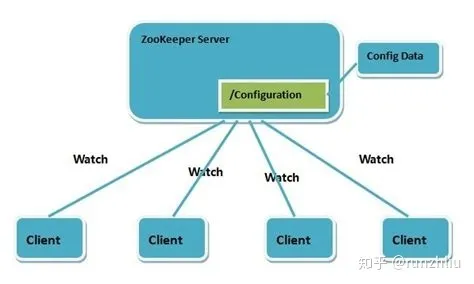
>
> ZooKeeper 采用的是推拉结合的方式。
>
> 1.  推: 服务端会推给注册了监控节点的客户端 Wathcer 事件通知
> 2.  拉: 客户端获得通知后，然后主动到服务端拉取最新的数据**命名服务**
>
> 作为分布式命名服务，命名服务是指通过指定的名字来获取资源或者服务的地址，利用ZooKeeper创建一个全局的路径，这个路径就可以作为一个名字，指向集群中的集群，提供的服务的地址，或者一个远程的对象等等。统一命名服务的命名结构图如下所示：
>
> 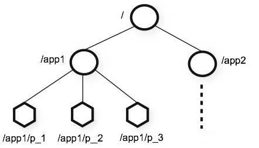
>
> 1、在分布式环境下，经常需要对应用/服务进行统一命名，便于识别不同服务。
>
> 类似于域名与IP之间对应关系，IP不容易记住，而域名容易记住。通过名称来获取资源或服务的地址，提供者等信息。
>
> 2、按照层次结构组织服务/应用名称。
>
> 可将服务名称以及地址信息写到ZooKeeper上，客户端通过ZooKeeper获取可用服务列表类。
>

#### 配置管理

>
> 程序分布式的部署在不同的机器上，将程序的配置信息放在ZooKeeper的znode下，当有配置发生改变时，也就是znode发生变化时，可以通过改变zk中某个目录节点的内容，利用watch通知给各个客户端从而更改配置。
>
> ZooKeeper配置管理结构图如下所示：
>
> 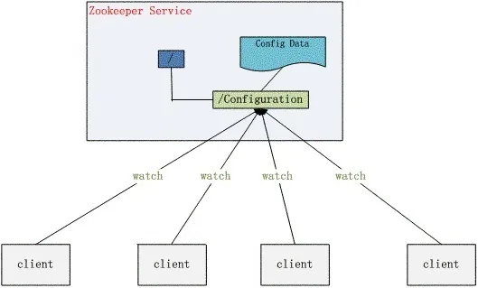
>
> 1、分布式环境下，配置文件管理和同步是一个常见问题。
>
> 一个集群中，所有节点的配置信息是一致的，比如 Hadoop 集群。对配置文件修改后，希望能够快速同步到各个节点上。
>
> 2、配置管理可交由ZooKeeper实现。
>
> 可将配置信息写入ZooKeeper上的一个Znode。各个节点监听这个Znode。
>
> 一旦Znode中的数据被修改，ZooKeeper将通知各个节点。

#### 集群管理

> 所谓集群管理就是：是否有机器退出和加入、选举master。
>
> 集群管理主要指集群监控和集群控制两个方面。前者侧重于集群运行时的状态的收集，后者则是对集群进行操作与控制。开发和运维中，面对集群，经常有如下需求:
>
> 1.  希望知道集群中究竟有多少机器在工作
> 2.  对集群中的每台机器的运行时状态进行数据收集
> 3.  对集群中机器进行上下线的操作集群管理结构图如下所示：
>
> 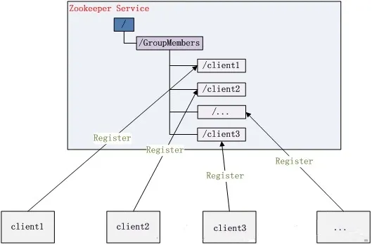
>
> 1、分布式环境中，实时掌握每个节点的状态是必要的，可根据节点实时状态做出一些调整。
>
> 2、可交由ZooKeeper实现。
>
> 可将节点信息写入ZooKeeper上的一个Znode。监听这个Znode可获取它的实时状态变化。
>
> 3、典型应用
>
> Hbase中Master状态监控与选举。
>
> 利用ZooKeeper的强一致性，能够保证在分布式高并发情况下节点创建的全局唯一性，即：同时有多个客户端请求创建/currentMaster 节点，最终一定只有一个客户端请求能够创建成功

#### 分布式通知与协调

> 1、分布式环境中，经常存在一个服务需要知道它所管理的子服务的状态。
>
> a. NameNode需知道各个Datanode的状态。
>
> b. JobTracker需知道各个TaskTracker的状态。
>
> 2、心跳检测机制可通过ZooKeeper来实现。
>
> 3、信息推送可由ZooKeeper来实现，ZooKeeper相当于一个发布/订阅系统。
>
> 
>
> **分布式锁**
>
> 处于不同节点上不同的服务，它们可能需要顺序的访问一些资源，这里需要一把分布式的锁。分布式锁具有以下特性：写锁、读锁、时序锁。
>
> 写锁：在zk上创建的一个临时的无编号的节点。由于是无序编号，在创建时不会自动编号，导致只能客户端有一个客户端得到锁，然后进行写入。
>
> 读锁：在zk上创建一个临时的有编号的节点，这样即使下次有客户端加入是同时创建相同的节点时，他也会自动编号，也可以获得锁对象，然后对其进行读取。
>
> 时序锁：在zk上创建的一个临时的有编号的节点根据编号的大小控制锁。
>
> 
>
> **分布式队列**
>
> 分布式队列分为两种：
>
> 1、当一个队列的成员都聚齐时，这个队列才可用，否则一直等待所有成员到达，这种是同步队列。
>
> a）一个job由多个task组成，只有所有任务完成后，job才运行完成。
>
> b）可为job创建一个/job目录，然后在该目录下，为每个完成的task创建一个临时的Znode，一旦临时节点数目达到task总数，则表明job运行完成。
>
> 2、队列按照FIFO方式进行入队和出队操作，例如实现生产者和消费者模型。

## 3、说说Zookeeper的工作原理？

> Zookeeper的核心是原子广播，这个机制保证了各个Server之间的同步。实现这个机制的协议叫做
>
> Zab协议。
>
> Zab协议有两种模式，它们分别是恢复模式（选主）和广播模式（同步）。
>
> Zab协议的全称是 Zookeeper Atomic Broadcast\*\*（Zookeeper原子广播）。Zookeeper 是通过
>
> Zab 协议来保证分布式事务的最终一致性。Zab协议要求每个 Leader 都要经历三个阶段：发现，同步，广播。
>
> 当服务启动或者在领导者崩溃后，Zab就进入了恢复模式，当领导者被选举出来，且大多数Server完成了和 leader的状态同步以后，恢复模式就结束了。状态同步保证了leader和Server具有相同的系统状态。
>
> 为了保证事务的顺序一致性，zookeeper采用了递增的事务id号（zxid）来标识事务。所有的提议
>
> （proposal）都在被提出的时候加上了zxid。实现中zxid是一个64位的数字，它高32位是epoch用来标识leader关系是否改变，每次一个leader被选出来，它都会有一个新的epoch，标识当前属于那个leader的统治时期。低32位用于递增计数。
>
> epoch：可以理解为皇帝的年号，当新的皇帝leader产生后，将有一个新的epoch年号。
>
> 每个Server在工作过程中有三种状态：
>
> LOOKING：当前Server不知道leader是谁，正在搜寻。
>
> LEADING：当前Server即为选举出来的leader。
>
> FOLLOWING：leader已经选举出来，当前Server与之同步。

## 4，请描述一下Zookeeper 的通知机制是什么？

> <span class="underline">Zookeeper</span> 允许客户端向服务端的某个 znode 注册一个 Watcher 监听，当服务端的一些指定事件触发了这个 Watcher ，服务端会向指定客户端发送一个事件通知来实现分布式的通知功能，然后客户端根据 Watcher 通知状态和事件类型做出业务上的改变。
>
> 大致分为三个步骤：
>
> 客户端注册 Watcher
>
> 1、调用<span class="underline">getData、getChildren、exist</span> 三个 API ，传入Watcher 对象。2、标记请求 request ，封装 Watcher 到 WatchRegistration 。3、封装成 Packet 对象，发服务端发送
>
> request 。4、收到服务端响应后，将 Watcher 注册到 ZKWatcherManager 中进行管理。5、请求返回，完成注册。
>
> 服务端处理 Watcher
>
> 1、服务端接收 Watcher 并存储。2、Watcher 触发3、调用 process 方法来触发 Watcher 。客户端回调 Watcher
>
> 1，客户端 SendThread 线程接收事件通知，交由 EventThread 线程回调Watcher 。2，客户端的 Watcher 机制同样是一次性的，一旦被触发后，该 Watcher 就失效了。
>
> client 端会对某个 znode 建立一个 watcher 事件，当该 znode 发生变化时，这些 client 会收到 zk 的通知，然后 client 可以根据 znode 变化来做出业务上的改变等。

## 5， Zookeeper 对节点的 watch 监听通知是永久的吗？

> 不是，**一次性**的。无论是服务端还是客户端，一旦一个 Watcher 被触发，<span class="underline">Zookeeper</span> 都会将其从相应的存储中移除。这样的设计有效的减轻了服务端的压力，不然对于更新非常频繁的节点，服务端会不断的向客户端发送事件通知，无论对于网络还是服务端的压力都非常大。

## 6， Zookeeper 集群中有哪些角色？

> 在一个集群中，最少需要3 台。或者保证2N +1 台，即奇数。为什么保证奇数？主要是为了选举算法。
>
> 

## 7， Zookeeper 集群中Server有哪些工作状态？

#### LOOKING

> 寻找 Leader 状态；当服务器处于该状态时，它会认为当前集群中没有 Leader ，因此需要进入
>
> Leader 选举状态

#### FOLLOWING

> 跟随者状态；表明当前服务器角色是 Follower **LEADING**
>
> 领导者状态；表明当前服务器角色是 Leader **OBSERVING**
>
> 观察者状态；表明当前服务器角色是 Observer

## 8， Zookeeper 集群中是怎样选举leader的？

> 当Leader崩溃了，或者失去了大多数的Follower，这时候<span class="underline">Zookeeper</span> 就进入恢复模式，恢复模式需要重新选举出一个新的Leader，让所有的Server都恢复到一个状态**LOOKING**。
>
> <span class="underline">Zookeeper</span> 有两种选举算法：基于 basic paxos 实现和基于 fast paxos 实现。默认为 fast paxos
>
> 由于篇幅问题，这里推荐：[选举流程](https://www.cnblogs.com/leesf456/p/6107600.html)

## 9， Zookeeper 是如何保证事务的顺序一致性的呢？

> <span class="underline">Zookeeper</span> 采用了递增的事务 id 来识别，所有的 proposal （提议）都在被提出的时候加上了
>
> zxid 。 zxid 实际上是一个64 位数字。
>
> 高32 位是 epoch 用来标识 Leader 是否发生了改变，如果有新的 Leader 产生出来， epoch 会自增。低32 位用来递增计数。当新产生的 proposal 的时候，会依据数据库的两阶段过程，首先会向其他的 Server 发出事务执行请求，如果超过半数的机器都能执行并且能够成功，那么就会开始执行。

## 10， ZooKeeper 集群中个服务器之间是怎样通信的？

> Leader 服务器会和每一个 Follower/Observer 服务器都建立 TCP 连接，同时为每个
>
> Follower/Observer 都创建一个叫做 LearnerHandler 的实体。
>
> LearnerHandler 主要负责 Leader 和 Follower/Observer 之间的网络通讯，包括数据同步，请求转发和 proposal 提议的投票等。
>
> Leader 服务器保存了所有 Follower/Observer 的 LearnerHandler 。

## 11， ZooKeeper 分布式锁怎么实现的？

> 如果有客户端1、客户端2等N个客户端争抢一个<span class="underline">Zookeeper</span> 分布式锁。大致如下：
>
> 1.  大家都是上来直接创建一个锁节点下的一个接一个的临时有序节点
> 2.  如果自己不是第一个节点，就对自己上一个节点加监听器
> 3.  只要上一个节点释放锁，自己就排到前面去了，相当于是一个排队机制。
>
> 而且用临时顺序节点的另外一个用意就是，如果某个客户端创建临时顺序节点之后，不小心自己宕机了也没关系，<span class="underline">Zookeeper</span> 感知到那个客户端宕机，会自动删除对应的临时顺序节点，相当于自动释放锁，或者是自动取消自己的排队。
>
> 本地锁，可以用 JDK 实现，但是分布式锁就必须要用到分布式的组件。比如 ZooKeeper、Redis。网上代码一大段，面试一般也不要写，我这说一些关键点。
>
> 几个需要注意的地方如下。
>
> 死锁问题：锁不能因为意外就变成死锁，所以要用 ZK 的临时节点，客户端连接失效了，锁就自动释放了。
>
> 锁等待问题：锁有排队的需求，所以要 ZK 的顺序节点。
>
> 锁管理问题：一个使用使用释放了锁，需要通知其他使用者，所以需要用到监听。
>
> 监听的羊群效应：比如有1000 个锁竞争者，锁释放了，1000 个竞争者就得到了通知，然后判断，最终序号最小的那个拿到了锁。其它999 个竞争者重新注册监听。这就是羊群效应，出点事，就会惊动整个羊群。应该每个竞争者只监听自己前面的那个节点。比如2 号释放了锁，那么只有3 号得到了通知。
>

## 12、了解Zookeeper的系统架构吗？

> 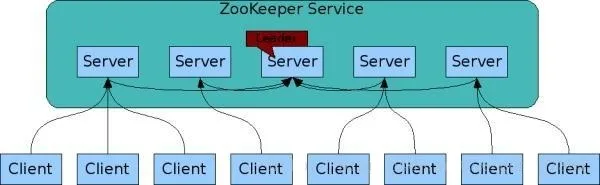
>
> ZooKeeper 的架构图中我们需要了解和掌握的主要有：
>
> （1）ZooKeeper分为服务器端（Server）和客户端（Client），客户端可以连接到整个
>
> ZooKeeper服务的任意服务器上（除非 leaderServes 参数被显式设置， leader 不允许接受客户端连接）。
>
> （2）客户端使用并维护一个 TCP 连接，通过这个连接发送请求、接受响应、获取观察的事件以及发送心跳。如果这个 TCP 连接中断，客户端将自动尝试连接到另外的 ZooKeeper服务器。客户端第一次连接到 ZooKeeper服务时，接受这个连接的 ZooKeeper服务器会为这个客户端建立一个会话。当这个客户端连接到另外的服务器时，这个会话会被新的服务器重新建立。
>
> （3）上图中每一个Server代表一个安装Zookeeper服务的机器，即是整个提供Zookeeper服务的集群（或者是由伪集群组成）；
>
> （4）组成ZooKeeper服务的服务器必须彼此了解。它们维护一个内存中的状态图像，以及持久存储中的事务日志和快照，只要大多数服务器可用，ZooKeeper服务就可用；
>
> 5. ZooKeeper 启动时，将从实例中选举一个 leader，Leader 负责处理数据更新等操作，一个更新操作成功的标志是当且仅当大多数Server在内存中成功修改数据。每个Server 在内存中存储了一份数据。
>
> 6. Zookeeper是可以集群复制的，集群间通过Zab协议（Zookeeper Atomic Broadcast）来保持数据的一致性；
>
> 7. Zab协议包含两个阶段：leader election阶段和Atomic Brodcast阶段。
>
>    a.集群中将选举出一个leader，其他的机器则称为follower，所有的写操作都被传送给leader，并通过brodcast将所有的更新告诉给follower。
>
>    b.当leader崩溃或者leader失去大多数的follower时，需要重新选举出一个新的leader，让所有的服务器都恢复到一个正确的状态。
>
>    c.当leader被选举出来，且大多数服务器完成了和leader的状态同步后，leadder election 的过程就结束了，就将会进入到Atomic brodcast的过程。
>
>    d. Atomic Brodcast同步leader和follower之间的信息，保证leader和follower具有形同的系统状态。

## 13、Zookeeper为什么要这么设计？

> ZooKeeper设计的目的是提供高性能、高可用、顺序一致性的分布式协调服务、保证数据最终一致性。
>
> <span class="underline">高性能（简单的数据模型）</span>
>
> 1.  采用树形结构组织数据节点；
>
> 2.  全量数据节点，都存储在内存中；
>
> 3.  Follower 和 Observer 直接处理非事务请求；

> 高可用（构建集群）

1.  半数以上机器存活，服务就能正常运行

2.  自动进行 Leader 选举

> <span class="underline">顺序一致性（事务操作的顺序）</span>

1.  每个事务请求，都会转发给 Leader 处理

2.  每个事务，会分配全局唯一的递增id（zxid，64位：epoch +自增 id）

> <span class="underline">最终一致性</span>

1.  通过提议投票方式，保证事务提交的可靠性

2.  提议投票方式，只能保证 Client 收到事务提交成功后，半数以上节点能够看到最新数据

## 14、你知道Zookeeper中有哪些角色？

> 系统模型：
>
> 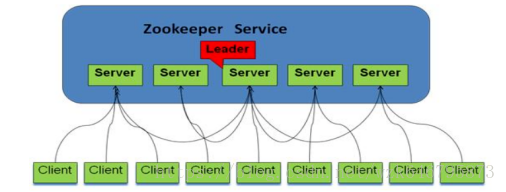
>
> 领导者（leader）
>
> Leader服务器为客户端提供读服务和写服务。负责进行投票的发起和决议，更新系统状态。
>
> 学习者（learner）
>
> 跟随者（ follower ） Follower服务器为客户端提供读服务，参与Leader选举过程，参与写操作"过半写成功"策略。
>
> 观察者（ observer ） Observer服务器为客户端提供读服务，不参与Leader选举过程，不参与写操作"过半写成功"策略。用于在不影响写性能的前提下提升集群的读性能。
>
> 客户端（client）：服务请求发起方。

## 15、你熟悉Zookeeper节点ZNode和相关属性吗？

#### 节点有哪些类型？

> Znode两种类型：
>
> 持久的（persistent）：客户端和服务器端断开连接后，创建的节点不删除（默认）。短暂的（ephemeral）：客户端和服务器端断开连接后，创建的节点自己删除。
>
> Znode有四种形式：
>
> 持久化目录节点（PERSISTENT）：客户端与Zookeeper断开连接后，该节点依旧存在持久化顺序编号目录节点（PERSISTENT_SEQUENTIAL）
>
> 客户端与Zookeeper断开连接后，该节点依旧存在，只是Zookeeper给该节点名称进行顺序编号：临时目录节点（EPHEMERAL）
>
> 客户端与Zookeeper断开连接后，该节点被删除：临时顺序编号目录节点
>
> （EPHEMERAL_SEQUENTIAL）
>
> 客户端与Zookeeper断开连接后，该节点被删除，只是Zookeeper给该节点名称进行顺序编号
>
> **「注意」**：创建ZNode时设置顺序标识，ZNode名称后会附加一个值，顺序号是一个单调递增的计数器，由父节点维护。

#### 节点属性有哪些

> 一个znode节点不仅可以存储数据，还有一些其他特别的属性。接下来我们创建一个/test节点分析一下它各个属性的含义。
>
> \[zk: localhost:2181(CONNECTED)6\] get /test 456
>
> cZxid = 0x59ac //
>
> ctime = Mon Mar 30 15:20:08 CST 2020 mZxid = 0x59ad
>
> mtime = Mon Mar 30 15:22:25 CST 2020 pZxid = 0x59ac
>
> cversion = 0
>
> dataVersion = 2
>
> aclVersion = 0 ephemeralOwner = 0x0 dataLength = 3
>
> numChildren = 0
>
> 属性说明
>
> 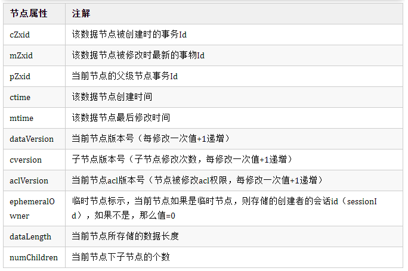

## 16、请简述Zookeeper的选主流程

> Zookeeper的核心是原子广播，这个机制保证了各个Server之间的同步。实现这个机制的协议叫做
>
> Zab协议。Zab协议有两种模式，它们分别是恢复模式（选主）和广播模式（同步）。当服务启动或者在领导者崩溃后，Zab就进入了恢复模式，当领导者被选举出来，且大多数Server完成了和
>
> leader的状态同步以后，恢复模式就结束了。状态同步保证了leader和Server具有相同的系统状态。leader选举是保证分布式数据一致性的关键。
>
> 出现选举主要是两种场景：初始化、leader不可用。
>
> 当zk集群中的一台服务器出现以下两种情况之一时，就会开始leader选举。
>
> （1）服务器初始化启动。
>
> （2）服务器运行期间无法和leader保持连接。
>
> 而当一台机器进入leader选举流程时，当前集群也可能处于以下两种状态。
>
> （1）集群中本来就已经存在一个leader。
>
> （2）集群中确实不存在leader。
>
> 首先第一种情况，通常是集群中某一台机器启动比较晚，在它启动之前，集群已经正常工作，即已经存在一台leader服务器。当该机器试图去选举leader时，会被告知当前服务器的leader信息，它仅仅需要和leader机器建立连接，并进行状态同步即可。
>
> 重点是leader不可用了，此时的选主制度。投票信息中包含两个最基本的信息。
>
> sid ：即server id，用来标识该机器在集群中的机器序号。
>
> zxid ：即zookeeper事务id号。
>
> ZooKeeper状态的每一次改变,都对应着一个递增的Transaction id,，该id称为zxid.，由于zxid的递增性质,如果zxid1小于zxid2,，那么zxid1肯定先于zxid2发生。创建任意节点，或者更新任意节点的数据，或者删除任意节点，都会导致Zookeeper状态发生改变，从而导致zxid的值增加。
>
> 以（sid，zxid）的形式来标识一次投票信息。
>
> 例如：如果当前服务器要推举sid为1，zxid为8的服务器成为leader，那么投票信息可以表示为
>
> （1，8）
>
> 集群中的每台机器发出自己的投票后，也会接受来自集群中其他机器的投票。每台机器都会根据一定的规则，来处理收到的其他机器的投票，以此来决定是否需要变更自己的投票。
>
> 规则如下：
>
> （1）初始阶段，都会给自己投票。
>
> （2）当接收到来自其他服务器的投票时，都需要将别人的投票和自己的投票进行pk，规则如下：
>
> 优先检查zxid。zxid比较大的服务器优先作为leader。如果zxid相同的话，就比较sid，sid比较大的服务器作为leader。

#### 所有服务启动时候的选举流程：

> 三台服务器 server1、server2、server3：

1.  server1 启动，一台机器不会选举。

2.  server2 启动，server1 和 server2 的状态改为 looking，广播投票

3.  server3 启动，状态改为 looking，加入广播投票。

4.  初识状态，互不认识，大家都认为自己是王者，投票也投自己为 Leader。

5.  投票信息说明，票信息本来为五元组，这里为了逻辑清晰，简化下表达。初识 zxid = 0，sid 是每个节点的名字，这个 sid 在 zoo.cfg 中配置，不会重复。

**节点****sid**
---------- ---------
 server1 1
 server2 2
 server3 3

1.  初始 zxid=0，server1 投票（1，0），server2 投票（2，0），server3 投票（3，0）

2.  server1 收到投票（2，0）时，会先验证投票的合法性，然后自己的票进行 pk，pk 的逻辑是先比较 zxid，server1（zxid）=server2（zxid）=0，zxid 相等再比较 sid，server1（sid）\<

> server2(sid)，pk 结果为 server2 的投票获胜。server1 更新自己的投票为（2，0），server1重新投票。

3.  TODO 这里最终是2 还是3，需要做实验确定。

4.  server2 收到 server1 投票，会先验证投票的合法性，然后 pk，自己的票获胜，server 不用更新自己的票，pk 后，重新在发送一次投票。

5.  统计投票，pk 后会统计投票，如果半数以上的节点投出相同的票，确定选出了 Leader。

6.  选举结束，被选中节点的状态由 LOOKING 变成 LEADING，其他参加选举的节点由 LOOKING变成 FOLLOWING。如果有 Observer 节点，如果 Observer 不参与选举，所以选举前后它的状态一直是 OBSERVING，没有变化。

#### 简单地说

> 开始投票-\> 节点状态变成 LOOKING -\> 每个节点选自己-\> 收到票进行 PK -\> sid 大的获胜-\> 更新选票-\> 再次投票-\> 统计选票，选票过半数选举结果-\> 节点状态更新为自己的角色状态。

## 17、为什么Zookeeper集群的数目，一般为奇数个？


> 首先需要明确zookeeper选举的规则：leader选举，要求<span class="underline">可用节点数量\> 总节点数量/2</span> 。
>
> 比如：标记一个写是否成功是要在超过一半节点发送写请求成功时才认为有效。同样，Zookeeper选择领导者节点也是在超过一半节点同意时才有效。最后，Zookeeper是否正常是要根据是否超过一半的节点正常才算正常。这是基于CAP的一致性原理。
>
> zookeeper有这样一个特性：集群中只要有过半的机器是正常工作的，那么整个集群对外就是可用的。
>
> 也就是说如果有2个zookeeper，那么只要有1个死了zookeeper就不能用了，因为1没有过半，所以
>
> 2个zookeeper的死亡容忍度为0；
>
> 同理，要是有3个zookeeper，一个死了，还剩下2个正常的，过半了，所以3个zookeeper的容忍度为1；
>
> 同理：
>
> 2-\>0；两个zookeeper，最多0个zookeeper可以不可用。3-\>1；三个zookeeper，最多1个zookeeper可以不可用。4-\>1；四个zookeeper，最多1个zookeeper可以不可用。5-\>2；五个zookeeper，最多2个zookeeper可以不可用。6-\>2；两个zookeeper，最多0个zookeeper可以不可用。
>
> \....
>
> 会发现一个规律，2n和2n-1的容忍度是一样的，都是n-1，所以为了更加高效，何必增加那一个不必要的zookeeper呢。
>
> zookeeper的选举策略也是需要半数以上的节点同意才能当选leader，如果是偶数节点可能导致票数相同的情况。

## 18、知道Zookeeper监听器的原理吗？

1.  创建一个Main()线程。

2.  在Main()线程中创建两个线程，一个负责网络连接通信（connect），一个负责监听

> （listener）。

3.  通过connect线程将注册的监听事件发送给Zookeeper。

4.  将注册的监听事件添加到Zookeeper的注册监听器列表中。

5.  Zookeeper监听到有数据或路径发生变化时，把这条消息发送给Listener线程。

6.  Listener线程内部调用process()方法

## 19、说说Zookeeper中的ACL 权限控制机制

> UGO（User/Group/Others）
>
> 目前在 Linux/Unix 文件系统中使用，也是使用最广泛的权限控制方式。是一种粗粒度的文件系统权限控制模式。
>
> ACL（Access Control List）访问控制列表包括三个方面：
>
> 权限模式（Scheme）

1.  IP：从 IP 地址粒度进行权限控制

2.  Digest：最常用，用类似于 username:password 的权限标识来进行权限配置，便于区分不同应用来进行权限控制

3.  World：最开放的权限控制方式，是一种特殊的 digest 模式，只有一个权限标识"world:anyone"

4.  Super：超级用户授权对象

> 授权对象指的是权限赋予的用户或一个指定实体，例如 IP 地址或是机器灯。权限 Permission

1.  CREATE：数据节点创建权限，允许授权对象在该 Znode 下创建子节点

2.  DELETE：子节点删除权限，允许授权对象删除该数据节点的子节点

3.  READ：数据节点的读取权限，允许授权对象访问该数据节点并读取其数据内容或子节点列表等

4.  WRITE：数据节点更新权限，允许授权对象对该数据节点进行更新操作

5.  ADMIN：数据节点管理权限，允许授权对象对该数据节点进行 ACL 相关设置操作

## 20、Zookeeper 有哪几种几种部署模式？

> Zookeeper 有三种部署模式：

1.  单机部署：一台集群上运行；

2.  集群部署：多台集群运行；

3.  伪集群部署：一台集群启动多个 Zookeeper 实例运行。

## 21、Zookeeper集群支持动态添加机器吗？

> 其实就是水平扩容了，Zookeeper 在这方面不太好。两种方式：
>
> 全部重启：关闭所有 Zookeeper 服务，修改配置之后启动。不影响之前客户端的会话。
>
> 逐个重启：在过半存活即可用的原则下，一台机器重启不影响整个集群对外提供服务。这是比较常用的方式。
>
> 3.5 版本开始支持动态扩容。

## 22、描述一下 ZAB 协议

> ZAB 协议是 ZooKeeper 自己定义的协议，全名 ZooKeeper 原子广播协议。
>
> **ZAB 协议有两种模式：**Leader 节点崩溃了如何恢复和消息如何广播到所有节点。
>
> 整个 ZooKeeper 集群没有 Leader 节点的时候，属于崩溃的情况。比如集群启动刚刚启动，这时节点们互相不认识。比如运作 Leader 节点宕机了，又或者网络问题，其他节点 Ping 不通 Leader 节点了。这时就需要 ZAB 中的节点崩溃协议，所有节点进入选举模式，选举出新的 Leader。整个选举过程就是通过广播来实现的。选举成功后，一切都需要以 Leader 的数据为准，那么就需要进行数据同步了。

## 23、ZAB 和 Paxos 算法的联系与区别？

> 相同点：
>
> （1）两者都存在一个类似于 Leader 进程的角色，由其负责协调多个 Follower 进程的运行

2.  Leader 进程都会等待超过半数的 Follower 做出正确的反馈后，才会将一个提案进行提交

3.  ZAB 协议中，每个 Proposal 中都包含一个 epoch 值来代表当前的 Leader周期，Paxos 中名字为 Ballot

> 不同点：
>
> ZAB 用来构建高可用的分布式数据主备系统（Zookeeper），Paxos 是用来构建分布式一致性状态机系统。

## 24、ZooKeeper 宕机如何处理？

> ZooKeeper 本身也是集群，推荐配置奇数个服务器。因为宕机就需要选举，选举需要半数+1 票才能通过，为了避免打成平手。进来不用偶数个服务器。


> 如果是 Follower 宕机了，没关系不影响任何使用。用户无感知。如果 Leader 宕机，集群就得停止对外服务，开始选举，选举出一个 Leader 节点后，进行数据同步，保证所有节点数据和 Leader 统一，然后开始对外提供服务。
>
> 为啥投票需要半数+1，如果半数就可以的话，网络的问题可能导致集群选举出来两个 Leader，各有一半的小弟支持，这样数据也就乱套了。

## 25、描述一下 ZooKeeper 的 session 管理的思想？

#### 分桶策略：

> 简单地说，就是不同的会话过期可能都有时间间隔，比如15 秒过期、15.1 秒过期、15.8 秒过期，
>
> ZooKeeper 统一让这些 session 16 秒过期。这样非常方便管理，看下面的公式，过期时间总是
>
> ExpirationInterval 的整数倍。计算公式：
>
> ExpirationTime = currentTime + sessionTimeout
>
> ExpirationTime = (ExpirationTime / ExpirationInrerval +1)\* ExpirationInterval ,
>
> 见图片：
>
> 默认配置的 session 超时时间是在2*tickTime\~20*tickTime。

## 26、ZooKeeper 负载均衡和 Nginx 负载均衡有什么区别？

#### ZooKeeper：

> 不存在单点问题，zab 机制保证单点故障可重新选举一个 Leader
>
> 只负责服务的注册与发现，不负责转发，减少一次数据交换（消费方与服务方直接通信）需要自己实现相应的负载均衡算法

#### Nginx：

> 存在单点问题，单点负载高数据量大，需要通过 KeepAlived 辅助实现高可用每次负载，都充当一次中间人转发角色，本身是个反向代理服务器
>
> 自带负载均衡算法

## 27、说说ZooKeeper 的序列化

> 序列化：
>
> 内存数据，保存到硬盘需要序列化。
>
> 内存数据，通过网络传输到其他节点，需要序列化。
>
> ZK 使用的序列化协议是 Jute，Jute 提供了 Record 接口。接口提供了两个方法：
>
> serialize 序列化方法
>
> deserialize 反序列化方法
>
> 要系列化的方法，在这两个方法中存入到流对象中即可。

## 28，在Zookeeper中Zxid 是什么，有什么作用？

> Zxid，也就是事务 id，为了保证事务的顺序一致性，ZooKeeper 采用了递增的事务 Zxid 来标识事务。proposal 都会加上了 Zxid。Zxid 是一个64 位的数字，它高32 位是 Epoch 用来标识朝代变化，比如每次选举 Epoch 都会加改变。低32 位用于递增计数。
>
> Epoch：可以理解为当前集群所处的年代或者周期，每个 Leader 就像皇帝，都有自己的年号，所以每次改朝换代，Leader 变更之后，都会在前一个年代的基础上加1。这样就算旧的 Leader 崩溃恢复之后，也没有人听它的了，因为 Follower 只听从当前年代的 Leader 的命令。欢迎关注微信公众号：Java后端技术全栈

## 29、讲解一下 ZooKeeper 的持久化机制

#### 什么是持久化？

> 数据，存到磁盘或者文件当中。
>
> 机器重启后，数据不会丢失。内存-\> 磁盘的映射，和序列化有些像。

#### ZooKeeper 的持久化：

> SnapShot 快照，记录内存中的全量数据
>
> TxnLog 增量事务日志，记录每一条增删改记录（查不是事务日志，不会引起数据变化）**为什么持久化这么麻烦，一个不可用吗？**
>
> 快照的缺点，文件太大，而且快照文件不会是最新的数据。增量事务日志的缺点，运行时间长了，日志太多了，加载太慢。二者结合最好。


#### 快照模式：

> 将 ZooKeeper 内存中以 DataTree 数据结构存储的数据定期存储到磁盘中。
>
> 由于快照文件是定期对数据的全量备份，所以快照文件中数据通常不是最新的。见图片：

## 30、Zookeeper选举中投票信息的五元组是什么？

> Leader：被选举的 Leader 的 SID Zxid：被选举的 Leader 的事务 ID Sid：当前服务器的 SID electionEpoch：当前投票的轮次 peerEpoch：当前服务器的 Epoch

#### Epoch \> Zxid \> Sid

> Epoch，Zxid 都可能一致，但是 Sid 一定不一样，这样两张选票一定会 PK 出结果。

## 31、说说Zookeeper中的脑裂？

> 简单点来说，脑裂(Split-Brain)就是比如当你的 cluster 里面有两个节点，它们都知道在这个
>
> cluster 里需要选举出一个 master。那么当它们两个之间的通信完全没有问题的时候，就会达成共识，选出其中一个作为 master。但是如果它们之间的通信出了问题，那么两个结点都会觉得现在没有 master，所以每个都把自己选举成 master，于是 cluster 里面就会有两个 master。
>
> 对于Zookeeper来说有一个很重要的问题，就是到底是根据一个什么样的情况来判断一个节点死亡
>
> down掉了？在分布式系统中这些都是有监控者来判断的，但是监控者也很难判定其他的节点的状态，唯一一个可靠的途径就是心跳，Zookeeper也是使用心跳来判断客户端是否仍然活着。
>
> 使用ZooKeeper来做Leader HA基本都是同样的方式：每个节点都尝试注册一个象征leader的临时节点，其他没有注册成功的则成为follower，并且通过watch机制监控着leader所创建的临时节点，
>
> Zookeeper通过内部心跳机制来确定leader的状态，一旦leader出现意外Zookeeper能很快获悉并且通知其他的follower，其他flower在之后作出相关反应，这样就完成了一个切换，这种模式也是比较通用的模式，基本大部分都是这样实现的。但是这里面有个很严重的问题，如果注意不到会导致短暂的时间内系统出现脑裂，因为心跳出现超时可能是leader挂了，但是也可能是zookeeper节点之间网络出现了问题，导致leader假死的情况，leader其实并未死掉，但是与ZooKeeper之间的网络出现问题导致Zookeeper认为其挂掉了然后通知其他节点进行切换，这样follower中就有一个成为了leader，但是原本的leader并未死掉，这时候client也获得leader切换的消息，但是仍然会有一些延时，zookeeper需要通讯需要一个一个通知，这时候整个系统就很混乱可能有一部分client已经通知到了连接到新的leader上去了，有的client仍然连接在老的leader上，如果同时有两个client需要对leader的同一个数据更新，并且刚好这两个client此刻分别连接在新老的leader上，就会出现很严重问题。
>
> 这里做下小总结：**假死**：由于心跳超时（网络原因导致的）认为leader死了，但其实leader还存活着。**脑裂**：由于假死会发起新的leader选举，选举出一个新的leader，但旧的leader网络又通了，导致出现了两个leader ，有的客户端连接到老的leader，而有的客户端则连接到新的leader。

## 32、Zookeeper脑裂是什么原因导致的？

> 主要原因是Zookeeper集群和Zookeeper client判断超时并不能做到完全同步，也就是说可能一前一后，如果是集群先于client发现，那就会出现上面的情况。同时，在发现并切换后通知各个客户端也有先后快慢。一般出现这种情况的几率很小，需要leader节点与Zookeeper集群网络断开，但是与其他集群角色之间的网络没有问题，还要满足上面那些情况，但是一旦出现就会引起很严重的后果，数据不一致。

## 33、Zookeeper 是如何解决脑裂问题的？

> 要解决Split-Brain脑裂的问题，一般有下面几种种方法： Quorums (法定人数)方式: 比如3个节点的集群，Quorums = 2,也就是说集群可以容忍1个节点失效，这时候还能选举出1个lead，集群还可用。比如4个节点的集群，它的Quorums = 3，Quorums要超过3，相当于集群的容忍度还是1，如果2个节点失效，那么整个集群还是无效的。这是zookeeper防止\"脑裂\"默认采用的方法。
>
> 采用Redundant communications (冗余通信)方式：集群中采用多种通信方式，防止一种通信方式失效导致集群中的节点无法通信。
>
> Fencing (共享资源)方式：比如能看到共享资源就表示在集群中，能够获得共享资源的锁的就是
>
> Leader，看不到共享资源的，就不在集群中。
>
> 要想避免zookeeper\"脑裂\"情况其实也很简单，在follower节点切换的时候不在检查到老的leader节点出现问题后马上切换，而是在休眠一段足够的时间，确保老的leader已经获知变更并且做了相关的shutdown清理工作了然后再注册成为master就能避免这类问题了，这个休眠时间一般定义为与
>
> zookeeper定义的超时时间就够了，但是这段时间内系统可能是不可用的，但是相对于数据不一致的后果来说还是值得的。
>
> 1、zooKeeper默认采用了Quorums这种方式来防止\"脑裂\"现象。即只有集群中超过半数节点投票才能选举出Leader。这样的方式可以确保leader的唯一性,要么选出唯一的一个leader,要么选举失败。在zookeeper中Quorums作用如下：
>
> 集群中最少的节点数用来选举leader保证集群可用。
>
> 通知客户端数据已经安全保存前集群中最少数量的节点数已经保存了该数据。一旦这些节点保存了该数据，客户端将被通知已经安全保存了，可以继续其他任务。而集群中剩余的节点将会最终也保存了该数据。
>
> 假设某个leader假死，其余的followers选举出了一个新的leader。这时，旧的leader复活并且仍然认为自己是leader，这个时候它向其他followers发出写请求也是会被拒绝的。因为每当新leader产生时，会生成一个epoch标号(标识当前属于那个leader的统治时期)，这个epoch是递增的，
>
> followers如果确认了新的leader存在，知道其epoch，就会拒绝epoch小于现任leader epoch的所有请求。那有没有follower不知道新的leader存在呢，有可能，但肯定不是大多数，否则新leader无法产生。Zookeeper的写也遵循quorum机制，因此，得不到大多数支持的写是无效的，旧
>
> leader即使各种认为自己是leader，依然没有什么作用。
>
> zookeeper除了可以采用上面默认的Quorums方式来避免出现\"脑裂\"，还可以可采用下面的预防措施：2、添加冗余的心跳线，例如双线条线，尽量减少"裂脑"发生机会。3、启用磁盘锁。正在服务一方锁住共享磁盘，\"裂脑\"发生时，让对方完全\"抢不走\"共享磁盘资源。但使用锁磁盘也会有一个不小的问题，如果占用共享盘的一方不主动\"解锁\"，另一方就永远得不到共享磁盘。现实中假如服务节点突然死机或崩溃，就不可能执行解锁命令。后备节点也就接管不了共享资源和应用服务。于是有人在HA中设计了\"智能\"锁。即正在服务的一方只在发现心跳线全部断开（察觉不到对端）时才启用磁盘锁。平时就不上锁了。4、设置仲裁机制。例如设置参考IP（如网关IP），当心跳线完全断开时，2个节点都各自ping一下参考IP，不通则表明断点就出在本端，不仅\"心跳\"、还兼对外\"服务\"的本端网络链路断了，即使启动（或继续）应用服务也没有用了，那就主动放弃竞争，让能够
>
> ping通参考IP的一端去起服务。更保险一些，ping不通参考IP的一方干脆就自我重启，以彻底释放有可能还占用着的那些共享资源。

## 34、说说 Zookeeper 的 CAP 问题上做的取舍？

> **一致性 C：**Zookeeper 是强一致性系统，为了保证较强的可用性，"一半以上成功即成功"的数据同步方式可能会导致部分节点的数据不一致。所以 Zookeeper 还提供了 sync()操作来做所有节点的数据同步，这就关于 C 和 A 的选择问题交给了用户，因为使用 sync()势必会延长同步时间，可用性会有一些损失。
>
> **可用性 A：**Zookeeper 数据存储在内存中，且各个节点都可以相应读请求，具有好的响应性能。
>
> Zookeeper 保证了数据总是可用的，没有锁。并且有一大半的节点所拥有的数据是最新的。
>
> **分区容忍性 P：**Follower 节点过多会导致增大数据同步的延时（需要半数以上 follower 写完提
>
> 交）。同时选举过程的收敛速度会变慢，可用性降低。Zookeeper 通过引入 observer 节点缓解了这个问题，增加 observer 节点后集群可接受 client 请求的节点多了，而且 observer 不参与投票，可以提高可用性和扩展性，但是节点多数据同步总归是个问题，所以一致性会有所降低。

## 35、watch 监听为什么是一次性的？

> 如果服务端变动频繁，而监听的客户端很多情况下，每次变动都要通知到所有的客户端，给网络和服务器造成很大压力。
>
> 一般是客户端执行 getData(节点 A,true)，如果节点 A 发生了变更或删除，客户端会得到它的
>
> watch 事件，但是在之后节点 A 又发生了变更，而客户端又没有设置 watch 事件，就不再给客户端发送。
>
> 在实际应用中，很多情况下，我们的客户端不需要知道服务端的每一次变动，我只要最新的数据即可。

# 十四、Redis篇

## 1，为什么要用缓存

> 使用缓存的目的就是提升读写性能。而实际业务场景下，更多的是为了提升读性能，带来更好的性能，带来更高的并发量。 Redis 的读写性能比 Mysql 好的多，我们就可以把 Mysql 中的热点数据缓存到 Redis 中，提升读取性能，同时也减轻了 Mysql 的读取压力。
>

## 2，使用 Redis 有哪些好处？

> 具有以下好处：
>
> - 读取速度快，因为数据存在内存中，所以数据获取快；
>
> - 支持多种数据结构，包括字符串、列表、集合、有序集合、哈希等；
>
> - 支持事务，且操作遵守原子性，即对数据的操作要么都执行，要么都不支持；
> - 还拥有其他丰富的功能，队列、主从复制、集群、数据持久化等功能。

## 3，什么是 Redis？

> Redis 是一个开源（BSD 许可）、基于内存、支持多种数据结构的存储系统，可以作为数据库、缓存和消息中间件。它支持的数据结构有字符串（strings）、哈希（hashes）、列表（lists）、集合（sets）、有序集合（sorted sets）等，除此之外还支持 bitmaps、hyperloglogs 和地理空间（geospatial ）索引半径查询等功能。
>
> 它内置了复制（Replication）、LUA 脚本（Lua scripting）、LRU 驱动事件（LRU eviction）、事务（Transactions）和不同级别的磁盘持久化（persistence）功能，并通过 Redis 哨兵（哨兵）和集群（Cluster）保证缓存的高可用性（High availability）。

## 4，为什么使用Redis 而不是用Memcache 呢？

> 这时候肯定想到的就是做一个 Memcache 与 Redis 区别。
>
> - Redis 和 Memcache 都是将数据存放在内存中，都是内存数据库。不过 Memcache 还可用于缓存其他东西，例如图片、视频等等。
>
> - Memcache 仅支持key-value结构的数据类型，Redis不仅仅支持简单的key-value类型的数据，同时还提供list，set，hash等数据结构的存储。
>
> - 虚拟内存-- Redis 当物理内存用完时，可以将一些很久没用到的value 交换到磁盘
>
> - 分布式--设定 Memcache 集群，利用 magent 做一主多从; Redis 可以做一主多从。都可以一主一从
>
> - 存储数据安全-- Memcache 挂掉后，数据没了； Redis 可以定期保存到磁盘（持久化）
>
> - Memcache 的单个value最大1m ， Redis 的单个value最大512m 。
>
> - 灾难恢复-- Memcache 挂掉后，数据不可恢复; Redis 数据丢失后可以通过 aof 恢复
>
> - Redis 原生就支持集群模式， Redis3.0 版本中，官方便能支持Cluster模式了，<span class="underline">Memcached</span> 没有原生的集群模式，需要依赖客户端来实现，然后往集群中分片写入数据。
>
> - <span class="underline">Memcached</span> 网络IO模型是多线程，非阻塞IO复用的网络模型，原型上接近于 nignx 。而 Redis使用单线程的IO复用模型，自己封装了一个简单的 AeEvent 事件处理框架，主要实现类epoll，kqueue 和 select ，更接近于Apache早期的模式。

## 5，为什么Redis 单线程模型效率也能那么高？

> 1.  C语言实现，效率高
>
> 2.  纯内存操作
>
> 3.  基于非阻塞的IO复用模型机制
>
> 4.  单线程的话就能避免多线程的频繁上下文切换问题
>
> 5.  丰富的数据结构（全称采用hash结构，读取速度非常快，对数据存储进行了一些优化，比如亚索表，跳表等）

## 6，说说Redis 的线程模型

> 这问题是因为前面回答问题的时候提到了 Redis 是基于非阻塞的IO复用模型。如果这个问题回答不上来，就相当于前面的回答是给自己挖坑，因为你答不上来，面试官对你的印象可能就要打点折扣了。
>
> Redis 内部使用**文件事件处理器** file event handler ，这个文件事件处理器是**单线程的**，所以Redis 才叫做单线程的模型。它采用 IO 多路复用机制同时监听多个 socket ，根据 socket 上的事件来选择对应的事件处理器进行处理。
>
> 文件事件处理器的结构包含4 个部分：
>
> 1.  多个 socket 。
> 2.  IO 多路复用程序。
> 3.  文件事件分派器。
> 4.  事件处理器（连接应答处理器、命令请求处理器、命令回复处理器）。
>
> 多个 socket 可能会并发产生不同的操作，每个操作对应不同的文件事件，但是 IO 多路复用程序会监听多个 socket，会将 socket 产生的事件放入队列中排队，事件分派器每次从队列中取出一个事件，把该事件交给对应的事件处理器进行处理。
>
> 来看客户端与 Redis 的一次通信过程：
>
> 下面来大致说一下这个图：
>
> 
>
> 1.  客户端 Socket01 向 Redis 的 Server Socket 请求建立连接，此时 Server Socket 会产生一个AE_READABLE 事件，IO 多路复用程序监听到 server socket 产生的事件后，将该事件压入队列中。文件事件分派器从队列中获取该事件，交给连接应答处理器。连接应答处理器会创建一个能与客户端通信的<span class="underline">Socket01，并将该 Socket01</span> 的 AE_READABLE 事件与命令请求处理器关联。
>
> 2.  假设此时客户端发送了一个 set key value 请求，此时 Redis 中的 Socket01 会产生AE_READABLE 事件，IO 多路复用程序将事件压入队列，此时事件分派器从队列中获取到该事件，由于前面 Socket01 的 AE_READABLE 事件已经与命令请求处理器关联，因此事件分派器将事件交给命令请求处理器来处理。命令请求处理器读取 Socket01 的 set key value 并在自己内存中完成 set key value 的设置。操作完成后，它会将 Socket01 的 AE_WRITABLE 事件与令回复处理器关联。
>
> 3.  如果此时客户端准备好接收返回结果了，那么 Redis 中的 Socket01 会产生一个AE_WRITABLE 事件，同样压入队列中，事件分派器找到相关联的命令回复处理器，由命令回复处理器对 Socket01 输入本次操作的一个结果，比如 ok ，之后解除 Socket01 的AE_WRITABLE 事件与命令回复处理器的关联。
>
> 这样便完成了一次通信。不要怕这段文字，结合图看，一遍不行两遍，实在不行可以网上查点资料结合着看，一定要搞清楚，否则前面吹的牛逼就白费了。

## 7，为什么 Redis 需要把所有数据放到内存中？

> Redis 将数据放在内存中有一个好处，那就是可以实现最快的对数据读取，如果数据存储在硬盘中，磁盘 I/O 会严重影响 Redis 的性能。而且 Redis 还提供了数据持久化功能，不用担心服务器重启对内存中数据的影响。其次现在硬件越来越便宜的情况下，Redis 的使用也被应用得越来越多，使得它拥有很大的优势。

## 8，Redis 的同步机制了解是什么？

> Redis 支持主从同步、从从同步。如果是第一次进行主从同步，主节点需要使用 bgsave 命令，再将后续修改操作记录到内存的缓冲区，等 RDB 文件全部同步到复制节点，复制节点接受完成后将RDB 镜像记载到内存中。等加载完成后，复制节点通知主节点将复制期间修改的操作记录同步到复制节点，即可完成同步过程。
>

## 9， pipeline 有什么好处，为什么要用 pipeline？

> 使用 pipeline（管道）的好处在于可以将多次 I/O 往返的时间缩短为一次，但是要求管道中执行的指令间没有因果关系。
>
> 用 pipeline 的原因在于可以实现请求/响应服务器的功能，当客户端尚未读取旧响应时，它也可以处理新的请求。如果客户端存在多个命令发送到服务器时，那么客户端无需等待服务端的每次响应才能执行下个命令，只需最后一步从服务端读取回复即可。

## 10，说一下Redis 有什么优点和缺点

#### 优点

> 速度快：因为数据存在内存中，类似于 HashMap ， HashMap 的优势就是查找和操作的时间复杂度都是O (1)。
>
> 支持丰富的数据结构：支持 String ，List，Set，Sorted Set，Hash 五种基础的数据结构。持久化存储：Redis 提供 RDB 和 AOF 两种数据的持久化存储方案，解决内存数据库最担心的万一 Redis 挂掉，数据会消失掉
>
> 高可用：内置 Redis Sentinel ，提供高可用方案，实现主从故障自动转移。内置 Redis Cluster ，提供集群方案，实现基于槽的分片方案，从而支持更大的 Redis 规模。
>
> 丰富的特性：Key过期、计数、分布式锁、消息队列等。

#### 缺点

> 由于 Redis 是内存数据库，所以，单台机器，存储的数据量，跟机器本身的内存大小。虽然
>
> Redis 本身有 Key 过期策略，但是还是需要提前预估和节约内存。如果内存增长过快，需要定期删除数据。
>
> 如果进行完整重同步，由于需要生成 RDB 文件，并进行传输，会占用主机的 CPU ，并会消耗现网的带宽。不过 Redis 2.8 版本，已经有部分重同步的功能，但是还是有可能有完整重同步的。比如，新上线的备机。
>
> 修改配置文件，进行重启，将硬盘中的数据加载进内存，时间比较久。在这个过程中， Redis不能提供服务。
>

## 11 Redis 缓存刷新策略有哪些？


## 12， Redis 持久化方式有哪些？以及有什么区别？

> Redis 提供两种持久化机制 RDB 和 AOF 机制:
>
> **RDB 持久化方式**
>
> 是指用数据集快照的方式半持久化模式)记录 redis 数据库的所有键值对,在某个时间点将数据写入一个临时文件，持久化结束后，用这个临时文件替换上次持久化的文件，达到数据恢复。

#### 优点：

> 只有一个文件 dump.rdb ，方便持久化。
>
> 容灾性好，一个文件可以保存到安全的磁盘。
>
> 性能最大化，fork 子进程来完成写操作，让主进程继续处理命令，所以是 IO 最大化。使用单独子进程来进行持久化，主进程不会进行任何 IO 操作，保证了 Redis 的高性能)
>
> 相对于数据集大时，比 AOF 的启动效率更高。

#### 缺点：

> 数据安全性低。 RDB 是间隔一段时间进行持久化，如果持久化之间 Redis 发生故障，会发生数据丢失。所以这种方式更适合数据要求不严谨的时候

**AOF=Append-only file 持久化方式**

> 是指所有的命令行记录以 Redis 命令请求协议的格式完全持久化存储，保存为 AOF 文件。
>
> **优点：**
>
> （1）数据安全， AOF 持久化可以配置 appendfsync 属性，有 always，每进行一次命令操作就记录到 AOF 文件中一次。
>
> （2）通过 append 模式写文件，即使中途服务器宕机，可以通过 redis-check-aof 工具解决数据一致性问题。
>
> （3） AOF 机制的 rewrite 模式。 AOF 文件没被 rewrite 之前（文件过大时会对命令进行合并重写），可以删除其中的某些命令（比如误操作的 flushall )

#### 缺点：

> （1）AOF 文件比 RDB 文件大，且恢复速度慢。
>
> （2）数据集大的时候，比 RDB 启动效率低。

## 13，持久化有两种，那应该怎么选择呢？

> 1.  不要仅仅使用 RDB ，因为那样会导致你丢失很多数据。
>
> 2.  也不要仅仅使用 AOF ，因为那样有两个问题，第一，你通过 AOF 做冷备没有 RDB 做冷备的恢复速度更快; 第二， RDB 每次简单粗暴生成数据快照，更加健壮，可以避免 AOF 这种复杂的备份和恢复机制的 bug 。
>
> 3.  Redis 支持同时开启开启两种持久化方式，我们可以综合使用 AOF 和 RDB 两种持久化机制，用 AOF 来保证数据不丢失，作为数据恢复的第一选择; 用 RDB 来做不同程度的冷备，在 AOF文件都丢失或损坏不可用的时候，还可以使用 RDB 来进行快速的数据恢复。
>
> 4.  如果同时使用 RDB 和 AOF 两种持久化机制，那么在 Redis 重启的时候，会使用 AOF 来重新构建数据，因为 AOF 中的数据更加完整。

## 14，怎么使用 Redis 实现消息队列？

> 一般使用 list 结构作为队列， rpush 生产消息， lpop 消费消息。当 lpop 没有消息的时候，要适当sleep 一会再重试。
>
> 面试官可能会问可不可以不用 sleep 呢？list 还有个指令叫 blpop ，在没有消息的时候，它会阻塞住直到消息到来。
>
> 面试官可能还问能不能生产一次消费多次呢？使用 pub / sub 主题订阅者模式，可以实现1:N的消息队列。
>
> 面试官可能还问 pub / sub 有什么缺点？在消费者下线的情况下，生产的消息会丢失，得使用专业的消息队列如 rabbitmq 等。

> 面试官可能还问 Redis 如何**实现延时队列**？我估计现在你很想把面试官一棒打死如果你手上有一根棒球棍的话，怎么问的这么详细。但是你很克制，然后神态自若的回答道：使用<span class="underline">sortedset</span> ，拿时间戳作为 score ，消息内容作为 key 调用 zadd 来生产消息，消费者用
>
> zrangebyscore 指令获取 N 秒之前的数据轮询进行处理。
>
> **面试扩散**：很多面试官上来就直接这么问： Redis 如何**实现延时队列**？

## 15，说说你对Redis事务的理解

#### 什么是 Redis 事务？原理是什么？

> Redis 中的事务是一组命令的集合，是 Redis 的最小执行单位。它可以保证一次执行多个命令，每个事务是一个单独的隔离操作，事务中的所有命令都会序列化、按顺序地执行。服务端在执行事务的过程中，不会被其他客户端发送来的命令请求打断。
>
> 它的原理是先将属于一个事务的命令发送给 Redis，然后依次执行这些命令。
>
> **Redis 事务的注意点有哪些？**需要注意的点有：
>
> Redis 事务是不支持回滚的，不像 MySQL 的事务一样，要么都执行要么都不执行；
>
> Redis 服务端在执行事务的过程中，不会被其他客户端发送来的命令请求打断。直到事务命令全部执行完毕才会执行其他客户端的命令。

#### Redis 事务为什么不支持回滚？

> Redis 的事务不支持回滚，但是执行的命令有语法错误，Redis 会执行失败，这些问题可以从程序层面捕获并解决。但是如果出现其他问题，则依然会继续执行余下的命令。这样做的原因是因为回滚需要增加很多工作，而不支持回滚则可以保持简单、快速的特性。

## 16，Redis 为什么设计成单线程的？

> 多线程处理会涉及到锁，并且多线程处理会涉及到线程切···换而消耗 CPU。采用单线程，避免了不必要的上下文切换和竞争条件。其次 CPU 不是 Redis 的瓶颈，Redis 的瓶颈最有可能是机器内存或者网络带宽。

## 17，什么是 bigkey？会存在什么影响？

> bigkey 是指键值占用内存空间非常大的 key。例如一个字符串 a 存储了200M 的数据。
>
> bigkey 的主要影响有：
>
> 网络阻塞；获取 bigkey 时，传输的数据量比较大，会增加带宽的压力。
>
> 超时阻塞；因为 bigkey 占用的空间比较大，所以操作起来效率会比较低，导致出现阻塞的可能性增加。
>
> 导致内存空间不平衡；一个 bigkey 存储数据量比较大，同一个 key 在同一个节点或服务器中存储，会造成一定影响。

## 18，熟悉哪些Redis 集群模式？

1.  Redis Sentinel

> 体量较小时，选择 Redis Sentinel ，单主 Redis 足以支撑业务。

2.  Redis Cluster

> Redis 官方提供的集群化方案，体量较大时，选择 Redis Cluster ，通过分片，使用更多内存。

3.  Twemprox

> Twemprox 是 Twtter 开源的一个 Redis 和<span class="underline">Memcached</span> 代理服务器，主要用于管理 Redis 和
>
> <span class="underline">Memcached</span> 集群，减少与Cache 服务器直接连接的数量。

4.  Codis

> Codis 是一个代理中间件，当客户端向 Codis 发送指令时， Codis 负责将指令转发到后面的
>
> Redis 来执行，并将结果返回给客户端。一个 Codis 实例可以连接多个 Redis 实例，也可以启动多个 Codis 实例来支撑，每个 Codis 节点都是对等的，这样可以增加整体的 QPS 需求，还能起到容灾功能。

5.  客户端分片

> 在 Redis Cluster 还没出现之前使用较多，现在基本很少热你使用了，在业务代码层实现，起几个毫无关联的 Redis 实例，在代码层，对 Key 进行 hash 计算，然后去对应的 Redis 实例操作数据。这种方式对 hash 层代码要求比较高，考虑部分包括，节点失效后的替代算法方案，数据震荡后的自动脚本恢复，实例的监控，等等。

## 19，是否使用过Redis Cluster 集群，集群的原理是什么？

> 使用过 Redis 集群，它的原理是：所有的节点相互连接
>
> 集群消息通信通过集群总线通信，集群总线端口大小为客户端服务端口+10000（固定值）节点与节点之间通过二进制协议进行通信
>
> 客户端和集群节点之间通信和通常一样，通过文本协议进行集群节点不会代理查询
>
> 数据按照 Slot 存储分布在多个 Redis 实例上集群节点挂掉会自动故障转移
>
> 可以相对平滑扩/缩容节点
>
> Redis 集群中内置了16384 个哈希槽，当需要在 Redis 集群中放置一个 key-value 时，redis 先对key 使用 crc16 算法算出一个结果，然后把结果对16384 求余数，这样每个 key 都会对应一个编号在0\~16383 之间的哈希槽，redis 会根据节点数量大致均等的将哈希槽映射到不同的节点。
>

## 20， Redis Cluster 集群方案什么情况下会导致整个集群不可用？

> Redis 没有使用哈希一致性算法，而是使用哈希槽。Redis 中的哈希槽一共有16384 个，计算给定密钥的哈希槽，我们只需要对密钥的 CRC16 取摸16384。假设集群中有 A、B、C 三个集群节点，不存在复制模式下，每个集群的节点包含的哈希槽如下：
>
> 节点 A 包含从0 到5500 的哈希槽；
>
> 节点 B 包含从5501 到11000 的哈希槽；节点 C 包含从11001 到16383 的哈希槽；
>
> 这时，如果节点 B 出现故障，整个集群就会出现缺少5501 到11000 的哈希槽范围而不可用。

## 21，Redis 集群架构模式有哪几种？

> Redis 集群架构是支持单节点单机模式的，也支持一主多从的主从结构，还支持带有哨兵的集群部署模式。

## 22，说说 Redis 哈希槽的概念？

> Redis 集群并没有使用一致性 hash，而是引入了哈希槽的概念。Redis 集群有16384（2\^14）个哈希槽，每个 key 通过 CRC16 校验后对16384 取模来决定放置哪个槽，集群的每个节点负责一部分hash 槽。
>

## 23，Redis 常见性能问题和解决方案有哪些？

> Redis 常见性能问题和解决方案如下：
>
> Master 最好不要做任何持久化工作，如 RDB 内存快照和 AOF 日志文件；
>
> 如果数据比较重要，某个 Slave 开启 AOF 备份数据，策略设置为每秒同步一次；为了主从复制的速度和连接的稳定性，Master 和 Slave 最好在同一个局域网内；尽量避免在压力很大的主库上增加从库；
>
> 主从复制不要用图状结构，用单向链表结构更为稳定，即：Master \<- Slave1 \<- Slave2 \<- Slave3....；这样的结构方便解决单点故障问题，实现 Slave 对 Master 的替换。如果 Master 挂了，可以立刻启用 Slave1 做 Master，其他不变。

## 24，假如 Redis 里面有1 亿个 key，其中有10w 个 key 是以某个固定的已知的前缀开头的，如果将它们全部找出来？

> 我们可以使用 keys 命令和 scan 命令，但是会发现使用 scan 更好。

#### 使用 keys 命令

> 直接使用 keys 命令查询，但是如果是在生产环境下使用会出现一个问题，keys 命令是遍历查询的，查询的时间复杂度为 O(n)，数据量越大查询时间越长。而且 Redis 是单线程，keys 指令会导致线程阻塞一段时间，会导致线上 Redis 停顿一段时间，直到 keys 执行完毕才能恢复。这在生产环境是不允许的。除此之外，需要注意的是，这个命令没有分页功能，会一次性查询出所有符合条件的 key 值，会发现查询结果非常大，输出的信息非常多。所以不推荐使用这个命令。

#### 使用 scan 命令

> scan 命令可以实现和 keys 一样的匹配功能，但是 scan 命令在执行的过程不会阻塞线程，并且查找的数据可能存在重复，需要客户端操作去重。因为 scan 是通过游标方式查询的，所以不会导致
>
> Redis 出现假死的问题。Redis 查询过程中会把游标返回给客户端，单次返回空值且游标不为0，则说明遍历还没结束，客户端继续遍历查询。scan 在检索的过程中，被删除的元素是不会被查询出来的，但是如果在迭代过程中有元素被修改，scan 不能保证查询出对应元素。相对来说，scan 指令查找花费的时间会比 keys 指令长。

## 25，如果有大量的 key 需要设置同一时间过期，一般需要注意什么？

> 如果有大量的 key 在同一时间过期，那么可能同一秒都从数据库获取数据，给数据库造成很大的压力，导致数据库崩溃，系统出现502 问题。也有可能同时失效，那一刻不用都访问数据库，压力不够大的话，那么 Redis 会出现短暂的卡顿问题。所以为了预防这种问题的发生，最好给数据的过期时间加一个随机值，让过期时间更加分散。

## 26，什么情况下可能会导致 Redis 阻塞？

> Redis 产生阻塞的原因主要有内部和外部两个原因导致：
>
> **内部原因**
>
> 如果 Redis 主机的 CPU 负载过高，也会导致系统崩溃；数据持久化占用资源过多；
>
> 对 Redis 的 API 或指令使用不合理，导致 Redis 出现问题。

#### 外部原因

> 外部原因主要是服务器的原因，例如服务器的 CPU 线程在切换过程中竞争过大，内存出现问题、网络问题等。

## 27，缓存和数据库谁先更新呢？

#### 解决方案

> 1.  写请求过来，将写请求缓存到缓存队列中，并且开始执行写请求的具体操作（删除缓存中的数据，更新数据库，更新缓存）。
> 2.  如果在更新数据库过程中，又来了个读请求，将读请求再次存入到缓存队列（可以搞n个队列，采用key的hash值进行队列个数取模hash%n，落到对应的队列中，队列需要保证顺序性）中，顺序性保证等待队列前的写请求执行完成，才会执行读请求之前的写请求删除缓存失败，直接返回，此时数据库中的数据是旧值，并且与缓存中的数据是一致的，不会出现缓存一致性的问题。
> 3.  写请求删除缓存成功，则更新数据库，如果更新数据库失败，则直接返回，写请求结束，此时数据库中的值依旧是旧值，读请求过来后，发现缓存中没有数据，则会直接向数据库中请求，同时将数据写入到缓存中，此时也不会出现数据一致性的问题。
> 4.  更新数据成功之后，再更新缓存，如果此时更新缓存失败，则缓存中没有数据，数据库中是新值，写请求结束，此时读请求还是一样，发现缓存中没有数据，同样会从数据库中读取数据，并且存入到缓存中，其实这里不管更新缓存成功还是失败，都不会出现数据一致性的问题。

> 上面这方案解决了数据不一致的问题，主要是使用了串行化，每次操作进来必须按照顺序进行。如果某个队列元素积压太多，可以针对读请求进行过滤，提示用户刷新页面，重新请求。
>
> **潜在的问题**，留给大家自己去想吧，因为这个问题属于发散性。
>
> 1，请求时间过长，大量的写请求堆压在队列中，一个读请求来得等都写完了才可以获取到数据。
>
> 2，读请求并发高
>
> 3，热点数据路由问题，导致请求倾斜。

## 28，怎么提高缓存命中率？

> 主要常用的手段有：
>
> 提前加载数据到缓存中；
>
> 增加缓存的存储空间，提高缓存的数据；调整缓存的存储数据类型；
>
> 提升缓存的更新频率。

## 29，Redis 如何解决 key 冲突？

> Redis 如果 key 相同，后一个 key 会覆盖前一个 key。如果要解决 key 冲突，最好给 key 取好名区分开，可以按业务名和参数区分开取名，避免重复 key 导致的冲突。

## 30，Redis 报内存不足怎么处理？

> Redis 内存不足可以这样处理：
>
> 修改配置文件 redis.conf 的 maxmemory 参数，增加 Redis 可用内存；设置缓存淘汰策略，提高内存的使用效率；
>
> 使用 Redis 集群模式，提高存储量。

## 31、说说Redis持久化机制

> Redis是一个支持持久化的内存数据库，通过持久化机制把内存中的数据同步到硬盘文件来保证数据持久化。当Redis重启后通过把硬盘文件重新加载到内存，就能达到恢复数据的目的。实现：单独创建fork()一个子进程，将当前父进程的数据库数据复制到子进程的内存中，然后由子进程写入到临时文件中，持久化的过程结束了，再用这个临时文件替换上次的快照文件，然后子进程退出，内存释放。
>
> RDB是Redis默认的持久化方式。按照一定的时间周期策略把内存的数据以快照的形式保存到硬盘的二进制文件。即Snapshot快照存储，对应产生的数据文件为dump.rdb，通过配置文件中的save参数来定义快照的周期。（快照可以是其所表示的数据的一个副本，也可以是数据的一个复制品。）
>
> AOF：Redis会将每一个收到的写命令都通过Write函数追加到文件最后，类似于MySQL的binlog。当Redis重启是会通过重新执行文件中保存的写命令来在内存中重建整个数据库的内容。当两种方式同时开启时，数据恢复Redis会优先选择AOF恢复。

## 32、缓存雪崩、缓存穿透、缓存预热、缓存更新、缓存降级等问题

> **一、缓存雪崩**
>
> 我们可以简单的理解为：由于原有缓存失效，新缓存未到期间(例如：我们设置缓存时采用了相同的过期时间，在同一时刻出现大面积的缓存过期)，所有原本应该访问缓存的请求都去查询数据库了，而对数据库CPU和内存造成巨大压力，严重的会造成数据库宕机。从而形成一系列连锁反应，造成整个系统崩溃。
>
> **解决办法：**大多数系统设计者考虑用加锁（最多的解决方案）或者队列的方式保证来保证不会有大量的线程对数据库一次性进行读写，从而避免失效时大量的并发请求落到底层存储系统上。还有一个简单方案就时讲缓存失效时间分散开。
>
> **二、缓存穿透**
>
> 缓存穿透是指用户查询数据，在数据库没有，自然在缓存中也不会有。这样就导致用户查询的时候，在缓存中找不到，每次都要去数据库再查询一遍，然后返回空（相当于进行了两次无用的查询）。这样请求就绕过缓存直接查数据库，这也是经常提的缓存命中率问题。
>
> **解决办法;**最常见的则是采用**布隆过滤器**，将所有可能存在的数据哈希到一个足够大的bitmap中，一个一定不存在的数据会被这个bitmap拦截掉，从而避免了对底层存储系统的查询压力。另外也有一个更为**简单粗暴的方法**，如果一个查询返回的数据为空（不管是数据不存在，还是系统故障），我们仍然把这个空结果进行缓存，但它的过期时间会很短，最长不超过五分钟。通过这个直接设置的默认值存放到缓存，这样第二次到缓冲中获取就有值了，而不会继续访问数据库，这种办法最简单粗暴。
>
> 5TB的硬盘上放满了数据，请写一个算法将这些数据进行排重。如果这些数据是一些32bit大小的数据该如何解决？如果是64bit的呢？
>
> 对于空间的利用到达了一种极致，那就是Bitmap和布隆过滤器(Bloom Filter)。 Bitmap：典型的就是哈希表缺点是，Bitmap对于每个元素只能记录1bit信息，如果还想完成额外的功能，恐怕只能靠牺牲更多的空间、时间来完成了。
>
> **布隆过滤器（推荐）**就是引入了k(k\>1)k(k\>1)个相互独立的哈希函数，保证在给定的空间、误判率下，完成元素判重的过程。它的优点是空间效率和查询时间都远远超过一般的算法，缺点是有一定的误识别率和删除困难。 Bloom-Filter算法的核心思想就是利用多个不同的Hash函数来解决"冲突"。 Hash存在一个冲突（碰撞）的问题，用同一个Hash得到的两个URL的值有可能相同。为了减少冲突，我们可以多引入几个Hash，如果通过其中的一个Hash值我们得出某元素不在集合中，那么该元素肯定不在集合中。只有在所有的Hash函数告诉我们该元素在集合中时，才能确定该元素存在于集合中。这便是Bloom-Filter的基本思想。 Bloom-Filter一般用于在大数据量的集合中判定某元素是否存在。
>
> **三、缓存预热**
>
> 缓存预热这个应该是一个比较常见的概念，相信很多小伙伴都应该可以很容易的理解，缓存预热就是系统上线后，将相关的缓存数据直接加载到缓存系统。这样就可以避免在用户请求的时候，先查询数据库，然后再将数据缓存的问题！用户直接查询事先被预热的缓存数据！解决思路：1、直接写个缓存刷新页面，上线时手工操作下；2、数据量不大，可以在项目启动的时候自动进行加载；3、定时刷新缓存；
>
> **四、缓存更新**
>
> 除了缓存服务器自带的缓存失效策略之外（Redis默认的有6中策略可供选择），我们还可以根据具体的业务需求进行自定义的缓存淘汰，常见的策略有两种：
>
> （1）定时去清理过期的缓存；
>
> （2）当有用户请求过来时，再判断这个请求所用到的缓存是否过期，过期的话就去底层系统得到新数据并更新缓存。
>
> 两者各有优劣，第一种的缺点是维护大量缓存的key是比较麻烦的，第二种的缺点就是每次用户请求过来都要判断缓存失效，逻辑相对比较复杂！具体用哪种方案，大家可以根据自己的应用场景来权衡。
>
> **五、缓存降级**
>
> 当访问量剧增、服务出现问题（如响应时间慢或不响应）或非核心服务影响到核心流程的性能时，仍然需要保证服务还是可用的，即使是有损服务。系统可以根据一些关键数据进行自动降级，也可以配置开关实现人工降级。降级的最终目的是保证核心服务可用，即使是有损的。而且有些服务是无法降级的（如加入购物车、结算）。以参考日志级别设置预案：
>
> （1）一般：比如有些服务偶尔因为网络抖动或者服务正在上线而超时，可以自动降级；
>
> （2）警告：有些服务在一段时间内成功率有波动（如在95\~100%之间），可以自动降级或人工降级，并发送告警；
>
> （3）错误：比如可用率低于90%，或者数据库连接池被打爆了，或者访问量突然猛增到系统能承受的最大阀值，此时可以根据情况自动降级或者人工降级；
>
> （4）严重错误：比如因为特殊原因数据错误了，此时需要紧急人工降级。
>
> 服务降级的目的，是为了防止Redis服务故障，导致数据库跟着一起发生雪崩问题。因此，对于不重要的缓存数据，可以采取服务降级策略，例如一个比较常见的做法就是，Redis出现问题，不去数据库查询，而是直接返回默认值给用户。

## 33、热点数据和冷数据是什么

> **热点数据，缓存才有价值**对于冷数据而言，大部分数据可能还没有再次访问到就已经被挤出内存，不仅占用内存，而且价值不大。频繁修改的数据，看情况考虑使用缓存对于上面两个例子，寿星列表、导航信息都存在一个特点，就是信息修改频率不高，读取通常非常高的场景。对于热点数据，比如我们的某IM产品，生日祝福模块，当天的寿星列表，缓存以后可能读取数十万次。再举个例子，某导航产品，我们将导航信息，缓存以后可能读取数百万次。**数据更新前至少读取两次，**缓存才有意义。这个是最基本的策略，如果缓存还没有起作用就失效了，那就没有太大价值了。那存不存在，修改频率很高，但是又不得不考虑缓存的场景呢？有！比如，这个读取接口对数据库的压力很大，但是又是热点数据，这个时候就需要考虑通过缓存手段，减少数据库的压力，比如我们的某助手产品的，点赞数，收藏数，分享数等是非常典型的热点数据，但是又不断变化，此时就需要将数据同步保存到Redis缓存，减少数据库压力。

## 34、Memcache与Redis的区别都有哪些？

> 1)、存储方式 Memecache把数据全部存在内存之中，断电后会挂掉，数据不能超过内存大小。
>
> Redis有部份存在硬盘上，redis可以持久化其数据
>
> 2)、数据支持类型 memcached所有的值均是简单的字符串，redis作为其替代者，支持更为丰富的数据类型，提供list，set，zset，hash等数据结构的存储
>
> 3)、使用底层模型不同它们之间底层实现方式以及与客户端之间通信的应用协议不一
>
> 样。 Redis直接自己构建了VM 机制，因为一般的系统调用系统函数的话，会浪费一定的时间去移动和请求。
>
> 4). value 值大小不同：Redis 最大可以达到1gb；memcache 只有1mb。
>
> 5）redis的速度比memcached快很多
>
> 6）Redis支持数据的备份，即master-slave模式的数据备份。

## 35、单线程的redis为什么这么快

> (一)纯内存操作
>
> (二)单线程操作，避免了频繁的上下文切换
>
> (三)采用了非阻塞I/O多路复用机制

## 36、redis的数据类型，以及每种数据类型的使用场景

> 回答：一共五种
>
> (一)String 这个其实没啥好说的，最常规的set/get操作，value可以是String也可以是数字。一般做一些复杂的计数功能的缓存。
>
> (二)hash 这里value存放的是结构化的对象，比较方便的就是操作其中的某个字段。博主在做单点登录的时候，就是用这种数据结构存储用户信息，以cookieId作为key，设置30分钟为缓存过期时间，能很好的模拟出类似session的效果。
>
> (三)list 使用List的数据结构，可以做简单的消息队列的功能。另外还有一个就是，可以利用lrange命令，做基于redis的分页功能，性能极佳，用户体验好。本人还用一个场景，很合适---取行情信息。就也是个生产者和消费者的场景。LIST可以很好的完成排队，先进先出的原则。
>
> (四)set 因为set堆放的是一堆不重复值的集合。所以可以做全局去重的功能。为什么不用JVM自带的Set进行去重？因为我们的系统一般都是集群部署，使用JVM自带的Set，比较麻烦，难道为了一个做一个全局去重，再起一个公共服务，太麻烦了。另外，就是利用交集、并集、差集等操作，可以计算共同喜好，全部的喜好，自己独有的喜好等功能。
>
> (五)sorted set sorted set多了一个权重参数score,集合中的元素能够按score进行排列。可以做排行榜应用，取TOP N操作。

## 37、redis的过期策略以及内存淘汰机制

> redis采用的是**定期删除+惰性删除策略。**为什么不用定时删除策略? 定时删除,用一个定时器来负责监视key,过期则自动删除。虽然内存及时释放，但是十分消耗CPU资源。在大并发请求下，CPU要将时间应用在处理请求，而不是删除key,因此没有采用这一策略.**定期删除+惰性删除是如何工作的呢?**定期删除，redis默认每个100ms检查，是否有过期的key,有过期key则删除。需要说明的是，
>
> redis不是每个100ms将所有的key检查一次，而是随机抽取进行检查(如果每隔100ms,全部key进行检查，redis岂不是卡死)。因此，如果只采用定期删除策略，会导致很多key到时间没有删除。于是，惰性删除派上用场。也就是说在你获取某个key的时候，redis会检查一下，这个key如果设置了过期时间那么是否过期了？如果过期了此时就会删除。采用定期删除+惰性删除就没其他问题了么?不是的，如果定期删除没删除key。然后你也没即时去请求key，也就是说惰性删除也没生效。这样，redis的内存会越来越高。那么就应该采用内存淘汰机制。在redis.conf中有一行配置
>
> maxmemory-policy volatile-lru
>
> 该配置就是配内存淘汰策略的(什么，你没配过？好好反省一下自己)
>
> **volatile-lru**：从已设置过期时间的数据集（server.db\[i\].expires）中挑选最近最少使用的数据淘汰
>
> **volatile-ttl**：从已设置过期时间的数据集（server.db\[i\].expires）中挑选将要过期的数据淘汰
>
> **volatile-random**：从已设置过期时间的数据集（server.db\[i\].expires）中任意选择数据淘汰
>
> **allkeys-lru**：从数据集（server.db\[i\].dict）中挑选最近最少使用的数据淘汰
>
> **allkeys-random**：从数据集（server.db\[i\].dict）中任意选择数据淘汰
>
> **no-enviction**（驱逐）：禁止驱逐数据，新写入操作会报错 ps：如果没有设置 expire 的key,不满足先决条件(prerequisites); 那么 volatile-lru, volatile-random 和 volatile-ttl 策略的行为,和 noeviction(不删除)基本上一致。

## 38、Redis 为什么是单线程的

> 官方FAQ表示，因为Redis是基于内存的操作，CPU不是Redis的瓶颈，Redis的瓶颈最有可能是机器内存的大小或者网络带宽。既然单线程容易实现，而且CPU不会成为瓶颈，那就顺理成章地采用单线程的方案了（毕竟采用多线程会有很多麻烦！）Redis利用队列技术将并发访问变为串行访问1）绝大部分请求是纯粹的内存操作（非常快速）2）采用单线程,避免了不必要的上下文切换和竞争条件3）非阻塞IO优点：
>
> 速度快，因为数据存在内存中，类似于HashMap，HashMap的优势就是查找和操作的时间复杂度都是O(1)
>
> 支持丰富数据类型，支持string，list，set，sorted set，hash
>
> 支持事务，操作都是原子性，所谓的原子性就是对数据的更改要么全部执行，要么全部不执行丰富的特性：可用于缓存，消息，按key设置过期时间，过期后将会自动删除如何解决redis的并发竞争key问题
>
> 同时有多个子系统去set一个key。这个时候要注意什么呢？不推荐使用redis的事务机制。因为我们的生产环境，基本都是redis集群环境，做了数据分片操作。你一个事务中有涉及到多个key操作的时候，这多个key不一定都存储在同一个redis-server上。因此，redis的事务机制，十分鸡肋。(1)
>
> 如果对这个key操作，不要求顺序：准备一个分布式锁，大家去抢锁，抢到锁就做set操作即可(2)
>
> 如果对这个key操作，要求顺序：分布式锁+时间戳。假设这会系统B先抢到锁，将key1设置为
>
> {valueB 3:05}。接下来系统A抢到锁，发现自己的valueA的时间戳早于缓存中的时间戳，那就不做
>
> set操作了。以此类推。(3)利用队列，将set方法变成串行访问也可以redis遇到高并发，如果保证读写key的一致性对redis的操作都是具有原子性的,是线程安全的操作,你不用考虑并发问题,redis内部已经帮你处理好并发的问题了。

## 39、Redis 常见性能问题和解决方案？

> \(1\) Master 最好不要做任何持久化工作，如 RDB 内存快照和 AOF 日志文件
>
> (2)如果数据比较重要，某个 Slave 开启 AOF 备份数据，策略设置为每秒同步一次
>
> (3)为了主从复制的速度和连接的稳定性， Master 和 Slave 最好在同一个局域网内
>
> (4)尽量避免在压力很大的主库上增加从库
>
> (5)主从复制不要用图状结构，用单向链表结构更为稳定，即： Master \<- Slave1 \<- Slave2 \<-Slave3...

## 40、为什么Redis的操作是原子性的，怎么保证原子性的？

> 对于Redis而言，命令的原子性指的是：一个操作的不可以再分，操作要么执行，要么不执行。
>
> Redis的操作之所以是原子性的，是因为Redis是单线程的。 Redis本身提供的所有API都是原子操作，Redis中的事务其实是要保证批量操作的原子性。多个命令在并发中也是原子性的吗？不一定，将get和set改成单命令操作，incr 。使用Redis的事务，或者使用Redis+Lua==的方式实现.

## 41、了解Redis的事务吗？

> Redis事务功能是通过MULTI、EXEC、DISCARD和WATCH 四个原语实现的 Redis会将一个事务中的所有命令序列化，然后按顺序执行。
>
> 1.redis 不支持回滚"Redis 在事务失败时不进行回滚，而是继续执行余下的命令"，所以 Redis 的内部可以保持简单且快速。
>
> 2.如果在一个事务中的命令出现错误，那么所有的命令都不会执行；
>
> 3.如果在一个事务中出现运行错误，那么正确的命令会被执行。
>
> 1）MULTI命令用于开启一个事务，它总是返回OK。 MULTI执行之后，客户端可以继续向服务器发送任意多条命令，这些命令不会立即被执行，而是被放到一个队列中，当EXEC命令被调用时，所有队列中的命令才会被执行。
>
> 2）EXEC：执行所有事务块内的命令。返回事务块内所有命令的返回值，按命令执行的先后顺序排列。当操作被打断时，返回空值 nil 。
>
> 3）通过调用DISCARD，客户端可以清空事务队列，并放弃执行事务，并且客户端会从事务状态中退出。
>
> 4）WATCH 命令可以为 Redis 事务提供 check-and-set （CAS）行为。可以监控一个或多个键，一旦其中有一个键被修改（或删除），之后的事务就不会执行，监控一直持续到EXEC命令。

## 42、Redis 的数据类型及使用场景

#### String

> 最常规的 set/get 操作，Value 可以是 String 也可以是数字。一般做一些复杂的计数功能的缓存。

#### Hash

> 这里 Value 存放的是结构化的对象，比较方便的就是操作其中的某个字段。我在做单点登录的时候，就是用这种数据结构存储用户信息，以 CookieId 作为 Key，设置30 分钟为缓存过期时间，能很好的模拟出类似 Session 的效果。

#### List

> 使用 List 的数据结构，可以做简单的消息队列的功能。另外，可以利用 lrange 命令，做基于 Redis
>
> 的分页功能，性能极佳，用户体验好。

#### Set

> 因为 Set 堆放的是一堆不重复值的集合。所以可以做全局去重的功能。我们的系统一般都是集群部署，使用 JVM 自带的 Set 比较麻烦。另外，就是利用交集、并集、差集等操作，可以计算共同喜好，全部的喜好，自己独有的喜好等功能。

#### Sorted Set

> Sorted Set 多了一个权重参数 Score，集合中的元素能够按 Score 进行排列。可以做排行榜应用，取 TOP(N)操作。Sorted Set 可以用来做延时任务。

# 十五、分布式篇

## 1、分布式幂等性如何设计？

> 在高并发场景的架构里，幂等性是必须得保证的。比如说支付功能，用户发起支付，如果后台没有做幂等校验，刚好用户手抖多点了几下，于是后台就可能多次受到同一个订单请求，不做幂等很容易就让用户重复支付了，这样用户是肯定不能忍的。

#### 解决方案

> 1，查询和删除不在幂等讨论范围，查询肯定没有幂等的说，删除：第一次删除成功后，后面来删除直接返回0，也是返回成功。
>
> 2，建唯一索引：唯一索引或唯一组合索引来防止新增数据存在脏数据（当表存在唯一索引，并发时新增异常时，再查询一次就可以了，数据应该已经存在了，返回结果即可）。
>
> 3，token机制：由于重复点击或者网络重发，或者nginx重发等情况会导致数据被重复提交。前端在数据提交前要向后端服务的申请token，token放到 Redis 或 JVM 内存，token有效时间。提交后后台校验token，同时删除token，生成新的token返回。redis要用删除操作来判断token，删除成功代表token校验通过，如果用select+delete来校验token，存在并发问题，不建议使用。
>
> 4，悲观锁
>
> ```sql
> select id ,name from table_# where id='##' for update;
> ```
>
> 悲观锁使用时一般伴随事务一起使用，数据锁定时间可能会很长，根据实际情况选用（另外还要考虑id是否为主键，如果id不是主键或者不是 InnoDB 存储引擎，那么就会出现锁全表）。
>
> 5，乐观锁，给数据库表增加一个version字段，可以通过这个字段来判断是否已经被修改了
>
> ```sql
> update table_xxx set name=#name#,version=version+1 where version=#version#
> ```
>
> 6，分布式锁，比如 Redis 、<span class="underline">Zookeeper</span> 的分布式锁。单号为key，然后给Key设置有效期（防止支付失败后，锁一直不释放），来一个请求使用订单号生成一把锁，业务代码执行完成后再释放锁。
>
> 7，保底方案，先查询是否存在此单，不存在进行支付，存在就直接返回支付结果。

## 2，简单一次完整的 HTTP 请求所经历的步骤？

> 1、 DNS 解析(通过访问的域名找出其 IP 地址，递归搜索)。
>
> 2、HTTP 请求，当输入一个请求时，建立一个 Socket 连接发起 TCP的3 次握手。如果是 HTTPS 请求，会略微有不同。等到 HTTPS 小节，我们在来讲。
>
> 3.1、客户端向服务器发送请求命令（一般是 GET 或 POST 请求）。
>
> 这个是补充内容，面试一般不用回答。
>
> 客户端的网络层不用关心应用层或者传输层的东西，主要做的是通过查找路由表确定如何到达服务器，期间可能经过多个路由器，这些都是由路由器来完成的工作，我不作过多的描述，无非就是通过查找路由表决定通过那个路径到达服务器。
>
> 客户端的链路层，包通过链路层发送到路由器，通过邻居协议查找给定 IP 地址的 MAC 地址，然后发送 ARP 请求查找目的地址，如果得到回应后就可以使用 ARP 的请求应答交换的 IP 数据包现在就可以传输了，然后发送 IP 数据包到达服务器的地址。
>
> 3.2 、客户端发送请求头信息和数据。
>
> 4.1 、服务器发送应答头信息。
>
> 4.2 、服务器向客户端发送数据。
>
> 5、服务器关闭 TCP 连接（4次挥手）。
>
> 这里是否关闭 TCP 连接，也根据 HTTP Keep-Alive 机制有关。同时，客户端也可以主动发起关闭 TCP 连接。
>
> 6、客户端根据返回的 HTML 、 CSS 、 JS 进行渲染。
>
> 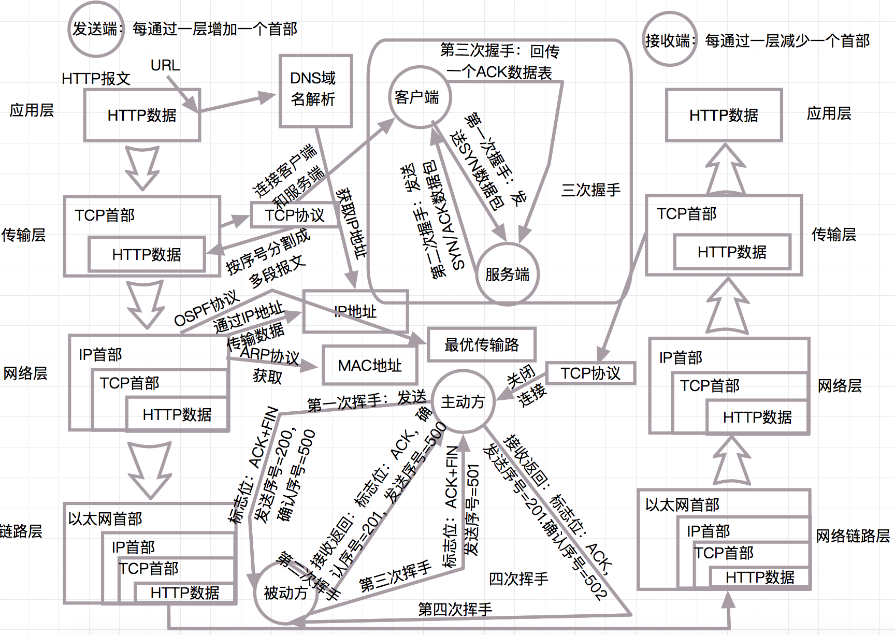

## 3、说说你对分布式事务的了解

> 分布式事务是企业集成中的一个技术难点，也是每一个分布式系统架构中都会涉及到的一个东西，特别是在微服务架构中，几乎可以说是无法避免。
>
> 首先要搞清楚：ACID、CAP、BASE理论。

#### ACID

> 指数据库事务正确执行的四个基本要素：
>
> 1.  原子性（Atomicity）
>
> 2.  一致性（Consistency）
>
> 3.  隔离性（Isolation）
>
> 4.  持久性（Durability）

#### CAP

> CAP原则又称CAP定理，指的是在一个分布式系统中，一致性（Consistency）、可用性（Availability）、分区容忍性（Partition tolerance）。CAP 原则指的是，这三个要素最多只能同时实现两点，不可能三者兼顾。
>
> 一致性：在分布式系统中的所有数据备份，在同一时刻是否同样的值。
>
> 可用性：在集群中一部分节点故障后，集群整体是否还能响应客户端的读写请求。
>
> 分区容忍性：以实际效果而言，分区相当于对通信的时限要求。系统如果不能在时限内达成数据一致性，就意味着发生了分区的情况，必须就当前操作在C和A之间做出选择。

#### BASE理论

> BASE理论是对CAP中的一致性和可用性进行一个权衡的结果，理论的核心思想就是：我们无法做到强一致，但每个应用都可以根据自身的业务特点，采用适当的方式来使系统达到最终一致性。
>
> Basically Available（基本可用） Soft state（软状态）
>
> Eventually consistent（最终一致性）

## 4、你知道哪些分布式事务解决方案？

> 我目前知道的有五种：
>
> 1.  两阶段提交(2PC)
> 2.  三阶段提交(3PC)
> 3.  补偿事务(TCC=Try-Confirm-Cancel)
> 4.  本地消息队列表(MQ)
> 5.  Sagas事务模型(最终一致性)
>
> 说完上面五种，面试官一般都会继续问下面这几个问题（可能就问一两个，也可能全部问）。

## 5，什么是二阶段提交？

> 两阶段提交2PC是分布式事务中最强大的事务类型之一，两段提交就是分两个阶段提交：
>
> 第一阶段询问各个事务数据源是否准备好。
>
> 第二阶段才真正将数据提交给事务数据源。
>
> 为了保证该事务可以满足ACID，就要引入一个协调者（Cooradinator）。其他的节点被称为参与者（Participant）。协调者负责调度参与者的行为，并最终决定这些参与者是否要把事务进行提交。处理流程如下：
>
> 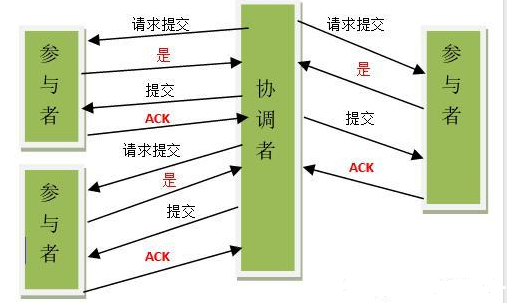

#### 阶段一

> a)协调者向所有参与者发送事务内容，询问是否可以提交事务，并等待答复。
>
> b)各参与者执行事务操作，将 undo 和 redo 信息记入事务日志中（但不提交事务）。
>
> c)如参与者执行成功，给协调者反馈 yes，否则反馈 no。

#### 阶段二

> 如果协调者收到了参与者的失败消息或者超时，直接给每个参与者发送回滚(rollback)消息；否则，发送提交(commit)消息。两种情况处理如下：
>
> **情况1：**当所有参与者均反馈 yes，提交事务
>
> a)协调者向所有参与者发出正式提交事务的请求（即 commit 请求）。
>
> b)参与者执行 commit 请求，并释放整个事务期间占用的资源。
>
> c)各参与者向协调者反馈 ack(应答)完成的消息。
>
> d)协调者收到所有参与者反馈的 ack 消息后，即完成事务提交。
>
> **情况2：**当有一个参与者反馈 no，回滚事务
>
> a)协调者向所有参与者发出回滚请求（即 rollback 请求）。
>
> b)参与者使用阶段1 中的 undo 信息执行回滚操作，并释放整个事务期间占用的资源。
>
> c)各参与者向协调者反馈 ack 完成的消息。
>
> d)协调者收到所有参与者反馈的 ack 消息后，即完成事务。
>
> **问题**
>
> 1、**性能问题**：所有参与者在事务提交阶段处于同步阻塞状态，占用系统资源，容易导致性能瓶颈。
>
> 2、**可靠性问题：**如果协调者存在单点故障问题，或出现故障，提供者将一直处于锁定状态。
>
> 3、**数据一致性问题：**在阶段2 中，如果出现协调者和参与者都挂了的情况，有可能导致数据不一致。
>
> **优点：**尽量保证了数据的强一致，适合对数据强一致要求很高的关键领域。（其实也不能100%保证强一致）。
>
> **缺点：**实现复杂，牺牲了可用性，对性能影响较大，不适合高并发高性能场景。

## 6、什么是三阶段提交？

> 三阶段提交是在二阶段提交上的改进版本，3PC最关键要解决的就是协调者和参与者同时挂掉的问题，所以3PC把2PC的准备阶段再次一分为二，这样三阶段提交。
>
> 处理流程如下：
>
> 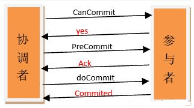

#### 阶段一

> a.协调者向所有参与者发出包含事务内容的 canCommit 请求，询问是否可以提交事务，并等待所有参与者答复。
>
> b.参与者收到 canCommit 请求后，如果认为可以执行事务操作，则反馈 yes 并进入预备状态，否则反馈 no。

#### 阶段二

> 协调者根据参与者响应情况，有以下两种可能。
>
> 
>
> **情况1：**所有参与者均反馈 yes，协调者预执行事务
>
> a)协调者向所有参与者发出 preCommit 请求，进入准备阶段。
>
> b)参与者收到 preCommit 请求后，执行事务操作，将 undo 和 redo 信息记入事务日志中（但不提交事务）。
>
> c)各参与者向协调者反馈 ack 响应或 no 响应，并等待最终指令。
>
> 
>
> **情况2：**只要有一个参与者反馈 no，或者等待超时后协调者尚无法收到所有提供者的反馈，即中断事务
>
> a)协调者向所有参与者发出 abort 请求。
>
> b)无论收到协调者发出的 abort 请求，或者在等待协调者请求过程中出现超时，参与者均会中断事务。

#### 阶段三

> 该阶段进行真正的事务提交，也可以分为以下两种情况。
>
> **情况1：**所有参与者均反馈 ack 响应，执行真正的事务提交
>
> a)如果协调者处于工作状态，则向所有参与者发出 do Commit 请求。
>
> b)参与者收到 do Commit 请求后，会正式执行事务提交，并释放整个事务期间占用的资源。
>
> c)各参与者向协调者反馈 ack 完成的消息。
>
> d)协调者收到所有参与者反馈的 ack 消息后，即完成事务提交。
>
> **情况2：**只要有一个参与者反馈 no，或者等待超时后协调组尚无法收到所有提供者的反馈，即回滚事务。
>
> a)如果协调者处于工作状态，向所有参与者发出 rollback 请求。
>
> b)参与者使用阶段1 中的 undo 信息执行回滚操作，并释放整个事务期间占用的资源。
>
> c)各参与者向协调组反馈 ack 完成的消息。
>
> d)协调组收到所有参与者反馈的 ack 消息后，即完成事务回滚。
>
> **优点：**相比二阶段提交，三阶段提交降低了阻塞范围，在等待超时后协调者或参与者会中断事务。避免了协调者单点问题。阶段3 中协调者出现问题时，参与者会继续提交事务。
>
> **缺点：**数据不一致问题依然存在，当在参与者收到 preCommit 请求后等待 do commite 指令时，此时如果协调者请求中断事务，而协调者无法与参与者正常通信，会导致参与者继续提交事务，造成数据不一致。

## 7、什么是补偿事务？

> TCC （Try Confirm Cancel）是服务化的二阶段编程模型，采用的补偿机制：
>
> 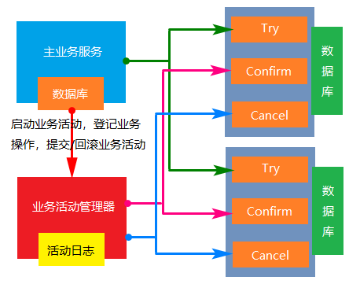
>
> TCC 其实就是采用的补偿机制，其核心思想是：针对每个操作，都要注册一个与其对应的确认和补偿（撤销）操作。
>
> 它分为三个步骤：
>
> Try 阶段主要是对业务系统做检测及资源预留。
>
> Confirm 阶段主要是对业务系统做确认提交，Try阶段执行成功并开始执行 Confirm阶段时，默认 Confirm阶段是不会出错的。即：只要Try成功，Confirm一定成功。
>
> Cancel 阶段主要是在业务执行错误，需要回滚的状态下执行的业务取消，预留资源释放。
>
> 举个例子，假入你要向老田转账，思路大概是：我们有一个本地方法，里面依次调用步骤：
>
> 1、首先在 Try 阶段，要先调用远程接口把你和老田的钱给冻结起来。
>
> 2、在 Confirm 阶段，执行远程调用的转账的操作，转账成功进行解冻。
>
> 3、如果第2步执行成功，那么转账成功，如果第二步执行失败，则调用远程冻结接口对应的解冻方法(Cancel)。

#### 优点：

> 性能提升：具体业务来实现控制资源锁的粒度变小，不会锁定整个资源。
>
> 数据最终一致性：基于 Confirm 和 Cancel 的幂等性，保证事务最终完成确认或者取消，保证数据的一致性。
>
> 可靠性：解决了 XA 协议的协调者单点故障问题，由主业务方发起并控制整个业务活动，业务活动管理器也变成多点，引入集群。
>
> **缺点：**TCC 的 Try、Confirm 和 Cancel 操作功能要按具体业务来实现，业务耦合度较高，提高了开发成本。

## 8、消息队列是怎么实现的？

#### 本地消息表（异步确保）

> 本地消息表这种实现方式应该是业界使用最多的，其核心思想是将分布式事务拆分成本地事务进行处理，这种思路是来源于ebay。我们可以从下面的流程图中看出其中的一些细节：
>
> 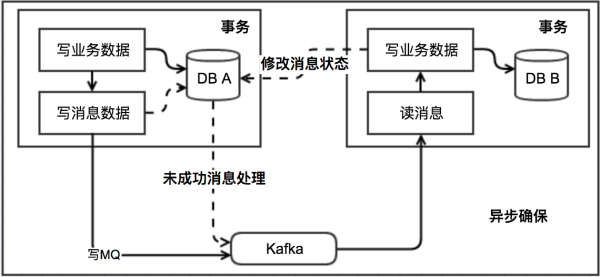
>
> 基本思路就是：
>
> 消息生产方，需要额外建一个消息表，并记录消息发送状态。消息表和业务数据要在一个事务里提交，也就是说他们要在一个数据库里面。然后消息会经过MQ发送到消息的消费方。如果消息发送失败，会进行重试发送。
>
> 消息消费方，需要处理这个消息，并完成自己的业务逻辑。此时如果本地事务处理成功，表明已经处理成功了，如果处理失败，那么就会重试执行。如果是业务上面的失败，可以给生产方发送一个业务补偿消息，通知生产方进行回滚等操作。
>
> 生产方和消费方定时扫描本地消息表，把还没处理完成的消息或者失败的消息再发送一遍。如果有靠谱的自动对账补账逻辑，这种方案还是非常实用的。
>
> 这种方案遵循BASE理论，采用的是最终一致性，笔者认为是这几种方案里面比较适合实际业务场景的，即不会出现像2PC那样复杂的实现(当调用链很长的时候，2PC的可用性是非常低的)，也不会像
>
> TCC那样可能出现确认或者回滚不了的情况。
>
> **优点：**一种非常经典的实现，避免了分布式事务，实现了最终一致性。在.NET中有现成的解决方案。
>
> **缺点：**消息表会耦合到业务系统中，如果没有封装好的解决方案，会有很多杂活需要处理。

#### MQ 事务消息

> 有一些第三方的MQ是支持事务消息的，比如RocketMQ，他们支持事务消息的方式也是类似于采用的二阶段提交，但是市面上一些主流的MQ都是不支持事务消息的，比如 RabbitMQ 和 Kafka 都不支持。
>
> 以阿里的 RocketMQ 中间件为例，其思路大致为：
>
> 第一阶段Prepared消息，会拿到消息的地址。第二阶段执行本地事务，第三阶段通过第一阶段拿到的地址去访问消息，并修改状态。也就是说在业务方法内要想消息队列提交两次请求，一次发送消息和一次确认消息。如果确认消息发送失败了RocketMQ会定期扫描消息集群中的事务消息，这时候发现了Prepared消息，它会向消息发送者确认，所以生产方需要实现一个check接口，RocketMQ会根据发送端设置的策略来决定是回滚还是继续发送确认消息。这样就保证了消息发送与本地事务同时成功或同时失败。
>
> 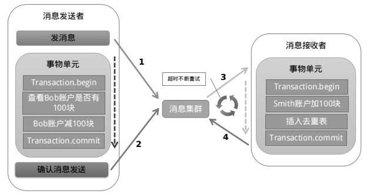
>
> 遗憾的是，RocketMQ并没有.NET 客户端。有关 RocketMQ的更多消息，大家可以查看[这篇博客](http://www.jianshu.com/p/453c6e7ff81c)
>
> **优点：**实现了最终一致性，不需要依赖本地数据库事务。
>
> **缺点：**实现难度大，主流MQ不支持，没有.NET客户端，RocketMQ事务消息部分代码也未开源。

## 9、那你说说Sagas事务模型

> Saga模式是一种分布式异步事务，一种最终一致性事务，是一种柔性事务，有两种不同的方式来实现saga事务，最流行的两种方式是：

#### 一、事件/编排Choreography：没有中央协调器（没有单点风险）时，每个服务产生并聆听其他服务的事件，并决定是否应采取行动。

> 该实现第一个服务执行一个事务，然后发布一个事件。该事件被一个或多个服务进行监听，这些服务再执行本地事务并发布（或不发布）新的事件，当最后一个服务执行本地事务并且不发布任何事件时，意味着分布式事务结束，或者它发布的事件没有被任何Saga参与者听到都意味着事务结束。
>
> 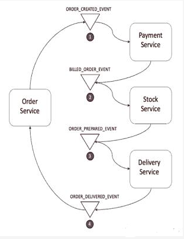

#### 处理流程说明：

> 订单服务保存新订单，将状态设置为pengding挂起状态，并发布名为ORDER_CREATED_EVENT的事件。
>
> 支付服务监听ORDER_CREATED_EVENT，并公布事件BILLED_ORDER_EVENT。
>
> 库存服务监听BILLED_ORDER_EVENT，更新库存，并发布ORDER_PREPARED_EVENT。货运服务监听ORDER_PREPARED_EVENT，然后交付产品。最后，它发布ORDER_DELIVERED_EVENT。
>
> 最后，订单服务侦听ORDER_DELIVERED_EVENT并设置订单的状态为concluded完成。假设库存服务在事务过程中失败了。进行回滚：
>
> 库存服务产生PRODUCT_OUT_OF_STOCK_EVENT
>
> 订购服务和支付服务会监听到上面库存服务的这一事件：
>
> ①支付服务会退款给客户。
>
> ②订单服务将订单状态设置为失败。
>
> **优点：**事件/编排是实现Saga模式的自然方式; 它很简单，容易理解，不需要太多的努力来构建，所有参与者都是松散耦合的，因为他们彼此之间没有直接的耦合。如果您的事务涉及2至4个步骤，则可能是非常合适的。

#### 二、命令/协调orchestrator：中央协调器负责集中处理事件的决策和业务逻辑排序。

> saga协调器orchestrator以命令/回复的方式与每项服务进行通信，告诉他们应该执行哪些操作。
>
> 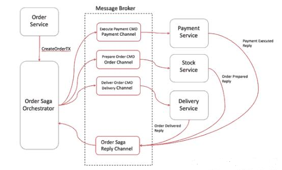
>
> 订单服务保存pending状态，并要求订单Saga协调器（简称OSO）开始启动订单事务。
>
> OSO向收款服务发送执行收款命令，收款服务回复Payment Executed消息。
>
> OSO向库存服务发送准备订单命令，库存服务将回复OrderPrepared消息。
>
> OSO向货运服务发送订单发货命令，货运服务将回复Order Delivered消息。
>
> OSO订单Saga协调器必须事先知道执行"创建订单"事务所需的流程(通过读取BPM业务流程XML配置获得)。如果有任何失败，它还负责通过向每个参与者发送命令来撤销之前的操作来协调分布式的回滚。当你有一个中央协调器协调一切时，回滚要容易得多，因为协调器默认是执行正向流程，回滚时只要执行反向流程即可。

#### 优点：

> 避免服务之间的循环依赖关系，因为saga协调器会调用saga参与者，但参与者不会调用协调器。集中分布式事务的编排。
>
> 只需要执行命令/回复(其实回复消息也是一种事件消息)，降低参与者的复杂性。在添加新步骤时，事务复杂性保持线性，回滚更容易管理。
>
> 如果在第一笔交易还没有执行完，想改变有第二笔事务的目标对象，则可以轻松地将其暂停在协调器上，直到第一笔交易结束。

## 10，分布式ID生成有几种方案？

#### 分布式ID的特性

> 唯一性：确保生成的ID是全网唯一的。
>
> 有序递增性：确保生成的ID是对于某个用户或者业务是按一定的数字有序递增的。
>
> 高可用性：确保任何时候都能正确的生成ID。
>
> 带时间：ID里面包含时间，一眼扫过去就知道哪天的交易。

#### 分布式ID生成方案

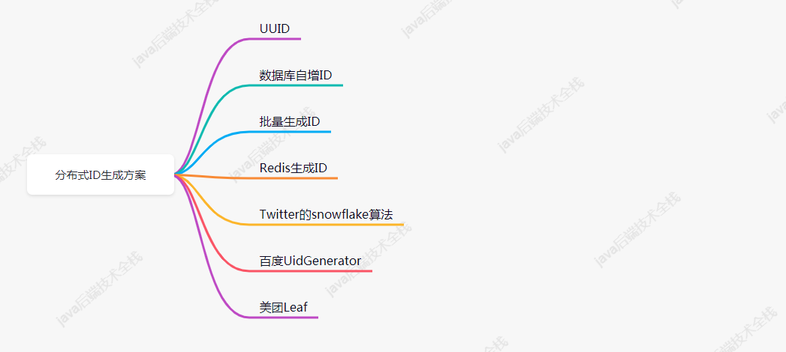

#### UUID

> 算法的核心思想是结合机器的网卡、当地时间、一个随记数来生成UUID。
>
> 优点：本地生成，生成简单，性能好，没有高可用风险
>
> 缺点：长度过长，存储冗余，且无序不可读，查询效率低

#### 数据库自增ID

> 使用数据库的id自增策略，如 MySQL 的 auto_increment。并且可以使用两台数据库分别设置不同步长，生成不重复ID的策略来实现高可用。
>
> 优点：数据库生成的ID绝对有序，高可用实现方式简单缺点：需要独立部署数据库实例，成本高，有性能瓶颈

#### 批量生成ID

> 一次按需批量生成多个ID，每次生成都需要访问数据库，将数据库修改为最大的ID值，并在内存中记录当前值及最大值。
>
> 优点：避免了每次生成ID都要访问数据库并带来压力，提高性能
>
> 缺点：属于本地生成策略，存在单点故障，服务重启造成ID不连续

#### Redis生成ID

> Redis的所有命令操作都是单线程的，本身提供像 incr 和 increby 这样的自增原子命令，所以能保证生成的 ID 肯定是唯一有序的。
>
> 优点：不依赖于数据库，灵活方便，且性能优于数据库；数字ID天然排序，对分页或者需要排序的结果很有帮助。
>
> 缺点：如果系统中没有Redis，还需要引入新的组件，增加系统复杂度；需要编码和配置的工作量比较大。
>
> 考虑到单节点的性能瓶颈，可以使用 Redis 集群来获取更高的吞吐量。假如一个集群中有5台Redis。可以初始化每台 Redis 的值分别是1,2,3,4,5，然后步长都是5。
>

#### Twitter的snowflake算法（重点）

> Twitter 利用 zookeeper 实现了一个全局ID生成的服务 Snowflake
>
> 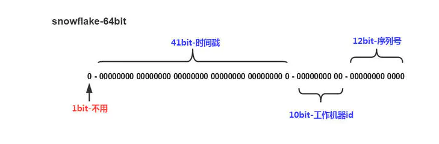
>
> 如上图的所示，Twitter 的 Snowflake 算法由下面几部分组成：

#### 1位符号位：

> 由于 long 类型在 java 中带符号的，最高位为符号位，正数为0，负数为1，且实际系统中所使用的ID一般都是正数，所以最高位为0。

#### 41位时间戳（毫秒级）：

> 需要注意的是此处的41 位时间戳并非存储当前时间的时间戳，而是存储时间戳的差值（当前时间戳-起始时间戳），这里的起始时间戳一般是ID生成器开始使用的时间戳，由程序来指定，所以41位毫秒时间戳最多可以使用(1 \<\< 41)/(1000x60x60x24x365)= 69年。

#### 10位数据机器位：

> 包括5位数据标识位和5位机器标识位，这10位决定了分布式系统中最多可以部署1 \<\< 10 = 1024
>
> s个节点。超过这个数量，生成的ID就有可能会冲突。

#### 12位毫秒内的序列：

> 这12 位计数支持每个节点每毫秒（同一台机器，同一时刻）最多生成1 \<\< 12 = 4096个ID
>
> 加起来刚好64位，为一个Long型。
>
> 优点：高性能，低延迟，按时间有序，一般不会造成ID碰撞缺点：需要独立的开发和部署，依赖于机器的时钟

#### 百度UidGenerator

> UidGenerator是百度开源的分布式ID生成器，基于于snowflake算法的实现，看起来感觉还行。不过，国内开源的项目维护性真是担忧。

#### 美团Leaf

> Leaf 是美团开源的分布式ID生成器，能保证全局唯一性、趋势递增、单调递增、信息安全，里面也提到了几种分布式方案的对比，但也需要依赖关系数据库、Zookeeper等中间件。

## 11，幂等解决方法有哪些？

> 什么是幂等？
>
> 常见描述：对于相同的请求应该返回相同的结果，所以查询类接口是天然的幂等性接口。
>
> 真正的回答方式：幂等指的是相同请求（identical request）执行一次或者多次所带来的副作用（side-effects）是一样的。
>
> 什么常见会出现幂等？
>
> 前端调后端接口发起支付超时，然后再次发起重试。可能会导致多次支付。
>
> Dubbo中也有重试机制。页面上多次点击。
>
> 我们想要的是：接口的幂等性实际上就是接口可重复调用，在调用方多次调用的情况下，接口最终得到的结果是一致的。
>
> 解决方案
>
> 在插入数据的时候，插入去重表，利用数据库的唯一索引特性，保证唯一的逻辑。
>
> 悲观锁，select for update，整个执行过程中锁定该订单对应的记录。注意：这种在DB读大于写的情况下尽量少用。
>
> 先查询后修改数据，并发不高的后台系统，或者一些任务JOB，为了支持幂等，支持重复执行，简单的处理方法是，先查询下一些关键数据，判断是否已经执行过，在进行业务处理，就可以了。注意：核心高并发流程不要用这种方法。
>
> 状态机幂等，在设计单据相关的业务，或者是任务相关的业务，肯定会涉及到状态机，就是业务单据上面有个状态，状态在不同的情况下会发生变更，一般情况下存在有限状态机，这时候，如果状态机已经处于下一个状态，这时候来了一个上一个状态的变更，理论上是不能够变更的，这样的话，保证了有限状态机的幂等。
>
> token机制，防止页面重复提交：
>
> 集群环境：采用token加redis（redis单线程的，处理需要排队）或者单JVM环境：采用token加redis或token加jvm内存
>
> 数据提交前要向服务的申请token，token放到redis或jvm内存，设置token有效时间，提交后后台校验token，同时删除token，生成新的token返回。token特点：要申请，一次有效性，可以限流。
>
> 全局唯一ID，如果使用全局唯一ID，就是根据业务的操作和内容生成一个全局ID，在执行操作前先根据这个全局唯一ID是否存在，来判断这个操作是否已经执行。如果不存在则把全局ID，存储到存储系统中，比如数据库、redis等。如果存在则表示该方法已经执行。

## 12，常见负载均衡算法有哪些？


## 13、你知道哪些限流算法？

> 限流算法有四种常见算法：
>
> 计数器算法（固定窗口）
>
> 滑动窗口
>
> 漏桶算法
>
> 令牌桶算法

## 14、说说什么是计数器（固定窗口）算法

> 计数器算法是使用计数器在周期内累加访问次数，当达到设定的限流值时，触发限流策略。下一个周期开始时，进行清零，重新计数。
>
> 此算法在单机还是分布式环境下实现都非常简单，使用redis的incr原子自增性和线程安全即可轻松实现。
>
> 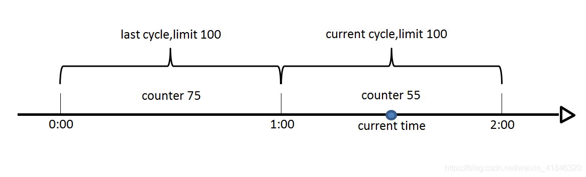
>
> 这个算法通常用于QPS限流和统计总访问量，对于秒级以上的时间周期来说，会存在一个非常严重的问题，那就是临界问题，如下图：
>
> 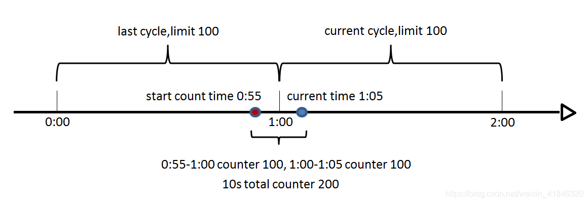
>
> 假设1min内服务器的负载能力为100，因此一个周期的访问量限制在100，然而在第一个周期的最后5秒和下一个周期的开始5秒时间段内，分别涌入100的访问量，虽然没有超过每个周期的限制量，但是整体上10秒内已达到200的访问量，已远远超过服务器的负载能力，由此可见，计数器算法方式限流对于周期比较长的限流，存在很大的弊端。

## 15、说说什么是滑动窗口算法

> 滑动窗口算法是将时间周期分为N个小周期，分别记录每个小周期内访问次数，并且根据时间滑动删除过期的小周期。
>
> 如下图，假设时间周期为1min，将1min再分为2个小周期，统计每个小周期的访问数量，则可以看到，第一个时间周期内，访问数量为75，第二个时间周期内，访问数量为100，超过100的访问则被限流掉了
>
> 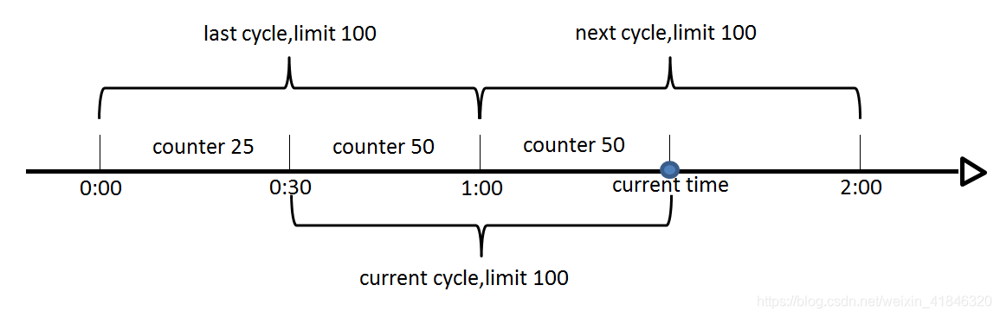
>
> 由此可见，当滑动窗口的格子划分的越多，那么滑动窗口的滚动就越平滑，限流的统计就会越精确。
>
> 此算法可以很好的解决固定窗口算法的临界问题。

## 16、说说什么是漏桶算法

> 漏桶算法是访问请求到达时直接放入漏桶，如当前容量已达到上限（限流值），则进行丢弃（触发限流策略）。漏桶以固定的速率进行释放访问请求（即请求通过），直到漏桶为空。
>
> 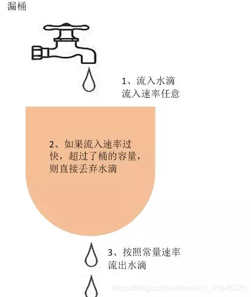

## 17、说说什么是令牌桶算法

> 令牌桶算法是程序以r（r=时间周期/限流值）的速度向令牌桶中增加令牌，直到令牌桶满，请求到达时向令牌桶请求令牌，如获取到令牌则通过请求，否则触发限流策略
>
> 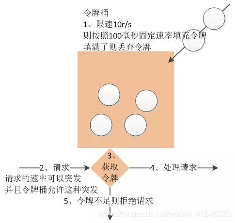

## 18、数据库如何处理海量数据？

> 对数据库进行：分库分表，主从架构，读写分离。水平分库/分表，垂直分库/分表。
>
> 水平分库/表，各个库和表的结构一模一样。垂直分库/表，各个库和表的结构不一样。
>
> 读写分离：主机负责写，从机负责读。

## 19、如何将长链接转换成短链接，并发送短信？

> 短 URL 从生成到使用分为以下几步：
>
> 有一个服务,将要发送给你的长 URL 对应到一个短 URL 上.例如<span class="underline">www.baidu.com</span> -\> www.t.cn/1
>
> 把短 url 拼接到短信等的内容上发送。
>
> 用户点击短 URL ,浏览器用301 /302 进行重定向,访问到对应的长 URL。
>
> 展示对应的内容。

## 20、长链接和短链接如何互相转换？

> 思路是建立一个发号器。每次有一个新的长 URL 进来，我们就增加一。并且将新的数值返回.第一个来的 url 返回\"[<span class="underline">www.x.cn/0</span>](http://www.x.cn/0)\",第二个返回\"[<span class="underline">www.x.cn/1</span>](http://www.x.cn/1)\"。

## 21、长链接和短链接的对应关系如何存储？

> 如果数据量小且 QPS 低，直接使用数据库的自增主键就可以实现。还可以将最近/最热门的对应关系存储在 K-V 数据库中,这样子可以节省空间的同时,加快响应速度。

## 22、如何提高系统的并发能力？

> 使用分布式系统。
>
> 部署多台服务器，并做负载均衡。使用缓存（Redis）集群。
>
> 数据库分库分表+读写分离。引入消息中间件集群。

# 十六、网络篇

## 1，HTTP 响应码有哪些？分别代表什么含义？

> 200：成功，Web 服务器成功处理了客户端的请求。
>
> 301：永久重定向，当客户端请求一个网址的时候，Web 服务器会将当前请求重定向到另一个网址，搜索引擎会抓取重定向后网页的内容并且将旧的网址替换为重定向后的网址。302：临时重定向，搜索引擎会抓取重定向后网页的内容而保留旧的网址，因为搜索引擎认为重定向后的网址是暂时的。
>
> 400：客户端请求错误，多为参数不合法导致 Web 服务器验参失败。
>
> 404：未找到，Web 服务器找不到资源。
>
> 500：Web 服务器错误，服务器处理客户端请求的时候发生错误。
>
> 503：服务不可用，服务器停机。
>
> 504：网关超时。

## 2，Forward 和 Redirect 的区别？

> - 浏览器 URL 地址：Forward 是服务器内部的重定向，服务器内部请求某个 servlet，然后获取响应的内容，浏览器的 URL 地址是不会变化的；Redirect 是客户端请求服务器，然后服务器给客户端返回了一个302 状态码和新的 location，客户端重新发起 HTTP 请求，服务器给客户端响应 location 对应的 URL 地址，浏览器的 URL 地址发生了变化。
>
> - 数据的共享：Forward 是服务器内部的重定向，request 在整个重定向过程中是不变的，request 中的信息在 servlet 间是共享的。Redirect 发起了两次 HTTP 请求分别使用不同的request。
>
> - 请求的次数：Forward 只有一次请求；Redirect 有两次请求。

## 3， Get 和 Post 请求有哪些区别？

> **用途：**
>
> get 请求用来从服务器获取资源
>
> post 请求用来向服务器提交数据表单的提交方式：
>
> get 请求直接将表单数据以name1=value1&name2=value2 的形式拼接到 URL 上（http://www.baidu.com/action?name1=value1&name2=value2），多个参数参数值需要用&连接起来并且用`? `拼接到 action 后面；
>
> post 请求将表单数据放到请求头或者请求的消息体中。
>
> 
>
> **传输数据的大小限制：**
>
> get 请求传输的数据受到 URL 长度的限制，而 URL 长度是由浏览器决定的；
>
> post 请求传输数据的大小理论上来说是没有限制的。
>
> **参数的编码：**
>
> get 请求的参数会在地址栏明文显示，使用 URL 编码的文本格式传递参数；
>
> post 请求使用二进制数据多重编码传递参数。
>
> **缓存：**
>
> get 请求可以被浏览器缓存被收藏为标签；
>
> post 请求不会被缓存也不能被收藏为标签。

## 4，说说TCP 与UDP 的区别，以及各自的优缺点

> 1、TCP面向连接（如打电话要先拨号建立连接）：UDP是无连接的，即发送数据之前不需要建立连接。
>
> 2、TCP提供可靠的服务。也就是说，通过TCP连接传送的数据，无差错，不丢失，不重复，且按序到达;UDP尽最大努力交付，即不保证可靠交付。tcp通过校验和，重传控制，序号标识，滑动窗口、确认应答实现可靠传输。如丢包时的重发控制，还可以对次序乱掉的分包进行顺序控制。
>
> 3、UDP具有较好的实时性，工作效率比TCP高，适用于对高速传输和实时性有较高的通信或广播通信。
>
> 4.每一条TCP连接只能是点到点的;UDP支持一对一，一对多，多对一和多对多的交互通信
>
> 5、TCP对系统资源要求较多，UDP对系统资源要求较少。

## 5，说一下HTTP 和HTTPS 的区别

> 端口不同：HTTP和 `HTTPS` 的连接方式不同没用的端口也不一样，HTTP是80， `HTTPS` 用的是443
>
> 消耗资源：和HTTP相比，HTTPS通信会因为加解密的处理消耗更多的CPU和内存资源。
>
> 开销： `HTTPS` 通信需要证书，这类证书通常需要向认证机构申请或者付费购买。

## 6，说说HTTP、TCP、Socket 的关系是什么？

> - TCP/IP 代表传输控制协议/网际协议，指的是一系列协议族。
>
> - HTTP 本身就是一个协议，是从 Web 服务器传输超文本到本地浏览器的传送协议。
>
> - Socket 是 TCP/IP 网络的 API ，其实就是一个门面模式，它把复杂的 TCP/IP 协议族隐藏在Socket 接口后面。对用户来说，一组简单的接口就是全部，让 Socket 去组织数据，以符合指定的协议。
>
> 综上所述：
>
> - 需要 IP 协议来连接网络
>
> - TCP 是一种允许我们安全传输数据的机制，使用 TCP 协议来传输数据的 HTTP 是 Web 服务器和客户端使用的特殊协议。
>
> - HTTP 基于 TCP 协议，所以可以使用 Socket 去建立一个 TCP 连接。

## 7，说一下HTTP的长连接与短连接的区别

> HTTP协议的长连接和短连接，实质上是TCP协议的长连接和短连接。
>
> **短连接**
>
> 在HTTP/1.0中默认使用短链接,也就是说，浏览器和服务器每进行一次HTTP操作，就建立一次连接，但任务结束就中断连接。如果客户端访问的某个HTML或其他类型的Web资源，如 JavaScript文件、图像文件、 CSS 文件等。当浏览器每遇到这样一个Web资源，就会建立一个HTTP会话.
>
> **长连接**
>
> 从HTTP/1.1起，默认使用长连接，用以保持连接特性。在使用长连接的情况下，当一个网页打开完成后，客户端和服务器之间用于传输HTTP数据的 TCP连接不会关闭。如果客户端再次访问这个服务器上的网页，会继续使用这一条已经建立的连接。Keep-Alive不会永久保持连接，它有一个保持时间，可以在不同的服务器软件（如Apache）中设定这个时间。

## 8，TCP 为什么要三次握手，两次不行吗？为什么？

> TCP 客户端和服务端建立连接需要三次握手，首先服务端需要开启监听，等待客户端的连接请求，这个时候服务端处于"收听"状态；
>
> 客户端向服务端发起连接，选择 seq=x 的初始序列号，此时客户端处于"同步已发送"的状态；服务端收到客户端的连接请求，同意连接并向客户端发送确认，确认号是 ack=x+1 表示客户端可以发送下一个数据包序号从 x+1 开始，同时选择 seq=y 的初始序列号，此时服务端处于"同步收到"状态；
>
> 客户端收到服务端的确认后，向服务端发送确认信息，确认号是 ack=y+1 表示服务端可以发送下一个数据包序号从 y+1 开始，此时客户端处于"已建立连接"的状态；
>
> 服务端收到客户端的确认后，也进入"已建立连接"的状态。
>
> 从三次握手的过程可以看出如果只有两次握手，那么客户端的起始序列号可以确认，服务端的起始序列号将得不到确认。
>
> 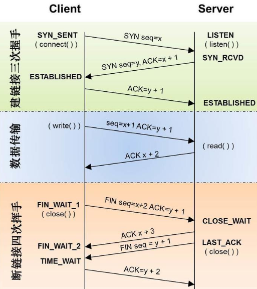

## 9，说一下 TCP 粘包是怎么产生的？怎么解决粘包问题的？

> 上文中讲 TCP 和 UDP 区别的时候提到 TCP 传输数据基于字节流，从应用层到 TCP 传输层的多个数据包是一连串的字节流是没有边界的，而且 TCP 首部并没有记录数据包的长度，所以 TCP 传输数据的时候可能会发送粘包和拆包的问题；而 UDP 是基于数据报传输数据的，UDP 首部也记录了数据报的长度，可以轻易的区分出不同的数据包的边界。
>
> 接下来看下 TCP 传输数据的几种情况，首先第一种情况是正常的，既没有发送粘包也没有发生拆包。
>
> 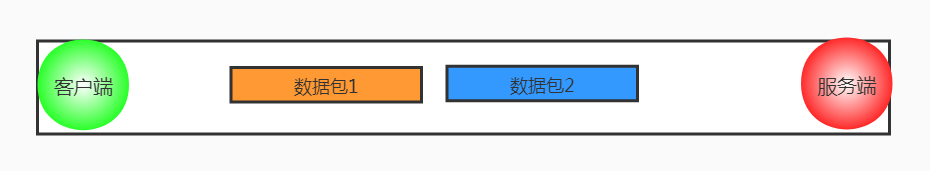
>
> 第二种情况发生了明显的粘包现象，这种情况对于数据接收方来说很难处理。
>
> 接下来的两种情况发生了粘包和拆包的现象，接收端收到的数据包要么是不完整的要么是多出来一块儿。
>
> 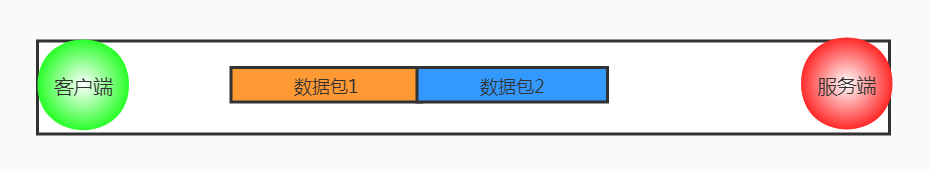
>
> 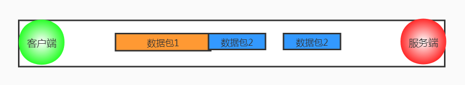
>
> 造成粘包和拆包现象的原因：
>
> - TCP 发送缓冲区剩余空间不足以发送一个完整的数据包，将发生拆包；
> - 要发送的数据超过了最大报文长度的限制，TCP 传输数据时进行拆包；
>
> - 要发送的数据包小于 TCP 发送缓冲区剩余空间，TCP 将多个数据包写满发送缓冲区一次发送出去，将发生粘包；
>
> - 接收端没有及时读取 TCP 发送缓冲区中的数据包，将会发生粘包。
>
> 粘包拆包的解决方法：
>
> - 发送端给数据包添加首部，首部中添加数据包的长度属性，这样接收端通过首部中的长度字段就可以知道数据包的实际长度啦；
>
> - 针对发送的数据包小于缓冲区大小的情况，发送端可以将不同的数据包规定成同样的长度，不足这个长度的补充0，接收端从缓冲区读取固定的长度数据这样就可以区分不同的数据包；
> - 发送端通过给不同的数据包添加间隔符合确定边界，接收端通过这个间隔符合就可以区分不同的数据包。

## 10，TCP 如何保证可靠性

> **序列号和确认号机制：**
>
> TCP 发送端发送数据包的时候会选择一个 seq 序列号，接收端收到数据包后会检测数据包的完整性，如果检测通过会响应一个 ack 确认号表示收到了数据包。
>
> **超时重发机制：**
>
> TCP 发送端发送了数据包后会启动一个定时器，如果一定时间没有收到接受端的确认后，将会重新发送该数据包。
>
> **对乱序数据包重新排序：**
>
> 从 IP 网络层传输到 TCP 层的数据包可能会乱序，TCP 层会对数据包重新排序再发给应用层。
>
> **丢弃重复数据：**
>
> 从 IP 网络层传输到 TCP 层的数据包可能会重复，TCP 层会丢弃重复的数据包。
>
> **流量控制：**
>
> TCP 发送端和接收端都有一个固定大小的缓冲空间，为了防止发送端发送数据的速度太快导致接收端缓冲区溢出，发送端只能发送接收端可以接纳的数据，为了达到这种控制效果，TCP 用了流量控制协议（可变大小的滑动窗口协议）来实现。

## 11，OSI 的七层模型都有哪些？

> OSI七层模型一般指开放系统互连参考模型(Open System Interconnect 简称OSI)是国际标准化组织(ISO)和国际电报电话咨询委员会(CCITT)联合制定的开放系统互连参考模型,为开放式互连信息系统提供了一种功能结构的框架。
>
> 应用层：各种应用程序协议，比如 HTTP、HTTPS、FTP、SOCKS 安全套接字协议、DNS 域名系统、GDP 网关发现协议等等。
>
> 表示层：加密解密、转换翻译、压缩解压缩，比如 LPP 轻量级表示协议。
>
> 会话层：不同机器上的用户建立和管理会话，比如 SSL 安全套接字层协议、TLS 传输层安全协议、RPC 远程过程调用协议等等。
>
> 传输层：接受上一层的数据，在必要的时候对数据进行分割，并将这些数据交给网络层，保证这些数据段有效到达对端，比如 TCP 传输控制协议、UDP 数据报协议。
>
> 网络层：控制子网的运行：逻辑编址、分组传输、路由选择，比如 IP、IPV6、SLIP 等等。数据链路层：物理寻址，同时将原始比特流转变为逻辑传输路线，比如 XTP 压缩传输协议、PPTP 点对点隧道协议等等。
>
> 物理层：机械、电子、定时接口通信信道上的原始比特流传输，比如 IEEE802.2 等等。
>
> 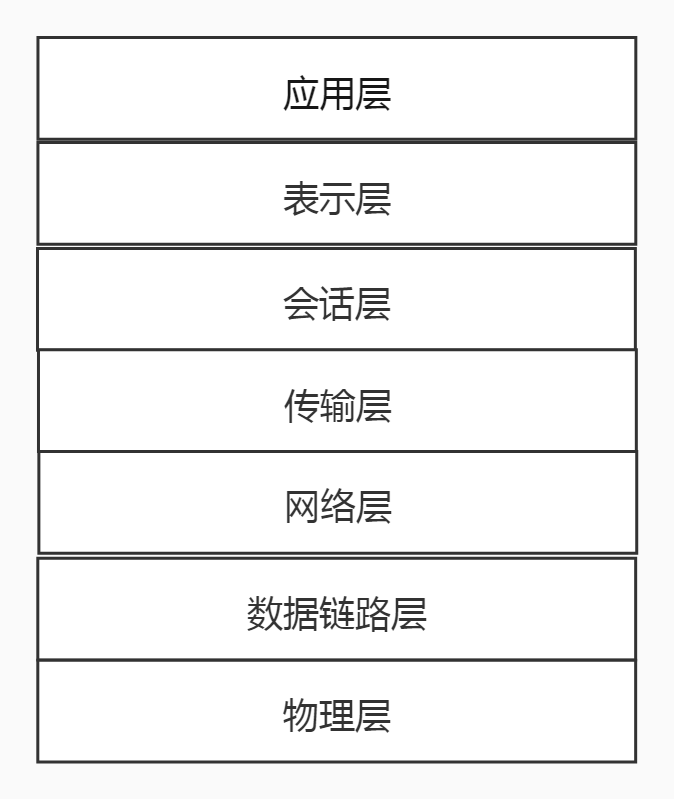

## 12，浏览器中输入："[www.woaijava.com](http://www.woaijava.com/)"之后都发生了什么？请详细阐述

> 由域名→IP地址寻找IP地址的过程依次经过了浏览器缓存、系统缓存、hosts文件、路由器缓存、递归搜索根域名服务器。
>
> 建立TCP/IP连接（三次握手具体过程）由浏览器发送一个HTTP请求
>
> 经过路由器的转发，通过服务器的防火墙，该HTTP请求到达了服务器服务器处理该HTTP请求，返回一个HTML文件
>
> 浏览器解析该HTML文件，并且显示在浏览器端这里需要注意：
>
> HTTP协议是一种基于TCP/IP的应用层协议，进行HTTP数据请求必须先建立TCP/IP连接
>
> 可以这样理解：HTTP是轿车，提供了封装或者显示数据的具体形式；Socket是发动机，提供了网络通信的能力。
>
> 两个计算机之间的交流无非是两个端口之间的数据通信,具体的数据会以什么样的形式展现是以不同的应用层协议来定义的。

## 13，如何实现跨域？

> 当浏览器执行 JS 脚本的时候，会检测脚本要访问的协议、域名、端口号是不是和当前网址一致，如果不一致就是跨域。跨域是不允许的，这种限制叫做浏览器的同源策略，简单点的说法就是浏览器不允许一个源中加载脚本与其他源中的资源进行交互。那么如何实现跨域呢？
>
> JSONP、CORS方式、代理方式
>
> **1 JSONP 方式**
>
> script、img、iframe、link、video、audio 等带有 src 属性的标签可以跨域请求和执行资源，
>
> JSONP 利用这一点"漏洞"实现跨域。
>
> ```jsp
> <script>
>     var scriptTag = document.createElement('script');
>     scriptTag.type = "text/javascript";
>     scriptTag.src = "http://10.10.0.101:8899/jsonp?callback=f";
>     document.head.appendChild(scriptTag);
> </script>
> ```
>
> 再看下 jQuery 的写法。
>
> ```javascript
> $.ajax({
>     // 请求域名
>     url:'http://10.10.0.101:8899/login',
>     // 请求方式
>     type:'GET',
>     // 数据类型选择 jsonp
>     dataType:'jsonp',
>     // 回调方法名
>     jsonpCallback:'callback',
> });
> // 回调方法
> function callback(response) {
>     console.log(response);
> }
> ```
>
> JSONP 实现跨域很简单但是只支持 GET 请求方式。而且在服务器端接受到 JSONP 请求后需要设置请求头，添加 Access-Control-Allow-Origin 属性，属性值为`*`，表示允许所有域名访问，这样浏览器才会正常解析，否则会报406 错误。
>
> ```java
> response.setHeader("Access-Control-Allow-Origin", "*");
> ```

#### CORS 方式

> CORS（Cross-Origin Resource Sharing）即跨域资源共享，需要浏览器和服务器同时支持，这种请求方式分为简单请求和非简单请求。
>
> 当浏览器发出的 XMLHttpRequest 请求的请求方式是 POST 或者 GET，请求头中只包含 Accept、 Accept-Language、Content-Language、Last-Event-ID、Content-Type（application/x-www- form-urlencoded、multipart/form-data、text/plain）时那么这个请求就是一个简单请求。
>
> 对于简单的请求，浏览器会在请求头中添加 Origin 属性，标明本次请求来自哪个源（协议+域名+端口）。
>
> ```properties
> GET
> 
> //标明本次请求来自哪个源（协议+域名+端口）
> 
> Origin: http://127.0.0.1:8080
> 
> // IP
> 
> Host: 127.0.0.1:8080
> 
> //长连接
> 
> Connection: keep-alive Content-Type: text/plain
> ```
>
> 如果 Origin 标明的域名在服务器许可范围内，那么服务器就会给出响应：
>
> ```properties
> //该值上文提到过，表示允许浏览器指定的域名访问，要么为浏览器传入的 origin，要么为\*表示所有域名都可以访问
> 
> Access-Control-Allow-Origin: http://127.0.0.1:8080
> 
> //表示服务器是否同意浏览器发送 cookie Access-Control-Allow-Credentials: true
> 
> //指定 XMLHttpRequest\#getResponseHeader()方法可以获取到的字段
> 
> Access-Control-Expose-Headers: xxx Content-Type: text/html; charset=utf-8
> ```
>
> 
>
> `Access-Control-Allow-Credentials: true` 表示服务器同意浏览器发送 cookie，另外浏览器也需要设置支持发送 cookie，否则就算服务器支持浏览器也不会发送。
>
> ```java
> var xhr = new XMLHttpRequest();
> // 设置发送的请求是否带 cookie
> xhr.withCredentials = true;
> xhr.open('post', 'http://10.10.0.101:8899/login', true);
> xhr.setRequestHeader('Content-Type', 'text/plain');
> ```
>
> 另外一种是非简单请求，请求方式是 PUT 或 DELETE，或者请求头中添加了 Content-Type:application/json 属性和属性值的请求。
>
> 这种请求在浏览器正式发出 XMLHttpRequest 请求前会先发送一个预检 HTTP 请求，询问服务器当前网页的域名是否在服务器的许可名单之中，只有得到服务器的肯定后才会正式发出通信请求。
>
> 预检请求的头信息：
>
> ```properties
> //预检请求的请求方式是 OPTIONS OPTIONS
> 
> //标明本次请求来自哪个源（协议+域名+端口）
> 
> Origin: http://127.0.0.1:8080
> 
> //标明接下来的 CORS 请求要使用的请求方式
> 
> Access-Control-Request-Method: PUT
> 
> //标明接下来的 CORS 请求要附加发送的头信息属性
> 
> Access-Control-Request-Headers: X-Custom-Header
> 
> // IP
> 
> Host: 127.0.0.1:8080
> 
> //长连接
> 
> Connection: keep-alive
> ```
>
> 如果服务器回应预检请求的响应头中没有任何 CORS 相关的头信息的话表示不支持跨域，如果允许跨域就会做出响应，响应头信息如下：
>
> ```properties
> HTTP/1.1 200 OK
> 
> //该值上文提到过，表示允许浏览器指定的域名访问，要么为浏览器传入的 origin，要么为\*表示所
> 
> 有域名都可以访问
> 
> Access-Control-Allow-Origin:http://127.0.0.1:8080
> 
> //服务器支持的所有跨域请求方式，为了防止浏览器发起多次预检请求把所有的请求方式返回给浏览器
> 
> Access-Control-Allow-Methods: GET, POST, PUT
> 
> //服务器支持预检请求头信息中的 Access-Control-Request-Headers 属性值
> 
> Access-Control-Allow-Headers: X-Custom-Header
> 
> //服务器同意浏览器发送 cookie
> 
> Access-Control-Allow-Credentials: true
> 
> //指定预检请求的有效期是20 天，期间不必再次发送另一个预检请求
> 
> Access-Control-Max-Age:1728000
> 
> Content-Type: text/html; charset=utf-8 Keep-Alive: timeout=2, max=100
> 
> //长连接
> 
> Connection: Keep-Alive Content-Type: text/plain
> ```
>
> 接着浏览器会像简单请求一样，发送一个 CORS 请求，请求头中一定包含 Origin 属性，服务器的响应头中也一定得包含 Access-Control-Allow-Origin 属性。

#### 代理方式

> 跨域限制是浏览器的同源策略导致的，使用 nginx 当做服务器访问别的服务的 HTTP 接口是不需要执行 JS 脚步不存在同源策略限制的，所以可以利用 Nginx 创建一个代理服务器，这个代理服务器的域名跟浏览器要访问的域名一致，然后通过这个代理服务器修改 cookie 中的域名为要访问的 HTTP接口的域名，通过反向代理实现跨域。
>
> Nginx 的配置信息：
>
> ```nginx
> server {
>     #代理服务器的端口
>     listen 88;
> 
>     #代理服务器的域名
>     server_name http://127.0.0.1;
>     location /{
>         #反向代理服务器的域名+端口
>         proxy_pass http://127.0.0.2:89;
> 
>         #修改cookie里域名
>         proxy_cookie_domain [http://127.0.0.2](http://127.0.0.2/) http://127.0.0.1; index index.html index.htm;
>         #设置当前代理服务器允许浏览器跨域
>         add_header Access-Control-Allow-Origin http://127.0.0.1;
>         #设置当前代理服务器允许浏览器发送 cookie add_header Access-Control-Allow-Credentials true;
>     }
> }
> ```
>
> 前端代码：
>
> ```js
> var xhr = new XMLHttpRequest();
> // 设置浏览器允许发送 cookie
> xhr.withCredentials = true;
> // 访问 nginx 代理服务器
> xhr.open('get', 'http://127.0.0.1:88', true);
> xhr.send();
> ```
>
> 

## 14，TCP 为什么要三次握手，两次不行吗？为什么？

> CP 客户端和服务端建立连接需要三次握手，首先服务端需要开启监听，等待客户端的连接请求，这个时候服务端处于"收听"状态；
>
> 客户端向服务端发起连接，选择 seq=x 的初始序列号，此时客户端处于"同步已发送"的状态；服务端收到客户端的连接请求，同意连接并向客户端发送确认，确认号是 ack=x+1 表示客户端可以发送下一个数据包序号从 x+1 开始，同时选择 seq=y 的初始序列号，此时服务端处于"同步收到"状态；
>
> 客户端收到服务端的确认后，向服务端发送确认信息，确认号是 ack=y+1 表示服务端可以发送下一个数据包序号从 y+1 开始，此时客户端处于"已建立连接"的状态；
>
> 服务端收到客户端的确认后，也进入"已建立连接"的状态。
>
> 从三次握手的过程可以看出如果只有两次握手，那么客户端的起始序列号可以确认，服务端的起始序列号将得不到确认。

## 15，说一下 TCP 粘包是怎么产生的？怎么解决粘包问题的？

> 上文中讲 TCP 和 UDP 区别的时候提到 TCP 传输数据基于字节流，从应用层到 TCP 传输层的多个数据包是一连串的字节流是没有边界的，而且 TCP 首部并没有记录数据包的长度，所以 TCP 传输数据的时候可能会发送粘包和拆包的问题；而 UDP 是基于数据报传输数据的，UDP 首部也记录了数据报的长度，可以轻易的区分出不同的数据包的边界。

> 造成粘包和拆包现象的原因：
>
> TCP 发送缓冲区剩余空间不足以发送一个完整的数据包，将发生拆包；要发送的数据超过了最大报文长度的限制，TCP 传输数据时进行拆包；
>
> 要发送的数据包小于 TCP 发送缓冲区剩余空间，TCP 将多个数据包写满发送缓冲区一次发送出去，将发生粘包；
>
> 接收端没有及时读取 TCP 发送缓冲区中的数据包，将会发生粘包。
>
> 粘包拆包的解决方法：
>
> 发送端给数据包添加首部，首部中添加数据包的长度属性，这样接收端通过首部中的长度字段就可以知道数据包的实际长度啦；
>
> 针对发送的数据包小于缓冲区大小的情况，发送端可以将不同的数据包规定成同样的长度，不足这个长度的补充0，接收端从缓冲区读取固定的长度数据这样就可以区分不同的数据包；发送端通过给不同的数据包添加间隔符合确定边界，接收端通过这个间隔符合就可以区分不同的数据包。

## 16，HTTP1.0、HTTP1.1、HTTP2.0的关系和区别

#### 一，对比

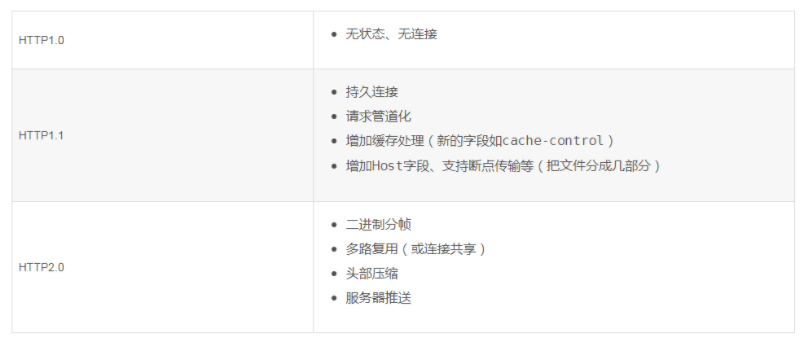

#### 二、HTTP1.0：

> 浏览器的每次请求都需要与服务器建立一个TCP连接，服务器处理完成后立即断开TCP连接（无连接），服务器不跟踪每个客户端也不记录过去的请求（无状态）。

#### 三、HTTP1.1：

> HTTP/1.0中默认使用Connection: close。在HTTP/1.1中已经默认使用Connection: keep-alive，避免了连接建立和释放的开销，但服务器必须按照客户端请求的先后顺序依次回送相应的结果，以保证客户端能够区分出每次请求的响应内容。通过Content-Length字段来判断当前请求的数据是否已经全部接收。不允许同时存在两个并行的响应。

#### 四、HTTP2.0：

> HTTP/2引入二进制数据帧和流的概念，其中帧对数据进行顺序标识，如下图所示，这样浏览器收到数据之后，就可以按照序列对数据进行合并，而不会出现合并后数据错乱的情况。同样是因为有了序列，服务器就可以并行的传输数据，这就是流所做的事情。
>
> 流（stream）已建立连接上的双向字节流消息与逻辑消息对应的完整的一系列数据帧帧 HTTP2.0通信的最小单位，每个帧包含帧头部，至少也会标识出当前帧所属的流（stream id）。多路复用：
>
> 1、所有的HTTP2.0通信都在一个TCP连接上完成，这个连接可以承载任意数量的双向数据流。
>
> 2、每个数据流以消息的形式发送，而消息由一或多个帧组成。这些帧可以乱序发送，然后再根据每个帧头部的流标识符（stream id）重新组装。
>
> 举个例子，每个请求是一个数据流，数据流以消息的方式发送，而消息又分为多个帧，帧头部记录着stream id用来标识所属的数据流，不同属的帧可以在连接中随机混杂在一起。接收方可以根据 stream id将帧再归属到各自不同的请求当中去。
>
> 3、另外，多路复用（连接共享）可能会导致关键请求被阻塞。HTTP2.0里每个数据流都可以设置优先级和依赖，优先级高的数据流会被服务器优先处理和返回给客户端，数据流还可以依赖其他的子数据流。
>
> 4、可见，HTTP2.0实现了真正的并行传输，它能够在一个TCP上进行任意数量HTTP请求。而这个强大的功能则是基于"二进制分帧"的特性。
>
> 头部压缩
>
> 在HTTP1.x中，头部元数据都是以纯文本的形式发送的，通常会给每个请求增加500\~800字节的负荷。
>
> HTTP2.0使用encoder来减少需要传输的header大小，通讯双方各自cache一份header fields表，既避免了重复header的传输，又减小了需要传输的大小。高效的压缩算法可以很大的压缩 header，减少发送包的数量从而降低延迟。
>
> 服务器推送：
>
> 服务器除了对最初请求的响应外，服务器还可以额外的向客户端推送资源，而无需客户端明确的请求。

## 17，说说HTTP协议与TCP/IP协议的关系

> HTTP的长连接和短连接本质上是TCP长连接和短连接。
>
> HTTP属于应用层协议，在传输层使用TCP协议，在网络层使用IP协议。
>
> IP协议主要解决网络路由和寻址问题，
>
> TCP协议主要解决如何在IP层之上可靠地传递数据包，使得网络上接收端收到发送端所发出的所有包，并且顺序与发送顺序一致。TCP协议是可靠的、面向连接的。

## 18，如何理解HTTP协议是无状态的？

> HTTP协议是无状态的，指的是协议对于事务处理没有记忆能力，服务器不知道客户端是什么状态。也就是说，打开一个服务器上的网页和上一次打开这个服务器上的网页之间没有任何联系。HTTP是一个无状态的面向连接的协议，无状态不代表HTTP不能保持TCP连接，更不能代表HTTP使用的是
>
> UDP协议（无连接）。

## 19，什么是长连接和短连接？

> 在HTTP/1.0中默认使用短连接。也就是说，客户端和服务器每进行一次HTTP操作，就建立一次连接，任务结束就中断连接。当客户端浏览器访问的某个HTML或其他类型的Web页中包含有其他的
>
> Web资源（如JavaScript文件、图像文件、CSS文件等），每遇到这样一个Web资源，浏览器就会重新建立一个HTTP会话。
>
> 而从HTTP/1.1起，默认使用长连接，用以保持连接特性。使用长连接的HTTP协议，会在响应头加入这行代码：
>
> Connection:keep-alive
>
> 在使用长连接的情况下，当一个网页打开完成后，客户端和服务器之间用于传输HTTP数据的TCP连接不会关闭，客户端再次访问这个服务器时，会继续使用这一条已经建立的连接。Keep-Alive不会永久保持连接，它有一个保持时间，可以在不同的服务器软件（如Apache）中设定这个时间。实现长连接需要客户端和服务端都支持长连接。
>
> HTTP协议的长连接和短连接，实质上是TCP协议的长连接和短连接。

## 20，长连接和短连接的优缺点？

> 长连接可以省去较多的TCP建立和关闭的操作，减少浪费，节约时间。对于频繁请求资源的客户来说，较适用长连接。不过这里存在一个问题，存活功能的探测周期太长，还有就是它只是探测TCP连接的存活，属于比较斯文的做法，遇到恶意的连接时，保活功能就不够使了。在长连接的应用场景下，client端一般不会主动关闭它们之间的连接，Client与server之间的连接如果一直不关闭的话，会存在一个问题，随着客户端连接越来越多，server早晚有扛不住的时候，这时候server端需要采取一些策略，如关闭一些长时间没有读写事件发生的连接，这样可以避免一些恶意连接导致
>
> server端服务受损；如果条件再允许就可以以客户端机器为颗粒度，限制每个客户端的最大长连接数，这样可以完全避免某个蛋疼的客户端连累后端服务。
>
> 短连接对于服务器来说管理较为简单，存在的连接都是有用的连接，不需要额外的控制手段。但如果客户请求频繁，将在TCP的建立和关闭操作上浪费时间和带宽。

## 21，说说长连接短连接的操作过程

> 短连接的操作步骤是：建立连接------数据传输------关闭连接\...建立连接------数据传输------关闭连接长连接的操作步骤是：建立连接------数据传输\...（保持连接）\...数据传输------关闭连接

## 22，说说TCP三次握手和四次挥手的全过程

#### 三次握手

> 第一次握手：客户端发送syn包(syn=x)到服务器，并进入SYN_SEND状态，等待服务器确认；第二次握手：服务器收到syn包，必须确认客户的SYN（ack=x+1），同时自己也发送一个SYN包
>
> （syn=y），即SYN+ACK包，此时服务器进入SYN_RECV状态；第三次握手：客户端收到服务器的
>
> SYN＋ACK包，向服务器发送确认包ACK(ack=y+1)，此包发送完毕，客户端和服务器进入
>
> ESTABLISHED状态，完成三次握手。握手过程中传送的包里不包含数据，三次握手完毕后，客户端与服务器才正式开始传送数据。理想状态下，TCP连接一旦建立，在通信双方中的任何一方主动关闭连接之前，TCP 连接都将被一直保持下去。

#### 四次挥手

> 与建立连接的"三次握手"类似，断开一个TCP连接则需要"四次握手"。第一次挥手：主动关闭方发送一个FIN，用来关闭主动方到被动关闭方的数据传送，也就是主动关闭方告诉被动关闭方：我已经不会再给你发数据了(当然，在fin包之前发送出去的数据，如果没有收到对应的ack确认报文，主动关闭方依然会重发这些数据)，但是，此时主动关闭方还可以接受数据。第二次挥手：被动关闭方收到FIN包后，发送一个ACK给对方，确认序号为收到序号+1（与SYN相同，一个FIN占用一个序
>
> 号）。第三次挥手：被动关闭方发送一个FIN，用来关闭被动关闭方到主动关闭方的数据传送，也就是告诉主动关闭方，我的数据也发送完了，不会再给你发数据了。第四次挥手：主动关闭方收到
>
> FIN后，发送一个ACK给被动关闭方，确认序号为收到序号+1，至此，完成四次挥手。

## 23、OSI 的七层模型都有哪些？

> OSI（Open System Interconnection）开放系统互连参考模型是国际标准化组织（ISO）制定的一个用于计算机或通信系统间互联的标准体系。
>
> 应用层：各种应用程序协议，比如 HTTP、HTTPS、FTP、SOCKS 安全套接字协议、DNS 域名系统、GDP 网关发现协议等等。
>
> 表示层：加密解密、转换翻译、压缩解压缩，比如 LPP 轻量级表示协议。
>
> 会话层：不同机器上的用户建立和管理会话，比如 SSL 安全套接字层协议、TLS 传输层安全协议、RPC 远程过程调用协议等等。
>
> 传输层：接受上一层的数据，在必要的时候对数据进行分割，并将这些数据交给网络层，保证这些数据段有效到达对端，比如 TCP 传输控制协议、UDP 数据报协议。
>
> 网络层：控制子网的运行：逻辑编址、分组传输、路由选择，比如 IP、IPV6、SLIP 等等。数据链路层：物理寻址，同时将原始比特流转变为逻辑传输路线，比如 XTP 压缩传输协议、
>
> PPTP 点对点隧道协议等等。
>
> 物理层：机械、电子、定时接口通信信道上的原始比特流传输，比如 IEEE802.2 等等。

## 24、OSI这样分层有什么好处？

> OSI分层的好处可以从五个方面讲：
>
> 1.  人们可以很容易的讨论和学习协议的规范细节。
>
> 2.  层间的标准接口方便了工程模块化。
>
> 3.  创建了一个更好的互连环境。
>
> 4.  降低了复杂度，使程序更容易修改，产品开发的速度更快。
>
> 5.  每层利用紧邻的下层服务，更容易记住个层的功能。

## 25、说说TCP/IP四层网络模型

> TCP/IP分层模型（TCP/IP Layening Model）被称作因特网分层模型(Internet Layering Model)、因特网参考模型(Internet Reference Model)。下图表示了TCP/IP分层模型的四层。
>
> 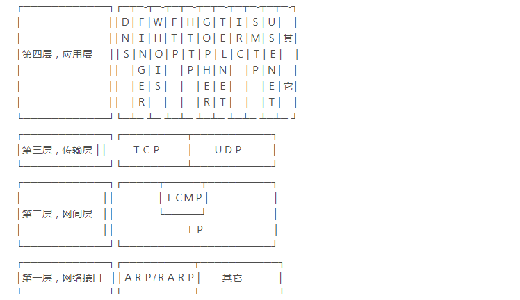
>
> TCP/IP协议被组织成四个概念层，其中有三层对应于ISO参考模型中的相应层。ICP/IP协议族并不包含物理层和数据链路层，因此它不能独立完成整个计算机网络系统的功能，必须与许多其他的协议协同工作。 TCP/IP分层模型的四个协议层分别完成以下的功能：

#### 第一层网络接口层

> 网络接口层包括用于协作IP数据在已有网络介质上传输的协议。协议：ARP,RARP

#### 第二层网间层

> 网间层对应于OSI七层参考模型的网络层。负责数据的包装、寻址和路由。同时还包含网间控制报文协议(Internet Control Message Protocol,ICMP)用来提供网络诊断信息。
>
> 协议：本层包含IP协议、RIP协议(Routing Information Protocol，路由信息协议)，ICMP协议。**第三层传输层**
>
> 传输层对应于OSI七层参考模型的传输层，它提供两种端到端的通信服务。
>
> 其中TCP协议(Transmission Control Protocol)提供可靠的数据流运输服务，UDP协议(Use Datagram Protocol)提供不可靠的用户数据报服务。

#### 第四层应用层

> 应用层对应于OSI七层参考模型的应用层和表达层。
>
> 因特网的应用层协议包括Finger、Whois、FTP(文件传输协议)、Gopher、HTTP(超文本传输协
>
> 议)、Telent(远程终端协议)、SMTP(简单邮件传送协议)、IRC(因特网中继会话)、NNTP（网络新闻传输协议）等。

## 26、说说域名解析详细过程？

> 1.  浏览器访问[<span class="underline">www.baidu.com</span>](http://www.baidu.com/)，询问本地 DNS 服务器是否缓存了该网址解析后的 IP 地址。
>
> 2.  如果本地 DNS 服务器没有缓存的话，就去 root-servers.net 根服务器查询该网址对应的 IP 地址。
>
> 3.  根服务器返回顶级域名服务器的网址 gtld-servers.net，然后本地 DNS 服务器去顶级域名服务器查询该网址对应的 IP 地址。
>
> 4.  顶级域名服务器返回www.baidu.com主区域服务器的地址，然后本地 DNS 服务器去www.baidu.com 主区域服务器查询此域名对应的 IP 地址。
>
> 5.  本地 DNS 服务器拿到[<span class="underline">www.baidu.com</span>](http://www.baidu.com/)解析后的 IP 地址后，缓存起来以便备查，然后把解析后的 IP 地址返回给浏览器。

## 27、 IP 地址分为几类，每类都代表什么，私网是哪些？

> 大致上分为公共地址和私有地址两大类，公共地址可以在外网中随意访问，私有地址只能在内网访问只有通过代理服务器才可以和外网通信。
>
> 公共地址：
>
> ```sh
> 1.0.0.1～126.255.255.254
> 
> 128.0.0.1～191.255.255.254
> 
> 192.0.0.1～223.255.255.254
> 
> 224.0.0.1～239.255.255.254
> 
> 240.0.0.1～255.255.255.254
> ```
>
> 
>
> 私有地址：
>
> ```sh
> 10.0.0.0～10.255.255.255
> 
> 172.16.0.0～172.31.255.255
> 
> 192.168.0.0～192.168.255.255
> ```
>
> - 0.0.0.0 路由器转发使用
>
> - 127.x.x.x 保留
>
> - 255.255.255.255 局域网下的广播地址

## 28、说说TCP 如何保证可靠性的？

#### 序列号和确认号机制：

> TCP 发送端发送数据包的时候会选择一个 seq 序列号，接收端收到数据包后会检测数据包的完整性，如果检测通过会响应一个 ack 确认号表示收到了数据包。

#### 超时重发机制：

> TCP 发送端发送了数据包后会启动一个定时器，如果一定时间没有收到接受端的确认后，将会重新发送该数据包。

#### 对乱序数据包重新排序：

> 从 IP 网络层传输到 TCP 层的数据包可能会乱序，TCP 层会对数据包重新排序再发给应用层。**丢弃重复数据：**
>
> 从 IP 网络层传输到 TCP 层的数据包可能会重复，TCP 层会丢弃重复的数据包。**流量控制：**
>
> TCP 发送端和接收端都有一个固定大小的缓冲空间，为了防止发送端发送数据的速度太快导致接收端缓冲区溢出，发送端只能发送接收端可以接纳的数据，为了达到这种控制效果，TCP 用了流量控制协议（可变大小的滑动窗口协议）来实现。

# 十七、设计模式

> 设计模式（Design Pattern）是前辈们对代码开发经验的总结，是解决特定问题的一系列套路。它不是语法规定，而是一套用来提高代码可复用性、可维护性、可读性、稳健性以及安全性的解决方案。1
>
> 1995 年，GoF（Gang of Four，四人组/四人帮）合作出版了《设计模式：可复用面向对象软件的基础》一书，共收录了23 种设计模式，从此树立了软件设计模式领域的里程碑，人称「GoF设计模式」。
>
> 通常面试中会问：
>
> 说一下你知道哪些设计模式？
>
> 这时候，就得需要平时积累下来的经验了，肯定回答自己会的，你只是知道名词是没用用的。从难易程度和常用情况来看可以这么回答：
>
> 单例模式、代理模式、模板方法模式、装饰器模式、工厂模式、责任链模式、观察者模式、原型模式。
>
> 通常你能回答这么多就已经ok了。但是其他模式，可以适当的了解了解，不然面试官问你还有其他设计模式吗？
>
> 这时候，你就可以回答名词了，他再问，你就说这些设计模式只是了解过，在工作中用的不是很多。

## 1、说说什么是单例模式

> 答：单例模式是一种常用的软件设计模式，在应用这个模式时，单例对象的类必须保证只有一个实例存在，整个系统只能使用一个对象实例。
>
> 优点：不会频繁地创建和销毁对象，浪费系统资源。
>
> 可能这会需要你手写一个单例模式，这就得自己去学了，因为单例模式有很多种写法，懒汉模式，饿汉模式，双重检查模式等。懒汉模式就是用的时候再去创建对象，饿汉模式就是提前就已经加载好的静态static对象，双重检查模式就是两次检查避免多线程造成创建了多个对象。
>
> 单例模式有很多种的写法，我总结一下：
>
> （1）饿汉式单例模式的写法：线程安全
>
> （2）懒汉式单例模式的写法：非线程安全
>
> （3）双检锁单例模式的写法：线程安全

## 2、说说你对代理模式的理解

> 代理模式是给某一个对象提供一个代理，并由代理对象控制对原对象的引用。**优点**：
>
> 代理模式能够协调调用者和被调用者，在一定程度上降低了系统的耦合度；可以灵活地隐藏被代理对象的部分功能和服务，也增加额外的功能和服务。
>
> **缺点**：
>
> 由于使用了代理模式，因此程序的性能没有直接调用性能高；使用代理模式提高了代码的复杂度。
>
> 黄牛卖火车票：没有流行网络购票的年代是很喜欢找黄牛买火车票的，因为工作忙的原因，没时间去买票，然后就托黄牛给你买张回家过年的火车票。这个过程中黄牛就是代理人，火车票就是被代理的对象。
>
> 婚姻介绍所：婚姻介绍所的工作人员，搜集单身人士信息，婚介所的工作人员为这个单身人士找对象，这个过程也是代理模式的生活案例。对象就是被代理的对象。
>
> 注意了，问代理模式的时候，很有可能会问：动态代理。在Spring篇中已经讲述过，如果你把动态代理讲了后，很有可能还会问什么是静态代理？一个洞一个是静，大致也能才出来，就是中间代理层使我们手动写的，通常说的代理模式就是静态代理。

## 3、说说工厂模式

> 答：简单工厂模式又叫静态工厂方法模式，就是建立一个工厂类，对实现了同一接口的一些类进行实例的创建。比如，一台咖啡机就可以理解为一个工厂模式，你只需要按下想喝的咖啡品类的按钮
>
> （摩卡或拿铁），它就会给你生产一杯相应的咖啡，你不需要管它内部的具体实现，只要告诉它你的需求即可。
>
> **优点**：
>
> 工厂类含有必要的判断逻辑，可以决定在什么时候创建哪一个产品类的实例，客户端可以免除直接创建产品对象的责任，而仅仅"消费"产品；简单工厂模式通过这种做法实现了对责任的分割，它提供了专门的工厂类用于创建对象；
>
> 客户端无须知道所创建的具体产品类的类名，只需要知道具体产品类所对应的参数即可，对于一些复杂的类名，通过简单工厂模式可以减少使用者的记忆量；
>
> 通过引入配置文件，可以在不修改任何客户端代码的情况下更换和增加新的具体产品类，在一定程度上提高了系统的灵活性。
>
> **缺点**：
>
> 不易拓展，一旦添加新的产品类型，就不得不修改工厂的创建逻辑；
>
> 产品类型较多时，工厂的创建逻辑可能过于复杂，一旦出错可能造成所有产品的创建失败，不利于系统的维护。

## 4、抽象工厂模式

> 答：抽象工厂模式是在简单工厂的基础上将未来可能需要修改的代码抽象出来，通过继承的方式让子类去做决定。
>
> 比如，以上面的咖啡工厂为例，某天我的口味突然变了，不想喝咖啡了想喝啤酒，这个时候如果直接修改简单工厂里面的代码，这种做法不但不够优雅，也不符合软件设计的"开闭原则"，因为每次新增品类都要修改原来的代码。这个时候就可以使用抽象工厂类了，抽象工厂里只声明方法，具体的实现交给子类（子工厂）去实现，这个时候再有新增品类的需求，只需要新创建代码即可。

## 5、装饰器模式是什么

> 答：装饰器模式是指动态地给一个对象增加一些额外的功能，同时又不改变其结构。
>
> 优点：装饰类和被装饰类可以独立发展，不会相互耦合，装饰模式是继承的一个替代模式，装饰模式可以动态扩展一个实现类的功能。
>
> 装饰器模式的关键：装饰器中使用了被装饰的对象。
>
> 比如，创建一个对象"laowang"，给对象添加不同的装饰，穿上夹克、戴上帽子\...\...，这个执行过程就是装饰者模式。
>
> 一句名言：人靠衣裳马靠鞍。都是装饰器模式的生活案列。

## 6、代理模式和装饰器模式有什么区别？

> 答：都是结构型模式，代理模式重在访问权限的控制，而装饰器模式重在功能的加强。

## 7、模板方法模式

> 答：模板方法模式是指定义一个算法骨架，将具体内容延迟到子类去实现。**优点**：
>
> 提高代码复用性：将相同部分的代码放在抽象的父类中，而将不同的代码放入不同的子类中；实现了反向控制：通过一个父类调用其子类的操作，通过对子类的具体实现扩展不同的行为，实现了反向控制并且符合开闭原则。
>
> 喝茶茶：烧水\-\-\--放入茶叶\-\--喝茶。放入的茶叶每个人自己的喜好不一样，有的是普洱、有的是铁观音等。
>
> 每日工作：上班打卡\-\-\--工作\-\--下班打卡。每个人工作的内容不一样，后端开发的、前端开发、测试、产品每个人的工作内容不一样。

## 8、知道享元模式吗？

> 答：顾名思义就是被共享的单元。享元模式的意图是复用对象，节省内存，前提是享元对象是不可变对象。
>
> 具体来讲，当一个系统中存在大量重复对象的时候，如果这些重复的对象是不可变对象，我们就可以利用享元模式将对象设计成享元，在内存中只保留一份实例，供多处代码引用。这样可以减少内存中对象的数量，起到节省内存的目的。
>
> 典型的使用场景：Integer中cache，就是享元模式很经典的实现。
>
> 怎么看起来享元模式和单例模式是一毛一样的？面试官很有可能会继续问：

## 9、享元模式和单例模式的区别？

> 答：单例模式是创建型模式，重在只能有一个对象。而享元模式是结构型模式，重在节约内存使用，提升程序性能。
>
> 享元模式：把一个或者多可对象霍村起来，用的时候，直接从缓存里获取。也就是说享元模式不一定只有一个对象。

## 10、说说策略模式在我们生活的场景？

> 答：策略模式是指定义一系列算法，将每个算法都封装起来，并且使他们之间可以相互替换。**优点**：遵循了开闭原则，扩展性良好。
>
> **缺点**：随着策略的增加，对外暴露越来越多。条条大路通罗马，条条大路通北京。
>
> 我们去北京的交通方式（策略）很多，比如说坐飞机、坐高铁、自己开车等方式。每一种方式就可以理解为每一种策略。
>
> 这就是生活中的策略模式。

## 11、知道责任链模式吗？

> 答：是行为型设计模式之一，其将链中每一个节点看作是一个对象，每个节点处理的请求均不同，且内部自动维护一个下一节点对象。当一个请求从链式的首端发出时，会沿着链的路径依次传递给每一个节点对象，直至有对象处理这个请求为止。

#### 优点

> 解耦了请求与处理；
>
> 请求处理者（节点对象）只需关注自己感兴趣的请求进行处理即可，对于不感兴趣的请求，直接转发给下一级节点对象；
>
> 具备链式传递处理请求功能，请求发送者无需知晓链路结构，只需等待请求处理结果；链路结构灵活，可以通过改变链路结构动态地新增或删减责任；
>
> 易于扩展新的请求处理类（节点），符合开闭原则；

#### 缺点

> 责任链路过长时，可能对请求传递处理效率有影响；
>
> 如果节点对象存在循环引用时，会造成死循环，导致系统崩溃；
>
> 生活案列：我们在公司内部发起一个OA审批流程，项目经理审批、部门经理审批。老板审批、人力审批。这就是生活中的责任链模式，每个角色的责任是不同。
>
> SpringMVC中的拦截器和Mybatis中的插件机制，都是拦截器经典实现。

## 12、了解过适配器模式么？

> 答：适配器模式是将一个类的接口变成客户端所期望的另一种接口，从而使原本因接口不匹配而无法一起工作的两个类能够在一起工作。
>
> **优点**：
>
> 可以让两个没有关联的类一起运行，起着中间转换的作用；灵活性好，不会破坏原有的系统。
>
> **缺点**：过多地使用适配器，容易使代码结构混乱，如明明看到调用的是 A 接口，内部调用的却是 B
>
> 接口的实现。
>
> 生活中的插座，为了适应各种插头，然后上面有两个孔的，三个空的，基本都能适应。还有万能充电器、USB接口等。这些都是生活中的适配器模式。

## 13、知道观察者模式吗？

> 答：观察者模式是定义对象间的一种一对多依赖关系，使得每当一个对象状态发生改变时，其相关依赖对象皆得到通知并被自动更新。观察者模式又叫做发布-订阅（Publish/Subscribe）模式、模型-视图（Model/View）模式、源-监听器（Source/Listener）模式或从属者（Dependents）模式。**优点**：
>
> 观察者模式可以实现表示层和数据逻辑层的分离，并定义了稳定的消息更新传递机制，抽象了更新接口，使得可以有各种各样不同的表示层作为具体观察者角色；
>
> 观察者模式在观察目标和观察者之间建立一个抽象的耦合；观察者模式支持广播通信；
>
> 观察者模式符合开闭原则（对拓展开放，对修改关闭）的要求。
>
> **缺点**：
>
> 如果一个观察目标对象有很多直接和间接的观察者的话，将所有的观察者都通知到会花费很多时间；
>
> 如果在观察者和观察目标之间有循环依赖的话，观察目标会触发它们之间进行循环调用，可能导致系统崩溃；
>
> 观察者模式没有相应的机制让观察者知道所观察的目标对象是怎么发生变化的，而仅仅只是知道观察目标发生了变化。
>
> 在观察者模式中有如下角色：
>
> Subject：抽象主题（抽象被观察者），抽象主题角色把所有观察者对象保存在一个集合里，每个主题都可以有任意数量的观察者，抽象主题提供一个接口，可以增加和删除观察者对象； ConcreteSubject：具体主题（具体被观察者），该角色将有关状态存入具体观察者对象，在具体主题的内部状态发生改变时，给所有注册过的观察者发送通知； Observer：抽象观察者，是观察者者的抽象类，它定义了一个更新接口，使得在得到主题更改通知时更新自己； ConcrereObserver：具体观察者，实现抽象观察者定义的更新接口，以便在得到主题更改通知时更新自身的状态。
>
> 在Spring中大量的使用的观察者模式，只要看到是以Event结尾或者Publish开头的基本上都是观察者模式。
>
> 上面一共说了11种设计模式，这些设计模式能应对绝大多数人和面试场景来说。建议私下自己用代码实现一番，便于更好地理解。

# maven篇

## 1、什么是maven？

> maven主要服务于基于java平台的项目构建，依赖管理和项目信息管理。
>
> maven项目对象模型(POM)，可以通过一小段描述信息来管理项目的构建，报告和文档的项目管理工具软件。它包含了一个项目对象模型，一组标准集合，一个项目生命周期，一个依赖管理系统和用来运行定义在生命周期阶段中插件目标的逻辑。当使用Maven的时候，你用一个明确定义的项目对象模型来描述你的项目，然后Maven可以应用横切的逻辑，这些逻辑来自于一组共享的（或自定义的）插件。

## 2、Maven能为我们解决什么问题？

> ①添加第三方jar包
>
> 按照最原始的做法，我们是手动复制jar包到项目WEB-INF/lib下，每个项目都会有一份，造成大量重复文件。而Maven将jar包放在本地仓库中统一管理，需要jar包只需要用坐标的方式引用即可。
>
> ②jar包之间的依赖关系
>
> jar包之间往往不是独立的，很多jar需要在其他jar包的支持下才能够正常工作，称为jar包之间的依赖关系。如果我们手动去导入，要知道jar包之间的依赖关系并一一导入是及其麻烦而且容易出错的。如果使用Maven，它能够将当前jar包所依赖的其他所有jar包全部导入。
>
> ③获取第三方jar包


> 开发过程中我们需要用到很多jar包，每个jar包在官网获取的方式不尽相同，给工作带来了额外困难。但是使用Maven可以以坐标的方式依赖一个jar包，Maven从中央仓库进行下载，并同时下载这个jar包依赖的其他jar包。
>
> ④将项目拆分为多个工程模块
>
> 项目的规模越来越大，已经不可能通过package结构来划分模块，必须将项目拆分为多个工程协同开发。

## 3、说说maven有什么优缺点？

> 优点
>
> 简化了项目依赖管理
>
> 易于上手，对于新手来说了解几个常用命令即可满足日常工作便于与持续集成工具（jenkins）整合
>
> 便于项目升级，无论是项目本身还是项目使用的依赖
>
> maven有很多插件，便于功能扩展，比如生产站点，自动发布版本等为什么使用Maven中的各点
>
> 缺点
>
> Maven是一个庞大的构建系统，学习难度大。（很多都可以这样说，入门容易\[优点\]但是精通难\[缺点\]）
>
> Maven采用约定约定优于配置的策略，虽然上手容易但是一旦出现问题，难于调试中网络环境较差，很多repository无法访问

## 5、什么是Maven的坐标？

> Maven其中一个核心的作用就是管理项目的依赖，引入我们所需的各种jar包等。为了能自动化的解析任何一个Java构件，Maven必须将这些Jar包或者其他资源进行唯一标识，这是管理项目的依赖的基础，也就是我们要说的坐标。包括我们自己开发的项目，也是要通过坐标进行唯一标识的，这样才能才其它项目中进行依赖引用。
>
> maven的坐标通过groupId，artifactId，version唯一标志一个构件。groupId通常为公司或组织名字，artifactId通常为项目名称，versionId为版本号。

## 6、讲一下maven的生命周期

> Maven的生命周期：从我们的项目构建，一直到项目发布的这个过程。
>
> 每个阶段的说明：


## 7、说说你熟悉哪些maven命令？

> mvn archetype:generate 创建Maven项目
>
> mvn compile 编译源代码
>
> mvn deploy 发布项目
>
> mvn test-compile 编译测试源代码 mvn test 运行应用程序中的单元测试 mvn site 生成项目相关信息的网站 mvn clean 清除项目目录中的生成结果 mvn package 根据项目生成的jar
>
> mvn install 在本地Repository中安装jar mvn eclipse:eclipse 生成eclipse项目文件
>
> mvn[<span class="underline">jetty</span>](https://baike.baidu.com/item/jetty):run 启动jetty服务
>
> mvn[<span class="underline">tomcat</span>](https://baike.baidu.com/item/tomcat):run 启动tomcat服务
>
> mvn clean package -Dmaven.test.skip=true:清除以前的包后重新打包，跳过测试类

## 8、如何解决依赖传递引起的版本冲突？

> 可通过dependency的exclusion元素排除掉依赖。

## 9、说说maven的依赖原则

> 最短路径原则（依赖传递的路径越短越优先）
>
> pom文件申明顺序优先（路径长度一样，则先申明的优先）
>
> 覆写原则（当前pom文件里申明的直接覆盖父工程传过来的）

## 10、说说依赖的解析机制？

> 当依赖的范围是 system 的时候，Maven 直接从本地文件系统中解析构件。
>
> 根据依赖坐标计算仓库路径，尝试直接从本地仓库寻找构件，如果发现对应的构件，就解析成功。如果在本地仓库不存在相应的构件，就遍历所有的远程仓库，发现后，下载并解析使用。
>
> 如果依赖的版本是 RELEASE 或 LATEST，就基于更新策略读取所有远程仓库的元数据文件
>
> （groupId/artifactId/maven-metadata.xml），将其与本地仓库的对应元合并后，计算出
>
> RELEASE 或者 LATEST 真实的值，然后基于该值检查本地仓库，或者从远程仓库下载。
>
> 如果依赖的版本是 SNAPSHOT，就基于更新策略读取所有远程仓库的元数据文件，将它与本地仓库对应的元数据合并，得到最新快照版本的值，然后根据该值检查本地仓库，或从远程仓库下载。
>
> 如果最后解析得到的构件版本包含有时间戳，先将该文件下载下来，再将文件名中时间戳信息删除，剩下 SNAPSHOT 并使用（以非时间戳的形式使用）。

## 11、说说插件的解析机制

> 与依赖的构件一样，插件也是基于坐标保存在Maven仓库中。在用到插件的时候会先从本地仓库查找插件，如果本地仓库没有则从远程仓库查找插件并下载到本地仓库。与普通的依赖构件不同的是，Maven会区别对待普通依赖的远程仓库与插件的远程仓库。前面提到的配置远程仓库只会对普通的依赖有效果。当Maven需要的插件在本地仓库不存在时是不会去我们以前配置的远程仓库查找插件的，而是需要有专门的插件远程仓库。

# ElasticSearch篇

## 1、谈谈分词与倒排索引的原理

> 首先说分词是给检索用的。
>
> 英文：一个单词一个词，很简单。I am a student，词与词之间空格分隔。
>
> 中文：我是学生，就不能一个字一个字地分，我-是-学生。这是好分的。还有歧义的，使用户放心，使用-户，使-用户。人很容易看出，机器就难多了。所以市面上有各种各样的分词器，一个强调的效率一个强调的准确率。

#### 倒排索引：倒排针对的是正排。

1.  正排就是我记得我电脑有个文档，讲了 ES 的常见问题总结。那么我就找到文档，从上往下翻页，找到 ES 的部分。通过文档找文档内容。

2.  倒排：一个 txt 文件 ES 的常见问题-\> D:/分布式问题总结.doc。

> 所以倒排就是文档内容找文档。当然内容不是全部的，否则也不需要找文档了，内容就是几个分词而已。这里的 txt 就是搜索引擎。

## 2、说说分段存储的思想

> Lucene 是著名的搜索开源软件，ElasticSearch 和 Solr 底层用的都是它。分段存储是 Lucene 的思想。
>
> 早期，都是一个整个文档建立一个大的倒排索引。简单，快速，但是问题随之而来。
>
> 文档有个很小的改动，整个索引需要重新建立，速度慢，成本高，为了提高速度，定期更新那么时效性就差。
>
> 现在一个索引文件，拆分为多个子文件，每个子文件是段。修改的数据不影响的段不必做处理。

## 3、谈谈你对段合并的策略思想的认识

> 分段的思想大大的提高了维护索引的效率。但是随之就有了新的问题。
>
> 每次新增数据就会新增加一个段，时间久了，一个文档对应的段非常多。段多了，也就影响检索性能了。
>
> 检索过程：

1.  查询所有短中满足条件的数据

2.  对每个段的结果集合并

> 所以，定期的对段进行合理是很必要的。真是天下大势，分久必合合久必分。
>
> 策略：将段按大小排列分组，大到一定程度的不参与合并。小的组内合并。整体维持在一个合理的大小范围。当然这个大到底应该是多少，是用户可配置的。这也符合设计的思想。

## 4、了解文本相似度 TF-IDF吗

> 简单地说，就是你检索一个词，匹配出来的文章，网页太多了。比如1000 个，这些内容再该怎么呈现，哪些在前面哪些在后面。这需要也有个对匹配度的评分。
>
> TF-IDF 就是干这个的。
>
> TF = Term Frequency 词频，一个词在这个文档中出现的频率。值越大，说明这文档越匹配，正向指标。
>
> IDF = Inverse Document Frequency 反向文档频率，简单点说就是一个词在所有文档中都出现，那么这个词不重要。比如"的、了、我、好"这些词所有文档都出现，对检索毫无帮助。反向指标。
>
> TF-IDF = TF / IDF
>
> 复杂的公式，就不写了，主要理解他的思想即可。

## 5、能说说ElasticSearch 写索引的逻辑吗？

> ElasticSearch 是集群的= 主分片+副本分片。
>
> 写索引只能写主分片，然后主分片同步到副本分片上。但主分片不是固定的，可能网络原因，之前还是 Node1 是主分片，后来就变成了 Node2 经过选举成了主分片了。
>
> 客户端如何知道哪个是主分片呢？看下面过程。

1.  客户端向某个节点 NodeX 发送写请求

2.  NodeX 通过文档信息，请求会转发到主分片的节点上

3.  主分片处理完，通知到副本分片同步数据，向 Nodex 发送成功信息。

4.  Nodex 将处理结果返回给客户端。

## 6、熟悉ElasticSearch 集群中搜索数据的过程吗？

1.  客户端向集群发送请求，集群随机选择一个 NodeX 处理这次请求。

2.  Nodex 先计算文档在哪个主分片上，比如是主分片 A，它有三个副本 A1，A2，A3。那么请求会轮询三个副本中的一个完成请求。

3.  如果无法确认分片，比如检索的不是一个文档，就遍历所有分片。

> 补充一点，一个节点的存储量是有限的，于是有了分片的概念。但是分片可能有丢失，于是有了副本的概念。
>
> 比如：
>
> ES 集群有3 个分片，分片 A、分片 B、分片 C，那么分片 A +分片 B +分片 C = 所有数据，每个分片只有大概1/3。分片 A 又有副本 A1 A2 A3，数据都是一样的。

## 7、了解ElasticSearch 深翻页的问题及解决吗？

> 深翻页：比如我们检索一次，轮询所有分片，汇集结果，根据 TF-IDF 等算法打分，排序后将前10条数据返回。用户感觉不错，说我看看下一页。ES 依然是轮询所有分片，汇集结果，根据 TF-IDF等算法打分，排序后将前11-20 条数据返回。
>
> 对用户来说，翻页应该很快啊，但是实际上，第一次检索多复杂，下一次检索就多复杂。
>
> 解决的话，可以把用户的检索结果，存入 Redis 中10 分钟。这样分页就很快，超过10 分钟，用户不翻页，也就不会翻页了，数据就可以清除了。

## 8、熟悉ElasticSearch 性能优化

#### 批量提交

> 背景是大量的写操作，每次提交都是一次网络开销。网络永久是优化要考虑的重点。

#### 优化硬盘

> 索引文件需要落地硬盘，段的思想又带来了更多的小文件，磁盘 IO 是 ES 的性能瓶颈。一个固态硬盘比普通硬盘好太多。

#### 减少副本数量

> 副本可以保证集群的可用性，但是严重影响了写索引的效率。写索引时不只完成写入索引，还要完成索引到副本的同步。ES 不是存储引擎，不要考虑数据丢失，性能更重要。如果是批量导入，建议就关闭副本。

## 9、ElasticSearch 查询优化手段有哪些？

#### 设计阶段调优

> （1）根据业务增量需求，采取基于日期模板创建索引，通过 roll over API 滚动索引；
>
> （2）使用别名进行索引管理；
>
> （3）每天凌晨定时对索引做 force_merge 操作，以释放空间；
>
> （4）采取冷热分离机制，热数据存储到 SSD，提高检索效率；冷数据定期进行 shrink操作，以缩减存储；
>
> （5）采取 curator 进行索引的生命周期管理；
>
> （6）仅针对需要分词的字段，合理的设置分词器；
>
> （7）Mapping 阶段充分结合各个字段的属性，是否需要检索、是否需要存储等。........**写入调优**
>
> （1）写入前副本数设置为0；
>
> （2）写入前关闭 refresh_interval 设置为-1，禁用刷新机制；
>
> （3）写入过程中：采取 bulk 批量写入；
>
> （4）写入后恢复副本数和刷新间隔；
>
> （5）尽量使用自动生成的 id。**查询调优**
>
> （1）禁用 wildcard；
>
> （2）禁用批量 terms（成百上千的场景）；
>
> （3）充分利用倒排索引机制，能 keyword 类型尽量 keyword；
>
> （4）数据量大时候，可以先基于时间敲定索引再检索；
>
> （5）设置合理的路由机制。**其他调优**
>
> 部署调优，业务调优等。
>
> 上面的提及一部分，面试者就基本对你之前的实践或者运维经验有所评估了。

## 10、elasticsearch 是如何实现 master 选举的？

> 面试官：想了解 ES 集群的底层原理，不再只关注业务层面了。前置前提：
>
> （1）只有候选主节点（master：true）的节点才能成为主节点。
>
> （2）最小主节点数（min_master_nodes）的目的是防止脑裂。
>
> 核对了一下代码，核心入口为findMaster，选择主节点成功返回对应 Master，否则返回 null。选举流程大致描述如下：
>
> 第一步：确认候选主节点数达标，elasticsearch.yml 设置的值
>
> discovery.zen.minimum_master_nodes；
>
> 第二步：比较：先判定是否具备 master 资格，具备候选主节点资格的优先返回；若两节点都为候选主节点，则 id 小的值会主节点。注意这里的 id 为 string 类型。题外话：获取节点 id 的方法。
>
> GET /\_cat/nodes?v&h=ip,port,heapPercent,heapMax,id,name ip port heapPercent heapMax id name

## 11、elasticsearch 索引数据多了怎么办，如何调优，部署？

> 面试官：想了解大数据量的运维能力。
>
> 解答：索引数据的规划，应在前期做好规划，正所谓"设计先行，编码在后"，这样才能有效的避免突如其来的数据激增导致集群处理能力不足引发的线上客户检索或者其他业务受到影响。
>
> 如何调优：**动态索引层面**
>
> 基于模板+时间+rollover api 滚动创建索引，举例：设计阶段定义：blog 索引的模板格式为：
>
> blog_index_时间戳的形式，每天递增数据。这样做的好处：不至于数据量激增导致单个索引数据量非常大，接近于上线2 的32 次幂-1，索引存储达到了 TB+甚至更大。
>
> 一旦单个索引很大，存储等各种风险也随之而来，所以要提前考虑+及早避免。**存储层面**
>
> 冷热数据分离存储，热数据（比如最近3 天或者一周的数据），其余为冷数据。
>
> 对于冷数据不会再写入新数据，可以考虑定期 force_merge 加 shrink 压缩操作，节省存储空间和检索效率。

#### 部署层面

> 一旦之前没有规划，这里就属于应急策略。
>
> 结合 ES 自身的支持动态扩展的特点，动态新增机器的方式可以缓解集群压力，注意：如果之前主节点等规划合理，不需要重启集群也能完成动态新增的。

## 12、说说你们公司 es 的集群架构，索引数据大小，分片有多少？

> 面试官：想了解应聘者之前公司接触的 ES 使用场景、规模，有没有做过比较大规模的索引设计、规划、调优。
>
> 解答：如实结合自己的实践场景回答即可。
>
> 比如：ES 集群架构13 个节点，索引根据通道不同共20+索引，根据日期，每日递增20+，索引：
>
> 10 分片，每日递增1 亿+数据，每个通道每天索引大小控制：150GB 之内。

## 13、什么是ElasticSearch？

> Elasticsearch是一个基于Lucene的搜索引擎。它提供了具有HTTP Web和无架构JSON文档的分布式，多租户能力的全文搜索引擎。Elasticsearch是用Java开发的，根据\[Apache\]许可条款作为开源发布。

## 14、ElasticSearch中的集群、节点、索引、文档、类型是什么？

> 群集是一个或多个节点（服务器）的集合，它们共同保存您的整个数据，并提供跨所有节点的联合索引和搜索功能。群集由唯一名称标识，默认情况下为"elasticsearch"。此名称很重要，因为如果节点设置为按名称加入群集，则该节点只能是群集的一部分。
>
> 节点是属于集群一部分的单个服务器。它存储数据并参与群集索引和搜索功能。
>
> 索引就像关系数据库中的"数据库"。它有一个定义多种类型的映射。索引是逻辑名称空间，映射到一个或多个主分片，并且可以有零个或多个副本分片。 MySQL =\>数据库 ElasticSearch
>
> =\>索引


> 文档类似于关系数据库中的一行。不同之处在于索引中的每个文档可以具有不同的结构（字段），但是对于通用字段应该具有相同的数据类型。 MySQL =\> Databases =\> Tables =\>
>
> Columns / Rows ElasticSearch =\> Indices =\> Types =\>具有属性的文档类型是索引的逻辑类别/分区，其语义完全取决于用户。

## 15、ElasticSearch中的分片是什么？

> 在大多数环境中，每个节点都在单独的盒子或虚拟机上运行。索引-在Elasticsearch中，索引是文档的集合。
>
> 分片-因为Elasticsearch是一个分布式搜索引擎，所以索引通常被分割成分布在多个节点上的被称为分片的元素。


## 16，ElasticSearch中的副本是什么？

> 一个索引被分解成碎片以便于分发和扩展。副本是分片的副本。一个节点是一个属于一个集群的
>
> ElasticSearch的运行实例。一个集群由一个或多个共享相同集群名称的节点组成。

## 19，ElasticSearch中的分析器是什么？

> 在ElasticSearch中索引数据时，数据由为索引定义的Analyzer在内部进行转换。分析器由一个
>
> Tokenizer和零个或多个TokenFilter组成。编译器可以在一个或多个CharFilter之前。分析模块允许您在逻辑名称下注册分析器，然后可以在映射定义或某些API中引用它们。
>
> Elasticsearch附带了许多可以随时使用的预建分析器。或者，您可以组合内置的字符过滤器，编译器和过滤器器来创建自定义分析器。

## 20，什么是ElasticSearch中的编译器？


> 编译器用于将字符串分解为术语或标记流。一个简单的编译器可能会将字符串拆分为任何遇到空格或标点的地方。Elasticsearch有许多内置标记器，可用于构建自定义分析器。

## 21，什么是ElasticSearch中的过滤器？

> 数据由Tokenizer处理后，在编制索引之前，过滤器会对其进行处理。

## 22，启用属性，索引和存储的用途是什么？

> enabled属性适用于各类ElasticSearch特定/创建领域，如index和size。用户提供的字段没有"已启用"属性。存储意味着数据由Lucene存储，如果询问，将返回这些数据。
>
> 存储字段不一定是可搜索的。默认情况下，字段不存储，但源文件是完整的。因为您希望使用默认值(这是有意义的)，所以不要设置store属性该指数属性用于搜索。
>
> 索引属性只能用于搜索。只有索引域可以进行搜索。差异的原因是在分析期间对索引字段进行了转换，因此如果需要的话，您不能检索原始数据。

# tomcat篇

## 1、Tomcat的缺省端口是多少，怎么修改？

> 默认端口为8080，可以通过在tomcat安装包conf目录下，service.xml中的Connector元素的port属性来修改端口。

## 2、tomcat 有哪几种Connector 运行模式(优化)？

> 这三种模式的不同之处如下：
>
> BIO ：一个线程处理一个请求。缺点：并发量高时，线程数较多，浪费资源。Tomcat7版本或更低版本中，在Linux系统中默认使用这种方式。
>
> NIO ：利用Java的异步IO处理，可以通过少量的线程处理大量的请求。tomcat8.0.x中默认使用的是
>
> NIO。Tomcat7必须修改Connector配置来启动：
>
> \<Connector port=\"8080\" protocol=\"org.apache.coyote.http11.Http11NioProtocol\" connectionTimeout=\"20000\" redirectPort=\"8443\"/\>
>
> APR ：即Apache Portable Runtime，从操作系统层面解决io阻塞问题。Tomcat7或Tomcat8在
>
> Win7或以上的系统中启动默认使用这种方式。

## 3、Tomcat有几种部署方式？

> 利用Tomcat的自动部署：把web应用拷贝到webapps目录（生产环境不建议放在该目录中）。Tomcat在启动时会加载目录下的应用，并将编译后的结果放入work目录下。
>
> 使用Manager App控制台部署：在tomcat主页点击"Manager App"进入应用管理控制台，可以指定一个web应用的路径或war文件。
>
> 修改 conf/server.xml 文件部署：在 server.xml 文件中，增加Context节点可以部署应用。增加自定义的Web部署文件：在<span class="underline">conf/Catalina/localhost/</span> 路径下增加 xyz.xml文件，内容是
>
> Context节点，可以部署应用。

## 4、tomcat容器是如何创建servlet类实例？用到了什么原理？

1.  当容器启动时，会读取在webapps目录下所有的web应用中的web.xml文件，然后对 xml文件进行解析，并读取servlet注册信息。然后，将每个应用中注册的servlet类都进行加载，并通过反射的方式实例化。（有时候也是在第一次请求时实例化）

2.  在servlet注册时加上1如果为正数，则在一开始就实例化，如果不写或为负数，则第一次请求实例化。

## 5、tomcat 如何优化？

> tomcat作为Web服务器，它的处理性能直接关系到用户体验，下面是几种常见的优化措施：
>
> 掉对web.xml的监视，把jsp提前编辑成Servlet。有富余物理内存的情况，加大tomcat使用的jvm的内存
>
> 服务器所能提供CPU、内存、硬盘的性能对处理能力有决定性影响。
>
> 对于高并发情况下会有大量的运算，那么CPU的速度会直接影响到处理速度。
>
> 内存在大量数据处理的情况下，将会有较大的内存容量需求，可以用-Xmx -Xms -
>
> XX:MaxPermSize等参数对内存不同功能块进行划分。我们之前就遇到过内存分配不足，导致虚拟机一直处于full GC，从而导致处理能力严重下降。
>
> 硬盘主要问题就是读写性能，当大量文件进行读写时，磁盘极容易成为性能瓶颈。最好的办法还是利用下面提到的缓存。
>
> 利用缓存和压缩
>
> 对于静态页面最好是能够缓存起来，这样就不必每次从磁盘上读。这里我们采用了Nginx作为缓存服务器，将图片、css、js文件都进行了缓存，有效的减少了后端tomcat的访问。
>
> 另外，为了能加快网络传输速度，开启gzip压缩也是必不可少的。但考虑到tomcat已经需要处理很多东西了，所以把这个压缩的工作就交给前端的Nginx来完成。
>
> 除了文本可以用gzip压缩，其实很多图片也可以用图像处理工具预先进行压缩，找到一个平衡点可以让画质损失很小而文件可以减小很多。曾经我就见过一个图片从300多kb压缩到几十 kb，自己几乎看不出来区别。
>
> 采用集群
>
> 单个服务器性能总是有限的，最好的办法自然是实现横向扩展，那么组建tomcat集群是有效提升性能的手段。我们还是采用了Nginx来作为请求分流的服务器，后端多个tomcat共享session来协同工作。可以参考之前写的《利用nginx+tomcat+memcached组建web服务器负载均衡》。
>
> 优化线程数优化
>
> 找到Connector port=\"8080\" protocol=\"HTTP/1.1\"，增加maxThreads和acceptCount属性（使
>
> acceptCount大于等于maxThreads），如下：
>
> \<Connector port=\"8080\" protocol=\"HTTP/1.1\"connectionTimeout=\"20000\" redirectPort=\"8443\"acceptCount=\"500\" maxThreads=\"400\"/\>
>
> 其中：

-   maxThreads：tomcat可用于请求处理的最大线程数，默认是200

-   minSpareThreads：tomcat初始线程数，即最小空闲线程数

-   maxSpareThreads：tomcat最大空闲线程数，超过的会被关闭

-   acceptCount：当所有可以使用的处理请求的线程数都被使用时，可以放到处理队列中的请求数，超过这个数的请求将不予处理.默认100

> 使用线程池优化
>
> 在server.xml中增加executor节点，然后配置connector的executor属性，如下：
>
> \<Executor name=\"tomcatThreadPool\" namePrefix=\"req-exec-\"maxThreads=\"1000\" minSpareThreads=\"50\"maxIdleTime=\"60000\"/\>
>
> \<Connector port=\"8080\" protocol=\"HTTP/1.1\"executor=\"tomcatThreadPool\"/\>
>
> 其中：

-   namePrefix：线程池中线程的命名前缀

-   maxThreads：线程池的最大线程数

-   minSpareThreads：线程池的最小空闲线程数

-   maxIdleTime：超过最小空闲线程数时，多的线程会等待这个时间长度，然后关闭

-   threadPriority：线程优先级

> 注：当tomcat并发用户量大的时候，单个jvm进程确实可能打开过多的文件句柄，这时会报
>
> java.net.SocketException:Too many open files错误。可使用下面步骤检查：

-   ps -ef \|grep tomcat 查看tomcat的进程ID，记录ID号，假设进程ID为10001

-   lsof -p 10001\|wc -l 查看当前进程id为10001的文件操作数

-   使用命令：ulimit -a 查看每个用户允许打开的最大文件数

> 启动速度优化
>
> 删除没用的web应用：因为tomcat启动每次都会部署这些应用。关闭WebSocket： websocket-api.jar和tomcat-websocket.jar 。
>
> 随机数优化：设置JVM参数：-Djava.security.egd=file:/dev/./urandom 。
>
> 内存优化
>
> 因为tomcat启动起来后就是一个java进程，所以这块可以参照JVM部分的优化思路。堆内存相关参数，比如说：

-   -Xms：虚拟机初始化时的最小堆内存。

-   -Xmx：虚拟机可使用的最大堆内存。-Xms与-Xmx设成一样的值，避免JVM因为频繁的GC导致性能大起大落

-   -XX:MaxNewSize：新生代占整个堆内存的最大值。

> [另外还有方法区参数调整（注意：JDK版本）、垃圾收集器等优化。JVM相关参数请看：<span class="underline">手</span> <span class="underline">把手教你</span>](http://mp.weixin.qq.com/s?__biz=MzU4MDM3MDgyMA%3D%3D&amp;mid=2247493697&amp;idx=1&amp;sn=5f8f900b75a358b8da2d9422783a5153&amp;chksm=fd5540aaca22c9bcb287e3d0754b50b1be19c99047fe5df20c40da29571a6cfd8996aeda0cc2&amp;scene=21&amp;wechat_redirect)
>
> <span class="underline">设[置JVM调优参数](http://mp.weixin.qq.com/s?__biz=MzU4MDM3MDgyMA%3D%3D&amp;mid=2247493697&amp;idx=1&amp;sn=5f8f900b75a358b8da2d9422783a5153&amp;chksm=fd5540aaca22c9bcb287e3d0754b50b1be19c99047fe5df20c40da29571a6cfd8996aeda0cc2&amp;scene=21&amp;wechat_redirect)</span>

## 6、熟悉tomcat的哪些配置？

> Context (表示一个web应用程序，通常为WAR文件，关于WAR的具体信息见servlet规范)标签。
>
> docBase ：该web应用的文档基准目录（Document Base，也称为Context Root），或者是WAR
>
> 文件的路径。可以使绝对路径，也可以使用相对于context所属的Host的appBase路径。
>
> path ：表示此web应用程序的url的前缀，这样请求的url为<span class="underline">http://localhost:8080/path/\*\*\*\*</span> 。
>
> reloadable ：这个属性非常重要，如果为true，则tomcat会自动检测应用程序的/WEB-INF/lib
>
> 和/WEB-INF/classes目录的变化，自动装载新的应用程序，我们可以在不重启tomcat的情况下改变应用程序。
>
> <span class="underline">useNaming</span> ：如果希望Catalina为该web应用使能一个JNDI InitialContext对象，设为true。该
>
> InitialialContext符合J2EE平台的约定，缺省值为true。
>
> workDir ：Context提供的临时目录的路径，用于servlet的临时读/写。利用
>
> javax.servlet.context.tempdir属性，servlet可以访问该目录。如果没有指定，使用
>
> \$CATALINA_HOME/work下一个合适的目录。
>
> swallowOutput ：如果该值为true，System.out和System.err的输出被重定向到web应用的
>
> logger。如果没有指定，缺省值为false
>
> debug ：与这个Engine关联的Logger记录的调试信息的详细程度。数字越大，输出越详细。如果没有指定，缺省为0。
>
> host (表示一个虚拟主机)标签。
>
> name ：指定主机名。
>
> appBase ：应用程序基本目录，即存放应用程序的目录。
>
> unpackWARs ：如果为true，则tomcat会自动将WAR文件解压，否则不解压，直接从WAR文件中运行应用程序。
>
> Logger (表示日志，调试和错误信息)标签。
>
> <span class="underline">className</span> ：指定logger使用的类名，此类必须实现org.apache.catalina.Logger接口。
>
> prefix ：指定log文件的前缀。
>
> suffix ：指定log文件的后缀。
>
> <span class="underline">timestamp</span> ：如果为true，则log文件名中要加入时间，如下例：localhost_log.2001-10-04.txt。

## 7、Tomcat是什么？

> Tomcat 服务器Apache软件基金会项目中的一个核心项目，是一个免费的开放源代码的Web 应用服务器（Servlet容器），属于轻量级应用服务器，在中小型系统和并发访问用户不是很多的场合下被普遍使用，是开发和调试JSP 程序的首选。

## 8，什么是Servlet呢？


> Servlet是JavaEE规范的一种，主要是为了扩展Java作为Web服务的功能，统一接口。由其他内部厂商如tomcat，jetty内部实现web的功能。如一个http请求到来：容器将请求封装为servlet中的
>
> HttpServletRequest对象，调用init()，service()等方法输出response,由容器包装为httpresponse
>
> 返回给客户端的过程。

## 9，什么是Servlet规范？

> 从 Jar 包上来说，Servlet 规范就是两个 Jar 文件。servlet-api.jar 和 jsp-api.jar，Jsp 也是一种
>
> Servlet。
>
> 从package上来说，就是 javax.servlet 和 javax.servlet.http 两个包。
>
> 从接口来说，就是规范了 Servlet 接口、Filter 接口、Listener 接口、ServletRequest 接口、
>
> ServletResponse 接口等。类图如下：


## 10、为什么我们将tomcat称为Web容器或者Servlet容器？

> 我们用一张图来表示他们之间的关系:
>
> 简单的理解：启动一个ServerSocket，监听8080端口。Servlet**容器**用来装我们开发的Servlet。

## 11，tomcat是如何处理Http请求流程的？

> 假设来我们在浏览器上输入<span class="underline">http://localhost:8080/my-web-mave/index.jsp</span>在tomcat中是如何处理这个请求流程的：

1.  我们的请求被发送到本机端口8080，被在那里侦听的Coyote HTTP/1.1 Connector获得。

2.  Connector把该请求交给它所在的Service的Engine来处理，并等待来自Engine的回应。


3.  Engine获得请求localhost/my-web-maven/index.jsp，匹配它所拥有的所有虚拟主机Host ，我们的虚拟主机在server.xml中默认配置的就是localhost。

4.  Engine匹配到name=localhost的Host（即使匹配不到也把请求交给该Host处理，因为该Host

> 被定义为该Engine的默认主机）。

5.  localhost Host获得请求/my-web-maven/index.jsp，匹配它所拥有的所有Context。

6.  Host匹配到路径为/my-web-maven的Context（如果匹配不到就把该请求交给路径名为"\"的

> Context去处理）。

7.  path="/my-web-maven"的Context获得请求/index.jsp，在它的mapping table中寻找对应的

> servlet 。

8.  Context匹配到URL PATTERN为\*.jsp的servlet，对应于JspServlet类。

9.  构造HttpServletRequest对象和HttpServletResponse对象，作为参数调用JspServlet的doGet或doPost方法。

10. Context把执行完了之后的HttpServletResponse对象返回给Host 。

11. Host把HttpServletResponse对象返回给Engine 。

12. Engine把HttpServletResponse对象返回给Connector 。

13. Connector把HttpServletResponse对象返回给客户browser 。

## 12、tomcat结构目录有哪些?

### bin

> 启动，关闭和其他脚本。这些.sh文件（对于Unix系统）是这些.bat文件的功能副本（对于
>
> Windows系统）。由于Win32命令行缺少某些功能，因此此处包含一些其他文件。
>
> 比如说：windows下启动tomcat用的是startup.bat，另外Linux环境中使用的是startup.sh。对应还有相应的shutdown关闭脚本。

### conf

> tomcat的配置文件和相关的DTD。这里最重要的文件是server.xml。它是容器的主要配置文件。
>
> catalina.policy ：tomcat：安全策略文件，控制JVM相关权限，具体可以参考
>
> java.security.Permission。
>
> catalina.properties ：tomcat Catalina 行为控制配置文件，比如：Common ClassLoader。
>
> logging.properties ：tomcat日志配置文件。里面的日志采用的是JDK Logging。
>
> server.xml ：tomcat server配置文件(对于我开发人员来说是非常重要)。
>
> context.xml ：全局context配置文件，监视并加载资源文件，当监视的文件发生发生变化时，自动加载。
>
> tomcat-user.xml ：tomcat角色配置文件。
>
> web.xml ：Servlet标准的web.xml部署文件，tomcat默认实现部分配置入内：
>
> org.apache.catalina.servlets.DefaultServlet。 org.apache.jasper.servlet.JspServlet

### logs

> 日志文件默认位于此处。
>
> <span class="underline">localhost</span> 有用，当你们的tomcat启动不了的时候，多看这个文件。比如：
>
> NoClassDefFoundError ClassNotFoundException
>
> access 最没用。
>
> catalina.{date}主要是控制台输出，全部日志都在这里面。

### webapps

> 这是您的webapp所在的位置。其实这里面这几个都是一个项目。
>
> 简化web部署的方式。在线上环境中我们的应用是不会放在这里的。最好的办法就是外置。
>
> **lib**：tomcat存放共用的类库。比如： ecj-4.17.jar: eclipse Java编译器
>
> jasper.jar：JSP编译器。

### work

> 存放tomcat运行时编译后的文件，比如JSP编译后的文件。

### temp

> 存放运行时产生的临时文件。

# Git篇


## 1、Git和SVN有什么区别？

**Git****SVN**
------------------------------------------ --------------------------------------
1\. Git是一个分布式的版本控制工具1\. SVN 是集中版本控制工具
2.它属于第3代版本控制工具2.它属于第2代版本控制工具
3.客户端可以在其本地系统上克隆整个存储库3.版本历史记录存储在服务器端存储库中
4.即使离线也可以提交4.只允许在线提交
5.Push/pull 操作更快5.Push/pull 操作较慢
6.工程可以用 commit 自动共享6.没有任何东西自动共享

> **2、什么是Git？**
>
> 我建议你先通过了解 git 的架构再来回答这个问题，如下图所示，试着解释一下这个图：
>
> Git 是分布式版本控制系统（DVCS）。它可以跟踪文件的更改，并允许你恢复到任何特定版本的更改。
>
> 与 SVN 等其他版本控制系统（VCS）相比，其分布式架构具有许多优势，一个主要优点是它不依赖于中央服务器来存储项目文件的所有版本。
>
> 每个开发人员都可以"克隆"我在图中用"Local repository"标注的存储库的副本，并且在他的硬盘驱动器上具有项目的完整历史记录，因此当服务器中断时，你需要的所有恢复数据都在你队友的本地 Git 存储库中。
>
> 还有一个中央云存储库，开发人员可以向其提交更改，并与其他团队成员进行共享，如图所示，所有协作者都在提交更改"远程存储库"。

## 3、在 Git 中提交的命令是什么？


> 答案非常简单。用于写入提交的命令是**git commit -a**。
>
> 现在解释一下-a 标志，通过在命令行上加-a 指示 git 提交已修改的所有被跟踪文件的新内容。还要提一下，如果你是第一次需要提交新文件，可以在在 git commit -a 之前先**git add**。

## 4、什么是 Git 中的"裸存储库"？

> 你应该说明"工作目录"和"裸存储库"之间的区别。
>
> Git 中的"裸"存储库只包含版本控制信息而没有工作文件（没有工作树），并且它不包含特殊的
>
> .git 子目录。相反，它直接在主目录本身包含.git 子目录中的所有内容，其中工作目录包括：

1.  一个.git 子目录，其中包含你的仓库所有相关的 Git 修订历史记录。

2.  工作树，或签出的项目文件的副本。

## 5 Git 是用什么语言编写的？

> 你需要说明使用它的原因，而不仅仅是说出语言的名称。我建议你这样回答：
>
> Git使用 C 语言编写。 GIT 很快，C 语言通过减少运行时的开销来做到这一点。

## 6、在Git中，你如何还原已经 push 并公开的提交？

> There can be two answers to this question and make sure that you include both because any of the below options can be used depending on the situation: 1 这个问题可以有两个答案，你回答时也要保包含这两个答案，因为根据具体情况可以使用以下选项：
>
> 删除或修复新提交中的错误文件，并将其推送到远程存储库。这是修复错误的最自然方式。对文件进行必要的修改后，将其提交到我将使用的远程存储库
>
> git commit -m \"commit message\"
>
> 创建一个新的提交，撤消在错误提交中所做的所有更改。可以使用命令：
>
> git revert \<name of bad commit\>

## 7、git pull 和 git fetch 有什么区别？

> git pull 命令从中央存储库中提取特定分支的新更改或提交，并更新本地存储库中的目标分支。
>
> <span class="underline">git fetch</span> 也用于相同的目的，但它的工作方式略有不同。当你执行<span class="underline">git fetch</span> 时，它会从所需的分支中提取所有新提交，并将其存储在本地存储库中的新分支中。如果要在目标分支中反映这些更改，必须在<span class="underline">git fetch</span> 之后执行<span class="underline">git merge</span> 。只有在对目标分支和获取的分支进行合并后才会更新目标分支。为了方便起见，请记住以下等式：


> <span class="underline">git pull = git fetch + git merge</span>

## 8、git中的"staging area"或"index"是什么？

> For this answer try to explain the below diagram as you can see: 可以通过下图进行解释：
>
> 在完成提交之前，可以在称为"staging area"或"index"的中间区域中对其进行格式化和审查。从图中可以看出，每个更改首先在暂存区域中进行验证，我将其称为"stage file"，然后将更改提交到存储库。

## 9、什么是 git stash?

> 首先应该解释 git stash 的必要性。


> 通常情况下，当你一直在处理项目的某一部分时，如果你想要在某个时候切换分支去处理其他事情，事情会处于混乱的状态。问题是，你不想把完成了一半的工作的提交，以便你以后就可以回到当前的工作。解决这个问题的答案是 git stash。
>
> 再解释什么是git stash。
>
> stash 会将你的工作目录，即修改后的跟踪文件和暂存的更改保存在一堆未完成的更改中，你可以随时重新应用这些更改。

## 10、什么是git stash drop？

> 通过说明我们使用 git stash drop 的目的来回答这个问题。
>
> git stash drop 命令用于删除隐藏的项目。默认情况下，它将删除最后添加的存储项，如果提供参数的话，它还可以删除特定项。
>
> 下面举个例子。
>
> 如果要从隐藏项目列表中删除特定的存储项目，可以使用以下命令：
>
> **git stash list：**它将显示隐藏项目列表，如：
>
> stash@{0}: WIP on master: 049d078 added the index file stash@{1}: WIP on master: c264051 Revert "added file_size" stash@{2}: WIP on master: 21d80a5 added number to log
>
> 如果要删除名为 stash@{0}的项目，请使用命令**git stash drop stash@{0}**。

## 11.、如何找到特定提交中已更改的文件列表？

> 对于这个问题，不能仅仅是提供命令，还要解释这个命令究竟做了些什么。要获取特定提交中已更改的列表文件，请使用以下命令：

#### git diff-tree -r {hash}

> 给定提交哈希，这将列出在该提交中更改或添加的所有文件。-r 标志使命令列出单个文件，而不是仅将它们折叠到根目录名称中。
>
> 你还可以包括下面提到的内容，虽然它是可选的，但有助于给面试官留下深刻印象。输出还将包含一些额外信息，可以通过包含两个标志把它们轻松的屏蔽掉：

#### git diff-tree --no-commit-id --name-only -r {hash}

> 这里-no-commit-id 将禁止提交哈希值出现在输出中，而<span class="underline">-name-only</span> 只会打印文件名而不是它们的路径。

## 12、git config 的功能是什么？

> 首先说明为什么我们需要 git config 。
>
> git 使用你的用户名将提交与身份相关联。 git config 命令可用来更改你的 git 配置，包括你的用户名。
>
> 下面用一个例子来解释。
>
> 假设你要提供用户名和电子邮件 ID 用来将提交与身份相关联，以便你可以知道是谁进行了特定提交。为此，我将使用：

#### git config --global user.name \"Your Name\": 此命令将添加用户名。

> **git config --global user.email \"Your E-mail Address\":**此命令将添加电子邮件ID。
>
> **13、提交对象包含什么？**
>
> Commit 对象包含以下组件，你应该提到以下这三点：一组文件，表示给定时间点的项目状态
>
> 引用父提交对象
>
> SHAI 名称，一个40个字符的字符串，提交对象的唯一标识。

## 14、如何在Git中创建存储库？

> 这可能是最常见的问题，答案很简单。
>
> 要创建存储库，先为项目创建一个目录（如果该目录不存在），然后运行命令**git init**。通过运行此命令，将在项目的目录中创建.git 目录。

## 15、怎样将 N 次提交压缩成一次提交？

> 将N个提交压缩到单个提交中有两种方式：
>
> 如果要从头开始编写新的提交消息，请使用以下命令：
>
> git reset --soft HEAD\~N && git commit
>
> 如果你想在新的提交消息中串联现有的提交消息，那么需要提取这些消息并将它们传给 git commit，可以这样：
>
> git reset --soft HEAD\~N &&
>
> git commit --edit -m\"\$(git log --format=%B --reverse .HEAD@{N})\"

## 16、什么是 Git bisect？如何使用它来确定（回归）错误的来源？

> 我建议你先给出一个Git bisect 的小定义。
>
> Git bisect 用于查找使用二进制搜索引入错误的提交。 Git bisect的命令是
>
> git bisect \<subcommand\> \<options\>
>
> 既然你已经提到过上面的命令，那就解释一下这个命令会做什么。
>
> 此命令用了二进制搜索算法来查找项目历史记录中的哪个提交引入了错误。你可以通过告诉它已知包含该错误的"错误"提交以及在引入错误之前已知的"良好"提交来使用它。然后 git bisect 在这两个端点之间选择一个提交，并询问你所选的提交是"好"还是"坏"。它继续缩小范围，直到找到引入更改的确切提交。

## 17、如果想要在提交之前运行代码性检查工具，并在测试失败时阻止提交，该怎样配置 Git 存储库？

> 我建议你先介绍一下完整性检查。
>
> 完整性或冒烟测试用来确定继续测试是否可行和合理。下面解释如何实现这一目标。
>
> 这可以通过与存储库的 pre-commit hook 相关的简单脚本来完成。git 会在提交之前触发 pre- commit hook。你可以在这个脚本中运行其他工具，例如 linters，并对提交到存储库中的更改执行完整性检查。
>
> 最后举个例子，你可以参考下面的脚本：
>
> \#!/bin/sh
>
> files=\$(git diff --cached --name-only --diff-filter=ACM \| grep '.go\$') if \[ -z files \]; then
>
> exit 0
>
> fi
>
> unfmtd=\$(gofmt -l \$files) if \[ -z unfmtd \]; then
>
> exit 0
>
> fi
>
> echo "Some .go files are not fmt'd" exit 1


> 这段脚本检查是否需要通过标准 Go 源代码格式化工具 gofmt 传递所有即将提交的.go 文件。如果脚步以非0 状态退出，脚本会有效地阻止提交操作。

## 18.、描述一下你所使用的分支策略？

> 这个问题被要求用Git来测试你的分支经验，告诉他们你在以前的工作中如何使用分支以及它的用途是什么，你可以参考以下提到的要点：
>
> 功能分支（Feature branching）
>
> 要素分支模型将特定要素的所有更改保留在分支内。当通过自动化测试对功能进行全面测试和验证时，该分支将合并到主服务器中。
>
> 任务分支（Task branching）
>
> 在此模型中，每个任务都在其自己的分支上实现，任务键包含在分支名称中。很容易看出哪个代码实现了哪个任务，只需在分支名称中查找任务键。
>
> 发布分支（Release branching）
>
> 一旦开发分支获得了足够的发布功能，你就可以克隆该分支来形成发布分支。创建该分支将会启动下一个发布周期，所以在此之后不能再添加任何新功能，只有错误修复，文档生成和其他面向发布的任务应该包含在此分支中。一旦准备好发布，该版本将合并到主服务器并标记版本号。此外，它还应该再将自发布以来已经取得的进展合并回开发分支。
>
> 最后告诉他们分支策略因团队而异，所以我知道基本的分支操作，如删除、合并、检查分支等。

## 19、如果分支是否已合并为master，你可以通过什么手段知道？

> 答案很直接。
>
> 要知道某个分支是否已合并为master，你可以使用以下命令： git branch --merged 它列出了已合并到当前分支的分支。 git branch --no-merged 它列出了尚未合并的分支。

## 20、什么是SubGit？

> SubGit 是将 SVN 到 Git迁移的工具。它创建了一个可写的本地或远程 Subversion 存储库的 Git 镜像，并且只要你愿意，可以随意使用 Subversion 和 Git。
>
> 这样做有很多优点，比如你可以从 Subversion 快速一次性导入到 Git 或者在 Atlassian Bitbucket
>
> Server 中使用SubGit。我们可以用 SubGit 创建现有 Subversion 存储库的双向 Git-SVN 镜像。你可以在方便时 push 到 Git 或提交 Subversion。同步由 SubGit 完成。

## 21、列举工作中常用的几个git命令？

> 新增文件的命令：git add file或者git add .提交文件的命令：git commit --m或者git commit --a 查看工作区状况：git status --s 拉取合并远程分支的操作：git fetch/git merge或者git pull 查看提交记录命令：git reflog

## 22、如果本次提交误操作，如何撤销？

> 如果想撤销提交到索引区的文件，可以通过**git reset HEAD file**；如果想撤销提交到本地仓库的文件，可以通过**git reset --soft HEAD\^n**恢复当前分支的版本库至上一次提交的状态，索引区和工作空间不变更；可以通过**git reset --mixed HEAD\^n**恢复当前分支的版本库和索引区至上一次提交的

## 23、你使用过git stash命令吗？你一般什么情况下会使用它？

> 命令git stash是把工作区修改的内容存储在栈区。以下几种情况会使用到它：解决冲突文件时，会先执行git stash，然后解决冲突；
>
> 遇到紧急开发任务但目前任务不能提交时，会先执行git stash，然后进行紧急任务的开发，然后通过git stash pop取出栈区的内容继续开发；
>
> 切换分支时，当前工作空间内容不能提交时，会先执行git stash再进行分支切换；

## 24、如何查看分支提交的历史记录？查看某个文件的历史记录呢？

> 查看分支的提交历史记录：
>
> 命令git log --number：表示查看当前分支前number个详细的提交历史记录；
>
> 命令git log --number --pretty=oneline：在上个命令的基础上进行简化，只显示sha-1码和提交信息；
>
> 命令git reflog --number: 表示查看所有分支前number个简化的提交历史记录；命令git reflog --number --pretty=oneline：显示简化的信息历史信息；
>
> 如果要查看某文件的提交历史记录，直接在上面命令后面加上文件名即可。注意：如果没有number则显示全部提交次数。

## 25、使用过git merge和git rebase吗？它们之间有什么区别？

> 简单的说，git merge和git rebase都是合并分支的命令。 git merge branch会把branch分支的差异内容pull到本地，然后与本地分支的内容一并形成一个committer对象提交到主分支上，合并后的分支与主分支一致； git rebase branch会把branch分支优先合并到主分支，然后把本地分支的
>
> commit放到主分支后面，合并后的分支就好像从合并后主分支又拉了一个分支一样，本地分支本身不会保留提交历史。

## 26、使用过git cherry-pick，有什么作用？

> 命令git cherry-pick可以把branch A的commit复制到branch B上。在branch B上进行命令操作：
>
> 复制单个提交：git cherry-pick commitId
>
> 复制多个提交：git cherry-pick commitId1...commitId3
>
> 注意：复制多个提交的命令不包含commitId1

# 软实力篇

> 本篇文章除了教大家用Markdown如何写一份程序员专属的简历，后面还会给大家推荐一些不错的用来写Markdown简历的软件或者网站，以及如何优雅的将Markdown格式转变为PDF格式或者其他格式。
>
> 推荐大家使用Markdown语法写简历，然后再将Markdown格式转换为PDF格式后进行简历投递。如果你对Markdown语法不太了解的话，可以花半个小时简单看一下Markdown语法说明:
>
> [<span class="underline">http://www.markdown.cn</span>](http://www.markdown.cn/)。

## 1、为什么说简历很重要？

> 一份好的简历可以在整个申请面试以及面试过程中起到非常好的作用。在不夸大自己能力的情况下，写出一份好的简历也是一项很棒的能力。为什么说简历很重要呢?

## 2、先从面试来说

> 假如你是网申，你的简历必然会经过HR的筛选，一张简历HR可能也就花费10秒钟看一下，然后HR就会决定你这一关是Fail还是Pass。
>
> 假如你是内推，如果你的简历没有什么优势的话，就算是内推你的人再用心，也无能为力。
>
> 另外，就算你通过了筛选，后面的面试中，面试官也会根据你的简历来判断你究竟是否值得他花费很多时间去面试。
>
> 所以，简历就像是我们的一个门面一样，它在很大程度上决定了你能否进入到下一轮的面试中。

## 3、再从面试说起

> 我发现大家比较喜欢看面经，这点无可厚非，但是大部分面经都没告诉你很多问题都是在特定条件下才问的。举个简单的例子：一般情况下你的简历上注明你会的东西才会被问到（Java、数据结构、网络、算法这些基础是每个人必问的），比如写了你会 redis,那面试官就很大概率会问你 redis的一些问题。比如：redis的常见数据类型及应用场景、redis是单线程为什么还这么快、 redis 和memcached 的区别、redis 内存淘汰机制等等。
>
> 所以，首先，你要明确的一点是：你不会的东西就不要写在简历上。另外，你要考虑你该如何才能让你的亮点在简历中凸显出来，比如：你在某某项目做了什么事情解决了什么问题（只要有项目就一定有要解决的问题）、你的某一个项目里使用了什么技术后整体性能和并发量提升了很多等等。
>
> 面试和工作是两回事，聪明的人会把面试官往自己擅长的领域领，其他人则被面试官牵着鼻子走。虽说面试和工作是两回事，但是你要想要获得自己满意的 offer ，你自身的实力必须要强。

## 4、必知必会的几点

> 大部分公司的HR都说我们不看重学历（骗你的！），但是如果你的学校不出众的话，很难在一堆简历中脱颖而出，除非你的简历上有特别的亮点，比如：某某大厂的实习经历、获得了某某大赛的奖等等。
>
> 大部分应届生找工作的硬伤是没有工作经验或实习经历，所以如果你是应届生就不要错过秋招和春招。一旦错过，你后面就极大可能会面临社招，这个时候没有工作经验的你可能就会面临各种碰壁，导致找不到一个好的工作
>
> 写在简历上的东西一定要慎重，这是面试官大量提问的地方；将自己的项目经历完美的展示出来非常重要。

## 5、必须了解的两大法则

#### STAR法则（Situation Task Action Result）

> **Situation：**事情是在什么情况下发生；
>
> **Task:：**你是如何明确你的任务的；
>
> **Action：**针对这样的情况分析，你采用了什么行动方式；
>
> **Result：**结果怎样，在这样的情况下你学习到了什么。
>
> 简而言之，STAR法则，就是一种讲述自己故事的方式，或者说，是一个清晰、条理的作文模板。不管是什么，合理熟练运用此法则，可以轻松的对面试官描述事物的逻辑方式，表现出自己分析阐述问题的清晰性、条理性和逻辑性。

#### FAB 法则（Feature Advantage Benefit）

> **Feature：**是什么；
>
> **Advantage：**比别人好在哪些地方；
>
> **Benefit：**如果雇佣你，招聘方会得到什么好处。
>
> 简单来说，这个法则主要是让你的面试官知道你的优势、招了你之后对公司有什么帮助。

## 6、项目经历怎么写

> 简历上有一两个项目经历很正常，但是真正能把项目经历很好的展示给面试官的非常少。对于项目经历大家可以考虑从如下几点来写：
>
> 1.  对项目整体设计的一个感受
>
> 2.  在这个项目中你负责了什么、做了什么、担任了什么角色
>
> 3.  从这个项目中你学会了那些东西，使用到了那些技术，学会了那些新技术的使用
>
> 4.  另外项目描述中，最好可以体现自己的综合素质，比如你是如何协调项目组成员协同开发的或者在遇到某一个棘手的问题的时候你是如何解决的又或者说你在这个项目用了什么技术实现了什么功能比如:用redis做缓存提高访问速度和并发量、使用消息队列削峰和降流等等。

## 7、专业技能怎么写

> 先问一下你自己会什么，然后看看你意向的公司需要什么。一般HR可能并不太懂技术，所以他在筛选简历的时候可能就盯着你专业技能的关键词来看。对于公司有要求而你不会的技能，你可以花几天时间学习一下，然后在简历上可以写上自己了解这个技能。比如你可以这样写(下面这部分内容摘自我的简历，大家可以根据自己的情况做一些修改和完善)：
>
> 计算机网络、数据结构、算法、操作系统等课内基础知识：掌握
>
> Java 基础知识：掌握
>
> JVM 虚拟机（Java内存区域、虚拟机垃圾算法、虚拟垃圾收集器、JVM内存管理）：掌握高并发、高可用、高性能系统开发：掌握
>
> Struts2、Spring、Hibernate、Ajax、Mybatis、JQuery ：掌握
>
> SSH 整合、SSM 整合、 SOA 架构：掌握
>
> Dubbo：掌握
>
> Zookeeper: 掌握常见消息队列: 掌握 Linux：掌握
>
> MySQL常见优化手段：掌握
>
> Spring Boot +Spring Cloud +Docker:了解
>
> Hadoop 生态相关技术中的 HDFS、Storm、MapReduce、Hive、Hbase ：了解
>
> Python 基础、一些常见第三方库比如OpenCV、wxpy、wordcloud、matplotlib：熟悉

## 8、排版注意事项

> 1.  尽量简洁，不要太花里胡哨；
>
> 2.  一些技术名词不要弄错了大小写比如MySQL不要写成mysql，Java不要写成java。这个在我看来还是比较忌讳的，所以一定要注意这个细节；
>
> 3.  中文和数字英文之间加上空格的话看起来会舒服一点；

## 9、其他一些小tips

> 1.  尽量避免主观表述，少一点语义模糊的形容词，尽量要简洁明了，逻辑结构清晰。
>
> 2.  如果自己有博客或者个人技术栈点的话，写上去会为你加分很多。
>
> 3.  如果自己的Github比较活跃的话，写上去也会为你加分很多。
>
> 4.  注意简历真实性，一定不要写自己不会的东西，或者带有欺骗性的内容
>
> 5.  项目经历建议以时间倒序排序，另外项目经历不在于多，而在于有亮点。
>
> 6.  如果内容过多的话，不需要非把内容压缩到一页，保持排版干净整洁就可以了。
>
> 7.  简历最后最好能加上："感谢您花时间阅读我的简历，期待能有机会和您共事。"这句话，显的你会很有礼貌。

## 10、你对我们公司有什么想问的吗？

#### 背景

> 面试，是双方互相试探的一个过程。因此，不止求职者想了解面试官对咱的感观，面试官同样也想听一下你对企业的看法。所以，在结束前，经常会被问到这样一个问题："你对公司有啥想法？"
>
> 说实话，小编以前面试的时候，很怕被问到"对公司有什么想法？"/"你还有什么要问的？"/"你的职业规划是什么？"之类的问题。太假大空了，真心没意思。可没办法，面试官问了，咱总不能不答，于是只能硬着头皮"胡邹乱噪"。顺利的时候还好，不顺的时候，经常被挑刺，从而失去即将到手的机会。慢慢的，越来越认识到此类面试题的重要性，于是，总结出了一套应对方法，拿出来给大家分享。那啥，仅供参考。

#### 常规回答：谈公司的历史，产品

> 想必，绝大多数的求职者，在面试前会做准备功课。而对公司历史、产品的了解，则是必须掌握的一项内容。如果你真的不知道该如何回答"你对公司有什么想法"这样的问题的话，不妨先说一说你了解的公司概况，让面试官知道，你是有备而来，而不是来打酱油的。

#### 进一步回答：说公司概况+个人规划

> 趋利避害，是每个人共同的特性。在面对不能很好掌控的面试题时，最好的办法，是换个角度，将答案引向自己擅长的领域。在被问到上述问题是，你可以先阐述一下你所了解的公司情况，然后结合一些内容，说说自己到岗后的规划，和所能展开的工作。比如能把工作做到什么样的程度，公司会用什么形式来回报之类的东西，反正多谈谈自己真实的想法和目前的成就，保持平常心，只要努力做些课前作业，肯定会给人家留下好印像的

#### 参考答案

> 因为贵公司是在我印象中是理想的公司，并为我提供了就业的岗位，可以说，我是对公司的企业文化建设及公司的经营情况有着比较客观的了解。员工的工资、收入稳定。公司的管理规范，很好的后勤服务等都是不错的看点。给我感触最深的是：企业的各级管理人员都是那么的热情，给我感觉就像家一样。我觉得在这样的公司工作是任何一个人都向往的！

## 11、很多人都倒在自我介绍上

#### 案例一：如何把握自我介绍的时间？

> 研究生毕业的小刘很健谈，口才甚佳，对自我介绍，他自认为不在话下，所以他从来不准备，看什么人说什么话。他的求职目标是地产策划，有一次，应聘本地一家大型房地产公司，在自我介绍时，他大谈起了房地产行业的走向，由于跑题太远，面试官不得不把话题收回来。自我介绍也只能"半途而止"。

#### 建议：一分钟谈一项内容

> 自我介绍的时间一般为3分钟，在时间的分配上，第一分钟可谈谈学历等个人基本情况，第二分钟可谈谈工作经历，对于应届毕业生而言可谈相关的社会实践，第三分钟可谈对本职位的理想和对于本行业的看法。如果自我介绍要求在1分钟内完成，自我介绍就要有所侧重，突出一点，不及其余。
>
> 在实践中，有些应聘者不了解自我介绍的重要性，只是简短地介绍一下自己的姓名、身份，其后补充一些有关自己的学历、工作经历等情况，大约半分钟左右就结束了自我介绍，然后望着考官，等待下面的提问，这是相当不妥的，白白浪费了一次向面试官推荐自己的宝贵机会。而另一些应聘者则试图将自己的全部经历都压缩在这几分钟内，这也是不明智的做法。合理地安排自我介绍的时间，突出重点是首先要考虑的问题。

#### 案例二：自我介绍要如何准备？

> 小芳去应聘南方某媒体，面试在一个大的办公室内进行，五人一小组，围绕话题自由讨论。面试官要求每位应聘者先作自我介绍，小芳是第二位，与前面应聘者一句一顿的介绍不同，她早做了准备，将大学四年里所干的事，写了一段话，还作了一些修饰，注重韵脚，听起来有些押韵。（职场创业[<span class="underline">www.lz13.cn</span>](http://www.lz13.cn/)）小芳的介绍极流利，但美中不足的是给人背诵的感觉。

#### 建议：切勿采用"背诵"口吻

> 人力资源专家指出，自我介绍可以事前准备，也可以事前找些朋友做练习，但自我介绍应避免书面语言的严整与拘束，而应使用灵活的口头语进行组织。切忌以背诵朗读的口吻介绍自己，如果那样的话，对面试官来说，将是无法忍受的。自我介绍还要注意声线，尽量让声调听来流畅自然，充满自信。

#### 案例三：在自我介绍的时候如何谈成绩？

> 小王去应聘某电视节目制作机构的文案写作，面试时，对方首先让他谈谈相关的实践经历。小王所学的专业虽说是新闻传播类，但偏向于纸质媒体，对电视节目制作这一块实践不多。怎么办？小王只好将自己平时参加的一些校园活动说了一大通，听起来挺丰富，但几乎与电视沾不上边。

#### 建议：只说与职位相关的优点

> 自我介绍时要投其所好摆成绩，这些成绩必须与现在应聘公司的业务性质有关。在面试中，你不仅要告诉考官你是多么优秀的人，更要告诉考官，你如何地适合这个工作岗位。那些与面试无关的内容，即使是你引以为荣的优点和长处，你也要忍痛舍弃。
>
> 在介绍成绩时，说的次序也极为重要，应该把你最想让面试官知道的事情放在前面，这样的事情往往是你的得意之作，也可以让面试官留下深刻的印象。

#### 案例四：在自我介绍的时候学会用点小技巧

> 阿枫参加了去年某大型国企的校园招聘会，那天是在一个大体育场里进行，队伍排到了出口处，每一位应聘者与面试官只有几分钟的交谈时间，如何在这么短的时间里，取得面试官的好感，进入下一轮呢？阿枫放弃了常规的介绍，而是着重给面试官介绍自己完成的一个项目，他还引用了导师的评价作为佐证。由于运用了一点小技巧，阿枫顺利闯过这种"海选"般的面试。

#### 建议：以说真话为前提

> 自我介绍时，要突出个人的优点和特长，你可以使用一些小技巧，比如可以介绍自己做过什么项目来验证具有某种能力，也可以适当引用别人的言论，如老师、朋友等的评论来支持自己的描述。但无论使用哪种小技巧，都要坚持以事实说话，少用虚词、感叹词之类。自吹自擂一般是很难逃过面试官的眼睛的。至于谈弱点时则要表现得坦然、乐观、自信。

#### 案例五：自我介绍要如何摆脱怯场？

> 阿宏毕业于中部城市的某大学，带着憧憬南下广东。由于自己是一位专科生，在研究生成堆的人才市场里，阿宏的自信心有点不足，面对面试官常常表现出怯场的情绪，有时很紧张，谈吐不自然。他也明白这种情况不利于面试，但却找不到方法来调控自己。

#### 建议：谈吐运用"3P原则"

> 人力资源专家指出，自我介绍时的谈吐，应该记住"3P原则"：自信（Positive），个性（Personal），中肯（Pertinent）。回答要沉着，突出个性，强调自己的专业与能力，语气中肯，不要言过其实。
>
> 在自我介绍时要调适好自己的情绪，在介绍自己的基本情况时面无表情、语调生硬；在谈及优点时眉飞色舞、兴奋不已；而在谈论缺点时无精打采、萎靡不振，这些都是不成熟的表现。对于表达，建议阿宏可以找自己的朋友练习一下，也可以先对着镜子练习几遍，再去面试。

## 13，如何与 HR 交谈，如何谈薪水

> **谈薪资之前必须要先了解行情**知己知彼才能够百战百胜，所以在面试之前大家必须要了解清楚你应聘的这个行业的薪资标准是怎么样的。大家可以去各大招聘网站下看看你所应聘的工作岗位给出的工资水平是怎么样的。除了在招聘网站上了解你应聘的职位的薪资水平之外，大家也需要向一些做这类工作的朋友或者同学了解一下。了解清楚薪资的水平后你就不会在谈薪水的时候显得特别没底气了。
>
> **要有底气不要害怕和 HR 聊薪资**谈薪资这个阶段在求职面试过程中不可避免，我们必须要有底气，不要表现得畏畏缩缩的。要记住只要你够专业，没有什么不好的表现，那么面试官就不会因为薪水问题不给你 Offer 的。所以在谈薪资的时候要大胆一些，让对方看到你底气。就算最后HR真的没有录用你也没有关系，大不了就重新再找！谈薪是很考验大家的谈判技巧和心态的，大家千万别慌才能够为自己谋取到利益！
>
> **谈薪资时千万别过早揭露底牌**谈薪过程中大家的底牌也不能过早揭露，因为一旦揭露了底牌那么你就失去了主动权。陷入被动的你很可能就会失去谈出高薪的机会！因此，你在面试的时候千万别过早去跟 HR 去谈论薪资问题，就算他一开始就问你对薪资的要求了你也应该委婉地转移话题。在不确定公司对你很感兴趣，很希望你能加入他们的时候过早揭露底牌其实是很吃亏的。
>
> **了解公司的薪酬体系再作评估**在 HR 问你对薪资的要求的时候大家不要急着给出自己的心理价格，你可以先问一下贵公司的薪酬体系是怎么样的，然后再结合自己的实际情况谈薪资。首先你需要根据公司的薪资水平以及其他的福利对你的心理价格进行再一次评估，最终给出合适的薪资区间。给出薪资的区间大家就要守住自己的底线，不要轻易做出退让了。

## 14、HR 最喜欢问程序员的20 个问题

> 以下整理出 HR 最喜欢问的20 个问题，答案供大家思维发散，大家只需了解这些问题，提前想一下，即可，就能在面试中不被打的措手不及。大家有疑问的，也可以在读者圈中提出，我可以进行解答。
>
> 1.  请你自我介绍一下你自己？
>
> 2.  你对加班的看法？
>
> 3.  你对薪资的要求？
>
> 4.  你的职业规划？
>
> 5.  你还有什么问题要问吗？
>
> 6.  如果通过这次面试我们单位录用了你，但工作一段时间却发现你根本不适合这个职位，你怎么办？
>
> 7.  在完成某项工作时，你认为领导要求的方式不是最好的，自己还有更好的方法，你应该怎么做？
>
> 8.  如果你的工作出现失误，给本公司造成经济损失，你认为该怎么办？
>
> 9.  谈谈你对跳槽的看法？
>
> 10.  工作中你难以和同事、上司相处，你该怎么办？
>
> 11.  为什么要离职?
>
> 12.  对工作的期望与目标何在？
>
> 13.  就你申请的这个职位，你认为你还欠缺什么？
>
> 14.  你和别人发生过争执吗？你是怎样解决的？
>
> 15.  如果我录用你，你将怎样开展工作？
>
> 16.  如果你在这次面试中没有被录用，你怎么打算？
>
> 17.  谈谈如何适应办公室工作的新环境？
>
> 18.  工作中学习到了些什么？
>
> 19.  除了本公司外，还应聘了哪些公司？
>
> 20.  何时可以到职？

> 这些问题在面试之前，尤其是相对有点规模的公司，HR说话的分量蛮重的，所以建议把这些问题都大致想想，如果面试中遇到如何应对。

## 15、面试中的礼仪与举止

> 注意细节
>
> 平复一下紧张的情绪，然后从容地走进面试地点，轻轻敲一下门，得到允许后进去，开关门动作要轻柔缓和，面对面试官微笑主动打招呼示好，称呼得体，现在一般流行叫老师，那么你可以称呼各位老师好。不要急于落座，面试官示意你请坐的时候再道谢坐下，坐下后身体保持挺直，不要显得大大咧咧，满不在乎，避免引起对方的反感。面试过程中微笑并仔细聆听，面试结束微笑起立，道谢并再见。谈话技巧
>
> 认真聆听对方的问题和介绍，适当点头示意或提问，回答问题时要口齿清晰、音量适中、语言简练、意思明确。切忌打断面试官的问话，或者跟面试官在某一问题上发生争执，如果意见不统一可保持沉默，切记不要急躁地与对方辩解，这样既浪费时间又浪费情绪。对于某些自己不知道的问题，可以如实回答，不要胡侃乱诌。让面试官纠缠于你不愿回答的问题时，也不要表现得不耐烦，保持自己应有的风度。举止大方
>
> 不仅在语言方面能体现一个人的内在修养，举止大方得体，谦逊有礼也能体现出你的品质修养。所以在面试过程中，应有的姿态是举止文雅大方，谈吐谦虚谨慎，态度积极热情。回答问题时，注视对方的眼眸以示尊重。眼神要坚定自信，不要飘忽不定，否则会显得不自信甚至轻浮，双方意见不统一也不要情绪激动地与人争辩，要不卑不亢、从容不迫。如果是某些特殊的岗位，不排除有人故意这样试探，如果你情绪不对，那么有可能功亏一篑。忌小动作
>
> 这一条应该是划分到上一条的，但是鉴于很多人下意识的行为，所以特意提出来。很多人都有做小动作的习惯，有些是刻意、有些是下意识的，心理紧张的时候，小动作会更多。过多的小动作表明你很紧张，也不自信，而且会干扰人的注意力，给人留下不好的印象。比如挠头、搓手、挖鼻、跺脚等。
