提纲

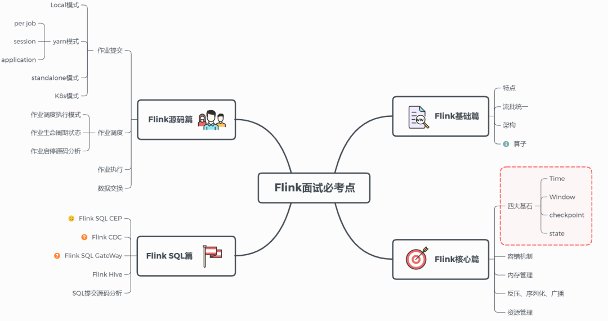

# 目录

[01、Flink基础篇9](#flink-基础篇)

[1、什么是Flink？描述一下9](#什么是-flink描述一下)

[2、解释一下其中的数据流、流批一体、容错能力等概念？9](#能否详细解释一下其中的-数据流流批一体容错能力等概念)

[3、Flink和SparkStreaming的区别？10](#flink-和-spark-streaming-的区别)

[4、Flink的架构包含哪些？13](#flink-的架构包含哪些)

[5、简单介绍一下技术架构？13](#简单介绍一下技术架构)

[6、详细介绍一下Flink的运行架构？14](#详细介绍一下-flink-的运行架构)

[7、Flink的并行度介绍一下？15](#flink-的并行度介绍一下)

[8、Flink的并行度的怎么设置的？16](#flink-的并行度的怎么设置的)

[9、Flink编程模型了解不？17](#flink-编程模型了解不)

[10、Flink作业中的DataStream，Transformation介绍一下？17](#flink-作业中的-datastreamtransformation-介绍一下)

[11、Flink的分区策略了解吗？18](#_bookmark11)

[12、描述一下Flinkwordcount执行包含的步骤有哪些？20](#描述一下-flink-wordcount-执行包含的步骤有哪些)

[13、Flink常用的算子有哪些？23](#flink-常用的算子有哪些)

[02、Flink核心篇25](#flink-核心篇)

[14、Flink的四大基石包含哪些？25](#flink-的四大基石包含哪些)

[15、说说Flink窗口，以及划分机制？25](#说说-flink-窗口以及划分机制)

[16、那你介绍下Flink的窗口机制以及各组件之间是如何相互工作的？29](#看你基本概念讲的还是很清楚的那你介绍下-flink)

[17、讲一下Flink的Time概念？31](#讲一下-flink-的-time-概念)

[18、那在API调用时，应该怎么使用？32](#那在-api-调用时应该怎么使用)

[19、在流数据处理中，有没有遇到过数据延迟等问题，通过什么处理呢？\...32](#在流数据处理中有没有遇到过数据延迟等问题通过什么处理呢)

[20、WaterMark原理讲解一下？33](#watermark-原理讲解一下)

[21、如果数据延迟非常严重呢？只使用WaterMark可以处理吗？35](#如果数据延迟非常严重呢只使用-watermark-可以处理吗那应该怎么解决)

[22、刚才提到State，那你简单说一下什么是State。36](#刚才提到-state那你简单说一下什么是-state)

[23、Flink状态包括哪些？37](#flink-状态包括哪些)

[24、Flink广播状态了解吗？39](#flink-广播状态了解吗)

[25、Flink状态接口包括哪些？40](#flink-状态接口包括哪些)

[26、Flink状态如何存储42](#flink-状态如何存储)

[27、Flink状态如何持久化？46](#flink-状态如何持久化)

[28、Flink状态过期后如何清理？47](#flink-状态过期后如何清理)

[29、Flink通过什么实现可靠的容错机制？48](#flink-通过什么实现可靠的容错机制)

[30、什么是Checkpoin检查点？48](#什么是-checkpoin-检查点)

[31、什么是Savepoin保存点？49](#什么是-savepoin-保存点)

[32、什么是CheckpointCoordinator检查点协调器？49](#什么是-checkpointcoordinator-检查点协调器)

[33、Checkpoint中保存的是什么信息？49](#checkpoint-中保存的是什么信息)

[34、当作业失败后，检查点如何恢复作业？51](#当作业失败后检查点如何恢复作业)

[35、当作业失败后，从保存点如何恢复作业？52](#当作业失败后从保存点如何恢复作业)

[36、Flink如何实现轻量级异步分布式快照？53](#flink-如何实现轻量级异步分布式快照)

[37、什么是Barrier对齐？54](#什么是-barrier-对齐)

[38、什么是Barrier不对齐？55](#什么是-barrier-不对齐)

[39、为什么要进行barrier对齐？不对齐到底行不行？56](#为什么要进行-barrier-对齐不对齐到底行不行)

[40、Flink支持Exactly-Once语义，那什么是Exactly-Once？56](#flink-支持-exactly-once-语义那什么是-exactly--once)

[41、要实现Exactly-Once,需具备什么条件？56](#要实现-exactly-once需具备什么条件)

[42、什么是两阶段提交协议？57](#什么是两阶段提交协议)

[43、Flink如何保证Exactly-Once语义？59](#flink-如何保证-exactly-once-语义)

[44、那你对Flink端到端严格一次Exactly-Once语义做个总结64](#数的很好很清楚那你对-flink-端到端-严格一次)

[45、Flink广播机制了解吗？65](#flink-广播机制了解吗)

[46、Flink反压了解吗？65](#flink-反压了解吗)

[47、Flink反压的影响有哪些？65](#flink-反压的影响有哪些)

[48、Flink反压如何解决？66](#flink-反压如何解决)

[49、Flink支持的数据类型有哪些？67](#flink-支持的数据类型有哪些)

[50、Flink如何进行序列和反序列化的？68](#flink-如何进行序列和反序列化的)

[51、为什么Flink使用自主内存而不用JVM内存管理？70](#为什么-flink-使用自主内存而不用-jvm-内存管理)

[52、那Flink自主内存是如何管理对象的？71](#那-flink-自主内存是如何管理对象的)

[53、Flink内存模型介绍一下？71](#flink-内存模型介绍一下)

[54、Flink如何进行资源管理的？75](#flink-如何进行资源管理的)

[03、Flink源码篇81](#flink-源码篇)

[55、FLink作业提交流程应该了解吧？81](#flink-作业提交流程应该了解吧)

[56、FLink作业提交分为几种方式？82](#flink-作业提交分为几种方式)

[57、FLinkJobGraph是在什么时候生成的？82](#flink-jobgraph-是在什么时候生成的)

[58、那在jobGraph提交集群之前都经历哪些过程？82](#那在-jobgraph-提交集群之前都经历哪些过程)

[59、看你提到PipelineExecutor，它有哪些实现类？83](#看你提到-pipelineexecutor它有哪些实现类)

[60、Local提交模式有啥特点，怎么实现的？83](#local-提交模式有啥特点怎么实现的)

[61、远程提交模式都有哪些？86](#远程提交模式都有哪些)

[62、Standalone模式简单介绍一下？86](#standalone-模式简单介绍一下)

[63、yarn集群提交方式介绍一下？87](#yarn-集群提交方式介绍一下)

[64、yarn-session模式特点？87](#yarn---session-模式特点)

[65、yarn-perJob模式特点？88](#yarn---perjob-模式特点)

[66、yarn-application模式特点？89](#yarn---application-模式特点)

[67、yarn-session提交流程详细介绍一下？90](#yarn---session-提交流程详细介绍一下)

[68、yarn-perjob提交流程详细介绍一下？92](#yarn---perjob-提交流程详细介绍一下)

[69、流图、作业图、执行图三者区别？94](#流图作业图执行图三者区别)

[70、流图介绍一下？95](#流图介绍一下)

[71、作业图介绍一下？96](#作业图介绍一下)

[72、执行图介绍一下？97](#执行图介绍一下)

[73、Flink调度器的概念介绍一下？99](#flink-调度器的概念介绍一下)

[74、Flink调度行为包含几种？100](#flink-调度行为包含几种)

[75、Flink调度模式包含几种？100](#flink-调度模式包含几种)

[76、Flink调度策略包含几种？101](#flink-调度策略包含几种)

[77、Flink作业生命周期包含哪些状态？102](#flink-作业生命周期包含哪些状态)

[78、Task的作业生命周期包含哪些状态？103](#task-的作业生命周期包含哪些状态)

[79、Flink的任务调度流程讲解一下？104](#flink-的任务调度流程讲解一下)

[80、Flink的任务槽是什么意思？105](#flink-的任务槽是什么意思)

[81、Flink槽共享又是什么意思？106](#flink-槽共享又是什么意思)

[04、FlinkSQL篇108](#flink-sql-篇)

[82、FlinkSQL有没有使用过？108](#flink-sql-有没有使用过)

[83、Flink被称作流批一体，那从哪个版本开始，真正实现流批一体的？\...109](#_bookmark86)

[84、FlinkSQL使用哪种解析器？109](#flink-sql-使用哪种解析器)

[85、Calcite主要功能包含哪些？109](#calcite-主要功能包含哪些)

[86、FlinkSQL处理流程说一下？110](#flink-sql-处理流程说一下)

[87、FlinkSQL包含哪些优化规则？112](#flink-sql-包含哪些优化规则)

[88、FlinkSQL中涉及到哪些operation？113](#flink-sql-中涉及到哪些-operation)

[89、FlinkHive有没有使用过？114](#flink-hive-有没有使用过)

[90、Flink与Hive集成时都做了哪些操作？114](#flink-与-hive-集成时都做了哪些操作)

[91、HiveCatalog类包含哪些方法？115](#hivecatalog-类包含哪些方法)

[92、FlinkSQL1.11新增了实时数仓功能，介绍一下？115](#flink-sql1.11-新增了实时数仓功能介绍一下)

[93、Flink-Hive实时写数据介绍下？116](#flink--hive-实时写数据介绍下)

[94、Flink-Hive实时读数据介绍下？118](#flink--hive-实时读数据介绍下)

[95、如何保证已经写入分区的数据何时才能对下游可见呢？119](#flink--hive-实时写数据时如何保证已经写入分区的数据何时才能对下游可见呢)

[96、源码中分区提交的PartitionCommitTrigger介绍一下？120](#源码中分区提交的-partitioncommittrigger-介绍一下)

[97、PartitionTimeCommitTigger是如何知道该提交哪些分区的呢？120](#partitiontimecommittigger-是如何知道该提交哪些分区的呢源码分析)

[98、如何保证已经写入分区的数据对下游可见的标志问题（源码分析）121](#如何保证已经写入分区的数据对下游可见的标志问题)

[99、FlinkSQLCEP有没有接触过？121](#flink-sql-cep-有没有接触过)

[100、FlinkSQLCEP了解的参数介绍一下？123](#flink-sql-cep-了解的参数介绍一下)

[101、编写一个CEPSQL案例，如银行卡盗刷126](#编写一个-cep-sql-案例如银行卡盗刷)

[102、FlinkCDC了解吗？什么是FlinkSQLCDCConnectors？128](#flink-cdc-了解吗什么是-flink-sql-cdc-connectors)

[103、FlinkCDC原理介绍一下？129](#flink-cdc-原理介绍一下)

[104、通过CDC设计一种一体化的实时数仓130](#通过-cdc-设计一种-flink-sql-采集计算传输)

[105、FlinkSQLCDC如何实现一致性保障（源码分析）131](#flink-sql-cdc-如何实现一致性保障源码分析)

[106、FlinkSQLGateWay了解吗？133](#flink-sql-gateway-了解吗)

[107、FlinkSQLGateWay创建会话讲解一下？134](#flink-sql-gateway-创建会话讲解一下)

[108、FlinkSQLGateWay如何处理并发请求？多个提交怎么处理？135](#flink-sql-gateway-如何处理并发请求多个提交怎么处理)

[109、如何维护多个SQL之间的关联性？135](#如何维护多个-sql-之间的关联性)

[110、sql字符串如何提交到集群成为代码？135](#sql-字符串如何提交到集群成为代码)

[5总结136](#总结)

# 01、Flink基础篇

## 1、什么是Flink？描述一下


> Flink是一个以**流**为核心的高可用、高性能的分布式计算引擎。具备**流批一体，**高吞吐、低延迟，容错能力，大规模复杂计算等特点，在数据流上提供**数据分发**、通信等功能。
>

## 2、能否详细解释一下其中的数据流、流批一体、容错能力等概念？

> **数据流：**所有产生的**数据**都天然带有**时间概念**，把事件按照时间顺序排列起来，就形成了一个事件流，也被称作数据流。

### 流批一体：

> 首先必须先明白什么是**有界数据**和**无界数据**
>
> 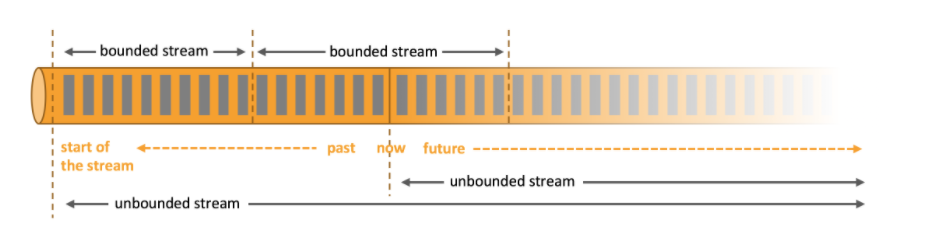
>
> **有界数据**，就是在一个确定的时间范围内的数据流，有开始，有结束，一旦确定就不会再改变，一般**批处理**用来处理有界数据，如上图的boundedstream。
>
> **无界数据**，就是持续产生的数据流，数据是无限的，有开始，无结束，一般**流处理**用来处理无界数据。如图unboundedstream。
>
> Flink的设计思想是以**流**为核心，批是流的特例，擅长处理无界和有界数据，Flink提供精确的时间控制能力和有状态计算机制，可以轻松应对无界数据流，同时提供**窗口**处理有界数据流。所以被成为流批一体。
>

### 容错能力：

> 在分布式系统中，硬件故障、进程异常、应用异常、网络故障等异常无处不在，Flink引擎必须保证故障发生后不仅可以**重启**应用程序，还要**确保**其内部状态保持一致，从最后一次正确的时间点重新出发
>
> Flink提供**集群级容错**和**应用级容错**能力
>
> **集群级容错：**Flink与集群管理器紧密连接，如YARN、Kubernetes，当进程挂掉后，自动重启新进程接管之前的工作。同时具备**高可用性，**可消除所有单点故障，
>
> **应用级容错：**Flink使用轻量级分布式快照，设计检查点（**checkpoint**）实现可靠容错。
>
> Flink利用检查点特性，在框架层面提供**Exactly-once**语义，即端到端的一致性，确保数据仅处理一次，不会重复也不会丢失，即使出现故障，也能保证数据只写一次。

## 3、Flink和SparkStreaming的区别？

> **Flink**和**SparkSreaming最大的区别**在于：Flink是标准的实时处理引擎，基于事件驱动，**以流为核心**，而SparkStreaming的RDD实际是一组小批次的RDD集合，是微批（Micro-Batch）的模型，**以批为核心**。
>
> 下面我们介绍两个框架的主要区别：

### 架构模型

> SparkStreaming在运行时的主要角色包括：
>
> 服务架构集群和资源管理Master/YarnApplicationMaster；工作节点Work/NodeManager；
>
> 任务调度器**Driver；**任务执行器**Executor**
>
> 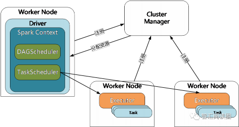{width="4.998611111111111in"height="2.6666666666666665in"}

> Flink在运行时主要包含：客户端Client、作业管理Jobmanager、任务管理Taskmanager。
>
> 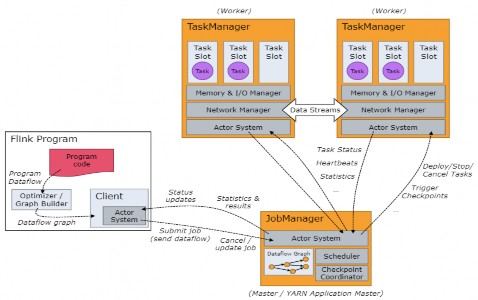{width="4.969630358705162in"height="3.1247911198600176in"}

### 任务调度

> SparkStreaming连续不断的生成微小的数据批次，构建有向无环图DAG，SparkStreaming会依次创建DStreamGraph、JobScheduler。
>
> 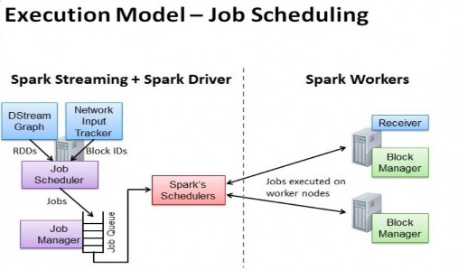{width="5.295849737532809in"height="3.1093744531933507in"}

> Flink根据用户提交的代码生成**StreamGraph**，经过优化生成**JobGraph**，然后提交给JobManager进行处理，JobManager会根据JobGraph生成
>
> **ExecutionGraph**，ExecutionGraph是Flink调度最核心的数据结构，
>
> JobManager根据ExecutionGraph对Job进行调度，根据物理执行图部署到
>
> Taskmanager上形成具体的Task执行。
>
> 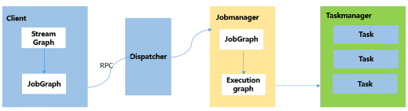{width="5.420386045494313in"height="1.46875in"}

### 时间机制

> SparkStreaming支持的时间机制有限，只支持处理时间。
>
> Flink支持了流处理程序在时间上的三个定义：事件时间EventTime、摄入时间IngestionTime、处理时间ProcessingTime。同时也支持watermark机制来处理滞后数据。
>
> 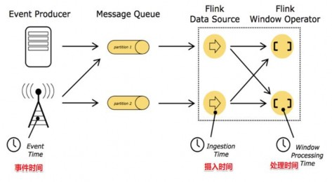{width="4.927029746281715in"height="2.7009372265966753in"}

### 容错机制

> 对于SparkStreaming任务，我们可以设置checkpoint，然后假如发生故障并重启，我们可以从上次checkpoint之处恢复，但是这个行为只能使得数据不丢失，可能会重复处理，不能做到恰好一次处理语义。
>
> Flink则使用两阶段提交协议来解决这个问题。

## 4、Flink的架构包含哪些？

> Flink架构分为**技术架构**和**运行架构**两部分。

## 5、简单介绍一下技术架构？

> 如下图为Flink技术架构：
>
> 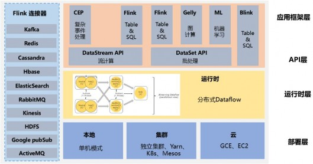{width="5.5125656167979in"height="2.8940616797900263in"}
>
> Flink作为流批一体的分布式计算引擎，必须提供面向开发人员的**API层**，同时还需要跟外部数据存储进行交互，需要**连接器**，作业开发、测试完毕后，需要提交集群执行，需要**部署层**，同时还需要运维人员能够管理和监控，还提供图计算、机器学习、SQL等，需要**应用框架层**。
>

## 6、详细介绍一下Flink的运行架构？

> 如下图为Flink运行架构：
>
> {width="5.205731627296588in"height="3.18375in"}

> Flink集群采取Master-Slave架构，Master的角色为**JobManager**，负责集群和作业管理，Slave的角色是**TaskManager**，负责执行计算任务，同时，Flink提供客户端Client来管理集群和提交任务，**JobManager**和**TaskManager**是集群的进程。

### Client

> Flink客户端是Flink提供的CLI命令行工具，用来提交Flink作业到Flink集群，在客户端中负责StreamGraph(流图)和JobGraph(作业图)的构建。

### JobManager

> JobManager根据并行度将Flink客户端提交的Flink应用分解为子任务，从资源管理器ResourceManager申请所需的计算资源，资源具备之后，开始分发任务到TaskManager执行Task，并负责应用容错，跟踪作业的执行状态，发现异常则恢复作业等。

### TaskManager

> TaskManager接收JobManage分发的子任务，根据自身的资源情况管理子任务的启动、停止、销毁、异常恢复等生命周期阶段。Flink程序中必须有一个TaskManager。
>

## 7、Flink的并行度介绍一下？

> Flink程序在执行的时候，会被映射成一个**StreamingDataflow。**一个StreamingDataflow是由一组Stream和TransformationOperator组成的。在启动时从一个或多个SourceOperator开始，结束于一个或多个SinkOperator。
>
> **Flink程序本质上是并行的和分布式的**，在执行过程中，**一个流(stream)包含一个或多个流分区**，而每一个operator包含一个或多个operator子任务。操作子任务间彼此独立，在不同的线程中执行，甚至是在不同的机器或不同的容器上。
>
> **operator子任务的数量是这一特定operator的并行度**。相同程序中的不同operator有不同级别的并行度。
>
> 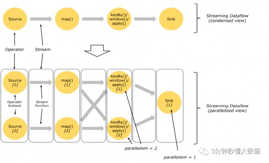{width="5.568497375328084in"height="3.380624453193351in"}
>
> 一个Stream可以被分成多个Stream的分区，也就是StreamPartition。**一个Operator也可以被分为多个OperatorSubtask**。如上图中，Source被分成Source1和Source2，它们分别为Source的OperatorSubtask。每一个OperatorSubtask都是在不同的线程当中独立执行的。**一个Operator的并行度，就等于OperatorSubtask的个数**。
>
> 上图Source的并行度为2。而一个Stream的并行度就等于它生成的Operator的并行度。数据在两个operator之间传递的时候有两种模式：
>
> (1)**OnetoOne模式：**两个operator用此模式传递的时候，会保持数据的分区数和数据的排序；如上图中的Source1到Map1，它就保留的Source的分区特性，以及分区元素处理的有序性。
>
> (2)**Redistributing（重新分配）模式**：这种模式会改变数据的分区数；每个operatorsubtask会根据选择transformation把数据发送到不同的目标subtasks，比如keyBy()会通过hashcode重新分区，broadcast()和rebalance()方法会随机重新分区；

## 8、Flink的并行度的怎么设置的？

> 我们在实际生产环境中可以从四个不同层面设置并行度：
>
> -   操作算子层面(OperatorLevel)
> -   执行环境层面(ExecutionEnvironmentLevel)
> -   客户端层面(ClientLevel)
> -   系统层面(SystemLevel)
>
> 需要注意的优先级：算子层面\>环境层面\>客户端层面\>系统层面。

## 9、Flink编程模型了解不？

> Flink应用程序主要由三部分组成，**源**Source、**转换**transformation、**目的地**sink。这些流式dataflows形成了有向图，以一个或多个源（source）开始，并以一个或多个目的地（sink）结束。
>
> 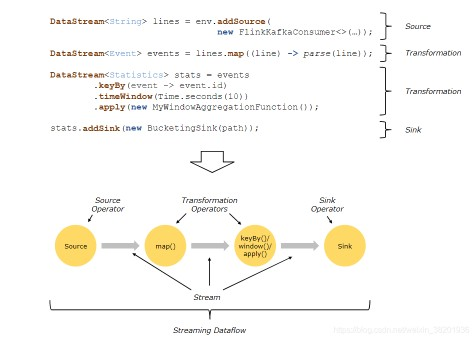{width="4.936986001749781in"height="3.53125in"}

## 10、Flink作业中的DataStream，Transformation介绍一下？

> Flink作业中，包含两个基本的块：**数据流（DataStream）**和**转换（Transformation）**。
>
> DataStream是逻辑概念，为开发者提供API接口，Transformation是处理行为的抽象，包含了数据的读取、计算、写出。所以Flink作业中的DataStreamAPI调用，实际上构建了多个由Transformation组成的数据处理流水线（Pipeline）DataStreamAPI和Transformation的转换如下图：
>
> 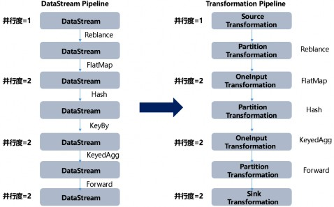{width="4.984062773403324in"height="3.09375in"}

## 11、Flink的分区策略了解吗？

> 目前Flink支持8种分区策略的实现，数据分区体系如下图：
>
> 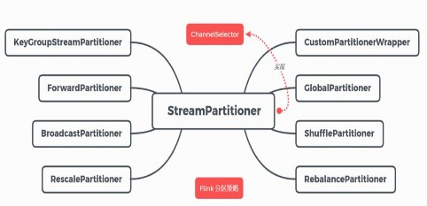{width="5.031169072615923in"height="2.4165616797900262in"}

### GlobalPartitioner

> 数据会被分发到下游算子的第一个实例中进行处理。

### ForwardPartitioner

> 在API层面上ForwardPartitioner应用在DataStream上，生成一个新的DataStream。
>
> 该Partitioner比较特殊，用于在同一个OperatorChain中上下游算子之间的数据转发，实际上数据是直接传递给下游的，要求上下游并行度一样。

### ShufflePartitioner

> 随机的将元素进行分区，可以确保下游的Task能够均匀地获得数据，使用代码如下：
>
> dataStream.shuffle();

### RebalancePartitioner

> 以Round-robin的方式为每个元素分配分区，确保下游的Task可以均匀地获得数据，避免数据倾斜。使用代码如下：
>
> dataStream.rebalance();

### RescalePartitioner

> 根据上下游Task的数量进行分区，使用**Round-robin**选择下游的一个Task进行数据分区，如上游有2个Source.，下游有6个Map，那么每个Source会分配3个固定的下游Map，不会向未分配给自己的分区写入数据。这一点与ShufflePartitioner和RebalancePartitioner不同，后两者会写入下游所有的分区。
>
> 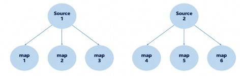{width="4.907175196850393in"height="1.55875in"}
>
> 运行代码如下：
>
> dataStream.rescale();

### BroadcastPartitioner

> 将该记录广播给所有分区，即有N个分区，就把数据复制N份，每个分区1份，其使用代码如下：
>
> dataStream.broadcast();

### KeyGroupStreamPartitioner

> 在API层面上，KeyGroupStreamPartitioner应用在KeyedStream上，生成一个新的KeyedStream。
>
> KeyedStream根据keyGroup索引编号进行分区，会将数据按Key的Hash值输出到下游算子实例中。该分区器不是提供给用户来用的。
>
> KeyedStream在构造Transformation的时候默认使用KeyedGroup分区形式，从而在底层上支持作业Rescale功能。

### CustomPartitionerWrapper

> 用户自定义分区器。需要用户自己实现Partitioner接口，来定义自己的分区逻辑。
>
> 更详细的介绍，请参考之前写的[Flink分区策略：你可以不会，但不能不懂](http://mp.weixin.qq.com/s?__biz=MzU4NjY4NDU0MQ%3D%3D&amp;mid=2247492628&amp;idx=1&amp;sn=722e512d99af3fe6b1712dc592693a7a&amp;chksm=fdf52506ca82ac10fa5134e4411b4fda7bf3daff2073750f0edebfaa2b423624452cba5b46af&amp;scene=21&amp;wechat_redirect)

## 12、描述一下Flinkwordcount执行包含的步骤有哪些？

> 主要包含以下几步：
>
> （1）获取运行环境StreamExecutionEnvironment
>
> （2）接入source源
>
> （3）执行转换操作，如map()、flatmap()、keyby（）、sum()
>
> （4）输出sink源如print()
>
> （5）执行execute
>
> 提供一个示例：
>
> ```java
> import org.apache.flink.api.common.functions.FlatMapFunction;importorg.apache.flink.api.java.utils.ParameterTool;
> 
> import org.apache.flink.streaming.api.datastream.DataStream;
> 
> import org.apache.flink.streaming.api.datastream.DataStreamSource;
> 
> import org.apache.flink.streaming.api.environment.StreamExecutionEnvironment;importorg.apache.flink.streaming.api.windowing.time.Time;
> 
> import org.apache.flink.util.Collector;
> 
> public class WordCount{
> public static void main(String[] args) throws Exception{
> //定义socket的端口号
> int port;
>   try{
>       ParameterTool parameterTool=ParameterTool.fromArgs(args);
>       port=parameterTool.getInt("port");
>   }catch(Exceptione){
>       System.err.println("没有指定port参数，使用默认值9000");
>       port=9000;
>   }
>     //获取运行环境
>     StreamExecutionEnvironment env=StreamExecutionEnvironment.getExecutionEnvironment();
> //连接socket获取输入的数据
> DataStreamSource<String>text=env.socketTextStream("10.192.12.106",port,"\n");
> //计算数据
> DataStream<WordWithCount>windowCount=text.flatMap(newFlatMapFunction<String,WordWithCount>(){
>     public void flatMap(String value,Collector<WordWithCount>out)throws Exception{
> 
> String[] splits=value.split("\s");
> for(Stringword:splits){
> out.collect(newWordWithCount(word,1L));
> }
> }})//打平操作，把每行的单词转为<word,count>类型的数据
> .keyBy("word")//针对相同的word数据进行分组
> .timeWindow(Time.seconds(2),Time.seconds(1))//指定计算数据的窗口大小和滑动窗口大小
> .sum("count");
> 
> //把数据打印到控制台
> 
> windowCount.print()
> 
> .setParallelism(1);//使用一个并行度
> 
> //注意：因为flink是懒加载的，所以必须调用execute方法，上面的代码才会执行
> 
> env.execute("streamingwordcount");
> 
> }
> 
> /**
> *主要为了存储单词以及单词出现的次数
> */
> 
> public static class WordWithCount{
> public String word;
> public long count;
> public WordWithCount(){}
> 
> public WordWithCount(Stringword,longcount){this.word=word;
> 
> this.count=count;}
> @Override
> 
> public String toString(){
> 
> return"WordWithCount{"+"word='"+word+",count="+count+'}';
> }}
> }
> ```
> 
> 


## 13、Flink常用的算子有哪些？

> 分两部分：
>
> （1）**数据读取**，这是Flink流计算应用的起点，**常用算子有：**
>
> 从内存读：fromElements、从文件读：readTextFile、Socket接入：
>
> socketTextStream、自定义读取：createInput
>
> （2）处理数据的算子，主要用于**转换**过程
>
> 常用的算子包括：Map（单输入单输出）、FlatMap（单输入、多输出）、Filter（过滤）、KeyBy（分组）、Reduce（聚合）、Window（窗口）、Connect（连接）、Split（分割）等。
>

# 02、Flink核心篇

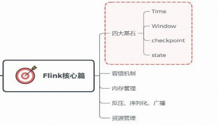{width="4.624882983377078in"height="2.6496872265966753in"}

> 核心篇主要涉及以上知识点，下面让我们详细了解一下。

## 14、Flink的四大基石包含哪些？

> Flink四大基石分别是：Checkpoint（检查点）、State（状态）、Time（时间）、Window（窗口）。

## 15、说说Flink窗口，以及划分机制？

> **窗口概念：**将无界流的数据，按时间区间，划分成多份数据，分别进行统计**(聚合)**
>
> Flink支持两种划分窗口的方式(time和count)，第一种，按时间驱动进行划分、另一种按数据驱动进行划分。
>
> 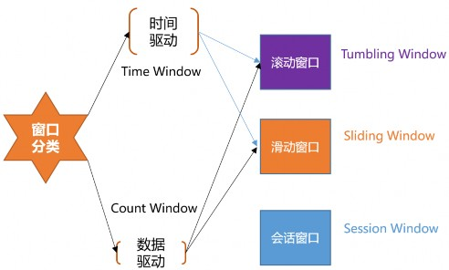{width="5.117018810148731in"height="3.0861450131233594in"}
>
> 1、按时间驱动TimeWindow划分可以分为滚动窗口TumblingWindow和滑动窗口SlidingWindow。
>
> 2、按数据驱动CountWindow也可以划分为滚动窗口TumblingWindow和滑动窗口SlidingWindow。
>
> 3、Flink支持窗口的两个重要属性(**窗口长度size和滑动间隔interval**)，通过窗口长度和滑动间隔来区分滚动窗口和滑动窗口。
>
> 如果size=interval,那么就会形成tumbling-window(无重叠数据)\--滚动窗口
>
> 如果size(1min)\>interval（30s）,那么就会形成sliding-window(有重叠数据)\--滑动窗口
>
> 通过组合可以得出四种基本窗口：

1.  time-tumbling-window无重叠数据的时间窗口，设置方式举例：

> timeWindow(Time.seconds(5))\-\--基于时间的滚动窗口
>
> 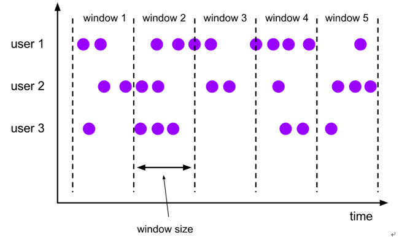
>
> 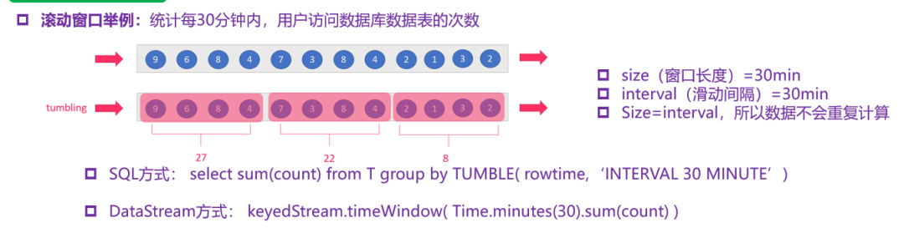

2.  time-sliding-window有重叠数据的时间窗口，设置方式举例：

> timeWindow(Time.seconds(10),Time.seconds(5))\-\--基于时间的滑动窗口
>
> 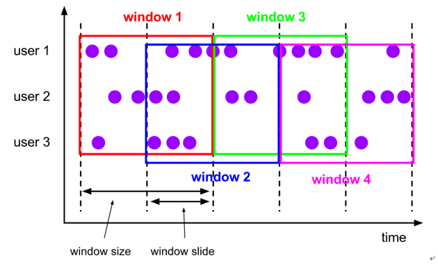
>
> 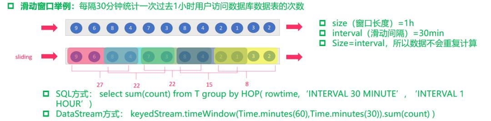

3.  count-tumbling-window无重叠数据的数量窗口，设置方式举例：

> countWindow(5)\-\--基于数量的滚动窗口

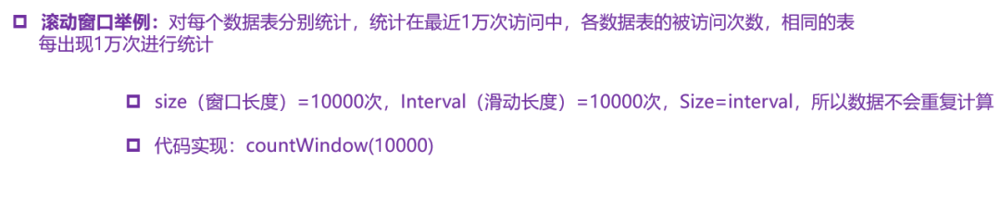

4.  count-sliding-window有重叠数据的数量窗口，设置方式举例：

> countWindow(10,5)\-\--基于数量的滑动窗口

{width="5.378318022747156in"height="0.9349989063867017in"}

###### Flink中还支持一个特殊的窗口:会话窗口SessionWindows

> session窗口分配器通过session活动来对元素进行分组，session窗口跟滚动窗口和滑动窗口相比，不会有重叠和固定的开始时间和结束时间的情况
>
> session窗口在一个固定的时间周期内不再收到元素，即非活动间隔产生，那个这个窗口就会关闭。
>
> 一个session窗口通过一个session间隔来配置，这个session间隔定义了非活跃周期的长度，当这个非活跃周期产生，那么当前的session将关闭并且后续的元素将被分配到新的session窗口中去,如下图所示：
>
> 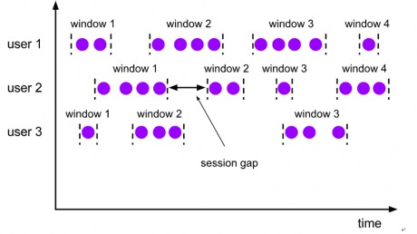{width="4.786986001749781in"height="2.681457786526684in"}

## 16、Flink的窗口机制以及各组件之间是如何相互工作的？

> 以下为窗口机制的流程图：
>
> 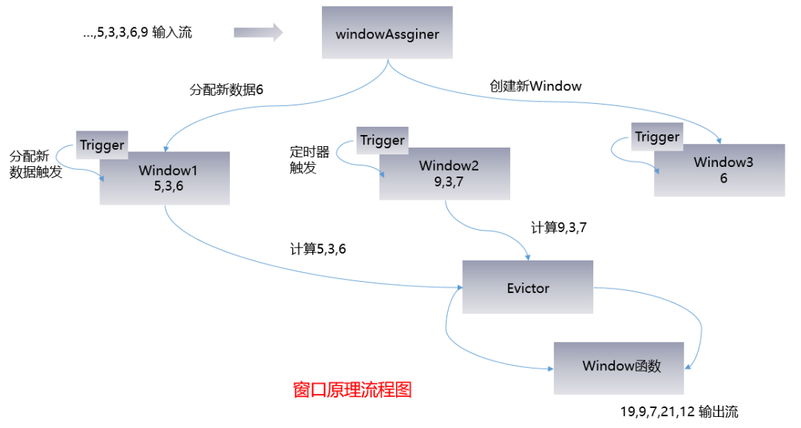

### WindowAssigner

> 1、窗口算子负责处理窗口，数据流源源不断地进入算子（windowoperator）时，每一个到达的元素首先会被交给WindowAssigner。**WindowAssigner会决定元素被放到哪个或哪些窗口（window）**，可能会创建新窗口。因为一个元素可以被放入多个窗口中（个人理解是滑动窗口，滚动窗口不会有此现象），所以同时存在多个窗口是可能的。注意，Window**本身只是一个ID标识符**，其内部可能存储了一些元数据，如TimeWindow中有开始和结束时间，但是并不会存储窗口中的元素。窗口中的元素实际存储在Key/ValueState中，key为Window，value为元素集合（或聚合值）。为了保证窗口的容错性，该实现依赖了Flink的State机制。

### WindowTrigger

> 2、每一个Window都拥有一个属于自己的Trigger，Trigger上会有定时器，**用来决定一个窗口何时能够被计算或清除**。每当有元素加入到该窗口，或者之前注册的定时器超时了，那么Trigger都会被调用。Trigger的返回结果可以是：
>
> 1、continue（继续、不做任何操作），
>
> 2、Fire（触发计算，处理窗口数据），
>
> 3、Purge（触发清理，移除窗口和窗口中的数据），
>
> 4、Fire+purge（触发计算+清理，处理数据并移除窗口和窗口中的数据）。当数据到来时，调用**Trigger**判断是否需要触发计算，如果调用结果只是Fire的话，那么会计算窗口并保留窗口原样，也就是说窗口中的数据不清理，等待下次Triggerfire的时候再次执行计算。窗口中的数据会被反复计算，直到触发结果清理。在清理之前，窗口和数据不会释放没所以窗口会一直占用内存。

> **Trigger触发流程：**
>
> 3、当TriggerFire了，窗口中的元素集合就会交给Evictor（如果指定了的话）。**Evictor主要用来遍历窗口中的元素列表，并决定最先进入窗口的多少个元素需要被移除**。剩余的元素会交给用户指定的函数进行窗口的计算。如果没有Evictor的话，窗口中的所有元素会一起交给函数进行计算。
>
> 4、计算函数收到了窗口的元素（可能经过了Evictor的过滤），并计算出窗口的结果值，并发送给下游。窗口的结果值可以是一个也可以是多个。DataStreamAPI上可以接收不同类型的计算函数，包括预定义的sum(),min(),max()，还有ReduceFunction，FoldFunction，还有WindowFunction。WindowFunction是最通用的计算函数，其他的预定义的函数基本都是基于该函数实现的。
>
> 5、Flink对于一些聚合类的窗口计算（如sum,min）做了优化，因为聚合类的计算不需要将窗口中的所有数据都保存下来，只需要保存一个result值就可以了。每个进入窗口的元素都会执行一次聚合函数并修改result值。这样可以大大降低内存的消耗并提升性能。但是如果用户定义了Evictor，则不会启用对聚合窗口的优化，因为Evictor需要遍历窗口中的所有元素，必须要将窗口中所有元素都存下来。

## 17、讲一下Flink的Time概念？

> 在Flink的流式处理中，会涉及到时间的不同概念，主要分为**三种时间机制**，如下图所示：
>
> 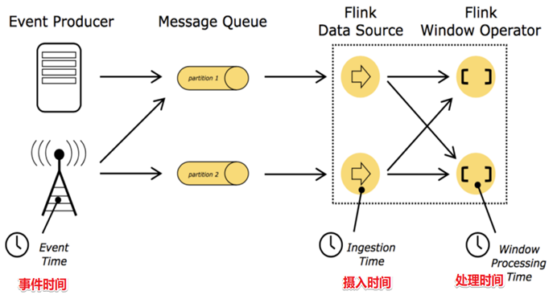
>
> - EventTime\[事件时间\]
>
>   事件发生的时间，例如：点击网站上的某个链接的时间，每一条日志都会记录自己的生成时间。如果以EventTime为基准来定义时间窗口那将形成EventTimeWindow,要求消息本身就应该携带EventTime
>
> - IngestionTime\[摄入时间\]
>
>   数据进入Flink的时间，如某个Flink节点的**sourceoperator**接收到数据的时间，例如：某个source消费到kafka中的数据
>
>   如果以**IngesingtTime**为基准来定义时间窗口那将形成IngestingTimeWindow,以source的systemTime为准
>
>- ProcessingTime\[处理时间\]
>
>   某个Flink节点执行某个operation的时间，例如：timeWindow处理数据时的系统时间，默认的时间属性就是ProcessingTime
>
>   如果以**ProcessingTime**基准来定义时间窗口那将形成ProcessingTimeWindow，以operator的systemTime为准
>
>   在Flink的流式处理中，绝大部分的业务都会使用EventTime，一般只在EventTime无法使用时，才会被迫使用ProcessingTime或者IngestionTime。如果要使用EventTime，那么需要引入EventTime的时间属性，引入方式如下所示：


## 18、那在API调用时，应该怎么使用？

> 使用方式如下：
>
> ```java
> finalStreamExecutionEnvironmentenv=StreamExecutionEnvironment.getExecutionEnvironrnent();
> //使用处理时间
> env.setStreamTimeCharacteristic(TimeCharacteristic.ProcessingTime);
> //使用摄入时间
> env.setStrearnTimeCharacteristic(TimeCharacteristic.IngestionTime);
> //使用事件时间
> env.setStrearnTimeCharacteristic(TimeCharacteristic.EventTime);
> ```
>
> 

## 19、在流数据处理中，有没有遇到过数据延迟等问题，通过什么处理呢？

> 有遇到过数据延迟问题。举个例子：
>
> **案例1：**假你正在去往地下停车场的路上，并且打算用手机点一份外卖。选好了外卖后，你就用在线支付功能付款了，这个时候是11点50分。恰好这时，你走进了地下停车库，而这里并没有手机信号。因此外卖的在线支付并没有立刻成功，而支付系统一直在Retry重试"支付"这个操作。当你找到自己的车并且开出地下停车场的时候，已经是12点05分了。这个时候手机重新有了信号，手机上的支付数据成功发到了外卖在线支付系统，支付完成。
>
> 在上面这个场景中你可以看到，**支付数据的事件时间是11点50分**，而**支付数据**的处理时间是12点05分

> **案例2：**如上图所示，某App会记录用户的所有点击行为，并回传日志（在网络不好的情况下，先保存在本地，延后回传）。
>
> A用户在11:02对App进行操作，B用户在11:03操作了App，但是A用户的网络不太稳定，回传日志延迟了，导致我们在服务端先接受到B用户11:03的消息，然后再接受到A用户11:02的消息，**消息乱序**了。
>
> 一般处理数据延迟、消息乱序等问题，通过WaterMark水印来处理。水印是用来解决数据延迟、数据乱序等问题，总结如下图所示：
>
> 
>
> 水印就是一个时间戳（timestamp），Flink可以给数据流添加水印
>
> -   水印并不会影响原有Eventtime事件时间
> -   当数据流添加水印后，会按照水印时间来触发窗口计算,也就是说watermark水印是用来触发窗口计算的
> -   设置水印时间，会比事件时间小几秒钟,表示最大允许数据延迟达到多久
> -   水印时间=事件时间-允许延迟时间(例如：10:09:57=10:10:00-3s)
>


## 20、WaterMark原理讲解一下？

> 如下图所示：
>
> 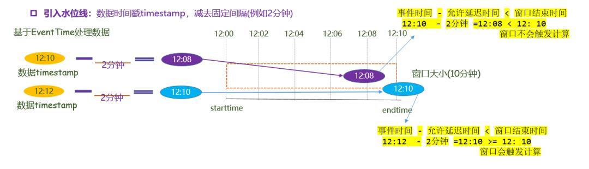

> 窗口是10分钟触发一次，现在在12:00-12:10有一个窗口，本来有一条数据是
>
> 在12:00-12:10这个窗口被计算，但因为延迟，12:12到达，这时12:00-12:10这个窗口就会被关闭，只能将数据下发到下一个窗口进行计算，这样就产生了数据延迟，造成计算不准确。
>
> 现在添加一个水位线：数据时间戳为2分钟。这时用数据产生的事件时间12:12
>
> 允许延迟的水印2分钟=12:10\>=窗口结束时间。窗口触发计算，该数据就会被计算到这个窗口里。
>
> 在DataStreamAPI中使用TimestampAssigner接口定义时间戳的提取行为，包含两个子接口**AssignerWithPeriodicWatermarks**接口和**AssignerWithPunctuatedWaterMarks**接口
>
> 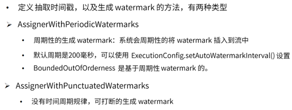
>
> 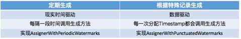

## 21、如果数据延迟非常严重呢？只使用WaterMark可以处理吗？那应该怎么解决？

> 使用WaterMark+EventTimeWindow机制可以在一定程度上解决数据乱序的问题，但是，WaterMark水位线也不是万能的，在某些情况下，数据延迟会非常严重，即使通过Watermark+EventTimeWindow也无法等到数据全部进入窗口再进行处理，因为窗口触发计算后，**对于延迟到达的本属于该窗口的数据，Flink默认会将这些延迟严重的数据进行丢弃**
>
> 那么如果想要让一定时间范围的延迟数据不会被丢弃，可以使用AllowedLateness(允许迟到机制/侧道输出机制)设定一个允许延迟的时间和侧道输出对象来解决
>
> 即使用WaterMark+EventTimeWindow+AllowedLateness方案（包含侧道输出），可以做到数据不丢失。
>
> **API调用**
>
> **allowedLateness**(lateness:Time)\-\--设置允许延迟的时间
>
> 该方法传入一个Time值，设置允许数据迟到的时间，这个时间和watermark中的时间概念不同。再来回顾一下，
>
> watermark=数据的事件时间-允许乱序时间值
>
> 随着新数据的到来，watermark的值会更新为最新数据事件时间-允许乱序时间值，但是如果这时候来了一条历史数据，watermark值则不会更新。总的来说，watermark永远不会倒退它是为了能接收到尽可能多的乱序数据。
>
> 那这里的Time值呢？主要是为了等待迟到的数据，如果属于该窗口的数据到来，仍会进行计算，后面会对计算方式仔细说明
>
> 注意：该方法只针对于基于event-time的窗口
>
> **sideOutputLateData**(outputTag:OutputTag\[T\])\--保存延迟数据
>
> 该方法是将迟来的数据保存至给定的outputTag参数，而OutputTag则是用来标记延迟数据的一个对象。
>
> DataStream.getSideOutput(tag:OutputTag\[X\])\--获取延迟数据
>
> 通过window等操作返回的DataStream调用该方法，传入标记延迟数据的对象来获取延迟的数据

## 22、刚才提到State，那你简单说一下什么是State

> 
>
> 在Flink中，状态被称作state，是用来**保存**中间的**计算结果**或者**缓存数据。**根据状态是否需要保存中间结果，分为**无状态计算**和**有状态计算。**
>
> 对于流计算而言，事件持续产生，如果每次计算**相互独立**，不依赖上下游的事件，则相同输入，可以得到相同输出，**是无状态计算**。
>
> 如果计算需要**依赖**于之前或者后续事件，则被称**为有状态计算**。
>
> 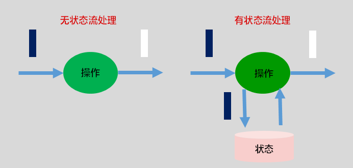
>
> 
>
> 有状态计算如sum求和，数据累加等。
>
> 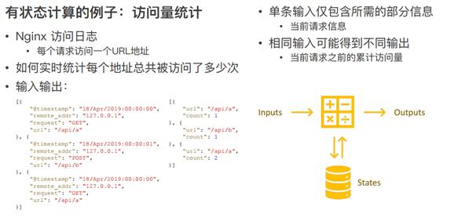

## 23、Flink状态包括哪些？

> 1、按照由Flink管理还是用户管理，状态可以分为**原始状态（RawState）**和**托管状态（ManagedState）**
>
> **托管状态（ManagedState）**:由Flink自行进行管理的State。
>
> **原始状态（RawState）**：由用户自行进行管理。
>
> 两者区别：
>
> 1.  从状态管理方式的方式来说，ManagedState由FlinkRuntime管理，自动存储，自动恢复，在内存管理上有优化；而RawState需要用户自己管理，需要自己序列化，Flink不知道State中存入的数据是什么结构，只有用户自己知道，需要最终序列化为可存储的数据结构。
> 2.  从状态数据结构来说，ManagedState支持已知的数据结构，如：Value、List、Map等。而RawState**只支持字节**数组，所有状态都要转换为二进制字节数组才可以。
> 3.  从推荐使用场景来说，ManagedState大多数情况下均可使用，而RawState是当ManagedState不够用时，比如需要自定义Operator时，才会使用RawState。**在实际生产过程中，只推荐使用ManagedState。**
>
> 2、**State**按照是否有key划分为**KeyedState**和**OperatorState**两种。
>
> keyedState特点：
>
> 1.  只能用在keyedStream上的算子中，状态跟特定的key绑定。
> 2.  keyStream流上的每一个key对应一个state对象。若一个operator实例处理多个key，访问相应的多个State，**可对应多个state。**
> 3.  keyedState保存在StateBackend中
> 4.  通过RuntimeContext访问，实现RichFunction接口。
> 5.  支持多种数据结构：ValueState、ListState、ReducingState、AggregatingState、MapState.
>
> 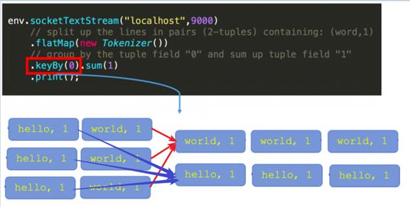
>
> OperatorState特点：
>
> 1. 可以用于所有算子，但整个算子只对应一个state。
>
> 2. 并发改变时有多种重新分配的方式可选：均匀分配；
>
> 3.  实现CheckpointedFunction或者ListCheckpointed接口。
> 4.  目前只支持ListState数据结构。
>
> 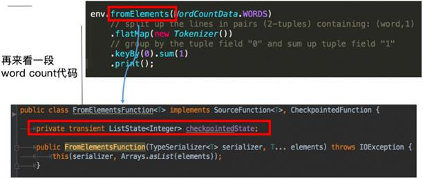
>
> 这里的fromElements会调用FromElementsFunction的类，其中就使用了类型为Liststate的operatorstate

## 24、Flink广播状态了解吗？

> Flink中，广播状态中叫作BroadcastState。在广播状态模式中使用。**所谓广播状态模式，就是来自一个流的数据需要被广播到所有下游任务**，**在算子本地存储，在处理另一个流的时候依赖于广播的数据**.下面以一个示例来说明广播状态模式。
>
> 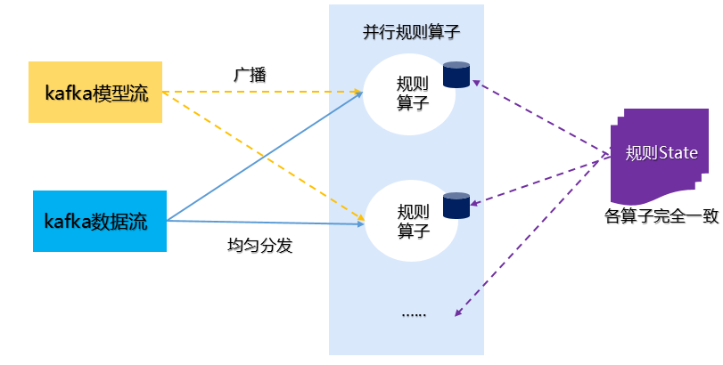
>
> 上图这个示例包含两个流，一个为**kafka模型流**，该模型是通过机器学习或者深度学习训练得到的模型，将该模型通过广播，发送给下游所有规则算子，规则算子将规则缓存到Flink的本地内存中，另一个为**Kafka数据流**，用来接收测试集，该测试集依赖于模型流中的模型，通过模型完成测试集的推理任务。
>
> 广播状态（State）必须是MapState类型，广播状态模式需要使用广播函数进行处理，广播函数提供了处理广播数据流和普通数据流的接口。

## 25、Flink状态接口包括哪些？

> 在Flink中使用状态，包含两种状态接口：
>
> （1）**状态操作接口：**使用状态对象本身存储，写入、更新数据。
>
> （2）**状态访问接口：**从StateBackend获取状态对象本身。
>
> 状态操作接口
>
> Flink中的**状态操作接口**面向两类用户，即**应用开发者**和**Flink框架本身**。所有Flink设计了两套接口
>
> 1、面向开发者State接口
>
> 面向开发的State接口只提供了对State中数据的增删改基本操作接口，用户无法访问状态的其他运行时所需要的信息。接口体系如下图：
>
> 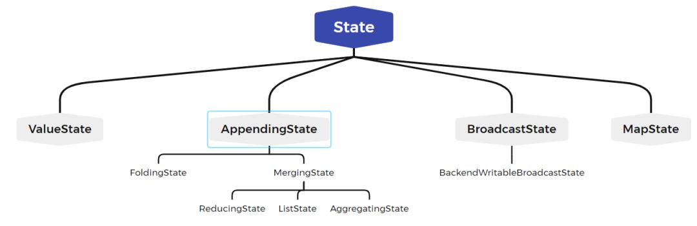
>
> 面向开发者的State接口体系
>
> 2、面向内部State接口
>
> 内部State接口是给Flink框架使用，提供更多的State方法，可以根据需要灵活扩展。除了对State中数据的访问之外，还提供内部运行时信息，如State中数据的序列化器，命名空间（namespace）、命名空间的序列化器、命名空间合并的接口。内部State接口命名方式为InternalxxxState。
>
> **状态访问接口**
>
> **有了状态之后，开发者自定义UDF时，应该如何访问状态？**
>
> 状态会被保存在StateBackend中，但StateBackend又包含不同的类型。所有Flink中抽象了两个状态访问接口：**OperatorStateStore**和**KeyedStateStore，**用户在编写UDF时，就无须考虑到底是使用哪种StateBackend类型接口。
>
> OperatorStateStore接口原理：
>
> 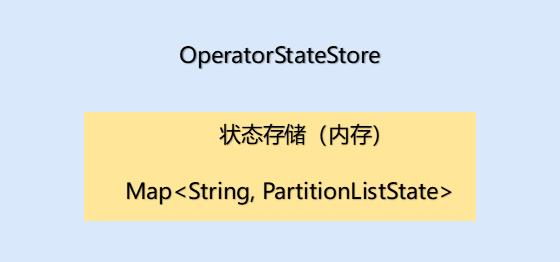
>
> OperatorState数据以Map形式保存在内存中，并没有使用RocksDBStateBackend和HeapKeyedStateBackend。
>
>  KeyedStateStore接口原理：
>
> 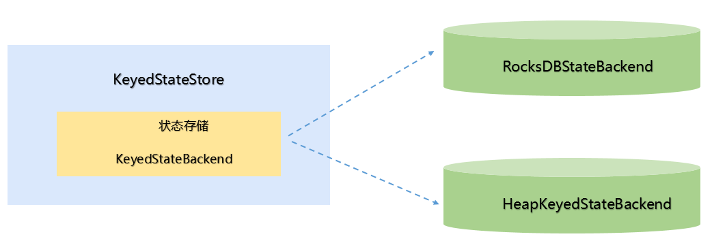
>
> keyedStateStore数据使用RocksDBStateBackend或者HeapKeyedStateBackend来存储，KeyedStateStore中创建、获取状态都交给了具体的StateBackend来处理，KeyedStateStore本身更像是一个代理。

## 26、Flink状态如何存储

> 在Flink中，状态存储被叫做**StateBackend**,它具备两种能力：
>
> （1）在计算过程中提供访问State能力，开发者在编写业务逻辑中能够使用StateBackend的接口读写数据。
>
> （2）能够将State持久化到外部存储，提供容错能力。
>
> 
>
> Flink状态**提供三种存储方式**：
>
> **（1）内存：**MemoryStateBackend,适用于验证、测试、不推荐生产使用。
>
> **（2）文件：**FSStateBackend，适用于长周期大规模的数据。
>
> **（3）RocksDB:**RocksDBStateBackend，适用于长周期大规模的数据。
>
> 上面提到的StateBackend是面向用户的，在Flink内部3种State的关系如下图：
>
> 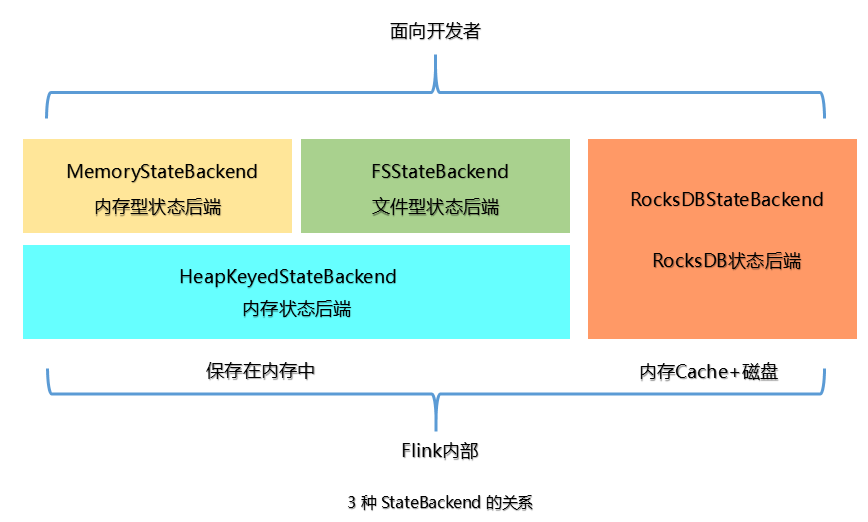
>
> 在运行时，**MemoryStateBackend**和**FSStateBackend**本地的State都保存在TaskManager的内存中，所以其底层都依赖于HeapKeyedStateBackend。HeapKeyedStateBackend面向Flink引擎内部，使用者无须感知。

### 1、内存型StateBackend

> MemoryStateBackend，运行时所需的State数据全部保存在**TaskManagerJVM堆上内存中，**KV类型的State、窗口算子的State使用HashTable来保存数据、触发器等。**执行检查点的时候，会把State的快照数据保存到JobManager进程的内存中。**
>
> MemoryStateBackend可以使用**异步**的方式进行快照，（也可以同步），**推荐异步**，避免阻塞算子处理数据。
>
> 基于内存的StateBackend在生产环境下不建议使用，可以在本地开发调试测试。**注意点如下：**
>
> 1)  State存储在JobManager的内存中.受限于JobManager的内存大小。
>
> 2)  每个State默认5MB,可通过MemoryStateBackend构造函数调整
>
> 3)  每个State不能超过AkkaFrame大小。

### 2、文件型StateBackend

> FSStateBackend，运行时所需的State数据全部保存在**TaskManager的内存中，执行检查点的时候，会把State的快照数据保存到配置的文件系统中。**
>
> 可以是分布式或者本地文件系统，路径如：
>
> HDFS路径："hdfs://namenode:40010/flink/checkpoints"
>
> 本地路径："file:///data/flink/checkpoints"。
>
> FSStateBackend**适用于处理大状态、长窗口、或者大键值状态的有状态处理任务**。
>
> **注意点如下：**
>
> 1)  State数据首先被存在TaskManager的内存中。
> 2)  State大小不能超过TM内存。
> 3)  TM异步将State数据写入外部存储。
>
> MemoryStateBackend和FSStateBackend都依赖于HeapKeyedStateBackend，HeapKeyedStateBackend使用State存储数据。

### 3、RocksDBStateBackend

> RocksDBStateBackend跟内存型和文件型都不同。
>
> RocksDBStateBackend**使用嵌入式的本地数据库RocksDB**将流计算数据状态**存储在本地磁盘中**，不会受限于TaskManager的内存大小，在执行检查点的时候，再将整个RocksDB中保存的State数据全量或者增量持久化到配置的文件系统中，
>
> 在JobManager内存中会存储少量的检查点元数据。RocksDB克服了State受内存限制的问题，同时又能够持久化到远端文件系统中，比较适合在生产中使用。
>
> **缺点**：
>
> RocksDBStateBackend相比基于内存的StateBackend，访问State的成本高很多，可能导致数据流的吞吐量剧烈下降，甚至可能**降低为原来的1/10**。
>
> **适用场景**
>
> 1）最适合用于处理大状态、长窗口，或大键值状态的有状态处理任务。
>
> 2）RocksDBStateBackend非常适合用于高可用方案。
>
> 3\)RocksDBStateBackend是**目前唯一支持增量检查点的后端。**增量检查点非常适用于超大状态的场景。
>
> **注意点**
>
> 1）总State大小仅限于磁盘大小，不受内存限制
>
> 2）**RocksDBStateBackend**也需要配置外部文件系统，集中保存State。
>
> 3）**RocksDB的JNIAPI基于byte数组**，单key和单Value的大小不能超过8字节
>
> 4）对于使用具有合并操作状态的应用程序，如ListState，随着时间可能会累积到超过2\*31次方字节大小，这将会导致在接下来的查询中失败。

## 27、Flink状态如何持久化？

> 首选，Flink的状态最终都要持久化到第三方存储中，确保集群故障或者作业挂掉后能够恢复。
>
> RocksDBStateBackend持久化策略有两种：
>
> **全量持久化策略**RocksFullSnapshotStrategy
>
> **增量持久化策略**RocksIncementalSnapshotStrategy
>
> **1、全量持久化策略**
>
> 每次将全量的State写入到状态存储中（HDFS）。内存型、文件型、RocksDB类型的StataBackend都支持全量持久化策略。
>
> 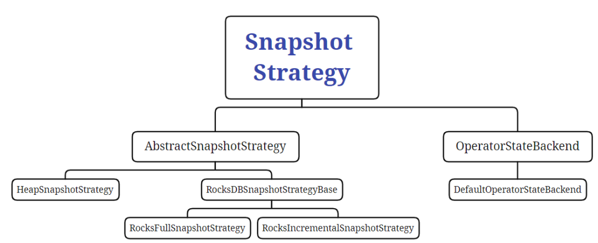																
>
> ​																**快照保存策略类体系**
>
> 在执行持久化策略的时候，使用异步机制，每个算子启动1个独立的线程，将自身的状态写入分布式存储可靠存储中。在做持久化的过程中，状态可能会被持续修改，**基于内存的状态后端**使用CopyOnWriteStateTable来保证线程安全，RocksDBStateBackend则使用RocksDB的快照机制，使用快照来保证线程安全。
>
> **2、增量持久化策略**
>
> 增量持久化就是每次持久化增量的State，**只有RocksDBStateBackend支持增量持久化。**
>
> **Flink增量式的检查点以RocksDB为基础**，RocksDB是一个基于LSM-Tree的KV存储。新的数据保存在内存中，称为**memtable**。如果Key相同，后到的数据将覆盖之前的数据，一旦memtable写满了，RocksDB就会将数据压缩并写入磁盘。memtable的数据持久化到磁盘后，就变成了不可变的**sstable**。
>
> **因为sstable是不可变的，**Flink对比前一个检查点创建和删除的RocksDBsstable文件就可以计算出状态有哪些发生改变。为了确保sstable是不可变的，**Flink会在RocksDB触发刷新操作**，**强制将memtable刷新到磁盘上。**在Flink执行检查点时，会将新的sstable持久化到HDFS中，同时保留引用。这个过程中Flink并不会持久化本地所有的sstable，因为本地的一部分历史sstable在之前的检查点中已经持久化到存储中了，只需增加对sstable文件的引用次数就可以。
>
> **RocksDB会在后台合并sstable并删除其中重复的数据**。然后在RocksDB删除原来的sstable，替换成新合成的sstable.。**新的sstable包含了被删除的sstable中的信息，**通过合并历史的sstable会合并成一个新的sstable，并删除这些历史sstable.可以减少检查点的历史文件，避免大量小文件的产生。

## 28、Flink状态过期后如何清理？

### 1、DataStream中状态过期

> 可以对DataStream中的每一个状态设置**清理策略StateTtlConfig**，可以设置的内容如下：
>
> -   过期时间：超过多长时间未访问，视为State过期，类似于缓存。
>
> -   过期时间更新策略：创建和写时更新、读取和写时更新。
>
> -   State可见性：未清理可用，超时则不可用。

### 2、FlinkSQL中状态过期

> FlinkSQL一般在流Join、聚合类场景使用State，如果State不定时清理，则导致State过多，内存溢出。清理策略配置如下：
>
> StreamQueryConfigqConfig=\...
>
> //设置过期时间为min=12小时，max=24小时
>
> qConfig.withIdleStateRetentionTime(Time.hours(12),Time.hours(24));
>
> 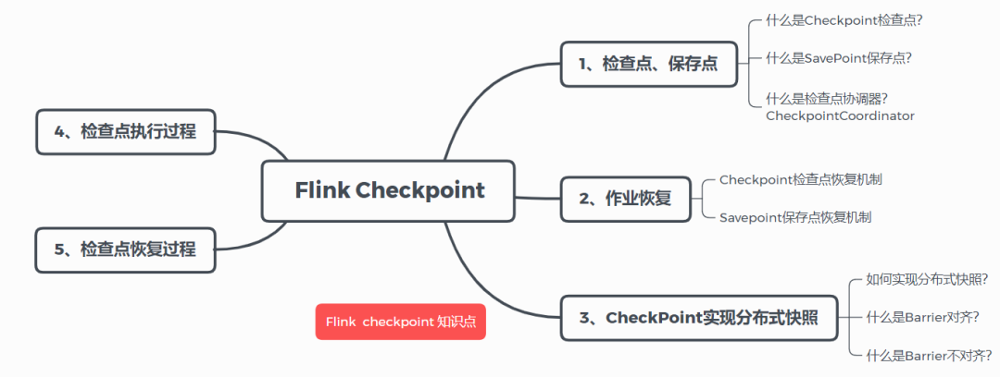

## 29、Flink通过什么实现可靠的容错机制？

> Flink使用轻量级分布式快照，设计检查点（**checkpoint**）实现可靠容错。

## 30、什么是Checkpoin检查点？

> **Checkpoint**被叫做**检查点**，是Flink实现容错机制最核心的功能，是Flink可靠性的基石，它能够根据配置周期性地基于Stream中各个Operator的**状态**来生成Snapshot**快照**，从而将这些状态数据定期持久化存储下来，当Flink程序一旦意外崩溃时，重新运行程序时可以有选择地从这些Snapshot进行恢复，从而修正因为故障带来的程序数据状态中断。
>
> Flink的checkpoint机制原理来自"**Chandy-Lamportalgorithm**"算法
>
> **注意:区分State和Checkpoint**

### State:

> 一般指一个具体的Task/Operator的状态(operator的状态表示一些算子在运行的过程中会产生的一些中间结果)
>
> State数据默认保存在Java的堆内存中/TaskManage节点的内存中
>
> State可以被记录，在失败的情况下数据还可以恢复。

### Checkpoint:

> 表示了一个FlinkJob在一个特定时刻的一份全局状态快照，即包含了所有Task/Operator的状态
>
> 可以理解为Checkpoint是把State数据定时持久化存储了
>
> 比如KafkaConsumer算子中维护的Offset状态,当任务重新恢复的时候可以从Checkpoint中获取。
>

## 31、什么是Savepoin保存点？

> **保存点**在Flink中叫作**Savepoint**.是基于Flink检查点机制的应用完整快照备份机制.用来保存状态可以在另一个集群或者另一个时间点.从保存的状态中将作业恢复回来。适用于应用升级、集群迁移、Flink集群版本更新、A/B测试以及假定场景、暂停和重启、归档等场景。保存点可以视为一个(算子ID-\>State)的Map，对于每一个有状态的算子，Key是算子ID，Value是算子State。

## 32、什么是CheckpointCoordinator检查点协调器？

> Flink中检查点协调器叫作**CheckpointCoordinator**，负责协调Flink算子的State的分布式快照。当触发快照的时候，CheckpointCoordinator向Source算子中注入**Barrier**消息，然后等待所有的Task通知检查点确认完成，同时持有所有Task在确认完成消息中上报的State句柄。
>

## 33、Checkpoint中保存的是什么信息？

> 检查点里面到底保存着什么信息呢？我们以flink消费kafka数据wordcount为例：
>
> 1、我们从Kafka读取到一条条的日志，从日志中解析出app_id，然后将统计的结果放到内存中一个Map集合，app_id做为key，对应的pv做为value，每次只需要将相应app_id的pv值+1后put到Map中即可；
>
> 2、kafkatopic：test；
>
> 3、flink运算流程如下：
>
> 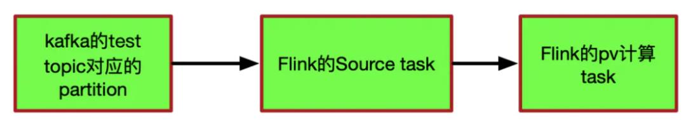
>
> kafkatopic有且只有一个分区
>
> 假设kafka的topic-test只有一个分区，flink的Sourcetask记录了当前消费到kafkatesttopic的所有partition的offset
>
> 例：（0，1000）表示0号partition目前消费到offset为1000的数据
>
> Flink的pvtask记录了当前计算的各app的pv值，为了方便讲解，我这里有两个app：app1、app2
>
> 例：（app1，50000）（app2，10000）
>
> 表示app1当前pv值为50000
>
> 表示app2当前pv值为10000
>
> 每来一条数据，只需要确定相应app_id，将相应的value值+1后put到map中即可；
>
> 该案例中，CheckPoint保存的其实就是**第n次CheckPoint消费的offset信息和各app的pv值信息**，记录一下发生CheckPoint当前的状态信息，并将该状态信息保存到相应的状态后端。图下代码：（**注：状态后端是保存状态的地方，决定状态如何保存，如何保障状态高可用**，我们只需要知道，我们能从状态后端拿到offset信息和pv信息即可。状态后端必须是高可用的，否则我们的状态后端经常出现故障，会导致无法通过checkpoint来恢复我们的应用程序）。
>
> chk-100
>
> offset：（0，1000）
>
> pv：（app1，50000）（app2，10000）
>
> 该状态信息表示第100次CheckPoint的时候，partition0offset消费到了1000，pv统计
>


## 34、当作业失败后，检查点如何恢复作业？

> Flink提供了**应用自动恢复机制**和**手动作业恢复机制**。
>
> **应用自动恢复机制：**
>
> Flink设置有作业失败重启策略，包含三种：
>
>  1、定期恢复策略：fixed-delay
>
> 固定延迟重启策略会尝试一个给定的次数来重启Job，如果超过最大的重启次数，Job最终将失败，在连续两次重启尝试之间，重启策略会等待一个固定时间，默认Integer.MAX_VALUE次
>
>  2、失败比率策略：failure-rate
>
> 失败率重启策略在job失败后重启，但是超过失败率后，Job会最终被认定失败，在两个连续的重启尝试之间，重启策略会等待一个固定的时间。
>
> 3、直接失败策略：None失败不重启手动作业恢复机制。
>
> 因为Flink检查点目录分别对应的是JobId，每通过flinkrun方式/页面提交方式恢复都会重新生成jobId，Flink提供了在启动之时通过设置**-s**.参数指定检查点目录的功能，让新的jobld读取该检查点元文件信息和状态信息，从而达到指定时间节点启动作业的目的。
>
> 启动方式如下：
>
> /bin/flink -s /flink/checkpoints/03112312a12398740a87393/chk-50/\_metadata

## 35、当作业失败后，从保存点如何恢复作业？

> 从保存点恢复作业并不简单，尤其是在作业变更(如修改逻辑、修复bug)的情况下，需要考虑如下几点:
>
>  （1）算子的顺序改变
>
> 如果对应的UID没变，则可以恢复，如果对应的UID变了恢复失败。
>
>  （2）作业中添加了新的算子
>
> 如果是无状态算子，没有影响，可以正常恢复，如果是有状态的算子，跟无状态的算子一样处理。
>
> （3）从作业中删除了一个有状态的算子
>
> 默认需要恢复保存点中所记录的所有算子的状态，如果删除了一个有状态的算子，从保存点回复的时候被删除的OperatorID找不到，所以会报错可以通过在命令中添加\--allowNonReStoredSlale(short:-n）跳过无法恢复的算子。
>
> （4）添加和删除无状态的算子
>
> 如果手动设置了UID则可以恢复，保存点中不记录无状态的算子如果是自动分配的UID，那么有状态算子的可能会变(Flink一个单调递增的计数器生成UID，DAG改版，计数器极有可能会变)很有可能恢复失败。

## 36、Flink如何实现轻量级异步分布式快照？

> 要实现分布式快照，最关键的是能够将数据流切分。**Flink中使用Barrier(屏障)来切分数据流。**Barrierr会周期性地注入数据流中，作为数据流的一部分，从上游到下游被算子处理。Barrier会严格保证顺序，不会超过其前边的数据。Barrier将记录分割成记录集，**两个Barrier之间的数据流中的数据隶属于同一个检查点。每一个Barrier都携带一个其所属快照的ID编号。**Barrier随着数据向下流动，不会打断数据流，因此非常轻量。在一个数据流中，可能会存在多个隶属于 不同快照的Barrier，并发异步地执行分布式快照，如下图所示：
>
> 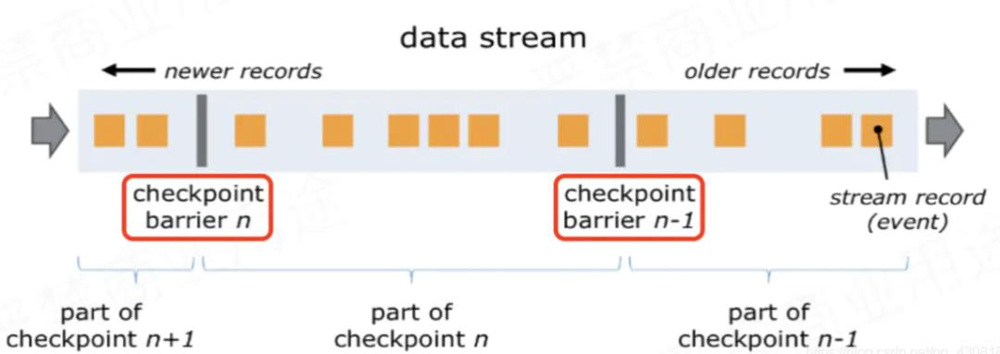
>
> Barrier会在数据流源头被注入并行数据流中。**Barriern所在的位置就是恢复时数据重新处理的起始位置。**例如，在Kafka中，这个位置就是最后一个记录在分区内的偏移量(offset)，作业恢复时，会根据这个位置从这个偏移量之后向kafka请求数据这个偏移量就是State中保存的内容之一。
>
> Barrier接着向下游传递。当一个非数据源算子从所有的输入流中收到了快照n的Barrier时，该算子就会对自己的State保存快照，并向自己的下游**广播发送**快照n的Barrier。一旦Sink算子接收到Barrier，有两种情况：
>
> **（1）如果是引擎内严格一次处理保证，**当Sink算子已经收到了所有上游的Barrien时，Sink算子对自己的State进行快照，然后通知检查点协调器(CheckpointCoordinator)。当所有的算子都向检查点协调器汇报成功之后，检查点协调器向所有的算子确认本次快照完成。
>
> **（2）如果是端到端严格一次处理保证，**当Sink算子已经收到了所有上游的Barrien时，Sink算子对自己的State进行快照，**并预提交事务（两阶段提交的第一阶段）**，再通知检查点协调器(CheckpointCoordinator)，检查点协调器向所有的算子确认本次快照完成，Sink算子**提交事务（两阶段提交的第二阶段）**，本次事务完成。

 我们接着33的案例来具体说一下如何执行分布式快照：

> **对应到pv案例中就是**，SourceTask接收到JobManager的编号为**chk-100（从最近一次恢复）**的CheckPoint触发请求后，发现自己恰好接收到kafkaoffset（0，1000）处的数据，所以会往offset（0，1000）数据之后offset（0，1001）数据之前安插一个barrier，然后自己开始做快照，也就是将offset（0，1000）保存到状态后端chk-100中。然后barrier接着往下游发送，当统计pv的task接收到barrier后，也会暂停处理数据，将自己内存中保存的pv信息（app1，50000）（app2，10000）保存到状态后端chk-100中。OK，flink大概就是通过这个原理来保存快照的;
>
> 统计pv的task接收到barrier，就意味着barrier之前的数据都处理了，所以说，不会出现丢数据的情况。

## 37、什么是Barrier对齐？

> 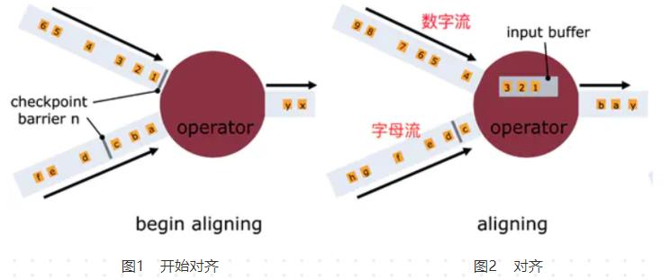
>
> 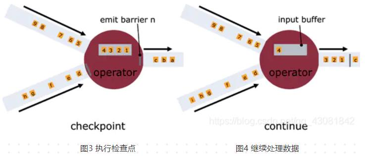
>
> 一旦Operator从输入流接收到CheckPointbarriern，它就不能处理来自该流的任何数据记录，直到它从其他所有输入接收到barriern为止。否则，它会混合属于快照n的记录和属于快照n+1的记录；
>
> 如上图所示：
>
> 图1，算子收到数字流的Barrier,字母流对应的barrier尚未到达
>
> 图2，算子收到数字流的Barrier,会继续从数字流中接收数据，但这些流只能被搁置，记录不能被处理，而是放入缓存中，等待字母流Barrier到达。在字母流到达前，1，2，3数据已经被缓存。
>
> 图3，字母流到达，算子开始对齐State进行异步快照，并将Barrier向下游广播，并不等待快照执行完毕。
>
> 图4，算子做异步快照，首先处理缓存中积压数据，然后再从输入通道中获取数据。

## 38、什么是Barrier不对齐？

> checkpoint是要等到所有的barrier全部都到才算完成
>
> 上述图2中，当还有其他输入流的barrier还没有到达时，会把已到达的barrier之后的数据1、2、3搁置在缓冲区，等待其他流的barrier到达后才能处理。
>
> barrier不对齐：就是指当还有其他流的barrier还没到达时，为了不影响性能，也不用理会，直接处理barrier之后的数据。等到所有流的barrier的都到达后，就可以对该Operator做CheckPoint了；

## 39、为什么要进行barrier对齐？不对齐到底行不行？

> 答：ExactlyOnce时必须barrier对齐，如果barrier不对齐就变成了AtLeastOnce；
>
> **CheckPoint的目的就是为了保存快照**，如果不对齐，那么在chk-100快照之前，已经处理了一些chk-100对应的offset之后的数据，当程序从chk-100恢复任务时，chk-100对应的offset之后的数据还会被处理一次，所以就出现了重复消费。

## 40、Flink支持Exactly-Once语义，那什么是Exactly-Once？

> Exactly-Once语义:指**端到端**的一致性，从**数据读取**、**引擎计算**、**写入外部存储的**整个过程中，**即使机器或软件出现故障，**都确保数据仅处理一次，不会重复、也不会丢失。

## 41、要实现Exactly-Once,需具备什么条件？

> 流系统要实现Exactly-Once，需要保证上游Source层、中间计算层和下游Sink层三部分同时满足**端到端严格一次处理，如下图：**
>
> 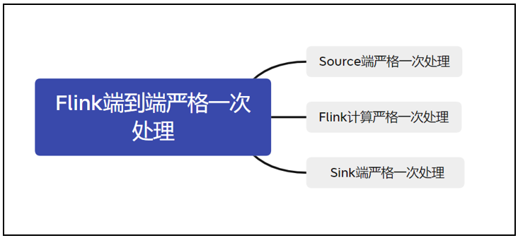
>
> Flink端到端严格一次处理
>
> **Source端：**数据从上游进入Flink，必须保证消息严格一次消费。同时Source端必须满足可重放（replay）。否则Flink计算层收到消息后未计算，却发生failure而重启，消息就会丢失。
>
> **Flink计算层：**利用Checkpoint机制，把状态数据定期持久化存储下来，Flink程序一旦发生故障的时候，可以选择状态点恢复，避免数据的丢失、重复。
>
> **Sink端：**Flink将处理完的数据发送到Sink端时，通过**两阶段提交协议，**即TwoPhaseCommitSinkFunction函数。该SinkFunction提取并封装了两阶段提交协议中的公共逻辑，保证Flink发送Sink端时实现严格一次处理语义。**同时：**Sink端必须支持**事务机制**，能够进行数据**回滚**或者满足**幂等性。**
>
> **回滚机制：**即当作业失败后，能够将部分写入的结果回滚到之前写入的状态。
>
> **幂等性：**就是一个相同的操作，无论重复多少次，造成的结果和只操作一次相等。即当作业失败后，写入部分结果，但是当重新写入全部结果时，不会带来负面结果，重复写入不会带来错误结果。

## 42、什么是两阶段提交协议？

> 两阶段提交协议（Two-PhaseCommit，2PC）是解决分布式事务问题最常用的方法，它可以保证在分布式事务中，要么所有参与进程都提交事务，要么都取消，即实现ACID中的A（原子性）。
>
> 两阶段提交协议中有两个重要角色**，协调者（Coordinator）**和**参与者（Participant）**,其中协调者只有一个，起到分布式事务的协调管理作用，参与者有多个。
>
> 两阶段提交阶段分为两个阶段：**投票阶段（Voting）**和**提交阶段（Commit）。**
>
> **投票阶段：**
>
> （1）协调者向所有参与者**发送prepare请求**和事务内容，询问是否可以准备事务提交，等待参与者的相应。
>
> （2）参与者执行事务中包含的操作，并记录undo日志（用于回滚）和redo日志（用于重放），但不真正提交。
>
> （3）参与者向协调者返回事务操作的执行结果，执行成功返回yes，失败返回no。
>
> **提交阶段：**
>
> 分为成功与失败两种情况。
>
> 若所有参与者都返回yes，说明事务可以提交：
>
> - 协调者向所有参与者发送commit请求。
>
> - 参与者收到commit请求后，将事务真正地提交上去，并释放占用的事务资源，并向协调者返回ack。
>
> - 协调者收到所有参与者的ack消息，事务成功完成，如下图：
>
>   
>   
>   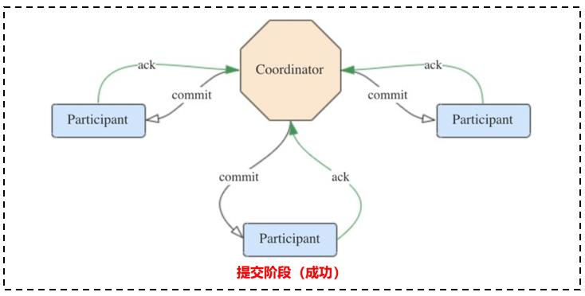
>
> 若有参与者返回no或者超时未返回，说明事务中断，需要回滚：
>
>   - 协调者向所有参与者发送rollback请求。
>
>   - 参与者收到rollback请求后，根据undo日志回滚到事务执行前的状态，释放占用的事务资源，并向协调者返回ack。
>
>   - 协调者收到所有参与者的ack消息，事务回滚完成。
>
>     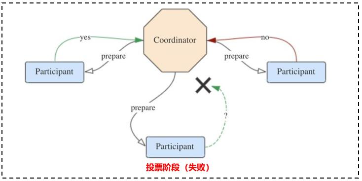
>
>     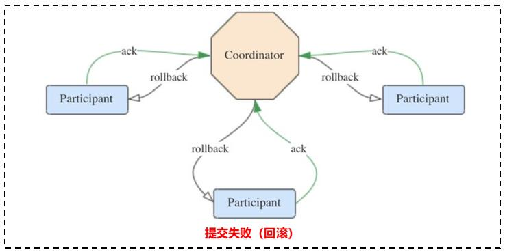

## 43、Flink如何保证Exactly-Once语义？

> Flink通过两阶段提交协议来保证Exactly-Once语义。
>
> **对于Source端：**Source端严格一次处理比较简单，因为数据要进入Flink中，所以Flink只需要保存消费数据的偏移量（offset）即可。如果Source端为kafka，Flink将KafkaConsumer作为Source，可以将偏移量保存下来，如果后续任务出现了故障，恢复的时候可以由连接器重置偏移量，重新消费数据，保证一致性。
>
> **对于Sink端：**Sink端是最复杂的，因为数据是落地到其他系统上的，数据一旦离开Flink之后，Flink就监控不到这些数据了，所以严格一次处理语义必须也要应用于Flink写入数据的外部系统，**故这些外部系统必须提供一种手段允许提交或回滚这些写入操作**，同时还要保证与FlinkCheckpoint能够协调使用（**Kafka**0.11版本已经实现精确一次处理语义）。
>
> 我们以**Kafka-Flink-Kafka**为例说明如何保证Exactly-Once语义。
>
> 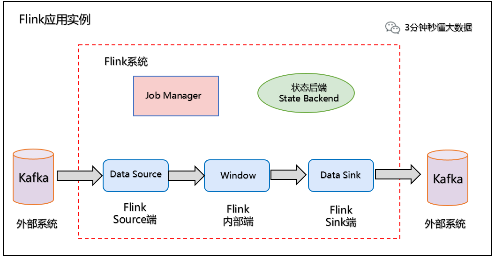
>
> 如上图所示：Flink作业包含以下算子。
>
> （1）一个Source算子，从Kafka中读取数据（即KafkaConsumer）
>
> （2）一个窗口算子，基于时间窗口化的聚合运算（即window+window函数）
>
> （3）一个Sink算子，将结果写会到Kafka（即kafkaProducer）
>
> Flink使用两阶段提交协议**预提交（Pre-commit）**阶段和**提交（Commit）阶段保证端到端严格一次。**
>
>  （1）预提交阶段
>
> **1、当Checkpoint启动时，进入预提交阶段**，JobManager向SourceTask注入检查点分界线（CheckpointBarrier）,SourceTask将CheckpointBarrier插入数据流，向下游广播开启本次快照，如下图所示：
>
> 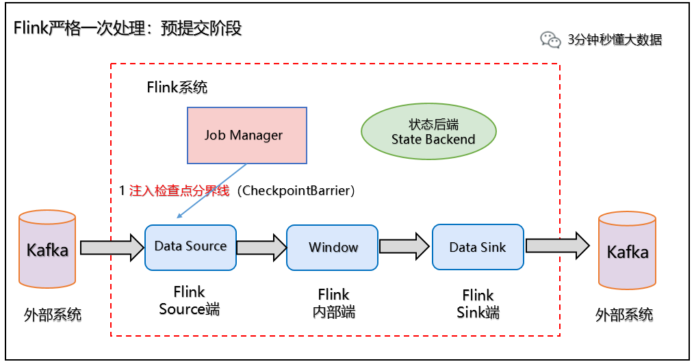
>
> ​                                                                       **预处理阶段：Checkpoint启动**
>
>  **2、Source端**：FlinkDataSource负责保存KafkaTopic的offset偏移量，当Checkpoint成功时Flink负责提交这些写入，否则就终止取消掉它们，当Checkpoint完成位移保存，它会将checkpointbarrier（检查点分界线）传给下一个Operator，然后每个算子会对当前的状态做个快照，保存到**状态后端（StateBackend）**。对于Source任务而言，就会把当前的offset作为状态保存起来。下次从**Checkpoint恢复时，Source任务可以重新提交偏移量，从上次保存的位置开始重新消费数据，如下图所示：**
>
> 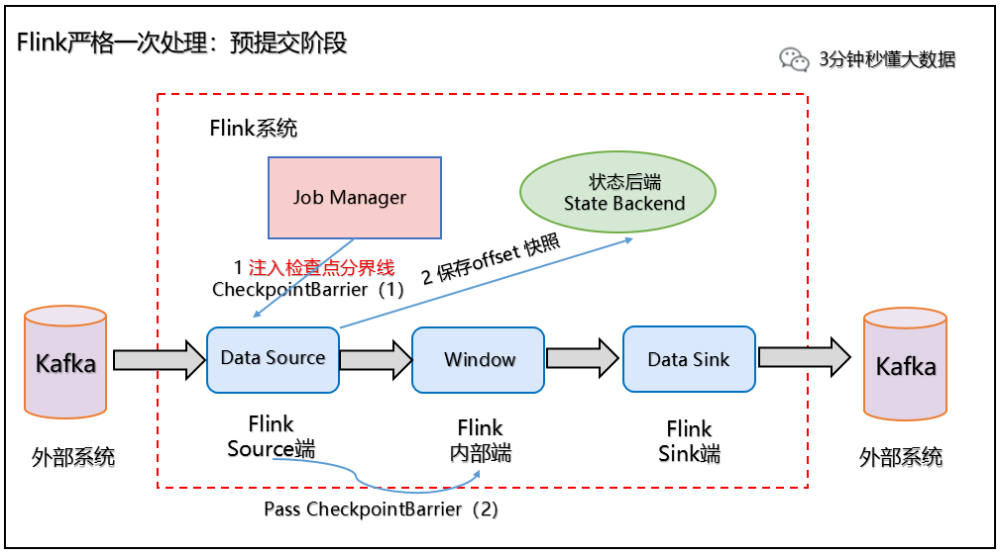                                                               **预处理阶段：checkpointbarrier传递及offset保存**
>
> **3、Slink端：**从Source端开始，每个内部的transformation任务遇到checkpointbarrier（检查点分界线）时，都会把状态存到Checkpoint里。数据处理完毕到Sink端时，Sink任务首先把数据写入外部Kafka，**这些数据都属于预提交的事务（还不能被消费）**，**此时的Pre-commit预提交阶段下DataSink在保存状态到状态后端的同时还必须预提交它的外部事务，**如下图所示：
>
> 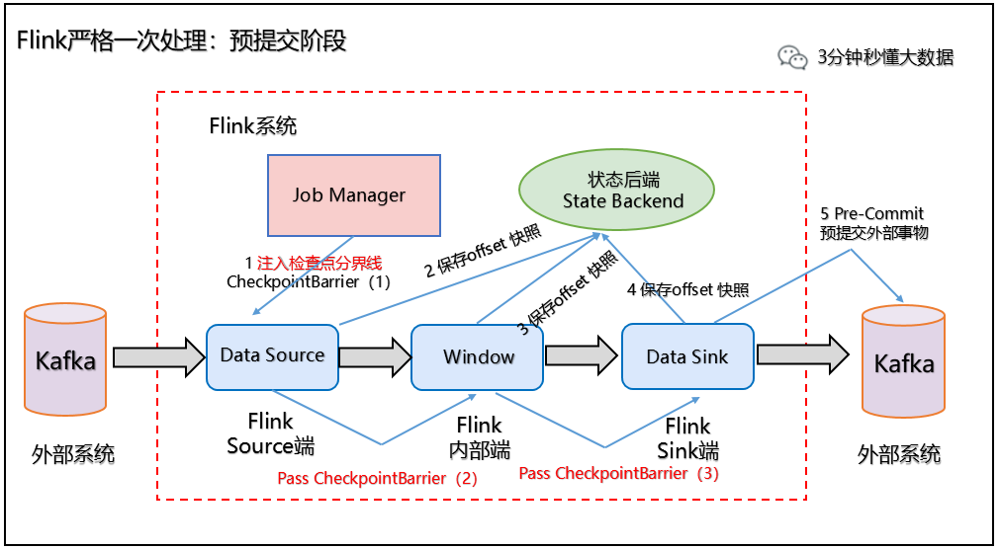
>
> ​                                                                          **预处理阶段：预提交到外部系统**
>
> （2）提交阶段
>
> **4、当所有算子任务的快照完成**（所有创建的快照都被视为是Checkpoint的一部分），也就是这次的Checkpoint完成时，JobManager会向所有任务发通知，确认这次Checkpoint完成，此时Pre-commit预提交阶段才算完成。才正式到两阶段提交协议的**第二个阶段：commit阶段**。该阶段中JobManager会为应用中每个Operator发起Checkpoint已完成的回调逻辑。
>
> 本例中的DataSource和窗口操作无外部状态，因此在该阶段，这两个Opeartor无需执行任何逻辑，**但是DataSink是有外部状态的，此时我们必须提交外部事务**，当Sink任务收到确认通知，就会正式提交之前的事务，Kafka中未确认的数据就改为"已确认"，数据就真正可以被消费了，如下图所示：
>
> 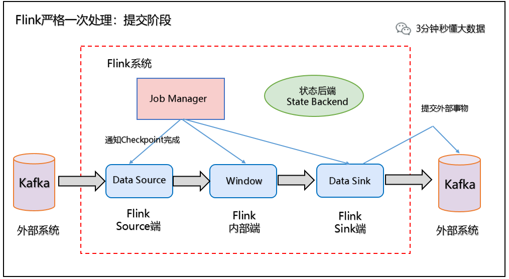
>
> ​                                                                            提交阶段：数据精准被消费
>
> 注：Flink由JobManager协调各个TaskManager进行Checkpoint存储，Checkpoint保存在StateBackend（状态后端）中，默认StateBackend是内存级的，也可以改为文件级的进行持久化保存。

## 44、那你对Flink端到端严格一次Exactly-Once语义做个总结

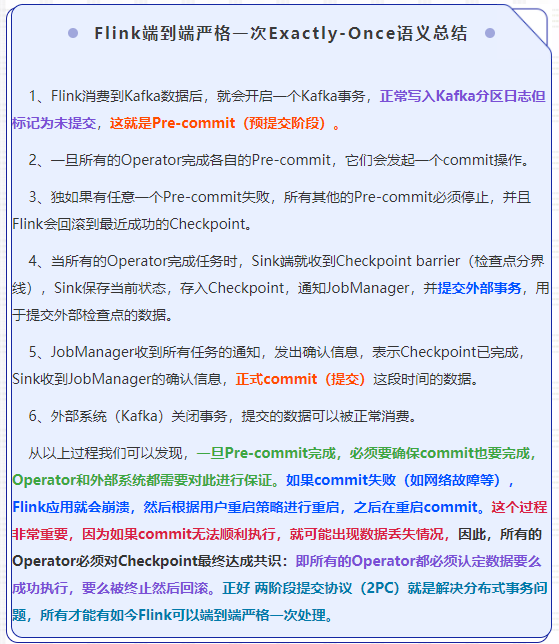


## 45、Flink广播机制了解吗？

> 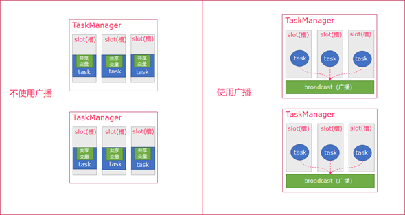
>
> （1）从图中可以理解**广播**就是一个**公共的共享变量，**广播变量是发给**TaskManager的内存中，**所以广播变量不应该太大，将一个数据集广播后，不同的**Task**都可以在节点上获取到，每个节点只存一份。如果不使用广播，每一个Task都会拷贝一份数据集，造成内存资源浪费。

## 46、Flink反压了解吗？

> 反压（backpressure）是实时计算应用开发中，特别是流式计算中，十分常见的问题。**反压**意味着数据管道中某个节点成为瓶颈，**下游处理速率跟不上上游发送数据的速率**，而需要对上游进行限速。由于实时计算应用通常使用消息队列来进行生产端和消费端的解耦，消费端数据源是pull-based的，所以反压通常是从某个节点传导至数据源并降低数据源（比如Kafkaconsumer）的摄入速率。
>
> 简单来说就是**下游处理速率跟不上上游发送数据的速率**，下游来不及消费，导致队列被占满后，上游的生产会被阻塞，最终导致数据源的摄入被阻塞。

## 47、Flink反压的影响有哪些？

> 反压会影响到两项指标:**checkpoint时长**和**state大小**
>
> （1）前者是因为checkpointbarrier是不会越过普通数据的，**数据处理被阻塞**也会**导致**checkpointbarrier流经**整个数据管道的时长变长**，因而checkpoint总体时间（EndtoEndDuration）变长。
>
> （2）后者是因为为保证EOS（Exactly-Once-Semantics，准确一次），对于有两个以上输入管道的Operator，checkpointbarrier需要对齐（Alignment），接受到较快的输入管道的barrier后，它后面数据会被缓存起来但不处理，直到较慢的输入管道的barrier也到达，这些被缓存的数据会被放到state里面，导致checkpoint变大。
>
> **这两个影响对于生产环境的作业来说是十分危险的**，因为checkpoint是保证数据一致性的关键，checkpoint时间变长有可能导致checkpoint超时失败，而state大小同样可能拖慢checkpoint甚至导致OOM（使用Heap-based StateBackend）或者物理内存使用超出容器资源（使用RocksDBStateBackend）的稳定性问题。

## 48、Flink反压如何解决？

> Flink社区提出了FLIP-76:UnalignedCheckpoints\[4\]来解耦反压和checkpoint。
>
> （1）定位反压节点
>
> 要解决反压首先要做的是定位到造成反压的节点，这主要有两种办法:
>
> 1. 通过FlinkWebUI自带的反压监控面板；
>
> 2. 通过FlinkTaskMetrics。
>
> 
>
> （1）反压监控面板
>
> FlinkWebUI的反压监控提供了SubTask级别的反压监控，原理是通过**周期性对Task线程的栈信息采样**，得到线程被阻塞在请求Buffer（意味着被下游队列阻塞）的频率来判断该节点是否处于反压状态。默认配置下，这个频率在0.1以下则为OK，0.1至0.5为LOW，而超过0.5则为HIGH。
>
> 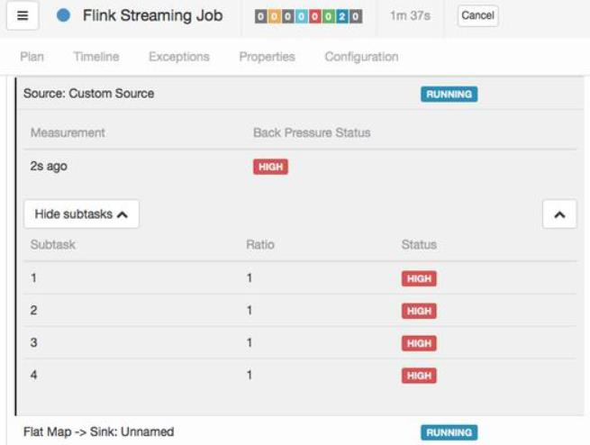
>
> （2)TaskMetrics
>
> Flink提供的TaskMetrics是更好的反压监控手段
>
> 如果一个Subtask的发送端Buffer占用率很高，则表明它被下游反压限速了；如果一个Subtask的接受端Buffer占用很高，则表明它将反压传导至上游。

## 49、Flink支持的数据类型有哪些？

> Flink支持的数据类型如下图所示：
>
> 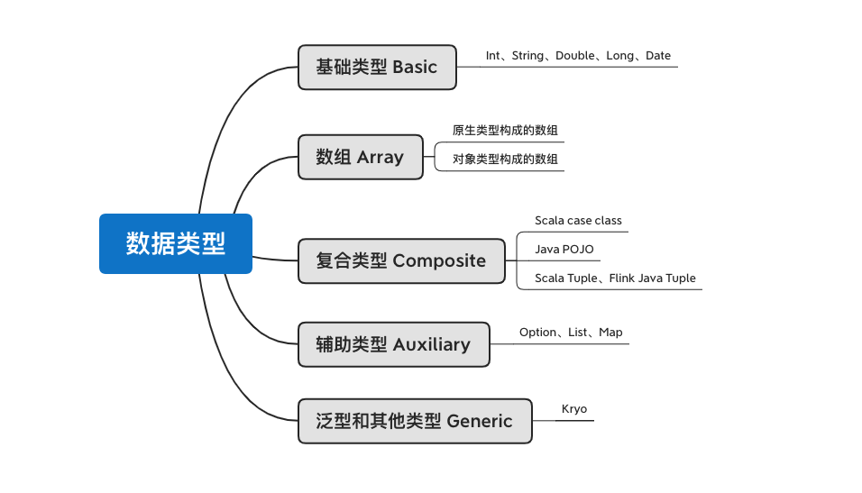
>
> 从图中可以看到Flink类型可以分为基础类型（Basic）、数组（Arrays）、复合类型（Composite）、辅助类型（Auxiliary）、泛型和其它类型（Generic）。Flink支持任意的Java或是Scala类型。

## 50、Flink如何进行序列和反序列化的？

> 所谓序列化和反序列化的含义：
>
> **序列化：**就是将一个内存对象转换成二进制串，形成网络传输或者持久化的数据流。
>
> **反序列化：**将二进制串转换为内存对。
>
> TypeInformation是Flink类型系统的核心类
>
> **在Flink中，当数据需要进行序列化时，会使用TypeInformation的生成序列化器接口调用一个createSerialize()方法，创建出TypeSerializer，**TypeSerializer提供了序列化和反序列化能力。如下图所示：Flink的序列化过程
>
> 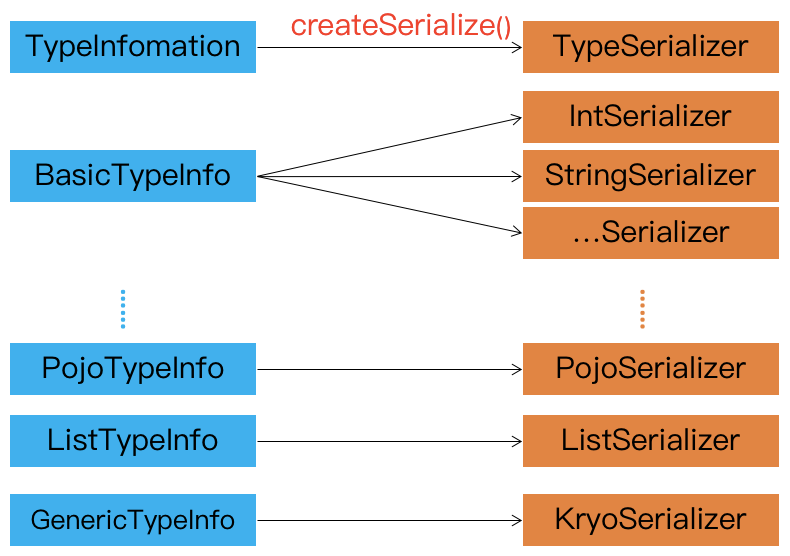
>
> **对于大多数数据类型Flink可以自动生成对应的序列化器，能非常高效地对数据集进行序列化和反序列化，如下图：**
>
> 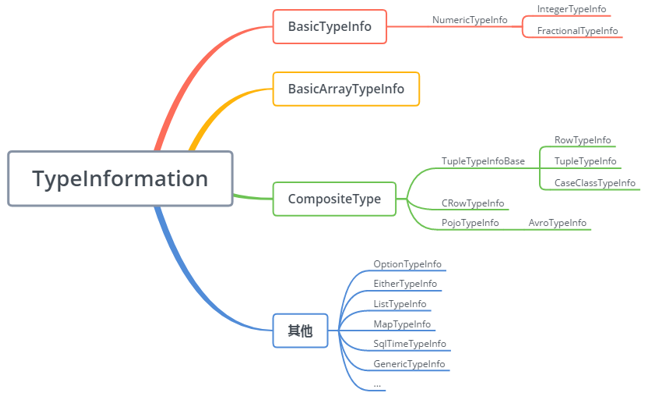
>
> **比如，BasicTypeInfo、WritableTypeIno，但针对GenericTypeInfo类型，Flink会使用Kyro进行序列化和反序列化。其中，Tuple、Pojo和CaseClass类型是复合类型，它们可能嵌套一个或者多个数据类型。在这种情况下，它们的序列化器同样是复合的。它们会将内嵌类型的序列化委托给对应类型的序列化器。**

> **通过一个案例介绍Flink序列化和反序列化：**
>
> 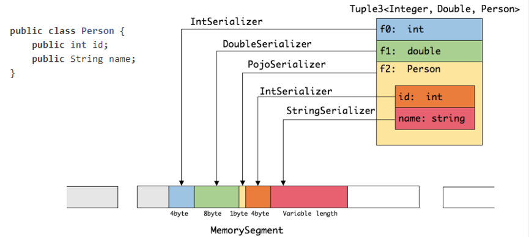
>
> 如上图所示，当创建一个Tuple3对象时，包含三个层面，一是int类型，一是double类型，还有一个是Person。Person对象包含两个字段，一是int型的ID，另一个是String类型的name，
>
> （1）在序列化操作时，会委托相应具体序列化的序列化器进行相应的序列化操作。**从图中可以看到Tuple3会把int类型通过IntSerializer进行序列化操作**，此时int只需要占用四个字节。
>
> （2）Person类会被当成一个Pojo对象来进行处理，PojoSerializer序列化器会把一些属性信息使用一个字节存储起来。同样，其字段则采取相对应的序列化器进行相应序列化，在序列化完的结果中，可以看到所有的数据都是由MemorySegment去支持。
>
> **MemorySegment具有什么作用呢？**
>
> **MemorySegment**在Flink中会将对象序列化到预分配的内存块上，它代表1个固定长度的内存，默认大小为32kb。MemorySegment代表Flink中的一个最小的内存分配单元，相当于是Java的一个byte数组。每条记录都会以序列化的形式存储在一个或多个MemorySegment中。

## 51、为什么Flink使用自主内存而不用JVM内存管理？

> 因为在内存中存储大量的数据（包括缓存和高效处理）时，JVM会面临很多问题，包括如下：
>
> JVM内存管理的不足：
>
> （1）**Java对象存储密度低。**Java的对象在内存中存储包含3个主要部分：对象头、实例数据、对齐填充部分。例如，一个只包含boolean属性的对象占16byte：对象头占8byte，boolean属性占1byte，为了对齐达到8的倍数额外占7byte。而实际上只需要一个bit（1/8字节）就够了。
>
> （2）**FullGC会极大地影响性能。**尤其是为了处理更大数据而开了很大内存空间的JVM来说，GC会达到秒级甚至分钟级。
>
> （3）**OOM问题影响稳定性。**OutOfMemoryError是分布式计算框架经常会遇到的问题，当JVM中所有对象大小超过分配给JVM的内存大小时，就会发生OutOfMemoryError错误，导致JVM崩溃，分布式框架的健壮性和性能都会受到影响。
>
> （4）**缓存未命中问题。**CPU进行计算的时候，是从CPU缓存中获取数据。现代体系的CPU会有多级缓存，而加载的时候是以CacheLine为单位加载。如果能够将对象连续存储，这样就会大大降低CacheMiss。使得CPU集中处理业务，而不是空转。

## 52、那Flink自主内存是如何管理对象的？

> Flink并不是将大量对象存在堆内存上，而是将对象都序列化到一个**预分配**的内存块上，这个内存块叫做**MemorySegment**，它代表了一段固定长度的内存（默认大小为32KB），也是**Flink中最小的内存分配单元**，并且提供了非常高效的读写方法，很多运算可以直接操作二进制数据，不需要反序列化即可执行。每条记录都会以序列化的形式存储在一个或多个MemorySegment中。如果需要处理的数据多于可以保存在内存中的数据，Flink的运算符会将部分数据溢出到磁盘
>

## 53、Flink内存模型介绍一下？

> Flink总体内存类图如下：
>
> 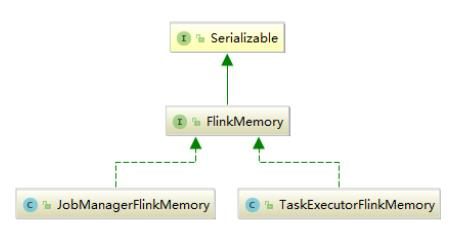
>
> 
>
> 主要包含JobManager内存模型和TaskManager内存模型
>
> **JobManager内存模型**
>
> 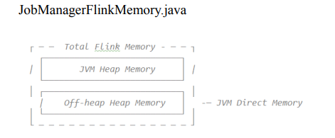
>
> 在1.10中，Flink统一了TM端的内存管理和配置，相应的在1.11中，Flink进一步对JM端的内存配置进行了修改，使它的选项和配置方式与TM端的配置方式保持一致。
>
> 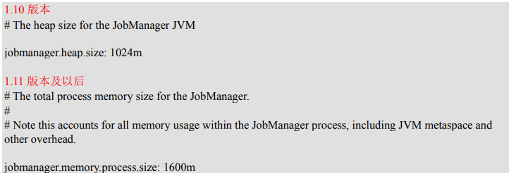
>
> **TaskManager内存模型**
>
> **Flink1.10**对TaskManager的内存模型和Flink应用程序的配置选项进行了**重大更改**，让用户能够更加严格地控制其内存开销。
>
> 
>
> 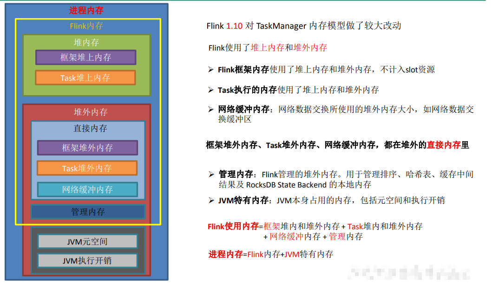
>
> 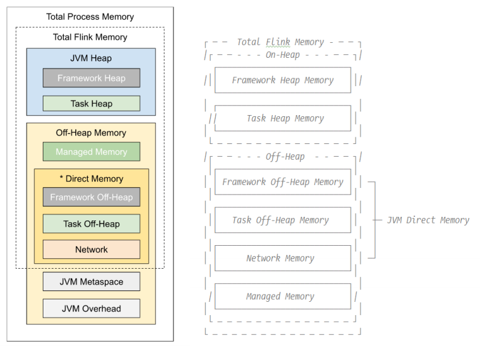
>
> 
>
> JVMHeap：JVM堆上内存
>
> **1、FrameworkHeapMemory：**Flink框架本身使用的内存，即TaskManager本身所占用的堆上内存，不计入Slot的资源中。
>
> 配置参数：taskmanager.memory.framework.heap.size=128MB,默认128MB
>
> **2、TaskHeapMemory：**Task执行用户代码时所使用的堆上内存。配置参数：taskmanager.memory.task.heap.size
>
> 
>
>  Off-HeapMempry：JVM堆外内存
>
> **1、DirectMemory：JVM直接内存**
>
> 1）FrameworkOff-HeapMemory：Flink框架本身所使用的内存，即TaskManager本身所占用的对外内存，不计入Slot资源。
>
> 配置参数：taskmanager.memory.framework.off-heap.size=128MB，默认128MB
>
> 2）TaskOff-HeapMemory：Task执行用户代码所使用的对外内存。
>
> 配置参数：taskmanager.memory.task.off-heap.size=0,默认0
>
> 3）NetworkMemory：网络数据交换所使用的堆外内存大小，如网络数据交换缓冲区
>
>  2、ManagedMemory：Flink管理的堆外内存，
>
> 用于排序、哈希表、缓存中间结果及RocksDBStateBackend的本地内存。
>
> 
>
> JVMspecificmemory：JVM本身使用的内存
>
> **1、JVMmetaspace：JVM元空间**
>
> **2、JVMover-head执行开销：**JVM执行时自身所需要的内容，包括线程堆栈、IO、编译缓存等所使用的内存。
>
> 配置参数：
>
> taskmanager.memory.jvm-overhead.min=192mb
>
> taskmanager.memory.jvm-overhead.max=1gb
>
> taskmanager.memory.jvm-overhead.fraction=0.1
>
> 
>
> 总体内存
>
> **1、总进程内存：**FlinkJava应用程序（包括用户代码）和JVM运行整个进程所消耗的总内存。
>
> 总进程内存=Flink使用内存+JVM元空间+JVM执行开销配置项：taskmanager.memory.process.size:1728m
>
> **2、Flink总内存：**仅FlinkJava应用程序消耗的内存，包括用户代码，但不包括JVM为其运行而分配的内存。
>
> Flink使用内存：框架堆内外+task堆内外+network+manage

## 54、Flink如何进行资源管理的？

> Flink在资源管理上可以分为两层：**集群资源**和**自身资源**。集群资源支持主流的资源管理系统，如yarn、mesos、k8s等，也支持独立启动的standalone集群。自身资源涉及到每个子task的资源使用，由Flink自身维护。
>
>  **集群架构剖析**
>
> Flink的运行主要由客户端、一个JobManager（后文简称JM）和一个以上的TaskManager（简称TM或Worker）组成。
>
> 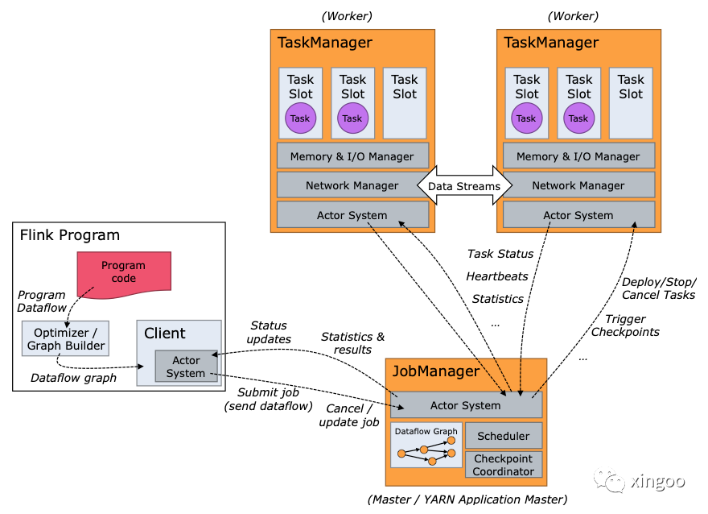
>
> **客户端**
>
> 客户端主要用于提交任务到集群，在Session或PerJob模式中，客户端程序还要负责解析用户代码，生成JobGraph；在Application模式中，直接提交用户jar和执行参数即可。客户端一般支持两种模式：**detached**模式，客户端提交后自动退出。**attached**模式，客户端提交后阻塞等待任务执行完毕再退出。
>
> **JobManager**
>
> JM负责决定应用何时调度task，在task执行结束或失败时如何处理，协调检查点、故障恢复。该进程主要由下面几个部分组成：
>
> 1.  **ResourceManager**，负责资源的申请和释放、管理slot（Flink集群中最细粒度的资源管理单元）。Flink实现了多种RM的实现方案以适配多种资源管理框架，如yarn、mesos、k8s或standalone。在standalone模式下，RM只能分配slot，而不能启动新的TM。注意：这里所说的RM跟Yarn的RM不是一个东西，这里的RM是JM中的一个独立的服务。
>
> 2.  **Dispatcher**，提供Flink提交任务的rest接口，为每个提交的任务启动新的JobMaster，为所有的任务提供webui，查询任务执行状态。
>
> 3.  **JobMaster**，负责管理执行单个JobGraph，多个任务可以同时在一个集群中启动，每个都有自己的JobMaster。注意这里的JobMaster和JobManager的区别。
>
> **TaskManager**
>
> TM也叫做worker，用于执行数据流图中的任务，缓存并交换数据。集群至少有一个TM，TM中最小的资源管理单元是Slot，每个Slot可以执行一个Task，因此TM中slot的数量就代表同时可以执行任务的数量。
>
> **Slot与资源管理**
>
> 每个TM是一个独立的JVM进程，内部基于独立的线程执行一个或多个任务。
>
> TM为了控制每个任务的执行资源，使用**taskslot**来进行管理。每个taskslot代表TM中的一部分固定的资源，比如一个TM有3个slot，每个slot将会得到TM的1/3内存资源。不同任务之间不会进行资源的抢占，注意GPU目前没有进行隔离，目前slot只能划分内存资源。
>
> 比如下面的数据流图，在扩展成并行流图后，同一的task可能分拆成多个任务并行在集群中执行。操作链可以把多个不同的任务进行合并，从而支持在一个线程中先后执行多个任务，无需频繁释放申请线程。同时操作链还可以统一缓存数据，增加数据处理吞吐量，降低处理延迟。
>
> 在Flink中，想要不同子任务合并需要满足几个条件：下游节点的入边是1（保证不存在数据的shuffle）；子任务的上下游不为空；连接策略总是ALWAYS；分区类型为ForwardPartitioner；并行度一致；当前Flink开启Chain特性。
>
> 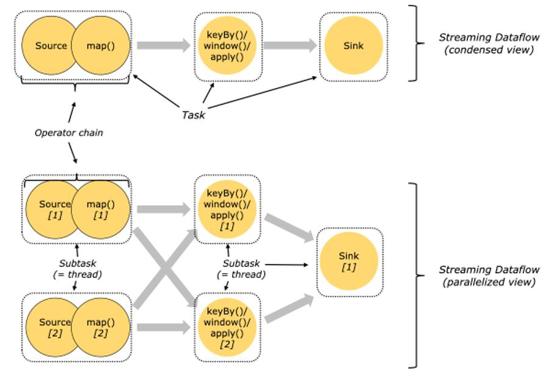
>
> 在集群中的执行图可能如下：
>
> 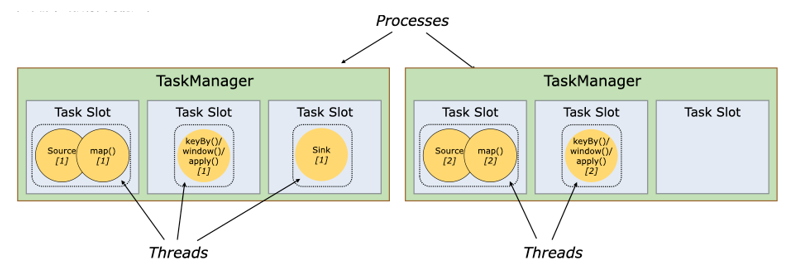
>
> Flink也支持slot的共享，即把不同任务根据任务的依赖关系分配到同一个Slot中。这样带来几个好处：方便统计当前任务所需的最大资源配置（某个子任务的最大并行度)；避免Slot的过多申请与释放，提升Slot的使用效率。
>
> 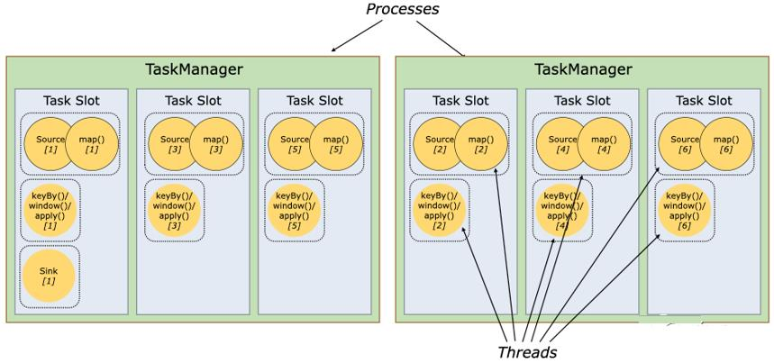
>
> 通过Slot共享，就有可能某个Slot中包含完整的任务执行链路。
>
> **3.应用执行**
>
> 一个Flink应用就是用户编写的main函数，其中可能包含一个或多个Flink的任务。这些任务可以在本地执行，也可以在远程集群启动，集群既可以长期运行，也支持独立启动。下面是目前支持的任务提交方案：
>
> **Session集群**
>
> **生命周期**：集群事先创建并长期运行，客户端提交任务时与该集群连接。即使所有任务都执行完毕，集群仍会保持运行，除非手动停止。因此集群的生命周期与任务无关。
>
> **资源隔离**：TM的slot由RM申请，当上面的任务执行完毕会自动进行释放。由于多个任务会共享相同的集群，因此任务间会存在竞争，比如网络带宽等。如果某个TM挂掉，上面的所有任务都会失败。
>
> **其他方面**：拥有提前创建的集群，可以避免每次使用的时候过多考虑集群问题。
>
> 比较适合那些执行时间很短，对启动时间有比较高的要求的场景，比如交互式查询分析。
>
> **PerJob集群**
>
> **生命周期**：为每个提交的任务单独创建一个集群，客户端在提交任务时，直接与ClusterManager沟通申请创建JM并在内部运行提交的任务。TM则根据任务运行需要的资源延迟申请。一旦任务执行完毕，集群将会被回收。
>
> **资源隔离**：任务如果出现致命问题，仅会影响自己的任务。
>
> **其他方面**：由于RM需要申请和等待资源，因此启动时间会稍长，适合单个比较大、长时间运行、需要保证长期的稳定性、不在乎启动时间的任务。
>
> **Application集群**
>
> **生命周期**：与PerJob类似，只是main()方法运行在集群中。任务的提交程序很简单，不需要启动或连接集群，而是直接把应用程序打包到资源管理系统中并启动对应的EntryPoint，在EntryPoint中调用用户程序的main()方法，解析生成JobGraph，然后启动运行。集群的生命周期与应用相同。
>
> **资源隔离**：RM和Dispatcher是应用级别。


# 03、Flink源码篇

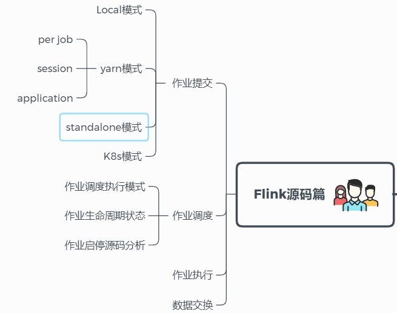

## 55、FLink作业提交流程应该了解吧？

##### Flink的提交流程：

> 1.在FlinkClient中，通过反射启动jar中的main函数，生成FlinkStreamGraph和JobGraph，将JobGraph提交给Flink集群
>
> 2.Flink集群收到JobGraph（JobManager收到）后，将JobGraph翻译成ExecutionGraph,然后开始调度，启动成功之后开始消费数据。
>
> 总结来说：Flink核心执行流程，对用户API的调用可以转为StreamGraph\--\>JobGraph\--\>ExecutionGraph。
>

## 56、FLink作业提交分为几种方式？

Flink的作业提交分为两种方式

> **1.Local方式：**即本地提交模式，直接在IDEA运行代码。
>
> **2.远程提交方式：**分为Standalone方式、yarn方式、K8s方式
>
> **Yarn方式分为三种提交模式：**Yarn-perJob模式、Yarn-Sessionmo模式、Yarn-Application模式

## 57、FLinkJobGraph是在什么时候生成的？

> 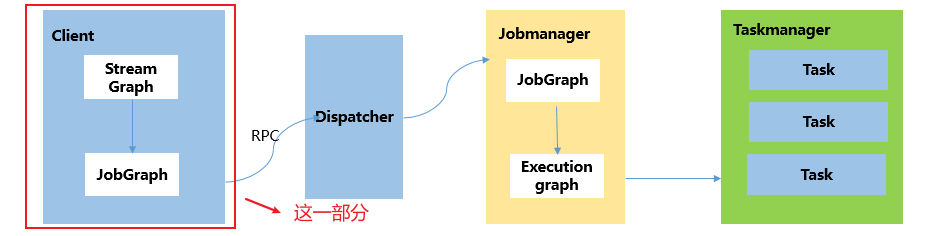
>
> StreamGraph、JobGraph全部是在FlinkClient客户端生成的，即提交集群之前生成，原理图如下：

## 58、那在jobGraph提交集群之前都经历哪些过程？

> （1）用户通过启动Flink集群，使用命令行提交作业，运行flink run -c WordCountxxx.jar
>
> （2）运行命令行后，会通过run脚本调用CliFrontend入口，CliFrontend会触发用户提交的jar文件中的main方法，然后交给PipelineExecuteor\#execute方法，最终根据提交的模式选择触发一个具体的PipelineExecutor执行。
>
> （3）根据具体的PipelineExecutor执行，将对用户的代码进行编译生成streamGraph，经过优化后生成jobgraph。**具体流程图如下：**
>
> 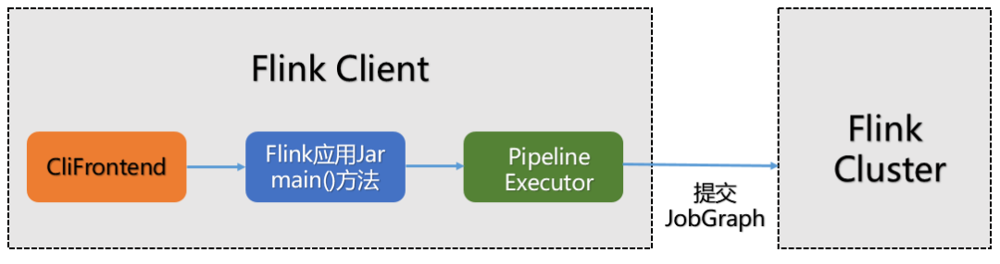

## 59、看你提到PipelineExecutor，它有哪些实现类？

> （1）PipelineExecutor在Flink中被叫做流水线执行器，它是一个接口，是FlinkClient生成JobGraph之后，将作业提交给集群的重要环节，前面说过，作业提交到集群有好几种方式，最常用的是yarn方式，yarn方式包含3种提交模式，主要使用session模式，perjob模式。Application模式jaobGraph是在集群中生成。
>
> 所以PipelineExecutor的实现类如下图所示：（在代码中按CTRL+H就会出来）
>
> 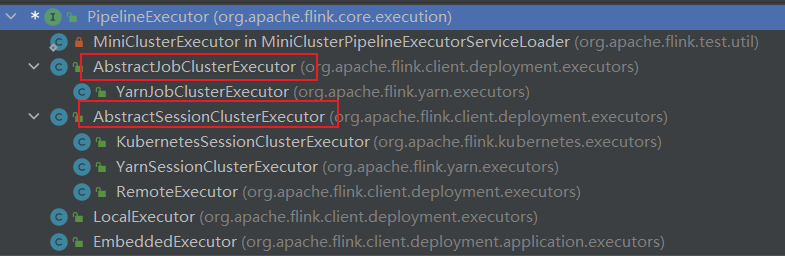
>
> 除了上述框的两种模式外，在IDEA环境中运行FlinkMiniCluster进行调试时，使用LocalExecutor。

## 60、Local提交模式有啥特点，怎么实现的？

> （1）Local是在本地IDEA环境中运行的提交方式。不上集群。主要用于调试，原理图如下：
>
> 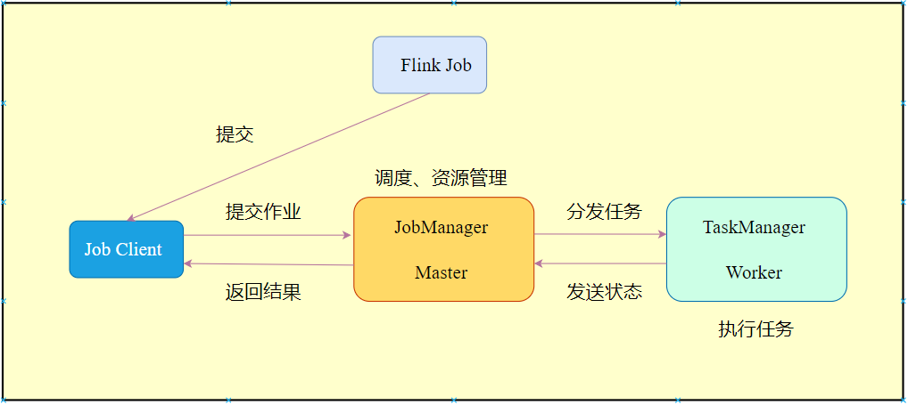
>
> 1.  Flink程序由JobClient进行提交
> 2.  JobClient将作业提交给JobManager
> 3.  JobManager负责协调资源分配和作业执行。资源分配完成后，任务将提交给相应的TaskManager
> 4.  TaskManager启动一个线程开始执行，TaskManager会向JobManager报告状态更改，如开始执行，正在进行或者已完成。
> 5.  作业执行完成后，结果将发送回客户端。
>
> 源码分析：通过Flink1.12.2源码进行分析的
>
> （1）创建获取对应的StreamExecutionEnvironment对象：
>
> LocalStreamEnvironment调用StreamExecutionEnvironment对象的execute方法
>
> 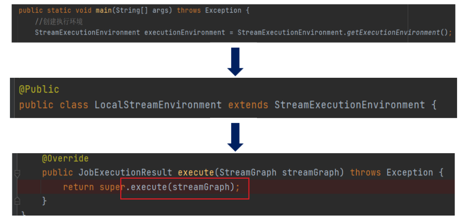
>
> 
>
> （2）获取streamGraph
>
> 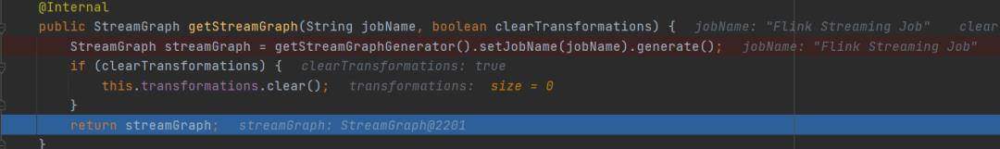
>
> **(3)执行具体的PipeLineExecutor-\>得到localExecutorFactory**
>
> 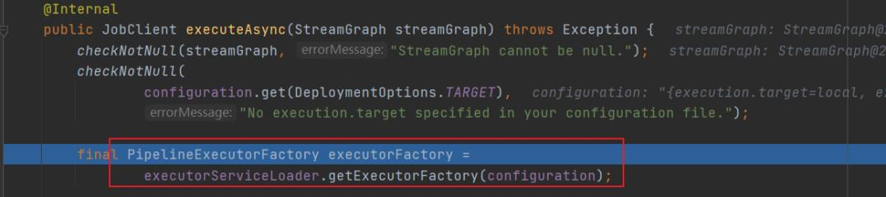
>
> **(4)获取JobGraph**
>
> 根据localExecutorFactory的实现类LocalExecutor生成JobGraph
>
> 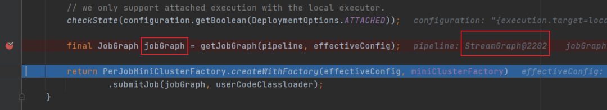
>
> 上面这部分全部是在FlinkClient生成的，由于是使用Local模式提交。所有接下来将创建MiniCluster集群，由miniCluster.submitJob指定要提交的jobGraph
>
> （5）实例化MiniCluster集群
>
> 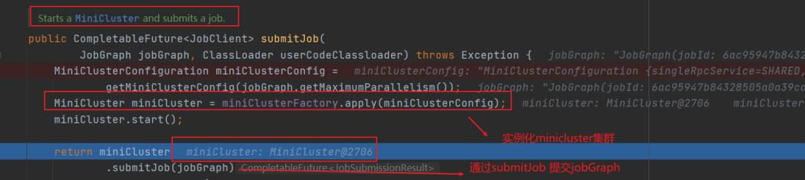
>
> **（6）返回JobClient客户端**
>
> 在上面执行miniCluster.submitJob将JobGraph提交到本地集群后，会返回一个JobClient客户端，该JobClient包含了应用的一些详细信息，包括JobID,应用的状态等等。最后返回到代码执行的上一层，对应类为StreamExecutionEnvironment。
>
> 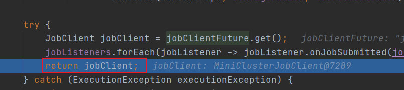
>
> 以上就是Local模式的源码执行过程。

## 61、远程提交模式都有哪些？

> **远程提交方式：**分为Standalone方式、yarn方式、K8s方式
>
> **Standalone：**包含session模式
>
> **Yarn方式分为三种提交模式：**Yarn-perJob模式、Yarn-Sessionmo模式、Yarn-Application模式。
>
> **K8s方式：**包含session模式

## 62、Standalone模式简单介绍一下？

> Standalone模式为Flink集群的单机版提交方式，只使用一个节点进行提交，常用Session模式。
>
> 作业提交原理图如下：
>
> 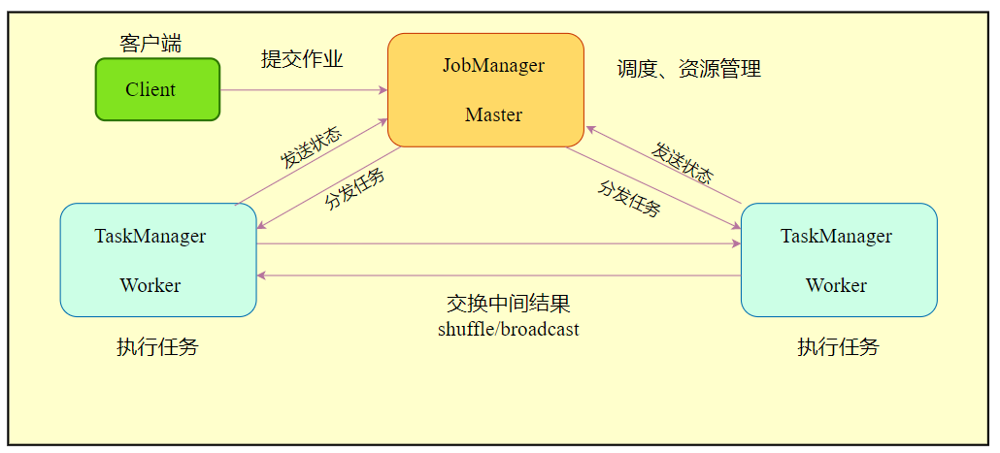
>
> 提交命令如下：
>
> 1.  client客户端提交任务给JobManager
>
> 2.  JobManager负责申请任务运行所需要的资源并管理任务和资源，
>
> 3.  JobManager分发任务给TaskManager执行
>
> 4.  TaskManager定期向JobManager汇报状态

## 63、yarn集群提交方式介绍一下？

> 通过yarn集群提交分为3种提交方式：分别为session模式、perjob模式、application模式
>

## 64、yarn-session模式特点？

> 提交命令如下：
>
> ./bin/flinkrun-t yarn-session\\
>
> -Dyarn.application.id=application_XXXX_YYxxx.jar
>
> **Yarn-Session模式：**所有**作业共享集群资源**，隔离性差，JM负载瓶颈，main方法在客户端执行。适合执行时间短，频繁执行的短任务，集群中的所有作业**只有一个JobManager**，另外，**Job被随机分配给TaskManager**
>
> 特点：
>
> **Session-Cluster模式需要先启动集群**，**然后再提交作业**，接着会向yarn申请一块空间后，资源永远保持不变。如果资源满了，下一个作业就无法提交，只能等到yarn中的其中一个作业执行完成后，释放了资源，下个作业才会正常提交。所有作业共享Dispatcher和ResourceManager；共享资源；适合规模小执行时间短的作业。
>
> **原理图如下**：
>
> 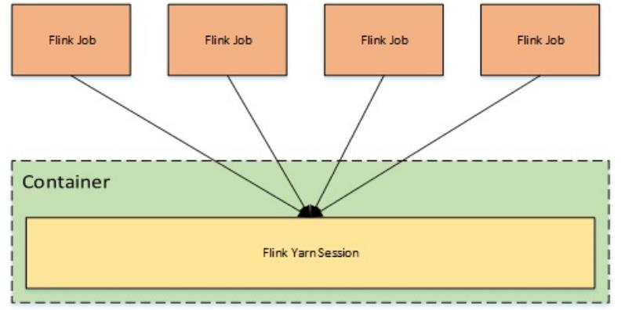
>
> 

## 65、yarn-perJob模式特点？

> 提交命令：
>
> ./bin/flinkrun-tyarn-per-job\--detachedxxx.jar
>
> **Yarn-Per-Job模式：每个作业单独启动集群**，隔离性好，JM负载均衡，main方法在客户端执行。在per-job模式下，每个Job都有一个JobManager，每个TaskManager只有单个Job。
>
>  **特点**：
>
> **一个任务会对应一个Job**，**每提交一个作业**会根据自身的情况，**都会单独向yarn申请资源**，直到作业执行完成，一个作业的失败与否并不会影响下一个作业的正常提交和运行。独享Dispatcher和ResourceManager，按需接受资源申请；**适合规模大长时间运行的作业。**
>
> 原理图如下：
>
> 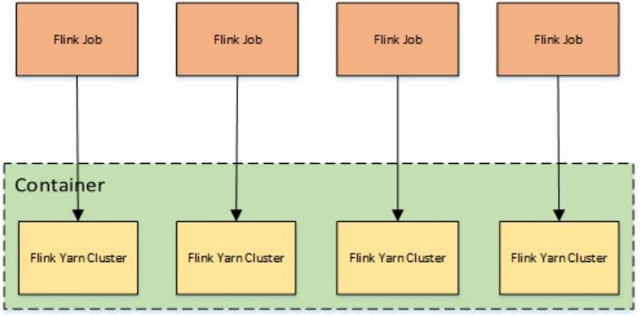

## 66、yarn-application模式特点？

> **提交命令如下：**
>
> **./bin/flinkrun-application-t yarn-applicationxxx.jar**
>
> **Yarn-Application模式：**每个作业单独启动集群，隔离性好，JM负载均衡，main方法在JobManager上执行。
>
> **特点：**
>
> 在yarn-per-job和yarn-session模式下，客户端都需要执行以下三步，即：
>
> 1、获取作业所需的依赖项；
>
> 2、通过执行环境分析并取得逻辑计划，即StreamGraph→JobGraph；
>
> 3、将依赖项和JobGraph上传到集群中。
>
> 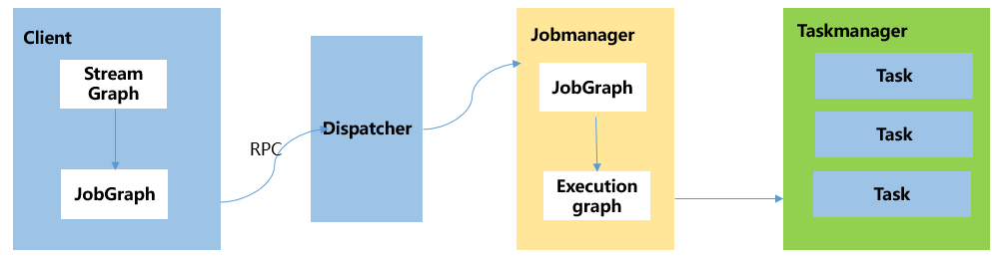
>
> 只有在这些都完成之后，才会通过env.execute()方法触发Flink运行时真正地开始执行作业。**如果所有用户都在同一个客户端上提交作业**，**较大的依赖会消耗更多的带宽**，而较复杂的作业逻辑翻译成JobGraph也需要吃掉更多的CPU和内存，**客户端的资源反而会成为瓶颈**。
>
> 为了解决它，社区在传统部署模式的基础上实现了Application模式。原本需要客户端做的三件事被转移到了JobManager里，也就是说main()方法在集群中执行(入口点位于ApplicationClusterEntryPoint)，客户端只需要负责发起部署请求了**原理图如下：**
>
> 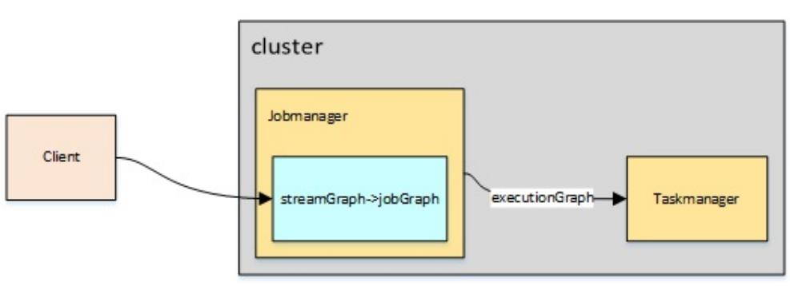
>
> **综上所述，Flink社区比较推荐使用yarn-perjob或者yarn-application模式进行提交应用。**

## 67、yarn-session提交流程详细介绍一下？

>  提交流程图如下：
>
> 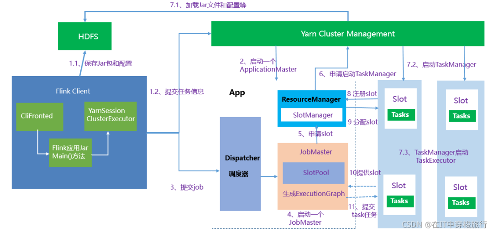
>
> **1、启动集群**
>
> (1) **FlinkClient向YarnResourceManager提交任务信息。**
>
> - FlinkClient将应用配置（Flink-conf.yaml、logback.xml、log4j.properties）和相关文件（FlinkJar、配置类文件、用户Jar文件、JobGraph对象等）上传至分布式存储HDFS中。
>
> - FlinkClient向YarnResourceManager提交任务信息
>
> Yarn启动Flink集群，做2步操作：
>
> 1\)**通过YarnClient向YarnResourceManager提交Flink创建集群的申请**，YarnResourceManager分配Container资源，并通知对应的NodeManager上启动一个ApplicationMaster(每提交一个flinkjob就会启动一个applicationMaster)，ApplicationMaster会包含当前要启动的JobManager和Flink自己内部要使用的ResourceManager。
>
> 2）在JobManager进程中运行**YarnSessionClusterEntryPoint**作为集群启动的入口。初始化Dispatcher，Flink自己内部要使用的ResourceManager，启动相关RPC服务，等待FlinkClient通过Rest接口提交JobGraph。
>
> **2、作业提交**
>
> FlinkClient通过Rest向Dispatcher提交编译好的JobGraph。Dispatcher是Rest接口，不负责实际的调度、指定工作。
>
> **Dispatcher收到JobGraph后，为作业创建一个JobMaster，将工作交给JobMaster，**JobMaster负责作业调度，管理作业和Task的生命周期**，构建ExecutionGraph（**JobGraph的并行化版本，调度层最核心的数据结构**）以上两步执行完后，作业进入调度执行阶段。**
>
> **3、作业调度执行**
>
> (5) JobMaster向ResourceManager申请资源，开始调度ExecutionGraph。
>
> (6) ResourceManager将资源请求加入等待队列，通过心跳向YarnResourceManager申请新的Container来启动TaskManager进程。
>
> (7) YarnResourceManager启动，然后从HDFS加载Jar文件等所需相关资源，在容器中启动TaskManager，TaskManager启动TaskExecutor
>
> (8) TaskManager启动后,向ResourceManager注册，并把自己的Slot资源情况汇报给ResourceManager。
>
> (9) ResourceManager从等待队列取出Slot请求，向TaskManager确认资源可用情况，并告知TaskManager将Slot分配给哪个JobMaster。
>
> (10) TaskManager向JobMaster回复自己的一个Slot属于你这个任务，JobMaser会将Slot缓存到SlotPool。
>
> (11) JobMaster调度Task到TaskMnager的Slot上执行。

## 68、yarn-perjob提交流程详细介绍一下？

> 提交命令如下：
>
> ./bin/flinkrun-tyarn-per-job\--detachedxxx.jar
>
> 提交流程图如下所示：
>
> 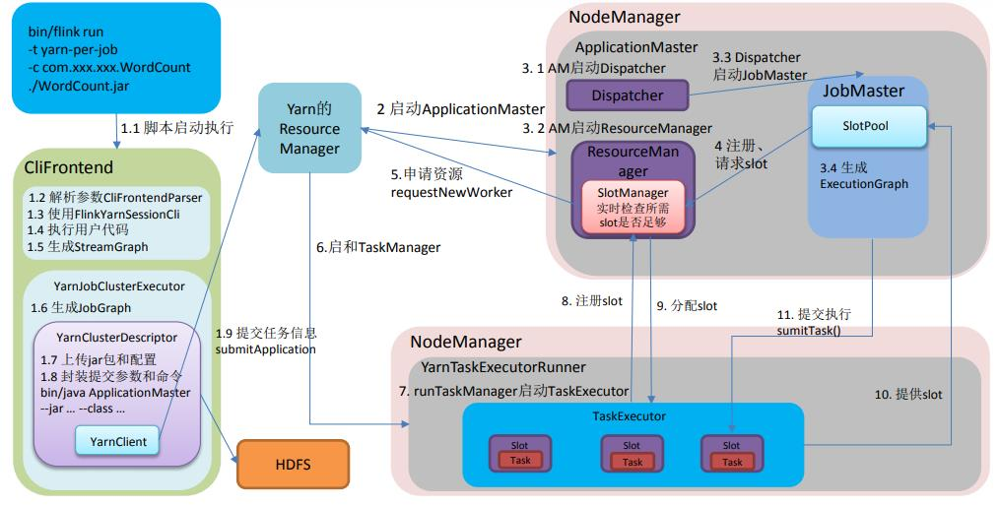
>
> **1、启动集群**
>
> (1) **FlinkClient向YarnResourceManager提交任务信息。**
>
> - FlinkClient将应用配置（Flink-conf.yaml、logback.xml、log4j.properties）和相关文件（FlinkJar、配置类文件、用户Jar文件、JobGraph对象等）上传至分布式存储HDFS中。
>
> - FlinkClient向YarnResourceManager提交任务信息
>
> (2) **Yarn启动Flink集群，做2步操作：**
>
> 1\)**通过YarnClient向YarnResourceManager提交Flink创建集群的申请**，YarnResourceManager分配Container资源，并通知对应的NodeManager上启动一个ApplicationMaster(每提交一个Flinkjob就会启动一个ApplicationMaster)，ApplicationMaster会包含当前要启动的JobManager和Flink自己内部要使用的ResourceManager。
>
> 2）在JobManager进程中运行**YarnJobClusterEntryPoint**作为集群启动的入口。初始化Dispatcher，Flink自己内部要使用的ResourceManager，启动相关RPC服务，等待FlinkClient通过Rest接口提交JobGraph。
>
> **2、作业提交**
>
> (3) **ApplicationMaster启动Dispatcher，Dispatcher启动ResourceManager和JobMaster(该步和Session不同，Jabmaster是由Dispatcher拉起，而不是Client传过来的)。**JobMaster负责作业调度，管理作业和Task的生命周期**，构建ExecutionGraph（**JobGraph的并行化版本，调度层最核心的数据结构**）**
>
> 以上两步执行完后，作业进入调度执行阶段。
>
> 
>
> **3、作业调度执行**
>
> (4) **JobMaster向ResourceManager申请Slot资源，开始调度ExecutionGraph。**
>
> (5) ResourceManager将资源请求加入等待队列，通过心跳向YarnResourceManager申请新的Container来启动TaskManager进程。
>
> (6) YarnResourceManager启动，然后从HDFS加载Jar文件等所需相关资源，在容器中启动TaskManager。
>
> (7) TaskManager在内部启动TaskExecutor。
>
> (8) TaskManager启动后,向ResourceManager注册，并把自己的Slot资源情况汇报给ResourceManager。
>
> (9) ResourceManager从等待队列取出Slot请求，向TaskManager确认资源可用情况，并告知TaskManager将Slot分配给哪个JobMaster。
>
> (10) TaskManager向JobMaster回复自己的一个Slot属于你这个任务，JobMaser会将Slot缓存到SlotPool。
>
> (11) JobMaster调度Task到TaskMnager的Slot上执行。

## 69、流图、作业图、执行图三者区别？

Flink内部Graph总览图，由于现在Flink实行流批一体代码，BatchAPI基本废弃，就不过多介绍

**在FlinkDataStramAPI中，Graph内部转换图如下：**

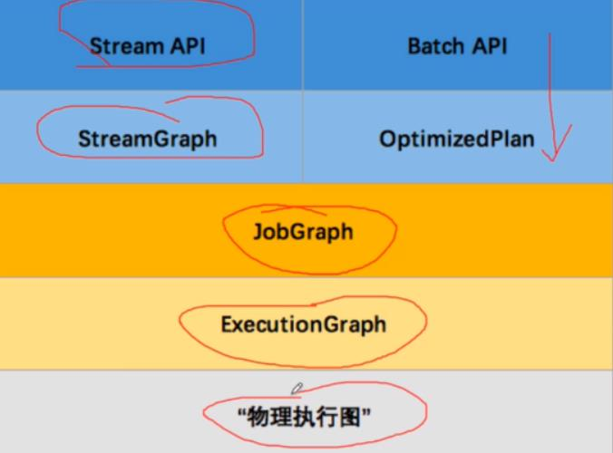


**以WordCount为例，流图、作业图、执行图、物理执行图之间的Task调度如下：**

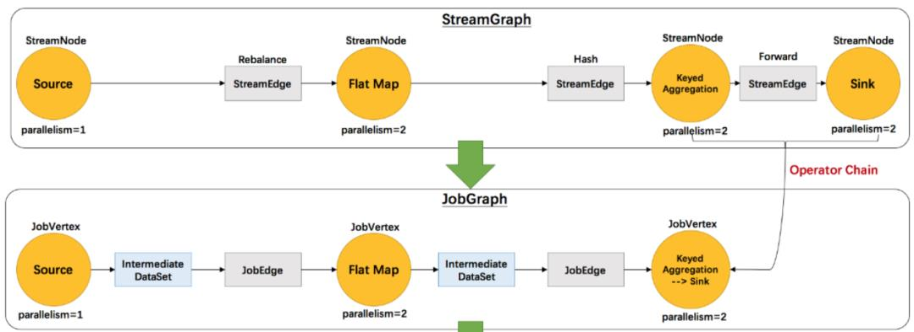

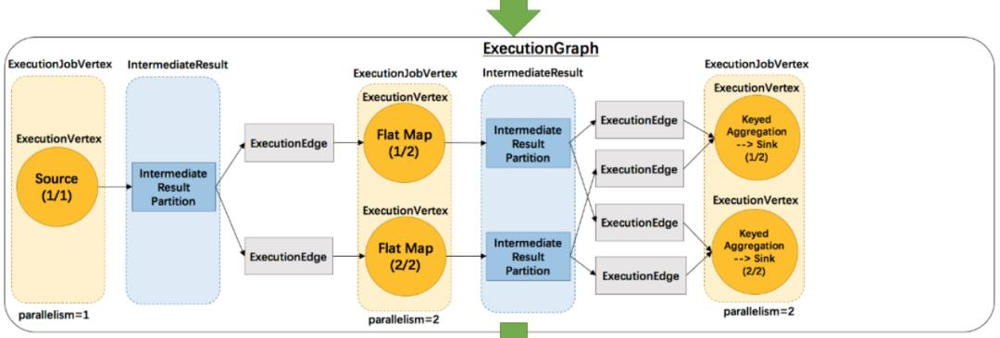

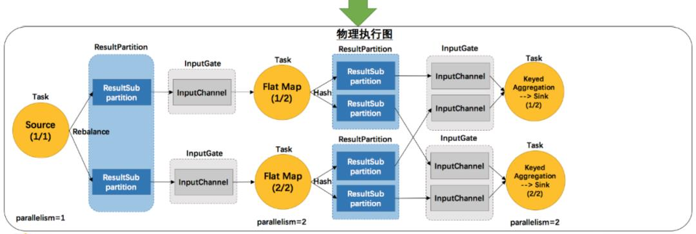

> 对于Flink流计算应用，运行用户代码时，首先调用DataStreamAPI，将用户代码转换为**Transformation**，然后经过：**StreamGraph**-\>**JobGraph**-\>**ExecutionGraph**3层转换（这些都是Flink内置的数据结构），最后经过Flink调度执行，在Flink集群中启动计算任务，形成一个**物理执行图**。
>

## 70、流图介绍一下？

> （1）流图StreamGraph
>
> 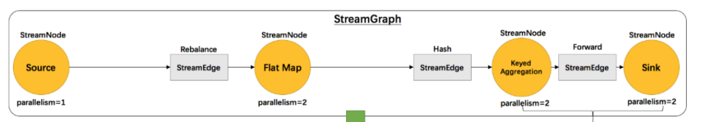
>
> 流图StreamGraph核心对象包括两个：**StreamNode点和StreamEdge边**
>
> StreamNode点
>
> **StreamNode点**，从Transformation转换而来，可以简单理解为**StreamNode**表示一个算子，存在实体和虚拟，可以有多个输入和输出，实体**StreamNode**最终变成物理算子，虚拟的附着在**StreamEdge边**上。
>
> StreamEdge边
>
> **StreamEdge是StreamGraph的边，**用来连接两个StreamNode点，一个StreamEdge可以有多个出边、入边等信息。

## 71、作业图介绍一下？

> （2）作业图JobGraph
>
> JobGraph是由StreamGraph优化而来，是通过**OperationChain**机制将算子合并起来，在执行时，调度在同一个Task线程上，避免数据的跨线程，跨网络传递。
>
> 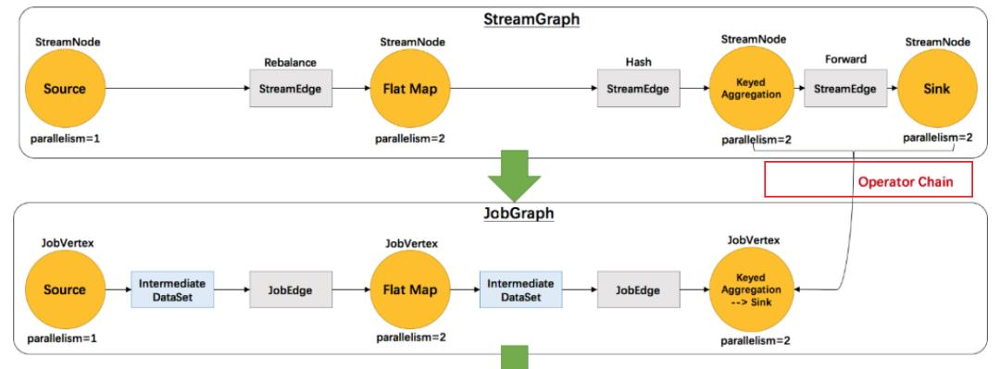
>
> 作业图JobGraph核心对象包括三个：JobVertex点、JobEdge边、IntermediateDataSet中间数据集
>
> **1）JobVertex点**
>
> 经过算子融合优化后符合条件的多个StreamNode可能会融合在一起生成一个JobVertex，即一个JobVertex包含一个或多个算子，**JobVertex的输入是**JobEdge.输出是IntermediateDataSet
>
> 2）JobEdge边
>
> **JobEdge**表示JobGraph中的一个数据流转通道，其上游数据源是**IntermediateDataSet**，下游消费者是**JobVertex**。
>
> **JobEdge**中的数据分发模式会直接影响执行时Task之间的数据连接关系是**点对点连接**还是**全连接**。
>
> 
>
> 3）IntermediateDataSet中间数据集
>
> 中间数据集**IntermediateDataSet**是一种逻辑结构.用来表示**JobVertex**的输出，即该JobVertex中包含的算子会产生的数据集。不同的执行模式下，其对应的结果分区类型不同，决定了在执行时刻数据交换的模式。

## 72、执行图介绍一下？

> （3）执行图ExecutionGraph
>
> **ExecutionGraph**是调度Flink作业执行的核心数据结构，包含了作业中所有并行执行的Task信息、Task之间的关联关系、数据流转关系。
>
> StreamGraph和JobGraph都在FlinkClient生成，然后交给Flink集群。
>
> JobGraph到ExecutionGraph在JobMaster中完成，转换过程中重要变化如下：
>
> 1）加入了并行度的概念，成为真正可调度的图结构。
>
> **2）生成了6个核心对象。**
>
> **执行图ExecutionGraph核心对象包括6个：**
>
> ExecutionJobVertex、ExecutionVertex、IntermediateResult、IntermediateResultPartition、ExecutionEdge、Execution。
>
>  1）**ExecutionJobVertex**
>
> 该对象和JobGraph中的JobVertex一一对应。该对象还包含一组ExecutionVertex，数量与该JobVertex中所包含的StreamNode的并行度一致，假设StreamNode的并行度为5，那么**ExecutionJobVertex**中也会包含5个**ExecutionVertex**。
>
> **ExecutionJobVertex**用来将一个JobVertex封装成**ExecutionJobVertex**，并依次创建ExecutionVertex、Execution、IntermediateResult和IntermediateResultPartition，用于丰富**ExecutionGraph。**

> 2）ExecutionVertex
>
> **ExecutionJobVertex**会对作业进行并行化处理，构造可以并行执行的实例，每一个并行执行的实例就是**ExecutionVertex**。

> 3）IntermediateResult
>
> **IntermediateResult**又叫作中间结果集，该对象是个逻辑概念表
>
> 示**ExecutionJobVertex**输出，和JobGrap中的IntermediateDalaSet一一对应，同样一个**ExecutionJobVertex**可以有多个中间结果，取决于当前JobVertex有几个出边(JobEdge)。
>

> 4）IntermediateResultPartition
>
> **IntermediateResultPartition**又叫作中间结果分区。表示1个**ExecutionVertex**输出结果，与ExecutionEdge相关联。

> 5）ExecutionEdge
>
> 表示**ExecutionVertex**的输入，连按到上游产生的
>
> **IntermediateResultPartition**。1个Execution对应唯一的1个**IntermediateResultPartition**和1个**ExecutionVertex**。1个**ExecutionVertex**可以有多个**ExecutionEdge。**

> 6）Execution
>
> **ExecutionVertex**相当于每个Task的模板，在真正执行的时候，会将ExecutionVertex中的信息包装为1个Execution，执行一个ExecutionVertex的一次尝试。
>
> JobManager和TaskManager之间关于Task的部署和Task执行状态的更新都是通过ExecutionAttemptID来识别标识的。

## 73、Flink调度器的概念介绍一下？

> **调度器**是Flink作业执行的核心组件，管理作业执行的所有相关过程，包括JobGraph到ExecutionGraph的转换、作业生命周期管理（作业的发布、取消、停止）、作业的Task生命周期管理（Task的发布、取消、停止）、资源申请与释放、作业和Task的Faillover等。

### （1）DefaultScheduler

> Flink目前默认的调度器。是Flink新的调度设计，使用SchedulerStrategy来实现调度。

### （2）LegacySchedular

> 过去的调度器，实现了原来的Execution调度逻辑。

## 74、Flink调度行为包含几种？

### 调度行为包含四种：

> SchedulerStrategy接口定义了调度行为，其中包含4种行为：
>
> 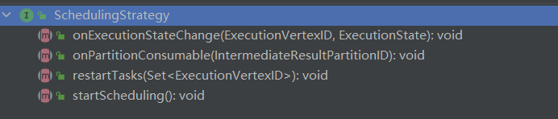
>
> 1.  startScheduling:调度入口，触发调度器的调度行为
>
> 2.  restartTasks:重启执行失败的Task,一般是Task执行异常导致的。
>
> 3.  onExecutionStateChange：当Execution状态发生改变时。
>
> 4.  onPartitionConsumable：当IntermediateResultPartition中的数据可以消费时。

## 75、Flink调度模式包含几种？

调度模式包含3种：Eager模式、分阶段模式（Lazy_From_Source）、分阶段Slot重用模式（Lazy_From_Sources_With_Batch_Slot_Request）。

### 1）Eager调度

> **适用于流计算**。一次性申请需要的所有资源，如果资源不足，则作业启动失败。

### 2）分阶段调度

> LAZY_FROM_SOURCES**适用于批处理**。从SourceTask开始分阶段调度，申请资源的时候，一次性申请本阶段所需要的所有资源。上游Task执行完毕后开始调度执行下游的Task，读取上游的数据，执行本阶段的计算任务，执行完毕之后，调度后一个阶段的Task，依次进行调度，直到作业完成。
>

### 3）分阶段Slot重用调度

> LAZY_FROM_SOURCES_WITH_BATCH_SLOT_REQUEST**适用于批处理**。与分阶段调度基本一样，区别在于该模式下使用批处理资源申请模式，可以在资源不足的情况下执行作业，但是需要确保在本阶段的作业执行中没有Shuffle行为。
>
> 目前视线中的Eager模式和LAZY_FROM_SOURCES模式的资源申请逻辑一样，LAZY_FROM_SOURCES_WITH_BATCH_SLOT_REQUEST是单独的资源申请逻辑。
>

## 76、Flink调度策略包含几种？

### 调度策略包含3种：

> 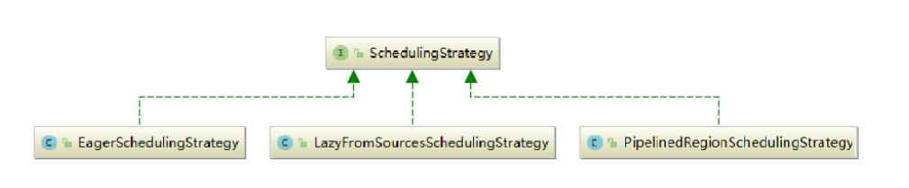
>
> 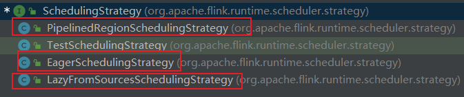
>
> 调度策略全部实现于调度器SchedulingStrategy，有三种实现：
>
> 1.  **EagerSchedulingStrategy：**适用于流计算，同时调度所有的task
>
> 2.  **LazyFromSourcesSchedulingStrategy：**适用于批处理，当输入数据准备好时（上游处理完）进行vertices调度。
>
> 3.  **PipelinedRegionSchedulingStrategy：**以流水线的局部为粒度进行调度
>
> PipelinedRegionSchedulingStrategy是1.11加入的，从1.12开始，将以pipelinedregion为单位进行调度。
>
> pipelinedregion是一组流水线连接的任务。这意味着，对于包含多个region的流作业，在开始部署任务之前，它不再等待所有任务获取slot。取而代之的是，一旦任何region获得了足够的任务slot就可以部署它。对于批处理作业，将不会为任务分配slot，也不会单独部署任务。取而代之的是，一旦某个region获得了足够的slot，则该任务将与所有其他任务一起部署在同一区域中。

## 77、Flink作业生命周期包含哪些状态？

> 在Flink集群中，**JobMaster**负责**作业**的生命周期管理，具体的管理行为在调度器和ExecutionGraph中实现。
>
> 作业的完整生命周期状态变换如下图所示：
>
> 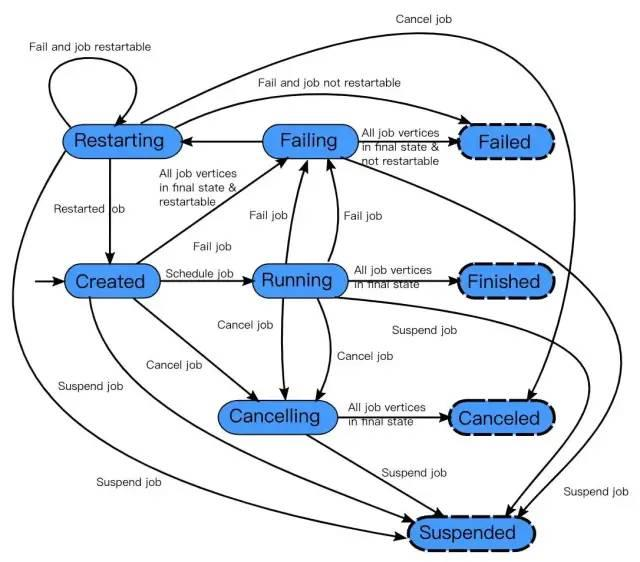
>
> （1）作业首先处于创建状态（created），然后切换到运行状态（running），并且在完成所有工作后，它将切换到完成状态（finished）。
>
> （2）在失败的情况下，作业首先切换到失败状态（failing），取消所有正在运行任务。如果所有节点都已达到最终状态，并且作业不可重新启动，则状态将转换为失败（failed）。
>
> （3）如果作业可以重新启动，那么它将进入重新启动状态（restarting）。一旦完成重新启动，它将变成创建状态（created）。
>
> （4）在用户取消作业的情况下，将进入取消状态（cancelling），会取消所有当前正在运行的任务。一旦所有运行的任务已经达到最终状态，该作业将转换到已取消状态（canceled）。
>
> 完成状态（finished），取消状态（canceled）和失败状态（failed）表示一个全局的终结状态，并且触发清理工作，**而暂停状态（suspended）仅处于本地终止状态**。意味着作业的执行在相应的JobManager上终止，但集群的另一个JobManager可以从持久的HA存储中恢复这个作业并重新启动。因此，处于暂停状态的作业将不会被完全清理。

## 78、Task的作业生命周期包含哪些状态？

> **TaskManager**负责**Task**的生命周期管理，并将状态的变化通知到JobMaster,在ExecutionGraph中跟踪Execution的状态变化，一个Execution对于一个Task。
>
> Task的生命周期如下：共8种状态。
>
> 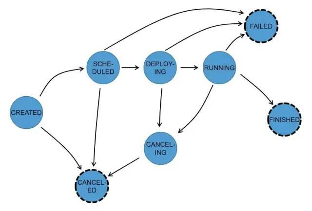
>
> **在执行ExecutionGraph期间，每个并行任务经过多个阶段，从创建（created）到完成（finished）或失败（failed），下图说明了它们之间的状态和可能的转换。任务可以执行多次（例如故障恢复）。每个Execution跟踪一个**
>
> **ExecutionVertex的执行，每个ExecutionVertex都有一个当前Execution（currentexecution）和一个前驱Execution（priorexecution）。**

## 79、Flink的任务调度流程讲解一下？

> 任务调度流程图如下：
>
> 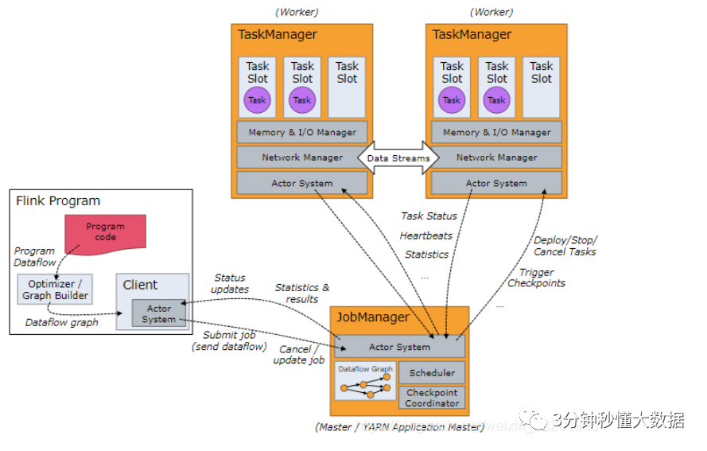
>
> 1.  当Flink执行executor会自动根据程序代码生成**DAG数据流图**，即**Jobgraph；**
> 2.  **ActorSystem**创建**Actor**将数据流图发送给JobManager中的Actor；
> 3.  **JobManager**会不断接收**TaskManager**的心跳消息，从而可以获取到有效的TaskManager；
> 4.  JobManager通过调度器在TaskManager中调度执行Task（在Flink中，最小的调度单元就是task，对应就是一个线程）；
> 5.  在程序运行过程中，task与task之间是可以进行数据传输的。
>
> - ###### JobClient
>
>   -   主要职责是提交任务,提交后可以结束进程,也可以等待结果返回；
>   -   JobClient不是Flink程序执行的内部部分，但它是任务执行的起点；
>   -   JobClient负责接受用户的程序代码，然后创建数据流，将数据流提交给JobManager以便进一步执行。执行完成后，JobClient将结果返回给用户。
>
> - JobManager
>
>   -   主要职责是调度工作并协调任务做检查点；
>   -   集群中至少要有一个master，master负责调度task，协调checkpoints和容错；
>   -   高可用设置的话可以有多个master，但要保证一个是leader,其他是standby；
>   -   JobManager包含**ActorSystem、Scheduler、CheckPoint**三个重要的组件；
>   -   JobManager从客户端接收到任务以后,首先生成优化过的执行计划,再调度到TaskManager中执行。
>
> - TaskManager
>
>  -   主要职责是从JobManager处接收任务,并部署和启动任务,接收上游的数据并处理
>
>   -   TaskManager是在JVM中的一个或多个线程中执行任务的工作节点。
>
>   -   TaskManager在创建之初就设置好了Slot,每个Slot可以执行一个任务。
>

## 80、Flink的任务槽是什么意思？

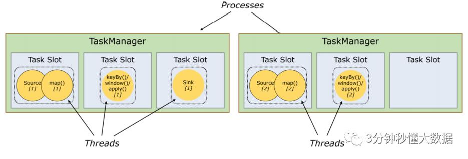

> 每个TaskManager是一个JVM的进程,可以在不同的线程中执行一个或多个子任务。为了控制一个worker能接收多少个task。worker通过taskslot来进行控制（一个worker至少有一个taskslot）。
>

### 1、任务槽

> 每个taskslot表示TaskManager拥有资源的一个固定大小的子集。一般来说：我们分配槽的个数都是和CPU的核数相等，比如8核，那么就分配8个槽。
>
> Flink将进程的内存划分到多个slot中。图中有2个TaskManager，每个TaskManager有3个slot，每个slot占有1/3的内存。
>
> 内存被划分到不同的slot之后可以获得如下好处：
>
> -   **TaskManager**最多能同时并发执行的任务是可以控制的，那就是3个，因为不能超过slot的数量。**任务槽的作用就是分离任务的托管内存，不会发生cpu隔离。**
>
> -   slot有独占的内存空间，这样在一个TaskManager中可以运行多个不同的作业，作业之间不受影响。
>
> 总结：taskslot的个数代表TaskManager可以并行执行的task数


## 81、Flink槽共享又是什么意思？

### 2、槽共享

> **默认情况下，Flink允许子任务共享插槽**，即使它们是不同任务的子任务，只要它们来自同一个作业。结果是一个槽可以保存作业的整个管道。允许插槽共享有两个主要好处：
>
> -   只需计算Job中最高并行度（parallelism）的taskslot。只要这个满足，其他的job也都能满足。
> -   资源分配更加公平。如果有比较空闲的slot可以将更多的任务分配给它。图中若没有任务槽共享，负载不高的Source/Map等subtask将会占据许多资源，而负载较高的窗口subtask则会缺乏资源。
> -   有了任务槽共享，可以将基本并行度（baseparallelism）从2提升到6。提高了分槽资源的利用率。同时它还可以保障TaskManager给subtask的分配的slot方案更加公平。
>
> 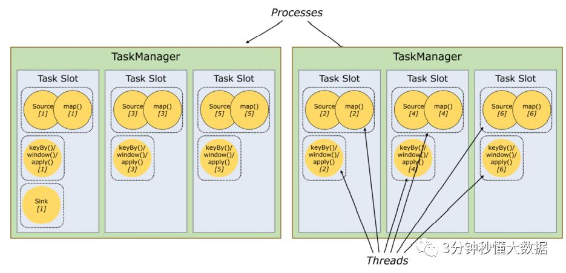

# 04、FlinkSQL篇

> FlinkSQL也是面试的重点考察点，不仅需要你掌握扎实的SQL编程，同时还需要理解SQL提交的核心原理，以及FlinkSQL中涉及的一些重点知识，例如CEP、CDC、SQLGateWay、SQL-Hive等，思维导图如下：
>
> 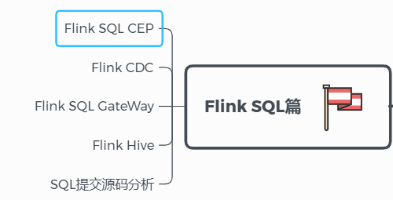

## 82、FlinkSQL有没有使用过？

> 用过，在Flink中，一共有**四种**级别的**抽象**，而FlinkSQL作为最上层，是FlinkAPI的一等公民
>
> 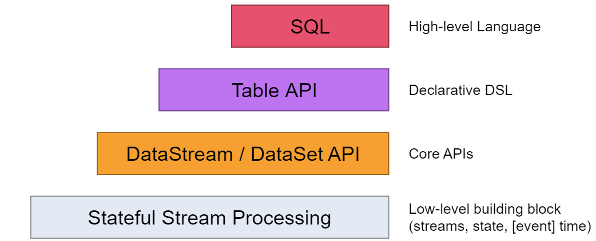
>
> 在标准SQL中，SQL语句包含四种类型
>
> DML(DataManipulationLanguage):数据操作语言，用来定义数据库记录（数据）。
>
> DCL(DataControlLanguage):数据控制语言，用来定义访问权限和安全级别。
>
> DQL(DataQueryLanguage):数据查询语言，用来查询记录（数据）。
>
> DDL(DataDefinitionLanguage):数据定义语言，用来定义数据库对象（库，表，列等）。
>
> FlinkSQL包含DML数据操作语言、DDL数据语言，DQL数据查询语言，不包含DCL语言。

## 83、Flink被称作流批一体，那从哪个版本开始，真正实现流批一体的？

> 从1.9.0版本开始，引入了阿里巴巴的Blink，对FIinkTabIe&SQL模块做了重大的重构，保留了FlinkPlanner的同时，引入了BlinkPIanner，没引入以前，Flink没考虑流批作业统一，针对流批作业，底层实现两套代码，引入后，基于流批一体理念，重新设计算子，以流为核心，流作业和批作业最终都会被转为transformation。
>

## 84、FlinkSQL使用哪种解析器？

> FlinkSQL使用ApacheCalcite作为解析器和优化器。
>
> **Calcite**一种动态数据管理框架，它具备很多典型数据库管理系统的功能如SQL解析、SQL校验、SQL查询优化、SQL生成以及数据连接查询等，但是又省略了一些关键的功能，如Calcite并**不存储**相关的**元数据**和**基本数据**，不完全包含相关处理数据的算法等。

## 85、Calcite主要功能包含哪些？

> Calcite主要包含以下五个部分：

### （1）SQL解析(Parser)

> CalciteSQL解析是**通过JavaCC**实现的，使用JavaCC编写SQL语法描述文件，将SQL解析成未经校验的AST语法树。
>

### (2)SQL校验（Validate）

> 校验分两部分
>
> 1）无状态的校验即验证SQL语句是否符合规范。
>
> 2）有状态的校验即通过与元数据结合验证SQL中的Schema、Field、Function是否存在，输入输出类型是否匹配等。

### （3）SQL查询优化

> 对上个步骤的输出(RelNode，逻辑计划树)进行优化，得到优化后的物理执行计划优化有两种：**基于规则的优化**和**基于代价的优化**，后面会详细介绍。

### （4）SQL生成

> 将物理执行计划生成为在特定平台/引擎的可执行程序，如生成符合MySQL或Oracle等不同平台规则的SQL查询语句等。
>

### （5）数据连接与执行

> 通过各个执行平台执行查询，得到输出结果。
>
> 在Flink或者其他使用Calcite的大数据引擎中，一般到SQL查询优化即结束，由各个平台结合CalciteSQL代码生成和平台实现的代码生成，将优化后的物理执行计划组合成可执行的代码，然后在内存中编译执行。

## 86、FlinkSQL处理流程说一下？

> 下面举个例子，详细描述一下FlinkSql的处理流程，以Sql查询为例，如下图所示：
>
> 

> 我们写一张T表，当执行sekect语句后，FlinkSQL将做如下操作：
>
> 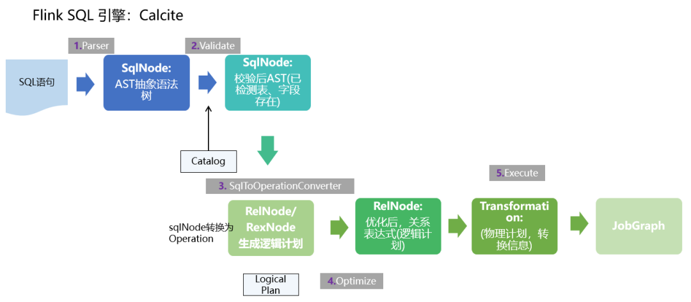
>
> （1）首先，FlinkSQL底层使用的是**apacheCalcite**引擎来处理SQL语句，Calcite会使用javaCC做SQL解析，javaCC根据Calcite中定义的**Parser.jj**文件，生成一系列的java代码，生成的java代码会**把SQL转换成AST抽象语法树**（即SQLNode类型）。
>
> （2）生成的SqlNode抽象语法树，他是一个**未经验证的抽象语法树**，这时，SQLValidator会获取FlinkCatalog中的元数据信息来验证sql语法，元数据信息检查包括表名，字段名，函数名，数据类型等检查。然后生成一个校验后的SqlNode。
>
> （3）到达这步后，只是将SQL解析到java数据结构的固定节点上，并没有给出相关节点之间的关联关系以及每个节点的类型信息。所以，还需要将SqlNode转换为逻辑计划，也就是LogicalPlan，在转换过程中，会使SqlToRelConverter类，来将SqlNode转换为Operation,Operation会根据SQL语法来执行创建表或者删除表等操作，同时**FlinkPlannerImpl.rel()方法会将SQLNode转换成RelNode树，并返回RelRoot**。
>
> （4）第4步将**执行Optimize操作**，按照预定义的优化规则RelOptRule优化逻辑计划。Calcite中的优化器RelOptPlanner有两种，一是基于规则优化（RBO）的HepPlanner，二是基于代价优化（CBO）的VolcanoPlanner。然后得到优化后的RelNode,再基于Flink里面的rules将优化后的逻辑计划转换成物理计划。
>
> （5）第5步**执行execute操作**，会通过代码生成transformation,然后递归遍历各节点，将DataStreamRelNode转换成DataStream,在这期间，会依次递归调用DataStreamUnion、DataStreamCalc、DataStreamScan类中重写的translateToPlan方法。递归调用各节点的translateToPlan，实际是利用CodeGen元编成Flink的各种算子，相当于直接利用Flink的DataSet或者DataStream开发程序。
>
> （6）最后进一步**编译**成可执行的JobGraph提交运行。

## 87、FlinkSQL包含哪些优化规则？

> 如下图为执行流程图
>
> 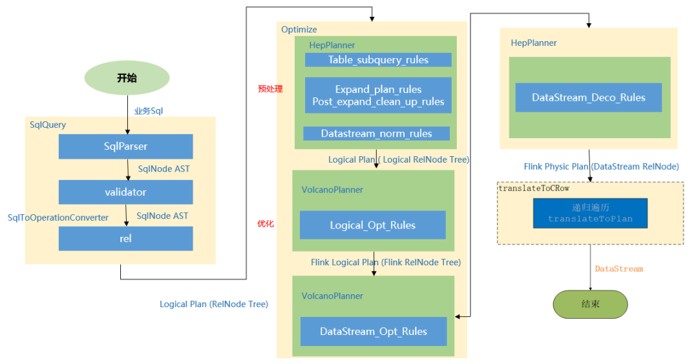
>
> 总结就是：
>
> 先解析，然后验证，将SqlNode转化为Operation来创建表，然后调用rel方法将sqlNode变成逻辑计划（RelNodeTree）紧接着对逻辑计划进行优化；
>
> 优化之前会根据Calcite中的优化器中的基于规则优化的HepPlanner**针对四种规则进行预处理**，处理完之后得到LogicRelNode，紧接着使用代价优化的VolcanoPlanner使用Logical_Opt_Rules（逻辑计划优化）找到最优的执行Planner,并转换为FlinkLogicalRelNode。
>
> 最后运用Flink包含的优化规则，如DataStream_Opt_Rules：流式计算优化，DataStream_Deco_Rules：装饰流式计算优化将优化后的逻辑计划转换为物理计划。
>
> 优化规则包含如下：
>
> Table_subquery_rules子查询优化
>
> Expand_plan_rules：扩展计划优化
>
> Post_expand_clean_up_rules：扩展计划优化Datastream_norm_rules：正常化流处理
>
> Logical_Opt_Rules：逻辑计划优化
>
> DataStream_Opt_Rules：流式计算优化
>
> DataStream_Deco_Rules：装饰流式计算优化

## 88、FlinkSQL中涉及到哪些operation？

### 先介绍一下什么是Operation

> 在FlinkSQL中吗，涉及的DDL，DML，DQL操作都是Operation，在Flink内部表示，Operation可以和SqlNode对应起来。
>
> **Operation执行在优化前**，执行的函数为executeQperation,如下图所示，为执行的所有Operation。
>
> 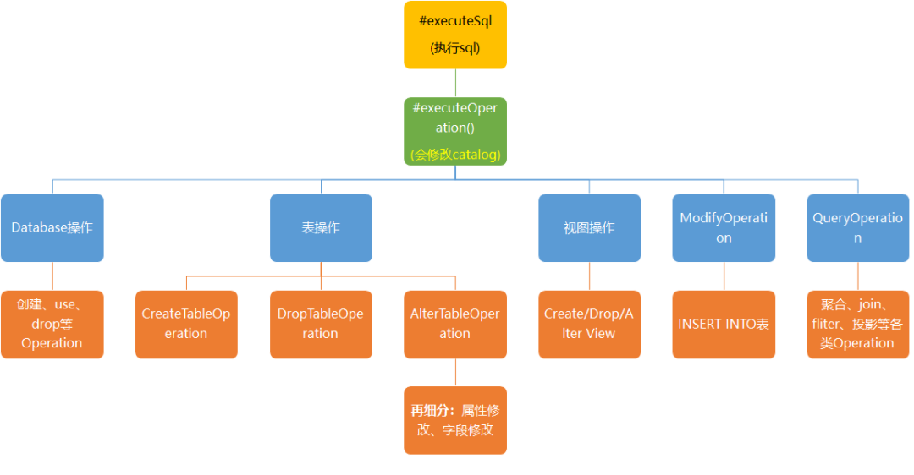

## 89、FlinkHive有没有使用过？

> Flink社区在Flink1.11版本进行了重大改变，如下图所示：
>
> 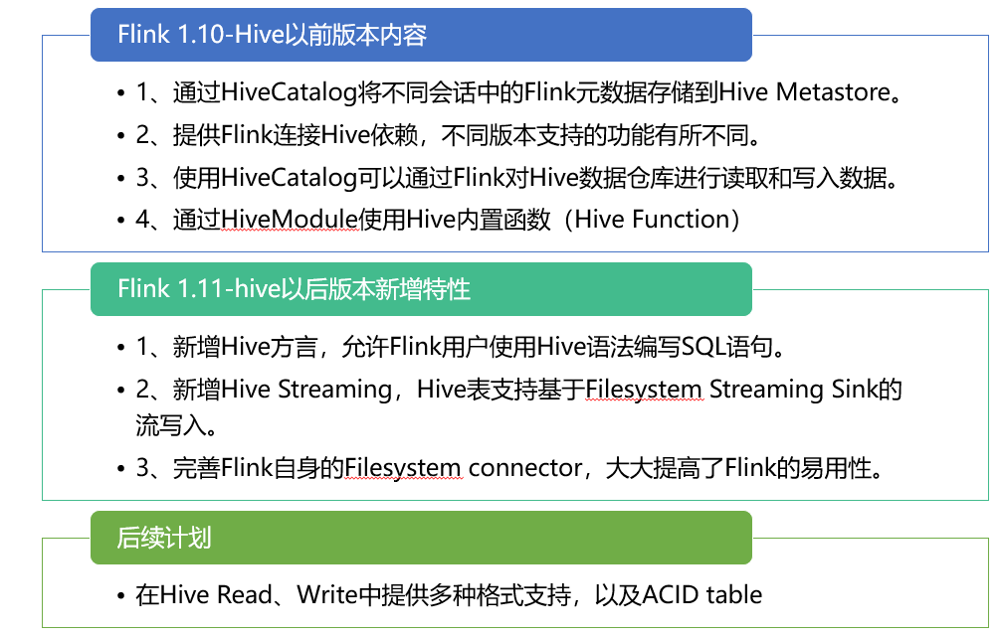

## 90、Flink与Hive集成时都做了哪些操作？

> 如下所示为Flink与HIve进行连接时的执行图：
>
> 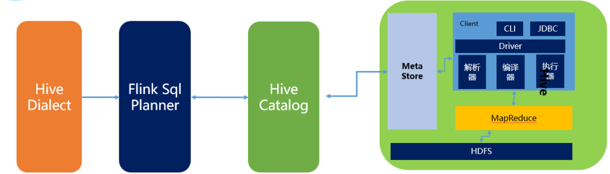

> （1）Flink1.1新引入了Hive方言，所以在FlinkSQL中可以编写HIve语法，即HiveDialect。
>
> （2）编写HIveSQL后，FlinkSQLPlanner会将SQL进行解析，验证，转换成逻辑计划，物理计划，最终变成Jobgraph。
>
> （3）HiveCatalog作为Flink和Hive的表元素持久化介质，会将不同会话的**Flink元数据存储到HiveMetastore中**。用户利用HiveCatalog可以将hive表或者Kafka表存储到HiveMetastore中。
>
> BlinkPlanner是在Flink1.9版本新引入的机制，Blink的查询处理器则实现流批作业接口的统一，**底层的API都是Transformation**。真正实现流&批的统一处理，替代原FlinkPlanner将流&批区分处理的方式。在1.11版本后已经默认为BlinkPlanner。

## 91、HiveCatalog类包含哪些方法？

> 重点方法如下：
>
> 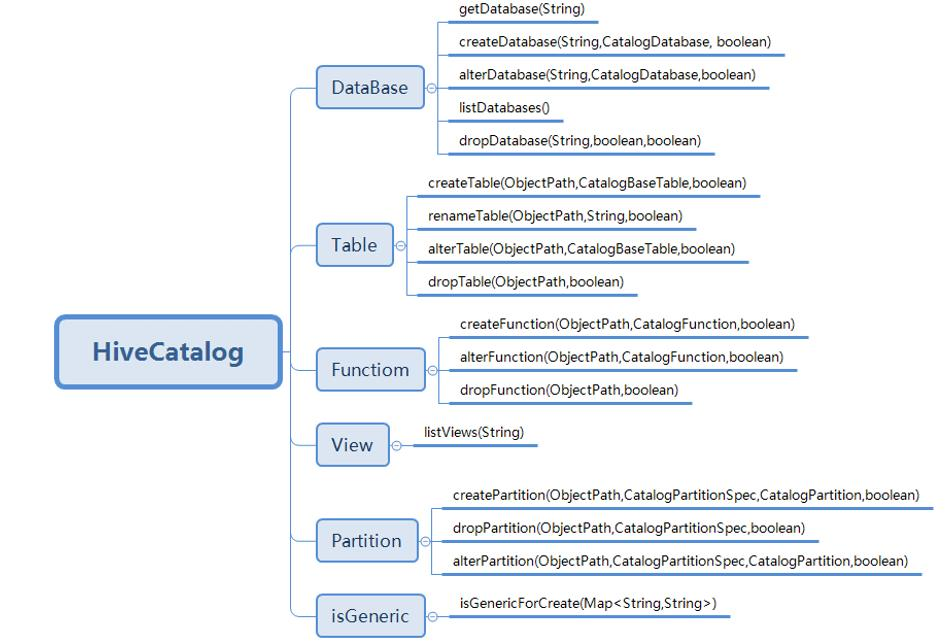

> HiveCatalog主要是**持久化元数据**，所以一般的创建类型都包含，如database,Table,View，Function,Partition,还有is_Generic字段判断等。
>

## 92、FlinkSQL1.11新增了实时数仓功能，介绍一下？

> Flink1.11版本新增的一大功能是实时数仓，可以实时的将kafka中的数据插入Hive中，传统的实时数仓基于Kafka+Flinkstreaming，定义全流程的流计算作业，有着秒级甚至毫秒的实时性，**但实时数仓的一个问题是历史数据只有3-15**天，无法在其上做Ad-hoc的查询。
>
> 针对这个特点，Flink1.11版本将**FlieSystemStreamingSink**重新修改，增加了**分区提交**和**滚动策略机制**，让HiveStreamingsink重新使用文件系统流接收器。Flink1.11的Table/SQLAPI中，**FileSystemConnector是靠增强版**StreamingFileSink组件实现，在源码中名为StreamingFileWriter。\*只有在Checkpoint成功时，StreamingFileSink写入的文件才会由Pending状态变成Finished状态，从而能够安全地被下游读取。所以，我们一定要打开**Checkpointing，并设定合理的间隔。**

## 93、Flink-Hive实时写数据介绍下？

> **StreamingWrite**，从kafka中实时拿到数据，使用分区提交将数据从Kafka写入
>
> Hive表中，并运行批处理查询以读取该数据。
>
> Flink-SQL写法
>
> **Source源**
>
> 
>
> 
>
> **Sink目的地**
>
> 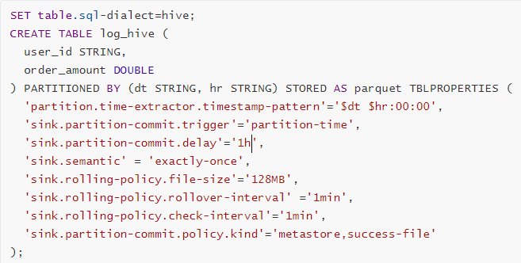
>
> **Insert插入**
>
> 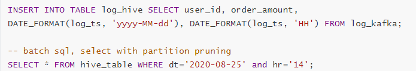

> Flink-table写法：
>
> Source源
>
> 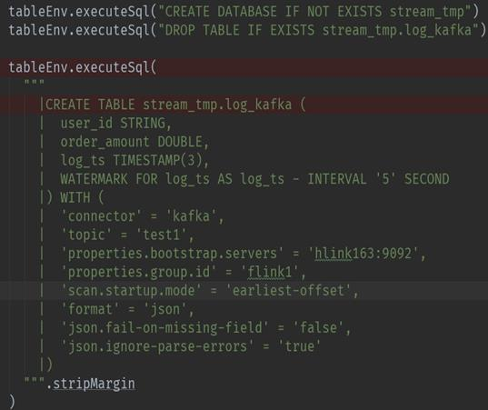
>
> **Sink目的地**
>
> 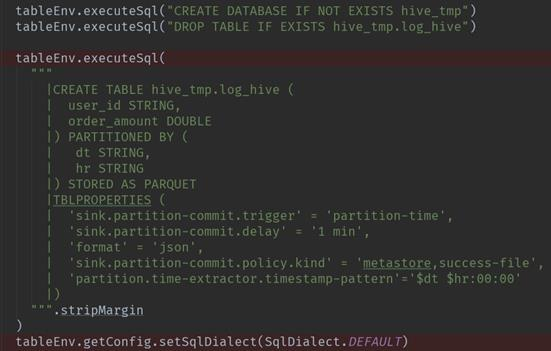
>
> **Insert插入**
>
> 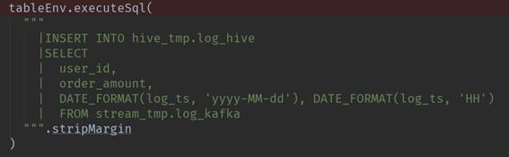

## 94、Flink-Hive实时读数据介绍下？

如下图所示：

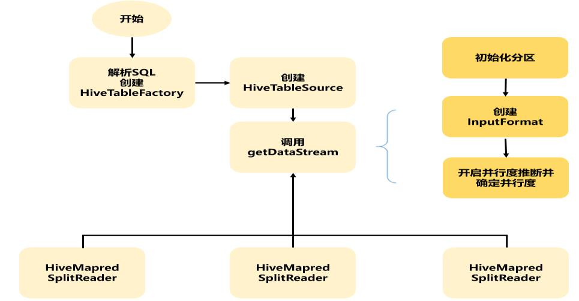

> Flink源码中在对Hive进行读取操作时，会经历以下几个步骤：
>
> 1、Flink都是基于calcite先解析sql，确定表来源于hive，如果是Hive表，将会**在HiveCatalog中创建HiveTableFactory**
>
> 2、HiveTableFactory会基于配置文件**创建HiveTableSource**，然后HiveTableSource在真正执行时，会调用getDataStream方法，通过getDataStream方法来确定查询匹配的分区信息，然后创建表对应的InputFormat，然后确定并行度，根据并行度确定slot分发
>
> HiveMapredSplitReader任务。
>
> 3、在TaskManager端的slot中，Split会确定读取的内容，基于Hive中定义的序列化工具，InputFormat执行读取反序列化，得到value值。
>
> 4、最后循环执行reader.next获取value，将其解析成Row。

## 95、Flink-Hive实时写数据时，如何保证已经写入分区的数据何时才能对下游可见呢？

如下图所示：

> 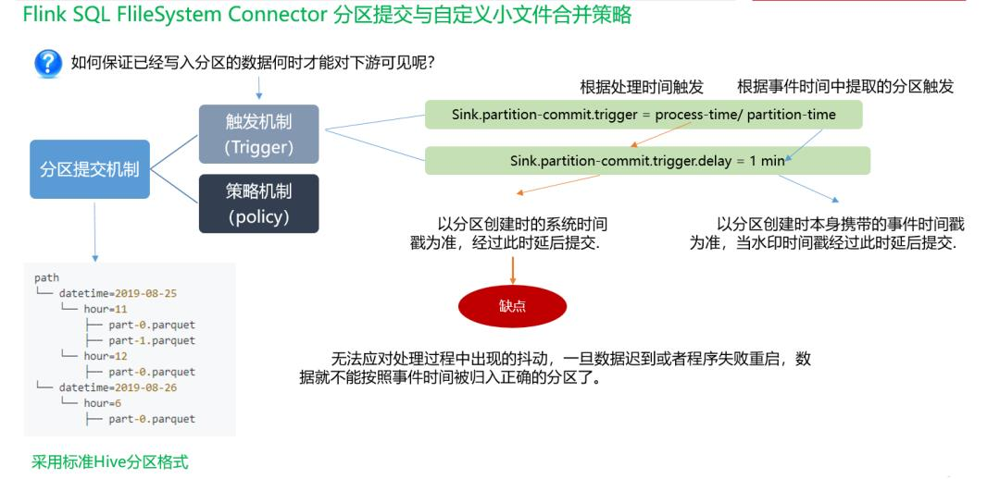
>
> 首先可以看一下，在实时的将数据存储到Hive数仓中，FileSystemConnector为了与Flink-Hive集成的大环境适配，**最大的改变就是分区提交**，可以看一下左下图，官方文档给出的，分区可以采取日期+小时的策略，或者时分秒的策略。
>
> 那如何保证已经写入分区的数据何时才能对下游可见呢？这就和触发机制有关，触发机制包含process-time和partition-time以及时延。
>
> **partition-time**指的是根据事件时间中提取的分区触发。当\'watermark\'\>\'partition-time\'+\'delay\'，选择partition-time的数据才能提交成功，
>
> **process-time**指根据系统处理时间触发，当加上时延后，要想让分区进行提交，当\'currentprocessingtime\'\>\'partitioncreationtime\'+\'delay\'选择process-time的数据可以提交成功。
>
> 但选择process-time触发机制会有缺陷，就是当数据迟到或者程序失败重启时，数据不能按照事件时间被归入正确分区。所以一般会选择partition-time。

## 96、源码中分区提交的PartitionCommitTrigger介绍一下？

在源码中，PartitionCommitTrigger类图如下所示

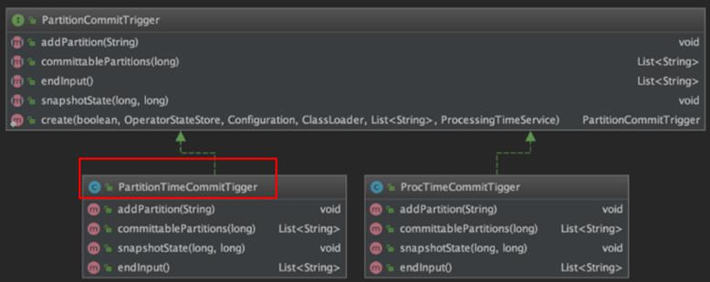

该类中维护了两对必要的信息：

1.  pendingPartitions/pendingPartitionsState：等待提交的分区以及对应的状态；
1.  watermarks/watermarksState：watermarks（用TreeMap存储以保证有序）以及对应的状态。

## 97、PartitionTimeCommitTigger是如何知道该提交哪些分区的呢？（源码分析）

> 1、检查checkpointID是否合法；
>
> 2、取出当前checkpointID对应的水印，并调用TreeMap的headMap()和clear()
>
> 方法删掉早于当前checkpointID的水印数据（没用了）；
>
> 3、遍历等待提交的分区，调用之前定义的PartitionTimeExtractor。
>
> （比如\${year}-\${month}-\${day}\${hour}:00:00）抽取分区时间。如果watermark\>partition-time+delay，说明可以提交，并返回它们

## 98、如何保证已经写入分区的数据对下游可见的标志问题（源码分析）

在源码中，主要涉及PartitionCommitPolicy类，如下图所示：

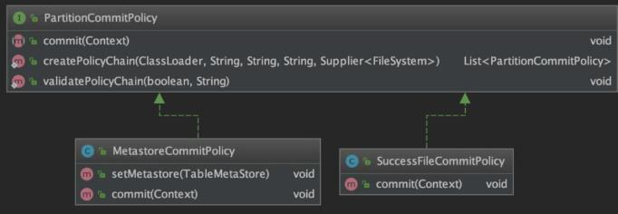

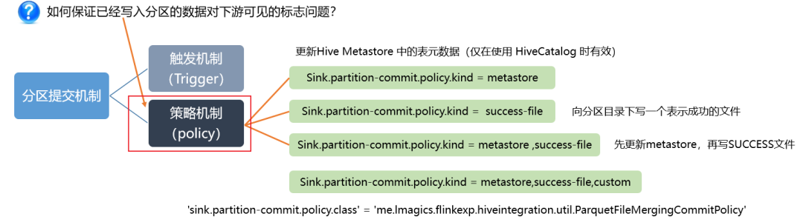

## 99、FlinkSQLCEP有没有接触过？

> **CEP的概念：**
>
> Ø复杂事件处理（ComplexEventProcessing），用于识别输入流中符合指定规则的事件，并按照指定方式输出。
>
> Ø起床---\>洗漱---\>吃饭---\>上班一系列串联起来的事件流形成的模式
>
> Ø浏览商品---\>加入购物车---\>创建订单---\>支付完成---\>发货---\>收货事件流形成的模式。
>
> 通过概念可以了解，CEP主要是识别输入流中用户指定的一些基本规则的事件，然后将这些事件再通过指定方式输出。
>
> 如下图所示：我们指定"方块、圆"为基本规则的事件，在输入的原始流中，将这些事件作为一个结果流输出来。
>
> 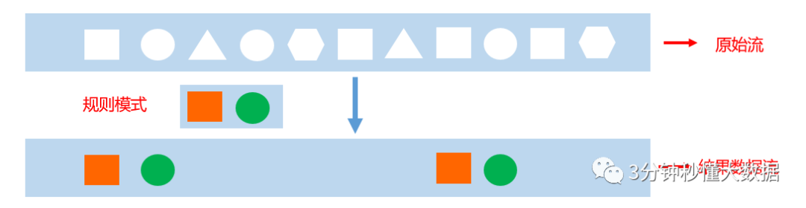
>
> CEP的使用场景：
>
> 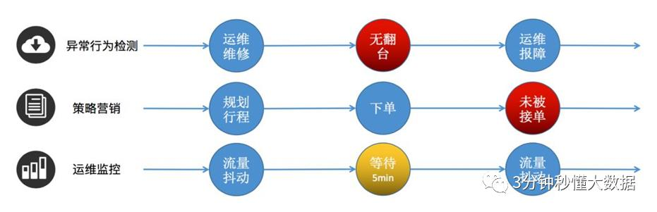
>
> 
>
> 像用户异常检测：我们指定异常操作事件为要输出的结果流；策略营销：指定符合要求的事件为结果流；运维监控：指定一定范围的指标为结果流；银行卡盗刷：指定同一时刻在两个地方被刷两次为异常结果流。
>
> **FlinkCEPSQL语法是通过SQL方式进行复杂事件处理，但是与**FlinkSQL语法也不太相同，其中包含许多规则。

## 100、FlinkSQLCEP了解的参数介绍一下？

CEP包含的参数如下：

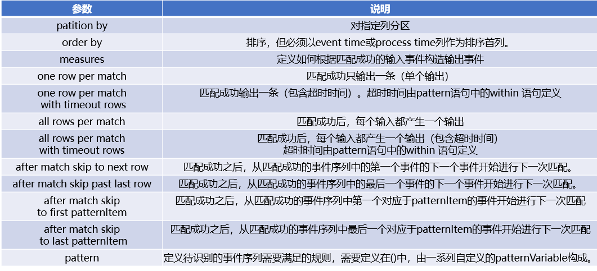


> 参数介绍
>
> p**输出模式（**每个找到的匹配项应该输出多少行）
>
> Øonerowpermatch 每次检测到完整的匹配后进行汇总输出
>
> Øallrowspermatch(flink暂不支持) 检测到完整的匹配后会把匹配过程中每条具体记录进行输出
>
> prunning VS final语义
>
> Ø在计算中使用那些匹配的事件
>
> running匹配中和final匹配结束
>
> Ødefine语句中只可以使用running,measure两者都可以
>
> Ø输出结果区别
>
> 对于onerowpermatch，输出没区别对于allrowspermatch，输出不同
>
> 
>
> 
>
> 3、匹配后跳转模式介绍
>
> aftermatch（匹配后，从哪里开始重新匹配）Øskiptonextrow
>
> 从匹配成功的事件序列中的第一个事件的下一个事件开始进行下一次匹配
>
> Øskippastlastrow
>
> 从匹配成功的事件序列中的最后一个事件的下一个事件开始进行下一次匹配
>
> ØskiptofirstpatternItem
>
> 从匹配成功的事件序列中第一个对应于patternItem的事件开始进行下一次匹配
>
> ØskiptolastpatternItem
>
> 从匹配成功的事件序列中最后一个对应于patternItem的事件开始进行下一次匹配注意：
>
> 在使用skiptofirst/lastpatternItem容易出现循环匹配问题，需要慎重针对上面的匹配后跳转模式分别介绍:
>
> （1）after match skip past last row
>
> 如下图
>
> 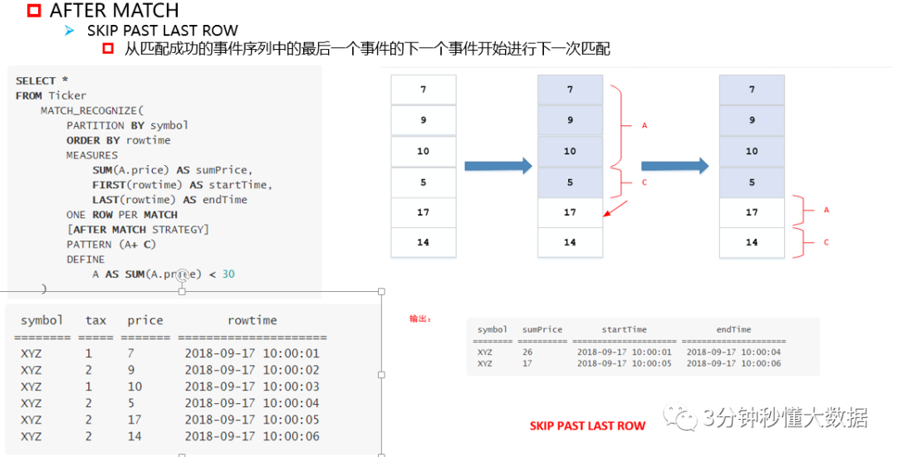
>
> 2. **after match skip to next row如下图**
>
> 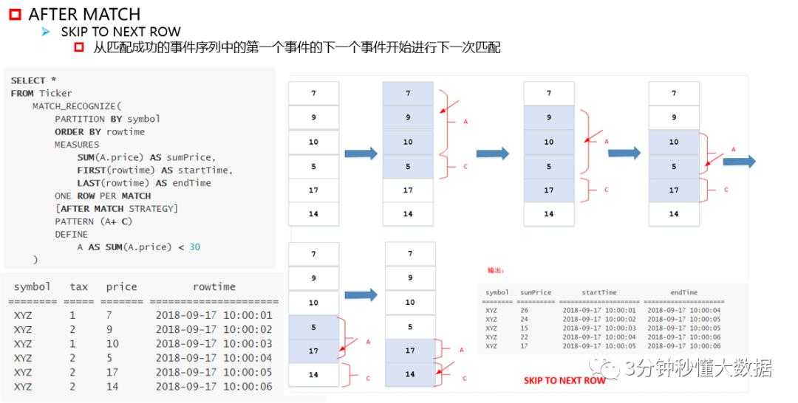
>
> 3. **after match skip to last pattern Item如下图**
>
> 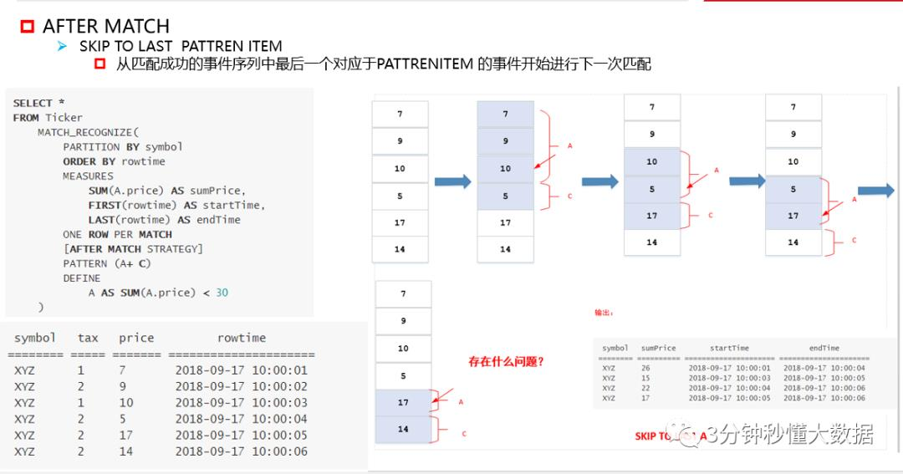
>
> 4. **after match skip to first patternItem如下图**
>
> 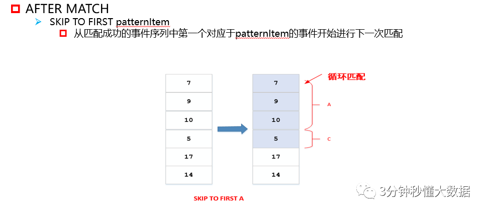

## 101、编写一个CEPSQL案例，如银行卡盗刷

> 通过FlinkCEPSQL写的关于金融场景银行卡盗刷案例。
>
> 案例介绍：在金融场景中，有时会出现银行卡盗刷现象，犯罪分子利用互联网等技术，在间隔10分钟或者更短时间内，使一张银行卡在不同的两个地方出现多次刷卡记录，这从常规操作来说，在间隔时间很多的情况下，用户是无法同时在两个城市进行刷卡交易的，所以出现这种问题，就需要后台做出触发报警机制。
>
> 要求：当相同的cardId在十分钟内，从两个不同的Location发生刷卡现象，触发报警机制，以便检测信用卡盗刷现象。
>
> 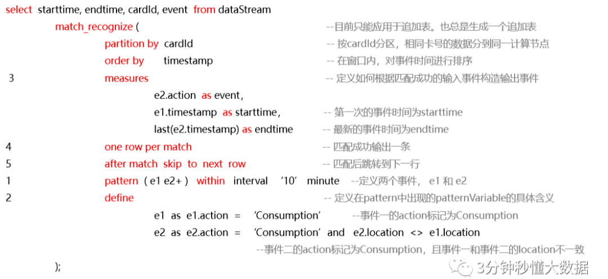
>
> （1）编写cepsql时，包含许多技巧，首先我们编写最基础的查询语句,从一张表中查询需要的字段。
>
> •select starttime,endtime,cardId,event from dataStream
>
> （2）match_recognize();
>
> 该字段是CEPSQL的前提条件，用于生成一个追加表，所有的CEPSQL都是书写在这里面。
>
> （3）分区，排序
>
> 由于是对同一ID，所以需要使用partitionby,还要根据时间进行排序orderby
>
> （4）理解CEP SQL 核心的编写顺序
>
> ```txt
> 如上图标的顺序
> 1、 CEP SQL 的类为 Pattern，检测在 10 分钟内两个地方出现刷卡现象，
> 所以定义两个事件：
> Pattern (e1 e2+) within interval ‘10’minute
> 2、定义在 Pattern 中要求的判断语句，规定使用 define
> define
> e1 as a1.action = ''
> e2 as e2.action = '' and e2.location <> e1.location
> 3、根据上述的输入条件构建输出条件，规定使用 measures
> measures
> e2.action as event
> e1.timestamp as starttime
> last(e2.timestamp) as endtime
> 4、输出条件匹配成功，输出一条，规定写法(这块根据不同的规则写不同
> 的语句)
> one row per match
> 5、匹配后跳转跳转到下一行（根据不同规则写不同语句）
> after match skip to next row
> ```
>
> 根据核心编写顺序进行理解，然后在按照书写正确的顺序进行编写。

## 102、FlinkCDC了解吗？什么是FlinkSQLCDCConnectors？

> **在Flink1.11引入了CDC机制**，CDC的全称是**ChangeDataCapture**，用于捕捉数据库表的增删改查操作，是目前非常成熟的同步数据库变更方案。
>
> FlinkCDCConnectors是ApacheFlink的一组源连接器，是可以从MySQL、PostgreSQL数据直接读取全量数据和增量数据的SourceConnectors，开源地址：https://github.com/ververica/flink-cdc-connectors。
>
> 目前(1.13版本)支持的Connectors如下：
>
> 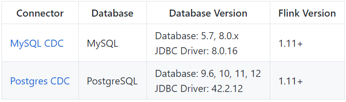
>
> 另外支持解析Kafka中debezium-json和canal-json格式的ChangeLog，通过Flink进行计算或者直接写入到其他外部数据存储系统(比如Elasticsearch)，或者将ChangelogJson格式的Flink数据写入到Kafka:
>
> 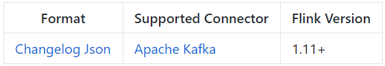
>
> FlinkCDCConnectors和Flink之间的版本映射:
>
> 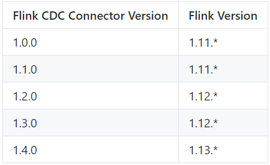

## 103、FlinkCDC原理介绍一下？

> 在最新CDC调研报告中，**Debezium**和**Canal**是目前最流行使用的CDC工具，这些CDC工具的核心原理是抽取数据库日志获取变更。在经过一系列调研后，目前Debezium(支持全量、增量同步，同时支持MySQL、PostgreSQL、Oracle等数据库)，使用较为广泛。
>
> **FlinkSQLCDC内置了Debezium引擎，利用其抽取日志获取变更的能力，将changelog转换为FlinkSQL认识的RowData数据。**（以下右侧是Debezium的数据格式，左侧是Flink的**RowData数据格式**）。
>
> 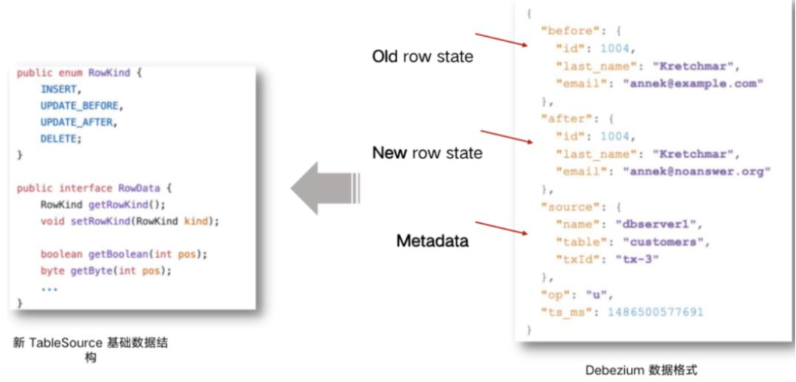
>
> RowData代表了一行的数据，在RowData上面会有一个元数据的信息**RowKind**，RowKind里面包括了插入(+I)、更新前(-U)、更新后(+U)、删除(-D)，这样和数据库里面的binlog概念十分类似。通过Debezium采集的数据，包含了旧数据(before)和新数据行(after)以及原数据信息(source)，op的u表示是update更新操作标识符（op字段的值c，u，d，r分别对应create，update，delete，reade），ts_ms表示同步的时间戳。
>

## 104、通过CDC设计一种FlinkSQL采集+计算+传输(ETL)一体化的实时数仓

> 设计图如下：
>
> 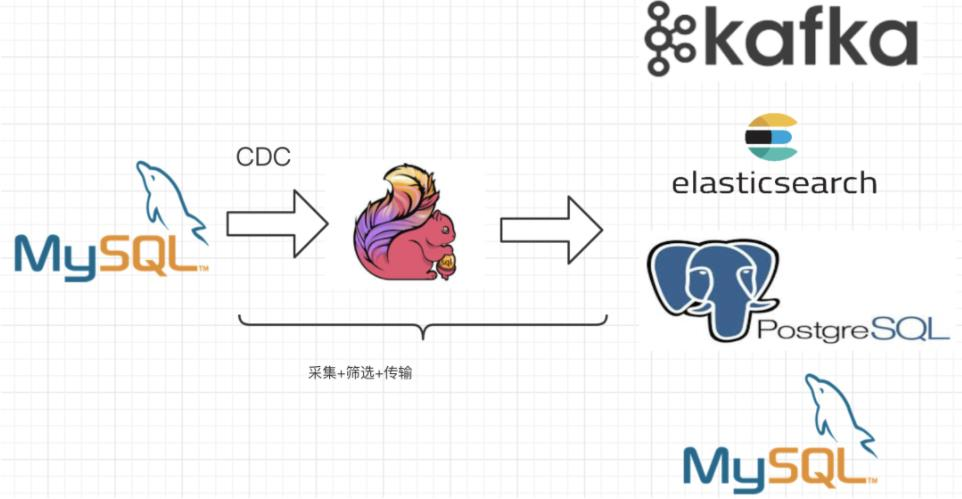
>
> 通过FlinkCDCconnectors替换Debezium+Kafka的数据采集模块，实现FlinkSQL采集+计算+传输(ETL)一体化，以Mysql为Source源，Flink CDC中间件为插件，ES或者Kafka，或者其他为Sink，这样设计的优点如下：
>
> -   开箱即用，简单易上手
>
> -   减少维护的组件，简化实时链路，减轻部署成本
>
> -   减小端到端延迟
>
> -   Flink自身支持ExactlyOnce的读取和计算
>
> -   数据不落地，减少存储成本
>
> -   支持全量和增量流式读取
>
> -   binlog采集位点可回溯

## 105、FlinkSQLCDC如何实现一致性保障（源码分析）

> FlinkSQLCDC用于获取数据库变更日志的Source函数
>
> 是**DebeziumSourceFunction**，且最终返回的类型是**RowData**，该函数实现了CheckpointedFunction，即通过Checkpoint机制来保证发生failure时不会丢数，实现exactlyonce语义，这部分在函数的注释中有明确的解释。
>
> /\*\*
>
> \*The{\@linkDebeziumSourceFunction}isastreamingdatasourcethatpullscapturedchangedata
>
> \*fromdatabasesintoFlink.
>
> \*通过Checkpoint机制来保证发生failure时不会丢数，实现exactlyonce语义
>
> \*\<p\>Thesourcefunctionparticipatesincheckpointingandguaranteesthatnodataislost
>
> \*duringafailure,andthatthecomputationprocesseselements\"exactlyonce\".
>
> \*注意：这个SourceFunction不能同时运行多个实例
>
> \*\<p\>Note:currently,thesourcefunctioncan\'truninmultipleparallelinstances.
>
> \*
>
> \*\<p\>PleaserefertoDebezium\'sdocumentationfortheavailableconfigurationproperties:
>
> \*https://debezium.io/documentation/reference/1.2/development/engine.html\#engine-properties\</p\>
>
> \*/
>
> \@PublicEvolving
>
> publicclassDebeziumSourceFunction\<T\>extendsRichSourceFunction\<T\>implements
>
> CheckpointedFunction,
>
> ResultTypeQueryable\<T\>{}

**为实现CheckpointedFunction，需要实现以下两个方法：**

> publicinterfaceCheckpointedFunction{
>
> //做快照，把内存中的数据保存在checkpoint状态中
>
> voidsnapshotState(FunctionSnapshotContextvar1)throwsException;
>
> //程序异常恢复后从checkpoint状态中恢复数据
>
> voidinitializeState(FunctionInitializationContextvar1)throwsException;
>
> }

**接下来我们看看DebeziumSourceFunction中都记录了哪些状态。**

> •
>
> /\*\*Accessorforstateintheoperatorstatebackend.
>
> offsetState中记录了读取的binlog文件和位移信息等，对应Debezium中的
>
> \*/
>
> privatetransientListState\<byte\[\]\>offsetState;
>
> /\*\*
>
> \*Statetostorethehistoryrecords,i.e.schemachanges.
>
> \*historyRecordsState记录了schema的变化等信息
>
> \*\@seeFlinkDatabaseHistory
>
> \*/
>
> privatetransientListState\<String\>historyRecordsState;
>
> 我们发现在FlinkSQLCDC是一个相对简易的场景，没有中间算子，是通过Checkpoint持久化binglog消费位移和schema变化信息的快照，来实现ExactlyOnce。
>

## 106、FlinkSQLGateWay了解吗？

FlinkSQLGateWay的概念：

> FlinkSqlGateway是Flink集群的"任务网关"，支持以restapi的形式提交查询、插入、删除等任务，如下图所示：
>
> 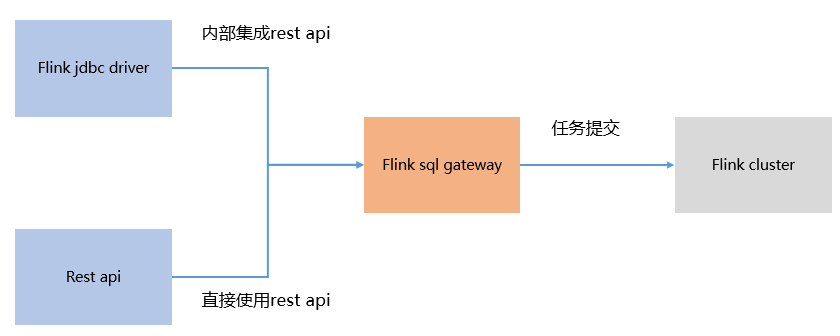
>
> 总体架构如下图所示：
>
> 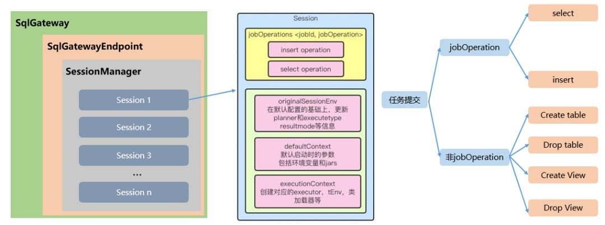

## 107、FlinkSQLGateWay创建会话讲解一下？

创建会话流程图如下：

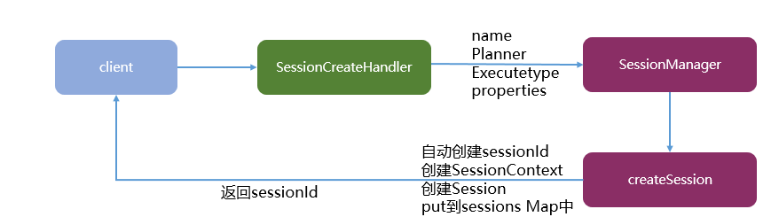

> （1）传入参数包含name名称、planner执行引擎（Blink或原生的flink）、executetype（streaming或者batch）、properties（配置参数，如并发度等）；
>
> （2）在SessionMnager中，会根据这些参数创建对应的SessionContext；
>
> SessionContextsessionContext=newSessionContext(sessionName,sessionId,sessionEnv,defaultContext);
>
> （3）将创建Session放入Map集合中，最后返回对应的SessionId，方便后续使用。
>
> sessions.put(sessionId,session);returnsessionId;

## 108、FlinkSQLGateWay如何处理并发请求？多个提交怎么处理？

> sqlgateway内部维护SessionManager，里面通过Map维护了各个Session，每个Session的任务执行是独立的。同一个Session通过ExecuteContext内部的tEnv按顺序提交。

## 109、如何维护多个SQL之间的关联性？

> 在每个Session中单独维护了tEnv，同一个session中的操作其实是在一个
>
> env中执行的。因此只要是同一个session中的任务，内部使用的tEnv就是同一个。这样就可以实现在Asession中，先创建一个view，然后执行一个select，最后执行一个insert。

## 110、sql字符串如何提交到集群成为代码？

> Session中维护了tenv，sql会通过tenv编译生成pipeline（即DAG图），在batch模式下是Plan执行计划；在stream模式下是StreamGraph。然后
>
> Session内部会创建一个ProgramDeployer代码发布器，根据Flink中配置的target创建不同的excutor。最后调用executor.execute方法提交Pipeline和config执行。
