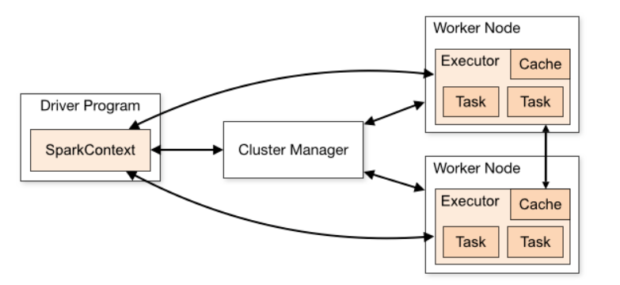
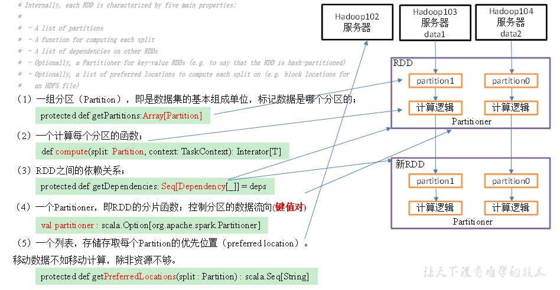
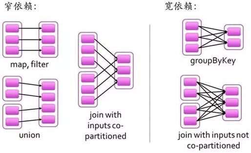
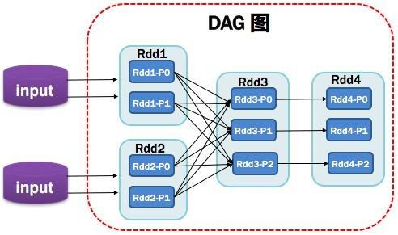
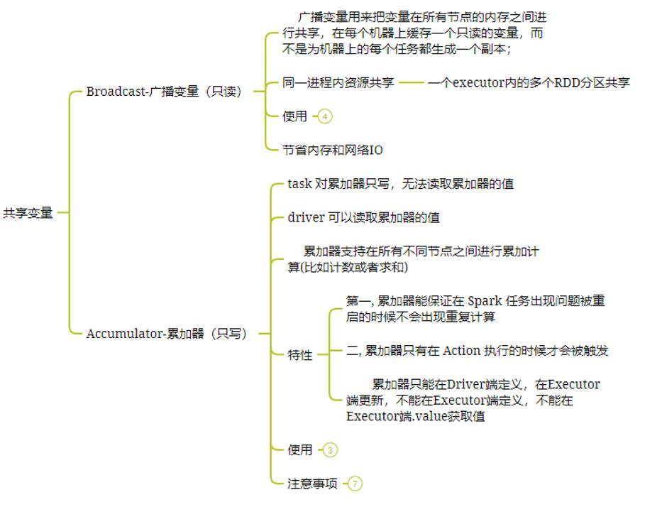
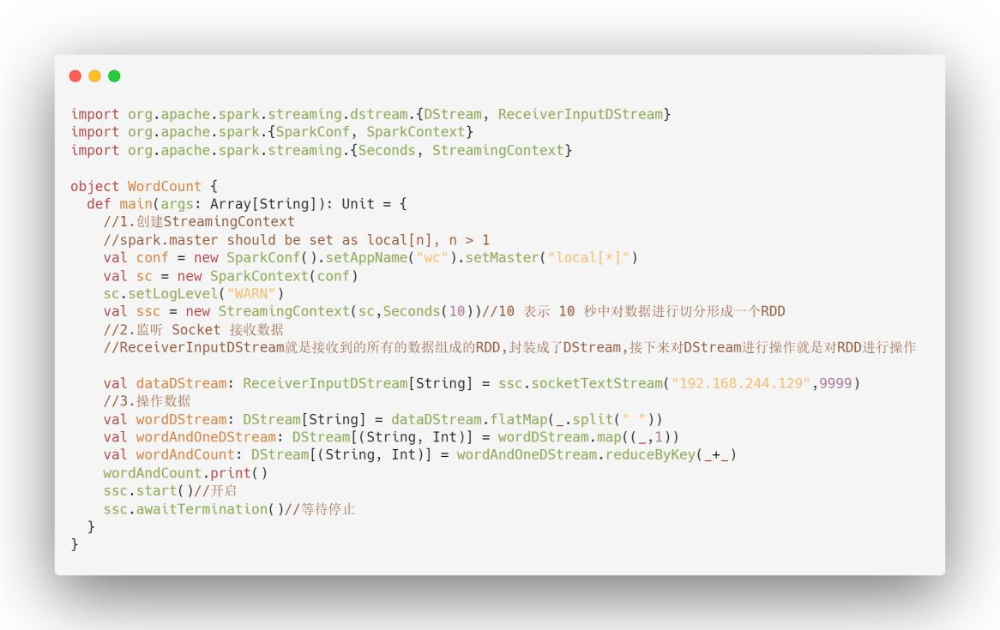

# 一、Spark 基础篇

## 1、Spark 是什么？

> Spark 是一个通用分布式内存计算引擎。2009 年在加州大学伯克利分校 AMP 实验室诞生，2014 年 2 月，Spark 成为 Apache 的顶级项目。Logo 标志如下：
>
> 

## 2、Spark 有哪些特点？

> Spark 使用 Scala 语言进行实现，它是一种面向对象、函数式编程语言，能够像操
> 作本地集合对象一样轻松地操作分布式数据集，具有以下特点：
>
> 1、运行速度快：Spark 拥有 DAG 执行引擎，支持在内存中对数据进行迭代计算。官方提供的数据表明，如果数据由磁盘读取，速度是 Hadoop MapReduce 的 10 倍以上，如果数据从内存中读取，速度可以高达 100 倍。
>
> 2、易用性好：Spark 不仅支持 Scala 编写应用程序，而且支持 Java 和 Python 等语言进行编写，特别是 Scala 是一种高效、可拓展的语言，能够用简洁的代码处理较为复杂的处理工作。
>
> 3、通用性强：Spark 生态圈即 BDAS（伯克利数据分析栈）包含了 Spark Core、Spark SQL、Spark Streaming、MLLib 和 GraphX 等组件，这些组件分别处理Spark Core 提供内存计算框架、SparkStreaming 的实时处理应用、Spark SQL 的即
> 席查询、MLlib 或 MLbase 的机器学习和 GraphX 的图处理。
>
> 4、随处运行：Spark 具有很强的适应性，能够读取 HDFS、Cassandra、HBase、S3和 Techyon 为持久层读写原生数据，能够以 Mesos、YARN 和自身携带的Standalone 作为资源管理器调度 job，来完成 Spark 应用程序的计算。

## 3、Spark 生态圈都包含哪些组件？

> Spark Core：Spark 的核心模块，包含 RDD、任务调度、内存管理、错误恢复、与存储系统交互等功能。
> 
> Spark SQL：主要用于进行结构化数据的处理。它提供的最核心的编程抽象就是DataFrame，将其作为分布式 SQL 查询引擎，通过将 Spark SQL 转化为 RDD 来执行各种操作。
> 
> Spark Streaming：Spark 提供的对实时数据进行流式计算的组件。提供了用来操作数据流的 API。
> 
> Spark MLlib：提供常见的机器学习(ML)功能的程序库。包括分类、回归、聚类、协同过滤等，还提供了模型评估、数据导入等额外的支持功能。
> 
> GraphX(图计算)：Spark 中用于图计算的 API，性能良好，拥有丰富的功能和运算符，能在海量数据上自如地运行复杂的图算法。
> 
> 集群管理器：Spark 设计为可以高效地在一个计算节点到数千个计算节点之间伸缩计算。
> 
> Structured Streaming：处理结构化流,统一了离线和实时的 API。

## 4、Spark 架构了解吗？

> 如下图所示：
>
> 
>
> Spark 架构主采用 Master/Worker 主从架构进行设计，由以下几部分组成：
>
> 1. 主节点 Master / 资源管理 Yarn Application Master
> 2. 工作节点 Work / Node Manager
> 3. 任务调度器 Driver
> 4. 任务执行器 Executor

## 5、Spark 的提交方式有哪些？

> 1、Local 本地模式(单机)。分为 Local 单线程和 Local-Cluster 多线程。
>
> 2、Standalone 独立集群模式。 包含 Standalone 模式和 Standalone-HA 高可用模式。Standalone-HA 使用 Zookeeper 搭建高可用，避免单点故障问题。
>
> 3、Spark On Yarn 集群模式。运行在 Yarn 集群之上，由 Yarn 负责资源管理，Spark 负责任务调度和计算。Spark on YARN 模式根据 Driver 在集群中的位置分为两种模式：一种是 YARN-Client 模式，另一种是 YARN-Cluster (或称为 YARN-Standalone 模式)。
>
> 好处：计算资源按需伸缩，集群利用率高，共享底层存储，避免数据跨集群迁移。

## 6、Spark 为什么比 MapReduce 快？

> 1、Spark 是基于内存计算，MapReduce 是基于磁盘运算，所以速度快
>
> 2、Spark 拥有高效的调度算法，是基于 DAG,形成一系列的有向无环图
>
> 3、Spark 是通过 RDD 算子来运算的，它拥有两种操作，一种转换操作，一种动作操作，可以将先运算的结果存储在内存中，随后在计算出来
>
> 4、Spark 还拥有容错机制 Linage。

# 二、Spark Core

## 7、什么是 RDD ?

> RDD 就是弹性分布式数据集，可以理解为一种数据结构，拥有多种不同的 RDD 算子，从物理存储上看，一个数据集可能被分为多个分区，各个分区都有可能存放在不同的存储/计算节点上，而 RDD 则是在该数据集上的一个抽象，代表了整个数据集，但这个 RDD 并不会从物理上将数据放在一起。有了 RDD 这个抽象，用户可以从一个入口方便的操作一个分布式的数据集。

## 8、RDD 的五大属性是啥?

> 
>
> 这里借用网上一张讲的很清晰的图来说明 RDD，如下图：
>
> 1、一组分区 ：一组分片(Partition)/一个分区(Partition)列表，即是数据集的基本组成单位，标记数据在哪个区。
>
> 2、一个计算每个分区的函数 ：一个函数会被作用在每一个分区。Spark 中 RDD的计算是以分片为单位的，compute 函数会被作用到每个分区上。
>
> 3、RDD 之间的依赖关系 ：一个 RDD 会依赖于其他多个 RDD。RDD 的每次转换都会生成一个新的 RDD，所以 RDD 之间就会形成类似于流水线一样的前后依赖关系。在部分分区数据丢失时，Spark 可以通过这个依赖关系重新计算丢失
> 的分区数据，而不是对 RDD 的所有分区进行重新计算。(Spark 的容错机制)
>
> 4、一个 Partition ：可选项，对于 KV 类型的 RDD 会有一个 Partitioner，即 RDD的分区函数，默认为 HashPartitioner。
>
> 5、一个列表：可选项,存储存取每个 Partition 的优先位置(preferred location)。对于一个 HDFS 文件来说，这个列表保存的就是每个 Partition 所在的块的位置。

## 9、说一些常用的 RDD 算子?

> Spark 处理时分为两种操作，一种转换 transformation 操作、一种动作 action 操作
>
> (1)transformation 操作常用算子如下：
>
> Map、MapPartitions、FlatMap、Filter、distinct、sortBy、union、reduceByKey、groupByKey、sortByKey、join
>
> (2)action 操作常用算子如下：
>
> reduce、collect、count、save、take、aggregate、countByKey 等。

## 10、你知道 map 和 mapPartitions 有啥区别吗？

> 1、map：每次对 RDD 中的每一个元素进行操作；
>
> 2、mapPartitions：每次对 RDD 中的每一个分区的迭代器进行操作；
>
> mapPartitions 优点：
>
> 如果是普通的 map，比如一个 Partition 中有 1 万条数据。ok，那么你的 Function要执行和计算 1 万次。
>
> 对于 mapPartitions 来说，一个 task 仅仅会执行一次 function，function 一次接收所有的 Partition 数据。只要执行一次就可以了，性能比较高。如果在 map 过程中需要频繁创建额外的对象(例如将 rdd 中的数据通过 jdbc 写入数据库,map 需要为每个元素创建一个链接而 mapPartitions 为每个 partition 创建一个链接),则 mapPartitions 效率比 Map 高的多。
> SparkSql 或 DataFrame 默认会对程序进行 mapPartitions 的优化。
>
> mapPartitions 的缺点：会造成内存溢出。
>
> 举例，对于 100 万数据，一次传入一个 function 以后，可能一下子内存不够，但是又没有办法腾出内存空间来，可能就 OOM，内存溢出。

## 11、你知道 reduceByKey 和 groupByKey 有啥区别吗？

> reduceByKey()会在 shuffle 之前对数据进行合并。有点类似于在 MapReduce 中的combiner。这样做的好处在于，在转换操作时就已经对数据进行了一次聚合操作，从而减小数据传输。
>
> groupByKey 算子操作发生在动作操作端，即 Shuffle 之后，所以势必会将所有的数据通过网络进行传输，造成不必要的浪费。同时如果数据量十分大，可能还会造成OutOfMemoryError。

## 12、你知道 reduceByKey、foldByKey、aggregateByKey、combineByKey区别吗？

> reduceByKey 没有初始值 分区内和分区间逻辑相同
>
> foldByKey 有初始值 分区内和分区间逻辑相同
>
> aggregateByKey 有初始值 分区内和分区间逻辑可以不同
>
> combineByKey 初始值可以变化结构 分区内和分区间逻辑不同

### 13、RDD 的宽窄依赖了解吗？

> 如下图所示：
>
> 
>
> 一个作业从开始到结束的计算过程中产生了多个 RDD，RDD 之间是彼此相互依赖的，这种父子依赖的关系称之为“血统”。
>
> -  如果父 RDD 的每个分区最多只能被子 RDD 的一个分区使用，称之为窄依赖（一对一）。
>
> - 若一个父 RDD 的每个分区可以被子 RDD 的多个分区使用，称之为宽依赖（一对多)。

## 14.RDD 有哪些缺点？

> 1、不支持细粒度的写和更新操作（如网络爬虫）， spark 写数据是粗粒度的所谓粗粒度，就是批量写入数据，为了提高效率。但是读数据是细粒度的也就是说可以一条条的读。
>
> 2、不支持增量迭代计算， Flink 支持。

## 15、你刚才提到了 DAG,能说一下什么是 DAG？

> DAG(Directed Acyclic Graph 有向无环图)指的是数据转换执行的过程，有方向，无闭环(其实就是 RDD 执行的流程)；
>
> 
>
> 原始的 RDD 通过一系列的转换操作就形成了 DAG 有向无环图，任务执行时，可以按照 DAG 的描述，执行真正的计算(数据被操作的一个过程)。
>
> DAG 的边界
>
> - 开始:通过 SparkContext 创建的 RDD；
>
> - 结束:触发 Action，一旦触发 Action 就形成了一个完整的 DAG。

## 16、你说说 spark 中 job,stage,task 分别代表什么？

> 1、Job 简单讲就是提交给 spark 的任务。
>
> 2、Stage 是每一个 job 处理过程要分为的几个阶段。
>
> 3、task 是每一个 job 处理过程要分为几次任务。Task 是任务运行的最小单位。最终是要以 task 为单位运行在 executor 中。具体请看土哥之前写的 RDD 介绍

## 17、Spark 广播变量和累加器介绍一下？

> 在默认情况下，当 Spark 在集群的多个不同节点的多个任务上并行运行一个函数时，它会把函数中涉及到的每个变量，在每个任务上都生成一个副本。但是，有时候需要在多个任务之间共享变量，或者在任务(Task)和任务控制节点(Driver Program)之间共享变量。
>
> 为了满足这种需求，Spark 提供了两种类型的变量：
>
> 累加器 accumulators：累加器支持在所有不同节点之间进行累加计算(比如计数或者求和)。
>
> 广播变量 broadcast variables：广播变量用来把变量在所有节点的内存之间进行共享，在每个机器上缓存一个只读的变量，而不是为机器上的每个任务都生成一个副本。

## 18、广播变量和累加器的区别是啥？

> 如下图所示：
>
> 

## 19、如何使用 Spark 实现 TopN 的获取（描述思路）

> 方法 1：
>
> （1）按照 key 对数据进行聚合（groupByKey）；
>
> （2）将 value 转换为数组，利用 scala 的 sortBy 或者 sortWith 进行排序（mapValues）数据量太大，会 OOM。
>
> 方法 2：
>
> （1）取出所有的 key；
>
>  （2）对 key 进行迭代，每次取出一个 key 利用 spark 的排序算子进行排序。
>
> 方法 3：
>
> （1）自定义分区器，按照 key 进行分区，使不同的 key 进到不同的分区； 
>
> （2）对每个分区运用 spark 的排序算子进行排序。

# 三、Spark Streaming

## 20、什么是 Spark Streaming?

> Spark Streaming 是一个基于 Spark Core 之上的实时计算框架，可以从很多数据源消费数据并对数据进行实时的处理，具有高吞吐量和容错能力强等特点。

## 21、Spark Streaming 如何执行流式计算的?

> Spark Streaming 中的流式计算其实并不是真正的流计算，而是微批计算。Spark Streaming 的 RDD 实际是一组小批次的 RDD 集合，是微批（Micro-Batch）的模型，以批为核心。
>
> Spark Streaming 在流计算实际上是分解成一段一段较小的批处理数据（Discretized Stream），其中批处理引擎使用 Spark Core，每一段数据都会被转换成弹性分布式数据集 RDD，然后 Spark Streaming 将对 DStream 的转换操作变为
> Spark 对 RDD 的转换操作，并将转换的中间结果存入内存中，整个流式计算依据业务的需要可以对中间数据进行叠加。

## 22、使用 Spark Streaming 写一个 WordCount?

> 

### 23、使用 Spark Streaming 常用算子有哪些?

> Spark Streaming 算子和 Spark Core 算子类似，也是分为 Transformations(转换操作)和 Action（动作操作）。
>
> Transformations 操作常用算子如下：
>
> map、flatMap、filter、union、reduceByKey、join、transform，这是算子都是无状态转换，当前批次的处理不需要使用之前批次的数据或中间结果。
>
> (2)action 操作常用算子如下：
>
> print、saveAsTextFile、saveAsObjectFiles、saveAsHadoopFiles 等。

## 24、使用 Spark Streaming 有状态装换的算子有哪些?

> 有状态装换的算子包含：
>
> 1、基于追踪状态变化的转换（updateStateByKey）updateStateByKey：将历史结果应用到当前批次。
>
> 2、滑动窗口的转换 Window Operations

## 25、Spark Streaming 如何实现精确一次消费?

> 概念：
>
> - 精确一次消费（Exactly-once） 是指消息一定会被处理且只会被处理一次。不多不少就一次处理。
> - 至少一次消费（at least once），主要是保证数据不会丢失，但有可能存在数据重复问题。
> - 最多一次消费 （at most once），主要是保证数据不会重复，但有可能存在数据丢失问题。如果同时解决了数据丢失和数据重复的问题，那么就实现了精确一次消费的语义了。
>
> 解决方案：
>
> 方案一：利用 关系型数据库的事务 进行处理出现丢失或者重复的问题，核心就是偏移量的提交与数据的保存，不是原子性的。如果能做成要么数据保存和偏移量都成功，要么两个失败。那么就不会出现丢失或者重复了。这样的话可以把存数据和偏移量放到一个事务里。这样就做到前面的成功，如果后面做失败了，就回滚前面那么就达成了原子性。
>
> 方案二： 手动提交偏移量+幂等性处理
>
> 首先解决数据丢失问题，办法就是要等数据保存成功后再提交偏移量，所以就必须手工来控制偏移量的提交时机。
> 但是如果数据保存了，没等偏移量提交进程挂了，数据会被重复消费。怎么办？那就要把数据的保存做成幂等性保存。即同一批数据反复保存多次，数据不会翻倍，保存一次和保存一百次的效果是一样的。如果能做到这个，就达到了幂等性保存，就不用担心数据会重复了。
>
> 难点
>
> 话虽如此，在实际的开发中手动提交偏移量其实不难，难的是幂等性的保存，有的时候并不一定能保证。所以有的时候只能优先保证的数据不丢失。数据重复难以避免。即只保证了至少一次消费的语义。

## 26、Spark Streaming 背压机制了解吗？

> 问题：
>
> 在默认情况下，Spark Streaming 通过 receivers (或者是 Direct 方式) 以生产者生产数据的速率接收数据。当 batch processing time > batch interval 的时候，也就是每个批次数据处理的时间要比 Spark Streaming 批处理间隔时间长；越来越多的数据被接收，但是数据的处理速度没有跟上，导致系统开始出现数据堆积，可能进一步导致 Executor 端出现 OOM 问题而出现失败的情况。
>
> 解决办法：
>
> 设置 spark.streaming.backpressure.enabled：ture；开启背压机制后 Spark Streaming 会根据延迟动态去 kafka 消费数据；上限由 spark.streaming.kafka.maxRatePerPartition 参数控制，所以两个参数一般会一起使用。

## 27、SparkStreaming 有哪几种方式消费 Kafka 中的数据，它们之间的区别是什么？

> 一、基于 Receiver 的方式
>
> 使用 Receiver 来获取数据。Receiver 是使用 Kafka 的高层次 Consumer API 来实现的。receiver 从 Kafka 中获取的数据都是存储在 Spark Executor 的内存中的（如果突然数据暴增，大量 batch 堆积，很容易出现内存溢出的问题），然后 Spark Streaming 启动的 job 会去处理那些数据。 然而，在默认的配置下，这种方式可能会因为底层的失败而丢失数据。
>
> 如果要启用高可靠机制，让数据零丢失，就必须启用 Spark Streaming 的预写日志机制（Write Ahead Log，WAL）。该机制会同步地将接收到的 Kafka 数据写入分布式文件系统（比如 HDFS）上的预写日志中。所以，即使底层节点出现了失败，也可以使用预写日志中的数据进行恢复。
>
> 二、基于 Direct 的方式
>
> 这种新的不基于 Receiver 的直接方式，是在 Spark 1.3 中引入的，从而能够确保更加健壮的机制。替代掉使用 Receiver 来接收数据后，这种方式会周期性地查询Kafka，来获得每个 topic+partition 的最新的 offset，从而定义每个 batch 的 offset的范围。当处理数据的 job 启动时，就会使用 Kafka 的简单 consumer api 来获取Kafka 指定 offset 范围的数据。
>
> 优点如下：
>
> - 简化并行读取：如果要读取多个 partition，不需要创建多个输入 DStream 然后对它们进行 union 操作。Spark 会创建跟 Kafka partition 一样多的 RDD partition，并且会并行从 Kafka 中读取数据。所以在 Kafka partition 和 RDD partition 之间，有一个一对一的映射关系。
>
> - 高性能：如果要保证零数据丢失，在基于 receiver 的方式中，需要开启 WAL机制。这种方式其实效率低下，因为数据实际上被复制了两份，Kafka 自己本身就有高可靠的机制，会对数据复制一份，而这里又会复制一份到 WAL 中。
>   而基于 direct 的方式，不依赖 Receiver，不需要开启 WAL 机制，只要 Kafka中作了数据的复制，那么就可以通过 Kafka 的副本进行恢复。 次且仅一次的事务机制。
>
> 三、对比：
>
> - 基于 receiver 的方式，是使用 Kafka 的高阶 API 来在 ZooKeeper 中保存消费过的 offset 的。这是消费 Kafka 数据的传统方式。这种方式配合着 WAL 机制可以保证数据零丢失的高可靠性，但是却无法保证数据被处理一次且仅一次，可能会处理两次。因为 Spark 和 ZooKeeper 之间可能是不同步的。
>
> - 基于 direct 的方式，使用 kafka 的简单 api，Spark Streaming 自己就负责追踪消费的 offset，并保存在 checkpoint 中。Spark 自己一定是同步的，因此可以保证数据是消费一次且仅消费一次。在实际生产环境中大都用 Direct 方式