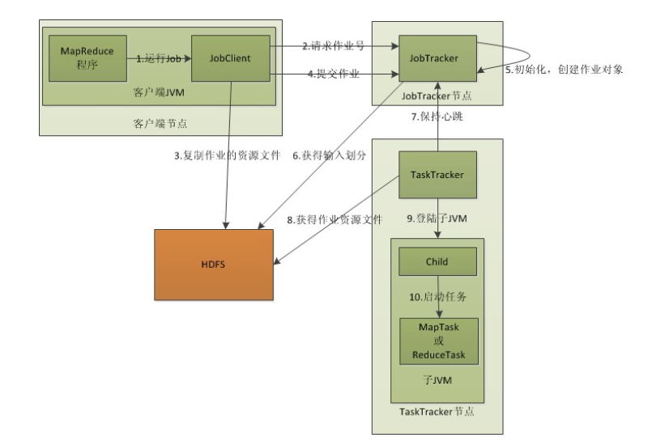
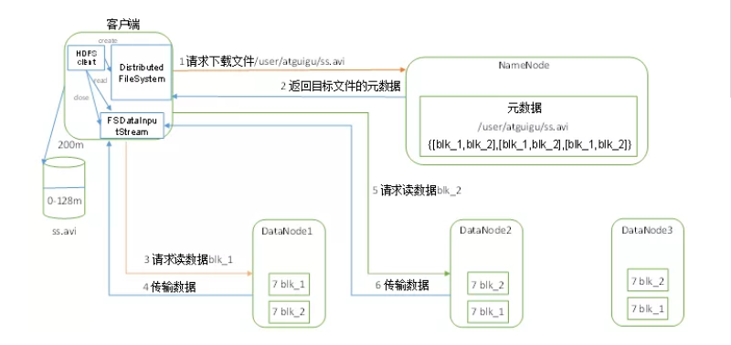
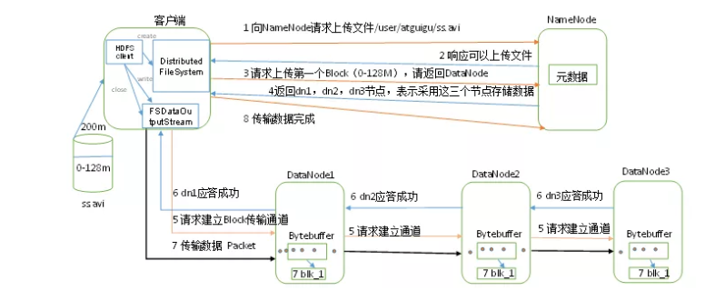
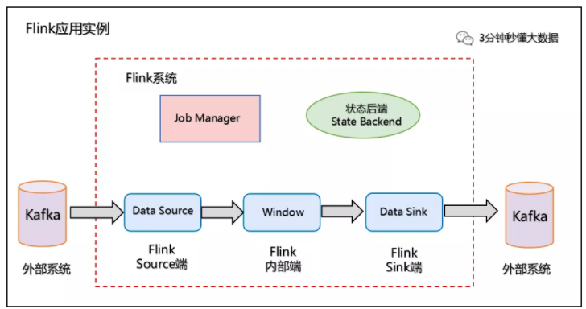
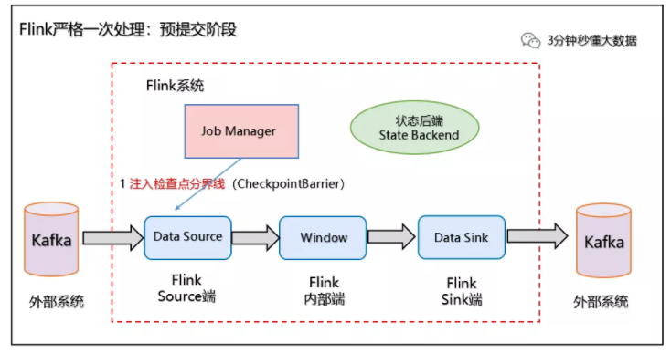
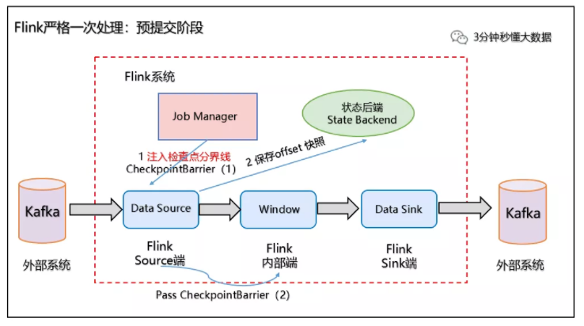
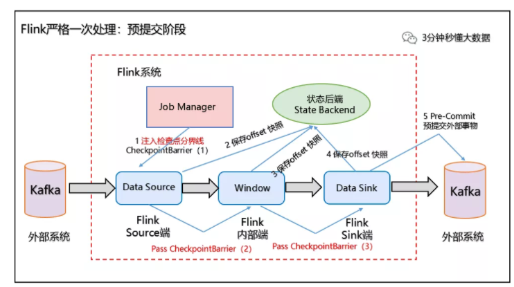
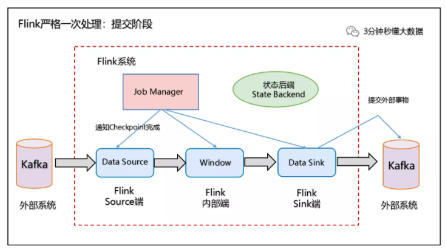
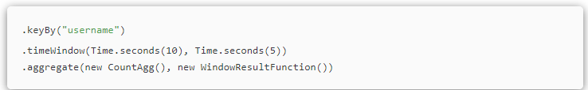
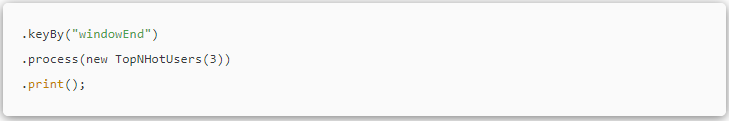

## 1. 谈谈为什么要对数仓进行分层？

> 数仓进行分层的一个主要原因就是希望在管理数据的时候，能对数据有一个更加清晰的掌控。主要有以下优点：
>
> 1. **划清层次结构**：每一个数据分层都有它的作用域，这样我们在使用表的时候能更方便地定位和理解。
> 2. **数据血缘追踪**：简单来讲可以这样理解，我们最终给下游是直接能使用的业务表，但是它的来源有很多，如果有一张来源表出问题了，我们希望能够快速准确地定位到问题，并清楚它的危害范围。
> 3. **减少重复开发**：规范数据分层，开发一些通用的中间层数据，能够极大减少的重复计算。
> 4. **把复杂问题简单化**。将一个复杂的任务分解成多个步骤来完成，每一层只处理单一的步骤，比较简单和容易理解。而且便于维护数据的准确性，当数据出现问题之后，可以不用修复所有的数据，只需要从有问题的步骤开始修复。
> 5. **屏蔽原始数据的异常**。屏蔽业务的影响，不必改一次业务就需要重新接入数据。

## 2.  那数据仓库都分哪几层？

> 如果划分细致，数据仓库总共可以划分为5层：
>
> **ODS 层**
>
> `ODS 层`: Operation Data Store，数据准备区，**贴源层**。直接接入源数据的：业务库、埋点日志、消息队列等。ODS 层数数据仓库的准备区
>
> **DW数仓**
>
> `DWD 层`:Data Warehouse Details,**数据明细层**，属于业务层和数据仓库层的隔离层，把持和 ODS 层相同颗粒度。进行数据清洗和规范化操作，去空值/脏数据、离群值等。
>
> `DWM 层`:Data Warehouse middle,**数据中间层**，在 DWD 的基础上进行轻微的聚合操作，算出相应的统计指标
>
> `DWS 层`:Data warehouse service,**数据服务层**，在 DWM 的基础上，整合汇总一个主题的数据服务层。汇总结果一般为**宽表**，用于 OLAP、数据分发等。
>
> **ADS层**
>
> `ADS 层`:Application data service, **数据应用层**，存放在 ES,Redis、PostgreSql 等系统中，供数据分析和挖掘使用。

## 3. 那你介绍一下 Mapreduce 工作原理？

> MapReduce 工作原理分为以下 5 个步骤
>
> 1. 在客户端启动一个作业。
>
> 2. 向 JobTracker 请求一个 Job ID。
>
> 3. 将运行作业所需要的**资源文件复制到 HDFS 上**，包括 MapReduce 程序打包的 JAR 文件、配置文件和客户端计算所得的输入划分信息。这些文件都**存放在 JobTracker** 专门为该作业创建的文件夹中。文件夹名为该作业的 Job ID 。**JAR 文件默认会有 10 个副本，**输入划分信息告诉了 JobTracker 应该为这个作业启动多少个 map 任务等信息。
>
> 4. JobTracker 接收到作业后，将其放在一个作业队列里，**等待作业调度器对其进行调度**，当作业调度器根据自己的调度算法调度到该作业时，会根据输入划分信息为每个划分**创建一个 map 任务**，并将 map 任务分配给 TaskTracker 执行。对于 map 和 reduce 任务，**TaskTracker 根据主机核的数量和内存的大小有固定数量的 map 槽和 reduce 槽**。这里需要强调的是：map 任务不是随随便便地分配给某个 TaskTracker 的，这里有个概念叫：数据本地化（Data-Local）。意思是：将 map 任务分配给含有该 map 处理的数据块的 TaskTracker上，同时将程序 JAR 包复制到该 TaskTracker 上来运行，这叫"运算移动，数据不移动"。而分配 reduce 任务时并不考虑数据本地化。
>
> 5. **TaskTracker 每隔一段时间会给 JobTracker 发送一个心跳**，告诉 JobTracker 它依然在运行，同时心跳中还携带着很多的信息，比如当前 map 任务完成的进度等信息。当 JobTracker 收到作业的最后一个任务完成信息时，便把该作业设置成"成功"。当 JobClient 查询状态时，它将得知任务已完成，便显示一条消息给用户。
>
> **以上是在客户端、JobTracker、TaskTracker的层次来分析MapReduce的工作原理**。

## 4.  那 HDFS 读数据流程你了解吗？

> （1）客户端通过 **Distributed FileSystem** 向 NameNode 请求下载文件，NameNode 通过查询元数据，找到文件块所在的 **DataNode** 地址。
>
> （2）挑选一台 DataNode（就近原则，然后随机）服务器，请求读取数据。
>
> （3）**DataNode** 开始传输数据给客户端（从磁盘里面读取数据输入流，以 Packet为单位来做校验）。
>
> （4）客户端以 **Packet** 为单位接收，先在本地缓存，然后写入目标文件。

## 5 HDFS 写数据流程也介绍一下

> （1）客户端通过 **Distributed FileSystem** 模块向 NameNode 请求上传文件，NameNode 检查目标文件是否已存在，父目录是否存在。
>
> （2）NameNode 返回是否可以上传。
>
> （3）客户端请求第一个 Block 上传到哪几个 DataNode 服务器上。
>
> （4）NameNode 返回 3 个 DataNode 节点，分别为 **dn1、dn2、dn3**。
>
> （5）客户端通过 **FSDataOutputStream** 模块请求 dn1 上传数据，dn1 收到请求会继续调用 dn2，然后 dn2 调用 dn3 ，将这个通信管道建立完成。
>
> （6）**dn1、dn2、dn3** 逐级应答客户端。
>
> （7）客户端开始往 dn1 上传第一个 Block （先从磁盘读取数据放到一个本地内存缓存），以 Packet 为单位，dn1 收到一个 Packet 就会传给 dn2，dn2 传给 dn3；dn1 每传一个 packet 会放入一个应答队列等待应答。
>
> （8）当一个 Block 传输完成之后，**客户端再次请求 NameNode** 上传第二个 Block 的服务器。（重复执行3-7步）。

## 6. 说一下 Zookeeper 的选举过程

> Zookeeper 虽然在配置文件中并没有指定 Master 和 Slave。但是，Zookeeper 工作时，是有一个节点为 Leader，其他则为 Follower，Leader 是通过内部的选举机制临时产生的。
>
> **选举过程**
>
> 假设有五台服务器组成的 **Zookeeper 集群**，它们的 id 从 1-5，同时它们都是最新启动的，也就是没有历史数据，在存放数据量这一点上，都是一样的。假设这些服务器依序启动，来看看会发生什么。
>
> （1）**服务器 1 启动**，发起一次选举。服务器 1 投自己一票。此时服务器 1 票数一票，不够半数以上（3票），选举无法完成，服务器 1 状态保持为 LOOKING；
>
> （2）**服务器 2 启动**，再发起一次选举。服务器 1 和 2 分别投自己一票并交换选票信息：此时服务器 1 发现服务器 2 的 ID 比自己目前投票推举的（服务器1）大，更改选票为推举服务器 2。此时服务器 1 票数 0 票，服务器 2 票数 2票，没有半数以上结果，选举无法完成，服务器 1，2 状态保持 LOOKING
>
> （3）**服务器 3 启动**，发起一次选举。此时服务器 1 和 2 都会更改选票为服务器 3。此次投票结果：服务器 1 为 0 票，服务器 2 为 0 票，服务器 3 为 3票。此时服务器 3 的票数已经超过半数，服务器 3 当选 Leader。服务器 1，2更改状态为 FOLLOWING，服务器 3 更改状态为 LEADING；
>
> （4）**服务器 4 启动**，发起一次选举。此时服务器 1，2，3 已经不是 LOOKING 状态，不会更改选票信息。交换选票信息结果：服务器 3 为 3 票，服务器 4 为1 票。此时服务器 4 服从多数，更改选票信息为服务器 3，并更改状态为FOLLOWING；
>
> （5）**服务器 5 启动**，同 4 一样当小弟。

## 7. Spark 为什么比 MapReduce 快?

> Spark 是基于**内存**计算，MapReduce 是基于磁盘运算，所以速度快
>
> Spark 拥有高效的**调度算法**，是基于 DAG,形成一系列的有向无环图
>
> Spark 是通过 RDD 算子来运算的，它拥有两种操作，一种转换操作，一种动作操作，可以将先运算的结果存储在内存中，随后在计算出来
>
> Spark 还拥有容错机制 **Linage**。

## 8.  Spark 任务执行流程?

> 1. SparkContext 向资源管理器注册并向资源管理器申请运行 Executor
> 2. 资源管理器分配 Executor，然后资源管理器启动 Executor
> 3. Executor 发送心跳至资源管理器
> 4. SparkContext 构建 DAG 有向无环图
> 5. 将 DAG 分解成 Stage（TaskSet）
> 6. 把 Stage 发送给 TaskScheduler
> 7. Executor 向 SparkContext 申请 Task
> 8. TaskScheduler 将 Task 发送给 Executor 运行
> 9. 同时 SparkContext 将应用程序代码发放给 Executor
> 10. Task 在 Executor 上运行，运行完毕释放所有资源

## 9. Spark 用过的解决数据倾斜的方案说一下？

> **数据倾斜主要发生在 Shuffle 阶段**。指的是并行处理的数据集中，某一部分（如 Spark 或 Kafka 的一个Partition）的数据显著多于其它部分，从而使得该部分的处理速度成为整个数据集处理的瓶颈。
>
> 数据倾斜会造成两大直接的致命后果：
>
> **1）数据倾斜直接会导致一种情况：Out Of Memory**
>
> **2）运行速度慢**
>
> **数据倾斜的处理方法：**
>
> 1. 避免数据源的数据倾斜。通过在 Hive 中对倾斜的数据进行预处理，以及在进行 kafka 数据分发时尽量进行平均分配。
> 2. 调整并行度。增加 shuffle read task 的数量，可以让原本分配给一个 task 的多个 key 分配给多个 task ，从而让每个 task 处理比原来更少的数据。
> 3. 为倾斜 key 增加随机前/后缀。
> 4. 随机前缀和扩容 RDD 进行 join。
> 5. 过滤少数倾斜 Key。

## 10. Flink 的四大基石都有哪些？

> Flink四大基石分别是：Checkpoint（检查点）、State（状态）、Time（时间）、Window（窗口）

## 11. watermark 的作用是啥？如何保证数据不丢失？

> **WaterMark 的作用是用来触发窗口进行计算，解决数据延迟、数据乱序等问题**。
>
> 水印就是一个时间戳（timestamp），Flink 可以给数据流添加水印
>
> - **水印并不会影响原有 Eventtime 事件时间**
> - 当数据流添加水印后，会按照水印时间来触发窗口计算,也就是说 **watermark 水印是用来触发窗口计算的**
> - 设置水印时间，会比事件时间小几秒钟,表示最大允许数据延迟达到多久
> - 水印时间 = 事件时间 - 允许延迟时间 (例如：10:09:57 =  10:10:00 - 3s )
>
> 要保证数据不丢失，需要使用：
>
> **WaterMark + EventTimeWindow + Allowed Lateness 方案（侧道输出），可以做到数据不丢失。**
>
> allowedLateness(lateness:Time)---设置允许延迟的时间
>
> 该方法传入一个 Time 值，设置允许数据迟到的时间。

## 12. Flink 如何保证 Exactly-Once 语义？

> Flink通过两阶段提交协议来保证 Exactly-Once 语义。
>
> 对于 Source 端：Source 端严格一次处理比较简单，因为数据要进入 Flink 中，所以 Flink 只需要保存消费数据的偏移量 （offset）即可。如果 Source端为 kafka，Flink 将 Kafka Consumer 作为 Source，可以将偏移量保存下来，如果后续任务出现了故障，恢复的时候可以由连接器重置偏移量，重新消费数据，保证一致性。
>
> 对于 Sink 端：Sink 端是最复杂的，因为数据是落地到其他系统上的，数据一旦离开 Flink 之后，Flink 就监控不到这些数据了，所以严格一次处理语义必须也要应用于 Flink 写入数据的外部系统，故这些**外部系统必须提供一种手段允许提交或回滚这些写入操作**，同时还要保证与 Flink Checkpoint 能够协调使用。
>
> 我们以 Kafka - Flink -Kafka 为例 说明如何保证 Exactly-Once 语义。
>
> 
>
> 如上图所示：Flink作业包含以下算子。
>
> （1）一个 Source 算子，从 Kafka 中读取数据（即KafkaConsumer）
>
> （2）一个窗口算子，基于时间窗口化的聚合运算（即 window+window 函数）
>
> （3）一个 Sink 算子，将结果会写到 Kafka（即kafkaProducer）
>
> Flink 使用两阶段提交协议 **预提交（Pre-commit）阶段和 提交（Commit）阶段**保证端到端严格一次。
>
> **（1）预提交阶段**
>
> 1、**当 Checkpoint 启动时，进入预提交阶段**，JobManager 向 Source Task 注入检查点分界线（CheckpointBarrier）,Source Task 将 CheckpointBarrier 插入数据流，向下游广播开启本次快照，如下图所示：
>
> 
>
> 2、**Source 端：Flink Data Source 负责保存 KafkaTopic 的 offset 偏移量**，当 Checkpoint 成功时 Flink 负责提交这些写入，否则就终止取消掉它们，当 Checkpoint 完成位移保存，它会将 checkpoint barrier（检查点分界线） 传给下一个 Operator，然后每个算子会对当前的状态做个快照，保存到状态后端（State Backend）。
>
> 对于 Source 任务而言，就会**把当前的 offset 作为状态保存起来**。下次从 Checkpoint 恢复时，Source 任务可以重新提交偏移量，从上次保存的位置开始重新消费数据，如下图所示：
>
> 
>
> 3、Slink 端：从 Source 端开始，**每个内部的 transformation 任务遇到 checkpoint barrier（检查点分界线）时，都会把状态存到 Checkpoint 里**。数据处理完毕到 Sink 端时，Sink 任务首先把数据写入外部 Kafka，这些数据都属于预提交的事务（还不能被消费），此时的 Pre-commit 预提交阶段下 Data Sink 在保存状态到状态后端的同时还必须预提交它的外部事务，如下图所示：
>
> 
>
> 预处理阶段：预提交到外部系统
>
> **（2）提交阶段**
>
> 4、**当所有算子任务的快照完成**（所有创建的快照都被视为是 Checkpoint 的一部分），也就是这次的 Checkpoint 完成时，JobManager 会向所有任务发通知，确认这次 Checkpoint 完成，**此时 Pre-commit 预提交阶段才算完成。才正式到两阶段提交协议的第二个阶段**：commit 阶段。该阶段中 JobManager 会为应用中每个 Operator 发起 Checkpoint 已完成的回调逻辑。
>
> 本例中的 Data Source 和窗口操作无外部状态，因此在该阶段，这两个 Opeartor 无需执行任何逻辑，但是 Data Sink 是有外部状态的，此时我们**必须提交外部事务**，当 Sink 任务收到确认通知，就会正式提交之前的事务，Kafka 中未确认的数据就改为"已确认"，**数据就真正可以被消费了**，如下图所示：
>
> 
>
> 注：Flink 由 JobManager 协调各个 TaskManager 进行 Checkpoint 存储，Checkpoint 保存在 StateBackend（状态后端） 中，默认 StateBackend 是内存级的，也可以改为文件级的进行持久化保存。

## 13. Flink 如何计算实时的 topN？

> Flink 要实现 TopN 功能，主要做如下操作：
>
> 1. Flink 接收 kafka 数据源；
>
> 2. 基于 EventTime 处理，指定 Watermark，这里调用 DataStream 的 assignTimestampsAndWatermarks 方法，抽取时间和设置 watermark。
>
> 3. 将 kafka 的 json 格式数据转为实体类对象。
>
> 4. 根据用户 Username 进行分组，对于实时统计 TopN 可以**使用滑动窗口**大小。设置**窗口长度取 10s，每次滑动(slide)5s，即 5 秒钟更新一次过去 10s 的排名数据**。
>
>    
>
> 
>
> 5. 使用 .aggregate(AggregateFunction af, WindowFunction wf) 做**增量的聚合操作**，它能使用 AggregateFunction 提前聚合掉数据，减少 state 的存储压力。
>
> 5. CountAgg 实现了 AggregateFunction 接口，功能是统计窗口中的条数，即遇到一条数据就加一。
>
> 5. WindowFunction 将每个 key 每个窗口聚合后的结果带上其他信息进行输出。这里实现的**WindowResultFunction 将用户名，窗口，访问量封装成了 UserViewCount 进行输出**。
>
>    **TopN:**
>
> 8. 为了统计每个窗口下活跃的用户，我们需要再次按窗口进行分组，**根据 UserViewCount 中的 windowEnd 进行 keyBy() 操作**。然后使用 ProcessFunction 实现一个自定义的 TopN 函数 TopNHotItems 来计算点击量排名前3名的用户，并将排名结果格式化成字符串，便于后续输出。
>
>    
>
> 9. ProcessFunction 是 Flink 提供的一个 low-level API，它主要提供定时器 timer 的功能。通过 timer 来判断何时收齐了某个 window 下所有用户的访问数据。由于 Watermark 的进度是全局的，在 processElement 方法中，**每当收到一条数据ItemViewCount，就注册一个 windowEnd+1 的定时器** windowEnd+1 的定时器被触发时，意味着收到了 windowEnd+1 的 Watermark，即收齐了该 windowEnd 下的所有用户窗口统计值**。然后使用 onTimer() 将收集的所有商品及点击量进行排序，选出 TopN**，并将排名信息格式化成字符串后进行输出。
>
> 8. 使用 ListState<ItemViewCount>来存储收到的每条 UserViewCount 消息，保证在发生故障时，状态数据的不丢失和一致性。ListState 是 Flink 提供的类似 Java List 接口的 State API，它集成了框架 checkpoint 机制，可以保证 exactly-once 的语义。

## 14 写一个算法：删除排序链表中的重复元素_II Leetcode83题

