# 一. Hadoop

## 1.1 HDFS读流程和写流程

### 1.1.1  HDFS读数据流程


> （1）**客户端**通过Distributed FileSystem模块向NameNode请求上传文件，**NameNode**检查目标文件是否已存在，父目录是否存在。
>
> （2）NameNode返回是否可以上传。
>
> （3）客户端请求第一个 Block上传到哪几个DataNode服务器上。
>
> （4）NameNode返回3个**DataNode**节点，分别为dn1、dn2、dn3。
>
> （5）客户端通过FSDataOutputStream模块请求dn1上传数据，dn1收到请求会继续调用dn2，然后dn2调用dn3，将这个通信管道建立完成。
>
> （6）dn1、dn2、dn3逐级应答客户端。
>
> （7）客户端开始往dn1上传第一个Block（先从磁盘读取数据放到一个本地内存缓存），以Packet为单位，dn1收到一个Packet就会传给dn2，dn2传给dn3；dn1每传一个packet会放入一个应答队列等待应答。
>
> （8）当一个Block传输完成之后，客户端再次请求NameNode上传第二个Block的服务器。（重复执行3-7步）。

### 1.1.2 HDFS读数据流程


> （1）客户端通过Distributed FileSystem向NameNode请求下载文件，NameNode通过查询元数据，找到文件块所在的DataNode地址。
>
> （2）挑选一台DataNode（就近原则，然后随机）服务器，请求读取数据。
>
> （3）DataNode开始传输数据给客户端（从磁盘里面读取数据输入流，以Packet为单位来做校验）。
>
> （4）客户端以Packet为单位接收，先在本地缓存，然后写入目标文件。

## 1.2. NameNode和Secondary NameNode工作机制

先认识**NameNode**的结构


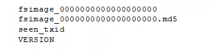

### 1.2.1 Fsimage

> **Fsimage**文件是HDFS文件系统元数据的一个**永久性检查点**，其中包含HDFS文件系统的**所有目录**和**文件inode的序列化信息。**

### 1.2.2 Edits文件

> 存放HDFS文件系统的所有**更新操作的逻辑**，文件系统客户端执行的所有写操作首先会记录到Edits文件中。

### 1.2.3 Seen_txid

> 文件保存是一个数字，就是最后一个**edits**的数字。

### 1.2.4 思考：NameNode中的元数据是存储在哪里的？

> 首先，我们做个假设，如果存储在**NameNode**节点的磁盘中，因为经常需要进行随机访问，还有响应客户请求，必然是效率过低。因此，元数据需要存放在**内存**中。但如果只存在内存中，一旦断电，元数据丢失，整个集群就无法工作了。因此产生在磁盘中备份元数据的**FsImage**。这样又会带来新的问题，当在内存中的元数据更新时，如果同时更新FsImage，就会导致效率过低，但如果不更新，就会发生一致性问题，一旦NameNode节点断电，就会产生数据丢失。因此，引入**Edits**文件(**只进行追加操作，效率很高**)。每当元数据有更新或者添加元数据时，修改内存中的元数据并追加到Edits中。这样，一旦NameNode节点断电，可以通过FsImage和Edits的合并，合成元数据。
>
> 但是，如果长时间添加数据到Edits中，会导致该文件数据过大，效率降低，而且一旦断电，恢复元数据需要的时间过长。因此，需要**定期进行FsImage和Edits的合并**，如果这个操作由NameNode节点完成，又会效率过低。因此，引入一个新的节点**SecondaryNamenode**，**专门用于FsImage和Edits的合并**。
>
> 所以NameNode的工作机制是这样的：
>
> 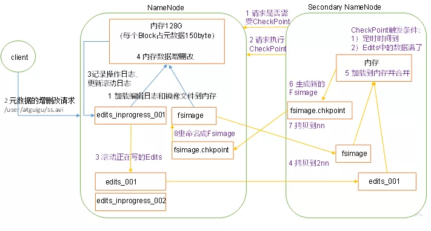
>
> **第一阶段：NameNode启动**
>
> （1）第一次启动NameNode格式化后，创建Fsimage和Edits文件。如果不是第一次启动，直接加载编辑日志和镜像文件到内存。
>
> （2）客户端对元数据进行增删改的请求。
>
> （3）NameNode记录操作日志，更新滚动日志。
>
> （4）NameNode在内存中对元数据进行增删改。
>
> 
>
> **第二阶段：Secondary NameNode工作**
>
> （1）Secondary NameNode询问NameNode是否需要CheckPoint。直接带回NameNode是否检查结果。
>
> （2）Secondary NameNode请求执行CheckPoint。
>
> （3）NameNode滚动正在写的Edits日志。
>
> （4）将滚动前的编辑日志和镜像文件拷贝到Secondary NameNode。
>
> （5）Secondary NameNode加载编辑日志和镜像文件到内存，并合并。
>
> （6）生成新的镜像文件fsimage.chkpoint。
>
> （7）拷贝fsimage.chkpoint到NameNode。
>
> （8）NameNode将fsimage.chkpoint重新命名成fsimage。

### 1.2.5 HA NameNode如何工作（原理挺多，这里简单介绍）

> 在一个典型的HA集群中，每个NameNode是一台独立的服务器。在任一时刻，只有一个NameNode处于active状态，另一个处于standby状态。其中，active状态的NameNode负责所有的客户端操作，standby状态的NameNode处于从属地位，维护着数据状态，随时准备切换。
>
> 两个NameNode为了数据同步，会通过一组称作**JournalNodes**的独立进程进行相互通信。当active状态的NameNode的命名空间有任何修改时，会告知大部分的JournalNodes进程。standby状态的NameNode有能力读取JNs中的变更信息，并且一直监控edit log的变化，把变化应用于自己的命名空间。standby可以确保在集群出错时，命名空间状态已经完全同步。
>
> 为了确保快速切换，standby状态的NameNode有必要知道集群中所有数据块的位置。为了做到这点，所有的**datanodes**必须配置两个NameNode的地址，发送数据块位置信息和心跳给他们两个。
>
> 对于HA集群而言，确保同一时刻只有一个NameNode处于active状态是至关重要的。否则，两个NameNode的数据状态就会产生分歧，可能丢失数据，或者产生错误的结果。为了保证这点，**JNs必须确保同一时刻只有一个NameNode可以向自己写数据**。
>
> 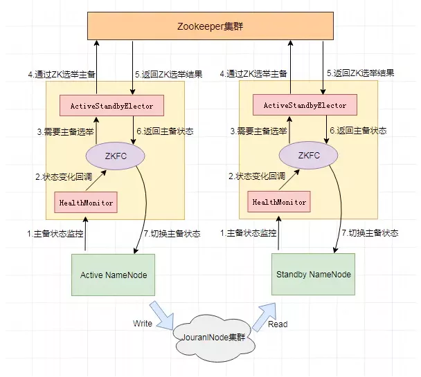

### 1.2.6 ZKFC

> ZKFC即ZKFailoverController，作为独立进程存在，负责控制NameNode的主备切换，ZKFC会监测NameNode的健康状况，当发现Active NameNode出现异常时会通过Zookeeper集群进行一次主备选举，完成Active和Standby状态的切换。

### 1.2.7 HealthMonitor

> 定时调用NameNode的HAServiceProtocol RPC接口(monitorHealth和getServiceStatus)，监控NameNode的健康状态并向ZKFC反馈。

### 1.2.8 ActiveStandbyElector

> 接收ZKFC的选举请求，通过Zookeeper自动完成主备选举，选举完成后回调ZKFC的主备切换方法对NameNode进行Active和Standby状态的切换。

### 1.2.9 JouranlNode集群

> 共享存储系统，负责存储HDFS的元数据，Active NameNode(写入)和Standby NameNode(读取)
>
> 通过共享存储系统实现元数据同步，在主备切换过程中，新的Active NameNode必须确保元数据同步完成才能对外提供服务。

### 1.2.10 DataNode工作机制

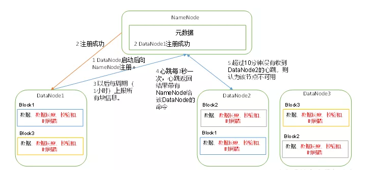

> （1）一个数据块在DataNode上以文件形式存储在磁盘上，包括两个文件，一个是**数据本身**，一个是元数据包括数据块的长度，块数据的**校验和**，以及**时间戳**。
>
> （2）DataNode启动后向NameNode注册，通过后，周期性（1小时）的向NameNode上报所有的块信息。
>
> （3）心跳是每3秒一次，心跳返回结果带有NameNode给该DataNode的命令如复制块数据到另一台机器，或删除某个数据块。如果超过10分钟没有收到某个DataNode的心跳，则认为该节点不可用。
>
> （4）集群运行中可以安全加入和退出一些机器。

### 1.2.11 DataNode数据损坏

> （1）当DataNode读取**Block**的时候，它会计算CheckSum。
>
> （2）如果计算后的**CheckSum**，与Block创建时值不一样，说明Block已经损坏。
>
> （3）Client读取其他DataNode上的Block。
>
> （4）DataNode在其文件创建后周期验证CheckSum。

## 1.3.压缩

### 1.3.1 gzip压缩

> 应用场景：当每个文件压缩之后在130M以内的（1个块大小内），都可以考虑用gzip压缩格式。譬如说一天或者一个小时的日志压缩成一个gzip文件，运行mapreduce程序的时候通过多个gzip文件达到并发。hive程序，streaming程序，和java写的mapreduce程序完全和文本处理一样，压缩之后原来的程序不需要做任何修改。
>
> 优点：压缩率比较高，而且压缩/解压速度也比较快；hadoop本身支持，在应用中处理gzip格式的文件就和直接处理文本一样；有hadoop native库；大部分linux系统都自带gzip命令，使用方便。
>
> 缺点：不支持split。

### 1.3.2 snappy压缩

> 应用场景：当mapreduce作业的map输出的**数据比较大**的时候，作为map到reduce的中间数据的压缩格式；或者作为一个mapreduce作业的输出和另外一个mapreduce作业的输入。
>
> 优点：高速压缩速度和合理的压缩率；支持hadoop native库。
>
> 缺点：不支持split；压缩率比gzip要低；hadoop本身不支持，需要安装；linux系统下没有对应的命令。

### 1.3.3 lzo压缩

> 应用场景：一个**很大的文本文件**，压缩之后还大于200M以上的可以考虑，而且单个文件越大，lzo优点越越明显。
>
> 优点：压缩/解压速度也比较快，合理的压缩率；支持split，是hadoop中最流行的压缩格式；支持hadoop native库；可以在linux系统下安装lzo命令，使用方便。
>
> 缺点：压缩率比gzip要低一些；hadoop本身不支持，需要安装；在应用中对lzo格式的文件需要做一些特殊处理（为了支持split需要建索引，还需要指定inputformat为lzo格式）。

### 1.3.4 bzip2压缩

> 应用场景：适合对速度要求不高，但需要**较高的压缩率**的时候，可以作为mapreduce作业的输出格式；或者输出之后的数据比较大，处理之后的数据需要压缩存档减少磁盘空间并且以后数据用得比较少的情况；或者对单个很大的文本文件想压缩减少存储空间，同时又需要支持split，而且兼容之前的应用程序（即应用程序不需要修改）的情况。
>
> 优点：支持split；具有很高的压缩率，比gzip压缩率都高；hadoop本身支持，但不支持native；在linux系统下自带bzip2命令，使用方便。
>
> 缺点：压缩/解压速度慢。

## 1.4. MapReduce工作流程

### 1.4.1 MapTask工作流

> 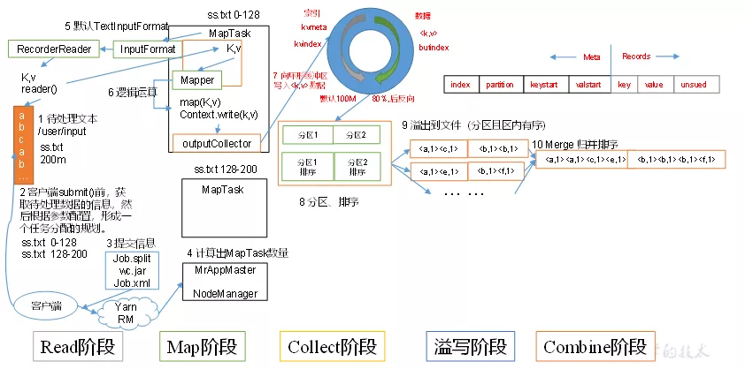
>
> （1）**Read阶段**：MapTask通过用户编写的RecordReader，从输入InputSplit中解析出一个个key/value。
>
> （2）**Map阶段**：该节点主要是将解析出的key/value交给用户编写map()函数处理，并产生一系列新的key/value。
>
> （3）**Collect收集阶段**：在用户编写map()函数中，当数据处理完成后，一般会调用OutputCollector.collect()输出结果。在该函数内部，它会将生成的key/value分区（调用Partitioner），并写入一个环形内存缓冲区中。
>
> （4）**Spill阶段**：即“溢写”，当环形缓冲区满后，MapReduce会将数据写到本地磁盘上，生成一个临时文件。需要注意的是，将数据写入本地磁盘之前，先要对数据进行一次本地排序，并在必要时对数据进行合并、压缩等操作。
>
> ```txt
> 溢写阶段详情：
> 
> 步骤1：利用快速排序算法对缓存区内的数据进行排序，排序方式是，先按照分区编号Partition进行排序，然后按照key进行排序。这样，经过排序后，数据以分区为单位聚集在一起，且同一分区内所有数据按照key有序。
> 
> 步骤2：按照分区编号由小到大依次将每个分区中的数据写入任务工作目录下的临时文件output/spillN.out（N表示当前溢写次数）中。如果用户设置了Combiner，则写入文件之前，对每个分区中的数据进行一次聚集操作。
> 
> 步骤3：将分区数据的元信息写到内存索引数据结构SpillRecord中，其中每个分区的元信息包括在临时文件中的偏移量、压缩前数据大小和压缩后数据大小。如果当前内存索引大小超过1MB，则将内存索引写到文件output/spillN.out.index中。
> ```
>
> （5）**Combine阶段**：当所有数据处理完成后，MapTask对所有临时文件进行一次合并，以确保最终只会生成一个数据文件。

### 1.4.2 ReduceTask工作流

> 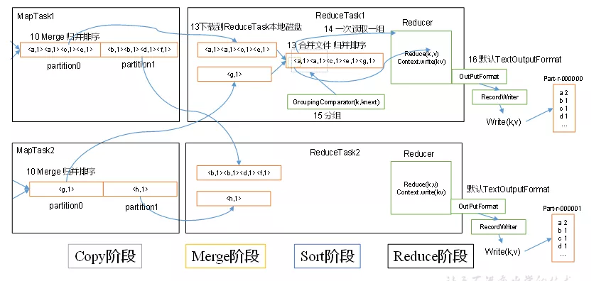
>
> （1）Copy阶段：ReduceTask从各个MapTask上远程拷贝一片数据，并针对某一片数据，如果其大小超过一定阈值，则写到磁盘上，否则直接放到内存中。
>
> （2）Merge阶段：在远程拷贝数据的同时，ReduceTask启动了两个后台线程对内存和磁盘上的文件进行合并，以防止内存使用过多或磁盘上文件过多。
>
> （3）Sort阶段：按照MapReduce语义，用户编写reduce()函数输入数据是按key进行聚集的一组数据。为了将key相同的数据聚在一起，Hadoop采用了基于排序的策略。由于各个MapTask已经实现对自己的处理结果进行了局部排序，因此，ReduceTask只需对所有数据进行一次归并排序即可。
>
> （4）Reduce阶段：reduce()函数将计算结果写到HDFS上。

## 1.5.Yarn工作机制（作业提交全过程）

> 

### 1.5.1.作业提交

> （1）Client调用job.waitForCompletion方法，向整个集群提交MapReduce作业。
>
> （2）Client向RM申请一个作业id。
>
> （3）RM给Client返回该job资源的提交路径和作业id。
>
> （4）Client提交jar包、切片信息和配置文件到指定的资源提交路径。
>
> （5）Client提交完资源后，向RM申请运行MrAppMaster。

### 1.5.2.作业初始化

> （6）当RM收到Client的请求后，将该job添加到容量调度器中。
>
> （7）某一个空闲的NM领取到该Job。
>
> （8）该NM创建Container，并产生MRAppmaster。
>
> （9）下载Client提交的资源到本地。

### 1.5.3.任务分配

> （10）MrAppMaster向RM申请运行多个MapTask任务资源。
>
> （11）RM将运行MapTask任务分配给另外两个NodeManager，另两个NodeManager分别领取任务并创建容器。

### 1.5.4.任务运行

> （12）MR向两个接收到任务的NodeManager发送程序启动脚本，这两个NodeManager分别启动MapTask，MapTask对数据分区排序。
>
> （13）MrAppMaster等待所有MapTask运行完毕后，向RM申请容器，运行ReduceTask。
>
> （14）ReduceTask向MapTask获取相应分区的数据。
>
> （15）程序运行完毕后，MR会向RM申请注销自己。

### 1.5.5.进度和状态更新

> YARN中的任务将其进度和状态(包括counter)返回给应用管理器,客户端每秒(通过mapreduce.client.progressmonitor.pollinterval设置)向应用管理器请求进度更新,展示给用户。

### 1.5.6.作业完成

> 除了向应用管理器请求作业进度外,客户端每5秒都会通过调用waitForCompletion()来检查作业是否完成。时间间隔可以通过mapreduce.client.completion.pollinterval来设置。作业完成之后,应用管理器和Container会清理工作状态。作业的信息会被作业历史服务器存储以备之后用户核查。

## 1.6.Yarn调度器

### 1.6.1.先进先出调度器（FIFO）

> 把应用按提交的顺序排成一个队列，这是一个先进先出队列，在进行资源分配的时候，先给队列中最头上的应用进行分配资源，待最头上的应用需求满足后再给下一个分配。
>
> 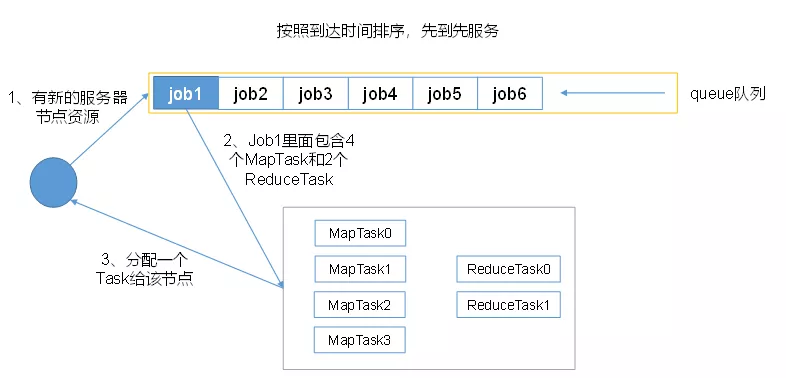


### 1.6.2.容量调度器（Capacity Scheduler）

> 以队列为单位划分资源，每个队列可设定一定比例的资源最低保证和使用上限，同时，每个用户也可设定一定的资源使用上限以防止资源滥用。而当一个队列的资源有剩余时，可暂时将剩余资源共享给其他队列。
>
> 特点
>
> （1）可为每个队列设置资源最低保证和资源使用上限，而所有提交到该队列的应用程序共享这些资源
>
> （2）如果一个队列中的资源有剩余，可以暂时共享给那些需要资源的队列，而一旦该队列有新的应用程序提交，则其他队列释放的资源会归还给该队列
>
> （3）支持多用户共享集群和多应用程序同时运行。为防止单个应用程序、用户或队列独占集群中的资源，可为之增加多重约束（比如单个应用程序同时运行的任务数等）
>
> （4）每个队列有严格的ACL列表规定它的访问用户，每个用户可指定哪些用户允许查看自己应用程序的运行状态或者控制应用程序（比如杀死应用程序）。
>
> 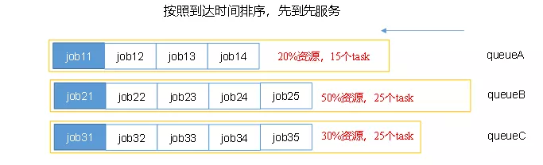

### 1.6.3.公平调度器（Fair Scheduler）

> 公平调度器可以为所有的应用“平均公平”分配资源，当然，这种“公平”是可以配置的，称为权重，可以在分配文件中为每一个队列设置分配资源的权重，如果没有设置，默认是1（由于默认权重相同，因此，在不做配置的情况下，作业（队列）之间的资源占比相同）。
>
> 具有以下特点：
>
> （1）允许资源共享,即当一个APP运行时,如果其它队列没有任务执行,则可以使用其它队列(不属于该APP的队列),当其它队列有APP需要资源时再将占用的队列释放出来.所有的APP都从资源队列中分配资源。
>
> （2）当队列中有任务,该队列将至少获得最小资源.当队列资源使用不完时,可以给其它队列使用。
>
> （3）当队列不能满足最小资源时,可以从其它队列抢占。
>
> 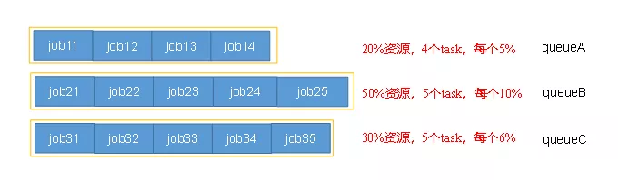

## 1.7. HDFS小文件处理

### 1.7.1 HDFS小文件弊端

> HDFS上每个文件都要在NameNode上建立一个索引，这个索引的大小约为150byte，这样当小文件比较多的时候，就会产生很多的索引文件，一方面会大量占用NameNode的内存空间，另一方面就是索引文件过大使得索引速度变慢。

### 1.7.2 HDFS小文件解决方案

> 小文件的优化无非以下几种方式：
>
> （1）在数据采集的时候，就将小文件或小批数据合成大文件再上传HDFS。
>
> （2）在业务处理之前，在HDFS上使用MapReduce程序对小文件进行合并。
>
> （3）在MapReduce处理时，可采用CombineTextInputFormat提高效率。
>
> **具体操作**：
>
> （1） Hadoop Archive Hadoop Archive或者HAR，是一个高效地将小文件放入HDFS块中的文件存档工具，它能够将多个小文件打包成一个HAR文件，这样在减少namenode内存使用的同时，仍然允许对文件进行透明的访问。
>
> （2） Sequence file sequence file由一系列的二进制key/value组成，如果为key小文件名，value为文件内容，则可以将大批小文件合并成一个大文件。
>
> （3）CombineFileInputFormat 用于将多个文件合并出成单独的Split，另外，它会考虑数据的存储位置。
>
> （4）开启JVM重用原理：一个Map运行在一个JVM上，开启重用的话，该Map在JVM上运行完毕后，JVM继续运行其他Map。（mapreduce.job.jvm.numtasks），对于大量小文件Job，可以减少45%运行时间

## 1.8. Shuffle及优化

### 1.8.1 Shuffle过程

> Map方法之后，Reduce方法之前的数据处理过程称之为Shuffle
>
> 参考上面：MapReduce工作流程

### 1.8.2 Map阶段优化

> （1）增大环形缓冲区大小。由100m扩大到200m 
>
> （2）增大环形缓冲区溢写的比例。由80%扩大到90%
>
> （3）减少对溢写文件的merge次数。（10个文件，一次20个merge）
>
> （4）不影响实际业务的前提下，采用Combiner提前合并，减少 I/O。

### 1.8.3 Reduce阶段优化

> （1）合理设置Map和Reduce数：两个都不能设置太少，也不能设置太多。太少，会导致Task等待，延长处理时间；太多，会导致 Map、Reduce任务间竞争资源，造成处理超时等错误。
>
> （2）设置Map、Reduce共存：调整slowstart.completedmaps参数，使Map运行到一定程度后，Reduce也开始运行，减少Reduce的等待时间。
>
> （3）规避使用Reduce，因为Reduce在用于连接数据集的时候将会产生大量的网络消耗。
>
> （4）增加每个Reduce去Map中拿数据的并行数
>
> （5）集群性能可以的前提下，增大Reduce端存储数据内存的大小。

### 1.8.4 IO传输

> 采用数据压缩的方式，减少网络IO的的时间。安装Snappy和LZO压缩编码器。
>
> 压缩：
>
> （1）map输入端主要考虑数据量大小和切片，支持切片的有Bzip2、LZO。注意：LZO要想支持切片必须创建索引；
>
> （2）map输出端主要考虑速度，速度快的snappy、LZO；
>
> （3）reduce输出端主要看具体需求，例如作为下一个mr输入需要考虑切片，永久保存考虑压缩率比较大的gzip。

## 1.9. Hadoop解决数据倾斜方法

> **提前在map进行combine，减少传输的数据量**
>
> 在Mapper加上combiner相当于提前进行reduce，即把一个Mapper中的相同key进行了聚合，减少shuffle过程中传输的数据量，以及Reducer端的计算量。如果导致数据倾斜的key大量分布在不同的mapper的时候，这种方法就不是很有效了。
>
> **导致数据倾斜的key 大量分布在不同的mapper**
>
> （1）局部聚合加全局聚合。
>
> 第一次在map阶段对那些导致了数据倾斜的key 加上1到n的随机前缀，这样本来相同的key 也会被分到多个Reducer中进行局部聚合，数量就会大大降低。
>
> 第二次mapreduce，去掉key的随机前缀，进行全局聚合。思想：二次mr，第一次将key随机散列到不同reducer进行处理达到负载均衡目的。第二次再根据去掉key的随机前缀，按原key进行reduce处理。这个方法进行两次mapreduce，性能稍差。
>
> （2）增加Reducer，提升并行度:JobConf.setNumReduceTasks(int)
>
> （3）实现自定义分区:根据数据分布情况，自定义散列函数，将key均匀分配到不同Reducer

## 1.10. Hadoop的参数优化

### 1.10.1 资源相关参数

| 配置参数                                      | 参数说明                                                     |
| --------------------------------------------- | ------------------------------------------------------------ |
| mapreduce.map.memory.mb                       | 一个MapTask可使用的资源上限（单位:MB），默认为1024。如果MapTask实际使用的资源量超过该值，则会被强制杀死。 |
| mapreduce.reduce.memory.mb                    | 一个ReduceTask可使用的资源上限（单位:MB），默认为1024。如果ReduceTask实际使用的资源量超过该值，则会被强制杀死。 |
| mapreduce.map.cpu.vcores                      | 每个MapTask可使用的最多cpu core数目，默认值: 1               |
| mapreduce.reduce.shuffle.parallelcopies       | 每个ReduceTask可使用的最多cpu core数目，默认值: 1            |
| mapreduce.reduce.shuffle.merge.percent        | 每个Reduce去Map中取数据的并行数。默认值是5                   |
| mapreduce.reduce.shuffle.input.buffer.percent | Buffer中的数据达到多少比例开始写入磁盘。默认值0.66           |
| mapreduce.reduce.input.buffer.percent         | Buffer大小占Reduce可用内存的比例。默认值0.7 指定多少比例的内存用来存放Buffer中的数据，默认值是0.0 |

### 1.10.2 YARN

| 配置参数                                 | 参数说明                                        |
| ---------------------------------------- | ----------------------------------------------- |
| yarn.scheduler.minimum-allocation-mb     | 给应用程序Container分配的最小内存，默认值：1024 |
| yarn.scheduler.maximum-allocation-mb     | 给应用程序Container分配的最大内存，默认值：8192 |
| yarn.scheduler.minimum-allocation-vcores | 每个Container申请的最小CPU核数，默认值：1       |
| yarn.scheduler.maximum-allocation-vcores | 每个Container申请的最大CPU核数，默认值：32      |
| yarn.nodemanager.resource.memory-mb      | 给Containers分配的最大物理内存，默认值：8192    |

### 1.10.3 Shuffle

| 配置参数                         | 参数说明                          |
| -------------------------------- | --------------------------------- |
| mapreduce.task.io.sort.mb        | Shuffle的环形缓冲区大小，默认100m |
| mapreduce.map.sort.spill.percent | 环形缓冲区溢出的阈值，默认80%     |

### 1.10.4 容错相关参数

| 配置参数                      | 参数说明                                                     |
| ----------------------------- | ------------------------------------------------------------ |
| mapreduce.map.max.attempts    | 每个Map Task最大重试次数，一旦重试参数超过该值，则认为Map Task运行失败，默认值：4。 |
| mapreduce.reduce.max.attempts | 每个Reduce Task最大重试次数，一旦重试参数超过该值，则认为Reduce Task运行失败，默认值：4。 |
| mapreduce.task.timeout        | Task超时时间，经常需要设置的一个参数，该参数表达的意思为：如果一个Task在一定时间内没有任何进入，即不会读取新的数据，也没有输出数据，则认为该Task处于Block状态，可能是卡住了，也许永远会卡住，为了防止因为用户程序永远Block住不退出，则强制设置了一个该超时时间（单位毫秒），默认是600000。如果你的程序对每条输入数据的处理时间过长（比如会访问数据库，通过网络拉取数据等），建议将该参数调大。 |


## 1.11.异构存储（冷热数据分离）

> 所谓的异构存储就是将不同需求或者冷热的数据存储到不同的介质中去，实现既能兼顾性能又能兼顾成本。

### 1.11.1 存储类型

> HDFS异构存储支持如下4种类型，分别是：
>
> - RAM_DISK（内存镜像文件系统）
>
> - SSD（固态硬盘）
>
> - DISK（普通磁盘，HDFS默认）
>
> - ARCHIVE（计算能力弱而存储密度高的存储介质，一般用于归档）
>
> 以上四种自上到下，速度由快到慢，单位存储成本由高到低。

### 1.11.2 存储策略

>HDFS总共支持Lazy_Persist、All_SSD、One_SSD、Hot、Warm和Cold等6种存储策略。

| 策略         | 说明                                                  |
| ------------ | ----------------------------------------------------- |
| Lazy_Persist | 1份数据存储在[RAM_DISK]即内存中，其他副本存储在DISK中 |
| All_SSD      | 全部数据都存储在SSD中                                 |
| One_SSD      | 一份数据存储在SSD中，其他副本存储在DISK中             |
| Hot          | 全部数据存储在DISK中，默认策略为Hot                   |
| Warm         | 一份数据存储在DISK中，其他数据存储方式为ARCHIVE       |
| Cold         | 全部数据以ARCHIVE的方式保存                           |

#  二. Hive

## 2.1 Hive架构

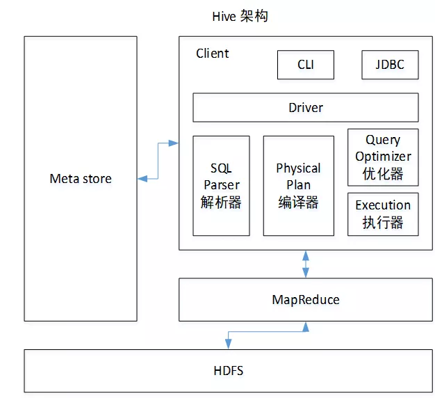

> 1. 用户接口：**Client**
>
>    CLI（command-line interface）、JDBC/ODBC(jdbc访问hive)
>
> 2. 元数据：**Metastore**
>
>    元数据包括：表名、表所属的数据库（默认是default）、表的拥有者、列/分区字段、表的类型（是否是外部表）、表的数据所在目录等；默认存储在自带的derby数据库中，推荐使用MySQL存储Metastore
>
> 3. **Hadoop**
>
>    使用HDFS进行存储，使用MapReduce进行计算。
>
> 4. 驱动器：**Driver**
>
> （1）解析器（SQL Parser）：将SQL字符串转换成抽象语法树AST，这一步一般都用第三方工具库完成，比如antlr；对AST进行语法分析，比如表是否存在、字段是否存在、SQL语义是否有误。
>
> （2）编译器（Physical Plan）：将AST编译生成逻辑执行计划。
>
> （3）优化器（Query Optimizer）：对逻辑执行计划进行优化。
>
> （4）执行器（Execution）：把逻辑执行计划转换成可以运行的物理计划。对于Hive来说，就是MR/Spark。

## 2.2 Hive运行原理

> Hive通过给用户提供的一系列交互接口，接收到用户的指令(SQL)，使用自己的Driver，结合元数据(MetaStore)，将这些**指令翻译成MapReduce**，提交到Hadoop中执行，最后，将执行返回的结果输出到用户交互接口。其实，还可以这样理解：Hive要做的就是将SQL翻译成MapReduce程序代码。实际上，Hive内置了很多**Operator**，每个Operator完成一个特定的计算过程，Hive将这些Operator构造成一个有向无环图DAG，然后根据这些Operator之间是否存在shuffle将其封装到map或者reduce函数中，之后就可以提交给MapReduce执行了。

## 2.3 内部表与外部表

**不同点**

> 1. 外部表不会加载数据到Hive，减少数据传输、数据还能共享。共享的理解就是：当我们删除一个内部表时，Hive 也会删除这个表中数据。内部表不适合和其他工具共享数据。
> 2.  Hive创建内部表时，会将数据移动到数据仓库指向的路径。创建外部表时，仅记录数据所在的路径，不对数据的位置做任何改变，在删除表的时候，内部表的元数据和数据会被一起删除，而外部表只删除元数据，不删除数据。这样外部表相对来说更加安全些，数据组织也更加灵活，方便共享源数据。

**场景选择**

> 在公司中绝大多数场景都是外部表。
>
> 自己使用的临时表，才会创建内部表。

## 2.4 Hive分区与分桶

### 2.4.1 Hive分区

> 是按照数据表的某列或者**某些列**分为多区，在hive存储上是hdfs文件，也就是**文件夹形式**。现在最常用的跑T+1数据，按当天时间分区的较多。把每天通过sqoop或者datax拉取的一天的数据存储一个区，也就是所谓的文件夹与文件。在查询时只要指定分区字段的值就可以直接从该分区查找即可。创建分区表的时候，要通过关键字**partitioned by** （column name string）声明该表是分区表，并且是按照字段column name进行分区，column name值一致的所有记录存放在一个分区中，分区属性name的类型是string类型。
>
> 当然，可以依据多个列进行分区，即对某个分区的数据按照某些列继续分区。向分区表导入数据的时候，要通过关键字partition（（column name="xxxx")显示声明数据要导入到表的哪个分区

### 2.4.2 设置分区的影响

> 1. 首先是hive本身对分区数有限制，不过可以修改限制的数量；
>
> ```sh
> set hive.exec.dynamic.partition=true;
> set hive.exec.max.dynamic.partitions=1000;
> set hive.exec.dynamic.partition.mode=nonstrict;
> set hive.exec.parallel.thread.number=264;
> ```
>
> 2. hdfs对单个目录下的目录数量或者文件数量也是有限制的，也是可以修改的；
>
> 3. NN的内存肯定会限制，这是最重要的，如果分区数很大，会影响NN服务，进而影响一系列依赖于NN的服务。所以最好合理设置分区规则，对小文件也可以定期合并，减少NN的压力。


### 2.4.3 Hive的分桶

> 在分区数量过于庞大以至于可能导致文件系统崩溃时，我们就需要使用分桶来解决问题，分桶是相对分区进行**更细粒度**的划分。分桶则是指定分桶表的某一列，让该列数据按照哈希取模的方式随机、均匀的分发到各个**桶文件**中。因为分桶操作需要根据某一列具体数据来进行哈希取模操作，故指定的分桶列必须基于表中的某一列（字段）要使用关键字clustered by 指定分区依据的列名，还要指定分为多少桶：
>
> ```sql
> create table test(id int,name string) cluster by (id) into 5 buckets .......
> insert into buck select id ,name from p cluster by (id)
> ```
>

### 2.4.4 Hive分区分桶区别

> 1. 分区是表的部分列的集合，可以为频繁使用的数据建立分区，这样查找分区中的数据时就不需要扫描全表，这对于提高查找效率很有帮助。
>
> 2. 不同于分区对列直接进行拆分，桶往往使用列的**哈希值**对数据打散，并分发到各个不同的桶中从而完成数据的分桶过程。
>
> 3. 分区和分桶最大的区别就是**分桶随机分割数据库，分区是非随机分割数据库**。

## 2.5 函数

> 本环节不再介绍简单的函数，比如：'if'，'is not null','=='等等这类的函数。

### 2.5.1 内置函数

（1） NVL

> 给值为NULL的数据赋值，它的格式是NVL( value，default_value)。它的功能是如果value为NULL，则NVL函数返回default_value的值，否则返回value的值，如果两个参数都为NULL ，则返回NULL
>
> ```sql
>  select nvl(column,0) from xxx；
> ```
>

（2）行转列

| 函数                                | 描述                                                         |
| ----------------------------------- | ------------------------------------------------------------ |
| CONCAT(string A/col, string B/col…) | 返回输入字符串连接后的结果，支持任意个输入字符串             |
| CONCAT_WS(separator,str1, str2,...) | 第一个参数参数间的分隔符，如果分隔符是 NULL，返回值也将为 NULL。这个函数会跳过分隔符参数后的任何 NULL 和空字符串。分隔符将被加到被连接的字符串之间。 |
| COLLECT_SET(col)                    | 将某字段的值进行**去重汇总**，产生array类型字段              |
| COLLECT_LIST(col)                   | 函数只接受基本数据类型，它的主要作用是将某字段的值进行**不去重汇总**，产生array类型字段。 |

（3）列转行(一列转多行)

> Split(str, separator)：将字符串按照后面的分隔符切割，转换成字符array。
>
> EXPLODE(col)：将hive一列中复杂的array或者map结构拆分成多行。
>
> LATERAL VIEW
>
> ```sql
> 用法：
>  LATERAL VIEW udtf(expression) tableAlias AS columnAlias
> ```
>
> 解释：
>
> lateral view用于和split, explode等UDTF一起使用，它能够将一行数据拆成多行数据，在此基础上可以对拆分后的数据进行聚合。
>
> lateral view首先为原始表的每行调用UDTF，UDTF会把一行拆分成一或者多行，lateral view再把结果组合，产生一个支持别名表的虚拟表。

准备数据源测试

| movie     | category       |
| --------- | -------------- |
| 《功勋》  | 记录,剧情      |
| 《战狼2》 | 战争,动作,灾难 |

SQL

   ```sql
    SELECT movie,category_name
    FROM movie_info
    lateral VIEW
    explode(split(category,",")) movie_info_tmp
    AS category_name ;
   ```

测试结果

```txt
《功勋》剧情
《功勋》记录
《战狼2》动作
《战狼2》战争
《战狼2》灾难
```

### 2.5.2 窗口函数

（1）OVER()

> 分析函数工作的数据窗口大小，这个数据窗口大小可能会随着行的变而变化。

（2）CURRENT ROW（当前行）

语法

   ```sh
   n PRECEDING：往前n行数据
   n FOLLOWING：往后n行数据
   ```

（3）UNBOUNDED（无边界）

```properties
UNBOUNDED PRECEDING 前无边界，表示从前面的起点
UNBOUNDED FOLLOWING 后无边界，表示到后面的终点
```

SQL案例：由起点到当前行的聚合

  ```sql
  select
   sum(money) over(partition by user_id order by pay_time rows between UNBOUNDED
   PRECEDING and current row)
   from or_order;
  ```

 SQL案例：当前行和前面一行做聚合

```sql
 select
 sum(money) over(partition by user_id order by pay_time rows between 1 PRECEDING and
 current row)
 from or_order;
```

 SQL案例：当前行和前面一行和后一行做聚合

  ```sql
  select
   sum(money) over(partition by user_id order by pay_time rows between 1 PRECEDING AND 1
   FOLLOWING )
   from or_order;
  ```

 SQL案例：当前行及后面所有行

   ```sql
    select
    sum(money) over(partition by user_id order by pay_time rows between current row and
    UNBOUNDED FOLLOWING )
    from or_order;
   ```

（4）LAG(col,n,default_val)

> 往前第n行数据，没有的话default_val

（5）LEAD(col,n, default_val)

> 往后第n行数据，没有的话default_val

 SQL案例：查询用户购买明细以及上次的购买时间和下次购买时间

   ```sql
    select
    user_id,,pay_time,money,
    lag(pay_time,1,'1970‐01‐01') over(PARTITION by name order by pay_time) prev_time,
    lead(pay_time,1,'1970‐01‐01') over(PARTITION by name order by pay_time) next_time
    from or_order;
   ```

（6）FIRST_VALUE(col,true/false)

当前窗口下的第一个值，第二个参数为true，跳过空值。

（7）LAST_VALUE (col,true/false)

当前窗口下的最后一个值，第二个参数为true，跳过空值。

 SQL案例：查询顾用户每个月第一次的购买时间和每个月的最后一次购买时间。

 ```sql
 select
  FIRST_VALUE(pay_time)
  over(
  partition by user_id,month(pay_time) order by pay_time
  rows between UNBOUNDED PRECEDING and UNBOUNDED FOLLOWING
 ) first_time,
  LAST_VALUE(pay_time)
  over(partition by user_id,month(pay_time) order by pay_time rows between
  UNBOUNDED PRECEDING and UNBOUNDED FOLLOWING
 ) last_time
  from or_order;
 ```

（8）NTILE(n)

把有序窗口的行分发到指定数据的组中，各个组有编号，编号从1开始，对于每一行，NTILE返回此行所属的组的编号。（用于将分组数据按照顺序切分成n片，返回当前切片值）

SQL案例：查询前25%时间的订单信息

```sql
select * from (
 select User_id,pay_time,money,
 ntile(4) over(order by pay_time) sorted
 from or_order
) t
 where sorted = 1;
```

## 2.6四个By

> （1）Order By
>
> 全局排序，只有一个Reducer。
>
> （2）Sort By
>
> 分区内有序。
>
> （3）Distrbute By
>
> 类似MR中Partition，进行分区，结合sort by使用。
>
> （4） Cluster By
>
> 当Distribute by和Sorts by字段相同时，可以使用Cluster by方式。Cluster by除了具有Distribute by的功能外还兼具Sort by的功能。但是排序只能是升序排序，不能指定排序规则为ASC或者DESC。
>
> 在生产环境中Order By用的比较少，容易导致OOM。
>
> 在生产环境中Sort By+ Distrbute By用的多。


## 2.7 排序函数

（1）RANK()
​排序相同时会重复，总数不会变

   ```sh
   1
   1
   3
   3
   5
   ```

（2）DENSE_RANK()
​排序相同时会重复，总数会减少

```tex
1
1
2
2
3
```

（3）ROW_NUMBER()

会根据顺序计算

  ```sql
  1
  2
  3
  4
  5
  ```

## 2.8 Hive 优化

> 首先要了解优化的原理，再去适当去调节参数和选择方案。

### 2.8.1 表的优化

（1）小表、大表Join

> 将key相对分散，并且数据量小的表放在join的左边，这样可以有效减少内存溢出错误发生的几率；再进一步，可以使用map join让小的维度表（1000条以下的记录条数）先进内存。在map端完成reduce。

（2）大表Join大表

> a.空key过滤
>
> 有时join超时是因为某些key对应的数据太多，而相同key对应的数据都会发送到相同的reducer上，从而导致内存不够。此时我们应该仔细分析这些异常的key，很多情况下，这些key对应的数据是异常数据，我们需要在SQL语句中进行过滤。
>
> b.空key转换
>
> 有时虽然某个key为空对应的数据很多，但是相应的数据不是异常数据，必须要包含在join的结果中，此时我们可以表a中key为空的字段赋一个随机的值，使得数据随机均匀地分不到不同的reducer上。

（3） MapJoin

> 如果不指定MapJoin或者不符合MapJoin的条件，那么Hive解析器会将Join操作转换成CommonJoin，即：在Reduce阶段完成join。容易发生数据倾斜。可以用MapJoin把小表全部加载到内存在map端进行join，避免reducer处理。

```txt
设置自动选择Mapjoin

set hive.auto.convert.join = true; 默认为true

大表小表的阈值设置（默认25M以下认为是小表）：

set hive.mapjoin.smalltable.filesize=25000000;
```

（4） Group By

> Map阶段同一Key数据分发给一个reduce，当一个key数据过大时就倾斜了。并不是所有的聚合操作都需要在Reduce端完成，很多聚合操作都可以先在Map端进行部分聚合，最后在Reduce端得出最终结果。

（5）开启Map端聚合

```txt
//是否在 Map 端进行聚合，默认为 True
set hive.map.aggr = true
//在 Map 端进行聚合操作的条目数目set hive.groupby.mapaggr.checkinterval = 100000
//有数据倾斜的时候进行负载均衡（默认是 false ）
set hive.groupby.skewindata = true
```

**对数据倾斜负载均衡的理解**

> 会有两个MR Job。第一个MR Job中，Map的输出结果会随机分布到Reduce中，每个Reduce做部分聚合操作，并输出结果，这样处理的结果是相同的Group By Key有可能被分发到不同的Reduce中，从而达到负载均衡的目的；第二个MR Job再根据预处理的数据结果按照Group By Key分布到Reduce中（这个过程可以保证相同的Group By Key被分布到同一个Reduce中），最后完成最终的聚合操作。

(6) Count(Distinct)去重统计

> 由于COUNT DISTINCT操作需要用一个Reduce Task来完成，这一个Reduce需要处理的数据量太大，就会导致整个Job很难完成，一般COUNT DISTINCT使用先GROUP BY再COUNT的方式替换,但是需要注意group by造成的数据倾斜问题。

(7)笛卡尔积

> 尽量避免笛卡尔积，join的时候不加on条件，或者无效的on条件，Hive只能使用1个reducer来完成笛卡尔积。

(8)行列过滤

> 列处理：在SELECT中，只拿需要的列，如果有，尽量使用分区过滤，少用SELECT *。
>
> 行处理：在分区剪裁中，当使用外关联时，如果将副表的过滤条件写在Where后面，那么就会先全表关联，之后再过滤

### 2.8.2 合理设置Map及Reduce数

#### 首先理清楚Map数是越多越好吗？

逻辑：如果一个任务有很多小文件（远远小于块大小128m），则每个小文件也会被当做一个块，用一个map任务来完成，而一个map任务启动和初始化的时间远远大于逻辑处理的时间，就会造成很大的资源浪费。

保证每个map处理接近128m的文件块是不是就可以了？

逻辑：比如有一个127m的文件，正常会用一个map去完成，但这个文件只有一个或者两个小字段，却有几千万的记录，如果map处理的逻辑比较复杂，用一个map任务去做，肯定也比较耗时

#### 复杂文件增加Map数

原理：文件都很大，任务逻辑复杂，map执行非常慢的时候，可以考虑增加Map数，来使得每个map处理的数据量减少，从而提高任务的执行效率。

```txt
computeSliteSize(Math.max(minSize,Math.min(maxSize,blocksize)))=blocksize=128M
```

调整maxSize最大值。让maxSize最大值低于blocksize就可以增加map的个数。

#### 小文件进行合并，减少map数

在map执行前合并小文件，减少map数：CombineHiveInputFormat具有对小文件进行合并的功能（系统默认的格式）。

```sh
set hive.input.format= org.apache.hadoop.hive.ql.io.CombineHiveInputFormat;
```


Map-Reduce的任务结束时合并小文件的设置

```sh
//在 map‐only 任务结束时合并小文件，默认 true
SET hive.merge.mapfiles = true;
//在 map‐reduce 任务结束时合并小文件，默认 false
SET hive.merge.mapredfiles = true;
//合并文件的大小，默认256M
SET hive.merge.size.per.task = 268435456;
//当输出文件的平均大小小于该值时，启动一个独立的 map‐reduce 任务进行文件 merge
SET hive.merge.smallfiles.avgsize = 16777216;
```


### 2.8.3 合理设置Reduce数

同样考虑是不是越多越好？

过多的启动和初始化reduce也会消耗时间和资源。有多少个reduce，就会有多少个输出文件，如果生成了很多个小文件，那么如果这些小文件作为下一个任务的输入，则也会出现小文件过多的问题。

（1）数据量设置

```sh
//每个 Reduce 处理的数据量默认是256MB
hive.exec.reducers.bytes.per.reducer=256000000
//每个任务最大的 reduce 数，默认为1009
hive.exec.reducers.max=1009
//计算 reducer 数的公式
N=min(hive.exec.reducers.max，总输入数据量/hive.exec.reducers.bytes.per.reducer)
```

（2）文件配置

```sh
mapreduce.job.reduces = 15
```


### 2.8.4 并行执行

> 通过设置参数hive.exec.parallel值为true，就可以开启并发执行。不过，在共享集群中，需要注意下，如果job中并行阶段增多，那么集群利用率就会增加。建议在数据量大,sql很长的时候使用,数据量小,sql比较的小开启有可能还不如之前快。

```sh
//打开任务并行执行，默认为 false
set hive.exec.parallel=true;
//同一个 sql 允许最大并行度，默认为8 。
set hive.exec.parallel.thread.number=16;
```


### 2.8.5 JVM重用

> JVM来执行map和Reduce任务的。这时JVM的启动过程可能会造成相当大的开销，尤其是执行的job包含有成百上千task任务的情况。JVM重用可以使得JVM实例在同一个job中重新使用N次。缺点是，开启JVM重用将一直占用使用到的task插槽，以便进行重用，直到任务完成后才能释放。

```sh
set mapreduce.job.jvm.numtasks=10
```


### 2.8.6 列式存储

> 因为每个字段的数据聚集存储，在查询只需要少数几个字段的时候，能大大减少读取的数据量；每个字段的数据类型一定是相同的，列式存储可以针对性的设计更好的设计压缩算法。
>
> TEXTFILE和SEQUENCEFILE的存储格式都是基于行存储的；
>
> ORC和PARQUET是基于列式存储的。

### 2.8.7 压缩（选择快的）

 ```sh
 //启用中间数据压缩
 set hive.exec.compress.intermediate=true
 //启用最终数据压缩
 set mapreduce.map.output.compress=true
 //设置压缩方式
 set mapreduce.map.outout.compress.codec=
 org.apache.hadoop.io.compress.DefaultCodec
 org.apache.hadoop.io.compress.GzipCodecorg.apache.hadoop.io.compress.BZip2Codec
 org.apache.hadoop.io.compress.Lz4Codec
 ```

## 2.9 Hive数据倾斜

### 2.9.1 Hive数据倾斜表现

> 就是单说hive自身的MR引擎：发现所有的map task全部完成，并且99%的reduce task完成，只剩下一个或者少数几个reduce task一直在执行，这种情况下一般都是发生了数据倾斜。说白了就是 **Hive的数据倾斜本质上是MapReduce的数据倾斜**。

### 2.9.2 Hive数据倾斜的原因

> 在MapReduce编程模型中十分常见，大量相同的key被分配到一个reduce里，造成一个reduce任务累死，其他reduce任务闲死。查看任务进度，发现长时间停留在99%或100%，查看任务监控界面，只有少量的reduce子任务未完成。
>
> 1.key分布不均衡。
>
> 2.业务问题或者业务数据本身的问题，某些数据比较集中。
>
> （1）join小表：其中一个表是小表，但是key比较集中，导致的就是某些Reduce的值偏高。
>
> （2）空值或无意义值：如果缺失的项很多，在做join时这些空值就会非常集中，拖累进度。
>
> （3）group by：维度过小。
>
> （4）distinct：导致最终只有一个Reduce任务。

### 2.9.3 Hive数据倾斜解决

1.group by代替distinct 要统计某一列的去重数时，如果数据量很大，count(distinct)就会非常慢，原因与order by类似，count(distinct)逻辑导致最终只有一个Reduce任务。

2.对1再优化：group by配置调整

（1）map端预聚合

（2）group by时，combiner在map端做部分预聚合，可以有效减少shuffle数据量。

（3）checkinterval：设置map端预聚合的行数阈值，超过该值就会分拆job。

  ```sh
   hive.map.aggr=true //默认
  hive.groupby.mapaggr.checkinterval=100000 //默认
  ```

（4）倾斜均衡配置 Hive自带了一个均衡数据倾斜的配置项。其实现方法是在group by时启动两个MR job。第一个job会将map端数据随机输入reducer，每个reducer做部分聚合，相同的key就会分布在不同的reducer中。第二个job再将前面预处理过的数据按key聚合并输出结果，这样就起到了均衡的效果。

```sh
hive.groupby.skewindata=false //默认
```

3. join基础优化

   （1） Hive在解析带join的SQL语句时，会默认将最后一个表作为大表，将前面的表作为小表，将它们读进内存。如果表顺序写反，如果大表在前面，引发OOM。不过现在hive自带优化。

   （2） map join:特别适合大小表join的情况，大小表join在map端直接完成join过程，没有reduce 效率很高。

   （3）多表join时key相同：会将多个join合并为一个MR job来处理，两个join的条件不相同，就会拆成多个MR job计算。

4. sort by代替order by

   将结果按某字段全局排序，这会导致所有map端数据都进入一个reducer中，在数据量大时可能会长时间计算不完。使用sort by，那么还是会视情况启动多个reducer进行排序，并且保证每个reducer内局部有序。为了控制map端数据分配到reducer的key，往往还要配合distribute by一同使用。如果不加distribute by的话，map端数据就会随机分配到reducer。

5. 单独处理倾斜key

   一般来讲倾斜的key都很少，我们可以将它们抽样出来，对应的行单独存入临时表中，然后打上随机数前缀，最后再进行聚合。或者是先对key做一层hash，先将数据随机打散让它的并行度变大，再汇集。其实办法一样。

# 三. HBase

## 3.1 为什么选择HBase

> 1、海量存储
>
> Hbase适合存储**PB**级别的海量数据，在PB级别的数量级，能在几十到百毫秒内返回数据。这与Hbase的极易扩展性息息相关。正式因为Hbase良好的扩展性，才为海量数据的存储提供了便利。
>
> 2、列式存储
>
> 这里的列式存储其实说的是**列族存储**，Hbase是根据列族来存储数据的。HBase中的每个列都由Column Family(列族)和Column Qualifier（**列限定符**）进行限定，例如info：name，info：age。
>
> 3、极易扩展
>
> Hbase的扩展性主要体现在两个方面，一个是基于上层处理能力（RegionServer）的扩展，一个是基于存储的扩展（HDFS）。通过横向添加RegionSever的机器，进行水平扩展，提升Hbase上层的处理能力，提升Hbsae服务更多Region的能力。
>
> 4、稀疏
>
> 稀疏主要是针对Hbase列的灵活性，在列族中，你可以指定任意多的列，在列数据为空的情况下，是不会占用存储空间的。
>
> 5、数据多版本
>
> 数据多版本：每个单元中的数据可以有多个版本，默认情况下，版本号自动分配，版本号就是单元格插入时的时间戳。

## 3.2 HBase架构与角色

### 3.2.1 架构图

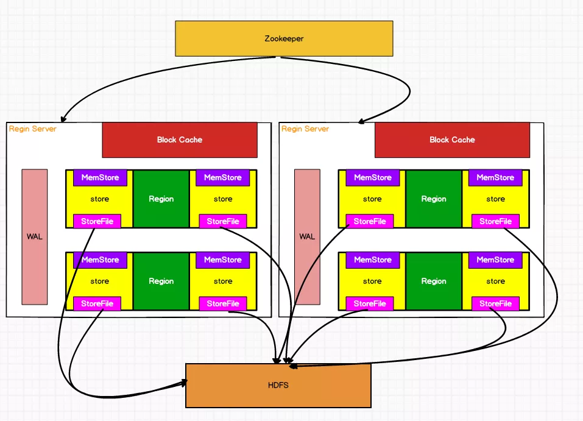

### 3.2.2 角色

> （1）**Region Server**
>
> Region Server为 Region的管理者，其实现类为**HRegionServer**，主要作用如下: 对于数据的操作：get, put, delete；对于Region的操作：splitRegion、compactRegion。StoreFile保存实际数据的物理文件，StoreFile以Hfile的形式存储在HDFS上。每个Store会有一个或多个StoreFile（HFile），数据在每个StoreFile中都是有序的。
>
> - MemStore
>
> 写缓存，由于HFile中的**数据要求是有序**的，所以数据是先存储在MemStore中，**排好序**后，等到达刷写时机才会刷写到HFile，每次刷写都会形成一个新的HFile。
>
> - WAL
>
> 由于数据要经MemStore排序后才能刷写到HFile，但把数据保存在内存中会有很高的概率导致数据丢失，为了解决这个问题，数据会先写在一个叫做Write-Ahead logfile的文件中，然后再写入MemStore中。所以在系统出现故障的时候，数据可以通过这个日志文件重建。
>
> - BlockCache
>
> 读缓存，每次查询出的数据会缓存在BlockCache中，方便下次查询。
>
> （2）**Master**
>
> Master是所有Region Server的管理者，其实现类为HMaster，主要作用如下：对于表的操作：create, delete, alter 对于RegionServer的操作：分配regions到每个RegionServer，监控每个RegionServer的状态，负载均衡和故障转移。
>
> （3）**Zookeeper**
>
> HBase通过Zookeeper来做master的高可用、RegionServer的监控、元数据的入口以及集群配置的维护等工作。
>
> （4）**HDFS**
>
> HDFS为Hbase提供最终的底层数据存储服务，同时为HBase提供高可用的支持。

## 3.3 HBase存储结构

### 3.3.1 逻辑结构

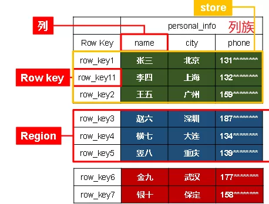

### 3.3.2 物理存储结构

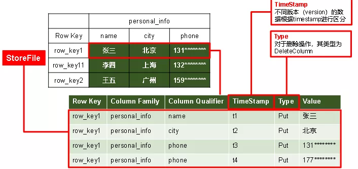

> （1）Name Space
>
> **命名空间**，类似于关系型数据库的database概念，每个命名空间下有多个表。HBase两个自带的命名空间，分别是hbase和default，hbase中存放的是HBase内置的表，default表是用户默认使用的命名空间。
>
> （2）Table
>
> 类似于关系型数据库的表概念。不同的是，HBase定义表时只需要声明列族即可，不需要声明具体的列。这意味着，往HBase写入数据时，字段可以动态、按需指定。因此，和关系型数据库相比，**HBase能够轻松应对字段变更**的场景。
>
> （3）RowHBase表中的每行数据都由一个RowKey和多个Column（列）组成，数据是按照RowKey的字典顺序存储的，并且查询数据时只能根据RowKey进行检索，所以RowKey的设计十分重要。
>
> （4）Column
>
> HBase中的每个列都由Column Family(列族)和Column Qualifier（列限定符）进行限定，例如info：name，info：age。建表时，只需指明列族，而列限定符无需预先定义。
>
> （5）Time Stamp
>
> 用于标识数据的不同版本（version），每条数据写入时，系统会自动为其加上该字段，其值为写入HBase的时间。
>
> （6）Cell
>
> 由{rowkey, column Family：column Qualifier, timeStamp}唯一确定的单元。cell中的数据是没有类型的，全部是字节码形式存贮。

## 3.4 HBase写流程

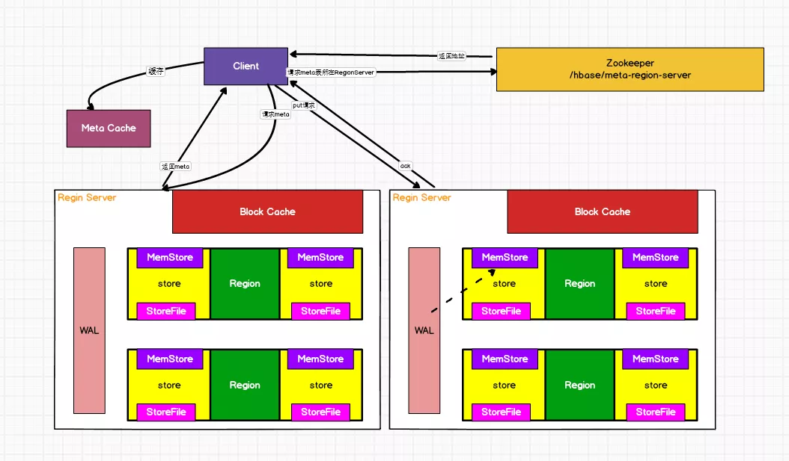

### 3.4.1 写流程

> （1）Client先访问zookeeper，获取hbase:meta表位于哪个Region Server。
>
> （2）访问对应的Region Server，获取hbase:meta表，根据读请求的namespace:table/rowkey，查询出目标数据位于哪个Region Server中的哪个Region中。并将该table的region信息以及metA表的位置信息缓存在客户端的meta cache，方便下次访问。
>
> （3）与目标Region Server进行通讯。
>
> （4）将数据顺序写入（追加）到WAL。
>
> （5）将数据写入对应的MemStore，数据会在MemStore进行排序。
>
> （6）向客户端发送ack。
>
> （7）等达到MemStore的刷写时机后，将数据刷写到HFile。

### 3.4.2 MemStore刷写时机

（1）当某个memstore的大小达到了默认值128M，其所在region的所有memstore都会刷写。

```sh
hbase.hregion.memstore.flush.size（默认值128M）
```

当memstore的大小达到了以下，会阻止继续往该memstore写数据。

```sh
hbase.hregion.memstore.flush.size（默认值128M）
hbase.hregion.memstore.block.multiplier（默认值4）
```

（2）当region server中memstore的总大小达到java_heapsize百分比时候，region会按照其所有memstore的大小顺序（由大到小）依次进行刷写。直到region server中所有memstore的总大小减小到下述值以下。

```sh
hbase.regionserver.global.memstore.size（默认值0.4）
hbase.regionserver.global.memstore.size.lower.limit（默认值0.95）
```

当region server中memstore的总大小达到，java_heapsize时，会阻止继续往所有的memstore写数据。

```sh
hbase.regionserver.global.memstore.size（默认值0.4）
```

（3）到达自动刷写的时间，也会触发memstore flush。自动刷新的时间间隔由该属性进行配置。

```sh
hbase.regionserver.optionalcacheflushinterval（默认1小时）
```

（4）当WAL文件的数量超过hbase.regionserver.max.logs（最大值为32），region会按照时间顺序依次进行刷写。

## 3.5 HBase读流程

### 3.5.1 读流程

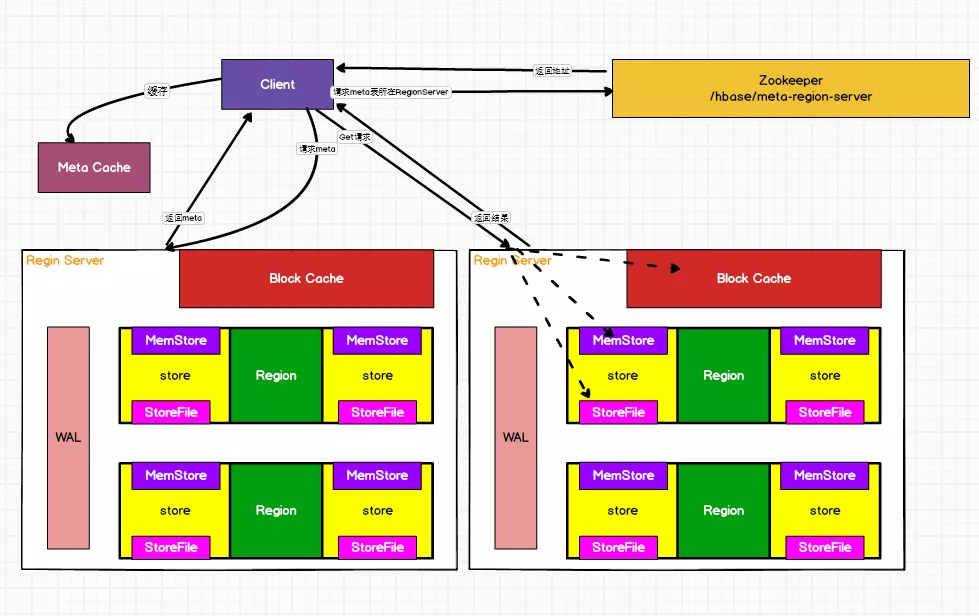

> （1）Client先访问zookeeper，获取hbase:meta表位于哪个Region Server。
>
> （2）访问对应的Region Server，获取hbase:meta表，根据读请求的namespace:table/rowkey，查询出目标数据位于哪个Region Server中的哪个Region中。并将该table的region信息以及meta表的位置信息缓存在客户端的meta cache，方便下次访问。
>
> （3）与目标Region Server进行通讯。
>
> （4）分别在MemStore和Store File（HFile）中查询目标数据，并将查到的所有数据进行合并。此处所有数据是指同一条数据的不同版本（time stamp）或者不同的类型（Put/Delete）。
>
> （5）将查询到的新的数据块（Block，HFile数据存储单元，默认大小为64KB）缓存到BlockCache。
>
> （6）将合并后的最终结果返回给客户端。

### 3.5.2 StoreFile Compaction

> 由于memstore每次刷写都会生成一个新的HFile，且同一个字段的不同版本（timestamp）和不同类型（Put/Delete）有可能会分布在不同的HFile中，因此查询时需要遍历所有的HFile。为了减少HFile的个数，以及清理掉过期和删除的数据，会进行StoreFile Compaction。Compaction分为两种，分别是Minor Compaction和Major Compaction。Minor Compaction会将临近的若干个较小的HFile合并成一个较大的HFile，并清理掉部分过期和删除的数据。Major Compaction会将一个Store下的所有的HFile合并成一个大HFile，并且会清理掉所有过期和删除的数据。

### 3.6.3 Region Split

> 默认情况下，每个Table起初只有一个Region，随着数据的不断写入，Region会自动进行拆分。刚拆分时，两个子Region都位于当前的Region Server，但处于负载均衡的考虑，HMaster有可能会将某个Region转移给其他的Region Server。

### 3.6.4 Region Split时机

当1个region中的某个Store下所有StoreFile的总大小超过下面的值，该Region就会进行拆分。

```sh
Min(initialSize*R^3 ,hbase.hregion.max.filesize")
其中initialSize的默认值为2*hbase.hregion.memstore.flush.size
R为当前Region Server中属于该Table的Region个数）
```

> 具体的切分策略为：
>
> 第一次split：1^3 *256 = 256MB
>
> 第二次split：2^3 *256 = 2048MB
>
> 第三次split：3^3 *256 = 6912MB
>
> 第四次split：4^3 *256 = 16384MB > 10GB，因此取较小的值10GB
>
> 后面每次split的size都是10GB了。

## 3.6 HBase与Hive的对比

### 3.6.1 Hive

> (1)数据仓库
>
> Hive的本质其实就相当于将HDFS中已经存储的文件在Mysql中做了一个双射关系，以方便使用HQL去管理查询。
>
> (2)用于数据分析、清洗
>
> Hive适用于离线的数据分析和清洗，延迟较高。
>
> (3)基于HDFS、MapReduce
>
> Hive存储的数据依旧在DataNode上，编写的HQL语句终将是转换为MapReduce代码执行。

### 3.6.2 HBase

> （1）数据库
>
> 是一种面向列存储的非关系型数据库。
>
> （2）用于存储结构化和非结构化的数据适用于单表非关系型数据的存储，不适合做关联查询，类似JOIN等操作。
>
> （3）基于HDFS
>
> 数据持久化存储的体现形式是Hfile，存放于DataNode中，被ResionServer以region的形式进行管理。
>
> （4）延迟较低，接入在线业务使用
>
> 面对大量的企业数据，HBase可以直线单表大量数据的存储，同时提供了高效的数据访问速度。

## 3.7 预分区

> 每一个region维护着startRow与endRowKey，如果加入的数据符合某个region维护的rowKey范围，则该数据交给这个region维护。那么依照这个原则，我们可以将数据所要投放的分区提前大致的规划好，以提高HBase性能。

方式

（1）手动设定预分区

```sh
create 'staff','info','partition',SPLITS => ['100000','200000','300000','400000']
```

（2）16进制序列预分区

```sh
create 'staff','info','partition',{NUMREGIONS => 15, SPLITALGO => 'HexStringSplit'}
```

（3）按照文件中设置的规则预分区

```sh
1111
2222
3333
4444
create 'staff','partition',SPLITS_FILE => 'splits.txt'
```

（4）JavaAPI创建预分区

```java
//自定义算法，产生一系列 Hash 散列值存储在二维数组中
byte[][] splitKeys = 某个散列值函数
//创建 HBaseAdmin 实例
HBaseAdmin hAdmin = new HBaseAdmin(HBaseConfiguration.create());
//创建 HTableDescriptor 实例
HTableDescriptor tableDesc = new HTableDescriptor(tableName);
//通过 HTableDescriptor 实例和散列值二维数组创建带有预分区的 HBase 表
hAdmin.createTable(tableDesc, splitKeys);
```

## 3.8 RowKey设计

### 3.8.1 设计原则

> （1）rowkey长度原则
>
> Rowkey是一个二进制数据流，Rowkey的长度建议设计在10-100个字节，不过建议是越短越好，不要超过16个字节。如果设置过长，会极大影响Hfile的存储效率。MemStore将缓存部分数据到内存，如果Rowkey字段过长内存的有效利用率降低，系统将无法缓存更多的数据，这会降低检索效率。
>
> （2）rowkey散列原则
>
> 如果Rowkey是按时间戳的方式递增，不要将时间放在二进制码的前面，建议将Rowkey的高位作为散列字段，由程序循环生成，低位放时间字段，这样将提高数据均衡分布在每个Regionserver实现负载均衡的几率。如果没有散列字段，首字段直接是时间信息将产生所有新数据都在一个RegionServer上堆积的热点现象，这样在做数据检索的时候负载将会集中在个别RegionServer，降低查询效率。
>
> （3）rowkey唯一原则

### 3.8.2 如何设计

> （1）生成随机数、hash、散列值
>
> （2）字符串反转

## 3.9 HBase优化

### 3.9.1 高可用

> 在HBase中Hmaster负责监控RegionServer的生命周期，均衡RegionServer的负载，如果Hmaster挂掉了，那么整个HBase集群将陷入不健康的状态，并且此时的工作状态并不会维持太久。所以，HBase支持对Hmaster的高可用

### 3.9.2 内存优化

> HBase操作过程中需要大量的内存开销，毕竟Table是可以缓存在内存中的，一般会分配整个可用内存的70%给HBase的Java堆。但是不建议分配非常大的堆内存，因为GC过程持续太久会导致RegionServer处于长期不可用状态，一般**16~48G**内存就可以了，如果因为框架占用内存过高导致系统内存不足，框架一样会被系统服务拖死。

### 3.9.3 配置优化

（1）开启HDFS追加同步，可以优秀的配合HBase的数据同步和持久化。默认值为true。

```sh
dfs.support.append
```

（2）HBase一般都会同一时间操作大量的文件，根据集群的数量和规模以及数据动作，设置为4096或者更高。默认值：4096。

```sh
fs.datanode.max.transfer.threads
```

（3）优化延迟高的数据操作的等待时间

如果对于某一次数据操作来讲，延迟非常高，socket需要等待更长的时间，建议把该值设置为更大的值（默认60000毫秒），以确保socket不会被timeout掉。

```sh
dfs.image.transfer.timeout
```

（4）优化数据的写入效率

开启这两个数据可以大大提高文件的写入效率，减少写入时间。第一个属性值修改为true，第二个属性值修改为：org.apache.bigdata.io.compress.GzipCodec或者其他压缩方式。

```sh
mapreduce.map.output.compress
mapreduce.map.output.compress.codec
```

（5）优化HStore文件大小

默认值10GB，如果需要运行HBase的MR任务，可以减小此值，因为一个region对应一个map任务，如果单个region过大，会导致map任务执行时间过长。该值的意思就是，如果HFile的大小达到这个数值，则这个region会被切分为两个Hfile。

```sh
hbase.hregion.max.filesize
```

（6）优化HBase客户端缓存

用于指定HBase客户端缓存，增大该值可以减少RPC调用次数，但是会消耗更多内存，反之则反之。一般我们需要设定一定的缓存大小，以达到减少RPC次数的目的。

```sh
hbase.client.write.buffer
```

(7)指定scan.next扫描HBase所获取的行数

用于指定scan.next方法获取的默认行数，值越大，消耗内存越大。

```sh
hbase.client.scanner.caching
```

（8）flush、compact、split机制当MemStore达到阈值，将Memstore中的数据Flush进Storefile；compact机制则是把flush出来的小文件合并成大的Storefile文件。split则是当Region达到阈值，会把过大的Region一分为二。

```sh
128M就是Memstore的默认阈值
hbase.hregion.memstore.flush.size：134217728
```

当MemStore使用内存总量达到HBase.regionserver.global.memstore.upperLimit指定值时，将会有多个MemStores flush到文件中，MemStore flush 顺序是按照大小降序执行的，直到刷新到MemStore使用内存略小于lowerLimit

```sh
hbase.regionserver.global.memstore.upperLimit：0.4
hbase.regionserver.global.memstore.lowerLimit：0.38
```

## 3.10 Phoenix二级索引

> 在Hbase中，按字典顺序排序的rowkey是一级索引。不通过rowkey来查询数据时需要过滤器来扫描整张表。通过二级索引，这样的场景也可以轻松定位到数据。
>
> **二级索引**的原理通常是在写入时针对某个字段和rowkey进行绑定，查询时先根据这个字段查询到rowkey，然后根据rowkey查询数据，二级索引也可以理解为查询数据时多次使用索引的情况。

### 3.10.1 索引

#### 3.10.1.1 全局索引

> 全局索引适用于多读少写的场景，在写操作上会给性能带来极大的开销，因为所有的更新和写操作（DELETE,UPSERT VALUES和UPSERT SELECT）都会引起索引的更新,在读数据时，Phoenix将通过索引表来达到快速查询的目的。

#### 3.10.1.2 本地索引

> 本地索引适用于写多读少的场景，当使用本地索引的时候即使查询的所有字段都不在索引字段中时也会用到索引进行查询，Phoneix在查询时会自动选择是否使用本地索引。

#### 3.10.1.3 覆盖索引

> 只需要通过索引就能返回所要查询的数据，所以索引的列必须包含所需查询的列。

#### 3.10.1.4 函数索引

> 索引不局限于列，可以合适任意的表达式来创建索引，当在查询时用到了这些表达式时就直接返回表达式结果

### 3索引优化

索引优化

（1）根据主表的更新来确定更新索引表的线程数

```sh
index.builder.threads.max:（默认值：10）
```

（2）builder线程池中线程的存活时间

```sh
index.builder.threads.keepalivetime：（默认值：60）
```

（3）更新索引表时所能使用的线程数(即同时能更新多少张索引表)，其数量最好与索引表的数量一致

```sh
index.write.threads.max:（默认值：10）
```

(4)更新索引表的线程所能存活的时间

```sh
index.write.threads.keepalivetime（默认值：60）
```

(5)每张索引表所能使用的线程(即在一张索引表中同时可以有多少线程对其进行写入更新)，增加此值可以提高更新索引的并发量

```sh
hbase.htable.threads.max（默认值：2147483647）
```

(6)索引表上更新索引的线程的存活时间

```sh
hbase.htable.threads.keepalivetime（默认值：60）
```

(7)允许缓存的索引表的数量增加此值，可以在更新索引表时不用每次都去重复的创建htable，由于是缓存在内存中，所以其值越大，其需要的内存越多

```sh
index.tablefactoy.cache.size（默认值：10）
```

# 四. Kafka

## 4.1 为什么要用消息队列

> 1. 解耦
>
>    允许你独立的扩展或修改两边的处理过程，只要确保它们遵守同样的接口约束。
>
> 2. 可恢复性
>
>    系统的一部分组件失效时，不会影响到整个系统。消息队列降低了进程间的耦合度，所以即使一个处理消息的进程挂掉，加入队列中的消息仍然可以在系统恢复后被处理。
>
> 3. 缓冲
>    有助于控制和优化数据流经过系统的速度，解决生产消息和消费消息的处理速度不一致的情况。
>
> 4. 灵活性与峰值处理能力
>    在访问量剧增的情况下，应用仍然需要继续发挥作用，但是这样的突发流量并不常见。如果为以能处理这类峰值访问为标准来投入资源随时待命无疑是巨大的浪费。使用消息队列能够使关键组件顶住突发的访问压力，而不会因为突发的超负荷的请求而完全崩溃。
>
> 5. 异步通信
>    很多时候，用户不想也不需要立即处理消息。消息队列提供了异步处理机制，允许用户把一个消息放入队列，但并不立即处理它。想向队列中放入多少消息就放多少，然后在需要的时候再去处理它们。

## 4.2 为什么选择了kafka

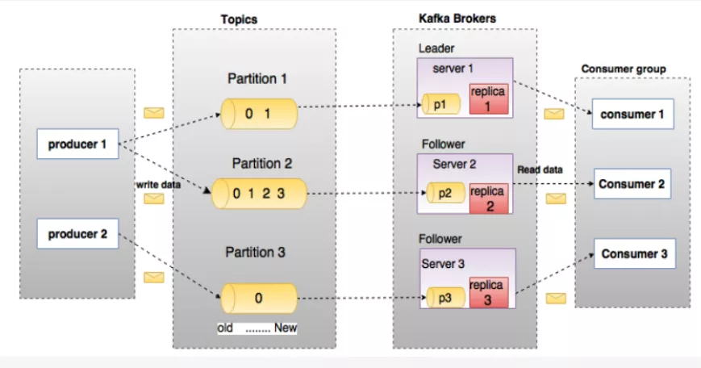

> 1. 高吞吐量、低延迟：kafka每秒可以处理几十万条消息，它的延迟最低只有几毫秒。
>
> 2. 可扩展性：kafka集群支持热扩展。
>
> 3. 持久性、可靠性：消息被持久化到本地磁盘，并且支持数据备份防止数据丢失。
>
> 4. 容错性：允许集群中节点故障（若副本数量为n,则允许n-1个节点故障）。
>
> 5. 高并发：支持数千个客户端同时读写。

## 4.3 kafka的组件与作用(架构)

> 1. Producer ：消息生产者，就是向kafka broker发消息的客户端。
>
> 2. Consumer ：消息消费者，向kafka broker取消息的客户端。
>
> 3. Consumer Group （CG）：消费者组，由多个consumer组成。消费者组内每个消费者负责消费不同分区的数据，一个分区只能由一个组内消费者消费；消费者组之间互不影响。所有的消费者都属于某个消费者组，即消费者组是逻辑上的一个订阅者。
>
> 4. Broker ：一台kafka服务器就是一个broker。一个集群由多个broker组成。一个broker可以容纳多个topic。
>    
>5. Topic ：可以理解为一个队列，生产者和消费者面向的都是一个topic。
> 
>6. Partition：为了实现扩展性，一个非常大的topic可以分布到多个broker（即服务器）上，一个topic可以分为多个partition，每个partition是一个有序的队列。
> 
>7. Replica：副本，为保证集群中的某个节点发生故障时，该节点上的partition数据不丢失，且kafka仍然能够继续工作，kafka提供了副本机制，一个topic的每个分区都有若干个副本，一个leader和若干个follower。
> 
>8. leader：每个分区多个副本的“主”，生产者发送数据的对象，以及消费者消费数据的对象都是leader。
> 
>9. follower：每个分区多个副本中的“从”，实时从leader中同步数据，保持和leader数据的同步。leader发生故障时，某个follower会成为新的follower。

## 4.4 kafka为什么要分区

> 1. 方便在集群中扩展，每个Partition可以通过调整以适应它所在的机器，而一个topic又可以有多个Partition组成，因此整个集群就可以适应任意大小的数据了。
>
> 2. 可以提高并发，因为可以以Partition为单位读写。

## 4.3 Kafka生产者分区策略

> 指明 partition 的情况下，直接将指明的值直接作为partiton值。
>
> 没有指明partition值但有key的情况下，将key的hash值与topic的partition数进行取余得到partition值。
>
> 既没有partition值又没有key值的情况下，第一次调用时随机生成一个整数（后面每次调用在这个整数上自增），将这个值与topic可用的partition总数取余得到partition值，也就是常说的round-robin算法。

## 4.4 kafka的数据可靠性怎么保证

> 为保证producer发送的数据，能可靠的发送到指定的topic，topic的每个partition收到producer发送的数据后，都需要向producer发送**ack**（acknowledgement确认收到），如果producer收到ack，就会进行下一轮的发送，否则重新发送数据。所以引出ack机制。

## 4.5 ack应答机制（可问：造成数据重复和丢失的相关问题）

> Kafka为用户提供了三种可靠性级别，用户根据对可靠性和延迟的要求进行权衡，选择以下的配置。
>
> acks参数配置：
>
> 0：producer不等待broker的ack，这一操作提供了一个最低的延迟，broker一接收到还没有写入磁盘就已经返回，当broker故障时有可能丢失数据。
>
> 1：producer等待broker的ack，partition的leader落盘成功后返回ack，如果在follower同步成功之前leader故障，那么将会丢失数据。
>
> 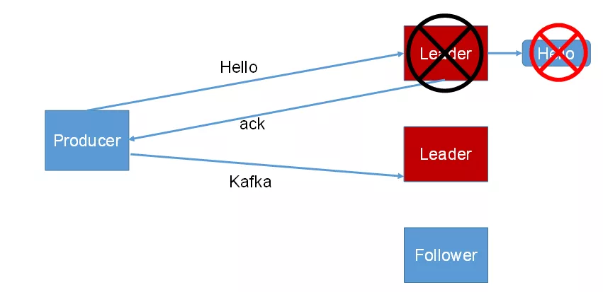
>
> -1（all)：producer等待broker的ack，partition的leader和follower全部落盘成功后才返回ack。但是如果在follower同步完成后，broker发送ack之前，leader发生故障，那么会造成数据重复。
>
> 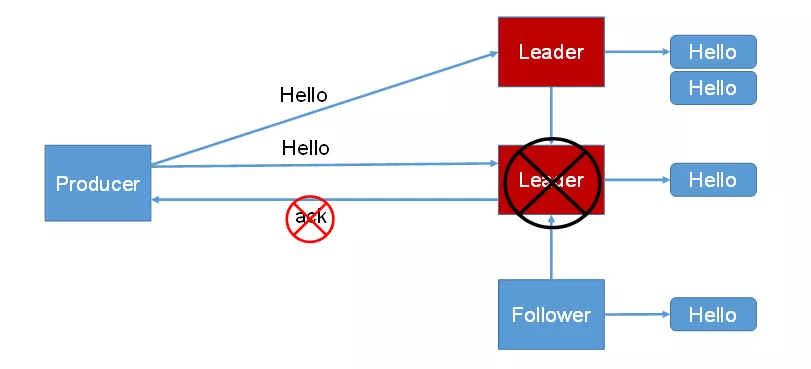

## 4.6 副本数据同步策略

| 方案                        | 优点                                               | 缺点                                                |
| --------------------------- | -------------------------------------------------- | --------------------------------------------------- |
| 半数以上完成同步，就发送ack | 延迟低                                             | 选举新的leader时，容忍n台节点的故障，需要2n+1个副本 |
| 全部完成同步，才发送ack     | 选举新的leader时，容忍n台节点的故障，需要n+1个副本 | 延迟高                                              |

> 选择最后一个的原因：
>
> 1. 同样为了容忍n台节点的故障，第一种方案需要2n+1个副本，而第二种方案只需要n+1个副本，而Kafka的每个分区都有大量的数据，第一种方案会造成大量数据的冗余。
>
> 2. 虽然第二种方案的网络延迟会比较高，但网络延迟对Kafka的影响较小。

## 4.7 ISR

> 如果采用全部完成同步，才发送ack的副本的同步策略的话：提出问题：leader收到数据，所有follower都开始同步数据，但有一个follower，因为某种故障，迟迟不能与leader进行同步，那leader就要一直等下去，直到它完成同步，才能发送ack。这个问题怎么解决呢？
>
> Leader维护了一个动态的in-sync replica set (ISR)，意为和leader保持同步的follower集合。当ISR中的follower完成数据的同步之后，leader就会给follower发送ack。如果follower长时间未向leader同步数据，则该follower将被踢出ISR，该时间阈值由replica.lag.time.max.ms参数设定。Leader发生故障之后，就会从ISR中选举新的leader。

## 4.8 故障处理(LEO与HW)

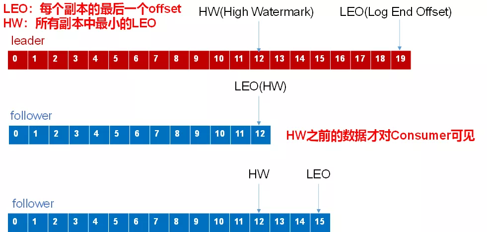

>  LEO：指的是每个副本最大的offset。
>
> HW：指的是消费者能见到的最大的offset，ISR队列中最小的LEO。


## 4.9 follower故障

> follower发生故障后会被临时踢出ISR，待该follower恢复后，follower会读取本地磁盘记录的上次的HW，并将log文件高于HW的部分截取掉，从HW开始向leader进行同步。等该follower的LEO大于等于该Partition的HW，即follower追上leader之后，就可以重新加入ISR了。

## 4.10  leader故障

> leader发生故障之后，会从ISR中选出一个新的leader，之后，为保证多个副本之间的数据一致性，其余的follower会先将各自的log文件高于HW的部分截掉，然后从新的leader同步数据。
>
> 注意：这只能保证副本之间的数据一致性，并不能保证数据不丢失或者不重复。

## 4.11 kafka的副本机制

> 参考上一个问题(副本数据同步策略)。

## 4.12 kafka的消费分区分配策略

> 一个consumer group中有多个consumer，一个topic有多个partition，所以必然会涉及到partition的分配问题，即确定那个partition由哪个consumer来消费 Kafka有三种分配策略，一是RoundRobin，一是Range。高版本还有一个StickyAssignor策略将分区的所有权从一个消费者移到另一个消费者称为重新平衡（rebalance）。当以下事件发生时，Kafka 将会进行一次分区分配：
>
> 同一个 Consumer Group 内新增消费者。
>
> 消费者离开当前所属的Consumer Group，包括shuts down或crashes。

### (1) Range分区分配策略

> Range是对每个Topic而言的（即一个Topic一个Topic分），首先对同一个Topic里面的分区按照序号进行排序，并对消费者按照字母顺序进行排序。然后用Partitions分区的个数除以消费者线程的总数来决定每个消费者线程消费几个分区。如果除不尽，那么前面几个消费者线程将会多消费一个分区。假设n=分区数/消费者数量，m=分区数%消费者数量，那么前m个消费者每个分配n+1个分区，后面的（消费者数量-m）个消费者每个分配n个分区。假如有10个分区，3个消费者线程，把分区按照序号排列
>
> 0，1，2，3，4，5，6，7，8，9
>
> 消费者线程为
>
> C1-0，C2-0，C2-1
>
> 那么用partition数除以消费者线程的总数来决定每个消费者线程消费几个partition，如果除不尽，前面几个消费者将会多消费一个分区。在我们的例子里面，我们有10个分区，3个消费者线程，10/3 =3，而且除除不尽，那么消费者线程C1-0将会多消费一个分区，所以最后分区分配的结果看起来是这样的：
>
> C1-0：0，1，2，3
>
> C2-0：4，5，6
>
> C2-1：7，8，9
>
> 如果有11个分区将会是：
>
> C1-0：0，1，2，3
>
> C2-0：4，5，6，7
>
> C2-1：8，9，10
>
> 假如我们有两个主题T1,T2，分别有10个分区，最后的分配结果将会是这样：
>
> C1-0：T1（0，1，2，3） T2（0，1，2，3）
>
> C2-0：T1（4，5，6） T2（4，5，6）
>
> C2-1：T1（7，8，9） T2（7，8，9）


### (2) RoundRobinAssignor分区分配策略

> RoundRobinAssignor策略的原理是将消费组内所有消费者以及消费者所订阅的所有topic的partition按照字典序排序，然后通过轮询方式逐个将分区以此分配给每个消费者.使用RoundRobin策略有两个前提条件必须满足：
>
> 同一个消费者组里面的所有消费者的num.streams（消费者消费线程数）必须相等；每个消费者订阅的主题必须相同。加入按照 hashCode 排序完的topic-partitions组依次为
>
> T1-5, T1-3, T1-0, T1-8, T1-2, T1-1, T1-4, T1-7, T1-6, T1-9
>
> 我们的消费者线程排序为
>
> C1-0, C1-1, C2-0, C2-1
>
> 最后分区分配的结果为：
>
> C1-0 将消费 T1-5, T1-2, T1-6 分区
>
> C1-1 将消费 T1-3, T1-1, T1-9 分区
>
> C2-0 将消费 T1-0, T1-4 分区
>
> C2-1 将消费 T1-8, T1-7 分区

### (3) StickyAssignor分区分配策略

> Kafka从0.11.x版本开始引入这种分配策略，它主要有两个目的：
>
> 分区的分配要尽可能的均匀，分配给消费者者的主题分区数最多相差一个分区的分配尽可能的与上次分配的保持相同。当两者发生冲突时，第一个目标优先于第二个目标。鉴于这两个目的，StickyAssignor策略的具体实现要比RangeAssignor和RoundRobinAssignor这两种分配策略要复杂很多。假设消费组内有3个消费者C0、C1、C2
> 它们都订阅了4个主题：t0、t1、t2、t3并且每个主题有2个分区，也就是说整个消费组订阅了t0p0、t0p1、t1p0、t1p1、t2p0、t2p1、t3p0、t3p1这8个分区
>
> 最终的分配结果如下：
>
> 消费者C0：t0p0、t1p1、t3p0
>
> 消费者C1：t0p1、t2p0、t3p1
>
> 消费者C2：t1p0、t2p1
>
> 这样初看上去似乎与采用RoundRobinAssignor策略所分配的结果相同
>
> 此时假设消费者C1脱离了消费组，那么消费组就会执行再平衡操作，进而消费分区会重新分配。如果采用RoundRobinAssignor策略，那么此时的分配结果如下：
>
> 消费者C0：t0p0、t1p0、t2p0、t3p0
>
> 消费者C2：t0p1、t1p1、t2p1、t3p1
>
> 如分配结果所示，RoundRobinAssignor策略会按照消费者C0和C2进行重新轮询分配。而如果此时使用的是StickyAssignor策略，那么分配结果为：
>
> 消费者C0：t0p0、t1p1、t3p0、t2p0
>
> 消费者C2：t1p0、t2p1、t0p1、t3p1
>
> 可以看到分配结果中保留了上一次分配中对于消费者C0和C2的所有分配结果，并将原来消费者C1的“负担”分配给了剩余的两个消费者C0和C2，最终C0和C2的分配还保持了均衡。
>
> 如果发生分区重分配，那么对于同一个分区而言有可能之前的消费者和新指派的消费者不是同一个，对于之前消费者进行到一半的处理还要在新指派的消费者中再次复现一遍，这显然很浪费系统资源。
>
> StickyAssignor策略如同其名称中的“sticky”一样，让分配策略具备一定的“粘性”，尽可能地让前后两次分配相同，进而减少系统资源的损耗以及其它异常情况的发生。到目前为止所分析的都是消费者的订阅信息都是相同的情况，我们来看一下订阅信息不同的情况下的处理。
>
> 举例，同样消费组内有3个消费者：
>
> C0、C1、C2
>
> 集群中有3个主题：t0、t1、t2
>
> 这3个主题分别有
>
> 1、2、3个分区
>
> 也就是说集群中有
>
> t0p0、t1p0、t1p1、t2p0、t2p1、t2p2这6个分区
>
> 消费者C0订阅了主题t0
>
> 消费者C1订阅了主题t0和t1
>
> 消费者C2订阅了主题t0、t1和t2
>
> 如果此时采用RoundRobinAssignor策略：
>
> 消费者C0：t0p0
>
> 消费者C1：t1p0
>
> 消费者C2：t1p1、t2p0、t2p1、t2p2
>
> 如果此时采用的是StickyAssignor策略：
>
> 消费者C0：t0p0
>
> 消费者C1：t1p0、t1p1
>
> 消费者C2：t2p0、t2p1、t2p2
>
> 此时消费者C0脱离了消费组，那么RoundRobinAssignor策略的分配结果为：
>
> 消费者C1：t0p0、t1p1
>
> 消费者C2：t1p0、t2p0、t2p1、t2p2
>
> StickyAssignor策略，那么分配结果为：
>
> 消费者C1：t1p0、t1p1、t0p0
>
> 消费者C2：t2p0、t2p1、t2p2
>
> 可以看到StickyAssignor策略保留了消费者C1和C2中原有的5个分区的分配：t1p0、t1p1、t2p0、t2p1、t2p2。
>
> 从结果上看StickyAssignor策略比另外两者分配策略而言显得更加的优异，这个策略的代码实现也是异常复杂。

## 4.13 kafka的offset怎么维护

Kafka 0.9版本之前，consumer默认将offset保存在Zookeeper中。

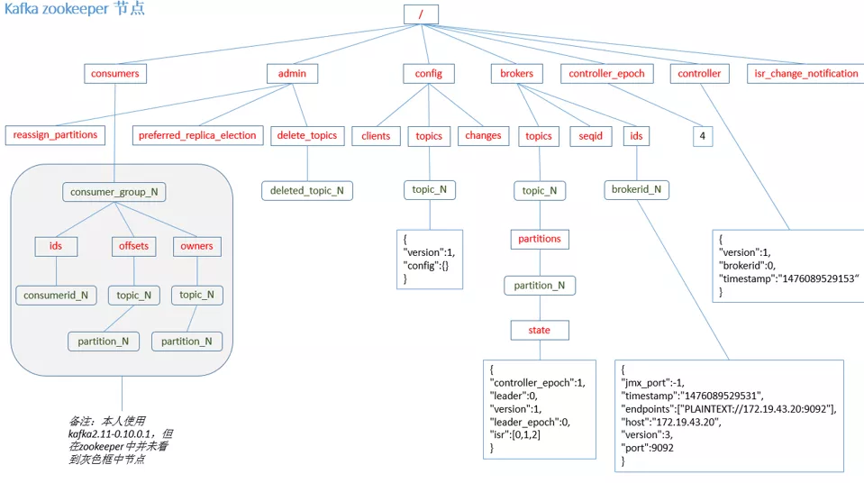

> 从0.9版本开始，consumer默认将offset保存在Kafka一个内置的topic中，该topic为__consumer_offsets。
>
> 额外补充：实际开发场景中在Spark和Flink中，可以自己手动提交kafka的offset，或者是flink两阶段提交自动提交offset。

## 4.14 kafka为什么这么快

> 1. Kafka本身是分布式集群，同时采用分区技术，并发度高。
>
> 2. 顺序写磁盘
>
> Kafka的producer生产数据，要写入到log文件中，写的过程是一直追加到文件末端，为顺序写。官
> 网有数据表明，同样的磁盘，顺序写能到600M/s，而随机写只有100K/s。
>
> 3. 零拷贝技术
>
> 零拷贝并不是不需要拷贝，而是减少不必要的拷贝次数。通常是说在IO读写过程中。
>
> 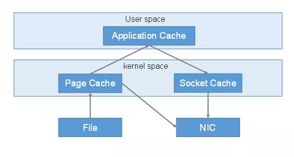
>
> 传统IO流程：
>
> 第一次：将磁盘文件，读取到操作系统内核缓冲区。
>
> 第二次：将内核缓冲区的数据，copy到application应用程序的buffer。
>
> 第三步：将application应用程序buffer中的数据，copy到socket网络发送缓冲区(属于操作系统内核的缓冲区)
>
> 第四次：将socket buffer的数据，copy到网卡，由网卡进行网络传输。
>
> 传统方式，读取磁盘文件并进行网络发送，经过的四次数据copy是非常繁琐的。实际IO读写，需要进行IO中断，需要CPU响应中断(带来上下文切换)，尽管后来引入DMA来接管CPU的中断请求，但四次copy是存在“不必要的拷贝”的。
>
> 重新思考传统IO方式，会注意到实际上并不需要第二个和第三个数据副本。应用程序除了缓存数据并将其传输回套接字缓冲区之外什么都不做。相反，数据可以直接从读缓冲区传输到套接字缓冲区。显然，第二次和第三次数据copy 其实在这种场景下没有什么帮助反而带来开销，这也正是零拷贝出现的意义。所以零拷贝是指读取磁盘文件后，不需要做其他处理，直接用网络发送出去。

## 4.15 Kafka消费能力不足怎么处理

> 如果是Kafka消费能力不足，则可以考虑增加Topic的分区数，并且同时提升消费组的消费者数量，消费者数=分区数。（两者缺一不可）
>
> 如果是下游的数据处理不及时：提高每批次拉取的数量。批次拉取数据过少（拉取数据/处理时间<生产速度），使处理的数据小于生产的数据，也会造成数据积压。

## 4.16 kafka事务是怎么实现的

> Kafka从0.11版本开始引入了事务支持。事务可以保证Kafka在Exactly Once语义的基础上，生产和消费可以跨分区和会话，要么全部成功，要么全部失败。

### (1) Producer事务

> 为了实现跨分区跨会话的事务，需要引入一个全局唯一的Transaction ID，并将Producer获得的PID和Transaction ID绑定。这样当Producer重启后就可以通过正在进行的Transaction ID获得原来的PID。为了管理Transaction，Kafka引入了一个新的组件Transaction Coordinator。Producer就是通过和Transaction Coordinator交互获得Transaction ID对应的任务状态。Transaction Coordinator还负责将事务所有写入Kafka的一个内部Topic，这样即使整个服务重启，由于事务状态得到保存，进行中的事务状态可以得到恢复，从而继续进行。

### (2) Consumer事务

> 对于Consumer而言，事务的保证就会相对较弱，尤其时无法保证Commit的信息被精确消费。这是由于Consumer可以通过offset访问任意信息，而且不同的Segment File生命周期不同，同一事务的消息可能会出现重启后被删除的情况。

## 4.17 Kafka中的数据是有序的吗

> 单分区内有序。
>
> 多分区，分区与分区间无序。

## 4.18 Kafka可以按照时间消费数据吗

> 可以，提供的API方法：
>
> KafkaUtil.fetchOffsetsWithTimestamp(topic, sTime, kafkaProp)
>

## 4.19 Kafka单条日志传输大小

> kafka对于消息体的大小默认为单条最大值是1M但是在我们应用场景中,常常会出现一条消息大于1M，如果不对kafka进行配置。则会出现生产者无法将消息推送到kafka或消费者无法去消费kafka里面的数据,这时我们就要对kafka进行以下配置：server.properties

```sh
replica.fetch.max.bytes: 1048576 broker可复制的消息的最大字节数,默认为1M
message.max.bytes: 1000012 kafka 会接收单个消息size的最大限制，默认为1M左右
message.max.bytes必须小于等于replica.fetch.max.bytes，否则就会导致replica之间数据同步失败
```

## 4.20 Kafka参数优化

### (1) Broker参数配置（server.properties）

```txt
1、日志保留策略配置

#保留三天，也可以更短（log.cleaner.delete.retention.ms）

log.retention.hours=72

2、Replica相关配置
default.replication.factor:1 默认副本1个
3、网络通信延时
replica.socket.timeout.ms:30000 #当集群之间网络不稳定时,调大该参数
replica.lag.time.max.ms= 600000#如果网络不好,或者kafka集群压力较大,会出现副本丢失,然后会频繁
复制副本,导致集群压力更大,此时可以调大该参数。
```


### (2) Producer优化（producer.properties）

```txt
compression.type:none gzip	snappy	lz4
#默认发送不进行压缩，推荐配置一种适合的压缩算法，可以大幅度的减缓网络压力和Broker的存储压力。
```


### (3) Kafka内存调整（kafka-server-start.sh）

```txt
默认内存1个G，生产环境尽量不要超过6个G。
export KAFKA_HEAP_OPTS="‐Xms4g ‐Xmx4g"
```


## 4.21 Kafka适合以下应用场景

> 1. 日志收集：一个公司可以用Kafka可以收集各种服务的log，通过kafka以统一接口服务的方式开放给各种consumer。
>
> 2. 消息系统：解耦生产者和消费者、缓存消息等。
>
> 3. 用户活动跟踪：kafka经常被用来记录web用户或者app用户的各种活动，如浏览网页、搜索、点击等活动，这些活动信息被各个服务器发布到kafka的topic中，然后消费者通过订阅这些topic来做实时的监控分析，亦可保存到数据库。
>
> 4. 运营指标：kafka也经常用来记录运营监控数据。包括收集各种分布式应用的数据，生产各种操作的集中反馈，比如报警和报告；
>
> 5. 流式处理：比如spark和flink。

## 4.22 Exactly Once语义

> 将服务器的ACK级别设置为-1，可以保证Producer到Server之间不会丢失数据，即At Least Once语义。相对的，将服务器ACK级别设置为0，可以保证生产者每条消息只会被发送一次，即At Most Once语义。
>
> At Least Once可以保证数据不丢失，但是不能保证数据不重复；相对的，At Least Once可以保证数据不重复，但是不能保证数据不丢失。但是，对于一些非常重要的信息，比如说交易数据，下游数据消费者要求数据既不重复也不丢失，即Exactly Once语义。在0.11版本以前的Kafka，对此是无能为力的，只能保证数据不丢失，再在下游消费者对数据做全局去重。对于多个下游应用的情况，每个都需要单独做全局去重，这就对性能造成了很大影响。
>
> 0.11版本的Kafka，引入了一项重大特性：幂等性。
>
> 开启幂等性enable.idempotence=true。
>
> 所谓的幂等性就是指Producer不论向Server发送多少次重复数据，Server端都只会持久化一条。幂等性结合At Least Once语义，就构成了Kafka的Exactly Once语义。即：
>
> At Least Once +幂等性= Exactly Once
>
> Kafka的幂等性实现其实就是将原来下游需要做的去重放在了数据上游。开启幂等性的Producer在初始化的时候会被分配一个PID，发往同一Partition的消息会附带Sequence Number。而Broker端会对<PID, Partition, SeqNumber>做缓存，当具有相同主键的消息提交时，Broker只会持久化一条。但是PID重启就会变化，同时不同的Partition也具有不同主键，所以幂等性无法保证跨分区跨会话的Exactly Once。
>
> 补充，在流式计算中怎么Exactly Once语义？以flink为例
>
> 1. souce：使用执行ExactlyOnce的数据源，比如kafka等内部使用FlinkKafakConsumer，并开启CheckPoint，偏移量会保存到StateBackend中，并且默认会将偏移量写入到topic中去，即_consumer_offsets Flink设置CheckepointingModel.EXACTLY_ONCE
>
> 2. sink存储系统支持覆盖也即幂等性：如Redis,Hbase,ES等存储系统不支持覆：需要支持事务(预写式日志或者两阶段提交),两阶段提交可参考Flink集成的kafka sink的实现。

# 五. Zookerper

## 5.1 Zookeeper介绍

> Zookeeper从设计模式角度来理解，是一个基于观察者模式设计的分布式服务管理框架，它负责存储和管理大家都关心的数据，然后接受观察者的注册，一旦这些数据的状态发生了变化，Zookeeper就负责通知已经在Zookeeper上注册的那些观察者做出相应的反应。

## 5.2 Zookeeper特点

> 1. 集群种只要有半数以上节点存活，Zookeeper集群就能正常提供服务。所以这就是选举机制的奇数原则（Zookeeper适合安装奇数台服务）。
>
> 2. 一个领导者Leaders和多个跟随者Follower组成的集群。

## 5.3 Zookeeper的选举机制

### (1) 新集群选举

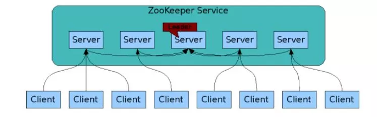

> 假设有五台服务器组成的Zookeeper集群，从Service1到Service5，同时它们都是最新启动的，也就是没有历史数据，在存放数据量这一点上，都是一样的。假设这些服务器依序启动，来看看会发生什么。
>
> 1. Service1启动，发起一次选举。服务器1投自己一票。此时服务器1票数一票，不够半数以上（3票），选举无法完成，服务器1状态保持为LOOKING；
>
> 2. Service2启动，再发起一次选举。Service1和Service2分别投自己一票并交换选票信息：此时Service1发现Service2的ID比自己目前投票推举的（Service1）大，更改选票为推举Service2。此时Service1票数0票，Service2票数2票，没有半数以上结果，选举无法完成，Service1，Service2状态保持LOOKING
>
> 3. Service3启动，发起一次选举。此时Service1和Service2都会更改选票为Service3。此次投票结果：Service1为0票，Service2为0票，Service3为3票。此时Service3的票数已经超过半数，Service3当选Leader。Service1与Service2更改状态为FOLLOWING，Service3更改状态为LEADING；
>
> 4. Service4启动，发起一次选举。此时Service1，Service2，Service3已经不是LOOKING状态，不会更改选票信息。交换选票信息结果：Service3为3票，Service4为1票。此时Service4服从多数，更改选票信息为Service3，并更改状态为FOLLOWING；
>
> 5. Service5启动，同理第4步一样Service5当FOLLOWING。

### (2) 非全新集群选举

> 对于运行正常的zookeeper集群，中途有机器down掉，需要重新选举时，选举过程就需要加入数据ID、服务器ID、和逻辑时钟。
>
> 1. 逻辑时钟：这个值从0开始，每次选举必须一致。小的选举结果被忽略，重新投票（除去选举次数不完整的服务器）。
>
> 2. 数据id：数据新的version大，数据每次更新都会更新version。数据id大的胜出（选出数据最新的服务器）。
>
> 3. 服务器id：即myid。数据id相同的情况下，服务器id大的胜出（数据相同的情况下，选择服务器id最大，即权重最大的服务器）。

### (3) Kafka依赖Zookeeper的选举

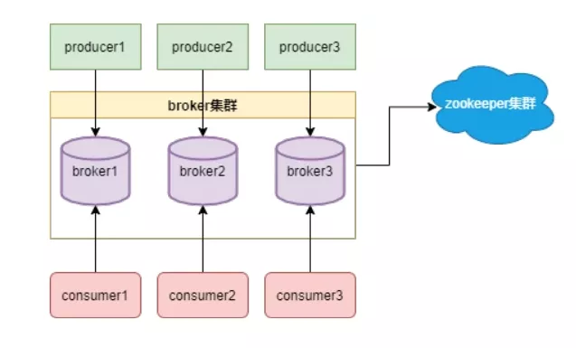

> ZooKeeper 作为给分布式系统提供协调服务的工具被 kafka 所依赖。在分布式系统中，消费者需要知道有哪些生产者是可用的，而如果每次消费者都需要和生产者建立连接并测试是否成功连接，那效率也太低了，显然是不可取的。而通过使用 ZooKeeper 协调服务，Kafka 就能将 Producer，Consumer，Broker 等结合在一起，同时借助 ZooKeeper，Kafka 就能够将所有组件在无状态的条件下建立起生产者和消费者的订阅关系，实现负载均衡。

### (4) Kafka依赖ZK做了哪些事

> ZooKeeper 作为给分布式系统提供协调服务的工具被 kafka 所依赖。在分布式系统中，消费者需要知道有哪些生产者是可用的，而如果每次消费者都需要和生产者建立连接并测试是否成功连接，那效率也太低了，显然是不可取的。而通过使用 ZooKeeper 协调服务，Kafka 就能将 Producer，Consumer，Broker 等结合在一起，同时借助 ZooKeeper，Kafka 就能够将所有组件在无状态的条件下建立起生产者和消费者的订阅关系，实现负载均衡。

### (5) Kafka选举

> Leader维护了一个动态的in-sync replica set (ISR)，意为和leader保持同步的follower集合。当ISR中的follower完成数据的同步之后，leader就会给follower发送ack。如果follower长时间未向leader同步数据，则该follower将被踢出ISR，该时间阈值由replica.lag.time.max.ms参数设定。
>
> Leader发生故障之后，就会从ISR中选举新的leader。因此这个集合中的任何一个节点随时都可以被选为leader。ISR在ZooKeeper中维护。ISR中有f+1个节点（follow+leader），就可以允许在f个节点down掉的情况下不会丢失消息并正常提供服。ISR的成员是动态的，如果一个节点被淘汰了，当它重新达到“同步中”的状态时，他可以重新加入ISR。因此如果leader宕了，直接从ISR中选择一个follower就行。
>
> 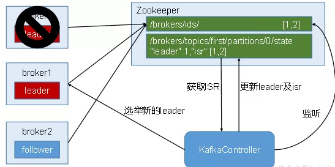
>
> 如果全挂呢？
>
> 一旦所有节点都down了，Kafka不会保证数据的不丢失。所以当副本都down掉时，必须及时作出反应。等待ISR中的任何一个节点恢复并担任leader。

**附：Kafka为什么要放弃ZK**

> 1. 本身就是一个分布式系统，但是需要另一个分布式系统来管理，复杂性无疑增加了。
>
> 2. 部署的时候必须要部署两套系统，要求运维人员必须要具备的运维能力。
>
> 3. Controller故障处理：依赖一个单一节点跟进行交互，如果这个节点发生了故障，就需要从中选择新的，新的选举成功后，会重新从拉取元数据进行初始化，并且需要通知其他所有的更新。老的需要关闭监听、事件处理线程和定时任务。分区数非常多时，这个过程非常耗时，而且这个过程中集群是不能工作的。
>
>    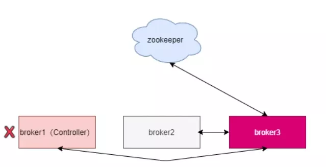
>
> 4. 当分区数增加时，保存的元数据变多，集群压力变大

## 5.4 基于ZooKeeper的Hadoop高可用

### 5.4.1 HDFS 高可用

#### 5.4.1.1 介绍

> 一个典型的HA集群，NameNode会被配置在两台独立的机器上，在任何时间上，一个NameNode处于活动状态，而另一个NameNode处于备份状态，活动状态的NameNode会响应集群中所有的客户端，备份状态的NameNode只是作为一个副本，保证在必要的时候提供一个快速的转移。所以对于HDFS来说，高可用其实就是针对NameNode的高可用。因为NameNode保存着集群的元数据信息，一旦丢失整个集群将不复存在。
>
> 主备切换控制器 ZKFailoverController：ZKFC 作为独立的进程运行，对 NameNode 的主备切换进行总体控制。ZKFailoverController 能及时检测到 NameNode 的健康状况，在主 NameNode 故障时借助 Zookeeper 实现自动的主备选举和切换，当然 NameNode 目前也支持不依赖于Zookeeper的手动主备切换。

#### 5.4.1.2 原理

> 当HDFS的两台NN启动时，ZKFC（Zookeeper FailoverController）也会启动，ZKFC会向ZK上写一个临时序列化的节点（默认节点名是：/hadoop-ha）并取得和ZK的连接，一旦NN挂掉，那么ZKFC也会挂掉，该节点会被ZK自动删除掉，ZKFC有Watcher机制（当子节点发生变化时触动），另一个伴随着NN启动的ZKFC发现子节点变化了，是不是排在第一位，是，就通知第二台NN开始接管，向JN同步数据（下载IDS文件并和FImage合并，并生成新的FImage），将元数据都变成最新的，若是挂掉的NN重新启动，那么ZKFC还会向ZK写个节点，等现接管的NN挂掉后再接管成为Master。

### 5.4.2 什么是ZKFC？

> 1. ZKFC是一个Zookeeper的**客户端**，它主要用来监测和管理NameNodes的状态，每个NameNode机器上都会运行一个ZKFC程序，它的职责主要有：一是健康监控。ZKFC间歇性的ping NameNode，得到NameNode返回状态，如果NameNode失效或者不健康，那么ZKFS将会标记其为不健康；
>
> 2. Zookeeper**会话管理**。当本地NaneNode运行良好时，ZKFC将会持有一个Zookeeper session，如果本地NameNode为Active，它同时也持有一个“排他锁”znode，如果session过期，那么次lock所对应的znode也将被删除；
>
> 3. **选举**。当集群中其中一个NameNode宕机，Zookeeper会自动将另一个激活。

### 5.4.3 内部操作与原理

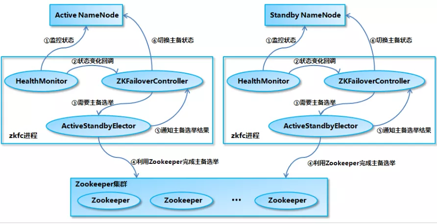

> HealthMonitor 初始化完成之后会启动内部的线程来定时调用对应 NameNode 的HAServiceProtocol RPC 接口的方法，对 NameNode 的健康状态进行检测。
>
> HealthMonitor 如果检测到 NameNode 的健康状态发生变化，会回调 ZKFailoverController注册的相应方法进行处理。
>
> 如果 ZKFailoverController 判断需要进行主备切换，会首先使用 ActiveStandbyElector 来进行
> 自动的主备选举。
>
> ActiveStandbyElector 与 Zookeeper 进行交互完成自动的主备选举。
>
> ActiveStandbyElector 在主备选举完成后，会回调 ZKFailoverController 的相应方法来通知当
> 前的 NameNode 成为主 NameNode 或备 NameNode。
>
> ZKFailoverController 调用对应 NameNode 的 HAServiceProtocol RPC 接口的方法将NameNode 转换为 Active 状态或 Standby 状态。
>
> 几句话描述就是：ZooKeeper提供了简单的机制来实现Acitve Node选举，如果当前Active失效，Standby将会获取一个特定的排他锁，那么获取锁的Node接下来将会成为Active。

## 5.5 Yarn高可用

### 5.5.1 介绍

> YARN ResourceManager 的高可用与 HDFS NameNode 的高可用类似但是 ResourceManager不像 NameNode ，没有那么多的元数据信息需要维护，所以它的状态信息可以直接写到Zookeeper 上，并依赖 Zookeeper 来进行主备选举。
>
> 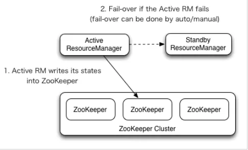

### 5.5.2 内部操作与原理

> 在ZooKeeper上会有一个/yarn-leader-election/yarn1的锁节点，所有的ResourceManager在启动的时候，都会去竞争写一个Lock子节点：/yarn-leader-election/yarn1/ActiveBreadCrumb，该节点是临时节点。ZooKeepr能够保证最终只有一个ResourceManager能够创建成功。创建成功的那个ResourceManager就切换为Active状态，没有成功的那些ResourceManager则切换为Standby状态。
>
> RM会把job的信息存放在zookeeper的/rmstore目录下，active RM会向这个目录写app的信息。当active RM挂掉之后，standby RM会通过zkfc切换为active状态，然后从zookeeper的/rmstore目录下读取相应的作业信息。重新构建作业的内存信息，启动内部服务，开始接受NM的心跳信息，构建集群的资源信息，并且接受客户端的作业提交请求。

### 5.5.3 其他与总结

> 在大数据领域，还有许多框架依赖与Zookeeper去选择主从：比如Hbase集群，Kudu集群，Impala集群等等，最底层的原理大径相同。总结选举：Zookeeper能够很容易的实现集群管理的功能，若有多台Server组成一个服务集群，则必须要一个leader知道集群中每台机器的服务状态，从而做出调整重新分配服务策略。当集群中增加一台或多台Server时，leader同样需要知道。Zookeeper不仅能够维护当前的集群中机器的服务状态，而且能够选出一个leader来管理集群。
>
> HA(分布式锁的应用)：Master挂掉之后迅速切换到slave节点。

# 六. Flink

## 6.1 Flink 核心特点

### 6.1.1 批流一体

> 所有的数据都天然带有时间的概念，必然发生在某一个时间点。把事件按照时间顺序排列起来，就形成了一个事件流，也叫作数据流。无界数据是持续产生的数据，所以必须持续地处理无界数据流。有界数据，就是在一个确定的时间范围内的数据流，有开始有结束，一旦确定了就不会再改变。

### 6.1.2 可靠的容错能力

> - 集群级容错
>   - 集群管理器集成（Hadoop YARN、Mesos或Kubernetes）
>   - 高可用性设置（HA模式基于ApacheZooKeeper）
> - 应用级容错（ Checkpoint）
>   - 一致性（其本身支持Exactly-Once 语义）
>   - 轻量级（检查点的执行异步和增量检查点）
>   - 高吞吐、低延迟

## 6.1.3 运行时架构

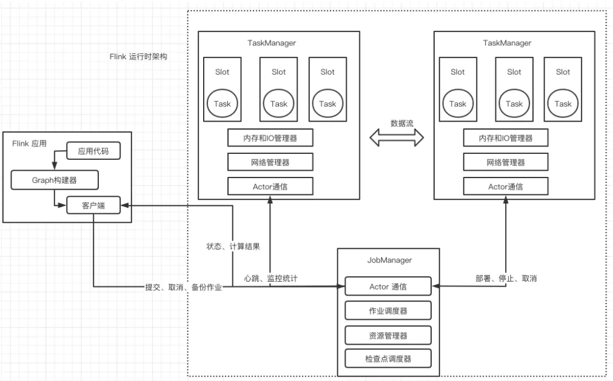

> - Flink 客户端
>   - 提交Flink作业到Flink集群
>   - Stream Graph 和 Job Graph构建
> - JobManager
>   - 资源申请
>   - 任务调度
>   - 应用容错
> - TaskManager
>   - 接收JobManager 分发的子任务，管理子任务任务处理（消费数据、处理数据）

## 6.2 Flink 应用

### 6.2.1 数据流

#### 6.2.1.1 DataStream 体系

> DataStream(每个DataStream都有一个Transformation对象)
>
> DataStreamSource（DataStream的起点）
>
> DataStreamSink（DataStream的输出）
>
> KeyedStream（表示根据指定的Key记性分组的数据流）
>
> WindowdeStream & AllWindowedStream（根据key分组且基于WindowAssigner切分窗口的数据流）
>
> JoinedStreams & CoGroupedStreams
>
> ​	i. JoinedStreams底层使用CoGroupedStreams来实现
>
> ​	ii. CoGrouped侧重的是Group，对数据进行分组，是对同一个key上的两组集合进行操作
>
> ​	iii. Join侧重的是数据对，对同一个key的每一对元素进行操作
>
> ConnectedStreams（表示两个数据流的组合）
>
> BroadcastStream & BroadcastConnectedStream（DataStream的广播行为）
>
> IterativeStream（包含IterativeStream的Dataflow是一个有向有环图）
>
> AsyncDataStream（在DataStream上使用异步函数的能力）

#### 6.2.1.2 处理数据API

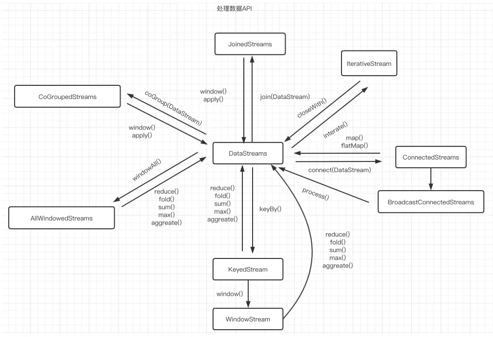

## 6.3 核心抽象核心抽象

### 6.3.1 环境对象

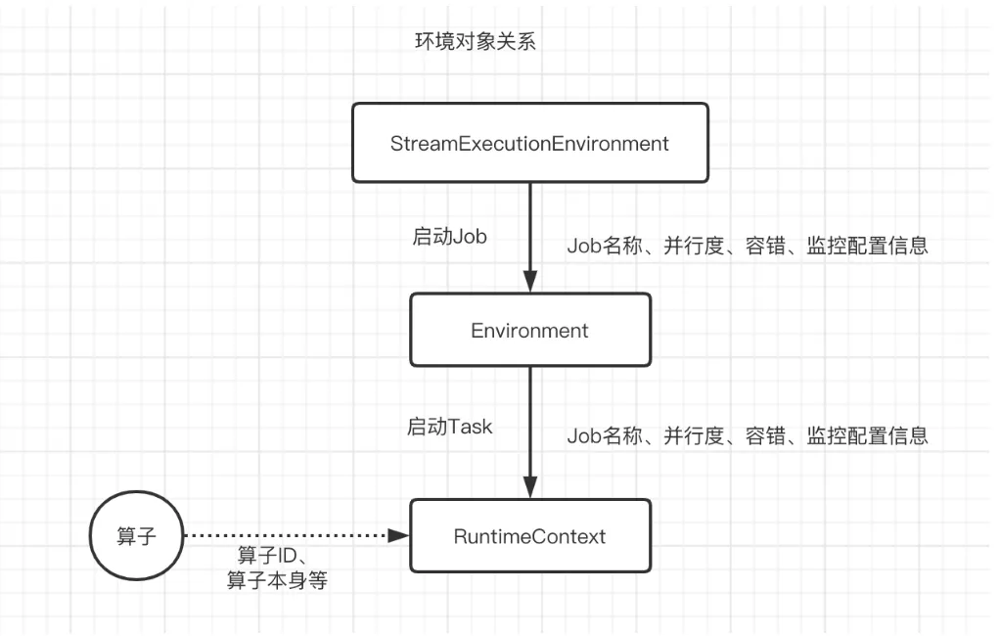

### 6.3.2 数据流元素

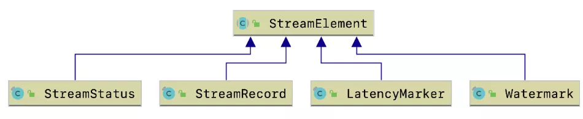

> 1、StreamRecord（数据流中的一条记录｜事件）
>
> i.数据的值本身
>
> ii.时间戳（可选）
>
> 2、LatencyMarker（用来近似评估延迟）
>
> i.周期性的在数据源算子中创造出来的时间戳
>
> ii.算子编号
>
> iii.数据源所在的Task编号
>
> 3、Watemark（是一个时间戳，用来告诉算子所有时间早于等于Watermark的事件或记录都已经到达，不会再有比Watermark更早的记录，算子可以根据Watermark触发窗口的计算、清理资源等）
>
> 4、StreamStatus（用来通知Task是否会继续接收到上游的记录或者Watermark）
>
> i.空闲状态（IDLE）。
>
> ii.活动状态（ACTIVE）。

### 6.3.3 Flink 异步IO

#### 6.3.3.1 原理

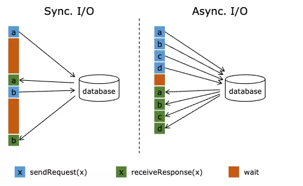

> 顺序输出模式（先收到的数据元素先输出，后续数据元素的异步函数调用无论是否先完成，都需要等待）

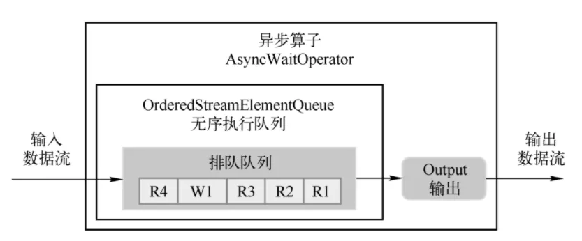

> 无序输出模式（先处理完的数据元素先输出，不保证消息顺序）

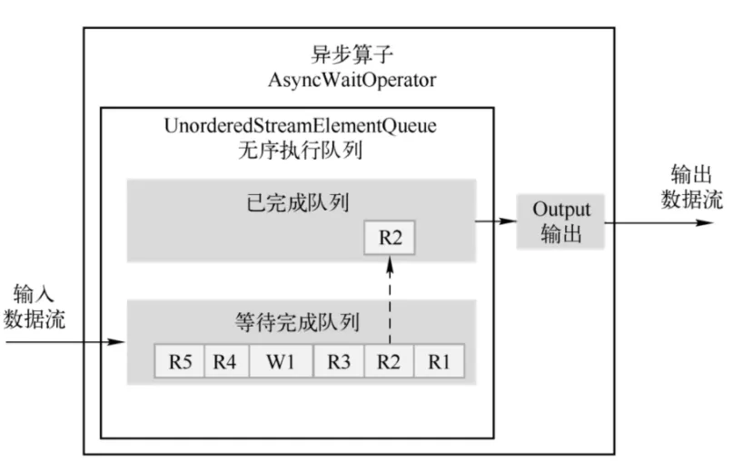

### 6.3.4 数据分区

> - ForwardPartitioner（用于在同一个OperatorChain中上下游算子之间的数据转发，实际上数据是直接传递给下游的）
>
> - ShufflePartitioner（随机将元素进行分区，可以确保下游的Task能够均匀地获得数据）
>
> - ReblancePartitioner（以Round-robin的方式为每个元素分配分区，确保下游的Task可以均匀地获得数据，避免数据倾斜）
>
> - RescalingPartitioner（用Round-robin选择下游的一个Task进行数据分区，如上游有2个Source，下游有6个Map，那么每个Source会分配3个固定的下游Map，不会向未分配给自己的分区写入数据）
>
> - BroadcastPartitioner（将该记录广播给所有分区）
>
> - KeyGroupStreamPartitioner（KeyedStream根据KeyGroup索引编号进行分区，该分区器不是提供给用户来用的）

## 6.4 窗口

### 6.4.1 实现原理

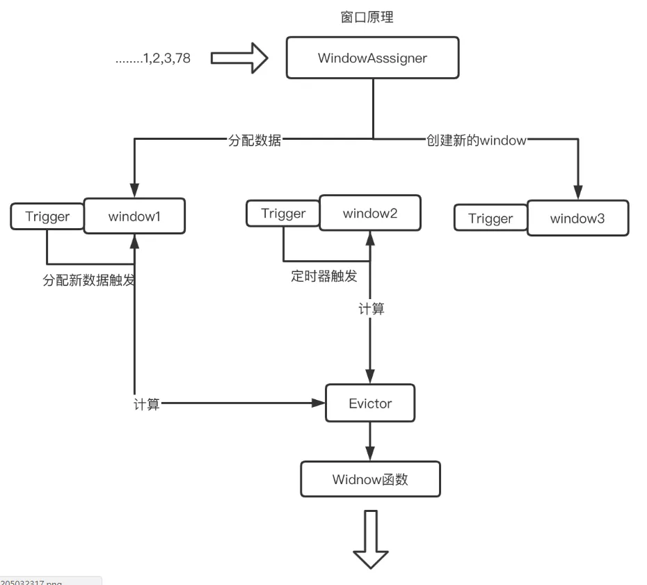

> WindowAssigner（用来决定某个元素被分配到哪个/哪些窗口中去）
>
> WindowTrigger（决定一个窗口何时能够呗计算或清除，每一个窗口都拥有一个属于自己的Trigger）
>
> WindowEvictor（窗口数据的过滤器，可在Window Function 执行前或后，从Window中过滤元素）
>
> ​	CountEvictor：计数过滤器。在Window中保留指定数量的元素，并从窗口头部开始丢弃其余元素
>
> ​	DeltaEvictor：阈值过滤器。丢弃超过阈值的数据记录
>
> ​	TimeEvictor：时间过滤器。保留最新一段时间内的元素

## 6.5 Watermark （水印）

### 6.5.1 作用

> 用于处理乱序事件，而正确地处理乱序事件，通常用Watermark机制结合窗口来实现

### 6.5.2 DataStream Watermark 生成

> 1、Source Function 中生成Watermark
>
> 2、DataStream API 中生成Watermark
>
> i. AssingerWithPeriodicWatermarks （周期性的生成Watermark策略，不会针对每个事件都生成）
>
> ii. AssingerWithPunctuatedWatermarks （对每个事件都尝试进行Watermark的生成，如果生成的结果是null 或Watermark小于之前的，则不会发往下游）

## 6.6 内存管理

### 6.6.1 自主内存管理原因

> 1、JVM内存管理的不足
>
> i.有效数据密度低
>
> ii.垃圾回收（大数据场景下需要消耗大量的内存，更容易触发Full GC ）
>
> iii. OOM 问题影响稳定性
>
> iv.缓存未命中问题（Java对象在堆上存储时并不是连续的）
>
> 2、自主内存管理
>
> i.堆外内存的优势
>
> a.大内存（上百GB）JVM的启动需要很长时间，Full GC可以达到分钟级。使用堆外内存，可以将大量的数据保存在堆外，极大地减小堆内存，避免GC和内存溢出的问题。
>
> b.高效的IO操作。堆外内存在写磁盘或网络传输时是zero-copy，而堆上内存则至少需要1次内存复制。
>
> c.堆外内存是进程间共享的。也就是说，即使JVM进程崩溃也不会丢失数据。这可以用来做故障恢复（Flink暂时没有利用这项功能，不过未来很可能会去做）
>
> ii.堆外内存的不足
>
> a.堆上内存的使用、监控、调试简单，堆外内存出现问题后的诊断则较为复杂
>
> b. Flink有时需要分配短生命周期的MemorySegment，在堆外内存上分配比在堆上内存开销更高。
>
> c.在Flink的测试中，部分操作在堆外内存上会比堆上内存慢

## 6.7 内存模型

### 6.7.1 内存模型图

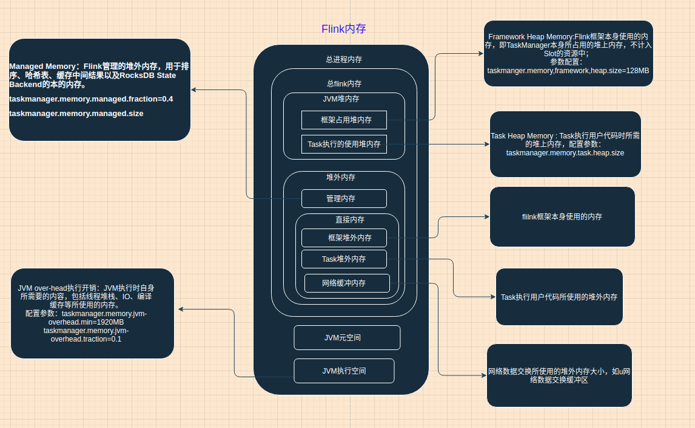

### 6.7.2 MemorySegment（内存段）

> 一个MemorySegment对应着一个32KB大小的内存块。这块内存既可以是堆上内存（Java的byte数组），也可以是堆外内存（基于Netty的DirectByteBuffer）

### 6.7.3 图解


### 6.7.4 结构

> - BYTE_ARRAY_BASE_OFFSET（二进制字节数组的起始索引）
>
> - LITTLE_ENDIAN（判断是否为Little Endian模式的字节存储顺序，若不是，就是Big Endian模式）Big Endian：低地址存放最高有效字节（MSB）
>
> - Little Endian：低地址存放最低有效字节（LSB）X86机器
>
> - HeapMemory（如果MemeorySegment使用堆上内存，则表示一个堆上的字节数组（byte［］），如果MemorySegment使用堆外内存，则为null）
>
> - address（字节数组对应的相对地址）
>
> - addressLimit（标识地址结束位置）
>
> - size（内存段的字节数）

### 6.7.5 实现

> HybirdMemorySegment：用来分配堆上和堆外内存和堆上内存，Flink 在实际使用中只使用了改方式。原因是当有多个实现时，JIT无法直接在编译时自动识别优化
>
> HeapMemorySegment：用来分配堆上内存，实际没有实现

### 6.7.6 MemroyManager（内存管理器）

> 实际申请的是堆外内存，通过RocksDB的Block Cache和WriterBufferManager参数来限制，RocksDB使用的内存量

## 6.8 State（状态）

> 1、状态管理需要考虑的因素：
>
> 2、状态数据的存储和访问
>
> 3、状态数据的备份和恢复
>
> 4、状态数据的划分和动态扩容
>
> 5、状态数据的清理

### 6.8.1 分类

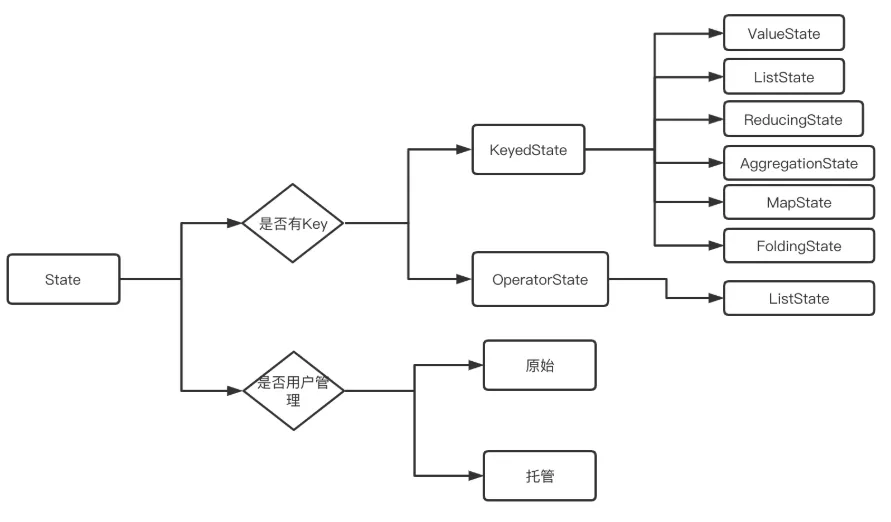

### 6.8.2 状态存储

> - MemoryStateBackend：纯内存，适用于验证、测试，不推荐生产环境
>
> - FsStateBackend：内存+文件，适用于长周期大规模的数据
>
> - RocksDBStateBackend：RocksDB，适用于长周期大规模的数据

### 6.8.3 重分布

> - ListState：并行度在改变的时候，会将并发上的每个List都取出，然后把这些List合并到一个新的List,根据元素的个数均匀分配给新的Task
>
> - UnionListState:把划分的方式交给用户去做，当改变并发的时候，会将原来的List拼接起来，然后不做划分，直接交给用户
>
> - BroadcastState:变并发的时候，把这些数据分发到新的Task即可
>
> - KeyState：Key-Group数量取决于最大并行度（MaxParallism）

### 6.8.4 作业提交

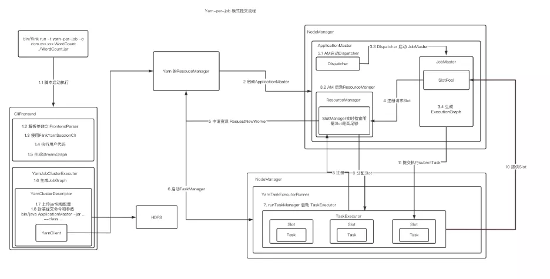

## 6.9 资源管理

### 6.9.1 关系图

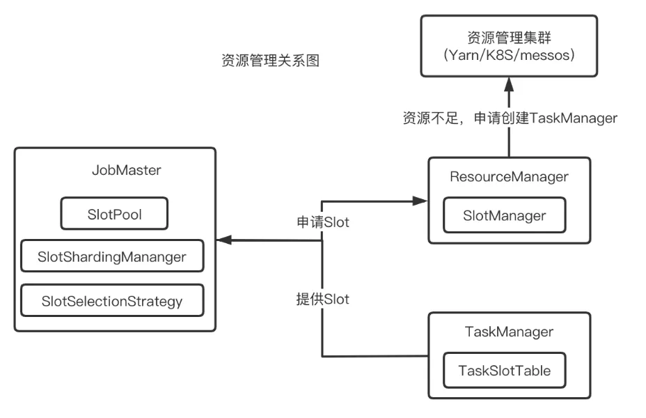

### 6.9.2 Slot选择策略

> - LocationPreferenceSlotSelectionStrategy（位置优先的选择策略）
>
> - DefaultLocationPreferenceSlotSelectionStrategy（默认策略），该策略不考虑资源的均衡分配，会从满足条件的可用Slot集合选择第1个
>
> - EvenlySpreadOutLocationPreferenceSlotSelectionStrategy（均衡策略），该策略考虑资源的均衡分配，会从满足条件的可用Slot集合中选择剩余资源最多的Slot，尽量让各个TaskManager均衡地承担计算压力
>
> - PreviousAllocationSlotSelectionStrategy（已分配Slot优先的选择策略），如果当前没有空闲的已分配Slot，则仍然会使用位置优先的策略来分配和申请Slot

### 6.9.3 调度

> - SchedulerNG （调度器）
>
>   - 作用
>
>     a.作业的生命周期管理（开始调度、挂起、取消）
>
>     b.作业执行资源的申请、分配、释放
>
>     c.作业状态的管理（发布过程中的状态变化、作业异常时的FailOver
>
>     d.作业的信息提供，对外提供作业的详细信息
>
>   - 实现
>
>     a. DefaultScheduler（使用ScchedulerStrategy来实现）
>
>     b. LegacyScheduler（实际使用了原来的ExecutionGraph的调度逻辑）
>
> - SchedulingStrategy（调度策略）
>
>   i. startScheduling：调度入口，触发调度器的调度行为
>
>   ii. restartTasks：重启执行失败的Task，一般是Task执行异常导致的
>
>   iii. onExecutionStateChange：当Execution的状态发生改变时
>
>   iv. onPartitionConsumable：当IntermediateResultParitititon中的数据可以消费时
>
> - 实现
>
>   a. EagerSchelingStrategy（该调度策略用来执行流计算作业的调度）
>
>   b. LazyFromSourceSchedulingStrategy（该调度策略用来执行批处理作业的调度）
>
> - ScheduleMode（调度模式）
>
>   i. Eager调度（该模式适用于流计算。一次性申请需要所有的资源，如果资源不足，则作业启动失败。）
>
>   ii. Lazy_From_Sources分阶段调度（适用于批处理。从Source Task开始分阶段调度，申请资源的时候，一次性申请本阶段所需要的所有资源。上游Task执行完毕后开始调度执行下游的Task，读取上游的数据，执行本阶段的计算任务，执行完毕之后，调度后一个阶段的Task，依次进行调度，直到作业执行完成）
>
>   iii. Lazy_From_Sources_With_Batch_Slot_Request分阶段Slot重用调度（适用于批处理。与分阶段调度基本一样，区别在于该模式下使用批处理资源申请模式，可以在资源不足的情况下执行作业，但是需要确保在本阶段的作业执行中没有Shuffle行为）

## 6.10 关键组件

### 6.10.1 JobMaster

> 1. 调度执行和管理（将JobGraph转化为ExecutionGraph，调度Task的执行，并处理Task的异常）
>
> - InputSplit 分配
>
> - 结果分区跟踪
>
> - 作业执行异常
>
> 2. 作业Slot资源管理
>
> 3. 检查点与保存点
>
> 4. 监控运维相关
>
> 5. 心跳管理

### 6.10.2 Task

#### 6.10.2.1 结构

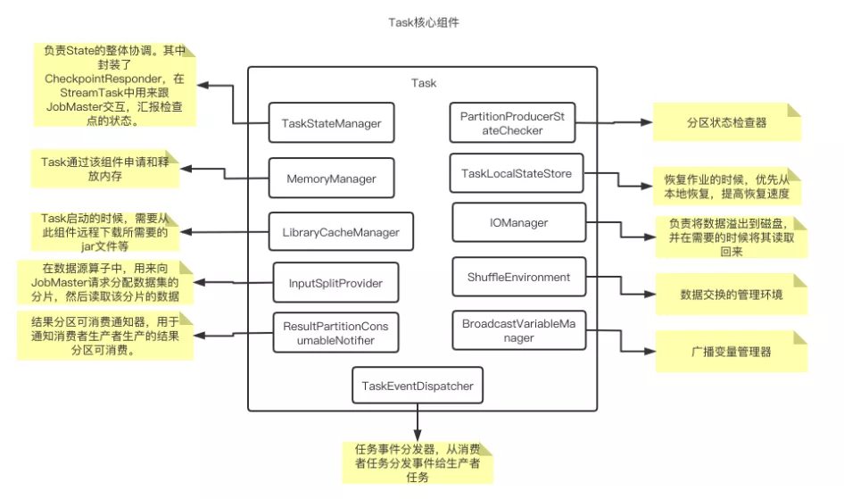

## 6.11 作业调度失败

### 6.11.1 失败异常分类

> NonRecoverableError：不可恢复的错误。此类错误意味着即便是重启也无法恢复作业到正常状态，一旦发生此类错误，则作业执行失败，直接退出作业执行
>
> PartitionDataMissingError：分区数据不可访问错误。下游Task无法读取上游Task产生的数据，需要重启上游的
>
> TaskEnvironmentError：环境的错误。这种错误需要在调度策略上进行改进，如使用黑名单机制，排除有问题的机器、服务，避免将失败的Task重新调度到这些机器上。
>
> RecoverableError：可恢复的错误

### 6.11.2 容错

#### 6.11.2.1 容错保证语义

> At-Most-Once（最多一次）
>
> At-Leat-Once（最少一次）
>
> Exactly-Once（引擎内严格一次）
>
> End-to-End Exacly-Once （端到端严格一次）

### 6.11.3 保存点恢复

> 1. 算子顺序的改变，如果对应的UID没变，则可以恢复，如果对应的UID变了则恢复失败。
>
> 2. 作业中添加了新的算子，如果是无状态算子，没有影响，可以正常恢复，如果是有状态的算子，
>    跟无状态的算子一样处理。
>
> 3. 从作业中删除了一个有状态的算子，默认需要恢复保存点中所记录的所有算子的状态，如果删除了一个有状态的算子，从保存点恢复的时候被删除的OperatorID找不到，所以会报错，可以通过在命令中添加-allowNonRestoredState （short: -n）跳过无法恢复的算子。
>
> 4. 添加和删除无状态的算子，如果手动设置了UID，则可以恢复，保存点中不记录无状态的算子，如果是自动分配的UID，那么有状态算子的UID可能会变（Flink使用一个单调递增的计数器生成UID，DAG改版，计数器极有可能会变），很有可能恢复失败。
>
> 5. 恢复的时候调整并行度，Flink1.2.0及以上版本,如果没有使用作废的API，则没问题；1.2.0以下版本需要首先升级到1.2.0才可以。

### 6.11.4 端到端严格一次

#### 6.11.4.1 前提条件

> - 数据源支持断点读取
>
> - 外部存储支持回滚机制或者满足幂等性

#### 6.11.4.2 图解

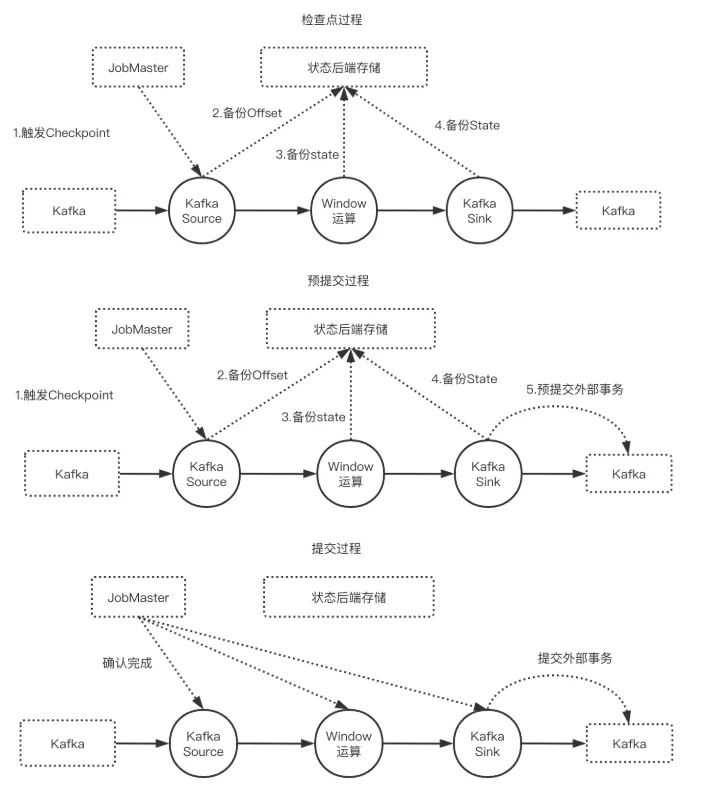


#### 6.11.4.3 实现

> TwoPhaseCommitSinkFunction
>
> 1. beginTransaction，开启一个事务，在临时目录中创建一个临时文件，之后写入数据到该文件中。此过程为不同的事务创建隔离，避免数据混淆。
>
> 2. preCommit。预提交阶段。将缓存数据块写出到创建的临时文件，然后关闭该文件，确保不再写入新数据到该文件，同时开启一个新事务，执行属于下一个检查点的写入操作。
>
> 3. commit。在提交阶段，以原子操作的方式将上一阶段的文件写入真正的文件目录下。如果提交失败，Flink应用会重启，并调用TwoPhaseCommitSinkFunction#recoverAndCommit方法尝试恢复并重新提交事务。
>
> 4. abort。一旦终止事务，删除临时文件。

## 6.12 Flink SQL

### 6.12.1 关系图

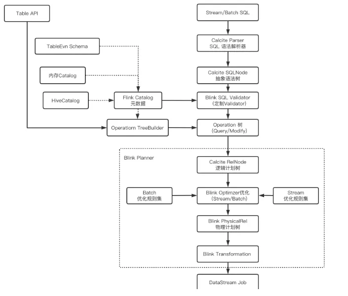

### 6.12.2 FLINK API

DataStrem JOIN

Window JOIN

```java
stream.join(otherStream)
.where(<KeySelector>)
.equalTo(<KeySelector>)
.window(<WindowAssigner>)
.apply(<JoinFunction>)
```

Tumbling Window Join 

```java
DataStream<Integer> orangeStream = ...
DataStream<Integer> greenStream = ...
orangeStream.join(greenStream)
.where(<KeySelector>)
.equalTo(<KeySelector>)
.window(TumblingEventTimeWindows.of(Time.milliseconds(2)))
.apply (new JoinFunction<Integer, Integer, String> (){
@Override
public String join(Integer first, Integer second){
return first +","+ second;
}
});
```


Sliding Window Join

```java
DataStream<Integer> orangeStream = ...
DataStream<Integer> greenStream = ...
orangeStream.join(greenStream)
.where(<KeySelector>)
.equalTo(<KeySelector>)
.window(SlidingEventTimeWindows.of(Time.milliseconds(2)size */,
Time.milliseconds(1)/* slide */))
.apply (new JoinFunction<Integer, Integer, String> (){
@Override
public String join(Integer first, Integer second){
return first +","+ second;
}
});
```

Session Window Join

```java
DataStream<Integer> orangeStream = ...
DataStream<Integer> greenStream = ...
orangeStream.join(greenStream)
.where(<KeySelector>)
.equalTo(<KeySelector>)
.window(EventTimeSessionWindows.withGap(Time.milliseconds(1)))
.apply (new JoinFunction<Integer, Integer, String> (){
@Override
public String join(Integer first, Integer second){
return first +","+ second;
}
});
```

# 七. Scala

## 7.1 变量和数据类型

### 7.1.1 变量（var声明变量，val声明常量） var 修饰的变量可改变

val 修饰的变量不可改变

但真的如此吗？

对于以下的定义

```scala
class A(a: Int){
var value = a
}

class B(b: Int){
val value = new A(b)
}
```

效果测试

```scala
val x = new B(1)
x = new B(1)//错误，因为 x 为 val 修饰的，引用不可改变
x.value = new A(1)//错误，因为 x.value 为 val 修饰的，引用不可改变
x.value.value = 1 //正确， x.value.value 为 var 修饰的，可以重新赋值
```

> 事实上，var 修饰的对象引用可以改变，val 修饰的则不可改变，但对象的状态却是可以改变的。
>
> 可变与不可变的理解
>
> 我们知道scala中的List是不可变的，Map是可变和不可变的。观察下面的例子
>
> var可变和List不可变的组合

```scala
var list = List("左","右")
list += "手"
```

> 理解就是
>
> var list指向的对象是 List("左","右")
>
> 后面修改list的指向，因为是可变的var修饰，list又可以指向新的 List("左","右","手")
>
> 如果是以下(会报错的)

```scala
val list = List("左","右")

list += "手"
```

val var与Map可变和不可变

```scala
var map = Map(
"左"‐> 1,
"右"‐>1,
)
map+=("手"‐>1)
```

```scala
val map=scala.collection.mutable.Map(
"左"‐> 1,
"右"‐>1,
)
map+=("手"‐>1)
```

> 理解
>
> 不可变的Map在添加元素的时候，原来的Map不变，生成一个新的Map来保存原来的map+添加的元素。
>
> 可变的Map在添加元素的时候，并不用新生成一个Map，而是直接将元素添加到原来的Map中。
>
> val不可变的只是指针，跟对象map没有关系。

### 7.1.2 数据类型数据

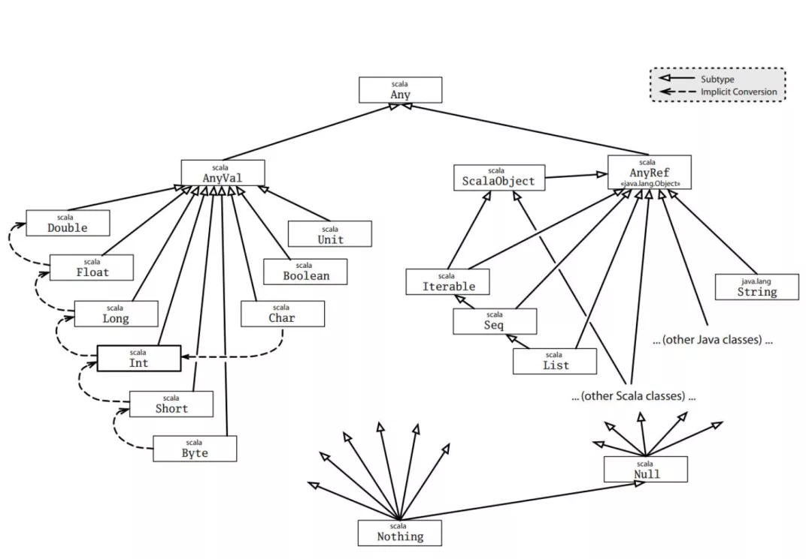

| 类型    | 描述                                                         |
| ------- | ------------------------------------------------------------ |
| Byte    | 8位有符号补码整数。数值区间为-128 到127                      |
| Short   | 16位有符号补码整数。数值区间为-32768 到32767                 |
| Int     | 32位有符号补码整数。数值区间为-2147483648 到2147483647       |
| Long    | 64位有符号补码整数。数值区间为-9223372036854775808 到9223372036854775807 |
| Float   | 32 位, IEEE 754 标准的单精度浮点数                           |
| Double  | 64 位 IEEE 754 标准的双精度浮点数                            |
| Char    | 16位无符号Unicode字符,区间值为 U+0000 到 U+FFFF              |
| String  | 字符序列                                                     |
| Boolean | true或false                                                  |
| Unit    | 表示无值，和其他语言中void等同。用作不返回任何结果的方法的结果类型。Unit只有一个实例值，写成()。 |
| Null    | null 或空引用                                                |
| Nothing | Nothing类型在Scala的类层级的最底端；它是任何其他类型的子类型。 |
| Any     | Any是所有其他类的超类                                        |
| AnyRef  | AnyRef类是Scala里所有引用类(reference class)的基类           |

## 7.2 函数式编程

### 7.2.1 高阶函数

> **高阶函数**是指**使用其他函数作为参数、或者返回一个函数作为结果的函数**。在Scala中函数是"一等公民"。
>
> 简单例子

```scala
val list=List(1,2,3,4)
val function= (x:Int)=> x *2
val value=list.map(function)
```

#### 7.2.1.1 方法为函数

```scala
def main(args: Array[String]): Unit = {
    val list=List(1,2,3,4)
    val value=list.map(function)
}
def function(x:Int)=x*2
```

#### 7.2.1.2 返回函数的函数

```scala
def calculate(symbol:String): (String,String)=>String ={
    symbol match {
        case "拼接方式1"=> (a:String,b:String)=> s"拼接方式1:$a ,$b"
        case "拼接方式2"=> (a:String,b:String)=> s"拼接方式2: $b ,$a"
    }
}
```

```scala
val function: (String, String)=> String = calculate("拼接方式2")
println(function("大数据","左右手"))
```


#### 7.2.1.3 匿名函数

Scala 中定义匿名函数的语法很简单，箭头左边是参数列表，右边是函数体。使用匿名函数后，我们的代码变得更简洁了。

```scala
var inc = (x:Int)=> x+1
var x = inc(7)‐1
```


也可无参数

```scala
var user = ()=> println("大数据左右手")
```

## 7.3 闭包

> 闭包是一个函数，返回值依赖于声明在函数外部的一个或多个变量。
>
> 闭包通常来讲可以简单的认为是可以访问一个函数里面局部变量的另外一个函数。简单理解就是：函数内部的变量不在其作用于时，仍然可以从外部进行访问。

```scala
val function= (x:Int)=> x*2
```

> 闭包的实质就是代码与用到的非局部变量的混合
>
> 闭包= 代码+用到的非局部变量

```scala
val fact=2
val function= (x:Int)=> x*fact
```


## 7.3 函数柯里化

> 柯里化指的是将原来接受两个参数的函数变成新的接受一个参数的函数的过程。新的函数返回一个以原有第二个参数为参数的函数。先定义一个简单的

```scala
def add(x:Int,y:Int)=x+y
//使用
add(1,2)
```

函数变形（这种方式就叫柯里化）

```scala
def add(x:Int)(y:Int)= x + y
//使用
add(1)(2)
```

实现过程

add(1)(2)实际上是依次调用两个普通函数（非柯里化函数）

第一次调用使用一个参数 x，返回一个函数类型的值。

第二次使用参数y调用这个函数类型的值。

```sh
接收一个x为参数，返回一个匿名函数
接收一个Int型参数y，函数体为x+y。
def add(x:Int)=(y:Int)=>x+y
(1)
val result = add(1)
// result= (y:Int)=>1+y
(2)
val sum = result(2)
(3)
sum=3
```

## 7.4 面向对象

### 7.4.1 类和对象

> 类是对象的抽象，而对象是类的具体实例。类是抽象的，不占用内存，而对象是具体的，占用存储空间。类是用于创建对象的蓝图，它是一个定义包括在特定类型的对象中的方法和变量的软件模板。
>
> 类可以带有类参数
>
> 类参数可以直接在类的主体中使用。类参数同样可以使用var作前缀，还可以使用private、protected、override修饰。scala编译器会收集类参数并创造出带同样的参数的类的主构造器。，并将类内部任何既不是字段也不是方法定义的代码编译至主构造器中。

```java
class Test(val a: Int, val b: Int){
//
}
```

### 7.4.2 样例类

> case class一般被翻译成样例类，它是一种特殊的类，能够被优化以用于模式匹配。
>
> 1. 当一个类被声名为case class的时候。具有以下功能：
>
> 2. 构造器中的参数如果不被声明为var的话，它默认的是val类型的。
>
> 3. 自动创建伴生对象，同时在里面给我们实现子apply方法，使我们在使用的时候可以不直接使用new创建对象。
>
> 4. 伴生对象中同样会帮我们实现unapply方法，从而可以将case class应用于模式匹配。
>
> 实现自己的toString、hashCode、copy、equals方法

```java
case class person(name:String,age:Int)
```


### 7.4.3 对象与伴生对象

> Scala单例对象是十分重要的，没有像在Java一样，有静态类、静态成员、静态方法，但是Scala提供了object对象，这个object对象类似于Java的静态类,它的成员、它的方法都默认是静态的。
>
> 定义单例对象并不代表定义了类，因此你不可以使用它来new对象。当单例对象与某个类共享同一个名称时，它就被称为这个类的伴生对象。
>
> 类和它的伴生对象必须定义在同一个源文件里。类被称为这个单例对象的伴生类。
>
> 类和它的伴生对象可以互相访问其私有成员。

```scala
object Test {
    private var name="大数据"
    def main(args: Array[String]): Unit = {
        val test = new Test()
        println(test.update_name())
    }
}
```


```scala
class Test{
    def update_name(): String ={
        Test.name="左右手"
        Test.name
    }
}
```

## 7.5 特质(trait)

> scala trait相当于java 的接口，实际上它比接口还功能强大。与接口不同的是，它还可以定义属性和方法的实现。
>
> 一般情况下scala的类只能够继承单一父类，但是如果是trait 的话就可以继承多个，从结果来看就是实现了多重继承（关键字with）。其实scala trait更像java的抽象类。

```scala
object Test extends UserImp with AddressImp {
    override def getUserName(): String = ???
    override def getAddress(): String = ???
}

trait UserImp{
    def getUserName():String
}

trait AddressImp{
    def getAddress():String
}
```

## 7.6 模式匹配

> 以java 的 switch 为例，java 的 switch 仅仅会做一些基本类型的匹配，然后执行一些动作，并且是没有返回值的。
>
> 而 scala 的 pattern matching match 则要强大得多，除了可以匹配数值，同时它还能匹配类型。

```scala
def calculate(symbol:String): (String,String)=>String ={
    symbol match {
        case "拼接方式1"=> (a:String,b:String)=> s"拼接方式1:$a ,$b"
        case "拼接方式2"=> (a:String,b:String)=> s"拼接方式2: $b ,$a"
    }
}
```

让我吃惊的是（就短短几行）

```scala
//快排
def quickSort(list: List[Int]): List[Int]= list match {
    case Nil => Nil
    case List()=> List()
    case head :: tail =>
    val (left, right)= tail.partition(_ < head)
    quickSort(left)::: head :: quickSort(right)
}

//归并
def merge(left: List[Int], right: List[Int]): List[Int]= (left, right) match {
    case (Nil, _)=> right
    case (_, Nil)=> left
    case (x :: xTail, y :: yTail)=>
    if (x <= y) x :: merge(xTail, right)
    else y :: merge(left, yTail)
}
```

## 7.7 隐式转换

> Scala提供的隐式转换和隐式参数功能，是非常有特色的功能。是Java等编程语言所没有的功能。它可以允许你手动指定，将某种类型的对象转换成其他类型的对象。通过这些功能，可以实现非常强大，而且特殊的功能。

### 7.7.1 规则

> （1）在使用隐式转换之前，需要用import把隐式转换引用到当前的作用域里或者就在作用域里定义隐式转换。
>
> （2）隐式转换只能在无其他可用转换的前提下才能操作。如果在同一作用域里，对同一源类型定义一个以上的隐式转换函数，如果多种隐式转换函数都可以匹配，那么编译器将报错，所以在使用时请移除不必要的隐式定义。

### 7.7.2 数据类型的隐式转换

> String类型是不能自动转换为Int类型的，所以当给一个Int类型的变量或常量赋予String类型的值时编译器将报错。但是.....

```scala
implicit def strToInt(str: String)= str.toInt
def main(args: Array[String]): Unit = {
    val a:Int="100"
    print(a)
}
```


### 7.7.3 参数的隐式转换

> 所谓的隐式参数，指的是在函数或者方法中，定义一个用implicit修饰的参数，此时Scala会尝试找到一个指定类型的，用implicit修饰的对象，即隐式值，并注入参数。

```scala
object Test {
    private var name="大数据"
    
    implicit val test = new Test
    def getName(implicit test:Test): Unit ={
        println(test.update_name())
    }

    def main(args: Array[String]): Unit = {
        getName
    }
}

class Test{
    def update_name(): String ={
        Test.name="左右手"
        Test.name
    }
}
```

# 八.即席查询

## 8.1 怎么理解即席查询

> 即席查询（Ad Hoc）是用户根据自己的需求，灵活的选择查询条件，系统能够根据用户的选择生成相应的统计报表。即席查询与普通应用查询最大的不同是普通的应用查询是定制开发的，而即席查询是由用户自定义查询条件的。

## 8.2 即席查询与批处理的区别

### 8.2.1 批处理

> 在数据仓库系统中，根据应用程序的需求，需要对源数据进行加工，这些加工过程往往是固定的处理原则，这种情况下，可以把数据的增删改查SQL语句写成一个批处理脚本，由调度程序定时执行。特点：由于批处理脚本中的SQL语句是固定的，所以可以提前完成SQL语句的调优工作，使得批处理脚本的运行效率达到最佳。

### 8.2.2 即席查询

> 通常的方式是，将数据仓库中的维度表和事实表映射到语义层，用户可以通过语义层选择表，建立表间的关联，最终生成SQL语句。即席查询是用户在使用时临时生产的，系统无法预先优化这些查询，所以即席查询也是评估数据仓库的一个重要指标。在一个数据仓库系统中，即席查询使用的越多，对数据仓库的要求就越高，对数据模型的对称性的要求也越高。现在市场上运用更多的是：Kylin、Druid、Presto、Impala等等这些框架去诠释大数据即席查询的功能。此篇就来介绍四种框架的优缺点，用途与场景选择。

## 8.3 Kylin

### 8.3.1 Kylin特点

> Kylin的主要特点包括支持SQL接口、支持超大规模数据集、亚秒级响应、可伸缩性、高吞吐率、BI工具集成等。
>
> 1. 标准SQL接口：Kylin是以标准的SQL作为对外服务的接口。
>
> 2. 支持超大数据集：Kylin对于大数据的支撑能力可能是目前所有技术中最为领先的。早在2015年eBay的生产环境中就能支持百亿记录的秒级查询，之后在移动的应用场景中又有了千亿记录秒级查询的案例。
>
> 3. 亚秒级响应：Kylin拥有优异的查询相应速度，这点得益于预计算，很多复杂的计算，比如连接、聚合，在离线的预计算过程中就已经完成，这大大降低了查询时刻所需的计算量，提高了响应速度。
>
> 4. 可伸缩性和高吞吐率：单节点Kylin可实现每秒70个查询，还可以搭建Kylin的集群。
>
> 5. BI工具集成
>    ODBC：与Tableau、Excel、PowerBI等工具集成
>    JDBC：与Saiku、BIRT等Java工具集成
>    RestAPI：与JavaScript、Web网页集成
>    Kylin开发团队还贡献了Zepplin的插件，也可以使用Zepplin来访问Kylin服务。

### 8.3.2 Kylin工作原理

> Apache Kylin的工作原理本质上是MOLAP（Multidimension On-Line Analysis Processing）Cube，也就是多维立方体分析。在这里需要分清楚两个概念：

#### 8.3.2.1 维度和度量

> **维度**：即观察数据的角度。比如员工数据，可以从性别角度来分析，也可以更加细化，从入职时间或者地区的维度来观察。维度是一组离散的值，比如说性别中的男和女，或者时间维度上的每一个独立的日期。因此在统计时可以将维度值相同的记录聚合在一起，然后应用聚合函数做累加、平均、最大和最小值等聚合计算。
>
> **度量**：即被聚合（观察）的统计值，也就是聚合运算的结果。比如说员工数据中不同性别员工的人数，又或者说在同一年入职的员工有多少。

#### 8.3.2.2 Cube和Cuboid

> 有了维度跟度量，一个数据表或者数据模型上的所有字段就可以分类了，它们要么是维度，要么是度量（可以被聚合）。于是就有了根据维度和度量做预计算的Cube理论。给定一个数据模型，我们可以对其上的所有维度进行聚合，对于N个维度来说，组合的所有可能性共有2n种。对于每一种维度的组合，将度量值做聚合计算，然后将结果保存为一个物化视图，称为Cuboid。所有维度组合的Cuboid作为一个整体，称为Cube 下面举一个简单的例子说明，假设有一个电商的销售数据集，其中维度包括
>
> 时间[time]、商品[item]、地区[location]和供应商[supplier]度量为销售额。那么所有维度的组合就有16种，如下图所示：
>
> 一维度（1D）的组合有4种：[time]、[item]、[location]和[supplier]4种；
>
> 二维度（2D）的组合有6种：[time, item]、[time, location]、[time, supplier]、[item, location]、[item, supplier]、[location, supplier]
>
> 三维度（3D）的组合也有4种
>
> 最后还有零维度（0D）和四维度（4D）各有一种，总共16种

### 8.3.3 核心算法

> Kylin的工作原理就是对数据模型做Cube预计算，并利用计算的结果加速查询：
>
> 1. 指定数据模型，定义维度和度量；
>
> 2. 预计算Cube，计算所有Cuboid并保存为物化视图；预计算过程是Kylin从Hive中读取原始数据，按照我们选定的维度进行计算，并将结果集保存到Hbase中，默认的计算引擎为MapReduce，可以选择Spark作为计算引擎。一次build的结果，我们称为一个Segment。构建
>    过程中会涉及多个Cuboid的创建，具体创建过程由kylin.cube.algorithm参数决定，参数值可选 auto，layer 和 inmem，默认值为 auto，即 Kylin 会通过采集数据动态地选择一个算法(layer or inmem)，如果用户很了解 Kylin 和自身的数据、集群，可以直接设置喜欢的算法。
>
> 3. 执行查询，读取Cuboid，运行，产生查询结果

#### 8.3.4 逐层构建算法（layer)

> 一个N维的Cube，是由1个N维子立方体、N个(N-1)维子立方体、N*(N-1)/2个(N-2)维子立方体、......、N个1维子立方体和1个0维子立方体构成，总共有2^N个子立方体组成，在逐层算法中，按维度数逐层减少来计算，每个层级的计算（除了第一层，它是从原始数据聚合而来），是基于它上一层级的结果来计算的。比如，[Group by A, B]的结果，可以基于[Group by A, B, C]的结果，通过去掉C后聚合得来的；这样可以减少重复计算；当0维度Cuboid计算出来的时候，整个Cube的计算也就完成了。每一轮的计算都是一个MapReduce任务，且串行执行；一个N维的Cube，至少需要N次MapReduce Job。算法优点：
>
> 1. 此算法充分利用了MapReduce的能力，处理了中间复杂的排序和洗牌工作，故而算法代码清晰简单，易于维护；
>
> 2. 受益于Hadoop的日趋成熟，此算法对集群要求低，运行稳定；在内部维护Kylin的过程中，很少遇到在这几步出错的情况；即便是在Hadoop集群比较繁忙的时候，任务也能完成。算法缺点：
>
> 3. 当Cube有比较多维度的时候，所需要的MapReduce任务也相应增加；由于Hadoop的任务调度需要耗费额外资源，特别是集群较庞大的时候，反复递交任务造成的额外开销会相当可观；
>
> 4. 由于Mapper不做预聚合，此算法会对Hadoop MapReduce输出较多数据; 虽然已经使用了Combiner来减少从Mapper端到Reducer端的数据传输，所有数据依然需要通过Hadoop MapReduce来排序和组合才能被聚合，无形之中增加了集群的压力;
>
> 5. 对HDFS的读写操作较多：由于每一层计算的输出会用做下一层计算的输入，这些Key-Value需要写到HDFS上；当所有计算都完成后，Kylin还需要额外的一轮任务将这些文件转成HBase的HFile格式，以导入到HBase中去；
>
> 总体而言，该算法的效率较低，尤其是当Cube维度数较大的时候。

#### 8.3.5 快速构建算法（inmem）

> 也被称作“逐段”(By Segment)或“逐块”(By Split)算法，从1.5.x开始引入该算法，利用Mapper端计算先完成大部分聚合，再将聚合后的结果交给Reducer，从而降低对网络瓶颈的压力。该算法的主要思想是，对Mapper所分配的数据块，将它计算成一个完整的小Cube 段（包含所有Cuboid）；
>
> 每个Mapper将计算完的Cube段输出给Reducer做合并，生成大Cube 与之前算法相比，快速算法主要有两点不同：
>
> Mapper会利用内存做预聚合，算出所有组合；Mapper输出的每个Key都是不同的，这样会减少输出到Hadoop MapReduce的数据量，Combiner也不再需要；一轮MapReduce便会完成所有层次的计算，减少Hadoop任务的调配。

###  8.3.4  Kylin总结

#### 8.3.4.1 Kylin的优点

> - 写SQL查询,结果预聚合.
>
> - 有可视化页面

### 8.3.5 什么场景用Kylin

> 查询数据后想要立马可视化的
>
> Kylin的缺点
>
> 集群依赖较多，如HBase和Hive等，属于重量级方案，因此运维成本也较高。
>
> 查询的维度组合数量需要提前确定好，不适合即席查询分析
>
> 预计算量大，资源消耗多

### 8.3.6 什么时候不可以用Kylin

查询维度过多

## 8.4 Impala

### 8.4.1 什么是Impala

> Cloudera公司推出，提供对HDFS、Hbase数据的高性能、低延迟的交互式SQL查询功能。基于Hive，使用内存计算，兼顾数据仓库、具有实时、批处理、多并发等优点。是CDH平台首选的PB级大数据实时查询分析引擎。

### 8.4.2 Impala为什么快？Impala为什么快？

> 查询引擎都会分为Frontend和Backend两部分，Frontend主要用于进行SQL的语法分析、词法分析、逻辑优化等，Backend则偏向底层做物理优化。

### 8.4.3 Frontend

> Frontend主要负责解析编译SQL生成后端可以执行的查询计划。 SQL的查询编译器是个标准的流程：SQL解析，语法分析，查询计划/优化。impala的查询分析器，会把标准的SQL解析成一个解析树，里面包含所有的查询信息，比如表、字段、表达式等等。一个可执行的执行计划通常包含两部分：单点的查询计划Single Node Planning 和分布式并发查询计划 parallelization \fragmentation。
>
> 在第一个阶段，语法解析树会被翻译成一个单点的不可以直接执行的树形结构，一般会包含：HDFS\HBase scan, hash join, cross join, union, hash agg, sort, top-n, analytic eval等。这一步主要负责基于最下层的查询节点、谓词下推、限制查询数量、join优化等优化查询性能。主要是依赖于表或者分区的统计信息进行代价评估。
>
> 第二个阶段就是基于第一个阶段优化后的单点执行计划，生成分布式的执行计划，并尽量满足最小化数据移动以及最大化数据本地性。分布式执行主要通过在节点间增加数据交换节点或者直接移动少量的数据在本地进行聚合。目前支持的join策略有broadcast和partition两种。前者是把join的整个表广播到各个节点；后者是基于hash重新分区，使得两部分数据到同一个节点。Impala通过衡量哪一种网络传输压力小，耗费的资源少，就选哪种.
>
> 所有的聚合操作都是在本地进行预聚合，然后再通过网络传输做最终的聚合。对于分组聚合，会先基于分区表达式进行的预聚合，然后通过并行的网络传输在各个节点进行每一部分的聚合。对于非分组的聚合最后一步是在单独的节点上进行。排序和TOPN的模式差不多：都是现在单独的节点进行排序/topN，然后汇总到一个节点做最后的汇总。最后根据是否需要数据交换为边界，切分整个执行计划树，相同节点的执行计划组成一个fragment。


### 8.4.4 Backend

> impala的backend接收到fragment后在本地执行，它的设计采取了很多硬件上的特点，backend底层是用C++编写，使用了很多运行时代码生成的技术，对比java来说减轻内存的压力。impala的查询设计思路也是按照volcano风格设计，处理的时候是getNext一批一批处理的。大部分的命令都是管道形式处理的，因此会消耗大量的数据存储中间数据。当执行的时候如果内存超出使用的范围，也可以把结果缓存到磁盘，经常有溢出可能的有如hash join, agg, sorting等操作。
> 运行时代码生成:impala内部使用了LLVM的机制，性能提升5倍。LLVM是一套与编译器相关的的库，与传统的编译器不同，它更注重模块化与重用性。允许impala应用在运行时进行即时编译以及代码生成。运行时代码生成通常用于内部处理，比如用于解析文件格式的代码，对于扫描一些大表，这点尤为重要
>
> 总结几点就是：
>
> 真正的MPP（大规模并行处理）查询引擎。
>
> 使用C++开发而不是Java，降低运行负荷。3.运行时代码生成（LLVM IR），提高效率。
>
> 全新的执行引擎（不是Mapreduce）。
>
> 在执行SQL语句的时候，Impala不会把中间数据写入到磁盘，而是在内存中完成了所有的处理。
>
> 使用Impala的时候，查询任务会马上执行而不是生产Mapreduce任务，这会节约大量的初始化时间。
>
> Impala查询计划解析器使用更智能的算法在多节点上分布式执行各个查询步骤，同时避免了sorting和shuffle这两个非常耗时的阶段，这两个阶段往往是不需要的。
>
> Impala拥有HDFS上面各个data block的信息，当它处理查询的时候能够在各个datanode上面更均衡的分发查询。

### 8.4.5 Impala总结：

#### 8.4.5.1  Impala优点

> 基于内存运算，不需要把中间结果写入磁盘，省掉了大量的I/O开销。
>
> 无需转换为Mapreduce，直接访问存储在HDFS，HBase中的数据进行作业调度，速度快。
>
> 使用了支持Data locality的I/O调度机制，尽可能地将数据和计算分配在同一台机器上进行，减少了网络开销。
>
> 支持各种文件格式，如TEXTFILE 、SEQUENCEFILE 、RCFile、Parquet。
>
> 可以访问hive的metastore，对hive数据直接做数据分析。

#### 8.4.5.2 Impala缺点

> 对内存的依赖大，且完全依赖于hive。
>
> 实践中，分区超过1万，性能严重下降。
>
> 只能读取文本文件，而不能直接读取自定义二进制文件。每当新的记录/文件被添加到HDFS中的数据目录时，该表需要被刷新

## 8.5 Presto

### 8.5.1  什么是Presto

> Presto是一个facebook开源的分布式SQL查询引擎，适用于交互式分析查询，数据量支持GB到PB字节。presto的架构由关系型数据库的架构演化而来。presto之所以能在各个内存计算型数据库中脱颖而出，在于以下几点：
>
> 清晰的架构，是一个能够独立运行的系统，不依赖于任何其他外部系统。例如调度，presto自身提供了对集群的监控，可以根据监控信息完成调度。
>
> 简单的数据结构，列式存储，逻辑行，大部分数据都可以轻易的转化成presto所需要的这种数据结构。
>
> 丰富的插件接口，完美对接外部存储系统，或者添加自定义的函数。

### Presto的执行过程

Presto包含三类角色，coordinator,discovery,worker。coordinator负责query的解析和调度。discovery负责集群的心跳和角色管理。worker负责执行计算。

presto-cli提交的查询，实际上是一个http POST请求。查询请求发送到coordinator后，经过词法解析和语法解析，生成抽象语法树，描述查询的执行。

执行计划编译器，会根据抽象语法树，层层展开，把语法树所表示的结构，转化成由单个操作所组成的树状的执行结构，称为逻辑执行计划。

原始的逻辑执行计划，直接表示用户所期望的操作，未必是性能最优的，在经过一系列性能优化和转写，以及分布式处理后，形成最终的逻辑执行计划。这时的逻辑执行计划，已经包含了map-reduce操作，以及跨机器传输中间计算结果操作。

scheduler从数据的meta上获取数据的分布，构造split，配合逻辑执行计划，把对应的执行计划调度到对应的worker上。

在worker上，逻辑执行计划生成物理执行计划，根据逻辑执行计划，会生成执行的字节码，以及operator列表。operator交由执行驱动来完成计算。

### Presto总结

#### 优点

Presto与Hive对比，都能够处理PB级别的海量数据分析，但Presto是基于内存运算，减少没必要的硬盘IO，所以更快。

能够连接多个数据源，跨数据源连表查，如从Hive查询大量网站访问记录，然后从Mysql中匹配出设备信息。

部署也比Hive简单，因为Hive是基于HDFS的，需要先部署HDFS。

#### 缺点

虽然能够处理PB级别的海量数据分析，但不是代表Presto把PB级别都放在内存中计算的。而是根据场景，如count，avg等聚合运算，是边读数据边计算，再清内存，再读数据再计算，这种耗的内存并不高。但是连表查，就可能产生大量的临时数据，因此速度会变慢，反而Hive此时会更擅长。

为了达到实时查询，可能会想到用它直连MySql来操作查询，这效率并不会提升，瓶颈依然在MySql，此时还引入网络瓶颈，所以会比原本直接操作数据库要慢。

## Druid

### Druid是什么

Druid是一个专为大型数据集上的高性能切片和OLAP分析而设计的数据存储，druid提供低延时的数据插入，实时的数据查询。Druid最常用作为GUI分析应用程序提供动力的数据存储，或者用作需要快速聚合的高度并发API的后端。

### Druid的主要特点

列式存储格式 Druid使用面向列的存储，这意味着它只需要加载特定查询所需的精确列。这为仅查看几列的查询提供了巨大的速度提升。此外，每列都针对其特定数据类型进行了优化，支持快速扫描和聚合。

高可用性与高可拓展性 Druid采用分布式、SN(share-nothing)架构，管理类节点可配置HA，工作节点功能单一，不相互依赖，这些特性都使得Druid集群在管理、容错、灾备、扩容等方面变得十分简单。Druid通常部署在数十到数百台服务器的集群中，并且可以提供数百万条记录/秒的摄取率，保留数万亿条记录，以及亚秒级到几秒钟的查询延迟。

实时或批量摄取实时流数据分析。区别于传统分析型数据库采用的批量导入数据进行分析的方式，Druid提供了实时流数据分析，采用LSM(Long structure-merge)-Tree结构使Druid拥有极高的实时写入性能；同时实现了实时数据在亚秒级内的可视化。

容错，恢复极好的架构，不会丢失数据一旦Druid摄取了您的数据，副本就会安全地存储在深层存储（通常是云存储，HDFS或共享文件系统）中。即使每个Druid服务器都出现故障，您的数据也可以从深层存储中恢复。对于仅影响少数Druid服务器的更有限的故障，复制可确保在系统恢复时仍可进行查询。

亚秒级的OLAP查询分析 Druid采用了列式存储、倒排索引、位图索引等关键技术，能够在亚秒级别内完成海量数据的过滤、聚合以及多维分析等操作。

Druid的核心是时间序列，把数据按照时间序列分批存储，十分适合用于对按时间进行统计分析的场景

Druid支持水平扩展，查询节点越多、所支持的查询数据量越大、响应越快

Druid支持低延时的数据插入，数据实时可查，不支持行级别的数据更新

### Druid为什么快

我们知道Druid能够同时提供对大数据集的实时摄入和高效复杂查询的性能，主要原因就是它独到的架构设计和基于Datasource与Segment的数据存储结构。

Druid在数据插入时按照时间序列将数据分为若干segment，支持低延时地按照时间序列上卷，所以按时间做聚合效率很高

Druid数据按列存储，每个维度列都建立索引，所以按列过滤取值效率很高

Druid用以查询的Broker和Historical支持多级缓存，每个segment启动一个线程并发执行查询，查询支持多Historical内部的线程级并发及Historical之间的进程间并发，Broker将各Historical的查询结果做合并

### Druid总结：什么选择使用Druid

需要交互式聚合和快速探究大量数据时；

需要实时查询分析时；

具有大量数据时，如每天数亿事件的新增、每天数10T数据的增加；

对数据尤其是大数据进行实时分析时；

需要一个高可用、高容错、高性能数据库时。

## 即席查询总结

Kylin:核心是Cube，Cube是一种预计算技术，基本思路是预先对数据作多维索引，查询时只扫描索引而不访问原始数据从而提速。

Impala:基于内存计算，速度快，支持的数据源没有Presto多。

Presto:它没有使用Mapreduce，大部分场景下比HIVE块一个数量级，其中的关键是所有的处理都在内存中完成。

Druid:是一个实时处理时序数据的OLAP数据库，因为它的索引首先按照时间分片，查询的时候也是按照时间线去路由索引。

# 九.分区，分桶，分片

## Hive

### Hive分区

是按照数据表的某列或者某些列分为多区，在hive存储上是hdfs文件，也就是文件夹形式。现在最常用的跑T+1数据，按当天时间分区的较多。把每天通过sqoop或者datax拉取的一天的数据存储一个区，也就是所谓的文件夹与文件。在查询时只要指定分区字段的值就可以直接从该分区查找即可。创建分区表的时候，要通过关键字partitioned by （column name string）声明该表是分区表，并且是按照字段column name进行分区，column name值一致的所有记录存放

在一个分区中，分区属性name的类型是string类型。当然，可以依据多个列进行分区，即对某个分区的数据按照某些列继续分区。向分区表导入数据的时候，要通过关键字partition（（column name="xxxx"）显示声明数据要导入到表的哪个分区

### 设置分区的影响

首先是hive本身对分区数有限制，不过可以修改限制的数量；

```sh
set hive.exec.dynamic.partition=true;
set hive.exec.max.dynamic.partitions=1000;
set hive.exec.max.dynamic.partitions.pernode=100000;
set hive.exec.dynamic.partition.mode=nonstrict;
set hive.exec.parallel.thread.number=264;
```

hdfs对单个目录下的目录数量或者文件数量也是有限制的，也是可以修改的；

NN的内存肯定会限制，这是最重要的，如果分区数很大，会影响NN服务，进而影响一系列依赖于NN的服务。所以最好合理设置分区规则，对小文件也可以定期合并，减少NN的压力。

### Hive分桶

在分区数量过于庞大以至于可能导致文件系统崩溃时，我们就需要使用分桶来解决问题分桶是相对分区进行更细粒度的划分。分桶则是指定分桶表的某一列，让该列数据按照哈希取模的方式随机、均匀的分发到各个桶文件中。因为分桶操作需要根据某一列具体数据来进行哈希取模操作，故指定的分桶列必须基于表中的某一列（字段）要使用关键字clustered by 指定分区依据的列名，还要指定分为多少桶

```sh
create table test(id int,name string) cluster by (id) into 5 buckets .......
insert into buck select id ,name from p cluster by (id)
```

### Hive分区分桶区别

分区是表的部分列的集合，可以为频繁使用的数据建立分区，这样查找分区中的数据时就不需要扫描全表，这对于提高查找效率很有帮助

不同于分区对列直接进行拆分，桶往往使用列的哈希值对数据打散，并分发到各个不同的桶中从而完成数据的分桶过程

分区和分桶最大的区别就是分桶随机分割数据库，分区是非随机分割数据库

## ElasticSearch分片

主分片：用于解决数据水平扩展的问题，一个索引的所有数据是分布在所有主分片之上的（每个主分片承担一部分数据，主分片又分布在不同的节点上），一个索引的主分片数量只能在创建时指定，后期无法修改，除非对数据进行重新构建索引（reindex操作）。

副本分片：用于解决数据高可用的问题，一个副本分片即一个主分片的拷贝，其数量可以动态调整，通过增加副本分片也可以实现提升系统读性能的作用。在集群中唯一一个空节点上创建一个叫做 blogs 的索引。默认情况下，一个索引被分配5 个主分片

```json
{
"settings": {
"number_of_shards": 5,
"number_of_replicas": 1}
}
```


到底分配到那个shard上呢?

```sh
shard = hash(routing)% number_of_primary_shards
```

routing 是一个可变值，默认是文档的 _id ，也可以设置成一个自定义的值。routing 通过 hash 函数生成一个数字，然后这个数字再除以 number_of_primary_shards （主分片的数量）后得到余数。这个在0 到 number_of_primary_shards 之间的余数，就是所寻求的文档所在分片的位置。如果数量变化了，那么所有之前路由的值都会无效，文档也再也找不到了

分片过少如15个节点，5个主分片，1个副本会造成每个索引最多只能使用10个节点（5个主分片，5个从分片），剩余5节点并没有利用上；资源浪费

如：3节点；3分主分片，1副本当数据量较大的时，每个分片就会比较大

**分片过多**

创建分片慢：es创建分片的速度会随着集群内分片数的增加而变慢。

集群易崩溃：在触发es 自动创建Index时，由于创建速度太慢，容易导致大量写入请求堆积在内存，从而压垮集群。

写入拒绝：分片过多的场景中，如果不能及时掌控业务的变化，可能经常遇到单分片记录超限、写入拒绝等问题。

### 分片的注意事项

避免使用非常大的分片，因为这会对群集从故障中恢复的能力产生负面影响。对分片的大小没有固定的限制，但是通常情况下很多场景限制在50GB 的分片大小以内。

当在ElasticSearch集群中配置好你的索引后,你要明白在集群运行中你无法调整分片设置.既便以后你发现需要调整分片数量,你也只能新建创建并对数据进行重新索引.

如果担心数据的快速增长,建议根据这条限制: ElasticSearch推荐的最大JVM堆空间是30~32G,所以把分片最大容量限制为30GB,然后再对分片数量做合理估算。例如,如果的数据能达到200GB,则最多分配7到8个分片。

## kafka分区

### 生产者

#### 分区的原因

方便在集群中扩展，每个Partition可以通过调整以适应它所在的机器，而一个topic又可以有多个Partition组成，因此整个集群就可以适应任意大小的数据了；

可以提高并发，因为可以以Partition为单位读写了。

#### 分区的原则

指明 partition 的情况下，直接将指明的值直接作为 partiton 值；

没有指明 partition 值但有 key 的情况下，将 key 的 hash 值与 topic 的 partition 数进行取余得到 partition 值；

既没有 partition 值又没有 key 值的情况下，第一次调用时随机生成一个整数（后面每次调用在这个整数上自增），将这个值与 topic 可用的 partition 总数取余得到 partition 值，也就是常说的 round-robin 算法。

### 消费者

#### 分区分配策略

一个consumer group中有多个consumer，一个 topic有多个partition，所以必然会涉及到partition的分配问题，即确定那个partition由哪个consumer来消费 Kafka有三种分配策略，一是RoundRobin，一是Range。高版本还有一个StickyAssignor策略将分区的所有权从一个消费者移到另一个消费者称为重新平衡（rebalance）。当以下事件发生时，Kafka 将会进行一次分区分配：

同一个 Consumer Group 内新增消费者

消费者离开当前所属的Consumer Group，包括shuts down 或 crashes

#### Range分区分配策略

Range是对每个Topic而言的（即一个Topic一个Topic分），首先对同一个Topic里面的分区按照序号进行排序，并对消费者按照字母顺序进行排序。然后用Partitions分区的个数除以消费者线程的总数来决定每个消费者线程消费几个分区。如果除不尽，那么前面几个消费者线程将会多消费一个分区。假设n=分区数/消费者数量，m=分区数%消费者数量，那么前m个消费者每个分配n+1个分区，后面的（消费者数量-m）个消费者每个分配n个分区。假如有10个分区，3个消费者线程，把分区按照序号排列

0，1，2，3，4，5，6，7，8，9

消费者线程为

C1-0，C2-0，C2-1

那么用partition数除以消费者线程的总数来决定每个消费者线程消费几个partition，如果除不尽，前面几个消费者将会多消费一个分区。在我们的例子里面，我们有10个分区，3个消费者线程，10/3 =3，而且除除不尽，那么消费者线程C1-0将会多消费一个分区，所以最后分区分配的结果看起来是这样的：

C1-0：0，1，2，3

C2-0：4，5，6

C2-1：7，8，9

如果有11个分区将会是：

C1-0：0，1，2，3

C2-0：4，5，6，7

C2-1：8，9，10

假如我们有两个主题T1,T2，分别有10个分区，最后的分配结果将会是这样：

C1-0：T1（0，1，2，3） T2（0，1，2，3）

C2-0：T1（4，5，6） T2（4，5，6）

C2-1：T1（7，8，9） T2（7，8，9）

#### RoundRobinAssignor分区分配策略

RoundRobinAssignor策略的原理是将消费组内所有消费者以及消费者所订阅的所有topic的partition按照字典序排序，然后通过轮询方式逐个将分区以此分配给每个消费者.使用RoundRobin策略有两个前提条件必须满足：

同一个消费者组里面的所有消费者的num.streams（消费者消费线程数）必须相等；

每个消费者订阅的主题必须相同。

加入按照 hashCode 排序完的topic-partitions组依次为

T1-5, T1-3, T1-0, T1-8, T1-2, T1-1, T1-4, T1-7, T1-6, T1-9

我们的消费者线程排序为

C1-0, C1-1, C2-0, C2-1

最后分区分配的结果为：

C1-0 将消费 T1-5, T1-2, T1-6 分区

C1-1 将消费 T1-3, T1-1, T1-9 分区

C2-0 将消费 T1-0, T1-4 分区

C2-1 将消费 T1-8, T1-7 分区

#### StickyAssignor分区分配策略

Kafka从0.11.x版本开始引入这种分配策略，它主要有两个目的：

分区的分配要尽可能的均匀，分配给消费者者的主题分区数最多相差一个

分区的分配尽可能的与上次分配的保持相同。

当两者发生冲突时，第一个目标优先于第二个目标。鉴于这两个目的，StickyAssignor策略的具体实现要比RangeAssignor和RoundRobinAssignor这两种分配策略要复杂很多。

假设消费组内有3个消费者

C0、C1、C2

它们都订阅了4个主题：

t0、t1、t2、t3

并且每个主题有2个分区，也就是说整个消费组订阅了

t0p0、t0p1、t1p0、t1p1、t2p0、t2p1、t3p0、t3p1这8个分区

最终的分配结果如下：

消费者C0：t0p0、t1p1、t3p0

消费者C1：t0p1、t2p0、t3p1

消费者C2：t1p0、t2p1

这样初看上去似乎与采用RoundRobinAssignor策略所分配的结果相同

此时假设消费者C1脱离了消费组，那么消费组就会执行再平衡操作，进而消费分区会重新分配。如果采用RoundRobinAssignor策略，那么此时的分配结果如下：

消费者C0：t0p0、t1p0、t2p0、t3p0

消费者C2：t0p1、t1p1、t2p1、t3p1

如分配结果所示，RoundRobinAssignor策略会按照消费者C0和C2进行重新轮询分配。而如果此时使用的是StickyAssignor策略，那么分配结果为：

消费者C0：t0p0、t1p1、t3p0、t2p0

消费者C2：t1p0、t2p1、t0p1、t3p1

可以看到分配结果中保留了上一次分配中对于消费者C0和C2的所有分配结果，并将原来消费者C1的“负担”分配给了剩余的两个消费者C0和C2，最终C0和C2的分配还保持了均衡。

如果发生分区重分配，那么对于同一个分区而言有可能之前的消费者和新指派的消费者不是同一个，对于之前消费者进行到一半的处理还要在新指派的消费者中再次复现一遍，这显然很浪费系统资源。

StickyAssignor策略如同其名称中的“sticky”一样，让分配策略具备一定的“粘性”，尽可能地让前后两次分配相同，进而减少系统资源的损耗以及其它异常情况的发生。到目前为止所分析的都是消费者的订阅信息都是相同的情况，我们来看一下订阅信息不同的情况下的处理。举例，同样消费组内有3个消费者：

C0、C1、C2

集群中有3个主题：

t0、t1、t2

这3个主题分别有

1、2、3个分区

也就是说集群中有

t0p0、t1p0、t1p1、t2p0、t2p1、t2p2这6个分区

消费者C0订阅了主题t0

消费者C1订阅了主题t0和t1

消费者C2订阅了主题t0、t1和t2

如果此时采用RoundRobinAssignor策略：

消费者C0：t0p0

消费者C1：t1p0

消费者C2：t1p1、t2p0、t2p1、t2p2

如果此时采用的是StickyAssignor策略：

消费者C0：t0p0

消费者C1：t1p0、t1p1

消费者C2：t2p0、t2p1、t2p2

此时消费者C0脱离了消费组，那么RoundRobinAssignor策略的分配结果为：

消费者C1：t0p0、t1p1

消费者C2：t1p0、t2p0、t2p1、t2p2

StickyAssignor策略，那么分配结果为：

消费者C1：t1p0、t1p1、t0p0

消费者C2：t2p0、t2p1、t2p2

可以看到StickyAssignor策略保留了消费者C1和C2中原有的5个分区的分配：

t1p0、t1p1、t2p0、t2p1、t2p2。从结果上看StickyAssignor策略比另外两者分配策略而言显得更加的优异，这个策略的代码实现也是异常复杂。

### 注意

在实际开发过程中，kafka与spark或者flink对接的较多，一个分区对应的是一个并行度，如果并行度不够，这个时候会多个分区数据集中到一个并行度上。所以需要合理设置并行度

## HBase分区

HBase每张表在底层存储上是由至少一个Region组成，Region实际上就是HBase表的分区。HBase新建一张表时默认Region即分区的数量为1，一般在生产环境中我们都会手动给Table提前做“预分区”，使用合适的分区策略创建好一定数量的分区并使分区均匀分布在不同regionserver上。一个分区在达到一定大小时会自动Split，一分为二。

HBase分区过多有哪些影响：

频繁刷写：我们知道Region的一个列族对应一个MemStore，假设HBase表都有统一的1个列族配置，则每个Region只包含一个MemStore。通常HBase的一个MemStore默认大小为128MB，见参数hbase.hregion.memstore.flush.size。当可用内存足够时，每个MemStore可以分配128 MB空间。当可用内存紧张时，假设每个Region写入压力相同，则理论上每个MemStore会平均分配可用内存空间。因此，当节点Region过多时，每个MemStore分到的内存空间就会很小。这个时候，写入很小的数据量就会被强制Flush到磁盘，将会导致频繁刷写。频繁刷写磁盘，会对集群HBase与HDFS造成很大的压力，可能会导致不可预期的严重后果。

压缩风暴：因Region过多导致的频繁刷写，将在磁盘上产生非常多的HFile小文件，当小文件过多的时候HBase为了优化查询性能就会做Compaction操作，合并HFile减少文件数量。当小文件一直很多的时候，就会出现“压缩风暴”。Compaction非常消耗系统io资源，还会降低数据写入的速度，严重的会影响正常业务的进行。MSLAB内存消耗较大：

MSLAB（MemStore-local allocation buffer）存在于每个MemStore中，主要是为了解决HBase内存碎片问题，默认会分配2 MB 的空间用于缓存最新数据。如果Region数量过多，MSLAB总的空间占用就会比较大。比如当前节点有1000个包含1个列族的Region，MSLAB就会使用1.95GB的堆内存，即使没有数据写入也会消耗这么多内存。

Master assign region时间较长：HBase Region过多时Master分配Region的时间将会很长。特别体现在重启HBase时Region上线时间较长，严重的会达到小时级，造成业务长时间等待的后果。

影响MapReduce并发数：当使用MapReduce操作HBase时，通常Region数量就是MapReduce的任务数，Region数量过多会导致并发数过多，产生过多的任务。任务太多将会占用大量资源，当操作包含很多Region的大表时，占用过多资源会影响其他任务的执行。

具体计算HBase合理分区数量

```sh
((RS memory)(total memstore fraction))/((memstore size)*(column families))
```

| 字段                    | 解释                                                         |
| ----------------------- | ------------------------------------------------------------ |
| RS memory               | 表示regionserver堆内存大小，即HBASE_HEAPSIZE                 |
| total memstore fraction | 表示所有MemStore占HBASE_HEAPSIZE的比例，HBase0.98版本以后由hbase.regionserver.global.memstore.size参数控制，老版本由hbase.regionserver.global.memstore.upperLimit参数控制，默认值0.4 |
| memstore size           | 即每个MemStore的大小，原生HBase中默认128M                    |
| column families         | 即表的列族数量，通常情况下只设置1个，最多不超过3个           |

假如一个集群中每个regionserver的堆内存是32GB，那么节点上最理想的Region数量应该是32768*0.4/128 ≈102，所以，当前环境中单节点理想情况下大概有102个Region 最理想情况是假设每个Region上的填充率都一样，包括数据写入的频次、写入数据的大小，但实际上每个Region的负载各不相同，可能有的Region特别活跃负载特别高，有的Region则比较空闲。所以，通常我们认为2-3倍的理想Region数量也是比较合理的，针对上面举例来说，大概200-300个Region算是合理的。

如果实际的Region数量比2~3倍的计算值还要多，就要实际观察Region的刷写、压缩情况了，Region越多则风险越大。经验告诉我们，如果单节点Region数量过千，集群可能存在较大风险

## Kudu分区

为了提供可扩展性，Kudu 表被划分为称为 tablets 的单元，并分布在许多 tablet servers 上。行总是属于单个 tablet 。将行分配给 tablet 的方法由在表创建期间设置的表的分区决定。 kudu提供了3种分区方式：

Range Partitioning(范围分区)范围分区可以根据存入数据的数据量，均衡的存储到各个机器上，防止机器出现负载不均衡现象

```sql
create table people(id Type.INT32, name Type.STRING , age Type.INT32)
RANGE (age)(
PARTITION 0 <= VALUES < 10,
PARTITION 10 <= VALUES < 20,
PARTITION 20 <= VALUES < 30,
PARTITION 30 <= VALUES < 40,
PARTITION 40 <= VALUES < 50,
PARTITION 50 <= VALUES < 60,
PARTITION 60 <= VALUES < 70,
PARTITION 70 <= VALUES < 80,
PARTITION 80 <= VALUES < 120
    )
```

Hash Partitioning(哈希分区)哈希分区通过哈希值将行分配到许多 buckets (存储桶)之一；哈希分区是一种有效的策略，当不需要对表进行有序访问时。哈希分区对于在 tablet 之间随机散布这些功能是有效的，这有助于减轻热点和 tablet 大小不均匀。

```sql
create table rangeTable(id Type.INT32, name Type.STRING , age Type.INT32)
HASH (id) PARTITIONS 5,
RANGE (id)(
PARTITION UNBOUNDED
)
```

Multilevel Partitioning(多级分区)

```sql
create table rangeTable(id Type.INT32, name Type.STRING , age Type.INT32)
HASH (age) PARTITIONS 5,
RANGE (age)(
PARTITION 0 <= VALUES < 10,
PARTITION 10 <= VALUES < 20,
PARTITION 20 <= VALUES < 30,
PARTITION 30 <= VALUES < 40,
PARTITION 40 <= VALUES < 50,
PARTITION 50 <= VALUES < 60,
PARTITION 60 <= VALUES < 70,
PARTITION 70 <= VALUES < 80,
PARTITION 80 <= VALUES < 120
```

哈希分区有利于最大限度地提高写入吞吐量，而范围分区可避免 tablet 无限增长的问题；hash分区和range分区结合，可以极大提升kudu性能

# 十.数据倾斜

## 数据倾斜

数据倾斜最笼统概念就是数据的分布不平衡，有些地方数据多，有些地方数据少。在计算过程中有些地方数据早早地处理完了，有些地方数据迟迟没有处理完成，造成整个处理流程迟迟没有结束，这就是最直接数据倾斜的表现。

## Hive

### Hive数据倾斜表现

就是单说hive自身的MR引擎：发现所有的map task全部完成，并且99%的reduce task完成，只剩下一个或者少数几个reduce task一直在执行，这种情况下一般都是发生了数据倾斜。说白了就是Hive的数据倾斜本质上是MapReduce的数据倾斜。

### Hive数据倾斜的原因

在MapReduce编程模型中十分常见，大量相同的key被分配到一个reduce里，造成一个reduce任务累死，其他reduce任务闲死。查看任务进度，发现长时间停留在99%或100%，查看任务监控界面，只有少量的reduce子任务未完成。

key分布不均衡

业务问题或者业务数据本身的问题，某些数据比较集中

join小表：其中一个表是小表，但是key比较集中，导致的就是某些Reduce的值偏高。空值或无意义值：如果缺失的项很多，在做join时这些空值就会非常集中，拖累进度

group by：维度过小。

distinct：导致最终只有一个Reduce任务。

### Hive数据倾斜解决

1. group by代替distinct 要统计某一列的去重数时，如果数据量很大，count(distinct)就会非常慢，原因与order by类似，count(distinct)逻辑导致最终只有一个Reduce任务。

2. 对1再优化：group by配置调整

map端预聚合

group by时，combiner在map端做部分预聚合，可以有效减少shuffle数据量。

checkinterval：设置map端预聚合的行数阈值，超过该值就会分拆job。

```sh
hive.map.aggr=true //默认
hive.groupby.mapaggr.checkinterval=100000 //默认
```

倾斜均衡配置 Hive自带了一个均衡数据倾斜的配置项。

其实现方法是在group by时启动两个MR job。第一个job会将map端数据随机输入reducer，每个reducer做部分聚合，相同的key就会分布在不同的reducer中。第二个job再将前面预处理过的数据按key聚合并输出结果，这样就起到了均衡的效果。

```sh
hive.groupby.skewindata=false //默认
```

3. join基础优化

Hive在解析带join的SQL语句时，会默认将最后一个表作为大表，将前面的表作为小表，将它们读进内存。如果表顺序写反，如果大表在前面，引发OOM。不过现在hive自带优化。

map join:特别适合大小表join的情况，大小表join在map端直接完成join过程，没有reduce，效率很高。

多表join时key相同：会将多个join合并为一个MR job来处理，两个join的条件不相同，就会拆成多个MR job计算。

4. sort by代替order by
   将结果按某字段全局排序，这会导致所有map端数据都进入一个reducer中，在数据量大时可能会长时间计算不完。使用sort by，那么还是会视情况启动多个reducer进行排序，并且保证每个reducer内局部有序。为了控制map端数据分配到reducer的key，往往还要配合distribute by一同使用。如果不加distribute by的话，map端数据就会随机分配到reducer。

5. 单独处理倾斜key
   一般来讲倾斜的key都很少，我们可以将它们抽样出来，对应的行单独存入临时表中，然后打上随机数前缀，最后再进行聚合。或者是先对key做一层hash，先将数据随机打散让它的并行度变大，再汇集。其实办法一样。

## Flink

### Flink数据倾斜的表现

Flink 任务出现数据倾斜的直观表现是任务节点频繁出现反压。

部分节点出现 OOM 异常，是因为大量的数据集中在某个节点上，导致该节点内存被爆，任务失败重启。

### Flink数据倾斜的原因

代码KeyBy、GroupBy 等操作，错误的使用了分组 Key，产生数据热点。

业务上有严重的数据热点

### Flink如何定位数据倾斜

定位反压

Flink Web UI 自带的反压监控（直接方式）、Flink Task Metrics（间接方式）。通过监控反压的信息，可以获取到数据处理瓶颈的 Subtask。

确定数据倾斜

Flink Web UI 自带Subtask 接收和发送的数据量。当 Subtasks 之间处理的数据量有较大的差距，则该 Subtask 出现数据倾斜。

### Flink数据倾斜的处理

数据源 source 消费不均匀

通过调整Flink并行度，解决数据源消费不均匀或者数据源反压的情况。我们常常例如kafka数据源，调整并行度的原则：Source并行度与 kafka分区数是一样的，或者 kafka 分区数是KafkaSource 并发度的整数倍。建议是并行度等于分区数。

key 分布不均匀上游数据分布不均匀，使用keyBy来打散数据的时候出现倾斜。通过添加随机前缀，打散 key 的分布，使得数据不会集中在几个 Subtask。

两阶段聚合解决 KeyBy（加盐局部聚合+去盐全局聚合）

预聚合：加盐局部聚合，在原来的 key 上加随机的前缀或者后缀。

聚合：去盐全局聚合，删除预聚合添加的前缀或者后缀，然后进行聚合统计。

## Spark

### Spark数据倾斜的表现

Executor lost，OOM，Shuffle过程出错。

Driver OOM。

单个Executor执行时间特别久，整体任务卡在某个阶段不能结束。

正常运行的任务突然失败。

### Spark定位数据倾斜

Spark数据倾斜只会发生在shuffle过程中。这里给大家罗列一些常用的并且可能会触发shuffle操作的算子：distinct、groupByKey、reduceByKey、aggregateByKey、join、cogroup、repartition等。出现数据倾斜时，可能就是你的代码中使用了这些算子中的某一个所导致的。

### Spark数据倾斜的解决方案

使用Hive ETL预处理数据

通过Hive来进行数据预处理（即通过Hive ETL预先对数据按照key进行聚合，或者是预先和其他表进行join），然后在Spark作业中针对的数据源就不是原来的Hive表了，而是预处理后的Hive表。此时由于数据已经预先进行过聚合或join操作了，那么在Spark作业中也就不需要使用原先的shuffle类算子执行这类操作了。

适合场景

导致数据倾斜的是Hive表。如果该Hive表中的数据本身很不均匀（比如某个key对应了100万数据，其他key才对应了10条数据），而且业务场景需要频繁使用Spark对Hive表执行某个分析操作，那么比较适合使用这种技术方案。

过滤少数导致倾斜的key

如果我们判断那少数几个数据量特别多的key，对作业的执行和计算结果不是特别重要的话，那么干脆就直接过滤掉那少数几个key。

适合场景适合场景

如果发现导致倾斜的key就少数几个，而且对计算本身的影响并不大的话，那么很适合使用这种方案。比如99%的key就对应10条数据，但是只有一个key对应了100万数据，从而导致了数据倾斜。

提高shuffle操作的并行度

增加shuffle read task的数量，可以让原本分配给一个task的多个key分配给多个task，从而让每个task处理比原来更少的数据。

两阶段聚合（局部聚合+全局聚合）

第一次是局部聚合，先给每个key都打上一个随机数。

第二次然后将各个key的前缀给去掉，再次进行全局聚合操作。

适合场景

对RDD执行reduceByKey等聚合类shuffle算子或者在Spark SQL中使用group by语句进行分组聚合时，比较适用这种方案。

将reduce join转为map join

使用Broadcast变量与map类算子实现join操作，进而完全规避掉shuffle类的操作，彻底避免数据倾斜的发生和出现。

适合场景

在对RDD使用join类操作，或者是在Spark SQL中使用join语句时，而且join操作中的一个RDD或表的数据量比较小，比较适用此方案。

采样倾斜key并分拆join操作

对join导致的倾斜是因为某几个key，可将原本RDD中的倾斜key拆分出原RDD得到新RDD，并以加随机前缀的方式打散n份做join，将倾斜key对应的大量数据分摊到更多task上来规避倾斜。

适合场景

两个较大的RDD/Hive表进行join时，且一个RDD/Hive表中少数key数据量过大，另一个RDD/Hive表的key分布较均匀（RDD中两者之一有一个更倾斜）。用随机前缀和扩容RDD进行join查看RDD/Hive表中的数据分布情况，找到那个造成数据倾斜的RDD/Hive表，比如有多个key都对应了超过1万条数据。然后将该RDD的每条数据都打上一个n以内的随机前缀。同时对另外一个正常的RDD进行扩容，将每条数据都扩容成n条数据，扩容出来的每条数据都依次打上一个0~n的前缀。

适合场景

RDD中有大量key导致倾斜。

总结

不管再出现分布式计算框架出现数据倾斜问题解决思路如下：很多数据倾斜的问题，都可以用和平台无关的方式解决，比如更好的数据预处理，异常值的过滤等。因此，解决数据倾斜的重点在于对数据设计和业务的理解，这两个搞清楚了，数据倾斜就解决了大部分了。其他的关注这两个方面：

业务逻辑方面

- 数据预处理。

- 解决热点数据：第一次打散计算，第二次再最终聚合计算。

程序代码层面

- 导致最终只有一个Reduce任务的，需要想到用替代的关键字或者算子去提升Reduce任务数。

- 调参。

# 十一.大数据术语

## 用户画像

用户画像又称用户角色，作为一种勾画目标用户、联系用户诉求与设计方向的有效工具，用户画像在各领域得到了广泛的应用。我们在实际操作的过程中往往会以最为浅显和贴近生活的话语将用户的属性、行为与期待的数据转化联结起来。作为实际用户的虚拟代表，用户画像所形成的用户角色并不是脱离产品和市场之外所构建出来的，形成的用户角色需要有代表性能代表产品的主要受众和目标群体。

## 大数据杀熟

这是一个不好的概念。

不同消费者对价格敏感度不同，支付意愿有差异，相比起统一定价，差异化的定价行为更能提高商家利润。因此互联网入口出现垄断，杀熟便会成为一种“自然反应”。大数据杀熟本身就是利用各种这个消费数据，把消费数据形成标签，这种杀熟做法非常糟糕。其实在我们交易过程里面很容易识别，但在网络商品交易里面可能比较难识别，而且会破坏交易的公平性，破坏了社会的公平。

## 即席查询

即席查询（Ad Hoc）是用户根据自己的需求，灵活的选择查询条件，系统能够根据用户的选择生成相应的统计报表。即席查询与普通应用查询最大的不同是普通的应用查询是定制开发的，而即席查询是由用户自定义查询条件的。

## 数据湖数据湖

数据湖（Data Lake）是一个存储企业的各种各样原始数据的大型仓库，其中的数据可供存取、处理、分析及传输。 hudi 目前，Hadoop是最常用的部署数据湖的技术，所以很多人会觉得数据湖就是Hadoop集群。数据湖是一个概念，而Hadoop是用于实现这个概念的技术。数据湖能处理所有类型的数据，如结构化数据，非结构化数据，半结构化数据等，数据的类型依赖于数据源系统的原始数据格式。非结构化数据（语音、图片、视频等）根据海量的数据，挖掘出规律，
反应给运营部门。拥有非常强的计算能力用于处理数据。

而不同与数据仓库的是：

数据仓库主要处理历史的、结构化的数据，而且这些数据必须与数据仓库事先定义的模型吻合。数据仓库分析的指标都是产品经理提前规定好的。按需分析数据。（日活、新增、留存、转化率等等）。

## 数据中台

数据中台是对既有/新建信息化系统业务与数据的沉淀，是实现数据赋能新业务、新应用的中间、支撑性平台。在数据开发中，核心数据模型的变化是相对缓慢的，同时，对数据进行维护的工作量也非常大；但业务创新的速度、对数据提出的需求的变化，是非常快速的。数据中台的出现，就是为了弥补数据开发和应用开发之间，由于开发速度不匹配，出现的响应力跟不上的问题。

## 数据集市

数据集市（Data Mart），也叫数据市场，数据集市就是满足特定的部门或者用户的需求，按照多维的方式进行存储，包括定义维度、需要计算的指标、维度的层次等，生成面向决策分析需求的数据立方体。

数据集市就是企业级数据仓库的一个子集，它主要面向部门级业务，并且只面向某个特定的主题。为了解决灵活性与性能之间的矛盾，数据集市就是数据仓库体系结构中增加的一种小型的部门或工作组级别的数据仓库。数据集市存储为特定用户预先计算好的数据，从而满足用户对性能的需求。数据集市可以在一定程度上缓解访问数据仓库的瓶颈。

特点：

1.数据集市的特征包括规模小。

2．有特定的应用。

3．面向部门。

4．由业务部门定义、设计和开发。5．业务部门管理和维护。

6．能快速实现。

7．购买较便宜。

8．投资快速回收。

9．工具集的紧密集成。

10．提供更详细的、预先存在的、数据仓库的摘要子集。

11．可升级到完整的数据仓库。

## ETL

ETL 代表提取、转换和加载。它指的是这一个过程：「提取」原始数据，通过清洗/丰富的手段，把数据「转换」为「适合使用」的形式，并且将其「加载」到合适的库中供系统使用。即使 ETL 源自数据仓库，但是这个过程在获取数据的时候也在被使用，例如，在大数据系统中从外部源获得数据。

## 雪花模型、星型模型和星座模型

星型模型：是一种多维的数据关系，它由一个事实表（Fact Table）和一组维表（Dimension Table）组成。每个维表都有一个维作为主键，所有这些维的主键组合成事实表的主键。

雪花型模型：当有一个或多个维表没有直接连接到事实表上，而是通过其他维表连接到事实表上时，其图解就像多个雪花连接在一起，故称雪花模型。雪花模型是对星型模型的扩展。它对星型模型的维表进一步层次化，原有的各维表可能被扩展为小的事实表，形成一些局部的"层次"区域，这些被分解的表都连接到主维度表而不是事实表。

星座模型：由多个事实表组合，维表是公共的，可以被多个事实表共享。

## 事实表

事实表中的每行数据代表一个业务事件。“事实”这个术语表示的是业务事件的度量值，例如，订单事件中的下单金额。
（1）事务性事实表以每个事务或事件为单位，例如一个销售订单记录，一笔支付记录等，作为事实表里的一行数据。（2）周期性快照事实表周期性快照事实表中不会保留所有数据，只保留固定时间间隔的数据，例如每天或者每月的销售额，或每月的账户余额等。
（3）累积性快照事实表累计快照事实表用于跟踪业务事实的变化。例如，数据仓库中可能需要累积或者存储订单从下订单开始，到订单商品被打包、运输、和签收的各个业务阶段的时间点数据来跟踪订单声明周期的进展情况。当这个业务过程进行时，事实表的记录也要不断跟新。

## 维度表

维度表（Dimension Table）或维表，有时也称查找表（Lookup Table），是与事实表相对应的一种表；它保存了维度的属性值，可以跟事实表做关联；相当于将事实表上经常重复出现的属性抽取、规范出来用一张表进行管理。常见的维度表有：日期表（存储与日期对应的周、月、季度等的属性）、地点表（包含国家、省／州、城市等属性）等。维度是维度建模的基础和灵魂，使用维度表有诸多好处，具体如下：

(1).缩小了事实表的大小。

(2).便于维度的管理和维护，增加、删除和修改维度的属性，不必对事实表的大量记录进行改动。

(3).维度表可以为多个事实表重用，以减少重复工作。

## 上钻与下钻

上钻：自下而上，从当前数据回归到上层数据。

下钻：自上而下，从当前数据继续向下获取下层数据。

钻取是在数据分析中不可缺少的功能之一，通过改变展现数据维度的层次、变换分析的粒度从而关注数据中更详尽的信息。它包括向上钻取（ roll up ）和向下钻取（ drill down ）。上钻是沿着维度的层次向上聚集汇总数据，下钻是在分析时加深维度，对数据进行层层深入的查看。通过逐层下钻，数据更加一目了然，更能充分挖掘数据背后的价值，及时做出更加正确的决策。

## 维度退化

维度退化的维度表可以被剔除，从而简化维度数据仓库的模式。因为简单的模式比复杂的更容易理解，也有更好的查询性能。

当一个维度没有数据仓库需要的任何数据时就可以退化此维度。需要把维度退化的相关数据迁移到事实表中，然后删除退化的维度。维度属性也可以存储到事实表中，这种存储到事实表中的维度列被称为“维度退化”。与其他存储在维表中的维度一样，维度退化也可以用来进行事实表的过滤查询、实现聚合操作等。

## UV与PV

PV(访问量)：即Page View,具体是指网站的是页面浏览量或者点击量；

UV(独立访客)：即Unique Visitor，访问您网站的一台电脑客户端为一个访客。根据IP地址来区分访客数，在一段时间内重复访问，也算是一个UV；

UV价值=销售额/访客数。意思是每位访客带来多少销售额；UV价值越大，产品越迎合消费者需求，只有一定的推广投入才会带来相对应的UV；比如这篇文章文末的浏览量这边代表的就是UV，不管你今天打开过还是明天再打开，对你来说，程序后台记录的增加值是1。

## SKU与SPU

SPU = Standard Product Unit (标准化产品单元)

SPU是商品信息聚合的最小单位，是一组可复用、易检索的标准化信息的集合，该集合描述了一个产品的特性。通俗点讲，属性值、特性相同的商品就可以称为一个SPU。

SKU=stock keeping unit(库存量单位)

SKU即库存进出计量的单位，可以是以件、盒、托盘等为单位。

你想要一台iPhone13,店员也会再继续问: 你想要什么iPhone 13? 64G 银色?128G 白色?每一台iPhone 13的毛重都是400.00g,产地也都是中国大陆，这两个属性就属于spu属性。而容量和颜色,这种会影响价格和库存的(比如64G与128G的价格不同,128G白色还有货,绿色卖完了)属性就是sku属性。

spu属性：

1、毛重420.00 g

2、产地中国大陆

sku属性:

1、容量: 16G,64G,128G

2、颜色: 银、白、玫瑰金

## ODS，DWD，DWS，DWT与ADS

ODS层：保持数据原貌不做任何修改，起到备份数据的作用。

DWD层：构建维度模型，一般采用星型模型，呈现的状态一般为星座模型。

DWS层：服务数据层，DWS层存放的所有主题对象当天的汇总行为，例如每个地区当天的下单次数，下单金额等。

DWT层：DWT层存放的是所有主题对象的累计行为，例如一个地区最近（7天，15天，30天，60天）的下单次数、下单金额等。

DWS层是天表，DWT层是累计值。

ADS层：应用数据层，指标层。

## T+0与T+1

概念最早来自于股市。T+0和T+1交易制度是中国股市的一种交易制度，T+0交易指的是当天买入股票可当天卖出，当天卖出股票又可当天买入。

在大数据中：T+0代表实时处理的数据。T+1代表处理昨天的数据。

## 机器学习

人工智能的一部分，指的是机器能够从它们所完成的任务中进行自我学习，通过长期的累积实现自我改进。

## MapReduce

是处理大规模数据的一种软件框架(Map: 映射，Reduce: 归纳)

## 实时数据

指在几毫秒内被创建、处理、存储、分析并显示的数据

# 数仓

## 1.事务事实表，周期快照事实表，累积快照事实表对比？

|            | 事务事实表             | 周期快照事实表                   | 累积快照事实表                       |
| ---------- | ---------------------- | -------------------------------- | ------------------------------------ |
| 时期/时间  | 离散事务时间点         | 以有规律的、可预测的间隔产生快照 | 用于时间跨度不确定的不断变化的工作流 |
| 日期维度   | 事务日期               | 快照日期                         | 相关业务过程涉及的多个日期           |
| 粒度       | 每行代表实体的一个事务 | 每行代表某时间周期的一个实体     | 每行代表一个实体的生命周期           |
| 事实       | 事务事实               | 累积事实                         | 相关业务过程事实和时间间隔事实       |
| 事实表加载 | 插入                   | 插入                             | 插入与更新                           |
| 事实表更新 | 不更新                 | 不更新                           | 业务过程变更时更新                   |

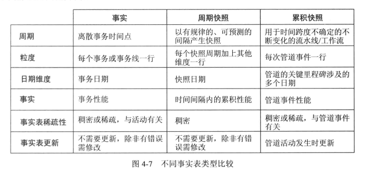


