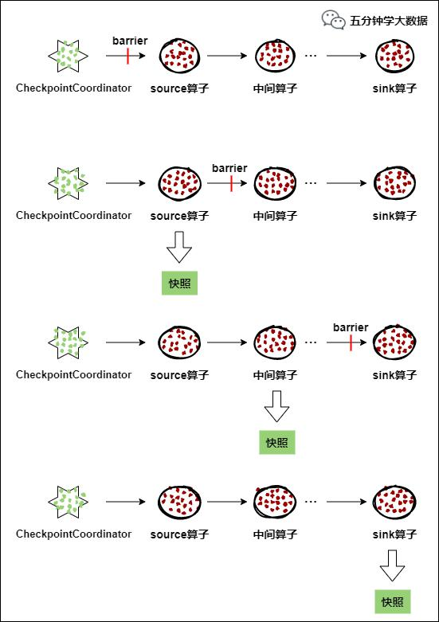
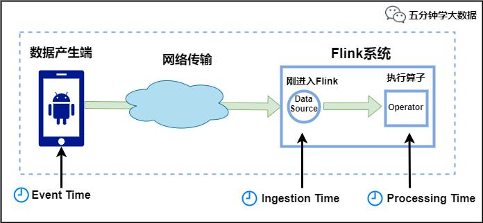
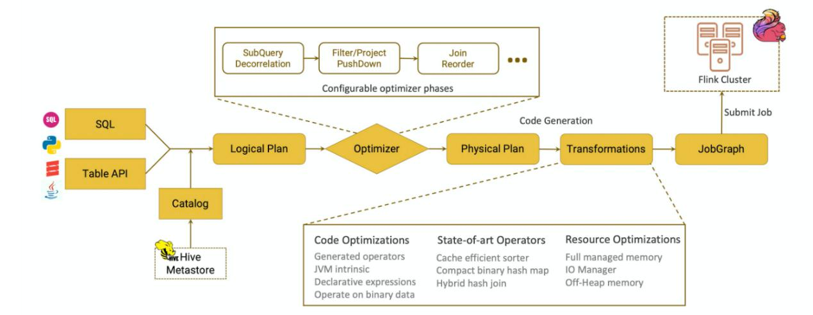

## 1. 简单介绍一下Flink

> Flink是一个面向**流处理**和**批处理**的分布式数据计算引擎，能够基于同一个Flink运行，可以提供流处理和批处理两种类型的功能。在Flink的世界观中，一切都是由流组成的，离线数据是有界的流；实时数据是一个没有界限的流：这就是所谓的有界流和无界流。

## 2.  Flink的运行必须依赖Hadoop组件吗

> Flink可以完全独立于Hadoop，在不依赖Hadoop组件下运行。但是做为大数据的基础设施，Hadoop体系是任何大数据框架都绕不过去的。Flink可以集成众多Hadooop组件，例如Yarn、Hbase、HDFS等等。例如，Flink可以和Yarn集成做资源调度，也可以读写HDFS，或者利用HDFS做检查点。
>

## 3.  Flink集群运行时角色

> Flink运行时由两种类型的进程组成：**一个JobManager和一个或者多个TaskManager**。
>
> Client不是运行时和程序执行的一部分，而是用于准备数据流并将其发送给JobManager。之后，客户端可以断开连接（分离模式），或保持连接来接收进程报告（附加模式）。客户端可以作为触发执行Java/Scala程序的一部分运行，也可以在命令行进程./bin/flink run\...中运行。
>
> 可以通过多种方式启动JobManager和TaskManager：直接在机器上作为standalone集群启动、在容器中启动、或者通过YARN等资源框架管理并启动。
>
> TaskManager连接到JobManagers，宣布自己可用，并被分配工作。
>
> **JobManager：**
>
> JobManager具有许多与协调Flink应用程序的分布式执行有关的职责：它决定何时调度下一个task（或一组task）、对完成的task或执行失败做出反应、协调checkpoint、并且协调从失败中恢复等等。这个进程由三个不同的组件组成：
>
> - **ResourceManager**
>
>   ResourceManager负责Flink集群中的资源提供、回收、分配，管理taskslots。
>
> - **Dispatcher**
>
>   Dispatcher提供了一个REST接口，用来提交Flink应用程序执行，并为每个提交的作业启动一个新的JobMaster。它还运行FlinkWebUI用来提供作业执行信息。
>
> - **JobMaster**
>
>   JobMaster负责管理单个JobGraph的执行。Flink集群中可以同时运行多个作业，每个作业都有自己的JobMaster。
>
> **TaskManagers**：
>
> TaskManager（也称为worker）执行作业流的task，并且缓存和交换数据流。必须始终至少有一个TaskManager。在TaskManager中资源调度的最小单位是taskslot。TaskManager中taskslot的数量表示并发处理task的数量。请注意一个taskslot中可以执行多个算子。

## 4.  Flink相比SparkStreaming有什么区别

> 1. **架构模型**
>
> SparkStreaming在运行时的主要角色包括：Master、Worker、Driver、Executor，
>
> Flink在运行时主要包含：Jobmanager、Taskmanager和Slot。
>
> 2. **任务调度**
>
> SparkStreaming连续不断的生成微小的数据批次，构建有向无环图DAG，Spark Streaming会依次创建DStreamGraph、JobGenerator、JobScheduler。
>
> Flink根据用户提交的代码生成StreamGraph，经过优化生成JobGraph，然后提交给JobManager进行处理，JobManager会根据JobGraph生成ExecutionGraph，ExecutionGraph是Flink调度最核心的数据结构，JobManager根据ExecutionGraph对Job进行调度。
>
> 3. **时间机制**
>
> SparkStreaming支持的时间机制有限，只支持处理时间。Flink支持了流处理程序在时间上的三个定义：处理时间、事件时间、注入时间。同时也支持watermark机制来处理滞后数据。
>
> 4. **容错机制**
>
> 对于SparkStreaming任务，我们可以设置checkpoint，然后假如发生故障并重启，我们可以从上次checkpoint之处恢复，但是这个行为只能使得数据不丢失，可能会重复处理，不能做到恰一次处理语义。
>
> Flink则使用两阶段提交协议来解决这个问题。

## 5. 介绍下Flink的容错机制（checkpoint）

> Checkpoint机制是Flink可靠性的基石，可以保证Flink集群在某个算子因为某些原因(如异常退出)出现故障时，能够将整个应用流图的状态恢复到故障之前的某一状态，保证应用流图状态的一致性。Flink的Checkpoint机制原理来自"Chandy-Lamportalgorithm"算法。
>
> 每个需要Checkpoint的应用在启动时，Flink的JobManager为其创建一个CheckpointCoordinator(检查点协调器)，CheckpointCoordinator全权负责本应用的快照制作。
>
> 
>
> 1.  CheckpointCoordinator(检查点协调器)周期性的向该流应用的所有source算子发送barrier(屏障)。
>
> 2.  当某个source算子收到一个barrier时，便暂停数据处理过程，然后将自己的当前状态制作成快照，并保存到指定的持久化存储中，最后向CheckpointCoordinator报告自己快照制作情况，同时向自身所有下游算子广播该barrier，恢复数据处理
>
> 3.  下游算子收到barrier之后，会暂停自己的数据处理过程，然后将自身的相关状态制作成快照，并保存到指定的持久化存储中，最后向CheckpointCoordinator报告自身快照情况，同时向自身所有下游算子广播该barrier，恢复数据处理。
>
> 4.  每个算子按照步骤3不断制作快照并向下游广播，直到最后barrier传递到sink算子，快照制作完成。
>
> 5.  当CheckpointCoordinator收到所有算子的报告之后，认为该周期的快照制作成功;否则，如果在规定的时间内没有收到所有算子的报告，则认为本周期快照制作失败。

> **文章推荐**：
>
> [**Flink可靠性的基石-checkpoint机制详细解析**](https://mp.weixin.qq.com/s/QMTmPeYH-AhWWEnGNSjajQ)

## 6.  Flinkcheckpoint与SparkStreaming的有什么区别或优势吗

> sparkstreaming的checkpoint仅仅是针对driver的故障恢复做了数据和元数据的checkpoint。而flink的checkpoint机制要复杂了很多，它采用的是轻量级的分布式快照，实现了每个算子的快照，及流动中的数据的快照。

## 7.  Flink是如何保证Exactly-once语义的

> Flink通过实现**两阶段提交**和状态保存来实现端到端的一致性语义。分为以下几个步骤：
>
> 开始事务（beginTransaction）创建一个临时文件夹，来写把数据写入到这个文件夹里面
>
> 预提交（preCommit）将内存中缓存的数据写入文件并关闭
>
> 正式提交（commit）将之前写完的临时文件放入目标目录下。这代表着最终的数据会有一些延迟
>
> 丢弃（abort）丢弃临时文件
>
> 若失败发生在预提交成功后，正式提交前。可以根据状态来提交预提交的数据，也可删除预提交的数据。
>
> **两阶段提交协议详解**：[**八张图搞懂Flink的Exactly-once**](https://mp.weixin.qq.com/s/WH5KZrh8YMbfFn6GyYUXVA)

## 8. 如果下级存储不支持事务，Flink怎么保证exactly-once

> 端到端的exactly-once对sink要求比较高，具体实现主要有幂等写入和事务性写入两种方式。
>
> 幂等写入的场景依赖于业务逻辑，更常见的是用事务性写入。而事务性写入又有预写日志（WAL）和两阶段提交（2PC）两种方式。
>
> 如果外部系统不支持事务，那么可以用预写日志的方式，把结果数据先当成状态保存，然后在收到checkpoint完成的通知时，一次性写入sink系统。

## 9. Flink常用的算子有哪些

> 分两部分：
>
> 1.  **数据读取**，这是Flink流计算应用的起点，常用算子有：
>
> -   从内存读：fromElements
> -   从文件读：readTextFile
> -   Socket接入：socketTextStream
> -   自定义读取：createInput
>
> 2. **处理数据**的算子，常用的算子包括：Map（单输入单输出）、FlatMap（单输入、多输出）、Filter（过滤）、KeyBy（分组）、Reduce（聚合）、Window（窗口）、Connect（连接）、Split（分割）等。
>
>    推荐阅读：[**一文学完Flink流计算常用算子（Flink算子大全）**](https://mp.weixin.qq.com/s/4BVUeXrhSSG0xmOGp5UQog)

## 10.  Flink任务延时高，如何入手

> 在Flink的后台任务管理中，我们可以看到Flink的哪个算子和task出现了反压。最主要的手段是资源调优和算子调优。资源调优即是对作业中的Operator的并发数（parallelism）、CPU（core）、堆内存（heap_memory）等参数进行调优。作业参数调优包括：并行度的设置，State的设置，checkpoint的设置。
>

## 11. Flink是如何处理反压的

> Flink内部是基于producer-consumer模型来进行消息传递的，Flink的反压设计也是基于这个模型。Flink使用了高效有界的分布式阻塞队列，就像Java通用的阻塞队列（BlockingQueue）一样。下游消费者消费变慢，上游就会受到阻塞。

## 12. 如何排查生产环境中的反压问题

> 1. **反压出现的场景**
>
> 反压经常出现在促销、热门活动等场景。短时间内流量陡增造成数据的堆积或者消费速度变慢。
>
> 它们有一个共同的特点：数据的消费速度小于数据的生产速度。
>
> 2. **反压监控方法**
>
> 通过FlinkWebUI发现反压问题。
>
> Flink的TaskManager会每隔50ms触发一次反压状态监测，共监测100次，并将计算结果反馈给JobManager，最后由JobManager进行计算反压的比例，然后进行展示。
>
> 这个比例展示逻辑如下：
>
> **OK**:0\<=Ratio\<=0.10，表示状态良好正；
>
> **LOW**:0.10\<Ratio\<=0.5，表示有待观察；
>
> **HIGH**:0.5\<Ratio\<=1，表示要处理了（增加并行度/subTask/检查是否有数据倾斜/增加内存）。
>
> 0.01，代表100次中有一次阻塞在内部调用。
>
> 
>
> 3. **flink反压的实现方式**
>
> Flink任务的组成由基本的"流"和"算子"构成，"流"中的数据在"算子"间进行计算和转换时，会被放入分布式的阻塞队列中。当消费者的阻塞队列满时，则会降低生产者的数据生产速度
>
> 4.  **反压问题定位和处理**
>
> Flink会因为数据堆积和处理速度变慢导致checkpoint超时，而checkpoint是Flink保证数据一致性的关键所在，最终会导致数据的不一致发生。
>
> 数据倾斜：可以在Flink的后台管理页面看到每个Task处理数据的大小。当数据倾斜出现时，通常是简单地使用类似KeyBy等分组聚合函数导致的，需要用户将热点Key进行预处理，降低或者消除热点Key的影。
>
> GC：不合理的设置TaskManager的垃圾回收参数会导致严重的GC问题，我们可以通过-XX:+PrintGCDetails参数查看GC的日志。
>
> 代码本身：开发者错误地使用Flink算子，没有深入了解算子的实现机制导致性能问题。我们可以通过查看运行机器节点的CPU和内存情况定位问题。

## 13. Flink中的状态存储

> Flink在做计算的过程中经常需要存储中间状态，来避免数据丢失和状态恢复。选择的状态存储策略不同，会影响状态持久化如何和checkpoint交互。Flink提供了三种状态存储方式：**MemoryStateBackend、FsStateBackend、**
>
> **RocksDBStateBackend**。

## 14. OperatorChains（算子链）这个概念你了解吗

> 为了更高效地分布式执行，Flink会尽可能地将operator的subtask链接（chain）在一起形成task。每个task在一个线程中执行。
>
> 将operators链接成task是非常有效的优化：它能减少线程之间的切换，减少消息的序列化/反序列化，减少数据在缓冲区的交换，减少了延迟的同时提高整体的吞吐量。这就是我们所说的算子链。

## 15.  Flink的内存管理是如何做的

> Flink并不是将大量对象存在堆上，而是将对象都序列化到一个预分配的内存块上。此外，Flink大量的使用了堆外内存。如果需要处理的数据超出了内存限制，则会将部分数据存储到硬盘上。Flink为了直接操作二进制数据实现了自己的序列化框架。

## 16.如何处理生产环境中的数据倾斜问题

> 1. **flink数据倾斜的表现**：
>
> 任务节点频繁出现反压，增加并行度也不能解决问题；
>
> 部分节点出现OOM异常，是因为大量的数据集中在某个节点上，导致该节点内存被爆，任务失败重启。
>
> 2. **数据倾斜产生的原因**：
>
> 业务上有严重的数据热点，比如滴滴打车的订单数据中北京、上海等几个城市的订单量远远超过其他地区；
>
> 技术上大量使用了KeyBy、GroupBy等操作，错误的使用了分组Key，人为产生数据热点。
>
> 3. **解决问题的思路**：
>
> 业务上要尽量避免热点key的设计，例如我们可以把北京、上海等热点城市分成不同的区域，并进行单独处理；
>
> 技术上出现热点时，要调整方案打散原来的key，避免直接聚合；此外Flink还提供了大量的功能可以避免数据倾斜。

## 17.  Flink中的Time有哪几种

> Flink中的时间有三种类型，如下图所示：
>
> 
>
> -   **EventTime**：是事件创建的时间。它通常由事件中的时间戳描述，例如采集的日志数据中，每一条日志都会记录自己的生成时间，Flink通过时间戳分配器访问事件时间戳。
> -   **IngestionTime**：是数据进入Flink的时间。
> -   **ProcessingTime**：是每一个执行基于时间操作的算子的本地系统时间，与机器相关，默认的时间属性就是ProcessingTime。
>
> 例如，一条日志进入Flink的时间为2021-01-2210:00:00.123，到达Window的系统时间为2021-01-2210:00:01.234，日志的内容如下：
>
> 2021-01-0618:37:15.624 INFO Failovertorm 2
>
> 对于业务来说，要统计1min内的故障日志个数，哪个时间是最有意义的？------
>
> eventTime，因为我们要根据日志的生成时间进行统计。

## 18. Flink对于迟到数据是怎么处理的

> Flink中WaterMark和Window机制解决了流式数据的乱序问题，对于因为延迟而顺序有误的数据，可以根据eventTime进行业务处理，对于延迟的数据Flink也有自己的解决办法，主要的办法是给定一个允许延迟的时间，在该时间范围内仍可以接受处理延迟数据
>
> 设置允许延迟的时间是通过allowedLateness(lateness:Time)设置
>
> 保存延迟数据则是通过sideOutputLateData(outputTag:OutputTag\[T\])保存获取延迟数据是通过DataStream.getSideOutput(tag:OutputTag\[X\])获取
>
> **文章推荐**：
>
> [**Flink中极其重要的Time与Window详细解析**](https://mp.weixin.qq.com/s?__biz=Mzg2MzU2MDYzOA%3D%3D&amp;mid=2247483905&amp;idx=1&amp;sn=11434f3788a8a78418d21bacddcedbf7&amp;chksm=ce77f4d0f9007dc6c3701f4f0306185cf5bfbec44b6f7944d570ccd0df07dd6f12902769ef31&amp;token=1679639512&amp;lang=zh_CN)

## 19.  Flink中window出现数据倾斜怎么解决

> window产生数据倾斜指的是数据在不同的窗口内堆积的数据量相差过多。本质上产生这种情况的原因是数据源头发送的数据量速度不同导致的。出现这种情况一般通过两种方式来解决：
>
> -   在数据进入窗口前做预聚合
>
> -   重新设计窗口聚合的key

## 20. FlinkCEP编程中当状态没有到达的时候会将数据保存在哪里

> 在流式处理中，CEP当然是要支持EventTime的，那么相对应的也要支持数据的迟到现象，也就是watermark的处理逻辑。CEP对未匹配成功的事件序列的处理，和迟到数据是类似的。在FlinkCEP的处理逻辑中，状态没有满足的和迟到的数据，都会存储在一个Map数据结构中，也就是说，如果我们限定判断事件序列的时长为5分钟，那么内存中就会存储5分钟的数据，这在我看来，也是对内存的极大损伤之一。
>
> 推荐阅读：[**一文学会FlinkCEP**](https://mp.weixin.qq.com/s/8Nq4rM-vlRJfnfSk4y65tQ)

## 21. Flink设置并行度的方式

> 我们在实际生产环境中可以从四个不同层面设置并行度：
>
> 1. 操作算子层面(OperatorLevel)
>
> .map(newRollingAdditionMapper()).setParallelism(10)//将操作算子设置并行度
>
> 2. 执行环境层面(ExecutionEnvironmentLevel)
>
> \$FLINK_HOME/bin/flink的-p参数修改并行度
>
> 3. 客户端层面(ClientLevel)
>
> env.setParallelism(10)
>
> 4. 系统层面(SystemLevel)
>
> 全局配置在flink-conf.yaml文件中，parallelism.default，默认是1：可以设置默认值大一点
>
> 需要注意的优先级：**算子层面>环境层面>客户端层面>系统层面**。

## 22. Flink中Task如何做到数据交换

> 在一个FlinkJob中，数据需要在不同的task中进行交换，整个数据交换是有TaskManager负责的，TaskManager的网络组件首先从缓冲buffer中收集records，然后再发送。Records并不是一个一个被发送的，是积累一个批次再发送，batch技术可以更加高效的利用网络资源。
>

## 23. 介绍下Flink的序列化

> Flink摒弃了Java原生的序列化方法，以独特的方式处理数据类型和序列化，包含自己的类型描述符，泛型类型提取和类型序列化框架。
>
> TypeInformation是所有类型描述符的基类。它揭示了该类型的一些基本属性，并且可以生成序列化器。
>
> TypeInformation支持以下几种类型：
>
> -   BasicTypeInfo:任意Java基本类型或String类型
>
> -   BasicArrayTypeInfo:任意Java基本类型数组或String数组
>
> -   WritableTypeInfo:任意HadoopWritable接口的实现类
>
> -   TupleTypeInfo:任意的FlinkTuple类型(支持Tuple1toTuple25)。Flinktuples是固定长度固定类型的JavaTuple实现
>
> -   CaseClassTypeInfo:任意的ScalaCaseClass(包括Scalatuples)
>
> -   PojoTypeInfo:任意的POJO(JavaorScala)，例如，Java对象的所有成员变量，要么是public修饰符定义，要么有getter/setter方法
>
> -   GenericTypeInfo:任意无法匹配之前几种类型的类

## 24. Flink海量数据高效去重

> 1.  基于状态后端。
>
> 2.  基于HyperLogLog：不是精准的去重。
>
> 3.  基于布隆过滤器（BloomFilter）；快速判断一个key是否存在于某容器，不存在就直接返回。
>
> 4.  基于BitMap；用一个bit位来标记某个元素对应的Value，而Key即是该元素。由于采用了Bit为单位来存储数据，因此可以大大节省存储空间。
>
> 5.  基于外部数据库；选择使用Redis或者HBase存储数据，我们只需要设计好存储的Key即可，不需要关心Flink任务重启造成的状态丢失问题。

## 25. FlinkSQL的是如何实现的

> 从图中可以看出，一段查询 SQL / 使用TableAPI 编写的程序（以下简称 TableAPI 代码）从输入到编译为可执行的 JobGraph 主要经历如下几个阶段
>
> 1. 将 SQL文本 / TableAPI 代码转化为逻辑执行计划（Logical Plan）
> 2. Logical Plan 通过优化器优化为物理执行计划（Physical Plan）
> 3. 通过代码生成技术生成 Transformations 后进一步编译为可执行的 JobGraph 提交运行
>
>
> 链接：https://www.jianshu.com/p/a52ea03d7f91
>
> 构建抽象语法树的事情交给了Calcite去做。SQLquery会经过Calcite解析器转变成SQL节点树，通过验证后构建成Calcite的抽象语法树（也就是图中的LogicalPlan）。另一边，TableAPI上的调用会构建成TableAPI的抽象语法树，并通过Calcite提供的RelBuilder转变成Calcite的抽象语法树。然后依次被转换成逻辑执行计划和物理执行计划。
>
> 在提交任务后会分发到各个TaskManager中运行，在运行时会使用Janino编译器编译代码后运行。
