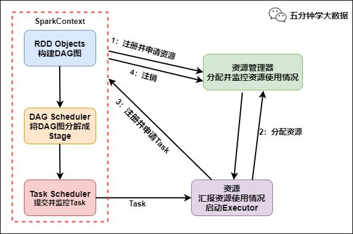

## 1.Spark的运行流程？

Spark运行流程

具体运行流程如下：

> 1. SparkContext向资源管理器注册并向资源管理器申请运行Executor
> 2. 资源管理器分配Executor，然后资源管理器启动Executor
> 3. Executor发送心跳至资源管理器
> 4. SparkContext构建DAG有向无环图
> 5. 将DAG分解成Stage（TaskSet）
> 6. 把Stage发送给TaskScheduler
> 7. Executor向SparkContext申请Task
> 8. TaskScheduler将Task发送给Executor运行
> 9. 同时SparkContext将应用程序代码发放给Executor
> 10. Task在Executor上运行，运行完毕释放所有资源

## 2.Spark有哪些组件？

> 1. master：管理集群和节点，不参与计算。
> 2. worker：计算节点，进程本身不参与计算，和master汇报。
>
> 3. Driver：运行程序的main方法，创建sparkcontext对象。
> 4. sparkcontext：控制整个application的生命周期，包括dagsheduler和taskscheduler等组件。
> 5. client：用户提交程序的入口。

## 3.Spark中的RDD机制理解吗？

> rdd分布式弹性数据集，简单的理解成一种数据结构，是spark框架上的通用货币。所有算子都是基于rdd来执行的，不同的场景会有不同的rdd实现类，但是都可以进行互相转换。rdd执行过程中会形成dag图，然后形成lineage保证容错性等。从物理的角度来看rdd存储的是block和node之间的映射。
>
> RDD是spark提供的核心抽象，全称为弹性分布式数据集。
>
> RDD在逻辑上是一个hdfs文件，在抽象上是一种元素集合，包含了数据。它是被分区的，分为多个分区，每个分区分布在集群中的不同结点上，从而让RDD中的数据可以被并行操作（分布式数据集）
>
> 比如有个RDD有90W数据，3个partition，则每个分区上有30W数据。RDD通常通过Hadoop上的文件，即HDFS或者HIVE表来创建，还可以通过应用程序中的集合来创建；RDD最重要的特性就是容错性，可以自动从节点失败中恢复过来。即如果某个结点上的RDDpartition因为节点故障，导致数据丢失，那么RDD可以通过自己的数据来源重新计算该partition。这一切对使用者都是透明的。
>
> RDD的数据默认存放在内存中，但是当内存资源不足时，spark会自动将RDD数据写入磁盘。比如某结点内存只能处理20W数据，那么这20W数据就会放入内存中计算，剩下10W放到磁盘中。RDD的弹性体现在于RDD上自动进行内存和磁盘之间权衡和切换的机制。

## 4.RDD中reduceBykey与groupByKey哪个性能好，为什么？

> **reduceByKey**：reduceByKey会在结果发送至reducer之前会对每个mapper在本地进行merge，有点类似于在MapReduce中的combiner。这样做的好处在于，在map端进行一次reduce之后，数据量会大幅度减小，从而减小传输，保证reduce端能够更快的进行结果计算。
>
> **groupByKey**：groupByKey会对每一个RDD中的value值进行聚合形成一个序列(Iterator)，此操作发生在reduce端，所以势必会将所有的数据通过网络进行传输，造成不必要的浪费。同时如果数据量十分大，可能还会造成OutOfMemoryError。
>
> 所以在进行大量数据的reduce操作时候建议使用reduceByKey。不仅可以提高速度，还可以防止使用groupByKey造成的内存溢出问题。

## 5.介绍一下cogrouprdd实现原理，你在什么场景下用过这个rdd？

> **cogroup**：对多个（2~4）RDD中的KV元素，每个RDD中相同key中的元素分别聚合成一个集合。
>
> 与reduceByKey不同的是：reduceByKey针对一个RDD中相同的key进行合并。而cogroup针对多个RDD中相同的key的元素进行合并。
>
> cogroup的函数实现：这个实现根据要进行合并的两个RDD操作，生成一个CoGroupedRDD的实例，这个RDD的返回结果是把相同的key中两个RDD分别进行合并操作，最后返回的RDD的value是一个Pair的实例，这个实例包含两个Iterable的值，第一个值表示的是RDD1中相同KEY的值，第二个值表示的是RDD2中相同key的值。由于做cogroup的操作，需要通过partitioner进行重新分区的操作，因此，执行这个流程时，需要执行一次shuffle的操作(如果要进行合并的两个RDD的都已经是shuffle后的rdd，同时他们对应的partitioner相同时，就不需
> 要执行shuffle)。
>
> 场景：表关联查询或者处理重复的key。

## 6.如何区分RDD的宽窄依赖？

> 窄依赖:父RDD的一个分区只会被子RDD的一个分区依赖；
>
> 宽依赖:父RDD的一个分区会被子RDD的多个分区依赖(涉及到shuffle)。

## 7.为什么要设计宽窄依赖？

> 1. 对于窄依赖：
> 窄依赖的多个分区可以并行计算；
> 窄依赖的一个分区的数据如果丢失只需要重新计算对应的分区的数据就可以了。
> 2. 对于宽依赖：
> 划分Stage(阶段)的依据:对于宽依赖,必须等到上一阶段计算完成才能计算下一阶段。

## 8.DAG是什么？

> DAG(DirectedAcyclicGraph有向无环图)指的是数据转换执行的过程，有方向，无闭环(其实就是RDD执行的流程)；
>
> 原始的RDD通过一系列的转换操作就形成了DAG有向无环图，任务执行时，可以按照DAG的描述，执行真正的计算(数据被操作的一个过程)。

## 9.DAG中为什么要划分Stage？

> 并行计算。
>
> 一个复杂的业务逻辑如果有shuffle，那么就意味着前面阶段产生结果后，才能执行下一个阶段，即下一个阶段的计算要依赖上一个阶段的数据。那么我们按照shuffle进行划分(也就是按照宽依赖就行划分)，就可以将一个DAG划分成多个Stage/阶段，在同一个Stage中，会有多个算子操作，可以形成一个pipeline流水线，流水线内的多个平行的分区可以并行执行。

## 10.如何划分DAG的stage？

> 对于窄依赖，partition的转换处理在stage中完成计算，不划分(将窄依赖尽量放在在同一个stage中，可以实现流水线计算)。
>
> 对于宽依赖，由于有shuffle的存在，只能在父RDD处理完成后，才能开始接下来的计算，也就是说需要要划分stage。

## 11.DAG划分为Stage的算法了解吗？

> 核心算法：**回溯算法**
>
> 从后往前回溯/反向解析，遇到窄依赖加入本Stage，遇见宽依赖进行Stage切分。Spark内核会从触发Action操作的那个RDD开始从后往前推，首先会为最后一个RDD创建一个Stage，然后继续倒推，如果发现对某个RDD是宽依赖，那么就会将宽依赖的那个RDD创建一个新的Stage，那个RDD就是新的Stage的最后一个RDD。然后依次类推，继续倒推，根据窄依赖或者宽依赖进行Stage的划分，直到所有的RDD全部遍历完成为止。
>
> 具体划分算法请参考：AMP实验室发表的论文
>
> 《ResilientDistributedDatasets:AFault-TolerantAbstractionforIn-MemoryClusterComputing》
>
> http://xueshu.baidu.com/usercenter/paper/show?paperid=b33564e60f0a7e7a1889a9da10963461&site=xueshu_se

## 12.对于Spark中的数据倾斜问题你有什么好的方案？

> 1. 前提是定位数据倾斜，是OOM了，还是任务执行缓慢，看日志，看WebUI
>
> 2. 解决方法，有多个方面:
>
>    避免不必要的shuffle，如使用广播小表的方式，将reduce-side-join提升为map-side-join
>    分拆发生数据倾斜的记录，分成几个部分进行，然后合并join后的结果
>    改变并行度，可能并行度太少了，导致个别task数据压力大
>    两阶段聚合，先局部聚合，再全局聚合
>    自定义paritioner，分散key的分布，使其更加均匀

## 13.Spark中的OOM问题？

> 1. map类型的算子执行中内存溢出如flatMap，mapPatitions
>     原因：map端过程产生大量对象导致内存溢出：这种溢出的原因是在单个map中产生了大量的对象导致的针对这种问题。
>     
>     解决方案：
>     
>     增加堆内内存。
>     
>     在不增加内存的情况下，可以减少每个Task处理数据量，使每个Task产生大量的对象时，Executor的内存也能够装得下。具体做法可以在会产生大量对象的map操作之前调用repartition方法，分区成更小的块传入map。
>
> 2. shuffle后内存溢出如join，reduceByKey，repartition。
> shuffle内存溢出的情况可以说都是shuffle后，单个文件过大导致的。在shuffle的使用，需要传入一个partitioner，大部分Spark中的shuffle操作，默认的partitioner都是HashPatitioner，默认值是父RDD中最大的分区数．这个参数spark.default.parallelism只对HashPartitioner有效．如果是别的partitioner导致的shuffle内存溢出就需要重写partitioner代码了．
>
> 3. driver内存溢出
>     用户在Dirver端口生成大对象，比如创建了一个大的集合数据结构。
>
>   解决方案：
>
>   将大对象转换成Executor端加载，比如调用sc.textfile或者评估大对象占用的内存，增加dirver端的内存
>   从Executor端收集数据（collect）回Dirver端，建议将driver端对collect回来的数据所作的操作，转换成executor端rdd操作。

## 14.Spark中数据的位置是被谁管理的？

> 每个数据分片都对应具体物理位置，数据的位置是被blockManager管理，无论数据是在磁盘，内存还是tacyan，都是由blockManager管理。
>
> BlockManager是整个Spark底层负责数据存储与管理的一个组件，Driver和Executor的所有数据都由对应的BlockManager进行管理。Driver上有BlockManagerMaster，负责对各个节点上的BlockManager内部管理的数据的元数据进行维护，比如block的增删改等操作，都会在这里维护好元数据的变更。每个节点都有一个BlockManager，每个BlockManager创建之后，第一件事即去向BlockManagerMaster进行注册

## 15.Spark程序执行，有时候默认为什么会产生很多task，怎么修改默认task执行个数？

> 1. 输入数据有很多task，尤其是有很多小文件的时候，有多少个输入block就会有多少个task启动；
>
> 2. spark中有partition的概念，每个partition都会对应一个task，task越多，在处理大规模数据的时候，就会越有效率。不过task并不是越多越好，如果平时测试，或者数据量没有那么大，则没有必要task数量太多。
>
> 3. 参数可以通过spark_home/conf/spark-default.conf配置文件设置:
>
>    针对sparksql的task数量：spark.sql.shuffle.partitions=50
>
>    非sparksql程序设置生效：spark.default.parallelism=10

## 16.介绍一下join操作优化经验？

> join其实常见的就分为两类：map-sidejoin和reduce-sidejoin。
>
> 当大表和小表join时，用map-sidejoin能显著提高效率。将多份数据进行关联是数据处理过程中非常普遍的用法，不过在分布式计算系统中，这个问题往往会变的非常麻烦，因为框架提供的join操作一般会将所有数据根据key发送到所有的reduce分区中去，也就是shuffle的过程。造成大量的网络以及磁盘IO消耗，运行效率极其低下，这个过程一般被称为reduce-side-join。
>
> 如果其中有张表较小的话，我们则可以自己实现在map端实现数据关联，跳过大量数据进行shuffle的过程，运行时间得到大量缩短，根据不同数据可能会有几倍到数十倍的性能提升。在大数据量的情况下，join是一中非常昂贵的操作，需要在join之前应尽可能的先缩小数据量。
>
> 对于缩小数据量，有以下几条建议：
> 1. 若两个RDD都有重复的key，join操作会使得数据量会急剧的扩大。所有，最好先使用distinct或者combineByKey操作来减少key空间或者用cogroup来处理重复的key，而不是产生所有的交叉结果。在
> combine时，进行机智的分区，可以避免第二次shuffle。
> 2. 如果只在一个RDD出现，那你将在无意中丢失你的数据。所以使用外连接会更加安全，这样你就能确保左边的RDD或者右边的RDD的数据完整性，在join之后再过滤数据。
> 3. 如果我们容易得到RDD的可以的有用的子集合，那么我们可以先用filter或者reduce，如何在再用join。

## 17.Spark与MapReduce的Shuffle的区别？

> 相同点：都是将mapper（Spark里是ShuffleMapTask）的输出进行partition，不同的partition送到不同的reducer（Spark里reducer可能是下一个stage里的ShuffleMapTask，也可能是ResultTask）
>
> 不同点：
>
> MapReduce默认是排序的，spark默认不排序，除非使用sortByKey算子。
>
> MapReduce可以划分成split，map()、spilt、merge、shuffle、sort、reduce()等阶段，spark没有明显的阶段划分，只有不同的stage和算子操作。
>
> MR落盘，Spark不落盘，spark可以解决mr落盘导致效率低下的问题。

## 18.SparkSQL执行的流程？

> 这个问题如果深挖还挺复杂的，这里简单介绍下总体流程：
> 1. parser：基于antlr框架对sql解析，生成抽象语法树。
> 2. 变量替换：通过正则表达式找出符合规则的字符串，替换成系统缓存环境的变量
> SQLConf中的spark.sql.variable.substitute，默认是可用的；参考SparkSqlParser
> 3. parser：将antlr的tree转成sparkcatalyst的LogicPlan，也就是未解析的逻辑计划；详细参考AstBuild,ParseDriver
> 4. analyzer：通过分析器，结合catalog，把logicalplan和实际的数据绑定起来，将未解析的逻辑计划生成逻辑计划；详细参考QureyExecution
> 5. 缓存替换：通过CacheManager，替换有相同结果的logicalplan（逻辑计划）
> 6. logicalplan优化，基于规则的优化；优化规则参考Optimizer，优化执行器RuleExecutor
> 7. 生成sparkplan，也就是物理计划；参考QueryPlanner和SparkStrategies
> 8. sparkplan准备阶段
> 9. 构造RDD执行，涉及spark的wholeStageCodegenExec机制，基于janino框架生成java代码并编译

## 19.SparkSQL是如何将数据写到Hive表的？

> 方式一：是利用SparkRDD的API将数据写入hdfs形成hdfs文件，之后再将hdfs文件和hive表做加载映射。
>
> 方式二：利用SparkSQL将获取的数据RDD转换成DataFrame，再将DataFrame写成缓存表，最后利用SparkSQL直接插入hive表中。而对于利用SparkSQL写hive表官方有两种常见的API，第一种是利用JavaBean做映射，第二种是利用StructType创建Schema做映射。

## 20.通常来说，Spark与MapReduce相比，Spark运行效率更高。请说明效率更高来源于Spark内置的哪些机制？

> 1. 基于内存计算，减少低效的磁盘交互；
>
> 2. 高效的调度算法，基于DAG；
>
> 3. 容错机制Linage。
>
>   重点部分就是DAG和Lingae

## 21.Hadoop和Spark的相同点和不同点？

> Hadoop底层使用MapReduce计算架构，只有map和reduce两种操作，表达能力比较欠缺，而且在MR过程中会重复的读写hdfs，造成大量的磁盘io读写操作，所以适合高时延环境下批处理计算的应用；
>
> Spark是基于内存的分布式计算架构，提供更加丰富的数据集操作类型，主要分成转化操作和行动操作，包括map、reduce、filter、flatmap、groupbykey、reducebykey、union和join等，数据分析更加快速，所以适合低时延环境下计算的应用；
>
> spark与hadoop最大的区别在于迭代式计算模型。基于mapreduce框架的Hadoop主要分为map和reduce两个阶段，两个阶段完了就结束了，所以在一个job里面能做的处理很有限；spark计算模型是基于内存的迭代式计算模型，可以分为n个阶段，根据用户编写的RDD算子和程序，在处理完一个阶段后可以继续往下处理很多个阶段，而不只是两个阶段。所以spark相较于mapreduce，计算模型更加灵活，可以提供更强大的功能。
>
> 但是spark也有劣势，由于spark基于内存进行计算，虽然开发容易，但是真正面对大数据的时候，在没有进行调优的情况下，可能会出现各种各样的问题，比如OOM内存溢出等情况，导致spark程序可能无法运行起来，而mapreduce虽然运行缓慢，但是至少可以慢慢运行完。

## 22.Hadoop和Spark使用场景？

>Hadoop/MapReduce和Spark最适合的都是做离线型的数据分析，但Hadoop特别适合是单次分析的数据量“很大”的情景，而Spark则适用于数据量不是很大的情景。
>
>1. 一般情况下，对于中小互联网和企业级的大数据应用而言，单次分析的数量都不会“很大”，因此可以优先考虑使用Spark。
>2. 业务通常认为Spark更适用于机器学习之类的“迭代式”应用，80GB的压缩数据（解压后超过200GB），10个节点的集群规模，跑类似“sum+group-by”的应用，MapReduce花了5分钟，而spark只需要2分钟。

## 23. Spark 如何保证宕机迅速恢复?

> 1. 适当增加 spark standby master
> 2. 编写 shell 脚本，定期检测 master 状态，出现宕机后对 master 进行重启操作

## 24. RDD 持久化原理？

> spark 非常重要的一个功能特性就是可以将 RDD 持久化在内存中。调用 cache()和 persist()方法即可。cache()和 persist()的区别在于，cache()是 persist()的一种简化方式，cache()的底层就是调用 persist()的无参版本persist(MEMORY_ONLY)，将数据持久化到内存中。如果需要从内存中清除缓存，可以使用 unpersist()方法。RDD 持久化是可以手动选择不同的策略的。在调用 persist()时传入对应的 StorageLevel 即可。

## 25. Checkpoint 检查点机制？

> 应用场景：当 spark 应用程序特别复杂，从初始的 RDD 开始到最后整个应用程序完成有很多的步骤，而且整个应用运行时间特别长，这种情况下就比较适合使用 checkpoint 功能。
>
> 原因：对于特别复杂的 Spark 应用，会出现某个反复使用的 RDD，即使之前持久化过但由于节点的故障导致数据丢失了，没有容错机制，所以需要重新计算一次数据。
>
> Checkpoint 首先会调用 SparkContext 的 setCheckPointDIR()方法，设置一个容错的文件系统的目录，比如说 HDFS；然后对 RDD 调用 checkpoint()方法。之后在 RDD 所处的 job 运行结束之后，会启动一个单独的 job，来将
> checkpoint 过的 RDD 数据写入之前设置的文件系统，进行高可用、容错的类持久化操作。
>
> 检查点机制是我们在 spark streaming 中用来保障容错性的主要机制，它可以使 spark streaming 阶段性的把应用数据存储到诸如 HDFS 等可靠存储系统中，以供恢复时使用。具体来说基于以下两个目的服务：
>
> 1. 控制发生失败时需要重算的状态数。Spark streaming 可以通过转化图的谱系图来重算状态，检查点机制则可以控制需要在转化图中回溯多远。
> 2. 提供驱动器程序容错。如果流计算应用中的驱动器程序崩溃了，你可以重启驱动器程序并让驱动器程序从检查点恢复，这样 spark streaming 就可以读取之前运行的程序处理数据的进度，并从那里继续。

## 26. Checkpoint 和持久化机制的区别？

> 最主要的区别在于持久化只是将数据保存在 BlockManager 中，但是 RDD 的lineage(血缘关系，依赖关系)是不变的。但是 checkpoint 执行完之后，rdd 已经没有之前所谓的依赖 rdd 了，而只有一个强行为其设置的checkpointRDD，checkpoint 之后 rdd 的 lineage 就改变了。
>
> 持久化的数据丢失的可能性更大，因为节点的故障会导致磁盘、内存的数据丢失。但是 checkpoint 的数据通常是保存在高可用的文件系统中，比如 HDFS 中，所以数据丢失可能性比较低

## 27. Spark Streaming 以及基本工作原理？

> Spark streaming 是 spark core API 的一种扩展，可以用于进行大规模、高吞吐量、容错的实时数据流的处理。
> 它支持从多种数据源读取数据，比如 Kafka、Flume、Twitter 和 TCP Socket，并且能够使用算子比如 map、reduce、join 和 window 等来处理数据，处理后的数据可以保存到文件系统、数据库等存储中。
>
> Spark streaming 内部的基本工作原理是：接受实时输入数据流，然后将数据拆分成 batch，比如每收集一秒的数据封装成一个 batch，然后将每个 batch 交给 spark 的计算引擎进行处理，最后会生产处一个结果数据流，其中的数据也是一个一个的 batch 组成的。

## 28. DStream 以及基本工作原理？

>DStream 是 spark streaming 提供的一种高级抽象，代表了一个持续不断的数据流。
>
>DStream 可以通过输入数据源来创建，比如 Kafka、flume 等，也可以通过其他DStream 的高阶函数来创建，比如 map、reduce、join 和 window 等。
>
>DStream 内部其实不断产生 RDD，每个 RDD 包含了一个时间段的数据。Spark streaming 一定是有一个输入的 DStream 接收数据，按照时间划分成一个一个的 batch，并转化为一个 RDD，RDD 的数据是分散在各个子节点的
>partition 中。

## 29. Spark Streaming 整合 Kafka 的两种模式？

> 1. **receiver 方式：**
>
> 将数据拉取到 executor 中做操作，若数据量大，内存存储不下，可以通过 WAL，设置了本地存储，保证数据不丢失，然后使用Kafka 高级 API 通过 zk 来维护偏移量，保证消费数据。receiver 消费
> 的数据偏移量是在 zk 获取的，此方式效率低，容易出现数据丢失。
>
>   receiver 方式的容错性：在默认的配置下，这种方式可能会因为底层的失败而丢失数据。如果要启用高可靠机制，让数据零丢失，就必须启用Spark Streaming 的预写日志机制（Write Ahead Log，WAL）。该机制会同步地将接收到的 Kafka 数据写入分布式文件系统（比如 HDFS）上的预写日志中。所以，即使底层节点出现了失败，也可以使用预写日志中的数据进行恢复。
>
>   Kafka 中的 topic 的 partition，与 Spark 中的 RDD 的 partition 是没有关系的。在KafkaUtils.createStream()中，提高 partition 的数量，只会增加 Receiver 方式中读取 partition 的线程的数量。不会增加 Spark 处理数据的并行度。 可以创建多个 Kafka 输入 DStream，使用不同的 consumer group 和 topic，来通过多个 receiver 并行接收数据。
>
> 2. **基于 Direct 方式：**
>
> 使用 Kafka 底层 Api，其消费者直接连接 kafka 的分区上，因为 createDirectStream 创建的DirectKafkaInputDStream 每个 batch 所对应的 RDD 的分区与 kafka 分区一一对应，但是需要自己维护偏移量，即用即取，不会给内存造成太大的压力，效率高。
>
> 优点：简化并行读取：如果要读取多个 partition，不需要创建多个输入DStream 然后对它们进行 union 操作。Spark 会创建跟 Kafka partition 一样多的 RDD partition，并且会并行从 Kafka 中读取数据。所以在 Kafka partition 和 RDD partition 之间，有一个一对一的映射关系。
>
> 高性能：如果要保证零数据丢失，在基于 receiver 的方式中，需要开启WAL 机制。这种方式其实效率低下，因为数据实际上被复制了两份，Kafka自己本身就有高可靠的机制，会对数据复制一份，而这里又会复制一份到WAL 中。而基于 direct 的方式，不依赖 Receiver，不需要开启 WAL 机制，只要 Kafka 中作了数据的复制，那么就可以通过 Kafka 的副本进行恢复。
>
> 3. **receiver 与和 direct 的比较**：
>
> 基于 receiver 的方式，是使用 Kafka 的高阶 API 来在 ZooKeeper 中保存消费过的 offset 的。这是消费 Kafka 数据的传统方式。这种方式配合着 WAL 机制可以保证数据零丢失的高可靠性，但是却无法保证数据
> 被处理一次且仅一次，可能会处理两次。因为 Spark 和 ZooKeeper 之间可能是不同步的。
>
> 基于 direct 的方式，使用 Kafka 的低阶 API，Spark Streaming 自己就负责追踪消费的 offset，并保存在 checkpoint 中。Spark 自己一定是同步的，因此可以保证数据是消费一次且仅消费一次。
>
> Receiver 方式是通过 zookeeper 来连接 kafka 队列，Direct 方式是直接连接到 kafka 的节点上获取数据。

## 30. Spark 主备切换机制原理知道吗？

> Master 实际上可以配置两个，Spark 原生的 standalone 模式是支持 Master主备切换的。当 Active Master 节点挂掉以后，我们可以将 Standby Master 切换为 Active Master。
>
> Spark Master 主备切换可以基于两种机制，一种是基于文件系统的，一种是基于 ZooKeeper 的。基于文件系统的主备切换机制，需要在 Active Master 挂掉之后手动切换到Standby Master 上；而基于 Zookeeper 的主备切换机制，可以实现自动切换 Master。

## 31. Spark 解决了 Hadoop 的哪些问题？

> 1. MR：抽象层次低，需要使用手工代码来完成程序编写，使用上难以上手；
>    Spark：Spark 采用 RDD 计算模型，简单容易上手。
>
> 2. MR：只提供 map 和 reduce 两个操作，表达能力欠缺；
> Spark：Spark 采用更加丰富的算子模型，包括 map、flatmap、groupbykey、reducebykey 等；
>
> 3. MR：一个 job 只能包含 map 和 reduce 两个阶段，复杂的任务需要包含很多个 job，这些 job 之间的管理以来需要开发者自己进行管理；
> Spark：Spark 中一个 job 可以包含多个转换操作，在调度时可以生成多个 stage，而且如果多个 map 操作的分区不变，是可以放在同一个 task里面去执行；
>
> 4. MR：中间结果存放在 hdfs 中；
> Spark：Spark 的中间结果一般存在内存中，只有当内存不够了，才会存入本地磁盘，而不是 hdfs；
>
> 5. MR：只有等到所有的 map task 执行完毕后才能执行 reduce task；
>
>    Spark：Spark 中分区相同的转换构成流水线在一个 task 中执行，分区不同的需要进行 shuffle 操作，被划分成不同的 stage 需要等待前面的stage 执行完才能执行。
>
> 6. MR：只适合 batch 批处理，时延高，对于交互式处理和实时处理支持不够；
>    Spark：Spark streaming 可以将流拆成时间间隔的 batch 进行处理，实时计算。

## 32. 数据倾斜的产生和解决办法？

> 数据倾斜以为着某一个或者某几个 partition 的数据特别大，导致这几个partition 上的计算需要耗费相当长的时间。
>
> 在 spark 中同一个应用程序划分成多个 stage，这些 stage 之间是串行执行的，而一个 stage 里面的多个 task 是可以并行执行，task 数目由 partition 数目决定，如果一个 partition 的数目特别大，那么导致这个 task 执行时间很
> 长，导致接下来的 stage 无法执行，从而导致整个 job 执行变慢。
>
> 避免数据倾斜，一般是要选用合适的 key，或者自己定义相关的 partitioner，通过加盐或者哈希值来拆分这些 key，从而将这些数据分散到不同的 partition去执行。如下算子会导致 shuffle 操作，是导致数据倾斜可能发生的关键点所在：groupByKey；reduceByKey；aggregaByKey；join；cogroup；

## 33. 你用 Spark Sql 处理的时候， 处理过程中用的 DataFrame 还是直接写的 Sql？为什么？

> 这个问题的宗旨是问你 spark sql 中 dataframe 和 sql 的区别，从执行原理、操作方便程度和自定义程度来分析 这个问题。

## 34. Spark Master HA 主从切换过程不会影响到集群已有作业的运行，为什么？

> 不会的。
>
> 因为程序在运行之前，已经申请过资源了，driver 和 Executors 通讯，不需要和 master 进行通讯的。

## 35. Spark Master 使用 Zookeeper 进行 HA，有哪些源数据保存到Zookeeper 里面？

> spark 通过这个参数 spark.deploy.zookeeper.dir 指定 master 元数据在zookeeper 中保存的位置，包括 Worker，Driver 和 Application 以及Executors。standby 节点要从 zk 中，获得元数据信息，恢复集群运行状态，才能对外继续提供服务，作业提交资源申请等，在恢复前是不能接受请求的。
>
> 注：Master 切换需要注意 2 点：
>
> 1、在 Master 切换的过程中，所有的已经在运行的程序皆正常运行！ 因为 Spark Application 在运行前就已经通过 Cluster Manager 获得了计算资源，所以在运行时 Job 本身的 调度和处理和 Master 是没有任何关系。
>
> 2、在 Master 的切换过程中唯一的影响是不能提交新的 Job：一方面不能够提交新的应用程序给集群， 因为只有 Active Master 才能接受新的程序的提交请求；另外一方面，已经运行的程序中也不能够因 Action 操作触发新的 Job 的提交请求。

## 36. 如何实现 Spark Streaming 读取 Flume 中的数据？

> 可以这样说：
>
> - 前期经过技术调研，查看官网相关资料，发现 sparkStreaming 整合 flume有 2 种模式，一种是拉模式，一种是推模式，然后在简单的聊聊这 2 种模式的特点，以及如何部署实现，需要做哪些事情，最后对比两种模式的特点，选择那种模式更好。
> - 推模式：Flume 将数据 Push 推给 Spark Streaming
> - 拉模式：Spark Streaming 从 flume 中 Poll 拉取数据

## 37. 在实际开发的时候是如何保证数据不丢失的

> - flume 那边采用的 channel 是将数据落地到磁盘中，保证数据源端安全性（可以在补充一下，flume 在这里的 channel 可以设置为 memory 内存中，提高数据接收处理的效率，但是由于数据在内存中，安全机制保证不了，故选择 channel 为磁盘存储。整个流程运行有一点的延迟性）
>
> - sparkStreaming 通过拉模式整合的时候，使用了 FlumeUtils 这样一个类，该类是需要依赖一个额外的 jar 包（spark-streaming-flume_2.10）
> - 要想保证数据不丢失，数据的准确性，可以在构建 StreamingConext 的时候，利用 StreamingContext.getOrCreate（checkpoint, creatingFunc:() => StreamingContext）来创建一个 StreamingContext,使用StreamingContext.getOrCreate 来创建 StreamingContext 对象，传入的第一个参数是 checkpoint 的存放目录，第二参数是生成StreamingContext 对象的用户自定义函数。如果 checkpoint 的存放目录存在，则从这个目录中生成 StreamingContext 对象；如果不存在，才会调用第二个函数来生成新的 StreamingContext 对象。在 creatingFunc函数中，除了生成一个新的 StreamingContext 操作，还需要完成各种操作，然后调用 ssc.checkpoint(checkpointDirectory)来初始化checkpoint 功能，最后再返回 StreamingContext 对象。这样，在StreamingContext.getOrCreate 之后，就可以直接调用 start()函数来启动（或者是从中断点继续运行）流式应用了。如果有其他在启动或继续运行都要做的工作，可以在 start()调用前执行。

## 38. RDD 有哪些缺陷？

> 1. 不支持细粒度的写和更新操作，Spark 写数据是粗粒度的，所谓粗粒度，就是批量写入数据，目的是为了提高效率。但是 Spark 读数据是细粒度的，也就是说可以一条条的读。
>
> 2. 不支持增量迭代计算，如果对 Flink 熟悉，可以说下 Flink 支持增量迭代计算。
