> 最近，数据湖的概念非常热，许多前线的同学都在讨论数据湖应该怎么建？有没有成熟的数据湖解决方案？各大厂商的数据湖解决方案到底有没有实际落地的案例？怎么理解数据湖？数据湖和大数据平台有什么不同？带着这些问题，我们尝试写了这样一篇文章，希望能抛砖引玉，引起大家一些思考和共鸣。
>
> 本文共有以下 7 个章节：
>
> 1. 什么是数据湖
> 2. 数据湖的基本特征
> 3. 数据湖基本架构
> 4. 各厂商的数据湖解决方案
> 5. 典型的数据湖应用场景
> 6. 数据湖建设的基本过程
> 7. 总结

# 一、什么是数据湖

> 数据湖是目前比较热的一个概念，许多企业都在构建或者计划构建自己的数据湖。但是在计划构建数据湖之前，搞清楚什么是数据湖，明确一个数据湖项目的基本组成，进而设计数据湖的基本架构，对于数据湖的构建至关重要。关于什么是数据湖，有如下定义。
>
> Wikipedia 是这样定义的：
>
> 数据湖是一类存储数据自然/原始格式的系统或存储，通常是对象块或者文件。数据湖通常是企业中全量数据的单一存储。全量数据包括原始系统所产生的原始数据拷贝以及为了各类任务而产生的转换数据，各类任务包括报表、可视化、高级分析和机器学习。数据湖中包括来自于关系型数据库中的结构化数据（行和列）、半结构化数据（如 CSV、日志、XML、JSON）、非结构化数据（如 email、文档、PDF 等）和二进制数据（如图像、音频、视频）。数据沼泽是一种退化的、缺乏管理的数据湖，数据沼泽对于用户来说要么是不可访问的要么就是无法提供足够的价值。
>
> AWS 的定义相对就简洁一点：
>
> 数据湖是一个集中式存储库，允许您以任意规模存储所有结构化和非结构化数据。您可以按原样存储数据（无需先对数据进行结构化处理），并运行不同类型的分析 – 从控制面板和可视化到大数据处理、实时分析和机器学习，以指导做出更好的决策。
>
> 微软的定义就更加模糊了，并没有明确给出什么是 Data Lake，而是取巧的将数据湖的功能作为定义：
>
> Azure 的数据湖包括一切使得开发者、数据科学家、分析师能更简单的存储、处理数据的能力，这些能力使得用户可以存储任意规模、任意类型、任意产生速度的数据，并且可以跨平台、跨语言的做所有类型的分析和处理。数据湖在能帮助用户加速应用数据的同时，消除了数据采集和存储的复杂性，同时也能支持批处理、流式计算、交互式分析等。数据湖能同现有的数据管理和治理的 IT 投资一起工作，保证数据的一致、可管理和安全。它也能同现有的业务数据库和数据仓库无缝集成，帮助扩展现有的数据应用。Azure 数据湖吸取了大量企业级用户的经验，并且在微软一些业务中支持了大规模处理和分析场景，包括 Office 365,Xbox Live, Azure, Windows, Bing 和 Skype。Azure 解决了许多效率和可扩展性的挑战，作为一类服务使得用户可以最大化数据资产的价值来满足当前和未来需求。
>
> 关于数据湖的定义其实很多，但是基本上都围绕着以下几个特性展开：
>
> 1. 数据湖需要提供足够用的数据存储能力，这个存储保存了一个企业/组织中的所有数据。
> 2. 数据湖可以存储海量的任意类型的数据，包括结构化、半结构化和非结构化数据。
> 3. 数据湖中的数据是原始数据，是业务数据的完整副本。数据湖中的数据保持了他们在业务系统中原来的样子。
> 4. 数据湖需要具备完善的数据管理能力（完善的元数据），可以管理各类数据相关的要素，包括数据源、数据格式、连接信息、数据 schema、权限管理等。
> 5. 数据湖需要具备多样化的分析能力，包括但不限于批处理、流式计算、交互式分析以及机器学习；同时，还需要提供一定的任务调度和管理能力。
> 6. 数据湖需要具备完善的数据生命周期管理能力。不光需要存储原始数据，还需要能够保存各类分析处理的中间结果，并完整的记录数据的分析处理过程，能帮助用户完整详细追溯任意一条数据的产生过程。
> 7. 数据湖需要具备完善的数据获取和数据发布能力。数据湖需要能支撑各种各样的数据源，并能从相关的数据源中获取全量/增量数据；然后规范存储。数据湖能将数据分析处理的结果推送到合适的存储引擎中，满足不同的应用访问需求。
> 8. 对于大数据的支持，包括超大规模存储以及可扩展的大规模数据处理能力。
>
> 综上，个人认为数据湖应该是一种不断演进中、可扩展的大数据存储、处理、分析的基础设施；以数据为导向，实现任意来源、任意速度、任意规模、任意类型数据的全量获取、全量存储、多模式处理与全生命周期管理；并通过与各类外部异构数据源的交互集成，支持各类企业级应用。
>
> 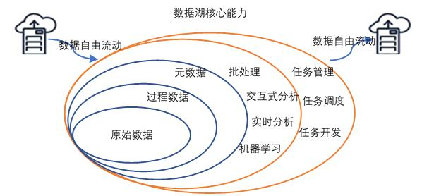
>
> 图 1. 数据湖基本能力示意
>
> 这里需要再特别指出两点：
>
> 1. 可扩展是指规模的可扩展和能力的可扩展，即数据湖不但要能够随着数据量的增大，提供“足够”的存储和计算能力；还需要根据需要不断提供新的数据处理模式，例如可能一开始业务只需要批处理能力，但随着业务的发展，可能需要交互式的即席分析能力；又随着业务的实效性要求不断提升，可能需要支持实时分析和机器学习等丰富的能力。
> 2. 以数据为导向，是指数据湖对于用户来说要足够的简单、易用，帮助用户从复杂的 IT 基础设施运维工作中解脱出来，关注业务、关注模型、关注算法、关注数据。数据湖面向的是数据科学家、分析师。目前来看，云原生应该是构建数据湖的一种比较理想的构建方式，后面在“数据湖基本架构”一节会详细论述这一观点。

# 二、数据湖的基本特征

> 对数据湖的概念有了基本的认知之后，我们需要进一步明确数据湖需要具备哪些基本特征，特别是与大数据平台或者传统数据仓库相比，数据湖具有哪些特点。在具体分析之前，我们先看一张来自 AWS 官网的对比表格
>
> |     特性      |                      数据仓库                      |                            数据湖                            |
> | :-----------: | :------------------------------------------------: | :----------------------------------------------------------: |
> |   **数据**    | 来自事务系统、运营数据库和业务线应用程序的关系数据 | 来自 IoT 设备、网站、移动应用程序、社交媒体和企业应用程序的非关系和关系数据 |
> |  **Schema**   |      设计在数据仓库实施之前（写入型 Schema）       |                写入在分析时（读取型 Schema）                 |
> |  **性价比**   |           更快查询结果会带来较高存储成本           |                 更快查询结果只需较低存储成本                 |
> | **数据质量 ** |          可作为重要事实依据的高度监管数据          |         任何可以或无法进行监管的数据（例如原始数据）         |
> |   **用户**    |                     业务分析师                     |     数据科学家、数据开发人员和业务分析师（使用监管数据）     |
> |   **分析**    |              批处理报告、BI 和可视化               |              机器学习、预测分析、数据发现和分析              |
>
> 上表对比了数据湖与传统数仓的区别，个人觉得可以从数据和计算两个层面进一步分析数据湖应该具备哪些特征。在数据方面：
>
> - “保真性”。数据湖中对于业务系统中的数据都会存储一份“一模一样”的完整拷贝。与数据仓库不同的地方在于，数据湖中必须要保存一份原始数据，无论是数据格式、数据模式、数据内容都不应该被修改。在这方面，数据湖强调的是对于业务数据“原汁原味”的保存。同时，数据湖应该能够存储任意类型/格式的数据。
>
> - “灵活性”：上表一个点是 “写入型 schema” v.s.“读取型 schema”，其实本质上来讲是数据 schema 的设计发生在哪个阶段的问题。对于任何
>   数据应用来说，其实 schema 的设计都是必不可少的，即使是 mongoDB 等一些强调“无模式”的数据库，其最佳实践里依然建议记录尽量采用相同/相似的结构。“写入型 schema”背后隐含的逻辑是数据在写入之前，就需要根据业务的访问方式确定数据的 schema，然后按照既定 schema，完成数据导入，带来的好处是数据与业务的良好适配；但是这也意味着数仓的前期拥有成本会比较高，特别是当业务模式不清晰、业务还处于探索阶段时，数仓的灵活性不够。数据湖强调的“读取型 schema”，背后的潜在逻辑则是认为业务的不确定性是常态：我们无法预期业务的变化，那么我们就保持一定的灵活性，将设计去延后，让整个基础设施具备使数据“按需”贴合业务的能力。因此，个人认为“保真性”和“灵活性”是一脉相承的：既然没办法预估业务的变化，那么索性保持数据最为原始的状态，一旦需要时，可以根据需求对数据进行加工处理。因此，数据湖更加适合创新型企业、业务高速变化发展的企业。同时，数据湖的用户也相应的要求更高，数据科学家、业务分析师（配合一定的可视化工具）是数据湖的目标客户。
>
> - “可管理”：数据湖应该提供完善的数据管理能力。既然数据要求“保真性”和“灵活性”，那么至少数据湖中会存在两类数据：原始数据和处理后的数据。数据湖中的数据会不断的积累、演化。因此，对于数据管理能力也会要求很高，至少应该包含以下数据管理能力：数据源、数据连接、数据格式、数据 schema（库/表/列/行）。同时，数据湖是单个企业/组织中统一的数据存放场所，因此，还需要具有一定的权限管理能力。
> - “可追溯”：数据湖是一个组织/企业中全量数据的存储场所，需要对数据的全生命周期进行管理，包括数据的定义、接入、存储、处理、分析、应用的全过程。一个强大的数据湖实现，需要能做到对其间的任意一条数据的接入、存储、处理、消费过程是可追溯的，能够清楚的重现数据完整的产生过程和流动过程。在计算方面，个人认为数据湖对于计算能力要求其实非常广泛，完全取决于业务对于计算的要求。
> - 丰富的计算引擎。从批处理、流式计算、交互式分析到机器学习，各类计算引擎都属于数据湖应该囊括的范畴。一般情况下，数据的加载、转换、处理会使用批处理计算引擎；需要实时计算的部分，会使用流式计算引擎；对于一些探索式的分析场景，可能又需要引入交互式分析引擎。随着大数据技术与人工智能技术的结合越来越紧密，各类机器学习/深度学习算法也被不断引入，例如 TensorFlow/PyTorch 框架已经支持从 HDFS/S3/OSS上读取样本数据进行训练。因此，对于一个合格的数据湖项目而言，计算引擎的可扩展/可插拔，应该是一类基础能力。
> - 多模态的存储引擎。理论上，数据湖本身应该内置多模态的存储引擎，以满足不同的应用对于数据访问需求（综合考虑响应时间/并发/访问频次/成本等因素）。但是，在实际的使用过程中，数据湖中的数据通常并不会被高频次的访问，而且相关的应用也多在进行探索式的数据应用，为了达到可接受的性价比，数据湖建设通常会选择相对便宜的存储引擎（如S3/OSS/HDFS/OBS），并且在需要时与外置存储引擎协同工作，满足多样化的应用需求。

# 三、数据湖基本架构

> 数据湖可以认为是新一代的大数据基础设施。为了更好的理解数据湖的基本架构，我们先来看看大数据基础设施架构的演进过程。
>
> 1） 第一阶段：以 Hadoop 为代表的离线数据处理基础设施。如下图所示，Hadoop是以 HDFS 为核心存储，以 MapReduce（简称 MR）为基本计算模型的批量数据处理基础设施。围绕 HDFS 和 MR，产生了一系列的组件，不断完善整个大数据平台的数据处理能力，例如面向在线 KV 操作的 HBase、面向 SQL 的 HIVE、面向工作流的 PIG 等。同时，随着大家对于批处理的性能要求越来越高，新的计算模型不断被提出，产生了 Tez、Spark、Presto 等计算引擎，MR 模型也逐渐进化成 DAG模型。DAG 模型一方面，增加计算模型的抽象并发能力：对每一个计算过程进行分解，
> 根据计算过程中的聚合操作点对任务进行逻辑切分，任务被切分成一个个的stage，每个 stage 都可以有一个或者多个 Task 组成，Task 是可以并发执行的，从而提升整个计算过程的并行能力；另一方面，为减少数据处理过程中的中间结果写文件操作，Spark、Presto 等计算引擎尽量使用计算节点的内存对数据进行缓存，从而提高整个数据过程的效率和系统吞吐能力。
>
> 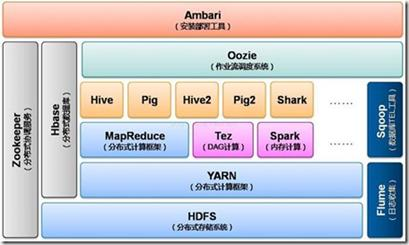
>
> ​                                                                                                 图 2. Hadoop 体系结构示意
>
> 2） 第二阶段：lambda 架构。随着数据处理能力和处理需求的不断变化，越来越多的用户发现，批处理模式无论如何提升性能，也无法满足一些实时性要求高的处理场景，流式计算引擎应运而生，例如 Storm、Spark Streaming、Flink等。然而，随着越来越多的应用上线，大家发现，其实批处理和流计算配合使用，才能满足大部分应用需求；而对于用户而言，其实他们并不关心底层的计算模型是什么，用户希望无论是批处理还是流计算，都能基于统一的数据模型来返回处理结果，于是 Lambda 架构被提出，如下图所示。
>
> 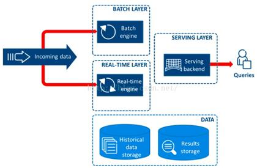
>
> ​                                                                                                图 3. Lambda 架构示意
>
> Lambda 架构的核心理念是“流批一体”，如上图所示，整个数据流向自左向右流入平台。进入平台后一分为二，一部分走批处理模式，一部分走流式计算模式。无论哪种计算模式，最终的处理结果都通过服务层对应用提供，确保访问的一致性。
>
> 3） 第三阶段：Kappa 架构。Lambda 架构解决了应用读取数据的一致性问题，但是“流批分离”的处理链路增大了研发的复杂性。因此，有人就提出能不能用一套系统来解决所有问题。目前比较流行的做法就是基于流计算来做。流计算天然的分布式特征，注定了他的扩展性更好。通过加大流计算的并发性，加大流式数据的“时间窗口”，来统一批处理与流式处理两种计算模式。
>
> 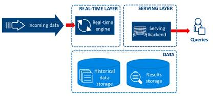
>
> ​                                                                                               图 4. Kappa 架构示意
>
> 综上，从传统的 hadoop 架构往 lambda 架构，从 lambda 架构往 Kappa 架构的演进，大数据平台基础架构的演进逐渐囊括了应用所需的各类数据处理能力，大数据平台逐渐演化成了一个企业/组织的全量数据处理平台。当前的企业实践中，除了关系型数据库依托于各个独立的业务系统；其余的数据，几乎都被考虑纳入大数据平台来进行统一的处理。然而，目前的大数据平台基础架构，都将视角锁定在了存储和计算，而忽略了对于数据的资产化管理，这恰恰是数据湖作为新一代的大数据基础设施所重点关注的方向之一。曾经看过一个很有意思的文章，提出过如下问题：数据湖为什么叫数据湖而不叫数据河或者数据海？一个有意思的回答是：
> 1. “河”强调的是流动性，“海纳百川”，河终究是要流入大海的，而企业级数据是需要长期沉淀的，因此叫“湖”比叫“河”要贴切；同时，湖水
> 天然是分层的，满足不同的生态系统要求，这与企业建设统一数据中心，存放管理数据的需求是一致的，“热”数据在上层，方便应用随时使用；温数据、冷数据位于数据中心不同的存储介质中，达到数据存储容量与成本的平衡。
>
> 2. 不叫“海”的原因在于，海是无边无界的，而“湖”是有边界的，这个边界就是企业/组织的业务边界；因此数据湖需要更多的数据管理和权限管理能力。
>
> 3. 叫“湖”的另一个重要原因是数据湖是需要精细治理的，一个缺乏管控、缺乏治理的数据湖最终会退化为“数据沼泽”，从而使应用无法有效访问数据，使存于其中的数据失去价值。
>
> 大数据基础架构的演进，其实反应了一点：在企业/组织内部，数据是一类重要资产已经成为了共识；为了更好的利用数据，企业/组织需要对数据资产：
>
> 1. 进行长期的原样存储
> 2. 进行有效管理与集中治理
> 3. 提供多模式的计算能力满足处理需求
> 4. 以及面向业务，提供统一的数据视图、数据模型与数据处理结果
>
> 数据湖就是在这个大背景下产生的，除了大数据平台所拥有的各类基础能力之外，数据湖更强调对于数据的管理、治理和资产化能力。落到具体的实现上，数据湖需要包括一系列的数据管理组件，包括：
>
> 1. 数据接入
> 2. 数据搬迁
> 3. 数据治理
> 4. 质量管理
> 5. 资产目录
> 6. 访问控制
> 7. 任务管理
> 8. 任务编排
> 9. 元数据管理等
>
> 如下图所示，给出了一个数据湖系统的参考架构。对于一个典型的数据湖而言，它与大数据平台相同的地方在于它也具备处理超大规模数据所需的存储和计算能力，能提供多模式的数据处理能力；增强点在于数据湖提供了更为完善的数据管理能力，具体体现在：
> 1. 更强大的数据接入能力。数据接入能力体现在对于各类外部异构数据源的定义管理能力，以及对于外部数据源相关数据的抽取迁移能力，抽取迁移的数据包括外部数据源的元数据与实际存储的数据。
> 2. 更强大的数据管理能力。管理能力具体又可分为基本管理能力和扩展管理能力。基本管理能力包括对各类元数据的管理、数据访问控制、数据资产管理，是一个数据湖系统所必须的，后面我们会在“各厂商的数据湖解决方案”一节相信讨论各个厂商对于基本管理能力的支持方式。扩展管理能力包括任务管理、流程编排以及与数据质量、数据治理相关的能力。任务管理和流程编排主要用来管理、编排、调度、监测在数据湖系统中处理数据的各类任务，通常情况下，数据湖构建者会通过购买/研制定制的数据集成或数据开发子系统/模块来提供此类能力，定制的系统/模块可以通过读取数据湖的相关元数据，来实现与数据湖系统的融合。而数据质量和数据治理则是更为复杂的问题，一般情况下，数据湖系统不会直接提供相关功能，但是会开放各类接口或者元数据，供有能力的企业/组织与已有的数据治理软件集成或者做定制开发。
> 3. 可共享的元数据。数据湖中的各类计算引擎会与数据湖中的数据深度融合，而融合的基础就是数据湖的元数据。好的数据湖系统，计算引擎在处理数据时，能从元数据中直接获取数据存储位置、数据格式、数据模式、数据分布等信息，然后直接进行数据处理，而无需进行人工/编
> 4. 程干预。更进一步，好的数据湖系统还可以对数据湖中的数据进行访问控制，控制的力度可以做到“库表列行”等不同级别。
>
> 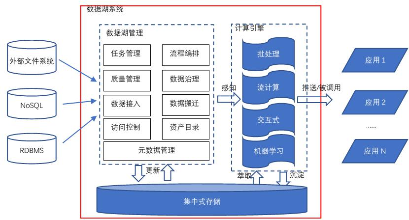
>
> ​                                                                                             图 5. 数据湖组件参考架构
>
> 还有一点应该指出的是，上图的“集中式存储”更多的是业务概念上的集中，本质上是希望一个企业/组织内部的数据能在一个明确统一的地方进行沉淀。事实上，数据湖的存储应该是一类可按需扩展的分布式文件系统，大多数数据湖实践中也是推荐采用 S3/OSS/OBS/HDFS 等分布式系统作为数据湖的统一存储。我们可以再切换到数据维度，从数据生命周期的视角来看待数据湖对于数据的处理方式，数据在数据湖中的整个生命周期如图 6 所示。理论上，一个管理完善的数据湖中的数据会永久的保留原始数据，同时过程数据会不断的完善、演化，以满足业务的需要。
>
> 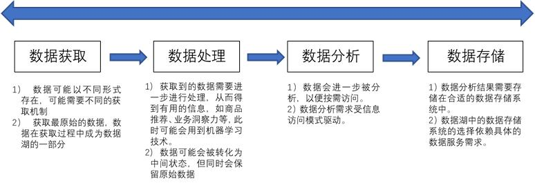
>
> ​                                                                                           图 6. 数据湖中的数据生命周期示意

# 四、各厂商的数据湖解决方案

> 数据湖作为当前的一个风口， 各大云厂商纷纷推出自己的数据湖解决方案及相关产品。 本节将分析各个主流厂商推出的数据湖解决方案， 并将其映射到数据湖参考架构上， 帮助大家理解各类方案的优缺点。  

## 4.1 AWS 数据湖解决方案  

> 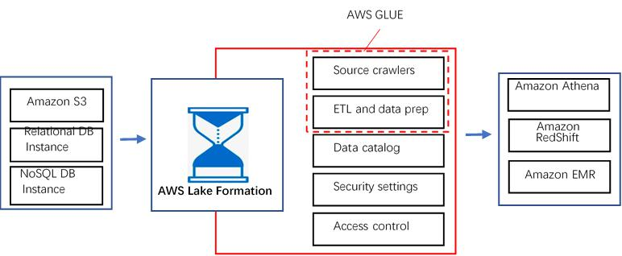
>
> ​                                                          图 7. AWS 数据湖解决方案
>
> 图 7 是 AWS 推荐的数据湖解决方案。 整个方案基于 AWS Lake Formation 构建，AWS Lake Formation 本质上是一个管理性质的组件， 它与其他 AWS 服务互相配合， 来完成整个企业级数据湖构建功能。 上图自左向右， 体现了数据流入、 数据沉淀、 数据计算、 数据应用四个步骤。 我们进一步来看其关键点：
>
>  1、数据流入。
>
> 数据流入是整个数据湖构建的起始， 包括元数据的流入和业务数据流入两个部分。元数据流入包括数据源创建、 元数据抓取两步， 最终会形成数据资源目录， 并生成对应的安全设置与访问控制策略。 解决方案提供专门的组件， 获取外部数据源
> 的相关元信息， 该组件能连接外部数据源、 检测数据格式和模式（ schema） ， 并在对应的数据资源目录中创建属于数据湖的元数据。 业务数据的流入是通过 ETL来完成的。
>
> 在具体的产品形式上， 元数据抓取、 ETL 和数据准备 AWS 将其单独抽象出来， 形成了一个产品叫 AWS GLUE。 AWS GLUE 与 AWS Lake Formation 共享同一个数据资源目录， 在 AWS GLUE 官网文档上明确指出： “ Each AWS account has one AWS Glue Data Catalog per AWS region” 。
>
> 对于异构数据源的支持。 AWS 提供的数据湖解决方案， 支持 S3、 AWS 关系型数据库、 AWS NoSQL 数据库， AWS 利用 GLUE、 EMR、 Athena 等组件支持数据的自由流动。
>
> 2、数据沉淀。
>
> 采用 Amazon S3 作为整个数据湖的集中存储， 按需扩展/按使用量付费。
>
> 3、数据计算。  
>
> 整个解决方案利用 AWS GLUE 来进行基本的数据处理。 GLUE 基本的计算形式是各类批处理模式的 ETL 任务， 任务的出发方式分为手动触发、 定时触发、 事件触发三种。 不得不说， AWS 的各类服务在生态上实现的非常好， 事件触发模式上， 可以利用 AWS Lambda 进行扩展开发， 同时触发一个或多个任务， 极大的提升了任务触发的定制开发能力； 同时， 各类 ETL 任务， 可以通过 CloudWatch 进行很好的监控。
>
> 4、数据应用。
>
> 在提供基本的批处理计算模式之外， AWS 通过各类外部计算引擎， 来提供丰富的计算模式支持， 例如通过Athena/Redshift来提供基于SQL的交互式批处理能力；通过 EMR 来提供各类基于 Spark 的计算能力， 包括 Spark 能提供的流计算能力和机器学习能力。
>
> 5、权限管理。
>
> AWS 的数据湖解决方案通过 Lake Formation 来提供相对完善的权限管理， 粒度包括“库-表-列” 。 但是， 有一点例外的是， GLUE 访问 Lake Formation 时， 粒度只有“库-表” 两级； 这也从另一个侧面说明， GLUE 和 Lake Formation 的集
> 成是更为紧密的， GLUE 对于 Lake Formation 中的数据有更大的访问权限。Lake Formation 的权限进一步可以细分为数据资源目录访问权限和底层数据访问权限， 分别对应元数据与实际存储的数据。 实际存储数据的访问权限又进一步分为数据存取权限和数据存储访问权限。 数据存取权限类似于数据库中对于库表的访问权限， 数据存储权限则进一步细化了对于 S3 中具体目录的访问权限（分为显示和隐式两种） 。 如图 8 所示， 用户 A 在只有数据存取的权限下， 无法创建位于 S3 指定 bucket 下的表。
>
> 个人认为这进一步体现了数据湖需要支持各种不同的存储引擎， 未来的数据湖可能不只 S3/OSS/OBS/HDFS 一类核心存储， 可能根据应用的访问需求， 纳入更多类型的存储引擎， 例如， S3 存储原始数据， NoSQL 存储处理过后适合以“键值” 模式访问的数据， OLAP 引擎存储需要实时出各类报表/adhoc 查询的数据。 虽然当前各类材料都在强调数据湖与数据仓库的不同； 但是， 从本质上， 数据湖更应该是一类融合的数据管理思想的具体实现， “湖仓一体化” 也很可能是未来的一个发展趋势。
>
> 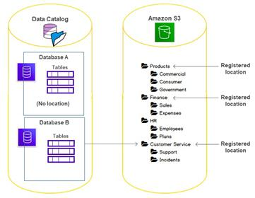
>
> ​														图 8. AWS 数据湖解决方案权限分离示意
>
> 综上， AWS 数据湖方案成熟度高， 特别是元数据管理、 权限管理上考虑充分， 打通了异构数据源与各类计算引擎的上下游关系， 让数据能够自由“移动” 起来。在流计算和机器学习上， AWS 的解决方案也比较完善。 流计算方面 AWS 推出了专
> 门的流计算组件 Kinesis， Kinesis 中的 Kinesis data Firehose 服务可以创建一个完全被托管的数据分发服务， 通过 Kinesis data Stream 实时处理的数据，可以借助 Firehose 方便的写入 S3 中， 并支持相应的格式转换， 如将 JSON 转换成 Parquet 格式。
>
> AWS 整个方案最牛的地方还在与 Kinesis 可以访问 GLUE 中的元数据， 这一点充分体现了 AWS 数据湖解决方案在生态上的完备性。 同样， 在机器学习方面， AWS提供了 SageMaker 服务， SageMaker 可以读取 S3 中的训练数据， 并将训练好的模型回写至 S3 中。 但是， 有一点需要指出的是， 在 AWS 的数据湖解决方案中，流计算和机器学习并不是固定捆绑的， 只是作为计算能力扩展， 能方便的集成。最后， 让我们回到图 6 的数据湖组件参考架构， 看看 AWS 的数据湖解决方案的组件覆盖情况， 参见图 9。  
>
> 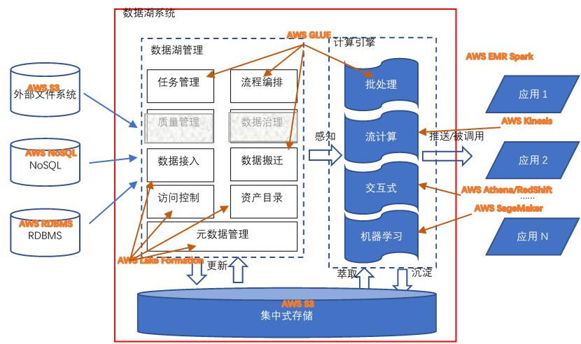
>
> 综上， AWS 的数据湖解决方案覆盖了除质量管理和数据治理的所有功能。 其实质量管理和数据治理这个工作和企业的组织结构、 业务类型强相关， 需要做大量的定制开发工作， 因此通用解决方案不囊括这块内容， 也是可以理解的。 事实上，现在也有比较优秀的开源项目支持这个项目， 比如 Apache Griffin， 如果对质量管理和数据治理有强诉求， 可以自行定制开发。

## 4.2 华为数据湖解决方案  

> 
>
> ​																图 10.华为数据湖解决方案  
>
> 华为的数据湖解决方案相关信息来自华为官网。 目前官网可见的相关产品包括数据湖探索（Data Lake Insight， DLI） 和智能数据湖运营平台（DAYU） 。 其中DLI 相当于是 AWS 的 Lake Formation、 GLUE、 Athena、 EMR（Flink&Spark） 的集合。 官网上没找到关于 DLI 的整体架构图， 我根据自己的理解， 尝试画了一个，主要是和 AWS 的解决方案有一个对比， 所以形式上尽量一致， 如果有非常了解华为 DLI 的同学， 也请不吝赐教。
>
> 华为的数据湖解决方案比较完整， DLI 承担了所有的数据湖构建、 数据处理、 数据管理、 数据应用的核心功能。 DLI 最大的特色是在于分析引擎的完备性， 包括基于 SQL 的交互式分析以及基于 Spark+Flink 的流批一体处理引擎。 在核心存储引擎上， DLI 依然通过内置的 OBS 来提供， 和 AWS S3 的能力基本对标。 华为数据湖解决方案在上下游生态上做的比 AWS 相对完善， 对于外部数据源， 几乎支持所有目前华为云上提供的数据源服务。DLI 可以与华为的 CDM（云数据迁移服务） 和 DIS（数据接入服务） 对接：
>
> 1. 借助 DIS， DLI 可以定义各类数据点， 这些点可以在 Flink 作业中被使用，做为 source 或者 sink；
> 2. 借助 CDM， DLI 甚至能接入 IDC、 第三方云服务的数据。为了更好的支持数据集成、 数据开发、 数据治理、 质量管理等数据湖高级功能，华为云提供了 DAYU 平台。 DAYU 平台是华为数据湖治理运营方法论的落地实现。DAYU 涵盖了整个数据湖治理的核心流程， 并对其提供了相应的工具支持； 甚至在华为的官方文档中， 给出了数据治理组织的构建建议。 DAYU 的数据治理方法论的落地实现如图 11 所示（来自华为云官网） 。  
>
> 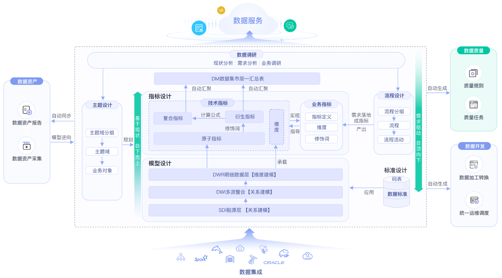
>
> DAYU 数据治理方法论流程
>
> 可以看到， 本质上 DAYU 数据治理的方法论其实是传统数据仓库治理方法论在数据湖基础设施上的延伸： 从数据模型来看， 依然包括贴源层、 多源整合层、 明细数据层， 这点与数据仓库完全一致。 根据数据模型和指标模型会生成质量规则和
> 转换模型， DAYU 会和 DLI 对接， 直接调用 DLI 提供的相关数据处理服务， 完成数据治理。华为云整个的数据湖解决方案， 完整覆盖了数据处理的生命周期， 并且明确支持了数据治理， 并提供了基于模型和指标的数据治理流程工具， 在华为云的数据湖解决方案中逐渐开始往“湖仓一体化” 方向演进。 
>
>  

## 4.3 阿里云数据湖解决方案  

> 阿里云上数据类产品众多， 因为本人目前在数据 BU， 所以本节方案将关注在如何使用数据库 BU 的产品来构建数据湖， 其他云上产品会略有涉及。 阿里云的基于数据库产品的数据湖解决方案更加聚焦， 主打数据湖分析和联邦分析两个场景。阿里云数据湖解决方案如图 12 所示。 
>
>  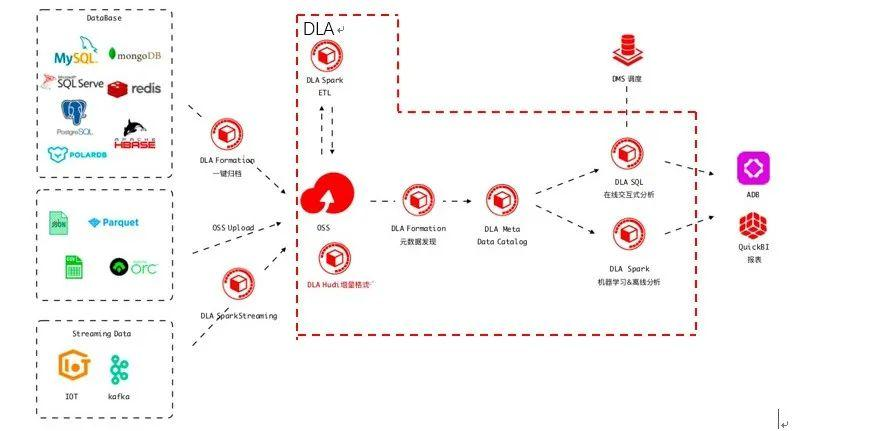
>
> 整个方案依然采用 OSS 作为数据湖的集中存储。 在数据源的支持上， 目前也支持所有的阿里云数据库， 包括 OLTP、OLAP 和 NoSQL 等各类数据库。 核心关键点如下：
>
> 1. 数据接入与搬迁。 在建湖过程中， DLA 的 Formation 组件具备元数据发现和一键建湖的能力， 在本文写作之时， 目前“一键建湖” 还只支持全量建湖， 但是基于 binlog 的增量建湖已经在开发中了， 预计近期上线。 增量建湖能力会极大的增加数据湖中数据的实时性， 并将对源端业务数据库的压力降到最下。 这里需要注意的是， DLA Formation 是一个内部组件， 对外并没有暴露。
> 2. 数据资源目录。 DLA 提供 Meta data catalog 组件对于数据湖中的数据资产进行统一的管理， 无论数据是在“湖中” 还是在“湖外” 。 Meta data catalog 也是联邦分析的统一元数据入口。
> 3. 在内置计算引擎上， DLA 提供了 SQL 计算引擎和 Spark 计算引擎两种。 无论是 SQL 还是 Spark 引擎， 都和 Meta data catalog 深度集成， 能方便的获取元数据信息。 基于 Spark 的能力， DLA 解决方案支持批处理、 流计算和机器学习等计算模式。
> 4. 在外围生态上， 除了支持各类异构数据源做数据接入与汇聚之外， 在对外访问能力上， DLA 与云原生数据仓库（原 ADB） 深度整合。 一方面， DLA处理的结果可直接推送至 ADB 中， 满足实时、 交互式、 ad hoc 复杂查询；另一方面， ADB 里的数据也可以借助外表功能， 很方便的进行数据回流至OSS 中。 基于 DLA， 阿里云上各类异构数据源可以完全被打通， 数据自由流动。
> 5.  在数据集成和开发上， 阿里云的数据湖解决方案提供两种选择： 一种是采用 dataworks 完成； 另一种是采用 DMS 来完成。 无论是选择哪种， 都能对外提供可视化的流程编排、 任务调度、 任务管理能力。 在数据生命周期管理上， dataworks 的数据地图能力相对更加成熟。  
> 6. 在数据管理和数据安全上， DMS 提供了强大的能力。 DMS 的数据管理粒度分为“ 库-表-列-行” ， 完善的支持企业级的数据安全管控需求。 除了权限管理之外， DMS 更精细的地方是把原来基于数据库的 devops 理念扩展到了数据湖， 使得数据湖的运维、 开发更加精细化。  
>
> 进一步细化整个数据湖方案的数据应用架构， 如下图所示。  
>
> 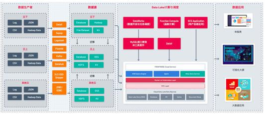
>
> 自左向右从数据的流向来看， 数据生产者产生各类数据（ 云下/云上/其他云） ，利用各类工具， 上传至各类通用/标准数据源， 包括 OSS/HDFS/DB 等。 针对各类数据源， DLA 通过数据发现、 数据接入、 数据迁移等能力， 完整建湖操作。对于“ 入湖” 的数据， DLA 提供基于 SQL 和 Spark 的数据处理能力， 并可以基于Dataworks/DMS， 对外提供可视化的数据集成和数据开发能力； 在对外应用服务能力上， DLA 提供标准化的 JDBC 接口， 可以直接对接各类报表工具、 大屏展示功能等。 阿里云的 DLA 的特色在于背靠整个阿里云数据库生态， 包括 OLTP、 OLAP、NoSQL 等各类数据库， 对外提供基于 SQL 的数据处理能力， 对于传统企业基于数据库的开发技术栈而言， 转型成本相对较低， 学习曲线比较平缓。阿里云的 DLA 解决方案的另一个特色在于“ 基于云原生的湖仓一体化” 。 传统的企业级数据仓库在大数据时代的今天， 在各类报表应用上依然是无法替代的， 但是数仓无法满足大数据时代的数据分析处理的灵活性需求。
>
> 因此， 我们推荐数据仓库应该作为数据湖的上层应用存在： 即数据湖是原始业务数据在一个企业/组织中唯一官方数据存储地； 数据湖根据各类业务应用需求，将原始数据进行加工处理， 形成可再次利用的中间结果； 当中间结果的数据模式（ Schema） 相对固定后， DLA 可以将中间结果推送至数据仓库， 供企业/组织开展基于数仓的业务应用。 阿里云在提供 DLA 的同时， 还提供了云原生数仓（ 原ADB） ， DLA 和云原生数仓在以下两点上深度融合。  使用同源的 SQL 解析引擎。 DLA 的 SQL 与 ADB 的 SQL 语法上完全兼容， 这意味着开发者使用一套技术栈即能同时开发数据湖应用和数仓应用。都内置了对于 OSS 的访问支持。 OSS 直接作为 DLA 的原生存储存在； 对于ADB 而言， 可以通过外部表的能力， 很方便的访问 OSS 上的结构化数据。借助外部表， 数据可以自由的在 DLA 和 ADB 之间流转， 做到真正的湖仓一体。DLA+ADB 的组合真正做到了云原生的湖仓一体（关于什么是云原生， 不在本文的讨论范畴） 。 本质上， DLA 可以看成一个能力扩展的数据仓库贴源层。 与传统数仓相比， 该贴源层：
>
> 1. 可以保存各类结构化、 半结构化和非结构化数据；
> 2. 可以对接各类异构数据源；
> 3.  具备元数据发现、 管理、 同步等能力；
> 4. 内置的 SQL/Spark 计算引擎具备更强的数据处理能力， 满足多样化的数据处理需求；
> 5.  具备全量数据的全生命周期管理能力。 基于 DLA+ADB 的湖仓一体化方案，将同时覆盖“大数据平台+数据仓库” 的处理能力。  
>
> 
>
> DLA 还有一个重要能力是构建了一个“四通八达” 的数据流动体系， 并以数据库的体验对外提供能力， 无论数据在云上还是云下， 无论数据在组织内部还是外部；借助数据湖， 各个系统之间的数据不再存在壁垒， 可以自由的流进流出； 更重要的是， 这种流动是受监管的， 数据湖完整的记录了数据的流动情况。  

## 4.4 Azure 数据湖解决方案  

> Azure 的数据湖解决方案包括数据湖存储、 接口层、 资源调度与计算引擎层， 如图 15 所示（ 来自 Azure 官网） 。 存储层是基于 Azure object Storage 构建的，依然是对结构化、 半结构化和非结构化数据提供支撑。接口层为 WebHDFS， 比较特别的是在 Azure object Storage 实现了 HDFS 的接口，Azure 把这个能力称为“ 数据湖存储上的多协议存取” 。 在资源调度上， Azure基于 YARN 实现。 计算引擎上， Azure 提供了 U-SQL、 hadoop 和 Spark 等多种处理引擎。  
>
> 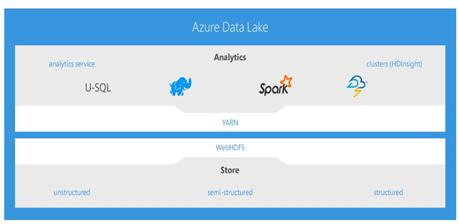
>
> ​														图 15. Azure Data lake analysis 架构  
>
> Azure 的特别之处是基于 visual studio 提供给了客户开发的支持。
>
> 1. 开发工具的支持， 与 visual studio 的深度集成； Azure 推荐使用 U-SQL作为数据湖分析应用的开发语言。 Visual studio 为 U-SQL 提供了完备的开发环境； 同时， 为了降低分布式数据湖系统开发的复杂性， visual studio 基于项目进行封装， 在进行 U-SQL 开发时， 可以创建“ U-SQL database project” ， 在此类项目中， 利用 visual studio， 可以很方便的进行编码与调试， 同时， 也提供向导， 将开发好的 U-SQL 脚本发布到生成环境。 U-SQL 支持 Python、 R 进行扩展， 满足定制开发需求。
> 2.  多计算引擎的适配： SQL, Apache Hadoop 和 Apache Spark。 这里的 hadoop包括 Azure 提供的 HDInsight（ Azure 托管的 Hadoop 服务） ， Spark 包括Azure Databricks。
> 3.  多种不同引擎任务之间的自动转换能力。 微软推荐 U-SQL 为数据湖的缺省开发工具， 并提供各类转换工具， 支持 U-SQL 脚本与 Hive、 Spark（ HDSight&databricks） 、 Azure Data Factory data Flow 之间的转化。

## 4.5 小结  

> 本文所讨论的是数据湖的解决方案， 不会涉及到任何云厂商的单个产品。 我们从数据接入、 数据存储、 数据计算、 数据管理、 应用生态几个方面， 简单做了一个类似下表的总结。  
>
> 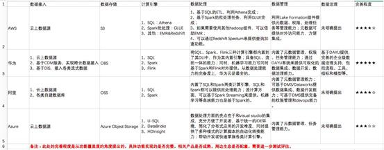
>
> 出于篇幅关系， 其实知名云厂商的数据湖解决方案还有谷歌和腾讯的。 这两家从其官方网站上看， 数据湖解决方案相对来讲比较简单， 也仅仅是一些概念上的阐述， 推荐的落地方案是“oss+hadoop（EMR） ” 。其实数据湖不应该从一个简单的技术平台视角来看， 实现数据湖的方式也多种多样， 评价一个数据湖解决方案是否成熟， 关键应该看其提供的数据管理能力， 具体包括但不限于元数据、 数据资产目录、 数据源、 数据处理任务、 数据生命周期、数据治理、 权限管理等； 以及与外围生态的对接打通能力。  
>
> 

# 五、 典型的数据湖应用案例  

## 5.1 广告数据分析  

> 近年来， 流量获取的成本就越来越高， 线上渠道获客成本的成倍增长让各行各业都面临着严峻的挑战。 在互联网广告成本不断攀升的大背景下， 以花钱买流量拉新为主要的经营策略必然行不通了。 流量前端的优化已成强弩之末， 利用数据工具提高流量到站后的目标转化， 精细化运营广告投放的各个环节， 才是改变现状更为直接有效的方式。 说到底， 要提高广告流量的转化率， 必须依靠大数据分析。为了能够提供更多的决策支撑依据， 需要采取更多的埋点数据的收集和分析， 包括但不限于渠道、 投放时间、 投放人群， 以点击率为数据指标进行数据分析， 从而给出更好的、 更迅速的方案和建议， 实现高效率高出。 因此， 面对广告投放领域多维度、 多媒体、 多广告位等结构化、 半结构化和非结构化数据采集、 存储、分析和决策建议等要求， 数据湖分析产品解决方案在广告主或者发布商进行新一代技术选型中上受到了很热烈的青睐。  
>
> DG 是一家全球领先的企业国际化智能营销服务商， 基于先进的广告技术、 大数据和运营能力， 为客户提供全球高质量用户获取及流量变现服务。 DG 从成立之初就决定以公有云为基础来构建其 IT 基础设施， 最初 DG 选择了 AWS 云平台， 主
> 要将其广告数据在 S3 中以数据湖的形态进行存放， 通过 Athena 进行交互式分析。然而随着互联网广告的飞速发展， 广告行业带来了几大挑战， 移动广告的发布与追踪系统必须解决几个关键问题：
>
> 1. 并发性与峰值问题。 在广告行业， 流量高峰时常出现， 瞬间的点击量可能达到数万， 甚至数十万， 这就要求系统具备非常好的可扩展性以快速响应和处理每一次点击
> 2.  如何实现对海量数据的实时分析。 为了监控广告投放效果， 系统需要实时对用户的每一次点击和激活数据进行分析， 同时把相关数据传输到下游的媒体；
> 3. 平台的数据量在急剧增长， 每天的业务日志数据在持续的产生和上传， 曝光、 点击、 推送的数据在持续处理， 每天新增的数据量已经在 10-50TB左右， 对整个数据处理系统提出了更高的要求。 如何高效地完成对广告数据的离线/近实时统计， 按照广告客户的维度要求进行聚合分析。针对上述三点业务挑战， 同时 DG 这个客户日增量数据正在急剧变大（ 当前日数据扫描量达到 100+TB） ， 继续在 AWS 平台使用遇到 Athena 读取 S3 数据带宽瓶颈、 数据分析滞后时间越来越长、 为应对数据和分析需求增长而急剧攀升的投入成本等， 经过认真、 仔细的测试和分析， 最终决定从 AWS 云平台全量搬站到阿里云平台， 新架构图如下： 
>
> 
>
> ​                                 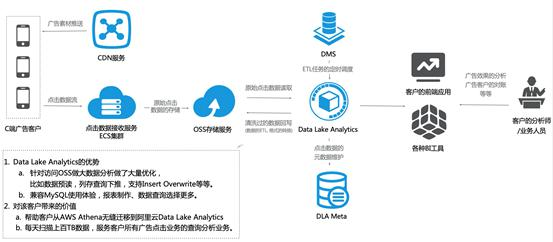
>
> ​                                                        图 16. 改造后的广告数据湖方案架构
>
> 从 AWS 搬站到阿里云后， 我们为该客户设计了“ 利用 Data Lake Analytics + OSS”极致分析能力来应对业务波峰波谷。 一方面轻松应对来自品牌客户的临时分析。另一方面利用 Data Lake Analytics 的强大计算能力， 分析按月、 季度广告投放，  精确计算出一个品牌下面会有多少个活动， 每个活动分媒体， 分市场， 分频道，分 DMP 的投放效果， 进一步增强了加和智能流量平台为品牌营销带来的销售转化率。
>
> 并且在广告投放与分析的总拥有成本上， Data Lake Analytics 提供的Serverless 的弹性服务为按需收费， 不需要购买固定的资源， 完全契合业务潮汐带来的资源波动， 满足弹性的分析需求， 同时极大地降低了运维成本和使用成本。  
>
> 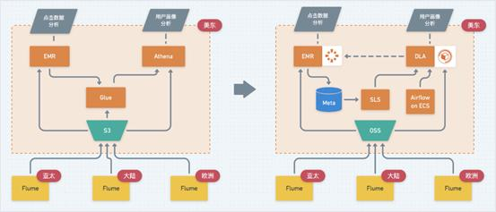
>
> ​                                                            图 17 数据湖部署示意图
>
> 总体上， DG 从 AWS 切换到阿里云后， 极大地节省了硬件成本、 人力成本和开发成本。 由于采用 DLA serverless 云服务， DG 无需先期投入大量的资金去购买服务器、 存储等硬件设备， 也无需一次性购买大量的云服务， 其基础设施的规模完
> 全是按需扩展： 需求高的时候增加服务数量， 需求减少的时候减少服务数量， 提高了资金的利用率。
>
> 使用阿里云平台带来的第二个显著好处是性能的提升。 在 DG 业务的快速增长期以及后续多条业务线接入期， DG 在移动广告系统的访问量经常呈爆发式增长，然而原先 AWS 方案和平台在 Athena 读取 S3 数据遇到数据读取带宽的极大瓶颈，数据分析的时间变得越来越长， 阿里云 DLA 联合 OSS 团队等进行了极大的优化和改造， 同时， DLA数据库分析在计算引擎上（与TPC-DS打榜世界第一的AnalyticDB共享计算引擎） 比 Presto 原生计算引擎的能力提升数十倍性能， 也极大的为 DG提升了分析性能。  
>
> 

## 5.2 游戏运营分析  

> 数据湖是一类 TCO 表现极其优秀的大数据基础设施。 对于很多快速增长的游戏公司而言， 一个爆款游戏， 往往在短期内相关数据增长极快； 同时， 公司的研发人  员的技术栈很难在短期内与数据的增量和增速进行匹配； 此时， 呈爆发增长的数
> 据很难被有效利用。 数据湖是一个解决此类问题的技术选择。
>
> YJ 是一家高速成长的游戏公司， 公司希望能依托相关用户行为数据进行深入分析， 指导游戏的开发和运营。 数据分析背后的核心逻辑在于随着游戏行业市场竞争局面的扩大， 玩家对于品质的要求越来越高， 游戏项目的生命周期越来越短，直接影响项目的投入产出比， 通过数据运营则可以有效的延长项目的生命周期，对各个阶段的业务走向进行精准把控。而随着流量成本的日益上升， 如何构建经济、 高效的精细化数据运营体系， 以更好的支撑业务发展， 也变得愈发重要起来。 数据运营体系就需要有其配套的基础支撑设施， 如何选择这类基础支撑设施， 是公司技术决策者需要思考的问题。 思考的出发点包括：
>
> 1. 要有足够的弹性。 对于游戏而言， 往往就是短时间爆发， 数据量激增； 因此， 能否适应数据的爆发性增长， 满足弹性需求是一个重点考量的点； 无论是计算还是存储， 都需要具备足够的弹性。
> 2. 要有足够的性价比。 对于用户行为数据， 往往需要拉到一个很长的周期去分析去对比， 比如留存率， 不少情况下需要考虑 90 天甚至 180 天客户的留存率； 因此， 如何以最具性价比的方式长期存储海量数据是需要重点考
>    虑的问题。
> 3.  要有够用的分析能力， 且具备可扩展性。 许多情况下， 用户行为体现在埋点数据中， 埋点数据又需要与用户注册信息、 登陆信息、 账单等结构化数据关联分析； 因此， 在数据分析上， 至少需要有大数据的 ETL 能力、 异构数据源的接入能力和复杂分析的建模能力。
> 4.  要与公司现有技术栈相匹配， 且后续利于招聘。 对于 YJ， 其在技术选型的时候一个重要点就是其技术人员的技术栈， YJ 的技术团队大部分只熟悉传统的数据库开发， 即 MySQL； 并且人手紧张， 做数据运营分析的技术人员只有 1 个， 短时间内根本没有能力独立构建大数据分析的基础设施。从 YJ 的角度出发， 最好绝大多数分析能够通过 SQL 完成； 并且在招聘市场上， SQL 开发人员的数量也远高于大数据开发工程师的数量。 针对客户的情况， 我们帮助客户对现有方案做了改造。  
>
> 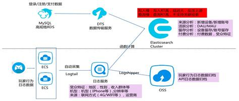
>
> ​                                                       图 18. 改造前的方案
>
> 改造前， 客户所有的结构化数据都在一个高规格的 MySQL 里面； 而玩家行为数据则是通过 LogTail 采集至日志服务（SLS） 中， 然后从日志服务中分别投递到 OSS和 ES 里。 这个架构的问题在于：
>
> 1. 行为数据和结构化数据完全割裂， 无法联动分析；
> 2. 对于行为数据智能提供检索功能， 无法做深层次的挖掘分析；
> 3. OSS 仅仅作为数据存储资源使用， 并没有挖掘出足够的数据价值。事实上， 我们分析客户现存架构其实已经具备了数据湖的雏形： 全量数据已经在OSS 中保存下来了， 现在需要进一步补齐客户对于 OSS 中的数据的分析能力。 而
>    且数据湖基于 SQL 的数据处理模式也满足客户对于开发技术栈的需求。 综上， 我们对客户的架构做了如下调整， 帮助客户构建了数据湖。  
>
> 
>
> ​                                                      图 19. 改造后的数据湖解决方案
>
> 总体上， 我们没有改变客户的数据链路流转， 只是在 OSS 的基础上， 增加了 DLA组件， 对 OSS 的数据进行二次加工处理。 DLA 提供了标准 SQL 计算引擎， 同时支持接入各类异构数据源。 基于 DLA 对 OSS 的数据进行处理后， 生成业务直接可用的数据。 但是 DLA 的问题在于无法支撑低延迟需求的交互式分析场景， 为了解决这个问题， 我们引入了云原生数据仓库 ADB 来解决交互式分析的延迟性问题； 同时， 在最前端引入 QuickBI 作为客户的可视化分析工具。 YJ 方案是图 14 所示的
> 湖仓一体化解决方案在游戏行业的一个经典落地案例。
>
> YM 是一家数据智能服务提供商， 面向各类中小商家提供一系列数据分析运营服务。 具体实现的技术逻辑如下图所示。 
>
>  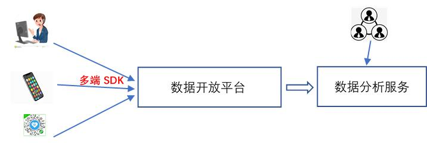
>
> ​                          图 20. YM 智能数据服务 SaaS 模式示意
>
> 平台方提供多端 SDK 供用户（商家提供网页、 APP、 小程序等多种接入形式） 接入各类埋点数据， 平台方以 SaaS 的形式提供统一的数据接入服务和数据分析服务。 商家通过访问各类数据分析服务来进行更细粒度的埋点数据分析， 完成行为
> 统计、 客户画像、 客户圈选、 广告投放监测等基本分析功能。 然而， 这种 SaaS模式下， 会存在一定的问题：
>
> 1. 由于商家类型和需求的多样化， 平台提供 SaaS 类分析功能很难覆盖所有类型的商家， 无法满足商家的定制化需求； 如有些商家关注销量， 有些关注客户运营， 有些关注成本优化， 很难满足所有的需求。
> 2. 对于一些高级分析功能， 如依赖于自定义标签的客户圈选、 客户自定义扩展等功能， 统一的数据分析服务无法满足的； 特别是一些自定义的标签依赖于商家自定义的算法， 无法满足客户的高级分析需求。
> 3.  数据的资产化管理需求。 在大数据时代， 数据是一个企业/组织的资产已经成为了大家的共识， 如何能让属于商家的数据合理、 长期的沉淀下来，也是 SaaS 服务需要考虑的事情。
>
> 综上， 我们在上图的基本模式上引入了数据湖模式， 让数据湖作为商家沉淀数据、产出模型、 分析运营的基础支撑设施。 引入数据湖后的 SaaS 数据智能服务模式如下。
>
>   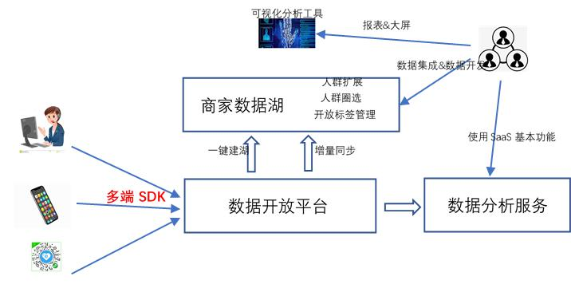
>
> ​                                           图 21. 基于数据湖的数据智能服务
>
> 如图 21 所示， 平台方为每个用户提供一键建湖服务， 商家使用该功能构建自己的数据湖， “一键建湖” 能力一方面帮助商家将所有埋点数据的数据模型（schema） 同步至数据湖中； 另一方面， 将属于该商家的所有埋点数据全量同步至数据湖中， 并基于“T+1” 的模式， 将每天的增量数据归档入湖。 基于数据湖的服务模式在传统的数据分析服务的基础上， 赋予了用户数据资产化、 分析模型化和服务定制化三大能力：
>
> 1. 数据资产化能力。 利用数据湖， 商家可以将属于自己的数据持续沉淀下来，保存多长时间的数据， 耗费多少成本， 完全由商家自主决定。 数据湖还提供了数据资产管理能力， 商家除了能管理原始数据外， 还能将处理过的过程数据和结果数据分门别类保存， 极大的提升了埋点数据的价值。
> 2. 分析模型化能力。 数据湖中不仅仅有原始数据， 还有埋点数据的模型（schema） 。 埋点数据模型体现了全域数据智能服务平台对于业务逻辑的抽象， 通过数据湖， 除了将原始数据作为资产输出外， 还将数据模型进行了输出， 借助埋点数据模型， 商家可以更深入的理解埋点数据背后所体现的用户行为逻辑， 帮助商家更好的洞察客户行为， 获取用户需求。
> 3. 服务定制化能力。 借助数据湖提供的数据集成和数据开发能力， 基于对埋点数据模型的理解， 商家可以定制数据处理过程， 不断对原始数据进行迭代加工， 从数据中提炼有价值的信息， 最终获得超越原有数据分析服务的价值。  

# 六、 数据湖建设的基本过程  

> 个人认为数据湖是比传统大数据平台更为完善的大数据处理基础支撑设施， 完善在数据湖是更贴近客户业务的技术存在。 所有数据湖所包括的、 且超出大数据平台存在的特性， 例如元数据、 数据资产目录、 权限管理、 数据生命周期管理、 数据集成和数据开发、 数据治理和质量管理等， 无一不是为了更好的贴近业务， 更好的方便客户使用。 数据湖所强调的一些基本的技术特性， 例如弹性、 存储计算独立扩展、 统一的存储引擎、 多模式计算引擎等等， 也是为了满足业务需求， 并且给业务方提供最具性价比的 TCO。
>
> 数据湖的建设过程应该与业务紧密结合； 但是数据湖的建设过程与传统的数据仓库， 甚至是大热的数据中台应该是有所区别的。 区别在于， 数据湖应该以一种更敏捷的方式去构建， “边建边用， 边用边治理” 。 为了更好的理解数据湖建设的敏捷性， 我们先来看一下传统数仓的构建过程。 业界对于传统数仓的构建提出了“自下而上” 和“自顶而下” 两种模式， 分别由Inmon和KimBall两位大牛提出。
>
> 具体的过程就不详述了， 不然可以再写出几百页， 这里只简单阐述基本思想。
>
> Inmon 提出自下而上（EDW-DM） 的数据仓库建设模式， 即操作型或事务型系统的数据源， 通过 ETL 抽取转换和加载到数据仓库的 ODS 层。 ODS 层中的数据， 根据预先设计好的 EDW（企业级数据仓库） 范式进行加工处理，然后进入到EDW。 EDW 一般是企业/组织的通用数据模型， 不方便上层应用直接做数据分析。 因此， 各个业务部门会再次根据自己的需要， 从 EDW中处理出数据集市层（DM） 。
>
> 优势： 易于维护， 高度集成； 劣势： 结构一旦确定， 灵活性不足， 且为了适应业务， 部署周期较长。 此类方式构造的数仓， 适合于比较成熟稳定的业务， 例如金融。
>
>  KimBall 提出自顶而下（DM-DW） 的数据架构， 通过将操作型或事务型系统的数据源， 抽取或加载到 ODS 层。 然后通过 ODS 的数据， 利用维度建模方法建设多维主题数据集市（DM） 。 各个 DM， 通过一致性的维度联系在一起， 最终形成企业/组织通用的数据仓库。
>
> 优势： 构建迅速， 最快的看到投资回报率， 敏捷灵活； 劣势： 作为企业资源不太好维护， 结构复杂， 数据集市集成困难。 常应用于中小企业或互联网行业。
>
> 其实上述只是一个理论上的过程， 其实无论是先构造 EDW， 还是先构造 DM， 都离不开对于数据的摸底， 以及在数仓构建之前的数据模型的设计， 包括当前大热的“数据中台” ， 都逃不出下图所示的基本建设过程。 
>
> ​                                 
>
> ​                                                         图22. 数据仓库/数据中台建设基本流程
>
> 1. 数据摸底。 对于一个企业/组织而言， 在构建数据湖初始工作就是对自己企业/组织内部的数据做一个全面的摸底和调研， 包括数据来源、 数据类型、 数据形态、 数据模式、 数据总量、 数据增量等。 在这个阶段一个隐含的重要工作是借助数据摸底工作， 进一步梳理企业的组织结构， 明确数据和组织结构之间关系。 为后续明确数据湖的用户角色、 权限设计、 服务方式奠定基础。
> 2. 模型抽象。 针对企业/组织的业务特点梳理归类各类数据， 对数据进行领域划分， 形成数据管理的元数据， 同时基于元数据， 构建通用的数据模型。
> 3.  数据接入。 根据第一步的摸排结果， 确定要接入的数据源。 根据数据源，确定所必须的数据接入技术能力， 完成数据接入技术选型， 接入的数据至少包括： 数据源元数据、 原始数据元数据、 原始数据。 各类数据按照第二步形成的结果， 分类存放。
> 4.  融合治理。 简单来说就是利用数据湖提供的各类计算引擎对数据进行加工处理， 形成各类中间数据/结果数据， 并妥善管理保存。 数据湖应该具备完善的数据开发、 任务管理、 任务调度的能力， 详细记录数据的处理过程。在治理的过程中， 会需要更多的数据模型和指标模型。
> 5. 业务支撑。 在通用模型基础上， 各个业务部门定制自己的细化数据模型、数据使用流程、 数据访问服务。上述过程， 对于一个快速成长的互联网企业来说， 太重了， 很多情况下是无法落地的， 最现实的问题就是第二步模型抽象， 很多情况下， 业务是在试错、 在探索，根本不清楚未来的方向在哪里， 也就根本不可能提炼出通用的数据模型； 没有数据模型， 后面的一切操作也就无从谈起， 这也是很多高速成长的企业觉得数据仓库/数据中台无法落地、 无法满足需求的重要原因之一。数据湖应该是一种更为“敏捷” 的构建方式， 我们建议采用如下步骤来构建数据湖。
>
> ​                                                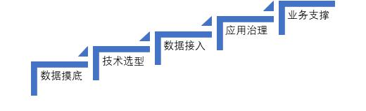
>
> ​                                                                            图 23. 数据湖建设基本流程
>
> 对比图 22， 依然是五步， 但是这五步是一个全面的简化和“可落地” 的改进。
>
> 1. 数据摸底。 依然需要摸清楚数据的基本情况， 包括数据来源、 数据类型、数据形态、 数据模式、 数据总量、 数据增量。 但是， 也就需要做这么多了。数据湖是对原始数据做全量保存， 因此无需事先进行深层次的设计。
> 2.  技术选型。 根据数据摸底的情况， 确定数据湖建设的技术选型。 事实上，这一步也非常的简单， 因为关于数据湖的技术选型， 业界有很多的通行的做法， 基本原则个人建议有三个： “计算与存储分离” 、 “弹性” 、 “独立扩展” 。 建议的存储选型是分布式对象存储系统（如 S3/OSS/OBS） ；计算引擎上建议重点考虑批处理需求和 SQL 处理能力， 因为在实践中， 这两类能力是数据处理的关键， 关于流计算引擎后面会再讨论一下。 无论是计算还是存储， 建议优先考虑 serverless 的形式； 后续可以在应用中逐步演进， 真的需要独立资源池了， 再考虑构建专属集群。
> 3.  数据接入。 确定要接入的数据源， 完成数据的全量抽取与增量接入。
> 4. 应用治理。 这一步是数据湖的关键， 我个人把“融合治理” 改成了“应用治理” 。 从数据湖的角度来看， 数据应用和数据治理应该是相互融合、 密不可分的。 从数据应用入手， 在应用中明确需求， 在数据 ETL 的过程中，逐步形成业务可使用的数据； 同时形成数据模型、 指标体系和对应的质量标准。 数据湖强调对原始数据的存储， 强调对数据的探索式分析与应用，但这绝对不是说数据湖不需要数据模型； 恰恰相反， 对业务的理解与抽象，将极大的推动数据湖的发展与应用， 数据湖技术使得数据的处理与建模，保留了极大的敏捷性， 能快速适应业务的发展与变化。
>
> 
>
> 从技术视角来看， 数据湖不同于大数据平台还在于数据湖为了支撑数据的全生命周期管理与应用， 需要具备相对完善的数据管理、 类目管理、 流程编排、 任务调度、 数据溯源、 数据治理、 质量管理、 权限管理等能力。 在计算能力上， 目前主流的数据湖方案都支持 SQL 和可编程的批处理两种模式（对机器学习的支持， 可以采用 Spark 或者 Flink 的内置能力） ； 在处理范式上， 几乎都采用基于有向无环图的工作流的模式， 并提供了对应的集成开发环境。 对于流式计算的支持， 目前各个数据湖解决方案采取了不同的方式。 在讨论具体的方式之前， 我们先对流计算做一个分类：
>
> 1. 模式一： 实时模式。 这种流计算模式相当于对数据采用“来一条处理一条” /“微批” 的方式进行处理； 多见于在线业务， 如风控、 推荐、 预警等。
> 2.  模式二： 类流式。 这种模式需要获取指定时间点之后变化的数据/读取某一个版本的数据/读取当前的最新数据等， 是一种类流式的模式； 多见于数据探索类应用， 如分析某一时间段内的日活、 留存、 转化等。二者的本质不同在于， 模式一处理数据时， 数据往往还没有存储到数据湖中， 仅仅是在网路/内存中流动； 模式二处理数据时， 数据已经存储到数据湖中了。 综上， 我个人建议采用如下图模式：  
>
> 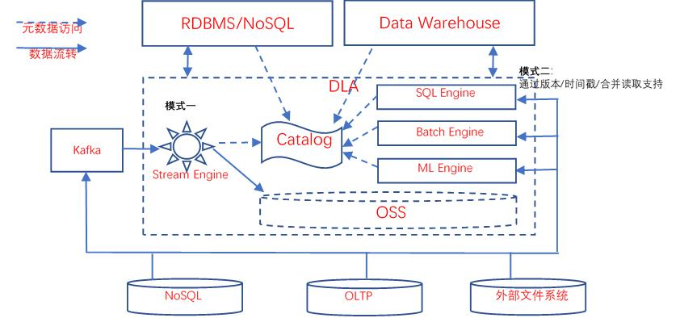
>
> ​                                                          图 24 数据湖数据流向示意图
>
> 如图 24 所示， 在需要数据湖具备模式一的处理能力时， 还是应该引入类 Kafka中间件， 作为数据转发的基础设施。 完整的数据湖解决方案方案应该提供将原始数据导流至 Kafka 的能力。 流式引擎具备从类 Kafka 组件中读取数据的能力。 流式计算引擎在处理数据过后， 根据需要， 可以将结果写入 OSS/RDBMS/NoSQL/DW，供应用访问。 某种意义上， 模式一的流计算引擎并非一定要作为数据湖不可分割的一部分存在， 只需要在应用需要时， 能够方便的引入即可。 但是， 这里需要指出的是：  
>
> 1. 流式引擎依然需要能够很方便的读取数据湖的元数据；
> 2.  流式引擎任务也需要统一的纳入数据湖的任务管理；
> 3.  流式处理任务依然需要纳入到统一的权限管理中。 
>
> 对于模式二， 本质上更接近于批处理。 现在许多经典的大数据组件已经提供了支持方式， 如 HUDI/IceBerg/Delta 等， 均支持 Spark、 Presto 等经典的计算引擎。以 HUDI 为例， 通过支持特殊类型的表（COW/MOR） ， 提供访问快照数据（指定版本） 、 增量数据、 准实时数据的能力。 目前 AWS、 腾讯等已经将 HUDI 集成到了其 EMR 服务中， 阿里云的 DLA 也正在计划推出 DLA on HUDI 的能力。让我们再回到本文开头的第一章， 我们说过， 数据湖的主要用户是数据科学家和数据分析师， 探索式分析和机器学习是这类人群的常见操作； 流式计算（实时模式） 多用于在线业务， 严格来看， 并非数据湖目标用户的刚需。 但是， 流式计算（实时模式） 是目前大多数互联网公司在线业务的重要组成部分， 而数据湖作为企业/组织内部的数据集中存放地， 需要在架构上保持一定的扩展能力， 可以很方便的进行扩展， 整合流式计算能力。
>
> 业务支撑。 虽然大多数数据湖解决方案都对外提供标准的访问接口， 如 JDBC， 市面上流行的各类 BI 报表工具、 大屏工具也都可以直接访问数据湖中的数据。 但是在实际的应用中， 我们还是建议将数据湖处理好的数据推送到对应的各类支持在线业务的数据引擎中去， 能够让应用有更好的体验。   

# 七、 总结  

> 数据湖作为新一代大数据分析处理的基础设施， 需要超越传统的大数据平台。 个人认为目前在以下方面， 是数据湖解决方案未来可能的发展方向。
>
> 1、云原生架构。 关于什么是云原生架构， 众说纷纭， 很难找到统一的定义。但是具体到数据湖这个场景， 个人认为就是以下三点特征：
> （1） 存储和计算分离， 计算能力和存储能力均可独立扩展；
> （2） 多模态计算引擎支持， SQL、 批处理、 流式计算、 机器学习等；
> （3） 提供 serverless 态服务， 确保足够的弹性以及支持按需付费。
>
> - 足够用的数据管理能力。 数据湖需要提供更为强大的数据管理能力， 包括但不限于数据源管理、 数据类目管理、 处理流程编排、 任务调度、 数据溯源、 数据治理、 质量管理、 权限管理等。
> - 大数据的能力， 数据库的体验。 目前绝大多数数据分析人员都只有数据库的使用经验， 大数据平台的能力虽强， 但是对于用户来说并不友好， 数据科学家和数据数据分析师应该关注数据、 算法、 模型及其与业务场景的适配， 而不是花大量的时间精力去学习大数据平台的开发。 数据湖要想快速发展， 如何为用户提供良好的使用体验是关键。 基于 SQL 的数据库应用开发已经深入人心， 如何将数据湖的能力通过 SQL 的形式释放出来， 是未来的一个主要方向。
> - 完善的数据集成与数据开发能力。 对各种异构数据源的管理与支持， 对异构数据的全量/增量迁移支持， 对各种数据格式的支持都是需要不断完善的方向。 同时， 需要具备一个完备的、 可视化的、 可扩展的集成开发环境。
> - 与业务的深度融合与集成。 典型数据湖架构的构成基本已经成为了业界共识： 分布式对象存储+多模态计算引擎+数据管理。 决定数据湖方案是否胜出的关键恰恰在于数据管理， 无论是原始数据的管理、 数据类目的管理、数据模型的管理、 数据权限的管理还是处理任务的管理， 都离不开与业务的适配和集成； 未来， 会有越来越多的行业数据湖解决方案涌现出来， 与数据科学家和数据分析师形成良性发展与互动。 如何在数据湖解决方案中预置行业数据模型、 ETL 流程、 分析模型和定制算法， 可能是未来数据湖领域差异化竞争的一个关键点。  
>
> 

