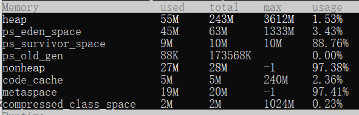
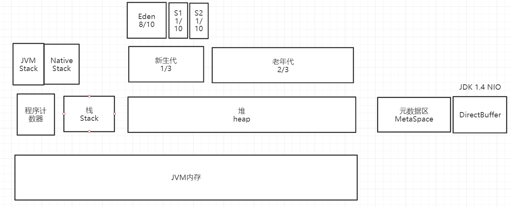
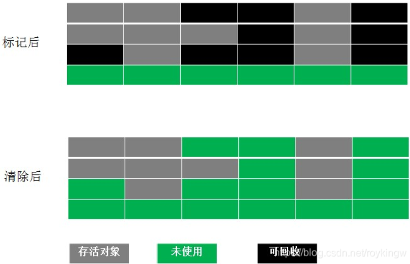
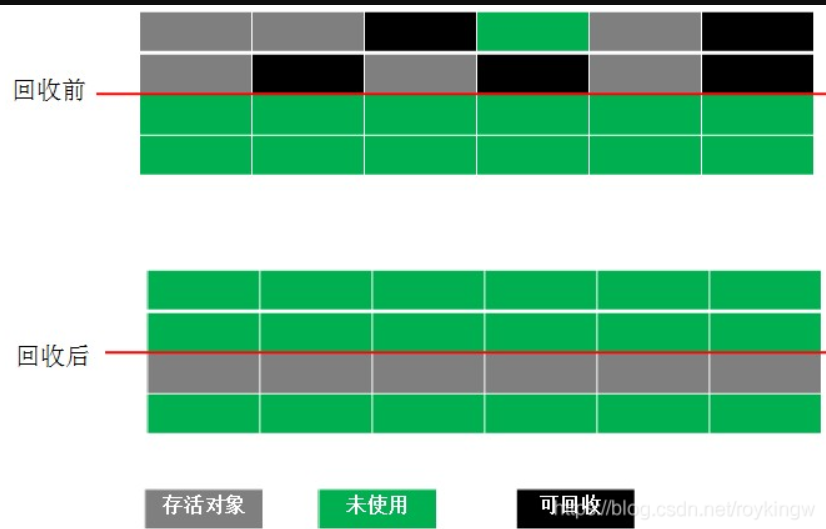
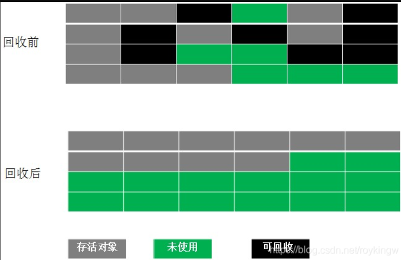
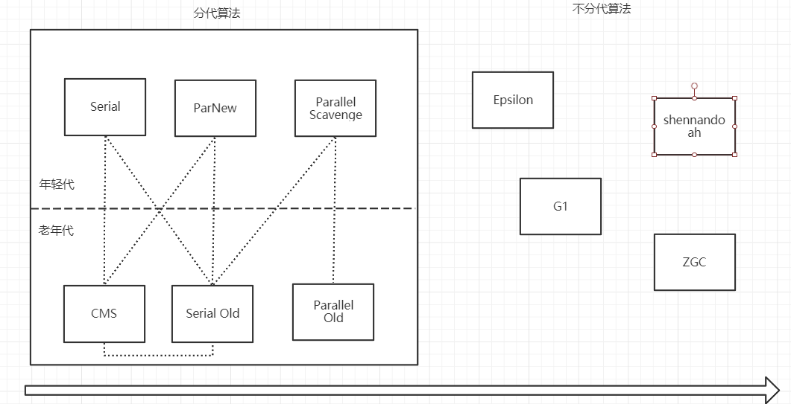
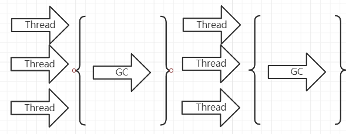
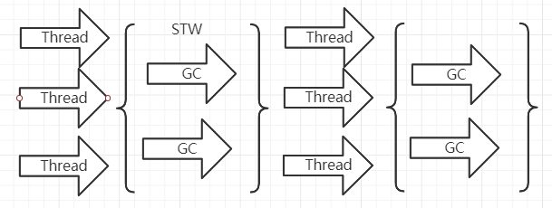
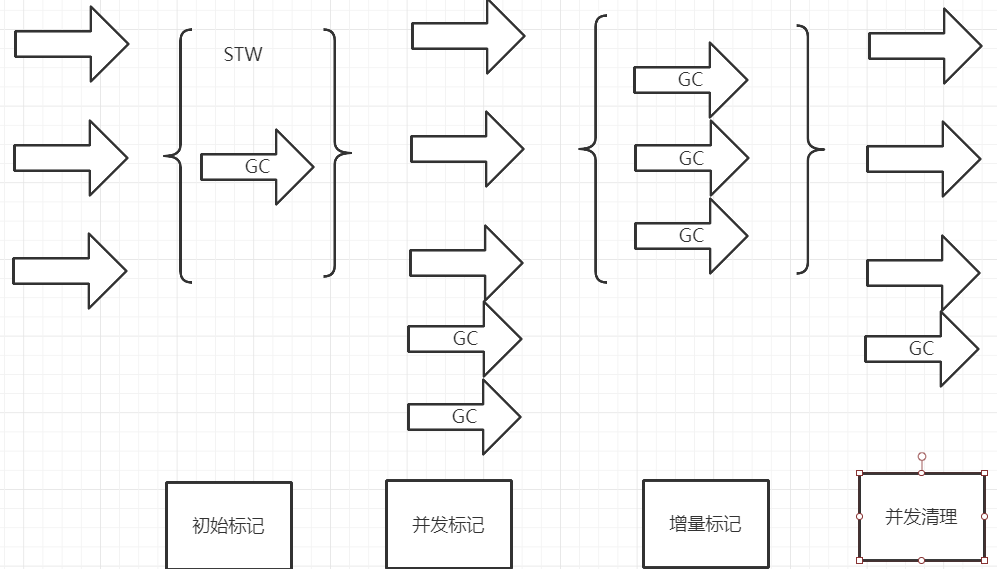
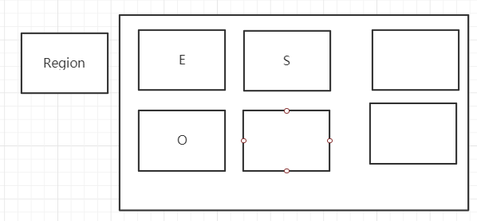

<h1>
    金三银四Java面试突击专题
</h1>
<h3>
    JVM调优篇
    </h3>
    === 图灵： 楼兰 ===

## 一、说一说JVM的内存模型。

## 二、JAVA类加载的全过程是怎样的？什么是双亲委派机制？有什么作用？

JAVA的类加载器： AppClassloader -> ExtClassloader -> BootStrap Classloader

每种类加载器都有他自己的加载目录。

JAVA中的类加载器： AppClassLoader , ExtClassLoader -> URLClassLoader ->SecureClassLoader -> ClassLoader

每个类加载器对他加载过的类，都是有一个缓存的。

双亲委派：向上委托查找，向下委托加载。  作用：保护JAVA的层的类不会被应用程序覆盖。

类加载过程：  加载 -》 连接 -》 初始化

加载：把Java的字节码数据加载到JVM内存当中，并映射成JVM认可的数据结构。

连接：分为三个小的阶段： 1、验证：检查加载到的字节信息是否符合JVM规范。

​	2、准备： 创建类或接口的静态变量，并赋初始值   半初始化状态

​	3、解析：把符号引用转为直接引用

初始化：

## 一个对象从加载到JVM，再到被GC清除，都经历了什么过程？

method{  ClassLoaderDemo1 c =new ClassLoaderDemo1();  c.xxx}    GC 

1、用户创建一个对象，JVM首先需要到方法区去找对象的类型信息。然后再创建对象。

2、JVM要实例化一个对象，首先要在堆当中先创建一个对象。-> 半初始化状态

3、对象首先会分配在堆内存中新生代的Eden。然后经过一次Minor GC，对象如果存活，就会进入S区。在后续的每次GC中，如果对象一直存活，就会在S区来回拷贝，每移动一次，年龄加1。-> 多大年龄才会移入老年代？  年龄最大15， 超过一定年龄后，对象转入老年代。

4、当方法执行结束后，栈中的指针会先移除掉。

5、堆中的对象，经过Full GC，就会被标记为垃圾，然后被GC线程清理掉。

## 三、怎么确定一个对象到底是不是垃圾？ 什么是GC Root?

有两种定位垃圾的方式：

1、引用计数： 这种方式是给堆内存当中的每个对象记录一个引用个数。引用个数为0的就认为是垃圾。这是早期JDK中使用的方式。引用计数无法解决循环引用的问题。

2、根可达算法： 这种方式是在内存中，从引用根对象向下一直找引用，找不到的对象就是垃圾。

哪些是GC Root？ Stack -> JVM Stack, Native Stack， class类， run-time constant pool 常量池， static reference 静态变量。

## 四、JVM有哪些垃圾回收算法？

MarkSweep 标记清除算法

这个算法分为两个阶段，标记阶段：把垃圾内存标记出来，清除阶段：直接将垃圾内存回收。

这种算法是比较简单的，但是有个很严重的问题，就是会产生大量的内存碎片。

Copying 拷贝算法

为了解决标记清除算法的内存碎片问题，就产生了拷贝算法。拷贝算法将内存分为大小相等的两半，每次只使用其中一半。垃圾回收时，将当前这一块的存活对象全部拷贝到另一半，然后当前这一半内存就可以直接清除。

这种算法没有内存碎片，但是他的问题就在于浪费空间。而且，他的效率跟存货对象的个数有关。

MarkCompack 标记压缩算法

为了解决拷贝算法的缺陷，就提出了标记压缩算法。这种算法在标记阶段跟标记清除算法是一样的，但是在完成标记之后，不是直接清理垃圾内存，而是将存活对象往一端移动，然后将端边界以外的所有内存直接清除。

这三种算法各有利弊，各自有各自的适合场景。

## 五、JVM有哪些垃圾回收器？他们都是怎么工作的？什么是STW？他都发生在哪些阶段？什么是三色标记？如何解决错标记和漏标记的问题？为什么要设计这么多的垃圾回收器？

STW: Stop-The-World。是在垃圾回收算法执行过程当中，需要将JVM内存冻结的一种状态。在STW状态下，JAVA的所有线程都是停止执行的-GC线程除外，native方法可以执行，但是，不能与JVM交互。GC各种算法优化的重点，就是减少STW，同时这也是JVM调优的重点。

JVM的垃圾回收器：

Serial 串行

整体过程比较简单，就像踢足球一样，需要GC时，直接暂停，GC完了再继续。

这个垃圾回收器，是早期垃圾回收器，只有一个线程执行GC。在多CPU架构下，性能就会下降严重。只适用于几十兆的内存空间。

Parallel 并行

在串行基础上，增加多线程GC。PS+PO这种组合是JDK1.8默认的垃圾回收器。在多CPU的架构下，性能会比Serial高很多。

CMS Concurrent Mark Sweep

核心思想，就是将STW打散，让一部分GC线程与用户线程并发执行。 整个GC过程分为四个阶段

1、初始标记阶段：STW 只标记出根对象直接引用的对象。

2、并发标记：继续标记其他对象，与应用程序是并发执行。

3、重新标记： STW 对并发执行阶段的对象进行重新标记。

4、并发清除：并行。将产生的垃圾清除。清除过程中，应用程序又会不断的产生新的垃圾，叫做浮动垃圾。这些垃圾就要留到下一次GC过程中清除。

G1 Garbage First 垃圾优先

他的内存模型是实际不分代，但是逻辑上是分代的。在内存模型中，对于堆内存就不再分老年代和新生代，而是划分成一个一个的小内存块，叫做Region。每个Region可以隶属于不同的年代。

GC分为四个阶段：

第一：初始标记 标记出GCRoot直接引用的对象。STW

第二：标记Region，通过RSet标记出上一个阶段标记的Region引用到的Old区Region。

第三：并发标记阶段：跟CMS的步骤是差不多的。只是遍历的范围不再是整个Old区，而只需要遍历第二步标记出来的Region。

第四：重新标记： 跟CMS中的重新标记过程是差不多的。

第五：垃圾清理：与CMS不同的是，G1可以采用拷贝算法，直接将整个Region中的对象拷贝到另一个Region。而这个阶段，G1只选择垃圾较多的Region来清理，并不是完全清理。

CMS的核心算法就是**三色标记**。

三色标记：是一种逻辑上的抽象。将每个内存对象分成三种颜色： 黑色：表示自己和成员变量都已经标记完毕。 灰色：自己标记完了，但是成员变量还没有完全标记完。白色：自己未标记完。

CMS通过增量标记 increment update 的方式来解决漏标的问题。

## 六、如何进行JVM调优？JVM参数有哪些？怎么查看一个JAVA进程的JVM参数？谈谈你了解的JVM参数。如果一个java程序每次运行一段时间后，就变得非常卡顿，你准备如何对他进行优化？

JVM调优主要就是通过定制JVM运行参数来提高JAVA应用程度的运行数据

JVM参数大致可以分为三类：

1、 标注指令： -开头，这些是所有的HotSpot都支持的参数。可以用java -help 打印出来。

2、非标准指令： -X开头，这些指令通常是跟特定的HotSpot版本对应的。可以用java -X 打印出来。

3、不稳定参数： -XX 开头，这一类参数是跟特定HotSpot版本对应的，并且变化非常大。详细的文档资料非常少。在JDK1.8版本下，有几个常用的不稳定指令：

 java -XX:+PrintCommandLineFlags ： 查看当前命令的不稳定指令。

java -XX:+PrintFlagsInitial ： 查看所有不稳定指令的默认值。

java -XX:+PrintFlagsFinal： 查看所有不稳定指令最终生效的实际值。

