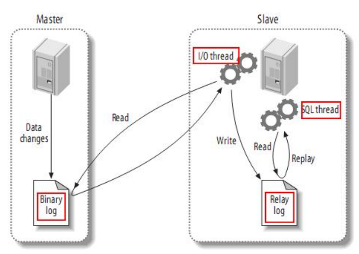
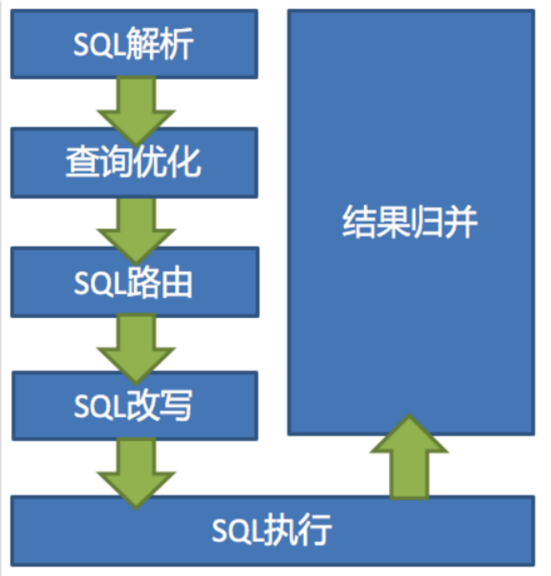

<h1>
    金三银四Java面试突击专题
</h1>
<h3>
    MySQL数据库篇
    </h3>
    === 图灵： 楼兰 ===

## 一、MySQL有哪几种数据存储引擎？有什么区别？

MySQL中通过show ENGINES指令可以看到所有支持的数据库存储引擎。 最为常用的就是MyISAM 和InnoDB 两种。

MyISAM和InnDB的区别：

1、存储文件。 MyISAM每个表有两个文件。 MYD和MYISAM文件。 MYD是数据文件。 MYI是索引文件。 而InnDB每个表只有一个文件，idb。

2、InnoDB支持事务，支持行级锁，支持外键。

3、InnoDB支持XA事务

4、InnoDB支持savePoints

## 二、什么是脏读、幻读、不可重复读？要怎么处理？

这些问题都是MySQL进行事务并发控制时经常遇到的问题。

脏读： 在事务进行过程中，读到了其他事务未提交的数据。

不可重复读： 在一个事务过程中，多次查询的结果不一致。

幻读： 在一个事务过程中，用同样的操作查询数据，得到的记录数不相同。

处理的方式有很多种：加锁、事务隔离、MVCC

加锁：

1、脏读：在修改时加排他锁，直到事务提交才释放。读取时加共享锁，读完释放锁。

2、不可重复读： 读数据时加共享锁，写数据时加排他锁。

3、幻读： 加范围锁。

## 三、事务的基本特性和隔离级别有哪些？

事务： 表示多个数据操作组成一个完整的事务单元，这个事务内的所有数据操作要么同时成功，要么同时失败。

**事务的特性**：ACID

1、原子性：事务是不可分割的，要么完全成功，要么完全失败。

2、一致性：事务无论是完成还是失败，都必须保持事务内操作的一致性。当失败时，都要对前面的操作进行回滚，不管中途是否成功。

3、隔离性：当多个事务操作一个数据的时候，为防止数据损坏，需要将每个事务进行隔离，互相不干扰。

4、持久性： 事务开始就不会终止。他的结果不受其他外在因素的影响。

**事务的隔离级别**：SHOW VARIABLES like 'transaction%'

设置隔离级别： set transaction level xxx  设置下次事务的隔离级别。

set session transaction level xxx 设置当前会话的事务隔离级别

set global transaction level xxx 设置全局事务隔离级别

**MySQL当中有五种隔离级别**

NONE ： 不使用事务。

READ UNCOMMITED： 允许脏读

READ COMMITED： 防止脏读，最常用的隔离级别

REPEATABLE READ：防止脏读和不可重复读。MYSQL默认

SERIALIZABLE： 事务串行，可以防止脏读、幻读，不可重复度。

五种隔离级别，级别越高，事务的安全性是更高的，但是，事务的并性能也就会越低。

## 四、MySQL的锁有哪些？什么是间隙锁？

从锁的粒度来区分

1、行锁：加锁粒度小，但是加锁资源开销比较大。 InnDB支持。

​	共享锁： 读锁。多个事务可以对同一个数据共享同一把锁。持有锁的事务都可以访问数据，但是只能读不能修改。select xxx LOCK IN SHARE MODE。

​	排他锁： 写锁。只有一个事务能够获得排他锁，其他事务都不能获取该行的锁。InnoDB会对update\delete\insert语句自动添加排他锁。SELECT xxx FOR UPDATE。

​	自增锁： 通常是针对MySQL当中的自增字段。如果有事务回滚这种情况，数据会回滚，但是自增序列不会回滚。

2、表锁：加锁粒度大，加锁资源开销比较小。MyISAM和InnoDB都支持。

​	表共享读锁

​	表排他写锁

​	意向锁：是InnoDB自动添加的一种锁，不需要用户干预。

3、全局锁： Flush tables with read lock 。 加锁之后整个数据库实例都处于只读状态。所有的数据变更操作都会被挂起。一般用于全库备份的时候。

常见的锁算法：  user: userid ( 1,4,9)  update user set xxx where userid=5;  REPEATABLE READ 间隙锁锁住(5,9)

1、记录锁：锁一条具体的数据。

2、间隙锁：RR隔离级别下，会加间隙锁。锁一定的范围，而不锁具体的记录。是为了防止产生幻读。(-xx,1)(1,4)(4,9)（9，xxx）

3、Next-key : 间隙锁+右记录锁。(-xx,1](1,4](4,9]（9，xxx）

## 五、MySQL的索引结构是什么样的？聚簇索引和非聚簇索引又是什么？

二叉树 -》 AVL树 -》 红黑树 -》 B-树 -》 B+树

二叉树： 每个节点最多只有两个子节点， 左边的子节点都比当前节点小，右边的子节点都比当前节点大。

AVL树： 树中任意节点的两个子树的高度差最大为1

红黑树：1、每个节点都是红色或者黑色。2 根节点是黑色。3 每个叶子节点都是黑色的空节点。4 红色节点的父子节点都必须是褐色。5 从任一节点到其每个叶子节点的所有路径都包含相同的黑色节点。

B-树： 1、B-树的每个非叶子节点的子节点个数都不会超过D（这个D就是B-树的阶）2、所有的叶子节点都在同一层。3.所有节点关键字都是按照递增顺序排列。

B+树： 1、非叶子节点不存储数据，只进行数据索引。2、所有数据都存储在叶子节点当中。3、每个叶子节点都存有相邻叶子节点的指针。4、叶子节点按照本身关键字从小到大排序。

聚簇索引就是数据和索引是在一起的。

MyISAM使用的是非聚簇索引，树的子节点上的data不是数据本身，而是数据存放的地址。InnoDB采用的是聚簇索引，树的叶子节点上的data就是数据本身。

聚簇索引的数据物理存放顺序和索引顺序是一致的，所以一个表当中只能有一个聚簇索引，而非聚簇索引可以有多个。

​	InnoDB中，如果表定义了PK，那PK就是聚簇索引。 如果没有PK，就会找第一个非空的unique列作为聚簇索引。否则，InnoDB会创建一个隐藏的row-id作为聚簇索引。

MySQL的覆盖索引和回表

​	如果只需要在一颗索引树上就可以获取SQL所需要的所有列，就不需要再回表查询，这样查询速度就可以更快。

​	实现索引覆盖最简单的方式就是将要查询的字段，全部建立到联合索引当中。

​	user（PK  id , name ,sex）

select count(name) from user ;  -> 在name 字段上建立一个索引。

select id , name ,sex from user; -> 将name上的索引升级成为(name,sex)的联合索引。

## 六、MySQL的集群是如何搭建的？读写分离是怎么做的？

MySQL主从集群的搭建原理：

MySQL通过将主节点的Binlog同步给从节点完成主从之间的数据同步。

MySQL的主从集群只会将binlog从主节点同步到从节点，而不会反过来同步。由此也就引申出了读写分离的问题。

因为要保证主从之间的数据一致，写数据的操作只能在主节点完成， 而读数据的操作，可以在主节点或者从节点上完成。

## 七、谈谈如何对MySQL进行分库分表？多大数据量需要进行分库分表？分库分表的方式和分片策略由哪些？分库分表后，SQL语句的执行流程是怎样的？

什么是分库分表？ 就是当表中的数据量过大时，整个查询效率就会降低得非常明显。这时为了提升查询效率，就要将一个表中的数据分散到多个数据库的多个表当中。

分库分表最常用的组件： Mycat\ ShardingSphere

数据分片的方式有垂直分片和水平分片。垂直分片就是从业务角度将不同的表拆分到不同的库中，能够解决数据库数据文件过大的问题，但是不能从根本上解决查询问题。水平分片就是从数据角度将一个表中的数据拆分到不同的库或表中，这样可以从根本上解决数据量过大造成的查询效率低的问题。

有非常多的分片策略，比如 取模、按时间、按枚举值。。。。

阿里提供的开发手册当中，建议：一个表的数据量超过500W或者数据文件超过2G，就要考虑分库分表了。 

分库分表后的执行流程：

一个user表，按照userid进行了分片，然后我需要按照sex字段去查，这要怎么查？强制指定只查一个数据库，要怎么做？查询结果按照userid来排序，要怎么排？

分库分表的问题： 垮库查询、跨库排序、分布式事务、公共表、主键重复。。。。。

