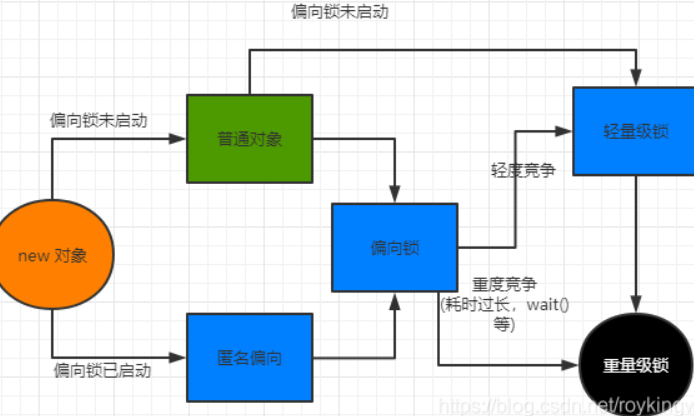

<h1>
    金三银四Java面试突击专题
</h1>
<h3>
    JAVA并发篇
    </h3>
    === 图灵： 楼兰 ===

##  一、JAVA如何开启线程？怎么保证线程安全？

线程和进程的区别：进程是操作系统进行资源分配的最小单元。线程是操作系统进行任务分配的最小单元，线程隶属于进程。

如何开启线程？ 1、继承Thread类，重写run方法。 2、实现Runnable接口，实现run方法。3、实现Callable接口，实现call方法。通过FutureTask创建一个线程，获取到线程执行的返回值。4、通过线程池来开启线程。

怎么保证线程安全？ 加锁：  1、 JVM提供的锁， 也就是Synchronized关键字。 2、 JDK提供的各种锁 Lock。

##  二、 Volatile和Synchronized有什么区别？Volatile能不能保证线程安全?DCL(Double Check Lock)单例为什么要加Volatile?

1、Synchronized关键字，用来加锁。 Volatile只是保持变量的线程可见性。通常适用于一个线程写，多个线程读的场景。

2、不能。Volatile关键字只能保证线程可见性， 不能保证原子性。

3、Volatile防止指令重排。在DCL中，防止高并发情况下，指令重排造成的线程安全问题。

## 三、JAVA线程锁机制是怎样的？偏向锁、轻量级锁、重量级锁有什么区别？锁机制是如何升级的？

1、JAVA的锁就是在对象的Markword中记录一个锁状态。无锁，偏向锁，轻量级锁，重量级锁对应不同的锁状态。

2、JAVA的锁机制就是根据资源竞争的激烈程度不断进行锁升级的过程。

3、

## 四、谈谈你对AQS的理解。AQS如何实现可重入锁？

1、AQS是一个JAVA线程同步的框架。是JDK中很多锁工具的核心实现框架。

2、 在AQS中，维护了一个信号量state和一个线程组成的双向链表队列。其中，这个线程队列，就是用来给线程排队的，而state就像是一个红绿灯，用来控制线程排队或者放行的。 在不同的场景下，有不用的意义。

3、在可重入锁这个场景下，state就用来表示加锁的次数。0标识无锁，每加一次锁，state就加1。释放锁state就减1。

## 五、有A,B,C三个线程，如何保证三个线程同时执行？如何在并发情况下保证三个线程依次执行？如何保证三个线程有序交错进行？

CountDownLatch, CylicBarrier, Semaphore。

## 六、如何对一个字符串快速进行排序？

Fork/Join框架