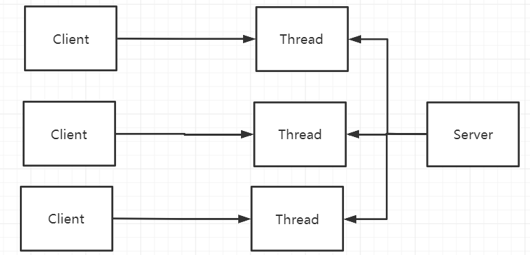
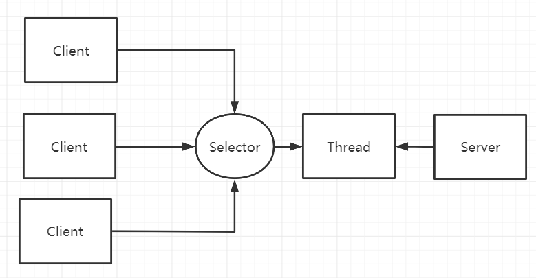
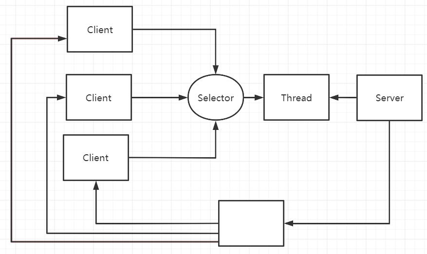
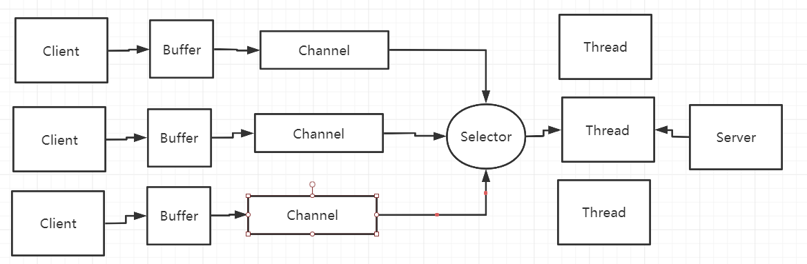

<h1>
    金三银四Java面试突击专题
</h1>
<h3>
    JAVA网络通信篇
    </h3>
    === 图灵： 楼兰 ===

## 一、TCP和UDP有什么区别？TCP为什么是三次握手，而不是两次？

**TCP**   Transfer Control Protocol 是一种面向连接的、可靠的、传输层通信协议。

​	特点： 好比是打电话：面向连接的，点对点的通信，高可靠的，效率比较低，占用的系统资源比较多。

**UDP** User Datagram Protocol 是一种无连接的， 不可靠的、传输层通信协议。 

​	特点：好比是广播：不需要连接，发送方不管接收方有没有准备好，直接发消息；可以进行广播发送的；传输不可靠，有可能丢失消息；效率比较高；协议就会比较简单，占用的系统资源就比较少。

**TCP建立连接三次握手，断开连接四次挥手**。

3、如果是两次握手，可能造成连接资源浪费的情况。

## 二、JAVA有哪几种IO模型？有什么区别？

BIO  同步阻塞IO。 可靠性差，吞吐量低，适用于连接比较少且比较固定的场景。JDK1.4之前唯一的选择。编程模型最简单

NIO 同步非阻塞IO  可靠性比较好，吞吐量也比较高，适用于连接比较多并且连接比较短(轻操作)，例如聊天室。JDK1.4开始支持。编程模型最复杂。

AIO 异步非阻塞IO 可靠性是最好的，吞吐量也是非常高。适用于连接比较多，并且连接比较长(重操作)。例如 相册服务器。JDK7版本才支持的。编程模型比较简单，需要操作系统来支持。

同步 、异步- 针对请求 和 阻塞、非阻塞 - 针对客户端。

在一个网络请求中，客户端会发一个请求到服务端。

1、客户端发了请求后，就一直等着服务端响应。客户端：阻塞。  请求：同步

2、客户端发了请求后，就去干别的事情了。时不时的过来检查服务端是否给出了相应。 客户端：非阻塞。 请求：同步。

3、换成异步请求。客户端发了请求后，就坐在椅子上，等着服务端返回响应。 客户端：阻塞。 请求：异步

4、客户端发了请求后，就去干别的事情了。等到服务端给出响应后，再过来处理业务逻辑。 客户端；非阻塞。 请求：异步。

## 三、JAVA NIO的几个核心组件是什么？分别有什么作用？

Channel   Buffer  Selector

channel类似于一流。 每个channel对应一个buffer缓冲区。channel会注册到selector。

select会根据channel上发生的读写事件，将请求交由某个空闲的线程处理。selector对应一个或者多个线程。

Buffer和Channel都是可读可写的。

## 四、select，poll和epoll有什么区别？

他们是NIO中多路复用的三种实现机制，是由Linux操作系统提供的。

用户空间和内核空间：操作系统为了保护系统安全，将内核划分为两个部分，一个是用户空间，一个是内核空间。用户空间不能直接访问底层的硬件设备，必须通过内核空间。

文件描述符 File Descriptor(FD)：是一个抽象的概念，形式上是一个整数，实际上是一个索引值。指向内核中为每个进程维护进程所打开的文件的记录表。当程序打开一个文件或者创建一个文件时， 内核就会向进程返回一个FD。Unix,Linux

​	select机制： 会维护一个FD的结合 fd_set。将fd_set从用户空间复制到内核空间，激活socket。 x64 2048 fd_set是一个数组结构

​	Poll机制： 和selecter机制是差不多的，把fd_set结构进行了优化，FD集合的大小就突破了操作系统的限制。 pollfd结构来代替fd_set，通过链表实现的。

​	EPoll：Event Poll.Epoll不再扫描所有的FD，只将用户关心的FD的事件存放到内核的一个事件表当中。这样，可以减少用户空间与内核空间之前需要拷贝的数据。

简单总结：

​				操作方式		底层实现			最大连接数			IO效率

select:	遍历					数组				受限于内核			一般

poll		遍历					链表					无上限				一般

epoll	事件回调				红黑树				无上限				高

java的NIO当中是用的那种机制？  可以查看DefaultSelectorProvider源码。在windows下，WindowsSelectorProvider。而Linux下，根据Linux的内核版本，2.6版本以上，就是EPollSelectorProvider， 否则就是默认的PollSelectorProvider.

select 1984年出现，  poll   1997年出现， EPoll 2002年

## 五、描述下HTTP和HTTPS的区别。

HTTP： 是互联网上应用最为广泛的一种网络通信协议，基于TCP，可以使浏览器工作更为高效，减少网络传输。

HTTPS： 是HTTP的加强版，可以认为是HTTP+SSL(Secure Socket Layer)。在HTTP的基础上增加了一系列的安全机制。一方面保证数据传输安全，另一位方面对访问者增加了验证机制。是目前现行架构下，最为安全的解决方案。

主要区别：

​	1、HTTP的连接是简单无状态的，HTTPS的数据传输是经过证书加密的，安全性更高。

​	2、HTTP是免费的， 而HTTPS需要申请证书，而证书通常是需要收费的，并且费用一般不低。

​	3、他们的传输协议不通过，所以他们使用的端口也是不一样的， HTTP默认是80端口，而HTTPS默认是443端口。

HTTPS的缺点：

​	1、HTTPS的握手协议比较费时，所以会影响服务的响应速度以及吞吐量。

​	2、HTTPS也并不是完全安全的。他的证书体系其实并不是完全安全的。并且HTTPS在面对DDOS这样的攻击时，几乎起不到任何作用。

​	3、证书需要费钱，并且功能越强大的证书费用越高。

