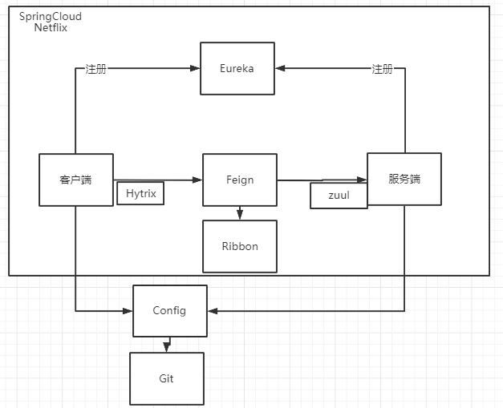
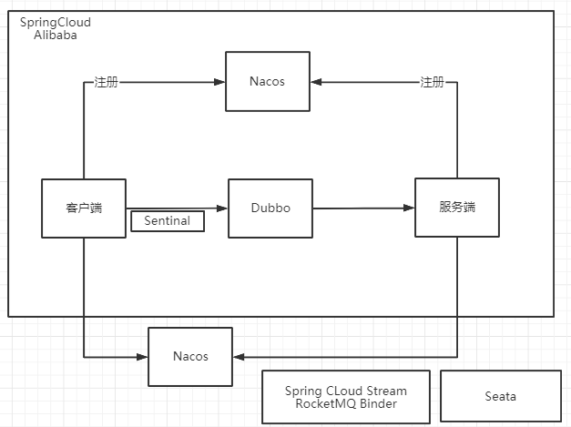
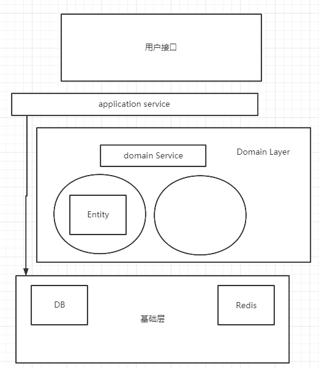

<h1>
    金三银四Java面试突击专题
</h1>
<h3>
    微服务篇
    </h3>
    === 图灵： 楼兰 ===

## 一、谈谈你对微服务的理解，微服务有哪些优缺点？

微服务是由Martin Fowler大师提出的。微服务是一种架构风格，通过将大型的单体应用划分为比较小的服务单元，从而降低整个系统的复杂度。

优点：

1、服务部署更灵活：每个应用都可以是一个独立的项目，可以独立部署，不依赖于其他服务，耦合性降低。

2、技术更新灵活：在大型单体应用中，技术要进行更新，往往是非常困难的。而微服务可以根据业务特点，灵活选择技术栈。

3、应用的性能得到提高： 大型单体应用中，往往启动就会成为一个很大的难关。而采用微服务之后，整个系统的性能是能够得到提高的。

4、更容易组合专门的团队： 在单体应用时，团队成员往往需要对系统的各个部分都要有深入的了解，门槛是很高的。而采用微服务之后，可以给每个微服务组建专门的团队。

5、代码复用： 很多底层服务可以以REST API的方式对外提供统一的服务，所有基础服务可以在整个微服务系统中通用。

缺点：

1、服务调用的复杂性提高了：网络问题、容错问题、负载问题、高并发问题。。。。。。

2、分布式事务：尽量不要使用微服务事务。

3、测试的难度提升了：

4、运维难度提升：单体架构只要维护一个环境，而到了微服务是很多个环境，并且运维方式还都不一样。所以对部署、监控、告警等要求就会变得非常困难。

## 二、SpringCloud和SpringCloudAlibaba都有哪些组件？都解决了什么问题？

SpringCloud：提供了构建微服务系统所需要的一组通用开发模式以及一系列快速实现这些开发模式的工具。

通常所说的SpringCloud是指SpringCloud NetFlix，他和SpringCloudAlibaba都是SpringCloud这一系列开发模式的具体实现。

SpringCloud NetFlix

SpringCloud Alibaba:

## 三、分布式事务如何处理？怎么保证事务一致性？

误区： 分布式事务 = Seata 

分布式事务： 就是要将不同节点上的事务操作，提供操作原子性保证。同时成功或者同时失败。

分布式事务第一个要点就是要在原本没有直接关联的事务之间建立联系。

1、HTTP连接： 最大努力通知。 -- 事后补偿。

2、 MQ ： 事务消息机制。

3、Redis： 也可以定制出分布式事务机制。

4、Seata :  是通过TC来在多个事务之间建立联系。 

两阶段：AT  XA   就在于要锁资源。

三阶段：TCC  在两阶段的基础上增加一个准备阶段。在准备阶段是不锁资源的。

SAGA模式： 类似于熔断。 业务自己实现正向操作和补偿操作的逻辑。

## 四、怎么拆分微服务？怎样设计出高内聚、低耦合的微服务？有没有了解过DDD领域驱动设计？什么是中台？中台和微服务有什么关系？

拆分微服务的时候，为了尽量保证微服务的稳定，会有一些基本的准则：

1、微服务之间尽量不要有业务交叉。

2、微服务之前只能通过接口进行服务调用，而不能绕过接口直接访问对方的数据。

3、高内聚，低耦合。

高内聚低耦合，是一种从上而下指导微服务设计的方法。实现高内聚低耦合的工具主要有 同步的接口调用 和 异步的事件驱动 两种方式。

什么是DDD： 在2004年，由Eric Evans提出了， DDD是面对软件复杂之道。Domain-Driven- Design –Tackling Complexity in the Heart of Software 

Martin Fowler - 贫血模型 ——》 贫血失忆症。  充血模型

MVC架构 -》 领域优先的四层架构

大泥团： 不利于微服务的拆分。大泥团结构拆分出来的微服务依然是泥团机构，当服务业务逐渐复杂，这个泥团又会膨胀成为大泥团。

DDD只是一种方法论，没有一个稳定的技术框架。DDD要求领域是跟技术无关、跟存储无关、跟通信无关。

中台这个概念是由阿里在2015年提出"小前台，大中台"战略思想。 

superCell  《皇室战争》《部落冲突》

所谓中台，就是将各个业务线中可以复用的一些功能抽取出来，剥离个性，提取共性，形成一些可复用的组件。  盒马鲜生、团购

大体上，中台可以分为三类 业务中台、数据中台和技术中台。大数据杀熟-数据中台   

​	电商 收银中台 支付风控中台

中台跟DDD结合：  DDD会通过限界上下文将系统拆分成一个一个的领域， 而这种限界上下文，天生就成了中台之间的逻辑屏障。

DDD在技术与资源调度方面都能够给中台建设提供不错的指导。

DDD分为战略设计和战术设计。 上层的战略设计能够很好的指导中台划分，下层的战术设计能够很好的指导微服务搭建。

在目前阶段，DDD还大都处在小范围实验的阶段。

## 五、你的项目中是怎么保证微服务敏捷开发的？微服务的链路追踪、持续集成、AB发布要怎么做？

开发运维一体化。

敏捷开发： 目的就是为了提高团队的交付效率，快速迭代，快速试错。

每个月固定发布新版本，以分支的形式保存到代码仓库中。快速入职。任务面板、站立会议。团队人员灵活流动，同时形成各个专家代表。测试环境- 生产环境 -》 开发测试环境SIT、集成测试环境、压测环境STR、预投产环境、生产环境PRD。文档优先。晨会、周会、需求拆分会。

链路追踪：1、基于日志。 形成全局事务ID，落地到日志文件。 filebeat- logstash-Elasticsearch 形成大型报表。2、基于MQ，往往需要架构支持。经过流式计算形成一些可视化的结果。

持续集成：SpringBoot  maven pom ->build -> shell ; Jenkins。

AB发布：1、蓝绿发布、红黑发布。 老版本和新版本是同时存在的。2、灰度发布、金丝雀发布。

