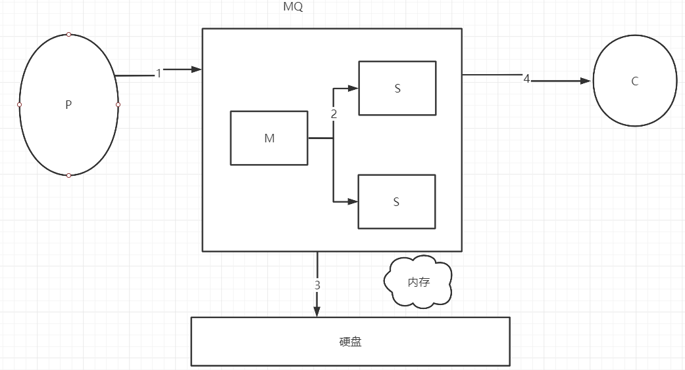
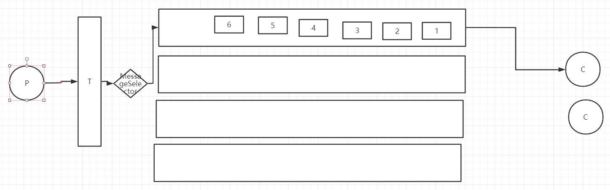
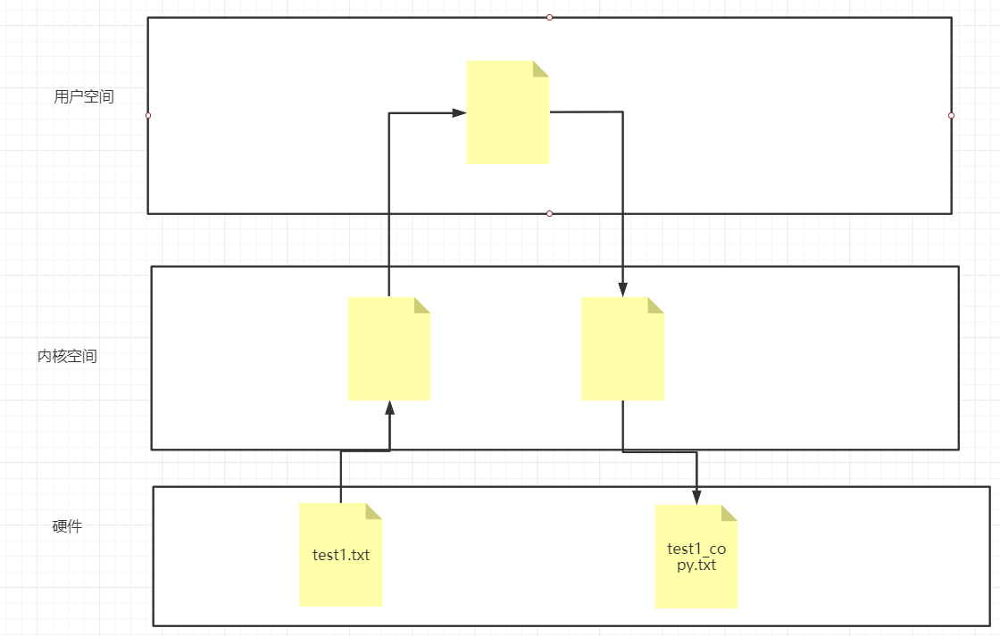
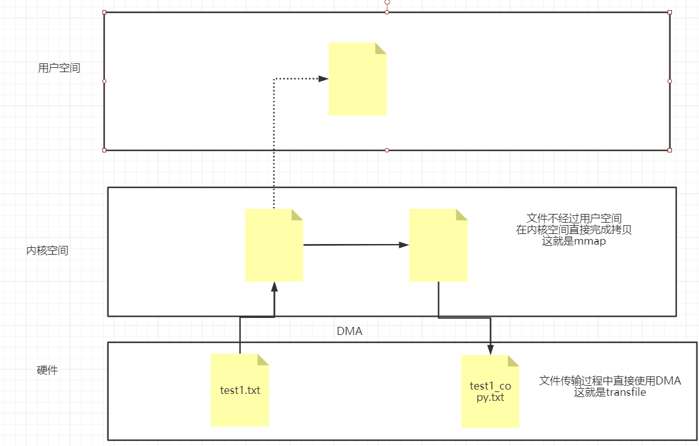

<h1>
    金三银四Java面试突击专题
</h1>
<h3>
    消息队列篇
    </h3>
    === 图灵： 楼兰 ===

## 一、MQ有什么用？有哪些具体的使用场景？

MQ： MessageQueue，消息队列。 队列是一种FIFO先进先出的数据结构。消息由生产者发送到MQ进行排队，然后由消费者对消息进行处理。QQ、 微信 就是典型的MQ场景。

MQ的作用主要有三个方面：

1、异步：

例子：快递。 快递员-> 菜鸟驿站<- 客户

作用：异步能提高系统的响应速度和吞吐量。

2、解耦：

例子：《Thinking in java》 -> 编辑社

作用：服务之间进行解耦，可以减少服务之间的影响，提高系统的稳定性和可扩展性。

另外，解耦之后可以实现数据分发。生产者发送一个消息后，可以由多个消费者来处理。

3、削峰：

例子：长江涨水->三峡大坝

作用：以稳定的系统资源应对突发的流量冲击。

MQ的缺点：

1、系统可用性降低： 一旦MQ宕机，整个业务就会产生影响。高可用

2、系统的复杂度提高： 引入MQ之后，数据链路就会变得很复杂。如何保证消息不丢失？消息不会重复调用？怎么保证消息的顺序性？、、、、、

3、数据一致性： A系统发消息，需要由B、C两个系统一同处理。如果B系统处理成功、C系统处理失败，这就会造成数据一致性的问题。

## 二、如何进行产品选型？

Kafka

优点： 吞吐量非常大，性能非常好，集群高可用。

缺点：会丢数据，功能比较单一。

使用场景：日志分析、大数据采集

RabbitMQ

优点： 消息可靠性高，功能全面。

缺点：吞吐量比较低，消息积累会严重影响性能。erlang语言不好定制。

使用场景：小规模场景。

RocketMQ

优点：高吞吐、高性能、高可用，功能非常全面。

缺点：开源版功能不如云上商业版。官方文档和周边生态还不够成熟。客户端只支持java。

使用场景：几乎是全场景。

## 三、如何保证消息不丢失？

1、哪些环节会造成消息丢失？

2、怎么去防止消息丢失。

2.1 生产者发送消息不丢失

kafka： 消息发送+回调

RocketMQ：  1、消息发送+回调。2、事务消息。

RabbitMQ： 1、消息发送+回调 

​	2、 手动事务：  channel.txSelect()开启事务， channel.txCommit()提交事务， channel.txRollback()回滚事务。这种方式对channel是会产生阻塞的，造成吞吐量下降。

​	3、Publisher Confirm。整个处理流程跟RocketMQ的事务消息，基本是一样的。

2.2 MQ主从消息同步不丢失

RocketMQ： 1、普通集群中，同步同步、异步同步。异步同步效率更高，但是有丢消息的风险。同步同步就不会丢消息。

​	2、Dledger集群-两阶段提交：

RabbitMQ： 普通集群：消息是分散存储的，节点之间不会主动进行消息同步，是有可能丢失消息的。

​	镜像集群：镜像集群会在节点之间主动进行数据同步，这样数据安全性得到提高。

Kafka： 通常都是用在允许消息少量丢失的场景。acks。0，1，all

2.3 MQ消息存盘不丢失

RocketMQ： 同步刷盘 异步刷盘：异步刷盘效率更高，但是有可能丢消息。同步刷盘消息安全性更高，但是效率会降低。

RabbitMQ： 将队列配置成持久化队列。新增的Quorum类型的队列，会采用Raft协议来进行消息同步。

2.4 MQ消费者消费消息不丢失

RocketMQ： 使用默认的方式消费就行， 不要采用异步方式。

RabbitMQ： autoCommit -> 手动提交offset

Kafka：  手动提交offset

## 四、如何保证消息消费的幂等性？

其实就是要方式消费者重复消费消息的问题。

所有MQ产品并没有提供主动解决幂等性的机制，需要由消费者自行控制。

RocketMQ： 给每个消息分配了个MessageID。这个MessageID就可以作为消费者判断幂等的依据。这种方式不太建议。

​	最好的方式就是自己带一个有业务标识的ID，来进行幂等判断。OrderID

​	统一ID分配。

## 五、如何保证消息的顺序？

全局有序和局部有序： MQ只需要保证局部有序，不需要保证全局有序。

**生产者把一组有序的消息放到同一个队列当中，而消费者一次消费整个队列当中的消息。**

RocketMQ中有完整的设计，但是在RabbitMQ和Kafka当中，并没有完整的设计，需要自己进行设计。

RabbitMQ：要保证目标exchange只对应一个队列。并且一个队列只对应一个消费者。

Kafka:  生产者通过定制partition分配规则，将消息分配到同一个partition。 Topic下只对应一个消费者。

## 六、如何保证消息的高效读写？

零拷贝： kafka和RocketMQ都是通过零拷贝技术来优化文件读写。

传统文件复制方式： 需要对文件在内存中进行四次拷贝。

零拷贝： 有两种方式， mmap和transfile

​	Java当中对零拷贝进行了封装， Mmap方式通过MappedByteBuffer对象进行操作，而transfile通过FileChannel来进行操作。

Mmap 适合比较小的文件，通常文件大小不要超过1.5G ~2G 之间。

Transfile没有文件大小限制。

RocketMQ当中使用Mmap方式来对他的文件进行读写。commitlog。 1G

在kafka当中，他的index日志文件也是通过mmap的方式来读写的。在其他日志文件当中，并没有使用零拷贝的方式。

​	kafka使用transfile方式将硬盘数据加载到网卡。

## 七、使用MQ如何保证分布式事务的最终一致性？

分布式事务：业务相关的多个操作，保证他们同时成功或者同时失败。

最终一致性： 与之对应的就是强一致性

MQ中要保护事务的最终一致性，就需要做到两点

1、生产者要保证100%的消息投递。  事务消息机制

2、消费者这一端需要保证幂等消费。 唯一ID+ 业务自己实现幂等

分布式MQ的三种语义：

at least once

at most once

exactly once： 

​	RocketMQ 并不能保证exactly once。商业版本当中提供了exactly once的实现机制。

​	kafka： 在最新版本的源码当中，提供了exactly once的demo。

​	RabbitMQ： erlang天生就成为了一种屏障。

## 八、让你设计一个MQ，你会如何设计？

两个误区： 1、 放飞自我，漫无边际。 2、纠结技术细节。

好的方式： 1、 从整体到细节，从业务场景到技术实现。2、以现有产品为基础。RocketMQ

答题思路： MQ作用、项目大概的样子。

1、实现一个单机的队列数据结构。 高效、可扩展。

2、将单机队列扩展成为分布式队列。- 分布式集群管理

3、基于Topic定制消息路由策略。- 发送者路由策略，消费者与队列对应关系，消费者路由策略

4、实现高效的网络通信。- Netty  Http

5、规划日志文件，实现文件高效读写。- 零拷贝，顺序写。 服务重启后，快速还原运行现场。

6、定制高级功能，死信队列、延迟队列、事务消息等等。 - 贴合实际，随意发挥。

