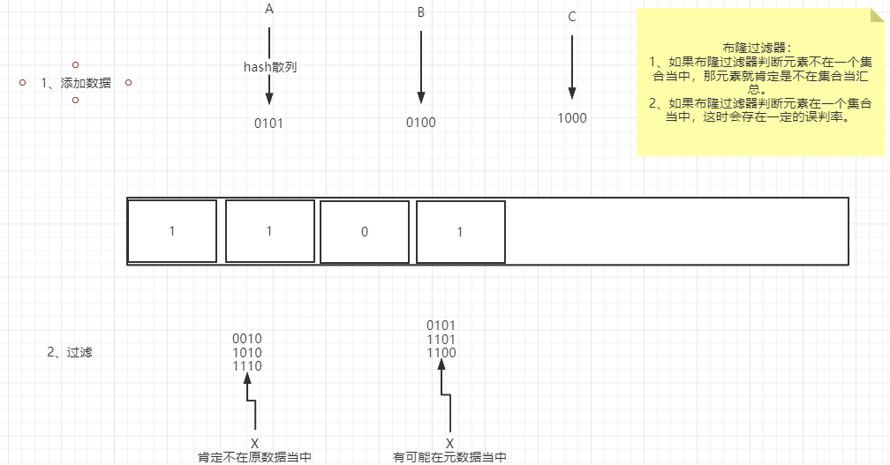

<center><h1><font color="red">
    金三银四Java面试突击专题
</font></h1>
<h3>
    缓存篇
    </h3>
    === <font size="5">图灵： 楼兰</font> ===
</center>

## 一、为什么使用缓存？

1、高性能

2、高可用


## 二、什么是缓存穿透？缓存击穿？缓存雪崩？怎么解决？

1、缓存穿透： 缓存中查不到，数据库中也查不到。

解决方案： 1》 对参数进行合法性校验。2》将数据库中没有查到结果的数据也写入到缓存。这时要注意为了防止Redis被无用的Key占满，这一类缓存的有效期要设置得短一点。

3》 引入布隆过滤器，在访问Redis之前判断数据是否存在。 要注意布隆过滤器存在一定的误判率，并且，布隆过滤器只能加数据不能减数据。



2、缓存击穿：缓存中没有，数据库中有。一般是出现在存数数据初始化以及key过期了的情况。他的问题在于，重新写入缓存需要一定的时间，如果是在高并发场景下，过多的请求就会瞬间写到DB上，给DB造成很大的压力。

解决方案： 1》设置这个热点缓存永不过期。这时要注意在value当中包含一个逻辑上的过期时间，然后另起一个线程，定期重建这些缓存。

2》加载DB的时候，要防止并发。

3、缓存雪崩： 缓存大面积过期，导致请求都被转发到DB。

解决方案：1》把缓存的时效时间分散开。例如，在原有的统一失效时间基础上，增加一个随机值。

2》对热点数据设置永不过期。


## 三、如何保证Redis与数据库的数据一致？

当我们对数据进行修改的时候，到底是先删缓存，还是先写数据库？

1、如果先删缓存，再写数据库： 在高并发场景下，当第一个线程删除了缓存，还没有来得及写数据库，第二个线程来读取数据，会发现缓存中的数据为空，那就会去读数据库中的数据(旧值，脏数据)，读完之后，把读到的结果写入缓存(此时，第一个线程已经将新的值写到缓存里面了)，这样缓存中的值就会被覆盖为修改前的脏数据。 

总结：在这种方式下，通常要求写操作不会太频繁。

解决方案：1》先操作缓存，但是不删除缓存。将缓存修改为一个特殊值(-999)。客户端读缓存时，发现是默认值，就休眠一小会，再去查一次Redis。 -》 特殊值对业务有侵入。 休眠时间，可能会多次重复，对性能有影响。

2》延时双删。 先删除缓存，然后再写数据库，休眠一小会，再次删除缓存。-》 如果数据写操作很频繁，同样还是会有脏数据的问题。


2、先写数据库，再删缓存： 如果数据库写完了之后，缓存删除失败，数据就会不一致。

总结： 始终只能保证一定时间内的最终一致性。

解决方案： 1》给缓存设置一个过期时间  问题：过期时间内，缓存数据不会更新。

2》引入MQ，保证原子操作。

解决方案：将热点数据缓存设置为永不过期，但是在value当中写入一个逻辑上的过期时间，另外起一个后台线程，扫描这些key，对于已逻辑上过期的缓存，进行删除。


## 四、如何设计一个分布式锁？如何对锁性能进行优化？

分布式锁的本质：就是在所有进程都能访问到的一个地方，设置一个锁资源，让这些进程都来竞争锁资源。数据库、zookeeper, Redis。。通常对于分布式锁，会要求响应快、性能高、与业务无关。

Redis实现分布式锁：SETNX key value：当key不存在时，就将key设置为value，并返回1。如果key存在，就返回0。EXPIRE key locktime： 设置key的有效时长。 DEL key： 删除。  GETSET key value： 先GET，再SET，先返回key对应的值，如果没有就返回空。然后再将key设置成value。

1、最简单的分布式锁： SETNX 加锁， DEL解锁。问题： 如果获取到锁的进程执行失败，他就永远不会主动解锁，那这个锁就被锁死了。

2、给锁设置过期时长：    问题： SETNX 和EXPIRE并不是原子性的，所以获取到锁的进程有可能还没有执行EXPIRE指令，就挂了，这时锁还是会被锁死。

3、将锁的内容设置为过期时间(客户端时间+过期时长),SETNX获取锁失败时，拿这个时间跟当前时间比对，如果是过期的锁，就先删除锁，再重新上锁。  问题： 在高并发场景下，会产生多个进程同时拿到锁的情况。

4、setNX失败后，获取锁上的时间戳，然后用getset，将自己的过期时间更新上去，并获取旧值。如果这个旧值，跟之前获得的时间戳是不一致的，就表示这个锁已经被其他进程占用了，自己就要放弃竞争锁。

```java
public boolean tryLock(RedisnConnection conn){
    long nowTime= System.currnetTimeMillis();
    long expireTIme = nowTime+1000;
    if(conn.SETNX("mykey",expireTIme)==1){
        conn.EXPIRE("mykey",1000);
        return true;
    }else{
        long oldVal = conn.get("mykey");
        if(oldVal != null && oldVal < nowTime){
            long currentVal = conn.GETSET("mykey",expireTime);
            if(oldVal == curentVal){
                conn.EXPIRE("mykey",1000);
                return true;
            }
            return false;
        }
        return false;
    }
}

DEL
```

5、上面就形成了一个比较高效的分布式锁。分析一下，上面各种优化的根本问题在于SETNX和EXPIRE两个指令无法保证原子性。Redis2.6提供了直接执行lua脚本的方式，通过Lua脚本来保证原子性。redission。


## 五、Redis如何配置Key的过期时间？他的实现原理是什么？

redis设置key的过期时间： 1、 EXPIRE 。 2 SETEX 

实现原理：

1、定期删除： 每隔一段时间，执行一次删除过期key的操作。

2、懒汉式删除： 当使用get、getset等指令去获取数据时，判断key是否过期。过期后，就先把key删除，再执行后面的操作。

Redis是将两种方式结合来使用。

懒汉式删除

定期删除：平衡执行频率和执行时长。

定期删除时会遍历每个database(默认16个)，检查当前库中指定个数的key(默认是20个)。随机抽查这些key，如果有过期的，就删除。 

程序中有一个全局变量记录到秒到了哪个数据库。


## 六、海量数据下，如何快速查找一条记录？

1、使用布隆过滤器，快速过滤不存在的记录。

​	使用Redis的bitmap结构来实现布隆过滤器。

2、在Redis中建立数据缓存。 - 将我们对Redis使用场景的理解尽量表达出来。

​	以普通字符串的形式来存储，(userId -> user.json)。 以一个hash来存储一条记录 (userId key-> username  field-> , userAge->)。  以一个整的hash来存储所有的数据，UserInfo->  field就用userId , value就用user.json。一个hash最多能支持2^32-1(40多个亿)个键值对。

​	缓存击穿：对不存在的数据也建立key。这些key都是经过布隆过滤器过滤的，所以一般不会太多。

​	缓存过期：将热点数据设置成永不过期，定期重建缓存。 使用分布式锁重建缓存。

3、查询优化。

​	按槽位分配数据，

​	自己实现槽位计算，找到记录应该分配在哪台机器上，然后直接去目标机器上找。


