## RocketMQ-Docker安装

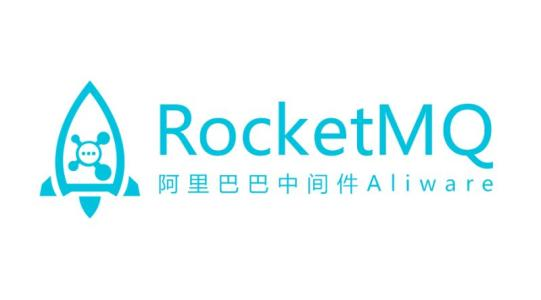

### 1、Docker单机安装

#### 查找可用镜像

> 查询docker中有哪些可以使用的mq

```sh
docker search rocketmq
```

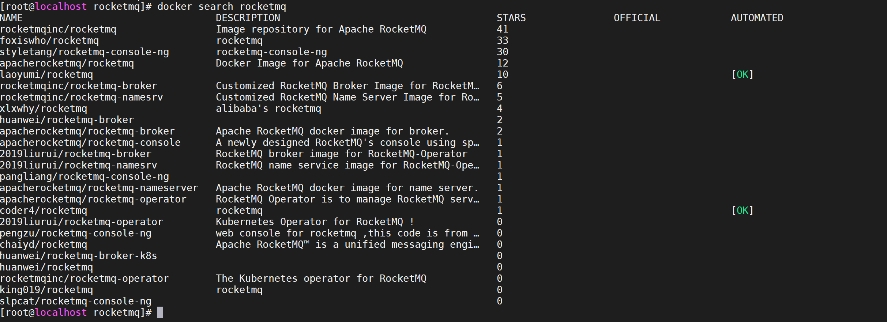

> 如上图所示，我们选取start最多的rocketinc

#### 拉取镜像

```
docker pull rocketmqinc/rocketmq
```

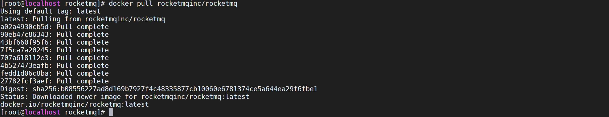

#### 启动namesrv服务

> 通过 docker 的 -v 参数使用 volume 功能，把你本地的目录映射到容器内的目录上。否则所有数据都默认保存在容器运行时的内存中，重启之后就又回到最初的起点

```sh
docker run -d -p 9876:9876 -v /tmp/data/rocketmq/namesrv/logs:/root/logs -v /tmp/data/rocketmq/namesrv/store:/root/store --name rmqnamesrv -e "MAX_POSSIBLE_HEAP=100000000" rocketmqinc/rocketmq sh mqnamesrv
```

#### 启动broker

##### 编写broker配置文件

```
brokerClusterName = DefaultCluster
brokerName = broker-a
brokerId = 0
deleteWhen = 04
fileReservedTime = 48
brokerRole = ASYNC_MASTER
flushDiskType = ASYNC_FLUSH
# 如果是本地程序调用云主机 mq，这个需要设置成 云主机 IP
# 如果Docker环境需要设置成宿主机IP
brokerIP1 = {docker宿主机IP}
```

##### 启动broker服务

```sh
docker run -d -p 10911:10911 -p 10909:10909 -v  /tmp/data/rocketmq/broker/logs:/root/logs -v  /tmp/data/rocketmq/broker/store:/root/store -v  /tmp/etc/rocketmq/broker/broker.conf:/opt/rocketmq/conf/broker.conf --name rmqbroker --link rmqnamesrv:namesrv -e "NAMESRV_ADDR=namesrv:9876" -e "MAX_POSSIBLE_HEAP=200000000" rocketmqinc/rocketmq sh mqbroker -c /opt/rocketmq/conf/broker.conf
```

#### 安装控制台

##### 查找可用镜像

运行如下命令获取可用控制台

```sh
docker search rocketmq-console
```

得到如下结果

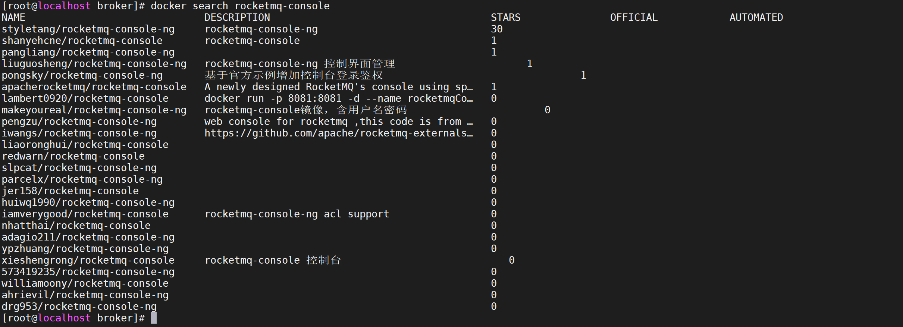

##### 拉取镜像

我们安装30星的styletang/rocketmq-console-ng

```
docker pull styletang/rocketmq-console-ng
```

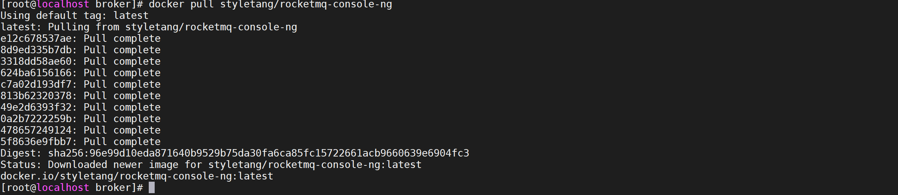

##### 启动容器

```sh
docker run -d -p 8080:8080 -e "JAVA_OPTS=-Drocketmq.config.namesrvAddr={docker宿主机ip}:9876 -Drocketmq.config.isVIPChannel=false" styletang/rocketmq-console-ng
```

注意java_opts参数因不同的console系统内容可能不同，可以结合console系统中的配置文件做相应修改。

##### 访问控制台

在浏览器中输入：[http://{docker宿主机ip}:8080/](http://10.1.7.105:8080/) 看到如下界面，表示安装成功

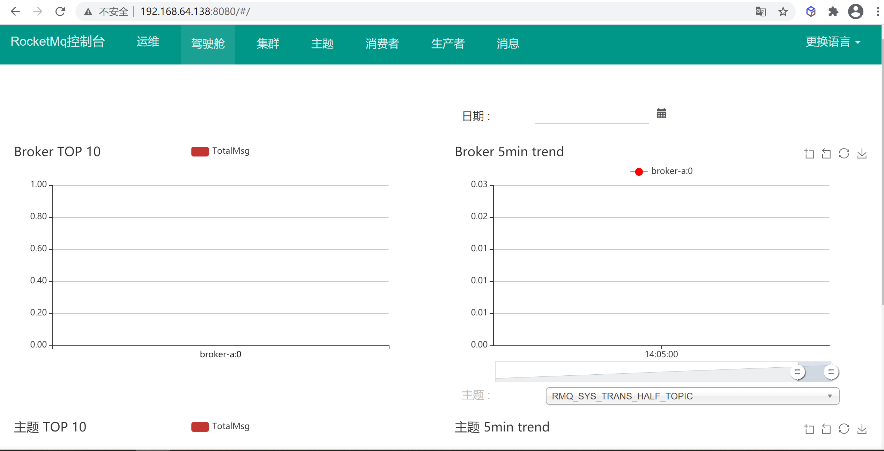

### 2、Docker-compose 安装

#### 环境准备

##### namesrv环境

创建namesrv文件挂载路径

```
mkdir -p /tmp/data/rocketmq/namesrv/logs
mkdir -p /tmp/data/rocketmq/namesrv/store
```

##### broker环境

创建broker挂载路径

```
mkdir -p /tmp/data/rocketmq/broker/logs
mkdir -p /tmp/data/rocketmq/broker/store
mkdir -p  /tmp/etc/rocketmq/broker
```

##### borker配置文件

创建broker配置文件

```
vi /tmp/etc/rocketmq/broker/broker.conf
```

配置文件内容如下

```sh
brokerClusterName = DefaultCluster  
brokerName = broker-a  
brokerId = 0  
deleteWhen = 04  
fileReservedTime = 48  
brokerRole = ASYNC_MASTER  
flushDiskType = ASYNC_FLUSH  
# 如果是本地程序调用云主机 mq，这个需要设置成 云主机 IP
# 如果Docker环境需要设置成宿主机IP
brokerIP1 = {docker宿主机IP}
```

#### 编写Docker-compose文件

```sh
version: '2'
services:
  namesrv:
    image: rocketmqinc/rocketmq
    container_name: rmqnamesrv
    networks:
      rocketmq_net:
        ipv4_address: 172.18.0.2
    environment:
      MAX_POSSIBLE_HEAP: 100000000
    ports:
      - 9876:9876
    volumes:
      - /tmp/data/rocketmq/namesrv/logs:/root/logs
      - /tmp/data/rocketmq/namesrv/store:/root/store
    command: sh mqnamesrv
  broker:
    image: rocketmqinc/rocketmq
    container_name: rmqbroker
    networks:
      rocketmq_net:
        ipv4_address: 172.18.0.3
    environment:
      NAMESRV_ADDR: 172.18.0.2:9876
      MAX_POSSIBLE_HEAP: 200000000
    ports:
      - 10909:10909
      - 10911:10911
    volumes:
      - /tmp/data/rocketmq/broker/logs:/root/logs
      - /tmp/data/rocketmq/broker/store:/root/store
      - /tmp/etc/rocketmq/broker/broker.conf:/opt/rocketmq/conf/broker.conf
    command: sh mqbroker -c /opt/rocketmq/conf/broker.conf
    depends_on:
      - namesrv
  console:
    image: styletang/rocketmq-console-ng
    container_name: rocketmq-console-ng
    networks:
      rocketmq_net:
        ipv4_address: 172.18.0.4
    ports:
      - 8080:8080
    depends_on:
      - namesrv
    environment:
      - JAVA_OPTS= -Dlogging.level.root=info -Drocketmq.namesrv.addr=172.18.0.2:9876 - Dcom.rocketmq.sendMessageWithVIPChannel=false
networks:
  rocketmq_net:
    ipam:
      config:
        - subnet: 172.18.0.0/16
          gateway: 172.18.0.1
```


### 新版docker-compose文件

```yaml
version: '3.5'
services:
  rmqnamesrv:
    image: foxiswho/rocketmq:server
    container_name: rmqnamesrv
    ports:
      - 9876:9876
    volumes:
      - /tmp/data/rocketmq/namesrv/logs:/root/logs
      - /tmp/data/rocketmq/namesrv/store:/root/store
    networks:
        rmq:
          aliases:
            - rmqnamesrv
            
  rmqbroker:
    image: foxiswho/rocketmq:broker
    container_name: rmqbroker
    ports:
      - 10909:10909
      - 10911:10911
    volumes:
      - /tmp/data/rocketmq/broker/logs:/root/logs
      - /tmp/data/rocketmq/broker/store:/root/store
      - /tmp/etc/rocketmq/broker/broker.conf:/opt/rocketmq/conf/broker.conf
    environment:
        NAMESRV_ADDR: "rmqnamesrv:9876"
        JAVA_OPTS: " -Duser.home=/opt"
        JAVA_OPT_EXT: "-server -Xms128m -Xmx128m -Xmn128m"
    command: mqbroker -c /opt/rocketmq/conf/broker.conf
    depends_on:
      - rmqnamesrv
    networks:
      rmq:
        aliases:
          - rmqbroker
          
  rmqconsole:
    image: styletang/rocketmq-console-ng
    container_name: rmqconsole
    ports:
      - 8080:8080
    environment:
        JAVA_OPTS: "-Drocketmq.namesrv.addr=rmqnamesrv:9876 -Dcom.rocketmq.sendMessageWithVIPChannel=false"
    depends_on:
      - rmqnamesrv
    networks:
      rmq:
        aliases:
          - rmqconsole
          
networks:
  rmq:
    name: rmq
    driver: bridge
```

```sh
vim docker-compose.yaml

docker-compose up

# 配置docker拉取加速器，防止拉取超时
vim /etc/docker/daemon.json

```


### 双主集群部署

> 我们使用双主模式部署RocketMQ集群

#### 服务部署情况

| 服务名称     | IP地址     | 端口号 | 暴漏端口 |
| ------------ | ---------- | ------ | -------- |
| nameserver-a | 172.18.0.3 | 9876   | 9876     |
| nameserver-b | 172.18.0.4 | 9876   | 9877     |
| broker-a     | 172.18.0.5 | 10909  | 10909    |
| broker-b     | 172.18.0.6 | 10911  | 10911    |
| console      | 172.18.0.7 | 8080   | 8080     |


#### 环境准备

##### 创建目录

> 创建集群需要的存储路径

```
mkdir -p  /tmp/data/rocketmq/nameserver-a/logs
mkdir -p  /tmp/data/rocketmq/nameserver-b/logs
mkdir -p  /tmp/data/rocketmq/nameserver-a/store
mkdir -p  /tmp/data/rocketmq/nameserver-b/store
mkdir -p  /tmp/data/rocketmq/broker-a/logs
mkdir -p  /tmp/data/rocketmq/broker-b/logs
mkdir -p  /tmp/data/rocketmq/broker-a/store
mkdir -p  /tmp/data/rocketmq/broker-b/store
mkdir -p  /tmp/etc/rocketmq/broker-a
mkdir -p  /tmp/etc/rocketmq/broker-b
```

##### 创建broker配置文件

> 因为是双主模式部署，所以会有两个broker.conf,这里暂且命名 **broker-a.conf** 和 **broker-b.conf**
>
> 这里配置的主要信息有：

1. 当前Broker对外暴露的端口号
2. 注册到NameServer的地址，看到这里有两个地址，说明NameServer也是集群部署。
3. 当前Broker的角色，是主还是从，这里表示是主。

###### 创建 broker-a配置文件

```
vi /tmp/etc/rocketmq/broker-a/broker.conf
```

> 配置内容如下

```
brokerClusterName = DefaultCluster
brokerName = broker-a
brokerId = 0
deleteWhen = 04
fileReservedTime = 48
#namesrvAddr 地址 填写docker内网地址即可
namesrvAddr=172.18.0.3:9876;172.18.0.4:9876
#启用自动创建主题
autoCreateTopicEnable=true
#这个很有讲究 如果是正式环境 这里一定要填写内网地址（安全）
#如果是用于测试或者本地这里建议要填外网地址，因为你的本地代码是无法连接到阿里云内网，只能连接外网。
brokerIP1 = 192.168.64.138
#Broker 对外服务的监听端口
listenPort = 10909
#Broker角色
#- ASYNC_MASTER 异步复制Master
#- SYNC_MASTER 同步双写Master
#- SLAVE
brokerRole=ASYNC_MASTER
#刷盘方式
#- ASYNC_FLUSH 异步刷盘
#- SYNC_FLUSH 同步刷盘
flushDiskType=ASYNC_FLUSH
```

###### 创建 broker-b配置文件

```
vi /tmp/etc/rocketmq/broker-b/broker.conf
```

> 配置内容如下

```
brokerClusterName = DefaultCluster
brokerName = broker-b
brokerId = 0
deleteWhen = 04
fileReservedTime = 48
#namesrvAddr 地址 填写docker内网地址即可
namesrvAddr=172.18.0.3:9876;172.18.0.4:9876
#启用自动创建主题
autoCreateTopicEnable=true
#这个很有讲究 如果是正式环境 这里一定要填写内网地址（安全）
#如果是用于测试或者本地这里建议要填外网地址，因为你的本地代码是无法连接到阿里云内网，只能连接外网。
brokerIP1 = 192.168.64.138
#Broker 对外服务的监听端口
listenPort = 10911
#Broker角色
#- ASYNC_MASTER 异步复制Master
#- SYNC_MASTER 同步双写Master
#- SLAVE
brokerRole=ASYNC_MASTER
#刷盘方式
#- ASYNC_FLUSH 异步刷盘
#- SYNC_FLUSH 同步刷盘
flushDiskType=ASYNC_FLUSH
```

> 这个上面并无差别，只是当前Brocker对外暴露的端口不一样。

#### 编写Docker-compose文件

```
version: '2'
services:
  nameserver-a:
    image: rocketmqinc/rocketmq
    container_name: nameserver-a
    networks:
      rocketmq_net:
        ipv4_address: 172.18.0.3
    environment:
      MAX_POSSIBLE_HEAP: 100000000
    ports:
      - 9876:9876
    volumes:
      - /tmp/data/rocketmq/nameserver-a/logs:/root/logs
      - /tmp/data/rocketmq/nameserver-a/store:/root/store
    command: sh mqnamesrv
  nameserver-b:
    image: rocketmqinc/rocketmq
    container_name: nameserver-b
    networks:
      rocketmq_net:
        ipv4_address: 172.18.0.4
    environment:
      MAX_POSSIBLE_HEAP: 100000000
    ports:
      - 9877:9876
    volumes:
      - /tmp/data/rocketmq/nameserver-b/logs:/root/logs
      - /tmp/data/rocketmq/nameserver-b/store:/root/store
    command: sh mqnamesrv
  broker-a:
    image: rocketmqinc/rocketmq
    container_name: rmqbroker-a
    networks:
      rocketmq_net:
        ipv4_address: 172.18.0.5
    environment:
      MAX_POSSIBLE_HEAP: 200000000
    ports:
      - 10909:10909
    volumes:
      - /tmp/data/rocketmq/broker-a/logs:/root/logs
      - /tmp/data/rocketmq/broker-a/store:/root/store
      - /tmp/etc/rocketmq/broker-a/broker.conf:/opt/rocketmq/conf/broker.conf
    command: sh mqbroker -c /opt/rocketmq/conf/broker.conf
    depends_on:
      - nameserver-a
      - nameserver-b
  broker-b:
    image: rocketmqinc/rocketmq
    container_name: rmqbroker-b
    networks:
      rocketmq_net:
        ipv4_address: 172.18.0.6
    environment:
      MAX_POSSIBLE_HEAP: 200000000
    ports:
      - 10911:10911
    volumes:
      - /tmp/data/rocketmq/broker-b/logs:/root/logs
      - /tmp/data/rocketmq/broker-b/store:/root/store
      - /tmp/etc/rocketmq/broker-b/broker.conf:/opt/rocketmq/conf/broker.conf
    command: sh mqbroker -c /opt/rocketmq/conf/broker.conf
    depends_on:
      - nameserver-a
      - nameserver-b
  console:
    image: styletang/rocketmq-console-ng
    container_name: rocketmq-console-ng
    networks:
      rocketmq_net:
        ipv4_address: 172.18.0.7
    ports:
      - 8080:8080
    depends_on:
      - nameserver-a
      - nameserver-b
    environment:
      - JAVA_OPTS= -Dlogging.level.root=info -Drocketmq.namesrv.addr=172.18.0.3:9876;172.18.0.4:9876 -Dcom.rocketmq.sendMessageWithVIPChannel=false
networks:
  rocketmq_net:
    ipam:
      config:
        - subnet: 172.18.0.0/16
          gateway: 172.18.0.1
```

#### 启动容器

> 使用一下命令启动容器

```
docker-compose up -d
```

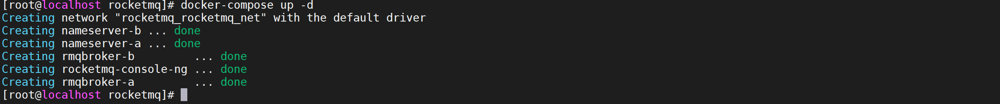

#### 查询启动状态

> 使用一下命令检查启动状态

```
docker-compose ps
```

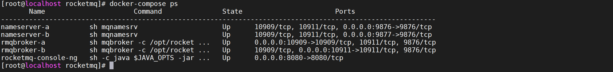

#### 访问控制台

> 在浏览器中输入：[http://{docker宿主机ip}:8080/](http://10.1.7.105:8080/) 看到如下界面，表示安装成功

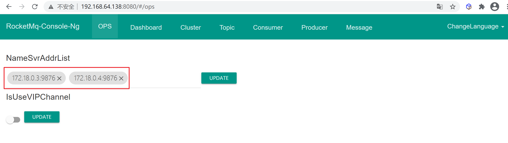

> 查看集群情况


### 双主双从集群部署

#### 注意事项

##### 端口号描述

> 以配置的 ListenPort 为 10911 为例

| 端口号 | 作用                                                        | 描述                                              |
| ------ | ----------------------------------------------------------- | ------------------------------------------------- |
| 9876   | nameserver 对外暴露的端口，允许消费者和生产者连接           |                                                   |
| 10911  | ListenPort端口                                              | Broker 对外服务的监听端口                         |
| 10909  | fastListen 端口                                             | 在消费者或生产者中配置 isVipChannel 为 false 即可 |
| 10912  | HA 高可用端口，用于主从同步，为 Master 常见新的 socket 连接 | 若没有开放，则无法连接到 Slave                    |


##### 端口号计算

- vip 通道端口为 ListenPort(10911-2) = 10909
- HA 高可用端口为 ListenPort(10911+1) = 10912

##### 端口号左右

- vip 通道端口一般没什么作用
- 而 HA 高可用端口用于主从集群时，创建 Master 和 Slave 之间的 socket 连接，故需要对外暴露

##### 主从配置注意事项

- clusterName和brokerName需要一致，才可以形成主备关系。
- brokerId为0以及brokerRole为ASYNC_MASTER或者SYNC_MASTER代表为master
- broker不为0以及brokerRole为SLAVE代表为slave

#### 服务部署情况

| 服务名称        | IP地址     | 监听端口号 | 暴漏端口    |
| --------------- | ---------- | ---------- | ----------- |
| nameserver-a    | 172.18.0.3 | 9876       | 9876        |
| nameserver-b    | 172.18.0.4 | 9876       | 9877        |
| broker-master-a | 172.18.0.5 | 10909      | 10909,10910 |
| broker-master-b | 172.18.0.6 | 10919      | 10919,10920 |
| broker-slave-a  | 172.18.0.7 | 10911      | 10911       |
| broker-slave-b  | 172.18.0.8 | 10921      | 10921       |
| console         | 172.18.0.9 | 8080       | 8080        |


#### 环境准备

##### 创建目录

> 创建集群需要的存储路径

```
mkdir -p  /tmp/data/rocketmq/nameserver-a/logs
mkdir -p  /tmp/data/rocketmq/nameserver-b/logs
mkdir -p  /tmp/data/rocketmq/nameserver-a/store
mkdir -p  /tmp/data/rocketmq/nameserver-b/store
mkdir -p  /tmp/data/rocketmq/broker-master-a/logs
mkdir -p  /tmp/data/rocketmq/broker-master-b/logs
mkdir -p  /tmp/data/rocketmq/broker-master-a/store
mkdir -p  /tmp/data/rocketmq/broker-master-b/store
mkdir -p  /tmp/data/rocketmq/broker-slave-a/logs
mkdir -p  /tmp/data/rocketmq/broker-slave-b/logs
mkdir -p  /tmp/data/rocketmq/broker-slave-a/store
mkdir -p  /tmp/data/rocketmq/broker-slave-b/store
mkdir -p  /tmp/etc/rocketmq/broker-master-a
mkdir -p  /tmp/etc/rocketmq/broker-master-b
mkdir -p  /tmp/etc/rocketmq/broker-slave-a
mkdir -p  /tmp/etc/rocketmq/broker-slave-b
```

##### 创建broker配置文件

> 这里配置的主要信息有：

1. 当前Broker对外暴露的端口号
2. 注册到NameServer的地址，看到这里有两个地址，说明NameServer也是集群部署。
3. 当前Broker的角色，是主还是从，这里表示是主。

###### 创建 broker-master-a配置文件

```
vi /tmp/etc/rocketmq/broker-master-a/broker.conf
```

> 配置内容如下

```
brokerClusterName = DefaultCluster
brokerName = broker-a
brokerId = 0
deleteWhen = 04
fileReservedTime = 48
#namesrvAddr 地址 填写docker内网地址即可
namesrvAddr=172.18.0.3:9876;172.18.0.4:9876
#启用自动创建主题
autoCreateTopicEnable=false
#这个很有讲究 如果是正式环境 这里一定要填写内网地址（安全）
#如果是用于测试或者本地这里建议要填外网地址，因为你的本地代码是无法连接到阿里云内网，只能连接外网。
#当前broker监听的IP
brokerIP1 = 192.168.64.138
#存在broker主从时，在broker主节点上配置了brokerIP2的话,broker从节点会连接主节点配置的brokerIP2来同步。
brokerIP2 = 192.168.64.138
#Broker 对外服务的监听端口
listenPort = 10909
#Broker角色
#- ASYNC_MASTER 异步复制Master
#- SYNC_MASTER 同步双写Master
#- SLAVE
brokerRole=SYNC_MASTER
#刷盘方式
#- ASYNC_FLUSH 异步刷盘
#- SYNC_FLUSH 同步刷盘
flushDiskType=ASYNC_FLUSH
```

###### 创建 broker-master-b配置文件

```
vi /tmp/etc/rocketmq/broker-master-b/broker.conf
```

> 配置内容如下

```
brokerClusterName = DefaultCluster
brokerName = broker-b
brokerId = 0
deleteWhen = 04
fileReservedTime = 48
#namesrvAddr 地址 填写docker内网地址即可
namesrvAddr=172.18.0.3:9876;172.18.0.4:9876
#启用自动创建主题
autoCreateTopicEnable=false
#这个很有讲究 如果是正式环境 这里一定要填写内网地址（安全）
#如果是用于测试或者本地这里建议要填外网地址，因为你的本地代码是无法连接到阿里云内网，只能连接外网。
#当前broker监听的IP
brokerIP1 = 192.168.64.138
#存在broker主从时，在broker主节点上配置了brokerIP2的话,broker从节点会连接主节点配置的brokerIP2来同步。
brokerIP2 = 192.168.64.138
#Broker 对外服务的监听端口
listenPort = 10919
#Broker角色
#- ASYNC_MASTER 异步复制Master
#- SYNC_MASTER 同步双写Master
#- SLAVE
brokerRole=SYNC_MASTER
#刷盘方式
#- ASYNC_FLUSH 异步刷盘
#- SYNC_FLUSH 同步刷盘
flushDiskType=ASYNC_FLUSH
```

###### 创建 broker-slave-a配置文件

```
vi /tmp/etc/rocketmq/broker-slave-a/broker.conf
```

> 配置内容如下

```
brokerClusterName = DefaultCluster
brokerName = broker-a
brokerId = 1
deleteWhen = 04
fileReservedTime = 48
#namesrvAddr 地址 填写docker内网地址即可
namesrvAddr=172.18.0.3:9876;172.18.0.4:9876
#启用自动创建主题
autoCreateTopicEnable=false
#这个很有讲究 如果是正式环境 这里一定要填写内网地址（安全）
#如果是用于测试或者本地这里建议要填外网地址，因为你的本地代码是无法连接到阿里云内网，只能连接外网。
#当前broker监听的IP
brokerIP1 = 192.168.64.138
#存在broker主从时，在broker主节点上配置了brokerIP2的话,broker从节点会连接主节点配置的brokerIP2来同步。
brokerIP2 = 192.168.64.138
#Broker 对外服务的监听端口
listenPort = 10911
#Broker角色
#- ASYNC_MASTER 异步复制Master
#- SYNC_MASTER 同步双写Master
#- SLAVE
brokerRole=SLAVE
#刷盘方式
#- ASYNC_FLUSH 异步刷盘
#- SYNC_FLUSH 同步刷盘
flushDiskType=ASYNC_FLUSH
```

###### 创建 broker-slave-b配置文件

```
vi /tmp/etc/rocketmq/broker-slave-b/broker.conf
```

> 配置内容如下

```
brokerClusterName = DefaultCluster
brokerName = broker-b
brokerId = 1
deleteWhen = 04
fileReservedTime = 48
#namesrvAddr 地址 填写docker内网地址即可
namesrvAddr=172.18.0.3:9876;172.18.0.4:9876
#启用自动创建主题
autoCreateTopicEnable=false
#这个很有讲究 如果是正式环境 这里一定要填写内网地址（安全）
#如果是用于测试或者本地这里建议要填外网地址，因为你的本地代码是无法连接到阿里云内网，只能连接外网。
#当前broker监听的IP
brokerIP1 = 192.168.64.138
#存在broker主从时，在broker主节点上配置了brokerIP2的话,broker从节点会连接主节点配置的brokerIP2来同步。
brokerIP2 = 192.168.64.138
#Broker 对外服务的监听端口
listenPort = 10921
#Broker角色
#- ASYNC_MASTER 异步复制Master
#- SYNC_MASTER 同步双写Master
#- SLAVE
brokerRole=SLAVE
#刷盘方式
#- ASYNC_FLUSH 异步刷盘
#- SYNC_FLUSH 同步刷盘
flushDiskType=ASYNC_FLUSH
```

#### 编写Docker-compose文件

```
version: '2'
services:
  nameserver-a:
    image: rocketmqinc/rocketmq
    container_name: nameserver-a
    networks:
      rocketmq_net:
        ipv4_address: 172.18.0.3
    environment:
      MAX_POSSIBLE_HEAP: 100000000
    ports:
      - 9876:9876
    volumes:
      - /tmp/data/rocketmq/nameserver-a/logs:/root/logs
      - /tmp/data/rocketmq/nameserver-a/store:/root/store
    command: sh mqnamesrv
  nameserver-b:
    image: rocketmqinc/rocketmq
    container_name: nameserver-b
    networks:
      rocketmq_net:
        ipv4_address: 172.18.0.4
    environment:
      MAX_POSSIBLE_HEAP: 100000000
    ports:
      - 9877:9876
    volumes:
      - /tmp/data/rocketmq/nameserver-b/logs:/root/logs
      - /tmp/data/rocketmq/nameserver-b/store:/root/store
    command: sh mqnamesrv
  broker-master-a:
    image: rocketmqinc/rocketmq
    container_name: rmqbroker-master-a
    networks:
      rocketmq_net:
        ipv4_address: 172.18.0.5
    environment:
      MAX_POSSIBLE_HEAP: 200000000
    ports:
      - 10909:10909
      - 10910:10910
    volumes:
      - /tmp/data/rocketmq/broker-master-a/logs:/root/logs
      - /tmp/data/rocketmq/broker-master-a/store:/root/store
      - /tmp/etc/rocketmq/broker-master-a/broker.conf:/opt/rocketmq/conf/broker.conf
    command: sh mqbroker -c /opt/rocketmq/conf/broker.conf
    depends_on:
      - nameserver-a
      - nameserver-b
  broker-master-b:
    image: rocketmqinc/rocketmq
    container_name: rmqbroker-master-b
    networks:
      rocketmq_net:
        ipv4_address: 172.18.0.6
    environment:
      MAX_POSSIBLE_HEAP: 200000000
    ports:
      - 10919:10919
      - 10920:10920
    volumes:
      - /tmp/data/rocketmq/broker-master-b/logs:/root/logs
      - /tmp/data/rocketmq/broker-master-b/store:/root/store
      - /tmp/etc/rocketmq/broker-master-b/broker.conf:/opt/rocketmq/conf/broker.conf
    command: sh mqbroker -c /opt/rocketmq/conf/broker.conf
    depends_on:
      - nameserver-a
      - nameserver-b
  broker-slave-a:
    image: rocketmqinc/rocketmq
    container_name: rmqbroker-slave-a
    networks:
      rocketmq_net:
        ipv4_address: 172.18.0.7
    environment:
      MAX_POSSIBLE_HEAP: 200000000
    ports:
      - 10911:10911
    volumes:
      - /tmp/data/rocketmq/broker-slave-a/logs:/root/logs
      - /tmp/data/rocketmq/broker-slave-a/store:/root/store
      - /tmp/etc/rocketmq/broker-slave-a/broker.conf:/opt/rocketmq/conf/broker.conf
    command: sh mqbroker -c /opt/rocketmq/conf/broker.conf
    depends_on:
      - nameserver-a
      - nameserver-b
      - broker-master-a
      - broker-master-b
  broker-slave-b:
    image: rocketmqinc/rocketmq
    container_name: rmqbroker-slave-b
    networks:
      rocketmq_net:
        ipv4_address: 172.18.0.8
    environment:
      MAX_POSSIBLE_HEAP: 200000000
    ports:
      - 10921:10921
    volumes:
      - /tmp/data/rocketmq/broker-slave-b/logs:/root/logs
      - /tmp/data/rocketmq/broker-slave-b/store:/root/store
      - /tmp/etc/rocketmq/broker-slave-b/broker.conf:/opt/rocketmq/conf/broker.conf
    command: sh mqbroker -c /opt/rocketmq/conf/broker.conf
    depends_on:
      - nameserver-a
      - nameserver-b
      - broker-master-a
      - broker-master-b
  console:
    image: styletang/rocketmq-console-ng
    container_name: rocketmq-console-ng
    networks:
      rocketmq_net:
        ipv4_address: 172.18.0.9
    ports:
      - 8080:8080
    depends_on:
      - nameserver-a
      - nameserver-b
    environment:
      - JAVA_OPTS= -Dlogging.level.root=info -Drocketmq.namesrv.addr=172.18.0.3:9876;172.18.0.4:9876 -Dcom.rocketmq.sendMessageWithVIPChannel=false
networks:
  rocketmq_net:
    ipam:
      config:
        - subnet: 172.18.0.0/16
          gateway: 172.18.0.1
```

#### 启动容器

> 使用一下命令启动容器

```
docker-compose up -d
```

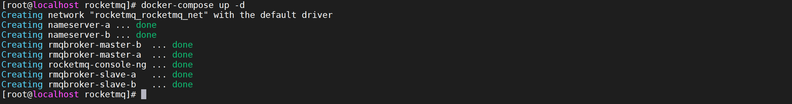

#### 查询启动状态

> 使用一下命令检查启动状态

```
docker-compose ps
```

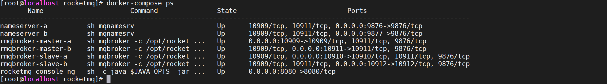

#### 访问控制台

> 在浏览器中输入：[http://{docker宿主机ip}:8080/](http://10.1.7.105:8080/) 看到如下界面，表示安装成功


> 查看集群情况

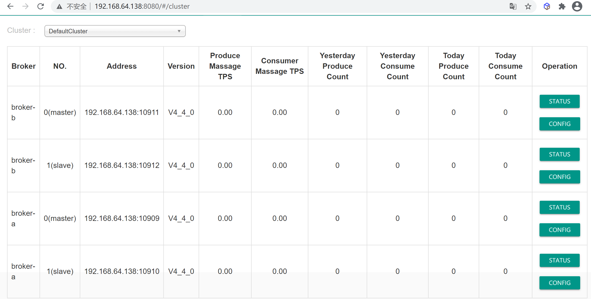

#### 手动创建主题

> 因为创建双主双从，并且关闭了自动主题创建，需要手动创建主题

##### 在一个Broker上创建

> 如上设置会创建一个topic在broker-a上

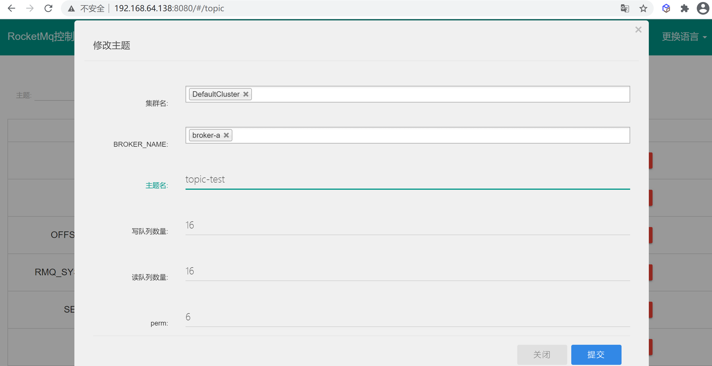

##### 在多个Broker上创建

> 如上会创建一个topic在两个broker上

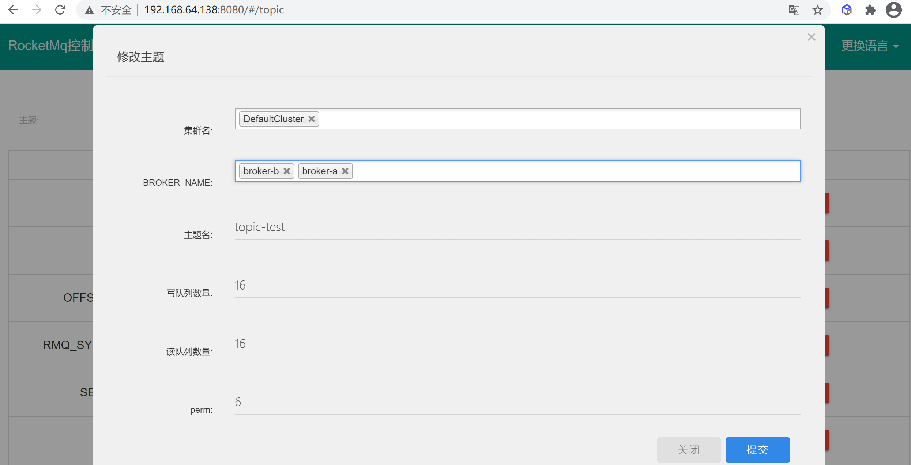

#### 代码发送测试

> 运行客户端测试代码

```
发送queueId:[4],偏移量offset:[1],发送状态:[SEND_OK]
发送queueId:[5],偏移量offset:[1],发送状态:[SEND_OK]
发送queueId:[6],偏移量offset:[1],发送状态:[SEND_OK]
发送queueId:[7],偏移量offset:[1],发送状态:[SEND_OK]
发送queueId:[8],偏移量offset:[1],发送状态:[SEND_OK]
发送queueId:[9],偏移量offset:[1],发送状态:[SEND_OK]
发送queueId:[10],偏移量offset:[1],发送状态:[SEND_OK]
发送queueId:[11],偏移量offset:[1],发送状态:[SEND_OK]
发送queueId:[12],偏移量offset:[3],发送状态:[SEND_OK]
发送queueId:[13],偏移量offset:[3],发送状态:[SEND_OK]
```

如果出现发送状态时`SEND_OK`表示RocketMQ集群搭建成功，并且完成了主从同步

> 如果出现发送状态是`SLAVE_NOT_AVAILABLE`说明RocketMQ无法进行主从同步

#### SLAVE_NOT_AVAILABLE问题

> 搭建了 rocketmq 的双主双从集群，在使用同步模式下，在向 master 发送消息时，返回的消息状态码为 SLAVE_NOT_AVAILABLE

##### 解决方式

> **这个问题是由于没有开放对应端口：**

在配置文件中找到自己设置的 Master 开放端口：

```
...
#Broker 对外服务的监听端口
listenPort = 10909
...
```

- rocketmq 默认端口：9876
- 配置的 ListenPort 端口：10909
- vip 通道端口为：ListenPort - 2 = 10907
- HA 通道端口为： ListenPort + 1 = 10910

vip 通道端口一般没什么作用，而 HA 高可用端口用于主从集群时，创建 Master 和 Slave 之间的 socket 连接，故需要对外暴露。