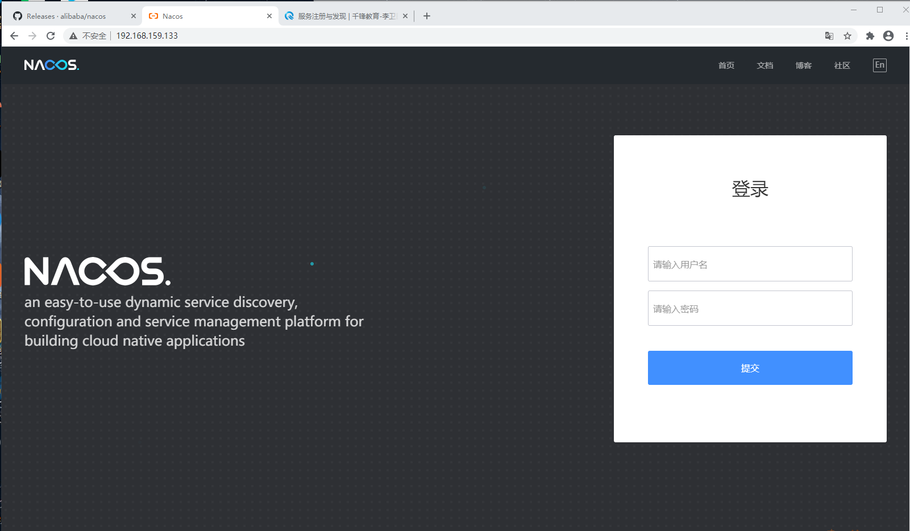
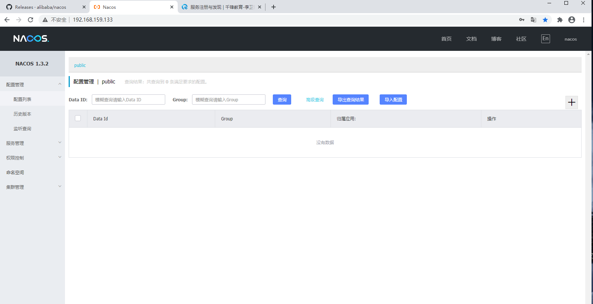

# Spring Cloud Alibaba

## 1. 概述

> 三层架构 + MVC 
>
> ​	架构 →就是为了解耦
>
> 开发框架
>
>   - Spring
>     	 - IoC AOP 是一个轻量级的JavaEE开源框架主要是为了解决企业级开发的复杂度问题，复杂度→耦合度
>         	 - Spring 容器
> - Sping Boot 
>   - 新一代 javaEE开发标准，开箱即用的特性
> - 微服务架构
>   - 更好的进行分布式系统开发
>   - 拆分单体应用，将一个应用拆分成多个服务，每个服务都是一个独立运行的项目
> - 再谈微服务
>   - 分布式系统开发一定会遇到的四个问题
>   - 1.这么多服务，客户端如何访问
>   - 2.这么多服务，服务之间如何通信
>   - 3.这么多服务，如何治理
>   - 4.服务挂了，这么办？
> - 解决方案
>   - Spring Cloud,是一套生态，是为了解决微服务架构遇到的问题
>   - 想要使用Spring Cloud 必须基于Spring Boot
>   - 1.Spring Cloud Netflix
>     - API网关，Zuul组件，服务发现与注册 Eurake，Feigin → HTTP的通信方式，同步并阻塞，熔断机制 Hystrix
>   - 2.Apache Dubbo Zookeeper
>     - Dobbo 是一个高性能的Java RPC通信框架
>     - 服务注册与发现，Zookeeper
>     - API网关，没有
>     - 服务挂了，Hystrix
>   - 3.Spring Cloud Alibaba
>
> 微服务架构，新微服务架构，下一代微服务架构标准 Service Mesh 服务网格
>
> Istio,可能需要掌握的一套微服务解决方案。
>
> JAVA原生云应用
>
> 异步非阻塞通信
>
> ​	Netty →NIIO,AIO
>
> http → 应用层，跨防火墙，在不同的局域网之间通信
>
> RPC→远程过程调用，TCP，第四层，传输层，优点：速度快，缺点：不能跨防火墙，仅支持局域网通信
>
> 对内RPC,对外REST

Spring Cloud Alibaba 致力于提供微服务开发的一站式解决方案。此项目包含开发分布式应用微服务的必需组件，方便开发者通过 Spring Cloud 编程模型轻松使用这些组件来开发分布式应用服务。

依托 Spring Cloud Alibaba，您只需要添加一些注解和少量配置，就可以将 Spring Cloud 应用接入阿里分布式应用解决方案，通过阿里中间件来迅速搭建分布式应用系统。

[Spring Cloud Alibaba](https://github.com/alibaba/spring-cloud-alibaba/blob/master/README-zh.md)

**主要功能**

- **服务限流降级**：默认支持 WebServlet、WebFlux, OpenFeign、RestTemplate、Spring Cloud Gateway, Zuul, Dubbo 和 RocketMQ 限流降级功能的接入，可以在运行时通过控制台实时修改限流降级规则，还支持查看限流降级 Metrics 监控。
- **服务注册与发现**：适配 Spring Cloud 服务注册与发现标准，默认集成了 Ribbon 的支持。
- **分布式配置管理**：支持分布式系统中的外部化配置，配置更改时自动刷新。
- **消息驱动能力**：基于 Spring Cloud Stream 为微服务应用构建消息驱动能力。
- **分布式事务**：使用 @GlobalTransactional 注解， 高效并且对业务零侵入地解决分布式事务问题。。
- **阿里云对象存储**：阿里云提供的海量、安全、低成本、高可靠的云存储服务。支持在任何应用、任何时间、任何地点存储和访问任意类型的数据。
- **分布式任务调度**：提供秒级、精准、高可靠、高可用的定时（基于 Cron 表达式）任务调度服务。同时提供分布式的任务执行模型，如网格任务。网格任务支持海量子任务均匀分配到所有 Worker（schedulerx-client）上执行。
- **阿里云短信服务**：覆盖全球的短信服务，友好、高效、智能的互联化通讯能力，帮助企业迅速搭建客户触达通道。

**组件**

**[Sentinel](https://github.com/alibaba/Sentinel)**：把流量作为切入点，从流量控制、熔断降级、系统负载保护等多个维度保护服务的稳定性。

**[Nacos](https://github.com/alibaba/Nacos)**：一个更易于构建云原生应用的动态服务发现、配置管理和服务管理平台。

**[RocketMQ](https://rocketmq.apache.org/)**：一款开源的分布式消息系统，基于高可用分布式集群技术，提供低延时的、高可靠的消息发布与订阅服务。

**[Dubbo](https://github.com/apache/dubbo)**：Apache Dubbo™ 是一款高性能 Java RPC 框架。

**[Seata](https://github.com/seata/seata)**：阿里巴巴开源产品，一个易于使用的高性能微服务分布式事务解决方案。

**[Alibaba Cloud OSS](https://www.aliyun.com/product/oss)**: 阿里云对象存储服务（Object Storage Service，简称 OSS），是阿里云提供的海量、安全、低成本、高可靠的云存储服务。您可以在任何应用、任何时间、任何地点存储和访问任意类型的数据。

**[Alibaba Cloud SchedulerX](https://help.aliyun.com/document_detail/43136.html)**: 阿里中间件团队开发的一款分布式任务调度产品，提供秒级、精准、高可靠、高可用的定时（基于 Cron 表达式）任务调度服务。

**[Alibaba Cloud SMS](https://www.aliyun.com/product/sms)**: 覆盖全球的短信服务，友好、高效、智能的互联化通讯能力，帮助企业迅速搭建客户触达通道。


## 2. Spring Cloud Alibaba Demo

### 2.1 创建统一的依赖管理

```xml
<?xml version="1.0" encoding="UTF-8"?>
<project xmlns="http://maven.apache.org/POM/4.0.0"
         xmlns:xsi="http://www.w3.org/2001/XMLSchema-instance"
         xsi:schemaLocation="http://maven.apache.org/POM/4.0.0 http://maven.apache.org/xsd/maven-4.0.0.xsd">
    <modelVersion>4.0.0</modelVersion>

    <groupId>com.leayun</groupId>
    <artifactId>hello-spring-cloud-alibaba-dependencies</artifactId>
    <version>1.0-SNAPSHOT</version>
    <parent>
        <groupId>org.springframework.boot</groupId>
        <artifactId>spring-boot-starter-parent</artifactId>
        <version>2.3.2.RELEASE</version>
    </parent>

    <properties>
        <!-- Environment Settings -->
        <java.version>1.8</java.version>
        <project.build.sourceEncoding>UTF-8</project.build.sourceEncoding>
        <project.reporting.outputEncoding>UTF-8</project.reporting.outputEncoding>

        <!-- Spring Settings -->
        <spring-cloud.version>Hoxton.SR8</spring-cloud.version>
        <spring-cloud-alibaba.version>2.2.3.RELEASE</spring-cloud-alibaba.version>
    </properties>

    <dependencyManagement>
        <dependencies>
            <dependency>
                <groupId>org.springframework.cloud</groupId>
                <artifactId>spring-cloud-dependencies</artifactId>
                <version>${spring-cloud.version}</version>
                <type>pom</type>
                <scope>import</scope>
            </dependency>
            <dependency>
                <groupId>com.alibaba.cloud</groupId>
                <artifactId>spring-cloud-alibaba-dependencies</artifactId>
                <version>${spring-cloud-alibaba.version}</version>
                <type>pom</type>
                <scope>import</scope>
            </dependency>
        </dependencies>
    </dependencyManagement>

</project>
```

- parent：继承了 Spring Boot 的 Parent，表示我们是一个 Spring Boot 工程
- package：`pom`，表示该项目仅当做依赖项目，没有具体的实现代码
- `spring-cloud-alibaba-dependencies`：在 `properties` 配置中预定义了版本号为 `2.3.2.RELEASE` ，表示我们的 Spring Cloud Alibaba 对应的是 Spring Cloud Finchley 版本
- build：配置了项目所需的各种插件
- repositories：配置项目下载依赖时的第三方库

**版本说明**

[版本说明](https://github.com/alibaba/spring-cloud-alibaba/wiki/%E7%89%88%E6%9C%AC%E8%AF%B4%E6%98%8E)

#### 组件版本关系

| Spring Cloud Alibaba Version                    | Sentinel Version | Nacos Version | RocketMQ Version | Dubbo Version | Seata Version |
| ----------------------------------------------- | ---------------- | ------------- | ---------------- | ------------- | ------------- |
| 2.2.3.RELEASE or 2.1.3.RELEASE or 2.0.3.RELEASE | 1.8.0            | 1.3.3         | 4.4.0            | 2.7.8         | 1.3.0         |
| 2.2.1.RELEASE or 2.1.2.RELEASE or 2.0.2.RELEASE | 1.7.1            | 1.2.1         | 4.4.0            | 2.7.6         | 1.2.0         |
| 2.2.0.RELEASE                                   | 1.7.1            | 1.1.4         | 4.4.0            | 2.7.4.1       | 1.0.0         |
| 2.1.1.RELEASE or 2.0.1.RELEASE or 1.5.1.RELEASE | 1.7.0            | 1.1.4         | 4.4.0            | 2.7.3         | 0.9.0         |
| 2.1.0.RELEASE or 2.0.0.RELEASE or 1.5.0.RELEASE | 1.6.3            | 1.1.1         | 4.4.0            | 2.7.3         | 0.7.1         |

#### 毕业版本依赖关系（推荐使用）

| Spring Cloud Version        | Spring Cloud Alibaba Version      | Spring Boot Version |
| --------------------------- | --------------------------------- | ------------------- |
| Spring Cloud Hoxton.SR8     | 2.2.3.RELEASE                     | 2.3.2.RELEASE       |
| Spring Cloud Greenwich.SR6  | 2.1.3.RELEASE                     | 2.1.13.RELEASE      |
| Spring Cloud Hoxton.SR3     | 2.2.1.RELEASE                     | 2.2.5.RELEASE       |
| Spring Cloud Hoxton.RELEASE | 2.2.0.RELEASE                     | 2.2.X.RELEASE       |
| Spring Cloud Greenwich      | 2.1.2.RELEASE                     | 2.1.X.RELEASE       |
| Spring Cloud Finchley       | 2.0.3.RELEASE                     | 2.0.X.RELEASE       |
| Spring Cloud Edgware        | 1.5.1.RELEASE(停止维护，建议升级) | 1.5.X.RELEASE       |

 ## 3. 服务注册与发现

### 3.1 概述

在 Spring Cloud Netflix 阶段我们采用 Eureka 做作为我们的服务注册与发现服务器，现利用 Spring Cloud Alibaba 提供的 Nacos 组件替代该方案。

[Nacos官网](https://nacos.io/zh-cn/)

Nacos 致力于帮助您发现、配置和管理微服务。Nacos 提供了一组简单易用的特性集，帮助您快速实现动态服务发现、服务配置、服务元数据及流量管理。

Nacos 帮助您更敏捷和容易地构建、交付和管理微服务平台。 Nacos 是构建以“服务”为中心的现代应用架构 (例如微服务范式、云原生范式) 的服务基础设施。

### 3.2 什么是Nacos

服务（Service）是 Nacos 世界的一等公民。Nacos 支持几乎所有主流类型的“服务”的发现、配置和管理：

[Kubernetes Service](https://kubernetes.io/docs/concepts/services-networking/service/)

[gRPC](https://grpc.io/docs/guides/concepts.html#service-definition) & [Dubbo RPC Service](https://dubbo.incubator.apache.org/)

[Spring Cloud RESTful Service](https://spring.io/understanding/REST)


### 3.3 基本架构及概念


#### 服务 (Service)

服务是指一个或一组软件功能（例如特定信息的检索或一组操作的执行），其目的是不同的客户端可以为不同的目的重用（例如通过跨进程的网络调用）。Nacos 支持主流的服务生态，如 Kubernetes Service、gRPC|Dubbo RPC Service 或者 Spring Cloud RESTful Service.

#### 服务注册中心 (Service Registry)

服务注册中心，它是服务，其实例及元数据的数据库。服务实例在启动时注册到服务注册表，并在关闭时注销。服务和路由器的客户端查询服务注册表以查找服务的可用实例。服务注册中心可能会调用服务实例的健康检查 API 来验证它是否能够处理请求。

#### 服务元数据 (Service Metadata)

服务元数据是指包括服务端点(endpoints)、服务标签、服务版本号、服务实例权重、路由规则、安全策略等描述服务的数据

#### 服务提供方 (Service Provider)

是指提供可复用和可调用服务的应用方

#### 服务消费方 (Service Consumer)

是指会发起对某个服务调用的应用方

#### 配置 (Configuration)

在系统开发过程中通常会将一些需要变更的参数、变量等从代码中分离出来独立管理，以独立的配置文件的形式存在。目的是让静态的系统工件或者交付物（如 WAR，JAR 包等）更好地和实际的物理运行环境进行适配。配置管理一般包含在系统部署的过程中，由系统管理员或者运维人员完成这个步骤。配置变更是调整系统运行时的行为的有效手段之一。

#### 配置管理 (Configuration Management)

在数据中心中，系统中所有配置的编辑、存储、分发、变更管理、历史版本管理、变更审计等所有与配置相关的活动统称为配置管理。

#### 名字服务 (Naming Service)

提供分布式系统中所有对象(Object)、实体(Entity)的“名字”到关联的元数据之间的映射管理服务，例如 ServiceName -> Endpoints Info, Distributed Lock Name -> Lock Owner/Status Info, DNS Domain Name -> IP List, 服务发现和 DNS 就是名字服务的2大场景。

#### 配置服务 (Configuration Service)

在服务或者应用运行过程中，提供动态配置或者元数据以及配置管理的服务提供者。


### 3.4 下载安装Nacos

Nacos 依赖 [Java](https://docs.oracle.com/cd/E19182-01/820-7851/inst_cli_jdk_javahome_t/) 环境来运行。如果您是从代码开始构建并运行Nacos，还需要为此配置 [Maven](https://maven.apache.org/index.html)环境，请确保是在以下版本环境中安装使用:

1. 64 bit OS，支持 Linux/Unix/Mac/Windows，推荐选用 Linux/Unix/Mac。
2. 64 bit JDK 1.8+；[下载](http://www.oracle.com/technetwork/java/javase/downloads/jdk8-downloads-2133151.html) & [配置](https://docs.oracle.com/cd/E19182-01/820-7851/inst_cli_jdk_javahome_t/)。
3. Maven 3.2.x+；[下载](https://maven.apache.org/download.cgi) & [配置](https://maven.apache.org/settings.html)。

>maven 安装
>
>[mave菜鸟教程](https://www.runoob.com/maven/maven-setup.html)
>
>下载安装包，解压 ，配置环境变量
>
>```properties
>unset i
>unset -f pathmunge
>JAVA_HOME=/usr/local/jdk1.8.0_231
>CLASSPATH=$JAVA_HOME/lib/
>MAVEN_HOME=/opt/apache-maven-3.6.3
>PATH=$PATH:$JAVA_HOME/bin:$MAVEN_HOME/bin
>export MAVEN_HOME
>export PATH JAVA_HOME CLASSPATH
>```
>
>git 安装
>
>yum install git-all
>
>git --version 验证安装成功

**下载安装Nacos**

```sh
方式一：
# 下载源码
git clone https://github.com/alibaba/nacos.git

# 安装到本地仓库
cd nacos/
mvn -Prelease-nacos clean install -U
[-P profile Maven多环境配置 ]

建议使用方式二，方式一下载太慢了。。。
方式二：
直接下载安装包 [nacos安装包](https://github.com/alibaba/nacos/releases)

# docker 安装
docker pull nacos/nacos-server
docker run -d  --name nacos -p 8848:8848 --env MODE=standalone --env NACOS_SERVER_IP=192.168.56.102 nacos/nacos-server
```

**启动命令**

>  Linux/Unix/Mac
>
> 启动命令(standalone代表着单机模式运行，非集群模式):
>
> ```sh
> sh startup.sh -m standalone
> ```
>
> 如果您使用的是ubuntu系统，或者运行脚本报错提示[[符号找不到，可尝试如下运行：
>
> ```
> bash startup.sh -m standalone
> ```
>
>  Windows
>
> 启动命令(standalone代表着单机模式运行，非集群模式):
>
> ```
> cmd startup.cmd -m standalone
> ```

**服务注册与发现配置管理**

>  服务注册
>
> ```
> curl -X POST 'http://127.0.0.1:8848/nacos/v1/ns/instance?serviceName=nacos.naming.serviceName&ip=20.18.7.10&port=8080'
> ```
>
>  服务发现
>
> ```
> curl -X GET 'http://127.0.0.1:8848/nacos/v1/ns/instance/list?serviceName=nacos.naming.serviceName'
> ```
>
>  发布配置
>
> ```
> curl -X POST "http://127.0.0.1:8848/nacos/v1/cs/configs?dataId=nacos.cfg.dataId&group=test&content=HelloWorld"
> ```
>
>  获取配置
>
> ```
> curl -X GET "http://127.0.0.1:8848/nacos/v1/cs/configs?dataId=nacos.cfg.dataId&group=test"
> ```

**关闭服务器**

>  Linux/Unix/Mac
>
> ```
> sh shutdown.sh
> ```
>
>  Windows
>
> ```
> cmd shutdown.cmd
> ```
>
> 或者双击shutdown.cmd运行文件。

网页页面

> http://192.168.159.133:8848/nacos/#/login，默认用户名、，密码nacos
>
> 
>
> 
>
> 

### 3.5 创建服务提供者

**pom文件**

