**2022-12-08**

https://gitee.com/banxian-yao/geekbang-coupon-center.git

# 01-开篇词 (1讲)

## 开篇词 | 跟着学，你也能成为微服务高手

讲述：姚秋辰

你好，我是姚秋辰，网名姚半仙，欢迎和我一起进入《Spring Cloud 微服务项目实战》。

我硕士毕业于复旦大学，一直从事互联网电商和支付场景的系统架构与开发，曾先后任职于 SAP、阿里巴巴、eBay 和 PayPal。在这十余年里，我从一名 Java 程序员，逐渐成长为架构师和研发经理，这期间我一直在与微服务打交道，与 Spring Cloud 更是结下了不解之缘。

我曾经参与过一线互联网公司新零售业务从 0 到 1 的落地，并作为核心成员，负责商品中心和营销平台的微服务化建设。除此之外，在电商平台、互联网支付和互金领域，我也积累了不少大型微服务系统设计经验，负责了多个业务系统的微服务化改造、主链路高可用设计等项目。

我从早期版本开始，就一直在使用 Spring Cloud。期间，经历了 Spring Cloud 几个重要版本的迭代，也见证了曾经的王者 Spring Cloud Netflix 组件库的陨落，和后起之秀 Spring Cloud Alibaba 组件的强势崛起。在这个过程中，我也出品过几部 Spring Cloud 的体系课程，并在 2021 年出版了《微服务从小白到专家：Spring Cloud 与 Kubernetes 实战》一书。这些经历让我对微服务技术的发展和落地，有了更深刻的理解和体悟。

在我看来，经过多年的发布和迭代，Spring Cloud 在微服务架构领域已然奠定了自己江湖一哥的地位。它丰富的组件库就像哆啦 A 梦的口袋一样，你在微服务架构领域碰到的任何问题，都可以从 Spring Cloud 中找到对应的解决方案。

如今使用 Java 技术栈的各个大厂（比如阿里、美团点评、拼多多等），都在全面拥抱微服务。因此，微服务技术也已经成为一个 Java 工程师晋升到高阶技术专家所必须掌握的知识。

### 学习微服务技术面临哪些问题？

也许你早就打算学习微服务技术，可是自己的公司业务规模小，接触不到先进的微服务架构技术；又或者面对五花八门的微服务开源框架，和各个大厂自研的黑科技技术，一时间不知道如何下手。

我非常理解这种心情，在我刚开始从单体应用过渡到微服务框架的时候，也面临了同样的问题。体系庞大的微服务技术栈就像伫立在渺小的我面前的一座大山，站在山脚下的你是否和我一样在心里泛着这些嘀咕呢？

**乱花渐欲迷人眼**：微服务技术选型太多了，我该选择什么技术和组件来学习呢？网上很多文章都在介绍微服务框架，但大多不是业界的最佳实践，而且知识非常零散，学完了并不能对自己的实战能力和认知带来太多提升。

**纸上得来终觉浅**：微服务充斥着各种晦涩的理论，很多教学文章都只是 Hello World 式的随堂小 Demo，缺乏项目练手导致学完并不能学以致用，我该如何将理论应用到接地气的项目实战里呢？

**路漫漫其修远兮**：微服务体系庞大，框架组件就更多了，如果没有章法地去学习，无异于攀登一座很陡峭的山峰，学习效率低下不说，可能还会让你知难而退。我该从何下手，沿着什么途径学习才最有效率呢？

那怎么才能快速掌握好微服务技术呢？作为一个有十多年工作经验的老兵，我认为，与其一个猛子扎进去乱学一通，不如遵循一条由浅入深的学习路径。我们直接来看这张图就好了，简单来说，就是“三大功能，两大特性”。

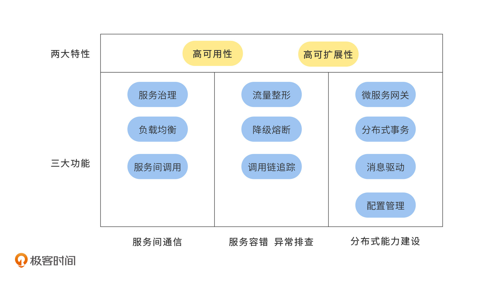

<center>微服务“三大功能，两大特性”</center>


三大功能是指微服务核心组件的功能维度，由浅入深层次递进；而两大特性是构建在每个服务组件之上的高可用性和高可扩展性。

别看微服务框架组件多，其实你完全可以按照这三大功能模块，给它们有简入难对号入座，就像图中展示的那样：

**服务间通信**，包括服务治理、负载均衡、服务间调用；

**服务容错和异常排查**，包括流量整形、降级熔断、调用链追踪；

**分布式能力建设**，包括微服务网关、分布式事务、消息驱动、分布式配置中心。

**从微服务组件的功能维度来讲，服务间通信是最基础的功能特性，这个功能模块是最适合作为初学者学习微服务技术的切入点**。当我们构建起基础的通信能力之后，接下来就要考虑如何构建服务容错能力，提高服务调用的稳定性了。在这之后，我们就可以从全局的角度构建一些分布式支持特性。这样，你就有了一条难度平缓上升的学习曲线，再也不会从入门到放弃了。

除了功能特性以外，在学习每个微服务组件的时候，我们还会从高可用性和可扩展性两个维度来做扩展。

高可用性是系统设计的第一要素，它就像人的健康一样。健康好比数字 1，能赚多少钱都是后面的 0 来决定，甭管你多能赚钱，没有了健康一切归零。系统设计也一样，你的系统功能再厉害，都要构建在可用性之上才能发挥作用。所以，我们还需要了解各个微服务组件是如何保证高可用性的。

说到可扩展性，这就要考验你对框架原理的理解了。授人以鱼不如授人以渔，学会用一个组件顶多算是吃到了鱼，而学会“魔改”组件才算是会钓鱼。所以，了解组件的底层原理，学会如何基于开源项目的扩展点实现一些定制功能，才能真正用好微服务技术。

总之，抓住微服务的“三大功能，两大特性”，可以让你从庞杂的知识点中抽身出来，把握其中的关键。这样，我们的学习才是高效的。

### 这个专栏是如何设计的？

我们这个专栏会围绕 Spring Cloud 框架展开。我刚才提到过，Spring Cloud 在微服务领域中具有不可撼动的地位，它自孵化后就保持着极其旺盛的生命力和快节奏的更新迭代速度。Spring Cloud 内置了丰富的组件库，可谓是“十八般兵器”在手，像服务发现、流量整形、服务容错、分布式事务等等，你都可以在 Spring Cloud 组件库中找到对应的解决方案。

此外，它里面还囊括了一线大厂针对微服务各类问题的解决方案，比如注册中心加分布式配置中心二合一的 Nacos、在超高并发量下的高可用性神器 Sentinel、分布式事务一站式解决方案 Seata 等，大厂的最佳实践尽在其中。

当然，学好一门技术的最好方式就是动手实践。在这个专栏里，**我会围绕一个可部署、可运行的“优惠券平台”实战项目，带你从 0 到 1 实践微服务改造的全过程，帮你快速掌握 Spring Cloud 微服务技术**。同时，我会兼顾底层原理和源码部分的讲解，让你知其然而又知其所以然，学了就可以应用在实际项目中。

除此之外，专栏中的每个部分我都会尽可能朝着“最佳实践”的方向去设计。例如，我会使用目前业界主流的最新版 Spring Cloud 组件，抛弃 Spring Cloud Netflix 组件库的过时组件。更重要的是，我会把自己在一线开发和架构领域积累的经验、学习技术的建议等融合到专栏中，不光可以让你开拓视野，还可以在未来的工作中学以致用。

为了让你通过一条最为平坦的路径学习 Spring Cloud 技术，我把整个专栏划分为了 5 个模块：

**第一个模块：课前必学**

我将用四节课为你铺垫微服务和 Spring Cloud 的前置知识，帮助你平稳过渡到后面的项目实战阶段。具体来讲，我会介绍微服务架构在构建大型分布式应用中的优势，以及我们这个专栏的主角“Spring Cloud”框架的发展背景以及核心组件库。我还会带你深入了解实战项目的功能模块和背后的技术选型依据，并手把手带你安装实战环节所需要用到开发工具和中间件。

**第二个模块：Spring Boot 急速落地篇**

为了帮助你顺利过渡到 Spring Cloud 课程，我会手把手先带你搭建起这个 Spring Boot 实战项目，即便你是 Java 的初学者也不必担心门槛问题。在这个过程中，我会重点针对 Spring Boot 的数据库操作和 RESTFul API 开发做详细介绍。

**第三个模块：Spring Cloud 基础篇**

接着，我会详细介绍 Spring Cloud 如何实现服务治理、负载均衡和服务间调用，带你构建起跨服务之间的通信：

**服务治理**：掌握如何基于 Nacos 搭建注册中心集群，并实现微服务的服务注册、服务发现、服务下线、环境隔离等，深入了解 Nacos 自动装配机制是如何工作的；

**负载均衡**：学会如何使用 Loadbalancer 实现负载均衡，并通过自定义负载均衡策略实现金丝雀测试；

**服务间调用**：掌握如何使用 openfeign 组件在不同微服务间发起服务调用。

**第四个模块：Spring Cloud 进阶篇**

我会介绍微服务如何实现异常处理、调用链路追踪和远程配置管理，构建分布式环境下的配置管理和容错机制：

**服务容错**：了解微服务常见的服务容错手段，使用 Spring Cloud Sentinel 实现服务降级熔断和流量整形；

**链路追踪**：了解链路追踪的使用场景和实现原理，使用 Sleuth 完成链路打标，并集成 Zipkin 和 ELK 实现链路追踪和日志查询；

**分布式配置中心**：了解配置中心的使用场景，使用 Nacos 实现配置项管理、动态刷新参数和环境隔离。

**第五个模块：Spring Cloud 高级篇**

在最后这个模块，我会带你深入了解微服务网关、消息事件驱动和分布式事务的使用场景和原理，将微服务集群接入网关组件和消息组件，并实现分布式数据一致性方案：

**服务网关**：了解微服务网关的用途，使用 Spring Cloud Gateway 搭建微服务网关；

**事件驱动**：了解事件驱动在微服务中的应用场景，使用 Stream 集成消息组件，并实现异常容错、死信队列和延迟消息等场景；

**分布式事务**：了解分布式事务的主流方案，使用 Spring Cloud Seata 的 AT 模式和 TCC 模式实现分布式事务，并深入了解 Seata 的底层原理。

### 开启这个专栏的正确姿势

最后，关于怎么学习这个专栏，我还想给你一些建议。

**第一，多动手！**学习技术只靠眼看口读是掌握不了真功夫的，书读百遍其义自见这句话在技术领域行不通。所以呢，这个专栏不是一部看完就忘的“爽文”，而是一部需要你亲手实操去搭建项目的实战专栏。

**第二，先尝试自己解决问题！**碰到问题可不能先想着去搜索引擎上找答案，或者到处求医问药，这样并不能提高自己解决问题的能力。当你碰到问题时，我建议你先从报错日志和源码开始，尝试自己解决问题。毕竟大部分问题的表象体现在 Error 日志中，而底层解法就藏在源码里。在解决问题的过程中，你既能锻炼 troubleshoot 的能力，又能理解源码的底层逻辑，你解决的问题越多，你收获的成长也会越多。

**第三，不要在一个问题上死磕太久！**当你在一个问题上尝试过各种解法，可又不得要领的时候，就不用钻牛角尖死磕了，毕竟这不是搞科研，我们也要提高学习效率和学习体验。你不妨在课程的评论区和我、还有其他小伙伴一起来探讨碰到的难题，有时候轻轻一点拨就能让你走出迷雾。但是，别忘了在这之后做复盘，思考一下自己排查问题的方向还可以做哪些优化。大牛都是在一次次跌倒和一次次总结中成长起来的。

好啦，从现在开始，跟我一起开启这趟充满挑战的 Spring Cloud 项目实战之旅吧！If not now, when? If not you, who？此时此刻，非你莫属！

# 02-课前必学 (3讲)

## 01 | 是什么推动了单体应用到微服务架构的演进？

你好，我是姚秋辰。

“微服务”是近些年在大型应用架构领域的一个热门话题，从实践领域来看，我们身边的一二线大厂也纷纷选择全面拥抱微服务。就拿国内 Java 系的一线大厂来说，如阿里系、美团点评、PDD 等，它们都将自己的核心业务系统构建在微服务架构之上。

即便你是刚参加工作的萌新，也一定从铺天盖地的“微服务”相关信息流中了解到了这个名词的热度。谷歌搜索指数显示，自 2014 年起，微服务的搜索热度一路上升。


<center>“微服务”的谷歌搜索指数</center>


其实，微服务并不是一个新兴的技术概念，很早之前它就已经进入了公众视野。

早在 2012 年，一位叫做 Fred George 的技术专家就在一次大会上分享了自己的微服务落地经验，讲述他是如何带领团队将一个极度庞大的 J2EE 巨无霸程序，分解成 20 多个小服务的。作为微服务领域的先驱，他是这样描述微服务架构的：

Micro Services Architecture - small, short lived services rather than SOA.

如果你在工作中没有接触过微服务架构的系统，那么此时一定非常蒙圈，不明白大佬所说的微服务架构到底是什么。没关系，就让我带你去回顾微服务的发展历史，了解微服务解决了什么痛点；然后我们一道来分析微服务架构的优势，让你明白为什么如今一线大厂会采用微服务架构。

那么，我们就从微服务架构的前世今生聊起吧。

### 单体应用之殇

在互联网技术发展的早期阶段，我们采用“单体应用”的方式来构建网络系统。你没看错，即便是如今的各大老牌互联网大厂，在当年也是从单体应用小作坊成长起来的。

以 Java 单体应用为例，我们将业务逻辑打包在一起，做成一个 WAR 包部署到 Tomcat、JBoss 之类的容器中，对外提供服务。业务上了一定规模之后，再通过集群化水平扩展的方式，将单体应用部署到一个集群中，承接更大的用户访问量。

然而，随着业务复杂度的进一步提升，单体应用在生产力和高可用性层面就面临了巨大的挑战。我在参加工作之初做过近五年的单体应用开发，深知其中的痛处。

我刚毕业的时候，参与了一个巨无霸的电商套件的开发，那是一个标准的单体应用。整个开发加测试团队有 100 多号人，所有人的代码都提交到一个主干分支，每次 merge 代码都要面对各种代码冲突，开发过程中**耗费了大量的沟通成本**。不仅如此，由于庞大的业务体系都部署在一个 WAR 包中，每一次提交代码都要执行 3 个小时的回归测试，不出错还好，一旦出错就要回炉重造。周而复始执行这套繁重的流程，研发效率非常低下，完全**无法达到“快速迭代”的目的**。

在上线阶段我们也经常碰到各类问题。我参与的这个单体应用的发布周期是 2 个月一次（这在单体应用中已经算是很快的发布节奏了），每次发布一旦出现 Bug，**无法单独回滚**这个小改动，我必须将整个发布里所有的功能全部回滚，待问题修复之后再重新发布。更可悲的是，整个 WAR 包的服务经常因为一个小 Bug 导致团灭，曾经有一次，我提交了一个“数据批量导入导出”的代码改动，把一个隐蔽 Bug 发布到了线上，业务持续运行一段时间之后，JVM 内存发生了泄露，导致集群各节点的 HEALTHCHECK 失败服务被重启，进而影响到了所有服务。

上面这些问题是不是很让人头痛？想要解决它们，我们就要用到一句老话，叫“大事化小，小事化了”。

在架构领域，我的经验是“一切看似大到无法解决的问题，都可以通过逐一拆解、各个击破的方式来解决”。在“单体应用”这个问题上，我们可以采取“微服务”化的方式，通过将这个巨无霸应用拆分成各个独立的小型微服务应用，分而治之！

### 微服务架构的优势

微服务架构是在 SOA（面向服务架构）之上做的进一步扩展。在一线实践中，我们通过领域建模等理论将一个大型应用拆分成了更细粒度且边界清晰的服务模块。而且，每个微服务都能被独立测试、独立部署，并借助 Docker 和 CI/CD（持续集成环境）完成快速上线，不必像单体应用一样经历繁琐的 release 流程和漫长的发布窗口。

每个微服务就像一个“麻雀虽小、五脏俱全”的小王国，**它拥有独立的代码库和数据库 Schema，通常由一个小规模的微服务技术团队全权负责，这个团队汇聚了产品、技术、架构等人员，采用 Scrum 之类的敏捷开发流程做快速迭代**。基于此，微服务具备了“独立演进”能力。

如果你对微服务拆分比较感兴趣，我推荐你去了解“领域建模”和“领域模型驱动（DDD）”的相关知识，后续我也会在这个课程中写一篇扩展阅读，跟你分享互联网公司常用的服务拆分规划理论：主链路规划。

你现在肯定在好奇，为什么能独立开发部署的“微服务”可以解决单体应用的痛点呢？从我自己的经验来说，我认为微服务架构有这样几个天然的优势：

**快速迭代 + 快速回滚**

细粒度的可独立部署的小型服务，再加上敏捷开发模式的加持，可以让你对产品功能实现快速迭代。在互联网公司中，微服务团队通常以周甚至 0.5 周为时间单位进行快速迭代。如果迭代过程中发现线上 Bug，也可以在最短的时间内做线上回滚，并且不会影响到其他应用的正常发布。

**资源利用大大提高**

你可以将硬件等资源定向分配给需要用到资源的微服务，实现差异化的资源利用。在大厂的微服务体系中，我们会统计每个服务集群的线上压力水位，应用弹性计算技术在各个服务之间调配计算资源。

**大幅降低协作成本**

代码库、数据库、编译打包从“共享”变为了“独享”，微服务团队也保持了小规模特战队的模式，进一步降低了组内组外的沟通协作成本。

**高可用**

高可用是系统设计的第一目标，关于这一点，我想和你多介绍一些大厂微服务架构中的实践经验。通过这些介绍，让你对微服务化的必要性有更加深刻的认识。

相比前牵一发而动全身的单体应用来说，我们可以通过很多技术手段对微服务施加个性化的保护措施，比如弹性机房水位调拨、流量整形、熔断降级。

**弹性机房水位调拨**

弹性机房实现了计算资源的自动分配，这种弹性伸缩能力必须建立在微服务化的基础上。它可以根据每个微服务的重要程度（核心服务 vs 边缘业务）以及当前承接的用户访问压力，动态地将计算资源（如虚机、云存储）分配给需要资源的服务。

**流量整形**

根据每个微服务承载能力的不同，控制外部流量抵达服务的速率。“限流”其实只是流量整形的一个场景，大型微服务的流量整形有很多种方式，比如匀速排队、流量预热、削峰填谷等等。

**熔断降级**

在流量高峰的时候，我们可以对边缘服务做人工降级，把计算资源腾挪给核心应用，降低核心服务的访问压力。除了人工降级以外，我们还可以为每个服务设置自动降级和熔断指标，比如当调用失败率达到某个阈值之后，开启自动降级措施，降低对下游业务的访问压力。

我们只有把应用微服务化之后，才能更好地使用上面这些技术手段对业务系统做精细力度的保护，从而实现高可用的目标。

到这里，相信你已经对微服务架构有了更深一步的认识。不过，任何事物都有其两面性，微服务不光有好的一面，也有很多问题等着我们去解决。比如集群环境下的服务治理、数据一致性、以及高并发场景下的服务容错等等。不过呢，你大可放心，这些问题都不算事儿，在实战环节我会教你如何使用 Spring Cloud 组件将其一一攻破。下节课，我们正式开启 Spring Cloud 的大门。

### 总结

今天我带你了解了微服务架构，我们将单体应用和微服务架构做了个比较，分析了单体应用无法适应互联网快速迭代的痛点，以及微服务架构是如何利用灵巧敏捷的小规模服务，很好地适应了互联网行业的快速迭代和高可用保障的要求。

总结来说，微服务架构是通过应用领域模型等理论，将庞大的单体应用拆分为更细粒度的小型服务，每个服务都可以独立部署、测试和发布，加之敏捷开发的推广，使得微服务很好地迎合了如今互联网行业快速试错、快速迭代的节奏，同时也保证了系统的可用性。

### 思考题

你的公司是否也采用了微服务架构呢？你能从技术角度分享一下公司项目的技术选型方案吗？欢迎你和我分享，我在留言区等你。

好啦，这节课就结束啦，也欢迎你把这节课分享给更多对 Spring Cloud 感兴趣的朋友。我是姚秋辰，我们下节课再见！


## 02 | 微服务全家桶：走进 Spring Cloud 的世界

你好，我是姚秋辰。

上一节课，我向你介绍了微服务架构的特点和优势。今天我就来带你了解 Spring Cloud 框架，看一看被称为微服务全家桶的 Spring Cloud 提供了哪些强大的工具。

通过今天的学习，你将会了解 Spring Cloud 框架的功能定位，以及它和 Spring Boot 之间的关系。除此之外，我还会详细讲解 Spring Cloud 的发展历史，并介绍 Netflix 和 Alibaba 两大核心组件库，以及 Spring Cloud 的版本更新策略。这样一来，你就对 Spring Cloud 框架有了一个全面的认识。

那我首先来带你了解一下什么是 Spring Cloud。

### 大话 Spring Cloud

Spring Cloud 可谓出身名门，它由 Spring 开源社区主导孵化的，专门为了解决微服务架构难题而诞生的一款微“微服务全家桶”框架。难能可贵的是，Spring Cloud 走了一条博采众家之长的道路，除了 Spring 开源社区的研发力量以外，它还吸纳了很多业界一线互联网大厂的开源组件为己用，将这些经过大厂真实业务锤炼的组件孵化成为了 Spring Cloud 组件的一部分。

我们通过 Spring 社区发布的一张简化的架构图来看一下 Spring Cloud 的技能加点。

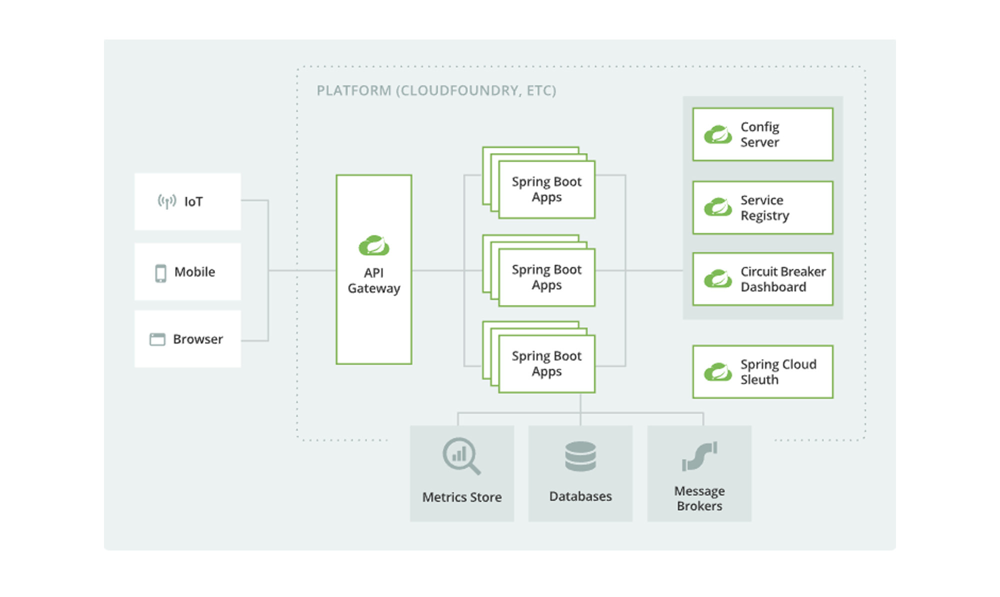

<center>Spring社区发布的一张简化的架构图</center>


在上面这幅图中，我们可以看到有几个 Spring Boot Apps 的应用集群，这就是经过拆分后的微服务。Spring Cloud 和 Spring Boot 达成了一种默契的配合：Spring Boot 主内，通过自动装配和各种开箱即用的特性，搞定了数据层访问、RESTful 接口、日志组件、内置容器等等基础功能，让开发人员不费吹灰之力就可以搭建起一个应用；Spring Cloud 主外，在应用集群之外提供了各种分布式系统的支持特性，帮助你轻松实现负载均衡、熔断降级、配置管理等诸多微服务领域的功能。

从 Spring Boot 和 Spring Cloud 的分工中我们可以看出，Spring Boot 忙活的是底层的柴米油盐酱醋茶，Spring Boot 后勤保障做得好，才能让 Spring Cloud 毫无顾虑地投身于微服务的星辰大海，两者合二为一完整构建了微服务领域的全家桶解决方案。

到这里，相信你已经可以理解 Spring Boot 和 Spring Cloud 的侧重点，以及 Spring Cloud 的功能定位。那么接下来，让我带你去了解一下 Spring Cloud 内部都有哪些重要组件。

### Spring Cloud 组件库的朝代更替

在我们开始了解 Spring Cloud 组件库之前，我得先介绍在 Spring Cloud 历史上举足轻重的两家公司 Netflix 和 Alibaba，以及它们的恩怨情仇。这两家公司分别为开源社区贡献了 Spring Cloud Netflix 组件库和 Spring Cloud Alibaba 组件库。

说起 Netflix 可能你并不知道，但提起《纸牌屋》你一定看过或者听过，这部高分美剧就是由这家我们俗称“奈飞”的公司出品的。Netflix 是一家美国的流媒体巨头，它靠着自己强大的技术实力，开发沉淀了一系列优秀的组件，这些组件经历了 Netflix 线上庞大业务规模的考验，功能特性和稳定性过硬。如 Eureka 服务注册中心、Ribbon 负载均衡器、Hystrix 服务容错组件等。后来发生的故事可能你已经猜到了，Netflix 将这些组件贡献给了 Spring 开源社区，构成了 Netflix 组件库。可以这么说，在 Spring Cloud 的早期阶段，是 Netflix 打下了的半壁江山。

Netflix 和 Spring Cloud 度过了蜜月期之后，矛盾就逐渐发生了。先是 Eureka 2.0 开源计划的搁浅，而后 Netflix 宣布 Hystrix 进入维护状态，Eureka 和 Hystrix 这两款 Netflix 组件库的明星项目停止了新功能的研发，Spring 社区不得不开始思考替代方案，在后续的新版本中走向了“去 Netflix 化”。以至于 Netflix 的网关组件 Zuul 2.0 历经几次跳票千呼万唤始出来后，Spring Cloud 社区已经不打算集成 Zuul 2.0，而是掏出了自己的 Gateway 网关。在最新版本的 Spring Cloud 中，Netflix 的踪迹已经逐渐消散，只有 Eureka 组件形单影只待在 Netflix 组件库中，回忆着昔日的辉煌。

Spring Cloud Alibaba 是由 Alibaba 贡献的组件库，随着阿里在开源路线上的持续投入，近几年阿里系在开源领域的声音非常响亮。**Spring Cloud Alibaba 凝聚了阿里系在电商领域超高并发经验的重量级组件，保持了旺盛的更新活力，成为了 Spring Cloud 社区的一股新生代力量，逐渐取代了旧王 Netflix 的江湖地位**。Spring Cloud Alibaba 组件秉承了“大而全”的特点，就像一个大中台应用一般包罗万象，在功能特性的丰富程度上做到了应有尽有，待我们学到 Spring Cloud 章节后你就能体会到了。这也是本课程选择 Spring Cloud Alibaba 组件的一个重要原因。

### Spring Cloud 全家桶组件库

我整理归纳了一个表格，将 Spring Cloud 中的核心组件库根据功能点做了分类，让你对每个特性功能的可选组件一目了然，**其中红色加粗的，是我们在课程实战环节将要集成的组件**，你可以参考一下。

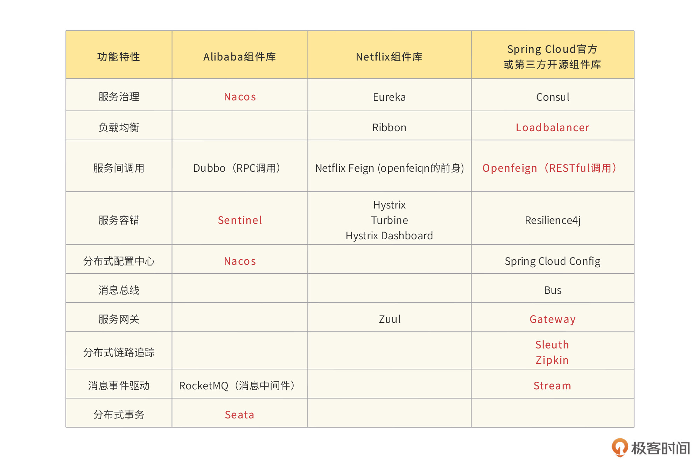

上面表格中列出的是业务开发过程中的常用功能性组件，除了这些以外，Spring Cloud 官方还提供了很多可扩展组件，比如用来支持构建集群的 Spring Cloud Cluster、提供安全特性支持的 Spring Cloud Security、云原生的流处理数据管道 Spring Cloud Data Flow 等等，你可以在这个Spring Cloud 官方文档中找到完整的列表。

如果你想了解 Spring Cloud Alibaba 组件的更多细节，我推荐你阅读 spring-cloud-alibaba 的官方 GitHub 首页或者开源社区文档。

到这里，我们对 Spring Cloud 的核心组件库有了一个比较全面的了解，接下来，我带你去了解一下 Spring Cloud 的版本更新策略。

### Spring Cloud 版本更新策略

大部分开源项目以数字版本进行更新迭代，Spring Cloud 在诞生之初就别出心裁使用了字母序列，以字母 A 开头，按顺序使用字母表中的字母标识重大迭代发布的大版本号。

我整理了一个表格，包含了 Spring Cloud 编年史各个版本的代号以及 Release 版的发布时间，我们来感受一下 Spring Cloud 的更新节奏：

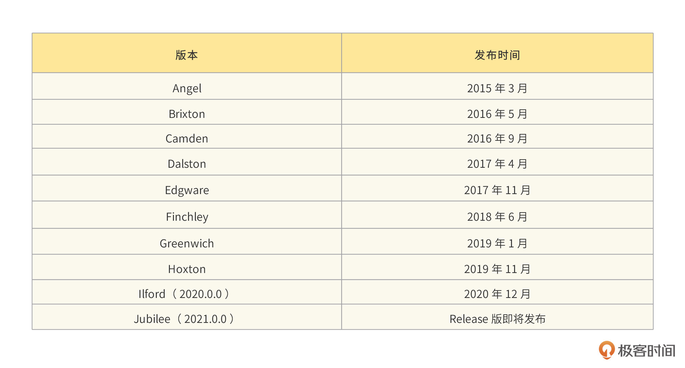

从上面的表格中我们可以看出，**Spring Cloud 自 2015 年发布之始就保持了极其旺盛的生命力**，**早期版本每半年就有一个大的版本号迭代**，即便发展至今，也保持着几乎一年一升版的快速更新节奏。正是由于开源社区的持续输出，以及像 Alibaba 这类大型公司的助力，才有了今天微服务领域最为完善的 Spring Cloud 全家桶组件库。

我们看完了 Spring Cloud 的大版本迭代更新策略，在大版本发布之前，还要经历很多小版本的迭代，接下来我带你了解一下 Spring Cloud 的小版本更新策略。如果你不清楚这里面的门道，很容易就会误用非稳定版本。

**SNAPSHOT 版本**：正在开发中的快照版本，例如 2021.0.0-SNAPSHOT，快照版代表当前分支最新的代码进度，也是更新最为频繁的小版本类型，不推荐在线上正式环境使用；

**Milestone 版本**：在大版本正式发布前的里程碑版本，例如 2021.0.0-M1，M1 代表当前大版本的第一个里程碑版本，M2 代表第二个迭代里程碑，以此类推。在正式版本发布之前要经历多个里程碑的迭代，像 Spring Cloud Finchley 版足足经历了 9 个 M 版本之后，才过渡到了 RC 版。同样地，我也不推荐你在正式项目中使用 Milestone 版本；

**Release Candidate 版本**：这就是我们俗称的 RC 版，例如 2021.0.0-RC1。当一个版本迭代到 RC 版的时候，意味着离正式发布已经不远了。但是你要注意，RC 版是发布前的候选版本，走到这一步通常已经没有新的功能开发，RC 主要目的是开放出来让大家试用并尽量修复严重 Bug。

**Release 版**：稳定的正式发布版，比如 2020.0.1。你可以在自己的线上业务中放心使用 Release 稳定版。

到这里，我们就完整了解了 Spring Cloud 的发展历史、核心组件库、版本更新策略。现在，我们来回顾一下这节课的重点内容。

### 总结

今天我带你了解了 Spring Cloud 框架的定位和它的核心组件库。以史为镜，我们了解了 Netflix 组件库和 Alibaba 组件库朝代更替的背景故事，以帮助我们在做技术选型的时候尽可能避开已经进入“维护状态”的组件。

此外，我想再和你分享一些新旧工具应用的经验。我周围很多的技术人员在做项目的时候容易进入一个误区，那就是“为新而新”，什么意思呢？每当一个新版本出来的时候，他们就迫不及待地把自己的业务升级到最新版本，盲目追新，殊不知这样做很容易翻车。作为一名老司机，我推荐你这样做：**当你心仪的框架有重大版本更新时，我还是建议你先按兵不动，等大版本做了一两次迭代之后，明显的 Bug 修复得七七八八了，再应用到自己的项目中也不迟**。

### 思考题

当你考虑给自己的项目做底层技术框架升版的时候，你会基于哪些因素做出“升级版本”的决定呢？欢迎你与我交流讨论，我在留言区等你。

好啦，这节课就结束啦。也欢迎你把这节课分享给更多对 Spring Cloud 感兴趣的朋友。我是姚秋辰，我们下节课再见！


## 03 | 初窥门径：我们要搭建一个怎样的微服务实战项目？

你好，我是姚秋辰。

在上一节课，我跟你介绍了 Spring Cloud 的发展背景以及各个组件库，此刻，你一定已经跃跃欲试想要立马开始动手编写实战项目了吧？别着急，今天咱先别忙着敲代码，让我先为你勾画出实战项目的全景蓝图。

这节课，我会跟你聊一聊我们这个优惠券平台项目的整体功能和模块，以及每个功能点的技术选型和背后的依据，让你从宏观的角度来了解一下我们整个项目的概貌和大致的走向，帮助你更轻松地学习后面的课程。首先，我来带你了解一下这个实战项目的业务功能。

### 优惠券平台项目介绍

相信你一定参与过双 11 或者 618 之类的电商大促活动，体验过各种眼花缭乱的优惠券和营销规则计算。而我们的实战项目，就是要搭建一个简化版的营销优惠计算系统，实现优惠券模板的创建、用户领取优惠券、下单核销优惠券和订单价格试计算等功能。

我曾经参与了一线电商新零售平台营销中心业务从 0 到 1 的搭建，与淘系营销优惠平台 UMP 对接过很多花式营销玩法。根据我过去的经验，如果我要实现一个“领取优惠券”的功能，那么我首先是要创建一个营销规则模板。这个模板就像是一个模具一样，每张优惠券都通过这个模具来铸造，并最终发放到用户手中。

使用模板的好处是可以对优惠券消费规则做一层抽象，比如满减类、打折类这些优惠券只是具体的优惠金额不同，但是玩法类似，我们把相类似的玩法功能抽象成一个模板，就可以简化具体优惠券的创建和核销流程。

在这个实战项目中，我也借鉴了之前的工作经验，把整个项目划分为了优惠券模板服务、计算服务、用户服务和平台类组件这四大模块。它们的功能是这样的：

**优惠券模板服务**：模板规则是创建具体优惠券的前置条件，每种类型的模板都是一个计算公式，这个公式约定了优惠计算的方式。在这个项目中，模板服务实现了模板规则的创建、克隆、分页查找等功能。另外，我将在项目里定义满减、随机立减、满折、晚间双倍优惠等多种券模板类型。

**优惠计算服务**：这个模块是根据用户购物车中的商品信息（单价、数量、所属门店）和优惠券信息，来计算当前订单优惠后的价格。另外，如果用户有多张优惠券，我还提供了“优惠金额试算”服务，帮助用户挑选最省钱的优惠券。

**用户服务**：这是暴露给外部用户使用的接口，它依赖于模板服务和优惠计算服务完成底层逻辑，主要业务场景是用户领券、订单价格试算、下单核销和订单金额试算等功能。

**平台类组件**：主要包括一些业务无关的中心化组件，比如 Gateway 网关等等，你将在 Spring Cloud 课程中逐渐接触到平台类组件的搭建。

从整体来看，优惠券模板服务和优惠计算服务是基础服务，用户服务是对用户开放的接口，它依赖于这两个基础服务来完成业务逻辑。而平台类组件则提供了横向的微服务特性支持，比如微服务网关、链路追踪功能等等，你可以把它们理解为“微服务中间件”。我们通过下面这幅图来看一下这四个模块之间的关联关系：

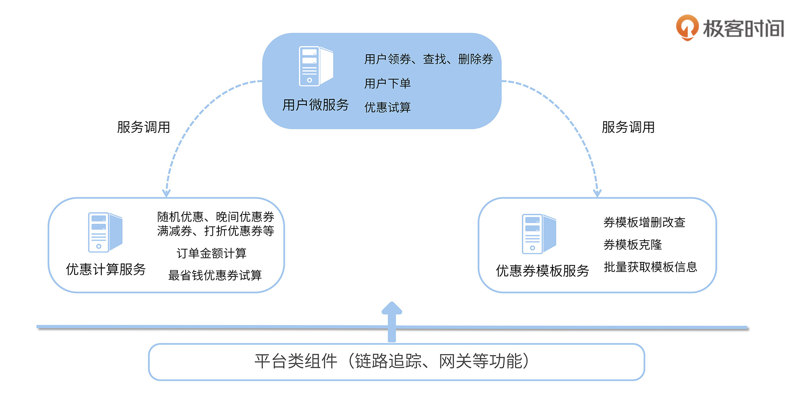

我们在开篇词中提到，为了帮你顺利过渡到 Spring Cloud 实战，我会先用 Spring Boot 搭建出这个优惠券平台的单体应用，然后在这个基础上做 Spring Cloud 改造。

### Spring Boot 实战项目规划

从项目实施的角度来看，Spring Boot 阶段的任务相对简单。我们会用两节课搭建起优惠券平台的三个业务模块，并按照模块之间的先后依赖顺序进行改造。在第一节课中，我将带你搭建一个单体应用版的优惠券模板服务，在这个过程中我们会使用 spring-data-jpa 和 spring-web 实现系统搭建。其中，spring-data-jpa 是用来实现数据库 CRUD 操作的组件，而 spring-web 是开发 RESTFul 风格的 API 接口所需要用到的组件。接着在第二节课中，我们将使用同样的技术搭建订单优惠计算服务和用户服务。

这里你要注意，在 Spring Boot 的阶段，用户服务是一个“超级单体应用”，我把优惠券模板服务和订单优惠计算服务都打包到了用户服务中，跨模块的服务调用都是通过本地方法完成的，因此你只用启动用户服务就可以执行所有模块的业务功能。

在搭建项目的过程中，我会带你重点掌握以下这三个技术点：

**项目搭建**：分层构建项目结构，并借助 Maven 实现依赖项管理；

**数据操作**：我会带你快速入门 spring-data-jpa 实战，分别通过接口声明、自定义 SQL 和 JpaRepository 三种方式实现数据库 CRUD 操作；

**开放对外 API**：快速入门 spring-web 实战，通过注解对外暴露 RESTful 风格的 API。

此外，我还会不断跟你分享一些我平时工作中积累的小技巧，比如防御型编程、如何借助插件自动生成代码和数据校验、JPA 级联关系的误区、计算密集型服务的特点、模板设计模式的应用等等，相信这些内容可以给你一些工作上的启发。

Spring Boot 的官方社区提供了一个非常简单的 Hello World 教程，如果你没有太多 Spring Boot 的使用经验，那么可以通过这个教程链接Spring Quickstart Guide来了解 Spring Boot 的搭建过程。

在 Spring Boot 阶段我们搭建好优惠券平台的单体应用后，接下来就可以进行 Spring Cloud 微服务化改造了。

### Spring Cloud 实战项目全景规划

我们先来看一下优惠券平台采用微服务架构，整体的技术方案规划和技术选型是怎样的。下面这张图里列举的技术框架都是目前一线广泛使用的开源组件。

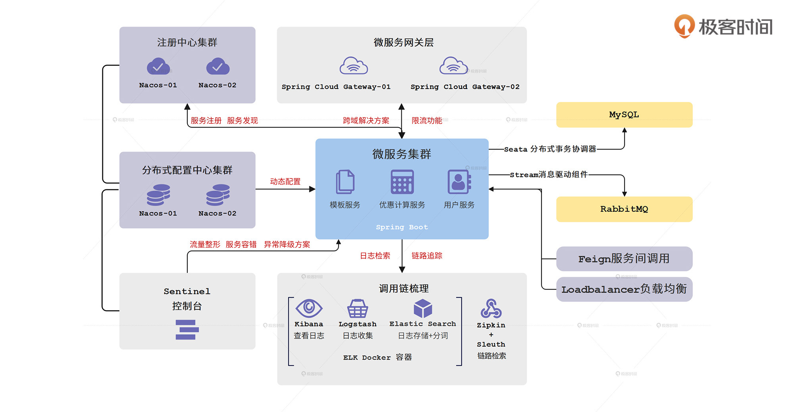

看到图中的这些技术点，我想此刻的你一定很懵，不知道这些技术框架的用途，也不知道该从何处下手来做改造。那么，接下来让我跟你聊聊我如何设计 Spring Cloud 实战课程的技术选型以及总体的搭建流程，这样你就能做到心中有数，学起来也能得心应手了。

根据微服务学习的路径以及各个组件的难易程度，我把整个微服务框架由浅入深分为了三个不同的阶段：

第一阶段：搭建基础的微服务功能，实现**微服务之间的通信**；

第二阶段：为各个模块构建**服务容错**、**分布式配置中心**、**分布式链路追踪能力**；

第三阶段：进一步实现**微服务网关**、**消息驱动**和**分布式事务**。

下面我们来看下每个阶段主要做些什么以及对应的技术选型。

#### 第一阶段

在第一阶段，我们主要实现**微服务之间的通信**，将用户微服务、优惠券模板服务和订单优惠计算服务拆分为独立部署的业务系统，通过注册中心来实现服务注册和服务发现，让各个微服务之间可以互相调用。这个阶段涉及的关键技术是 Nacos 注册中心、Loadbalancer 客户端负载均衡组件和 OpenFeign 服务间调用组件。

我们知道，微服务之间的服务通信有一个前提条件，就是你要知道将要调用的服务器地址是什么。这个寻址的任务是交由 Nacos 注册中心和 Loadbalancer 负载均衡器共同来完成的。

Nacos 是 Alibaba 出品的服务治理组件，它作为一个注册中心组件，负责收集所有服务节点的地址信息并维护服务注册表，所有服务上线之后都会向它汇报状态。Loadbalancer 则承担了负载均衡的任务，在客户端发起服务调用的时候，它会负责从 Nacos 的注册表中挑选一台目标服务器。而 OpenFeign 组件是一个“锦上添花”的组件，它能够简化基于 HTTP 的远程服务调用，让我们就像使用本地接口一样方便地发起远程服务调用。

为什么我会选择 Nacos+Loadbalancer 作为选型方案呢？其实，在早期版本的 Spring Cloud 微服务架构选型中，Eureka + Ribbon 是一个使用最为广泛的组合，它们是 Netflix 公司贡献给 Spring Cloud 项目的服务治理 + 负载均衡组件。

我们在上节课中讲过，Netflix 正在退出 Spring Cloud 的历史舞台。Eureka 和 Ribbon 已经进入了维护状态。其中，Ribbon 更是在 Spring Cloud I 版之后，就从官方组件库中被移除了。这意味着 Eureka 和 Ribbon 已经进入了“暮年”，不会再有重大的功能更新，如果你在项目中使用 Netflix 组件库，那么在未来将无法享受 Spring Cloud 社区发布的新功能。

因此，在考虑技术选型的时候，我选择了**后劲更足、功能更为强大**的 Nacos 和 Spring Cloud 官方开源的 Loadbalancer 组件。大致来讲，在第一阶段，我会分为三个部分来带你搭建起微服务之间的通信：

**服务治理**：服务治理的重点是搭建基础的跨服务调用功能。我会把用户服务、优惠计算服务和订单服务改造成可以独立启动的微服务，并借助 Nacos 的服务发现功能，通过 Webflux 组件中的 WebClient 实现基于 HTTP 的跨服务间的调用；

**负载均衡**：在这部分，我们将在服务治理的基础上，引入 Loadbalancer 组件为跨服务调用添加负载均衡的能力。除此之外，我会对 Loadbalancer 组件的扩展接口做自定义开发，实现一个金丝雀测试的负载均衡场景；

**简化服务调用**：我将使用 OpenFeign 组件对用户服务进行改造，将原先复杂的 WebClient 调用替换为简洁的 OpenFeign 调用。

#### 第二阶段

在第二阶段，我们的实战重点有三个：

利用服务容错提高微服务架构的可用性；

搭建全链路的分布式链路追踪能力；

实现统一的配置管理和动态属性推送。

这个阶段涉及的技术组件是 Nacos Config、Sentinel、Sleuth+Zipkin+ELK。

在微服务架构中，**服务容错**是保障服务高可用的一个重要手段。在这个项目中，我们选择用 Sentinel 作为服务容错组件，它也是 Alibaba 贡献给 Spring Cloud 的。Sentinel 秉承了阿里系“大而全”的传统，只这一款组件就可以实现**降级**、**熔断**、**流量整形**等多种服务容错途径。

**链路追踪**也是微服务架构中一个很重要的功能，线上异常排查全靠它提供线索。我使用了 Spring Cloud 官方开源的 Sleuth 实现了日志打标功能，使用全局唯一标记将一次跨微服务调用链上的各个环节全部串联起来。

光打标还没用，我还结合了 Zipkin 组件实现**调用链的可视化检索**，将调用链上各个阶段的请求按顺序显示在页面上，这样，我们就可以一目了然定位到线上异常发生在哪个环节。另外，我使用了目前业界主流的 ELK 组合（Elastic Search + Logstash + Kibana）作为日志检索系统。

在**配置项管理**的技术选型方面，我使用了 Nacos Config 作为最终方案。借助 Nacos Config 我们可以轻松实现配置项的远程获取和动态推送，在配置项的应用隔离和环境隔离方面 Nacos 也是一把好手，我将会在配置管理的实战环节讲述更多的配置项花式玩法。相比较 Spring Cloud 的另一款配置管理组件 Spring Cloud Config 来说，Nacos 的搭建更加容易且更易于上手，而且可以更好地支持“配置项”回滚的功能。

在后面的课程中，我将按照下面的顺序来实现这些能力：

**配置管理**：配置管理的重点是将三个微服务应用接入到 Nacos Config 配置中心，使用远程配置中心存储部分配置项。

**服务容错**：搭建 Sentinel Dashboard 控制台，通过控制台将降级规则和流量整形规则应用到业务埋点中。

**链路追踪**：这部分的重点是搭建分布式链路追踪与日志系统。

#### 第三阶段

在第三阶段，我们的实战重点有三个：

搭建微服务网关作为统一流量入口；

使用消息驱动组件对接 RabbitMQ；

通过分布式事务保证数据一致性。

这个阶段涉及的技术组件是 Gateway、Stream 和 Seata。

**微服务网关**是架设在外部网关（如 Ngnix）和内部微服务之间的一座桥梁，我选用 Spring Cloud Gateway 作为网关组件。Gateway 不光担任了路由转发的重任，同时它提供了丰富的谓词组合实现复杂的路由判断逻辑。除此以外，你还可以在网关层定义拦截器，对来访请求执行一段特殊的业务逻辑。

曾经微服务网关的头把交椅是 Netflix 贡献的 Zuul 组件，但 Zuul 2.0 的开源发布一拖再拖，且性能并未达到预期效果。Spring Cloud 官方迫不得已，还没等到 Zuul 2.0 发布，就自己发布了一款开源网关组件 Spring Cloud Gateway。基于这些原因，Gateway 当之无愧成为了网关层的不二选择。

**消息队列和消息驱动**是老牌技术了，它并不是微服务特有的功能，我之所以在课程中加入了消息驱动这个内容，主要有两个原因。一是我想让你了解 Spring Cloud 开源的消息驱动组件“Stream”，它可以大幅降低应用系统和消息组件之间的对接流程。二是消息组件在如今有非常丰富的使用场景，我希望将“**消息组件的应用场景**”作为一个知识拓展点，帮助你开阔眼界。

**分布式事务**是微服务环境下保证事务一致性的终极手段。在课程中我将主要介绍两种比较有代表性的 Seata 分布式事务解决方案，一种是没有代码侵入的 Seata AT 方案，另一种是蚂蚁金服贡献的资源锁定 + 补偿型的 Seata TCC 方案。

好，到这里，我们就完整了解了整个项目的全景规划，以及对应的技术选型。现在，我们来回顾一下这节课的重点内容。

### 总结

在整个项目中，我们先通过 Spring Boot 快速落地了优惠券平台的三个业务模块，然后，在 Spring Cloud 实战阶段，我们分为三个阶段对 Spring Boot 项目进行微服务化改造：

第一个阶段使用 Nacos、Loadbalancer 和 OpenFeign 实现了跨服务的调用；

第二阶段使用 Sentinel、Nacos Config 和 Sleuth 实现了服务容错、配置管理和分布式链路追踪；

第三阶段使用 Gateway、Stream 和 Seata 实现了微服务网关、消息事件驱动和分布式事务。

在学习专栏的过程中，我不建议你“跳章节”学习，正确的姿势是顺着专栏的各个阶段稳步推进。因为每一个阶段的内容都有前后关系，后一个技术组件或多或少都依赖于前面课程中用到的组件，如果跳跃了几个章节，很容易漏掉一些关键步骤的配置和搭建过程，导致项目无法启动。

学习过程中我们难免会碰到各种问题，需要求助于搜索引擎。你也许用得比较多的是国内的搜索引擎，但经常查到千篇一律的文章，又或者看一个解决方案还需要注册会员或者付费，体验相当不好。

因此，我推荐你偶尔尝试使用 Google 和stackoverflow两个网站来查询解决方案。这两个网站是对我的工作最有帮助的两位老师，不仅能帮助你解决问题，还可以锻炼你的英文阅读能力。要知道英文能力对技术人员来说还是相当重要的，尤其是当你想要了解一些前沿技术或者阅读一些论文的时候。所以，提高英文阅读能力要靠你平时的不断积累才行。

### 思考题

最后，请你思考一下，还有哪些微服务的技术点是你想了解的，你可以在留言区提出感兴趣的技术，在后期我可以把呼声比较高的技术点通过加餐的形式分享给你，让我们这个课程能够持续更新和演进。我在留言区等你。

好啦，这节课就结束啦。欢迎你把这节课分享给更多对 Spring Cloud 感兴趣的朋友。我是姚秋辰，我们下节课再见！

## 04 | 十八般兵器：如何搭建项目所需的开发环境？

你好，我是姚秋辰。

工欲善其事，必先利其器。在你跃跃欲试想要进入实战环节前，让我先带你把实战项目需要用到的十八般兵器准备好，也就是搭建好项目的开发环境。

为了避免在项目实战环节碰到一些棘手的兼容性问题，在你开始写代码前就要约定好各个组件的安装版本，包括 Java、Maven 和各个中间件的版本。

我们的微服务实战项目会用到很多中间件，其中也包括了 Spring Cloud 的中心化组件，如 Nacos、Sentinel、Zipkin 和 Seata 等等，这些 Spring Cloud 组件我会放在后面的实战环节边讲解边搭建。

今天我们主要来看下集成开发环境的搭建、数据库的安装和 DB 脚本的导入，此外，我还会手把手带你安装几个通用的中间件。这节课要安装的工具比较多，你一定要耐心看完，不然后面的课程可能会卡壳哦。

闲话少叙，我们现在就开工吧。

### 环境准备

我推荐你使用 **Mac 笔记本或者是 Linux 系统**来编写、运行本课程的实战项目，如果你使用的是 Windows 系统，可以尝试做个双系统，或者用 Cygwin、Ubuntu 虚拟机等方式尽量模拟 Linux 环境的开发。一来可以学习 Linux 命令，二来可以尽量保持本地开发环境与线上生产环境的一致，毕竟工作中你所开发的 Java 程序最终还是部署在 Linux 服务器环境。

以下是我在本地 Mac 系统上的安装方式，如果你使用的是 Windows 系统，我也提供了相关组件的官网下载地址，相信对于程序员来说，安装软件是小菜一碟。因为安装的工具比较多，所以我建议你按照课程中介绍的顺序来安装。

### Homebrew

Homebrew 是 Mac 系统上的一款非常便利的软件安装工具，可以帮你安装大部分开发工作所需的各种工具软件。这节课中的很多工具，我们也可以使用它来安装。你可以在Homebrew 的官网查看 Homebrew 的详细安装方法。

你可能发现在国内网络下安装 Homebrew 比较缓慢，这里我给你提供两种解决办法：一种是使用 VPN 连接，也就是我们俗称的翻墙，可以大幅提高安装速度；另一种方式是将 Homebrew 指向国内镜像获取安装脚本，替换镜像的命令可以在官方的安装文档中找到。

安装完成之后，你可以在命令行输入 brew -v 命令查看版本信息，来验证安装是否成功：

```sh
vincent@LM-SHB-40513998 ~ % brew -v
Homebrew 3.2.17
Homebrew/homebrew-core (git revision 5fbb5bcf8d9; last commit 2021-10-24)
Homebrew/homebrew-cask (git revision b08f2eff16; last commit 2021-10-24)
```

当 Homebrew 准备就绪，你就可以使用 brew install 命令安装所需要的软件了。在实际工作中，你可以使用清华大学或者中科大的国内镜像源，来大幅提高各软件的下载速度。

在你使用国内镜像源的时候，可能会碰到软件无法安装成功的问题，这往往是因为软件所依赖的某个工具包无法下载，你只要从日志信息中找到卡住安装流程的工具包叫什么，然后使用 brew install xxx 命令（xxx 是工具名称）单独安装这个工具包，之后再重新安装你需要的软件就可以了。这个办法屡试不爽。

安装好 Homebrew 后，我们再来安装 Java 和 Maven。

### Java 和 Maven

这两样工具可是我们 Java 工程师吃饭的家伙，安装过程我就不唠叨了。为了避免兼容性的问题，你只要注意安装正确的版本就可以：

**Java**：推荐使用 JDK8 最新小版本或者 OpenJDK16 的最新小版本（我本地安装的是 OpenJDK  16.0.1）。

**Maven**：推荐使用 Maven 3.6 或以上的版本（我本地使用 3.8.1 版本）。

由于国内网络访问 Maven 中央仓库比较慢，在编译项目的时候，你会发现下载 Maven 依赖项的时间会比较久，你可以修改 Maven 的 settings.xml 文件，将其默认镜像指向国内的镜像（比如阿里云镜像），这样可以大大加快依赖项下载速度。

安装完 Java 和 Maven 之后，我们再来安装集成开发工具。

### IntelliJ IDEA

IntelliJ IDEA 是 JetBrains 全家桶中的一款应用，它是目前公认最强大的 Java 语言开发集成环境。如果你已经受不了 Eclipse 的卡顿，那不妨借此机会转向 IDEA 的怀抱。

你可以在JetBrains 的官网下载 IntelliJ IDEA，IDEA 的免费社区版已经足够你完成复杂的开发任务了。如果你想体验更多的产品功能特性，也可以选择购买商业版 license。要是你有高校教育邮箱（edu 邮箱）就更方便了，你可以使用 edu 邮箱注册 JetBrains 账号，并免费申请商业版使用权用于教学和学习。

### Lombok

为了提高编程效率和代码可读性，我在实战项目中还使用了 Lomkok 插件自动生成代码。不过，你需要在自己的开发环境中安装 Lombok 插件，这样你的 IDE 才能识别 Lomkok 的注解。

在 IntelliJ IDEA 中安装 Lombok 非常简单，你只需要在 IDEA 的插件安装界面搜索 Lomkob 这款插件并安装即可，如下图所示：

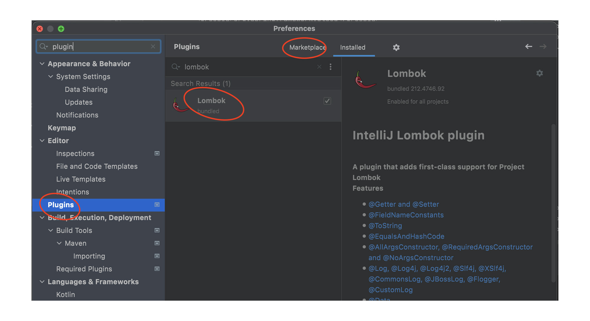

如果你使用 Eclipse 作为开发工具，需要在 Plugins 界面安装 Lombok 插件，或者将 Lombok 插件的安装文件复制到 Eclipse 安装路径下的 Plugin 文件夹。不管你使用的是 Eclipse 还是 IntelliJ IDEA，记得在装完插件后重启开发环境。

下面，我们再来安装实战项目需要用到的数据库。

### MySQL 和 DB 可视化工具

我们的实战课程采用 MySQL 数据库，当然，如果你在本地已经安装了 MariaDB 也是可以的，因为 MariaDB 是 MySQL 的作者参与制作的开源版数据库，它可以全面兼容 MySQL 的功能。

我本地安装的 MySQL 服务器版本为 8.0.27，你可以使用 brew 命令安装最新版的 MySQL，具体命令为：

```sh
brew install mysql
```

当然，你也可以选择从MySQL 官方网站下载安装包，免费的社区版就足以满足我们实战项目的需要。

安装完成之后，我们再使用下面的命令来启动 MySQL：

```sh
mysql.server start
```

待 MySQL 成功安装并启动后，我们来验证一下是否可以登录数据库。在命令行输入：

```sh
mysql -uroot -p
```

然后，我们使用默认的 root 用户登录数据库（密码默认为空），如果你可以在命令行看到以下内容，就表示数据库安装成功。

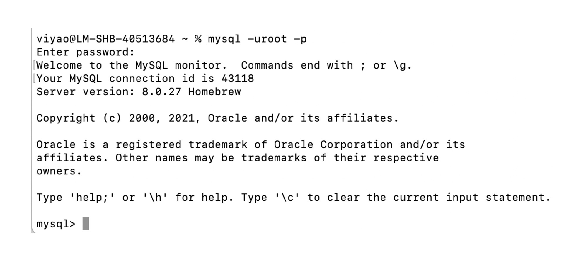

如果你还没有安装可视化 DB 工具，那么我推荐你使用 DataGrip，它也是 JetBrains 全家桶的一款软件。你可以选择通过DataGrip 官网下载安装包。

下载 DataGrip 并安装成功后，你可以在 DataGrip 中添加一个 MySQL 数据源指向本地 MySQL 数据库，用户名为默认的 root，密码为空，JDBC URL 是 jdbc:mysql://localhost:3306。在添加数据源之前，我们还需要在弹窗界面上点击下载 MySQL Driver：

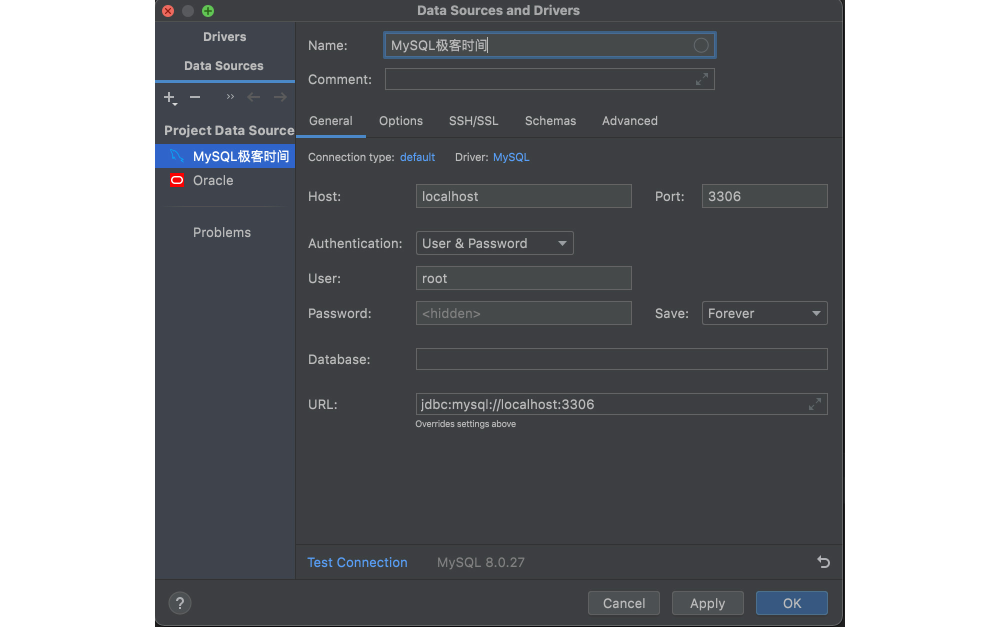

到这里，MySQL 和 DataGrip 就安装好了。

在开始项目实战之前，我们还需要在 MySQL 中执行数据库建表语句，将实战项目所需要用到的数据库表导入到 MySQL。建表语句所在的 SQL 文件，位于Gitee 项目源代码仓库下的“资源文件”目录中的“Coupon 项目建表语句.sql”文件里。

你可以在数据库命令行中执行 SQL 文件，或者将文件内容 copy 到 DataGrid 中执行。在建表语句的第一行中，我指定了数据库名称为 geekbang_coupon_db，我们在稍后的实战项目中会将这个数据库名称配置在 JDBC URL 中。

```sql
CREATE DATABASE IF NOT EXISTS geekbang_coupon_db;
```

当然，你也可以给这个数据库起一个更响亮的名字，替换掉 SQL 脚本中的名称 geekbang_coupon_db。执行完数据库脚本后，我们再来安装实战项目所需要用到的消息中间件。

### 安装 RabbitMQ

RabbitMQ 是目前使用最广泛的消息组件之一，在后面的 Spring Cloud 课程中我会使用 Stream 组件搭配 RabbitMQ 发送异步消息。

你可以直接使用下面这个命令安装 RabbitMQ，也可以在RabbitMQ 官网下载安装包。

```sh
brew install rabbitmq
```

我本地安装的 RabbitMQ 版本是 3.9.8，这里我推荐你直接安装 RabbitMQ 最新的稳定版本，因为某些 RabbitMQ 的早期版本缺少必要的插件支持，如果你已经安装了较早年代的 RabbitMQ，可以趁这个机会替换成最新版。

如果你想了解 RabbitMQ 的更多功能特性，RabbitMQ 的官网上提供的技术文档是一个很好的学习途径，你可以去看看。

在安装完成之后，你可以直接通过在命令行执行下面这条代码来启动 RabbitMQ。

```sh
rabbitmq-server
```

如果你是使用安装包安装的话，那么你还需要将 RabbitMQ 的安装路径加入到 PATH 系统变量。成功启动后，你可以在命令行中看到 RabbitMQ 版本和启动成功的日志，这表示 RabbitMQ 后台服务已处于运行状态。

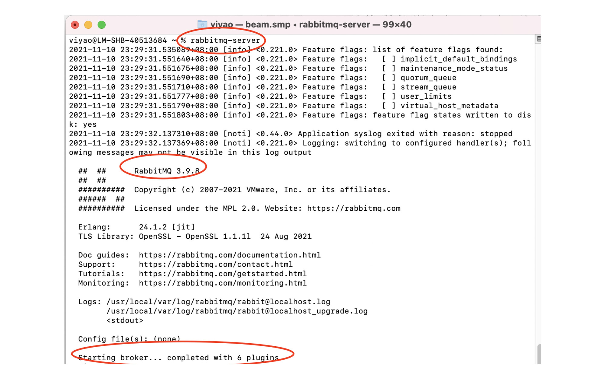

接着，我们在浏览器中打开 RabbitMQ 的本地操作界面http://localhost:15672/，其中的“15672”是 RabbitMQ 启动时的默认窗口。你可以使用默认的内置用户登录系统，用户名和密码都是 guest。顺利登录后你会看到如下页面：

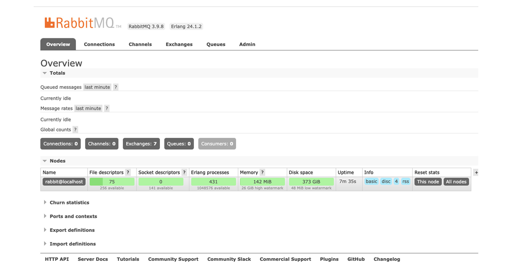

到这里，RabbitMQ 就算是安装好了。下面，我们再来安装最后一个软件，Redis。

### 安装 Redis

Redis 是一个 key-value 数据库，我们在学习微服务网关的时候将会用 Redis 实现网关层限流。安装 Redis 的方式非常简单，你可以选择使用下面这条命令安装最新版 Redis Brew。

```sh
w install redis
```

当然，你也可以选择从Redis 官网下载源码并在本地完成编译和安装。

安装完成并成功启动 Redis 服务后，我们可以通过命令行验证 Redis 是否运行正常。在命令行直接执行这条命令：

```sh
redis-cli
```

执行完成后，默认情况下会连接到 Redis 的默认地址 localhost:6379，这样我们就来到了 Redis 控制台。

在控制台中，你可以尝试通过 set 命令设置一个 key-value 键值对，并使用 get 命令读取 key 对应的值，通过这种方式来验证 Redis 是否正常工作。在下面的图中，我通过 set 命令设置了一个 key=geekbang，value=955 的键值对，然后使用 get 命令去读取 geekbang 的值。

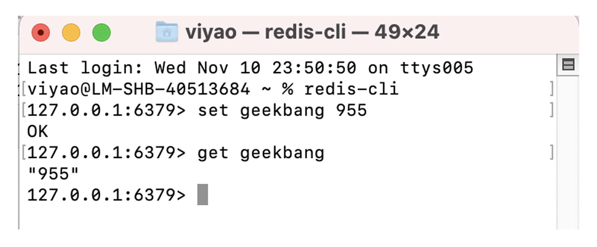

到这里，我们的工具安装就结束了，后续进入到 Spring Cloud 微服务实战环节的时候，我们还会用到更多的中间件，比如注册中心、微服务网关、链路追踪组件、ELK 日志查询系统、分布式事务协调器等等，到时候我再带你手把手安装这些软件。

### 总结

今天这节课，我带你安装了编译环境、本地开发环境、MySQL 数据库和一些常用的中间件，这些组件足够我们搭建起一个 Spring Boot 的单体应用了。

环境的安装看似简单，实则遍地是坑，**很多兼容性问题就是由于组件版本导致的**。我这里给你举两个兼容性问题的例子：

MySQL 版本：不同 MySQL 版本对 JDBC 连接串的要求是不一样的，有的版本需要你在 JDBC URL 中额外指定 Timezone 等信息。你会发现，原先得得好好的应用，某一天升级了数据库之后很可能会挂掉；

Maven 版本：有些 Maven 插件要求高版本的 Maven 支持，有时你会发现在一台电脑上可以编译通过的源码，换了一台电脑可能就编译失败，这很有可能是 Maven 版本的问题。

这些兼容性问题往往都很隐蔽，不好排查。所以呢，才有了程序员圈子里的硬梗“一定是环境问题”。那么，当你碰到一些棘手的异常情况的时候，比如某个应用在没有代码改动的情况下突然不正常了，不妨先抱着怀疑的态度，去检查一下是否有外部环境的变化，比如中间件版本、编译环境等等。

下一讲我将带你体验 Spring Boot 急速落地的过程，和你手把手搭建一个 Spring Boot 实战项目，为后面的 Spring Cloud 章节的学习做好前置功课。

### 思考题

最后，请你思考两个问题：

你在学习新技术、安装新的组件的过程中，通常都是通过什么途径来摸索的呢？在这个过程中你有哪些提升效率的小窍门（比如使用 homebrew 软件）可以分享吗？

你曾经碰到过最棘手的线上 Bug 或者兼容性问题是什么？最后又是如何被发现并解决的？我们在留言区来一场疑难 Bug 大 Battle 吧！

好啦，这节课就结束啦。欢迎你把这节课分享给更多对 Spring Cloud 感兴趣的朋友。我是姚秋辰，我们下节课再见！

# 03-SpringBoot急速落地篇(2讲)

## 05 | 牛刀小试：如何搭建优惠券模板服务？

你好，我是姚秋辰。

今天我们来动手搭建优惠券平台的实战项目。为了让你体验从 0 到 1 的微服务改造过程，我们先使用 Spring Boot 搭建一个基础版的优惠券平台项目，等你学习到 Spring Cloud 的时候，我们就在这个项目之上做微服务化改造，将 Spring Cloud 的各个组件像添砖加瓦一样集成到项目里。

如果你没有太多 Spring Boot 的相关开发经验，通过今天的学习，你可以掌握如何通过 Spring Boot 组件快速落地一个项目。如果你之前了解过 Spring Boot，那么今天的学习不仅可以起到温故知新的作用，你还可以从我分享的开发经验里得到一些启发。

在03 讲中，我们介绍了优惠券平台的功能模块。我们说过，在用户领取优惠券的过程当中，优惠券是通过券模板来生成的，因此，优惠券模板服务是整个项目的底层基础服务。今天咱就直接上手搭建这个服务模块：coupon-template-serv。不过在此之前，我们先来看看整体的项目结构是怎样搭建的。

### 搭建项目结构

我把整个优惠券平台项目从 Maven 模块管理的角度划分为了多个模块。

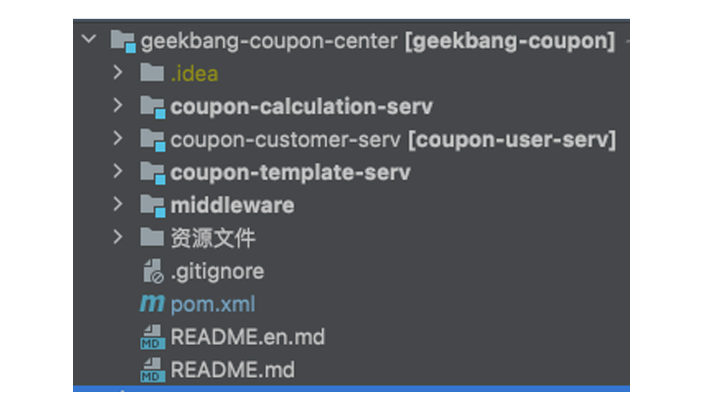

在顶层项目 geekbang-coupon 之下有四个子模块，我先来分别解释下它们的功能：

**coupon-template-serv**： 创建、查找、克隆、删除优惠券模板；

**coupon-calculation-serv**：计算优惠后的订单价格、试算每个优惠券的优惠幅度；

**coupon-customer-serv**：通过调用 template 和 calculation 服务，实现用户领取优惠券、模拟计算最优惠的券、删除优惠券、下订单等操作；

**middleware**：存放一些与业务无关的平台类组件。

在大型的微服务项目里，每一个子模块通常都存放在独立的 Git 仓库中，为了方便你下载代码，我把所有模块的代码都打包放到了这个代码仓库里，你可以在这里找到课程各阶段对应的源代码。

在每一个以“-serv”结尾的业务子模块中，我从内部分层的角度对其做了进一步拆分，以我们今天要搭建的 coupon-template-serv 为例，它内部包含了三个子模块：

**coupon-template-api**：存放公共 POJO 类或者对外接口的子模块；

**coupon-template-dao**：存放数据库实体类和 Dao 层的子模块；

**coupon-template-impl**：核心业务逻辑的实现层，对外提供 REST API。

你会发现，我把 coupon-template-api 作为一个单独的模块，这样做的好处是：**当某个上游服务需要获取 coupon-template-serv 的接口参数时，只要导入轻量级的 coupon-template-api 模块，就能够获取接口中定义的 Request 和 Response 的类模板，不需要引入多余的依赖项（比如 Dao 层或者 Service 层）**。

这就是开闭原则的应用，它使各个模块间的职责和边界划分更加清晰，降低耦合的同时也更加利于依赖管理。

搭建好项目的结构之后，接下来我们借助 Maven 工具将需要的依赖包导入到项目中。

### 添加 Maven 依赖项

这里你要注意一下，添加 Maven 依赖项需要遵循“从上到下”的原则，也就是从顶层项目 geekbang-coupon 开始，顺藤摸瓜直到 coupon-template-serv 下的子模块。首先，我们来看看顶层 geekbang-coupon 依赖项的编写。

#### 编写 geekbang-coupon 依赖项

geekbang-coupon 是整个实战项目的顶层项目，它不用操心具体的业务逻辑，只用完成一个任务：管理子模块和定义 Maven 依赖项的版本。这就像一个公司的大 boss 一样，只用制定方向战略，琐碎的业务就交给下面人（子模块）来办就好了。

那么顶层战略在哪里制定？其实就在 pom.xml 文件里，我们看一下 geekbang-coupon 的 pom 文件中都定义了哪些内容。

```xml
<!-- 已省略部分标签，完整内容请参考项目源代码 -->
<parent>
    <groupId>org.springframework.boot</groupId>
    <artifactId>spring-boot-starter-parent</artifactId>
    <version>2.4.2</version>
</parent>
<groupId>com.geekbang</groupId>
<artifactId>geekbang-coupon</artifactId>
<packaging>pom</packaging>
<version>1.0-SNAPSHOT</version>
<modules>
    <module>coupon-template-serv</module>
    <module>coupon-calculation-serv</module>
    <module>coupon-customer-serv</module>
    <module>middleware</module>
</modules>
<dependencyManagement>
    <dependencies>
        <dependency>
            <groupId>org.apache.commons</groupId>
            <artifactId>commons-lang3</artifactId>
            <version>3.0</version>
        </dependency>
        <!-- 省略部分依赖项 -->
    </dependencies>
</dependencyManagement>
```

在 pom 文件里有以下三个重点标签。

**< parent > 标签**

在 parent 标签中我们指定了 geekbang-coupon 项目的“父级依赖”为 spring-boot-starter-parent，这样一来，spring-boot-starter-parent 里定义的 Spring Boot 组件版本信息就会被自动带到子模块中。这种做法也是大多数 Spring Boot 项目的通用做法，不仅降低了依赖项管理的成本，也不需要担心各个组件间的兼容性问题。

**< packaging > 标签**

maven 的打包类型有三种：jar、war 和 pom。当我们指定 packaging 类型为 pom 时，意味着当前模块是一个“boss”，它只用关注顶层战略，即定义依赖项版本和整合子模块，不包含具体的业务实现。

**< dependencymanagement > 标签**

**这个标签的作用和 < parent > 标签类似，两者都是将版本信息向下传递**。dependencymanagement 是 boss 们定义顶层战略的地方，我们可以在这里定义各个依赖项的版本，当子项目需要引入这些依赖项的时候，只用指定 groupId 和 artifactId 即可，不用管 version 里该写哪个版本。

完成了 geekbang-coupon 依赖项的编写，接下来我们看看 coupon-template-serv 依赖项的编写。

#### 编写 coupon-template-serv 依赖项

coupon-template-serv 是大 boss 下面的一个小头目，和 geekbang-coupon 一样，它的 packaging 类型也是 pom。我们说过 boss 只用管顶层战略，因此 coupon-temolate-serv 的 pom 文件内容很简单，只是定义了父级项目和子模块。

```xml
<!-- 已省略部分标签，完整内容请参考项目源代码 -->
<parent>
    <artifactId>geekbang-coupon</artifactId>
    <groupId>com.geekbang</groupId>
    <version>1.0-SNAPSHOT</version>
    <relativePath>../pom.xml</relativePath>
</parent>
<modelVersion>4.0.0</modelVersion>
<artifactId>coupon-template-serv</artifactId>
<packaging>pom</packaging>
<modules>
    <module>coupon-template-api</module>
    <module>coupon-template-dao</module>
    <module>coupon-template-impl</module>
</modules>
```

我们已经把 geekbang-coupon 和 coupon-template-serv 两个父级项目的依赖项添加完毕，接下来就去搭建 coupon-template-serv 下面的三个子模块。

coupon-template-api 模块存放了接口 Request 和 Response 的类模板，是另两个子模块需要依赖的公共类库，所以我就先从 coupon-template-api 开始项目构建。

### 搭建 coupon-template-api 模块

coupon-template-api 模块是专门用来存放公共类的仓库，我把 REST API 接口的服务请求和服务返回对象的 POJO 类放到了里面。在微服务领域，将外部依赖的 POJO 类或者 API 接口层单独打包是一种通用做法，这样就可以给外部依赖方提供一个“干净”（不包含非必要依赖）的接口包，为远程服务调用（RPC）提供支持。

在 coupon-template-api 项目的 pom 文件中，我只添加了少量的“工具类”依赖，比如 lombok、guava 和 validation-api 包等通用组件，这些工具类用来帮助我们自动生成代码并提供一些便捷的功能特性，具体的依赖项你可以参考项目源码。

首先，我们需要定义一个用来表示优惠券类型的 enum 对象，在 com.geekbang.coupon.template.api.enum 包下创建一个名为 CouponType 的枚举类。

```java
@Getter
@AllArgsConstructor
public enum CouponType {
    UNKNOWN("unknown", "0"),
    MONEY_OFF("满减券", "1"),
    DISCOUNT("打折", "2"),
    RANDOM_DISCOUNT("随机减", "3")
    LONELY_NIGHT_MONEY_OFF("晚间双倍优惠券", "4");
    
    private String description;

    // 存在数据库里的最终code
    private String code;
    public static CouponType convert(String code) {
        return Stream.of(values())
                .filter(bean -> bean.code.equalsIgnoreCase(code))
                .findFirst()
                .orElse(UNKNOWN);
    }
}
```

CouponType 类定义了多个不同类型的优惠券，convert 方法可以根据优惠券的编码返回对应的枚举对象。这里还有一个“Unknown”类型的券，它专门用来对付故意输错 code 的恶意请求。

作为一个骨灰级程序员，我会认为所有需要用户输入的信息都是不可靠的，并且需要对各种意外输入做拦截、防范，这就是“**防御性编程**”的思维。工作的时间越久，人往往会变得越怂（都是被各种故障吓大的）。

接下来，我们创建两个用来定义优惠券模板规则的类，分别是 TemplateRule 和 Discount。我把它们放在 com.geekbang.coupon.template.api.beans.rules 包路径下。

TemplateRule 包含了两个规则，一是领券规则，包括每个用户可领取的数量和券模板的过期时间；二是券模板的计算规则。

```java
@Data
@NoArgsConstructor
@AllArgsConstructor
public class TemplateRule {
    // 可以享受的折扣
    private Discount discount;
    
    // 每个人最多可以领券数量
    private Integer limitation; 

    // 过期时间
    private Long deadline;
}
```

这里我强烈推荐你**使用一键三连的 lombok 注解自动生成基础代码**，它们分别是 Data、NoArgsConstructor 和 AllArgsConstructor。其中，Data 注解自动生成 getter、setter、toString 等方法，后两个注解分别生成无参构造器和全参构造器，省时省力省地盘。

TemplateRule 中的 Discount 成员变量定义了使用优惠券的规则，代码如下。

```java
public class Discount {
    // 对于满减券 - quota是减掉的钱数，单位是分
    // 对于打折券 - quota是折扣(以100表示原价)，90就是打9折,  95就是95折
    // 对于随机立减券 - quota是最高的随机立减额
    // 对于晚间特别优惠券 - quota是日间优惠额，晚间优惠翻倍
    private Long quota;

    // 订单最低要达到多少钱才能用优惠券，单位为分
    private Long threshold;
}
```

从上面代码中可以看出，我使用 Long 来表示“金额”。对于境内电商行业来说，金额往往是以分为单位的，这样我们可以直接使用 Long 类型参与金额的计算，比如 100 就代表 100 分，也就是一块钱。这比使用 Double 到处转换 BigDecimal 省了很多事儿。

最后，我们在 com.geekbang.coupon.template.api.beans 包下创建一个名为 CouponTemplateInfo 的类，用来创建优惠券模板，代码如下：

```java
// 已省略部分内容，完整内容请参考项目源代码
public class CouponTemplateInfo {
    private Long id;

    @NotNull
    private String name; // 优惠券名称

    @NotNull
    private String desc; // 优惠券描述
    
    @NotNull
    private String type;  // 优惠券类型(引用CouponType里的code)    

    private Long shopId; // 优惠券适用门店 - 若无则为全店通用券   

    @NotNull
    private TemplateRule rule; // 优惠券使用规则
   
    private Boolean available; // 当前模板是否为可用状态
}
```

在上面的代码中，我们应用了 jakarta.validate-api 组件的注解 @NotNull，对参数是否为 Null 进行了校验。如果请求参数为空，那么接口会自动返回 Bad Request 异常。当然，jakarta 组件还有很多可以用来做判定验证的注解，合理使用可以节省大量编码工作，提高代码可读性。

此外，你还会发现，CouponTemplateInfo 内封装了优惠券模板的基本信息，我们可以把优惠券模板当做一个“模具”，每一张优惠券都经由模具来制造，被制造出来的优惠券则使用 CouponInfo 对象来封装。

CouponInfo 对象包含了优惠券的模板信息、领券用户 ID、适用门店 ID 等属性。除此之外，我还在源码中定义了用来实现分页查找的对象，如果你特别感兴趣，可以到项目源码中查看完整的类定义。

到这里我们就完成了 coupon-template-api 项目的搭建，下面我们开始搭建 Dao 层模块：coupon-template-dao。它主要负责和数据库的对接、读取。

### 搭建 coupon-template-dao 模块

首先，我们把必要的依赖项添加到 coupon-template-dao 项目中，比较关键的 maven 依赖项有以下几个。

**coupon-template-api:** 引入 api 包下的公共类；

**spring-boot-starter-data-jpa**: 添加 spring-data-jpa 的功能进行 CRUD 操作；

**mysql-connector-java**: 引入 mysql 驱动包，驱动版本尽量与 mysql 版本保持一致。

接下来，我们在 com.geekbang.coupon.template.dao.entity 目录下创建了一个数据库实体对象的 Java 类：CouponTemplate。

```java
// 完整内容请参考源代码
@Entity
@Builder
@EntityListeners(AuditingEntityListener.class)
@Table(name = "coupon_template")
public class CouponTemplate implements Serializable {

    @Id
    @GeneratedValue(strategy = GenerationType.IDENTITY)
    @Column(name = "id", nullable = false)
    private Long id;

    // 状态是否可用
    @Column(name = "available", nullable = false)
    private Boolean available;
  
    @Column(name = "name", nullable = false)
    private String name;

    @Column(name = "description", nullable = false)
    private String description;

    // 适用门店-如果为空，则为全店满减券
    @Column(name = "shop_id")
    private Long shopId;
    
    // 优惠券类型
    @Column(name = "type", nullable = false)
    @Convert(converter = CouponTypeConverter.class)
    private CouponType category;

    // 创建时间，通过@CreateDate注解自动填值（需要配合@JpaAuditing注解在启动类上生效）
    @CreatedDate
    @Column(name = "created_time", nullable = false)
    private Date createdTime;

    // 优惠券核算规则，平铺成JSON字段
    @Column(name = "rule", nullable = false)
    @Convert(converter = RuleConverter.class)
    private TemplateRule rule;

}
```

在 CouponTemplate 上，我们运用了 javax.persistence 包和 Spring JPA 包的标准注解，对数据库字段进行了映射，我挑几个关键注解说道一下。

- Entity：声明了“数据库实体”对象，它是数据库 Table 在程序中的映射对象；

- Table：指定了 CouponTemplate 对应的数据库表的名称；

- ID/GeneratedValue：ID 注解将某个字段定义为唯一主键，GeneratedValue 注解指定了主键生成策略；

- Column：指定了每个类属性和数据库字段的对应关系，该注解还支持非空检测、对 update 和 create 语句进行限制等功能；

- CreatedDate：自动填充当前数据的创建时间；

- Convert：如果数据库中存放的是 code、string、数字等等标记化对象，可以使用 Convert 注解指定一个继承自 AttributeConverter 的类，将 DB 里存的内容转化成一个 Java 对象。

这里我要补充一点，其实 JPA 也支持一对多、多对多的级联关系（ManyToOne、OneToOne 等注解），但是你发现我并没有在项目中使用，原因是这些注解背后有很多隐患。**过深的级联层级所带来的 DB 层压力可能会在洪峰流量下被急剧放大，而 DB 恰恰是最不抗压的一环。**所以，我们很少在一些一二线大厂的超高并发项目中看到级联配置的身影。

我的经验是**尽可能减少级联配置，用单表查询取而代之**，如果一个查询需要 join 好几张表，最好的做法就通过重构业务逻辑来简化 DB 查询的复杂度。

最后，我们来到定义 DAO 的地方，借助 Spring Data 的强大功能，我们只通过接口名称就可以声明一系列的 DB 层操作。我们先来看一下 CouponTemplateDao 这个类的代码。

```java
public interface CouponTemplateDao extends JpaRepository<CouponTemplate, Long> {
        
    // 根据Shop ID查询出所有券模板
    List<CouponTemplate> findAllByShopId(Long shopId);

    // IN查询 + 分页支持的语法
    Page<CouponTemplate> findAllByIdIn(List<Long> Id, Pageable page);    

    // 根据shop ID + 可用状态查询店铺有多少券模板
    Integer countByShopIdAndAvailable(Long shopId, Boolean available);

    /**
     * 将优惠券设置为不可用
     */
    @Modifying
    @Query("update CouponTemplate c set c.available = 0 where c.id = :id")
    int makeCouponUnavailable(@Param("id") Long id);
    
    // 完整方法请至源码查看
}
```

看了这段代码，你一定在想这里都是查询数据的场景，那么“增删改”的方法在哪里？

其实，这些方法都在 CouponTemplateDao 所继承的 JpaRepository 类中。这个父类就像一个百宝箱，内置了各种各样的数据操作方法。我们可以通过内置的 save 方法完成对象的创建和更新，也可以使用内置的 delete 方法删除数据。

此外，它还提供了对“查询场景”的丰富支持，除了通过 ID 查询以外，我们还可以使用三种不同的方式查询数据。

**通过接口名查询**：将查询语句写到接口的名称中；

**通过 Example 对象查询**：构造一个模板对象，使用 findAll 方法来查询；

**自定义查询**：通过 Query 注解自定义复杂查询语句。

在 CouponTemplateDao 中，第一个方法 findAllByShopId 就是通过接口名查询的例子，jpa 使用了一种约定大于配置的思想，你只需要把要查询的字段定义在接口的方法名中，在你发起调用时后台就会自动转化成可执行的 SQL 语句。构造方法名的过程需要遵循 < 起手式 >By< 查询字段 >< 连接词 > 的结构。

**起手式**：以 find 开头表示查询，以 count 开头表示计数；

**查询字段**：字段名要保持和 Entity 类中定义的字段名称一致；

**连接词**：每个字段之间可以用 And、Or、Before、After 等一些列丰富的连词串成一个查询语句。

以接口名查询的方式虽然很省事儿，但它面对复杂查询却力不从心，一来容易导致接口名称过长，二来维护起来也挺吃力的。所以，**对于复杂查询，我们可以使用自定义 SQL、或者 Example 对象查找的方式。**

关于自定义 SQL，你可以参考 CouponTemplateDao 中的 makeCouponUnavailable 方法，我将 SQL 语句定义在了 Query 注解中，通过参数绑定的方式从接口入参处获取查询参数，这种方式是最接近 SQL 编码的 CRUD 方式。

Example 查询的方式也很简单，构造一个 CouponTemplate 的对象，将你想查询的字段值填入其中，做成一个查询模板，调用 Dao 层的 findAll 方法即可，这里留给你自己动手验证。

```java
couponTemplate.setName("查询名称");
templateDao.findAll(Example.of(couponTemplate));
```

现在，API 和 Dao 层都已经准备就绪，万事俱备只差最后的业务逻辑层了，接下来我们去搭建 coupon-template-impl 模块。

### 搭建 coupon-template-impl 模块

coupon-template-impl 是 coupon-template-serv 下的一个子模块，也是实现业务逻辑的地方。从依赖管理的角度，它引入了 coupon-template-api 和 coupon-template-dao 两个内部依赖项到 pom.xml。

当然，我们也需要加入几个外部依赖项，你可以参考项目的 pom.xml 源代码获取完整的依赖项列表。

首先，我们先来定义 Service 层的接口类：CouponTemplateService。在这个接口中，我们定义了优惠券创建、查找优惠券和修改优惠券可用状态的方法。

```java
public interface CouponTemplateService {
    // 创建优惠券模板
    CouponTemplateInfo createTemplate(CouponTemplateInfo request);

    // 通过模板ID查询优惠券模板
    CouponTemplateInfo loadTemplateInfo(Long id);    

    // 克隆券模板
    CouponTemplateInfo cloneTemplate(Long templateId);

    // 模板查询（分页）
    PagedCouponTemplateInfo search(TemplateSearchParams request);
    
    // 删除券模板
    void deleteTemplate(Long id);    

    //批量读取模板
    Map<Long, CouponTemplateInfo> getTemplateInfoMap(Collection<Long> ids);
    // 完整方法列表请至源码查看    
}
```

由于这部分比较简单，就是通过 CouponTemplateDao 层来实现优惠券模板的增删改查，这里我就不展开介绍实现层代码了，你可以参考源码中的 CouponTemplateServiceImpl 类。

不过，我建议你不要直接 copy 源码，先尝试自己实现这几个 Service 方法，写完之后再和我的源码做比较，看一看有哪些可以改进的地方。

接下来，我们创建 CouponTemplateController 类对外暴露 REST API，可以借助 spring-web 注解来完成，具体代码如下。

```java
@Slf4j
@RestController
@RequestMapping("/template")
public class CouponTemplateController {

   @Autowired
   private CouponTemplateService couponTemplateService;

   // 创建优惠券
   @PostMapping("/addTemplate")
   public CouponTemplateInfo addTemplate(@Valid @RequestBody CouponTemplateInfo request) {
       log.info("Create coupon template: data={}", request);
       return couponTemplateService.createTemplate(request);
   }

   

   // 克隆券模板
   @PostMapping("/cloneTemplate")
   public CouponTemplateInfo cloneTemplate(@RequestParam("id") Long templateId) {
       log.info("Clone coupon template: data={}", templateId);
       return couponTemplateService.cloneTemplate(templateId);
   }

   // 读取优惠券
   @GetMapping("/getTemplate")
   public CouponTemplateInfo getTemplate(@RequestParam("id") Long id){
       log.info("Load template, id={}", id);
       return couponTemplateService.loadTemplateInfo(id);
   }

   // 搜索模板(支持分页查询)
   @PostMapping("/search")
   public PagedCouponTemplateInfo search(@Valid @RequestBody TemplateSearchParams request) {
       log.info("search templates, payload={}", request);
       return couponTemplateService.search(request);
   }
   // ... 完整代码请至源码查看
}
```

在这里，Controller 类中的注解来自 spring-boot-starter-web 依赖项，通过这些注解将服务以 RESTful 接口的方式对外暴露。现在，我们来了解下上述代码里，服务寻址过程中的三个重要注解：

**RestController**：用来声明一个 Controller 类，加载到 Spring Boot 上下文；

**RequestMapping**：指定当前类中所有方法在 URL 中的访问路径的前缀；

**Post/Get/PutMapping**：定义当前方法的 HTTP Method 和访问路径。

项目启动类是最后的代码部分，我们在 com.geekbang.coupon.template 下创建一个 Application 类作为启动程序的入口，并在这个类的头上安上 SpringBoot 的启动注解。

```java
@SpringBootApplication
@EnableJpaAuditing
@ComponentScan(basePackages = {"com.geekbang"})
public class Application {
   public static void main(String[] args) {
       SpringApplication.run(Application.class, args);
   }
}
```

SpringBootApplication 注解会自动开启包路径扫描，并启动一系列的自动装配流程（AutoConfig）。在默认情况下，Spring Boot 框架会扫描启动类所在 package 下的所有类，并在上下文中创建受托管的 Bean 对象，如果我们想加载额外的扫包路径，只用添加 ComponentScan 注解并指定 path 即可。

所有代码环节全部完工后，我们还剩最后的画龙点睛之笔：**创建配置文件 application.yml**，它位于 src/main/resources 文件夹下。Spring Boot 支持多种格式的配置文件，这里我们顺应主流，使用 yml 格式。

```yml
# 项目的启动端口
server:
  port: 20000
spring:
  application:
    # 定义项目名称
    name: coupon-template-serv
  datasource:
    # mysql数据源
    username: root
#    password: 这里写上你自己的密码
    url: jdbc:mysql://127.0.0.1:3306/geekbang_coupon_db?autoReconnect=true&useUnicode=true&characterEncoding=utf8&useSSL=false&allowPublicKeyRetrieval=true&zeroDateTimeBehavior=convertToNull&serverTimezone=UTC

    # 指定数据源DataSource类型
    type: com.zaxxer.hikari.HikariDataSource
    driver-class-name: com.mysql.cj.jdbc.Driver
    # 数据库连接池参数配置，比如池子大小、超时时间、是否自动提交等等
    hikari:
      pool-name: GeekbangCouponHikari
      connection-timeout: 5000
      idle-timeout: 30000
      maximum-pool-size: 10
      minimum-idle: 5
      max-lifetime: 60000
      auto-commit: true
  jpa:
    show-sql: true
    hibernate:
      # 在生产环境全部为none，防止ddl结构被自动执行，破坏生产数据
      ddl-auto: none
    # 在日志中打印经过格式化的SQL语句
    properties:
      hibernate.format_sql: true
      hibernate.show_sql: true
    open-in-view: false
```

在配置文件中，有一个地方需要你多加注意，那就是 jdbc 连接串（spring.datasource.url）。不同版本的 MySQL 对连接串中的参数有不同的要求。

如果你发现项目启动过程中抛出了 MySQL 连接报错，一定记得检查自己的 MySQL 版本，检查是否缺失了某些参数（比如 MySQL 8.x 版本下要求传入 serverTimezone 参数）。如果你本地安装的 MySQL 版本早于 8.x 系列，我推荐你重新安装和我一样的 MySQL 8.0.27 版本，这样就不会碰到兼容性问题了。

好，到这里，我们优惠券平台项目的第一个模块 coupon-template-serv 就搭建完成了，你可以在本地启动项目并通过 Postman 发起调用。我已经将 Postman API 集合上传到了这个Gitee 源码库中的“资源文件”目录下，文件名为“Spring Boot 阶段.postman_collection.json”，你可以导入到自己本地的 Postman 中使用。

现在，我们来回顾一下这节课的重点内容。

### 总结

今天我带你搭建了整个优惠券服务的整体项目结构，并且用 Spring Boot 快速落地了优惠券模板服务。如果你在自己的项目中还在使用繁琐的 sql 资源文件来操作数据库，不妨升级成 coupon-template-dao 中使用的 spring-data-jpa 来简化 DB 操作。**spring-data-jpa 的功能特性也折射出 Spring 框架的发展趋势：约定大于配置，且越来越轻量级。**

在学习这节课的时候，我希望你不要只满足于把项目跑起来就万事大吉了，你还要做一些思考和总结沉淀，想一想如何能把课程中的一些技术点应用在自己的项目中。我在这节课分享了很多开发小技巧，比如防御性编程、代码自动生成、金额计算、如何简化数据校验、级联关系的误区等，这些都可以作为你的开发素材。

希望你能够动起手来，顺着这节课程的内容动手搭建整个服务，不要直接照搬源码本地执行一下就完事儿了，只有上手实际搭建项目我们才能了解技术细节、积累排查问题的经验。要知道，纸上得来终觉浅，绝知此事要躬行。

在下一节课中，我会带你搭建 coupon-calculation-ser 和 coupon-customer-serv，构建一个完整的优惠券平台 Spring Boot 项目。

### 思考题

最后，请你思考一个问题：

级联查询很容易引发性能问题，你在自己的项目中遇到最复杂的 SQL 是什么？然后，请你进一步做个思考：如果这条 SQL 的调用量激增，你该如何进行优化？欢迎你“显摆”出来，我在留言区等你。

好啦，这节课就结束啦。也欢迎你把这节课分享给更多对 Spring Cloud 感兴趣的朋友。我是姚秋辰，我们下节课再见！


## 06 | 牛刀小试：如何搭建优惠券计算服务和用户服务？

你好，我是姚秋辰。

上一节课我们搭建了 coupon-template-serv 模块，实现了优惠券模板的创建和批量查询等功能，相信你已经对如何使用 Spring Boot 搭建应用驾轻就熟了。今天我们就来搭建优惠券平台项目的另外两个模块，coupon-calculation-serv（优惠计算服务）和 coupon-customer-serv（用户服务），组建一个完整的实战项目应用（middleware 模块将在 Spring Cloud 环节进行搭建）。

通过今天的课程，你可以巩固并加深 Spring Boot 的实操能力，为接下来 Spring Cloud 微服务化改造打好前置知识的基础，在这节课里我也会分享一些关于设计模式和数据冗余的经验之谈。

另外，这节课的源码都可以在Gitee 代码库中找到。你可不要只读爽文不动手敲代码，我建议你把代码下载到本地，对照着源码动手练习一遍，才能学为己用。

闲话少叙，我们根据优惠券项目的依赖关系，先从上游服务 coupon-calculation-serv 开始动手搭建吧。

### 搭建 coupon-calculation-serv

coupon-calculation-serv 提供了用于计算订单的优惠信息的接口，它是一个典型的“计算密集型”服务。所谓计算密集型服务一般具备下面的两个特征：

**不吃网络 IO 和磁盘空间**；

**运行期主要占用 CPU、内存等计算资源**。

在做大型应用架构的时候，我们通常会把计算密集型服务与 IO/ 存储密集型服务分割开来，这样做的一个主要原因是提高资源利用率。

比如说，我们有一个计算密集型的微服务 A 和一个 IO 密集型微服务 B，大促峰值流量到来的时候，如果微服务 A 面临的压力比较大，我可以专门调配高性能 CPU 和内存等“计算类”的资源去定向扩容 A 集群；如果微服务 B 压力吃紧了，我可以定向调拨云上的存储资源分配给 B 集群，这样就实现了一种“按需分配”。

假如微服务 A 和微服务 B 合二为一变成了一个服务，那么在分配资源的时候就无法做到定向调拨，全链路压测环节也难以精准定位各项性能指标，这难免出现资源浪费的情况。这也是为什么，我要把优惠计算这个服务单独拿出来的原因。

现在，我们开始着手搭建 coupon-calculation-serv 下的子模块。和 coupon-template-serv 结构类似，coupon-calculation-serv 下面也分了若干个子模块，包括 API 层和业务逻辑层。API 层定义了公共的 POJO 类，业务逻辑层主要实现优惠价格计算业务。因为 calculation 服务并不需要访问数据库，所以没有 DAO 模块。

根据子模块间的依赖关系，我们就先从 coupon-calculation-api 这个接口层子模块开始搭建吧。

#### 搭建 coupon-calculation-api

如果 coupon-calculation-serv 需要计算订单的优惠价格，那就得知道当前订单用了什么优惠券。封装了优惠券信息的 Java 类 CouponInfo 位于 coupon-template-api 包下，因此我们需要把 coupon-template-api 的依赖项加入到 coupon-calculation-api 中。

```xml
<dependency>
    <groupId>${project.groupId}</groupId>
    <artifactId>coupon-template-api</artifactId>
    <version>${project.version}</version>
</dependency>
```

添加好了依赖项之后，接下来我们定义用于封装订单信息的 ShoppingCart 类。

```java
@Data
@NoArgsConstructor
@AllArgsConstructor
public class ShoppingCart {
    // 订单的商品列表 - 
    @NotEmpty
    private List<Product> products;  

    // 封装了优惠券信息，目前计算服务只支持单张优惠券
    // 为了考虑到以后多券的扩展性，所以定义成了List
    private Long couponId;   

    private List<CouponInfo> couponInfos;
 
    // 订单的最终价格
    private long cost;

    // 用户ID
    @NotNull
    private Long userId;
}
```

在上面的源码中，我们看到 ShoppingCart 订单类中使用了 Product 对象，来封装当前订单的商品列表。在 Product 类中包含了商品的单价、商品数量，以及当前商品的门店 ID。

```java
@Data
@NoArgsConstructor
@AllArgsConstructor
public class Product {
    // 商品的价格
    private long price;

    // 商品在购物车里的数量
    private Integer count;

    // 商品销售的门店
    private Long shopId;
}
```

在电商领域中，商品的数量通常不能以 Integer 整数来表示，这是因为只有标品才能以整数计件。对于像蔬菜、肉类等非标品来说，它们的计件单位并不是“个”。所以在实际项目中，尤其是零售行业的业务系统里，计件单位要允许小数位的存在。而我们的实战项目为了简化业务，就假定所有商品都是“标品”了。

在下单的时候，你可能有多张优惠券可供选择，你需要通过“**价格试算**”来模拟计算每张优惠券可以扣减的金额，进而选择最优惠的券来使用。SimulationOrder 和 SimulationResponse 分别代表了“价格试算”的订单类，以及返回的计算结果 Response。我们来看一下这两个类的源码。

```java
// 优惠券价格试算
@Data
@NoArgsConstructor
@AllArgsConstructor
public class SimulationOrder {

    @NotEmpty
    private List<Product> products;

    @NotEmpty
    private List<Long> couponIDs;

    private List<CouponInfo> couponInfos;

    @NotNull
    private Long userId;
}

// 订单试算结果，可以看出哪个优惠券的优惠力度最大

@Data
@NoArgsConstructor
public class SimulationResponse {

    // 最省钱的coupon
    private Long bestCouponId;

    // 每一个coupon对应的order价格
    private Map<Long, Long> couponToOrderPrice = Maps.newHashMap();
}
```

到这里，coupon-calculation-api 模块就搭建好了。因为 calculation 服务不需要访问数据库，所以我们就不用搭建 dao 模块了，直接来实现 coupon-calculation-impl 业务层的代码逻辑。

#### 搭建 coupon-calculation-impl

首先，我们在 coupon-calculation-impl 的 pom.xml 文件中添加下面的三个依赖项。

```xml
<dependency>
    <groupId>${project.groupId}</groupId>
    <artifactId>coupon-template-api</artifactId>
    <version>${project.version}</version>
</dependency>

<dependency>
    <groupId>${project.groupId}</groupId>
    <artifactId>coupon-calculation-api</artifactId>
    <version>${project.version}</version>
</dependency>

<dependency>
    <groupId>org.springframework.boot</groupId>
    <artifactId>spring-boot-starter-web</artifactId>
</dependency>
```

从 coupon-template-api 和 coupon-calculation-api 两个依赖项中，你可以拿到订单优惠计算过程用到的 POJO(plain old java object) 对象。接下来，我们可以动手实现优惠计算逻辑了。

在搭建优惠计算业务逻辑的过程中，我运用了模板设计模式来封装计算逻辑。模板模式是一种基于抽象类的设计模式，它的思想很简单，就是**将共性的算法骨架部分上升到抽象层，将个性部分延迟到子类中去实现**。

优惠券类型有很多种，比如满减券、打折券、随机立减等等，这些券的计算流程（共性部分）是相同的，但具体的计算规则（个性部分）是不同的。我将共性的部分抽象成了 AbstractRuleTemplate 抽象类，将各个券的差异性计算方式做成了抽象类的子类。

让我们看一下计算逻辑的类结构图。

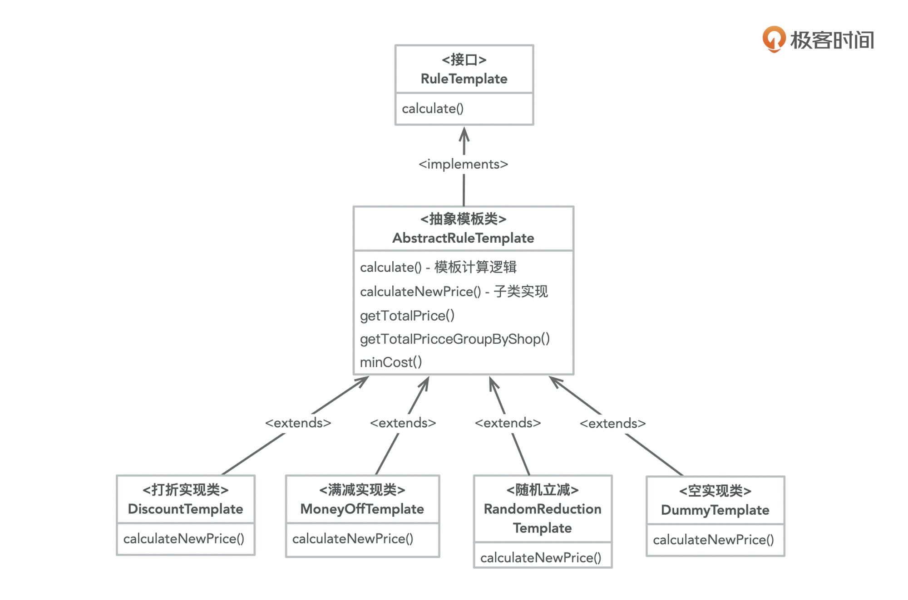

在这张图里，顶层接口 RuleTemplate 定义了 calculate 方法，抽象模板类 AbstractRuleTemplate 将通用的模板计算逻辑在 calculate 方法中实现，同时它还定义了一个抽象方法 calculateNewPrice 作为子类的扩展点。各个具体的优惠计算类通过继承 AbstractRuleTemplate，并实现 calculateNewPrice 来编写自己的优惠计算方式。

我们先来看一下 AbstractRuleTemplate 抽象类的代码，走读 calculate 模板方法中的计算逻辑实现。

```java
public ShoppingCart calculate(ShoppingCart order) {
    // 获取订单总价
    Long orderTotalAmount = getTotalPrice(order.getProducts());
    // 获取以shopId为维度的总价统计
    Map<Long, Long> sumAmount = getTotalPriceGroupByShop(order.getProducts());
    CouponTemplateInfo template = order.getCouponInfos().get(0).getTemplate();
    // 最低消费限制
    Long threshold = template.getRule().getDiscount().getThreshold();
    // 优惠金额或者打折比例
    Long quota = template.getRule().getDiscount().getQuota();
    // 如果优惠券未指定shopId，则shopTotalAmount=orderTotalAmount
    // 如果指定了shopId，则shopTotalAmount=对应门店下商品总价
    Long shopId = template.getShopId();
    Long shopTotalAmount = (shopId == null) ? orderTotalAmount : sumAmount.get(shopId);
    
    // 如果不符合优惠券使用标准, 则直接按原价走，不使用优惠券
    if (shopTotalAmount == null || shopTotalAmount < threshold) {
        log.debug("Totals of amount not meet");
        order.setCost(orderTotalAmount);
        order.setCouponInfos(Collections.emptyList());
        return order;
    }
    // 子类中实现calculateNewPrice计算新的价格
    Long newCost = calculateNewPrice(orderTotalAmount, shopTotalAmount, quota);
    if (newCost < minCost()) {
        newCost = minCost();
    }
    order.setCost(newCost);
    log.debug("original price={}, new price={}", orderTotalAmount, newCost);
    return order;
}
```

在上面的源码中，我们看到大部分计算逻辑都在抽象类中做了实现，子类只要实现 calculateNewPrice 方法完成属于自己的订单价格计算就好。我们以满减规则类为例来看一下它的实现。

```java
@Slf4j
@Component
public class MoneyOffTemplate extends AbstractRuleTemplate implements RuleTemplate {
    @Override
    protected Long calculateNewPrice(Long totalAmount, Long shopAmount, Long quota) {
        // benefitAmount是扣减的价格
        // 如果当前门店的商品总价<quota，那么最多只能扣减shopAmount的钱数
        Long benefitAmount = shopAmount < quota ? shopAmount : quota;
        return totalAmount - benefitAmount;
    }    
}
```

在上面的源码中，我们看到子类业务的逻辑非常简单清爽。通过模板设计模式，我在抽象类中封装了共性逻辑，在子类中扩展了可变逻辑，每个子类只用关注自己的特定实现即可，使得代码逻辑变得更加清晰，大大降低了代码冗余。

随着业务发展，你的优惠券模板类型可能会进一步增加，比如赠品券、随机立减券等等，如果当前的抽象类无法满足新的需求，你可以通过建立多级抽象类的方式进一步增加抽象层次，不断将共性不变的部分抽取为抽象层。

创建完优惠计算逻辑，我们接下来看一下 Service 层的代码实现逻辑。Service 层的 calculateOrderPrice 代码非常简单，通过 CouponTemplateFactory 工厂类获取到具体的计算规则，然后调用 calculate 计算订单价格就好了。simulate 方法实现了订单价格试算，帮助用户在下单之前了解每个优惠券可以扣减的金额，从而选出最省钱的那个券。

```java
@Slf4j
@Service
public class CouponCalculationServiceImpl implements CouponCalculationService {
    
    // 优惠券结算
    // 这里通过Factory类决定使用哪个底层Rule，底层规则对上层透明
    @Override
    public ShoppingCart calculateOrderPrice(@RequestBody ShoppingCart cart) {
        log.info("calculate order price: {}", JSON.toJSONString(cart));
        RuleTemplate ruleTemplate = couponTemplateFactory.getTemplate(cart);
        return ruleTemplate.calculate(cart);
    }
    
    // 试计算每个优惠券在使用后订单的价格
    // 页面上给用户提示最省钱的优惠券
    @Override
    public SimulationResponse simulate(@RequestBody SimulationOrder order) {
        SimulationResponse response = new SimulationResponse();
        Long minOrderPrice = Long.MIN_VALUE;
        // 计算每一个优惠券的订单价格
        for (CouponInfo coupon : order.getCouponInfos()) {
            ShoppingCart cart = new ShoppingCart();
            cart.setProducts(order.getProducts());
            cart.setCouponInfos(Lists.newArrayList(coupon));
            cart = couponProcessorFactory.getTemplate(cart).calculate(cart);
            Long couponId = coupon.getId();
            Long orderPrice = cart.getCost();
            // 设置当前优惠券对应的订单价格
            response.getCouponToOrderPrice().put(couponId, orderPrice);
            // 比较订单价格，设置当前最优优惠券的ID
            if (minOrderPrice > orderPrice) {
                response.setBestCouponId(coupon.getId());
                minOrderPrice = orderPrice;
            }
        }
        return response;
    }
    // 其它方法未列出，请至源码仓库查看完整代码 
}
```

在上面的源码中，我们看到，优惠券结算方法不用关心订单上使用的优惠券是满减券还是打折券，因为工厂方法会将子类转为顶层接口 RuleTemplate 返回。在写代码的过程中，我们也要有这样一种意识，就是**尽可能对上层业务屏蔽其底层业务复杂度**，底层具体业务逻辑的修改对上层是无感知的，这其实也是**开闭原则**的思想。

完成 Service 层后，我们接下来新建一个 CouponCalculationController 类，对外暴露 2 个 POST 接口，第一个接口完成订单优惠价格计算，第二个接口完成优惠券价格试算。

```java
@Slf4j
@RestController
@RequestMapping("calculator")
public class CouponCalculationController {
    @Autowired
    private CouponCalculationService couponCalculationService;
    
    // 优惠券结算
    @PostMapping("/checkout")
    @ResponseBody
    public ShoppingCart calculateOrderPrice(@RequestBody ShoppingCart settlement) {
        log.info("do calculation: {}", JSON.toJSONString(settlement));
        return couponCalculationService.calculateOrderPrice(settlement);
    }
    
    // 优惠券列表挨个试算
    // 给客户提示每个可用券的优惠额度，帮助挑选
    @PostMapping("/simulate")
    @ResponseBody
    public SimulationResponse simulate(@RequestBody SimulationOrder order) {
        log.info("do simulation: {}", JSON.toJSONString(order));
        return couponCalculationService.simulateOrder(order);
    }
    
    // 其它方法未列出，请至源码仓库查看完整代码 
}
```

好了，现在你已经完成了所有业务逻辑的源码。最后一步画龙点睛，你还需要为 coupon-calculation-impl 应用创建一个 Application 启动类并添加 application.yml 配置项。因为它并不需要访问数据库，所以你不需要在配置文件或者启动类注解上添加 spring-data 的相关内容。

到这里，我们就完成了优惠计算服务的搭建工作，你可以到我的代码仓库中查看完整的 coupon-calculation-serv 源码实现。

下面，我们去搭建优惠券项目的最后一个服务：coupon-customer-serv。

### 搭建 coupon-customer-serv

coupon-customer-serv 是一个服务于用户的子模块，它的结构和 coupon-template-serv 一样，包含了 API 层、DAO 层和业务逻辑层。它实现了用户领券、用户优惠券查找和订单结算功能。

为了简化业务逻辑，我在源码里省略了“用户注册”等业务功能，使用 userId 来表示一个已注册的用户。

按照惯例，我们先从 API 层开始搭建，搭建 coupon-customer-api 的过程非常简单。

#### 搭建 coupon-customer-api

首先，我们需要把 coupon-template-api 和 coupon-calculation-api 这两个服务的依赖项添加到 coupon-customer-api 的 pom 依赖中，这样一来 customer 服务就可以引用到这两个服务的 Request 和 Response 对象了。

接下来，我们在 API 子模块中创建一个 RequestCoupon 类，作为用户领取优惠券的请求参数，通过传入用户 ID 和优惠券模板 ID，用户可以领取一张由指定模板打造的优惠券。另一个类是 SearchCoupon，用来封装优惠券查询的请求参数。

```java
@Data
@NoArgsConstructor
@AllArgsConstructor
public class RequestCoupon {
    // 用户领券
    @NotNull
    private Long userId;
    // 券模板ID
    @NotNull
    private Long couponTemplateId;
}
@Data
@NoArgsConstructor
@AllArgsConstructor
public class SearchCoupon {
    @NotNull
    private Long userId;
    private Long shopId;
    private Integer couponStatus;
}
```

到这里，coupon-customer-api 就搭建完了。接下里我们去搭建 coupon-customer-dao 层，从数据层实现用户优惠券的增删改查。

#### 搭建 coupon-customer-dao

我在 DAO 子模块中创建了一个 Coupon 数据库实体对象用于保存用户领到的优惠券，并按照 spring-data-jpa 规范创建了一个 CouponDAO 接口用来提供 CRUD 操作。

我们先来看一下 Coupon 实体对象的内容。

```java
// 使用了lomkob注解自动生成建造者代码和getter、setter
@Builder
@Data
@NoArgsConstructor
@AllArgsConstructor
@Entity
@EntityListeners(AuditingEntityListener.class)
@Table(name = "coupon")
public class Coupon {
    @Id
    @GeneratedValue(strategy = GenerationType.IDENTITY)
    @Column(name = "id", nullable = false)
    private Long id;
    // 对应的模板ID - 不使用one to one映射
    @Column(name = "template_id", nullable = false)
    private Long templateId;
    // 拥有这张优惠券的用户的ID
    @Column(name = "user_id", nullable = false)
    private Long userId;
    // 冗余一个shop id方便查找
    @Column(name = "shop_id")
    private Long shopId;
    // 自动生成时间戳
    @CreatedDate
    @Column(name = "created_time", nullable = false)
    private Date createdTime;
    // CouponStatusConverter实现了AttributeConverter接口
    // 将数据库value转化为CouponStatus类
    @Column(name = "status", nullable = false)
    @Convert(converter = CouponStatusConverter.class)
    private CouponStatus status;
    @Transient
    private CouponTemplateInfo templateInfo;
}
```

在上面的源码中，我在 class 级别使用了 Lombok 注解自动生成代码，如果你对 Lomkob 比较感兴趣，可以从Lomkob 官网上获取更多的使用方法。

从这段代码引申一下，我想和你分享一个关于“**数据冗余**”的小知识点。我们看到 Coupon 实体对象中冗余保存了一个 Shop ID，之所以说它是冗余字段，是因为 Shop ID 可以从 CouponTemplate 表中获取，顺着 Coupon 对象的 templateID 字段可以关联到 CouponTemplate 表，进而获取到 ShopID 对象。

那我们为什么需要在 Coupon 表中再保存一次 shop ID 呢？如果严格遵循数据库的范式，那确实不应该保存一个冗余的 shop ID 字段，但我们也不要忘了，所谓范式和规则就是留给后人打破的。

数据库的标准范式是上一个时代的产物，以那个时代的眼光来看，“存储”是一项很宝贵的资源，在做程序设计的时候应该尽可能节省磁盘空间、内存空间，反倒“性能”和“高并发”并不是需要担心的事情。

当我们用现在的眼光来审视程序设计，你会发现“存储资源”已经不再是制约生产力的瓶颈，**为了应对高并发的场景，你必须尽可能提高系统的吞吐量和性能**。

因此，你经常可以看到一二线大厂的高并发系统大量使用了“数据冗余”和“数据异构”方案。这是一个“**以空间换时间**”的路子，通过将一份数据冗余或异构到多处，提升业务的查询和处理效率。

了解了数据冗余的扩展知识后，我们来看下 DAO 层的接口类的内容：

```java
public interface CouponDao extends JpaRepository<Coupon, Long> {
    // 根据用户ID和Template ID，统计用户从当前优惠券模板中领了多少张券
    long countByUserIdAndTemplateId(Long userId, Long templateId);
}
```

在上面的源码中，我们只创建了一个接口用于 count 计算，至于其他增删改查功能则统一由父类 JpaRepository 一手包办了。spring-data-jpa 沿袭了 spring 框架的简约风，大道至简解放双手，整个 Spring 框架从诞生至今，也一直都在朝着不断简化的方向发展。

到这里，coupon-customer-dao 层的代码就写完了，接下来我们去搞定最后一个子模块 coupon-customer-impl 业务逻辑层。

#### 搭建 coupon-customer-impl

既然 coupon-customer-impl 需要调用 template 和 calculation 两个服务，在没有进入微服务化改造之前，我们只能先暂时委屈一下 template 和 calculation，将它俩作为 customer 服务的一部分，做成一个三合一的单体应用。等你学到微服务课程的时候，这个单体应用会被拆分成独立的微服务模块。

首先，你需要将 template、calculation 的依赖项添加到 coupon-customer-impl 的配置文件中，注意这里我们添加的可不是 API 接口层的依赖，而是 Impl 接口实现层的依赖。

   ```xml
   	<dependency>
           <groupId>${project.groupId}</groupId>
           <artifactId>coupon-customer-dao</artifactId>
           <version>${project.version}</version>
       </dependency>
       <dependency>
           <groupId>${project.groupId}</groupId>
           <artifactId>coupon-calculation-impl</artifactId>
           <version>${project.version}</version>
       </dependency>
       <dependency>
           <groupId>${project.groupId}</groupId>
           <artifactId>coupon-template-impl</artifactId>
           <version>${project.version}</version>
       </dependency>
       <dependency>
           <groupId>org.springframework.boot</groupId>
           <artifactId>spring-boot-starter-web</artifactId>
       </dependency>
   ```

添加完依赖项之后，我们就可以去动手实现业务逻辑层了。

CouponCustomerService 是业务逻辑层的接口抽象，我添加了几个方法，用来实现用户领券、查询优惠券、下单核销优惠券、优惠券试算等功能。

```java
// 用户对接服务
public interface CouponCustomerService {
    // 领券接口
    Coupon requestCoupon(RequestCoupon request);
    // 核销优惠券
    ShoppingCart placeOrder( info);
    // 优惠券金额试算
    SimulationResponse simulateOrderPrice(SimulationOrder order);
    // 用户删除优惠券
    void deleteCoupon(Long userId, Long couponId);
    // 查询用户优惠券
    List<CouponInfo> findCoupon(SearchCoupon request);
    // xxx其它方法请参考源码
}
```

这里，我以 placeOrder 方法为例，带你走读一下它的源码。如果你对其它方法的源码感兴趣，可以到Gitee 源码库中找到 Spring Boot 急速落地篇的 CouponCustomerServiceImpl 类，查看源代码。

placeOrder 方法实现了用户下单 + 优惠券核销的功能，我们来看一下它的实现逻辑。

```java
@Override
@Transactional
public ShppingCart placeOrder(ShppingCart order) {
    // 购物车为空，丢出异常
    if (CollectionUtils.isEmpty(order.getProducts())) {
        log.error("invalid check out request, order={}", order);
        throw new IllegalArgumentException("cart is empty");
    }
    Coupon coupon = null;
    if (order.getCouponId() != null) {
        // 如果有优惠券就把它查出来，看是不是属于当前用户并且可用
        Coupon example = Coupon.builder().userId(order.getUserId())
                .id(order.getCouponId())
                .status(CouponStatus.AVAILABLE)
                .build();
        coupon = couponDao.findAll(Example.of(example)).stream()
                .findFirst()
                // 如果当前用户查不到可用优惠券，就抛出错误
                .orElseThrow(() -> new RuntimeException("Coupon not found"));        
        // 优惠券有了，再把它的券模板信息查出
        // 券模板里的Discount规则会在稍后用于订单价格计算
        CouponInfo couponInfo = CouponConverter.convertToCoupon(coupon);
        couponInfo.setTemplate(templateService.loadTemplateInfo(coupon.getTemplateId()));
        order.setCouponInfos(Lists.newArrayList(couponInfo));
    }
    // 调用calculation服务使用优惠后的订单价格
    ShppingCart checkoutInfo = calculationService.calculateOrderPrice(order);
    if (coupon != null) {
        // 如果优惠券没有被结算掉，而用户传递了优惠券，报错提示该订单满足不了优惠条件
        if (CollectionUtils.isEmpty(checkoutInfo.getCouponInfos())) {
            log.error("cannot apply coupon to order, couponId={}", coupon.getId());
            throw new IllegalArgumentException("coupon is not applicable to this order");
        }
        log.info("update coupon status to used, couponId={}", coupon.getId());
        coupon.setStatus(CouponStatus.USED);
        couponDao.save(coupon);
    }
    return checkoutInfo;
}
```

在上面的源码中，我们看到 Coupon 对象的构造使用了 Builder 链式编程的风格，这是得益于在 Coupon 类上面声明的 Lombok 的 Builder 注解，只用一个 Builder 注解就能享受链式构造的体验。

搞定了业务逻辑层后，接下来轮到 Controller 部分了，我在 CouponCustomerController 中对外暴露了几个服务，这些服务调用 CouponCustomerServiceImpl 中的方法实现各自的业务逻辑。

```java
@Slf4j
@RestController
@RequestMapping("coupon-customer")
public class CouponCustomerController {
    @Autowired
    private CouponCustomerService customerService;
  
    // ....省略部分方法，完整方法列表请参考源码    
    // 用户模拟计算每个优惠券的优惠价格
    @PostMapping("simulateOrder")
    public SimulationResponse simulate(@Valid @RequestBody SimulationOrder order) {
        return customerService.simulateOrderPrice(order);
    }
    
    // 用户删除优惠券 - 非物理删除
    @DeleteMapping("deleteCoupon")
    public void deleteCoupon(@RequestParam("userId") Long userId,
                         @RequestParam("couponId") Long couponId) {
        customerService.deleteCoupon(userId, couponId);
    }
    
    // 下单核销优惠券
    @PostMapping("checkout")
    public ShppingCart checkout(@Valid @RequestBody ShppingCart info) {
        return customerService.placeOrder(info);
    }
}
```

以上，就是所有的业务逻辑代码部分了。接下来你只需要完成启动类和配置文件，就可以启动项目做测试了。我先来带你看一下启动类的部分：

```java
@SpringBootApplication
@EnableJpaAuditing
@ComponentScan(basePackages = {"com.geekbang"})
@EnableTransactionManagement
//用于扫描Dao @Repository
@EnableJpaRepositories(basePackages = {"com.geekbang"})
//用于扫描JPA实体类 @Entity，默认扫本包当下路径
@EntityScan(basePackages = {"com.geekbang"})
public class Application {
    public static void main(String[] args) {
        SpringApplication.run(Application.class, args);
    }
}
```

在上面的源码中，我们看到很多注解上都注明了 com.geekbang 作为包路径。之所以这么做，是因为 Spring Boot 的潜规则是将当前启动类类所在 package 作为扫包路径。

如果你的 Application 在 com.geekbang.customer 下，而你在项目中又需要加载来自 com.geekbang.template 下的类资源，就必须额外声明扫包路径，否则只有在 com.geekbang.customer 和其子路径之下的资源才会被加载。

关于配置项的部分，你可以直接把 coupon-template-impl 的配置文件 application.yml 照搬过来，不过，**要记得把里面配置的spring.application.name 改成 coupon-customer-serv**。

好，到这里，我们优惠券平台项目的 Spring Boot 版本就搭建完成了。现在，coupon-customer-serv 已经成了一个三合一的单体应用，你只要在本地启动这一个应用，就可以调用 customer、template 和 calculation 三个服务的功能。

### 总结

现在，我们来回顾一下这两节 Spring Boot 实战课的重点内容。通过这两节课，我带你搭建了完整的 Spring Boot 版优惠券平台的三个子模块。为了让项目结构更加清晰，我用**分层设计**的思想将每个模块拆分成 API 层、DAO 层和业务层。在搭建过程中，我们使用 spring-data-jpa 搞定了数据层，短短几行代码就能实现复杂的 CRUD 操作；使用 spring-web 搭建了 Controller 层，对外暴露了 RESTFul 风格的接口。

我们学习技术也分为外功修为和内功修行，讲究的是内外兼修。技术框架总会不断推陈出新，学会怎么使用一门技术，这修习的是外功。你掌握了一个功能强大的新框架，外功招式自然凌厉几分。但是能决定你武力值的上限有多高，还要靠你在工作学习中不断提高内功修为。

外功见效快而内功需要长期磨炼，就像我这节课分享的设计模式一样，设计模式就是典型的内功心法，学会一两种设计模式不会让你的技术水平产生突飞猛进的提高，但是当你逐渐融会贯通把各种设计模式活学活用到代码中，境界层次就变得不一样了。

从下一节课开始，我们将进入 Spring Cloud 基础篇的学习，通过基础篇的学习，你将熟练使用 Nacos、Loadbalancer 和 OpenFeign 组件来搭建基于微服务架构的跨服务调用。

### 思考题

如果我们分别把 coupon-customer-serv、coupon-template-serv 和 coupon-calculation-serv 分别部署在集群 A、B 和 C 上，你能想到几种方式，使得这几个应用可以在集群环境中互相发起调用呢？

我给你一个小提示，在思考这个问题的时候，你要想到一点，服务有可能会发生上下线而且集群也可能会扩容，要尽可能让调用请求发到正常工作的机器上，提高请求成功率。欢迎你在留言区分享你的想法和收获，我在留言区等你。

好啦，这节课就结束啦。也欢迎你把这节课分享给更多对 Spring Cloud 感兴趣的朋友。我是姚秋辰，我们下节课再见！

# 04-Spring Cloud 基础篇 (4讲)

## 07 | Nacos体系架构：什么是服务治理？

你好，我是姚秋辰。

从今天开始，我们的课程就正式进入 Spring Cloud 环节了。我先带你学习微服务架构中一个最重要的原理概念：**服务治理**。在概念讲解之后，我还会向你介绍 **Nacos 服务注册中心的体系结构**。通过这节课的学习，你可以了解微服务的完整生命周期，知晓服务注册中心在微服务架构中发挥了什么作用，这些内容能让你对 Nacos 的体系架构有一个比较全面的认识。

首先，让我通过一个例子告诉你服务治理解决了什么问题。

我的系统包含两个微服务（服务 A 和服务 B），每一个微服务有 10 个虚拟节点，两个服务组成了一个 20 台虚拟机的微服务集群。如果此时微服务 A 想要调用微服务 B，我们怎么来发起这个调用呢？

一种通用做法是：在服务 A 的配置文件中添加一个指向服务 B 的地址，但这个地址并不直接指向任何一台服务 B 集群中的节点，而是指向一个 VIP（虚拟 IP 地址）或者是一个网关。这个 VIP 或网关背后维护了 B 集群的服务节点列表，VIP 层通过负载均衡策略再将请求转到后面配置的某一台服务器。我画了一幅图来描述这个服务调用过程。

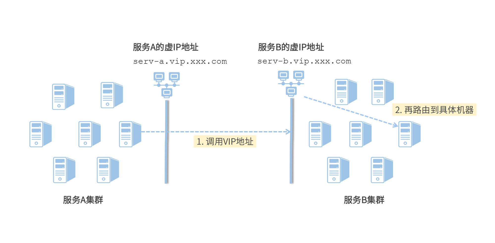

从上面的图中我们可以看出，服务 A 与服务 B 之间互相不直接通信，服务调用完全依靠 VIP 作为中间人来完成。我们如果想要为服务集群扩容或缩容，必须将服务器配置到对应的 VIP 地址上。如果你的应用是一个由数百个微服务组成的大型应用，光是管理这些 VIP Pool 的人力成本就够网络运维团队喝上一壶了。

那在微服务架构中，怎么才能实现一种简单可靠的远程服务调用，不让 VIP 中间商赚差价呢？这就要说到我们的服务治理理论了。

### 服务治理初探

如果我们要解决中间商赚差价的问题，那么最好的办法就是让双方直连。因此，服务治理要解决的首要任务就是**服务注册**与**服务发现**，通过这两项技术，我们就能让微服务之间发起面对面的直接调用。

那么服务 A 怎么知道服务 B 中每台机器的地址呢？为了让服务 A 拿到服务 B 的机器清单，我们需要搭建一个**中心化的服务注册中心**，服务 B 只要将自己的信息添加到注册中心里，服务 A 就能够从注册中心获取到服务 B 的所有节点列表。我画了一张图来帮助你更好地理解这个过程。

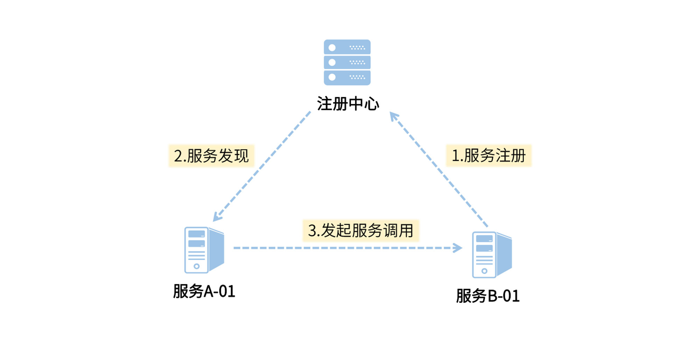

从上图中的步骤中我们可以看出，首先，服务 B 集群向注册中心发起了注册，将自己的地址信息上报到注册中心，这个过程就是**服务注册**。接下来，每隔一段时间，服务 A 就会从服务中心获取服务 B 集群的服务列表，或者由服务中心将服务列表的变动推送给服务 A，这个过程叫做**服务发现**；最后，服务 A 根据本地负载均衡策略，从服务列表中选取某一个服务 B 的节点，发起服务调用。

在这个过程中，**注册中心的角色是一个中心化的信息管理者**，所有的微服务节点在启动后都会将自己的地址信息添加到注册中心。在服务注册的过程中，有两个关键信息是最为重要的，我把它们列在了这里。

**服务名称**：服务名称通常默认是 spring.application.name 属性，在服务注册过程中我们必须将应用服务名上报到注册中心，这样其他服务才能根据服务名称找到对应的服务节点列表；

**地址信息**：包括服务节点的 IP 地址和端口。

通过上面这两个信息，调用方就能精准定位到目标微服务。除此之外，服务注册请求中还包含一些额外的注册信息，我将在 Nacos 的实战环节为你详细讲解这些注册参数。

通过服务注册和服务发现，我们已经能够实现端到端的服务调用链路，但这个方案似乎还并不完善，因为它缺少了**异常容错**的机制。

如果服务 B 集群因为未知的网络故障导致无法响应服务，这时候服务 A 向服务 B 发起了服务调用，就会发生超时或者服务无响应的异常情况。那我们如何在服务治理方案中规避这类问题呢？

业界通用的解决方案是“heathcheck”或者“heartbeat”，又叫“服务探活”或“心跳检查”。注册中心可以通过这种机制来标记异常服务，这样一来，Client 端在发送服务请求的时候就能避开异常节点。

我将这些异常处理的步骤添加到了服务注册流程中，并画了一个完整的微服务生命周期的图，你可以参考一下。

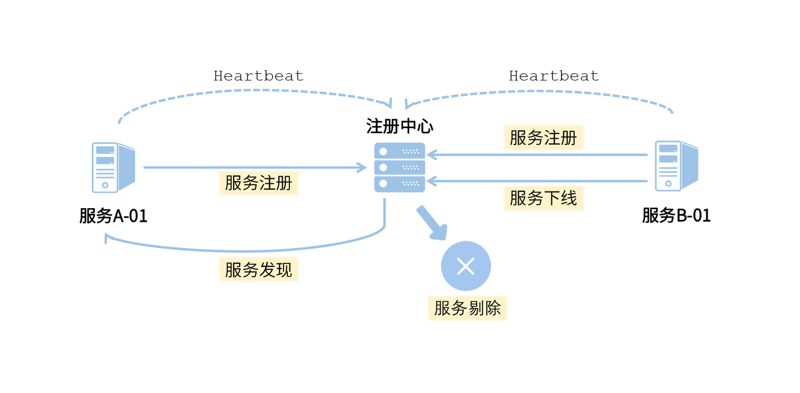

看了图片，你可能会问，怎么还有一个“服务剔除”呢？它是怎么实现的？

先说一个大前提。所有的服务都要在注册中心进行注册，而且每个节点都需要每隔一段时间向注册中心同步自己当前的状态，我们很形象地称这个过程为 heartbeat（心跳）。

如果节点持续发送心跳信息，则一切正常，服务可以被发现；如果注册中心在一段时间内没有收到 Client 的心跳包，注册中心就会将这个节点标记为下线状态，进而将该服务从服务列表中剔除。

这里我再补充一句，我们上面说的“服务剔除”是由注册中心主导的“被动下线”场景。除此之外还有一类服务“主动下线”的场景，也就是当服务节点关闭或者重启的时候，通过发送一条“服务下线”指令给到注册中心，将当前节点标记为下线状态。

到这里，相信你已经完全理解了微服务生命周期各个状态间的流转，也知道了服务注册中心在微服务生命周期中扮演了什么角色。

接下来，我们来了解 Spring Cloud 中的服务注册中心 Nacos。

### Nacos 体系架构

Nacos 有三个核心知识点：领域模型、数据模型和基本架构，这是我们整体把握 Nacos 架构的关键。下面我们来依次看看。

#### 领域模型

Nacos 领域模型描述了服务与实例之间的边界和层级关系。Nacos 的服务领域模型是以“服务”为维度构建起来的，这个服务并不是指集群中的单个服务器，而是指微服务的服务名。

“服务”是 Nacos 中位于最上层的概念，在服务之下，还有集群和实例的概念。为了方便你理解这三者的层级关系，我画了一张图，你可以参考一下。

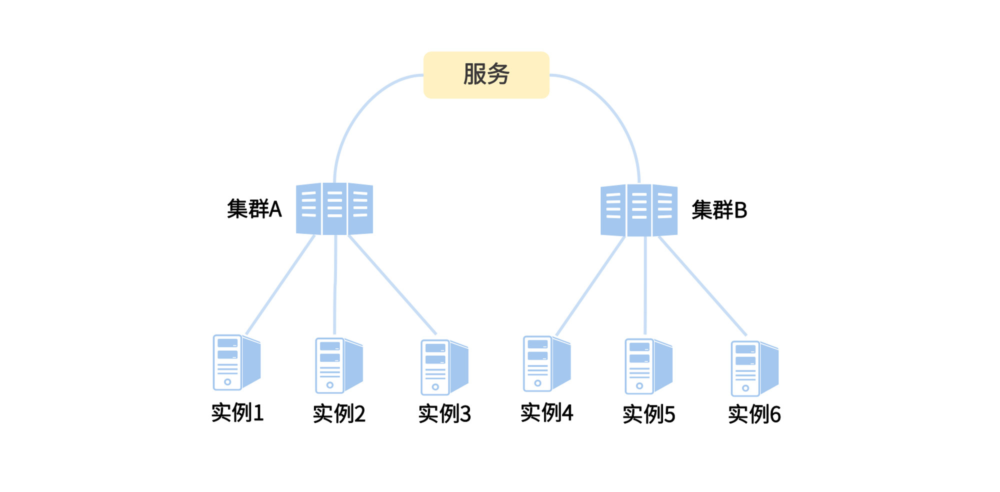

从上面的图中你可以看出，Nacos 的服务领域模型从上到下分为了服务、集群和实例三层，我分别介绍一下这三个层次所包含的重要数据内容。

**1.服务**

在服务这个层级上我们可以配置元数据和服务保护阈值等信息。服务阈值是一个 0~1 之间的数字，当服务的健康实例数与总实例的比例小于这个阈值的时候，说明能提供服务的机器已经没多少了。这时候 Nacos 会开启服务保护模式，不再主动剔除服务实例，同时还会将不健康的实例也返回给消费者。尽管这样做可能造成请求失败，但间接保证了最低限度的服务可用性。

**2.集群**

一个服务由很多服务实例组成，在每个服务实例启动的时候，我们可以设置它所属的集群，在集群这个层级上，我们也可以配置元数据。除此之外，我们还可以为持久化节点设置健康检查模式。

所谓持久化节点，是一种会保存到 Nacos 服务端的实例，即便该实例的客户端进程没有在运行，实例也不会被服务端删除，只不过 Nacos 会将这个持久化节点状态标记为不健康，Nacos 可以采用一种“主动探活”的方式来对持久化节点做健康检查。

除了持久化节点以外，大部分服务节点在 Nacos 中以“临时节点”的方式存在，它是默认的服务注册方式，从名字中我们就可以看出，这种节点不会被持久化保存在 Nacos 服务器，临时节点通过主动发送 heartbeat 请求向服务器报送自己的状态。

**3.实例**

这里所说的实例就是指服务节点，我们可以在 Nacos 控制台查看每个实例的 IP 地址和端口、编辑实例的元数据信息、修改它的上线 / 下线状态或者配置路由权重等等。

你会发现，在这三个层级上都有“元数据”这一数据结构，你可以把它理解为一组包含了服务描述信息（如服务版本等）和自定义标签的数据集合。Client 端通过服务发现技术可以获取到每个服务实例的元数据，你可以将自定义的属性加入到元数据并在 Client 端实现某些定制化的业务场景。

了解了领域模型之后，你知道服务调用的发起方是如何定位到领域模型中的服务实例的吗？这就要说起 Nacos 的数据模型了。

#### 数据模型

Nacos 的数据模型有三个层次结构，分别是 Namespace、Group 和 Service/DataId，我画了一幅图，帮你理解这三个层次之间的包含关系：

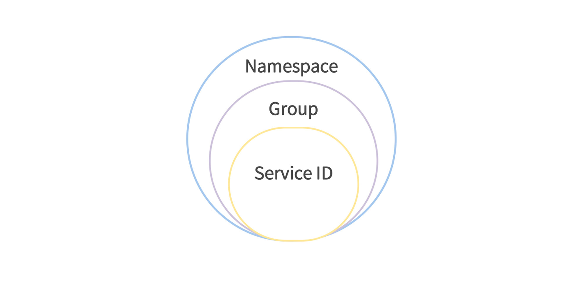

从上图中你可以看出，Namespace、Group 和 Service/DataId 是一个依次包含的结构，我分别对每一层做一个简单介绍。

**Namespace**：即命名空间，它是最顶层的数据结构，我们可以用它来区分开发环境、生产环境等不同环境。默认情况下，所有服务都部署到一个叫做“public”的公共命名空间；

**Group**：在命名空间之下有一个分组结构，默认情况下所有微服务都属于“DEFAULT_GROUP”这个分组，不同分组间的微服务是相互隔离的；

**Service/DataID**：在 Group 分组之下，就是具体的微服务了，比如订单服务、商品服务等等。

通过 **Namespace + Group + Service/DataID**，我们就可以精准定位到一个具体的微服务。比如，我想调用生产环境下 A 分组的订单服务，那么对应的服务寻址的 Key 就是类似 Production.A.orderService 的组合。

了解了 Nacos 的数据模型之后，我再来带你看一下 Nacos 的基本架构，这样你就对 Nacos 的功能模块有一个更全面的认识。

#### Nacos 基本架构

Nacos 的核心功能有两个，一个是 **Naming Service**，也就我们用来做服务发现的模块；另一个是 **Config Service**，用来提供配置项管理、动态更新配置和元数据的功能，关于配置管理的内容我会放到课程中的配置管理阶段为你详细讲解。

我这里用一张 Nacos 社区的基本架构 图来作为示例，带你看一下 Nacos 在功能模块层面的基本架构。

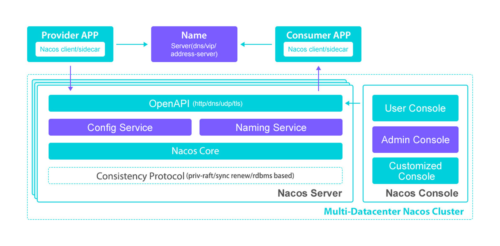

从上面的图中你可以看出，Provider APP 和 Consumer APP 通过 Open API 和 Nacos 服务器的核心模块进行通信。这里的 Open API 是一组对外暴露的 RESTful 风格的 HTTP 接口。如果你对 Open API 里具体的接口感兴趣，可以从Nacos 官方网站获取更多的关于 Open API 的详细信息。

在 Nacos 和核心模块里，Naming Service 提供了将对象和实体的“名字”映射到元数据的功能，这是服务发现的基础功能之一。例如，我想要调用 OrderService，我手里有这个服务的 Namespace 和 Group 信息，那么我就可以通过 Naming Service 定位到这个服务对应的实例列表。同理，如果我有一个 DNS 名称，同样可以借助 Naming Service 获取 DNS 背后配置的 IP 列表。以上两个场景就分别对应了服务发现和 DNS 功能，这两个场景都是 Naming Service 的核心场景。

Nacos 还有一个相当重要的模块：**Nacos Core** 模块。它可以提供一系列的平台基础功能，是支撑 Nacos 上层业务场景的基石。我挑选了几个 Nacos Core 中包含的重要功能，你可以看一下。

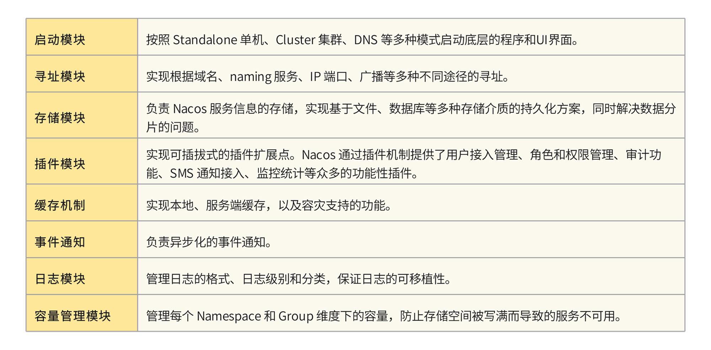

除了 Nacos Core 提供的这些功能以外，Nacos 还有一个“一致性协议”，用来确保 Nacos 集群中各个节点之间的数据一致性。Nacos 内部支持两种一致性协议，一种是侧重一致性的 Raft 协议，基于集群中选举出来的 Leader 节点进行数据写入；另一种是针对临时节点的 Distro 协议，它是一个侧重可用性（或最终一致性）的分布式一致性协议。

到这里，我们就完成了 Nacos 的基本架构部分的学习。

### 总结

现在，我们来回顾一下这节课的重点内容。今天我带你了解了服务治理所解决的问题。在这个问题解决的过程中，你自然建立起了对微服务生命周期各个状态的了解，你也能清楚地感受到服务注册中心 Nacos 的重要程度。为了让你更全面地认识 **Nacos 的功能体系**，我为你讲解了领域模型、数据模型和基础架构。

此外，我要给你一个小提示，虽然这节课我并没有深入介绍 Nacos 底层一致性协议的原理，但**一致性协议是近年来面试中常问到的热点问题**，我建议你借这个机会，去主动了解一些常见的经典协议。

在后面的课程中，我将带你搭建一个 Nacos 服务器集群，通过对 Spring Boot 项目的 Nacos 服务化改造，将实战项目里的本地方法调用改为微服务架构下的远程调用。通过实战环节的动手练习，你将对本节课的理论内容有更深的理解。

### 思考题

如果你正在开发的业务系统采用的是微服务架构，那么你如何实现远程服务调用呢？欢迎在留言区写下你的技术方案和技术选型，最好能再描述下背后的原理。

好啦，这节课就结束啦。欢迎你把这节课分享给更多对 Spring Cloud 感兴趣的朋友。我是姚秋辰，我们下节课再见！


## 08 | 服务治理：Nacos集群环境搭建

你好，我是姚秋辰。

上节课我们对 Nacos 功能体系有了全面的认识。今天我们就来动手搭建 Nacos 服务注册中心。通过这节课，你可以知道如何搭建一个高可用的 Nacos 服务集群，以及如何使用 MySQL 作为 Nacos 的底层数据存储方案。这些内容可以帮助你理解什么是“高可用架构”。

我们在做系统架构的时候，首要目标就是保障系统的高可用性。不管你的系统架构多么精妙，用的技术多么先进，如果系统的可用性无法得到保障，那么你做什么都是白忙活。

这就像我们的人生一样，事业、家庭、地位都是 0，健康才是一串 0 前面的那个 1，没有 1 则一切皆无。所以，系统的高可用性，就是系统架构层面的那个 1。

保障系统的高可用性有两个大道至简的方向。

**避免单点故障**：在做系统架构的时候，你应该假设任何服务器都有可能挂掉。如果某项任务依赖单一服务资源，那么这就会成为一个“单点”，一旦这个服务资源挂掉就表示整个功能变为不可用。所以你要尽可能消灭一切“单点”；

**故障机器状态恢复**：尽快将故障机器返回到故障前的状态。对于像 Nacos 这类中心化注册中心来说，因故障而下线的机器在重新上线后，应该有能力从某个地方获取故障发生前的服务注册列表。

那 Nacos 是如何解决上面这两个问题，来保证自己的高可用性的呢？很简单，就是构建服务集群。集群环境不仅可以有效规避单点故障引发的问题，同时对于故障恢复的场景来说，重新上线的机器也可以从集群中的其他节点同步数据信息，恢复到故障前的状态。

那么，接下来我就带你手把手搭建 Nacos Server 的集群环境。

### 下载 Nacos Server

Nacos Server 的安装包可以从 Alibaba 官方 GitHub 中的Release 页面下载。当前最新的稳定版本是 2.0.3，我们课程的实战项目也使用该版本的 Nacos 做为注册中心和配置中心。

在选择 Nacos 版本的时候你要注意，一定要选择**稳定版**使用，不要选择版本号中带有 BETA 字样的版本（比如 2.0.0-BETA）。后者通常是重大版本更新前预发布的试用版，往往会有很多潜在的 Bug 或者兼容性问题。

Nacos 2.0.3 Release note 下方的 Assets 面板中包含了该版本的下载链接，你可以在 nacos-server-2.0.3.tar.gz 和 nacos-server-2.0.3.zip 这两个压缩包中任选一个下载。如果你对 Nacos 的源码比较感兴趣，也可以下载 Source code 源码包来学习。

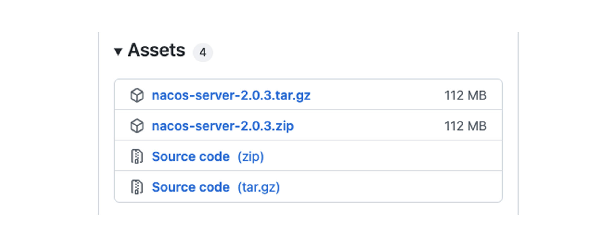

下载完成后，你可以在本地将 Nacos Server 压缩包解压，并将解压后的目录名改为“nacos-cluster1”，再复制一份同样的文件到 nacos-cluster2，我们以此来模拟一个由两台 Nacos Server 组成的集群。

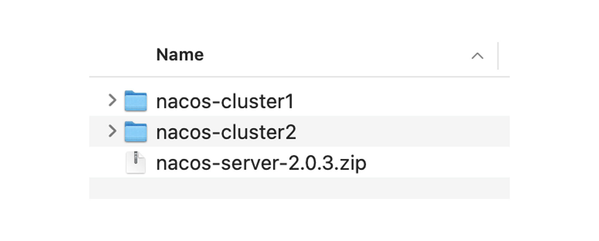

到这里，我们就完成了 Nacos 服务器的下载安装，接下来，我带你去修改 Nacos Server 的启动项参数。

### 修改启动项参数

Nacos Server 的启动项位于 bin 目录下的 application.properties 文件里，别看这个文件里的配置项密密麻麻一大串，但大部分都不用你操心，直接使用默认值就好。你只需要修改这里面的服务启动端口和数据库连接串就好了。

因为你需要在一台机器上同时启动两台 Nacos Server 来模拟一个集群环境，所以这两台 Nacos Server 需要使用不同的端口，否则在启动阶段会报出端口冲突的异常信息。

Nacos Server 的启动端口由 server.port 属性指定，默认端口是 8848。我们在 nacos-cluster1 中仍然使用 8848 作为默认端口，你只需要把 nacos-cluster2 中的端口号改掉就可以了，这里我把它改为 8948。

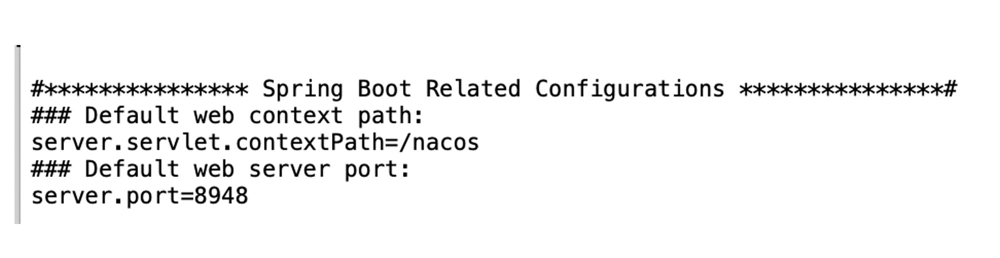

接下来，你需要对 Nacos Server 的 DB 连接串做一些修改。在默认情况下，Nacos Server 会使用 Derby 作为数据源，用于保存配置管理数据。Derby 是 Apache 基金会旗下的一款非常小巧的嵌入式数据库，可以随 Nacos Server 在本地启动。但从系统的可用性角度考虑，我们需要将 Nacos Server 的数据源迁移到更加稳定的 **MySQL 数据库**中。

你需要修改三处 Nacos Server 的数据库配置。

**指定数据源**：spring.datasource.platform=mysql 这行配置默认情况下被注释掉了，它用来指定数据源为 mysql，你需要将这行注释放开；

**指定 DB 实例数**：放开 db.num=1 这一行的注释；

**修改 JDBC 连接串**：db.url.0 指定了数据库连接字符串，我指向了 localhost 3306 端口的 nacos 数据库，稍后我将带你对这个数据库做初始化工作；db.user.0 和 db.password.0 分别指定了连接数据库的用户名和密码，我使用了默认的无密码 root 账户。

下面的图是完整的数据库配置项。

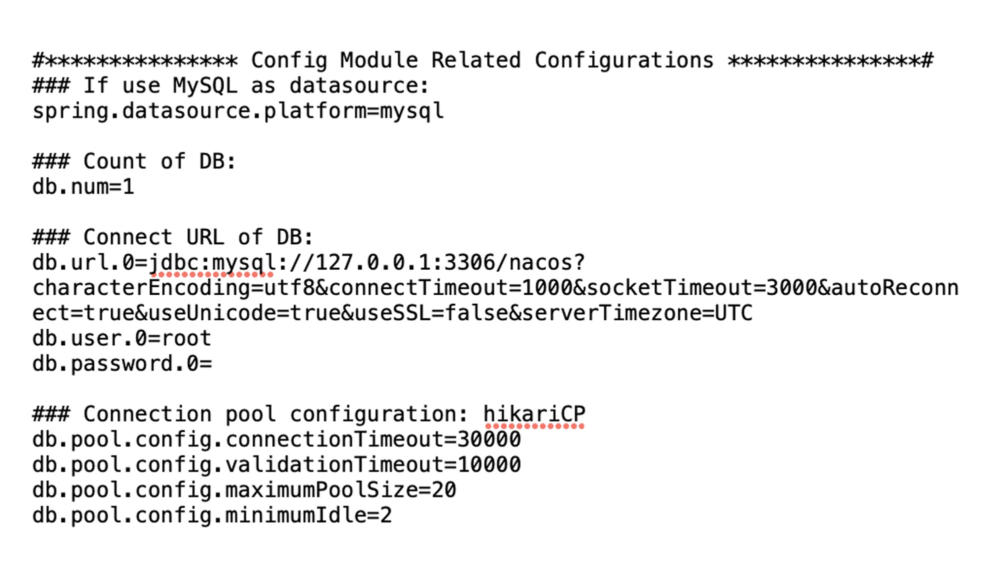

修改完数据库配置项之后，接下来我带你去 MySQL 中创建 Nacos Server 所需要用到的数据库 Schema 和数据库表。

### 创建 DB Schema 和 Table

Nacos Server 的数据库用来保存配置信息、Nacos Portal 登录用户、用户权限等数据，下面我们分两步来创建数据库。

**第一步，创建 Schema**。你可以通过数据库控制台或者 DataGrip 之类的可视化操作工具，执行下面这行 SQL 命令，创建一个名为 nacos 的 schema。

```sql
create schema nacos;
```

**第二步，创建数据库表**。Nacos 已经把建表语句准备好了，就放在你解压后的 Nacos Server 安装目录中。打开 Nacos Server 安装路径下的 conf 文件夹，找到里面的 nacos-mysql.sql 文件，你所需要的数据库建表语句都在这了。你也可以直接到源码仓库的资源文件中获取 Nacos 建表语句的 SQL 文件。

将文件中的 SQL 命令复制下来，在第一步中创建的 schema 下执行这些 SQL 命令。执行完之后，你就可以在在数据库中看到这些 tables 了，总共有 12 张数据库表。


数据库准备妥当之后，我们还剩最后一项任务：添加集群机器列表。添加成功后就可以完成集群搭建了。

### 添加集群机器列表

Nacos Server 可以从一个本地配置文件中获取所有的 Server 地址信息，从而实现服务器之间的数据同步。

所以现在我们要在 Nacos Server 的 conf 目录下创建 cluster.conf 文件，并将 nacos-cluster1 和 nacos-cluster2 这两台服务器的 IP 地址 + 端口号添加到文件中。下面是我本地的 cluster.conf 文件的内容。

```sh
## 注意，这里的IP不能是localhost或者127.0.0.1
192.168.1.100:8848
192.168.1.100:8948
```

这里需要注意的是，你不能在 cluster.conf 文件中使用 localhost 或者 127.0.0.1 作为服务器 IP，否则各个服务器无法在集群环境下同步服务注册信息。这里的 IP 应该使用你本机分配到的内网 IP 地址。

如果你使用的是 mac 或者 linux 系统，可以在命令行使用 ifconfig | grep “inet” 命令来获取本机 IP 地址，下图中红框标出的这行 inet 地址 192.168.1.100 就是本机的 IP 地址。

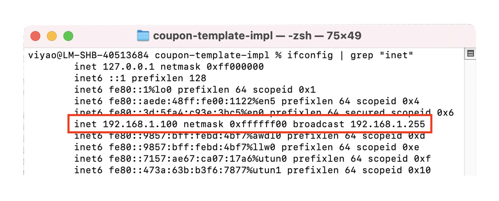

到这里，我们已经完成了所有集群环境的准备工作，接下来我带你去启动 Nacos Server 验证一下效果。

### 启动 Nacos Server

Nacos 的启动脚本位于安装目录下的 bin 文件夹，下图是 bin 目录下的启动脚本。其中 Windows 操作系统对应的启动脚本和关闭脚本分别是 startup.cmd 和 shutdown.cmd，Mac 和 Linux 系统对应的启动和关闭脚本是 startup.sh 和 shutdown.sh。

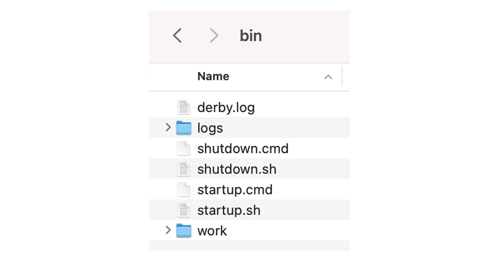

以 Mac 操作系统为例，如果你希望以单机模式（非集群模式）启动一台 Nacos 服务器，可以在 bin 目录下通过命令行执行下面这行命令：

```sh
 sh startup.sh -m standalone
```

通过 -m standalone 参数，我指定了服务器以单机模式启动。Nacos Server 在单机模式下不会主动向其它服务器同步数据，因此这个模式只能用于开发和测试阶段，对于生产环境来说，我们必须以 Cluster 模式启动。

如果希望将 Nacos Server 以集群模式启动，只需要在命令行直接执行 sh startup.sh 命令就可以了。这时控制台会打印以下两行启动日志。

```sh
nacos is starting with cluster
nacos is starting，you can check the /Users/banxian/workspace/dev/middleware/nacos-cluster1/logs/start.out
```

这两行启动日志没有告诉你 Nacos Server 最终是启动成功还是失败，不过你可以在第二行日志中找到一些蛛丝马迹。这行日志告诉了我们启动日志所在的位置是 nacos-cluster1/logs/start.out，在启动日志中你可以查看到一行成功消息“Nacos started successfully in cluster mode”。当然了，如果启动失败，你也可以在这里看到具体的 Error Log。

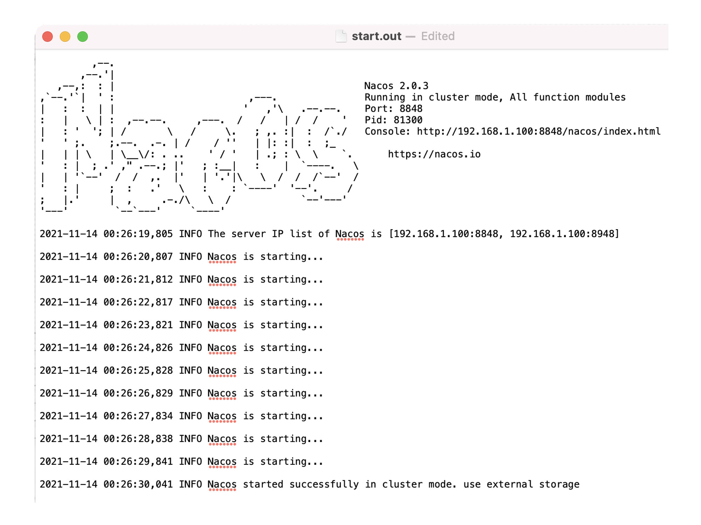

我们用同样的方式先后启动 nacos-cluster1 和 nacos-cluster2，如上图所示，在启动日志中显示了成功消息“started successfully in cluster mode”，这代表服务器已经成功启动了，接下来你就可以登录 Nacos 控制台了。

### 登录 Nacos 控制台

在 Nacos 的控制台中，我们可以看到服务注册列表、配置项管理、集群服务列表等信息。在浏览器中打开nacos-cluster1或者nacos-cluster2的地址，注意这两台服务器的端口分别是 8848 和 8948。你可以看到下面的 Nacos 的登录页面。

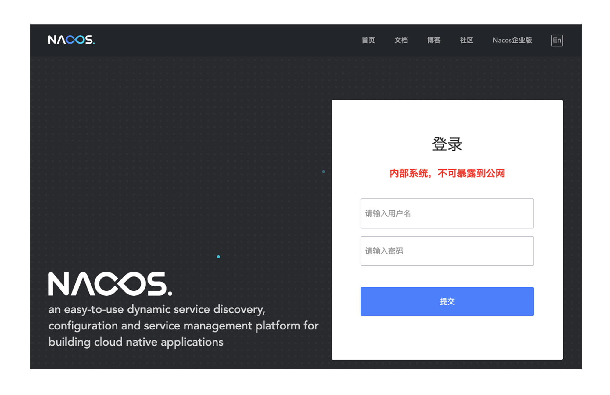

你可以使用 Nacos 默认创建好的用户 nacos 登录系统，用户名和密码都是 nacos。当然了，你也可以在登录后的权限控制 -> 用户列表页面新增系统用户。成功登录后，你就可以看到 Nacos 控制台首页了。

为了验证集群环境处于正常状态，你可以在左侧导航栏中打开“集群管理”下的“节点列表”页面，在这个页面上显示了集群环境中所有的 Nacos Server 节点以及对应的状态，在下面的图中我们可以看到 192.168.1.100:8848 和 192.168.1.100:8948 两台服务器，并且它们的节点状态都是绿色的“UP”，这表示你搭建的集群环境一切正常。

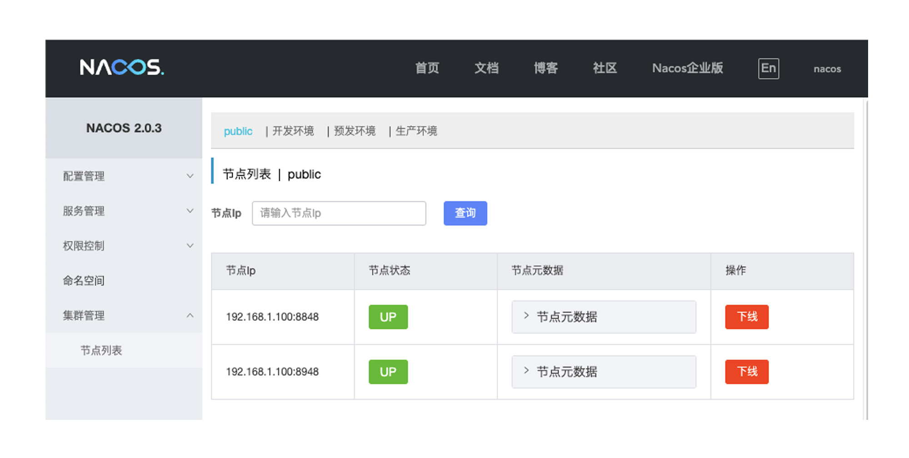

好，到这里，我们的 Nacos 集群环境搭建就完成了。如果你在搭建环境的过程中发现 Nacos 无法启动，只需要到启动日志 /logs/start.out 中就能找到具体的报错信息。如果你碰到了启动失败的问题，不妨先去检查以下两个地方：

**端口占用**：即 server.port 所指定的端口已经被使用，你需要更换一个端口重新启动服务；

**MySQL 连不上**：你需要检查 application.properties 里配置的 MySQL 连接信息是否正确，并确认 MySQL 服务处于运行状态。

如果是其它的异常报错，欢迎发表到评论区，我和热心的同学们都会帮替你诊断的。

### 总结

现在，我们来回顾一下这节课的重点内容。今天我们了解了如何搭建高可用的 Nacos 集群，在这个过程中，我将底层存储切换成了 MySQL 数据源，实现了配置项的持久化。

在实际的项目中，如果某个微服务 Client 要连接到 Nacos 集群做服务注册，我们并不会把 Nacos 集群中的所有服务器都配置在 Client 中，否则每次 Nacos 集群增加或删除了节点，我都要对所有 Client 做一次代码变更并重新发布。那么正确的做法是什么呢？

常见的一个做法是提供一个 VIP URL 给到 Client，VIP URL 是一个虚拟 IP 地址，我们可以把真实的 Nacos 服务器地址列表“隐藏”在虚拟 IP 后面，客户端只需要连接到虚 IP 即可，由提供虚 IP 的组件负责将请求转发给背后的服务器列表。这样一来，即便 Nacos 集群机器数量发生了变动，也不会对客户端造成任何感知。

提供虚 IP 的技术手段有很多，比如通过搭建 Nginx+LVS 或者 keepalived 技术实现高可用集群。如果你对这些技术感兴趣，我鼓励你尝试自己搭建一个虚 IP 的环境，锻炼一下技术调研能力。

### 思考题

在开始接下来的实战课之前，我们来做一些课前预习作业。请你从 Nacos 的官方文档中了解 Nacos 的功能特性以及集成方案，欢迎在评论区留下你的自学笔记。

好啦，这节课就结束啦。欢迎你把这节课分享给更多对 Spring Cloud 感兴趣的朋友。我是姚秋辰，我们下节课再见！


## 09 | 集成 Nacos：如何将服务提供者注册到 Nacos 服务器？

你好，我是姚秋辰。

今天我们来动手集成优惠券平台项目到 Nacos 服务器。这个项目我们将分两节课来讲，通过这两节课的学习，你可以知道如何借助 Nacos，搭建起一个端到端的微服务调用链路。在这个过程中，你还会学到 Nacos 自动装配器的工作原理，以及 Nacos 核心参数的配置。掌握了这些内容，你就可以平稳驾驭 Nacos 服务治理了。

在 Nacos 的地盘上，下游服务需要先将自己作为“服务提供者”注册到 Nacos，这个流程叫做“服务注册”；而上游服务作为“服务消费者”，需要到 Nacos 中获取可供调用的下游服务的列表，这个流程就是“服务发现”。

今天我先从两个下游服务 coupon-template-serv 和 coupon-calculation-serv 开始，利用 Nacos 的服务注册功能，将服务提供者注册到 Nacos 服务器。在下一节课中，我再向你展示作为服务消费者的 coupon-customer-serv 是如何通过服务发现机制向服务提供者发起调用。

在集成 Nacos 之前，我们需要先把 Nacos 的依赖项引入到项目中。

### 添加 Nacos 依赖项

Nacos 是 Sping Cloud Alibaba 项目的一款组件，在引入 Nacos 的依赖项之前，我们需要在项目的顶层 pom 中定义所要使用的 Spring Cloud 和 Spring Cloud Alibaba 的版本。

Spring Boot、Spring Cloud 和 Spring Cloud Alibaba 三者之间有严格的版本匹配关系，这三个组件的口味非常刁钻，只能和特定版本区间的搭档相互合作，一旦用错了版本，就会产生各种莫名其妙的兼容性问题。那么我们在哪里可以查询到正确的版本匹配关系呢？

Spring Boot 和 Spring Cloud 的版本匹配关系可以从Spring 社区网站获取，访问该网址后你会看到一串 JSON 文件，在这个文件中，你可以看到 Spring 官方给出的 Spring Cloud 最新分支所支持的 Spring Boot 版本范围。

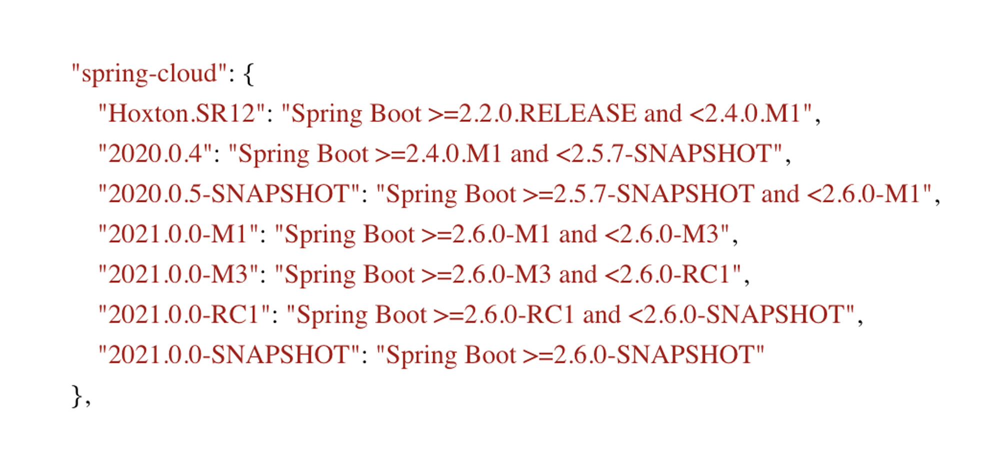

另外，Spring Cloud Alibaba、Spring Boot 和 Spring Cloud 的匹配关系可以从 Spring Cloud Alibaba 的官方GitHub wiki 页中获取，我将一些常用的版本绘制成表格，你可以作为参考。

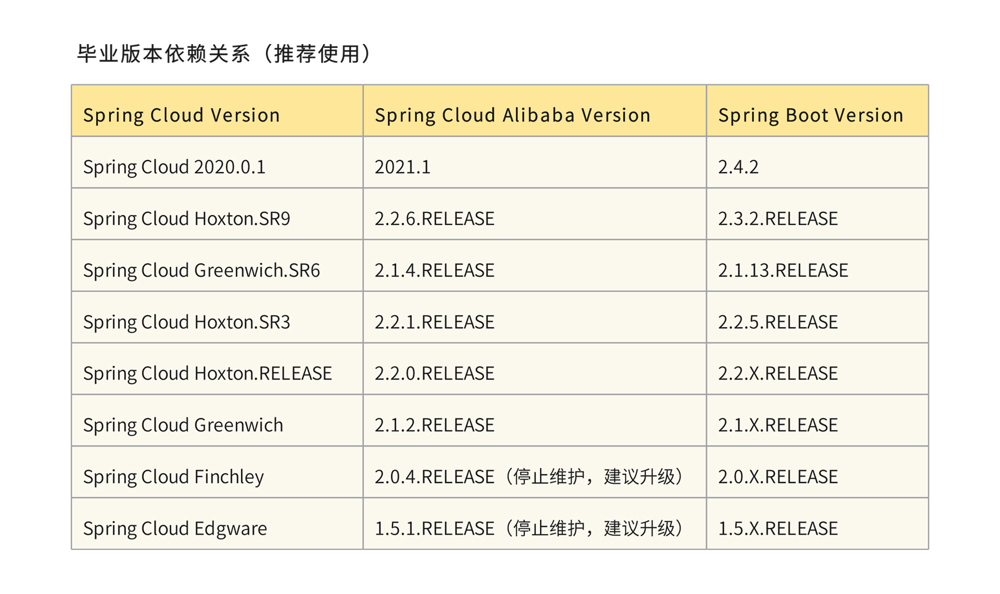

我推荐你使用上图中指定的版本组合，这里列出的组合都是经过兼容性测试的稳定版本，可以用在生产环境中。我这里选择 Spring Cloud 2020.0.1、Spring Cloud Alibaba 2021.1 和 Spring Boot 2.4.2 作为实战项目的依赖版本。

接下来，我们将 Spring Cloud Alibaba 和 Spring Cloud 的依赖项版本添加到顶层项目 geekbang-coupon 下的 pom.xml 文件中。

```xml
<dependencyManagement>
    <dependencies>
        <dependency>
            <groupId>org.springframework.cloud</groupId>
            <artifactId>spring-cloud-dependencies</artifactId>
            <version>2020.0.1</version>
            <type>pom</type>
            <scope>import</scope>
        </dependency>
        <dependency>
            <groupId>com.alibaba.cloud</groupId>
            <artifactId>spring-cloud-alibaba-dependencies</artifactId>
            <version>2021.1</version>
            <type>pom</type>
            <scope>import</scope>
        </dependency>
   </dependencies>   
   <!-- 省略部分代码 -->  
</dependencyManagement>
```

定义了组件的大版本之后，我们就可以直接把 Nacos 的依赖项加入到 coupon-template-serv 和 coupon-calculation-serv 了。我分别在这两个子模块的 pom.xml 文件中加入了 Nacos 的依赖项 spring-cloud-starter-alibaba-nacos-discovery。

```xml
<dependency>
    <groupId>com.alibaba.cloud</groupId>
    <artifactId>spring-cloud-starter-alibaba-nacos-discovery</artifactId>
</dependency>
```

由于我已经将 Spring Cloud Alibaba 的依赖项版本加到了顶层项目 geekbang-coupon，因此，在添加 Nacos 依赖项到子模块的时候不需要特别指定 < version > 内容，当前子模块会尝试从父级项目读取正确的版本信息。

在添加完依赖项之后，我们就可以通过配置项开启 Nacos 的服务治理功能了。Nacos 通过自动装配流程（auto configuration）加载配置项并开启服务注册。这个功能可不是 Nacos 所独有的，Spring Cloud 各个组件都采用了自动装配器实现了轻量级的组件集成功能，你只需要几行配置，剩下的初始化工作都可以交给背后的自动装配器来实现。

不过，接下来我要带你了解一下 Nacos 自动装配器的底层原理，因为这将有助于你理解 Spring Cloud 组件的启动流程，如果你将来需要开发一个自定义的组件，就可以借鉴这种设计模式。

### Nacos 自动装配原理

在 Spring Cloud 稍早一些的版本中，我们需要在启动类上添加 @EnableDiscoveryClient 注解开启服务治理功能，而在新版本的 Spring Cloud 中，这个注解不再是一个必须的步骤，我们只需要通过配置项就可以开启 Nacos 的功能。那么 Nacos 是怎么在启动阶段自动加载配置项并开启相关功能的呢？这就要从 Spring Framework 的自动装配流程（Auto Configuration）说起了。

我们将 Nacos 依赖项添加到项目中，同时也引入了 Nacos 自带的自动装配器，比如下面这几个被引入的自动装配器就掌管了 Nacos 核心功能的初始化任务。

**NacosDiscoveryAutoConfiguration**：服务发现功能的自动装配器，它主要做两件事儿：加载 Nacos 配置项，声明 NacosServiceDiscovery 类用作服务发现；

**NacosServiceAutoConfiguration**：声明核心服务治理类 NacosServiceManager，它可以通过 service id、group 等一系列参数获取已注册的服务列表；

**NacosServiceRegistryAutoConfiguration**：Nacos 服务注册的自动装配器。

我们以 **NacosDiscoveryAutoConfiguration** 类为例，了解一下它是怎么样工作的，先来看一下它的源码。

```java
@Configuration(proxyBeanMethods = false)
// 当spring.cloud.discovery.enabled=true时才生效
@ConditionalOnDiscoveryEnabled
// 当spring.cloud.nacos.discovery.enabled=true时生效
@ConditionalOnNacosDiscoveryEnabled
public class NacosDiscoveryAutoConfiguration {
   // 读取Nacos所有配置项并封装到NacosDiscoveryProperties中
   @Bean
   @ConditionalOnMissingBean
   public NacosDiscoveryProperties nacosProperties() {
      return new NacosDiscoveryProperties();
   }
 
   // 声明服务发现的功能类NacosServiceDiscovery
   @Bean
   @ConditionalOnMissingBean
   public NacosServiceDiscovery nacosServiceDiscovery(
         NacosDiscoveryProperties discoveryProperties,
         NacosServiceManager nacosServiceManager) {
      return new NacosServiceDiscovery(discoveryProperties, nacosServiceManager);
   }
}
```

NacosDiscoveryAutoConfiguration 自动装配器有两个开启条件，分别是 spring.cloud.discovery.enabled=true 和 spring.cloud.nacos.discovery.enabled=true。当我们引入 Nacos 的依赖项后，默认情况下这两个开关参数的值就已经是 True 了。也就是说，除非你主动关闭 Spring Cloud 和 Nacos 的服务发现开关，否则这个自动装配器就会自动执行加载。

接下来，我们来了解一下 NacosDiscoveryAutoConfiguration 中声明的两个方法，也就是 nacosProperties 方法和 nacosServiceDiscovery 方法都有什么功能。

在上面的源码中，我们看到，nacosProperties 方法返回了一个 NacosDiscoveryProperties 类，这个类是专门用来读取和封装 Nacos 配置项的类，它的源码如下：

```java
// 定义了配置项读取的路径
@ConfigurationProperties("spring.cloud.nacos.discovery")
public class NacosDiscoveryProperties {
 // 省略类属性
 // 这里定义的类属性和接下来我们要介绍的配置项是一一对应的
}
```

NacosDiscoveryProperties 类通过 ConfigurationProperties 注解从 spring.cloud.nacos.discovery 路径下获取配置项，Spring 框架会自动将这些配置项解析到 NacosDiscoveryProperties 类定义的类属性中。这样一来 Nacos 就完成了配置项的加载，在其它业务流程中，只需要注入 NacosDiscoveryProperties 类就可以读取 Nacos 的配置参数。

NacosDiscoveryAutoConfiguration 中的另一个方法 nacosServiceDiscovery 声明了一个服务发现的功能类 NacosServiceDiscovery，它的核心方法的源码如下：

```java
public class NacosServiceDiscovery {
   // 封装了Nacos配置项的类
   private NacosDiscoveryProperties discoveryProperties;
   // 另一个自动装配器声明的核心服务治理类
   private NacosServiceManager nacosServiceManager;
   // 根据服务名称获取所有已注册服务
   public List<ServiceInstance> getInstances(String serviceId) throws NacosException {
      String group = discoveryProperties.getGroup();
      List<Instance> instances = namingService().selectInstances(serviceId, group,
            true);
      return hostToServiceInstanceList(instances, serviceId);
   }
   // 返回所有服务的服务名称
   public List<String> getServices() throws NacosException {
      String group = discoveryProperties.getGroup();
      ListView<String> services = namingService().getServicesOfServer(1,
            Integer.MAX_VALUE, group);
      return services.getData();
   }
   // 省略部分代码...
}
```

通过 NacosServiceDiscovery 暴露的方法，我们就能够根据 serviceId（注册到 nacos 的服务名称）查询到可用的服务实例，获取到服务实例列表之后，调用方就可以发起远程服务调用了。

好，到这里我们就了解了 NacosDiscoveryAutoConfiguration 装配器做了什么事儿，希望你可以举一反三，通过阅读 Nacos 源码，深入了解下另外两个自动装配器 NacosServiceAutoConfiguration 和 NacosServiceRegistryAutoConfiguration 的底层业务。

了解了 Nacos 如何通过自动装配器加载配置项并开启服务治理功能之后，我们接下来去项目中添加 Nacos 的配置项。

### 添加 Nacos 配置项

Nacos 的配置项包含了服务注册参数与各项运行期参数，你可以使用标准的 Spring Boot 配置管理的方式设置 Nacos 的运行参数。

以我们今天要改造的服务 coupon-template-impl 为例，我们先来看一下 application.yml 文件中添加了哪些 Nacos 核心配置。Nacos 相关的配置项位于 spring.cloud.nacos 路径下，我配置的 Nacos 常用参数如下：

```yaml
spring:
  cloud:
    nacos:
      discovery:
        # Nacos的服务注册地址，可以配置多个，逗号分隔
        server-addr: localhost:8848
        # 服务注册到Nacos上的名称，一般不用配置
        service: coupon-customer-serv
        # nacos客户端向服务端发送心跳的时间间隔，时间单位其实是ms
        heart-beat-interval: 5000
        # 服务端没有接受到客户端心跳请求就将其设为不健康的时间间隔，默认为15s
        # 注：推荐值该值为15s即可，如果有的业务线希望服务下线或者出故障时希望尽快被发现，可以适当减少该值
        heart-beat-timeout: 20000
        # 元数据部分 - 可以自己随便定制
        metadata:
          mydata: abc
        # 客户端在启动时是否读取本地配置项(一个文件)来获取服务列表
        # 注：推荐该值为false，若改成true。则客户端会在本地的一个
        # 文件中保存服务信息，当下次宕机启动时，会优先读取本地的配置对外提供服务。
        naming-load-cache-at-start: false
        # 命名空间ID，Nacos通过不同的命名空间来区分不同的环境，进行数据隔离，
        namespace: dev
        # 创建不同的集群
        cluster-name: Cluster-A
        # [注意]两个服务如果存在上下游调用关系，必须配置相同的group才能发起访问
        group: myGroup
        # 向注册中心注册服务，默认为true
        # 如果只消费服务，不作为服务提供方，倒是可以设置成false，减少开销
        register-enabled: true
```

我带你深入了解下上面的每个参数，以及它们背后的一些使用场景，掌握了这些 Nacos 的核心配置项，你就可以平稳驾驭 Nacos 服务治理了。

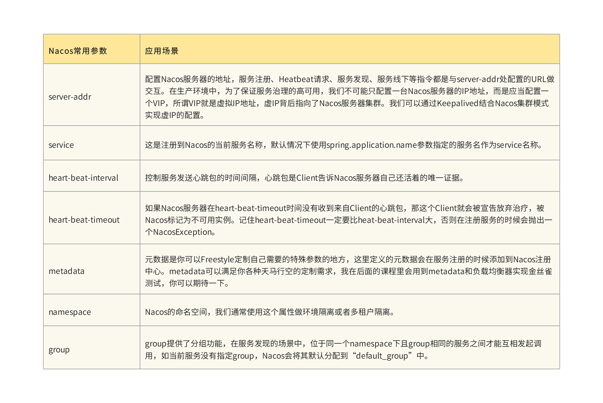

在这些参数中，Namespace 和 Group 经常搭配在一块来使用，它俩在功能上也有相似之处，在实际应用中经常傻傻分不清楚它俩的用途。为了帮你更好地理解这两个参数，我来带你深入了解下这两个属性各自的使用场景。

Namespace 可以用作环境隔离或者多租户隔离，其中：

- **环境隔离**：比如设置三个命名空间 production、pre-production 和 dev，分别表示生产环境、预发环境和开发环境，如果一个微服务注册到了 dev 环境，那么他无法调用其他环境的服务，因为服务发现机制只会获取到同样注册到 dev 环境的服务列表。如果未指定 namespace 则服务会被注册到 public 这个默认 namespace 下。

- **多租户隔离**：即 multi-tenant 架构，通过为每一个用户提供独立的 namespace 以实现租户与租户之间的环境隔离。

Group 的使用场景非常灵活，我来列举几个：

- **环境隔离**：在多租户架构之下，由于 namespace 已经被用于租户隔离，为了实现同一个租户下的环境隔离，你可以使用 group 作为环境隔离变量。

- **线上测试**：对于涉及到上下游多服务联动的场景，我将线上已部署的待上下游测服务的 group 设置为“group-A”，由于这是一个新的独立分组，所以线上的用户流量不会导向到这个 group。这样一来，开发人员就可以在不影响线上业务的前提下，通过发送测试请求到“group-A”的机器完成线上测试。

- **单元封闭**：什么是单元封闭呢？为了保证业务的高可用性，通常我们会把同一个服务部署在不同的物理单元（比如张北机房、杭州机房、上海机房），当某个中心机房出现故障的时候，我们可以在很短的时间内把用户流量切入其他单元机房。由于同一个单元内的服务器资源通常部署在同一个物理机房，因此本单元内的服务调用速度最快，而跨单元的服务调用将要承担巨大的网络等待时间。这种情况下，我们可以为同一个单元的服务设置相同的 group，使微服务调用封闭在当前单元内，提高业务响应速度。

除了这几个场景外，你能举一反三想一下还有其他场景吗？如果你想更进一步了解 Nacos 的配置参数全集，可以查看Nacos 的官方 GitHub或者Nacos 项目首页。

接下来，我们只需要启动 Nacos 注册中心，尝试将改造好的 coupon-template-serv 和 coupon-calculation-serv 注册到 Nacos 服务器，验证 Nacos 的服务注册功能。

### 验证 Nacos 服务注册功能

首先，我们需要开启 Nacos 服务器，你可以参考第 8 节课的内容，以单机模式或者集群模式开启 Nacos 服务器。

接下来，我们需要在 Nacos 上创建若干个 namespace（命名空间），你需在下图右侧导航栏找到“命名空间”页面，进入该页面点击“新增命名空间”按钮，分别创建三个不同的环境：production、pre-production 和 dev，用来表示生产环境、预发环境和开发环境。在创建 namespace 的过程中，一定要保证命名空间的 ID 和项目中的 namespace 属性是一致的。

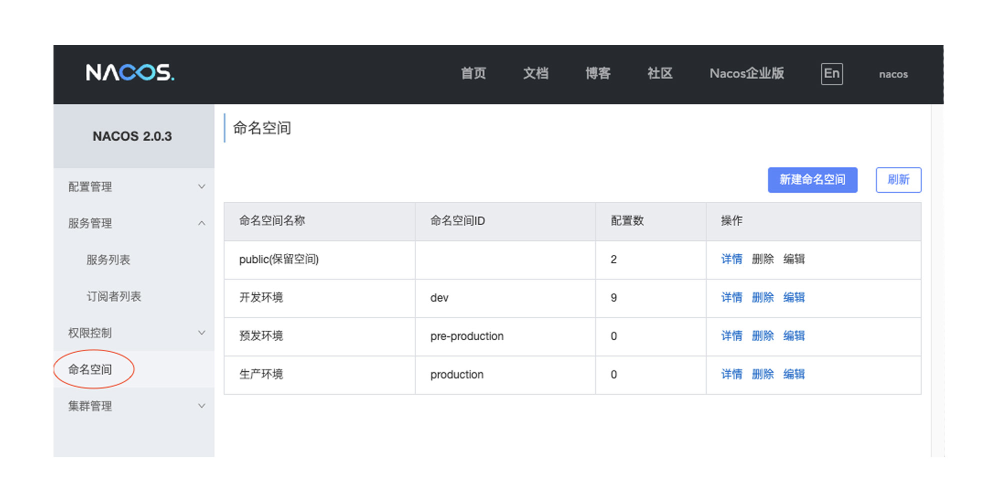

创建好命名空间之后，我们就可以在本地尝试启动 coupon-template-impl 和 coupon-calculation-impl 两个服务的 Main 方法。在这个过程中，你需要注意控制台打印出来的日志是否包含错误信息，如果有异常抛出则要 case by case 仔细分析。

如果应用启动一切正常，那么你就可以在下图的 Nacos 的服务列表中找到这两个服务。记得要选中你在应用中配置的 namespace（下图上方红框处标记的“开发环境”）才能看到对应的服务注册情况。

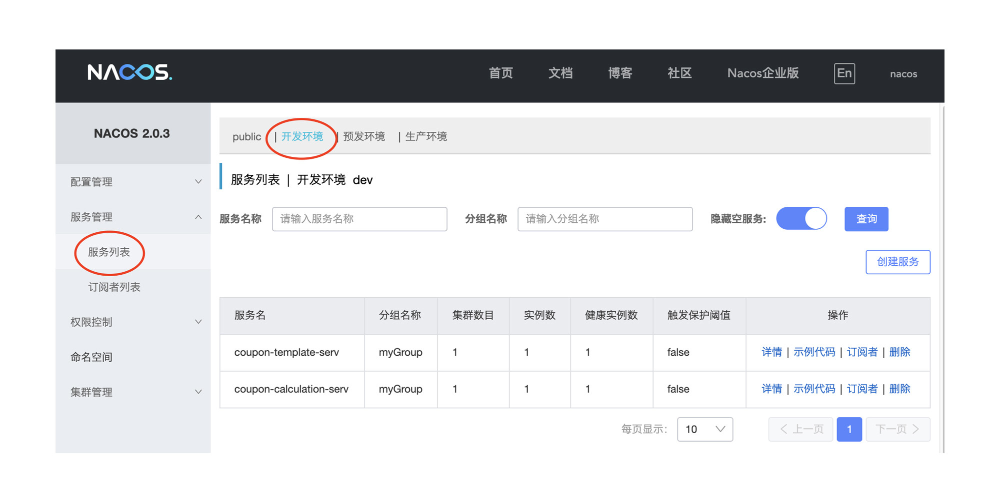

好，到这里，我们的服务注册就已经完成了。

如果你是第一次接触 Nacos 注册中心，可能会不小心踩到一些小坑。比如说“我的服务为什么注册不上”就是一个常见的问题，这时候有几个排查问题的方向：

你可以先查看下你的应用启动日志，看启动过程中是否有向 Nacos 服务器发起注册请求，如果没有相关日志，那极大可能是你的服务注册功能被手动关闭了，或者没有引入 Nacos 的依赖项以启动自动装配功能；

如果日志中抛出了异常，那么要 case-by-case 去检查异常发生的原因，是 Nacos 服务器地址不正确，还是参数设置不正确导致的；

当日志一切正常，可服务列表还看不到数据，那么你就要看一下是不是你开启了多个 Nacos 服务器，而服务器之间没有通过集群模式启动注册表同步；

另外你还要特别注意下配置参数中是否指定了 Namespace，如果是的话，那么服务只会出现在服务列表页面中对应的 Namespace 标签下。

### 总结

现在，我们来回顾一下这节课的重点内容。今天我带你实现了 Nacos 的服务注册功能，将 coupon-template-serv 和 coupon-calculation-serv 注册到了 Nacos Server。在这个过程中，我们以 NacosDiscoveryAutoConfiguration 作为引子，了解了 Nacos 的自动装配器是如何工作的。

自动装配器是一个在 Spring 领域里通用的组件集成方式，当你通过后面的学习了解到更多的 Spring Cloud 组件之后，就会发现它们大都利用了 Auto Configuration 的方式，以一种看似“无感知”的方式将自己集成到了项目之中。当你需要在自己的项目中设计一个新的组件，或者从框架层面提供一个新功能的时候，也不妨参考这种 Auto Configuration 的模式，设计一套轻量级的集成方案。

另外，学习 Spring Cloud 组件有一个共通的模式叫做“顺藤摸瓜”，这个藤就是业务启动的地方，也就是我们的“自动装配器”Auto Configuration 类。从这里作为起点，顺势向下研究每一个类的功能和源码，可以构建出这个组件的轮廓骨架，帮助你从全局视角了解组件的功能。

所以，我们学习一个框架不能仅仅学习它“怎么用”，“好读书不求甚解”可不是学习技术的好习惯。你还需要知道它背后是怎么工作的，这就叫“知其然而又知其所以然”，在这个过程中，最好的老师就是“源码”。

### 思考题

最后，请你思考一下，当关闭服务的时候，服务下线指令是如何发起的，你能找到 Nacos 里对应的源代码吗？你可以沿着自动装配器往下，慢慢顺藤摸瓜，忍住不要在网上搜索答案，尝试锻炼自己的源码阅读能力，在这一过程中你碰到的坑都欢迎在留言区和我分享和探讨。

好啦，这节课就结束啦。也欢迎你把这节课分享给更多对 Spring Cloud 感兴趣的朋友。我是姚秋辰，我们下节课再见！


## 10 | 集成 Nacos：如何通过服务发现机制向服务提供者发起调用？

你好，我是姚秋辰。

在上一课里，我们对 coupon-template-serv 和 coupon-calculation-serv 这两个服务做了微服务化改造，通过服务注册流程将它们注册到了 Nacos Server。这两个服务是以服务提供者的身份注册的，它们之间不会发生相互调用。为了发起一次完整的服务调用请求，我们还需要构建一个服务消费者去访问 Nacos 上的已注册服务。

coupon-customer-serv 就扮演了服务消费者的角色，它需要调用 coupon-template-serv 和 coupon-calculation-serv 完成自己的业务流程。今天我们就来动手改造 coupon-customer-serv 服务，借助 Nacos 的服务发现功能从注册中心获取可供调用的服务列表，并发起一个远程服务调用。

通过今天的内容，你可以了解如何使用 Webflux 发起远程调用，并熟练掌握如何搭建一套基于 Nacos 的服务治理方案。

### 添加 Nacos 依赖项和配置信息

在开始写代码之前，你需要将以下依赖项添加到 customer-customer-impl 子模块的 pom.xml 文件中。

```xml
<!-- Nacos服务发现组件 -->
<dependency>
    <groupId>com.alibaba.cloud</groupId>
    <artifactId>spring-cloud-starter-alibaba-nacos-discovery</artifactId>
</dependency>
<!-- 负载均衡组件 -->
<dependency>
    <groupId>org.springframework.cloud</groupId>
    <artifactId>spring-cloud-starter-loadbalancer</artifactId>
</dependency>
<!-- webflux服务调用 -->
<dependency>
    <groupId>org.springframework.boot</groupId>
    <artifactId>spring-boot-starter-webflux</artifactId>
</dependency> 
```

第一个依赖项你一定很熟悉了，它是 Nacos 服务治理的组件，我们在上一节课程中也添加了同款依赖项到 coupon-template-impl 和 coupon-calculation-impl 两个模块。

后面两个依赖项你应该是第一回见到，我来向你简单介绍一下。

**spring-cloud-starter-loadbalancer**：Spring Cloud 御用负载均衡组件 Loadbalancer，用来代替已经进入维护状态的 Netflix Ribbon 组件。我会在下一课带你深入了解 Loadbalancer 的功能，今天我们只需要简单了解下它的用法就可以了；

**spring-boot-starter-webflux**：Webflux 是 Spring Boot 提供的响应式编程框架，响应式编程是基于异步和事件驱动的非阻塞程序。Webflux 实现了 Reactive Streams 规范，内置了丰富的响应式编程特性。今天我将用 Webflux 组件中一个叫做 WebClient 的小工具发起远程服务调用。

添加好这两个依赖之后，你还需要做一番清理门户的工作，让 coupon-customer-serv 和另外两个微服务之间划清界限。

**删除实现层依赖**：从 coupon-customer-impl 的依赖项中删除 coupon-template-impl 和 coupon-calculation-impl；

**添加接口层依赖**：在 coupon-customer-impl 的依赖项中添加 coupon-template-api 和 coupon-calculation-api。

这样做的目的是**划清服务之间的依赖关系**，由于 coupon-customer-serv 是一个独立的微服务，它不需要将其他服务的“代码逻辑实现层”打包到自己的启动程序中一同启动。如果某个应用场景需要调用其它微服务，我们应该使用远程接口调用的方式对目标服务发起请求。因此，我们需要将对应接口的 Impl 实现层从 coupon-customer-impl 的依赖中删除，同时引入 API 层的依赖，以便构造请求参数和接收服务响应。

接下来，你还需要在 coupon-customer-impl 项目的 application.yml 文件中添加 Nacos 的配置项，我们直接从 coupon-template-impl 的配置项里抄作业就好了。将 spring.cloud.nacos 路径下的配置项 copy 到 coupon-customer-impl 项目中，如果你通过 spring.cloud.nacos.discovery.service 参数指定了服务名称，那你要**记得在抄作业的时候把名字改掉**，改成 coupon-customer-impl。

修改完依赖项和配置信息之后，你的代码一定冒出了不少编译错误。因为尽管我们已经将 coupon-template-impl 和 coupon-calculation-impl 依赖项删除，但 coupon-customer-impl 中的 CouponCustomerServiceImpl 仍然使用 Autowire 注入的方式调用本地服务。

所以接下来，我们就需要对调用层做一番改造，将 Autowire 注入本地服务的方式，替换为使用 WebClient 发起远程调用。

### 添加 WebClient 对象

为了可以用 WebClient 发起远程调用，你还需要在 Spring 上下文中构造一个 WebClient 对象。标准的做法是创建一个 Configuration 类，并在这个类中通过 @Bean 注解创建需要的对象。

所以我们在 coupon-customer-impl 子模块下创建了 com.geekbang.coupon.customer.Configuration 类，并声明 WebClient 的 Builder 对象。

```java
// Configuration注解声明配置类
@org.springframework.context.annotation.Configuration
public class Configuration {
    // 注册Bean并添加负载均衡功能
    @Bean
    @LoadBalanced
    public WebClient.Builder register() {
        return WebClient.builder();
    }
}
```

虽然上面的代码没几行，但我足足用了三个注解，这些注解各有用途。

@**Configuration 注解**：定义一个配置类。在 Configuration 类中定义的 @Bean 注解方法会被 AnnotationConfigApplicationContext 或者 AnnotationConfigWebApplicationContext 扫描并在上下文中进行构建；

@**Bean 注解**：声明一个受 Spring 容器托管的 Bean；

@**LoadBalanced 注解**：为 WebClient.Build 构造器注入特殊的 Filter，实现负载均衡功能，我在下一课会详细解释负载均衡的知识点。今天咱就好读书不求甚解就可以了，只需要知道这个注解的作用是在远程调用发起之前选定目标服务器地址。

WebClient 创建好了之后，你就可以在业务类中注入 WebClient 对象，并发起服务调用了。接下来，我就手把手带你将 CouponCustomerServiceImpl 里的本地方法调用替换成 WebClient 远程调用。

### 使用 WebClient 发起远程方法调用

首先，我们将 Configuration 类中声明的 WebClient 的 Builder 对象注入到 CouponCustomerServiceImpl 类中，两行代码简单搞定：

```java
@Autowired
private WebClient.Builder webClientBuilder;
```

接下来，我们开始改造第一个接口 requestCoupon。你需要将 requestCoupon 接口实现的第一行代码中的 CouponTemplateService 本地调用替换为 WebClient 远程调用。下面是改造之前的代码。

```java
CouponTemplateInfo templateInfo = templateService.loadTemplateInfo(request.getCouponTemplateId());
```

远程接口调用的代码改造可以通过 WebClient 提供的“链式编程”轻松实现，下面是代码的完整实现。

```java
CouponTemplateInfo templateInfo = webClientBuilder.build()
        .get()
        .uri("http://coupon-template-serv/template/getTemplate?id=" + request.getCouponTemplateId())
        .retrieve()
        .bodyToMono(CouponTemplateInfo.class)
        .block();
```

在这段代码中，我们应用了几个关键方法发起远程调用。

- get：指明了 Http Method 是 GET，如果是其他请求类型则使用对应的 post、put、patch、delete 等方法；

- uri：指定了访问的请求地址；

- retrieve + bodyToMono：指定了 Response 的返回格式；

- block：发起一个阻塞调用，在远程服务没有响应之前，当前线程处于阻塞状态。

在使用 uri 指定调用服务的地址时，你并不需要提供目标服务的 IP 地址和端口号，只需要将目标服务的服务名称 coupon-template-serv 告诉 WebClient 就好了。Nacos 在背后会通过服务发现机制，帮你获取到目标服务的所有可用节点列表。然后，WebClient 会通过负载均衡过滤器，从列表中选取一个节点进行调用，整个流程对开发人员都是**透明的**、**无感知的**。

你可以看到，在代码中我使用了 retrieve + bodyToMono 的方式接收 Response 响应，并将其转换为 CouponTemplateInfo 对象。在这个过程中，我只接收了 Response 返回的 Body 内容，并没有对 Response 中包含的其它字段进行处理。

如果你需要获取完整的 Response，包括 Http status、headers 等额外数据，就可以使用 retrieve + toEntity 的方式，获取包含完整 Response 信息的 ResponseEntity 对象。示例如下，你可以自己在项目中尝试这种调用方式，体验下 toEntity 和 bodyToMono 的不同之处。

```java
Mono<ResponseEntity<CouponTemplateInfo>> entityMono = client.get()
  .uri("http://coupon-template-serv/template/xxxx")
  .accept(MediaType.APPLICATION_JSON)
  .retrieve()
  .toEntity(CouponTemplateInfo.class);
```

WebClient 使用了一种**链式编程**的风格来构造请求对象，链式编程就是我们熟悉的 Builder 建造者模式。仔细观察你会发现，大部分开源应用都在使用这种设计模式简化对象的构建。如果你需要在自己的项目中使用 Builder 模式，你可以借助 Lombok 组件的 @Builder 注解来实现。如果你对此感兴趣，可以自行了解 Lombok 组件的相关用法。

到这里，我们已经完成了 requestCoupon 方法的改造，接下来我们趁热打铁，动手去替换 findCoupon 和 placeOrder 方法中的本地调用。有了之前的基础，这次替换对你来说已经是小菜一碟了。

在 findCoupon 方法中，我们需要调用 coupon-template-serv 的服务批量查询 CouponTemplate。这里的方式和前面一样，我使用 WebClient 对本地调用进行了替换，你可以参考下面的源码。

```java
Map<Long, CouponTemplateInfo> templateMap = webClientBuilder.build().get()
        .uri("http://coupon-template-serv/template/getBatch?ids=" + templateIds)
        .retrieve()
        .bodyToMono(new ParameterizedTypeReference<Map<Long, CouponTemplateInfo>>() {})
        .block();
```

由于方法的返回值不是一个标准的 Json 对象，而是 Map<Long, CouponTemplateInfo> 类型，因此你需要构造一个 ParameterizedTypeReference 实例丢给 WebClient，告诉它应该将 Response 转化成什么类型。

现在，我们还剩下一个关键方法没有改造，那就是 placeOrder，它调用了 coupon-calculation-serv 计算最终的订单价格，你可以参考以下源码。

```java
ShoppingCart checkoutInfo = webClientBuilder.build()
        .post()
        .uri("http://coupon-calculation-serv/calculator/checkout")
        .bodyValue(order)
        .retrieve()
        .bodyToMono(ShoppingCart.class)
        .block();
```

和前面几处改造不同的是，这是一个 POST 请求，因此在使用 webClient 构造器的时候我调用了 post 方法；除此之外，它还需要接收订单的完整信息作为请求参数，因此我这里调用了 bodyValue 方法，将封装好的 Order 对象塞了进去。在 coupon-customer-impl 中剩下的一些远程调用方法，就留给你来施展拳脚做改造了。

到这里，我们整个 Nacos 服务改造就已经完成了。你可以在本地依次启动 coupon-template-serv、coupon-calculation-serv 和 coupon-customer-serv。启动成功后，再到 Nacos 控制台查看这三个服务是否已经全部注册到了 Nacos。

如果你是以集群模式启动了多台 Nacos 服务器，那么即便你在实战项目中只配置了一个 Nacos URL，并没有使用虚拟 IP 搭建单独的集群地址，注册信息也会传播到 Nacos 集群中的所有节点。

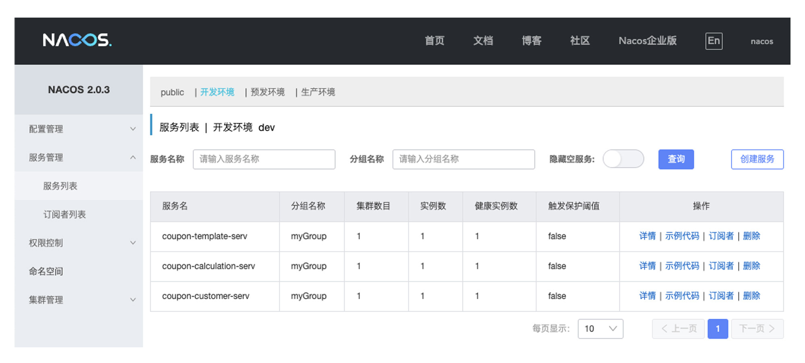

现在，动手搭建一套基于 Nacos 的服务治理方案对你而言一定不是难事儿了。动手能力是有了，但我们也不能仅仅满足于学会使用一套技术，**你必须要深入到技术的具体实现方案，才能从中汲取到养分，为你将来的技术方案设计提供参考**。

那么接下来，就让我带你去了解一下 Nacos 服务发现的底层实现，学习一下 Client 端是通过什么途径从 Nacos Server 获取服务注册表的。

### Nacos 服务发现底层实现

Nacos Client 通过一种**主动轮询**的机制从 Nacos Server 获取服务注册信息，包括地址列表、group 分组、cluster 名称等一系列数据。简单来说，Nacos Client 会开启一个本地的定时任务，每间隔一段时间，就尝试从 Nacos Server 查询服务注册表，并将最新的注册信息更新到本地。这种方式也被称之为“Pull”模式，即客户端主动从服务端拉取的模式。

负责拉取服务的任务是 UpdateTask 类，它实现了 Runnable 接口。Nacos 以开启线程的方式调用 UpdateTask 类中的 run 方法，触发本地的服务发现查询请求。

UpdateTask 这个类隐藏得非常深，它是 HostReactive 的一个内部类，我带你看一下经过详细注释的代码走读：

```java
public class UpdateTask implements Runnable {
    // ....省略部分代码
    
    // 获取服务列表
    @Override
    public void run() {
        long delayTime = DEFAULT_DELAY;
        
        try {
            // 根据service name获取到当前服务的信息，包括服务器地址列表
            ServiceInfo serviceObj = serviceInfoMap
                .get(ServiceInfo.getKey(serviceName, clusters));
            
            // 如果为空，则重新拉取最新的服务列表
            if (serviceObj == null) {
                updateService(serviceName, clusters);
                return;
            }
            
            // 如果时间戳<=上次更新的时间，则进行更新操作
            if (serviceObj.getLastRefTime() <= lastRefTime) {
                updateService(serviceName, clusters);
                serviceObj = serviceInfoMap.get(ServiceInfo.getKey(serviceName, clusters));
            } else {
                // 如果serviceObj的refTime更晚，
                // 则表示服务通过主动push机制已被更新，这时我们只进行刷新操作
                refreshOnly(serviceName, clusters);
            }
            // 刷新服务的更新时间
            lastRefTime = serviceObj.getLastRefTime();
            
            // 如果订阅被取消，则停止更新任务
            if (!notifier.isSubscribed(serviceName, clusters) && !futureMap
                    .containsKey(ServiceInfo.getKey(serviceName, clusters))) {
                // abort the update task
                NAMING_LOGGER.info("update task is stopped, service:" + serviceName + ", clusters:" + clusters);
                return;
            }
            // 如果没有可供调用的服务列表，则统计失败次数+1
            if (CollectionUtils.isEmpty(serviceObj.getHosts())) {
                incFailCount();
                return;
            }
            // 设置延迟一段时间后进行查询
            delayTime = serviceObj.getCacheMillis();
            // 将失败查询次数重置为0
            resetFailCount();
        } catch (Throwable e) {
            incFailCount();
            NAMING_LOGGER.warn("[NA] failed to update serviceName: " + serviceName, e);
        } finally {
            // 设置下一次查询任务的触发时间
            executor.schedule(this, Math.min(delayTime << failCount, DEFAULT_DELAY * 60), TimeUnit.MILLISECONDS);
        }
    }
}
```

在 UpdateTask 的源码中，它通过调用 updateService 方法实现了服务查询和本地注册表更新，在每次任务执行结束的时候，在结尾处它通过 finally 代码块设置了下一次 executor 查询的时间，周而复始循环往复。

以上，就是 Nacos 通过 UpdateTask 来查询服务端注册表的底层原理了。

那么现在我就要考考你了，你知道 UpdateTask 是在什么阶段由哪一个类首次触发的吗？我已经把这个藤交到你手上了，希望你能顺藤摸瓜，顺着 UpdateTask 类，从源码层面找到它的上游调用方，理清整个服务发现链路的流程。

### 总结

到这里，我们就完成了 geekbang-coupon-center 的 Nacos 服务治理改造。通过这两节课，你完整搭建了整个 Nacos 服务治理链路。在这条链路中，你通过**服务注册**流程实现了服务提供者的注册，又通过**服务发现**机制让服务消费者获取服务注册信息，还能通过 WebClient 发起**远程调用**。

在这段学习过程中，学会如何使用技术是一件很容易的事儿，而学会它背后的原理却需要花上数倍的功夫。在每节实战课里我都会加上一些源码分析，不仅授之以鱼，更要授之以渔，让你学会如何通过深入源码去学习一个框架。

为什么学习源码这么重要呢？我这么说吧，这就像你学习写作一样，小学刚开始练习写作的时候，我们是从“模仿”开始的。随着阅历、知识和阅读量的增多，你逐渐有了自己的思考和想法，建立了属于你的写作风格。学习技术也是类似的，好的开源框架就像一本佳作，Spring 社区孵化的框架更是如此，你从中可以汲取很多营养，进而完善自己的架构理念和技术细节。若干年后当你成为独当一面的架构师，这些平日里的积累终会为你所用。

### 思考题

如果某个服务节点碰到了某些异常状况，比如网络故障或者磁盘空间已满，导致无法响应服务请求。你知道 Nacos 通过什么途径来识别故障服务，并从 Nacos Server 的服务注册表中将故障服务剔除的吗？

好啦，这节课就结束啦。欢迎你把这节课分享给更多对 Spring Cloud 感兴趣的朋友。我是姚秋辰，我们下节课再见！


## 11 | Loadbalancer 实战：通过自定义负载均衡策略实现金丝雀测试

你好，我是姚秋辰。

上一课我们学习了如何借助 Nacos 的服务发现机制获取可用服务节点列表，并发起远程服务调用。在服务调用的环节里，还有一处细节需要你思考一下：Nacos 通过服务发现拿到了所有的可用服务节点列表，但服务请求只能发给一个节点，你知道服务调用是根据什么规则选择目标节点的吗？

“小孩子才做选择，大人全都要”，Nacos 就是这个全都要的大人。服务列表都被它拿到了手里，但如果要完成一次完整的服务调用，它还需要一个小孩子帮忙做选择，这个做选择题的小孩就是客户端负载均衡组件 Spring Cloud Loadbalancer，它根据负载均衡规则，从 Nacos 获取的服务列表中选取服务调用的目标地址。

那么，Loadbalancer 背后是如何工作的呢？今天我就带你了解 Spring Cloud 御用负载均衡器 Loadbalancer 的原理。通过这节课，你可以收获以下内容。

**负载均衡的作用**：了解负载均衡的两大门派，它们分别是网关层负载均衡和客户端负载均衡。你还会理解客户端负载均衡在微服务架构中的优势；

**Loadbalancer 工作原理**：了解 Loadbalancer 如何运用 @Loadbalanced 注解进行加载；

**自定义负载均衡策略**：了解 Loadbalancer 的自定义扩展点，在实战项目中实现金丝雀测试。

接下来，我们先来看一下负载均衡在微服务中的作用。

### 为什么需要负载均衡

俗话说在生产队薅羊毛不能逮着一只羊薅，在微服务领域也是这个道理。面对一个庞大的微服务集群，如果你每次发起服务调用都只盯着那一两台服务器，在大用户访问量的情况下，这几台被薅羊毛的服务器一定会不堪重负。

因此，我们需要**将访问流量分散到集群中的各个服务器上**，实现雨露均沾，这就是所谓的“**负载均衡技术**”。

道理是这个道理，但实现起来就有两条不同的路径。负载均衡有两大门派，**服务端负载均衡**和**客户端负载均衡**。我们先来聊聊这两个不同门派的使用场景，再来看看本节课的主角 Loadbalancer 属于哪门哪派。

#### 网关层负载均衡

网关层负载均衡也被称为服务端负载均衡，就是在服务集群内设置一个中心化负载均衡器，比如 API Gateway 服务。发起服务间调用的时候，服务请求并不直接发向目标服务器，而是发给这个全局负载均衡器，它再根据配置的负载均衡策略将请求转发到目标服务。我把这个过程画成了下面这张流程图。

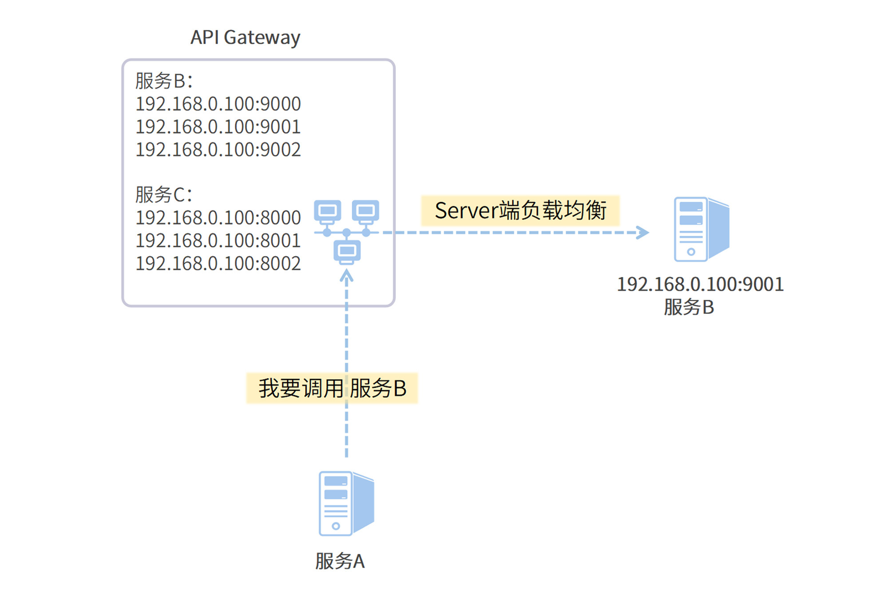

网关层负载均衡的应用范围非常广，它不依赖于服务发现技术，客户端并不需要拉取完整的服务列表；同时，发起服务调用的客户端也不用操心该使用什么负载均衡策略。

不过，网关层负载均衡的劣势也很明显。

**网络消耗**：多了一次客户端请求网关层的网络开销，在线上高并发场景下这层调用会增加 10ms～20ms 左右的服务响应时间。别小瞧了这十几毫秒的时间，在超高 QPS 的场景下，性能损耗也会被同步放大，降低系统的吞吐量；

**复杂度和故障率提升**：需要额外搭建内部网关组件作为负载均衡器，增加了系统复杂度，而多出来的那一次的网络调用无疑也增加了请求失败率。

Spring Cloud Loadbalancer 可以很好地弥补上面的劣势，那么它是如何做到的呢？

#### 客户端负载均衡

Spring Cloud Loadbalancer 采用了客户端负载均衡技术，每个发起服务调用的客户端都存有完整的目标服务地址列表，根据配置的负载均衡策略，由客户端自己决定向哪台服务器发起调用。

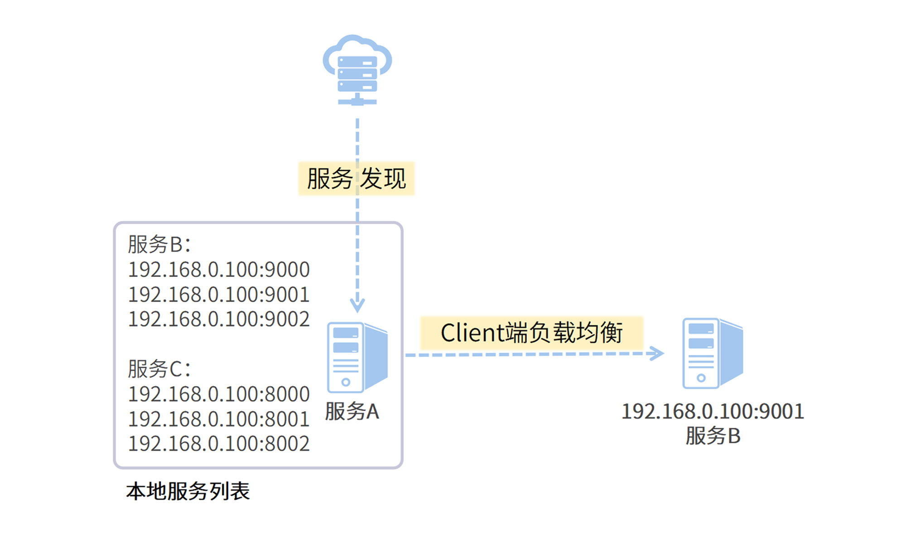

客户端负载均衡的优势很明显。

**网络开销小**：由客户端直接发起点对点的服务调用，没有中间商赚差价；

**配置灵活**：各个客户端可以根据自己的需要灵活定制负载均衡策略。

不过呢，如果想要应用客户端负载均衡，那么还需要满足一个前置条件，发起服务调用的客户端需要获取所有目标服务的地址，这样它才能使用负载均衡规则选取要调用的服务。也就是说，**客户端负载均衡技术往往需要依赖服务发现技术来获取服务列表**。

所以，Nacos 和 Loadbalancer 自然而然地走到了一起，一个通过服务发现获取服务列表，另一个使用负载均衡规则选出目标服务器。

了解了负载均衡的作用之后，我们来看看 Loadbalancer 的工作原理。

### Loadbalancer 工作原理

你一定还记得我们在 Nacos 实战部分使用 WebClient 发起服务调用的过程吧。我在 coupon-customer-serv 中声明 WebClient 的时候加了一个机关，那就是 @Loadbalanced 注解，这个注解就是开启负载均衡功能的玄机。

```java
@Bean
@LoadBalanced
public WebClient.Builder register() {
    return WebClient.builder();
}
```

Loadbalancer 组件通过 @Loadbalanced 注解对 WebClient 动了一番手脚，在启动过程中利用了自动装配器机制，分三步偷偷摸摸地向 WebClient 中塞了一个特殊的 Filter（过滤器），通过过滤器实现了负载均衡功能。

```java
Builder filter(ExchangeFilterFunction filter);
```

接下来，我们深入源码，看看 Loadbalancer 是如何通过注解将过滤器添加到 WebClient 对象中的，这个过程分为三步。

**第一步，声明负载均衡过滤器**。ReactorLoadBalancerClientAutoConfiguration 是一个自动装配器类，我们在项目中引入了 WebClient 和 ReactiveLoadBalancer 类之后，自动装配流程就开始忙活起来了。在这个过程中，它会初始化一个实现了 ExchangeFilterFunction 的实例，在后面的步骤中，该实例将作为过滤器被注入到 WebClient。

下面是自动装配器的源码。

```java
@Configuration(proxyBeanMethods = false)
// 只要Path路径上能加载到WebClient和ReactiveLoadBalancer
// 则开启自动装配流程
@ConditionalOnClass(WebClient.class)
@ConditionalOnBean(ReactiveLoadBalancer.Factory.class)
public class ReactorLoadBalancerClientAutoConfiguration {
   // 如果开启了Loadbalancer重试功能(默认开启）
   // 则初始化RetryableLoadBalancerExchangeFilterFunction
   @ConditionalOnMissingBean
   @ConditionalOnProperty(value = "spring.cloud.loadbalancer.retry.enabled", havingValue = "true")
   @Bean
   public RetryableLoadBalancerExchangeFilterFunction retryableLoadBalancerExchangeFilterFunction(
         ReactiveLoadBalancer.Factory<ServiceInstance> loadBalancerFactory, LoadBalancerProperties properties,
         LoadBalancerRetryPolicy retryPolicy) {
      return new RetryableLoadBalancerExchangeFilterFunction(retryPolicy, loadBalancerFactory, properties);
   }
   
    // 如果关闭了Loadbalancer的重试功能
    // 则初始化ReactorLoadBalancerExchangeFilterFunction对象
    @ConditionalOnMissingBean
    @ConditionalOnProperty(value = "spring.cloud.loadbalancer.retry.enabled", havingValue = "false",
        matchIfMissing = true)
    @Bean
    public ReactorLoadBalancerExchangeFilterFunction loadBalancerExchangeFilterFunction(
        ReactiveLoadBalancer.Factory<ServiceInstance> loadBalancerFactory, LoadBalancerProperties properties) {
        return new ReactorLoadBalancerExchangeFilterFunction(loadBalancerFactory, properties);
    }
   // ...省略部分代码
}
```

**第二步，声明后置处理器**。LoadBalancerBeanPostProcessorAutoConfiguration 是第二个登场的自动装配器，它的主要作用是将第一步中创建的 ExchangeFilterFunction 拦截器实例添加到一个后置处理器（LoadBalancerWebClientBuilderBeanPostProcessor）中。

```java
// 省略部分代码
public class LoadBalancerBeanPostProcessorAutoConfiguration {
   // 内部配置类
   @Configuration(proxyBeanMethods = false)
   @ConditionalOnBean(ReactiveLoadBalancer.Factory.class)
   protected static class ReactorDeferringLoadBalancerFilterConfig {
      
      // 将第一步中创建的ExchangeFilterFunction实例封装到另一个名为
      // DeferringLoadBalancerExchangeFilterFunction的过滤器中
      @Bean
      @Primary
      DeferringLoadBalancerExchangeFilterFunction<LoadBalancedExchangeFilterFunction> reactorDeferringLoadBalancerExchangeFilterFunction(
            ObjectProvider<LoadBalancedExchangeFilterFunction> exchangeFilterFunctionProvider) {
         return new DeferringLoadBalancerExchangeFilterFunction<>(exchangeFilterFunctionProvider);
      }
   }
   
   // 将过滤器打包到后置处理器中
   @Bean
   public LoadBalancerWebClientBuilderBeanPostProcessor loadBalancerWebClientBuilderBeanPostProcessor(
         DeferringLoadBalancerExchangeFilterFunction deferringExchangeFilterFunction, ApplicationContext context) {
      return new LoadBalancerWebClientBuilderBeanPostProcessor(deferringExchangeFilterFunction, context);
   }
}
```

**第三步**，添加过滤器到 WebClient**。LoadBalancerWebClientBuilderBeanPostProcessor 后置处理器开始发挥作用，将过滤器添加到 WebClient 中。注意**不是所有的 WebClient 都会被注入过滤器，只有被 @Loadbalanced 注解修饰的 WebClient 实例才能享受这个待遇。

```java
public class LoadBalancerWebClientBuilderBeanPostProcessor implements BeanPostProcessor {
   // ... 省略部分代码
   
   // 对过滤器动手脚
   @Override
   public Object postProcessBeforeInitialization(Object bean, String beanName) throws BeansException {
      // 如果满足以下条件，则将过滤器添加到WebClient中
      // 1) 当前Bean是WebClient.Builder实例
      // 2) WebClient被@LoadBalanced注解修饰
      if (bean instanceof WebClient.Builder) {
         if (context.findAnnotationOnBean(beanName, LoadBalanced.class) == null) {
            return bean;
         }
         // 添加过滤器
         ((WebClient.Builder) bean).filter(exchangeFilterFunction);
      }
      return bean;
   }
}
```

好了，到这里 Loadbalancer 组件就完成了过滤器的注入。过滤器是一个搭建在 WebClient 和负载均衡策略之间的桥梁，在 WebClient 发出一个请求前，过滤器会横插一脚，召唤出负载均衡策略，决定这个请求要发配到哪一台服务器。如果你感兴趣，可以自己阅读过滤器的源码，深入了解它是如何从 LoadBalancerFactory 中获取到具体的负载均衡策略的。

了解了 Loadbalancer 的底层原理，接下来我带你深入了解 Loadbalancer 组件的负载均衡扩展点，看一看如何**深度定制一个属于自己的负载均衡策略**。

### 自定义负载均衡策略实现金丝雀测试

Loadbalancer 提供了两种内置负载均衡策略。

**RandomLoadBalancer**：在服务列表中随机挑选一台服务器发起调用，属于拼人品系列；

**RoundRobinLoadBalancer**：通过内部保存的一个 position 计数器，按照次序从上到下依次调用服务，每次调用后计数器 +1，属于排好队一个个来系列。

如果以上负载均衡策略无法满足你的要求，那么应该怎么实现自定义的负载均衡策略呢？

Loadbalancer 提供了一个顶层的抽象接口 ReactiveLoadBalancer，你可以通过继承这个接口，来实现自定义的负载均衡策略。现在我就带你沿着这个路子实现一个用于“金丝雀测试”的负载均衡策略，在动手之前，我先带你了解一下什么是“金丝雀测试”。

#### 金丝雀测试

金丝雀测试是灰度测试的一种。

我们的线上应用平稳运行在一个集群中，当你想要上线一个涉及上下游代码改动的线上应用的时候，首先想到的是先要做一个线上测试。这个测试必须在极小规模的范围内进行，不能影响到整个集群。

我们可以把代码改动部署到极个别的几台机器上，这几台机器就叫做“金丝雀”。只有带着“**测试流量标记**”的请求会被发到这几台服务器上，而正常的流量只会打到集群中的其它机器上。下面的图解释了金丝雀测试的流程。

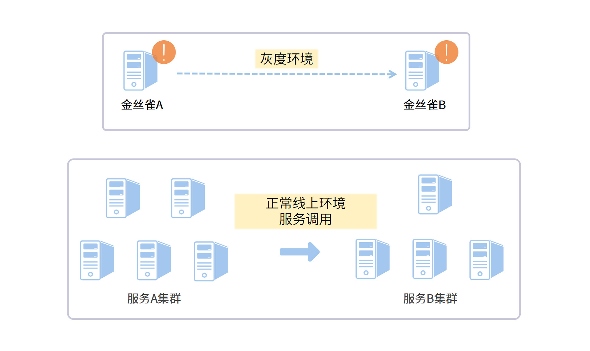

现在你了解了金丝雀测试，接下来我们就将它应用在用户领券这个场景中。

用户领券的接口位于 coupon-customer-serv 子模块中，它通过负载均衡策略调用了 coupon-template-serv 完成了领券操作。我把负载均衡策略定义在 coupon-customer-serv 中，把 coupon-template-serv 作为金丝雀测试的目标服务，项目实战这就开始了！

首先我们需要在项目中编写自定义的负载均衡策略。

#### 编写 CanaryRule 负载均衡

我在项目中创建了一个叫 CanaryRule 的负载均衡规则类，它继承自 Loadbalancer 项目的标准接口 ReactorServiceInstanceLoadBalancer。

CanaryRule 借助 Http Header 中的属性和 Nacos 服务节点的 metadata 完成测试流量的负载均衡。在这个过程里，它需要准确识别哪些请求是测试流量，并且把测试流量导向到正确的目标服务。

**CanaryRule 如何识别测试流量**：如果 WebClient 发出一个请求，其 Header 的 key-value 列表中包含了特定的流量 Key：traffic-version，那么这个请求就被识别为一个测试请求，只能发送到特定的金丝雀服务器上。

**CanaryRule 如何对测试流量做负载均衡**：包含了新的代码改动的服务器就是这个金丝雀，我会在这台服务器的 Nacos 元数据中插入同样的流量密码：traffic-version。如果 Nacos 元数据中的 traffic-version 值与测试流量 Header 中的一样，那么这个 Instance 就是我们要找的那只金丝雀。

我们先来看看 CanaryRule 的源码。

```java
// 可以将这个负载均衡策略单独拎出来，作为一个公共组件提供服务
@Slf4j
public class CanaryRule implements ReactorServiceInstanceLoadBalancer {
    private ObjectProvider<ServiceInstanceListSupplier> serviceInstanceListSupplierProvider;
    private String serviceId;
    // 定义一个轮询策略的种子
    final AtomicInteger position;
    
    // ...省略构造器代码
    
    // 这个服务是Loadbalancer的标准接口，也是负载均衡策略选择服务器的入口方法
    @Override
    public Mono<Response<ServiceInstance>> choose(Request request) {
        ServiceInstanceListSupplier supplier = serviceInstanceListSupplierProvider
                .getIfAvailable(NoopServiceInstanceListSupplier::new);
        return supplier.get(request).next()
                .map(serviceInstances -> processInstanceResponse(supplier, serviceInstances, request));
    }
    
    // 省略该方法内容，本方法主要完成了对getInstanceResponse的调用
    private Response<ServiceInstance> processInstanceResponse(
    }
    
    // 根据金丝雀的规则返回目标节点
    Response<ServiceInstance> getInstanceResponse(List<ServiceInstance> instances, Request request) {
        // 注册中心无可用实例 返回空
        if (CollectionUtils.isEmpty(instances)) {
            log.warn("No instance available {}", serviceId);
            return new EmptyResponse();
        }
        // 从WebClient请求的Header中获取特定的流量打标值
        // 注意：以下代码仅适用于WebClient调用，使用RestTemplate或者Feign则需要额外适配
        DefaultRequestContext context = (DefaultRequestContext) request.getContext();
        RequestData requestData = (RequestData) context.getClientRequest();
        HttpHeaders headers = requestData.getHeaders();
        // 获取到header中的流量标记
        String trafficVersion = headers.getFirst(TRAFFIC_VERSION);
        
        // 如果没有找到打标标记，或者标记为空，则使用RoundRobin规则进行查找
        if (StringUtils.isBlank(trafficVersion)) {
            // 过滤掉所有金丝雀测试的节点，即Nacos Metadaba中包含流量标记的节点
            // 从剩余的节点中进行RoundRobin查找
            List<ServiceInstance> noneCanaryInstances = instances.stream()
                    .filter(e -> !e.getMetadata().containsKey(TRAFFIC_VERSION))
                    .collect(Collectors.toList());
            return getRoundRobinInstance(noneCanaryInstances);
        }
        
        // 如果WelClient的Header里包含流量标记
        // 循环每个Nacos服务节点，过滤出metadata值相同的instance，再使用RoundRobin查找
        List<ServiceInstance> canaryInstances = instances.stream().filter(e -> {
            String trafficVersionInMetadata = e.getMetadata().get(TRAFFIC_VERSION);
            return StringUtils.equalsIgnoreCase(trafficVersionInMetadata, trafficVersion);
        }).collect(Collectors.toList());
        return getRoundRobinInstance(canaryInstances);
    }
    
    // 使用RoundRobin机制获取节点
    private Response<ServiceInstance> getRoundRobinInstance(List<ServiceInstance> instances) {
        // 如果没有可用节点，则返回空
        if (instances.isEmpty()) {
            log.warn("No servers available for service: " + serviceId);
            return new EmptyResponse();
        }
        
        // 每一次计数器都自动+1，实现轮询的效果
        int pos = Math.abs(this.position.incrementAndGet());
        ServiceInstance instance = instances.get(pos % instances.size());
        return new DefaultResponse(instance);
    }
}
```

完成了负载均衡规则的编写之后，我们还要将这个负载均衡策略配置到方法调用过程中去。

#### 配置负载均衡策略

CanaryRule 负载均衡规则位于 coupon-customer-serv 项目里，那么相对应的配置类也放到同一个项目中。我创建了一个名为 CanaryRuleConfiguration 的类，因为我不希望把这个负载均衡策略应用到全局，所以我没有为这个配置类添加 @Configuration 注解。

```java
// 注意这里不要写上@Configuration注解
public class CanaryRuleConfiguration {
    @Bean
    public ReactorLoadBalancer<ServiceInstance> reactorServiceInstanceLoadBalancer(
            Environment environment,
            LoadBalancerClientFactory loadBalancerClientFactory) {
        String name = environment.getProperty(LoadBalancerClientFactory.PROPERTY_NAME);
        // 在Spring上下文中声明了一个CanaryRule规则
        return new CanaryRule(loadBalancerClientFactory.getLazyProvider(name,
                ServiceInstanceListSupplier.class), name);
    }
}
```

写好配置类之后，我们需要在 coupon-customer-serv 的启动类上添加一个 @LoadBalancerClient 注解，将 Configuration 类和目标服务关联起来。

```java
// 发到coupon-template-serv的调用，使用CanaryRuleConfiguration中定义的负载均衡Rule
@LoadBalancerClient(value = "coupon-template-serv", configuration = CanaryRuleConfiguration.class)
public class Application {
   // xxx省略方法
}
```

配置好负载均衡方案后，我们就要想办法将“测试流量标记”传入到 WebClient 的 header 里。

#### 测试流量打标

测试流量打标的方法有很多种，比如添加一个特殊的 key-value 到 Http header，或者塞一个值到 RPC Context 中。为了方便演示，我这里采用了一种更为简单的方式，直接在用户领券接口的请求参数对象 RequestCoupon 中添加了一个 trafficVersion 成员变量，用来标识测试流量。

```java
public class RequestCoupon {
  //.. 省略其他成员变量
  // Loadbalancer - 用作测试流量打标
  private String trafficVersion;
}
```

同时，我对用户领券接口中调用 coupon-template-serv 的部分做了一个小改动。在构造 WebClient 对象的时候，我将 RequestCoupon 中的流量标记放在了 WebClient 请求的 header 中。这样一来，CanaryRule 负载均衡策略就可以根据 header 判断当前请求是否为测试流量。

```java
@Override
public Coupon requestCoupon(RequestCoupon request) {
    CouponTemplateInfo templateInfo = webClientBuilder.build().get()
            .uri("http://coupon-template-serv/template/getTemplate?id=" + request.getCouponTemplateId())
            // 将流量标记传入WebClient请求的Header中
            .header(TRAFFIC_VERSION, request.getTrafficVersion())
            .retrieve()
            .bodyToMono(CouponTemplateInfo.class)
            .block();
 
    // xxx 省略以下代码           
}
```

一切配置妥当之后，我们还剩最后一步：借助 Nacos 元数据将 coupon-template-serv 标记为一只金丝雀。

#### 添加 Nacos 元数据

我在本地启动了两个 coupon-template-serv 实例，接下来我将其中一个实例设置为金丝雀。

你可以打开 Nacos 的服务列表页面，点击 coupon-template-serv 服务右方的“详情”按钮，进入到服务详情页。

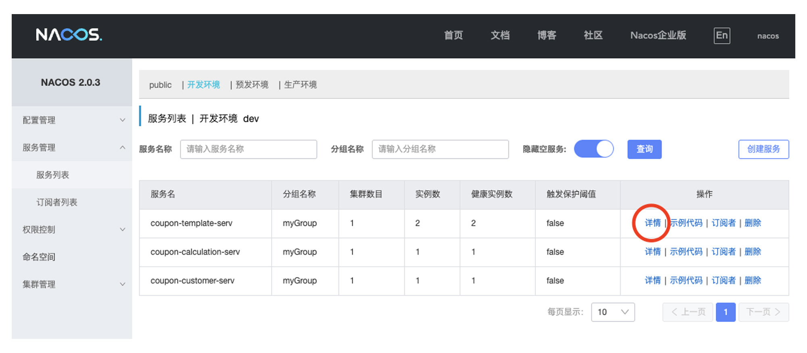

在服务详情页中，你可以看到本地启动的两个 coupon-template-serv 应用，然后选中其中的一个 instance，点击图中的“编辑”按钮，添加一个新的变量到元数据中：traffic-version=coupon-template-test001。

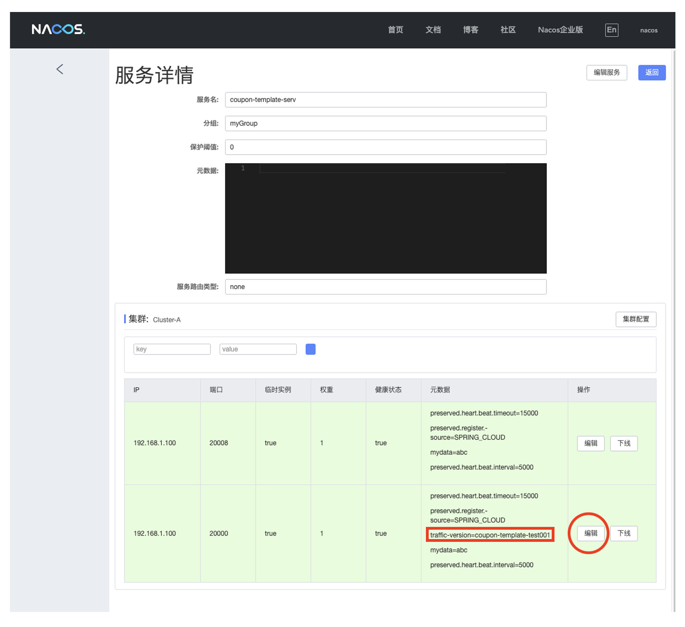

好，到这里，我们的金丝雀负载均衡策略的就已经完成了。

你可以在本地启动项目并调用 coupon-customer-serv 的用户领券接口做测试。如果你在请求参数中指定了 traffic-version=coupon-template-test001，那么这个请求将调用到金丝雀服务器；如果没有指定 traffic-version，那么请求会被转发到正常的服务节点；如果你乱填了一个错误的 traffic-version，那么方法会返回 503-Service Unavailable 的异常。

### 总结

现在，我们来回顾一下这节课的重点内容。今天我们了解了负载均衡技术在微服务领域的应用，深入理解了 Spring Cloud Loadbalancer 的底层原理和扩展点，并且通过一个“金丝雀测试”的例子，动手编写了一个自定义负载均衡策略。

这里需要注意的是，**课程中编写的自定义负载均衡策略主要是针对 WebClient 方式的远程调用，如果你使用 RestTemplate 或者 Feign 发起调用，则需要在实现层面做一些额外的定制**。希望这节课讲到的原理和方法能够起到一个授之以渔的作用，启发你向下深挖 Loadbalancer 如何支持其它 HTTP 调用方式。

我还想和你聊一聊我的一个学习心得，很多技术人员都会以为只学习工作里用到的技术就够了，其实这个想法会极大程度限制他以后的职业发展。我举个例子，负载均衡技术 Loadbalancer，它并不是一个日常工作里经常用到的技术，在大公司通常这类框架层面的组件都由 Framework 团队封装好给到开发人员直接使用就可以了，所以你可能会认为并不需要学习。

但我的经验告诉自己，技术人员的成长来源于两个方面，一个是工作中用到的新技术和高并发挑战，另一个就是自己主动的拓展。而越到后期，你会发现第二个方向对自己的提升逐渐占据了主导地位。为什么呢？当你工作积累到一定年限之后，很容易发现工作内的业务需求已经没有太多的技术挑战，你的技术积累也足以应付每天的工作。这时候如果没有自己由内向外的主动拓展，你很容易就陷入了一个原地踏步的境地。

所以，希望你不要在技术学习上给自己设界，多去了解更多技术框架的全貌，积累到一定程度之后，这些努力都会在未来某一个时刻给你回报。

### 思考题

你能设计一个自定义负载均衡策略，实现集群优先的负载均衡吗？即优先调用同一个 Cluster 的服务器，如果同一个 Cluster 中没有可用服务，再调用其他 Cluster 的服务。

实现这个功能并不难，但是需要你仔细阅读 Nacos 和 Loadbalancer 的源码，找到获取当前服务和远程服务的 Cluster Name 的方法。

当然了，方法有很多，还要看你能否找到一个简单优雅的方式实现这个需求。如果你能够完成这个小挑战，那你的源码阅读能力一定是相当不错的，在评论区说出你的奇思妙想吧！

好啦，这节课就结束啦。欢迎你把这节课分享给更多对 Spring Cloud 感兴趣的朋友。我是姚秋辰，我们下节课再见！


## 12 | OpenFeign：服务间调用组件 OpenFeign 是怎么“隔空取物”的？

你好，我是姚秋辰。

在前面的课程中，我们借助 Nacos 的服务发现能力，使用 WebClient 实现了服务间调用。从功能层面上来讲，我们已经完美地实现了微服务架构下的远程服务调用，但是从易用性的角度来看，这种实现方式似乎对开发人员并不怎么友好。

我们来回顾一下，在前面的实战项目中，我是怎样使用 WebClient 发起远程调用的。

```java
webClientBuilder.build()
    // 声明这是一个POST方法
    .post()
    // 声明服务名称和访问路径
    .uri("http://coupon-calculation-serv/calculator/simulate")
    // 传递请求参数的封装
    .bodyValue(order)
    .retrieve()
    // 声明请求返回值的封装类型
    .bodyToMono(SimulationResponse.class)
    // 使用阻塞模式来获取结果
    .block()
```

从上面的代码我们可以看出，为了发起一个服务请求，我把整个服务调用的所有信息都写在了代码中，从请求类型、请求路径、再到封装的参数和返回类型。编程体验相当麻烦不说，更关键的是这些代码没有很好地践行职责隔离的原则。

在业务层中我们应该关注**具体的业务实现**，而 WebClient 的远程调用引入了很多与业务无关的概念，比如请求地址、请求类型等等。从职责分离的角度来说，**我们应该尽量把这些业务无关的逻辑**，**从业务代码中剥离出去**。

那么，Spring Cloud 中有没有一个组件，在实现远程服务调用的同时，既能满足简单易用的接入要求，又能很好地将业务无关的代码与业务代码隔离开呢？

这个可以有，今天我就来带你了解 Spring Cloud 中的一个叫做 OpenFeign 的组件，看看它是如何简化远程服务调用的，除此之外，我还会为你详细讲解这背后的底层原理。

### 了解 OpenFeign

OpenFeign 组件的前身是 Netflix Feign 项目，它最早是作为 Netflix OSS 项目的一部分，由 Netflix 公司开发。后来 Feign 项目被贡献给了开源组织，于是才有了我们今天使用的 Spring Cloud OpenFeign 组件。

OpenFeign 提供了一种声明式的远程调用接口，它可以大幅简化远程调用的编程体验。在了解 OpenFeign 的原理之前，我们先来体验一下 OpenFeign 的最终疗效。我用了一个 Hello World 的小案例，带你看一下由 OpenFeign 发起的远程服务调用的代码风格是什么样的。

```java
String response = helloWorldService.hello("Vincent Y.");
```

你可能会问，这不就是本地方法调用吗？没错！使用 OpenFeign 组件来实现远程调用非常简单，就像我们使用本地方法一样，只要一行代码就能实现 WebClient 组件好几行代码干的事情。而且这段代码不包含任何业务无关的信息，完美实现了调用逻辑和业务逻辑之间的职责分离。

那么，OpenFeign 组件在底层是如何实现远程调用的呢？接下来我就带你了解 OpenFeign 组件背后的工作流程。

OpenFeign 使用了一种“动态代理”技术来封装远程服务调用的过程，我们在上面的例子中看到的 helloWorldService 其实是一个特殊的接口，它是由 OpenFeign 组件中的 FeignClient 注解所声明的接口，接口中的代码如下所示。

```java
@FeignClient(value = "hello-world-serv")
public interface HelloWorldService {
    @PostMapping("/sayHello")
    String hello(String guestName);
}
```

到这里你一定恍然大悟了，原来**远程服务调用的信息被写在了 FeignClient 接口中**。在上面的代码里，你可以看到，服务的名称、接口类型、访问路径已经通过注解做了声明。OpenFeign 通过解析这些注解标签生成一个“动态代理类”，这个代理类会将接口调用转化为一个远程服务调用的 Request，并发送给目标服务。

那么 OpenFeign 的动态代理是如何运作的呢？接下来，我就带你去深入了解这背后的流程。

### OpenFeign 的动态代理

在项目初始化阶段，OpenFeign 会生成一个代理类，对所有通过该接口发起的远程调用进行动态代理。我画了一个流程图，帮你理解 OpenFeign 的动态代理流程，你可以看一下。

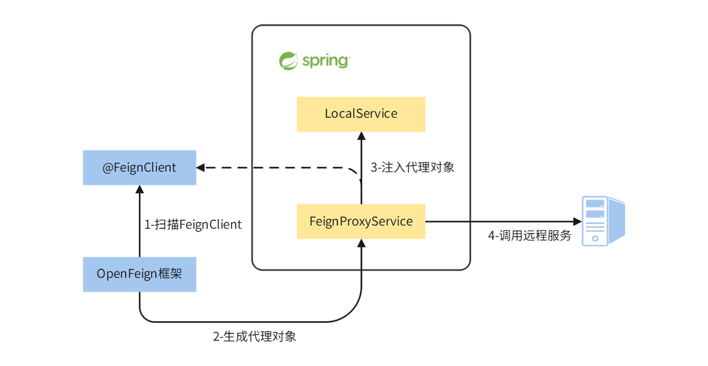

上图中的步骤 1 到步骤 3 是在项目启动阶段加载完成的，只有第 4 步“调用远程服务”是发生在项目的运行阶段。

下面我来解释一下上图中的几个关键步骤。

首先，在项目启动阶段，**OpenFeign 框架会发起一个主动的扫包流程**，从指定的目录下扫描并加载所有被 @FeignClient 注解修饰的接口。

然后，**OpenFeign 会针对每一个 FeignClient 接口生成一个动态代理对象**，即图中的 FeignProxyService，这个代理对象在继承关系上属于 FeignClient 注解所修饰的接口的实例。

接下来，**这个动态代理对象会被添加到 Spring 上下文中，并注入到对应的服务里**，也就是图中的 LocalService 服务。

最后，**LocalService 会发起底层方法调用**。实际上这个方法调用会被 OpenFeign 生成的代理对象接管，由代理对象发起一个远程服务调用，并将调用的结果返回给 LocalService。

我猜你一定很好奇：OpenFeign 是如何通过动态代理技术创建代理对象的？我画了一张流程图帮你梳理这个过程，你可以参考一下。

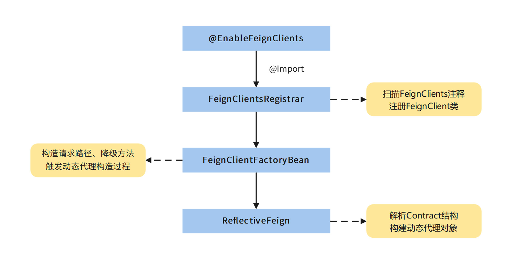

我把 OpenFeign 组件加载过程的重要阶段画在了上图中。接下来我带你梳理一下 OpenFeign 动态代理类的创建过程。了解了这个过程，你就会更加理解下节课的实战内容。

项目加载：在项目的启动阶段，**EnableFeignClients 注解**扮演了“启动开关”的角色，它使用 Spring 框架的 **Import 注解**导入了 FeignClientsRegistrar 类，开始了 OpenFeign 组件的加载过程。

扫包：**FeignClientsRegistrar** 负责 FeignClient 接口的加载，它会在指定的包路径下扫描所有的 FeignClients 类，并构造 FeignClientFactoryBean 对象来解析 FeignClient 接口。

解析 FeignClient 注解：**FeignClientFactoryBean** 有两个重要的功能，一个是解析 FeignClient 接口中的请求路径和降级函数的配置信息；另一个是触发动态代理的构造过程。其中，动态代理构造是由更下一层的 ReflectiveFeign 完成的。

构建动态代理对象：**ReflectiveFeign** 包含了 OpenFeign 动态代理的核心逻辑，它主要负责创建出 FeignClient 接口的动态代理对象。ReflectiveFeign 在这个过程中有两个重要任务，一个是解析 FeignClient 接口上各个方法级别的注解，将其中的远程接口 URL、接口类型（GET、POST 等）、各个请求参数等封装成元数据，并为每一个方法生成一个对应的 MethodHandler 类作为方法级别的代理；另一个重要任务是将这些 MethodHandler 方法代理做进一步封装，通过 Java 标准的动态代理协议，构建一个实现了 InvocationHandler 接口的动态代理对象，并将这个动态代理对象绑定到 FeignClient 接口上。这样一来，所有发生在 FeignClient 接口上的调用，最终都会由它背后的动态代理对象来承接。

MethodHandler 的构建过程涉及到了复杂的元数据解析，OpenFeign 组件将 FeignClient 接口上的各种注解封装成元数据，并利用这些元数据把一个方法调用“翻译”成一个远程调用的 Request 请求。

那么上面说到的“元数据的解析”是如何完成的呢？它依赖于 OpenFeign 组件中的 Contract 协议解析功能。Contract 是 OpenFeign 组件中定义的顶层抽象接口，它有一系列的具体实现，其中和我们实战项目有关的是 SpringMvcContract 这个类，从这个类的名字中我们就能看出来，它是专门用来解析 Spring MVC 标签的。

SpringMvcContract 的继承结构是 SpringMvcContract->BaseContract->Contract。我这里拿一段 SpringMvcContract 的代码，帮助你深入理解它是如何将注解解析为元数据的。这段代码的主要功能是解析 FeignClient 方法级别上定义的 Spring MVC 注解。

```java
// 解析FeignClient接口方法级别上的RequestMapping注解
protected void processAnnotationOnMethod(MethodMetadata data, Annotation methodAnnotation, Method method) {
   // 省略部分代码...
   
   // 如果方法上没有使用RequestMapping注解，则不进行解析
   // 其实GetMapping、PostMapping等注解都属于RequestMapping注解
   if (!RequestMapping.class.isInstance(methodAnnotation)
         && !methodAnnotation.annotationType().isAnnotationPresent(RequestMapping.class)) {
      return;
   }
   // 获取RequestMapping注解实例
   RequestMapping methodMapping = findMergedAnnotation(method, RequestMapping.class);
   // 解析Http Method定义，即注解中的GET、POST、PUT、DELETE方法类型
   RequestMethod[] methods = methodMapping.method();
   // 如果没有定义methods属性则默认当前方法是个GET方法
   if (methods.length == 0) {
      methods = new RequestMethod[] { RequestMethod.GET };
   }
   checkOne(method, methods, "method");
   data.template().method(Request.HttpMethod.valueOf(methods[0].name()));
   // 解析Path属性，即方法上写明的请求路径
   checkAtMostOne(method, methodMapping.value(), "value");
   if (methodMapping.value().length > 0) {
      String pathValue = emptyToNull(methodMapping.value()[0]);
      if (pathValue != null) {
         pathValue = resolve(pathValue);
         // 如果path没有以斜杠开头，则补上/
         if (!pathValue.startsWith("/") && !data.template().path().endsWith("/")) {
            pathValue = "/" + pathValue;
         }
         data.template().uri(pathValue, true);
         if (data.template().decodeSlash() != decodeSlash) {
            data.template().decodeSlash(decodeSlash);
         }
      }
   }
   // 解析RequestMapping中定义的produces属性
   parseProduces(data, method, methodMapping);
   // 解析RequestMapping中定义的consumer属性
   parseConsumes(data, method, methodMapping);
   // 解析RequestMapping中定义的headers属性
   parseHeaders(data, method, methodMapping);
   data.indexToExpander(new LinkedHashMap<>());
}
```

通过上面的方法，我们可以看到，OpenFeign 对 RequestMappings 注解的各个属性都做了解析。

如果你在项目中使用的是 GetMapping、PostMapping 之类的注解，没有使用 RequestMapping，那么 OpenFeign 还能解析吗？当然可以。以 GetMapping 为例，它对 RequestMapping 注解做了一层封装。如果你查看下面关于 GetMapping 注解的代码，你会发现这个注解头上也挂了一个 RequestMapping 注解。因此 OpenFeign 可以正确识别 GetMapping 并完成加载。

```java
@Target(ElementType.METHOD)
@Retention(RetentionPolicy.RUNTIME)
@Documented
@RequestMapping(method = RequestMethod.GET)
public @interface GetMapping {
// ...省略部分代码
}
```

到这里，相信你已经了解了 OpenFeign 的工作流程，下节课我将带你进行实战项目的改造，将 coupon-customer-serv 中的 WebClient 调用替换为基于 OpenFeign 的远程服务调用。

### 总结

现在，我们来回顾一下这节课的重点内容。

今天你清楚了 OpenFeign 要解决的问题，我还带你了解了 OpenFeign 的工作流程，这里面的重点是**动态代理机制**。OpenFeing 通过 Java 动态代理生成了一个“代理类”，这个代理类将接口调用转化成为了一个远程服务调用。

动态代理是各个框架经常用到的技术，也是面试中的一个核心考点。对于大多数技术人员来说，日常工作就是堆业务代码，似乎是用不上动态代理，这部分的知识点就是面试前突击一下。但如果你参与到框架类业务的研发，你会经常运用到动态代理技术。我建议你借着这次学习 OpenFeign 的机会，深入研究一下动态代理的应用。

如果你对 OpenFeign 的动态代理流程感兴趣，想要摸清楚这里面的门道，我推荐你一个很高效的学习途径：**Debug**。你可以在 OpenFeign 组件的 FeignClientsRegistrar 中打上一个断点，这是 OpenFeign 初始化的起点，然后你以 Debug 模式启动应用程序，当程序执行到断点处之后，你可以手动一步步跟着断点往下走，顺藤摸瓜了解 OpenFeign 的整个加载过程。

### 思考题

结合这两节课我给你讲的服务调用的知识，通过阅读OpenFeign 的源码，你能描述出 OpenFeign 底层的实现吗？欢迎在留言区写下自己的思考，与我一起讨论。

好啦，这节课就结束啦。欢迎你把这节课分享给更多对 Spring Cloud 感兴趣的朋友。我是姚秋辰，我们下节课再见！


## 13 | OpenFeign 实战：如何实现服务间调用功能？

你好，我是姚秋辰。

在上一讲中，我带你了解了 OpenFeign 组件的设计目标和要解决的问题。今天我们来学习如何使用 OpenFeign 实现**跨服务的调用**，通过这节课的学习，你可以对实战项目中的 WebClient 请求做大幅度的简化，让跨服务请求就像调用本地方法一样简单。

今天我要带你改造的项目是 coupon-customer-serv 服务，因为它内部需要调用 template 和 calculation 两个服务完成自己的业务逻辑，非常适合用 Feign 来做跨服务调用的改造。

在集成 OpenFeign 组件之前，我们需要把它的依赖项 spring-cloud-starter-OpenFeign 添加到 coupon-customer-impl 子模块内的 pom.xml 文件中。

```xml
<!-- OpenFeign组件 -->
<dependency>
    <groupId>org.springframework.cloud</groupId>
    <artifactId>spring-cloud-starter-openfeign</artifactId>
</dependency>
```

在上面的代码中，你并不需要指定组件的版本号，因为我们在顶层项目中定义的 spring-cloud-dependencies 依赖项中已经定义了各个 Spring Cloud 的版本号，它们会随着 Maven 项目的继承关系传递到子模块中。

添加好依赖项之后，我们就可以进行大刀阔斧的 OpenFeign 改造了。在 coupon-customer-impl 子模块下的 CouponCustomerServiceImpl 类中，我们通过 WebClient 分别调用了 template 和 calculation 的服务。这节课我先来带你对 template 的远程调用过程进行改造，将其替换为 OpenFeign 风格的调用。

### 改造 Template 远程调用

通过上节课的内容我们了解到，OpenFeign 组件通过接口代理的方式发起远程调用，那么我们改造过程的第一步就是要定义一个 OpenFeign 接口。

我在 coupon-customer-impl 项目下创建了一个 package，它的路径是 com.geekbang.coupon.customer.feign。在这个路径下我定义了一个叫做 TemplateService 的 Interface，用来实现对 coupon-template-serv 的远程调用代理。我们来看一下这个接口的源代码。

```java
@FeignClient(value = "coupon-template-serv", path = "/template")
public interface TemplateService {
    // 读取优惠券
    @GetMapping("/getTemplate")
    CouponTemplateInfo getTemplate(@RequestParam("id") Long id);
    
    // 批量获取
    @GetMapping("/getBatch")
    Map<Long, CouponTemplateInfo> getTemplateInBatch(@RequestParam("ids") Collection<Long> ids);
}
```

在上面的代码中，我们在接口上声明了一个 FeignClient 注解，它专门用来标记被 OpenFeign 托管的接口。

在 FeignClient 注解中声明的 value 属性是目标服务的名称，在代码中我指定了 coupon-template-serv，你需要确保这里的服务名称和 Nacos 服务器上显示的服务注册名称是一样的。

此外，FeignClient 注解中的 path 属性是一个可选项，如果你要调用的目标服务有一个统一的前置访问路径，比如 coupon-template-serv 所有接口的访问路径都以 /template 开头，那么你可以通过 path 属性来声明这个前置路径，这样一来，你就不用在每一个方法名上的注解中带上前置 Path 了。

在项目的启动阶段，OpenFeign 会查找所有被 FeignClient 注解修饰的接口，并代理该接口的所有方法调用。当我们调用接口方法的时候，OpenFeign 就会根据方法上定义的注解自动拼装 HTTP 请求路径和参数，并向目标服务发起真实调用。

因此，我们还需要在方法上定义 spring-web 注解（如 GetMapping、PostMapping），让 OpenFeign 拼装出正确的 Request URL 和请求参数。这时你要注意，**OpenFeign 接口中定义的路径和参数必须与你要调用的目标服务中的保持一致**。

完成了 Feign 接口的定义，接下来你就可以替换 CouponCustomerServiceImpl 中的业务逻辑调用了。

首先，我们在 CouponCustomerServiceImpl 接口中注入刚才定义的 TemplateService 接口。

```java
@Autowired
private TemplateService templateService;
```

被 FeignClient 注解修饰的对象，也会被添加到 Spring 上下文中。因此我们可以通过 Autowired 注入的方式来使用这些接口。

然后，我们就可以对具体的业务逻辑进行替换了。以 CouponCustomerServiceImpl 类中的 placeOrder 下单接口为例，其中有一步是调用 coupon-template-serv 获取优惠券模板数据，这个服务请求是使用 WebClient 发起的，我们来看一下改造之前的方法实现。

```java
webClientBuilder.build().get()
    .uri("http://coupon-template-serv/template/getTemplate?id=" + templateId)
    .retrieve()
    .bodyToMono(CouponTemplateInfo.class)
    .block();    
```

从上面的代码中你可以看出，我们写了一大长串的代码，只为了发起一次服务请求。如果使用 **OpenFeign 接口**来替换，那画风就不一样了，我们看一下改造后的服务调用过程。

```java
templateService.getTemplate(couponInfo.getTemplateId())
```

你可以看到，使用 OpenFeign 接口发起远程调用就像使用本地服务一样简单。和 WebClient 的调用方式相比，**OpenFeign 组件不光可以提高代码可读性和可维护性，还降低了远程调用的 Coding 成本**。

在 CouponCustomerServiceImpl 类中的 findCoupon 方法里，我们调用了 coupon-template-serv 的批量查询接口获取模板信息，这个过程也可以使用 OpenFeign 接口实现，下面是具体的实现代码。

```java
// 获取这些优惠券的模板ID
List<Long> templateIds = coupons.stream()
        .map(Coupon::getTemplateId)
        .distinct()
        .collect(Collectors.toList());
// 发起请求批量查询券模板
Map<Long, CouponTemplateInfo> templateMap = templateService
        .getTemplateInBatch(templateIds);
```

到这里，我们已经把 template 服务的远程调用改成了 OpenFeign 接口调用的方式，那么接下来让我们趁热打铁，去搞定 calculation 服务的远程调用。

### 改造 Calculation 远程调用

首先，我们在 TemplateService 同样的目录下创建一个新的接口，名字是 CalculationService，后面你会使用它作为 coupon-calculation-serv 的代理接口。我们来看一下这个接口的源码。

```java
@FeignClient(value = "coupon-calculation-serv", path = "/calculator")
public interface CalculationService {
    // 订单结算
    @PostMapping("/checkout")
    ShoppingCart checkout(ShoppingCart settlement);
    // 优惠券试算
    @PostMapping("/simulate")
    SimulationResponse simulate(SimulationOrder simulator);
}
```

我在接口类之上声明了一个 FeignClient 注解，指向了 coupon-calculation-serv 服务，并且在 path 属性中注明了服务访问的前置路径是 /calculator。

在接口中我还定义了两个方法，分别指向 checkout 用户下单接口和 simulate 优惠券试算接口，这两个接口的访问路径和 coupon-calculation-serv 中定义的路径是一模一样的。

有了前面 template 服务的改造经验，相信你应该很轻松就能搞定 calculation 服务调用的改造。首先，我们需要把刚才定义的 CalculationService 注入到 CouponCustomerServiceImpl 中。

```java
@Autowired
private CalculationService calculationService;
```

然后，你只用在调用 coupon-calculation-serv 服务的地方，将 WebClient 调用替换成下面这种 OpenFeign 调用的方式就可以了，是不是很简单呢？

```java
// order清算
ShoppingCart checkoutInfo = calculationService.checkout(order);
// order试算
calculationService.simulate(order)
```

到这里，我们就完成了 template 和 calculation 服务调用过程的改造。在我们启动项目来验证改造成果之前，还有最为关键的一步需要完成，那就是配置 OpenFeign 的加载路径。

### 配置 OpenFeign 的加载路径

我们打开 coupon-customer-serv 项目的启动类，你可以通过在类名之上添加一个 EnableFeignClients 注解的方式定义 OpenFeign 接口的加载路径，你可以参考以下代码。

```java
// 省略其他无关注解
@EnableFeignClients(basePackages = {"com.geekbang"})
public class Application {
}
```

在这段代码中，我们在 EnableFeignClients 注解的 basePackages 属性中定义了一个 com.geekbang 的包名，这个注解就会告诉 OpenFeign 在启动项目的时候做一件事儿：找到所有位于 com.geekbang 包路径（包括子 package）之下使用 FeignClient 修饰的接口，然后生成相关的代理类并添加到 Spring 的上下文中。这样一来，我们才能够在项目中用 Autowired 注解注入 OpenFeign 接口。

如果你忘记声明 EnableFeignClients 注解了呢？那么启动项目的时候，你就会收到一段异常，告诉你目标服务在 Spring 上下文中未找到。我把具体的报错信息贴在了这里，你可以参考一下。如果碰到这类启动异常，你就可以先去查看启动类上有没有定义 EnableFeignClients 注解。

```sh
Field templateService in com.geekbang.coupon.customer.service.CouponCustomerServiceImpl 
required a bean of type 'com.geekbang.coupon.customer.feign.TemplateService' that could not be found.
```

上面就是使用包路径扫描的方式来加载 FeignClient 接口。除此之外，你还可以通过直接加载指定 FeignClient 接口类的方式，或者从指定类所在的目录进行扫包的方式来加载 FeignClient 接口。我把这两种加载方式的代码写在了下面，你可以参考一下。

```java
// 通过指定Client类来加载
@EnableFeignClients(clients = {TemplateService.class, CalculationService.class})
// 扫描特定类所在的包路径下的FeignClient
@EnableFeignClients(basePackageClasses = {TemplateService.class})
```

在这三种加载方式中，我比较推荐你在项目中使用一劳永逸的“包路径”加载的方式。因为不管以后你添加了多少新的 FeignClient 接口，只要这些接口位于 com.geekbang 包路径之下，你就不用操心加载路径的配置。

到这里，我们就完成了 OpenFeign 的实战项目改造，你可以在本地启动项目来验证改造后的程序是否可以正常工作。

### 总结

现在，我们来回顾一下这节课的重点内容。今天我们使用 OpenFeign 替代了项目中的 WebClient 组件，实现了跨服务的远程调用。在这个过程中有两个重要步骤。

**FeignClient**：使用该注解修饰 OpenFeign 的代理接口，你需要确保接口中每个方法的寻址路径和你要调用的目标服务保持一致。除此之外，FeignClient 中指定的服务名称也要和 Nacos 服务端中的服务注册名称保持一致；

**EnableFeignClients**：在启动类上声明 EnableFeignClients 注解，使用本课程中学习的三种扫包方式的任意一种加载 FeignClient 接口，这样 OpenFeign 组件才能在你的程序启动之后对 FeignClient 接口进行初始化和动态代理。

通过这节课的学习，相信你已经能够掌握 Spring Cloud 体系下的微服务远程调用的方法了。在后面的课程中，我将带你进一步了解 OpenFeign 组件的其他高级玩法。

### 思考题

在这节课中，我把 OpenFeign 接口定义在了调用方这一端。如果你的服务需要暴露给很多业务方使用，每个业务方都要维护一套独立的 OpenFeign 接口似乎也不太方便，你能想到什么更好的接口管理办法吗？欢迎在留言区写下自己的思考，与我一起讨论。

好啦，这节课就结束啦。欢迎你把这节课分享给更多对 Spring Cloud 感兴趣的朋友。我是姚秋辰，我们下节课再见！


## 14 | OpenFeign 实战：OpenFeign 组件有哪些高级玩法？

你好，我是姚秋辰。

在上一讲中，我们已经将 OpenFeign 组件集成到了实战项目中。今天我们来进一步深入 OpenFeign 的功能特性，学习几个 OpenFeign 的进阶使用技巧：异常信息排查、超时判定和服务降级。

异常信息排查是我们开发人员每天都要面对的事情。如果你正在开发一个大型微服务应用，你经常需要集成一些由其他团队开发的 API，这就免不了要参与各种联调和问题排查。如果你是一个经验丰富的老码农，那你一定经常说这样一句话：“你的 Request 参数是什么？”这句台词在我们平时的 API 联调和线上异常排查中出镜率很高，因为**服务请求的入参和出参是分析和排查问题的重要线索**。

为了获得服务请求的参数和返回值，我们经常使用的一个做法就是**打印日志**。你可以在程序中使用 log.info 或者 log.debug 方法将服务请求的入参和返回值一一打印出来。但是，对一些复杂的业务场景来说就没有那么轻松了。

假如你在开发的是一个下单服务，执行一次下单流程前前后后要调用十多个微服务。你需要在请求发送的前后分别打印 Request 和 Response，不仅麻烦不说，我们还未必能把包括 Header 在内的完整请求信息打印出来。

那我们如何才能引入一个既简单又不需要硬编码的日志打印功能，让它自动打印所有远程方法的 Request 和 Response，方便我们做异常信息排查呢？接下来，我就来给你介绍一个 OpenFeign 的小功能，轻松实现**远程调用参数的日志打印**。

### 日志信息打印

为了让 OpenFeign 可以主动将请求参数打印到日志中，我们需要做两个代码层面的改动。

首先，你需要在配置文件中**指定 FeignClient 接口的日志级别为 Debug**。这样做是因为 OpenFeign 组件默认将日志信息以 debug 模式输出，而默认情况下 Spring Boot 的日志级别是 Info，因此我们必须将应用日志的打印级别改为 debug 后才能看到 OpenFeign 的日志。

我们打开 coupon-customer-impl 模块的 application.yml 配置文件，在其中加上以下几行 logging 配置项。

```yaml
logging:
  level:
    com.geekbang.coupon.customer.feign.TemplateService: debug
    com.geekbang.coupon.customer.feign.CalculationService: debug
```

在上面的配置项中，我指定了 TemplateService 和 CalculationService 的日志级别为 debug，而其它类的日志级别不变，仍然是默认的 Info 级别。

接下来，你还需要在应用的上下文中使用代码的方式**声明 Feign 组件的日志级别**。这里的日志级别并不是我们传统意义上的 Log Level，它是 OpenFeign 组件自定义的一种日志级别，用来控制 OpenFeign 组件向日志中写入什么内容。你可以打开 coupon-customer-impl 模块的 Configuration 配置类，在其中添加这样一段代码。

```java
@Bean
Logger.Level feignLogger() {
    return Logger.Level.FULL;
}
```

在上面这段代码中，我指定了 OpenFeign 的日志级别为 Full，在这个级别下所输出的日志文件将会包含最详细的服务调用信息。OpenFeign 总共有四种不同的日志级别，我来带你了解一下这四种级别下 OpenFeign 向日志中写入的内容。

**NONE**：不记录任何信息，这是 OpenFeign 默认的日志级别；

**BASIC**：只记录服务请求的 URL、HTTP Method、响应状态码（如 200、404 等）和服务调用的执行时间；

**HEADERS**：在 BASIC 的基础上，还记录了请求和响应中的 HTTP Headers；

**FULL**：在 HEADERS 级别的基础上，还记录了服务请求和服务响应中的 Body 和 metadata，FULL 级别记录了最完成的调用信息。

我们将 Feign 的日志级别指定为 Full，并启动项目发起一个远程调用，你就可以在日志中看到整个调用请求的信息，包括请求路径、Header 参数、Request Payload 和 Response Body。我拿了一个调用日志作为示例，你可以参考一下。

 ```http
 ---> POST http://coupon-calculation-serv/calculator/simulate HTTP/1.1
  Content-Length: 458
  Content-Type: application/json
  
  {"products":[{"productId":null,"price":3000, xxxx省略请求参数
  ---> END HTTP (458-byte body)
  <--- HTTP/1.1 200 (29ms)
  connection: keep-alive
  content-type: application/json
  date: Sat, 27 Nov 2021 15:11:26 GMT
  keep-alive: timeout=60
  transfer-encoding: chunked
  
  {"bestCouponId":26,"couponToOrderPrice":{"26":15000}}
  <--- END HTTP (53-byte body)
 ```

有了这些详细的日志信息，你在开发联调阶段排查异常问题就易如反掌了。

到这里，我们就详细了解了 OpenFeign 的日志级别设置。接下来，我带你了解如何在 OpenFeign 中配置超时判定条件。

### OpenFeign 超时判定

超时判定是一种保障可用性的手段。如果你要调用的目标服务的 RT（Response Time）值非常高，那么你的调用请求也会处于一个长时间挂起的状态，这是造成服务雪崩的一个重要因素。为了隔离下游接口调用超时所带来的的影响，我们可以在程序中设置一个**超时判定的阈值**，一旦下游接口的响应时间超过了这个阈值，那么程序会自动取消此次调用并返回一个异常。

我们以 coupon-customer-serv 为例，customer 服务依赖 template 服务来读取优惠券模板的信息，如果你想要对 template 的远程服务调用添加超时判定配置，那么我们可以在 coupon-customer-impl 模块下的 application.yml 文件中添加下面的配置项。

```yaml
feign:
  client:
    config:
      # 全局超时配置
      default:
        # 网络连接阶段1秒超时
        connectTimeout: 1000
        # 服务请求响应阶段5秒超时
        readTimeout: 5000
      # 针对某个特定服务的超时配置
      coupon-template-serv:
        connectTimeout: 1000
        readTimeout: 2000
```

从上面这段代码中可以看出，所有超时配置都放在 feign.client.config 路径之下，我在这个路径下面声明了两个节点：default 和 coupon-template-serv。

default 节点配置了全局层面的超时判定规则，它的生效范围是所有 OpenFeign 发起的远程调用。

coupon-template-serv 下面配置的超时规则只针对向 template 服务发起的远程调用。如果你想要对某个特定服务配置单独的超时判定规则，那么可以用同样的方法，在 feign.client.config 下添加目标服务名称和超时判定规则。

这里需要你注意的一点是，如果你同时配置了全局超时规则和针对某个特定服务的超时规则，那么后者的配置会覆盖全局配置，并且优先生效。

在超时判定的规则中我定义了两个属性：connectTimeout 和 readTimeout。其中，connectTimeout 的超时判定作用于“建立网络连接”的阶段；而 readTimeout 的超时判定则作用于“服务请求响应”的阶段（在网络连接建立之后）。我们常说的 RT（即服务响应时间）受后者影响比较大。另外，这两个属性对应的超时**时间单位都是毫秒**。

配置好超时规则之后，我们可以验证一下。你可以在 template 服务中使用 Thread.sleep 方法强行让线程挂起几秒钟，制造一个超时场景。这时如果你通过 customer 服务调用了 template 服务，那么在日志中可以看到下面的报错信息，提示你服务请求超时。

```http
[TemplateService#getTemplate] <--- ERROR SocketTimeoutException: Read timed out (2077ms)
[TemplateService#getTemplate] java.net.SocketTimeoutException: Read timed out
```

到这里，相信你已经清楚如何通过 OpenFeign 的配置项来设置超时判定规则了。接下来，我带你了解一下 OpenFeign 是如何通过降级来处理服务异常的。

### OpenFeign 降级

降级逻辑是在远程服务调用发生超时或者异常（比如 400、500 Error Code）的时候，自动执行的一段业务逻辑。你可以根据具体的业务需要编写降级逻辑，比如执行一段兜底逻辑将服务请求从失败状态中恢复，或者发送一个失败通知到相关团队提醒它们来线上排查问题。

在后面课程中，我将会使用 Spring Cloud Alibaba 的组件 Sentinel 跟你讲解如何搭建中心化的服务容错控制逻辑，这是一种重量级的服务容错手段。

但在这节课中，我采用了一种完全不同的服务容错手段，那就是借助 OpenFeign 实现 Client 端的服务降级。尽管它的功能远不如 Sentinel 强大，但它相比于 Sentinel 而言**更加轻量级且容易实现，**足以满足一些简单的服务降级业务需求。

OpenFeign 对服务降级的支持是借助 Hystrix 组件实现的，由于 Hystrix 已经从 Spring Cloud 组件库中被移除，所以我们需要在 coupon-customer-impl 子模块的 pom 文件中手动添加 hystrix 项目的依赖。

```xml
<!-- hystrix组件，专门用来演示OpenFeign降级 -->
<dependency>
    <groupId>org.springframework.cloud</groupId>
    <artifactId>spring-cloud-starter-netflix-hystrix</artifactId>
    <version>2.2.10.RELEASE</version>
    <exclusions>
        <!-- 移除Ribbon负载均衡器，避免冲突 -->
        <exclusion>
            <groupId>org.springframework.cloud</groupId>
            <artifactId>spring-cloud-netflix-ribbon</artifactId>
        </exclusion>
    </exclusions>
</dependency>
```

添加好依赖项之后，我们就可以编写 OpenFeign 的降级类了。OpenFeign 支持两种不同的方式来指定降级逻辑，一种是定义 fallback 类，另一种是定义 fallback 工厂。

通过 fallback 类实现降级是最为简单的一种途径，如果你想要为 TemplateService 这个 FeignClient 接口指定一段降级流程，那么我们可以定义一个降级类并实现 TemplateService 接口。我写了一个 TemplateServiceFallback 类，你可以参考一下。

```java
@Slf4j
@Component
public class TemplateServiceFallback implements TemplateService {
    @Override
    public CouponTemplateInfo getTemplate(Long id) {
        log.info("fallback getTemplate");
        return null;
    }
    @Override
    public Map<Long, CouponTemplateInfo> getTemplateInBatch(Collection<Long> ids) {
        log.info("fallback getTemplateInBatch");
        return null;
    }
}
```

在上面的代码中，我们可以看出 TemplateServiceFallback 实现了 TemplateService 中的所有方法。

我们以其中的 getTemplate 方法为例，如果在实际的方法调用过程中，OpenFeign 接口的 getTemplate 远程调用发生了异常或者超时的情况，那么 OpenFeign 会主动执行对应的降级方法，也就是 TemplateServiceFallback 类中的 getTemplate 方法。

你可以根据具体的业务场景，编写合适的降级逻辑。

降级类定义好之后，你还需要在 TemplateService 接口中将 TemplateServiceFallback 类指定为降级类，这里你可以借助 FeignClient 接口的 fallback 属性来配置，你可以参考下面的代码。

```java
@FeignClient(value = "coupon-template-serv", path = "/template",
       // 通过fallback指定降级逻辑
       fallback = TemplateServiceFallback.class)
public interface TemplateService {
      // ... 省略方法定义
}
```

如果你想要在降级方法中获取到**异常的具体原因**，那么你就要借助 **fallback 工厂**的方式来指定降级逻辑了。按照 OpenFeign 的规范，自定义的 fallback 工厂需要实现 FallbackFactory 接口，我写了一个 TemplateServiceFallbackFactory 类，你可以参考一下。

```java
@Slf4j
@Component
public class TemplateServiceFallbackFactory implements FallbackFactory<TemplateService> {
    @Override
    public TemplateService create(Throwable cause) {
        // 使用这种方法你可以捕捉到具体的异常cause
        return new TemplateService() {
            @Override
            public CouponTemplateInfo getTemplate(Long id) {
                log.info("fallback factory method test");
                return null;
            }
            @Override
            public Map<Long, CouponTemplateInfo> getTemplateInBatch(Collection<Long> ids) {
                log.info("fallback factory method test");
                return Maps.newHashMap();
            }
        };
    }
}
```

从上面的代码中，你可以看出，抽象工厂 create 方法的入参是一个 Throwable 对象。这样一来，我们在降级方法中就可以获取到原始请求的具体报错异常信息了。

当然了，你还需要将这个工厂类添加到 TemplateService 注解中，这个过程和指定 fallback 类的过程有一点不一样，你需要借助 FeignClient 注解的 fallbackFactory 属性来完成。你可以参考下面的代码。

```java
@FeignClient(value = "coupon-template-serv", path = "/template",
        // 通过抽象工厂来定义降级逻辑
        fallbackFactory = TemplateServiceFallbackFactory.class)
public interface TemplateService {
        // ... 省略方法定义
}
```

到这里，我们就完成了 OpenFeign 进阶功能的学习。针对这里面的某些功能，我想从日志打印和超时判定这两个方面给你一些实践层面的建议。

**在日志打印方面**，OpenFeign 的日志信息是测试开发联调过程中的好帮手，但是在生产环境中你是用不上的，因为几乎所有公司的生产环境都不会使用 Debug 级别的日志，最多是 Info 级别。

**在超时判定方面**，有时候我们在线上会使用多维度的超时判定，比如 OpenFeign + 网关层超时判定 + Sentinel 等等判定。它们可以互相作为兜底方案，一旦某个环节突然发生故障，另一个可以顶上去。但这就形成了一个木桶理论，也就是几种判定规则中最严格的那个规则会优先生效。

### 总结

今天我们了解了 OpenFeign 的三个进阶小技巧。首先，你使用 OpenFeign 的日志模块打印了完整的远程服务调用信息，我们可以利用这个功能大幅提高线下联调测试的效率。然后，我带你了解了 OpenFeign 组件如何设置超时判定规则，通过全局配置 + 局部配置的方式对远程接口进行超时判定，这是一种有效的防止服务雪崩的可用性保障手段。最后，我们动手搭建了 OpenFeign 的降级业务，通过 fallback 类和 fallback 工厂两种方式实现了服务降级。

关于**服务降级的方案选型**，我想分享一些自己的见解。很多开发人员过于追求功能强大的新技术，但我们**做技术选型的时候也要考虑开发成本和维护成本**。

比如像 Sentinel 这类中心化的服务容错控制台，它的功能固然强大，各种花式玩法它都考虑到了。但相对应地，如果你要在项目中引入 Sentinel，在运维层面你要多维护一个 Sentinel 服务集群，并且在代码中接入 Sentinel 也是一个成本项。如果你只需要一些简单的降级功能，那 OpenFeign+Hystrix 的 Client 端降级方案就完全可以满足你的要求，我认为没必要拿大炮打苍蝇，过于追求一步到位的高大上方案。

到这里，我们 OpenFeign 组件的课程就结束了，下一节课程我将带你学习如何使用 Nacos 实现配置管理。

### 思考题

结合这节课的 OpenFeign 超时判定功能，你知道有哪些超时判定的算法吗？它们的底层原理是什么？欢迎在留言区写下自己的思考，与我一起讨论。

好啦，这节课就结束啦。欢迎你把这节课分享给更多对 Spring Cloud 感兴趣的朋友。我是姚秋辰，我们下节课再见！

# 05-SpringCloud进阶篇(1讲)

## 15 | 配置中心在微服务中发挥着怎样的作用？

你好，我是姚秋辰。

在微服务架构中，我们会使用一个分布式的“配置中心”来管理所有的配置文件和配置项。相比于传统的基于文件的配置管理方式，配置中心有什么独特的功能和优势呢？今天这节课，我就带你了解 Nacos 配置中心的特性，以及这些特性在微服务体系中所发挥的作用。

在 Spring Boot 应用中，我们习惯于使用传统的配置管理方式，将各种配置项都维护在 application.yml 或 application.properties 文件中。从完成业务逻辑的角度来看，这样做是没问题的。但在微服务架构中，我们可以采取一种更“优雅”的方式组织配置文件，实现高效灵活的配置管理。

我要先带你回想一下传统的配置管理途径都有哪些，这些途径在使用上有哪些弊端。然后，我们再来了解微服务架构下的“配置中心”是如何解决这些问题的。

### 传统配置管理的弊端

我们通常可以采用四种途径在程序中指定配置项，它们分别是硬编码、配置文件、环境 / 启动变量、数据库动态获取，我们先来了解一下这四种配置管理方式是如何实现的。

硬编码：最简单粗暴的方式，在 Bean 初始化的上下文中，直接通过在代码中 hardcode 的方式指定配置信息；

配置文件：使用 application 和 bootstrap 配置文件来设置配置项，这是目前比较“优雅”常用的方式；

环境 / 启动变量：通过操作系统的环境变量，或者启动命令中的 -D 参数传入配置项；

数据库 / 缓存动态获取：将配置项保存在数据库里，每次执行一个 select 语句实现动态查询。

看似我们有了不少办法来实现配置管理，但实际上，以上的几种途径或多或少都有一些弊端。

**从职责分离的角度来讲**，硬编码无法将“业务逻辑”与“配置管理”拆分开来。尽管硬编码实现起来最为简单，它仍然是我最不推荐的一种方式。

**从灵活性的角度来讲**，无论你用的是硬编码、配置文件还是环境 / 启动变量的方式，只要你需要对配置项进行变更，你就必须对代码 / 启动命令进行修改，然后重新打包并部署应用，无法做到在运行期灵活变更配置项。

数据库 / 缓存动态获取的方式和上面几种相比，具备了一定的灵活性。**但从版本控制的角度来看**，配置项也是一种“代码资源”，采用数据库 / 缓存控制并不能很好地实现配置版本的控制和历史版本回滚。而面对高并发场景时，如果我们采用数据库方案，还要时刻关注 DB 的性能指标，以免被流量打崩。

除此以外，**多格式支持和安全性**也是需要考虑的因素。对于用户名密码之类的敏感数据，如果明目张胆地放在代码库中，那么将显著增加“删库跑路”事件的发生几率。

到这里你会发现，传统的配置管理方式或多或少都存在着一些弊端。你也可能会问，分布式配置中心可以解决这些问题吗？答案是当然。接下来，我就带你了解分布式配置中心有哪些具体的作用。

### 分布式配置中心

在微服务的架构体系中，我们会使用一个中心化的分布式配置中心作为配置文件的管理者。

在应用程序端，我们只将一些必要的配置项添加到配置文件中（如 application.yml 和 bootstrap.yml），而大部分的配置项都被保存在配置中心集群里。客户端在启动的时候从配置中心获取所有的配置项，用于各个组件的初始化。

我以下节课将要学习的 Nacos Config 为例，画了一张架构图来帮你理解这个过程，你可以参考一下。

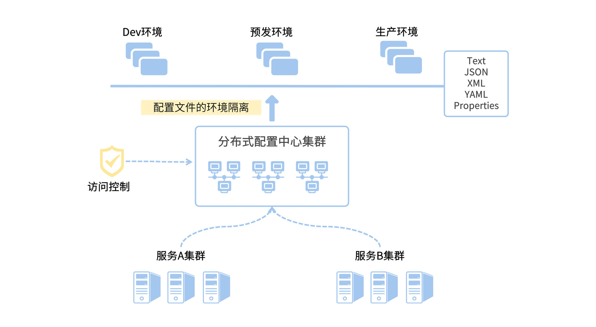

从上面的图中，你可以看到分布式配置中心在配置管理方面发挥的作用，接下来我就为你展开讲一讲。

**高可用性：**微服务组件的高可用性是首要目标。配置中心并不是一个中心化的单点应用，而是一个通过集群对外提供服务的组件。在一致性算法的基础上，集群中各个节点之间会互相同步配置数据，或者从统一数据源读取配置数据。即便个别节点挂掉，也不影响整个集群的可用性；

**环境隔离特性**：Nacos 支持通过 Namespace 属性指定当前配置项所在的环境，你可以为自己的应用系统创建开发环境、预发环境和生产环境，不同环境之间的配置文件是相互隔离的；

**多格式支持**：Nacos 支持多种不同格式的配置内容，你可以使用纯文本、JSON、XML、YAML 和 Properties 多种文件后缀；

**访问控制**：Nacos 实现了权限管理功能，你可以在控制台创建用户账号和权限组，限制某个账号可以访问哪些命名空间，并配置账号的读写权限（只读、只写、读写）。通过这种方式，你可以保障敏感信息（如数据库用户名和密码）的安全；

**职责分离**：配置项从 jar 包中抽离了出来，修改配置项再也不需要重新编译打包应用程序了，完美实现了配置项管理与业务代码之间的职责分离；

**版本控制和审计功能**：配置项也是一种代码，而且配置 bug 往往比代码中的 bug 造成的影响更大。因此，在微服务架构中我们需要确保配置中心具备完善的版本控制和审计功能。

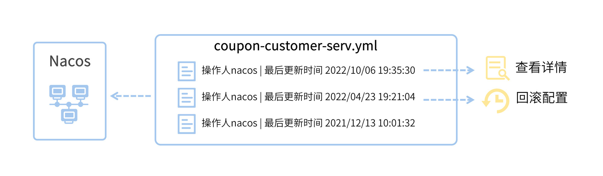

从图中你可以看出，通过 Nacos 的“历史版本”功能，你可以查看任何一个配置文件的历史修改记录，包括改动的时间和操作人。针对每一个改动记录，我们可以查看这一版本的配置详情，或者做线上配置项的回滚操作。

除了上面我们提到的功能以外，Nacos 还可以支持**多文件源读取以及运行期配置变更**。尤其是**动态变更推送**，更是微服务架构下不可或缺的配置管理能力。

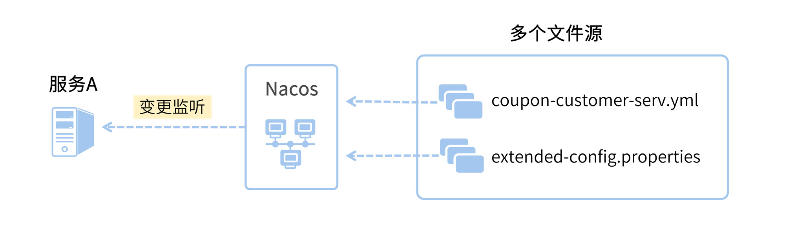

Nacos 具备很高的灵活性，你可以在项目中指定从多个 Nacos 配置文件中获取信息，这些文件可以是不同名称、不同格式的配置文件。这个特性允许你对配置文件做更细致的“职责隔离”。比如你可以把 Redis 连接信息做成一个独立的配置文件，让集群中的所有应用消费同一个文件来初始化 Redis Connection。

当配置项发生变化的时候，服务端可以通过监听变更事件的方式，从 Nacos 服务器获取到最新的配置信息。这个功能就是**配置项动态更新**，**它可以让你在不重启应用程序的前提下更新配置信息**，这在微服务系统中大有用途。

我来列举几个配置项动态更新的使用场景，帮助你理解它的作用。

**业务开关**

动态配置的一个作用是通过业务开关控制功能的开启 / 关闭。比如在做主链路规划的时候，我们经常需要在一些非关键服务上预留一个“人工降级”开关，在业务运行期对特定业务做定向熔断。

对于一些大需求点的功能更新，经常涉及到上下游多个微服务的改动，但每个微服务的上线时间往往是不一样的。这时候我们就可以在代码中预留一个“业务开关”，在当前服务上线之初，开关处于关闭状态，待所有上下游服务都完成了上线之后，再通过开关开启新功能。如果出现异常情况，还可以通过这个功能开关切换回老的执行逻辑。

**业务规则更新**

对于一些更新比较频繁的业务数据，我们可以把这部分数据放到配置中心中。比如说我在搭建新零售平台的商品中心的时候，会将一些运营文案信息部署到配置中心。这样一来，我们就可以根据运营活动随时更新资源位的布局、样式以及展位商品。

**灰度发布验证**

如果你即将发布新的配置项变更，但是在应用到整个集群之前你想先挑几台服务器测试一下，那么你可以使用 Nacos 的 Beta 发布功能，将配置项定向推送到特定 IP 地址的 Client 机器，完成线上测试。利用 Beta 发布 + 业务开关的组合，你还可以在线上定向开启特定 IP 服务器的业务开关，实现轻量级的灰度测试。

到这里，相信你已经对配置中心在微服务中的应用场景有了比较全面的认识。现在，我们来回顾一下这节课的重点内容。

### 总结

今天我们了解了配置中心在微服务架构下的使用场景。对于开发人员来说，“**动态属性推送**”应该是我们在工作中最常用到的功能点了，尤其在拥抱变化的互联网公司更是如此。因为互联网行业的需求变动非常频繁，**如何巧妙地利用配置中心的动态推送功能，将“变化的需求部分”和“不变的代码部分”隔离开来**，是开发业务场景时需要着重考虑的。

我来举一个例子，很多电商 APP 上都有商品资源位，根据各种活动场景的不同，这些资源位的样式和排版都会根据运营要求发生变化。大多数开发人员可能会以为这些页面排版和背景图之类的活动页面是通过代码写死的，其实不然。面对玩法花样多变的运营场景，我们会把资源位抽象成不同的模板，将模板添加到配置中心里，客户端程序根据不同模板做布局适配即可。这样一来，不管是 618、双 11 还是双 12，只需要更改配置中心的模板内容就可以更改 APP 端页面布局，省去了重新发版的工作。（当然了，APP 端要基于 H5 构建，不能基于 Native）。

在下节课里，我将带你集成应用程序到 Nacos 配置中心，并实现属性动态推送的场景。

### 思考题

通过这节课的学习，你能想一下动态属性推送还有哪些应用场景吗？如果你的项目也使用了动态推送功能，欢迎你在评论区将你的业务场景分享出来。

好啦，这节课就结束啦。欢迎你把这节课分享给更多对 Spring Cloud 感兴趣的朋友。我是姚秋辰，我们下节课再见！


## 16 | 如何集成 Nacos Config 实现配置项动态刷新？

你好，我是姚秋辰。

在上一节课，你已经了解了配置中心在微服务架构中的作用和应用场景。今天我们就来学习如何让应用程序从 Nacos 分布式配置中心获取配置项。通过这节课的学习，你可以掌握微服务架构下的配置管理方式，知道如何通过动态配置推送来实现业务场景。

今天课程里将要介绍的动态推送是互联网公司应用非常广泛的一个玩法。我们都知道互联网行业比较卷，卷就意味着业务更新迭代特别频繁。

就拿我以前参与的新零售业务为例，运营团队三天两头就要对线上业务进行调整，为了降低需求变动带来的代码改动成本，很多时候我们会将一些业务抽离成可动态配置的模式，也就是**通过动态配置改变线上业务的表现方式**。比如手机 APP 上的商品资源位的布局和背景等，这些参数都可以通过线上的配置更新进行推送，不需要代码改动也不需要重启服务器。

接下来，我先来带你将应用程序接入到 Nacos 获取配置项，然后再来实现动态配置项刷新。本节课我选择 coupon-customer-serv 作为改造目标，因为 customer 服务的业务场景比较丰富，便于我们来演示各个不同的场景和用法。

接入 Nacos 配置中心的第一步，就是要添加 Nacos Config 和 Bootstrap 依赖项。

### 添加依赖项

我们打开 coupon-customer-serv 的 pom 文件，在 pom 中添加以下两个依赖项。

```xml
<!-- 添加Nacos Config配置项 -->
<dependency>
    <groupId>com.alibaba.cloud</groupId>
    <artifactId>spring-cloud-starter-alibaba-nacos-config</artifactId>
</dependency>
<!-- 读取bootstrap文件 -->
<dependency>
    <groupId>org.springframework.cloud</groupId>
    <artifactId>spring-cloud-starter-bootstrap</artifactId>
</dependency>
```

第一个依赖项是 Nacos 配置中心的依赖包。尽管我们在第 9 节课中已经在 customer 服务中添加过了 Nacos 的依赖项，但此依赖项非彼依赖项，初学者很容易搞混。Nacos 既能用作配置管理也能用作服务注册，如果你想要引入 Nacos 的**服务发现功能**，**需要添加的是 nacos-discovery 包**；而如果你想引入的是 Nacos 的**配置管理功能**，**则需要添加 nacos-config 包**。

第二个依赖项是为了让程序在启动时能够加载本地的 bootstrap 配置文件，因为 Nacos 配置中心的连接信息需要配置在 bootstrap 文件，而非 application.yml 文件中。在 Spring Cloud 2020.0.0 版本之后，bootstrap 文件不会被自动加载，你需要主动添加 spring-cloud-starter-bootstrap 依赖项，来开启 bootstrap 的自动加载流程。

为什么集成 Nacos 配置中心必须用到 bootstrap 配置文件呢？这就要说到 Nacos Config 在项目启动过程中的优先级了。

如果你在 Nacos 配置中心里存放了访问 MySQL 数据库的 URL、用户名和密码，而这些数据库配置会被用于其它组件的初始化流程，比如数据库连接池的创建。为了保证应用能够正常启动，我们必须**在其它组件初始化之前从 Nacos 读到所有配置项**，之后再将获取到的配置项用于后续的初始化流程。

因此，在服务的启动阶段，你需要通过某种途径将 Nacos 配置项加载的优先级设置为最高。

而在 Spring Boot 规范中，bootstrap 文件通常被用于应用程序的上下文引导，bootstrap.yml 文件的加载优先级是高于 application.yml 的。如果我们将 Nacos Config 的连接串和参数添加到 bootstrap 文件中，就能确保程序在启动阶段优先执行 Nacos Config 远程配置项的读取任务。这就是我们必须将 Nacos Config 连接串配置在 bootstrap 中的原因。

依赖项添加完成之后，我们就可以去配置 Nacos Config 的连接串了。

### 添加本地 Nacos Config 配置项

首先，我们需要在 coupon-customer-impl 项目的 resource 文件夹中创建 bootstrap.yml 配置文件。

接下来，你需要在 bootstrap.yml 文件中添加一些 Nacos Config 配置项，我把一些常用的配置项写到了这里，你可以参考一下。

```yml
spring:
  # 必须把name属性从application.yml迁移过来，否则无法动态刷新
  application:
    name: coupon-customer-serv
  cloud:
    nacos:
      config:
        # nacos config服务器的地址
        server-addr: localhost:8848
        file-extension: yml
        # prefix: 文件名前缀，默认是spring.application.name
        # 如果没有指定命令空间，则默认命令空间为PUBLIC
        namespace: dev
        # 如果没有配置Group，则默认值为DEFAULT_GROUP
        group: DEFAULT_GROUP
        # 从Nacos读取配置项的超时时间
        timeout: 5000
        # 长轮询超时时间
        config-long-poll-timeout: 10000        
        # 轮询的重试时间
        config-retry-time: 2000
        # 长轮询最大重试次数
        max-retry: 3
        # 开启监听和自动刷新
        refresh-enabled: true
        # Nacos的扩展配置项，数字越大优先级越高
        extension-configs:
          - dataId: redis-config.yml
            group: EXT_GROUP
            # 动态刷新
            refresh: true
          - dataId: rabbitmq-config.yml
            group: EXT_GROUP
            refresh: true
```


下面，我就带你了解一下代码中的的配置项，我把这些配置项分为了几大类，我们分别来看一下。

**文件定位配置项**：主要用于匹配 Nacos 服务器上的配置文件。

namespace：Nacos Config 的 namespace 和 Nacos 服务发现阶段配置的 namespace 是同一个概念和用法。我们可以使用 namespace 做多租户（multi-tenant）隔离方案，或者隔离不同环境。我指定了 namespace=dev，应用程序只会去获取 dev 这个命名空间下的配置文件；

group：概念和用法与 Nacos 服务发现中的 group 相同，如未指定则默认值为 DEFAULT_GROUP，应用程序只会加载相同 group 下的配置文件；

prefix：需要加载的文件名前缀，默认为当前应用的名称，即 spring.application.name，一般不需要特殊配置；

file-extension：需要加载的文件扩展名，默认为 properties，我改成了 yml。你还可以选择 xml、json、html 等格式。

**超时和重试配置项**

timeout：从 Nacos 读取配置项的超时时间，单位是 ms，默认值 3000 毫秒；

config-retry-time：获取配置项失败的重试时间；

config-long-poll-timeout：长轮询超时时间，单位为 ms；

max-retry：最大重试次数。

在这里，我想多跟你介绍一下超时和重试配置里提到的**长轮询机制**的工作原理。

当 Client 向 Nacos Config 服务端发起一个配置查询请求时，服务端并不会立即返回查询结果，而是会将这个请求 hold 一段时间。如果在这段时间内有配置项数据的变更，那么服务端会触发变更事件，客户端将会监听到该事件，并获取相关配置变更；如果这段时间内没有发生数据变更，那么在这段“hold 时间”结束后，服务端将释放请求。

采用长轮询机制可以降低多次请求带来的网络开销，并降低更新配置项的延迟。

**通用配置**

server-addr：Nacos Config 服务器地址；

refresh-enabled: 是否开启监听远程配置项变更的事件，默认为 true。

**扩展配置**

extension-configs：如果你想要从多个配置文件中获取配置项，那么你可以使用 extension-configs 配置多源读取策略。extension-configs 是一个 List 的结构，每个节点都有 dataId、group 和 refresh 三个属性，分别代表了读取的文件名、所属分组、是否支持动态刷新。

在实际的应用中，我们经常需要将一个公共配置项分配给多个微服务使用，比如多个服务共享同一份 Redis、RabbitMQ 中间件连接信息。这时我们就可以在 Nacos Config 中添加一个配置文件，并通过 extension-configs 配置项将这个文件作为扩展配置源加到各个微服务中。这样一来，我们就不需要在每个微服务中单独管理通用配置了。

到这里，相信你已经了解了各个常用配置项的用途。那么接下来，让我们去 Nacos Config 中添加配置文件吧。

### 添加配置文件到 Nacos Config Server

首先，我们在本地启动 Nacos 服务器，打开配置管理模块下的“**配置列表**”页面，再切换到“**开发环境**”命名空间下（即 dev 环境）。

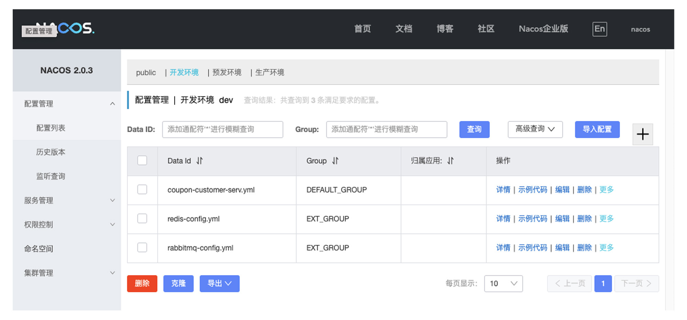

然后，我们点击页面右上角的➕符号创建三个配置文件，coupon-customer-serv.yml（默认分组）、redis-config.yml（EXT_GROUP 分组）和 rabbitmq-config.yml（EXT_GROUP 分组）。

接下来，你就可以将原本配置在本地 application.yml 中的配置项转移到 Nacos Config 中了，由于 Data ID 后缀是 yml，所以在编辑配置项的时候，你需要在页面上选择“YAML”作为配置格式。

以 coupon-customer-serv.yml 为例，在新建配置的页面中，我指定了 Data ID 为 coupon-customer-serv.yml、Group 为默认分组 DEFAULT_GROUP、配置格式为 YAML。在“配置内容”输入框中，我将 spring.datasource 的配置项添加了进去。除此之外，我还添加了一个特殊的业务属性：disableCouponRequest:true，待会儿你就会用到这个属性实现**动态业务开关推送**。

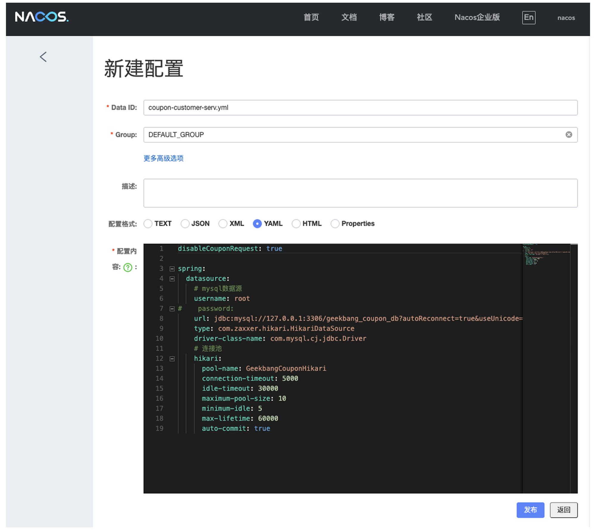

填好配置项的内容之后，你就可以点击“发布”按钮来创建配置文件了。redis-config.yml 和 rabbitmq-config.yml 两个配置文件将在后面的章节中用到，我们目前还不需要向这两个文件中添加配置项。

一切配置妥当之后，我们就可以去启动应用程序来验证集成效果了。为了测试应用程序能否正确读取远程配置项，你可以打开 coupon-customer-impl 模块的 application.yml 文件，将其中的 datasource 相关配置注释掉，然后尝试重新启动服务。如果项目启动正常，你将会在日志文件看到配置文件的订阅通知。

```sh
INFO c.a.n.client.config.impl.ClientWorker    : [fixed-localhost_8848-dev] [subscribe] coupon-customer-serv.yml+DEFAULT_GROUP+dev
INFO c.a.nacos.client.config.impl.CacheData   : [fixed-localhost_8848-dev] [add-listener] ok, tenant=dev, dataId=coupon-customer-serv.yml, group=DEFAULT_GROUP, cnt=1
// 省略其它配置文件的加载日志
```

接下来你可以尝试调用本地数据库的 CRUD 接口，如果业务正常运作，那么就说明你的程序可以从 Nacos Config 中获取到正确的数据库配置信息。

你可以使用同样的方法，将一些配置项信息迁移到 Nacos Config 中。当你需要更改配置项的时候，就不用每次都重新编译并发布应用了，只需要改动 Nacos Config 中的配置即可。这样一来，我们就实现了**“配置管理”与“业务逻辑”的职责分离**。

别忘了，前面我还在 Nacos Config 中添加了一个 disableCouponRequest 配置项，接下来我就用它做一个动态配置推送的场景，控制用户领券功能的打开和关闭。

### 动态配置推送

首先，我们打开 CouponCustomerController 类，声明一个布尔值的变量 disableCoupon，并使用 @Value 注解将 Nacos 配置中心里的 disableCouponRequest 属性注入进来。

```java
@Value("${disableCouponRequest:false}")
private Boolean disableCoupon;
```

在上面的代码中，我们给 disableCouponRequest 属性设置了一个默认值“false”，这样做的目的是加一层容错机制。即便 Nacos Config 连接异常无法获取配置项，应用程序也可以使用默认值完成启动加载。

然后，我们找到用户领券接口 requestCoupon，在其中添加一段业务逻辑，根据 disableCoupon 属性的值控制是否发放优惠券，如果值为“true”则暂停领券。

```java
@PostMapping("requestCoupon")
public Coupon requestCoupon(@Valid @RequestBody RequestCoupon request) {
    if (disableCoupon) {
        log.info("暂停领取优惠券");
        return null;
    }
    return customerService.requestCoupon(request);
}
```

最后，**别忘了在 CouponCustomerController 类头上添加一个 RefreshScope 注解**，有了这个注解，Nacos Config 中的属性变动就会动态同步到当前类的变量中。如果不添加 RefreshScope 注解，即便应用程序监听到了外部属性变更，那么类变量的值也不会被刷新。

```java
@RefreshScope
public class CouponCustomerController {
}
```

到这里，我们就完成了所有改造工作。你可以启动应用程序，然后登录 Nacos 控制台并打开 coupon-customer-serv.yml 文件的编辑窗口，将 disableCouponRequest 的值由 true 改为 false，并调用 requestCoupon 服务查看接口逻辑的变化。我录了一段在 Nacos Config 控制台动态编辑配置项的 video，你可以参考一下。

### 总结

现在，我们来回顾一下这节课的重点内容。今天我们使用 Nacos Config 作为配置中心，实现了**配置项和业务逻辑的职责分离**，然后落地了一个**动态属性推送**的场景。

配置中心还有一个重要功能是“配置回滚”。如果你错误地修改了某些业务项，引起了系统故障，这时候你可以执行一段 rollback 操作，将配置项改动退回到之前的某一个历史版本。在 Nacos 控制台的“配置管理 -> 历史版本”菜单中，你可以查看某个配置项的历史修改记录，并指定回滚的版本。

除此之外，我们还可以在 Nacos 上查看某个文件的监听列表，了解目前有多少实例监听了指定配置文件的动态改动事件。你可以点击“配置管理 -> 监听查询”来访问这个功能。

上面两个功能的操作非常简单，就留给你来自己探索啦。

### 思考题

你知道 RefreshScope 动态刷新背后的实现原理吗？欢迎在留言区写下自己的思考，与我一起讨论。

好啦，这节课就结束啦。欢迎你把这节课分享给更多对 Spring Cloud 感兴趣的朋友。我是姚秋辰，我们下节课再见！

## 17 | Sentinel 体系结构：什么是服务容错（降级熔断、流量整形）?

你好，我是姚秋辰。

今天我们来学习大型微服务系统中高可用性的重要一环：服务容错。通过这节课的内容，你可以了解什么是降级熔断和流量整形，以及它们和服务高可用之间的联系。最后我再带你从架构层面去了解 Sentinel 服务容错的工作流程，为后面的实战课程做一些理论知识的铺垫。

说到高可用，你也许会不由自主地想到“集群化”。没错，通过搭建服务集群来避免单点故障确实是高可用性保障的常规操作。但是，仅仅搭建集群就能高枕无忧了吗？当面对真正的高可用杀手“服务雪崩”时，即便是集群也会显得脆弱无力。

那么服务雪崩在微服务系统中能引起多大的故障呢？在学习什么是服务容错之前，我们先来了解一下服务容错所要解决的实际问题。

### 什么是服务雪崩？

我来用一个模拟场景带你感受一下服务雪崩的厉害之处。

假设我有一个微服务系统，这个系统内包含了 ABCD 四个微服务，这四个服务都是以集群模式构建的。我画了一张图用来表示各个服务之间的调用关系。

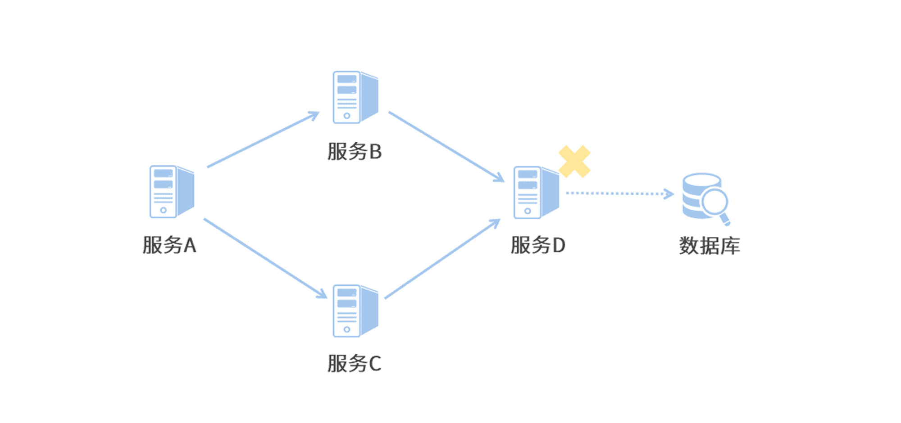

从上面的图中我们可以看出，服务 A 会向服务 B 和服务 C 发起调用，而服务 B 和服务 C 都会去调用服务 D。也就是说，服务 ABC 都直接或间接地依赖服务 D 完成自己的业务逻辑。

由于服务 D 底层有数据读写的需求，所以它会对数据库执行 CRUD 操作。如果开发服务 D 的程序员学艺不精，写了一段性能比较差的 SQL 语句，那么一次 DB 操作的执行时间就会比较长。这在小并发访问量的情况下没有什么问题，不过，一旦并发量堆积了起来，这种性能问题就会被放大。

在这种情况下，数据库的连接资源会被服务 D 迅速吃光，进而导致服务 D 的接口响应时间逐渐拉长，接口超时的情况越来越多。由于上游服务的请求还在源源不断抵达服务 D，所以接口超时会迅速传导到服务 B 和服务 C，进而又影响到 A，导致整个集群的服务变为不可用状态。

来自服务 D 的底层故障，如果不能得到有效处理，那么故障就像滚雪球一样在集群中被迅速放大，进而形成了一场“服务雪崩”，团灭了整个系统的上下游服务。我想，现在你一定理解了服务雪崩的危害。

那么我们如何使用 Sentinel 来防范服务雪崩呢？

### Sentinel 服务容错的思路

Sentinel 是 Spring Cloud Alibaba 的一款服务容错组件，我们也经常把它叫做“防流量哨兵”。它是阿里巴巴双十一大促核心场景的保护神，内置了丰富的服务容错应用场景。它以流量作为切入点，通过各种内外防控手段达到维持服务稳定性的目的。

阿里系的 Sentinel 解决服务稳定性的思路是什么呢？

就拿服务雪崩这种稳定性崩坏的场景来说，这种极端场景的发生有两个主要因素，一个是**外部的高并发流量导致的请求数量增多**，超过了集群的吞吐量，另一个是**内部各种未知异常导致的接口响应异常超时**。

我们可以采用“**内外兼修**”的思路来摆平服务雪崩的两个主要因素。所谓“内”，是指内部的异常治理，所谓“外”，则是外部用户流量的疏导。内外兼修的根本目的，是从内部和外部双管齐下对集群访问量进行减压，下面我们深入分析一下 Sentinel 是如何通过内外兼修的手段做服务容错的。

#### 内部异常治理

在 Sentinel 中，我们可以采用**降级**和**熔断**的方式处理内部的异常。

所谓降级，是指当服务调用发生了响应超时、服务异常等情况时，我们在服务内部可以执行一段“降级逻辑”。


在**降级**逻辑中，你可以选择静默处理，即忽略掉异常继续执行后续逻辑；或者你可以返回一个让业务可以继续执行下去的默认结果；又或者，在降级逻辑中尝试重试、或者恢复异常服务。从这里我们可以看出，降级是针对“单次服务调用异常”而执行的处理逻辑。

而所谓**熔断**，是指当异常调用量达到一定的判定条件，比如在异常降级和慢调用请求的比例达到一个阈值、窗口时间内降级请求达到一定数量的情况下，微服务在一段时间内停止对目标服务发起调用，所有来访请求直接执行降级逻辑。所以，熔断是“多次服务调用异常”累积的结果。

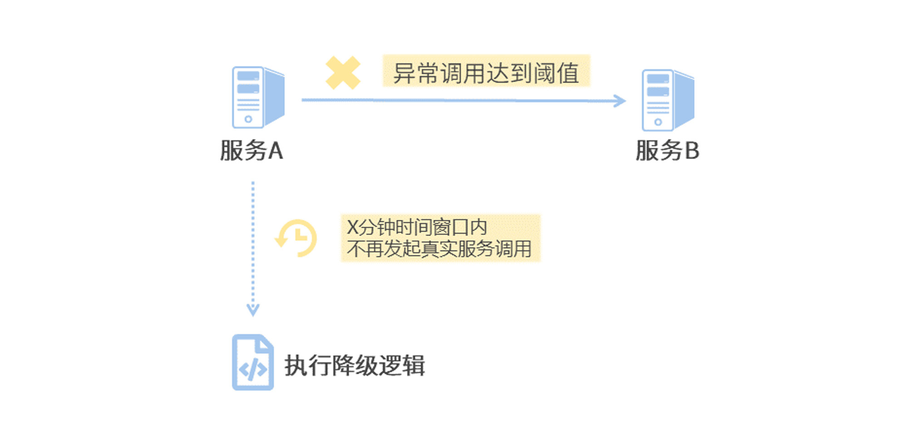

我们可以看出，当服务进入到了“熔断状态”以后，当前服务对下游目标服务的调用行为也就停止了，这样一来就大大降低了下游服务的访问压力。

关于降级熔断，我的经验是主链路服务（也就是核心业务链路的重要服务）一定要设置降级预案，防止服务雪崩在核心业务上的传播。除此之外，对于非核心链路的服务，应该设置手动降级开关，在大促等高并发场景下做主动降级，将额外的计算资源通过弹性方案匀给主链路服务。

关于降级的判定条件，需要结合全链路压测的结果来判定。通常我们在双 11 这类大促场景下，会组建一个稳定性团队专门负责全链路压测，并根据多轮次的压测结果来调整各个服务集群的水位，并对降级和限流判定条件进行微调，以期达到最佳的主链路吞吐量。

以上是内部异常治理的方法，那么外部流量疏导又是如何降低集群访问压力的呢？

### 外部流量控制

提到外部流量控制，你一定会想到“**限流**”。没错，限流是流量整形 / 流控方案的一种。在 Sentinel 中我们可以根据集群的处理能力，为每个服务设置一个限流规则，从 QPS 维度或者并发线程数的维度控制外部的访问流量。一旦访问量超过阈值，后续的请求就会被“fast fail”，这是最为常用的一种限流手段。但 Sentinel 所支持的方案可不止这一种。

从流量整形的效果来看，除了“快速失败”以外，我们还可以在 Sentinel 中选择预热模型和排队模型。

顾名思义，**预热模型**就是在一段规定的预热时间窗口内，由低到高逐渐拉高流量阈值，直到达到预设的最高阈值为止。

而对于**排队模型**来说，如果访问量超过了设定的阈值，服务请求不会被立即失败，而是被放入一个队列内等待处理，如果服务请求在预设的超时时间内仍然未被处理，那么就会被移出队列。

限流是挡在降级熔断之前的一道关卡，它是投入产出比最高的防护措施，为什么这样说呢？我们将限流和降级做一个比对：在熔断阶段，用户流量已经打到了服务器，尽管我们对下游服务的调用不会真实发起，但上游服务的计算资源实打实的被占用了；而限流则不同，如果用户流量在入口处就被限制，那么它并不会占用服务器的资源来处理这个请求。

我会在接下来的两节课中和你详细讲解如何在 Sentinel 中设置熔断规则、流控规则、热点规则等服务容错设置。

到这里，我想你已经了解了 Sentinel“内外兼修”的治理之道。接下来，我们去简单了解一下 Sentinel 的工作原理。

### Sentinel 工作原理

我放了一张 Sentinel 官方的流程图，你可以一目了然地看到 Sentinel 对服务请求的处理流程。

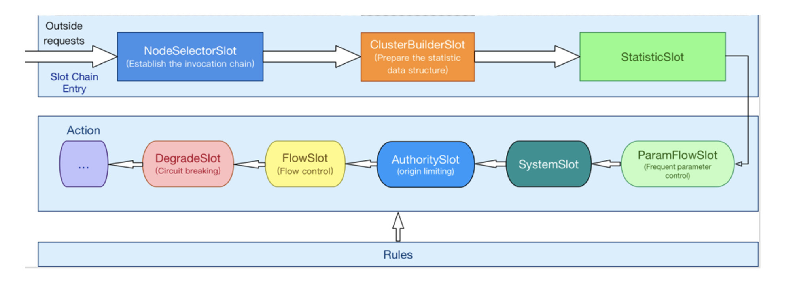

在 Sentinel 的世界中，万物都是可以被保护的“资源”，当一个外部请求想要访问 Sentinel 的资源时，便会创建一个 Entry 对象。每一个 Entry 对象都要过五关斩六将，经过 Slot 链路的层层考验最终完成自己的业务，你可以把 Slot 当成是一类完成特定任务的“Filter”，**这是一种典型的职责链设计模式。**

分布在 SlotChain 里面的各个 Slot 各司其职，为了保护 Sentinel 背后的“资源”，这些 Slot 通过互相配合的方式执行了各项检查任务。比如有的 Slot 用来统计数据，而有的 Slot 负责做限流降级检查。我这里挑选几个重要的 Slot 节点讲解一下，让你明白这个 Slot 职责链的核心功能。

在这些 Slot 中，有几个是被专门用来**收集数据**的。比如，**NodeSelectorSlot** 被用来构建当前请求的访问路径，它将上下游调用链串联起来，形成了一个服务调用关系的树状结构。而 **ClusterBuilderSlot** 和 **StatisticSlot** 这两个 Slot 会从多个维度统计一些运行期信息，比如接口响应时间、服务 QPS、当前线程数等等。

由这几个 Slot 统计出来的结果，会为后续的限流降级等 Sentinel 策略提供数据支持。比如说我想为指定的链路定义 QPS 维度的限流策略，那么这个限流策略在执行阶段就需要获取到这些统计数据，作为决策依据。

除了上面介绍的三个 Slot 以外，Sentinel 还有很多被用作“**规则判断**”的 Slot。比如 **FlowSlot** 被用来做流控规则的判定，**DegradeSlot** 被用来做降级熔断判定，这两个 Slot 是我们平时在项目中使用频率最高的服务容错功能。**ParamFlowSlot** 可以根据请求参数做精细粒度的流控，它经常被用来在大型应用中控制热点数据所带来的突发流量。**AuthoritySlot** 可以针对特定资源设置黑白名单，限制某些应用对资源的访问。

除此之外，Sentinel 的 Slot 机制也具备一定的扩展性，如果你想要添加一个自定义的 Slot，我们可以通过实现 ProcessorSlot 接口来完成，而且你还可以通过优先级调整各个 Slot 之间的执行顺序。

到这里，相信你已经对服务容错有了比较清晰的认识，并且了解了 Sentinel 实现服务容错的路子。现在，我们来回顾一下这节课的重点内容。

### 总结

今天我带你了解了提高服务稳定性的思路，那就是**“内外兼修”，通过降级熔断解决内部异常治理，再通过外部流控削减外部访问压力**。然后我们学习了 Sentinel 的工作原理，了解了它是如何使用职责链的方式做资源访问检查的。

在本节课的 Sentinel 工作原理部分，我列举了很多 Sentinel 规则类的类名，如果你对 Sentinel 的底层原理感兴趣的话，我推荐你从Sentinel 的 GitHub 主页将源代码下载到本地（建议你下载 1.8.2 版本），然后导入项目到 IDE 中直接打开这几个类，通过源代码来了解一下它的底层实现。这样一来，你就会对 Sentinel 的 SlotChain 职责链有一个更为清晰的认识。

在后面的课程中，我将带你进入到 Sentinel 的实战环节。我会使用两节课将 Sentinel 中的服务容错规则应用到优惠券实战项目中，最后再用一节课对 Sentinel 的源码做个二次改造，将 Sentinel 中的限流规则持久化到 Nacos Config。我建议你在几个关键 Slot 处打上断点，通过 debug 的方式跟一遍代码，这样你就能快速拎清楚 Sentinel 的底层运作原理了。

### 思考题

通过这节课介绍的内容，如果我想要在 Sentinel 的职责链中做一个小扩展，添加一个自定义的 Slot 节点，并指定它的执行顺序，你知道该如何做吗？你可以试着深入学习我前面提到的几个 Slot 类的源码，我相信你可以从中轻松找到答案。

好啦，这节课就结束啦。欢迎你把这节课分享给更多对 Spring Cloud 感兴趣的朋友。我是姚秋辰，我们下节课再见！


## 18 | Sentinel 实战：如何实施流量整形与限流策略？

你好，我是姚秋辰。

今天我们来学习 Sentinel 组件最为核心的功能：流量整形（也可以叫流控）。

在这节课，我会通过项目实战将优惠券系统集成到 Sentinel 中，对用户领券和查找优惠券两个场景添加流控规则。在这个过程中，我会带你了解 Sentinel 的三种流控模式，以及对应的流控效果。此外，我还会针对 Sentinel 框架做一个小扩展，对特定的调用来源做流控。掌握了这些内容之后，你就可以清楚如何用流控手段来降低高并发场景下的系统压力。

在进行实战项目之前，我需要带你搭建 Sentinel 控制台。你可以把它看作一个中心化的控制中心，所有的应用程序都会接入这个控制台，我们可以在这里设置各种流控规则，这些规则也会在应用程序中实时生效。

### 运行 Sentinel 控制台

我们可以从Sentinel 官方 GitHub的 Release 页面下载可供本地执行的 jar 文件，为了避免版本不一致导致的兼容性问题，我推荐你下载 1.8.2.Release 版本。在该版本下的 Assets 部分，你可以直接下载 sentinel-dashboard-1.8.2.jar 这个文件。

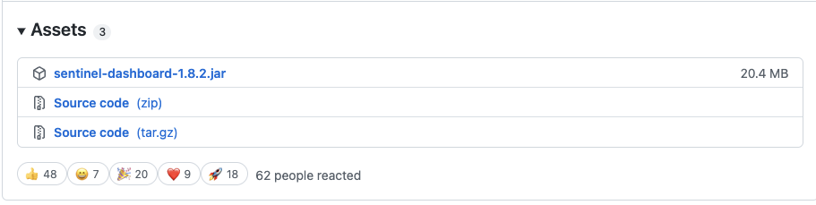

下载好文件之后，你可以使用命令行进入到这个 jar 包所在的目录，然后就可以直接执行下面这行命令启动 Sentinel 控制台了。

```sh
java -Dserver.port=8080 -Dcsp.sentinel.dashboard.server=localhost:8080 -Dproject.name=sentinel-dashboard -jar sentinel-dashboard-1.8.2.jar
```

这行命令以 8080 为端口启动了 Sentinel 控制台，启动成功后你可以在浏览器直接访问 localhost:8080 地址。

当你看到登录界面，你就可以使用默认账号进行登录了，登录名和密码都是 sentinel。登陆成功之后你就可以进入到 Sentinel 控制台主页面，在左侧的导航栏会列出当前已经接入 Sentinel 的所有应用，这里默认展示的 sentinal-dashboard 应用其实就是控制台程序本尊了。

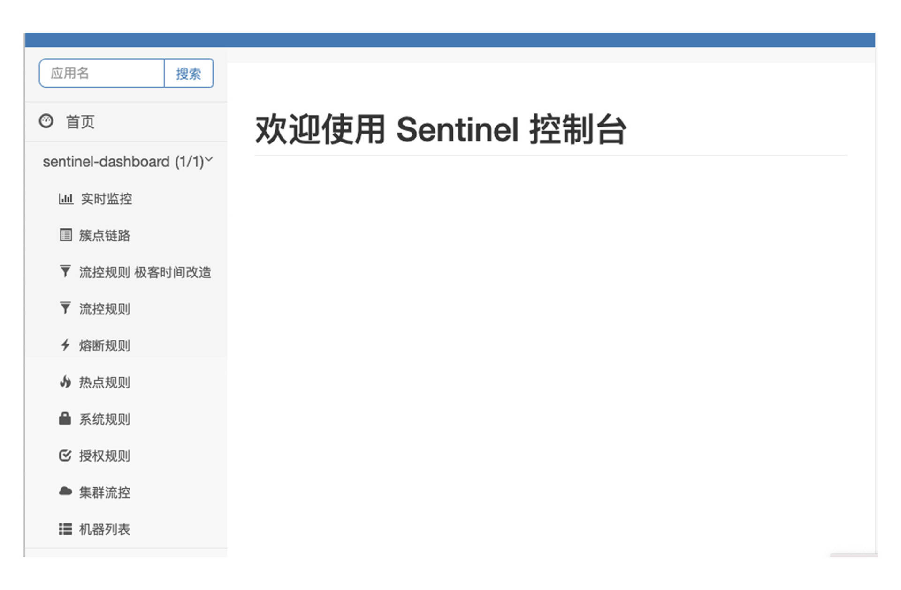

到这里，我们的 Sentinel 控制台就已经搭建完成了，是不是非常简单呢？接下来，我带你将实战项目集成到 Sentinel 控制台中。

### 将微服务接入到 Sentinel 控制台

为了演示 Sentinel 的多种流控效果，我们需要将两个具有前后调用关系的模块集成到 Sentinel 控制台，我这里选择的是模板微服务和用户微服务。

首先，你需要把 Sentinel 的依赖项引入到项目里。你只用将 spring-cloud-starter-alibaba-sentinel 组件分别加入到 template 和 customer 这两个服务的 pom 文件中就好了。

```xml
<dependency>
    <groupId>com.alibaba.cloud</groupId>
    <artifactId>spring-cloud-starter-alibaba-sentinel</artifactId>
</dependency>
```

然后，你需要做一些基本的配置，将应用直连到 Sentinel 控制台。这一步也非常简单，你只需要在项目的 application.yml 文件中加入下面的 sentinel 属性就可以了，具体代码在这里：

```yml
spring:
  cloud:
    sentinel:
      transport:
        # sentinel api端口，默认8719
        port: 8719
        # dashboard地址
        dashboard: localhost:8080
```

在上面的代码中，port 属性是 Sentinal API 的默认端口，默认值是 8719；而 dashboard 属性则是指向了 Sentinel 控制台的地址，这里我们填写的是 localhost:8080。

最后，你还需要在代码中使用 Sentinel 注解对资源进行标记。在上一课里我讲到过，在 Sentinel 的世界中，一切都是以“资源”的方式存在的。Controller 类里面写的 API 也是资源，这个资源便是 Sentinel 要守护的对象。

Sentinel 会为 Controller 中的 API 生成一个默认的资源名称，这个名称就是 URL 的路径，如 /template/getTemplateInBatch。当然了，你也可以使用特定的注解为资源打上一个你自己指定的名称标记，以 CouponTemplateController 为例，你可以参考这段代码：

```java
@GetMapping("/getTemplate")
@SentinelResource(value = "getTemplate")
public CouponTemplateInfo getTemplate(@RequestParam("id") Long id){
}
@GetMapping("/getBatch")
@SentinelResource(value = "getTemplateInBatch", blockHandler = "getTemplateInBatch_block")
public Map<Long, CouponTemplateInfo> getTemplateInBatch(
        @RequestParam("ids") Collection<Long> ids) {
}
public Map<Long, CouponTemplateInfo> getTemplateInBatch_block(
        Collection<Long> ids, BlockException exception) {
    log.info("接口被限流");
    return Maps.newHashMap();
}
```

在上面的代码中，我使用 SentinelResource 注解对模板服务的 getTemplate 方法和 getTemplateInBatch 方法做了标记，将它们的资源名称设置为方法名。除此之外，在 getTemplateInBatch 方法中，我还使用了注解中的 blockHandler 属性为当前资源指定了限流后的降级方法，如果当前服务抛出了 BlockException，那么就会转而执行这段限流方法。

你同样可以使用 SentinelResource 注解，为 CouponCustoemrController 类中的用户领券和查找优惠券的接口做资源标记。你可以参考下面的代码。

```java
@PostMapping("findCoupon")
@SentinelResource(value = "customer-findCoupon")
public List<CouponInfo> findCoupon(@Valid @RequestBody SearchCoupon request) {
}
@PostMapping("requestCoupon")
@SentinelResource(value = "requestCoupon")
public Coupon requestCoupon(@Valid @RequestBody RequestCoupon request) {
}
```

到这里，我们就成功地把微服务接入到了 Sentinel 控制台。那么接下来，我们就可以把 Template 服务和 Customer 服务都启动起来，到 Sentinel 控制台去设置流控规则了。

### 设置流控规则

登录 Sentinel 控制台之后，你在左侧的导航栏是看不到我们刚注册的微服务的。这时你只要对 Template 和 Customer 服务发起几个调用，触发服务信息的上报，再等上个几秒钟，你就可以在 Sentinel 里看到自己的微服务啦。

Sentinel 支持三种不同的流控模式，分别是直接流控、关联流控和链路流控。

直接流控：直接作用于当前资源，如果访问压力大于某个阈值，后续请求将被直接拦下来；

关联流控：当关联资源的访问量达到某个阈值时，对当前资源进行限流；

链路流控：当指定链路上的访问量大于某个阈值时，对当前资源进行限流，这里的“指定链路”是细化到 API 级别的限流维度。

接下来，我就带你了解这三种流控方式各自的使用场景，并带你上手为微服务添加流控规则。

#### 直接流控

我们平时最常用的就是“直接流控”，所以我要带你去控制台操作一把，为 Template 服务添加一个直接流控规则。

打开 Sentinel 控制台，在左侧导航栏你会看到所有已经接入 Sentinel 的应用名称，如果没找到 Coupon 应用，你只需要在本地 Postman 发起一个 API 调用，触发一次信息上报，再等待十几秒后刷新页面，就可以看到自己的应用啦。

我录了一段设置“直接流控”的截屏，你可以参考一下。

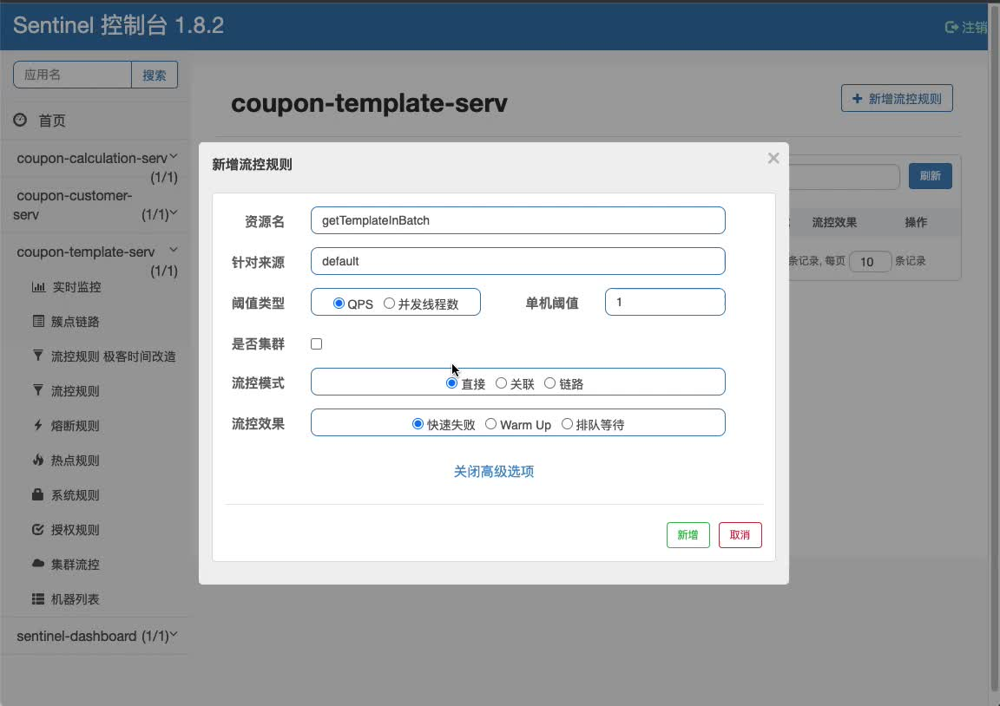

在这段视频中，我为 Template 服务的 getTemplateInBatch 接口指定了一个直接限流规则，这里的资源名就是我在 SentinelResource 注解中指定的名称。我设置了以 QPS 为限定条件，如果单机 QPS 阈值大于 1（QPS=1 就是每秒一次请求），就触发限流。当然了，你也可以在页面中将阈值类型改为“并发连接数”。

设置完限流限定条件之后，你就可以尝试在本地直接调用这个接口了。不管你是通过 Template 服务直接调用，还是通过 Customer 服务的 findCoupon 接口间接调用，只要超过了每秒 1 次的频率，请求就会被 Sentinel 阻断。这样一来，我们就在 Template 服务中实现了优惠券模板查找的限流规则。

#### 关联流控

如果两个资源之间有竞争关系，比如说，它们**共享同一个数据库连接池**，这时候你就可以使用“关联流控”对低优先级的资源进行流控，让高优先级的资源获得竞争优势。

我们假设 Template 服务中的 getTemplateInBatch 接口和 getTemplate 接口之间就存在了竞争关系，而且前者的优先级低于后者，在这种情况下，我们应该尽可能地对低优先级的接口实施限流规则。

这里我将“关联流控”应用到了低优先级的 getTemplateInBatch 接口上。配置细节在下面的图里，你可以参考一下。

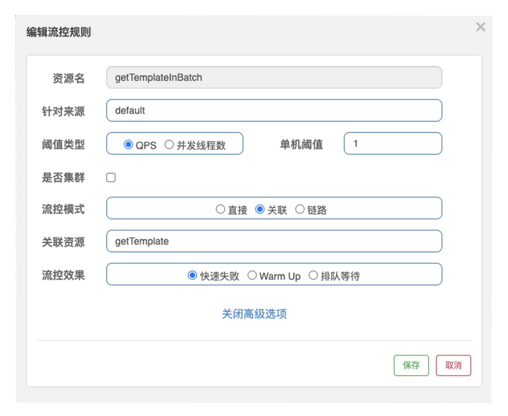

在流控规则设置页面里，我在“关联资源”一栏填了 getTemplate，写在这里的是高优先级资源的名称。同时，我设置了阈值判断条件为 QPS=1，它的意思是，如果高优先级资源的访问频率达到了每秒一次，那么低优先级资源就会被限流。

所以，这里需要你注意的一点是，**关联限流的阈值判断是作用于高优先级资源之上的，但是流控效果是作用于低优先级资源之上**。

#### 链路流控

如果在一个应用中，**对同一个资源有多条不同的访问链路**，那么我们就可以应用“链路流控”，实现 API 级别的精细粒度限流。我画了一张图帮你理解链路流控的作用点。

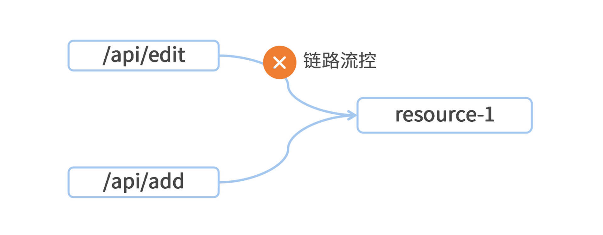

在上面的图里，一个服务应用中有 /api/edit 和 /api/add 两个接口，这两个接口都调用了同一个资源 resource-1。如果我想只对 /api/edit 接口流进行限流，那么就可以将“链路流控”应用在 resource-1 之上，同时指定当前流控规则的“入口资源”是 /api/edit。

现在，你已经了解了 Sentinel 的三种流控模式。接下来，我们再来看一看如何针对调用源进行限流。这里需要我们对 Sentinel 源代码做一些改造。

#### 实现针对调用源的限流

在微服务架构中，一个服务可能被多个服务调用。比如说，Customer 服务会调用 Template 服务的 getTemplateInBatch 资源，未来我们可能会研发一个新的服务叫 coupon-other-serv，它也会调用相同资源。

如果我想为 getTemplateInBatch 资源设置一个限流规则，并指定其只对来自 Customer 服务的调用起作用，应该怎么实现呢？

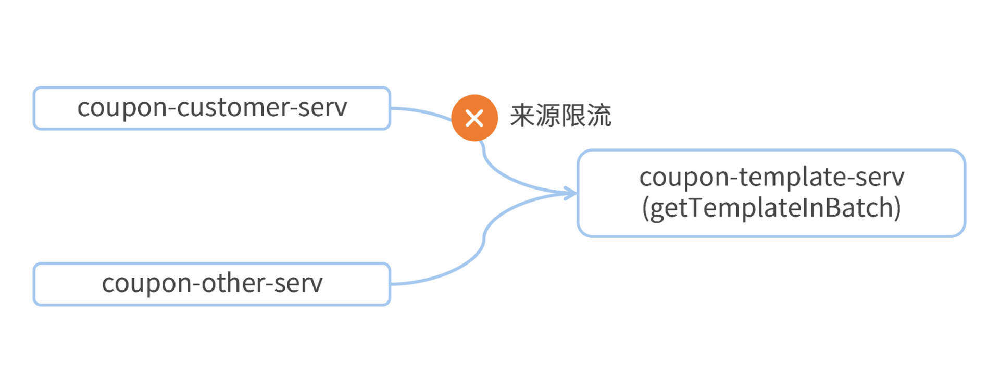

这个实现过程分为两步。第一步，你要想办法在服务请求中加上一个特殊标记，告诉 Template 服务是谁调用了你；第二步，你需要在 Sentinel 控制台设置流控规则的针对来源。

我们先从第一步开始做起。

首先，你需要对 Customer 服务的 OpenFeign 组件做一点手脚，将调用源的应用名加入到由 OpenFeign 组件构造的 Request 中。我们可以借助 OpenFeign 的 RequestInterceptor 扩展接口，编写一个自定义的拦截器，在服务请求发送出去之前，往 Request 的 Header 里写入一个特殊变量，你可以参考我这段代码。

```java
@Configuration
public class OpenfeignSentinelInterceptor implements RequestInterceptor {
    @Override
    public void apply(RequestTemplate template) {
        template.header("SentinelSource", "coupon-customer-serv");
    }
}
```

在上面的代码中，我在 Customer 服务中新建了一个 OpenfeignSentinelInterceptor 的类，继承自 RequestInterceptor 并实现了其中的 apply 方法。在这个方法里，我向服务请求的 header 里加入了一个 SentinelSource 属性，对应的值是当前服务的名称 coupon-customer-serv。这就是我要传递给下游服务的“来源标记”。

接下来，你需要在 Template 服务中识别来自上游的标记，并将其加入到 Sentinel 的链路统计中。我们可以借助 Sentinel 提供的 RequestOriginParser 扩展接口，编写一个自定义的解析器。你可以参考我这里的代码实现。

```java
@Component
@Slf4j
public class SentinelOriginParser implements RequestOriginParser {
    @Override
    public String parseOrigin(HttpServletRequest request) {
        log.info("request {}, header={}", request.getParameterMap(), request.getHeaderNames());
        return request.getHeader("SentinelSource");
    }
}
```

在上面的代码中，我在 Template 服务中新建了一个 SentinelOriginParser 的类，它实现了 RequestOriginParser 接口中的 parseOrigin 方法。在方法中，我们从服务请求的 Header 中获取 SentinelSource 变量的值，作为调用源的 name。

到这里第一步“来源标记传递”就完成了，接下来你还需要在 Sentinel 控制台设置流控规则的针对来源。

在流控规则的编辑页面，你可以在“针对来源”这一栏填上 coupon-customer-serv 并保存，这样一来，当前限流规则就只会针对来自 Customer 服务的请求生效了。

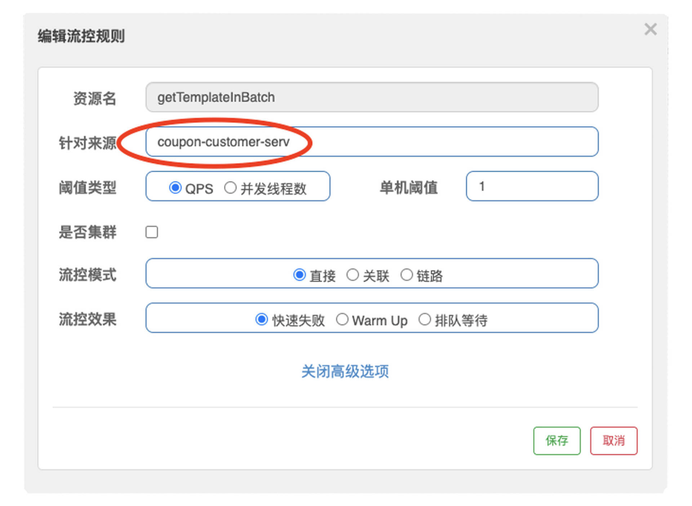

现在，相信你对 Sentinel 的流控模式都已经比较了解了，接下来我们再去学习一下 Sentinel 所支持的流控效果吧。

### Sentinel 的流控效果

Sentinel 总共支持三种流控效果，分别是**快速失败**、**Warm Up** 和**排队等待**。

先来说说**快速失败**，Sentinel 默认的流控效果就是快速失败，前面做的实战改造都是采用了这种模式。这种流控效果非常好理解，在快速失败模式下，超过阈值设定的请求将会被立即阻拦住。

第二种流控效果 **Warm Up** 则实现了“预热模式的流控效果”，这种方式可以平缓拉高系统水位，避免突发流量对当前处于低水位的系统的可用性造成破坏。

举个例子，如果我们设置的系统阈值是 QPS=10，预热时间 =5，那么 Sentinel 会在这 5 秒的预热时间内，将限流阈值从 3 缓慢拉高到 10。为什么起始阈值是 3 呢？因为 Sentinel 内部有一个冷加载因子，它的值是 3，在预热模式下，起始阈值的计算公式是单机阈值 / 冷加载因子，也就是 10/3=3。

我截了一张图，你可以参考一下，看看 Warm Up 配置项是如何填写的。

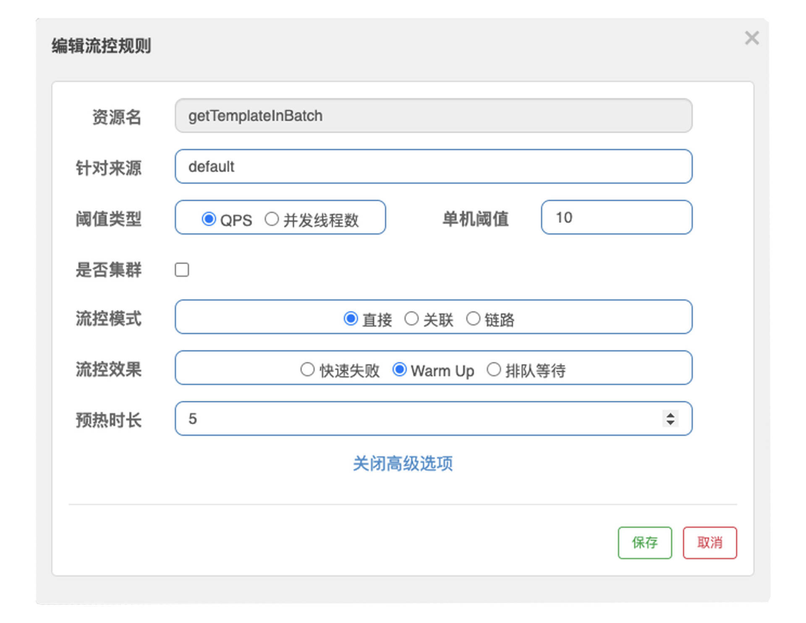

话说回来，为什么我们要使用预热模型呢？我来举一个例子帮你理解好了。

我开发了一个接口用来查询商品详情信息，它采用了通用的缓存 +DB 读写的逻辑，即一次请求过来之后，先查询缓存，如果缓存未命中那么再查询 DB，同时把查到的数据写入缓存并设置一个缓存过期时间。

假如这个接口长期处于低水位状态，那么大部分缓存数据已经过期了，如果这时候发生了突发流量，比如双 11 的 0 点抢购开始了，由于缓存还未充分构建起来，突发流量就会对数据库形成一个峰值压力，很有可能就把 DB 层打穿。如果我们可以设置一个预热模型，给系统一段时间的缓冲，在缓慢拉高应用水位的过程中，缓存也逐渐地构建了起来。这样就大大降低了峰值流量对系统的冲击。

了解了 Warm Up 之后，我们再来看一下最后一个流控效果，那就是排队等待。

顾名思义，在**排队等待**模式下，超过阈值的请求不会立即失败，而是会被放入一个队列中，排好队等待被处理。当然了，每个请求的排队时间可不是永恒的，一旦请求在队列中等待的时间超过了我们设置的超时时间，那么请求就会被从队列中移除。

我截图了一张图，你可以参考一下图中是如何设置排队等待参数的。

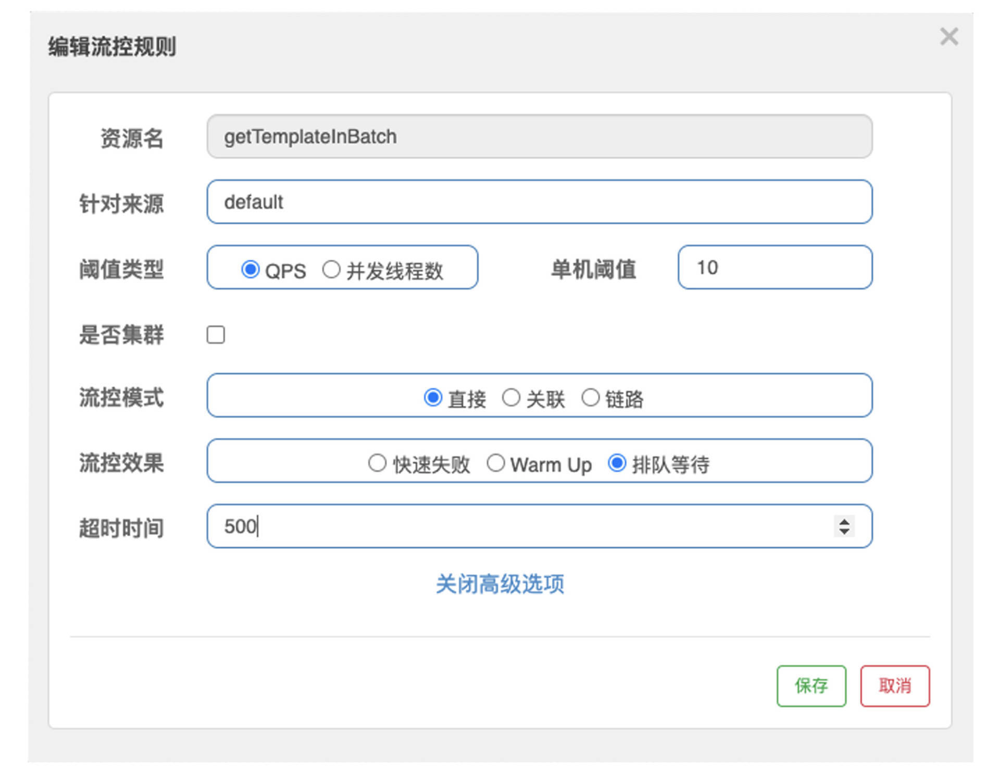

到这里，相信你已经对 Sentinel 的各种流控效果有了比较全面的了解。现在，我们来回顾一下这节课的重点内容。

### 总结

今天我带你了解了 Sentinel 的三大流控模式，分别是直连流控、关联流控和链路流控。我们还了解了三种流控效果，分别是快速失败、预热和排队等待。如果你想要将流控规则应用到特定来源的服务，一定要记得**在本地服务中做一些小改造，让 Sentinel 识别调用源**，否则针对来源的限流方式是不会生效的。

从流控的角度来讲，Sentinel 还实现了基于热点规则的限流。热点限流也是互联网场景下的重要稳定性保障手段，比如电商业务的爆款商品、微博系统的明星出轨消息等等，这些都是发生热点数据宕机的常客。我建议你去通过网上的资料了解一下什么是热点数据，然后自己把玩一下 Sentinel 控制台的“热点规则”页面，尝试配置一个简单的热点规则到实战项目中。

在后面的课程中，我将带你了解 Sentinel 的另一个最常用的稳定性保障手段：降级熔断规则。

### 思考题

通过这节课的内容，你能深入说说流控效果的底层实现吗？最好能够从**算法**的角度来描述一下 Sentinel 是如何判断一个请求可否被放行的。

好啦，这节课就结束啦。欢迎你把这节课分享给更多对 Spring Cloud 感兴趣的朋友。我是姚秋辰，我们下节课再见！


## 19 | Sentinel 实战：如何为项目添加异常降级方案？

你好，我是姚秋辰。

上节课我们学习了如何将应用接入 Sentinel 实现不同的流控效果，今天我们来学习 Sentinel 组件另一个重要功能：降级熔断。通过这节课，你可以知道如何通过 Sentinel 的熔断策略处理各种调用异常。除此之外，我还会讲解 Sentinel 熔断器开关的状态变化过程。

在第 17 课中我们学习过降级和熔断的作用，今天我们就先从降级开始，了解一下如何利用 Sentinel 的注解指定降级方法。

这里我将以 Template 服务的模板批量查询接口为例，向你演示如何设置降级方法。为什么我会选择这个接口？因为券模板查询是一个基础服务，很多上游的业务场景都依赖这个接口获取模板信息，所以它的访问压力相比于其它接口就大得多了，也更容易发生各种服务超时之类的异常情况。

如果你已经准备好了，我们就从编写降级逻辑开始吧。

### 编写降级逻辑

上一节课中，我们在 Template 服务的批量领劵接口之上添加了一个 SentinelResource 注解，并在其中使用 blockHandler 属性指定了降级方法的名称。不过呢，这个注解可不是一个万金油注解，它只能在服务抛出 BlockException 的情况下执行降级逻辑。

什么是 BlockException 呢？这个异常类是 Sentinel 组件自带的类，当一个请求被 Sentinel 规则拦截，这个异常便会被抛出。比如请求被 Sentinel 流控策略阻拦住，或者请求被熔断策略阻断了，这些情况下你可以使用 SentinelResource 的 blockHandler 注解来指定降级逻辑。但是对于其它 RuntimeException 的异常类型它就无能为力了。

我们如何指定一段通用的降级逻辑，来应对 BlockException 以外的 RuntimeException 呢？你可以使用 SentinelResource 中的另一个属性：**fallback**。

以 Template 服务的批量查询接口为例，我通过 fallback 属性指定了一段降级逻辑，用来处理各种运行期异常的情况。你可以参考下面这段代码。

```java
@GetMapping("/getBatch")
@SentinelResource(value = "getTemplateInBatch",
        fallback = "getTemplateInBatch_fallback",  
        blockHandler = "getTemplateInBatch_block")
public Map<Long, CouponTemplateInfo> getTemplateInBatch(
        @RequestParam("ids") Collection<Long> ids) {
    // 如果接口被熔断，那么下面这行log不会被打印出来
    log.info("getTemplateInBatch: {}", JSON.toJSONString(ids));
}
// 接口被降级时的方法
public Map<Long, CouponTemplateInfo> getTemplateInBatch_fallback(
        Collection<Long> ids) {
    log.info("接口被降级");
    return Maps.newHashMap();
}
```

在这段代码中，我通过 fallback 属性指定了当前资源的降级方法是 getTemplatInBatch_fallback。

这里你需要注意，如果降级方法的方法签名是 BlockException，那么 fallback 是无法正常工作的。这点和 blockHandler 属性的用法是不一样的。我在注解中同时使用了 fallback 和 blockHandler 属性，如果服务抛出 BlockException，则执行 blockHandler 属性指定的方法，其他异常就由 fallback 属性所对应的降级方法接管。

如果你不想把降级方法定义在当前 Class 中，而是想新建一个 Class 来统一管理这些降级逻辑，那么你可以通过 SentinelResource 注解的 fallbackClass 属性指定一个保存降级逻辑的 Class。

在大多数的实际场景下，我们在降级方法中执行的是静默逻辑，即**尽可能返回一个可被服务处理的默认值**。举个例子，对于商品详情页的营销优惠计算服务来说，如果发生了服务异常导致的降级，我们可以在服务中返回商品原价，并通过一个特殊标记或属性告诉前端优惠计算发生错误，让前端页面可以根据这个异常标记显示特定提示信息。

定义好降级逻辑，接下来我们就可以去 Sentinel 控制台设置熔断策略了。

### 在控制台添加熔断策略

你可以将 Sentinel 控制台和本地微服务模块一同启动。然后，登录 Sentinel 控制台并展开 coupon-template-serv 模块的导航栏，并在“熔断规则”面板中新建一个规则。

你会看到，Sentinel 的熔断规则有 3 种，分别是异常比例、异常数和慢调用比例。我们可以分别看看它们是如何使用的。

首先，你可以指定以“**异常比例**”为熔断开关的判断逻辑。在 10 秒的统计窗口内，如果异常调用的比例超过了 60%，并且满足请求数量 >=5，就开启一段为期 5 秒的熔断时间。

我录了一段 video，你可以参考一下具体的设置规则。

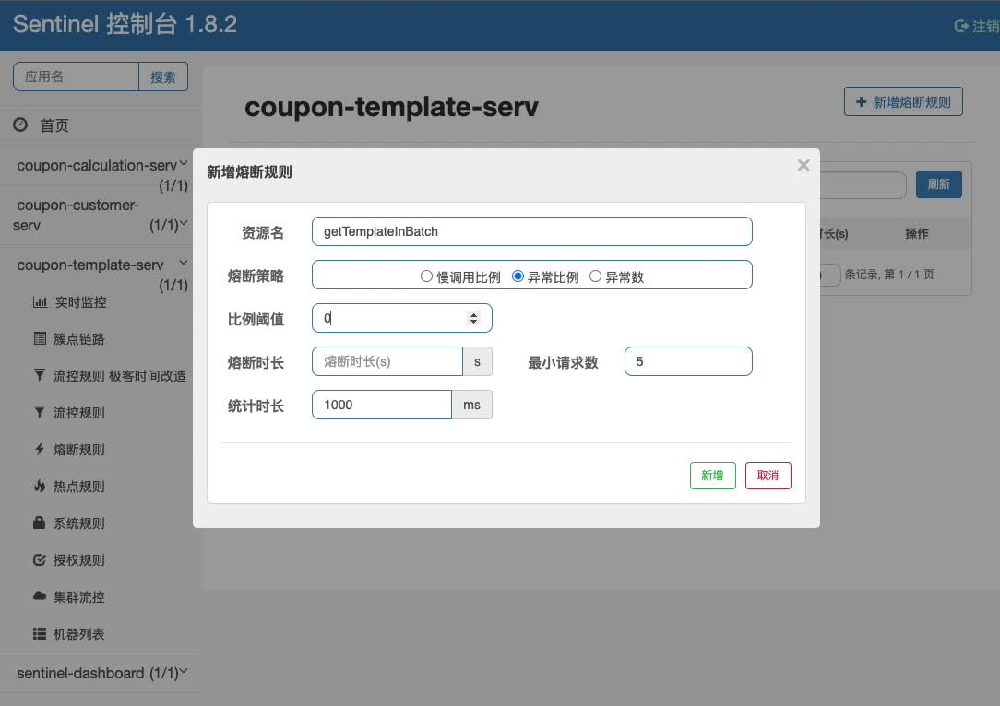

在设置过程中，你一定要注意界面上显示的时间单位。**“熔断时长”的时间单位是秒，而“统计窗口”的时间单位是毫秒**，这两者很容易弄混。

接下来，你可以故意在代码中选择性地抛出一个 RuntimeException，比如当 Template 服务批量查询服务的 ID 数量为 3 时抛出异常，这样你就可以验证熔断器的效果了。

我画了一张流程图，可以帮助你理解 Sentinel 的熔断规则的统计方式，我们一起来看一下。

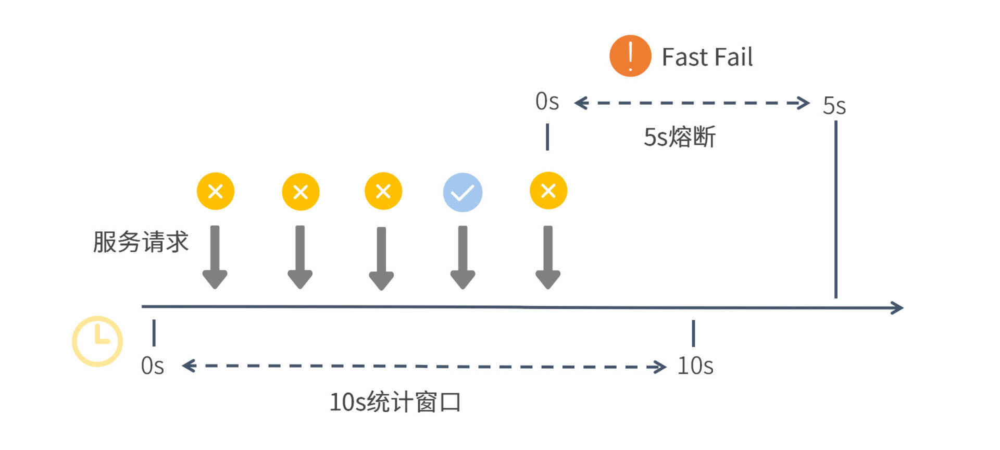

从图中你可以看出，Sentinel 底层通过一段跨度为 10 秒的滑动窗口来统计服务调用情况。在这段窗口时间内，前三个服务请求全部失败，这时失败率已经达到 100%，大大超过了我们定义的 60% 的阈值，但是熔断开关却没有打开，这是因为统计窗口的最小请求数还没有达到设定值 5。

之后又有两个请求被处理，一个成功一个失败，这时请求个数已经达到了 5，失败率是 80%，那么 Sentinel 就开启了一段 5 秒的熔断时间。在这段时间内，所有来访请求都不会得到真实的执行，而是转而执行降级逻辑。

为了验证在熔断期间只有降级逻辑会被执行，你可以在 getTemplateInBatch 方法的第一行打印一条日志信息，我们预期的结果是，在熔断期间这行日志不会被打印到控制台。

你已经了解了如何基于异常比例添加熔断规则，接下来我们就趁热打铁，去看看如何根据“异常数”和“慢调用比例”来设置熔断规则。

“**异常数**”熔断规则和前面我们设置的异常比例熔断规则几乎一样，唯一的区别就是“异常数”的判定条件是统计窗口内发生异常的个数，而不是去统计异常请求的比例。在下面这张图里，我设置了一个基于异常数判定的规则，即 getTemplateInBatch 请求在 10 秒内异常数 >2，则触发 5 秒的熔断窗口。


在这里我想提醒你注意，**熔断器开启的判定条件是异常数 >2**，注意这里是**大于**2 而不是大于等于 2。也就是说，即便在窗口期内你调用了 5 次接口，其中有 2 个接口发生了异常，那么你也要等下一次失败调用发生之后，才能满足异常数大于 2 的判定条件，触发熔断。

现在，你也了解了“异常数”熔断规则。那么接下来，我们就举一反三去了解如何设置基于慢调用比例的熔断规则。通常来说，慢调用请求所占比例逐渐增多，这是服务雪崩的前兆。为了将影响范围缩小，我们要做的就是**尽早捕捉到慢调用请求的比例变化趋势，及时通过熔断规则对服务进行减压**。

在下面的图中，我设定了一条慢调用判定条件。在 10 秒的统计窗口内，如果响应时间大于 1000ms 的请求所占总请求数量的比例超过了 0.4，并且请求总数量 >=5，此时将触发 Sentinel 的熔断开关，开启 5 秒的熔断窗口。

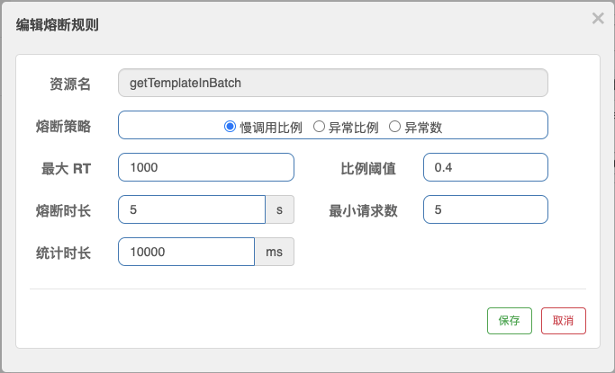

需要注意的是，当服务请求超过设置的最大响应时间，Sentinel 只是会将该次请求作为一次慢响应加入到统计数据里，并不会将这个请求直接阻塞掉。因此，**这里的最大 RT 只是一个用来做统计的条件参数，而不是超时判定的参数**。

在真实业务中，“慢调用”是一个关键侦测指标，拿阿里系的应用监控为例，业务层有 RT 监控，DB 层也有慢 SQL 监控，目的就是将可能的服务雪崩扼杀于摇篮之中。因为当服务响应逐渐变慢的时候，说明集群所承接的业务流量也在同步增加，当 RT 越来越大直到达到一个阈值的时候，集群的吞吐量必然会迎来一个拐点。这个拐点也是全链路压测时要获取的一个关键指标，它是集群吞吐量的极限。

到这里，相信你已经对 Sentinel 的熔断策略有了全面的了解。但是，你知道 Sentinel 是如何判定熔断开关的开启和关闭吗？也许你会以为只要熔断时间结束，Sentinel 就会立即回到正常状态。你只答对了一半，在熔断开关的开启和关闭之间，其实还有一个半开状态。接下来我就带你去了解 Sentinel 的熔断状态转换规则。

### Sentinel 熔断开关的状态转换

Sentinel 的熔断器会在开启、关闭和半开这三种逻辑状态之间来回切换，为了方便你理解整个过程，我画了一张图来解释熔断器的状态变化，你可以参考一下。

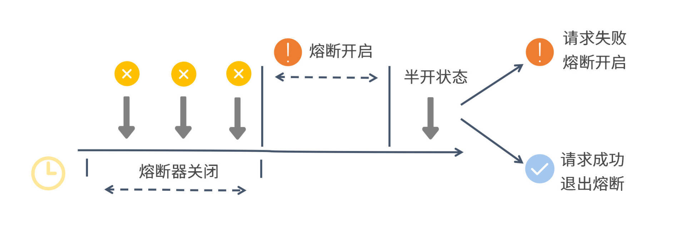

从图中你可以看出，在第一个统计窗口内熔断器是处于关闭状态的，达到熔断判定条件之后，Sentinel 开启了一段熔断窗口。在这段窗口时间内，熔断器是处于开启状态的，这时新的服务请求会执行降级逻辑。待熔断窗口结束，Sentinel 会将熔断器状态置为“半开”状态，这是一个介于完全开启和完全关闭之间的中间态。

在半开状态下，如果有一个新请求过来，那么 Sentinel 会试探性地让这个请求去执行正常的业务逻辑，如果执行成功，那么 Sentinel 将关闭熔断器并退出熔断状态，如果执行失败，那么 Sentinel 将再次开启一个新的熔断窗口。

从这里我们可以得出一个信息，当熔断器处于“半开”状态时，只要下一个请求失败，就立即打回熔断状态，并不需要再次满足熔断规则中设置的各种条件。

到这里，相信你已经对 Sentinel 的熔断机制都有了比较全面的认识。现在，我们就来回顾一下这节课的重点内容吧。

### 总结

今天我带你了解了 Sentinel 的三种熔断策略，分别是慢调用比例、异常比例、异常数，你还知道了这三种策略背后的熔断状态流转过程。借助 Sentinel 的三种熔断策略，我们可以对各种潜在的异常调用进行防范，并及时对异常链路做熔断处理，降低服务的访问压力。

在实际的业务场景中，**慢调用比例**和**异常比例**是两个比较常用的熔断策略。因为无论当前服务处于低水位还是高水位，百分比数据都能够从统一口径反映出服务稳定性情况。

但是对于异常数来说，在低水位和高水位下就会产生一些统计偏差，比如我设置异常数 >5 触发熔断，在 QPS=20 的情况下，这个判定条件看起来没什么问题，但当 QPS=200 的情况下，只要有 2.5% 的请求失败就会进入熔断状态，这显然并不合理。

因此，我个人比较推荐你在项目中使用慢调用和异常比例策略作为容错规则，这样不管集群当前水位高还是低，都能获得一个相对准确的判定标准。

不知你是否注意到了，我们之前添加的限流规则和熔断规则都是临时数据，并没有持久化到某个存储介质中，所以每次重启控制台和应用的时候，这些规则都会消失不见，你还得去重新设置一遍，这显然是很不方便的。所以下一节课，我要带你解决这个问题，看看我们如何借助 Nacos 实现限流规则的持久化。

### 思考题

通过这节课的内容，你能结合 Sentinel 的源代码，去深入了解熔断策略的底层实现吗？我还是先把藤交到你手上，你可以先尝试找到哪个 Slot 类处理了熔断降级判定，再进一步了解每个不同的熔断策略对应了源码中的哪个类。如果你顺藤摸瓜往下探索，就能了解整个流程的全貌了。

好啦，这节课就结束啦。欢迎你把这节课分享给更多对 Spring Cloud 感兴趣的朋友。我是姚秋辰，我们下节课再见！

## 20 | Sentinel 实战：如何接入 Nacos 实现规则持久化？

你好，我是姚秋辰。

在前两节课里，我们已经知道了如何配置 Sentinel 的降级规则和流量整形规则。不过这套方案还有一个不完美的地方。因为我们配置的这些容错规则并没有被“保存”到某个存储介质中，所以，如果你重新启动 Sentinel 服务器或者重启应用程序，先前配置的所有规则就都消失不见了。那如何才能解决这个问题呢？

这节课，我将带你对 Sentinel 的源码做一下二次开发，我们将通过集成 Nacos Config 来实现一套持久化方案，把 Sentinel 中设置的限流规则保存到 Nacos 配置中心。这样一来，当应用服务或 Sentinel Dashboard 重新启动时，它们就可以自动把 Nacos 中的限流规则同步到本地，不管怎么重启服务都不会导致规则失效了。

在前两节课的实战环节，我们采取了一种“直连”的方式，将应用程序和 Sentinel 做了直接集成。在我们引入 Nacos Config 之后，现有的集成方式会发生些许的变化，我画了一幅图来帮你从架构层面理解新的对接方式。

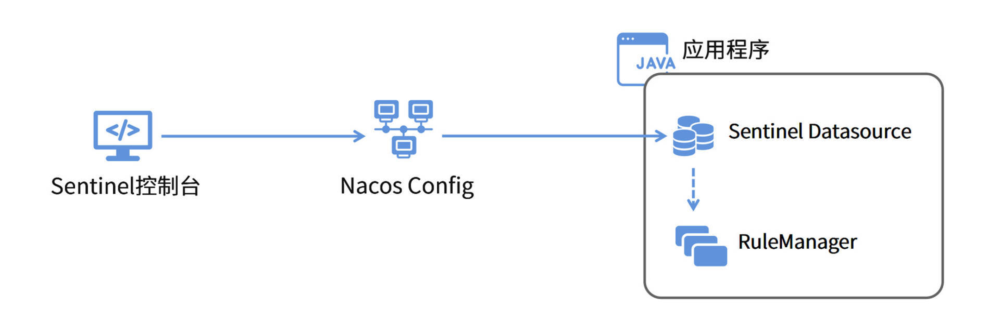

从上面的图中，你会发现，Sentinel 控制台将限流规则同步到了 Nacos Config 服务器来实现持久化。同时，在应用程序中，我们配置了一个 Sentinel Datasource，从 Nacos Config 服务器获取具体配置信息。

在应用启动阶段，程序会主动从 Sentinel Datasource 获取限流规则配置。而在运行期，我们也可以在 Sentinel 控制台动态修改限流规则，应用程序会实时监听配置中心的数据变化，进而获取变更后的数据。

为了将 Sentinel 与 Nacos Config 集成，我们需要做两部分改造。

Sentinel 组件二次开发：将限流规则同步到 Nacos Config 服务器。

微服务改造：从 Nacos Config 获取限流规则。

接下来我们就开始第一步改造：对 Sentinel 组件进行二次开发吧。

### Sentinel 组件二次开发

在开始二次开发之前，我们需要将 Sentinel 的代码下载到本地。你可以从GitHub 的 Releases 页面中找到 1.8.2 版本，在该版本下的 Assets 面板中下载 Source code 源文件。

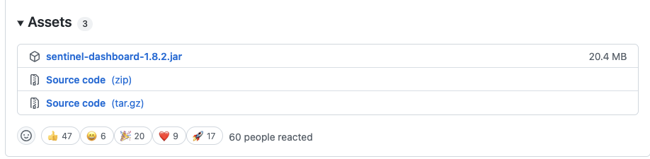

我们把源码下载到本地并解压之后，你就可以将项目导入到开发工具中了。Sentinel 项目下有很多子模块，我们这次主要针对其中的 sentinel-dashboard 子模块做二次开发。整个改造过程按照先后顺序将分为三个步骤：

修改 Nacos 依赖项的应用范围，将其打入 jar 包中；

后端程序对接 Nacos，将 Sentinel 限流规则同步到 Nacos；

开放单独的前端限流规则配置页面。

接下来我就带你按照上面的步骤来对 Sentinel 源码做改造。

#### 修改 Nacos 依赖项

首先，你需要打开 sentinel-dashboard 项目的 pom.xml 文件，找到其中的依赖项 sentinel-datasource-nacos，它是连接 Nacos Config 所依赖的必要组件。

但这里有一个问题。在 Sentinel 的源码中，sentinel-datasource-nacos 的 scope 是 test，意思是依赖项只在项目编译期的 test 阶段才会生效。

所以接下来，你需要将这个依赖项的标签注释掉。

```xml
<dependency>
    <groupId>com.alibaba.csp</groupId>
    <artifactId>sentinel-datasource-nacos</artifactId>
    <!-- 将scope注释掉，改为编译期打包 -->
    <!--<scope>test</scope>-->
</dependency>
```

我们将test这一行代码注释掉以后，sentinel-datasource-nacos 就将作为编译期的依赖项，被打包到最终的 sentinel-dashboard.jar 执行文件中。

依赖项就这么轻松地修改完毕了，接下来我们就可以在后端程序中实现 Nacos Config 的对接了。

#### 后端程序对接 Nacos

首先，你需要打开 sentinel-dashboard 项目下的 src/test/java 目录（注意是 test 目录而不是 main 目录），然后定位到 com.alibaba.csp.sentinel.dashboard.rule.nacos 包。在这个包下面，你会看到 4 个和 Nacos Config 有关的类，它们的功能描述如下。

NacosConfig：初始化 Nacos Config 的连接；

NacosConfigUtil：约定了 Nacos 配置文件所属的 Group 和文件命名后缀等常量字段；

FlowRuleNacosProvider：从 Nacos Config 上获取限流规则；

FlowRuleNacosPublisher：将限流规则发布到 Nacos Config。

**为了让这些类在 Sentinel 运行期可以发挥作用，你需要在 src/main/java 下创建同样的包路径，然后将这四个文件从 test 路径拷贝到 main 路径下**。我在这节课的改造过程都将围绕 main 路径下的类展开。

接下来，我们要做两件事，一是在 NacosConfig 类中配置 Nacos 连接串，二是在 Controller 层接入 Nacos 做限流规则持久化。

我们先从 Nacos 连接串改起。你需要打开 NacosConfig 类，找到其中的 nacosConfigService 方法。这个方法创建了一个 ConfigService 类，它是 Nacos Config 定义的通用接口，提供了 Nacos 配置项的读取和更新功能。FlowRuleNacosProvider 和 FlowRuleNacosPublisher 这两个类都是基于这个 ConfigService 类实现 Nacos 数据同步的。我们来看一下改造后的代码。

```java
@Bean
public ConfigService nacosConfigService() throws Exception {
    // 将Nacos的注册地址引入进来
    Properties properties = new Properties();
    properties.setProperty("serverAddr", "localhost:8848");
    properties.setProperty("namespace", "dev");
    return ConfigFactory.createConfigService(properties);
}
```

在上面的代码中，我通过自定义的 Properties 属性构造了一个 ConfigService 对象，将 ConfigService 背后的 Nacos 数据源地址指向了 localhost:8848，并指定了命名空间为 dev。这里我采用了硬编码的方式，你也可以对上面的实现过程做进一步改造，通过配置文件来注入 serverAddr 和 namespace 等属性。

这样，我们就完成了第一件事：在 NacosConfig 类中配置了 Nacos 连接串。别忘了还有第二件事，你需要在 Controller 层接入 Nacos 来实现限流规则持久化。

接下来，我们就在 FlowControllerV2 中正式接入 Nacos 吧。FlowControllerV2 对外暴露了 REST API，用来创建和修改限流规则。在这个类的源代码中，你需要修改两个变量的 Qualifier 注解值。你可以参考下面的代码。

```java
@Autowired
// 指向刚才我们从test包中迁移过来的FlowRuleNacosProvider类
@Qualifier("flowRuleNacosProvider")
private DynamicRuleProvider<List<FlowRuleEntity>> ruleProvider;
@Autowired
// 指向刚才我们从test包中迁移过来的FlowRuleNacosPublisher类
@Qualifier("flowRuleNacosPublisher")
private DynamicRulePublisher<List<FlowRuleEntity>> rulePublisher;
```

在代码中，我通过 Qualifier 标签将 FlowRuleNacosProvider 注入到了 ruleProvier 变量中，又采用同样的方式将 FlowRuleNacosPublisher 注入到了 rulePublisher 变量中。FlowRuleNacosProvider 和 FlowRuleNacosPublisher 就是上一步我们刚从 test 目录 Copy 到 main 目录下的两个类。

修改完成之后，FlowControllerV2 底层的限流规则改动就会被同步到 Nacos 服务器了。这个同步工作是由 FlowRuleNacosPublisher 执行的，它会发送一个 POST 请求到 Nacos 服务器来修改配置项。我来带你看一下 FlowRuleNacosPublisher 类的源码。

```java
@Component("flowRuleNacosPublisher")
public class FlowRuleNacosPublisher implements DynamicRulePublisher<List<FlowRuleEntity>> {
    
    // 底层借助configService与Nacos进行通信
    @Autowired
    private ConfigService configService;
    @Autowired
    private Converter<List<FlowRuleEntity>, String> converter;
    @Override
    public void publish(String app, List<FlowRuleEntity> rules) throws Exception {
        AssertUtil.notEmpty(app, "app name cannot be empty");
        if (rules == null) {
            return;
        }
        // 发布到Nacos上的配置文件名是：
        // app + NacosConfigUtil.FLOW_DATA_ID_POSTFIX
        //
        // 所属的Nacos group是NacosConfigUtil.GROUP_ID的值
        configService.publishConfig(app + NacosConfigUtil.FLOW_DATA_ID_POSTFIX,
            NacosConfigUtil.GROUP_ID, converter.convert(rules));
    }
}
```

在上面的代码中，FlowRuleNacosPublisher 会在 Nacos Config 上创建一个用来保存限流规则的配置文件，这个配置文件以“application.name”开头，以“-flow-rules”结尾，而且它所属的 Group 为“SENTINEL_GROUP”。这里用到的文件命名规则和 Group 都是通过 NacosConfigUtil 类中的常量指定的，我把这段代码贴在了下面，你可以参考一下。

```java
public final class NacosConfigUtil {
    // 这个是Sentinel注册的配置项所在的分组
    public static final String GROUP_ID = "SENTINEL_GROUP";
    // 流量整形规则的后缀
    public static final String FLOW_DATA_ID_POSTFIX = "-flow-rules";
}
```

到这里，我们就完成了对后端程序的改造，将 Sentinel 限流规则同步到了 Nacos。接下来我们需要对前端页面稍加修改，开放一个独立的页面，用来维护那些被同步到 Nacos 上的限流规则。

#### 前端页面改造

首先，我们打开 sentinel-dashboard 模块下的 webapp 目录，该目录存放了 Sentinel 控制台的前端页面资源。我们需要改造的文件是 sidebar.html，这个 html 文件定义了控制台的左侧导航栏。

接下来，我们在导航列表中加入下面这段代码，增加一个导航选项，这个选项指向一个全新的限流页面。

```html
<li ui-sref-active="active">
  <a ui-sref="dashboard.flow({app: entry.app})">
    <i class="glyphicon glyphicon-filter"></i>&nbsp;&nbsp;流控规则 极客时间改造</a>
</li>
```

如果你点击这个新加入的导航选项，就会定向到一个全新的限流页面，你在这个页面上做的所有修改，都会同步到 Nacos Config。同时，当 Sentinel Dashboard 启动的时候，它也会主动从 Nacos Config 获取上一次配置的限流规则。

到这里，我们的 Sentinel 二次开发就完成了。接下来，我来带你对微服务模块做一番改造，将微服务程序接入 Nacos Config，获取 Sentinel 限流规则。

### 微服务改造

微服务端的改造非常简单，我们不需要对代码做任何改动，只需要添加一个新的依赖项，并在配置文件中添加 sentinel datasource 连接信息就可以了。

在前面的课程中，我们已经将 coupon-customer-impl 接入了 Sentinel 控制台，所以这节课我们就继续基于 customer 服务来做改造吧。

首先，我们需要往 coupon-customer-serv 的 pom 文件中添加 sentinel-datasource-nacos 的依赖项，这个组件用来对接 Sentinel 和 Nacos Config：

```xml
<dependency>
    <groupId>com.alibaba.csp</groupId>
    <artifactId>sentinel-datasource-nacos</artifactId>
</dependency>
```

然后，我们在 application.yml 配置文件中找到 spring.cloud.sentinel 节点，在这个节点下添加一段 Nacos 数据源的配置。

```yml
spring:
 cloud:
  sentinel:
    datasource:
      # 数据源的key，可以自由命名
      geekbang-flow:
        # 指定当前数据源是nacos
        nacos:
          # 设置Nacos的连接地址、命名空间和Group ID
          server-addr: localhost:8848
          namespace: dev
          groupId: SENTINEL_GROUP
          # 设置Nacos中配置文件的命名规则
          dataId: ${spring.application.name}-flow-rules
          # 必填的重要字段，指定当前规则类型是"限流"
          rule-type: flow
```

在上面的配置项中，有几个重要的点需要强调一下。

我们在微服务端的 sentinal 数据源中配置的 namespace 和 groupID，一定要和 Sentinal Dashoboard 二次改造中的中的配置相同，否则将无法正常同步限流规则。Sentinal Dashboard 中 namespace 是在 NacosConfig 类中指定的，而 groupID 是在 NacosConfigUtil 类中指定的。

dataId 的文件命名规则，需要和 Sentinel 二次改造中的 FlowRuleNacosPublisher 类保持一致，如果你修改了 FlowRuleNacosPublisher 中的命名规则，那么也要在每个微服务端做相应的变更。

到这里，我们所有的改造工作就已经完成了，接下来我们就启动程序来验证改造效果吧。

### 验证限流规则同步效果

首先，你需要整体编译 Sentinel 源代码，编译完成之后从命令行进入到 sentinel-dashboard 子模块下的 target 目录，你会看到一个 sentinel-dashboard.jar 文件。你可以在命令行执行以下命令，以 8080 为端口启动 Sentinel Dashboard 应用：

```sh
java -Dserver.port=8080 -Dcsp.sentinel.dashboard.server=localhost:8080 -Dproject.name=sentinel-dashboard -jar sentinel-dashboard.jar
```

然后，你需要启动 coupon-customer-serv 服务，并通过 postman 工具发送一个服务请求，调用 requestCoupon 服务领取优惠券。

接下来，你可以登录 Sentinel Dashboard 服务。这时你会看到左侧的导航栏多了一个“流控规则 极客时间改造”的选项。你可以点击这个选项，并手动在当前页面右上方点击“新增流控规则”，为 requestCoupon 添加一条“QPS=1 快速失败”的流控规则。

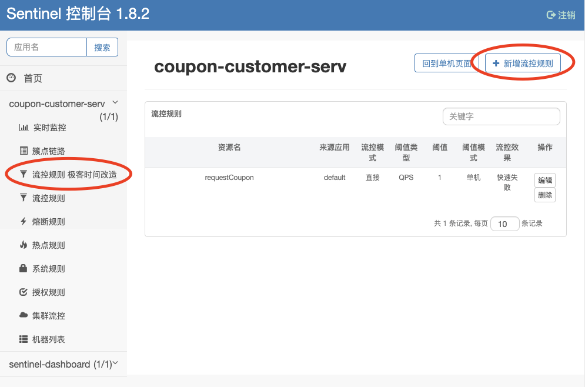

最后，打开 Nacos Config 的配置列表页，你就可以看到一个 coupon-customer-serv-flow-rules 的配置文件被创建了出来，它的 Group 是“SENTINEL_GROUP”。

这时，如果我们在 Sentinel Dashboard 改动这条限流规则，那么改动后的数据会同步到 Nacos Config，微服务端将通过监听配置中心的数据变化来实时获取变更后数据。

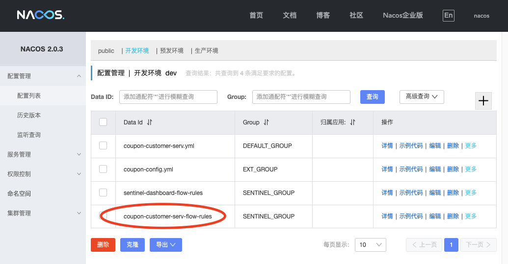

到这里，我们的限流规则持久化改造就完成了。这里有三个容易踩坑的环节，需要你注意一下。

如果 Sentinel 控制台的左侧导航栏没有显示 coupon-customer-serv 服务，你需要通过 postman 对 coupon-customer-serv 发起一次调用，**触发信息上报**之后就能看到这个选项了；

只有在“流控规则 极客时间改造”这个 Tab 下手动创建的限流规则会持久化到 Nacos 服务器，而在“流控规则”这个 Tab 下创建的规则并不会做持久化。

如果 Dashboard 在启动环节报出“端口被占用”的错，你可以 kill 掉占用 8080 端口的进程，或者换一个端口启动 Dashboard 应用。

### 总结

现在，我们来回顾一下这节课的重点内容。今天我们对 Sentinel 源代码做了二次改造，将限流规则同步到了 Nacos Config。在这个环节里，你需要特别注意“**配置一致性**”，也就是说**控制台中的 Nacos 连接配置一定要和微服务端保持一致**，这是最容易出错的环节。

我们今天的持久化改造主要围绕“限流规则”展开，如果你想继续深入学习 Sentinel 持久化方案，我建议你结合今天讲的源码二次改造过程，对熔断规则、热点规则等模块做进一步改造，实现多项规则的 Nacos 数据同步。这个任务相当考验你的源码阅读能力，以及对 Sentinel 的理解程度，你可以挑战一下。

### 思考题

结合我今天的源码改造过程，请你想一想，如果要改造“熔断规则”，你知道有哪些改动点吗？

好啦，这节课就结束啦。欢迎你把这节课分享给更多对 Spring Cloud 感兴趣的朋友。我是姚秋辰，我们下节课再见！

## 21 | Sleuth 体系架构：为什么微服务架构需要链路追踪？

你好，我是姚秋辰。

俗话说，人非圣贤孰能无过，你有过来我有过，微服务它也有过。所谓“过”，便是这线上环境所发生的 Bug。

面对线上 Bug 怎么办？有则改之，无则加勉而已。Sentinel 用自己的文治武功替我们搞定了后半句“无则加勉”。那么这前半句“有则改之”，我们该如何下手去改呢？

请你想一下，在开发小哥改正线上 Bug 之前，咱们是不是需要先找到 Bug 发生的原因呢？所以今天我们就来聊一聊“如何找 Bug”这个话题，且看我是如何使用 Sleuth 提供的“调用链追踪”技术，按图索骥查明 Bug 真相的。

首先我来带你了解一下调用链追踪要解决的问题。

### 调用链追踪解决了什么问题

我们可以想象这样一个场景，你负责的是一个庞大的电商微服务架构系统，每个服务之间都有复杂的上下游调用关系，而且并发量还不小，每秒上万 QPS 不在话下。

在这个微服务系统中，用户通过浏览器的 H5 页面访问系统，这个用户请求会先抵达微服务网关组件，然后网关再把请求分发给各个微服务。所以你会发现，用户请求从发起到结束要经历很多个微服务的处理，这里面还涉及到消息组件的集成。

我画了一幅图来展示这个复杂的关系。

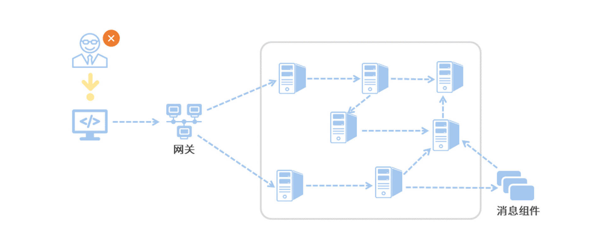

现在问题来了，突然有一天，有用户上报，说他在页面端看到了一个报错，每次点击下单都会报一个 500 错误。如果问题被交到了你手上，你该怎么排查呢？

作为开发人员我们知道 500 错误是 Internal Server Error，这个异常可能发生在任何阶段，就算在同一时刻也可能有多条不同服务的 Error 日志。在一个没有链路追踪的微服务系统里，线上 Bug 排查无异于大海捞针，因为你根本无法梳理出一次请求的前后调用链。

因为缺少订单 ID 之类的唯一主键，你就很难缩小排查范围，只能耗费大量的时间用肉眼走查每一条日志。你需要找到用户所有下单记录的起始 log，从前往后挨个摸排，从蛛丝马迹中梳理服务调用之间的关系并定位最终的问题，可见这种方式十分低效。

如果你想提高线上异常排查的效率，那么首先要做的一件事就是：**将一次调用请求中所有访问到的微服务日志前后串联起来**。这就像拔出萝卜带出泥一样，只要你找到了本次调用的任何一条日志，你就可以顺藤摸瓜将前后的关联日志信息全部找到。这就是“调用链追踪”技术要完成的工作了。

那么调用链追踪是如何实现日志信息串联的呢？简单来说，链路追踪技术会为每次服务调用生成一个全局唯一的 ID（后面我们叫它 Trace ID），从本次服务调用的起点到终点，这个过程中的所有日志信息都会被打上 Trace ID 的烙印。这样一来，根据日志中的 Trace ID，我们就能很清晰地梳理出一次服务请求前后都经过了哪些微服务节点。

就像下面这张图一样，我们将调用链追踪应用到线上 Bug 排查的场景之后，一整条调用链（实线箭头）已是跃然纸上。我们只要找出当前用户下单请求的任意一条日志，就能根据这条日志中的 Trace ID 将整个调用链拎出来，到底是哪个服务调用环节的异常导致了用户下单失败，我们也就一目了然了。

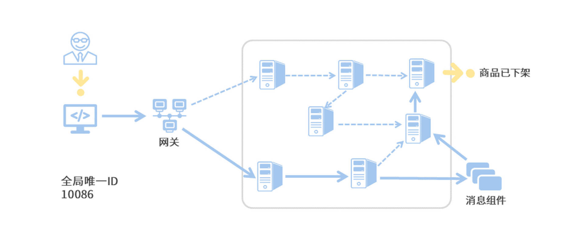

到这里，相信你已经对调用链追踪所要解决的问题有了清晰的认识。那么接下来，我就带你了解一下 Spring Cloud 的链路追踪组件 Sleuth 是如何实现链路追踪的，也就是分析它的底层逻辑。

### Sleuth 的底层逻辑

调用链追踪有两个任务，一是**标记出一次调用请求中的所有日志**，二是**梳理日志间的前后关系**。前面我提到了一个 Trace ID，它是用来标记调用链的全局唯一 ID。你一定可以联想到，Trace ID 完成的是第一个任务：标记。不过呢，Trace ID 并不能表达日志信息的前后关系，那么 Sleuth 是如何解决这个问题的呢？

Sleuth 是通过打入到 Log 中的“卧底”来串联前后日志的。你集成了 Sleuth 组件之后，它会向你的日志中打入三个“特殊标记”，其中一个标记你应该已经清楚了，那便是 Trace ID。剩下的两个标记分别是 Span ID 和 Parent Span ID，这俩用来表示调用的前后顺序关系。

所谓 Span，它是 Sleuth 下面的一个基本工作单元，当服务请求抵达当前单元时，Sleuth 就会为这个单元分配一个独一无二的 Span ID，并标记单元的开始时间和结束时间，这样就可以记录每个单元的处理用时了。

而 Parent Span ID 呢，顾名思义，它指向了当前单元的父级单元，也就是上游的调用者。一个环环相扣的调用链就通过 Parent Span ID 被串了起来。

为了让你更加形象地理解 Trace ID、Span ID 和 Parent Span ID 在调用链中的作用，我画了一个简化了服务调用的模拟流程图，带你梳理每一个调用步骤中的日志标记变化。

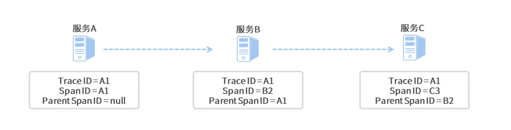

从上面的图中可以看出，这个服务请求调用了三个微服务，分别为服务 A、服务 B 和服务 C。

在一条调用链中，不管你调用了多少个微服务，Sleuth 为本次调用生成的全局唯一 Trace ID 都会贯穿整个链路，所图中三个微服务所对应的日志 Trace ID 都是 A1。

由于服务 A 是调用链的起点，所以它并没有父级单元，因此它的 Parent Span ID 为空，而起始单元的 Span ID 和 Trace ID 则是相同的，值都为 A1。

对于服务 B 来说，它的父级调用单元是服务 A，因此它的 Parent Span ID 指向了服务 A 的 Span ID，即 A1；同理，服务 C 的 Parent Span ID 指向了服务 B 的 Span ID，即 B2。

当然啦，上面的图示只是一个简化的流程，在实际的项目中，一次服务调用可不光只会生成一个 Span。比如说服务 A 请求通过 OpenFeign 组件调用了服务 B，那么服务 A 接收用户请求的过程就是一个单元，而 OpenFeign 组件发起远程调用的过程又是另一个单元。由此可见，单元的颗粒度其实是非常小的，在下节课我再通过实战让你近距离观察调用链中的单元分布。

通过这些 Sleuth 的特殊标记，我们就可以根据时间顺序，将一次服务请求经过的调用节点都梳理出来，这样你就能迅速发现报错信息发生在哪个阶段。这里我放了一张下节课的剧透图片，这是使用 Zipkin 生成的链路追踪的可视化信息。你可以看出，每个服务调用都以时间先后顺序规整好了，红色的部分就是发生线上 Exception 的服务。

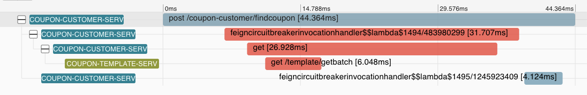

除了 Trace 和 Span 之外，Sleuth 还有一个特殊的数据结构，叫做 Annotation，被用来记录一个具体的“事件”。我把 Sleuth 所支持的四种事件做成了一个表格，你可以参考一下。

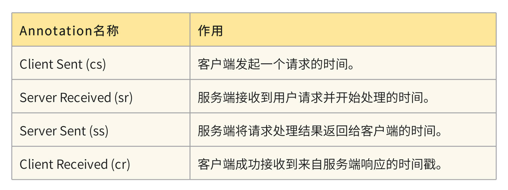

在这里我举个例子，来帮你理解怎么使用这四种事件。

以服务 A 调用服务 B 的场景来说，服务 A 是一个 Client，也就是发起调用的一方，而服务 B 是一个 Server，也就是处理请求的一方。

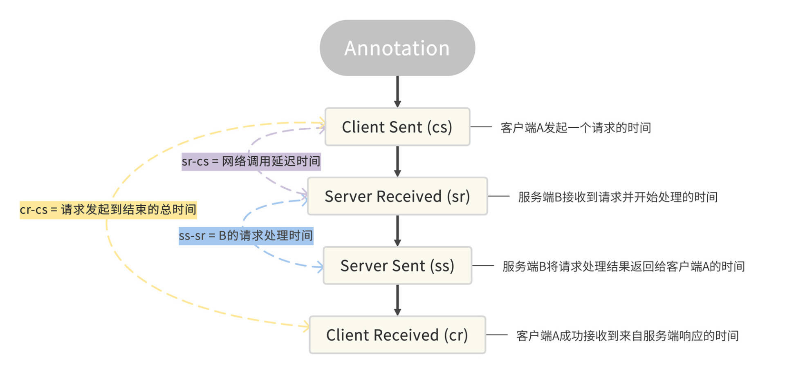

如果你用服务 B 的 ss 减去 sr，你就可以得到请求在服务 B 阶段的处理时间；如果用服务 B 的 sr 减去服务 A 的 cs，就可以得到服务 A 到服务 B 之间的网络调用延迟时间；如果用服务 A 的 cr 减去 cs，就可以得到当次请求从发起到结束所花费的总时间。

到这里，相信你已经对 Sleuth 的链路打标原理十分了解了，现在让我们来回顾一下这节课的重点内容吧。

### 总结

今天我带你了解了调用链追踪技术，以及它所能解决的问题。其中，我们重点了解了 Sleuth 是怎么通过特殊的“标记”来完成链路串联的。其中包括了三个重要的标记，它们分别是 Trace ID、Span ID 和 Parent Span ID。Trace ID 为每次调用链赋予了一个全局唯一的 ID 标识，后两个标记将调用链中的各个单元根据时间先后顺序做了串联。

Sleuth 在调用链追踪的场景下主要完成了“**打标**”的功能，如果你想要构建一套完整的线上异常排查流程，还是需要借助其它组件给 Sleuth 打打辅助。举个例子，如果你想要通过页面 UI 的方式，直观展示一个服务请求的完整调用链，那么你就需要一些分布式 Tracing 系统的帮助。再比如，如果你想要查询调用链中的具体日志信息，那么你还需要一套日志收集和分词系统，另外再加一个日志查询的 UI 系统。

我将在后面的两节课中，使用业界主流的 Sleuth + Zikpin + ELK 构建起这套完整的线上异常排查流程。

### 思考题

通过这节课的内容，我们知道了 Sleuth 的 Trace ID 在每个调用链中都是全局唯一的，这也就说明不管你本次调用链访问了多少个微服务，Sleuth 必须想办法把这个 Trace ID 在调用链中依次传递下去，让每一个微服务都能读到这个 Trace ID。基于这个情况，你能猜想一下，Sleuth 是如何实现标签传递的吗？你可以大胆说出自己的设想，下节课我们就揭晓谜底。

好啦，这节课就结束啦。欢迎你把这节课分享给更多对 Spring Cloud 感兴趣的朋友。我是姚秋辰，我们下节课再见！


## 22 | 调用链追踪：集成 Sleuth 和 Zipkin，实现链路打标

你好，我是姚秋辰。

在上节课中，我们讲了链路追踪技术在线上故障排查中的重要作用，以及 Sleuth 是如何通过“打标记”来实现链路追踪的。

今天，我们就通过实战来落地一套完整的调用链追踪方案。在实战阶段，我会为你详细讲解 Sleuth 在调用链中传递标记信息的原理。为了进一步提高线上故障排查效率，我们还会搭建 Zipkin 组件作为链路追踪的数据可视化工具，并通过一条高可用的数据传输通道，借助 RabbitMQ 将日志信息从应用服务器传递到 Zipkin 服务器。当你学完这节课，你就可以掌握“调用链追踪”方案搭建的全过程了。

链路打标是整个调用链追踪方案的基础功能，所以我们就先从这里开始，在实战项目中集成 Sleuth，实现日志打标动作。

### 集成 Sleuth 实现链路打标

我们的微服务模块在运行过程中会输出各种各样的日志信息，为了能在日志中打印出特殊的标记，我们需要将 Sleuth 的打标功能集成到各个微服务模块中。

Sleuth 提供了一种无感知的集成方案，只需要添加一个依赖项，再做一些本地启动参数配置就可以开启打标功能了，整个过程不需要做任何的代码改动。

所以第一步，我们需要将 Sleuth 的依赖项添加到模板服务、优惠计算服务和用户服务的 pom.xml 文件中。具体代码如下。

```XML
<!-- Sleuth依赖项 -->
<dependency>
    <groupId>org.springframework.cloud</groupId>
    <artifactId>spring-cloud-starter-sleuth</artifactId>
</dependency>
```


第二步，我们打开微服务模块的 application.yml 配置文件，在配置文件中添加采样率和每秒采样记录条数。

```YML
spring: 
  sleuth:
    sampler:
      # 采样率的概率，100%采样
      probability: 1.0
      # 每秒采样数字最高为100
      rate: 1000
```

你可以从代码中看到，我在配置文件里设置了一个 **probability**，它应该是一个 0 到 1 的浮点数，用来表示**采样率**。我这里设置的 probability 是 1，就表示对请求进行 100% 采样。如果我们把 probability 设置成小于 1 的数，就说明有的请求不会被采样。如果一个请求未被采样，那么它将不会被调用链追踪系统 Track 起来。

你还会在代码中看到 **rate 参数**，它代表**每秒最多可以对多少个 Request 进行采样**。这有点像一个“限流”参数，如果超过这个阈值，服务请求仍然会被正常处理，但调用链信息不会被采样。

到这里，我们的 Sleuth 集成工作就已经搞定了。这时你只要启动项目，顺手调用几个 API，就能在控制台的日志信息里看到 Sleuth 默认打印出来的 Trace ID 和 Span ID。比如我这里调用了 Customer 服务的优惠券查询接口，在日志中，你可以看到两串随机生成的数字和字母混合的 ID，其中排在前面的那个 ID 就是 Trace ID，而后面则是 Span ID。

```log
DEBUG [coupon-customer-serv,69e433d6432522e4,936d8af942b703d2] 81584 
--- [io-20002-exec-1] c.g.c.customer.feign.TemplateService：xxxx
```

接下来问题来了，在跨服务的调用链中，你知道 Sleuth 是如何将这些标记从一个微服务传递给下一个微服务的吗？接下来我们就去看看 Sleuth 具体动了哪些手脚吧。

### Sleuth 如何在调用链中传递标记

以 Customer 微服务为例，在我们访问 findCoupon 接口查询优惠券的时候，用户微服务通过 OpenFeign 组件向 Template 微服务发起了一次查询请求。

Sleuth 为了将 Trace ID 和 Customer 服务的 Span ID 传递给 Template 微服务，它在 OpenFeign 的环节动了一个手脚。Sleuth 通过 **TracingFeignClient 类**，将一系列 Tag 标记塞进了 OpenFeign 构造的服务请求的 Header 结构中。

我在 TracingFeignClient 的类中打了一个 Debug 断点，将 Request 的 Header 信息打印了出来：

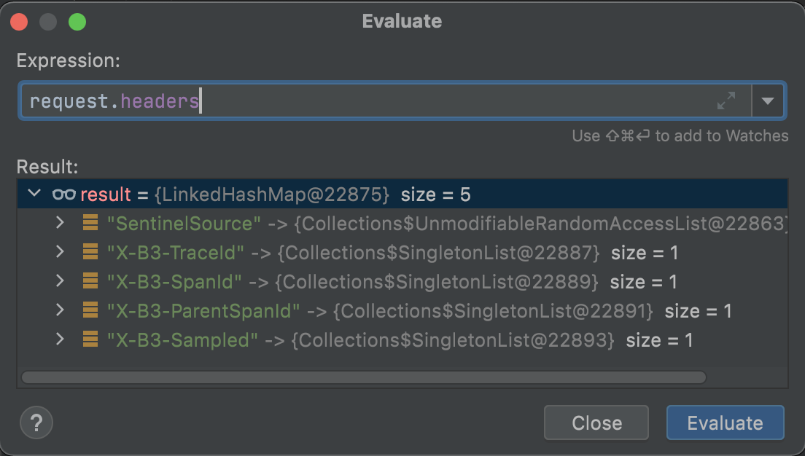

在这个 Header 结构中，我们可以看到有几个以 X-B3 开头的特殊标记，这个 X-B3 就是 Sleuth 的特殊接头暗号。其中 X-B3-TraceId 就是全局唯一的链路追踪 ID，而 X-B3-SpanId 和 X-B3-ParentSpandID 分别是当前请求的单元 ID 和父级单元 ID，最后的 X-B3-Sampled 则表示当前链路是否是一个已被采样的链路。通过 Header 里的这些信息，下游服务就完整地得到了上游服务的情报。

以上是 Sleuth 对 OpenFeign 动的手脚。为了应对调用链中可能出现的各种不同组件，Sleuth 内部构造了各式各样的适配器，用来在不同组件中使用同样的接头暗号“X-B3-*”，这样就可以传递链路追踪的信息。如果你对这部分的源码感兴趣，你可以深入研究 spring-cloud-sleuth-instrumentation 和 spring-cloud-sleuth-brave 两个依赖包的源代码，了解更加详细的实现过程。

搞定了链路打标之后，我们怎样才能通过 Trace ID 来查询链路信息呢？这时就要找 Zipkin 来帮忙了。

### 使用 Zipkin 收集并查看链路数据

Zipkin 是一个分布式的 Tracing 系统，它可以用来收集时序化的链路打标数据。通过 Zipkin 内置的 UI 界面，我们可以根据 Trace ID 搜索出一次调用链所经过的所有访问单元，并获取每个单元在当前服务调用中所花费的时间。

为了搭建一条高可用的链路信息传递通道，我将使用 RabbitMQ 作为中转站，让各个应用服务器将服务调用链信息传递给 RabbitMQ，而 Zipkin 服务器则通过监听 RabbitMQ 的队列来获取调用链数据。相比于让微服务通过 Web 接口直连 Zipkin，**使用消息队列可以大幅提高信息的送达率和传递效率**。

我画了一张图来帮你理解 Zipkin 和微服务之间是如何通信的，你可以参考一下。

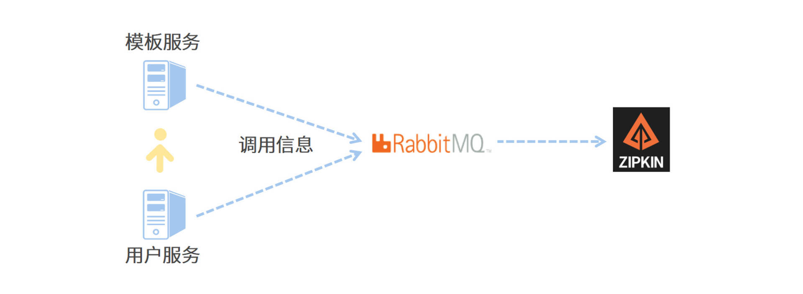

下面我来带你手动搭建 Zikpin 服务器。

#### 搭建 Zipkin 服务器

首先，我们要下载一个 Zipkin 的可执行 jar 包，这里我推荐你使用 2.23.9 版本的 Zipkin 组件。你可以通过访问maven 的中央仓库下载 zipkin-server-2.23.9-exec.jar 文件，我已经将版本参数添加到了地址中，不过你可以将地址超链接复制出来，通过修改 URL 中的版本参数来下载指定版本。

搭建 Zipkin 有两种方式，一种是直接下载 Jar 包，这是官方推荐的标准集成方式；另一种是通过引入 Zipkin 依赖项的方式，在本地搭建一个 Spring Boot 版的 Zipkin 服务器。如果你需要对 Zipkin 做定制化开发，那么可以采取后一种方式。

接下来，我们需要在本地启动 Zipkin 服务器。我们打开命令行，在下载下来的 jar 包所在目录执行以下命令，就可以启动 Zipkin 服务器了。

```java
java -jar zipkin-server-2.23.9-exec.jar --zipkin.collector.rabbitmq.addresses=localhost:5672
```

要注意的是，我在命令行中设置了 zipkin.collector.rabbitmq.addresses 参数，所以 Zipkin 在启动阶段将尝试连接 RabbitMQ，你需要**确保 RabbitMQ 始终处于启动状态**。Zipkin 已经为我们内置了 RabbitMQ 的默认连接属性，如果没有特殊指定，那么 Zipkin 会使用 guest 默认用户登录 RabbitMQ。如果你想要切换用户、指定默认监听队列或者设置连接参数，那么可以在命令行中添加以下参数进行配置。


启动成功后，你可以在命令行看到 Zipkin 的特色 Logo，以及一行 Serving HTTP 的运行日志。

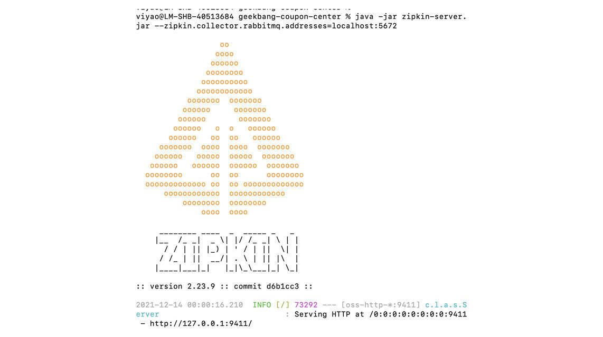

最后，我们只需要验证消息监听队列是否已就位就可以了。我们使用 guest 账号登录 RabbitMQ，并切换到“Queues”面板，如果 Zipkin 和 RabbitMQ 的对接一切正常，那么你会在 Queues 面板下看到一个名为 zipkin 的队列，如下图所示。

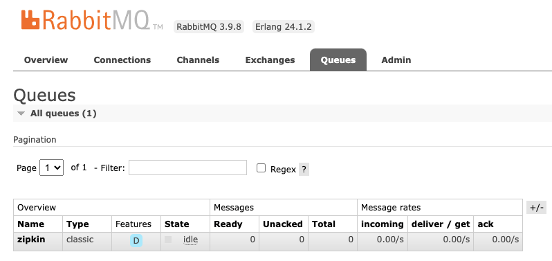

到这里，我们就完成了 Zipkin 服务器的创建。接下来，你还需要将应用程序生成的链路数据发送给 Zipkin 服务器。

#### 传送链路数据到 Zipkin

我在方案中使用 RabbitMQ 作为中转站来传递链路调用数据，因此应用程序并不需要直连 Zipkin，而是需要接入到 RabbitMQ，并将链路数据发布到 RabbitMQ 中的“zipkin”队列中就可以了。

首先，我们需要在每个微服务模块的 pom.xml 中添加 Zipkin 适配插件和 Stream 的依赖。其中，Stream 是 Spring Cloud 中专门用来对接消息中间件的组件，我会在下个章节为你详细讲解它。

```xml
<dependency>
    <groupId>org.springframework.cloud</groupId>
    <artifactId>spring-cloud-sleuth-zipkin</artifactId>
</dependency>
<!-- 提前剧透Stream -->
<dependency>
    <groupId>org.springframework.cloud</groupId>
    <artifactId>spring-cloud-stream-binder-rabbit</artifactId>
</dependency>
```

接下来，我们需要将 Zipkin 的配置信息添加到每个微服务模块的 application.yml 文件中。

在配置项中，我通过 zipkin.sender.type 属性指定了传输类型为 RabbitMQ，除了 RabbitMQ 以外，Zipkin 适配器还支持 ActiveMQ、Kafka 和直连的方式，我推荐你**使用 Kafka 和 RabbitMQ 来保证消息投递的可靠性和高并发性**。我还通过 spring.zipkin.rabbitmq 属性声明了消息组件的连接地址和消息投递的队列名称。

```yml
spring:
  zipkin:
    sender:
      type: rabbit
    rabbitmq:
      addresses: 127.0.0.1:5672
      queue: zipkin
```

有一点你需要注意，**在应用中指定的队列名称，一定要同 Zipkin 服务器所指定的队列名称保持一致**，否则 Zipkin 无法消费链路追踪数据。

到这里，我们就完成了一套完整的链路追踪系统的搭建，是不是很简单呢？接下来，就可以把你的应用启动起来，通过 Postman 发起几个跨服务的调用了。我来带你去 Zipkin 上看一下可视化的链路追踪数据长啥样。

#### 查看链路追踪信息

你可以在浏览器中打开 localhost:9411 进到 Zipkin 的首页，在首页中你可以通过各种搜索条件的组合，从服务、时间等不同维度查询调用链数据。

我在本地调用了 Customer 服务的订单价格试算接口，而 Customer 服务又相继调用了 Template 服务和 Calculation 服务，现在我就用一段小 video 来演示如何在 Zipkin 上查询调用链数据。

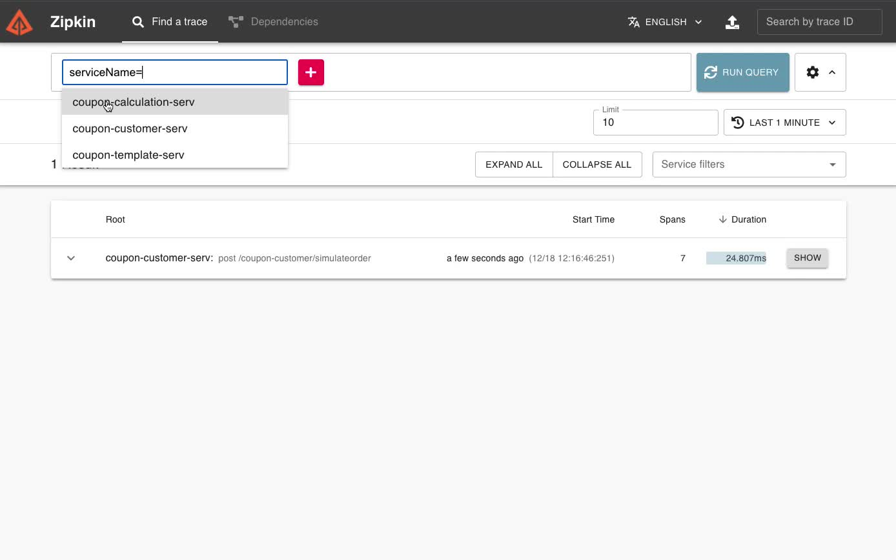

在这段 video 中，我可以选择想要搜索的时间范围，还可以搜索包含特定服务的调用链。而在搜索结果中，当前调用链都访问了哪些微服务，你可以一目了然。

如果你知道了某个调用链的全局唯一 Trace ID，那么你也可以通过这个 Trace ID 把一整条调用链路查出来。我又录了一段 video 来演示这个过程。在链路详情页面中，**所有 Span 都以时间序列的先后顺序进行排布**，你可以从链路中清晰地看到每个 Span 的开始、结束时间，以及处理用时。

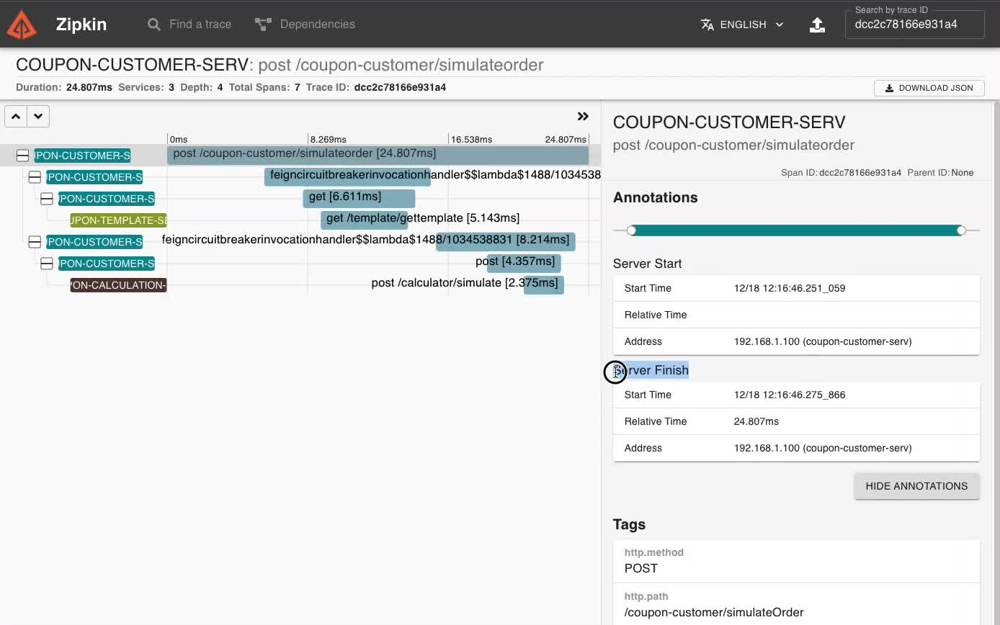

如果某个调用链出现了运行期异常，那么你可以从调用链中轻松看出异常发生在哪个阶段。比如下图中的调用链在 OpenFeign 调用 Template 服务的时候抛出了 RuntimeException，相关 Span 在页面上已被标红，如果你点击 Span 详情，就可以看到具体的 Error 异常提示信息。

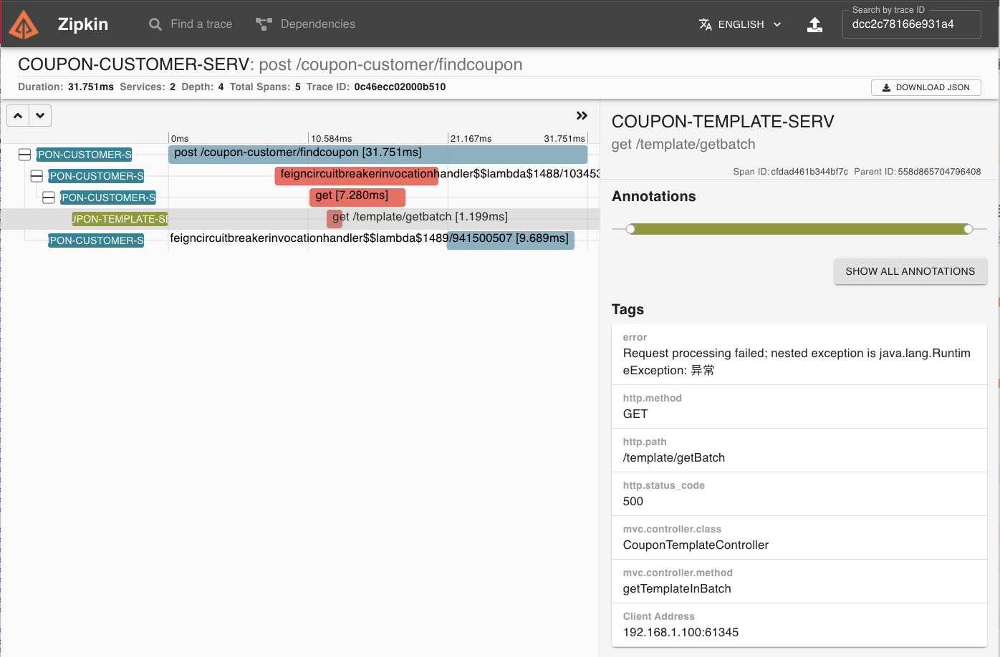

除此之外，Zipkin 还有一个很花哨的依赖报表功能，它会以图形化的方式展示某段时间内微服务之间的相互调用情况，如果两个微服务之间有调用关系，Zipkin 就会用一条实线将两者关联起来，而实线上流动的小圆点则表示调用量的多少，圆点越多则表示这条链路的流量越多。而且，小圆点还会有红蓝两种颜色，其中红色表示调用失败，蓝色表示调用成功。

我录了一小段 video，你可以感受一下依赖报表功能是怎么用的。

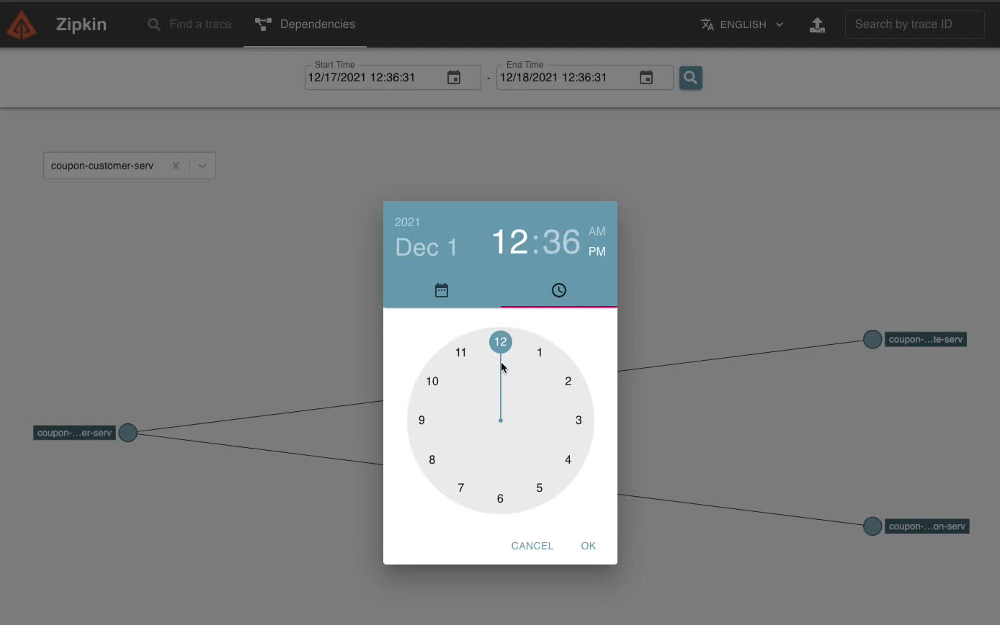

到这里，相信你已经对调用链追踪系统的搭建和使用十分了解了，现在让我们来回顾一下这节课的重点内容吧。

### 总结

今天我们通过集成 Sleuth 和 Zipkin，搭建了一套完整的链路追踪系统。**链路追踪的核心是“标记”**，也就是 Sleuth 在链路中打上的 Trace ID 等标记，我推荐你从 Sleuth 的源码入手，了解一下 Sleuth 是如何为每个不同的组件编写适配器，完成打标和标记传递的。

Zipkin 在默认情况下将链路数据保存在内存中，默认最多保存 50000 个 Span 数据，所以这种保存数据的方式是不能应用在生产环境中的。

Zipkin 天然支持通过 Cassandra、ElasticSearch 和 MySQL 这三种方式保存数据，如果你想要将内存方式切换为其它数据源，则需要在启动命令中添加数据源的连接信息，相关启动参数可以在Sleuth 的配置文件中找到。在这个链接中，你可以在 zipkin.storage 节点下找到每个数据源的参数列表，通过 zipkin.storage.type 字段你可以指定 Zipkin 的数据源。

在 Spring Boot 2.0 之后，Zipkin 的官方社区就不再推荐我们通过自定义的方式搭建 Zipkin Server 端了。除非有很特殊的定制需求，否则我还是推荐你使用 zipkin 的可执行 jar 包，并通过标准的启动参数来搭建 Zipkin 服务器。

### 思考题

根据Sleuth 配置文件中的参数定义，你能通过传入启动参数的方式，对 Zipkin 做一个改造，并使用 MySQL 作为数据源吗？欢迎你在评论区把自己的改造过程分享出来。

好啦，这节课就结束啦。欢迎你把这节课分享给更多对 Spring Cloud 感兴趣的朋友。我是姚秋辰，我们下节课再见！


## 23 | 调用链追踪：如何通过 ELK 实现日志检索？

你好，我是姚秋辰。

在上节课中，我们借助 Sleuth 和 Zikpin 的合力，搭建了一套调用链追踪系统，它可以帮助我们串联调用链中的上下游访问单元，快速定位线上异常出现在哪个环节。不过呢，光有 Tracing 能力似乎还不够，如果我们想要更深一步调查异常背后的原因，那必须完整还原这个异常问题的案发现场。

在线上环境中，我们无法像操作本地开发环境一样去打断点一步步调试问题，服务器的 Remote Debug 端口通常也是被禁用的，我们唯一能重现案发现场的途径就是**日志信息**。因此，我们还要去构建一套**日志检索系统**，作为线上异常排查的辅助工具。

今天，我就来带你通过 ELK 组件来搭建日志检索系统，完成整个调用链追踪方案的最后一块拼图。在这个过程中，你会知道如何使用 Docker 搭建 ELK 镜像，以及如何把应用程序对接到 Logstash 日志收集器，当然了，还有如何在 UI 界面查询日志。

在开始之前，我们先来看看什么是 ELK 吧。

### 什么是 ELK？

ELK 并不是一个技术框架的名称，它其实是一个三位一体的技术名词，ELK 的每个字母都来自一个技术组件，它们分别是 Elasticsearch（简称 ES）、Logstash 和 Kibana。取这三个组件各自的首字母，就组成了所谓的 ELK。

那么这三个技术组件在日志检索平台中分别起到了什么作用呢？我用一幅图来表达一下它们之间的关系。

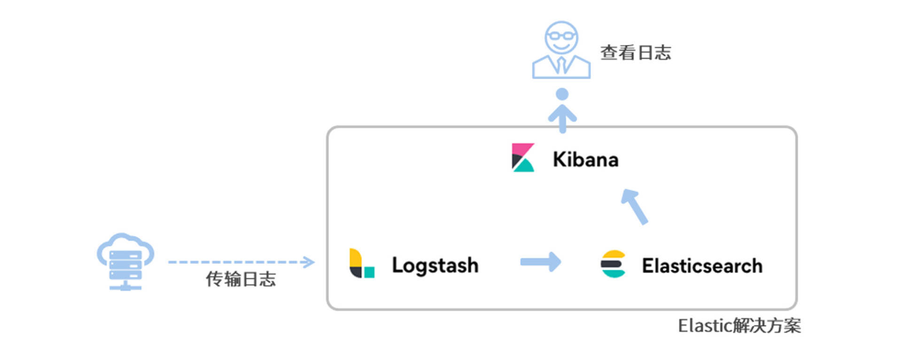

在 Elastic 解决方案中，**Logstash** 扮演了一个**日志收集器**的角色。它可以从多个数据源对数据进行采集，也可以对数据做初步过滤和清洗，比如将数据转换成通用格式、隐匿敏感数据等。

而 **Elasticsearch** 呢，它是一个**分布式的搜索和数据分析引擎**。它在整套方案中扮演了日志存储和分词器的角色。Elasticsearch 会收到来自 Logstash 的日志信息，并将这些日志信息集中存储起来。同时，Elasticserch 还对外提供了多种 RESTful 风格的接口，上层应用可以通过这些接口完成数据查找和分析的任务。

**Kibana** 在整个 Elastic 方案中扮演了一个“**花瓶**”的角色。它提供了一套 UI 界面，让我们可以对 Elasticsearch 中存储的数据进行查找。同时，它还提供了各种统计报表的功能，如柱状图、饼图、时序统计分析、图谱关联分析等等。当然了，报表数据都来自于 Elasticsearch。

现在，你已经了解了 Elasticsearch、Logstash 和 Kibana 的用途和三者间的关系。接下来，我们就来动手搭建 ELK 环境吧。

### 搭建 ELK 环境

我们有两种搭建 ELK 环境的方法，一种是分别搭建 Elasticsearch、Logstash 和 Kibana 的集群，并将这些组件相互集成起来。就算我们可以通过 Docker 技术分别搭建三者的镜像环境，环境配置和启动异常排查还是有些麻烦的，很容易劝退初学者。

因此，我这里推荐你使用一种更简单的搭建方式，那就是**直接下载 sebp/elk 镜像**。因为 sebp/elk 镜像已经为我们集成了完整的 ELK 环境，只需要稍加配置就能迅速构建 ELK 环境，而且异常排查也比较方便。

为了安装 sebp/elk 镜像，你要先确保本地电脑上已经安装了 Docker 环境。如果你对 Docker 已经比较熟悉，那么可以直接使用 Docker 的命令行程序来操作镜像；如果你之前没有使用过 Docker，那么可以下载 Docker 桌面版简化操作流程。我在课程里将使用命令行程序来操作 Docker 容器和镜像。

#### 下载 ELK 镜像

搭建 ELK 环境的第一步，就是下载 sebp/elk 镜像。你可以在命令行运行以下命令，来下载 7.16.1 标签的镜像文件。因为镜像文件相当庞大，所以这个下载过程是非常漫长的，请你拿出对待初恋女友的耐心独自等待。

```sh
docker pull sebp/elk:7.16.1
```

为什么需要你选择 7.16.1 标签呢？因为默认情况下，docker 会尝试获取 LASTEST 标签也就是最新版本的镜像文件，而 Elastic 的版本一直处于不断更新发布的过程中。为了保证你能获得和本节课一致的集成体验，我推荐你和我使用同样的镜像版本。

**在这里我要重点提醒你两个点。**

**第一，一定要记得尽可能多给 Docker 容器分配一些内存。**否则，Elasticsearch 很容易启动失败，要知道 ES 可是一个非常吃内存的组件。我本地为 Docker 分配的运行期内存是 10G（顶配 Mac 就是豪横），我推荐你为 Docker 分配不低于 5G 的内存。

**第二，低配电脑可以降低 ELK 镜像版本。**如果你的电脑配置比较吃紧，无法分配高内存，那么你可以尝试获取更低版本的 ELK 组件，因为版本越高对系统的资源要求越高。你可以在Docker Hub网站上查看 sebp/elk 镜像的版本信息，再选择适合自己电脑配置的进行下载。

镜像下载完成之后，就可以创建一个 ELK 容器了。

#### 创建 ELK 容器

你可以在命令行使用如下命令创建并启动一个 ELK 容器，在这段命令中，我为 Elasticsearch、Logstash 和 Kibana 指定的启动端口分别为 9200、5044 和 5601。命令中的–name elk 参数指定了新创建的 Container 的名称为“elk”，当然了，这里你可以更换成自己喜欢的名称。

sudo docker run -p 5601:5601 -p 9200:9200 -p 5044:5044 -it --name elk sebp/elk

这里要注意的是，以上命令只用在容器创建的时候执行一次即可。一旦容器被创建完成，后续你就可以使用 docker 的标准命令来启动、关闭和重启容器了。

上面这行命令不光会创建容器，还会尝试启动 ELK 的组件，这个过程可能会花费几分钟。

你可以在浏览器中访问“localhost:9200”来验证 ES 是否成功被启动，正常情况下，你应该能在浏览器中看到 ES 集群的版本号等信息，这就说明 ES 启动成功了。

而 Kibana 的启动时间会更长一些，你可以在浏览器中访问“localhost:5601”来访问 Kibana 的网页。

如果启动过程中出现异常，你可以从启动日志中找到异常原因。首先你需要执行下面的命令，进入到 Container 内部。然后，使用 cd 命令进入到 /var/log 文件夹，在这里你可以找到 ES、Logstash 和 Kibana 的启动日志，查看具体的报错。

```sh
docker exec -it elk /bin/bash
```

接下来，我们需要对 Logstash 配置项做一些修改，定义数据传输方式。

#### 配置 Logstash

我们使用 docker exec 命令进入到 elk 容器之后，需要使用编辑器打开 /etc/logstash/conf.d/02-beats-input.conf 文件，它是用来配置 Logstash 的输入输出源的文件。你可以使用 vi 命令或者 vim 命令进入文件编辑模式，接下来你需要将文件中的内容替换为以下配置项。

```json
input {
    tcp {
        port => 5044
        codec => json_lines
    }
}
output {
    elasticsearch {
        hosts => ["localhost:9200"]
        index => "geekbang"
    }
}
```

在上面的文件中，我指定 Logstash 使用 TCP 插件作为数据输入源，并从 5044 端口收集数据，格式为 JSON，你可以通过这个链接访问 TCP 插件的完整参数列表。

同时，我还通过 output 参数将处理过后的日志数据输出到了 ES 组件中，这里我配置了 ES 的地址和数据索引，你可以点击这里的链接获取 ES 插件的详细信息。**修改完成之后记得一定要保存文件**。

Logstash 支持多种类型的输入和输出源，你可以结合自己的项目架构，选择适合的数据源。如果你对这部分内容感兴趣，可以分别参考以下的两个配置文档：

Logstash Input 插件列表

Logstash Output 插件列表

接下来，你还需要在容器外部执行下面这行命令，通过重启 ELK 容器，让 Logstash 重新加载最新的配置项。

```sh
docker restart elk
```

到这里，ELK 容器就配置完成了，接下来我们需要将微服务生成的日志发送到 ELK 容器中。

### 对接 ELK 容器

应用程序对接 ELK 的过程很简单，只有两处改动，一处是添加依赖项，另一处是添加 logback 配置文件。

首先，你需要为三个微服务项目添加 logstash-logback-encoder 依赖项，它提供了对接 Logstash 的日志输出组件，这里我使用了 7.0.1 的稳定版本。

```xml
<dependency>
    <groupId>net.logstash.logback</groupId>
    <artifactId>logstash-logback-encoder</artifactId>
    <version>7.0.1</version>
</dependency>
```

接下来，你需要在每个项目的 src/main/resources 路径下创建 logback-spring.xml 组件，在这个文件中，我们定义了两个 Appender 用来输出日志信息。

第一个是 **ConsoleAppender**，**它可以将日志信息打印到控制台上**。这里我使用了 Spring Boot 默认的日志格式。

```sh
<appender name="console" class="ch.qos.logback.core.ConsoleAppender">
    <filter class="ch.qos.logback.classic.filter.ThresholdFilter">
        <level>DEBUG</level>
    </filter>
    <!-- 日志输出编码 -->
    <encoder>
        <pattern>${CONSOLE_LOG_PATTERN}</pattern>
        <charset>utf8</charset>
    </encoder>
</appender>
```

第二个是 **LogstashTcpSocketAppender**，由于我们在 ELK 容器中指定了使用 TCP 的方式接收日志信息，所以这个 Appender 对象专门用来**构建 JSON 格式化数据发送到 Logstash**。在下面的代码中，你可以看到我将日志的主体信息，以及 Span、Trace 等链路追踪信息作为了 JSON 数据的一部分。

```sh
<appender name="logstash"
          class="net.logstash.logback.appender.LogstashTcpSocketAppender">
    <!-- 这是Logstash的连接方式 -->
    <destination>127.0.0.1:5044</destination>
    <!-- 日志输出的JSON格式 -->
    <encoder class="net.logstash.logback.encoder.LoggingEventCompositeJsonEncoder">
        <providers>
            <timestamp>
                <timeZone>UTC</timeZone>
            </timestamp>
            <pattern>
                <pattern>
                    {
                    "severity": "%level",
                    "service": "${applicationName:-}",
                    "trace": "%X{traceId:-}",
                    "span": "%X{spanId:-}",
                    "pid": "${PID:-}",
                    "thread": "%thread",
                    "class": "%logger{40}",
                    "rest": "%message"
                    }
                </pattern>
            </pattern>
        </providers>
    </encoder>
</appender>
```

我这里贴出的只是 logback-spring.xml 文件的一部分，你可以到代码仓库查看完整的代码。

到这里，我们就完成了所有的对接工作。接下来，你只要在本地启动微服务项目，然后发起几个服务调用，生成一些 Log 文件，我们就能够在 Kibana 中查看到日志信息了。

### 查看 Kibana 日志信息

当 ELK 容器处于运行状态时，你可以在浏览器中打开“localhost:5601”地址访问 Kibana 系统。不过，在使用 Kibana 做日志查询之前，你还需要添加一个 Index。这里所说的 Index 其实是 ES 中的一个查询参数。

在这节课前半部分，我在 ELK 容器的 Logstash 配置项中指定了 Index=geekbang，这个值会作为 Index 参数，Logstash 向 ES 传输日志信息的时候，会将“geekbang”写入 ES。

为了简化配置，我将所有的日志信息都归在了 geekbang 这个索引之下，当然了，你也可以在 Logstash 配置文件中通过表达式动态生成 Index 的值。

我录了一段 Video 来演示如何在 Kibana 中创建 Index，并查询日志内容，你可以参考一下。

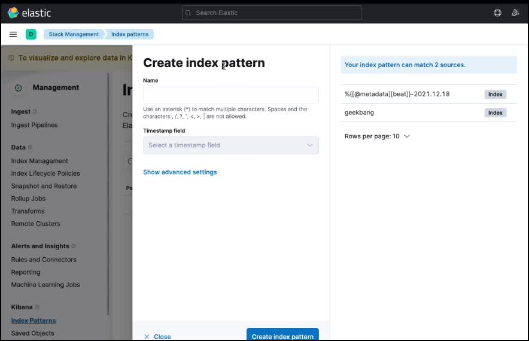

如果你有了一个 Trace ID 或者 Span ID，那么你可以直接在 Kibana 的 Discover 页面查询这个 ID 对应的所有详细日志信息。当然了，根据 ES 对日志的分词结果，你还可以借助 Kibana 的 KQL 表达式构造复杂查询条件，你可以访问 Kibana 的Kuery-query 页面学习如何使用 KQL 查询。

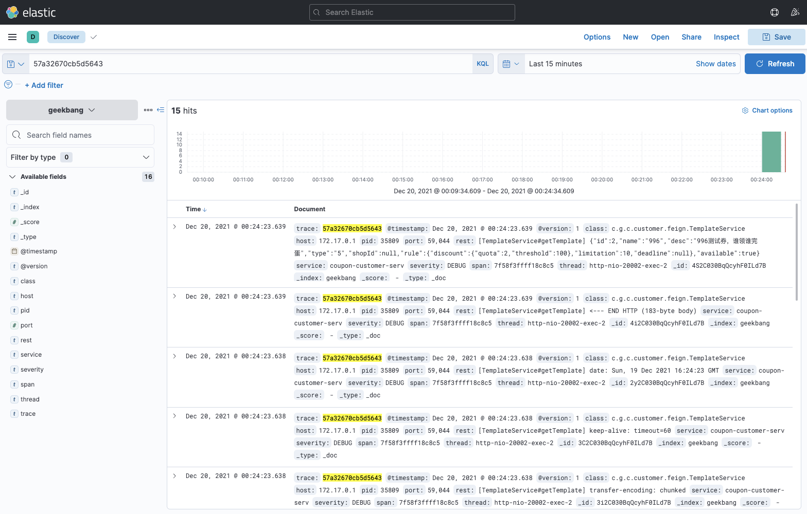

到这里，我们就完成了线上日志查询系统的搭建，现在让我们来回顾一下这节课的重点内容吧。

### 总结

今天我们通过 ELK 镜像搭建了一套完整的日志查询系统，这个过程中的重点是**配置 Logstash 的输入输出数据源**。出于简化课程难度的目的，我并没有使用 filebeat 或者 kafka 之类的输入源，而是使用了 TCP Socket 方式，让业务系统直接把日志信息传输到 Logstash。

从高可用的角度出发，我们通常并不会将业务系统与 Logstash 直连，取而代之的是将日志写入本地文件，然后通过 Filebeat 之类的工具收集本地 log 文件，并传输给 Logstash。

这样做的好处是，无论 Logstash 和应用服务器之间的连接通路是否顺畅，日志文件都会落盘保存，并不会因网络异常而丢失。另一方面，Filebeat 使用了一种“背压敏感协议”技术，用来应对海量数据访问的压力，它会根据 Logstash 的处理速率调整文件读取速度，如果 Logstash 正忙，Filebeat 就会降低读取文件的速度。

### 思考题

结合这节课的内容，请你想一想，如果要将 Filebeat 添加到 ELK 体系中，实现日志归集的功能，你打算怎么做？这个作业稍微有一点挑战性，先别搜索网上现成的方案，你可以尝试通过阅读官方文档来搞定这个问题。

好啦，这节课就结束啦。欢迎你把这节课分享给更多对 Spring Cloud 感兴趣的朋友。我是姚秋辰，我们下节课再见！

## 加餐：说透微服务 | 什么是主链路规划？

你好，我是姚秋辰，今天想跟你聊聊主链路规划在微服务中的应用。

说起微服务改造，我们第一个想到的就是要对各个服务进行拆分，微服务拆分的合理性很大程度上决定了整个业务链路的可用性。在微服务拆分的过程中，我们的首要任务是识别出核心服务，那么核心服务为何如此重要呢？

如果把所有线上服务比喻为一个大军团，那么“核心服务”就是这个军团当中战斗力最强的精锐部队，是完成战略目标的攻坚力量。比如在双 11 这类大战役中，所有的后勤资源（虚拟机、磁盘、网络资源等）都要优先供给给精锐部队，保证整个军团的集体作战能力（业务高可用性）。

如果能精准**识别核心服务场景**，将这些核心服务拆分成独立的微服务模块，我们就可以在核心微服务链路上应用弹性机房水位调拨、流量整形和熔断降级等技术手段，构建核心服务与边缘服务之间的隔离带，在极端洪峰流量场景下保证核心业务的高可用性。

那如何才能识别核心服务场景呢？这就要讲到今天的主题：**主链路规划**。主链路规划是一种非常直观的方法论，帮助我们快速识别核心链路。今天我就来和你探讨两个“主链路规划”相关的话题：

什么是主链路？

如何识别业务场景中的主链路

### 什么是主链路

所谓主链路，用一句话概括就是“**保证业务可用性的核心链路**”，那什么样的业务场景才能够入围核心链路呢？

如果我们拿出一个复杂的业务系统，把其中所有的业务场景铺开来，让你评选出哪些场景是“核心链路”，再按重要程度排个序，咱还真不知道如何下手。这场面就如同妈妈们聚在一起聊自家的娃，自说自话，都觉得自己的娃比别家的娃厉害。

如果能有一套简单易用的理论模型，帮助我们在纷繁复杂的业务场景中精准识别其中的主链路，岂不美哉？这个可以有，我们在长期的实践中总结了主链路的几个特征，可以帮助我们梳理、甄别核心链路。这四个特征分别是：

业务完整性

转化率重因子

流量端占比

现金水库

如果一个业务场景具备其中一个特征，那它就是主链路。具体怎么判断呢？接下来我们分别对这四个特征做个简单了解，再通过一个电商场景来做一个沙盘演练，学习如何运用这四个特征识别业务场景中的主链路。

#### **业务完整性**

入围主链路的一个最重要的评选条件就是要具备“**业务完整性**”，我们用网购下订单为例来理解一下“业务完整性”的意思。

我们拿一个商品下单的业务流程来说，首先你需要去搜索商品，然后在商品列表页点击心仪商品进入到详情页，在详情页里有商品介绍、图片、买家评论等等，最后你要通过一键下单完成这笔订单。这个场景的业务目标是“完成订单”，为了达到这个目标，用户必须经过商品搜索、查看详情和一键下单这三个步骤，任意一个步骤出现故障都无法保证下单链路的“业务完整性”。

如果某个关键链路是保证业务完整性的必要环节，那么它当之无愧被选为核心主链路中的一员。在下单场景中，查看商品评论是一个辅助功能，即便出现了故障，也并不会对业务完整性造成明显的影响，也就被排除在了主链路之外。

这就像我们通关 RPG 游戏一样，游戏里有主线任务也有支线任务，而“业务完整性链路”就是游戏的“主线任务”。支线任务失败会影响一部分游戏体验，但不会影响主线剧情；但主线任务过不去，那可真就卡在原地了。

#### **转化率重因子**

有一些业务场景，它们并非是保证业务完整性的必要条件，看似无关紧要，但是对业务转化率有重大影响，这类场景其实也是主链路规划中的常客。我用一个购物的例子解释一下“转化率重因子”的重要性。

人们在淘宝买东西的时候通常会先看一下商品长什么样子再决定是否下单，商品图片都加载自“淘宝图片空间”，如果图片空间发生了故障，一定会大幅降低订单转化率。试想如果连图片都看不到，那网购的体验就像古代娶媳妇儿一样，等同于开盲盒，没有人敢贸然下单吧？

因此，我们在做主链路规划的时候，也要把这类对业务转化率有重要影响的关键链路包含进去。

#### **流量端占比**

正所谓条条大路通罗马，如果完成最终业务目标的途径有很多种，那么这所有的途径都是核心主链路吗？答案当然是 No，能否入围主链路，还要看有多少用户流量通过这条路径完成了业务目标。

这就好比古代运送贡品进京一样，临安府县令此刻正站在杭州眺望北京，思考着该从哪条路线运送贡品。一条是顺着各地驿站蜿蜒进京，陆运费用昂贵而且耗时又长，还容易被山匪打劫，鲜有人走；另一条是顺着京杭大运河一路向北，水运费用低时间短，似乎是大部分纳贡队伍的首选方案。两条路都能完成任务，那么哪条是主链路？自然是用户流量占比居多的水路。

在主链路规划中我们要参考各个链路和导流端的用户流量分布，将流量占比高的链路划分为主链路的一环。

#### **现金水库**

“你的梦想是什么？”在创业圈子里，投资人也经常发起类似的灵魂拷问：“你的商业模式是什么（你怎么赚钱）？”甭管多漂亮的业务模式，最终都要回到商业的本源：赚取利润。利润是公司业务的正向现金流，我们把这些提供正向现金流的业务叫做“现金水库”。

现金水库是公司业务运转的源动力，尤其在电商行业更是如此，正向现金业务的故障通常会被定级为重大资损事件。因此，我们在做主链路规划的过程中，需要将现金水库类业务划归到主链路，保护现金流不受影响。

在了解了主链路的四个特征之后，我带你做一个基于真实业务场景的沙盘演练，看如何将这些特点应用到主链路规划当中。

### 如何识别业务场景中的主链路

我们接下来的沙盘演练基于一个真实的新零售业务的电商全链路场景，希望你可以举一反三，通过这个案例将主链路的知识点应用在自家公司的业务场景中。在开始之前，我先来给你做一个知识铺垫，学习一个用来分析业务场景的万金油模型 - 漏斗模型。我们通过漏斗模型将整个电商场景沙盘推演开来。

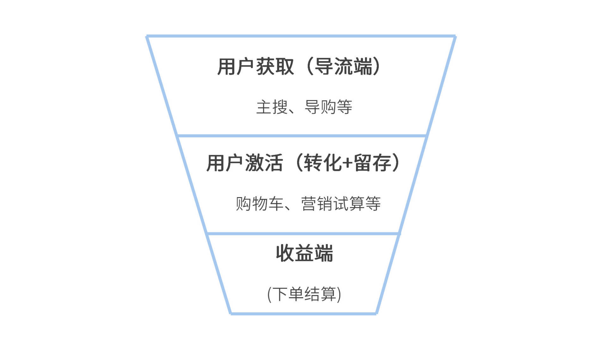

这是一个漏斗模型图，它用来描述用户从业务流入口到业务流终点的整个过程。我们把这个模型套用在电商的下单场景中，漏斗的上方部分是主搜、导购、商品详情页之类的场景，这是用户开始业务流的入口，承载着最多的用户访问流量；漏斗中间部分是订单转化的关键环节，购物车模块；漏斗最下方的部分是下单前的临门一脚，订单和支付模块。电商行业运营侧的漏斗模型相对会复杂很多，通常划分为用户获取、激活、留存、收益和传播等阶段，不过我这里把这个过程做了简化，我们只关注几个关键的环节就好了。

漏斗模型有三个特点：

**QPS 递减**：用户流量从漏斗上方到漏斗下方呈逐渐递减的趋势，对后台应用的 QPS（Query per second）也遵循同样的规律；

**流量质量递增**：业务转化率由上到下依次增加，漏斗底部的业务转化率最高；

**主链路比例递增：**越靠近漏斗底部，主链路服务的占比就越高。

接下来我就带你从漏斗顶部走到底部，探讨一下如何识别各个部位的主链路。

#### **漏斗顶部：导流端**

漏斗顶部承载着用户导流和转化的双重任务，导流端主要负责将四面八方的用户流量导入到商品详情页做进一步转化，常见的业务场景有站内主搜、站外短链、口令服务、类目渠道、直播转化等，这些场景都做了同一件事，那就是导流和获取用户。如果完成业务目标的途径有很多种，那么自然是流量占比越高的场景链路优先级越高。横向比对来看，在这个环节的主链路是**站内主搜，**它是流量占比最高的业务场景。

你可能会奇怪，站外短链和购物口令也很重要，现在直播购物和分享购物带来的用户流量这么庞大，依靠的就是短链和口令分享，为什么这俩不是主链路呢？其实，在主链路规划的过程中，我们有很多“奇技淫巧”可以让看似重要的东西变得不那么重要，这里就要讲到业务降级策略。

以短链口令场景为例，当我们通过短链口令来分享商品时，可以做一个“小机关”，将商品的 ID 加入到口令的文案中，即便后台的口令或者短链解析模块出现故障，无法还原出原始的单品网址，APP 层面仍然可以做一层兜底方案，根据口令文案中的商品 ID 直接跳转到商品详情页。运用这种策略，我们就可以将短链口令的业务场景“嫁接”到另一个主链路“商品详情页”之上，只要详情页顶得住，那么就可以保证短链口令场景的可用性。

**在实际的项目中，我们需要巧妙运用降级策略，尽可能减少主链路的数量和比例。**这样做的道理很简单，虚机、带宽、硬件资源是有限的，有限的资源要投入到最重要的链路中。如果所有的场景都是主链路，那这个项目的架构师一定是个学渣，学渣的特点是把一整本书的全部内容都画成了重点，无法用有限的精力学习重点知识。作为学霸，我们要尽可能抓住真正的重点，把重中之重的链路划归为主链路。

除了主搜以外，其实还有一个重要的主链路业务：搜索竞价营销服务，它是带来正向现金流的现金水库业务。类比淘系业务里的“直通车业务”，搜索竞价营销服务掌管着搜索竞价、精准推荐等各类付费点击类业务，妥妥地把阿里妈妈事业部变成了集团的大金主部门。

如果你细心观察，就会发现业内的互联网公司都有自己的“现金水库”类业务，作为一个优秀的架构师，只有了解自己公司的业务模式，明白它赚钱的道理，才能结合业务场景做出最合适的主链路规划图。

#### **漏斗顶部：转化端**

转化端的主要责任落在了商品详情页这里，回想以往的购物经验，详情页的主要功能有商品元数据的展示、SKU 模块、库存信息、用户评论、商品营销优惠信息、主图和视频空间、富文本 TFS 详情，以及一些锦上添花的小功能如用户画像推荐、热搜排行等。

作为转化端的重头戏，商品详情页的信息可谓是纷繁复杂。不过在双 11 大促之类的场景中，很多挂在详情页的边缘功能都会被主动降级，腾出服务器资源供到主链路服务中。接下来，让我们雾里看花，从这些功能点中识别出核心主链路。

从业务完整性角度来看，以下功能都是完成下单不可或缺的步骤，因此被划归为主链路的一部分：

**商品元数据服务**：商品名称、规格、产地等等的元数据，构成了详情页的基础信息。

**SKU 服务**：Stock Keeping Unit，也就是我们下单之前选择的“款式”，比如 IPhone 16G 红色、和 IPhone 16G 金色就是两个不同的 SKU，电商业务中的库存数量也是控制到 SKU 这个层级上。

**库存模块**：贯穿下单场景的重要服务（电商场景中经常采用分段库存来解决秒杀场景）。

前面我们说到详情页承担了转化的主要责任，提到转化就会想到“转化率重因子”，我们将以下重因子场景识别为主链路的一部分：

**图片空间**：商品主图和附图（相比之下，视频素材在转化率角度上的戏份不如主图，没必要作为主链路的一部分）；

**富文本服务**：富文本指的就是商品详情上图文并茂的商品文案。

很多人在设计电商系统的时候，会把富文本作为商品详情接口的一部分结果返回给应用端，其实这种设计并不合理。从主链路规划的角度思考，既然富文本是主链路的一环，我们就将这个服务与其他服务“拆分”开，尽可能减少主链路服务对其他上下游服务的依赖。在淘系场景中，商品详情页接口只会返回一段 TFS 链接给到手机 app，通过访问 TFS 链接来独立加载富文本。

#### **漏斗中部：订单转化**

漏斗中部是购物车模块，承担着订单转化的重要环节，主链路模块所占的比例也随之提高。

从详情页到下单，在购物车场景中有这几类核心场景：添加 / 删除购物车商品、购物车商品列表、订单营销优惠信息、地址模块、导购模组（热卖、最近浏览、拼单立减等等）。

从业务完整性角度来看，我们抓出了以下几个主链路功能：

**添加 / 删除购物车**：购物车的编辑功能；

**购物车内商品列表**：下单之前查看商品列表的地方；

**地址模块**：订单履约最重要的因素之一（曾经双 11 地址模块降级引发了重大的故障）。

从转化率重因子的角度来看，有一个具备争议的功能点也被化为了主链路的一环，就是**购物车内的营销优惠计算****，**它是营销优惠业务最后的导流环节，必须 0 故障显示出当前车内商品可以应用的优惠条件和扣减情况，否则极易让用户放弃下单。

看到这里，你可能会有疑问，为什么购物车内的营销优惠计算模块是主链路，而在转化端的商品详情页却不是呢？这就涉及到一个“前端柔性”的话题了。

商品详情页历来是 QPS 数一数二的业务场景，我们以淘系的 UMP 营销计算服务为例，每个商品详情页请求都需要调用 UMP 服务计算单品优惠信息，即便在双 11 这种堆缓存抗压的方式下，营销计算服务仍然面临很大的压力。当服务发生故障，优惠信息无法透传到详情页的时候，我们可以在页面显示一段类似“请到购物车查看最终优惠金额”的文字，引导用户添加购物车，继续向下走购物流程，这样一来，详情页上优惠计算服务的故障对业务转化率的影响就被降到了最低。这种方式就是“前端柔性方案”（也叫用户端柔性）。

前端柔性方案的思想是降低用户对“故障”和“性能瓶颈”等异常情况的感知，在不经意之间，将某个原本会被用户感知到的“异常情况”转嫁到一条正常的链路中，完成最终的业务场景，这和“最终一致性”的思想有异曲同工之妙。在一个复杂的业务系统中，作为一个架构师，你要清楚地了解每个业务场景的上下游调用链和其他同质类业务，这样才能恰到好处地利用前端柔性将异常情况“嫁接”到正常链路中。

#### **漏斗底部：下单**

漏斗底部是庄严肃穆的下单环节，根据漏斗模型的理论，越靠近底部，主链路的占比也就越高，所以下单链路中的几乎所有场景都是主链路的一环。

我列举几个下单链路中的场景，如创建 / 查询订单、订单页商品列表、订单快照功能、营销优惠信息透传、支付模块对接。相信你已经看出，除了商品快照服务以外，其他场景都是完成订单必不可少的一环，因此也是核心主链路的一部分。

而且，你可能注意到了某个出镜率很高的微服务模块：营销优惠服务，它在漏斗模型的上中下部都有露脸。对于这类贯穿电商玩法全链路的模块来说，即便它在各个场景下所实现的功能非常相似（计算优惠），我们也不会采用“高度可复用”的单一接口来实现。相反，我会根据其处于漏斗模型的位置不同做服务划分，比如商品搜索页、商品详情页、购物车页面、订单结算流程这四个步骤中的营销优惠服务，尽管功能类似，但背后其实是四个不同的微服务接口。

所以说，在微服务设计中，面对高并发业务场景的考验，讲究“可复用性”未必是一个很好的思路，根据主链路对核心服务做细粒度的拆分，将服务与服务之间的故障隔离开来，是保证整体链路可用性的一个很好的方式，这种看似“浪费”实则“精打细算”的方式才是更合适的方案。同理，我们在复杂业务中经常需要对同一份数据做多维度的数据异构存储，两者有异曲同工之妙。

### 总结

现在，我们来回顾一下这节课的重点内容。今天我们了解了如何在复杂的业务场中识别主链路，以及主链路的四个重要的特征：**业务完整性、转化率重因子、流量端占比和现金水库。**通过一个电商场景的沙盘演练，我们深入了解了主链路规划在实际业务中是如何开展的。

我在这节课讲的“漏斗模型”是个万金油，它不光可以套用在电商领域，也可以应用在大多面向客户的应用场景中。我们应用漏斗模型的一个目的，就是换一个视角，从用户的应用场景视角对系统做切分，让你的微服务拆分更有层次感。

按照程序员的思维，我们总习惯从“功能性”的角度对微服务做切分，比如营销计算就是一个功能，不管用在什么场景，我把所有计算优惠的场景都放到一个微服务里，这个视角其实是比较片面的。当你应用漏斗模型对应用场景做进一步拆分的时候，你就会发现同一个“功能”在不同场景下的重要性是不一样的，这样你就可以更精准的识别主链路服务。

在微服务架构的领域里没有“银弹”，主链路规划再好也不能滥用，我们要活学活用主链路规划的理论，不能生搬硬套，更不要为了主链路而主链路。

如果你的应用本身并不复杂，也没有多少用户，那么硬生生套用主链路规划把后台服务拆的零零散散，这其实是浪费精力。只有当你的业务达到一定复杂度和集群规模之后，主链路规划才能发挥它真正的作用。而学习这些服务治理的理论，了解微服务技术的全貌，也是你对自己知识体系的一次升级，这是从小作坊走向大厂的一道必经之路。

### 思考题

识别出主链路并做好服务拆分之后，我们有哪些技术手段保证主链路的高可用性呢？你可以联想一下前面课程里我们讲过的几种大厂里的常见方案，除了这些以外你还能想到其他技术方案吗？欢迎你在留言区分享你的想法和收获，我在留言区等你。

好啦，这节课就结束啦。欢迎你把这节课分享给更多对 Spring Cloud 感兴趣的朋友。我是姚秋辰，我们下节课再见！

# 06-SpringCloud高级篇

## 24 | 为什么微服务架构少不了微服务网关？

你好，我是姚秋辰。

今天我们来了解一个新的平台类组件：Spring Cloud Gateway（以下简称 Gateway）。它在微服务架构中扮演的角色是“微服务网关”。

一听到“网关”这个词儿，你第一个想到的一定是 Nginx。没错，Nginx 作为网关领域的一哥，在大中小厂里的应用面那可不是一般的广泛。那究竟是 Nginx 过气了，还是 Spring Cloud Gateway 太牛了，以至于我们要引入一个新的网关组件呢？

其实都不是，Gateway 并没有抢 Nginx 的地盘，此网关非彼网关，Nginx 和 Gateway 在微服务体系中的分工是不一样的。**Gateway 作为更底层的微服务网关，通常是作为外部 Nginx 网关和内部微服务系统之间的桥梁**，起了这么一个承上启下的作用。

也许你会想，企业级应用不就是在最外层架设一道网关层么？其实不然，在大型微服务应用中，我们往往会搭建多个网关组件，这些网关的应用场景也各有不同。

### 大型微服务应用中的多层网关

接下来，我们就通过一个例子，了解一个服务请求从浏览器发出，直到抵达后台服务的整个过程。你可以在图中看到，这个服务请求都经历了哪些网关层。然后，我会再带你分析，为何需要 Gateway 横在中间做这么一层网络转发。

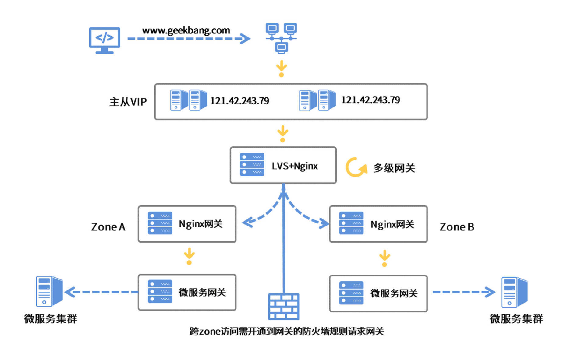

首先，网址解析的第一步是 DNS 解析。当用户在浏览器里输入一串网址时，这个网址会被 DNS 层解析成一个可被访问的 IP 地址。为了**避免单点故障**，我们可以在这一层加个双保险，比如将域名映射成两个 IP 地址做主备，又或者根据用户 IP 所属区域做 Loadbalancer，将请求导向就近的 IP 地址，这两种方式都是可以的。

在这里你会发现，每一个 IP 地址背后都别有洞天，因为它们只是所谓的虚 IP，后面会映射到一个大型的网关集群，这个集群便是我们业务系统对外的第一道网关。在这个环节中，使用最广泛而且最经济实惠的技术选型就是 Nginx 反向代理。因为它拥有超强的并发能力，而且很节省内存资源。

到这还没完，刚才我提到在大厂里往往会有多个网关组件。也就是说，一个请求抵达最外层的 Nginx 服务之后，还可能会经历多级 LVS+Nginx 集群的转发。大公司之所以这么玩，主要是出于对网络安全的考虑。他们往往会根据业务系统的属性和安全级别来设置不同的网络分区，而这些网络分区之间是相互独立的，分区之间需要开通白名单或者防火墙才能打通连接。比如有的网络分区可以直接对外，而有的高安全级别的分区（比如金融类业务）则部署在更底层的 Secure Zone 当中。这就和我们使用跳板机访问线上机房是一个道理。

然后，请求经过了多级网关服务的转发，抵达了最后的微服务层。在这一层上，Gateway 就需要出马来负责请求转发了。

那 Gateway 早不出现晚不出现，偏偏在请求抵达微服务的最后一刻冒了出来，它的底层逻辑是什么呢？

Gateway 既然叫“微服务网关”，就说明它自己就是一个微服务。换句话说，它也是 Nacos 服务注册中心的一员。既然 Gateway 能连接到 Nacos，那么就意味着它可以轻松获取到 Nacos 中所有服务的注册表。这样一来，Gateway 就可以根据本地的路由规则，将请求精准无误地送达到每个微服务组件中。

使用 Gateway 有一个显而易见的好处，那就是**高可扩展性**。当你对后台的微服务集群做扩容或缩容的时候，Gateway 可以从 Nacos 注册中心轻松获取所有服务节点的变动，不需要任何额外的配置，一切都在无感知的情况下自然而然地发生。如果使用其他技术方案，你可能还需要花些力气修改 VIP Pool 中的节点列表，将新增的机器手动添加到列表中，还要把移除的机器从列表中删除。

Gateway 的另一个优点就是**高度可定制化**。它提供了一种对开发人员非常友好的方式，可以让你通过 Java 代码去定制各种复杂的路由逻辑，还可以使用 Filter 对请求进行加工。

那么接下来，我就带你了解 Gateway 的几个核心功能模块，看一看它是如何组装路由规则的。

### Gateway 路由规则

Gateway 的路由规则主要有三个部分，分别是路由、谓词和过滤器。我这里画了一张图来表示 Gateway 的路由结构。


#### 路由

**路由是 Gateway 的一个基本单元**，每个路由都有一个目标地址，这个目标地址就是当前路由规则要调用的目标服务。那么一条路由规则在什么情况下会去调用目标服务呢？这就要看路由的谓词设置了。

#### 谓词

**所谓谓词，实际上是路由的判断规则**，一个路由中可以添加多个谓词的组合。如果一个服务请求满足某个路由里设置的所有的谓词规则，那么就说明这个请求是当前路由的心动女神，这时候 Gateway 就会把请求转发到路由中设置的目标地址。

打个比方，你可以为某个路由设置一条谓词规则，约定访问路径的匹配规则为 Path=/bingo/*，在这种情况下只有以 /bingo 打头的请求才会被当前路由选中。

Gateway 为我们提供了非常丰富的内置谓词，你可以通过内置谓词构建复杂的路由条件，甚至连“整点秒杀”这个场景都能在网关层做控制。我将在下一课带你来了解 Gateway 有哪些内置谓词，以及如何通过 Gateway 的谓词工厂创建一个自定义谓词。

现在你已经了解了谓词和路由是怎么配合工作的，其实 Gateway 里通常会配置多个路由单元。因为在真实项目里，每个微服务都有不同的路由规则，但每个请求只能被一个路由规则选中。那如果某个请求同时匹配上了多个路由，该选择哪个路由呢？Gateway 提供了一种“优先级”设置，你可以通过设置路由的优先级参数来调整生效的先后顺序，我将在下一节课里带你了解优先级设定的具体代码。

#### 过滤器

你一定注意到了我在路由的框里还画了一个“过滤器”，还连了两条虚线到路由的“目标地址”，那么过滤器和路由、目标地址之间是什么关系呢？其实 Gateway 在把请求转发给目标地址的过程中，把这个任务全权委托给了 Filter（过滤器）来处理。我用一幅图为你比划一下 Filter 做了什么事儿。

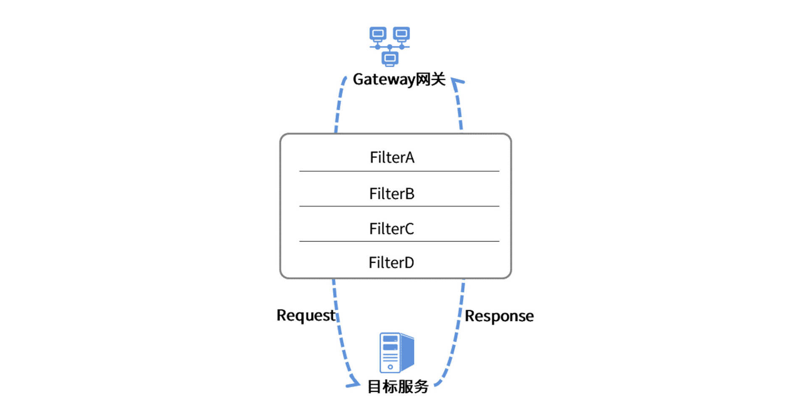

Gateway 组件使用了一种 FilterChain 的模式对请求进行处理，每一个服务请求（Request）在发送到目标服务之前都要被一串 FilterChain 处理。同理，在 Gateway 接收服务响应（Response）的过程中也会被 FilterChain 处理一把。

Gateway 的过滤器主要分为两种，一种是 GlobalFilter，也就是“**全局过滤器**”；另一种是 GatewayFilter，也就是对指定路由生效的“**局部过滤器**”。

全局过滤器继承自 GlobalFilter 接口，它的作用大多是“例行公事”，也就是一些底层能力的支持。比如，RouteToRequestUrlFilter 这个全局过滤器就是用来解析“目标服务地址”的。

除此之外，Gateway 还有一系列用来做路径转发、请求跨域、WebSocket、WebClient 和 Loadbalancer 功能支持的全局过滤器。如果你想深入了解，可以参考 GatewayAutoConfiguration 的源码，这个类是 Gateway 的自动装配器，里面包含了大量 GlobalFilter 的声明。就算你不做任何配置，项目在初始化的时候也会把一大家子全局过滤器添加到上下文中。

GatewayFilter 也就是局部过滤器，它的功能可就多了。Gateway 提供了一系列的内置过滤器，可以实现对 Request/Response 的修改、请求路径修改、调用重试、限流等等功能。当然了，你也可以通过 Gateway 的扩展接口实现一个自定义过滤器并应用到路由规则中。

我将在第 26 课里通过网关限流和全局跨域功能带你了解局部过滤器和全局过滤器的使用，如果你感兴趣，也可以自己预习一下。

到这里，我们就了解了 Gateway 的路由、谓词和过滤器之间是如何协同工作的。接下来我就来带你回顾一下这一节的重点内容吧。

### 总结

今天我们对 Gateway 的路由构成做了分析，知道了谓词和过滤器在路由规则中发挥的作用。在日常开发过程中，路由往往不是由开发人员负责管理的模块，通常会有专门的横向团队负责维护路由表，对路由表的修改也需要经过安全团队的审批，才能对外发布。这是大部分外企使用的管理方式，在老外的观念里，稳定和安全是摆在第一位的。

不过呢，在追求效率的互联网公司里，一线开发团队也可以直接修改对外的路由规则，比如淘系 mtop 接口（不知道现在有没有被其它轮子替换掉）就是授权给开发团队修改的对外网关层，国内倡导的则是糙快猛怎么快怎么来。这种国内外文化的不同，也会体现在公司治理中（965 WLB 对比 996 ICU）。

同理，很多开源项目中也渗入了开发公司的企业文化基因，比如阿里系的很多组件喜欢堆叠眼花缭乱的功能，而 Spring 原生的组件就比较大道至简。当然了，两者没有明显优劣，就像老外玩不转复杂的双 11 优惠计算，就喜欢 amazon 和 ebay 这种简单购物体验，而国内用户不管优惠规则多么复杂都玩得游刃有余并且乐此不疲。

扯远了，回到 Gateway 上面来。没啥重要的事儿嘱咐了，就强调一个事儿吧，那就是尽量别把 Gateway 作为直接对外的网关层，内部服务治理用用就好了，对外还是交给 nginx 这类高性能网关来做。

### 思考题

除了路由功能以外，你还能想到哪些可以挂载在网关上的功能？我举个例子：限流。也欢迎你把想到的功能分享到评论区。

好啦，这节课就结束啦。欢迎你把这节课分享给更多对 Spring Cloud 感兴趣的朋友。我是姚秋辰，我们下节课再见！


## 25 | 微服务网关：Gateway 中的路由和谓词有何应用？

你好，我是姚秋辰。

在上节课中，我们了解了 Spring Cloud Gateway 网关在微服务架构中的定位，我还介绍了 Gateway 的三大核心组件路由、谓词和过滤器的基本概念。今天，我们就来进一步认识 Gateway 的内置功能，了解在 Gateway 中如何声明一个路由，以及路由中的谓词判断逻辑有什么作用。

Spring Cloud Gateway（以下简称 Gateway）提供了非常丰富的内置谓词，你可以通过内置谓词来构建复杂的路由条件，甚至连“整点秒杀”这个场景都能在网关层做控制。这些内置谓词就像乐高积木一样，你可以随意组合在自己的业务逻辑中，构建五花八门的网关层判断逻辑。如果这还不够，那么 Gateway 还提供了自定义的谓词工厂扩展点，让你构建自定义谓词。

由于这些个谓词都要附着于一个路由之上，所以在介绍谓词之前，我得先和你聊一下怎么声明一个路由。这一节不涉及微服务项目改造，只是让你能够用最直观的方式体验 Gateway 的功能特点。

### 声明路由的几种方式

在上一节中我们讲到，路由是 Gateway 中的一条基本转发规则。网关在启动的时候，必须将这些路由规则加载到上下文中，它才能正确处理服务转发请求。那么网关可以从哪些地方加载路由呢？

Gateway 提供了三种方式来加载路由规则，分别是 Java 代码、yaml 文件和动态路由。让我们先来一睹为快，近距离感受一下这三种风格迥异的加载方式。

第一种加载方式是 Java 代码声明路由，它是可读性和可维护性最好的方式，也是我比较喜欢使用的方式。你可以使用一种链式编程的 Builder 风格来构造一个 route 对象，比如在下面的例子里，相信就算我不解释，你也能看明白这段代码做的事情。它声明了两个路由，根据 path 的匹配规则将请求转发到不同的地址。

```java
@Bean
public RouteLocator declare(RouteLocatorBuilder builder) {
    return builder.routes()
            .route("id-001", route -> route
                    .path("/geekbang/**")
                    .uri("http://time.geekbang.org")
            ).route(route -> route
                    .path("/test/**")
                    .uri("http://www.test.com")
            ).build();
}
```

第二种方式是通过配置文件来声明路由，你可以在 application.yml 文件中组装路由规则。我把前面定义的 Java 路由规则改写成了 yml 版，你可以参考一下。

```yml
spring:
  cloud:
    gateway:
      routes:
        - id: id-001
          uri: http://time.geekbang.org
          predicates:
            - Path=/geekbang2/**
        - uri: http://www.test.com
          predicates:
            - Path=/test2/**
```

不管是 Java 版还是 yml 版，它们都是通过“hardcode”的方式声明的静态路由规则，这些 Route 只会在项目启动后被加载一次。如果你想要在 Gateway 运行期更改路由逻辑，那么就要使用第三种方式：动态路由加载。

动态路由也有不同的实现方式。如果你在项目中集成了 actuator 服务，那么就可以通过 Gateway 对外开放的 actuator 端点在运行期对路由规则做增删改查。但这种修改只是临时性的，项目重新启动后就会被打回原形，因为这些动态规则并没有持久化到任何地方。

动态路由还有另一种实现方式，是我比较推荐的，那就是借助 Nacos 配置中心来存储路由规则。Gateway 通过监听 Nacos Config 中的文件变动，就可以动态获取 Nacos 中配置的规则，并在本地生效了。我将在后面的课程中带你落地一套 Nacos+Gateway 的动态路由。

了解了如何加载路由规则之后，我们再来看一看，有哪些构建在路由之上的、功能丰富的内置谓词吧。

### Gateway 的内置谓词都有哪些

Gateway 的内置谓词可真不少，我这里捡一些比较常用的谓词，为你介绍下它们的用法。我把这些谓词大致分为三个类型：寻址谓词、请求参数谓词和时间谓词。我将使用基于 Java 代码的声明方式，带你挨个来看下如何在路由中配置谓词。

**寻址谓词**，顾名思义，就是针对请求地址和类型做判断的谓词条件。比如这里我们用到的 path，其实就是一个路径匹配条件，当请求的 URL 和 Path 谓词中指定的模式相匹配的时候，这个谓词就会返回一个 True 的判断。而 method 谓词则是根据请求的 Http Method 做为判断条件，比如我这里就限定了只有 GET 和 POST 请求才能访问当前 Route。

```java
.route("id-001", route -> route
      .path("/geekbang/**")
      .and().method(HttpMethod.GET, HttpMethod.POST)
      .uri("http://time.geekbang.org")
```

在上面这段代码中，我添加了不止一个谓词。在谓词与谓词之间，你可以使用 and、or、negate 这类“与或非”逻辑连词进行组合，构造一个复杂判断条件。

接下来是**请求参数谓词**，这类谓词主要对服务请求所附带的参数进行判断。这里的参数不单单是 Query 参数，还可以是 Cookie 和 Header 中包含的参数。比如下面这段代码，如果请求中没有包含指定参数，或者指定参数的值和我指定的 regex 表达式不匹配，那么请求就无法满足当前路由的谓词判断条件。

```java
.route("id-001", route -> route
    // 验证cookie
    .cookie("myCookie", "regex")
    // 验证header
    .and().header("myHeaderA")
    .and().header("myHeaderB", "regex")
    // 验证param
    .and().query("paramA")
    .and().query("paramB", "regex")
    .and().remoteAddr("远程服务地址")
    .and().host("pattern1", "pattern2")
```

如果你要对原始服务请求的远程地址或 Header 中的 Host 参数做些文章，那么你也可以通过 remoteAddr 和 host 谓词进行判断。

在实际项目中，非必要情况下，我并不推荐把过多的参数谓词条件定义在网关层，因为这些参数往往携带了业务层的逻辑。如果这些业务参数被大量引入到网关层，从职责分离的角度来讲，并不合适。网关层的逻辑一般来说比较“轻薄”，主要只是一个请求转发，最多再夹带一些简单的鉴权和登录态检查就够了。

最后一组是时间谓词。你可以借助 before、after、between 这三个时间谓词来控制当前路由的生效时间段。

```java
.route("id-001", route -> route
   // 在指定时间之前
   .before(ZonedDateTime.parse("2022-12-25T14:33:47.789+08:00"))
   // 在指定时间之后
   .or().after(ZonedDateTime.parse("2022-12-25T14:33:47.789+08:00"))
   // 或者在某个时间段以内
   .or().between(
        ZonedDateTime.parse("起始时间"),
        ZonedDateTime.parse("结束时间"))
```

拿一项秒杀活动来说，如果开发团队做了一个新的秒杀下单入口，我要限定该入口的生效时间在秒杀时间点之后，那么我就可以使用 after 谓词。对于固定时间窗口的秒杀活动来说，你还可以使用 between 来限定生效时间窗口。再结合前面我们讲到的请求参数谓词，你还可以实现更加复杂的路由判断逻辑，比如通过 query 谓词针对特定商品开放不同的秒杀时段。

如果 Gateway 的内置谓词还差那么点意思，你想要实现自定义的谓词逻辑，那么你可以通过 Gateway 的可扩展谓词工厂来实现自定义谓词。Gateway 组件提供了一个统一的抽象类 AbstractRoutePredicateFactory 作为谓词工厂，你可以通过继承这个类来添加新的谓词逻辑。

我把实现一个自定义谓词的代码框架放到了这里，你可以参考一下。

```java
// 继承自通用扩展抽象类AbstractRoutePredicateFactory
public class MyPredicateFactory extends 
    AbstractRoutePredicateFactory<MyPredicateFactory.Config> {
   public MyPredicateFactory() {
      super(Config.class);
   }
   
   // 定义当前谓词所需要用到的参数
   @Validated
   public static class Config {
       private String myField;
   }
   
   @Override
   public List<String> shortcutFieldOrder() {
      // 声明当前谓词参数的传入顺序
      // 参数名要和Config中的参数名称一致
      return Arrays.asList("myField");
   }
   
   // 实现谓词判断的核心方法
   // Gateway会将外部传入的参数封装为Config对象
   @Override
   public Predicate<ServerWebExchange> apply(Config config) {
      return new GatewayPredicate() {
      
         // 在这个方法里编写自定义谓词逻辑
         @Override
         public boolean test(ServerWebExchange exchange) {
            return true;
         }
         
         @Override
         public String toString() {
            return String.format("myField: %s", config.myField);
         }
      };
   }
}
```

这个实现的过程非常简单，相信看了上面的源码就能明白。这里面的关键步骤就两步，一是定义 Config 结构来接收外部传入的谓词参数，二是实现 apply 方法编写谓词判断逻辑。我将会留一道课后作业让你自己动手实现一个专属谓词。

到这里，我们就了解了 Gateway 的路由和谓词是如何完成请求转发的。接下来我来带你回顾一下这一节的重点内容吧。

### 总结

今天我们了解了 Gateway 中声明路由的三种不同方式。对于静态路由来说，我推荐你使用可读性更强的 Java 代码方式来配置路由；至于动态路由呢，就等到后面的课程，我再教你如何使用 Nacos 定义 JSON 格式动态路由吧。

但是这里要注意的是，一般来讲，路由规则是不受开发团队控制的。暴露什么 URL 给到外部网关，那可是涉及到安全性的一个决策，在大厂中，所有的对外接口都要经过严格的漏扫和渗透测试，然后再经由相关团队审批才能上线路由规则。

在实际工作中，最最常用的谓词当属 path，其它大部分内置谓词都用不太上，如果你想要使用这些谓词在网关层判断登录状态或者做权限验证，那么我更推荐你使用 Gateway 的 Filter 机制，也就是过滤器。我在下节课将基于 Gateway 限流的场景，跟你讲一下如何在路由规则中添加 Filter。

### 思考题

结合这节课的内容，你能自己写一个自定义谓词实现某个简单逻辑吗？比如说恶搞的“春节炸弹”，在春节这一天将所有请求转发到一个特定的 URL（不要使用 between 谓词来实现）。这里你需要思考一个问题，如果某个请求同时满足两个路由的判断条件，如何设置其中一个路由先行生效。

好啦，这节课就结束啦。欢迎你把这节课分享给更多对 Spring Cloud 感兴趣的朋友。我是姚秋辰，我们下节课再见！


## 26 | 微服务网关：如何设置请求转发、跨域和限流规则？

你好，我是姚秋辰。

在上节课中，我们了解了如何在 Spring Cloud Gateway 中加载一个路由，以及常用的内置谓词都有哪些。今天我们就来动手实践一把，在实战项目中搭建一个 Gateway 网关，并完成三个任务：设置跨域规则、添加路由和实现网关层限流。这三个任务将以怎样的方式展开呢？

首先是跨域规则，它是一段添加在配置文件中的逻辑。我将在编写网关配置文件的同时，顺便为你讲解下跨域的基本原理，以及如何设置同源访问策略。

然后，我将使用基于 Java 代码的方式来定义静态路由规则。当然了，你也可以使用配置文件来编写路由，用代码还是用配置全凭个人喜好。不过呢，如果你的路由规则比较复杂，比如，它包含了大量谓词和过滤器，那么我还是推荐你使用代码方式，可读性高，维护起来也容易一些。

最后就是网关层限流，我们将使用内置的 Lua 脚本，并借助 Redis 组件来完成网关层限流。

闲话少叙，我们先去搭建一个微服务网关应用吧。你可以在Gitee 代码仓库中找到下面所有源码。

### 创建微服务网关

微服务网关是一个独立部署的平台化组件，我们先在 middleware 目录下创建一个名为 gateway 的子模块。接下来的工作就是按部就班地搞定依赖项、配置项和路由规则。

#### 添加依赖项

我们要在这个模块的 pom.xml 文件中添加几个关键依赖项，分别是 Gateway、Nacos 和 Loadbalancer。你可以参考下面的代码。

```xml
<dependencies>
    <!-- Gateway正经依赖 -->
    <dependency>
        <groupId>org.springframework.cloud</groupId>
        <artifactId>spring-cloud-starter-gateway</artifactId>
    </dependency>
    
    <!-- Nacos服务发现 -->
    <dependency>
        <groupId>com.alibaba.cloud</groupId>
        <artifactId>spring-cloud-starter-alibaba-nacos-discovery</artifactId>
    </dependency>    
    <dependency>
        <groupId>org.springframework.cloud</groupId>
        <artifactId>spring-cloud-starter-loadbalancer</artifactId>
    </dependency>
    
    <!-- Redis+Lua限流 -->
    <dependency>
        <groupId>org.springframework.boot</groupId>
        <artifactId>spring-boot-starter-data-redis-reactive</artifactId>
    </dependency>
    
    <!-- 其它非关键注解请参考源码 -->
</dependencies>
```


这里我只列出了核心依赖项，还有一些辅助依赖组件我没有一一列出，你可以参考源码，查看完整的依赖项列表。

在这几个核心依赖项中，打头的 spring-cloud-starter-gateway 是最重要的一个，它是实现了网关功能模块的基础组件。而 Nacos 和 Loadbalancer 则扮演了“导航”的作用，让 Gateway 在请求转发的过程中可以通过“服务发现 + 负载均衡”定位到对应的服务节点。最后一个是 Redis 依赖项，待会儿我们会用它来实现网关层限流。

虽然我没有把链路追踪组件的相关依赖项添加到 Gateway 组件中，但是网关通常是一次服务调用的起点，我们在搭建线上应用的时候，应当把 Gateway 纳入到链路追踪体系当中。所以呢我们需要将 Sleuth、Zipkin 还有 ELK 集成进来，我把这个任务留给了你来实现，你可以从依赖项的添加开始，完整回顾一下前面学过的链路追踪知识点，温故而又知新。

依赖项添加完成后，我们接下来去编写 bootstrap.yml 和 application.yml 配置文件。

#### 添加配置文件

首先，我们创建一个 bootstrap.yml，将“coupon-gateway”定义为当前项目的名称。使用 bootstrap.yml 的目的之一是优先加载 Nacos Config 配置项，我们要借助 Nacos 来完成动态路由表的加载，这部分的内容我将放到下一课再讲。

```yml
spring:
  application:
    name: coupon-gateway
```

接下来，我们创建一个 application.yml。这个配置文件里的内容主要就两部分，一部分是 Nacos 服务发现的配置项，这段是老生常谈了咱就不再展开讲了。另一部分是 Gateway 特有的配置项，我们来看一下。

我会通过 Java 代码来落地各种路由规则，所以你看到的配置文件并不包含任何路由规则，非常干净清爽。如果你比较喜欢用配置项来定义路由规则，那你可以在 spring.cloud.gateway.routes 节点下尽情发挥，定义各种路由、谓词断言和过滤器规则。我在上节课开头写了几个在 yml 中定义路由规则的例子，你可以参考一下。

```yml
server:
  port: 30000
spring:
  # 分布式限流的Redis连接
  redis:
    host: localhost
    port: 6379
  cloud:
    nacos:
      # Nacos配置项
      discovery:
        server-addr: localhost:8848
        heart-beat-interval: 5000
        heart-beat-timeout: 15000
        cluster-name: Cluster-A
        namespace: dev
        group: myGroup
        register-enabled: true
    gateway:
      discovery:
        locator:
          # 创建默认路由，以"/服务名称/接口地址"的格式规则进行转发
          # Nacos服务名称本来就是小写，但Eureka默认大写
          enabled: true
          lower-case-service-id: true
      # 跨域配置
      globalcors:
        cors-configurations:
          '[/**]':
            # 授信地址列表
            allowed-origins:
              - "http://localhost:10000"
              - "https://www.geekbang.com"
            # cookie, authorization认证信息
            expose-headers: "*"
            allowed-methods: "*"
            allow-credentials: true
            allowed-headers: "*"
            # 浏览器缓存时间
            max-age: 1000          
```

上面这段配置代码的重点是**全局跨域规则**，我在 spring.cloud.gateway.globalcors 下添加了一段跨域规则的相关配置，这里我们就来展开说道说道。

#### 什么是跨域规则

在了解如何配置跨域规则之前，我需要先为你讲一讲什么是浏览器的“**同源保护策略**”。

如果前后端是分离部署的，大部分情况下，前端系统和后端 API 都在同一个根域名下，但也有少数情况下，前后端位于不同域名。比如前端页面的地址是 geekbang.com，后端 API 的访问地址是 infoq.com。如果一个应用请求发生了跨域名访问，比如位于 geekbang.com 的页面通过 Node.js 访问了 infoq.com 的后端 API，这种情况就叫“跨域请求”。

我们的浏览器对跨域访问的请求设置了一道保护措施，在跨域调用发起之前，浏览器会尝试发起一个 OPTIONS 类型的请求到目标地址，探测一下你的后台服务是否支持跨域调用。如果你的后端 Say NO，那么前端浏览器就会阻止这次非同源访问。通过这种方式，一些美女聊天类的钓鱼网站就无法对你实施跨站脚本攻击了，这就是浏览器端的同源保护策略。


不过也有一种例外，比如你的前端网站和后端接口确实部署在了两个域名，而这两个域名背后都是正经应用，这时候为了让浏览器可以通过同源保护策略的检查，你就必须在后台应用里设置跨域规则，告诉浏览器哪些跨域请求是可以被接受的。

我们接下来就来了解一下，如何通过跨域配置的参数来控制跨域访问。这些参数都定义在的 spring.cloud.gateway.globalcors.cors-configurations 节点的[/***]路径下，[/***]这串通配符可以匹配所有请求路径。当然了，你也可以为某个特定的路径设置跨域规则（比如[/order/]）。

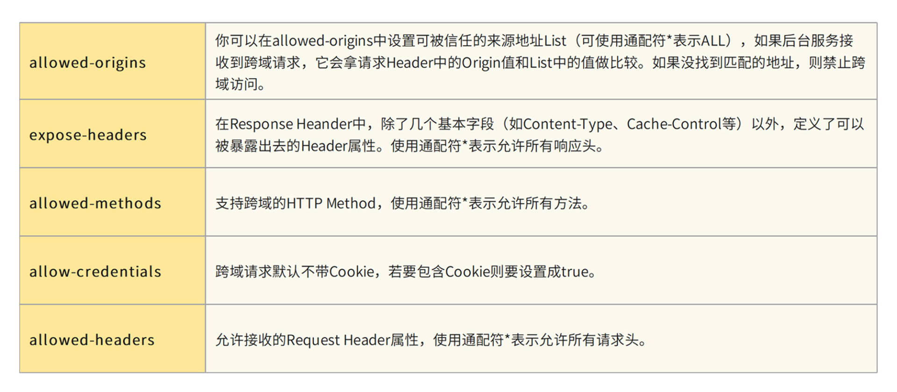

在这上面的几个配置项中，allowed-origins 是最重要的，你需要将受信任的域名添加到这个列表当中。从安全性角度考虑，非特殊情况下我并不建议你使用 * 通配符，因为这意味着后台服务可以接收任何跨域发来的请求。

到这里，所有配置都已经 Ready 了，我们可以去代码中定义路由规则了。

### 定义路由规则

我推荐你使用一个独立的配置类来管理路由规则，这样代码看起来比较清晰。比如我这里就在 com.geekbang.gateway 下面创建了 RoutesConfiguration 类，为三个微服务分别定义了简单明了的规则。你可以参考一下这段代码。

```java
@Configuration
public class RoutesConfiguration {
    @Bean
    public RouteLocator declare(RouteLocatorBuilder builder) {
        return builder.routes()
                .route(route -> route
                        .path("/gateway/coupon-customer/**")
                        .filters(f -> f.stripPrefix(1))
                        .uri("lb://coupon-customer-serv")
                ).route(route -> route
                        .order(1)
                        .path("/gateway/template/**")
                        .filters(f -> f.stripPrefix(1))
                        .uri("lb://coupon-template-serv")
                ).route(route -> route
                        .path("/gateway/calculator/**")
                        .filters(f -> f.stripPrefix(1))
                        .uri("lb://coupon-calculation-serv")
            ).build();
    }
}
```

这三个路由规则都是大同小异的。我们就以第二个路由规则为例，你可以看出，路由设置遵循了一套三连的风格。

首先，我使用 path 谓词约定了路由的匹配规则为 path=“/template/**”。这里你要注意的是，如果某一个请求匹配上了多个路由，但你又想让各个路由之间有个先后匹配顺序，这时你就可以使用 order(n) 方法设定路由优先级，n 数字越小则优先级越高。

接下来，我使用了一个 stripPrefix 过滤器，将 path 访问路径中的第一个前置子路径删除掉。这样一来，/gateway/template/xxx 的访问请求经由过滤器处理后就变成了 /template/xxx。同理，如果你想去除 path 中打头的前两个路径，那就使用 stripPrefix(2)，参数里传入几它就能吞掉几个 prefix path。

最后，我使用 uri 方法指定了当前路由的目标转发地址，这里的“lb://coupon-template-serv”表示使用本地负载均衡将请求转发到名为“coupon-template-serv”的服务。

在这一套三连里，谓词和 uri 你是再熟悉不过了，但这个 filter 想必还是第一次见到。我来带你简单了解一下 Gateway Filter 的使用方式，再用一个简单的小案例教你借助过滤器来实现基于 Lua + Redis 的网关层限流。

### Filter 和网关限流

在第 23 课中，我们了解了 Gateway 过滤器在一个 Request 生命周期中的作用阶段。其实 Filter 的一大功能无非就是对 Request 和 Response 动手动脚，为什么这么说呢？比如你想对 Request Header 和 Parameter 进行删改，又或者从 Response 里面删除某个 Header，那么你就可以使用下面这种方式，通过链式 Builder 风格构造过滤器链。

```java
.route(route -> route
        .order(1)
        .path("/gateway/template/**")
        .filters(f -> f.stripPrefix(1)
                // 修改Request参数
                .removeRequestHeader("mylove")
                .addRequestHeader("myLove", "u")
                .removeRequestParameter("urLove")
                .addRequestParameter("urLove", "me")
                // response系列参数 不一一列举了
                .removeResponseHeader("responseHeader")
        )
        .uri("lb://coupon-template-serv")
```

当然了，Gateway 的内置过滤器远不止上面这几个，还包括了 redirect 转发、retry 重试、修改 requestBody 等等内置 Filter。如果你对这些内容感兴趣，你可以根据 IDE 中自动弹出的代码提示来了解它们，再配几个到路由规则里把玩一下。

接下来，我们通过一个轻量级的网关层限流方案来进一步熟悉 Filter 的使用，这个限流方案所采用的底层技术是 Redis + Lua。

Redis 你一定很熟悉了，而 Lua 这个名词你可能是第一次听说，但提到愤怒的小鸟这个游戏，你一定不陌生，这个游戏就是用 Lua 语言写的。Lua 是一类很小巧的脚本语言，它和 Redis 可以无缝集成，你可以在 Lua 脚本中执行 Redis 的 CRUD 操作。在这个限流方案中，Redis 用来保存限流计数，而限流规则则是定义在 Lua 脚本中，默认使用令牌桶限流算法。如果你对 Lua 脚本的内容感兴趣，可以在 IDE 中全局搜索 request_rate_limiter.lua 这个文件。

前面我们已经添加了 Redis 的依赖和连接配置，现在你可以直接来定义限流参数了。我在 Gateway 模块里新建了一个 RedisLimitationConfig 类，专门用来定义限流参数。我们用到的主要参数有两个，一个是限流的维度，另一个是限流规则，你可以参考下面的代码。

```java
@Configuration
public class RedisLimitationConfig {
    // 限流的维度
    @Bean
    @Primary
    public KeyResolver remoteHostLimitationKey() {
        return exchange -> Mono.just(
                exchange.getRequest()
                        .getRemoteAddress()
                        .getAddress()
                        .getHostAddress()
        );
    }
    
    //template服务限流规则
    @Bean("tempalteRateLimiter")
    public RedisRateLimiter templateRateLimiter() {
        return new RedisRateLimiter(10, 20);
    }
    
    // customer服务限流规则
    @Bean("customerRateLimiter")
    public RedisRateLimiter customerRateLimiter() {
        return new RedisRateLimiter(20, 40);
    }
    @Bean("defaultRateLimiter")
    @Primary
    public RedisRateLimiter defaultRateLimiter() {
        return new RedisRateLimiter(50, 100);
    }
}
```

我在 remoteHostLimitationKey 这个方法中定义了一个以 Remote Host Address 为维度的限流规则，当然了你也可以自由发挥，改用某个请求参数或者用户 ID 为限流规则的统计维度。其它的三个方法定义了基于令牌桶算法的限流速率，RedisRateLimiter 类接收两个 int 类型的参数，第一个参数表示每秒发放的令牌数量，第二个参数表示令牌桶的容量。通常来说一个请求会消耗一张令牌，如果一段时间内令牌产生量大于令牌消耗量，那么积累的令牌数量最多不会超过令牌桶的容量。

定义好了限流参数之后，我们来看一下如何将限流规则应用到路由表中。

因为 Gateway 路由规则都定义在 RoutesConfiguration 类中，所以你需要把刚才我们定义的限流参数类注入到 RoutesConfiguration 类中。考虑到不同的路由表可能会使用不同的限流参数，所以你在定义多个限流参数的时候，可以使用 @Bean(“customerRateLimiter”) 这种方式来做区分，然后在 Autowired 注入对象的时候，使用 @Qualifier(“customerRateLimiter”) 指定想要加载的限流参数就可以了。

```java
@Autowired
private KeyResolver hostAddrKeyResolver;
@Autowired
@Qualifier("customerRateLimiter")
private RateLimiter customerRateLimiter;
@Autowired
@Qualifier("tempalteRateLimiter")
private RateLimiter templateRateLimiter;
```

限流参数注入完成之后，接下来我们只需要添加一个内置的限流过滤器，分别指定限流的维度、限流速率就可以了，你可以参考下面这段 rquestRateLimiter 过滤器配置代码。除了限流参数之外，我还额外定义了一个 Status Code，当服务请求被限流的时候，后端服务便会返回我指定的这个 Status Code。

```java
.route(route -> route.path("/gateway/coupon-customer/**")
        .filters(f -> f.stripPrefix(1)
            .requestRateLimiter(limiter-> {
                limiter.setKeyResolver(hostAddrKeyResolver);
                limiter.setRateLimiter(customerRateLimiter);
                // 限流失败后返回的HTTP status code
                limiter.setStatusCode(HttpStatus.BANDWIDTH_LIMIT_EXCEEDED);
            }
            )
        )
        .uri("lb://coupon-customer-serv")
```


到这里，我们就完整搭建了 Gateway 组件的路由和限流规则，最后你只需要写一个普通的启动类就可以在本地测试了。接下来我来带你回顾一下这一节的重点内容吧。

### 总结

今天我们为三个微服务组件设置了路由规则和限流规则。尽管 Gateway 组件本身提供了丰富的内置谓词和过滤器，但在实际项目中我们大多用不到它们，因为网关层的核心用途只是简单的路由转发，**为了保证组件之间的职责隔离，我并不建议通过谓词和过滤器实现带有业务属性的逻辑**。

那什么样的逻辑可以在网关层实现呢？比如一些通用的身份鉴权、登录检测和签名验签之类的服务，你可以将这类安全检测的逻辑前置到网关层来实现，这样可以对不合法请求做快速失败处理。

### 思考题

结合这节课的内容，请你尝试说一说，内置 Filter 是如何实现的，它继承了哪些通用类和接口。再请你在本地用类似的方式实现一个自定义的过滤器，并配置到路由表中。你可以使用这个过滤器完成一些简单的业务，比如打印所有发到网关服务的请求和响应参数。

好啦，这节课就结束啦。欢迎你把这节课分享给更多对 Spring Cloud 感兴趣的朋友。我是姚秋辰，我们下节课再见！


## 27 | 微服务网关：如何借助 Nacos 实现动态路由规则？

你好，我是姚秋辰。

在上节课中，我们通过一系列谓词和过滤器的组合为三个微服务模块配置了路由规则，这套方案足以应对大部分线上业务的需求，但在可扩展性方面还不够完美。为什么这么说呢？因为这些路由规则是以 yml 文件或者 Java 代码配置在项目中的静态规则。随着项目启动，这些路由规则会被加载到应用上下文并生效。但在程序运行期，如果我们想要改变这些预定义的路由规则，或者创建新的路由规则，似乎只有提交改动到 Gateway 组件 -> 编译项目 -> 重新部署这一条路子。

那么，如果我们希望不重新部署网关，就能更改路由规则，可以有哪些途径呢？

有一种“临时性”的方案，是借助 Gateway 网关的 actuator endpoiont 进行 CRUD。Gateway 组件内定义了一套内置的 actuator endpoints，当满足下面两个条件时，我们就可以借助 actuator 提供的能力对路由表进行修改了。

项目中存在 spring-boot-starter-actuator 依赖项；

Gateway 组件的 actuator endpoint 已对外开放。

为了满足上面这两个条件，我已经将配置项添加到了 Gateway 模块中，并且在 application.yml 文件中的 management 节点下，对外开放了所有 actuator 端点。

接下来，你就可以借助 Gateway 组件的 actuator endpoiont 完成一系列 CRUD 操作了。以实战项目的源码为例，actuator endpoint 地址是 localhost:30000/actuator/gateway/routes。这套接口遵循了标准的 RESTful 规范，你可以对这个路径发起 GET 请求，获取一段 JSON 格式的路由规则全集，也可以使用 POST 请求添加一个新的路由规则，或者使用 PUT/DELETE 请求修改 / 删除指定路由规则。

好了，Gateway 的 actuator 动态路由功能我就点到即止了，actuator 方案尽管实现了动态路由管理，但这些动态路由只保存在了应用的上下文中，一重启就没了。接下来我要给你介绍个更牛的方案，它不仅能动态管理路由表，而且还能让这些规则实现持久化，无论怎么重启都不会丢失路由规则。

下面，我们就来了解一下，如何借助 Nacos Config 实现动态路由规则的持久化。

### 使用 Nacos Config 添加动态路由表

**但凡有动态配置相关的需求，使用 Nacos Config 就对了**。上节课里我已经将 Nacos Config 的依赖项添加到了 Gateway 模块，接下来我们直奔主题，看一下 Gateway 和 Nacos 是如何来集成的吧。

首先，我们需要定义一个底层的网关路由规则编辑类，它的作用是将变化后的路由信息添加到网关上下文中。我把这个类命名为 GatewayService，放置在 com.geekbang.gateway.dynamic 包路径下。

```java
@Slf4j
@Service
public class GatewayService {
    @Autowired
    private RouteDefinitionWriter routeDefinitionWriter;
    @Autowired
    private ApplicationEventPublisher publisher;
    public void updateRoutes(List<RouteDefinition> routes) {
        if (CollectionUtils.isEmpty(routes)) {
            log.info("No routes found");
            return;
        }
        routes.forEach(r -> {
            try {
                routeDefinitionWriter.save(Mono.just(r)).subscribe();
                publisher.publishEvent(new RefreshRoutesEvent(this));
            } catch (Exception e) {
                log.error("cannot update route, id={}", r.getId());
            }
        });
    }
}
```

这段代码接收了一个 RouteDefinition List 对象作为入参，它是 Gateway 网关组件用来封装路由规则的标准类，在里面包含了谓词、过滤器和 metadata 等一系列构造路由规则所需要的元素。在主体逻辑部分，我调用了 Gateway 内置的路由编辑类 RouteDefinitionWriter，将路由规则写入上下文，再调用 ApplicationEventPublisher 类发布一个路由刷新事件。

接下来，我们要去做一个中间层转换层来对接 Nacos 和 GatewayService，这个中间层主要完成两个任务，一是动态接收 Nacos Config 的参数，二是将配置文件的内容转换为 GatewayService 的入参。

这里我不打算使用 @RefreshScope 来获取 Nacos 动态参数了，我另辟蹊径使用了一种更为灵活的监听机制，通过注册一个“监听器”来获取 Nacos Config 的配置变化通知。我把这段逻辑封装在了 DynamicRoutesListener 类中，它位于 GatewayService 同级目录下，你可以参考下面的代码实现。

```java
@Slf4j
@Component
public class DynamicRoutesListener implements Listener {
    @Autowired
    private GatewayService gatewayService;
    @Override
    public Executor getExecutor() {
        log.info("getExecutor");
        return null;
    }
    // 使用JSON转换，将plain text变为RouteDefinition
    @Override
    public void receiveConfigInfo(String configInfo) {
        log.info("received routes changes {}", configInfo);
        List<RouteDefinition> definitionList = JSON.parseArray(configInfo, RouteDefinition.class);
        gatewayService.updateRoutes(definitionList);
    }
}
```

DynamicRoutesListener 实现了 Listener 接口，后者是 Nacos Config 提供的标准监听器接口，当被监听的 Nacos 配置文件发生变化的时候，框架会自动调用 receiveConfigInfo 方法执行自定义逻辑。在这段方法里，我将接收到的文本对象 configInfo 转换成了 List类，并调用 GatewayService 完成路由表的更新。

这里需要你注意的一点是，你需要按照 RouteDefinition 的 JSON 格式来编写 Nacos Config 中的配置项，如果两者格式不匹配，那么这一步格式转换就会抛出异常。

定义好了监听器之后，接下来你就要考虑如何来加载 Nacos 路由配置项了。我们需要在两个场景下加载配置文件，一个是项目首次启动的时候，从 Nacos 读取文件用来初始化路由表；另一个场景是当 Nacos 的配置项发生变化的时候，动态获取配置项。

为了能够一石二鸟简化开发，我决定使用一个类来搞定这两个场景。我定义了一个叫做 DynamicRoutesLoader 的类，它实现了 InitializingBean 接口，后者是 Spring 框架提供的标准接口。它的作用是在当前类所有的属性加载完成后，执行一段定义在 afterPropertiesSet 方法中的自定义逻辑。

在 afterPropertiesSet 方法中我执行了两项任务，第一项任务是调用 Nacos 提供的 NacosConfigManager 类加载指定的路由配置文件，配置文件名是 routes-config.json；第二项任务是将前面我们定义的 DynamicRoutesListener 注册到 routes-config.json 文件的监听列表中，这样一来，每次这个文件发生变动，监听器都能够获取到通知。

```java
@Slf4j
@Configuration
public class DynamicRoutesLoader implements InitializingBean {
    @Autowired
    private NacosConfigManager configService;
    @Autowired
    private NacosConfigProperties configProps;
    @Autowired
    private DynamicRoutesListener dynamicRoutesListener;
    private static final String ROUTES_CONFIG = "routes-config.json";
    @Override
    public void afterPropertiesSet() throws Exception {
        // 首次加载配置
        String routes = configService.getConfigService().getConfig(
                ROUTES_CONFIG, configProps.getGroup(), 10000);
        dynamicRoutesListener.receiveConfigInfo(routes);
        
        // 注册监听器
        configService.getConfigService().addListener(ROUTES_CONFIG,
                configProps.getGroup(),
                dynamicRoutesListener);
    }
}
```

到这里，我们的代码任务就完成了，你只需要往项目的 bootstrap.yml 文件中添加 Nacos Config 的配置项就可以了。按照惯例，我仍然使用 dev 作为存放配置文件的 namespace。

```yml
spring:
  application:
    name: coupon-gateway 
  cloud:
    nacos:
      config:
        server-addr: localhost:8848
        file-extension: yml
        namespace: dev
        timeout: 5000
        config-long-poll-timeout: 1000
        config-retry-time: 100000
        max-retry: 3
        refresh-enabled: true
        enable-remote-sync-config: true
```

完成了以上步骤之后，Gateway 组件的改造任务就算搞定了，接下来我再带你去 Nacos 里创建一个路由规则配置文件。

### 添加 Nacos 配置文件

在 Nacos 配置列表页中，你需要在“开发环境”的命名空间下创建一个 JSON 格式的文件，文件名要和 Gateway 代码中的名称一致，叫做“routes-config.json”，它的 Group 是默认分组，也就是 DEFAULT_GROUP。

创建好之后，你需要根据 RoutesDefinition 这个类的格式定义配置文件的内容。以 coupon-customer-serv 为例，我编写了下面的路由规则。

```json
[{
    "id": "customer-dynamic-router",
    "order": 0,
    "predicates": [{
        "args": {
            "pattern": "/dynamic-routes/**"
        },
        "name": "Path"
    }],
    "filters": [{
        "name": "StripPrefix",
        "args": {
            "parts": 1
        }
    }  
    ],
    "uri": "lb://coupon-customer-serv"
}]
```

在这段配置文件中，我指定当前路由的 ID 是 customer-dynamic-router，并且优先级为 0。除此之外，我还定义了一段 Path 谓词作为路径匹配规则，还通过 StripPrefix 过滤器将 Path 中第一个前置路径删除。

创建完成后，你可以在本地启动项目，并尝试访问 localhost:30000/dynamic-routes/coupon-customer/requestCoupon，发起一个用户领券请求到 Gateway 组件来领取优惠券。在配置正确无误的情况下，这个请求就会被转发到 Customer 服务啦。

到这里，我们就完整搭建了一套可被持久化的动态路由方案。下面让我来带你回顾下本节重点吧。

### 总结

在今天的课程里，我们借助 Nacos Config 作为路由规则的数据源，完成了路由表的动态加载和持久化。我这里讲的解决方案只是一种思路，在代码中我还留了一个坑给你来填，希望你可以顺着这节课学到的技术方案向下继续探索，把这个坑填上。

我所指的坑是什么呢？我在 Nacos Config 里定义的路由表中有一个 ID，它是这个路由的全局唯一 ID，借助这个 ID 呢我们就可以完成路由的 UPDATE 操作。但是，如果我想要删除某个路由，应该怎么办呢？

我可以给你提示几个解决方案，你挑其中一种来实现就好。比如说，你可以对 Nacos 配置项做一层额外封装，添加几个新字段用来表示“删除路由”这个语义，并创建一个自定义 POJO 类接收参数；还有，你可以在路由的 metadata 里为 Nacos 的动态路由做一个特殊标记，每次当 Nacos 刷新路由表的时候，就删除上下文当中的所有 Nacos 路由表，再重新创建；又或者你可以通过 metadata 做一个逻辑删除的标记，每次更新路由表的时候只要见到这个标记就删除当前路由，否则就更新或新建路由。

### 思考题

我在上面提示了几种路由删除的方案，希望可以抛砖引玉，接下来就轮到你来设计并实现一个优雅方案了，欢迎在留言区分享你自己的思路。

好啦，这节课就结束啦。欢迎你把这节课分享给更多对 Spring Cloud 感兴趣的朋友。我是姚秋辰，我们下节课再见！


## 28 | 消息驱动：谁说消息队列只能削峰填谷？

你好，我是姚秋辰。

说起消息驱动，它可是一个有点年头的老技术了，如今借着微服务架构这股春风可谓是混得春风得意。但凡你去大厂面试，被问到三高系统架构的问题，高低得整两句：消息驱动是如何“削峰填谷”来解决高并发的。

要知道，消息驱动可不仅仅停留在面试环节，它的用武之地也不只局限于“削峰填谷”。今天我就带你了解一下，消息驱动技术在微服务系统中有哪些常用场景。这节课我会基于过去开发过的实际项目，来一一列举各种应用场景，加深你的学习体感。

前面提到了削峰填谷，但我还偏就不从这老掉牙的话题开场，这种“面试宝典”里的经典问题，就是在校生都能答出个一二三来。我这里要为你介绍的第一个消息驱动场景，就是和微服务架构最贴合的“服务间解耦”。

### 服务间解耦

如果你认为把服务拆分成微服务就叫做服务间解耦，那咱对微服务的认知还停留在第一层。在很多场景中，我们还需要借助消息驱动组件对业务场景做进一步解耦。

举个例子，在我们网购下单完成付款之后，有一系列的后续业务流程会被执行。比如买家短信和邮件通知、IM 和站内信推送、金币和积分结算、卖家端履约流程等等。有时候搞线上活动，还会在付款完成之后触发赠券服务。

我们假设这些业务场景都被拆分成了微服务，从业务完整性的角度来讲，为了实现付款后自动触发完整链路，交易服务的回调接口必须挨个调用我前面提到的各个业务系统。如果未来需要接入新的业务场景，你还得往回调接口里加上一个新的系统集成点。再从从服务容错的角度考虑，你还得兼顾关键场景（如金币 + 积分结算）的失败重试，这些逻辑都掺和到了支付成功的回调接口里。

所以，即便我们的业务系统是微服务架构，上下游之间的调用还是跑不掉，这种代码中的调用关系也是一种“耦合”。在真实业务中这类场景很普遍，它的特点是通过某个事件（如支付成功）触发多个下游业务场景，像这类场景就特别适合使用消息驱动技术做解耦。


比如，我可以将付款成功的信息连同当前订单信息放入一个消息队列中，让所有的下游服务监听这个队列，通过这种“**断直连**”的方式，我们就将上下游服务之间的耦合间接地解除了。不管以后下游服务要添加什么新场景，对上游服务都几乎是无感知的，因为新的业务场景只要对接消息队列就好，并不需要对上游服务发起调用。

说完了服务解耦，我们接下来再聊一聊消息广播，它也是消息驱动的一个重要应用。

### 消息广播

消息广播是相对于单播来讲的。单播是指在同一个消费组里，最多只有一个消费者实例可以去消费消息，而广播则是说，一个消费组里所有的消费者都会对消息做一次消费。

消息广播的一个常用场景是热点数据的处理，啥是热点？比如我某一天被明星出轨了，那我的微博就会成为一个“热点数据”，咱前面在 Sentinel 的课程里了解过，热点数据是高可用破防能手。各个大厂都有自己的热点侦测方案，这个不展开说了，就说一旦某个资源被甄别成热点数据之后，是不是要通知各个服务“小心防范”？碰到热点资源的访问请求，直接打到专门的热点集群上做处理。

那么这里的“通知”动作，就特别适合使用消息广播的方式来处理，我们只要在侦测到热点数据之后，发送一个消息到特定的消息队列，让各个有可能接收到热点请求的应用服务接入这个队列，执行相应的热点逻辑。

还有一个和热点数据相类似的场景：本地缓存构建。你一定知道通过 Redis 和 Tair 这类缓存系统来抗 QPS，但对于一些访问频次比较高的资源，我们会倾向于在 Client 本地构建一个“本地缓存”，一来堆内缓存一定是访问速度最快的缓存（绝对比外部缓存快），二来可以降低外部缓存的 QPS，毕竟缓存也是能被压崩盘的。

和热点数据同理，这个例子中的“本地缓存”也是可以通过消息广播来构建的。比如在网关或者 RPC 链路上，我通过一些流技术对实时调用情况进行聚合分析，将访问频次比较高的资源标记为临时热点，并通过消息驱动推送到各个消费者节点。这样，我们就借助消息广播场景实现了资源标记的推送。

那接下来就让我们去了解第三个场景，延迟类业务吧。

### 延迟业务

你可以把这类业务理解为一个闹钟，它是在未来某个时间会被执行的业务逻辑。最常见的一类延迟业务就集中在网购中的订单模块，我这里举两个例子。

订单确认：下了单付了款收了货，就是不点确认收货，没关系，7 天之后系统会自动确认。

取消订单：下单之后在 30 分钟时间内没有付款，自动取消订单。

上面这两个场景都可以借助延迟消息来实现，不过在具体实现的时候，你还需要借助消息分区等功能降低消息的积压量。

我还实现过一些延迟类业务：批量改价单和批量库存发布。改价单的业务需求是给商品设置一个新的价格，指定特定时间生效。批量库存的需求是设置一个补货时间，在指定的时间点修改单品 SKU 库存数量。这些场景我也是构建在延迟消息之上搭建的。

### 削峰填谷

最后就到了老生常谈的削峰填谷场景了，这个场景我们可以拆分为削峰和填谷这两段来看。

削峰就是指削减峰值流量，如果某个业务的峰值流量超过了系统吞吐量，并且这类业务又非常重要，不能简单粗暴地通过限流熔断把请求 cut 掉，那么你可以考虑把这些请求压入消息队列，让消费者根据自身的吞吐量从队列中获取消息并消费。

填谷就是指闲的没事儿干的时候让你忙起来，当业务峰值已经过去了，流量逐渐减少的时候，先前积压在消息队列中的请求就能被逐渐消化。

削峰填谷其实是一种平滑利用资源的手段，之所以我们能将大量消息压入消息队列，是因为目前主流的消息队列都有非常强大的消息堆积能力。当然了，MQ 组件的消息积压量也是有极限的，在真实的线上业务中，我们会为消息队列构建完善的监控指标，提前对消息积压进行预警。

削峰填谷这个用法适合用在一些实时性要求不高，但并发量比较高的业务中。我举一个自己曾参与搭建的电商业务场景，帮你加深对削峰填谷的理解，这个例子就是商品批量发布。

在新零售业务中，我们提供了一种“一键开店”的业务模式，即通过一个简单流程，一键将数十万 SKU 发布到新的门店中。商品发布是一个非常复杂的流程，它需要将商品元数据注册到商品中心、发布商品主副图、详情页 SKU、各类营销优惠信息的发布等等。尽管这是一个低频场景，但奈何一次发布的商品基数非常大，很容易形成一个流量洪峰冲击。我的做法就是借助淘系 MetaQ（RocketMQ 的前身），将商品发布请求压到 MQ 里，由下游集群不紧不慢地去消费。

到这里，我们对消息队列的几个常见场景都有了一定的了解。下面就让我来带你回顾下本节重点吧。

### 总结

在今天的课程里，我们先后介绍了服务间解耦、消息广播、延迟消息和削峰填谷这几个常见的消息队列场景。在纷繁复杂的电商业务中，消息组件还有各式各样的花式玩法，比如廉价好用的一致性保证措施“事务性消息”、处理顽固异常的“死信队列”、用来做消息路由的“一致性哈希 Routing”等等。随着工作经验的积累，你一定会接触到越来越多的消息组件花式玩法。

无论是 Kafka、RocketMQ 还是 RabbitMQ，每个消息组件都有自己拿手的领域和特性，而且有些中间件还提供了丰富的插件库，用来提供一些“外挂”功能。了解每个消息中间件的特点，可以帮助你在业务场景中做出更好的技术选型判断。

我这里想跟你推荐一个运行成本低又十分灵活的消息组件 Pulsar，它可以同时支持流和队列两种语义，在扩展性和可靠性方面也相当优秀。我在这里立一个 Flag，隐约之间 Pulsar 有成为下一代消息驱动王者的王霸之气，让我们拭目以待。

### 思考题

你能根据自己的项目，分享一些消息组件的实际应用场景吗？

好啦，这节课就结束啦。欢迎你把这节课分享给更多对 Spring Cloud 感兴趣的朋友。我是姚秋辰，我们下节课再见！


## 29 | 消息驱动：如何集成 Stream 实现消息驱动？

你好，我是姚秋辰。

在上节课中，我们通过一些实际案例了解到了消息驱动技术的应用场景，这节课我们就使用 Spring Cloud Stream 技术来一场演练，基于 RabbitMQ 消息中间件来落地实践场景。

以往我们在项目中使用 Stream 时，大都是使用经典的 @Input、@Output 和 @StreamListener 等注解来注册消息生产者和消费者，而 Stream 在 3.1 版本之后在这几个注解上打了一个 @Deprecated 标记，意思是这种对接方式已经被淘汰了，不推荐继续使用。取而代之的是更为流行的 Functional Programming 风格，也就是我们俗称的函数式编程。

从近几年的技术发展趋势就可以看出来，函数式编程成了一种技术演进的趋势，它能让你以更少的代码和精简化的配置实现自己的业务逻辑。函数式编程和约定大于配置相结合的编程风格比较放飞自我，在接下来的实战环节中，你就会体会到这种 less code style 的快感了。

因为函数式消息驱动在同一个应用包含多个 Event Topic 的情况下有一些特殊配置，所以为了方便演示这个场景，我选择了 Customer 服务中的两个具有关联性的业务，分别是用户领取优惠券和删除优惠券，这节课我们就将这两个服务改造成基于消息驱动的实现方式。

### 实现消息驱动

我把业务场景里的消息生产者和消费者都定义在了 Customer 服务中，可能你会以为，在真实项目里，生产者和消费者应该分别定义在不同的应用中，大多数情况下确实如此。比如在上节课的消息广播场景里，一个订单完成之后，通过广播消息触发下游各个服务的业务流程，这里的生产者和消费者是分在不同应用中的。

但是呢，我们也有把生产者和消费者定义在同一个应用中的场景，我叫它自产自销。比如在一些削峰填谷的例子中，为了平滑处理用户流量并降低负载，我们可以将高 QPS 但时效性要求不高的请求堆积到消息组件里，让当前应用的消费者慢慢去处理。比如我曾经实现的批量发布商品就是这么个自产自销的例子，商品服务接收请求后丢到 MQ，让同一个应用内部的消费者慢慢消化。

我们接下来就分三步走，用这个自产自销的路子来实现消息驱动业务。先添加生产者代码，再定义消费者逻辑，最后添加配置文件。

按照惯例，集成之前你需要先把下面这个 Stream 依赖项添加到 coupon-customer-impl 项目的 pom 文件中。由于我们底层使用的中间件是 RabbitMQ，所以我们引入的是 stream-rabbit 组件，如果你使用的是不同的中间件，那么需要引入对口的依赖项。

```xml
<dependency>
    <groupId>org.springframework.cloud</groupId>
    <artifactId>spring-cloud-starter-stream-rabbit</artifactId>
</dependency>
```

添加好依赖项之后，我们先来动手编写生产者逻辑。

#### 添加生产者

生产者只做一件事，就是生产一个消息事件，并将这个事件发送到 RabbitMQ。我在 Customer 服务下创建了一个叫做 CouponProducer 的类，添加了 sendCoupon 和 deleteCoupon 这两个生产者方法，分别对应了领取优惠券和删除优惠券。在这两个方法内，我使用了 StreamBridge 这个 Stream 的原生组件，将信息发送给 RabbitMQ。

```java
@Service
@Slf4j
public class CouponProducer {
    @Autowired
    private StreamBridge streamBridge;
    public void sendCoupon(RequestCoupon coupon) {
        log.info("sent: {}", coupon);
        streamBridge.send(EventConstant.ADD_COUPON_EVENT, coupon);
    }
    public void deleteCoupon(Long userId, Long couponId) {
        log.info("sent delete coupon event: userId={}, couponId={}", userId, couponId);
        streamBridge.send(EventConstant.DELETE_COUPON_EVENT, userId + "," + couponId);
    }
}
```

在这段代码里，streamBridge.send 方法的第一个参数是 Binding Name，它指定了这条消息要被发到哪一个信道中，其中 ADD_COUPON_EVENT=addCoupon-out-0，而 deleteCoupon=deleteCoupon-out-0。你先不要管这两个奇怪的值是什么，你只要把 Binding Name 理解成一条消息从 Stream 到达 RabbitMQ 之间的“通道”，待会儿看到配置文件的时候，你就会清楚这条通道是怎么与 RabbitMQ 中定义的消息队列名称关联起来的了。

消息的生产者已经定义好了，接下来我在 CouponCustomerController 中新添加了两个方法，单独用来测试我们定义的两个生产者服务。这两个 Controller 方法接收的参数和现有的领券、删除券的接口是一致的，唯二的区别是请求路径后面多了个 Event，以及方法的返回值变成了 void。

```java
@PostMapping("requestCouponEvent")
public void requestCouponEvent(@Valid @RequestBody RequestCoupon request) {
    couponProducer.sendCoupon(request);
}
// 用户删除优惠券
@DeleteMapping("deleteCouponEvent")
public void deleteCouponEvent(@RequestParam("userId") Long userId,
                         @RequestParam("couponId") Long couponId) {
    couponProducer.deleteCoupon(userId, couponId);
}
```

到这里，我们生产者端的配置就完成了，接下来我们就去编写消息的消费者。

#### 添加消息消费者

我在 CouponProducer 的同级目录下创建了一个 CouponConsumer 类，它作为消息的消费者，从 RabbitMQ 处消费由生产者发布的消息事件，方法底层仍然是调用 CustomerService 服务来完成业务逻辑。

在这段代码中，有一个“**约定大于配置**”的规矩你一定要遵守，那就是不要乱起方法名。我这里定义的 addCoupon、deleteCoupon 两个方法名是有来头的，你要确保消费者方法的名称和配置文件中所定义的 Function Name 以及 Binding Name 保持一致，这是 function event 的一条潜规则。因为在默认情况下，框架会使用消费者方法的 method name 作为当前消费者的标识，如果消费者标识和配置文件中的名称不一致，那么 Spring 应用就不知道该把当前的消费者绑定到哪一个 Stream 信道上去。

另外有一点需要提醒你，我在代码中采用了 Consumer 的实现方式，它是函数式编程的一种方式，你也可以根据自己的编程习惯，采用其它函数式编程方式来编写这段逻辑。

```java
@Slf4j
@Service
public class CouponConsumer {
    @Autowired
    private CouponCustomerService customerService;
    @Bean
    public Consumer<RequestCoupon> addCoupon() {
        return request -> {
            log.info("received: {}", request);
            customerService.requestCoupon(request);
        };
    }
    @Bean
    public Consumer<String> deleteCoupon() {
        return request -> {
            log.info("received: {}", request);
            List<Long> params = Arrays.stream(request.split(","))
                    .map(Long::valueOf)
                    .collect(Collectors.toList());
            customerService.deleteCoupon(params.get(0), params.get(1));
        };
    }
}
```

到这里消费者的定义也完成了。在定义生产者和消费者的过程中我多次提到了配置文件，下面我们就来看一下 Stream 的配置项都有哪些内容。

#### 添加配置文件

Stream 的配置项比较多，我打算分 Binder 和 Binding 两部分来讲。我们先来看 Binder 部分，Binder 中配置了对接外部消息中间件所需要的连接信息。如果你的程序中只使用了单一的中间件，比如只接入了 RabbitMQ，那么你可以直接在 spring.rabbitmq 节点下配置连接串，不需要特别指定 binders 配置。

如果你在 Stream 中需要同时对接多个不同类型，或多个同类型但地址端口各不相同的消息中间件，那么你可以把这些中间件的信息配置在 spring.cloud.stream.binders 节点下。其中 type 属性指定了当前消息中间件的类型，而 environment 则指定了连接信息。

```yml
spring:
  cloud:
    stream:
      # 如果你项目里只对接一个中间件，那么不用定义binders
      # 当系统要定义多个不同消息中间件的时候，使用binders定义
      binders:
        my-rabbit:
          type: rabbit # 消息中间件类型
          environment: # 连接信息
            spring:
              rabbitmq:
                host: localhost
                port: 5672
                username: guest
                password: guest
```

配置完了 binders，我们接下来看看如何定义 spring.cloud.stream.bindings 节点，这个节点保存了生产者、消费者、binder 和 RabbitMQ 四方的关联关系。

```yml
spring:
  cloud:
    stream:
      bindings:
        # 添加coupon - Producer
        addCoupon-out-0:
          destination: request-coupon-topic
          content-type: application/json
          binder: my-rabbit
        # 添加coupon - Consumer
        addCoupon-in-0:
          destination: request-coupon-topic
          content-type: application/json
          # 消费组，同一个组内只能被消费一次
          group: add-coupon-group
          binder: my-rabbit
        # 删除coupon - Producer
        deleteCoupon-out-0:
          destination: delete-coupon-topic
          content-type: text/plain
          binder: my-rabbit
        # 删除coupon - Consumer
        deleteCoupon-in-0:
          destination: delete-coupon-topic
          content-type: text/plain
          group: delete-coupon-group
          binder: my-rabbit
      function:
        definition: addCoupon;deleteCoupon
```

我们以 addCoupon 为例，你会看到我定义了 addCoupon-out-0 和 addCoupon-in-0 这两个节点，节点名称中的 out 代表当前配置的是一个生产者，而 in 则代表这是一个消费者，这便是 spring-function 中约定的命名关系：

Input 信道（消费者）：< functionName > - in - < index >；

Output 信道（生产者）：< functionName > - out - < index >。

你可能注意到了，在命名规则的最后还有一个 index，它是 input 和 output 的序列，如果同一个 function name 只有一个 output 和一个 input，那么这个 index 永远都是 0。而如果你需要为一个 function 添加多个 input 和 output，就需要使用 index 变量来区分每个生产者消费者了。如果你对 index 的使用场景感兴趣，可以参考文稿中的官方社区文档。

现在你已经了解了生产者和消费者的信道是如何定义的，但是，至于这个信道和 RabbitMQ 里定义的消息队列之间的关系，你知道是怎么指定的吗？

信道和 RabbitMQ 的绑定关系是通过 binder 属性指定的。如果当前配置文件的上下文中只有一个消息中间件（比如使用默认的 MQ），你并不需要声明 binder 属性。但如果你配置了多个 binder，那就需要为每个信道声明对应的 binder 是谁。addCoupon-out-0 对应的 binder 名称是 my-rabbit，这个 binder 就是我刚才在 spring.cloud.stream.binders 里声明的配置。通过这种方式，生产者消费者信道到消息中间件（binder）的联系就建立起来了。

信道和消息队列的关系是通过 destination 属性指定的。以 addCoupon 为例，我在 addCoupon-out-0 生产者配置项中指定了 destination=request-coupon-topic，意思是将消息发送到名为 request-coupon-topic 的 Topic 中。我又在 addCoupon-in-0 消费者里添加了同样的配置，意思是让当前消费者从 request-coupon-topic 消费新的消息。

RabbitMQ 消息组件内部是通过交换机（Exchange）和队列（Queue）来做消息投递的，如果你登录 RabbitMQ 的控制台，就可以在 Exchanges 下看到我声明的 delete-coupon-topic 和 request-coupon-topic。

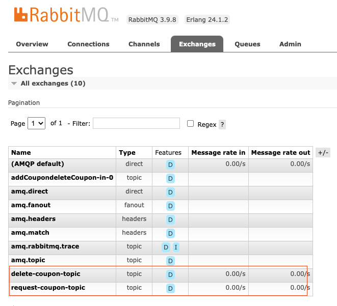

切换到 Queues 面板，你还会看到这两个交换机所绑定的队列名称。这里的队列名称后面还跟了一个 group name，这就是我在消费者这一侧设置的消息分组，我在配置项中为 add-coupon-in 设置了 group=add-coupon-group，即当前分组内只有一台机器可以去消费队列中的消息，这就是所谓的“消息分组单播”的场景。如果你不设置 group 属性，那么这个消息就会成为一条“广播消息”。

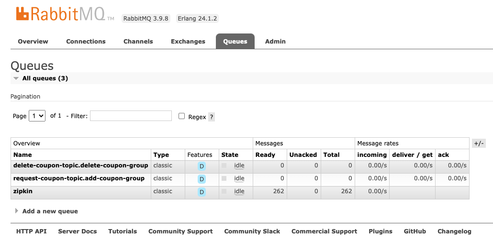

最后的最后，有一个最为重要的配置项，我专门把它放到最后来讲，那就是 spring.cloud.stream.function。如果你的项目中只有一组消费者，那么你完全不用搭理这个配置项，只要确保消费者代码中的 method name 和 bindings 下声明的消费者信道名称相对应就好了；如果你的项目中有多组消费者（比如我声明了 addCoupon 和 deleteCoupon 两个消费者），在这种情况下，你需要将消费者所对应的 function name 添加到 spring.cloud.stream.function，否则消费者无法被绑定到正确的信道。

```yaml
spring:
  cloud:
    stream:
      function:
        definition: addCoupon;deleteCoupon
```


到这里，我们就完整搭建了一套消息驱动的方案。下面让我来带你回顾下本节重点吧。

### 总结

在今天的课程里，我们使用了 Stream 在新版本中推荐的 functional event 风格实现了用户领券和删除券。在这个环节里，你需要注意的是遵循 spring function 的约定，在下面的几个地方使用一致的命名规则。

生产者端代码中的 binding name（addCoupon-out-0）和配置文件中的生产者名称一致；

同一对生产者和消费者，在配置文件中要使用一样的 Topic Name；

如果项目中存在多个消费者，使用 spring.cloud.stream.function 或者 spring.cloud.function 把所有消费者的 function name 写出来。

约定大于配置这种风格，对初学者来说，是需要一些上手门槛的，但当你熟悉了这里面的门道之后，你就能利用这种 less code 开发风格大幅提高开发效率。

### 思考题

如果 Consumer 在消费消息的时候发生了异常，你知道有哪些异常处理的方式吗？

好啦，这节课就结束啦。欢迎你把这节课分享给更多对 Spring Cloud 感兴趣的朋友。我是姚秋辰，我们下节课再见！


## 30 | 消息驱动：如何高效处理 Stream 中的异常？

你好，我是姚秋辰。

在上节课中，我们通过 Spring Cloud Stream 和 RabbitMQ 落地了两个业务场景，实现了用户领券和删除券的操作。如果在 Consumer 消费消息的时候发生了异常，比如用户领取的优惠券超过了券模板约定的上限，或者用户想要删除一张压根不存在的券，那么 Consumer 会抛出一个运行期异常。你知道在 Stream 中有哪些优雅的异常处理方式呢？

你可以调用 deleteCoupon 接口删除一张不存在的优惠券，人为制造一个异常场景，你会观察到，在 Consumer 端的日志中，当前消费者逻辑被执行了三次。这三次执行包括首次消息消费和两次重试，这就是 Stream 默认的一种异常处理方式：消息重试。

接下来，我先带你从本地重试出发，看下如何在消费者端配置重试规则。然后再进一步带你了解消息降级和死信队列这两个异常处理手段。

### 消息重试

消息重试是一种简单高效的异常恢复手段，当 Consumer 端抛出异常的时候，Stream 会自动执行 2 次重试。重试次数是由 ConsumerProperties 类中的 maxAttempts 参数指定的，它设置了一个消息最多可以被 Consumer 执行几次。

```java
private int maxAttempts = 3;
```

但需要注意，这个 maxAttempts 并不是重试次数，它其实等于重试次数 +1，加的这个 1 指的就是 Consumer 头一次消费消息的计数。也就是说，如果你人为地设置 maxAttempts=1，那么就代表着当前 Consumer 只会消费一次消息，不会做重试；如果你设置 maxAttempts=2 则表示最多重试一次。那么如何来指定重试次数和重试规则呢？

在 application.yml 文件中，你可以在 spring.cloud.stream.bindings 节点下添加一个 consumer 节点，以 addCoupon-in-0 为例，我通过 consumer 节点指定了消息消费次数、重试间隔还有异常重试规则。

```yaml
spring:
  cloud:
    stream:
      bindings:
        addCoupon-in-0:
          destination: request-coupon-topic
          content-type: application/json
          # 消费组，同一个组内只能被消费一次
          group: add-coupon-group
          binder: my-rabbit
          consumer:
            # 如果最大尝试次数为1，即不重试
            # 默认是做3次尝试
            max-attempts: 5
            # 两次重试之间的初始间隔
            backOffInitialInterval: 2000
            # 重试最大间隔
            backOffMaxInterval: 10000
            # 每次重试后，间隔时间乘以的系数
            backOffMultiplier: 2
            # 如果某个异常你不想重试，写在这里
            retryableExceptions:
              java.lang.IllegalArgumentException: false
```

在上面这段代码中，我指定了 max-attempts 次数为 5，即一条消息最多被当前 Consumer 重试 4 次。我还通过三个 backOff 参数指定了每次重试之间的间隔时间，这三个参数的时间单位都是毫秒。其中 backOffInitialInterval 是首次重试时的时间间隔，backOffMaxInterval 指定了两次重试之间最大的时间间隔，而 backOffMultiplier 则指定了重试间隔的相乘系数。

以代码中的参数为例，首次重试会发生在异常抛出 2s 以后，再过 4s 发生第二次重试（即 2s 乘以 backOffMultiplier 时间系数 2），以此类推，再过 8s 发生第三次重试。但第四次重试和第三次之间的间隔并不是 8s*2=16s，因为我们设置了重试的最大间隔时间为 10s，所以最后一次重试会在上一次重试后的第 10s 发起。

除此之外，如果你想为某种特定类型的异常关闭重试功能，你还可以将这些异常类添加到 retryableExceptions 节点下，并指定它的重试开关为 false。比如我这里设置了针对 java.lang.IllegalArgumentException 类型的异常一律不发起重试，Consumer 消费失败时这个异常会被直接抛到最外层。

本地重试是一种简单高效的容错手段，但你需要注意确保幂等性，如果 Consumer 端的业务逻辑不具备幂等性，那么千万不要发起任何重试操作。在多次重试之间，你要尽可能使用 backOff 参数设置一定的间隔，这样做的目的是规避一些短周期的服务故障。比如网络连接在几秒钟之内发生了故障，导致 Consumer 无法调用目标服务，如果你的重试间隔是 0s，那么短时间内连续重试，极大概率会获得多个一样的 Connection 异常，而如果每次重试之间有一个梯度递增的间隔时间，往往就可以规避短期服务故障导致的重试失败问题。

除了本地重试以外，你还可以把这个失败的消息丢回到原始队列中，做一个 requeue 的操作。在 requeue 模式下，这个消息会以类似“roundrobin”的方式被集群中的各个 Consumer 消费，你可以参考我下面的配置，我为指定 Consumer 添加了 requeue 的功能。如果你打算使用 requeue 作为重试条件，那么就不要留恋“本地重试”了，把 max-attempts 设置为 1 吧。

```yaml
spring:
  cloud:
    stream:
      rabbit:
        bindings:
          # requeue重试
          addCoupon-in-0:
            consumer:
              requeue-rejected: true
```

说完了异常重试，我们接下来再看看怎么指定异常降级方法。

### 异常降级方法

不止服务调用可以指定降级方法，消费消息也可以指定这样一段降级逻辑。如果你的服务重试了几次仍然没有成功，那么你就可以借助 spring-integration 组件的能力，为 Consumer 指定一段异常处理方法。

以用户领券的服务为例，我通过 spring-integration 的注解 @ServiceActivator 做了一个桥接，将指定 Channel 的异常错误转到我的本地方法里。

```java
@ServiceActivator(inputChannel = "request-coupon-topic.add-coupon-group.errors")
public void requestCouponFallback(ErrorMessage errorMessage) throws Exception {
    log.info("consumer error: {}", errorMessage);
    // 实现自己的逻辑
}
```

在这段代码中，inputChannel 属性的值是由三部分构成的，它的格式是：..errors。我通过 topic 和 group 指定了当前的 inputChannel 是来自于哪个消息队列和分组。

对于一些非常重要的消息驱动场景，如果重试几次还是失败，那么你就可以在异常降级方法里接入通知服务，将情况告知到具体的团队。比如在商品批量改价的场景中，如果价格更新失败，那么很有可能导致线上资损，我的方案是在降级逻辑里接入钉钉接口，把告警消息推送到指定群，通知相关团队尽快做人工介入。

降级逻辑处理完之后，这个原始的 Message 怎么办呢？如果你想要保留这条出错的 Message，那你可以选择将它发送到另一个 Queue 里。待技术团队将异常情况排除之后，你可以选择在未来的某一个时刻将 Queue 里的消息重新丢回到正常的队列中，让消费者重新处理。当然了，你也可以声明一个消费者，专门用来处理这个 Queue 里的消息。

这个特殊的 Queue 就叫做死信队列，它是那些几经重试彻底没救的消息的最终归宿。接下来我就带你了解一下怎么去配置死信交换机。

### 配置死信队列

要触发死信队列很简单，你只要在刚才的降级方法里抛出一个 RuntimeException 就可以了。如果你没有设置降级方法，但最后一次重试抛出了异常，消息也会被移送到死信队列。

在配置死信队列之前，我先带你安装两个 RabbitMQ 的插件，分别是 rabbitmq_shovel 和 rabbitmq_shovel_management。这两个插件是用来做消息移动的，让我们可以将死信队列的消息移动到其它正常队列重新消费。

```sh
rabbitmq-plugins enable rabbitmq_shovel
rabbitmq-plugins enable rabbitmq_shovel_management
```

这两个插件已经预装在了 RabbitMQ 中，只是处于未开启的状态，你可以在命令行执行上面这两行命令，开启插件，完事儿后记得重启 RabbitMQ。

接下来我就以 deleteCoupon 这个场景为例，配置一个死信队列。如果用户想要删除一个不存在的优惠券，后台服务就会抛出一个异常，用它来演示死信队列再合适不过了。设置死信队列的第一步就是在配置文件中将消费者所对应的 Queue 绑定到死信交换机上，你可以参考下面这段代码。

```yaml
spring:
  cloud:
    stream:
      rabbit:
        bindings:
          deleteCoupon-in-0:
            consumer:
              auto-bind-dlq: true
```

因为我们底层的消息组件是 RabbitMQ，所以这段配置被添加到了 spring.cloud.stream.rabbit 路径下。我在对应的 Consumer 信道上设置了 auto-bind-dlq=true，开启了死信队列的功能。

理论上到这里你就可以启动项目验证死信队列的功能了，不过呢，如果你没有更换消息队列的名称，那么在程序尝试向死信队列插入数据的时候，你一定会看到一段报错信息：

```log
channel error; protocol method: #method<channel.close>(reply-code=406, reply-text=PRECONDITION_FAILED - inequivalent arg ‘x-dead-letter-exchange’ for queue ‘delete-coupon-topic.delete-coupon-group’ in vhost ‘/’: received the value ‘DLX’ of type ‘longstr’ but current is none, class-id=50, method-id=10)
```

这段看似摸不着头脑的异常，其实是在说当前的队列不具备死信交换机的功能。因为这个队列是一个已经存在的队列，而创建这个队列的时候，我们并没有添加 auto-bind-dlq 参数，以至于它并不具备死信队列的路由功能。

接下来你只需要登录到 RabbitMQ 的控制台，在 Queues 面板下进入队列的详情页，点击“Delete Queue”按钮将队列删除掉。然后重新启动应用程序，这时 Stream 会重新创建一个具备死信路由功能的队列了。

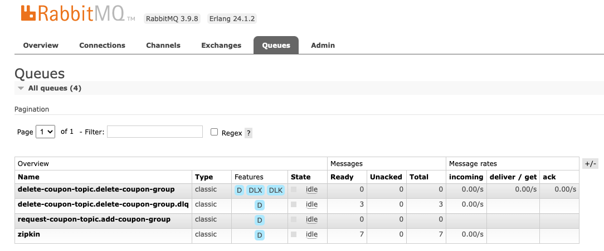

我截了一幅图，你可以看到，图中第一个队列的 Features 标签中多了两个 Tag，分别是 DLX 和 DLK，说明当前队列已经具备了将失败消息路由到死信队列的能力了。其中 DLX 是死信交换机，它根据 Routing Key（即 DLK）将消息路由到死信队列。

第二个队列的名称和第一个队列几乎一样，唯一区别就是末尾多了一个.dlq，这个 dlq 就是死信队列的标志，说明第二个队列是第一个队列的死信队列。

你可以在本地发起几个方法调用，尝试删除压根不存在的优惠券，这时你就会从 RabbitMQ 控制台中发现一个现象，在每次调用失败后，死信队列的消息数量都会自动加一，这就说明整套死信队列方案配置成功。

使用死信队列的一个好处就是，它可以原汁原味保留原始的消息，给技术人员提供一种异常恢复的途径。怎么恢复？很简单，我们刚才安装的 shovel 插件就派上用场了，你只要点击进入死信队列的详情页，找到 Move messages 这个标签页，在 Destination queue 里填上你想要移动到的目标队列，点击 Move messages 就可以了。通常我的做法是待故障恢复之后，将死信队列的消息转移到原始的队列进行重新消费。

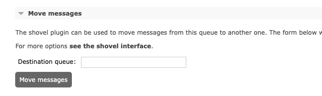

到这里，我们就了解了消息异常处理的几种常用手段。下面让我来带你回顾下本节重点吧。

### 总结

在今天的课程里，我们掌握了消息重试、消息降级逻辑还有死信队列三种功能。在死信队列的使用上我想分享一些心得。你可以设置一个正经的死信队列，凡是丢到这个队列的消息就死透了，你不主动移动的话就一直待在 Queue 里。不过在很多情况下我们都会使用另一个方案，那就是设置一个专门用来监听死信队列的 Consumer，针对丢到死信队列的消息做特殊逻辑。尽管这段逻辑通过降级方法也能实现，但从**职责分离**的角度来说，把异常处理逻辑从 Consumer 的正向逻辑中剥离出来，封装在另一个 Consumer 中，会显得更加优雅一些。

这里还要提醒一句，死信队列的一个重要目的是保留案发现场（即保存那条出错了的原始消息）。如果你创建了一个 Consumer 去监听死信队列的消息，且这个 Consumer 的目的是做异常恢复，那么记得如果恢复不成功，要把这条消息继续转存到死信队列或者另一个队列中，确保消息不丢失。

### 思考题

事务型消息也是一种很常见的使用场景，它是一种简单的一致性手段，你能自己探索一下如何实现事务型消息，并用几句话尝试讲一讲吗？

好啦，这节课就结束啦。欢迎你把这节课分享给更多对 Spring Cloud 感兴趣的朋友。我是姚秋辰，我们下节课再见！


## 31 | 消息驱动：如何通过 RabbitMQ 插件实现延迟消息？

你好，我是姚秋辰。

在平时网购的时候，你一定有过下单之后忘记付款的情况，等到再回过头想起要付款，发现订单已经被关闭了，很多网购流程里都有类似的“订单超时关闭”功能。相类似的功能还有“自动确认收货”，如果在一定时间内买家都没有点击确认收货按钮，那么系统会自动确认收货并且将订单款项打给卖家。

我举的这两个例子都有一个共同的特征，那就是业务逻辑会预设在未来的某一个时间点被触发。在早期我们经常会使用 TTL+ 死信队列的方式来实现这种定时事件，通过设置一个正常的消息队列并使用 TTL 指定超时时间，如果队列中的消息超时了，它就会被 DLX（死信交换机）转向死信队列。借助这种曲线救国的方式，你就可以通过 MQ 组件实现“定时消息”。

相比于 TTL+DLX，RabbitMQ 提供了一种更为优雅的方式来实现这类业务。在这节课中，我将带你使用 RabbitMQ 的延迟消息插件，实现延迟发放优惠券的场景。

那么首先，我们先来安装这个延迟消息插件吧。

### 安装插件

你需要先打开 RabbitMQ 官网并进入到插件下载页面，在页面中定位到 **rabbitmq_delayed_message_exchange 这个插件。**

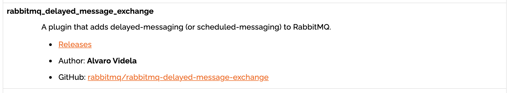

点击插件上的“Releases”链接，你可以看到适配不同 RabbitMQ 版本的延迟消息插件。我本地安装的的 RabbitMQ 版本是 3.9.8，最新的延迟消息插件的版本是 3.9.0，它可以适配 3.9.X 系列的 RMQ 组件，所以我建议你下载 3.9.0 版本对应的 rabbitmq_delayed_message_exchange-3.9.0.ez 安装包。

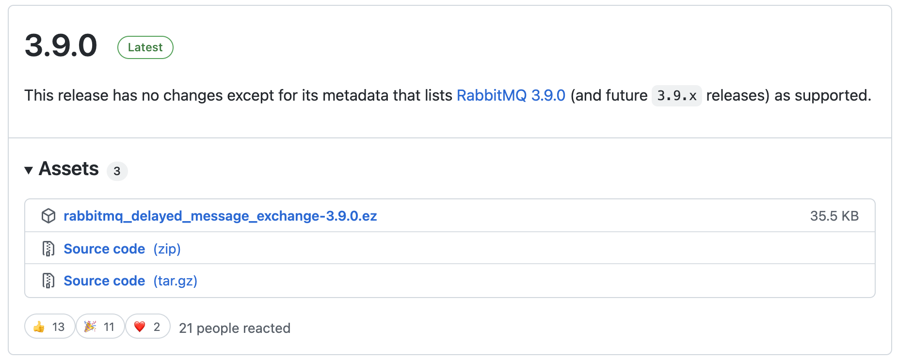

接下来，你需要把安装包的后缀名从.ez 改成.zip，然后使用解压缩工具对安装包进行解压。再把解压后的文件复制到 RabbitMQ 安装路径下的 plugins 文件夹。以我的本地 MAC 环境为例，plugins 目录位于 /usr/local/Cellar/rabbitmq/3.9.8/plugins，你需要根据自己的操作系统和安装路径找到对应的目录。

然后，你需要执行下面这行 rabbitmq-plugins 命令，通过人工的方式启动 rabbitmq_delayed_message_exchange 插件。

```java
rabbitmq-plugins enable rabbitmq_delayed_message_exchange
```

最后，你只需要重启一下 RabbitMQ 服务器，新安装的插件就可以生效了，接下来我们就可以通过代码落地延迟领劵业务了。

### 实现延迟领券

因为延迟消息队列和普通消息队列的类型不同，为了和之前的普通领券接口做个区分，我们今天要声明一个新的生产者和消费者，用来对接延迟消息队列。我先从生产者开始创建。

#### 创建生产者

我们依然保持队形，将生产者方法写入 CouponProducer 这个类中，你可以参考一下下面的代码。

在这段代码中，有一个显而易见的不同之处，你会发现我没有直接将 coupon 对象传递给生产者，取而代之的是使用了 MessageBuilder 来构建消息对象，这样做的一个目的是**传入一个特殊的 header，那就是 x-delay**。它是延迟消息特有的参数，代表了你想让这个消息在 Queue 里延迟多久以后再被消费者处理，x-delay 对应的单位是毫秒，我在代码中设置的延迟时间是 10 秒。

```java
// 使用延迟消息发送
public void sendCouponInDelay(RequestCoupon coupon) {
    log.info("sent: {}", coupon);
    streamBridge.send(EventConstant.ADD_COUPON_DELAY_EVENT,
            MessageBuilder.withPayload(coupon)
                    .setHeader("x-delay", 10 * 1000)
                    .build());
}
```

代码中的 ADD_COUPON_DELAY_EVENT 的值是 addCouponDelay-out-0，它是我单独为延迟消息队列指定的 function name。

接下来，我在 CouponCustomerController 类中声明了一个入口方法，用来对接生产者方法创建延迟消息。

```java
@PostMapping("requestCouponDelayEvent")
public void requestCouponDelayedEvent(@Valid @RequestBody RequestCoupon request) {
    couponProducer.sendCouponInDelay(request);
}
```

生产者到这里就创建完了，接下来是消费者。

#### 声明消费者

在消费者这一端，延迟消息和普通消息的实现方式并没有任何不同，你可以把下面这段朴实无华的代码加入到 CouponConsumer 类中。

```java
@Bean
public Consumer<RequestCoupon> addCouponDelay() {
    return request -> {
        log.info("received: {}", request);
        customerService.requestCoupon(request);
    };
}
```

你需要留意一下消费者的方法名称，一定要保证这里的方法名和配置文件中的 function name 保持完全的一致。

消费者创建完成之后，我们最后还需要对配置文件做一些修改。

#### 修改配置文件

这一步中我们需要做的就是把生产者和消费者添加到 application.yml 文件中，你可以参考下面这段代码。

```yaml
spring:
  cloud:
    stream:
      bindings:
        # 延迟发券 - producer
        addCouponDelay-out-0:
          destination: request-coupon-delayed-topic
          content-type: application/json
          binder: my-rabbit
        # 延迟发券 - Consumer
        addCouponDelay-in-0:
          destination: request-coupon-delayed-topic
          content-type: application/json
          # 消费组，同一个组内只能被消费一次
          group: add-coupon-group
          binder: my-rabbit
          consumer:
            # 如果最大尝试次数为1，即不重试
            # 默认是做3次尝试
            max-attempts: 1
      function:
        definition: addCoupon;deleteCoupon;addCouponDelay
      rabbit:
        bindings:
          addCouponDelay-out-0:
            producer:
              delayed-exchange: true
          addCouponDelay-in-0:
            consumer:
              delayed-exchange: true
```

在这段代码里有几个关键点，我需要提醒你一下。

第一个是 **function name 的统一**。在 spring.cloud.stream.function.definition 中我添加了 addCouponDelay 作为 functiona name，它和 Consumer 方法中声明的 method name 是一致的。

第二个关键点是**绑定生产者消费者 Topic**。你会发现我在生产者和消费者端的 destination 属性中声明了一个全新的 Topic，request-coupon-delayed-topic，这样做是为了重新创建一个带有 x-delay-message 功能的交换机。

第三个关键点是**声明延迟消息功能**。在 bindings 节点下面声明的生产者和消费者配置项中，我设置了 delayed-exchange=true，这是延迟队列最为关键的一个属性。如果没有设置，那么系统将会创建一个普通的交换机，而不是具有延迟消费功能的交换机。

实现延迟消息功能所需要的全部操作就完成了，你可以启动项目并尝试发送几个请求，来验证消息是否会延迟消费。

如果你登录到 RabbitMQ 控制台查看交换机信息，你会发现我们今天声明的延迟消息交换机（request-coupon-delayed-topic）和第29 节课中声明的常规交换机（request-coupon-topic）之间的不同，延迟交换机的类型是 x-delayed-message，并且带有 DM 功能标签，这代表当前交换机具备延迟消费功能。


到这里，我们就了解了如何搭建一个延迟消息的场景，下面让我来带你回顾下本节重点吧。

### 总结

利用 RabbitMQ 搭建延迟消息的过程并不复杂，不过当项目中 Topic 多起来的时候，function name 的配置很容易出错。当你和一个遵循“约定大于配置”的框架打交道的时候，经常会因为没有遵循一个不起眼的约定，导致功能不 work，而且排查起来特别困难。可见事物总是相对的，约定大于配置的思想在提高开发效率的同时，也略微抬高了入门成本和异常排查的成本。

在使用 rabbitMQ 实现高并发业务场景的时候，我有几个经验跟你分享。

**Sharding**: 数据库 sharding 方案相信你应该很熟悉了，我们在消息队列中同样也可以应用 Sharding 方案做消息分片。你可以通过官方提供的 Sharding 插件创建逻辑队列，并将消息转发到逻辑队列背后的 shards 队列。Sharding 插件的底层原理和数据库 Sharding 方案类似，它创建了一种“x-modulus-hash”类型的交换机，通过 Hash 算法对 routing key 做哈希操作并取模，根据取模的结果做消息转发。具体内容可以参考我贴在文稿里的官方文档。

**一致性哈希**：通过一致性哈希插件，我们可以声明一个 x-consistent-hash 类型的交换机，根据一定的规则对消息中的变量（通常是 Routing Key）做一致性哈希计算，再根据计算结果对消息进行转发。如果你对一致性哈希并不了解，可以从网上学一学这个算法思想，它是一个比较常用的 Routing 规则。

**持久化消息**：如果你的队列对消息丢失的情况容忍度很低，那么你可以把队列声明成一个持久化队列，同时发送消息的时候也使用持久化消息。这样一来，不管是队列还是消息都会最终落盘保存。不过你要在一致性和可用性之间做好权衡，因为持久化消息是重量级消息体，必然对性能和吞吐量有一些影响。

### 思考题

生产者和消费者只是一个消息队列最普通的玩法，每个消息队列都有自己丰富的功能库，比如 RabbitMQ 就提供了各种强大的插件。你能打开文档中的RabbitMQ 插件页面，深入了解几个感兴趣的插件功能，然后在评论区和大家分享吗？

好啦，这节课就结束啦。欢迎你把这节课分享给更多对 Spring Cloud 感兴趣的朋友。我是姚秋辰，我们下节课再见！


## 32 | Alibaba Seata 框架：什么是分布式事务？

我第一次被问及分布式事务，是在一次面试的终面环节。多年以后，面对形形色色的面试者，我总会回想起畅谈分布式方案的那个遥远的下午。

彼时的打工人还没从 996 PUA 的福报催眠中觉醒，无人制裁的大厂喜欢肆无忌惮地将面试安排在周末，似乎从面试的那一刻开始，996 的节奏就被它们演绎得像呼吸一样自然。在一个周六的下午我来到了约定的面试地点。

“有没有做过分布式事务？”刚和面试官对上线，他就迎面甩我一个大招。

“做过！”我的回答像古龙小说一样惜字如金。但我大概能猜到他想听的完美答案，八成就是**阿里系自研的分布式事务框架**。

“说说是怎么实现分布式事务的。”为了让一个答案变得有层次，我计划从三个阶段来回答这个问题：一个擦边球答案、一个正确但不完美的答案、一个超出预期的答案。如果用一部舞台剧来形容这三个阶段，那么就是“前戏、正戏、高潮”。

与这三个阶段相对应的话术，分别是“本地事务、传统的分布式事务、阿里系 Seata 分布式事务”，从平淡无奇到羽化而登仙。

### 一场前戏

“大部分传统公司的业务还是构建在单体应用集群之上，说白了，就是一种伪分布式的应用，事务在应用上下文中传播。”我先抛出了一个擦边球答案作为前戏，前戏宜速战速决不宜恋战，只为铺垫第二阶段的正戏。

在单体应用里，一个事务从生到死都是在同一个上下文中执行，说白了就是在同一个 JVM 跑了各种 CRUD 操作。我们只需要在服务入口处的切面点上配置一个 @Transactional 标签就可以开启事务管理，无外乎再配置下事务的传播性。这只是一个在本地控制的 Spring Transaction 而已，没有太多技术含量，充其量是能算作一个本地事务。

也许你并不觉得这场前戏和分布式事务有什么关系，但我这里要提醒你的是，我们的终极解决方案 Seata 分布式事务框架的种种伏笔就埋藏于此。**再复杂的分布式事务，终将回归到这本地事务的原点上。**个中奥妙暂且不表，我们在后面的课程中一一道来。

“那如果不是单体应用，而是经过拆分之后的微服务，跨服务的事务如何保证一致性？”如我所料，擦边球的前戏并不能满足面试官的胃口，他急切的想要进入正戏。

“我先来说一说传统的分布式事务解决方案，然后再一起探讨下微服务架构下的新一代方案。”这一幕正戏，我就用曾经红遍大江南北的 XA 规范来演绎吧。

### 一幕正戏

说起 XA 协议，这个名词你未必听说过，但一提到 2PC 和 3PC 你就秒懂了。这就是大多数银行系统和上了年纪的老系统最喜欢使用的分布式事务解决方案，这套方案依赖于底层数据库的支持，DB 这层首先得要实现 XA 协议。比如 Oracle XA 和 MySQL InnoDB，都是支持 XA 协议的数据库方案。你可以把 XA 理解为一个**强一致性的中心化原子提交协议。**

原子性的概念特别好理解，就是把一系列操作合并成一个整体，要么都执行，要么都不执行。而所谓的 2PC 就更好理解了，它就是把一个事务分成了两步来提交。第一步做准备动作，第二步做提交 / 回滚动作，这两步之间的协调是交由一个中心化的 Coordinator 来管理，保证多步操作的原子性。

**第一步（Prepare）**：Coordinator 向各个分布式事务的参与者下达了 Prepare 指令，各个事务分别将 SQL 语句在数据库执行但不提交，并且将就绪状态上报给 Coordinator。

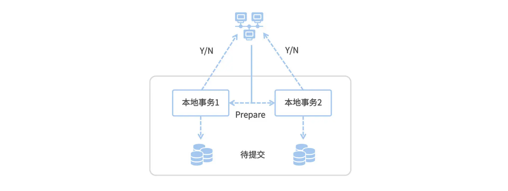

**第二步（Commit/Rollback）**：如果所有节点都已就绪，那么 Coordinator 就下达 Commit 指令，各个参与者提交本地事务；如果有任何一个节点不能就绪，Coordinator 则下达 Rollback 指令进行本地回滚。


我用一个实际例子来帮你理解 XA 的这两步走。话说张三和李四两个人喝多了，要干架，李四以一句“有本事你打我”开启了一个分布式事务。法外狂徒张三抄起一啤酒瓶叫到“信不信我削你丫的！”（张三进入 Prepare 阶段并就绪），李四指着自己脑袋回应到“来来来，照这削”（李四进入 Prepare 阶段并就绪）。“啪！”（张三 Commit 事务），“哎呦！”（李四 Commit 事务），分布式事务完成。

这种分布式事务有一个天然缺陷，导致 XA 特别不适合用在互联网的高并发场景里面。因为每个本地事务在 Prepare 阶段，都要一直占用一个数据库连接资源，这个资源直到二阶段 Commit 或者 Rollback 之后才会被释放。试想，张三进入 Prepare 阶段就要握着一个啤酒瓶，从张三的角度来说，李四不就绪他就要一直握着这个瓶子（也就是本地事务时间长）。

但互联网场景的特性是什么？高并发！因为并发量特别高，所以每个事务必须尽快释放掉所持有的数据库连接资源。事务执行时间越短越好，这样才能让别的事务尽快被执行。因为从啤酒瓶的角度来看，酒瓶（数据库连接资源）是有限的，总被长事务占用着，其它王五赵六的等不到瓶子就干不成架，这肯定不成。

那有什么方法**既能降低事务执行时间，又能保证一致性呢**？有时候面对复杂的问题，我们只要回归到问题的本源，这个问题也就迎刃而解了。这就叫众里寻他千百度，蓦然回首，那人却在灯火阑珊处。这个人，就是前戏里提到的那个不起眼的本地事务。

### 高潮未尽

其实面对任何一个复杂的问题，我们都可以通过“大事化小小事化了”的思想，把大问题一步步拆解成一个个小问题来解决掉，这个就是我要提到的 Seata 分布式事务解决方案。

分布式事务所要解决的问题，不就是跨服务跨 DB 的事务一致性么？那么我们就把这个场景做一层抽象，把分布式事务的业务模型简化成“全局事务”和“分支事务”两部分，现在让你确保两者的一致性怎么做？很简单，你把这些个分支事务看成葫芦娃七兄弟，不求同年同月同日生，但求同年同月同日死。分支事务全成功 = 全局事务成功，但凡一个分支事务失败，那么其余的分支事务全部回滚。


这就是各个分布式事务框架都在采用的基础模型，我们在这个简化后的业务模型上再做把问题做一番拆解，把目光聚焦在分支事务本质上。从单个分支事务的角度来看，它不就是我在前戏里讲到的本地事务么？那么现在你想一下，完成一次本地事务的生命周期有哪些步骤？两步而已，执行 SQL->Commit/Rollback。

从本地事务的角度来看，XA 方案的本质是在“执行 SQL”到“Commit/Rollback”这两步之间始终握着 DB 事务不提交，直到所有分支全部 ready 之后再 Commit。所以，XA 是通过“长事务”来保证一致性的。

如天龙八部里无崖子摆下的珍珑棋局一般，破局之道乃置之死地而后生也，Seata 方案的破局之道就是这个长事务！XA 引入“长事务”的本质是为了保证一致性，但前面我们说到过，长事务在超高并发的互联网场景中不怎么受待见。你不是很长吗？那我就偏要把你最长的地方给剪短。

如果可以把“长事务”变成若干个“短事务”，将“执行 SQL”和“Commit/Rollback”通过多个本地事务来控制，不就可以解决问题了吗？我们顺着这个思路继续往下拆解。

在鼎鼎大名的 CAP 大定理中，“长事务”是典型的偏向 CP 侧的强一致性方案。如果我们想要打破长事务的束缚，就必须将“强一致性”改为“最终一致性”方案，也就是偏向 AP 侧的方案。**最终一致性是一种兼顾一致性和可用性的策略**，它允许应用产生短期的不一致性，然后在未来的某个时间将达成“最终一致”的状态，通过牺牲强一致性来换取高可用性。

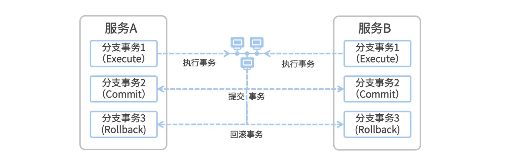

我们可以把执行事务、提交事务和回滚事务放到三个不同的分支事务中，其中每一个分支事务都是一个独立的 Transaction，一个分支事务执行完毕就会迅速释放掉数据库连接资源。这样一来，原本横跨 Execute-Commit-Rollback 的一个长事务，就被拆分成了三个独立的分支事务。

那么谁来控制 Execute-Commit-Rollback 的执行呢？这个任务，就交给中心化的 Transaction Coordinator 来做就好了。现在你不必关心它是怎么做的，你只要记住 Seata 方案有这么个组件就成了，我们下节课就专门去搭建这个东西。

现在，我们只剩下最后一个灵魂拷问了，这个问题也是 Seata 分布式事务的核心问题。你知道 Execute、Commit 和 Rollback 分支事务究竟要执行什么 SQL 呢？换句话说，如何将本地 SQL 拆分为三阶段去执行呢？

在答案呼之欲出之时，在你以为马上就要迎来这部剧的高潮之际，这篇文章却已悄然落幕。方才恍然大悟，原来从开篇到现在，我演绎的只是这部舞台剧的一段前戏而已。下节课我们将正式拉开下一幕大戏：Seata 双料王牌之 AT 无侵入式方案 + TCC 柔性事务。待我与你再续前缘。


## 33 | 分布式事务：搭建 Seata 服务器

你好，我是姚秋辰。

在上节课中，我提到过一个叫 Transaction Coordinator 的组件，它在分布式事务中扮演了一个协调者的角色，用来保证事务的最终一致性。这个昨日配角摇身一变就成了今天的主角，还有了一个新的名字：Seata Server。这节课我就带你了解 Seata Server 的交互模型，再手把手带你搭建一个 Seata Server。

但凡名字里带个 Server 的组件，不用想就知道这一定又是一个“中间件”，Seata Server 就是这么一个中心化的、单独部署的事务管理中间件。在开始搭建 Seata Server 之前，我们先来了解一下 Seata Server 在整个分布式事务方案中是如何跟各个应用交互的吧。


在上面的图里，除了微服务和 Seata 以外，还多了 Nacos 和 MySQL 的影子，它俩来凑什么数呢？

在分布式事务的执行过程中，各个微服务都要向 Seata 汇报自己的分支事务状态，亦或是接收来自 Seata 的 Commit/Rollback 决议，这些微服务是如何勾搭上 Seata Server 的呢？答案就是**服务发现**。Seata Server 把自己作为了一个微服务注册到了 Nacos，各个微服务利用 Nacos 的服务发现能力获取到 Seata Server 的地址。如此一来，微服务到 Seata Server 的通信链路就构建起来了。

咱前面说过 Seata Server 做的是事务管理的活，那么一个分布式事务从开始到结束的整个生命周期中，你总得记录些分支事务 / 全局事务的执行状态吧？数据持久化的工作，咱就交给 Seata 背后的 MySQL 数据源了。

好，我们已经大致了解了 Seata Server 和微服务组件之间的交互方式，估摸着你迫不及待想要了解 Seata 的底层原理了。咱不着急，这些个原理啥的，现在讲得越多你就越迷糊。这节课我们来点轻松的，我先带你把 Seata 服务器搭建起来，等这块整明白之后，后面课程里再学习 Seata 的底层原理。

### 搭建 Seata 服务器

Seata 官方已经给我们备好了可执行的安装文件，你可以到 Seata Github 地址的Release 页面下载。为了避免各种兼容性问题，我推荐你下载seata-server-1.4.2这个版本，和我用的版本保持一致。下载好之后在本地解压，然后我们需要对其中的配置文件做一番更改。

#### 更改持久化配置

我们打开 Seata 安装目录下的 conf 文件夹，找到 file.conf.example 文件，把里面的内容复制一下并且 Copy 到 file.conf 里。我们需要在 file.conf 文件里更改两个地方。

第一个改动点是**持久化模式**。Seata 支持本地文件和数据库两种持久化模式，前者只能用在本地开发阶段，因为基于本地文件的持久化方案并不具备高可用能力。我们这里需要把 store 节点下的 mode 属性改成“db”。

```sh
## transaction log store, only used in server side
store {
  ## store mode: file、db
  ## 【改动点01】 - 替换成db类型
  mode = "db"
```

第二个改动点就是 **DB 的连接方式**。我们需要把本地的 connection 配置到 store 节点下的 db 节点里。你可以参考下面的代码。

```json
store {
  mode = "db"
  ## 【改动点02】 - 更改参数
  ## database store property
  db {
    ## the implement of javax.sql.DataSource, such as DruidDataSource(druid)/BasicDataSource(dbcp) etc.
    datasource = "druid"
    ## mysql/oracle/postgresql/h2/oceanbase etc.
    dbType = "mysql"
    driverClassName = "com.mysql.jdbc.Driver"
    ## if using mysql to store the data, recommend add rewriteBatchedStatements=true in jdbc connection param
    url = "jdbc:mysql://127.0.0.1:3306/seata?rewriteBatchedStatements=true"
    user = "root"
    password = ""
    minConn = 5
    maxConn = 30
    globalTable = "global_table"
    branchTable = "branch_table"
    lockTable = "lock_table"
    queryLimit = 100
  }
}
```

在这段代码中，url 参数指定了 Seata Server 的本地数据库，我这里把 DB Schema 命名为 seata，待会儿我会带你去创建对应的数据库表。除了 url 以外，你还要指定 user 和 password，虽然我偷懒使用了 root 用户，不过我还是推荐你为 Seata Server 创建一个独立的 DB 访问账号。

这段配置里还有三个和数据库表名称相关的属性，globalTable、branchTable 和 lockTable，这是 Seata Server 用来保存全局事务、分支事务还有事务锁定状态的表，Seata 正是用这三个 Table 来记录分布式事务执行状态，并控制最终一致性的。

接下来我们就需要打开 MySQL 控制台，分别创建这几个 Table 了，建表语句我已经上传到了 Gitee 项目下的资源文件目录下。

#### 创建数据库表

我在 file.conf 中的 url 里指定了 DB Schema 名称为 seata，所以你需要在 MySQL 中创建一个同名 Schema，作为 Seata Server 独享的 Schema。

接下来我要在这个 Schema 下面执行一段 Server 端的 SQL 脚本，脚本的文件名称是 server.sql，里面包含了 global_table、branch_table 和 lock_table 三张表的创建语句。

Server 端的 DB tables 创建完成之后，你还得为每个微服务背后的数据库创建一个特殊的表，叫做 undo_log，这个表是做什么用的呢？在 Seata 的 AT 模式下（下节课你就会学到 AT 的技术细节了），Seata Server 发起一个 Rollback 指令后，微服务作为 Client 端要负责执行一段 Rollback 脚本，这个脚本所要执行的回滚逻辑就保存在 undo_log 中。

undo_log 的建表语句可以从资源文件目录下的 client.sql 文件中找到，从 undo_log 的表字段中你可以看出，这里记录了全局事务和分支事务的 ID 信息，回滚内容和执行状态等等。**这里你需要特别注意的是，undo_log 并不是创建在 Seata Server 的 schema 下，而是要创建在微服务项目自个儿的数据库（geekbang_coupon_db）之下的。**

```sql
CREATE TABLE IF NOT EXISTS `undo_log`
(
    `id`            BIGINT(20)   NOT NULL AUTO_INCREMENT COMMENT 'increment id',
    `branch_id`     BIGINT(20)   NOT NULL COMMENT 'branch transaction id',
    `xid`           VARCHAR(100) NOT NULL COMMENT 'global transaction id',
    `context`       VARCHAR(128) NOT NULL COMMENT 'undo_log context,such as serialization',
    `rollback_info` LONGBLOB     NOT NULL COMMENT 'rollback info',
    `log_status`    INT(11)      NOT NULL COMMENT '0:normal status,1:defense status',
    `log_created`   DATETIME     NOT NULL COMMENT 'create datetime',
    `log_modified`  DATETIME     NOT NULL COMMENT 'modify datetime',
    PRIMARY KEY (`id`),
    UNIQUE KEY `ux_undo_log` (`xid`, `branch_id`)
) ENGINE = InnoDB
  AUTO_INCREMENT = 1
  DEFAULT CHARSET = utf8 COMMENT ='AT transaction mode undo table';
```

创建完数据库表，你还需要对 Seata 的 JDBC driver 做一番调整。

在 seata-server-1.4.2 的安装目录下有一个 lib 目录，里面包含了 Seata Server 运行期所需要用到的 jar 文件，这其中就包括了 JDBC driver。进入到 lib 目录下的 jdbc 文件夹，你会看到两个内置的 JDBC driver 的 jar 包，分别是 mysql-connector-java-5.1.35.jar 和 mysql-connector-java-8.0.19.jar。

你需要把这两个 jar 连同 jdbc 文件夹一并删掉，另外，我在 Gitee 代码仓库下的“资源文件 >Seata”里放了一个 mysql-connector-java-8.0.21.jar 文件，你需要把这个文件 Copy 到 lib 目录下，这样做的目的是确保 Seata 的 jdbc diver 和你的本地 MySQL 安装版本之间的兼容性。如果你本地安装了不同版本的 MySQL，记得要把对应版本的 JDBC driver jar 包复制到 lib 下面。

#### 开启服务发现

Seata Server 的搭建只剩下最后一步了，那就是将 Seata Server 作为一个微服务注册到 Nacos 中。

打开 Seata 安装目录下的 conf/registry.conf 文件，找到 registry 节点，这就是用来配置服务注册的地方了。

```json
registry {
  # 【改动点01】 - type变成nacos
  type = "nacos"
  # 【改动点02】 - 更换
  nacos {
    application = "seata-server"
    serverAddr = "127.0.0.1:8848"
    group = "myGroup"
    namespace = "dev"
    cluster = "default"
    username = ""
    password = ""
  }
}
```

在 registry 节点下有一个 type 属性，它表示服务注册的类型。Seata 支持的注册类型有 file 、nacos 、eureka、redis、zk、consul、etcd3、sofa，可见大部分主流的注册中心都在支持列表中，默认情况下注册类型为 file（即本地文件），我们这里需要将其改为“nacos”。

接下来，你还需要修改 registry.nacos 里的内容，我把主要的几个配置信息整理成了一个表格，你可以对照表格了解一下代码中配置项背后的含义。

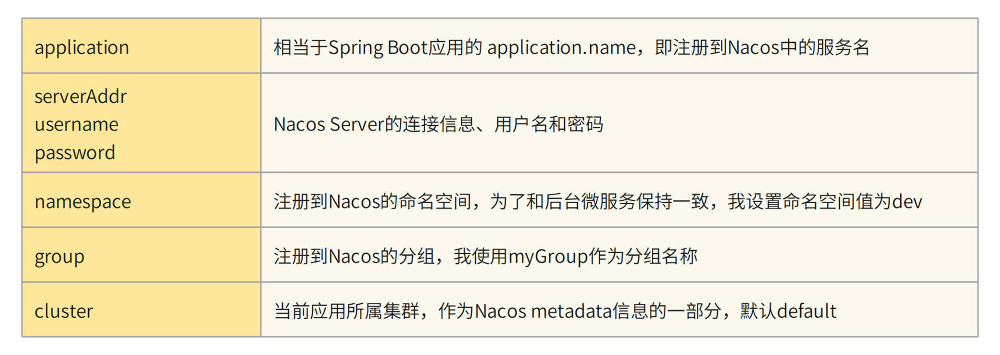

现在我们已经万事俱备了，你只要直接运行 bin 目录的下的 seata-server.sh 或者 seata-server.bat，就可以启动 Seata Server 了。如果一切正常，你会看到命令行打印出 Server started 和监听端口 8091。

```sh
i.s.core.rpc.netty.NettyServerBootstrap  : Server started, listen port: 8091
```

Seata Server 启动完成之后，我们再顺带验证一把 Seata 到 Nacos 的注册流程是否完成。我们打开 Nacos 的服务列表页，切换到 dev 命名空间下，正常情况下你会看到一个名为 seata-server 的服务，分组是 myGroup。

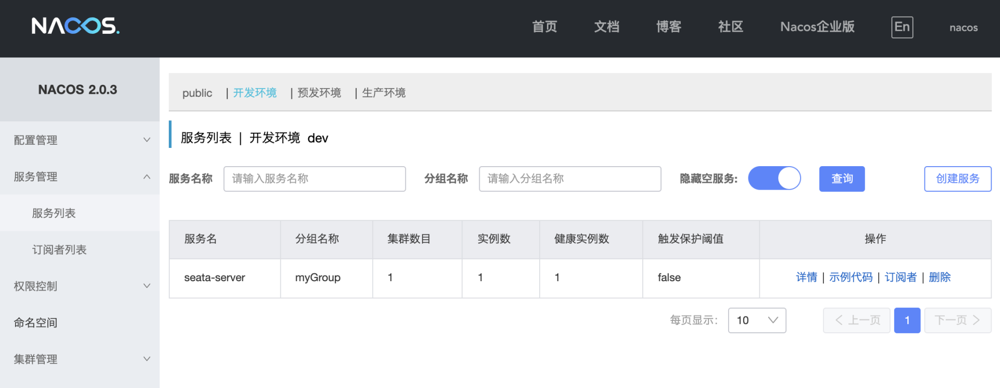

### 小结

搭建 Seata Server 的过程看似麻烦，实际上只要遵循三步走就行了。第一步配置 DB 连接串，第二步创建数据库表，最后一步开启服务发现功能。在这个过程里，有三个需要你特别留意的地方。

JDBC 版本：必须得使用本地数据库对应的正确 JDBC 版本，否则很容易出现各种兼容性问题。

undo_log 表：undo_log 是下一节课要讲到的 Seata AT 模式的核心表，必须要创建在 Client 端（微服务端）使用的数据库中，而不是 Seata Server 端的数据库中。

服务注册：要确保 registry.conf 中配置的 nacos 命名空间、group 等信息和微服务中的配置保持一致。

Seata 本身支持很多种分布式方案，包括传统的 XA 协议、无侵入式的 AT、巨麻烦的 TCC 以及适合长链路业务的 Saga。在接下来的两节课里，我将重点介绍 AT 和 TCC。借这个机会，我推荐你去 Seata 官网中阅读一些开源文档，了解一下这几种方案的基本概念和适用场景，这会帮助你更加全面地理解分布式事务。

### 思考题

你能分享一下在自己的项目中是如何解决数据一致性问题的吗？

好啦，这节课就结束啦。欢迎你把这节课分享给更多对 Spring Cloud 感兴趣的朋友。我是姚秋辰，我们下节课再见！


## 34 | 分布式事务：使用 Nacos+Seata 实现AT模式

你好，我是姚秋辰。

在上一节中我们已经搭建了 Seata Server，这节课我们就来动手落地一套 Seata AT 方案。Seata AT 不仅是官方最推荐的一套分布式事务解决方案，也是大多数 Seata 使用者选用的方案。AT 方案备受推崇，一个最主要的原因就在于省心。

Seata AT 可以给你带来一种“无侵入”式的编程体验，你不需要改动任何业务代码，只需要一个注解和少量的配置信息，就可以实现分布式事务。这似乎听上去有那么点玄幻，如果一个分布式方案既不依赖 XA 协议的长事务方案，又不依赖代码补偿逻辑，那碰到 Rollback 的时候它怎么知道该回滚哪些内容呢？

下面我就通过一个实际的业务模型，带你了解一下 AT 方案的底层原理。

### Seata AT 底层原理

我们以“删除券模板”作为落地案例，它需要 Customer 和 Template 两个服务的共同参与。其中 Customer 服务是整个业务的起点，它先是调用了 Template 服务注销券模板，然后再调用本地方法注销了由该模板生成的优惠券。说白了，我们就是在两个不同的微服务中，分别使用 Update SQL 语句修改了底层数据。

我们接下来就基于“删除券模板”场景，看一下 Seata AT 背后的业务流程。在开始之前，我需要先花点时间带你认识下 Seata 框架的三个重要角色，TC、TM 和 RM。

TC 全称是 Transaction Coordinator，你一定非常熟悉了，它就是上节课我们介绍过的 Seata Server。TC 扮演了一个中心化的事务协调者的角色，负责协调全局事务的提交和回滚，并维护全局和分支事务的状态。

TM 全称是 Transaction Manager，它是事务管理器，主要作用是发起一个全局事务，对全局事务的提交和回滚做出决议。在 AT 方案中，TM 通常是由发起全局事务的那个微服务所扮演的，比如在“删除券模板”这个场景里，TM 的扮演者就是 Customer 服务。

RM 全称是 Resource Manager，它是资源管理器，向 TC 注册分支事务并上报事务状态，同时负责对当前分支事务进行提交和回滚。每一个分支事务都是全局事务的参与者，这些分支事务的所属应用扮演了 RM 的角色。

介绍完了这三个重要角色之后，让我们结合下面这张图来看看 Seata AT 的业务流程吧。

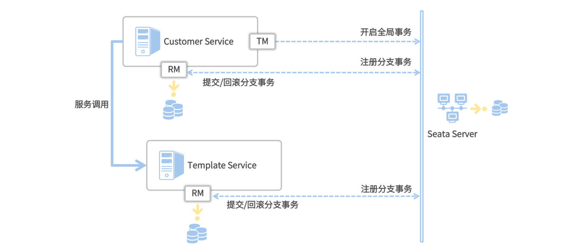

Seata AT 的业务流程分为两个阶段来执行。

**一阶段：**执行核心业务逻辑（即代码中的 CRUD 操作）。Seata 会根据 DB 操作自动生成相应的回滚日志，并将回滚日志添加到 RM 对应的 undo_log 表中。执行业务代码和添加回滚日志这两步都是在同一个本地事务中提交的。

**二阶段：**如果全局事务的最终决议是 Commit，则更新分支事务状态并清空回滚日志；如果最终决议是 Rollback，则根据 undo_log 中的回滚日志进行 rollback 操作。二阶段是以异步化的方式来执行的。

从这两个阶段可以看出，Seata AT 方案的核心在于这个 undo_log。正是有了这个记录回滚日志的 undo_log 表，我们才能将一阶段和二阶段剥离成两个独立的本地事务来执行。而 Seata AT 之所以执行效率高，主要原因有两个。一是核心业务逻辑可以在一阶段得到快速提交，DB 资源被快速释放；二是全局事务的 Commit 和 Rollback 是异步执行。

首先，Customer 服务作为分布式事务的起点，扮演了一个 TM 的角色，它会向 TC 注册并发起一个全局事务。全局事务会生成一个 XID，它是全局唯一的 ID 标识，所有分支事务都会和这个 XID 进行绑定。XID 在服务内部（非跨服务调用）的传播机制是基于 ThreadLocal 构建的，即 XID 在当前线程的上下文中进行透传，对于跨服务调用来说，则依赖 seata-all 组件内置的各个适配器（如 Interceptor 和 Filter）将 XID 传递给对象服务。

然后，Customer 服务调用了 Template 服务进行模板注销流程，Template 服务的 RM 开启了一个分支事务，并注册到 TC。在执行分支事务的过程中，RM 还会生成回滚日志并提交到 undo_log 表中。除此之外，RM 还需要获取到两个特殊的 Lock。其中一个是 Local Lock（本地锁），另一个是 Global Lock（全局锁）。

Lock 信息存放在 lock_table 这张表里，它会记录待修改的资源 ID 以及它的全局事务和分支事务 ID 等信息。无论是一阶段提交还是二阶段回滚，RM 都需要获取待修改记录的本地锁，然后才会去执行 CRUD 操作。而在 RM 提交一阶段事务之前，它还会尝试获取 Global Lock（全局锁），目的是防止多个分布式事务对同一条记录进行修改。假设有两个不同的分布式事务想要修改记录 A，那么只有同时获取到 Local Lock 和 Global Lock 的事务才能正常提交一阶段事务。

本地锁会随一阶段事务的提交 / 回滚而释放，而全局锁只有等到全局事务提交 / 回滚之后才会被释放。在一阶段中，如果某一个事务在一定的尝试次数后仍然无法获取全局锁，它会知难而退，执行本地事务回滚操作。而如果在二阶段回滚的时候，RM 无法获取本地锁，它会原地打转不停重试，直到成功获取本地锁并完成重试。

接下来，Template 服务调用成功，Customer 服务开始执行自己的本地事务，流程都大同小异就不说了。TM 端根据业务的执行情况，最终做出二阶段决议，Commit 或 Rollback。

最后，TC 向各个分支下达了二阶段决议。如果最终决议是 Commit，那么各个 RM 会执行一段异步操作，删除 undo_log；如果最终决议是 Rollback，那么 RM 端会根据 undo_log 中记录的回滚日志做反向补偿。

到这里，整个全局事务就结束了。下面让我们通过代码实战，落地一套 Seata AT 的解决方案吧。

### 微服务项目改造

我们这次的改造涉及到 Customer 和 Template 这两个服务，所以接下来你需要在这两个微服务中提交同样的配置项和代码改动。

在这个环节，你就能体会到什么叫“无感知”的分布式事务了。我们并不需要对业务代码做任何的改动，只需要在分布式事务开始的方法上做一点手脚，添加一个简单的注解，就能为本地事务赋予分布式一致性的能力，用互联网行业的黑话这就叫“赋能”。

按照惯例我们先从添加依赖项开始。

#### 添加依赖项

你需要为 Customer 和 Template 两个服务添加以下依赖项，它是 Seata 框架的 starter 组件。在以往的老版本里，Seata 和 Spring Cloud 的兼容性并不是那么好，我们经常要在 starter 依赖项中使用 exclude 标签排除 seata-all 组件，再单独引入一个不同版本的 seata-all。但在新版本中，这个兼容性问题已经不复存在，我们只需要一个依赖就够了。

```xml
<dependency>
    <groupId>com.alibaba.cloud</groupId>
    <artifactId>spring-cloud-starter-alibaba-seata</artifactId>
</dependency>
```

添加好了依赖项，接下来我们需要到代码中声明一个数据源代理类。

#### 声明数据源代理

Seata AT 之所以能够实现无感知的编程体验，其中的一个秘诀就在这个数据源代理上了。

我们在项目中使用的数据源通常是 JDBC driver 的底层 DataSource，或者是 hikari 之类的连接池。但在分布式事务的场景上，为了能够在分支事务开启 / 提交等关键节点上做一番手脚（比如向 Seata 注册分支事务、生成 undo_log 等），我们需要用 Seata 特有的数据源“接管”项目原有的数据源。

我在项目中创建了一个 SeataConfiguration 的类，用来声明一个 Seata 特有的数据源，作为当前项目的 DataSrouce 代理。

```java
@Configuration
public class SeataConfiguration {
    @Bean
    @ConfigurationProperties(prefix = "spring.datasource")
    public DruidDataSource druidDataSource() {
        return new DruidDataSource();
    }
    @Bean("dataSource")
    @Primary
    public DataSource dataSourceDelegation(DruidDataSource druidDataSource) {
        return new DataSourceProxy(druidDataSource);
    }
}
```

在上面的代码中，我先是创建了一个 DruidDataSource 作为数据源连接池，并指定其读取 spring.datasoource 下的数据库连接信息。Druid 也是 alibaba 出品的一个开源数据库连接池方案，在阿里系内部应用也非常广泛。

在 dataSourceDelegation 方法中，我声明了一个 DataSourceProxy 的类，并接收 DruidDataSource 作为构造器初始化参数。DataSourceProxy 是由 Seata 框架提供的一个数据源代理类，为了确保 Spring 上下文使用 DataSourceProxy 而不是其它三方数据源，我在 dataSourceDelegation 方法上添加了 @Primary 注解，将其作为 javax.sql.DataSource 的默认代理类。

数据源代理改造完成之后，我们可以去添加 seata 的配置项了。

#### 添加 Seata 配置项

Seata 的配置项定义在 application.yml 文件中，分为上下两部分，一部分在 spring.cloud.alibaba 节点下面，它指定了当前应用的事务分组；另一部分在根节点 seata 下面，定义了连接 Seata Server 的方式。

```yaml
spring:
  cloud:
    alibaba:
      seata:
        tx-service-group: seata-server-group
seata:
  application-id: coupon-customer-serv
  registry:
    type: nacos
    nacos:
      application: seata-server
      server-addr: localhost:8848
      namespace: dev
      group: myGroup
      cluster: default
  service:
    vgroup-mapping:
      seata-server-group: default
```

在 seata.registry 节点下，我通过 type 属性指定了本地服务和 Seata Server 之间基于 Nacos 服务发现来获取地址信息，而且我还在 seata.registry.nacos 节点下配置了 Nacos 的地址、命名空间、group 等信息。

spring.cloud.alibaba.seata.tx-service-group 节点定义了事务服务的分组名称，你可以随意写一个名称，比如我这里写的是 seata-server-group。唯一要注意的一点是，tx-service-group 中的分组名称一定要和 seata.service.vgroup-mapping 中定义的分组名称一致，我为 seata-server-group 分组所指定的值是 default，这个值会被用来获取 Seata Server 地址。

在项目启动的时候，Seata 框架会尝试从 Nacos 获取 Seata Server 的地址信息，执行这个操作的类是 NacosRegistryServiceImpl。在这个类的 lookup 方法中，Seata 使用了下面这行代码查找 seata-server 服务，其中 clusters 参数的值就来自于 seata.service.vgroup-mapping.seata-server-group 所对应的值。

```java
List<Instance> firstAllInstances = getNamingInstance()
    .getAllInstances(getServiceName(), getServiceGroup(), clusters);
```

关于 Seata AT 的所有准备工作到这里就完成了，接下来我们就去写一段分布式事务的方法。

#### 实现删除模板

删除券模板是一个非常合适的分布式事务用例，全局事务分别在 Template 服务和 Customer 服务两个地方进行了 Write 操作。全局事务是从 Customer 服务开启的，在 Customer 服务中我们先调用 Template 服务将模板设置为 Inactive 状态，然后在 Customer 服务本地将用户所领取到的相关优惠券全部注销。

首先，我们在 Customer 服务中声明一个新的 Controller 方法 deleteTemplate，它作为整个链路的调用起点，入参是一个 TemplateID。

```java
@DeleteMapping("template")
@GlobalTransactional(name = "coupon-customer-serv", rollbackFor = Exception.class)
public void deleteCoupon(@RequestParam("templateId") Long templateId) {
    customerService.deleteCouponTemplate(templateId);
}
```

在这个方法上，我使用了一个特殊的注解 @GlobalTransactional，它是 Seata 用来开启分布式事务的顶层注解。你只要在全局事务“开始”的地方把这个注解添加上去就好了，并不需要在每个分支事务中都声明它。全局事务碰到任何 Exception 异常，都会触发全局事务回滚操作，这个行为是通过 GlobalTransactional 注解的 rollbackFor 方法指定的。

删除模板的业务逻辑定义在了 CustomerService 类中，你可以参考下面的代码。

```java
@Override
@Transactional
public void deleteCouponTemplate(Long templateId) {
    templateService.deleteTemplate(templateId);
    couponDao.deleteCouponInBatch(templateId, CouponStatus.INACTIVE);
    // 模拟分布式异常
    throw new RuntimeException("AT分布式事务挂球了");
}
```

我先是借助 templateService 这个 Openfeign 接口，间接调用了 Template 服务注销模板，再通过一个本地 DAO 方法注销了用户已经领取的优惠券。为了验证分布式事务是否能正常回滚，我在方法的最后一行抛出了一个 RuntimeException。

在开启 Seata 分布式事务的时候，你必须把异常抛出到全局事务的发起方，让 @GlobalTransactional 注解的方法能够感知到这个异常，才能顺利触发事务的回滚。如果你开发了统一的异常处理拦截器，记得千万不要把异常吞掉。

在非分布式事务的模式下，即便有异常抛出，也顶多只能触发本地事务的回滚，而 Template 远程服务调用对应的 DB 改动是不会被回滚的。接下来我们一起见证一下 Seata AT 方案能否把 Template 的改动也一块回滚。

让我们通过下面这几步操作构造一个测试用例：

启动 Nacos 和 Seata Server；

本地运行 Template 和 Customer 服务；

调用 Template 服务生成一个新的券模板；

调用 Customer 服务领券接口，获取一张该模板的优惠券；

调用 Customer 的 deleteTemplate 接口。

此时切换到 Template 服务的控制台页面，你会看到 Seata 框架输出的几行关键日志（加粗部分）。

- **rm handle branch rollback process**：本地资源管理器开始执行回滚流程。

- **Branch Rollbacking**：分支事务正在回滚。

- **Branch Rollbacked result**: PhaseTwo_Rollbacked：分支事务回滚完成。

再检查一下数据库表，你会发现 Template 表中的模板数据并没有被注销，这表示我们二阶段回滚逻辑执行成功。到这里，我们就完整搭建了一套 Seata AT 无侵入式的分布式事务方案。

### 总结

如果从编写代码的角度来看，Seata AT 方案应该是一致性解决方案中的 Easy 模式了，既没有 XA 方案的 DB 性能瓶颈，也不用编写任何跑批补偿的业务。但尽管如此，我还是坚持一个观点：非必要就别上分布式事务。

Seata 分布式事务是个双刃剑，当我们给项目引入 Seata 的时候，无形中也增加了架构层面的复杂程度，说白了，就是增加了一个 failure point。你需要考虑 Seata Server 不可用的情况，制定降级预案保证业务正常运转。同时在大促等环节的压测端，你也要对 Seata Server 的高可用做好充足的功课。

如果你的本地业务非常简单，那么没必要上 Seata，这纯属用大炮打苍蝇。我推荐你使用传统的事务型消息 + 日志补偿 + 跑批补偿的方式，用最经济实惠的技术手段搞定简单业务。

### 思考题

你能深入 Seata Client 端的源码，了解 GlobalTransactional 注解是如何接收二阶段提交 / 回滚的指令的吗？一个方向是顺着 GlobalTransactional 注解找对应的拦截器逻辑，再往下深挖；另一个方向是从代码中的 Rollback/Commit 日志中找到对应的类，反向摸排。

好啦，这节课就结束啦。欢迎你把这节课分享给更多对 Spring Cloud 感兴趣的朋友。我是姚秋辰，我们下节课再见！


## 35 | 分布式事务：使用 Nacos+Seata 实现 TCC 补偿模式

你好，我是姚秋辰。

上节课我们落地了一套 Seata AT 方案，要我说呢，AT 绝对是最省心的分布式事务方案，一个注解搞定一切。今天这节课，我们来加一点难度，从 Easy 模式直接拉到 Hard 模式，看一个巨复杂的分布式事务方案：Seata TCC。

说 TCC 复杂，那是相对于 AT 来讲的。在 AT 模式下，你通过一个注解就能搞定所有事情，不需要对业务层代码进行任何修改。TCC 难就难在它的实现方式上，它是一个基于“补偿模式”的解决方案。补偿的意思就是，你需要通过编写业务逻辑代码实现事务控制。

那 TCC 是如何通过代码来控制事务状态的呢？这就要说到 TCC 的三阶段事务模型了。

### TCC 事务模型

TCC 名字里这三个字母分别是三个单词的首字母缩写，从前到后分别是 Try、Confirm 和 Cancel，这三个单词分别对应了 TCC 模式的三个执行阶段，每一个阶段都是独立的本地事务。

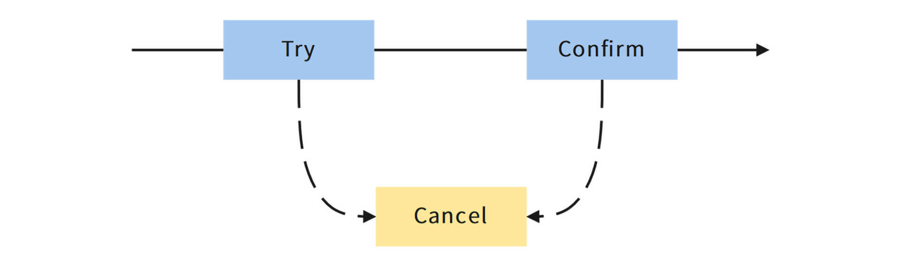

Try 阶段完成的工作是**预定操作资源（Prepare），**说白了就是“占座”的意思，在正式开始执行业务逻辑之前，先把要操作的资源占上座。

Confirm 阶段完成的工作是**执行主要业务逻辑（Commit）**，它类似于事务的 Commit 操作。在这个阶段中，你可以对 Try 阶段锁定的资源进行各种 CRUD 操作。如果 Confirm 阶段被成功执行，就宣告当前分支事务提交成功。

Cancel 阶段的工作是**事务回滚（Rollback），**它类似于事务的 Rollback 操作。在这个阶段中，你可没有 AT 方案的 undo_log 帮你做自动回滚，你需要通过业务代码，对 Confirm 阶段执行的操作进行人工回滚。

我用一个考研占座的例子帮你理解 TCC 的工作流程。话说学校有一个专给考研学生准备的不打烊的考研复习教室，一座难求。如果你想要用 TCC 的方式坐定一个位子，那么第一步就是要执行 Try 操作，比如往座位上放上一块板砖，那这个座位就被你预定住了，后面来的人发现座位上面有块砖就去找其他座位了。第二步是 Confirm 阶段，这时候需要把板砖拿走，然后本尊坐在位子上，到这里 TCC 事务就算成功执行了。

如果 Try 阶段无法锁定资源，或者 Confirm 阶段发生异常，那么整个全局事务就会回滚，这就触发了第三步 Cancel，你需要对 Try 步骤中锁定的资源进行释放，于是乎，这块砖在 Cancel 阶段被移走了，座位回到了 TCC 执行前的状态。

从这个例子可以看出，TCC 的每一个步骤都需要你通过执行业务代码来实现。那接下来，让我带你去实战项目中落地一个简单的 TCC 案例，近距离感受下 Hard 模式的开发体验。

### 实现 TCC

这次我们依然选择优惠券模板删除这个场景作为 TCC 的落地案例，我将在上节课的 AT 模式的基础之上，对 Template 服务做一番改造，将 deleteTemplate 接口改造为 TCC 风格。

前面咱提到过，TCC 是由 Try-Confirm-Cancel 三个部分组成的，这三个部分怎么来定义呢？我先来写一个 TCC 风格的接口，你一看就明白了。

#### 注册 TCC 接口

为了方便你阅读代码，我在 Template 服务里单独定义了一个新的接口，取名为 CouponTemplateServiceTCC，它继承了 CouponTemplateService 这个接口。

```java
@LocalTCC
public interface CouponTemplateServiceTCC extends CouponTemplateService {
    @TwoPhaseBusinessAction(
            name = "deleteTemplateTCC",
            commitMethod = "deleteTemplateCommit",
            rollbackMethod = "deleteTemplateCancel"
    )
    void deleteTemplateTCC(@BusinessActionContextParameter(paramName = "id") Long id);
    void deleteTemplateCommit(BusinessActionContext context);
    void deleteTemplateCancel(BusinessActionContext context);
}
```

在这段代码中，我使用了两个 TCC 的核心注解：LocalTCC 和 TwoPhaseBusinessAction。

其中 @LocalTCC 注解被用来修饰实现了二阶段提交的本地 TCC 接口，而 @TwoPhaseBusinessAction 注解标识当前方法使用 TCC 模式管理事务提交。

在 TwoPhaseBusinessAction 注解内，我通过 name 属性给当前事务注册了一个全局唯一的 TCC bean name，然后分别使用 commitMethod 和 rollbackMethod 指定了它在 Confirm 阶段和 Cancel 阶段所要执行的方法。Try 阶段所要执行的方法，便是被 @TwoPhaseBusinessAction 所修饰的 deleteTemplateTCC 方法了。

你一定注意到了我在 deleteTemplateCommit 和 deleteTemplateCancel 这两个方法中使用了一个特殊的入参 BusinessActionContext，你可以使用它传递查询参数。在 TCC 模式下，查询参数将作为 BusinessActionContext 的一部分，在事务上下文中进行传递。

如果你对 TCC 注解的底层源码感兴趣，我推荐你从 GlobalTransactionScanner 这个类的 wrapIfNecessary 方法开始研究。它通过 TCCBeanParserUtils 工具类来判断当前资源是否为 TCC 的实现类，如果是 TCC 自动代理的话，就生成一个 TccActionInterceptor 作为当前 bean 对象的事务拦截器。

```java
if (TCCBeanParserUtils.isTccAutoProxy(bean, beanName, applicationContext)) {
    //TCC interceptor, proxy bean of sofa:reference/dubbo:reference, and LocalTCC
    interceptor = new TccActionInterceptor(TCCBeanParserUtils.getRemotingDesc(beanName));
}
```

接口定义完成后，我们将 CouponTemplateServiceImpl 的接口类指向刚定义好的 CouponTemplateServiceTCC 方法，接下来就可以写具体实现了，按照 TCC 三阶段的顺序，我们先从一阶段 Prepare 写起。

#### 编写一阶段 Prepare 逻辑

在一阶段 Prepare 的过程中，我们执行的是 Try 逻辑，它的目标是“锁定”优惠券模板资源。为了达成这个目标，我们需要对 coupon_template 数据库做一个小修改，引入一个名为 locked 的变量，用来标记当前资源是否被锁定。你可以直接执行下面的 SQL 语句添加这个属性。

```sql
alter table coupon_template
   add locked tinyint(1) default 0 null;
```

在 CouponTemplate 类中，我们也要加上 locked 属性。

```sql
@Column(name = "locked", nullable = false)
private Boolean locked;
```

有了 locked 字段，我们就可以在 Try 阶段借助它来锁定券模板了。我们先来看一下简化版的资源锁定代码吧。

```java
@Override
@Transactional
public void deleteTemplateTCC(Long id) {
    CouponTemplate filter = CouponTemplate.builder()
            .available(true)
            .locked(false)
            .id(id)
            .build();
    CouponTemplate template = templateDao.findAll(Example.of(filter))
            .stream().findFirst()
            .orElseThrow(() -> new RuntimeException("Template Not Found"));
    template.setLocked(true);
    templateDao.save(template);
}
```

在这段代码中，我在通过 ID 查找优惠券的同时，添加了两个查询限定条件来筛选未被锁定且状态为 available 的券模板。如果查到了符合条件的记录，我会将其 locked 状态置为 true。

在正式的线上业务中，Try 方法的资源锁定逻辑会更加复杂。我举一个例子，就拿转账来说吧，如果张三要向李四转账 30 元，在 TCC 模式下这 30 元会被“锁定”并计入冻结金额中，我们在“锁定”资源的同时还需要记录是“谁”冻结了这部分金额。比如你可以在生成锁定记录的时候将转账交易号也一并记下来，这个交易号就是我们前面说的那个“谁”，这样你就知道这些金额是被哪笔交易锁定的了。这样一来，当你执行回滚逻辑将金额从“冻结余额”里释放的时候，就不会错误地释放其他转账请求锁定的金额了。

接下来我们去看下二阶段 Commit 的执行逻辑。

#### 编写二阶段 Commit 逻辑

二阶段 Commit 就是 TCC 中的 Confirm 阶段，只要 TCC 框架执行到了 Commit 逻辑，那么就代表各个分支事务已经成功执行了 Try 逻辑。我们在 Commit 阶段执行的是主体业务逻辑，即删除优惠券，但是别忘了你还要将 Try 阶段的资源锁定解除掉。

在下面的代码中，我们放心大胆地直接读取了指定 ID 的优惠券，不用担心 ID 不存在，因为 ID 不存在的话，在 Try 阶段就会抛出异常，TCC 会转而执行 Rollback 方法，压根进不到 Commit 阶段。读取到 Template 对象之后，我们分别设置 locked=false，available=true。

```java
@Override
@Transactional
public void deleteTemplateCommit(BusinessActionContext context) {
    Long id = Long.parseLong(context.getActionContext("id").toString());
    CouponTemplate template = templateDao.findById(id).get();
    template.setLocked(false);
    template.setAvailable(false);
    templateDao.save(template);
    log.info("TCC committed");
}
```

现在你已经完成了二阶段 Commit，最后让我们来编写 Rollback 的逻辑吧。

#### 编写二阶段 Rollback 逻辑

二阶段 Rollback 对应的是 TCC 中的 Cancel 阶段，如果在 Try 或者 Confirm 阶段发生了异常，就会触发 TCC 全局事务回滚，Seata Server 会将 Rollback 指令发送给每一个分支事务。

在下面这段简化的 Rollback 代码中，我们读取了 Template 对象，并通过将 locked 设置为 false 的方式对资源进行解锁。

```java
@Override
@Transactional
public void deleteTemplateCancel(BusinessActionContext context) {
    Long id = Long.parseLong(context.getActionContext("id").toString());
    Optional<CouponTemplate> templateOption = templateDao.findById(id);
    if (templateOption.isPresent()) {
        CouponTemplate template = templateOption.get();
        template.setLocked(false);
        templateDao.save(template);
    }
    log.info("TCC cancel");
}
```

在线上业务中，Cancel 方法只能释放由当前 TCC 事务在 Try 阶段锁定的资源，这就要求你在 Try 阶段记录资源锁定方的信息，并在 Confirm 和 Cancel 段逻对这个信息进行判断。

你知道为什么我在 Cancel 里特意加了一段逻辑，判断 Template 是否存在吗？这就要提到 TCC 的空回滚了。

#### TCC 空回滚

所谓空回滚，是在没有执行 Try 方法的情况下，TC 下发了回滚指令并执行了 Cancel 逻辑。

那么在什么情况下会出现空回滚呢？比如某个分支事务的一阶段 Try 方法因为网络不可用发生了 Timeout 异常，或者 Try 阶段执行失败，这时候 TM 端会判定全局事务回滚，TC 端向各个分支事务发送 Cancel 指令，这就产生了一次空回滚。

处理空回滚的正确的做法是，在 Cancel 阶段，你应当先判断一阶段 Try 有没有执行成功。示例程序中的判断方式比较简单，我先是判断资源是否已经被锁定，再执行释放操作。如果资源未被锁定或者压根不存在，你可以认为 Try 阶段没有执行成功，这时在 Cancel 阶段直接返回成功即可。

更为完善的一种做法是，引入独立的事务控制表，在 Try 阶段中将 XID 和分支事务 ID 落表保存，如果 Cancel 阶段查不到事务控制记录，那么就说明 Try 阶段未被执行。同理，Cancel 阶段执行成功后，也可以在事务控制表中记录回滚状态，这样做是为了防止另一个 TCC 的坑，“倒悬”。

#### TCC 倒悬

倒悬又被叫做“悬挂”，它是指 TCC 三个阶段没有按照先后顺序执行。我们就拿刚讲过的空回滚的例子来说吧，如果 Try 方法因为网络问题卡在了网关层，导致锁定资源超时，这时 Cancel 阶段执行了一次空回滚，到目前为止一切正常。但回滚之后，原先超时的 Try 方法经过网关层的重试，又被后台服务接收到了，这就产生了一次倒悬场景，即一阶段 Try 在二阶段回滚之后被触发。

在倒悬的情况下，整个事务已经被全局回滚，那么如果你再执行一次 Try 操作，当前资源将被长期锁定，这就造成了一种类似死锁的局面。解法很简单，你可以利用事务控制表记录二阶段执行状态，并在 Try 阶段中检查该状态，如果二阶段回滚完毕，那么就直接跳过一阶段 Try。

到这里，我们就落地了一套 TCC 业务，下面让我们来回顾下这节课的重要内容吧。

### 总结

TCC 相比于 AT 而言，代码开发量至少要 double，它以开发量为代价，换取了事务的高度可控性。不过我仍然不建议头脑一热就上 TCC 方案，因为 TCC 非常考验开发团队对业务的理解深度，为什么这样说呢？一个重要原因是，你需要把串行的业务逻辑拆分成 Try-Confirm-Cancel 三个不同的阶段执行，如何设计资源的锁定流程、如果不同资源间有关联性又怎么锁定、回滚的反向补偿逻辑等等，你需要对业务流程的每一个步骤了如指掌，才能设计出高效的 TCC 流程。

还有需要特别注意的一点是幂等性，接口幂等性是保证数据一致性的重要前提。在大厂中通常有框架层面的幂等组件，或者幂等性服务供你调用，对于中小业务来说，通过本地事务控制表来确保幂等性是一种简单有效的低成本方案。

### 思考题

通过这两节课我们落地了 AT 和 TCC 方案，Seata 里还有一个 SAGA 方案，你能举一反三自选 SAGA 并落地几个小 demo 吗？

到这里，我们就学完了这个专栏的最后一节正课内容。欢迎你把这个专栏分享给更多对 Spring Cloud 感兴趣的朋友。我是姚秋辰，我们结束语再见！


# 07-结束篇

## 结束语 | 站在聚光灯下

逝者如斯夫，不舍昼夜。写专栏的这段时间，我时常感叹晚上时间不够用。每天晚上我都要经历激烈的思想斗争，决定今晚是相聚王者峡谷，还是写极客专栏。实在抵不过团队小伙伴的热情相邀，所以每次思想斗争的结果都惊人地相似，除了周末 8 点到 9 点的时候，我每晚都要和团队小伙伴们去丈量王者峡谷的每一寸土地。

这让我想明白了一个道理，好学生和差学生混在一块，通常是差学生带着好学生一块玩，就没见过哪个好学生领着差学生一块写作业的。所以，圈子很重要，你所在的圈子决定了你的成就，优秀的圈子是能推着你不断前进的。你要尽量突破自己圈子的上限，平时多和王者组团征战峡谷，不要带白银和青铜上分了。

走走停停，想哪说哪了罢。

### 发现自己的兴趣

爱因斯坦是这样解释相对论的，他说如果和你爱的人在一起，你会感觉一小时就像一分钟一样快，而如果你和一个讨厌的人呆在一起，你会发现即使一刻钟也像一个世纪那么漫长。我深有同感，我打王者的时候眼睛一闭一睁这一小时就过去了，而写极客专栏的时候一小时就像过了一辈子那么长。

兴趣，还真是一个催人奋进的东西。

我共事过的同事中，有一位架构师，叫他 Z 君好了。Z 是一位为代码而生的人，他的专业是生物，过腻了日复一日给小白鼠扎针的日子，跳到 IT 圈子里当了卷王。

Z 君闲暇时刻最喜欢做的事情，是回到阳澄湖的家里，坐在后院一边晒太阳一边敲代码。碰上团队组织的娱乐活动，我在一旁逗女同事，他坐旁边写代码；中午吃完饭我带女同事去园区日常遛弯，他回到办公室还是写代码。说 Z 君是在用生命研究技术，一点也不为过，这就极了阿里的程序员之神多隆，只不过没他有钱而已。

当年和 Z 争论架构设计的场景令我印象深刻，他会带着自己的代码原型和大量的实践细节，给出适合业务的方案。在如今这个 PPT 架构师横行的社会，架构师们浮于纸上谈兵，很少有人可以像 Z 一样真正深入技术细节沉下心来思考。所以我一直有这么一个认知，不写代码的一线架构师，早以失去了对业务和技术的敏感，十有八九是水货。

我经常拿自己和 Z 对比，我在专业技术领域上无法达到他一样的高度，归根结底是自己对技术不够热爱。我并不喜欢编程，相比较撕逼扯皮来说，我更喜欢和人打交道的事情。编程于我而言，就像渔夫打渔，厨师烧菜，只是一种维持生计的手段。脱离了兴趣，并不妨碍我在这个领域成为优秀的专家，但却很难成为顶尖的那一拨人。

天赋和努力很重要，兴趣也一样重要，找到自己真正感兴趣的技术方向，感兴趣的业务，你的上限可能会更高。

### 创造机会让自己成长

我刚毕业的时候入职了一家外企，办公语言是英文，平时开会和发邮件也要用英文。彼时我的英文虽然不能说烂，但口语听力早已是年久失修，一碰到和外国人开会那就像参加综艺节目一样，我来比划他来猜。

入职第一周的某一天，老板到我位子上给我分了一个任务：“Vincent 啊，你去 schedule 一个 meeting，make sure 把这个 project 的 stakeholder 全都 involve 进来”。后来老板说了什么我一点都记不起来，我感觉整个人像喝了假酒一样懵逼。我心想这下完犊子了，我连中国人说话我都听不懂，以后工作可怎么办？

很长一段时间以来，我只能靠提前写好的英文小抄来应付每天的例会，偶尔被问到听不懂的问题还会采用拔网线的方式避免尴尬。这个问题困扰了我蛮久，靠每天开几场会是不能有效提高英文听说能力的，我需要创造更多的和老外交流的机会。

再后来，在和外国同事沟通项目或者问题的时候，我但凡能开会讨论的就绝不回邮件，彻底拉下脸来创造一切可以交流的机会。考虑到时差关系，我经常早上六七点钟或者晚上 11 点以后到线上找同事尬聊，从一开始只聊工作上的项目，后来逐渐地可以聊些生活琐事，再到后来就能一起吐槽万恶的美帝资本主义了。

十多年过去了，当我回想自己职业经历的时候，我发现自己成长最快的几个阶段，都是靠着这种主动创造机会的方式，自我驱动达成的。

在面试的时候，我特别喜欢考察候选人的自我驱动能力，虽然这种能力不能保证你一定会成为一个成功的人，但它能保证当机会到来的时候，你有勇气去挑战自己，当面临困难的时候，你也有勇气去做出改变。

### 走到聚光灯下

Linus Torvalds 有一句被程序员奉为圣经的名言：Talk is cheap, show me the code。

而我想告诉你的是，这句话连一个标点符号都不要信。Talk 之所以 cheap，是因为这句话是 Linus 说的，一位成名已久，站在神坛顶端的男人。

历史是任人打扮的小姑娘，总是由胜利者书写。似乎当你足够成功的时候，说出去的每一句话都会变得极富哲理，引来无数人顶礼膜拜。

比如鲁迅先生在《秋夜》中写到：“我家门前有两棵树，一棵是枣树，另一颗还是枣树”。我已经记不清有多少次，这句话出现在语文试卷中，我也曾写下各种标准答案，描述作者想要表达的情感和意境。直到后来，我也写了一篇和秋有关的作文，其中第一句是这样的：“我家阳台有两盆花，一盆是菊花，另一盆还是菊花”，那次我被当做全班的反面教材，站到讲台上描述着自己的心理阴影面积。

同样的话，有的人说出来就是圣经，有的人说出来就是歪嘴和尚念歪经。

我们不得不承认自己大概率不是 Linus 一样的天才，而且确实也很难取得他一样的成绩。两耳不闻窗外事，一心只 show me the code，对大部分普通人来说，是一条非常陡峭的职业发展路径。如何让你做的事情被更多的人看到，如何扩大自己的影响力，如何通过向上管理让老板知道你所创造的价值，这些很难通过 code review 来体现。

所以，从幕后，走到聚光灯下吧。怎么做？听听自个儿心里的答案吧。

### Say Goodbye

一根烟的功夫，听我讲了几个小故事，传达的价值观正确又或者不正确，who cares。但终有一日，你也将会离开这个行业，是光荣退休还是中年失业，是平步青云还是无奈转行，who knows。

是谁都无法阻挡，阻挡时间改变，就说再见说再见。

