# 第1章 Elasticsearch 概述

## 1.1 Elasticsearch 是什么


​	The Elastic Stack, 包括 Elasticsearch、Kibana、Beats 和 Logstash（也称为 ELK Stack）。能够安全可靠地获取任何来源、任何格式的数据，然后实时地对数据进行搜索、分析和可视化。Elaticsearch，简称为 ES，ES 是一个**开源的高扩展的分布式全文搜索引擎**，是整个 Elastic Stack 技术栈的核心。它可以近乎实时的存储、检索数据；本身扩展性很好，可以扩展到上百台服务器，处理 PB 级别的数据。

## 1.2 全文搜索引擎

​	Google，百度类的网站搜索，它们都是根据网页中的关键字生成索引，我们在搜索的时候输入关键字，它们会将该关键字即索引匹配到的所有网页返回；还有常见的项目中应用日志的搜索等等。对于这些非结构化的数据文本，关系型数据库搜索不是能很好的支持。一般传统数据库，全文检索都实现的很鸡肋，因为一般也没人用数据库存文本字段。进行全文检索需要扫描整个表，如果数据量大的话即使对 SQL 的语法优化，也收效甚微。建立了索引，但是维护起来也很麻烦，对于 insert 和 update 操作都会重新构建索引。

基于以上原因可以分析得出，在一些生产环境中，使用常规的搜索方式，性能是非常差的：

- 搜索的数据对象是大量的非结构化的文本数据。

- 文件记录量达到数十万或数百万个甚至更多。

- 支持大量基于交互式文本的查询。 

- 需求非常灵活的全文搜索查询。

- 对高度相关的搜索结果的有特殊需求，但是没有可用的关系数据库可以满足。   

- 对不同记录类型、非文本数据操作或安全事务处理的需求相对较少的情况。为了解决结构化数据搜索和非结构化数据搜索性能问题，我们就需要专业，健壮，强大的全文搜索引擎


​	这里说到的全文搜索引擎指的是目前广泛应用的主流搜索引擎。它的工作原理是计算机索引程序通过扫描文章中的每一个词，对每一个词建立一个索引，指明该词在文章中出现的次数和位置，当用户查询时，检索程序就根据事先建立的索引进行查找，并将查找的结果反馈给用户的检索方式。这个过程类似于通过字典中的检索字表查字的过程。

## 1.3 Elasticsearch And Solr

Lucene 是 Apache 软件基金会 Jakarta 项目组的一个子项目，提供了一个简单却强大的应用程式接口，能够做全文索引和搜寻。在 Java 开发环境里 Lucene 是一个成熟的免费开源工具。就其本身而言，Lucene 是当前以及最近几年最受欢迎的免费 Java 信息检索程序库。但 Lucene 只是一个提供全文搜索功能类库的核心工具包，而真正使用它还需要一个完善的服务框架搭建起来进行应用。

目前市面上流行的搜索引擎软件，主流的就两款：Elasticsearch 和 Solr,这两款都是基于 Lucene 搭建的，可以独立部署启动的搜索引擎服务软件。由于内核相同，所以两者除了服务器安装、部署、管理、集群以外，对于数据的操作 修改、添加、保存、查询等等都十分类似。

在使用过程中，一般都会将 Elasticsearch 和 Solr 这两个软件对比，然后进行选型。这两个搜索引擎都是流行的，先进的的开源搜索引擎。它们都是围绕核心底层搜索库 - Lucene构建的 - 但它们又是不同的。像所有东西一样，每个都有其优点和缺点： 

 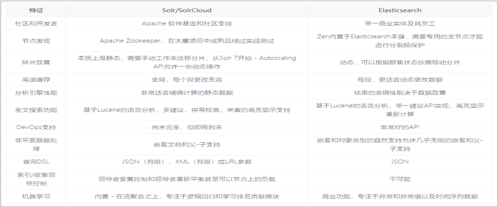

## 1.4 Elasticsearch Or Solr

Elasticsearch 和 Solr 都是开源搜索引擎，那么我们在使用时该如何选择呢？

- Google 搜索趋势结果表明，与 Solr 相比，Elasticsearch 具有很大的吸引力，但这并不意味着 Apache Solr 已经死亡。虽然有些人可能不这么认为，但 Solr 仍然是最受欢迎的搜索引擎之一，拥有强大的社区和开源支持。

- 与 Solr 相比，Elasticsearch 易于安装且非常轻巧。此外，你可以在几分钟内安装并运行Elasticsearch。但是，如果 Elasticsearch 管理不当，这种易于部署和使用可能会成为一个问题。基于 JSON 的配置很简单，但如果要为文件中的每个配置指定注释，那么它不适合您。总的来说，如果你的应用使用的是 JSON，那么 Elasticsearch 是一个更好的选择。否则，请使用 Solr，因为它的 schema.xml 和 solrconfig.xml 都有很好的文档记录。

- Solr 拥有更大，更成熟的用户，开发者和贡献者社区。ES 虽拥有的规模较小但活跃的用户社区以及不断增长的贡献者社区。Solr 贡献者和提交者来自许多不同的组织，而 Elasticsearch 提交者来自单个公司。

- Solr 更成熟，但 ES 增长迅速，更稳定。

- Solr 是一个非常有据可查的产品，具有清晰的示例和 API 用例场景。 Elasticsearch 的 文档组织良好，但它缺乏好的示例和清晰的配置说明。


**那么，到底是 Solr 还是 Elasticsearch？**

有时很难找到明确的答案。无论您选择 Solr 还是 Elasticsearch，首先需要了解正确的用例和未来需求。总结他们的每个属性。

- 由于易于使用，Elasticsearch 在新开发者中更受欢迎。一个下载和一个命令就可以启动一切。

- 如果除了搜索文本之外还需要它来处理分析查询，Elasticsearch 是更好的选择

- 如果需要分布式索引，则需要选择 Elasticsearch。对于需要良好可伸缩性和以及性能分布式环境，Elasticsearch 是更好的选择。

- Elasticsearch 在开源日志管理用例中占据主导地位，许多组织在 Elasticsearch 中索引它们的日志以使其可搜索。

- 如果你喜欢监控和指标，那么请使用 Elasticsearch，因为相对于 Solr，Elasticsearch 暴露了更多的关键指标 

##  1.5 Elasticsearch 应用案例

- GitHub: 2013 年初，抛弃了 Solr，采取 Elasticsearch 来做 PB 级的搜索。GitHub 使用Elasticsearch 搜索 20TB 的数据，包括 13 亿文件和 1300 亿行代码”。 

- 维基百科：启动以 Elasticsearch 为基础的核心搜索架构

- SoundCloud：“SoundCloud 使用 Elasticsearch 为 1.8 亿用户提供即时而精准的音乐搜索服务”。 

- 百度：目前广泛使用 Elasticsearch 作为文本数据分析，采集百度所有服务器上的各类指标数据及用户自定义数据，通过对各种数据进行多维分析展示，辅助定位分析实例异常或业务层面异常。目前覆盖百度内部 20 多个业务线（包括云分析、网盟、预测、文库、直达号、钱包、风控等），单集群最大 100 台机器，200 个 ES 节点，每天导入 30TB+数据。

- 新浪：使用 Elasticsearch 分析处理 32 亿条实时日志。

- 阿里：使用 Elasticsearch 构建日志采集和分析体系。

- Stack Overflow：解决 Bug 问题的网站，全英文，编程人员交流的网站。 

#  第2章 Elasticsearch 入门

## 2.1 Elasticsearch 安装

### 2.1.1 下载软件

Elasticsearch 的官方地址：https://www.elastic.co/cn/

Elasticsearch 最新的版本是 7.11.2（截止 2021.3.10），我们选择 7.8.0 版本（最新版本半年前的版本）

下载地址：https://www.elastic.co/cn/downloads/past-releases#elasticsearch

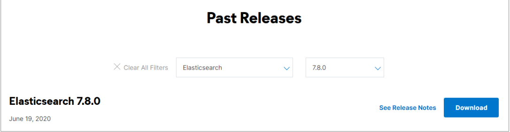

Elasticsearch 分为 Linux 和 Windows 版本，基于我们主要学习的是 Elasticsearch 的 Java客户端的使用，所以课程中使用的是安装较为简便的 Windows 版本。

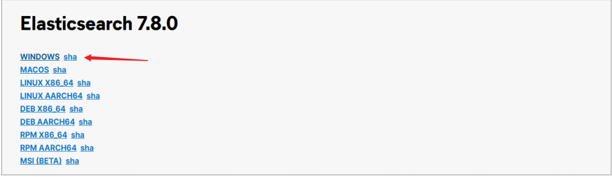 

### 2.1.2 安装软件

Windows 版的 Elasticsearch 的安装很简单，解压即安装完毕，解压后的 Elasticsearch 的

目录结构如下 

 

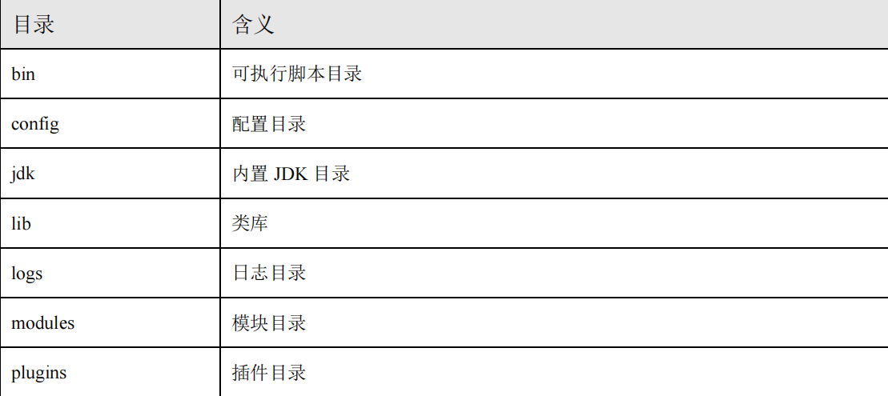

解压后，进入 bin 文件目录，点击 elasticsearch.bat 文件启动 ES 服务

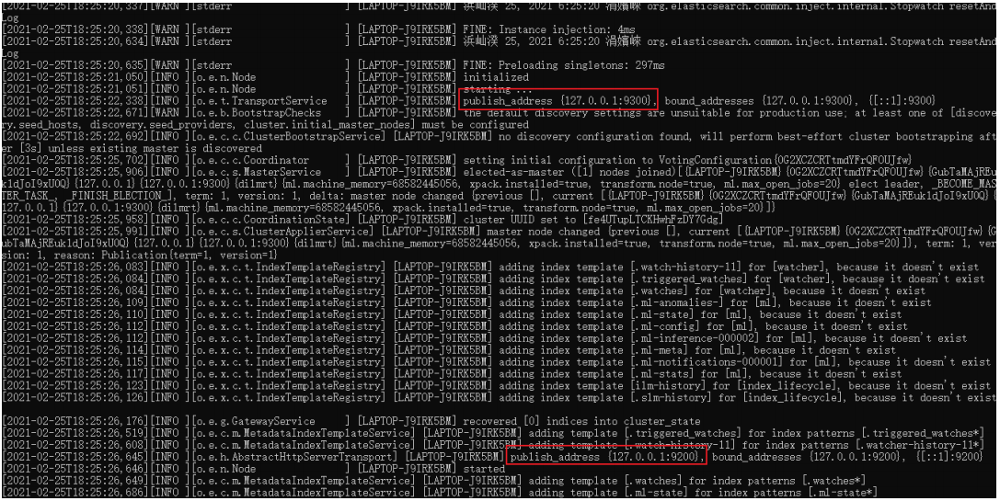

**注意：9300 端口为 Elasticsearch 集群间组件的通信端口，9200 端口为浏览器访问的 http协议 RESTful 端口。**

打开浏览器（推荐使用谷歌浏览器），输入地址：http://localhost:9200，测试结果 

 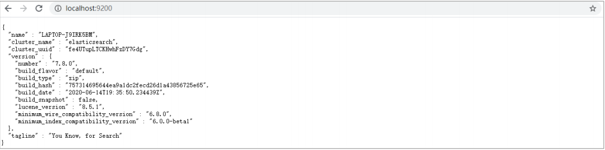

### 2.1.3 问题解决

- Elasticsearch 是使用 java 开发的，且 7.8 版本的 ES 需要 JDK 版本 1.8 以上，默认安装包带有 jdk 环境，如果系统配置 JAVA_HOME，那么使用系统默认的 JDK，如果没有配置使用自带的 JDK，一般建议使用系统配置的 JDK。 

- 双击启动窗口闪退，通过路径访问追踪错误，如果是“空间不足”，请修改config/jvm.options 配置文件

```sh
# 设置 JVM 初始内存为 1G。此值可以设置与-Xmx 相同，以避免每次垃圾回收完成后 JVM 重新分配内存
# Xms represents the initial size of total heap space
# 设置 JVM 最大可用内存为 1G
# Xmx represents the maximum size of total heap space
-Xms1g
-Xmx1g
```

## 2.2 Elasticsearch 基本操作

### 2.2.1 RESTful

REST 指的是一组架构约束条件和原则。满足这些约束条件和原则的应用程序或设计就是 RESTful。Web 应用程序最重要的 REST 原则是，客户端和服务器之间的交互在请求之间是无状态的。从客户端到服务器的每个请求都必须包含理解请求所必需的信息。如果服务器在请求之间的任何时间点重启，客户端不会得到通知。此外，无状态请求可以由任何可用服务器回答，这十分适合云计算之类的环境。客户端可以缓存数据以改进性能。

在服务器端，应用程序状态和功能可以分为各种资源。资源是一个有趣的概念实体，它向客户端公开。资源的例子有：应用程序对象、数据库记录、算法等等。每个资源都使用 URI (Universal Resource Identifier) 得到一个唯一的地址。所有资源都共享统一的接口，以便在客户端和服务器之间传输状态。使用的是标准的 HTTP 方法，比如 GET、PUT、POST 和DELETE。 

在 REST 样式的 Web 服务中，每个资源都有一个地址。资源本身都是方法调用的目标，方法列表对所有资源都是一样的。这些方法都是标准方法，包括 HTTP GET、POST、PUT、DELETE，还可能包括 HEAD 和 OPTIONS。简单的理解就是，如果想要访问互联网上的资源，就必须向资源所在的服务器发出请求，请求体中必须包含资源的网络路径，以及对资源进行的操作(增删改查)。 

###  2.2.2 客户端安装

如果直接通过浏览器向 Elasticsearch 服务器发请求，那么需要在发送的请求中包含HTTP 标准的方法，而 HTTP 的大部分特性且仅支持 GET 和 POST 方法。所以为了能方便地进行客户端的访问，可以使用 Postman 软件

Postman 是一款强大的网页调试工具，提供功能强大的 Web API 和 HTTP 请求调试。软件功能强大，界面简洁明晰、操作方便快捷，设计得很人性化。Postman 中文版能够发送任何类型的 HTTP 请求 (GET, HEAD, POST, PUT..)，不仅能够表单提交，且可以附带任意类型请求体。

Postman 官网：https://www.getpostman.com

Postman 下载：https://www.getpostman.com/apps


### 2.2.3 数据格式

Elasticsearch 是面向文档型数据库，一条数据在这里就是一个文档。为了方便大家理解，我们将 Elasticsearch 里存储文档数据和关系型数据库 MySQL 存储数据的概念进行一个类比

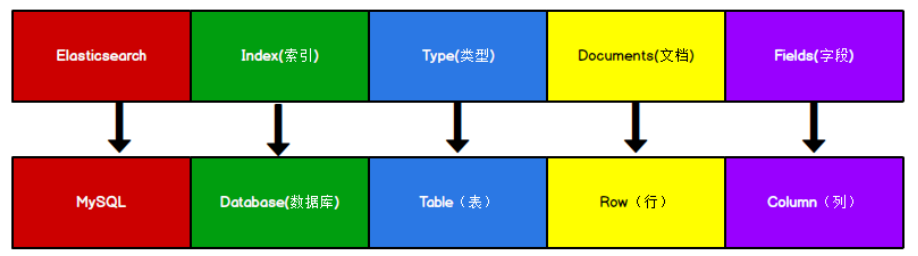

ES 里的 Index 可以看做一个库，而 Types 相当于表，Documents 则相当于表的行。这里 Types 的概念已经被逐渐弱化，Elasticsearch 6.X 中，一个 index 下已经只能包含一个type，Elasticsearch 7.X 中, Type 的概念已经被删除了。 

 用 JSON 作为文档序列化的格式，比如一条用户信息：

```json
{
	 "name" : "John",
	 "sex" : "Male",
	 "age" : 25,
	 "birthDate": "1990/05/01",
	 "about" : "I love to go rock climbing",
	 "interests": [ "sports", "music" ]
}
```

### 2.2.4 HTTP 操作

#### 2.2.4.1 索引操作

##### 1) 创建索引

对比关系型数据库，创建索引就等同于创建数据库

在 Postman 中，向 ES 服务器发 PUT 请求 ：http://127.0.0.1:9200/shopping


请求后，服务器返回响应


```json
{
 "acknowledged"【响应结果】: true,// true 操作成功
 "shards_acknowledged"【分片结果】: true, // 分片操作成功
 "index"【索引名称】: "shopping"
}
// 注意：创建索引库的分片数默认 1 片，在 7.0.0 之前的 Elasticsearch 版本中，默认 5 片
```

如果重复添加索引，会返回错误信息 

 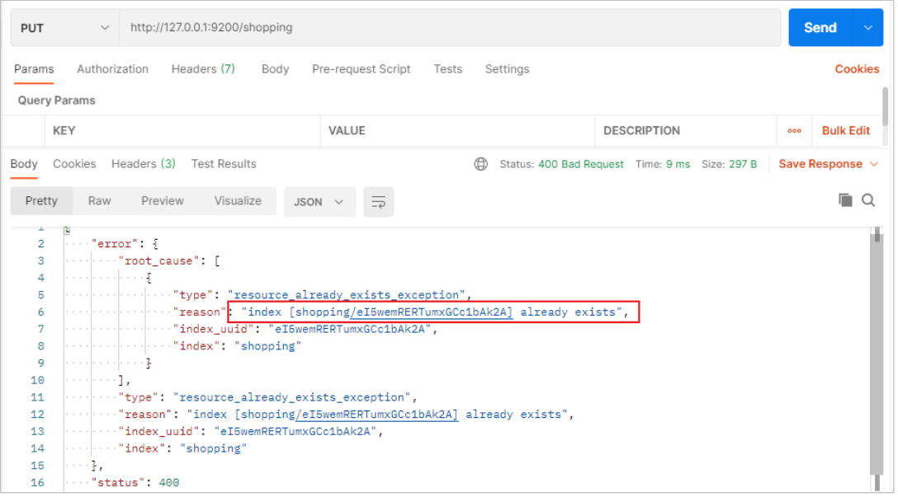

##### 2) 查看所有索引

在 Postman 中，向 ES 服务器发 GET 请求 ：http://127.0.0.1:9200/_cat/indices?v


这里请求路径中的_cat 表示查看的意思，indices 表示索引，所以整体含义就是查看当前 ES服务器中的所有索引，就好像 MySQL 中的 show tables 的感觉，服务器响应结果如下


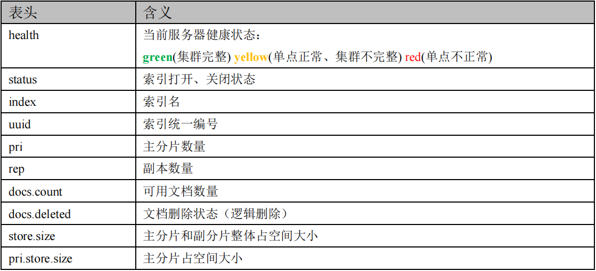

#####  3) 查看单个索引

在 Postman 中，向 ES 服务器发 GET 请求 ：http://127.0.0.1:9200/shopping


查看索引向 ES 服务器发送的请求路径和创建索引是一致的。但是 HTTP 方法不一致。这里可以体会一下 RESTful 的意义，请求后，服务器响应结果如下：

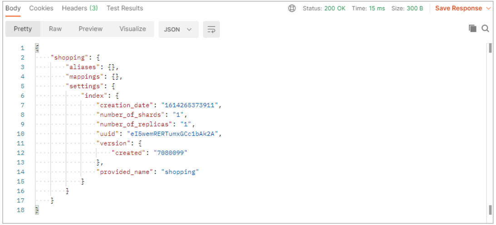

```json
{
 	"shopping"【索引名】: { 
		 "aliases"【别名】: {},
		 "mappings"【映射】: {},
		 "settings"【设置】: {
			 "index"【设置 - 索引】: {
 				"creation_date"【设置 - 索引 - 创建时间】: "1614265373911",
 				"number_of_shards"【设置 - 索引 - 主分片数量】: "1",
 				"number_of_replicas"【设置 - 索引 - 副分片数量】: "1",
 				"uuid"【设置 - 索引 - 唯一标识】: "eI5wemRERTumxGCc1bAk2A",
 				"version"【设置 - 索引 - 版本】: {
 					"created": "7080099"
 			},
 			"provided_name"【设置 - 索引 - 名称】: "shopping"
 		}
 	}
 } 
}
```

##### 4) 删除索引

在 Postman 中，向 ES 服务器发 DELETE 请求 ：http://127.0.0.1:9200/shopping 

 


重新访问索引时，服务器返回响应：索引不存在


#### 2.2.4.2 文档操作

##### 1) 创建文档

索引已经创建好了，接下来我们来创建文档，并添加数据。这里的文档可以类比为关系型数据库中的表数据，添加的数据格式为 JSON 格式

在 Postman 中，向 ES 服务器发 POST 请求 ：http://127.0.0.1:9200/shopping/_doc请求体内容为：

```json
{
	 "title":"小米手机",
	 "category":"小米",
	 "images":"http://www.gulixueyuan.com/xm.jpg",
	 "price":3999.00
}
```


此处发送请求的方式必须为 POST，不能是 PUT，否则会发生错误 

 


服务器响应结果如下：


```json
{
	 "_index"【索引】: "shopping",
	 "_type"【类型-文档】: "_doc",
	 "_id"【唯一标识】: "Xhsa2ncBlvF_7lxyCE9G", //可以类比为 MySQL 中的主键，随机生成
	 "_version"【版本】: 1,
	 "result"【结果】: "created", //这里的 create 表示创建成功
 	"_shards"【分片】: {
		 "total"【分片 - 总数】: 2,
		 "successful"【分片 - 成功】: 1,
		 "failed"【分片 - 失败】: 0
	 },
	 "_seq_no": 0,
	 "_primary_term": 1
}
```

上面的数据创建后，由于没有指定数据唯一性标识（ID），默认情况下，ES 服务器会随机生成一个。

如果想要自定义唯一性标识，需要在创建时指定：http://127.0.0.1:9200/shopping/_doc/1 

 

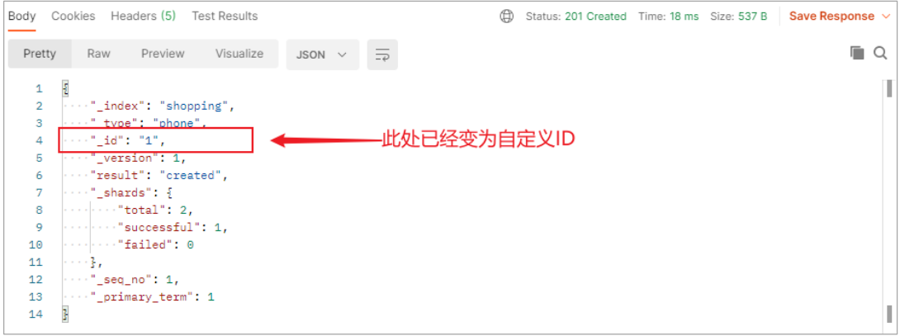

此处需要注意：如果增加数据时明确数据主键，那么请求方式也可以为 PUT

##### 2) 查看文档

查看文档时，需要指明文档的唯一性标识，类似于 MySQL 中数据的主键查询

在 Postman 中，向 ES 服务器发 GET 请求 ：http://127.0.0.1:9200/shopping/_doc/1


查询成功后，服务器响应结果：


```json
{
	 "_index"【索引】: "shopping",
	 "_type"【文档类型】: "_doc",
	 "_id": "1",
	 "_version": 2,
	 "_seq_no": 2,
	 "_primary_term": 2,
	 "found"【查询结果】: true, //true 表示查找到，false 表示未查找到
	 "_source"【文档源信息】: {
		 "title": "华为手机",
		 "category": "华为",
		 "images": "http://www.gulixueyuan.com/hw.jpg",
 		 "price": 4999.00
	 } 
}
```

#####  3) 修改文档

和新增文档一样，输入相同的 URL 地址请求，如果请求体变化，会将原有的数据内容覆盖

在 Postman 中，向 ES 服务器发 POST 请求 ：http://127.0.0.1:9200/shopping/_doc/1

请求体内容为: 

```json
{
	 "title":"华为手机",
	 "category":"华为",
	 "images":"http://www.gulixueyuan.com/hw.jpg",
	 "price":4999.00
}
```


修改成功后，服务器响应结果：


```json
{
	 "_index": "shopping",
	 "_type": "_doc",
	 "_id": "1",
	 "_version"【版本】: 2,
	 "result"【结果】: "updated", //updated 表示数据被更新
	 "_shards": {
		 "total": 2,
		 "successful": 1,
		 "failed": 0
	 },
	 "_seq_no": 2,
	 "_primary_term": 2
}
```

##### 4) 修改字段

修改数据时，也可以只修改某一给条数据的局部信息 

 在 Postman 中，向 ES 服务器发 POST 请求 ：http://127.0.0.1:9200/shopping/1/_update

请求体内容为：

```json
{ 
    "doc": {
        "price":3000.00
    } 
}
```


修改成功后，服务器响应结果：


根据唯一性标识，查询文档数据，文档数据已经更新


##### 5) 删除文档

删除一个文档不会立即从磁盘上移除，它只是被标记成已删除（逻辑删除）。

在 Postman 中，向 ES 服务器发 DELETE 请求 ：http://127.0.0.1:9200/shopping/_doc/1 

 

删除成功，服务器响应结果：


```json
{
	 "_index": "shopping",
	 "_type": "_doc",
	 "_id": "1",
	 "_version"【版本】: 4, //对数据的操作，都会更新版本
	 "result"【结果】: "deleted", // deleted 表示数据被标记为删除
	 "_shards": {
		 "total": 2,
		 "successful": 1,
 		"failed": 0
	 },
	 "_seq_no": 4,
	 "_primary_term": 2
}
```

删除后再查询当前文档信息


如果删除一个并不存在的文档 

 

```json
{
	 "_index": "shopping",
	 "_type": "_doc",
	 "_id": "1",
	 "_version": 1,
	 "result"【结果】: "not_found",//not_found 表示未查找到
	 "_shards": {
 		"total": 2,
 		"successful": 1,
		 "failed": 0
	 },
	 "_seq_no": 5,
	 "_primary_term": 2
}
```

##### 6) 条件删除文档

一般删除数据都是根据文档的唯一性标识进行删除，实际操作时，也可以根据条件对多条数据进行删除

首先分别增加多条数据: 

```json
{
	 "title":"小米手机",
	 "category":"小米",
	 "images":"http://www.gulixueyuan.com/xm.jpg",
	 "price":4000.00
}
{
	 "title":"华为手机",
	 "category":"华为",
	 "images":"http://www.gulixueyuan.com/hw.jpg",
	 "price":4000.00
}
```

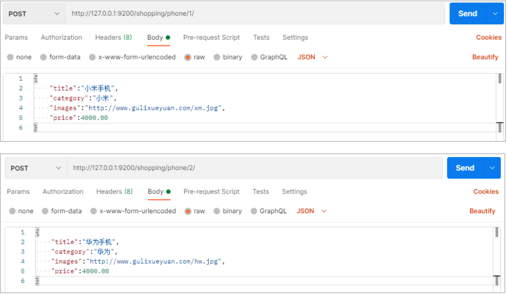

向 ES 服务器发 POST 请求 ：http://127.0.0.1:9200/shopping/_delete_by_query 

 请求体内容为：

```json
{
    "query":{
        "match":{
            "price":4000.00
        }
    } 
}
```


删除成功后，服务器响应结果：


```json
{
	 "took"【耗时】: 175,
	 "timed_out"【是否超时】: false,
	 "total"【总数】: 2,
	 "deleted"【删除数量】: 2,
	 "batches": 1,
	 "version_conflicts": 0,
	 "noops": 0,
	 "retries": {
		 "bulk": 0,
		 "search": 0
	 },
	 "throttled_millis": 0,
	 "requests_per_second": -1.0,
	 "throttled_until_millis": 0,
	 "failures": []
}
```

#### 2.2.4.3 映射操作

有了索引库，等于有了数据库中的 database。 

 接下来就需要建索引库(index)中的映射了，类似于数据库(database)中的表结构(table)。创建数据库表需要设置字段名称，类型，长度，约束等；索引库也一样，需要知道这个类型下有哪些字段，每个字段有哪些约束信息，这就叫做映射(mapping)。

##### 1) 创建映射

在 Postman 中，向 ES 服务器发 PUT 请求 ：http://127.0.0.1:9200/student/_mapping

请求体内容为：

```json
{
 "properties": {
     "name":{
         "type": "text",
         "index": true
     },
     "sex":{
         "type": "text",
         "index": false
     },
     "age":{
         "type": "long",
         "index": false   
     }
 } 
}
```

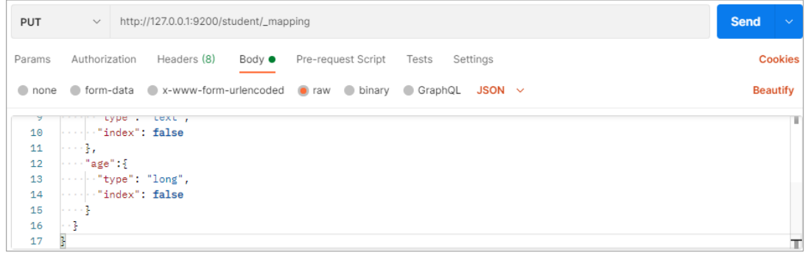

服务器响应结果如下：


映射数据说明：

- 字段名：任意填写，下面指定许多属性，例如：title、subtitle、images、price

- type：类型，Elasticsearch 中支持的数据类型非常丰富，说几个关键的：

-  String 类型，又分两种：
  - text：可分词 
  - keyword：不可分词，数据会作为完整字段进行匹配

- Numerical：数值类型，分两类

  - 基本数据类型：long、integer、short、byte、double、float、half_float
  - 浮点数的高精度类型：scaled_float

- Date：日期类型

- Array：数组类型

- Object：对象 

- index：是否索引，默认为 true，也就是说你不进行任何配置，所有字段都会被索引。
  - true：字段会被索引，则可以用来进行搜索
  - false：字段不会被索引，不能用来搜索

- store：是否将数据进行独立存储，默认为 false

  原始的文本会存储在_source 里面，默认情况下其他提取出来的字段都不是独立存储的，是从\_source 里面提取出来的。当然你也可以独立的存储某个字段，只要设置"store": true 即可，获取独立存储的字段要比从\_source 中解析快得多，但是也会占用更多的空间，所以要根据实际业务需求来设置。

- analyzer：分词器，这里的 ik_max_word 即使用 ik 分词器,后面会有专门的章节学习

##### 2) 查看映射

在 Postman 中，向 ES 服务器发 GET 请求 ：http://127.0.0.1:9200/student/_mapping


服务器响应结果如下：


##### 3) 索引映射关联

在 Postman 中，向 ES 服务器发 PUT 请求 ：http://127.0.0.1:9200/student1 

 ```json
{
	 "settings": {},
	 "mappings": {
		 "properties": {
			"name":{
 				"type": "text",
				 "index": true
			},
			"sex":{
				 "type": "text",
				 "index": false
			},
			"age":{
				 "type": "long",
				 "index": false
			}
		 }
	 } 
}
 ```


服务器响应结果如下：


#### 2.2.4.4 高级查询

Elasticsearch 提供了基于 JSON 提供完整的查询 DSL 来定义查询

定义数据 :

```json
// POST /student/_doc/1001
{
	"name":"zhangsan",
	"nickname":"zhangsan",
	 "sex":"男",
	 "age":30
}
// POST /student/_doc/1002 
{
	"name":"lisi",
	"nickname":"lisi",
	"sex":"男",
    "age":20 
}
// POST /student/_doc/1003
{
	"name":"wangwu",
	"nickname":"wangwu",
	"sex":"女",
	"age":40 
}
// POST /student/_doc/1004

{
	"name":"zhangsan1",
	"nickname":"zhangsan1",
	"sex":"女",
	"age":50 
}
// POST /student/_doc/1005
{
    "name":"zhangsan2",
	"nickname":"zhangsan2",
	"sex":"女",
	"age":30 
}
```

##### 1) 查询所有文档

在 Postman 中，向 ES 服务器发 GET 请求 ：http://127.0.0.1:9200/student/_search

```json
{
	"query": {
		"match_all": {}
	 } 
}

// "query"：这里的 query 代表一个查询对象，里面可以有不同的查询属性
// "match_all"：查询类型，例如：match_all(代表查询所有)， match，term ， range 等等
// {查询条件}：查询条件会根据类型的不同，写法也有差异
```


服务器响应结果如下： 

 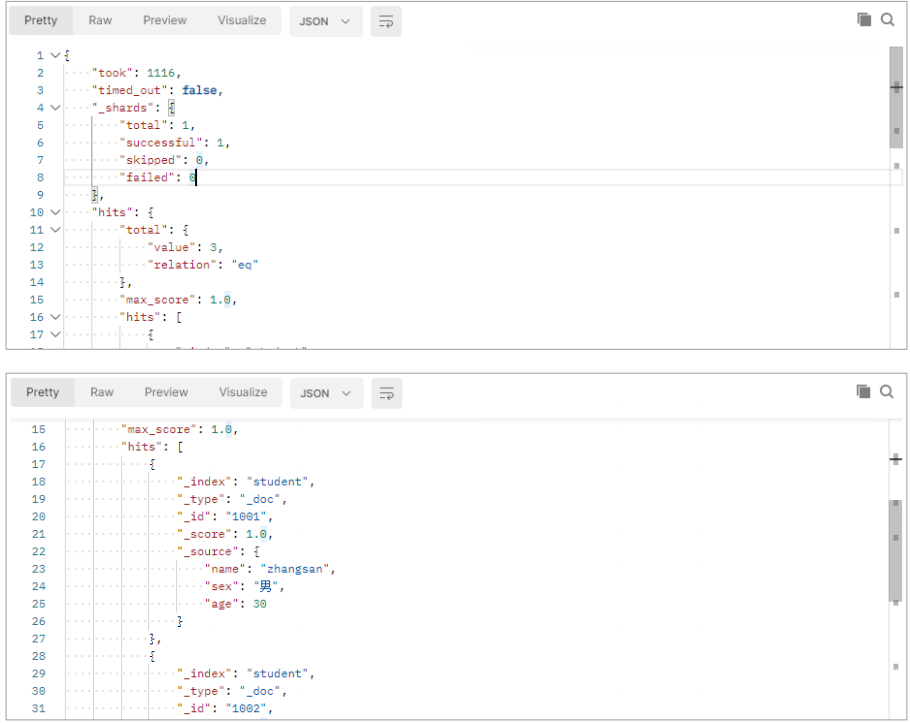

```json
{
 	"took【查询花费时间，单位毫秒】" : 1116,
 	"timed_out【是否超时】" : false,
	 "_shards【分片信息】" : {
		 "total【总数】" : 1,
		 "successful【成功】" : 1,
		 "skipped【忽略】" : 0,
		 "failed【失败】" : 0
	 },
	 "hits【搜索命中结果】" : {
		 "total"【搜索条件匹配的文档总数】: {
		 "value"【总命中计数的值】: 3,
		 "relation"【计数规则】: "eq" // eq 表示计数准确， gte 表示计数不准确
 		},
 		"max_score【匹配度分值】" : 1.0,
		 "hits【命中结果集合】" : [{。。。}]
 	} 
}
```

##### 2) 匹配查询

match 匹配类型查询，会把查询条件进行分词，然后进行查询，多个词条之间是 or 的关系

在 Postman 中，向 ES 服务器发 GET 请求 ：http://127.0.0.1:9200/student/_search

```json
{
	 "query": {
		"match": {  
            "name":"zhangsan"
		}
	} 
}
```

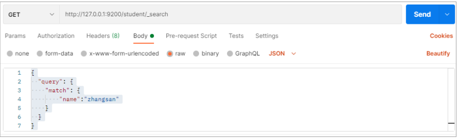

服务器响应结果为：

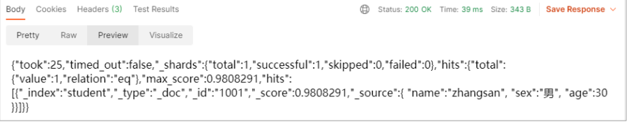

##### 3) 字段匹配查询

multi_match 与 match 类似，不同的是它可以在多个字段中查询。

在 Postman 中，向 ES 服务器发 GET 请求 ：http://127.0.0.1:9200/student/_search

```json
{
	 "query": {
		 "multi_match": {
 		 	"query": "zhangsan",
		 	"fields": ["name","nickname"]
		 }
	 } 
}
```


服务器响应结果： 

 

##### 4) 关键字精确查询

term 查询，精确的关键词匹配查询，不对查询条件进行分词。

在 Postman 中，向 ES 服务器发 GET 请求 ：http://127.0.0.1:9200/student/_search

```json
{
	"query": {
		"term": {
 			"name": {
				 "value": "zhangsan"
			 }
		 }
	 } 
}
```


服务器响应结果：


##### 5) 多关键字精确查询

terms 查询和 term 查询一样，但它允许你指定多值进行匹配。

如果这个字段包含了指定值中的任何一个值，那么这个文档满足条件，类似于 mysql 的 in

在 Postman 中，向 ES 服务器发 GET 请求 ：http://127.0.0.1:9200/student/_search

```json
{
 	"query": {
 		"terms": {
			 "name": ["zhangsan","lisi"]
 		}
	} 
} 
```

服务器响应结果：


##### 6) 指定查询字段

默认情况下，Elasticsearch 在搜索的结果中，会把文档中保存在_source 的所有字段都返回。

如果我们只想获取其中的部分字段，我们可以添加_source 的过滤

在 Postman 中，向 ES 服务器发 GET 请求 ：http://127.0.0.1:9200/student/_search

```json
{
	"_source": ["name","nickname"], 
     "query": {
     	"terms": {
             "nickname": ["zhangsan"]
	}
} 
}
```


服务器响应结果：


##### 7) 过滤字段

我们也可以通过： 

- nincludes：来指定想要显示的字段

- excludes：来指定不想要显示的字段

在 Postman 中，向 ES 服务器发 GET 请求 ：http://127.0.0.1:9200/student/_search

```json
{

 "_source": {

 "includes": ["name","nickname"]

 }, 

 "query": {

 "terms": {

 "nickname": ["zhangsan"]

 }

 } 

}
```

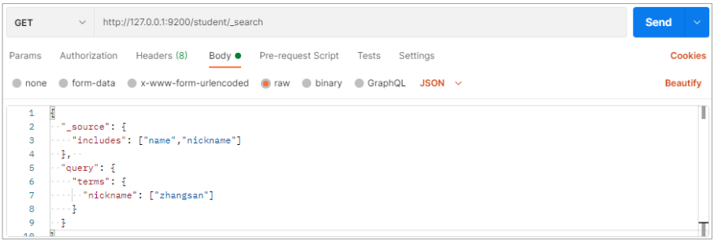

服务器响应结果：


在 Postman 中，向 ES 服务器发 GET 请求 ：http://127.0.0.1:9200/student/_search

```json
{

 "_source": {

 "excludes": ["name","nickname"]

 }, 

 "query": {

 "terms": {

 "nickname": ["zhangsan"]

 }

 } 

}
```

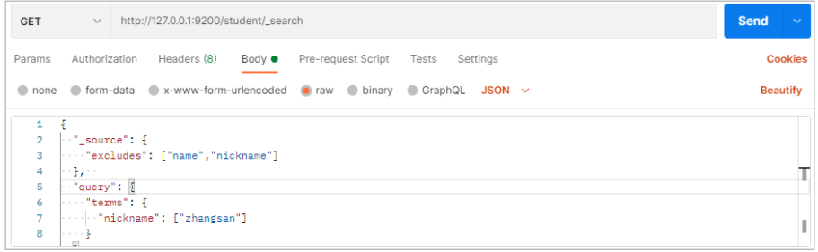

服务器响应结果： 

 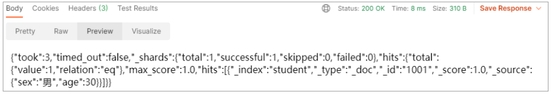


##### 8) 组合查询

`bool`把各种其它查询通过`must`（必须 ）、`must_not`（必须不）、`should`（应该）的方式进行组合

在 Postman 中，向 ES 服务器发 GET 请求 ：http://127.0.0.1:9200/student/_search

```json
{
    "query":{
        "bool":{
            "must":[
                {
                    "match":{
                        "name":"zhangsan"
                    }
                }
            ],
            "must_not":[
                {
                    "match":{
                        "age":"40"
                    }
                }
            ],
            "should":[
                {
                    "match":{
                        "sex":"男"
                    }
                }
            ]
        }
    }
}
```


服务器响应结果： 

 

##### 9) 范围查询

range 查询找出那些落在指定区间内的数字或者时间。range 查询允许以下字符


在 Postman 中，向 ES 服务器发 GET 请求 ：http://127.0.0.1:9200/student/_search

```json
{
    "query":{
        "range":{
            "age":{
                "gte":30,
                "lte":35
            }
        }
    }
}
```


服务器响应结果：


##### 10) 模糊查询

返回包含与搜索字词相似的字词的文档。

编辑距离是将一个术语转换为另一个术语所需的一个字符更改的次数。这些更改可以包括：

- 更改字符（box → fox） 

- 删除字符（black → lack） 

- 插入字符（sic → sick） 

- 转置两个相邻字符（act → cat）

为了找到相似的术语，fuzzy 查询会在指定的编辑距离内创建一组搜索词的所有可能的变体或扩展。然后查询返回每个扩展的完全匹配。

通过 fuzziness 修改编辑距离。一般使用默认值 AUTO，根据术语的长度生成编辑距离。在 Postman 中，向 ES 服务器发 GET 请求 ：http://127.0.0.1:9200/student/_search

```json
{
    "query":{
        "fuzzy":{
            "title":{
                "value":"zhangsan"
            }
        }
    }
}
```


服务器响应结果：

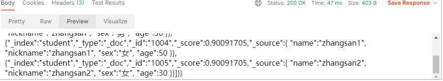

在 Postman 中，向 ES 服务器发 GET 请求 ：http://127.0.0.1:9200/student/_search

```json
{
    "query":{
        "fuzzy":{
            "title":{
                "value":"zhangsan",
                "fuzziness":2
            }
        }
    }
}
```


服务器响应结果：


##### 11) 单字段排序

sort 可以让我们按照不同的字段进行排序，并且通过 order 指定排序的方式。desc 降序，asc升序。

在 Postman 中，向 ES 服务器发 GET 请求 ：http://127.0.0.1:9200/student/_search

```json
{
    "query":{
        "match":{
            "name":"zhangsan"
        }
    },
    "sort":[
        {
            "age":{
                "order":"desc"
            }
        }
    ]
}
```

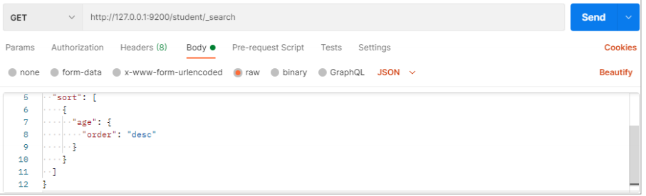

服务器响应结果： 

 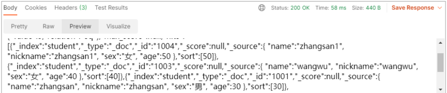


##### 12) 多字段排序

假定我们想要结合使用 age 和 _score 进行查询，并且匹配的结果首先按照年龄排序，然后按照相关性得分排序

在 Postman 中，向 ES 服务器发 GET 请求 ：http://127.0.0.1:9200/student/_search

```json
{
    "query":{
        "match_all":{

        }
    },
    "sort":[
        {
            "age":{
                "order":"desc"
            }
        },
        {
            "_score":{
                "order":"desc"
            }
        }
    ]
}
```


服务器响应结果：

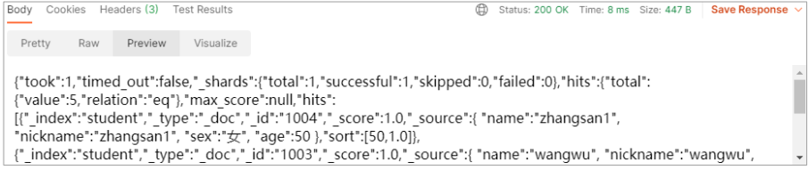

##### 13) 高亮查询

在进行关键字搜索时，搜索出的内容中的关键字会显示不同的颜色，称之为高亮。 

-  在百度搜索"京东"

Elasticsearch 可以对查询内容中的关键字部分，进行标签和样式(高亮)的设置。

在使用 match 查询的同时，加上一个 highlight 属性：

- pre_tags：前置标签

- post_tags：后置标签

- fields：需要高亮的字段

- title：这里声明 title 字段需要高亮，后面可以为这个字段设置特有配置，也可以空

在 Postman 中，向 ES 服务器发 GET 请求 ：http://127.0.0.1:9200/student/_search

```json
{
    "query":{
        "match":{
            "name":"zhangsan"
        }
    },
    "highlight":{
        "pre_tags":"<font color='red'>",
        "post_tags":"</font>",
        "fields":{
            "name":{

            }
        }
    }
}
```


服务器响应结果： 

 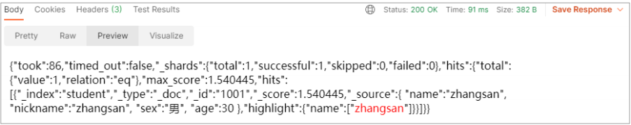

##### 14) 分页查询

from：当前页的起始索引，默认从 0 开始。 from = (pageNum - 1)  size

size：每页显示多少条

在 Postman 中，向 ES 服务器发 GET 请求 ：http://127.0.0.1:9200/student/_search

```json
{
    "query":{
        "match_all":{

        }
    },
    "sort":[
        {
            "age":{
                "order":"desc"
            }
        }
    ],
    "from":0,
    "size":2
}
```

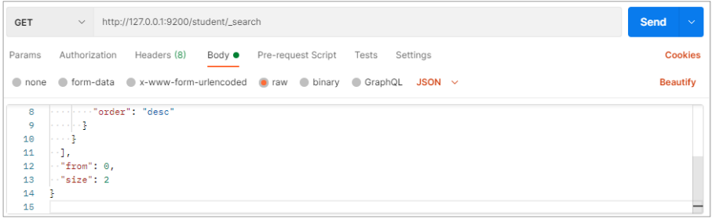

服务器响应结果：


##### 15) 聚合查询

聚合允许使用者对 es 文档进行统计分析，类似与关系型数据库中的 group by，当然还有很多其他的聚合，例如取最大值、平均值等等。

-  对某个字段取最大值 max

在 Postman 中，向 ES 服务器发 GET 请求 ：http://127.0.0.1:9200/student/_search 

 ```json
{
    "aggs":{
        "max_age":{
            "max":{
                "field":"age"
            }
        }
    },
    "size":0
}
 ```


服务器响应结果：


- 对某个字段取最小值 min

在 Postman 中，向 ES 服务器发 GET 请求 ：http://127.0.0.1:9200/student/_search

```json
{
    "aggs":{
        "min_age":{
            "min":{
                "field":"age"
            }
        }
    },
    "size":0
}
```


服务器响应结果：


- 对某个字段求和 sum 

 在 Postman 中，向 ES 服务器发 GET 请求 ：http://127.0.0.1:9200/student/_search

```json
{
    "aggs":{
        "sum_age":{
            "sum":{
                "field":"age"
            }
        }
    },
    "size":0
}
```


服务器响应结果：


-  对某个字段取平均值 avg

在 Postman 中，向 ES 服务器发 GET 请求 ：http://127.0.0.1:9200/student/_search

```json
{
    "aggs":{
        "avg_age":{
            "avg":{
                "field":"age"
            }
        }
    },
    "size":0
}
```


服务器响应结果： 

 

-  对某个字段的值进行去重之后再取总数

在 Postman 中，向 ES 服务器发 GET 请求 ：http://127.0.0.1:9200/student/_search

```json
{
    "aggs":{
        "distinct_age":{
            "cardinality":{
                "field":"age"
            }
        }
    },
    "size":0
}
```


服务器响应结果：


-  State 聚合

stats 聚合，对某个字段一次性返回 count，max，min，avg 和 sum 五个指标

在 Postman 中，向 ES 服务器发 GET 请求 ：http://127.0.0.1:9200/student/_search

```json
{
    "aggs":{
        "stats_age":{
            "stats":{
                "field":"age"
            }
        }
    },
    "size":0
}
```

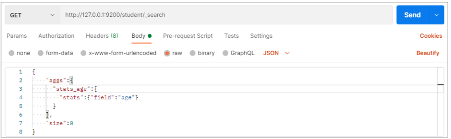

服务器响应结果： 

 

##### 16) 桶聚合查询

桶聚和相当于 sql 中的 group by 语句

- terms 聚合，分组统计

在 Postman 中，向 ES 服务器发 GET 请求 ：http://127.0.0.1:9200/student/_search

```json
{
    "aggs":{
        "age_groupby":{
            "terms":{
                "field":"age"
            }
        }
    },
    "size":0
}
```


服务器响应结果：


- 在 terms 分组下再进行聚合

在 Postman 中，向 ES 服务器发 GET 请求 ：http://127.0.0.1:9200/student/_search

```json
{
    "aggs":{
        "age_groupby":{
            "terms":{
                "field":"age"
            }
        }
    },
    "size":0
}
```


 服务器响应结果：

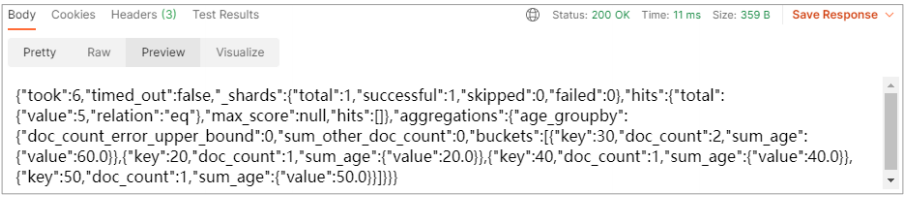

### 2.2.5 Java API 操作

Elasticsearch 软件是由 Java 语言开发的，所以也可以通过 Java API 的方式对 Elasticsearch服务进行访问

#### 2.2.5.1 创建 Maven 项目

我们在 IDEA 开发工具中创建 Maven 项目(模块也可)ES 

 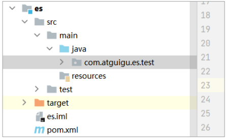

修改 pom 文件，增加 Maven 依赖关系

```xml
<dependencies>
 <dependency>
 <groupId>org.elasticsearch</groupId>
 <artifactId>elasticsearch</artifactId>
 <version>7.8.0</version>
 </dependency>
 <!-- elasticsearch 的客户端 -->
 <dependency>
 <groupId>org.elasticsearch.client</groupId>
 <artifactId>elasticsearch-rest-high-level-client</artifactId>
 <version>7.8.0</version>
 </dependency>
 <!-- elasticsearch 依赖 2.x 的 log4j -->
 <dependency>
 <groupId>org.apache.logging.log4j</groupId>
 <artifactId>log4j-api</artifactId>
 <version>2.8.2</version>
 </dependency>
 <dependency>
 <groupId>org.apache.logging.log4j</groupId>
 <artifactId>log4j-core</artifactId>
 <version>2.8.2</version>
</dependency>
<dependency>
<groupId>com.fasterxml.jackson.core</groupId>
<artifactId>jackson-databind</artifactId>
<version>2.9.9</version>
</dependency>
 <!-- junit 单元测试 -->
 <dependency>
 <groupId>junit</groupId>
 <artifactId>junit</artifactId>
 <version>4.12</version>
 </dependency>
</dependencies>
```

#### 2.2.5.2 客户端对象

创建 com.atguigu.es.test.Elasticsearch01_Client 类，代码中创建 Elasticsearch 客户端对象

因为早期版本的客户端对象已经不再推荐使用，且在未来版本中会被删除，所以这里我们采用高级 REST 客户端对象 

 

```java
// 创建客户端对象

RestHighLevelClient client = new RestHighLevelClient(
RestClient.builder(new HttpHost("localhost", 9200, "http"))
);
...
// 关闭客户端连接
client.close();
```

注意：9200 端口为 Elasticsearch 的 Web 通信端口，localhost 为启动 ES 服务的主机名

执行代码，查看控制台信息：

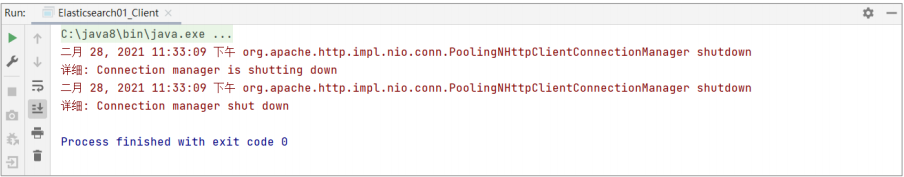

#### 2.2.5.3 索引操作

ES 服务器正常启动后，可以通过 Java API 客户端对象对 ES 索引进行操作

##### 1) 创建索引

```java
// 创建索引 - 请求对象
CreateIndexRequest request = new CreateIndexRequest("user");
// 发送请求，获取响应
CreateIndexResponse response = client.indices().create(request,RequestOptions.DEFAULT);
boolean acknowledged = response.isAcknowledged();
// 响应状态
System.out.println("操作状态 = " + acknowledged);
```

操作结果: 

 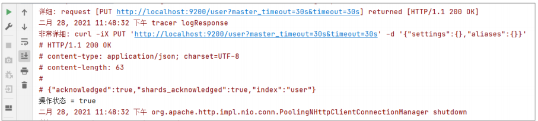

##### 2) 查看索引

```java
// 查询索引 - 请求对象
GetIndexRequest request = new GetIndexRequest("user");
// 发送请求，获取响应
GetIndexResponse response = client.indices().get(request, RequestOptions.DEFAULT);
System.out.println("aliases:"+response.getAliases());
System.out.println("mappings:"+response.getMappings());
System.out.println("settings:"+response.getSettings());
```

操作结果:

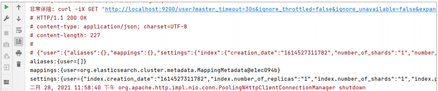

##### 3) 删除索引

```java
// 删除索引 - 请求对象
DeleteIndexRequest request = new DeleteIndexRequest("user");
// 发送请求，获取响应
AcknowledgedResponse response = client.indices().delete(request,RequestOptions.DEFAULT);
//操作结果
System.out.println("操作结果 ： " + response.isAcknowledged());
```

操作结果: 


#### 2.2.5.4 文档操作

##### 1) 新增文档

创建数据模型

```java
class User { 
    private String name; 
    private Integer age; 
    private String sex; 
    public String getName() { 
        return name; 
    } 
    public void setName(String name) {
        this.name = name; 
    } 
    public Integer getAge() {  
        return age; 
    } 
    public void setAge(Integer age) {
        this.age = age; 
    } 
    public String getSex() { 
        return sex; 
    } 
    public void setSex(String sex) { 
        this.sex = sex; 
    } 
}
```

 创建数据，添加到文档中

```java
// 新增文档 - 请求对象
IndexRequest request = new IndexRequest();
// 设置索引及唯一性标识
request.index("user").id("1001");
// 创建数据对象
User user = new User();
user.setName("zhangsan");
user.setAge(30);
user.setSex("男");
ObjectMapper objectMapper = new ObjectMapper();
String productJson = objectMapper.writeValueAsString(user);
// 添加文档数据，数据格式为 JSON 格式
request.source(productJson,XContentType.JSON);
// 客户端发送请求，获取响应对象
IndexResponse response = client.index(request, RequestOptions.DEFAULT);
//3.打印结果信息
System.out.println("_index:" + response.getIndex());
System.out.println("_id:" + response.getId());
System.out.println("_result:" + response.getResult()); 
```

操作结果:

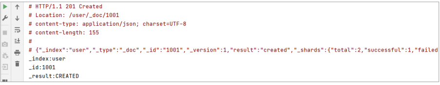

##### 2) 修改文档

```java
// 修改文档 - 请求对象
UpdateRequest request = new UpdateRequest();
// 配置修改参数
request.index("user").id("1001");
// 设置请求体，对数据进行修改
request.doc(XContentType.JSON, "sex", "女");
// 客户端发送请求，获取响应对象
UpdateResponse response = client.update(request, RequestOptions.DEFAULT);
System.out.println("_index:" + response.getIndex());
System.out.println("_id:" + response.getId());
System.out.println("_result:" + response.getResult());
```

执行结果： 

 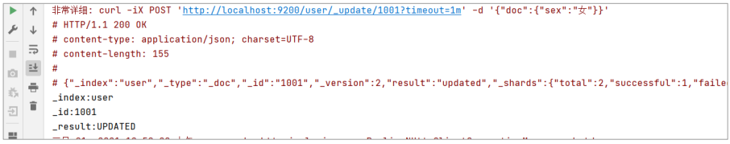

##### 3) 查询文档

```java
//1.创建请求对象
GetRequest request = new GetRequest().index("user").id("1001");
//2.客户端发送请求，获取响应对象
GetResponse response = client.get(request, RequestOptions.DEFAULT);
//3.打印结果信息
System.out.println("_index:" + response.getIndex());
System.out.println("_type:" + response.getType());
System.out.println("_id:" + response.getId());
System.out.println("source:" + response.getSourceAsString());
```

执行结果为：

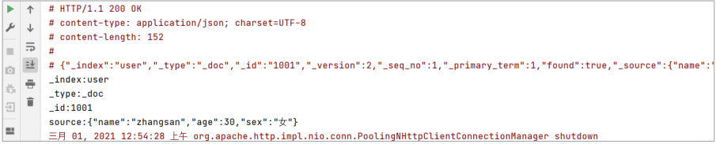

##### 4) 删除文档

```java
//创建请求对象
DeleteRequest request = new DeleteRequest().index("user").id("1");
//客户端发送请求，获取响应对象
DeleteResponse response = client.delete(request, RequestOptions.DEFAULT);
//打印信息
System.out.println(response.toString());
```

执行结果为：

 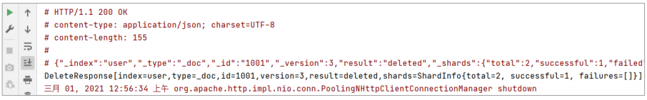

##### 5) 批量操作

- 批量新增：

```java
//创建批量新增请求对象
BulkRequest request = new BulkRequest();
request.add(new IndexRequest().index("user").id("1001").source(XContentType.JSON, "name", "zhangsan"));
request.add(new  IndexRequest().index("user").id("1002").source(XContentType.JSON, "name", "lisi"));
request.add(new IndexRequest().index("user").id("1003").source(XContentType.JSON, "name", "wangwu"));

//客户端发送请求，获取响应对象
BulkResponse responses = client.bulk(request, RequestOptions.DEFAULT);
//打印结果信息
System.out.println("took:" + responses.getTook());
System.out.println("items:" + responses.getItems());
```

执行结果为：

 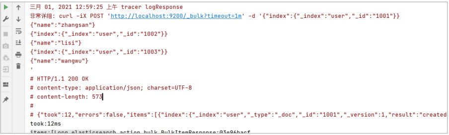

- 批量删除：

```java
//创建批量删除请求对象
BulkRequest request = new BulkRequest();
request.add(new DeleteRequest().index("user").id("1001"));
request.add(new DeleteRequest().index("user").id("1002"));
request.add(new DeleteRequest().index("user").id("1003"));
//客户端发送请求，获取响应对象
BulkResponse responses = client.bulk(request, RequestOptions.DEFAULT);
//打印结果信息
System.out.println("took:" + responses.getTook());
System.out.println("items:" + responses.getItems());
```

执行结果为：

 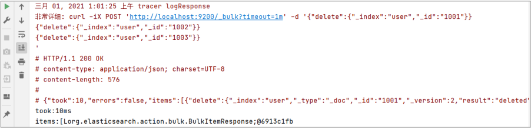

#### 2.2.5.5 高级查询

##### 1) 请求体查询

- 查询所有索引数据

```java
// 创建搜索请求对象
SearchRequest request = new SearchRequest();
request.indices("student");
// 构建查询的请求体 
SearchSourceBuilder sourceBuilder = new SearchSourceBuilder();
// 查询所有数据
sourceBuilder.query(QueryBuilders.matchAllQuery());
request.source(sourceBuilder);
SearchResponse response = client.search(request, RequestOptions.DEFAULT);
// 查询匹配
SearchHits hits = response.getHits();
System.out.println("took:" + response.getTook());
System.out.println("timeout:" + response.isTimedOut());
System.out.println("total:" + hits.getTotalHits());
System.out.println("MaxScore:" + hits.getMaxScore());
System.out.println("hits========>>");
for (SearchHit hit : hits) {
    //输出每条查询的结果信息
    System.out.println(hit.getSourceAsString());
}
System.out.println("<<========");
```

-  term 查询，查询条件为关键字

```java
// 创建搜索请求对象
SearchRequest request = new SearchRequest();
request.indices("student");
// 构建查询的请求体
SearchSourceBuilder sourceBuilder = new SearchSourceBuilder();
sourceBuilder.query(QueryBuilders.termQuery("age", "30"));
request.source(sourceBuilder);
SearchResponse response = client.search(request, RequestOptions.DEFAULT);
// 查询匹配
SearchHits hits = response.getHits();
System.out.println("took:" + response.getTook());
System.out.println("timeout:" + response.isTimedOut());
System.out.println("total:" + hits.getTotalHits());
System.out.println("MaxScore:" + hits.getMaxScore());
System.out.println("hits========>>");
for (SearchHit hit : hits) {
    //输出每条查询的结果信息
    System.out.println(hit.getSourceAsString());
}
System.out.println("<<========"); 
```

 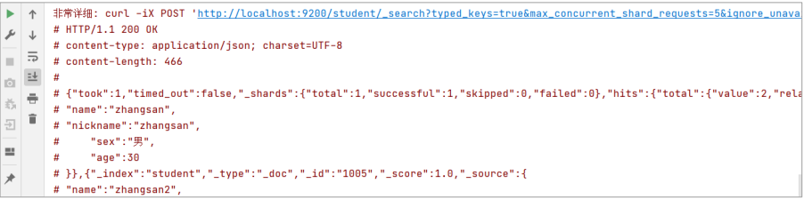

- 分页查询

```java
// 创建搜索请求对象
SearchRequest request = new SearchRequest();
request.indices("student");
// 构建查询的请求体
SearchSourceBuilder sourceBuilder = new SearchSourceBuilder();
sourceBuilder.query(QueryBuilders.matchAllQuery());
// 分页查询
// 当前页其实索引(第一条数据的顺序号)，from
sourceBuilder.from(0);
// 每页显示多少条 size
sourceBuilder.size(2);
request.source(sourceBuilder);
SearchResponse response = client.search(request, RequestOptions.DEFAULT);
// 查询匹配
SearchHits hits = response.getHits();
System.out.println("took:" + response.getTook());
System.out.println("timeout:" + response.isTimedOut());
System.out.println("total:" + hits.getTotalHits());
System.out.println("MaxScore:" + hits.getMaxScore());
System.out.println("hits========>>");
for (SearchHit hit : hits) {
    //输出每条查询的结果信息
    System.out.println(hit.getSourceAsString());
}
System.out.println("<<========");
```

-  数据排序

```json
// 构建查询的请求体
SearchSourceBuilder sourceBuilder = new SearchSourceBuilder();
sourceBuilder.query(QueryBuilders.matchAllQuery());
// 排序
sourceBuilder.sort("age", SortOrder.ASC);
request.source(sourceBuilder);
SearchResponse response = client.search(request, RequestOptions.DEFAULT);
// 查询匹配
SearchHits hits = response.getHits(); 
System.out.println("took:" + response.getTook());
System.out.println("timeout:" + response.isTimedOut());
System.out.println("total:" + hits.getTotalHits());
System.out.println("MaxScore:" + hits.getMaxScore());
System.out.println("hits========>>");
for (SearchHit hit : hits) {
    //输出每条查询的结果信息
    System.out.println(hit.getSourceAsString()); 
}
System.out.println("<<========");
```

 

-  过滤字段

```java
// 创建搜索请求对象
SearchRequest request = new SearchRequest();
request.indices("student");
// 构建查询的请求体
SearchSourceBuilder sourceBuilder = new SearchSourceBuilder();
sourceBuilder.query(QueryBuilders.matchAllQuery());
//查询字段过滤
String[] excludes = {};
String[] includes = {"name", "age"};
sourceBuilder.fetchSource(includes, excludes);
request.source(sourceBuilder);
SearchResponse response = client.search(request, RequestOptions.DEFAULT);
// 查询匹配
SearchHits hits = response.getHits();
System.out.println("took:" + response.getTook());
System.out.println("timeout:" + response.isTimedOut());
System.out.println("total:" + hits.getTotalHits());
System.out.println("MaxScore:" + hits.getMaxScore());
System.out.println("hits========>>");
for (SearchHit hit : hits) {
    //输出每条查询的结果信息
    System.out.println(hit.getSourceAsString());
}
System.out.println("<<========");
```

- Bool 查询

```java
// 创建搜索请求对象
SearchRequest request = new SearchRequest(); 
request.indices("student");
// 构建查询的请求体
SearchSourceBuilder sourceBuilder = new SearchSourceBuilder();
BoolQueryBuilder boolQueryBuilder = QueryBuilders.boolQuery();
// 必须包含
boolQueryBuilder.must(QueryBuilders.matchQuery("age", "30"));
// 一定不含
boolQueryBuilder.mustNot(QueryBuilders.matchQuery("name", "zhangsan"));
// 可能包含
boolQueryBuilder.should(QueryBuilders.matchQuery("sex", "男"));
sourceBuilder.query(boolQueryBuilder);
request.source(sourceBuilder);
SearchResponse response = client.search(request, RequestOptions.DEFAULT);
// 查询匹配
SearchHits hits = response.getHits();
System.out.println("took:" + response.getTook());
System.out.println("timeout:" + response.isTimedOut());
System.out.println("total:" + hits.getTotalHits());
System.out.println("MaxScore:" + hits.getMaxScore());
System.out.println("hits========>>");
for (SearchHit hit : hits) {
    //输出每条查询的结果信息
    System.out.println(hit.getSourceAsString());
}
System.out.println("<<========");
```

-  范围查询

```java
// 创建搜索请求对象
SearchRequest request = new SearchRequest();
request.indices("student");
// 构建查询的请求体
SearchSourceBuilder sourceBuilder = new SearchSourceBuilder();
RangeQueryBuilder rangeQuery = QueryBuilders.rangeQuery("age");
// 大于等于
rangeQuery.gte("30");
// 小于等于
rangeQuery.lte("40");
sourceBuilder.query(rangeQuery);
request.source(sourceBuilder);
SearchResponse response = client.search(request, RequestOptions.DEFAULT);
// 查询匹配
SearchHits hits = response.getHits();
System.out.println("took:" + response.getTook());
System.out.println("timeout:" + response.isTimedOut());
System.out.println("total:" + hits.getTotalHits());
System.out.println("MaxScore:" + hits.getMaxScore());
System.out.println("hits========>>"); 
for (SearchHit hit : hits) {
    //输出每条查询的结果信息
    System.out.println(hit.getSourceAsString());
}
System.out.println("<<========");
```

-  模糊查询

```java
// 创建搜索请求对象
SearchRequest request = new SearchRequest();
request.indices("student");
// 构建查询的请求体
SearchSourceBuilder sourceBuilder = new SearchSourceBuilder();
sourceBuilder.query(QueryBuilders.fuzzyQuery("name","zhangsan").fuzziness(Fuzziness.ONE));
request.source(sourceBuilder);
SearchResponse response = client.search(request, RequestOptions.DEFAULT);
// 查询匹配
SearchHits hits = response.getHits();
System.out.println("took:" + response.getTook());
System.out.println("timeout:" + response.isTimedOut());
System.out.println("total:" + hits.getTotalHits());
System.out.println("MaxScore:" + hits.getMaxScore());
System.out.println("hits========>>");
for (SearchHit hit : hits) {
    //输出每条查询的结果信息
    System.out.println(hit.getSourceAsString());
}
System.out.println("<<========");
```

##### 2) 高亮查询

```java
// 高亮查询
SearchRequest request = new SearchRequest().indices("student");
//2.创建查询请求体构建器
SearchSourceBuilder sourceBuilder = new SearchSourceBuilder();
//构建查询方式：高亮查询
TermsQueryBuilder termsQueryBuilder = QueryBuilders.termsQuery("name","zhangsan");
//设置查询方式
sourceBuilder.query(termsQueryBuilder); 
//构建高亮字段
HighlightBuilder highlightBuilder = new HighlightBuilder();
highlightBuilder.preTags("<font color='red'>");//设置标签前缀
highlightBuilder.postTags("</font>");//设置标签后缀
highlightBuilder.field("name");//设置高亮字段
//设置高亮构建对象
sourceBuilder.highlighter(highlightBuilder);
//设置请求体
request.source(sourceBuilder);
//3.客户端发送请求，获取响应对象
SearchResponse response = client.search(request, RequestOptions.DEFAULT);
//4.打印响应结果
SearchHits hits = response.getHits();
System.out.println("took::"+response.getTook());
System.out.println("time_out::"+response.isTimedOut());
System.out.println("total::"+hits.getTotalHits());
System.out.println("max_score::"+hits.getMaxScore());
System.out.println("hits::::>>");
for (SearchHit hit : hits) {
    String sourceAsString = hit.getSourceAsString();
    System.out.println(sourceAsString);
    //打印高亮结果
    Map<String, HighlightField> highlightFields = hit.getHighlightFields();
    System.out.println(highlightFields);
}
System.out.println("<<::::");
```

##### 3) 聚合查询

- 最大年龄

```java
// 高亮查询
SearchRequest request = new SearchRequest().indices("student");
SearchSourceBuilder sourceBuilder = new SearchSourceBuilder();
sourceBuilder.aggregation(AggregationBuilders.max("maxAge").field("age"));
//设置请求体
request.source(sourceBuilder);
//3.客户端发送请求，获取响应对象
SearchResponse response = client.search(request, RequestOptions.DEFAULT);
//4.打印响应结果
SearchHits hits = response.getHits();
System.out.println(response); 
```

-  分组统计

```java
// 高亮查询
SearchRequest request = new SearchRequest().indices("student");
SearchSourceBuilder sourceBuilder = new SearchSourceBuilder();
sourceBuilder.aggregation(AggregationBuilders.terms("age_groupby").field("age"));
//设置请求体
request.source(sourceBuilder);
//3.客户端发送请求，获取响应对象
SearchResponse response = client.search(request, RequestOptions.DEFAULT);
//4.打印响应结果
SearchHits hits = response.getHits();
System.out.println(response); 
```

# 第3章 Elasticsearch 环境

## 3.1 相关概念

### 3.1.1 单机 & 集群

单台 Elasticsearch 服务器提供服务，往往都有最大的负载能力，超过这个阈值，服务器性能就会大大降低甚至不可用，所以生产环境中，一般都是运行在指定服务器集群中。除了负载能力，单点服务器也存在其他问题：

- 单台机器存储容量有限

- 单服务器容易出现单点故障，无法实现高可用

- 单服务的并发处理能力有限

配置服务器集群时，集群中节点数量没有限制，大于等于 2 个节点就可以看做是集群了。一般出于高性能及高可用方面来考虑集群中节点数量都是 3 个以上。

### 3.1.2 集群 Cluster

一个集群就是由一个或多个服务器节点组织在一起，共同持有整个的数据，并一起提供索引和搜索功能。一个 Elasticsearch 集群有一个唯一的名字标识，这个名字默认就是”elasticsearch”。这个名字是重要的，因为一个节点只能通过指定某个集群的名字，来加入这个集群。

### 3.1.3 节点 Node

集群中包含很多服务器，一个节点就是其中的一个服务器。作为集群的一部分，它存储数据，参与集群的索引和搜索功能。

一个节点也是由一个名字来标识的，默认情况下，这个名字是一个随机的漫威漫画角色的名字，这个名字会在启动的时候赋予节点。这个名字对于管理工作来说挺重要的，因为在这个管理过程中，你会去确定网络中的哪些服务器对应于 Elasticsearch 集群中的哪些节点。

一个节点可以通过配置集群名称的方式来加入一个指定的集群。默认情况下，每个节点都会被安排加入到一个叫做“elasticsearch”的集群中，这意味着，如果你在你的网络中启动了若干个节点，并假定它们能够相互发现彼此，它们将会自动地形成并加入到一个叫做“elasticsearch”的集群中。 

 在一个集群里，只要你想，可以拥有任意多个节点。而且，如果当前你的网络中没有运行任何 Elasticsearch 节点，这时启动一个节点，会默认创建并加入一个叫做“elasticsearch”的集群。

## 3.2 Windows 集群

### 3.2.1 部署集群

1) 创建 elasticsearch-cluster 文件夹，在内部复制三个 elasticsearch 服务

 

2) 修改集群文件目录中每个节点的 config/elasticsearch.yml 配置文件

- node-1001 节点

```sh
#节点 1 的配置信息：
#集群名称，节点之间要保持一致
cluster.name: my-elasticsearch
#节点名称，集群内要唯一
node.name: node-1001
node.master: true
node.data: true

#ip 地址
network.host: localhost
#http 端口
http.port: 1001
#tcp 监听端口
transport.tcp.port: 9301

#discovery.seed_hosts: ["localhost:9301", "localhost:9302","localhost:9303"]
#discovery.zen.fd.ping_timeout: 1m
#discovery.zen.fd.ping_retries: 5

#集群内的可以被选为主节点的节点列表
#cluster.initial_master_nodes: ["node-1", "node-2","node-3"]
#跨域配置
#action.destructive_requires_name: true
http.cors.enabled: true
http.cors.allow-origin: ""
```

- node-1002 节点

```sh
#节点 2 的配置信息：
#集群名称，节点之间要保持一致
cluster.name: my-elasticsearch
#节点名称，集群内要唯一
node.name: node-1002
node.master: true
node.data: true
#ip 地址 
network.host: localhost
#http 端口
http.port: 1002
#tcp 监听端口
transport.tcp.port: 9302
discovery.seed_hosts: ["localhost:9301"]
discovery.zen.fd.ping_timeout: 1m
discovery.zen.fd.ping_retries: 5
#集群内的可以被选为主节点的节点列表
#cluster.initial_master_nodes: ["node-1", "node-2","node-3"]
#跨域配置
#action.destructive_requires_name: true
http.cors.enabled: true
http.cors.allow-origin: ""
```

- node-1003 节点

```sh
#节点 3 的配置信息：
#集群名称，节点之间要保持一致
cluster.name: my-elasticsearch
#节点名称，集群内要唯一
node.name: node-1003
node.master: true
node.data: true
#ip 地址
network.host: localhost
#http 端口
http.port: 1003
#tcp 监听端口
transport.tcp.port: 9303
#候选主节点的地址，在开启服务后可以被选为主节点
discovery.seed_hosts: ["localhost:9301", "localhost:9302"]
discovery.zen.fd.ping_timeout: 1m
discovery.zen.fd.ping_retries: 5
#集群内的可以被选为主节点的节点列表
#cluster.initial_master_nodes: ["node-1", "node-2","node-3"]
#跨域配置
#action.destructive_requires_name: true
http.cors.enabled: true
http.cors.allow-origin: ""
```

### 3.2.2 启动集群

1) 启动前先删除每个节点中的 data 目录中所有内容（如果存在）

 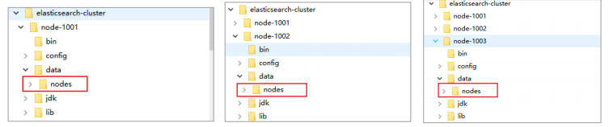

2) 分别双击执行 bin/elasticsearch.bat, 启动节点服务器，启动后，会自动加入指定名称的集群 

 

### 3.2.3 测试集群

查看集群状态

- node-1001 节点

- node-1002 节点

- node-1003 节点 

 


向集群中的 node-1001 节点增加索引

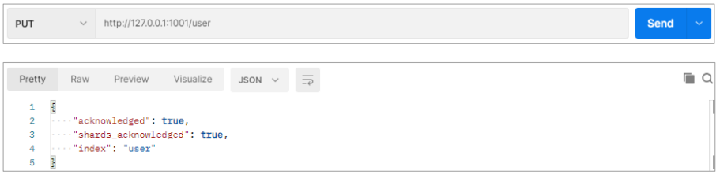

向集群中的 node-1002 节点查询索引 

 

## 3.3 Linux 单机

### 3.3.1 软件下载

软件下载地址：https://www.elastic.co/cn/downloads/past-releases/elasticsearch-7-8-0 

### 3.3.2 软件安装

#### 1) 解压软件

将下载的软件解压缩

```sh
# 解压缩
tar -zxvf elasticsearch-7.8.0-linux-x86_64.tar.gz -C /opt/module
# 改名
mv elasticsearch-7.8.0 es
```

#### 2) 创建用户

因为安全问题，Elasticsearch 不允许 root 用户直接运行，所以要创建新用户，在 root 用户中创建新用户

```sh
useradd es #新增 es 用户
passwd es #为 es 用户设置密码
userdel -r es #如果错了，可以删除再加
chown -R es:es /opt/module/es #文件夹所有者
```

#### 3) 修改配置文件

修改/opt/module/es/config/elasticsearch.yml 文件

```sh
# 加入如下配置
cluster.name: elasticsearch
node.name: node-1
network.host: 0.0.0.0
http.port: 9200
cluster.initial_master_nodes: ["node-1"]
```

修改/etc/security/limits.conf 

```sh
# 在文件末尾中增加下面内容
# 每个进程可以打开的文件数的限制
es soft nofile 65536
es hard nofile 65536
```

修改/etc/security/limits.d/20-nproc.conf

```sh
# 在文件末尾中增加下面内容
# 每个进程可以打开的文件数的限制
es soft nofile 65536
es hard nofile 65536 
# 操作系统级别对每个用户创建的进程数的限制
* hard nproc 4096
# 注： * 代表 Linux 所有用户名称
```

修改/etc/sysctl.conf

```sh
# 在文件中增加下面内容
# 一个进程可以拥有的 VMA(虚拟内存区域)的数量,默认值为 65536
vm.max_map_count=655360
```

重新加载

```sh
sysctl -p 
```

### 3.3.3 启动软件

使用 ES 用户启动

```sh
cd /opt/module/es/
#启动
bin/elasticsearch
#后台启动
bin/elasticsearch -d
```

启动时，会动态生成文件，如果文件所属用户不匹配，会发生错误，需要重新进行修改用户和用户组

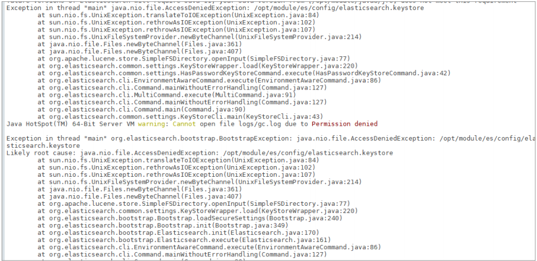

关闭防火墙

```sh
#暂时关闭防火墙
systemctl stop firewalld
#永久关闭防火墙
systemctl enable firewalld.service #打开放货抢永久性生效，重启后不会复原
systemctl disable firewalld.service #关闭防火墙，永久性生效，重启后不会复原
```

### 3.3.3 测试软件

浏览器中输入地址：http://linux1:9200/ 

##  3.4 Linux 集群

### 3.4.1 软件下载

软件下载地址：https://www.elastic.co/cn/downloads/past-releases/elasticsearch-7-8-0 

### 3.4.2 软件安装

#### 1) 解压软件

将下载的软件解压缩

```sh
# 解压缩
tar -zxvf elasticsearch-7.8.0-linux-x86_64.tar.gz -C /opt/module
# 改名
mv elasticsearch-7.8.0 es-cluster
```

将软件分发到其他节点：linux2, linux3

#### 2) 创建用户

因为安全问题，Elasticsearch 不允许 root 用户直接运行，所以要在每个节点中创建新用户，在 root 用户中创建新用户

```sh
useradd es #新增 es 用户
passwd es #为 es 用户设置密码
userdel -r es #如果错了，可以删除再加
chown -R es:es /opt/module/es-cluster #文件夹所有者
```

#### 3) 修改配置文件

修改/opt/module/es/config/elasticsearch.yml 文件，分发文件

```sh
# 加入如下配置
#集群名称
cluster.name: cluster-es
#节点名称，每个节点的名称不能重复
node.name: node-1
#ip 地址，每个节点的地址不能重复 
network.host: linux1
#是不是有资格主节点
node.master: true
node.data: true
http.port: 9200
# head 插件需要这打开这两个配置
http.cors.allow-origin: ""
http.cors.enabled: true
http.max_content_length: 200mb

#es7.x 之后新增的配置，初始化一个新的集群时需要此配置来选举 master
cluster.initial_master_nodes: ["node-1"]
#es7.x 之后新增的配置，节点发现
discovery.seed_hosts: ["linux1:9300","linux2:9300","linux3:9300"]
gateway.recover_after_nodes: 2
network.tcp.keep_alive: true
network.tcp.no_delay: true
transport.tcp.compress: true
#集群内同时启动的数据任务个数，默认是 2 个
cluster.routing.allocation.cluster_concurrent_rebalance: 16
#添加或删除节点及负载均衡时并发恢复的线程个数，默认 4 个
cluster.routing.allocation.node_concurrent_recoveries: 16
#初始化数据恢复时，并发恢复线程的个数，默认 4 个
cluster.routing.allocation.node_initial_primaries_recoveries: 16
```

修改/etc/security/limits.conf ，分发文件

```sh
# 在文件末尾中增加下面内容
es soft nofile 65536
es hard nofile 65536
```

修改/etc/security/limits.d/20-nproc.conf，分发文件

```sh
# 在文件末尾中增加下面内容
es soft nofile 65536
es hard nofile 65536
* hard nproc 4096
# 注：* 带表 Linux 所有用户名称
```

修改/etc/sysctl.conf

```sh
# 在文件中增加下面内容
vm.max_map_count=655360
```

重新加载

```sh
sysctl -p 
```

### 3.4.3 启动软件

分别在不同节点上启动 ES 软件

```sh
cd /opt/module/es-cluster
#启动
bin/elasticsearch
#后台启动
bin/elasticsearch -d
```

###  3.4.4 测试集群 

 

# 第4章 Elasticsearch 进阶

## 4.1 核心概念

### 4.1.1 索引（Index）

一个索引就是一个拥有几分相似特征的文档的集合。比如说，你可以有一个客户数据的索引，另一个产品目录的索引，还有一个订单数据的索引。一个索引由一个名字来标识（必须全部是小写字母），并且当我们要对这个索引中的文档进行索引、搜索、更新和删除的时候，都要使用到这个名字。在一个集群中，可以定义任意多的索引。能搜索的数据必须索引，这样的好处是可以提高查询速度，比如：新华字典前面的目录就是索引的意思，目录可以提高查询速度。

Elasticsearch 索引的精髓：**一切设计都是为了提高搜索的性能。**

### 4.1.2 类型（Type）

在一个索引中，你可以定义一种或多种类型。

一个类型是你的索引的一个逻辑上的分类/分区，其语义完全由你来定。通常，会为具有一组共同字段的文档定义一个类型。不同的版本，类型发生了不同的变化


###  4.1.3 文档（Document）

一个文档是一个可被索引的基础信息单元，也就是一条数据

比如：你可以拥有某一个客户的文档，某一个产品的一个文档，当然，也可以拥有某个订单的一个文档。文档以 JSON（Javascript Object Notation）格式来表示，而 JSON 是一个到处存在的互联网数据交互格式。

在一个 index/type 里面，你可以存储任意多的文档。

### 4.1.3 字段（Field）

相当于是数据表的字段，对文档数据根据不同属性进行的分类标识。 

###  4.1.5 映射（Mapping）

mapping 是处理数据的方式和规则方面做一些限制，如：某个字段的数据类型、默认值、分析器、是否被索引等等。这些都是映射里面可以设置的，其它就是处理 ES 里面数据的一些使用规则设置也叫做映射，按着最优规则处理数据对性能提高很大，因此才需要建立映射，并且需要思考如何建立映射才能对性能更好。

### 4.1.6 分片（Shards）

一个索引可以存储超出单个节点硬件限制的大量数据。比如，一个具有 10 亿文档数据的索引占据 1TB 的磁盘空间，而任一节点都可能没有这样大的磁盘空间。或者单个节点处理搜索请求，响应太慢。为了解决这个问题，Elasticsearch 提供了将索引划分成多份的能力，每一份就称之为分片。当你创建一个索引的时候，你可以指定你想要的分片的数量。每个分片本身也是一个功能完善并且独立的“索引”，这个“索引”可以被放置到集群中的任何节点上。

分片很重要，主要有两方面的原因：

1）允许你水平分割 / 扩展你的内容容量。

2）允许你在分片之上进行分布式的、并行的操作，进而提高性能/吞吐量。

至于一个分片怎样分布，它的文档怎样聚合和搜索请求，是完全由 Elasticsearch 管理的，对于作为用户的你来说，这些都是透明的，无需过分关心。

被混淆的概念是，一个 Lucene 索引 我们在 Elasticsearch 称作 分片 。 一个Elasticsearch 索引 是分片的集合。 当 Elasticsearch 在索引中搜索的时候， 他发送查询到每一个属于索引的分片(Lucene 索引)，然后合并每个分片的结果到一个全局的结果集。

### 4.1.7 副本（Replicas）

在一个网络 / 云的环境里，失败随时都可能发生，在某个分片/节点不知怎么的就处于离线状态，或者由于任何原因消失了，这种情况下，有一个故障转移机制是非常有用并且是强烈推荐的。为此目的，Elasticsearch 允许你创建分片的一份或多份拷贝，这些拷贝叫做复制分片(副本)。

复制分片之所以重要，有两个主要原因：

- 在分片/节点失败的情况下，提供了高可用性。因为这个原因，注意到复制分片从不与原/主要（original/primary）分片置于同一节点上是非常重要的。

- 扩展你的搜索量/吞吐量，因为搜索可以在所有的副本上并行运行。 

 总之，每个索引可以被分成多个分片。一个索引也可以被复制 0 次（意思是没有复制）或多次。一旦复制了，每个索引就有了主分片（作为复制源的原来的分片）和复制分片（主分片的拷贝）之别。分片和复制的数量可以在索引创建的时候指定。在索引创建之后，你可以在任何时候动态地改变复制的数量，但是你事后不能改变分片的数量。默认情况下，Elasticsearch 中的每个索引被分片 1 个主分片和 1 个复制，这意味着，如果你的集群中至少有两个节点，你的索引将会有 1 个主分片和另外 1 个复制分片（1 个完全拷贝），这样的话每个索引总共就有 2 个分片，我们需要根据索引需要确定分片个数。

### 4.1.8 分配（Allocation）

将分片分配给某个节点的过程，包括分配主分片或者副本。如果是副本，还包含从主分片复制数据的过程。这个过程是由 master 节点完成的。

## 4.2 系统架构

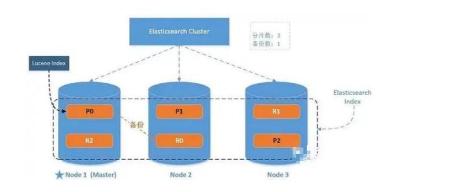

一个运行中的 Elasticsearch 实例称为一个节点，而集群是由一个或者多个拥有相同cluster.name 配置的节点组成， 它们共同承担数据和负载的压力。当有节点加入集群中或者从集群中移除节点时，集群将会重新平均分布所有的数据。

当一个节点被选举成为主节点时， 它将负责管理集群范围内的所有变更，例如增加、删除索引，或者增加、删除节点等。 而主节点并不需要涉及到文档级别的变更和搜索等操作，所以当集群只拥有一个主节点的情况下，即使流量的增加它也不会成为瓶颈。 任何节点都可以成为主节点。我们的示例集群就只有一个节点，所以它同时也成为了主节点。

作为用户，我们可以将请求发送到集群中的任何节点 ，包括主节点。 每个节点都知道任意文档所处的位置，并且能够将我们的请求直接转发到存储我们所需文档的节点。 无论我们将请求发送到哪个节点，它都能负责从各个包含我们所需文档的节点收集回数据，并将最终结果返回給客户端。 Elasticsearch 对这一切的管理都是透明的。 

##  4.3 分布式集群

### 4.3.1 单节点集群

我们在包含一个空节点的集群内创建名为 users 的索引，为了演示目的，我们将分配 3个主分片和一份副本（每个主分片拥有一个副本分片）

```json
{
    "settings":{
        "number_of_shards":3,
        "number_of_replicas":1
    }
}
```

 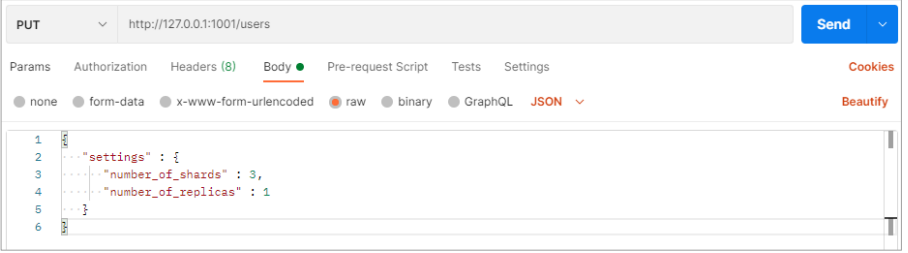

我们的集群现在是拥有一个索引的单节点集群。所有 3 个主分片都被分配在 node-1 。

 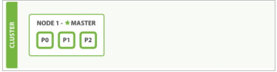

通过 elasticsearch-head 插件查看集群情况

 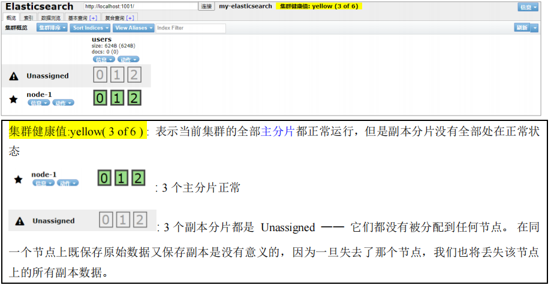

当前我们的集群是正常运行的，但是在硬件故障时有丢失数据的风险。 

###  4.3.2 故障转移

当集群中只有一个节点在运行时，意味着会有一个单点故障问题——没有冗余。 幸运的是，我们只需再启动一个节点即可防止数据丢失。当你在同一台机器上启动了第二个节点时，只要它和第一个节点有同样的 cluster.name 配置，它就会自动发现集群并加入到其中。但是在不同机器上启动节点的时候，为了加入到同一集群，你需要配置一个可连接到的单播主机列表。之所以配置为使用单播发现，以防止节点无意中加入集群。只有在同一台机器上运行的节点才会自动组成集群。

如果启动了第二个节点，我们的集群将会拥有两个节点的集群 : 所有主分片和副本分片都已被分配

 

通过 elasticsearch-head 插件查看集群情况

 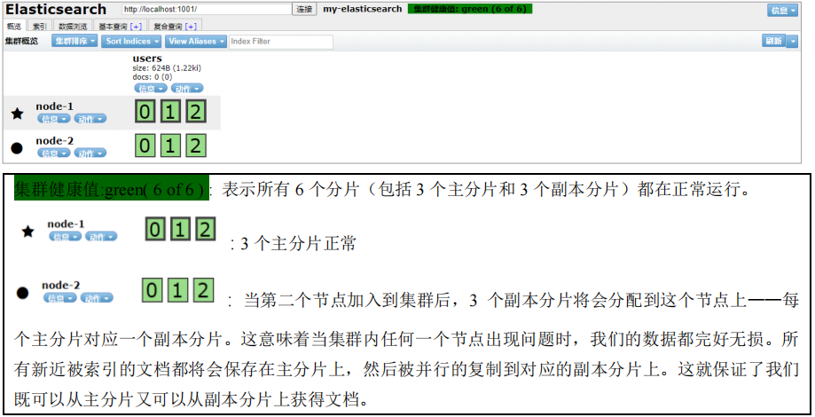

### 4.3.3 水平扩容

怎样为我们的正在增长中的应用程序按需扩容呢？当启动了第三个节点，我们的集群将会拥有三个节点的集群 : 为了分散负载而对分片进行重新分配 

 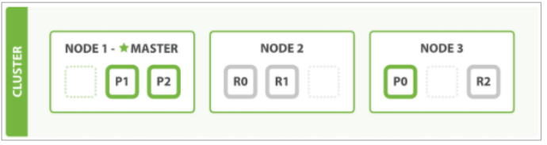

通过 elasticsearch-head 插件查看集群情况

 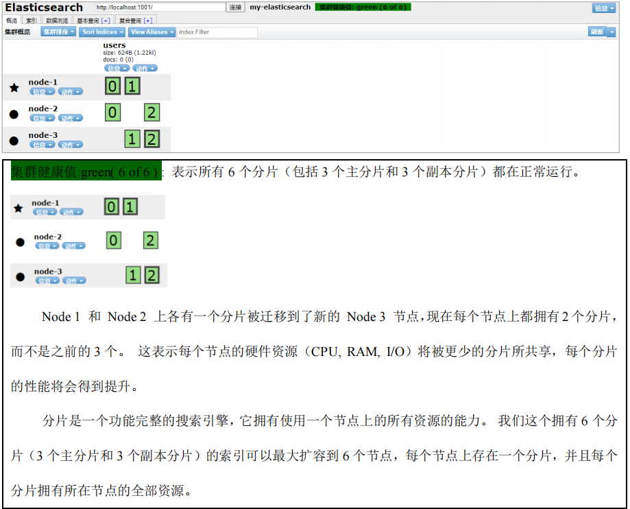

但是如果我们想要扩容超过 6 个节点怎么办呢？

主分片的数目在索引创建时就已经确定了下来。实际上，这个数目定义了这个索引能够存储 的最大数据量。（实际大小取决于你的数据、硬件和使用场景。） 但是，读操作——搜索和返回数据——可以同时被主分片 或 副本分片所处理，所以当你拥有越多的副本分片时，也将拥有越高的吞吐量。

在运行中的集群上是可以动态调整副本分片数目的，我们可以按需伸缩集群。让我们把副本数从默认的 1 增加到 2 

```json
{
 "number_of_replicas" : 2
} 
```

 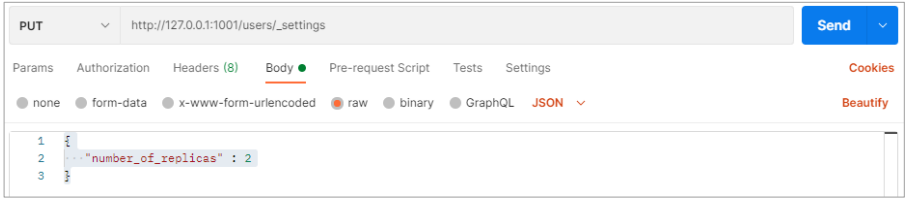

 users 索引现在拥有 9 个分片：3 个主分片和 6 个副本分片。 这意味着我们可以将集群扩容到 9 个节点，每个节点上一个分片。相比原来 3 个节点时，集群搜索性能可以提升 3 倍。

 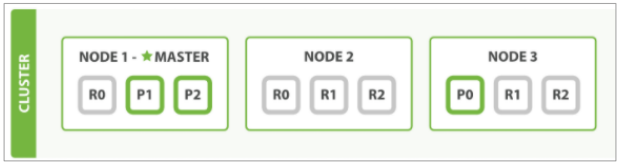

通过 elasticsearch-head 插件查看集群情况


当然，如果只是在相同节点数目的集群上增加更多的副本分片并不能提高性能，因为每个分片从节点上获得的资源会变少。 你需要增加更多的硬件资源来提升吞吐量。但是更多的副本分片数提高了数据冗余量：按照上面的节点配置，我们可以在失去 2 个节点的情况下不丢失任何数据。

### 4.3.4 应对故障

我们关闭第一个节点，这时集群的状态为:关闭了一个节点后的集群。

 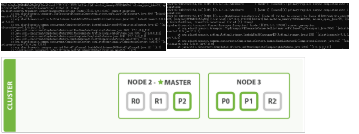

我们关闭的节点是一个主节点。而集群必须拥有一个主节点来保证正常工作，所以发生的第一件事情就是选举一个新的主节点： Node 2 。在我们关闭 Node 1 的同时也失去了主分片 1 和 2 ，并且在缺失主分片的时候索引也不能正常工作。 如果此时来检查集群的状况，我们看到的状态将会为 red ：不是所有主分片都在正常工作。

 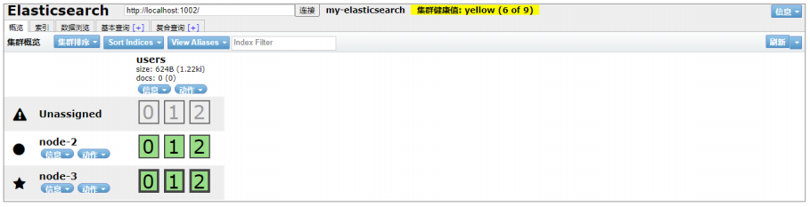

幸运的是，在其它节点上存在着这两个主分片的完整副本， 所以新的主节点立即将这些分片在 Node 2 和 Node 3 上对应的副本分片提升为主分片， 此时集群的状态将会为yellow。这个提升主分片的过程是瞬间发生的，如同按下一个开关一般。

**为什么我们集群状态是 yellow 而不是 green 呢？**

虽然我们拥有所有的三个主分片，但是同时设置了每个主分片需要对应 2 份副本分片，而此时只存在一份副本分片。 所以集群不能为 green 的状态，不过我们不必过于担心：如果我们同样关闭了 Node 2 ，我们的程序 依然 可以保持在不丢任何数据的情况下运行，因为Node 3 为每一个分片都保留着一份副本。

如果我们重新启动 Node 1 ，集群可以将缺失的副本分片再次进行分配，那么集群的状态也将恢复成之前的状态。 如果 Node 1 依然拥有着之前的分片，它将尝试去重用它们，同时仅从主分片复制发生了修改的数据文件。和之前的集群相比，只是 Master 节点切换了。

 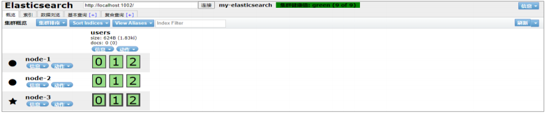

## 4.4 路由计算

当索引一个文档的时候，文档会被存储到一个主分片中。 Elasticsearch 如何知道一个文档应该存放到哪个分片中呢？当我们创建文档时，它如何决定这个文档应当被存储在分片1 还是分片 2 中呢？首先这肯定不会是随机的，否则将来要获取文档的时候我们就不知道从何处寻找了。实际上，这个过程是根据下面这个公式决定的：

```sh
shard = hash(routing) % number_of_primary_shards
```

routing 是一个可变值，默认是文档的 _id ，也可以设置成一个自定义的值。 routing 通过

hash 函数生成一个数字，然后这个数字再除以 number_of_primary_shards （主分片的数量）后得到余数 。这个分布在 0 到 number_of_primary_shards-1 之间的余数，就是我们所寻求的文档所在分片的位置。

这就解释了为什么我们要在创建索引的时候就确定好主分片的数量 并且永远不会改变这个数量：因为如果数量变化了，那么所有之前路由的值都会无效，文档也再也找不到了。

所有的文档 API（ get 、 index 、 delete 、 bulk 、 update 以及 mget ）都接受一个叫做 routing 的路由参数 ，通过这个参数我们可以自定义文档到分片的映射。一个自定义的路由参数可以用来确保所有相关的文档——例如所有属于同一个用户的文档——都被存储到同一个分片中。

## 4.5 分片控制

我们假设有一个集群由三个节点组成。 它包含一个叫 emps 的索引，有两个主分片，每个主分片有两个副本分片。相同分片的副本不会放在同一节点。

 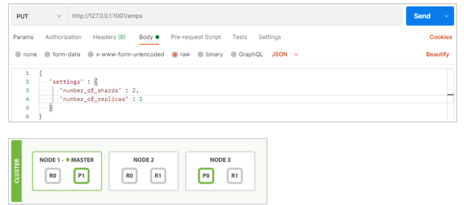

通过 elasticsearch-head 插件查看集群情况，所以我们的集群是一个有三个节点和一个索引的集群。

 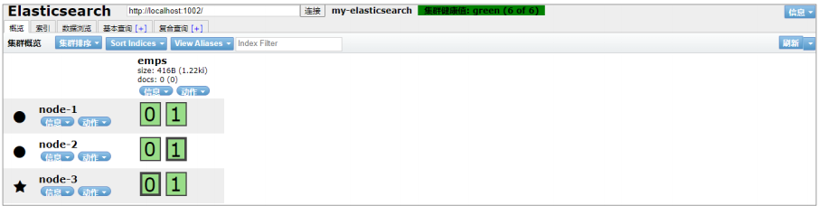

我们可以发送请求到集群中的任一节点。 每个节点都有能力处理任意请求。 每个节点都知道集群中任一文档位置，所以可以直接将请求转发到需要的节点上。 在下面的例子中，将所有的请求发送到 Node 1，我们将其称为 协调节点(coordinating node) 。 

 当发送请求的时候， 为了扩展负载，更好的做法是**轮询集群**中所有的节点。

### 4.5.1 写流程

新建、索引和删除 请求都是 写 操作， 必须在主分片上面完成之后才能被复制到相关的副本分片

 

新建，索引和删除文档所需要的步骤顺序：

1. 客户端向 Node 1 发送新建、索引或者删除请求。

2. 节点使用文档的 _id 确定文档属于分片 0 。请求会被转发到 Node 3，因为分片 0 的主分片目前被分配在 Node 3 上。

3. Node 3 在主分片上面执行请求。如果成功了，它将请求并行转发到 Node 1 和 Node 2 的副本分片上。一旦所有的副本分片都报告成功, Node 3 将向协调节点报告成功，协调节点向客户端报告成功。

在客户端收到成功响应时，文档变更已经在主分片和所有副本分片执行完成，变更是安全的。有一些可选的请求参数允许您影响这个过程，可能以数据安全为代价提升性能。这些选项很少使用，因为 Elasticsearch 已经很快，但是为了完整起见，请参考下面表格：

| 参数        | 含义                                                         |
| ----------- | ------------------------------------------------------------ |
| consistency | consistency，即一致性。在默认设置下，即使仅仅是在试图执行一个_写_操作之前，主分片都会要求 必须要有 规定数量(quorum)（或者换种说法，也即必须要有大多数）的分片副本处于活跃可用状态，才会去执行_写_操作(其中分片副本可以是主分片或者副本分片)。这是为了避免在发生网络分区故障（network partition）的时候进行_写_操作，进而导致数据不一致。_规定数量_即：int( (primary + number_of_replicas) / 2 ) + 1 consistency 参数的值可以设为 one （只要主分片状态 ok 就允许执行_写_操作）,all（必须要主分片和所有副本分片的状态没问题才允许执行_写_操作）, 或quorum 。默认值为 quorum , 即大多数的分片副本状态没问题就允许执行_写_操作。注意，规定数量 的计算公式中 number_of_replicas 指的是在索引设置中的设定副本分片数，而不是指当前处理活动状态的副本分片数。如果你的索引设置中指 定了当前索引拥有三个副本分片，那规定数量的计算结果即：int( (primary + 3 replicas) / 2 ) + 1 = 3如果此时你只启动两个节点，那么处于活跃状态的分片副本数量就达不到规定数量，也因此您将无法索引和删除任何文档。 |
| timeout     | 如果没有足够的副本分片会发生什么？ Elasticsearch 会等待，希望更多的分片出现。默认情况下，它最多等待 1 分钟。 如果你需要，你可以使用 timeout 参数使它更早终止： 100 100 毫秒，30s 是 30 秒。 |

新索引默认有 1 个副本分片，这意味着为满足规定数量应该需要两个活动的分片副本。 但是，这些默认的设置会阻止我们在单一节点上做任何事情。为了避免这个问题，要求只有当 number_of_replicas 大于 1 的时候，规定数量才会执行。

### 4.5.2 读流程

我们可以从主分片或者从其它任意副本分片检索文档

 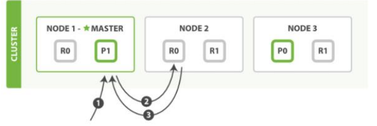

从主分片或者副本分片检索文档的步骤顺序：

1. 客户端向 Node 1 发送获取请求。

2. 节点使用文档的 _id 来确定文档属于分片 0 。分片 0 的副本分片存在于所有的三个节点上。 在这种情况下，它将请求转发到 Node 2 。

3. Node 2 将文档返回给 Node 1 ，然后将文档返回给客户端。

在处理读取请求时，协调结点在每次请求的时候都会通过轮询所有的副本分片来达到负载均衡。在文档被检索时，已经被索引的文档可能已经存在于主分片上但是还没有复制到副本分片。 在这种情况下，副本分片可能会报告文档不存在，但是主分片可能成功返回文档。 一旦索引请求成功返回给用户，文档在主分片和副本分片都是可用的。

### 4.5.3 更新流程

部分更新一个文档结合了先前说明的读取和写入流程： 

 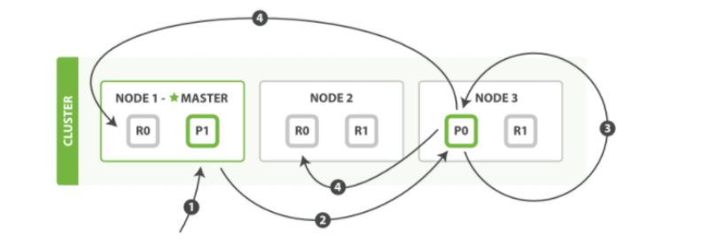


部分更新一个文档的步骤如下：

1. 客户端向 Node 1 发送更新请求。

2. 它将请求转发到主分片所在的 Node 3 。

3. Node 3 从主分片检索文档，修改 _source 字段中的 JSON ，并且尝试重新索引主分片的文档。如果文档已经被另一个进程修改，它会重试步骤 3 ，超过 retry_on_conflict 次后放弃。

4. 如果 Node 3 成功地更新文档，它将新版本的文档并行转发到 Node 1 和 Node 2 上的副本分片，重新建立索引。一旦所有副本分片都返回成功， Node 3 向协调节点也返回成功，协调节点向客户端返回成功。

当主分片把更改转发到副本分片时， 它不会转发更新请求。 相反，它转发完整文档的新版本。请记住，这些更改将会异步转发到副本分片，并且不能保证它们以发送它们相同的顺序到达。 如果 Elasticsearch 仅转发更改请求，则可能以错误的顺序应用更改，导致得到损坏的文档。

### 4.5.4 多文档操作流程

mget 和 bulk API 的模式类似于单文档模式。区别在于协调节点知道每个文档存在于哪个分片中。它将整个多文档请求分解成 每个分片 的多文档请求，并且将这些请求并行转发到每个参与节点。

协调节点一旦收到来自每个节点的应答，就将每个节点的响应收集整理成单个响应，返回给客户端

 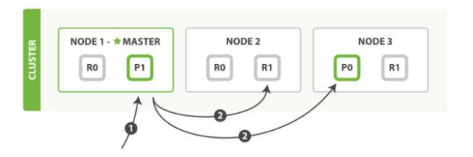

用单个 mget 请求取回多个文档所需的步骤顺序:

1. 客户端向 Node 1 发送 mget 请求。 

2. Node 1 为每个分片构建多文档获取请求，然后并行转发这些请求到托管在每个所需的主分片或者副本分片的节点上。一旦收到所有答复， Node 1 构建响应并将其返回给客户端。

可以对 docs 数组中每个文档设置 routing 参数。

bulk API， 允许在单个批量请求中执行多个创建、索引、删除和更新请求。

 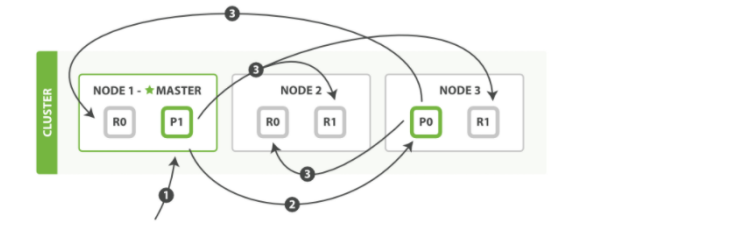

bulk API 按如下步骤顺序执行：

1. 客户端向 Node 1 发送 bulk 请求。

2. Node 1 为每个节点创建一个批量请求，并将这些请求并行转发到每个包含主分片的节点主机。

3. 主分片一个接一个按顺序执行每个操作。当每个操作成功时，主分片并行转发新文档（或删除）到副本分片，然后执行下一个操作。 一旦所有的副本分片报告所有操作成功，该节点将向协调节点报告成功，协调节点将这些响应收集整理并返回给客户端。

## 4.6 分片原理

分片是 Elasticsearch 最小的工作单元。但是究竟什么是一个分片，它是如何工作的？

传统的数据库每个字段存储单个值，但这对全文检索并不够。文本字段中的每个单词需要被搜索，对数据库意味着需要单个字段有索引多值的能力。最好的支持是一个字段多个值需求的数据结构是倒排索引。 

### 4.6.1 倒排索引

Elasticsearch 使用一种称为倒排索引的结构，它适用于快速的全文搜索。

见其名，知其意，有倒排索引，肯定会对应有正向索引。正向索引（forward index），反向索引（inverted index）更熟悉的名字是倒排索引。

所谓的正向索引，就是搜索引擎会将待搜索的文件都对应一个文件 ID，搜索时将这个ID 和搜索关键字进行对应，形成 K-V 对，然后对关键字进行统计计数 

 

但是互联网上收录在搜索引擎中的文档的数目是个天文数字，这样的索引结构根本无法满足实时返回排名结果的要求。所以，搜索引擎会将正向索引重新构建为倒排索引，即把文件ID对应到关键词的映射转换为关键词到文件ID的映射，每个关键词都对应着一系列的文件，这些文件中都出现这个关键词。

 

一个倒排索引由文档中所有不重复词的列表构成，对于其中每个词，有一个包含它的文档列表。例如，假设我们有两个文档，每个文档的 content 域包含如下内容：

- The quick brown fox jumped over the lazy dog

- Quick brown foxes leap over lazy dogs in summer

为了创建倒排索引，我们首先将每个文档的 content 域拆分成单独的 词（我们称它为 词条或 tokens ），创建一个包含所有不重复词条的排序列表，然后列出每个词条出现在哪个文档。结果如下所示：

 

现在，如果我们想搜索 quick brown ，我们只需要查找包含每个词条的文档： 

 

两个文档都匹配，但是第一个文档比第二个匹配度更高。如果我们使用仅计算匹配词条数量的简单相似性算法，那么我们可以说，对于我们查询的相关性来讲，第一个文档比第二个文档更佳。

但是，我们目前的倒排索引有一些问题：

- Quick 和 quick 以独立的词条出现，然而用户可能认为它们是相同的词。

- fox 和 foxes 非常相似, 就像 dog 和 dogs ；他们有相同的词根。

- jumped 和 leap, 尽管没有相同的词根，但他们的意思很相近。他们是同义词。

使用前面的索引搜索 +Quick +fox 不会得到任何匹配文档。（记住，+ 前缀表明这个词必须存在。）只有同时出现 Quick 和 fox 的文档才满足这个查询条件，但是第一个文档包含quick fox ，第二个文档包含 Quick foxes 。我们的用户可以合理的期望两个文档与查询匹配。我们可以做的更好。如果我们将词条规范为标准模式，那么我们可以找到与用户搜索的词条不完全一致，但具有足够相关性的文档。例如：

- Quick 可以小写化为 quick 。 

- foxes 可以 词干提取 --变为词根的格式-- 为 fox 。类似的， dogs 可以为提取为 dog 。 

- jumped 和 leap 是同义词，可以索引为相同的单词 jump 。

现在索引看上去像这样：

 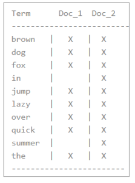

这还远远不够。我们搜索 +Quick +fox 仍然 会失败，因为在我们的索引中，已经没有 Quick 了。但是，如果我们对搜索的字符串使用与 content 域相同的标准化规则，会变成查询+quick +fox，这样两个文档都会匹配！分词和标准化的过程称为分析这非常重要。你只能搜索在索引中出现的词条，所以索引文本和查询字符串必须标准化为相同的格式。 

### 4.6.2 文档搜索

早期的全文检索会为整个文档集合建立一个很大的倒排索引并将其写入到磁盘。 一旦新的索引就绪，旧的就会被其替换，这样最近的变化便可以被检索到。

倒排索引被写入磁盘后是 不可改变 的:它永远不会修改。

不变性有重要的价值：

- 不需要锁。如果你从来不更新索引，你就不需要担心多进程同时修改数据的问题。

- 一旦索引被读入内核的文件系统缓存，便会留在哪里，由于其不变性。只要文件系统缓存中还有足够的空间，那么大部分读请求会直接请求内存，而不会命中磁盘。这提供了很大的性能提升。

- 其它缓存(像 filter 缓存)，在索引的生命周期内始终有效。它们不需要在每次数据改变时被重建，因为数据不会变化。

- 写入单个大的倒排索引允许数据被压缩，减少磁盘 I/O 和 需要被缓存到内存的索引的使用量。

当然，一个不变的索引也有不好的地方。主要事实是它是不可变的! 你不能修改它。如果你需要让一个新的文档 可被搜索，你需要重建整个索引。这要么对一个索引所能包含的数据量造成了很大的限制，要么对索引可被更新的频率造成了很大的限制。

### 4.6.3 动态更新索引

如何在保留不变性的前提下实现倒排索引的更新？

答案是: 用更多的索引。通过增加新的补充索引来反映新近的修改，而不是直接重写整个倒排索引。每一个倒排索引都会被轮流查询到，从最早的开始查询完后再对结果进行合并。

Elasticsearch 基于 Lucene, 这个 java 库引入了按段搜索的概念。 每一 段 本身都是一个倒排索引， 但索引在 Lucene 中除表示所有段的集合外， 还增加了提交点的概念 — 一个列出了所有已知段的文件 

 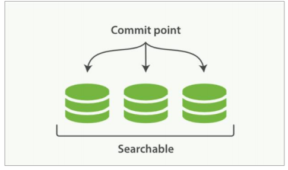


按段搜索会以如下流程执行：

1. 新文档被收集到内存索引缓存

   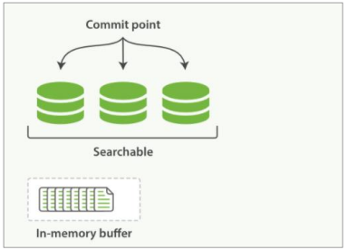

2. 不时地, 缓存被 提交

(1) 一个新的段—一个追加的倒排索引—被写入磁盘。

(2) 一个新的包含新段名字的 提交点 被写入磁盘

(3) 磁盘进行 同步 — 所有在文件系统缓存中等待的写入都刷新到磁盘，以确保它们被写入物理文件

3. 新的段被开启，让它包含的文档可见以被搜索

4. 内存缓存被清空，等待接收新的文档

    

当一个查询被触发，所有已知的段按顺序被查询。词项统计会对所有段的结果进行聚合，以保证每个词和每个文档的关联都被准确计算。 这种方式可以用相对较低的成本将新文档添加到索引。

段是不可改变的，所以既不能从把文档从旧的段中移除，也不能修改旧的段来进行反映文档的更新。 取而代之的是，每个提交点会包含一个 .del 文件，文件中会列出这些被删除文档的段信息。

当一个文档被 “删除” 时，它实际上只是在 .del 文件中被 标记 删除。一个被标记删除的文档仍然可以被查询匹配到， 但它会在最终结果被返回前从结果集中移除。

文档更新也是类似的操作方式：当一个文档被更新时，旧版本文档被标记删除，文档的新版本被索引到一个新的段中。 可能两个版本的文档都会被一个查询匹配到，但被删除的那个旧版本文档在结果集返回前就已经被移除。

### 4.6.4 近实时搜索

随着按段（per-segment）搜索的发展，一个新的文档从索引到可被搜索的延迟显著降低了。新文档在几分钟之内即可被检索，但这样还是不够快。磁盘在这里成为了瓶颈。提交（Commiting）一个新的段到磁盘需要一个 fsync 来确保段被物理性地写入磁盘，这样在断电的时候就不会丢失数据。 但是 fsync 操作代价很大; 如果每次索引一个文档都去执行一次的话会造成很大的性能问题。

我们需要的是一个更轻量的方式来使一个文档可被搜索，这意味着 fsync 要从整个过程中被移除。在 Elasticsearch 和磁盘之间是文件系统缓存。 像之前描述的一样， 在内存索引缓冲区中的文档会被写入到一个新的段中。 但是这里新段会被先写入到文件系统缓存—这一步代价会比较低，稍后再被刷新到磁盘—这一步代价比较高。不过只要文件已经在缓存中，就可以像其它文件一样被打开和读取了。

 

Lucene 允许新段被写入和打开—使其包含的文档在未进行一次完整提交时便对搜索可见。这种方式比进行一次提交代价要小得多，并且在不影响性能的前提下可以被频繁地执行。 

 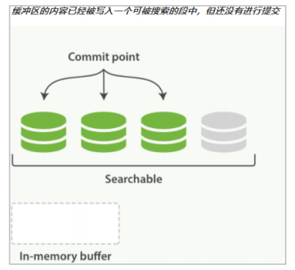

在 Elasticsearch 中，写入和打开一个新段的轻量的过程叫做 refresh 。 默认情况下每个分片会每秒自动刷新一次。这就是为什么我们说 Elasticsearch 是 近 实时搜索: 文档的变化并不是立即对搜索可见，但会在一秒之内变为可见。

这些行为可能会对新用户造成困惑: 他们索引了一个文档然后尝试搜索它，但却没有搜到。这个问题的解决办法是用 refresh API 执行一次手动刷新: /users/_refresh

尽管刷新是比提交轻量很多的操作，它还是会有性能开销。当写测试的时候， 手动刷新很有用，但是不要在生产环境下每次索引一个文档都去手动刷新。 相反，你的应用需要意识到 Elasticsearch 的近实时的性质，并接受它的不足。

并不是所有的情况都需要每秒刷新。可能你正在使用 Elasticsearch 索引大量的日志文件，你可能想优化索引速度而不是近实时搜索， 可以通过设置 refresh_interval ， 降低每个索引的刷新频率

```json
{
    "settings":{
        "refresh_interval":"30s"
    }
}
```

refresh_interval 可以在既存索引上进行动态更新。 在生产环境中，当你正在建立一个大的新索引时，可以先关闭自动刷新，待开始使用该索引时，再把它们调回来

```sh
# 关闭自动刷新
PUT /users/_settings
{ "refresh_interval": -1 } 
# 每一秒刷新
PUT /users/_settings
{ "refresh_interval": "1s" } 
```

### 4.6.5 持久化变更

如果没有用 fsync 把数据从文件系统缓存刷（flush）到硬盘，我们不能保证数据在断电甚至是程序正常退出之后依然存在。为了保证 Elasticsearch 的可靠性，需要确保数据变化被持久化到磁盘。在 动态更新索引，我们说一次完整的提交会将段刷到磁盘，并写入一 个包含所有段列表的提交点。Elasticsearch 在启动或重新打开一个索引的过程中使用这个提交点来判断哪些段隶属于当前分片。

即使通过每秒刷新（refresh）实现了近实时搜索，我们仍然需要经常进行完整提交来确保能从失败中恢复。但在两次提交之间发生变化的文档怎么办？我们也不希望丢失掉这些数据。Elasticsearch 增加了一个 translog ，或者叫事务日志，在每一次对 Elasticsearch 进行操作时均进行了日志记录

整个流程如下：

1. 一个文档被索引之后，就会被添加到内存缓冲区，并且追加到了 translog

    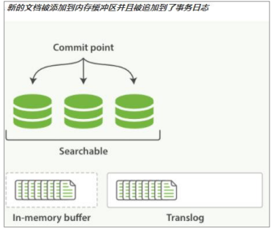

2. 刷新（refresh）使分片每秒被刷新（refresh）一次：

- 这些在内存缓冲区的文档被写入到一个新的段中，且没有进行 fsync 操作。

- 这个段被打开，使其可被搜索

- 内存缓冲区被清空

   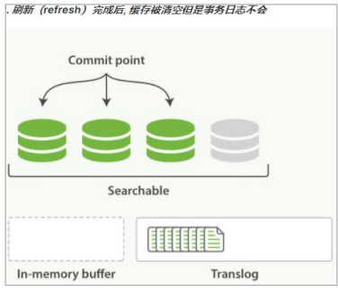

3. 这个进程继续工作，更多的文档被添加到内存缓冲区和追加到事务日志 

 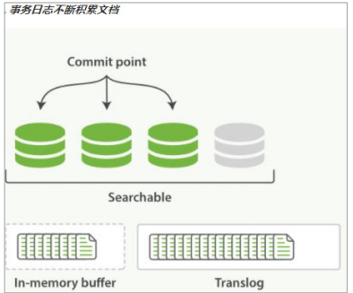

4. 每隔一段时间—例如 translog 变得越来越大—索引被刷新（flush）；一个新的 translog 被创建，并且一个全量提交被执行

- 所有在内存缓冲区的文档都被写入一个新的段。

- 缓冲区被清空。

- 一个提交点被写入硬盘。

- 文件系统缓存通过 fsync 被刷新（flush）。

- 老的 translog 被删除。

translog 提供所有还没有被刷到磁盘的操作的一个持久化纪录。当 Elasticsearch 启动的时候， 它会从磁盘中使用最后一个提交点去恢复已知的段，并且会重放 translog 中所有在最后一次提交后发生的变更操作。

translog 也被用来提供实时 CRUD 。当你试着通过 ID 查询、更新、删除一个文档，它会在尝试从相应的段中检索之前， 首先检查 translog 任何最近的变更。这意味着它总是能够实时地获取到文档的最新版本。

 

执行一个提交并且截断 translog 的行为在 Elasticsearch 被称作一次 flush分片每 30 分钟被自动刷新（flush），或者在 translog 太大的时候也会刷新 

 你很少需要自己手动执行 flush 操作；通常情况下，自动刷新就足够了。这就是说，在重启节点或关闭索引之前执行 flush 有益于你的索引。当 Elasticsearch 尝试恢复或重新打开一个索引， 它需要重放 translog 中所有的操作，所以如果日志越短，恢复越快。

translog 的目的是保证操作不会丢失，在文件被 fsync 到磁盘前，被写入的文件在重启之后就会丢失。默认 translog 是每 5 秒被 fsync 刷新到硬盘， 或者在每次写请求完成之后执行(e.g. index, delete, update, bulk)。这个过程在主分片和复制分片都会发生。最终， 基本上，这意味着在整个请求被 fsync 到主分片和复制分片的 translog 之前，你的客户端不会得到一个 200 OK 响应。

在每次请求后都执行一个 fsync 会带来一些性能损失，尽管实践表明这种损失相对较小（特别是 bulk 导入，它在一次请求中平摊了大量文档的开销）。

但是对于一些大容量的偶尔丢失几秒数据问题也并不严重的集群，使用异步的 fsync 还是比较有益的。比如，写入的数据被缓存到内存中，再每 5 秒执行一次 fsync 。如果你决定使用异步 translog 的话，你需要 保证 在发生 crash 时，丢失掉 sync_interval 时间段的数据也无所谓。请在决定前知晓这个特性。如果你不确定这个行为的后果，最好是使用默认的参数（ "index.translog.durability": "request" ）来避免数据丢失。

### 4.6.6 段合并

由于自动刷新流程每秒会创建一个新的段 ，这样会导致短时间内的段数量暴增。而段数目太多会带来较大的麻烦。 每一个段都会消耗文件句柄、内存和 cpu 运行周期。更重要的是，每个搜索请求都必须轮流检查每个段；所以段越多，搜索也就越慢。Elasticsearch 通过在后台进行段合并来解决这个问题。小的段被合并到大的段，然后这些大的段再被合并到更大的段。

段合并的时候会将那些旧的已删除文档从文件系统中清除。被删除的文档（或被更新文档的旧版本）不会被拷贝到新的大段中。启动段合并不需要你做任何事。进行索引和搜索时会自动进行。

1. 当索引的时候，刷新（refresh）操作会创建新的段并将段打开以供搜索使用。

2. 合并进程选择一小部分大小相似的段，并且在后台将它们合并到更大的段中。这并不会中断索引和搜索。 

 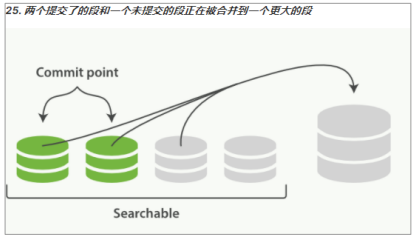

3. 一旦合并结束，老的段被删除

- 新的段被刷新（flush）到了磁盘。  写入一个包含新段且排除旧的和较小的段的新提交点。

- 新的段被打开用来搜索。

- 老的段被删除。

   

合并大的段需要消耗大量的 I/O 和 CPU 资源，如果任其发展会影响搜索性能。Elasticsearch在默认情况下会对合并流程进行资源限制，所以搜索仍然 有足够的资源很好地执行。

## 4.7 文档分析

分析 包含下面的过程：

- 将一块文本分成适合于倒排索引的独立的 词条

- 将这些词条统一化为标准格式以提高它们的“可搜索性”，或者 recall

分析器执行上面的工作。分析器实际上是将三个功能封装到了一个包里： 

- 字符过滤器

首先，字符串按顺序通过每个 字符过滤器 。他们的任务是在分词前整理字符串。一个字符过滤器可以用来去掉 HTML，或者将 & 转化成 and。 

-  分词器

其次，字符串被 分词器 分为单个的词条。一个简单的分词器遇到空格和标点的时候，可能会将文本拆分成词条。

- Token 过滤器 

 最后，词条按顺序通过每个 token 过滤器 。这个过程可能会改变词条（例如，小写化Quick ），删除词条（例如， 像 a， and， the 等无用词），或者增加词条（例如，像 jump 和 leap 这种同义词）。

### 4.7.1 内置分析器

Elasticsearch 还附带了可以直接使用的预包装的分析器。接下来我们会列出最重要的分析器。为了证明它们的差异，我们看看每个分析器会从下面的字符串得到哪些词条：

"Set the shape to semi-transparent by calling set_trans(5)"

- 标准分析器

标准分析器是 Elasticsearch 默认使用的分析器。它是分析各种语言文本最常用的选择。它根据 Unicode 联盟 定义的 单词边界 划分文本。删除绝大部分标点。最后，将词条小写。它会产生：

set, the, shape, to, semi, transparent, by, calling, set_trans, 5

- 简单分析器

简单分析器在任何不是字母的地方分隔文本，将词条小写。它会产生：set, the, shape, to, semi, transparent, by, calling, set, trans

- 空格分析器

空格分析器在空格的地方划分文本。它会产生：Set, the, shape, to, semi-transparent, by, calling, set_trans(5)

- 语言分析器

特定语言分析器可用于 很多语言。它们可以考虑指定语言的特点。例如， 英语 分析器附带了一组英语无用词（常用单词，例如 and 或者 the ，它们对相关性没有多少影响），它们会被删除。 由于理解英语语法的规则，这个分词器可以提取英语单词的 词干 。

英语 分词器会产生下面的词条：set, shape, semi, transpar, call, set_tran, 5

注意看 transparent、 calling 和 set_trans 已经变为词根格式

### 4.7.2 分析器使用场景

当我们 索引 一个文档，它的全文域被分析成词条以用来创建倒排索引。 但是，当我们在全文域 搜索 的时候，我们需要将查询字符串通过 相同的分析过程 ，以保证我们搜索的词条格式与索引中的词条格式一致。 

 全文查询，理解每个域是如何定义的，因此它们可以做正确的事：

- 当你查询一个 全文 域时， 会对查询字符串应用相同的分析器，以产生正确的搜索词条列表。

- 当你查询一个 精确值 域时，不会分析查询字符串，而是搜索你指定的精确值。

### 4.7.3 测试分析器

有些时候很难理解分词的过程和实际被存储到索引中的词条，特别是你刚接触Elasticsearch。为了理解发生了什么，你可以使用 analyze API 来看文本是如何被分析的。

在消息体里，指定分析器和要分析的文本

```json
GET http://localhost:9200/_analyze
{
 "analyzer": "standard",
 "text": "Text to analyze"
}
```

结果中每个元素代表一个单独的词条：

```json
{
    "tokens":[
        {
            "token":"text",
            "start_offset":0,
            "end_offset":4,
            "type":"<ALPHANUM>",
            "position":1
        },
        {
            "token":"to",
            "start_offset":5,
            "end_offset":7,
            "type":"<ALPHANUM>",
            "position":2
        },
        {
            "token":"analyze",
            "start_offset":8,
            "end_offset":15,
            "type":"<ALPHANUM>",
            "position":3
        }
    ]
}
```

token 是实际存储到索引中的词条。 position 指明词条在原始文本中出现的位置。start_offset 和 end_offset 指明字符在原始字符串中的位置。

### 4.7.4 指定分析器

当Elasticsearch在你的文档中检测到一个新的字符串域，它会自动设置其为一个全文 字符串 域，使用 标准 分析器对它进行分析。你不希望总是这样。可能你想使用一个不同的分析器，适用于你的数据使用的语言。有时候你想要一个字符串域就是一个字符串域—不使用分析，直接索引你传入的精确值，例如用户 ID 或者一个内部的状态域或标签。要做到这一点，我们必须手动指定这些域的映射。

### 4.7.5 IK 分词器

首先我们通过 Postman 发送 GET 请求查询分词效果

```json
# GET http://localhost:9200/_analyze
{
"text":"测试单词" 
}
```


ES的默认分词器无法识别中文中测试、单词这样的词汇，而是简单的将每个字拆完分为一个词

```json
{
    "tokens":[
        {
            "token":"测",
            "start_offset":0,
            "end_offset":1,
            "type":"<IDEOGRAPHIC>",
            "position":0
        },
        {
            "token":"试",
            "start_offset":1,
            "end_offset":2,
            "type":"<IDEOGRAPHIC>",
            "position":1
        },
        {
            "token":"单",
            "start_offset":2,
            "end_offset":3,
            "type":"<IDEOGRAPHIC>",
            "position":2
        },
        {
            "token":"词",
            "start_offset":3,
            "end_offset":4,
            "type":"<IDEOGRAPHIC>",
            "position":3
        }
    ]
}
```

这样的结果显然不符合我们的使用要求，所以我们需要下载 ES 对应版本的中文分词器。 

我们这里采用 IK 中文分词器，下载地址为: 

https://github.com/medcl/elasticsearch-analysis-ik/releases/tag/v7.8.0

将解压后的后的文件夹放入 ES 根目录下的 plugins 目录下，重启 ES 即可使用。我们这次加入新的查询参数"analyzer":"ik_max_word"

```json
# GET http://localhost:9200/_analyze
{
"text":"测试单词",
"analyzer":"ik_max_word"
}
```

- ik_max_word：会将文本做最细粒度的拆分

- ik_smart：会将文本做最粗粒度的拆分

  

使用中文分词后的结果为：

```json
{
    "tokens":[
        {
            "token":"测试",
            "start_offset":0,
            "end_offset":2,
            "type":"CN_WORD",
            "position":0
        },
        {
            "token":"单词",
            "start_offset":2,
            "end_offset":4,
            "type":"CN_WORD",
            "position":1
        }
    ]
}
```

ES 中也可以进行扩展词汇，首先查询

```json
# GET http://localhost:9200/_analyze
{
"text":"弗雷尔卓德",
"analyzer":"ik_max_word"
}
```

仅仅可以得到每个字的分词结果，我们需要做的就是使分词器识别到弗雷尔卓德也是一个词语

```json
{
    "tokens":[
        {
            "token":"弗",
            "start_offset":0,
            "end_offset":1,
            "type":"CN_CHAR",
            "position":0
        },
        {
            "token":"雷",
            "start_offset":1,
            "end_offset":2,
            "type":"CN_CHAR",
            "position":1
        },
        {
            "token":"尔",
            "start_offset":2,
            "end_offset":3,
            "type":"CN_CHAR",
            "position":2
        },
        {
            "token":"卓",
            "start_offset":3,
            "end_offset":4,
            "type":"CN_CHAR",
            "position":3
        },
        {
            "token":"德",
            "start_offset":4,
            "end_offset":5,
            "type":"CN_CHAR",
            "position":4
        }
    ]
}
```

首先进入 ES 根目录中的 plugins 文件夹下的 ik 文件夹，进入 config 目录，创建 custom.dic文件，写入弗雷尔卓德。同时打开 IKAnalyzer.cfg.xml 文件，将新建的 custom.dic 配置其中，重启 ES 服务器。 

 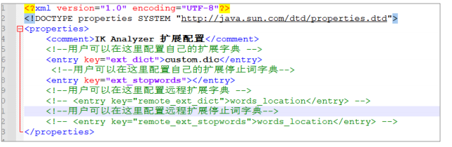

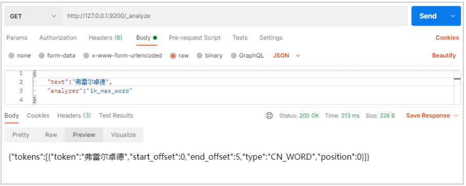

### 4.7.6 自定义分析器

虽然 Elasticsearch 带有一些现成的分析器，然而在分析器上 Elasticsearch 真正的强大之处在于，你可以通过在一个适合你的特定数据的设置之中组合字符过滤器、分词器、词汇单元过滤器来创建自定义的分析器。在 分析与分析器 我们说过，一个 分析器 就是在一个包里面组合了三种函数的一个包装器， 三种函数按照顺序被执行: 

- 字符过滤器

字符过滤器 用来 整理 一个尚未被分词的字符串。例如，如果我们的文本是 HTML 格式的，它会包含像 <p> 或者 <div> 这样的 HTML 标签，这些标签是我们不想索引的。我们可以使用 html 清除 字符过滤器 来移除掉所有的 HTML 标签，并且像把 Á 转换为相对应的 Unicode 字符 Á 这样，转换 HTML 实体。一个分析器可能有 0 个或者多个字符过滤器。

- 分词器

一个分析器 必须 有一个唯一的分词器。 分词器把字符串分解成单个词条或者词汇单元。 标准 分析器里使用的 标准 分词器 把一个字符串根据单词边界分解成单个词条，并且移除掉大部分的标点符号，然而还有其他不同行为的分词器存在。

例如， 关键词 分词器 完整地输出 接收到的同样的字符串，并不做任何分词。 空格分词器 只根据空格分割文本 。 正则 分词器 根据匹配正则表达式来分割文本 。 

- 词单元过滤器

经过分词，作为结果的 词单元流 会按照指定的顺序通过指定的词单元过滤器 。词单元过滤器可以修改、添加或者移除词单元。我们已经提到过 lowercase 和 stop 词过滤器 ，但是在 Elasticsearch 里面还有很多可供选择的词单元过滤器。词干过滤器 把单词 遏 制 为 词干。 ascii_folding 过滤器移除变音符，把一个像 "très" 这样的词转换为 "tres" 。 ngram 和 edge_ngram 词单元过滤器 可以产生 适合用于部分匹配或者自动补全的词单元。接下来，我们看看如何创建自定义的分析器：

\# PUT http://localhost:9200/my_index

```json
{
    "settings":{
        "analysis":{
            "char_filter":{
                "&_to_and":{
                    "type":"mapping",
                    "mappings":[
                        "&=> and "
                    ]
                }
            },
            "filter":{
                "my_stopwords":{
                    "type":"stop",
                    "stopwords":[
                        "the",
                        "a"
                    ]
                }
            },
            "analyzer":{
                "my_analyzer":{
                    "type":"custom",
                    "char_filter":[
                        "html_strip",
                        "&_to_and"
                    ],
                    "tokenizer":"standard",
                    "filter":[
                        "lowercase",
                        "my_stopwords"
                    ]
                }
            }
        }
    }
}
```

索引被创建以后，使用 analyze API 来 测试这个新的分析器

\# GET http://127.0.0.1:9200/my_index/_analyze

```json
{
 "text":"The quick & brown fox",
 "analyzer": "my_analyzer"
}
```

下面的缩略结果展示出我们的分析器正在正确地运行

```json
{
    "tokens":[
        {
            "token":"quick",
            "start_offset":4,
            "end_offset":9,
            "type":"<ALPHANUM>",
            "position":1
        },
        {
            "token":"and",
            "start_offset":10,
            "end_offset":11,
            "type":"<ALPHANUM>",
            "position":2
        },
        {
            "token":"brown",
            "start_offset":12,
            "end_offset":17,
            "type":"<ALPHANUM>",
            "position":3
        },
        {
            "token":"fox",
            "start_offset":18,
            "end_offset":21,
            "type":"<ALPHANUM>",
            "position":4
        }
    ]
}
```


## 4.8 文档处理

### 4.8.1 文档冲突

当我们使用 index API 更新文档 ，可以一次性读取原始文档，做我们的修改，然后重新索引 整个文档 。 最近的索引请求将获胜：无论最后哪一个文档被索引，都将被唯一存储在 Elasticsearch 中。如果其他人同时更改这个文档，他们的更改将丢失。很多时候这是没有问题的。也许我们的主数据存储是一个关系型数据库，我们只是将数据复制到 Elasticsearch 中并使其可被搜索。 也许两个人同时更改相同的文档的几率很小。或者对于我们的业务来说偶尔丢失更改并不是很严重的问题。

但有时丢失了一个变更就是 非常严重的 。试想我们使用 Elasticsearch 存储我们网上商城商品库存的数量， 每次我们卖一个商品的时候，我们在 Elasticsearch 中将库存数量减少。有一天，管理层决定做一次促销。突然地，我们一秒要卖好几个商品。 假设有两个 web 程序并行运行，每一个都同时处理所有商品的销售

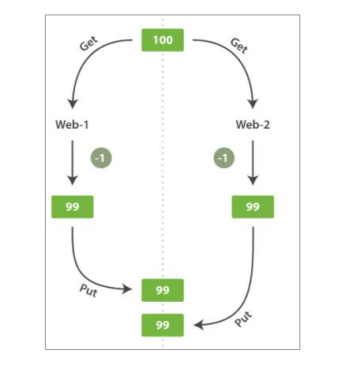

web_1 对 stock_count 所做的更改已经丢失，因为 web_2 不知道它的 stock_count 的拷贝已经过期。 结果我们会认为有超过商品的实际数量的库存，因为卖给顾客的库存商品并不存在，我们将让他们非常失望。

变更越频繁，读数据和更新数据的间隙越长，也就越可能丢失变更。

在数据库领域中，有两种方法通常被用来确保并发更新时变更不会丢失：

- 悲观并发控制

这种方法被关系型数据库广泛使用，它假定有变更冲突可能发生，因此阻塞访问资源以防止冲突。 一个典型的例子是读取一行数据之前先将其锁住，确保只有放置锁的线程能够对这行数据进行修改。

- 乐观并发控制

Elasticsearch 中使用的这种方法假定冲突是不可能发生的，并且不会阻塞正在尝试的操作。 然而，如果源数据在读写当中被修改，更新将会失败。应用程序接下来将决定该如何解决冲突。 例如，可以重试更新、使用新的数据、或者将相关情况报告给用户。

### 4.8.2 乐观并发控制

Elasticsearch 是分布式的。当文档创建、更新或删除时， 新版本的文档必须复制到集群中的其他节点。Elasticsearch 也是异步和并发的，这意味着这些复制请求被并行发送，并且到达目的地时也许 顺序是乱的 。 Elasticsearch 需要一种方法确保文档的旧版本不会覆盖新的版本。

当我们之前讨论 index ，GET 和 delete 请求时，我们指出每个文档都有一个 _version （版本）号，当文档被修改时版本号递增。 Elasticsearch 使用这个 version 号来确保变更以正确顺序得到执行。如果旧版本的文档在新版本之后到达，它可以被简单的忽略。

我们可以利用 version 号来确保 应用中相互冲突的变更不会导致数据丢失。我们通过指定想要修改文档的 version 号来达到这个目的。 如果该版本不是当前版本号，我们的请求将会失败。老的版本 es 使用 version，但是新版本不支持了，会报下面的错误，提示我们用 if_seq_no和 if_primary_term

```json
{
 "error": {
 "root_cause": [
 {
 "type": "action_request_validation_exception",
 "reason": "Validation Failed: 1: internal versioning can not be used 
for optimistic concurrency control. Please use `if_seq_no` and `if_primary_term` 
instead;"
 }
 ],
 "type": "action_request_validation_exception",
     "reason": "Validation Failed: 1: internal versioning can not be used for 
optimistic concurrency control. Please use `if_seq_no` and `if_primary_term` 
instead;"
 },
 "status": 400
}
```

### 4.8.3 外部系统版本控制

一个常见的设置是使用其它数据库作为主要的数据存储，使用 Elasticsearch 做数据检索， 这意味着主数据库的所有更改发生时都需要被复制到 Elasticsearch ，如果多个进程负责这一数据同步，你可能遇到类似于之前描述的并发问题。

如果你的主数据库已经有了版本号 — 或一个能作为版本号的字段值比如 timestamp —那么你就可以在 Elasticsearch 中通过增加 version_type=external 到查询字符串的方式重用这些相同的版本号， 版本号必须是大于零的整数， 且小于 9.2E+18 — 一个 Java 中 long 类型的正值。

外部版本号的处理方式和我们之前讨论的内部版本号的处理方式有些不同，Elasticsearch 不是检查当前 _version 和请求中指定的版本号是否相同， 而是检查当前\_version 是否 小于 指定的版本号。 如果请求成功，外部的版本号作为文档的新 _version进行存储。 

 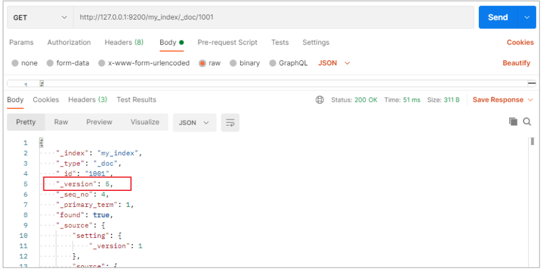

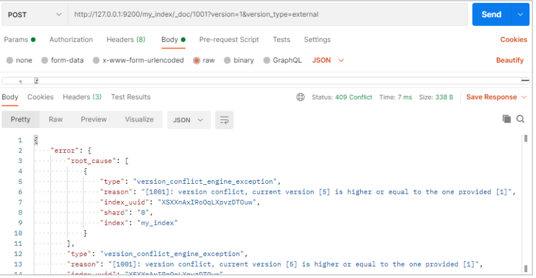

外部版本号不仅在索引和删除请求是可以指定，而且在 创建 新文档时也可以指定。

## 4.5 Kibana

Kibana 是一个免费且开放的用户界面，能够让你对 Elasticsearch 数据进行可视化，并让你在 Elastic Stack 中进行导航。你可以进行各种操作，从跟踪查询负载，到理解请求如何流经你的整个应用，都能轻松完成。

下载地址：https://artifacts.elastic.co/downloads/kibana/kibana-7.8.0-windows-x86_64.zip

1. 解压缩下载的 zip 文件

2. 修改 config/kibana.yml 文件

```sh
# 默认端口
server.port: 5601
# ES 服务器的地址
elasticsearch.hosts: ["http://localhost:9200"]
# 索引名
kibana.index: ".kibana"
# 支持中文
i18n.locale: "zh-CN"
```

3. Windows 环境下执行 bin/kibana.bat 文件

   

4. 通过浏览器访问 : http://localhost:5601 

 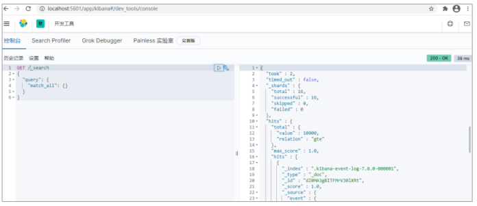

# 第5章 Elasticsearch 集成

## 5.1 Spring Data 框架集成

### 5.1.1 Spring Data 框架介绍

Spring Data 是一个用于简化数据库、非关系型数据库、索引库访问，并支持云服务的开源框架。其主要目标是使得对数据的访问变得方便快捷，并支持 map-reduce 框架和云计算数据服务。 Spring Data 可以极大的简化 JPA（Elasticsearch„）的写法，可以在几乎不用写实现的情况下，实现对数据的访问和操作。除了 CRUD 外，还包括如分页、排序等一些常用的功能。

Spring Data 的官网：https://spring.io/projects/spring-data

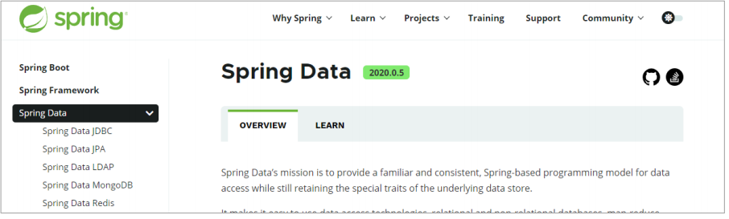

Spring Data 常用的功能模块如下： 

  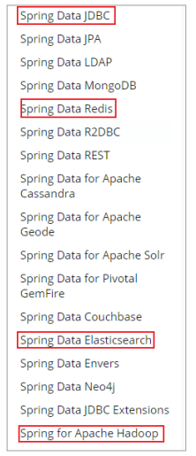

### 5.1.2 Spring Data Elasticsearch 介绍

Spring Data Elasticsearch 基于 spring data API 简化 Elasticsearch 操作，将原始操作

Elasticsearch 的客户端 API 进行封装 。Spring Data 为 Elasticsearch 项目提供集成搜索引擎。

Spring Data Elasticsearch POJO 的关键功能区域为中心的模型与 Elastichsearch 交互文档和轻

松地编写一个存储索引库数据访问层。

官方网站: https://spring.io/projects/spring-data-elasticsearch

 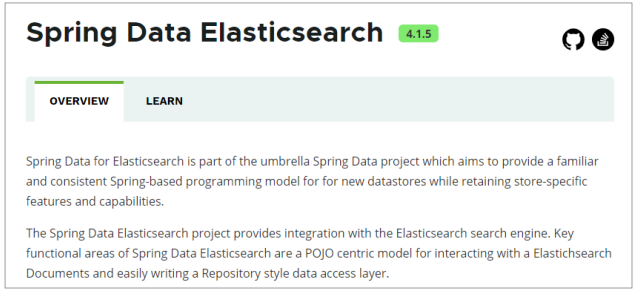

### 5.1.3 Spring Data Elasticsearch 版本对比 

 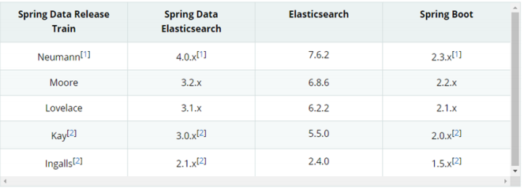


目前最新 springboot 对应 Elasticsearch7.6.2，Spring boot2.3.x 一般可以兼容 Elasticsearch7.x

### 5.1.4 框架集成

1. 创建 Maven 项目

   

2. 修改 pom 文件，增加依赖关系

```xml
<?xml version="1.0" encoding="UTF-8"?>
<project xmlns="http://maven.apache.org/POM/4.0.0"
 xmlns:xsi="http://www.w3.org/2001/XMLSchema-instance"
 xsi:schemaLocation="http://maven.apache.org/POM/4.0.0 
http://maven.apache.org/xsd/maven-4.0.0.xsd">
 <modelVersion>4.0.0</modelVersion>
 <parent>
 <groupId>org.springframework.boot</groupId>
 <artifactId>spring-boot-starter-parent</artifactId>
 <version>2.3.6.RELEASE</version>
 <relativePath/>
 </parent>
 <groupId>com.atguigu.es</groupId>
 <artifactId>springdata-elasticsearch</artifactId>
 <version>1.0</version>
 <properties>
<maven.compiler.source>8</maven.compiler.source>
 <maven.compiler.target>8</maven.compiler.target>
 </properties>
 <dependencies>
 <dependency>
 <groupId>org.projectlombok</groupId>
<artifactId>lombok</artifactId>
 </dependency>
 <dependency>
 <groupId>org.springframework.boot</groupId>
 <artifactId>spring-boot-starter-data-elasticsearch</artifactId>
 </dependency>
 <dependency>
 <groupId>org.springframework.boot</groupId>
 <artifactId>spring-boot-devtools</artifactId> 
 <scope>runtime</scope>
<optional>true</optional>
</dependency>
 <dependency>
 <groupId>org.springframework.boot</groupId>
 <artifactId>spring-boot-starter-test</artifactId>
 <scope>test</scope>
 </dependency>
 <dependency>
 <groupId>org.springframework.boot</groupId>
 <artifactId>spring-boot-test</artifactId>
 </dependency>
 <dependency>
 <groupId>junit</groupId>
 <artifactId>junit</artifactId>
 </dependency>
 <dependency>
 <groupId>org.springframework</groupId>
 <artifactId>spring-test</artifactId>
 </dependency>
 </dependencies>
</project>
```

3. 增加配置文件

在 resources 目录中增加 application.properties 文件

```sh
# es 服务地址
elasticsearch.host=127.0.0.1
# es 服务端口
elasticsearch.port=9200
# 配置日志级别,开启 debug 日志
logging.level.com.atguigu.es=debug
```

4. SpringBoot 主程序

```java
package com.atguigu.es;
import org.springframework.boot.SpringApplication;
import org.springframework.boot.autoconfigure.SpringBootApplication;

@SpringBootApplication
public class SpringDataElasticSearchMainApplication {
    public static void main(String[] args) {
        SpringApplication.run(SpringDataElasticSearchMainApplication.class,args);
    } 
}
```

5. 数据实体类

```java
package com.atguigu.es;

import lombok.AllArgsConstructor;
import lombok.Data;
import lombok.NoArgsConstructor;
import lombok.ToString;

@Data
@NoArgsConstructor
@AllArgsConstructor
@ToString
public class Product {
    private Long id;//商品唯一标识
    private String title;//商品名称 
    private String category;//分类名称
    private Double price;//商品价格
    private String images;//图片地址
}
```

6. 配置类

- ElasticsearchRestTemplate 是 spring-data-elasticsearch 项目中的一个类，和其他 spring 项目中的 template类似。

- 在新版的 spring-data-elasticsearch 中，ElasticsearchRestTemplate 代替了原来的 ElasticsearchTemplate。 

- 原因是 ElasticsearchTemplate 基于 TransportClient，TransportClient 即将在 8.x 以后的版本中移除。所以，我们推荐使用 ElasticsearchRestTemplate。 

- ElasticsearchRestTemplate 基 于 RestHighLevelClient 客户端的。需要自定义配置类，继承AbstractElasticsearchConfiguration，并实现 elasticsearchClient()抽象方法，创建 RestHighLevelClient 对象。

```java
package com.atguigu.es;

import lombok.Data;
import org.apache.http.HttpHost;
import org.elasticsearch.client.RestClient;
import org.elasticsearch.client.RestClientBuilder;
import org.elasticsearch.client.RestHighLevelClient;
import org.springframework.boot.context.properties.ConfigurationProperties;
import org.springframework.context.annotation.Configuration;
import org.springframework.data.elasticsearch.config.AbstractElasticsearchConfiguration;

@ConfigurationProperties(prefix = "elasticsearch")
@Configuration
@Data
public class ElasticsearchConfig extends AbstractElasticsearchConfiguration {
    private String host ;
    private Integer port ;
    //重写父类方法
    @Override
    public RestHighLevelClient elasticsearchClient() {
        RestClientBuilder builder = RestClient.builder(new HttpHost(host, port));
        RestHighLevelClient restHighLevelClient = new RestHighLevelClient(builder);
        return restHighLevelClient;
    } 
}
```

7. DAO 数据访问对象

```java
package com.atguigu.es;
import org.springframework.data.elasticsearch.repository.ElasticsearchRepository;
import org.springframework.stereotype.Repository;
@Repository
public interface ProductDao extends ElasticsearchRepository<Product,Long> {
}
```

8. 实体类映射操作

```java
package com.atguigu.es; 

import lombok.AllArgsConstructor;
import lombok.Data;
import lombok.NoArgsConstructor;
import lombok.ToString;
import org.springframework.data.annotation.Id;
import org.springframework.data.elasticsearch.annotations.Document;
import org.springframework.data.elasticsearch.annotations.Field;
import org.springframework.data.elasticsearch.annotations.FieldType;

@Data
@NoArgsConstructor
@AllArgsConstructor
@ToString
@Document(indexName = "shopping", shards = 3, replicas = 1)
public class Product {
    //必须有 id,这里的 id 是全局唯一的标识，等同于 es 中的"_id"

 @Id
 private Long id;//商品唯一标识

 /**
 *type : 字段数据类型
* analyzer : 分词器类型
* index : 是否索引(默认:true)
* Keyword : 短语,不进行分词
*/

@Field(type = FieldType.Text, analyzer = "ik_max_word")
private String title;//商品名称
@Field(type = FieldType.Keyword)
private String category;//分类名称
@Field(type = FieldType.Double)
private Double price;//商品价格
@Field(type = FieldType.Keyword, index = false)
private String images;//图片地址
}
```

9. 索引操作

```java
package com.atguigu.es;

import org.junit.Test;
import org.junit.runner.RunWith;
import org.springframework.beans.factory.annotation.Autowired;
import org.springframework.boot.test.context.SpringBootTest;
import org.springframework.data.elasticsearch.core.ElasticsearchRestTemplate;
import org.springframework.test.context.junit4.SpringRunner;

@RunWith(SpringRunner.class)
@SpringBootTest
public class SpringDataESIndexTest {

 //注入 ElasticsearchRestTemplate
 @Autowired
 private ElasticsearchRestTemplate elasticsearchRestTemplate;
 //创建索引并增加映射配置
 @Test
 public void createIndex(){
 //创建索引，系统初始化会自动创建索引
 System.out.println("创建索引");
 }
 @Test 
 public void deleteIndex(){
 //创建索引，系统初始化会自动创建索引
 boolean flg = elasticsearchRestTemplate.deleteIndex(Product.class);
 System.out.println("删除索引 = " + flg);
 } 
}
```

10. 文档操作

```java
package com.atguigu.es;
import org.junit.Test;
import org.junit.runner.RunWith;
import org.springframework.beans.factory.annotation.Autowired;
import org.springframework.boot.test.context.SpringBootTest;
import org.springframework.data.domain.Page;
import org.springframework.data.domain.PageRequest;
import org.springframework.data.domain.Sort;
import org.springframework.test.context.junit4.SpringRunner;
import java.util.ArrayList;
import java.util.List;

@RunWith(SpringRunner.class)
@SpringBootTest
public class SpringDataESProductDaoTest {
    @Autowired
    private ProductDao productDao;

 /**
 *\ 新增
 */

 @Test
 public void save(){
     Product product = new Product();
     product.setId(2L);
     product.setTitle("华为手机");
     product.setCategory("手机");
     product.setPrice(2999.0);
     product.setImages("http://www.atguigu/hw.jpg");
     productDao.save(product);
 }

 //修改
 @Test
 public void update(){
     Product product = new Product();
     product.setId(1L);
     product.setTitle("小米 2 手机");
     product.setCategory("手机");
     product.setPrice(9999.0);
     product.setImages("http://www.atguigu/xm.jpg");
     productDao.save(product);
 }

 //根据 id 查询
 @Test
 public void findById(){
     Product product = productDao.findById(1L).get();
     System.out.println(product);
 }

 //查询所有 
@Test
public void findAll(){
    Iterable<Product> products = productDao.findAll();
    for (Product product : products) {
        System.out.println(product);
    }
 }

 //删除

 @Test
 public void delete(){
 Product product = new Product();
 product.setId(1L);
 productDao.delete(product);
 }

 //批量新增
 @Test
 public void saveAll(){
List<Product> productList = new ArrayList<>();
for (int i = 0; i < 10; i++) {
Product product = new Product();
 product.setId(Long.valueOf(i));
 product.setTitle("["+i+"]小米手机");
 product.setCategory("手机");
 product.setPrice(1999.0+i);
 product.setImages("http://www.atguigu/xm.jpg");
 productList.add(product);
 }
 productDao.saveAll(productList);
 }

 //分页查询

 @Test
 public void findByPageable(){
 //设置排序(排序方式，正序还是倒序，排序的 id)
 Sort sort = Sort.by(Sort.Direction.DESC,"id");
 int currentPage=0;//当前页，第一页从 0 开始，1 表示第二页
 int pageSize = 5;//每页显示多少条
 //设置查询分页
 PageRequest pageRequest = PageRequest.of(currentPage, pageSize,sort);
 //分页查询
 Page<Product> productPage = productDao.findAll(pageRequest);
 for (Product Product : productPage.getContent()) {
 System.out.println(Product);
 }
 } 
}
```


11. 文档搜索

```java
package com.atguigu.es;
import org.elasticsearch.index.query.QueryBuilders;
import org.elasticsearch.index.query.TermQueryBuilder;
import org.junit.Test;
import org.junit.runner.RunWith;
import org.springframework.beans.factory.annotation.Autowired;
import org.springframework.boot.test.context.SpringBootTest;
import org.springframework.data.domain.PageRequest;
import org.springframework.test.context.junit4.SpringRunner;

@RunWith(SpringRunner.class) 
@SpringBootTest
public class SpringDataESSearchTest {
    @Autowired
    private ProductDao productDao;

 /**
 *\ term 查询
 *\ search(termQueryBuilder) 调用搜索方法，参数查询构建器对象
*/

 @Test
 public void termQuery(){
TermQueryBuilder termQueryBuilder = QueryBuilders.termQuery("title", "小米");
Iterable<Product> products = productDao.search(termQueryBuilder);
     for (Product product : products) {
         System.out.println(product);
     }
 }

 /**
 *\ term 查询加分页
 */

 @Test
public void termQueryByPage(){
    int currentPage= 0 ;
    int pageSize = 5;
    //设置查询分页
 PageRequest pageRequest = PageRequest.of(currentPage, pageSize);
 TermQueryBuilder termQueryBuilder = QueryBuilders.termQuery("title", "小米");
 Iterable<Product> products = productDao.search(termQueryBuilder,pageRequest);
 for (Product product : products) {
     System.out.println(product);
 }
 } 
}
```

## 5.2 Spark Streaming 框架集成

### 5.2.1 Spark Streaming 框架介绍

Spark Streaming 是 Spark core API 的扩展，支持实时数据流的处理，并且具有可扩展，高吞吐量，容错的特点。

数据可以从许多来源获取，如 Kafka，Flume，Kinesis 或 TCP sockets，并且可以使用复杂的算法进行处理，这些算法使用诸如 map，reduce，join 和 window 等高级函数表示。 最后，处理后的数据可以推送到文件系统，数据库等。 实际上，您可以将Spark 的机器学习和图形处理算法应用于数据流。 

 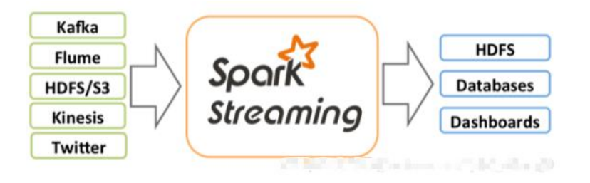

### 5.2.2 框架集成

1. 创建 Maven 项目

   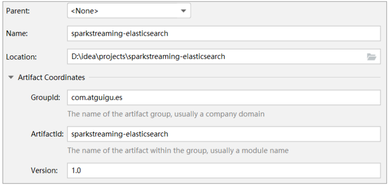

2. 修改 pom 文件，增加依赖关系

```xml
<?xml version="1.0" encoding="UTF-8"?>

<project xmlns="http://maven.apache.org/POM/4.0.0"

 xmlns:xsi="http://www.w3.org/2001/XMLSchema-instance"

 xsi:schemaLocation="http://maven.apache.org/POM/4.0.0 

http://maven.apache.org/xsd/maven-4.0.0.xsd">

 <modelVersion>4.0.0</modelVersion>

 <groupId>com.atguigu.es</groupId>

 <artifactId>sparkstreaming-elasticsearch</artifactId>

 <version>1.0</version>

 <properties>

 <maven.compiler.source>8</maven.compiler.source>

 <maven.compiler.target>8</maven.compiler.target>

 </properties>

 <dependencies>

 <dependency>

 <groupId>org.apache.spark</groupId>

 <artifactId>spark-core_2.12</artifactId>

 <version>3.0.0</version>

 </dependency>

 <dependency>

 <groupId>org.apache.spark</groupId>

 <artifactId>spark-streaming_2.12</artifactId>

 <version>3.0.0</version>

 </dependency>

 <dependency>

 <groupId>org.elasticsearch</groupId>

 <artifactId>elasticsearch</artifactId>

 <version>7.8.0</version>

 </dependency> 
<!-- elasticsearch 的客户端 -->

 <dependency>

 <groupId>org.elasticsearch.client</groupId>

 <artifactId>elasticsearch-rest-high-level-client</artifactId>

 <version>7.8.0</version>

 </dependency>

 <!-- elasticsearch 依赖 2.x 的 log4j -->

 <dependency>

 <groupId>org.apache.logging.log4j</groupId>

 <artifactId>log4j-api</artifactId>

 <version>2.8.2</version>

 </dependency>

 <dependency>

 <groupId>org.apache.logging.log4j</groupId>

 <artifactId>log4j-core</artifactId>

 <version>2.8.2</version>

 </dependency>

<!-- <dependency>-->
<!-- <groupId>com.fasterxml.jackson.core</groupId>-->
<!-- <artifactId>jackson-databind</artifactId>-->
<!-- <version>2.11.1</version>-->
<!-- </dependency>-->
<!-- <!– junit 单元测试 –>-->
<!-- <dependency>-->
<!-- <groupId>junit</groupId>-->
<!-- <artifactId>junit</artifactId>-->
<!-- <version>4.12</version>-->
<!-- </dependency>-->
 </dependencies>
</project>
```

3. 功能实现

```scala
package com.atguigu.es

import org.apache.http.HttpHost
import org.apache.spark.SparkConf
import org.apache.spark.streaming.dstream.ReceiverInputDStream
import org.apache.spark.streaming.{Seconds, StreamingContext}
import org.elasticsearch.action.index.IndexRequest
import org.elasticsearch.client.indices.CreateIndexRequest
import org.elasticsearch.client.{RequestOptions, RestClient, RestHighLevelClient}
import org.elasticsearch.common.xcontent.XContentType
import java.util.Date

object SparkStreamingESTest {
    def main(args: Array[String]): Unit = {
        val sparkConf = new SparkConf().setMaster("local[]").setAppName("ESTest")
        val ssc = new StreamingContext(sparkConf, Seconds(3))
        val ds: ReceiverInputDStream[String] = ssc.socketTextStream("localhost", 9999)
        ds.foreachRDD( rdd => { println(" " + new Date())
                               rdd.foreach(
                                   data => {
                                       val client = new RestHighLevelClient( 
                                           RestClient.builder(new HttpHost("localhost", 9200, "http"))
                                       );
                                       // 新增文档 - 请求对象
                                       val request = new IndexRequest();
                                       // 设置索引及唯一性标识
                                       val ss = data.split(" ")
                                       println("ss = " + ss.mkString(","))
                                       request.index("sparkstreaming").id(ss(0));
                                       val productJson = s"""
                                       | { "data":"${ss(1)}" }
                                       |""".stripMargin;
                                       // 添加文档数据，数据格式为 JSON 格式
                                       request.source(productJson,XContentType.JSON);
                                       // 客户端发送请求，获取响应对象
                                       val response = client.index(request, RequestOptions.DEFAULT);
                                       System.out.println("_index:" + response.getIndex());
                                       System.out.println("_id:" + response.getId());
                                       System.out.println("_result:" + response.getResult());
                                       client.close()
                                   }
                               )
                              }
                     )
        ssc.start()
        ssc.awaitTermination()
    } 
}
```


## 5.3 Flink 框架集成

### 5.3.1 Flink 框架介绍

Apache Spark 是一种基于内存的快速、通用、可扩展的大数据分析计算引擎。

Apache Spark 掀开了内存计算的先河，以内存作为赌注，赢得了内存计算的飞速发展。但是在其火热的同时，开发人员发现，在 Spark 中，计算框架普遍存在的缺点和不足依然没有完全解决，而这些问题随着 5G 时代的来临以及决策者对实时数据分析结果的迫切需要而凸显的更加明显：

- 数据精准一次性处理（Exactly-Once） 

- 乱序数据，迟到数据

- 低延迟，高吞吐，准确性

- 容错性

Apache Flink 是一个框架和分布式处理引擎，用于对无界和有界数据流进行有状态计算。在Spark 火热的同时，也默默地发展自己，并尝试着解决其他计算框架的问题。慢慢地，随着这些问题的解决，Flink 慢慢被绝大数程序员所熟知并进行大力推广，阿里公司在 2015 年改进 Flink，并创建了内部分支 Blink，目前服务于阿里集团内部搜索、推荐、广告和蚂蚁等大量核心实时业务。

### 5.3.2 框架集成

1. 创建 Maven 项目

   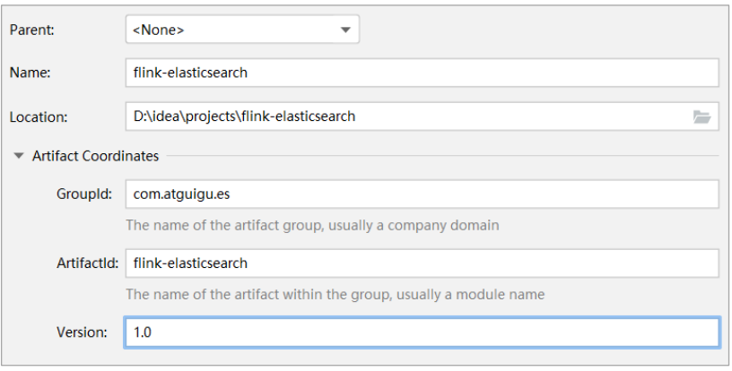

2. 修改 pom 文件，增加相关依赖类库

```xml
<?xml version="1.0" encoding="UTF-8"?>

<project xmlns="http://maven.apache.org/POM/4.0.0"

 xmlns:xsi="http://www.w3.org/2001/XMLSchema-instance"

 xsi:schemaLocation="http://maven.apache.org/POM/4.0.0 

http://maven.apache.org/xsd/maven-4.0.0.xsd">

 <modelVersion>4.0.0</modelVersion>

 <groupId>com.atguigu.es</groupId>

 <artifactId>flink-elasticsearch</artifactId>

 <version>1.0</version>

 <properties>

 <maven.compiler.source>8</maven.compiler.source>

 <maven.compiler.target>8</maven.compiler.target>

 </properties>

 <dependencies>

 <dependency>

 <groupId>org.apache.flink</groupId>

 <artifactId>flink-scala_2.12</artifactId>

 <version>1.12.0</version>

 </dependency>

 <dependency> 
 <groupId>org.apache.flink</groupId>
 <artifactId>flink-streaming-scala_2.12</artifactId>
 <version>1.12.0</version>
 </dependency>
 <dependency>
 <groupId>org.apache.flink</groupId>
 <artifactId>flink-clients_2.12</artifactId>
 <version>1.12.0</version>
 </dependency>
 <dependency>
 <groupId>org.apache.flink</groupId>
 <artifactId>flink-connector-elasticsearch7_2.11</artifactId>
 <version>1.12.0</version>
 </dependency>
 <!-- jackson -->
<dependency>
<groupId>com.fasterxml.jackson.core</groupId>

 <artifactId>jackson-core</artifactId>

 <version>2.11.1</version>

 </dependency>

 </dependencies>

</project>
```

3. 功能实现

```java
package com.atguigu.es;

import org.apache.flink.api.common.functions.RuntimeContext;
import org.apache.flink.streaming.api.datastream.DataStreamSource;
import org.apache.flink.streaming.api.environment.StreamExecutionEnvironment;
import org.apache.flink.streaming.connectors.elasticsearch.ElasticsearchSinkFunction;
import org.apache.flink.streaming.connectors.elasticsearch.RequestIndexer;
import org.apache.flink.streaming.connectors.elasticsearch7.ElasticsearchSink;
import org.apache.http.HttpHost;
import org.elasticsearch.action.index.IndexRequest;
import org.elasticsearch.client.Requests;
import java.util.ArrayList;
import java.util.HashMap;
import java.util.List;
import java.util.Map;
public class FlinkElasticsearchSinkTest {
    public static void main(String[] args) throws Exception {
        StreamExecutionEnvironment env = StreamExecutionEnvironment.getExecutionEnvironment();
        DataStreamSource<String> source = env.socketTextStream("localhost", 9999);
        List<HttpHost> httpHosts = new ArrayList<>();
        httpHosts.add(new HttpHost("127.0.0.1", 9200, "http"));
        //httpHosts.add(new HttpHost("10.2.3.1", 9200, "http"));
        // use a ElasticsearchSink.Builder to create an ElasticsearchSink
        ElasticsearchSink.Builder<String> esSinkBuilder = new ElasticsearchSink.Builder<>( 
            httpHosts,new ElasticsearchSinkFunction<String>() {
                public IndexRequest createIndexRequest(String element) {
                    Map<String, String> json = new HashMap<>();
                    json.put("data", element);
                    return Requests.indexRequest()
                        .index("my-index")
                        //.type("my-type")
                        .source(json);
                }
                @Override
                public void process(String element, RuntimeContext ctx, RequestIndexer indexer) {
                    indexer.add(createIndexRequest(element));
                }
            }
        );
        // configuration for the bulk requests; this instructs the sink to emit after  every element, otherwise they would be buffered esSinkBuilder.setBulkFlushMaxActions(1);
        // provide a RestClientFactory for custom configuration on the internally created REST client

// esSinkBuilder.setRestClientFactory(
// restClientBuilder -> {
// restClientBuilder.setDefaultHeaders(...)
// restClientBuilder.setMaxRetryTimeoutMillis(...)
// restClientBuilder.setPathPrefix(...)
// restClientBuilder.setHttpClientConfigCallback(...)
// }
// );
        source.addSink(esSinkBuilder.build());
        env.execute("flink-es");
    } 
} 
```

# 第6章 Elasticsearch 优化

## 6.1 硬件选择

Elasticsearch 的基础是 Lucene，所有的索引和文档数据是存储在本地的磁盘中，具体的路径可在 ES 的配置文件../config/elasticsearch.yml 中配置，如下：

```sh
#----------------------------------- 
Paths
------------------------------------
#
# Path to directory where to store the data (separate multiple locations by comma):
#
#path.data: /path/to/data
#
# Path to log files:
#path.logs: /path/to/logs
#
```

磁盘在现代服务器上通常都是瓶颈。Elasticsearch 重度使用磁盘，你的磁盘能处理的吞吐量越大，你的节点就越稳定。这里有一些优化磁盘 I/O 的技巧： 

- 使用 SSD。就像其他地方提过的， 他们比机械磁盘优秀多了。

- 使用 RAID 0。条带化 RAID 会提高磁盘 I/O，代价显然就是当一块硬盘故障时整个就故障了。不要使用镜像或者奇偶校验 RAID 因为副本已经提供了这个功能。

- 另外，使用多块硬盘，并允许 Elasticsearch 通过多个 path.data 目录配置把数据条带化分配到它们上面。

- 不要使用远程挂载的存储，比如 NFS 或者 SMB/CIFS。这个引入的延迟对性能来说完全是背道而驰的。

## 6.2 分片策略

### 6.2.1 合理设置分片数

分片和副本的设计为 ES 提供了支持分布式和故障转移的特性，但并不意味着分片和副本是可以无限分配的。而且索引的分片完成分配后由于索引的路由机制，我们是不能重新修改分片数的。可能有人会说，我不知道这个索引将来会变得多大，并且过后我也不能更改索引的大小，所以为了保险起见，还是给它设为 1000 个分片吧。但是需要知道的是，一个分片并不是没有代价的。需要了解：

- 一个分片的底层即为一个 Lucene 索引，会消耗一定文件句柄、内存、以及 CPU 运转。

- 每一个搜索请求都需要命中索引中的每一个分片，如果每一个分片都处于不同的节点还好， 但如果 多个分片都需要在同一个节点上竞争使用相同的资源就有些糟糕了。

- 用于计算相关度的词项统计信息是基于分片的。如果有许多分片，每一个都只有很少的数据会导致很低的相关度。

一个业务索引具体需要分配多少分片可能需要架构师和技术人员对业务的增长有个预先的判断，横向扩展应当分阶段进行。为下一阶段准备好足够的资源。 只有当你进入到下一个阶段，你才有时间思考需要作出哪些改变来达到这个阶段。一般来说，我们遵循一些原则：

- 控制每个分片占用的硬盘容量不超过 ES 的最大 JVM 的堆空间设置（一般设置不超过 32G，参考下文的 JVM 设置原则），因此，如果索引的总容量在 500G 左右，那分片大小在 16 个左右即可；当然，最好同时考虑原则 2。 

- 考虑一下 node 数量，一般一个节点有时候就是一台物理机，如果分片数过多，大大超过了节点数，很可能会导致一个节点上存在多个分片，一旦该节点故障，即使保持了 1 个以上的副本，同样有可能会导致数据丢失，集群无法恢复。所以， 一般都设置分片数不超过节点数的 3 倍。

- 主分片，副本和节点最大数之间数量，我们分配的时候可以参考以下关系：节点数<=主分片数（副本数+1） 

### 6.2.2 推迟分片分配

对于节点瞬时中断的问题，默认情况，集群会等待一分钟来查看节点是否会重新加入，如果这个节点在此期间重新加入，重新加入的节点会保持其现有的分片数据，不会触发新的分片分配。这样就可以减少 ES 在自动再平衡可用分片时所带来的极大开销。通过修改参数 delayed_timeout ，可以延长再均衡的时间，可以全局设置也可以在索引级别进行修改:

```json
PUT /_all/_settings 

{
 "settings": {
 "index.unassigned.node_left.delayed_timeout": "5m" 
 } 
}
```

## 6.3 路由选择

当我们查询文档的时候，Elasticsearch 如何知道一个文档应该存放到哪个分片中呢？它其实是通过下面这个公式来计算出来:

shard = hash(routing) % number_of_primary_shards

routing 默认值是文档的 id，也可以采用自定义值，比如用户 id。 

 

**不带 routing 查询**

在查询的时候因为不知道要查询的数据具体在哪个分片上，所以整个过程分为 2 个步骤

- 分发：请求到达协调节点后，协调节点将查询请求分发到每个分片上。

- 聚合: 协调节点搜集到每个分片上查询结果，在将查询的结果进行排序，之后给用户返回结果。

**带 routing 查询**

查询的时候，可以直接根据 routing 信息定位到某个分配查询，不需要查询所有的分配，经过协调节点排序。

向上面自定义的用户查询，如果 routing 设置为 userid 的话，就可以直接查询出数据来，效率提升很多。

## 6.4 写入速度优化

ES 的默认配置，是综合了数据可靠性、写入速度、搜索实时性等因素。实际使用时，

我们需要根据公司要求，进行偏向性的优化。针对于搜索性能要求不高，但是对写入要求较高的场景，我们需要尽可能的选择恰当写

优化策略。综合来说，可以考虑以下几个方面来提升写索引的性能：

- 加大 Translog Flush ，目的是降低 Iops、Writeblock。 

- 增加 Index Refresh 间隔，目的是减少 Segment Merge 的次数。

- 调整 Bulk 线程池和队列。

- 优化节点间的任务分布。

- 优化 Lucene 层的索引建立，目的是降低 CPU 及 IO。 

### 6.4.1 批量数据提交

ES 提供了 Bulk API 支持批量操作，当我们有大量的写任务时，可以使用 Bulk 来进行批量写入。

通用的策略如下：Bulk 默认设置批量提交的数据量不能超过 100M。数据条数一般是根据文档的大小和服务器性能而定的，但是单次批处理的数据大小应从 5MB～15MB 逐渐增加，当性能没有提升时，把这个数据量作为最大值。

### 6.4.2 优化存储设备

ES 是一种密集使用磁盘的应用，在段合并的时候会频繁操作磁盘，所以对磁盘要求较高，当磁盘速度提升之后，集群的整体性能会大幅度提高。 

###  6.4.3 合理使用合并

Lucene 以段的形式存储数据。当有新的数据写入索引时，Lucene 就会自动创建一个新的段。

随着数据量的变化，段的数量会越来越多，消耗的多文件句柄数及 CPU 就越多，查询效率就会下降。

由于 Lucene 段合并的计算量庞大，会消耗大量的 I/O，所以 ES 默认采用较保守的策略，让后台定期进行段合并

### 6.4.4 减少 Refresh 的次数

Lucene 在新增数据时，采用了延迟写入的策略，默认情况下索引的 refresh_interval 为1 秒。

Lucene 将待写入的数据先写到内存中，超过 1 秒（默认）时就会触发一次 Refresh，然后 Refresh 会把内存中的的数据刷新到操作系统的文件缓存系统中。如果我们对搜索的实效性要求不高，可以将 Refresh 周期延长，例如 30 秒。这样还可以有效地减少段刷新次数，但这同时意味着需要消耗更多的 Heap 内存。

### 6.4.5 加大 Flush 设置

Flush 的主要目的是把文件缓存系统中的段持久化到硬盘，当 Translog 的数据量达到512MB 或者 30 分钟时，会触发一次 Flush。

index.translog.flush_threshold_size 参数的默认值是 512MB，我们进行修改。增加参数值意味着文件缓存系统中可能需要存储更多的数据，所以我们需要为操作系统的文件缓存系统留下足够的空间。

### 6.4.6 减少副本的数量

ES 为了保证集群的可用性，提供了 Replicas（副本）支持，然而每个副本也会执行分析、索引及可能的合并过程，所以 Replicas 的数量会严重影响写索引的效率。当写索引时，需要把写入的数据都同步到副本节点，副本节点越多，写索引的效率就越慢。

如 果 我 们 需 要 大 批 量 进 行 写 入 操 作 ， 可 以 先 禁 止 Replica 复 制 ， 设 置index.number_of_replicas: 0 关闭副本。在写入完成后，Replica 修改回正常的状态。 

##  6.5 内存设置

ES 默认安装后设置的内存是 1GB，对于任何一个现实业务来说，这个设置都太小了。如果是通过解压安装的 ES，则在 ES 安装文件中包含一个 jvm.option 文件，添加如下命令来设置 ES 的堆大小，Xms 表示堆的初始大小，Xmx 表示可分配的最大内存，都是 1GB。确保 Xmx 和 Xms 的大小是相同的，其目的是为了能够在 Java 垃圾回收机制清理完堆区后不需要重新分隔计算堆区的大小而浪费资源，可以减轻伸缩堆大小带来的压力。

假设你有一个 64G 内存的机器，按照正常思维思考，你可能会认为把 64G 内存都给ES 比较好，但现实是这样吗， 越大越好？虽然内存对 ES 来说是非常重要的，但是答案是否定的！因为 ES 堆内存的分配需要满足以下两个原则：

- 不要超过物理内存的 50%：Lucene 的设计目的是把底层 OS 里的数据缓存到内存中。Lucene 的段是分别存储到单个文件中的，这些文件都是不会变化的，所以很利于缓存，同时操作系统也会把这些段文件缓存起来，以便更快的访问。如果我们设置的堆内存过大，Lucene 可用的内存将会减少，就会严重影响降低 Lucene 的全文本查询性能。

- 堆内存的大小最好不要超过 32GB：在 Java 中，所有对象都分配在堆上，然后有一个 Klass Pointer 指针指向它的类元数据。这个指针在 64 位的操作系统上为 64 位，64 位的操作系统可以使用更多的内存（2^64）。在 32 位的系统上为 32 位，32 位的操作系统的最大寻址空间为4GB（2^32）。但是 64 位的指针意味着更大的浪费，因为你的指针本身大了。浪费内存不算，更糟糕的是，更大的指针在主内存和缓存器（例如 LLC, L1 等）之间移动数据的时候，会占用更多的带宽。最终我们都会采用 31 G 设置-Xms 31g-Xmx 31g

假设你有个机器有 128 GB 的内存，你可以创建两个节点，每个节点内存分配不超过 32 GB。 也就是说不超过 64 GB 内存给 ES 的堆内存，剩下的超过 64 GB 的内存给 Lucene

## 6.6 重要配置

| 参数名                             | 参数值        | 说明                                                         |
| ---------------------------------- | ------------- | ------------------------------------------------------------ |
| cluster.name                       | elasticsearch | 配置 ES 的集群名称，默认值是 ES，建议改成与所存数据相关的名称，ES 会自动发现在同一网段下的集群名称相同的节点 |
| node.name                          | node-1        | 集群中的节点名，在同一个集群中不能重复。节点的名称一旦设置，就不能再改变了。当然，也可以设 置 成 服 务 器 的 主 机 名 称 ， 例 如node.name:${HOSTNAME}。 |
| node.master                        | true          | 指定该节点是否有资格被选举成为 Master 节点，默认是 True，如果被设置为 True，则只是有资格成为Master 节点，具体能否成为 Master 节点，需要通过选举产生。 |
| node.data                          | true          | 指定该节点是否存储索引数据，默认为 True。数据的增、删、改、查都是在 Data 节点完成的。 |
| index.number_of_shards             | 1             | 设置都索引分片个数，默认是 1 片。也可以在创建索引时设置该值，具体设置为多大都值要根据数据量的大小来定。如果数据量不大，则设置成 1 时效率最高 |
| index.number_of_replicas           | 1             | 设置默认的索引副本个数，默认为 1 个。副本数越多，集群的可用性越好，但是写索引时需要同步的数据越多。 |
| transport.tcp.compress             | true          | 设置在节点间传输数据时是否压缩，默认为 False，不压缩         |
| discovery.zen.minimum_master_nodes | 1             | 设置在选举 Master 节点时需要参与的最少的候选主节点数，默认为 1。如果使用默认值，则当网络不稳定时有可能会出现脑裂。合理的数值为 (master_eligible_nodes/2)+1 ，其中master_eligible_nodes 表示集群中的候选主节点数 |
| discovery.zen.ping.timeout         | 3s            | 设置在集群中自动发现其他节点时 Ping 连接的超时时间，默认为 3 秒。在较差的网络环境下需要设置得大一点，防止因误判该节点的存活状态而导致分片的转移 |

 

# 第7章 Elasticsearch 面试题

## 7.1 为什么要使用 Elasticsearch?

系统中的数据，随着业务的发展，时间的推移，将会非常多，而业务中往往采用模糊查询进行数据的搜索，而模糊查询会导致查询引擎放弃索引，导致系统查询数据时都是全表扫描，在百万级别的数据库中，查询效率是非常低下的，而我们使用 ES 做一个全文索引，将经常查询的系统功能的某些字段，比如说电商系统的商品表中商品名，描述、价格还有 id 这些字段我们放入 ES 索引库里，可以提高查询速度。

## 7.2 Elasticsearch 的 master 选举流程？

- Elasticsearch 的选主是 ZenDiscovery 模块负责的，主要包含 Ping（节点之间通过这个 RPC 来发现彼此）和 Unicast（单播模块包含一个主机列表以控制哪些节点需要 ping 通）这两部分

- 对所有可以成为 master 的节点（node.master: true）根据 nodeId 字典排序，每次选举每个节点都把自己所知道节点排一次序，然后选出第一个（第 0 位）节点，暂且认为它是 master 节点。

- 如果对某个节点的投票数达到一定的值（可以成为 master 节点数 n/2+1）并且该节点自己也选举自己，那这个节点就是 master。否则重新选举一直到满足上述条件。

- master 节点的职责主要包括集群、节点和索引的管理，不负责文档级别的管理；data 节点可以关闭 http功能。

## 7.3 Elasticsearch 集群脑裂问题？

“脑裂”问题可能的成因: 

- 网络问题：集群间的网络延迟导致一些节点访问不到 master，认为 master 挂掉了从而选举出新的master，并对 master 上的分片和副本标红，分配新的主分片

- 节点负载：主节点的角色既为 master 又为 data，访问量较大时可能会导致 ES 停止响应造成大面积延迟，此时其他节点得不到主节点的响应认为主节点挂掉了，会重新选取主节点。

- 内存回收：data 节点上的 ES 进程占用的内存较大，引发 JVM 的大规模内存回收，造成 ES 进程失去响应。

脑裂问题解决方案：

- 减少误判：discovery.zen.ping_timeout 节点状态的响应时间，默认为 3s，可以适当调大，如果 master在该响应时间的范围内没有做出响应应答，判断该节点已经挂掉了。调大参数（如 6s，discovery.zen.ping_timeout:6），可适当减少误判。

- 选举触发: discovery.zen.minimum_master_nodes:1 

 该参数是用于控制选举行为发生的最小集群主节点数量。当备选主节点的个数大于等于该参数的值，且备选主节点中有该参数个节点认为主节点挂了，进行选举。官方建议为（n/2）+1，n 为主节点个数（即有资格成为主节点的节点个数）

- 角色分离：即 master 节点与 data 节点分离，限制角色

主节点配置为：node.master: true node.data: false

从节点配置为：node.master: false node.data: true

## 7.4 Elasticsearch 索引文档的流程？

- 协调节点默认使用文档 ID 参与计算（也支持通过 routing），以便为路由提供合适的分片：

shard = hash(document_id) % (num_of_primary_shards)

- 当分片所在的节点接收到来自协调节点的请求后，会将请求写入到 Memory Buffer，然后定时（默认是每隔 1 秒）写入到 Filesystem Cache，这个从 Memory Buffer 到 Filesystem Cache 的过程就叫做 refresh； 

- 当然在某些情况下，存在 Momery Buffer 和 Filesystem Cache 的数据可能会丢失，ES 是通过 translog的机制来保证数据的可靠性的。其实现机制是接收到请求后，同时也会写入到 translog 中，当 Filesystem cache 中的数据写入到磁盘中时，才会清除掉，这个过程叫做 flush； 

- 在 flush 过程中，内存中的缓冲将被清除，内容被写入一个新段，段的 fsync 将创建一个新的提交点，并将内容刷新到磁盘，旧的 translog 将被删除并开始一个新的 translog。 

- flush 触发的时机是定时触发（默认 30 分钟）或者 translog 变得太大（默认为 512M）时；

## 7.5 Elasticsearch 更新和删除文档的流程？

- 删除和更新也都是写操作，但是 Elasticsearch 中的文档是不可变的，因此不能被删除或者改动以展示其变更；

- 磁盘上的每个段都有一个相应的.del 文件。当删除请求发送后，文档并没有真的被删除，而是在.del文件中被标记为删除。该文档依然能匹配查询，但是会在结果中被过滤掉。当段合并时，在.del 文件中被标记为删除的文档将不会被写入新段。

- 在新的文档被创建时，Elasticsearch 会为该文档指定一个版本号，当执行更新时，旧版本的文档在.del文件中被标记为删除，新版本的文档被索引到一个新段。旧版本的文档依然能匹配查询，但是会在结果中被过滤掉。

## 7.6 Elasticsearch 搜索的流程？

- 搜索被执行成一个两阶段过程，我们称之为 Query Then Fetch； 

- 在初始查询阶段时，查询会广播到索引中每一个分片拷贝（主分片或者副本分片）。 每个分片在本地执行搜索并构建一个匹配文档的大小为 from + size 的优先队列。PS：在搜索的时候是会查询Filesystem Cache 的，但是有部分数据还在 Memory Buffer，所以搜索是近实时的。

- 每个分片返回各自优先队列中 所有文档的 ID 和排序值 给协调节点，它合并这些值到自己的优先队列中来产生一个全局排序后的结果列表。

- 接下来就是取回阶段，协调节点辨别出哪些文档需要被取回并向相关的分片提交多个 GET 请求。每个分片加载并丰富文档，如果有需要的话，接着返回文档给协调节点。一旦所有的文档都被取回了，协调节点返回结果给客户端。

- Query Then Fetch 的搜索类型在文档相关性打分的时候参考的是本分片的数据，这样在文档数量较少的时候可能不够准确，DFS Query Then Fetch 增加了一个预查询的处理，询问 Term 和 Document frequency，这个评分更准确，但是性能会变差。

## 7.7 Elasticsearch 在部署时，对 Linux 的设置有哪些优化方法？

- 64 GB 内存的机器是非常理想的，但是 32 GB 和 16 GB 机器也是很常见的。少于 8 GB 会适得其反。

- 如果你要在更快的 CPUs 和更多的核心之间选择，选择更多的核心更好。多个内核提供的额外并发远胜过稍微快一点点的时钟频率。

- 如果你负担得起 SSD，它将远远超出任何旋转介质。 基于 SSD 的节点，查询和索引性能都有提升。如果你负担得起，SSD 是一个好的选择。

- 即使数据中心们近在咫尺，也要避免集群跨越多个数据中心。绝对要避免集群跨越大的地理距离。

- 请确保运行你应用程序的 JVM 和服务器的 JVM 是完全一样的。 在 Elasticsearch 的几个地方，使用 Java 的本地序列化。

- 通过设置 gateway.recover_after_nodes、gateway.expected_nodes、gateway.recover_after_time 可以在集群重启的时候避免过多的分片交换，这可能会让数据恢复从数个小时缩短为几秒钟。

- Elasticsearch 默认被配置为使用单播发现，以防止节点无意中加入集群。只有在同一台机器上运行的节点才会自动组成集群。最好使用单播代替组播。

- 不要随意修改垃圾回收器（CMS）和各个线程池的大小。

- 把你的内存的（少于）一半给 Lucene（但不要超过 32 GB！），通过 ES_HEAP_SIZE 环境变量设置。

- 内存交换到磁盘对服务器性能来说是致命的。如果内存交换到磁盘上，一个 100 微秒的操作可能变成 10 毫秒。 再想想那么多 10 微秒的操作时延累加起来。 不难看出 swapping 对于性能是多么可怕。

- Lucene 使用了大量的文件。同时，Elasticsearch 在节点和 HTTP 客户端之间进行通信也使用了大量的套接字。 所有这一切都需要足够的文件描述符。你应该增加你的文件描述符，设置一个很大的值，如 64,000。

补充：索引阶段性能提升方法

- 使用批量请求并调整其大小：每次批量数据 5–15 MB 大是个不错的起始点。

- 存储：使用 SSD

- 段和合并：Elasticsearch 默认值是 20 MB/s，对机械磁盘应该是个不错的设置。如果你用的是 SSD，可以考虑提高到 100–200 MB/s。如果你在做批量导入，完全不在意搜索，你可以彻底关掉合并限流。另外还可以增加 index.translog.flush_threshold_size 设置，从默认的 512 MB 到更大一些的值，比如 1 GB，这可以在一次清空触发的时候在事务日志里积累出更大的段。

- 如果你的搜索结果不需要近实时的准确度，考虑把每个索引的 index.refresh_interval 改到 30s。 

- 如果你在做大批量导入，考虑通过设置 index.number_of_replicas: 0 关闭副本。7.8 GC 方面，在使用 Elasticsearch 时要注意什么？

- 倒排词典的索引需要常驻内存，无法 GC，需要监控 data node 上 segment memory 增长趋势。 

- 各类缓存，field cache, filter cache, indexing cache, bulk queue 等等，要设置合理的大小，并且要应该根据最坏的情况来看 heap 是否够用，也就是各类缓存全部占满的时候，还有 heap 空间可以分配给其他任务吗？避免采用 clear cache 等“自欺欺人”的方式来释放内存。

- 避免返回大量结果集的搜索与聚合。确实需要大量拉取数据的场景，可以采用 scan & scroll api 来实现。

- cluster stats 驻留内存并无法水平扩展，超大规模集群可以考虑分拆成多个集群通过 tribe node 连接。

- 想知道 heap 够不够，必须结合实际应用场景，并对集群的 heap 使用情况做持续的监控。

## 7.9 Elasticsearch 对于大数据量（上亿量级）的聚合如何实现？

Elasticsearch 提供的首个近似聚合是 cardinality 度量。它提供一个字段的基数，即该字段的 distinct或者 unique 值的数目。它是基于 HLL 算法的。HLL 会先对我们的输入作哈希运算，然后根据哈希运算的结果中的 bits 做概率估算从而得到基数。其特点是：可配置的精度，用来控制内存的使用（更精确 ＝ 更多内存）；小的数据集精度是非常高的；我们可以通过配置参数，来设置去重需要的固定内存使用量。无论数千还是数十亿的唯一值，内存使用量只与你配置的精确度相关

## 7.10 在并发情况下，Elasticsearch 如果保证读写一致？

- 可以通过版本号使用乐观并发控制，以确保新版本不会被旧版本覆盖，由应用层来处理具体的冲突；

- 另外对于写操作，一致性级别支持 quorum/one/all，默认为 quorum，即只有当大多数分片可用时才允许写操作。但即使大多数可用，也可能存在因为网络等原因导致写入副本失败，这样该副本被认为故障，分片将会在一个不同的节点上重建。

- 对于读操作，可以设置 replication 为 sync(默认)，这使得操作在主分片和副本分片都完成后才会返回；如果设置 replication 为 async 时，也可以通过设置搜索请求参数_preference 为 primary 来查询主分片，确保文档是最新版本。

## 7.11 如何监控 Elasticsearch 集群状态？

elasticsearch-head 插件

通过 Kibana 监控 Elasticsearch。你可以实时查看你的集群健康状态和性能，也可以分析过去的集群、索引和节点指标

## 7.12 是否了解字典树？

- 常用字典数据结构如下所示: 

 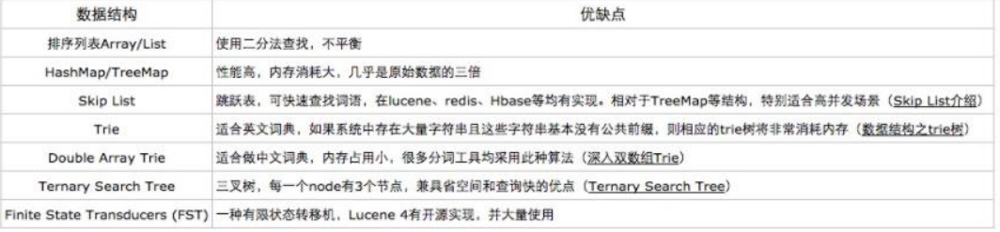

字典树又称单词查找树，Trie 树，是一种树形结构，是一种哈希树的变种。典型应用是用于统计，排序和保存大量的字符串（但不仅限于字符串），所以经常被搜索引擎系统用于文本词频统计。它的优点是：利用字符串的公共前缀来减少查询时间，最大限度地减少无谓的字符串比较，查询效率比哈希树高。

- Trie 的核心思想是空间换时间，利用字符串的公共前缀来降低查询时间的开销以达到提高效率的目的。

它有 3 个基本性质: 

- 根节点不包含字符，除根节点外每一个节点都只包含一个字符。

- 从根节点到某一节点，路径上经过的字符连接起来，为该节点对应的字符串。

- 每个节点的所有子节点包含的字符都不相同。

对于中文的字典树，每个节点的子节点用一个哈希表存储，这样就不用浪费太大的空间，而且查询速度上可以保留哈希的复杂度 O(1)。 

## 7.13 Elasticsearch 中的集群、节点、索引、文档、类型是什么？

- 集群是一个或多个节点（服务器）的集合，它们共同保存您的整个数据，并提供跨所有节点的联合索引和搜索功能。群集由唯一名称标识，默认情况下为“elasticsearch”。此名称很重要，因为如果节点设置为按名称加入群集，则该节点只能是群集的一部分。

- 节点是属于集群一部分的单个服务器。它存储数据并参与群集索引和搜索功能。

- 索引就像关系数据库中的“数据库”。它有一个定义多种类型的映射。索引是逻辑名称空间，映射到一个或多个主分片，并且可以有零个或多个副本分片。 MySQL =>数据库 Elasticsearch =>索引

- 文档类似于关系数据库中的一行。不同之处在于索引中的每个文档可以具有不同的结构（字段），但是对于通用字段应该具有相同的数据类型。 MySQL => Databases => Tables => Columns / Rows Elasticsearch => Indices => Types =>具有属性的文档

- 类型是索引的逻辑类别/分区，其语义完全取决于用户。

## 7.14 Elasticsearch 中的倒排索引是什么？

倒排索引是搜索引擎的核心。搜索引擎的主要目标是在查找发生搜索条件的文档时提供快速搜索。ES中的倒排索引其实就是 lucene 的倒排索引，区别于传统的正向索引，倒排索引会再存储数据时将关键词和数据进行关联，保存到倒排表中，然后查询时，将查询内容进行分词后在倒排表中进行查询，最后匹配数据即可。
