## 1、下载

https://mirrors.tuna.tsinghua.edu.cn/jenkins/windows-stable/2.332.3/jenkins.msi

## 2、安装

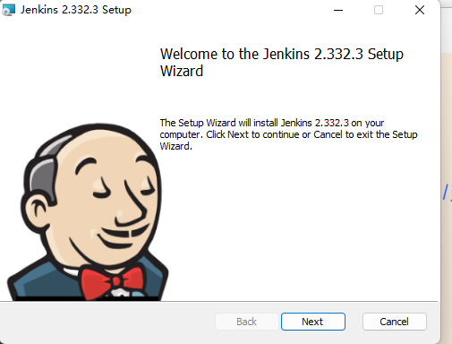

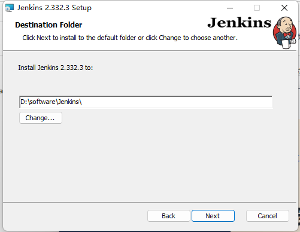


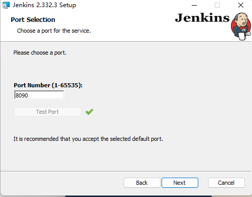

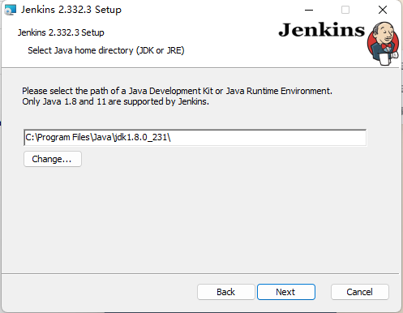

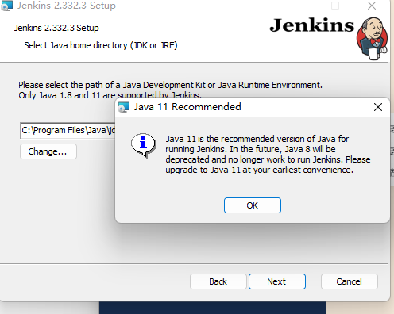

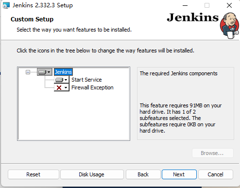

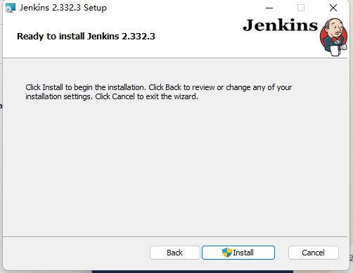

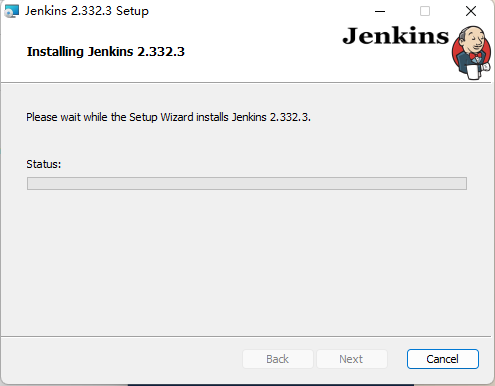

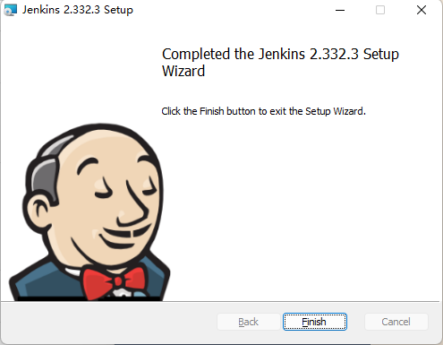

## 3、登录

http://localhost:8090/login?from=%2F

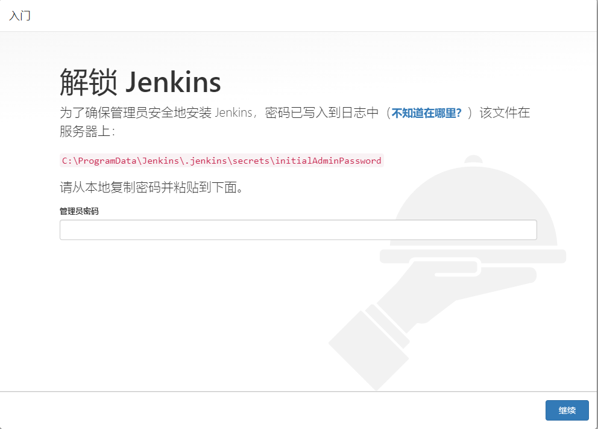

f2789cede1e0423c9cc4bd794189303a

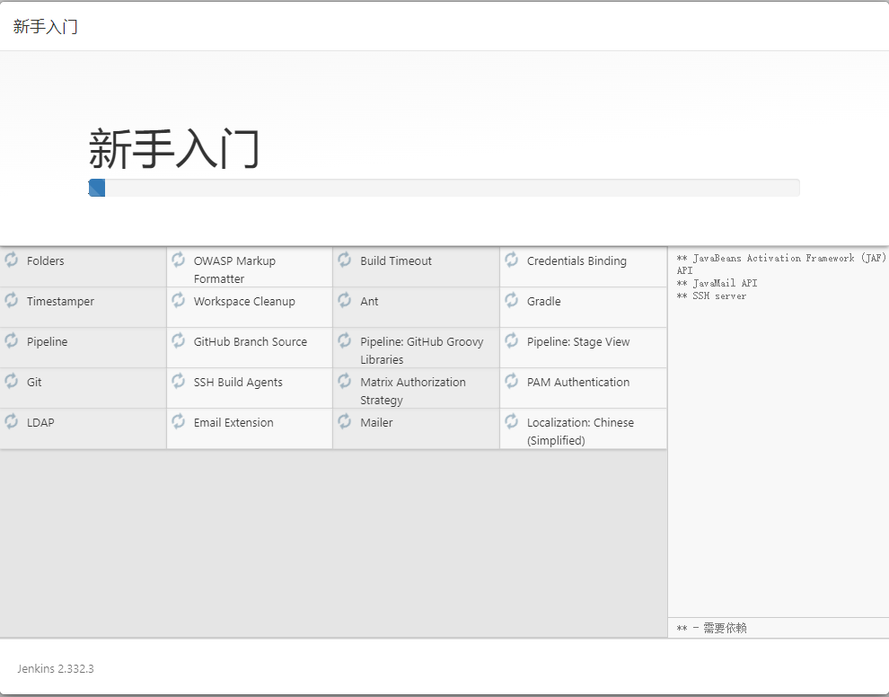

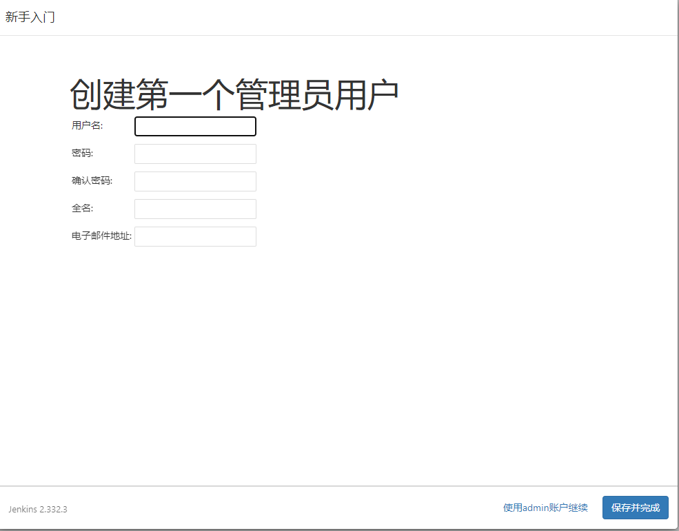

```sh
260164
123456
260164
1724789057@qq.com
```


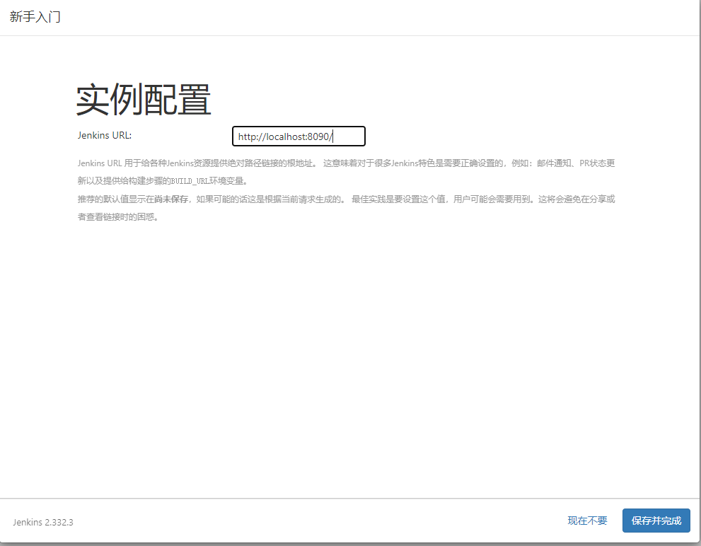

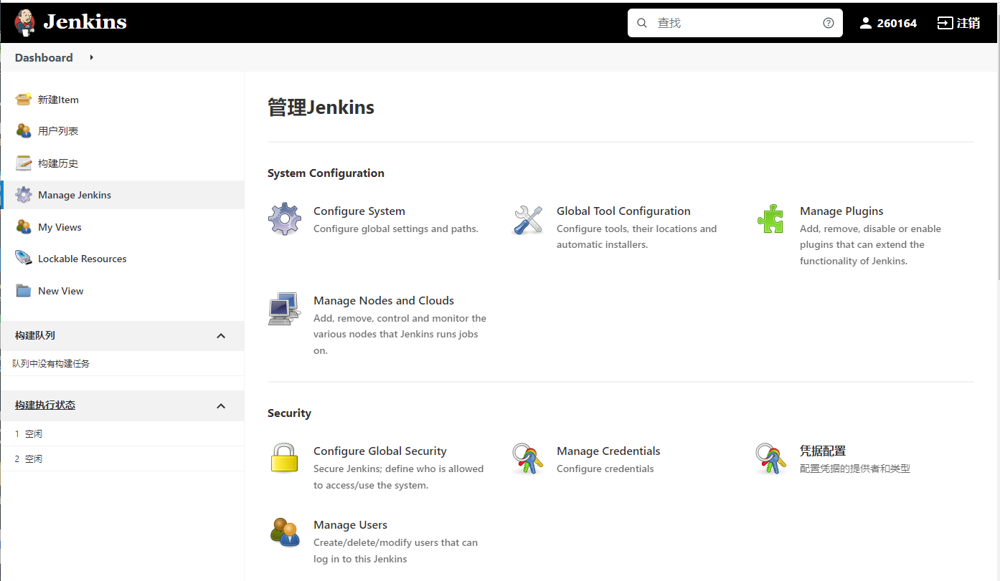


## 4. 插件安装

https://plugins.jenkins.io/

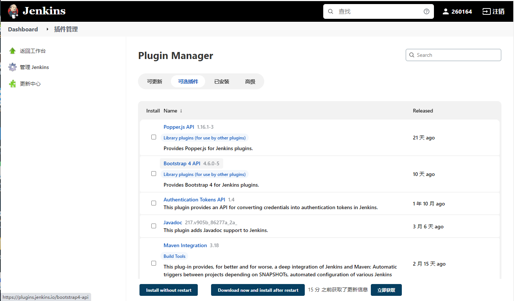


## 5. ubantu 安装

This is the Debian package repository of Jenkins to automate installation and upgrade. To use this repository, first add the key to your system:

```
  curl -fsSL https://pkg.jenkins.io/debian-stable/jenkins.io.key | sudo tee \
    /usr/share/keyrings/jenkins-keyring.asc > /dev/null
  
```

Then add a Jenkins apt repository entry:

```
  echo deb [signed-by=/usr/share/keyrings/jenkins-keyring.asc] \
    https://pkg.jenkins.io/debian-stable binary/ | sudo tee \
    /etc/apt/sources.list.d/jenkins.list > /dev/null
  
```


Update your local package index, then finally install Jenkins:

```
  sudo apt-get update
  sudo apt-get install fontconfig openjdk-11-jre
  sudo apt-get install jenkins
  
```


The apt packages were signed using this key:

```
pub   rsa4096 2020-03-30 [SC] [expires: 2023-03-30]
      62A9756BFD780C377CF24BA8FCEF32E745F2C3D5
uid                      Jenkins Project 
sub   rsa4096 2020-03-30 [E] [expires: 2023-03-30]
```

http://localhost:8080/


## 6. jenkins docker安装

```sh
version: '3.6'
	services:
    	jenkins:		
    		image: jenkins/jenkins:lts
            	volumes:
            		- /etc/localtime:/etc/localtime
                	- /data/jenkins/:/var/jenkins_home
                    - /var/run/docker.sock:/var/run/docker.sock
                    - /usr/bin/docker:/usr/bin/docker
                    - /usr/lib/x86_64-linux-gnu/libltdl.so.7:/usr/lib/x86_64-linux-gnu/libltdl.so.7
                    - /root/scheduler/apache-maven-3.8.5:/usr/local/maven
                    - /root/scheduler/jdk1.8.0_212:/usr/local/java
				ports:
                	- "8081:8080"
                expose:
                	- "8080"
                    - "50000"
                user: root
                restart: always
                container_name: jenkins
                environment:
                	JAVA_OPTS: '-Djava.util.logging.config.file=/var/jenkins_home/log.properties'
                
                networks:
                	jks:
                    	aliases:
                        - jenkinsserver
	networks:
    	jks:
        	name: jks
            driver: bridge
```

```sh
docker-compose up -d
查看正在运行的容器：
$docker ps
进入容器内部,查看目录文件密码：
$docker exec -i -t ebdc4dc22667 bash
$cat /var/jenkins_home/secrets/initialAdminPassword
```

