# 1、Jenkin环境准备

## 安装插件：

> 
>
> 
>
> 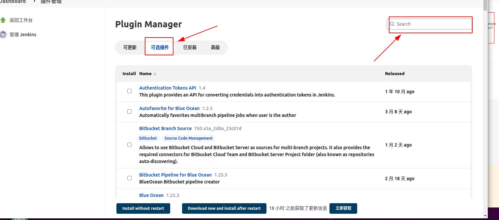
>
> [Maven Integration plugin版本3.18](https://plugins.jenkins.io/maven-plugin)
>
> [Publish Over SSH版本1.24](https://plugins.jenkins.io/publish-over-ssh)
>
> [Git client plugin版本3.11.0](https://plugins.jenkins.io/git-client)
>
> [Git plugin版本4.11.1](https://plugins.jenkins.io/git)

## 配置远程服务信息

> 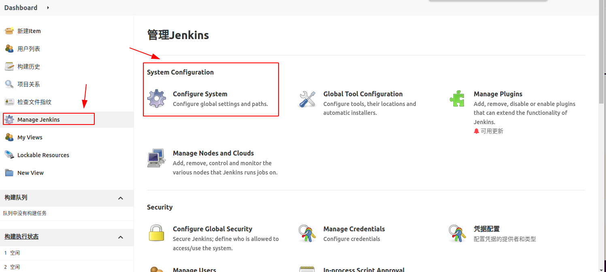
>
> 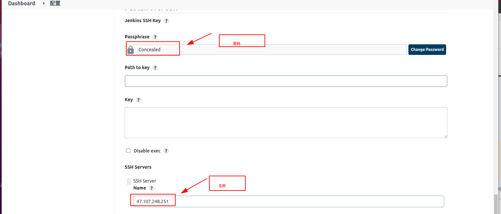
>
> 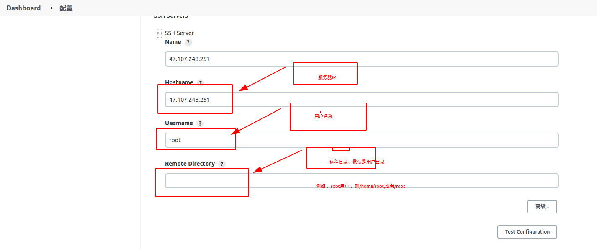

## 全局的工具配置：

> 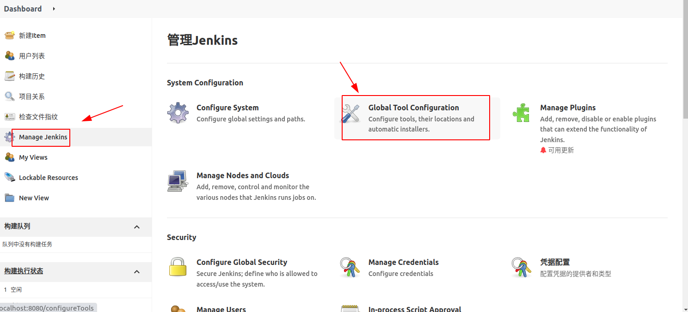
>
> **maven setting 文件配置**
>
> 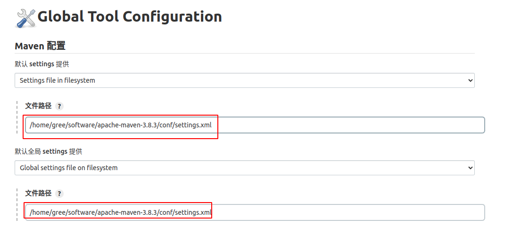
>
> jenkins服务器 的maven 安装目录
>
> 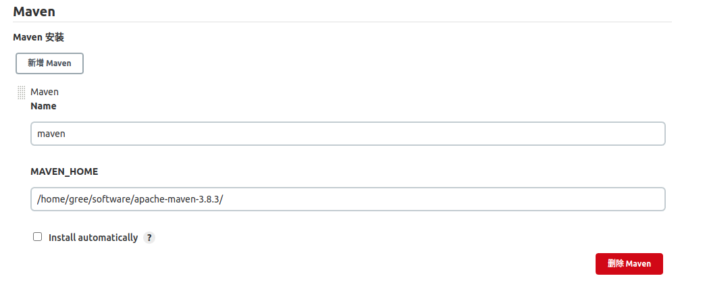

## 凭据管理

> 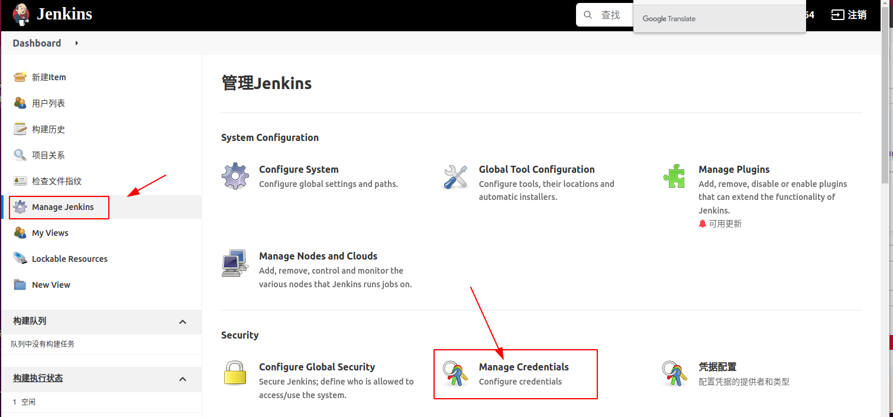
>
> 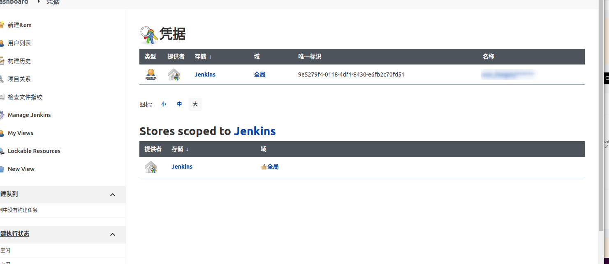


# 2.创建maven任务

## 新建Item

> 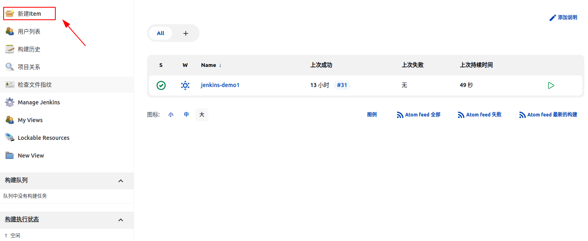

## 输入名称，选择构建一个maven项目，点击确定

> 


## 源码管理

> 选择git ，填写git项目地址，输入之前创建的凭据，选择项目分支，保存
>
> 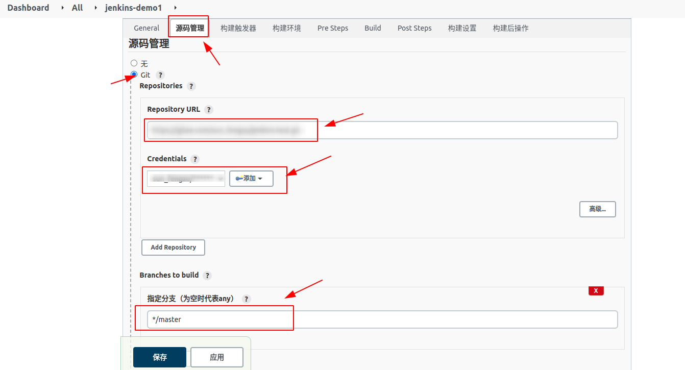

## Build 构建

> 选择pom文件，执行maven 打包，跳过测试，确定保存。
>
> 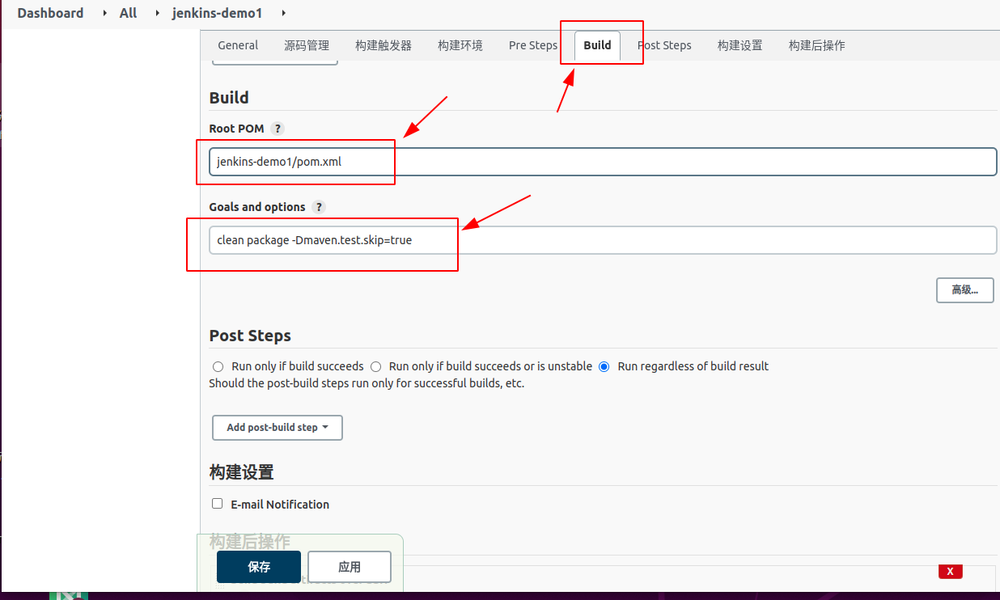

## 构建后操作

> 选择远程服务器，填写需要传输的文件jar包，移除调前缀目录
>
> 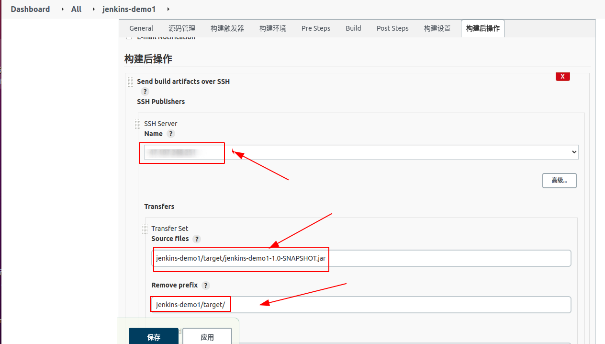
>
> 选择远程服务器目录，并执行服务器上的脚本，需要注意的是，远程目录是在默认目录下的目录，而非绝对路径。
>
> 脚本目录则是服务器上的绝对路径。
>
> 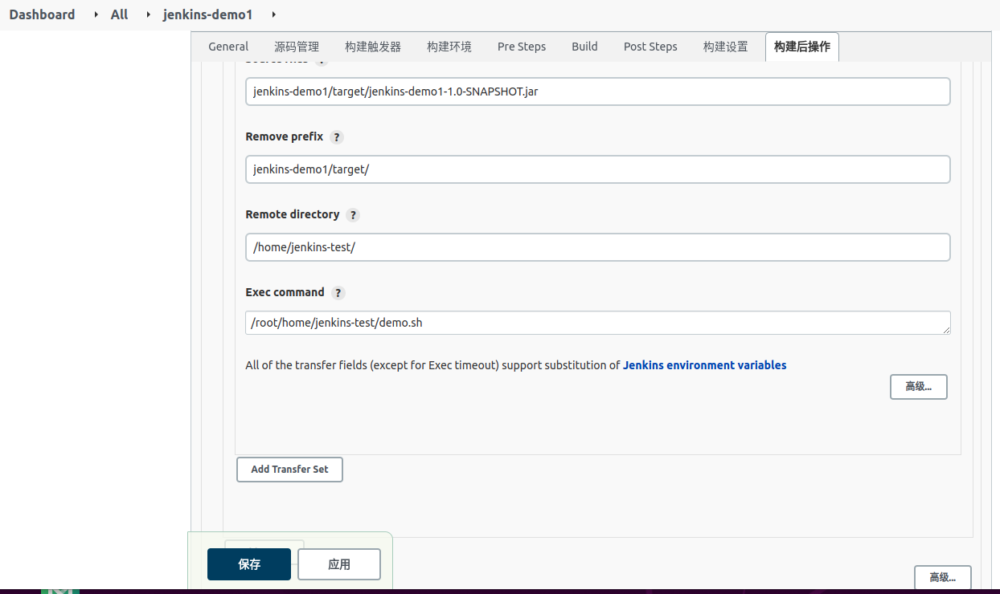


# 3. demo.sh

```sh
#!/bin/bash
# where is jar sources store
ENV=dev
# need to start this jar（Please configure it as your parameter）
APP_NAME=logistics-device-${ENV}
#Your configuration file and address are here
BASE_DIR=/opt/transport/${ENV}/

#your target-package（Please configure it as your parameter）
PROJECT_NAME=logistics-device
#your target-package（Please configure it as your parameter server port）
PORT=34453

JAVA_OPTS=" \
-server \
-Xms2048m \
-Xmx2048m \
-XX:+DisableExplicitGC \
-Djava.awt.headless=true \
-XX:+UseParNewGC \
-XX:+UseConcMarkSweepGC \
-XX:+UseCMSCompactAtFullCollection \
-XX:CMSFullGCsBeforeCompaction=0 \
-XX:CMSInitiatingOccupancyFraction=70 \
-XX:+CMSParallelRemarkEnabled \
-XX:+CMSScavengeBeforeRemark \
-XX:+CMSClassUnloadingEnabled \
" \


# 进入脚本目录
cd ${BASE_DIR}/${PROJECT_NAME}
# ATTENTION  build Dockerfile，清空目录下的Dockerfile文件，或者创建新的文件
echo > Dockerfile

# 写入执行Dockerfile文件内容
echo "
# 该镜像需要依赖的基础镜像
 FROM java:8
 # 指定维护者的名字
  MAINTAINER achims
 # 设置工作目录，进入到容器中的初始目录,不存在会自动创建

 # 将当前目录下的jar包复制到docker容器的/目
ADD ${APP_NAME}.jar /${APP_NAME}.jar

# time
RUN echo "Asia/Shanghai" > /etc/timezone;
 # 声明服务运行在34451端口
 EXPOSE ${PORT}
 # 指定docker容器启动时运行jar包
 CMD java ${JAVA_OPTS} -jar /${APP_NAME}.jar
 ">Dockerfile

# kill docker，停止当前运行的docker，删除docker ，并构建新的的哦参考
lsof -i :${PORT} |grep LISTEN|awk {'print $2'} | xargs kill -9
docker stop ${APP_NAME}
echo '----stop container----'
docker rm ${APP_NAME}
echo '----rm container----'
docker rmi  ${APP_NAME}
docker rmi `docker images | grep none | awk '{print $3}'`
echo '----rm none images 删除docker images中所有为none的镜像----'


# 构建docker
docker build -t ${APP_NAME} .
echo '----build container----'


#这个时候 其实端口映射已经没有用了，但是为了确保后续根据端口删除容器还是县保留  # 使用宿主机的ip 端口
docker run -p ${PORT}:${PORT} --name ${APP_NAME} \
--net=host \
-v /etc/localtime:/etc/localtime \
-v ${BASE_DIR}/${PROJECT_NAME}:${BASE_DIR}/${PROJECT_NAME} \
-d ${APP_NAME}

echo "docker run -p ${PORT}:${PORT} --name ${APP_NAME} \
--net=host \
-v /etc/localtime:/etc/localtime \
-v ${BASE_DIR}/${PROJECT_NAME}:${BASE_DIR}/${PROJECT_NAME} \
-d ${APP_NAME}"
echo '----start container----'
```

