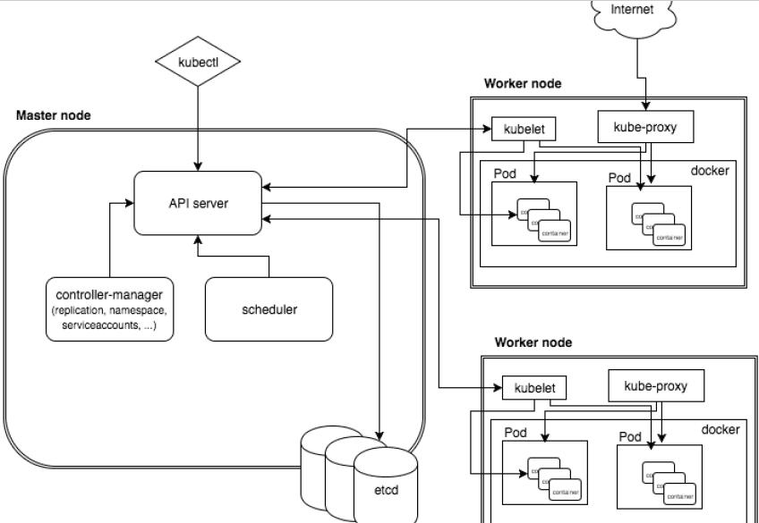
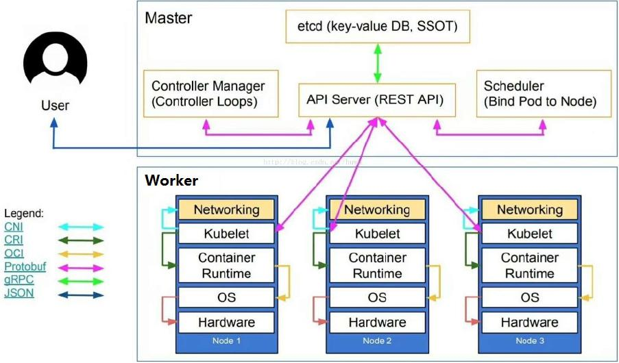
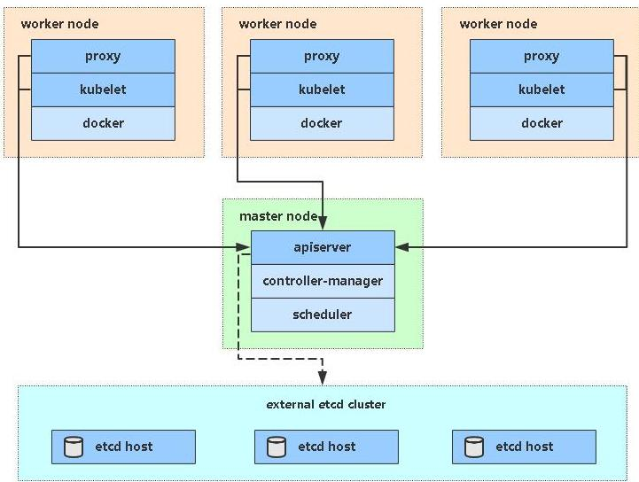
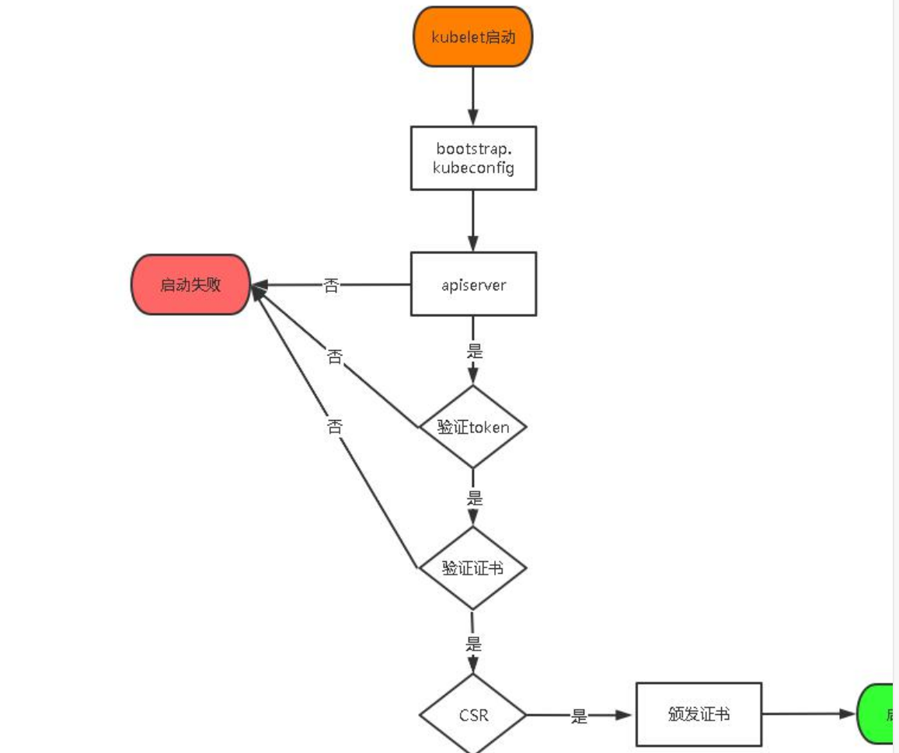

# 一、kubernetes 概述

## 1.1、kubernetes 基本介绍

> kubernetes，简称 K8s，是用 8 代替 8 个字符“ubernete”而成的缩写。是一个开源的，用于管理云平台中多个主机上的容器化的应用，Kubernetes 的目标是让部署容器化的应用简单并且高效（powerful），Kubernetes 提供了应用部署，规划，更新，维护的一种机制。
>
> 传统的应用部署方式是通过插件或脚本来安装应用。这样做的缺点是应用的运行、配置、管理、所有生存周期将与当前操作系统绑定，这样做并不利于应用的升级更新/回滚等操作，当然也可以通过创建虚拟机的方式来实现某些功能，但是虚拟机非常重，并不利于可移植性。
>
> 新的方式是通过**部署容器**方式实现，每个容器之间互相隔离，每个容器有自己的文件系统 ，容器之间进程不会相互影响，能区分计算资源。相对于虚拟机，容器能快速部署，由于容器与底层设施、机器文件系统解耦的，所以它能在不同云、不同版本操作系统间进行迁移。
>
> 容器**占用资源少、部署快**，每个应用可以被打包成一个容器镜像，每个应用与容器间成一对一关系也使容器有更大优势，使用容器可以在 build 或 release 的阶段，为应用创建容器镜像，因为每个应用不需要与其余的应用堆栈组合，也不依赖于生产环境基础结构，这使得从研发到测试、生产能提供**一致环境**。类似地，容器比虚拟机轻量、更“透明”，这更便于监控和管理。
>
> Kubernetes 是 Google 开源的一个**容器编排引擎**，它支持自动化部署、大规模可伸缩、应用容器化管理。在生产环境中部署一个应用程序时，通常要部署该应用的多个实例以便对应用请求进行负载均衡。在 Kubernetes 中，我们可以创建多个容器，每个容器里面运行一个应用实例，然后通过内置的负载均衡策略，实现对这一组应用实例的管理、发现、访问，而这些细节都不需要运维人员去进行复杂的手工配置和处理。

## 1.2、kubernetes 功能和架构

### 1.2.1 概述

> Kubernetes 是一个轻便的和可扩展的**开源**平台，用于管理容器化应用和服务。通过Kubernetes 能够进行应用的自动化部署和扩缩容。在 Kubernetes 中，会将组成应用的容器组合成一个逻辑单元以更易管理和发现。Kubernetes 积累了作为 Google 生产环境运行工作负载 15 年的经验，并吸收了来自于社区的最佳想法和实践。

### 1.2.2 K8s 功能:

> （1）**自动装箱**
>
> 基于容器对应用运行环境的资源配置要求自动部署应用容器
>
> （2）**自我修复(自愈能力)**
>
> 当容器失败时，会对容器进行重启
>
> 当所部署的 Node 节点有问题时，会对容器进行重新部署和重新调度
>
> 当容器未通过监控检查时，会关闭此容器直到容器正常运行时，才会对外提供服务
>
> （3）**水平扩展**
>
> 通过简单的命令、用户 UI 界面或基于 CPU 等资源使用情况，对应用容器进行规模扩大或规模剪裁
>
> （3）**服务发现**
>
> 用户不需使用额外的服务发现机制，就能够基于 Kubernetes 自身能力实现服务发现和负载均衡
>
> （4）**滚动更新**
>
> 可以根据应用的变化，对应用容器运行的应用，进行一次性或批量式更新
>
> （5）**版本回退**
>
> 可以根据应用部署情况，对应用容器运行的应用，进行历史版本即时回退
>
> （6）**密钥和配置管理**
>
> 在不需要重新构建镜像的情况下，可以部署和更新密钥和应用配置，类似热部署。
>
> （7）**存储编排**
>
> 自动实现存储系统挂载及应用，特别对有状态应用实现数据持久化非常重要
>
> 存储系统可以来自于本地目录、网络存储(NFS、Gluster、Ceph 等)、公共云存储服务
>
> （8）**批处理**
>
> 提供一次性任务，定时任务；满足批量数据处理和分析的场景

### 1.2.3应用部署架构分类

> (1) **无中心节点架构**
>
> GlusterFS
>
> (2) **有中心节点架构**
>
> HDFS
>
> K8S

### 1.2.4 k8s 集群架构



### 1.2.5 k8s 集群架构节点角色功能

> **Master Node**
>
> k8s 集群控制节点，对集群进行调度管理，接受集群外用户去集群操作请求；Master Node 由 API Server、Scheduler、ClusterState Store（ETCD 数据库）和Controller MangerServer 所组成
>
> **Worker Node**
>
> 集群工作节点，运行用户业务应用容器；
>
> Worker Node 包含 kubelet、kube proxy 和 ContainerRuntime；
>
> 

# 二、kubernetes 集群搭建(kubeadm 方式)

## 2.1、前置知识点

> 目前生产部署 Kubernetes 集群主要有两种方式：
>
> （1）kubeadm
>
> Kubeadm 是一个 K8s 部署工具，提供 kubeadm init 和 kubeadm join，用于快速部署 Kubernetes 集群。
>
> 官方地址：https://kubernetes.io/docs/reference/setup-tools/kubeadm/kubeadm/
>
> （2）二进制包
>
> 从 github 下载发行版的二进制包，手动部署每个组件，组成 Kubernetes 集群。Kubeadm 降低部署门槛，但屏蔽了很多细节，遇到问题很难排查。如果想更容易可控，**推荐使用二进制包**部署 Kubernetes 集群，虽然手动部署麻烦点，期间可以学习很多工作原理，也利于后期维护。

## 2.2、kubeadm 部署方式介绍

> kubeadm 是官方社区推出的一个用于快速部署 kubernetes 集群的工具，这个工具能通过两条指令完成一个 kubernetes 集群的部署：
>
> 第一、创建一个 Master 节点
>
> kubeadm init
>
> 第二， 将 Node 节点加入到当前集群中 $ kubeadm join <Master 节点的 IP 和端口 >

## 2.3、安装要求

> 在开始之前，部署 Kubernetes 集群机器需要满足以下几个条件：- 一台或多台机器，操作系统CentOS7.x-86_x64
>
> - 硬件配置：2GB 或更多 RAM，2 个 CPU 或更多 CPU，硬盘 30GB 或更多
> - 集群中所有机器之间网络互通
> - 可以访问外网，需要拉取镜像
> - 禁止 swap 分区

## 2. 4、最终目标

> （1） 在所有节点上安装 Docker 和 kubeadm
>
> （2）部署 Kubernetes Master
>
> （3）部署容器网络插件
>
> （4）部署 Kubernetes Node，将节点加入 Kubernetes 集群中
>
> （5）部署 Dashboard Web 页面，可视化查看 Kubernetes 资源

## 2.5、准备环境



| 角色       | IP            |
| ---------- | ------------- |
| k8s-master | 192.168.31.61 |
| k8s-node1  | 192.168.31.62 |
| k8s-node2  | 192.168.31.63 |

## 2.6、系统初始化

### 2.6.1 关闭防火墙：

```sh
$ systemctl stop firewalld
$ systemctl disable firewalld
```

### 2. 6.2 关闭 selinux：

```sh
$ sed -i 's/enforcing/disabled/' /etc/selinux/config # 永久
$ setenforce 0 # 临时
```

### 2.6.3 关闭 swap：

```sh
$ swapoff -a # 临时

$ vim /etc/fstab # 永久
```

### 2.6.4 主机名：

```sh
$ hostnamectl set-hostname <hostname>
```

### 2.6.5 在 master 添加 hosts：

```sh
$ cat >> /etc/hosts << EOF
192.168.31.61 k8s-master
192.168.31.62 k8s-node1
192.168.31.63 k8s-node2
EOF

```

### 2.6.6 将桥接的 IPv4 流量传递到 iptables 的链：

```sh
$ cat > /etc/sysctl.d/k8s.conf << EOF
net.bridge.bridge-nf-call-ip6tables = 1
net.bridge.bridge-nf-call-iptables = 1
EOF

$ sysctl --system # 生效
```

### 2.6.7 时间同步：

```sh
$ yum install ntpdate -y
$ ntpdate time.windows.com
```

## 2.7、所有节点安装 Docker/kubeadm/kubelet

Kubernetes 默认 CRI（容器运行时）为 Docker，因此先安装 Docker。

（1）安装 Docker

```sh
$ wget https://mirrors.aliyun.com/docker-ce/linux/centos/docker-ce.repo -O
/etc/yum.repos.d/docker-ce.repo
$ yum -y install docker-ce-18.06.1.ce-3.el7
$ systemctl enable docker && systemctl start docker
$ docker --version
```

（2）添加阿里云 YUM 软件源

设置仓库地址

```sh
# cat > /etc/docker/daemon.json << EOF
{
"registry-mirrors": ["https://b9pmyelo.mirror.aliyuncs.com"]
}
EOF
```

添加 yum 源

```sh
$ cat > /etc/yum.repos.d/kubernetes.repo << EOF
[kubernetes]
name=Kubernetesbaseurl=https://mirrors.aliyun.com/kubernetes/yum/repos/kubernetes-el7-x86_64
enabled=1
gpgcheck=0
repo_gpgcheck=0
gpgkey=https://mirrors.aliyun.com/kubernetes/yum/doc/yum-key.gpg
https://mirrors.aliyun.com/kubernetes/yum/doc/rpm-package-key.gpg
EOF
```

（3）安装 kubeadm，kubelet 和 kubectl

```sh
$ yum install -y kubelet kubeadm kubectl
$ systemctl enable kubelet
```

## 2.8、部署 Kubernetes Master

（1）在 192.168.31.61（Master）执行

```sh
$ kubeadm init \
--apiserver-advertise-address=192.168.31.61 \
--image-repository registry.aliyuncs.com/google_containers \
--kubernetes-version v1.17.0 \
--service-cidr=10.96.0.0/12 \
--pod-network-cidr=10.244.0.0/16
```

由于默认拉取镜像地址 k8s.gcr.io 国内无法访问，这里指定阿里云镜像仓库地址。

（2）使用 kubectl 工具：

```sh
mkdir -p $HOME/.kube
sudo cp -i /etc/kubernetes/admin.conf $HOME/.kube/config
sudo chown $(id -u):$(id -g) $HOME/.kube/config
$ kubectl get nodes
```


## 2.9、安装 Pod 网络插件（CNI）

```sh
$ kubectl apply –fhttps://raw.githubusercontent.com/coreos/flannel/master/Documentation/kube-
flannel.yml
```

确保能够访问到 quay.io 这个 registery。如果 Pod 镜像下载失败，可以改这个镜像地址

## 2.10、加入 Kubernetes Node

（1）在 192.168.31.62/63（Node）执行

向集群添加新节点，执行在 kubeadm init 输出的 kubeadm join 命令：

```sh
$ kubeadm join 192.168.31.61:6443 --token esce21.q6hetwm8si29qxwn \ --discovery-token-ca-cert-hash
sha256:00603a05805807501d7181c3d60b478788408cfe6cedefedb1f97569708be9c5
```

## 2.11、测试 kubernetes 集群

在 Kubernetes 集群中创建一个 pod，验证是否正常运行：

```sh
$ kubectl create deployment nginx --image=nginx
$ kubectl expose deployment nginx --port=80 --type=NodePort
$ kubectl get pod,svc
```

访问地址：http://NodeIP:Port

# 三、kubernetes 集群搭建(二进制方式)

## 3.1、安装要求

> 在开始之前，部署 Kubernetes 集群机器需要满足以下几个条件：
>
> （1）一台或多台机器，操作系统 CentOS7.x-86_x64
>
> （2）硬件配置：2GB 或更多 RAM，2 个 CPU 或更多 CPU，硬盘 30GB 或更多
>
> （3）集群中所有机器之间网络互通
>
> （4）可以访问外网，需要拉取镜像，如果服务器不能上网，需要提前下载镜像并导入节点
>
> （5）禁止 swap 分区

## 3.2、准备环境

（1）软件环境：

| 软件       | 版本                   |
| ---------- | ---------------------- |
| 操作系统   | CentOS7.8_x64 （mini） |
| Docker     | 19-ce                  |
| Kubernetes | 1.19                   |

（2）服务器规划：

| 角色       | IP            | 组件                                                         |
| ---------- | ------------- | ------------------------------------------------------------ |
| k8s-master | 192.168.31.71 | kube-apiserver，kube-controller-manager，kube-scheduler，etcd |
| k8s-node1  | 192.168.31.72 | kubelet，kube-proxy，docker etcd                             |
| k8s-node2  | 192.168.31.73 | kubelet，kube-proxy，docker，etcd                            |

## 3.3、操作系统初始化配

```sh
# 关闭防火墙

systemctl stop firewalld
systemctl disable firewalld

# 关闭 selinux

sed -i 's/enforcing/disabled/' /etc/selinux/config
setenforce 0

# 临时

# 关闭 swap

swapoff -a

# 临时

sed -ri 's/.*swap.*/#&/' /etc/fstab

# 根据规划设置主机名

hostnamectl set-hostname <hostname>

# 永久

# 永久# 在 master 添加 hosts

cat >> /etc/hosts << EOF
192.168.44.147 m1
192.168.44.148 n1
EOF

# 将桥接的 IPv4 流量传递到 iptables 的链

cat > /etc/sysctl.d/k8s.conf << EOF
net.bridge.bridge-nf-call-ip6tables = 1
net.bridge.bridge-nf-call-iptables = 1
EOF
sysctl --system

# 生效

# 时间同步

yum install ntpdate -y
ntpdate time.windows.com
```

## 3.4、部署 Etcd 集群

> Etcd 是一个分布式键值存储系统，Kubernetes 使用 Etcd 进行数据存储，所以先准备一个 Etcd 数据库，为解决 Etcd 单点故障，应采用集群方式部署，这里使用 3 台组建集群，可容忍 1 台机器故障，当然，你也可以使用 5 台组建集群，可容忍 2 台机器故障。
>
> | 节点名称 | IP            |      |
> | -------- | ------------- | ---- |
> | etcd-1   | 192.168.31.71 |      |
> | etcd-2   | 192.168.31.72 |      |
> | etcd-3   | 192.168.31.73 |      |
>
> 注：为了节省机器，这里与 K8s 节点机器复用。也可以独立于 k8s 集群之外部署，只要apiserver 能连接到就行。

### 3.4.1 准备 cfssl 证书生成工具

> cfssl 是一个开源的证书管理工具，使用 json 文件生成证书，相比 openssl 更方便使用。找任意一台服务器操作，这里用 Master 节点。
>
> ```sh
> wget https://pkg.cfssl.org/R1.2/cfssl_linux-amd64
> wget https://pkg.cfssl.org/R1.2/cfssljson_linux-amd64
> wget https://pkg.cfssl.org/R1.2/cfssl-certinfo_linux-amd64
> chmod +x cfssl_linux-amd64 cfssljson_linux-amd64 cfssl-certinfo_linux-amd64
> mv cfssl_linux-amd64 /usr/local/bin/cfssl
> mv cfssljson_linux-amd64 /usr/local/bin/cfssljson
> mv cfssl-certinfo_linux-amd64 /usr/bin/cfssl-certinfo
> ```

### 3.4.2 生成 Etcd 证书

（1）自签证书颁发机构（CA）

创建工作目录：

```sh
mkdir -p ~/TLS/{etcd,k8s}
cd TLS/etcd
```

自签 CA：

```json
cat > ca-config.json<< EOF
{
    "signing": {
        "default": {
            "expiry": "87600h"
        },
        "profiles": {
            "www": {
                "expiry": "87600h",
                "usages": [
                    "signing","key encipherment","server auth","client auth"
                ]
            }
        }
    }
}
EOF

cat > ca-csr.json<< EOF
{
    "CN": "etcd CA",
    "key": {
        "algo": "rsa",
        "size": 2048
    },
    "names": [
        {
            "C": "CN",
            "L": "Beijing",
            "ST": "Beijing"
}
]
}
EOF
```

生成证书：

```sh
cfssl gencert -initca ca-csr.json | cfssljson -bare ca -ls *pem
ca-key.pem
ca.pem
```

（2）使用自签 CA 签发 Etcd HTTPS 证书

创建证书申请文件：

```json
cat > server-csr.json<< EOF
{
    "CN": "etcd",
    "hosts": [
        "192.168.31.71",
        "192.168.31.72",
        "192.168.31.73"
    ],
    "key": {
        "algo": "rsa",
        "size": 2048
    },
    "names": [
        {
            "C": "CN",
            "L": "BeiJing",
            "ST": "BeiJing"
        }
    ]
}
EOF
```

注：上述文件 hosts 字段中 IP 为所有 etcd 节点的集群内部通信 IP，一个都不能少！为了方便后期扩容可以多写几个预留的 IP。

生成证书：

```sh
cfssl gencert -ca=ca.pem -ca-key=ca-key.pem -config=ca-config.json -
profile=www server-csr.json | cfssljson -bare server
ls server*pem
server-key.pem
server.pem
```

### 3.4.3 从 Github 下载二进制文件

下载地址：https://github.com/etcd-io/etcd/releases/download/v3.4.9/etcd-v3.4.9-linux-amd64.tar.gz

### 3.4.4 部署 Etcd 集群

以下在节点 1 上操作，为简化操作，待会将节点 1 生成的所有文件拷贝到节点 2 和节点 3.

（1）创建工作目录并解压二进制包

```sh
mkdir /opt/etcd/{bin,cfg,ssl} –p
tar zxvf etcd-v3.4.9-linux-amd64.tar.gz
mv etcd-v3.4.9-linux-amd64/{etcd,etcdctl} /opt/etcd/bin/
```

（2）创建 etcd 配置文件

```sh
cat > /opt/etcd/cfg/etcd.conf << EOF
#[Member]
ETCD_NAME="etcd-1"
ETCD_DATA_DIR="/var/lib/etcd/default.etcd"
ETCD_LISTEN_PEER_URLS="https://192.168.31.71:2380"
ETCD_LISTEN_CLIENT_URLS="https://192.168.31.71:2379"
#[Clustering]
ETCD_INITIAL_ADVERTISE_PEER_URLS="https://192.168.31.71:2380"
ETCD_ADVERTISE_CLIENT_URLS="https://192.168.31.71:2379"
ETCD_INITIAL_CLUSTER="etcd-1=https://192.168.31.71:2380,etcd-2=https://192.168.31.72:2380,etcd-3=https://192.168.31.73:2380"
ETCD_INITIAL_CLUSTER_TOKEN="etcd-cluster"
ETCD_INITIAL_CLUSTER_STATE="new"
EOF
ETCD_NAME：节点名称，集群中唯一
ETCD_DATA_DIR：数据目录
ETCD_LISTEN_PEER_URLS：集群通信监听地址
ETCD_LISTEN_CLIENT_URLS：客户端访问监听地址
ETCD_INITIAL_ADVERTISE_PEER_URLS：集群通告地址
ETCD_ADVERTISE_CLIENT_URLS：客户端通告地址
ETCD_INITIAL_CLUSTER：集群节点地址
ETCD_INITIAL_CLUSTER_TOKEN：集群 Token
ETCD_INITIAL_CLUSTER_STATE：加入集群的当前状态，new 是新集群，existing 表示加入已有集群
```


（3）systemd 管理 etcd

```sh
cat > /usr/lib/systemd/system/etcd.service << EOF
[Unit]
Description=Etcd Server
After=network.target
After=network-online.target
Wants=network-online.target
[Service]
Type=notify
EnvironmentFile=/opt/etcd/cfg/etcd.conf
ExecStart=/opt/etcd/bin/etcd \
--cert-file=/opt/etcd/ssl/server.pem \
--key-file=/opt/etcd/ssl/server-key.pem \
--peer-cert-file=/opt/etcd/ssl/server.pem \
--peer-key-file=/opt/etcd/ssl/server-key.pem \
--trusted-ca-file=/opt/etcd/ssl/ca.pem \--peer-trusted-ca-file=/opt/etcd/ssl/ca.pem \
--logger=zap
Restart=on-failure
LimitNOFILE=65536
[Install]
WantedBy=multi-user.target
EOF
```

（4）拷贝刚才生成的证书

把刚才生成的证书拷贝到配置文件中的路径：

```sh
cp ~/TLS/etcd/ca*pem ~/TLS/etcd/server*pem /opt/etcd/ssl/
```


（5）启动并设置开机启动

```sh
systemctl daemon-reload
systemctl start etcd
systemctl enable etcd
```

（6）将上面节点 1 所有生成的文件拷贝到节点 2 和节点 3

```sh
scp -r /opt/etcd/ root@192.168.31.72:/opt/
scp /usr/lib/systemd/system/etcd.service
root@192.168.31.72:/usr/lib/systemd/system/
scp -r /opt/etcd/ root@192.168.31.73:/opt/
scp /usr/lib/systemd/system/etcd.service
root@192.168.31.73:/usr/lib/systemd/system/
```

然后在节点 2 和节点 3 分别修改 etcd.conf 配置文件中的节点名称和当前服务器 IP：

```sh
vi /opt/etcd/cfg/etcd.conf
#[Member]
ETCD_NAME="etcd-1"

# 修改此处，节点 2 改为 etcd-2，节点 3 改为 etcd-3ETCD_DATA_DIR="/var/lib/etcd/default.etcd"

ETCD_LISTEN_PEER_URLS="https://192.168.31.71:2380"

# 修改此处为当前服务器 IP

ETCD_LISTEN_CLIENT_URLS="https://192.168.31.71:2379" # 修改此处为当前服务器 IP
#[Clustering]
ETCD_INITIAL_ADVERTISE_PEER_URLS="https://192.168.31.71:2380" # 修改此处为当前服务器 IP
ETCD_ADVERTISE_CLIENT_URLS="https://192.168.31.71:2379" # 修改此处为当前服务器IP
ETCD_INITIAL_CLUSTER="etcd-1=https://192.168.31.71:2380,etcd-2=https://192.168.31.72:2380,etcd-3=https://192.168.31.73:2380"
ETCD_INITIAL_CLUSTER_TOKEN="etcd-cluster"
ETCD_INITIAL_CLUSTER_STATE="new"
```

最后启动 etcd 并设置开机启动，同上。

（7）查看集群状态

```sh
ETCDCTL_API=3 /opt/etcd/bin/etcdctl --cacert=/opt/etcd/ssl/ca.pem --cert=/opt/etcd/ssl/server.pem --key=/opt/etcd/ssl/server-key.pem --endpoints="https://192.168.31.71:2379,https://192.168.31.72:2379,https://192.168.31.73:2379" endpoint health
https://192.168.31.71:2379 is healthy: successfully committed proposal: took =8.154404ms
https://192.168.31.73:2379 is healthy: successfully committed proposal: took =9.044117ms
https://192.168.31.72:2379 is healthy: successfully committed proposal: took =10.000825ms
```

如果输出上面信息，就说明集群部署成功。如果有问题第一步先看日志：

```sh
/var/log/message 或 journalctl -u etcd
```

## 3.5、安装 Docker

下载地址：https://download.docker.com/linux/static/stable/x86_64/docker-19.03.9.tgz

以下在所有节点操作。这里采用二进制安装，用 yum 安装也一样。

（1）解压二进制包

```sh
tar zxvf docker-19.03.9.tgz
mv docker/* /usr/bin
```

（2） systemd 管理 docker

```sh
cat > /usr/lib/systemd/system/docker.service << EOF
[Unit]
Description=Docker Application Container Engine
Documentation=https://docs.docker.com
After=network-online.target firewalld.service
Wants=network-online.target
[Service]
Type=notify
ExecStart=/usr/bin/dockerd
ExecReload=/bin/kill -s HUP $MAINPID
LimitNOFILE=infinity
LimitNPROC=infinity
LimitCORE=infinity
TimeoutStartSec=0
Delegate=yes
KillMode=process
Restart=on-failure
StartLimitBurst=3
StartLimitInterval=60s
[Install]
WantedBy=multi-user.target
EOF
```

（3）创建配置文件

```sh
mkdir /etc/docker
cat > /etc/docker/daemon.json << EOF
{"registry-mirrors": ["https://b9pmyelo.mirror.aliyuncs.com"]
}
EOF
registry-mirrors 阿里云镜像加速器
```

（4）启动并设置开机启动

```sh
systemctl daemon-reload
systemctl start docker
systemctl enable docker
```

## 3.6、部署 Master Node

### 3.6.1 生成 kube-apiserver 证书

（1）自签证书颁发机构（CA）

```json
cat > ca-config.json<< EOF
{
"signing": {
"default": {
"expiry": "87600h"
},
"profiles": {
"kubernetes": {
"expiry": "87600h",
"usages": [
"signing",
"key encipherment",
"server auth",
"client auth"
]
}
}}
}
EOF
cat > ca-csr.json<< EOF
{
"CN": "kubernetes",
"key": {
"algo": "rsa",
"size": 2048
},
"names": [
{
"C": "CN",
"L": "Beijing",
"ST": "Beijing",
"O": "k8s",
"OU": "System"
}
]
}
EOF
```

（2）生成证书：

```sh
cfssl gencert -initca ca-csr.json | cfssljson -bare ca -
ls *pem
ca-key.pem
ca.pem
```


（3）使用自签 CA 签发 kube-apiserver HTTPS 证书

创建证书申请文件：cd TLS/k8s

```json
cat > server-csr.json<< EOF
{
"CN": "kubernetes",
"hosts": [
"10.0.0.1",
"127.0.0.1",
"192.168.31.71",
"192.168.31.72",
"192.168.31.73",
"192.168.31.74",
"192.168.31.81",
"192.168.31.82",
"192.168.31.88",
"kubernetes",
"kubernetes.default",
"kubernetes.default.svc",
"kubernetes.default.svc.cluster",
"kubernetes.default.svc.cluster.local"
],
"key": {
"algo": "rsa",
"size": 2048
},
"names": [
{
"C": "CN",
"L": "BeiJing",
"ST": "BeiJing","O": "k8s",
"OU": "System"
}
]
}
EOF
```

生成证书：

```sh
cfssl gencert -ca=ca.pem -ca-key=ca-key.pem -config=ca-config.json -
profile=kubernetes server-csr.json | cfssljson -bare server
ls server*pem
server-key.pem
server.pem
```


### 3.6.2 从 Github 下载二进制文件

下载地址：

https://github.com/kubernetes/kubernetes/blob/master/CHANGELOG/CHANGELOG-1.18.md#v1183

注：打开链接你会发现里面有很多包，下载一个 server 包就够了，包含了 Master 和Worker Node 二进制文件。

### 3.6.3 解压二进制包

```sh
mkdir -p /opt/kubernetes/{bin,cfg,ssl,logs}
tar zxvf kubernetes-server-linux-amd64.tar.gz
cd kubernetes/server/bin
cp kube-apiserver kube-scheduler kube-controller-manager /opt/kubernetes/bin
cp kubectl /usr/bin/
```


### 3.6.4 部署 kube-apiserver

(1) 创建配置文件

```sh
cat > /opt/kubernetes/cfg/kube-apiserver.conf << EOFKUBE_APISERVER_OPTS="--logtostderr=false \\
--v=2 \\
--log-dir=/opt/kubernetes/logs \\
--etcd-
servers=https://192.168.31.71:2379,https://192.168.31.72:2379,https://192.168.3
1.73:2379 \\
--bind-address=192.168.31.71 \\
--secure-port=6443 \\
--advertise-address=192.168.31.71 \\
--allow-privileged=true \\
--service-cluster-ip-range=10.0.0.0/24 \\
--enable-admission-
plugins=NamespaceLifecycle,LimitRanger,ServiceAccount,ResourceQuota,NodeRestric
tion \\
--authorization-mode=RBAC,Node \\
--enable-bootstrap-token-auth=true \\
--token-auth-file=/opt/kubernetes/cfg/token.csv \\
--service-node-port-range=30000-32767 \\
--kubelet-client-certificate=/opt/kubernetes/ssl/server.pem \\
--kubelet-client-key=/opt/kubernetes/ssl/server-key.pem \\
--tls-cert-file=/opt/kubernetes/ssl/server.pem
\\
--tls-private-key-file=/opt/kubernetes/ssl/server-key.pem \\
--client-ca-file=/opt/kubernetes/ssl/ca.pem \\
--service-account-key-file=/opt/kubernetes/ssl/ca-key.pem \\
--etcd-cafile=/opt/etcd/ssl/ca.pem \\
--etcd-certfile=/opt/etcd/ssl/server.pem \\
--etcd-keyfile=/opt/etcd/ssl/server-key.pem \\
--audit-log-maxage=30 \\
--audit-log-maxbackup=3 \\
--audit-log-maxsize=100 \\
--audit-log-path=/opt/kubernetes/logs/k8s-audit.log"EOF
```

注：上面两个\ \ 第一个是转义符，第二个是换行符，使用转义符是为了使用 EOF 保留换行符。

```properties
–logtostderr：启用日志
—v：日志等级
–log-dir：日志目录
–etcd-servers：etcd 集群地址
–bind-address：监听地址
–secure-port：https 安全端口
–advertise-address：集群通告地址
–allow-privileged：启用授权
–service-cluster-ip-range：Service 虚拟 IP 地址段
–enable-admission-plugins：准入控制模块
–authorization-mode：认证授权，启用 RBAC 授权和节点自管理
–enable-bootstrap-token-auth：启用 TLS bootstrap 机制
–token-auth-file：bootstrap token 文件
–service-node-port-range：Service nodeport 类型默认分配端口范围
–kubelet-client-xxx：apiserver 访问 kubelet 客户端证书
–tls-xxx-file：apiserver https 证书
–etcd-xxxfile：连接 Etcd 集群证书
–audit-log-xxx：审计日志
```

(2) 拷贝刚才生成的证书

把刚才生成的证书拷贝到配置文件中的路径：

```sh
cp ~/TLS/k8s/ca*pem ~/TLS/k8s/server*pem /opt/kubernetes/ssl/
```

(3) 启用 TLS Bootstrapping 机制

> TLS Bootstraping：Master apiserver 启用 TLS 认证后，Node 节点 kubelet 和 kube-proxy 要与 kube-apiserver 进行通信，必须使用 CA 签发的有效证书才可以，当 Node节点很多时，这种客户端证书颁发需要大量工作，同样也会增加集群扩展复杂度。为了简化流程，Kubernetes 引入了 TLS bootstraping 机制来自动颁发客户端证书，kubelet会以一个低权限用户自动向 apiserver 申请证书，kubelet 的证书由 apiserver 动态签署。所以强烈建议在 Node 上使用这种方式，目前主要用于 kubelet，kube-proxy 还是由我们统一颁发一个证书。

TLS bootstraping 工作流程：



创建上述配置文件中 token 文件：

```sh
cat > /opt/kubernetes/cfg/token.csv << EOF
c47ffb939f5ca36231d9e3121a252940,kubelet-bootstrap,10001,"system:node-bootstrapper"
```

EOF格式：token，用户名，UID，用户组

token 也可自行生成替换：

```sh
head -c 16 /dev/urandom | od -An -t x | tr -d ' '
```

(4) systemd 管理 apiserver

```sh
cat > /usr/lib/systemd/system/kube-apiserver.service << EOF
[Unit]
Description=Kubernetes API Server
Documentation=https://github.com/kubernetes/kubernetes
[Service]
EnvironmentFile=/opt/kubernetes/cfg/kube-apiserver.conf
ExecStart=/opt/kubernetes/bin/kube-apiserver \$KUBE_APISERVER_OPTS
Restart=on-failure
[Install]
WantedBy=multi-user.target
EOF
```

(5) 启动并设置开机启动

```sh
systemctl daemon-reload
systemctl start kube-apiserver
systemctl enable kube-apiserver
```

(6) 授权 kubelet-bootstrap 用户允许请求证书

```sh
kubectl create clusterrolebinding kubelet-bootstrap \
--clusterrole=system:node-bootstrapper \
--user=kubelet-bootstrap
```

### 3.6.5 部署 kube-controller-manager

(1) 创建配置文件

```sh
cat > /opt/kubernetes/cfg/kube-controller-manager.conf << EOF
KUBE_CONTROLLER_MANAGER_OPTS="--logtostderr=false \\
--v=2 \\
--log-dir=/opt/kubernetes/logs \\
--leader-elect=true \\
--master=127.0.0.1:8080 \\
--bind-address=127.0.0.1 \\
--allocate-node-cidrs=true \\
--cluster-cidr=10.244.0.0/16 \\
--service-cluster-ip-range=10.0.0.0/24 \\
--cluster-signing-cert-file=/opt/kubernetes/ssl/ca.pem \\
--cluster-signing-key-file=/opt/kubernetes/ssl/ca-key.pem
\\
--root-ca-file=/opt/kubernetes/ssl/ca.pem \\
--service-account-private-key-file=/opt/kubernetes/ssl/ca-key.pem \\
--experimental-cluster-signing-duration=87600h0m0s"
EOF
```

–master：通过本地非安全本地端口 8080 连接 apiserver。

–leader-elect：当该组件启动多个时，自动选举（HA）

–cluster-signing-cert-file/–cluster-signing-key-file：自动为 kubelet 颁发证书的 CA，与 apiserver 保持一致

(2) systemd 管理 controller-manager

```sh
cat > /usr/lib/systemd/system/kube-controller-manager.service << EOF
[Unit]
Description=Kubernetes Controller Manager
Documentation=https://github.com/kubernetes/kubernetes
[Service]
EnvironmentFile=/opt/kubernetes/cfg/kube-controller-manager.conf
ExecStart=/opt/kubernetes/bin/kube-controller-manager\$KUBE_CONTROLLER_MANAGER_OPTS
Restart=on-failure
[Install]
WantedBy=multi-user.target
EOF
```

(3) 启动并设置开机启动

```sh
systemctl daemon-reload
systemctl start kube-controller-manager
systemctl enable kube-controller-manager
```

### 3.6.6 部署 kube-scheduler

1. 创建配置文件
cat > /opt/kubernetes/cfg/kube-scheduler.conf << EOF
KUBE_SCHEDULER_OPTS="--logtostderr=false \
--v=2 \
--log-dir=/opt/kubernetes/logs \
--leader-elect \
--master=127.0.0.1:8080 \
--bind-address=127.0.0.1"
EOF
–master：通过本地非安全本地端口 8080 连接 apiserver。
–leader-elect：当该组件启动多个时，自动选举（HA）
2. systemd 管理 scheduler
cat > /usr/lib/systemd/system/kube-scheduler.service << EOF
[Unit]
Description=Kubernetes Scheduler
Documentation=https://github.com/kubernetes/kubernetes[Service]
EnvironmentFile=/opt/kubernetes/cfg/kube-scheduler.conf
ExecStart=/opt/kubernetes/bin/kube-scheduler \$KUBE_SCHEDULER_OPTS
Restart=on-failure
[Install]
WantedBy=multi-user.target
EOF
3. 启动并设置开机启动
systemctl daemon-reload
systemctl start kube-scheduler
systemctl enable kube-scheduler
4. 查看集群状态
所有组件都已经启动成功，通过 kubectl 工具查看当前集群组件状态：
kubectl get cs
NAME STATUS MESSAGE
scheduler Healthy ok
controller-manager Healthy ok
etcd-2 Healthy {"health":"true"}
etcd-1 Healthy {"health":"true"}
etcd-0 Healthy {"health":"true"}
ERROR
如上输出说明 Master 节点组件运行正常。
7、部署 Worker Node
下面还是在 Master Node 上操作，即同时作为 Worker Node
7.1 创建工作目录并拷贝二进制文件
在所有 worker node 创建工作目录：
mkdir -p /opt/kubernetes/{bin,cfg,ssl,logs}
从 master 节点拷贝：cd kubernetes/server/bin
cp kubelet kube-proxy /opt/kubernetes/bin
# 本地拷贝
7.2 部署 kubelet
1. 创建配置文件
cat > /opt/kubernetes/cfg/kubelet.conf << EOF
KUBELET_OPTS="--logtostderr=false \\
--v=2 \\
--log-dir=/opt/kubernetes/logs \\
--hostname-override=k8s-master \\
--network-plugin=cni \\
--kubeconfig=/opt/kubernetes/cfg/kubelet.kubeconfig \\
--bootstrap-kubeconfig=/opt/kubernetes/cfg/bootstrap.kubeconfig \\
--config=/opt/kubernetes/cfg/kubelet-config.yml \\
--cert-dir=/opt/kubernetes/ssl \\
--pod-infra-container-image=lizhenliang/pause-amd64:3.0"
EOF
–hostname-override：显示名称，集群中唯一
–network-plugin：启用 CNI
–kubeconfig：空路径，会自动生成，后面用于连接 apiserver
–bootstrap-kubeconfig：首次启动向 apiserver 申请证书
–config：配置参数文件
–cert-dir：kubelet 证书生成目录
–pod-infra-container-image：管理 Pod 网络容器的镜像
2. 配置参数文件
cat > /opt/kubernetes/cfg/kubelet-config.yml << EOF
kind: KubeletConfiguration
apiVersion: kubelet.config.k8s.io/v1beta1address: 0.0.0.0
port: 10250
readOnlyPort: 10255
cgroupDriver: cgroupfs
clusterDNS:
- 10.0.0.2
clusterDomain: cluster.local
failSwapOn: false
authentication:
anonymous:
enabled: false
webhook:
cacheTTL: 2m0s
enabled: true
x509:
clientCAFile: /opt/kubernetes/ssl/ca.pem
authorization:
mode: Webhook
webhook:
cacheAuthorizedTTL: 5m0s
cacheUnauthorizedTTL: 30s
evictionHard:
imagefs.available: 15%
memory.available: 100Mi
nodefs.available: 10%
nodefs.inodesFree: 5%
maxOpenFiles: 1000000
maxPods: 110
EOF3. 生成 bootstrap.kubeconfig 文件
KUBE_APISERVER="https://192.168.31.71:6443" # apiserver IP:PORT
TOKEN="c47ffb939f5ca36231d9e3121a252940" # 与 token.csv 里保持一致
# 生成 kubelet bootstrap kubeconfig 配置文件
kubectl config set-cluster kubernetes \
--certificate-authority=/opt/kubernetes/ssl/ca.pem \
--embed-certs=true \
--server=${KUBE_APISERVER} \
--kubeconfig=bootstrap.kubeconfig
kubectl config set-credentials "kubelet-bootstrap" \
--token=${TOKEN} \
--kubeconfig=bootstrap.kubeconfig
kubectl config set-context default \
--cluster=kubernetes \
--user="kubelet-bootstrap" \
--kubeconfig=bootstrap.kubeconfig
kubectl config use-context default --kubeconfig=bootstrap.kubeconfig
拷贝到配置文件路径：
cp bootstrap.kubeconfig /opt/kubernetes/cfg
4. systemd 管理 kubelet
cat > /usr/lib/systemd/system/kubelet.service << EOF
[Unit]
Description=Kubernetes Kubelet
After=docker.service
[Service]
EnvironmentFile=/opt/kubernetes/cfg/kubelet.confExecStart=/opt/kubernetes/bin/kubelet \$KUBELET_OPTS
Restart=on-failure
LimitNOFILE=65536
[Install]
WantedBy=multi-user.target
EOF
5. 启动并设置开机启动
systemctl daemon-reload
systemctl start kubelet
systemctl enable kubelet
7.3 批准 kubelet 证书申请并加入集群
# 查看 kubelet 证书请求
kubectl get csr
NAME
REQUESTOR
AGE
SIGNERNAME
CONDITION
node-csr-uCEGPOIiDdlLODKts8J658HrFq9CZ--K6M4G7bjhk8A 6m3s
kubernetes.io/kube-apiserver-client-kubelet kubelet-bootstrap
Pending
# 批准申请
kubectl certificate approve node-csr-uCEGPOIiDdlLODKts8J658HrFq9CZ--
K6M4G7bjhk8A
# 查看节点
kubectl get node
注：由于网络插件还没有部署，节点会没有准备就绪 NotReady
7.4 部署 kube-proxy
1. 创建配置文件cat > /opt/kubernetes/cfg/kube-proxy.conf << EOF
KUBE_PROXY_OPTS="--logtostderr=false \\
--v=2 \\
--log-dir=/opt/kubernetes/logs \\
--config=/opt/kubernetes/cfg/kube-proxy-config.yml"
EOF
2. 配置参数文件
cat > /opt/kubernetes/cfg/kube-proxy-config.yml << EOF
kind: KubeProxyConfiguration
apiVersion: kubeproxy.config.k8s.io/v1alpha1
bindAddress: 0.0.0.0
metricsBindAddress: 0.0.0.0:10249
clientConnection:
kubeconfig: /opt/kubernetes/cfg/kube-proxy.kubeconfig
hostnameOverride: k8s-master
clusterCIDR: 10.0.0.0/24
EOF
3. 生成 kube-proxy.kubeconfig 文件
生成 kube-proxy 证书：
# 切换工作目录
cd TLS/k8s
# 创建证书请求文件
cat > kube-proxy-csr.json<< EOF
{
"CN": "system:kube-proxy",
"hosts": [],"key": {
"algo": "rsa",
"size": 2048
},
"names": [
{
"C": "CN",
"L": "BeiJing",
"ST": "BeiJing",
"O": "k8s",
"OU": "System"
}
]
}
EOF
# 生成证书
cfssl gencert -ca=ca.pem -ca-key=ca-key.pem -config=ca-config.json -
profile=kubernetes kube-proxy-csr.json | cfssljson -bare kube-proxy
ls kube-proxy*pem
kube-proxy-key.pem
kube-proxy.pem
生成 kubeconfig 文件：
KUBE_APISERVER="https://192.168.31.71:6443"
kubectl config set-cluster kubernetes \
--certificate-authority=/opt/kubernetes/ssl/ca.pem \
--embed-certs=true \
--server=${KUBE_APISERVER} \--kubeconfig=kube-proxy.kubeconfig
kubectl config set-credentials kube-proxy \
--client-certificate=./kube-proxy.pem \
--client-key=./kube-proxy-key.pem \
--embed-certs=true \
--kubeconfig=kube-proxy.kubeconfig
kubectl config set-context default \
--cluster=kubernetes \
--user=kube-proxy \
--kubeconfig=kube-proxy.kubeconfig
kubectl config use-context default --kubeconfig=kube-proxy.kubeconfig
拷贝到配置文件指定路径：
cp kube-proxy.kubeconfig /opt/kubernetes/cfg/
4. systemd 管理 kube-proxy
cat > /usr/lib/systemd/system/kube-proxy.service << EOF
[Unit]
Description=Kubernetes Proxy
After=network.target
[Service]
EnvironmentFile=/opt/kubernetes/cfg/kube-proxy.conf
ExecStart=/opt/kubernetes/bin/kube-proxy \$KUBE_PROXY_OPTS
Restart=on-failure
LimitNOFILE=65536
[Install]
WantedBy=multi-user.target
EOF
5. 启动并设置开机启动systemctl daemon-reload
systemctl start kube-proxy
systemctl enable kube-proxy
7.5 部署 CNI 网络
先准备好 CNI 二进制文件：
下载地址：
https://github.com/containernetworking/plugins/releases/download/v0.8.6/cni-
plugins-linux-amd64-v0.8.6.tgz
解压二进制包并移动到默认工作目录：
mkdir /opt/cni/bin
tar zxvf cni-plugins-linux-amd64-v0.8.6.tgz -C /opt/cni/bin
部署 CNI 网络：
wget
https://raw.githubusercontent.com/coreos/flannel/master/Documentation/kube-
flannel.yml
sed -i -r "s#quay.io/coreos/flannel:.*-amd64#lizhenliang/flannel:v0.12.0-
amd64#g" kube-flannel.yml
默认镜像地址无法访问，修改为 docker hub 镜像仓库。
kubectl apply -f kube-flannel.yml
kubectl get pods -n kube-system
kubectl get node
部署好网络插件，Node 准备就绪。
7.6 授权 apiserver 访问 kubelet
cat > apiserver-to-kubelet-rbac.yaml<< EOF
apiVersion: rbac.authorization.k8s.io/v1
kind: ClusterRolemetadata:
annotations:
rbac.authorization.kubernetes.io/autoupdate: "true"
labels:
kubernetes.io/bootstrapping: rbac-defaults
name: system:kube-apiserver-to-kubelet
rules:
- apiGroups:
- ""
resources:
- nodes/proxy
- nodes/stats
- nodes/log
- nodes/spec
- nodes/metrics
- pods/log
verbs:
- "*"
---
apiVersion: rbac.authorization.k8s.io/v1
kind: ClusterRoleBinding
metadata:
name: system:kube-apiserver
namespace: ""
roleRef:
apiGroup: rbac.authorization.k8s.io
kind: ClusterRole
name: system:kube-apiserver-to-kubelet
subjects:- apiGroup: rbac.authorization.k8s.io
kind: User
name: kubernetes
EOF
kubectl apply -f apiserver-to-kubelet-rbac.yaml
7.7 新增加 Worker Node
1. 拷贝已部署好的 Node 相关文件到新节点
在 master 节点将 Worker Node 涉及文件拷贝到新节点 192.168.31.72/73
scp -r /opt/kubernetes root@192.168.31.72:/opt/
scp -r /usr/lib/systemd/system/{kubelet,kube-proxy}.service
root@192.168.31.72:/usr/lib/systemd/system
scp -r /opt/cni/ root@192.168.31.72:/opt/
scp /opt/kubernetes/ssl/ca.pem root@192.168.31.72:/opt/kubernetes/ssl
2. 删除 kubelet 证书和 kubeconfig 文件
rm /opt/kubernetes/cfg/kubelet.kubeconfig
rm -f /opt/kubernetes/ssl/kubelet*
注：这几个文件是证书申请审批后自动生成的，每个 Node 不同，必须删除重新生成。
3. 修改主机名
vi /opt/kubernetes/cfg/kubelet.conf
--hostname-override=k8s-node1vi /opt/kubernetes/cfg/kube-proxy-config.yml
hostnameOverride: k8s-node1
4. 启动并设置开机启动
systemctl daemon-reload
systemctl start kubelet
systemctl enable kubelet
systemctl start kube-proxy
systemctl enable kube-proxy
5. 在 Master 上批准新 Node kubelet 证书申请
kubectl get csr
NAME
REQUESTOR
AGE
SIGNERNAME
CONDITION
node-csr-4zTjsaVSrhuyhIGqsefxzVoZDCNKei-aE2jyTP81Uro 89s
kubernetes.io/kube-apiserver-client-kubelet kubelet-bootstrap
Pending
kubectl certificate approve node-csr-4zTjsaVSrhuyhIGqsefxzVoZDCNKei-
aE2jyTP81Uro
6. 查看 Node 状态
    Kubectl get nodeNode2（192.168.31.73 ）节点同上。记得修改主机名！

# 四、kubernetes 集群 YAML 文件详解

  1、YAML 文件概述
  k8s 集群中对资源管理和资源对象编排部署都可以通过声明样式（YAML）文件来解决，也
  就是可以把需要对资源对象操作编辑到 YAML 格式文件中，我们把这种文件叫做资源清单文
  件，通过 kubectl 命令直接使用资源清单文件就可以实现对大量的资源对象进行编排部署
  了。
  2、YAML 文件书写格式
  （1）YAML 介绍
  YAML ：仍是一种标记语言。为了强调这种语言以数据做为中心，而不是以标记语言为重点。
  YAML 是一个可读性高，用来表达数据序列的格式。
  （2）YAML 基本语法
* 使用空格做为缩进
* 缩进的空格数目不重要，只要相同层级的元素左侧对齐即可
* 低版本缩进时不允许使用 Tab 键，只允许使用空格
* 使用#标识注释，从这个字符一直到行尾，都会被解释器忽略
（3）YAML 支持的数据结构
* 对象
键值对的集合，又称为映射(mapping) / 哈希（hashes） / 字典（dictionary）
 数组：
一组按次序排列的值，又称为序列（sequence） / 列表 （list） 纯量（scalars）：
单个的、不可再分的值3、资源清单描述方法
（1）在 k8s 中，一般使用 YAML 格式的文件来创建符合我们预期期望的 pod,这样的 YAML
文件称为资源清单。
（2）常用字段
* 必须存在的属性
 spec 主要对象 额外的参数
（3）举例说明五、kubernetes 集群命令行工具 kubectl
1、kubectl 概述
kubectl 是 Kubernetes 集群的命令行工具，通过 kubectl 能够对集群本身进行管理，并能
够在集群上进行容器化应用的安装部署。
2、kubectl 命令的语法
（1）comand：指定要对资源执行的操作，例如 create、get、describe 和 delete
（2）TYPE：指定资源类型，资源类型是大小写敏感的，开发者能够以单数、复数和缩略的
形式。例如：
（3）NAME：指定资源的名称，名称也大小写敏感的。如果省略名称，则会显示所有的资源，
例如:
（2）flags：指定可选的参数。例如，可用-s 或者–server 参数指定 Kubernetes API
server 的地址和端口。
3、kubectl help 获取更多信息4、kubectl 子命令使用分类
（1）基础命令
（2）部署和集群管理命令
（3）故障和调试命令（4）其他命令
六、kubernetes 核心技术-Pod
1、Pod 概述
Pod 是 k8s 系统中可以创建和管理的最小单元，是资源对象模型中由用户创建或部署的最
小资源对象模型，也是在 k8s 上运行容器化应用的资源对象，其他的资源对象都是用来支
撑或者扩展 Pod 对象功能的，比如控制器对象是用来管控 Pod 对象的，Service 或者
Ingress 资源对象是用来暴露 Pod 引用对象的，PersistentVolume 资源对象是用来为 Pod
提供存储等等，k8s 不会直接处理容器，而是 Pod，Pod 是由一个或多个 container 组成
Pod 是 Kubernetes 的最重要概念，每一个 Pod 都有一个特殊的被称为”根容器“的 Pause
容器。Pause 容器对应的镜 像属于 Kubernetes 平台的一部分，除了 Pause 容器，每个 Pod
还包含一个或多个紧密相关的用户业务容器（1）Pod vs 应用
每个 Pod 都是应用的一个实例，有专用的 IP
（2）Pod vs 容器
一个 Pod 可以有多个容器，彼此间共享网络和存储资源，每个 Pod 中有一个 Pause 容器保
存所有的容器状态， 通过管理 pause 容器，达到管理 pod 中所有容器的效果
（3）Pod vs 节点
同一个 Pod 中的容器总会被调度到相同 Node 节点，不同节点间 Pod 的通信基于虚拟二层网
络技术实现（4）Pod vs Pod
普通的 Pod 和静态 Pod
2、Pod 特性
（1）资源共享
一个 Pod 里的多个容器可以共享存储和网络，可以看作一个逻辑的主机。共享的如
namespace,cgroups 或者其他的隔离资源。
多个容器共享同一 network namespace，由此在一个 Pod 里的多个容器共享 Pod 的 IP 和
端口 namespace，所以一个 Pod 内的多个容器之间可以通过 localhost 来进行通信,所需要
注意的是不同容器要注意不要有端口冲突即可。不同的 Pod 有不同的 IP,不同 Pod 内的多
个容器之前通信，不可以使用 IPC（如果没有特殊指定的话）通信，通常情况下使用 Pod
的 IP 进行通信。
一个 Pod 里的多个容器可以共享存储卷，这个存储卷会被定义为 Pod 的一部分，并且可
以挂载到该 Pod 里的所有容器的文件系统上。
（2）生命周期短暂
Pod 属于生命周期比较短暂的组件，比如，当 Pod 所在节点发生故障，那么该节点上的 Pod
会被调度到其他节点，但需要注意的是，被重新调度的 Pod 是一个全新的 Pod,跟之前的
Pod 没有半毛钱关系。
（3）平坦的网络
K8s 集群中的所有 Pod 都在同一个共享网络地址空间中，也就是说每个 Pod 都可以通过其
他 Pod 的 IP 地址来实现访问。
3、Pod 定义
（1）下面是 yaml 文件定义的 Pod 的完整内容
apiVersion: v1
kind: Pod
metadata:
//元数据
name: string
namespace: string
labels:
-name: string
annotations:
-name: string
spec:containers:
//pod 中的容器列表，可以有多个容器
- name: string
//容器的名称
image: string //容器中的镜像
imagesPullPolicy: [Always|Never|IfNotPresent]//获取镜像的策略，默认值为
Always，每次都尝试重新下载镜像
command: [string]
//容器的启动命令列表（不配置的话使用镜像内部的命令） args:
[string]
//启动参数列表
workingDir: string
卷设置
//容器的工作目录 volumeMounts:
//挂载到到容器内部的存储
-name: string
mountPath: string
默认值为读写
//存储卷在容器内部 Mount 的绝对路径 readOnly: boolean
//
ports: //容器需要暴露的端口号列表
-name: string
containerPort: int //容器要暴露的端口
hostPort: int //容器所在主机监听的端口（容器暴露端口映射到宿主机的端口，设置
hostPort 时同一 台宿主机将不能再启动该容器的第 2 份副本）
protocol: string
列表
//TCP 和 UDP，默认值为 TCP env:
//容器运行前要设置的环境
-name: string value: string
resources:
limits:
//资源限制，容器的最大可用资源数量 cpu: Srting
memory: string
requeste:
//资源限制，容器启动的初始可用资源数量 cpu: string
memory: string
livenessProbe:
//pod 内容器健康检查的设置 exec:
command: [string] //exec 方式需要指定的命令或脚本 httpGet:
查健康
//通过 httpget 检
path: string port: number host: string scheme: Srtring httpHeaders:
- name: Stirng value: string
tcpSocket:
//通过 tcpSocket 检查健康
port: number initialDelaySeconds: 0//首次检查时间 timeoutSeconds: 0
//检查超时时间
periodSeconds: 0
//检查间隔时间
successThreshold: 0
failureThreshold: 0 securityContext:
//安全配置
privileged: falae
restartPolicy: [Always|Never|OnFailure]//重启策略，默认值为 Always
nodeSelector: object //节点选择，表示将该 Pod 调度到包含这些 label 的 Node 上，以
key:value 格式指定
imagePullSecrets:
-name: string
hostNetwork: false
//是否使用主机网络模式，弃用 Docker 网桥，默认否
volumes: //在该 pod 上定义共享存储卷列表
-name: string emptyDir: {} hostPath:
path: string secret:
secretName: string item:
-key: string path: string
configMap: name: string items:
-key: string
path: string
4、Pod 的基本使用方法
在 kubernetes 中对运行容器的要求为：容器的主程序需要一直在前台运行，而不是后台运
行。应用需要改造成前 台运行的方式。如果我们创建的 Docker 镜像的启动命令是后台执
行程序，则在 kubelet 创建包含这个容器的 pod 之 后运行完该命令，即认为 Pod 已经结束，
将立刻销毁该 Pod。如果为该 Pod 定义了 RC，则创建、销毁会陷入一个无 限循环的过程中。
Pod 可以由 1 个或多个容器组合而成。
（1）一个容器组成的 Pod 的 yaml 示例
# 一个容器组成的 Pod
apiVersion: v1 kind: Pod metadata:
name: mytomcat labels:name: mytomcat spec:
containers:
- name: mytomcat image: tomcat ports:
- containerPort: 8000
（2）多个容器组成的 Pod 的 yaml 示例
#两个紧密耦合的容器
apiVersion: v1 kind: Pod metadata:
name: myweb labels:
name: tomcat-redis
spec:
containers:
-name: tomcat image: tomcat ports:
-containerPort: 8080
-name: redis image: redis ports:
-containerPort: 6379
（3）创建
kubectl create -f xxx.yaml
（4）查看
kubectl get pod/po <Pod_name>
kubectl get pod/po <Pod_name> -o wide
kubectl describe pod/po <Pod_name>
（5）删除
kubectl delete -f pod pod_name.yaml
kubectl delete pod --all/[pod_name]5、Pod 的分类
Pod 有两种类型
（1）普通 Pod
普通 Pod 一旦被创建，就会被放入到 etcd 中存储，随后会被 Kubernetes Master 调度到某
个具体的 Node 上并进行绑定，随后该 Pod 对应的 Node 上的 kubelet 进程实例化成一组相
关的 Docker 容器并启动起来。在默认情 况下，当 Pod 里某个容器停止时，Kubernetes 会
自动检测到这个问题并且重新启动这个 Pod 里某所有容器， 如果 Pod 所在的 Node 宕机，
则会将这个 Node 上的所有 Pod 重新调度到其它节点上。
（2）静态 Pod
静态 Pod 是由 kubelet 进行管理的仅存在于特定 Node 上的 Pod,它们不能通过 API Server
进行管理，无法与 ReplicationController、Deployment 或 DaemonSet 进行关联，并且
kubelet 也无法对它们进行健康检查。
6、Pod 生命周期和重启策略
（1）Pod 的状态
（2）Pod 重启策略
Pod 的重启策略包括 Always、OnFailure 和 Never，默认值是 Always
（3）常见状态转换7、Pod 资源配置
每个 Pod 都可以对其能使用的服务器上的计算资源设置限额，Kubernetes 中可以设置限额
的计算资源有 CPU 与 Memory 两种，其中 CPU 的资源单位为 CPU 数量,是一个绝对值而非相
对值。Memory 配额也是一个绝对值，它的单 位是内存字节数。
Kubernetes 里，一个计算资源进行配额限定需要设定以下两个参数： Requests 该资源最
小申请数量，系统必须满足要求 Limits 该资源最大允许使用的量，不能突破，当容器试
图使用超过这个量的资源时，可能会被 Kubernetes Kill 并重启
（1）举例
sepc
containers:
- name: db
image: mysql
resources:
requests:
memory: "64Mi"
cpu: "250m"
limits:
memory: "128Mi"
cpu: "500m"
上述代码表明 MySQL 容器申请最少 0.25 个 CPU 以及 64MiB 内存，在运行过程中容器所能使
用的资源配额为 0.5 个 CPU 以及 128MiB 内存。
七、kubernetes 核心技术-Label
1、Label 概述Label 是 Kubernetes 系统中另一个核心概念。一个 Label 是一个 key=value 的键值对，其
中 key 与 value 由用户自己指 定。Label 可以附加到各种资源对象上，如 Node、Pod、
Service、RC，一个资源对象可以定义任意数量的 Label， 同一个 Label 也可以被添加到
任意数量的资源对象上，Label 通常在资源对象定义时确定，也可以在对象创建后动态 添
加或删除。
Label 的最常见的用法是使用 metadata.labels 字段，来为对象添加 Label，通过
spec.selector 来引用对象
2、Label 示例
apiVersion: v1
kind: ReplicationController metadata:
name: nginx spec:
replicas: 3 selector:
app: nginx template:
metadata:
labels:
app: nginx spec:
containers:
- name: nginx image: nginx ports:
- containerPort: 80
-------------------------------------
apiVersion: v1 kind: Service metadata: name: nginx
spec:
type: NodePort ports:
- port: 80
nodePort: 3333 selector:
app: nginx
Label 附加到 Kubernetes 集群中各种资源对象上，目的就是对这些资源对象进行分组管理，
而分组管理的核心就 是 Label Selector。Label 与 Label Selector 都是不能单独定义，
必须附加在一些资源对象的定义文件上，一般附加 在 RC 和 Service 的资源定义文件中
八、kubernetes 核心技术-Controller 控制器
1、Replication ControllerReplication Controller(RC)是 Kubernetes 系统中核心概念之一，当我们定义了一个 RC
并提交到 Kubernetes 集群中以后，Master 节点上的 Controller Manager 组件就得到通知，
定期检查系统中存活的 Pod,并确保目标 Pod 实例的数量刚好等于 RC 的预期值，如果有过
多或过少的 Pod 运行，系统就会停掉或创建一些 Pod.此外我们也可以通过修改 RC 的副本
数量，来实现 Pod 的动态缩放功能。
kubectl scale rc nginx --replicas=5
由于 Replication Controller 与 Kubernetes 代码中的模块 Replication Controller 同名，
所以在 Kubernetes v1.2 时， 它就升级成了另外一个新的概念 Replica Sets,官方解释为
下一代的 RC，它与 RC 区别是:Replica Sets 支援基于集合的 Label selector,而 RC 只支
持基于等式的 Label Selector。我们很少单独使用 Replica Set,它主要被 Deployment 这
个更高层面的资源对象所使用，从而形成一整套 Pod 创建、删除、更新的编排机制。最好
不要越过 RC 直接创建 Pod， 因为 Replication Controller 会通过 RC 管理 Pod 副本，实
现自动创建、补足、替换、删除 Pod 副本，这样就能提高应用的容灾能力，减少由于节点
崩溃等意外状况造成的损失。即使应用程序只有一个 Pod 副本，也强烈建议使用 RC 来 定
义 Pod
2、Replica Set
ReplicaSet 跟 ReplicationController 没有本质的不同，只是名字不一样，并且
ReplicaSet 支持集合式的 selector（ReplicationController 仅支持等式）。
Kubernetes 官方强烈建议避免直接使用 ReplicaSet，而应该通过 Deployment 来创建 RS 和
Pod。由于 ReplicaSet 是 ReplicationController 的代替物，因此用法基本相同，唯一的
区别在于 ReplicaSet 支持集合式的 selector。
3、Deployment
Deployment 是 Kubenetes v1.2 引入的新概念，引入的目的是为了更好的解决 Pod 的编排
问题，Deployment 内部使用了 Replica Set 来实现。Deployment 的定义与 Replica Set 的
定义很类似，除了 API 声明与 Kind 类型有所区别：
apiVersion: extensions/v1beta1 kind: Deployment
metadata:
name: frontend spec:
replicas: 1 selector:
matchLabels:
tier: frontend matchExpressions:
- {key: tier, operator: In, values: [frontend]} template:
metadata:
labels:
app: app-demo tier: frontend
spec:
containers:- name: tomcat-demo image: tomcat ports:
- containerPort: 8080
4、Horizontal Pod Autoscaler
Horizontal Pod Autoscal(Pod 横向扩容 简称 HPA)与 RC、Deployment 一样，也属于一种
Kubernetes 资源对象。通过追踪分析 RC 控制的所有目标 Pod 的负载变化情况，来确定是
否需要针对性地调整目标 Pod 的副本数，这是 HPA 的 实现原理。
Kubernetes 对 Pod 扩容与缩容提供了手动和自动两种模式，手动模式通过 kubectl scale
命令对一个 Deployment/RC 进行 Pod 副本数量的设置。自动模式则需要用户根据某个性能
指标或者自定义业务指标，并指定 Pod 副本数量的范围，系统将自动在这个范围内根据性
能指标的变化进行调整。
（1）手动扩容和缩容
kubectl scale deployment frontend --replicas 1
（2）自动扩容和缩容
HPA 控制器基本 Master 的 kube-controller-manager 服务启动参数 --horizontal-pod-
autoscaler-sync-period 定义的时长(默认值为 30s),周期性地监测 Pod 的 CPU 使用率，
并在满足条件时对 RC 或 Deployment 中的 Pod 副 本数量进行调整，以符合用户定义的平均
Pod CPU 使用率。
apiVersion: extensions/v1beta1 kind: Deployment
metadata:
name: nginx-deployment spec:
replicas: 1 template:
metadata: name: nginx labels:
app: nginx spec:
containers:
- name: nginx image: nginx
resources:
requests:
cpu: 50m ports:
- containerPort: 80
-------------------------------apiVersion: v1 kind: Service metadata:
name: nginx-svc spec:
ports:
- port: 80 selector:
app: nginx
-----------------------------------
apiVersion: autoscaling/v1 kind: HorizontalPodAutoscaler metadata:
name: nginx-hpa spec:
scaleTargetRef:
apiVersion: app/v1beta1 kind: Deployment
name: nginx-deployment minReplicas: 1
maxReplicas: 10
targetCPUUtilizationPercentage: 50
九、kubernetes 核心技术-Volume
1、Volume 概述
Volume 是 Pod 中能够被多个容器访问的共享目录。Kubernetes 的 Volume 定义在 Pod 上，
它被一个 Pod 中的多个容 器挂载到具体的文件目录下。Volume 与 Pod 的生命周期相同，
但与容器的生命周期不相关，当容器终止或重启时，Volume 中的数据也不会丢失。要使用
volume，pod 需要指定 volume 的类型和内容（ 字段），和映射到容器的位置（ 字段）。
Kubernetes 支持多种类型的 Volume,包括：emptyDir、hostPath、gcePersistentDisk、
awsElasticBlockStore、nfs、iscsi、flocker、glusterfs、rbd、cephfs、gitRepo、
secret、persistentVolumeClaim、downwardAPI、azureFileVolume、azureDisk、
vsphereVolume、Quobyte、PortworxVolume、ScaleIO。emptyDirEmptyDir 类型的 volume
创建于 pod 被调度到某个宿主机上的时候，而同一个 pod 内的容器都能读写 EmptyDir 中
的同一个文件。一旦这个 pod 离开了这个宿主机，EmptyDir 中的数据就会被永久删除。所
以目前 EmptyDir 类型的 volume 主要用作临时空间，比如 Web 服务器写日志或者 tmp 文件
需要的临时目录。
2、yaml 示例如下
apiVersion: v1 kind: Pod metadata:
name: test-pd spec:
containers:
- image: docker.io/nazarpc/webserver
name: test-containervolumeMounts:
- mountPath: /cache name: cache-volume
volumes:
- name: cache-volume emptyDir: {}
3、hostPath
HostPath 属性的 volume 使得对应的容器能够访问当前宿主机上的指定目录。例如，需要
运行一个访问 Docker 系统目录的容器，那么就使用/var/lib/docker 目录作为一个
HostDir 类型的 volume；或者要在一个容器内部运行 CAdvisor，那么就使用/dev/cgroups
目录作为一个 HostDir 类型的 volume。一旦这个 pod 离开了这个宿主机，HostDir 中的数
据虽然不会被永久删除，但数据也不会随 pod 迁移到其他宿主机上。因此，需要 注意的是，
由于各个宿主机上的文件系统结构和内容并不一定完全相同，所以相同 pod 的 HostDir 可
能会在不 同的宿主机上表现出不同的行为。yaml 示例如下：
apiVersion: v1 kind: Pod metadata:
name: test-pd spec:
containers:
-image: docker.io/nazarpc/webserver name: test-container
# 指定在容器中挂接路径
volumeMounts:
- mountPath: /test-pd name: test-volume
# 指定所提供的存储卷
volumes:
-name: test-volume # 宿主机上的目录 hostPath:
# directory location on host path: /data
4、nfs
NFS 类型 volume。允许一块现有的网络硬盘在同一个 pod 内的容器间共享。yaml 示例如下：
apiVersion: apps/v1 # for versions before 1.9.0 use apps/v1beta2 kind:
Deployment
metadata:
name: redis spec:
selector: matchLabels:app: redis revisionHistoryLimit: 2 template:
metadata:
labels:
app: redis spec:
containers:
# 应用的镜像
-image: redis name: redis
imagePullPolicy: IfNotPresent # 应用的内部端口
ports:
-containerPort: 6379 name: redis6379
env:
-name: ALLOW_EMPTY_PASSWORD
value: "yes"
-name: REDIS_PASSWORD
value: "redis"
# 持久化挂接位置，在 docker 中
volumeMounts:
-name: redis-persistent-storage mountPath: /data
volumes:
# 宿主机上的目录
-name: redis-persistent-storage nfs:
path: /k8s-nfs/redis/data server: 192.168.126.112
十、 kubernetes 核心技术-PVC 和 PV
1、基本概念
管理存储是管理计算的一个明显问题。该 PersistentVolume 子系统为用户和管理员提供了
一个 API，用于抽象如何根据消费方式提供存储的详细信息。为此，我们引入了两个新的
API 资源：PersistentVolume 和 PersistentVolumeClaim
PersistentVolume（PV）是集群中由管理员配置的一段网络存储。 它是集群中的资源，就
像节点是集群资源一样。 PV 是容量插件，如 Volumes，但其生命周期独立于使用 PV 的任
何单个 pod。 此 API 对象捕获存储实现的详细信息，包括 NFS，iSCSI 或特定于云提供程
序的存储系统。PersistentVolumeClaim（PVC）是由用户进行存储的请求。 它类似于 pod。 Pod 消耗节点
资源，PVC 消耗 PV 资源。Pod 可以请求特定级别的资源（CPU 和内存）。声明可以请求特
定的大小和访问模式（例如，可以一次读/写或多次只读）。
虽然 PersistentVolumeClaims 允许用户使用抽象存储资源，但是 PersistentVolumes 对于
不同的问题，用户通常需要具有不同属性（例如性能）。群集管理员需要能够提供各种
PersistentVolumes 不同的方式，而不仅仅是大小和访问模式，而不会让用户了解这些卷
的实现方式。对于这些需求，有 StorageClass 资源。
StorageClass 为管理员提供了一种描述他们提供的存储的“类”的方法。 不同的类可能
映射到服务质量级别，或备份策略，或者由群集管理员确定的任意策略。 Kubernetes 本
身对于什么类别代表是不言而喻的。 这个概念有时在其他存储系统中称为“配置文件”。
PVC 和 PV 是一一对应的。
2、生命周期
PV 是群集中的资源。PVC 是对这些资源的请求，并且还充当对资源的检查。PV 和 PVC 之间
的相互作用遵循以下生命周期：
Provisioning ——-> Binding ——–>Using——>Releasing——>Recycling
供应准备 Provisioning---通过集群外的存储系统或者云平台来提供存储持久化支持。
- 静态提供 Static：集群管理员创建多个 PV。 它们携带可供集群用户使用的真实存储的
详细信息。 它们存在于 Kubernetes API 中，可用于消费
- 动态提供 Dynamic：当管理员创建的静态 PV 都不匹配用户的 PersistentVolumeClaim
时，集群可能会尝试为 PVC 动态配置卷。 此配置基于 StorageClasses：PVC 必须请求一个
类，并且管理员必须已创建并配置该类才能进行动态配置。 要求该类的声明有效地为自己
禁用动态配置。
绑定 Binding---用户创建 pvc 并指定需要的资源和访问模式。在找到可用 pv 之前，pvc
会保持未绑定状态。
使用 Using---用户可在 pod 中像 volume 一样使用 pvc。
释放 Releasing---用户删除 pvc 来回收存储资源，pv 将变成“released”状态。由于还
保留着之前的数据，这些数据需要根据不同的策略来处理，否则这些存储资源无法被其他
pvc 使用。
回收 Recycling---pv 可以设置三种回收策略：保留（Retain），回收（Recycle）和删除
（Delete）。
- 保留策略：允许人工处理保留的数据。
- 删除策略：将删除 pv 和外部关联的存储资源，需要插件支持。
- 回收策略：将执行清除操作，之后可以被新的 pvc 使用，需要插件支持
3、PV 类型GCEPersistentDisk
AWSElasticBlockStore
AzureFile
AzureDisk
FC (Fibre Channel)
Flexvolume
Flocker
NFS
iSCSI
RBD (Ceph Block Device)
CephFS
Cinder (OpenStack block storage)
Glusterfs
VsphereVolume
Quobyte Volumes
HostPath (Single node testing only – local storage is not supported in any
way and WILL NOT WORK in a multi-node cluster)
Portworx Volumes
ScaleIO Volumes
StorageOS
4、PV 卷阶段状态
Available – 资源尚未被 claim 使用
Bound – 卷已经被绑定到 claim 了
Released – claim 被删除，卷处于释放状态，但未被集群回收。
Failed – 卷自动回收失败
5、演示：创建 PV
（1）第一步：编写 yaml 文件，并创建 pv
创建 5 个 pv，存储大小各不相同，是否可读也不相同apiVersion: v1
kind: PersistentVolume
metadata:
name: pv001
labels:
name: pv001
spec:
nfs:
path: /data/volumes/v1
server: nfs
accessModes: ["ReadWriteMany","ReadWriteOnce"]
capacity:
storage: 2Gi
---
apiVersion: v1
kind: PersistentVolume
metadata:
name: pv002
labels:
name: pv002
spec:
nfs:
path: /data/volumes/v2
server: nfs
accessModes: ["ReadWriteOnce"]
capacity:
storage: 5Gi
---
apiVersion: v1kind: PersistentVolume
metadata:
name: pv003
labels:
name: pv003
spec:
nfs:
path: /data/volumes/v3
server: nfs
accessModes: ["ReadWriteMany","ReadWriteOnce"]
capacity:
storage: 20Gi
---
apiVersion: v1
kind: PersistentVolume
metadata:
name: pv004
labels:
name: pv004
spec:
nfs:
path: /data/volumes/v4
server: nfs
accessModes: ["ReadWriteMany","ReadWriteOnce"]
capacity:
storage: 10Gi
---
apiVersion: v1
kind: PersistentVolumemetadata:
name: pv005
labels:
name: pv005
spec:
nfs:
path: /data/volumes/v5
server: nfs
accessModes: ["ReadWriteMany","ReadWriteOnce"]
capacity:
storage: 15Gi
（2）第二步：执行创建命令
kubectl apply -f pv-damo.yaml
（3）第三步：查询验证
5、演示：创建 PVC，绑定 PV
（1）第一步：编写 yaml 文件，并创建 pvc创建一个 pvc，需要 6G 存储；所以不会匹配 pv001、pv002、pv003
apiVersion: v1
kind: PersistentVolumeClaim
metadata:
name: mypvc
namespace: default
spec:
accessModes: ["ReadWriteMany"]
resources:
requests:
storage: 6Gi
---
apiVersion: v1
kind: Pod
metadata:
name: vol-pvc
namespace: default
spec:
volumes:
- name: html
persistentVolumeClaim:
claimName: mypvc
containers:
- name: myapp
image: ikubernetes/myapp:v1
volumeMounts:
- name: html
mountPath: /usr/share/nginx/html/（2）第二步：执行命令创建
kubectl apply -f vol-pvc-demo.yaml
（3）第三步：查询验证
十一、kubernetes 核心技术-Secret
1、Secret 存在意义
Secret 解决了密码、token、密钥等敏感数据的配置问题，而不需要把这些敏感数据暴露
到镜像或者 Pod Spec 中。Secret 可以以 Volume 或者环境变量的方式使用
2、Secret 有三种类型
• Service Account :用来访问 Kubernetes API,由 Kubernetes 自动创建，并且会自动挂
载到 Pod 的
/run/secrets/kubernetes.io/serviceaccount 目录中
• Opaque : base64 编码格式的 Secret,用来存储密码、密钥等
• kubernetes.io/dockerconfigjson ：用来存储私有 docker registry 的认证信息
3、Service AccountService Account 用来访问 Kubernetes API,甶 Kubernetes 自动创建，并且会自动挂载到
Pod 的/run/secrets/kubernetes.io/serviceaccount 目录中
$ kubectl run nginx --image nginx
deployment "nginx" created
$ kubectl get pods
NAME READY STATUS RESTARTS AGE
nginx-3137573019-md1u2 1/1 Running 0 13s
$ kubectl exec nginx-3137573019-md1u2 ls
/run/secrets/kubernetes.io/serviceaccount
ca.crt
namespace
token
4、Opaque Secret
（1）创建说明：Opaque 类型的数据是一个 map 类型，要求 value 是 base64 编码格式
$ echo -n "admin" | base64
YWRtaW4=
$ echo -n "1f2d1e2e67df" | base64
MWYyZDFlMmU2N2Rm:
（2）secrets.yml
apiVersion: v1
kind: Secret
metadata:
name: mysecret
type: Opaque
data:
password: MWYyZDFlMmU2N2Rm
username: YWRtaW4=（3）使用方式
将 Secret 挂载到 Volume 中
apiVersion: v1
kind: Pod
metadata:
labels:
name: seret-test
name: seret-test
spec:
volumes:
- name: secrets
secret:
secretName: mysecret
containers:
-image: hub.atguigu.com/library/myapp:v1
name: db
volumeMounts:
- name: secrets
mountPath:"
readOnly: true
将 Secret 导出到环境变量中
apiVersion: extensions/v1beta1
kind: Deployment
metadata:
name: pod-deployment
spec:
replicas: 2template:
metadata:
labels:
app: pod-deployment
spec:
containers:
- name: pod-1
image: hub.atguigu.com/library/myapp:v1
ports:
-containerPort: 80
env:
-name: TEST_USER
valueFrom:
secretKeyRef:
name: mysecret
key: username
5、kubernetes.io/dockerconfigjson
使用 Kuberctl 创建 docker registry 认证的 secret
$ kubectl create secret docker-registry myregistrykey --docker-
server=DOCKER_REGISTRY_SERVER -- docker-username=DOCKER_USER --docker-
password=DOCKER_PASSWORD --docker-email=DOCKER_EMAIL secret "myregistrykey"
created.
在创建 Pod 的时候，通过 imagePullSecrets 来引用刚创建的'myregistrykey
apiVersion: v1
kind: Pod
metadata:
name: foo
spec:
containers:
- name: foo
image: roc/awangyang:v1
imagePullSecrets:
-name: myregistrykey十二、kubernetes 核心技术-configMap
1、ConfigMap 概述
ConfigMap 功能在 Kubernetes1.2 版本中引入，许多应用程序会从配置文件、命令行参数
或环境变量中读取配 置信息。ConfigMap AP 丨给我们提供了向容器中注入配置信息的机
制，ConfigMap 可以被用来保存单个属性，也 可以用来保存整个配置文件或者 JSON 二进
制大对象
2、ConfigMap 的创建
（1）使用目录创建
$ ls docs/user-guide/configmap/kubectl/
game.properties
ui.properties
$ cat docs/user-guide/configmap/kubectl/game.properties
enemies=aliens
lives=3
enemies.cheat=true
enemies.cheat.level=noGoodRotten
secret.code.passphrase=UUDDLRLRBABAS
secret.code.allowed=true
secret.code.lives=30
$ cat docs/user-guide/configmap/kubectl/ui.properties
color.good=purple
color.bad=yellow
allow.textmode=true
how.nice.to.look=fairlyNice
$ kubectl create configmap game-config --from-file=docs/user-
guide/configmap/kubectl-from-file 指定在目录下的所有文件都会被用在 ConfigMap 里面创建一个键值对，键的名
字就是文件名，值就 是文件的内容
（2）使用文件创建
只要指定为一个文件就可以从单个文件中创建 ConfigMap
$ kubectl create configmap game-config-2
--from-file=docs/user- guide/configmap/kubectl/game.properties
$ kubectl get configmaps game-config-2 -o yaml
-from-file 这个参数可以使用多次，你可以使用两次分別指定上个实例中的那两个配置文
件，效果就跟指定整个 目录是一样的
（3）使用字面值创建
使用文字值创建，利用-from-literal 参数传递配置信息，该参数可以使用多次，格式如
下
$ kubectl create configmap special-config --from-literal=special.how=very --
from-literal=special.type=charm
$ kubectl get configmaps special-config -o yaml
3、Pod 中使用 ConfigMap
（1）使用 ConfigMap 来替代环境变量
apiVersion: v1
kind: ConfigMap
metadata:
name: special-config
namespace: default
data:
special.how: very
special.type: charm
apiVersion: v1kind: ConfigMap
metadata:
name: env-config
namespace: default
data:
log_level: INFO
apiVersion: v1
kind: Pod
metadata:
name: dapi-test-pod
spec:
containers:
- name: test-container
image: hub.atguigu.com/library/myapp:v1
command: [ "/bin/sh", "-c", "env"]
env:
-name: SPECIAL_LEVEL_KEY
valueFrom:
configMapKeyRef:
name: special-config
key: special.how
-name: SPECIAL_TYPE_KEY
valueFrom:
configMapKeyRef:
name: special-config
key: special.type
envFrom:-configMapRef:
name: env-config
restartPolicy: Never
（2）使用 ConfigMap 设置命令行参数（3）通过数据卷插件使用 ConfigMap
在数据卷里面使用这个 ConfigMap,有不同的选项。最基本的就是将文件填入数据卷，在这
个文件中，键就是文 件名，键值就是文件内容4、ConfigMap 的热更新$ kubectl exec 'kubectl get pods -l run=my-nginx -o=name|cut -d "/" -f2' cat
/etc/config/log_level
INFO
修改 ConfigMap$ kubectl edit configmap log-config
修改 log_level 的值为 DEBUG 等待大概 10 秒钟时间，再次查看环境变量的值
$ kubectl exec 'kubectl get pods -l run=my-nginx -o=name|cut -d "/" -f2' cat
/tmp/log_level DEBUG
5、ConfigMap 更新后滚动更新 Pod
更新 ConfigMap 目前并不会触发相关 Pod 的滚动更新，可以通过修改 pod annotations 的
方式强制触发滚动更新
$ kubectl patch deployment my-nginx --patch '{"spec": {"template": {"metadata":
{"annotations": {"version/config": "20190411" }}}}}'
这个例子里我们在.spec.template.metadata.annotations 中添加 version/config ,每次
通过修改 version/config 来触发滚动更新
更新 ConfigMap 后：
•使用该 ConfigMap 挂载的 Env 不会同步更新
•使用该 ConfigMap 挂载的 Volume 中的数据需要一段时间（实测大概 10 秒）才能同步更新
十三、kubernetes 核心技术-Namespace
1、Namespace 概述
Namespace 在很多情况下用于实现多用户的资源隔离，通过将集群内部的资源对象分配到
不同的 Namespace 中， 形成逻辑上的分组，便于不同的分组在共享使用整个集群的资源同
时还能被分别管理。Kubernetes 集群在启动后，会创建一个名为"default"的 Namespace，
如果不特别指明 Namespace,则用户创建的 Pod，RC，Service 都将 被系统 创建到这个默
认的名为 default 的 Namespace 中。
2、Namespace 创建
apiVersion: v1 kind: Namespace metadata:
name: development
---------------------
apiVersion: v1 kind: Pod metadata:
name: busybox namespace: development
spec:
containers:- image: busybox command:
- sleep
- -"3600"
name: busybox
3、Namespace 查看
kubectl get pods --namespace=development
十四、kubernetes 核心技术-Service
1、Service 概述
Service 是 Kubernetes 最核心概念，通过创建 Service,可以为一组具有相同功能的容器应
用提供一个统一的入口地 址，并且将请求负载分发到后端的各个容器应用上。
2、Service 的定义
（1）yaml 格式的 Service 定义文件
apiVersion: v1 kind: Service matadata:
name: string namespace: string labels:
-name: string annotations:
-name: string spec:
selector: [] type: string clusterIP: string
sessionAffinity: string ports:
-name: string protocol: string port: int targetPort: int nodePort: int
status: loadBalancer:
ingress:
ip: string hostname: string3、Service 的基本用法
（1）一般来说，对外提供服务的应用程序需要通过某种机制来实现，对于容器应用最简便
的方式就是通过 TCP/IP 机制及 监听 IP 和端口号来实现。创建一个基本功能的 Service
apiVersion: v1
kind: ReplicationController metadata:
name: mywebapp spec:
replicas: 2 template:
metadata:
name: mywebapp labels:
app: mywebapp spec:
containers:
-name: mywebapp image: tomcat ports:
-containerPort: 8080
（2）我们可以通过 kubectl get pods -l app=mywebapp -o yaml | grep podIP 来获取
Pod 的 IP 地址和端口号来访问 Tomcat 服务，但是直接通过 Pod 的 IP 地址和端口访问应用
服务是不可靠的，因为当 Pod 所在的 Node 发生故障时， Pod 将被 kubernetes 重新调度到
另一台 Node，Pod 的地址会发生改变。我们可以通过配置文件来定义 Service，再 通过
kubectl create 来创建，这样可以通过 Service 地址来访问后端的 Pod.
apiVersion: v1 kind: Service metadata:name: mywebAppService spec:
ports:
- port: 8081
targetPort: 8080 selector:
app: mywebapp
4、多端口 Service
有时一个容器应用也可能需要提供多个端口的服务，那么在 Service 的定义中也可以相应
地设置为将多个端口对应 到多个应用服务。
apiVersion: v1 kind: Service metadata:
name: mywebAppService spec:
ports:
- port: 8080
targetPort: 8080 name: web
- port: 8005
targetPort: 8005 name: management
selector:
app: mywebapp
5、外部服务 Service
在某些特殊环境中，应用系统需要将一个外部数据库作为后端服务进行连接，或将另一个
集群或 Namespace 中的 服务作为服务的后端，这时可以通过创建一个无 Label Selector
的 Service 来实现。
apiVersion: v1 kind: Service metadata:
name: my-service spec:
ports:
- protocol: TCP port: 80
targetPort: 80
--------------------------
apiVersion: v1kind: Endpoints metadata:
name: my-service subsets:
- addresses:
- IP: 10.254.74.3
ports:
- port: 8080
十八、kubernetes 核心技术-探针
1、探针类型
K8s 中存在两种类型的探针：liveness probe 和 readiness probe。
2、liveness probe（存活探针）
用于判断容器是否存活，即 Pod 是否为 running 状态，如果 LivenessProbe 探针探测到容
器不健康，则 kubelet 将 kill 掉容器，并根据容器的重启策略是否重启。如果一个容器不
包含 LivenessProbe 探针，则 Kubelet 认为容器的 LivenessProbe 探针的返回值永远成功。
有时应用程序可能因为某些原因（后端服务故障等）导致暂时无法对外提供服务，但应用
软件没有终止，导致 K8S 无法隔离有故障的 pod，调用者可能会访问到有故障的 pod，导致
业务不稳定。K8S 提供 livenessProbe 来检测应用程序是否正常运行，并且对相应状况进
行相应的补救措施。
3、readiness probe（就绪探针）
用于判断容器是否启动完成，即容器的 Ready 是否为 True，可以接收请求，如果
ReadinessProbe 探测失败，则容器的 Ready 将为 False，控制器将此 Pod 的 Endpoint 从对
应的 service 的 Endpoint 列表中移除，从此不再将任何请求调度此 Pod 上，直到下次探测
成功。通过使用 Readiness 探针，Kubernetes 能够等待应用程序完全启动，然后才允许服
务将流量发送到新副本。
比如使用 tomcat 的应用程序来说，并不是简单地说 tomcat 启动成功就可以对外提供服务
的，还需要等待 spring 容器初始化，数据库连接没连上等等。对于 spring boot 应用，默
认的 actuator 带有/health 接口，可以用来进行启动成功的判断。4、每类探针都支持三种探测方法：
（1）exec：通过执行命令来检查服务是否正常，针对复杂检测或无 HTTP 接口的服务，命
令返回值为 0 则表示容器健康。
（2）httpGet：通过发送 http 请求检查服务是否正常，返回 200-399 状态码则表明容器健
康。
（3）tcpSocket：通过容器的 IP 和 Port 执行 TCP 检查，如果能够建立 TCP 连接，则表明
容器健康。
5、探针探测的结果
（1）Success：Container 通过了检查。
（2）Failure：Container 未通过检查。
（3）Unknown：未能执行检查，因此不采取任何措施。
6、Pod 重启策略：
（1）Always: 总是重启
（2）OnFailure: 如果失败就重启
（3）Never: 永远不重启
7、示例
apiVersion: v1
kind: Pod
metadata:
name: goproxy
labels:
app: goproxyspec:
containers:
- name: goproxy
image: k8s.gcr.io/goproxy:0.1
ports:
- containerPort: 8080
readinessProbe:
tcpSocket:
port: 8080
initialDelaySeconds: 5
periodSeconds: 10
livenessProbe:
tcpSocket:
port: 8080
initialDelaySeconds: 15
periodSeconds: 20
探针(Probe)有许多可选字段，可以用来更加精确的控制 Liveness 和 Readiness 两种探针
的行为。这些参数包括：
initialDelaySeconds：容器启动后第一次执行探测是需要等待多少秒。
periodSeconds：执行探测的频率。默认是 10 秒，最小 1 秒。
timeoutSeconds：探测超时时间。默认 1 秒，最小 1 秒。
successThreshold：探测失败后，最少连续探测成功多少次才被认定为成功。默认是 1。
对于 liveness 必须是 1。最小值是 1。
failureThreshold：探测成功后，最少连续探测失败多少次才被认定为失败。默认是 3。
最小值是 1。
十九、kubernetes 核心技术-调度器
1、概述
一个容器平台的主要功能就是为容器分配运行时所需要的计算，存储和网络资源。容器调
度系统负责选择在最合适的主机上启动容器，并且将它们关联起来。它必须能够自动的处
理容器故障并且能够在更多的主机上自动启动更多的容器来应对更多的应用访问。
目前三大主流的容器平台 Swarm, Mesos 和 Kubernetes 具有不同的容器调度系统。1.Swarm 的特点是直接调度 Docker 容器，并且提供和标准 Docker API 一致的 API。
2.Mesos 针对不同的运行框架采用相对独立的调度系统，其中 Marathon 框架提供了 Docker
容器的原生支持。
3.Kubernetes 则采用了 Pod 和 Label 这样的概念把容器组合成一个个的互相存在依赖关系
的逻辑单元。相关容器被组合成 Pod 后被共同部署和调度，形成服务（Service）。
这个是 Kubernetes 和 Swarm，Mesos 的主要区别。
相对来说，Kubernetes 采用这样的方式简化了集群范围内相关容器被共同调度管理的复杂
性。换一种角度来看，Kubernetes 采用这种方式能够相对容易的支持更强大，更复杂的容
器调度算法。
2、k8s 调度工作方式
Kubernetes 调度器作为集群的大脑，在如何提高集群的资源利用率、保证集群中服务的稳
定运行中也会变得越来越重要
Kubernetes 的资源分为两种属性。
1.可压缩资源（例如 CPU 循环，Disk I/O 带宽）都是可以被限制和被回收的，对于一个
Pod 来说可以降低这些资源的使用量而不去杀掉 Pod。
2.不可压缩资源（例如内存、硬盘空间）一般来说不杀掉 Pod 就没法回收。未来
Kubernetes 会加入更多资源，如网络带宽，存储 IOPS 的支持。
3、k8s 调度器
（1）kube-scheduler 是 kubernetes 系统的核心组件之一，主要负责整个集群资源的调
度功能，根据特定的调度算法和策略，将 Pod 调度到最优的工作节点上面去，从而更加合
理、更加充分的利用集群的资源，这也是选择使用 kubernetes 一个非常重要的理由。如
果一门新的技术不能帮助企业节约成本、提供效率，我相信是很难推进的。
（2）调度流程
默认情况下，kube-scheduler 提供的默认调度器能够满足我们绝大多数的要求，之前接触
的示例也基本上用的默认的策略，都可以保证我们的 Pod 可以被分配到资源充足的节点上
运行。但是在实际的线上项目中，可能我们自己会比 kubernetes 更加了解我们自己的应
用，比如我们希望一个 Pod 只能运行在特定的几个节点上，或者这几个节点只能用来运行
特定类型的应用，这就需要我们的调度器能够可控。
kube-scheduler 是 kubernetes 的调度器，它的主要作用就是根据特定的调度算法和调度
策略将 Pod 调度到合适的 Node 节点上去，是一个独立的二进制程序，启动之后会一直监
听 API Server，获取到 PodSpec.NodeName 为空的 Pod，对每个 Pod 都会创建一个
binding。调度主要分为以下几个部分：
首先是预选过程，过滤掉不满足条件的节点，这个过程称为 Predicates
然后是优选过程，对通过的节点按照优先级排序，称之为 Priorities
最后从中选择优先级最高的节点，如果中间任何一步骤有错误，就直接返回错误
Predicates 阶段首先遍历全部节点，过滤掉不满足条件的节点，属于强制性规则，这一阶
段输出的所有满足要求的 Node 将被记录并作为第二阶段的输入，如果所有的节点都不满
足条件，那么 Pod 将会一直处于 Pending 状态，直到有节点满足条件，在这期间调度器
会不断的重试。
所以我们在部署应用的时候，如果发现有 Pod 一直处于 Pending 状态，那么就是没有满
足调度条件的节点，这个时候可以去检查下节点资源是否可用。
Priorities 阶段即再次对节点进行筛选，如果有多个节点都满足条件的话，那么系统会按
照节点的优先级(priorites)大小对节点进行排序，最后选择优先级最高的节点来部署 Pod
应用。
下面是调度过程的简单示意图：更详细的流程是这样的：
首先，客户端通过 API Server 的 REST API 或者 kubectl 工具创建 Pod 资源
API Server 收到用户请求后，存储相关数据到 etcd 数据库中
调度器监听 API Server 查看为调度(bind)的 Pod 列表，循环遍历地为每个 Pod 尝试分
配节点，这个分配过程就是我们上面提到的两个阶段：预选阶段(Predicates)，过滤节点，调度器用一组规则过滤掉不符合要求的 Node 节点，
比如 Pod 设置了资源的 request，那么可用资源比 Pod 需要的资源少的主机显然就会被
过滤掉
优选阶段(Priorities)，为节点的优先级打分，将上一阶段过滤出来的 Node 列表进行打
分，调度器会考虑一些整体的优化策略，比如把 Deployment 控制的多个 Pod 副本分布到
不同的主机上，使用最低负载的主机等等策略
经过上面的阶段过滤后选择打分最高的 Node 节点和 Pod 进行 binding 操作，然后将结
果存储到 etcd 中
最后被选择出来的 Node 节点对应的 kubelet 去执行创建 Pod 的相关操作
其中 Predicates 过滤有一系列的算法可以使用，我们这里简单列举几个：
PodFitsResources：节点上剩余的资源是否大于 Pod 请求的资源
PodFitsHost：如果 Pod 指定了 NodeName，检查节点名称是否和 NodeName 匹配
PodFitsHostPorts：节点上已经使用的 port 是否和 Pod 申请的 port 冲突
PodSelectorMatches：过滤掉和 Pod 指定的 label 不匹配的节点
NoDiskConflict：已经 mount 的 volume 和 Pod 指定的 volume 不冲突，除非它们都是
只读的
CheckNodeDiskPressure：检查节点磁盘空间是否符合要求
CheckNodeMemoryPressure：检查节点内存是否够用
除了这些过滤算法之外，还有一些其他的算法，更多更详细的我们可以查看源码文件：
k8s.io/kubernetes/pkg/scheduler/algorithm/predicates/predicates.go。
而 Priorities 优先级是由一系列键值对组成的，键是该优先级的名称，值是它的权重值，
同样，我们这里给大家列举几个具有代表性的选项：
LeastRequestedPriority：通过计算 CPU 和内存的使用率来决定权重，使用率越低权重越
高，当然正常肯定也是资源是使用率越低权重越高，能给别的 Pod 运行的可能性就越大
SelectorSpreadPriority：为了更好的高可用，对同属于一个 Deployment 或者 RC 下面
的多个 Pod 副本，尽量调度到多个不同的节点上，当一个 Pod 被调度的时候，会先去查
找该 Pod 对应的 controller，然后查看该 controller 下面的已存在的 Pod，运行 Pod
越少的节点权重越高
ImageLocalityPriority：就是如果在某个节点上已经有要使用的镜像节点了，镜像总大小
值越大，权重就越高
NodeAffinityPriority：这个就是根据节点的亲和性来计算一个权重值，后面我们会详细
讲解亲和性的使用方法
4、节点调度亲和性
节点亲和性规则：硬亲和性 required 、软亲和性 preferred。硬亲和性规则不满足时，Pod 会置于 Pending 状态，软亲和性规则不满足时，会选择一个
不匹配的节点。当节点标签改变而不再符合此节点亲和性规则时，不会将 Pod 从该节点移
出，仅对新建的 Pod 对象生效
（1）节点硬亲和性
requiredDuringSchedulingIgnoredDuringExecution
方式一：Pod 使用 spec.nodeSelector (基于等值关系)
方式二：Pod 使用 spec.affinity 支持 matchExpressions 属性 (复杂标签选择机制)
# 调度至 zone = foo 的节点
kubectllabelnodeskube-node1zone=foo
apiVersion:v1
kind:Pod
metadata:
name:with-required-nodeaffinity
spec:
affinity:
nodeAffinity:
requiredDuringSchedulingIgnoredDuringExecution:# 定义硬亲和性
nodeSelectorTerms:
- matchExpressions:#集合选择器
-{key:zone,operator:In,values:["foo"]}
containers:
- name:myapp
image:ikubernetes/myapp:v1
（2）节点软亲和性
preferredDuringSchedulingIgnoredDuringExecution
柔性控制逻辑，当条件不满足时，能接受被编排于其他不符合条件的节点之上
权重 weight 定义优先级，1-100 值越大优先级越高
apiVersion:apps/v1
kind:Deploymentmetadata:
name:myapp-deploy-with-node-affinity
spec:
replicas:2
selector:
matchLabels:
app:myapp
template:
metadata:
name:myapp-pod
labels:
app:myapp
spec:
affinity:
nodeAffinity:
preferredDuringSchedulingIgnoredDuringExecution:#节点软亲和性
- weight:60
preference:
matchExpressions:
-{key:zone,operator:In,values:["foo"]}
- weight:30
preference:
matchExpressions:
-{key:ssd,operator:Exists,values:[]}
containers:
- name:myapp
image:ikubernetes/myapp:v1
5、Pod 资源亲和调度Pod 对象间亲和性，将一些 Pod 对象组织在相近的位置(同一节点、机架、区域、地区)
Pod 对象间反亲和性，将一些 Pod 在运行位置上隔开
（1）Pod 硬亲和调度
requiredDuringSchedulingIgnoredDuringExecution
Pod 亲和性描述一个 Pod 与具有某特征的现存 Pod 运行位置的依赖关系；即需要事先存在
被依赖的 Pod 对象
# 被依赖 Pod
kubectlruntomcat-lapp=tomcat--imagetomcat:alpine
kubectlexplain
pod.spec.affinity.podAffinity.requiredDuringSchedulingIgnoredDuringExecution.to
pologyKey
apiVersion:v1
kind:Pod
metadata:
name:with-pod-affinity
spec:
affinity:
podAffinity:
requiredDuringSchedulingIgnoredDuringExecution:# 硬亲和调度
- labelSelector:
matchExpressions:#集合选择器
-{key:app,operator:In,values:["tomcat"]}# 选择被依赖 Pod
# 上面意思是，当前 pod 要跟标签为 app 值为 tomcat 的 pod 在一起
topologyKey:kubernetes.io/hostname# 根据挑选出的 Pod 所有节点的 hostname
作为同一位置的判定
containers:
- name:myapp
image:ikubernetes/myapp:v1
（2）Pod 软亲和调度apiVersion:apps/v1
kind:Deployment
metadata:
name:myapp-with-preferred-pod-affinity
spec:
replicas:3
selector:
matchLabels:
app:myapp
template:
metadata:
name:myapp
labels:
app:myapp
spec:
affinity:
podAffinity:
preferredDuringSchedulingIgnoredDuringExecution:
- weight:80
podAffinityTerm:
labelSelector:
matchExpressions:
-{key:app,operator:In,values:["cache"]}
topologyKey:zone
- weight:20
podAffinityTerm:
labelSelector:
matchExpressions:
-{key:app,operator:In,values:["db"]}topologyKey:zone
containers:
- name:myapp
image:ikubernetes/myapp:v1
（3）Pod 反亲和调度
Pod 反亲和调度用于分散同一类应用，调度至不同的区域、机架或节点等
将 spec.affinity.podAffinity 替换为 spec.affinity.podAntiAffinity
反亲和调度也分为柔性约束和强制约束
apiVersion:v1
kind:Pod
metadata:
name:pod-first
labels:
app:myapp
tier:fronted
spec:
containers:
- name:myapp
image:ikubernetes/myapp:v1
---
apiVersion:v1
kind:Pod
metadata:
name:pod-second
labels:
app:backend
tier:db
spec:containers:
- name:busybox
image:busybox:latest
imagePullPolicy:IfNotPresent
command:["/bin/sh","-c","sleep 3600"]
affinity:
podAntiAffinity:
requiredDuringSchedulingIgnoredDuringExecution:
- labelSelector:
matchExpressions:
-{key:app,operator:In,values:["myapp"]}
topologyKey:zone
6、污点和容忍度
污点 taints 是定义在节点上的键值型属性数据，用于让节点拒绝将 Pod 调度运行于其上，
除非 Pod 有接纳节点污点的容忍度容忍度 tolerations 是定义在 Pod 上的键值属性数据，
用于配置可容忍的污点，且调度器将 Pod 调度至其能容忍该节点污点的节点上或没有污点
的节点上
使用 PodToleratesNodeTaints 预选策略和 TaintTolerationPriority 优选函数完成该机
制
节点亲和性使得 Pod 对象被吸引到一类特定的节点 (nodeSelector 和 affinity)
污点提供让节点排斥特定 Pod 对象的能力
（1）定义污点和容忍度
污点定义于 nodes.spec.taints 容忍度定义于 pods.spec.tolerations
语法： key=value:effect
（2）effect 定义排斥等级：
NoSchedule，不能容忍，但仅影响调度过程，已调度上去的 pod 不受影响，仅对新增加的
pod 生效。
PreferNoSchedule，柔性约束，节点现存 Pod 不受影响，如果实在是没有符合的节点，也
可以调度上来
NoExecute，不能容忍，当污点变动时，Pod 对象会被驱逐
（3）在 Pod 上定义容忍度时：等值比较 容忍度与污点在 key、value、effect 三者完全匹配
存在性判断 key、effect 完全匹配，value 使用空值
一个节点可配置多个污点，一个 Pod 也可有多个容忍度
（4）管理节点的污点
同一个键值数据，effect 不同，也属于不同的污点
给节点添加污点：
kubectl taint node <node-name><key>=<value>:<effect>
kubectl taint node node2 node-type=production:NoShedule
#举例
查看节点污点：
kubectl get nodes <nodename> -o go-template={{.spec.taints}}
删除节点污点：
kubectl taint node <node-name><key>[:<effect>]-
kubectl patch nodes <node-name> -p '{"spec":{"taints":[]}}'
kubectl taint node kube-node1 node-type=production:NoSchedule
kubectl get nodes kube-node1 -o go-template={{.spec.taints}}
# 删除 key 为 node-type，effect 为 NoSchedule 的污点
kubectl taint node kube-node1 node-type:NoSchedule-
# 删除 key 为 node-type 的所有污点
kubectl taint node kube-node1 node-type-
# 删除所有污点
kubectl patch nodes kube-node1 -p '{"spec":{"taints":[]}}'
给 Pod 对象容忍度spec.tolerations 字段添加
tolerationSeconds 用于定义延迟驱逐 Pod 的时长
# 等值判断
tolerations:
- key:"key1"
operator:"Equal"#判断条件为 Equal
value:"value1"
effect:"NoExecute"
tolerationSeconds:3600
# 存在性判断
tolerations:
- key:"key1"
operator:"Exists"#存在性判断，只要污点键存在，就可以匹配
effect:"NoExecute"
tolerationSeconds:3600
apiVersion:v1
kind:Deployment
metadata:
name:myapp-deploy
namespace:default
spec:
replicas:3
selector:
matchLabels:
app:myapp
release:canarytemplate:
metadata:
labels:
app:myapp
release:canary
spec:
containers:
- name:myapp
image:ikubernetes/myapp:v1
ports:
- name:http
containerPort:80
tolerations:
- key:"node-type"
operator:"Equal"
value:"production":
effect:"NoExecute"
tolerationSeconds:3600
问题节点标识
自动为节点添加污点信息，使用 NoExecute 效用标识，会驱逐现有 Pod
K8s 核心组件通常都容忍此类污点
node.kubernetes.io/not-ready 节点进入 NotReady 状态时自动添加
node.alpha.kubernetes.io/unreachable 节点进入 NotReachable 状态时自动添加
node.kubernetes.io/out-of-disk 节点进入 OutOfDisk 状态时自动添加
node.kubernetes.io/memory-pressure 节点内存资源面临压力
node.kubernetes.io/disk-pressure 节点磁盘面临压力
node.kubernetes.io/network-unavailable 节点网络不可用
node.cloudprovider.kubernetes.io/uninitialized kubelet 由外部云环境程序启动时，
自动添加，待到去控制器初始化此节点时再将其删除Pod 优选级和抢占式调度
优选级，Pod 对象的重要程度
优选级会影响节点上 Pod 的调度顺序和驱逐次序
一个 Pod 对象无法被调度时，调度器会尝试抢占(驱逐)较低优先级的 Pod 对象，以便可以
调度当前 Pod
Pod 优选级和抢占机制默认处于禁用状态
启用：同时为 kube-apiserver、kube-scheduler、kubelet 程序的 --feature-gates 添加
PodPriority=true
使用：事先创建优先级类别，并在创建 Pod 资源时通过 priorityClassName 属性指定所属
优选级类别
二十、kubernetes 核心技术-集群安全机制 RBAC
1、基本概念
RBAC(Role-Based Access Control，基于角色的访问控制)在 k8s v1.5 中引入，在 v1.6 版
本时升级为 Beta 版本，并成为 kubeadm 安装方式下的默认选项，相对于其他访问控制方式，
新的 RBAC 具有如下优势：
（1）对集群中的资源和非资源权限均有完整的覆盖
（2）整个 RBAC 完全由几个 API 对象完成，同其他 API 对象一样，可以用 kubectl 或 API
进行操作
（3）可以在运行时进行调整，无需重启 API Server
要使用 RBAC 授权模式，需要在 API Server 的启动参数中加上--authorization-mode=RBAC
2、RBAC 原理和用法
2.1 RBAC 的 API 资源对象说明
RBAC 引入了 4 个新的顶级资源对象：Role、ClusterRole、RoleBinding、
ClusterRoleBinding。同其他 API 资源对象一样，用户可以使用 kubectl 或者 API 调用等
方式操作这些资源对象。
（1）角色(Role)
一个角色就是一组权限的集合，这里的权限都是许可形式的，不存在拒绝的规则。在一个
命名空间中，可以用角色来定义一个角色，如果是集群级别的，就需要使用 ClusterRole
了。角色只能对命名空间内的资源进行授权，下面的例子中定义的角色具备读取 Pod 的权
限：kind: Role
apiVersion: rbac.authorization.k8s.io/v1
metadata:
namespace: default
name: pod-reader
rules:
- apiGroups: [""]
# 空字符串表示核心 API 群
resource: ["pods"]
verbs: ["get", "watch", "list"]
rules 中的参数说明：
- apiGroup：支持的 API 组列表，例如：APIVersion: batch/v1、APIVersion:
extensions:v1、apiVersion:apps/v1 等
resources：支持的资源对象列表，例如：pods、deployments、jobs 等
verbs：对资源对象的操作方法列表，例如：get、watch、list、delete、
replace 等
（2）集群角色(ClusterRole)
集群角色除了具有和角色一致的命名空间内资源的管理能力，因其集群级别的范围，还可
以用于以下特殊元素的授权。
- 集群范围的资源，例如 Node
非资源型的路径，例如/healthz
包含全部命名空间的资源，例如 pods
下面的集群角色可以让用户有权访问任意一个或所有命名空间的 secrets：
kind: ClusterRole
apiVersion: rbac.authorization.k8s.io/v1
metadata:
# name: secret-reader
# ClusterRole 不受限于命名空间，所以省略了 namespace name 的定义
rules:- apiGroups: [""]
resources: ["secrets"]
verbs: ["get", "watch", "list"]
（3）角色绑定(RoleBinding)和集群角色绑定(ClusterRoleBinding)
角色绑定或集群角色绑定用来把一个角色绑定到一个目标上，绑定目标可以是 User、
Group 或者 Service Account。使用 RoleBinding 为某个命名空间授权，
ClusterRoleBinding 为集群范围内授权。
RoleBinding 可以引用 Role 进行授权，下例中的 RoleBinding 将在 default 命名空间中把
pod-reader 角色授予用户 jane，可以让 jane 用户读取 default 命名空间的 Pod：
kind: RoleBinding
apiVersion: rbac.authorization.k8s.io/v1
metadata:
name: read-pods
namespace: default
subjects:
- kind: User
name: jane
apiGroup: rbac.authorization.k8s.io
roleRef:
kind: Role
name: pod-reader
apiGroup: rbac.authorization.k8s.io
RoleBinding 也可以引用 ClusterRole，对属于同一命名空间内 ClusterRole 定义的资源主
体进行授权。一种常见的做法是集群管理员为集群范围预先定义好一组角色(ClusterRole)，
然后在多个命名空间中重复使用这些 ClusterRole。
使用 RoleBinding 绑定集群角色 secret-reader，使 dave 只能读取 development 命名空间
中的 secret：
kind: RoleBinding
apiVersion: rbac.authorization.k8s.io/v1metadata:
name: read-secrets
namespace: development
subjects:
- kind: User
name: dave
apiGroup: rbac.authorization.k8s.io
roleRef:
kind: ClusterRole
name: secret-reader
apiGroup: rbac.authorization.k8s.io
集群角色绑定中的角色只能是集群角色，用于进行集群级别或者对所有命名空间都生效授
权。允许 manager 组的用户读取任意 namespace 中的 secret
kind: ClusterRoleBinding
apiVersion: rbac.authorization.k8s.io/v1
metadata:
name: read-secrets-global
subjects:
- kind: Group
name: manager
apiGroup: rbac.authorization.k8s.io
roleRef:
kind: ClusterRole
name: secret-reader
apiGroup: rbac.authorization.k8s.io2.2 对资源的引用方式
多数资源可以用其名称的字符串来表达，也就是 Endpoint 中的 URL 相对路径，例如 pods。
然后，某些 Kubernetes API 包含下级资源，例如 Pod 的日志(logs)。Pod 日志的 Endpoint
是 GET /api/v1/namespaces/{namespaces}/pods/{name}/log。
Pod 是一个命名空间内的资源，log 就是一个下级资源。要在一个 RBAC 角色中体现，则需
要用斜线/来分割资源和下级资源。若想授权让某个主体同时能够读取 Pod 和 Pod log，则
可以配置 resources 为一个数组：
kind: Role
apiVersion: rbac.authorization.k8s.io/v1
metadata:
namespace: default
name: pod-and-pod-logs-reader
rules:
- apiGroups: [""]
resources: ["pods", "pods/log"]
verbs: ["get", "list"]
资源还可以通过名字(ResourceName)进行引用。在指定 ResourceName 后，使用 get、
delete、update、patch 动词的请求，就会被限制在这个资源实例范围内。例如下面的声
明让一个主体只能对一个叫 my-configmap 的 configmap 进行 get 和 update 操作：
kind: Role
apiVersion: rbac.authorization.k8s.io/v1
metadata:
namespace: default
name: configmap-updater
rules:
- apiGroups: [""]
resources: ["configmap"]
resourceNames: ["my-configmap"]
verbs: ["update", "get"]2.3 常见的角色(Role)示例
（1）允许读取核心 API 组中 Pod 的资源：
rules:
- apiGroups: [""]
resources: ["pods"]
verbs: ["get", "list", "watch"]
（2）允许读写"extensions"和"apps"两个 API 组中的 deployment 资源
rules:
- apiGroups: ["extensions", "apps"]
resources: ["deployments"]
verbs: ["get", "list", "watch", "create", "update", "patch", "delete"]
（3）允许读写 pods 及读写 jobs
rules:
- apiGroups: [""]
resources: ["pods"]
verbs: ["get", "list", "watch"]
- apiGroups: ["batch", "extensions"]
resources: ["jobs"]
verbs: ["get", "list", "watch", "create", "update", "patch", "delete"]
（4）允许读取一个名为 my-config 的 ConfigMap(必须绑定到一个 RoleBinding 来限制到
一个 namespace 下的 ConfigMap)：
rules:
- apiGroups: [""]
resources: ["configmaps"]
resourceNames: ["my-config"]
verbs: ["get"]（5）读取核心组的 node 资源(Node 属于集群级别的资源，必须放在 ClusterRole 中，并
使用 ClusterRoleBinding 进行绑定)：
rules:
- apiGroups: [""]
resources: ["nodes"]
verbs: ["get", "list", "watch"]
（6）允许对非资源端点/healthz 及其所有子路径进行 GET/POST 操作(必须使用
ClusterRole 和 ClusterRoleBinding)：
rules:
- nonResourceURLs: ["/healthz", "/healthz/*"]
verbs: ["get", "post"]
2.4 常用的角色绑定
- 用户名 Alice@example.com
subjects:
- kind: User
name: "Alice@example.com"
apiGroup: rbac.authorization.k8s.io
- 组名 frontend-admins
subjects:
- kind: Group
name: "frontend-admins"
apiGroup: rbac.authorization.k8s.io
- kube-system 命名空间中的默认 Service Account
subjects:- kind: ServiceAccount
name: default
namespace: kube-system
- qa 命名空间中的所有 Service Account
subjects:
- kind: Group
name: system:serviceaccounts:qa
apiGroup: rbac.authorization.k8s.io
- 所有 Service Account
subjects:
- kind: Group
name: system:serviceaccounts
apiGroup: rbac.authorization.k8s.io
- 所有认证用户
subjects:
- kind: Group
name: system:authentication
apiGroup: rbac.authorization.k8s.io
- 所有未认证用户
subjects:
- kind: Group
name: system:unauthentication
apiGroup: rbac.authorization.k8s.io
- 全部用户subjects:
- kind: Group
name: system:authentication
apiGroup: rbac.authorization.k8s.io
- kind: Group
name: system:unauthentication
apiGroup: rbac.authorization.k8s.io
2.5 默认的角色和角色绑定
API Server 会创建一套默认的 ClusterRole 和 ClusterRoleBinding 对象，其中很多
是以 system:为前缀的，以表明这些资源属于基础架构，对这些对象的改动可能造成集群
故障。
所有默认的 ClusterRole 和
RoleBinding 都会用标签 kubernetes.io/bootstrapping=rbac-defaults 进行标记。
常见的系统角色如下：
有些默认角色不是以 system:为前缀的，这部分角色是针对用户的，其中包含超级用户角
色 cluster-admin，有的用于集群一级的角色 cluster-status，还有针对 namespace 的角
色 admin、edit、view
常见的用户角色如下：核心 Master 组件角色
2.6 授权注意事项：预防提权和授权初始化
RBAC API 拒绝用户利用编辑角色或者角色绑定的方式进行提权。这一限制是在 API 层
面做出的，因此即使 RBAC 没有启用也仍然有效。
用户只能在拥有一个角色的所有权限，且与该角色的生效范围一致的前提下，才能对
角色进行创建和更新。例如用户 user-1 没有列出集群中所有 secret 的权限，就不能创建
具有这一权限的集群角色。要让一个用户能够创建或更新角色，需要以下权限：
- 为其授予一个允许创建/更新 Role 或 ClusterRole 资源对象的角色；
为用户授予角色，要覆盖该用户所能控制的所有权限范围。用户如果尝试创建超出
其自身权限的角色或者集群角色，则该 API 调用会被禁止。
如果一个用户的权限包含了一个角色的所有权限，那么就可以为其创建和更新角色绑
定；或者如果被授予了针对某个角色的绑定授权，则也有权完成此操作。
例如：user1 没有列出集群内所有 secret 的权限，就无法为一个具有这样权限的角色
创建集群角色绑定。要使用户能够创建、更新这一角色绑定，则需要有如下做法：
- 为其授予一个允许创建和更新角色绑定或者集群角色绑定的角色
为其授予绑定某一角色的权限，有隐式或显式两种方法
- 隐式：让其具有所有该角色的权限
- 显式：让用户授予针对该角色或集群角色绑定操作的权限
让 user-1 有对 user-1-namespace 命名空间中的其他用户授予 admin、edit 及 view 角
色
apiVersion: rbac.authorization.k8s.io/v1
kind: ClusterRole
metadata:name: role-grantor
rules:
- apiGroups: ["rbac.authorization.k8s.io"]
resources: ["rolebindings"]
verbs: ["create"]
- apiGroups: ["rbac.authorization.k8s.io"]
resources: ["clusterroles"]
verbs: ["bind"]
resourceNames: ["admin", "edit", "view"]
---
apiVersion: rbac.authorization.k8s.io/v1
kind: RoleBinding
metadata:
name: role-grantor-binding
namespace: user-1-namespace
roleRef:
apiGroup: rbac.authorization.k8s.io
kind: ClusterRole
name: role-grantor
subjects:
- apiGroup: rbac.authorization.k8s.io
kind: User
name: user-1
在进行第一个角色和角色绑定时，必须让初始用户具备其尚未被授予的权限，要进行初始
的角色和角色绑定设置，有以下两种方法：
- 使用属于 system:masters 组的身份，这一群组默认具有 cluster-admin 这一超级角
色的绑定。
如果 API Server 以--insecure-port 参数运行，则客户端通过这个非安全端口进行
接口调用，这一端口没有认证鉴权的限制。
二十一、kubernetes-部署性能监控平台1、概述
开源软件 cAdvisor（Container Advisor）用于监控所在节点的容器运行状态，当前已经
被默认集成到 kubelet 组件内，默认使用 tcp 4194 端口。在大规模容器集群，一般使用
Heapster+Influxdb+Grafana 平台实现集群性能数据的采集，存储与展示。
2、环境准备
2.1 基础环境
Kubernetes + heapster + Influxdb + grafana
2.2 原理
Heapster：集群中各 node 节点的 cAdvisor 的数据采集汇聚系统，通过调用 node 上
kubelet 的 api，再通过 kubelet 调用 cAdvisor 的 api 来采集所在节点上所有容器的性能
数据。Heapster 对性能数据进行聚合，并将结果保存到后端存储系统，heapster 支持多种
后端存储系统，如 memory，Influxdb 等。
Influxdb：分布式时序数据库（每条记录有带有时间戳属性），主要用于实时数据采集，
时间跟踪记录，存储时间图表，原始数据等。Influxdb 提供 rest api 用于数据的存储与
查询。
Grafana：通过 dashboard 将 Influxdb 中的时序数据展现成图表或曲线等形式，便于查看
集群运行状态。
Heapster，Influxdb，Grafana 均以 Pod 的形式启动与运行。3、部署 Kubernetes 集群性能监控
3.1 准备 images
kubernetes 部署服务时，为避免部署时发生 pull 镜像超时的问题，建议提前将相关镜像
pull 到相关所有节点（以下以 kubenode1 为例），或搭建本地镜像系统。
需要从 gcr.io pull 的镜像，已利用 Docker Hub 的"Create Auto-Build GitHub"功能
（Docker Hub 利用 GitHub 上的 Dockerfile 文件 build 镜像），在个人的 Docker Hub
build 成功，可直接 pull 到本地使用。
# heapster
[root@kubenode1 ~]# docker pull netonline/heapster-amd64:v1.5.1
# influxdb
[root@kubenode1 ~]# docker pull netonline/heapster-influxdb-amd64:v1.3.3
# grafana
[root@kubenode1 ~]# docker pull netonline/heapster-grafana-amd64:v4.4.3
3.2 下载 yaml 范本
# release 下载页：https://github.com/kubernetes/heapster/releases
# release 中的 yaml 范本有时较
https://github.com/kubernetes/heapster/tree/master/deploy/kube-config/influxdb
的 yaml 新，但区别不大
[root@kubenode1 ~]# cd /usr/local/src/
[root@kubenode1 src]# wget -O heapster-v1.5.1.tar.gz
https://github.com/kubernetes/heapster/archive/v1.5.1.tar.gz
# yaml 范本在 heapster/deploy/kube-config/influxdb 目录，另有 1 个 heapster-
rbac.yaml 在 heapster/deploy/kube-config/rbac 目录，两者目录结构同 github
[root@kubenode1 src]# tar -zxvf heapster-v1.5.1.tar.gz -C /usr/local/
[root@kubenode1 src]# mv /usr/local/heapster-1.5.1 /usr/local/heapster
3.3、heapster-rbac.yaml
# heapster 需要向 kubernetes-master 请求 node 列表，需要设置相应权限；
# 默认不需要对 heapster-rbac.yaml 修改，将 kubernetes 集群自带的 ClusterRole ：
system:heapster 做 ClusterRoleBinding，完成授权
[root@kubenode1 ~]# cd /usr/local/heapster/deploy/kube-config/rbac/
[root@kubenode1 rbac]# cat heapster-rbac.yaml
kind: ClusterRoleBinding
apiVersion: rbac.authorization.k8s.io/v1beta1
metadata:name: heapster
roleRef:
apiGroup: rbac.authorization.k8s.io
kind: ClusterRole
name: system:heapster
subjects:
- kind: ServiceAccount
name: heapster
namespace: kube-system
3.4、heapster.yaml
hepster.yaml 由 3 个模块组成：ServiceAccout，Deployment，Service。
1）ServiceAccount
默认不需要修改 ServiceAccount 部分，设置 ServiceAccount 资源，获取 rbac 中定义的权
限。
2）Deployment
# 修改处：第 23 行，变更镜像名；
# --source：配置采集源，使用安全端口调用 kubernetes 集群 api；
# --sink：配置后端存储为 influxdb；地址采用 influxdb 的 service 名，需要集群 dns
正常工作，如果没有配置 dns 服务，可使用 service 的 ClusterIP 地址
[root@kubenode1 ~]# cd /usr/local/heapster/deploy/kube-config/influxdb/
[root@kubenode1 influxdb]# sed -i 's|gcr.io/google_containers/heapster-
amd64:v1.5.1|netonline/heapster-amd64:v1.5.1|g' heapster.yaml
[root@kubenode1 influxdb]# cat heapster.yaml
……
apiVersion: extensions/v1beta1
kind: Deployment
metadata:
name: heapster
namespace: kube-system
spec:
replicas: 1
template:
metadata:
labels:
task: monitoring
k8s-app: heapster
spec:
serviceAccountName: heapster
containers:
- name: heapsterimage: netonline/heapster-amd64:v1.5.1
imagePullPolicy: IfNotPresent
command:
- /heapster
- --source=kubernetes:https://kubernetes.default
- --sink=influxdb:http://monitoring-influxdb.kube-system.svc:8086
3）Service
默认不需要修改 Service 部分。
3.5、influxdb.yaml
influxdb.yaml 由 2 个模块组成：Deployment，Service。
1）Deployment
# 修改处：第 16 行，变更镜像名；
[root@kubenode1 influxdb]# sed -i 's|gcr.io/google_containers/heapster-
influxdb-amd64:v1.3.3|netonline/heapster-influxdb-amd64:v1.3.3|g'
influxdb.yaml
2）Service
默认不需要修改 Service 部分，注意 Service 名字的对应即可。
3.6、grafana.yaml
grafana.yaml 由 2 个模块组成：Deployment，Service。
1）Deployment
# 修改处：第 16 行，变更镜像名；
# 修改处：第 43 行，取消注释；“GF_SERVER_ROOT_URL”的 value 值设定后，只能通过
API Server proxy 访问 grafana；
# 修改处：第 44 行，注释本行；
# INFLUXDB_HOST 的 value 值设定为 influxdb 的 service 名，依赖于集群 dns，或者直接
使用 ClusterIP
[root@kubenode1 influxdb]# sed -i 's|gcr.io/google_containers/heapster-grafana-
amd64:v4.4.3|netonline/heapster-grafana-amd64:v4.4.3|g' grafana.yaml
[root@kubenode1 influxdb]# sed -i '43s|# value:|value:|g' grafana.yaml
[root@kubenode1 influxdb]# sed -i '44s|value:|# value:|g' grafana.yaml
[root@kubenode1 influxdb]# cat grafana.yaml
……
apiVersion: extensions/v1beta1
kind: Deployment
metadata:
name: monitoring-grafananamespace: kube-system
spec:
replicas: 1
template:
metadata:
labels:
task: monitoring
k8s-app: grafana
spec:
containers:
- name: grafana
image: netonline/heapster-grafana-amd64:v4.4.3
ports:
- containerPort: 3000
protocol: TCP
volumeMounts:
- mountPath: /etc/ssl/certs
name: ca-certificates
readOnly: true
- mountPath: /var
name: grafana-storage
env:
- name: INFLUXDB_HOST
value: monitoring-influxdb
- name: GF_SERVER_HTTP_PORT
value: "3000"
# The following env variables are required to make Grafana accessible
via
# the kubernetes api-server proxy. On production clusters, we
recommend
# removing these env variables, setup auth for grafana, and expose
the grafana
# service using a LoadBalancer or a public IP.
- name: GF_AUTH_BASIC_ENABLED
value: "false"
- name: GF_AUTH_ANONYMOUS_ENABLED
value: "true"
- name: GF_AUTH_ANONYMOUS_ORG_ROLE
value: Admin
- name: GF_SERVER_ROOT_URL
# If you're only using the API Server proxy, set this value instead:
value: /api/v1/namespaces/kube-system/services/monitoring-
grafana/proxy
# value: /
volumes:
- name: ca-certificates
hostPath:
path: /etc/ssl/certs
- name: grafana-storage
emptyDir: {}
……2）Service
默认不需要修改 Service 部分，注意 Service 名字的对应即可。
4、验证
4.1、启动监控相关服务
# 将 heapster-rbac.yaml 复制到 influxdb/目录；
[root@kubenode1 ~]# cd /usr/local/heapster/deploy/kube-config/influxdb/
[root@kubenode1 influxdb]# cp /usr/local/heapster/deploy/kube-
config/rbac/heapster-rbac.yaml .
[root@kubenode1 influxdb]# kubectl create -f .
4.2、查看相关服务
# 查看 deployment 与 Pod 运行状态
[root@kubenode1 ~]# kubectl get deploy -n kube-system | grep -E
'heapster|monitoring'
[root@kubenode1 ~]# kubectl get pods -n kube-system | grep -E
'heapster|monitoring'
# 查看 service 运行状态
[root@kubenode1 ~]# kubectl get svc -n kube-system | grep -E
'heapster|monitoring'4.3、访问 dashboard
浏览器访问访问 dashboard：https://172.30.200.10:6443/api/v1/namespaces/kube-
system/services/https:kubernetes-dashboard:/proxy
注意：Dasheboard 没有配置 hepster 监控平台时，不能展示 node，Pod 资源的 CPU 与内存
等 metric 图形
Node 资源 CPU/内存 metric 图形：
Pod 资源 CPU/内存 metric 图形：
4.4、访问 grafana
# 通过 kube-apiserver 访问
[root@kubenode1 ~]# kubectl cluster-info
浏览器访问访问 dashboard：https://172.30.200.10:6443/api/v1/namespaces/kube-
system/services/monitoring-grafana/proxy
集群节点信息：Pod 信息：
二十二、kubernetes 核心技术-Helm1、Helm 引入
K8S 上的应用对象，都是由特定的资源描述组成，包括 deployment、service 等。都保存
各自文件中或者集中写到一个配置文件。然后 kubectl apply –f 部署。如果应用只由一
个或几个这样的服务组成，上面部署方式足够了。而对于一个复杂的应用，会有很多类似
上面的资源描述文件，例如微服务架构应用，组成应用的服务可能多达十个，几十个。如
果有更新或回滚应用的需求，可能要修改和维护所涉及的大量资源文件，而这种组织和管
理应用的方式就显得力不从心了。且由于缺少对发布过的应用版本管理和控制，使
Kubernetes 上的应用维护和更新等面临诸多的挑战，主要面临以下问题：（1）如何将这
些服务作为一个整体管理 （2）这些资源文件如何高效复用 （3）不支持应用级别的版本
管理
2、Helm 介绍
Helm 是一个 Kubernetes 的包管理工具，就像 Linux 下的包管理器，如 yum/apt 等，可以
很方便的将之前打包好的 yaml 文件部署到 kubernetes 上。
Helm 有 3 个重要概念：
（1）helm：一个命令行客户端工具，主要用于 Kubernetes 应用 chart 的创建、打包、发
布和管理。
（2）Chart：应用描述，一系列用于描述 k8s 资源相关文件的集合。
（3）Release：基于 Chart 的部署实体，一个 chart 被 Helm 运行后将会生成对应的一个
release；将在 k8s 中创建出真实运行的资源对象。
3、Helm v3 变化
2019 年 11 月 13 日， Helm 团队发布 Helm v3 的第一个稳定版本。
该版本主要变化如下：
架构变化：
1、最明显的变化是 Tiller 的删除2、Release 名称可以在不同命名空间重用
3、支持将 Chart 推送至 Docker 镜像仓库中
4、使用 JSONSchema 验证 chart values
5、其他
4、Helm 客户端
4.1、部署 helm 客户端
Helm 客户端下载地址：https://github.com/helm/helm/releases
解压移动到/usr/bin/目录即可。
wget https://get.helm.sh/helm-vv3.2.1-linux-amd64.tar.gz
tar zxvf helm-v3.2.1-linux-amd64.tar.gz
mv linux-amd64/helm /usr/bin/
helm 常用命令
命令
create
描述
创建一个 chart 并指定名字命令
描述
dependency 管理 chart 依赖
get 下载一个 release。可用子命令：all、hooks、manifest、notes、values
history 获取 release 历史
install 安装一个 chart
list 列出 release
package 将 chart 目录打包到 chart 存档文件中
pull 从远程仓库中下载 chart 并解压到本地 # helm pull stable/mysql --
untar
repo 添加，列出，移除，更新和索引 chart 仓库。可用子命令：add、index、
list、remove、update
rollback 从之前版本回滚
search 根据关键字搜索 chart。可用子命令：hub、repo
show 查看 chart 详细信息。可用子命令：all、chart、readme、values
status 显示已命名版本的状态
template 本地呈现模板
uninstall 卸载一个 release
upgrade 更新一个 release
version 查看 helm 客户端版本
4.2、配置国内 chart 仓库

微软仓库（http://mirror.azure.cn/kubernetes/charts/）这个仓库推荐，基本
上官网有的 chart 这里都有。
 阿里云仓库（https://kubernetes.oss-cn-hangzhou.aliyuncs.com/charts ）
官方仓库（https://hub.kubeapps.com/charts/incubator）官方 chart 仓库，国
内有点不好使。
添加存储库
helm repo add stable http://mirror.azure.cn/kubernetes/charts
helm repo add aliyun https://kubernetes.oss-cn-hangzhou.aliyuncs.com/charts
helm repo update
查看配置的存储库
helm repo list
helm search repo stable
删除存储库：
helm repo remove aliyun
5、helm 基本使用
主要介绍三个命令：
 chart install
 chart upgrade
 chart rollback
5.1、使用 chart 部署一个应用
#查找 chart
# helm search repo weave
NAME
CHART VERSION
aliyun/weave-cloud
0.1.2
to Kubernetes which pro...
aliyun/weave-scope
0.9.21.6.5
cluster visual...
stable/weave-cloud
0.3.71.4.0
which pro...
stable/weave-scope
1.1.101.12.0
cluster visual...
APP VERSION
DESCRIPTION
Weave Cloud is a add-on
A Helm chart for the Weave Scope
Weave Cloud is a add-on to Kubernetes
A Helm chart for the Weave Scope
#查看 chrt 信息
# helm show chart stable/mysql
#安装包
# helm install ui stable/weave-scope
#查看发布状态
# helm list
NAME
NAMESPACE
REVISION
UPDATED
STATUS
CHART
APP VERSION
ui
default
12020-05-2817:45:01.696109626 +0800 CST
weave-scope-1.1.101.12.0
[root@k8s-master ~]# helm status ui
NAME: ui
deployedLAST DEPLOYED: Thu May 2817:45:012020
NAMESPACE: default
STATUS: deployed
REVISION: 1
NOTES:
You should now be able to access the Scope frontend in your web browser, by
using kubectl port-forward:
kubectl -n default port-forward $(kubectl -n default get endpoints \
ui-weave-scope -o jsonpath='{.subsets[0].addresses[0].targetRef.name}')
8080:4040
then browsing to http://localhost:8080/.
For more details on using Weave Scope, see the Weave Scope documentation:
https://www.weave.works/docs/scope/latest/introducing/
#修改 service Type: NodePort 即可访问 ui
5.2、安装前自定义 chart 配置选项
自定义选项是因为并不是所有的 chart 都能按照默认配置运行成功，可能会需要一些环境
依赖，例如 PV。
所以我们需要自定义 chart 配置选项，安装过程中有两种方法可以传递配置数据：
 --values（或-f）：指定带有覆盖的 YAML 文件。这可以多次指定，最右边的文件
优先
 --set：在命令行上指定替代。如果两者都用，--set 优先级高
--values 使用，先将修改的变量写到一个文件中
# helm show values stable/mysql
# catconfig.yaml
persistence:
enabled: true
storageClass: "managed-nfs-storage"
accessMode: ReadWriteOnce
size: 8Gi
mysqlUser: "k8s"
mysqlPassword: "123456"
mysqlDatabase: "k8s"
# helm install db -f config.yaml stable/mysql
# kubectl get pods
NAME
READY
STATUS
RESTARTS AGE
db-mysql-57485b68dc-4xjhv
1/1
Running
0
8m51s
# kubectl run -it db-client --rm --restart=Never --image=mysql:5.7 -- bash
If you don't see a command prompt, try pressing enter.
root@db-client:/# mysql -hdb-mysql -uk8s -p123456
mysql: [Warning] Using a password on the command line interface can be insecure.
Welcome to the MySQL monitor. Commands end with ; or \g.
Your MySQL connection id is 36
Server version: 5.7.30 MySQL Community Server (GPL)Copyright (c) 2000, 2020, Oracle and/or its affiliates. All rights reserved.
Oracle is a registered trademark of Oracle Corporation and/or its
affiliates. Other names may be trademarks of their respective
owners.
Type 'help;' or '\h'for help. Type '\c' to clear the current input statement.
mysql> show databases;
+--------------------+
| Database
|
+--------------------+
| information_schema |
| k8s
|
+--------------------+
以上将创建具有名称的默认 MySQL 用户 k8s，并授予此用户访问新创建的 k8s 数据库的权
限，但将接受该图表的所有其余默认值。
命令行替代变量：
# helm install db --set persistence.storageClass="managed-nfs-storage"
stable/mysql
也可以把 chart 包下载下来查看详情：
# helm pull stable/mysql --untar
values yaml 与 set 使用：该 helm install 命令可以从多个来源安装：
 chart 存储库
 本地 chart 存档（helm install foo-0.1.1.tgz）
 chart 目录（helm install path/to/foo）
 完整的 URL（helm install https://example.com/charts/foo-1.2.3.tgz）
6、构建一个 Helm Chart
# helm create mychart
Creating mychart
# tree mychart/
mychart/
├── charts
├── Chart.yaml
├── templates
│
├── deployment.yaml
│
├── _helpers.tpl
│
├── ingress.yaml│
├── NOTES.txt
│
└── service.yaml
└── values.yaml
 Chart.yaml：用于描述这个 Chart 的基本信息，包括名字、描述信息以及版本等。
 values.yaml ：用于存储 templates 目录中模板文件中用到变量的值。
 Templates： 目录里面存放所有 yaml 模板文件。
 charts：目录里存放这个 chart 依赖的所有子 chart。
 NOTES.txt ：用于介绍 Chart 帮助信息， helm install 部署后展示给用户。例如：
如何使用这个 Chart、列出缺省的设置等。
 _helpers.tpl：放置模板助手的地方，可以在整个 chart 中重复使用
创建 Chart 后，接下来就是将其部署：
helm install web mychart/
也可以打包推送的 charts 仓库共享别人使用。
# helm package mychart/
mychart-0.1.0.tgz
6.1、chart 模板
Helm 最核心的就是模板，即模板化的 K8S manifests 文件。
它本质上就是一个 Go 的 template 模板。Helm 在 Go template 模板的基础上，还会增加很
多东西。如一些自定义的元数据信息、扩展的库以及一些类似于编程形式的工作流，例如
条件语句、管道等等。这些东西都会使得我们的模板变得更加丰富。
有了模板，我们怎么把我们的配置融入进去呢？用的就是这个 values 文件。这两部分内容
其实就是 chart 的核心功能。
接下来，部署 nginx 应用，熟悉模板使用
# helm create nginx
# vim nginx/Chart.yaml
apiVersion: v2
name: nginx
description: A Helm chart for Kubernetes
type: application
version: 0.1.0
appVersion: 1.15
# vim nginx/values.yaml
replicas: 3
image: nginx
tag: 1.15
serviceport: 80
targetport: 80
label: nginx
# vim nginx/templates/NOTES.txt
hello
# vim nginx/templates/deployment.yaml
apiVersion: apps/v1
kind: Deploymentmetadata:
labels:
app: {{ .Values.label }}
name: {{ .Release.Name }}
spec:
replicas: {{ .Values.replicas }}
selector:
matchLabels:
app: {{ .Values.label }}
template:
metadata:
labels:
app: {{ .Values.label }}
spec:
containers:
- image: {{ .Values.image }}:{{ .Values.tag }}
name: web
# vim nginx/templates/service.yaml
apiVersion: v1
kind: Service
metadata:
labels:
app: {{ .Values.label }}
name: {{ .Release.Name }}
spec:
ports:
- port: {{ .Values.serviceport }}
protocol: TCP
targetPort: {{ .Values.targetport }}
selector:
app: {{ .Values.label }}
type: NodePort
#查看实际的模板被渲染过后的资源文件
# helm get manifest web
# helm install web nginx/
NAME: web
LAST DEPLOYED: Fri May 2916:09:462020
NAMESPACE: default
STATUS: deployed
REVISION: 1
TEST SUITE: None
NOTES:
hello
# helm list
NAME
NAMESPACE
REVISION
UPDATED
STATUS
CHART
APP VERSION
web
default
12020-05-2916:09:46.608457282 +0800 CST
nginx-0.1.01.15
# kubectl get pod
deployedNAME
web-5675686b8-7wtqk
web-5675686b8-f72hk
web-5675686b8-k4kqr
READY
1/1
1/1
1/1
STATUS
Running
Running
Running
RESTARTS
0
0
0
AGE
25s
25s
25s
这个 deployment 就是一个 Go template 的模板，这里定义的 Release 模板对象属于 Helm
内置的一种对象，是从 values 文件中读取出来的。这样一来，我们可以将需要变化的地方
都定义变量。
6.2、调试
Helm 也提供了--dry-run --debug 调试参数，帮助你验证模板正确性。在执行 helm
install 时候带上这两个参数就可以把对应的 values 值和渲染的资源清单打印出来，而不
会真正的去部署一个 release。
比如我们来调试上面创建的 chart 包：
# helm install web --dry-run nginx/
6．3、内置对象
刚刚我们使用 {{.Release.Name}}将 release 的名称插入到模板中。这里的 Release 就
是 Helm 的内置对象，下面是一些常用的内置对象：
Release.Name
release 名称
Release.Name release 名字
Release.Namespace release 命名空间
Release.Service release 服务的名称
Release.Revision release 修订版本号，从 1 开始累加
6.4、Values
Values 对象是为 Chart 模板提供值，这个对象的值有 4 个来源：
 chart 包中的 values.yaml 文件
 父 chart 包的 values.yaml 文件
 通过 helm install 或者 helm upgrade 的 -f 或者 --values 参数传入的自定
义的 yaml 文件
 通过 --set 参数传入的值
chart 的 values.yaml 提供的值可以被用户提供的 values 文件覆盖，而该文件同样可以
被 --set 提供的参数所覆盖。
# helm upgrade web --set replicas=5 nginx/
Release "web" has been upgraded. Happy Helming!
NAME: web
LAST DEPLOYED: Fri May 2916:34:172020
NAMESPACE: defaultSTATUS: deployed
REVISION: 2
TEST SUITE: None
NOTES:
hello
# helm history web
REVISION
UPDATED
VERSION
DESCRIPTION
1
Fri May 2916:33:562020
Install complete
2
Fri May 2916:34:172020
Upgrade complete
# kubectl get pod
NAME
web-5675686b8-7n7bg
web-5675686b8-9vf28
web-5675686b8-9wkgz
web-5675686b8-jdrhr
web-5675686b8-rrrxc
STATUS
CHART
APP
superseded nginx-0.1.01.15
deployed nginx-0.1.01.15
READY
1/1
1/1
1/1
1/1
1/1
STATUS
Running
Running
Running
Running
Running
RESTARTS
0
0
0
0
0
AGE
54s
33s
54s
54s
33s
6.5、升级、回滚和删除
发布新版本的 chart 时，或者当您要更改发布的配置时，可以使用该 helm upgrade 命令。
# helm upgrade --set imageTag=1.17 web nginx
# helm upgrade -f values.yaml web nginx
如果在发布后没有达到预期的效果，则可以使用 helm rollback 回滚到之前的版本。
例如将应用回滚到第一个版本：
# helm rollback web 1
卸载发行版，请使用以下 helm uninstall 命令：
# helm uninstall web
查看历史版本配置信息
# helm get all --revision 1 web
6.6、管道与函数
前面讲的模块，其实就是将值传给模板引擎进行渲染，模板引擎还支持对拿到数据进行二
次处理。
例如从.Values 中读取的值变成字符串，可以使用 quote 函数实现：
# vi templates/deployment.yaml
app: {{ quote .Values.label.app }}
# helm install --dry-run web ../mychart/
project: ms
app: "nginx"
quote .Values.label.app 将后面的值作为参数传递给 quote 函数。
模板函数调用语法为：functionName arg1 arg2...另外还会经常使用一个 default 函数，该函数允许在模板中指定默认值，以防止该值被忽
略掉。
例如忘记定义，执行 helm install 会因为缺少字段无法创建资源，这时就可以定义一个
默认值。
# catvalues.yaml
replicas: 2
# cat templates/deployment.yaml
apiVersion: apps/v1
kind: Deployment
metadata:
name: {{ .Release.Name }}-deployment
- name: {{ .Values.name | default "nginx" }}
其他函数：
缩进：{{ .Values.resources | indent 12 }}
大写：{{ upper .Values.resources }}
首字母大写：{{ title .Values.resources }}
7、流程控制
流程控制是为模板提供了一种能力，满足更复杂的数据逻辑处理。
Helm 模板语言提供以下流程控制语句：
 if/else 条件块
 with 指定范围
 range 循环块
7.1、if
if/else 块是用于在模板中有条件地包含文本块的方法，条件块的基本结构如下：
{{ if PIPELINE }}
# Do something
{{ elseif OTHER PIPELINE }}
# Do something else
{{ else }}
# Default case
{{ end }}
示例
# catvalues.yaml
devops: k8
# cat templates/deployment.yaml
...
template:
metadata:
labels:app: nginx
{{ if eq .Values.devops "k8s" }}
devops: 123
{{ else }}
devops: 456
{{ end }}
在上面条件语句使用了 eq 运算符判断是否相等，除此之外，还支持
ne、 lt、 gt、 and、 or 等运算符。
注意数据类型。
通过模板引擎来渲染一下，会得到如下结果：
# helm install --dry-run web ../mychart/
...
labels:
app: nginx
devops: 456
可以看到渲染出来会有多余的空行，这是因为当模板引擎运行时，会将控制指令删除，所
有之前占的位置也就空白了，需要使用{{- if ...}} 的方式消除此空行：
# cat templates/deploymemt.yaml
...
env:
{{- ifeq .Values.env.hello "world" }}
- name: hello
value: 123
{{- end }}
现在是不是没有多余的空格了，如果使用-}}需谨慎，比如上面模板文件中：
# cat templates/deploymemt.yaml
...
env:
{{- ifeq .Values.env.hello "world" -}}
- hello: true
{{- end }}
这会渲染成：
env:- hello: true
因为-}}它删除了双方的换行符。
条件判断就是判断条件是否为真，如果值为以下几种情况则为 false：
 一个布尔类型的 false
 一个数字 零
 一个 空的字符串
 一个空的集合（ map、 slice、 tuple、 dict、 array）
除了上面的这些情况外，其他所有条件都为 真。
例如，判断一个空的数组
# catvalues.yaml
resources: {}
# limits:
#
cpu: 100m
#
memory: 128Mi
# requests:
#
cpu: 100m#
memory: 128Mi
# cat templates/deploymemt.yaml
...
spec:
containers:
- image: nginx:1.16
name: nginx
{{- if .Values.resources }}
resources:
{{ toYaml .Values.resources | indent 10 }}
{{- end }}
例如，判断一个布尔值
# catvalues.yaml
service:
type: ClusterIP
port: 80
ingress:
enabled: true
host: example.ctnrs.com
# cat templates/ingress.yaml
{{- if .Values.ingress.enabled -}}
apiVersion: networking.k8s.io/v1beta1
kind: Ingress
metadata:
name: {{ .Release.Name }}-ingress
spec:
rules:
- host: {{ .Values.ingress.host }}
http:
paths:
- path: /
backend:
serviceName: {{ .Release.Name }}
servicePort: {{ .Values.service.port }}
{{ end }}
7.2、range
在 Helm 模板语言中，使用 range 关键字来进行循环操作。
我们在 values.yaml 文件中添加上一个变量列表：
# catvalues.yaml
test:
- 1
- 2
- 3
循环打印该列表：apiVersion: v1
kind: ConfigMap
metadata:
name: {{ .Release.Name }}
data:
test: |
{{- range .Values.test }}
{{ . }}
{{- end }}
循环内部我们使用的是一个 .，这是因为当前的作用域就在当前循环内，这个
当前读取的元素。
.引用的
7.3、with
with ：控制变量作用域。
还记得之前我们的 {{.Release.xxx}}或者 {{.Values.xxx}}吗？其中的 .就是表示对
当前范围的引用， .Values 就是告诉模板在当前范围中查找 Values 对象的值。
而 with 语句就可以来控制变量的作用域范围，其语法和一个简单的 if 语句比较类似：
{{ with PIPELINE }}
# restricted scope
{{ end }}
with 语句可以允许将当前范围 .设置为特定的对象，比如我们前面一直使用
的 .Values.label，我们可以使用 with 来将 .范围指向 .Values.label：
# catvalues.yaml
...
nodeSelector:
team: a
gpu: yes
# cat templates/deployment.yaml
apiVersion: apps/v1
kind: Deployment
metadata:
name: {{ .Release.Name }}-deployment
spec:
replicas: 1
selector:
matchLabels:
app: nginx
template:
metadata:
labels:
app: nginx
spec:
{{- with .Values.nodeSelector }}
nodeSelector:
team: {{ .team }}
gpu: {{ .gpu }}
{{- end }}containers:
- image: nginx:1.16
name: nginx
优化后：
{{- with .Values.nodeSelector }}
nodeSelector:
{{- toYaml . | nindent 8 }}
{{- end }}
上面增加了一个{{- with .Values.nodeSelector}} xxx {{- end }}的一个块，这样的话
就可以在当前的块里面直接引用 .team 和 .gpu 了。
with 是一个循环构造。使用.Values.nodeSelector 中的值：将其转换为 Yaml。
toYaml 之后的点是循环中.Values.nodeSelector 的当前值
7.4、变量
变量，在模板中，使用变量的场合不多，但我们将看到如何使用它来简化代码，并更好地
利用 with 和 range。
问题 1：获取数组键值
# cat ../values.yaml
env:
NAME: "gateway"
JAVA_OPTS: "-Xmx1G"
# catdeployment.yaml
...
env:
{{- range $k, $v := .Values.env }}
- name: {{ $k }}
value: {{ $v | quote }}
{{- end }}
结果如下
env:
- name: JAVA_OPTS
value: "-Xmx1G"
- name: NAME
value: "gateway"
上面在 range 循环中使用 $key 和 $value 两个变量来接收后面列表循环的键和值。
问题 2：with 中不能使用内置对象
with 语句块内不能再 .Release.Name 对象，否则报错。
我们可以将该对象赋值给一个变量可以来解决这个问题：
apiVersion: apps/v1
kind: Deployment
metadata:
name: {{ .Release.Name }}-deployment
spec:
replicas: {{ .Values.replicas }}
template:metadata:
labels:
project: {{ .Values.label.project }}
app: {{ quote .Values.label.app }}
{{- with .Values.label }}
project: {{ .project }}
app: {{ .app }}
release: {{ .Release.Name }}
{{- end }}
上面会出错
{{- $releaseName := .Release.Name -}}
{{- with .Values.label }}
project: {{ .project }}
app: {{ .app }}
release: {{ $releaseName }}
# 或者可以使用$符号,引入全局命名空间
release: {{ $.Release.Name }}
{{- end }}
可以看到在 with 语句上面增加了一句 {{-$releaseName:=.Release.Name-}}，其
中 $releaseName 就是后面的对象的一个引用变量，它的形式就是 $name，赋值操作使
用 :=，这样 with 语句块内部的 $releaseName 变量仍然指向的是 .Release.Name
7.5、命名模板
需要复用代码的地方用。
命名模板：使用 define 定义，template 引入，在 templates 目录中默认下划线开头的文
件为公共模板(helpers.tpl)
# cat _helpers.tpl
{{- define "demo.fullname" -}}
{{- .Chart.Name -}}-{{ .Release.Name }}
{{- end -}}
# catdeployment.yaml
apiVersion: apps/v1
kind: Deployment
metadata:
name: {{ template"demo.fullname" . }}
...
template 指令是将一个模板包含在另一个模板中的方法。但是，template 函数不能用于
Go 模板管道。为了解决该问题，增加 include 功能。
# cat _helpers.tpl
{{- define "demo.labels" -}}
app: {{ template"demo.fullname" . }}
chart: "{{ .Chart.Name }}-{{ .Chart.Version }}"
release: "{{ .Release.Name }}"
{{- end -}}
# catdeployment.yaml
apiVersion: apps/v1kind: Deployment
metadata:
name: {{ include"demo.fullname" . }}
labels:
{{- include "demo.labels" . | nindent 4 }}
...
上面包含一个名为 demo.labels 的模板，然后将值
输出传递给 nindent 函数。
.
传递给模板，最后将该模板的
8、开发自己的 chart
1、先创建模板
2、修改 Chart.yaml，Values.yaml，添加常用的变量
3、 在 templates 目录下创建部署镜像所需要的 yaml 文件，并变量引用 yaml 里经常变动
的字段
二十三、kubernetes 高可用集群搭建
1、概述
Kubernetes 作为容器集群系统，通过健康检查+重启策略实现了 Pod 故障自我修复能力，
通过调度算法实现将 Pod 分布式部署，监控其预期副本数，并根据 Node 失效状态自动在正
常 Node 启动 Pod，实现了应用层的高可用性。
针对 Kubernetes 集群，高可用性还应包含以下两个层面的考虑：Etcd 数据库的高可用性
和 Kubernetes Master 组件的高可用性。 而 Etcd 我们已经采用 3 个节点组建集群实现高
可用，本节将对 Master 节点高可用进行说明和实施。
Master 节点扮演着总控中心的角色，通过不断与工作节点上的 Kubelet 和 kube-proxy 进
行通信来维护整个集群的健康工作状态。如果 Master 节点故障，将无法使用 kubectl 工具
或者 API 任何集群管理。
Master 节点主要有三个服务 kube-apiserver、kube-controller-mansger 和 kube-
scheduler，其中 kube-controller-mansger 和 kube-scheduler 组件自身通过选择机制已
经实现了高可用，所以 Master 高可用主要针对 kube-apiserver 组件，而该组件是以 HTTP
API 提供服务，因此对他高可用与 Web 服务器类似，增加负载均衡器对其负载均衡即可，
并且可水平扩容。
多 Master 架构图：2、安装 Docker
同单 Master 安装
3、部署 Master Node
新 Master 内容与已部署的 Master1 节点所有操作一致。所以我们只需将 Master1 节点所有
K8s 文件拷贝过来，再修改下服务器 IP 和主机名启动即可。
3.1、创建 etcd 证书目录
在 Master2（192.168.31.74）创建 etcd 证书目录：
mkdir -p /opt/etcd/ssl
3.2、拷贝文件（Master1 操作）
拷贝 Master1 节点 K8s 所有涉及文件和 etcd 证书：
scp -r /opt/kubernetes root@192.168.31.74:/optscp -r /opt/cni/ root@192.168.31.74:/opt
scp -r /opt/etcd/ssl root@192.168.31.74:/opt/etcd
scp /usr/lib/systemd/system/kube* root@192.168.31.74:/usr/lib/systemd/system
scp /usr/bin/kubectl root@192.168.31.74:/usr/bin
3.3、删除证书文件
删除 kubelet 证书和 kubeconfig 文件：
rm -f /opt/kubernetes/cfg/kubelet.kubeconfig
rm -f /opt/kubernetes/ssl/kubelet*
3.4、修改配置文件 IP 和主机名
修改 apiserver、kubelet 和 kube-proxy 配置文件为本地 IP：
vi /opt/kubernetes/cfg/kube-apiserver.conf
...
--bind-address=192.168.31.74 \
--advertise-address=192.168.31.74 \
...
vi /opt/kubernetes/cfg/kubelet.conf
--hostname-override=k8s-master2
vi /opt/kubernetes/cfg/kube-proxy-config.yml
hostnameOverride: k8s-master2
3.5、启动设置开机启动
systemctl daemon-reload
systemctl start kube-apiserversystemctl start kube-controller-manager
systemctl start kube-scheduler
systemctl start kubelet
systemctl start kube-proxy
systemctl enable kube-apiserver
systemctl enable kube-controller-manager
systemctl enable kube-scheduler
systemctl enable kubelet
systemctl enable kube-proxy
3.6、查看集群状态
kubectl get cs
NAME STATUS MESSAGE
scheduler Healthy ok
controller-manager Healthy ok
etcd-1 Healthy {"health":"true"}
etcd-2 Healthy {"health":"true"}
etcd-0 Healthy {"health":"true"}
ERROR
3.7、批准 kubelet 证书申请
kubectl get csr
NAME
REQUESTOR
AGE
SIGNERNAME
CONDITION
node-csr-JYNknakEa_YpHz797oKaN-ZTk43nD51Zc9CJkBLcASU 85m
kubernetes.io/kube-apiserver-client-kubelet kubelet-bootstrap
kubectl certificate approve node-csr-JYNknakEa_YpHz797oKaN-
ZTk43nD51Zc9CJkBLcASU
Pendingkubectl get node
4、部署 Nginx 负载均衡器
（1）kube-apiserver 高可用架构图：
（2）涉及软件：
Keepalived 是一个主流高可用软件，基于 VIP 绑定实现服务器双机热备，在上述拓扑中，
Keepalived 主要根据 Nginx 运行状态判断是否需要故障转移（偏移 VIP），例如当 Nginx
主节点挂掉，VIP 会自动绑定在 Nginx 备节点，从而保证 VIP 一直可用，实现 Nginx 高可
用。
Nginx 是一个主流 Web 服务和反向代理服务器，这里用四层实现对 apiserver 实现负载均
衡。
4.1、安装软件包（主/备）
4.2、Nginx 配置文件（主/备一样）4.3、keepalived 配置文件（Nginx Master）
vrrp_script：指定检查 nginx 工作状态脚本（根据 nginx 状态判断是否故障转移）
virtual_ipaddress：虚拟 IP（VIP）
4.4、检查 nginx 状态脚本：
4.5、keepalived 配置文件（Nginx Backup）
上述配置文件中检查 nginx 运行状态脚本：
注：keepalived 根据脚本返回状态码（0 为工作正常，非 0 不正常）判断是否故障转移。
4.6、启动并设置开机启动
4.7、查看 keepalived 工作状态
可以看到，在 ens33 网卡绑定了 192.168.31.88 虚拟 IP，说明工作正常。
4.8、Nginx+Keepalived 高可用测试
关闭主节点 Nginx，测试 VIP 是否漂移到备节点服务器。
在 Nginx Master 执行 pkill nginx在 Nginx Backup，ip addr 命令查看已成功绑定 VIP。
4.9、访问负载均衡器测试
找 K8s 集群中任意一个节点，使用 curl 查看 K8s 版本测试，使用 VIP 访问：
可以正确获取到 K8s 版本信息，说明负载均衡器搭建正常。该请求数据流程：curl ->
vip(nginx) -> apiserver
通过查看 Nginx 日志也可以看到转发 apiserver IP：
4.10、修改所有 Worker Node 连接 LB VIP
试想下，虽然我们增加了 Master2 和负载均衡器，但是我们是从单 Master 架构扩容的，也
就是说目前所有的 Node 组件连接都还是 Master1，如果不改为连接 VIP 走负载均衡器，那
么 Master 还是单点故障。
因此接下来就是要改所有 Node 组件配置文件中的连接 apiserver IP：
也就是通过 kubectl get node 命令查看到的节点。
在上述所有 Worker Node 执行：
yum install epel-release -y
yum install nginx keepalived -y
cat > /etc/nginx/nginx.conf << "EOF"
user nginx;
worker_processes auto;
error_log /var/log/nginx/error.log;
pid /run/nginx.pid;include /usr/share/nginx/modules/*.conf;
events {
worker_connections 1024;
}
# 四层负载均衡，为两台 Master apiserver 组件提供负载均衡
stream {
log_format main '$remote_addr $upstream_addr - [$time_local] $status
$upstream_bytes_sent';
access_log
/var/log/nginx/k8s-access.log
main;
upstream k8s-apiserver {
server 192.168.31.71:6443; # Master1 APISERVER IP:PORT
server 192.168.31.74:6443; # Master2 APISERVER IP:PORT
}
server {
listen 6443;
proxy_pass k8s-apiserver;
}
}
http {
log_format
main '$remote_addr - $remote_user [$time_local] "$request" '
'$status $body_bytes_sent "$http_referer" ''"$http_user_agent" "$http_x_forwarded_for"';
access_log
/var/log/nginx/access.log
sendfile on;
tcp_nopush on;
tcp_nodelay on;
keepalive_timeout 65;
main;
types_hash_max_size 2048;
include /etc/nginx/mime.types;
default_type application/octet-stream;
server {
listen 80 default_server;
server_name _;
location / {
}
}
}
EOF
cat > /etc/keepalived/keepalived.conf << EOF
global_defs {
notification_email {
acassen@firewall.loc
failover@firewall.loc
sysadmin@firewall.loc
}notification_email_from Alexandre.Cassen@firewall.loc
smtp_server 127.0.0.1
smtp_connect_timeout 30
router_id NGINX_MASTER
}
vrrp_script check_nginx {
script "/etc/keepalived/check_nginx.sh"
}
vrrp_instance VI_1 {
state MASTER
interface ens33
virtual_router_id 51 # VRRP 路由 ID 实例，每个实例是唯一的
priority 100 # 优先级，备服务器设置 90
advert_int 1 # 指定 VRRP 心跳包通告间隔时间，默认 1 秒
authentication {
auth_type PASS
auth_pass 1111
}
# 虚拟 IP
virtual_ipaddress {
192.168.31.88/24
}
track_script {
check_nginx
}
}
EOFcat >/etc/keepalived/check_nginx.sh
<< "EOF"
#!/bin/bash
count=$(ps -ef |grep nginx |egrep -cv "grep|$$")
if [ "$count" -eq 0 ];then
exit 1
else
exit 0
fi
EOF
chmod +x /etc/keepalived/check_nginx.sh
cat > /etc/keepalived/keepalived.conf << EOF
global_defs {
notification_email {
acassen@firewall.loc
failover@firewall.loc
sysadmin@firewall.loc
}
notification_email_from Alexandre.Cassen@firewall.loc
smtp_server 127.0.0.1
smtp_connect_timeout 30
router_id NGINX_BACKUP
}
vrrp_script check_nginx {
script "/etc/keepalived/check_nginx.sh"
}
vrrp_instance VI_1 {state BACKUP
interface ens33
virtual_router_id 51 # VRRP 路由 ID 实例，每个实例是唯一的
priority 90
advert_int 1
authentication {
auth_type PASS
auth_pass 1111
}
virtual_ipaddress {
192.168.31.88/24
}
track_script {
check_nginx
}
}
EOF
cat >/etc/keepalived/check_nginx.sh
<< "EOF"
#!/bin/bash
count=$(ps -ef |grep nginx |egrep -cv "grep|$$")
if [ "$count" -eq 0 ];then
exit 1
else
exit 0
fi
EOF
chmod +x /etc/keepalived/check_nginx.sh
systemctl daemon-reloadsystemctl start nginx
systemctl start keepalived
systemctl enable nginx
systemctl enable keepalived
ip a
1: lo: <LOOPBACK,UP,LOWER_UP> mtu 65536 qdisc noqueue state UNKNOWN group
default qlen 1000
link/loopback 00:00:00:00:00:00 brd 00:00:00:00:00:00
inet 127.0.0.1/8 scope host lo
valid_lft forever preferred_lft forever
inet6 ::1/128 scope host
valid_lft forever preferred_lft forever
2: ens33: <BROADCAST,MULTICAST,UP,LOWER_UP> mtu 1500 qdisc pfifo_fast state UP
group default qlen 1000
link/ether 00:0c:29:04:f7:2c brd ff:ff:ff:ff:ff:ff
inet 192.168.31.80/24 brd 192.168.31.255 scope global noprefixroute ens33
valid_lft forever preferred_lft forever
inet 192.168.31.88/24 scope global secondary ens33
valid_lft forever preferred_lft forever
inet6 fe80::20c:29ff:fe04:f72c/64 scope link
valid_lft forever preferred_lft forever
curl -k https://192.168.31.88:6443/version
{
"major": "1",
"minor": "18",
"gitVersion": "v1.18.3",
"gitCommit": "2e7996e3e2712684bc73f0dec0200d64eec7fe40",
"gitTreeState": "clean",
"buildDate": "2020-05-20T12:43:34Z",
"goVersion": "go1.13.9","compiler": "gc",
"platform": "linux/amd64"
}
tail /var/log/nginx/k8s-access.log -f
192.168.31.81 192.168.31.71:6443 - [30/May/2020:11:15:10 +0800] 200 422
192.168.31.81 192.168.31.74:6443 - [30/May/2020:11:15:26 +0800] 200 422
角色
IP
k8s-master1
192.168.31.71
k8s-master2
192.168.31.74
k8s-node1
192.168.31.72
k8s-node2
192.168.31.73
sed -i 's#192.168.31.71:6443#192.168.31.88:6443#' /opt/kubernetes/cfg/*
systemctl restart kubelet
systemctl restart kube-proxy
kubectl get node
二十四、kubernetes 部署项目
1、发布 Java 项目(1)制作镜像
(2)控制器管理 Pod
(3)暴露应用