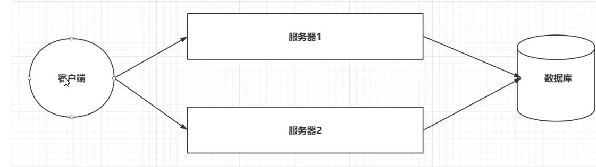
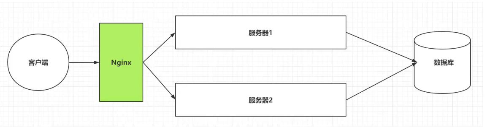
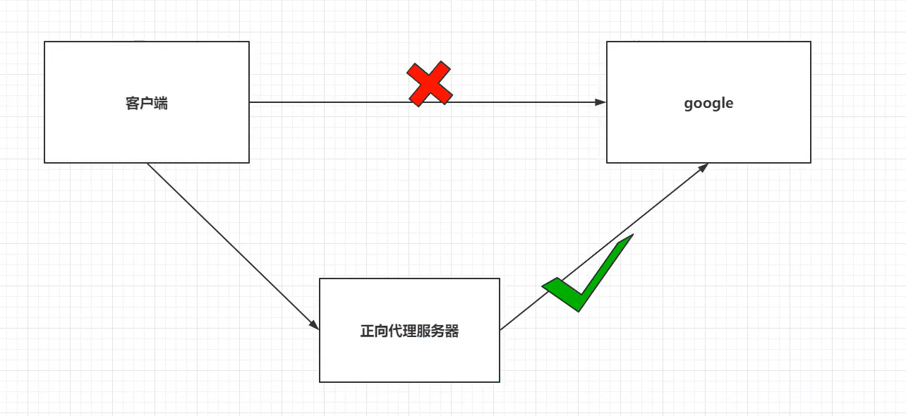
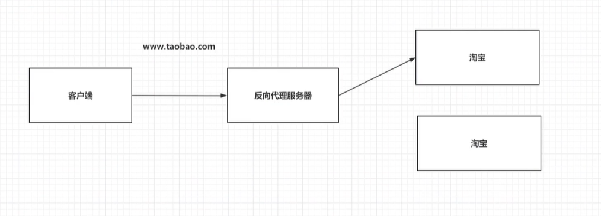
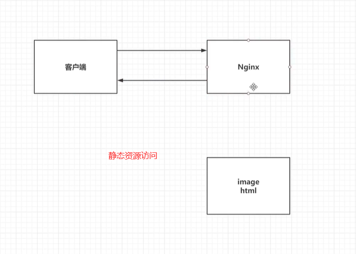
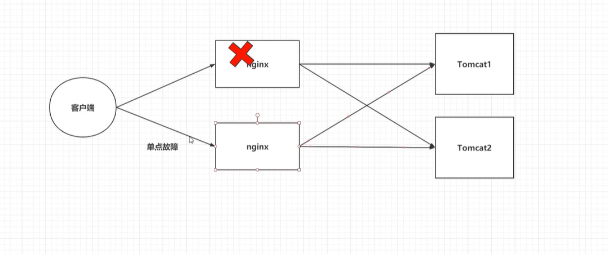
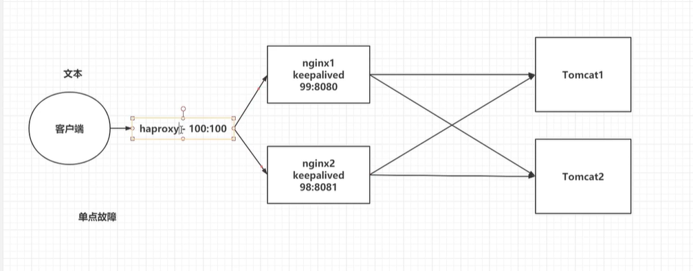

# nginx教程


## 一 、 Nginx介绍

### 1.1引言

> 为什么要学习Nginx
>
> 问题1:客户端到底要将请求发送给哪台服务器。
>
> 问题2:如果所有客户端的请求都发送给了服务器1。
>
> 问题3:客户端发送的请求可能是申请动态资源的，也有申请静态资源。

服务器搭建集群后。




服务器搭建集群后，使用Nginx做反向代理。




### 1.2 Nginx介绍

> Nginx是由俄罗斯人研发的，应对Rambler的网站，并且2004年发布的第一个版本。


> Nginx的特点:
>
> 1.稳定性极强。7*24小时不间断运行。
>
> 2.Nginx提供了非常丰富的配置实例。
>
> 3．占用内存小，并发能力强。


## 二、Nginx安装


### 2.1 安装Nginx

```yml
version: '3.1'
services:
  nginx:
    restart: always
    image: daocloud.io/library/nginx :latest
    container_name: nginx
    ports:
      - 80:80
      volumes:
        - /opt/docker_nginx/conf.d/ :/etc/nginx/conf.d_

```

```sh
# 直接安装
yum install gcc-c++
yum install -y pcre pcre-devel
yum install -y zlib zlib-devel
yum install -y openssl openssl-devel

./configure --prefix=/usr/local/nginx/ --with-http_ssl_module --with-http_stub_status_module 
make && make install
cd /usr/local/nginx
./nginx
```

参考文章：[nginx安装](https://www.cnblogs.com/smfx1314/p/10546158.html)

### 2.2 Nginx的配置文件

> 关于Nginx的核心配置文件nginx.conf

```properties
#user  nobody;
worker_processes  1;

#error_log  logs/error.log;
#error_log  logs/error.log  notice;
#error_log  logs/error.log  info;

#pid        logs/nginx.pid;

#以上统称为全局块，
#worker_processes他的数值越大，Nginx的并发能力就越强
#error_log代表Nginx的错误日志存放的位置


events {
    worker_connections  1024;
}

#events块
# worker_connections他的数值越大，Nignx并发能力越强


http {
    include       mime.types;
    default_type  application/octet-stream;

    #log_format  main  '$remote_addr - $remote_user [$time_local] "$request" '
    #                  '$status $body_bytes_sent "$http_referer" '
    #                  '"$http_user_agent" "$http_x_forwarded_for"';

    #access_log  logs/access.log  main;

    sendfile        on;
    #tcp_nopush     on;

    #keepalive_timeout  0;
    keepalive_timeout  65;

    #gzip  on;

    server {
        listen       80;
        server_name  localhost;

        #charset koi8-r;

        #access_log  logs/host.access.log  main;

        location / {
            root   html;
            index  index.html index.htm;
        }
        # location块
		# root:将接收到的请求根据/usr/share/nginx/html去查找静态资源
		# index:默认去上述的路径中找到index.html或者index.htm


        #error_page  404              /404.html;

        # redirect server error pages to the static page /50x.html
        #
        error_page   500 502 503 504  /50x.html;
        location = /50x.html {
            root   html;
        }

        # proxy the PHP scripts to Apache listening on 127.0.0.1:80
        #
        #location ~ \.php$ {
        #    proxy_pass   http://127.0.0.1;
        #}

        # pass the PHP scripts to FastCGI server listening on 127.0.0.1:9000
        #
        #location ~ \.php$ {
        #    root           html;
        #    fastcgi_pass   127.0.0.1:9000;
        #    fastcgi_index  index.php;
        #    fastcgi_param  SCRIPT_FILENAME  /scripts$fastcgi_script_name;
        #    include        fastcgi_params;
        #}

        # deny access to .htaccess files, if Apache's document root
        # concurs with nginx's one
        #
        #location ~ /\.ht {
        #    deny  all;
        #}
    }
	#server块
	#listen:代表Nginx监听的端口号localhost:代表Nginx接收请求的ip


    # another virtual host using mix of IP-, name-, and port-based configuration
    #
    #server {
    #    listen       8000;
    #    listen       somename:8080;
    #    server_name  somename  alias  another.alias;

    #    location / {
    #        root   html;
    #        index  index.html index.htm;
    #    }
    #}


    # HTTPS server
    #
    #server {
    #    listen       443 ssl;
    #    server_name  localhost;

    #    ssl_certificate      cert.pem;
    #    ssl_certificate_key  cert.key;

    #    ssl_session_cache    shared:SSL:1m;
    #    ssl_session_timeout  5m;

    #    ssl_ciphers  HIGH:!aNULL:!MD5;
    #    ssl_prefer_server_ciphers  on;

    #    location / {
    #        root   html;
    #        index  index.html index.htm;
    #    }
    #}

}
# http块
# include代表引入一个外部的文件 ->/mime.types中放着大量的媒体类型
# include /etc/nginx/conf.d/*.conf; ->引入了conf.d目录下的以.conf为结尾的配置文件
```


## 三、Nginx的反向代理

### 3.1 正向代理和反向代理

> 正向代理:
>
> 1.正向代理服务时由客户端设立的。
>
> 2客户端了解代理服务器和目标服务器都是谁。
>
> 3．帮助咱们实现突破访问权限，提高访问的速度，对目标服务器隐藏客户端的ip地址




> 反向代理:
>
> 1.反向代理服务器是配置在服务端的。
>
> 2．客户端是不知道访问的到底是哪一台服务器。
>
> 3．达到负载均衡，并且可以隐藏服务器真正的ip地址。




### 3.2 基于nginx反向代理

> 准备一个目标服务器。
>
> 启动了之前的tomcat服务器。
>
> 编写nginx的配置文件，通过Nginx访问到tomcat服务器。

```yml
server{
  listen 80;
  server_name localhost;
  #基于反向代理访问到Tomcat服务器
  location / {
    proxy_pass http://192.168.199.109:8080/;
   }
}
```


### 3.3 关于Nginx的location路径映射

> 优先级关系：
>
> (location = ) > (location/xxx/w/zzz) > (location ^~) > (location ~，~*) >(location /起始路径)>(location /)

```properties
#1.=匹配
location = / {
	 #精准匹配，主机名后面不能带任何的字符串
}
```

```properties
# 2．通用配
location /xxx{
	#匹配所有以/xxx开头的路径
}
```

```properties
# 3.正则匹配
location ~/xxx {
	#匹配所有以/xxx开头的路径
}
```

```properties
#4.匹配开头路径
location ^~ /images/{
	#匹配所有以/images开头的路径
}
```

```properties
#5. ~* \. (gif|jpg|png)${
	#匹配以gif或者jpg或者png为结尾的路径
}
```


**案例配置**

```properties
server{
  listen 80;
  server_name localhost;
  location^~ / ssm/ {
    proxy_pass http:i/192.168.199.109:8081/ssm/ ; #SSM项目首页■
    }
    
  location = /index {
    proxy_pass http://192.168.199.109:8081/;# Tomcat首页
    }
    #基于反向代理访问到Tomcat服务器
    location / {
    proxy_pass http://192.168.199.109:8080/;# Hello Nginx! !
    }
#location / {
#root /usr/share/nginx/html;
#index index.html index.htm;
#}
}
```


## 四、Nginx负载均衡

> Nginx为我们默认提供了三种负载均衡的策略:
>
> 1.**轮询**:将客户端发起的请求，平均的分配给每一台服务器。
>
> 2.**权重**:会将客户端的请求，根据服务器的权重值不同，分配不同的数量。
>
> 3.**ip_hash** :基于发起请求的客户端的ip地址不同，他始终会将请求发送到指定的服务器上。

### 4.1轮询

> 想实现Nginx轮询负载均衡机制只需要在配置文件中添加以下内容

```properties
upstream my-server{
  server 192.168.199.109:8080;
  server 192.168.199.109:8081;
  }
  
server{
  listen 80;
  server_name localhost;
  
  location / {
    proxy_pass http://my-server/;
    }
}
```


### 4.2 权重

> 实现权重方式：

```properties
upstream my-server{
  server 192.168.199.109:8080 weight=10;
  server 192.168.199.109:8081 weight=2;
  }
  
server{
  listen 80;
  server_name localhost;
  
  location / {
    proxy_pass http://my-server/;
    }
}
```


### 4.3 ip_hash

> 实现ip_hash方式：

```properties
upstream my-server{
  ip_hash;
  server 192.168.199.109:8080 weight=10;
  server 192.168.199.109:8081 weight=2;
  }
  
server{
  listen 80;
  server_name localhost;
  
  location / {
    proxy_pass http://my-server/;
    }
}
```


## 五、Nginx动静分离

> Nginx的并发能力公式:
>
> worker_processes * worker_connections / 4|2= Nginx最终的并发能力
>
> 动态资源除以4，静态资源除以2
>
> Nginx通过动静分离，来提升Nginx的并发能力，更快的给用户响应。





### 5.1动态资源代理

```properties
#配置如下
location /{
proxy_pass 路径;
}
```


### 5.2静态资源代理

```properties
#配置如下
location / {
root 静态资源路径;
index 默认访问路径下的什么资源;
autoindex on;#代表展示静态资源全的全部内容，以列表的形式展开。
}

#先修改docker，添加一个数据卷，映射到Nginx服务器的一个目录
#添加了index.html和11.jpg静态资源
#修改配置文件
```


## 六、Nginx集群

### 6.1 引言

> 单点故障，避免nginx的宕机，导致整个程序的崩溃
>
> 准备多台Nginx。
>
> 准备keepalived，监听nginx的健康情况。
>
> 准备haproxy，提供一个虚拟的路径，统一的去接收用户得请求。








**Dockerfile**

```properties
FROM nginx:1.13.5-alpine
RUN apk update && apk upgrade
RUN apk add --no-cache bash curl ipvsadm iproute2 openrc keepalived
COPY entrypoint.sh /entrypoint.sh
RUN chmod +x /entrypoint.sh
CMD ["/entrypoint.sh"]
```

**entrypoint.sh**

```sh
# !/bin/sh
#/usr/sbin/keepalived -n -l -D -f /etc/keepalived/keepalived.conf --dont-fork --log-console & 
/usr/sbin/keepalived -D -f /etc/keepalived/keepalived.conf

nginx -g "daemon off;"

```


docker-compose.yml

```yaml
version: "3.1"
services:
nginx_master:
  build:
  context: ./
  dockerfile: ./Dockerfile
 ports:
  - 8981:80
  volumes:
   - ./index-master.html :/usr/share/nginx/html/index.html
   - ./favicon.ico:/usr/share/nginx/html/favicon.ico
   - ./keepalived-master.conf:/etc/keepalived/keepalived.conf
   networks:
     static-network :
       ipv4_address: 172.20.128.2
     cap_add:
       - NET_ADMIN
   nginx_slave:
     build:
       context: ./
       dockerfile: ./Dockerfile
     ports:
       - 8082:80
       volumes:
         - ./index-slave.html :/usr/share/nginx/htm1/index.html
         - ./favicon.ico:/usr/share/nginx/htm1/favicon.ico
         - ./keepalived-slave.conf:/etc/keepalived/keepalived.conf

```

### 6.2 nginx搭建

> 查看资料中的内容