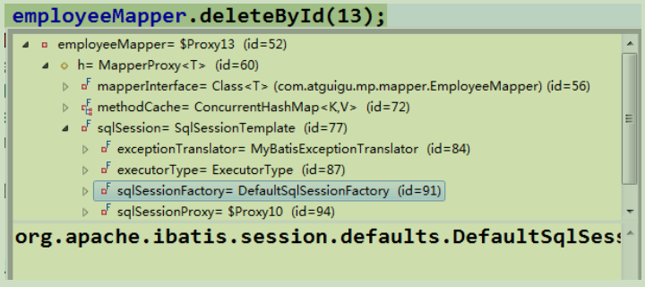
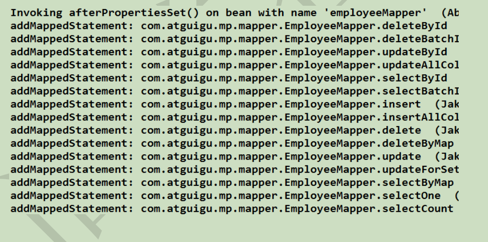
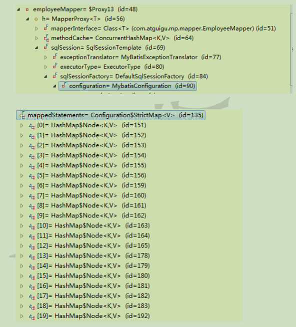
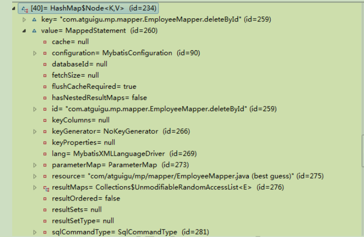

# 第1 章简介

## 1.1 MyBatisPlus 介绍

 MyBatis-Plus(简称 MP),是一个 MyBatis 的增强工具包，只做增强不做改变.为简化开发工作、提高生产率而生

我们的愿景是成为 Mybatis 最好的搭档，就像魂斗罗中的1P、2P，基友搭配，效率翻倍。

## 1.2 代码及文档发布地址

官方地址:

http://mp.baomidou.com

代码发布地址:

Github: https://github.com/baomidou/mybatis-plus

Gitee: https://gitee.com/baomidou/mybatis-plus

文档发布地址:

http://mp.baomidou.com/#/?id=%E7%AE%80%E4%BB%8B

## 1.3 前置知识

Mybatis

 Spring 

Maven 


# 第2 章集成 MP

## 2.1 创建测试表

```sql
--创建库

CREATE DATABASE mp;

--使用库

USE mp;

--创建表

CREATE TABLE tbl_employee(

 id INT(11) PRIMARY KEY AUTO_INCREMENT,

 last_name VARCHAR(50),

 email VARCHAR(50),

 gender CHAR(1),

 age int

);

INSERT INTO tbl_employee(last_name,email,gender,age) VALUES('Tom','tom@atguigu.com',1,22);

INSERT INTO tbl_employee(last_name,email,gender,age) VALUES('Jerry','jerry@atguigu.com',0,25);

INSERT INTO tbl_employee(last_name,email,gender,age) VALUES('Black','black@atguigu.com',1,30);

INSERT INTO tbl_employee(last_name,email,gender,age) VALUES('White','white@atguigu.com',0,35);
```


## 2.2 创建 javaBean

```java
public class Employee {

private Integer id ; 

private String lastName; 

private String email ;

private Integer gender ;

 private Integer age ;

public Integer getId(){

return id; 

}

public void setId(Integer id){

this.id = id; 

}

public String getLastName(){

return lastName; 


}

public void setLastName(String lastName){

this.lastName = lastName; 

}

public String getEmail(){

return email; 

}

public void setEmail(String email){

this.email = email; 

}

public Integer getGender(){

return gender; 

}

public void setGender(Integer gender){

this.gender = gender; 

}

 public Integer getAge(){

return age; 

}

public void setAge(Integer age){

this.age = age; 

}

@Override

public String toString(){

return "Employee [id="+ id +", lastName="+ lastName +", email="+ email

\+", gender="+ gender +", age="

\+ age +"]"; 

}
```


## 2.3 依赖配置

1) 在 pom.xml 中加入对 MP、Spring、连接池、Junit、Mysql 驱动等依赖

```xml
<!-- mp 依赖-->

<dependency>

<groupId>com.baomidou</groupId> 

<artifactId>mybatis-plus</artifactId>

<version>2.3</version>

</dependency>

<!--junit -->

<dependency>

<groupId>junit</groupId>

<artifactId>junit</artifactId>

<version>4.9</version>

</dependency>

<!-- log4j -->

<dependency>

<groupId>log4j</groupId>

<artifactId>log4j</artifactId>

<version>1.2.17</version>

</dependency>

<!-- c3p0 -->

<dependency>

<groupId>com.mchange</groupId>

<artifactId>c3p0</artifactId>

<version>0.9.5.2</version>

</dependency>

<!-- mysql -->

<dependency>

<groupId>mysql</groupId>

<artifactId>mysql-connector-java</artifactId>

<version>5.1.37</version>

</dependency>

<!-- spring -->

<dependency>

<groupId>org.springframework</groupId>

<artifactId>spring-context</artifactId>

<version>4.3.10.RELEASE</version>

</dependency>

<dependency>

<groupId>org.springframework</groupId>

<artifactId>spring-orm</artifactId>

<version>4.3.10.RELEASE</version>

</dependency>
```


特别说明: Mybatis 及 Mybatis-Spring 依赖请勿加入项目配置，以免引起版本冲突！！！

Mybatis-Plus 会自动帮你维护！

2) 加入 MyBatis 的全局配置文件

```xml
<?xml version="1.0" encoding="UTF-8"?>

<!DOCTYPE configuration

PUBLIC "-//mybatis.org//DTD Config 3.0//EN"

"http://mybatis.org/dtd/mybatis-3-config.dtd">

<configuration>

</configuration>
```


3) 加入 log4j.xml

```xml
<?xml version="1.0" encoding="UTF-8"?>

<!DOCTYPE log4j:configuration SYSTEM "log4j.dtd">

<log4j:configuration xmlns:log4j="http://jakarta.apache.org/log4j/">

<appender name="STDOUT" class="org.apache.log4j.ConsoleAppender">

<param name="Encoding" value="UTF-8"/>

<layout class="org.apache.log4j.PatternLayout">

<param name="ConversionPattern" value="%-5p %d{MM-dd 

HH:mm:ss,SSS}%m (%F:%L)\n"/>

</layout>

</appender>

<logger name="java.sql">

<level value="debug"/>

</logger>

<logger name="org.apache.ibatis">

<level value="info"/>

</logger>

<root>

<level value="debug"/>

<appender-ref ref="STDOUT"/>

</root>

</log4j:configuration>
```


4) 加入 db.properties 连接信息配置

```sh
jdbc.driver=com.mysql.jdbc.Driver

jdbc.url=jdbc:mysql://localhost:3306/mp

jdbc.username=root

 jdbc.password=1234
```


5) 加入 spring 的配置文件 applicationContext.xml

```xml
<?xml version="1.0" encoding="UTF-8"?>

<beans xmlns="http://www.springframework.org/schema/beans"

xmlns:xsi="http://www.w3.org/2001/XMLSchema-instance"

xmlns:context="http://www.springframework.org/schema/context"

xmlns:tx="http://www.springframework.org/schema/tx"

xmlns:mybatis-spring="http://mybatis.org/schema/mybatis-spring"

xsi:schemaLocation="http://mybatis.org/schema/mybatis-spring 

http://mybatis.org/schema/mybatis-spring-1.2.xsd

http://www.springframework.org/schema/beans 

http://www.springframework.org/schema/beans/spring-beans.xsd

http://www.springframework.org/schema/context 

http://www.springframework.org/schema/context/spring-context-4.0.xsd

http://www.springframework.org/schema/tx 

http://www.springframework.org/schema/tx/spring-tx-4.0.xsd">

<!--数据源-->

<context:property-placeholder location="classpath:db.properties"/>

<bean id="dataSource"

class="com.mchange.v2.c3p0.ComboPooledDataSource">

<property name="driverClass" value="${jdbc.driver}"></property>

<property name="jdbcUrl" value="${jdbc.url}"></property>

<property name="user" value="${jdbc.username}"></property>

<property name="password" value="${jdbc.password}"></property>

</bean>

<!--事务管理器-->

<bean id="dataSourceTransactionManager"

class="org.springframework.jdbc.datasource.DataSourceTransactionManager">

<property name="dataSource" ref="dataSource"></property>

</bean>

<!--基于注解的事务管理-->

<tx:annotation-driven 

transaction-manager="dataSourceTransactionManager"/>

<!--配置 SqlSessionFactoryBean -->

<bean id="sqlSessionFactoryBean"

class="org.mybatis.spring.SqlSessionFactoryBean">

<!--数据源-->

<property name="dataSource" ref="dataSource"></property>

<property name="configLocation"


value="classpath:mybatis-config.xml"></property>

<!--别名处理-->

<property name="typeAliasesPackage"

value="com.atguigu.mp.beans"></property>

</bean>

<!--

配置 mybatis 扫描 mapper 接口的路径

-->

<bean class="org.mybatis.spring.mapper.MapperScannerConfigurer">

<property name="basePackage"

value="com.atguigu.mp.mapper"></property>

</bean>

</beans>
```


## 2.4 测试

1) 测试 Spring-Mybatis 的环境，保证 OK。

```java
private ApplicationContext iocContext = new 

ClassPathXmlApplicationContext("applicationContext.xml");

@Test

public void testEnvironment() throws Exception{

DataSource ds = iocContext.getBean("dataSource",DataSource.class);

Connection conn = ds.getConnection();

System.out.println(conn);

}
```


## 2.6 集成 MP

1) Mybatis-Plus 的集成非常简单，对于 Spring，我们仅仅需要把 Mybatis 自带的MybatisSqlSessionFactoryBean 替换为 MP 自带的即可。

2)

```xml
<bean id="sqlSessionFactoryBean"

class="com.baomidou.mybatisplus.spring.MybatisSqlSessionFactoryBean">

<!--数据源--> 

<property name="dataSource" ref="dataSource"></property>

<property name="configLocation"

value="classpath:mybatis-config.xml"></property>

<!--别名处理-->

<property name="typeAliasesPackage"

value="com.atguigu.mp.beans"></property>

</bean>
```


# 第3 章入门 HelloWorld

## 3.1 通用 CRUD

1) 提出问题:

假设我们已存在一张 tbl_employee 表，且已有对应的实体类 Employee，实现tbl_employee 表的 CRUD 操作我们需要做什么呢？

2) 实现方式:

基于 Mybatis

需要编写 EmployeeMapper 接口，并手动编写 CRUD 方法

提供 EmployeeMapper.xml 映射文件，并手动编写每个方法对应的 SQL 语句.

基于 MP

只需要创建 EmployeeMapper 接口,并继承 BaseMapper 接口.这就是使用 MP

需要完成的所有操作，甚至不需要创建 SQL 映射文件。


## 3.2 插入操作

1) Integer insert(T entity);

2) @TableName

3) 全局的 MP 配置: <property name="tablePrefix" value="tbl_"></property>

4) @TableField

5) 全局的 MP 配置: <property name="dbColumnUnderline" value="true"></property>

6) @TableId

7) 全局的 MP 配置: <property name="idType" value="0"></property>

8) 支持主键自增的数据库插入数据获取主键值

Mybatis: 需要通过 useGeneratedKeys 以及 keyProperty 来设置

MP: 自动将主键值回写到实体类中

9) Integer insertAllColumn(T entity)


## 3.3 更新操作

1) Integer updateById(@Param("et") T entity);

2) Integer updateAllColumnById(@Param("et") T entity)

## 3.4 查询操作

1) T selectById(Serializable id);

2) T selectOne(@Param("ew") T entity);

3) List<T> selectBatchIds(List<? extends Serializable> idList);

4) List<T> selectByMap(@Param("cm") Map<String, Object> columnMap);

5) List<T> selectPage(RowBounds rowBounds,@Param("ew") Wrapper<T> wrapper);

## 3.5 删除操作

1) Integer deleteById(Serializable id);

2) Integer deleteByMap(@Param("cm") Map<String, Object> columnMap);

3) Integer deleteBatchIds(List<? extends Serializable> idList);

## 3.6 MP 启动注入 SQL 原理分析

1) 问题: xxxMapper 继承了 BaseMapper<T>, BaseMapper 中提供了通用的 CRUD 方法,

方法来源于 BaseMapper,有方法就必须有 SQL,因为 MyBatis 最终还是需要通过

 SQL 语句操作数据.

前置知识:MyBatis 源码中比较重要的一些对象， MyBatis 框架的执行流程

Configuration

MappedStatement

……..

2) 通过现象看到本质

A． employeeMapper 的本质 org.apache.ibatis.binding.MapperProxy

B． MapperProxy 中 sqlSession –>SqlSessionFactory 



C． SqlSessionFacotry 中→ Configuration→ MappedStatements

每一个 mappedStatement 都表示 Mapper 接口中的一个方法与 Mapper 映射文件中的一个 SQL。

MP 在启动就会挨个分析 xxxMapper 中的方法，并且将对应的 SQL 语句处理好，保

存到 configuration 对象中的 mappedStatements 中.

D．本质:



Configuration： MyBatis 或者 MP 全局配置对象

MappedStatement：一个 MappedStatement 对象对应 Mapper 配置文件中的一个

select/update/insert/delete 节点，主要描述的是一条 SQL 语句

SqlMethod : 枚举对象，MP 支持的 SQL 方法

TableInfo：数据库表反射信息，可以获取到数据库表相关的信息

SqlSource: SQL 语句处理对象

MapperBuilderAssistant：用于缓存、SQL 参数、查询方剂结果集处理等.

通过 MapperBuilderAssistant 将每一个 mappedStatement 

添加到 configuration 中的 mappedstatements 中






## 3.7 通用 CRUD 小结

1) 以上是基本的 CRUD 操作，如您所见，我们仅仅需要继承一个 BaseMapper 即可实现大部分单表 CRUD 操作。BaseMapper 提供了多达17 个方法给大家使用,可以极其方便的实现单一、批量、分页等操作。极大的减少开发负担，难道这就是 MP 的强大之处了吗？

2) 提出需求:

现有一个需求，我们需要分页查询 tbl_employee 表中，年龄在18~50 之间性别为男且姓名为 xx 的所有用户，这时候我们该如何实现上述需求呢？

MyBatis : 需要在 SQL 映射文件中编写带条件查询的 SQL,并基于 PageHelper 插件完成分页.实现以上一个简单的需求，往往需要我们做很多重复单调的工作。普通的 Mapper能够解决这类痛点吗？

MP: 依旧不用编写 SQL 语句, MP 提供了功能强大的条件构造器 EntityWrapper 

# 第4 章条件构造器 EntityWrapper

## 4.1 EntityWrapper 简介

1) Mybatis-Plus 通过 EntityWrapper（简称 EW，MP 封装的一个查询条件构造器）或者

Condition（与 EW 类似）

来让用户自由的构建查询条件，简单便捷，没有额外的负担，

能够有效提高开发效率

2) 实体包装器，主要用于处理 sql 拼接，排序，实体参数查询等

3) 注意: 使用的是数据库字段，不是 Java 属性!

4) 条件参数说明: 


## 4.2 使用 EntityWrapper 的方式打开如上需求:

```java
List<Employee> userList = employeeMapper.selectPage(

 new Page<Employee>(2,3),

 new EntityWrapper<Employee>().eq("last_name",

"MybatisPlus")

.eq("gender",1)

.between("age",18,50)

);
```


## 4.3 带条件的查询

```sh
1) List<T> selectList(@Param("ew") Wrapper<T> wrapper);
```


## 4.4 带条件的修改

```sh
1) Integer update(@Param("et") T entity,@Param("ew") Wrapper<T> wrapper);
```


## 4.5 带条件的删除

1) Integer delete(@Param("ew") Wrapper<T> wrapper);

## 4.6 使用 Condition 的方式打开如上需求

```sh
List<Employee> userListCondition = employeeMapper.selectPage(

new Page<Employee>(2,3),

Condition.create().

eq("gender",1).

eq("last_name","MyBatisPlus").

between("age",18,50));
```


## 4.7 小结

MP: EntityWrapper Condition 条件构造器

MyBatis MBG : xxxExample→Criteria : QBC( Query By Criteria)

Hibernate 、通用 Mapper

# 第5 章：ActiveRecord(活动记录)

Active Record(活动记录)，是一种领域模型模式，特点是一个模型类对应关系型数据库中的一个表，而模型类的一个实例对应表中的一行记录。

ActiveRecord 一直广受动态语言（ PHP 、 Ruby 等）的喜爱，而 Java 作为准静态语言，

对于 ActiveRecord 往往只能感叹其优雅，所以 MP 也在 AR 道路上进行了一定的探索

## 5.1 如何使用 AR 模式

1) 仅仅需要让实体类继承 Model 类且实现主键指定方法，即可开启 AR 之旅.

```java
@TableName("tbl_employee")

public class Employee extends Model<Employee>{

//.. fields

//.. getter and setter

@Override

protected Serializable pkVal(){

return this.id; 

}
```


## 5.2 AR 基本 CRUD

1) 插入操作

public boolean insert()

2) 修改操作

public boolean updateById()

3) 查询操作

public T selectById()

public T selectById(Serializable id)

public List<T> selectAll()

public List<T> selectList(Wrapper wrapper)

public int selectCount(Wrapper wrapper)

4) 删除操作

public boolean deleteById()

public boolean deleteById(Serializable id)

public boolean delete(Wrapper wrapper)

5) 分页复杂操作

public Page<T> selectPage(Page<T> page, Wrapper<T> wrapper)

## 5.3 AR 小结

1) AR 模式提供了一种更加便捷的方式实现 CRUD 操作，其本质还是调用的 Mybatis 对应的方法，类似于语法糖

语法糖是指计算机语言中添加的某种语法，这种语法对原本语言的功能并没有影响.可以更方便开发者使用，可以避免出错的机会，让程序可读性更好.

2) 到此，我们简单领略了 Mybatis-Plus 的魅力与高效率，值得注意的一点是：我们提供了强大的代码生成器，可以快速生成各类代码，真正的做到了即开即用

# 第6 章：代码生成器

1) MP 提供了大量的自定义设置，生成的代码完全能够满足各类型的需求

2) MP 的代码生成器和 Mybatis MBG 代码生成器: 

MP 的代码生成器都是基于 java 代码来生成。MBG 基于 xml 文件进行代码生成

MyBatis 的代码生成器可生成: 实体类、Mapper 接口、Mapper 映射文件

MP 的代码生成器可生成: 实体类(可以选择是否支持 AR)、Mapper 接口、Mapper 映射文件、 Service 层、Controller 层.


3) 表及字段命名策略选择

在 MP 中，我们建议数据库表名和表字段名采用驼峰命名方式，如果采用下划线命名方式请开启全局下划线开关，如果表名字段名命名方式不一致请注解指定，我们建议最好保持一致。

这么做的原因是为了避免在对应实体类时产生的性能损耗，这样字段不用做映射就能直接和实体类对应。当然如果项目里不用考虑这点性能损耗，那么你采用下滑线也是没问题的，只需要在生成代码时配置 dbColumnUnderline 属性就可以

## 6.1 代码生成器依赖

1) 模板引擎

MP 的代码生成器默认使用的是 Apache 的 Velocity 模板，当然也可以更换为别的模板

技术，例如 freemarker。此处不做过多的介绍。

需要加入 Apache Velocity 的依赖

```xml
<dependency>

<groupId>org.apache.velocity</groupId>

<artifactId>velocity-engine-core</artifactId>

<version>2.0</version>

</dependency>
```


2) 加入 slf4j ,查看日志输出信息

```xml
<dependency> 

<groupId>org.slf4j</groupId> 

<artifactId>slf4j-api</artifactId> 

<version>1.7.7</version>

</dependency> 

<dependency> 

<groupId>org.slf4j</groupId> 

<artifactId>slf4j-log4j12</artifactId> 

<version>1.7.7</version>

</dependency>
```


## 6.2 MP 代码生成器示例代码

```java
@Test

public void testGenerator(){

//全局配置

GlobalConfig config = new GlobalConfig();

config.setActiveRecord(true)//是否支持AR模式

.setAuthor("weiyunhui")//作者

.setOutputDir("D:\\workspace_my\\mp03\\src\\main\\java")

//生成路径

.setFileOverride(true)//文件覆盖

.setServiceName("%sService")//设置生成的service接口名

首字母是否为I

.setIdType(IdType.AUTO)//主键策略

; 
//数据源配置

DataSourceConfig dsConfig = new DataSourceConfig();

dsConfig.setDbType(DbType.MYSQL)

.setUrl("jdbc:mysql://localhost:3306/javaEE_0228")

.setDriverName("com.mysql.jdbc.Driver")

.setUsername("root")

.setPassword("1234");

//策略配置

StrategyConfig stConfig = new StrategyConfig();

stConfig.setCapitalMode(true)//全局大写命名

.setDbColumnUnderline(true)//表名字段名是否使用下滑

线命名

.setNaming(NamingStrategy.underline_to_camel)//数据

库表映射到实体的命名策略

.setInclude("tbl_employee")//生成的表

.setTablePrefix("tbl_"); //表前缀

//包名策略

PackageConfig pkConfig = new PackageConfig();

pkConfig.setParent("com.atguigu.mp")

.setController("controller")

.setEntity("beans")

.setService("service");

AutoGenerator ag = new

AutoGenerator().setGlobalConfig(config)

.setDataSource(dsConfig)

.setStrategy(stConfig)

.setPackageInfo(pkConfig);

ag.execute();

}

```


## 6.3 ServiceImpl 说明

EmployeeServiceImpl 继承了 ServiceImpl 类,mybatis-plus 通过这种方式为我们注入了 EmployeeMapper,这样可以使用 service 层默认为我们提供的很多方法,也可以调用我们自己在 dao 层编写的操作数据库的方法.

## 6.4 小结


# 第7 章：插件扩展

## 7.1 Mybatis 插件机制简介

1) 插件机制: 

Mybatis 通过插件(Interceptor)可以做到拦截四大对象相关方法的执行,根据需求，完成相关数据的动态改变。

Executor

StatementHandler

ParameterHandler

ResultSetHandler

2) 插件原理

四大对象的每个对象在创建时，都会执行 interceptorChain.pluginAll()，会经过每个插件对象的 plugin()方法，目的是为当前的四大对象创建代理。代理对象就可以拦截到四大对象相关方法的执行，因为要执行四大对象的方法需要经过代理.

## 7.2 分页插件

1) com.baomidou.mybatisplus.plugins.PaginationInterceptor

## 7.3 执行分析插件

1) com.baomidou.mybatisplus.plugins.SqlExplainInterceptor

2) SQL 执行分析拦截器，只支持 MySQL5.6.3 以上版本

3) 该插件的作用是分析 DELETE UPDATE 语句,防止小白或者恶意进行 DELETE UPDATE 全表操作

4) 只建议在开发环境中使用，不建议在生产环境使用

5) 在插件的底层通过 SQL 语句分析命令:Explain 分析当前的 SQL 语句，

根据结果集中的 Extra 列来断定当前是否全表操作。

## 7.4 性能分析插件

1) com.baomidou.mybatisplus.plugins.PerformanceInterceptor

2) 性能分析拦截器，用于输出每条 SQL 语句及其执行时间

3) SQL 性能执行分析,开发环境使用，超过指定时间，停止运行。有助于发现问题

## 7.5 乐观锁插件

1) com.baomidou.mybatisplus.plugins.OptimisticLockerInterceptor

2) 如果想实现如下需求: 当要更新一条记录的时候，希望这条记录没有被别人更新

3) 乐观锁的实现原理:

取出记录时，获取当前 version 2 

更新时，带上这个 version 2 

执行更新时， set version = yourVersion+1 where version = yourVersion

如果 version 不对，就更新失败

4) @Version 用于注解实体字段，必须要有。

# 第8 章：自定义全局操作

根据 MybatisPlus 的 AutoSqlInjector 可以自定义各种你想要的 sql ,注入到全局中，相当于自定义 Mybatisplus 自动注入的方法。

之前需要在 xml 中进行配置的 SQL 语句，现在通过扩展 AutoSqlInjector 在加载 mybatis 环境时就注入。

## 8.1 AutoSqlInjector 

1) 在 Mapper 接口中定义相关的 CRUD 方法

2) 扩展 AutoSqlInjector inject 方法，实现 Mapper 接口中方法要注入的 SQL

3) 在 MP 全局策略中，配置自定义注入器

## 8.2 自定义注入器的应用之逻辑删除

假删除、逻辑删除: 并不会真正的从数据库中将数据删除掉，而是将当前被删除的这条数据中的一个逻辑删除字段置为删除状态.

tbl_user logic_flag = 1 →-1 

1) com.baomidou.mybatisplus.mapper.LogicSqlInjector

2) logicDeleteValue 逻辑删除全局值

3) logicNotDeleteValue 逻辑未删除全局值

4) 在 POJO 的逻辑删除字段添加@TableLogic 注解

5) 会在 mp 自带查询和更新方法的 sql 后面，追加『逻辑删除字段』=『LogicNotDeleteValue默认值』

删除方法: deleteById()和其他 delete 方法,底层 SQL 调用的是 update tbl_xxx 

set 『逻辑删除字段』=『logicDeleteValue 默认值』

# 第9 章：公共字段自动填充

## 9.1 元数据处理器接口

com.baomidou.mybatisplus.mapper.MetaObjectHandler

insertFill(MetaObject metaObject)

updateFill(MetaObject metaObject)

metaobject: 元对象.是 Mybatis 提供的一个用于更加方便，更加优雅的访问对象的属性,

给对象的属性设置值的一个对象.还会用于包装对象.支持对 Object 、Map、Collection等对象进行包装

本质上 metaObject 获取对象的属性值或者是给对象的属性设置值，最终是要通过 Reflector 获取到属性的对应方法的 Invoker,最终 invoke.

## 9.2 开发步骤

1) 注解填充字段@TableFile(fill = FieldFill.INSERT)查看 FieldFill

2) 自定义公共字段填充处理器

3) MP 全局注入自定义公共字段填充处理器

# 第10 章 Oracle 主键 Sequence

MySQL: 支持主键自增。 IdType.Auto

Oracle: 序列(Sequence)

1) 实体类配置主键 Sequence @KeySequence(value=”序列名”，clazz=xxx.class 主键属性类型)

2) 全局 MP 主键生成策略为 IdType.INPUT 

3) 全局 MP 中配置 Oracle 主键 Sequence

com.baomidou.mybatisplus.incrementer.OracleKeyGenerator 

4) 可以将@keySequence 定义在父类中，可实现多个子类对应的多个表公用一个 Sequence

# 第11 章 Idea 快速开发插件

MybatisX 辅助 idea 快速开发插件，为效率而生.

可以实现 java 与 xml 跳转，根据 Mapper 接口中的方法自动生成 xml 结构.

官方安装： File -> Settings -> Plugins -> Browse Repositories..输入 mybatisx 安装下载

Jar 安装： File -> Settings -> Plugins -> Install plugin from disk..选中 mybatisx..jar 安装