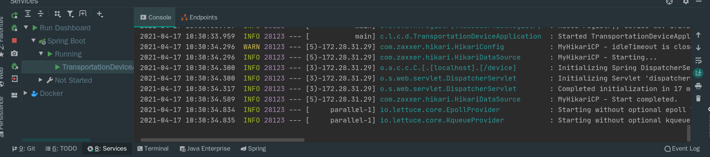
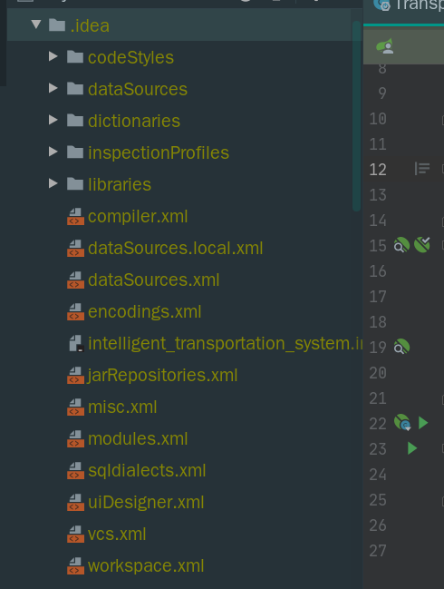

## idea多模块显示问题




## 1. 先找到顶级的工程，打开.idea目录下的workspace.xml



## 2. 添加下面的模块

```bash
<component name="RunDashboard">
    <option name="configurationTypes">
      <set>
        <option value="SpringBootApplicationConfigurationType" />
      </set>
    </option>
    <option name="ruleStates">
      <list>
        <RuleState>
          <option name="name" value="ConfigurationTypeDashboardGroupingRule" />
        </RuleState>
        <RuleState>
          <option name="name" value="StatusDashboardGroupingRule" />
        </RuleState>
      </list>
    </option>
  </component>
```


## 3. 重启的就可以了