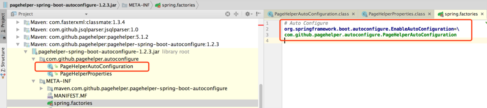

## 1. 引入依赖

```xml
    <dependency>
          <groupId>com.github.pagehelper</groupId>
            <artifactId>pagehelper-spring-boot-starter</artifactId>
        </dependency>

        <dependency>
            <groupId>tk.mybatis</groupId>
            <artifactId>mapper-spring-boot-starter</artifactId>
        </dependency>
```


## 2. 使用分页插件

```java
 //如果设备id为空，则返回当前页数据
//获取第一页，1-10条数据
        PageHelper.startPage(currentPage,pageSize);
//第一个mapper查询会进行分页操作
        List<DeviceLastInfoVo> deviceLastInfoVos = deviceStatusMapper.queryLastInfo(deviceId, DeviceConstant.UP_STATUS);

        int size = deviceLastInfoVos.size();

        if (deviceId == null) {

            PageInfo<DeviceLastInfoVo> pageInfo = new PageInfo<>(deviceLastInfoVos);
            return CommonResult.success(new PageBean<>(currentPage, pageSize, pageInfo.getTotal(), pageInfo.getList()));
        } else {
            //如果设备不为空
            //判断设备是否删除
            String close = deviceInfoMapper.isClose(deviceId);
            Integer exitDevice = deviceInfoMapper.isExitDevice(deviceId);
            //如果设备不存在
            if (exitDevice == 0) {
                return CommonResult.failed("设备不存在！");
                //如果设备删除
            } else if (DeviceConstant.CLOSE_STATUS.equals(close)) {
                return CommonResult.failed("设备已删除！");
                //设备正常
            } else {
                return CommonResult.success(new PageBean<>(currentPage, pageSize, size, deviceLastInfoVos));
            }

        }
```

## 3. PageHelper原理分析



pagehelper自动配置加载PageHelperAutoConfiguration
查看源码发现根据配置属性创建了拦截器PageInterceptor，在查询前对语句进行了预处理

```java
package com.github.pagehelper.autoconfigure;

import com.github.pagehelper.PageInterceptor;
import com.github.pagehelper.autoconfigure.PageHelperProperties;
import java.util.Iterator;
import java.util.List;
import java.util.Properties;
import javax.annotation.PostConstruct;
import org.apache.ibatis.session.SqlSessionFactory;
import org.mybatis.spring.boot.autoconfigure.MybatisAutoConfiguration;
import org.springframework.beans.factory.annotation.Autowired;
import org.springframework.boot.autoconfigure.AutoConfigureAfter;
import org.springframework.boot.autoconfigure.condition.ConditionalOnBean;
import org.springframework.boot.context.properties.ConfigurationProperties;
import org.springframework.boot.context.properties.EnableConfigurationProperties;
import org.springframework.context.annotation.Bean;
import org.springframework.context.annotation.Configuration;

@Configuration
@ConditionalOnBean({SqlSessionFactory.class})
@EnableConfigurationProperties({PageHelperProperties.class})
@AutoConfigureAfter({MybatisAutoConfiguration.class})
public class PageHelperAutoConfiguration {
    @Autowired
    private List<SqlSessionFactory> sqlSessionFactoryList;
    @Autowired
    private PageHelperProperties properties;

    public PageHelperAutoConfiguration() {
    }

    @Bean
    @ConfigurationProperties(
        prefix = "pagehelper"
    )
    public Properties pageHelperProperties() {
        return new Properties();
    }

    @PostConstruct
    public void addPageInterceptor() {
        PageInterceptor interceptor = new PageInterceptor();
        Properties properties = new Properties();
        properties.putAll(this.pageHelperProperties());
        properties.putAll(this.properties.getProperties());
        interceptor.setProperties(properties);
        Iterator var3 = this.sqlSessionFactoryList.iterator();

        while(var3.hasNext()) {
            SqlSessionFactory sqlSessionFactory = (SqlSessionFactory)var3.next();
            sqlSessionFactory.getConfiguration().addInterceptor(interceptor);
        }

    }
}

```


参考：https://www.jianshu.com/p/6524c12bd9bf