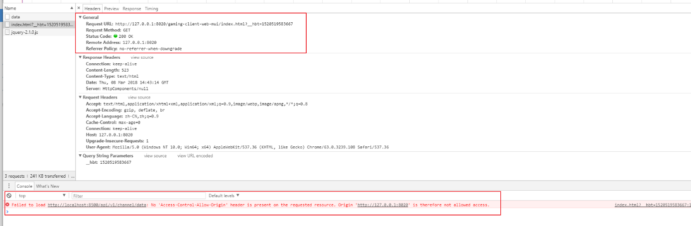
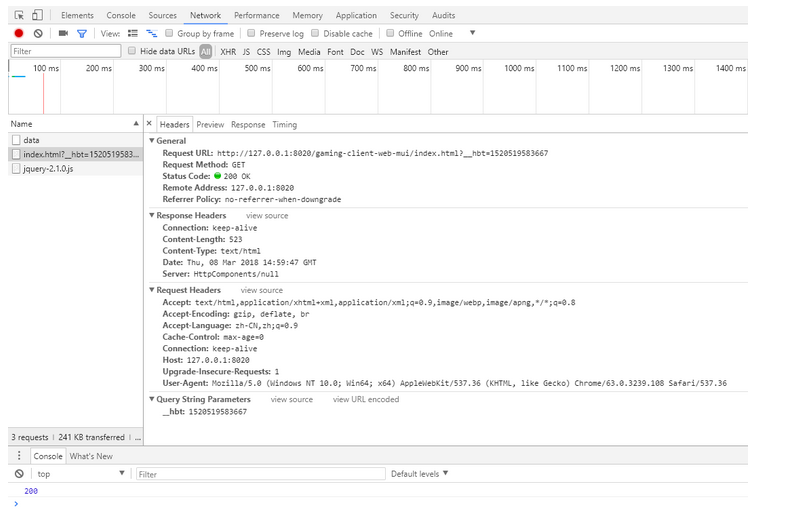

## 1. 什么是跨域问题

> 在浏览器端进行 Ajax 请求时会出现跨域问题，那么什么是跨域，如何解决跨域呢？先看浏览器端出现跨域问题的现象，如下图所示
>
> 

跨域，指的是浏览器不能执行其他网站的脚本。它是由浏览器的同源策略造成的，是浏览器对 JavaScript 施加的安全限制。


## 2 . 什么是同源

所谓同源是指，域名，协议，端口均相同

- http://www.leayun.com --> http://admin.leayun.com 跨域
- http://www.leayun.com --> http://www.leayun.com 非跨域
- http://www.leayun.com --> http://www.leayun.com:8080 跨域
- http://www.leayun.com --> https://www.leayun.com 跨域


## 3 . 如何解决跨域问题


### 3.1 使用 CORS（跨资源共享）解决跨域问题

CORS 是一个 W3C 标准，全称是"跨域资源共享"（Cross-origin resource sharing）。它允许浏览器向跨源服务器，发出 XMLHttpRequest 请求，从而克服了 AJAX 只能同源使用的限制。

CORS  需要浏览器和服务器同时支持。目前，所有浏览器都支持该功能，IE 浏览器不能低于 IE10。整个 CORS  通信过程，都是浏览器自动完成，不需要用户参与。对于开发者来说，CORS 通信与同源的 AJAX 通信没有差别，代码完全一样。浏览器一旦发现  AJAX 请求跨源，就会自动添加一些附加的头信息，有时还会多出一次附加的请求，但用户不会有感觉。因此，实现 CORS  通信的关键是服务器。只要服务器实现了 CORS 接口，就可以跨源通信（在 `header` 中设置：`Access-Control-Allow-Origin`）


### 3.2 使用 JSONP 解决跨域问题

JSONP（JSON with Padding）是 JSON 的一种“使用模式”，可用于解决主流浏览器的跨域数据访问的问题。由于同源策略，一般来说位于 `server1.example.com` 的网页无法与 `server2.example.com` 的服务器沟通，而 HTML 的 `<script>` 元素是一个例外。利用 `<script>`  元素的这个开放策略，网页可以得到从其他来源动态产生的 JSON 资料，而这种使用模式就是所谓的 JSONP。用 JSONP 抓到的资料并不是  JSON，而是任意的 JavaScript，用 JavaScript 直译器执行而不是用 JSON 解析器解析（需要目标服务器配合一个 `callback` 函数）。

### 3.3 CORS 与 JSONP 的比较

CORS 与 JSONP 的使用目的相同，但是比 JSONP 更强大。

JSONP 只支持 GET 请求，CORS 支持所有类型的 HTTP 请求。JSONP 的优势在于支持老式浏览器，以及可以向不支持 CORS 的网站请求数据。


### 3.4 使用 Nginx 反向代理解决跨域问题

以上跨域问题解决方案都需要服务器支持，当服务器无法设置 `header` 或提供 `callback` 时我们就可以采用 Nginx 反向代理的方式解决跨域问题。

Nginx 配置跨域案例，在 `nginx.conf` 的 `location` 中增加如下配置：

```bash
add_header Access-Control-Allow-Origin *或域名;
add_header Access-Control-Allow-Headers X-Requested-With;
add_header Access-Control-Allow-Methods GET,POST,OPTIONS;
```

如：

```conf
user  nginx;
worker_processes  1;

events {
    worker_connections  1024;
}

http {
    include       mime.types;
    default_type  application/octet-stream;

    sendfile        on;

    keepalive_timeout  65;

    server {
        listen 80;
        server_name 192.168.75.128;
        location / {
            add_header Access-Control-Allow-Origin *;
            add_header Access-Control-Allow-Headers X-Requested-With;
            add_header Access-Control-Allow-Methods GET,POST,OPTIONS;

            root /usr/share/nginx/wwwroot/cdn;
            index index.jsp index.html index.htm;
        }
    }
}
```


## 4 . Spring Boot 配置	CORS

### 4.1 JAVA配置方式

```java
/**
 * 跨域配置
 * <p>Title: CorsConfiguration</p>
 * <p>Description: </p>
 *
 * @author Lusifer
 * @version 1.0.0
 * @date 2018/3/8 22:56
 */
@Configuration
public class CORSConfiguration extends WebMvcConfigurerAdapter {
    @Override
    public void addCorsMappings(CorsRegistry registry) {
        registry.addMapping("/**").allowedOrigins("*")
                .allowedMethods("GET", "HEAD", "POST", "PUT", "DELETE", "OPTIONS")
                .allowCredentials(false).maxAge(3600);
    }
}

//已过时，官方建议使用下面的方式

```


### 4.2 注解方式

```java
@CrossOrigin(origins = "*", maxAge = 3600)
```


### 4.3 解决跨域的效果图

 


参考：[跨域问题解决](https://www.funtl.com/zh/supplement2/%E4%BB%80%E4%B9%88%E6%98%AF%E8%B7%A8%E5%9F%9F%E9%97%AE%E9%A2%98.html#%E5%A6%82%E4%BD%95%E8%A7%A3%E5%86%B3%E8%B7%A8%E5%9F%9F%E9%97%AE%E9%A2%98%EF%BC%9F)

