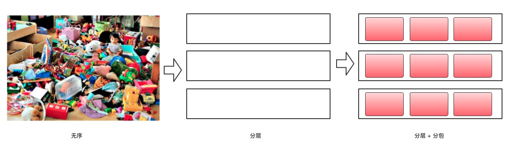
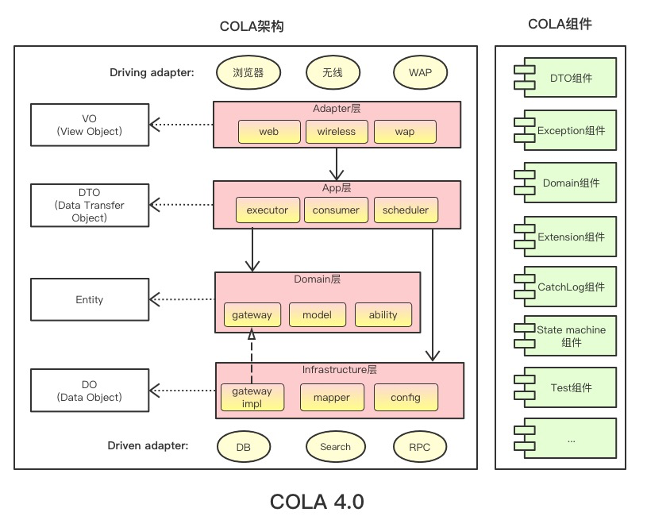
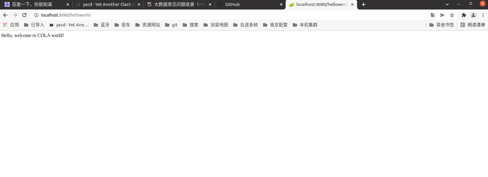

# 🥤 COLA 4.0

> COLA 是 Clean Object-Oriented and Layered Architecture的缩写，代表“整洁面向对象分层架构”。
>
> 目前COLA已经发展到[COLA 4.0](https://blog.csdn.net/significantfrank/article/details/110934799)。
>
> COLA分为两个部分，COLA架构和COLA组件。

# 1. COLA架构

## 1.1 COLA 概述

**架构**的**意义** 就是 要素结构：

- 要素 是 组成架构的重要元素；
- 结构 是 要素之间的关系。

而 **应用架构**的**意义** 就在于

- 定义一套良好的结构；
- 治理应用复杂度，降低系统熵值；
- 从随心所欲的混乱状态，走向井井有条的有序状态。


> COLA架构就是为此而生，其核心职责就是定义良好的应用结构，提供最佳应用架构的最佳实践。通过不断探索，我们发现良好的分层结构，良好的包结构定义，可以帮助我们治理混乱不堪的业务应用系统。
>
> 

> 经过多次迭代，我们定义出了相对稳定、可靠的应用架构：COLA 4.0
>
> 

## 1.2 COLA  Archetype

> 好的应用架构，都遵循一些共同模式，不管是六边形架构、洋葱圈架构、整洁架构、还是COLA架构，**都提倡以业务为核心，解耦外部依赖，分离业务复杂度和技术复杂度等**。
>
> COLA架构区别于这些架构的地方，在于除了思想之外，我们还提供了可落地的工具和实践指导。
>
> 为了能够快速创建满足COLA架构的应用，我们提供了两个`archetype`，位于[`cola-archetypes`目录](cola-archetypes)下：
>
> 1. `cola-archetype-service`：用来创建纯后端服务的`archetype`。
> 2. `cola-archetype-web`：用来创建`adapter`和后端服务一体的`web`应用`archetype`。

# 2. COLA Components

> 此外，我们还提供了一些非常有用的通用组件，这些组件可以帮助我们提升研发效率。
>
> 这些功能组件被收拢在[`cola-components`目录](cola-components)下面。到目前为止，我们已经沉淀了以下组件：

组件名称 | 功能 | 版本 | 依赖
------ | ---- | ---- | ----
`cola-component-dto` | 定义了`DTO`格式，包括分页 | 1.0.0 |无
`cola-component-exception` | 定义了异常格式，<br>主要有`BizException`和`SysException` | 1.0.0 |无
`cola-component-statemachine` | 状态机组件 | 1.0.0 |无
`cola-component-domain-starter` | `Spring`托管的领域实体组件 | 1.0.0 |无
`cola-component-catchlog-starter` | 异常处理和日志组件 | 1.0.0 | `exception`<br>、`dto`组件
`cola-component-extension-starter` | 扩展点组件 | 1.0.0 |无
`cola-component-test-container` | 测试容器组件 | 1.0.0 |无

# 3. 如何使用COLA

## 3.1. 创建应用

第一步：安装 cola archetype 

下载cola-archetypes下的源码到本地，然后本地运行mvn install安装。

第二步：安装 cola components 

下载cola-components下的源码到本地，然后本地运行mvn install安装。


执行以下命令：

```bash
mvn -s "/home/gree/software/apache-maven-3.8.3/conf/settings.xml" archetype:generate  \
    -DgroupId=com.alibaba.cola.demo.web \
    -DartifactId=demo-web \
    -Dversion=1.0.0-SNAPSHOT \
    -Dpackage=com.alibaba.demo \
    -DarchetypeArtifactId=cola-framework-archetype-web \
    -DarchetypeGroupId=com.alibaba.cola \
    -DarchetypeVersion=4.0.1
```

命令执行成功的话，会看到如下的应用代码结构：


> demo-web-adapter  -> 类似之前的controller层
>
> demo-web-app  -> 类似之前serviceImpl 具体接口实现
>
> demo-web-client -> 类似之前service 用于接口定义，以及传输对象定义DTO
>
> demo-web-domain -> 实体（领域实体类）
>
> demo-web-infrastructure -> 基础架构（如数据库）
>
> start -> 程序启动入口，注意包扫描
>
> 

注：也可以使用阿里云的应用生成器：https://start.aliyun.com/bootstrap.html 生成cola应用。

## 2. 运行应用

- 在`项目`目录下运行`mvn install`（如果不想运行测试，可以加上`-DskipTests`参数）。
- 进入`start`目录，执行`mvn spring-boot:run`。  
  运行成功的话，可以看到`SpringBoot`启动成功的界面。
- 生成的应用中，已经实现了一个简单的`Rest`请求，可以在浏览器中输入 http://localhost:8080/helloworld 进行测试。

如果要生成不是`web`工程而是`service`工程也类似，执行的是下面的命令：

```bash
mvn archetype:generate  \
    -DgroupId=com.alibaba.cola.demo.service \
    -DartifactId=demo-service \
    -Dversion=1.0.0-SNAPSHOT \
    -Dpackage=com.alibaba.demo \
    -DarchetypeArtifactId=cola-framework-archetype-service \
    -DarchetypeGroupId=com.alibaba.cola \
    -DarchetypeVersion=4.0.1
```

如果运行失败，可以执行：

```sh
mvn  org.apache.maven.plugins:maven-archetype-plugin:2.4:generate  \
    -DgroupId=com.alibaba.cola.demo.web \
    -DartifactId=demo-web \
    -Dversion=1.0.0-SNAPSHOT \
    -Dpackage=com.alibaba.demo \
    -DarchetypeArtifactId=cola-framework-archetype-web \
    -DarchetypeGroupId=com.alibaba.cola \
    -DarchetypeVersion=4.0.1
```

操作步骤：

```sh
cd /home/gree/workSpace/demo-web/
mvn clean install -DskipTests
cd start/
mvn spring-boot:run
```




# 4. 版本迭代

## 4.1 4.0.0 版本

https://blog.csdn.net/significantfrank/article/details/110934799
