# 1. JVM

(1)基本概念：

> JVM 是可运行 Java 代码的假想计算机，包括一套字节码指令集、一组寄存器、一个栈、一个垃圾回收，堆和一个存储方法域。JVM是运行在操作系统之上的，它与硬件没有直接的交互。

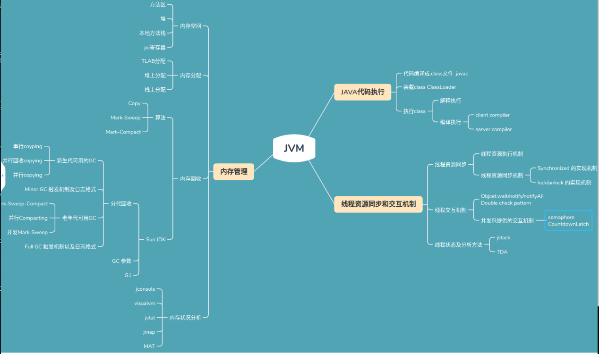

(2)运行过程：

> 我们都知道 Java 源文件，通过编译器，能够生产相应的.Class 文件，也就是字节码文件，而字节码文件又通过 Java 虚拟机中的解释器，编译成特定机器上的机器码。也就是如下：
>
> ① Java 源文件→编译器→字节码文件
>
> ②字节码文件→ JVM →机器码
>
> 每一种平台的解释器是不同的，但是实现的虚拟机是相同的，这也就是 Java 为什么能够跨平台的原因了，当一个程序从开始运行，这时虚拟机就开始实例化了，多个程序启动就会存在多个虚拟机实例。程序退出或者关闭，则虚拟机实例消亡，多个虚拟机实例之间数据不能共享。

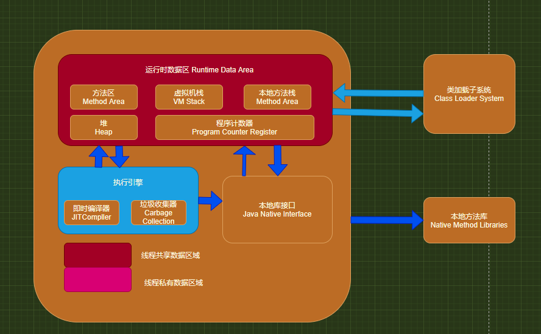


## 1.1.线程

> 这里所说的线程指程序执行过程中的一个线程实体。JVM 允许一个应用并发执行多个线程。Hotspot JVM 中的 Java 线程与原生操作系统线程有直接的映射关系。当线程本地存储、缓冲区分配、同步对象、栈、程序计数器等准备好以后，就会创建一个操作系统原生线程。Java 线程结束，原生线程随之被回收。操作系统负责调度所有线程，并把它们分配到任何可用的 CPU 上。当原生线程初始化完毕，就会调用 Java 线程的 run()方法。当线程结束时，会释放原生线程和 Java 线程的所有资源。
>
> Hotspot JVM 后台运行的系统线程主要有下面几个：

| 系统线程                | 说明                                                         |
| ----------------------- | ------------------------------------------------------------ |
| 虚拟机线程（VM thread） | 这个线程等待 JVM 到达安全点操作出现。这些操作必须要在独立的线程里执行，因为当堆修改无法进行时，线程都需要 JVM 位于安全点。这些操作的类型有：stop-the-world 垃圾回收、线程栈 dump、线程暂停、线程偏向锁（biased locking）解除。 |
| 周期性任务线程          | 这线程负责定时器事件（也就是中断），用来调度周期性操作的执行。 |
| GC 线程                 | 这些线程支持 JVM 中不同的垃圾回收活动。                      |
| 编译器线程              | 这些线程在运行时将字节码动态编译成本地平台相关的机器码。     |
| 信号分发线程            | 这个线程接收发送到 JVM 的信号并调用适当的 JVM 方法处理。     |

## 1.2.JVM 内存区

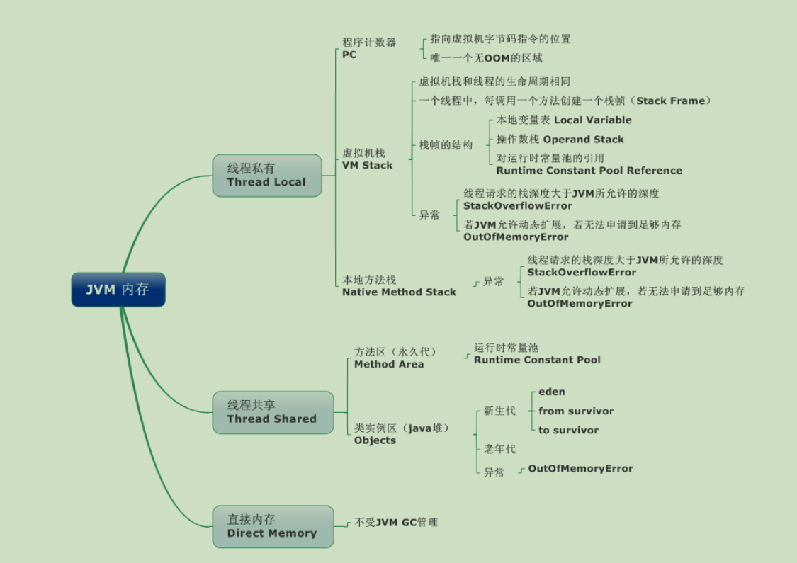

> JVM 内存区域主要分为线程私有区域【程序计数器、虚拟机栈、本地方法栈】、线程共享区域【JAVA 堆、方法区】、直接内存。
>
> 线程私有数据区域生命周期与线程相同,依赖用户线程的启动/结束而创建/销毁(在 Hotspot VM 内,每个线程都与操作系统的本地线程直接映射,因此这部分内存区域的存/否跟随本地线程的生/死对应)。
>
> 线程共享区域随虚拟机的启动/关闭而创建/销毁。
>
> 直接内存并不是 JVM 运行时数据区的一部分,但也会被频繁的使用: 在 JDK 1.4 引入的 NIO 提供了基于 Channel 与 Buffer 的 IO 方式,它可以使用 Native 函数库直接分配堆外内存,然后使用DirectByteBuffer 对象作为这块内存的引用进行操作(详见: Java I/O 扩展),这样就避免了在 Java堆和 Native 堆中来回复制数据,因此在一些场景中可以显著提高性能。
>
> 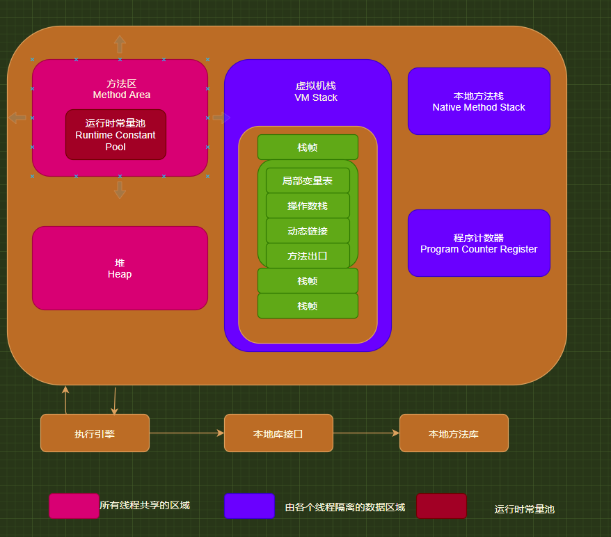

### 1.2.1.程序计数器(线程私有)

> 一块较小的内存空间,是当前线程所执行的字节码的行号指示器，每条线程都要有一个独立的程序计数器，这类内存也称为“线程私有”的内存。
>
> 正在执行 java 方法的话，计数器记录的是虚拟机字节码指令的地址（当前指令的地址）。如果还是 Native 方法，则为空。
>
> 这个内存区域是唯一一个在虚拟机中没有规定任何 OutOfMemoryError 情况的区域。

### 1.2.2.虚拟机栈(线程私有)

> 是描述java方法执行的内存模型，每个方法在执行的同时都会创建一个栈帧（Stack Frame）用于存储局部变量表、操作数栈、动态链接、方法出口等信息。每一个方法从调用直至执行完成的过程，就对应着一个栈帧在虚拟机栈中入栈到出栈的过程。
>
> 栈帧（ Frame）是用来存储数据和部分过程结果的数据结构，同时也被用来处理动态链接(Dynamic Linking)、方法返回值和异常分派（ Dispatch Exception）。栈帧随着方法调用而创建，随着方法结束而销毁——无论方法是正常完成还是异常完成（抛出了在方法内未被捕获的异常）都算作方法结束。
>
> 

### 1.2.3.本地方法栈(线程私有)

> 本地方法区栈和 Java Stack 作用类似,区别是虚拟机栈为执行 Java 方法服务,而本地方法栈则为Native 方法服务,如果一个 VM 实现使用 C-linkage 模型来支持 Native 调用,那么该栈将会是一个C 栈，但 HotSpot VM 直接就把本地方法栈和虚拟机栈合二为一。

### 1.2.4.堆（Heap-线程共享）-运行时数据区

> 是被线程共享的一块内存区域，创建的对象和数组都保存在 Java 堆内存中，也是垃圾收集器进行垃圾收集的最重要的内存区域。由于现代 VM 采用分代收集算法,因此 Java 堆从 GC 的角度还可以细分为: 新生代(Eden 区、From Survivor 区和 To Survivor 区)和老年代。

### 1.2.5.方法区/永久代（线程共享）

> 即我们常说的永久代(Permanent Generation),用于存储被 JVM 加载的类信息、常量、静态变量、即时编译器编译后的代码等数据. HotSpot VM把GC分代收集扩展至方法区,即使用Java堆的永久代来实现方法区,这样 HotSpot 的垃圾收集器就可以像管理 Java 堆一样管理这部分内存,而不必为方法区开发专门的内存管理器(永久带的内存回收的主要目标是针对常量池的回收和类型的卸载,因此收益一般很小)。
>
> 运行时常量池（Runtime Constant Pool）是方法区的一部分。Class 文件中除了有类的版本、字段、方法、接口等描述等信息外，还有一项信息是常量池（Constant Pool Table），用于存放编译期生成的各种字面量和符号引用，这部分内容将在类加载后存放到方法区的运行时常量池中。 Java 虚拟机对 Class 文件的每一部分（自然也包括常量池）的格式都有严格的规定，每一个字节用于存储哪种数据都必须符合规范上的要求，这样才会被虚拟机认可、装载和执行。

## 1.3.JVM 运行时内存

> Java 堆从 GC 的角度还可以细分为: 新生代(Eden 区、From Survivor 区和To Survivor 区)和老年代。
>
> 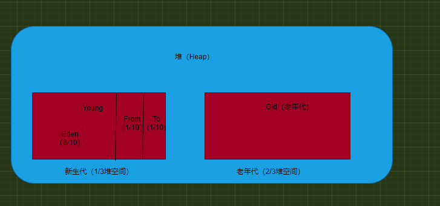


### 1.3.1.新生代

> 是用来存放新生的对象。一般占据堆的1/3 空间。由于频繁创建对象，所以新生代会频繁触发MinorGC 进行垃圾回收。新生代又分为 Eden 区、ServivorFrom、ServivorTo 三个区。

#### 1.3.1.1. Eden 区

> Java 新对象的出生地（如果新创建的对象占用内存很大，则直接分配到老年代）。当 Eden 区内存不够的时候就会触发 MinorGC，对新生代区进行一次垃圾回收。

#### 1.3.1.2. ServivorFrom

> 上一次 GC 的幸存者，作为这一次 GC 的被扫描者。

#### 1.3.1.3. ServivorTo

> 保留了一次 MinorGC 过程中的幸存者。

#### 1.3.1.4. MinorGC 的过程（复制->清空->互换）

> MinorGC 采用复制算法。
>
> 1：eden、servicorFrom复制到ServicorTo，年龄+1
>
> 首先，把 Eden 和 ServivorFrom 区域中存活的对象复制到 ServicorTo 区域（如果有对象的年龄以及达到了老年的标准，则赋值到老年代区），同时把这些对象的年龄+1（如果 ServicorTo 不够位置了就放到老年区）；
>
> 2：清空eden、servicorFrom
>
> 然后，清空 Eden 和 ServicorFrom 中的对象；
>
> 3：ServicorTo和ServicorFrom互换
>
> 最后，ServicorTo 和 ServicorFrom 互换，原 ServicorTo 成为下一次 GC 时的 ServicorFrom区。

### 1.3.2.老年代

> 主要存放应用程序中生命周期长的内存对象。
>
> 老年代的对象比较稳定，所以 MajorGC 不会频繁执行。在进行 MajorGC 前一般都先进行了一次 MinorGC，使得有新生代的对象晋身入老年代，导致空间不够用时才触发。当无法找到足够大的连续空间分配给新创建的较大对象时也会提前触发一次 MajorGC 进行垃圾回收腾出空间。
>
>  MajorGC 采用标记清除算法：首先扫描一次所有老年代，标记出存活的对象，然后回收没有标记的对象。MajorGC 的耗时比较长，因为要扫描再回收。MajorGC 会产生内存碎片，为了减少内存损耗，我们一般需要进行合并或者标记出来方便下次直接分配。当老年代也满了装不下的时候，就会抛出 OOM（Out of Memory）异常。

### 1.3.3.永久代

> 指内存的永久保存区域，主要存放 Class 和 Meta（元数据）的信息,Class 在被加载的时候被放入永久区域，它和和存放实例的区域不同,GC 不会在主程序运行期对永久区域进行清理。所以这也导致了永久代的区域会随着加载的 Class 的增多而胀满，最终抛出 OOM 异常。

#### 1.3.3.1. JAVA8 与元数据

> 在 Java8 中，永久代已经被移除，被一个称为“元数据区”（元空间）的区域所取代。元空间的本质和永久代类似，元空间与永久代之间最大的区别在于：元空间并不在虚拟机中，而是使用本地内存。因此，默认情况下，元空间的大小仅受本地内存限制。类的元数据放入 native memory,字符串池和类的静态变量放入 java 堆中，这样可以加载多少类的元数据就不再由MaxPermSize 控制,而由系统的实际可用空间来控制。

### 1.4.垃圾回收与算法

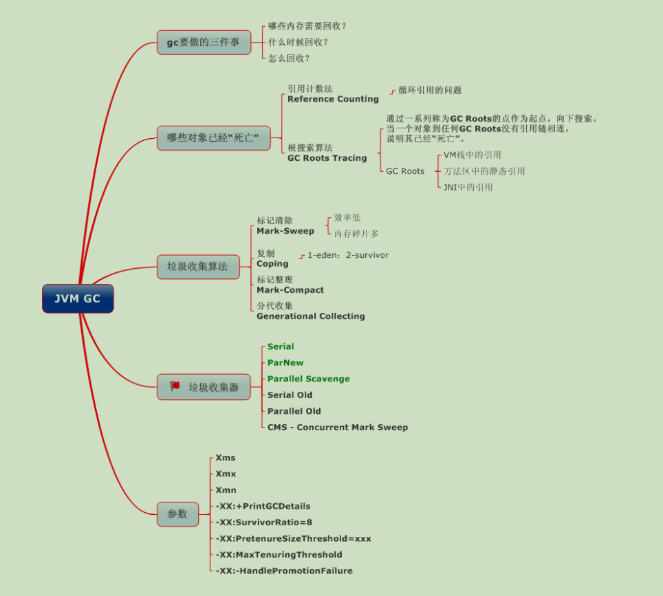

### 1.4.1.如何确定垃圾

#### 1.4.1.1.引用计数法

> 在 Java 中，引用和对象是有关联的。如果要操作对象则必须用引用进行。因此，很显然一个简单的办法是通过引用计数来判断一个对象是否可以回收。简单说，即一个对象如果没有任何与之关联的引用，即他们的引用计数都不为0，则说明对象不太可能再被用到，那么这个对象就是可回收对象。

#### 1.4.1.2.可达性分析

> 为了解决引用计数法的循环引用问题，Java 使用了可达性分析的方法。通过一系列的“GC roots”对象作为起点搜索。如果在“GC roots”和一个对象之间没有可达路径，则称该对象是不可达的。
>
> 要注意的是，不可达对象不等价于可回收对象，不可达对象变为可回收对象至少要经过两次标记过程。两次标记后仍然是可回收对象，则将面临回收。

### 1.4.2.标记清除算法（Mark-Sweep）

> 最基础的垃圾回收算法，分为两个阶段，标注和清除。标记阶段标记出所有需要回收的对象，清除阶段回收被标记的对象所占用的空间。如图
>
> 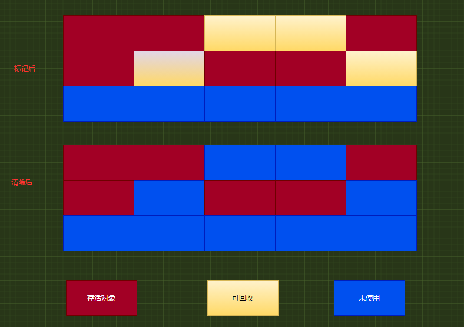
>
> 从图中我们就可以发现，该算法最大的问题是内存碎片化严重，后续可能发生大对象不能找到可利用空间的问题。

### 1.4.3.复制算法（copying）

> 为了解决 Mark-Sweep 算法内存碎片化的缺陷而被提出的算法。按内存容量将内存划分为等大小的两块。每次只使用其中一块，当这一块内存满后将尚存活的对象复制到另一块上去，把已使用的内存清掉，如图：
>
> 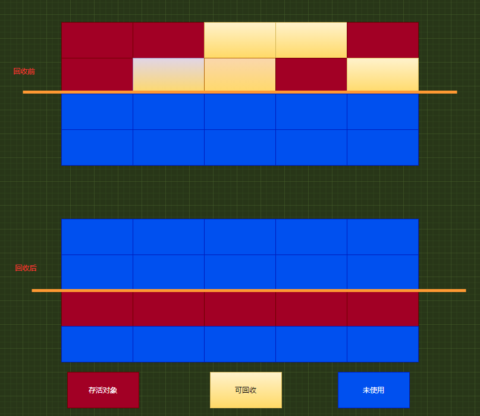
>
> 这种算法虽然实现简单，内存效率高，不易产生碎片，但是最大的问题是可用内存被压缩到了原本的一半。且存活对象增多的话，Copying 算法的效率会大大降低。

### 1.4.4.标记整理算法(Mark-Compact)

> 结合了以上两个算法，为了避免缺陷而提出。标记阶段和 Mark-Sweep 算法相同，标记后不是清理对象，而是将存活对象移向内存的一端。然后清除端边界外的对象。如图：
>
> 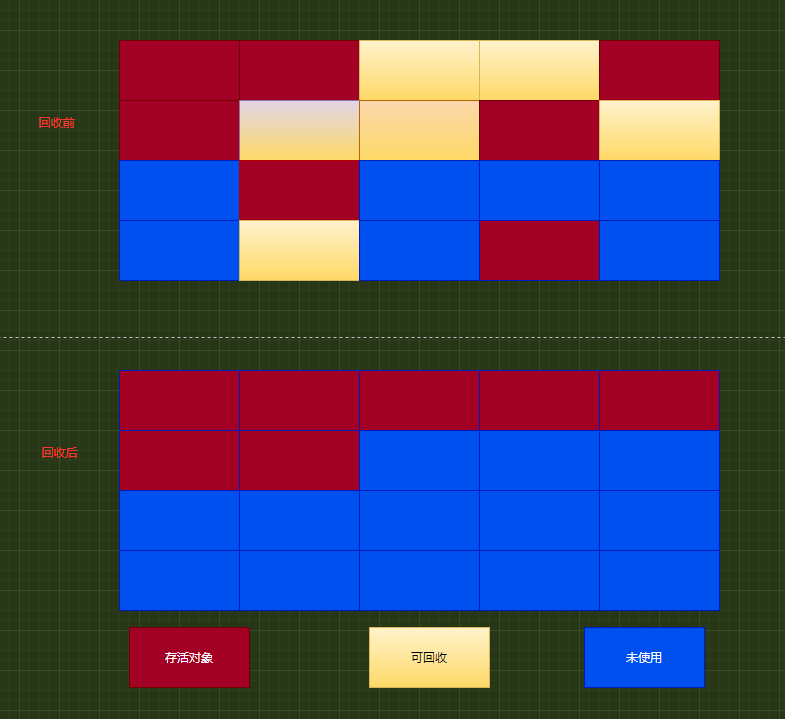

### 1.4.5.分代收集算法

> 分代收集法是目前大部分 JVM 所采用的方法，其核心思想是根据对象存活的不同生命周期将内存划分为不同的域，一般情况下将 GC 堆划分为老生代(Tenured/Old Generation)和新生代(Young Generation)。老生代的特点是每次垃圾回收时只有少量对象需要被回收，新生代的特点是每次垃圾回收时都有大量垃圾需要被回收，因此可以根据不同区域选择不同的算法。

#### 1.4.5.1.新生代与复制算法

> 目前大部分 JVM 的 GC 对于新生代都采取 Copying 算法，因为新生代中每次垃圾回收都要回收大部分对象，即要复制的操作比较少，但通常并不是按照1：1 来划分新生代。一般将新生代划分为一块较大的 Eden 空间和两个较小的 Survivor 空间(From Space, To Space)，每次使用Eden 空间和其中的一块 Survivor 空间，当进行回收时，将该两块空间中还存活的对象复制到另一块 Survivor 空间中。
>
> 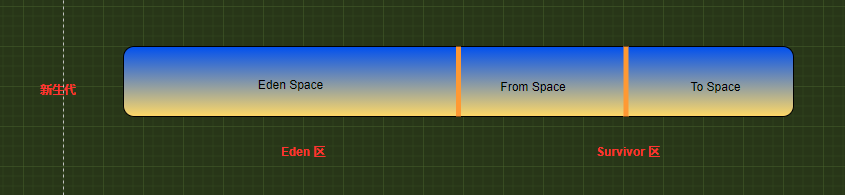

#### 1.4.5.2.老年代与标记整理算法

> 而老年代因为每次只回收少量对象，因而采用 Mark-Compact 算法。
>
> 1. JAVA 虚拟机提到过的处于方法区的永生代(Permanet Generation)，它用来存储 class 类，常量，方法描述等。对永生代的回收主要包括废弃常量和无用的类。
>
> 2. 对象的内存分配主要在新生代的 Eden Space 和 Survivor Space 的 From Space(Survivor 目前存放对象的那一块)，少数情况会直接分配到老生代。
>
> 3. 当新生代的 Eden Space 和 From Space 空间不足时就会发生一次 GC，进行 GC 后，Eden Space 和 From Space 区的存活对象会被挪到 To Space，然后将 Eden Space 和 From Space 进行清理。
>
> 4. 如果 To Space 无法足够存储某个对象，则将这个对象存储到老生代。
>
> 5. 在进行 GC 后，使用的便是 Eden Space 和 To Space 了，如此反复循环。
>
> 6. 当对象在 Survivor 区躲过一次 GC 后，其年龄就会+1。默认情况下年龄到达15 的对象会被移到老生代中。

## 1.5.JAVA 四中引用类型

### 1.5.1.强引用

> 在 Java 中最常见的就是强引用，把一个对象赋给一个引用变量，这个引用变量就是一个强引用。当一个对象被强引用变量引用时，它处于可达状态，它是不可能被垃圾回收机制回收的，即使该对象以后永远都不会被用到 JVM 也不会回收。因此强引用是造成 Java 内存泄漏的主要原因之一。

### 1.5.2.软引用

> 软引用需要用 SoftReference 类来实现，对于只有软引用的对象来说，当系统内存足够时它不会被回收，当系统内存空间不足时它会被回收。软引用通常用在对内存敏感的程序中。

### 1.5.3.弱引用

> 弱引用需要用 WeakReference 类来实现，它比软引用的生存期更短，对于只有弱引用的对象来说，只要垃圾回收机制一运行，不管 JVM 的内存空间是否足够，总会回收该对象占用的内存。

### 1.5.4.虚引用

> 虚引用需要 PhantomReference 类来实现，它不能单独使用，必须和引用队列联合使用。虚引用的主要作用是跟踪对象被垃圾回收的状态。

## 1.6.GC分代收集算法 VS分区收集算法

### 1.6.1.分代收集算法

> 当前主流 VM 垃圾收集都采用”分代收集”(Generational Collection)算法,这种算法会根据对象存活周期的不同将内存划分为几块,如 JVM 中的新生代、老年代、永久代，这样就可以根据各年代特点分别采用最适当的 GC 算法

#### 1.6.1.1.在新生代-复制算法

> 每次垃圾收集都能发现大批对象已死,只有少量存活.因此选用复制算法,只需要付出少量存活对象的复制成本就可以完成收集.

#### 1.6.1.2.在老年代-标记整理算法

> 因为对象存活率高、没有额外空间对它进行分配担保,就必须采用“标记—清理”或“标记—整理”算法来进行回收,不必进行内存复制,且直接腾出空闲内存.

### 1.6.2.分区收集算法

> 分区算法则将整个堆空间划分为连续的不同小区间,每个小区间独立使用,独立回收.这样做的好处是可以控制一次回收多少个小区间,根据目标停顿时间,每次合理地回收若干个小区间(而不是整个堆),从而减少一次 GC 所产生的停顿。

## 1.7.GC垃圾收集器

> Java 堆内存被划分为新生代和年老代两部分，新生代主要使用复制和标记-清除垃圾回收算法；老年代主要使用标记-整理垃圾回收算法，因此 java 虚拟中针对新生代和年老代分别提供了多种不同的垃圾收集器，JDK1.6 中 Sun HotSpot 虚拟机的垃圾收集器如下：
>
> 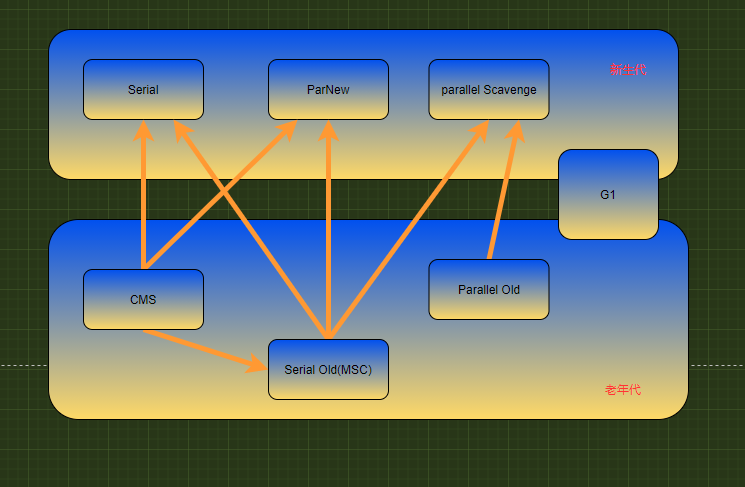

### 1.7.1. Serial垃圾收集器（单线程、复制算法）

> Serial（英文连续）是最基本垃圾收集器，使用复制算法，曾经是JDK1.3.1 之前新生代唯一的垃圾收集器。Serial 是一个单线程的收集器，它不但只会使用一个 CPU 或一条线程去完成垃圾收集工作，并且在进行垃圾收集的同时，必须暂停其他所有的工作线程，直到垃圾收集结束。Serial 垃圾收集器虽然在收集垃圾过程中需要暂停所有其他的工作线程，但是它简单高效，对于限定单个 CPU 环境来说，没有线程交互的开销，可以获得最高的单线程垃圾收集效率，因此 Serial垃圾收集器依然是 java 虚拟机运行在 Client 模式下默认的新生代垃圾收集器。

### 1.7.2. ParNew垃圾收集器（Serial+多线程）

> ParNew 垃圾收集器其实是 Serial 收集器的多线程版本，也使用复制算法，除了使用多线程进行垃圾收集之外，其余的行为和 Serial 收集器完全一样，ParNew 垃圾收集器在垃圾收集过程中同样也要暂停所有其他的工作线程。ParNew 收集器默认开启和 CPU 数目相同的线程数，可以通过-XX:ParallelGCThreads 参数来限制垃圾收集器的线程数。【Parallel：平行的】
>
> ParNew虽然是除了多线程外和Serial 收集器几乎完全一样，但是ParNew垃圾收集器是很多 java虚拟机运行在 Server 模式下新生代的默认垃圾收集器。

### 1.7.3. Parallel Scavenge收集器（多线程复制算法、高效）

> Parallel Scavenge 收集器也是一个新生代垃圾收集器，同样使用复制算法，也是一个多线程的垃圾收集器，它重点关注的是程序达到一个可控制的吞吐量（Thoughput，CPU 用于运行用户代码的时间/CPU 总消耗时间，即吞吐量=运行用户代码时间/(运行用户代码时间+垃圾收集时间)），高吞吐量可以最高效率地利用 CPU 时间，尽快地完成程序的运算任务，主要适用于在后台运算而不需要太多交互的任务。自适应调节策略也是 ParallelScavenge 收集器与 ParNew 收集器的一个重要区别。

### 1.7.4. Serial Old收集器（单线程标记整理算法）

> Serial Old 是 Serial 垃圾收集器年老代版本，它同样是个单线程的收集器，使用标记-整理算法，这个收集器也主要是运行在 Client 默认的 java 虚拟机默认的年老代垃圾收集器。在 Server 模式下，主要有两个用途：
>
> 1. 在 JDK1.5 之前版本中与新生代的 Parallel Scavenge 收集器搭配使用。
>
> 2. 作为年老代中使用 CMS 收集器的后备垃圾收集方案。
>
> 新生代 Serial 与年老代 Serial Old 搭配垃圾收集过程图：
>
> 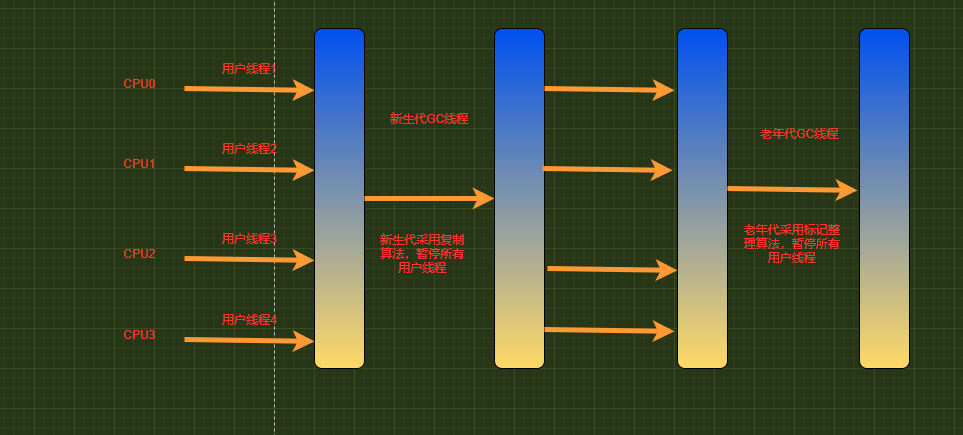
>
> 新生代 Parallel Scavenge 收集器与 ParNew 收集器工作原理类似，都是多线程的收集器，都使用的是复制算法，在垃圾收集过程中都需要暂停所有的工作线程。新生代 Parallel Scavenge/ParNew 与年老代 Serial Old 搭配垃圾收集过程图：
>
> 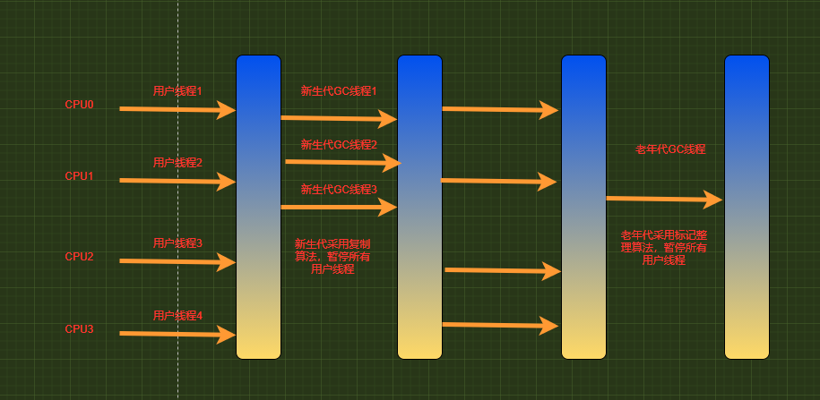


### 1.7.5. Parallel Old收集器（多线程标记整理算法）

> Parallel Old 收集器是Parallel Scavenge的年老代版本，使用多线程的标记-整理算法，在 JDK1.6才开始提供。
>
> 在 JDK1.6 之前，新生代使用 ParallelScavenge 收集器只能搭配年老代的 Serial Old 收集器，只能保证新生代的吞吐量优先，无法保证整体的吞吐量，Parallel Old 正是为了在年老代同样提供吞吐量优先的垃圾收集器，如果系统对吞吐量要求比较高，可以优先考虑新生代 Parallel Scavenge和年老代 Parallel Old 收集器的搭配策略。
>
> 新生代 Parallel Scavenge 和年老代 Parallel Old 收集器搭配运行过程图：
>
> 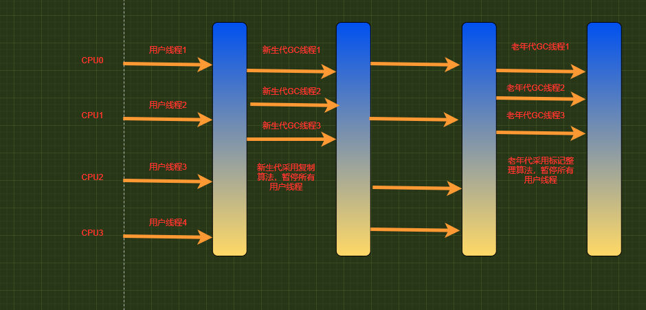

### 1.7.6. CMS收集器（多线程标记清除算法）

> Concurrent mark sweep(CMS)收集器是一种年老代垃圾收集器，其最主要目标是获取最短垃圾回收停顿时间，和其他年老代使用标记-整理算法不同，它使用多线程的标记-清除算法。最短的垃圾收集停顿时间可以为交互比较高的程序提高用户体验。CMS 工作机制相比其他的垃圾收集器来说更复杂，整个过程分为以下4 个阶段：

#### 1.7.6.1.初始标记

> 只是标记一下 GC Roots 能直接关联的对象，速度很快，仍然需要暂停所有的工作线程。

#### 1.7.6.2.并发标记

> 进行 GC Roots 跟踪的过程，和用户线程一起工作，不需要暂停工作线程。

#### 1.7.6.3.重新标记

> 为了修正在并发标记期间，因用户程序继续运行而导致标记产生变动的那一部分对象的标记记录，仍然需要暂停所有的工作线程。

#### 1.7.6.4.并发清除

> 清除 GC Roots 不可达对象，和用户线程一起工作，不需要暂停工作线程。由于耗时最长的并发标记和并发清除过程中，垃圾收集线程可以和用户现在一起并发工作，所以总体上来看CMS 收集器的内存回收和用户线程是一起并发地执行。
>
> CMS 收集器工作过程：
>
> 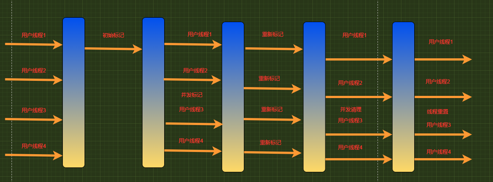

### 1.7.7. G1收集器

> Garbage first 垃圾收集器是目前垃圾收集器理论发展的最前沿成果，相比与 CMS 收集器，G1 收集器两个最突出的改进是：
>
> 1. 基于标记-整理算法，不产生内存碎片。
>
> 2. 可以非常精确控制停顿时间，在不牺牲吞吐量前提下，实现低停顿垃圾回收。
>
> G1 收集器避免全区域垃圾收集，它把堆内存划分为大小固定的几个独立区域，并且跟踪这些区域的垃圾收集进度，同时在后台维护一个优先级列表，每次根据所允许的收集时间，优先回收垃圾最多的区域。区域划分和优先级区域回收机制，确保 G1 收集器可以在有限时间获得最高的垃圾收集效率。


## 1.8. JAVA IO/NIO

### 1.8.1.阻塞IO模型

> 最传统的一种 IO 模型，即在读写数据过程中会发生阻塞现象。当用户线程发出 IO 请求之后，内核会去查看数据是否就绪，如果没有就绪就会等待数据就绪，而用户线程就会处于阻塞状态，用户线程交出 CPU。当数据就绪之后，内核会将数据拷贝到用户线程，并返回结果给用户线程，用户线程才解除 block 状态。典型的阻塞 IO 模型的例子为：data = socket.read();如果数据没有就绪，就会一直阻塞在 read 方法。

### 1.8.2.非阻塞 IO模型

> 当用户线程发起一个 read 操作后，并不需要等待，而是马上就得到了一个结果。如果结果是一个error 时，它就知道数据还没有准备好，于是它可以再次发送 read 操作。一旦内核中的数据准备好了，并且又再次收到了用户线程的请求，那么它马上就将数据拷贝到了用户线程，然后返回。所以事实上，在非阻塞 IO 模型中，用户线程需要不断地询问内核数据是否就绪，也就说非阻塞 IO不会交出 CPU，而会一直占用 CPU。典型的非阻塞 IO 模型一般如下：
>
> ```java
> while(true){
>     data = socket.read();
>     if(data!= error){
>    //处理数据
>     break;}
>    }
> ```
> 
>但是对于非阻塞 IO 就有一个非常严重的问题，在 while 循环中需要不断地去询问内核数据是否就绪，这样会导致 CPU 占用率非常高，因此一般情况下很少使用 while 循环这种方式来读取数据。

### 1.8.3.多路复用IO模型

> 多路复用 IO 模型是目前使用得比较多的模型。Java NIO 实际上就是多路复用 IO。在多路复用 IO模型中，会有一个线程不断去轮询多个 socket 的状态，只有当 socket 真正有读写事件时，才真正调用实际的 IO 读写操作。因为在多路复用 IO 模型中，只需要使用一个线程就可以管理多个socket，系统不需要建立新的进程或者线程，也不必维护这些线程和进程，并且只有在真正有socket 读写事件进行时，才会使用 IO 资源，所以它大大减少了资源占用。在 Java NIO 中，是通过 selector.select()去查询每个通道是否有到达事件，如果没有事件，则一直阻塞在那里，因此这种方式会导致用户线程的阻塞。多路复用 IO 模式，通过一个线程就可以管理多个 socket，只有当socket 真正有读写事件发生才会占用资源来进行实际的读写操作。因此，多路复用 IO 比较适合连接数比较多的情况。
>
> 另外多路复用 IO 为何比非阻塞 IO 模型的效率高是因为在非阻塞 IO 中，不断地询问 socket 状态时通过用户线程去进行的，而在多路复用 IO 中，轮询每个 socket 状态是内核在进行的，这个效率要比用户线程要高的多。不过要注意的是，多路复用 IO 模型是通过轮询的方式来检测是否有事件到达，并且对到达的事件逐一进行响应。因此对于多路复用 IO 模型来说，一旦事件响应体很大，那么就会导致后续的事件迟迟得不到处理，并且会影响新的事件轮询。

### 1.8.4.信号驱动IO模型

> 在信号驱动 IO 模型中，当用户线程发起一个 IO 请求操作，会给对应的 socket 注册一个信号函数，然后用户线程会继续执行，当内核数据就绪时会发送一个信号给用户线程，用户线程接收到信号之后，便在信号函数中调用 IO 读写操作来进行实际的 IO 请求操作。

### 1.8.5.异步IO模型

> 异步 IO 模型才是最理想的 IO 模型，在异步 IO 模型中，当用户线程发起 read 操作之后，立刻就可以开始去做其它的事。而另一方面，从内核的角度，当它受到一个 asynchronous read 之后，它会立刻返回，说明 read 请求已经成功发起了，因此不会对用户线程产生任何 block。然后，内核会等待数据准备完成，然后将数据拷贝到用户线程，当这一切都完成之后，内核会给用户线程发送一个信号，告诉它 read 操作完成了。也就说用户线程完全不需要知道实际的整个 IO 操作是如何进行的，只需要先发起一个请求，当接收内核返回的成功信号时表示 IO 操作已经完成，可以直接去使用数据了。也就说在异步 IO 模型中，IO 操作的两个阶段都不会阻塞用户线程，这两个阶段都是由内核自动完成，然后发送一个信号告知用户线程操作已完成。用户线程中不需要再次调用 IO 函数进行具体的读写。这点是和信号驱动模型有所不同的，在信号驱动模型中，当用户线程接收到信号表示数据已经就绪，然后需要用户线程调用 IO 函数进行实际的读写操作；而在异步 IO 模型中，收到信号表示 IO 操作已经完成，不需要再在用户线程中调用 IO 函数进行实际的读写操作。
>
> 注意，异步 IO 是需要操作系统的底层支持，在 Java 7 中，提供了 Asynchronous IO。
>

#### 1.8.6. JAVA IO包

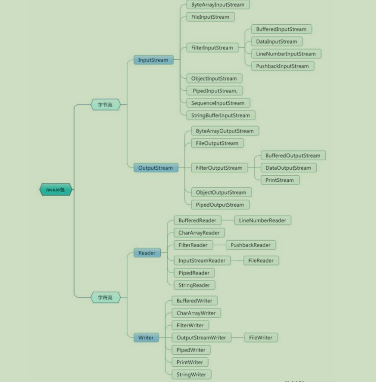


### 1.8.7. JAVA NIO

> NIO 主要有三大核心部分：Channel(通道)，Buffer(缓冲区), Selector。传统 IO 基于字节流和字符流进行操作，而 NIO 基于 Channel 和 Buffer(缓冲区)进行操作，数据总是从通道读取到缓冲区中，或者从缓冲区写入到通道中。Selector(选择区)用于监听多个通道的事件（比如：连接打开，数据到达）。因此，单个线程可以监听多个数据通道。
>
> 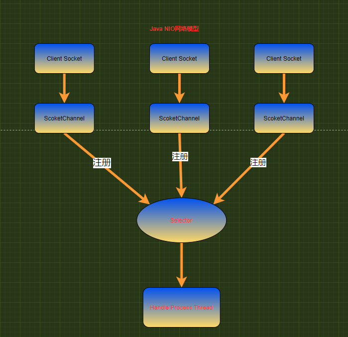
>
> NIO 和传统 IO 之间第一个最大的区别是，IO 是面向流的，NIO 是面向缓冲区的。

#### 1.8.7.1. NIO 的缓冲区

> Java IO 面向流意味着每次从流中读一个或多个字节，直至读取所有字节，它们没有被缓存在任何地方。此外，它不能前后移动流中的数据。如果需要前后移动从流中读取的数据，需要先将它缓存到一个缓冲区。NIO 的缓冲导向方法不同。数据读取到一个它稍后处理的缓冲区，需要时可在缓冲区中前后移动。这就增加了处理过程中的灵活性。但是，还需要检查是否该缓冲区中包含所有您需要处理的数据。而且，需确保当更多的数据读入缓冲区时，不要覆盖缓冲区里尚未处理的数据。

#### 1.8.7.2. NIO 的非阻塞

> IO 的各种流是阻塞的。这意味着，当一个线程调用 read()或 write()时，该线程被阻塞，直到有一些数据被读取，或数据完全写入。该线程在此期间不能再干任何事情了。 NIO 的非阻塞模式，使一个线程从某通道发送请求读取数据，但是它仅能得到目前可用的数据，如果目前没有数据可用时，就什么都不会获取。而不是保持线程阻塞，所以直至数据变的可以读取之前，该线程可以继续做其他的事情。非阻塞写也是如此。一个线程请求写入一些数据到某通道，但不需要等待它完全写入，这个线程同时可以去做别的事情。线程通常将非阻塞 IO 的空闲时间用于在其它通道上执行 IO 操作，所以一个单独的线程现在可以管理多个输入和输出通道（channel）。

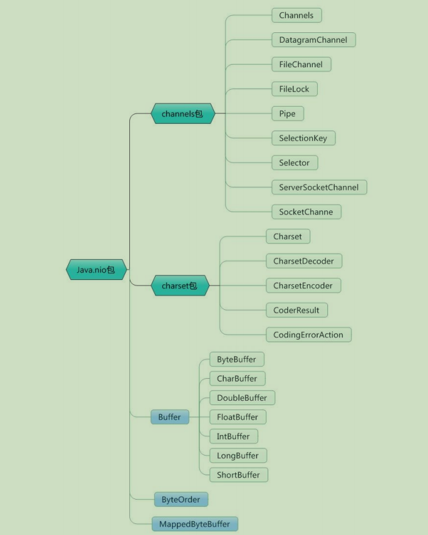

### 1.8.8. Channel

> 首先说一下 Channel，国内大多翻译成“通道”。Channel 和 IO 中的 Stream(流)是差不多一个等级的。只不过 Stream 是单向的，譬如：InputStream, OutputStream，而 Channel 是双向的，既可以用来进行读操作，又可以用来进行写操作。
>
> NIO 中的 Channel 的主要实现有：
>
> 1. FileChannel
>
> 2. DatagramChannel
>
> 3. SocketChannel
>
> 4. ServerSocketChannel
>
> 这里看名字就可以猜出个所以然来：分别可以对应文件 IO、UDP 和 TCP（Server 和 Client）。
>
> 下面演示的案例基本上就是围绕这4 个类型的 Channel 进行陈述的。

### 1.8.9. Buffer

> Buffer，故名思意，缓冲区，实际上是一个容器，是一个连续数组。Channel 提供从文件、网络读取数据的渠道，但是读取或写入的数据都必须经由 Buffer。

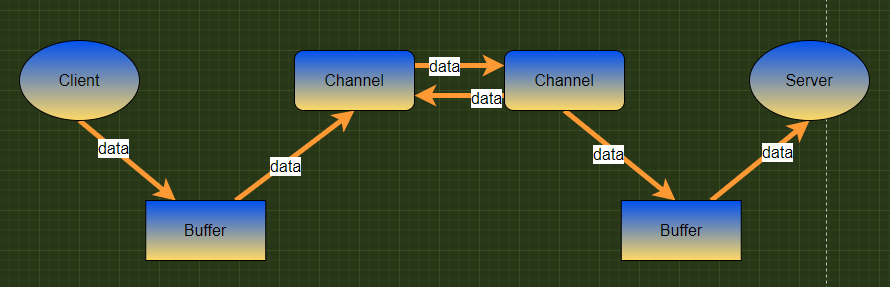

> 上面的图描述了从一个客户端向服务端发送数据，然后服务端接收数据的过程。客户端发送数据时，必须先将数据存入 Buffer 中，然后将 Buffer 中的内容写入通道。服务端这边接收数据必须通过 Channel 将数据读入到 Buffer 中，然后再从 Buffer 中取出数据来处理。
>
> 在 NIO 中，Buffer 是一个顶层父类，它是一个抽象类，常用的 Buffer 的子类有：ByteBuffer、IntBuffer、 CharBuffer、 LongBuffer、 DoubleBuffer、FloatBuffer、ShortBuffer

### 1.8.10. Selector

> Selector 类是 NIO 的核心类，Selector 能够检测多个注册的通道上是否有事件发生，如果有事件发生，便获取事件然后针对每个事件进行相应的响应处理。这样一来，只是用一个单线程就可以管理多个通道，也就是管理多个连接。这样使得只有在连接真正有读写事件发生时，才会调用函数来进行读写，就大大地减少了系统开销，并且不必为每个连接都创建一个线程，不用去维护多个线程，并且避免了多线程之间的上下文切换导致的开销。


## 1.9.JVM 类加载机制

> JVM 类加载机制分为五个部分：加载，验证，准备，解析，初始化，下面我们就分别来看一下这五个过程。
>
> 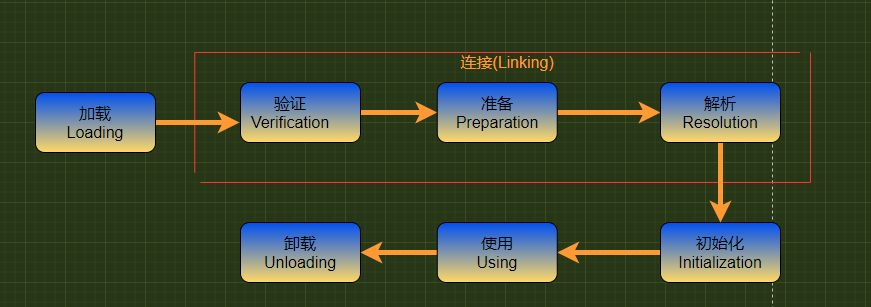

#### 1.9.1.1.加载

> 加载是类加载过程中的一个阶段，这个阶段会在内存中生成一个代表这个类的 java.lang.Class 对象，作为方法区这个类的各种数据的入口。注意这里不一定非得要从一个 Class 文件获取，这里既可以从 ZIP 包中读取（比如从 jar 包和 war 包中读取），也可以在运行时计算生成（动态代理），也可以由其它文件生成（比如将 JSP 文件转换成对应的 Class 类）。

#### 1.9.1.2.验证

> 这一阶段的主要目的是为了确保 Class 文件的字节流中包含的信息是否符合当前虚拟机的要求，并且不会危害虚拟机自身的安全。

#### 1.9.1.3.准备

> 准备阶段是正式为类变量分配内存并设置类变量的初始值阶段，即在方法区中分配这些变量所使用的内存空间。注意这里所说的初始值概念，比如一个类变量定义为：
>
> ```java
> public static int v = 8080;
> ```
>
> 实际上变量 v 在准备阶段过后的初始值为0 而不是8080，将 v 赋值为8080 的 put static 指令是程序被编译后，存放于类构造器\<client>方法之中。但是注意如果声明为：
>
> ```java
> public static final int v = 8080;
> ```
>
> 在编译阶段会为 v 生成 ConstantValue 属性，在准备阶段虚拟机会根据 ConstantValue 属性将 v赋值为8080。

#### 1.9.1.4.解析

> 解析阶段是指虚拟机将常量池中的符号引用替换为直接引用的过程。符号引用就是 class 文件中的：
>
> 1. CONSTANT_Class_info
>
> 2. CONSTANT_Field_info
>
> 3. CONSTANT_Method_info等类型的常量。

#### 1.9.1.5.符号引用

> 符号引用与虚拟机实现的布局无关，引用的目标并不一定要已经加载到内存中。各种虚拟机实现的内存布局可以各不相同，但是它们能接受的符号引用必须是一致的，因为符号引用的字面量形式明确定义在 Java 虚拟机规范的 Class 文件格式中。

#### 1.9.1.6.直接引用

> 直接引用可以是指向目标的指针，相对偏移量或是一个能间接定位到目标的句柄。如果有了直接引用，那引用的目标必定已经在内存中存在。

#### 1.9.1.7.初始化

> 初始化阶段是类加载最后一个阶段，前面的类加载阶段之后，除了在加载阶段可以自定义类加载器以外，其它操作都由 JVM 主导。到了初始阶段，才开始真正执行类中定义的 Java 程序代码。

#### 1.9.1.8.类构造器\<client>

> 初始化阶段是执行类构造器\<client>方法的过程。\<client>方法是由编译器自动收集类中的类变量的赋值操作和静态语句块中的语句合并而成的。虚拟机会保证子\<client>方法执行之前，父类的\<client>方法已经执行完毕，如果一个类中没有对静态变量赋值也没有静态语句块，那么编译器可以不为这个类生成\<client>()方法。
>
> 注意以下几种情况不会执行类初始化：
>
> 1. 通过子类引用父类的静态字段，只会触发父类的初始化，而不会触发子类的初始化。
>
> 2. 定义对象数组，不会触发该类的初始化。
>
> 3. 常量在编译期间会存入调用类的常量池中，本质上并没有直接引用定义常量的类，不会触发定义常量所在的类。
>
> 4. 通过类名获取 Class 对象，不会触发类的初始化。
>
> 5. 通过 Class.forName 加载指定类时，如果指定参数 initialize 为 false 时，也不会触发类初始化，其实这个参数是告诉虚拟机，是否要对类进行初始化。
>
> 6. 通过 ClassLoader 默认的 loadClass 方法，也不会触发初始化动作。

### 1.9.2.类加载器

> 虚拟机设计团队把加载动作放到 JVM 外部实现，以便让应用程序决定如何获取所需的类，JVM 提供了3 种类加载器：

#### 1.9.2.1.启动类加载器(Bootstrap ClassLoader)

> 负责加载 JAVA_HOME\lib 目录中的，或通过-Xbootclasspath 参数指定路径中的，且被虚拟机认可（按文件名识别，如 rt.jar）的类。

#### 1.9.2.2.扩展类加载器(Extension ClassLoader)

> 负责加载 JAVA_HOME\lib\ext 目录中的，或通过 java.ext.dirs 系统变量指定路径中的类库。

#### 1.9.2.3.应用程序类加载器(Application ClassLoader)：

> 负责加载用户路径（classpath）上的类库。
>
> JVM 通过双亲委派模型进行类的加载，当然我们也可以通过继承 java.lang.ClassLoader实现自定义的类加载器。
>
> 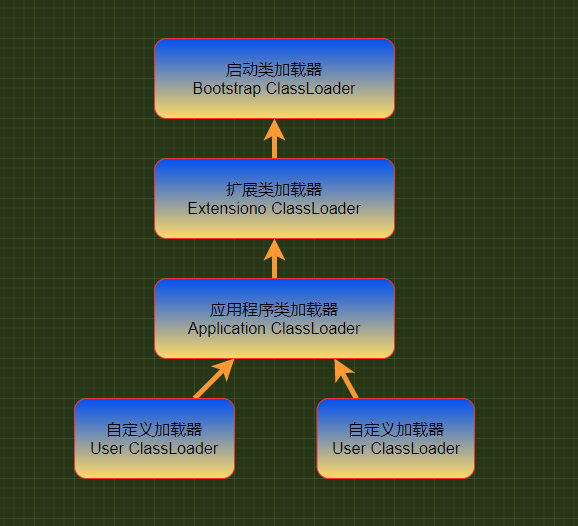

### 1.9.3.双亲委派

> 当一个类收到了类加载请求，他首先不会尝试自己去加载这个类，而是把这个请求委派给父类去完成，每一个层次类加载器都是如此，因此所有的加载请求都应该传送到启动类加载其中，只有当父类加载器反馈自己无法完成这个请求的时候（在它的加载路径下没有找到所需加载的Class），子类加载器才会尝试自己去加载。
>
> 采用双亲委派的一个好处是比如加载位于 rt.jar 包中的类 java.lang.Object，不管是哪个加载器加载这个类，最终都是委托给顶层的启动类加载器进行加载，这样就保证了使用不同的类加载器最终得到的都是同样一个 Object 对象。
>
> 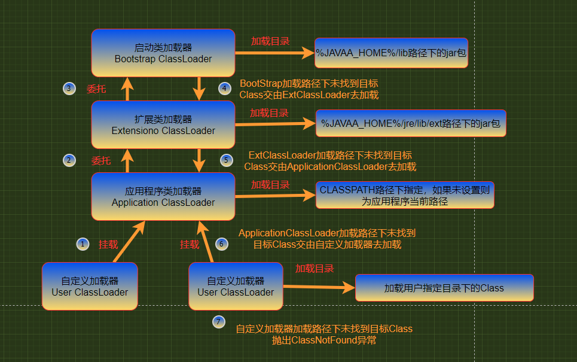

### 1.9.4. OSGI（动态模型系统）

> OSGi(Open Service Gateway Initiative)，是面向 Java 的动态模型系统，是 Java 动态化模块化系统的一系列规范。

#### 1.9.4.1.动态改变构造

> OSGi 服务平台提供在多种网络设备上无需重启的动态改变构造的功能。为了最小化耦合度和促使这些耦合度可管理，OSGi 技术提供一种面向服务的架构，它能使这些组件动态地发现对方。

#### 1.9.4.2.模块化编程与热插拔

> OSGi 旨在为实现 Java 程序的模块化编程提供基础条件，基于 OSGi 的程序很可能可以实现模块级的热插拔功能，当程序升级更新时，可以只停用、重新安装然后启动程序的其中一部分，这对企业级程序开发来说是非常具有诱惑力的特性。
>
> OSGi 描绘了一个很美好的模块化开发目标，而且定义了实现这个目标的所需要服务与架构，同时也有成熟的框架进行实现支持。但并非所有的应用都适合采用 OSGi 作为基础架构，它在提供强大功能同时，也引入了额外的复杂度，因为它不遵守了类加载的双亲委托模型。


# 2.JAVA集合

## 2.1.接口继承关系和实现

> 集合类存放于 Java.util 包中，主要有3 种：set(集）、list(列表包含 Queue）和 map(映射)。
>
> 1. Collection：Collection 是集合 List、Set、Queue 的最基本的接口。
> 2. Iterator：迭代器，可以通过迭代器遍历集合中的数据
> 3. Map：是映射表的基础接口
>
> 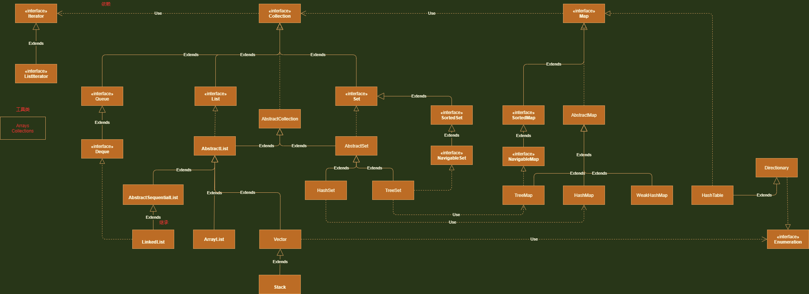
>
> 
>
> 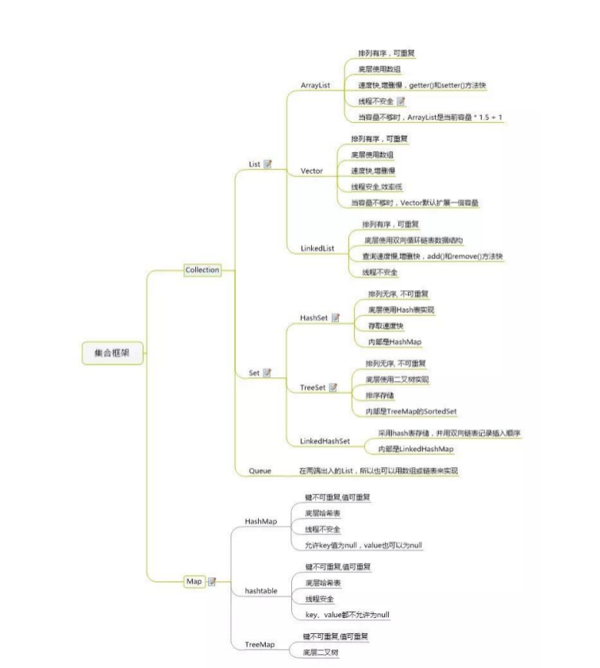

### 2.2. List

Java 的 List 是非常常用的数据类型。List 是有序的 Collection。Java List 一共三个实现类:分别是 ArrayList、Vector 和 LinkedList。

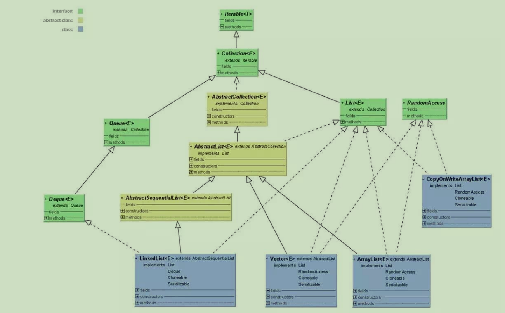

#### 2.2.1. ArrayList(数组)

> ArrayList 是最常用的 List 实现类,内部是通过数组实现的,它允许对元素进行快速随机访问。数组的缺点是每个元素之间不能有间隔,当数组大小不满足时需要增加存储能力,就要将已经有数组的数据复制到新的存储空间中。当从 ArrayList 的中间位置插入或者删除元素时,需要对数组进行复制、移动、代价比较高。因此,它适合随机查找和遍历,不适合插入和删除。

#### 2.2.2. Vector(数组实现、线程同步)

> Vector 与 ArrayList 一样,也是通过数组实现的,不同的是它支持线程的同步,即某一时刻只有一个线程能够写 Vector,避免多线程同时写而引起的不一致性,但实现同步需要很高的花费,因此,访问它比访问 ArrayList 慢。

#### 2.2.3. LinkList(链表)

> LinkedList 是用链表结构存储数据的,很适合数据的动态插入和删除,随机访问和遍历速度比较慢。另外,他还提供了 List 接口中没有定义的方法,专门用于操作表头和表尾元素,可以当作堆栈、队列和双向队列使用。

### 2.3.Set

> Set 注重独一无二的性质,该体系集合用于存储无序(存入和取出的顺序不一定相同)元素，值不能重复。对象的相等性本质是对象 hashCode 值（java 是依据对象的内存地址计算出的此序号）判断的，如果想要让两个不同的对象视为相等的，就必须覆盖 Object 的 hashCode 方法和 equals 方法。

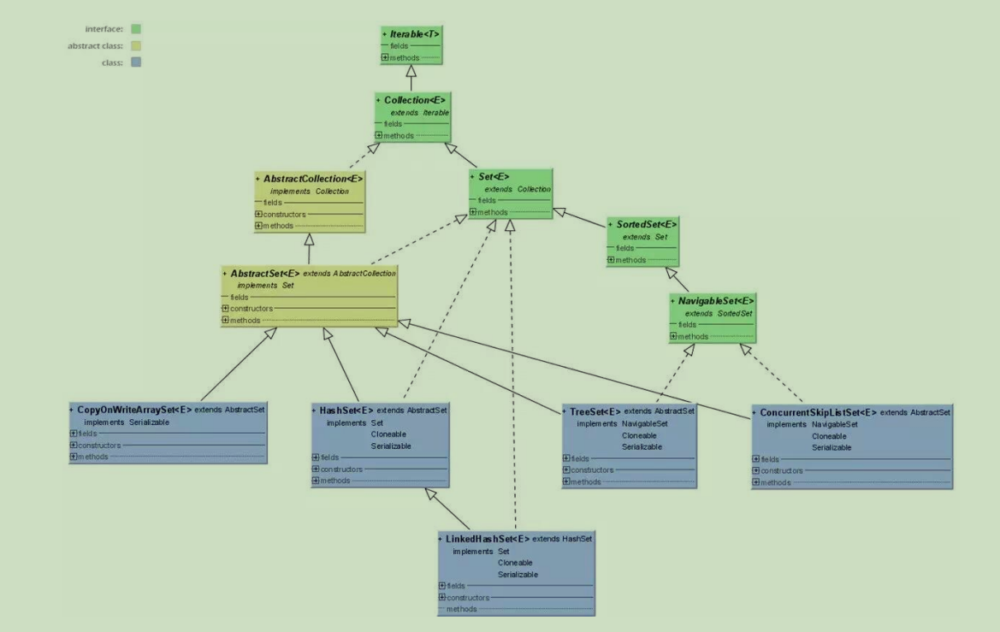

#### 2.3.1.HashSet（Hash表）

> 哈希表边存放的是哈希值。HashSet 存储元素的顺序并不是按照存入时的顺序（和 List 显然不同）而是按照哈希值来存的所以取数据也是按照哈希值取得。元素的哈希值是通过元素的hashcode 方法来获取的, HashSet 首先判断两个元素的哈希值，如果哈希值一样，接着会比较equals 方法如果 equls 结果为 true ，HashSet 就视为同一个元素。如果 equals 为 false 就不是同一个元素。哈希值相同 equals 为 false 的元素是怎么存储呢,就是在同样的哈希值下顺延（可以认为哈希值相同的元素放在一个哈希桶中）。也就是哈希一样的存一列。如图1 表示 hashCode 值不相同的情况；图2 表示 hashCode 值相同，但 equals 不相同的情况。
>
> 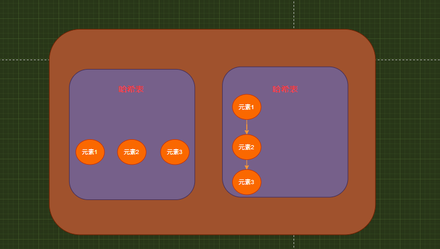
>
> HashSet 通过 hashCode 值来确定元素在内存中的位置。一个 hashCode 位置上可以存放多个元素。

#### 2.3.2.TreeSet（二叉树）

> 1. TreeSet()是使用二叉树的原理对新 add()的对象按照指定的顺序排序（升序、降序），每增加一个对象都会进行排序，将对象插入的二叉树指定的位置。
>
> 2. Integer 和 String 对象都可以进行默认的 TreeSet 排序，而自定义类的对象是不可以的，自己定义的类必须实现 Comparable 接口，并且覆写相应的 compareTo()函数，才可以正常使用。
>
> 3. 在覆写 compare()函数时，要返回相应的值才能使 TreeSet 按照一定的规则来排序
>
> 4. 比较此对象与指定对象的顺序。如果该对象小于、等于或大于指定对象，则分别返回负整数、零或正整数。

#### 2.3.3.LinkHashSet（HashSet+LinkedHashMap）

> 对于 LinkedHashSet 而言，它继承与 HashSet、又基于 LinkedHashMap 来实现的。
>
> LinkedHashSet 底层使用 LinkedHashMap 来保存所有元素，它继承与 HashSet，其所有的方法操作上又与 HashSet 相同，因此 LinkedHashSet 的实现上非常简单，只提供了四个构造方法，并通过传递一个标识参数，调用父类的构造器，底层构造一个 LinkedHashMap 来实现，在相关操作上与父类 HashSet 的操作相同，直接调用父类 HashSet 的方法即可。

### 2.4.Map

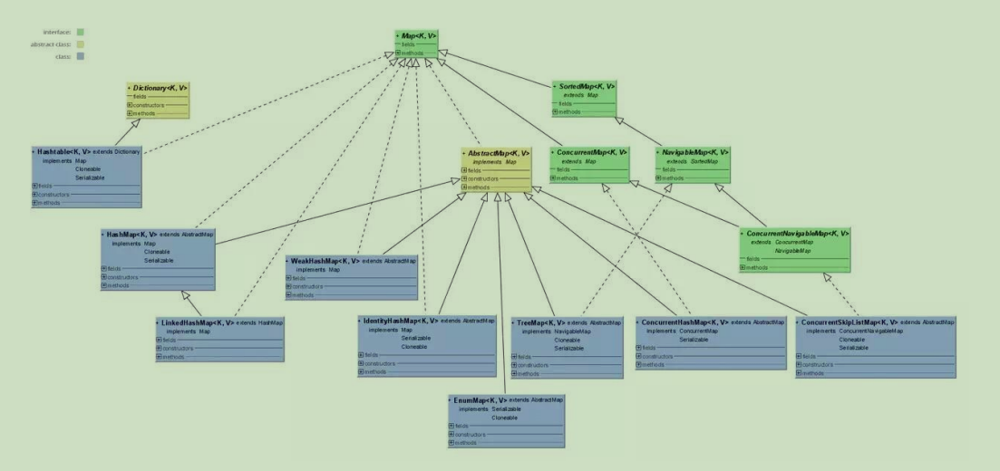


#### 2.4.1. HashMap（数组+链表+红黑树）

> HashMap 根据键的 hashCode 值存储数据，大多数情况下可以直接定位到它的值，因而具有很快的访问速度，但遍历顺序却是不确定的。 HashMap 最多只允许一条记录的键为 null，允许多条记录的值为 null。HashMap 非线程安全，即任一时刻可以有多个线程同时写 HashMap，可能会导致数据的不一致。如果需要满足线程安全，可以用 Collections 的 synchronizedMap 方法使HashMap 具有线程安全的能力，或者使用 ConcurrentHashMap。我们用下面这张图来介绍HashMap 的结构。

##### 2.4.1.1.JAVA7 实现

> 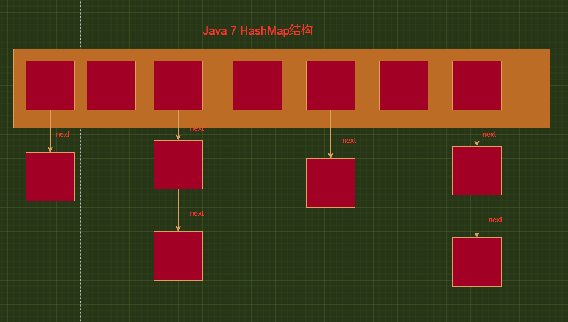
>
> ```java
> static class Entry<K,V> implements Map.Entry<K,V>{
>  final K key;
>  V value;
>  Entry<K,V> next;
>  int hash;
> }
> ```
>
> 大方向上，HashMap 里面是一个数组，然后数组中每个元素是一个单向链表。上图中，每个红色的实体是嵌套类 Entry 的实例，Entry 包含四个属性：key, value, hash 值和用于单向链表的 next。
>
> 1. capacity：当前数组容量，始终保持2^n，可以扩容，扩容后数组大小为当前的2 倍。
>
> 2. loadFactor：负载因子，默认为0.75。
>
> 3. threshold：扩容的阈值，等于 capacity  loadFactor

##### 2.4.1.2.JAVA8实现

> Java8 对 HashMap 进行了一些修改，最大的不同就是利用了红黑树，所以其由数组+链表+红黑树组成。
>
> 根据 Java7 HashMap 的介绍，我们知道，查找的时候，根据 hash 值我们能够快速定位到数组的具体下标，但是之后的话，需要顺着链表一个个比较下去才能找到我们需要的，时间复杂度取决于链表的长度，为 O(n)。为了降低这部分的开销，在 Java8 中，当链表中的元素超过了8 个以后，会将链表转换为红黑树，在这些位置进行查找的时候可以降低时间复杂度为 O(logN)。
>
> 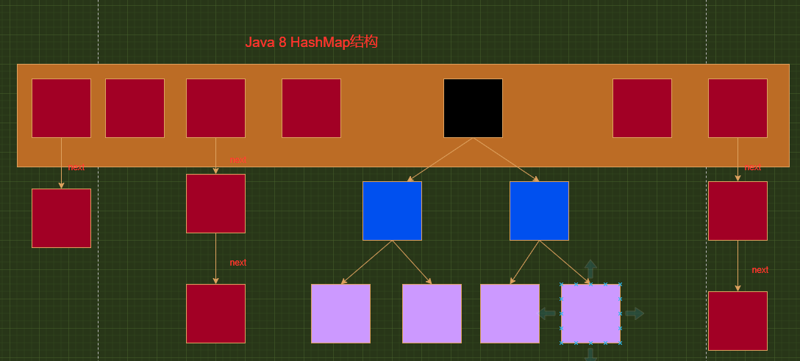

#### 2.4.2. ConcurrentHashMap

##### 2.4.2.1.Segment段

> ConcurrentHashMap 和 HashMap 思路是差不多的，但是因为它支持并发操作，所以要复杂一些。整个 ConcurrentHashMap 由一个个 Segment 组成，Segment 代表”部分“或”一段“的意思，所以很多地方都会将其描述为分段锁。注意，行文中，我很多地方用了“槽”来代表一个segment。

##### 3.4.2.2.线程安全（Segment继承ReentrantLock加锁）

> 简单理解就是，ConcurrentHashMap 是一个 Segment 数组，Segment 通过继承ReentrantLock 来进行加锁，所以每次需要加锁的操作锁住的是一个 segment，这样只要保证每个 Segment 是线程安全的，也就实现了全局的线程安全。
>
> 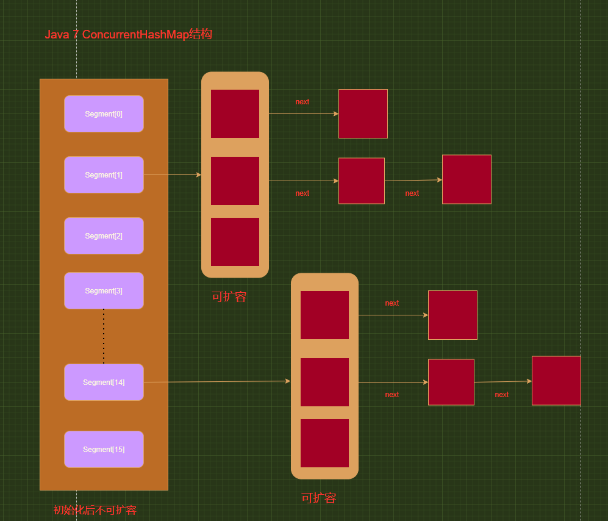

##### 2.4.2.3并行度（默认16）

> concurrencyLevel：并行级别、并发数、Segment 数，怎么翻译不重要，理解它。默认是16，也就是说 ConcurrentHashMap 有16 个 Segments，所以理论上，这个时候，最多可以同时支持16 个线程并发写，只要它们的操作分别分布在不同的 Segment 上。这个值可以在初始化的时候设置为其他值，但是一旦初始化以后，它是不可以扩容的。再具体到每个 Segment 内部，其实每个 Segment 很像之前介绍的 HashMap，不过它要保证线程安全，所以处理起来要麻烦些。

##### 2.4.2.4. Java8实现（引入了红黑树）

> Java8 对 ConcurrentHashMap 进行了比较大的改动,Java8 也引入了红黑树。
>
> 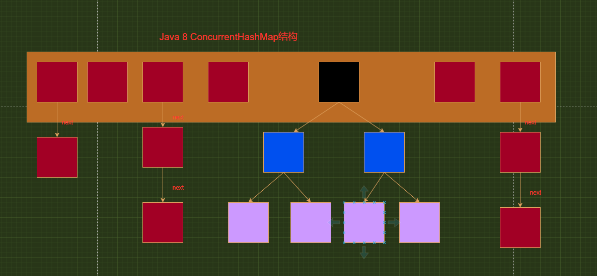

#### 2.4.3. HashTable（线程安全）

> Hashtable 是遗留类，很多映射的常用功能与 HashMap 类似，不同的是它承自 Dictionary 类，并且是线程安全的，任一时间只有一个线程能写 Hashtable，并发性不如 ConcurrentHashMap，因为 ConcurrentHashMap 引入了分段锁。Hashtable 不建议在新代码中使用，不需要线程安全的场合可以用 HashMap 替换，需要线程安全的场合可以用 ConcurrentHashMap 替换。

#### 2.4.4. TreeMap（可排序）

> TreeMap 实现 SortedMap 接口，能够把它保存的记录根据键排序，默认是按键值的升序排序，也可以指定排序的比较器，当用 Iterator 遍历 TreeMap 时，得到的记录是排过序的。如果使用排序的映射，建议使用 TreeMap。
>
> 在使用 TreeMap 时，key 必须实现 Comparable 接口或者在构造 TreeMap 传入自定义的Comparator，否则会在运行时抛出 java.lang.ClassCastException 类型的异常。

#### 2.4.5. LinkHashMap（记录插入顺序）

>LinkedHashMap 是 HashMap 的一个子类，保存了记录的插入顺序，在用 Iterator 遍历LinkedHashMap 时，先得到的记录肯定是先插入的，也可以在构造时带参数，按照访问次序排序。


# 3. JAVA多线程并发

## 3.1 JAVA并发知识库

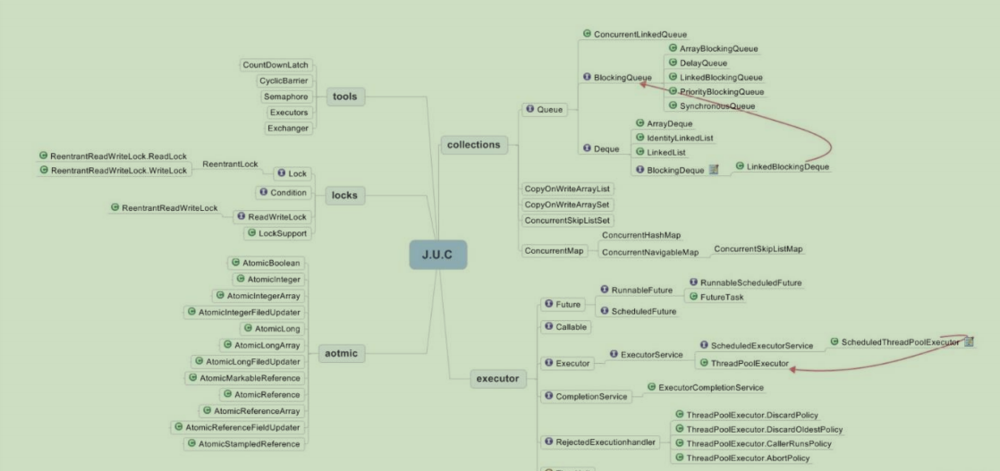

## 3.2. JAVA线程实现/创建方式

### 3.2.1.继承 Thread 类

> Thread 类本质上是实现了 Runnable 接口的一个实例，代表一个线程的实例。启动线程的唯一方法就是通过 Thread 类的 start()实例方法。start()方法是一个 native 方法，它将启动一个新线程，并执行 run()方法。
>
> ```java
> public class MyThread extends Thread {
>     public void run(){
>     System.out.println("MyThread.run()"); 
>    }
> }
> MyThread myThread1 = new MyThread(); 
> myThread1.start(); 
> ```
>
> 

### 3.2.2 实现Runnable接口。

> 如果自己的类已经 extends 另一个类，就无法直接 extends Thread，此时，可以实现一个Runnable 接口。
>
> ```java
> public class MyThread extends OtherClass implements Runnable {
>     public void run(){
>     System.out.println("MyThread.run()"); 
>    }
> }
> 
> //启动 MyThread，需要首先实例化一个 Thread，并传入自己的 MyThread 实例：
> MyThread myThread = new MyThread(); 
> Thread thread = new Thread(myThread); 
> thread.start(); 
> //事实上，当传入一个 Runnable target 参数给 Thread 后，Thread 的 run()方法就会调用target.run()
> public void run(){
>     if (target != null){
>     target.run(); 
>    }
> }
> ```
>
> 

### 3.2.3 ExecutorService、Callable\<Class>、Future有返回值线程

> 有返回值的任务必须实现 Callable 接口，类似的，无返回值的任务必须 Runnable 接口。执行Callable 任务后，可以获取一个 Future 的对象，在该对象上调用 get 就可以获取到 Callable 任务返回的 Object 了，再结合线程池接口 ExecutorService 就可以实现传说中有返回结果的多线程了。
>
> ```java
> //创建一个线程池
> ExecutorService pool = Executors.newFixedThreadPool(taskSize);
> //创建多个有返回值的任务
> List<Future> list = new ArrayList<Future>(); 
> for (int i = 0; i < taskSize; i++){
>     Callable c = new MyCallable(i +""); 
>    //执行任务并获取 Future 对象
>     Future f = pool.submit(c); 
>     list.add(f); 
> }
> 
> //关闭线程池
> pool.shutdown(); 
> //获取所有并发任务的运行结果
> for (Future f : list){
>    //从 Future 对象上获取任务的返回值，并输出到控制台
>     System.out.println("res："+ f.get().toString()); 
> }
> ```
>
> 

### 3.2.4 基于线程池的方式

> 线程和数据库连接这些资源都是非常宝贵的资源。那么每次需要的时候创建，不需要的时候销毁，是非常浪费资源的。那么我们就可以使用缓存的策略，也就是使用线程池。
>
> ```java
> //创建线程池
> ExecutorService threadPool = Executors.newFixedThreadPool(10);
> while(true){
>     threadPool.execute(new Runnable(){
>    //提交多个线程任务，并执行
>    @Override
>     public void run(){
>     System.out.println(Thread.currentThread().getName()+" is running ..");
>     try {
>     Thread.sleep(3000);
>    } catch (InterruptedException e){
>     e.printStackTrace();
>    }
>    }
>    });
> }
> ```
>
> 


## 3.3.4种线程池

> Java 里面线程池的顶级接口是Executor，但是严格意义上讲 Executor 并不是一个线程池，而只是一个执行线程的工具。真正的线程池接口是ExecutorService。
>
> 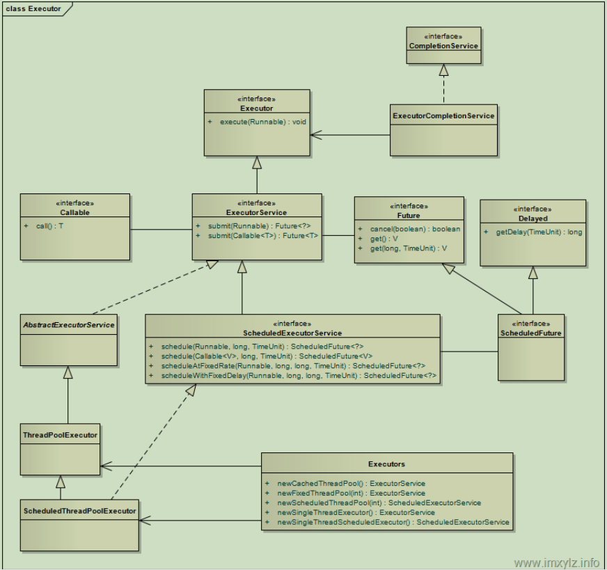

### 3.3.1 newCachedThreadPool

> 创建一个可根据需要创建新线程的线程池，但是在以前构造的线程可用时将重用它们。对于执行很多短期异步任务的程序而言，这些线程池通常可提高程序性能。调用 execute 将重用以前构造的线程（如果线程可用）。如果现有线程没有可用的，则创建一个新线程并添加到池中。终止并从缓存中移除那些已有60 秒钟未被使用的线程。因此，长时间保持空闲的线程池不会使用任何资源。

### 3.3.2 newFixedThreadPool

> 创建一个可重用固定线程数的线程池，以共享的无界队列方式来运行这些线程。在任意点，在大多数 nThreads 线程会处于处理任务的活动状态。如果在所有线程处于活动状态时提交附加任务，则在有可用线程之前，附加任务将在队列中等待。如果在关闭前的执行期间由于失败而导致任何线程终止，那么一个新线程将代替它执行后续的任务（如果需要）。在某个线程被显式地关闭之前，池中的线程将一直存在。


### 3.3.3 newScheduledThreadPool

> 创建一个线程池，它可安排在给定延迟后运行命令或者定期地执行。
>
> ```java
> ScheduledExecutorService scheduledThreadPool= Executors.newScheduledThreadPool(3); 
> 
> scheduledThreadPool.schedule(newRunnable(){
>    @Override 
>     public void run(){
>     System.out.println("延迟三秒");
>    }
> },3, TimeUnit.SECONDS);
> 
> scheduledThreadPool.scheduleAtFixedRate(newRunnable(){
>    @Override 
>     public void run(){
>     System.out.println("延迟1 秒后每三秒执行一次");
>    }
> },1,3,TimeUnit.SECONDS);
> ```
>
> 

### 3.3.4 newSingleThreadExecutor

> Executors.newSingleThreadExecutor()返回一个线程池（这个线程池只有一个线程）,这个线程池可以在线程死后（或发生异常时）重新启动一个线程来替代原来的线程继续执行下去！


## 3.4.线程生命周期(状态)

> 当线程被创建并启动以后，它既不是一启动就进入了执行状态，也不是一直处于执行状态。在线程的生命周期中，它要经过新建(New)、就绪（Runnable）、运行（Running）、阻塞(Blocked)和死亡(Dead)5 种状态。尤其是当线程启动以后，它不可能一直"霸占"着 CPU 独自运行，所以 CPU 需要在多条线程之间切换，于是线程状态也会多次在运行、阻塞之间切换

### 3.4.1 新建状态（NEW）

> 当程序使用 new 关键字创建了一个线程之后，该线程就处于新建状态，此时仅由 JVM 为其分配内存，并初始化其成员变量的值

### 3.4.2 就绪状态（RUNNABLE）：

> 当线程对象调用了 start()方法之后，该线程处于就绪状态。Java 虚拟机会为其创建方法调用栈和程序计数器，等待调度运行。

### 3.4.3 运行状态（RUNNING）：

> 如果处于就绪状态的线程获得了 CPU，开始执行 run()方法的线程执行体，则该线程处于运行状态。

### 3.4.4.阻塞状态（BLOCKED）：

> 阻塞状态是指线程因为某种原因放弃了 cpu 使用权，也即让出了 cpu timeslice，暂时停止运行。直到线程进入可运行(runnable)状态，才有机会再次获得 cpu timeslice 转到运行(running)状态。阻塞的情况分三种：
>
> **等待阻塞（o.wait->等待对列）**：
>
> 运行(running)的线程执行 o.wait()方法，JVM 会把该线程放入等待队列(waitting queue)中。
>
> **同步阻塞(lock->锁池)**：
>
> 运行(running)的线程在获取对象的同步锁时，若该同步锁被别的线程占用，则 JVM 会把该线程放入锁池(lock pool)中。
>
> **其他阻塞(sleep/join)**：
>
> 运行(running)的线程执行 Thread.sleep(long ms)或 t.join()方法，或者发出了 I/O 请求时，JVM 会把该线程置为阻塞状态。当 sleep()状态超时、join()等待线程终止或者超时、或者 I/O处理完毕时，线程重新转入可运行(runnable)状态。

### 3.4.5.线程死亡（DEAD）

> 线程会以下面三种方式结束，结束后就是死亡状态。
>
> 正常结束
>
> 1. run()或 call()方法执行完成，线程正常结束。
>
> 异常结束
>
> 2. 线程抛出一个未捕获的 Exception 或 Error。
>
> 调用stop
>
> 3. 直接调用该线程的 stop()方法来结束该线程—该方法通常容易导致死锁，不推荐使用。
>
> 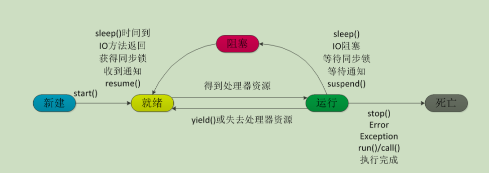

## 3.5.终止线程4种方式

### 3.5.1.正常运行结束

> 程序运行结束，线程自动结束。

### 3.5.2.使用退出标志退出线程

> 一般 run()方法执行完，线程就会正常结束，然而，常常有些线程是伺服线程(即只有获得某种信号,才会停止的线程)。它们需要长时间的运行，只有在外部某些条件满足的情况下，才能关闭这些线程。使用一个变量来控制循环，例如：
>
> 最直接的方法就是设一个 boolean 类型的标志，并通过设置这个标志为 true 或 false 来控制 while循环是否退出，代码示例：
>
> ```java
> public class ThreadSafe extends Thread {
>     public volatile boolean exit = false; 
>     public void run(){
>     while (!exit){
>    //do something
>    }
>    }
> }
> ```
>
> 定义了一个退出标志 exit，当 exit 为 true 时，while 循环退出，exit 的默认值为 false.在定义 exit时，使用了一个 Java 关键字 volatile，这个关键字的目的是使 exit 同步，也就是说在同一时刻只能由一个线程来修改 exit 的值。

### 3..5.3.Interrupt方法结束线程

> 使用 interrupt()方法来中断线程有两种情况：
>
> 1. 线程处于阻塞状态：如使用了 sleep,同步锁的 wait,socket 中的 receiver,accept 等方法时，会使线程处于阻塞状态。当调用线程的 interrupt()方法时，会抛出 InterruptException 异常。阻塞中的那个方法抛出这个异常，通过代码捕获该异常，然后 break 跳出循环状态，从而让我们有机会结束这个线程的执行。通常很多人认为只要调用 interrupt 方法线程就会结束，实际上是错的，一定要先捕获 InterruptedException 异常之后通过 break 来跳出循环，才能正常结束 run 方法。
> 2. 线程未处于阻塞状态：使用 isInterrupted()判断线程的中断标志来退出循环。当使用interrupt()方法时，中断标志就会置 true，和使用自定义的标志来控制循环是一样的道理。
>
> ```java
> public class ThreadSafe extends Thread {
>  public void run(){
>  while (!isInterrupted()){//非阻塞过程中通过判断中断标志来退出
>  try{
>  Thread.sleep(51000);//阻塞过程捕获中断异常来退出
> }catch(InterruptedException e){
>  e.printStackTrace();
>  break;//捕获到异常之后，执行 break 跳出循环
> }
> }
> }
> }
> ```
>
> 

### 3.5.4.stop方法终止线程（线程不安全）

> 程序中可以直接使用 thread.stop()来强行终止线程，但是 stop 方法是很危险的，就象突然关闭计算机电源，而不是按正常程序关机一样，可能会产生不可预料的结果，不安全主要是：
>
> thread.stop()调用之后，创建子线程的线程就会抛出 ThreadDeatherror 的错误，并且会释放子线程所持有的所有锁。一般任何进行加锁的代码块，都是为了保护数据的一致性，如果在调用thread.stop()后导致了该线程所持有的所有锁的突然释放(不可控制)，那么被保护数据就有可能呈现不一致性，其他线程在使用这些被破坏的数据时，有可能导致一些很奇怪的应用程序错误。因此，并不推荐使用 stop 方法来终止线程。

## 3.6. sleep与wait区别

> 1. 对于 sleep()方法，我们首先要知道该方法是属于 Thread 类中的。而 wait()方法，则是属于Object 类中的。
>
> 2. sleep()方法导致了程序暂停执行指定的时间，让出 cpu 该其他线程，但是他的监控状态依然保持者，当指定的时间到了又会自动恢复运行状态。
>
> 3. 在调用 sleep()方法的过程中，线程不会释放对象锁。
>
> 4. 而当调用 wait()方法的时候，线程会放弃对象锁，进入等待此对象的等待锁定池，只有针对此对象调用 notify()方法后本线程才进入对象锁定池准备获取对象锁进入运行状态。

## 3.7. start与run区别

> 1. start（）方法来启动线程，真正实现了多线程运行。这时无需等待 run 方法体代码执行完毕，可以直接继续执行下面的代码。
>
> 2. 通过调用 Thread 类的 start()方法来启动一个线程，这时此线程是处于就绪状态，并没有运行。
>
> 3. 方法 run()称为线程体，它包含了要执行的这个线程的内容，线程就进入了运行状态，开始运行 run 函数当中的代码。 Run 方法运行结束，此线程终止。然后 CPU 再调度其它线程。

## 3.8. JAVA后台线程

> 1. 定义：守护线程--也称“服务线程”，他是后台线程，它有一个特性，即为用户线程提供公共服务，在没有用户线程可服务时会自动离开。
>
> 2. 优先级：守护线程的优先级比较低，用于为系统中的其它对象和线程提供服务。
>
> 3. 设置：通过 setDaemon(true)来设置线程为“守护线程”；将一个用户线程设置为守护线程的方式是在线程对象创建之前用线程对象的 setDaemon 方法。
>
> 4. 在 Daemon 线程中产生的新线程也是 Daemon 的。
>
> 5. 线程则是 JVM 级别的，以 Tomcat 为例，如果你在 Web 应用中启动一个线程，这个线程的生命周期并不会和 Web 应用程序保持同步。也就是说，即使你停止了 Web 应用，这个线程依旧是活跃的。
>
> 6. example: 垃圾回收线程就是一个经典的守护线程，当我们的程序中不再有任何运行的Thread,程序就不会再产生垃圾，垃圾回收器也就无事可做，所以当垃圾回收线程是 JVM 上仅剩的线程时，垃圾回收线程会自动离开。它始终在低级别的状态中运行，用于实时监控和管理系统中的可回收资源。
>
> 7. 生命周期：守护进程（Daemon）是运行在后台的一种特殊进程。它独立于控制终端并且周期性地执行某种任务或等待处理某些发生的事件。也就是说守护线程不依赖于终端，但是依赖于系统，与系统“同生共死”。当 JVM 中所有的线程都是守护线程的时候，JVM 就可以退出了；如果还有一个或以上的非守护线程则 JVM 不会退出。

## 3.9. JAVA 锁

### 3.9.1.乐观锁

> 乐观锁是一种乐观思想，即认为读多写少，遇到并发写的可能性低，每次去拿数据的时候都认为别人不会修改，所以不会上锁，但是在更新的时候会判断一下在此期间别人有没有去更新这个数据，采取在写时先读出当前版本号，然后加锁操作（比较跟上一次的版本号，如果一样则更新），如果失败则要重复读-比较-写的操作。
>
> java 中的乐观锁基本都是通过 CAS 操作实现的，CAS 是一种更新的原子操作，比较当前值跟传入值是否一样，一样则更新，否则失败。

### 3.9.2.悲观锁

> 悲观锁是就是悲观思想，即认为写多，遇到并发写的可能性高，每次去拿数据的时候都认为别人会修改，所以每次在读写数据的时候都会上锁，这样别人想读写这个数据就会 block 直到拿到锁。
>
> java中的悲观锁就是Synchronized,AQS框架下的锁则是先尝试cas乐观锁去获取锁，获取不到，才会转换为悲观锁，如 RetreenLock。

### 3.9.3.自旋锁

> 自旋锁原理非常简单，如果持有锁的线程能在很短时间内释放锁资源，那么那些等待竞争锁的线程就不需要做内核态和用户态之间的切换进入阻塞挂起状态，它们只需要等一等（自旋），等持有锁的线程释放锁后即可立即获取锁，这样就避免用户线程和内核的切换的消耗。
>
> 线程自旋是需要消耗 cup 的，说白了就是让 cup 在做无用功，如果一直获取不到锁，那线程也不能一直占用 cup 自旋做无用功，所以需要设定一个自旋等待的最大时间。
>
> 如果持有锁的线程执行的时间超过自旋等待的最大时间扔没有释放锁，就会导致其它争用锁的线程在最大等待时间内还是获取不到锁，这时争用线程会停止自旋进入阻塞状态。
>
> `自旋锁的优缺点`
>
> 自旋锁尽可能的减少线程的阻塞，这对于锁的竞争不激烈，且占用锁时间非常短的代码块来说性能能大幅度的提升，因为自旋的消耗会小于线程阻塞挂起再唤醒的操作的消耗，这些操作会导致线程发生两次上下文切换！
>
> 但是如果锁的竞争激烈，或者持有锁的线程需要长时间占用锁执行同步块，这时候就不适合使用自旋锁了，因为自旋锁在获取锁前一直都是占用 cpu 做无用功，占着 XX 不 XX，同时有大量线程在竞争一个锁，会导致获取锁的时间很长，线程自旋的消耗大于线程阻塞挂起操作的消耗，其它需要 cup 的线程又不能获取到 cpu，造成 cpu 的浪费。所以这种情况下我们要关闭自旋锁；
>
> 自旋锁时间阈值（1.6引入了适应性自旋锁）
>
> 自旋锁的目的是为了占着 CPU 的资源不释放，等到获取到锁立即进行处理。但是如何去选择自旋的执行时间呢？如果自旋执行时间太长，会有大量的线程处于自旋状态占用CPU 资源，进而会影响整体系统的性能。因此自旋的周期选的额外重要！
>
> JVM 对于自旋周期的选择，jdk1.5 这个限度是一定的写死的，在1.6 引入了适应性自旋锁，适应性自旋锁意味着自旋的时间不在是固定的了，而是由前一次在同一个锁上的自旋时间以及锁的拥有者的状态来决定，基本认为一个线程上下文切换的时间是最佳的一个时间，同时 JVM 还针对当前 CPU 的负荷情况做了较多的优化，如果平均负载小于 CPUs 则一直自旋，如果有超过(CPUs/2)个线程正在自旋，则后来线程直接阻塞，如果正在自旋的线程发现 Owner 发生了变化则延迟自旋时间（自旋计数）或进入阻塞，如果 CPU 处于节电模式则停止自旋，自旋时间的最坏情况是 CPU的存储延迟（CPU A 存储了一个数据，到 CPU B 得知这个数据直接的时间差），自旋时会适当放弃线程优先级之间的差异。
>
> 自旋锁的开启
>
> JDK1.6 中-XX:+UseSpinning 开启；
>
> -XX:PreBlockSpin=10 为自旋次数；
>
> JDK1.7 后，去掉此参数，由 jvm 控制；


### 3.9.4 Synchronized 同步锁

> synchronized 它可以把任意一个非 NULL 的对象当作锁。他属于独占式的悲观锁,同时属于可重入锁。
>
> **Synchronized 作用范围**
>
> 1. 作用于方法时,锁住的是对象的实例(this);
>
> 2. 当作用于静态方法时,锁住的是 Class 实例,又因为 Class 的相关数据存储在永久带 PermGen(jdk1.8 则是 metaspace),永久带是全局共享的,因此静态方法锁相当于类的一个全局锁,会锁所有调用该方法的线程;
>
> 3. synchronized 作用于一个对象实例时,锁住的是所有以该对象为锁的代码块。它有多个队列,当多个线程一起访问某个对象监视器的时候,对象监视器会将这些线程存储在不同的容器中。
>
> **Synchronized 核心组件**
>
>     1) Wait Set:哪些调用 wait 方法被阻塞的线程被放置在这里;
>     2) Contention List:竞争队列,所有请求锁的线程首先被放在这个竞争队列中;
>     3) Entry List:Contention List 中那些有资格成为候选资源的线程被移动到 Entry List 中;
>     4) OnDeck:任意时刻,最多只有一个线程正在竞争锁资源,该线程被成为 OnDeck;
>     5) Owner:当前已经获取到所资源的线程被称为 Owner;
>     6)!Owner:当前释放锁的线程。
>
> **Synchronized 实现**
>
> 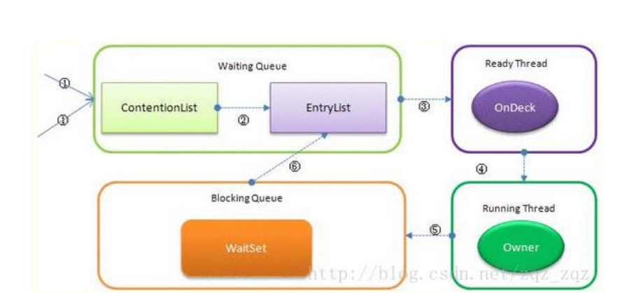
>
> 1. JVM 每次从队列的尾部取出一个数据用于锁竞争候选者(OnDeck),但是并发情况下,ContentionList 会被大量的并发线程进行 CAS 访问,为了降低对尾部元素的竞争,JVM 会将一部分线程移动到 EntryList 中作为候选竞争线程。
> 2. Owner 线程会在 unlock 时,将 ContentionList 中的部分线程迁移到 EntryList 中,并指定EntryList 中的某个线程为 OnDeck 线程(一般是最先进去的那个线程)。
> 3. Owner 线程并不直接把锁传递给 OnDeck 线程,而是把锁竞争的权利交给 OnDeck,OnDeck 需要重新竞争锁。这样虽然牺牲了一些公平性,但是能极大的提升系统的吞吐量,在JVM 中,也把这种选择行为称之为“竞争切换”。
> 4. OnDeck 线程获取到锁资源后会变为 Owner 线程,而没有得到锁资源的仍然停留在 EntryList中。如果 Owner 线程被 wait 方法阻塞,则转移到 WaitSet 队列中,直到某个时刻通过 notify或者 notifyAll 唤醒,会重新进去 EntryList 中。
> 5. 处于 ContentionList、EntryList、WaitSet 中的线程都处于阻塞状态,该阻塞是由操作系统来完成的(Linux 内核下采用 pthread_mutex_lock 内核函数实现的)。
> 6. Synchronized 是非公平锁。 Synchronized 在线程进入 ContentionList 时,等待的线程会先尝试自旋获取锁,如果获取不到就进入 ContentionList,这明显对于已经进入队列的线程是不公平的,还有一个不公平的事情就是自旋获取锁的线程还可能直接抢占 OnDeck 线程的锁资源。
>    参考:https://blog.csdn.net/zqz_zqz/article/details/70233767
> 7. 每个对象都有个 monitor 对象,加锁就是在竞争 monitor 对象,代码块加锁是在前后分别加上 monitorenter 和 monitorexit 指令来实现的,方法加锁是通过一个标记位来判断的
> 8. synchronized 是一个重量级操作,需要调用操作系统相关接口,性能是低效的,有可能给线程加锁消耗的时间比有用操作消耗的时间更多。
> 9. Java1.6,synchronized 进行了很多的优化,有适应自旋、锁消除、锁粗化、轻量级锁及偏向锁等,效率有了本质上的提高。在之后推出的 Java1.7 与1.8 中,均对该关键字的实现机理做了优化。引入了偏向锁和轻量级锁。都是在对象头中有标记位,不需要经过操作系统加锁。
>
> 10. 锁可以从偏向锁升级到轻量级锁,再升级到重量级锁。这种升级过程叫做锁膨胀;
> 11. JDK 1.6 中默认是开启偏向锁和轻量级锁,可以通过-XX:-UseBiasedLocking 来禁用偏向锁。


### 3.9.5 ReentrantLock

> ReentantLock 继承接口 Lock 并实现了接口中定义的方法,他是一种可重入锁,除了能完成 synchronized 所能完成的所有工作外,还提供了诸如可响应中断锁、可轮询锁请求、定时锁等避免多线程死锁的方法。
>
> **Lock 接口的主要方法**
>
> 1. void lock(): 执行此方法时,如果锁处于空闲状态,当前线程将获取到锁.相反,如果锁已经被其他线程持有,将禁用当前线程,直到当前线程获取到锁.
> 2. boolean tryLock():如果锁可用,则获取锁,并立即返回 true,否则返回 false.该方法和lock()的区别在于, tryLock()只是"试图"获取锁,如果锁不可用,不会导致当前线程被禁用,当前线程仍然继续往下执行代码.而 lock()方法则是一定要获取到锁,如果锁不可用,就一直等待,在未获得锁之前,当前线程并不继续向下执行.
> 3. void unlock():执行此方法时,当前线程将释放持有的锁.锁只能由持有者释放,如果线程并不持有锁,却执行该方法,可能导致异常的发生.
> 4. Condition newCondition():条件对象,获取等待通知组件。该组件和当前的锁绑定,当前线程只有获取了锁,才能调用该组件的 await()方法,而调用后,当前线程将缩放锁。
> 5. getHoldCount():查询当前线程保持此锁的次数,也就是执行此线程执行 lock 方法的次数。
> 6. getQueueLength():返回正等待获取此锁的线程估计数,比如启动10 个线程,1 个线程获得锁,此时返回的是9
> 7. getWaitQueueLength:(Condition condition)返回等待与此锁相关的给定条件的线程估计数。比如10 个线程,用同一个 condition 对象,并且此时这10 个线程都执行了condition 对象的 await 方法,那么此时执行此方法返回10
> 8. hasWaiters(Condition condition): 查询是否有线程等待与此锁有关的给定条件(condition),对于指定 contidion 对象,有多少线程执行了 condition.await 方法
> 9. hasQueuedThread(Thread thread):查询给定线程是否等待获取此锁
> 10. hasQueuedThreads():是否有线程等待此锁
> 11. isFair():该锁是否公平锁
> 12. isHeldByCurrentThread(): 当前线程是否保持锁锁定,线程的执行 lock 方法的前后分别是 false 和 true
> 13. isLock():此锁是否有任意线程占用
> 14. lockInterruptibly():如果当前线程未被中断,获取锁
> 15. tryLock():尝试获得锁,仅在调用时锁未被线程占用,获得锁
> 16. tryLock(long timeout TimeUnit unit):如果锁在给定等待时间内没有被另一个线程保持,则获取该锁。
>
> 
>
> **非公平锁**
>
> JVM 按随机、就近原则分配锁的机制则称为不公平锁,ReentrantLock 在构造函数中提供了是否公平锁的初始化方式,默认为非公平锁。非公平锁实际执行的效率要远远超出公平锁,除非程序有特殊需要,否则最常用非公平锁的分配机制。
>
> 
>
> **公平锁**
>
> 公平锁指的是锁的分配机制是公平的,通常先对锁提出获取请求的线程会先被分配到锁,ReentrantLock 在构造函数中提供了是否公平锁的初始化方式来定义公平锁。
>
> ReentrantLock 与 synchronized
>
> 1. ReentrantLock 通过方法 lock()与 unlock()来进行加锁与解锁操作,与 synchronized 会被 JVM 自动解锁机制不同,ReentrantLock 加锁后需要手动进行解锁。为了避免程序出现异常而无法正常解锁的情况,使用 ReentrantLock 必须在 finally 控制块中进行解锁操作。
> 2. ReentrantLock 相比 synchronized 的优势是可中断、公平锁、多个锁。这种情况下需要使用ReentrantLock。
>
> **ReentrantLock 实现**
>
> ```java
> public class MyService {
>  private Lock lock = new ReentrantLock();
> //Lock lock=new ReentrantLock(true);//公平锁
> //Lock lock=new ReentrantLock(false);//非公平锁
>  private Condition condition=lock.newCondition();//创建 Condition
>  public void testMethod(){
>  try {
>  lock.lock();//lock 加锁
> //1:wait 方法等待:
> //System.out.println("开始 wait");
>  condition.await();
> //通过创建 Condition 对象来使线程 wait,必须先执行 lock.lock 方法获得锁
> 
> //:2:signal 方法唤醒
>  condition.signal();//condition 对象的 signal 方法可以唤醒 wait 线程
>  for (int i = 0; i < 5; i++){
>  System.out.println("ThreadName="+ Thread.currentThread().getName()+(""+(i+1)));
> }
> } catch (InterruptedException e){
>  e.printStackTrace();
> }finally{
>  lock.unlock();
> }
> }
> }
> ```
>
> **Condition 类和 Object 类锁方法区别**
>
> 1. Condition 类的 awiat 方法和 Object 类的 wait 方法等效
>
> 2. Condition 类的 signal 方法和 Object 类的 notify 方法等效
>
> 3. Condition 类的 signalAll 方法和 Object 类的 notifyAll 方法等效
>
> 4. ReentrantLock 类可以唤醒指定条件的线程,而 object 的唤醒是随机的
>
> 
>
> **tryLock 和 lock 和 lockInterruptibly 的区别**
>
> 1. tryLock 能获得锁就返回 true,不能就立即返回 false,tryLock(long timeout,TimeUnitunit),可以增加时间限制,如果超过该时间段还没获得锁,返回 false
>
> 2. lock 能获得锁就返回 true,不能的话一直等待获得锁
>
> 3. lock 和 lockInterruptibly,如果两个线程分别执行这两个方法,但此时中断这两个线程,lock 不会抛出异常,而 lockInterruptibly 会抛出异常。

### 3.9.6. Semaphore 信号量

> Semaphore 是一种基于计数的信号量。它可以设定一个阈值,基于此,多个线程竞争获取许可信号,做完自己的申请后归还,超过阈值后,线程申请许可信号将会被阻塞。Semaphore 可以用来构建一些对象池,资源池之类的,比如数据库连接池
>
> **实现互斥锁(计数器为1 )**
>
> 我们也可以创建计数为1 的 Semaphore,将其作为一种类似互斥锁的机制,这也叫二元信号量,表示两种互斥状态。
>
> **代码实现**
>
> 它的用法如下:
>
> ```java
> //创建一个计数阈值为5 的信号量对象
> //只能5 个线程同时访问
> Semaphore semp = new Semaphore(5);
> try {
>    //申请许可
>     semp.acquire();
>     try {
>    //业务逻辑
>    } catch (Exception e){
>         
>    } finally {
>    //释放许可
>     semp.release();
>    }
> } catch (InterruptedException e){
>     
> }
> ```
>
> **Semaphore 与 ReentrantLock**
>
> Semaphore 基本能完成 ReentrantLock 的所有工作,使用方法也与之类似,通过 acquire()与release()方法来获得和释放临界资源。经实测,Semaphone.acquire()方法默认为可响应中断锁,与 ReentrantLock.lockInterruptibly()作用效果一致,也就是说在等待临界资源的过程中可以被Thread.interrupt()方法中断。
>
> 此外,Semaphore 也实现了可轮询的锁请求与定时锁的功能,除了方法名 tryAcquire 与 tryLock不同,其使用方法与 ReentrantLock 几乎一致。Semaphore 也提供了公平与非公平锁的机制,也可在构造函数中进行设定。Semaphore 的锁释放操作也由手动进行,因此与 ReentrantLock 一样,为避免线程因抛出异常而无法正常释放锁的情况发生,释放锁的操作也必须在 finally 代码块中完成。

### 3.9.7.AtomicInteger

> 首先说明,此处 AtomicInteger ,一个提供原子操作的 Integer 的类,常见的还有AtomicBoolean、AtomicInteger、AtomicLong、AtomicReference 等,他们的实现原理相同,区别在与运算对象类型的不同。令人兴奋地,还可以通过 AtomicReference\<V>将一个对象的所有操作转化成原子操作。
>
> 我们知道,在多线程程序中,诸如++i 或 i++等运算不具有原子性,是不安全的线程操作之一。通常我们会使用 synchronized 将该操作变成一个原子操作,但 JVM 为此类操作特意提供了一些同步类,使得使用更方便,且使程序运行效率变得更高。通过相关资料显示,通常AtomicInteger的性能是 ReentantLock 的好几倍。


### 3.9.8.可重入锁(递归锁)

> 本文里面讲的是广义上的可重入锁,而不是单指 JAVA 下的 ReentrantLock。可重入锁,也叫做递归锁,指的是同一线程外层函数获得锁之后,内层递归函数仍然有获取该锁的代码,但不受影响。在 JAVA 环境下 ReentrantLock 和 synchronized 都是可重入锁。


### 3.9.9.公平锁与非公平锁

> **公平锁( Fair )**
>
> 加锁前检查是否有排队等待的线程,优先排队等待的线程,先来先得
>
> **非公平锁( Nonfair )**
>
> 加锁时不考虑排队等待问题,直接尝试获取锁,获取不到自动到队尾等待
>
> 
>
> 1、非公平锁性能比公平锁高5~10 倍,因为公平锁需要在多核的情况下维护一个队列
>
> 2、Java 中的 synchronized 是非公平锁,ReentrantLock 默认的 lock()方法采用的是非公平锁。

### 3.9.10.ReadWriteLock 读写锁

> 为了提高性能,Java 提供了读写锁,在读的地方使用读锁,在写的地方使用写锁,灵活控制,如果没有写锁的情况下,读是无阻塞的,在一定程度上提高了程序的执行效率。读写锁分为读锁和写锁,多个读锁不互斥,读锁与写锁互斥,这是由 jvm 自己控制的,你只要上好相应的锁即可。
>
> **读锁**
>
> 如果你的代码只读数据,可以很多人同时读,但不能同时写,那就上读锁
>
> **写锁**
>
> 如果你的代码修改数据,只能有一个人在写,且不能同时读取,那就上写锁。总之,读的时候上读锁,写的时候上写锁!
>
>  Java 中读写锁有个接口 java.util.concurrent.locks.ReadWriteLock ,也有具体的实现ReentrantReadWriteLock。
>

### 3.9.11.共享锁和独占锁

> java 并发包提供的加锁模式分为独占锁和共享锁。
>
> **独占锁**
>
> 独占锁模式下,每次只能有一个线程能持有锁,ReentrantLock 就是以独占方式实现的互斥锁。独占锁是一种悲观保守的加锁策略,它避免了读/读冲突,如果某个只读线程获取锁,则其他读线程都只能等待,这种情况下就限制了不必要的并发性,因为读操作并不会影响数据的一致性。
>
> **共享锁**
>
> 共享锁则允许多个线程同时获取锁,并发访问共享资源,如:ReadWriteLock。共享锁则是一种乐观锁,它放宽了加锁策略,允许多个执行读操作的线程同时访问共享资源。
>
> 1、AQS 的内部类 Node 定义了两个常量 SHARED 和 EXCLUSIVE,他们分别标识 AQS 队列中等待线程的锁获取模式。
>
> 2、java 的并发包中提供了 ReadWriteLock,读-写锁。它允许一个资源可以被多个读操作访问,或者被一个写操作访问,但两者不能同时进行。

### 3.9.12.重量级锁( Mutex Lock )

> Synchronized 是通过对象内部的一个叫做监视器锁(monitor)来实现的。但是监视器锁本质又是依赖于底层的操作系统的 Mutex Lock 来实现的。而操作系统实现线程之间的切换这就需要从用户态转换到核心态,这个成本非常高,状态之间的转换需要相对比较长的时间,这就是为什么Synchronized 效率低的原因。因此,这种依赖于操作系统 Mutex Lock 所实现的锁我们称之为“重量级锁”。JDK 中对 Synchronized 做的种种优化,其核心都是为了减少这种重量级锁的使用。JDK1.6 以后,为了减少获得锁和释放锁所带来的性能消耗,提高性能,引入了“轻量级锁”和“偏向锁”。

### 3.9.13.轻量级锁

> 锁的状态总共有四种:无锁状态、偏向锁、轻量级锁和重量级锁。
>
> **锁升级**
>
> 随着锁的竞争,锁可以从偏向锁升级到轻量级锁,再升级的重量级锁(但是锁的升级是单向的,也就是说只能从低到高升级,不会出现锁的降级)。
>
> “轻量级”是相对于使用操作系统互斥量来实现的传统锁而言的。但是,首先需要强调一点的是,轻量级锁并不是用来代替重量级锁的,它的本意是在没有多线程竞争的前提下,减少传统的重量级锁使用产生的性能消耗。在解释轻量级锁的执行过程之前,先明白一点,轻量级锁所适应的场景是线程交替执行同步块的情况,如果存在同一时间访问同一锁的情况,就会导致轻量级锁膨胀为重量级锁。

### 3.9.14.偏向锁

> Hotspot 的作者经过以往的研究发现大多数情况下锁不仅不存在多线程竞争,而且总是由同一线程多次获得。偏向锁的目的是在某个线程获得锁之后,消除这个线程锁重入(CAS)的开销,看起来让这个线程得到了偏护。引入偏向锁是为了在无多线程竞争的情况下尽量减少不必要的轻量级锁执行路径,因为轻量级锁的获取及释放依赖多次 CAS 原子指令,而偏向锁只需要在置换ThreadID 的时候依赖一次 CAS 原子指令(由于一旦出现多线程竞争的情况就必须撤销偏向锁,所以偏向锁的撤销操作的性能损耗必须小于节省下来的 CAS 原子指令的性能消耗)。上面说过,轻量级锁是为了在线程交替执行同步块时提高性能,而偏向锁则是在只有一个线程执行同步块时进一步提高性能。

### 3.9.15.分段锁

> 分段锁也并非一种实际的锁,而是一种思想 ConcurrentHashMap 是学习分段锁的最好实践

### 3.9.16.锁优化

> **减少锁持有时间**
>
> 只用在有线程安全要求的程序上加锁
>
> **减小锁粒度**
>
> 将大对象(这个对象可能会被很多线程访问),拆成小对象,大大增加并行度,降低锁竞争。降低了锁的竞争,偏向锁,轻量级锁成功率才会提高。最最典型的减小锁粒度的案例就是ConcurrentHashMap。
>
> **锁分离**
>
> 最常见的锁分离就是读写锁 ReadWriteLock,根据功能进行分离成读锁和写锁,这样读读不互斥,读写互斥,写写互斥,即保证了线程安全,又提高了性能,具体也请查看[高并发 Java 五]JDK 并发包1。读写分离思想可以延伸,只要操作互不影响,锁就可以分离。比如LinkedBlockingQueue 从头部取出,从尾部放数据
>
> **锁粗化**
>
> 通常情况下,为了保证多线程间的有效并发,会要求每个线程持有锁的时间尽量短,即在使用完公共资源后,应该立即释放锁。但是,凡事都有一个度,如果对同一个锁不停的进行请求、同步和释放,其本身也会消耗系统宝贵的资源,反而不利于性能的优化。
>
> **锁消除**
>
> 锁消除是在编译器级别的事情。在即时编译器时,如果发现不可能被共享的对象,则可以消除这些对象的锁操作,多数是因为程序员编码不规范引起。
>
> 参考: https://www.jianshu.com/p/39628e1180a9

## 3.10.线程基本方法

> 线程相关的基本方法有 wait,notify,notifyAll,sleep,join,yield 等。
>
> 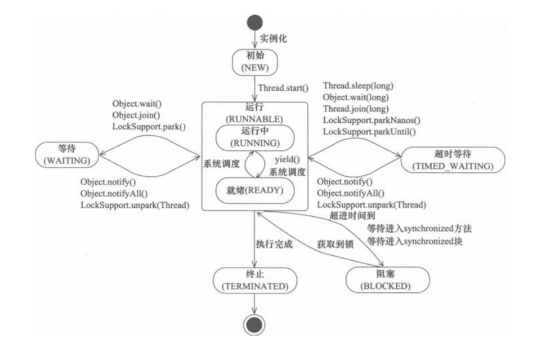

### 3.10.1.线程等待(wait)

> 调用该方法的线程进入 WAITING 状态,只有等待另外线程的通知或被中断才会返回,需要注意的是调用 wait()方法后,会释放对象的锁。因此,wait 方法一般用在同步方法或同步代码块中。

### 3.10.2.线程睡眠(sleep)

> sleep 导致当前线程休眠,与 wait 方法不同的是 sleep 不会释放当前占有的锁,sleep(long)会导致线程进入 TIMED-WATING 状态,而 wait()方法会导致当前线程进入 WATING 状态

### 3.10.3.线程让步(yield)

> yield 会使当前线程让出 CPU 执行时间片,与其他线程一起重新竞争 CPU 时间片。一般情况下,优先级高的线程有更大的可能性成功竞争得到 CPU 时间片,但这又不是绝对的,有的操作系统对线程优先级并不敏感。

### 3.10.4.线程中断(interrupt)

> 中断一个线程,其本意是给这个线程一个通知信号,会影响这个线程内部的一个中断标识位。这个线程本身并不会因此而改变状态(如阻塞,终止等)。
>
> 1、调用 interrupt()方法并不会中断一个正在运行的线程。也就是说处于 Running 状态的线程并不会因为被中断而被终止,仅仅改变了内部维护的中断标识位而已。
>
> 2、若调用 sleep()而使线程处于 TIMED-WATING 状态,这时调用 interrupt()方法,会抛出InterruptedException,从而使线程提前结束 TIMED-WATING 状态。
>
> 3、许多声明抛出 InterruptedException 的方法(如 Thread.sleep(long mills 方法)),抛出异常前,都会清除中断标识位,所以抛出异常后,调用 isInterrupted()方法将会返回 false。
>
> 4、中断状态是线程固有的一个标识位,可以通过此标识位安全的终止线程。比如,你想终止一个线程 thread 的时候,可以调用 thread.interrupt()方法,在线程的 run 方法内部可以根据 thread.isInterrupted()的值来优雅的终止线程。

### 3.10.5.Join 等待其他线程终止

> join()方法,等待其他线程终止,在当前线程中调用一个线程的 join()方法,则当前线程转为阻塞状态,直到另一个线程结束,当前线程再由阻塞状态变为就绪状态,等待 cpu 的宠幸。

### 3.10.6.为什么要用 join()方法?

> 很多情况下,主线程生成并启动了子线程,需要用到子线程返回的结果,也就是需要主线程需要在子线程结束后再结束,这时候就要用到 join()方法。
>
> ```java
> System.out.println(Thread.currentThread().getName()+"线程运行开始!");
> Thread6 thread1 = new Thread6();
> thread1.setName("线程 B");
> thread1.join();
> System.out.println("这时 thread1 执行完毕之后才能执行主线程")
> ```

### 3.10.7.线程唤醒(notify)

> Object 类中的 notify()方法,唤醒在此对象监视器上等待的单个线程,如果所有线程都在此对象上等待,则会选择唤醒其中一个线程,选择是任意的,并在对实现做出决定时发生,线程通过调用其中一个 wait()方法,在对象的监视器上等待,直到当前的线程放弃此对象上的锁定,才能继续执行被唤醒的线程,被唤醒的线程将以常规方式与在该对象上主动同步的其他所有线程进行竞争。类似的方法还有 notifyAll(),唤醒再次监视器上等待的所有线程。

### 3.10.8.其他方法:

> 1. sleep():强迫一个线程睡眠N毫秒。
> 2. isAlive(): 判断一个线程是否存活。
> 3. join(): 等待线程终止。
> 4. activeCount(): 程序中活跃的线程数。
> 5. enumerate(): 枚举程序中的线程。
> 6. currentThread(): 得到当前线程。
> 7. isDaemon(): 一个线程是否为守护线程。
> 8. setDaemon(): 设置一个线程为守护线程。(用户线程和守护线程的区别在于,是否等待主线程依赖于主线程结束而结束)
> 9. setName(): 为线程设置一个名称。
> 10. wait(): 强迫一个线程等待。
>
> 11. notify(): 通知一个线程继续运行。
>
> 12. setPriority(): 设置一个线程的优先级。
>
> 13. getPriority()::获得一个线程的优先级。


## 3.11.线程上下文切换

> 巧妙地利用了时间片轮转的方式, CPU 给每个任务都服务一定的时间,然后把当前任务的状态保存下来,在加载下一任务的状态后,继续服务下一任务,任务的状态保存及再加载,这段过程就叫做上下文切换。时间片轮转的方式使多个任务在同一颗 CPU 上执行变成了可能。
>
> 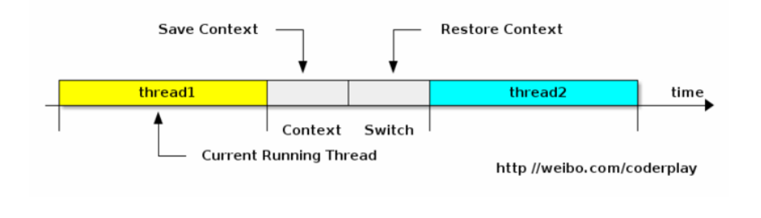

### 3.11.1.进程

> (有时候也称做任务)是指一个程序运行的实例。在 Linux 系统中,线程就是能并行运行并且与他们的父进程(创建他们的进程)共享同一地址空间(一段内存区域)和其他资源的轻量级的进程。

### 3.11.2.上下文

> 是指某一时间点 CPU 寄存器和程序计数器的内容。

### 3.11.3.寄存器

> 是 CPU 内部的数量较少但是速度很快的内存(与之对应的是 CPU 外部相对较慢的 RAM 主内存)。寄存器通过对常用值(通常是运算的中间值)的快速访问来提高计算机程序运行的速度。

### 3.11.4.程序计数器

> 是一个专用的寄存器,用于表明指令序列中 CPU 正在执行的位置,存的值为正在执行的指令的位置或者下一个将要被执行的指令的位置,具体依赖于特定的系统。

### 3.11.5.PCB-“切换桢”

> 上下文切换可以认为是内核(操作系统的核心)在 CPU 上对于进程(包括线程)进行切换,上下文切换过程中的信息是保存在进程控制块(PCB, process control block)中的。PCB 还经常被称作“切换桢”(switchframe)。信息会一直保存到 CPU 的内存中,直到他们被再次使用。
>
> 上下文切换的活动:
>
> 1. 挂起一个进程,将这个进程在 CPU 中的状态(上下文)存储于内存中的某处。
>
> 2. 在内存中检索下一个进程的上下文并将其在 CPU 的寄存器中恢复。
>
> 3. 跳转到程序计数器所指向的位置(即跳转到进程被中断时的代码行),以恢复该进程在程序中。

### 3.11.6 上下文切换的活动：

> 1. 挂起一个进程，将这个进程在 CPU 中的状态（上下文）存储于内存中的某处。
> 2. 在内存中检索下一个进程的上下文并将其在 CPU 的寄存器中恢复。
> 3. 跳转到程序计数器所指向的位置（即跳转到进程被中断时的代码行），以恢复该进程在程序中

### 3.11.7.引起线程上下文切换的原因

> 1. 当前执行任务的时间片用完之后,系统 CPU 正常调度下一个任务;
> 2. 当前执行任务碰到 IO 阻塞,调度器将此任务挂起,继续下一任务;
> 3. 多个任务抢占锁资源,当前任务没有抢到锁资源,被调度器挂起,继续下一任务;
> 4. 用户代码挂起当前任务,让出 CPU 时间;
> 5. 硬件中断;


## 3.12.同步锁与死锁

### 3.12.1.同步锁

> 当多个线程同时访问同一个数据时，很容易出现问题。为了避免这种情况出现，我们要保证线程同步互斥，就是指并发执行的多个线程，在同一时间内只允许一个线程访问共享数据。 Java 中可以使用 synchronized 关键字来取得一个对象的同步锁。

### 3.12.2.死锁

> 何为死锁，就是多个线程同时被阻塞，它们中的一个或者全部都在等待某个资源被释放。

## 3.13.线程池原理

> 线程池做的工作主要是控制运行的线程的数量，处理过程中将任务放入队列，然后在线程创建后启动这些任务，如果线程数量超过了最大数量超出数量的线程排队等候，等其它线程执行完毕，再从队列中取出任务来执行。他的主要特点为：线程复用；控制最大并发数；管理线程。

### 3.13.1.线程复用

> 每一个 Thread 的类都有一个 start 方法。当调用 start 启动线程时 Java 虚拟机会调用该类的 run 方法。那么该类的 run()方法中就是调用了 Runnable 对象的 run()方法。我们可以继承重写Thread 类，在其 start 方法中添加不断循环调用传递过来的 Runnable 对象。这就是线程池的实现原理。循环方法中不断获取 Runnable 是用 Queue 实现的，在获取下一个 Runnable 之前可以是阻塞的。

### 3.13.2.线程池的组成

> 一般的线程池主要分为以下4 个组成部分：
>
> 1. 线程池管理器：用于创建并管理线程池
>
> 2. 工作线程：线程池中的线程
>
> 3. 任务接口：每个任务必须实现的接口，用于工作线程调度其运行
>
> 4. 任务队列：用于存放待处理的任务，提供一种缓冲机制
>
> Java 中的线程池是通过 Executor 框架实现的，该框架中用到了 Executor，Executors，ExecutorService，ThreadPoolExecutor ，Callable 和 Future、FutureTask 这几个类。
>
> 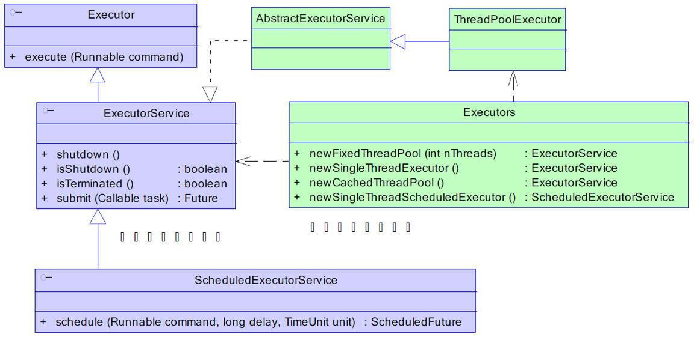
>
> ThreadPoolExecutor 的构造方法如下：
>
> ```java
> public ThreadPoolExecutor(int corePoolSize,int maximumPoolSize, long keepAliveTime,TimeUnit unit, BlockingQueue<Runnable> workQueue){
>  this(corePoolSize, maximumPoolSize, keepAliveTime, unit,workQueue,Executors.defaultThreadFactory(), defaultHandler);
> }
> ```
>
> 1. corePoolSize：指定了线程池中的线程数量。
>
> 2. maximumPoolSize：指定了线程池中的最大线程数量。
>
> 3. keepAliveTime：当前线程池数量超过 corePoolSize 时，多余的空闲线程的存活时间，即多次时间内会被销毁。
>
> 4. unit：keepAliveTime 的单位。
>
> 5. workQueue：任务队列，被提交但尚未被执行的任务。
> 6. threadFactory：线程工厂，用于创建线程，一般用默认的即可。
>
> 7. handler：拒绝策略，当任务太多来不及处理，如何拒绝任务。

### 3.13.3.拒绝策略

> 线程池中的线程已经用完了，无法继续为新任务服务，同时，等待队列也已经排满了，再也塞不下新任务了。这时候我们就需要拒绝策略机制合理的处理这个问题。
>
> JDK 内置的拒绝策略如下：
>
> 1. AbortPolicy ：直接抛出异常，阻止系统正常运行。
>
> 2. CallerRunsPolicy ：只要线程池未关闭，该策略直接在调用者线程中，运行当前被丢弃的任务。显然这样做不会真的丢弃任务，但是，任务提交线程的性能极有可能会急剧下降。
>
> 3. DiscardOldestPolicy ：丢弃最老的一个请求，也就是即将被执行的一个任务，并尝试再次提交当前任务。
>
> 4. DiscardPolicy ：该策略默默地丢弃无法处理的任务，不予任何处理。如果允许任务丢失，这是最好的一种方案。
>
> 以上内置拒绝策略均实现了 RejectedExecutionHandler 接口，若以上策略仍无法满足实际需要，完全可以自己扩展 RejectedExecutionHandler 接口。

### 3.13.4. Java 线程池工作过程

> 1. 线程池刚创建时，里面没有一个线程。任务队列是作为参数传进来的。不过，就算队列里面有任务，线程池也不会马上执行它们。
>
> 2. 当调用 execute()方法添加一个任务时，线程池会做如下判断：
>
>    a)如果正在运行的线程数量小于 corePoolSize，那么马上创建线程运行这个任务；
>
>    b)如果正在运行的线程数量大于或等于 corePoolSize，那么将这个任务放入队列；
>
>    c)如果这时候队列满了，而且正在运行的线程数量小于 maximumPoolSize，那么还是要创建非核心线程立刻运行这个任务；
>
>    d)如果队列满了，而且正在运行的线程数量大于或等于 maximumPoolSize，那么线程池会抛出异常 RejectExecutionException。
>
> 3. 当一个线程完成任务时，它会从队列中取下一个任务来执行。
> 4. 当一个线程无事可做，超过一定的时间（keepAliveTime）时，线程池会判断，如果当前运行的线程数大于 corePoolSize，那么这个线程就被停掉。所以线程池的所有任务完成后，它最终会收缩到 corePoolSize 的大小。
>
> 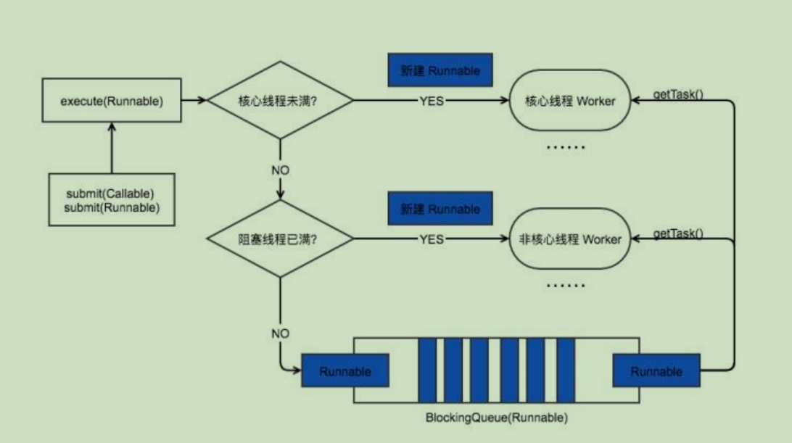

## 3.14. JAVA阻塞队列原理

> 阻塞队列，关键字是阻塞，先理解阻塞的含义，在阻塞队列中，线程阻塞有这样的两种情况：
>
> 1. 当队列中没有数据的情况下，消费者端的所有线程都会被自动阻塞（挂起），直到有数据放入队列。
>
> 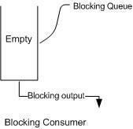
>
> 2. 当队列中填满数据的情况下，生产者端的所有线程都会被自动阻塞（挂起），直到队列中有空的位置，线程被自动唤醒。
>
> 

### 3.14.1.阻塞队列的主要方法

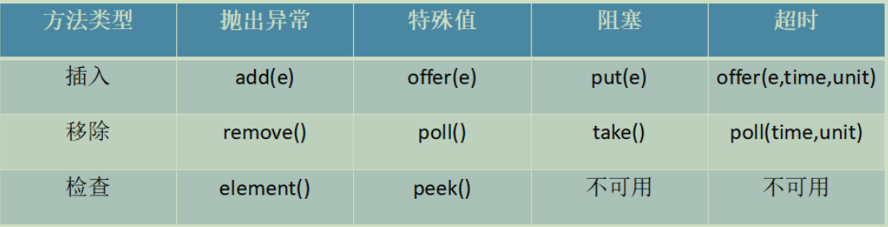

> - 抛出异常：抛出一个异常；
>
> - 特殊值：返回一个特殊值（null 或 false,视情况而定）
>
> - 阻塞：在成功操作之前，一直阻塞线程
>
> - 超时：放弃前只在最大的时间内阻塞
>
> **插入操作：**
>
> 1：public abstract boolean add(E paramE)：将指定元素插入此队列中（如果立即可行且不会违反容量限制），成功时返回 true，如果当前没有可用的空间，则抛出 IllegalStateException。如果该元素是 NULL，则会抛出 NullPointerException 异常。
>
> 2：public abstract boolean offer(E paramE)：将指定元素插入此队列中（如果立即可行且不会违反容量限制），成功时返回 true，如果当前没有可用的空间，则返回 false。
>
> 3：public abstract void put(E paramE) throws InterruptedException：将指定元素插入此队列中，将等待可用的空间（如果有必要）
>
> ```java
> public void put(E paramE) throws InterruptedException {
>  checkNotNull(paramE);
>  ReentrantLock localReentrantLock = this.lock;
>  localReentrantLock.lockInterruptibly();
>  try {
>  while (this.count == this.items.length)
>  this.notFull.await();//如果队列满了，则线程阻塞等待
>  enqueue(paramE);
>  localReentrantLock.unlock();
> } finally {
>  localReentrantLock.unlock();
> }
> }
> ```
>
> 
>
> 4：offer(E o, long timeout, TimeUnit unit)：可以设定等待的时间，如果在指定的时间内，还不能往队列中加入 BlockingQueue，则返回失败。
>
> **获取数据操作：**
>
> 1：poll(time):取走 BlockingQueue 里排在首位的对象,若不能立即取出,则可以等 time 参数规定的时间,取不到时返回 null;
>
> 2：poll(long timeout, TimeUnit unit)：从 BlockingQueue 取出一个队首的对象，如果在指定时间内，队列一旦有数据可取，则立即返回队列中的数据。否则直到时间超时还没有数据可取，返回失败。
>
> 3：take():取走 BlockingQueue 里排在首位的对象,若 BlockingQueue 为空,阻断进入等待状态直到 BlockingQueue 有新的数据被加入。
>
> 4.drainTo():一次性从 BlockingQueue 获取所有可用的数据对象（还可以指定获取数据的个数），通过该方法，可以提升获取数据效率；不需要多次分批加锁或释放锁。

### 3.14.2. Java 中的阻塞队列

> 1. ArrayBlockingQueue ：由数组结构组成的有界阻塞队列。
> 2. LinkedBlockingQueue ：由链表结构组成的有界阻塞队列。
> 3. PriorityBlockingQueue ：支持优先级排序的无界阻塞队列。
> 4. DelayQueue：使用优先级队列实现的无界阻塞队列。
> 5. SynchronousQueue：不存储元素的阻塞队列。
> 6. LinkedTransferQueue：由链表结构组成的无界阻塞队列。
> 7. LinkedBlockingDeque：由链表结构组成的双向阻塞队列
>
> 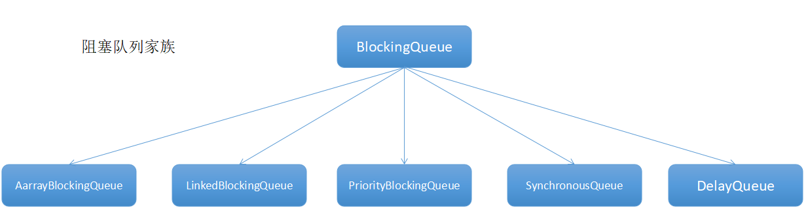


### 3.14.3. ArrayBlockingQueue（公平、非公平）

> 用数组实现的有界阻塞队列。此队列按照先进先出（FIFO）的原则对元素进行排序。默认情况下不保证访问者公平的访问队列，所谓公平访问队列是指阻塞的所有生产者线程或消费者线程，当队列可用时，可以按照阻塞的先后顺序访问队列，即先阻塞的生产者线程，可以先往队列里插入元素，先阻塞的消费者线程，可以先从队列里获取元素。通常情况下为了保证公平性会降低吞吐量。我们可以使用以下代码创建一个公平的阻塞队列：
>
> ```java
> ArrayBlockingQueue fairQueue = new ArrayBlockingQueue(1000,true);
> ```

### 3.14.4. LinkedBlockingQueue（两个独立锁提高并发）

> 基于链表的阻塞队列，同 ArrayListBlockingQueue 类似，此队列按照先进先出（FIFO）的原则对元素进行排序。而 LinkedBlockingQueue 之所以能够高效的处理并发数据，还因为其对于生产者端和消费者端分别采用了独立的锁来控制数据同步，这也意味着在高并发的情况下生产者和消费者可以并行地操作队列中的数据，以此来提高整个队列的并发性能。
>
> LinkedBlockingQueue 会默认一个类似无限大小的容量（Integer.MAX_VALUE）。

### 3.14.5. PriorityBlockingQueue（compareTo 排序实现优先）

> 是一个支持优先级的无界队列。默认情况下元素采取自然顺序升序排列。可以自定义实现compareTo()方法来指定元素进行排序规则，或者初始化 PriorityBlockingQueue 时，指定构造参数 Comparator 来对元素进行排序。需要注意的是不能保证同优先级元素的顺序。

### 3.14.6. DelayQueue（缓存失效、定时任务）

> 是一个支持延时获取元素的无界阻塞队列。队列使用 PriorityQueue 来实现。队列中的元素必须实现 Delayed 接口，在创建元素时可以指定多久才能从队列中获取当前元素。只有在延迟期满时才能从队列中提取元素。我们可以将 DelayQueue 运用在以下应用场景：
>
> 1. 缓存系统的设计：可以用 DelayQueue 保存缓存元素的有效期，使用一个线程循环查询DelayQueue，一旦能从 DelayQueue 中获取元素时，表示缓存有效期到了。
>
> 2. 定时任务调度：使用 DelayQueue 保存当天将会执行的任务和执行时间，一旦从DelayQueue 中获取到任务就开始执行，从比如 TimerQueue 就是使用 DelayQueue 实现的。

### 3.14.7. SynchronousQueue（不存储数据、可用于传递数据）

> 是一个不存储元素的阻塞队列。每一个 put 操作必须等待一个 take 操作，否则不能继续添加元素。SynchronousQueue 可以看成是一个传球手，负责把生产者线程处理的数据直接传递给消费者线程。队列本身并不存储任何元素，非常适合于传递性场景,比如在一个线程中使用的数据，传递给另外一个线程使用， SynchronousQueue 的吞吐量高于 LinkedBlockingQueue 和ArrayBlockingQueue。

### 3.14.8. LinkedTransferQueue

> 是一个由链表结构组成的无界阻塞 TransferQueue 队列。相对于其他阻塞队列，LinkedTransferQueue 多了 tryTransfer 和 transfer 方法。
>
> 1、transfer 方法：如果当前有消费者正在等待接收元素（消费者使用 take()方法或带时间限制的poll()方法时），transfer 方法可以把生产者传入的元素立刻 transfer（传输）给消费者。如果没有消费者在等待接收元素，transfer 方法会将元素存放在队列的 tail 节点，并等到该元素被消费者消费了才返回。
>
> 2、tryTransfer 方法。则是用来试探下生产者传入的元素是否能直接传给消费者。如果没有消费者等待接收元素，则返回 false。和 transfer 方法的区别是 tryTransfer 方法无论消费者是否接收，方法立即返回。而 transfer 方法是必须等到消费者消费了才返回。
>
> 对于带有时间限制的 tryTransfer(E e, long timeout, TimeUnit unit)方法，则是试图把生产者传入的元素直接传给消费者，但是如果没有消费者消费该元素则等待指定的时间再返回，如果超时还没消费元素，则返回 false，如果在超时时间内消费了元素，则返回 true。

#### 3.14.9. LinkedBlockingDeque

> 是一个由链表结构组成的双向阻塞队列。所谓双向队列指的你可以从队列的两端插入和移出元素。双端队列因为多了一个操作队列的入口，在多线程同时入队时，也就减少了一半的竞争。相比其他的阻塞队列，LinkedBlockingDeque 多了 addFirst，addLast，offerFirst，offerLast，peekFirst，peekLast 等方法，以 First 单词结尾的方法，表示插入，获取（peek）或移除双端队列的第一个元素。以 Last 单词结尾的方法，表示插入，获取或移除双端队列的最后一个元素。另外插入方法 add 等同于 addLast，移除方法 remove 等效于 removeFirst。但是 take 方法却等同于 takeFirst，不知道是不是 Jdk 的 bug，使用时还是用带有 First 和 Last 后缀的方法更清楚。
>
> 在初始化 LinkedBlockingDeque 时可以设置容量防止其过渡膨胀。另外双向阻塞队列可以运用在“工作窃取”模式中。

## 3.15. CyclicBarrier、 CountDownLatch、 Semaphore 的用法

### 3.15.1. CountDownLatch（线程计数器）

> CountDownLatch 类位于 java.util.concurrent 包下，利用它可以实现类似计数器的功能。比如有一个任务 A，它要等待其他4 个任务执行完毕之后才能执行，此时就可以利用 CountDownLatch来实现这种功能了。
>
> ```java
> final CountDownLatch latch = new CountDownLatch(2);
> new Thread(){public void run(){
>     System.out.println("子线程"+Thread.currentThread().getName()+"正在执行");
>     Thread.sleep(3000);
>     System.out.println("子线程"+Thread.currentThread().getName()+"执行完毕");
>     latch.countDown();
> };}.start();
> 
> new Thread(){ public void run(){
>     System.out.println("子线程"+Thread.currentThread().getName()+"正在执行");
>     Thread.sleep(3000);
>     System.out.println("子线程"+Thread.currentThread().getName()+"执行完毕");
>     latch.countDown();
> };}.start();
> 
> System.out.println("等待2 个子线程执行完毕...");
> latch.await();
> System.out.println("2 个子线程已经执行完毕");
> System.out.println("继续执行主线程");
> }
> ```
>
> 


### 3.15.2. CyclicBarrier（回环栅栏-等待至 barrier 状态再全部同时执行）

> 字面意思回环栅栏，通过它可以实现让一组线程等待至某个状态之后再全部同时执行。叫做回环是因为当所有等待线程都被释放以后， CyclicBarrier 可以被重用。我们暂且把这个状态就叫做barrier，当调用 await()方法之后，线程就处于 barrier 了。
>
> CyclicBarrier 中最重要的方法就是 await 方法，它有2 个重载版本：
>
> 1. public int await()：用来挂起当前线程，直至所有线程都到达 barrier 状态再同时执行后续任务；
> 2. public int await(long timeout, TimeUnit unit)：让这些线程等待至一定的时间，如果还有线程没有到达 barrier 状态就直接让到达 barrier 的线程执行后续任务。
>
> 具体使用如下，另外 CyclicBarrier 是可以重用的。
>
> ```java
> public static void main(String[] args){
>  int N = 4;
>  CyclicBarrier barrier = new CyclicBarrier(N);
>  for(int i=0;i<N;i++)
>  new Writer(barrier).start();
> }
> 
> static class Writer extends Thread{
>  private CyclicBarrier cyclicBarrier;
>  public Writer(CyclicBarrier cyclicBarrier){
>  this.cyclicBarrier = cyclicBarrier;
> }
> @Override
>  public void run(){
>  try {
>  Thread.sleep(5000); //以睡眠来模拟线程需要预定写入数据操作
>  System.out.println("线程"+Thread.currentThread().getName()+"写入数据完毕，等待其他线程写入完毕");
>  cyclicBarrier.await();
> } catch (InterruptedException e){
>  e.printStackTrace();
> }catch(BrokenBarrierException e){
>  e.printStackTrace();
> }
>  System.out.println("所有线程写入完毕，继续处理其他任务，比如数据操作");
> }
> }
> ```
>
> 

### 3.15.3. Semaphore（信号量-控制同时访问的线程个数）

> Semaphore 翻译成字面意思为信号量， Semaphore 可以控制同时访问的线程个数，通过acquire()获取一个许可，如果没有就等待，而 release()释放一个许可。
>
> **Semaphore 类中比较重要的几个方法：**
>
> 1. public void acquire(): 用来获取一个许可，若无许可能够获得，则会一直等待，直到获得许可。
> 2.  public void acquire(int permits):获取 permits 个许可
> 3.  public void release(){}:释放许可。注意，在释放许可之前，必须先获获得许可。
> 4. public void release(int permits){}:释放 permits 个许可
>
> 上面4 个方法都会被阻塞，如果想立即得到执行结果，可以使用下面几个方法
>
> 1. public boolean tryAcquire():尝试获取一个许可，若获取成功，则立即返回 true，若获取失败，则立即返回 false
>
> 2.  public boolean tryAcquire(long timeout, TimeUnit unit):尝试获取一个许可，若在指定的时间内获取成功，则立即返回 true，否则则立即返回 false
>
> 3.  public boolean tryAcquire(int permits):尝试获取 permits 个许可，若获取成功，则立即返回 true，若获取失败，则立即返回 false
>
> 4. public boolean tryAcquire(int permits, long timeout, TimeUnit unit): 尝试获取 permits个许可，若在指定的时间内获取成功，则立即返回 true，否则则立即返回 false
>
> 5.  还可以通过 availablePermits()方法得到可用的许可数目。
>
> 例子：若一个工厂有5 台机器但是有8 个工人，一台机器同时只能被一个工人使用，只有使用完了，其他工人才能继续使用。那么我们就可以通过 Semaphore 来实现：
>
> ```java
> int N = 8; //工人数
> Semaphore semaphore = new Semaphore(5); //机器数目
> for(int i=0;i<N;i++)
>  new Worker(i,semaphore).start();
> }
> 
> static class Worker extends Thread{
>  private int num;
>  private Semaphore semaphore;
>  public Worker(int num,Semaphore semaphore){
>  this.num = num;
>  this.semaphore = semaphore;
> }
> @Override
>  public void run(){
>  try {
>  semaphore.acquire();
>  System.out.println("工人"+this.num+"占用一个机器在生产...");
>  Thread.sleep(2000);
>  System.out.println("工人"+this.num+"释放出机器");
>  semaphore.release();
> } catch (InterruptedException e){
>  e.printStackTrace();
> }
> }
> ```
>
> - CountDownLatch 和 CyclicBarrier 都能够实现线程之间的等待，只不过它们侧重点不同；CountDownLatch 一般用于某个线程 A 等待若干个其他线程执行完任务之后，它才执行；而 CyclicBarrier 一般用于一组线程互相等待至某个状态，然后这一组线程再同时执行；另外， CountDownLatch 是不能够重用的，而 CyclicBarrier 是可以重用的。
> - Semaphore 其实和锁有点类似，它一般用于控制对某组资源的访问权限。

## 3.16. volatile关键字的作用（变量可见性、禁止重排序）

> Java 语言提供了一种稍弱的同步机制，即 volatile 变量，用来确保将变量的更新操作通知到其他线程。volatile 变量具备两种特性，volatile 变量不会被缓存在寄存器或者对其他处理器不可见的地方，因此在读取 volatile 类型的变量时总会返回最新写入的值。
>
> **变量可见性**
>
> 其一是保证该变量对所有线程可见，这里的可见性指的是当一个线程修改了变量的值，那么新的值对于其他线程是可以立即获取的。
>
> **禁止重排序**
>
> volatile 禁止了指令重排。
>
> **比sychronized更轻量级的同步锁**
>
> 在访问 volatile 变量时不会执行加锁操作，因此也就不会使执行线程阻塞，因此 volatile 变量是一种比 sychronized 关键字更轻量级的同步机制。volatile 适合这种场景：一个变量被多个线程共享，线程直接给这个变量赋值。
>
> 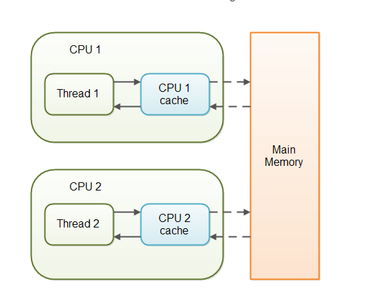
>
> 当对非 volatile 变量进行读写的时候，每个线程先从内存拷贝变量到 CPU 缓存中。如果计算机有多个 CPU，每个线程可能在不同的 CPU 上被处理，这意味着每个线程可以拷贝到不同的 CPU cache 中。而声明变量是 volatile 的，JVM 保证了每次读变量都从内存中读，跳过 CPU cache 这一步。
>
> **适用场景**
>
> 值得说明的是对 volatile 变量的单次读/写操作可以保证原子性的，如 long 和 double 类型变量，但是并不能保证 i++这种操作的原子性，因为本质上 i++是读、写两次操作。在某些场景下可以代替 Synchronized。但是,volatile 的不能完全取代 Synchronized 的位置，只有在一些特殊的场景下，才能适用 volatile。总的来说，必须同时满足下面两个条件才能保证在并发环境的线程安全：
>
> （1）对变量的写操作不依赖于当前值（比如 i++），或者说是单纯的变量赋值（boolean flag = true）。
>
> （2）该变量没有包含在具有其他变量的不变式中，也就是说，不同的 volatile 变量之间，不能互相依赖。只有在状态真正独立于程序内其他内容时才能使用 volatile。

## 3.17.如何在两个线程之间共享数据

> Java 里面进行多线程通信的主要方式就是共享内存的方式，共享内存主要的关注点有两个：可见性和有序性原子性。Java 内存模型（JMM）解决了可见性和有序性的问题，而锁解决了原子性的问题，理想情况下我们希望做到“同步”和“互斥”。有以下常规实现方法：
>
> **将数据抽象成一个类，并将数据的操作作为这个类的方法**
>
> 1、将数据抽象成一个类，并将对这个数据的操作作为这个类的方法，这么设计可以和容易做到同步，只要在方法上加”synchronized“
>
> ```java
> public class MyData {
>     private int j=0;
>     public synchronized void add(){
>     j++;
>     System.out.println("线程"+Thread.currentThread().getName()+"j 为："+j);
>    }
> 
>     public synchronized void dec(){
>     j--;
>     System.out.println("线程"+Thread.currentThread().getName()+"j 为："+j);
>    }
> 
>     public int getData(){
>     return j;
>    }
> }
> 
> public class AddRunnable implements Runnable{
>     MyData data;
>     public AddRunnable(MyData data){
>     this.data= data;
>    }
>     public void run(){
>     data.add();
>    }
> }
> 
> public class DecRunnable implements Runnable {
>     MyData data;
>     public DecRunnable(MyData data){
>     this.data = data;
>    }
>     
>     public void run(){
>     data.dec();
>    }
> }
> 
> public static void main(String[] args){
>     MyData data = new MyData();
>     Runnable add = new AddRunnable(data);
>     Runnable dec = new DecRunnable(data);
>     for(int i=0;i<2;i++){
>     new Thread(add).start();
>     new Thread(dec).start();
>    }
> }
> ```
>
> **Runnable对象作为一个类的内部类**
>
> 2、将 Runnable 对象作为一个类的内部类，共享数据作为这个类的成员变量，每个线程对共享数据的操作方法也封装在外部类，以便实现对数据的各个操作的同步和互斥，作为内部类的各个 Runnable 对象调用外部类的这些方法。
>
> ```java
> public class MyData {
>     private int j=0;
>    public synchronized void add(){
>     j++;
>     System.out.println("线程"+Thread.currentThread().getName()+"j 为："+j);
>    }
>     public synchronized void dec(){
>     j--;
>     System.out.println("线程"+Thread.currentThread().getName()+"j 为："+j);
>    }
>     public int getData(){
>     return j;
>    }
> }
> 
> public class TestThread {
>     public static void main(String[] args){
>     final MyData data = new MyData();
>     for(int i=0;i<2;i++){
>     new Thread(new Runnable(){
>     public void run(){
>     data.add();
>    }
>    }).start();
>     new Thread(new Runnable(){
>     public void run(){
>     data.dec();
>    }
>    }).start();
>    }
>    }
> }
> ```
>
> 


## 3.18. ThreadLocal作用（线程本地存储）

> ThreadLocal，很多地方叫做线程本地变量，也有些地方叫做线程本地存储，ThreadLocal 的作用是提供线程内的局部变量，这种变量在线程的生命周期内起作用，减少同一个线程内多个函数或者组件之间一些公共变量的传递的复杂度。
>
> ThreadLocalMap（线程的一个属性）
>
> 1. 每个线程中都有一个自己的 ThreadLocalMap 类对象，可以将线程自己的对象保持到其中，各管各的，线程可以正确的访问到自己的对象。
> 2. 将一个共用的 ThreadLocal 静态实例作为 key，将不同对象的引用保存到不同线程的ThreadLocalMap 中，然后在线程执行的各处通过这个静态 ThreadLocal 实例的 get()方法取得自己线程保存的那个对象，避免了将这个对象作为参数传递的麻烦。
> 3. ThreadLocalMap 其实就是线程里面的一个属性，它在 Thread 类中定义ThreadLocal.ThreadLocalMap threadLocals = null;
>
> 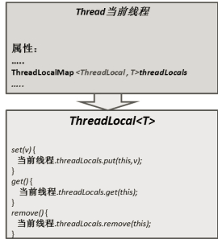
>
> **使用场景**
>
> 最常见的 ThreadLocal 使用场景为用来解决数据库连接、Session 管理等。
>
> ```java
> private static final ThreadLocal threadSession = new ThreadLocal(); 
> public static Session getSession() throws InfrastructureException {
>  Session s = (Session) threadSession.get(); 
>  try {
>  if (s == null){
>  s = getSessionFactory().openSession(); 
>  threadSession.set(s); 
> }
> } catch (HibernateException ex){
>  throw new InfrastructureException(ex); 
> }
>  return s; 
> }
> ```


## 3.19. synchronized和ReentrantLock的区别

### 3.19.1.两者的共同点：

> 1. 都是用来协调多线程对共享对象、变量的访问
>
> 2. 都是可重入锁，同一线程可以多次获得同一个锁
>
> 3. 都保证了可见性和互斥性

### 3.19.2.两者的不同点：

> 1. ReentrantLock 显示的获得、释放锁，synchronized 隐式获得释放锁
>
> 2. ReentrantLock 可响应中断、可轮回，synchronized 是不可以响应中断的，为处理锁的不可用性提供了更高的灵活性
>
> 3. ReentrantLock 是 API 级别的，synchronized 是 JVM 级别的
>
> 4. ReentrantLock 可以实现公平锁
>
> 5. ReentrantLock 通过 Condition 可以绑定多个条件
>
> 6. 底层实现不一样， synchronized 是同步阻塞，使用的是悲观并发策略，lock 是同步非阻塞，采用的是乐观并发策略
>
> 7. Lock 是一个接口，而 synchronized 是 Java 中的关键字，synchronized 是内置的语言实现。
>
> 8. synchronized 在发生异常时，会自动释放线程占有的锁，因此不会导致死锁现象发生；而 Lock 在发生异常时，如果没有主动通过 unLock()去释放锁，则很可能造成死锁现象，因此使用 Lock 时需要在 finally 块中释放锁。
>
> 9. Lock 可以让等待锁的线程响应中断，而 synchronized 却不行，使用 synchronized 时，等待的线程会一直等待下去，不能够响应中断。
>
> 10. 通过 Lock 可以知道有没有成功获取锁，而 synchronized 却无法办到。
>
> 11. Lock 可以提高多个线程进行读操作的效率，既就是实现读写锁等。

## 3.20. ConcurrentHashMap并发

### 3.20.1.减小锁粒度

> 减小锁粒度是指缩小锁定对象的范围，从而减小锁冲突的可能性，从而提高系统的并发能力。减小锁粒度是一种削弱多线程锁竞争的有效手段，这种技术典型的应用是 ConcurrentHashMap(高性能的 HashMap)类的实现。对于 HashMap 而言，最重要的两个方法是 get 与 set 方法，如果我们对整个 HashMap 加锁，可以得到线程安全的对象，但是加锁粒度太大。Segment 的大小也被称为 ConcurrentHashMap 的并发度。

#### 4.1.20.2. ConcurrentHashMap 分段锁

> ConcurrentHashMap，它内部细分了若干个小的 HashMap，称之为段(Segment)。默认情况下一个 ConcurrentHashMap 被进一步细分为16 个段，既就是锁的并发度。如果需要在 ConcurrentHashMap 中添加一个新的表项，并不是将整个 HashMap 加锁，而是首先根据 hashcode 得到该表项应该存放在哪个段中，然后对该段加锁，并完成 put 操作。在多线程环境中，如果多个线程同时进行 put操作，只要被加入的表项不存放在同一个段中，则线程间可以做到真正的并行。
>
> **ConcurrentHashMap是由Segment数组结构和HashEntry数组结构组成**
>
> ConcurrentHashMap 是由 Segment 数组结构和 HashEntry 数组结构组成。Segment 是一种可重入锁 ReentrantLock，在 ConcurrentHashMap 里扮演锁的角色，HashEntry 则用于存储键值对数据。一个 ConcurrentHashMap 里包含一个 Segment 数组，Segment 的结构和 HashMap类似，是一种数组和链表结构，一个 Segment 里包含一个 HashEntry 数组，每个 HashEntry 是一个链表结构的元素，每个 Segment 守护一个 HashEntry 数组里的元素,当对 HashEntry 数组的数据进行修改时，必须首先获得它对应的 Segment 锁。
>
> 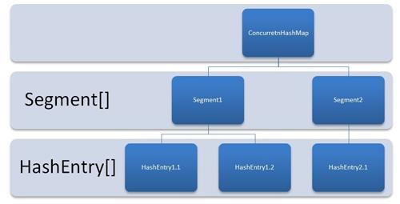

## 3.21. Java中用到的线程调度

### 3.21.1.抢占式调度：

> 抢占式调度指的是每条线程执行的时间、线程的切换都由系统控制，系统控制指的是在系统某种运行机制下，可能每条线程都分同样的执行时间片，也可能是某些线程执行的时间片较长，甚至某些线程得不到执行的时间片。在这种机制下，一个线程的堵塞不会导致整个进程堵塞。

### 3.21.2.协同式调度：

> 协同式调度指某一线程执行完后主动通知系统切换到另一线程上执行，这种模式就像接力赛一样，一个人跑完自己的路程就把接力棒交接给下一个人，下个人继续往下跑。线程的执行时间由线程本身控制，线程切换可以预知，不存在多线程同步问题，但它有一个致命弱点：如果一个线程编写有问题，运行到一半就一直堵塞，那么可能导致整个系统崩溃。
>
> 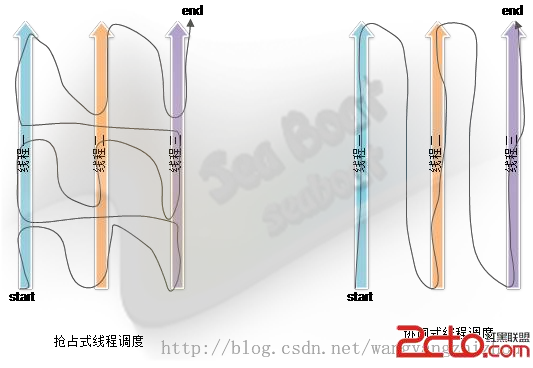

### 3.21.3. JVM 的线程调度实现（抢占式调度）

> java 使用的线程调使用抢占式调度，Java 中线程会按优先级分配 CPU 时间片运行，且优先级越高越优先执行，但优先级高并不代表能独自占用执行时间片，可能是优先级高得到越多的执行时间片，反之，优先级低的分到的执行时间少但不会分配不到执行时间。

### 3.21.4.线程让出 cpu 的情况：

> 1. 当前运行线程主动放弃 CPU，JVM 暂时放弃 CPU 操作（基于时间片轮转调度的 JVM 操作系统不会让线程永久放弃 CPU，或者说放弃本次时间片的执行权），例如调用 yield()方法。
>
> 2. 当前运行线程因为某些原因进入阻塞状态，例如阻塞在 I/O 上。
>
> 3. 当前运行线程结束，即运行完 run()方法里面的任务。

## 3.22.进程调度算法

### 3.22.1.优先调度算法

> 1. 先来先服务调度算法（FCFS）
>
> 当在作业调度中采用该算法时，每次调度都是从后备作业队列中选择一个或多个最先进入该队列的作业，将它们调入内存，为它们分配资源、创建进程，然后放入就绪队列。在进程调度中采用 FCFS 算法时，则每次调度是从就绪队列中选择一个最先进入该队列的进程，为之分配处理机，使之投入运行。该进程一直运行到完成或发生某事件而阻塞后才放弃处理机，特点是：算法比较简单，可以实现基本上的公平。
>
> 2. 短作业(进程)优先调度算法
>
> 短作业优先(SJF)的调度算法是从后备队列中选择一个或若干个估计运行时间最短的作业，将它们调入内存运行。而短进程优先(SPF)调度算法则是从就绪队列中选出一个估计运行时间最短的进程，将处理机分配给它，使它立即执行并一直执行到完成，或发生某事件而被阻塞放弃处理机时再重新调度。该算法未照顾紧迫型作业。

### 3.22.2.高优先权优先调度算法

> 为了照顾紧迫型作业，使之在进入系统后便获得优先处理，引入了最高优先权优先(FPF)调度算法。当把该算法用于作业调度时，系统将从后备队列中选择若干个优先权最高的作业装入内存。当用于进程调度时，该算法是把处理机分配给就绪队列中优先权最高的进程。
>
> 1. 非抢占式优先权算法
>
> 在这种方式下，系统一旦把处理机分配给就绪队列中优先权最高的进程后，该进程便一直执行下去，直至完成；或因发生某事件使该进程放弃处理机时。这种调度算法主要用于批处理系统中；也可用于某些对实时性要求不严的实时系统中。
>
> 2. 抢占式优先权调度算法
>
> 在这种方式下，系统同样是把处理机分配给优先权最高的进程，使之执行。但在其执行期间，只要又出现了另一个其优先权更高的进程，进程调度程序就立即停止当前进程(原优先权最高的进程)的执行，重新将处理机分配给新到的优先权最高的进程。显然，这种抢占式的优先权调度算法能更好地满足紧迫作业的要求，故而常用于要求比较严格的实时系统中，以及对性能要求较高的批处理和分时系统中。
>
> 3．高响应比优先调度算法
>
> 在批处理系统中，短作业优先算法是一种比较好的算法，其主要的不足之处是长作业的运行得不到保证。如果我们能为每个作业引入前面所述的动态优先权，并使作业的优先级随着等待时间的增加而以速率 a 提高，则长作业在等待一定的时间后，必然有机会分配到处理机。该优先权的变化规律可描述为：
>
> 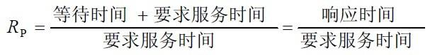
>
> (1)如果作业的等待时间相同，则要求服务的时间愈短，其优先权愈高，因而该算法有利于短作业。
>
> (2)当要求服务的时间相同时，作业的优先权决定于其等待时间，等待时间愈长，其优先权愈高，因而它实现的是先来先服务。
>
> (3)对于长作业，作业的优先级可以随等待时间的增加而提高，当其等待时间足够长时，其优先级便可升到很高，从而也可获得处理机。简言之，该算法既照顾了短作业，又考虑了作业到达的先后次序，不会使长作业长期得不到服务。因此，该算法实现了一种较好的折衷。当然，在利用该算法时，每要进行调度之前，都须先做响应比的计算，这会增加系统开销。

### 3.22.3.基于时间片的轮转调度算法

> 1. 时间片轮转法
>
> 在早期的时间片轮转法中，系统将所有的就绪进程按先来先服务的原则排成一个队列，每次调度时，把 CPU 分配给队首进程，并令其执行一个时间片。时间片的大小从几 ms 到几百 ms。当执行的时间片用完时，由一个计时器发出时钟中断请求，调度程序便据此信号来停止该进程的执行，并将它送往就绪队列的末尾；然后，再把处理机分配给就绪队列中新的队首进程，同时也让它执行一个时间片。这样就可以保证就绪队列中的所有进程在一给定的时间内均能获得一时间片的处理机执行时间。
>
> 2. 多级反馈队列调度算法
>
> (1)应设置多个就绪队列，并为各个队列赋予不同的优先级。第一个队列的优先级最高，第二个队列次之，其余各队列的优先权逐个降低。该算法赋予各个队列中进程执行时间片的大小也各不相同，在优先权愈高的队列中，为每个进程所规定的执行时间片就愈小。例如，第二个队列的时间片要比第一个队列的时间片长一倍，……，第 i+1 个队列的时间片要比第 i 个队列的时间片长一倍。
>
> (2)当一个新进程进入内存后，首先将它放入第一队列的末尾，按 FCFS 原则排队等待调度。当轮到该进程执行时，如它能在该时间片内完成，便可准备撤离系统；如果它在一个时间片结束时尚未完成，调度程序便将该进程转入第二队列的末尾，再同样地按 FCFS 原则等待调度执行；如果它在第二队列中运行一个时间片后仍未完成，再依次将它放入第三队列，……，如此下去，当一个长作业(进程)从第一队列依次降到第 n 队列后，在第 n 队列便采取按时间片轮转的方式运行。
>
> (3)仅当第一队列空闲时，调度程序才调度第二队列中的进程运行；仅当第1～(i-1)队列均空时，才会调度第 i 队列中的进程运行。如果处理机正在第 i 队列中为某进程服务时，又有新进程进入优先权较高的队列(第1～(i-1)中的任何一个队列)，则此时新进程将抢占正在运行进程的处理机，即由调度程序把正在运行的进程放回到第 i 队列的末尾，把处理机分配给新到的高优先权进程。在多级反馈队列调度算法中，如果规定第一个队列的时间片略大于多数人机交互所需之处理时间时，便能够较好的满足各种类型用户的需要。

## 3.23.什么是CAS（比较并交换-乐观锁机制-锁自旋）

### 3.23.1.概念及特性

> CAS（Compare And Swap/Set）比较并交换，CAS 算法的过程是这样：它包含3 个参数
>
> CAS(V,E,N)。V 表示要更新的变量(内存值)，E 表示预期值(旧的)，N 表示新值。当且仅当 V 值等于 E 值时，才会将 V 的值设为 N，如果 V 值和 E 值不同，则说明已经有其他线程做了更新，则当前线程什么都不做。最后，CAS 返回当前 V 的真实值。
>
> CAS 操作是抱着乐观的态度进行的(乐观锁)，它总是认为自己可以成功完成操作。当多个线程同时使用 CAS 操作一个变量时，只有一个会胜出，并成功更新，其余均会失败。失败的线程不会被挂起，仅是被告知失败，并且允许再次尝试，当然也允许失败的线程放弃操作。基于这样的原理，CAS 操作即使没有锁，也可以发现其他线程对当前线程的干扰，并进行恰当的处理。

### 3.23.2.原子包 java.util.concurrent.atomic（锁自旋）

> JDK1.5 的原子包：java.util.concurrent.atomic 这个包里面提供了一组原子类。其基本的特性就是在多线程环境下，当有多个线程同时执行这些类的实例包含的方法时，具有排他性，即当某个线程进入方法，执行其中的指令时，不会被其他线程打断，而别的线程就像自旋锁一样，一直等到该方法执行完成，才由 JVM 从等待队列中选择一个另一个线程进入，这只是一种逻辑上的理解。相对于对于 synchronized 这种阻塞算法，CAS 是非阻塞算法的一种常见实现。由于一般 CPU 切换时间比 CPU 指令集操作更加长，所以 J.U.C 在性能上有了很大的提升。
>
> 代码如下：
>
> ```java
> public class AtomicInteger extends Number implements java.io.Serializable {
>     private volatile int value;
>     public final int get(){
>     return value;
>    }
>     
>     public final int getAndIncrement(){
>     for (;;){//CAS 自旋，一直尝试，直达成功
>     int current = get();
>     int next = current +1;
>     if (compareAndSet(current, next))
>     return current;
>    }
>    }
>     public final boolean compareAndSet(int expect, int update){
>     return unsafe.compareAndSwapInt(this, valueOffset, expect, update);
>    }
> }
> ```
>
> getAndIncrement 采用了 CAS 操作，每次从内存中读取数据然后将此数据和+1 后的结果进行CAS 操作，如果成功就返回结果，否则重试直到成功为止。而 compareAndSet 利用 JNI 来完成CPU 指令的操作。
>
> 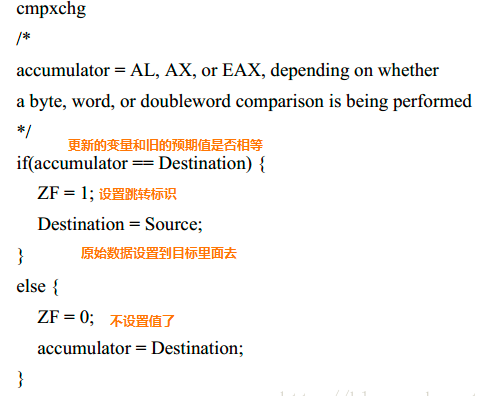


### 3.23.3. ABA 问题

> CAS 会导致“ABA 问题”。CAS 算法实现一个重要前提需要取出内存中某时刻的数据，而在下时刻比较并替换，那么在这个时间差类会导致数据的变化。
>
> 比如说一个线程 one 从内存位置 V 中取出 A，这时候另一个线程 two 也从内存中取出 A，并且two 进行了一些操作变成了 B，然后 two 又将 V 位置的数据变成 A，这时候线程 one 进行 CAS 操作发现内存中仍然是 A，然后 one 操作成功。尽管线程 one 的 CAS 操作成功，但是不代表这个过程就是没有问题的。
>
> 部分乐观锁的实现是通过版本号（version）的方式来解决 ABA 问题，乐观锁每次在执行数据的修改操作时，都会带上一个版本号，一旦版本号和数据的版本号一致就可以执行修改操作并对版本号执行+1 操作，否则就执行失败。因为每次操作的版本号都会随之增加，所以不会出现 ABA 问题，因为版本号只会增加不会减少。

### 3.24.什么是AQS（抽象的队列同步器）

> AbstractQueuedSynchronizer 类如其名，抽象的队列式的同步器，AQS 定义了一套多线程访问共享资源的同步器框架，许多同步类实现都依赖于它，如常用的ReentrantLock/Semaphore/CountDownLatch。
>
> 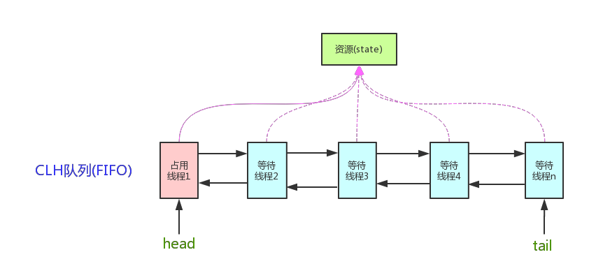
>
> 它维护了一个 volatile int state（代表共享资源）和一个 FIFO 线程等待队列（多线程争用资源被阻塞时会进入此队列）。这里 volatile 是核心关键词，具体 volatile 的语义，在此不述。state 的访问方式有三种:
>
> getState()
>
> setState()
>
> compareAndSetState()
>
> 
>
> **AQS 定义两种资源共享方式**
>
> **Exclusive独占资源-ReentrantLock**
>
> Exclusive（独占，只有一个线程能执行，如 ReentrantLock）
>
> **Share共享资源-Semaphore/CountDownLatch**
>
> Share（共享，多个线程可同时执行，如 Semaphore/CountDownLatch）。
>
> AQS 只是一个框架，具体资源的获取/释放方式交由自定义同步器去实现，AQS 这里只定义了一个接口，具体资源的获取交由自定义同步器去实现了（通过 state 的 get/set/CAS)之所以没有定义成abstract ，是因为独占模式下只用实现 tryAcquire-tryRelease ，而共享模式下只用实现tryAcquireShared-tryReleaseShared。如果都定义成abstract，那么每个模式也要去实现另一模式下的接口。不同的自定义同步器争用共享资源的方式也不同。自定义同步器在实现时只需要实现共享资源 state 的获取与释放方式即可，至于具体线程等待队列的维护（如获取资源失败入队/唤醒出队等），AQS 已经在顶层实现好了。自定义同步器实现时主要实现以下几种方法：
>
> 1．isHeldExclusively()：该线程是否正在独占资源。只有用到 condition 才需要去实现它。
>
> 2．tryAcquire(int)：独占方式。尝试获取资源，成功则返回 true，失败则返回 false。
>
> 3．tryRelease(int)：独占方式。尝试释放资源，成功则返回 true，失败则返回 false。
>
> 4．tryAcquireShared(int)：共享方式。尝试获取资源。负数表示失败；0 表示成功，但没有剩余可用资源；正数表示成功，且有剩余资源。
>
> 5．tryReleaseShared(int)：共享方式。尝试释放资源，如果释放后允许唤醒后续等待结点返回true，否则返回 false。
>
> **同步器的实现是 ABS 核心（state 资源状态计数）**
>
> 同步器的实现是 ABS 核心，以 ReentrantLock 为例， state 初始化为0，表示未锁定状态。 A 线程lock()时，会调用 tryAcquire()独占该锁并将 state+1。此后，其他线程再 tryAcquire()时就会失败，直到 A 线程 unlock()到 state=0（即释放锁）为止，其它线程才有机会获取该锁。当然，释放锁之前， A 线程自己是可以重复获取此锁的（state 会累加），这就是可重入的概念。但要注意，获取多少次就要释放多么次，这样才能保证 state 是能回到零态的。
>
> 以 CountDownLatch 以例，任务分为 N 个子线程去执行， state 也初始化为 N（注意 N 要与线程个数一致）。这 N 个子线程是并行执行的，每个子线程执行完后 countDown()一次， state会 CAS 减1。等到所有子线程都执行完后(即 state=0)，会 unpark()主调用线程，然后主调用线程就会从 await()函数返回，继续后余动作。
>
> **ReentrantReadWriteLock 实现独占和共享两种方式**
>
> 一般来说，自定义同步器要么是独占方法，要么是共享方式，他们也只需实现 tryAcquiretryRelease、 tryAcquireShared-tryReleaseShared 中的一种即可。但 AQS 也支持自定义同步器同时实现独占和共享两种方式，如 ReentrantReadWriteLock。


# 4. JAVA 基础

## 4.1 JAVA 异常分类及处理


### 4.1.1 概念

> 如果某个方法不能按照正常的途径完成任务，就可以通过另一种路径退出方法。在这种情况下会抛出一个封装了错误信息的对象。此时，这个方法会立刻退出同时不返回任何值。另外，调用这个方法的其他代码也无法继续执行，异常处理机制会将代码执行交给异常处理器。
>
> 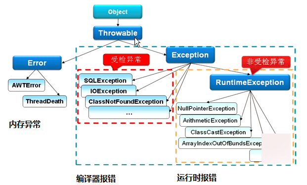

### 4.1.2 异常分类

> Throwable 是 Java 语言中所有错误或异常的超类。下一层分为 Error 和 Exception
>
> **Error**
>
> 1、Error 类是指 java 运行时系统的内部错误和资源耗尽错误。应用程序不会抛出该类对象。如果出现了这样的错误，除了告知用户，剩下的就是尽力使程序安全的终止。
>
> **Exception**（RuntimeException、CheckedException）
>
> 2、Exception 又有两个分支，一个是运行时异常 RuntimeException ，一个是CheckedException。
>
> **RuntimeException**如： NullPointerException 、 ClassCastException ；一个是检查异常CheckedException，如 I/O 错误导致的 IOException、SQLException。 RuntimeException 是那些可能在 Java 虚拟机正常运行期间抛出的异常的超类。如果出现 RuntimeException，那么一定是程序员的错误.
>
> **检查异常 CheckedException**：一般是外部错误，这种异常都发生在编译阶段，Java 编译器会强制程序去捕获此类异常，即会出现要求你把这段可能出现异常的程序进行 try catch，该类异常一般包括几个方面：
>
> 1.  试图在文件尾部读取数据
>
> 2.  试图打开一个错误格式的URL
>
> 3.  试图根据给定的字符串查找 class 对象，而这个字符串表示的类并不存在

### 4.1.3 异常的处理方式

> **遇到问题不进行具体处理，而是继续抛给调用者（throw,throws）**
>
> 抛出异常有三种形式，一是 throw,一个 throws，还有一种系统自动抛异常。
>
> ```java
> public static void main(String[] args){
>     String s = "abc";
>     if(s.equals("abc")){
>     throw new NumberFormatException();
>    } else {
>     System.out.println(s);
>    }
> }
> 
> int div(int a,int b) throws Exception{
>     return a/b;
> }
> ```
>
> **try catch 捕获异常针对性处理方式**

### 4.1.4 Throw 和 throws 的区别：

> **位置不同:**
>
> 1.  throws 用在函数上，后面跟的是异常类，可以跟多个；而 throw 用在函数内，后面跟的是异常对象。
>
> **功能不同：**
>
> 2.  throws 用来声明异常，让调用者只知道该功能可能出现的问题，可以给出预先的处理方式；throw 抛出具体的问题对象，执行到throw，功能就已经结束了，跳转到调用者，并将具体的问题对象抛给调用者。也就是说 throw 语句独立存在时，下面不要定义其他语句，因为执行不到。
>
> 3.  throws 表示出现异常的一种可能性，并不一定会发生这些异常；throw 则是抛出了异常，执行throw 则一定抛出了某种异常对象。
>
> 4.  两者都是消极处理异常的方式，只是抛出或者可能抛出异常，但是不会由函数去处理异常，真正的处理异常由函数的上层调用处理。

## 4.2 JAVA 反射

### 4.2.1 动态语言

> 动态语言，是指程序在运行时可以改变其结构：新的函数可以引进，已有的函数可以被删除等结构上的变化。比如常见的 JavaScript 就是动态语言，除此之外 Ruby,Python 等也属于动态语言，而 C、C++则不属于动态语言。从反射角度说 JAVA 属于半动态语言。

###### 4.2.2 反射机制概念（运行状态中知道类所有的属性和方法）

> 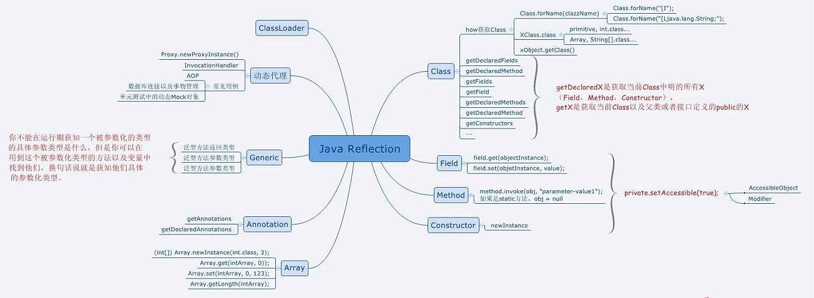
>
> 在 Java 中的反射机制是指在运行状态中，对于任意一个类都能够知道这个类所有的属性和方法；并且对于任意一个对象，都能够调用它的任意一个方法；这种动态获取信息以及动态调用对象方法的功能成为 Java 语言的反射机制。

### 4.2.3 反射的应用场合

**编译时类型和运行时类型**

> 在 Java 程序中许多对象在运行是都会出现两种类型：编译时类型和运行时类型。编译时的类型由声明对象时实用的类型来决定，运行时的类型由实际赋值给对象的类型决定。如：
>
> ```java
> Person p = new Student();
> ```
>
> 其中编译时类型为Person，运行时类型为 Student。

**编译时类型无法获取具体方法**

> 程序在运行时还可能接收到外部传入的对象，该对象的编译时类型为 Object,但是程序有需要调用该对象的运行时类型的方法。为了解决这些问题，程序需要在运行时发现对象和类的真实信息。然而，如果编译时根本无法预知该对象和类属于哪些类，程序只能依靠运行时信息来发现该对象和类的真实信息，此时就必须使用到反射了。

### 4.2.4 Java 反射API

> **反射 API 用来生成 JVM 中的类、接口或则对象的信息。**
>
> 1.  Class 类：反射的核心类，可以获取类的属性，方法等信息。
>
> 2.  Field 类：Java.lang.reflec 包中的类，表示类的成员变量，可以用来获取和设置类之中的属性值。
>
> 3.  Method 类： Java.lang.reflec 包中的类，表示类的方法，它可以用来获取类中的方法信息或者执行方法。
>
> 4.  Constructor 类： Java.lang.reflec 包中的类，表示类的构造方法。


### 4.2.5 反射使用步骤（获取 Class 对象、调用对象方法）

> 1.  获取想要操作的类的 Class 对象，他是反射的核心，通过 Class 对象我们可以任意调用类的方法。
>
> 2.  调用Class 类中的方法，既就是反射的使用阶段。
>
> 3.  使用反射API 来操作这些信息。

### 4.2.6 获取 Class 对象的3 种方法

> **调用某个对象的 getClass()方法**
>
> ```java
> Person p = new Person();
> Class clazz = p.getClass();
> ```
>
> **调用某个类的 class 属性来获取该类对应的 Class 对象**
>
> ```java
> Class clazz = Person.class;
> ```
>
> **使用 Class 类中的 forName()静态方法(最安全/性能最好)**
>
> Class clazz=Class.forName(\"类的全路径\"); (最常用)
>
> 当我们获得了想要操作的类的 Class 对象后，可以通过 Class 类中的方法获取并查看该类中的方法和属性。
>
> ```java
> //获取 Person 类的 Class 对象
> Class clazz=Class.forName("reflection.Person");
> 
> //获取 Person 类的所有方法信息
> Method[] method=clazz.getDeclaredMethods();
> for(Method m:method){
>     System.out.println(m.toString());
> }
> 
> //获取 Person 类的所有成员属性信息
> Field[] field=clazz.getDeclaredFields();
> for(Field f:field){
>     System.out.println(f.toString());
> }
> 
> //获取 Person 类的所有构造方法信息
> Constructor[] constructor=clazz.getDeclaredConstructors();
> for(Constructor c:constructor){
>     System.out.println(c.toString());
> }
> ```
>
> 

### 4.2.6 创建对象的两种方法

>  ***Class 对象的 newInstance()***
>
> 1、使用 Class 对象的 newInstance()方法来创建该 Class 对象对应类的实例，但是这种方法要求该 Class 对象对应的类有默认的空构造器。
>
> ***调用 Constructor 对象的 newInstance()***
>
> 2、先使用Class 对象获取指定的Constructor 对象，再调用Constructor 对象的 newInstance()方法来创建 Class 对象对应类的实例,通过这种方法可以选定构造方法创建实例。
>
> ```java
> //获取 Person 类的 Class 对象
> Class clazz=Class.forName("reflection.Person");
> //使用.newInstane 方法创建对象
> Person p=(Person) clazz.newInstance();
> //获取构造方法并创建对象
> Constructor c=clazz.getDeclaredConstructor(String.class,String.class,int.class);
> //创建对象并设置属性
> Person p1=(Person) c.newInstance("李四","男",20);
> ```

## 4.3 JAVA 注解

### 4.3.1 概念

> Annotation（注解）是 Java 提供的一种对元程序中元素关联信息和元数据（metadata）的途径和方法。
>
> Annatation(注解)是一个接口，程序可以通过反射来获取指定程序中元素的 Annotation对象，然后通过该Annotation 对象来获取注解中的元数据信息。

### 4.3.2 4 种标准元注解

> 元注解的作用是负责注解其他注解。 Java5.0 定义了4 个标准的 meta-annotation 类型，它们被用来提供对其它 annotation 类型作说明。
>
> ***@Target 修饰的对象范围***
>
> @Target 说明了Annotation 所修饰的对象范围： Annotation 可被用于packages、types（类、接口、枚举、Annotation 类型）、类型成员（方法、构造方法、成员变量、枚举值）、方法参数和本地变量（如循环变量、catch 参数）。在Annotation 类型的声明中使用了target 可更加明晰其修饰的目标
>
> 
>
> ***@Retention 定义被保留的时间长短***
>
> Retention 定义了该Annotation 被保留的时间长短：表示需要在什么级别保存注解信息，用于描述注解的生命周期（即：被描述的注解在什么范围内有效），取值（RetentionPoicy）由：
>
> -   SOURCE:在源文件中有效（即源文件保留）
> -   CLASS:在 class 文件中有效（即 class 保留）
> -   RUNTIME:在运行时有效（即运行时保留）
>
> 
>
> ***@Documented 描述-javadoc***
>
> @ Documented 用于描述其它类型的 annotation 应该被作为被标注的程序成员的公共 API，因此可以被例如javadoc 此类的工具文档化。
>
> 
>
> ***@Inherited 阐述了某个被标注的类型是被继承的***
>
> @Inherited 元注解是一个标记注解，@Inherited 阐述了某个被标注的类型是被继承的。如果一个使用了
>
> @Inherited 修饰的 annotation 类型被用于一个 class，则这个 annotation 将被用于该class 的子类。
>
> 

### 4.3.3 注解处理器

> 如果没有用来读取注解的方法和工作，那么注解也就不会比注释更有用处了。使用注解的过程中，很重要的一部分就是创建于使用注解处理器。Java SE5 扩展了反射机制的API，以帮助程序员快速的构造自定义注解处理器。下面实现一个注解处理器。
>
> ```java
> /1：***定义注解*/
> @Target(ElementType.FIELD)
> @Retention(RetentionPolicy.RUNTIME)
> @Documented
> public @interface FruitProvider {
>  /**供应商编号*/
>  public int id() default -1;
>  /***供应商名称*/
>  public String name() default "";
>  /***供应商地址*/
>  public String address() default "";
> }
> 
> //2：注解使用
> public class Apple {
>  @FruitProvider(id = 1, name = "陕西红富士集团", address = "陕西省西安市延安路")
>  private String appleProvider;
>  public void setAppleProvider(String appleProvider){
>     this.appleProvider = appleProvider;
>  }
>  public String getAppleProvider(){
>     return appleProvider;
>  }
> }
> 
> //3：***********注解处理器***************/
> public class FruitInfoUtil {
>     public static void getFruitInfo(Class<?> clazz){
>     String strFruitProvicer = "供应商信息：";
>     Field[] fields = clazz.getDeclaredFields();
>    //通过反射获取处理注解
>     for (Field field : fields){
>     if (field.isAnnotationPresent(FruitProvider.class)){
>     FruitProvider fruitProvider = (FruitProvider)field.getAnnotation(FruitProvider.class);
>    //注解信息的处理地方
>     strFruitProvicer = "供应商编号："+ fruitProvider.id()+"供应商名称："+ fruitProvider.name()+"供应商地址："+ fruitProvider.address(); 
>     System.out.println(strFruitProvicer);
>    }
>    }
>    }
> }
> public class FruitRun {
>     public static void main(String[] args){
>     FruitInfoUtil.getFruitInfo(Apple.class);
>    /***********输出结果***************/
>    //供应商编号：1 供应商名称：陕西红富士集团供应商地址：陕西省西安市延
>    }
> }
> ```
>

## 4.4 JAVA 内部类

> Java 类中不仅可以定义变量和方法，还可以定义类，这样定义在类内部的类就被称为内部类。根据定义的方式不同，内部类分为静态内部类，成员内部类，局部内部类，匿名内部类四种。

### 4.4.1 静态内部类

> 定义在类内部的静态类，就是静态内部类。
>
> ```java
> public class Out {
>     private static int a;
>     private int b;
>     public static class Inner {
>     public void print(){
>     System.out.println(a);
>    }
>    }
> }
> ```
>
> 1. 静态内部类可以访问外部类所有的静态变量和方法，即使是 private 的也一样。
>
> 2. 静态内部类和一般类一致，可以定义静态变量、方法，构造方法等。
>
> 3. 其它类使用静态内部类需要使用"外部类.静态内部类"方式，如下所示：
>
>    ```java
>    Out.Inner inner = new Out.Inner();
>    inner.print();
>    ```
>
> 4. Java集合类HashMap 内部就有一个静态内部类Entry。Entry 是HashMap 存放元素的抽象，HashMap 内部维护 Entry 数组用了存放元素，但是 Entry 对使用者是透明的。像这种和外部类关系密切的，且不依赖外部类实例的，都可以使用静态内部类。

### 4.4.2 成员内部类

> 定义在类内部的非静态类，就是成员内部类。成员内部类不能定义静态方法和变量（final 修饰的除外）。这是因为成员内部类是非静态的，类初始化的时候先初始化静态成员，如果允许成员内部类定义静态变量，那么成员内部类的静态变量初始化顺序是有歧义的。
>
> ```java
> public class Out {
>     private static int a;
>     private int b;
>     public class Inner {
>     public void print(){
>     System.out.println(a);
>     System.out.println(b);
>    }
>    }
> }
> ```

### 4.4.3 局部内部类

> 定义在方法中的类，就是局部类。如果一个类只在某个方法中使用，则可以考虑使用局部类。
>
> ```java
> public class Out {
>     private static int a;
>     private int b;
>     public void test(final int c){
>     final int d = 1;
>     class Inner {
>     public void print(){
>     System.out.println(c);
>    }
>    }
>    }
> }
> ```

### 4.4.4 匿名内部类

> 匿名内部类我们必须要继承一个父类或者实现一个接口，当然也仅能只继承一个父类或者实现一个接口。同时它也是没有 class 关键字，这是因为匿名内部类是直接使用 new 来生成一个对象的引用。
>
> ```java
> public abstract class Bird {
>     private String name;
>     public String getName(){
>     return name;
>    }
> 
>     public void setName(String name){
>     this.name = name;
>    }
> 
>     public abstract int fly();
> }
> 
> public class Test {
>     public void test(Bird bird){
>     System.out.println(bird.getName()+"能够飞"+ bird.fly()+"米");
>    }
> 
>     public static void main(String[] args){
>     Test test = new Test();
>     test.test(new Bird(){
>     public int fly(){
>     return 10000;
>    }
>     public String getName(){
>     return "大雁";
>    }
>    });
>    }
> }
> ```
>
> 

## 4.5 JAVA 泛型

> 泛型提供了编译时类型安全检测机制，该机制允许程序员在编译时检测到非法的类型。泛型的本质是参数化类型，也就是说所操作的数据类型被指定为一个参数。比如我们要写一个排序方法，能够对整型数组、字符串数组甚至其他任何类型的数组进行排序，我们就可以使用 Java 泛型。

### 4.5.1 泛型方法（\<E\>）

> 你可以写一个泛型方法，该方法在调用时可以接收不同类型的参数。根据传递给泛型方法的参数类型，编译器适当地处理每一个方法调用。
>
> ```java
> //泛型方法 printArray
> public static < E > void printArray( E[] inputArray ){
>     for ( E element : inputArray ){
>     System.out.printf("%s ", element );
>    }
> }
> ```
>
> 1.  \<? extends T\>表示该通配符所代表的类型是 T 类型的子类。
>
> 2.  \<? super T\>表示该通配符所代表的类型是 T 类型的父类。

### 4.5.2 泛型类\<T\>

> 泛型类的声明和非泛型类的声明类似，除了在类名后面添加了类型参数声明部分。和泛型方法一样，泛型类的类型参数声明部分也包含一个或多个类型参数，参数间用逗号隔开。一个泛型参数，也被称为一个类型变量，是用于指定一个泛型类型名称的标识符。因为他们接受一个或多个参数，这些类被称为参数化的类或参数化的类型。
>
> ```java
> public class Box<T> {
>     private T t;
>     public void add(T t){
>     this.t = t;
>    }
>     public T get(){
>     return t;
>    }
> ```
>
> 

### 4.5.3 类型通配符?

> 类型通配符一般是使用? 代替具体的类型参数。例如 List\<?\> 在逻辑上是List\<String\>,List\<Integer\> 等所有 List\<具体类型实参\>的父类。
>

### 4.5.4 类型擦除

> Java 中的泛型基本上都是在编译器这个层次来实现的。在生成的 Java 字节代码中是不包含泛型中的类型信息的。使用泛型的时候加上的类型参数，会被编译器在编译的时候去掉。这个过程就称为类型擦除。如在代码中定义的 List\<Object\>和 List\<String\>等类型，在编译之后都会变成 List。JVM 看到的只是 List，而由泛型附加的类型信息对 JVM 来说是不可见的。
>
> 类型擦除的基本过程也比较简单，首先是找到用来替换类型参数的具体类。这个具体类一般是 Object。如果指定了类型参数的上界的话，则使用这个上界。把代码中的类型参数都替换成具体的类。

## 4.6 JAVA 序列化

> **(创建可复用的 Java 对象)**
>
> **保存(持久化)对象及其状态到内存或者磁盘**
>
> Java 平台允许我们在内存中创建可复用的 Java 对象，但一般情况下，只有当 JVM 处于运行时，这些对象才可能存在，即，这些对象的生命周期不会比 JVM 的生命周期更长。但在现实应用中，就可能要求在JVM 停止运行之后能够保存(持久化)指定的对象，并在将来重新读取被保存的对象。Java 对象序列化就能够帮助我们实现该功能。
>
> **序列化对象以字节数组保持*-*静态成员不保存**
>
> 使用 Java 对象序列化，在保存对象时，会把其状态保存为一组字节，在未来，再将这些字节组装成对象。必须注意地是，对象序列化保存的是对象的"状态"，即它的成员变量。由此可知，对象序列化不会关注类中的静态变量。
>
> **序列化用户远程对象传输**
>
> 除了在持久化对象时会用到对象序列化之外，当使用 RMI(远程方法调用)，或在网络中传递对象时，都会用到对象序列化。Java 序列化API 为处理对象序列化提供了一个标准机制，该API 简单易用。
>
>  ***Serializable 实现序列化***
>
> 在 Java 中，只要一个类实现了java.io.Serializable 接口，那么它就可以被序列化。
>
>  ***ObjectOutputStream 和 ObjectInputStream 对对象进行序列化及反序列化***
>
> 通过ObjectOutputStream 和 ObjectInputStream 对对象进行序列化及反序列化。
>
>  ***writeObject 和 readObject 自定义序列化策略***
>
> 在类中增加 writeObject 和 readObject 方法可以实现自定义序列化策略。
>
>  ***序列化 ID***
>
> 虚拟机是否允许反序列化，不仅取决于类路径和功能代码是否一致，一个非常重要的一点是两个类的序列化 ID 是否一致（就是 private static final long serialVersionUID）
>
> 序列化并不保存静态变量
>
> **序列化子父类说明**
>
> 要想将父类对象也序列化，就需要让父类也实现 Serializable 接口。
>
>  ***Transient 关键字阻止该变量被序列化到文件中***
>
> 1.  在变量声明前加上 Transient 关键字，可以阻止该变量被序列化到文件中，在被反序列化后，transient 变量的值被设为初始值，如 int 型的是0，对象型的是 null。
>
> 2.  服务器端给客户端发送序列化对象数据，对象中有一些数据是敏感的，比如密码字符串等，希望对该密码字段在序列化时，进行加密，而客户端如果拥有解密的密钥，只有在客户端进行反序列化时，才可以对密码进行读取，这样可以一定程度保证序列化对象的数据安全。

## 4.7 JAVA 复制

> 将一个对象的引用复制给另外一个对象，一共有三种方式。第一种方式是直接赋值，第二种方式是浅拷贝，第三种是深拷贝。所以大家知道了哈，这三种概念实际上都是为了拷贝对象。

###  4.7.1 直接赋值复制

> 直接赋值。在 Java 中，A a1 = a2，我们需要理解的是这实际上复制的是引用，也就是说 a1 和 a2 指向的是同一个对象。因此，当 a1 变化的时候，a2 里面的成员变量也会跟着变化。

### 4.7.2 浅复制（复制引用但不复制引用的对象）

> 创建一个新对象，然后将当前对象的非静态字段复制到该新对象，如果字段是值类型的，那么对该字段执行复制；如果该字段是引用类型的话，则复制引用但不复制引用的对象。因此，原始对象及其副本引用同一个对象。
>
> ```java
> class Resume implements Cloneable{
>     public Object clone(){
>     try {
>     return (Resume)super.clone();
>    } catch (Exception e){
>     e.printStackTrace();
>     return null;
>    }
>    }
> }
> ```
>
> 

###  4.7.3 深复制（复制对象和其应用对象）

> 深拷贝不仅复制对象本身，而且复制对象包含的引用指向的所有对象。
>
> ```java
> class Student implements Cloneable {
>     String name;
>     int age;
>     Professor p;
>     Student(String name, int age, Professor p){
>     this.name = name;
>     this.age = age;
>     this.p = p;
>    }
> 
>     public Object clone(){
>     Student o = null;
>     try {
>     o = (Student) super.clone();
>    } catch (CloneNotSupportedException e){
>     System.out.println(e.toString());
>    }
>     o.p = (Professor) p.clone();
>     return o;
>    }
> }
> ```
>
> 

### 4.7.4 序列化（深 clone 一中实现）

> 在Java 语言里深复制一个对象，常常可以先使对象实现 Serializable 接口，然后把对象（实际上只是对象的一个拷贝）写到一个流里，再从流里读出来，便可以重建对象。


# 5. Spring 原理

> 它是一个全面的、企业应用开发一站式的解决方案，贯穿表现层、业务层、持久层。但是 Spring仍然可以和其他的框架无缝整合。

## 5.1 Spring 特点

> 1. ###### 轻量级
>
> 2. ###### 控制反转
>
> 3. ###### 面向切面
>
> 4.  **容器**
>
> 5.  **框架集合**
>
> 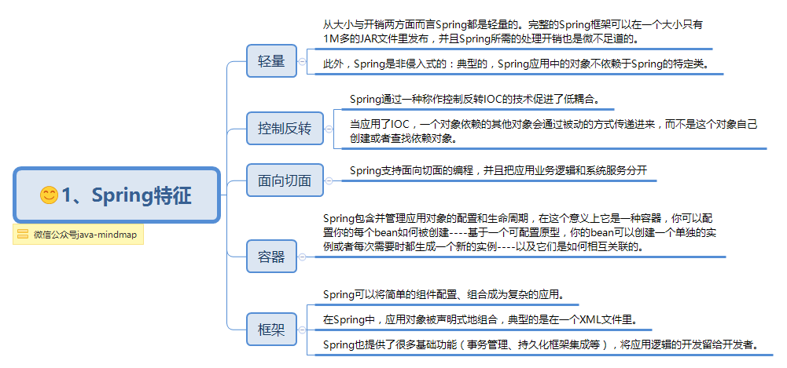

## 5.2 Spring 核心组件

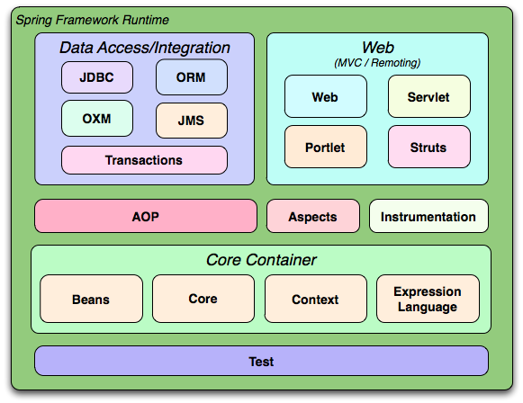

## 5.3 Spring 常用模块

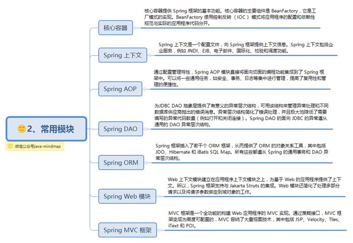

## 5.4 Spring 主要包


## 5.5 Spring 常用注解

> bean 注入与装配的的方式有很多种，可以通过xml，get set 方式，构造函数或者注解等。简单易用的方式就是使用 Spring 的注解了，Spring 提供了大量的注解方式。
>
> 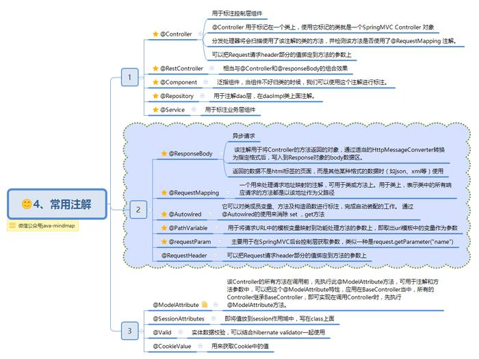

## 5.6 Spring 第三方结合

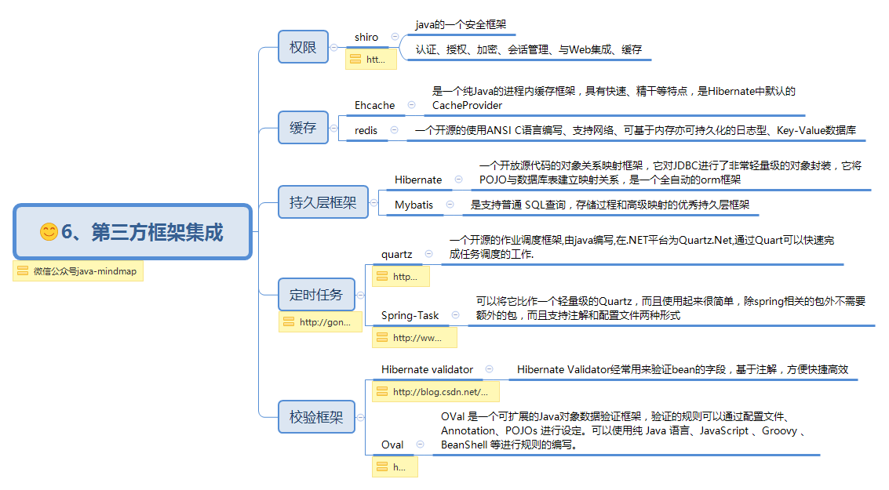

## 5.7 Spring IOC 原理

### 5.7.1 概念

> Spring 通过一个配置文件描述 Bean 及 Bean 之间的依赖关系，利用 Java 语言的反射功能实例化Bean 并建立 Bean 之间的依赖关系。 Spring 的 IoC 容器在完成这些底层工作的基础上，还提供了 Bean 实例缓存、生命周期管理、 Bean 实例代理、事件发布、资源装载等高级服务。
>

### 5.7.2 Spring 容器高层视图

> Spring 启动时读取应用程序提供的 Bean 配置信息，并在 Spring 容器中生成一份相应的 Bean 配置注册表，然后根据这张注册表实例化 Bean，装配好 Bean 之间的依赖关系，为上层应用提供准备就绪的运行环境。其中 Bean 缓存池为 HashMap 实现
>
> 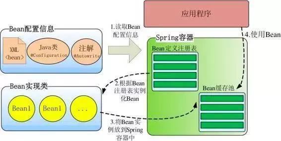

### 5.7.3 IOC 容器实现

>  ***BeanFactory-框架基础设施***
>
> BeanFactory 是 Spring 框架的基础设施，面向 Spring 本身；ApplicationContext 面向使用Spring 框架的开发者，几乎所有的应用场合我们都直接使用 ApplicationContext 而非底层的 BeanFactory。
>
> 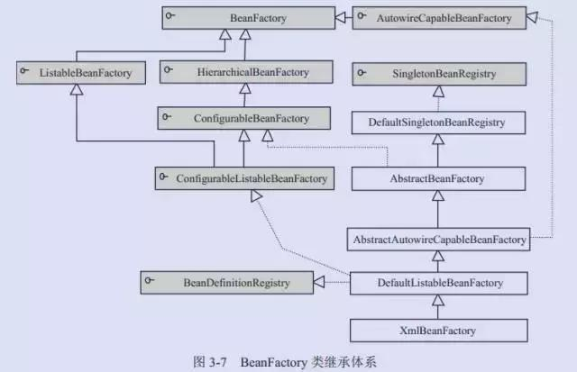
>
>  **BeanDefinitionRegistry 注册表**
>
> 1、Spring 配置文件中每一个节点元素在 Spring 容器里都通过一个 BeanDefinition 对象表示，它描述了 Bean 的配置信息。而 BeanDefinitionRegistry 接口提供了向容器手工注册BeanDefinition 对象的方法。
>
> **BeanFactory 顶层接口**
>
> 2、位于类结构树的顶端，它最主要的方法就是 getBean(String beanName)，该方法从容器中返回特定名称的 Bean，BeanFactory 的功能通过其他的接口得到不断扩展：
>
>  **ListableBeanFactory**
>
> 3、该接口定义了访问容器中 Bean 基本信息的若干方法，如查看 Bean 的个数、获取某一类型Bean 的配置名、查看容器中是否包括某一 Bean 等方法；
>
>  **HierarchicalBeanFactory 父子级联**
>
> 4、父子级联 IoC 容器的接口，子容器可以通过接口方法访问父容器；通过HierarchicalBeanFactory 接口， Spring 的 IoC 容器可以建立父子层级关联的容器体系，子容器可以访问父容器中的 Bean，但父容器不能访问子容器的 Bean。Spring 使用父子容器实现了很多功能，比如在 Spring MVC 中，展现层 Bean 位于一个子容器中，而业务层和持久层的 Bean 位于父容器中。这样，展现层 Bean 就可以引用业务层和持久层的 Bean，而业务层和持久层的 Bean 则看不到展现层的 Bean。
>
> **ConfigurableBeanFactory**
>
> 5、是一个重要的接口，增强了 IoC 容器的可定制性，它定义了设置类装载器、属性编辑器、容器初始化后置处理器等方法；
>
> **AutowireCapableBeanFactory 自动装配**
>
> 6、定义了将容器中的 Bean 按某种规则（如按名字匹配、按类型匹配等）进行自动装配的方法；
>
>  **SingletonBeanRegistry 运行期间注册单例 Bean**
>
> 7、定义了允许在运行期间向容器注册单实例 Bean 的方法；对于单实例（ singleton）的 Bean来说，BeanFactory 会缓存 Bean 实例，所以第二次使用 getBean()获取 Bean 时将直接从IoC 容器的缓存中获取 Bean 实例。Spring 在 DefaultSingletonBeanRegistry 类中提供了一个用于缓存单实例 Bean 的缓存器，它是一个用 HashMap 实现的缓存器，单实例的 Bean 以beanName 为键保存在这个 HashMap 中。
>
>  **依赖日志框框**
>
> 8、在初始化 BeanFactory 时，必须为其提供一种日志框架，比如使用 Log4J，即在类路径下提供 Log4J 配置文件，这样启动 Spring 容器才不会报错。

> ***ApplicationContext 面向开发应用***
>
> ApplicationContext 由 BeanFactory 派生而来，提供了更多面向实际应用的功能。
>
> ApplicationContext 继承了 HierarchicalBeanFactory 和 ListableBeanFactory 接口，在此基础上，还通过多个其他的接口扩展了 BeanFactory 的功能：
>
> 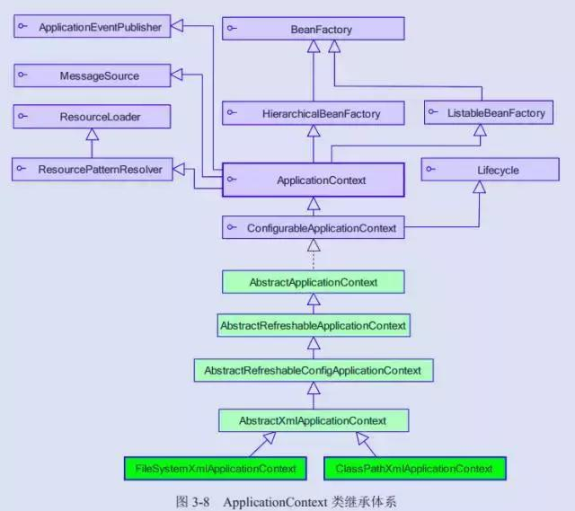
>
> 1.  ClassPathXmlApplicationContext：默认从类路径加载配置文件
>
> 2.  FileSystemXmlApplicationContext：默认从文件系统中装载配置文件
>
> 3.  ApplicationEventPublisher：让容器拥有发布应用上下文事件的功能，包括容器启动事件、关闭事件等。
>
> 4.  MessageSource：为应用提供 i18n 国际化消息访问的功能；
>
> 5.  ResourcePatternResolver ：所有 ApplicationContext 实现类都实现了类似于PathMatchingResourcePatternResolver 的功能，可以通过带前缀的Ant 风格的资源文件路径装载 Spring 的配置文件。
>
> 6.  LifeCycle：该接口是 Spring 2.0 加入的，该接口提供了 start()和 stop()两个方法，主要用于控制异步处理过程。在具体使用时，该接口同时被 ApplicationContext 实现及具体Bean 实现， ApplicationContext 会将 start/stop 的信息传递给容器中所有实现了该接口的 Bean，以达到管理和控制 JMX、任务调度等目的。
>
> 7.  ConfigurableApplicationContext 扩展于 ApplicationContext，它新增加了两个主要的方法： refresh()和 close()，让 ApplicationContext 具有启动、刷新和关闭应用上下文的能力。在应用上下文关闭的情况下调用 refresh()即可启动应用上下文，在已经启动的状态下，调用 refresh()则清除缓存并重新装载配置信息，而调用 close()则可关闭应用上下文。

>  ***WebApplication 体系架构***
>
> WebApplicationContext 是专门为 Web 应用准备的，它允许从相对于 Web 根目录的路径中装载配置文件完成初始化工作。从 WebApplicationContext 中可以获得ServletContext 的引用，整个 Web 应用上下文对象将作为属性放置到 ServletContext中，以便 Web 应用环境可以访问 Spring 应用上下文。
>
> 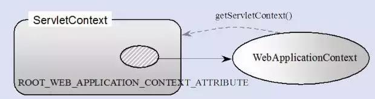

### 5.7.4 Spring Bean 作用域

> Spring 3 中为 Bean 定义了5 中作用域，分别为 singleton（单例）、prototype（原型）、request、session 和 global session，5 种作用域说明如下：
>
>  ***singleton：单例模式（多线程下不安全）***
>
> 1、singleton：单例模式，Spring IoC 容器中只会存在一个共享的 Bean 实例，无论有多少个Bean 引用它，始终指向同一对象。该模式在多线程下是不安全的。Singleton 作用域是Spring 中的缺省作用域，也可以显示的将 Bean 定义为singleton 模式，配置为：\<bean id=\"userDao\" class=\"com.ioc.UserDaoImpl\" scope=\"singleton\"/\>
>
>  ***prototype:原型模式每次使用时创建***
>
> 2、prototype:原型模式，每次通过 Spring 容器获取 prototype 定义的 bean 时，容器都将创建一个新的 Bean 实例，每个 Bean 实例都有自己的属性和状态，而 singleton 全局只有一个对象。根据经验，对有状态的bean 使用prototype 作用域，而对无状态的bean 使用singleton作用域。
>
>  ***Request：一次 request 一个实例***
>
> 3、request：在一次 Http 请求中，容器会返回该 Bean 的同一实例。而对不同的 Http 请求则会产生新的 Bean，而且该 bean 仅在当前 Http Request 内有效,当前 Http 请求结束，该 bean实例也将会被销毁。\<bean id=\"loginAction\" class=\"com.cnblogs.Login\" scope=\"request\"/\>
>
>  ***session***
>
> 4、session：在一次 Http Session 中，容器会返回该 Bean 的同一实例。而对不同的 Session 请求则会创建新的实例，该 bean 实例仅在当前 Session 内有效。同 Http 请求相同，每一次session 请求创建新的实例，而不同的实例之间不共享属性，且实例仅在自己的 session 请求内有效，请求结束，则实例将被销毁。\<bean id=\"userPreference\" class=\"com.ioc.UserPreference\" scope=\"session\"/\>
>
>  ***global Session***
>
> 5、global Session：在一个全局的 Http Session 中，容器会返回该 Bean 的同一个实例，仅在使用 portlet context 时有效。

### 5.7.5 Spring Bean 生命周期

> **实例化**
>
> 实例化一个 Bean，也就是我们常说的 new。
>
>  ***IOC 依赖注入***
>
> 按照 Spring 上下文对实例化的 Bean 进行配置，也就是 IOC 注入。
>
> ***setBeanName 实现***
>
> 如果这个 Bean 已经实现了 BeanNameAware 接口，会调用它实现的 setBeanName(String)方法，此处传递的就是 Spring 配置文件中 Bean 的 id 值
>
>  ***BeanFactoryAware 实现***
>
> 如果这个 Bean 已经实现了 BeanFactoryAware 接口，会调用它实现的 setBeanFactory，setBeanFactory(BeanFactory)传递的是 Spring 工厂自身（可以用这个方式来获取其它Bean，只需在 Spring 配置文件中配置一个普通的 Bean 就可以）。
>
>  ***ApplicationContextAware 实现***
>
> 如果这个 Bean 已经实现了 ApplicationContextAware 接口，会调用setApplicationContext(ApplicationContext)方法，传入 Spring 上下文（同样这个方式也可以实现步骤4 的内容，但比4 更好，因为 ApplicationContext 是 BeanFactory 的子接口，有更多的实现方法）
>
>  ***postProcessBeforeInitialization 接口实现-初始化预处理***
>
> 如果这个 Bean 关联了 BeanPostProcessor 接口，将会调用 postProcessBeforeInitialization(Object obj, String s)方法，BeanPostProcessor 经常被用作是 Bean 内容的更改，并且由于这个是在 Bean 初始化结束时调用那个的方法，也可以被应用于内存或缓存技术。
>
>  ***init-method***
>
> 如果 Bean 在 Spring 配置文件中配置了 init-method 属性会自动调用其配置的初始化方法。
>
> ***postProcessAfterInitialization***
>
> 如果这个 Bean 关联了 BeanPostProcessor 接口，将会调用 postProcessAfterInitialization(Object obj, String s)方法。
>
> 注：以上工作完成以后就可以应用这个 Bean 了，那这个 Bean 是一个 Singleton 的，所以一般情况下我们调用同一个 id 的 Bean 会是在内容地址相同的实例，当然在 Spring 配置文件中也可以配置非 Singleton。
>
>  ***Destroy 过期自动清理阶段***
>
> 当 Bean 不再需要时，会经过清理阶段，如果 Bean 实现了 DisposableBean 这个接口，会调用那个其实现的 destroy()方法；
>
>  ***destroy-method 自配置清理***
>
> 最后，如果这个 Bean 的 Spring 配置中配置了 destroy-method 属性，会自动调用其配置的销毁方法。
>
> 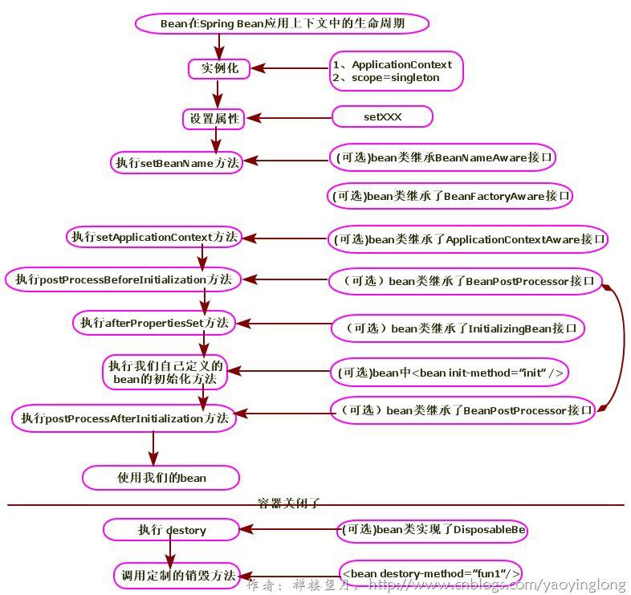
>
> bean 标签有两个重要的属性（init-method 和 destroy-method）。用它们你可以自己定制初始化和注销方法。它们也有相应的注解（@PostConstruct 和@PreDestroy)。\<bean id=\"\" class=\"\" init-method=\"初始化方法\" destroy-method=\"销毁方法\"\>

### 5.7.6 Spring 依赖注入四种方式

> **1、构造器注入**
>
> ```java
> /*带参数，方便利用构造器进行注入*/
> public CatDaoImpl(String message){
>     this. message = message;
> }
> <bean id="CatDaoImpl" class="com.CatDaoImpl">
>    <constructor-arg value=" message ">
>    </constructor-arg>
> </bean>
> ```
>
> ***2、setter 方法注入***
>
> ```java
> public class Id {
>     private int id;
>     public int getId(){
>     return id;
>    }
>     public void setId(int id){
>     this.id = id; }
> }
> <bean id="id" class="com.id "> <property name="id" value="123"></property> </bean>
> ```
>
> **3、静态工厂注入**
>
> 静态工厂顾名思义，就是通过调用静态工厂的方法来获取自己需要的对象，为了让 spring 管理所有对象，我们不能直接通过\"工程类.静态方法()\"来获取对象，而是依然通过 spring 注入的形式获取：
>
> ```java
> public class DaoFactory {
>    //静态工厂
>     public static final FactoryDao getStaticFactoryDaoImpl(){
>     return new StaticFacotryDaoImpl();
>    }
> }
> 
> public class SpringAction {
>     private FactoryDao staticFactoryDao; //注入对象
>    //注入对象的 set 方法
>     public void setStaticFactoryDao(FactoryDao staticFactoryDao){
>     this.staticFactoryDao = staticFactoryDao;
>    }
> }
> //factory-method="getStaticFactoryDaoImpl"指定调用哪个工厂方法
> <bean name="springAction" class=" SpringAction">
>    <!--使用静态工厂的方法注入对象,对应下面的配置文件-->
>    <property name="staticFactoryDao" ref="staticFactoryDao"></property>
> </bean>
>     
> <!--此处获取对象的方式是从工厂类中获取静态方法-->
> <bean name="staticFactoryDao" class="DaoFactory"
>     factory-method="getStaticFactoryDaoImpl">
> </bean>
> ```
>
> **4、实例工厂**
>
> 实例工厂的意思是获取对象实例的方法不是静态的，所以你需要首先 new 工厂类，再调用普通的实例方法：
>
> ```java
> public class DaoFactory {
>    //实例工厂
>     public FactoryDao getFactoryDaoImpl(){
>     return new FactoryDaoImpl();
>    }
> }
> 
> public class SpringAction {
>     private FactoryDao factoryDao;
>    //注入对象
>     public void setFactoryDao(FactoryDao factoryDao){
>     this.factoryDao = factoryDao;
>    }
> }
> 
> <bean name="springAction" class="SpringAction">
> <!--使用实例工厂的方法注入对象,对应下面的配置文件-->
> <property name="factoryDao" ref="factoryDao"></property>
> </bean>
> <!--此处获取对象的方式是从工厂类中获取实例方法-->
> <bean name="daoFactory" class="com.DaoFactory"></bean>
> <bean name="factoryDao" factory-bean="daoFactory"
> factory-method="getFactoryDaoImpl"></bean>
> ```
>
> 

### 5.7.7 五种不同方式的自动装配

> Spring 装配包括手动装配和自动装配，手动装配是有基于 xml 装配、构造方法、setter 方法等自动装配有五种自动装配的方式，可以用来指导 Spring 容器用自动装配方式来进行依赖注入。
>
> 1.  no：默认的方式是不进行自动装配，通过显式设置 ref 属性来进行装配。
>
> 2.  byName：通过参数名自动装配，Spring 容器在配置文件中发现bean 的autowire 属性被设置成 byname，之后容器试图匹配、装配和该 bean 的属性具有相同名字的bean。
>
> 3.  byType：通过参数类型自动装配，Spring 容器在配置文件中发现 bean 的 autowire 属性被设置成 byType，之后容器试图匹配、装配和该 bean 的属性具有相同类型的bean。如果有多个 bean 符合条件，则抛出错误。
>
> 4.  constructor：这个方式类似于 byType，但是要提供给构造器参数，如果没有确定的带参数的构造器参数类型，将会抛出异常。
>
> 5.  autodetect：首先尝试使用 constructor 来自动装配，如果无法工作，则使用byType 方式。

## 5.8 Spring AOP 原理

### 5.8.1 概念

> \"横切\"的技术，剖解开封装的对象内部，并将那些影响了多个类的公共行为封装到一个可重用模块，并将其命名为\"Aspect\"，即切面。所谓\"切面\"，简单说就是那些与业务无关，却为业务模块所共同调用的逻辑或责任封装起来，便于减少系统的重复代码，降低模块之间的耦合度，并有利于未来的可操作性和可维护性。
>
> 使用\"横切\"技术，AOP 把软件系统分为两个部分：核心关注点和横切关注点。业务处理的主要流程是核心关注点，与之关系不大的部分是横切关注点。横切关注点的一个特点是，他们经常发生在核心关注点的多处，而各处基本相似，比如权限认证、日志、事物。AOP 的作用在于分离系统中的各种关注点，将核心关注点和横切关注点分离开来。
>
> AOP 主要应用场景有：
>
> 1.  Authentication 权限
>
> 2.  Caching 缓存
>
> 3.  Context passing 内容传递
>
> 4.  Error handling 错误处理
>
> 5.  Lazy loading 懒加载
>
> 6.  Debugging 调试
>
> 7.  logging, tracing, profiling and monitoring 记录跟踪优化校准
>
> 8.  Performance optimization 性能优化
>
> 9.  Persistence 持久化
>
> 10.  Resource pooling 资源池
>
> 11.  Synchronization 同步
>
> 12.  Transactions 事务

### 5.8.2 AOP 核心概念

> 1、切面（aspect）：类是对物体特征的抽象，切面就是对横切关注点的抽象
>
> 2、横切关注点：对哪些方法进行拦截，拦截后怎么处理，这些关注点称之为横切关注点。
>
> 3、连接点（joinpoint）：被拦截到的点，因为 Spring 只支持方法类型的连接点，所以在 Spring
>
> 中连接点指的就是被拦截到的方法，实际上连接点还可以是字段或者构造器。
>
> 4、切入点（pointcut）：对连接点进行拦截的定义
>
> 5、通知（advice）：所谓通知指的就是指拦截到连接点之后要执行的代码，通知分为前置、后置、异常、最终、环绕通知五类。
>
> 6、目标对象：代理的目标对象
>
> 7、织入（weave）：将切面应用到目标对象并导致代理对象创建的过程
>
> 8、引入（introduction）：在不修改代码的前提下，引入可以在运行期为类动态地添加一些方法或字段。
>
> 参考：[<span class="underline">https://segmentfault.com/a/1190000007469968</span>](https://segmentfault.com/a/1190000007469968)
>
> 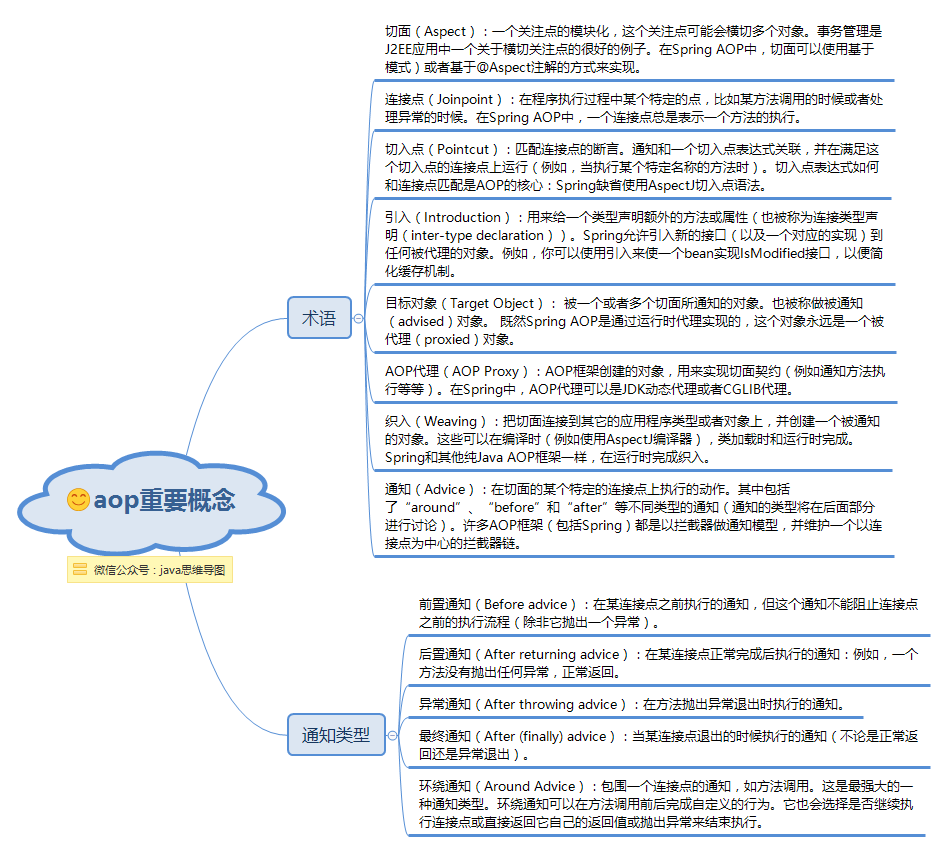

### 5.8.3 AOP 两种代理方式

> Spring 提供了两种方式来生成代理对象: JDKProxy 和 Cglib，具体使用哪种方式生成由AopProxyFactory 根据 AdvisedSupport 对象的配置来决定。默认的策略是如果目标类是接口，则使用 JDK 动态代理技术，否则使用 Cglib 来生成代理。
>
>  ***JDK 动态接口代理***
>
> 1、JDK 动态代理主要涉及到 java.lang.reflect 包中的两个类：Proxy 和 InvocationHandler。
>
> InvocationHandler 是一个接口，通过实现该接口定义横切逻辑，并通过反射机制调用目标类的代码，动态将横切逻辑和业务逻辑编制在一起。Proxy 利用 InvocationHandler 动态创建一个符合某一接口的实例，生成目标类的代理对象。
>
>  ***CGLib 动态代理***
>
> 2、CGLib 全称为 Code Generation Library，是一个强大的高性能，高质量的代码生成类库，可以在运行期扩展 Java 类与实现 Java 接口，CGLib 封装了 asm，可以再运行期动态生成新的 class。和 JDK 动态代理相比较：JDK 创建代理有一个限制，就是只能为接口创建代理实例，而对于没有通过接口定义业务方法的类，则可以通过 CGLib 创建动态代理。

### 5.8.4 实现原理

> ```JAVA
> @Aspect
> public class TransactionDemo {
>    @Pointcut(value="execution(* com.yangxin.core.service.*.*.*(..))")
>     public void point(){
>         
>    }
>    @Before(value="point()")
>     public void before(){
>     System.out.println("transaction begin");
>    }
>    @AfterReturning(value = "point()")
>     public void after(){
>     System.out.println("transaction commit");
>    }
>    @Around("point()")
>     public void around(ProceedingJoinPoint joinPoint) throws Throwable{
>     System.out.println("transaction begin");
>     joinPoint.proceed();
>     System.out.println("transaction commit");
>    }
> }
> ```
>
> 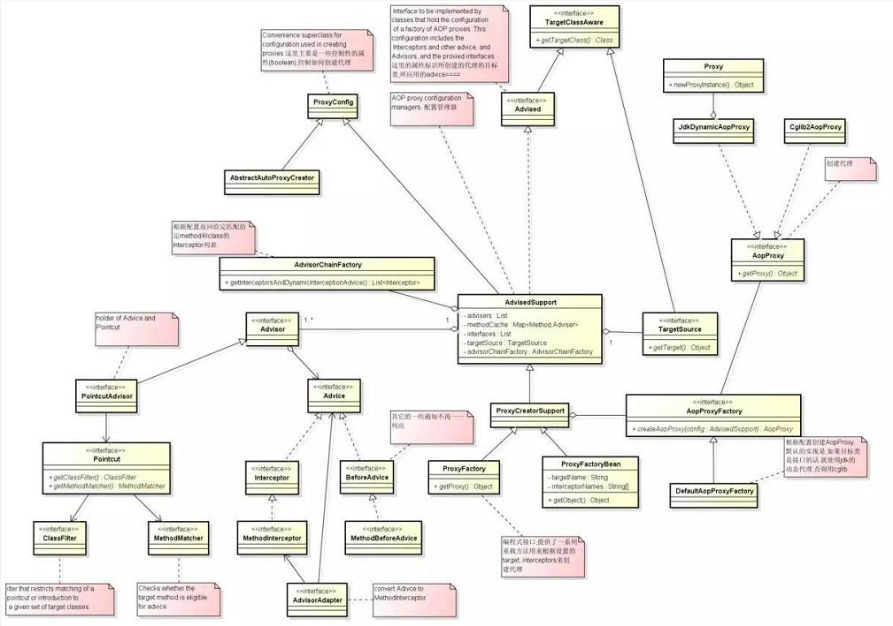

## 5.9 Spring MVC 原理

> Spring 的模型-视图-控制器（MVC）框架是围绕一个 DispatcherServlet 来设计的，这个 Servlet会把请求分发给各个处理器，并支持可配置的处理器映射、视图渲染、本地化、时区与主题渲染等，甚至还能支持文件上传。

### 5.9.1 MVC 流程

> 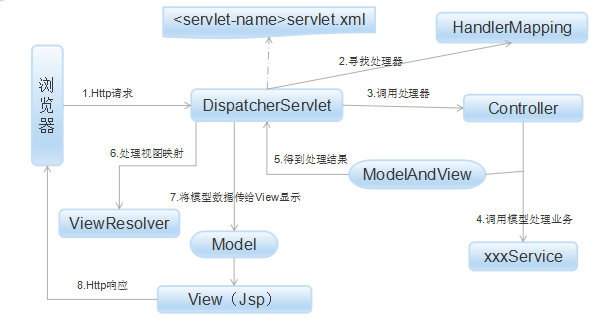
>
>  ***Http 请求到DispatcherServlet***
>
> 1、客户端请求提交到 DispatcherServlet。
>
> ***HandlerMapping 寻找处理器***
>
> 2、由 DispatcherServlet 控制器查询一个或多个 HandlerMapping，找到处理请求的Controller。
>
> ***调用处理器 Controller***
>
> 3、DispatcherServlet 将请求提交到 Controller。
>
>  ***Controller 调用业务逻辑处理后，返回 ModelAndView***
>
> 4、调用业务处理和返回结果：Controller 调用业务逻辑处理后，返回 ModelAndView。
>
> ***DispatcherServlet 查询 ModelAndView***
>
> 5、处理视图映射并返回模型： DispatcherServlet 查询一个或多个 ViewResoler 视图解析器，找到 ModelAndView 指定的视图。
>
>  ***ModelAndView 反馈浏览器 HTTP***
>
> 6、 Http 响应：视图负责将结果显示到客户端。

### 5.9.2. MVC 常用注解

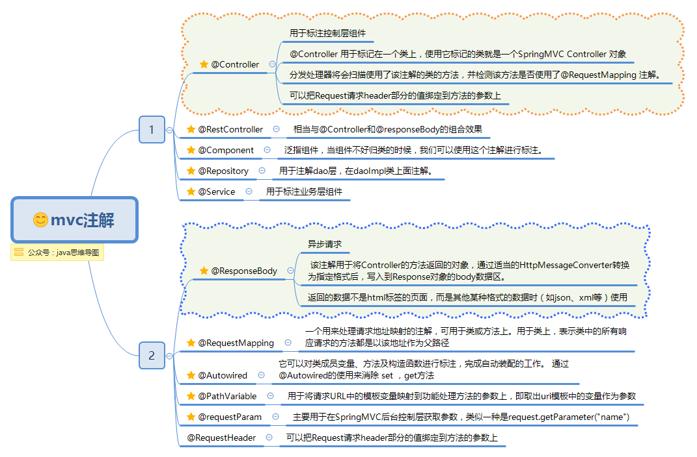

##  5.10 Spring Boot 原理

> Spring Boot 是由 Pivotal 团队提供的全新框架，其设计目的是用来简化新 Spring 应用的初始搭建以及开发过程。该框架使用了特定的方式来进行配置，从而使开发人员不再需要定义样板化的配置。通过这种方式，Spring Boot 致力于在蓬勃发展的快速应用开发领域(rapid application development)成为领导者。其特点如下：
>
> 1.   **创建独立的 Spring 应用程序**
>
> 2.  **嵌入的 Tomcat，无需部署 WAR 文件**
>
> 3.  **简化 Maven 配置**
>
> 4.  **自动配置 Spring**
>
> 5.   **提供生产就绪型功能，如指标，健康检查和外部配置**
>
> 6.  **绝对没有代码生成和对 XML 没有要求配置\[1\]**


## 5.11 JPA 原理

### 5.11.1 事务

> 事务是计算机应用中不可或缺的组件模型，它保证了用户操作的原子性( Atomicity )、一致性( Consistency )、隔离性( Isolation )和持久性( Durabilily )。

### 5.11.2 本地事务

> 紧密依赖于底层资源管理器（例如数据库连接)，事务处理局限在当前事务资源内。此种事务处理方式不存在对应用服务器的依赖，因而部署灵活却无法支持多数据源的分布式事务。在数据库连接中使用本地事务示例如下：
>
> ```JAVA
> public void transferAccount(){
>     Connection conn = null;
>     Statement stmt = null;
>     try{
>     conn = getDataSource().getConnection();
>    //将自动提交设置为 false，若设置为 true 则数据库将会把每一次数据更新认定为一个事务并自动提交
>     conn.setAutoCommit(false);
>     stmt = conn.createStatement();
>    //将 A 账户中的金额减少500
>     stmt.execute("update t_account set amount = amount -500 where account_id = 'A'");
>    //将 B 账户中的金额增加500
>     stmt.execute("update t_account set amount = amount +500 where account_id = 'B'");
>    //提交事务
>     conn.commit();
>    //事务提交：转账的两步操作同时成功
>    } catch(SQLException sqle){
>    //发生异常，回滚在本事务中的操做
>     conn.rollback();
>    //事务回滚：转账的两步操作完全撤销
>     stmt.close();
>     conn.close();
>    }
> }
> ```
>
> 

### 5.11.3.分布式事务

> Java 事务编程接口（JTA：Java Transaction API）和 Java 事务服务(JTS；Java Transaction
>
> Service)为 J2EE 平台提供了分布式事务服务。分布式事务（Distributed Transaction）包括事务管理器（ Transaction Manager ）和一个或多个支持 XA 协议的资源管理器( Resource Manager )。我们可以将资源管理器看做任意类型的持久化数据存储；事务管理器承担着所有事务参与单元的协调与控制。
>
> ```JAVA
> public void transferAccount(){
>     UserTransaction userTx = null;
>     Connection connA = null; Statement stmtA = null;
>     Connection connB = null; Statement stmtB = null;
>     try{
>    //获得 Transaction 管理对象
>     userTx = (UserTransaction)getContext().lookup("java:comp/UserTransaction");
>     connA = getDataSourceA().getConnection();//从数据库 A 中取得数据库连接
>     connB = getDataSourceB().getConnection();//从数据库 B 中取得数据库连接
>     userTx.begin(); //启动事务
>     stmtA = connA.createStatement();//将 A 账户中的金额减少500
>     stmtA.execute("update t_account set amount = amount -500 where account_id = 'A'");
>    //将 B 账户中的金额增加500
>     stmtB = connB.createStatement();
>     stmtB.execute("update t_account set amount = amount +500 where account_id = 'B'");
>     userTx.commit();//提交事务
>    //事务提交：转账的两步操作同时成功（数据库 A 和数据库 B 中的数据被同时更新）
>    } catch(SQLException sqle){
>    //发生异常，回滚在本事务中的操纵
>     userTx.rollback();//事务回滚：数据库 A 和数据库 B 中的数据更新被同时撤销
>    } catch(Exception ne){}
> }
> ```
>
> 

### 5.11.4.两阶段提交

> 两阶段提交主要保证了分布式事务的原子性：即所有结点要么全做要么全不做，所谓的两个阶段是指：第一阶段：准备阶段；第二阶段：提交阶段。
>
> 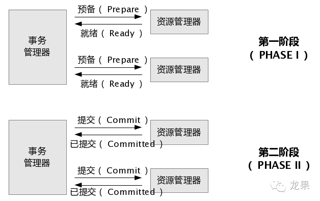
>
> 1、准备阶段
>
> 事务协调者(事务管理器)给每个参与者(资源管理器)发送 Prepare 消息，每个参与者要么直接返回失败(如权限验证失败)，要么在本地执行事务，写本地的 redo 和 undo 日志，但不提交，到达一种"万事俱备，只欠东风"的状态。
>
> 2、提交阶段：
>
> 如果协调者收到了参与者的失败消息或者超时，直接给每个参与者发送回滚(Rollback)消息；否则，发送提交(Commit)消息；参与者根据协调者的指令执行提交或者回滚操作，释放所有事务处理过程中使用的锁资源。(注意:必须在最后阶段释放锁资源)将提交分成两阶段进行的目的很明确，就是尽可能晚地提交事务，让事务在提交前尽可能地完成所有能完成的工作。

## 5.12 Mybatis 缓存

> Mybatis 中有一级缓存和二级缓存，默认情况下一级缓存是开启的，而且是不能关闭的。一级缓存是指 SqlSession 级别的缓存，当在同一个 SqlSession 中进行相同的 SQL 语句查询时，第二次以后的查询不会从数据库查询，而是直接从缓存中获取，一级缓存最多缓存1024 条 SQL。二级缓存是指可以跨 SqlSession 的缓存。是 mapper 级别的缓存，对于 mapper 级别的缓存不同的sqlsession 是可以共享的。
>
> 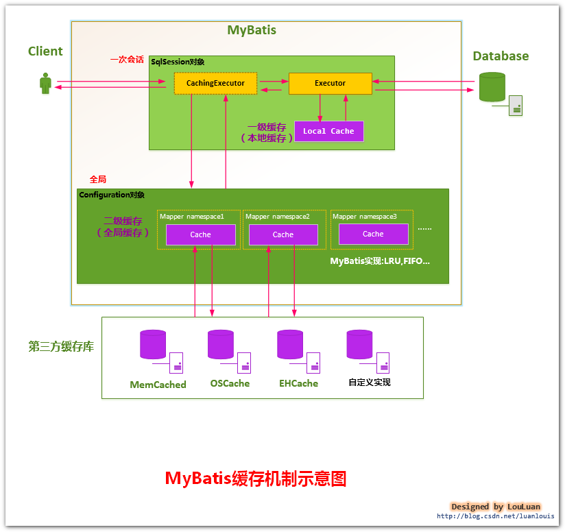

### 5.12.1 Mybatis 的一级缓存原理（sqlsession 级别）

> 第一次发出一个查询 sql，sql 查询结果写入 sqlsession 的一级缓存中，缓存使用的数据结构是一个 map。
>
> key：MapperID+offset+limit+Sql+所有的入参
>
> value：用户信息
>
> 同一个 sqlsession 再次发出相同的 sql，就从缓存中取出数据。如果两次中间出现 commit 操作（修改、添加、删除），本 sqlsession 中的一级缓存区域全部清空，下次再去缓存中查询不到所以要从数据库查询，从数据库查询到再写入缓存。
>

### 5.12.2 **二级缓存原理（mapper 基本）**

> 二级缓存的范围是mapper 级别（mapper 同一个命名空间），mapper 以命名空间为单位创建缓存数据结构，结构是 map。mybatis 的二级缓存是通过 CacheExecutor 实现的。CacheExecutor其实是 Executor 的代理对象。所有的查询操作，在 CacheExecutor 中都会先匹配缓存中是否存在，不存在则查询数据库。
>
> key：MapperID+offset+limit+Sql+所有的入参
>
> 具体使用需要配置：
>
> 1.  Mybatis 全局配置中启用二级缓存配置
>
> 2.  在对应的 Mapper.xml 中配置 cache 节点
>
> 3.  在对应的select 查询节点中添加 useCache=true


## 5.13 Tomcat 架构

> <http://www.importnew.com/21112.html>

# 6.微服务

## 6.1 服务注册发现

> 服务注册就是维护一个登记簿，它管理系统内所有的服务地址。当新的服务启动后，它会向登记簿交待自己的地址信息。服务的依赖方直接向登记簿要Service Provider 地址就行了。当下用于服务注册的工具非常多 ZooKeeper，Consul，Etcd,还有 Netflix 家的 eureka 等。服务注册有两种形式：客户端注册和第三方注册。

### 6.1.1 客户端注册（zookeeper）

> 客户端注册是服务自身要负责注册与注销的工作。当服务启动后向注册中心注册自身，当服务下线时注销自己。期间还需要和注册中心保持心跳。心跳不一定要客户端来做，也可以由注册中心负责（这个过程叫探活）。这种方式的缺点是注册工作与服务耦合在一起，不同语言都要实现一套注册逻辑。
>
> 

###  6.1.2 第三方注册（独立的服务Registrar）

> 第三方注册由一个独立的服务Registrar 负责注册与注销。当服务启动后以某种方式通知Registrar，然后 Registrar 负责向注册中心发起注册工作。同时注册中心要维护与服务之间的心跳，当服务不可用时，向注册中心注销服务。这种方式的缺点是 Registrar 必须是一个高可用的系统，否则注册工作没法进展。
>
> 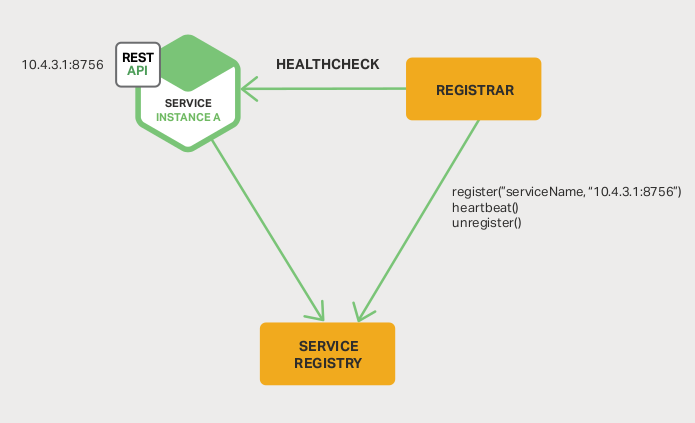

### 6.1.3 客户端发现

> 客户端发现是指客户端负责查询可用服务地址，以及负载均衡的工作。这种方式最方便直接，而且也方便做负载均衡。再者一旦发现某个服务不可用立即换另外一个，非常直接。缺点也在于多语言时的重复工作，每个语言实现相同的逻辑。
>
> 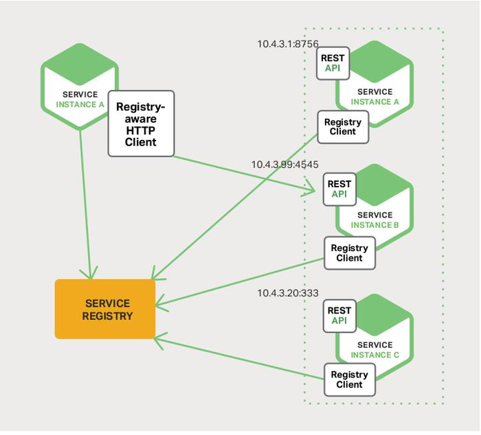

### 6.1.4 服务端发现

> 服务端发现需要额外的 Router 服务，请求先打到 Router，然后 Router 负责查询服务与负载均衡。这种方式虽然没有客户端发现的缺点，但是它的缺点是保证 Router 的高可用。
>
> 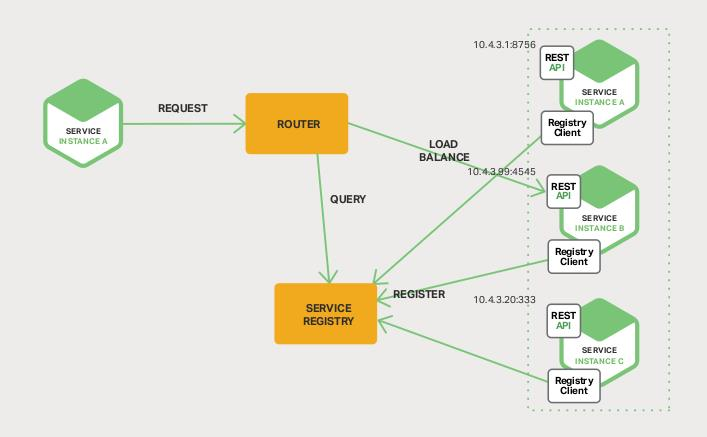

### 6.1.5 Consul

### 6.1.6 **Eureka**

###  6.1.7 SmartStack

### 6.1.8  Etcd

## 6.2 API 网关

> API Gateway 是一个服务器，也可以说是进入系统的唯一节点。这跟面向对象设计模式中的
>
> Facade 模式很像。API Gateway 封装内部系统的架构，并且提供API 给各个客户端。它还可能有其他功能，如授权、监控、负载均衡、缓存、请求分片和管理、静态响应处理等。下图展示了一个适应当前架构的 API Gateway。
>
> 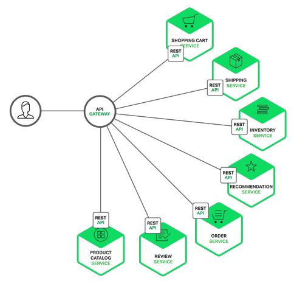
>
> API Gateway 负责请求转发、合成和协议转换。所有来自客户端的请求都要先经过 API Gateway，然后路由这些请求到对应的微服务。API Gateway 将经常通过调用多个微服务来处理一个请求以及聚合多个服务的结果。它可以在 web 协议与内部使用的非 Web 友好型协议间进行转换，如HTTP 协议、WebSocket 协议。
>

### 6.2.1 请求转发

> 服务转发主要是对客户端的请求安装微服务的负载转发到不同的服务上

### 6.2.2 响应合并

> 把业务上需要调用多个服务接口才能完成的工作合并成一次调用对外统一提供服务。

### 6.2.3 协议转换

> 重点是支持 SOAP，JMS，Rest 间的协议转换。

### 6.2.4 数据转换

> 重点是支持 XML 和Json 之间的报文格式转换能力（可选）

### 6.2.5 安全认证

> 1.  基于 Token 的客户端访问控制和安全策略
>
> 2.  传输数据和报文加密，到服务端解密，需要在客户端有独立的 SDK 代理包
>
> 3.  基于 Https 的传输加密，客户端和服务端数字证书支持
>
> 4.  基于OAuth2.0 的服务安全认证(授权码，客户端，密码模式等）

## 6.3 配置中心

> 配置中心一般用作系统的参数配置，它需要满足如下几个要求：高效获取、实时感知、分布式访问。

### 6.3.1 zookeeper 配置中心

> 实现的架构图如下所示，采取数据加载到内存方式解决高效获取的问题，借助 zookeeper 的节点监听机制来实现实时感知。
>
> 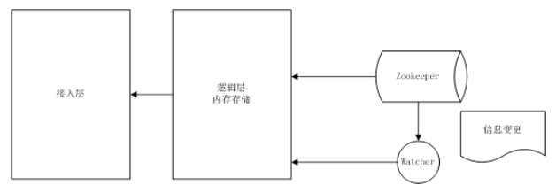


### 6.3.2 配置中心数据分类

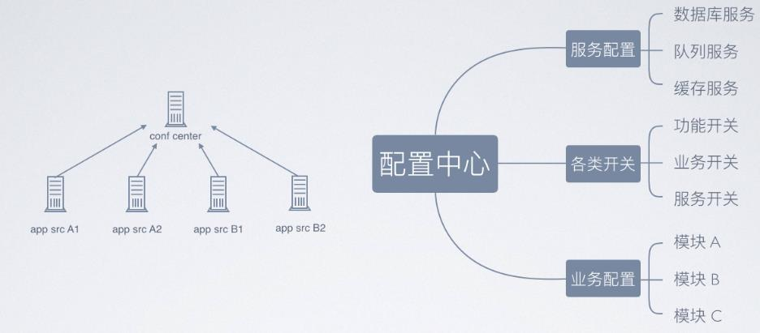

## 6.4 事件调度（kafka）

> 消息服务和事件的统一调度，常用用 kafka ，activemq 等。

##  6.5 服务跟踪（starter-sleuth）

> 随着微服务数量不断增长，需要跟踪一个请求从一个微服务到下一个微服务的传播过程， Spring Cloud Sleuth 正是解决这个问题，它在日志中引入唯一 ID，以保证微服务调用之间的一致性，这样你就能跟踪某个请求是如何从一个微服务传递到下一个。
>
> 1.  为了实现请求跟踪，当请求发送到分布式系统的入口端点时，只需要服务跟踪框架为该请求创建一个唯一的跟踪标识，同时在分布式系统内部流转的时候，框架始终保持传递该唯一标识，直到返回给请求方为止，这个唯一标识就是前文中提到的 Trace ID。通过 Trace ID 的记录，我们就能将所有请求过程日志关联起来。
>
> 2.  为了统计各处理单元的时间延迟，当请求达到各个服务组件时，或是处理逻辑到达某个状态时，也通过一个唯一标识来标记它的开始、具体过程以及结束，该标识就是我们前文中提到的 Span ID，对于每个 Span 来说，它必须有开始和结束两个节点，通过记录开始 Span 和结束 Span 的时间戳，就能统计出该 Span 的时间延迟，除了时间戳记录之外，它还可以包含一些其他元数据，比如：事件名称、请求信息等。
>
> 3.  在快速入门示例中，我们轻松实现了日志级别的跟踪信息接入，这完全归功于spring-cloud- starter-sleuth 组件的实现。在 Spring Boot 应用中，通过在工程中引入 spring-cloud-starter-sleuth 依赖之后，它会自动的为当前应用构建起各通信通道的跟踪机制，比如：
>
> -   通过诸如 RabbitMQ、Kafka（或者其他任何 Spring Cloud Stream 绑定器实现的消息中间件）传递的请求。
>
> -   通过Zuul 代理传递的请求。
>
> -   通过 RestTemplate 发起的请求。

## 6.6 服务熔断（Hystrix）

> 在微服务架构中通常会有多个服务层调用，基础服务的故障可能会导致级联故障，进而造成整个系统不可用的情况，这种现象被称为服务雪崩效应。服务雪崩效应是一种因"服务提供者"的不可用导致"服务消费者"的不可用,并将不可用逐渐放大的过程。
>
> 熔断器的原理很简单，如同电力过载保护器。它可以实现快速失败，如果它在一段时间内侦测到许多类似的错误，会强迫其以后的多个调用快速失败，不再访问远程服务器，从而防止应用程序不断地尝试执行可能会失败的操作，使得应用程序继续执行而不用等待修正错误，或者浪费 CPU时间去等到长时间的超时产生。熔断器也可以使应用程序能够诊断错误是否已经修正，如果已经修正，应用程序会再次尝试调用操作。
>
> 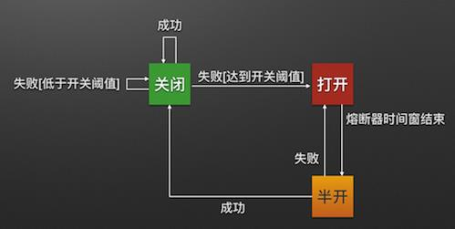

### 6.6.1 Hystrix 断路器机制

> 断路器很好理解,当 Hystrix Command 请求后端服务失败数量超过一定比例(默认50%),断路器会切换到开路状态(Open).这时所有请求会直接失败而不会发送到后端服务.断路器保持在开路状态一段时间后(默认5 秒),自动切换到半开路状态(HALF-OPEN).这时会判断下一次请求的返回情况,如果请求成功,断路器切回闭路状态(CLOSED),否则重新切换到开路状态(OPEN). Hystrix 的断路器就像我们家庭电路中的保险丝,一旦后端服务不可用,断路器会直接切断请求链,避免发送大量无效请求影响系统吞吐量,并且断路器有自我检测并恢复的能力。

## 6.7 API 管理

> SwaggerAPI 管理工具。

# 7. Netty 与 RPC

## 7.1 Netty 原理

> Netty 是一个高性能、异步事件驱动的NIO 框架，基于 JAVA NIO 提供的 API 实现。它提供了对TCP、UDP 和文件传输的支持，作为一个异步 NIO 框架，Netty 的所有 IO 操作都是异步非阻塞的，通过 Future-Listener 机制，用户可以方便的主动获取或者通过通知机制获得 IO 操作结果。
>

## 7.2 Netty 高性能

> 在 IO 编程过程中，当需要同时处理多个客户端接入请求时，可以利用多线程或者 IO 多路复用技术进行处理。IO 多路复用技术通过把多个 IO 的阻塞复用到同一个select 的阻塞上，从而使得系统在单线程的情况下可以同时处理多个客户端请求。与传统的多线程/多进程模型比，I/O 多路复用的最大优势是系统开销小，系统不需要创建新的额外进程或者线程，也不需要维护这些进程和线程的运行，降低了系统的维护工作量，节省了系统资源。
>
> 与 Socket 类和 ServerSocket 类相对应，NIO 也提供了SocketChannel 和ServerSocketChannel两种不同的套接字通道实现。
>

### 7.2.1 多路复用通讯方式

> Netty 架构按照 Reactor 模式设计和实现，它的服务端通信序列图如下：
>
> 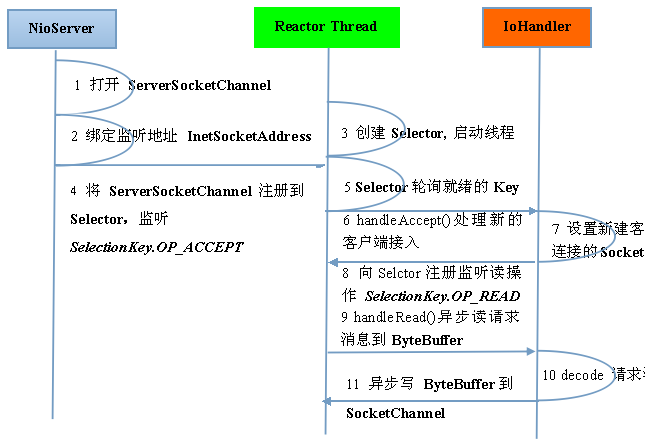
>
> 客户端通信序列图如下：
>
> 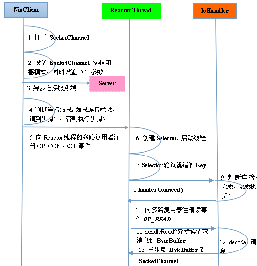
>
> Netty 的 IO 线程 NioEventLoop 由于聚合了多路复用器 Selector，可以同时并发处理成百上千个客户端 Channel，由于读写操作都是非阻塞的，这就可以充分提升 IO 线程的运行效率，避免由于频繁 IO 阻塞导致的线程挂起。

### 7.2.2 异步通讯 NIO

> 由于Netty 采用了异步通信模式，一个IO 线程可以并发处理N 个客户端连接和读写操作，这从根本上解决了传统同步阻塞 IO 一连接一线程模型，架构的性能、弹性伸缩能力和可靠性都得到了极大的提升。

### 7.2.3 零拷贝（DIRECT BUFFERS 使用堆外直接内存）

> 1、Netty 的接收和发送 ByteBuffer 采用 DIRECT BUFFERS，使用堆外直接内存进行 Socket 读写，不需要进行字节缓冲区的二次拷贝。如果使用传统的堆内存（HEAP BUFFERS）进行 Socket 读写，JVM 会将堆内存 Buffer 拷贝一份到直接内存中，然后才写入 Socket 中。相比于堆外直接内存，消息在发送过程中多了一次缓冲区的内存拷贝。
>
> 2、Netty 提供了组合 Buffer 对象，可以聚合多个 ByteBuffer 对象，用户可以像操作一个 Buffer 那样方便的对组合 Buffer 进行操作，避免了传统通过内存拷贝的方式将几个小 Buffer 合并成一个大的Buffer。
>
> 3、Netty 的文件传输采用了transferTo 方法，它可以直接将文件缓冲区的数据发送到目标Channel，避免了传统通过循环 write 方式导致的内存拷贝问题

### 7.2.4 内存池（基于内存池的缓冲区重用机制）

> 随着 JVM 虚拟机和 JIT 即时编译技术的发展，对象的分配和回收是个非常轻量级的工作。但是对于缓冲区 Buffer，情况却稍有不同，特别是对于堆外直接内存的分配和回收，是一件耗时的操作。为了尽量重用缓冲区，Netty 提供了基于内存池的缓冲区重用机制。

### 7.2.5 高效的 Reactor 线程模型

> 常用的 Reactor 线程模型有三种，Reactor 单线程模型, Reactor 多线程模型,主从 Reactor 多线程模型。
>
> ***Reactor 单线程模型***
>
> Reactor 单线程模型，指的是所有的 IO 操作都在同一个 NIO 线程上面完成，NIO 线程的职责如下：
>
> 1)  作为 NIO 服务端，接收客户端的 TCP 连接；
> 2)  作为 NIO 客户端，向服务端发起 TCP 连接；
> 3)  读取通信对端的请求或者应答消息；
> 4)  向通信对端发送消息请求或者应答消息。
>
> 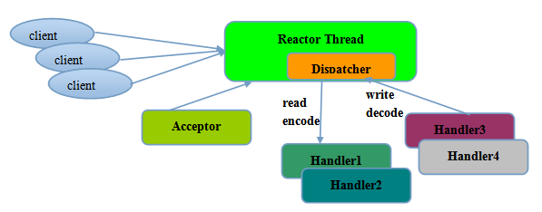
>
> 由于 Reactor 模式使用的是异步非阻塞 IO，所有的 IO 操作都不会导致阻塞，理论上一个线程可以独立处理所有 IO 相关的操作。从架构层面看，一个 NIO 线程确实可以完成其承担的职责。例如，通过Acceptor 接收客户端的 TCP 连接请求消息，链路建立成功之后，通过 Dispatch 将对应的 ByteBuffer派发到指定的 Handler 上进行消息解码。用户 Handler 可以通过 NIO 线程将消息发送给客户端。
>
> ***Reactor 多线程模型***
>
> Rector 多线程模型与单线程模型最大的区别就是有一组 NIO 线程处理 IO 操作。有专门一个NIO 线程-Acceptor 线程用于监听服务端，接收客户端的 TCP 连接请求；网络 IO 操作-读、写等由一个 NIO 线程池负责，线程池可以采用标准的 JDK 线程池实现，它包含一个任务队列和 N个可用的线程，由这些 NIO 线程负责消息的读取、解码、编码和发送；
>
> 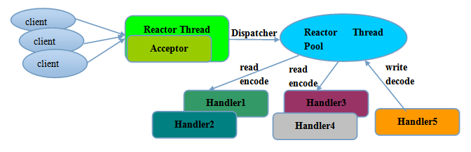
>
> ***主从 Reactor 多线程模型***
>
> 服务端用于接收客户端连接的不再是个1 个单独的 NIO 线程，而是一个独立的 NIO 线程池。
>
> Acceptor 接收到客户端 TCP 连接请求处理完成后（可能包含接入认证等），将新创建的SocketChannel 注册到 IO 线程池（sub reactor 线程池）的某个 IO 线程上，由它负责SocketChannel 的读写和编解码工作。Acceptor 线程池仅仅只用于客户端的登陆、握手和安全认证，一旦链路建立成功，就将链路注册到后端 subReactor 线程池的 IO 线程上，由 IO 线程负责后续的 IO 操作。
>
> 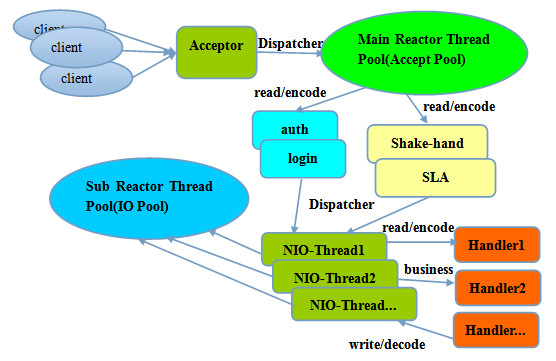

### 7.2.6 无锁设计、线程绑定

> Netty 采用了串行无锁化设计，在 IO 线程内部进行串行操作，避免多线程竞争导致的性能下降。表面上看，串行化设计似乎 CPU 利用率不高，并发程度不够。但是，通过调整 NIO 线程池的线程参数，可以同时启动多个串行化的线程并行运行，这种局部无锁化的串行线程设计相比一个队列-多个工作线程模型性能更优。
>
> 
>
> Netty 的NioEventLoop 读取到消息之后，直接调用 ChannelPipeline 的 fireChannelRead(Object msg)，只要用户不主动切换线程，一直会由NioEventLoop 调用到用户的 Handler，期间不进行线程切换，这种串行化处理方式避免了多线程操作导致的锁的竞争，从性能角度看是最优的。

### 7.2.7 高性能的序列化框架

> Netty 默认提供了对 Google Protobuf 的支持，通过扩展 Netty 的编解码接口，用户可以实现其它的高性能序列化框架，例如 Thrift 的压缩二进制编解码框架。
>
> 1、SO_RCVBUF 和 SO_SNDBUF：通常建议值为128K 或者256K。
>
> **小包封大包，防止网络阻塞**
>
> 2、SO_TCPNODELAY：NAGLE 算法通过将缓冲区内的小封包自动相连，组成较大的封包，阻止大量小封包的发送阻塞网络，从而提高网络应用效率。但是对于时延敏感的应用场景需要关闭该优化算法。
>
> ***软中断 Hash 值和 CPU 绑定***
>
> 3、软中断：开启 RPS 后可以实现软中断，提升网络吞吐量。RPS 根据数据包的源地址，目的地址以及目的和源端口，计算出一个 hash 值，然后根据这个 hash 值来选择软中断运行的 cpu，从上层来看，也就是说将每个连接和cpu 绑定，并通过这个hash 值，来均衡软中断在多个cpu 上，提升网络并行处理性能。

## 7.3 Netty RPC 实现

### 7.3.1 概念

> RPC，即 Remote Procedure Call（远程过程调用），调用远程计算机上的服务，就像调用本地服务一样。RPC 可以很好的解耦系统，如 WebService 就是一种基于 Http 协议的 RPC。这个 RPC 整体框架如下：
>
> 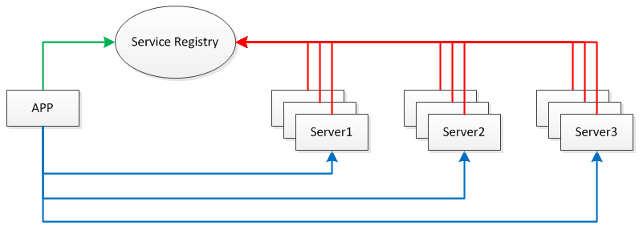

### 7.3.2 关键技术

> 1.  服务发布与订阅：服务端使用 Zookeeper 注册服务地址，客户端从 Zookeeper 获取可用的服务地址。
>
> 2.  通信：使用 Netty 作为通信框架。
>
> 3.  Spring：使用 Spring 配置服务，加载 Bean，扫描注解。
>
> 4.  动态代理：客户端使用代理模式透明化服务调用。
>
> 5.  消息编解码：使用 Protostuff 序列化和反序列化消息。

### 7.3.3 核心流程

> 1.  服务消费方（client）调用以本地调用方式调用服务；
> 2.  client stub 接收到调用后负责将方法、参数等组装成能够进行网络传输的消息体；
> 3.  client stub 找到服务地址，并将消息发送到服务端；
> 4.  server stub 收到消息后进行解码；
> 5.  server stub 根据解码结果调用本地的服务；
> 6.  本地服务执行并将结果返回给 server stub；
> 7.  server stub 将返回结果打包成消息并发送至消费方；
> 8.  client stub 接收到消息，并进行解码；
> 9.  服务消费方得到最终结果。
>
> RPC 的目标就是要2\~8 这些步骤都封装起来，让用户对这些细节透明。JAVA 一般使用动态代理方式实现远程调用。
>
> 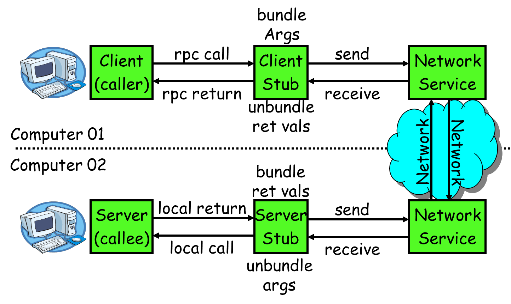

### 7.3.4.消息编解码

> ***息数据结构（接口名称+方法名+参数类型和参数值+超时时间+ requestID）***
>
> 客户端的请求消息结构一般需要包括以下内容：
>
> 1.  接口名称：在我们的例子里接口名是"HelloWorldService"，如果不传，服务端就不知道调用哪个接口了；
> 2.  方法名：一个接口内可能有很多方法，如果不传方法名服务端也就不知道调用哪个方法；
> 3.  参数类型和参数值：参数类型有很多，比如有 bool、int、long、double、string、map、list，甚至如 struct（class）；以及相应的参数值；
> 4.  超时时间：
> 5.  requestID，标识唯一请求 id，在下面一节会详细描述 requestID 的用处。
> 6.  服务端返回的消息：一般包括以下内容。返回值+状态 code+requestID
>
> **序列化**
>
> 目前互联网公司广泛使用 Protobuf、Thrift、Avro 等成熟的序列化解决方案来搭建 RPC 框架，这些都是久经考验的解决方案。

### 7.3.5 通讯过程

> **核心问题(线程暂停、消息乱序)**
>
> 如果使用 netty 的话，一般会用 channel.writeAndFlush()方法来发送消息二进制串，这个方法调用后对于整个远程调用(从发出请求到接收到结果)来说是一个异步的，即对于当前线程来说，将请求发送出来后，线程就可以往后执行了，至于服务端的结果，是服务端处理完成后，再以消息的形式发送给客户端的。于是这里出现以下两个问题：
>
> 1.  怎么让当前线程"暂停"，等结果回来后，再向后执行？
> 2.  如果有多个线程同时进行远程方法调用，这时建立在 client server 之间的 socket 连接上会有很多双方发送的消息传递，前后顺序也可能是随机的，server 处理完结果后，将结果消息发送给 client，client 收到很多消息，怎么知道哪个消息结果是原先哪个线程调用的？如下图所示，线程A 和线程B 同时向client socket 发送请求requestA 和requestB，socket 先后将 requestB 和 requestA 发送至 server，而 server 可能将 responseB 先返回，尽管 requestB 请求到达时间更晚。我们需要一种机制保证 responseA 丢给ThreadA，responseB 丢给 ThreadB。
>
> 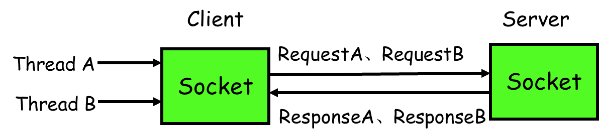
>
> **通讯流程**
>
> ***requestID 生成-AtomicLong***
>
> 1、client 线程每次通过 socket 调用一次远程接口前，生成一个唯一的 ID，即 requestID（requestID 必需保证在一个 Socket 连接里面是唯一的），一般常常使用AtomicLong从0 开始累计数字生成唯一 ID；
>
> ***存放回调对象 callback 到全局 ConcurrentHashMap***
>
> 2、将处理结果的回调对象 callback ，存放到全局 ConcurrentHashMap 里面put(requestID, callback)；
>
> ***synchronized 获取回调对象 callback 的锁并自旋 wait***
>
> 3、当线程调用 channel.writeAndFlush()发送消息后，紧接着执行 callback 的 get()方法试图获取远程返回的结果。在get()内部，则使用synchronized 获取回调对象callback 的锁，再先检测是否已经获取到结果，如果没有，然后调用 callback 的 wait()方法，释放callback 上的锁，让当前线程处于等待状态。
>
> ***监听消息的线程收到消息，找到 callback 上的锁并唤醒***
>
> 4、服务端接收到请求并处理后，将response 结果（此结果中包含了前面的requestID）发送给客户端，客户端 socket 连接上专门监听消息的线程收到消息，分析结果，取到 requestID ，再从前面的 ConcurrentHashMap 里面 get(requestID)，从而找到callback 对象，再用 synchronized 获取 callback 上的锁，将方法调用结果设置到callback 对象里，再调用 callback.notifyAll()唤醒前面处于等待状态的线程。
>
> ```java
> public Object get(){
>  synchronized (this){//旋锁
>  while (true){//是否有结果了
>  If （!isDone）{
>  wait(); //没结果释放锁，让当前线程处于等待状态
> }else{//获取数据并处理
> }
> }
> }
> }
> 
> private void setDone(Response res){
>  this.res = res;
>  isDone = true;
>  synchronized (this){//获取锁，因为前面 wait()已经释放了 callback 的锁了
>  notifyAll(); //唤醒处于等待的线程
> }
> }
> ```
>
> 

## 7.4 RMI 实现方式

> Java 远程方法调用，即 Java RMI（Java Remote Method Invocation）是 Java 编程语言里，一种用于实现远程过程调用的应用程序编程接口。它使客户机上运行的程序可以调用远程服务器上的对象。远程方法调用特性使 Java 编程人员能够在网络环境中分布操作。RMI 全部的宗旨就是尽可能简化远程接口对象的使用。

### 7.4.1 实现步骤

> 1.  编写远程服务接口，该接口必须继承 java.rmi.Remote 接口，方法必须抛出java.rmi.RemoteException 异常；
>
> 2.  编写远程接口实现类，该实现类必须继承 java.rmi.server.UnicastRemoteObject 类；
> 3.  运行 RMI 编译器（rmic），创建客户端 stub 类和服务端 skeleton 类;
> 4.  启动一个 RMI 注册表，以便驻留这些服务;
> 5.  在 RMI 注册表中注册服务；
> 6.  客户端查找远程对象，并调用远程方法；
>
> > 1：创建远程接口，继承 java.rmi.Remote 接口
> >
> > ```java
> > public interface GreetService extends java.rmi.Remote {
> >  String sayHello(String name) throws RemoteException;
> > }
> > ```
> >
> > 2：实现远程接口，继承 java.rmi.server.UnicastRemoteObject 类
> >
> > ```java
> > public class GreetServiceImpl extends java.rmi.server.UnicastRemoteObject implements GreetService {
> >  private static final long serialVersionUID = 3434060152387200042L;
> >  public GreetServiceImpl() throws RemoteException {
> >  super();
> > }
> > @Override
> >  public String sayHello(String name) throws RemoteException {
> >  return "Hello "+ name;
> > }
> > }
> > ```
> >
> > 3：生成 Stub 和 Skeleton;
> >
> > 4：执行 rmiregistry 命令注册服务
> >
> > 5：启动服务
> >
> > ```java
> > LocateRegistry.createRegistry(1098);
> > Naming.bind("rmi://10.108.1.138:1098/GreetService", new GreetServiceImpl());
> > ```
> >
> > 6.客户端调用
> >
> > ```java
> > GreetService greetService = (GreetService)
> > Naming.lookup("rmi://10.108.1.138:1098/GreetService");
> > System.out.println(greetService.sayHello("Jobs"));
> > ```
> >
> > 
>
> 

## 7.5 Protoclol Buffer

> protocol buffer 是 google 的一个开源项目,它是用于结构化数据串行化的灵活、高效、自动的方法，例如 XML，不过它比 xml 更小、更快、也更简单。你可以定义自己的数据结构，然后使用代码生成器生成的代码来读写这个数据结构。你甚至可以在无需重新部署程序的情况下更新数据结构。

### 7.5.1 特点

> 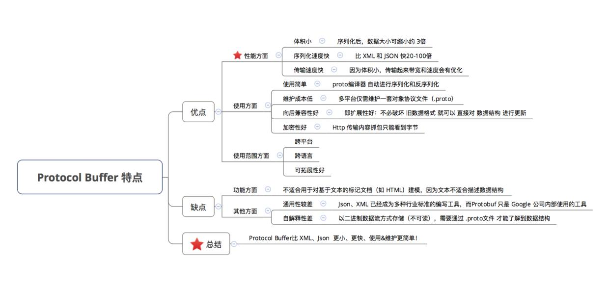
>
> Protocol Buffer 的序列化&反序列化简单&速度快的原因是：
>
> 1.  编码/解码方式简单（只需要简单的数学运算= 位移等等）
> 2.  采用 Protocol Buffer 自身的框架代码和编译器共同完成
>
> Protocol Buffer 的数据压缩效果好（即序列化后的数据量体积小）的原因是：
>
> 1.  a\.采用了独特的编码方式，如 Varint、Zigzag 编码方式等等
>
> 2.  b\.采用 T - L - V 的数据存储方式：减少了分隔符的使用&数据存储得紧凑

## 7.6 Thrift

> Apache Thrift 是 Facebook 实现的一种高效的、支持多种编程语言的远程服务调用的框架。本文将从
>
> Java 开发人员角度详细介绍 Apache Thrift 的架构、开发和部署，并且针对不同的传输协议和服务类型给出相应的 Java 实例，同时详细介绍 Thrift 异步客户端的实现，最后提出使用 Thrift 需要注意的事项。
>
> 目前流行的服务调用方式有很多种，例如基于 SOAP 消息格式的 Web Service，基于 JSON 消息格式的 RESTful 服务等。其中所用到的数据传输方式包括 XML，JSON 等，然而 XML 相对体积太大，传输效率低，JSON 体积较小，新颖，但还不够完善。本文将介绍由 Facebook 开发的远程服务调用框架 Apache Thrift，它采用接口描述语言定义并创建服务，支持可扩展的跨语言服务开发，所包含的代码生成引擎可以在多种语言中，如 C++, Java, Python, PHP, Ruby, Erlang, Perl, Haskell, C\#, Cocoa,Smalltalk 等创建高效的、无缝的服务，其传输数据采用二进制格式，相对 XML 和 JSON 体积更小，
>
> 对于高并发、大数据量和多语言的环境更有优势。本文将详细介绍 Thrift 的使用，并且提供丰富的实例代码加以解释说明，帮助使用者快速构建服务。
>
> 为什么要 Thrift：
>
> 1、多语言开发的需要
>
> 2、性能问题
>
> 

# 8.网络

## 8.1 网络7 层架构

> 7 层模型主要包括：
>
> 1.  物理层：主要定义物理设备标准，如网线的接口类型、光纤的接口类型、各种传输介质的传输速率等。它的主要作用是传输比特流（就是由1、0 转化为电流强弱来进行传输,到达目的地后在转化为1、0，也就是我们常说的模数转换与数模转换）。这一层的数据叫做比特。
>
> 2.  数据链路层：主要将从物理层接收的数据进行 MAC 地址（网卡的地址）的封装与解封装。常把这一层的数据叫做帧。在这一层工作的设备是交换机，数据通过交换机来传输。
>
> 3.  网络层：主要将从下层接收到的数据进行 IP 地址（例192.168.0.1)的封装与解封装。在这一层工作的设备是路由器，常把这一层的数据叫做数据包。
>
> 4.  传输层：定义了一些传输数据的协议和端口号（WWW 端口80 等），如：TCP（传输控制协议，传输效率低，可靠性强，用于传输可靠性要求高，数据量大的数据），UDP（用户数据报协议，与 TCP 特性恰恰相反，用于传输可靠性要求不高，数据量小的数据，如 QQ 聊天数据就是通过这种方式传输的）。主要是将从下层接收的数据进行分段进行传输，到达目的地址后在进行重组。常常把这一层数据叫做段。
>
> 5.  会话层：通过传输层（端口号：传输端口与接收端口）建立数据传输的通路。主要在你的系统之间发起会话或或者接受会话请求（设备之间需要互相认识可以是 IP 也可以是 MAC 或者是主机名）
> 6.  表示层：主要是进行对接收的数据进行解释、加密与解密、压缩与解压缩等（也就是把计算机能够识别的东西转换成人能够能识别的东西（如图片、声音等））
> 7.  应用层主要是一些终端的应用，比如说FTP（各种文件下载），WEB（IE 浏览），QQ 之类的（你就把它理解成我们在电脑屏幕上可以看到的东西．就是终端应用）。
>
> 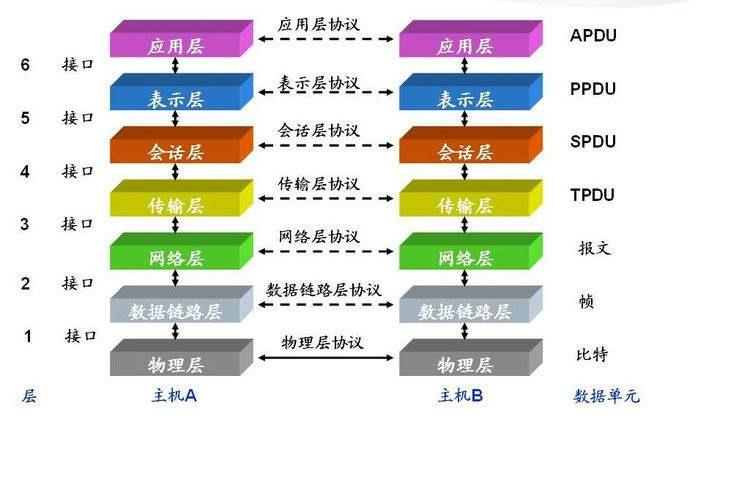

## 8.2 TCP/IP 原理

> TCP/IP 协议不是 TCP 和 IP 这两个协议的合称，而是指因特网整个 TCP/IP 协议族。从协议分层模型方面来讲，TCP/IP 由四个层次组成：网络接口层、网络层、传输层、应用层。
>
> 

### 8.2.1 网络访问层(Network Access Layer)

> 网络访问层(Network Access Layer)在 TCP/IP 参考模型中并没有详细描述，只是指出主机必须使用某种协议与网络相连。

### 8.2.2 网络层(Internet Layer)

> 网络层(Internet Layer)是整个体系结构的关键部分，其功能是使主机可以把分组发往任何网络，并使分组独立地传向目标。这些分组可能经由不同的网络，到达的顺序和发送的顺序也可能不同。高层如果需要顺序收发，那么就必须自行处理对分组的排序。互联网层使用因特网协议(IP，Internet Protocol)。

### 8.2.3 传输层(Tramsport Layer-TCP/UDP)

> 传输层(Tramsport Layer)使源端和目的端机器上的对等实体可以进行会话。在这一层定义了两个端到端的协议：传输控制协议(TCP，Transmission Control Protocol)和用户数据报协议(UDP，User Datagram Protocol)。TCP 是面向连接的协议，它提供可靠的报文传输和对上层应用的连接服务。为此，除了基本的数据传输外，它还有可靠性保证、流量控制、多路复用、优先权和安全性控制等功能。UDP 是面向无连接的不可靠传输的协议，主要用于不需要 TCP 的排序和流量控制等功能的应用程序。

### 8.2.4 应用层(Application Layer)

> 应用层(Application Layer)包含所有的高层协议，包括：虚拟终端协议(TELNET， TELecommunications NETwork)、文件传输协议(FTP，File Transfer Protocol)、电子邮件传输协议(SMTP，Simple Mail Transfer Protocol)、域名服务(DNS，Domain Name Service)、网上新闻传输协议(NNTP，Net News Transfer Protocol)和超文本传送协议(HTTP，HyperText Transfer Protocol)等。

## 8.3 TCP 三次握手/四次挥手

> TCP 在传输之前会进行三次沟通，一般称为"三次握手"，传完数据断开的时候要进行四次沟通，一般称为"四次挥手"。

### 8.3.1 数据包说明

> 1.  源端口号（16 位）：它（连同源主机 IP 地址）标识源主机的一个应用进程。
>
> 2.  目的端口号（16 位）：它（连同目的主机 IP 地址）标识目的主机的一个应用进程。这两个值加上 IP 报头中的源主机 IP 地址和目的主机 IP 地址唯一确定一个 TCP 连接。
>
> 3.  顺序号 seq（32 位）：用来标识从 TCP 源端向 TCP 目的端发送的数据字节流，它表示在这个报文段中的第一个数据字节的顺序号。如果将字节流看作在两个应用程序间的单向流动，则TCP 用顺序号对每个字节进行计数。序号是32bit 的无符号数，序号到达2 的32 次方－1 后又从0 开始。当建立一个新的连接时， SYN 标志变1 ，顺序号字段包含由这个主机选择的该连接的初始顺序号 ISN （ Initial Sequence Number ）。
>
> 4.  确认号 ack（32 位）：包含发送确认的一端所期望收到的下一个顺序号。因此，确认序号应当是上次已成功收到数据字节顺序号加1 。只有 ACK 标志为1 时确认序号字段才有效。 TCP 为应用层提供全双工服务，这意味数据能在两个方向上独立地进行传输。因此，连接的每一端必须保持每个方向上的传输数据顺序号。
>
> 5.  TCP 报头长度（4 位）：给出报头中32bit 字的数目，它实际上指明数据从哪里开始。需要这个值是因为任选字段的长度是可变的。这个字段占4bit ，因此 TCP 最多有60 字节的首部。然而，没有任选字段，正常的长度是20 字节。
>
> 6.  保留位（6 位）：保留给将来使用，目前必须置为0 。
>
> 7.  控制位（ control flags ，6 位）：在 TCP 报头中有6 个标志比特，它们中的多个可同时被设置为1 。依次为：
>
>     -   URG ：为1 表示紧急指针有效，为0 则忽略紧急指针值。
>
>     -   ACK ：为1 表示确认号有效，为0 表示报文中不包含确认信息，忽略确认号字段。
>
>     -   PSH ：为1 表示是带有 PUSH 标志的数据，指示接收方应该尽快将这个报文段交给应用层而不用等待缓冲区装满。
>
>     -   RST ：用于复位由于主机崩溃或其他原因而出现错误的连接。它还可以用于拒绝非法的报文段和拒绝连接请求。一般情况下，如果收到一个 RST 为1 的报文，那么一定发生了某些问题。
>
>     -   SYN ：同步序号，为1 表示连接请求，用于建立连接和使顺序号同步（ synchronize ）。
>
>     -   FIN ：用于释放连接，为1 表示发送方已经没有数据发送了，即关闭本方数据流。
>
> 8.  窗口大小（16 位）：数据字节数，表示从确认号开始，本报文的源方可以接收的字节数，即源方接收窗口大小。窗口大小是一个16bit 字段，因而窗口大小最大为65535 字节。
>
> 9.  校验和（16 位）：此校验和是对整个的 TCP 报文段，包括 TCP 头部和 TCP 数据，以16 位字进行计算所得。这是一个强制性的字段，一定是由发送端计算和存储，并由接收端进行验证。
>
> 10.  紧急指针（16 位）：只有当 URG 标志置1 时紧急指针才有效。TCP 的紧急方式是发送端向另一端发送紧急数据的一种方式。
>
> 11. 选项：最常见的可选字段是最长报文大小，又称为 MSS(Maximum Segment Size)。每个连接方通常都在通信的第一个报文段（为建立连接而设置 SYN 标志的那个段）中指明这个选项，它指明本端所能接收的最大长度的报文段。选项长度不一定是32 位字的整数倍，所以要加填充位，使得报头长度成为整字数。
> 12. 数据： TCP 报文段中的数据部分是可选的。在一个连接建立和一个连接终止时，双方交换的报文段仅有 TCP 首部。如果一方没有数据要发送，也使用没有任何数据的首部来确认收到的数据。在处理超时的许多情况中，也会发送不带任何数据的报文段。
>
> 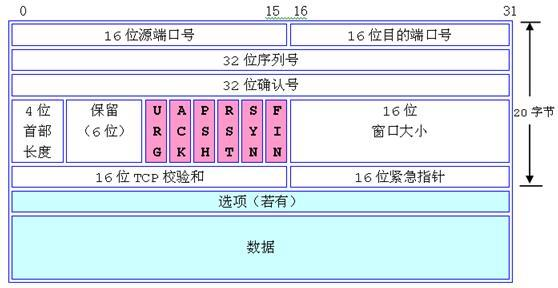

### 8.3.2 三次握手

> 第一次握手：主机 A 发送位码为 syn＝1,随机产生 seq number=1234567 的数据包到服务器，主机 B由 SYN=1 知道，A 要求建立联机；
>
> 第二次握手：主机 B 收到请求后要确认联机信息，向 A 发送 ack number=(主机 A 的seq+1),syn=1,ack=1,随机产生 seq=7654321 的包
>
> 第三次握手：主机 A 收到后检查 ack number 是否正确，即第一次发送的 seq number+1,以及位码ack 是否为1，若正确，主机 A 会再发送 ack number=(主机 B 的 seq+1),ack=1，主机 B 收到后确认seq 值与 ack=1 则连接建立成功。
>
> 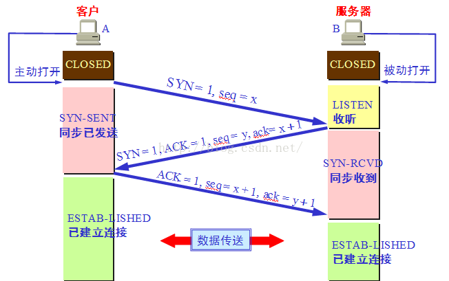

### 8.3.3 四次挥手

> TCP 建立连接要进行三次握手，而断开连接要进行四次。这是由于 TCP 的半关闭造成的。因为 TCP 连接是全双工的(即数据可在两个方向上同时传递)所以进行关闭时每个方向上都要单独进行关闭。这个单方向的关闭就叫半关闭。当一方完成它的数据发送任务，就发送一个 FIN 来向另一方通告将要终止这个方向的连接。
>
> 1、关闭客户端到服务器的连接：首先客户端 A 发送一个 FIN，用来关闭客户到服务器的数据传送，然后等待服务器的确认。其中终止标志位 FIN=1，序列号 seq=u
>
> 2、服务器收到这个 FIN，它发回一个 ACK，确认号 ack 为收到的序号加1。
>
> 3、关闭服务器到客户端的连接：也是发送一个 FIN 给客户端。
>
> 4、客户段收到 FIN 后，并发回一个 ACK 报文确认，并将确认序号 seq 设置为收到序号加1。首先进行关闭的一方将执行主动关闭，而另一方执行被动关闭。
>
> 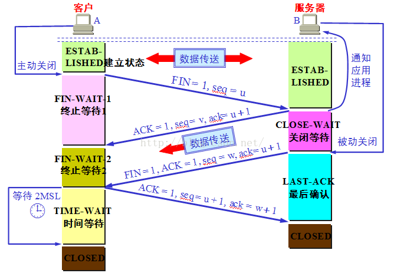
>
> 主机 A 发送 FIN 后，进入终止等待状态，服务器 B 收到主机 A 连接释放报文段后，就立即给主机 A 发送确认，然后服务器 B 就进入 close-wait 状态，此时 TCP 服务器进程就通知高层应用进程，因而从 A 到 B 的连接就释放了。此时是"半关闭"状态。即 A 不可以发送给 B，但是 B 可以发送给 A。此时，若 B 没有数据报要发送给 A 了，其应用进程就通知 TCP 释放连接，然后发送给 A 连接释放报文段，并等待确认。A 发送确认后，进入 time-wait，注意，此时 TCP 连接还没有释放掉，然后经过时间等待计时器设置的2MSL 后，A 才进入到close 状态。

## 8.4 HTTP 原理

> HTTP 是一个无状态的协议。无状态是指客户机（Web 浏览器）和服务器之间不需要建立持久的连接，这意味着当一个客户端向服务器端发出请求，然后服务器返回响应(response)，连接就被关闭了，在服务器端不保留连接的有关信息.HTTP 遵循请求(Request)/应答(Response)模型。客户机（浏览器）向服务器发送请求，服务器处理请求并返回适当的应答。所有 HTTP 连接都被构造成一套请求和应答。

### 8.4.1 传输流程

> **1：地址解析**
>
> 如用客户端浏览器请求这个页面：http://localhost.com:8080/index.htm 从中分解出协议名、主机名、端口、对象路径等部分，对于我们的这个地址，解析得到的结果如下：
>
> 协议名：http
>
> 主机名：localhost.com
>
> 端口：8080
>
> 对象路径：/index.htm
>
> 在这一步，需要域名系统 DNS 解析域名 localhost.com,得主机的 IP 地址。
>
> 
>
> ***2：封装 HTTP 请求数据包***
>
> 把以上部分结合本机自己的信息，封装成一个 HTTP 请求数据包
>
> 
>
> ***3：封装成 TCP 包并建立连接***
>
> 封装成 TCP 包，建立 TCP 连接（TCP 的三次握手）
>
> *4*：客户机发送请求命
>
> 客户机发送请求命令：建立连接后，客户机发送一个请求给服务器，请求方式的格式为：统一资源标识符（URL）、协议版本号，后边是 MIME 信息包括请求修饰符、客户机信息和可内容。
>
> *5*：服务器响应
>
> 服务器接到请求后，给予相应的响应信息，其格式为一个状态行，包括信息的协议版本号、一个成功或错误的代码，后边是 MIME 信息包括服务器信息、实体信息和可能的内容。
>
> ***6：服务器关闭 TCP 连接***
>
> 服务器关闭 TCP 连接：一般情况下，一旦 Web 服务器向浏览器发送了请求数据，它就要关闭 TCP 连接，然后如果浏览器或者服务器在其头信息加入了这行代码 Connection:keep-alive，TCP 连接在发送后将仍然保持打开状态，于是，浏览器可以继续通过相同的连接发送请求。保持连接节省了为每个请求建立新连接所需的时间，还节约了网络带宽。
>
> 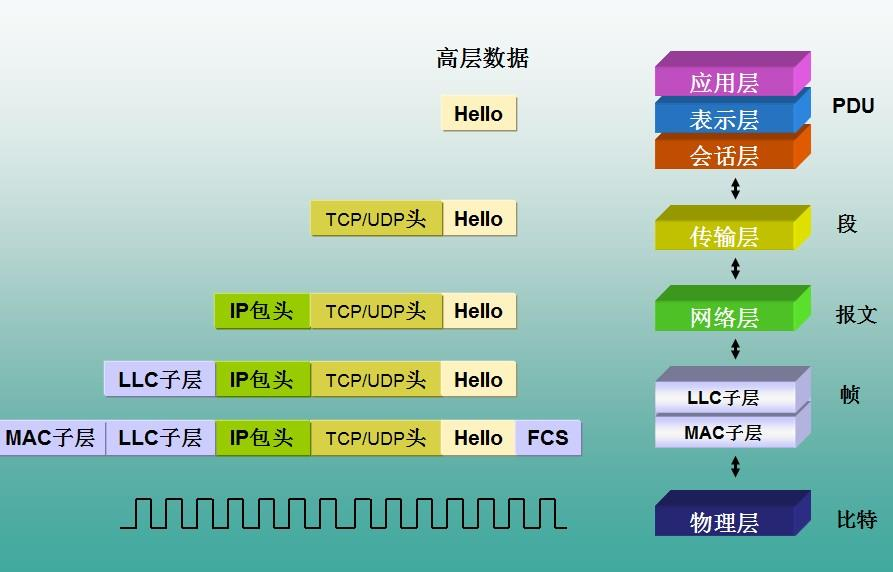

### 8.4.2 HTTP 状态

| 状态码 | 原因短语                                  |
| ------ | ----------------------------------------- |
|        | 消息响应                                  |
| 100    | Continue(继续)                            |
| 101    | Switching Protocol(切换协议               |
|        |                                           |
|        | 成功响应                                  |
| 200    | OK(成功)                                  |
| 201    | Created(已创建)                           |
| 202    | Accepted(已创建)                          |
| 203    | Non-Authoritative Information(未授权信息) |
| 204    | No Content(无内容)                        |
| 205    | Reset Content(重置内容)                   |
| 206    | Partial Content(部分内容)                 |
|        |                                           |
|        | 重定向                                    |
| 300    | Multiple Choice(多种选择)                 |
| 301    | Moved Permanently(永久移动)               |
| 302    | Found(临时移动)                           |
| 303    | See Other(查看其他位置)                   |
| 304    | Not Modified(未修改)                      |
| 305    | Use Proxy(使用代理)                       |
| 306    | *unused*(未使用)                          |
| 307    | Temporary Redirect(临时重定向)            |
| 308    | Permanent Redirect(永久重定向)            |

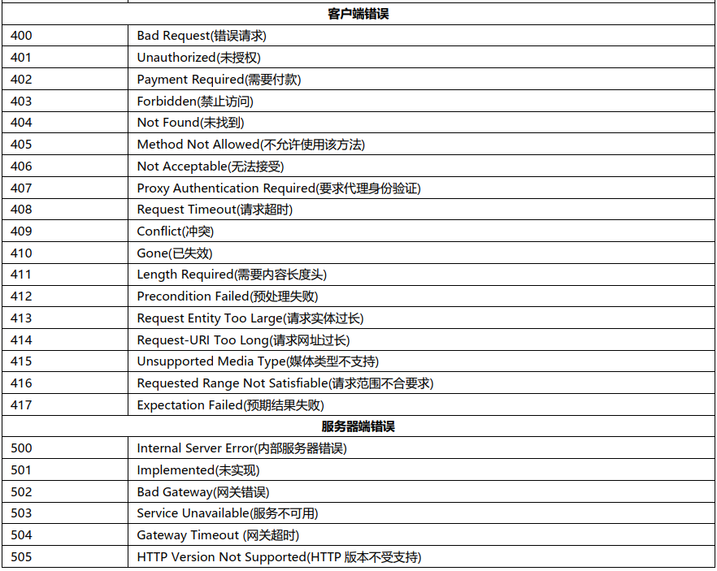


### 8.4.3 HTTPS

> HTTPS（全称：Hypertext Transfer Protocol over Secure Socket Layer），是以安全为目标的HTTP 通道，简单讲是 HTTP 的安全版。即 HTTP 下加入 SSL 层，HTTPS 的安全基础是 SSL。其所用的端口号是443。过程大致如下：
>
> **建立连接获取证书**
>
> 1、SSL 客户端通过 TCP 和服务器建立连接之后（443 端口），并且在一般的 tcp 连接协商（握手）过程中请求证书。即客户端发出一个消息给服务器，这个消息里面包含了自己可实现的算法列表和其它一些需要的消息，SSL 的服务器端会回应一个数据包，这里面确定了这次通信所需要的算法，然后服务器向客户端返回证书。（证书里面包含了服务器信息：域名。申请证书的公司，公共秘钥）。
>
> **证书验证**
>
> 2、Client 在收到服务器返回的证书后，判断签发这个证书的公共签发机构，并使用这个机构的公共秘钥确认签名是否有效，客户端还会确保证书中列出的域名就是它正在连接的域名。
>
> **数据加密和传输**
>
> 3、如果确认证书有效，那么生成对称秘钥并使用服务器的公共秘钥进行加密。然后发送给服务器，服务器使用它的私钥对它进行解密，这样两台计算机可以开始进行对称加密进行通信。
>
> 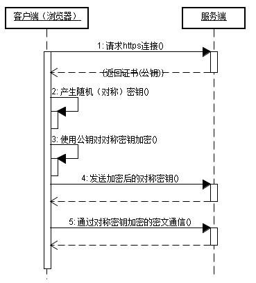

## 8.5 CDN 原理

> CND 一般包含分发服务系统、负载均衡系统和管理系统

### 8.5.1 分发服务系统

> 其基本的工作单元就是各个 Cache 服务器。负责直接响应用户请求，将内容快速分发到用户；同时还负责内容更新，保证和源站内容的同步。
>
> 根据内容类型和服务种类的不同，分发服务系统分为多个子服务系统，如：网页加速服务、流媒体加速服务、应用加速服务等。每个子服务系统都是一个分布式的服务集群，由功能类似、地域接近的分布部署的 Cache 集群组成。
>
> 在承担内容同步、更新和响应用户请求之外，分发服务系统还需要向上层的管理调度系统反馈各个Cache 设备的健康状况、响应情况、内容缓存状况等，以便管理调度系统能够根据设定的策略决定由哪个 Cache 设备来响应用户的请求。
>

### 8.5.2 负载均衡系统：

> 负载均衡系统是整个 CDN 系统的中枢。负责对所有的用户请求进行调度，确定提供给用户的最终访问地址。
>
> 使用分级实现。最基本的两极调度体系包括全局负载均衡（GSLB）和本地负载均衡（SLB）。
>
> GSLB 根据用户地址和用户请求的内容，主要根据就近性原则，确定向用户服务的节点。一般通过 DNS解析或者应用层重定向（Http 3XX 重定向）的方式实现。
>
> SLB 主要负责节点内部的负载均衡。当用户请求从 GSLB 调度到 SLB 时，SLB 会根据节点内各个Cache 设备的工作状况和内容分布情况等对用户请求重定向。SLB 的实现有四层调度（LVS）、七层调度（Nginx）和链路负载调度等。
>

### 8.5.3 管理系统：

> 分为运营管理和网络管理子系统。
>
> 网络管理系统实现对 CDN 系统的设备管理、拓扑管理、链路监控和故障管理，为管理员提供对全网资源的可视化的集中管理，通常用 web 方式实现。
>
> 运营管理是对 CDN 系统的业务管理，负责处理业务层面的与外界系统交互所必须的一些收集、整理、交付工作。包括用户管理、产品管理、计费管理、统计分析等。
>
> 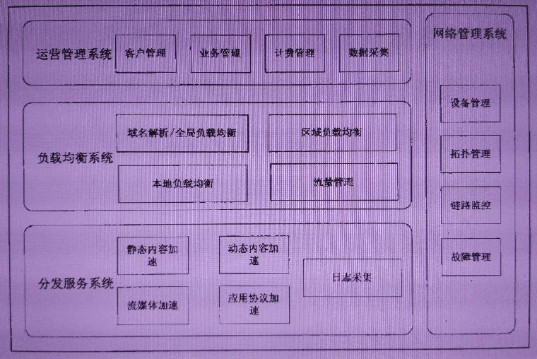

# 9.日志

## 9.1 Slf4j

> slf4j 的全称是 Simple Loging Facade For Java，即它仅仅是一个为 Java 程序提供日志输出的统一接口，并不是一个具体的日志实现方案，就比如 JDBC 一样，只是一种规则而已。所以单独的 slf4j 是不能工作的，必须搭配其他具体的日志实现方案，比如 apache 的 org.apache.log4j.Logger，jdk 自带的 java.util.logging.Logger 等。

## 9.2 Log4j

> Log4j 是 Apache 的一个开源项目，通过使用 Log4j，我们可以控制日志信息输送的目的地是控制台、文件、GUI 组件，甚至是套接口服务器、NT 的事件记录器、UNIX Syslog 守护进程等；我们也可以控制每一条日志的输出格式；通过定义每一条日志信息的级别，我们能够更加细致地控制日志的生成过程。
>
> Log4j 由三个重要的组成构成：日志记录器(Loggers)，输出端(Appenders)和日志格式化器(Layout)。
>
> 1.  Logger：控制要启用或禁用哪些日志记录语句，并对日志信息进行级别限制
> 2.  Appenders : 指定了日志将打印到控制台还是文件中
> 3.  Layout : 控制日志信息的显示格式
>
> Log4j 中将要输出的Log 信息定义了5 种级别，依次为DEBUG、INFO、WARN、ERROR 和FATAL，当输出时，只有级别高过配置中规定的级别的信息才能真正的输出，这样就很方便的来配置不同情况下要输出的内容，而不需要更改代码。

## 9.3 LogBack

> 简单地说，Logback 是一个 Java 领域的日志框架。它被认为是 Log4J 的继承人。
>
> Logback 主要由三个模块组成：logback-core，logback-classic。logback-access
>
> logback-core 是其它模块的基础设施，其它模块基于它构建，显然，logback-core 提供了一些关键的通用机制。
>
> logback-classic 的地位和作用等同于 Log4J，它也被认为是 Log4J 的一个改进版，并且它实现了简单日志门面 SLF4J；
>
> logback-access 主要作为一个与 Servlet 容器交互的模块，比如说 tomcat 或者 jetty，提供一些与HTTP 访问相关的功能。
>

### 9.3.1 Logback 优点

> -   同样的代码路径，Logback 执行更快
>
> -   更充分的测试
>
> -   原生实现了 SLF4J API（Log4J 还需要有一个中间转换层）
>
> -   内容更丰富的文档
>
> -   支持 XML 或者 Groovy 方式配置
>
> -   配置文件自动热加载
>
> -   从 IO 错误中优雅恢复
>
> -   自动删除日志归档
>
> -   自动压缩日志成为归档文件
>
> -   支持 Prudent 模式，使多个 JVM 进程能记录同一个日志文件
>
> -   支持配置文件中加入条件判断来适应不同的环境
>
> -   更强大的过滤器
>
> -   支持 SiftingAppender（可筛选 Appender）
>
> -   异常栈信息带有包信息

## 9.4 ELK

> ELK 是软件集合Elasticsearch、Logstash、Kibana 的简称，由这三个软件及其相关的组件可以打造大规模日志实时处理系统。
>
> -   Elasticsearch 是一个基于 Lucene 的、支持全文索引的分布式存储和索引引擎，主要负责将日志索引并存储起来，方便业务方检索查询。
> -   Logstash 是一个日志收集、过滤、转发的中间件，主要负责将各条业务线的各类日志统一收集、过滤后，转发给 Elasticsearch 进行下一步处理。
> -   Kibana 是一个可视化工具，主要负责查询 Elasticsearch 的数据并以可视化的方式展现给业务方，比如各类饼图、直方图、区域图等。
>
> 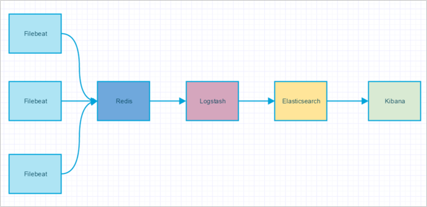


# 10. Zookeeper

## 10.1. Zookeeper 概念

> Zookeeper 是一个分布式协调服务，可用于服务发现，分布式锁，分布式领导选举，配置管理等。
>
> Zookeeper 提供了一个类似于 Linux 文件系统的树形结构（可认为是轻量级的内存文件系统，但只适合存少量信息，完全不适合存储大量文件或者大文件），同时提供了对于每个节点的监控与通知机制。

## 10.2 Zookeeper 角色

> Zookeeper 集群是一个基于主从复制的高可用集群，每个服务器承担如下三种角色中的一种

### 10.2.1 Leader

> 1.  一个 Zookeeper 集群同一时间只会有一个实际工作的 Leader，它会发起并维护与各 Follwer及 Observer 间的心跳。
>
> 2.  所有的写操作必须要通过 Leader 完成再由 Leader 将写操作广播给其它服务器。只要有超过半数节点（不包括 observeer 节点）写入成功，该写请求就会被提交（类2PC 协议）。

### 10.2.2 Follower

> 1.  一个Zookeeper 集群可能同时存在多个Follower，它会响应 Leader 的心跳，
>
> 2.  Follower 可直接处理并返回客户端的读请求，同时会将写请求转发给 Leader 处理，
>
> 3.  并且负责在 Leader 处理写请求时对请求进行投票。

### 10.2.3 Observer

> 角色与 Follower 类似，但是无投票权。Zookeeper 需保证高可用和强一致性，为了支持更多的客户端，需要增加更多 Server；Server 增多，投票阶段延迟增大，影响性能；引入 Observer，
>
> Observer 不参与投票； Observers 接受客户端的连接，并将写请求转发给 leader 节点；加入更多 Observer 节点，提高伸缩性，同时不影响吞吐率。
>
> 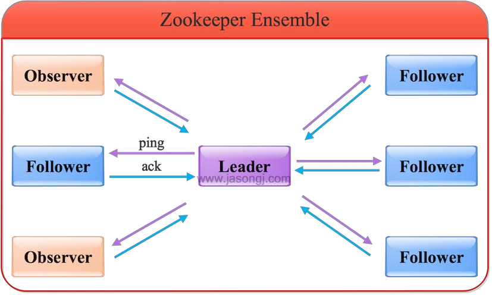

### 10.2.4 ZAB 协议

> ***事务编号 Zxid（事务请求计数器+ epoch）***
>
> 在 ZAB ( ZooKeeper Atomic Broadcast , ZooKeeper 原子消息广播协议）协议的事务编号 Zxid设计中，Zxid 是一个64 位的数字，其中低32 位是一个简单的单调递增的计数器，针对客户端每一个事务请求，计数器加1；而高32 位则代表 Leader 周期 epoch 的编号，每个当选产生一个新的 Leader 服务器，就会从这个Leader 服务器上取出其本地日志中最大事务的ZXID，并从中读取epoch 值，然后加1，以此作为新的 epoch，并将低32 位从0 开始计数。
>
> Zxid（Transaction id）类似于 RDBMS 中的事务 ID，用于标识一次更新操作的 Proposal（提议）ID。为了保证顺序性，该zkid 必须单调递增。
>
> ***epoch***
>
> epoch：可以理解为当前集群所处的年代或者周期，每个 leader 就像皇帝，都有自己的年号，所以每次改朝换代，leader 变更之后，都会在前一个年代的基础上加1。这样就算旧的 leader 崩溃恢复之后，也没有人听他的了，因为 follower 只听从当前年代的 leader 的命令。
>
> **Zab协议有两种模式*-*恢复模式（选主）、广播模式（同步）**
>
> Zab 协议有两种模式，它们分别是恢复模式（选主）和广播模式（同步）。当服务启动或者在领导者崩溃后，Zab 就进入了恢复模式，当领导者被选举出来，且大多数 Server 完成了和 leader 的状态同步以后，恢复模式就结束了。状态同步保证了 leader 和 Server 具有相同的系统状态。
>
> ***ZAB 协议4 阶段***
>
> Leader election（选举阶段-选出准 Leader）
>
> 1、Leader election（选举阶段）：节点在一开始都处于选举阶段，只要有一个节点得到超半数节点的票数，它就可以当选准 leader。只有到达广播阶段（broadcast）准 leader 才会成为真正的 leader。这一阶段的目的是就是为了选出一个准 leader，然后进入下一个阶段。
>
> ***Discovery（发现阶段-接受提议、生成 epoch、接受 epoch）***
>
> 2、Discovery（发现阶段）：在这个阶段，followers 跟准 leader 进行通信，同步 followers最近接收的事务提议。这个一阶段的主要目的是发现当前大多数节点接收的最新提议，并且准 leader 生成新的 epoch，让 followers 接受，更新它们的 accepted Epoch一个 follower 只会连接一个 leader，如果有一个节点 f 认为另一个 follower p 是 leader，f在尝试连接 p 时会被拒绝，f 被拒绝之后，就会进入重新选举阶段。
>
> ***Synchronization（同步阶段-同步 follower 副本）***
>
> 3、Synchronization（同步阶段）：同步阶段主要是利用 leader 前一阶段获得的最新提议历史，同步集群中所有的副本。只有当大多数节点都同步完成，准 leader 才会成为真正的 leader。follower 只会接收 zxid 比自己的 lastZxid 大的提议。
>
> ***Broadcast（广播阶段-leader 消息广播）***
>
> 4、Broadcast（广播阶段）：到了这个阶段，Zookeeper 集群才能正式对外提供事务服务，并且 leader 可以进行消息广播。同时如果有新的节点加入，还需要对新节点进行同步。
>
> ZAB 提交事务并不像2PC 一样需要全部 follower 都 ACK，只需要得到超过半数的节点的 ACK 就可以了。
>
> ***ZAB 协议 JAVA 实现（FLE-发现阶段和同步合并为 Recovery Phase（恢复阶段））***
>
> 协议的 Java 版本实现跟上面的定义有些不同，选举阶段使用的是 Fast Leader Election（FLE），它包含了选举的发现职责。因为 FLE 会选举拥有最新提议历史的节点作为 leader，这样就省去了发现最新提议的步骤。实际的实现将发现阶段和同步合并为 Recovery Phase（恢复阶段）。所以，ZAB 的实现只有三个阶段：Fast Leader Election；Recovery Phase；Broadcast Phase。

### 10.2.5 投票机制

> 每个sever 首先给自己投票，然后用自己的选票和其他sever 选票对比，权重大的胜出，使用权重较大的更新自身选票箱。具体选举过程如下：
>
> 1.  每个 Server 启动以后都询问其它的 Server 它要投票给谁。对于其他 server 的询问，server 每次根据自己的状态都回复自己推荐的 leader 的 id 和上一次处理事务的 zxid（系统启动时每个server 都会推荐自己）
>
> 2.  收到所有 Server 回复以后，就计算出 zxid 最大的哪个 Server，并将这个 Server 相关信息设置成下一次要投票的 Server。
>
> 3.  计算这过程中获得票数最多的的 sever 为获胜者，如果获胜者的票数超过半数，则改server 被选为 leader。否则，继续这个过程，直到 leader 被选举出来
>
> 4.  leader 就会开始等待 server 连接
> 5.  Follower 连接 leader，将最大的 zxid 发送给 leader
> 6.  Leader 根据follower 的 zxid 确定同步点，至此选举阶段完成。
> 7.  选举阶段完成 Leader 同步后通知follower 已经成为 uptodate 状态
> 8.  Follower 收到 uptodate 消息后，又可以重新接受 client 的请求进行服务了目前有5 台服务器，每台服务器均没有数据，它们的编号分别是1,2,3,4,5,按编号依次启动，它们的选择举过程如下：
>
> > ① 服务器1 启动，给自己投票，然后发投票信息，由于其它机器还没有启动所以它收不到反馈信息，服务器1 的状态一直属于 Looking。
> >
> > ② 服务器2 启动，给自己投票，同时与之前启动的服务器1 交换结果，由于服务器2 的编号大所以服务器2 胜出，但此时投票数没有大于半数，所以两个服务器的状态依然是LOOKING。
> >
> > ③ 服务器3 启动，给自己投票，同时与之前启动的服务器1,2 交换信息，由于服务器3 的编号最大所以服务器3 胜出，此时投票数正好大于半数，所以服务器3 成为领导者，服务器1,2 成为小弟。
> >
> > ④ 服务器4 启动，给自己投票，同时与之前启动的服务器1,2,3 交换信息，尽管服务器4 的编号大，但之前服务器3 已经胜出，所以服务器4 只能成为小弟。
> >
> > ⑤ 服务器5 启动，后面的逻辑同服务器4 成为小弟。


## 10.3 Zookeeper 工作原理（原子广播）

> 1.  Zookeeper 的核心是原子广播，这个机制保证了各个 server 之间的同步。实现这个机制的协议叫做 Zab 协议。Zab 协议有两种模式，它们分别是恢复模式和广播模式。
>
> 2.  当服务启动或者在领导者崩溃后，Zab 就进入了恢复模式，当领导者被选举出来，且大多数 server 的完成了和 leader 的状态同步以后，恢复模式就结束了。
>
> 3.  状态同步保证了 leader 和 server 具有相同的系统状态
>
> 4.  一旦 leader 已经和多数的 follower 进行了状态同步后，他就可以开始广播消息了，即进入广播状态。这时候当一个 server 加入 zookeeper 服务中，它会在恢复模式下启动，发现 leader，并和 leader 进行状态同步。待到同步结束，它也参与消息广播。Zookeeper服务一直维持在 Broadcast 状态，直到 leader 崩溃了或者 leader 失去了大部分的followers 支持。
>
> 5.  广播模式需要保证 proposal 被按顺序处理，因此 zk 采用了递增的事务 id 号(zxid)来保证。所有的提议(proposal)都在被提出的时候加上了 zxid。
> 6.  实现中 zxid 是一个64 为的数字，它高32 位是 epoch 用来标识 leader 关系是否改变，每次一个 leader 被选出来，它都会有一个新的 epoch。低32 位是个递增计数。
> 7.  当 leader 崩溃或者 leader 失去大多数的 follower，这时候 zk 进入恢复模式，恢复模式需要重新选举出一个新的 leader，让所有的 server 都恢复到一个正确的状态。

## 10.4 Znode 有四种形式的目录节点

> 1.  PERSISTENT：持久的节点。
>
> 2.  EPHEMERAL：暂时的节点。
>
> 3.  PERSISTENT_SEQUENTIAL：持久化顺序编号目录节点。
>
> 4.  EPHEMERAL_SEQUENTIAL：暂时化顺序编号目录节点。

# 11. Kafka

## 11.1 Kafka 概念

> Kafka 是一种高吞吐量、分布式、基于发布/订阅的消息系统，最初由 LinkedIn 公司开发，使用
>
> Scala 语言编写，目前是 Apache 的开源项目。
>
> 1.  broker：Kafka 服务器，负责消息存储和转发
>
> 2.  topic：消息类别，Kafka 按照topic 来分类消息
>
> 3.  partition：topic 的分区，一个 topic 可以包含多个 partition，topic 消息保存在各个partition 上
>
> 4.  offset：消息在日志中的位置，可以理解是消息在 partition 上的偏移量，也是代表该消息的唯一序号
> 5.  Producer：消息生产者
> 6.  Consumer：消息消费者
> 7.  Consumer Group：消费者分组，每个Consumer 必须属于一个 group
> 8.  Zookeeper：保存着集群 broker、topic、partition 等 meta 数据；另外，还负责 broker 故障发现，partition leader 选举，负载均衡等功能
>
> 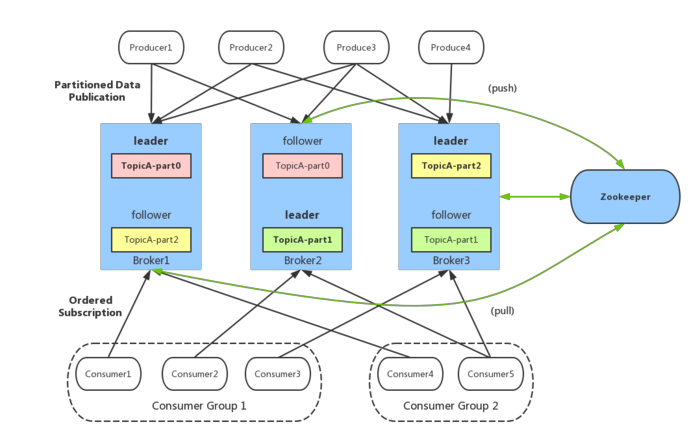

## 11.2 Kafka 数据存储设计

### 11.2.1 partition 的数据文件（offset，MessageSize，data）

> partition 中的每条Message 包含了以下三个属性：offset，MessageSize，data，其中 offset 表示 Message 在这个 partition 中的偏移量，offset 不是该 Message 在 partition 数据文件中的实际存储位置，而是逻辑上一个值，它唯一确定了partition 中的一条Message，可以认为offset 是partition 中 Message 的 id；MessageSize 表示消息内容 data 的大小；data 为 Message 的具体内容。
>

### 11.2.2 数据文件分段 segment（顺序读写、分段命令、二分查找）

> partition 物理上由多个segment 文件组成，每个segment 大小相等，顺序读写。每个segment数据文件以该段中最小的offset 命名，文件扩展名为.log。这样在查找指定 offset 的 Message 的时候，用二分查找就可以定位到该 Message 在哪个 segment 数据文件中。

### 11.2.3 数据文件索引（分段索引、稀疏存储）

> Kafka 为每个分段后的数据文件建立了索引文件，文件名与数据文件的名字是一样的，只是文件扩展名为.index。index 文件中并没有为数据文件中的每条 Message 建立索引，而是采用了稀疏存储的方式，每隔一定字节的数据建立一条索引。这样避免了索引文件占用过多的空间，从而可以将索引文件保留在内存中。
>
> 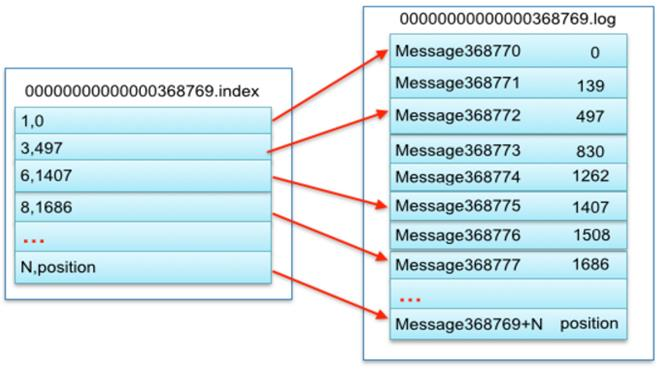


## 11.3 生产者设计

### 11.3.1 负载均衡（partition 会均衡分布到不同 broker 上）

> 由于消息 topic 由多个 partition 组成，且 partition 会均衡分布到不同 broker 上，因此，为了有效利用broker 集群的性能，提高消息的吞吐量，producer 可以通过随机或者hash 等方式，将消息平均发送到多个 partition 上，以实现负载均衡。
>
> 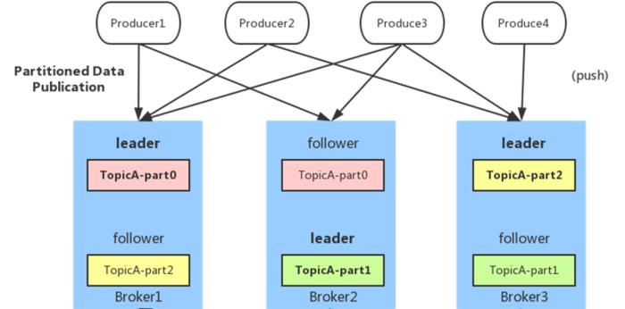

### 11.3.2 批量发送

> 是提高消息吞吐量重要的方式，Producer 端可以在内存中合并多条消息后，以一次请求的方式发送了批量的消息给 broker，从而大大减少 broker 存储消息的 IO 操作次数。但也一定程度上影响了消息的实时性，相当于以时延代价，换取更好的吞吐量。

### 11.3.3 压缩（GZIP 或 Snappy）

> Producer 端可以通过 GZIP 或 Snappy 格式对消息集合进行压缩。Producer 端进行压缩之后，在Consumer 端需进行解压。压缩的好处就是减少传输的数据量，减轻对网络传输的压力，在对大数据处理上，瓶颈往往体现在网络上而不是CPU（压缩和解压会耗掉部分CPU 资源）。
>

## 11.4消费者设计

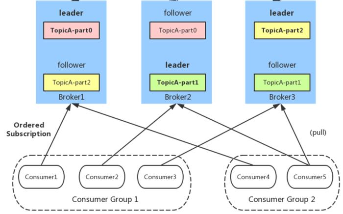

### 11.4.1 Consumer Group

> 同一 Consumer Group 中的多个 Consumer 实例，不同时消费同一个 partition，等效于队列模式。partition 内消息是有序的，Consumer 通过 pull 方式消费消息。Kafka 不删除已消费的消息
>
> 对于 partition，顺序读写磁盘数据，以时间复杂度O(1)方式提供消息持久化能力。

# 12. RabbitMQ 

## 12.1 概念

> RabbitMQ 是一个由 Erlang 语言开发的 AMQP 的开源实现。
>
> AMQP ：Advanced Message Queue，高级消息队列协议。它是应用层协议的一个开放标准，为面向消息的中间件设计，基于此协议的客户端与消息中间件可传递消息，并不受产品、开发语言等条件的限制。
>
> RabbitMQ 最初起源于金融系统，用于在分布式系统中存储转发消息，在易用性、扩展性、高可用性等方面表现不俗。具体特点包括：
>
> 1.  可靠性（Reliability）：RabbitMQ 使用一些机制来保证可靠性，如持久化、传输确认、发布确认。
>
> 2.  灵活的路由（Flexible Routing）：在消息进入队列之前，通过 Exchange 来路由消息的。对于典型的路由功能，RabbitMQ 已经提供了一些内置的 Exchange 来实现。针对更复杂的路由功能，可以将多个 Exchange 绑定在一起，也通过插件机制实现自己的 Exchange 。
>
> 3.  消息集群（Clustering）：多个 RabbitMQ 服务器可以组成一个集群，形成一个逻辑 Broker 。
>
> 4.  高可用（Highly Available Queues）：队列可以在集群中的机器上进行镜像，使得在部分节点出问题的情况下队列仍然可用。
>
> 5.  多种协议（Multi-protocol）：RabbitMQ 支持多种消息队列协议，比如 STOMP、MQTT等等。
>
> 6.  多语言客户端（Many Clients）：RabbitMQ 几乎支持所有常用语言，比如 Java、.NET、Ruby 等等。
>
> 7.  管理界面（Management UI）:RabbitMQ 提供了一个易用的用户界面，使得用户可以监控和管理消息 Broker 的许多方面。
>
> 8.  跟踪机制（Tracing）:如果消息异常，RabbitMQ 提供了消息跟踪机制，使用者可以找出发生了什么。
>
> 9.  插件机制（Plugin System）:RabbitMQ 提供了许多插件，来从多方面进行扩展，也可以编写自己的插件。

## 12.2 RabbitMQ 架构

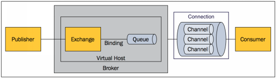

### 12.2.1 Message

> 消息，消息是不具名的，它由消息头和消息体组成。消息体是不透明的，而消息头则由一系列的可选属性组成，这些属性包括 routing-key（路由键）、priority（相对于其他消息的优先权）、delivery-mode（指出该消息可能需要持久性存储）等。

### 12.2.2 Publisher

> 消息的生产者，也是一个向交换器发布消息的客户端应用程序。

### 12.2.3 Exchange（将消息路由给队列）

> 交换器，用来接收生产者发送的消息并将这些消息路由给服务器中的队列。

### 12.2.4 Binding（消息队列和交换器之间的关联）

> 绑定，用于消息队列和交换器之间的关联。一个绑定就是基于路由键将交换器和消息队列连接起来的路由规则，所以可以将交换器理解成一个由绑定构成的路由表。

### 12.2.5 Queue

> 消息队列，用来保存消息直到发送给消费者。它是消息的容器，也是消息的终点。一个消息可投入一个或多个队列。消息一直在队列里面，等待消费者连接到这个队列将其取走。

### 12.2.6 Connection

> 网络连接，比如一个 TCP 连接。

### 12.2.7 Channel

> 信道，多路复用连接中的一条独立的双向数据流通道。信道是建立在真实的 TCP 连接内地虚拟连接，AMQP 命令都是通过信道发出去的，不管是发布消息、订阅队列还是接收消息，这些动作都是通过信道完成。因为对于操作系统来说建立和销毁 TCP 都是非常昂贵的开销，所以引入了信道的概念，以复用一条 TCP 连接。

### 12.2.8 Consumer

> 消息的消费者，表示一个从消息队列中取得消息的客户端应用程序。

### 12.2.9 Virtual Host

> 虚拟主机，表示一批交换器、消息队列和相关对象。虚拟主机是共享相同的身份认证和加密环境的独立服务器域。

### 12.2.10 Broker

> 表示消息队列服务器实体。

## 12.3 Exchange 类型

> Exchange 分发消息时根据类型的不同分发策略有区别，目前共四种类型：direct、fanout、topic、headers 。headers 匹配 AMQP 消息的 header 而不是路由键，此外 headers 交换器和direct 交换器完全一致，但性能差很多，目前几乎用不到了，所以直接看另外三种类型：
>

### 12.3.1 Direct 键（routing key）分布：

> Direct：消息中的路由键（routing key）如果和 Binding 中的 binding key 一致，交换器就将消息发到对应的队列中。它是完全匹配、单播的模式。
>
> 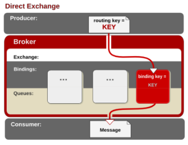

### 12.3.2 Fanout（广播分发）

> Fanout：每个发到 fanout 类型交换器的消息都会分到所有绑定的队列上去。很像子网广播，每台子网内的主机都获得了一份复制的消息。fanout 类型转发消息是最快的。
>
> 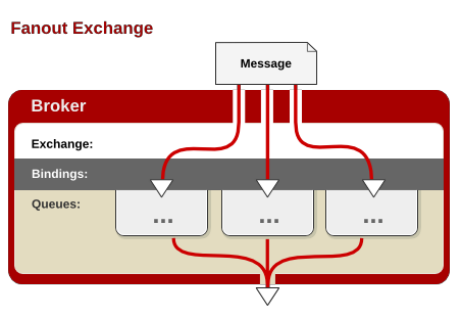

### 12.3.3 topic 交换器（模式匹配）

> topic 交换器：topic 交换器通过模式匹配分配消息的路由键属性，将路由键和某个模式进行匹配，此时队列需要绑定到一个模式上。它将路由键和绑定键的字符串切分成单词，这些单词之间用点隔开。它同样也会识别两个通配符：符号"\#"和符号""。\#匹配0 个或多个单词，匹配不多不少一个单词。
>
> 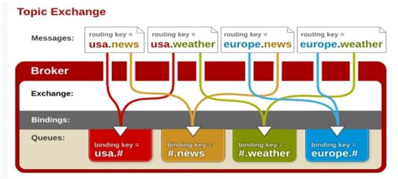

# 13. Hbase

## 13.1 概念

> base 是分布式、面向列的开源数据库（其实准确的说是面向列族）。HDFS 为 Hbase 提供可靠的底层数据存储服务，MapReduce 为 Hbase 提供高性能的计算能力，Zookeeper 为 Hbase 提供稳定服务和 Failover 机制，因此我们说 Hbase 是一个通过大量廉价的机器解决海量数据的高速存储和读取的分布式数据库解决方案。

## 13.2 列式存储

> 列方式所带来的重要好处之一就是，由于查询中的选择规则是通过列来定义的，因此整个数据库是自动索引化的。
>
> 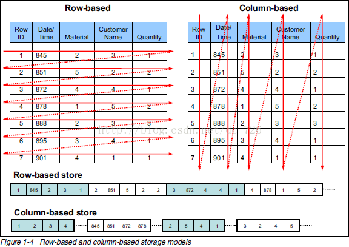
>
> 这里的列式存储其实说的是列族存储，Hbase 是根据列族来存储数据的。列族下面可以有非常多的列，列族在创建表的时候就必须指定。为了加深对 Hbase 列族的理解，下面是一个简单的关系型数据库的表和 Hbase 数据库的表：
>
> 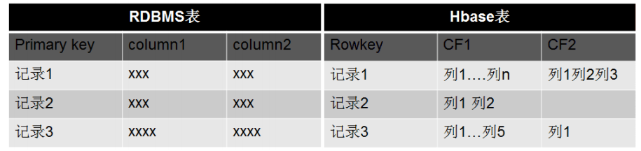

## 13.3 Hbase 核心概念

### 13.3.1 Column Family 列族

> Column Family 又叫列族，Hbase 通过列族划分数据的存储，列族下面可以包含任意多的列，实现灵活的数据存取。Hbase 表的创建的时候就必须指定列族。就像关系型数据库创建的时候必须指定具体的列是一样的。Hbase 的列族不是越多越好，官方推荐的是列族最好小于或者等于3。我们使用的场景一般是1 个列族。

### 13.3.2  Rowkey（Rowkey 查询，Rowkey 范围扫描，全表扫描）

> Rowkey 的概念和 mysql 中的主键是完全一样的，Hbase 使用 Rowkey 来唯一的区分某一行的数据。Hbase 只支持3 中查询方式：基于 Rowkey 的单行查询，基于 Rowkey 的范围扫描，全表扫描。

### 13.3.3 Region 分区

> **Region**：Region 的概念和关系型数据库的分区或者分片差不多。Hbase 会将一个大表的数据基于 Rowkey 的不同范围分配到不通的 Region 中，每个 Region 负责一定范围的数据访问和存储。这样即使是一张巨大的表，由于被切割到不通的 region，访问起来的时延也很低。

### 13.3.4 TimeStamp 多版本

> TimeStamp 是实现 Hbase 多版本的关键。在 Hbase 中使用不同的 timestame 来标识相同rowkey 行对应的不通版本的数据。在写入数据的时候，如果用户没有指定对应的timestamp，Hbase 会自动添加一个 timestamp，timestamp 和服务器时间保持一致。在Hbase 中，相同rowkey 的数据按照 timestamp 倒序排列。默认查询的是最新的版本，用户可同指定 timestamp 的值来读取旧版本的数据。
>

## 13.4 Hbase 核心架构

> Hbase 是由Client、Zookeeper、Master、HRegionServer、HDFS 等几个组建组成。
>
> 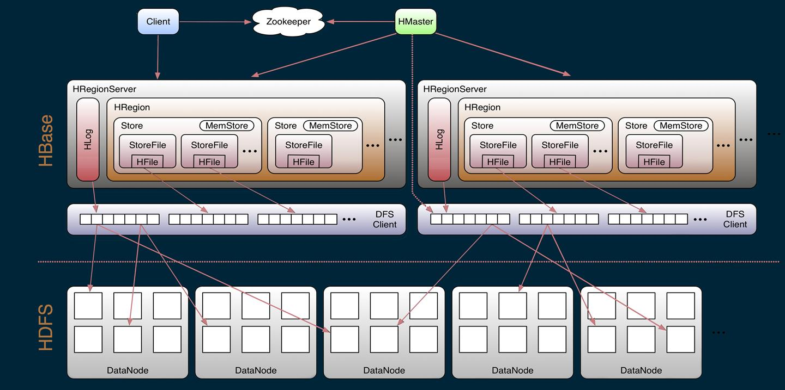

### 13.4.1 Client：

> Client 包含了访问 Hbase 的接口，另外Client 还维护了对应的 cache 来加速 Hbase 的访问，比如 cache 的.META.元数据的信息。

### 13.4.2 Zookeeper：

> Hbase 通过Zookeeper 来做 master 的高可用、RegionServer 的监控、元数据的入口以及集群配置的维护等工作。具体工作如下：
>
> 1.  通过Zoopkeeper 来保证集群中只有1 个 master 在运行，如果 master 异常，会通过竞争机制产生新的 master 提供服务
> 2.  通过Zoopkeeper 来监控 RegionServer 的状态，当 RegionSevrer 有异常的时候，通过回调的形式通知 Master RegionServer 上下限的信息
> 3.  通过Zoopkeeper 存储元数据的统一入口地址。

### 13.4.3 Hmaster

> master 节点的主要职责如下：
>
> 1.  为 RegionServer 分配 Region
>
> 2.  维护整个集群的负载均衡
>
> 3.  维护集群的元数据信息发现失效的 Region，并将失效的 Region 分配到正常RegionServer 上当 RegionSever 失效的时候，协调对应 Hlog 的拆分

### 13.4.4 HregionServer

> HregionServer 直接对接用户的读写请求，是真正的"干活"的节点。它的功能概括如下：
>
> 1.  管理 master 为其分配的 Region
> 2.  处理来自客户端的读写请求
> 3.  负责和底层 HDFS 的交互，存储数据到 HDFS
> 4.  负责 Region 变大以后的拆分
> 5.  负责 Storefile 的合并工作


### 13.4.5 Region 寻址方式（通过zookeeper .META）

> 第1 步：Client 请求 ZK 获取.META.所在的 RegionServer 的地址。
>
> 第2 步：Client 请求.META.所在的 RegionServer 获取访问数据所在的 RegionServer 地址，client 会将.META.的相关信息 cache 下来，以便下一次快速访问。
>
> 第3 步：Client 请求数据所在的 RegionServer，获取所需要的数据。
>
> 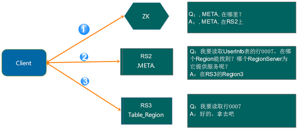

### 13.4.6 HDFS

> HDFS 为 Hbase 提供最终的底层数据存储服务，同时为 Hbase 提供高可用（Hlog 存储在HDFS）的支持。

## 13.5 Hbase 的写逻辑

### 13.5.1 Hbase 的写入流程

> 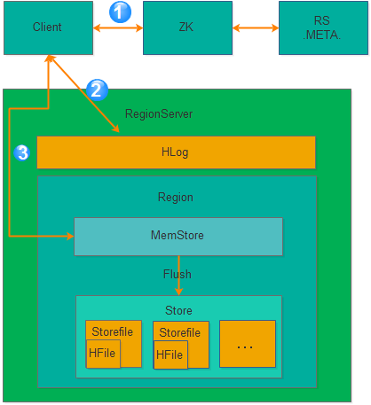
>
> 从上图可以看出氛围3 步骤：
>
> ***获取 RegionServer***
>
> 第1 步：Client 获取数据写入的 Region 所在的 RegionServer
>
> 
>
> ***请求写 Hlog***
>
> 第2 步：请求写 Hlog, Hlog 存储在 HDFS，当 RegionServer 出现异常，需要使用 Hlog 来恢复数据。
>
> 
>
> ***请求写 MemStore***
>
> 第3 步：请求写 MemStore,只有当写 Hlog 和写 MemStore 都成功了才算请求写入完成。MemStore 后续会逐渐刷到 HDFS 中。
>

### 13.5.2 MemStore 刷盘

> 为了提高 Hbase 的写入性能，当写请求写入 MemStore 后，不会立即刷盘。而是会等到一定的时候进行刷盘的操作。具体是哪些场景会触发刷盘的操作呢？总结成如下的几个场景：
>
> **全局内存控制**
>
> 这个全局的参数是控制内存整体的使用情况，当所有 memstore 占整个 heap 的最大比例的时候，会触发刷盘的操作。这个参数是hbase.regionserver.global.memstore.upperLimit，默认为整个 heap 内存的40%。但这并不意味着全局内存触发的刷盘操作会将所有的 MemStore 都进行输盘，而是通过另外一个参数 hbase.regionserver.global.memstore.lowerLimit 来控制，默认是整个heap 内存的35%。当 flush 到所有 memstore 占整个 heap 内存的比率为35%的时候，就停止刷盘。这么做主要是为了减少刷盘对业务带来的影响，实现平滑系统负载的目的。
>
> 
>
> ***MemStore 达到上限***
>
> 当 MemStore 的大小达到 hbase.hregion.memstore.flush.size 大小的时候会触发刷盘，默认128M 大小
>
> 
>
> ***RegionServer 的 Hlog 数量达到上限***
>
> 前面说到 Hlog 为了保证 Hbase 数据的一致性，那么如果 Hlog 太多的话，会导致故障恢复的时间太长，因此 Hbase 会对 Hlog 的最大个数做限制。当达到 Hlog 的最大个数的时候，会强制刷盘。这个参数是 hase.regionserver.max.logs，默认是32 个。
>
> 
>
> **手工触发**
>
> 可以通过 hbase shell 或者 java api 手工触发flush 的操作。
>
> 
>
> ***关闭 RegionServer 触发***
>
> 在正常关闭 RegionServer 会触发刷盘的操作，全部数据刷盘后就不需要再使用 Hlog 恢复数据。
>
> 
>
> ***Region 使用 HLOG 恢复完数据后触发***
>
> 当 RegionServer 出现故障的时候，其上面的 Region 会迁移到其他正常的RegionServer 上，在恢复完 Region 的数据后，会触发刷盘，当刷盘完成后才会提供给业务访问。

## 13.6 HBase vs Cassandra

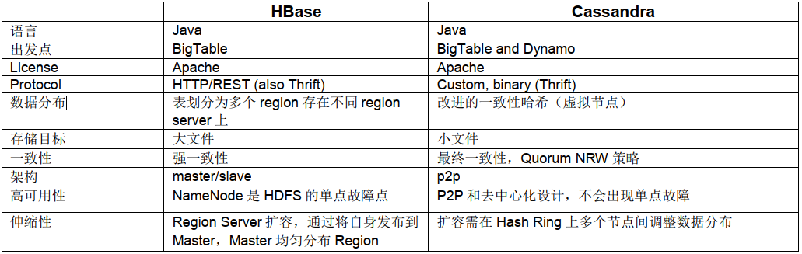


# 14. MongoDB

## 14.1 概念

> MongoDB 是由 C++语言编写的，是一个基于分布式文件存储的开源数据库系统。在高负载的情况下，添加更多的节点，可以保证服务器性能。MongoDB 旨在为WEB 应用提供可扩展的高性能数据存储解决方案。
>
> MongoDB 将数据存储为一个文档，数据结构由键值(key=\>value)对组成。MongoDB 文档类似于 JSON 对象。字段值可以包含其他文档，数组及文档数组。
>
> 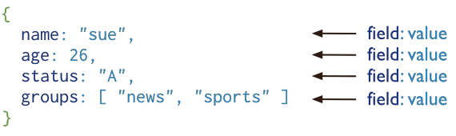

## 14.2 特点

> -   MongoDB 是一个面向文档存储的数据库，操作起来比较简单和容易。
>
> -   你可以在 MongoDB 记录中设置任何属性的索引(如：FirstName=\"Sameer\",Address=\"8 Ga ndhi Road\")来实现更快的排序。
>
> -   你可以通过本地或者网络创建数据镜像，这使得MongoDB 有更强的扩展性。
>
> -   如果负载的增加（需要更多的存储空间和更强的处理能力），它可以分布在计算机网络中的其他节点上这就是所谓的分片。
>
> -   Mongo 支持丰富的查询表达式。查询指令使用 JSON 形式的标记，可轻易查询文档中内嵌的对象及数组。
>
> -   MongoDb 使用 update()命令可以实现替换完成的文档（数据）或者一些指定的数据字段。
>
> -   Mongodb 中的 Map/reduce 主要是用来对数据进行批量处理和聚合操作。
>
> -   Map 和 Reduce。Map 函数调用 emit(key,value)遍历集合中所有的记录，将 key 与 value 传给 Reduce 函数进行处理。
>
> -   Map 函数和 Reduce 函数是使用 Javascript 编写的，并可以通过 db.runCommand 或 mapreduce 命令来执行 MapReduce 操作。
>
> -   GridFS 是 MongoDB 中的一个内置功能，可以用于存放大量小文件。
>
> -   MongoDB 允许在服务端执行脚本，可以用 Javascript 编写某个函数，直接在服务端执行，也可以把函数的定义存储在服务端，下次直接调用即可。

# 15. Cassandra

## 15.1 概念

> Apache Cassandra 是高度可扩展的，高性能的分布式 NoSQL 数据库。 Cassandra 旨在处理许多商品服务器上的大量数据，提供高可用性而无需担心单点故障。
>
> Cassandra 具有能够处理大量数据的分布式架构。数据放置在具有多个复制因子的不同机器上，以获得高可用性，而无需担心单点故障。

## 15.2 数据模型

### 15.2.1 Key Space（对应 SQL 数据库中的 database）

> 一个Key Space 中可包含若干个 CF，如同 SQL 数据库中一个 database 可包含多个 table

### 15.2.2 Key（对应 SQL 数据库中的主键）

> 在 Cassandra 中，每一行数据记录是以 key/value 的形式存储的，其中 key 是唯一标识。

### 15.2.3 column（对应 SQL 数据库中的列）

> Cassandra 中每个 key/value 对中的value 又称为column，它是一个三元组，即：name，value 和 timestamp，其中 name 需要是唯一的。

### 15.2.4 super column（SQL 数据库不支持）

> cassandra 允许 key/value 中的 value 是一个 map(key/value_list)，即某个 column 有多个子列。

### 15.2.5 Standard Column Family（相对应 SQL 数据库中的 table）

> 每个CF 由一系列row 组成，每个row 包含一个 key 以及其对应的若干 column。

### 15.2.6 Super Column Family（SQL 数据库不支持）

> 每个 SCF 由一系列 row 组成，每个 row 包含一个 key 以及其对应的若干 super column。

## 15.3 Cassandra 一致 Hash 和虚拟节点

### 15.3.1 一致性 Hash（多米诺 down 机）

> 为每个节点分配一个 token，根据这个 token 值来决定节点在集群中的位置以及这个节点所存储的数据范围。

### 15.3.2 虚拟节点（down 机多节点托管）

> 由于这种方式会造成数据分布不均的问题，在 Cassandra1.2 以后采用了虚拟节点的思想：不需要为每个节点分配 token，把圆环分成更多部分，让每个节点负责多个部分的数据，这样一个节点移除后，它所负责的多个 token 会托管给多个节点处理，这种思想解决了数据分布不均的问题。
>
> 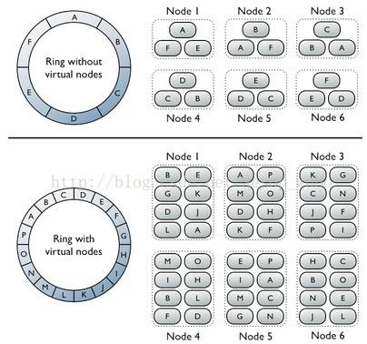
>
> 如图所示，上面部分是标准一致性哈希，每个节点负责圆环中连续的一段，如果 Node2 突然down 掉，Node2 负责的数据托管给 Node1，即 Node1 负责 EFAB 四段，如果 Node1 里面有很多热点用户产生的数据导致 Node1 已经有点撑不住了，恰巧 B 也是热点用户产生的数据，这样一来Node1 可能会接着 down 机，Node1down 机，Node6 还 hold 住吗？
>
> 下面部分是虚拟节点实现，每个节点不再负责连续部分，且圆环被分为更多的部分。如果 Node2突然down 掉，Node2 负责的数据不全是托管给Node1，而是托管给多个节点。而且也保持了一致性哈希的特点。

## 15.4 Gossip 协议

> Gossip 算法如其名，灵感来自办公室八卦，只要一个人八卦一下，在有限的时间内所有的人都会知道该八卦的信息，这种方式也与病毒传播类似，因此 Gossip 有众多的别名"闲话算法"、"疫情传播算法"、"病毒感染算法"、"谣言传播算法"。 Gossip 的特点：在一个有界网络中，每个节点都随机地与其他节点通信，经过一番杂乱无章的通信，最终所有节点的状态都会达成一致。因为 Gossip 不要求节点知道所有其他节点，因此又具有去中心化的特点，节点之间完全对等，不需要任何的中心节点。实际上 Gossip 可以用于众多能接受"最终一致性"的领域：失败检测、路由同步、Pub/Sub、动态负载均衡。
>

### 15.4.1 Gossip 节点的通信方式及收敛性

> ***Gossip 两个节点（A、B）之间存在三种通信方式（push、pull、push&pull）***
>
> 1.  push: A 节点将数据(key,value,version)及对应的版本号推送给 B 节点，B 节点更新 A 中比自己新的数据。
> 2.  pull：A 仅将数据 key,version 推送给 B，B 将本地比 A 新的数据（Key,value,version）推送给 A，A 更新本地。
> 3.  push/pull：与 pull 类似，只是多了一步，A 再将本地比 B 新的数据推送给B，B 更新本地。
>
> 如果把两个节点数据同步一次定义为一个周期，则在一个周期内，push 需通信1 次，pull 需2 次，push/pull 则需3 次，从效果上来讲，push/pull 最好，理论上一个周期内可以使两个节点完全一致。直观上也感觉，push/pull 的收敛速度是最快的
>
> 
>
> ***gossip 的协议和 seed list（防止集群分列）***
>
> cassandra 使用称为gossip 的协议来发现加入C 集群中的其他节点的位置和状态信息。gossip 进程每秒都在进行，并与至多三个节点交换状态信息。节点交换他们自己和所知道的信息，于是所有的节点很快就能学习到整个集群中的其他节点的信息。gossip 信息有一个相关的版本号，于是在一次gossip 信息交换中，旧的信息会被新的信息覆盖重写。要阻止分区进行gossip 交流，那么在集群中的所有节点中使用相同的 seed list，种子节点的指定除了启动起 gossip 进程外，没有其他的目的。种子节点不是一个单点故障，他们在集群操作中也没有其他的特殊目的，除了引导节点以外

## 15.5 数据复制

### 15.5.1 Partitioners（计算 primary key token 的 hash 函数）

> 在 Cassandra 中，table 的每行由唯一的 primarykey 标识，partitioner 实际上为一 hash 函数用以计算 primary key 的token。Cassandra 依据这个 token 值在集群中放置对应的行

### 15.5.2 两种可用的复制策略：

> ***SimpleStrategy：仅用于单数据中心，***
>
> 将第一个 replica 放在由 partitioner 确定的节点中，其余的 replicas 放在上述节点顺时针方向的后续节点中。
>
> 
>
> ***NetworkTopologyStrategy：可用于较复杂的多数据中心。***
>
> 可以指定在每个数据中心分别存储多少份 replicas。复制策略在创建 keyspace 时指定，如
>
> ```sh
> CREATE KEYSPACE Excelsior WITH REPLICATION = {'class':'SimpleStrategy','replication_factor': 3 };
> CREATE KEYSPACE Excalibur WITH REPLICATION = {'class':'NetworkTopologyStrategy','dc1': 3,'dc2': 2};
> ```
>
> 

## 15.6 数据写请求和协调者

### 15.6.1 协调者(coordinator)

> 协调者(coordinator)将 write 请求发送到拥有对应row 的所有replica 节点，只要节点可用便获取并执行写请求。写一致性级别(write consistency level)确定要有多少个replica 节点必须返回成功的确认信息。成功意味着数据被正确写入了 commit log 和 memtable。
>
> 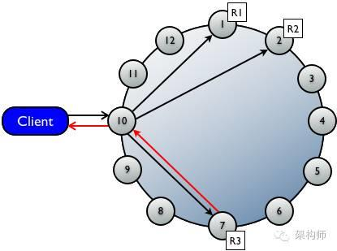
>
> 其中 dc1、dc2 这些数据中心名称要与 snitch 中配置的名称一致.上面的拓扑策略表示在 dc1 配置3 个副本,在 dc2 配置2 个副本

## 15.7 数据读请求和后台修复

> 1.  协调者首先与一致性级别确定的所有 replica 联系，被联系的节点返回请求的数据。
> 2.  若多个节点被联系，则来自各replica 的row 会在内存中作比较，若不一致，则协调者使用含最新数据的replica 向 client 返回结果。那么比较操作过程中只需要传递时间戳就可以,因为要比较的只是哪个副本数据是最新的。
> 3.  协调者在后台联系和比较来自其余拥有对应 row 的 replica 的数据，若不一致，会向过时的replica 发写请求用最新的数据进行更新read repair。
>
> 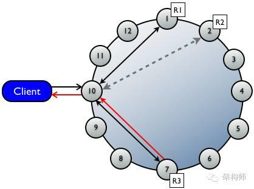

## 15.8. 数据存储（CommitLog、MemTable、SSTable）

> 写请求分别到 CommitLog 和 MemTable,并且 MemTable 的数据会刷写到磁盘 SSTable 上.除了写数据,还有索引也会保存到磁盘上.
>
> 先将数据写到磁盘中的 commitlog，同时追加到中内存中的数据结构 memtable 。这个时候就会返回客户端状态， memtable 内容超出指定容量后会被放进将被刷入磁盘的队列(memtable_flush_queue_size 配置队列长度)。若将被刷入磁盘的数据超出了队列长度，将内存数据刷进磁盘中的 SSTable,之后 commit log 被清空。
>

### 15.8.1 SSTable 文件构成（BloomFilter、index、data、static）

> SSTable 文件有fileer（判断数据 key 是否存在，这里使用了BloomFilter 提高效率），index（寻找对应 column 值所在 data 文件位置）文件，data（存储真实数据）文件，static（存储和统计column 和row 大小）文件。
>

## 15.9 二级索引（对要索引的 value 摘要，生成 RowKey）

> 在 Cassandra 中，数据都是以Key-value 的形式保存的。
>
> 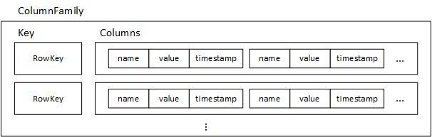
>
> KeysIndex 所创建的二级索引也被保存在一张 ColumnFamily 中。在插入数据时，对需要进行索引的value 进行摘要，生成独一无二的key，将其作为RowKey 保存在索引的ColumnFamily 中；同时在 RowKey 上添加一个 Column，将插入数据的 RowKey 作为 name 域的值，value 域则赋空值，timestamp 域则赋为插入数据的时间戳。
>
> 如果有相同的 value 被索引了，则会在索引 ColumnFamily 中相同的 RowKey 后再添加新的Column。如果有新的 value 被索引，则会在索引 ColumnFamily 中添加新的 RowKey 以及对应新的Column。
>
> 当对 value 进行查询时，只需计算该 value 的 RowKey，在索引 ColumnFamily 中的查找该RowKey，对其Columns 进行遍历就能得到该 value 所有数据的 RowKey。

## 15.10 数据读写

### 15.10.1 数据写入和更新（数据追加）

> Cassandra 的设计思路与这些系统不同，无论是 insert 还是 remove 操作，都是在已有的数据后面进行追加，而不修改已有的数据。这种设计称为 Log structured 存储，顾名思义就是系统中的数据是以日志的形式存在的，所以只会将新的数据追加到已有数据的后面。Log structured 存储系统有两个主要优点：
>
> **数据的写和删除效率极高**
>
> 传统的存储系统需要更新元信息和数据，因此磁盘的磁头需要反复移动，这是一个比较耗时的操作，而 Log structured 的系统则是顺序写，可以充分利用文件系统的 cache，所以效率很高。
>
> 
>
> **错误恢复简单**
>
> 由于数据本身就是以日志形式保存，老的数据不会被覆盖，所以在设计 journal 的时候不需要考虑 undo，简化了错误恢复。
>
> 
>
> **读的复杂度高**
>
> 但是，Log structured 的存储系统也引入了一个重要的问题：读的复杂度和性能。理论上说，读操作需要从后往前扫描数据，以找到某个记录的最新版本。相比传统的存储系统，这是比较耗时的。
>
> 参考：[<span class="underline">https://blog.csdn.net/fs1360472174/article/details/55005335</span>](https://blog.csdn.net/fs1360472174/article/details/55005335)

### 15.10.2  数据删除（column 的墓碑）

> 如果一次删除操作在一个节点上失败了（总共3 个节点，副本为3， RF=3).整个删除操作仍然被认为成功的（因为有两个节点应答成功，使用 CL.QUORUM 一致性）。接下来如果读发生在该节点上就会变的不明确，因为结果返回是空，还是返回数据，没有办法确定哪一种是正确的。
>
> Cassandra 总是认为返回数据是对的，那就会发生删除的数据又出现了的事情，这些数据可以叫"僵尸"，并且他们的表现是不可预见的。
>
> 
>
> **墓碑**
>
> 删除一个 column 其实只是插入一个关于这个 column 的墓碑（tombstone），并不直接删除原有的 column。该墓碑被作为对该 CF 的一次修改记录在 Memtable 和 SSTable 中。墓碑的内容是删除请求被执行的时间，该时间是接受客户端请求的存储节点在执行该请求时的本地时间（local delete time），称为本地删除时间。需要注意区分本地删除时间和时间戳，每个 CF 修改记录都有一个时间戳，这个时间戳可以理解为该 column 的修改时间，是由客户端给定的。
>
> 
>
> ***垃圾回收 compaction***
>
> 由于被删除的 column 并不会立即被从磁盘中删除，所以系统占用的磁盘空间会越来越大，这就需要有一种垃圾回收的机制，定期删除被标记了墓碑的 column。垃圾回收是在 compaction 的过程中完成的。
>
> 
>
> ***数据读取（memtable+SStables）***
>
> 为了满足读 cassandra 读取的数据是 memtable 中的数据和 SStables 中数据的合并结果。读取SSTables 中的数据就是查找到具体的哪些的 SSTables 以及数据在这些 SSTables 中的偏移量(SSTables 是按主键排序后的数据块)。首先如果 row cache enable 了话，会检测缓存。缓存命中直接返回数据，没有则查找 Bloom filter，查找可能的 SSTable。然后有一层 Partition key cache，找partition key 的位置。如果有根据找到的partition 去压缩偏移量映射表找具体的数据块。如果缓存没有，则要经过 Partition summary,Partition index 去找 partition key。然后经过压缩偏移量映射表找具体的数据块。
>
> 1.  检查 memtable
> 2.  如果 enabled 了,检查 row cache
> 3.  检查 Bloom filter
> 4.  如果 enable 了,检查 partition key 缓存
> 5.  如果在 partition key 缓存中找到了 partition key,直接去 compression offset 命中，如果没有，检查 partition summary
> 6.  根据 compression offset map 找到数据位置
> 7.  从磁盘的 SSTable 中取出数据
>
> 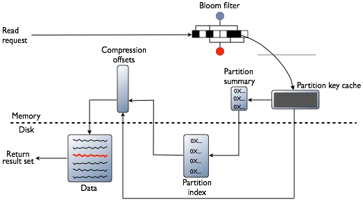

### 15.10.3 行缓存和键缓存请求流程图

> 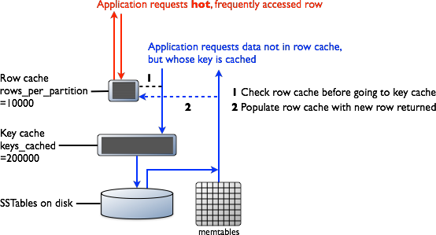
>
> **MemTable：**如果 memtable 有目标分区数据，这个数据会被读出来并且和从 SSTables 中读出来的数据进行合并。SSTable 的数据访问如下面所示的步骤。
>
> 
>
> ***Row Cache（SSTables 中频繁被访问的数据）***
>
> 在 Cassandra2.2+，它们被存储在堆外内存，使用全新的实现避免造成垃圾回收对 JVM 造成压力。存在在 row cache 的子集数据可以在特定的一段时间内配置一定大小的内存。row cache 使用 LRU(least-recently-userd)进行回收在申请内存。存储在 row cache 中的数据是 SSTables 中频繁被访问的数据。存储到row cache 中后，数据就可以被后续的查询访问。row cache 不是写更新。如果写某行了，这行的缓存就会失效，并且不会被继续缓存，直到这行被读到。类似的，如果一个partition 更新了，整个partition 的cache 都会被移除，但目标的数据在row cache 中找不到，就会去检查 Bloom filter。
>
> 
>
> ***Bloom Filter（查找数据可能对应的 SSTable）***
>
> 首先，Cassandra 检查 Bloom filter 去发现哪个 SSTables 中有可能有请求的分区数据。Bloom filter 是存储在堆外内存。每个 SSTable 都有一个关联的 Bloom filter。一个 Bloom filter 可以建立一个 SSTable 没有包含的特定的分区数据。同样也可以找到分区数据存在 SSTable 中的可能性。它可以加速查找 partition key 的查找过程。然而，因为 Bloom filter 是一个概率函数，所以可能会得到错误的结果，并不是所有的 SSTables 都可以被 Bloom filter 识别出是否有数据。如果 Bloom filter 不能够查找到 SSTable，Cassandra 会检查 partition key cache。Bloom filter 大小增长很适宜，每10 亿数据1\~2GB。在极端情况下，可以一个分区一行。都可以很轻松的将数十亿的 entries 存储在单个机器上。Bloom filter 是可以调节的，如果你愿意用内存来换取性能。
>
> 
>
> ***Partition Key Cache（查找数据可能对应的 Partition key）***
>
> partition key 缓存如果开启了，将 partition index 存储在堆外内存。key cache 使用一小块可配置大小的内存。在读的过程中，每个"hit"保存一个检索。如果在 key cache 中找到了 partition key。就直接到 compression offset map 中招对应的块。partition key cache 热启动后工作的更好，相比较冷启动，有很大的性能提升。如果一个节点上的内存非常受限制，可能的话，需要限制保存在 key cache 中的 partition key 数目。如果一个在 key cache 中没有找到 partition key。就会去partition summary 中去找。partition key cache 大小是可以配置的，意义就是存储在keycache 中的 partition keys 数目。
>
> 
>
> ***Partition Summary（内存中存储一些 partition index 的样本）***
>
> partition summary 是存储在堆外内存的结构，存储一些 partition index 的样本。如果一个 partition index 包含所有的 partition keys。鉴于一个 partition summary 从每 X 个 keys 中取样，然后将每X 个 key map 到index 文件中。例如，如果一个partition summary 设置了20keys进行取样。它就会存储 SSTable file 开始的一个 key,20th 个 key，以此类推。尽管并不知道 partition key 的具体位置，partition summary 可以缩短找到 partition 数据位置。当找到了 partition key 值可能的范围后，就会去找 partition index。通过配置取样频率，你可以用内存来换取性能，当 partition summary 包含的数据越多，使用的内存越多。可以通过表定义的[index](http://docs.datastax.com/en/cql/3.3/cql/cql_reference/cqlCreateTable.html#tabProp)[interval](http://docs.datastax.com/en/cql/3.3/cql/cql_reference/cqlCreateTable.html#tabProp)属性来改变样本频率。固定大小的内存可以通过[index_summary_capacity_in_mb](http://docs.datastax.com/en/cassandra/3.0/cassandra/configuration/configCassandra_yaml.html#configCassandra_yaml__index_summary_capacity_in_mb)属性来设置，默认是堆大小的5%。
>
> 
>
> ***Partition Index（磁盘中）***
>
> partition index 驻扎在磁盘中，索引所有 partition keys 和偏移量的映射。如果 partition summary 已经查到partition keys 的范围，现在的检索就是根据这个范围值来检索目标 partition key。需要进行单次检索和顺序读。根据找到的信息。然后去 compression offset map 中去找磁盘中有这个数据的块。如果 partition index 必须要被检索，则需要检索两次磁盘去找到目标数据。
>
> 
>
> ***Compression offset map（磁盘中）***
>
> compression offset map 存储磁盘数据准确位置的指针。存储在堆外内存，可以被 partition key cache 或者 partition index 访问。一旦 compression offset map 识别出来磁盘中的数据位置，就会从正确的 SStable(s)中取出数据。查询就会收到结果集。
>

# 16. 设计模式

## 16.1 设计原则

## 16.2 工厂方法模式

## 16.3 抽象工厂模式

## 16.4 单例模式

## 16.5 建造者模式

## 16.6 原型模式

## 16.7 适配器模式

## 16.8 装饰器模式

## 16.9 代理模式

## 16.10 外观模式

## 16.11 桥接模式

## 16.12 组合模式

## 16.13 享元模式

## 16.14 策略模式

## 16.15 模板方法模式

## 16.16 观察者模式

## 16.17 迭代子模式

## 16.18 责任链模式

## 16.19 命令模式

## 16.20 备忘录模式

## 16.21 状态模式

## 16.22 访问者模式

## 16.23 中介者模式

## 16.24 解释器模式


# 17. 负载均衡

> 负载均衡建立在现有网络结构之上，它提供了一种廉价有效透明的方法扩展[网络设备](https://baike.baidu.com/item/%E7%BD%91%E7%BB%9C%E8%AE%BE%E5%A4%87)和[服务器](https://baike.baidu.com/item/%E6%9C%8D%E5%8A%A1%E5%99%A8)的带宽、增加[吞吐量](https://baike.baidu.com/item/%E5%90%9E%E5%90%90%E9%87%8F)、加强网络数据处理能力、提高网络的灵活性和可用性。

## 17.1 四层负载均衡 vs 七层负载均衡

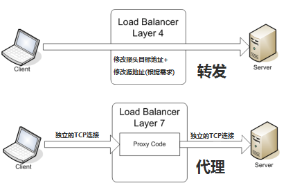

### 17.1.1 四层负载均衡（目标地址和端口交换）

> 主要通过报文中的目标地址和端口，再加上负载均衡设备设置的服务器选择方式，决定最终选择的内部服务器。
>
> 以常见的 TCP 为例，负载均衡设备在接收到第一个来自客户端的 SYN 请求时，即通过上述方式选择一个最佳的服务器，并对报文中目标 IP 地址进行修改(改为后端服务器IP），直接转发给该服务器。TCP 的连接建立，即三次握手是客户端和服务器直接建立的，负载均衡设备只是起到一个类似路由器的转发动作。在某些部署情况下，为保证服务器回包可以正确返回给负载均衡设备，在转发报文的同时可能还会对报文原来的源地址进行修改。实现四层负载均衡的软件有：
>
> *F5*：硬件负载均衡器，功能很好，但是成本很高。
>
> *lvs*：重量级的四层负载软件。
>
> *nginx*：轻量级的四层负载软件，带缓存功能，正则表达式较灵活。
>
> ***haproxy：模拟四层转发，较灵活。***

### 17.1.2  七层负载均衡（内容交换）

> 所谓七层负载均衡，也称为"内容交换"，也就是主要通过报文中的真正有意义的应用层内容，再加上负载均衡设备设置的服务器选择方式，决定最终选择的内部服务器。
>
> 七层应用负载的好处，是使得整个网络更智能化。例如访问一个网站的用户流量，可以通过七层的方式，将对图片类的请求转发到特定的图片服务器并可以使用缓存技术；将对文字类的请求可以转发到特定的文字服务器并可以使用压缩技术。实现七层负载均衡的软件有：
>
> haproxy：天生负载均衡技能，全面支持七层代理，会话保持，标记，路径转移；
>
> **nginx：只在 http 协议和 mail 协议上功能比较好，性能与 haproxy 差不多；**
>
> apache：功能较差
>
> Mysql proxy：功能尚可。

## 17.2 负载均衡算法/策略

### 17.2.1 轮循均衡（Round Robin）

> 每一次来自网络的请求轮流分配给内部中的服务器，从1 至N 然后重新开始。此种均衡算法适合于服务器组中的所有服务器都有相同的软硬件配置并且平均服务请求相对均衡的情况。

### 17.2.2 权重轮循均衡（Weighted Round Robin）

> 根据服务器的不同处理能力，给每个服务器分配不同的权值，使其能够接受相应权值数的服务请求。例如：服务器A 的权值被设计成1，B 的权值是3，C 的权值是6，则服务器A、B、C 将分别接受到10%、30％、60％的服务请求。此种均衡算法能确保高性能的服务器得到更多的使用率，避免低性能的服务器负载过重。

### 17.2.3 随机均衡（Random）

> 把来自网络的请求随机分配给内部中的多个服务器。

### 17.2.4 权重随机均衡（Weighted Random）

> 此种均衡算法类似于权重轮循算法，不过在处理请求分担时是个随机选择的过程。

### 17.2.5 响应速度均衡（Response Time 探测时间）

> 负载均衡设备对内部各服务器发出一个探测请求（例如Ping），然后根据内部中各服务器对探测请求的最快响应时间来决定哪一台服务器来响应客户端的服务请求。此种均衡算法能较好的反映服务器的当前运行状态，但这最快响应时间仅仅指的是负载均衡设备与服务器间的最快响应时间，而不是客户端与服务器间的最快响应时间。
>

### 17.2.6 最少连接数均衡（Least Connection）

> 最少连接数均衡算法对内部中需负载的每一台服务器都有一个数据记录，记录当前该服务器正在处理的连接数量，当有新的服务连接请求时，将把当前请求分配给连接数最少的服务器，使均衡更加符合实际情况，负载更加均衡。此种均衡算法适合长时处理的请求服务，如FTP。

### 17.2.7 处理能力均衡（CPU、内存）

> 此种均衡算法将把服务请求分配给内部中处理负荷（根据服务器CPU 型号、CPU 数量、内存大小及当前连接数等换算而成）最轻的服务器，由于考虑到了内部服务器的处理能力及当前网络运行状况，所以此种均衡算法相对来说更加精确，尤其适合运用到第七层（应用层）负载均衡的情况下。

### 17.2.8 DNS 响应均衡（Flash DNS）

> 在此均衡算法下，分处在不同地理位置的负载均衡设备收到同一个客户端的域名解析请求，并在同一时间内把此域名解析成各自相对应服务器的 IP 地址并返回给客户端，则客户端将以最先收到的域名解析 IP 地址来继续请求服务，而忽略其它的 IP 地址响应。在种均衡策略适合应用在全局负载均衡的情况下，对本地负载均衡是没有意义的。

### 17.2.9 哈希算法

> 一致性哈希一致性 Hash，相同参数的请求总是发到同一提供者。当某一台提供者挂时，原本发往该提供者的请求，基于虚拟节点，平摊到其它提供者，不会引起剧烈变动。

### 17.2.10 IP 地址散列（保证客户端服务器对应关系稳定）

> 通过管理发送方 IP 和目的地 IP 地址的散列，将来自同一发送方的分组(或发送至同一目的地的分组)统一转发到相同服务器的算法。当客户端有一系列业务需要处理而必须和一个服务器反复通信时，该算法能够以流(会话)为单位，保证来自相同客户端的通信能够一直在同一服务器中进行处理。

### 17.2.11 URL 散列

> 通过管理客户端请求 URL 信息的散列，将发送至相同 URL 的请求转发至同一服务器的算法。

## 17.3 LVS

### 17.3.1 LVS 原理

> ***IPVS***
>
> LVS 的 IP 负载均衡技术是通过 IPVS 模块来实现的，IPVS 是 LVS 集群系统的核心软件，它的主要作用是：安装在 Director Server 上，同时在 Director Server 上虚拟出一个 IP 地址，用户必须通过这个虚拟的 IP 地址访问服务器。这个虚拟 IP 一般称为 LVS 的 VIP，即 Virtual IP。访问的请求首先经过 VIP 到达负载调度器，然后由负载调度器从 Real Server 列表中选取一个服务节点响应用户的请求。在用户的请求到达负载调度器后，调度器如何将请求发送到提供服务的Real Server 节点，而 Real Server 节点如何返回数据给用户，是 IPVS 实现的重点技术。
>
> ipvs ：工作于内核空间，主要用于使用户定义的策略生效
>
> ipvsadm : 工作于用户空间，主要用于用户定义和管理集群服务的工具
>
> 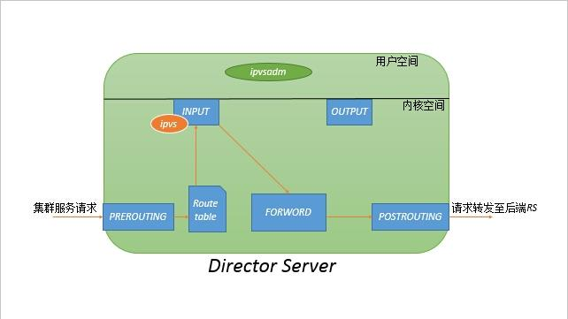
>
> ipvs 工作于内核空间的 INPUT 链上，当收到用户请求某集群服务时，经过 PREROUTING 链，经检查本机路由表，送往 INPUT 链；在进入 netfilter 的 INPUT 链时，ipvs 强行将请求报文通过ipvsadm 定义的集群服务策略的路径改为 FORWORD 链，将报文转发至后端真实提供服务的主机。

### 17.3.2 LVS NAT 模式

> 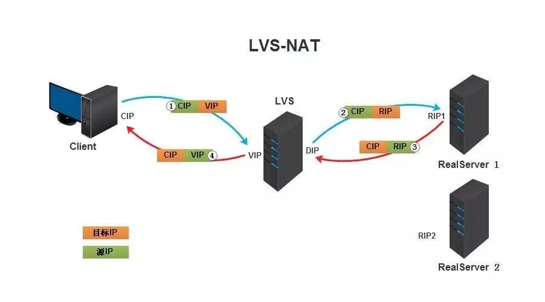
>
> ①.客户端将请求发往前端的负载均衡器，请求报文源地址是 CIP(客户端 IP),后面统称为 CIP)，目标地址为VIP(负载均衡器前端地址，后面统称为VIP)。
>
> ②.负载均衡器收到报文后，发现请求的是在规则里面存在的地址，那么它将客户端请求报文的目标地址改为了后端服务器的 RIP 地址并将报文根据算法发送出去。
>
> ③.报文送到Real Server 后，由于报文的目标地址是自己，所以会响应该请求，并将响应报文返还给 LVS。
>
> ④.然后 lvs 将此报文的源地址修改为本机并发送给客户端。
>
> 注意：在NAT 模式中，Real Server 的网关必须指向 LVS，否则报文无法送达客户端

#### 特点：

> 1、NAT 技术将请求的报文和响应的报文都需要通过 LB 进行地址改写，因此网站访问量比较大的时候 LB 负载均衡调度器有比较大的瓶颈，一般要求最多之能10-20 台节点
>
> 2、只需要在 LB 上配置一个公网 IP 地址就可以了。
>
> 3、每台内部的 realserver 服务器的网关地址必须是调度器 LB 的内网地址。
>
> 4、NAT 模式支持对 IP 地址和端口进行转换。即用户请求的端口和真实服务器的端口可以不一致。

#### 优点：

> 集群中的物理服务器可以使用任何支持 TCP/IP 操作系统，只有负载均衡器需要一个合法的 IP 地址。

#### 缺点：

> 扩展性有限。当服务器节点（普通 PC 服务器）增长过多时,负载均衡器将成为整个系统的瓶颈，因为所有的请求包和应答包的流向都经过负载均衡器。当服务器节点过多时，大量的数据包都交汇在负载均衡器那，速度就会变慢！

### LVS DR 模式（局域网改写 mac 地址）

{width="6.303298337707787in" height="3.482603893263342in"}

> ①.客户端将请求发往前端的负载均衡器，请求报文源地址是CIP，目标地址为 VIP。
>
> ②.负载均衡器收到报文后，发现请求的是在规则里面存在的地址，那么它将客户端请求报文的源
>
> MAC 地址改为自己DIP 的 MAC 地址，目标 MAC 改为了 RIP 的MAC 地址，并将此包发送给 RS。
>
> ③.RS 发现请求报文中的目的 MAC 是自己，就会将次报文接收下来，处理完请求报文后，将响应报文通过 lo 接口送给 eth0 网卡直接发送给客户端。
>
> 注意：需要设置 lo 接口的VIP 不能响应本地网络内的 arp 请求。

#### 总结：

> 1、通过在调度器 LB 上修改数据包的目的 MAC 地址实现转发。注意源地址仍然是 CIP，目的地址仍然是 VIP 地址。
>
> 2、请求的报文经过调度器，而 RS 响应处理后的报文无需经过调度器 LB，因此并发访问量大时使用效率很高（和 NAT 模式比）
>
> 3、因为 DR 模式是通过 MAC 地址改写机制实现转发，因此所有 RS 节点和调度器 LB 只能在一个局域网里面
>
> 4、RS 主机需要绑定 VIP 地址在 LO 接口（掩码32 位）上，并且需要配置 ARP 抑制。
>
> 5、RS 节点的默认网关不需要配置成 LB，而是直接配置为上级路由的网关，能让 RS 直接出网就可以。
>
> 6、由于 DR 模式的调度器仅做 MAC 地址的改写，所以调度器 LB 就不能改写目标端口，那么 RS
>
> 服务器就得使用和 VIP 相同的端口提供服务。
>
> 7、直接对外的业务比如 WEB 等，RS 的 IP 最好是使用公网 IP。对外的服务，比如数据库等最好使用内网 IP。

#### 优点：

> 和 TUN（隧道模式）一样，负载均衡器也只是分发请求，应答包通过单独的路由方法返回给客户端。与 VS-TUN 相比，VS-DR 这种实现方式不需要隧道结构，因此可以使用大多数操作系统做为物理服务器。
>
> DR 模式的效率很高，但是配置稍微复杂一点，因此对于访问量不是特别大的公司可以用
>
> haproxy/nginx 取代。日1000-2000W PV 或者并发请求1 万一下都可以考虑用haproxy/nginx。

#### 缺点：

> 所有 RS 节点和调度器 LB 只能在一个局域网里面

### LVS TUN 模式（IP 封装、跨网段）

{width="6.270766622922134in" height="3.5175in"}

> ①.客户端将请求发往前端的负载均衡器，请求报文源地址是CIP，目标地址为 VIP。
>
> ②.负载均衡器收到报文后，发现请求的是在规则里面存在的地址，那么它将在客户端请求报文的首部再封装一层 IP 报文,将源地址改为 DIP，目标地址改为 RIP,并将此包发送给 RS。
>
> ③.RS 收到请求报文后，会首先拆开第一层封装,然后发现里面还有一层 IP 首部的目标地址是自己
>
> lo 接口上的VIP，所以会处理次请求报文，并将响应报文通过 lo 接口送给eth0 网卡直接发送给客户端。
>
> 注意：需要设置 lo 接口的VIP 不能在共网上出现。

#### 总结：

1.  TUNNEL 模式必须在所有的 realserver 机器上面绑定 VIP 的 IP 地址

2.  TUNNEL 模式的 vip \-\-\-\-\--\>realserver 的包通信通过 TUNNEL 模式，不管是内网和外网都能通信，所以不需要 lvs vip 跟 realserver 在同一个网段内。

3.  TUNNEL 模式 realserver 会把 packet 直接发给 client 不会给 lvs 了

4.  TUNNEL 模式走的隧道模式，所以运维起来比较难，所以一般不用。

#### 优点：

> 负载均衡器只负责将请求包分发给后端节点服务器，而 RS 将应答包直接发给用户。所以，减少了负载均衡器的大量数据流动，负载均衡器不再是系统的瓶颈，就能处理很巨大的请求量，这种方式，一台负载均衡器能够为很多 RS 进行分发。而且跑在公网上就能进行不同地域的分发。

#### 缺点：

> 隧道模式的 RS 节点需要合法 IP ，这种方式需要所有的服务器支持" IP Tunneling "(IP
>
> Encapsulation)协议，服务器可能只局限在部分 Linux 系统上。

### LVS FULLNAT 模式

> 无论是 DR 还是 NAT 模式，不可避免的都有一个问题：LVS 和 RS 必须在同一个 VLAN 下，否则
>
> LVS 无法作为 RS 的网关。这引发的两个问题是：
>
> 1、同一个 VLAN 的限制导致运维不方便，跨 VLAN 的 RS 无法接入。
>
> 2、LVS 的水平扩展受到制约。当 RS 水平扩容时，总有一天其上的单点 LVS 会成为瓶颈。
>
> Full-NAT 由此而生，解决的是 LVS 和 RS 跨 VLAN 的问题，而跨 VLAN 问题解决后，LVS 和 RS
>
> 不再存在 VLAN 上的从属关系，可以做到多个 LVS 对应多个 RS，解决水平扩容的问题。
>
> Full-NAT 相比 NAT 的主要改进是，在 SNAT/DNAT 的基础上，加上另一种转换，转换过程如下：
>
> {width="5.034386482939633in" height="3.5437489063867016in"}

1.  在包从 LVS 转到 RS 的过程中，源地址从客户端 IP 被替换成了 LVS 的内网 IP。内网 IP 之间可以通过多个交换机跨 VLAN 通信。目标地址从 VIP 修改为 RS IP.

2.  当 RS 处理完接受到的包，处理完成后返回时，将目标地址修改为 LVS ip，原地址修改为 RS

> IP，最终将这个包返回给 LVS 的内网 IP，这一步也不受限于 VLAN。

3.  LVS 收到包后，在 NAT 模式修改源地址的基础上，再把 RS 发来的包中的目标地址从 LVS 内网 IP 改为客户端的 IP,并将原地址修改为 VIP。

> Full-NAT 主要的思想是把网关和其下机器的通信，改为了普通的网络通信，从而解决了跨 VLAN的问题。采用这种方式，LVS 和 RS 的部署在 VLAN 上将不再有任何限制，大大提高了运维部署的便利性。

#### 总结

1.  FULL NAT 模式不需要 LBIP 和 realserver ip 在同一个网段；

2.  full nat 因为要更新 sorce ip 所以性能正常比 nat 模式下降10%

    1.  ## Keepalive

> keepalive 起初是为 LVS 设计的，专门用来监控 lvs 各个服务节点的状态，后来加入了 vrrp 的功能，因此除了 lvs，也可以作为其他服务（nginx，haproxy）的高可用软件。VRRP 是 virtual router redundancy protocal（虚拟路由器冗余协议）的缩写。VRRP 的出现就是为了解决静态路由出现的单点故障，它能够保证网络可以不间断的稳定的运行。所以 keepalive 一方面具有 LVS cluster node healthcheck 功能，另一方面也具有 LVS director failover。

## Nginx 反向代理负载均衡

> 普通的负载均衡软件，如 LVS，其实现的功能只是对请求数据包的转发、传递，从负载均衡下的节点服务器来看，接收到的请求还是来自访问负载均衡器的客户端的真实用户；而反向代理就不一
>
> 样了，反向代理服务器在接收访问用户请求后，会代理用户重新发起请求代理下的节点服务器，最后把数据返回给客户端用户。在节点服务器看来，访问的节点服务器的客户端用户就是反向代理服务器，而非真实的网站访问用户。

### upstream_module 和健康检测

> ngx_http_upstream_module 是负载均衡模块，可以实现网站的负载均衡功能即节点的健康检查，upstream 模块允许Nginx 定义一组或多组节点服务器组，使用时可通过 proxy_pass 代理方式把网站的请求发送到事先定义好的对应 Upstream 组的名字上。

+---------------------+---------------------------------------------------------------------------------------------------------------------------------------------------------------------------------------------------------------------------------+
|> **upstream 模块**|> **参数说明**|
|> ||
|> **内参数**||
+=====================+=================================================================================================================================================================================================================================+
| weight |服务器权重|
+---------------------+---------------------------------------------------------------------------------------------------------------------------------------------------------------------------------------------------------------------------------+
| max_fails | Nginx 尝试连接后端主机失败的此时，这是值是配合 proxy_next_upstream、|
|||
|| fastcgi_next_upstream 和 memcached_next_upstream 这三个参数来使用的。当 Nginx接收后端服务器返回这三个参数定义的状态码时，会将这个请求转发给正常工作的的后端服务器。如404、503、503,max_files=1 |
+---------------------+---------------------------------------------------------------------------------------------------------------------------------------------------------------------------------------------------------------------------------+
| fail_timeout | max_fails 和 fail_timeout 一般会关联使用，如果某台 server 在 fail_timeout 时间内出现了|
|||
|| max_fails 次连接失败，那么 Nginx 会认为其已经挂掉，从而在 fail_timeout 时间内不再去请求它，fail_timeout 默认是10s，max_fails 默认是1，即默认情况只要是发生错误就认为服务器挂了，如果将 max_fails 设置为0，则表示取消这项检查|
+---------------------+---------------------------------------------------------------------------------------------------------------------------------------------------------------------------------------------------------------------------------+
| backup |表示当前 server 是备用服务器，只有其它非 backup 后端服务器都挂掉了或很忙才会分配请|
|||
||求给它|
+---------------------+---------------------------------------------------------------------------------------------------------------------------------------------------------------------------------------------------------------------------------+
| down |标志服务器永远不可用，可配合 ip_hash 使用|
+---------------------+---------------------------------------------------------------------------------------------------------------------------------------------------------------------------------------------------------------------------------+

### 18.1.5.1. proxy_pass 请求转发

> proxy_pass 指令属于 ngx_http_proxy_module 模块，此模块可以将请求转发到另一台服务器，在实际的反向代理工作中，会通过 location 功能匹配指定的 URI，然后把接收到服务匹配 URI 的请求通过 proyx_pass 抛给定义好的 upstream 节点池。

+----------------------------------------+----------------------------------------------------------+
|\#交给后端 upstream 为 download 的节点||
+========================================+==========================================================+
|> **proxy 模块参数**|> **说明**|
+----------------------------------------+----------------------------------------------------------+
| proxy_next_upstream |什么情况下将请求传递到下一个 upstream |
+----------------------------------------+----------------------------------------------------------+
| proxy_limite_rate |限制从后端服务器读取响应的速率|
+----------------------------------------+----------------------------------------------------------+
| proyx_set_header |设置 http 请求 header 传给后端服务器节点，如：可实现让代|
|||
||理后端的服务器节点获取访问客户端的这是 ip |
+----------------------------------------+----------------------------------------------------------+
| client_body_buffer_size |客户端请求主体缓冲区大小|
+----------------------------------------+----------------------------------------------------------+
| proxy_connect_timeout |代理与后端节点服务器连接的超时时间|
+----------------------------------------+----------------------------------------------------------+
| proxy_send_timeout |后端节点数据回传的超时时间|
+----------------------------------------+----------------------------------------------------------+
| proxy_read_timeout |设置Nginx 从代理的后端服务器获取信息的时间，表示连接成|
|||
||功建立后，Nginx 等待后端服务器的响应时间|
+----------------------------------------+----------------------------------------------------------+
| proxy_buffer_size |设置缓冲区大小|
+----------------------------------------+----------------------------------------------------------+
| proxy_buffers |设置缓冲区的数量和大小|
+----------------------------------------+----------------------------------------------------------+
| proyx_busy_buffers_size |用于设置系统很忙时可以使用的 proxy_buffers 大小，推荐为|
|||
|| proxy_buffers\*2 |
+----------------------------------------+----------------------------------------------------------+
| proxy_temp_file_write_size |指定 proxy 缓存临时文件的大小|
+----------------------------------------+----------------------------------------------------------+

## HAProxy

# 19.数据库

1.  ## 存储引擎

    1.  ### 概念

> [数据库](http://lib.csdn.net/base/mysql)存储引擎是数据库底层软件组织，数据库管理系统（DBMS）使用数据引擎进行创建、查询、更新和删除数据。不同的存储引擎提供不同的存储机制、索引技巧、锁定水平等功能，使用不同的存储引擎，还可以获得特定的功能。现在许多不同的数据库管理系统都支持多种不同的数据引擎。存储引擎主要有：1. MyIsam ,2. InnoDB,3. Memory,4. Archive,5. Federated 。

2.  bookmark686"**InnoDB（B+树）**

> InnoDB 底层存储结构为B+树， B树的每个节点对应innodb 的一个page，page 大小是固定的，一般设为16k。其中非叶子节点只有键值，叶子节点包含完成数据。

{width="4.996848206474191in" height="3.1875in"}

> 适用场景：
>
> 1）经常更新的表，适合处理多重并发的更新请求。
>
> 2）支持事务。
>
> 3）可以从灾难中恢复（通过 bin-log 日志等）。
>
> 4）外键约束。只有他支持外键。
>
> 5）支持自动增加列属性 auto_increment。

3.  bookmark687"**TokuDB（Fractal Tree-节点带数据）**

> TokuDB 底层存储结构为Fractal Tree,Fractal Tree 的结构与 B+树有些类似,在 Fractal Tree中，每一个 child 指针除了需要指向一个 child 节点外，还会带有一个 Message Buffer ，这个 Message Buffer 是一个 FIFO 的队列，用来缓存更新操作。
>
> 例如，一次插入操作只需要落在某节点的 Message Buffer 就可以马上返回了，并不需要搜索到叶子节点。这些缓存的更新会在查询时或后台异步合并应用到对应的节点中。

{width="5.450505249343832in" height="2.8004166666666666in"}

> TokuDB 在线添加索引，不影响读写操作,非常快的写入性能， Fractal-tree 在事务实现上有优势。他主要适用于访问频率不高的数据或历史数据归档。

### MyIASM

> MyIASM 是MySQL 默认的引擎，但是它没有提供对数据库事务的支持，也不支持行级锁和外键，因此当 INSERT(插入)或 UPDATE(更新)数据时即写操作需要锁定整个表，效率便会低一些。
>
> ISAM 执行读取操作的速度很快，而且不占用大量的内存和存储资源。在设计之初就预想数据组织成有固定长度的记录，按顺序存储的。\-\--ISAM 是一种静态索引结构。
>
> 缺点是它不支持事务处理。

### Memory

> Memory（也叫 HEAP）堆内存：使用存在内存中的内容来创建表。每个 MEMORY 表只实际对应一个磁盘文件。MEMORY 类型的表访问非常得快，因为它的数据是放在内存中的，并且默认使用
>
> HASH 索引。但是一旦服务关闭，表中的数据就会丢失掉。 Memory 同时支持散列索引和 B 树索引，B 树索引可以使用部分查询和通配查询，也可以使用\<,\>和\>=等操作符方便数据挖掘，散列索
>
> 引相等的比较快但是对于范围的比较慢很多。

## 索引

> 索引（Index）是帮助 MySQL 高效获取数据的数据结构。常见的查询算法,顺序查找,二分查找,二叉排序树查找,哈希散列法,分块查找,平衡多路搜索树B 树（B-tree）

### 常见索引原则有

> 692"***1.选择唯一性索引***
>
> 1．唯一性索引的值是唯一的，可以更快速的通过该索引来确定某条记录。

#######*2.*为经常需要排序、分组和联合操作的字段建立索引：

#######*3*．为常作为查询条件的字段建立索引。

#######*4*．限制索引的数目：

> 越多的索引，会使更新表变得很浪费时间。

#######尽量使用数据量少的索引

> 6．如果索引的值很长，那么查询的速度会受到影响。

#######尽量使用前缀来索引

> 7．如果索引字段的值很长，最好使用值的前缀来索引。

#######*7*．删除不再使用或者很少使用的索引

#######*8 .*最左前缀匹配原则，非常重要的原则。

#######*.*尽量选择区分度高的列作为索引

> 区分度的公式是表示字段不重复的比例

11. #######*.*索引列不能参与计算，保持列"干净"：带函数的查询不参与索引。

12. #######*.*尽量的扩展索引，不要新建索引。

    1.  ## 数据库三范式

> 范式是具有最小冗余的表结构。3 范式具体如下：

1.  bookmark704"**第一范式(1st NF**－列都是不可再分)

> 第一范式的目标是确保每列的原子性:如果每列都是不可再分的最小数据单元（也称为最小的原子单元），则满足第一范式（1NF）

{width="6.299528652668417in" height="1.473332239720035in"}

2.  bookmark705"**第二范式(2nd NF**－每个表只描述一件事情)

> 首先满足第一范式，并且表中非主键列不存在对主键的部分依赖。第二范式要求每个表只描述一件事情。

{width="4.760730533683289in" height="1.7875in"}

### 第三范式(3rd NF－不存在对非主键列的传递依赖)

> 第三范式定义是，满足第二范式，并且表中的列不存在对非主键列的传递依赖。除了主键订单编号外，顾客姓名依赖于非主键顾客编号。

{width="6.278326771653544in" height="2.6739577865266844in"}

## 数据库是事务

> 事务(TRANSACTION)是作为单个逻辑工作单元执行的一系列操作，这些操作作为一个整体一起向系统提交，要么都执行、要么都不执行。事务是一个不可分割的工作逻辑单元
>
> 事务必须具备以下四个属性，简称ACID 属性：
>
> 708"***原子性（Atomicity）***

1.  事务是一个完整的操作。事务的各步操作是不可分的（原子的）；要么都执行，要么都不执行。

> 709"***一致性（Consistency）***

2.  当事务完成时，数据必须处于一致状态。

> 710"***隔离性（Isolation）***

3.  对数据进行修改的所有并发事务是彼此隔离的，这表明事务必须是独立的，它不应以任何方式依赖于或影响其他事务。

> 711"***永久性（Durability）***

4.  事务完成后，它对数据库的修改被永久保持，事务日志能够保持事务的永久性。

    1.  ## 存储过程(特定功能的 SQL 语句集)

> 一组为了完成特定功能的 SQL 语句集，存储在数据库中，经过第一次编译后再次调用不需要再次编译，用户通过指定存储过程的名字并给出参数（如果该存储过程带有参数）来执行它。存储过程是数据库中的一个重要对象。

### 存储过程优化思路：

1.  尽量利用一些sql 语句来替代一些小循环，例如聚合函数，求平均函数等。

2.  中间结果存放于临时表，加索引。

3.  少使用游标。sql 是个集合语言，对于集合运算具有较高性能。而 cursors 是过程运算。比如对一个100 万行的数据进行查询。游标需要读表100 万次，而不使用游标则只需要少量几次读取。

4.  事务越短越好。sqlserver 支持并发操作。如果事务过多过长，或者隔离级别过高，都会造成并发操作的阻塞，死锁。导致查询极慢，cpu 占用率极地。

5.  使用try-catch 处理错误异常。

6.  查找语句尽量不要放在循环内。

    1.  ## 触发器(一段能自动执行的程序)

> 触发器是一段能自动执行的程序，是一种特殊的存储过程，触发器和普通的存储过程的区别是：触发器是当对某一个表进行操作时触发。诸如：update、insert、delete 这些操作的时候，系统会自动调用执行该表上对应的触发器。SQL Server 2005 中触发器可以分为两类：DML 触发器和
>
> DDL 触发器，其中 DDL 触发器它们会影响多种数据定义语言语句而激发，这些语句有 create、
>
> alter、drop 语句。

## 数据库并发策略

> 并发控制一般采用三种方法，分别是乐观锁和悲观锁以及时间戳。

### 乐观锁

> 乐观锁认为一个用户读数据的时候，别人不会去写自己所读的数据；悲观锁就刚好相反，觉得自己读数据库的时候，别人可能刚好在写自己刚读的数据，其实就是持一种比较保守的态度；时间戳就是不加锁，通过时间戳来控制并发出现的问题。

### 悲观锁

> 悲观锁就是在读取数据的时候，为了不让别人修改自己读取的数据，就会先对自己读取的数据加锁，只有自己把数据读完了，才允许别人修改那部分数据，或者反过来说，就是自己修改某条数据的时候，不允许别人读取该数据，只有等自己的整个事务提交了，才释放自己加上的锁，才允许其他用户访问那部分数据。

### 时间戳

> 时间戳就是在数据库表中单独加一列时间戳，比如"TimeStamp"，每次读出来的时候，把该字段也读出来，当写回去的时候，把该字段加1，提交之前，跟数据库的该字段比较一次，如果比数据库的值大的话，就允许保存，否则不允许保存，这种处理方法虽然不使用数据库系统提供的锁机制，但是这种方法可以大大提高数据库处理的并发量，
>
> 以上悲观锁所说的加"锁"，其实分为几种锁，分别是：排它锁（写锁）和共享锁（读锁）。

3.  ## 数据库锁

    1.  ### 行级锁

> 行级锁是一种排他锁，防止其他事务修改此行；在使用以下语句时，Oracle 会自动应用行级锁：

1.  INSERT、UPDATE、DELETE、SELECT ... FOR UPDATE \[OF columns\]\[WAIT n \| NOWAIT\];

2.  SELECT ... FOR UPDATE 语句允许用户一次锁定多条记录进行更新

3.  使用COMMIT 或 ROLLBACK 语句释放锁。

    1.  ### 表级锁

> 表示对当前操作的整张表加锁，它实现简单，资源消耗较少，被大部分 MySQL 引擎支持。最常使用的 MYISAM 与 INNODB 都支持表级锁定。表级锁定分为表共享读锁（共享锁）与表独占写锁
>
> （排他锁）。

### 19.1.8.1.页级锁

> 页级锁是 MySQL 中锁定粒度介于行级锁和表级锁中间的一种锁。表级锁速度快，但冲突多，行级冲突少，但速度慢。所以取了折衷的页级，一次锁定相邻的一组记录。BDB 支持页级锁

## 基于 Redis 分布式锁

1.  获取锁的时候，使用setnx（SETNX key val：当且仅当 key 不存在时，set 一个 key为 val 的字符串，返回1；若 key 存在，则什么都不做，返回0）加锁，锁的 value值为一个随机生成的 UUID，在释放锁的时候进行判断。并使用 expire 命令为锁添加一个超时时间，超过该时间则自动释放锁。

2.  获取锁的时候调用 setnx，如果返回0，则该锁正在被别人使用，返回1 则成功获取锁。还设置一个获取的超时时间，若超过这个时间则放弃获取锁。

3.  释放锁的时候，通过 UUID 判断是不是该锁，若是该锁，则执行 delete 进行锁释放。

    1.  ## 分区分表

> 分库分表有垂直切分和水平切分两种。

#######垂直切分*(*按照功能模块*)*

-   将表按照功能模块、关系密切程度划分出来，部署到不同的库上。例如，我们会建立定义数据库 workDB、商品数据库 payDB、用户数据库 userDB、日志数据库 logDB 等，分别用于存储项目数据定义表、商品定义表、用户数据表、日志数据表等。

{width="3.0992410323709536in" height="3.0359372265966753in"}

#######水平切分*(*按照规则划分存储*)*

-   当一个表中的数据量过大时，我们可以把该表的数据按照某种规则，例如 userID 散列，进行划分，然后存储到多个结构相同的表，和不同的库上。

{width="3.4930708661417325in" height="1.95in"}

## 两阶段提交协议

> 分布式事务是指会涉及到操作多个数据库的事务,在分布式系统中，各个节点之间在物理上相互独立，通过网络进行沟通和协调。
>
> XA 就是 X/Open DTP 定义的交易中间件与数据库之间的接口规范（即接口函数），交易中间件用它来通知数据库事务的开始、结束以及提交、回滚等。 XA 接口函数由数据库厂商提供。
>
> 二阶段提交(Two-phaseCommit)是指，在计算机网络以及数据库领域内，为了使基于分布式系统架构下的所有节点在进行事务提交时保持一致性而设计的一种算法(Algorithm)。通常，二阶段提交也被称为是一种协议(Protocol))。在分布式系统中，每个节点虽然可以知晓自己的操作时成功或者失败，却无法知道其他节点的操作的成功或失败。当一个事务跨越多个节点时，为了保持事务的 ACID 特性，需要引入一个作为协调者的组件来统一掌控所有节点(称作参与者)的操作结果并最终指示这些节点是否要把操作结果进行真正的提交(比如将更新后的数据写入磁盘等等)。因此，二阶段提交的算法思路可以概括为：参与者将操作成败通知协调者，再由协调者根据所有参与者的反馈情报决定各参与者是否要提交操作还是中止操作。

### 准备阶段

> 事务协调者(事务管理器)给每个参与者(资源管理器)发送 Prepare 消息，每个参与者要么直接返回失败(如权限验证失败)，要么在本地执行事务，写本地的 redo 和 undo 日志，但不提交，到达一种"万事俱备，只欠东风"的状态。

### 提交阶段

> 如果协调者收到了参与者的失败消息或者超时，直接给每个参与者发送回滚(Rollback)消息；否则，发送提交(Commit)消息；参与者根据协调者的指令执行提交或者回滚操作，释放所有事务处理过程中使用的锁资源。(注意:必须在最后阶段释放锁资源)

### 缺点

#######同步阻塞问题

> 1、执行过程中，所有参与节点都是事务阻塞型的。

#######单点故障

> 2、由于协调者的重要性，一旦协调者发生故障。参与者会一直阻塞下去。

#######数据不一致（脑裂问题）

> 3、在二阶段提交的阶段二中，当协调者向参与者发送 commit 请求之后，发生了局部网络异常或者在发送 commit 请求过程中协调者发生了故障，导致只有一部分参与者接受到了
>
> commit 请求。于是整个分布式系统便出现了数据部一致性的现象(脑裂现象)。

#######二阶段无法解决的问题（数据状态不确定）

> 4、协调者再发出 commit 消息之后宕机，而唯一接收到这条消息的参与者同时也宕机了。那么即使协调者通过选举协议产生了新的协调者，这条事务的状态也是不确定的，没人知道事务是否被已经提交。

## 三阶段提交协议

> 三阶段提交（ Three-phase commit ），也叫三阶段提交协议（ Three-phase commit
>
> protocol），是二阶段提交（2PC）的改进版本。与两阶段提交不同的是，三阶段提交有两个改动点。
>
> 1、引入超时机制。同时在协调者和参与者中都引入超时机制。
>
> 2、在第一阶段和第二阶段中插入一个准备阶段。保证了在最后提交阶段之前各参与节点的状态是一致的。也就是说，除了引入超时机制之外，3PC 把2PC 的准备阶段再次一分为二，这样三阶段提交就有CanCommit、PreCommit、DoCommit 三个阶段。

### CanCommit 阶段

> 协调者向参与者发送 commit 请求，参与者如果可以提交就返回 Yes 响应，否则返回No 响应。

### PreCommit 阶段

> 协调者根据参与者的反应情况来决定是否可以继续进行，有以下两种可能。假如协调者从所有的参与者获得的反馈都是Yes 响应，那么就会执行事务的预执行假如有任何一个参与者向协调者发送了 No 响应，或者等待超时之后，协调者都没有接到参与者的响应，那么就执行事务的中断。

### doCommit 阶段

> 该阶段进行真正的事务提交，主要包含1.协调这发送提交请求2.参与者提交事务3.参与者响应反馈（事务提交完之后，向协调者发送 Ack 响应。）4.协调者确定完成事务。

3.  ## 柔性事务

    1.  ### 柔性事务

> 在电商领域等互联网场景下，传统的事务在数据库性能和处理能力上都暴露出了瓶颈。在分布式领域基于CAP 理论以及 BASE 理论，有人就提出了柔性事务的概念。CAP（一致性、可用性、分区容忍性）理论大家都理解很多次了，这里不再叙述。说一下 BASE 理论，它是在 CAP 理论的基础之上的延伸。包括基本可用（Basically Available）、柔性状态（Soft State）、最终一致性
>
> （Eventual Consistency）。
>
> 通常所说的柔性事务分为：两阶段型、补偿型、异步确保型、最大努力通知型几种。

#######两阶段型

> 1、就是分布式事务两阶段提交，对应技术上的 XA、JTA/JTS。这是分布式环境下事务处理的典型模式。

#######补偿型

> 2、TCC 型事务（Try/Confirm/Cancel）可以归为补偿型。
>
> WS-BusinessActivity 提供了一种基于补偿的 long-running 的事务处理模型。服务器 A 发起事务，服务器 B 参与事务，服务器 A 的事务如果执行顺利，那么事务 A 就先行提交，如果事务 B 也执行顺利，则事务 B 也提交，整个事务就算完成。但是如果事务 B 执行失败，事务 B 本身回滚，这时事务 A 已经被提交，所以需要执行一个补偿操作，将已经提交的事务 A 执行的操作作反操作，恢复到未执行前事务 A 的状态。这样的 SAGA 事务模型，是牺牲了一定的隔离性和一致性的，但是提高了 long-running 事务的可用性。

{width="3.3052635608048995in" height="3.99875in"}

#######异步确保型

> 3、通过将一系列同步的事务操作变为基于消息执行的异步操作,避免了分布式事务中的同步阻塞操作的影响。

{width="6.240939413823272in" height="2.1032283464566928in"}

#######最大努力通知型（多次尝试）

> 4、这是分布式事务中要求最低的一种,也可以通过消息中间件实现,与前面异步确保型操作不同的一点是,在消息由 MQ Server 投递到消费者之后,**允许在达到最大重试次数之后正常结束事务。**

## CAP

> CAP 原则又称 CAP 定理，指的是在一个分布式系统中， Consistency（一致性）、 Availability
>
> （可用性）、Partition tolerance（分区容错性），三者不可得兼。

### 一致性（C）：

1.  在分布式系统中的所有数据备份，在同一时刻是否同样的值。（等同于所有节点访问同一份最新的数据副本）

### 可用性（A）：

2.  在集群中一部分节点故障后，集群整体是否还能响应客户端的读写请求。（对数据更新具备高可用性）

### 分区容忍性（P）：

3.  以实际效果而言，分区相当于对通信的时限要求。系统如果不能在时限内达成数据一致性，就意味着发生了分区的情况，必须就当前操作在C 和 A 之间做出选择。

# 20.一致性算法

## Paxos

> Paxos 算法解决的问题是一个分布式系统如何就某个值（决议）达成一致。一个典型的场景是，在一个分布式数据库系统中，如果各节点的初始状态一致，每个节点执行相同的操作序列，那么他们最后能得到一个一致的状态。为保证每个节点执行相同的命令序列，需要在每一条指令上执行一个"一致性算法"以保证每个节点看到的指令一致。zookeeper 使用的 zab 算法是该算法的一个实现。在Paxos 算法中，有三种角色：Proposer，Acceptor，Learners

### Paxos 三种角色：Proposer，Acceptor，Learners

> 752"***Proposer：***
>
> 只要 Proposer 发的提案被半数以上 Acceptor 接受，Proposer 就认为该提案里的 value 被选定了。
>
> 753"***Acceptor：***
>
> 只要Acceptor 接受了某个提案，Acceptor 就认为该提案里的 value 被选定了。
>
> 754"***Learner：***
>
> Acceptor 告诉 Learner 哪个 value 被选定，Learner 就认为那个 value 被选定。

### Paxos 算法分为两个阶段。具体如下：

> 756"***阶段一（准 leader 确定）：***

(a) Proposer 选择一个提案编号N，然后向半数以上的Acceptor 发送编号为N 的Prepare 请求。

(b)如果一个 Acceptor 收到一个编号为N 的 Prepare 请求，且N 大于该 Acceptor 已经响应过的所有 Prepare 请求的编号，那么它就会将它已经接受过的编号最大的提案（如果有的话）作为响应反馈给Proposer，同时该 Acceptor 承诺不再接受任何编号小于N 的提案。

> 757"***阶段二（leader 确认）：***

(a)如果 Proposer 收到半数以上 Acceptor 对其发出的编号为 N 的 Prepare 请求的响应，那么它就会发送一个针对\[N,V\]提案的 Accept 请求给半数以上的 Acceptor。注意：V 就是收到的响应中编号最大的提案的 value，如果响应中不包含任何提案，那么 V 就由 Proposer 自己决定。

(b)如果 Acceptor 收到一个针对编号为 N 的提案的 Accept 请求，只要该 Acceptor 没有对编号大于N 的 Prepare 请求做出过响应，它就接受该提案。

    1.## Zab

> ZAB( ZooKeeper Atomic Broadcast , ZooKeeper 原子消息广播协议）协议包括两种基本的模式：崩溃恢复和消息广播

1.  当整个服务框架在启动过程中，或是当 Leader 服务器出现网络中断崩溃退出与重启等异常情况时，ZAB 就会进入恢复模式并选举产生新的 Leader 服务器。

2.  当选举产生了新的 Leader 服务器，同时集群中已经有过半的机器与该 Leader 服务器完成了状态同步之后，ZAB 协议就会退出崩溃恢复模式，进入消息广播模式。

3.  当有新的服务器加入到集群中去，如果此时集群中已经存在一个 Leader 服务器在负责进行消息广播，那么新加入的服务器会自动进入数据恢复模式，找到 Leader 服务器，并与其进行数

> 据同步，然后一起参与到消息广播流程中去。
>
> 以上其实大致经历了三个步骤：
>
> 759"***1.崩溃恢复：主要就是 Leader 选举过程***
>
> 760"***2.数据同步：Leader 服务器与其他服务器进行数据同步***
>
> 761"***3.消息广播：Leader 服务器将数据发送给其他服务器***
>
> 说明：zookeeper 章节对该协议有详细描述。

## Raft

> 与Paxos 不同 Raft 强调的是易懂（Understandability），Raft 和Paxos 一样只要保证 n/2+1 节点正常就能够提供服务；raft 把算法流程分为三个子问题：选举（Leader election）、日志复制
>
> （Log replication）、安全性（Safety）三个子问题。

### 角色

> Raft 把集群中的节点分为三种状态：Leader、 Follower 、Candidate，理所当然每种状态负责的任务也是不一样的，Raft 运行时提供服务的时候只存在 Leader 与Follower 两种状态；
>
> 764"***Leader（领导者-日志管理）***
>
> 负责日志的同步管理，处理来自客户端的请求，与Follower 保持这 heartBeat 的联系；
>
> 765"***Follower（追随者-日志同步）***
>
> 刚启动时所有节点为Follower 状态，响应Leader 的日志同步请求，响应Candidate 的请求，把请求到Follower 的事务转发给 Leader；
>
> 766"***Candidate（候选者-负责选票）***
>
> 负责选举投票，Raft 刚启动时由一个节点从 Follower 转为 Candidate 发起选举，选举出
>
> Leader 后从Candidate 转为 Leader 状态；

### Term（任期）

> 在 Raft 中使用了一个可以理解为周期（第几届、任期）的概念，用 Term 作为一个周期，每个 Term 都是一个连续递增的编号，每一轮选举都是一个 Term 周期，在一个 Term 中只能产生一个 Leader；当某节点收到的请求中 Term 比当前 Term 小时则拒绝该请求。

### 选举（Election）

#######选举定时器

> Raft 的选举由定时器来触发，每个节点的选举定时器时间都是不一样的，开始时状态都为
>
> Follower 某个节点定时器触发选举后 Term 递增，状态由 Follower 转为Candidate，向其他节点发起 RequestVote RPC 请求，这时候有三种可能的情况发生：
>
> 1：该 RequestVote 请求接收到 n/2+1（过半数）个节点的投票，从 Candidate 转为 Leader，向其他节点发送 heartBeat 以保持 Leader 的正常运转。
>
> 2：在此期间如果收到其他节点发送过来的 AppendEntries RPC 请求，如该节点的 Term 大则当前节点转为 Follower，否则保持 Candidate 拒绝该请求。
>
> 3：Election timeout 发生则 Term 递增，重新发起选举
>
> 在一个 Term 期间每个节点只能投票一次，所以当有多个 Candidate 存在时就会出现每个
>
> Candidate 发起的选举都存在接收到的投票数都不过半的问题，这时每个 Candidate 都将 Term递增、重启定时器并重新发起选举，由于每个节点中定时器的时间都是随机的，所以就不会多次存在有多个 Candidate 同时发起投票的问题。
>
> 在 Raft 中当接收到客户端的日志（事务请求）后先把该日志追加到本地的 Log 中，然后通过
>
> heartbeat 把该Entry 同步给其他Follower，Follower 接收到日志后记录日志然后向 Leader 发送 ACK，当 Leader 收到大多数（n/2+1）Follower 的 ACK 信息后将该日志设置为已提交并追加到本地磁盘中，通知客户端并在下个 heartbeat 中 Leader 将通知所有的 Follower 将该日志存储在自己的本地磁盘中。

### 安全性（Safety）

> 安全性是用于保证每个节点都执行相同序列的安全机制如当某个Follower 在当前 Leader commit
>
> Log 时变得不可用了，稍后可能该 Follower 又会倍选举为 Leader，这时新 Leader 可能会用新的
>
> Log 覆盖先前已 committed 的 Log，这就是导致节点执行不同序列；Safety 就是用于保证选举出来的 Leader 一定包含先前 commited Log 的机制；
>
> 选举安全性（Election Safety）：每个 Term 只能选举出一个 Leader
>
> Leader 完整性（Leader Completeness）：这里所说的完整性是指 Leader 日志的完整性，
>
> Raft 在选举阶段就使用 Term 的判断用于保证完整性：当请求投票的该 Candidate 的 Term 较大或 Term 相同 Index 更大则投票，该节点将容易变成 leader。

###### 相同点

5.  **\
    
    > raft 协议和 zab 协议区别**

-   采用 quorum 来确定整个系统的一致性,这个 quorum 一般实现是集群中半数以上的服务器,

-   zookeeper 里还提供了带权重的 quorum 实现.

-   都由 leader 来发起写操作.

-   都采用心跳检测存活性

-   leader election 都采用先到先得的投票方式

###### 不同点

-   zab 用的是 epoch 和 count 的组合来唯一表示一个值,而raft 用的是term 和 index

-   zab 的 follower 在投票给一个 leader 之前必须和 leader 的日志达成一致,而 raft 的 follower

> 则简单地说是谁的 term 高就投票给谁

-   raft 协议的心跳是从 leader 到 follower,而 zab 协议则相反

-   raft 协议数据只有单向地从 leader 到follower(成为 leader 的条件之一就是拥有最新的 log),

> 而 zab 协议在 discovery 阶段,一个 prospective leader 需要将自己的 log 更新为 quorum 里面最新的 log,然后才好在synchronization 阶段将 quorum 里的其他机器的 log 都同步到一致.

## NWR

#######*N*：在分布式存储系统中，有多少份备份数据

#######*W*：代表一次成功的更新操作要求至少有*w*份数据写入成功

#######*R*：代表一次成功的读数据操作要求至少有*R*份数据成功读取

> NWR 值的不同组合会产生不同的一致性效果，当W+R\>N 的时候，整个系统对于客户端来讲能保证强一致性。而如果 R+W\<=N，则无法保证数据的强一致性。以常见的 N=3、W=2、R=2 为例：
>
> N=3，表示，任何一个对象都必须有三个副本（ Replica），W=2 表示，对数据的修改操作
>
> （Write）只需要在3 个 Replica 中的2 个上面完成就返回，R=2 表示，从三个对象中要读取到2
>
> 个数据对象，才能返回。

{width="4.230412292213473in" height="3.2070833333333333in"}

## Gossip

> Gossip 算法又被称为反熵（Anti-Entropy），熵是物理学上的一个概念，代表杂乱无章，而反熵就是在杂乱无章中寻求一致，这充分说明了 Gossip 的特点：在一个有界网络中，每个节点都随机
>
> 地与其他节点通信，经过一番杂乱无章的通信，最终所有节点的状态都会达成一致。每个节点可能知道所有其他节点，也可能仅知道几个邻居节点，只要这些节可以通过网络连通，最终他们的状态都是一致的，当然这也是疫情传播的特点。

## 一致性 Hash

> 一致性哈希算法(Consistent Hashing Algorithm)是一种分布式算法，常用于负载均衡。 Memcached client 也选择这种算法，解决将 key-value 均匀分配到众多 Memcached server 上的问题。它可以取代传统的取模操作，解决了取模操作无法应对增删 Memcached Server 的问题
>
> (增删 server 会导致同一个 key,在 get 操作时分配不到数据真正存储的 server，命中率会急剧下降)。

### 一致性 Hash 特性

-   平衡性(Balance)：平衡性是指哈希的结果能够尽可能分布到所有的缓冲中去，这样可以使得所有的缓冲空间都得到利用。

-   单调性(Monotonicity)：单调性是指如果已经有一些内容通过哈希分派到了相应的缓冲中，又有新的缓冲加入到系统中。哈希的结果应能够保证原有已分配的内容可以被映射到新的缓

> 冲中去，而不会被映射到旧的缓冲集合中的其他缓冲区。容易看到，上面的简单求余算法
>
> hash(object)%N 难以满足单调性要求。

-   平滑性(Smoothness)：平滑性是指缓存服务器的数目平滑改变和缓存对象的平滑改变是一致的。

    1.  ### 一致性 Hash 原理

> 780"***1.建构环形 hash 空间：***

1.  考虑通常的 hash 算法都是将 value 映射到一个32 为的 key 值，也即是0\~2\^32-1 次方的数值空间；我们可以将这个空间想象成一个首（0 ）尾（2\^32-1 ）相接的圆环。

> 781"***2.把需要缓存的内容(对象)映射到 hash 空间***

2.  接下来考虑4 个对象 object1\~object4 ，通过 hash 函数计算出的 hash 值 key 在环上的分布

> 782"***3.把服务器(节点)映射到 hash 空间***

3.  Consistent hashing 的基本思想就是将对象和 cache 都映射到同一个 hash 数值空间中，并且使用相同的 hash 算法。一般的方法可以使用服务器(节点)机器的 IP 地址或者机器名作为

> hash 输入。

#######*4.*把对象映射到服务节点

4.  现在服务节点和对象都已经通过同一个 hash 算法映射到 hash 数值空间中了，首先确定对象

> hash 值在环上的位置，从此位置沿环顺时针"行走"，第一台遇到的服务器就是其应该定位到的服务器。
>
> {width="2.9569849081364827in" height="2.6354166666666665in"}
>
> 784"***考察 cache 的变动***

5.  通过 hash 然后求余的方法带来的最大问题就在于不能满足单调性，当 cache 有所变动时，

> cache 会失效。

1.  **移除 cache**：考虑假设 cache B 挂掉了，根据上面讲到的映射方法，这时受影响的将仅是那些沿 cache B 逆时针遍历直到下一个 cache （ cache C ）之间的对象。

2.  **添加 cache**：再考虑添加一台新的 cache D 的情况，这时受影响的将仅是那些沿 cache

> D 逆时针遍历直到下一个 cache 之间的对象，将这些对象重新映射到 cache D 上即可。

#######虚拟节点

> hash 算法并不是保证绝对的平衡，如果 cache 较少的话，对象并不能被均匀的映射到 cache 上，为了解决这种情况， consistent hashing 引入了"虚拟节点"的概念，它可以如下定义：
>
> 虚拟节点（ virtual node ）是实际节点在 hash 空间的复制品（ replica ），一实际个节点对应了若干个"虚拟节点"，这个对应个数也成为"复制个数"，"虚拟节点"在 hash 空间中以 hash值排列。
>
> 仍以仅部署 cache A 和 cache C 的情况为例。现在我们引入虚拟节点，并设置"复制个数"为2 ，这就意味着一共会存在4 个"虚拟节点"， cache A1, cache A2 代表了 cache A； cache C1, cache C2 代表了 cache C 。此时，对象到"虚拟节点"的映射关系为：
>
> objec1-\>cache A2 ； objec2-\>cache A1 ； objec3-\>cache C1 ； objec4-\>cache C2 ；
>
> 因此对象 object1 和 object2 都被映射到了 cache A 上，而 object3 和 object4 映射到了 cache
>
> C 上；平衡性有了很大提高。
>
> 引入"虚拟节点"后，映射关系就从{对象-\> 节点}转换到了{对象-\> 虚拟节点}。查询物体所在 cache 时的映射关系如下图所示。
>
> {width="5.512890419947507in" height="2.4166666666666665in"}

# 21. JAVA 算法

## 二分查找

> 又叫折半查找，要求待查找的序列有序。每次取中间位置的值与待查关键字比较，如果中间位置的值比待查关键字大，则在前半部分循环这个查找的过程，如果中间位置的值比待查关键字小，则在后半部分循环这个查找的过程。直到查找到了为止，否则序列中没有待查的关键字。

## 冒泡排序算法

> （1）比较前后相邻的二个数据，如果前面数据大于后面的数据，就将这二个数据交换。
>
> （2）这样对数组的第0 个数据到N-1 个数据进行一次遍历后，最大的一个数据就"沉"到数组第 N-1 个位置。

1.  N=N-1，如果N 不为0 就重复前面二步，否则排序完成。

## 插入排序算法

> 通过构建有序序列，对于未排序数据，在已排序序列中从后向前扫描，找到相应的位置并插入。插入排序非常类似于整扑克牌。在开始摸牌时，左手是空的，牌面朝下放在桌上。接着，一次从桌上摸起一张牌，并将它插入到左手一把牌中的正确位置上。为了找到这张牌的正确位置，要将它与手中已有的牌从右到左地进行比较。无论什么时候，左手中的牌都是排好序的。
>
> 如果输入数组已经是排好序的话，插入排序出现最佳情况，其运行时间是输入规模的一个线性函数。如果输入数组是逆序排列的，将出现最坏情况。平均情况与最坏情况一样，其时间代价是(n2)。

{width="2.4220975503062117in" height="2.0854166666666667in"}{width="3.6444116360454943in" height="1.8156244531933508in"}

## 快速排序算法

> 快速排序的原理：选择一个关键值作为基准值。比基准值小的都在左边序列（一般是无序的），比基准值大的都在右边（一般是无序的）。一般选择序列的第一个元素。
>
> 一次循环：从后往前比较，用基准值和最后一个值比较，如果比基准值小的交换位置，如果没有继续比较下一个，直到找到第一个比基准值小的值才交换。找到这个值之后，又从前往后开始比较，如果有比基准值大的，交换位置，如果没有继续比较下一个，直到找到第一个比基准值大的值才交换。直到从前往后的比较索引\>从后往前比较的索引，结束第一次循环，此时，对于基准值来说，左右两边就是有序的了。
>
> int key = a\[low\]; while(end\>start){
>
> //从后往前比较 while(end\>start&&a\[end\]\>=key)
>
> //如果没有比关键值小的，比较下一个，直到有比关键值小的交换位置，然后又从前往后比较 end\--;
>
> if(a\[end\]\<=key){
>
> int temp = a\[end\]; a\[end\]= a\[start\]; a\[start\]= temp;
>
> }
>
> //从前往后比较 while(end\>start&&a\[start\]\<=key)
>
> //如果没有比关键值大的，比较下一个，直到有比关键值大的交换位置 start++;
>
> if(a\[start\]\>=key){
>
> int temp = a\[start\]; a\[start\]= a\[end\]; a\[end\]= temp;

}

> //此时第一次循环比较结束，关键值的位置已经确定了。左边的值都比关键值小，右边的值都比关键值大，但是两边的顺序还有可能是不一样的，进行下面的递归调用
>
> }
>
> //递归
>
> if(start\>low) sort(a,low,start-1);//左边序列。第一个索引位置到关键值索引-1 if(end\<high) sort(a,end+1,high);//右边序列。从关键值索引+1 到最后一个
>
> }
>
> }
>
> {width="6.226358267716535in" height="3.1835411198600174in"}

## 希尔排序算法

> 基本思想：先将整个待排序的记录序列分割成为若干子序列分别进行直接插入排序，待整个序列中的记录"基本有序"时，再对全体记录进行依次直接插入排序。

1.  操作方法：

> 选择一个增量序列 t1，t2，...，tk，其中 ti\>tj，tk=1；

2.  按增量序列个数 k，对序列进行 k 趟排序；

3.  每趟排序，根据对应的增量 ti，将待排序列分割成若干长度为 m 的子序列，分别对各子表进行直接插入排序。仅增量因子为1 时，整个序列作为一个表来处理，表长度即为整个序列的长度。

{width="3.96915791776028in" height="3.5961450131233597in"}

## 归并排序算法

> 归并（Merge）排序法是将两个（或两个以上）有序表合并成一个新的有序表，即把待排序序列分为若干个子序列，每个子序列是有序的。然后再把有序子序列合并为整体有序序列。
>
> {width="3.1310695538057742in" height="1.3333333333333333in"}
>
> \*

-   \@param data

-   数组对象

-   \@param left

-   左数组的第一个元素的索引

-   \@param center

-   左数组的最后一个元素的索引，center+1 是右数组第一个元素的索引

-   \@param right

-   右数组最后一个元素的索引

> \*/
>
> public static void merge(int\[\] data, int left, int center, int right){
>
> //临时数组
>
> int\[\] tmpArr = new int\[data.length\];
>
> //右数组第一个元素索引
>
> int mid = center +1;
>
> // third 记录临时数组的索引
>
> int third = left;
>
> //缓存左数组第一个元素的索引
>
> int tmp = left;
>
> while (left \<= center && mid \<= right){
>
> //从两个数组中取出最小的放入临时数组
>
> if (data\[left\]\<= data\[mid\]){ tmpArr\[third++\]= data\[left++\];
>
> } else {
>
> tmpArr\[third++\]= data\[mid++\];
>
> }
>
> }
>
> //剩余部分依次放入临时数组（实际上两个 while 只会执行其中一个）
>
> while (mid \<= right){ tmpArr\[third++\]= data\[mid++\];

## 桶排序算法

> 桶排序的基本思想是：把数组 arr 划分为 n 个大小相同子区间（桶），每个子区间各自排序，最后合并。计数排序是桶排序的一种特殊情况，可以把计数排序当成每个桶里只有一个元素的情况。
>
> 1.找出待排序数组中的最大值 max、最小值 min
>
> 2.我们使用动态数组 ArrayList 作为桶，桶里放的元素也用 ArrayList 存储。桶的数量为(max- min)/arr.length+1
>
> 3.遍历数组 arr，计算每个元素 arr\[i\]放的桶
>
> 4.每个桶各自排序

## 基数排序算法

> 将所有待比较数值（正整数）统一为同样的数位长度，数位较短的数前面补零。然后，从最低位开始，依次进行一次排序。这样从最低位排序一直到最高位排序完成以后,数列就变成一个有序序列。
>
> max=array\[i\];
>
> }
>
> }
>
> int time=0;
>
> //判断位数; while(max\>0){
>
> max/=10; time++;
>
> }
>
> //建立10 个队列;
>
> List\<ArrayList\> queue=newArrayList\<ArrayList\>(); for(int i=0;i\<10;i++){
>
> ArrayList\<Integer\>queue1=new ArrayList\<Integer\>(); queue.add(queue1);
>
> }
>
> //进行time 次分配和收集;
>
> for(int i=0;i\<time;i++){
>
> //分配数组元素; for(intj=0;j\<array.length;j++){
>
> //得到数字的第 time+1 位数;
>
> int x=array\[j\]%(int)Math.pow(10,i+1)/(int)Math.pow(10, i); ArrayList\<Integer\>queue2=queue.get(x); queue2.add(array\[j\]);
>
> queue.set(x, queue2);
>
> }
>
> int count=0;//元素计数器;
>
> //收集队列元素;
>
> for(int k=0;k\<10;k++){ while(queue.get(k).size()\>0){
>
> ArrayList\<Integer\>queue3=queue.get(k); array\[count\]=queue3.get(0); queue3.remove(0);
>
> count++;
>
> }
>
> }
>
> }
>
> }
>
> }

## 剪枝算法

> 在搜索算法中优化中，剪枝，就是通过某种判断，避免一些不必要的遍历过程，形象的说，就是剪去了搜索树中的某些"枝条"，故称剪枝。应用剪枝优化的核心问题是设计剪枝判断方法，即确定哪些枝条应当舍弃，哪些枝条应当保留的方法。

{width="6.294340551181103in" height="2.648853893263342in"}

## 回溯算法

> 回溯算法实际上一个类似枚举的搜索尝试过程，主要是在搜索尝试过程中寻找问题的解，当发现已不满足求解条件时，就"回溯"返回，尝试别的路径。

## 最短路径算法

> 从某顶点出发，沿图的边到达另一顶点所经过的路径中，各边上权值之和最小的一条路径叫做最短路径。解决最短路的问题有以下算法，Dijkstra 算法，Bellman-Ford 算法，Floyd 算法和 SPFA算法等。

6.  ## 最大子数组算法

7.  ## 最长公共子序算法

8.  ## 最小生成树算法

> 现在假设有一个很实际的问题：我们要在 n 个城市中建立一个通信网络，则连通这 n 个城市需要布置 n-1 一条通信线路，这个时候我们需要考虑如何在成本最低的情况下建立这个通信网？
>
> 于是我们就可以引入连通图来解决我们遇到的问题，n 个城市就是图上的 n 个顶点，然后，边表示两个城市的通信线路，每条边上的权重就是我们搭建这条线路所需要的成本，所以现在我们有n 个顶点的连通网可以建立不同的生成树，每一颗生成树都可以作为一个通信网，当我们构造这个连通网所花的成本最小时，搭建该连通网的生成树，就称为最小生成树。
>
> 构造最小生成树有很多算法，但是他们都是利用了最小生成树的同一种性质：MST 性质（假设
>
> N=(V,{E})是一个连通网，U 是顶点集 V 的一个非空子集，如果（u，v）是一条具有最小权值的边，其中u 属于U，v 属于V-U，则必定存在一颗包含边（u，v）的最小生成树），下面就介绍两种使用 MST 性质生成最小生成树的算法：普里姆算法和克鲁斯卡尔算法。

{width="2.9591447944007in" height="3.0625in"}

# 22.数据结构

## 栈（stack）

> 栈（ stack ）是限制插入和删除只能在一个位置上进行的表，该位置是表的末端，叫做栈顶
>
> （top）。它是后进先出（LIFO）的。对栈的基本操作只有 push（进栈）和 pop（出栈）两种，前者相当于插入，后者相当于删除最后的元素。

{width="2.5864457567804027in" height="3.125in"}

## 队列（queue）

> 队列是一种特殊的[线性表](https://baike.baidu.com/item/%E7%BA%BF%E6%80%A7%E8%A1%A8)，特殊之处在于它只允许在表的前端（front）进行删除操作，而在表的后端（rear）进行插入操作，和栈一样，队列是一种操作受限制的线性表。进行插入操作的端称为队尾，进行删除操作的端称为队头。

{width="4.064204943132109in" height="0.8499989063867016in"}

## 链表（Link）

> 链表是一种数据结构，和数组同级。比如，Java 中我们使用的 ArrayList，其实现原理是数组。而
>
> LinkedList 的实现原理就是链表了。链表在进行循环遍历时效率不高，但是插入和删除时优势明显。
>
> {width="5.684700349956255in" height="1.8854166666666667in"}

## 散列表（Hash Table）

> 散列表（Hash table，也叫哈希表）是一种查找算法，与链表、树等算法不同的是，散列表算法在查找时不需要进行一系列和关键字（关键字是数据元素中某个数据项的值，用以标识一个数据元素）的比较操作。
>
> 散列表算法希望能尽量做到不经过任何比较，通过一次存取就能得到所查找的数据元素，因而必须要在数据元素的存储位置和它的关键字（可用key 表示）之间建立一个确定的对应关系，使每个关键字和散列表中一个唯一的存储位置相对应。因此在查找时，只要根据这个对应关系找到给定关键字在散列表中的位置即可。这种对应关系被称为散列函数(可用 h(key)表示)。
>
> 用的构造散列函数的方法有：
>
> （1）直接定址法：取关键字或关键字的某个线性函数值为散列地址。
>
> 即：h(key)= key 或 h(key)= a \* key + b，其中 a 和b 为常数。
>
> （2）数字分析法
>
> （3）平方取值法：取关键字平方后的中间几位为散列地址。
>
> （4）折叠法：将关键字分割成位数相同的几部分，然后取这几部分的叠加和作为散列地址。
>
> （5）除留余数法：取关键字被某个不大于散列表表长 m 的数 p 除后所得的余数为散列地址，即：h(key)= key MOD p p ≤ m
>
> （6）随机数法：选择一个随机函数，取关键字的随机函数值为它的散列地址，即：h(key)= random(key)

## 排序二叉树

> 首先如果普通二叉树每个节点满足：左子树所有节点值小于它的根节点值，且右子树所有节点值大于它的根节点值，则这样的二叉树就是排序二叉树。

### 插入操作

> 首先要从根节点开始往下找到自己要插入的位置（即新节点的父节点）；具体流程是：新节点与当前节点比较，如果相同则表示已经存在且不能再重复插入；如果小于当前节点，则到左子树中
>
> 寻找，如果左子树为空则当前节点为要找的父节点，新节点插入到当前节点的左子树即可；如果大于当前节点，则到右子树中寻找，如果右子树为空则当前节点为要找的父节点，新节点插入到当前节点的右子树即可。

{width="4.674982502187227in" height="4.65625in"}

### 删除操作

> 删除操作主要分为三种情况，即要删除的节点无子节点，要删除的节点只有一个子节点，要删除的节点有两个子节点。

1.  对于要删除的节点无子节点可以直接删除，即让其父节点将该子节点置空即可。

2.  对于要删除的节点只有一个子节点，则替换要删除的节点为其子节点。

3.  对于要删除的节点有两个子节点，则首先找该节点的替换节点（即右子树中最小的节点），接着替换要删除的节点为替换节点，然后删除替换节点。

> {width="4.795317147856518in" height="3.9375in"}

### 查询操作

> 查找操作的主要流程为：先和根节点比较，如果相同就返回，如果小于根节点则到左子树中递归查找，如果大于根节点则到右子树中递归查找。因此在排序二叉树中可以很容易获取最大（最右最深子节点）和最小（最左最深子节点）值。

## 红黑树

> R-B Tree，全称是 Red-Black Tree，又称为"红黑树"，它一种特殊的二叉查找树。红黑树的每个节点上都有存储位表示节点的颜色，可以是红(Red)或黑(Black)。

### 22.1.6.1.红黑树的特性

> （1）每个节点或者是黑色，或者是红色。
>
> （2）根节点是黑色。
>
> （3）每个叶子节点（NIL）是黑色。\[注意：这里叶子节点，是指为空(NIL 或NULL)的叶子节点！\]
>
> （4）如果一个节点是红色的，则它的子节点必须是黑色的。
>
> （5）从一个节点到该节点的子孙节点的所有路径上包含相同数目的黑节点。

### 22.1.6.1.左旋

> 对 x 进行左旋，意味着，将"x 的右孩子"设为"x 的父亲节点"；即，将 x 变成了一个左节点(x成了为 z 的左孩子)！。因此，左旋中的"左"，意味着"被旋转的节点将变成一个左节点"。
>
> {width="3.5542869641294836in" height="1.9439577865266842in"}
>
> {width="6.296329833770779in" height="1.5618744531933508in"}

### 22.1.6.1.右旋

> 对 x 进行右旋，意味着，将"x 的左孩子"设为"x 的父亲节点"；即，将 x 变成了一个右节点(x成了为 y 的右孩子)！因此，右旋中的"右"，意味着"被旋转的节点将变成一个右节点"。
>
> 

### 添加

> 第一步: 将红黑树当作一颗二叉查找树，将节点插入。第二步：将插入的节点着色为\"红色\"。
>
> 根据被插入节点的父节点的情况，可以将\"当节点 z 被着色为红色节点，并插入二叉树\"划分为三种情况来处理。
>
> ①情况说明：被插入的节点是根节点。处理方法：直接把此节点涂为黑色。
>
> ②情况说明：被插入的节点的父节点是黑色。
>
> 处理方法：什么也不需要做。节点被插入后，仍然是红黑树。
>
> ③情况说明：被插入的节点的父节点是红色。这种情况下，被插入节点是一定存在非空祖父节点的；进一步的讲，被插入节点也一定存在叔叔节点(即使叔叔节点为空，我们也视之为存在，空节点本身就是黑色节点)。理解这点之后，我们依据\"叔叔节点的情况\"，将这种情况进一步划分为3种情况(Case)。

{width="6.2113418635170605in" height="1.8859372265966754in"}

> 第三步: 通过一系列的旋转或着色等操作，使之重新成为一颗红黑树。

### 删除

> 第一步：将红黑树当作一颗二叉查找树，将节点删除。
>
> 这和\"删除常规二叉查找树中删除节点的方法是一样的\"。分3 种情况：
>
> ①被删除节点没有儿子，即为叶节点。那么，直接将该节点删除就 OK 了。
>
> ②被删除节点只有一个儿子。那么，直接删除该节点，并用该节点的唯一子节点顶替它的位置。
>
> ③被删除节点有两个儿子。那么，先找出它的后继节点；然后把"它的后继节点的内容"复制给
>
> "该节点的内容"；之后，删除"它的后继节点"。
>
> 第二步：通过\"旋转和重新着色\"等一系列来修正该树，使之重新成为一棵红黑树。
>
> 因为\"第一步\"中删除节点之后，可能会违背红黑树的特性。所以需要通过\"旋转和重新着色\"来修正该树，使之重新成为一棵红黑树。
>
> 选择重着色3 种情况。
>
> ①情况说明：x 是"红+黑"节点。
>
> 处理方法：直接把x 设为黑色，结束。此时红黑树性质全部恢复。
>
> ②情况说明：x 是"黑+黑"节点，且x 是根。
>
> 处理方法：什么都不做，结束。此时红黑树性质全部恢复。
>
> ③情况说明：x 是"黑+黑"节点，且x 不是根。
>
> 处理方法：这种情况又可以划分为4 种子情况。这4 种子情况如下表所示：
>
> {width="6.253108048993876in" height="2.8335411198600173in"}
>
> 参考：[<span class="underline">https://www.jianshu.com/p/038585421b73</span>](https://www.jianshu.com/p/038585421b73)
>
> 代码实现：[<span class="underline">https://www.cnblogs.com/skywang12345/p/3624343.html</span>](https://www.cnblogs.com/skywang12345/p/3624343.html)

## B-TREE

> B-tree 又叫平衡多路查找树。一棵 m 阶的 B-tree (m 叉树)的特性如下（其中 ceil(x)是一个取上限的函数）：

1.  树中每个结点至多有 m 个孩子；

2.  除根结点和叶子结点外，其它每个结点至少有有 ceil(m /2)个孩子；

3.  若根结点不是叶子结点，则至少有2 个孩子（特殊情况：没有孩子的根结点，即根结点为叶子结点，整棵树只有一个根节点）；

4.  所有叶子结点都出现在同一层，叶子结点不包含任何关键字信息(可以看做是外部结点或查询失败的结点，实际上这些结点不存在，指向这些结点的指针都为 null)；

5.  每个非终端结点中包含有 n 个关键字信息：(n，P0，K1，P1，K2，P2，\...\...，Kn，Pn)。其中：

&nbsp;

a) Ki (i=1\...n)为关键字，且关键字按顺序排序 K(i-1)\< Ki。

b) Pi 为指向子树根的接点，且指针 P(i-1)指向子树种所有结点的关键字均小于 Ki，但都大于 K(i-

> 1)。

c)关键字的个数 n 必须满足： ceil(m /2)-1 \<= n \<= m-1。

> {width="6.2440955818022745in" height="3.0in"}
>
> 一棵 m 阶的 B+tree 和 m 阶的 B-tree 的差异在于：
>
> 1.有 n 棵子树的结点中含有 n 个关键字；(B-tree 是 n 棵子树有 n-1 个关键字)
>
> 2.所有的叶子结点中包含了全部关键字的信息，及指向含有这些关键字记录的指针，且叶子结点本身依关键字的大小自小而大的顺序链接。(B-tree 的叶子节点并没有包括全部需要查找的信息)
>
> 3.所有的非终端结点可以看成是索引部分，结点中仅含有其子树根结点中最大（或最小）关键字。(B-tree 的非终节点也包含需要查找的有效信息)

{width="5.923160542432196in" height="3.59375in"}

> 参考：[<span class="underline">https://www.jianshu.com/p/1ed61b4cca12</span>](https://www.jianshu.com/p/1ed61b4cca12)

## 位图

> 位图的原理就是用一个 bit 来标识一个数字是否存在，采用一个 bit 来存储一个数据，所以这样可以大大的节省空间。 bitmap 是很常用的数据结构，比如用于 Bloom Filter 中；用于无重复整数的排序等等。bitmap 通常基于数组来实现，数组中每个元素可以看成是一系列二进制数，所有元素组成更大的二进制集合。
>
> [<span class="underline">https://www.cnblogs.com/polly333/p/4760275.html</span>](https://www.cnblogs.com/polly333/p/4760275.html)

23. # 加密算法

    1.  ## AES

> 高级加密标准(AES,Advanced Encryption Standard)为最常见的对称加密算法(微信小程序加密传输就是用这个加密算法的)。对称加密算法也就是加密和解密用相同的密钥，具体的加密流程如下图：

{width="6.232893700787401in" height="2.5289577865266843in"}

## RSA

> RSA 加密算法是一种典型的非对称加密算法，它基于大数的因式分解数学难题，它也是应用最广泛的非对称加密算法。
>
> {width="6.2509076990376204in" height="3.2821872265966756in"}非对称加密是通过两个密钥（公钥-私钥）来实现对数据的加密和解密的。公钥用于加密，私钥用于解密。
>
> {width="6.25128280839895in" height="4.1672911198600175in"}

## CRC

> 循环冗余校验(Cyclic Redundancy Check, CRC)是一种根据网络数据包或电脑文件等数据产生简短固定位数校验码的一种散列函数，主要用来检测或校验数据传输或者保存后可能出现的错误。它是利用除法及余数的原理来作错误侦测的。

## MD5

> MD5 常常作为文件的签名出现，我们在下载文件的时候，常常会看到文件页面上附带一个扩展名为.MD5 的文本或者一行字符，这行字符就是就是把整个文件当作原数据通过 MD5 计算后的值，我们下载文件后，可以用检查文件 MD5 信息的软件对下载到的文件在进行一次计算。两次结果对比就可以确保下载到文件的准确性。另一种常见用途就是网站敏感信息加密，比如用户名密码，支付签名等等。随着 https 技术的普及，现在的网站广泛采用前台明文传输到后台，MD5 加密
>
> （使用偏移量）的方式保护敏感数据保护站点和数据安全。

24. # 分布式缓存

    1.  ## 缓存雪崩

> 缓存雪崩我们可以简单的理解为：由于原有缓存失效，新缓存未到期间所有原本应该访问缓存的请求都去查询数据库了，而对数据库 CPU 和内存造成巨大压力，严重的会造成数据库宕机。从而形成一系列连锁反应，造成整个系统崩溃。一般有三种处理办法：

1.  一般并发量不是特别多的时候，使用最多的解决方案是加锁排队。

2.  给每一个缓存数据增加相应的缓存标记，记录缓存的是否失效，如果缓存标记失效，则更新数据缓存。

3.  为 key 设置不同的缓存失效时间。

    1.  ## 缓存穿透

> 缓存穿透是指用户查询数据，在数据库没有，自然在缓存中也不会有。这样就导致用户查询的时候，在缓存中找不到，每次都要去数据库再查询一遍，然后返回空（相当于进行了两次无用的查询）。这样请求就绕过缓存直接查数据库，这也是经常提的缓存命中率问题。
>
> 有很多种方法可以有效地解决缓存穿透问题，最常见的则是采用布隆过滤器，将所有可能存在的数据哈希到一个足够大的 bitmap 中，一个一定不存在的数据会被这个 bitmap 拦截掉，从而避免了对底层存储系统的查询压力。另外也有一个更为简单粗暴的方法，如果一个查询返回的数据为空（不管是数据不存在，还是系统故障），我们仍然把这个空结果进行缓存，但它的过期时间会很短，最长不超过五分钟。通过这个直接设置的默认值存放到缓存，这样第二次到缓冲中获取就有值了，而不会继续访问数据库。

## 缓存预热

> 缓存预热就是系统上线后，将相关的缓存数据直接加载到缓存系统。这样就可以避免在用户请求的时候，先查询数据库，然后再将数据缓存的问题！用户直接查询事先被预热的缓存数据！

## 缓存更新

> 缓存更新除了缓存服务器自带的缓存失效策略之外（Redis 默认的有6 中策略可供选择），我们还可以根据具体的业务需求进行自定义的缓存淘汰，常见的策略有两种：
>
> （1）定时去清理过期的缓存；
>
> （2）当有用户请求过来时，再判断这个请求所用到的缓存是否过期，过期的话就去底层系统得到新数据并更新缓存。

## 缓存降级

> 当访问量剧增、服务出现问题（如响应时间慢或不响应）或非核心服务影响到核心流程的性能时，仍然需要保证服务还是可用的，即使是有损服务。系统可以根据一些关键数据进行自动降级，也可以配置开关实现人工降级。降级的最终目的是保证核心服务可用，即使是有损的。而且有些服务是无法降级的
>
> （如加入购物车、结算）。

25. # <span class="underline">Hadoop</span> 

    1.  ## 概念

> 就是一个大数据解决方案。它提供了一套分布式系统基础架构。核心内容包含 hdfs 和
>
> mapreduce。hadoop2.0 以后引入yarn.
>
> hdfs 是提供数据存储的，mapreduce 是方便数据计算的。

1.  hdfs 又对应 namenode 和 datanode. namenode 负责保存元数据的基本信息，

> datanode 直接存放数据本身；

2.  mapreduce 对应 jobtracker 和 tasktracker. jobtracker 负责分发任务，tasktracker 负责执行具体任务；

3.  对应到 master/slave 架构，namenode 和jobtracker 就应该对应到 master, datanode

> 和 tasktracker 就应该对应到slave.

1.  ## HDFS

    1.  ### Client

> Client（代表用户）通过与 NameNode 和 DataNode 交互访问 HDFS 中的文件。 Client 提供了一个类似 POSIX 的文件系统接口供用户调用。

### NameNode

> 整个 Hadoop 集群中只有一个 NameNode。它是整个系统的"总管"，负责管理 HDFS 的目录树和相关的文件元数据信息。这些信息是以" fsimage"（ HDFS 元数据镜像文件）和" editlog"（HDFS 文件改动日志）两个文件形式存放在本地磁盘，当 HDFS 重启时重新构造出来的。此外， NameNode 还负责监控各个DataNode 的健康状态，一旦发现某个 DataNode 宕掉，则将该 DataNode 移出 HDFS 并重新备份其上面的数据。

###### Secondary NameNode

> Secondary NameNode 最重要的任务并不是为 NameNode 元数据进行热备份，而是定期合并
>
> fsimage 和 edits 日志，并传输给 NameNode。这里需要注意的是，为了减小 NameNode 压力， NameNode 自己并不会合并 fsimage 和 edits，并将文件存储到磁盘上，而是交由 Secondary NameNode 完成。

###### DataNode

> 一般而言，每个 Slave 节点上安装一个 DataNode，它负责实际的数据存储，并将数据信息定期汇报给 NameNode。 DataNode 以固定大小的 block 为基本单位组织文件内容，默认情况下
>
> block 大小为64MB。当用户上传一个大的文件到 HDFS 上时，该文件会被切分成若干个 block，分别存储到不同的 DataNode ；同时，为了保证数据可靠，会将同一个 block 以流水线方式写到
>
> 若干个（默认是3，该参数可配置）不同的 DataNode 上。这种文件切割后存储的过程是对用户透明的。

## MapReduce

> 同 HDFS 一样，Hadoop MapReduce 也采用了 Master/Slave（M/S）架构，具体如图所示。它主要由以下几个组件组成：Client、JobTracker、TaskTracker 和 Task。下面分别对这几个组件进行介绍。

{width="6.296410761154855in" height="4.17375in"}

###### Client

> 用户编写的 MapReduce 程序通过 Client 提交到 JobTracker 端；同时，用户可通过 Client 提供的一些接口查看作业运行状态。在 Hadoop 内部用"作业"（Job）表示 MapReduce 程序。一个 MapReduce 程序可对应若干个作业，而每个作业会被分解成若干个 Map/Reduce 任务
>
> （Task）。

###### JobTracker

> JobTracker 主要负责资源监控和作业调度。JobTracker 监控所有 TaskTracker 与作业的健康状况，一旦发现失败情况后，其会将相应的任务转移到其他节点；同时 JobTracker 会跟踪任务的执行进度、资源使用量等信息，并将这些信息告诉任务调度器，而调度器会在资源出现空闲时，选择合适的任务使用这些资源。在 Hadoop 中，任务调度器是一个可插拔的模块，用户可以根据自己的需要设计相应的调度器。

###### TaskTracker

> TaskTracker 会周期性地通过 Heartbeat 将本节点上资源的使用情况和任务的运行进度汇报给
>
> JobTracker，同时接收 JobTracker 发送过来的命令并执行相应的操作（如启动新任务、杀死任务等）。TaskTracker 使用"slot"等量划分本节点上的资源量。"slot"代表计算资源（CPU、内存等）。一个 Task 获取到一个 slot 后才有机会运行，而 Hadoop 调度器的作用就是将各个
>
> TaskTracker 上的空闲 slot 分配给 Task 使用。 slot 分为 Map slot 和 Reduce slot 两种，分别供
>
> MapTask 和 Reduce Task 使用。 TaskTracker 通过 slot 数目（可配置参数）限定 Task 的并发度。

###### Task

> Task 分为Map Task 和Reduce Task 两种，均由TaskTracker 启动。 HDFS 以固定大小的block为基本单位存储数据，而对于 MapReduce 而言，其处理单位是 split。split 与 block 的对应关系如图所示。 split 是一个逻辑概念，它只包含一些元数据信息，比如数据起始位置、数据长度、数据所在节点等。它的划分方法完全由用户自己决定。但需要注意的是，split 的多少决定了 Map
>
> Task 的数目，因为每个 split 会交由一个 Map Task 处理。
>
> Map Task 执行过程如图所示。由该图可知，Map Task 先将对应的 split 迭代解析成一个个
>
> key/value 对，依次调用用户自定义的 map()函数进行处理，最终将临时结果存放到本地磁盘上，其中临时数据被分成若干个 partition，每个 partition 将被一个 Reduce Task 处理。

{width="6.26458552055993in" height="2.0663538932633423in"}

###### Reduce Task 执行过程

> 该过程分为三个阶段

1.  从远程节点上读取 MapTask 中间结果（称为"Shuffle 阶段"）；

2.  按照 key 对 key/value 对进行排序（称为" Sort 阶段"）；

3.  依次读取\<key, value list\>，调用用户自定义的reduce()函数处理，并将最终结果存到HDFS

> 上（称为" Reduce 阶段"）。

## Hadoop MapReduce 作业的生命周期

#######*1.*作业提交与初始化

1.  用户提交作业后，首先由 JobClient 实例将作业相关信息，比如将程序 jar 包、作业配置文件、分片元信息文件等上传到分布式文件系统（一般为 HDFS）上，其中，分片元信息文件记录了每个输入分片的逻辑位置信息。然后 JobClient 通过 RPC 通知 JobTracker 。

> JobTracker 收到新作业提交请求后，由作业调度模块对作业进行初始化：为作业创建一个
>
> JobInProgress 对象以跟踪作业运行状况，而 JobInProgress 则会为每个 Task 创建一个
>
> TaskInProgress 对象以跟踪每个任务的运行状态， TaskInProgress 可能需要管理多个" Task 运行尝试"（称为" Task Attempt"）。

#######*2.*任务调度与监控。

2.  前面提到，任务调度和监控的功能均由 JobTracker 完成。TaskTracker 周期性地通过

> Heartbeat 向 JobTracker 汇报本节点的资源使用情况，一旦出现空闲资源， JobTracker会按照一定的策略选择一个合适的任务使用该空闲资源，这由任务调度器完成。任务调度器是一个可插拔的独立模块，且为双层架构，即首先选择作业，然后从该作业中选择任务，其中，选择任务时需要重点考虑数据本地性。此外，JobTracker 跟踪作业的整个运行过程，并为作业的成功运行提供全方位的保障。首先，当 TaskTracker 或者 Task 失败时，转移计算任务；其次，当某个 Task 执行进度远落后于同一作业的其他 Task 时，为之启动一个相同
>
> Task，并选取计算快的 Task 结果作为最终结果。

#######*3.*任务运行环境准备

3.  运行环境准备包括 JVM 启动和资源隔离，均由TaskTracker 实现。 TaskTracker 为每个

> Task 启动一个独立的 JVM 以避免不同 Task 在运行过程中相互影响；同时，TaskTracker 使用了操作系统进程实现资源隔离以防止 Task 滥用资源。
>
> 846"***4.任务执行***

4.  TaskTracker 为 Task 准备好运行环境后，便会启动 Task。在运行过程中，每个 Task 的最新进度首先由 Task 通过 RPC 汇报给 TaskTracker，再由 TaskTracker 汇报给 JobTracker。

> 847"***5.作业完成。***

5.  待所有 Task 执行完毕后，整个作业执行成功。

# <span class="underline">26. Spark</span> 

## 概念

> Spark 提供了一个全面、统一的框架用于管理各种有着不同性质（文本数据、图表数据等）的数据集和数据源（批量数据或实时的流数据）的大数据处理的需求。

## 核心架构

{width="4.120214348206474in" height="3.1770833333333335in"}

> 851"***Spark Core***
>
> 包含 Spark 的基本功能；尤其是定义 RDD 的 API、操作以及这两者上的动作。其他 Spark 的库都是构建在 RDD 和 Spark Core 之上的
>
> 852"***Spark SQL***
>
> 提供通过Apache Hive 的 SQL 变体 Hive 查询语言（HiveQL）与 Spark 进行交互的API。每个数据库表被当做一个 RDD，Spark SQL 查询被转换为 Spark 操作。
>
> 853"***Spark Streaming***
>
> 对实时数据流进行处理和控制。Spark Streaming 允许程序能够像普通 RDD 一样处理实时数据
>
> 854"***Mllib***
>
> 一个常用机器学习算法库，算法被实现为对 RDD 的 Spark 操作。这个库包含可扩展的学习算法，比如分类、回归等需要对大量数据集进行迭代的操作。
>
> 855"***GraphX***
>
> 控制图、并行图操作和计算的一组算法和工具的集合。GraphX 扩展了 RDD API，包含控制图、创建子图、访问路径上所有顶点的操作

## 核心组件

{width="6.204167760279965in" height="2.9791666666666665in"}

> 857"***Cluster Manager-制整个集群，监控 worker***
>
> 在 standalone 模式中即为 Master 主节点，控制整个集群，监控 worker。在 YARN 模式中为资源管理器
>
> 858"***Worker 节点-负责控制计算节点***
>
> 从节点，负责控制计算节点，启动 Executor 或者 Driver。
>
> 859"***Driver：运行 Application 的 main()函数***
>
> 860"***Executor：执行器，是为某个 Application 运行在 worker node 上的一个进程***

## SPARK 编程模型

{width="6.224429133858267in" height="2.875in"}

> Spark 应用程序从编写到提交、执行、输出的整个过程如图所示，图中描述的步骤如下：

1.  用户使用 SparkContext 提供的API（常用的有textFile、sequenceFile、runJob、stop 等）编写 Driver application 程序。此外 SQLContext、HiveContext 及 StreamingContext 对

> SparkContext 进行封装，并提供了SQL、Hive 及流式计算相关的API。

2.  使用SparkContext 提交的用户应用程序，首先会使用BlockManager 和BroadcastManager

> 将任务的 Hadoop 配置进行广播。然后由DAGScheduler 将任务转换为 RDD 并组织成 DAG，
>
> DAG 还将被划分为不同的 Stage。最后由 TaskScheduler 借助 ActorSystem 将任务提交给集群管理器（Cluster Manager）。

3.  集群管理器（ClusterManager）给任务分配资源，即将具体任务分配到Worker 上，Worker创建 Executor 来处理任务的运行。Standalone、YARN、Mesos、EC2 等都可以作为 Spark的集群管理器。

    1.  ## SPARK 计算模型

> RDD 可以看做是对各种数据计算模型的统一抽象，Spark 的计算过程主要是 RDD 的迭代计算过程。RDD 的迭代计算过程非常类似于管道。分区数量取决于partition 数量的设定，每个分区的数据只会在一个 Task 中计算。所有分区可以在多个机器节点的 Executor 上并行执行。

{width="6.2053532370953635in" height="2.019582239720035in"}

## SPARK 运行流程

{width="4.682015529308837in" height="3.5184372265966752in"}

1.  bookmark864"***构建 Spark Application 的运行环境，启动 SparkContext***

2.  bookmark865"***SparkContext 向资源管理器（可以是 Standalone，Mesos，Yarn）申请运行 Executor 资源，并启动 StandaloneExecutorbackend，***

3.  bookmark866"***Executor 向 SparkContext 申请 Task***

4.  bookmark867"***SparkContext 将应用程序分发给 Executor***

5.  bookmark868"***SparkContext 构建成 DAG 图，将 DAG 图分解成 Stage、将 Taskset 发送给 Task Scheduler，最后由 Task Scheduler 将 Task 发送给 Executor 运行***

6.  bookmark869"***Task 在 Executor 上运行，运行完释放所有资源***

    1.  ## SPARK RDD 流程

{width="6.181678696412948in" height="3.4166666666666665in"}

1.  创建 RDD 对象

2.  DAGScheduler 模块介入运算，计算 RDD 之间的依赖关系，RDD 之间的依赖关系就形成了

> DAG

3.  每一个 Job 被分为多个 Stage。划分 Stage 的一个主要依据是当前计算因子的输入是否是确定的，如果是则将其分在同一个 Stage，避免多个 Stage 之间的消息传递开销

    1.  ## SPARK RDD

### （1）RDD 的创建方式

> 1）从 Hadoop 文件系统（或与Hadoop 兼容的其他持久化存储系统，如Hive、Cassandra、
>
> HBase）输入（例如 HDFS）创建。
>
> 2）从父 RDD 转换得到新 RDD。
>
> 3）通过 parallelize 或 makeRDD 将单机数据创建为分布式 RDD。
>
> 873"**（2）RDD 的两种操作算子（转换（Transformation）与行动（Action））**
>
> 对于 RDD 可以有两种操作算子：转换（Transformation）与行动（Action）。
>
> 1）转换（Transformation）：Transformation 操作是延迟计算的，也就是说从一个RDD 转换生成另一个 RDD 的转换操作不是马上执行，需要等到有 Action 操作的时候才会真正触发运算。

{width="6.225122484689414in" height="3.060416666666667in"}

> 2）行动（Action）：Action 算子会触发 Spark 提交作业（Job），并将数据输出 Spark 系统。
>
> {width="6.222188320209974in" height="2.850520559930009in"}

# <span class="underline">Storm</span> 

## 27.1.1.概念

> Storm 是一个免费并开源的分布式实时计算系统。利用 Storm 可以很容易做到可靠地处理无限的数据流，像 Hadoop 批量处理大数据一样，Storm 可以实时处理数据。

## 集群架构

{width="6.300812554680665in" height="3.6884372265966756in"}

1.  bookmark877"**Nimbus（master-代码分发给 Supervisor）**

> Storm 集群的 Master 节点，负责分发用户代码，指派给具体的 Supervisor 节点上的 Worker 节点，去运行 Topology 对应的组件（Spout/Bolt）的 Task。

2.  bookmark878"**Supervisor（slave-管理 Worker 进程的启动和终止）**

> Storm 集群的从节点，负责管理运行在 Supervisor 节点上的每一个 Worker 进程的启动和终止。通过 Storm 的配置文件中的 supervisor.slots.ports 配置项，可以指定在一个 Supervisor 上最大允许多少个 Slot，每个 Slot 通过端口号来唯一标识，一个端口号对应一个 Worker 进程（如果该
>
> Worker 进程被启动）。

3.  bookmark879"**Worker（具体处理组件逻辑的进程）**

> 运行具体处理组件逻辑的进程。Worker 运行的任务类型只有两种，一种是 Spout 任务，一种是
>
> Bolt 任务。

### Task

> worker 中每一个spout/bolt 的线程称为一个task.在storm0.8 之后，task 不再与物理线程对应，不同spout/bolt 的 task 可能会共享一个物理线程，该线程称为 executor。

### ZooKeeper

> 用来协调 Nimbus 和 Supervisor，如果 Supervisor 因故障出现问题而无法运行 Topology，
>
> Nimbus 会第一时间感知到，并重新分配 Topology 到其它可用的 Supervisor 上运行

2.  bookmark882"**编程模型（spout-\>tuple-\>bolt）**

> strom 在运行中可分为 spout 与 bolt 两个组件，其中，数据源从 spout 开始，数据以 tuple 的方式发送到 bolt，多个 bolt 可以串连起来，一个 bolt 也可以接入多个 spot/bolt.运行时原理如下图：

{width="5.716665573053368in" height="2.6979166666666665in"}

### Topology

> Storm 中运行的一个实时应用程序的名称。将 Spout、 Bolt 整合起来的拓扑图。定义了 Spout 和
>
> Bolt 的结合关系、并发数量、配置等等。

### Spout

> 在一个topology 中获取源数据流的组件。通常情况下spout 会从外部数据源中读取数据，然后转换为topology 内部的源数据。

### Bolt

> 接受数据然后执行处理的组件,用户可以在其中执行自己想要的操作。

### Tuple

> 一次消息传递的基本单元，理解为一组消息就是一个 Tuple。

### Stream

> Tuple 的集合。表示数据的流向。

## Topology 运行

> 在 Storm 中,一个实时应用的计算任务被打包作为 Topology 发布，这同 Hadoop MapReduce
>
> 任务相似。但是有一点不同的是:在 Hadoop 中，MapReduce 任务最终会执行完成后结束；而在
>
> Storm 中，Topology 任务一旦提交后永远不会结束，除非你显示去停止任务。计算任务
>
> Topology 是由不同的 Spouts 和 Bolts，通过数据流（Stream）连接起来的图｡一个 Storm 在集群上运行一个 Topology 时，主要通过以下3 个实体来完成 Topology 的执行工作：

1.  bookmark889"***Worker（进程）***

2.  ***Executor（线程）***

3.  ***Task***

> {width="6.211970691163605in" height="2.9137489063867017in"}

###### Worker(1 个worker 进程执行的是1 个 topology 的子集)

> 1 个 worker 进程执行的是1 个 topology 的子集（注：不会出现1 个 worker 为多个 topology
>
> 服务）。1 个 worker 进程会启动1 个或多个 executor 线程来执行1 个 topology 的
>
> component(spout 或 bolt)。因此，1 个运行中的 topology 就是由集群中多台物理机上的多个
>
> worker 进程组成的。

2.  bookmark891"**Executor(executor 是1 个被worker 进程启动的单独线程)**

> executor 是1 个被 worker 进程启动的单独线程。每个 executor 只会运行1 个 topology 的1 个
>
> component(spout 或 bolt)的 task（注：task 可以是1 个或多个，storm 默认是1 个
>
> component 只生成1 个 task，executor 线程里会在每次循环里顺序调用所有 task 实例）。

3.  bookmark892"**Task(最终运行 spout 或bolt 中代码的单元)**

> 是最终运行 spout 或 bolt 中代码的单元（注：1 个 task 即为 spout 或 bolt 的1 个实例，
>
> executor 线程在执行期间会调用该 task 的 nextTuple 或 execute 方法）。topology 启动后，1个 component(spout 或bolt)的 task 数目是固定不变的，但该 component 使用的 executor 线程数可以动态调整（例如：1 个 executor 线程可以执行该 component 的1 个或多个 task 实
>
> 例）。这意味着，对于1 个 component 存在这样的条件：\#threads\<=\#tasks（即：线程数小于等于task 数目）。默认情况下task 的数目等于 executor 线程数目，即1 个executor 线程只运行1 个 task。

{width="6.552926509186352in" height="4.6542705599300085in"}

## Storm Streaming Grouping

> Storm 中最重要的抽象，应该就是 Stream grouping 了，它能够控制 Spot/Bolt 对应的 Task 以什么样的方式来分发 Tuple，将 Tuple 发射到目的Spot/Bolt 对应的 Task.
>
> {width="5.305874890638671in" height="4.586457786526684in"}
>
> 目前，Storm Streaming Grouping 支持如下几种类型：

### huffle Grouping

> 随机分组，尽量均匀分布到下游 Bolt 中将流分组定义为混排。这种混排分组意味着来自 Spout 的输入将混排，或随机分发给此 Bolt 中的任务。shuffle grouping 对各个 task 的 tuple 分配的比较均匀。

### Fields Grouping

> 按字段分组，按数据中field 值进行分组；相同field 值的 Tuple 被发送到相同的 Task 这种
>
> grouping 机制保证相同field 值的tuple 会去同一个 task。

### All grouping ：广播

> 广播发送，对于每一个tuple 将会复制到每一个 bolt 中处理。

### Global grouping

> 全局分组，Tuple 被分配到一个 Bolt 中的一个 Task，实现事务性的 Topology。Stream 中的所有的tuple 都会发送给同一个 bolt 任务处理，所有的 tuple 将会发送给拥有最小task_id 的 bolt任务处理。

### None grouping ：不分组

> 不关注并行处理负载均衡策略时使用该方式，目前等同于 shuffle grouping,另外 storm 将会把
>
> bolt 任务和他的上游提供数据的任务安排在同一个线程下。

### Direct grouping ：直接分组指定分组

> 由 tuple 的发射单元直接决定tuple 将发射给那个bolt，一般情况下是由接收 tuple 的 bolt 决定接收哪个 bolt 发射的 Tuple。这是一种比较特别的分组方法，用这种分组意味着消息的发送者指定由消息接收者的哪个 task 处理这个消息。只有被声明为 Direct Stream 的消息流可以声明这种分组方法。而且这种消息 tuple 必须使用 emitDirect 方法来发射。消息处理者可以通过
>
> TopologyContext 来获取处理它的消息的 taskid (OutputCollector.emit 方法也会返回
>
> taskid)。

28. # <span class="underline">YARN</span> 

    1.  ## 概念

> YARN 是一个资源管理、任务调度的框架，主要包含三大模块：ResourceManager（RM）、
>
> NodeManager（NM）、ApplicationMaster（AM）。其中，ResourceManager 负责所有资源的监控、分配和管理； ApplicationMaster 负责每一个具体应用程序的调度和协调；
>
> NodeManager 负责每一个节点的维护。对于所有的applications，RM 拥有绝对的控制权和对资源的分配权。而每个 AM 则会和 RM 协商资源，同时和 NodeManager 通信来执行和监控 task。
>
> 几个模块之间的关系如图所示。

{width="6.288741251093613in" height="3.8901038932633423in"}

## ResourceManager

1.  ResourceManager 负责整个集群的资源管理和分配，是一个全局的资源管理系统。

2.  NodeManager 以心跳的方式向 ResourceManager 汇报资源使用情况（目前主要是 CPU 和内存的使用情况）。RM 只接受 NM 的资源回报信息，对于具体的资源处理则交给 NM 自己处理。

3.  YARN Scheduler 根据 application 的请求为其分配资源，不负责 application job 的监控、追踪、运行状态反馈、启动等工作。

    1.  ## NodeManager

&nbsp;

1.  NodeManager 是每个节点上的资源和任务管理器，它是管理这台机器的代理，负责该节点程序的运行，以及该节点资源的管理和监控。YARN 集群每个节点都运行一个NodeManager。

2.  NodeManager 定时向 ResourceManager 汇报本节点资源（CPU、内存）的使用情况和

> Container 的运行状态。当 ResourceManager 宕机时 NodeManager 自动连接 RM 备用节点。

3.  NodeManager 接收并处理来自 ApplicationMaster 的Container 启动、停止等各种请求。

    1.  ###### ApplicationMaster

> 用户提交的每个应用程序均包含一个ApplicationMaster，它可以运行在 ResourceManager 以外的机器上。

1.  负责与 RM 调度器协商以获取资源（用Container 表示）。

2.  将得到的任务进一步分配给内部的任务(资源的二次分配)。

3.  与 NM 通信以启动/停止任务。

4.  监控所有任务运行状态，并在任务运行失败时重新为任务申请资源以重启任务。

5.  当前 YARN 自带了两个 ApplicationMaster 实现，一个是用于演示 AM 编写方法的实例程序

> DistributedShell，它可以申请一定数目的 Container 以并行运行一个 Shell 命令或者 Shell
>
> 脚本；另一个是运行 MapReduce 应用程序的 AM---MRAppMaster。
>
> 注：RM 只负责监控 AM，并在 AM 运行失败时候启动它。RM 不负责 AM 内部任务的容错，任务的容错由AM 完成。

###### YARN 运行流程

{width="6.239337270341207in" height="5.061874453193351in"}

1.  client 向 RM 提交应用程序，其中包括启动该应用的 ApplicationMaster 的必须信息，例如

> ApplicationMaster 程序、启动 ApplicationMaster 的命令、用户程序等。

2.  ResourceManager 启动一个 container 用于运行ApplicationMaster。

3.  启动中的ApplicationMaster 向ResourceManager 注册自己，启动成功后与RM 保持心跳。

4.  ApplicationMaster 向 ResourceManager 发送请求，申请相应数目的 container。

5.  ResourceManager 返回 ApplicationMaster 的申请的 containers 信息。申请成功的 container，由 ApplicationMaster 进行初始化。container 的启动信息初始化后，AM 与对应的NodeManager 通信，要求NM 启动 container。AM 与 NM 保持心跳，从而对NM 上运行的任务进行监控和管理。

6.  container 运行期间，ApplicationMaster 对 container 进行监控。container 通过 RPC 协议向对应的AM 汇报自己的进度和状态等信息。

7.  应用运行期间，client 直接与AM 通信获取应用的状态、进度更新等信息。

8.  应用运行结束后，ApplicationMaster 向 ResourceManager 注销自己，并允许属于它的

> container 被收回。

29. # 机器学习

    1.  ## 决策树

    2.  ## 随机森林算法

    3.  ## 逻辑回归

    4.  ## SVM

    5.  ## 朴素贝叶斯

    6.  ## K 最近邻算法

    7.  ## K 均值算法

    8.  ## Adaboost 算法

    9.  ## 神经网络

    10. ## 马尔可夫

> 参考：[<span class="underline">http://www.cyzone.cn/a/20170422/310196.html</span>](http://www.cyzone.cn/a/20170422/310196.html)

30. # 云计算

    1.  ## SaaS

> SaaS 是 Software-as-a-Service（软件即服务）

## PaaS

> PaaS 是 Platform-as-a-Service 的缩写，意思是平台即服务。把服务器平台作为一种服务提供的商业模式。通过网络进行程序提供的服务称之为 SaaS(Software as a Service)，而云计算时代相应的服务器平台或者开发环境作为服务进行提供就成为了 PaaS(Platform as a Service)。

## IaaS

> IaaS（Infrastructure as a Service），即基础设施即服务。提供给消费者的服务是对所有设施的利用，包括处理、存储、网络和其它基本的计算资源，用户能够部署和运行任意软件，包括操作系统和应用程序。

{width="6.2551410761154855in" height="2.75in"}

4.  ## Docker

    1.  ### 概念

+-------------+-------------------------------------------+
| Docker 镜像| Docker 镜像是用于创建 Docker 容器的模板。|
|||
|(Images)||
+-------------+-------------------------------------------+

+---------------+--------------------------------------------------------------------------------+
| Docker 容器|容器是独立运行的一个或一组应用。|
|||
|(Container)||
+===============+================================================================================+
| Docker 客户端| Docker 客户端通过命令行或者其他工具使用 Docker API 与 Docker 的守护进程通信。|
|||
|(Client)||
+---------------+--------------------------------------------------------------------------------+
| Docker 主机|一个物理或者虚拟的机器用于执行 Docker 守护进程和容器。|
|||
|(Host)||
+---------------+--------------------------------------------------------------------------------+
| Docker 仓库| Docker 仓库用来保存镜像，可以理解为代码控制中的代码仓库。|
|||
|(Registry)| Docker Hub 提供了庞大的镜像集合供使用。|
+---------------+--------------------------------------------------------------------------------+
| Docker | Docker Machine 是一个简化Docker 安装的命令行工具，通过一个简单的命令行即可在相|
|||
| Machine |应的平台上安装 Docker，比如 VirtualBox、 Digital Ocean、Microsoft Azure。|
+---------------+--------------------------------------------------------------------------------+

> Docker 的出现一定是因为目前的后端在开发和运维阶段确实需要一种虚拟化技术解决开发环境和生产环境环境一致的问题，通过 Docker 我们可以将程序运行的环境也纳入到版本控制中，排除因为环境造成不同运行结果的可能。但是上述需求虽然推动了虚拟化技术的产生，但是如果没有合适的底层技术支撑，那么我们仍然得不到一个完美的产品。本文剩下的内容会介绍几种 Docker 使用的核心技术，如果我们了解它们的使用方法和原理，就能清楚 Docker 的实现原理。Docker 使用客户端-服务器(C/S)架构模式，使用远程 API 来管理和创建 Docker 容器。Docker 容器通过
>
> Docker 镜像来创建。

{width="4.738824365704287in" height="3.5933333333333333in"}

### Namespaces

> 命名空间（namespaces）是 Linux 为我们提供的用于分离进程树、网络接口、挂载点以及进程间通信等资源的方法。在日常使用 Linux 或者 macOS 时，我们并没有运行多个完全分离的服务器的需要，但是如果我们在服务器上启动了多个服务，这些服务其实会相互影响的，每一个服务都能看到其他服务的进程，也可以访问宿主机器上的任意文件，这是很多时候我们都不愿意看到的，我们更希望运行在同一台机器上的不同服务能做到完全隔离，就像运行在多台不同的机器上一样。
>
> Linux 的命名空间机制提供了以下七种不同的命名空间，包括 CLONE_NEWCGROUP、
>
> CLONE_NEWIPC、CLONE_NEWNET、CLONE_NEWNS、CLONE_NEWPID、
>
> CLONE_NEWUSER 和 CLONE_NEWUTS，通过这七个选项我们能在创建新的进程时设置新进程应该在哪些资源上与宿主机器进行隔离。

###### 进程(CLONE_NEWPID 实现的进程隔离)

> docker 创建新进程时传入 CLONE_NEWPID 实现的进程隔离，也就是使用 Linux 的命名空间实现进程的隔离， Docker 容器内部的任意进程都对宿主机器的进程一无所知。当我们每次运行 docker run 或者 docker start 时，都会在创建一个用于设置进程间隔离的 Spec，同时会设置进程相关的命名空间，还会设置与用户、网络、IPC 以及 UTS 相关的命名空间，所有命名空间相关的设置 Spec 最后都会作为 Create 函数的入参在创建新的容器时进行设置。

### Libnetwork 与网络隔离

> 如果 Docker 的容器通过 Linux 的命名空间完成了与宿主机进程的网络隔离，但是却有没有办法通过宿主机的网络与整个互联网相连，就会产生很多限制，所以 Docker 虽然可以通过命名空间创建一个隔离的网络环境，但是 Docker 中的服务仍然需要与外界相连才能发挥作用。
>
> Docker 整个网络部分的功能都是通过 Docker 拆分出来的 libnetwork 实现的，它提供了一个连接不同容器的实现，同时也能够为应用给出一个能够提供一致的编程接口和网络层抽象的容器网络模型。
>
> libnetwork 中最重要的概念，容器网络模型由以下的几个主要组件组成，分别是 Sandbox 、
>
> Endpoint 和 Network。在容器网络模型中，每一个容器内部都包含一个 Sandbox，其中存储着当前容器的网络栈配置，包括容器的接口、路由表和 DNS 设置，Linux 使用网络命名空间实现这个
>
> Sandbox，每一个 Sandbox 中都可能会有一个或多个 Endpoint，在 Linux 上就是一个虚拟的网卡
>
> veth，Sandbox 通过 Endpoint 加入到对应的网络中，这里的网络可能就是我们在上面提到的 Linux
>
> 网桥或者 VLAN。
>
> 每一个使用 docker run 启动的容器其实都具有单独的网络命名空间，Docker 为我们提供了四种不同的网络模式，Host、Container、None 和 Bridge 模式。

{width="6.256516841644794in" height="1.6666666666666667in"}

> 在这一部分，我们将介绍 Docker 默认的网络设置模式：网桥模式。在这种模式下，除了分配隔离的网络命名空间之外，Docker 还会为所有的容器设置 IP 地址。当 Docker 服务器在主机上启动之后会创建新的虚拟网桥 docker0，随后在该主机上启动的全部服务在默认情况下都与该网桥相连。在默认情况下，
>
> 每一个容器在创建时都会创建一对虚拟网卡，两个虚拟网卡组成了数据的通道，其中一个会放在创建的容器中，会加入到名为 docker0 网桥中。

{width="6.2494783464566925in" height="3.6979166666666665in"}

### 资源隔离与 CGroups

> Control Groups（简称 CGroups）能够隔离宿主机器上的物理资源，例如 CPU、内存、磁盘 I/O 和网络带宽。每一个 CGroup 都是一组被相同的标准和参数限制的进程，不同的 CGroup 之间是有层级关系的，也就是说它们之间可以从父类继承一些用于限制资源使用的标准和参数。

### 镜像与 UnionFS

> Linux 的命名空间和控制组分别解决了不同资源隔离的问题，前者解决了进程、网络以及文件系统的隔离，后者实现了 CPU、内存等资源的隔离，但是在 Docker 中还有另一个非常重要的问题需要解决-也就是镜像。
>
> Docker 镜像其实本质就是一个压缩包，我们可以使用命令将一个 Docker 镜像中的文件导出，你可以看到这个镜像中的目录结构与 Linux 操作系统的根目录中的内容并没有太多的区别，可以说
>
> Docker 镜像就是一个文件。

### 存储驱动

> Docker 使用了一系列不同的存储驱动管理镜像内的文件系统并运行容器，这些存储驱动与
>
> Docker 卷（volume）有些不同，存储引擎管理着能够在多个容器之间共享的存储。
>
> 当镜像被 docker run 命令创建时就会在镜像的最上层添加一个可写的层，也就是容器层，所有对于运行时容器的修改其实都是对这个容器读写层的修改。
>
> 容器和镜像的区别就在于，所有的镜像都是只读的，而每一个容器其实等于镜像加上一个可读写的层，也就是同一个镜像可以对应多个容器
>
> UnionFS 其实是一种为 Linux 操作系统设计的用于把多个文件系统『联合』到同一个挂载点的文件系统服务。而 AUFS 即 Advanced UnionFS 其实就是 UnionFS 的升级版，它能够提供更优秀的性能和效率。
>
> AUFS 只是 Docker 使用的存储驱动的一种，除了 AUFS 之外，Docker 还支持了不同的存储驱动，包括 aufs、devicemapper、overlay2、zfs 和 vfs 等等，在最新的 Docker 中，overlay2 取代了
>
> aufs 成为了推荐的存储驱动，但是在没有 overlay2 驱动的机器上仍然会使用 aufs 作为 Docker
>
> 的默认驱动。

## Openstack


