# 第1章 项目涉及技术

## 1.1 Linux&Shell

### 1.1.1 Linux 常用高级命令


df -i    查看文件数情况

free -h 查看内存使用情况

lsof -i:端口号 查看端口占用情况

### 1.1.2 Shell 常用工具

1）awk(文本分析工具)、sed（流编辑器）、cut（切割文本）、sort（文件排序 ）

2）用 Shell 写过哪些脚本

> （1）集群启动，分发脚本
>
> （2）数仓与 mysql 的导入导出
>
> （3）数仓层级内部的导入

### 1.1.3 Shell 中提交了一个脚本，进程号已经不知道了，但是需要 kill掉这个进程，怎么操作?

```sh
ssh $i "ps -ef | grep file-flume-kafka | grep -v grep |awk '{print \$2}' | xargs kill"
```


### 1.1.4 Shell 中单引号和双引号区别

1）在/home/atguigu/bin 创建一个 test.sh 文件

```sh
[atguigu@hadoop102 bin]$ vim test.sh 
```

在文件中添加如下内容

```sh
#!/bin/bash

do_date=$1

echo '$do_date'

echo "$do_date"

echo "'$do_date'"

echo '"$do_date"'

echo `date`
```

2）查看执行结果

```sh
[atguigu@hadoop102 bin]$ test.sh 2019-02-10

$do_date

2019-02-10

'2019-02-10'

"$do_date"

2019 年 05 月 02 日 星期四 21:02:08 CST
```

3）总结：

> （1）单引号不取变量值
>
> （2）双引号取变量值
>
> （3）反引号`，执行引号中命令
>
> （4）双引号内部嵌套单引号，取出变量值
>
> （5）单引号内部嵌套双引号，不取出变量值
>
> 一句话，外层双引号取变量值，单引号不取变量值，反引号执行命令

## 1.2 Hadoop 相关总结

### 1.2.1 Hadoop 常用端口号

➢ dfs.namenode.http-address:50070

➢ dfs.datanode.http-address:50075

➢ SecondaryNameNode 辅助名称节点端口号：50090

➢ dfs.datanode.address:500101 

➢ fs.defaultFS:8020 或者 9000

➢ yarn.resourcemanager.webapp.address:8088

➢ 历史服务器 web 访问端口：19888

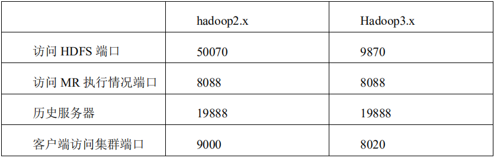

### 1.2.2 Hadoop 配置文件以及简单的 Hadoop 集群搭建

（1）配置文件：

core-site.xml、hdfs-site.xml、mapred-site.xml、yarn-site.xml

hadoop-env.sh、yarn-env.sh、mapred-env.sh、slaves

（2）简单的集群搭建过程：

JDK 安装

配置 SSH 免密登录

配置 hadoop 核心文件:

格式化 namenode

### 1.2.3 HDFS 读流程和写流程


<font color =red size =5>HDFS的读数据流程</font>

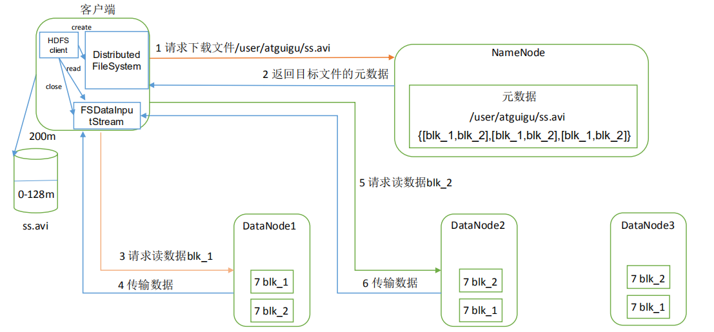


<font color = red size = 5>HDFS的写数据流程</font>

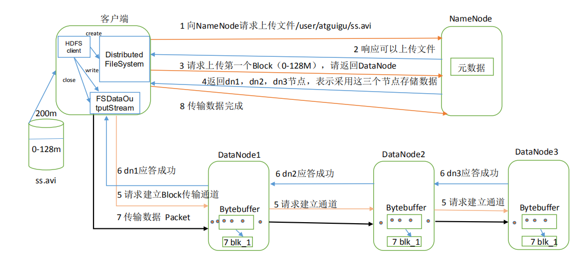


### 1.2.4 MapReduce 的 Shuffle 过程及 Hadoop 优化（包括：压缩、小文件、集群优化）

<font color = red size = 5>MapReduce详细工作流程（一）</font>


<font color = red size = 5>MapReduce详细工作流程（二）</font>

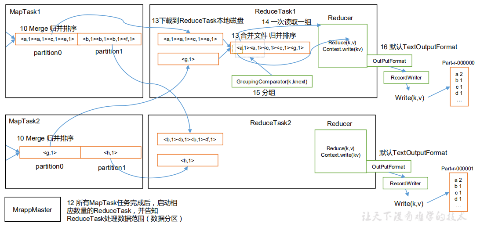


#### 一、Shuffle 机制

> 1）Map 方法之后 Reduce 方法之前这段处理过程叫 Shuffle
>
> 2）Map 方法之后，数据首先进入到分区方法，把数据标记好分区，然后把数据发送到环形缓冲区；环形缓冲区默认大小 100m，环形缓冲区达到 80%时，进行溢写；溢写前对数据进行排序，排序按照对 key 的索引进行字典顺序排序，排序的手段快排；溢写产生大量溢写文件，需要对溢写文件进行归并排序；对溢写的文件也可以进行 Combiner 操作，前提是汇总操作，求平均值不行。最后将文件按照分区存储到磁盘，等待 Reduce 端拉取。
>
> 3）每个 Reduce 拉取 Map 端对应分区的数据。拉取数据后先存储到内存中，内存不够了，再存储到磁盘。拉取完所有数据后，采用归并排序将内存和磁盘中的数据都进行排序。在进入 Reduce 方法前，可以对数据进行分组操作。

#### 二、Hadoop 优化

> 0）HDFS 小文件影响
>
> （1）影响 NameNode 的寿命，因为文件元数据存储在 NameNode 的内存中
>
> （2）影响计算引擎的任务数量，比如每个小的文件都会生成一个 Map 任务
>
> 1）数据输入小文件处理：
>
> （1）合并小文件：对小文件进行归档（Har）、自定义 Inputformat 将小文件存储成SequenceFile 文件。
>
> （2）采用 ConbinFileInputFormat 来作为输入，解决输入端大量小文件场景。
>
> （3）对于大量小文件 Job，可以开启 JVM 重用。
>
> ​	JVM 重用可以使得 JVM 实例在同一个 job 中重新使用 N 次，N 的值可以在 Hadoop 的mapred-site.xml 文件中进行配置。通常在 10-20 之间
>
> ```xml
><property>
>        <name>mapreduce.job.jvm.numtasks</name>
>        <value>10</value>
>        <description>How many tasks to run per jvm,if set to -1 ,there is no limit</description>
>  </property>
>  ```
> 
> 
> 
>2）Map 阶段
> 
>（1）增大环形缓冲区大小。由 100m 扩大到 200m 
> 
>（2）增大环形缓冲区溢写的比例。由 80%扩大到 90% 
> 
>（3）减少对溢写文件的 merge 次数。（10 个文件，一次 20 个 merge） 
> 
>（4）不影响实际业务的前提下，采用 Combiner 提前合并，减少 I/O。 
> 
>3）Reduce 阶段
> 
>（1）合理设置 Map 和 Reduce 数：两个都不能设置太少，也不能设置太多。太少，会导致 Task 等待，延长处理时间；太多，会导致 Map、Reduce 任务间竞争资源，造成处理超时等错误。
> 
>（2）设置 Map、Reduce 共存：调整 slowstart.completedmaps 参数，使 Map 运行到一定程度后，Reduce 也开始运行，减少 Reduce 的等待时间。
> 
>（3）规避使用 Reduce，因为 Reduce 在用于连接数据集的时候将会产生大量的网络消耗。
> 
>（4）增加每个 Reduce 去 Map 中拿数据的并行数
> 
>（5）集群性能可以的前提下，增大 Reduce 端存储数据内存的大小。
> 
>4）IO 传输
> 
>（1）采用数据压缩的方式，减少网络 IO 的的时间。安装 Snappy 和 LZOP 压缩编码器。
> 
>（2）使用 SequenceFile 二进制文件
> 
>5）整体
> 
>（1）MapTask 默认内存大小为 1G，可以增加 MapTask 内存大小为 4-5g
> 
>（2）ReduceTask 默认内存大小为 1G，可以增加 ReduceTask 内存大小为 4-5g
> 
>（3）可以增加 MapTask 的 cpu 核数，增加 ReduceTask 的 CPU 核数
> 
>（4）增加每个 Container 的 CPU 核数和内存大小
> 
>（5）调整每个 Map Task 和 Reduce Task 最大重试次数

#### 三、压缩

| 压缩格式 | Hadoop 自带？ | 算法    | 文件扩展名 | 支持切分 | 换成压缩格式后，原来的程序是否需要修改 |
| -------- | ------------- | ------- | ---------- | -------- | -------------------------------------- |
| DEFLATE  | 是，直接使用  | DEFLATE | .deflate   | 否       | 和文本处理一样，不需要修改             |
| Gzip     | 是，直接使用  | DEFLATE | .gz        | 否       | 和文本处理一样，不需要修改             |
| bzip2    | 是，直接使用  | bzip2   | .bz2       | 是       | 和文本处理一样，不需要修改             |
| LZO      | 否，需要安装  | LZO     | .lzo       | 是       | 需要建索引，还需要指定输入格式         |
| Snappy   | 否，需要安装  | Snappy  | .snappy    | 否       | 和文本处理一样，不需要修改             |

​	提示：如果面试过程问起，我们一般回答压缩方式为 Snappy，特点速度快，缺点无法切分（可以回答在链式 MR 中，Reduce 端输出使用 bzip2 压缩，以便后续的 map 任务对数据进行 split）

#### 四、切片机制

> 1）简单地按照文件的内容长度进行切片
>
> 2）切片大小，默认等于 Block 大小
>
> 3）切片时不考虑数据集整体，而是逐个针对每一个文件单独切片
>
> 提示：切片大小公式：max(0,min(Long_max,blockSize))

### 1.2.5 Yarn 的 Job 提交流程

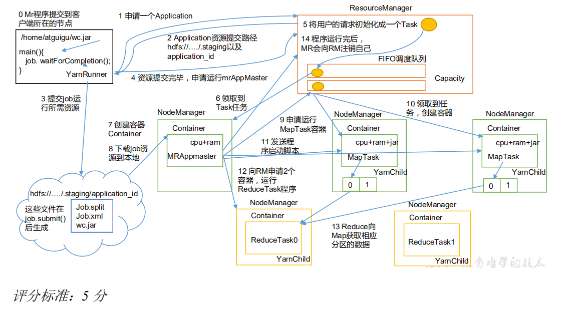

### 1.2.6 Yarn 的默认调度器、调度器分类、以及他们之间的区别

**1）Hadoop 调度器主要分为三类：**

FIFO 、Capacity Scheduler（容量调度器）和 Fair Sceduler（公平调度器）。

Hadoop2.7.2 默认的资源调度器是 容量调度器

**2）区别：**

<font color=red size =5>FIFO调度器</font>

FIFO 调度器：先进先出，同一时间队列中只有一个任务在执行。

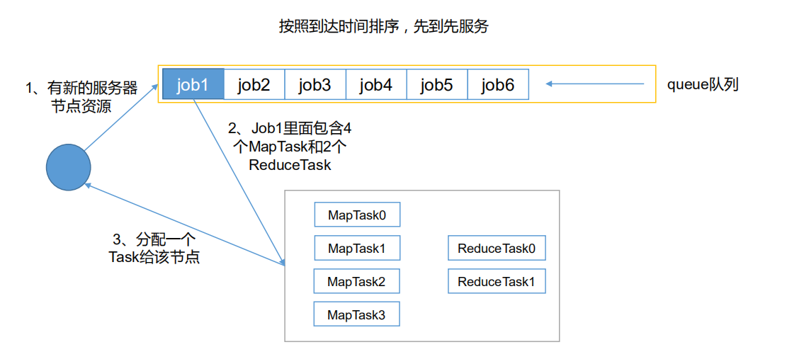


<font color=red size =5>容量调度器</font>

容量调度器：多队列；每个队列内部先进先出，同一时间队列中只有一个任务在执行。队列的并行度为队列的个数。

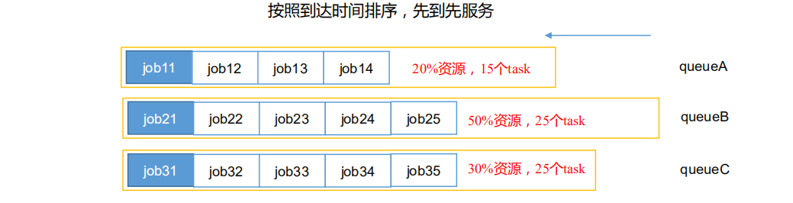

> 1、支持多个队列，每个队列可配置一定的资源量，每个队列采用FIFO调度策略。 
>
> 2、为了防止同一个用户的作业独占队列中的资源，该调度器会对同一用户提交的作业所占资源量进行限定。
>
> 3、首先，计算每个队列中正在运行的任务数与其应该分得的计算资源之间的比值，选择一个该比值最小的队列——最闲的。
>
> 4、其次，按照作业优先级和提交时间顺序，同时考虑用户资源量限制和内存限制对队列内任务排序。
>
> 5、三个队列同时按照任务的先后顺序依次执行，比如，job11、job21和job31分别排在队列最前面，先运行，也是并行运行。


<font color =red size = 5>公平调度器</font>

公平调度器：多队列；每个队列内部按照缺额大小分配资源启动任务，同一时间队列中有多个任务执行。队列的并行度大于等于队列的个数。

3）一定要强调生产环境中不是使用的 FifoScheduler，面试的时侯会发现候选人大概了解这几种调度器的区别，但是问在生产环境用哪种，却说使用的 FifoScheduler（企业生产环境一定不会用这个调度的）

22TB内存资源

fair schedule

75 active Nodes

3000 vcores

单机 300G ，50 cores

version 3.0.0-cdh6.3.0

按照科室划分队列

**3）在生产环境下怎么选择？**

> 大厂：如果对并发度要求比较高，选择公平，要求服务器性能必须 OK；
>
> 中小公司，集群服务器资源不太充裕选择容量。

**4）在生产环境怎么创建队列？**

> （1）调度器默认就 1 个 default 队列，不能满足生产要求。
>
> （2）按照框架：hive /spark/ flink 每个框架的任务放入指定的队列（企业用的不是特别多）
>
> （3）按照业务模块：登录注册、购物车、下单、业务部门 1、业务部门 2 

**5）创建多队列的好处？** 

> （1）因为担心员工不小心，写递归死循环代码，把所有资源全部耗尽。
>
> （2）实现任务的降级使用，特殊时期保证重要的任务队列资源充足。
>
> 业务部门 1（重要）=》业务部门 2（比较重要）=》下单（一般）=》购物车（一般）=》登录注册（次要）

### 1.2.7 项目经验之 LZO 压缩

> Hadoop 默认不支持 LZO 压缩，如果需要支持 LZO 压缩，需要添加 jar 包，并在 hadoop的 cores-site.xml 文件中添加相关压缩配置。

### 1.2.8 Hadoop 参数调优

> 1）在 hdfs-site.xml 文件中配置多目录，最好提前配置好，否则更改目录需要重新启动集群
>
> 2）NameNode 有一个工作线程池，用来处理不同 DataNode 的并发心跳以及客户端并发的元数据操作。dfs.namenode.handler.count=20log2(Cluster Size)，比如集群规模为 10 台时，此参数设置为 60
>
> 3 ）编辑日 志 存 储 路 径 dfs.namenode.edits.dir 设置与 镜 像 文 件 存 储 路 径dfs.namenode.name.dir 尽量分开，达到最低写入延迟
>
> 4）服务器节点上 YARN 可使用的物理内存总量，默认是 8192（MB），注意，如果你的节点内存资源不够 8GB，则需要调减小这个值，而 YARN 不会智能的探测节点的物理内存总量。yarn.nodemanager.resource.memory-mb
>
> 5）单个任务可申请的最多物理内存量，默认是 8192（MB）。yarn.scheduler.maximum-allocation-mb

### 1.2.9 项目经验之基准测试

> 搭建完 Hadoop 集群后需要对 HDFS 读写性能和 MR 计算能力测试。测试 jar 包在 hadoop的 share 文件夹下。

### 1.2.10 Hadoop 宕机

> 1）如果 MR 造成系统宕机。此时要控制 Yarn 同时运行的任务数，和每个任务申请的最大内存。调整参数：yarn.scheduler.maximum-allocation-mb（单个任务可申请的最多物理内存量，默认是 8192MB） 
>
> 2）如果写入文件过量造成 NameNode 宕机。那么调高 Kafka 的存储大小，控制从 Kafka到 HDFS 的写入速度。高峰期的时候用 Kafka 进行缓存，高峰期过去数据同步会自动跟上。

### 1.2.11 Hadoop 解决数据倾斜方法

> 1）提前在 map 进行 combine，减少传输的数据量
>
> ​	在 Mapper 加上 combiner 相当于提前进行 reduce，即把一个 Mapper 中的相同 key 进行了聚合，减少 shuffle 过程中传输的数据量，以及 Reducer 端的计算量。
>
> 如果导致数据倾斜的 key 大量分布在不同的 mapper 的时候，这种方法就不是很有效了。
>
> 2）导致数据倾斜的 key 大量分布在不同的 mapper
>
> （1）局部聚合加全局聚合。
>
> 第一次在 map 阶段对那些导致了数据倾斜的 key 加上 1 到 n 的随机前缀，这样本来相同的 key 也会被分到多个 Reducer 中进行局部聚合，数量就会大大降低。
>
> 第二次 mapreduce，去掉 key 的随机前缀，进行全局聚合。
>
> 思想：二次 mr，第一次将 key 随机散列到不同 reducer 进行处理达到负载均衡目的。第二次再根据去掉 key 的随机前缀，按原 key 进行 reduce 处理。这个方法进行两次 mapreduce，性能稍差。
>
> （2）增加 Reducer，提升并行度
>
> JobConf.setNumReduceTasks(int)
>
> （3）实现自定义分区
>
> 根据数据分布情况，自定义散列函数，将 key 均匀分配到不同 Reducer

### 1.2.12 集群资源分配参数（项目中遇到的问题）

> 集群有 30 台机器，跑 mr 任务的时候发现 5 个 map 任务全都分配到了同一台机器上，这个可能是由于什么原因导致的吗？
>
> 解决方案：yarn.scheduler.fair.assignmultiple 这个参数 默认是开的，需要关掉
>
> https://blog.csdn.net/leone911/article/details/51605172

## 1.3 Zookeeper 相关总结

### 1.3.1 选举机制

半数机制：2n+1

10 台服务器：3 台

20 台服务器：5 台

100 台服务器：11 台

<font color = red>台数并不是越多越好。 太多选举时间过长影响性能。</font>

### 1.3.2 常用命令

ls、get、create

### 1.3.3 Paxos 算法（扩展）

注意：暂时先不用看。如果后期准备面今日头条，需要认真准备，其他公司几乎都不问。

> Paxos 算法一种基于消息传递且具有高度容错特性的一致性算法。
>
> 分布式系统中的节点通信存在两种模型：共享内存（Shared memory）和消息传递（Messages passing）。基于消息传递通信模型的分布式系统，不可避免的会发生以下错误：进程可能会慢、被杀死或者重启，消息可能会延迟、丢失、重复，在基础 Paxos 场景中，先不考虑可能出现消息篡改即拜占庭错误的情况。Paxos 算法解决的问题是在一个可能发生上述异常的分布式系统中如何就某个值达成一致，保证不论发生以上任何异常，都不会破坏决议的一致性。

### 1.3.4 讲一讲什么是 CAP 法则？Zookeeper符合了这个法则的哪两个？（扩展）

> CAP 法则：强一致性、高可用性、分区容错性；
>
> Zookeeper 符合强一致性、高可用性！

## 1.4 Flume 相关总结

### 1.4.1 Flume 组成，Put 事务，Take 事务

> `Taildir Source`：断点续传、多目录。Flume1.6 以前需要自己自定义 Source 记录每次读取文件位置，实现断点续传。
>
> `File Channel`：数据存储在磁盘，宕机数据可以保存。但是传输速率慢。适合对数据传输可靠性要求高的场景，比如，金融行业。
>
> `Memory Channel`：数据存储在内存中，宕机数据丢失。传输速率快。适合对数据传输可靠性要求不高的场景，比如，普通的日志数据。
>
> `Kafka Channel`：减少了 Flume 的 Sink 阶段，提高了传输效率。 
>
> Source 到 Channel 是 Put 事务
>
> Channel 到 Sink 是 Take 事务

### 1.4.2 Flume 拦截器

**（1）拦截器注意事项**

项目中自定义了：ETL 拦截器和区分类型拦截器。

采用两个拦截器的优缺点：优点，模块化开发和可移植性；缺点，性能会低一些

**（2）自定义拦截器步骤**

`a）实现 InterceptorFlume` 

`b）重写四个方法`

➢ initialize 初始化

➢ public Event intercept(Event event) 处理单个 Event

➢ public List<Event> intercept(List<Event> events) 处理多个 Event，在这个方法中调用 Event intercept(Event event)

➢ close 方法

`c）静态内部类，实现 Interceptor.Builder`

**(3）拦截器可以不用吗？**

> 可以不用；需要在下一级 hive 的 dwd 层和 sparksteaming 里面处理
>
> 优势：只处理一次，轻度处理；劣势：影响性能，不适合做实时推荐这种对实时要求比较高的场景。

### 1.4.3 Flume Channel 选择器

<font color =red size=5>Flume Channel Selectors</font>


### 1.4.4 Flume 监控器

1）采用 Ganglia 监控器，监控到 flume 尝试提交的次数远远大于最终成功的次数，说明 flume运行比较差。 

2）解决办法？

> （1）自身：增加内存 flume-env.sh 4-6g
>
> -Xmx 与-Xms 最好设置一致，减少内存抖动带来的性能影响，如果设置不一致容易导致频繁 fullgc。 
>
> （2）找朋友：增加服务器台数
>
> 搞活动 618 =》增加服务器=》用完在退出
>
> 日志服务器配置：8-16g 内存、磁盘 8T

### 1.4.5 Flume 采集数据会丢失吗?（防止数据丢失的机制）

> 如果是 FileChannel 不会，Channel 存储可以存储在 File 中，数据传输自身有事务。
>
> 如果是 MemoryChannel 有可能丢。

### 1.4.6 Flume 内存

> 开发中在 flume-env.sh 中设置 JVM heap 为 4G 或更高，部署在单独的服务器上（4 核 8线程 16G 内存）
>
> -Xmx 与-Xms 最好设置一致，减少内存抖动带来的性能影响，如果设置不一致容易导致频繁 fullgc。


### 1.4.7 FileChannel 优化

> 通过配置 dataDirs 指向多个路径，每个路径对应不同的硬盘，增大 Flume 吞吐量。

官方说明如下：

> Comma separated list of directories for storing log files. Using multiple directories on separate disks can improve file channel peformance

> checkpointDir 和 backupCheckpointDir 也尽量配置在不同硬盘对应的目录中，保证checkpoint 坏掉后，可以快速使用 backupCheckpointDir 恢复数据

### 1.4.8 HDFS Sink 小文件处理

`（1）HDFS 存入大量小文件，有什么影响？`

元数据层面：每个小文件都有一份元数据，其中包括文件路径，文件名，所有者，所属组，权限，创建时间等，这些信息都保存在 Namenode 内存中。所以小文件过多，会占用Namenode 服务器大量内存，影响 Namenode 性能和使用寿命

计算层面：默认情况下 MR 会对每个小文件启用一个 Map 任务计算，非常影响计算性能。同时也影响磁盘寻址时间。

`（2）HDFS 小文件处理`

> 官方默认的这三个参数配置写入 HDFS 后会产生小文件，hdfs.rollInterval、hdfs.rollSize、hdfs.rollCount
>
> 基 于 以 上 hdfs.rollInterval=3600 ， hdfs.rollSize=134217728 ， hdfs.rollCount =0 ，hdfs.roundValue=3600，hdfs.roundUnit= second 几个参数综合作用，效果如下：
>
> （1）tmp 文件在达到 128M 时会滚动生成正式文件
>
> （2）tmp 文件创建超 3600 秒时会滚动生成正式文件
>
> 举例：在 2018-01-01 05:23 的时侯 sink 接收到数据，那会产生如下 tmp 文件：
>
> /atguigu/20180101/atguigu.201801010520.tmp
>
> 即使文件内容没有达到 128M，也会在 06:23 时滚动生成正式文件

### 1.4.9 HDFS Sink 小文件处理

> File channel 容量 1000000 条 
>
> Memory channel 容量 100 条


## 1.5 Kafka 相关总结

### 1.5.1 Kafka 架构


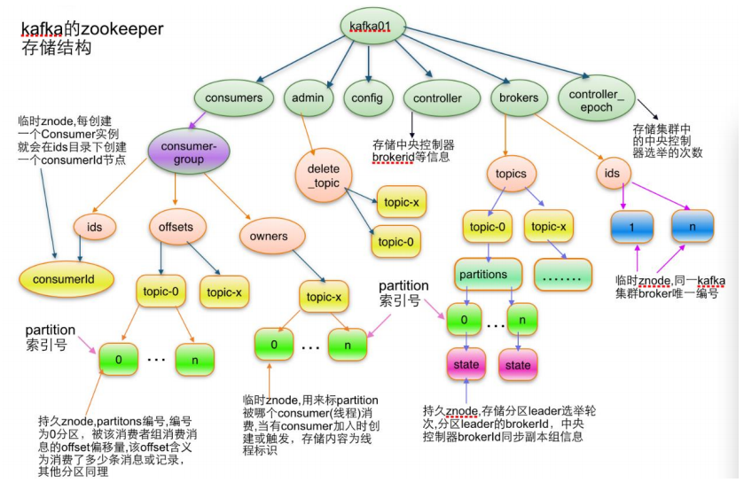

### 1.5.2 Kafka 压测

> Kafka 官方自带压力测试脚本（kafka-consumer-perf-test.sh、kafka-producer-perf-test.sh）。Kafka 压测时，可以查看到哪个地方出现了瓶颈（CPU，内存，网络 IO）。一般都是网络 IO达到瓶颈。 

### 1.5.3 Kafka 的机器数量

```properties
Kafka 机器数量=2*（峰值生产速度*副本数/100）+1 
```


### 1.5.4 Kafka 的日志保存时间

`7 天` 

### 1.5.5 Kafka 的硬盘大小

每天的数据量 * 7 天/70% 

### 1.5.6 Kafka 监控

公司自己开发的监控器；

开源的监控器：KafkaManager、KafkaMonitor、kafkaeagle


### 1.5.7 Kakfa 分区数

分区数并不是越多越好，一般分区数不要超过集群机器数量。分区数越多占用内存越大（ISR 等），一个节点集中的分区也就越多，当它宕机的时候，对系统的影响也就越大。分区数一般设置为：3-10 个 

### 1.5.8 副本数设定

一般我们设置成 2 个或 3 个，很多企业设置为 2 个。 

### 1.5.9 多少个 Topic

 通常情况：多少个日志类型就多少个 Topic。也有对日志类型进行合并的。

### 1.5.10 Kafka 丢不丢数据

Ack=0，相当于异步发送，消息发送完毕即 offset 增加，继续生产。

Ack=1，leader 收到 leader replica 对一个消息的接受 ack 才增加 offset，然后继续生产。

Ack=-1，leader 收到所有 replica 对一个消息的接受 ack 才增加 offset，然后继续生产。

### 1.5.11 Kafka 的 ISR 副本同步队列

> ISR（In-Sync Replicas），副本同步队列。ISR 中包括 Leader 和 Follower。如果 Leader进程挂掉，会在 ISR 队列中选择一个服务作为新的 Leader。有 replica.lag.max.messages（延迟条数）和 replica.lag.time.max.ms（延迟时间）两个参数决定一台服务是否可以加入 ISR 副本队列，在 0.10 版本移除了 replica.lag.max.messages 参数，防止服务频繁的进去队列
>
> 任意一个维度超过阈值都会把 Follower 剔除出 ISR，存入 OSR（Outof-Sync Replicas）列表，新加入的 Follower 也会先存放在 OSR 中。

### 1.5.12 Kafka 分区分配策略

> 在 Kafka 内部存在两种默认的分区分配策略：Range 和 RoundRobin。
>
> Range 是默认策略。Range 是对每个 Topic 而言的（即一个 Topic 一个 Topic 分），首先对同一个 Topic 里面的分区按照序号进行排序，并对消费者按照字母顺序进行排序。然后用Partitions 分区的个数除以消费者线程的总数来决定每个消费者线程消费几个分区。如果除不尽，那么前面几个消费者线程将会多消费一个分区。
>
> 例如：我们有 10 个分区，三个消费者（C1，C2，C3），3 个消费者线程，10 / 3 = 3 而且除不尽。 
>
> C1将消费 0, 1, 2, 3 分区
>
> C2将消费 4, 5, 6 分区
>
> C3 将消费 7, 8, 9 分区
>
> 第一步：将所有主题分区组成 TopicAndPartition 列表，然后对 TopicAndPartition 列表按照 hashCode 进行排序，最后按照轮询的方式发给每一个消费线程。

### 1.5.13 Kafka 中数据量计算

> 每天总数据量 100g，每天产生 1 亿条日志， 10000 万/24/60/60=1150 条/每秒钟
>
> 平均每秒钟：1150 条
>
> 低谷每秒钟：50 条
>
> 高峰每秒钟：1150 条（2-20 倍）=2300 条-23000 条
>
> 每条日志大小：0.5k-2k
>
> 每秒多少数据量：2.3M-20MB

### 1.5.14 Kafka 挂掉

> 1）Flume 记录
>
> 2）日志有记录
>
> 3）短期没事

### 1.5.15 Kafka 消息数据积压，Kafka 消费能力不足怎么处理？

1）如果是 Kafka 消费能力不足，则可以考虑增加 Topic 的分区数，并且同时提升消费组的消费者数量，消费者数=分区数。（两者缺一不可）

2）如果是下游的数据处理不及时：提高每批次拉取的数量。批次拉取数据过少（拉取数据/处理时间<生产速度），使处理的数据小于生产的数据，也会造成数据积压。

### 1.5.16 Kafka 幂等性

Producer 的幂等性指的是当发送同一条消息时，数据在 Server 端只会被持久化一次，数据不丟不重，但是这里的`幂等性`是有条件的：

> 1）只能保证 Producer 在单个会话内不丟不重，如果 Producer 出现意外挂掉再重启是无法保证的（幂等性情况下，是无法获取之前的状态信息，因此是无法做到跨会话级别的不丢不重）。 
>
> 2）幂等性不能跨多个 Topic-Partition，只能保证单个 Partition 内的幂等性，当涉及多个Topic-Partition 时，这中间的状态并没有同步。 

### 1.5.17 Kafka 事务

> Kafka 从 0.11 版本开始引入了事务支持。事务可以保证 Kafka 在 Exactly Once 语义的基础上，生产和消费可以跨分区和会话，要么全部成功，要么全部失败。
>
> 1）Producer 事务
>
> 为了实现跨分区跨会话的事务，需要引入一个全局唯一的 Transaction ID，并将 Producer获得的PID 和Transaction ID 绑定。这样当 Producer重启后就可以通过正在进行的 TransactionID 获得原来的 PID。为了管理 Transaction，Kafka 引入了一个新的组件 Transaction Coordinator。Producer 就是通过和 Transaction Coordinator 交互获得 Transaction ID 对应的任务状态。Transaction Coordinator 还负责将事务所有写入 Kafka 的一个内部 Topic，这样即使整个服务重启，由于事务状态得到保存，进行中的事务状态可以得到恢复，从而继续进行。
>
> 2）Consumer 事务
>
> 上述事务机制主要是从 Producer 方面考虑，对于 Consumer 而言，事务的保证就会相对较弱，尤其时无法保证 Commit 的信息被精确消费。这是由于 Consumer 可以通过 offset 访问任意信息，而且不同的 Segment File 生命周期不同，同一事务的消息可能会出现重启后被删除的情况。

### 1.5.18 Kafka 数据重复

> 幂等性+ack-1+事务
>
> Kafka 数据重复，可以再下一级：SparkStreaming、redis 或者 hive 中 dwd 层去重，去重的手段：分组、按照 id 开窗只取第一个值；

### 1.5.19 Kafka 参数优化

1）Broker 参数配置（server.properties） 

```properties
1、网络和 io 操作线程配置优化

# broker 处理消息的最大线程数（默认为 3）

num.network.threads=cpu 核数+1

# broker 处理磁盘 IO 的线程数

num.io.threads=cpu 核数2

2、log 数据文件刷盘策略

# 每当 producer 写入 10000 条消息时，刷数据到磁盘

log.flush.interval.messages=10000 


# 每间隔 1 秒钟时间，刷数据到磁盘

log.flush.interval.ms=1000

3、日志保留策略配置

# 保留三天，也可以更短 （log.cleaner.delete.retention.ms）

log.retention.hours=72

4、Replica 相关配置

offsets.topic.replication.factor:3

# 这个参数指新创建一个 topic 时，默认的 Replica 数量,Replica 过少会影响数据的可用性，太多则会白白浪费存储资源，一般建议在 2~3 为宜。
```

2）Producer 优化（producer.properties）

```properties
buffer.memory:33554432 (32m)

#在 Producer 端用来存放尚未发送出去的 Message 的缓冲区大小。缓冲区满了之后可以选择阻塞发送或抛出异常，由 block.on.buffer.full 的配置来决定。

compression.type:none

#默认发送不进行压缩，推荐配置一种适合的压缩算法，可以大幅度的减缓网络压力和Broker 的存储压力。
```


4）Kafka 内存调整（kafka-server-start.sh）

默认内存 1 个 G，生产环境尽量不要超过 6 个 G。

```properties
export KAFKA_HEAP_OPTS="-Xms4g -Xmx4g" 
```


### 1.5.20 Kafka 高效读写数据

1）Kafka 本身是分布式集群，同时采用分区技术，并发度高。

2）顺序写磁盘

> Kafka 的 producer 生产数据，要写入到 log 文件中，写的过程是一直追加到文件末端，为顺序写。官网有数据表明，同样的磁盘，顺序写能到 600M/s，而随机写只有 100K/s。这与磁盘的机械机构有关，顺序写之所以快，是因为其省去了大量磁头寻址的时间。

3）零复制技术


 文件映射MMAP


## 1.6 Hive

### 1.6.1 Hive 的架构

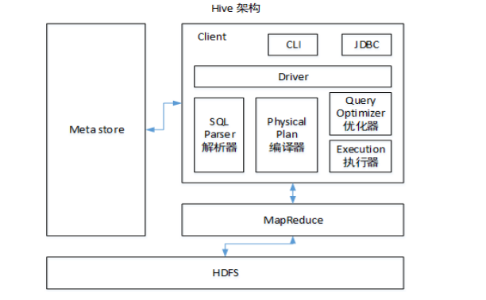

### 1.6.2 Hive 和数据库比较

> Hive 和数据库除了拥有类似的查询语言，再无类似之处。
>
> `1）数据存储位置`
>
> Hive 存储在 HDFS 。数据库将数据保存在块设备或者本地文件系统中。
>
> `2）数据更新`
>
> Hive 中不建议对数据的改写。而数据库中的数据通常是需要经常进行修改的，
>
> `3）执行延迟`
>
> Hive 执行延迟较高。数据库的执行延迟较低。当然，这个是有条件的，即数据规模较小，当数据规模大到超过数据库的处理能力的时候，Hive 的并行计算显然能体现出优势。
>
> `4）数据规模`
>
> Hive 支持很大规模的数据计算；数据库可以支持的数据规模较小。

### 1.6.3 内部表和外部表

> 元数据、原始数据
>
> `1）删除数据时：`
>
> 内部表：元数据、原始数据，全删除
>
> 外部表：元数据 只删除
>
> `2）在公司生产环境下，什么时候创建内部表，什么时候创建外部表？`
>
> 在公司中绝大多数场景都是外部表。
>
> 自己使用的临时表，才会创建内部表；

### 1.6.4  4 个 By 区别

> 1）Order By：全局排序，只有一个 Reducer； 
>
> 2）Sort By：分区内有序；
>
> 3）Distrbute By：类似 MR 中 Partition，进行分区，结合 sort by 使用。
>
> 4）Cluster By：当 Distribute by 和 Sorts by 字段相同时，可以使用 Cluster by 方式。Cluster by 除了具有 Distribute by 的功能外还兼具 Sort by 的功能。但是排序只能是升序排序，不能指定排序规则为 ASC 或者 DESC。
>
> 在生产环境中 Order By 用的比较少，容易导致 OOM。
>
> 在生产环境中 Sort By+ Distrbute By 用的多。

### 1.6.5 系统函数

> 1）date_add、date_sub 函数（加减日期） 
>
> 2）next_day 函数（周指标相关）
>
> 3）date_format 函数（根据格式整理日期） 
>
> 4）last_day 函数（求当月最后一天日期） 
>
> 5）collect_set 函数
>
> 6）get_json_object 解析 json 函数
>
> 7）NVL（表达式 1，表达式 2）
>
> 如果表达式 1 为空值，NVL 返回值为表达式 2 的值，否则返回表达式 1 的值。  

### 1.6.6 自定义 UDF、UDTF 函数

> **1）在项目中是否自定义过 UDF、UDTF 函数，以及用他们处理了什么问题，及自定义步骤？**
>
> （1）用 UDF 函数解析公共字段；用 UDTF 函数解析事件字段。
>
> （2）自定义 UDF：继承 UDF，重写 evaluate 方法
>
> （3）自定义 UDTF：继承自 GenericUDTF，重写 3 个方法：initialize(自定义输出的列名和类型)，process（将结果返回 forward(result)），close
>
> **2）为什么要自定义 UDF/UDTF？**
>
> 因为自定义函数，可以自己埋点 Log 打印日志，出错或者数据异常，方便调试。 

### 1.6.7 窗口函数

> **1）Rank**
>
> （1）RANK() 排序相同时会重复，总数不会变
>
> （2）DENSE_RANK() 排序相同时会重复，总数会减少
>
> （3）ROW_NUMBER() 会根据顺序计算
>
> **2）OVER()：指定分析函数工作的数据窗口大小，这个数据窗口大小可能会随着行的变而变化** 
>
> （1）CURRENT ROW：当前行
>
> （2）n PRECEDING：往前 n 行数据
>
> （3） n FOLLOWING：往后 n 行数据
>
> （ 4 ） UNBOUNDED ：起 点 ， UNBOUNDED PRECEDING 表 示 从 前 面的 起 点 ，UNBOUNDED FOLLOWING 表示到后面的终点
>
> （5） LAG(col,n)：往前第 n 行数据
>
> （6）LEAD(col,n)：往后第 n 行数据
>
> （7） NTILE(n)：把有序分区中的行分发到指定数据的组中，各个组有编号，编号从 1开始，对于每一行，NTILE 返回此行所属的组的编号。注意：n 必须为 int 类型。
>
> **3）手写 TopN** 

### 1.6.8 Hive 优化

> **1）MapJoin**  
>
> 如果不指定 MapJoin 或者不符合 MapJoin 的条件，那么 Hive 解析器会将 Join 操作转换成 Common Join，即：在 Reduce 阶段完成 join。容易发生数据倾斜。可以用 MapJoin 把小表全部加载到内存在 map 端进行 join，避免 reducer 处理。
>
> **2）行列过滤**
>
> 列处理：在 SELECT 中，只拿需要的列，如果有，尽量使用分区过滤，少用 SELECT *。
>
> 行处理：在分区剪裁中，当使用外关联时，如果将副表的过滤条件写在 Where 后面，那么就会先全表关联，之后再过滤。 
>
> **3）列式存储**
>
> **4）采用分区技术**
>
> **5）合理设置 Map 数**
>
> mapred.min.split.size: 指的是数据的最小分割单元大小；min 的默认值是 1B
>
> mapred.max.split.size: 指的是数据的最大分割单元大小；max 的默认值是 256MB
>
> 通过调整 max 可以起到调整 map 数的作用，减小 max 可以增加 map 数，增大 max 可以减少 map 数。
>
> 需要提醒的是，直接调整 mapred.map.tasks 这个参数是没有效果的。
>
> https://www.cnblogs.com/swordfall/p/11037539.html
>
> 
>
> **6）合理设置 Reduce 数**
>
> Reduce 个数并不是越多越好
>
> （1）过多的启动和初始化 Reduce 也会消耗时间和资源；
>
> （2）另外，有多少个 Reduce，就会有多少个输出文件，如果生成了很多个小文件，那么如果这些小文件作为下一个任务的输入，则也会出现小文件过多的问题；在设置 Reduce 个数的时候也需要考虑这两个原则：处理大数据量利用合适的 Reduce数；使单个 Reduce 任务处理数据量大小要合适；
>
> **7）小文件如何产生的？**
>
> （1）动态分区插入数据，产生大量的小文件，从而导致 map 数量剧增；
> 
> （2）reduce 数量越多，小文件也越多（reduce 的个数和输出文件是对应的）；
> 
> （3）数据源本身就包含大量的小文件。
>
> **8）小文件解决方案**
>
> （1）在 Map 执行前合并小文件，减少 Map 数：CombineHiveInputFormat 具有对小文件进行合并的功能（系统默认的格式）。HiveInputFormat 没有对小文件合并功能。
>
> （2）merge
>
> // 输出合并小文件
>
> SET hive.merge.mapfiles = true; -- 默认 true，在 map-only 任务结束时合并小文件
>
> SET hive.merge.mapredfiles = true; -- 默认 false，在 map-reduce 任务结束时合并小文件
>
> SET hive.merge.size.per.task = 268435456; -- 默认 256M
>
> SET hive.merge.smallfiles.avgsize = 16777216; -- 当输出文件的平均大小小于 16m 该值时，启动一个独立的 map-reduce 任务进行文件 merge
>
> （3）开启 JVM 重用
>
> set mapreduce.job.jvm.numtasks=10
>
> 
>
> **9）开启 map 端 combiner（不影响最终业务逻辑）**
>
> set hive.map.aggr=true； 
>
> 
>
> **10）压缩（选择快的）**
>
> 设置 map 端输出、中间结果压缩。（不完全是解决数据倾斜的问题，但是减少了 IO 读写和网络传输，能提高很多效率）
>
> set hive.exec.compress.intermediate=true --启用中间数据压缩
>
> set mapreduce.map.output.compress=true --启用最终数据压缩
>
> set mapreduce.map.outout.compress.codec=…; --设置压缩方式
>
> **11）采用 tez 引擎或者 spark 引擎**

HIVE优化，其实就是用最少的数据和最少的时间，获取正确的结果。

最少数据：在前面就要数据过滤，数据在计算时，只剩下要计算的数据

最少的时间：执行任务分发到各个机器上，不让某台机器忙死，也不让某台机器空闲。比如负载均衡分发任务

### 1.6.9 Hive 解决数据倾斜方法

**1）数据倾斜长啥样？**

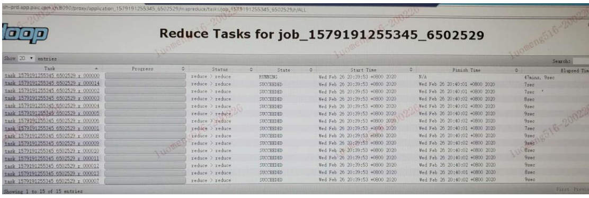

**2）怎么产生的数据倾斜？**

`（1）不同数据类型关联产生数据倾斜`

情形：比如用户表中 user_id 字段为 int，log 表中 user_id 字段既有 string 类型也有 int 类型。当按照 user_id 进行两个表的 Join 操作时。

后果：处理此特殊值的 reduce 耗时；只有一个 reduce 任务。默认的 Hash 操作会按 int型的 id 来进行分配，这样会导致所有 string 类型 id 的记录都分配到一个 Reducer 中。

解决方式：把数字类型转换成字符串类型

```sql
select  from users a

left outer join logs b

on a.usr_id = cast(b.user_id as string)
```

`（2）控制空值分布`

在生产环境经常会用大量空值数据进入到一个 reduce 中去，导致数据倾斜。

解决办法：

自定义分区，将为空的 key 转变为字符串加随机数或纯随机数，将因空值而造成倾斜的数据分不到多个 Reducer。

注意：对于异常值如果不需要的话，最好是提前在 where 条件里过滤掉，这样可以使计算量大大减少

`3）解决数据倾斜的方法？`

（1）group by

注：group by 优于 distinct group

解决方式：采用 sum() group by 的方式来替换 count(distinct)完成计算。

（2）mapjoin

（3）开启数据倾斜时负载均衡

set hive.groupby.skewindata=true;

思想：就是先随机分发并处理，再按照 key group by 来分发处理。

操作：当选项设定为 true，生成的查询计划会有两个 MRJob。

第一个 MRJob 中，Map 的输出结果集合会随机分布到 Reduce 中，每个 Reduce 做部分聚合操作，并输出结果，这样处理的结果是相同的 GroupBy Key 有可能被分发到不同的Reduce 中，从而达到负载均衡的目的；

第二个 MRJob 再根据预处理的数据结果按照 GroupBy Key 分布到 Reduce 中（这个过程可以保证相同的原始 GroupBy Key 被分布到同一个 Reduce 中），最后完成最终的聚合操作。

点评：它使计算变成了两个 mapreduce，先在第一个中在 shuffle 过程 partition 时随机给key 打标记，使每个 key 随机均匀分布到各个 reduce 上计算，但是这样只能完成部分计算，因为相同 key 没有分配到相同 reduce 上。所以需要第二次的 mapreduce，这次就回归正常 shuffle，但是数据分布不均匀的问题在第一次 mapreduce 已经有了很大的改善，因此基本解决数据倾斜。因为大量计算已经在第一次 mr 中随机分布到各个节点完成。

### 1.6.10 Hive 里边字段的分隔符用的什么？为什么用\t？有遇到过字段里边有\t 的情况吗，怎么处理的？

> hive 默认的字段分隔符为 ascii 码的控制符\001（^A）,建表的时候用 fields terminated by '\001'。注意：如果采用\t 或者\001 等为分隔符，需要要求前端埋点和 javaEE 后台传递过来的数据必须不能出现该分隔符，通过代码规范约束。一旦传输过来的数据含有分隔符，需要在前一级数据中转义或者替换（ETL）。

### 1.6.11 Tez 引擎优点？

> Tez 可以将多个有依赖的作业转换为一个作业，这样只需写一次 HDFS，且中间节点较少，从而大大提升作业的计算性能。
>
> Mr/tez/spark 区别：
>
> `Mr 引擎`：多 job 串联，基于磁盘，落盘的地方比较多。虽然慢，但一定能跑出结果。一般处理，周、月、年指标。
>
> `Spark 引擎`：虽然在 Shuffle 过程中也落盘，但是并不是所有算子都需要 Shuffle，尤其是多算子过程，中间过程不落盘 DAG 有向无环图。 兼顾了可靠性和效率。一般处理天指标。
>
> `Tez 引擎`：完全基于内存。 注意：如果数据量特别大，慎重使用。容易 OOM。一般用于快速出结果，数据量比较小的场景。

### 1.6.12 MySQL 元数据备份

**1）MySQL 之元数据备份（项目中遇到的问题）**

元数据备份（重点，如数据损坏，可能整个集群无法运行，至少要保证每日零点之后备份到其它服务器两个复本）


Keepalived 或者用 mycat

**2）MySQL utf8 超过字节数问题**

MySQL 的 utf8 编码最多存储 3 个字节，当数据中存在表情号、特色符号时会占用超过3 个字节数的字节，那么会出现错误 Incorrect string value: '\xF0\x9F\x91\x91\xE5\xB0...'

解决办法：将 utf8 修改为 utf8mb4

首先修改库的基字符集和数据库排序规则,再使用 SHOW VARIABLES LIKE '%char%'; 命令查看参数

确保这几个参数的 value 值为 utf8mb4 如果不是则使用 set 命令修改

如：set character_set_server = utf8mb4;

### 1.6.13 Union 与 Union all 区别

> 1）union 会将联合的结果集去重，效率较 union all 差 
>
> 2）union all 不会对结果集去重，所以效率高


## 1.7 Sqoop

> 1、在使用sqoop过程中遇到过哪些问题？，怎么解决？
>
> (1) 空值问题 ，hive底层 \N, MYSQL NULL

### 1.7.1 Sqoop 参数

```sh
/opt/module/sqoop/bin/sqoop import \

--connect \

--username \

--password \

--target-dir \

--delete-target-dir \ 

--num-mappers \

--fields-terminated-by \

--query "$2" ' and $CONDITIONS;'
```


### 1.7.2 Sqoop 导入导出 Null 存储一致性问题

> Hive 中的 Null 在底层是以“\N”来存储，而 MySQL 中的 Null 在底层就是 Null，为了保证数据两端的一致性。在`导出`数据时采用--input-null-string 和--input-null-non-string 两个参数。`导入`数据时采用--null-string 和--null-non-string。 

### 1.7.3 Sqoop 数据导出一致性问题

> 场景 1：如 Sqoop 在导出到 Mysql 时，使用 4 个 Map 任务，过程中有 2 个任务失败，那此时 MySQL 中存储了另外两个 Map 任务导入的数据，此时老板正好看到了这个报表数据。而开发工程师发现任务失败后，会调试问题并最终将全部数据正确的导入 MySQL，那后面老板再次看报表数据，发现本次看到的数据与之前的不一致，这在生产环境是不允许的。官网：http://sqoop.apache.org/docs/1.4.6/SqoopUserGuide.htmlSince 
>
> Sqoop breaks down export process into multiple transactions, it is possible that a failed export job may result in partial data being committed to the database. This can further lead to subsequent jobs failing due to insert collisions in some cases, or lead to duplicated data in others. You can overcome this problem by specifying a staging table via the --staging-table option which acts as an auxiliary table that is used to stage exported data. The staged data is finally moved to the destination table in a single transaction.
>
> `–staging-table 方式`
>
> sqoop export 
>
> --connect jdbc:mysql://192.168.137.10:3306/user_behavior --username root
>
>  --password 123456 
>
> --table app_cource_study_report 
>
> --columns watch_video_cnt,complete_video_cnt,dt 
>
> --fields-terminated-by "\t" 
>
> --export-dir "/user/hive/warehouse/tmp.db/app_cource_study_analysis_${day}"
>
>  --staging-table app_cource_study_report_tmp
>
>  --clear-staging-table 
>
> --input-null-string '\N'  

### 1.7.4 Sqoop 底层运行的任务是什么

> 只有 Map 阶段，没有 Reduce 阶段的任务。默认是 4 个 MapTask。 

### 1.7.5 Sqoop 一天导入多少数据

> 100 万日活=》10 万订单，1 人 10 条，每天 1g 左右业务数据
>
> Sqoop 每天将 1G 的数据量导入到数仓。

### 1.7.6 Sqoop 数据导出的时候一次执行多长时间

> 每天晚上 00:30 开始执行，Sqoop 任务一般情况 40 -50 分钟的都有。取决于数据量（11:11，6:18 等活动在 1 个小时左右）。

### 1.7.7 Sqoop 在导入数据的时候数据倾斜

> https://blog.csdn.net/lizhiguo18/article/details/103969906
>
> Sqoop 抽数的并行化主要涉及到两个参数：num-mappers：启动 N 个 map 来并行导入数据，默认 4 个；split-by：按照某一列来切分表的工作单元。通过 ROWNUM() 生成一个严格均匀分布的字段，然后指定为分割字段

### 1.7.8 Sqoop 数据导出 Parquet（项目中遇到的问题）

> Ads 层数据用 Sqoop 往 MySql 中导入数据的时候，如果用了 orc（Parquet）不能导入，需转化成 text 格式

> （1）创建临时表，把 Parquet 中表数据导入到临时表，把临时表导出到目标表用于可视化 
>
> （2）Sqoop 里面有参数，可以直接把 Parquet 转换为 text
>
> （3）ads 层建表的时候就不要建 Parquet 表

## 1.8 Azkaban 

### 1.8.1 每天集群运行多少指标?

> 每天跑 100 多个指标，有活动时跑 200 个左右。

### 1.8.2 任务挂了怎么办？

> 运行成功或者失败都会`发邮件`、发钉钉、集成自动打电话（项目中遇到的问题）
>
> 最主要的解决方案就是重新跑。


## 1.9 HBase

### 1.9.1 HBase 存储结构

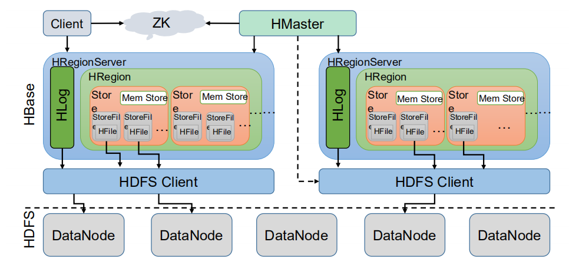

### 1.9.2 RowKey 设计原则

> 1）rowkey 长度原则
>
> 2）rowkey 散列原则
>
> 3）rowkey 唯一原则

### 1.9.3 RowKey 如何设计

> 1）生成随机数、hash、散列值
>
> 2）字符串反转

### 1.9.4 Phoenix 二级索引（讲原理）


## 1.10 Scala

### 1.10.1 开发环境

要求掌握必要的 scala 开发环境搭建技能。

### 1.10.2 变量和数据类型

> 掌握 var 和 val 的区别
>
> 掌握数值类型（Byte、Short、Int、Long、Float、Double、Char）之间的转换关系

### 1.10.3 流程控制

> 掌握 if-else、for、while 等必要的流程控制结构，掌握如何实现 break、continue 的功能。

### 1.10.4 函数式编程

> 掌握高阶函数、匿名函数、函数柯里化、函数参数以及函数至简原则。

### 1.10.5 面向对象

> 掌握 Scala 与 Java 继承方面的区别、单例对象（伴生对象）、特质的用法及功能。

### 1.10.6 集合

> 掌握常用集合的使用、集合常用的计算函数。

### 1.10.7 模式匹配

> 掌握模式匹配的用法

### 1.10.8 异常

> 掌握异常常用操作即可

### 1.10.9 隐式转换

> 掌握隐式方法、隐式参数、隐式类，以及隐式解析机制

### 1.10.10 泛型

> 掌握泛型语法

## 1.11 Spark Core & SQL

### 1.11.1 Spark 有几种部署方式？请分别简要论述

> 1）Local:运行在一台机器上，通常是练手或者测试环境。
>
> 2）Standalone:构建一个基于 Mster+Slaves 的资源调度集群，Spark 任务提交给 Master运行。是 Spark 自身的一个调度系统。
>
> 3）Yarn: Spark 客户端直接连接 Yarn，不需要额外构建 Spark 集群。有 yarn-client 和yarn-cluster 两种模式，主要区别在于：Driver 程序的运行节点。
>
> 4）Mesos：国内大环境比较少用。
>
> 5）k8s

### 1.11.2 Spark 任务使用什么进行提交，JavaEE 界面还是脚本

Shell 脚本。

### 1.11.3 Spark 提交作业参数（重点）

参考答案：

https://blog.csdn.net/gamer_gyt/article/details/79135118

**1）在提交任务时的几个重要参数**

> executor-cores —— 每个 executor 使用的内核数，默认为 1，官方建议 2-5 个，我们企业是 4 个
>
> num-executors —— 启动 executors 的数量，默认为 2
>
> executor-memory —— executor 内存大小，默认 1G
>
> driver-cores —— driver 使用内核数，默认为 1
>
> driver-memory —— driver 内存大小，默认 512M

**2）提交任务的样式**

```sh
spark-submit \
 --master local[5] \
 --driver-cores 2 \
 --driver-memory 8g \
 --executor-cores 4 \
 --num-executors 10 \
 --executor-memory 8g \
--class PackageName.ClassName XXXX.jar \
 --name "Spark Job Name" \
 InputPath \
 OutputPath
```

### 1.11.4 简述 Spark 的架构与作业提交流程（画图讲解，注明各个部分的作用）（重点）

<font color = blue size = 5>YarnClient运行模式介绍</font>

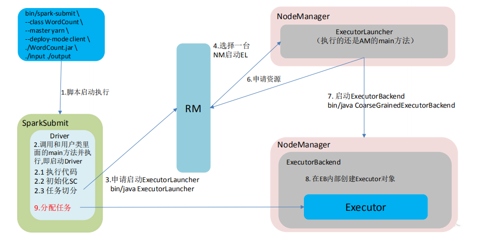

<font color = blue size = 5>YarnCluster模式</font>

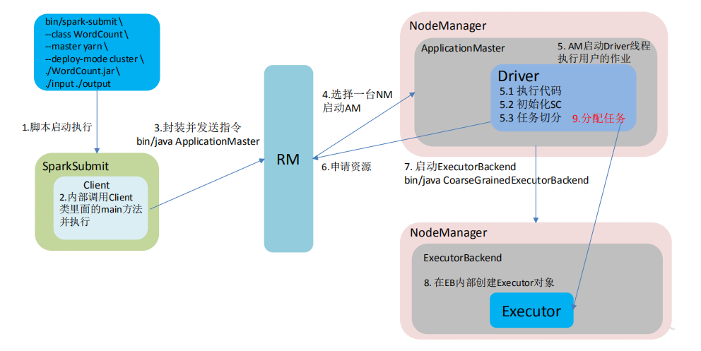

### 1.11.5 如何理解 Spark 中的血统概念（RDD）

> RDD 在 Lineage 依赖方面分为两种 Narrow Dependencies 与 Wide Dependencies 用来解决数据容错时的高效性以及划分任务时候起到重要作用。

### 1.11.6 简述 Spark 的宽窄依赖，以及 Spark 如何划分 stage，每个stage 又根据什么决定 task 个数? 

> Stage：根据 RDD 之间的依赖关系的不同将 Job 划分成不同的 Stage，遇到一个宽依赖则划分一个 Stage。
>
> Task：Stage 是一个 TaskSet，将 Stage 根据分区数划分成一个个的 Task。 

### 1.11.7 请列举 Spark 的 transformation 算子（不少于 8 个），并简述功能

> 1）`map`（func）：返回一个新的 RDD，该 RDD 由每一个输入元素经过 func 函数转换后组成. 
>
> 2）`mapPartitions`(func)：类似于 map，但独立地在 RDD 的每一个分片上运行，因此在类型为 T 的 RDD 上运行时，func 的函数类型必须是 Iterator[T] => Iterator[U]。假设有 N 个元素，有 M 个分区，那么 map 的函数的将被调用 N 次,而 mapPartitions 被调用 M 次,一个函数一次处理所有分区。
>
> 3）`reduceByKey`（func，[numTask]）：在一个(K,V)的 RDD 上调用，返回一个(K,V)的RDD，使用定的 reduce 函数，将相同 key 的值聚合到一起，reduce 任务的个数可以通过第二个可选的参数来设置。
>
> 4）`aggregateByKey` (zeroValue:U,[partitioner: Partitioner]) (seqOp: (U, V) => U,combOp: (U, U) => U: 在 kv 对的 RDD 中，，按 key 将 value 进行分组合并，合并时，将每个 value和初始值作为 seq 函数的参数，进行计算，返回的结果作为一个新的 kv 对，然后再将结果按照 key 进行合并，最后将每个分组的 value 传递给 combine 函数进行计算（先将前两个value 进行计算，将返回结果和下一个 value 传给 combine 函数，以此类推），将 key 与计算结果作为一个新的 kv 对输出。
>
> 5）`combineByKey`(createCombiner: V=>C, mergeValue: (C, V) =>C, mergeCombiners: (C, C) =>C):
>
> 对相同 K，把 V 合并成一个集合。
>
> 1.createCombiner: combineByKey() 会遍历分区中的所有元素，因此每个元素的键要么还没有遇到过，要么就和之前的某个元素的键相同。如果这是一个新的元素,combineByKey()会使用一个叫作 createCombiner()的函数来创建那个键对应的累加器的初始值
>
> 2.mergeValue: 如果这是一个在处理当前分区之前已经遇到的键，它会使用mergeValue()方法将该键的累加器对应的当前值与这个新的值进行合并0
>
> 3.mergeCombiners: 由于每个分区都是独立处理的， 因此对于同一个键可以有多个累加器。如果有两个或者更多的分区都有对应同一个键的累加器， 就需要使用用户提供的mergeCombiners() 方法将各个分区的结果进行合并。
>
> …
>
> 根据自身情况选择比较熟悉的算子加以介绍。

### 1.11.8 请列举 Spark 的 action 算子（不少于 6 个），并简述功能

> 1）reduce： 
>
> 2）collect:
>
> 3）first： 
>
> 4）take： 
>
> 5）aggregate： 
>
> 6）countByKey： 
>
> 7）foreach： 
>
> 8）saveAsTextFile： 

### 1.11.9 请列举会引起 Shuffle 过程的 Spark 算子，并简述功能。

> reduceBykey：
>
> groupByKey：
>
> …ByKey:

### 1.11.10 简述 Spark的两种核心 Shuffle（HashShuffle与 SortShuffle）的工作流程（包括未优化的 HashShuffle、优化的 HashShuffle、普通的 SortShuffle 与 bypass 的 SortShuffle）

**未经优化的 HashShuffle：**

<font color = #ff00 size = 5>HashShuffle流程</font>

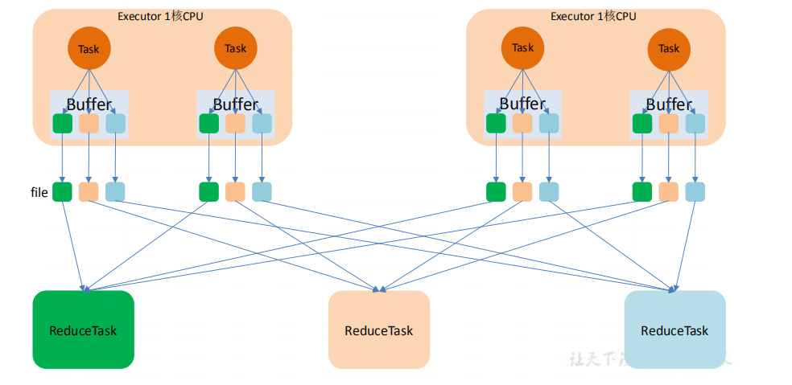

**优化后的Shuffle:**

<font color= #Ff00 size = 5 >优化后的HashShuffle流程</font>

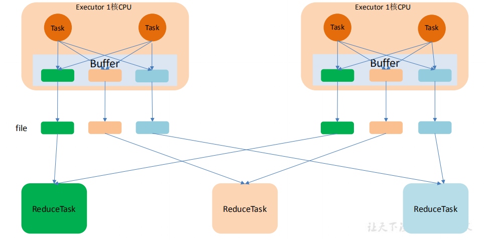

**普通的SortShuffle:**

<font color= #Ff00 size = 5 >SortShuffle过程解析</font>

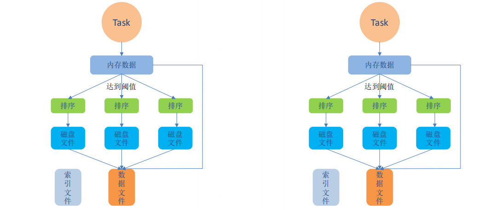

当 shuffle read task 的 数 量 小 于 等 于 spark.shuffle.sort。 bypassMergeThreshold 参数的值时（默认为 200），就会启用 bypass 机制。

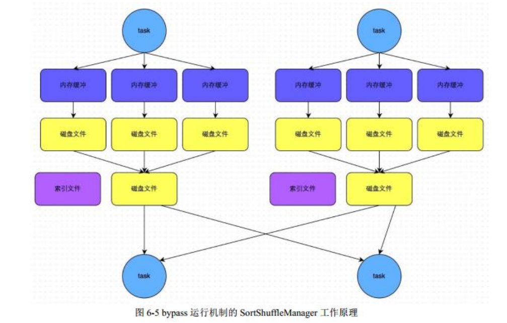

### 1.11.11 Spark 常用算子 reduceByKey 与 groupByKey 的区别，哪一种更具优势？

> reduceByKey：按照 key 进行聚合，在 shuffle 之前有 combine（**预聚合**）操作，返回结果是 RDD[k,v]。
>
> groupByKey：按照 key 进行分组，直接进行 shuffle。
>
> 开发指导：reduceByKey 比 groupByKey，建议使用。但是需要注意是否会影响业务逻辑。

### 1.11.12 Repartition 和 Coalesce 关系与区别

> 1）关系：
>
> 两者都是用来改变 RDD 的 partition 数量的，repartition 底层调用的就是 coalesce 方法：coalesce(numPartitions, shuffle = true)
>
> 2）区别：
>
> repartition 一定会发生 shuffle，coalesce 根据传入的参数来判断是否发生 shuffle一般情况下增大 rdd 的 partition 数量使用 repartition，减少 partition 数量时使用coalesce

### 1.11.13 分别简述Spark中的缓存机制（cache和persist）与checkpoint机制，并指出两者的区别与联系

> 都是做 RDD 持久化的
>
> cache:内存，不会截断血缘关系，使用计算过程中的数据缓存。
>
> checkpoint：磁盘，截断血缘关系，在 ck 之前必须没有任何任务提交才会生效，ck 过程会额外提交一次任务。（注意小文件）

### 1.11.14 简述 Spark 中共享变量（广播变量和累加器）的基本原理与用途。

> 累加器（accumulator）是 Spark 中提供的一种分布式的变量机制，其原理类似于mapreduce，即分布式的改变，然后聚合这些改变。累加器的一个常见用途是在调试时对作业执行过程中的事件进行计数。而广播变量用来高效分发较大的对象。
>
> 共享变量出现的原因：
>
> 通常在向 Spark 传递函数时，比如使用 map() 函数或者用 filter() 传条件时，可以使用驱动器程序中定义的变量，但是集群中运行的每个任务都会得到这些变量的一份新的副本，更新这些副本的值也不会影响驱动器中的对应变量。
>
> Spark 的两个共享变量，累加器与广播变量，分别为结果聚合与广播这两种常见的通信模式突破了这一限制。

### 1.11.15 当 Spark 涉及到数据库的操作时，如何减少 Spark 运行中的数据库连接数？

> 使用 foreachPartition 代替 foreach，在 foreachPartition 内获取数据库的连接。

### 1.11.16 如何使用 Spark实现 TopN的获取（描述思路或使用伪代码）

> 方法 1：
>
> （1）按照 key 对数据进行聚合（groupByKey） 
>
> （2）将 value 转换为数组，利用 scala 的 sortBy 或者 sortWith 进行排序（mapValues）数据量太大，会 OOM。
>
> 方法 2：
>
> （1）取出所有的 key
>
> （2）对 key 进行迭代，每次取出一个 key 利用 spark 的排序算子进行排序
>
> 方法 3：
>
> （1）自定义分区器，按照 key 进行分区，使不同的 key 进到不同的分区
>
> （2）对每个分区运用 spark 的排序算子进行排序

### 1.11.17 京东：调优之前与调优之后性能的详细对比（例如调整 map个数，map 个数之前多少、之后多少，有什么提升）

> 这里举个例子。比如我们有几百个文件，会有几百个 map 出现，读取之后进行 join 操作，会非常的慢。这个时候我们可以进行 coalesce 操作，比如 240 个 map，我们合成 60个 map，也就是窄依赖。这样再 shuffle，过程产生的文件数会大大减少。提高 join 的时间性能。

### 1.11.18 简述 SparkSQL 中 RDD、DataFrame、DataSet 三者的区别与联系? 

**1）RDD**

> **优点:**
>
> 编译时类型安全
>
> 编译时就能检查出类型错误
>
> 面向对象的编程风格
>
> 直接通过类名点的方式来操作数据

> **缺点:**
>
> 序列化和反序列化的性能开销
>
> 无论是集群间的通信, 还是 IO 操作都需要对对象的结构和数据进行序列化和反序列化。
>
> GC 的性能开销，频繁的创建和销毁对象, 势必会增加 GC

**2）DataFrame**

> DataFrame 引入了 schema 和 off-heap
>
> schema : RDD 每一行的数据, 结构都是一样的，这个结构就存储在 schema 中。 Spark 通 过 schema 就能够读懂数据, 因此在通信和 IO 时就只需要序列化和反序列化数据, 而结构的部分就可以省略了。

3）DataSet

> DataSet 结合了 RDD 和 DataFrame 的优点，并带来的一个新的概念 Encoder。当序列化数据时，Encoder 产生字节码与 off-heap 进行交互，能够达到按需访问数据的效果，而不用反序列化整个对象。Spark 还没有提供自定义 Encoder 的 API，但是未来会加入。

三者之间的转换：

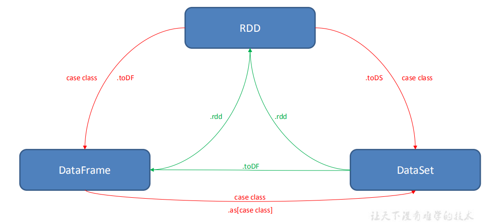


### 1.11.19 append 和 overwrite 的区别

> append 在原有分区上进行追加，overwrite 在原有分区上进行全量刷新

### 1.11.20 coalesce 和 repartition 的区别

> coalesce 和 repartition 都用于改变分区，coalesce 用于缩小分区且不会进行 shuffle，repartition用于增大分区（提供并行度）会进行 shuffle,在 spark 中减少文件个数会使用 coalesce 来减少分区来到这个目的。但是如果数据量过大，分区数过少会出现 OOM 所以 coalesce 缩小分区个数也需合理

### 1.11.21 cache 缓存级别

> DataFrame 的 cache 默认采用 MEMORY_AND_DISK 这和 RDD 的默认方式不一样 RDD cache 默认采用 MEMORY_ONLY

### 1.11.22 释放缓存和缓存

缓存：(1)dataFrame.cache (2)sparkSession.catalog.cacheTable(“tableName”)

释放缓存：(1)dataFrame.unpersist (2)sparkSession.catalog.uncacheTable(“tableName”) 

### 1.11.23 Spark Shuffle 默认并行度

> 参数 spark.sql.shuffle.partitions 决定 默认并行度 200

### 1.11.24 kryo 序列化

> kryo 序列化比 java 序列化更快更紧凑，但 spark 默认的序列化是 java 序列化并不是 spark 序列化，因为 spark 并不支持所有序列化类型，而且每次使用都必须进行注册。注册只针对于RDD。在 DataFrames 和 DataSet 当中自动实现了 kryo 序列化。

### 1.11.25 创建临时表和全局临时表

DataFrame.createTempView() 创建普通临时表

DataFrame.createGlobalTempView() DataFrame.createOrReplaceTempView() 创建全局临时表

### 1.11.26 BroadCast join 广播 join

原理：先将小表数据查询出来聚合到 driver 端，再广播到各个 executor 端，使表与表 join 时进行本地 join，避免进行网络传输产生 shuffle。

使用场景：大表 join 小表 只能广播小表

### 1.11.27 控制 Spark reduce 缓存 调优 shuffle

spark.reducer.maxSizeInFilght 此参数为 reduce task 能够拉取多少数据量的一个参数默认48MB，当集群资源足够时，增大此参数可减少 reduce 拉取数据量的次数，从而达到优化shuffle 的效果，一般调大为 96MB,资源够大可继续往上跳。spark.shuffle.file.buffer 此参数为每个 shuffle 文件输出流的内存缓冲区大小，调大此参数可以减少在创建 shuffle 文件时进行磁盘搜索和系统调用的次数，默认参数为 32k 一般调大为64k。 

### 1.11.28 注册 UDF 函数

SparkSession.udf.register 方法进行注册

### 1.11.29 SparkSQL 中 join 操作与 left join 操作的区别？

join 和 sql 中的 inner join 操作很相似，返回结果是前面一个集合和后面一个集合中匹配成功的，过滤掉关联不上的。leftJoin 类似于 SQL 中的左外关联 left outer join，返回结果以第一个 RDD 为主，关联不上的记录为空。部分场景下可以使用 left semi join 替代 left join：因为 left semi join 是 in(keySet) 的关系，遇到右表重复记录，左表会跳过,性能更高，而 left join 则会一直遍历。但是 left semi join 中最后 select 的结果中只许出现左表中的列名，因为右表只有 join key 参与关联计算了

## 1.12 Spark Streaming

### 1.12.1 Spark Streaming 第一次运行不丢失数据

> kafka 参数 auto.offset.reset 参数设置成 earliest 从最初始偏移量开始消费数据

### 1.12.2 Spark Streaming 精准一次消费

> 1. 手动维护偏移量
>
> 2. 处理完业务数据后，再进行提交偏移量操作
>
> 极端情况下，如在提交偏移量时断网或停电会造成 spark 程序第二次启动时重复消费问题，所以在涉及到金额或精确性非常高的场景会使用事物保证精准一次消费

### 1.12.3 Spark Streaming 控制每秒消费数据的速度

通过 spark.streaming.kafka.maxRatePerPartition 参数来设置 Spark Streaming 从 kafka 分区每秒拉取的条数

### 1.12.4 Spark Streaming 背压机制

> 把 spark.streaming.backpressure.enabled 参数设置为 ture,开启背压机制后 Spark Streaming 会根据延迟动态去 kafka 消费数据,上限由 spark.streaming.kafka.maxRatePerPartition 参数控制，所以两个参数一般会一起使用

### 1.12.5 Spark Streaming 一个 stage 耗时

> Spark Streaming stage 耗时由最慢的 task 决定,所以数据倾斜时某个 task 运行慢会导致整个Spark Streaming 都运行非常慢。

### 1.12.6 Spark Streaming 优雅关闭

> 把 spark.streaming.stopGracefullyOnShutdown 参数设置成 ture,Spark 会在 JVM 关闭时正常关闭 StreamingContext,而不是立马关闭
>
> Kill 命令：yarn application -kill 后面跟 applicationid

### 1.12.7 Spark Streaming 默认分区个数

> Spark Streaming 默认分区个数与所对接的 kafka topic 分区个数一致，Spark Streaming 里一般不会使用 repartition 算子增大分区，因为 repartition 会进行 shuffle 增加耗时

### 1.12.8 SparkStreaming 有哪几种方式消费 Kafka 中的数据，它们之间的区别是什么？

> **一、基于 Receiver 的方式**
>
> 这种方式使用 Receiver 来获取数据。Receiver 是使用 Kafka 的高层次 Consumer API来实现的。receiver 从 Kafka 中获取的数据都是存储在 Spark Executor 的内存中的（如果突然数据暴增，大量 batch 堆积，很容易出现内存溢出的问题），然后 Spark Streaming 启动的 job 会去处理那些数据。然而，在默认的配置下，这种方式可能会因为底层的失败而丢失数据。如果要启用高可靠机制，让数据零丢失，就必须启用 Spark Streaming 的预写日志机制（Write Ahead Log，WAL）。该机制会同步地将接收到的 Kafka 数据写入分布式文件系统（比如 HDFS）上的预写日志中。所以，即使底层节点出现了失败，也可以使用预写日志中的数据进行恢复。
>
> **二、基于 Direct 的方式**
>
> 这种新的不基于 Receiver 的直接方式，是在 Spark 1.3 中引入的，从而能够确保更加健壮的机制。替代掉使用 Receiver 来接收数据后，这种方式会周期性地查询 Kafka，来获得每个 topic+partition 的最新的 offset，从而定义每个 batch 的 offset 的范围。当处理数据的 job 启动时，就会使用 Kafka 的简单 consumer api 来获取 Kafka 指定 offset 范围的数据。
>
> `优点如下：` 
>
> 简化并行读取：如果要读取多个 partition，不需要创建多个输入 DStream 然后对它们进行 union 操作。Spark 会创建跟 Kafka partition 一样多的 RDD partition，并且会并行从 Kafka 中读取数据。所以在 Kafka partition 和 RDD partition 之间，有一个一对一的映射关系。
>
> 高性能：如果要保证零数据丢失，在基于 receiver 的方式中，需要开启 WAL 机制。这种方式其实效率低下，因为数据实际上被复制了两份，Kafka 自己本身就有高可靠的机制，会对数据复制一份，而这里又会复制一份到 WAL 中。而基于 direct 的方式，不依赖Receiver，不需要开启 WAL 机制，只要 Kafka 中作了数据的复制，那么就可以通过 Kafka的副本进行恢复。一次且仅一次的事务机制。 
>
> **三、对比：** 
>
> 基于 receiver 的方式，是使用 Kafka 的高阶 API 来在 ZooKeeper 中保存消费过的offset 的。这是消费 Kafka 数据的传统方式。这种方式配合着 WAL 机制可以保证数据零丢失的高可靠性，但是却无法保证数据被处理一次且仅一次，可能会处理两次。因为 Spark和 ZooKeeper 之间可能是不同步的。基于 direct 的方式，使用 kafka 的简单 api，Spark Streaming 自己就负责追踪消费的 offset，并保存在 checkpoint 中。Spark 自己一定是同步的，因此可以保证数据是消费一次且仅消费一次。在实际生产环境中大都用 Direct 方式
>

### 1.12.9 简述 SparkStreaming 窗口函数的原理

> 窗口函数就是在原来定义的 SparkStreaming 计算批次大小的基础上再次进行封装，每次计算多个批次的数据，同时还需要传递一个滑动步长的参数，用来设置当次计算任务完成之后下一次从什么地方开始计算。图中 time1 就是 SparkStreaming 计算批次大小，虚线框以及实线大框就是窗口的大小，必须为批次的整数倍。虚线框到大实线框的距离（相隔多少批次），就是滑动步长。

## 1.13 数据倾斜

> 公司一：总用户量 1000 万，5 台 64G 内存的服务器。
>
> 公司二：总用户量 10 亿，1000 台 64G 内存的服务器。
>
> 1.公司一的数据分析师在做 join 的时候发生了数据倾斜，会导致有几百万用户的相关数据集中到了一台服务器上，几百万的用户数据，说大也不大，正常字段量的数据的话 64G 还是能轻松处理掉的。
>
> 2.公司二的数据分析师在做 join 的时候也发生了数据倾斜，可能会有 1 个亿的用户相关数据集中到了一台机器上了（相信我，这很常见）。这时候一台机器就很难搞定了，最后会很难算出结果。

### 1.13.1 数据倾斜表现

**1）hadoop 中的数据倾斜表现：**

⚫ 有一个多几个 Reduce 卡住，卡在 99.99%，一直不能结束。

⚫ 各种 container 报错 OOM

⚫ 异常的 Reducer 读写的数据量极大，至少远远超过其它正常的 Reducer

⚫ 伴随着数据倾斜，会出现任务被 kill 等各种诡异的表现。

**2）hive 中数据倾斜**

一般都发生在 Sql 中 group by 和 join on 上，而且和数据逻辑绑定比较深。

**3）Spark 中的数据倾斜**

Spark 中的数据倾斜，包括 Spark Streaming 和 Spark Sql，表现主要有下面几种：

⚫ Executor lost，OOM，Shuffle 过程出错； 

⚫ Driver OOM； 

⚫ 单个 Executor 执行时间特别久，整体任务卡在某个阶段不能结束； 

⚫ 正常运行的任务突然失败；

### 1.13.2 数据倾斜产生原因

我们以 Spark 和 Hive 的使用场景为例。

他们在做数据运算的时候会涉及到，count distinct、group by、join on 等操作，这些都会触发 Shuffle 动作。一旦触发 Shuffle，所有相同 key 的值就会被拉到一个或几个 Reducer 节点上，容易发生单点计算问题，导致数据倾斜。

一般来说，数据倾斜原因有以下几方面：

`1）key 分布不均匀`；

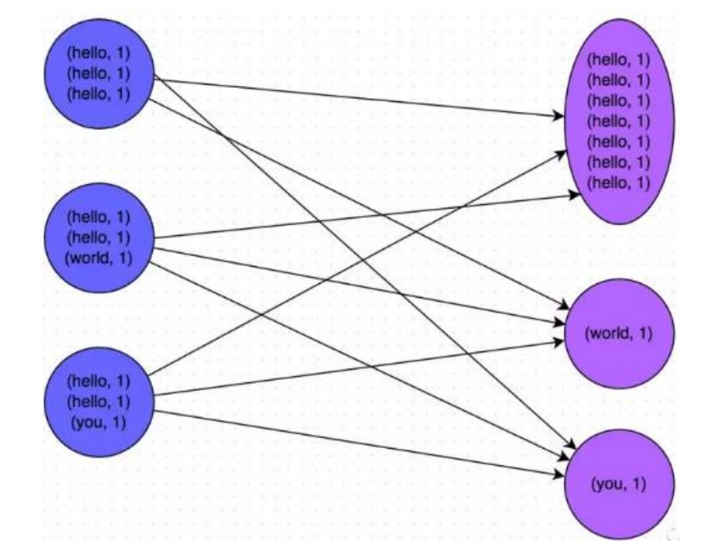

`2）建表时考虑不周`

我们举一个例子，就说数据默认值的设计吧，假设我们有两张表：

user（用户信息表）：userid，register_ip

ip（IP 表）：ip，register_user_cnt

这可能是两个不同的人开发的数据表。如果我们的数据规范不太完善的话，会出现一种情况：

user 表中的 register_ip 字段，如果获取不到这个信息，我们默认为 null；但是在 ip 表中，我们在统计这个值的时候，为了方便，我们把获取不到 ip 的用户，统一认为他们的 ip 为 0。两边其实都没有错的，但是一旦我们做关联了，这个任务会在做关联的阶段，也就是 sql的 on 的阶段卡死。

`3）业务数据激增`

比如订单场景，我们在某一天在北京和上海两个城市多了强力的推广，结果可能是这两个城市的订单量增长了 10000%，其余城市的数据量不变。然后我们要统计不同城市的订单情况，这样，一做 group 操作，可能直接就数据倾斜了。

### 1.13.3 解决数据倾斜思路

很多数据倾斜的问题，都可以用和平台无关的方式解决，比如更好的数据预处理，异常值的过滤等。因此，解决数据倾斜的重点在于对数据设计和业务的理解，这两个搞清楚了，数据倾斜就解决了大部分了。

`1）业务逻辑`

我们从业务逻辑的层面上来优化数据倾斜，比如上面的两个城市做推广活动导致那两个城市数据量激增的例子，我们可以单独对这两个城市来做 count，单独做时可用两次 MR，第一次打散计算，第二次再最终聚合计算。完成后和其它城市做整合。

`2）程序层面`

比如说在 Hive 中，经常遇到 count(distinct)操作，这样会导致最终只有一个 Reduce 任务。我们可以先 group by，再在外面包一层 count，就可以了。比如计算按用户名去重后的总用户量：

（1）优化前 只有一个 reduce，先去重再 count 负担比较大：

```sql
select name,count(distinct name)from user;
```

（2）优化后

```properties
// 设置该任务的每个 job 的 reducer 个数为 3 个。Hive 默认-1，自动推断。

set mapred.reduce.tasks=3;

// 启动两个 job，一个负责子查询(可以有多个 reduce)，另一个负责 count(1)：

select count(1) from (select name from user group by name) tmp;
```

3）调参方面

Hadoop 和 Spark 都自带了很多的参数和机制来调节数据倾斜，合理利用它们就能解决大部分问题。

4）从业务和数据上解决数据倾斜

很多数据倾斜都是在数据的使用上造成的。我们举几个场景，并分别给出它们的解决方案。

⚫ 有损的方法：找到异常数据，比如 ip 为 0 的数据，过滤掉

⚫ 无损的方法：对分布不均匀的数据，单独计算

⚫ 先对 key 做一层 hash，先将数据随机打散让它的并行度变大，再汇集

⚫ 数据预处理

### 1.13.4 定位导致数据倾斜代码

Spark 数据倾斜只会发生在 shuffle 过程中。这里给大家罗列一些常用的并且可能会触发 shuffle 操作的算子：distinct、groupByKey、reduceByKey、aggregateByKey、join、cogroup、repartition 等。出现数据倾斜时，可能就是你的代码中使用了这些算子中的某一个所导致的。

#### 1.13.4.1 某个 task 执行特别慢的情况

首先要看的，就是数据倾斜发生在第几个 stage 中：如果是用 yarn-client 模式提交，那么在提交的机器本地是直接可以看到 log，可以在 log中找到当前运行到了第几个 stage；如果是用 yarn-cluster 模式提交，则可以通过 Spark Web UI 来查看当前运行到了第几个stage。此外，无论是使用 yarn-client 模式还是 yarn-cluster 模式，我们都可以在 Spark Web UI上深入看一下当前这个 stage 各个 task 分配的数据量，从而进一步确定是不是 task 分配的数据不均匀导致了数据倾斜。看 task 运行时间和数据量task 运行时间。比如下图中，倒数第三列显示了每个 task 的运行时间。明显可以看到，有的 task 运行特别快，只需要几秒钟就可以运行完；而有的 task 运行特别慢，需要几分钟才能运行完，此时单从运行时间上看就已经能够确定发生数据倾斜了。task 数据量此外，倒数第一列显示了每个 task 处理的数据量，明显可以看到，运行时间特别短的task 只需要处理几百 KB 的数据即可，而运行时间特别长的 task 需要处理几千 KB 的数据，处理的数据量差了 10 倍。此时更加能够确定是发生了数据倾斜。

`推断倾斜代码`

知道数据倾斜发生在哪一个 stage 之后，接着我们就需要根据 stage 划分原理，推算出来发生倾斜的那个 stage 对应代码中的哪一部分，这部分代码中肯定会有一个 shuffle 类算子。精准推算 stage 与代码的对应关系，需要对 Spark 的源码有深入的理解，这里我们可以介绍一个相对简单实用的推算方法：只要看到 Spark 代码中出现了一个 shuffle 类算子或者是 Spark SQL 的 SQL 语句中出现了会导致 shuffle 的语句（比如 group by 语句），那么就可以判定，以那个地方为界限划分出了前后两个 stage。这里我们就以如下单词计数来举例。

```scala
val conf = new SparkConf()
val sc = new SparkContext(conf)
val lines = sc.textFile("hdfs://...")
val words = lines.flatMap(_.split(" "))
val pairs = words.map((_, 1))
val wordCounts = pairs.reduceByKey(_ + _)
wordCounts.collect().foreach(println(_))
```

在整个代码中只有一个 reduceByKey 是会发生 shuffle 的算子，也就是说这个算子为界限划分出了前后两个 stage：

stage0，主要是执行从 textFile 到 map 操作，以及 shuffle write 操作（对 pairs RDD 中的数据进行分区操作，每个 task 处理的数据中，相同的 key 会写入同一个磁盘文件内）。

stage1，主要是执行从 reduceByKey 到 collect 操作，以及 stage1 的各个 task 一开始运行，就会首先执行 shuffle read 操作（会从 stage0 的各个 task 所在节点拉取属于自己处理的那些 key，然后对同一个 key 进行全局性的聚合或 join 等操作，在这里就是对 key 的 value值进行累加）

stage1 在执行完 reduceByKey 算子之后，就计算出了最终的 wordCounts RDD，然后会执行 collect 算子，将所有数据拉取到 Driver 上，供我们遍历和打印输出。

通过对单词计数程序的分析，希望能够让大家了解最基本的stage划分的原理，以及stage划分后 shuffle 操作是如何在两个 stage 的边界处执行的。然后我们就知道如何快速定位出发生数据倾斜的 stage 对应代码的哪一个部分了。

比如我们在 Spark Web UI 或者本地 log 中发现，stage1 的某几个 task 执行得特别慢，判定 stage1 出现了数据倾斜，那么就可以回到代码中，定位出 stage1 主要包括了 reduceByKey这个 shuffle 类算子，此时基本就可以确定是是该算子导致了数据倾斜问题。

此时，如果某个单词出现了 100 万次，其他单词才出现 10 次，那么 stage1 的某个 task就要处理 100 万数据，整个 stage 的速度就会被这个 task 拖慢。

#### 1.13.4.2 某个 task 莫名其妙内存溢出的情况

这种情况下去定位出问题的代码就比较容易了。我们建议直接看 yarn-client 模式下本地log 的异常栈，或者是通过 YARN 查看 yarn-cluster 模式下的 log 中的异常栈。一般来说，通过异常栈信息就可以定位到你的代码中哪一行发生了内存溢出。然后在那行代码附近找找，一般也会有 shuffle 类算子，此时很可能就是这个算子导致了数据倾斜。但是大家要注意的是，不能单纯靠偶然的内存溢出就判定发生了数据倾斜。因为自己编写的代码的 bug，以及偶然出现的数据异常，也可能会导致内存溢出。因此还是要按照上面所讲的方法，通过 Spark Web UI 查看报错的那个 stage 的各个 task 的运行时间以及分配的数据量，才能确定是否是由于数据倾斜才导致了这次内存溢出。

### 1.13.5 查看导致数据倾斜的 key 分布情况

先对 pairs 采样 10%的样本数据，然后使用 countByKey 算子统计出每个 key 出现的次数，最后在客户端遍历和打印样本数据中各个 key 的出现次数。

```scala
val sampledPairs = pairs.sample(false, 0.1)

val sampledWordCounts = sampledPairs.countByKey()

sampledWordCounts.foreach(println(_))
```


### 1.13.6 Spark 数据倾斜的解决方案

#### 1.13.6.1 使用 Hive ETL 预处理数据

##### 1.13.6.1.1 适用场景

导致数据倾斜的是 Hive 表。如果该 Hive 表中的数据本身很不均匀（比如某个 key 对应了 100 万数据，其他 key 才对应了 10 条数据），而且业务场景需要频繁使用 Spark 对 Hive表执行某个分析操作，那么比较适合使用这种技术方案。

##### 1.13.6.1.2 实现思路

此时可以评估一下，是否可以通过 Hive 来进行数据预处理（即通过 Hive ETL 预先对数据按照 key 进行聚合，或者是预先和其他表进行 join），然后在 Spark 作业中针对的数据源就不是原来的 Hive 表了，而是预处理后的 Hive 表。此时由于数据已经预先进行过聚合或join 操作了，那么在 Spark 作业中也就不需要使用原先的 shuffle 类算子执行这类操作了。

##### 1.13.6.1.3 方案实现原理

这种方案从根源上解决了数据倾斜，因为彻底避免了在 Spark 中执行 shuffle 类算子，那么肯定就不会有数据倾斜的问题了。但是这里也要提醒一下大家，这种方式属于治标不治本。因为毕竟数据本身就存在分布不均匀的问题，所以 Hive ETL 中进行 group by 或者 join等 shuffle 操作时，还是会出现数据倾斜，导致 Hive ETL 的速度很慢。我们只是把数据倾斜的发生提前到了 Hive ETL 中，避免 Spark 程序发生数据倾斜而已。

##### 1.13.6.1.4 方案优缺点

优点：实现起来简单便捷，效果还非常好，完全规避掉了数据倾斜，Spark 作业的性能会大幅度提升。

缺点：治标不治本，Hive ETL 中还是会发生数据倾斜。

##### 1.13.6.1.5 方案实践经验

在一些 Java 系统与 Spark 结合使用的项目中，会出现 Java 代码频繁调用 Spark 作业的场景，而且对 Spark 作业的执行性能要求很高，就比较适合使用这种方案。将数据倾斜提前到上游的 Hive ETL，每天仅执行一次，只有那一次是比较慢的，而之后每次 Java 调用 Spark作业时，执行速度都会很快，能够提供更好的用户体验。

##### 1.13.6.1.6 项目实践经验

在美团·点评的交互式用户行为分析系统中使用了这种方案，该系统主要是允许用户通过 Java Web 系统提交数据分析统计任务，后端通过 Java 提交 Spark 作业进行数据分析统计。要求 Spark 作业速度必须要快，尽量在 10 分钟以内，否则速度太慢，用户体验会很差。所以我们将有些 Spark 作业的 shuffle 操作提前到了 Hive ETL 中，从而让 Spark 直接使用预处理的 Hive 中间表，尽可能地减少 Spark 的 shuffle 操作，大幅度提升了性能，将部分作业的性能提升了 6 倍以上。

#### 1.13.6.2 过滤少数导致倾斜的 key

##### 1.13.6.2.1 方案适用场景

如果发现导致倾斜的 key 就少数几个，而且对计算本身的影响并不大的话，那么很适合使用这种方案。比如 99%的 key 就对应 10 条数据，但是只有一个 key 对应了 100 万数据，从而导致了数据倾斜。

##### 1.13.6.2.2 方案实现思路

如果我们判断那少数几个数据量特别多的 key，对作业的执行和计算结果不是特别重要的话，那么干脆就直接过滤掉那少数几个 key。比如，在 Spark SQL 中可以使用 where 子句过滤掉这些 key 或者在 Spark Core 中对 RDD执行 filter 算子过滤掉这些 key。如果需要每次作业执行时，动态判定哪些 key 的数据量最多然后再进行过滤，那么可以使用 sample 算子对 RDD 进行采样，然后计算出每个 key 的数量，取数据量最多的 key 过滤掉即可。

##### 1.13.6.2.3 方案实现原理

将导致数据倾斜的 key 给过滤掉之后，这些 key 就不会参与计算了，自然不可能产生数据倾斜。

##### 1.13.6.2.4 方案优缺点

优点：实现简单，而且效果也很好，可以完全规避掉数据倾斜。

缺点：适用场景不多，大多数情况下，导致倾斜的 key 还是很多的，并不是只有少数几个。

##### 1.13.6.2.5 方案实践经验

在项目中我们也采用过这种方案解决数据倾斜。有一次发现某一天 Spark 作业在运行的时候突然 OOM 了，追查之后发现，是 Hive 表中的某一个 key 在那天数据异常，导致数据量暴增。因此就采取每次执行前先进行采样，计算出样本中数据量最大的几个 key 之后，直接在程序中将那些 key 给过滤掉。

#### 1.13.6.3 提高 shuffle 操作的并行度

##### 1.13.6.3.1 方案适用场景

如果我们必须要对数据倾斜迎难而上，那么建议优先使用这种方案，因为这是处理数据倾斜最简单的一种方案。

##### 1.13.6.3.2 方案实现思路

在对 RDD 执行 shuffle 算子时，给 shuffle 算子传入一个参数，比如 reduceByKey(1000)，该参数就设置了这个shuffle算子执行时shuffle read task的数量，即spark.sql.shuffle.partitions，该参数代表了 shuffle read task 的并行度，默认是 200，对于很多场景来说都有点过小。

##### 1.13.6.3.3 方案实现原理

增加 shuffle read task 的数量，可以让原本分配给一个 task 的多个 key 分配给多个 task，从而让每个 task 处理比原来更少的数据。举例来说，如果原本有 5 个 key，每个 key 对应 10条数据，这 5 个 key 都是分配给一个 task 的，那么这个 task 就要处理 50 条数据。而增加了 shuffle read task 以后，每个 task 就分配到一个 key，即每个 task 就处理 10 条数据，那么自然每个 task 的执行时间都会变短了。具体原理如下图所示。

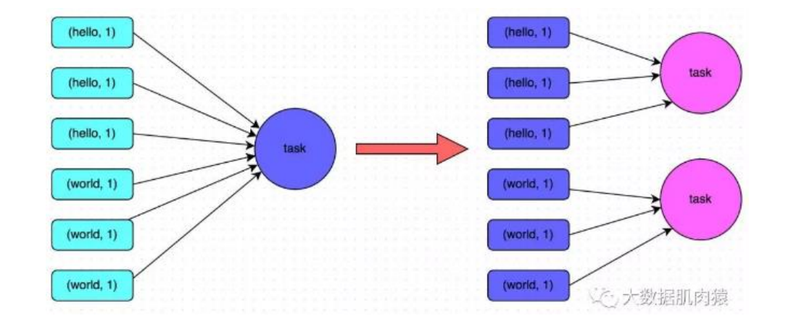

##### 1.13.6.3.4 方案优缺点

优点：实现起来比较简单，可以有效缓解和减轻数据倾斜的影响。

缺点：只是缓解了数据倾斜而已，没有彻底根除问题，根据实践经验来看，其效果有限。

##### 1.13.6.3.5 方案实践经验

该方案通常无法彻底解决数据倾斜，因为如果出现一些极端情况，比如某个 key 对应的数据量有 100 万，那么无论你的 task 数量增加到多少，这个对应着 100 万数据的 key 肯定还是会分配到一个 task 中去处理，因此注定还是会发生数据倾斜的。所以这种方案只能说是在发现数据倾斜时尝试使用的第一种手段，尝试去用最简单的方法缓解数据倾斜而已，或者是和其他方案结合起来使用。

#### 1.13.6.4 两阶段聚合（局部聚合+全局聚合）

##### 1.13.6.4.1 方案适用场景

对 RDD 执行 reduceByKey 等聚合类 shuffle 算子或者在 Spark SQL 中使用 group by 语句进行分组聚合时，比较适用这种方案。

##### 1.13.6.4.2 方案实现思路

这个方案的核心实现思路就是进行两阶段聚合：第一次是局部聚合，先给每个 key 都打上一个随机数，比如 10 以内的随机数，此时原先一样的 key 就变成不一样的了，比如(hello, 1) (hello, 1) (hello, 1) (hello, 1)，就会变成(1_hello, 1) (1_hello, 1) (2_hello, 1) (2_hello, 1)。接着对打上随机数后的数据，执行 reduceByKey 等聚合操作，进行局部聚合，那么局部聚合结果，就会变成了(1_hello, 2) (2_hello, 2)。然后将各个 key 的前缀给去掉，就会变成(hello,2)(hello,2)，再次进行全局聚合操作，就可以得到最终结果了，比如(hello, 4)。

示例代码如下：

```java
// 第一步，给 RDD 中的每个 key 都打上一个随机前缀。

JavaPairRDD<String, Long> randomPrefixRdd = rdd.mapToPair(

 new PairFunction<Tuple2<Long,Long>, String, Long>() {

 private static final long serialVersionUID = 1L;

 @Override

 public Tuple2<String, Long> call(Tuple2<Long, Long> tuple)

 throws Exception {

 Random random = new Random();

 int prefix = random.nextInt(10);

 return new Tuple2<String, Long>(prefix + "_" + tuple._1, tuple._2);

 }

 });

 

// 第二步，对打上随机前缀的 key 进行局部聚合。

JavaPairRDD<String, Long> localAggrRdd = randomPrefixRdd.reduceByKey(

 new Function2<Long, Long, Long>() {

 private static final long serialVersionUID = 1L;
     @Override
     public Long call(Long v1, Long v2) throws Exception {

 return v1 + v2;

 }

 });

 

// 第三步，去除 RDD 中每个 key 的随机前缀。

JavaPairRDD<Long, Long> removedRandomPrefixRdd = localAggrRdd.mapToPair(

 new PairFunction<Tuple2<String,Long>, Long, Long>() {

 private static final long serialVersionUID = 1L;

 @Override

 public Tuple2<Long, Long> call(Tuple2<String, Long> tuple)

 throws Exception {

 long originalKey = Long.valueOf(tuple._1.split("_")[1]);

 return new Tuple2<Long, Long>(originalKey, tuple._2);

 }

 });

 

// 第四步，对去除了随机前缀的 RDD 进行全局聚合。

JavaPairRDD<Long, Long> globalAggrRdd = removedRandomPrefixRdd.reduceByKey(

 new Function2<Long, Long, Long>() {

 private static final long serialVersionUID = 1L;

 @Override

 public Long call(Long v1, Long v2) throws Exception {

 return v1 + v2;

 }

 });
```


##### 1.13.6.4.3 方案实现原理

将原本相同的 key 通过附加随机前缀的方式，变成多个不同的 key，就可以让原本被一个 task 处理的数据分散到多个 task 上去做局部聚合，进而解决单个 task 处理数据量过多的问题。接着去除掉随机前缀，再次进行全局聚合，就可以得到最终的结果。具体原理见下图。

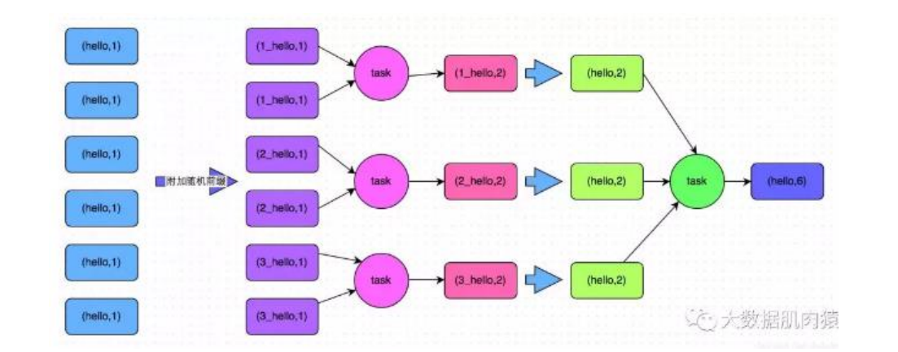

##### 1.13.6.4.4 方案优缺点

优点:对于聚合类的 shuffle 操作导致的数据倾斜，效果是非常不错的。通常都可以解决掉数据倾斜，或者至少是大幅度缓解数据倾斜，将 Spark 作业的性能提升数倍以上。

缺点：仅仅适用于聚合类的 shuffle 操作，适用范围相对较窄。如果是 join 类的 shuffle 操作，还得用其他的解决方案。

#### 1.13.6.5 将 reduce join 转为 map join

##### 1.13.6.5.1 方案适用场景

在对 RDD 使用 join 类操作，或者是在 Spark SQL 中使用 join 语句时，而且 join 操作中的一个 RDD 或表的数据量比较小（比如几百 M 或者一两 G），比较适用此方案。

##### 1.13.6.5.2 方案实现思路

不使用 join 算子进行连接操作，而使用 Broadcast 变量与 map 类算子实现 join 操作，进而完全规避掉 shuffle 类的操作，彻底避免数据倾斜的发生和出现。将较小 RDD 中的数据直接通过 collect 算子拉取到 Driver 端的内存中来，然后对其创建一个 Broadcast 变量，广播给其他 Executor 节点；接着对另外一个 RDD 执行 map 类算子，在算子函数内，从 Broadcast 变量中获取较小RDD 的全量数据，与当前 RDD 的每一条数据按照连接 key 进行比对，如果连接 key 相同的话，那么就将两个 RDD 的数据用你需要的方式连接起来。

示例如下：

```java
// 首先将数据量比较小的 RDD 的数据，collect 到 Driver 中来。

List<Tuple2<Long, Row>> rdd1Data = rdd1.collect()

// 然后使用 Spark 的广播功能，将小 RDD 的数据转换成广播变量，这样每个 Executor 就只有一份 RDD 的数据。

// 可以尽可能节省内存空间，并且减少网络传输性能开销。

final Broadcast<List<Tuple2<Long, Row>>> rdd1DataBroadcast = sc.broadcast(rdd1Data);

 

// 对另外一个 RDD 执行 map 类操作，而不再是 join 类操作。

JavaPairRDD<String, Tuple2<String, Row>> joinedRdd = rdd2.mapToPair(
    
    new PairFunction<Tuple2<Long,String>, String, Tuple2<String, Row>>() {
     
     private static final long serialVersionUID = 1L;
     @Override
     public Tuple2<String, Tuple2<String, Row>> call(Tuple2<Long, String> tuple) throws Exception {
         // 在算子函数中，通过广播变量，获取到本地 Executor 中的 rdd1 数据。
         List<Tuple2<Long, Row>> rdd1Data = rdd1DataBroadcast.value();
         // 可以将 rdd1 的数据转换为一个 Map，便于后面进行 join 操作。
         Map<Long, Row> rdd1DataMap = new HashMap<Long, Row>();
         for(Tuple2<Long, Row> data : rdd1Data) {
             rdd1DataMap.put(data._1, data._2);
         }
         // 获取当前 RDD 数据的 key 以及 value。
         String key = tuple._1;
         String value = tuple._2;
         // 从 rdd1 数据 Map 中，根据 key 获取到可以 join 到的数据。
         Row rdd1Value = rdd1DataMap.get(key);
         return new Tuple2<String, String>(key, new Tuple2<String, Row>(value, rdd1Value));
     }
    });

// 这里得提示一下。
// 上面的做法，仅仅适用于 rdd1 中的 key 没有重复，全部是唯一的场景。
// 如果 rdd1 中有多个相同的 key，那么就得用 flatMap 类的操作，在进行 join 的时候不能用map，而是得遍历 rdd1 所有数据进行 join。
// rdd2 中每条数据都可能会返回多条 join 后的数据。
```


##### 1.13.6.5.3 方案实现原理

普通的 join 是会走 shuffle 过程的，而一旦 shuffle，就相当于会将相同 key 的数据拉取到一个 shuffle read task 中再进行 join，此时就是 reduce join。但是如果一个 RDD 是比较小的，则可以采用广播小 RDD 全量数据+map 算子来实现与join 同样的效果，也就是 map join，此时就不会发生 shuffle 操作，也就不会发生数据倾斜。

具体原理如下图所示。


##### 1.13.6.5.4 方案优缺点

优点：对 join 操作导致的数据倾斜，效果非常好，因为根本就不会发生 shuffle，也就根本不会发生数据倾斜。

缺点：适用场景较少，因为这个方案只适用于一个大表和一个小表的情况。毕竟我们需要将小表进行广播，此时会比较消耗内存资源，driver 和每个 Executor 内存中都会驻留一份小 RDD 的全量数据。如果我们广播出去的 RDD 数据比较大，比如 10G 以上，那么就可能发生内存溢出了。因此并不适合两个都是大表的情况。

#### 1.13.6.6 采样倾斜 key 并分拆 join 操作

##### 1.13.6.6.1 方案适用场景

两个 RDD/Hive 表进行 join 的时候，如果数据量都比较大，无法采用“解决方案五”，那么此时可以看一下两个 RDD/Hive 表中的 key 分布情况。如果出现数据倾斜，是因为其中某一个 RDD/Hive 表中的少数几个 key 的数据量过大，而另一个 RDD/Hive 表中的所有 key 都分布比较均匀，那么采用这个解决方案是比较合适的。

##### 1.13.6.6.2 方案实现思路

对包含少数几个数据量过大的 key 的那个 RDD，通过 sample 算子采样出一份样本来，然后统计一下每个 key 的数量，计算出来数据量最大的是哪几个 key。然后将这几个 key 对应的数据从原来的 RDD 中拆分出来，形成一个单独的 RDD，并给每个 key 都打上 n 以内的随机数作为前缀；而不会导致倾斜的大部分 key 形成另外一个 RDD。接着将需要 join 的另一个 RDD，也过滤出来那几个倾斜 key 对应的数据并形成一个单独的 RDD，将每条数据膨胀成 n 条数据，这 n 条数据都按顺序附加一个 0~n 的前缀；不会导致倾斜的大部分 key 也形成另外一个 RDD。再将附加了随机前缀的独立 RDD 与另一个膨胀 n 倍的独立 RDD 进行 join，此时就可以将原先相同的 key 打散成 n 份，分散到多个 task 中去进行 join 了。而另外两个普通的 RDD 就照常 join 即可。最后将两次 join 的结果使用 union 算子合并起来即可，就是最终的 join 结果。

示例如下：

```java
// 首先从包含了少数几个导致数据倾斜 key 的 rdd1 中，采样 10%的样本数据。

JavaPairRDD<Long, String> sampledRDD = rdd1.sample(false, 0.1);

 // 对样本数据 RDD 统计出每个 key 的出现次数，并按出现次数降序排序。
// 对降序排序后的数据，取出 top 1 或者 top 100 的数据，也就是 key 最多的前 n 个数据。
// 具体取出多少个数据量最多的 key，由大家自己决定，我们这里就取 1 个作为示范。
// 每行数据变为<key,1>

JavaPairRDD<Long, Long> mappedSampledRDD = sampledRDD.mapToPair(
    new PairFunction<Tuple2<Long,String>, Long, Long>() {
        private static final long serialVersionUID = 1L;
        @Override
        public Tuple2<Long, Long> call(Tuple2<Long, String> tuple) throws Exception {
            return new Tuple2<Long, Long>(tuple._1, 1L);
        }
    });
// 按 key 累加行数
JavaPairRDD<Long, Long> countedSampledRDD = mappedSampledRDD.reduceByKey(
    new Function2<Long, Long, Long>() {
        private static final long serialVersionUID = 1L;
        @Override
        public Long call(Long v1, Long v2) throws Exception {
            return v1 + v2;
        }
    });
// 反转 key 和 value,变为<value,key>
JavaPairRDD<Long, Long> reversedSampledRDD = countedSampledRDD.mapToPair(
    new PairFunction<Tuple2<Long,Long>, Long, Long>() {
        private static final long serialVersionUID = 1L;
        @Override
        public Tuple2<Long, Long> call(Tuple2<Long, Long> tuple) throws Exception {
            return new Tuple2<Long, Long>(tuple._2, tuple._1);
        }
    });
// 以行数排序 key，取最多行数的 key
final Long skewedUserid = reversedSampledRDD.sortByKey(false).take(1).get(0)._2;
// 从 rdd1 中分拆出导致数据倾斜的 key，形成独立的 RDD。
JavaPairRDD<Long, String> skewedRDD = rdd1.filter(
    new Function<Tuple2<Long,String>, Boolean>() {
        private static final long serialVersionUID = 1L;
        @Override
        public Boolean call(Tuple2<Long, String> tuple) throws Exception {
            return tuple._1.equals(skewedUserid);
        }
    });
// 从 rdd1 中分拆出不导致数据倾斜的普通 key，形成独立的 RDD。
JavaPairRDD<Long, String> commonRDD = rdd1.filter(
    new Function<Tuple2<Long,String>, Boolean>() {
        private static final long serialVersionUID = 1L;
        @Override
        public Boolean call(Tuple2<Long, String> tuple) throws Exception {
            return !tuple._1.equals(skewedUserid);
        }
    });

// rdd2，就是那个所有 key 的分布相对较为均匀的 rdd。
// 这里将 rdd2 中，前面获取到的 key 对应的数据，过滤出来，分拆成单独的 rdd，并对 rdd中的数据使用 flatMap 算子都扩容 100 倍。
// 对扩容的每条数据，都打上 0～100 的前缀。
JavaPairRDD<String, Row> skewedRdd2 = rdd2.filter(
    new Function<Tuple2<Long,Row>, Boolean>() {
        private static final long serialVersionUID = 1L;
        @Override
        public Boolean call(Tuple2<Long, Row> tuple) throws Exception {
            return tuple._1.equals(skewedUserid);
        }
    }).flatMapToPair(new PairFlatMapFunction<Tuple2<Long,Row>, String, Row>() {
    private static final long serialVersionUID = 1L;
    @Override
    public Iterable<Tuple2<String, Row>> call(
        Tuple2<Long, Row> tuple) throws Exception {
        Random random = new Random();
        List<Tuple2<String, Row>> list = new ArrayList<Tuple2<String, Row>>();
        for(int i = 0; i < 100; i++) {
            list.add(new Tuple2<String, Row>(i + "_" + tuple._1, tuple._2));
        }
        return list;
 }
});
// 将 rdd1 中分拆出来的导致倾斜的 key 的独立 rdd，每条数据都打上 100 以内的随机前缀。
// 然后将这个 rdd1 中分拆出来的独立 rdd，与上面 rdd2 中分拆出来的独立 rdd，进行 join。
JavaPairRDD<Long, Tuple2<String, Row>> joinedRDD1 = skewedRDD.mapToPair(
    new PairFunction<Tuple2<Long,String>, String, String>() {
        private static final long serialVersionUID = 1L;
        @Override  
        public Tuple2<String, String> call(Tuple2<Long, String> tuple) throws Exception {
            Random random = new Random();
            int prefix = random.nextInt(100);
            return new Tuple2<String, String>(prefix + "_" + tuple._1, tuple._2);
        }
    })
    .join(skewedUserid2infoRDD)
    .mapToPair(new PairFunction<Tuple2<String,Tuple2<String,Row>>, Long, Tuple2<String, Row>>() {
        private static final long serialVersionUID = 1L;
        @Override
        public Tuple2<Long, Tuple2<String, Row>> call( Tuple2<String, Tuple2<String, Row>> tuple) throws Exception {
            long key = Long.valueOf(tuple._1.split("_")[1]);
            return new Tuple2<Long, Tuple2<String, Row>>(key, tuple._2);
        }
    });
// 将 rdd1 中分拆出来的包含普通 key 的独立 rdd，直接与 rdd2 进行 join。
JavaPairRDD<Long, Tuple2<String, Row>> joinedRDD2 = commonRDD.join(rdd2);
// 将倾斜 key join 后的结果与普通 key join 后的结果，uinon 起来。
// 就是最终的 join 结果。
JavaPairRDD<Long, Tuple2<String, Row>> joinedRDD = joinedRDD1.union(joinedRDD2);
```


##### 1.13.6.6.3 方案实现原理

对于 join 导致的数据倾斜，如果只是某几个 key 导致了倾斜，可以将少数几个 key 分拆成独立 RDD，并附加随机前缀打散成 n 份去进行 join，此时这几个 key 对应的数据就不会集中在少数几个 task 上，而是分散到多个 task 进行 join 了。具体原理见下图。

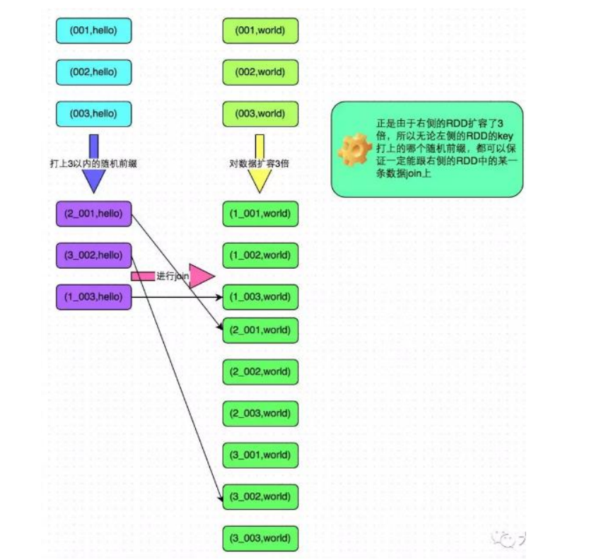

##### 1.13.6.6.4 方案优缺点

优点：对于 join 导致的数据倾斜，如果只是某几个 key 导致了倾斜，采用该方式可以用最有效的方式打散 key 进行 join。而且只需要针对少数倾斜 key 对应的数据进行扩容 n 倍，不需要对全量数据进行扩容。避免了占用过多内存。

缺点：如果导致倾斜的 key 特别多的话，比如成千上万个 key 都导致数据倾斜，那么这种方式也不适合。


#### 1.13.6.7 使用随机前缀和扩容 RDD 进行 join

##### 1.13.6.7.1 方案适用场景

如果在进行 join 操作时，RDD 中有大量的 key 导致数据倾斜，那么进行分拆 key 也没什么意义，此时就只能使用最后一种方案来解决问题了。

##### 1.13.6.7.2 方案实现思路

该方案的实现思路基本和“解决方案六”类似，首先查看 RDD/Hive 表中的数据分布情况，找到那个造成数据倾斜的 RDD/Hive 表，比如有多个 key 都对应了超过 1 万条数据。然后将该 RDD 的每条数据都打上一个 n 以内的随机前缀。同时对另外一个正常的 RDD 进行扩容，将每条数据都扩容成 n 条数据，扩容出来的每条数据都依次打上一个 0~n 的前缀。最后将两个处理后的 RDD 进行 join 即可。

示例代码如下：

```java
// 首先将其中一个 key 分布相对较为均匀的 RDD 膨胀 100 倍。
JavaPairRDD<String, Row> expandedRDD = rdd1.flatMapToPair(
    new PairFlatMapFunction<Tuple2<Long,Row>, String, Row>() {
        private static final long serialVersionUID = 1L;
        @Override
        public Iterable<Tuple2<String, Row>> call(Tuple2<Long, Row> tuple) throws Exception {
            List<Tuple2<String, Row>> list = new ArrayList<Tuple2<String, Row>>();
            for(int i = 0; i < 100; i++) {
                list.add(new Tuple2<String, Row>(i + "_" + tuple._1, tuple._2));
            }
            return list;
        }
    });

 // 其次，将另一个有数据倾斜 key 的 RDD，每条数据都打上 100 以内的随机前缀。
JavaPairRDD<String, String> mappedRDD = rdd2.mapToPair(
    new PairFunction<Tuple2<Long,String>, String, String>() {
        private static final long serialVersionUID = 1L;
        @Override
        public Tuple2<String, String> call(Tuple2<Long, String> tuple)  throws Exception {
            Random random = new Random();
            int prefix = random.nextInt(100);
            return new Tuple2<String, String>(prefix + "_" + tuple._1, tuple._2);
        }
 });

 // 将两个处理后的 RDD 进行 join 即可。
JavaPairRDD<String, Tuple2<String, Row>> joinedRDD = mappedRDD.join(expandedRDD);
```


##### 1.13.6.7.3 方案实现原理

将原先一样的 key 通过附加随机前缀变成不一样的 key，然后就可以将这些处理后的“不同 key”分散到多个 task 中去处理，而不是让一个 task 处理大量的相同 key。该方案与“解决方案六”的不同之处就在于，上一种方案是尽量只对少数倾斜 key 对应的数据进行特殊处理，由于处理过程需要扩容 RDD，因此上一种方案扩容 RDD 后对内存的占用并不大；而这一种方案是针对有大量倾斜 key 的情况，没法将部分 key 拆分出来进行单独处理，因此只能对整个 RDD 进行数据扩容，对内存资源要求很高。

##### 1.13.6.7.4 方案优缺点

优点：对 join 类型的数据倾斜基本都可以处理，而且效果也相对比较显著，性能提升效果非常不错。

缺点：该方案更多的是缓解数据倾斜，而不是彻底避免数据倾斜。而且需要对整个 RDD进行扩容，对内存资源要求很高。

##### 1.13.6.7.5 方案实践经验

曾经开发一个数据需求的时候，发现一个 join 导致了数据倾斜。优化之前，作业的执行时间大约是 60 分钟左右；使用该方案优化之后，执行时间缩短到 10 分钟左右，性能提升了6 倍。

##### 1.13.6.8 多种方案组合使用

在实践中发现，很多情况下，如果只是处理较为简单的数据倾斜场景，那么使用上述方案中的某一种基本就可以解决。但是如果要处理一个较为复杂的数据倾斜场景，那么可能需要将多种方案组合起来使用。比如说，我们针对出现了多个数据倾斜环节的 Spark 作业，可以先运用解决方案一HiveETL 预处理和过滤少数导致倾斜的 key，预处理一部分数据，并过滤一部分数据来缓解；其次可以对某些 shuffle 操作提升并行度，优化其性能；最后还可以针对不同的聚合或 join 操作，选择一种方案来优化其性能。大家需要对这些方案的思路和原理都透彻理解之后，在实践中根据各种不同的情况，灵活运用多种方案，来解决自己的数据倾斜问题。  


### 1.13.7 Spark 数据倾斜处理小结

| 方案                          | 简述                                                         | 使用场景                                                     |
| ----------------------------- | ------------------------------------------------------------ | ------------------------------------------------------------ |
| HiveETL预处理                 | Hive ETL预先对数据按照key进行聚合,或者是预先和其他表进行join,然后在Spark作业中针对的数据源就不是原来的Hive表了,而是预处理后的Hive表,那么在SparKk作业中也就不需要使用原先的shule类算子执行这类操作了。 | 导数数据倾斜的是Hive表,如果该Hive表中的致据本身很不均匀(比如某个key对应了100万数据,其他key才对应了10条数据),而且业务场景需要频繁使用Spark对Hive表执行某个分析操作,那么比较适合使用这种技术方案。 |
| 过滤少数导致倾斜的Key         | 如果那少数几个数据量特别多的key对作业的执行和计算结果不是特别里要的话,就直接过滤掉那少数几个key. | 如果发现导数倾斜(的key就少数几个,而且对计算本身的影响并不大的话，那么很适合使用这种方案。比如99%的key就对应10条数据,但是只有一个key对应了100万数据,从而导致了数据倾斜。 |
| 提高Shuffle操作的并行度       | 提高shuffle类算子并行度，治标不治本。                        | 必须要对数据倾斜时，优先使用这种方案。最简单                 |
| 两阶段聚合                    | 第一次打随机前缀再聚台，第二次去掉随机前缀再全局聚台         | 对RDD执行reduceByKey等聚合类shuffle算子或者在SparkSQL中使用group by语句进行分组聚合时 |
| 将Reduce join 转为map join    | 小表广播到大表所在executor进行map-join                       | 在对RDD使用join类操作,或者是在Spark SQL中使用join语句时,而且join操作中的一个RDD或表的数据量比较小(比如几百M或者一两G) |
| 采样倾斜Key并分拆join操作     | 对少数几个key数据量大的RDD采样并给行最多的打上n内的随机前缀,join的另一个RDD也过滤出这些key并每个都膨胀为n条打上0-n前缀的,进行Join，正常分布的也进行Join.最后两边union即可。 | 两个RDD/Hive表进行join的时候,如果数据量都比较大,且数据倾斜是因为其中某一个RDD/Hive表中的少数几个ley的数据量过大,而另一个RDD/Hive表中的所有key都分布比较均匀 |
| 使用随机前缀和扩容RDD进行join | 将有大量数据倾全 key的RDD,每条数据都打上100以内的随机前缀。将另—个key分布相对较为均匀的RDD膨胀100倍。两个处理后的RDD进行join即可。 | 如果在进行join操作时，RDD中有大量的key导致数据倾斜           |

## 1.14 Flink 基础

### 1.14.1 简单介绍一下 Flink

Flink 是一个框架和分布式处理引擎，用于对无界和有界数据流进行有状态计算。并且Flink 提供了数据分布、容错机制以及资源管理等核心功能。Flink 提供了诸多高抽象层的API 以便用户编写分布式任务：

DataSet API， 对静态数据进行批处理操作，将静态数据抽象成分布式的数据集，用户可以方便地使用Flink提供的各种操作符对分布式数据集进行处理，支持Java、Scala和Python。

DataStream API，对数据流进行流处理操作，将流式的数据抽象成分布式的数据流，用户可以方便地对分布式数据流进行各种操作，支持 Java 和 Scala。

Table API，对结构化数据进行查询操作，将结构化数据抽象成关系表，并通过类 SQL 的DSL 对关系表进行各种查询操作，支持 Java 和 Scala。

此外，Flink 还针对特定的应用领域提供了领域库，例如：Flink ML，Flink 的机器学习库，提供了机器学习 Pipelines API 并实现了多种机器学习算法。Gelly，Flink 的图计算库，  提供了图计算的相关 API 及多种图计算算法实现。根据官网的介绍，Flink 的特性包含：

### 1.14.2 Flink 相比传统的 Spark Streaming 区别?

这个问题是一个非常宏观的问题，因为两个框架的不同点非常之多。但是在面试时有非常重要的一点一定要回答出来：Flink 是标准的实时处理引擎，基于事件驱动。而 Spark Streaming 是微批（Micro-Batch）的模型。

下面我们就分几个方面介绍两个框架的主要区别：

> 1. `架构模型` Spark Streaming 在运行时的主要角色包括：Master、Worker、Driver、Executor，Flink 在运行时主要包含：Jobmanager、Taskmanager 和 Slot。
>
> 2. `任务调度` Spark Streaming 连续不断的生成微小的数据批次，构建有向无环图 DAG，Spark Streaming 会依次创建 DStreamGraph、JobGenerator、JobScheduler。Flink 根据用户提交的代码生成 StreamGraph，经过优化生成 JobGraph，然后提交给 JobManager 进行处理，JobManager 会根据 JobGraph 生成 ExecutionGraph，ExecutionGraph 是 Flink 调度最核心的数据结构，JobManager 根据 ExecutionGraph 对 Job 进行调度。
>
> 3. `时间机制` Spark Streaming 支持的时间机制有限，只支持处理时间。 Flink 支持了流处理程序在时间上的三个定义：处理时间、事件时间、注入时间。同时也支持 watermark 机制来处理滞后数据。
>
> 4. `容错机制`对于 Spark Streaming 任务，我们可以设置 checkpoint，然后假如发生故障并重启，我们可以从上次 checkpoint 之处恢复，但是这个行为只能使得数据不丢失，可能会重复处理，不能做到恰好一次处理语义。Flink 则使用两阶段提交协议来解决这个问题。

### 1.14.3 Flink 的组件栈有哪些？

根据 Flink 官网描述，Flink 是一个分层架构的系统，每一层所包含的组件都提供了特定的抽象，用来服务于上层组件。 

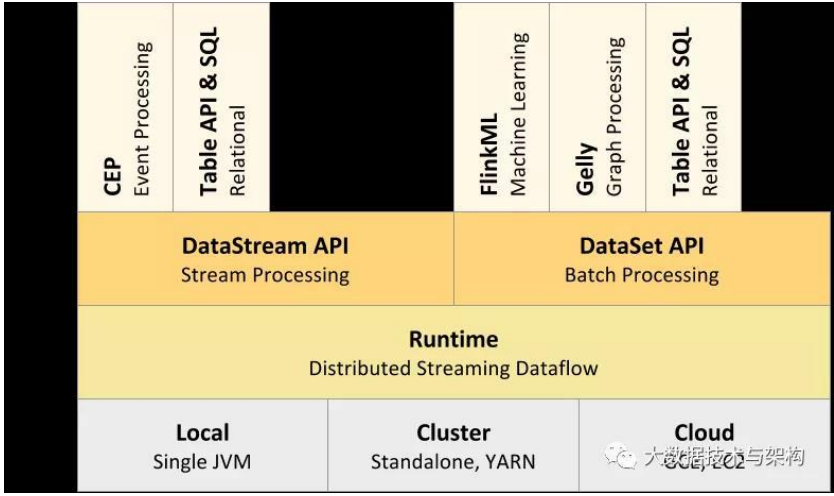

 自下而上，每一层分别代表：

Deploy 层：该层主要涉及了 Flink 的部署模式，在上图中我们可以看出，Flink 支持包括 local、Standalone、Cluster、Cloud 等多种部署模式。

Runtime 层：Runtime 层提供了支持 Flink 计算的核心实现，比如：支持分布式 Stream 处理、JobGraph到 ExecutionGraph 的映射、调度等等，为上层 API 层提供基础服务。

API 层：API 层主要实现了面向流（Stream）处理和批（Batch）处理 API，其中面向流处理对应 DataStream API，面向批处理对应 DataSet API，后续版本，Flink 有计划将 DataStream 和 DataSet API 进行统一。

Libraries 层：该层称为 Flink 应用框架层，根据 API 层的划分，在 API 层之上构建的满足特定应用的实现计算框架，也分别对应于面向流处理和面向批处理两类。面向流处理支持：CEP（复杂事件处理）、基于 SQL-like 的操作（基于 Table 的关系操作）；面向批处理支持：FlinkML（机器学习库）、Gelly（图处理）。

### 1.14.4 Flink 的运行必须依赖 Hadoop 组件吗？

Flink 可以完全独立于 Hadoop，在不依赖 Hadoop 组件下运行。但是做为大数据的基础设施，Hadoop 体系是任何大数据框架都绕不过去的。Flink 可以集成众多 Hadooop 组件，例如 Yarn、Hbase、HDFS 等等。例如，Flink 可以和 Yarn 集成做资源调度，也可以读写 HDFS，或者利用 HDFS 做检查点。

### 1.14.5 你们的 Flink 集群规模多大？

大家注意，这个问题看起来是问你实际应用中的 Flink 集群规模，其实还隐藏着另一个问题：Flink 可以支持多少节点的集群规模？在回答这个问题时候，可以将自己生产环节中的集群规模、节点、内存情况说明，同时说明部署模式（一般是 Flink on Yarn），除此之外，用户也可以同时在小集群（少于 5 个节点）和拥有 TB 级别状态的上千个节点上运行 Flink 任务。

### 1.14.6 Flink 的基础编程模型了解吗？

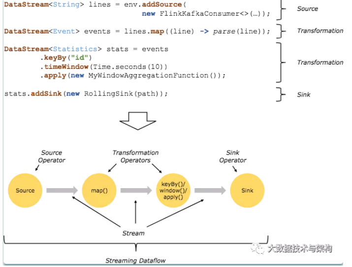

上图是来自 Flink 官网的运行流程图。通过上图我们可以得知，Flink 程序的基本构建是数据输入来自一个 Source，Source 代表数据的输入端，经过 Transformation 进行转换，然后在一个或者多个 Sink 接收器中结束。

数据流（stream）就是一组永远不会停止的数据记录流，而转换（transformation）是将一个或多个流作为输入，并生成一个或多个输出流的操作。执行时，Flink 程序映射到 streaming dataflows，由流（streams）和转换操作（transformation operators）组成。

### 1.14.7 Flink 集群有哪些角色？各自有什么作用？

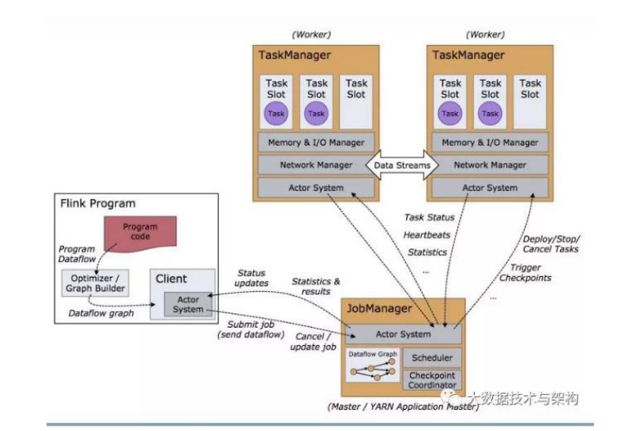

Flink 程序在运行时主要有 TaskManager，JobManager，Client 三种角色。其中JobManager 扮演着集群中的管理者 Master 的角色，它是整个集群的协调者，负责接收 Flink Job，协调检查点，Failover 故障恢复等，同时管理 Flink 集群中从节点 TaskManager。TaskManager 是实际负责执行计算的 Worker，在其上执行 Flink Job 的一组 Task，每个TaskManager 负责管理其所在节点上的资源信息，如内存、磁盘、网络，在启动的时候将资源的状态向 JobManager 汇报。Client 是 Flink 程序提交的客户端，当用户提交一个 Flink 程序时，会首先创建一个 Client，该 Client 首先会对用户提交的 Flink 程序进行预处理，并提交到 Flink 集群中处理，所以 Client 需要从用户提交的 Flink 程序配置中获取 JobManager 的地址，并建立到 JobManager 的连接，将 Flink Job 提交给 JobManager。

### 1.14.8  Flink 资源管理中 Task Slot 的概念

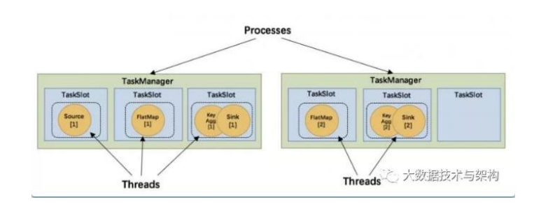

在Flink架构角色中我们提到，TaskManager是实际负责执行计算的Worker，TaskManager 是一个 JVM 进程，并会以独立的线程来执行一个 task 或多个 subtask。为了控制一个TaskManager 能接受多少个 task，Flink 提出了 Task Slot 的概念。简单的说，TaskManager会将自己节点上管理的资源分为不同的 Slot：固定大小的资源子集。这样就避免了不同 Job的 Task 互相竞争内存资源，但是需要注意的是，Slot 只会做内存的隔离。没有做 CPU 的隔离。

### 1.14.9 说说 Flink 的常用算子？

Flink 最常用的常用算子包括：

Map：DataStream → DataStream，输入一个参数产生一个参数，map 的功能是对输入的参数进行转换操作。

Filter：过滤掉指定条件的数据。

KeyBy：按照指定的 key 进行分组。

Reduce：用来进行结果汇总合并。

Window：窗口函数，根据某些特性将每个 key 的数据进行分组（例如：在 5s 内到达的数据）

### 1.14.10 说说你知道的 Flink 分区策略？

什么要搞懂什么是分区策略。分区策略是用来决定数据如何发送至下游。目前 Flink 支持了 8 中分区策略的实现。


上图是整个 Flink 实现的分区策略继承图：

GlobalPartitioner 数据会被分发到下游算子的第一个实例中进行处理。

ShufflePartitioner 数据会被随机分发到下游算子的每一个实例中进行处理。

RebalancePartitioner 数据会被循环发送到下游的每一个实例中进行处理。

RescalePartitioner 这种分区器会根据上下游算子的并行度，循环的方式输出到下游算子的每个实例。这里有点难以理解，假设上游并行度为 2，编号为 A 和 B。下游并行度为 4，编号为 1，2，3，4。那么 A 则把数据循环发送给 1 和 2，B 则把数据循环发送给 3 和 4。假设上游并行度为 4，编号为 A，B，C，D。下游并行度为 2，编号为 1，2。那么 A 和 B 则把数据发送给 1，C 和 D 则把数据发送给 2。

BroadcastPartitioner 广播分区会将上游数据输出到下 游 算 子 的 每 个 实 例 中 。 适合于大数据集和小数据集做 Jion的场景 。

ForwardPartitioner ForwardPartitioner 用于将记录输出到下游本地的算子实例。它要求上下游算子并行度一样。简单的说， ForwardPartitioner 用 来 做 数 据 的 控 制 台 打 印 。

KeyGroupStreamPartitioner Hash 分区器。会将数据按 Key 的 Hash 值输出到下游算子实例中。

CustomPartitionerWrapper 用户自定义分区器。需要用户自己实现 Partitioner 接口，来定义自己的分区逻辑。例如：

```java
static class CustomPartitioner implements Partitioner<String> {
    @Override
    public int partition(String key, int numPartitions) {
        switch (key){
            case "1":
                return 1;
            case "2":
                return 2;
            case "3":
                return 3;
            default:
                return 4;
        }
    }
 }
```

### 1.14.11 Flink 的并行度了解吗？Flink 的并行度设置是怎样的？

Flink 中的任务被分为多个并行任务来执行，其中每个并行的实例处理一部分数据。这些并行实例的数量被称为并行度。我们在实际生产环境中可以从四个不同层面设置并行度：

操作算子层面(Operator Level)

执行环境层面(Execution Environment Level)

客户端层面(Client Level)

系统层面(System Level)

需要注意的优先级：算子层面>环境层面>客户端层面>系统层面。  

### 1.14.12 Flink 的 Slot 和 parallelism 有什么区别？

官网上十分经典的图：

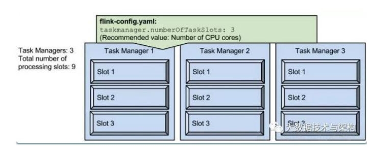

slot 是指 taskmanager 的并发执行能力，假设我们将 taskmanager.numberOfTaskSlots 配置为3 那么每一个 taskmanager 中分配3个 TaskSlot, 3个 taskmanager 一共有9个TaskSlot。

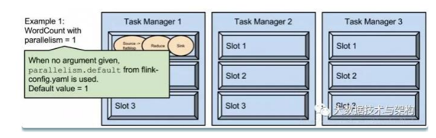

parallelism 是指 taskmanager 实际使用的并发能力。假设我们把 parallelism.default 设置为 1，那么 9 个 TaskSlot 只能用 1 个，有 8 个空闲。

### 1.14.13 Flink 有没有重启策略？说说有哪几种？

> Flink 实现了多种重启策略。
>
> 固定延迟重启策略（Fixed Delay Restart Strategy）
>
> 故障率重启策略（Failure Rate Restart Strategy）
>
> 没有重启策略（No Restart Strategy）
>
> Fallback 重启策略（Fallback Restart Strategy）

### 1.14.14 用过 Flink 中的分布式缓存吗？如何使用？

Flink 实现的分布式缓存和 Hadoop 有异曲同工之妙。目的是在本地读取文件，并把他放在 taskmanager 节点中，防止 task 重复拉取。  

```scala
val env = ExecutionEnvironment.getExecutionEnvironment

// register a file from HDFS

env.registerCachedFile("hdfs:///path/to/your/file", "hdfsFile")
// register a local executable file (script, executable, ...)
env.registerCachedFile("file:///path/to/exec/file","localExecFile", true)
// define your program and execute

...

val input: DataSet[String] = ...
val result: DataSet[Integer] = input.map(new MyMapper())
...
env.execute()
```


### 1.14.15 说说 Flink 中的广播变量，使用时需要注意什么？

我们知道 Flink 是并行的，计算过程可能不在一个 Slot 中进行，那么有一种情况即：当我们需要访问同一份数据。那么 Flink 中的广播变量就是为了解决这种情况。我们可以把广播变量理解为是一个公共的共享变量，我们可以把一个 dataset 数据集广播出去，然后不同的 task 在节点上都能够获取到，这个数据在每个节点上只会存在一份。

### 1.14.16 说说 Flink 中的窗口？

来一张官网经典的图：

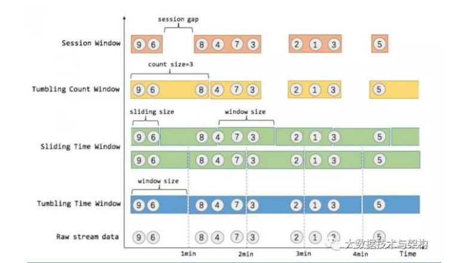

Flink 支持两种划分窗口的方式，按照 time 和 count。如果根据时间划分窗口，那么它就是一个 time-window 如果根据数据划分窗口，那么它就是一个 count-window。

flink 支持窗口的两个重要属性（size 和 interval）如果 size=interval,那么就会形成 tumbling-window(无重叠数据) 如果 size>interval,那么就会形成 sliding-window(有重叠数据) 如果 size< interval, 那么这种窗口将会丢失数据。比如每 5 秒钟，统计过去 3 秒的通过路口汽车的数据，将会漏掉 2 秒钟的数据。通过组合可以得出四种基本窗口：

time-tumbling-window 无 重 叠 数 据 的 时 间 窗 口 ， 设 置 方 式 举 例 ：

timeWindow(Time.seconds(5))

time-sliding-window 有 重 叠 数 据 的 时 间 窗 口 ， 设 置 方 式 举 例 ：

timeWindow(Time.seconds(5), Time.seconds(3))

count-tumbling-window 无重叠数据的数量窗口，设置方式举例：countWindow(5)

count-sliding-window 有重叠数据的数量窗口，设置方式举例：countWindow(5,3)

### 1.14.17 说说 Flink 中的状态存储？

Flink 在做计算的过程中经常需要存储中间状态，来避免数据丢失和状态恢复。选择的状态存储策略不同，会影响状态持久化如何和 checkpoint 交互。Flink 提供了三种状态存储方式：MemoryStateBackend、FsStateBackend、RocksDBStateBackend。

### 1.14.18 Flink 中的时间有哪几类

Flink 中的时间和其他流式计算系统的时间一样分为三类：事件时间，摄入时间，处理时间三种。

如果以 EventTime 为基准来定义时间窗口将形成 EventTimeWindow,要求消息本身 就 应 该 携 带 EventTime 。

如果以 IngesingtTime 为 基 准 来 定 义 时 间 窗 口 将 形 成IngestingTimeWindow,以 source 的 systemTime 为准。

如果以 ProcessingTime 基准来定义时间窗口将形成 ProcessingTimeWindow，以 operator 的 systemTime 为准。

### 1.14.19 Flink 中水印是什么概念，起到什么作用？

Watermark 是 Apache Flink 为了处理 EventTime 窗口计算提出的一种机制, 本质上是一种时间戳。 一般来讲 Watermark 经常和 Window 一起被用来处理乱序事件。

### 1.14.20 Flink Table & SQL 熟悉吗？TableEnvironment 这个类有什么作用

TableEnvironment 是 Table API 和 SQL 集成的核心概念。这个类主要用来：在内部 catalog 中注册表

注册外部 catalog

执行 SQL 查询

注册用户定义（标量，表或聚合）函数

将 DataStream 或 DataSet 转换为表

持有对 ExecutionEnvironment 或 StreamExecutionEnvironment 的引用

### 1.14.21 Flink SQL 的实现原理是什么？是如何实现 SQL 解析的呢？

首先大家要知道 Flink 的 SQL 解析是基于 Apache Calcite 这个开源框架。

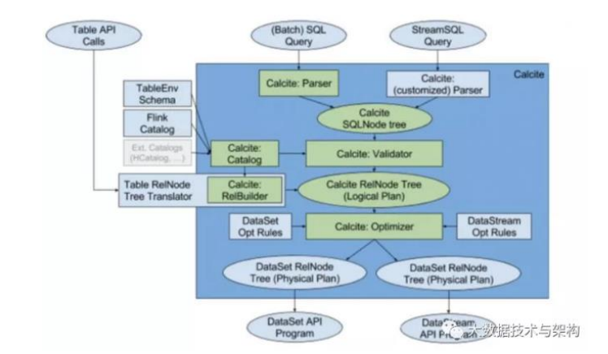


基于此，一次完整的 SQL 解析过程如下：

用户使用对外提供 Stream SQL 的语法开发业务应用

用 calcite 对 StreamSQL 进行语法检验，语法检验通过后，转换成 calcite 的逻辑树节点；最终形成 calcite 的逻辑计划

采用 Flink 自定义的优化规则和 calcite 火山模型、启发式模型共同对逻辑树进行优化，生成最优的 Flink 物理计划

对物理计划采用 janino codegen 生成代码，生成用低阶 API DataStream 描述的流应用，提交到 Flink 平台执行

## 1.15 Flink 中级

### 1.15.1 Flink 是如何支持批流一体的？

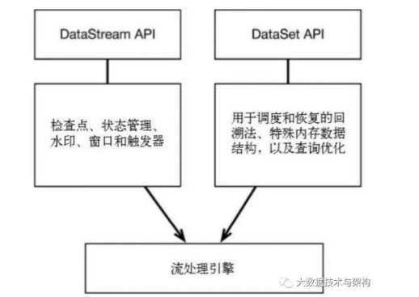

本道面试题考察的其实就是一句话：Flink 的开发者认为批处理是流处理的一种特殊情况。批处理是有限的流处理。Flink 使用一个引擎支持了 DataSet API 和 DataStream API。

### 1.15.2 Flink 是如何做到高效的数据交换的？

在一个 Flink Job 中，数据需要在不同的 task 中进行交换，整个数据交换是有TaskManager 负责的，TaskManager 的网络组件首先从缓冲 buffer 中收集 records，然后再发送。Records 并不是一个一个被发送的，而是积累一个批次再发送，batch 技术可以更加高效的利用网络资源。

### 1.15.3 Flink 是如何做容错的？

Flink 实现容错主要靠强大的 CheckPoint 机制和 State 机制。Checkpoint 负责定时制作分布式快照、对程序中的状态进行备份；State 用来存储计算过程中的中间状态。

### 1.15.4 Flink 分布式快照的原理是什么？

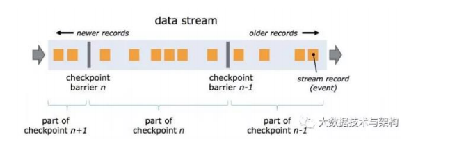

Flink 的分布式快照是根据 Chandy-Lamport 算法量身定做的。简单来说就是持续创建分布式数据流及其状态的一致快照。核心思想是在 input source 端插入 barrier，控制 barrier 的同步来实现 snapshot 的备份和 exactly-once 语义。

### 1.15.5 Flink 是如何保证 Exactly-once 语义的？

Flink 通过实现两阶段提交和状态保存来实现端到端的一致性语义。

分为以下几个步骤：

开始事务（beginTransaction）创建一个临时文件夹，来写把数据写入到这个文件夹里面

预提交（preCommit）将内存中缓存的数据写入文件并关闭

正式提交（commit）将之前写完的临时文件放入目标目录下。这代表着最终的数据会有一些延迟丢弃（abort）丢弃临时文件

若失败发生在预提交成功后，正式提交前。可以根据状态来提交预提交的数据，也可删除预提交的数据。

### 1.15.6 Flink 的 kafka 连接器有什么特别的地方？

Flink 源码中有一个独立的 connector 模块，所有的其他 connector 都依赖于此模块，Flink 在 1.9 版本发布的全新 kafka 连接器，摒弃了之前连接不同版本的 kafka 集群需要依赖不同版本的 connector 这种做法，只需要依赖一个 connector 即可。

### 1.15.7 Flink 的内存管理是如何做的?

Flink 并不是将大量对象存在堆上，而是将对象都序列化到一个预分配的内存块上。此外，Flink 大量的使用了堆外内存。如果需要处理的数据超出了内存限制，则会将部分数据存储到硬盘上。Flink 为了直接操作二进制数据实现了自己的序列化框架。理论上 Flink 的内存管理分为三部分：

`Network Buffers`：这个是在 TaskManager 启动的时候分配的，这是一组用于缓存网络数据的内存，每个块是32K，默认分配2048个，可以通过“taskmanager.network.numberOfBuffers”修改  

`Memory Manage pool`：大量的 Memory Segment 块，用于运行时的算法（Sort/Join/Shuffle等），这部分启动的时候就会分配。下面这段代码，根据配置文件中的各种参数来计算内存的分配方法。（heap or off-heap，这个放到下节谈），内存的分配支持预分配和 lazy load，默认懒加载的方式。

`User Code`，这部分是除了 Memory Manager 之外的内存用于 User code 和 TaskManager本身的数据结构。

### 1.15.8  Flink 的序列化如何做的?

Java 本身自带的序列化和反序列化的功能，但是辅助信息占用空间比较大，在序列化对象时记录了过多的类信息。Apache Flink 摒弃了 Java 原生的序列化方法，以独特的方式处理数据类型和序列化，包含自己的类型描述符，泛型类型提取和类型序列化框架。

TypeInformation 是所有类型描述符的基类。它揭示了该类型的一些基本属性，并且可以生成序列化器。TypeInformation 支持以下几种类型：

`BasicTypeInfo`: 任意 Java 基本类型或 String 类型

`BasicArrayTypeInfo`: 任意 Java 基本类型数组或 String 数组

`WritableTypeInfo`: 任意 Hadoop Writable 接口的实现类

`TupleTypeInfo`: 任意的 Flink Tuple 类型(支持 Tuple1 to Tuple25)。Flink tuples 是固定长度固定类型的 Java Tuple 实现

`CaseClassTypeInfo`: 任意的 Scala CaseClass(包括 Scala tuples)

`PojoTypeInfo`: 任意的 POJO (Java or Scala)，例如，Java 对象的所有成员变量，要么是public 修饰符定义，要么有 getter/setter 方法

`GenericTypeInfo`: 任意无法匹配之前几种类型的类

针对前六种类型数据集，Flink 皆可以自动生成对应的 TypeSerializer，能非常高效地对数据集进行序列化和反序列化。

### 1.15.9 Flink 中的 Window 出现了数据倾斜，你有什么解决办法？

window 产生数据倾斜指的是数据在不同的窗口内堆积的数据量相差过多。本质上产生这种情况的原因是数据源头发送的数据量速度不同导致的。出现这种情况一般通过两种方式来解决：

在数据进入窗口前做预聚合

重新设计窗口聚合的 key


### 1.15.10 Flink 中在使用聚合函数 GroupBy、Distinct、KeyBy 等函数时出现数据热点该如何解决？

数据倾斜和数据热点是所有大数据框架绕不过去的问题。处理这类问题主要从 3 个方面入手：

`在业务上规避这类问题`

例如一个假设订单场景，北京和上海两个城市订单量增长几十倍，其余城市的数据量不变。这时候我们在进行聚合的时候，北京和上海就会出现数据堆积，我们可以单独数据北京和上海的数据。

`Key 的设计上`

把热 key 进行拆分，比如上个例子中的北京和上海，可以把北京和上海按照地区进行拆分聚合。

`参数设置`

Flink 1.9.0 SQL(Blink Planner) 性能优化中一项重要的改进就是升级了微批模型，即MiniBatch。原理是缓存一定的数据后再触发处理，以减少对 State 的访问，从而提升吞吐和减少数据的输出量。

```java
val tEnv: TableEnvironment = ...
val configuration = tEnv.getConfig().getConfiguration()

configuration.setString("table.exec.mini-batch.enabled", "true")         // 启用
configuration.setString("table.exec.mini-batch.allow-latency", "5 s")    // 缓存超时时长
configuration.setString("table.exec.mini-batch.size", "5000")            // 缓存大小
```


### 1.15.11 Flink 任务延迟高，想解决这个问题，你会如何入手？

在 Flink 的后台任务管理中，我们可以看到 Flink 的哪个算子和 task 出现了反压。最主要的手段是资源调优和算子调优。

资源调优即是对作业中的 Operator 的并发数（parallelism）、CPU（core）、堆内存（heap_memory）等参数进行调优。

作业参数调优包括：并行度的设置，State 的设置，checkpoint 的设置。


### 1.15.12 Flink 是如何处理反压的？

Flink 内部是基于 producer-consumer 模型来进行消息传递的，Flink 的反压设计也是基于这个模型。Flink 使用了高效有界的分布式阻塞队列，就像 Java 通用的阻塞队列（BlockingQueue）一样。下游消费者消费变慢，上游就会受到阻塞。

### 1.15.13 Flink 的反压和 Strom 有哪些不同？

Storm 是通过监控 Bolt 中的接收队列负载情况，如果超过高水位值就会将反压信息写到 Zookeeper ，Zookeeper 上的 watch 会通知该拓扑的所有 Worker 都进入反压状态，最后 Spout 停止发送 tuple。

Flink 中的反压使用了高效有界的分布式阻塞队列，下游消费变慢会导致发送端阻塞。二者最大的区别是 Flink 是逐级反压，而 Storm 是直接从源头降速。


### 1.15.14 Operator Chains（算子链）这个概念你了解吗？

为了更高效地分布式执行，Flink 会尽可能地将 operator 的 subtask 链接（chain）在一起形成 task。每个 task 在一个线程中执行。将 operators 链接成 task 是非常有效的优化：它能减少线程之间的切换，减少消息的序列化/反序列化，减少数据在缓冲区的交换，减少了延迟的同时提高整体的吞吐量。这就是我们所说的算子链。


### 1.15.15 Flink 什么情况下才会把 Operator chain 在一起形成算子链？

两个 operator chain 在一起的的条件：

上下游的并行度一致

下游节点的入度为 1 （也就是说下游节点没有来自其他节点的输入）

上下游节点都在同一个 slot group 中（下面会解释 slot group）

下游节点的 chain 策略为 ALWAYS（可以与上下游链接，map、flatmap、filter 等默认是 ALWAYS）

上游节点的 chain 策略为 ALWAYS 或 HEAD（只能与下游链接，不能与上游链接，Source 默认是 HEAD）

两个节点间数据分区方式是 forward（参考理解数据流的分区）

用户没有禁用 chain


### 1.15.16 说说 Flink1.9 的新特性？

支持 hive 读写，支持 UDF

Flink SQL TopN 和 GroupBy 等优化

Checkpoint 跟 savepoint 针对实际业务场景做了优化

Flink state 查询


### 1.15.17 消费 kafka 数据的时候，如何处理脏数据？

可以在处理前加一个 fliter 算子，将不符合规则的数据过滤出去。  


## 1.16 Flink 高级

### 1.16.1 Flink Job 的提交流程

用户提交的 Flink Job 会被转化成一个 DAG 任务运行，分别是：StreamGraph、JobGraph、ExecutionGraph，Flink 中 JobManager 与 TaskManager，JobManager 与 Client 的交互是基于Akka 工具包的，是通过消息驱动。整个 Flink Job 的提交还包含着 ActorSystem 的创建，JobManager 的启动，TaskManager 的启动和注册。


### 1.16.2 Flink 所谓"三层图"结构是哪几个"图"？

一个 Flink 任务的 DAG 生成计算图大致经历以下三个过程：

StreamGraph 最接近代码所表达的逻辑层面的计算拓扑结构，按照用户代码的执行顺序向 StreamExecutionEnvironment 添加 StreamTransformation 构成流式图。

JobGraph 从 StreamGraph 生成，将可以串联合并的节点进行合并，设置节点之间的边，安排资源共享 slot 槽位和放置相关联的节点，上传任务所需的文件，设置检查点配置等。相当于经过部分初始化和优化处理的任务图。

ExecutionGraph 由 JobGraph 转换而来，包含了任务具体执行所需的内容，是最贴近底层实现的执行图。


### 1.16.3 JobManger 在集群中扮演了什么角色？

JobManager 负责整个 Flink 集群任务的调度以及资源的管理，从客户端中获取提交的应用，然后根据集群中 TaskManager 上 TaskSlot 的使用情况，为提交的应用分配相应的TaskSlot 资源并命令 TaskManager 启动从客户端中获取的应用。JobManager 相当于整个集群的 Master 节点，且整个集群有且只有一个活跃的 JobManager ，负责整个集群的任务管理和资源管理。JobManager 和 TaskManager 之间通过 Actor System 进行通信，获取任务执行的情况并通过 Actor System 将应用的任务执行情况发送给客户端。同时在任务执行的过程中，Flink JobManager 会触发 Checkpoint 操作，每个 TaskManager 节点 收到Checkpoint 触发指令后，完成 Checkpoint 操作，所有的 Checkpoint 协调过程都是在 Fink JobManager 中完成。当任务完成后，Flink 会将任务执行的信息反馈给客户端，并且释放掉TaskManager 中的资源以供下一次提交任务使用。


### 1.16.4 JobManger 在集群启动过程中起到什么作用？

JobManager的职责主要是接收Flink作业，调度Task，收集作业状态和管理TaskManager。它包含一个 Actor，并且做如下操作：RegisterTaskManager: 它由想要注册到 JobManager 的 TaskManager 发送。注册成功会通过 AcknowledgeRegistration 消息进行 Ack。SubmitJob: 由提交作业到系统的 Client 发送。提交的信息是 JobGraph 形式的作业描述信息。

CancelJob: 请求取消指定 id 的作业。成功会返回 CancellationSuccess，否则返回CancellationFailure。

UpdateTaskExecutionState: 由 TaskManager 发送，用来更新执行节点(ExecutionVertex)的状态。成功则返回 true，否则返回 false。

RequestNextInputSplit: TaskManager 上的 Task 请求下一个输入 split，成功则返回NextInputSplit，否则返回 null。

JobStatusChanged： 它意味着作业的状态(RUNNING, CANCELING, FINISHED,等)发生变化。这个消息由 ExecutionGraph 发送。


### 1.16.5 TaskManager 在集群中扮演了什么角色？

TaskManager 相当于整个集群的 Slave 节点，负责具体的任务执行和对应任务在每个节点上的资源申请和管理。客户端通过将编写好的 Flink 应用编译打包，提交到JobManager，然后 JobManager 会根据已注册在 JobManager 中 TaskManager 的资源情况，将任务分配给有资源的 TaskManager 节点，然后启动并运行任务。TaskManager 从JobManager 接收需要部署的任务，然后使用 Slot 资源启动 Task，建立数据接入的网络连接，接收数据并开始数据处理。同时 TaskManager 之间的数据交互都是通过数据流的方式进行的。可以看出，Flink 的任务运行其实是采用多线程的方式，这和 MapReduce 多 JVM 进行的方式有很大的区别，Flink 能够极大提高 CPU 使用效率，在多个任务和 Task 之间通过 TaskSlot 方式共享系统资源，每个 TaskManager 中通过管理多个 TaskSlot 资源池进行对资源进行有效管理。


### 1.16.6 TaskManager 在集群启动过程中起到什么作用？

TaskManager 的 启 动 流 程 较 为 简 单 ： 

启动类：  org.apache.flink.runtime.taskmanager.TaskManager 

核 心 启 动 方法 ：selectNetworkInterfaceAndRunTaskManager 启动后直接向 JobManager 注册自己，注册完成后，进行部分模块的初始化。


### 1.16.7 Flink 计算资源的调度是如何实现的？

TaskManager 中最细粒度的资源是 Task slot，代表了一个固定大小的资源子集，每个TaskManager 会将其所占有的资源平分给它的 slot。通过调整 task slot 的数量，用户可以定义 task 之间是如何相互隔离的。每个TaskManager 有一个 slot，也就意味着每个 task 运行在独立的 JVM 中。每个 TaskManager 有多个 slot 的话，也就是说多个 task 运行在同一个 JVM 中。而在同一个 JVM 进程中的 task，可以共享 TCP 连接（基于多路复用）和心跳消息，可以减少数据的网络传输，也能共享一些数据结构，一定程度上减少了每个 task 的消耗。 每 个 slot 可以接受单个 task，也可以接受多个连续 task 组成的 pipeline，如下图所示，FlatMap函数占用一个 taskslot，而 key Agg 函数和 sink 函数共用一个 taskslot：

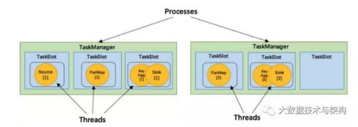

### 1.16.8 简述 Flink 的数据抽象及数据交换过程？

Flink 为了避免 JVM 的固有缺陷例如 java 对象存储密度低，FGC 影响吞吐和响应等，实现了自主管理内存。MemorySegment 就是 Flink 的内存抽象。默认情况下，一个MemorySegment 可以被看做是一个 32kb 大的内存块的抽象。这块内存既可以是 JVM 里的一个 byte[]，也可以是堆外内存（DirectByteBuffer）。在 MemorySegment 这个抽象之上，Flink 在数据从 operator 内的数据对象在向 TaskManager 上转移，预备被发给下个节点的过程中，使用的抽象或者说内存对象是 Buffer。对接从 Java 对象转为 Buffer 的中间对象是另一个抽象 StreamRecord。  


### 1.16.9 Flink 中的分布式快照机制是如何实现的？

Flink 的容错机制的核心部分是制作分布式数据流和操作算子状态的一致性快照。 这些快照充当一致性 checkpoint，系统可以在发生故障时回滚。 Flink 用于制作这些快照的机制在“分布式数据流的轻量级异步快照”中进行了描述。 它受到分布式快照的标准 ChandyLamport 算法的启发，专门针对 Flink 的执行模型而定制。

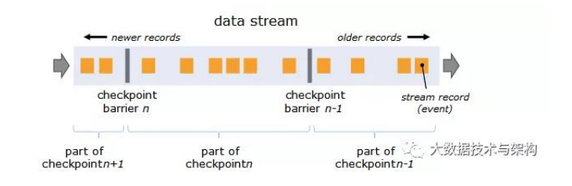

barriers 在数据流源处被注入并行数据流中。快照 n 的 barriers 被插入的位置（我们称之为 Sn）是快照所包含的数据在数据源中最大位置。例如，在 Apache Kafka 中，此位置将是分区中最后一条记录的偏移量。将该位置Sn报告给checkpoint协调器（Flink的JobManager）。然后 barriers 向下游流动。当一个中间操作算子从其所有输入流中收到快照 n 的 barriers 时，它会为快照 n 发出 barriers 进入其所有输出流中。 一旦 sink 操作算子（流式 DAG 的末端）从其所有输入流接收到 barriers n，它就向 checkpoint 协调器确认快照 n 完成。在所有 sink 确认快照后，意味快照着已完成。一旦完成快照 n，job 将永远不再向数据源请求 Sn 之前的记录，因为此时这些记录（及其后续记录）将已经通过整个数据流拓扑，也即是已经被处理结束。


### 1.16.10 简单说说 FlinkSQL 的是如何实现的？

Flink 将 SQL 校验、SQL 解析以及 SQL 优化交给了 Apache Calcite。Calcite 在其他很多开源项目里也都应用到了，譬如 Apache Hive, Apache Drill, Apache Kylin, Cascading。Calcite 在新的架构中处于核心的地位，如下图所示。  

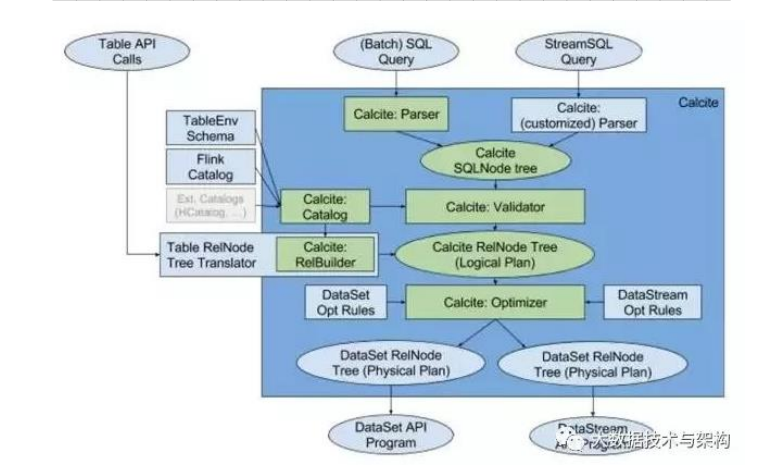

构建抽象语法树的事情交给了 Calcite 去做。SQL query 会经过 Calcite 解析器转变成SQL 节点树，通过验证后构建成 Calcite 的抽象语法树（也就是图中的 Logical Plan）。另一边，Table API 上的调用会构建成 Table API 的抽象语法树，并通过 Calcite 提供的RelBuilder 转变成 Calcite 的抽象语法树。然后依次被转换成逻辑执行计划和物理执行计划。在提交任务后会分发到各个 TaskManager 中运行，在运行时会使用 Janino 编译器编译代码后运行。


# 第 2 章 项目架构

## 2.1 提高自信

云上数据仓库解决方案：https://www.aliyun.com/solution/datavexpo/datawarehouse

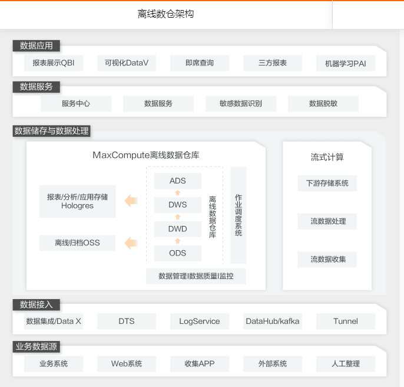


## 2.2 数仓概念

### 数据仓库的输入数据源和输出系统分别是什么？

`输入系统`：埋点产生的用户行为数据、JavaEE 后台产生的业务数据、个别公司有爬虫数据。

`输出系统`：报表系统、用户画像系统、推荐系统


## 2.3 系统数据流程设计

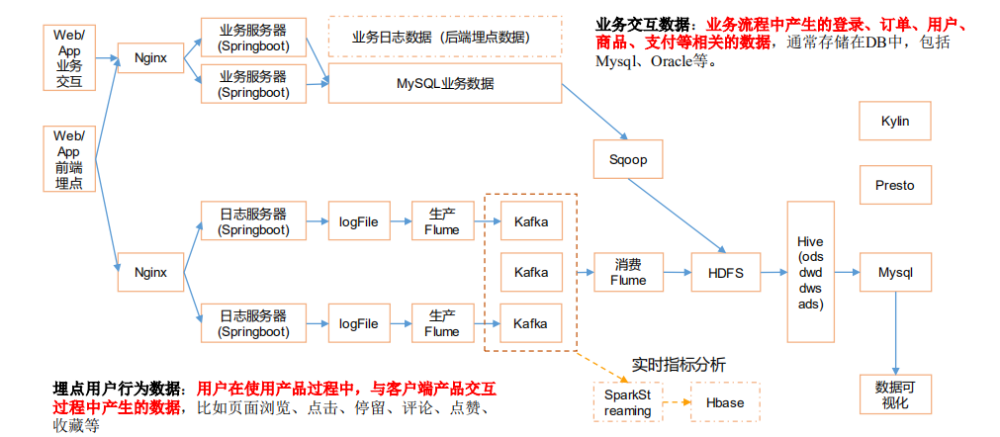

## 2.4 框架版本选型

1）Apache：运维麻烦，组件间兼容性需要自己调研。（一般大厂使用，技术实力雄厚，有专业的运维人员） 

2）CDH6.3.2：国内使用最多的版本，但 CM 不开源，但其实对中、小公司使用来说没有影响（建议使用）10000 美金一个节点 CDP7.0

3）HDP：开源，可以进行二次开发，但是没有 CDH 稳定，国内使用较少

<font color = blue size = 5 >具体版本型号</font>

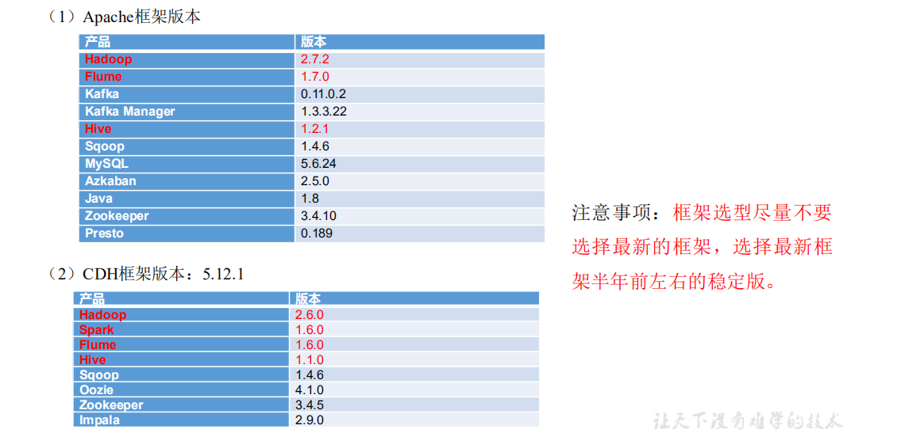

## 2.5 服务器选型

服务器使用物理机还是云主机？

1）机器成本考虑：

（1）物理机：以 128G 内存，20 核物理 CPU，40 线程，8THDD 和 2TSSD 硬盘，单台报价 4W 出头，惠普品牌。一般物理机寿命 5 年左右。 

（2）云主机，以阿里云为例，差不多相同配置，每年 5W

2）运维成本考虑：

（1）物理机：需要有专业的运维人员（1 万13 个月）、电费（商业用户）、安装空调

（2）云主机：很多运维工作都由阿里云已经完成，运维相对较轻松

3）企业选择

（1）金融有钱公司和阿里没有直接冲突的公司选择阿里云（上海）

（2）中小公司、为了融资上市，选择阿里云，拉倒融资后买物理机。

（3）有长期打算，资金比较足，选择物理机。

## 2.6 集群规模

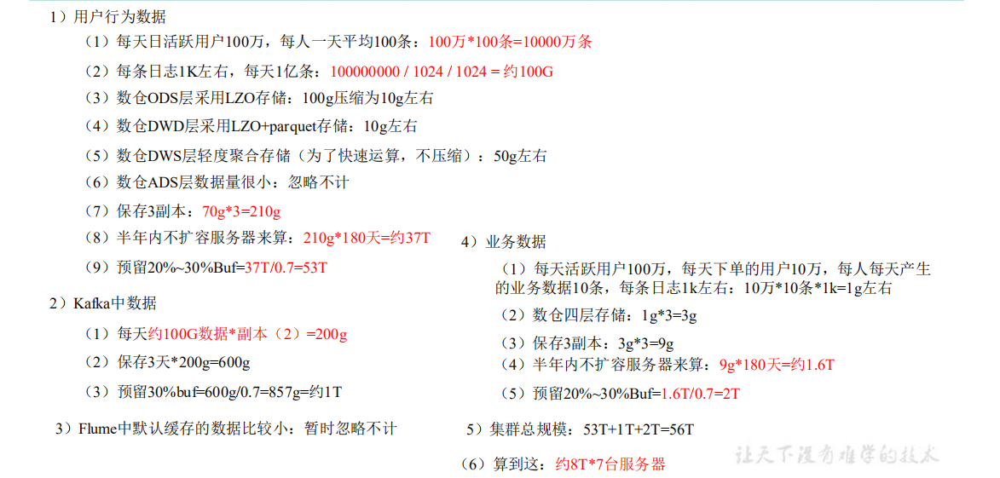

20 核物理 CPU 40 线程  7 = 280 线程

内存 128g  7 台 = 896g

128m =》1g 内存 =》87g 数据 、700g 内存

根据数据规模大家集群

| 1     | 2     | 3     | 4     | 5     | 6    | 7    | 8     | 9     | 10    |
| ----- | ----- | ----- | ----- | ----- | ---- | ---- | ----- | ----- | ----- |
| nn    | nn    | dn    | dn    | dn    | dn   | dn   | dn    | dn    | dn    |
|       |       | rm    | rm    | nm    | nm   | nm   | nm    | nm    | nm    |
|       |       | nm    | nm    |       |      |      |       |       |       |
|       |       |       |       |       |      |      | zk    | zk    | zk    |
|       |       |       |       |       |      |      | kafka | kafka | kafka |
|       |       |       |       |       |      |      | Flume | Flume | flume |
|       |       | Hbase | Hbase | Hbase |      |      |       |       |       |
| hive  | hive  |       |       |       |      |      |       |       |       |
| mysql | mysql |       |       |       |      |      |       |       |       |
| spark | spark |       |       |       |      |      |       |       |       |
|       |       |       |       |       | ES   | ES   |       |       |       |

1）消耗内存的分开；  

2）kafka 、zk 、flume 传输数据比较紧密的放在一起；

3）客户端尽量放在一到两台服务器上，方便外部访问；

```sh
问?
1、数据量 100g
2、预算 50万
3、数据存储多久——1年
4、云主机、物理机—云主机
5、日活100万
6、用户行为数据(文件)、业务数据(mysql)
7、项目周期——1个月
8、团队多少人-·-0个
9、首批指标·-1-10个
10、未来的规划︰-离线和实时·是否都要做
```

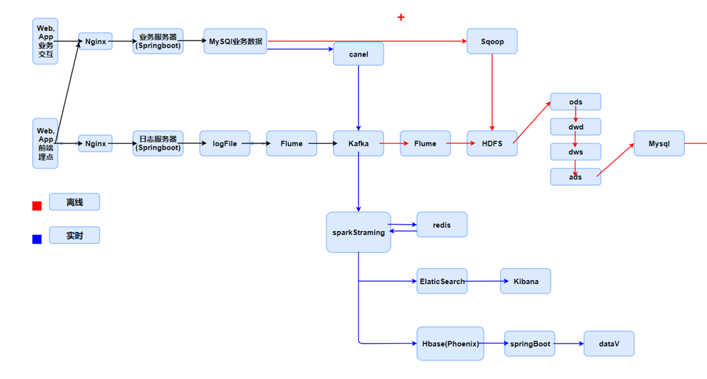


## 2.7 人员配置参考

### 2.7.1 整体架构

属于研发部/技术部/数据部，我们属于大数据组，其他还有后端项目组，前端组、测试组、UI 组等。其他的还有产品部、运营部、人事部、财务部、行政部等。大数据开发工程师=>大数据组组长=》项目经理=>部门经理=》技术总监 CTO

### 2.7.2 你们部门的职级等级，晋升规则

职级就分初级，中级，高级。晋升规则不一定，看公司效益和职位空缺。

京东：T1、T2 应届生；T3 14k 左右 T4 18K 左右 T5 24k-28k 左右

阿里：p5、p6、p7、p8

### 2.7.3 人员配置参考

小型公司（3 人左右）：组长 1 人，剩余组员无明确分工，并且可能兼顾 javaEE 和前端。

中小型公司（3~6 人左右）：组长 1 人，离线 2 人左右，实时 1 人左右（离线一般多于实时），组长兼顾和 javaEE、前端。

中型公司（5~10 人左右）：组长 1 人，离线 3~5 人左右（离线处理、数仓），实时 2 人左右，组长和技术大牛兼顾和 javaEE、前端。

中大型公司（10~20 人左右）：组长 1 人，离线 5~10 人（离线处理、数仓），实时 5 人左右，JavaEE1 人左右（负责对接 JavaEE 业务），前端 1 人（有或者没有人单独负责前端）。  

（发展比较良好的中大型公司可能大数据部门已经细化拆分，分成多个大数据组，分别负责不同业务）

上面只是参考配置，因为公司之间差异很大，例如 ofo 大数据部门只有 5 个人左右，因此根据所选公司规模确定一个合理范围，在面试前必须将这个人员配置考虑清楚，回答时要非常确定。

IOS 多少人 安卓多少人 前端多少人 JavaEE 多少人 测试多少人（IOS、安卓） 1-2 个人 前端 1-3 个人； JavaEE 一般是大数据的 1-1.5 倍，测试：

有的有，有的没有。1 个左右。 产品经理 1 个、产品助理 1-2 个，运营 1-3 个

公司划分：

0-50 小公司

50-500 中等

500-1000 大公司

1000 以上 大厂 领军的存在


# 第 3 章 数仓分层

## 3.1 ODS 层做了哪些事？

> 1）保持数据原貌，不做任何修改
>
> 2）压缩采用 LZO，压缩比是 100g 数据压缩完 10g 左右。
>
> 3）创建分区表

## 3.2 DWD 层做了哪些事？

### 3.2.1 数据清洗

> （1）空值去除
>
> （2）过滤核心字段无意义的数据，比如订单表中订单 id 为 null，支付表中支付 id 为空
>
> （3）将用户行为宽表和业务表进行数据一致性处理
>
> select case when a is null then b else a end as JZR,
>
>  ...
>
> from A

### 3.2.2 清洗的手段

Sql、mr、rdd、kettle、Python（项目中采用 sql 进行清除）

### 3.2.3 清洗掉多少数据算合理

1 万条数据清洗掉 1 条。

### 3.2.4 脱敏

对手机号、身份证号等敏感数据脱敏

### 3.2.5 维度退化

对业务数据传过来的表进行维度退化和降维。（商品一级二级三级、省市县、年月日）

### 3.2.6 压缩 LZO

### 3.2.7 列式存储 parquet

## 3.3 DWS 层做了哪些事？

### 3.3.1 DWS 层有 3-5 张宽表（处理 100-200 个指标 70%以上的需求）

具体宽表名称：用户行为宽表，用户购买商品明细行为宽表，商品宽表，购物车宽表，物流宽表、登录注册、售后等。

### 3.3.2 哪个宽表最宽？大概有多少个字段？

最宽的是用户行为宽表。大概有 60-100 个字段

### 3.3.3 具体用户行为宽表字段名称

评论、打赏、收藏、关注--商品、关注--人、点赞、分享、好价爆料、文章发布、活跃、签到、补签卡、幸运屋、礼品、金币、电商点击、gmv

```sql
CREATE TABLE `app_usr_interact`(

 `stat_dt` date COMMENT '互动日期', 

 `user_id` string COMMENT '用户 id', 

 `nickname` string COMMENT '用户昵称', 

 `register_date` string COMMENT '注册日期', 

 `register_from` string COMMENT '注册来源',   


 `remark` string COMMENT '细分渠道', 

 `province` string COMMENT '注册省份', 

 `pl_cnt` bigint COMMENT '评论次数', 

 `ds_cnt` bigint COMMENT '打赏次数', 

 `sc_add` bigint COMMENT '添加收藏', 

 `sc_cancel` bigint COMMENT '取消收藏', 

 `gzg_add` bigint COMMENT '关注商品', 

 `gzg_cancel` bigint COMMENT '取消关注商品', 

 `gzp_add` bigint COMMENT '关注人', 

 `gzp_cancel` bigint COMMENT '取消关注人', 

 `buzhi_cnt` bigint COMMENT '点不值次数', 

 `zhi_cnt` bigint COMMENT '点值次数', 

 `zan_cnt` bigint COMMENT '点赞次数', 

 `share_cnts` bigint COMMENT '分享次数', 

 `bl_cnt` bigint COMMENT '爆料数', 

 `fb_cnt` bigint COMMENT '好价发布数', 

 `online_cnt` bigint COMMENT '活跃次数', 

 `checkin_cnt` bigint COMMENT '签到次数', 

 `fix_checkin` bigint COMMENT '补签次数', 

 `house_point` bigint COMMENT '幸运屋金币抽奖次数', 

 `house_gold` bigint COMMENT '幸运屋积分抽奖次数', 

 `pack_cnt` bigint COMMENT '礼品兑换次数', 

 `gold_add` bigint COMMENT '获取金币', 

 `gold_cancel` bigint COMMENT '支出金币', 

 `surplus_gold` bigint COMMENT '剩余金币', 

 `event` bigint COMMENT '电商点击次数', 

 `gmv_amount` bigint COMMENT 'gmv', 

 `gmv_sales` bigint COMMENT '订单数')

PARTITIONED BY ( `dt` string)
```

## 3.4 ADS 层分析过哪些指标

### 3.4.1 分析过的指标（一分钟至少说出 30 个指标）

日活、月活、周活、留存、留存率、新增（日、周、年）、转化率、流失、回流、七天

内连续 3 天登录（点赞、收藏、评价、购买、加购、下单、活动）、连续 3 周（月）登录、

GMV、复购率、复购率排行、点赞、评论、收藏、领优惠价人数、使用优惠价、沉默、值不值得买、退款人数、退款率 topn 热门商品

 产品经理最关心的：留转 G 复活

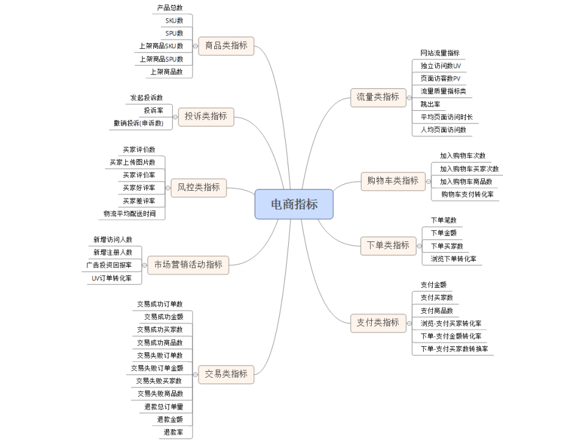

### 3.4.2 留转 G 复活指标

（1）活跃

日活：100 万 ；月活：是日活的 2-3 倍 300 万

总注册的用户多少？1000 万-3000 万之间 

（2）GMV

GMV：每天 10 万订单 （50 – 100 元） 500 万-1000 万

10%-20% 100 万-200 万（人员：程序员）

（3）复购率

某日常商品复购；（手纸、面膜、牙膏）10%-20%

 电脑、显示器、手表 1%

（4）转化率

 商品详情 =》 加购物车 =》下单 =》 支付

 5%-10% 60-70% 90%-95% 

（5）留存率

 1/2/3、周留存、月留存

 搞活动： 10-20%

### 3.4.3 哪个商品卖的好？

面膜、手纸，每天销售 5000 个

## 3.5 ADS 层手写指标

### 3.5.1 如何分析用户活跃？

在启动日志中统计不同设备 id 出现次数。

### 3.5.2 如何分析用户新增？vivo

用活跃用户表 left join 用户新增表，用户新增表中 mid 为空的即为用户新增。

### 3.5.3 如何分析用户 1 天留存？

留存用户=前一天新增 join 今天活跃

用户留存率=留存用户/前一天新增

### 3.5.4 如何分析沉默用户？

(登录时间为 7 天前,且只出现过一次)

按照设备 id 对日活表分组，登录次数为 1，且是在一周前登录。

### 3.5.5 如何分析本周回流用户？

本周活跃 left join 本周新增 left join 上周活跃，且本周新增 id 和上周活跃 id 都为 null

### 3.5.6 如何分析流失用户？

(登录时间为 7 天前)

按照设备 id 对日活表分组，且七天内没有登录过。

### 3.5.7 如何分析最近连续 3 周活跃用户数？

按照设备 id 对周活进行分组，统计次数大于 3 次。

### 3.5.8 如何分析最近七天内连续三天活跃用户数？

1）查询出最近 7 天的活跃用户，并对用户活跃日期进行排名

2）计算用户活跃日期及排名之间的差值

3）对同用户及差值分组，统计差值个数

4）将差值相同个数大于等于 3 的数据取出，然后去重(去的是什么重???)，即为连续 3 天及以上活跃的用户

7 天连续收藏、点赞、购买、加购、付款、浏览、商品点击、退货

1 个月连续 7 天

连续两周：

## 3.6 分析过最难的指标

### 3.6.1 最近连续 3 周活跃用户

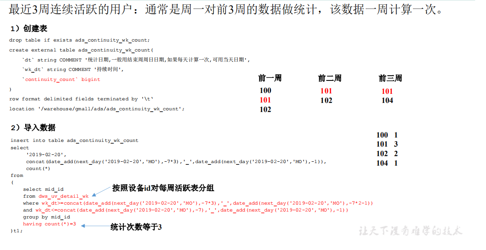


### 3.6.2 最近 7 天连续 3 天活跃用户数

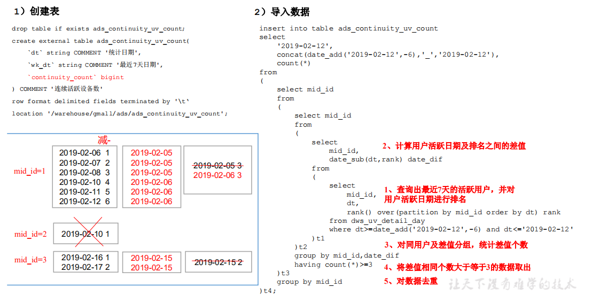

## 3.7 数据仓库建模（绝对重点）

### 3.7.1 建模工具是什么？

PowerDesigner/SQLYog/EZDML

### 3.7.2 ODS 层 

（1）保持数据原貌不做任何修改，起到备份数据的作用。

（2）数据采用压缩，减少磁盘存储空间（例如：原始数据 100G，可以压缩到 10G 左右）

（3）创建分区表，防止后续的全表扫描

### 3.7.3 DWD 层

DWD 层需构建维度模型，一般采用星型模型，呈现的状态一般为星座模型。

维度建模一般按照以下四个步骤：

选择业务过程→声明粒度→确认维度→确认事实

**（1）选择业务过程**

在业务系统中，如果业务表过多，挑选我们感兴趣的业务线，比如下单业务，支付业务，退款业务，物流业务，一条业务线对应一张事实表。如果小公司业务表比较少，建议选择所有业务线。

**（2）声明粒度**

数据粒度指数据仓库的数据中保存数据的细化程度或综合程度的级别。声明粒度意味着精确定义事实表中的一行数据表示什么，应该尽可能选择最小粒度，以此来应各种各样的需求。典型的粒度声明如下：

订单当中的每个商品项作为下单事实表中的一行，粒度为每次

每周的订单次数作为一行，粒度为每周。

每月的订单次数作为一行，粒度为每月。

如果在 DWD 层粒度就是每周或者每月，那么后续就没有办法统计细粒度的指标了。所有建议采用最小粒度。

**（3）确定维度**

维度的主要作用是描述业务是事实，主要表示的是“谁，何处，何时”等信息。例如：

时间维度、用户维度、地区维度等常见维度。

**（4）确定事实**

此处的“事实”一词，指的是业务中的度量值，例如订单金额、下单次数等。在 DWD 层，以业务过程为建模驱动，基于每个具体业务过程的特点，构建最细粒度的明细层事实表。事实表可做适当的宽表化处理。通过以上步骤，结合本数仓的业务事实，得出业务总线矩阵表如下表所示。业务总线矩阵的原则，主要是根据维度表和事实表之间的关系，如果两者有关联则使用√标记。

 表 业务总线矩阵表

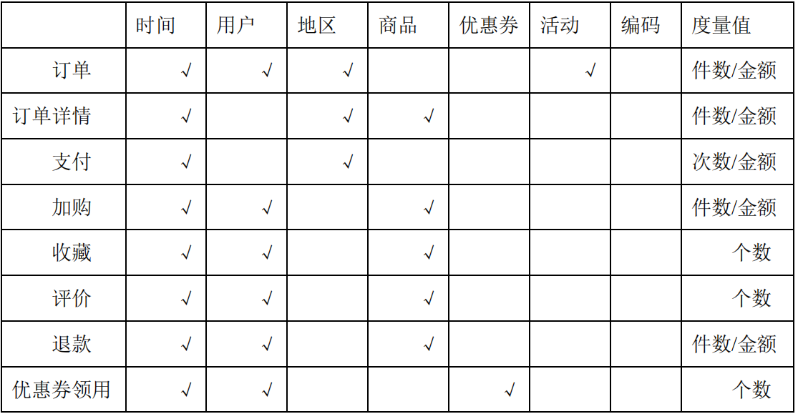

根据维度建模中的星型模型思想，将维度进行退化。例如下图所示：地区表和省份表退化为地区维度表，商品表、品类表、spu 表、商品三级分类、商品二级分类、商品一级分类表退化为商品维度表，活动信息表和活动规则表退化为活动维度表。

<font color = blue size =5>数仓建模</font>

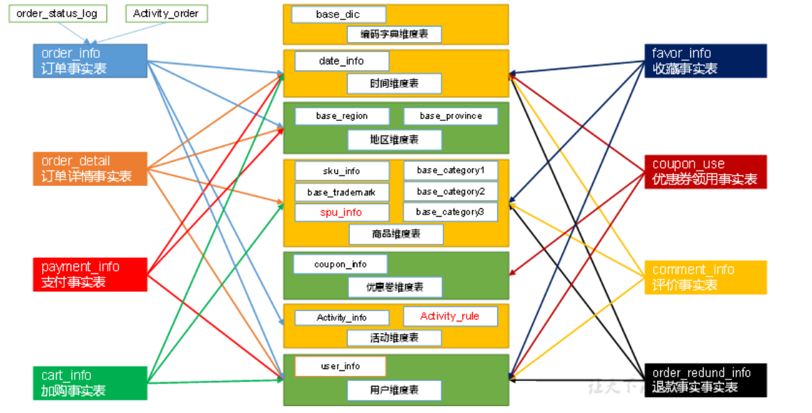

至此，数仓的维度建模已经完毕，DWS、DWT 和 ADS 和维度建模已经没有关系了。DWS 和 DWT 都是建宽表，宽表都是按照主题去建。主题相当于观察问题的角度。对应着维度表。

### 3.7.4 DWS 层 

DWS 层统计各个主题对象的当天行为，服务于 DWT 层的主题宽表。如图所示，DWS层的宽表字段，是站在不同维度的视角去看事实表，重点关注事实表的度量值，通过与之关联的事实表，获得不同的事实表的度量值。

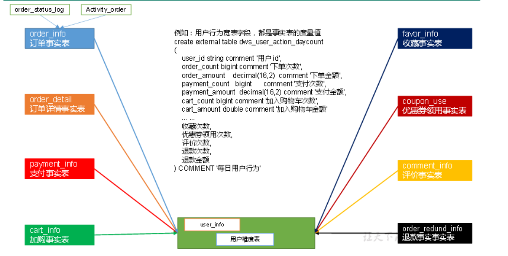

### 3.7.5 DWT 层

以分析的主题对象为建模驱动，基于上层的应用和产品的指标需求，构建主题对象的全量宽表。

DWT 层主题宽表都记录什么字段？

如图所示，每个维度关联的不同事实表度量值以及首次、末次时间、累积至今的度量值、累积某个时间段的度量值。

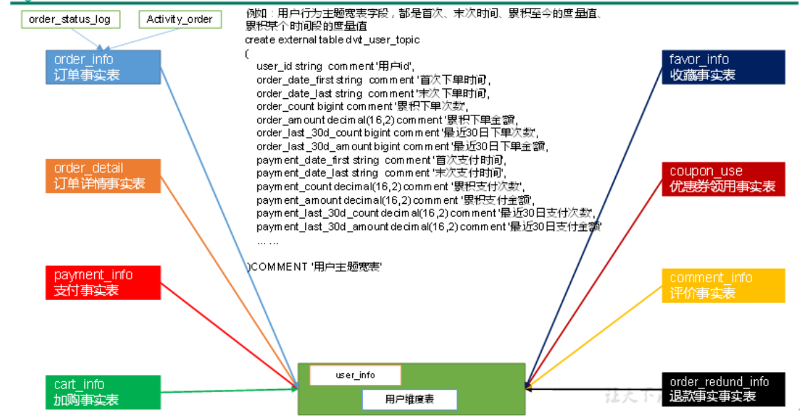

### 3.7.6 ADS 层

分别对设备主题、会员主题、商品主题和营销主题进行指标分析，其中营销主题是用户主题和商品主题的跨主题分析案例

# 第 4 章 生产经验—业务

## 4.1 电商常识

### 4.1.1 SKU 和 SPU

SKU：一台银色、128G 内存的、支持联通网络的 iPhoneX

SPU：iPhoneX

Tm_id：品牌 Id 苹果，包括 IPHONE，耳机，mac 等 

### 4.1.2 订单表跟订单详情表区别？

订单表的订单状态会变化，订单详情表不会，因为没有订单状态。

订单表记录 user_id，订单 id 订单编号，订单的总金额 order_status，支付方式，订单状态等。

订单详情表记录 user_id，商品 sku_id ,具体的商品信息（商品名称 sku_name，价格order_price，数量 sku_num） 

## 4.2 埋点行为数据基本格式(基本字段)

我们要收集和分析的数据主要包括页面数据、事件数据、曝光数据、启动数据和错误数据。

### 4.2.1 页面

页面数据主要记录一个页面的用户访问情况，包括访问时间、停留时间、页面路径等信息。  

所有页面 id 如下

home("首页"),

category("分类页"),

discovery("发现页"),

top_n("热门排行"),

favor("收藏页"),

search("搜索页"),

good_list("商品列表页"),

good_detail("商品详情"),

good_spec("商品规格"),

comment("评价"),

comment_done("评价完成"),

comment_list("评价列表"),

cart("购物车"),

trade("下单结算"),

payment("支付页面"),

payment_done("支付完成"),

orders_all("全部订单"),

orders_unpaid("订单待支付"),

orders_undelivered("订单待发货"),

orders_unreceipted("订单待收货"),

orders_wait_comment("订单待评价"),

mine("我的"),

activity("活动"),

login("登录"),

register("注册");

所有页面对象类型如下：

sku_id("商品 skuId"),

keyword("搜索关键词"),

sku_ids("多个商品 skuId"),

 activity_id("活动 id"),

coupon_id("购物券 id");

所有来源类型如下：

promotion("商品推广"),

recommend("算法推荐商品"),

query("查询结果商品"),

activity("促销活动");

### 4.2.2 事件

事件数据主要记录应用内一个具体操作行为，包括操作类型、操作对象、操作对象描述等信息。

所有动作类型如下：

favor_add("添加收藏"),

favor_canel("取消收藏"),

cart_add("添加购物车"),

cart_remove("删除购物车"),

cart_add_num("增加购物车商品数量"),

cart_minus_num("减少购物车商品数量"),

trade_add_address("增加收货地址"),

get_coupon("领取优惠券");

注：对于下单、支付等业务数据，可从业务数据库获取。

所有动作目标类型如下：

sku_id("商品"),

coupon_id("购物券"); 

### 4.2.3 曝光

曝光数据主要记录页面所曝光的内容，包括曝光对象，曝光类型等信息。

所有曝光类型如下：

promotion("商品推广"),

recommend("算法推荐商品"),

query("查询结果商品"),

activity("促销活动");

所有曝光对象类型如下：

sku_id("商品 skuId"),

activity_id("活动 id"); 

### 4.2.4 启动

启动数据记录应用的启动信息。

所有启动入口类型如下：

icon("图标"),

notification("通知"),

install("安装后启动");

### 4.2.5 错误

错误数据记录应用使用过程中的错误信息，包括错误编号及错误信息。

### 4.2.6 埋点数据日志格式

我们的日志结构大致可分为两类，一是普通页面埋点日志，二是启动日志。普通页面日志结构如下，每条日志包含了，当前页面的页面信息，所有事件（动作）、所有曝光信息以及错误信息。除此之外，还包含了一系列公共信息，包括设备信息，地理位置，应用信息等，即下边的 common 字段。

{

 "common": { -- 公共信息

 "ar": "230000", -- 地区编码

 "ba": "iPhone", -- 手机品牌

 "ch": "Appstore", -- 渠道

 "md": "iPhone 8", -- 手机型号

 "mid": "YXfhjAYH6As2z9Iq", -- 设备 id

 "os": "iOS 13.2.9", -- 操作系统

 "uid": "485", -- 会员 id

 "vc": "v2.1.134" -- app 版本号

 },

"actions": [ --动作(事件) 

 {

 "action_id": "favor_add", --动作 id

 "item": "3", --目标 id

 "item_type": "sku_id", --目标类型

 "ts": 1585744376605 --动作时间戳

 }

 ]，

 "displays": [

 {

 "displayType": "query", -- 曝光类型

 "item": "3", -- 曝光对象 id

 "item_type": "sku_id", -- 曝光对象类型

 "order": 1 --出现顺序

 },

 {

 "displayType": "promotion",

 "item": "6",

 "item_type": "sku_id",

 "order": 2

 },

 {

 "displayType": "promotion",

 "item": "9",

 "item_type": "sku_id",

 "order": 3

 },

118  


 {

 "displayType": "recommend",

 "item": "6",

 "item_type": "sku_id",

 "order": 4

 },

 {

 "displayType": "query ",

 "item": "6",

 "item_type": "sku_id",

 "order": 5

 }

 ],

 "page": { --页面信息

 "during_time": 7648, -- 持续时间毫秒

 "item": "3", -- 目标 id

 "item_type": "sku_id", -- 目标类型

 "last_page_id": "login", -- 上页类型

 "page_id": "good_detail", -- 页面 ID

 "sourceType": "promotion" -- 来源类型

 },

"err":{ --错误

"error_code": "1234", --错误码

 "msg": "" --错误信息

},

 "ts": 1585744374423 --跳入时间戳

}

启动日志结构相对简单，主要包含公共信息，启动信息和错误信息。

{

 "common": {

 "ar": "370000",

 "ba": "Honor",

 "ch": "wandoujia",

 "md": "Honor 20s",

 "mid": "eQF5boERMJFOujcp",

 "os": "Android 11.0",

 "uid": "76",

 "vc": "v2.1.134"

 },

 "start": { 

 "entry": "icon", --icon 手机图标 notice 通知 install 

安装后启动

 "loading_time": 18803, --启动加载时间

 "open_ad_id": 7, --广告页 ID

 "open_ad_ms": 3449, -- 广告总共播放时间

 "open_ad_skip_ms": 1989 -- 用户跳过广告时点

 },

"err":{ --错误

"error_code": "1234", --错误码

 "msg": "" --错误信息

},

 "ts": 1585744304000

}

119  


## 4.3 电商业务流程

1）记住表与表之间的关系

2）每个表记住 2-3 个字段

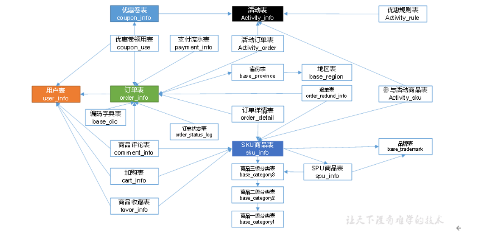

## 4.4 维度表和事实表（重点）

### 4.4.1 维度表

`维度表`：一般是对事实的描述信息。每一张维表对应现实世界中的一个对象或者概念。 

例如：用户、商品、日期、地区等。

### 4.4.2 事实表

事实表中的每行数据代表一个业务事件（下单、支付、退款、评价等）。“事实”这个术语表示的是业务事件的度量值（可统计次数、个数、件数、金额等），例如，订单事件中的下单金额。

每一个事实表的行包括：具有可加性的数值型的度量值、与维表相连接的外键、通常具有两个和两个以上的外键、外键之间表示维表之间多对多的关系。

`1）事务型事实表`

以每个事务或事件为单位，例如一个销售订单记录，一笔支付记录等，作为事实表里的一行数据。一旦事务被提交，事实表数据被插入，数据就不再进行更改，其更新方式为增量更新。 

`2）周期型快照事实表`

周期型快照事实表中不会保留所有数据，只保留固定时间间隔的数据，例如每天或者每月的销售额，或每月的账户余额等。

`3）累积型快照事实表`

累计快照事实表用于跟踪业务事实的变化。例如，数据仓库中可能需要累积或者存储订单从下订单开始，到订单商品被打包、运输、和签收的各个业务阶段的时间点数据来跟踪订单声明周期的进展情况。当这个业务过程进行时，事实表的记录也要不断更新。

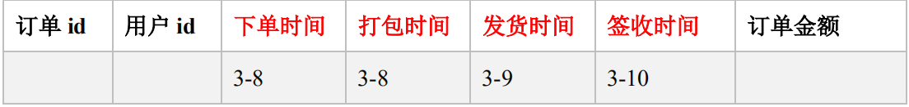

## 4.5 同步策略（重点）

<font color = red size =5 >分析表同步策略</font>

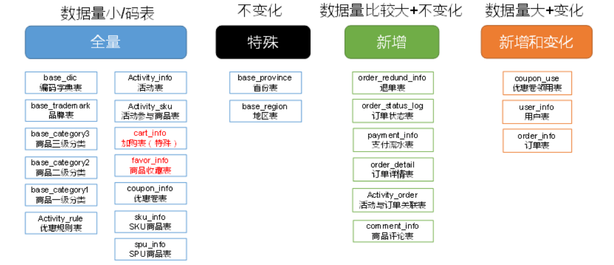

实体表，维度表统称维度表，每日全量或者每月（更长时间）全量

事务型事实表：每日增量

周期性事实表：拉链表

## 4.6 关系型数据库范式理论

1NF：属性不可再分割（例如不能存在 5 台电脑的属性，坏处：表都没法用）

2NF：不能存在部分函数依赖（例如主键（学号+课名）-->成绩，姓名，但学号--》姓名，所以姓名部分依赖于主键（学号+课名），所以要去除，坏处：数据冗余）

3NF：不能存在传递函数依赖（学号--》宿舍种类--》价钱，坏处：数据冗余和增删异常）

MySQL 关系模型：关系模型主要应用与 OLTP 系统中，为了保证数据的一致性以及避  免冗余，所以大部分业务系统的表都是遵循第三范式的。

`Hive 维度模型`：维度模型主要应用于 OLAP 系统中，因为关系模型虽然冗余少，但是在大规模数据，跨表分析统计查询过程中，会造成多表关联，这会大大降低执行效率。所以 HIVE 把相关各种表整理成两种：事实表和维度表两种。所有维度表围绕着事实表进行解释。

## 4.7 数据模型

雪花模型、星型模型和星座模型

（在维度建模的基础上又分为三种模型：星型模型、雪花模型、星座模型。）

星型模型（一级维度表），雪花（多级维度），星座模型（星型模型+多个事实表）

## 4.8 拉链表（重点）

拉链表处理的业务场景：主要处理缓慢变化维的业务场景。（用户表、订单表）  


## 4.9 即席查询数据仓库

<font color=red size = 5 >Druid对比Impala/Presto/Spark SQL/Kylin/Elasticsearch</font>


Kylin: T+1

Impala: CDH

Presto: Apache 版本框架


## 4.10 数据仓库每天跑多少张表，大概什么时候运行，运行多久？

基本一个项目建一个库，表格个数为初始的原始数据表格加上统计结果表格的总数。（一般 70-100 张表格）

用户行为 11 张；业务数据 27 张表 =》ods 38 =》dwd=>32 张=》dws 6 张宽表=>ads=》 30 张 =》106 张

每天 0：30 开始运行。=》sqoop 40-50 分钟：1 点 20：=》 5-6 个小时运行完指标

所有离线数据报表控制在 8 小时之内

大数据实时处理部分控制在 5 分钟之内。（分钟级别、秒级别）

如果是实时推荐系统，需要秒级响应


## 4.11 活动的话，数据量会增加多少？怎么解决？

日活增加 50%，GMV 增加多少。（留转 G 复活）情人节，促销手纸。集群资源都留有预量。11.11，6.18，数据量过大，提前动态增加服务器。

## 4.12 并发峰值多少？大概哪个时间点？

高峰期晚上 7-8 点。Kafka 里面 20m/s 2 万/s 并发峰值在 1-2 万人


## 4.13 数仓中使用的哪种文件存储格式

常用的包括：textFile，rcFile，ORC，Parquet，一般企业里使用 ORC 或者 Parquet，因

为是列式存储，且压缩比非常高，所以相比于 textFile，查询速度快，占用硬盘空间少


## 4.14 哪张表最费时间，有没有优化

用户行为宽表，数据量过大。数据倾斜的相关优化手段。（hadoop、hive、spark） 


## 4.15 用什么工具做权限管理

Ranger 或 Sentry （用户认证 kerberos（张三、李四、王五）=>表级别权限（张三、李四）、字段级别权限（李四））


# 第 5 章 生产经验--测试上线相关

## 5.1 测试相关

### 5.1.1 公司有多少台测试服务器？

测试服务器一般三台

### 5.1.2 测试环境什么样？

有钱的公司和生产环境电脑配置一样。

一般公司测试环境的配置是生产的一半 

### 5.1.3 测试数据哪来的？

一部分自己写 Java 程序自己造（更灵活），一部分从生产环境上取一部分（更真实）。 

### 5.1.4 如何保证写的 sql 正确性

需要造一些特定的测试数据，测试。

从生产环境抓取一部分数据，数据有多少你是知道的，运算完毕应该符合你的预期。

离线数据和实时数据分析的结果比较。（日活 1 万 实时 10100），倾向取离线。

先在 mysql 的业务库里面把结果计算出来；在给你在 ads 层计算的结果进行比较；

### 5.1.5 测试之后如何上线？

大公司：上线的时候，将脚本打包，提交 git。先发邮件抄送经理和总监，运维。运维负  责上线。

小公司：跟项目经理说一下，项目经理技术把关，项目经理通过了就可以上线了。风险意识。

## 5.2 项目实际工作流程

以下是活跃用户需求的整体开发流程。

第 1 步：确定指标的业务口径

由产品经理主导，找到提出该指标的运营负责人沟通。首先要问清楚指标是怎么定义的，

比如活跃用户是指启动过 APP 的用户。设备 id 还是用户 id。

邮件/需求文档-》不要口头

第 2 步：需求评审

由产品经理主导设计原型，对于活跃主题，我们最终要展示的是最近 n 天的活跃用户数

变化趋势 ，效果如下图所示。此处大数据开发工程师、后端开发工程师、前端开发工程师

一同参与，一起说明整个功能的价值和详细的操作流程，确保大家理解的一致。

第 3 步：大数据开发

大数据开发工程师，通过数据同步的工具如 Flume、Sqoop 等将数据同步到 ODS 层，然

后就是一层一层的通过 SQL 计算到 DWD、DWS 层，最后形成可为应用直接服务的数据填

充到 ADS 层。

第 4 步：后端开发

后端工程师负责，为大数据工程师提供业务数据接口；

同时还负责读取 ADS 层分析后，写入 MySQL 中的数据。

第 5 步：前端开发

前端工程师负责，前端埋点。

对分析后的结果数据进行可视化展示。

第 6 步：联调

此时数据开发工程师、前端开发工程师、后端开发工程师都要参与进来。此时会要求大

数据开发工程师基于历史的数据执行计算任务，大数据开发工程师承担数据准确性的校验。

前后端解决用户操作的相关 BUG 保证不出现低级的问题完成自测。

第 7 步：测试

测试工程师对整个大数据系统进行测试。测试的手段包括，边界值、等价类等。

提交测试异常的软件有：禅道、bugzila（测试人员记录测试问题 1.0，输入是什么，结

果是什么，跟预期不一样->需要开发人员解释，是一个 bug，下一个版本解决 1.1->测试人员

再测试。测试 1.1ok->测试经理关闭 bug） 

1.2.3

1 重大项目升级

2 核心模块的变化

3 普通变化

第 8 步：上线

运维工程师会配合我们的前后端开发工程师更新最新的版本到服务器。此时产品经理要

找到该指标的负责人长期跟进指标的准确性。重要的指标还要每过一个周期内部再次验证，

从而保证数据的准确性。


## 5.3 项目中实现一个需求大概多长时间

刚入职第一个需求大概需要 7 天左右。

对业务熟悉后，平均一天一个需求。

影响时间的因素：测试服务器购买获取环境准备、对业务熟悉、开会讨论需求、表的权限申请、测试等。新员工培训（公司规章制度、代码规范）


## 5.4 项目在 3 年内迭代次数，每一个项目具体是如何迭代的。公司版本迭代多久一次，迭代到哪个版本

瀑布式开发、敏捷开发

差不多一个月会迭代一次。每月都有节日（元旦、春节、情人节、3.8 妇女节、端午节、618、国庆、中秋、1111/6.1/5.1、生日、周末）新产品、新区域就产品或我们提出优化需求，然后评估时间。每周我们都会开会做下周计划和本周总结。  

（日报、周报、月报、季度报、年报）需求 1 周的时间，周三一定完成。周四周五（帮同事写代码、自己学习工作额外的技术）

有时候也会去预研一些新技术。Flink hudi

5.1.2

5 是大版本号：必须是重大升级

1：一般是核心模块变动

2：一般版本变化


## 5.5 项目开发中每天做什么事

1）新需求（活动、优化、新产品、新市场）。 

2）故障分析：数仓的任何步骤出现问题，需要查看问题，比如日活，月活下降或快速上升等。

3）新技术的预言（比如 flink、数仓建模、数据质量、元数据管理）

4）晨会-》10 做操-》讨论中午吃什么-》12 点出去吃 1 点-》睡到 2 点-》3 点茶歇水果-》晚上吃啥-》吃加班餐-》开会-》晚上 6 点吃饭-》7 点开始干活-10 点-》11 点 


## 5.6 实时项目数据计算

### 5.6.1 跑实时任务，怎么分配内存和 CPU 资源

128m 数据对应 1g 内存

1 个 Kafka 分区对应 1 个 CPU


### 5.6.2 跑实时任务，每天数据量多少？

用户行为：实时任务用到了用户行为多少张表（10g）

业务数据：实时任务用到了业务数据多少张表(34m) 

活动、风控、销售、流量


# 第 6 章 生产经验—技术

## 6.1 可视化报表工具

Echarts（百度开源）、kibana（开源）、Tableau（功能强大的收费软件）、Superset（功能一般免费）、QuickBI（阿里云收费的离线）、DataV（阿里云收费的实时）


## 6.2 集群监控工具

Zabbix+ Grafana


### 6.3 项目中遇到的问题怎么解决的（重点\\） 

Shell 中 flume 停止脚本

Hadoop 宕机

Hadoop 解决数据倾斜方法

集群资源分配参数（项目中遇到的问题）

HDFS 小文件处理

Hadoop 优化

Flume 挂掉

Flume 优化

Kafka 挂掉

Kafka 丢失

Kafka 数据重复

Kafka 消息数据积压

Kafka 优化

Kafka 单条日志传输大小

自定义 UDF、UDTF 函数

Hive 优化

Hive 解决数据倾斜方法

7 天内连续 3 次活跃

Sqoop 空值、一致性、数据倾斜

Azkaban 任务挂了怎么办？

Azkaban 故障报警

Spark 数据倾斜

Spark 优化

SparkStreaming 精确一次性消费


## 6.4 Linux+Shell+Hadoop+ZK+Flume+kafka+Hive+Sqoop+Azkaban那些事


# 第 7 章 生产经验—热点问题

## 7.1 元数据管理（Atlas 血缘系统）

依赖关系能够做到：表级别和字段级别

用处：作业执行失败，评估他的影响范围。 主要用于表比较多的公司。

版本问题：

0.84 版本：2019-06-21

2.0 版本：2019-05-13

框架版本：

Apache 0.84 2.0

CDH 2.0 


## 7.2 数据质量监控（Griffin） 

### 7.2.1 为什么要做数据质量监控（2019 年下半年）

**1)数据不一致**

企业早期没有进行统一规划设计，大部分信息系统是逐步迭代建设的，系统建设时间长短各异，各系统数据标准也不同。企业业务系统更关注业务层面，各个业务系统均有不同的侧重点，各类数据的属性信息设置和要求不统一。

**2)数据不完整**  

由于企业没有统一的录入工具和数据出口，业务系统不需要的信息就不录，造成同样的数据在不同的系统有不同的属性信息，数据完整性无法得到保障。

**3)数据不合规**

没有统一的数据管理平台和数据源头，数据全生命周期管理不完整，同时企业各信息系统的数据录入环节过于简单且手工参与较多，就数据本身而言，缺少是否重复、合法、对错等校验环节，导致各个信息系统的数据不够准确，格式混乱，各类数据难以集成和统一，没有质量控制导致海量数据因质量过低而难以被利用，且没有相应的数据管理流程。

**4)数据不可控**

企业各单位和部门关注数据的角度不一样，缺少一个组织从全局的视角对数据进行管理，导致无法建立统一的数据管理标准、流程等，相应的数据管理制度、办法等无法得到落实。同时，企业基础数据质量考核体系也尚未建立，无法保障一系列数据标准、规范、制度、流程得到长效执行。

**5)数据冗余**

各个信息系统针对数据的标准规范不一、编码规则不一、校验标准不一，且部分业务系统针对数据的验证标准严重缺失，造成了企业顶层视角的数据出现“一物多码”、“一码多物”等现象。

### 7.2.2 建设方法


质量监管平台建设，主要包含如下 8 大流程步骤：

质量需求：发现数据问题；信息提报、收集需求；检核规则的需求等；

提炼规则：梳理规则指标、确定有效指标、检核指标准确度和衡量标准；

规则库构建：检核对象配置、调度配置、规则配置、检核范围确认、检核标准确定等；

执行检核：调度配置、调度执行、检核代码；

问题检核：检核问题展示、分类、质量分析、质量严重等级分类等；

分析报告：数据质量报告、质量问题趋势分析，影响度分析，解决方案达成共识；

落实处理：方案落实执行、跟踪管理、解决方案 Review 及标准化提炼；

知识库体系形成：知识经验总结、标准方案沉淀、知识库体系建设。


### 7.2.3 监控指标

1）单表数据量监控

一张表的记录数在一个已知的范围内，或者上下浮动不会超过某个阈值

◼ SQL 结果：var 数据量 = select count（）from 表 where 时间等过滤条件

◼ 报警触发条件设置：如果数据量不在[数值下限, 数值上限]， 则触发报警

◼ 同比增加：如果((本周的数据量 - 上周的数据量)/上周的数据量100)不在 [比例下

线，比例上限]，则触发报警

◼ 环比增加：如果((今天的数据量 - 昨天的数据量)/昨天的数据量100)不在 [比例下

线，比例上限]，则触发报警

◼ 报警触发条件设置一定要有。如果没有配置的阈值，不能做监控

日活、周活、月活、留存（日周月）、转化率（日、周、月）GMV（日、周、月）

复购率（日周月） 30% 

2）单表空值检测

某个字段为空的记录数在一个范围内，或者占总量的百分比在某个阈值范围内

◼ 目标字段：选择要监控的字段，不能选“无” 

◼ SQL 结果：var 异常数据量 = select count() from 表 where 目标字段 is null

◼ 单次检测：如果(异常数据量)不在[数值下限, 数值上限]，则触发报警

3）单表重复值检测

一个或多个字段是否满足某些规则

◼ 目标字段：第一步先正常统计条数；select count() form 表；

◼ 第二步，去重统计；select count() from 表 group by 某个字段

◼ 第一步的值和第二步不的值做减法，看是否在上下线阀值之内

◼ 单次检测：如果(异常数据量)不在[数值下限, 数值上限]， 则触发报警

4）单表值域检测

一个或多个字段没有重复记录

◼ 目标字段：选择要监控的字段，支持多选

◼ 检测规则：填写“目标字段”要满足的条件。其中$1 表示第一个目标字段，$2 表示

第二个目标字段，以此类推。上图中的“检测规则”经过渲染后变为“delivery_fee = 

delivery_fee_base+delivery_fee_extra”

◼ 阈值配置与“空值检测”相同

5）跨表数据量对比

主要针对同步流程，监控两张表的数据量是否一致

◼ SQL 结果：count(本表) - count(关联表) 

◼ 阈值配置与“空值检测”相同

## 7.3 数据治理

包括：数据质量管理、元数据管理、权限管理（ranger sentry）。

CDH cloudmanager-》sentry； HDP ambari=>ranger

数据治理是一个复杂的系统工程，涉及到企业和单位多个领域，既要做好顶层设计，又要解决好统一标准、统一流程、统一管理体系等问题，同时也要解决好数据采集、数据清洗、数据对接和应用集成等相关问题。数据治理实施要点主要包含数据规划、制定数据标准、整理数据、搭建数据管理工具、构建运维体系及推广贯标六大部分，其中数据规划是纲领、制定数据标准是基础、整理数据是过程、搭建数据管理工具是技术手段、构建运维体系是前提，推广贯标是持续保障。  


## 7.4 数据中台

https://mp.weixin.qq.com/s/nXI0nSSOneteIClA7dming

### 7.4.1 什么是中台？

在传统 IT 企业，项目的物理结构是什么样的呢？无论项目内部的如何复杂，都可分为“前台”和“后台”这两部分。

**什么是前台？**

首先，这里所说的“前台”和“前端”并不是一回事。所谓前台即包括各种和用户直接交互的界面，比如 web 页面，手机 app；也包括服务端各种实时响应用户请求的业务逻辑，比如商品查询、订单系统等等。

**什么是后台？**

后台并不直接面向用户，而是面向运营人员的配置管理系统，比如商品管理、物流管理、结算管理。后台为前台提供了一些简单的配置。


### 7.4.2 传统项目痛点

痛点：重复造轮子。


### 7.4.3 各家中台

1）SuperCell 公司


2）阿里巴巴提出了“大中台，小前台”的战略


3）华为提出了“平台炮火支撑精兵作战”的战略


### 7.4.4 中台具体划分

1）业务中台


2）技术中台


3）数据中台  


4）算法中台


### 7.4.5 中台使用场景

1）从 0 到 1 的阶段，没有必要搭建中台。

从 0 到 1 的创业型公司，首要目的是生存下去，以最快的速度打造出产品，证明自身的市场价值。这个时候，让项目野蛮生长才是最好的选择。如果不慌不忙地先去搭建中台，恐怕中台还没搭建好，公司早就饿死了。

2）从 1 到 N 的阶段，适合搭建中台。

当企业有了一定规模，产品得到了市场的认可，这时候公司的首要目的不再是活下去，而是活的更好。这个时候，趁着项目复杂度还不是特别高，可以考虑把各项目的通用部分下沉，组建中台，以方便后续新项目的尝试和旧项目的迭代。

3）从 N 到 N+1 的阶段，搭建中台势在必行。

当企业已经有了很大的规模，各种产品、服务、部门错综复杂，这时候做架构调整会比较痛苦。但是长痛不如短痛，为了项目的长期发展，还是需要尽早调整架构，实现平台化，以免日后越来越难以维护。


## 7.5 数据湖

数据湖（Data Lake）是一个存储企业的各种各样原始数据的大型仓库，其中的数据可供存取、处理、分析及传输。目前，Hadoop 是最常用的部署数据湖的技术，所以很多人会觉得数据湖就是Hadoop 集群。数据湖是一个概念，而 Hadoop 是用于实现这个概念的技术。  


## 7.6 埋点

免费的埋点：上课演示

收费的埋点：神策 https://mp.weixin.qq.com/s/Xp3-alWF4XHvKDP9rNWCoQ

目前主流的埋点方式，有代码埋点（前端/后端）、可视化埋点、全埋点三种。

`代码埋点`是通过调用埋点 SDK 函数，在需要埋点的业务逻辑功能位置调用接口，上报埋点数据。例如，我们对页面中的某个按钮埋点后，当这个按钮被点击时，可以在这个按钮对应的 OnClick 函数里面调用 SDK 提供的数据发送接口，来发送数据。

`可视化埋点`只需要研发人员集成采集 SDK，不需要写埋点代码，业务人员就可以通过访问分析平台的“圈选”功能，来“圈”出需要对用户行为进行捕捉的控件，并对该事件进行命名。圈选完毕后，这些配置会同步到各个用户的终端上，由采集 SDK 按照圈选的配置自动进行用户行为数据的采集和发送。

`全埋点`是通过在产品中嵌入 SDK，前端自动采集页面上的全部用户行为事件，上报埋点数据，相当于做了一个统一的埋点。然后再通过界面配置哪些数据需要在系统里面进行分  析。


## 7.7 电商运营经验

### 7.7.1 电商 8 类基本指标


8）市场竞争指标：主要分析市场份额以及网站排名，进一步进行调整


### 7.7.2 直播指标


# 第 8 章 手写代码

## 8.1 基本算法

### 8.1.1 冒泡排序

```java
/**
\ 冒泡排序 时间复杂度 O(n^2) 空间复杂度 O(1)

*/

public class BubbleSort {

 public static void bubbleSort(int[] data) {

 System.out.println("开始排序");

 int arrayLength = data.length;

 for (int i = 0; i < arrayLength - 1; i++) {

 boolean flag = false;

 for (int j = 0; j < arrayLength - 1 - i; j++) {

 if(data[j] > data[j + 1]){

 int temp = data[j + 1];

 data[j + 1] = data[j];

 data[j] = temp;

 flag = true;

 }

 }

 System.out.println(java.util.Arrays.toString(data));

 if (!flag)

 break;

 }

 }

 public static void main(String[] args) {

 int[] data = { 9, -16, 21, 23, -30, -49, 21, 30, 30 };

 System.out.println(" 

排 序 之 前 ： 

\n" + 

java.util.Arrays.toString(data));

 bubbleSort(data);

 System.out.println(" 

排 序 之 后 ： 

\n" + 

java.util.Arrays.toString(data));

 } 

}
```


### 8.1.2 二分查找

<font color = red size=5>二分法查找全流程</font>


图 4-二分查找核心思路

实现代码：

```scala
/**

\ 二分查找 时间复杂度 O(log2n);空间复杂度 O(1)

*/

def 

binarySearch(arr:Array[Int],left:Int,right:Int,findVal:Int): 

Int={

if(left>right){//递归退出条件，找不到，返回-1 

-1 

}

val midIndex = (left+right)/2

if (findVal < arr(midIndex)){//向左递归查找

binarySearch(arr,left,midIndex-1,findVal)

}else if(findVal > arr(midIndex)){//向右递归查找

binarySearch(arr,midIndex+1,right,findVal)

}else{//查找到，返回下标

midIndex

} 

}
```


拓展需求：当一个有序数组中，有多个相同的数值时，如何将所有的数值都查找到。

代码实现如下：

```scala
/**

 {1,8, 10, 89, 1000, 1000，1234} 当一个有序数组中，有多个相同的数值时，如

何将所有的数值都查找到，比如这里的 1000.

 //分析

 \1. 返回的结果是一个可变数组 ArrayBuffer

 \2. 在找到结果时，向左边扫描，向右边扫描 [条件]  


 \3. 找到结果后，就加入到 ArrayBuffer

 */

 def binarySearch2(arr: Array[Int], l: Int, r: Int,

 findVal: Int): ArrayBuffer[Int] = {

 //找不到条件?

 if (l > r) {

 return ArrayBuffer()

 }

 val midIndex = (l + r) / 2

 val midVal = arr(midIndex)

 if (midVal > findVal) {

 //向左进行递归查找

 binarySearch2(arr, l, midIndex - 1, findVal)

 } else if (midVal < findVal) { //向右进行递归查找

 binarySearch2(arr, midIndex + 1, r, findVal)

 } else {

 println("midIndex=" + midIndex)

 //定义一个可变数组

 val resArr = ArrayBuffer[Int]()

 //向左边扫描

 var temp = midIndex - 1

 breakable {

 while (true) {

 if (temp < 0 || arr(temp) != findVal) {

 break()

 }

 if (arr(temp) == findVal) {

 resArr.append(temp)

 }

 temp -= 1

 }

 }

 //将中间这个索引加入

 resArr.append(midIndex)

 //向右边扫描

 temp = midIndex + 1

 breakable {

 while (true) {

 if (temp > arr.length - 1 || arr(temp) != findVal) {

 break()

 }

 if (arr(temp) == findVal) {

 resArr.append(temp)

 }

 temp += 1

 }

 }

 return resArr

 }
```

### 8.1.3 快排


代码实现：

```scala
/**

\ 快排

\ 时间复杂度:平均时间复杂度为 O(nlogn)

\ 空间复杂度:O(logn)，因为递归栈空间的使用问题

*/

def quickSort(list: List[Int]): List[Int] = list match {

 case Nil => Nil

 case List() => List()

 case head :: tail =>

 val (left, right) = tail.partition(_ < head)

 quickSort(left) ::: head :: quickSort(right)

 }
```

### 8.1.4 归并


核心思想：不断的将大的数组分成两个小数组，直到不能拆分为止，即形成了单个值。此时使用合并的排序思想对已经有序的数组进行合并，合并为一个大的数据，不断重复此过程，直到最终所有数据合并到一个数组为止。


代码实现：

```scala
/**

\ 快排

\ 时间复杂度:O(nlogn)

\ 空间复杂度:O(n)

*/

def merge(left: List[Int], right: List[Int]): List[Int] = (left, 

right) match {

 case (Nil, _) => right

 case (_, Nil) => left

 case (x :: xTail, y :: yTail) =>

 if (x <= y) x :: merge(xTail, right)

 else y :: merge(left, yTail)

 }
```


### 8.1.5 二叉树之 Scala 实现

**1）二叉树概念**


**2）二叉树的特点**

> （1）树执行查找、删除、插入的时间复杂度都是 O(logN)
>
> （2）遍历二叉树的方法包括前序、中序、后序
>
> （3）非平衡树指的是根的左右两边的子节点的数量不一致
>
> （4）在非空二叉树中，第 i 层的结点总数不超过 , i>=1； 
>
> （5）深度为 h 的二叉树最多有个结点(h>=1)，最少有 h 个结点；
>
> （6）对于任意一棵二叉树，如果其叶结点数为 N0，而度数为 2 的结点总数为 N2，则N0=N2+1； 

**3） 二叉树的 Scala 代码实现**

定义节点以及前序、中序、后序遍历

```scala
class TreeNode(treeNo:Int){

 val no = treeNo

 var left:TreeNode = null

 var right:TreeNode = null

 //后序遍历

 def postOrder():Unit={

 //向左递归输出左子树

 if(this.left != null){

 this.left.postOrder

 }

 //向右递归输出右子树

 if (this.right != null) {

 this.right.postOrder

 }

 //输出当前节点值

 printf("节点信息 no=%d \n",no)

 }

 //中序遍历

 def infixOrder():Unit={

 //向左递归输出左子树

 if(this.left != null){

 this.left.infixOrder()

 }

 //输出当前节点值

 printf("节点信息 no=%d \n",no)

 //向右递归输出右子树

 if (this.right != null) {

 this.right.infixOrder()

 }

 }

 //前序遍历

 def preOrder():Unit={

 //输出当前节点值

 printf("节点信息 no=%d \n",no)

 //向左递归输出左子树

 if(this.left != null){

 this.left.postOrder()

 }

 //向右递归输出右子树

 if (this.right != null) {

 this.right.preOrder()

 }

 }

 //后序遍历查找

 def postOrderSearch(no:Int): TreeNode = {

 //向左递归输出左子树

 var resNode:TreeNode = null

 if (this.left != null) {

 resNode = this.left.postOrderSearch(no)

 }

 if (resNode != null) {

 return resNode

 }

 if (this.right != null) {

 resNode = this.right.postOrderSearch(no)

 }

 if (resNode != null) {

 return resNode

 }

 println("ttt~~")

 if (this.no == no) {

 return this

 }

 resNode

 }

 //中序遍历查找

 def infixOrderSearch(no:Int): TreeNode = {

 var resNode : TreeNode = null

 //先向左递归查找

 if (this.left != null) {

 resNode = this.left.infixOrderSearch(no)

 }

 if (resNode != null) {

 return resNode

 }

 println("yyy~~")

 if (no == this.no) {

 return this

 }

 //向右递归查找

 if (this.right != null) {

 resNode = this.right.infixOrderSearch(no)

 }

 return resNode

 }

 //前序查找

 def preOrderSearch(no:Int): TreeNode = {

 if (no == this.no) {

 return this

 }

 //向左递归查找

 var resNode : TreeNode = null

 if (this.left != null) {

 resNode = this.left.preOrderSearch(no)

 }

 if (resNode != null){

 return resNode

 }

 //向右边递归查找

 if (this.right != null) {

 resNode = this.right.preOrderSearch(no)

 }

 return resNode

 }

 //删除节点

 //删除节点规则

 //1 如果删除的节点是叶子节点，则删除该节点

 //2 如果删除的节点是非叶子节点，则删除该子树

 def delNode(no:Int): Unit = {

 //首先比较当前节点的左子节点是否为要删除的节点

 if (this.left != null && this.left.no == no) {

 this.left = null

 return

 }

 //比较当前节点的右子节点是否为要删除的节点

 if (this.right != null && this.right.no == no) {

 this.right = null

 return

 }

 //向左递归删除

 if (this.left != null) {

 this.left.delNode(no)

 }

 //向右递归删除

 if (this.right != null) {

 this.right.delNode(no)

 }

 } 

}
```


定义二叉树，前序、中序、后序遍历，前序、中序、后序查找，删除节点

```scala
class BinaryTree{

 var root:TreeNode = null

 //后序遍历

 def postOrder(): Unit = {

 if (root != null){

 root.postOrder()

 }else {

 println("当前二叉树为空，不能遍历")

}

}

 //中序遍历

 def infixOrder(): Unit = {

 if (root != null){

 root.infixOrder()

 }else {

 println("当前二叉树为空，不能遍历")

 }

 }

 //前序遍历

 def preOrder(): Unit = {

 if (root != null){

 root.preOrder()

 }else {

 println("当前二叉树为空，不能遍历")

 }

 }

 //后序遍历查找

 def postOrderSearch(no:Int): TreeNode = {

 if (root != null) {

 root.postOrderSearch(no)

 }else{

 null

 }

 }

 //中序遍历查找

 def infixOrderSeacher(no:Int): TreeNode = {

 if (root != null) {

 return root.infixOrderSearch(no)

 }else {

 return null

 }

 }

 //前序查找

 def preOrderSearch(no:Int): TreeNode = {

 if (root != null) {

 return root.preOrderSearch(no)

 }else{

 //println("当前二叉树为空，不能查找")

 return null

 }

 } 

//删除节点

 def delNode(no:Int): Unit = {

 if (root != null) {

 //先处理一下 root 是不是要删除的

 if (root.no == no){

 root = null

 }else {

 root.delNode(no)

 }

 }

 } 
```


## 8.2 开发代码

### 8.2.1 手写 Spark-WordCount

```scala
val conf: SparkConf = 

new SparkConf().setMaster("local[]").setAppName("WordCount")

val sc = new SparkContext(conf)

sc.textFile("/input")

 .flatMap(_.split(" "))

 .map((_, 1))

 .reduceByKey(_ + _)

 .saveAsTextFile("/output")

sc.stop()
```


## 8.3 手写 HQL

### 8.3.1 手写 HQL 第 1 题

表结构：uid,subject_id,score

求：找出所有科目成绩都大于某一学科平均成绩的学生

数据集如下

```txt
1001 01 90

1001 02 90

1001 03 90

1002 01 85

1002 02 85

1002 03 70

1003 01 70

1003 02 70

1003 03 85
```

1）建表语句

```sql
create table score(

 uid string,

 subject_id string,

 score int)

row format delimited fields terminated by '\t';
```

2）求出每个学科平均成绩

```sql
select

 uid,

 score,

 avg(score) over(partition by subject_id) avg_score

from

 score;t1
```

3）根据是否大于平均成绩记录 flag，大于则记为 0 否则记为 1

```sql
select

 uid,

 if(score>avg_score,0,1) flag

from

 t1;t2
```


4）根据学生 id 进行分组统计 flag 的和，和为 0 则是所有学科都大于平均成绩

```sql
select

 uid

from

 t2

group by

 uid

having

 sum(flag)=0;
```

5）最终 SQL

```sql
select

 uid

from

 (select

 uid,

 if(score>avg_score,0,1) flag

from

 (select

 uid,

 score,

 avg(score) over(partition by subject_id) avg_score

from

 score)t1)t2

group by

 uid

having

 sum(flag)=0;
```


### 8.3.2 手写 HQL 第 2 题

我们有如下的用户访问数据


要求使用 SQL 统计出每个用户的累积访问次数，如下表所示：


数据集  

```txt
u01 2017/1/21 5

u02 2017/1/23 6

u03 2017/1/22 8

u04 2017/1/20 3

u01 2017/1/23 6

u01 2017/2/21 8

u02 2017/1/23 6

u01 2017/2/22 4
```

1）创建表

```sql
create table action

(userId string,

visitDate string,

visitCount int) 

row format delimited fields terminated by "\t";
```


2）修改数据格式

```sql
select

 userId,

 date_format(regexp_replace(visitDate,'/','-'),'yyyy

MM') mn,

 visitCount

from

 action;t1
```


3）计算每人单月访问量

```sql
select

 userId,

 mn,

 sum(visitCount) mn_count

from

 t1

group by 

userId,mn;t2
```


4）按月累计访问量

```sql
select

 userId,

 mn,

 mn_count,

 sum(mn_count) over(partition by userId order by mn)

from t2;
```


5）最终 SQL

```sql
select

 userId,

 mn,

 mn_count,

 sum(mn_count) over(partition by userId order by mn)

from 

( select

 userId,

 mn,

 sum(visitCount) mn_count

 from

 (select

 userId,

 date_format(regexp_replace(visitDate,'/','-

'),'yyyy-MM') mn,

 visitCount

 from

 action)t1

group by userId,mn)t2;
```


### 8.3.3 手写 HQL 第 3 题 

有 50W 个京东店铺，每个顾客访客访问任何一个店铺的任何一个商品时都会产生一条访问日志，访问日志存储的表名为 Visit，访客的用户 id 为 user_id，被访问的店铺名称为shop，请统计：

1）每个店铺的 UV（访客数）

2）每个店铺访问次数 top3 的访客信息。输出店铺名称、访客 id、访问次数

数据集

```txt
u1 a

u2 b

u1 b

u1 a

u3 c

u4 b

u1 a

u2 c

u5 b

u4 b

u6 c

u2 c

u1 b

u2 a

u2 a

u3 a

u5 a

u5 a

u5 a
```


1）建表

```sql
create table visit(user_id string,shop string) row format 

delimited fields terminated by '\t';
```


2）每个店铺的 UV（访客数）

```sql
select shop,count(distinct user_id) from visit group by 

shop;
```


3）每个店铺访问次数 top3 的访客信息。输出店铺名称、访客 id、访问次数

（1）查询每个店铺被每个用户访问次数

```sql
select shop,user_id,count() ct

from visit

group by shop,user_id;t1
```


（2）计算每个店铺被用户访问次数排名

```sql
select shop,user_id,ct,rank() over(partition by shop order 

by ct) rk

from t1;t2
```


（3）取每个店铺排名前 3 的

```sql
select shop,user_id,ct

from t2

where rk<=3;
```


（4）最终 SQL

```sql
select 

shop,

user_id,

ct

from

(select 

shop,

user_id,

ct,

rank() over(partition by shop order by ct) rk

from 

(select 

shop,

user_id,

count() ct

from visit

group by 

shop,

user_id)t1

)t2

where rk<=3;
```


### 8.3.4 手写 HQL 第 4 题

已知一个表 STG.ORDER，有如下字段:Date，Order_id，User_id，amount。请给出 sql 进行统计:数据样例:2017-01-01,10029028,1000003251,33.57。 

1）给出 2017 年每个月的订单数、用户数、总成交金额。

2）给出 2017 年 11 月的新客数(指在 11 月才有第一笔订单)

建表

```sql
create table order_tab(dt string,order_id string,user_id 

string,amount decimal(10,2)) row format delimited fields 

terminated by '\t';
```

1）给出 2017 年每个月的订单数、用户数、总成交金额。

```sql
select

 date_format(dt,'yyyy-MM'),

 count(order_id),

 count(distinct user_id),

 sum(amount)

from

 order_tab

where

 date_format(dt,'yyyy')='2017'

group by

 date_format(dt,'yyyy-MM');
```


2）给出 2017 年 11 月的新客数(指在 11 月才有第一笔订单)

```sql
select

 count(user_id)

from

 order_tab

group by

 user_id

having

 date_format(min(dt),'yyyy-MM')='2017-11';
```


### 8.3.5 手写 HQL 第 5 题

有日志如下，请写出代码求得所有用户和活跃用户的总数及平均年龄。（活跃用户指连续两天都有访问记录的用户）日期 用户 年龄

数据集

```txt
2019-02-11,test_1,23

2019-02-11,test_2,19

2019-02-11,test_3,39

2019-02-11,test_1,23

2019-02-11,test_3,39

2019-02-11,test_1,23

2019-02-12,test_2,19

2019-02-13,test_1,23

2019-02-15,test_2,19

2019-02-16,test_2,19
```


1）建表

```sql
create table user_age(dt string,user_id string,age int)row 

format delimited fields terminated by ',';
```


2）按照日期以及用户分组，按照日期排序并给出排名

```sql
select

 dt,

 user_id,

 min(age) age,

 rank() over(partition by user_id order by dt) rk

 from

 user_age

group by

 dt,user_id;t1
```


3）计算日期及排名的差值

```sql
select

 user_id,

 age,

 date_sub(dt,rk) flag

from

 t1;t2
```


4）过滤出差值大于等于 2 的，即为连续两天活跃的用户

```sql
select

 user_id,

 min(age) age

from

 t2

group by

 user_id,flag

having

 count()>=2;t3
```


5）对数据进行去重处理（一个用户可以在两个不同的时间点连续登录），例如：a 用户在 1 月 10 号 1 月 11 号以及 1 月 20 号和 1 月 21 号 4 天登录。

```sql
select

 user_id,

 min(age) age

from

 t3

group by

 user_id;t4
```


6）计算活跃用户（两天连续有访问）的人数以及平均年龄

```sql
select

 count() ct,

 cast(sum(age)/count() as decimal(10,2))

from t4;
```


7）对全量数据集进行按照用户去重

```sql
select

 user_id,

 min(age) age 

from

 user_age 

group by 

 user_id;t5
```


8）计算所有用户的数量以及平均年龄

```sql
select

 count() user_count,

 cast((sum(age)/count()) as decimal(10,1)) 

 from 

 t5;
```

9）将第 5 步以及第 7 步两个数据集进行 union all 操作

```sql
select

 0 user_total_count,

 0 user_total_avg_age,

 count() twice_count,

 cast(sum(age)/count() as decimal(10,2)) 

twice_count_avg_age

from 

(

 select

 user_id,

 min(age) age

from

 (select

 user_id,

 min(age) age

from

 (

 select

 user_id,

 age,

 date_sub(dt,rk) flag

from

 (

 select

 dt,

 user_id,

 min(age) age,

 rank() over(partition by user_id order by dt) rk

 from

 user_age

 group by

 dt,user_id

 )t1

 )t2

group by

 user_id,flag

having

 count()>=2)t3

group by

 user_id 

)t4

union all

select

 count() user_total_count,

 cast((sum(age)/count()) as decimal(10,1)),

 0 twice_count,

 0 twice_count_avg_age

from 

 (

 select

 user_id,

 min(age) age 

 from 

 user_age 

 group by 

 user_id

 )t5;t6
```


10）求和并拼接为最终 SQL

```sql
select 

 sum(user_total_count),

 sum(user_total_avg_age),

 sum(twice_count),

 sum(twice_count_avg_age)

from 

(select

 0 user_total_count,

 0 user_total_avg_age,

 count() twice_count,

 cast(sum(age)/count() as decimal(10,2)) 

twice_count_avg_age

from 

(

 select

 user_id,

 min(age) age

from

 (select

 user_id,

 min(age) age

from

 (

 select

 user_id,

 age,

 date_sub(dt,rk) flag

from

 (

 select

 dt,

 user_id,

 min(age) age,

 rank() over(partition by user_id order by dt) rk

 from

 user_age

 group by

 dt,user_id

 )t1

 )t2

group by

 user_id,flag

having

 count()>=2)t3

group by

 user_id 

)t4

union all

select

 count() user_total_count,

 cast((sum(age)/count()) as decimal(10,1)),

 0 twice_count,

 0 twice_count_avg_age

from 

 (

 select

 user_id,

 min(age) age 

 from 

 user_age 

 group by 

 user_id

 )t5)t6;
```


### 8.3.6 手写 HQL 第 6 题

请用 sql 写出所有用户中在今年 10 月份第一次购买商品的金额，表 ordertable 字段（购买用户：userid，金额：money，购买时间：paymenttime(格式：2017-10-01)，订单 id：orderid） 

1）建表

```sql
create table ordertable(

 userid string,

 money int,

 paymenttime string,

 orderid string)

row format delimited fields terminated by '\t';
```


2）查询出

```sql
select

 userid,

 min(paymenttime) paymenttime

from

 ordertable


where

 date_format(paymenttime,'yyyy-MM')='2017-10'

group by

 userid;t1

select

 t1.userid,

 t1.paymenttime,

 od.money

from

 t1

join

 ordertable od

on

 t1.userid=od.userid

 and

 t1.paymenttime=od.paymenttime;

select

 t1.userid,

 t1.paymenttime,

 od.money

from

 (select

 userid,

 min(paymenttime) paymenttime

from

 ordertable

where

 date_format(paymenttime,'yyyy-MM')='2017-10'

group by

 userid)t1

join

 ordertable od

on

 t1.userid=od.userid

 and

 t1.paymenttime=od.paymenttime;
```


### 8.3.7 手写 HQL 第 7 题

有一个线上服务器访问日志格式如下（用 sql 答题）

```txt
时间 接口 ip 地址

2016-11-09 11：22：05 /api/user/login 110.23.5.33

2016-11-09 11：23：10 /api/user/detail 57.3.2.16

.....

2016-11-09 23：59：40 /api/user/login 200.6.5.166
```

求 11 月 9 号下午 14 点（14-15 点），访问 api/user/login 接口的 top10 的 ip 地址

数据集

```txt
2016-11-09 14:22:05 /api/user/login 110.23.5.33

2016-11-09 11:23:10 /api/user/detail 57.3.2.16

2016-11-09 14:59:40 /api/user/login 200.6.5.166

2016-11-09 14:22:05 /api/user/login 110.23.5.34

2016-11-09 14:22:05 /api/user/login 110.23.5.34

2016-11-09 14:22:05 /api/user/login 110.23.5.34

2016-11-09 11:23:10 /api/user/detail 57.3.2.16

2016-11-09 23:59:40 /api/user/login 200.6.5.166

2016-11-09 14:22:05 /api/user/login 110.23.5.34

2016-11-09 11:23:10 /api/user/detail 57.3.2.16

2016-11-09 23:59:40 /api/user/login 200.6.5.166

2016-11-09 14:22:05 /api/user/login 110.23.5.35

2016-11-09 14:23:10 /api/user/detail 57.3.2.16

2016-11-09 23:59:40 /api/user/login 200.6.5.166

2016-11-09 14:59:40 /api/user/login 200.6.5.166

2016-11-09 14:59:40 /api/user/login 200.6.5.166
```


1）建表

```sql
create table ip(

 time string,

 interface string,

 ip string)

row format delimited fields terminated by '\t';
```


2）最终 SQL

```sql
select

 ip,

 interface,

 count() ct

from

 ip

where

 date_format(time,'yyyy-MM-dd HH')>='2016-11-09 14'

 and 

 date_format(time,'yyyy-MM-dd HH')<='2016-11-09 15'

 and

 interface='/api/user/login'

group by

ip,interface

order by

 ct desc

limit 2;t1
```


### 8.3.8 手写 SQL 第 8 题

有一个账号表如下，请写出 SQL 语句，查询各自区组的 money 排名前十的账号（分组取前 10）

1）建表（MySQL）

```sql
CREATE TABLE `account`

( `dist_id` int（11）DEFAULT NULL COMMENT '区组 id',

 `account` varchar（100）DEFAULT NULL COMMENT '账号',

 `gold` int（11）DEFAULT 0 COMMENT '金币'）; 
```


2）最终 SQL

```sql
select *

 from

 account as a

where

 (select

 count(distinct(a1.gold))

 from

 account as a1 

 where

 a1.dist_id=a.dist_id

 and

 a1.gold>a.gold)<3;
```


### 8.3.9 手写 HQL 第 9 题 

1）有三张表分别为会员表（member）销售表（sale）退货表（regoods） 

（1）会员表有字段 memberid（会员 id，主键）credits（积分）； 

（2）销售表有字段 memberid（会员 id，外键）购买金额（MNAccount）； 

（3）退货表中有字段 memberid（会员 id，外键）退货金额（RMNAccount）。 

2）业务说明

（1）销售表中的销售记录可以是会员购买，也可以是非会员购买。（即销售表中的memberid 可以为空）； 

（2）销售表中的一个会员可以有多条购买记录； 

（3）退货表中的退货记录可以是会员，也可是非会员； 

（4）一个会员可以有一条或多条退货记录。

查询需求：分组查出销售表中所有会员购买金额，同时分组查出退货表中所有会员的退货金额，把会员 id 相同的购买金额-退款金额得到的结果更新到表会员表中对应会员的积分字段（credits）

数据集

```txt
sale

1001 50.3

1002 56.5

1003 235

1001 23.6

1005 56.2

​		 25.6

​		 33.5

regoods

1001 20.1

1002 23.6

1001 10.1

 23.5

 10.2

1005 0.8
```


1）建表

```sql
create table member(memberid string,credits double) row 

format delimited fields terminated by '\t';

create table sale(memberid string,MNAccount double) row 

format delimited fields terminated by '\t';

create table regoods(memberid string,RMNAccount double) 

row format delimited fields terminated by '\t';
```


2）最终 SQL

```sql
insert into table member

select

 t1.memberid,

 MNAccount-RMNAccount

from

 (select

 memberid,

 sum(MNAccount) MNAccount

 from

 sale

 where

 memberid!=''

 group by

 memberid

 )t1

join

 (select

 memberid,

 sum(RMNAccount) RMNAccount

 from

 regoods

 where

 memberid!=''

 group by

 memberid

169  


 )t2

on

 t1.memberid=t2.memberid;
```


### 8.3.10 手写 HQL 第 10 题

1. 用一条 SQL 语句查询出每门课都大于 80 分的学生姓名

name kecheng fenshu

张三 语文 81

张三 数学 75

李四 语文 76

李四 数学 90

王五 语文 81

王五 数学 100

王五 英语 90

A: select distinct name from table where name not in (select distinct name from 

table where fenshu<=80)

B：select name from table group by name having min(fenshu)>80

2. 学生表 如下:

自动编号 学号 姓名 课程编号 课程名称 分数

1 2005001 张三 0001 数学 69

2 2005002 李四 0001 数学 89

3 2005001 张三 0001 数学 69

删除除了自动编号不同, 其他都相同的学生冗余信息

A: delete tablename where 自动编号 not in(select min(自动编号) from tablename 

group by 学号, 姓名, 课程编号, 课程名称, 分数)

3. 一个叫 team 的表，里面只有一个字段 name,一共有 4 条纪录，分别是 a,b,c,d,对应四个

球队，现在四个球队进行比赛，用一条 sql 语句显示所有可能的比赛组合.

答：select a.name, b.name

from team a, team b

where a.name < b.name

4. 面试题：怎么把这样一个

year month amount

1991 1 1.1

1991 2 1.2

1991 3 1.3

1991 4 1.4

1992 1 2.1

1992 2 2.2

1992 3 2.3

1992 4 2.4

查成这样一个结果

year m1 m2 m3 m4

1991 1.1 1.2 1.3 1.4

1992 2.1 2.2 2.3 2.4

答案

select year,

(select amount from aaa m where month=1 and m.year=aaa.year) as m1,

(select amount from aaa m where month=2 and m.year=aaa.year) as m2,

(select amount from aaa m where month=3 and m.year=aaa.year) as m3,

(select amount from aaa m where month=4 and m.year=aaa.year) as m4

from aaa group by year


5. 说明：复制表(只复制结构,源表名：a 新表名：b)

SQL: select  into b from a where 1<>1 (where1=1，拷贝表结构和数据内容)

ORACLE:create table b

As

Select  from a where 1=2

[<>（不等于）(SQL Server Compact)

比较两个表达式。 当使用此运算符比较非空表达式时，如果左操作数不等于右操作数，则

结果为 TRUE。 否则，结果为 FALSE。]

6.原表:

courseid coursename score

1 java 70

2 oracle 90

3 xml 40

4 jsp 30

5 servlet 80

\-------------------------------------

为了便于阅读,查询此表后的结果显式如下(及格分数为 60):

courseid coursename score mark

\---------------------------------------------------

1 java 70 pass

2 oracle 90 pass

3 xml 40 fail

4 jsp 30 fail

5 servlet 80 pass

\---------------------------------------------------

写出此查询语句

select courseid, coursename ,score ,if(score>=60, "pass","fail") as mark from 

course

7. 表名：购物信息

购物人 商品名称 数量

A 甲 2

B 乙 4

C 丙 1

A 丁 2

B 丙 5

……

给出所有购入商品为两种或两种以上的购物人记录

答：select  from 购物信息 where 购物人 in (select 购物人 from 购物信息 group 

by 购物人 having count() >= 2);

8.

info 表

date result

2005-05-09 win

2005-05-09 lose 

2005-05-09 lose 

2005-05-09 lose 

2005-05-10 win 

2005-05-10 lose 

2005-05-10 lose 

如果要生成下列结果, 该如何写 sql 语句? 

 win lose

2005-05-09 2 2 

2005-05-10 1 2 

答案：

(1) select date, sum(case when result = "win" then 1 else 0 end) as "win", 

sum(case when result = "lose" then 1 else 0 end) as "lose" from info group by 

date; 

(2) select a.date, a.result as win, b.result as lose 

 from 

 (select date, count(result) as result from info where result = "win" group 

by date) as a 

 join 

 (select date, count(result) as result from info where result = "lose" group 

by date) as b 

on a.date = b.date;

### 8.3.11 手写 HQL 第 11 题

有一个订单表 order。已知字段有：order_id(订单 ID), user_id(用户

ID),amount(金额), pay_datetime(付费时间),channel_id(渠道 ID),dt(分区字段)。

1. 在 Hive 中创建这个表。

2. 查询 dt=‘2018-09-01‘里每个渠道的订单数，下单人数（去重），总金额。

3. 查询 dt=‘2018-09-01‘里每个渠道的金额最大 3 笔订单。

4. 有一天发现订单数据重复，请分析原因

create external table order(

order_id int,  

user_id int,

amount double,

pay_datatime timestamp,

channel_id int

)partitioned by(dt string)

row format delimited fields terminated by '\t';

select

count(order_id),

count(distinct(user_id))

sum(amount)

from

order

where dt="2019-09-01"

select

order_id

channel_id

channel_id_amount

from(

select

order_id

channel_id,

amount,

max(amount) over(partition by channel_id)

min(amount) over(partition by channel_id)

row_number()

over(

partition by channel_id

order by amount desc

)rank

from

order

where dt="2019-09-01"

)t  

where t.rank<4

订单属于业务数据，在关系型数据库中不会存在数据重复

hive 建表时也不会导致数据重复，

我推测是在数据迁移时，迁移失败导致重复迁移数据冗余了

t_order 订单表

order_id,//订单 id

item_id, //商品 id

create_time,//下单时间

amount//下单金额

t_item 商品表

item_id,//商品 id

item_name,//商品名称

category//品类

t_item 商品表

item_id,//商品 id

item_name,//名称

category_1,//一级品类

category_2,//二级品类

1. 最近一个月，销售数量最多的 10 个商品

select

item_id,

count(order_id)a

from 

t_order

where

dataediff(create_time,current_date)<=30

group by 

item_id  

order by a desc;

2. 最近一个月，每个种类里销售数量最多的 10 个商品

\#一个订单对应一个商品 一个商品对应一个品类

with(

select

order_id,

item_id,

item_name,

category

from

t_order

join

t_item

on

t_order.item_id = t_item.item_id

) t

select

order_id,

item_id,

item_name,

category,

count(item_id)over(

partition by category

)item_count

from

t

group by category

order by item_count desc

limit 10;

计算平台的每一个用户发过多少日记、获得多少点赞数

with t3 as(  

select  from 

t1 left join t2 

on t1.log_id = t2.log_id

)

select

uid,//用户 Id

count(log_id)over(partition by uid)log_cnt,//

count(like_uid)over(partition by log_id)liked_cnt//获得多少点赞数

from

t3

处理产品版本号

1、需求 A:找出 T1 表中最大的版本号

思路：列转行 切割版本号 一列变三列

主版本号 子版本号 阶段版本号

with t2 as(//转换

select

v_id v1,//版本号

v_id v2 //主

from

t1

lateral view explode(v2) tmp as v2

)

select //第一层 找出第一个

v1,

max(v2)

from 

t2

————————

—————————————————————————

1、需求 A:找出 T1 表中最大的版本号

select

v_id,//版本号

max(split(v_id,".")[0]) v1,//主版本不会为空  

max(if(split(v_id,".")[1]="",0,split(v_id,".")[1]))v2,//取出子版本并判

断是否为空，并给默认值

max(if(split(v_id,".")[2]="",0,split(v_id,".")[2]))v3//取出阶段版本并判

断是否为空，并给默认值

from

t1

2、需求 B：计算出如下格式的所有版本号排序，要求对于相同的版本号，顺序号并

列：

select

v_id,

rank() over(partition by v_id order by v_id)seq

from

t1

# 第 9 章 JavaSE

## 9.1 HashMap 底层源码，数据结构

> hashMap 的底层结构在 jdk1.7 中由数组+链表实现，在 jdk1.8 中由数组+链表+红黑树实现，以数组+链表的结构为例。  


**JDK1.8 之前** 


**JDK1.8 之后** 


**JDK1.8** **之前** **Put** 方法：


**JDK1.8** **之后** **Put** **方法：**


## 9.2 Java 自带哪几种线程池？ 

**1）newCachedThreadPool**

创建一个可缓存线程池，如果线程池长度超过处理需要，可灵活回收空闲线程，若无可回收，则新建线程。这种类型的线程池特点是：

工作线程的创建数量几乎没有限制（其实也有限制的，数目为 Interger. MAX_VALUE）, 这样可灵活的往线程池中添加线程。

如果长时间没有往线程池中提交任务，即如果工作线程空闲了指定的时间（默认为 1分钟），则该工作线程将自动终止。终止后，如果你又提交了新的任务，则线程池重新创建一个工作线程。在使用 CachedThreadPool 时，一定要注意控制任务的数量，否则，由于大量线程同时运行，很有会造成系统瘫痪。

**2）newFixedThreadPool**

创建一个指定工作线程数量的线程池。每当提交一个任务就创建一个工作线程，如果工作线程数量达到线程池初始的最大数，则将提交的任务存入到池队列中。FixedThreadPool 是一个典型且优秀的线程池，它具有线程池提高程序效率和节省创建线程时所耗的开销的优点。但是，在线程池空闲时，即线程池中没有可运行任务时，它不会释放工作线程，还会占用一定的系统资源。

**3）newSingleThreadExecutor**

创建一个单线程化的 Executor，即只创建唯一的工作者线程来执行任务，它只会用唯一的工作线程来执行任务，保证所有任务按照指定顺序（FIFO, LIFO, 优先级）执行。如果这个线程异常结束，会有另一个取代它，保证顺序执行。单工作线程最大的特点是可保证顺序地执行各个任务，并且在任意给定的时间不会有多个线程是活动的。

**4）newScheduleThreadPool**

创建一个定长的线程池，而且支持定时的以及周期性的任务执行，支持定时及周期性任务执行。延迟 3 秒执行。

## 9.3 HashMap 和 HashTable 区别

**1) 线程安全性不同**

HashMap 是线程不安全的，HashTable 是线程安全的，其中的方法是 Synchronize 的，在多线程并发的情况下，可以直接使用 HashTabl，但是使用 HashMap 时必须自己增加同步处理。

**2) 是否提供 contains 方法**

HashMap 只有 containsValue 和 containsKey 方法；HashTable 有 contains、containsKey和 containsValue 三个方法，其中 contains 和 containsValue 方法功能相同。

**3) key 和 value 是否允许 null 值**

Hashtable 中，key 和 value 都不允许出现 null 值。HashMap 中，null 可以作为键，这样的键只有一个；可以有一个或多个键所对应的值为 null。

**4) 数组初始化和扩容机制**

HashTable 在不指定容量的情况下的默认容量为 11，而 HashMap 为 16，Hashtable 不要求底层数组的容量一定要为 2 的整数次幂，而 HashMap 则要求一定为 2 的整数次幂。Hashtable 扩容时，将容量变为原来的 2 倍加 1，而 HashMap 扩容时，将容量变为原来的 2 倍。

## 9.4 TreeSet 和 HashSet 区别

HashSet 是采用 hash 表来实现的。其中的元素没有按顺序排列，add()、remove()以及contains()等方法都是复杂度为 O(1)的方法。TreeSet 是采用树结构实现（红黑树算法）。元素是按顺序进行排列，但是 add()、remove()以及 contains()等方法都是复杂度为 O(log (n))的方法。它还提供了一些方法来处理排序的 set，如 first()，last()，headSet()，tailSet()等等。

## 9.5 String buffer 和 String build 区别

1、StringBuffer 与 StringBuilder 中的方法和功能完全是等价的。 

2、只是 StringBuffer 中的方法大都采用了 synchronized 关键字进行修饰，因此是线程安全的，而 StringBuilder 没有这个修饰，可以被认为是线程不安全的。

3、在单线程程序下，StringBuilder 效率更快，因为它不需要加锁，不具备多线程安全而 StringBuffer 则每次都需要判断锁，效率相对更低

## 9.6 Final、Finally、Finalize

final：修饰符（关键字）有三种用法：修饰类、变量和方法。修饰类时，意味着它不能再派生出新的子类，即不能被继承，因此它和 abstract 是反义词。修饰变量时，该变量使用中不被改变，必须在声明时给定初值，在引用中只能读取不可修改，即为常量。修饰方法时，也同样只能使用，不能在子类中被重写。

finally：通常放在 try…catch 的后面构造最终执行代码块，这就意味着程序无论正常执行还是发生异常，这里的代码只要 JVM 不关闭都能执行，可以将释放外部资源的代码写在finally 块中。

finalize：Object 类中定义的方法，Java 中允许使用 finalize() 方法在垃圾收集器将对象从内存中清除出去之前做必要的清理工作。这个方法是由垃圾收集器在销毁对象时调用的，通过重写 finalize() 方法可以整理系统资源或者执行其他清理工作。

## 9.7 ==和 Equals 区别

== : 如果比较的是基本数据类型，那么比较的是变量的值。如果比较的是引用数据类型，那么比较的是地址值（两个对象是否指向同一块内存）

equals:如果没重写 equals 方法比较的是两个对象的地址值。如果重写了 equals 方法后我们往往比较的是对象中的属性的内容equals 方法是从 Object 类中继承的，默认的实现就是使用==

# 第 10 章 Redis

## 10.1 缓存穿透、缓存雪崩、缓存击穿

1）缓存穿透是指查询一个一定不存在的数据。由于缓存命不中时会去查询数据库，查不到数据则不写入缓存，这将导致这个不存在的数据每次请求都要到数据库去查询，造成缓存穿透。

解决方案：

① 是将空对象也缓存起来，并给它设置一个很短的过期时间，最长不超过 5 分钟

② 采用布隆过滤器，将所有可能存在的数据哈希到一个足够大的 bitmap 中，一个一定不存在的数据会被这个 bitmap 拦截掉，从而避免了对底层存储系统的查询压力

2）如果缓存集中在一段时间内失效，发生大量的缓存穿透，所有的查询都落在数据库上，就会造成缓存雪崩。

解决方案：

尽量让失效的时间点不分布在同一个时间点

3）缓存击穿，是指一个 key 非常热点，在不停的扛着大并发，当这个 key 在失效的瞬间，持续的大并发就穿破缓存，直接请求数据库，就像在一个屏障上凿开了一个洞。

解决方案：  

可以设置 key 永不过期

## 10.2 哨兵模式

主从复制中反客为主的自动版，如果主机 Down 掉，哨兵会从从机中选择一台作为主机，并将它设置为其他从机的主机，而且如果原来的主机再次启动的话也会成为从机。

### 10.3 数据类型


## 10.4 持久化

1）RDB 持久化：

① 在指定的时间间隔内持久化

② 服务 shutdown 会自动持久化

③ 输入 bgsave 也会持久化

2）AOF : 以日志形式记录每个更新操作

Redis 重新启动时读取这个文件，重新执行新建、修改数据的命令恢复数据。

`保存策略：`

推荐（并且也是默认）的措施为每秒持久化一次，这种策略可以兼顾速度和安全性。

缺点：

1 比起 RDB 占用更多的磁盘空间

2 恢复备份速度要慢

3 每次读写都同步的话，有一定的性能压力

4 存在个别 Bug，造成恢复不能

`选择策略：`

​	官方推荐：

​		如果对数据不敏感，可以选单独用 RDB；不建议单独用 AOF，因为可能出现 Bug;如果只是做纯内存缓存，可以都不用

## 10.5 悲观锁

执行操作前假设当前的操作肯定（或有很大几率）会被打断（悲观）。基于这个假设，我们在做操作前就会把相关资源锁定，不允许自己执行期间有其他操作干扰。

## 10.6 乐观锁

执行操作前假设当前操作不会被打断（乐观）。基于这个假设，我们在做操作前不会锁定资源，万一发生了其他操作的干扰，那么本次操作将被放弃。Redis 使用的就是乐观锁。

# 第 11 章 MySql

## 11.1 MyISAM 与 InnoDB 的区别


## 11.2 索引优化

**数据结构：B+Tree** 

一般来说能够达到 range 就可以算是优化了 idx name_deptId

口诀（两个法则加 6 种索引失效的情况） 

> 全值匹配我最爱，最左前缀要遵守；  
>
> 带头大哥不能死，中间兄弟不能断；
>
> 索引列上少计算，范围之后全失效；
>
> LIKE 百分写最右，覆盖索引不写；
>
> 不等空值还有 OR，索引影响要注意；
>
> VAR 引号不可丢，SQL 优化有诀窍。

## 11.3 b-tree 和 b+tree 的区别

1) B-树的关键字、索引和记录是放在一起的， B+树的非叶子节点中只有关键字和指向下一个节点的索引，记录只放在叶子节点中。 

2) 在 B-树中，越靠近根节点的记录查找时间越快，只要找到关键字即可确定记录的存在；而 B+树中每个记录的查找时间基本是一样的，都需要从根节点走到叶子节点，而且在叶子节点中还要再比较关键字。

## 11.4 redis 是单线程的，为什么那么快

> 1)完全基于内存，绝大部分请求是纯粹的内存操作，非常快速。
>
> 2)数据结构简单，对数据操作也简单，Redis 中的数据结构是专门进行设计的
>
> 3)采用单线程，避免了不必要的上下文切换和竞争条件，也不存在多进程或者多线程导致的切换而消耗 CPU，不用去考虑各种锁的问题，不存在加锁释放锁操作，没有因为可能出现死锁而导致的性能消耗
>
> 4)使用多路 I/O 复用模型，非阻塞 IO
>
> 5)使用底层模型不同，它们之间底层实现方式以及与客户端之间通信的应用协议不一样，Redis 直接自己构建了 VM 机制 ，因为一般的系统调用系统函数的话，会浪费一定的时间去移动和请求

## 11.5 MySQL 的事务

### 一、事务的基本要素（ACID） 

1、原子性（Atomicity）：事务开始后所有操作，要么全部做完，要么全部不做，不可能停滞在中间环节。事务执行过程中出错，会回滚到事务开始前的状态，所有的操作就像没有发生一样。也就是说事务是一个不可分割的整体，就像化学中学过的原子，是物质构成的基本单位

2、一致性（Consistency）：事务开始前和结束后，数据库的完整性约束没有被破坏 。比如 A 向 B 转账，不可能 A 扣了钱，B 却没收到。

3、隔离性（Isolation）：同一时间，只允许一个事务请求同一数据，不同的事务之间彼此没有任何干扰。比如 A 正在从一张银行卡中取钱，在 A 取钱的过程结束前，B 不能向这张卡转账。

4、持久性（Durability）：事务完成后，事务对数据库的所有更新将被保存到数据库，不能回滚。

### 二、事务的并发问题 

1、脏读：事务 A 读取了事务 B 更新的数据，然后 B 回滚操作，那么 A 读取到的数据是脏数据

2、不可重复读：事务 A 多次读取同一数据，事务 B 在事务 A 多次读取的过程中，对数据作了更新并提交，导致事务 A 多次读取同一数据时，结果 不一致

3、幻读：系统管理员 A 将数据库中所有学生的成绩从具体分数改为 ABCDE 等级，但是系统管理员 B 就在这个时候插入了一条具体分数的记录，当系统管理员 A 改结束后发现还有一条记录没有改过来，就好像发生了幻觉一样，这就叫幻读。

小结：不可重复读的和幻读很容易混淆，不可重复读侧重于修改，幻读侧重于新增或删除。解决不可重复读的问题只需锁住满足条件的行，解决幻读需要锁表

### 三、MySQL 事务隔离级别 


# 第 12 章 JVM

## 12.1 JVM 内存分哪几个区，每个区的作用是什么?


java 虚拟机主要分为以下几个区:

**1) 方法区：**

a. 有时候也成为永久代，在该区内很少发生垃圾回收，但是并不代表不发生 GC，在这里进行的 GC 主要是对方法区里的常量池和对类型的卸载

b. 方法区主要用来存储已被虚拟机加载的类的信息、常量、静态变量和即时编译器编译后的代码等数据。

c. 该区域是被线程共享的。

d. 方法区里有一个运行时常量池，用于存放静态编译产生的字面量和符号引用。该常量池具有动态性，也就是说常量并不一定是编译时确定，运行时生成的常量也会存在这个常量池中。

**2) 虚拟机栈:**

a. 虚拟机栈也就是我们平常所称的栈内存,它为 java 方法服务，每个方法在执行的时候都会创建一个栈帧，用于存储局部变量表、操作数栈、动态链接和方法出口等信息。

b. 虚拟机栈是线程私有的，它的生命周期与线程相同。

c. 局部变量表里存储的是基本数据类型、returnAddress 类型（指向一条字节码指令的地址）和对象引用，这个对象引用有可能是指向对象起始地址的一个指针，也有可能是代表对象的句柄或者与对象相关联的位置。局部变量所需的内存空间在编译器间确定

d. 操作数栈的作用主要用来存储运算结果以及运算的操作数，它不同于局部变量表通过索引来访问，而是压栈和出栈的方式

e. 每个栈帧都包含一个指向运行时常量池中该栈帧所属方法的引用，持有这个引用是为了支持方法调用过程中的动态连接.动态链接就是将常量池中的符号引用在运行期转化为直接引用。

**3) 本地方法栈：**

本地方法栈和虚拟机栈类似，只不过本地方法栈为 Native 方法服务。

**4) 堆：**

java 堆是所有线程所共享的一块内存，在虚拟机启动时创建，几乎所有的对象实例都在这里创建，因此该区域经常发生垃圾回收操作。

**5) 程序计数器：**

内存空间小，字节码解释器工作时通过改变这个计数值可以选取下一条需要执行的字节码指令，分支、循环、跳转、异常处理和线程恢复等功能都需要依赖这个计数器完成。该内存区域是唯一一个 java 虚拟机规范没有规定任何 OOM 情况的区域。

## 12.2 Java 类加载过程? 

Java 类加载需要经历一下几个过程：

**1) 加载**

加载时类加载的第一个过程，在这个阶段，将完成一下三件事情：

a. 通过一个类的全限定名获取该类的二进制流。

b. 将该二进制流中的静态存储结构转化为方法去运行时数据结构。

c. 在内存中生成该类的 Class 对象，作为该类的数据访问入口。

**2) 验证**

验证的目的是为了确保 Class 文件的字节流中的信息不回危害到虚拟机.在该阶段主要完成

以下四钟验证:

a. 文件格式验证：验证字节流是否符合 Class 文件的规范，如主次版本号是否在当前虚拟机范围内，常量池中的常量是否有不被支持的类型.

b. 元数据验证:对字节码描述的信息进行语义分析，如这个类是否有父类，是否集成了不被继承的类等。

c. 字节码验证：是整个验证过程中最复杂的一个阶段，通过验证数据流和控制流的分析，确定程序语义是否正确，主要针对方法体的验证。如：方法中的类型转换是否正确，跳转指令是否正确等。

d. 符号引用验证：这个动作在后面的解析过程中发生，主要是为了确保解析动作能正确执行。

e. 准备:准备阶段是为类的静态变量分配内存并将其初始化为默认值，这些内存都将在方法区中进行分配。准备阶段不分配类中的实例变量的内存，实例变量将会在对象实例化时随着对象一起分配在 Java 堆中。

**3) 解析**

该阶段主要完成符号引用到直接引用的转换动作。解析动作并不一定在初始化动作完成之前，也有可能在初始化之后。

**4) 初始化**

初始化时类加载的最后一步，前面的类加载过程，除了在加载阶段用户应用程序可以通过自定义类加载器参与之外，其余动作完全由虚拟机主导和控制。到了初始化阶段，才真正开始执行类中定义的 Java 程序代码。

## 12.3 java 中垃圾收集的方法有哪些? 

**1）引用计数法 应用于：微软的 COM/ActionScrip3/Python 等**

a) 如果对象没有被引用，就会被回收，缺点：需要维护一个引用计算器

**2）复制算法 年轻代中使用的是 Minor GC，这种 GC 算法采用的是复制算法(Copying)**

a) 效率高，缺点：需要内存容量大，比较耗内存

b) 使用在占空间比较小、刷新次数多的新生区

**3）标记清除 老年代一般是由标记清除或者是标记清除与标记整理的混合实现**

a) 效率比较低，会差生碎片。

**4）标记压缩 老年代一般是由标记清除或者是标记清除与标记整理的混合实现**

a) 效率低速度慢，需要移动对象，但不会产生碎片。

**5）标记清除压缩标记清除-标记压缩的集合，多次 GC 后才 Compact** 

a) 使用于占空间大刷新次数少的养老区，是 3 4 的集合体

## 12.4 如何判断一个对象是否存活?(或者 GC 对象的判定方法)

判断一个对象是否存活有两种方法:

1) 引用计数法

2) 可达性算法(引用链法) 

## 12.5 什么是类加载器，类加载器有哪些?

实现通过类的权限定名获取该类的二进制字节流的代码块叫做类加载器。

主要有一下四种类加载器:

1) 启动类加载器(Bootstrap ClassLoader)用来加载 java 核心类库，无法被 java 程序直接引用。

2) 扩展类加载器(extensions class loader):它用来加载 Java 的扩展库。Java 虚拟机的实现会提供一个扩展库目录。该类加载器在此目录里面查找并加载 Java 类。

3) 系统类加载器（system class loader）也叫应用类加载器：它根据 Java 应用的类路径（CLASSPATH）来加载 Java 类。一般来说，Java 应用的类都是由它来完成加载的。可以通过 ClassLoader.getSystemClassLoader()来获取它。

4) 用户自定义类加载器，通过继承 java.lang.ClassLoader 类的方式实现。 

## 12.6 简述 Java 内存分配与回收策略以及 Minor GC 和 Major GC（full GC）

**内存分配：**

1) 栈区：栈分为 java 虚拟机栈和本地方法栈

2) 堆区：堆被所有线程共享区域，在虚拟机启动时创建，唯一目的存放对象实例。堆区是gc 的主要区域，通常情况下分为两个区块年轻代和年老代。更细一点年轻代又分为 Eden区，主要放新创建对象，From survivor 和 To survivor 保存 gc 后幸存下的对象，默认情况下各自占比 8:1:1。

3) 方法区：被所有线程共享区域，用于存放已被虚拟机加载的类信息，常量，静态变量等数据。被 Java 虚拟机描述为堆的一个逻辑部分。习惯是也叫它永久代（permanment generation）

4) 程序计数器：当前线程所执行的行号指示器。通过改变计数器的值来确定下一条指令，比如循环，分支，跳转，异常处理，线程恢复等都是依赖计数器来完成。线程私有的。回收策略以及 Minor GC 和 Major GC：

1) 对象优先在堆的 Eden 区分配。

2) 大对象直接进入老年代。

3) 长期存活的对象将直接进入老年代。 

当 Eden 区没有足够的空间进行分配时，虚拟机会执行一次 Minor GC.Minor GC 通常发生在新生代的 Eden 区，在这个区的对象生存期短，往往发生 GC 的频率较高，回收速度比较  快;Full Gc/Major GC 发生在老年代，一般情况下，触发老年代 GC 的时候不会触发 Minor GC,但是通过配置，可以在 Full GC 之前进行一次 Minor GC 这样可以加快老年代的回收速度。

# 第 13 章 JUC

## 13.1 Synchronized 与 Lock 的区别

1）Synchronized 能实现的功能 Lock 都可以实现，而且 Lock 比 Synchronized 更好用，更灵活。

2）Synchronized 可以自动上锁和解锁；Lock 需要手动上锁和解锁

## 13.2 Runnable 和 Callable 的区别

1）Runnable 接口中的方法没有返回值；Callable 接口中的方法有返回值

2）Runnable 接口中的方法没有抛出异常；Callable 接口中的方法抛出了异常

3）Runnable 接口中的落地方法是 call 方法；Callable 接口中的落地方法是 run 方法

## 13.3 什么是分布式锁

当在分布式模型下，数据只有一份（或有限制），此时需要利用锁的技术控制某一时刻修改数据的进程数。分布式锁可以将标记存在内存，只是该内存不是某个进程分配的内存而是公共内存，如 Redis，通过 set (key,value,nx,px,timeout)方法添加分布式锁。

## 13.4 什么是分布式事务

分布式事务指事务的参与者、支持事务的服务器、资源服务器以及事务管理器分别位于不同的分布式系统的不同节点之上。简单的说，就是一次大的操作由不同的小操作组成，这些小的操作分布在不同的服务器上，且属于不同的应用，分布式事务需要保证这些小操作要么全部成功，要么全部失败。 


# 第 14 章 面试说明

## 14.1 面试过程最关键的是什么？

1）大大方方的聊，放松

2）体现优势，避免劣势

## 14.2 面试时该怎么说？

1）语言表达清楚

（1）思维逻辑清晰，表达流畅  

（2）一二三层次表达

2）所述内容不犯错

（1）不说前东家或者自己的坏话

（2）往自己擅长的方面说

（3）实质，对考官来说，内容听过，就是自我肯定；没听过，那就是个学习的过程。

## 14.3 面试技巧

### 14.3.1 六个常见问题

1）你的优点是什么？

大胆的说出自己各个方面的优势和特长

2）你的缺点是什么？

不要谈自己真实问题；用“缺点”衬托自己的优点

3）你的离职原因是什么？

➢ 不说前东家坏话，哪怕被伤过

➢ 合情合理合法

➢ 不要说超过 1 个以上的原因

4）您对薪资的期望是多少？

➢ 非终面不深谈薪资

➢ 只说区间，不说具体数字

➢ 底线是不低于当前薪资

➢ 非要具体数字，区间取中间值，或者当前薪资的+20%

5）您还有什么想问的问题？

➢ 这是体现个人眼界和层次的问题

➢ 问题本身不在于面试官想得到什么样的答案，而在于你跟别的应聘者的对比

➢ 标准答案：

公司希望我入职后的 3-6 个月内，给公司解决什么样的问题

公司（或者对这个部门）未来的战略规划是什么样子的？

以你现在对我的了解，您觉得我需要多长时间融入公司？

6）您最快多长时间能入职？  

一周左右，如果公司需要，可以适当提前。 

### 14.3.2 两个注意事项

1）职业化的语言

2）职业化的形象

### 14.3.3 自我介绍（控制在 4 分半以内，不超过 5 分钟）

1）个人基本信息

2）工作履历

时间、公司名称、任职岗位、主要工作内容、工作业绩、离职原因

3）深度沟通（也叫压力面试）

刨根问底下沉式追问（注意是下沉式，而不是发散式的）

基本技巧：往自己熟悉的方向说

# 第 15 章 LeetCode 题目精选

https://labuladong.github.io/algo/

## 15.1 两数之和

问题链接：https://leetcode-cn.com/problems/two-sum/

### 15.1.1 问题描述

给定一个整数数组 nums 和一个目标值 target，请你在该数组中找出和为目标值的那 两个整数，并返回他们的数组下标。

你可以假设每种输入只会对应一个答案。但是，你不能重复利用这个数组中同样的元素。

```
给定 nums = [2, 7, 11, 15], target = 9

因为 nums[0] + nums[1] = 2 + 7 = 9

所以返回 [0, 1]
```

### 15.1.2 参考答案

```java
class Solution {
    public int[] twoSum(int[] nums, int target) {
        Map<Integer, Integer> map = new HashMap<>();
        for (int i = 0; i < nums.length; i++) {
            int complement = target - nums[i];
            if (map.containsKey(complement)) {
                return new int[] { map.get(complement), i };
            }
            map.put(nums[i], i);
        }
        throw new IllegalArgumentException("No two sum solution");
    } 
}
```


## 15.2 爬楼梯

问题链接：https://leetcode-cn.com/problems/climbing-stairs/

### 15.2.1 问题描述

假设你正在爬楼梯。需要 n 阶你才能到达楼顶。

每次你可以爬 1 或 2 个台阶。你有多少种不同的方法可以爬到楼顶呢？

注意：给定 n 是一个正整数。

示例 1：

```
输入： 2

输出： 2

解释： 有两种方法可以爬到楼顶。

1. 1 阶 + 1 阶

2. 2 阶
```

示例 2：

```
输入： 3

输出： 3

解释： 有三种方法可以爬到楼顶。

1. 1 阶 + 1 阶 + 1 阶

2. 1 阶 + 2 阶

3. 2 阶 + 1 阶
```


### 15.2.2 参考答案

```java
public class Solution {
    public int climbStairs(int n) {
        if (n == 1) {
            return 1;
        }
        int[] dp = new int[n + 1];
        dp[1] = 1;
        dp[2] = 2;
        for (int i = 3; i <= n; i++) {
            dp[i] = dp[i - 1] + dp[i - 2];
        }
        return dp[n];
    } 
}
```

## 15.3 翻转二叉树

链接：https://leetcode-cn.com/problems/invert-binary-tree/

### 15.3.1 问题描述

翻转一棵二叉树。

示例：

输入：

```
  4
 / \
 2 7
/ \ / \
1 3 6 9
```

 输出：

```
 4

 / \

 7 2

/ \ / \

9 6 3 1
```

### 15.3.2 参考答案

```java
public TreeNode invertTree(TreeNode root) {
    if (root == null) {
        return null;
    }

TreeNode right = invertTree(root.right);
TreeNode left = invertTree(root.left);
root.left = right;
root.right = left;
 return root;
}
```

## 15.4 反转链表

链接：https://leetcode-cn.com/problems/reverse-linked-list/

### 15.4.1 问题描述

反转一个单链表。

示例:

```
输入: 1->2->3->4->5->NULL

输出: 5->4->3->2->1->NULL
```


### 15.4.2 参考答案

```java
public ListNode reverseList(ListNode head) {
    ListNode prev = null;
    ListNode curr = head;
    while (curr != null) {
        ListNode nextTemp = curr.next;
        curr.next = prev;
        prev = curr;
        curr = nextTemp;
    }
    return prev;
}
```

## 15.5 LRU 缓存机制

链接：https://leetcode-cn.com/problems/lru-cache/

### 15.5.1 问题描述

运用你所掌握的数据结构，设计和实现一个 LRU (最近最少使用) 缓存机制。它应该支持以下操作： 获取数据 get 和 写入数据 put 。

获取数据 get(key) - 如果密钥 (key) 存在于缓存中，则获取密钥的值（总是正数），否则返回 -1。

写入数据 put(key, value) - 如果密钥不存在，则写入其数据值。当缓存容量达到上限时，它应该在写入新数据之前删除最近最少使用的数据值，从而为新的数据值留出空间。

进阶:

你是否可以在 O(1) 时间复杂度内完成这两种操作？

示例:

```java
LRUCache cache = new LRUCache( 2 / 缓存容量 / );
cache.put(1, 1);
cache.put(2, 2);
cache.get(1); // 返回 1
cache.put(3, 3); // 该操作会使得密钥 2 作废
cache.get(2); // 返回 -1 (未找到)
cache.put(4, 4); // 该操作会使得密钥 1 作废
cache.get(1); // 返回 -1 (未找到)
cache.get(3); // 返回 3
cache.get(4); // 返回 4
```

### 15.5.2 参考答案

```java
class LRUCache extends LinkedHashMap<Integer, Integer>{
    private int capacity;
    public LRUCache(int capacity) {
        super(capacity, 0.75F, true);
        this.capacity = capacity;
    }

public int get(int key) {
    return super.getOrDefault(key, -1);
}

 public void put(int key, int value) {
     super.put(key, value);
 }
    
    @Override
    protected boolean removeEldestEntry(Map.Entry<Integer, Integer> eldest) {
        return size() > capacity; 
    } 
}

// LRUCache 对象会以如下语句构造和调用:
LRUCache obj = new LRUCache(capacity);
int param_1 = obj.get(key);
 obj.put(key,value);
```


## 15.6 最长回文子串

链接：https://leetcode-cn.com/problems/longest-palindromic-substring/

### 15.6.1 问题描述

给定一个字符串 s，找到 s 中最长的回文子串。你可以假设 s 的最大长度为 1000。

示例 1：

```
输入: "babad"
输出: "bab"
注意: "aba" 也是一个有效答案。
```

示例 2：

```
输入: "cbbd"
输出: "bb"
```

### 15.6.2 参考答案

```java
public String longestPalindrome(String s) {
    if (s == null || s.length() < 1) return "";
    int start = 0, end = 0;
    for (int i = 0; i < s.length(); i++) {
        int len1 = expandAroundCenter(s, i, i);
        int len2 = expandAroundCenter(s, i, i + 1);
        int len = Math.max(len1, len2);
        if (len > end - start) {
            start = i - (len - 1) / 2;
            end = i + len / 2;
        }
    }
    return s.substring(start, end + 1);
}

private int expandAroundCenter(String s, int left, int right) {
    int L = left, R = right;
    while (L >= 0 && R < s.length() && s.charAt(L) == s.charAt(R)) {
        L--;
        R++;
    }
    return R - L - 1;
}
```

## 15.7 有效的括号

链接：https://leetcode-cn.com/problems/valid-parentheses/

### 15.7.1 问题描述

给定一个只包括 '('，')'，'{'，'}'，'['，']' 的字符串，判断字符串是否有效。

有效字符串需满足：

1. 左括号必须用相同类型的右括号闭合。

2. 左括号必须以正确的顺序闭合。

注意空字符串可被认为是有效字符串。

示例 1:

```
输入: "()"
输出: true
```

示例 2:

```
输入: "()[]{}"
输出: true
```

示例 3:

```
输入: "(]"

输出: false
```

示例 4:

```
输入: "([)]"
输出: false
```

示例 5:

```
输入: "{[]}"
输出: true
```

### 15.7.2 参考答案

```java
class Solution {
    // Hash table that takes care of the mappings.
    private HashMap<Character, Character> mappings;
    // Initialize hash map with mappings. This simply makes the code easier to read.
    public Solution() {
        this.mappings = new HashMap<Character, Character>();
        this.mappings.put(')', '(');
        this.mappings.put('}', '{');
        this.mappings.put(']', '[');
    }
    public boolean isValid(String s) {
        // Initialize a stack to be used in the algorithm.
        Stack<Character> stack = new Stack<Character>();
        for (int i = 0; i < s.length(); i++) {
            char c = s.charAt(i);
            // If the current character is a closing bracket.
            if (this.mappings.containsKey(c)) {
                // Get the top element of the stack. If the stack is empty, set a dummy value of '#'
                char topElement = stack.empty() ? '#' : stack.pop();
                // If the mapping for this bracket doesn't match the stack's top element, return false.
                if (topElement != this.mappings.get(c)) {
                    return false;
                }
            } else {
                // If it was an opening bracket, push to the stack.
                stack.push(c);
            }
        }
        // If the stack still contains elements, then it is an invalid expression.
        return stack.isEmpty();
    } 
}
```

## 15.8 数组中的第 K 个最大元素

链接：https://leetcode-cn.com/problems/kth-largest-element-in-an-array/

### 15.8.1 问题描述

在未排序的数组中找到第 k 个最大的元素。请注意，你需要找的是数组排序后的第 k 个最大的元素，而不是第 k 个不同的元素。

示例 1:

```
输入: [3,2,1,5,6,4] 和 k = 2

输出: 5
```

示例 2:

```
输入: [3,2,3,1,2,4,5,5,6] 和 k = 4

输出: 4
```

说明:

你可以假设 k 总是有效的，且 1 ≤ k ≤ 数组的长度。


### 15.8.2 参考答案

```java
import java.util.Random;

class Solution {

 int [] nums;

 public void swap(int a, int b) {

 int tmp = this.nums[a];

 this.nums[a] = this.nums[b];

 this.nums[b] = tmp;

 }

 public int partition(int left, int right, int pivot_index) {

 int pivot = this.nums[pivot_index];

 // 1. move pivot to end

 swap(pivot_index, right);

 int store_index = left;

 // 2. move all smaller elements to the left

 for (int i = left; i <= right; i++) {

 if (this.nums[i] < pivot) {

 swap(store_index, i);

 store_index++;

 }

 }

 // 3. move pivot to its final place

 swap(store_index, right);


 return store_index;

 }

 public int quickselect(int left, int right, int k_smallest) {

 /

 Returns the k-th smallest element of list within left..right.

 /

 if (left == right) // If the list contains only one element,

 return this.nums[left]; // return that element

 // select a random pivot_index

 Random random_num = new Random();

 int pivot_index = left + random_num.nextInt(right - left); 

 

 pivot_index = partition(left, right, pivot_index);

 // the pivot is on (N - k)th smallest position

 if (k_smallest == pivot_index)

 return this.nums[k_smallest];

 // go left side

 else if (k_smallest < pivot_index)

 return quickselect(left, pivot_index - 1, k_smallest);

 // go right side

 return quickselect(pivot_index + 1, right, k_smallest);

 }

 public int findKthLargest(int[] nums, int k) {

 this.nums = nums;


 int size = nums.length;

 // kth largest is (N - k)th smallest

 return quickselect(0, size - 1, size - k);

 } 

}
```

## 15.9 实现 Trie (前缀树) 

### 15.9.1 问题描述

实现一个 Trie (前缀树)，包含 insert, search, 和 startsWith 这三个操作。

示例:

```
Trie trie = new Trie();

trie.insert("apple");

trie.search("apple"); // 返回 true

trie.search("app"); // 返回 false

trie.startsWith("app"); // 返回 true

trie.insert("app"); 

trie.search("app"); // 返回 true
```

说明: 

- 你可以假设所有的输入都是由小写字母 a-z 构成的。

- 保证所有输入均为非空字符串。

### 15.9.2 参考答案

```java
class Trie {

 private TrieNode root;


public Trie() {

 root = new TrieNode();

 }

 // Inserts a word into the trie.

 public void insert(String word) {

 TrieNode node = root;

 for (int i = 0; i < word.length(); i++) {

 char currentChar = word.charAt(i);

 if (!node.containsKey(currentChar)) {

 node.put(currentChar, new TrieNode());

 }

 node = node.get(currentChar);

 }

 node.setEnd();

 }

 // search a prefix or whole key in trie and

 // returns the node where search ends

 private TrieNode searchPrefix(String word) {

 TrieNode node = root;

 for (int i = 0; i < word.length(); i++) {

 char curLetter = word.charAt(i);

 if (node.containsKey(curLetter)) {

 node = node.get(curLetter);

 } else {

 return null;

 }


 }

 return node;

 }

 // Returns if the word is in the trie.

 public boolean search(String word) {

 TrieNode node = searchPrefix(word);

 return node != null && node.isEnd();

 } 

}


```


## 15.10 编辑距离

链接：https://leetcode-cn.com/problems/edit-distance/

### 15.10.1 问题描述

给定两个单词 word1 和 word2，计算出将 word1 转换成 word2 所使用的最少操作数 。

你可以对一个单词进行如下三种操作：

1. 插入一个字符

2. 删除一个字符

3. 替换一个字符

示例 1:

```
输入: word1 = "horse", word2 = "ros"

输出: 3

解释: 

horse -> rorse (将 'h' 替换为 'r')

rorse -> rose (删除 'r')

rose -> ros (删除 'e')
```


示例 2:

```
输入: word1 = "intention", word2 = "execution"

输出: 5

解释: 

intention -> inention (删除 't')

inention -> enention (将 'i' 替换为 'e')

enention -> exention (将 'n' 替换为 'x')

exention -> exection (将 'n' 替换为 'c')

exection -> execution (插入 'u')
```

### 15.10.2 参考答案

```java
class Solution {

 public int minDistance(String word1, String word2) {

 int n = word1.length();

 int m = word2.length();

 // if one of the strings is empty

 if (n  m == 0)

 return n + m;

 // array to store the convertion history

 int [][] d = new int[n + 1][m + 1];


 // init boundaries

 for (int i = 0; i < n + 1; i++) {

 d[i][0] = i;

 }

 for (int j = 0; j < m + 1; j++) {

 d[0][j] = j;

 }

 // DP compute 

 for (int i = 1; i < n + 1; i++) {

 for (int j = 1; j < m + 1; j++) {

 int left = d[i - 1][j] + 1;

 int down = d[i][j - 1] + 1;

 int left_down = d[i - 1][j - 1];

 if (word1.charAt(i - 1) != word2.charAt(j - 1))

 left_down += 1;

 d[i][j] = Math.min(left, Math.min(down, left_down));

 }

 }

 return d[n][m];

 } 

}


```

